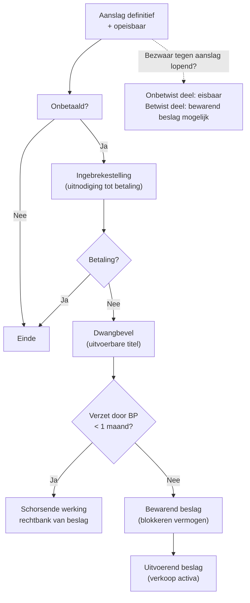

> ⚠️ **Voorlopig — themafiche-laag wordt uitgefaseerd.** Per **ADR-039** vervangt één PO-samenvatting per programmaonderdeel de cluster-themafiches. Deze fiche blijft beschikbaar tot het relevante PO een leerpad krijgt — dan migreert de inhoud naar `content/studiemateriaal/<po-slug>/samenvatting.md`. Voor cross-PO themafiches (vergelijkingen tussen verschillende PO's) volgt een aparte beslissing per fiche: incorporeren in alle relevante samenvattingen, óf upgraden naar concept-fiche.

> **Themafiche — kapstok voor herhaling.** Van opeisbaarheid naar dwangbevel · beslag · verzet als enige stuiting voor BP · hoofdelijkheid bestuurder voor BTW/BV. Voor verhaal en routekaart: [[studiemateriaal/2-5|overzicht PO 2.5]].

---

## Take-away

- **Verjaring 5 jaar** maar wordt **gestuit** door elke vervolgingshandeling — dwangbevel, beslag, kennisgeving. Stuiting = termijn herstart
- **Bezwaar schorst invordering NIET** — onbetwist deel blijft eisbaar; bewarend beslag mogelijk op betwist deel
- **Dwangbevel = uitvoerbare titel** (vermoeden van rechtmatigheid). BP kan **alleen via verzet** stuiten — niet via gewoon bezwaar
- **Hoofdelijkheid bestuurder voor BTW en bedrijfsvoorheffing** (art. 442bis): doorbreekt rechtspersoonschild bij fout
- **Bewarend beslag** (zonder definitief vonnis) vereist een door rechter aangewezen schuldvordering — fiscale schuld geldt als titel
- **Uitvoerend beslag** = na dwangbevel + onbetaald + termijn verstreken

---

## Invorderingscyclus — chronologie

---

## Drie types beslag

| Type | Wanneer? | Effect | Bron |
|---|---|---|---|
| **Bewarend beslag** | Vóór definitief vonnis — bij vrees verduistering | Blokkering vermogen; geen verkoop | Ger.W. art. 1413 + Wb.Inv. |
| **Uitvoerend beslag** | Na dwangbevel + onbetaald + termijn verstreken | Verkoop activa; opbrengst naar fiscus | Ger.W. art. 1494 + Wb.Inv. |
| **Beslag onder derden** | Bij bank / werkgever / klant van BP | Blokkering van wat derde aan BP verschuldigd is | Ger.W. art. 1539 + Wb.Inv. |

---

## Verzet — enige rechtsmiddel BP

| Element | Regel |
|---|---|
| **Termijn** | 1 maand vanaf betekening dwangbevel |
| **Bij wie?** | Beslagrechter (rechtbank eerste aanleg) |
| **Schorsende werking?** | Ja — invordering geschorst hangende verzet |
| **Inhoud** | Betwisting uitvoerbaarheid + bedrag + procedure |
| **Géén verzet?** | Dwangbevel definitief uitvoerbaar |

⚠️ Verzet is **enige weg** om dwangbevel aan te vechten. Geen "bezwaar" tegen dwangbevel (anders dan bezwaar tegen aanslag).

---

## Verjaring + stuiting

| Element | Regel |
|---|---|
| **Verjaringstermijn** | 5 jaar vanaf opeisbaarheid (art. 23 Wb.Inv.) |
| **Stuitingsoorzaken** | Dwangbevel · beslag · schriftelijke ingebrekestelling · erkenning schuld door BP |
| **Effect** | Termijn herstart vanaf stuitingsdaad |
| **Schorsingsoorzaken** | Bezwaarprocedure + gerechtelijke procedure (alleen betwist deel) |
| **Praktijk** | Door regelmatige stuiting wordt verjaring zelden bereikt |

---

## Hoofdelijkheid bestuurder

| Wet | Belasting | Trigger | Effect |
|---|---|---|---|
| **Art. 442quater WIB92** | Bedrijfsvoorheffing | Vennootschap betaalt BV niet — bestuurder kennelijk verantwoordelijk | Bestuurder hoofdelijk schuldenaar |
| **Art. 93undecies B Wb.BTW + 442bis** | BTW | Idem — niet-betaling te wijten aan bestuurder | Idem |
| **WVV bestuurdersaansprakelijkheid** | Algemeen | Kennelijk grove fout met causaal verband schuld | Burgerrechtelijke aansprakelijkheid |

⚠️ Faillissement vennootschap = **geen vrijbrief** bestuurder voor BV/BTW-schulden bij fout. Doorbreekt rechtspersoonschild.

---

## Bezwaar ↔ invordering — interactie

| Situatie | Effect op invordering |
|---|---|
| **Bezwaar tegen aanslag lopend** | Onbetwist deel = eisbaar; betwist deel = bewarend beslag mogelijk |
| **Beslissing directeur afwijzend** | Volledige aanslag opnieuw eisbaar (tenzij beroep ingediend) |
| **Beroep rechtbank lopend** | Schorsende werking gerechtelijke fase (rechter beslist over voorlopige tenuitvoerlegging) |
| **Verzet tegen dwangbevel** | Schorsende werking |
| **Vraag uitstel betaling** | Beslissing ontvanger; vaak rente verschuldigd |

**Praktische tip**: bij groot betwist deel → betaal onder voorbehoud (terugvordering bij gunstige uitspraak) om beslag te vermijden.

---

## Onderbreking + schuldherschikking

| Mechanisme | Wat? | Voorwaarden |
|---|---|---|
| **Afbetalingsplan** | Gespreide betaling met ontvanger | Goede trouw + reëel terugbetalingsperspectief |
| **Onbeperkt uitstel WIB92** | Tijdelijk geen invordering | Insolventie + tijdelijk; rentekosten lopen door |
| **Kwijtschelding gehele/gedeeltelijke** | Door minister bij uitzondering | Hoge drempel — zeldzaam |
| **Collectieve schuldenregeling** | Beslag-procedure rechtbank | Algemene insolventie BP particulier |
| **Reorganisatieprocedure (WCO/WER)** | Vennootschap in moeilijkheden | Fiscale schulden mee in plan |

---

## ⚠️ Valkuilen

| Valkuil | Wat klopt er niet | Wat klopt wél |
|---|---|---|
| Bezwaar = vrijbrief niet betalen | Tijdens bezwaar wachten met betalen | Onbetwist deel eisbaar; betwist deel = bewarend beslag mogelijk |
| Faillissement vennootschap = bestuurder veilig | Rechtspersoonschild beschermt | Art. 442bis (BV) + 93undecies (BTW) doorbreken bij fout — bestuurder hoofdelijk |
| Verjaring 5 jaar = automatisch | Schuld vervalt na 5 jaar | Stuiting door dwangbevel/beslag = termijn herstart. Regelmatige stuiting = nooit verjaring |
| Dwangbevel aanvechtbaar via gewoon bezwaar | Bezwaar tegen aanslag = ook tegen dwangbevel | Verzet bij beslagrechter (1 maand) = enige weg tegen dwangbevel |
| Bewarend beslag = verkoop | Bewarend = "voorlopig blokkeren" + verkoop | Bewarend = alleen blokkeren (geen verkoop). Uitvoerend = wel verkoop |
| Bestuurder ontslagen = geen aansprakelijkheid | Ontslag wist verleden uit | Aansprakelijkheid blijft voor periode waarin bestuurder mandaat had |

---

## Doorklik — losse concept-fiches

**Invordering**
- [[invorderingsprocedure]] — dwangbevel + beslag + verzet
- [[fiscale-sancties]] — naast hoofdsom: boetes + verhogingen

**Bestuurder-aansprakelijkheid**
- [[bestuurdersaansprakelijkheid]] — WVV-kader
- [[bedrijfsleidersbezoldiging]] — interactie met BV-hoofdelijkheid

**Cross-cutting**
- [[fiscale-procedure]] — overkoepelend
- [[bezwaarprocedure]] — interactie met invordering

**Verwante themafiches**
- [[themafiches/fiscale-termijnen|Themafiche — Fiscale termijnen]]
- [[themafiches/bezwaar-en-gerechtelijke-fase|Themafiche — Bezwaar & gerechtelijke fase]]
- [[themafiches/taxatieprocedure|Themafiche — Taxatieprocedure]]

---

*Themafiche afgeleid uit cluster fiscale-procedure (PO 2.5). Status: voorgesteld.*
