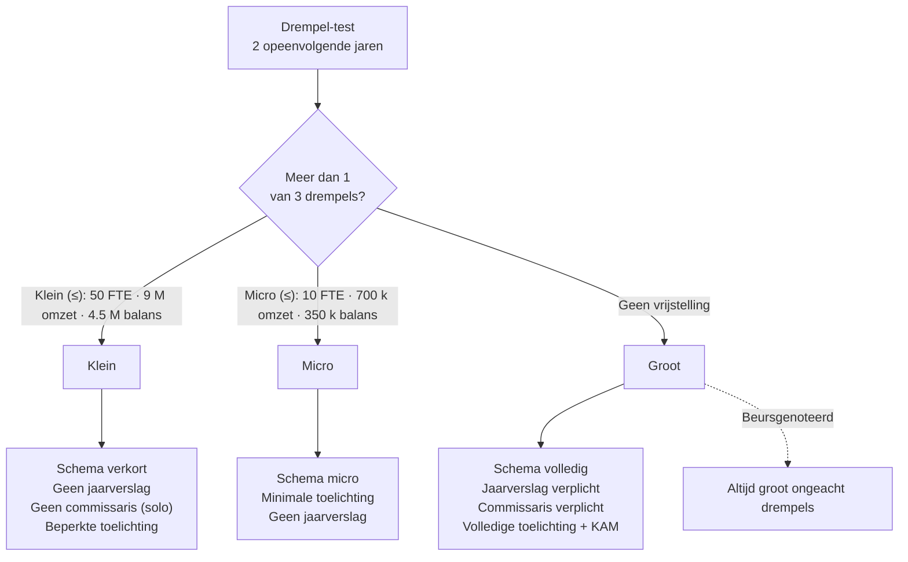

> ⚠️ **Voorlopig — themafiche-laag wordt uitgefaseerd.** Per **ADR-039** vervangt één PO-samenvatting per programmaonderdeel de cluster-themafiches. Deze fiche blijft beschikbaar tot het relevante PO een leerpad krijgt — dan migreert de inhoud naar `content/studiemateriaal/<po-slug>/samenvatting.md`. Voor cross-PO themafiches (vergelijkingen tussen verschillende PO's) volgt een aparte beslissing per fiche: incorporeren in alle relevante samenvattingen, óf upgraden naar concept-fiche.

> **Themafiche — kapstok voor herhaling.** Drie schema's, één cascade van groottecategorie naar publicatieplicht. Voor verhaal en routekaart: [[studiemateriaal/1-1|overzicht PO 1.1]] of [[studiemateriaal/1-2|overzicht PO 1.2]].

---

## Take-away

- **Groottecategorie is de motor** — bepaalt schema, controleplicht, publicatievorm en zelfs jaarverslag-verplichting in één cascade
- **Test = "meer dan één van drie drempels"** — twee jaar in rij; twee overschrijden volstaat al
- **Beursgenoteerde vennootschappen zijn altijd "groot"** — drempels gelden niet voor hen
- **30 dagen na AV, max 7 maanden na afsluiting** — neerleggen bij NBB; te laat = tariefbijdrage + 2:74-ontbindingsrisico
- **Sociale balans = verplichte bijlage** voor elke vennootschap met personeel — verkort of volledig schema afhankelijk van grootte

---

## Drie schema's — wat wanneer?

| Aspect | **Volledig** | **Verkort** | **Micro** |
|---|---|---|---|
| Wie? | Grote vennootschappen | Kleine vennootschappen | Microvennootschappen |
| Balans | Volledige rubrieken | Samengevoegde posten | Sterk vereenvoudigd |
| Resultatenrekening | Volledig (RR1 en RR2) | Verkort | Sterk verkort |
| Toelichting | Volledig | Beperkt | Minimaal |
| Sociale balans | Volledig schema | Verkort schema | Verkort schema |
| Jaarverslag | Verplicht | Vrijgesteld (art. 3:4 WVV) | Vrijgesteld |
| Commissaris-controle | Verplicht (art. 3:72 WVV) | Vrijgesteld behalve groep | Vrijgesteld |

---

## Groottecategorie-cascade (art. 1:24-1:27 WVV)

**Concrete drempels: Cijferzakboekje bij examen** raadplegen — drempels worden periodiek geïndexeerd.

---

## Publicatie-tijdslijn

| Stap | Termijn | Wie | Verantwoordelijkheid |
|---|---|---|---|
| Opstellen jaarrekening | Binnen 6 maanden na afsluit | Bestuursorgaan | Bestuurders aansprakelijk |
| Goedkeuring AV | Binnen 6 maanden na afsluit | Algemene vergadering | Statutair bepaald |
| Neerlegging NBB | 30 dagen na AV — uiterlijk 7 maanden na afsluit | Bestuursorgaan | Tariefbijdrage bij laattijdig |
| Publicatie | Automatisch via NBB-portaal | Nationale Bank | Openbaarheid art. 3:10 WVV |

### Sancties laattijdig

- **Tariefbijdrage** progressief (tot 1 200 EUR/maand voor grote vennootschappen)
- **Vermoeden schade voor derden** (art. 3:43 WVV) — omkering bewijslast
- **2:74-ontbinding** mogelijk na 7 maanden niet-neerlegging op vordering OM of belanghebbende
- **Bestuursaansprakelijkheid** voor schade

---

## ⚠️ Valkuilen

| Valkuil | Wat klopt er niet | Wat klopt wél |
|---|---|---|
| "Drempels: alle drie overschrijden" | Test is "meer dan één" — twee volstaat al om uit klein te vallen | Twee opeenvolgende jaren + meer dan één drempel = niet-klein |
| Sociale balans als optioneel | KB sociale balans: verplichte bijlage zodra personeel aanwezig | Verkort schema voor klein, volledig voor groot — nooit afwezig |
| Beursgenoteerd kan "klein" zijn | Beursgenoteerde vennootschap is altijd groot (art. 1:11 WVV) | Drempels gelden niet — volledig schema + commissaris + jaarverslag verplicht |
| Neerlegging = publicatie | NBB-neerlegging triggert publicatie; staan los van interne goedkeuring AV | Eerst AV goedkeuren, dan 30 dagen om bij NBB neer te leggen |
| Jaarverslag = jaarrekening | Jaarverslag is narratief bestuursverslag (art. 3:6 WVV), apart van cijfers | Klein/micro vrijgesteld; groot verplicht inclusief niet-financiële info + KAM |
| Waarderingsregels niet vastleggen | Art. 3:30 KB-WVV: waarderingsregels moeten **vastgelegd** in toelichting | Eenmaal bepaald = bestendigheid; wijziging vereist motivering |

---

## Doorklik — losse concept-fiches

**Schema & opmaak**
- [[jaarrekening]] — Σ-hoofdrecord (drieluik + sub-secties)
- [[vennootschap-groottecategorieen]] — drempels + cascade
- [[groottecategorie-vereniging]] — VZW/stichting (art. 1:28-29 WVV-VZW)

**Bijlagen**
- [[memorierekeningen]] — niet-balans-rechten en -verplichtingen (klasse 0)

**Verwante themafiches**
- [[themafiches/boekhoudplicht-en-rechtsbronnen|Themafiche — Boekhoudplicht & rechtsbronnen]]
- [[themafiches/eindejaarsverrichtingen-en-waardering|Themafiche — Eindejaarsverrichtingen & waardering]]
- [[themafiches/resultaten-en-resultaatverwerking|Themafiche — Resultaten & resultaatverwerking]]

---

*Themafiche afgeleid uit cluster boekhouding (PO 1.1 + 1.2). Status: voorgesteld.*
