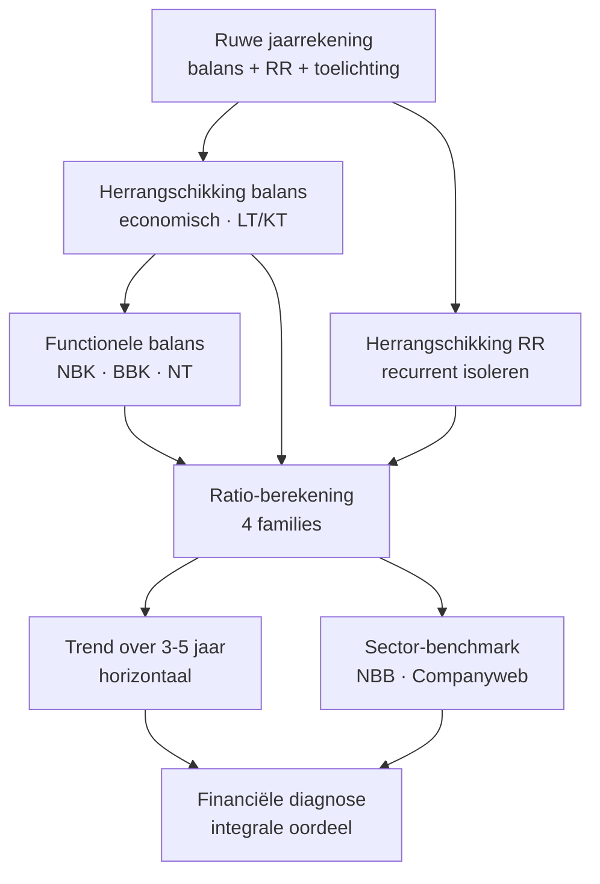

> **Themafiche — kapstok voor herhaling.** De vier analyse-technieken + functionele balans op één pagina. Voor verhaal en routekaart: [[leerpaden/1.3|minicursus PO 1.3]] of [[leerpaden/1.9|minicursus PO 1.9]].

---

## Take-away

- **Eén jaar is geen analyse** — trend over 3-5 jaar is minimum; vergelijking met sector-benchmark is cruciaal
- **Herrangschikking is geen optie** — balans naar economische bestemming + resultatenrekening tot bedrijfsresultaat
- **Functionele balans-drieluik**: NBK · BBK · NT — beschrijft het *werkkapitaal-evenwicht* in één oogopslag
- **Gulden regel**: NBK ≥ BBK ⇒ NT ≥ 0; structureel negatieve NT signaleert kortlopende krediet-afhankelijkheid
- [[toegevoegde-waarde|TW]] = output − input (extern); maatstaf van bijdrage onderneming aan economie + verdeling onder stakeholders

---

## Vier analyse-technieken

| Techniek | Wat? | Hoe? | Sterkte | Beperking |
|---|---|---|---|---|
| **Horizontale analyse** | Trend over tijd | Basisjaar = 100; absolute & relatieve groei | Detecteert groei/krimp-patronen | Inflatie-vertekening; basisjaar-keuze |
| **Verticale analyse** | Interne structuur | % van balanstotaal of omzet (common-size) | Vergelijkbaar tussen ondernemingen | Verbergt absolute schaal |
| **Herrangschikking balans** | Economische lens | Operationeel vs niet-operationeel; LT vs KT | Activeert functionele balans + ratio's | Vereist kennis van klasse-codes |
| **Herrangschikking resultatenrekening** | Recurrent vs niet-recurrent | Bedrijfsresultaat isoleren; uitzonderlijke posten | Toont onderliggende winstkracht | Subjectief in beoordeling "uitzonderlijk" |

---

## Functionele balans — drieluik

**Definities** (formules):

$$
\text{NBK (werkkapitaal)} = \text{Permanent vermogen} - \text{Vaste activa} = \text{Vlottende activa} - \text{Schulden} \le 1 \text{ jaar}
$$

$$
\text{BBK (behoefte bedrijfskapitaal)} = \text{Exploitatie-vlottende activa} - \text{Exploitatie-schulden} \le 1 \text{ jaar}
$$

$$
\text{NT (nettothesaurie)} = \text{NBK} - \text{BBK}
$$

**Tekenleeskaart — 4 typische combinaties**:

| NBK | BBK | NT | Interpretatie |
|---|---|---|---|
| + | + (klein) | + | Gezonde liquiditeits-marge |
| + (klein) | + (groot) | − | Cyclische krediet-afhankelijkheid |
| − | + | − − | Acute liquiditeitskrapte (rode vlag) |
| + (groot) | − | + + | Over-financiering (lage rentabiliteit-risico) |

---

## Analyse-flow

---

## ⚠️ Valkuilen

| Valkuil | Wat klopt er niet | Wat klopt wél |
|---|---|---|
| Eén jaar als analyse | Snapshot misleidt; jaareffecten en accidentele posten domineren | Minstens 3 jaar trend + sector-benchmark |
| NBK > 0 = gezond | Te hoge NBK = over-financiering, lage rentabiliteit | Verhouding NBK/BBK telt, niet absoluut niveau |
| Statisch lezen | Balansdatum vs operationele cyclus; seizoens-effect | Vergelijking meerdere jaren + sector + maand-data indien beschikbaar |
| TW met omzet/marge verwarren | TW = bijdrage onderneming aan economie; sector-vergelijkbaar | Omzet = volume; brutomarge = na grondstoffen; TW = na alle externe inputs |
| Liquiditeit alleen uit current ratio | Verbergt voorraad-overschatting + betalingsgewoonten | Combineren met BBK + DSO/DPO/DIO + cash-budget |

---

## Doorklik — losse concept-fiches

**Overkoepelend**
- [[jaarrekeninganalyse]] — hoofdrecord (4 technieken + doelstellingen)
- [[functionele-balans]] — NBK/BBK/NT-drieluik
- [[toegevoegde-waarde]] — output − input

**Verwante themafiches**
- [[themafiches/ratio-families|Themafiche — Ratio-families]]
- [[themafiches/kasstroom-analyse|Themafiche — Kasstroom-analyse]]
- [[themafiches/continuiteit-en-diagnose|Themafiche — Continuïteit & financiële diagnose]]

---

*Themafiche afgeleid uit cluster financiele-analyse (PO 1.3 + 1.9). Status: voorgesteld.*
