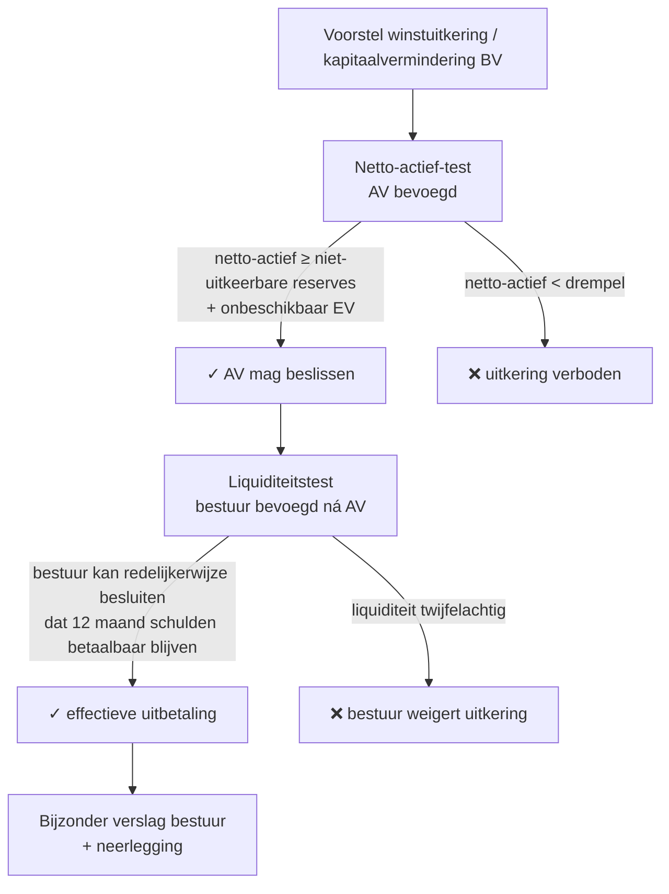
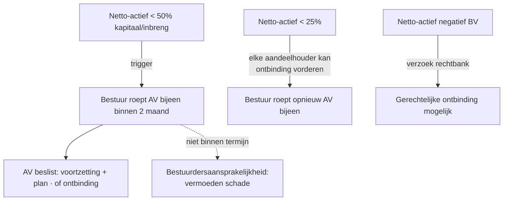

> **Themafiche — kapstok voor herhaling.** Vermogensbescherming sinds WVV 2019: dubbele uitkeringstest BV, alarmbel-procedure, bestuurdersaansprakelijkheid. Voor verhaal en routekaart: [[leerpaden/3.0|minicursus PO 3.0]].

---

## Take-away

- **BV: dubbele test verplicht** — netto-actief-test (balansprong) **én** liquiditeitstest (toekomstprong) bij elke uitkering
- **NV: enkele test** (netto-actief) — geen liquiditeitstest bij wet (wel ondernemingsplicht)
- **Alarmbel ≠ algemene continuïteitstoets** — kwantitatieve trigger via netto-actief + plicht tot AV-bijeenroeping; bestuurdersbescherming verdwijnt bij negeren
- **Kwijting van AV ≠ vrijwaring tegen alle vorderingen** — geldt enkel voor de vennootschap, niet voor derden of latere ontdekkingen
- **Cap art. 2:57 WVV is per feit en per vennootschap**, niet "alles samen geplafonneerd over een carrière"

---

## Dubbele uitkeringstest BV (art. 5:142-143 WVV)

| Test | Wie? | Wanneer? | Output |
|---|---|---|---|
| **Netto-actief-test** | AV | Bij beslissing uitkering | Maximaal uitkeerbaar bedrag |
| **Liquiditeitstest** | Bestuur | Vóór effectieve betaling | Beslissing tot al-dan-niet uitbetalen |

**Niet-uitkeerbare reserves**: wettelijke reserve · statutaire reserves · onbeschikbare reserves · oprichtings- en O&O-kosten nog niet afgeschreven.

---

## Alarmbel-procedure (art. 5:153 BV · 7:228 NV)

| Drempel | BV (art. 5:153) | NV (art. 7:228) | Gevolg bij negeren |
|---|---|---|---|
| < 50% | Bestuur roept AV bijeen binnen 2 maand | Idem | Aansprakelijkheid bestuurders — vermoeden van schade |
| < 25% | Elke aandeelhouder kan ontbinding vorderen | Idem | Schadeplicht ten aanzien van derden |
| Netto-actief negatief (BV) | Iedere belanghebbende kan rechtbank vragen | n.v.t. (NV: vergelijkbaar via gerechtelijke ontbinding WER) | Faillissement-risico |

**Alarmbel = kwantitatieve trigger op basis van netto-actief in balans.** Géén algemene continuïteitstoets — die zit in audit + boek XX. Continuïteit-twijfels zonder alarmbel-trigger leiden niet automatisch tot alarmbel; alarmbel-trigger leidt altijd tot AV-plicht.

---

## Bestuurdersaansprakelijkheid — drie sporen + cap

| Spoor | Grond | Tegenwie? | Verweer |
|---|---|---|---|
| **Intern (jegens vennootschap)** | Art. 2:56 WVV — fout in mandaat | Vennootschap (via actio mandati) | Kwijting AV · "marginale toetsing" beleidskeuzes |
| **Extern (jegens derden)** | Inbreuk WVV/statuten · onrechtmatige daad art. 1382 BW | Schuldeisers · derden | Vereist fout + schade + causaal verband |
| **Faillissement** | Kennelijk grove fout · wrongful trading (art. XX.225 WER) | Curator | Geen bescherming via kwijting |

**Cap art. 2:57 WVV**: geplafonneerd per feit en per vennootschap (afhankelijk van omzet/balanstotaal — schalen in Cijferzakboekje).

**Werkt niet bij**:
- Opzet · grove fout · gewoonlijke lichte fout
- Fiscale + sociale schulden (art. 442quater WIB92 · art. 21ter Sociale Zekerheid)
- Witwas-overtredingen

**Oprichtersaansprakelijkheid** (art. 5:16 · 7:18 WVV): bij faillissement < 3 jaar na oprichting → financieel plan getoetst op manifeste ontoereikendheid van aanvangsvermogen.

---

## ⚠️ Valkuilen

| Valkuil | Wat klopt er niet | Wat klopt wél |
|---|---|---|
| Liquiditeitstest = formaliteit bij positief netto-actief | Onafhankelijke toekomstprong; bestuur moet **12 maand vooruit** kijken naar betaalbaarheid | Bijzonder bestuursverslag met onderbouwing kasstroomprognose verplicht |
| Alarmbel = elke continuïteitstwijfel | Alarmbel = kwantitatieve trigger op netto-actief; continuïteit-twijfels in audit-context aparte logica | Twee triggers altijd nakijken: 50% en 25% — automatisch AV-plicht |
| Oprichtings- en O&O-kosten niet aftrekken bij netto-actief | Netto-actief = activa − schulden − voorzieningen − **niet-afgeschreven oprichtingskosten en O&O** | Trek nog-niet-afgeschreven oprichtingskosten en geactiveerde O&O af; anders te hoog netto-actief |
| Kwijting AV = volledige absolutie | Kwijting werkt enkel **intern** + voor wat de AV kón kennen | Latere ontdekking + derden + faillissement: kwijting biedt geen bescherming |
| Cap = alle vorderingen samen geplafonneerd | Cap geldt **per feit en per vennootschap** | Meerdere vennootschappen × meerdere feiten = stapelt op |
| Tegenstemmen = vrijgesteld | Tegenstemmen + notulering = noodzakelijk, niet altijd voldoende | Vereist ook geen voorafgaande betrokkenheid + actief verzet (notulen bewijzen) |

---

## Doorklik — losse concept-fiches

**Vermogensbescherming**
- [[kapitaalbescherming]] — dubbele test BV + niet-uitkeerbare reserves
- [[winstuitkering]] — procedure + boekhoudkundige verwerking
- [[winstbestemming]] — AV-besluit + reserve-vorming

**Bestuur + aansprakelijkheid**
- [[bestuur-vennootschap]] — organisatie + bevoegdheidsgrenzen
- [[bestuurdersaansprakelijkheid]] — 3 sporen + cap + kwijting
- [[oprichtersaansprakelijkheid]] — financieel-plan-toets bij faillissement < 3j
- [[belangenconflict-bestuur]] — procedure + onthouding + bijzondere verslaggeving

**Verwante themafiches**
- [[themafiches/vennootschapsvormen|Themafiche — Vennootschapsvormen]]
- [[themafiches/insolventie-wer-boek-xx|Themafiche — Insolventie WER Boek XX]]
- [[themafiches/reorganisatie-en-bijzondere-mandaten|Themafiche — Reorganisatie & bijzondere mandaten]]

---

*Themafiche afgeleid uit cluster bestuur-en-aansprakelijkheid + kapitaalstructuur (PO 3.0). Status: voorgesteld.*
