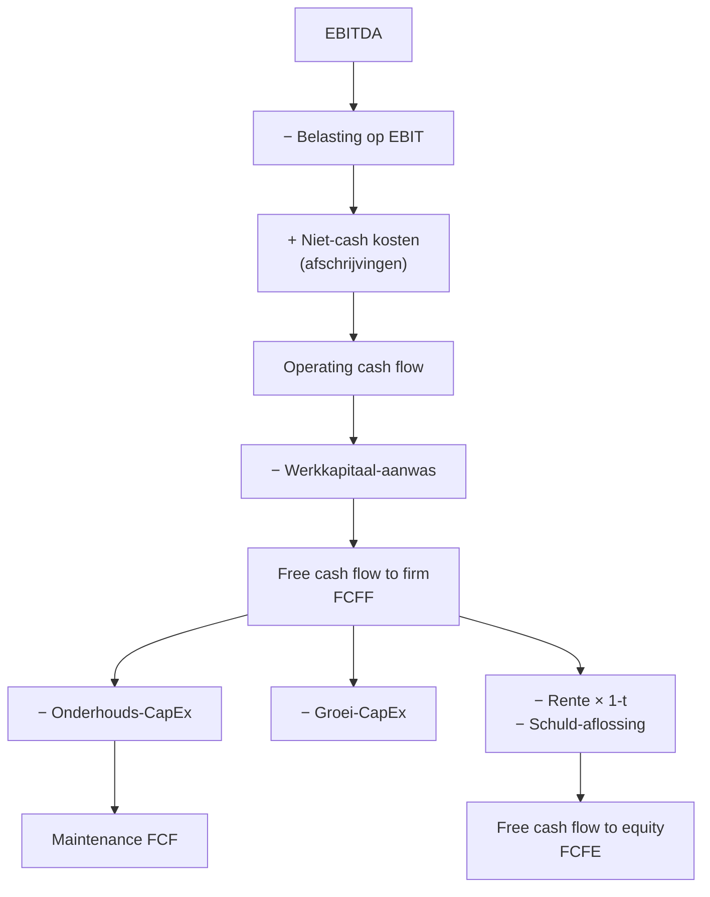

> ⚠️ **Voorlopig — themafiche-laag wordt uitgefaseerd.** Per **ADR-039** vervangt één PO-samenvatting per programmaonderdeel de cluster-themafiches. Deze fiche blijft beschikbaar tot het relevante PO een leerpad krijgt — dan migreert de inhoud naar `content/leerpaden/<po-slug>/samenvatting.md`. Voor cross-PO themafiches (vergelijkingen tussen verschillende PO's) volgt een aparte beslissing per fiche: incorporeren in alle relevante samenvattingen, óf upgraden naar concept-fiche.

> **Themafiche — kapstok voor herhaling.** IAS 7 drie categorieën + FCF-varianten op één pagina. Voor verhaal en routekaart: [[leerpaden/1.3|minicursus PO 1.3]] of [[leerpaden/1.9|minicursus PO 1.9]].

---

## Take-away

- **Winst ≠ cash** — winst kan bestaan zonder cash (klanten betalen niet) en cash zonder winst (voorraadafbouw, leningen)
- **IAS 7 verplicht** voor geconsolideerde jaarrekening; **optioneel onder BE-GAAP** maar wordt examen-stof
- Drie categorieën: **bedrijfsvoering · investering · financiering** — som = mutatie liquide middelen
- **FCF onderscheiden**: onderhouds-CapEx (continuïteit) vs groei-CapEx (uitbreiding) — vermenging vertekent
- **Indirecte methode** is standaard in praktijk (vertrekt van nettoresultaat); directe toont bruto-stromen (zelden gebruikt)

---

## Drie kasstroom-categorieën (IAS 7)

| Categorie | Wat? | Typische posten | Wat onthult? |
|---|---|---|---|
| **Bedrijfsvoering** (Operating) | Cash uit kerntactiviteit | Ontvangsten klanten · betalingen leveranciers · betaalde belasting · rente betaald/ontvangen | Cash-generatie van het businessmodel |
| **Investering** (Investing) | Cash voor lange-termijn activa | CapEx (materiële, immateriële vaste activa) · acquisities · verkoop activa | Investerings-strategie en herinvestering |
| **Financiering** (Financing) | Cash uit/voor financiers | Kapitaalverhoging · dividend · leningen opnemen/aflossen | Financieringsmix; afhankelijkheid externen |

**Som over de drie** = **netto-mutatie liquide middelen** (cash + cash-equivalenten op balans)

---

## Directe vs indirecte methode

| Aspect | **Directe methode** | **Indirecte methode** |
|---|---|---|
| Vertrekpunt | Bruto-ontvangsten en -uitgaven | Nettoresultaat |
| Aanpassingen | Geen | + Niet-cash kosten (afschrijvingen, voorzieningen) · − Aanwas werkkapitaal |
| Voordeel | Transparant: "hoeveel hebben we ontvangen?" | Reconciliatie nettoresultaat → cash |
| Praktijk-gebruik | Zelden (data-zwaar) | Standaard (90% beurs-ondernemingen) |
| IAS 7 voorkeur | Aanbevolen | Toegelaten |

---

## FCF-varianten

**Twee perspectieven**:
- **FCFF** (to firm) = cash voor *alle* kapitaalverschaffers (vóór schuld-bediening) — voor DCF-bedrijfswaardering
- **FCFE** (to equity) = cash voor aandeelhouders (na schuld-bediening) — voor DCF-EV-waardering

---

## Formules

**Operating cash flow** (indirecte methode, vereenvoudigd):
$$
\text{OCF} = \text{Nettoresultaat} + \text{Afschrijvingen} + \text{Voorzieningen} - \Delta \text{Werkkapitaal}
$$

**Free cash flow to firm**:
$$
\text{FCFF} = \text{EBIT} \times (1 - t) + \text{Afschrijvingen} - \text{CapEx} - \Delta \text{Werkkapitaal}
$$

**Free cash flow to equity**:
$$
\text{FCFE} = \text{FCFF} - \text{Rente} \times (1-t) - \text{Aflossingen} + \text{Nieuwe leningen}
$$

---

## ⚠️ Valkuilen

| Valkuil | Wat klopt er niet | Wat klopt wél |
|---|---|---|
| Winst gelijkstellen aan cash | Vlottende activa-aanwas verbergt cash; winst kan papier zijn | OCF = winst + niet-cash − werkkapitaal-aanwas |
| Onderhoud vs groei CapEx niet onderscheiden | Hoge totale CapEx kan groei zijn (positief) of vervangen (neutraal) | Toelichting + segmentale analyse onthult onderhoud-niveau |
| FCF zonder periodicering interpreteren | Eén jaar kan vertekend zijn door grote acquisitie of desinvestering | Gemiddelde 3-5 jaar; gladstrijken acquisitie-uitschieters |
| Rente in operating ipv financing | IFRS staat keuze toe (operating of financing); BE-GAAP volgt operating | Consistentie verplicht; toelichting bij keuze |
| Cashstroom bij seizoensgebonden bedrijf | Balansdatum-snapshot mist intra-jaar-fluctuaties | Maandelijkse cash-budget naast jaarlijkse cashstroom |

---

## Doorklik — losse concept-fiches

**De twee records**
- [[kasstroom-analyse]] — IAS 7 + indirecte/directe methode + drie categorieën
- [[free-cash-flow]] — FCFF · FCFE · DCF-context

**Cross-relevant**
- [[masterbudget]] — cash-budget op kortere horizon
- [[functionele-balans]] — NT als balansdatum-snapshot vs cashstroom als jaar-flow

**Verwante themafiches**
- [[themafiches/jaarrekeninganalyse-aanpak|Themafiche — Aanpak & herrangschikking]]
- [[themafiches/ratio-families|Themafiche — Ratio-families]]
- [[themafiches/continuiteit-en-diagnose|Themafiche — Continuïteit & diagnose]]

---

*Themafiche afgeleid uit cluster financiele-analyse (PO 1.3 + 1.9). Status: voorgesteld.*
