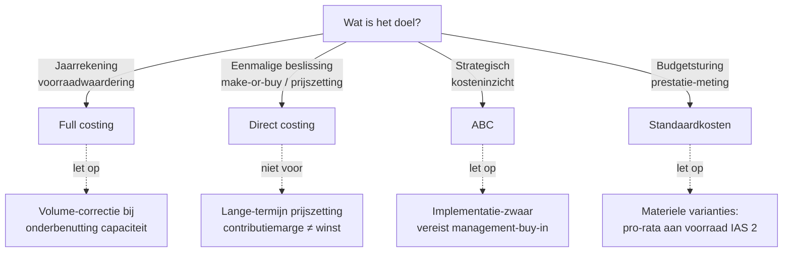

> **Themafiche — kapstok voor herhaling.** Vier kostprijsmethodes op één pagina: vergelijkingsmatrix, beslisboom, formules, valkuilen. Voor verhaal en routekaart: [[leerpaden/1.8|minicursus PO 1.8]]. Voor diepgang: de losse concept-fiches via §Doorklik.

---

## Take-away

- **Géén methode is intrinsiek "juist"** — keuze volgt het *doel* van de calculatie
- **Full costing** = jaarrekening + voorraadwaardering (IAS 2 verplicht)
- **Direct costing** = beslissingen (prijszetting, make-or-buy, productmix)
- **ABC** = kosteninzicht bij hoge overhead (realistische toerekening)
- **Standaardkosten** = budget + variantieanalyse (sturing op normen)

---

## Vergelijkingsmatrix

| Dimensie | **Full costing** | **Direct costing** | **ABC** | **Standaardkosten** |
|---|---|---|---|---|
| Welke kosten in product? | Alle productiekosten | Enkel variabele | Alle, via cost-drivers | Norm-kosten (alle) |
| Vaste overhead-toerekening | 1 sleutel (volgens capaciteit) | Niet aan product — periodekost | Multiple activity-pools | Norm × werkelijk volume |
| Jaarrekening-conform? | ✅ Verplicht (IAS 2 + KB-WVV) | ❌ Niet voor externe rapportering | ✅ Mits onderbouwd | ✅ Mits varianties verwerkt |
| Primair doel | Voorraadwaardering · externe rapportering | Beslissings-analyse (CVP, marge) | Kosteninzicht · strategische prijszetting | Budgetsturing · prestatie-meting |
| Sterkte | Wettelijk gedragen · audit-friendly | Snel · transparant beslissingsinstrument | Realistisch bij complexe overhead-structuur | Norm geeft proactieve sturing |
| Klassieke valkuil | Volume-effect bij onderbenutting | Niet voor lange-termijn prijszetting | Implementatie-kost (time-studies) | Variantie-dispositie (IAS 2) |

---

## Beslisboom — welke methode wanneer?

---

## Formules

**Full costing** — kostprijs per eenheid
$$
\text{Kostprijs} = \frac{\text{Variabele kosten}}{\text{Werkelijke prod.}} + \frac{\text{Vaste kosten}}{\text{Normale capaciteit}}
$$

**Direct costing** — contributiemarge
$$
\text{Contributiemarge} = \text{Verkoopprijs} - \text{Variabele kost per eenheid}
$$

**ABC** — kost per product
$$
\text{Kost} = \sum_i \left( \text{Activity-pool}_i \times \text{Cost-driver}_i \times \text{Verbruik}_{\text{product}} \right)
$$

**Standaardkosten** — variantie-decompositie
$$
\text{Totale variantie} = \underbrace{(\text{Norm-prijs} - \text{Werkelijke prijs}) \times Q_{\text{werk}}}_{\text{Prijsvariantie}} + \underbrace{(Q_{\text{norm}} - Q_{\text{werk}}) \times P_{\text{norm}}}_{\text{Hoeveelheidsvariantie}}
$$

---

## ⚠️ Valkuilen

| Valkuil | Wat klopt er niet | Wat klopt wél |
|---|---|---|
| "Eén methode is dé juiste" | Methodes zijn niet vergelijkbaar in absolute zin | Doel-afhankelijke keuze: jaarrekening ≠ beslissing ≠ strategie |
| Vaste overhead delen door **werkelijke** productie (full costing) | Bij onderbenutting concentreert vast OH zich onterecht in voorraad | Volume-correctie: vast OH pro-rata-normaal → onderbenuttingsvariantie = periodekost |
| Direct costing-prijs als LT-prijs hanteren | Contributiemarge dekt alleen variabele kost; vaste kosten worden niet gedekt | Direct costing alleen voor LT-grens-beslissing; LT-prijs vereist volledige kosten-recovery |
| Variantie altijd direct in resultaat (standaardkosten) | Materiele varianties verstoren resultaat én jaarrekening-cijfers | IAS 2: materiele varianties pro-rata aan voorraad én KGV; niet-materieel mag in resultaat |

---

## Doorklik — losse concept-fiches

**Overkoepelend**
- [[analytische-boekhouding]] — cluster-hoofdrecord
- [[kostprijsmethoden]] — keuze-kader

**De vier methodes**
- [[full-costing]] — alle productiekosten, IAS 2-conform
- [[direct-costing]] — alleen variabele, voor beslissingen
- [[activity-based-costing]] — cost-drivers, realistische overhead
- [[standaardkostenmethode]] — norm-kosten + variantieanalyse

**Verwante themafiches**
- `Themafiche — Break-even & marginale analyse` *(nog te maken)*
- `Themafiche — Budget & variantieanalyse` *(nog te maken)*

---

*Themafiche afgeleid uit cluster analytische-boekhouding (PO 1.8). Status: voorgesteld.*
