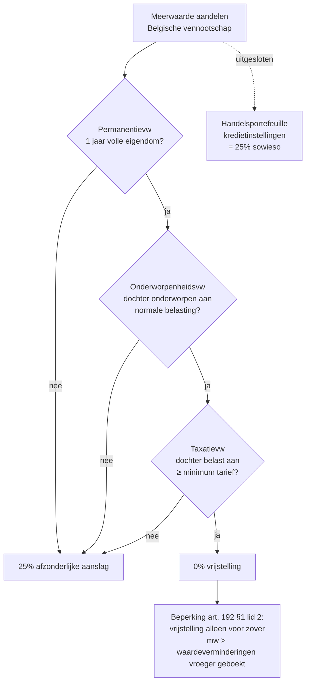
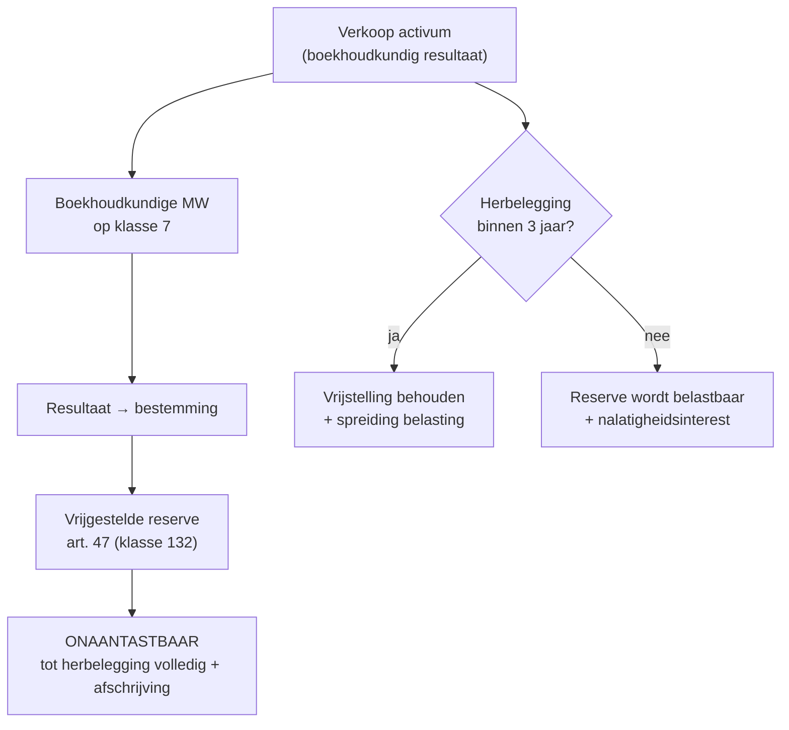

> **Themafiche — kapstok voor herhaling.** Twee fundamenteel verschillende regimes: aandelen-meerwaarde (potentieel vrijstelling) vs materiële vaste activa (gespreide taxatie via herbelegging). Voor verhaal en routekaart: [[leerpaden/2.3|minicursus PO 2.3]].

---

## Take-away

- **Twee regimes — andere logica** — aandelen-mw werkt via vrijstelling (0% of 25% met 3 voorwaarden); MVA-mw via gespreide belasting bij herbelegging (uitstel + spreiding over afschrijfduur)
- **VenB ≠ PB** voor aandelen-mw — VenB: 0%/25% volgens 3-voorwaarden-test (art. 192); PB: vrijstelling bij normaal beheer privé (art. 90 1°), 33% bij speculatief
- **Drie voorwaarden voor 0%-vrijstelling aandelen** (cumulatief): permanentievoorwaarde (1 jaar volle eigendom) + onderworpenheid (dochter onderworpen aan normale belasting) + taxatievoorwaarde (minimum belasting in dochter)
- **Art. 47 vereist HERBELEGGING** binnen 3 jaar in nieuwe afschrijfbare activa — geen herbelegging = gespreide vrijstelling vervalt + alsnog belasting + interesten
- **Onaantastbaarheidsvoorwaarde** voor vrijgestelde reserves bij MW — zelfde principe als bij neutrale fusie

---

## Twee regimes — vergelijkingsmatrix

| Aspect | Meerwaarde aandelen (art. 192) | Meerwaarde MVA (art. 47) |
|---|---|---|
| **Triggering** | Verkoop / inbreng / liquidatie aandelen | Verkoop / vergoeding bij schade activa |
| **Standaard tarief** | 0% (3 vw vervuld) of 25% (anders) | 25% (volledig) of gespreid via herbelegging |
| **Vrijstellingsmechanisme** | Wettelijke vrijstelling | Gespreide belasting via herbeleggingsvereiste |
| **Onaantastbaarheid** | Geen reserve nodig bij 0% | Vrijgestelde reserve aanleggen + onaantastbaar |
| **Voorwaarden** | Permanentie + onderworpenheid + taxatie | Herbelegging binnen 3 jaar in afschrijfbare activa |
| **Uitsluitingen** | Handelsportefeuille kredietinstellingen | Voorraden + financiële vaste activa |

---

## Meerwaarde aandelen — 3-voorwaarden-test (art. 192 §1)

**Belangrijk**: zelfs als 3-voorwaarden vervuld, geldt vrijstelling slechts **voor zover de meerwaarde hoger is dan het totaal van vroegere waardeverminderingen geboekt op die aandelen** (art. 192 §1 lid 2) — vroegere waardeverminderingen zijn reeds afgetrokken; recapture nodig vóór vrijstelling speelt.

---

## Meerwaarde MVA — gespreide taxatie (art. 47 WIB)

| Stap | Inhoud |
|---|---|
| 1. Voorwaarde geboekt | MW boekhoudkundig erkend (klasse 7 of klasse 12 - reserves) |
| 2. Herbeleggingsverplichting | Volledige verkoopprijs (niet alleen MW!) binnen **3 jaar** herbeleggen |
| 3. Wat is herbelegbaar? | Nieuwe afschrijfbare materiële of immateriële vaste activa in BE of EER |
| 4. Spreiding | MW wordt belast in zelfde ritme als afschrijving herbeleggingsactivum |
| 5. Onaantastbaarheid | Vrijgestelde reserve = onaantastbaar tot uitkering of niet-herbelegging |
| 6. Niet-herbelegging | Volledige MW belast + nalatigheidsinterest vanaf jaar mw |

---

## Concreet voorbeeld — gespreide taxatie

Vennootschap verkoopt machine 100 k EUR (boekwaarde 20 k → MW 80 k). Herbelegt 100 k in nieuwe machine (afschrijving 10 jaar).

| Jaar | Belastbare MW-fractie | Reden |
|---|---|---|
| Jaar 1 | 80 k / 10 = 8 k | Afschrijving 10% × MW = jaarlijkse belastbare fractie |
| Jaar 2 | 8 k | Idem |
| ... | ... | Tot jaar 10 |
| **Totaal over 10 jaar** | 80 k | Volledige MW belast, gespreid |

Geen herbelegging binnen 3 jaar → **80 k MW belast in jaar verkoop** + nalatigheidsinterest.

---

## Vergelijkingsmatrix tarieven meerwaarden

| Type meerwaarde | Tarief | Voorwaarden |
|---|---|---|
| Aandelen (VenB, 3 vw vervuld) | 0% | Permanentie + onderworpenheid + taxatie |
| Aandelen (VenB, 3 vw NIET) | 25% (afzonderlijk) | Geen 3 vw |
| Aandelen handelsportefeuille kredietinstellingen | 25% | Sowieso uitgesloten |
| MVA — herbelegging | Gespreid 25% | Art. 47 + 3 jaar |
| MVA — geen herbelegging | 25% volledig + interesten | – |
| Liquidatie-meerwaarde aandelen | Cf. art. 192 + bijzondere aanslagen | Liquidatie-context |
| Bedongen meerwaarde (art. 47bis) | Gespreid bij verzekerings-vergoeding | Schadegeval |
| Stopzettings-meerwaarde (PB) | Art. 171 (10/16,5/33/progressief) | Personenbelasting-context |

⚠️ Concrete tarieven en voorwaarden: **Cijferzakboekje + WIB-artikelen**.

---

## Vrijgestelde reserve — boekingsschema

---

## ⚠️ Valkuilen

| Valkuil | Wat klopt er niet | Wat klopt wél |
|---|---|---|
| Confusie VenB-regime ↔ PB-regime meerwaarde aandelen | Andere tests + tarieven | VenB: art. 192 (0/25%) · PB: art. 90 (normaal beheer vrijgesteld; speculatief 33%) |
| Vrijstelling op handelsportefeuille toepassen | Uitgesloten van vrijstelling | Kredietinstellingen handelsportefeuille = altijd 25% |
| Vrijstelling toepassen bij vroegere waardeverminderingen | Beperking art. 192 §1 lid 2 | Vrijstelling alleen voor mw > totaal vroegere wv |
| Art. 47 herbeleggingsverplichting vergeten | Wel boeken vrijstelling, niet herbeleggen | Volledige verkoopprijs (niet alleen MW!) binnen 3 jaar |
| Herbelegging in voorraden of financiële vaste activa | Niet aanvaard | Alleen afschrijfbare materiële of immateriële vaste activa |
| Herbeleggings-termijn rekenen vanaf MW-boeking | Telt vanaf jaar van vervreemding | Strikt 3 jaar, niet 3 jaar na boeking |
| Onaantastbaarheid verwaarlozen bij uitkering | Reserve onaantastbaar tot afschrijving herbeleggingsactivum | Uitkering = belastbaar als terugneming reserve |
| Liquidatie-meerwaarde behandelen als gewone aandelenverkoop | Bijzonder regime liquidatie + bijzondere aanslagen | Cross naar [[liquidatiereserve]] + [[bijzondere-aanslagen-venb]] |

---

## Doorklik — losse concept-fiches

**Meerwaarden VenB**
- [[meerwaarde-aandelen-venb]] — art. 192 + 3 voorwaarden + uitsluiting handelsportefeuille
- [[gespreide-belasting-meerwaarden]] — art. 47 + herbeleggingsvereiste

**Aangrenzend**
- [[dbi-aftrek]] — andere kant van zelfde 3-voorwaarden-test (deelnemingsdividend)
- [[liquidatiereserve]] — afgeleid regime liquidatie-aandelen
- [[stopzettingsmeerwaarde]] — PB-pendant (art. 171)

**Verwante themafiches**
- [[themafiches/venb-bewerkingsschema|Themafiche — VenB-bewerkingsschema]]
- [[themafiches/fiscale-fusie-splitsing|Themafiche — Fiscale fusie & splitsing]]
- [[themafiches/art-171-afzonderlijke-aanslagvoeten|Themafiche — Art. 171 afzonderlijke aanslagvoeten (PB)]]

---

*Themafiche afgeleid uit cluster vennootschapsbelasting (PO 2.3). Status: voorgesteld.*
