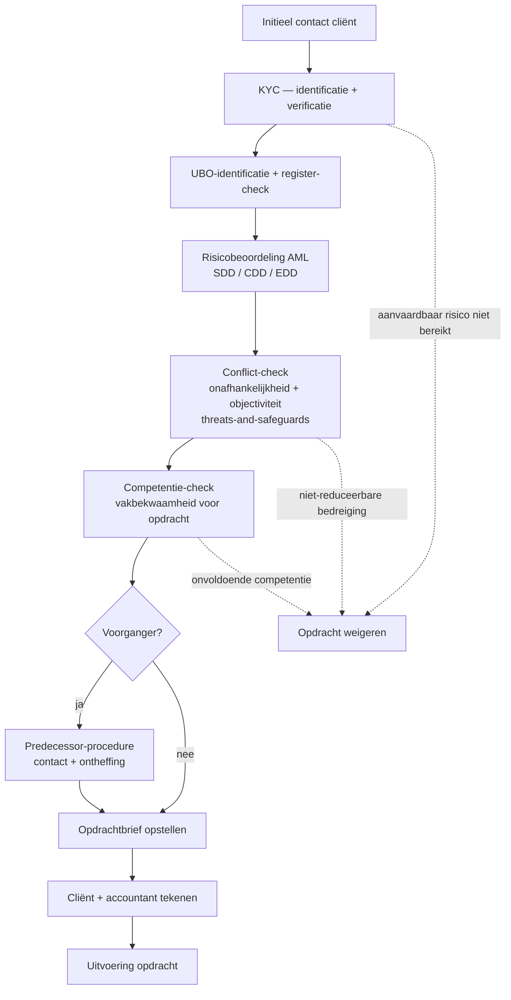
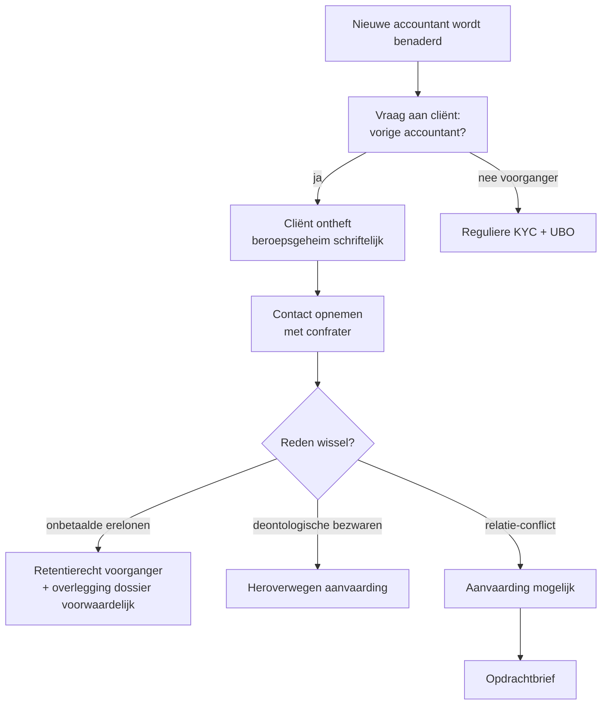
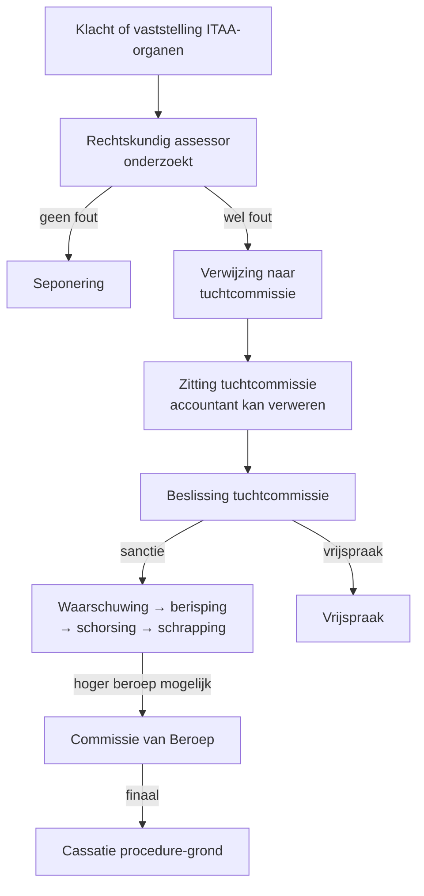

> ⚠️ **Voorlopig — themafiche-laag wordt uitgefaseerd.** Per **ADR-039** vervangt één PO-samenvatting per programmaonderdeel de cluster-themafiches. Deze fiche blijft beschikbaar tot het relevante PO een leerpad krijgt — dan migreert de inhoud naar `content/leerpaden/<po-slug>/samenvatting.md`. Voor cross-PO themafiches (vergelijkingen tussen verschillende PO's) volgt een aparte beslissing per fiche: incorporeren in alle relevante samenvattingen, óf upgraden naar concept-fiche.

> **Themafiche — kapstok voor herhaling.** Volgorde van opdrachtaanvaarding (KYC vóór opdrachtbrief), predecessor-procedure bij dossieroverdracht, tuchtprocedure ITAA met sancties en beroep. Voor verhaal en routekaart: [[leerpaden/4.0|minicursus PO 4.0]].

---

## Take-away

- **Volgorde is wettelijk**: KYC + risicobeoordeling → opdrachtbrief → uitvoering. Andere volgorde = AML-inbreuk
- **Opdrachtbrief verplicht** voor alle opdrachten (ITAA-norm 2018) — geen mondelinge afspraak, ook niet bij vaste cliënt
- **Predecessor-procedure**: opvolger moet voorganger contacteren — beroepsgeheim wijkt voor confraters-overleg
- **Tuchtsancties lopen op**: waarschuwing → berisping → schorsing → schrapping. Klager is geen partij — alleen klacht-inbrenger
- **Aanbrengcommissie = verboden** (ITAA-deontologie) — geen finder's fee aan derden voor cliënt-aanbreng

---

## Opdrachtaanvaarding — volgorde + checklist

| Stap | Voor welke fout? |
|---|---|
| KYC + UBO | AML-inbreuk |
| Risicobeoordeling | AML + onaanvaardbare cliënt-relatie |
| Conflict-check | Schending objectiviteit + onafhankelijkheid |
| Competentie-check | Schending vakbekwaamheid |
| Predecessor-contact | Schending confraternele plichten |
| Opdrachtbrief | ITAA-norm opdrachtbrief — formaliteits-inbreuk |

---

## Opdrachtbrief — verplichte inhoud (ITAA-norm)

| Element | Wat? | Risico bij ontbreken |
|---|---|---|
| Identificatie partijen | Volledige NAW + ondernemings-info cliënt | Geen klaarheid bij geschil |
| Omschrijving opdracht | Specifiek + perimeter + rapport-formaat | Scope-creep + verwarring verantwoordelijkheden |
| Verantwoordelijkheid partijen | Cliënt verschaft info · accountant past zorgvuldigheid toe | Discussies bij fouten |
| Honorarium + facturatiebasis | Vast/uurtarief/tarief + voorschot + indexering | Ereloon-betwisting · retentierecht onbeschermd |
| Duur + opzegging-modaliteit | Bepaalde of onbepaalde duur + opzegtermijn | Verlenging-discussies · onverwacht einde |
| Confidentialiteit + data-verwerking | GDPR-vermelding + bewaartermijn | GDPR-inbreuk |
| Aansprakelijkheid + exoneratie | Cap + survival-periode · verzekering | Onbeperkte blootstelling |
| Klachtenregeling | Interne procedure + ITAA als tucht-instantie | Reputatie-schade bij onbehandelde klachten |
| Witwas-uitsluitingen | Vermelding AML-plichten | Niet aantoonbaar bij CFI-melding |

**Standaard-templates ITAA** bestaan — invuloefening is **geen vrijbrief**; aanpassen aan specifieke opdracht-context blijft verplicht.

---

## Predecessor-procedure — bij wisselen van accountant

**Confraters-overleg**: voorganger meldt deontologische bezwaren (laattijdige betaling · weigering documenten · onethisch verzoek) zonder cliënt-info te delen die niet nodig is.

**Retentierecht voorganger**: accountant mag dossier inhouden tot betaling erelonen — uitzondering: onmiddellijk overhandigen van **alles wat cliënt nodig heeft voor wettelijke verplichtingen** (recente aangiftes · jaarrekening · boekhouding).

---

## Tuchtprocedure ITAA — verloop + sancties

| Sanctie | Wat? | Impact |
|---|---|---|
| **Waarschuwing** | Lichtste · niet-vermeld op tableau | Reputatie intern |
| **Berisping** | Geregistreerde reprimande | Vermeld bij ITAA |
| **Schorsing** | 8 dagen → 1 jaar — geen activiteit | Cliënt-portefeuille moet overgedragen worden |
| **Schrapping** | Definitieve uitsluiting beroep | Geen toelating meer; rehabilitatie pas na 10 jaar mits voorwaarden |

**Klager (cliënt) is geen partij** — heeft enkel recht klacht in te dienen en gehoord te worden. Geen recht op schadevergoeding via tucht.

**Rehabilitatie + beroepsverbod** mogelijk na termijn + voorwaarden (geen nieuwe veroordelingen · vorming · ereloon-regeling vorige cliënten).

---

## ⚠️ Valkuilen

| Valkuil | Wat klopt er niet | Wat klopt wél |
|---|---|---|
| Opdrachtbrief = template invullen | Vereist aanpassing aan specifieke opdracht-context | Standaard ITAA-template is startpunt; perimeter + risico's + safeguards opdracht-specifiek |
| Vaste cliënt = mondelinge afspraak volstaat | ITAA-norm vereist schriftelijke opdrachtbrief — ook bij verlenging | Nieuwe opdrachtbrief bij elke materiële wijziging + minimaal jaarlijkse update |
| Aanvaarden eerst, KYC daarna | AML-volgorde-inbreuk | KYC + UBO + risicobeoordeling → conflict-check → opdrachtbrief → uitvoering |
| Aanbrengcommissie OK als "marketing" | ITAA-deontologie verbiedt finder's fee aan derden | Geen vergoeding voor cliënt-aanbreng aan niet-ITAA-leden |
| Klager = partij in tuchtprocedure | Klager heeft alleen klacht-recht en hoor-recht | Geen pleitnota's · geen schadevergoeding · cliënt moet aparte civiele procedure starten |
| Beroepsgeheim tegen ITAA-rechtskundig assessor | Tucht-organen hebben dossier-toegang | Discreet maar transparant; geen tegenwerpelijkheid |
| Schorsing = pauze nemen | Volledig activiteitsverbod — cliënt-portefeuille moet overgedragen of in slaap | Cliënten contacteren + alternatief regelen + dossiers archiveren conform |
| Retentierecht = alles vasthouden | Geen recht om wettelijke documenten cliënt te onthouden | Lopende aangiftes + boekhouding-data steeds beschikbaar; alleen eigen advieswerk inhoudbaar |

---

## Doorklik — losse concept-fiches

**Aanvaarding + opdracht**
- [[opdrachtaanvaarding-en-opdrachtbrief]] — KYC-volgorde + ITAA-norm
- [[kantoor-organisatie]] — interne procedures + AML-verantwoordelijke
- [[kwaliteitsmanagement-opdracht]] — ISQM kantoor + EQR opdracht

**Tucht + rechten**
- [[tuchtprocedure-itaa]] — verloop + sancties + beroep
- [[rehabilitatie-en-beroepsverbod]] — opheffing + voorwaarden
- [[retentierecht-accountant]] — financieel zekerheidsrecht + grenzen
- [[permanente-vorming]] — CPD-verplichtingen + bewaring bewijs

**Verwante themafiches**
- [[themafiches/deontologische-beginselen|Themafiche — Deontologische beginselen]]
- [[themafiches/antiwitwas-praktijk|Themafiche — Antiwitwas-praktijk]]
- [[themafiches/beroepsgeheim-en-aansprakelijkheid|Themafiche — Beroepsgeheim & aansprakelijkheid]]

---

*Themafiche afgeleid uit cluster beroepsbeoefening (PO 4.0). Status: voorgesteld.*
