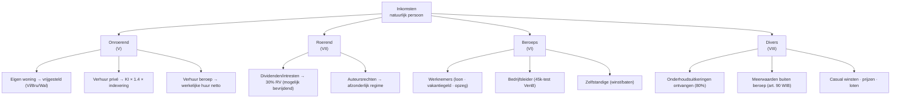

> **Themafiche — kapstok voor herhaling.** De volledige PB-cyclus in één schema: van vier inkomstencategorieën tot aanslagbiljet — met de samenvoeging-regel en de gewestelijke decimes als sleutels. Voor verhaal en routekaart: [[leerpaden/2.2|minicursus PO 2.2]].

---

## Take-away

- **Aanslagjaar = inkomstenjaar + 1** voor natuurlijke personen — altijd; aangifte AJ 2026 = inkomsten 2025
- **Samenvoeging echtgenoten = tariefschijven, niet uitgaven** — beroepsinkomsten worden afzonderlijk getaxeerd; alleen niet-beroepsinkomsten worden samengevoegd
- **Gewest-decimes verschuiven het hele schema** — federale belasting is de motor; gewestelijke opcentiemen + opcentiemen-verminderingen geven de eindstand
- **Aanvullende gemeentebelasting volgt eigen logica** — geen verminderingen toepassen (art. 468 lid 3); berekend op het saldo PB
- **RV bevrijdend = niet aangeven** — Belgische dividenden met 30% RV aan bron geheven hoeven NIET in aangifte; aangeven verbeurt het bevrijdende karakter niet maar voegt complexiteit toe

---

## Het schema — van bruto-inkomen tot te betalen belasting

| Stap | Bewerking | Output |
|---|---|---|
| 1 | Vier inkomenscategorieën verzamelen (onroerend · roerend · beroeps · diverse) | Totaal netto-inkomen per categorie |
| 2 | Aftrekbare bestedingen aftrekken (XI) | Belastbaar inkomen globaal (BIG) |
| 3 | Tarief-schijven toepassen op BIG (samenvoeging echtgenoten op niet-beroep) | Belasting Staat (brutering) |
| 4 | Belastingvrije som verrekenen (× tarief eerste schijven) | Hoofdsom belasting |
| 5 | Federale belastingverminderingen (XIII fed) | Belasting Federale Staat |
| 6 | Gewestelijke opcentiemen (autonomiefactor) | Belasting Gewest |
| 7 | Gewestelijke belastingverminderingen (XIII gewest) | Saldo PB |
| 8 | Aanvullende gemeentebelasting (% op saldo PB) | Te betalen vóór voorheffingen |
| 9 | Voorheffingen + voorafbetalingen aftrekken | Eindbedrag aanslagbiljet |

---

## Vier inkomenscategorieën — wat hoort waar?

---

## Samenvoeging echtgenoten — wat wel, wat niet?

| Inkomen | Behandeling | Reden |
|---|---|---|
| Beroepsinkomsten | Afzonderlijk per echtgenoot | Eigen prestaties = eigen tarief |
| Onroerend inkomen | Samenvoegen tenzij eigen vermogen | Pers. fiscale eenheid |
| Roerend inkomen niet-bevrijdend | Samenvoegen | Pers. fiscale eenheid |
| Diverse inkomsten | Samenvoegen | Pers. fiscale eenheid |
| Pensioenen | Afzonderlijk | Eigen rechten |
| **Huwelijksquotient** | Tot 30% beroepsinkomen overdragen aan partner met lager inkomen (binnen plafond) | Equilibreren tariefschijven |

**Vier gezinssituaties** met andere fiscale gevolgen:
1. Gehuwd of wettelijk samenwonend = fiscale eenheid + samenvoeging
2. Feitelijk samenwonend = geen fiscale eenheid + afzonderlijke aangiften
3. Alleenstaand = afzonderlijke aangifte + verhoogde BVS in sommige gevallen
4. Scheiding van tafel en bed = afzonderlijk vanaf jaar van scheiding

---

## Tarief-bandbreedtes (richting; concrete schijven in Cijferzakboekje)

| Schijf | Tarief PB Staat | Toepasselijk op |
|---|---|---|
| Eerste schijf | 25% | Tot lage drempel (~15k) |
| Tweede schijf | 40% | Middelste schijven |
| Derde schijf | 45% | |
| Bovenste schijf | 50% | Vanaf ~46k |

**Gewestelijke autonomiefactor**: PB Staat wordt verminderd met ~25% en gewest heft eigen opcentiemen op het verminderde bedrag — daardoor mogelijke regionale verschillen via belastingverminderingen + opcentiemen-niveau.

⚠️ Concrete tarieven, schijven en BVS-bedragen: **Cijferzakboekje bij examen** verplicht raadplegen.

---

## Aanvullende gemeentebelasting — apart pad

| Aspect | Hoofdregel | Valstrik |
|---|---|---|
| Berekend op | Saldo PB (na fed + gew verminderingen) | Niet op BIG, niet op hoofdsom |
| Tarief | 0% (Knokke) tot ~9% (variabel per gemeente) | Cijferzakboekje |
| Verminderingen | GEEN — art. 468 lid 3 WIB | Geen pensioensparen, geen woonbonus toepassen op AGB |
| Wijziging gemeente | Tarief volgt fiscale woonplaats op 1 januari | Verhuis na 1/1: oude gemeente blijft |

---

## ⚠️ Valkuilen

| Valkuil | Wat klopt er niet | Wat klopt wél |
|---|---|---|
| Rijksinwoner = Belgische nationaliteit | Rijksinwonerschap is feitelijk (woonplaats/zetel) | Spanjaard die in Brussel woont = rijksinwoner; expat met Belgische pas in Singapore ≠ |
| Aanslagjaar = inkomstenjaar | AJ = IJ + 1 voor natuurlijke personen | Aangifte AJ 2026 = inkomsten 2025 |
| RV bevrijdend toch aangeven | Niet vereist; voegt niet toe | Belgische dividenden 30% RV aan bron = niet aangeven |
| Aanvullende gemeentebelasting verminderen | Art. 468 lid 3: GEEN verminderingen op AGB | Federale + gewestelijke verminderingen werken alleen op PB Staat/gewest |
| Samenvoeging op beroepsinkomen toepassen | Beroep = afzonderlijk | Samenvoeging geldt enkel voor niet-beroepsinkomsten + tariefberekening na huwelijksquotient |
| Huwelijksquotient verwarren met inkomensoverdracht | Quotient = fictieve toerekening 30%/plafond | Vermindert tarief van hogere partner; niet werkelijk geld overdragen |

---

## Doorklik — losse concept-fiches

**Σ-record + aanslagcyclus**
- [[personenbelasting]] — sub-discipline-Σ (toepassingsgebied + 4 categorieën + aanslagcyclus)
- [[aangifte-pb]] — deel 1 + 2 · vakken + codes · TaxOnWeb
- [[belastingberekening-pb]] — tariefschijven · samenvoeging · decimes
- [[aanslagbiljet-pb]] — kohier + enrôlement + betaaltermijn

**Gezinscontext**
- [[gezinssituatie]] — 4 stelsels + inkomenstoerekening
- [[huwelijksquotient]] — 30%-regel + plafond
- [[belastingvrije-som]] — basis-BVS + verhogingen
- [[kinderen-ten-laste]] — voorwaarden + co-ouderschap

**Voorheffingen**
- [[bedrijfsvoorheffing]] — bronheffing loon
- [[voorafbetalingen-pb]] — kwartalen + bonificatie
- [[roerende-voorheffing]] — bevrijdend vs verrekenbaar

**Verwante themafiches**
- [[themafiches/inkomstencategorieen|Themafiche — Inkomstencategorieën PB]]
- [[themafiches/aftrekken-en-belastingverminderingen|Themafiche — Aftrekken & verminderingen PB]]

---

*Themafiche afgeleid uit cluster personenbelasting (PO 2.2). Status: voorgesteld.*
