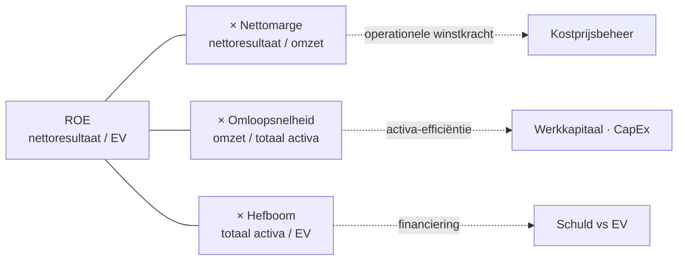

> **Themafiche — kapstok voor herhaling.** Vier ratio-families + DuPont + interpretatie-discipline op één pagina. Voor verhaal en routekaart: [[leerpaden/1.3|minicursus PO 1.3]] of [[leerpaden/1.9|minicursus PO 1.9]].

---

## Take-away

- **Ratio's nooit isoleren** — vergelijken in tijd én tegen sector-benchmark is verplicht
- **DuPont-decompositie** verbindt rentabiliteit met omzet-marge × omloopsnelheid × hefboom — examen-favoriet
- **Cash-conversion-cycle** verbindt activiteits- met liquiditeits-ratio's (DSO + DIO − DPO)
- **Universele vuistregels werken niet** — current ratio = 1.5 is gezond in handel, krap in chemie
- Eénjaarse ratio = momentopname; interpretatie vereist **window-dressing-radar** + sector + trend

---

## Vier families — formules + interpretatie

| Familie | Sleutelratio's | Wat meten? | Klassieke valkuil |
|---|---|---|---|
| **Liquiditeit** | Current · Quick · Cash · Cash-conversion-cycle | KT-vermogen om KT-verplichtingen na te komen | Voorraad-overschatting; betalingsgewoonten verschillen |
| **Solvabiliteit** | Schuldgraad · Interest-coverage | LT-stabiliteit; vermogen om alle schulden te dekken | EV ongecorrigeerd nemen (kapitaal-correcties vergeten) |
| **Rentabiliteit** | Brutomarge · Nettomarge · EBITDA-marge · ROE · ROA | Winstgevendheid op verschillende niveaus | Eenjarige rentabiliteit als trend lezen |
| **Activiteit** | DSO (klanten) · DPO (lev.) · DIO (voorraad) · Werkkapitaalbehoefte | Operationele efficiëntie; cyclus-snelheid | Sector-context negeren; seizoens-effect missen |

---

## Formules — de kern

**Liquiditeit**
$$
\text{Current} = \frac{\text{Vlottende activa}}{\text{Schulden} \le 1\text{j}} \quad\quad \text{Quick} = \frac{\text{Vlottende activa} - \text{Voorraad}}{\text{Schulden} \le 1\text{j}}
$$

**Solvabiliteit**
$$
\text{Schuldgraad} = \frac{\text{Totaal schulden}}{\text{Totaal passief}} \quad\quad \text{Interest-coverage} = \frac{\text{EBIT}}{\text{Rente-lasten}}
$$

**Rentabiliteit**
$$
\text{ROE} = \frac{\text{Nettoresultaat}}{\text{Eigen vermogen}} \quad\quad \text{ROA} = \frac{\text{EBIT}}{\text{Totaal activa}}
$$

**Activiteit**
$$
\text{DSO} = \frac{\text{Klanten}}{\text{Omzet incl. btw}} \times 365 \quad\quad \text{Cash Conversion Cycle} = \text{DSO} + \text{DIO} - \text{DPO}
$$

---

## DuPont-decompositie

**Inzicht**: dezelfde ROE kan ontstaan via lage marge + hoge omloopsnelheid (retail) of via hoge marge + lage omloopsnelheid (luxe-goederen). Decompositie onthult **welk model** de onderneming hanteert.

---

## Interpretatie-discipline (cross-categorie)

| As | Vraag | Bron |
|---|---|---|
| **Tijd** | Hoe evolueert de ratio over 3-5 jaar? | Eigen jaarrekeningen |
| **Sector** | Hoe verhoudt zij zich tot de benchmark? | NBB-balanscentrale · Companyweb · Trends Top |
| **Samenhang** | Klopt de combinatie van ratio's? (bv. hoge ROE + lage current = hefboom-risico) | Cross-family lezing |
| **Window-dressing-radar** | Zijn ratio's vlak vóór balansdatum geoptimaliseerd? | Trend + post-balansdatum-transacties |

---

## ⚠️ Valkuilen

| Valkuil | Wat klopt er niet | Wat klopt wél |
|---|---|---|
| Vuistregels universaal toepassen | Current = 1.5 is "gezond" in handel, krap in proces-industrie | Sector-specifieke bandbreedte; benchmark als referentie |
| Ratio's zonder context citeren | Cijfer zonder vergelijking is nietszeggend | Altijd trend + sector + samenhang vermelden |
| EV ongecorrigeerd nemen | Achtergestelde leningen, herwaarderingsmeerwaarden vertekenen | EV corrigeren voor analyse (NBB-methode) |
| Eénjaarse rentabiliteit als trend | Boekjaar-effecten + niet-recurrente posten domineren | Minstens 3-jaars gemiddelde + recurrent isoleren |
| Sector-context negeren bij DSO/DPO | B2B-handel = 60 dagen; supermarkt = 5 dagen | Sector-benchmark voor elk omloopsnelheids-cijfer |

---

## Doorklik — losse concept-fiches

**De vier families**
- [[liquiditeits-ratios]] — current · quick · cash · CCC
- [[solvabiliteits-ratios]] — schuldgraad · interest-coverage
- [[rentabiliteits-ratios]] — brutomarge · nettomarge · ROA · ROE · DuPont
- [[activiteits-ratios]] — DSO · DPO · DIO · werkkapitaalbehoefte

**Methodologie**
- [[ratio-interpretatie]] — discipline boven de losse families
- [[jaarrekeninganalyse]] — analyse-basis

**Verwante themafiches**
- [[themafiches/jaarrekeninganalyse-aanpak|Themafiche — Aanpak & herrangschikking]]
- [[themafiches/kasstroom-analyse|Themafiche — Kasstroom-analyse]]
- [[themafiches/continuiteit-en-diagnose|Themafiche — Continuïteit & diagnose]]

---

*Themafiche afgeleid uit cluster financiele-analyse (PO 1.3 + 1.9). Status: voorgesteld.*
