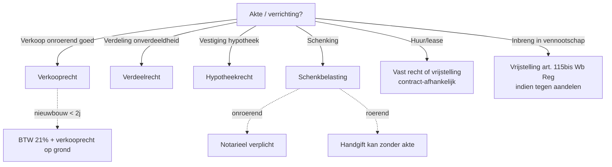

> ⚠️ **Voorlopig — themafiche-laag wordt uitgefaseerd.** Per **ADR-039** vervangt één PO-samenvatting per programmaonderdeel de cluster-themafiches. Deze fiche blijft beschikbaar tot het relevante PO een leerpad krijgt — dan migreert de inhoud naar `content/leerpaden/<po-slug>/samenvatting.md`. Voor cross-PO themafiches (vergelijkingen tussen verschillende PO's) volgt een aparte beslissing per fiche: incorporeren in alle relevante samenvattingen, óf upgraden naar concept-fiche.

> **Themafiche — kapstok voor herhaling.** Vier evenredige rechten + procedurele formaliteit. Voor verhaal en routekaart: [[leerpaden/2.6|minicursus PO 2.6]].

---

## Take-away

- **Registratie ≠ inschrijving** in hypotheekkantoor — twee aparte formaliteiten, twee aparte rechten
- **Gewestelijke bevoegdheid sinds 6e Staatshervorming** — Vlaanderen/Wallonië/Brussel hebben eigen wetboeken en tarieven
- **Vrijstellings-keuze valt of staat met aanknopingspunt** — ligging onroerend goed bepaalt welk gewest heft
- **Nieuwbouw onder BTW (21%)**, niet onder verkooprecht — vaak verwarring
- **Schenking onroerend = notarieel verplicht; schenking roerend kan zonder akte (handgift)** — maar 3-jaarsregel altijd alert

---

## De vier evenredige rechten

| Recht | Basis | Tarief-bandbreedte | Aanknopingspunt | Klassieke val |
|---|---|---|---|---|
| **Verkooprecht** | Overdracht onder bezwarende titel van onroerend goed | 3% (Vl. gezinswoning) → 12% (alg. Vl.) · ~12.5% (Brussel/Wal.) | Ligging onroerend goed | Nieuwbouw = BTW, niet verkooprecht |
| **Verdeelrecht** | Verdeling/onverdeeldheidsstop van onroerend goed | ~1% (Vl.) · ~2.5% (Brussel/Wal.) | Ligging onroerend goed | Heffen op overgaand aandeel ipv volle waarde |
| **Hypotheekrecht** | Inschrijving hypotheek of voorrecht | ~1% (basis) + administratieve kost | Ligging onroerend goed | Verwarren met verkooprecht (verschillende heffings-basis) |
| **Schenkbelasting** | Notariële schenkingsakte | Onroerend 3-27% · roerend vlak 3-7% (afhankelijk van verwantschap + gewest) | Roerend: woonplaats schenker · onroerend: ligging | 3-jaarsregel bij overlijden schenker (W.Succ. art. 7 / VCF 2.7.1.0.5) |

---

## Welk recht bij welke akte?

---

## Formaliteit + termijnen

| Verrichting | Termijn | Bij wie? | Sanctie laattijdig |
|---|---|---|---|
| Notariële akte | 15 dagen | Patrimoniumdocumentatie (federaal) of VLABEL (Vl.) | Boete + nalatigheidsinterest |
| Onderhandse huur | 4 maanden | Idem | Idem |
| Schenking onroerend | Door notaris bij akte | Vlabel/FOD Financiën | Belasting + interesten |
| Hypotheek-inschrijving | Bij vestiging | Kantoor Rechtszekerheid | Niet tegenwerpelijk derden |

---

## Bijzonderheden — gewestelijke verschillen

| Gewest | Verkooprecht algemeen | Verkooprecht gezinswoning | Verdeelrecht | Schenkbelasting onroerend (kind in lijn) |
|---|---|---|---|---|
| **Vlaanderen** | 12% (sinds 2022) | 3% (vrijstelling tot drempel) | 1% | Progressief 3-27% met fors verlaagde tarieven (2018-hervorming) |
| **Brussel** | 12.5% | Abattement tot 200k | 2.5% | Progressief 3-30% |
| **Wallonië** | 12.5% | Verminderingen + abattementen | 1% (familie) / 2.5% (overig) | Progressief 3-30% |

⚠️ Tarieven en drempels: **Cijferzakboekje bij examen** raadplegen; hier richt-bandbreedtes.

---

## ⚠️ Valkuilen

| Valkuil | Wat klopt er niet | Wat klopt wél |
|---|---|---|
| Verkooprecht op nieuwbouw | Nieuw gebouw (< 2j ingebruikname) valt onder BTW | Verkoop nieuwbouw = BTW 21% + verkooprecht alleen op grond-aandeel |
| Verdeelrecht op overgaand aandeel | VCF 2.10.6: belastbare basis = volle waarde verdeelde goederen | Tarief op volle waarde, niet pro-rata aandeel |
| Hypotheekrecht = verkooprecht | Verschillende heffings-basis (waarde vs zekerheid) | Verkoop = federaal/gewestelijk op aankoopprijs; hypotheek = federaal op leningbedrag |
| Registratie = hypotheek-inschrijving | Twee aparte kantoren, twee aparte rechten | Registratie: akte zelf · Hypotheek-inschrijving: tegenwerpelijkheid aan derden |
| Handgift = geen risico | 3-jaarsregel art. 7 W.Succ. blijft van toepassing | Handgift binnen 3j vóór overlijden = mee in nalatenschap aan tarieven erfbelasting |

---

## Doorklik — losse concept-fiches

**De evenredige rechten**
- [[verkooprecht]] — bij onroerend-overdracht
- [[verdeelrecht]] — bij verdeling onverdeeldheid
- [[hypotheekrecht]] — bij vestiging zekerheid
- [[schenkbelasting]] — bij notariële schenking
- [[registratieformaliteit-akten]] — formaliteit + termijnen + sancties

**Cross-cutting**
- [[registratie-en-successierechten]] — hoofdrecord overkoepelend
- [[inbreng-onroerend-in-vennootschap]] — vrijstelling art. 115bis

**Verwante themafiches**
- [[themafiches/successierechten-en-erfrecht|Themafiche — Successierechten & erfrecht]]
- [[themafiches/successieplanning|Themafiche — Successieplanning & gunstregime]]

---

*Themafiche afgeleid uit cluster registratie-en-successierechten (PO 2.6). Status: voorgesteld.*
