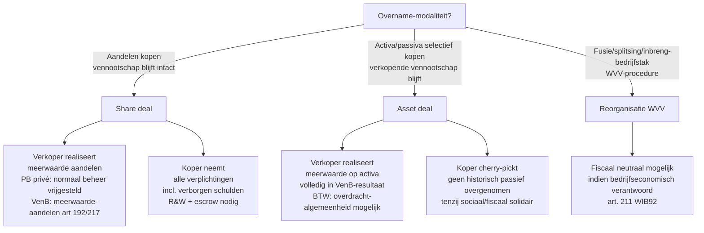

> **Themafiche — kapstok voor herhaling.** Welke WVV-verrichting vereist welk bijzonder verslag van accountant of bedrijfsrevisor, plus share-deal vs asset-deal-architectuur. Voor verhaal en routekaart: [[leerpaden/3.0|minicursus PO 3.0]].

---

## Take-away

- **Eén onderscheid stuurt alles**: aandelen-overdracht (share deal) ↔ activa-overdracht (asset deal / inbreng / fusie) — bepalen verslag, fiscaliteit, garanties
- **Inbreng-in-natura + quasi-inbreng vereisen revisorverslag** in BV/NV — niet bestuursverslag alleen
- **Quasi-inbreng-regime geldt ook voor BV** (sinds WVV 2019) — 10% van inbreng-waarde, binnen 2 jaar na oprichting
- **Fusie/splitsing**: bestuursverslag + revisorverslag verplicht; uitzondering bij geruisloze fusie 100%-dochter
- **SPA-garanties (R&W)**: contractuele toewijzing van risico's — los van fiscale en boekhoudkundige feiten. Disclosure letter = bewijsstuk dat verkoper geen verborgen gebreken hield

---

## Welke verrichting vereist welk verslag?

| Verrichting | Bestuursverslag | Revisorverslag / accountantsverslag | Wettelijke basis |
|---|---|---|---|
| **Inbreng in natura** (oprichting + kapitaalverhoging) | Ja (verantwoording belang) | **Ja** — waardering inbreng | WVV art. 5:7 · 7:7 (oprichting) · 5:133 · 7:197 (verhoging) |
| **Quasi-inbreng** (verkrijging > 10% kapitaal binnen 2 jaar) | Ja | **Ja** — controle van prijs | WVV art. 5:8 · 7:8 |
| **Fusie** (door overneming of door oprichting) | Ja — toelichting + ruilverhouding | **Ja** — getrouwheid ruilverhouding (commissaris of accountant) | WVV art. 12:24 e.v. |
| **Geruisloze fusie 100%-dochter** | Ja (vereenvoudigd) | **Nee** — vrijgesteld | WVV art. 12:32 |
| **Splitsing** | Ja | **Ja** — getrouwheid splitsings-modaliteiten | WVV art. 12:71 e.v. |
| **Inbreng-bedrijfstak / -algemeenheid** | Ja | **Ja** — waardering bedrijfstak | WVV art. 12:103 e.v. |
| **Ontbinding + vereffening** | Liquidatieverslag bestuur | Verslag van vereffenaar + revisor bij activa-overdracht | WVV art. 2:71 e.v. |
| **Kapitaalvermindering in BV** | Bijzonder verslag | Bij terugbetaling: dubbele test | WVV art. 5:142 |
| **Omzetting van vorm** | Ja | **Ja** — staat van activa en passiva | WVV art. 14:3 e.v. |

⚠️ De **accountant** mag verslagen geven voor BV (art. 5:7) — niet voor NV-inbreng waar **bedrijfsrevisor** verplicht is.

---

## Share deal ↔ Asset deal

| Aspect | **Share deal** | **Asset deal** |
|---|---|---|
| Wat wordt overgedragen? | Aandelen — vennootschap intact | Geselecteerde activa/passiva |
| Verkoper-fiscaliteit | Meerwaarde aandelen (vaak vrijgesteld VenB art. 192 — mits voorwaarden) | Meerwaarde op activa, volledig belast |
| Koper neemt over | Alle schulden + risico's vennootschap | Alleen wat in akte staat (uitz: sociaal + fiscaal solidair) |
| Due diligence | Diepgaand (volledige vennootschap) | Beperkter (alleen activa-perimeter) |
| Garantie-architectuur | R&W + escrow + MAC + disclosure letter | Beperktere garanties (vooral activa-staat) |
| BTW | n.v.t. (aandelen vrijgesteld) | Overdracht-algemeenheid-regime (art. 11 W.BTW) mogelijk |
| Registratie | n.v.t. (roerend) | Onroerend = verkooprecht; handelsfonds = pro rata |

---

## SPA-architectuur — kernclausules

| Clausule | Functie | Klassieke risico |
|---|---|---|
| **R&W (representations & warranties)** | Verkoper verklaart over historische staat (geen verborgen schulden, juiste cijfers, ...) | Vereist precisie — geen copy-paste; disclaim ≠ tekstuele invuloefening |
| **Disclosure letter** | Lijst van afwijkingen op R&W — beperkt verkoper-aansprakelijkheid | Vergeten = verkoper aansprakelijk voor alles wat niét werd disclosed |
| **Escrow** | Geld bij neutrale derde tot vrijgave-trigger (deadline + uitblijven claims) | Trigger moet contractueel; geen automatische vrijgave na X maand |
| **MAC-clausule** (Material Adverse Change) | Koper kan terugkrijgen bij grote tegenslag tussen signing en closing | Definitie "material" + objectieve drempels nodig |
| **Earn-out** | Variabele prijs op basis van future performance | Definitie EBITDA + governance tussen signing en closing |
| **Non-compete** | Verkoper concurreert niet | Beperking in tijd + ruimte + activiteit (kartel-recht) |

---

## Bijzondere mandaten — wanneer accountant, wanneer revisor?

| Mandaat | Accountant | Bedrijfsrevisor | Cijferzakboekje vereist? |
|---|---|---|---|
| Inbreng in natura BV | ✅ | ✅ | n.v.t. |
| Inbreng in natura NV | ❌ | ✅ enkel | n.v.t. |
| Quasi-inbreng BV/NV | ✅ (BV) / ❌ (NV) | ✅ | n.v.t. |
| Fusie/splitsing | ✅ (niet-genoteerd) | ✅ | n.v.t. |
| Omzetting van vorm | ✅ | ✅ | n.v.t. |
| Alarmbel-advies | ✅ (adviserend) | ✅ (commissaris-rol) | n.v.t. |
| Wettelijke audit | ❌ | ✅ monopolie | n.v.t. |
| Vereffening-controle | ✅ | ✅ | n.v.t. |

**Resultaatsafhankelijk honorarium verboden** bij bijzonder mandaat verbonden met transactie (geen "succesvergoeding bij fusie-doorgang").

---

## ⚠️ Valkuilen

| Valkuil | Wat klopt er niet | Wat klopt wél |
|---|---|---|
| Quasi-inbreng niet van toepassing op BV | Sinds WVV 2019 ook in BV — art. 5:8 | 10% van EV (niet van inbreng-waarde) · binnen 2 jaar na oprichting |
| Ruilverhouding gelijkstellen aan waardering | Revisor controleert getrouwheid van de bestuurs-ruilverhouding; bestuur kiest waarderingsmethode | Revisor toetst redelijkheid + consistentie, geen eigen waardering vooropstellen |
| Geruisloze fusie 100%-dochter "geen risico" | Fusieverlies-/winst-impact + fiscale aandachtspunten blijven | Revisorverslag vrijgesteld, maar bestuursverslag + fiscale neutraliteit (art. 211 WIB92) blijven |
| Partiële splitsing = inbreng-bedrijfstak | Verschillende verrichtingen: splitsing = aandelen aan aandeelhouders A; inbreng = aandelen aan vennootschap A | Splitsing volgt boek 12 WVV; inbreng-bedrijfstak art. 12:103 — andere fiscale en boekhoudkundige gevolgen |
| R&W lezen als "algemene goedheid" | Precieze juridische uitspraken met aansprakelijkheid; niet copy-paste | Specifieke representations met disclosure letter; quantification van breach + cap + survival-periode |
| Escrow "wordt vanzelf vrijgegeven na X maand" | Vrijgave vereist contractuele trigger | Trigger expliciet: deadline + ontbreken open claims + escrow-agent bevestiging |
| Resultaatsafhankelijk honorarium bij bijzonder mandaat | ITAA-deontologie: verboden voor bijzondere mandaten transactie-gerelateerd | Vast honorarium of tijds-honorarium; vooraf in opdrachtbrief |

---

## Doorklik — losse concept-fiches

**Reorganisatie-verrichtingen**
- [[fusie]] — door overneming + door oprichting
- [[splitsing]] — volledige + partiële
- [[inbreng-bedrijfstak-of-algemeenheid]] — bedrijfstak vs algemeenheid
- [[fiscale-fusie-splitsing]] — fiscale neutraliteit art. 211 WIB92
- [[kapitaalverhoging-in-natura]] — inbreng-procedure
- [[quasi-inbreng]] — 10%-regime
- [[overnameovereenkomst-spa]] — share deal + asset deal + SPA-clausules

**Bijzondere mandaten**
- [[bijzondere-mandaten]] — wanneer accountant vs revisor

**Verwante themafiches**
- [[themafiches/vennootschapsvormen|Themafiche — Vennootschapsvormen]]
- [[themafiches/kapitaalbescherming-en-alarmbel|Themafiche — Kapitaalbescherming & alarmbel]]
- [[leerpaden/1-4/samenvatting|Samenvatting PO 1.4 — Consolidatie]]

---

*Themafiche afgeleid uit cluster reorganisatie + bijzondere-mandaten (PO 3.0). Status: voorgesteld.*
