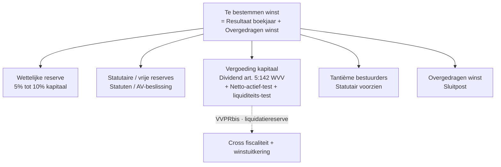

> ⚠️ **Voorlopig — themafiche-laag wordt uitgefaseerd.** Per **ADR-039** vervangt één PO-samenvatting per programmaonderdeel de cluster-themafiches. Deze fiche blijft beschikbaar tot het relevante PO een leerpad krijgt — dan migreert de inhoud naar `content/studiemateriaal/<po-slug>/samenvatting.md`. Voor cross-PO themafiches (vergelijkingen tussen verschillende PO's) volgt een aparte beslissing per fiche: incorporeren in alle relevante samenvattingen, óf upgraden naar concept-fiche.

> **Themafiche — kapstok voor herhaling.** Hoe het resultaat tot stand komt en hoe het bestemd wordt — klasse 6, 7 en 79 in één overzicht. Voor verhaal en routekaart: [[studiemateriaal/1-1|overzicht PO 1.1]].

---

## Take-away

- **RR-cascade is hiërarchisch** — bedrijfsresultaat → financieel → resultaat vóór belasting → resultaat van het boekjaar
- **Recurrent vs niet-recurrent isoleren** — niet-recurrente verrichtingen (klasse 66/76) verbergen onderliggende winstkracht; analytisch eruit halen
- **Resultaatverwerking is balans-operatie** — geen invloed op resultatenrekening; klasse 79 verdeelt al-gerealiseerde winst over reserves + dividend + overgedragen winst
- **Wettelijke reserve = 5% / 10%** — verplicht tot reserve 10% kapitaal bereikt; daarna optioneel
- **Tantième ≠ dividend** — tantième = bestuurdersvergoeding uit winst (klasse 695, **aftrekbaar VenB**); dividend = aandeelhoudersvergoeding (klasse 694, **niet aftrekbaar**)

---

## Resultatenrekening — opbouw

| Niveau | Klasse | Posten |
|---|---|---|
| **Bedrijfsopbrengsten** | 70-74 + 76A | Omzet · voorraadmutatie · geproduceerde vaste activa · andere bedrijfsopbrengsten · niet-recurrente bedrijfsopbrengsten |
| − Bedrijfskosten | 60-65 + 66A | Handelsgoederen · diensten/diverse · personeel · afschrijvingen · waardeverminderingen · andere · niet-recurrente bedrijfskosten |
| = **Bedrijfsresultaat** | — | EBITDA-proxy ↔ operationele winstkracht |
| + Financiële opbrengsten / − financiële kosten | 75 / 65 | Interest · DAB · valuta · waardevermindering FVA |
| = Resultaat vóór belasting | — | — |
| − Belasting op het resultaat | 67 / 77 | Vennootschapsbelasting + voorheffingen |
| = **Resultaat van het boekjaar** | 14 (winst) / 14 (-) (verlies) | Naar resultaatverwerking (klasse 79) |

---

## Recurrent vs niet-recurrent — onderscheid in praktijk

| Aspect | **Recurrent (60-65 / 70-74)** | **Niet-recurrent (66 / 76)** |
|---|---|---|
| Karakter | Normale bedrijfsuitoefening | Uitzonderlijk · niet-repetitief |
| Voorbeelden | Verkoop · personeelskost · interest | Realisatie-meerwaarde vast actief · herstructureringskost · stop-zettings-vergoeding |
| Analyse-rol | Basis voor trend + rentabiliteits-ratio's | Uitfilteren bij analytische beoordeling |
| Voorzichtigheid | Erkennen wanneer gerealiseerd | Beoordelen of voldoende substantieel/uniek |

---

## Resultaatverwerking — klasse 79

**Wettelijke vorm** — twee tests vóór elke uitkering:
- **Netto-actief-test** (art. 5:142 WVV): netto-actief ≥ niet-uitkeerbaar eigen vermogen
- **Liquiditeits-test** (art. 5:143 WVV): bestuursverslag bevestigt dat vennootschap 12 maanden verplichtingen kan voldoen

---

## ⚠️ Valkuilen

| Valkuil | Wat klopt er niet | Wat klopt wél |
|---|---|---|
| Niet-recurrent = uitzonderlijk klein | Klasse 66/76 ook voor realisaties + reorganisatie — kan substantieel zijn | Karakter (uniek/niet-repetitief), niet bedrag, bepaalt klassificatie |
| Resultaatverwerking = boeking in RR | Klasse 79 is **balanspost** (eigen vermogen), geen kost/opbrengst | Verdeelt al-gerealiseerd resultaat; geen impact op resultaat-cascade |
| Wettelijke reserve altijd 5% | Verplichting stopt wanneer reserve = 10% van geplaatst kapitaal | Onder 10%: minstens 5% van resultaat; boven: optioneel |
| Tantième = dividend | Tantième aftrekbaar VenB (kost klasse 695) · dividend niet-aftrekbaar (klasse 694) | Beide uit winst, maar fiscaal en juridisch verschillend |
| Dividend zonder liquiditeits-test | Art. 5:143 WVV vereist bestuursverslag liquiditeits-test bij elke uitkering BV | Wettelijke verplichting BV/CV; niet voor NV (alleen netto-actief-test) |
| Belasting van het boekjaar = aanslagbiljet-bedrag | Boekhouding boekt geraamde VenB op klasse 670; aanslagbiljet later → correctie klasse 671 of 77 | Periode-toewijzing volgt boekhoud-cyclus, niet aanslag-cyclus |

---

## Doorklik — losse concept-fiches

**Resultaten-opbouw**
- [[bedrijfskosten]] — klasse 60-65 · cost-type-categorieën
- [[bedrijfsopbrengsten]] — klasse 70-74 · omzet + voorraadmutatie + andere
- [[personeelskosten]] — klasse 62 · sociale balans-link (cross werknemers-vergoedingen)
- [[financiele-verrichtingen]] — klasse 65 + 75 · interest + DAB + valuta
- [[niet-recurrente-verrichtingen]] — klasse 66 + 76 · realisatie-meerwaarden + uitzonderlijke posten

**Winstbestemming**
- [[resultaatverwerking]] — klasse 79 + EV-mutaties

**Verwante themafiches**
- [[themafiches/jaarrekening-schema-en-publicatie|Themafiche — Jaarrekening: schema & publicatie]]
- [[themafiches/eindejaarsverrichtingen-en-waardering|Themafiche — Eindejaarsverrichtingen & waardering]]

---

*Themafiche afgeleid uit cluster boekhouding (PO 1.1). Status: voorgesteld.*
