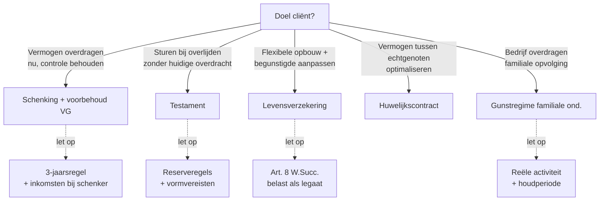

> ⚠️ **Voorlopig — themafiche-laag wordt uitgefaseerd.** Per **ADR-039** vervangt één PO-samenvatting per programmaonderdeel de cluster-themafiches. Deze fiche blijft beschikbaar tot het relevante PO een leerpad krijgt — dan migreert de inhoud naar `content/leerpaden/<po-slug>/samenvatting.md`. Voor cross-PO themafiches (vergelijkingen tussen verschillende PO's) volgt een aparte beslissing per fiche: incorporeren in alle relevante samenvattingen, óf upgraden naar concept-fiche.

> **Themafiche — kapstok voor herhaling.** Vier planning-instrumenten + keuze-beslisboom + gunstregime familiale onderneming. Voor verhaal en routekaart: [[leerpaden/2.6|minicursus PO 2.6]].

---

## Take-away

- **Fiscale optimalisatie zonder civielrechtelijke basis ondergraaft de planning** — reservebreuk leidt tot reductie na overlijden
- **Planning = vroeg starten** — 3-jaarsregel maakt deathbed-planning illusoir
- **Schenking ≠ schenkbelasting altijd** — schenking voor notaris in Nederland (bij niet-Belg) ontwijkt schenkbelasting maar valt onder 3-jaarsregel als schenker Belg
- **Gunstregime familiale onderneming**: 0% schenking + verlaagd tarief erfbelasting, maar **reële economische activiteit** + houdperiode-voorwaarden
- **Levensverzekering ≠ belastingvrij** — art. 8 W.Succ. behandelt uitkering als legaat (erfbelasting)

---

## Vier planningsinstrumenten

| Instrument | Wat? | Fiscaal voordeel | Civielrechtelijk risico |
|---|---|---|---|
| **Testament** | Eenzijdige beschikking voor na overlijden | Geen direct fiscaal voordeel; sturing-instrument | Reserveregels respecteren; vormvereisten (4.181 BW) |
| **Schenking met voorbehoud vruchtgebruik** | Blote eigendom over, vruchtgebruik behouden | Schenkbelasting nu (vlak) ipv erfbelasting (progressief) later; bij overlijden VG-aanwas niet belast | 3-jaarsregel (W.Succ. 7); inkomsten blijven bij schenker |
| **Levensverzekering** | Premie nu, uitkering aan begunstigde bij overlijden | Beheer-flexibiliteit; tijdelijke vermogens-eclipse | Art. 8 W.Succ. behandelt als legaat; reserve niet ontwijken |
| **Huwelijkscontract** | Stelsel-keuze (gemeenschap/scheiding/aanwas) | Optimaliseert wat onder welk stelsel valt | Wijziging na huwelijk vereist notarieel + tijdige procedure |

---

## Beslisboom — welk instrument wanneer?

---

## Gunstregime familiale onderneming

| Voorwaarde | Vlaanderen | Brussel / Wallonië |
|---|---|---|
| **Aard vennootschap** | Reële economische activiteit (geen pure patrimonium-holding) | Idem |
| **Houdperiode vóór overdracht** | Geen minimum vereist | 5 jaar (Wal.) |
| **Houdperiode na overdracht** | 3 jaar (activiteit + behoud aandelen) | 5 jaar (Wal.) |
| **Bedrijfsleidersrol** | Niet absoluut vereist | Variabel |
| **Tarief schenking** | 0% | 0-3% (afhankelijk) |
| **Tarief erfbelasting** | 3% (rechte lijn) / 7% (anderen) | Variabel verlaagd |

**Voorwaarden voldoen of dossier breekt** — Vlabel/FOD controleert achteraf; bij niet-naleving = naheffing aan normaal tarief + boete.

---

## Anti-misbruik-radar

| Fictiebepaling / regel | Trigger | Effect |
|---|---|---|
| **W.Succ. art. 7 — 3-jaarsregel** | Schenking < 3j vóór overlijden | Mee in nalatenschap aan erfbelasting-tarief |
| **W.Succ. art. 8 — levensverzekering** | Uitkering bij overlijden verzekerde | Belast als legaat aan erfbelasting-tarief |
| **W.Succ. art. 9 — gesplitste aankoop** | VG door overledene + BE door erfgenamen | Volledige eigendom geacht in nalatenschap |
| **Algemene anti-misbruik VCF 3.17.0.0.2** | Doel: belasting ontwijken zonder economisch motief | Belasting alsof verrichting niet had plaatsgevonden |

---

## ⚠️ Valkuilen

| Valkuil | Wat klopt er niet | Wat klopt wél |
|---|---|---|
| Fiscaal optimaliseren zonder civielrechtelijke basis | Reservebreuk leidt tot reductie ná overlijden | Reservepatrimonium voor afstammelingen + langstlevende respecteren |
| Schenking-vlak-vóór-overlijden | 3-jaarsregel pakt alles op | Vroeg starten (5-10 jaar vóór) |
| Patrimonium-holding onder gunstregime | Vereist reële activiteit | Operationele dochters + bedrijfsactiviteit aantonen |
| Schenking met voorbehoud VG = inkomsten weg | VG-houder behoudt inkomsten + bestuur van de geschonken goederen | Inkomsten + zeggenschap blijven bij schenker tot overlijden |
| Levensverzekering = "buiten nalatenschap" | Art. 8 = belast als legaat | Behandeld als legaat: erfbelasting tussen nemer-begunstigde-verwantschap |
| Eigenhandig testament op computer | Art. 4.181 BW: volledig met de hand geschreven | Olografisch testament moet handgeschreven; computer = nietig |

---

## Doorklik — losse concept-fiches

**Planningsinstrumenten**
- [[successieplanning]] — overzicht + keuze-criteria
- [[testament-instrument]] — vormvereisten + types
- [[schenking-met-voorbehoud-vruchtgebruik]] — klassiek planning-instrument
- [[levensverzekering-successieplanning]] — art. 8 W.Succ. + planning-mechaniek

**Gunstregime**
- [[gunstregime-familiale-onderneming]] — voorwaarden + tarieven + naheffing

**Cross-relevant**
- [[opsplitsing-eigendom]] — vruchtgebruik · blote eigendom · waardering
- [[huwelijksvermogensrecht]] — fundament voor stelsel-keuze
- [[schenkbelasting]] — fiscaal kader voor schenkingen

**Verwante themafiches**
- [[themafiches/registratierechten|Themafiche — Registratierechten]]
- [[themafiches/successierechten-en-erfrecht|Themafiche — Successierechten & erfrecht]]

---

*Themafiche afgeleid uit cluster registratie-en-successierechten (PO 2.6). Status: voorgesteld.*
