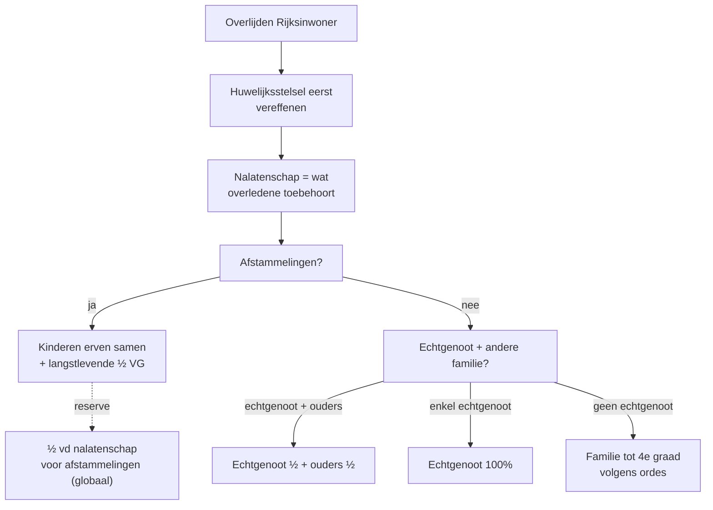

> ⚠️ **Voorlopig — themafiche-laag wordt uitgefaseerd.** Per **ADR-039** vervangt één PO-samenvatting per programmaonderdeel de cluster-themafiches. Deze fiche blijft beschikbaar tot het relevante PO een leerpad krijgt — dan migreert de inhoud naar `content/leerpaden/<po-slug>/samenvatting.md`. Voor cross-PO themafiches (vergelijkingen tussen verschillende PO's) volgt een aparte beslissing per fiche: incorporeren in alle relevante samenvattingen, óf upgraden naar concept-fiche.

> **Themafiche — kapstok voor herhaling.** Burgerlijk fundament (erfrecht 2018-hervorming) + fiscale heffing + huwelijksstelsel-interactie + aangifte. Voor verhaal en routekaart: [[leerpaden/2.6|minicursus PO 2.6]].

---

## Take-away

- **Huwelijksstelsel eerst, erfrecht daarna** — gemeenschap wordt vereffend vóór de nalatenschap ontstaat
- **Erfrechthervorming 2018** veranderde de regels — globale reserve afstammelingen = ½ (niet meer per kind); ouders hebben geen reserve meer
- **Tarief erfbelasting per verkrijger en per netto-aandeel** — niet op totale nalatenschap; 4 kinderen × 150k ≠ tarief op 600k
- **Termijn aangifte = vanaf overlijden**, niet vanaf kennisname — strikt
- **Gewestelijke bevoegdheid** sinds 2002 voor erfbelasting; fiscale woonplaats overledene = 5-jaarsregel

---

## Wettelijke devolutie — basis-schema (BW Boek 4, sinds 2018)

**Drie ordes** (na hervorming): I. afstammelingen · II. ascendenten + zijverwanten t.e.m. 4e graad · III. bijzondere regels langstlevende echtgenoot.

---

## Erfbelasting — mechaniek

| Stap | Wat? | Output |
|---|---|---|
| 1. Vaststelling nalatenschap | Activa (incl. fictiebepalingen) − passiva | Netto-nalatenschap |
| 2. Verdeling per erfgenaam | Wettelijke + testamentaire regels | Netto-aandeel per verkrijger |
| 3. Tarief-toepassing | Per verkrijger × verwantschap × gewest | Bruto-belasting per verkrijger |
| 4. Verminderingen | Vrijstellingen (gezinswoning, familiale onderneming, drempels) | Te betalen erfbelasting |

**Vier vrijstellings-types** (variërend per gewest):
- Gezinswoning voor langstlevende echtgenoot (vaak nul)
- Familiale onderneming (zie [[themafiches/successieplanning|themafiche successieplanning]])
- Drempels voor kleine vrijstellingen
- Bijzondere verminderingen (mindervalide, jonge erfgenamen)

---

## Tarief-structuur (orde-niveau, alle gewesten — bandbreedtes)

| Verwantschap | Vlaanderen | Brussel | Wallonië |
|---|---|---|---|
| **In rechte lijn / partners** | 3-27% (5 schijven) | 3-30% (5 schijven) | 3-30% (5 schijven) |
| **Broers/zussen** | 25-55% (3 schijven) | 35-65% (3-4 schijven) | 35-65% (3-4 schijven) |
| **Andere derden** | 25-55% (3 schijven) | 40-80% (3 schijven) | 40-80% (3 schijven) |

⚠️ Concrete tarieven en schijfgrenzen: **Cijferzakboekje bij examen** verplicht raadplegen.

---

## Fictiebepalingen — wat wordt fictief deel van de nalatenschap?

| Fictiebepaling | Wat? | Anti-misbruik-doel |
|---|---|---|
| **Art. 7 W.Succ. / VCF 2.7.1.0.5** — schenkingen binnen 3 jaar | Schenkingen door overledene < 3j vóór overlijden | Vermijdt schenking-vlak-vóór-overlijden om erfbelasting te ontwijken |
| **Art. 8 W.Succ.** — levensverzekering | Uitkering levensverzekering bij overlijden | Voorkomt belastingvrije transfer via verzekerings-omweg |
| **Art. 9 W.Succ.** — gesplitste aankoop VG/BE | Vruchtgebruik door overledene + blote eigendom door erfgenamen | Voorkomt fictief vermogen via gesplitste eigendom |
| **Art. 4 W.Succ.** — schuldbrief, rentegevende lening | Schuldvordering overledene op zichzelf | Voorkomt verkapt vermogen via interne schuld |

---

## Aangifte nalatenschap — procedure + termijnen

| Aspect | Vlaanderen | Brussel | Wallonië |
|---|---|---|---|
| Termijn (binnenland-overlijden) | 4 maanden | 4 maanden | 4 maanden |
| Termijn (Europa) | 5 maanden | 5 maanden | 5 maanden |
| Termijn (buiten Europa) | 6 maanden | 6 maanden | 6 maanden |
| Termijn-rek mogelijk? | Ja, gemotiveerd | Ja, gemotiveerd | Ja, gemotiveerd |
| Bij wie? | Vlabel | FOD Financiën | FOD Financiën |

**Telt vanaf overlijden** — niet vanaf kennisname (art. 40 W.Succ. / VCF 3.3.1.0.6).

---

## ⚠️ Valkuilen

| Valkuil | Wat klopt er niet | Wat klopt wél |
|---|---|---|
| Tarief op totale nalatenschap | Per verkrijger en per netto-aandeel | 4 × 150k aan progressief tarief, niet 600k op één schaal |
| Huwelijksstelsel ↔ nalatenschap verwarren | Stelsels worden eerst vereffend (½ gemeenschap = al van langstlevende) | Pas dán de nalatenschap (= helft erflater) berekenen |
| Hervorming 2018 vergeten | Oude regels (per-kind-reserve) → fout berekenen | Globale reserve ½ ongeacht aantal kinderen; ouders geen reserve |
| Termijn vanaf kennisname | Strikt vanaf overlijdens-datum | 4-5-6 maanden naar gelang plaats overlijden; ramp = ramp, verlenging gemotiveerd aanvragen |
| Levensverzekering = belastingvrij | Art. 8 W.Succ.: behandeld als legaat | Erfbelasting volgens verwantschap nemer-begunstigde |

---

## Doorklik — losse concept-fiches

**Burgerlijke basis**
- [[erfrecht]] — Boek 4 BW (hervorming 2018) + ordes + reserves
- [[huwelijksvermogensrecht]] — Boek 2 BW + interactie met erfrecht

**Fiscaal**
- [[erfbelasting]] — tarieven + vrijstellingen + fictiebepalingen
- [[aangifte-nalatenschap]] — termijnen + procedure per gewest

**Verwante themafiches**
- [[themafiches/registratierechten|Themafiche — Registratierechten]]
- [[themafiches/successieplanning|Themafiche — Successieplanning & gunstregime]]

---

*Themafiche afgeleid uit cluster registratie-en-successierechten (PO 2.6). Status: voorgesteld.*
