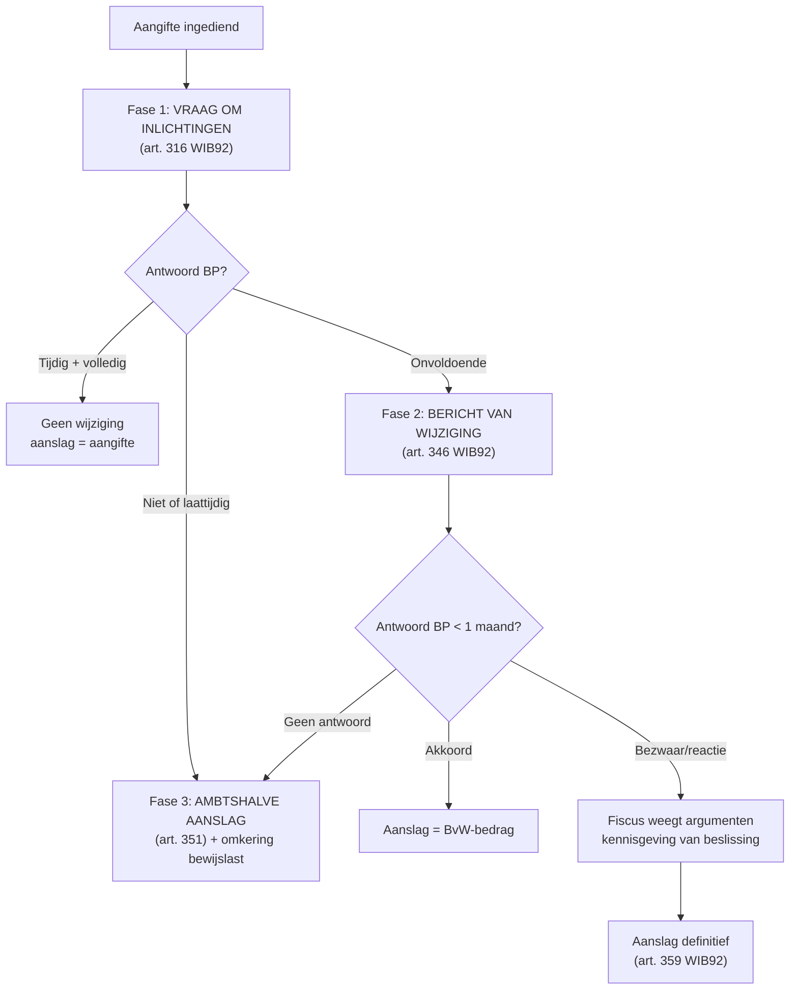

> **Themafiche — kapstok voor herhaling.** Drie fasen van controle naar aanslag — termijnen + bewijslast + omkering. Voor verhaal en routekaart: [[leerpaden/2.5|minicursus PO 2.5]].

---

## Take-away

- **Drie fasen**: VRAAG OM INLICHTINGEN → BERICHT VAN WIJZIGING → AANSLAG. Elke fase heeft eigen termijn + bewijslast-implicatie
- **Vraag om inlichtingen is dwingend**: 1 maand antwoorden, geen optie — niet antwoorden = ambtshalve aanslag + omkering bewijslast
- **Antwoordtermijn BvW = 1 maand** (≠ bezwaartermijn 6 maanden bij BTW of 1 jaar bij PB)
- **Aanslag van ambtswege ≠ willekeur** — moet redelijk + gemotiveerd zijn (beginsel behoorlijk bestuur)
- **Privéwoning = gerechtelijk machtiging vereist** (art. 319 WIB92); beroepslokalen = vrij toegang
- **Bij grensoverschrijdende informatie**: DAC + uitwisselingsverdragen — termijn-effect: aanslagtermijn schorst tijdens inlichtingen-verzoek

---

## De drie fasen — chronologische flow

---

## Fase 1 — Vraag om inlichtingen (art. 316)

| Element | Regel |
|---|---|
| **Wat?** | Schriftelijke vraag om feitelijke informatie (geen aanslag-voorstel) |
| **Antwoordtermijn** | 1 maand (kan verlengd worden op gemotiveerd verzoek) |
| **Bevoegdheid fiscus** | Vrij in beroepslokalen; bij derden via art. 322 |
| **Niet antwoorden** | → ambtshalve aanslag + omkering bewijslast + boete |
| **Privéwoning** | Toegang alleen met huiszoekingsbevel (onderzoeksrechter) |

⚠️ Behandel elke "vraag om inlichtingen" als dwingende termijn.

---

## Fase 2 — Bericht van wijziging (art. 346)

| Element | Regel |
|---|---|
| **Wat?** | Schriftelijke kennisgeving voornemen tot wijziging + motivatie |
| **Antwoordtermijn BP** | 1 maand (dwingend) |
| **Bewijslast vóór BvW** | Bij fiscus (hij wil afwijken van aangifte) |
| **Vereisten BvW** | Gemotiveerd: feiten + bedragen + rechtsgrond |
| **Mogelijkheden BP** | Akkoord · gemotiveerde betwisting · gedeeltelijk akkoord |
| **Geen antwoord** | → fiscus mag aanslag vestigen conform BvW |

⚠️ **Antwoordtermijn = 1 maand**, niet 6 maanden (verwarring met BTW-bezwaartermijn).

---

## Fase 3 — Aanslag van ambtswege (art. 351)

| Trigger | Voorwaarden | Effect |
|---|---|---|
| **Geen aangifte ingediend** | Na herinnering 1 maand | Aanslag op grond van vermoedens / vergelijking |
| **Aangifte niet conform** | Aanvullingen niet gedaan na vraag | Idem |
| **Onvoldoende boekhouding** | Substantiële tekortkomingen | Idem |
| **Geen antwoord op vraag/BvW** | Na 1 maand zonder reactie | Idem |

**Effect**: **omkering bewijslast** — BP moet bewijzen dat aanslag onjuist is.

⚠️ Ambtshalve = niet willekeurig. Fiscus moet redelijk + gemotiveerd handelen (beginsel behoorlijk bestuur). Onredelijke aanslag = aanvechtbaar via bezwaar.

---

## Termijn-overzicht in taxatie-fase

| Termijn | Wat? | Wie? |
|---|---|---|
| **1 maand** | Antwoord op vraag om inlichtingen | BP |
| **1 maand** | Antwoord op BvW | BP |
| **3 jaar (gewoon AJ 2023+)** | Tijd waarin fiscus aanslag mag vestigen | Fiscus |
| **4 / 6 / 10 jaar** | Verlengde aanslagtermijn (geen aangifte / complex / fraude) | Fiscus |
| **Tot 12 maanden schorsing** | Bij internationale informatie-uitwisseling (DAC, EOI) | Schorsing termijn |

---

## Bewijslast — verdeling per fase

| Fase | Wie draagt bewijs? | Toelichting |
|---|---|---|
| **Aangifte ingediend, tijdig + volledig** | Fiscus (afwijking vereist motivatie) | Standaard-vermoeden goeder trouw |
| **Aangifte laattijdig of onvolledig** | Fiscus (maar met lichtere vereisten) | Hulpvermoeden mogelijk |
| **BvW betwist door BP** | Beiden via tegensprekelijke procedure | Beide partijen leggen bewijs voor |
| **Aanslag van ambtswege** | BP (omkering) | BP moet aantonen dat aanslag onjuist is |
| **Fraude** | Fiscus moet opzet bewijzen | "Bedrieglijk opzet" art. 354 |

---

## Onderzoeksdaden — wat mag fiscus?

| Daad | Bevoegdheid | Bron |
|---|---|---|
| **Inzage boekhouding** | In beroepslokalen, vrije tijd | WIB92 art. 315 |
| **Toegang beroepslokalen** | Tijdens normale openingsuren | WIB92 art. 319 |
| **Toegang privéwoning** | Alleen met huiszoekingsbevel | WIB92 art. 319 |
| **Inlichtingen bij derden** | Vrij (banken, leveranciers, overheden) | WIB92 art. 322 |
| **Visitatie kassa, voorraad** | In beroepslokalen | WIB92 art. 319 |
| **Bankgeheim doorbreken** | Indien aanwijzingen fraude (sinds 2011 versoepeld) | WIB92 art. 322 §2 |

---

## ⚠️ Valkuilen

| Valkuil | Wat klopt er niet | Wat klopt wél |
|---|---|---|
| Antwoordtermijn BvW = 6 maanden | Verwarring met bezwaartermijn | Antwoordtermijn BvW = 1 maand (dwingend) |
| Vraag om inlichtingen is vrijblijvend | "Maar een vraag" | Niet of laattijdig = ambtshalve aanslag + omkering bewijslast + boete |
| Ambtshalve aanslag = willekeur | Fiscus mag eender wat vorderen | Redelijkheid + motivatie vereist; willekeurig hoge bedragen aanvechtbaar via bezwaar |
| Privéwoning vrij toegankelijk | Beroepscontrole = ook thuis | Art. 319: alleen beroepslokalen vrij; privéwoning vereist huiszoekingsbevel |
| Buiten onderzoekstermijn = OK antwoorden | Antwoord verplicht ook bij verlopen termijn | Onderzoeksdaden buiten termijn = nietig. Vraag naar juridische grond |
| Geen reactie op BvW = niet erg | "Stilte = geen erkenning" | Geen antwoord = fiscus mag aanslag vestigen conform BvW + omkering bewijslast |

---

## Doorklik — losse concept-fiches

**Taxatie-fase**
- [[taxatieprocedure]] — drie fasen + termijnen
- [[fiscale-controle]] — onderzoeksbevoegdheden
- [[fiscale-bewijsmiddelen]] — vermoedens + tegenbewijs

**Cross-cutting**
- [[aanslag-cyclus]] — totale cyclus aanslagjaar
- [[fiscale-sancties]] — boetes + belastingverhoging
- [[fiscale-boekhoud-correcties]] — fiscaal-boekhoudkundige aanpassingen

**Verwante themafiches**
- [[themafiches/fiscale-termijnen|Themafiche — Fiscale termijnen]]
- [[themafiches/bezwaar-en-gerechtelijke-fase|Themafiche — Bezwaar & gerechtelijke fase]]
- [[themafiches/invordering-en-dwangbevel|Themafiche — Invordering & dwangbevel]]

---

*Themafiche afgeleid uit cluster fiscale-procedure (PO 2.5). Status: voorgesteld.*
