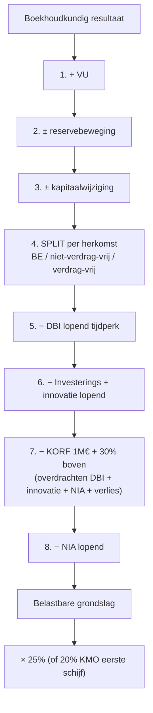

> ⚠️ **Voorlopig — themafiche-laag wordt uitgefaseerd.** Per **ADR-039** vervangt één PO-samenvatting per programmaonderdeel de cluster-themafiches. Deze fiche blijft beschikbaar tot het relevante PO een leerpad krijgt — dan migreert de inhoud naar `content/leerpaden/<po-slug>/samenvatting.md`. Voor cross-PO themafiches (vergelijkingen tussen verschillende PO's) volgt een aparte beslissing per fiche: incorporeren in alle relevante samenvattingen, óf upgraden naar concept-fiche.

> **Themafiche — kapstok voor herhaling.** Acht bewerkingen van boekhoudkundig resultaat tot belastbare grondslag — met dwingende volgorde, 1 M€-korf en boekhoud-conformiteits-eis. Voor verhaal en routekaart: [[leerpaden/2.3|minicursus PO 2.3]].

---

## Take-away

- **Boekhouding eerst, fiscus volgt** — fiscale grondslag start van boekhoudkundige winst; wat niet als kost geboekt staat, kan ook niet fiscaal afgetrokken worden (uitzondering: extra-comptabele aftrekken)
- **Aftrekvolgorde is dwingend (art. 207 + KB-WIB art. 74-79)** — bewerkingen 4-8 mag NIET door elkaar; verkeerde volgorde leidt tot andere belastbare basis
- **1 M€-korf-beperking** geldt voor SOM van: overgedragen DBI + overgedragen innovatie + overgedragen notionele interest + overgedragen verliezen — niet alleen verliezen
- **Boekjaar ≠ kalenderjaar veronderstellen** — gebroken boekjaar (1 juli - 30 juni) is gangbaar; aanslagjaar volgt op afsluitdatum
- **Aftrekken werken NIET op verdrag-vrijgesteld deel** — eerst splitsen tussen Belgisch / niet-verdrag-vrijgesteld buitenland / verdrag-vrijgesteld buitenland; aftrekken alleen op eerste twee

---

## De 8 bewerkingen — volgorde + cumulatie

| # | Bewerking | Wat? | Wettelijke basis |
|---|---|---|---|
| 1 | Verworpen uitgaven (VU) | Add-back niet-aftrekbare kosten op resultaat | Art. 53-66 WIB |
| 2 | Vermeerdering / vermindering reserves | Beweging belastbare en vrijgestelde reserves | Art. 24 + 190 WIB |
| 3 | Wijzigingen kapitaal | Inbreng / kapitaalverlaging buiten resultaat | KB-WIB art. 76 |
| **4** | Verdeling Belgisch / buitenland / verdragsvrijgesteld | Split per herkomst-winst | KB-WIB art. 78 + DBV |
| **5** | Aftrek vrijgestelde winsten (DBI lopend tijdperk, octrooi, ...) | Op Belgisch + niet-verdrag-vrijgesteld deel | Art. 202-205 WIB |
| **6** | Aftrek investeringsaftrek + innovatie-aftrek lopend | Op resterend | Art. 68-77 + 205/1 WIB |
| **7** | Korf van art. 207 lid 5 (1 M€ + 30% boven) | DBI-overdracht + innovatie-overdracht + NIA-overdracht + verlies-overdracht | Art. 207 lid 5 |
| **8** | Notionele interestaftrek lopend tijdperk | Op resterend | Art. 205bis-octies WIB |

**Resultaat na 8 bewerkingen** → tarief (25% basis / 20% KMO-eerste-schijf) → belasting vóór verrekeningen → voorheffingen + voorafbetalingen verrekenen → bijzondere aanslagen toevoegen → aanslagbiljet.

---

## Aftrek-volgorde grafisch

---

## Korf-beperking (art. 207 lid 5) — wat zit erin?

| Element | In de korf? |
|---|---|
| Overgedragen verliezen | ✅ |
| Overgedragen DBI (uit vorige tijdperken) | ✅ |
| Overgedragen innovatie-aftrek | ✅ |
| Overgedragen notionele interest | ✅ |
| **Lopend tijdperk** DBI / innovatie / NIA | ❌ (bewerkingen 5 + 6 + 8 onbeperkt) |
| Investeringsaftrek-overdracht | ❌ (apart regime) |

**Korf-formule** (richting; concrete bedragen Cijferzakboekje):

$$\text{Maximaal aftrekbaar uit korf} = 1\,000\,000\,€ + 70\% \times (\text{resultaat na bewerkingen 4-6} - 1\,000\,000)$$

Bedrag boven 1 M€ → 30% wordt **niet-aftrekbaar** (minimum belastbare basis); overschot rolt door naar volgend tijdperk.

---

## Tarief-bandbreedtes (richting)

| Tarief | Toepassing | Voorwaarde |
|---|---|---|
| 25% | Basistarief sinds AJ 2021 | Iedere VenB-plichtige |
| 20% | KMO-eerste schijf (100 k EUR) | Cumulatief: WVV-klein + aandelen ≤ 50% bij andere venn + bedrijfsleider-bezoldigingstest |
| Bijzondere tarieven | Liquidatie · onverdeeldheid · ... | Cf. Cijferzakboekje |

⚠️ Concrete bedragen + drempels: **Cijferzakboekje bij examen**.

---

## Boekhoud-conformiteit — kernregel

| Principe | Implicatie |
|---|---|
| Fiscale grondslag start van boekhoudkundig resultaat | Geen kost geboekt → geen aftrek mogelijk (extra-comptabele uitzonderingen) |
| Waarderingsregels boekhouding worden in principe gevolgd | Tenzij WIB anders bepaalt (bv. afschrijvingstermijnen) |
| Permanente verschillen | VU + DBI = blijvende discrepantie boekhouding/fiscus |
| Tijdelijke verschillen | Versnelde afschrijving · voorzieningen · waarderingen — komen later om |
| Vrijgestelde reserves | Onaantastbaarheidsvoorwaarde — moet apart geboekt + onaantastbaar blijven |

---

## Aanslagjaar — koppeling met boekjaar

| Boekjaar afsluiting | Aanslagjaar |
|---|---|
| 31/12/2024 | AJ 2025 |
| 30/06/2024 | AJ 2024 (afsluiting in 1e half) of AJ 2025 (afsluiting tweede helft, na 30/6) |
| Gebroken boekjaar 1/7/2024 - 30/6/2025 | AJ 2025 (≥ 31/12/2024) |

**Praktijk**: aanslagjaar = jaar van afsluiting van het boekjaar (tenzij boekjaar afsluit op 31/12 → AJ = jaar erna).

---

## ⚠️ Valkuilen

| Valkuil | Wat klopt er niet | Wat klopt wél |
|---|---|---|
| Boekjaar = kalenderjaar veronderstellen | Gebroken boekjaar veelvuldig | Check statuten + datum afsluiting |
| Aftrekken in willekeurige volgorde | Art. 207 + KB-WIB dwingend | Bewerkingen 4 → 5 → 6 → 7 → 8 in exact die volgorde |
| Aftrekken op verdrag-vrijgesteld deel | Niet toegelaten | Eerst splitsen, dan aftrek enkel op BE + niet-verdrag-vrij buitenland |
| Korf alleen op verliezen | Geldt voor SOM (DBI + innovatie + NIA + verlies overgedragen) | Vier elementen samen in 1 M€-pot |
| Boekhoud-conformiteit verwaarlozen | Geen geboekte kost = geen aftrek | Boek elke aftrekbare kost; corrigeer via VU als niet-aftrekbaar |
| KMO-tarief automatisch bij 'kleine' vennootschap | Drie cumulatieve voorwaarden | WVV-klein + aandelen-test + 45 k bedrijfsleider-bezoldiging (cf. verlaagd tarief-themafiche) |
| Korf-overschrijding = belasting verloren | Bedrag rolt door naar volgend tijdperk | Niet verloren — uitgesteld |
| Lopend tijdperk in de korf | Lopende DBI/NIA/innovatie buiten korf | Alleen overdrachten zitten in korf |

---

## Doorklik — losse concept-fiches

**Σ-record + bewerkingen**
- [[vennootschapsbelasting]] — sub-discipline-Σ (toepassingsgebied + tarief + cyclus)
- [[belastbare-grondslag-vennootschapsbelasting]] — 8 bewerkingen + korf + overgedragen verliezen
- [[fiscale-boekhoud-correcties]] — primauteit boekhouding + permanente vs tijdelijke verschillen

**Aftrekken**
- [[dbi-aftrek]] — vrijstelling deelnemingsdividend
- [[notionele-interestaftrek]] — risicokapitaal-aftrek (sterk ingeperkt)
- [[innovatie-aftrek]] — opvolger octrooi-aftrek
- [[investeringsaftrek]] — gewone + verhoogde tarieven
- [[gespreide-belasting-meerwaarden]] — art. 47 herbeleggings-mw

**Voorheffingen + aangifte**
- [[voorheffingen-en-verrekeningen-venb]] — FBB + RV + BV
- [[aangifte-vennootschapsbelasting]] — Biztax + 275.1/275.2

**Verwante themafiches**
- [[themafiches/verworpen-uitgaven|Themafiche — Verworpen uitgaven]]
- [[themafiches/verlaagd-tarief-20|Themafiche — Verlaagd tarief KMO]]
- [[themafiches/fiscale-fusie-splitsing|Themafiche — Fiscale fusie & splitsing]]
- [[themafiches/meerwaarden-venb|Themafiche — Meerwaarden in VenB]]

---

*Themafiche afgeleid uit cluster vennootschapsbelasting (PO 2.3). Status: voorgesteld.*
