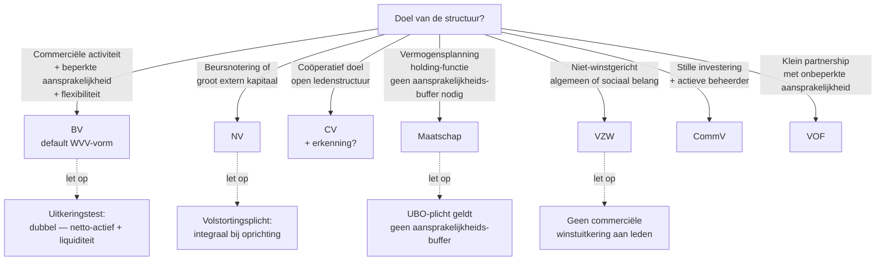

> **Themafiche — kapstok voor herhaling.** Zeven vormen in één matrix, plus keuze-beslisboom en grootte-drempels. WVV-systematiek sinds 2019. Voor verhaal en routekaart: [[leerpaden/3.0|minicursus PO 3.0]].

---

## Take-away

- **BV is sinds 2019 de default-vorm** — geen minimumkapitaal meer, vervangen door financieel plan + uitkeringstest
- **"BVBA" bestaat niet meer** — overgangsbepalingen zijn voorbij; oude naam = signaal van outdated bronnen
- **Maatschap = geen rechtspersoon** — vermogen blijft bij de maten; UBO-plicht geldt evenzeer
- **VOF/CommV = onbeperkte hoofdelijke aansprakelijkheid voor (gecommanditeerde) vennoten** — niet "BV light"
- **WVV-groottecategorie ≠ fiscale KMO** — twee aparte tests; verlaagd VenB-tarief vereist eigen criteria art. 1:24 WVV + bezoldigingsregel

---

## Vergelijkingsmatrix — zeven vormen

| Dimensie | **BV** | **NV** | **CV** | **VOF** | **CommV** | **Maatschap** | **VZW** |
|---|---|---|---|---|---|---|---|
| Rechtspersoon? | Ja | Ja | Ja | Ja | Ja | **Nee** | Ja |
| Minimumkapitaal | **Geen** (toereikend EV + plan) | 61.500 EUR | Geen | Geen | Geen | Geen | Geen |
| Aansprakelijkheid vennoten | Beperkt tot inbreng | Beperkt tot inbreng | Beperkt tot inbreng | **Onbeperkt + hoofdelijk** | Beheerders onbeperkt · stille beperkt | **Onbeperkt** maten | n.v.t. |
| Bestuur | 1+ bestuurders · flexibel statutair | RvB (min. 3, of 2 als 2 aandeelhouders) of enige bestuurder · duaal mogelijk | Bestuursorgaan · flexibel | Alle vennoten of statutair zaakvoerder | Beherende vennoot(en) | Zaakvoerder of consensus | RvB min. 3 (1 bij kleine VZW) |
| Overdraagbaarheid aandelen | Default beperkt (statutair vrij maakbaar) | Default vrij (statutair beperkbaar) | Statutair (uittreding-regime) | Quasi onmogelijk zonder unanimiteit | Stille: redelijk vrij · beherend: unanimiteit | n.v.t. (overdracht van deelname) | n.v.t. |
| Fiscaal | VenB | VenB | VenB (erkend ≠ regulier) | VenB | VenB | **Transparant** (PB bij maten) | RPB (regulier) of VenB (bij exploitatie) |
| WVV-boek | Boek 5 | Boek 7 | Boek 6 | Boek 4 | Boek 4 | Boek 4 (zonder rechtspers.) | Boek 9-11 |
| Typisch doel | KMO · familiale onderneming · start-up | Beursgenoteerd · grote groep · external capital | Coöperatief doel · sociaal ondernemerschap | Klein partnership · vrije beroepen historisch | Familiale holding · stille investering | Vermogens-planning · join-venture | Niet-winstgericht doel |

---

## Welke vorm bij welk doel?

---

## Groottecategorieën (art. 1:24-1:27 WVV)

Vennootschap is **klein** wanneer ze op balansdatum **niet meer dan één** drempel overschrijdt:

| Criterium | Klein | Microvennootschap |
|---|---|---|
| Balanstotaal | ≤ 4.5 mio EUR | ≤ 350k EUR |
| Omzet (excl. btw) | ≤ 9 mio EUR | ≤ 700k EUR |
| Gemiddeld personeelsbestand | ≤ 50 VTE | ≤ 10 VTE |

⚠️ Concrete bedragen: **Cijferzakboekje bij examen**.

**Cascade van gevolgen** bij "klein":
- Verkorte jaarrekening + vrijstelling consolidatie (cross [[themafiches/consolidatie|consolidatie]])
- Geen commissaris verplicht
- Niet "klein" voor fiscaal KMO-tarief tenzij art. 1:24 WVV én bezoldigingsregel (min. 45.000 EUR bedrijfsleidersbezoldiging of ≥ belastbaar resultaat) voldaan
- **Twee opeenvolgende boekjaren** voor wijziging — geen eenmalige overschrijding

---

## ⚠️ Valkuilen

| Valkuil | Wat klopt er niet | Wat klopt wél |
|---|---|---|
| "BVBA" of "minimum 18.550 EUR" gebruiken | WVV 2019 schafte BVBA + minimumkapitaal af | BV zonder minimumkapitaal · "toereikend aanvangsvermogen" + financieel plan |
| Maatschap = "onder de radar" / geen verplichtingen | Geen rechtspersoonlijkheid ≠ geen UBO of boekhoudplicht | UBO-register verplicht · jaarrekening intern · onbeperkte aansprakelijkheid maten |
| VOF/CommV als "simpele BV-alternatief" | Onbeperkte hoofdelijke aansprakelijkheid voor vennoten (VOF) / gecommanditeerden (CommV) | Alleen kiezen wanneer aansprakelijkheid bewust aanvaard is (familiale holding, stille structuren) |
| WVV-klein automatisch fiscale KMO | Twee aparte tests — fiscaal heeft eigen criteria (bezoldigingsregel art. 215 WIB92) | WVV-klein = lichtere boekhoudplicht; KMO-tarief 20% vereist art. 1:24 + bezoldiging-test |
| Eenmalige drempel-overschrijding = onmiddellijke status-wijziging | Twee opeenvolgende boekjaren-toets | Status verandert pas bij twee jaar overschrijden — vermijdt schommelingen |
| Stille vennoot CommV "mag wel even meedoen" in bestuur | Stille vennoot verliest meteen beperkte aansprakelijkheid bij bestuurshandeling | Strikte gedragslijn: stille = stille; advies extern formaliseren |

---

## Doorklik — losse concept-fiches

**Overkoepelend**
- [[ondernemingsvormen]] — keuze-kader + WVV-systematiek

**De vormen**
- [[besloten-vennootschap]] — BV, default sinds 2019
- [[naamloze-vennootschap]] — NV, beursgenoteerd-vriendelijk
- [[cooperatieve-vennootschap]] — CV, met of zonder erkenning
- [[vennootschap-onder-firma]] — VOF
- [[commanditaire-vennootschap]] — CommV
- [[maatschap]] — zonder rechtspersoonlijkheid
- [[vereniging-zonder-winstoogmerk]] — VZW

**Cross-cutting**
- [[vennootschap-groottecategorieen]] — art. 1:24-1:27 + cascade
- [[oprichting-vennootschap]] — verrichting + financieel plan

**Verwante themafiches**
- [[themafiches/kapitaalbescherming-en-alarmbel|Themafiche — Kapitaalbescherming & alarmbel]]
- [[themafiches/reorganisatie-en-bijzondere-mandaten|Themafiche — Reorganisatie & bijzondere mandaten]]
- [[themafiches/insolventie-wer-boek-xx|Themafiche — Insolventie WER Boek XX]]

---

*Themafiche afgeleid uit cluster ondernemingsvormen (PO 3.0). Status: voorgesteld.*
