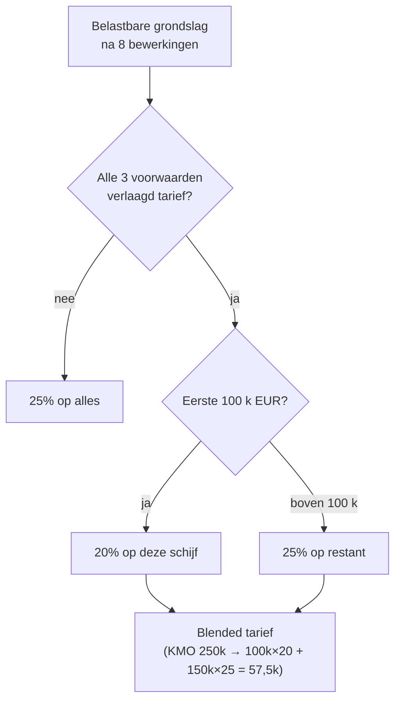

> ⚠️ **Voorlopig — themafiche-laag wordt uitgefaseerd.** Per **ADR-039** vervangt één PO-samenvatting per programmaonderdeel de cluster-themafiches. Deze fiche blijft beschikbaar tot het relevante PO een leerpad krijgt — dan migreert de inhoud naar `content/studiemateriaal/<po-slug>/samenvatting.md`. Voor cross-PO themafiches (vergelijkingen tussen verschillende PO's) volgt een aparte beslissing per fiche: incorporeren in alle relevante samenvattingen, óf upgraden naar concept-fiche.

> **Themafiche — kapstok voor herhaling.** 20% i.p.v. 25% op de eerste schijf van 100 k EUR — maar alleen onder drie strenge cumulatieve voorwaarden. Bezoldigingstest is de notoir struikelblok. Voor verhaal en routekaart: [[studiemateriaal/2-3|overzicht PO 2.3]].

---

## Take-away

- **Drie cumulatieve voorwaarden** — WVV-klein + aandelen-test ≤ 50% in andere vennootschappen + minimum-bezoldigingstest bedrijfsleider; één faalt = geen verlaagd tarief
- **Bezoldiging is per bedrijfsleider** — niet optellen tussen meerdere bedrijfsleiders; minstens één moet de drempel halen
- **Drempel** (~ 45.000 EUR of gelijk aan het belastbaar resultaat indien lager) — Cijferzakboekje voor exact bedrag
- **Startersuitzondering** geldt enkel voor eerste 4 boekjaren NA oprichting — niet permanent
- **20% geldt enkel op de eerste schijf van 100 k EUR**; boven 100 k = 25% — KMO met 250 k winst betaalt blended tarief

---

## Drie cumulatieve voorwaarden

| Voorwaarde | Wat exact? | Bron |
|---|---|---|
| **WVV-klein** | Vennootschap voldoet aan KMO-criteria art. 1:24 WVV (max. 2 van 3 grenzen overschreden op balans + omzet + medewerkers) | WVV art. 1:24 |
| **Aandelen-test** | Aandelen niet voor > 50% in handen van **andere vennootschappen** | Art. 215 WIB |
| **Bezoldigingstest** | Minstens één bedrijfsleider-natuurlijk-persoon ontvangt bezoldiging ≥ drempel (~45 k of resultaat indien lager) | Art. 215 WIB |

⚠️ Concrete drempels (~45.000 EUR + 100 k tariefgrens): **Cijferzakboekje bij examen** verplicht. Drempels worden gemilijoneerd.

---

## Tariefstructuur — wat is 20% en wat 25%?

---

## Bezoldigingstest — drie scenario's

| Scenario | Drempel | Voorbeeld | Uitkomst |
|---|---|---|---|
| Belastbaar resultaat > 90 k | Bezoldiging ≥ 45 k EUR | Resultaat 150 k, bezoldiging 50 k | ✅ Verlaagd tarief |
| Belastbaar resultaat ≤ 90 k | Bezoldiging ≥ resultaat | Resultaat 60 k, bezoldiging 60 k | ✅ Verlaagd tarief |
| Bezoldiging onder drempel | – | Resultaat 150 k, bezoldiging 30 k | ❌ Geen verlaagd tarief + extra sanctie (zie hieronder) |

**Optellen tussen meerdere bedrijfsleiders** is **niet toegelaten** — één bedrijfsleider moet zelfstandig de drempel halen.

---

## Sanctie bij onvoldoende bezoldiging

Naast verlies KMO-tarief volgt **bijzondere aanslag** bij KMO:

$$\text{Bijzondere aanslag} = (\text{drempel} - \text{werkelijke bezoldiging}) \times \text{tarief KB-WIB}$$

(Vervangregeling van afgeschafte art. 219ter, vanaf 2021.)

Concrete tarief- en formule-elementen: **Cijferzakboekje + circulaire**.

---

## Startersuitzondering

| Aspect | Inhoud |
|---|---|
| Wie? | Vennootschappen tijdens **eerste 4 boekjaren** na oprichting |
| Uitzondering | Bezoldigingstest hoeft niet voldaan |
| Andere voorwaarden | WVV-klein + aandelen-test blijven cumulatief |
| Vanaf 5e boekjaar | Bezoldigingstest wordt actief — moet voldaan zijn of verlaagd tarief valt weg |

**Praktijk**: vennootschappen die in starterperiode aan KMO-tarief gewend zijn, vergeten regelmatig de overgang in jaar 5 — dit is een klassieke valstrik.

---

## Vergelijkingsmatrix — wel/niet KMO

| Situatie | KMO-tarief? | Reden |
|---|---|---|
| Holding met enkel deelnemingen in dochters | ❌ | Aandelen-test faalt (50%-regel kijkt naar wie aandeelhouder is van de vennootschap zelf) |
| Werkmaatschappij + holding-moeder (>50%) | ❌ | Werkmaatschappij heeft moederventure die > 50% bezit |
| Werkmaatschappij + natuurlijk persoon (>50%) | ✅ (mits andere vw OK) | Aandelen-test gehaald |
| KMO met bedrijfsleider als gepensioneerde (geen loon) | ❌ | Bezoldigingstest faalt — geen NP-bedrijfsleider met loon |
| Holding-moeder met werkmaatschappij die alle resultaat genereert | Aparte test per vennootschap | KMO-tarief geldt vennootschap-per-vennootschap |

---

## ⚠️ Valkuilen

| Valkuil | Wat klopt er niet | Wat klopt wél |
|---|---|---|
| Bezoldiging optellen van meerdere bedrijfsleiders | Test = per bedrijfsleider | Minstens één NP-bedrijfsleider moet drempel halen zelfstandig |
| KMO-tarief automatisch voor 'kleine vennootschap' | Drie cumulatieve voorwaarden | WVV-klein + aandelen-test + bezoldigingstest samen |
| Startersuitzondering ook in 5e boekjaar | Geldt enkel eerste 4 boekjaren | Vanaf jaar 5: bezoldigingstest verplicht |
| 20% op heel het belastbaar inkomen | Enkel eerste schijf van 100 k EUR | Boven 100 k = 25% |
| Aandelen-test kijkt naar dochters | Test kijkt naar wie aandelen van de vennootschap zelf bezit | Holding-moeder > 50% bij vennootschap = aandelen-test faalt |
| Sanctie = enkel verlies tarief | Naast verlies tarief: bijzondere aanslag op bezoldigings-tekort | Vervangregeling 219ter sinds 2021 |
| Bezoldigingstest cijfer = volledig loon | Inclusief VAA + bezoldiging in natura + tantième | Alles wat als bedrijfsleidersbezoldiging kwalificeert telt mee |

---

## Doorklik — losse concept-fiches

**KMO-regime**
- [[verlaagd-tarief-kleine-vennootschap]] — drie cumulatieve voorwaarden + sanctie
- [[vennootschap-groottecategorieen]] — WVV-klein criteria art. 1:24 + cascade gevolgen
- [[bedrijfsleidersbezoldiging]] — 45 k-regel + bezoldigingstheorie + tantième

**VenB-context**
- [[vennootschapsbelasting]] — sub-discipline-Σ
- [[bijzondere-aanslagen-venb]] — vervangsanctie 219ter (afgeschaft)

**Verwante themafiches**
- [[themafiches/venb-bewerkingsschema|Themafiche — VenB-bewerkingsschema]]
- [[themafiches/verworpen-uitgaven|Themafiche — Verworpen uitgaven]]

---

*Themafiche afgeleid uit cluster vennootschapsbelasting (PO 2.3). Status: voorgesteld.*
