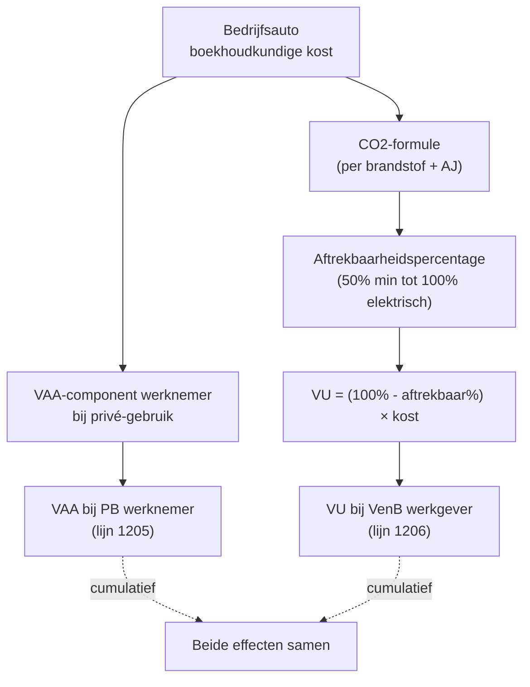

> ⚠️ **Voorlopig — themafiche-laag wordt uitgefaseerd.** Per **ADR-039** vervangt één PO-samenvatting per programmaonderdeel de cluster-themafiches. Deze fiche blijft beschikbaar tot het relevante PO een leerpad krijgt — dan migreert de inhoud naar `content/leerpaden/<po-slug>/samenvatting.md`. Voor cross-PO themafiches (vergelijkingen tussen verschillende PO's) volgt een aparte beslissing per fiche: incorporeren in alle relevante samenvattingen, óf upgraden naar concept-fiche.

> **Themafiche — kapstok voor herhaling.** Welke kosten zijn (deels) niet aftrekbaar in VenB? Add-back in bewerking 1; cascade naar bijzondere aanslagen. Voor verhaal en routekaart: [[leerpaden/2.3|minicursus PO 2.3]].

---

## Take-away

- **VU = boekhoudkundig WEL geboekt + fiscaal add-back** — bewerking 1 verhoogt het belastbaar resultaat met de verworpen kostenmassa
- **Auto-VU werkt via CO2-tabel + percentage-aftrekbaarheid** — daarnaast verworpen brandstofkost + privé-gebruik; sinds 2026 stricter regime voor hybride/diesel
- **Restaurant (31% aftrekbaar = 69% VU) ≠ receptie (50% aftrekbaar = 50% VU)** — boekhoudkundige uitsplitsing essentieel
- **Niet-verantwoorde kosten triggeren TWEE effecten**: (a) VU + (b) afzonderlijke aanslag 100% (art. 219) — cumulatief
- **Aftrekbaarheidstest art. 49 WIB** is de hoofdregel — geen causaal verband met beroep → verworpen, geen "klein" %

---

## Hoofdcategorieën verworpen uitgaven (art. 53-66 WIB)

| # | Categorie | Aftrekbaarheid (richting) | VU-deel |
|---|---|---|---|
| 1 | **Niet-aftrekbare belastingen** (PB · gemeentebelasting overledene · sommige boetes) | 0% | 100% |
| 2 | **Boetes + sancties** (verkeer · sociale wet · fiscale boetes) | 0% | 100% |
| 3 | **Auto-CO2-aftrekbeperking** | 50-100% afhankelijk van CO2 + brandstof | Rest |
| 4 | **Restaurantkosten** | 31% | 69% |
| 5 | **Receptiekosten** | 50% | 50% |
| 6 | **Sociale voordelen** (niet collectief) | Soms 100%, soms 0% | Afhankelijk |
| 7 | **Geschenken** | 50% (publiciteit) / 0% (niet-publiciteit) | Rest |
| 8 | **Beroepskledij niet-specifiek** | 0% (art. 53 7°) | 100% |
| 9 | **Liberaliteiten** (giften niet erkend) | 0% | 100% |
| 10 | **Bezoldiging echtgenoot** (boven bepaalde grens) | Beperkt | Rest |
| 11 | **Abnormale + goedgunstige voordelen** | Apart regime (art. 26) | Cf. AAMB |

⚠️ Concrete percentages, plafonds en drempels: **Cijferzakboekje bij examen**.

---

## Auto-VU — formule + cascade

**Belangrijk**: lijn 1205 (VAA werknemer) en lijn 1206 (VU werkgever) zijn **cumulatief**, niet alternatief.

---

## Restaurant vs receptie — boekhoudkundige uitsplitsing

| Type kost | Boekhouding | Aftrekbaar | VU | Belangrijk |
|---|---|---|---|---|
| Restaurant (beroepsmatig) | Klasse 6 + uitsplitsing kosten | 31% | 69% | Btw-aftrek apart (50%) |
| Receptie (klanten, opening, ...) | Klasse 6 + uitsplitsing kosten | 50% | 50% | Btw-aftrek beperkt |
| Geschenk publicitair < drempel | Klasse 6 | 100% | 0% | Naam zichtbaar |
| Geschenk niet-publicitair | Klasse 6 | 50% | 50% | Cf. Cijferzakboekje |

**Praktische regel**: boek restaurant en receptie op aparte sub-rekeningen — verkeerde combinatie kost belasting (frequent gecorrigeerd in controle).

---

## Niet-verantwoorde kosten — dubbele sanctie

| Stap | Effect |
|---|---|
| 1. VU = volledig kostenbedrag | Add-back in bewerking 1 |
| 2. Afzonderlijke aanslag art. 219 | 100% (50% verhoogd indien verbonden persoon) |
| 3. Aftrekbaarheid afzonderlijke aanslag zelf | Sinds 2014 aftrekbaar als beroepskost (verzacht totale impact) |
| 4. Uitzondering 'voldoende bekend gemaakt' | Indien begunstigde geïdentificeerd + RV/BV ingehouden of fiches ingediend → aparte aanslag valt weg |

**Hervorming**: art. 219ter (KMO-bezoldigingsregel afzonderlijke aanslag) is **afgeschaft sinds 1/1/2021**. Sanctie blijft via verlies KMO-tarief.

---

## Vergelijkingsmatrix per kostentype

| Kostentype | Aftrekbaar % | VU code aangifte | Boekhoud-rekening typisch |
|---|---|---|---|
| Brandstof bedrijfsauto | 50-100% (CO2) | Cf. 1206 + 1207 | 6131 |
| Restaurant beroepsmatig | 31% | 1241 | 6133 |
| Receptie | 50% | 1242 | 6134 |
| Publiciteit geschenken | 100% (drempel) / 50% | 1243 | 6135 |
| Beroepskledij niet-specifiek | 0% | 1244 | 6191 (verboden!) |
| Boete | 0% | 1217 | 6500 |
| Sociale voordelen (niet collectief) | 0% (bv. cheques) | 1217 | 6191 |

⚠️ Codes en percentages per AJ wijzigen: **Cijferzakboekje bij examen**.

---

## ⚠️ Valkuilen

| Valkuil | Wat klopt er niet | Wat klopt wél |
|---|---|---|
| VU niet boeken in bewerking 1 | VU zijn boekhoudkundig WEL geboekt; fiscaal moeten ze add-back | Boekhoudkundige winst is al verminderd door geboekte kost → add-back in bewerking 1 corrigeert |
| Niet-verantwoorde kost = enkel VU | Cumulatief met afzonderlijke aanslag art. 219 | (a) VU + (b) 100% aanslag — twee effecten |
| Restaurant 50% aftrekbaar | Restaurant = 31% (sinds 2017) | Receptie = 50%; restaurant = 31% |
| Beroepskledij algemeen 50% verworpen | Niet-specifieke kledij = 100% verworpen | Alleen kledij "die door haar aard niet anders dan beroepsmatig kan worden gebruikt" = aftrekbaar |
| Auto-VU vergeten naast VAA | Cumulatief — VU werkgever + VAA werknemer | Lijn 1205 (PB) + lijn 1206 (VenB) samen |
| Geheime commissielonen-aanslag = niet-aftrekbaar | Sinds 2014 aftrekbaar als beroepskost | Verzacht impact, maar laat sanctie staan |
| Art. 219ter nog gebruiken | Afgeschaft sinds 1/1/2021 | Vervangsanctie: verlies KMO-tarief bij onvoldoende bezoldiging bedrijfsleider |
| Boete fiscale = aftrekbaar | Alle fiscale + administratieve boetes = 0% aftrekbaar | Art. 53 6° WIB |

---

## Doorklik — losse concept-fiches

**VU-cluster**
- [[verworpen-uitgaven]] — familie-Σ met 11 categorieën
- [[bijzondere-aanslagen-venb]] — afzonderlijke aanslagen + geheime commissielonen
- [[autokosten]] — CO2-tabel + VAA + VU werkgever (cross mobiliteit)

**Aangrenzend**
- [[beroepskosten]] — aftrekbaarheidstest art. 49 WIB (generiek)
- [[abnormale-goedgunstige-voordelen]] — art. 26 WIB + arm's length

**Verwante themafiches**
- [[themafiches/venb-bewerkingsschema|Themafiche — VenB-bewerkingsschema]]
- [[themafiches/verlaagd-tarief-20|Themafiche — Verlaagd tarief KMO]]

---

*Themafiche afgeleid uit cluster vennootschapsbelasting (PO 2.3). Status: voorgesteld.*
