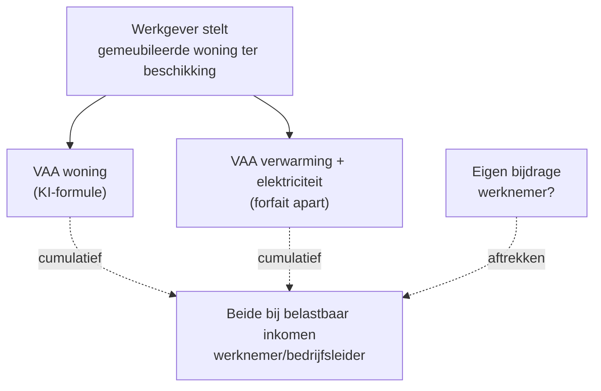

> ⚠️ **Voorlopig — themafiche-laag wordt uitgefaseerd.** Per **ADR-039** vervangt één PO-samenvatting per programmaonderdeel de cluster-themafiches. Deze fiche blijft beschikbaar tot het relevante PO een leerpad krijgt — dan migreert de inhoud naar `content/leerpaden/<po-slug>/samenvatting.md`. Voor cross-PO themafiches (vergelijkingen tussen verschillende PO's) volgt een aparte beslissing per fiche: incorporeren in alle relevante samenvattingen, óf upgraden naar concept-fiche.

> **Themafiche — kapstok voor herhaling.** Vijf klassieke VAA-fenomenen met forfaitaire formules per type. Forfait ≠ werkelijke kost — KB-WIB legt de formules vast. Voor verhaal en routekaart: [[leerpaden/2.2|minicursus PO 2.2]].

---

## Take-away

- **Forfait ≠ werkelijke kost** — VAA wordt altijd berekend volgens KB-WIB-formule, ongeacht wat de werkgever effectief uitgeeft
- **Eigen bijdrage werknemer trekt af** — VAA - eigen bijdrage = belastbaar voordeel; eigen bijdrage > forfait = geen VAA
- **VAA-woning EN VAA-energie zijn cumulatief** — twee aparte forfaits, niet één
- **Auto VAA = lijn 1205 + verworpen uitgave 1206 zijn cumulatief**, niet alternatief — verwarring bij examen
- **Indexatie + parameterwijziging jaarlijks** — gebruik altijd de waarden van het juiste aanslagjaar (Cijferzakboekje)

---

## Vijf VAA-types — overzicht formules

| VAA | Formule-skelet | Belangrijkste parameter | Veelgemaakte fout |
|---|---|---|---|
| **Auto (firmawagen)** | CO2-formule × cataloguswaarde × ouderdoms-factor × 6/7 × privé-gebruik-factor | CO2 + brandstof + AJ | Aanslagjaar vs aankoopdatum |
| **Woning** | KI × indexering × forfait-coëfficiënt + gemeubileerd-verhoging | KI + AJ | Forfait 3,8 of 1,25 (oud) gebruiken — sinds 2019 nieuwe coëfficiënt |
| **PC + communicatie** | Forfaitair bedrag per toestel/dienst | Vast bedrag KB-WIB | Dubbel internet-forfait in gezin met 2 werkende partners |
| **Renteloze lening / lage rente** | Referentievoet KB-WIB × gemiddeld saldo lening | Referentievoet jaarlijks | Werkelijke marktrente i.p.v. KB-voet |
| **Verwarming + elektriciteit** | Forfaitair bedrag (kaderlid vs niet-kaderlid) | Vast bedrag + categorie | Werkelijke energiekost aangeven |

⚠️ Concrete bedragen en coëfficiënten: **Cijferzakboekje bij examen** verplicht raadplegen.

---

## VAA auto (firmawagen) — formule + valkuilen

$$\text{VAA} = \text{cataloguswaarde} \times \text{CO}_2\text{-percentage} \times \frac{6}{7} \times \text{ouderdomsfactor}$$

| Element | Waar zit het? | Valstrik |
|---|---|---|
| Cataloguswaarde | Bruto + opties + BTW − kortingen werkgever | Niet de aankoopprijs |
| CO2-percentage | Formule per brandstof (benzine/diesel/elektrisch) + reference-CO2 | Reference verandert jaarlijks → Cijferzakboekje |
| 6/7-factor | Vaste factor | Niet wijzigen |
| Ouderdomsfactor | 100% in jaar 1; daalt met 6% per jaar tot 70% in jaar 5+ | Aanslagjaar ≠ aankoopdatum |
| Minimum VAA | Vast bedrag (cf. Cijferzakboekje) | VAA mag nooit lager zijn dan minimum |

**Boekhouding/VenB-link**: aan werkgeverskant volgt verworpen uitgave (VU) op autokosten via CO2-aftrekbeperking + percentage-tabel. Lijn 1205 (VAA werknemer) én lijn 1206 (VU werkgever) zijn **cumulatief**.

---

## VAA woning + energie — combinatie

Sinds 2019 geldt **één coëfficiënt** voor VAA woning (afgeschaft onderscheid KI ≤ 745 / > 745 dat tot 2018 gold met factor 1,25 en 3,8).

---

## VAA renteloze lening — formule

$$\text{VAA} = (\text{KB-WIB referentievoet} - \text{werkelijke rente}) \times \text{gemiddeld saldo lening}$$

| Element | Bron |
|---|---|
| Referentievoet | KB-WIB jaarlijks bij MB · Cijferzakboekje |
| Gemiddeld saldo | (Begin + Eind)/2 over jaar, of per kwartaal verfijnd |
| Werkelijke rente | Wat werknemer betaalt aan werkgever |

**Tip**: rente aanrekenen kan voordeliger zijn dan VAA betalen, maar niet automatisch — afhankelijk van marginaal tarief werknemer en saldo.

---

## VAA pc + communicatie — forfaits per toestel

| Toestel/dienst | Forfait | Cumuleerbaar? |
|---|---|---|
| Pc/laptop | Vast bedrag per jaar (KB-WIB) | Per toestel apart, max 1 per gezin per gebruik |
| Tablet | Vast bedrag | Cumulatief met pc |
| Smartphone (toestel) | Vast bedrag | Apart van abonnement |
| Internet (abonnement) | Vast bedrag | Eén per gezin, ongeacht aantal werkenden |
| Mobiel abonnement | Vast bedrag | Per persoon |

---

## Eigen bijdrage werknemer — algemeen schema

$$\text{Belastbaar voordeel} = \max(\text{VAA-forfait} - \text{eigen bijdrage}, 0)$$

Eigen bijdrage moet **werkelijk betaald** zijn (inhouding loonbrief of overschrijving) — een fictieve verrekening volstaat niet.

---

## ⚠️ Valkuilen

| Valkuil | Wat klopt er niet | Wat klopt wél |
|---|---|---|
| Werkelijke kost als VAA aangeven | Forfait is wettelijk verplicht | KB-WIB-formule altijd toepassen, ongeacht werkgeverskost |
| Oude woning-coëfficiënt (3,8 / 1,25) | Vervangen sinds 2019 door één coëfficiënt | Cijferzakboekje + AJ checken |
| Auto: aanslagjaar = aankoopdatum | Ouderdomsfactor telt vanaf eerste inschrijving | Reken jaren vanaf inschrijving, niet vanaf inbreng |
| VAA-energie vervangt VAA-woning | Twee aparte forfaits | Cumulatief; samen op aangifte |
| Auto-VAA (1205) of VU autokost (1206) — kies één | Cumulatief, niet alternatief | VAA bij werknemer + VU bij werkgever (cf. CO2-tabel) |
| Eigen bijdrage > forfait → negatief VAA | Geen negatieve VAA | Belastbaar voordeel = max(0); overschot eigen bijdrage gaat verloren |
| Internet-forfait per partner in gezin | Eén forfait per gezin | Eén internet-aansluiting = één forfait, ongeacht aantal werkenden |
| Renteloze lening met werkelijke marktrente | KB-WIB-referentievoet primeert | Marktrente irrelevant; alleen MB-referentievoet telt |

---

## Doorklik — losse concept-fiches

**Per VAA-fenomeen**
- [[autokosten]] — VAA + VU + CO2 (in mobiliteit-cluster, fiscaal-PB perspectief)
- [[vaa-woning]] — KI-formule + indexering
- [[vaa-pc-en-communicatie]] — forfaits per toestel
- [[vaa-renteloze-lening]] — referentievoet KB-WIB
- [[vaa-verwarming-en-elektriciteit]] — kaderlid vs niet-kaderlid

**Kader-record**
- [[voordelen-alle-aard]] — filter-overzicht VAA-categorie
- [[werknemers-vergoedingen]] — VAA-pendant aan loonkant
- [[werknemersbezoldiging]] — bezoldigingsbestanddelen
- [[bedrijfsleidersbezoldiging]] — VAA bij zaakvoerder/bestuurder

**Verwante themafiches**
- [[themafiches/inkomstencategorieen|Themafiche — Inkomstencategorieën PB]]
- [[themafiches/pb-berekeningsschema|Themafiche — PB-berekeningsschema]]

---

*Themafiche afgeleid uit cluster personenbelasting (PO 2.2). Status: voorgesteld.*
