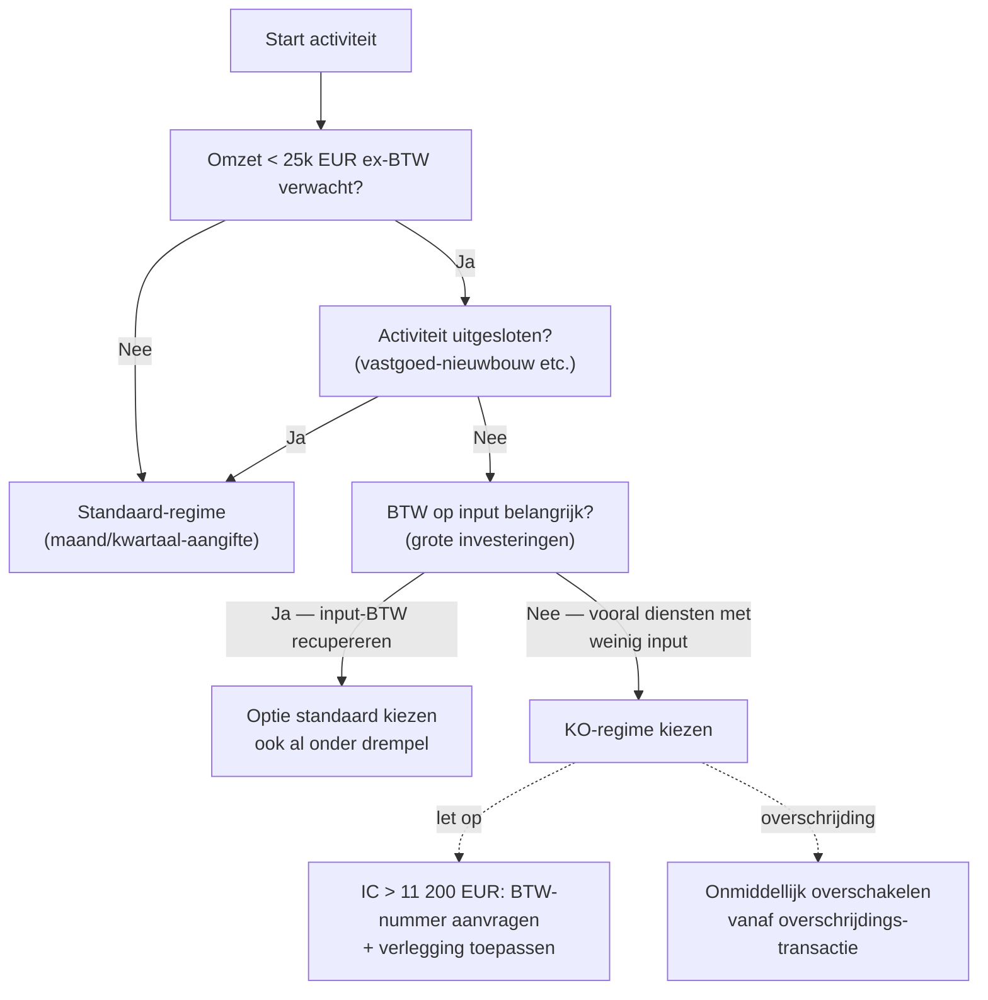

> **Themafiche — kapstok voor herhaling.** Drempel 25 000 EUR + uitsluitingen + IC-verplichtingen + overgang regimes. Voor verhaal en routekaart: [[leerpaden/2.4|minicursus PO 2.4]].

---

## Take-away

- **KO ≠ art. 44-vrijstelling**: KO = subjectieve omzetdrempel (optioneel) · art. 44 = objectief per handeling (automatisch)
- **Drempel 25 000 EUR ex-BTW** op gerealiseerde omzet kalenderjaar — niet incl. BTW
- **Overschakeling = onmiddellijk** vanaf handeling die drempel overschrijdt, niet vanaf volgend kalenderjaar
- **KO is niet "BTW-vrij"**: IC-verwervingen > 11 200 EUR/jaar + ontvangen diensten uit EU → verleggingsregeling vereist
- **Bepaalde activiteiten uitgesloten** van KO (vastgoed-nieuwbouw, sommige beroepen) — checken vooraleer optie

---

## Drempel + tolerantie

| Element | Regel | Toelichting |
|---|---|---|
| **Drempel** | 25 000 EUR ex-BTW per kalenderjaar | Art. 56bis W.BTW |
| **Wat telt mee?** | Belastbare leveringen + diensten + bepaalde vrijgestelde transacties (art. 56nonies) | Niet: occasionele verkopen vaste activa |
| **Tolerantie** | 10% overschrijding gedurende max 1 jaar | Praktijk-tolerantie FOD — geen wettelijke grond |
| **Overschakeling bij overschrijding** | Onmiddellijk vanaf transactie die drempel doet overschrijden | Niet wachten tot volgend kalenderjaar |
| **Terug naar KO?** | Opnieuw kiezen mogelijk indien volgend jaar onder drempel | Optie via VAT-aangifte |

---

## Wie kan kiezen? Uitsluitingen

| Wel KO mogelijk | Niet KO mogelijk |
|---|---|
| Loodgieter, IT-consultant, kleine handelaar, freelancer | Beroepsoprichter vastgoed (verkoop gebouwen < 2j) |
| Webshop onder drempel | Werk in onroerende staat (in bepaalde gevallen) |
| Adviseur, coach | Schroothandel, oude metalen |
| Kleine maker / handgemaakte productie | Telecommunicatie-, omroep- of TBE-diensten naar EU-consumenten (geen drempel-vrijstelling) |
| Schrijver, fotograaf | Reizigers-vervoer (in bepaalde gevallen) |

---

## Wat MAG en MOET een KO?

| Element | KO-regime | Standaard-regime |
|---|---|---|
| **BTW factureren op verkoop** | Nee — vermelding "vrijstelling KMO-regeling art. 56bis" | Ja — 21/12/6% |
| **BTW aftrekken op aankoop** | Nee | Ja |
| **BTW-aangifte indienen** | Geen periodieke aangifte (alleen jaarlijks listing) | Maand- of kwartaalaangifte |
| **IC-verwervingen** | Verleggingsregeling vanaf 11 200 EUR/jaar (art. 25ter) | Standaard verlegging |
| **Diensten uit buitenland ontvangen** | Verleggingsregeling ongeacht bedrag | Idem |
| **BTW-nummer aanvragen** | Ja (subjectief belastingplichtig blijven) | Ja |
| **Klantenlisting jaarlijks** | Verplicht | Verplicht |
| **Boekhouding** | Vereenvoudigd dagboek-stelsel toegelaten | Vereenvoudigd of dubbel |

---

## Beslisboom: KO of standaard?

---

## Verplichtingen onder KO

| Verplichting | Frequentie | Inhoud |
|---|---|---|
| **Vermelding op factuur** | Per factuur | "Bijzondere vrijstellingsregeling kleine ondernemingen" |
| **Klantenlisting B2B** | Jaarlijks tegen 31 maart | Belgische BTW-klanten met afgenomen omzet ≥ 250 EUR |
| **IC-opgave** | Bij IC-leveringen | Driemaandelijks indien voorkomt |
| **Boekhouding** | Continu | Aankoop- + verkoopboek minimum |
| **Bewaring stukken** | 10 jaar (BTW) | Facturen + dagboeken |

---

## Overgang tussen regimes — moment + gevolgen

| Overgang | Trigger | Impact |
|---|---|---|
| **KO → standaard** | Drempel overschreden of vrijwillig | Vanaf overschrijding: BTW factureren + aftrek input; herziening voorraad-input (KB nr. 3) |
| **Standaard → KO** | Vrijwillig + < drempel + niet uitgesloten | Vanaf 1 jan volgend jaar; geen herziening voorraad indien KO ≤ 1 jaar gestopt |
| **Herziening voorraad bij overgang** | Bestaande voorraad + bedrijfsmiddelen | Pro-rata BTW terugbetalen of bijbetalen (5j/15j-mechanisme) |

---

## ⚠️ Valkuilen

| Valkuil | Wat klopt er niet | Wat klopt wél |
|---|---|---|
| KO = art. 44-vrijstelling | "Vrijgesteld zoals een arts" | KO = optioneel + subjectief (omzet); art. 44 = automatisch + objectief (handeling-type) |
| Drempel incl. BTW | 25 000 EUR incl. BTW = onder drempel | 25 000 EUR **ex-BTW** (art. 56nonies) — 25 000 ex = 30 250 incl bij 21% |
| Overschakeling pas volgend jaar | Hele kalenderjaar in KO blijven na overschrijding | Onmiddellijk vanaf transactie die drempel overschrijdt — anders achterstallige BTW + boete |
| KO = BTW-vrij voor alles | Geen BTW-acties nodig | IC-verwervingen > 11 200 EUR + ontvangen diensten uit EU = verleggingsregeling |
| Geen BTW-nummer onder KO | Geen registratie nodig | BTW-nummer wel aanvragen — verleggings-verplichtingen + klantenlisting |
| KO ook voor vastgoed-nieuwbouw verkoop | KO universeel toepasbaar | Beroepsoprichter vastgoed = uitgesloten van KO |

---

## Doorklik — losse concept-fiches

**KO-regime**
- [[vrijstellingsregeling-kleine-onderneming]] — drempel + voorwaarden + verplichtingen
- [[opstart-btw-formaliteiten]] — BTW-nummer aanvragen
- [[stopzetting-btw]] — overgang of stopzetting

**Cross-cutting**
- [[btw-belastingplichtige]] — types + criteria
- [[btw-vrijstellingen]] — art. 44 vs KO
- [[forfaitaire-regeling-btw]] — andere bijzondere regeling (forfait)

**Verwante themafiches**
- [[themafiches/btw-vier-kernvragen|Themafiche — BTW vier kernvragen]]
- [[themafiches/btw-aftrek|Themafiche — BTW-aftrek]]
- [[themafiches/grensoverschrijdende-btw|Themafiche — Grensoverschrijdende BTW]]

---

*Themafiche afgeleid uit cluster btw (PO 2.4). Status: voorgesteld.*
