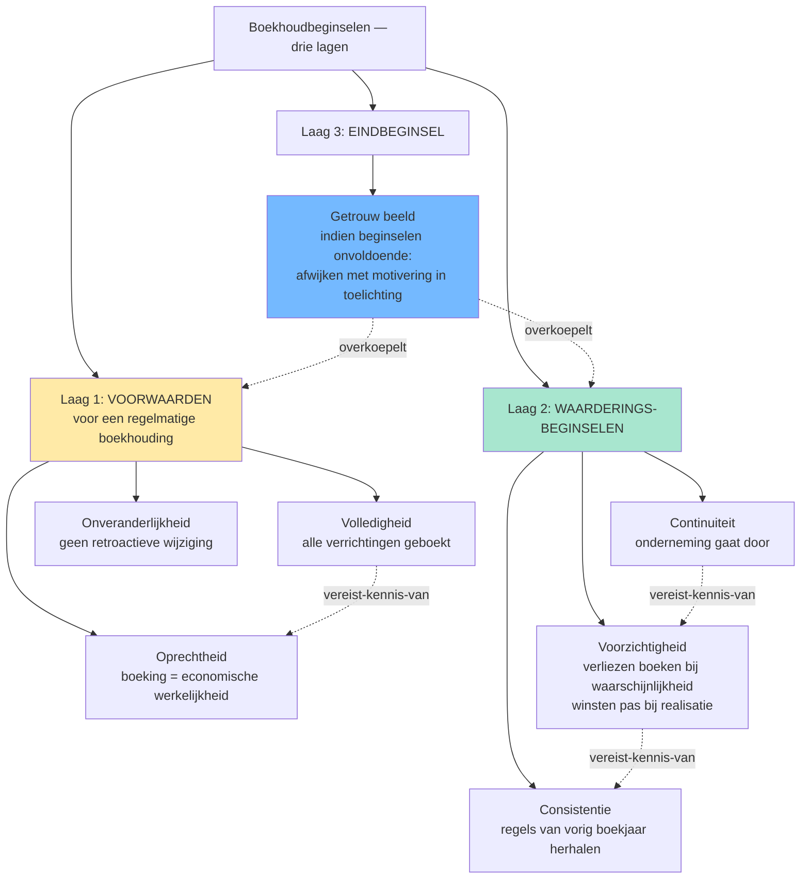
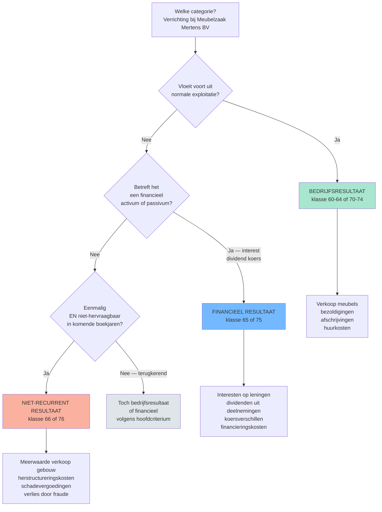
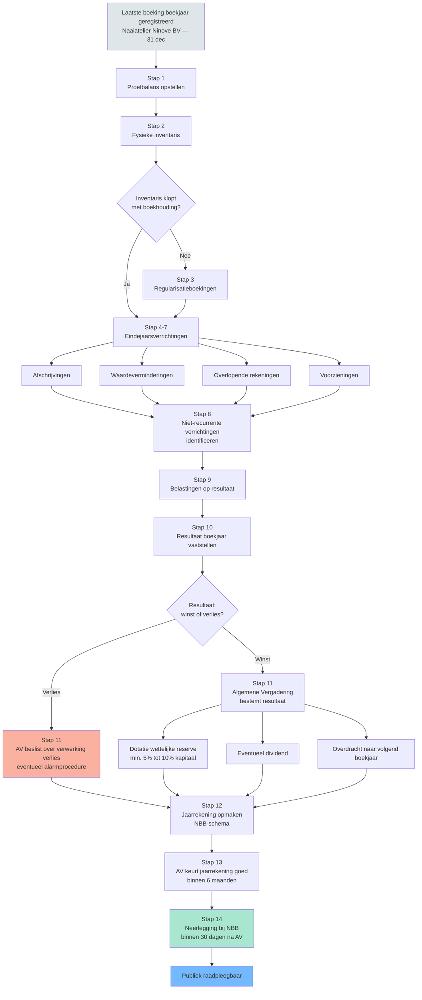

# PO 1.1 — Algemene boekhouding

> **Lees mij eerst:** dit document is een gestructureerd bundle van ALLE leermateriaal voor het programmaonderdeel "Algemene boekhouding" van het ITAA-bekwaamheidsexamen Gecertificeerd Accountant. Het bevat: (1) een didactische minicursus die je door het hele PO leidt, (2) 14 procedure-fiches die elk een concrete vaardigheid beschrijven ("hoe doe je X?"), en (3) 75 concept-fiches die elk een sleutel-begrip definiëren met bouwstenen, valkuilen en bronnen.
> 
> **Conventies in dit bundle:**
> - ⚖️ = directe wettelijke grondslag (WVV, KB WVV, CBN-advies, ITAA-norm, ISA, IFRS)
> - 🤖 = afgeleid of pedagogisch toegevoegd (geen letterlijke bron-citaat)
> - `[[concept-naam]]` = verwijzing naar een concept-fiche later in dit document
> - `[[competenties/naam]]` = verwijzing naar een competentie-fiche later in dit document
> 
> **Anti-fabricatie-regel voor afgeleide producten** (podcast / mindmap / slides / infographic / quiz): gebruik UITSLUITEND inhoud die in dit document staat. Geen externe bronnen, geen aanvullingen uit andere wetgevingen, geen verzonnen voorbeelden. Bij twijfel: zeg "dit staat niet in het bundle".


---

# Deel I — Minicursus

*De minicursus is de primaire leidraad. Lees ze in de aangeboden volgorde; gebruik de competentie- en concept-fiches in Deel II en III als verdieping wanneer iets onduidelijk blijft.*

### Wat verwacht het examen van jou?

> [!abstract] Dit programmaonderdeel wordt getoetst op niveau *integratie*.
> Je moet meerdere concepten samen kunnen inzetten in complexe casussen — onderdelen herkennen, prioriteren, en tot een coherent oordeel komen.


**Taken** (uit het ITAA-examenprogramma):

> [!abstract]- **Taak 1** — De boekhouding voeren
>
> **Doelstellingen**:
> - Rekeningen openen
> - Opstellen van de journalen met inachtneming van de fiscale en analytische gevolgen
> - Centraliseren van de rekeningen
> - Opsporen en corrigeren van anomalieën
> - Verifiëren en corrigeren van de boekhouding en boekhoudkundige documenten
> - Het rekeningstelsel aanpassen aan de behoeften van de onderneming
> - Voorstellen van waarderingsregels
> - Optimaliseren van de boekhoudkundige organisatie van de onderneming
> - Opstellen van de boekhoudkundige bijlagen bij de jaarrekeningen
> - Afronden en afsluiten van de jaarrekeningen


### Leesgids

De minicursus loopt van het redeneerkader naar de uitvoering en sluit met de afsluiting van het boekjaar. Eerst de beginselen die elke boeking dragen, dan de infrastructuur, daarna balanscomponenten en gewone bedrijfsuitoefening. Bijzondere transacties en de eindejaarscyclus staan op het einde — ze veronderstellen dat je de eerdere stukken beheerst. Lees lineair en gebruik de synthese-blokken als ankerpunten.

### Waarom dit programmaonderdeel telt

Algemene boekhouding is de grondplaat van het hele beroep: zonder een [[regelmatige-boekhouding|regelmatige boekhouding]] kan geen enkele jaarrekening, fiscale aangifte of audit-conclusie op betrouwbare cijfers steunen. Op integratieniveau volstaat het niet om de boeking te plaatsen — je moet ze kunnen verdedigen via het [[continuiteitsbeginsel|continuïteits-]], [[voorzichtigheidsbeginsel|voorzichtigheids-]] en [[getrouw-beeld|getrouw-beeld-beginsel]]. De examenvragen toetsen zelden losse definities; ze toetsen of je een verrichting van begin tot eind kan doorlopen, tot en met de [[boekjaar-eindprocedure-checklist|afsluiting van het boekjaar]].

### Wat doet een boekhouding? Van enkelvoudig naar dubbel, en waarom dat ertoe doet

Een boekhouding is geen administratieve formaliteit maar een geordend geheugen: elke verrichting raakt minstens twee rekeningen via [[dubbel-boekhouden|dubbel boekhouden]], waardoor activa gelijk aan passiva per definitie klopt. Kleine ondernemingen onder de wettelijke drempel mogen werken met een [[vereenvoudigde-boekhouding|vereenvoudigde boekhouding]] in drie aparte dagboeken. Wie dat verschil doorgrondt, begrijpt waarom dubbel boekhouden onmisbaar wordt zodra voorraden, vaste activa en kapitaalbewegingen in beeld komen.

### De fundamentele beginselen: het redeneerkader achter elke boeking

> [!info] Hoort bij taak: De boekhouding voeren

De vier beginselen hieronder zijn het minimumkader bij elke twijfelvraag. Je doorgrondt hoe [[continuiteitsbeginsel|continuïteit]] en [[voorzichtigheidsbeginsel|voorzichtigheid]] samen de waardering sturen, terwijl [[getrouw-beeld|getrouw beeld]] de eindtoets is en [[onveranderlijkheid-boekingen|onveranderlijkheid]] de vormvereiste. Geen enkel beginsel staat op zichzelf — ze grijpen in elkaar in.

- [[continuiteitsbeginsel|Boekhoudkundig continuïteitsbeginsel (going concern)]] · `regel`
- [[voorzichtigheidsbeginsel|Voorzichtigheidsbeginsel]] · `regel`
- [[getrouw-beeld|Getrouw beeld]] · `regel`
- [[onveranderlijkheid-boekingen|Onveranderlijkheid van de boekingen]] · `regel`

### Boekhoudbeginselen &mdash; overzicht

Synthese die de zeven boekhoudbeginselen in drie functionele lagen ordent: voorwaarden voor regelmatigheid (volledigheid, oprechtheid, onveranderlijkheid), waarderingssturing (continuïteit, voorzichtigheid, consistentie), en het eindbeginsel (getrouw beeld). Cruciaal voor stagiairs omdat losse memorisatie hier niet helpt — examenvragen toetsen welk beginsel doorslaggevend is bij conflicten (typisch: voorzichtigheid tegenover continuïteit).


De tabel hieronder ordent de zeven beginselen volgens hun functie in de redenering: voorwaarden, waarderingssturing en eindtoets. Gebruik de "klassieke valkuil"-kolom als zelftest: als je elke valkuil kan herkennen, beheers je de scharnier tussen [[boekhoudbeginselen-overzicht|de beginselen]] en hun toepassing.

| Beginsel | Functie | Primaire bron | Vraag die het beantwoordt | Klassieke valkuil |
|---|---|---|---|---|
| [[getrouw-beeld]] | Eindbeginsel: de jaarrekening moet een getrouw beeld geven van vermogen, financiele positie en resultaat | WER art. III.89 · KB WVV art. 3:1 · Richtlijn 2013/34/EU art. 4 §3 | "Geeft mijn jaarrekening een getrouw beeld?" &mdash; eindtoets | Stagiair denkt: "als alle posten correct geboekt zijn klopt het beeld vanzelf". Fout: bij twijfel moet je afwijken van de regels mits motivering in de toelichting (KB WVV art. 3:1 derde lid). |
| [[volledigheidsbeginsel]] | Alle verrichtingen, bezittingen, rechten, schulden en verplichtingen zijn geboekt | WER art. III.83 · CBN 174/1 | "Heb ik alles opgenomen?" | Buiten-balans-rechten en -verplichtingen (klasse 0) worden vergeten &mdash; zie [[rechten-verplichtingen-buiten-balans]]. |
| [[oprechtheidsbeginsel]] | Boekingen reflecteren de werkelijke economische verrichting (niet de juridische schijn) | CBN 174/1 | "Komt mijn boeking overeen met de werkelijkheid?" | Substance over form: leasing waarbij [[Transport Tongeren BV]] het economisch eigendom heeft moet als financieringshuur geboekt worden, niet als operationele huur &mdash; ook al heet het contractueel zo. |
| [[onveranderlijkheid-boekingen]] | Eenmaal geboekt mag niet meer worden geschrapt of overschreven; correcties via tegenboeking | WER art. III.86 · CBN 174/1 | "Mag ik een vorige boeking nog wijzigen?" | Tipp-Ex of overschrijven in handgeschreven dagboek &rarr; boekhouding niet meer regelmatig. Correctie altijd via tegenboeking met datum en verwijzing. |
| [[continuiteitsbeginsel]] | Waardering veronderstelt dat de onderneming haar activiteiten voortzet | KB WVV art. 3:6 · CBN 2018/18 | "Mag ik blijven waarderen alsof we doorgaan?" | Bij twijfel over continuiteit moet bestuur uitdrukkelijk evalueren (toelichting jaarrekening); bij stopzetting overschakelen naar discontinuiteitswaarderingsregels. |
| [[voorzichtigheidsbeginsel]] | Verliezen en risico's boeken zodra waarschijnlijk; winsten pas bij realisatie | KB WVV art. 3:6 · Richtlijn 2013/34/EU art. 6 §1.c | "Mag ik deze opbrengst al boeken?" | Asymmetrie: voorzieningen aanleggen voor verwachte verliezen ja; herwaarderingsmeerwaarden boeken op niet-verkochte activa niet (behalve duurzame meerwaarde + KB-criteria). |
| [[consistentiebeginsel]] | Waarderingsregels van het ene boekjaar op het andere onveranderd toepassen | KB WVV art. 3:8 · CBN 174/1 | "Mag ik mijn afschrijvingsmethode veranderen?" | Methodewijziging mag, mits motivering in de toelichting + retroactieve aanpassing of prospectieve toepassing (afhankelijk van type wijziging). |



**Kerninzichten**:

- De zeven beginselen zijn niet allemaal gelijkwaardig: drie zijn voorwaarden om uberhaupt van een 'regelmatige' boekhouding te kunnen spreken (volledigheid, oprechtheid, onveranderlijkheid), drie sturen de waardering (continuiteit, voorzichtigheid, consistentie), en het getrouw-beeld-beginsel staat erboven als eindtoets. Stagiairs die ze op een rij zien staan zonder hierarchie missen die drie-lagen-structuur.
- Het getrouw-beeld-beginsel bevat een overrule-mechanisme: als toepassing van de andere beginselen onvoldoende is om een getrouw beeld te geven, moet je afwijken &mdash; met motivering in de toelichting (KB WVV art. 3:1 derde lid). Dit is geen vrijbrief: het bestuur moet uitdrukkelijk vaststellen dat de standaardregels onvoldoende zijn.
- Voorzichtigheid en getrouw-beeld kunnen op gespannen voet staan: pure voorzichtigheid leidt tot stille reserves (winsten onderschat, verliezen overschat), wat het getrouwe beeld verstoort. De moderne lezing (Richtlijn 2013/34/EU art. 6 §1.c): voorzichtigheid betekent geen overdreven onderwaardering, alleen waarschijnlijke verliezen + risico's opnemen.
- De onveranderlijkheid van boekingen is een formele eis (geen Tipp-Ex, geen overschrijven) maar geen verbod op correcties. Een verkeerde boeking corrigeer je via een tegenboeking met datum en verwijzing &mdash; de oorspronkelijke fout blijft zichtbaar in de audit-trail.
- Volledigheid omvat ook de rechten en verplichtingen buiten de balans (klasse 0): garanties verleend door [[Meubelzaak Mertens BV]], leaseverplichtingen, borgstellingen, pensioenverplichtingen. Wie deze vergeet schendt het volledigheidsbeginsel zonder dat de balans uit evenwicht raakt &mdash; daarom is het een silent error die makkelijk gemist wordt op examens.

_Bouwt op_: [[continuiteitsbeginsel]] · [[voorzichtigheidsbeginsel]] · [[getrouw-beeld]] · [[onveranderlijkheid-boekingen]] · [[consistentiebeginsel]] · [[oprechtheidsbeginsel]] · [[volledigheidsbeginsel]] · [[aanvullende-boekhoudbeginselen]]
### De infrastructuur van de boekhouding: stukken, dagboek, inventaris

> [!info] Hoort bij taak: De boekhouding voeren

Achter elke boeking zit een [[verantwoordingsstuk|verantwoordingsstuk]] dat in een chronologisch [[dagboek|dagboek]] belandt en op balansdatum wordt geconfronteerd met de fysieke [[inventaris|inventaris]]. Daarna geldt nog de wettelijke [[bewaring-boekhoudstukken|bewaarplicht]] — geen detail, want bij fiscale controle of audit moet alles teruggevonden worden.

- [[verantwoordingsstuk|Verantwoordingsstuk]] · `begrip`
- [[dagboek|Dagboek]] · `begrip`
- [[inventaris|Inventaris]] · `cluster`
- [[bewaring-boekhoudstukken|Bewaring van boekhoudkundige stukken]] · `regel`

### Voeren van een regelmatige dubbele boekhouding voor een onderneming

> [!info] Hoort bij taak: De boekhouding voeren

Stap voor stap doorloop je de opzet: regime-kwalificatie, [[dagboek|dagboeken]], centralisatie, periodieke [[inventaris|inventaris]] en correcte [[bewaring-boekhoudstukken|bewaring]]. De regime-kwalificatie komt eerst — pas dan ken je het verplichte minimumpakket dagboeken en het [[minimum-algemeen-rekeningenstelsel|rekeningenstelsel]].

[[competenties/voeren-regelmatige-dubbele-boekhouding|→ Volledige procedure]]

### Toepassen van de fundamentele boekhoudbeginselen op een concrete verrichting

> [!info] Hoort bij taak: De boekhouding voeren

Je beschrijft eerst het boekingsfeit en toetst het dan aan [[continuiteitsbeginsel|continuïteit]], [[voorzichtigheidsbeginsel|voorzichtigheid]], [[getrouw-beeld|getrouw beeld]] en [[onveranderlijkheid-boekingen|onveranderlijkheid]]. Bij twijfel valt de procedure terug op het eindbeginsel.

[[competenties/toepassen-fundamentele-boekhoudbeginselen|→ Volledige procedure]]

### Wie? De kleine vennootschap en het toepassingsgebied

> [!info] Hoort bij taak: De boekhouding voeren

De grootte-categorie bepaalt het jaarrekeningschema, de commissaris-plicht en de toelichtingsverplichtingen. Je doorgrondt het verband tussen de drie criteria van de [[kleine-vennootschap|kleine vennootschap]] en de praktische gevolgen.

- [[kleine-vennootschap|Kleine vennootschap (WVV art. 1:24)]] · `begrip`

### De twee synthesedocumenten: balans en resultatenrekening

> [!info] Hoort bij taak: De boekhouding voeren

De [[balans|balans]] toont het vermogen op één moment, de [[resultatenrekening|resultatenrekening]] de bewegingen over het boekjaar; samen vormen ze met de toelichting de [[jaarrekening|jaarrekening]]. Je doorgrondt waarom de balans ordent volgens liquiditeit en opeisbaarheid en waarom de resultatenrekening in vier blokken oploopt.

- [[balans|Balans (jaarrekening-component)]] · `cluster`
- [[resultatenrekening|Resultatenrekening]] · `cluster`
- [[jaarrekening|Jaarrekening (synthesedocumenten)]] · `cluster`

### De gewone bedrijfsuitoefening: aankopen, verkopen, btw en vorderingen

> [!info] Hoort bij taak: De boekhouding voeren

Het routinematige hart van de boekhouding: omzet, kostprijs, btw, [[bedrijfsvorderingen|vorderingen]] en [[schulden|schulden]]. Het [[opbrengsten-be-gaap|realisatiebeginsel]] stuurt het boekmoment, zodat het [[bedrijfsresultaat|bedrijfsresultaat]] de werkelijke exploitatie weerspiegelt.

- [[bedrijfsvorderingen|Bedrijfsvorderingen]] · `begrip`
- [[schulden|Schulden (LT en KT)]] · `cluster`
- [[bedrijfsresultaat|Bedrijfsresultaat (bedrijfskosten en bedrijfsopbrengsten)]] · `cluster`
- [[opbrengsten-be-gaap|Opbrengsten onder BE GAAP (realisatiebeginsel)]] · `cluster`

### Boeken van een aankoop en verkoop met btw en betaling

> [!info] Hoort bij taak: De boekhouding voeren

Verifieer eerst de factuur op vorm en inhoud, boek dan via [[dubbel-boekhouden|dubbel boekhouden]] in het juiste [[dagboek|dagboek]] met aanwending van het [[minimum-algemeen-rekeningenstelsel|MAR]] voor aankoop, verkoop, btw en betaling. Factuur-verificatie is de stap die studenten op het examen het vaakst overslaan.

[[competenties/boeken-aankoop-verkoop-met-btw|→ Volledige procedure]]

### Vaste activa: oprichtingskosten, materiële, immateriële en financiële

> [!info] Hoort bij taak: De boekhouding voeren

Vaste activa worden duurzaam ingezet, gewaardeerd aan [[aanschaffingswaarde|aanschaffingswaarde]] en gespreid via [[afschrijvingen|afschrijvingen]] of bij duurzaam verlies gecorrigeerd via [[waardeverminderingen|waardeverminderingen]]. Je doorgrondt het onderscheid tussen [[materiele-vaste-activa|materiële]], [[immateriele-vaste-activa|immateriële]] en [[financiele-vaste-activa|financiële]] vaste activa.

- [[oprichtingskosten|Oprichtingskosten]] · `cluster`
- [[aanschaffingswaarde|Aanschaffingswaarde]] · `begrip`
- [[materiele-vaste-activa|Materiële vaste activa]] · `begrip`
- [[immateriele-vaste-activa|Immateriële vaste activa]] · `begrip`
- [[financiele-vaste-activa|Financiële vaste activa]] · `begrip`
- [[herwaarderingsmeerwaarden|Herwaarderingsmeerwaarden]] · `cluster`
- [[afschrijvingen|Afschrijvingen]] · `cluster`
- [[waardeverminderingen|Waardeverminderingen]] · `cluster`

### Boeken van oprichtings- en kapitaalverhogingskosten en hun afschrijving

> [!info] Hoort bij taak: De boekhouding voeren

Scheid eerst [[oprichtingskosten|oprichtingskosten]] van eerste-werkings-kosten — alleen de eerste komen op rubriek 20 en worden afgeschreven binnen de marges van de [[afschrijvingen|afschrijvingsregels]]. Activeren of direct ten laste nemen is een professional-judgment-keuze.

[[competenties/boeken-oprichtings-en-kapitaalverhogingskosten|→ Volledige procedure]]

### Opstellen van het afschrijvingsplan voor materiële vaste activa

> [!info] Hoort bij taak: De boekhouding voeren

Vertrek vanuit de [[aanschaffingswaarde|aanschaffingswaarde]], schat levensduur en restwaarde, kies tussen lineair en degressief en leg de uitkomst vast in de [[waarderingsregels-jaarrekening|waarderingsregels]]. De plicht is wettelijk; de keuze van methode en levensduur is praktijkbeoordeling die bestendig moet worden toegepast.

[[competenties/opstellen-afschrijvingsplan-vaste-activa|→ Volledige procedure]]

### Vlottende activa: voorraden, geldbeleggingen en bijzondere waardevermindering

> [!info] Hoort bij taak: De boekhouding voeren

[[voorraden|Voorraden]] en [[geldbeleggingen|geldbeleggingen]] zijn de korte-termijn-tegenhangers van de vaste activa: ondersteuning van de bedrijfscyclus of tijdelijke parking van overtollige middelen. Zakt hun realiseerbare waarde duurzaam onder de boekwaarde, dan treedt de [[bijzondere-waardevermindering|bijzondere waardevermindering]] in werking — niet alleen op materiële activa.

- [[voorraden|Voorraden]] · `cluster`
- [[geldbeleggingen|Geldbeleggingen en liquide middelen]] · `begrip`
- [[bijzondere-waardevermindering|Bijzondere waardevermindering (regime-overstijgend)]] · `cluster`

### Waarderen en boeken van voorraden volgens FIFO of gewogen gemiddelde

> [!info] Hoort bij taak: De boekhouding voeren

Leg eerst per voorraadbeweging de [[aanschaffingswaarde|aanschaffingswaarde]] vast, kies dan tussen FIFO en gewogen gemiddelde en houd die bestendig aan. Beide methoden zijn toegelaten onder de [[waarderingsregels-jaarrekening|waarderingsregels]] maar leiden bij prijsschommelingen tot een ander [[voorraden|voorraadsaldo]] en dus een ander resultaat.

[[competenties/waarderen-en-boeken-voorraden-fifo-ggp|→ Volledige procedure]]

### Boeken van waardeverminderingen op vorderingen en voorraden

> [!info] Hoort bij taak: De boekhouding voeren

Identificeer dubieuze [[bedrijfsvorderingen|vorderingen]] en overgewaardeerde [[voorraden|voorraadposten]], schat het verlies en boek de [[waardeverminderingen|waardevermindering]] onder het [[voorzichtigheidsbeginsel|voorzichtigheidsbeginsel]]. De praktijkbeoordeling zit in het criterium "dubieus" en het verlies-percentage.

[[competenties/boeken-waardeverminderingen-op-vorderingen-en-voorraden|→ Volledige procedure]]

### Eigen vermogen, voorzieningen en kapitaalwijzigingen

> [!info] Hoort bij taak: De boekhouding voeren

Aan de passiefzijde clusteren we [[eigen-middelen|eigen vermogen]] met zijn componenten — kapitaal, [[uitgiftepremie|uitgiftepremies]], [[wettelijke-reserve|wettelijke reserve]], andere reserves — naast de [[voorzieningen|voorzieningen voor risico's en kosten]]. Daarbij hoort de dynamiek van [[kapitaalwijziging|kapitaalverhogingen en -verminderingen]] en hun boekhoudkundige weerslag.

- [[eigen-middelen|Eigen middelen (eigen vermogen)]] · `cluster`
- [[uitgiftepremie|Uitgiftepremie]] · `begrip`
- [[wettelijke-reserve|Wettelijke reserve]] · `regel`
- [[voorzieningen|Voorzieningen voor risico's en kosten]] · `cluster`
- [[kapitaalwijziging|Kapitaalwijziging (verhoging en vermindering)]] · `cluster`

### Boeken van een voorziening voor risico's en kosten

> [!info] Hoort bij taak: De boekhouding voeren

Identificeer eerst de potentiële last, schat waarschijnlijkheid en bedrag, en leg bij voldoende zekerheid een [[voorzieningen|voorziening]] aan onder het [[voorzichtigheidsbeginsel|voorzichtigheidsbeginsel]]. Bij te grote onzekerheid schakel je terug naar [[rechten-verplichtingen-buiten-balans|rechten en verplichtingen buiten balans]].

[[competenties/boeken-voorzieningen-voor-risicos-en-kosten|→ Volledige procedure]]

### Overlopende rekeningen en het matching-principe

> [!info] Hoort bij taak: De boekhouding voeren

[[overlopende-rekeningen|Overlopende rekeningen]] maken het verschil zichtbaar tussen kasstroom en economische toerekening: kosten en opbrengsten landen in het boekjaar waarop ze betrekking hebben, niet bij betaling of inning. Zonder hen klopt het [[bedrijfsresultaat|bedrijfsresultaat]] op periodebasis niet.

- [[overlopende-rekeningen|Overlopende rekeningen]] · `cluster`

### Verwerken van overlopende rekeningen volgens het matching-principe

> [!info] Hoort bij taak: De boekhouding voeren

Identificeer periode-overschrijdende kosten en opbrengsten, bereken het pro-rata-deel en boek op de correcte [[overlopende-rekeningen|overlopende rekening]]. De [[waarderingsregels-jaarrekening|waarderingsregels]] verplichten de toerekening; het pro-rata-aandeel inschatten is jouw analyse.

[[competenties/verwerken-overlopende-rekeningen-matching|→ Volledige procedure]]

### Drie resultaatcategorieën: bedrijfs-, financieel en niet-recurrent

> [!info] Hoort bij taak: De boekhouding voeren

De resultatenrekening kent drie strikte categorieën: bedrijfs-, [[financiele-verrichtingen|financieel]] en [[niet-recurrente-verrichtingen|niet-recurrent]] resultaat. Een verkeerde categorisatie verstoort niet alleen de leesbaarheid van de [[resultatenrekening|resultatenrekening]], maar heeft ook fiscale gevolgen.

- [[financiele-verrichtingen|Financiële verrichtingen (kosten + opbrengsten)]] · `cluster`
- [[niet-recurrente-verrichtingen|Niet-recurrente verrichtingen]] · `cluster`

### Bedrijfs- · financieel · niet-recurrent &mdash; in welke categorie hoort deze verrichting?

Een visualisatie van de drie resultaten-categorieën (bedrijfs / financieel / niet-recurrent) die direct het camouflage-mechanisme in examenvragen aanpakt: voor elke verrichting moet eerst de aard worden bepaald, pas dan de klasse. Voor een stagiair-GA: studiehulp om de meest gemaakte categorisatie-fouten (rente op 61, meerwaarde op 75, wisselresultaat verkeerd) gestructureerd te vermijden.


De [[resultaat-categorisatie-beslisboom|beslisboom hieronder]] vertaalt "normale exploitatie" naar concrete vragen — de categorie volgt uit de aard van de verrichting, niet uit het rekeningnummer.

| Categorie | MAR-klassen | Wat hoort hier | Voorbeeld | Typische valkuil |
|---|---|---|---|---|
| [[bedrijfsresultaat\|Bedrijfsresultaat]] | 60-64 (kosten) + 70-74 (opbrengsten) | Alles wat voortvloeit uit de normale exploitatie | [[Meubelzaak Mertens BV]]: verkoop meubels &euro; 850.000 (klasse 70); bezoldigingen &euro; 380.000 (klasse 62); afschrijvingen &euro; 45.000 (klasse 6302) | Afschrijvingen horen bij bedrijfsresultaat &mdash; ook al voelen ze niet 'operationeel' aan, ze ondersteunen de normale exploitatie van de vaste activa. |
| [[financiele-verrichtingen\|Financieel resultaat]] | 65 (kosten) + 75 (opbrengsten) | Verrichtingen op financiele activa/passiva: interesten, dividenden, koersverschillen, financieringskosten | [[Solaris Sint-Truiden BV]]: dividend ontvangen op aandelen &euro; 12.000 (klasse 75); interestlasten op obligatielening &euro; 50.000 (klasse 65) | Meerwaarde bij verkoop van een financieel vast activum: NIET hier &mdash; dat is niet-recurrent als de verkoop niet tot de normale activiteit hoort, of bedrijfsresultaat als de onderneming een trader is. |
| [[niet-recurrente-verrichtingen\|Niet-recurrent resultaat]] | 66 (kosten) + 76 (opbrengsten) | Eenmalige, niet aan normale exploitatie gerelateerde verrichtingen, die niet hervraagbaar zijn in de komende boekjaren | [[Verffabriek Veurne BV]]: meerwaarde bij verkoop bedrijfsgebouw &euro; 320.000 (klasse 76); herstructureringskosten reorganisatie &euro; 180.000 (klasse 66) | Klassieke verwarring met het oude 'uitzonderlijk': sinds KB 21/10/2018 is niet-recurrent een **feitelijke** kwalificatie (eenmalig + niet-exploitatiegebonden), niet een formele rubriek. Een terugkerende meerwaarde (jaarlijkse verkoop investeringen) hoort dus NIET in 66/76. |



**Kerninzichten**:

- Het criterium 'normale exploitatie' is sectorafhankelijk. Voor [[Solaris Sint-Truiden BV]] (effectenportefeuille als kernactiviteit) horen koerswinsten bij het bedrijfsresultaat &mdash; voor [[Meubelzaak Mertens BV]] horen dezelfde koerswinsten bij het financieel resultaat. De rubriek-keuze is dus geen mechanische lookup, maar een redenering over wat 'normaal' is voor deze onderneming.
- 'Niet-recurrent' is sinds KB 21/10/2018 niet meer hetzelfde als 'uitzonderlijk'. Het oude regime kende een formele rubriek 'uitzonderlijke kosten/opbrengsten' &mdash; daar zat veel in dat eigenlijk wel terugkwam (bv. jaarlijkse meerwaarden bij verkoop van afgeschreven vaste activa). Het nieuwe regime hanteert twee feitelijke criteria: eenmalig + niet-hervraagbaar. Een vraag op het examen die nog de term 'uitzonderlijk' gebruikt is typisch een test op kennis van de regime-wijziging.
- De drie categorieen leiden tot drie subtotalen in de resultatenrekening, die elk apart fiscaal relevant zijn. Bij de aangifte vennootschapsbelasting (zie [[bedrijfsresultaat]] + WIB) bepaalt de categorisatie of een meerwaarde onder de gespreide taxatie kan vallen (typisch alleen voor materiele vaste activa onder bedrijfsresultaat) of niet. Verkeerde categorisatie heeft dus directe fiscale impact &mdash; geen louter cosmetische keuze.

_Bouwt op_: [[bedrijfsresultaat]] · [[financiele-verrichtingen]] · [[niet-recurrente-verrichtingen]] · [[resultaatverwerking]]
### Bijzondere transacties: leasing, obligaties, eigen aandelen en eigendom

> [!info] Hoort bij taak: De boekhouding voeren

Deze cluster bundelt transacties waar juridische vorm en economische realiteit uit elkaar lopen: [[leasing|leasing]], [[obligatielening|obligatieleningen]], [[eigen-aandelen|eigen aandelen]] en [[opsplitsing-eigendom|opsplitsing van eigendom]]. De reflex blijft dezelfde — economische substantie boven juridische schijn — en raakt ook de [[rechten-verplichtingen-buiten-balans|rechten en verplichtingen buiten balans]].

- [[leasing|Leasing (financieel en operationeel)]] · `cluster`
- [[obligatielening|Obligatielening]] · `cluster`
- [[eigen-aandelen|Beheer van eigen aandelen]] · `cluster`
- [[opsplitsing-eigendom|Opsplitsing eigendom (vruchtgebruik, opstal, erfpacht)]] · `cluster`
- [[rechten-verplichtingen-buiten-balans|Rechten en verplichtingen buiten balans]] · `cluster`

### Kwalificeren en boeken van leasing (operationeel vs financieel)

> [!info] Hoort bij taak: De boekhouding voeren

Lees het leasingcontract, identificeer de kerngegevens en kwalificeer de [[leasing|leasing]] als financieel of operationeel. Financiële leasing landt op de balans bij de [[materiele-vaste-activa|materiële vaste activa]] met [[schulden|schuld]] en [[afschrijvingen|afschrijving]]; operationele leasing blijft huurkost.

[[competenties/kwalificeren-en-boeken-leasing|→ Volledige procedure]]

### Boeken van uitgifte en aflossing van een obligatielening

> [!info] Hoort bij taak: De boekhouding voeren

Vertrek vanuit het emissieprospectus en boek de [[obligatielening|obligatielening]] correct: nominale waarde versus uitgiftekoers, couponrente, eventueel uitgiftedisagio gespreid via [[overlopende-rekeningen|overlopende rekeningen]], en de aflossing als [[schulden|langlopende schuld]] die jaar na jaar verkortlopend wordt.

[[competenties/boeken-uitgifte-en-aflossing-obligatielening|→ Volledige procedure]]

### Voeren van de boekhouding van een VZW met economische activiteit

> [!info] Hoort bij taak: De boekhouding voeren

Kwalificeer eerst het VZW-regime (microvereniging, klein of groot) en kies dan de boekhoudvorm — [[vereenvoudigde-boekhouding|vereenvoudigd]] of [[dubbel-boekhouden|dubbel]] — plus het [[jaarrekening-vzw-stichting|jaarrekeningschema]] dat erbij hoort.

[[competenties/voeren-boekhouding-vzw-met-economische-activiteit|→ Volledige procedure]]

### Boekjaar afsluiten &mdash; van proefbalans tot neerlegging

Synthese die per stap toont wat een vennootschap aan het einde van haar boekjaar moet doen: inventaris opmaken, eindejaarsverrichtingen boeken, proef- en saldibalans opstellen, jaarrekening voorbereiden, goedkeuren en openbaarmaken. Voor de stagiair-GA is dit de praktische ruggengraat van zijn eerste boekjaar-afsluitingen.


De [[boekjaar-eindprocedure-checklist|veertien stappen hieronder]] vormen een vaste volgorde: pas na de eindejaarsverrichtingen kan je het resultaat vaststellen, pas na de algemene vergadering kan de jaarrekening klaar zijn. Gebruik de tabel als afvinkbare werkflow tijdens je eerste afsluitingen.

| Stap | Wat | Wanneer | Concept-record | Output |
|---|---|---|---|---|
| 1 | Proefbalans opstellen | Direct na laatste boeking boekjaar | [[regelmatige-boekhouding]] · [[dubbel-boekhouden]] | Lijst met saldi per grootboekrekening; debet = credit |
| 2 | Fysieke inventarisopname | Op de afsluitingsdatum (in regel laatste dag boekjaar) | [[inventaris]] | Werkblad met fysieke tellingen voorraad, kas, vaste activa |
| 3 | Verschillen inventaris &harr; boekhouding regulariseren | Tussen inventaris-datum en jaarrekening-opmaak | [[inventaris]] · [[voorraden]] | Correctieboekingen (manco's, breukverliezen, inventarisverschillen) |
| 4 | Afschrijvingen boeken | Eindejaarsverrichting | [[afschrijvingen]] | Boeking 6302 / 22-28 voor materiele en immateriele vaste activa |
| 5 | Waardeverminderingen toetsen + boeken | Eindejaarsverrichting | [[waardeverminderingen]] | Boeking 631-634 voor duurzame waardeverminderingen op activa |
| 6 | Overlopende rekeningen boeken | Eindejaarsverrichting | [[overlopende-rekeningen]] | Boeking 490/491/492/493 voor toerekening kosten/opbrengsten aan juiste boekjaar |
| 7 | Voorzieningen aanleggen of terugnemen | Eindejaarsverrichting | [[voorzieningen]] · [[voorzichtigheidsbeginsel]] | Boeking 6360 / 160-163 voor risico's en kosten |
| 8 | Niet-recurrente verrichtingen identificeren | Bij opmaak resultatenrekening | [[niet-recurrente-verrichtingen]] | Boeking 66/76 (vroegere 'uitzonderlijke' rubrieken) |
| 9 | Belastingen op het resultaat berekenen + boeken | Na vaststelling resultaat voor belasting | [[bedrijfsresultaat]] | Boeking 670-679 |
| 10 | Resultaat van het boekjaar afsluiten | Sluiten rekeningen klasse 6 en 7 | [[bedrijfsresultaat]] · [[resultaatverwerking]] | Saldo op rekening 690/790 |
| 11 | Algemene vergadering: resultaat bestemmen | Binnen 6 maanden na boekjaareinde | [[resultaatverwerking]] · [[wettelijke-reserve]] | Beslissing AV: dotatie wettelijke reserve, eventueel andere reserves, dividend, overdracht naar volgend boekjaar |
| 12 | Jaarrekening opmaken in NBB-schema | Na resultaatverwerking | [[jaarrekening]] | Volledige of verkorte jaarrekening + toelichting + sociale balans |
| 13 | Goedkeuring algemene vergadering | Binnen 6 maanden na boekjaareinde | [[jaarrekening]] | AV-notulen + ondertekende jaarrekening |
| 14 | Neerlegging bij NBB | Binnen 30 dagen na goedkeuring AV (en uiterlijk 7 maanden na boekjaareinde) | [[jaarrekening]] | Neergelegde jaarrekening &mdash; publiek raadpleegbaar |



**Kerninzichten**:

- De volgorde is bindend: pas na de eindejaarsverrichtingen (stap 4-9) kan je het resultaat van het boekjaar vaststellen (stap 10). Pas na de algemene vergadering die het resultaat bestemt (stap 11) ken je het 'overgedragen resultaat' &mdash; pas dan is de jaarrekening volledig opmaakbaar (stap 12). Een examenvraag die zegt 'jaarrekening klaar, AV moet nog komen' bevat dus een logische fout: de jaarrekening kan niet 'klaar' zijn zonder AV-beslissing.
- De timing is wettelijk geketend: AV binnen 6 maanden na boekjaareinde (WVV art. 3:1 §1), neerlegging binnen 30 dagen na AV (WVV art. 3:10) en uiterlijk 7 maanden na boekjaareinde. Voor [[Naaiatelier Ninove BV]] met boekjaar dat eindigt op 31 december betekent dit: AV ten laatste 30 juni, neerlegging ten laatste 31 juli. Boete-risico: laattijdige neerlegging is een veelvoorkomende cliënt-vraag.
- Drie van de tien verplichte boekingen volgen direct uit de waarderingsbeginselen: afschrijvingen (consistentie), waardeverminderingen (voorzichtigheid), voorzieningen (voorzichtigheid). Wie de beginselen kent, kan deze stappen niet vergeten. Wie ze opvat als 'extra werk', vergeet er typisch een &mdash; bijvoorbeeld de waardeverminderingen op vorderingen.
- De wettelijke reserve (stap 11) ontstaat bij de resultaatverwerking, niet bij de jaarrekening-opmaak. Sequentieel: AV beslist welk percentage naar wettelijke reserve gaat (min. 5% van de winst, tot de wettelijke reserve 10% van het kapitaal bereikt). Pas dan staat het bedrag op rekening 130; pas dan past het in de jaarrekening die de AV daarna goedkeurt.

_Bouwt op_: [[regelmatige-boekhouding]] · [[inventaris]] · [[overlopende-rekeningen]] · [[afschrijvingen]] · [[waardeverminderingen]] · [[voorzieningen]] · [[jaarrekening]] · [[resultaatverwerking]] · [[wettelijke-reserve]]
### Resultaatverwerking en winstbestemming

> [!info] Hoort bij taak: De boekhouding voeren

Na vaststelling van het resultaat bestemt de algemene vergadering het: dotatie aan de [[wettelijke-reserve|wettelijke reserve]], andere reserves, dividend of overdracht. Pas na deze [[resultaatverwerking|resultaatverwerking]] is de jaarrekening volledig invulbaar.

- [[resultaatverwerking|Resultaatverwerking (winst- of verliesbestemming)]] · `cluster`

### Uitvoeren van eindejaarsverrichtingen en opmaken van proefbalans

> [!info] Hoort bij taak: De boekhouding voeren

Doorloop de eindejaars-checklist: [[inventaris|inventarisopname]], [[afschrijvingen|afschrijvingen]], [[waardeverminderingen|waardeverminderingen]], [[voorzieningen|voorzieningen]] en [[overlopende-rekeningen|overlopende rekeningen]]. De proefbalans is het controlepunt vóór je naar de [[jaarrekening|jaarrekening]] doorrolt.

[[competenties/uitvoeren-eindejaarsverrichtingen-en-proefbalans|→ Volledige procedure]]

### Boeken van resultaatverwerking en bestemming (reserves, dividenden, belasting)

> [!info] Hoort bij taak: De boekhouding voeren

Bereken eerst het te bestemmen resultaat, dan in vaste volgorde [[resultaatverwerking|vennootschapsbelasting, wettelijke reserve, beschikbare reserves, dividend en overdracht]] — de volgorde is wettelijk, de verhoudingen zijn AV-beslissing.

[[competenties/boeken-resultaatverwerking-en-bestemming|→ Volledige procedure]]

### Vereffening en de levenscyclus voorbij continuïteit

> [!info] Hoort bij taak: De boekhouding voeren

Wanneer de going-concern-aanname wegvalt, schakelt de [[vereffening|vereffening]] de boekhouding over op discontinuïteits-waardering. Je doorgrondt het verband tussen het wegvallen van het [[continuiteitsbeginsel|continuïteitsbeginsel]] en de gewijzigde [[waarderingsregels-jaarrekening|waarderingsregels]].

- [[vereffening|Vereffening van een vennootschap]] · `cluster`

### Jaarrekeningpresentatie: van BE GAAP naar IFRS-context

> [!info] Hoort bij taak: De boekhouding voeren

De [[jaarrekening-presentatie|jaarrekeningpresentatie]] gehoorzaamt aan dezelfde grondbeginselen onder elk regime, maar de vorm verschilt: BE GAAP via vaste schema's, IFRS met meer ruimte voor eigen indeling. Je doorgrondt de gemeenschappelijke kern los van het regime.

- [[jaarrekening-presentatie|Jaarrekeningpresentatie (regime-overstijgend)]] · `cluster`

### Reflectie: digitalisering, e-invoicing en de boekhouding van morgen

De papieren basisregels blijven overeind, maar de vorm verschuift. Een [[verantwoordingsstuk|verantwoordingsstuk]] is vandaag vaker een gestructureerd elektronisch bestand; een [[dagboek|dagboek]] een database in een boekhoudpakket. De [[bewaring-boekhoudstukken|bewaarplicht]] verandert daardoor inhoudelijk niet, maar wel praktisch: digitale leesbaarheid en toegankelijkheid voor controle worden de nieuwe aandachtspunten.


### Synthese-stappenplan

Begin met de regime-kwalificatie: [[vereenvoudigde-boekhouding|vereenvoudigde]] of [[dubbel-boekhouden|dubbele boekhouding]], en welk jaarrekeningschema past op de groottecriteria van de [[kleine-vennootschap|kleine vennootschap]]. Organiseer dan de infrastructuur: [[verantwoordingsstuk|verantwoordingsstukken]], [[dagboek|dagboeken]] en het [[minimum-algemeen-rekeningenstelsel|MAR]]. Boek de gewone bedrijfsuitoefening — aankopen, verkopen, btw, [[bedrijfsvorderingen|vorderingen]], [[schulden|schulden]] — onder het [[opbrengsten-be-gaap|realisatiebeginsel]]. Verwerk parallel de investeringen aan [[aanschaffingswaarde|aanschaffingswaarde]] met geplande [[afschrijvingen|afschrijvingen]] volgens de [[waarderingsregels-jaarrekening|waarderingsregels]]. Op balansdatum stel je de fysieke [[inventaris|inventaris]] op en boek je de eindejaarsverrichtingen: afschrijvingen, [[waardeverminderingen|waardeverminderingen]], [[voorzieningen|voorzieningen]] en [[overlopende-rekeningen|overlopende rekeningen]] — telkens onder het [[voorzichtigheidsbeginsel|voorzichtigheidsbeginsel]]. Stel de proefbalans op, identificeer [[niet-recurrente-verrichtingen|niet-recurrente verrichtingen]], boek de belasting en sluit klassen 6 en 7. De algemene vergadering bestemt het resultaat — [[wettelijke-reserve|wettelijke reserve]], beschikbare reserves, eventueel dividend — pas dan is de [[jaarrekening|jaarrekening]] opmaakbaar, klaar voor neerlegging en [[bewaring-boekhoudstukken|wettelijke bewaring]].

### Cheatsheet

#### Kritische drempelwaarden

| Concept | Naam | Waarde | Eenheid | Gevolg |
|---|---|---|---|---|
| [[jaarrekening]] | Kleine vennootschap (verkort schema toegelaten) | Maximaal 1 criterium overschreden: balanstotaal € 6.000.000, omzet € 11.250.000, gemiddeld personeel 50 VTE | WVV art. 1:24 — 1:25 | Mag jaarrekening in **verkort schema** opstellen; vrijgesteld van jaarverslag (tenzij beursgenoteerd), commissaris-vrijs… |
| [[jaarrekening]] | Micro-vennootschap (microschema toegelaten) | Maximaal 1 criterium overschreden: balanstotaal € 350.000, omzet € 700.000, gemiddeld personeel 10 VTE | WVV art. 1:25 | Mag jaarrekening in **microschema** opstellen — kortere balans, minder verplichte vermeldingen in toelichting |
| [[vereenvoudigde-boekhouding]] | Omzetdrempel voor vereenvoudigde boekhouding | € 500.000 | jaaromzet excl. BTW | Natuurlijke personen, vennootschappen onder firma (VOF) en gewone commanditaire vennootschappen (GCV) met een omzet onde… |
| [[wettelijke-reserve]] | Verplichte afhouding van de nettowinst | 5 % | van de nettowinst van het boekjaar | Verplichte toevoeging aan wettelijke reserve uit winstbestemming |
| [[wettelijke-reserve]] | Plafond wettelijke reserve | 10 % | van het maatschappelijk kapitaal (NV) of van de eigen vermogensinbreng (BV) | Wanneer de wettelijke reserve dit plafond bereikt, vervalt de verplichte jaarlijkse afhouding |

#### Vergelijkingsparen-matrix

| Concept | Verwarrend met | Trigger |
|---|---|---|
| [[afschrijvingen]] | [[waardeverminderingen]] | Examen: 'gebouw' (gebruiksduur beperkt) → afschrijving. 'Terrein' (onbeperkt) → waardevermindering. 'Voorraad' (vlottend actief) → waardevermindering. |
| [[balans]] | [[resultatenrekening]] | Examen: 'op welke staat staat post X?' Toestand (saldo) → balans. Beweging (gedurende periode) → RR. |
| [[balans]] | [[analytische-balans]] | Examen: 'bereken behoefte aan bedrijfskapitaal' — eerst statutaire balans naar analytische balans omzetten. |
| [[bedrijfsresultaat]] | [[financiele-verrichtingen]] | Examen: 'intrest op leveranciersschuld te laat betaald' — financiële kost (klasse 65), NIET bedrijfskost. 'huurkost van magazijn' — bedrijfskost (klasse 61). |
| [[bedrijfsvorderingen]] | [[vorderingen-meer-dan-1-jaar-aspect]] | Examen: 'lening 3 jaar verleend in jaar 1, op 31/12/20X2 nog 18 maanden te lopen' → splitsen: 12 maanden op rubriek VII, 6 maanden op rubriek V. |
| [[bewaring-boekhoudstukken]] | [[bewaartermijn-boekhouding]] | Examen: 'hoelang bewaren?' → check of de vraag boekhoudkundig is (7j) of fiscaal/btw (10j). In twijfel: 10 jaar. |
| [[bijzondere-waardevermindering]] | [[bijzondere-waardevermindering-ifrs]] | Algemeen → 'wat is het mechanisme van bijzondere waardevermindering?'; IFRS → 'hoe bereken ik VIU?' / 'wat is CGU-allocatie?' |
| [[bijzondere-waardevermindering]] | [[bijzondere-waardevermindering-be-gaap]] | Algemeen → 'wat is het mechanisme?'; BE GAAP → 'aanvullende afschrijving of waardevermindering — welk artikel?' |
| [[dubbel-boekhouden]] | [[vereenvoudigde-boekhouding]] | Examenvraag: kleine eenmanszaak met omzet onder € 500.000 (WER drempel) — mag vereenvoudigd, hoeft geen dubbel boekhouden. |
| [[eigen-aandelen]] | [[financiele-vaste-activa]] | Examen: 'NV koopt 5% van haar eigen aandelen in voor € 80.000' → boeking als aftrek van EV, NIET als FVA. 'NV koopt 25% van een andere NV' → FVA (deelneming) op actiefzijde. |
| [[financiele-vaste-activa]] | [[geldbeleggingen]] | Examen: 'verworven met de bedoeling de groep duurzaam te ondersteunen' → FVA. 'tijdelijke parking van overtollige liquiditeiten' → geldbelegging. |
| [[geldbeleggingen]] | [[financiele-vaste-activa]] | Examen: 'wij houden 10 % aandelen in een leverancier om de bevoorrading te beveiligen' → FVA (duurzame strategische relatie). 'wij houden 1 % aandelen in een beursgenoteerde bank voor rendement' → geldbelegging. |
| [[getrouw-beeld]] | [[getrouw-beeld-jaarrekening]] | Vraag over algemeen beginsel → getrouw-beeld. Vraag over de jaarrekening-toets (vermogen/positie/resultaat) → getrouw-beeld-jaarrekening. |
| [[herwaarderingsmeerwaarden]] | [[aanschaffingswaarde]] | Examen: 'aanpassen waarde van een terrein boven aankoopprijs' → herwaardering (mits voorwaarden), niet aanschaffingswaarde wijzigen. |
| [[immateriele-vaste-activa]] | [[oprichtingskosten]] | Examen: 'notariskosten kapitaalverhoging' → 200. 'aankoop patent' → 211. |
| [[immateriele-vaste-activa]] | [[materiele-vaste-activa]] | Examen: 'aankoop industriële mengmachine € 45.000' → materieel (rubriek 23). 'aankoop licentie op patroontekening' → immaterieel (rubriek 211). |
| [[jaarrekening-presentatie]] | [[balans-presentatie-ifrs]] | Algemeen → 'welke componenten zijn verplicht?'; IFRS-specialisatie → 'welke posten op de balans onder IAS 1?' |
| [[jaarrekening]] | [[geconsolideerde-jaarrekening]] | Examen: 'jaarrekening Aurelia Holding NV' alleen = statutair. 'jaarrekening Aurelia Holding NV + dochters' = geconsolideerd. |
| [[kleine-vennootschap]] | [[microvennootschap]] | Examen: omzet € 500K → check micro-drempels eerst; als ook personeel ≤ 10 én balans ≤ € 450K én niet moeder/dochter → micro. Zo niet → klein. |
| [[kleine-vennootschap]] | [[grote-vennootschap-wvv]] | Examen: omzet € 15M, personeel 80, balans € 8M → overschrijdt 3 drempels → groot. Verkort niet meer toegestaan, commissaris verplicht. |
| [[leasing]] | [[huur-versus-leasing-aspect]] | Examen: 'gewone huur kantoor € 1.500/maand' = kostenrekening 61. 'leasing met optie tot aankoop' = onderzoek of optie ≤ 15 % → financieel of operationeel. |
| [[materiele-vaste-activa]] | [[immateriele-vaste-activa]] | Examen: 'gekocht productiehal € 480.000' → MVA (221). 'gekocht patent € 35.000' → IVA (211). |
| [[niet-recurrente-verrichtingen]] | [[bedrijfsresultaat]] | Examen: 'meerwaarde verkoop oud kantoorpand' → niet-recurrent bedrijfsmatig (76A). 'omzet uit hoofdactiviteit' → recurrent bedrijfsresultaat (70). De oude term 'uitzonderlijk resultaat' (vóór KB 2018) is afgeschaft. |
| [[opbrengsten-be-gaap]] | [[opbrengsten-ifrs]] | Examen: 'is opbrengst gerealiseerd onder BE GAAP?' → check levering + inbaarheid; 'wanneer onder IFRS 15?' → check stap 5 (voldoening van prestatieverplichting). |
| [[oprichtingskosten]] | [[immateriele-vaste-activa]] | Examen: 'patentaankoop voor € 80.000' → immaterieel vast actief (rubr. 21), NIET oprichtingskosten. |
| [[rechten-verplichtingen-buiten-balans]] | [[voorzieningen]] | Examen: 'lopende rechtsgeding met 30 % verlieskans, schadebedrag onbekend' → klasse 0 (te onzeker voor voorziening). 'lopende rechtsgeding met 70 % verlieskans, schadebedrag € 75.000' → voorziening 16. |
| [[resultatenrekening]] | [[balans]] | Examen: 'op welke staat staat post X?' — vraag jezelf: is dit een **toestand** (saldo: voorraad, schuld, kapitaal) of een **beweging** (gedurende boekjaar: omzet, kostprijs)? |
| [[uitgiftepremie]] | [[wettelijke-reserve]] | Examen: 'kunnen uitgiftepremies als dividend worden uitgekeerd?' — Niet als gewoon dividend, wel via kapitaalverminderingsprocedure. |
| [[vereenvoudigde-boekhouding]] | [[dubbel-boekhouden]] | Examen: 'eenmanszaak met omzet € 320.000' → vereenvoudigd toegelaten. 'BV met omzet € 200.000' → dubbel verplicht. |
| [[voorzieningen]] | [[waardeverminderingen]] | Examen: 'wij verwachten een verlies op een rechtsgeding' → voorziening. 'klant zal vermoedelijk niet betalen' → waardevermindering. |
| [[voorzieningen]] | [[schulden]] | Examen: 'betwiste belasting € 18.000' → voorziening 161. 'aanvaarde belasting € 18.000' → schuld 45. |
| [[waardeverminderingen]] | [[afschrijvingen]] | Examen: 'voorraad goederen waarvan marktprijs daalt' → waardevermindering (vlottend actief). 'machine waarvan technische ontwaarding sneller dan voorzien' → niet-recurrente afschrijving (beperkte gebruiksduur). |
| [[waardeverminderingen]] | [[voorzieningen]] | Examen: 'wij verwachten een vonnis tegen ons van € 80.000' → voorziening. 'klant zal vermoedelijk niet betalen' → waardevermindering. |
| [[wettelijke-reserve]] | [[beschikbare-reserves-aspect]] | Examen: 'kunnen we deze reserves uitkeren?' — Wettelijke: nee onder minimum. Beschikbare: ja na uitkeringstest. |


### Heb je deze taken in de vingers?

Loop deze taken na vóór je verder gaat met examenfocus. Twijfel je bij een taak? Lees de aangegeven secties nog eens.

- ✓ **1.1.taak.1** — De boekhouding voeren _Behandeld in §5, §6, §7, §8, §9, §10, §11, §12, §13, §14, §15, §16, §17, §18, §19, §20, §21, §22, §23, §24, §25, §26, §27, §28, §29, §30, §31, §32, §33, §34, §35._

### Examenfocus

Op integratieniveau toetst het examen of je een verrichting kan plaatsen in het juiste regime, de juiste resultaatcategorie en de juiste eindejaarsbehandeling — vaak in één gecombineerde casus. De vragen hieronder oefenen de denkpatronen waar stagiairs typisch struikelen.

#### Wetgeving inzake de jaarrekening 📃

> [!question]- ITAA 2013-1 vraag 2 (tier B)
> Vraag 2 … / 6 punten
> Gelieve voor de onderstaande gevallen het juiste antwoord aan te kruisen.
> a) Onderneming A heeft een openstaande leveranciersschuld ten opzichte van
> onderneming X voor een bedrag van 100.000,00 euro. Er werd besloten om deze
> schuld in te brengen als kapitaal.
> Zij dient de volgende boeking (en) aan te brengen in haar boekhouding.
> Antwoord
> 
> |  |  |
> |---|---|
> | Zij boekt de leverancierschuld ten opzichte van een resultatenrekening tegen.
> Vervolgens zal zij via de resultaatverwerking een overboeking maken naar de
> rubriek kapitaal. |  |
> | Zij boekt de leverancierschuld rechtstreeks over naar de rubriek kapitaal. |  |
> | Zij boekt via resultaatverwerking het bedrag naar de rubriek kapitaal. |  |
> 
> b) Onderneming A besluit een kapitaalvermindering van 100.000,00 euro door te voeren
> door terugbetaling aan haar aandeelhouders.
> Antwoord
> 
> |  |  |
> |---|---|
> | Zij boekt de vermindering van kapitaal ten opzichte van een rekening terug te
> betalen kapitaal en gaat over tot de uitbetaling van de gelden. |  |
> | Zij boekt de vermindering van kapitaal ten opzichte van een rekening
> resultaatverwerking. |  |
> | Zij boekt de vermindering van kapitaal ten opzichte van een rekening terug te
> betalen kapitaal en gaat over tot de uitbetaling van de gelden na een periode van
> twee maanden na de publicatie in het Belgisch Staatsblad. |  |
> | Zij boekt de vermindering van kapitaal ten opzichte van een rekening terug te
> betalen kapitaal en gaat over tot de uitbetaling van de gelden na een periode van
> twee maanden na de notariële akte. |  |
> 
> c) Buitenlandse onderneming AB beschikt in België over een vaste inrichting, een winkel
> die exclusieve juwelen verkoopt.
> Antwoord
> 
> |  |  |
> |---|---|
> | Zij dient de boekhouding te voeren volgens de Belgische boekhoudnormen, maar
> dient geen jaarrekening neer te leggen. |  |
> | Zij dient de boekhouding te voeren volgens de Belgische boekhoudnormen, en
> dient een jaarrekening met cijfers van de vaste inrichting neer te leggen. |  |
> | Zij dient de boekhouding te voeren volgens de Belgische boekhoudnormen, en
> dient een jaarrekening van de buitenlandse onderneming in de vorm zoals
> opgesteld in het buitenland neer te leggen. Zij dient ook een sociale balans neer
> te leggen. |  |
> | Zij dient de boekhouding te voeren volgens de Belgische boekhoudnormen, en
> dient een jaarrekening van de buitenlandse onderneming en in voorkomend
> geval ook een geconsolideerde jaarrekening in de vorm zoals opgesteld in het
> buitenland neer te leggen. Zij dient ook een sociale balans neer te leggen. |  |


#### Wetgeving inzake de jaarrekening 📃

> [!question]- ITAA 2013-1 vraag 3 (tier B)
> Vraag 3 … / 5 punten Een onderneming heeft een nieuw prototype ontwikkeld van een transportmiddel dat gebruikt kan worden in ondermeer fabrieken voor de verplaatsing van zware goederen. Zij heeft voor de ontwikkeling tot stand kwam een hele reeks van vooronderzoeken laten doen. Dit heeft nadien geressorteerd in een ontwikkeling, dat deels door de onderneming zelf werd geproduceerd en deels bij derden werd ontwikkeld. Zij heeft hiervoor volgende kosten gehad: - kosten van vooronderzoek: studiebureau’s 20.000 euro - ontwikkeling door derden 15.000 euro - aankopen van materiaal 180.000 euro - lonen van arbeiders inclusief patronale bijdragen 80.000 euro Gevraagd:
> 
> a) Kunnen deze kosten in aanmerking voor activering? Motiveer uw antwoord. Antwoord
> 
> b) Zo ja, welke van de bovenvermelde kosten? Antwoord
> 
> c) Op welke rekening zou u deze activering dan verwerken? U hoeft enkel de rubriek op te geven tot op 2 cijfers. Antwoord
> 
> d) Over hoeveel jaar dient de onderneming dit minimaal af te schrijven? Antwoord
> 
> e) Wat indien uit de periode na het vooronderzoek gebleken was dat het prototype niet commercieel haalbaar was en bijgevolg voortijdig besloten werd het prototype niet verder te ontwikkelen? Er werden wel reeds een aantal kosten gemaakt, zoals aankopen en personeelskosten. Antwoord
> 
> ANALYSE EN KRITISCHE BEOORDELING VAN DE 25 PUNTEN JAARREKENING - CONSOLIDATIE


#### Wetgeving inzake de jaarrekening 📃

> [!question]- ITAA 2013-2 vraag 1 (tier B)
> Vraag 1 … / 3 punten
> Onderneming “Softy” BVBA is één maand actief. Zij ontwikkelt software. De onderneming wil
> de volgende transacties in haar boekhouding verwerken en vraagt u advies bij de verwerking
> hiervan. Kruis het juiste antwoord aan.
> a) Aankoop van 10 laptops met software Windows 8
> Antwoord … / 1 punt
> 
> |  |  |
> |---|---|
> | Dient zij de Windows software bij de aanschaffingswaarde van de laptops op te
> nemen? |  |
> | Dient zij de Windows software bij de immateriële vaste activa op te nemen? |  |
> 
> b) Aankoop van boekhoudsoftware bij firma XYZ.
> Antwoord … / 1 punt
> 
> |  |  |
> |---|---|
> | Kan zij dit opnemen in de rubriek materiële vaste activa? |  |
> | Kan zij dit opnemen in de rubriek immateriële vaste activa? |  |
> 
> c) Zij koopt software X aan, die zij zonder enige wijziging doorverkoopt aan haar klanten
> Antwoord … / 1 punt
> 
> |  |  |
> |---|---|
> | Te verwerken als handelsgoederen? |  |
> | Te verwerken als bestelling in uitvoering? |  |
> | Te verwerken als immateriële vaste activa? |  |


#### Wetgeving inzake de jaarrekening 📃

> [!question]- ITAA 2013-2 vraag 3 (tier B)
> Vraag 3 … / 4 punten
> Vennootschap “ Final” BVBA heeft van vennootschap “DEF” een aantal activa gekocht, zoals
> machines en voorraad. Deze activa hadden de volgende marktwaarde:
> Machine A 15.000 euro
> Machine B 25.000 euro
> Voorraad 30.000 euro
> Zij heeft in totaal 100.000 euro betaald. Het bedrag van 30.000 euro is de meerprijs die zij
> betaald heeft voor de overname.
> Gevraagd:
> a) In welke rubriek van de jaarrekening zou u het bedrag van 30.000 euro meerprijs
> verwerken? U hoeft geen rekeningnummer op te geven (enkel rubriek tot op twee
> cijfers)
> Antwoord … / 1 punt
> b) Over welke periode mag de onderneming deze meerprijs van € 30.000 afschrijven?
> 
> Antwoord … / 3 punten
> 
> |  | Ja /
> Nee | Verklaar uw keuze met verwijzing naar de relevante bepalingen
> van de wetgeving inzake de jaarrekening |
> |---|---|---|
> | 3 jaar |  |  |
> | 5 jaar |  |  |
> | 10 jaar |  |  |


#### Wetgeving inzake de jaarrekening 📃

> [!question]- ITAA 2013-2 vraag 4 (tier B)
> Vraag 4 … / 4 punten Een onderneming laat om de acht jaar haar gebouwen herschilderen. De schilderwerken worden geschat op 40.000 euro.
> 
> a) Kan zij in haar jaarrekening hiermee al rekening houden? Op welke manier en voor welk bedrag zal zij dit doen? Antwoord … / 2 punten
> 
> b) Wat indien na acht jaar de schilderwerken worden uitgevoerd, maar meer bedragen dan de raming van 40.000 euro? Antwoord … / 2 punten 25 PUNTEN ANALYSE EN KRITISCHE BEOORDELING VAN DE JAARREKENING - CONSOLIDATIE Bijlage: Balans


#### Wetgeving inzake de jaarrekening 📃

> [!question]- ITAA 2014-1 vraag 1 (tier B)
> Vraag 1 … / 2 punten
> Vennootschap PETRUS BVBA sluit haar jaarrekening af op 31 december. De vennootschap
> wou gebruik maken van de nieuwe maatregel rond het vastklikken van reserves.
> Op 20 december 2013 heeft een bijzondere algemene vergadering de beslissing genomen om
> een gedeelte van de reserves uit te keren. Het gaat om een bruto bedrag van 1.000.000 EUR.
> Deze uitkering zal gevolgd worden door een opname van deze reserves in kapitaal voor een
> bedrag van 900.000 EUR.
> De betaalbaarstelling is vastgesteld op 27 december 2013.
> De vennootschap heeft de roerende voorheffing betaald op 2 januari 2014. Het nettodividend
> werd rechtstreeks op een geblokkeerde bankrekening overgemaakt op 2 januari 2014. De
> authentieke akte werd verleden op 24 januari 2014.
> De toestand in haar eigen vermogen voor de genomen beslissing was als volgt:
> 
> | Geplaatst kapitaal | 100.000 |
> |---|---|
> | Wettelijke reserve | 10.000 |
> | Beschikbare reserves | 1.800.000 |
> | Overgedragen winst | 1.000 |
> 
> Hoe zal de jaarrekening per 31 december 2013 eruit zien, zonder rekening te houden met het
> resultaat van het boekjaar?
> Antwoord
> 
> Het geplaatste kapitaal bedraagt 1.000.000 EUR.
> 
> Het geplaatste kapitaal bedraagt 100.000 EUR, de beschikbare reserves 1.800.000 EUR.
> We vinden in de resultaatverwerking “vergoeding van het kapitaal” voor 1.000.000 EUR, en
> op een passiefrekening “dividenden over het boekjaar” voor eenzelfde bedrag.
> 
> Het geplaatste kapitaal bedraagt 100.000 EUR, de beschikbare reserves 800.000 EUR. Er
> staat in de resultaatverwerking “vergoeding van het kapitaal” voor 1.000.000 EUR, en op een
> passiefrekening “dividenden over het boekjaar” voor een bedrag van 900.000 EUR,
> “ingehouden voorheffing” 100.000 EUR.
> 
> Het geplaatste kapitaal bedraagt 100.000 EUR, de beschikbare reserves 800.000 EUR. Er
> staat wel in de resultaatverwerking “vergoeding van het kapitaal” voor 1.000.000 EUR. Op
> het passief vinden we ook de rekening “Ontvangen voorschotten op kapitaal” voor een
> bedrag van 900.000 EUR.


#### Wetgeving inzake de jaarrekening 📃

> [!question]- ITAA 2014-1 vraag 2 (tier B)
> Vraag 2 … / 2 punten
> 
> Voor de vennootschap ABC is er een authentieke akte verleden voor een kapitaalverhoging. De kapitaalverhoging is doorgevoerd door enerzijds een incorporatie van bestaande reserves en anderzijds een inbreng in speciën. Voor dit laatste lag de uitgifteprijs van de nieuwe aandelen hoger dan de bestaande fractiewaarde van de aandelen. De uitgiftepremie werd ook geïncorporeerd in kapitaal. Hoe dient zij de kapitaalverhoging door incorporatie bestaande reserves en de uitgiftepremie te verwerken in haar jaarrekening ? Antwoord  Zij boekt zowel de onttrekking van haar reserves als de volledige kapitaalverhoging via de resultaatverwerking.  Zij boekt de reserves rechtstreeks over naar kapitaal. Ook de uitgiftepremie kan zij rechtstreeks overboeken naar kapitaal.  Zij boekt zowel de onttrekking van haar reserves als de kapitaalverhoging door de incorporatie via de resultaatverwerking. De uitgiftepremie kan zij rechtstreeks naar kapitaal overboeken.  Zij boekt de reserves rechtstreeks over naar kapitaal. De uitgiftepremie blijft als afzonderlijke rekening staan op haar passief.


#### Wetgeving inzake de jaarrekening 📃

> [!question]- ITAA 2014-1 vraag 3 (tier B)
> Vraag 3 … / 8 punten Vennootschap Immo-C had in 1980 een herwaardering toegepast op een octrooi. De herwaardering bedroeg 25.000 EUR en werd op rekening 120 van het passief van de balans geboekt. Het octrooi werd oorspronkelijk verworven voor 75.000 EUR. Het octrooi is thans volledig afgeschreven. Op 15 december 2013 verkoopt Immo-C het octrooi tegen 100.000 EUR.
> 
> a) Wat gebeurt er met de in 1980 geboekte herwaarderingsmeerwaarde? Antwoord  de meerwaarde wordt op het passief van de balans behouden  de meerwaarde mag niet op de balans worden behouden  de meerwaarde moet geïncorporeerd worden in het kapitaal  de meerwaarde moet gespreid over 5 jaar in resultaat genomen worden
> 
> b) Welke zijn de mogelijke bestemmingen van deze herwaarderingsmeerwaarde? Antwoord
> 
>  ofwel overboeking naar de reserves tot beloop van het nog niet afgeschreven bedrag van de meerwaarde, ofwel inlijving in het kapitaal, ofwel, bij latere minderwaarden, uitboeking tot beloop van het nog niet afgeschreven bedrag van de meerwaarde  ofwel overboeking naar de reserves tot beloop van het bedrag van de op de meerwaarde geboekte afschrijvingen, ofwel inlijving in het kapitaal, ofwel, bij latere minderwaarden, uitboeking tot beloop van het nog niet afgeschreven bedrag van de meerwaarde  ofwel overboeking naar de reserves, ofwel inlijving in het kapitaal tot beloop van het bedrag van de op de meerwaarde geboekte afschrijvingen, ofwel, bij latere minderwaarden, uitboeking tot beloop van het nog niet afgeschreven bedrag van de meerwaarde  ofwel enkel overboeking naar de reserves
> 
> c) Wat is het bedrag van de herwaarderingsmeerwaarde dat naar de reserves mag worden overgeboekt? Antwoord  25.000 EUR  75.000 EUR  50.000 EUR  0 EUR
> 
> d) Wat zou er moeten gebeuren, indien de vennootschap haar octrooi niet verkocht had en in de plaats daarvan beslist had om op dezelfde datum van 15 december 2013 een herwaardering van 100.000 EUR te boeken? Antwoord …/ 2 punten  de meerwaarde wordt op het passief van de balans op het credit van rekening 120 geboekt  de meerwaarde wordt volledig in resultaat genomen  de boeking van de meerwaarde is verboden  de boeking van de meerwaarde is facultatief
>
> > [!success]- Antwoord-motivering
> > Casus die KB WVV art. 3:35 (realisatie herwaarderingsmeerwaarde) toepast op een volledig afgeschreven octrooi dat wordt vervreemd.


#### Wetgeving inzake de jaarrekening 📃

> [!question]- ITAA 2014-1 vraag 4 (tier B)
> Vraag 4 … / 3 punten Vennootschap Export heeft op 5 februari 2014 een goed verkocht tegen de prijs van 5.000.000 EUR. Het contract voorziet in de betaling van dit bedrag in 5 jaarlijkse stortingen van 1.000.000 EUR. Wegens de toegestane betalingstermijn, werd de verkoopprijs van het goed verhoogd met een interest van 4% per jaar. Die interest werd aldus berekend op 600.000 EUR. De toegepaste discontovoet bedraagt 9% (tarief toegepast op de kredietmarkt). Het disconto wordt vastgesteld op 404.706 EUR
> 
> a) Welk bedrag zult u in de omzet opnemen (boeking op 5 februari 2014)? Antwoord  5.000.000 EUR  5.600.000 EUR  4.400.000 EUR  4.595.294 EUR  5.404.706 EUR
> 
> b) Hoe worden de interest en het disconto uitgesplitst? Antwoord  de interest wordt op rekening 751 en het disconto op rekening 651 geboekt over de 5 terugbetalingstermijnen  bij de boeking van het contract (5 februari 2014) wordt de interest op rekening 70 - Omzet en het disconto op rekening 651 geboekt  de interest wordt geboekt op rekening 70 – Omzet en het disconto op rekening 751, volgens een door de Raad van Bestuur vastgesteld ritme maar over een periode die niet langer is dan 5 jaar  de interest wordt op rekening 751 en het disconto op rekening 751 geboekt over de 5 terugbetalingstermijnen  de interest en het disconto mogen niet worden gesplitst en moeten, bij de boeking van het contract (5 februari 2014), integraal op rekening 70 – Omzet worden geboekt ANALYSE EN KRITISCHE BEOORDELING VAN DE 25 PUNTEN JAARREKENING - CONSOLIDATIE


#### Wetgeving inzake de jaarrekening 📃

> [!question]- ITAA 2015-1 vraag 1.A · open (tier B)
> 465.000 EUR

> [!question]- ITAA 2015-1 vraag 1.B · open (tier B)
> 470.000 EUR

> [!question]- ITAA 2015-1 vraag 1.C · open (tier B)
> 392.000 EUR

> [!question]- ITAA 2015-1 vraag 1.D · open (tier B)
> 420.000 EUR

> [!question]- ITAA 2015-1 vraag 1.E · meerkeuze (tier B)
> 452.000 EUR
>
> - Welke waarde gaat zij weerhouden op 30 april 2014 indien er geen verdere aan- en verkopen zijn geweest en de marktwaarde dan 455 EUR is?
> - 465.000 EUR
> - 470.000 EUR
> - 392.000 EUR
> - 420.000 EUR
> - 637.000 EUR


#### Wetgeving inzake de jaarrekening 📃

> [!question]- ITAA 2015-1 vraag 2.A · open (tier B)
> De vennootschap neemt de maandelijkse kosten op in de resultatenrekening op het moment dat zij zich voordoen.

> [!question]- ITAA 2015-1 vraag 2.B · open (tier B)
> Op 05/12/2013 berekent de vennootschap een voorziening voor de toekomstige kosten, rekening houdend met het geslacht en de leeftijd van de werknemer. De kosten van het stelsel werkloosheid met bedrijfstoeslag komen vanaf maart 2014 in de resultatenrekening. Een gedeelte van de voorziening wordt jaarlijks teruggenomen.

> [!question]- ITAA 2015-1 vraag 2.C · open (tier B)
> Op 01/03/2014 berekent de vennootschap een voorziening voor de toekomstige kosten, rekening houdend met het geslacht en de leeftijd van de werknemer.

> [!question]- ITAA 2015-1 vraag 2.D · open (tier B)
> Op 05/12/2013 berekent de vennootschap een voorziening voor de toekomstige kosten, rekening houdend met het geslacht en de leeftijd van de werknemer. De kosten van het stelsel werkloosheid met bedrijfstoeslag worden vanaf maart 2014 in mindering gebracht van de voorziening.

> [!question]- ITAA 2015-1 vraag 2.E · open (tier B)
> Op 01/03/2014 berekent de vennootschap een voorziening voor de toekomstige kosten, rekening houdend met het geslacht en de leeftijd van de werknemer. Op het moment van het bereiken van de pensioengerechtigde leeftijd van de werknemer wordt de voorziening teruggenomen.


#### Wetgeving inzake de jaarrekening 📃

> [!question]- ITAA 2015-1 vraag 3.A · open (tier B)
> De vennootschap boekt een waardevermindering op de vordering.

> [!question]- ITAA 2015-1 vraag 3.B · open (tier B)
> De vennootschap berekent de nog verschuldigde rente tot het einde van de drie jaar. Zij boekt tevens een waardevermindering voor de vordering.

> [!question]- ITAA 2015-1 vraag 3.C · open (tier B)
> De vennootschap berekent de nog verschuldigde rente tot het einde van de drie jaar. Zij boekt tevens een waardevermindering voor de vordering en de rente.

> [!question]- ITAA 2015-1 vraag 3.D · open (tier B)
> De vordering dient overgeboekt te worden naar vorderingen op korte termijn. Zij zal ook de nog verschuldigde rente die nog niet tot uiting was gebracht dienen uit te drukken. Zij boekt een waardevermindering voor de vordering en de rente.

> [!question]- ITAA 2015-1 vraag 3.E · open (tier B)
> De vennootschap berekent de nog verschuldigde rente tot het einde van de drie jaar. Zij boekt tevens een waardevermindering voor de vordering en de rente. Zij vermeldt in haar jaarrekening dat de inning onzeker is.


#### Wetgeving inzake de jaarrekening 📃

> [!question]- ITAA 2015-1 vraag 4.A · open (tier B)
> De intercalaire interesten mogen enkel onder de rubriek 65 worden opgenomen.

> [!question]- ITAA 2015-1 vraag 4.B · open (tier B)
> De intercalaire interesten moeten op het actief van de balans worden geboekt.

> [!question]- ITAA 2015-1 vraag 4.C · open (tier B)
> De intercalaire interesten mogen onvoorwaardelijk op het actief van de balans worden geboekt.

> [!question]- ITAA 2015-1 vraag 4.D · open (tier B)
> De intercalaire interesten mogen, onder bepaalde voorwaarden, op het actief van de balans worden geboekt.


#### Wetgeving inzake de jaarrekening 📃

> [!question]- ITAA 2015-1 vraag 5.A · open (tier B)
> Elke ontvangen betaling zal rechtstreeks geboekt worden op rekening 753 “Kapitaal- en interestsubsidies”.

> [!question]- ITAA 2015-1 vraag 5.B · open (tier B)
> Elke ontvangen betaling zal gelijktijdig geboekt worden op rekening 15 “Kapitaalsubsidies” en op rekening 1680 “Uitgestelde belastingen op kapitaalsubsidies” en zal daarop behouden blijven zolang het nieuwe productieapparaat niet is gerealiseerd.

> [!question]- ITAA 2015-1 vraag 5.C · open (tier B)
> De subsidie zal, bij ontvangst van het bericht tot bevestiging van de toekenning van de subsidie, ineens geboekt worden op rekening 753 “Kapitaal- en interestsubsidies”.

> [!question]- ITAA 2015-1 vraag 5.D · open (tier B)
> De subsidie zal, vanaf de ontvangst van het bericht tot bevestiging van de toekenning van de subsidie, ineens geboekt worden op rekening 15 “Kapitaalsubsidies” en zal in resultaat worden genomen volgens het afschrijvingsritme van het geïnvesteerde goed.

> [!question]- ITAA 2015-1 vraag 5.E · open (tier B)
> De subsidie zal, vanaf de creditering ervan op de bankrekening, ineens geboekt worden op rekening 15 “Kapitaalsubsidies” en zal in resultaat worden genomen volgens het afschrijvingsritme van het geïnvesteerde goed.


#### Wetgeving inzake de jaarrekening 📃

> [!question]- ITAA 2015-1 vraag 6.A · open (tier B)
> De activering kan tot uiting worden gebracht door het crediteren van de rekeningen 61-62, die werden gebruikt voor de in resultaatneming van de uitgaven.

> [!question]- ITAA 2015-1 vraag 6.B · open (tier B)
> De activering moet tot uiting worden gebracht door het crediteren van de rekeningen 61-62, die werden gebruikt om de uitgaven in kosten te nemen.

> [!question]- ITAA 2015-1 vraag 6.C · open (tier B)
> De activering moet tot uiting worden gebracht door het crediteren van de rekening 649 of 669.

> [!question]- ITAA 2015-1 vraag 6.D · open (tier B)
> De activering kan tot uiting worden gebracht door het crediteren van de rekening 649 of 669.

> [!question]- ITAA 2015-1 vraag 6.E · open (tier B)
> De activering kan, naar keuze, tot uiting worden gebracht door het crediteren van de rekeningen 61-62, die werden gebruikt voor de in resultaatneming van de uitgaven, of door het crediteren van de rekening 649 of 669.


#### Wetgeving inzake de jaarrekening 📃

> [!question]- ITAA 2015-1 vraag 7.A · open (tier B)
> Het voorschot wordt geboekt op het debet van rekening 100.

> [!question]- ITAA 2015-1 vraag 7.B · open (tier B)
> Het voorschot wordt geboekt op het credit van rekening 19.

> [!question]- ITAA 2015-1 vraag 7.C · open (tier B)
> Het voorschot wordt geboekt op het debet van rekening 416 Diverse vorderingen.

> [!question]- ITAA 2015-1 vraag 7.D · open (tier B)
> Het voorschot wordt geboekt op het credit van rekening 101.

> [!question]- ITAA 2015-1 vraag 7.E · open (tier B)
> Het voorschot wordt geboekt op het debet van rekening 19.

> [!question]- ITAA 2015-1 vraag 7.F · meerkeuze (tier B)
> Het voorschot wordt geboekt op het debet van de rekening zaakvoerder – 48.
>
> - Bijlage: Balans


#### A. Algemene boekhouding 📃

> [!question]- ITAA 2003-bibf vraag A.1 (tier C)
> A.1. Kapitaalsubsidies. Gedurende het boekjaar 2002 werd een machine aangekocht voor 100.000,00 euro. De overheid heeft in dat jaar een kapitaalsubsidie definitief toegezegd van 10.000 euro. Deze subsidies zullen in twee schijven van 5.000,00 euro worden betaald in het jaar 2003 en 2004. De machine wordt tegen 10 % afgeschreven. We gaan uit van een eenvormig belastingstarief van 40 %. Vraag : geef de afsluitingsboekingen voor de boekjaren 2002 en 2003. 5 PUNTEN


#### A. Algemene boekhouding 📃

> [!question]- ITAA 2003-bibf vraag A.2 (tier C)
> Op de proef- en saldibalans staan volgende bedragen: 32 Goederen in bewerking D 500,00 euro 34 Handelsgoederen D 7.000,00 euro De inventaris per einde boekjaar geeft - goederen in bewerking 400,00 - handelsgoederen 8.500,00 De marktprijs van de handelsgoederen bedraagt 8.250,00 euro. Er werd ook vastgesteld dat bepaalde goederen moeten afgeprijsd worden voor een totaal bedrag van 75,00 euro. Vraag : geef de afsluitingsboekingen. 5 PUNTEN


#### A. Algemene boekhouding 📃

> [!question]- ITAA 2008-bibf vraag A.1 (tier C)
> A.1 In 2007 bedragen de bruto bezoldigingen betaald aan de bedienden 112.000,00 EUR waarvan 10.000,00 EUR voor de eindejaarspremies. Boek het vakantiegeld verschuldigd voor 2007. Wanneer boekt u dit vakantiegeld?
>
> > [!success]- Antwoord-motivering
> > Het vakantiegeld wordt berekend op 112.000 – 10.000 = 102.000 EUR Te betalen vakantiegeld: 18,8 % van 102.000 = 19.176,00 EUR 623 Voorzieningen vakantiegeld 19.176,00 456 Aan Vakantiegeld 19.176,00 Het te betalen vakantiegeld moet op 31 december 2007 worden geboekt.


#### A. Algemene boekhouding 📃

> [!question]- ITAA 2008-bibf vraag A.2 (tier C)
> A.2 In januari 2008, ontvangt u een factuur voor 1.210,00 EUR, BTW inbegrepen, m.b.t. de levering in 2007 van publiciteitsartikelen. Wat boekt u in 2008 en, in voorkomend geval, in 2007?
>
> > [!success]- Antwoord-motivering
> > In 2007: 61 Diensten en diverse goederen 1.000,00 444 Aan Te ontvangen facturen 1.000,00 In 2008 444 Te ontvangen facturen 1.000,00 411 Terug te vorderen BTW 210,00 440 Aan Leveranciers 1.210,00


#### A. Algemene boekhouding 📃

> [!question]- ITAA 2008-bibf vraag A.3 (tier C)
> A.3 De voorraden bedragen op 1 januari N: 12.000 EUR grondstoffen 30.000 EUR goederen in bewerking 28.000 EUR gereed produkt 6.000 EUR handelsgoederen Per 31 december N bedraagt voorraad: 17.000 EUR grondstoffen 26.000 EUR goederen in bewerking 31.000 EUR gereed produkt 4.000 EUR handelsgoederen Boek de voorraadwijzigingen.
>
> > [!success]- Antwoord-motivering
> > 300 Grondstoffen 5.000,00 6094 Voorraadwijziging van handelsgoederen 2.000,00 6090 Aan Voorraadwijziging van grondstoffen 5.000,00 340 Handelsgoederen 2.000,00 712 Voorraadwijziging van goederen in 4.000,00 bewerking 330 Gereed produkt 3.000,00 320 Aan Goederen in bewerking 4.000,00 713 Aan Voorraadwijziging gereed produkt 3.000,00


#### A. Algemene boekhouding 📃

> [!question]- ITAA 2008-bibf vraag A.4 (tier C)
> A.4 Een kleine vennootschap heeft de rechtspersoonlijkheid verkregen op 1 maart 2008 en ze sluit haar eerste boekjaar af op 31 december 2008. De oprichtingskosten bedragen 1.200 EUR; ze werden per bank betaald dd. 10 maart en op het actief geboekt. Een personenwagen van 20.000 EUR exclusief BTW werd op 31 maart 2008 gekocht met een economische levensduur van vijf jaar. Boek beide verrichtingen. Boek de afschrijvingen.
>
> > [!success]- Antwoord-motivering
> > 200 Oprichtingskosten 1.200,00 550 Aan Bank 1.200,00 240 Meubilair en rollend materieel 22.100,00 411 Terug te vorderen BTW 2.100,00 440 Aan Leveranciers 24.200,00 6300 Afschrijvingen op oprichtingskosten 200,00 6302 Afschrijvingen op materiële vaste activa 3.683,33 2009 Aan Afschrijvingen op oprichtingskosten 200,00 2409 Àan Afschrijvingen op rollend materieel 3.683,33 Commentaar: een kleine vennootschap mag volledige annuïteiten afschrijven, maar het boekjaar telt slechts 10 maanden; bijgevolg moet de annuïteit met 10/12den worden vermenigvuldigd. De oprichtingskosten worden afgeschreven over een periode van maximum vijf jaar.


#### B. Wetgeving op de boekhouding en de jaarrekening + opstellen, analyse en kritische beoordeling van de jaarrekening 📃

> [!question]- ITAA 2003-bibf vraag B.4 (tier C)
> B.4. Vraag: Een onderneming heeft kosten van inrichting gedaan in door haar gehuurde gebouwen. In welke post(en) worden deze kosten geboekt? 2 PUNTEN
>
> > [!success]- Antwoord-motivering
> > **Welke rekening?**
> > 
> > Onder het minimum-algemeen-rekeningstelsel (MAR) worden inrichtingskosten in gehuurde gebouwen geboekt op **rekening 264 "Inrichtingskosten van gehuurde gebouwen"** — een subrekening van klasse **26 "Andere materiële vaste activa"**. ⚖️
> > 
> > Andere MAR-subrekeningen in klasse 26:
> > - 260 — Onroerende goederen aangehouden als reserve
> > - 262 — Buiten gebruik of buiten exploitatie gestelde materiële vaste activa
> > - **264 — Inrichtingskosten van gehuurde gebouwen** ⚖️
> > 
> > **Waarom in klasse 26 (Andere MVA) en niet 22 (Terreinen en gebouwen)?**
> > 
> > De gebouwen zélf zijn niet eigendom van de huurder — die kan dus geen 'Terreinen en gebouwen' (rek 22) op zijn balans hebben. Wat hij wél activeert zijn de **inrichtingswerken** die hij in andermans pand heeft uitgevoerd (verbouwingen, vaste inrichting, technische installaties die niet afkoppelbaar zijn). Die werken zijn **economisch eigendom** van de huurder voor de duur van de huur, ook al zijn ze juridisch onroerend door bestemming. 🤖
> > 
> > **Waardering en afschrijving**:
> > 
> > - Geactiveerd aan **aanschaffingsprijs** (alle directe kosten verbouwing + erelonen) ⚖️
> > - Afschrijving over de **kortere** van:
> >   - De **huurtermijn** (juridisch gegeven: bv. handelshuur 9 jaar, gewone huurovereenkomst 3 of 9 jaar)
> >   - De **economische gebruiksduur** van de inrichtingen (bv. technische installaties 10 jaar)
> >   
> >   In de praktijk: vaak gelijk aan de huurtermijn want bij einde huur kan de huurder de inrichtingen niet meenemen. 🤖
> > - Bij vroegtijdig einde huur: niet-afgeschreven saldo wordt **uitzonderlijk afgeschreven** (rek 663) of als verlies bij verkoop geboekt. 🤖
> > 
> > _Grondslag: [[materiele-vaste-activa]] §Bouwstenen — Onderverdeling klasse 26; KB MAR (KB 12 september 1983); KB WVV art. 3:38 + 3:42 (waardering MVA)._


#### B. Wetgeving op de boekhouding en de jaarrekening + opstellen, analyse en kritische beoordeling van de jaarrekening 📃

> [!question]- ITAA 2008-bibf vraag B.1 (tier C)
> B.1 In een groep controleert vennootschap A twee dochters B en C. Vennootschap B koopt voor 50.000,00 EUR aandelen aan die 12% vertegenwoordigen van het stemrecht in C. Boek deze aankoop in de onderneming B.
>
> > [!success]- Antwoord-motivering
> > **Kwalificatie van de relatie** (stap 1):
> > Vennootschap A controleert exclusief zowel B als C → B en C zijn beide dochters van A → B en C zijn **verbonden vennootschappen** (zustervennootschappen onder dezelfde moeder, WVV art. 1:20). ⚖️
> > 
> > **Kwalificatie van de aandelen** (stap 2):
> > B koopt 12 % aandelen in C, waarmee een **duurzame band** tot stand komt met een verbonden onderneming. Onder het MAR (KB van 12 september 1983) worden aandelen die de onderneming aanhoudt om duurzaam de bedrijfsuitoefening van een andere onderneming te ondersteunen, geboekt onder rubriek **28 Financiële vaste activa**, subcategorie **280 Deelnemingen in verbonden ondernemingen**. ⚖️
> > 
> > **Waardering** (stap 3):
> > De deelneming wordt geboekt aan **aanschaffingsprijs** — niet aan marktwaarde. Latere afwaardering enkel bij duurzame minderwaarde of ontwaarding (KB WVV art. 3:42 + art. 3:45). ⚖️
> > 
> > **Boeking in de onderneming B**:
> > 
> > ```
> > Debet  280  Deelnemingen in verbonden ondernemingen   50.000,00
> > Credit 550  Kredietinstellingen (Bank)                            50.000,00
> > ```
> > 
> > 🤖 Tegenboeking 550 Bank verondersteld; indien de aankoop nog niet betaald is, zou de tegenboeking 489 'Overige diverse schulden' of een vergelijkbare schuld-rekening zijn. De vraagtekst specificeert geen betalingsvorm, default-aanname = cash via bankrekening.
> > 
> > _Grondslag: MAR-rubriek 28 (KB 12 september 1983, inmiddels geïntegreerd in KB WVV 2019 art. 3:42 + bijlage); WVV art. 1:20 voor de definitie van verbonden vennootschappen._
> > 
> > **Historische context**: deze vraag (2008) verwijst implicit naar de oude Wetboek van vennootschappen (vóór 2019). Onder huidige WVV (2019) is de oplossing identiek: art. 1:20 definieert verbonden vennootschappen, MAR-rekening 280 is ongewijzigd.


#### D. Organisatie van de boekhouding en de administratieve diensten van de onderneming 📃

> [!question]- ITAA 2003-bibf vraag D.1 (tier C)
> D.1 Een persoon vestigt zich als zelfstandige om een taverne-restaurant uit te baten. Na alle administratieve formaliteiten te hebben verricht , opteert hij bij de BTW administratie voor het statuut van normale trimesteriele BTW- belastingplichtige. Hij vraagt U om zijn boekhoudkundig dossier te beheren. Vanaf het beginstadium dient U zijn boekhouding te organiseren alsook hem duidelijk te maken op welke manier hij U hierin dient bij te staan. Vraag: Leg hem uit welke zijn wettelijke verplichtingen zijn waaraan hij zich dient te houden alsook welke stukken/informatie U ieder trimester van hem wenst te ontvangen. 3 PUNTEN


#### D. Organisatie van de boekhouding en de administratieve diensten van de onderneming 📃

> [!question]- ITAA 2003-bibf vraag D.2 (tier C)
> D.2 Een zelfstandige schrijnwerker stelt offertes op voor zijn cliënten met prijsaanduidingen. Wanneer de offerte aanvaard wordt, vraagt hij een eerste voorschot alvorens de werkzaamheden aan te vangen. Een tweede voorschot wordt gevraagd wanneer de werken halfweg zijn en het saldo wordt afgerekend bij het einde van de werken. Hij stelt vervolgens een factuur op met vermelding “voldaan” voor het totaal der uitgevoerde werken. Vraag: Is er een reden om hem te adviseren zijn werkwijze aan te passen ? Welk zijn de documenten die hij dient te bewaren? 2 PUNTEN


#### D. Organisatie van de boekhouding en de administratieve diensten van de onderneming 📃

> [!question]- ITAA 2008-bibf vraag D.1 (tier C)
> D.1 Een persoon vestigt zich als zelfstandige om een taverne– restaurant uit te baten. Na alle administratieve formaliteiten te hebben verricht, opteert hij bij de BTW administratie voor het statuut van normale kwartaal BTW- belastingplichtige. Hij vraagt U om zijn boekhoudkundig dossier te beheren. Vanaf het beginstadium dient U zijn boekhouding te organiseren alsook hem duidelijk te maken op welke manier hij U hierin dient bij te staan. Leg hem uit welke zijn wettelijke verplichtingen zijn waaraan hij zich dient te houden alsook welke stukken/informatie U ieder kwartaal/jaar van hem wenst te ontvangen.
> 
> 1. bewaren van de geregistreerde kastickets
> 
> 2. bewaren van de btw bonnetjes (met datum, bedrag en aantal couverts)
> 
> 3. overzicht en overeenstemming van de betalingen met elektronische kaarten
> 
> 4. bijhouden van een ontvangstenboek met uitsplitsing per toepasselijk BTW tarief
> 
> a. ontvangsten aan 6 % voor meegenomen bereidingen
> 
> b. ontvangsten aan 21 % voor ter plaatse geserveerde bereidingen en dranken
> 
> c. ontvangsten aan 21 % voor dranken die los werden verkocht
> 
> d. ontvangsten van de speelautomaten
> 
> e. ontvangsten van gebruik telefoon
> 
> 5. bijhouden van een kasboek (in, uit, saldo….)
> 
> 6. bewaren en klasseren van de verschillende bankuittreksels
> 
> 7. vermelding op bankuittreksels van de oorsprong of bestemming van de verschillende bankbewegingen
> 
> 8. bewaren en klasseren van de inkomende facturen op datum
> 
> 9. bewaren en klasseren (desgevallend) van de uitgaande facturen op datum 10.berekeningsdocument van de lonen door het sociaal secretariaat sociale balans op het einde van het boekjaar 11.inventaris op einde boekjaar 12.……..
>
> > [!success]- Antwoord-motivering
> > 1. bewaren van de geregistreerde kastickets
> > 
> > 2. bewaren van de btw bonnetjes (met datum, bedrag en aantal couverts)
> > 
> > 3. overzicht en overeenstemming van de betalingen met elektronische kaarten
> > 
> > 4. bijhouden van een ontvangstenboek met uitsplitsing per toepasselijk BTW tarief a. ontvangsten aan 6 % voor meegenomen bereidingen b. ontvangsten aan 21 % voor ter plaatse geserveerde bereidingen en dranken c. ontvangsten aan 21 % voor dranken die los werden verkocht d. ontvangsten van de speelautomaten e. ontvangsten van gebruik telefoon
> > 
> > 5. bijhouden van een kasboek (in, uit, saldo….)
> > 
> > 6. bewaren en klasseren van de verschillende bankuittreksels
> > 
> > 7. vermelding op bankuittreksels van de oorsprong of bestemming van de verschillende bankbewegingen
> > 
> > 8. bewaren en klasseren van de inkomende facturen op datum
> > 
> > 9. bewaren en klasseren (desgevallend) van de uitgaande facturen op datum
> > 
> > 10. berekeningsdocument van de lonen door het sociaal secretariaat sociale balans op het einde van het boekjaar
> > 
> > 11. inventaris op einde boekjaar
> > 
> > 12. …….


#### D. Organisatie van de boekhouding en de administratieve diensten van de onderneming 📃

> [!question]- ITAA 2008-bibf vraag D.2 (tier C)
> D.2 Een zelfstandige schrijnwerker stelt offertes op voor zijn cliënten met prijsaanduidingen. Wanneer de offerte aanvaard wordt, vraagt hij een eerste voorschot alvorens de werkzaamheden aan te vangen. Een tweede voorschot wordt gevraagd wanneer de werken halfweg zijn en het saldo wordt afgerekend bij het einde van de werken. Hij stelt vervolgens een factuur op met vermelding “voldaan” voor het totaal der uitgevoerde werken. Is er een reden om hem te adviseren zijn werkwijze aan te passen ? Welk zijn de documenten die hij dient te bewaren? - De voorschotten moeten gefactureerd worden wanneer zij werden ontvangen, uiterlijk de vijfde werkdag van elke maand volgend op de ontvangst (art. 4 §1 §3 en KB 1) - Op het einde van de werken, moet enkel nog het resterende saldo worden gefactureerd - Alle opgemaakte offertes moeten bewaard worden onafhankelijk van het feit of de cliënt al dan niet inging op het aanbod. - Alle facturen dienen eveneens bewaard te worden
>
> > [!success]- Antwoord-motivering
> > - De voorschotten moeten gefactureerd worden wanneer zij werden ontvangen, uiterlijk de vijfde werkdag van elke maand volgend op de ontvangst (art. 4 §1 §3 en KB 1) - Op het einde van de werken, moet enkel nog het resterende saldo worden gefactureerd - Alle opgemaakte offertes moeten bewaard worden onafhankelijk van het feit of de cliënt al dan niet inging op het aanbod. - Alle facturen dienen eveneens bewaard te worden


### Competentie-index

<div class="two-column-list">

- [[competenties/boeken-aankoop-verkoop-met-btw|Boeken van een aankoop en verkoop met btw en betaling]]
- [[competenties/boeken-voorzieningen-voor-risicos-en-kosten|Boeken van een voorziening voor risico's en kosten]]
- [[competenties/boeken-oprichtings-en-kapitaalverhogingskosten|Boeken van oprichtings- en kapitaalverhogingskosten en hun afschrijving]]
- [[competenties/boeken-resultaatverwerking-en-bestemming|Boeken van resultaatverwerking en bestemming (reserves, dividenden, belasting)]]
- [[competenties/boeken-uitgifte-en-aflossing-obligatielening|Boeken van uitgifte en aflossing van een obligatielening]]
- [[competenties/boeken-waardeverminderingen-op-vorderingen-en-voorraden|Boeken van waardeverminderingen op vorderingen en voorraden]]
- [[competenties/kwalificeren-en-boeken-leasing|Kwalificeren en boeken van leasing (operationeel vs financieel)]]
- [[competenties/opstellen-afschrijvingsplan-vaste-activa|Opstellen van het afschrijvingsplan voor materiële vaste activa]]
- [[competenties/toepassen-fundamentele-boekhoudbeginselen|Toepassen van de fundamentele boekhoudbeginselen op een concrete verrichting]]
- [[competenties/uitvoeren-eindejaarsverrichtingen-en-proefbalans|Uitvoeren van eindejaarsverrichtingen en opmaken van proefbalans]]
- [[competenties/verwerken-overlopende-rekeningen-matching|Verwerken van overlopende rekeningen volgens het matching-principe]]
- [[competenties/voeren-boekhouding-vzw-met-economische-activiteit|Voeren van de boekhouding van een VZW met economische activiteit]]
- [[competenties/voeren-regelmatige-dubbele-boekhouding|Voeren van een regelmatige dubbele boekhouding voor een onderneming]]
- [[competenties/waarderen-en-boeken-voorraden-fifo-ggp|Waarderen en boeken van voorraden volgens FIFO of gewogen gemiddelde]]

</div>

### Concept-index

<div class="two-column-list">

- [[aanschaffingswaarde|Aanschaffingswaarde]] · `begrip`
- [[afschrijvingen|Afschrijvingen]] · `cluster`
- [[balans|Balans (jaarrekening-component)]] · `cluster`
- [[resultaat-categorisatie-beslisboom|Bedrijfs- · financieel · niet-recurrent &mdash; in welke categorie hoort deze verrichting?]] · `synthese`
- [[bedrijfsresultaat|Bedrijfsresultaat (bedrijfskosten en bedrijfsopbrengsten)]] · `cluster`
- [[bedrijfsvorderingen|Bedrijfsvorderingen]] · `begrip`
- [[eigen-aandelen|Beheer van eigen aandelen]] · `cluster`
- [[bewaring-boekhoudstukken|Bewaring van boekhoudkundige stukken]] · `regel`
- [[bijzondere-waardevermindering|Bijzondere waardevermindering (regime-overstijgend)]] · `cluster`
- [[boeken-aankoop-verkoop-met-btw|Boeken van een aankoop en verkoop met btw en betaling]] · `competentie`
- [[boeken-voorzieningen-voor-risicos-en-kosten|Boeken van een voorziening voor risico's en kosten]] · `competentie`
- [[boeken-oprichtings-en-kapitaalverhogingskosten|Boeken van oprichtings- en kapitaalverhogingskosten en hun afschrijving]] · `competentie`
- [[boeken-resultaatverwerking-en-bestemming|Boeken van resultaatverwerking en bestemming (reserves, dividenden, belasting)]] · `competentie`
- [[boeken-uitgifte-en-aflossing-obligatielening|Boeken van uitgifte en aflossing van een obligatielening]] · `competentie`
- [[boeken-waardeverminderingen-op-vorderingen-en-voorraden|Boeken van waardeverminderingen op vorderingen en voorraden]] · `competentie`
- [[boekhoudbeginselen-overzicht|Boekhoudbeginselen &mdash; overzicht]] · `synthese`
- [[continuiteitsbeginsel|Boekhoudkundig continuïteitsbeginsel (going concern)]] · `regel`
- [[boekjaar-eindprocedure-checklist|Boekjaar afsluiten &mdash; van proefbalans tot neerlegging]] · `synthese`
- [[dagboek|Dagboek]] · `begrip`
- [[dubbel-boekhouden|Dubbel boekhouden]] · `cluster`
- [[eigen-middelen|Eigen middelen (eigen vermogen)]] · `cluster`
- [[financiele-vaste-activa|Financiële vaste activa]] · `begrip`
- [[financiele-verrichtingen|Financiële verrichtingen (kosten + opbrengsten)]] · `cluster`
- [[geldbeleggingen|Geldbeleggingen en liquide middelen]] · `begrip`
- [[getrouw-beeld|Getrouw beeld]] · `regel`
- [[herwaarderingsmeerwaarden|Herwaarderingsmeerwaarden]] · `cluster`
- [[immateriele-vaste-activa|Immateriële vaste activa]] · `begrip`
- [[inventaris|Inventaris]] · `cluster`
- [[jaarrekening|Jaarrekening (synthesedocumenten)]] · `cluster`
- [[jaarrekening-presentatie|Jaarrekeningpresentatie (regime-overstijgend)]] · `cluster`
- [[kapitaalwijziging|Kapitaalwijziging (verhoging en vermindering)]] · `cluster`
- [[kleine-vennootschap|Kleine vennootschap (WVV art. 1:24)]] · `begrip`
- [[kwalificeren-en-boeken-leasing|Kwalificeren en boeken van leasing (operationeel vs financieel)]] · `competentie`
- [[leasing|Leasing (financieel en operationeel)]] · `cluster`
- [[materiele-vaste-activa|Materiële vaste activa]] · `begrip`
- [[niet-recurrente-verrichtingen|Niet-recurrente verrichtingen]] · `cluster`
- [[obligatielening|Obligatielening]] · `cluster`
- [[onveranderlijkheid-boekingen|Onveranderlijkheid van de boekingen]] · `regel`
- [[opbrengsten-be-gaap|Opbrengsten onder BE GAAP (realisatiebeginsel)]] · `cluster`
- [[oprichtingskosten|Oprichtingskosten]] · `cluster`
- [[opsplitsing-eigendom|Opsplitsing eigendom (vruchtgebruik, opstal, erfpacht)]] · `cluster`
- [[opstellen-afschrijvingsplan-vaste-activa|Opstellen van het afschrijvingsplan voor materiële vaste activa]] · `competentie`
- [[overlopende-rekeningen|Overlopende rekeningen]] · `cluster`
- [[rechten-verplichtingen-buiten-balans|Rechten en verplichtingen buiten balans]] · `cluster`
- [[regelmatige-boekhouding|Regelmatige boekhouding]] · `cluster`
- [[resultaatverwerking|Resultaatverwerking (winst- of verliesbestemming)]] · `cluster`
- [[resultatenrekening|Resultatenrekening]] · `cluster`
- [[schulden|Schulden (LT en KT)]] · `cluster`
- [[toepassen-fundamentele-boekhoudbeginselen|Toepassen van de fundamentele boekhoudbeginselen op een concrete verrichting]] · `competentie`
- [[uitgiftepremie|Uitgiftepremie]] · `begrip`
- [[uitvoeren-eindejaarsverrichtingen-en-proefbalans|Uitvoeren van eindejaarsverrichtingen en opmaken van proefbalans]] · `competentie`
- [[verantwoordingsstuk|Verantwoordingsstuk]] · `begrip`
- [[vereenvoudigde-boekhouding|Vereenvoudigde boekhouding]] · `begrip`
- [[vereffening|Vereffening van een vennootschap]] · `cluster`
- [[verwerken-overlopende-rekeningen-matching|Verwerken van overlopende rekeningen volgens het matching-principe]] · `competentie`
- [[voeren-boekhouding-vzw-met-economische-activiteit|Voeren van de boekhouding van een VZW met economische activiteit]] · `competentie`
- [[voeren-regelmatige-dubbele-boekhouding|Voeren van een regelmatige dubbele boekhouding voor een onderneming]] · `competentie`
- [[voorraden|Voorraden]] · `cluster`
- [[voorzichtigheidsbeginsel|Voorzichtigheidsbeginsel]] · `regel`
- [[voorzieningen|Voorzieningen voor risico's en kosten]] · `cluster`
- [[waarderen-en-boeken-voorraden-fifo-ggp|Waarderen en boeken van voorraden volgens FIFO of gewogen gemiddelde]] · `competentie`
- [[waardeverminderingen|Waardeverminderingen]] · `cluster`
- [[wettelijke-reserve|Wettelijke reserve]] · `regel`

</div>


---

# Deel II — Competentie-procedures (hoe doe je X?)

*Per competentie staan hier de aanbevolen werkwijze en stappen. Deze fiches zijn dezelfde als waarnaar de minicursus verwijst via `[[competenties/...]]`.*

## Boeken van een aankoop en verkoop met btw en betaling

### Boeken van een aankoop en verkoop met btw en betaling

**⚖️ 70% · 🤖 30%**

> De boekingsregels (MAR rekening 600 / 411 / 440 / 700 / 451 / 400) zijn voorgeschreven door het KB-MAR; btw-bepaling volgt uit het btw-wetboek. Praktijk komt kijken bij de keuze van sub-rekeningen, betalingsmethode (cash, bank, kruisposten) en gespreide betalingen.

#### Aanbevolen werkwijze

##### 1. Verifieer de factuur op vorm en inhoud

Controleer of de factuur voldoet aan alle btw-vormvereisten vóór boeking.

**Waarom?** Een onregelmatige factuur geeft geen recht op btw-aftrek en kan leiden tot verwerping bij controle.

**📥 Input**:
- Inkomende of uitgaande factuur → **Datum, partijen, btw-nummers, bedragen, btw-tarief** _(document)_

**📤 Output**:
- Verificatie-stempel of -notitie → **OK voor boeking + grondslag tarief** _(conclusie)_

**🛠️ Hoe**:

1. Toets de vormvereisten: factuurdatum, opeenvolgend nummer, identiteit beide partijen, btw-nummer leverancier en (indien afgenomen) afnemer, prijs excl. btw, btw-tarief, btw-bedrag, totaal.
2. Toets het btw-tarief: 21% standaard, 6% voor specifieke categorieën (zoals voeding, boeken), 12% voor bepaalde diensten — toetsen aan KB nr. 20.
3. Bij gemengde activiteit (Praktijk Persenaire heeft 50% btw-vrijgesteld): bepaal het pro-rata aftrekrecht.
4. Bij twijfel: vraag rechtzetting bij tegenpartij vóór boeking — niet eerst boeken en dan corrigeren.


**Grondslag**: [[dagboek]] §factuurvereisten, btw-wetboek art. 5

> [!warning]- Verifieer btw-nummer leverancier in VIES vóór aftrek — een ongeldig nummer maakt de btw niet aftrekbaar.
>
> _Vaak fout gedaan_: Btw aftrekken op een factuur met ontbrekend of foutief btw-nummer.
>
> _Grondslag_: [[bedrijfsvorderingen]] §btw-aftrekvoorwaarden

##### 2. Boek de aankoop in het aankoopdagboek

Splits de factuur in kost, aftrekbare btw en schuld aan leverancier.

**Waarom?** De drie-rekening-boeking maakt btw-aangifte en periodieke schuldenstaat mogelijk.

**📥 Input**:
- Geverifieerde aankoopfactuur stap 1 → **Bedrag excl. btw, btw-bedrag, totaal incl. btw** _(berekening)_

**📤 Output**:
- Journaalpost in aankoopdagboek → **Drie regels (kost, btw, schuld) — debet = credit** _(boekingsregel)_

**🛠️ Hoe**:

1. Bepaal de kost-rekening volgens MAR — zie [[minimum-algemeen-rekeningenstelsel]] §klasse-6.
2. Voorbeeld bij Meubelzaak Mertens BV — aankoopfactuur Houthandel Hove € 2.500 grondstoffen + 21% btw:
3. Debet: 600 Grondstoffen € 2.500; Debet: 411 Aftrekbare btw € 525; Credit: 4400 Leveranciers — Houthandel Hove € 3.025.
4. Voor diensten: gebruik klasse 61 (61X bv. 6112 Lonen door uitzendkantoor, 6131 Bezoldigingen bestuurders) of 615 (onderhoud).
5. Voor investeringen: gebruik klasse 22-24 (zie [[materiele-vaste-activa]]) niet klasse 6.


> [!example]- Voorbeeld: Naaiatelier Ninove BV ontvangt aankoopfactuur 27/02/2026 van Garenfabriek Gent voor textielgaren: € 4.200 excl. btw + 21…
> Naaiatelier Ninove BV ontvangt aankoopfactuur 27/02/2026 van Garenfabriek Gent voor textielgaren: € 4.200 excl. btw + 21% btw = € 5.082 totaal.
>
> 1. **Boeking in aankoopdagboek** 📝
>
>    | Datum | Rekening | Omschrijving | Debet | Credit |
>    |---|---|---|---|---|
>    | 27/02/2026 | 600 Grondstoffen — garen | aankoop AF nr. 220 | € 4.200,00 | |
>    | 27/02/2026 | 411 Aftrekbare btw 21% | btw aankoop | € 882,00 | |
>    | 27/02/2026 | 4400 Leveranciers — Garenfabriek Gent | te betalen 60 dagen | | € 5.082,00 |
>    
>

**Grondslag**: [[dagboek]] §aankoop, [[schulden]] §handelsschulden

##### 3. Boek de verkoop in het verkoopdagboek

Boek de uitgaande factuur als opbrengst, verschuldigde btw en vordering op klant.

**Waarom?** Het opbrengstgedeelte voedt het bedrijfsresultaat; het btw-gedeelte voedt de btw-aangifte; het vorderings-gedeelte voedt de balans.

**📥 Input**:
- Uitgaande factuur → **Bedrag excl. btw, btw, totaal incl. btw, klant-identificatie** _(berekening)_

**📤 Output**:
- Journaalpost in verkoopdagboek → **Vordering / opbrengst / verschuldigde btw** _(boekingsregel)_

**🛠️ Hoe**:

1. Bepaal opbrengst-rekening — klasse 70 voor omzet eigen activiteit; 74 voor andere bedrijfsopbrengsten.
2. Voorbeeld bij Meubelzaak Mertens BV: verkoop tafelreeks aan winkel Wevelgem € 6.500 + 21% btw = € 7.865.
3. Debet: 4000 Handelsvorderingen — Wevelgem € 7.865; Credit: 7000 Verkopen meubelen € 6.500; Credit: 451 Verschuldigde btw € 1.365.
4. Verstuur factuur binnen 15 dagen volgens btw-wetgeving (KB nr. 1, art. 4).


> [!example]- Voorbeeld: Meubelzaak Mertens BV verkoopt een keukenset aan klant winkel Wevelgem, factuur 12/03/2026: € 6.500 + 21% btw = € 7.865,…
> Meubelzaak Mertens BV verkoopt een keukenset aan klant winkel Wevelgem, factuur 12/03/2026: € 6.500 + 21% btw = € 7.865, betaling op 30 dagen.
>
> 1. **Boeking in verkoopdagboek** 📝
>
>    | Datum | Rekening | Omschrijving | Debet | Credit |
>    |---|---|---|---|---|
>    | 12/03/2026 | 4000 Handelsvorderingen — Wevelgem | uitg. factuur 026/2026 | € 7.865,00 | |
>    | 12/03/2026 | 7000 Verkopen meubelen | omzet | | € 6.500,00 |
>    | 12/03/2026 | 451 Verschuldigde btw 21% | btw verkoop | | € 1.365,00 |
>    
>

**Grondslag**: [[dagboek]] §verkoop, [[bedrijfsvorderingen]] §registratie

##### 4. Boek de betaling (in- of uitgaand) in het financieel dagboek

Boek de betaling met aanzuivering van vordering of schuld.

**Waarom?** Vorderings-/schulden-saldi moeten gevoed worden tot ze nul zijn, anders blijft de balans verkeerd.

**📥 Input**:
- Bankuittreksel / kasstuk → **Datum, bedrag, tegenpartij, referentie factuur** _(document)_

**📤 Output**:
- Journaalpost in financieel dagboek → **Bank/kas tegen klant/leverancier** _(boekingsregel)_

**🛠️ Hoe**:

1. Identificeer de factuur waarop de betaling slaat (referentie of bedrag-matching).
2. Boek bij betaling leverancier: Debet 4400 Leveranciers; Credit 5500 Bank.
3. Boek bij ontvangst klant: Debet 5500 Bank; Credit 4000 Handelsvorderingen.
4. Bij betaling in cash (zeldzaam, max € 3.000 wettelijke beperking): via 5700 Kas i.p.v. 5500 Bank.
5. Bij gedeeltelijke betaling: vorderings-/schuldsaldi blijven openstaand voor het verschil — zie [[bedrijfsvorderingen]] §saldo.


> [!example]- Voorbeeld: Wevelgem betaalt op 11/04/2026 de factuur van € 7.865 volledig op de KBC-rekening van Meubelzaak Mertens BV.
> Wevelgem betaalt op 11/04/2026 de factuur van € 7.865 volledig op de KBC-rekening van Meubelzaak Mertens BV.
>
> 1. **Boeking ontvangst** 📝
>
>    | Datum | Rekening | Omschrijving | Debet | Credit |
>    |---|---|---|---|---|
>    | 11/04/2026 | 5500 Bank — KBC | ontvangst Wevelgem | € 7.865,00 | |
>    | 11/04/2026 | 4000 Handelsvorderingen — Wevelgem | aanzuivering F 026/2026 | | € 7.865,00 |
>    
>

**Grondslag**: [[dagboek]] §financieel-dagboek, [[dubbel-boekhouden]] §saldo-aanzuivering

##### 5. Saldeer btw-rekeningen op btw-aangiftedatum

Saldeer de aftrekbare btw (411) en verschuldigde btw (451) tegen elkaar en boek het verschil als te betalen of terug te vorderen.

**Waarom?** De btw-aangifte (maand- of kwartaal) vereist een netto-saldo dat als schuld of vordering aan de fiscus blijft staan.

**📥 Input**:
- Proefbalans btw-rekeningen → **Saldi 411 en 451** _(balans)_

**📤 Output**:
- Journaalpost btw-saldering → **Saldering naar 4500 Btw te betalen of 4110 Btw te ontvangen** _(boekingsregel)_

**🛠️ Hoe**:

1. Bepaal periode (maand of kwartaal volgens omvang cliënt).
2. Bereken: Verschuldigde btw 451 - Aftrekbare btw 411 = te betalen (indien positief) of terug te vorderen (indien negatief).
3. Voorbeeld bij Mertens BV — Q1/2026: 451 € 15.000 - 411 € 10.500 = € 4.500 te betalen.
4. Boek: Debet 451 € 15.000; Credit 411 € 10.500; Credit 4500 Te betalen btw € 4.500.
5. Boek bij betaling aan fiscus op 20e van de volgende maand: Debet 4500; Credit 5500.


**Grondslag**: [[schulden]] §btw-schuld, btw-wetboek art. 53


#### Voorbeelden

> [!example]- Meubelzaak Mertens BV ontvangt op 03/02/2026 een aankoopfactuur van Houthandel Hove voor grondstoffen € 1.250 + 21% btw…
> **Conclusie**: 03/02 Aankoopboeking — D 600 € 1.250; D 411 € 262,50; C 4400 Houthandel € 1.512,50. 05/03 Betaling — D 4400 € 1.512,50; C 5500 € 1.512,50.
>
> **Grondslag**: [[dagboek]] §aankoop; [[schulden]] §handelsschulden
>
> **Redenering**: Standaard drie-rekening-boeking: kost + aftrekbare btw + schuld. Bij betaling: aanzuivering schuld via bank.

> [!example]- Naaiatelier Ninove BV verkoopt op 15/04/2026 een productiebatch aan groothandel: € 12.000 + 21% btw = € 14.520
> **Conclusie**: Verkoop volledig boeken op 15/04 — D 4000 € 14.520; C 7000 € 12.000; C 451 € 2.520. Betaling € 8.000 op bv. 30/05 — D 5500 € 8.000; C 4000 € 8.000. Saldo 4000 blijft € 6.520 openstaand → opvolgen.
>
> **Grondslag**: [[bedrijfsvorderingen]] §gedeeltelijke-aanzuivering
>
> **Redenering**: Omzet wordt geboekt bij facturatie, niet bij betaling. Vordering blijft openstaand tot volledige aanzuivering — geen overgang naar dubieus zolang minder dan 6 maanden.


#### Gebaseerd op concepten

[[dubbel-boekhouden]] · [[dagboek]] · [[bedrijfsvorderingen]] · [[schulden]] · [[minimum-algemeen-rekeningenstelsel]]
#### Voortkomend uit

- **Taken**: 1.1.taak.1
- **Kenniselementen**: 1.1.II.D, 1.1.II.F

## Boeken van oprichtings- en kapitaalverhogingskosten en hun afschrijving

### Boeken van oprichtings- en kapitaalverhogingskosten en hun afschrijving

**⚖️ 80% · 🤖 20%**

> Activering en afschrijving van oprichtingskosten (rubriek 20) zijn voorgeschreven in KB-WVV art. 3:39 en 3:42. Afschrijvingstermijn (maximaal 5 jaar) is wettelijk; de keuze tussen direct ten laste nemen of activeren is een professional judgment-keuze.

#### Aanbevolen werkwijze

##### 1. Onderscheid oprichtings- van eerste-werkings-kosten

Bepaal welke uitgaven kwalificeren als activeerbare oprichtingskosten en welke onmiddellijk als kost geboekt moeten worden.

**Waarom?** Alleen specifieke notaris- en administratieve oprichtingskosten mogen op rubriek 20; gewone werkingskosten (telefonie, kantoorhuur) horen op klasse 6.

**📥 Input**:
- Facturen oprichtingsperiode → **Notarisakte, RSZ-aansluitings-kosten, bankrekening-opening, software-licentie, eerste loon, kantoorinrichting** _(document)_

**📤 Output**:
- Werknotitie classificatie → **Lijst factuur → activeren of kost** _(conclusie)_

**🛠️ Hoe**:

1. Activeerbaar volgens [[oprichtingskosten]] §scope: oprichtingskosten in enge zin (notarisakte oprichting, neerlegging WVV-griffie, KBO-inschrijving, eerste statutenpublicatie BS), kapitaalverhogingskosten, kosten van uitgifte leningen en eigen vermogen, herstructureringskosten.
2. Niet activeerbaar: gewone werkingskosten zoals telefonie, eerste loon, kantoorhuur — direct op klasse 6.
3. Bij Oprichtingen Oostende BV — analyseer de facturen oprichtingsperiode jan-feb 2026.
4. Activering is een KEUZE, geen verplichting — bij beperkte bedragen kan ook direct ten laste worden geboekt om te voorkomen dat het uitkeerbare resultaat geblokkeerd wordt (KB-WVV art. 3:42 lid 2).


**Grondslag**: [[oprichtingskosten]] §classificatie, KB-WVV art. 3:39

> [!warning]- Activeer alleen kosten die noodzakelijk zijn voor de oprichting of kapitaalverhoging als rechtshandeling — niet de eerste maand kantoorhuur.
>
> _Vaak fout gedaan_: Alle uitgaven van de eerste twee maanden activeren als "oprichtings­kosten".
>
> _Grondslag_: [[oprichtingskosten]] §scope

##### 2. Boek de geactiveerde oprichtingskosten op rubriek 20

Boek de geclassificeerde oprichtingskosten op de actief-rubriek 20 met btw-aftrek waar van toepassing.

**Waarom?** Activering op rubriek 20 spreidt de last over de afschrijvingstermijn en respecteert de matching tussen kost en gebruik.

**📥 Input**:
- Werknotitie classificatie stap 1 → **Activeerbare bedragen** _(berekening)_

**📤 Output**:
- Journaalpost activering → **Boeking 20 / 411 / 4400** _(boekingsregel)_

**🛠️ Hoe**:

1. Bepaal totaalbedrag activeerbare oprichtingskosten excl. btw.
2. Boek: Debet 200 Oprichtingskosten (of 2010 voor kapitaalverhogingskosten); Debet 411 Aftrekbare btw; Credit 4400 Leveranciers (notaris, drukker, ...).
3. Bij Oprichtingen Oostende BV: notarisakte € 2.800 + drukker statuten € 350 + Belgisch Staatsblad € 280 + KBO € 100 = € 3.530 excl. btw activeerbaar.
4. Indien deels al betaald via oprichters: gebruik tegenpost 4890 Oprichters of via kapitaal-storting.


> [!example]- Voorbeeld: Oprichtingen Oostende BV opgericht 15/01/2026 met kapitaal € 30.000
> Oprichtingen Oostende BV opgericht 15/01/2026 met kapitaal € 30.000. Oprichtingskosten: notaris € 2.800 + 21% btw, drukker statuten € 350 + 21% btw, Belgisch Staatsblad € 280 (geen btw), KBO inschrijving € 100 (geen btw). Totaal activeerbaar excl. btw: € 3.530.
>
> 1. **Activering oprichtingskosten** 📝
>
>    | Datum | Rekening | Omschrijving | Debet | Credit |
>    |---|---|---|---|---|
>    | 15/01/2026 | 200 Oprichtingskosten | notaris + drukker + BS + KBO | € 3.530,00 | |
>    | 15/01/2026 | 411 Aftrekbare btw 21% | btw notaris + drukker | € 661,50 | |
>    | 15/01/2026 | 4400 Leveranciers | te betalen aan notaris + drukker + BS + KBO | | € 4.191,50 |
>    
>

**Grondslag**: [[oprichtingskosten]] §activering, KB-WVV art. 3:39

##### 3. Stel het afschrijvingsplan vast (max 5 jaar lineair)

Bepaal de afschrijvingstermijn en jaarlijkse afschrijving van de geactiveerde oprichtingskosten.

**Waarom?** Wettelijke maximumtermijn is 5 jaar; ondernemingen kiezen vaak een kortere periode om de balans sneller "schoon" te krijgen.

**📥 Input**:
- Saldo rubriek 200 stap 2 → **Aanschaffingswaarde oprichtingskosten** _(balans)_

**📤 Output**:
- Afschrijvingstabel → **Per boekjaar: dotatie, gecumuleerde afschrijvingen, netto-boekwaarde** _(berekening)_

**🛠️ Hoe**:

1. Toets de wettelijke maximumtermijn: 5 jaar volgens KB-WVV art. 3:42.
2. Kies methode — lineair is gebruikelijk; uitzonderlijk degressief (zelden gebruikt voor oprichtingskosten).
3. Bereken jaarlijkse dotatie = aanschaffingswaarde / aantal jaren. Bij € 3.530 / 5 = € 706 per jaar.
4. Toets aan beperking uitkeerbaar resultaat (KB-WVV art. 3:42 lid 2): zolang oprichtingskosten niet volledig afgeschreven zijn, mag geen winstuitkering plaatsvinden die het netto-actief onder kapitaal + niet-uitkeerbare reserves zou brengen.
5. Voor Oprichtingen Oostende BV: kies 5 jaar lineair = € 706 per jaar.


> [!example]- Voorbeeld: Oprichtingen Oostende BV — saldo rubriek 200 = € 3.530 op 15/01/2026
> Oprichtingen Oostende BV — saldo rubriek 200 = € 3.530 op 15/01/2026. Afschrijving lineair over 5 jaar = € 706/jaar.
>
> 1. **Afschrijvingstabel** 🧮
>
>    | Boekjaar | Beginsaldo | Dotatie | Gecumuleerde afschrijving | Netto-boekwaarde |
>    |---|---|---|---|---|
>    | 2026 | € 3.530 | € 706 | € 706 | € 2.824 |
>    | 2027 | € 3.530 | € 706 | € 1.412 | € 2.118 |
>    | 2028 | € 3.530 | € 706 | € 2.118 | € 1.412 |
>    | 2029 | € 3.530 | € 706 | € 2.824 | € 706 |
>    | 2030 | € 3.530 | € 706 | € 3.530 | € 0 |
>    
>

**Grondslag**: [[afschrijvingen]] §oprichtingskosten, [[oprichtingskosten]] §afschrijvingsplan, KB-WVV art. 3:42

##### 4. Boek jaarlijkse afschrijvingsdotatie op balansdatum

Boek elk boekjaar de dotatie aan oprichtingskosten op rekening 6300 met tegenpost 2009.

**Waarom?** De jaarlijkse boeking erodeert de actief-waarde en voedt het bedrijfsresultaat tot de oprichtingskosten volledig zijn afgeschreven.

**📥 Input**:
- Afschrijvingstabel stap 3 → **Jaarlijkse dotatie** _(berekening)_

**📤 Output**:
- Eindejaars-boeking → **Dotatie + gecumuleerde afschrijvingen** _(boekingsregel)_

**🛠️ Hoe**:

1. Bepaal de dotatie volgens afschrijvingstabel.
2. Boek op balansdatum: Debet 6300 Afschrijving oprichtingskosten; Credit 2009 Gecumuleerde afschrijvingen oprichtingskosten.
3. Toets de bestemmingsbepaling: het uitkeerbaar resultaat blijft beperkt zolang netto-boekwaarde > 0.
4. Bij Oprichtingen Oostende BV per 31/12/2026: Debet 6300 € 706; Credit 2009 € 706.


> [!example]- Voorbeeld: Oprichtingen Oostende BV — eindejaarsboeking 31/12/2026, dotatie jaar 1
> Oprichtingen Oostende BV — eindejaarsboeking 31/12/2026, dotatie jaar 1.
>
> 1. **Boeking dotatie** 📝
>
>    | Datum | Rekening | Omschrijving | Debet | Credit |
>    |---|---|---|---|---|
>    | 31/12/2026 | 6300 Afschrijving oprichtingskosten | dotatie 2026 (1/5) | € 706,00 | |
>    | 31/12/2026 | 2009 Gecumuleerde afschrijvingen oprichtingskosten | -- | | € 706,00 |
>    
>

**Grondslag**: [[afschrijvingen]] §dotatie, [[oprichtingskosten]] §afschrijving


#### Voorbeelden

> [!example]- Oprichtingen Oostende BV opgericht 15/01/2026
> **Conclusie**: Activeerbaar (rubriek 200) = € 3.530. Direct ten laste (klasse 6) = eerste loon € 2.500 op 6203 en huur € 1.200 op 6101. Btw apart op 411. Afschrijving over 5 jaar lineair → € 706/jaar.
>
> **Grondslag**: [[oprichtingskosten]] §scope; [[afschrijvingen]] §oprichtingskosten
>
> **Redenering**: Notaris + drukker + BS + KBO zijn juridisch noodzakelijk voor oprichting → rubriek 20. Loon en huur zijn werkingskosten, niet juridisch verbonden met de oprichtingshandeling → klasse 6.

> [!example]- Aurelia Holding NV verhoogt in 2026 het kapitaal met € 500.000
> **Conclusie**: Beide bedragen activeerbaar op 2010 Kapitaalverhogingskosten = € 6.300. Afschrijving lineair over 5 jaar → € 1.260/jaar. Tegenboeking schuld 4400.
>
> **Grondslag**: [[oprichtingskosten]] §kapitaalverhogingskosten; [[kapitaalwijziging]] §kosten
>
> **Redenering**: Kapitaalverhogingskosten kwalificeren expliciet onder rubriek 20. Bankkosten verbonden met emissie zijn opnamekosten — eveneens activeerbaar.


#### Gebaseerd op concepten

[[oprichtingskosten]] · [[afschrijvingen]] · [[eigen-middelen]] · [[kapitaalwijziging]]
#### Voortkomend uit

- **Taken**: 1.1.taak.1
- **Kenniselementen**: 1.1.II.A, 1.1.II.H

## Boeken van resultaatverwerking en bestemming (reserves, dividenden, belasting)

### Boeken van resultaatverwerking en bestemming (reserves, dividenden, belasting)

**⚖️ 75% · 🤖 25%**

> De volgorde (eerst vennootschapsbelasting, dan wettelijke reserve, dan beschikbare reserves, dan dividend) en de wettelijke reserve-plicht (WVV art. 5:114, 7:128) zijn wettelijk verankerd. De keuze tussen reserveren en dividend uitkeren is een bestuurs-/AV-beslissing — praktijk.

#### Aanbevolen werkwijze

##### 1. Bereken het te bestemmen resultaat van het boekjaar

Bepaal winst of verlies vóór belastingen op basis van resultatenrekening, daarna trek vennootschapsbelasting af.

**Waarom?** Te bestemmen resultaat is het saldo dat op de algemene vergadering ter bestemming wordt voorgelegd.

**📥 Input**:
- Resultatenrekening → **Som klasse 70-74 minus klasse 60-66** _(berekening)_

**📤 Output**:
- Te bestemmen resultaat-bedrag → **Winst of verlies vóór bestemming** _(berekening)_

**🛠️ Hoe**:

1. Bereken resultaat vóór belastingen = ∑ opbrengsten (klasse 70-74) - ∑ kosten (klasse 60-66 + 65 financieel + 66 niet-recurrent).
2. Bereken vennootschapsbelasting volgens fiscaal resultaat (niet identiek aan boekhoudkundig). Boek: Debet 6700 Verschuldigde belastingen; Credit 4500 Te betalen vennootschapsbelasting.
3. Bij Meubelzaak Mertens BV — opbrengsten € 1.250.000, kosten € 1.183.000, winst vóór belasting € 67.000. Vpb tarief 25% verlaagd op KMO-deel (€ 100.000 → 20%) = € 67.000 × 20% = € 13.400. Winst na belasting € 53.600.
4. Boek netto-resultaat: Debet 6920 Toevoeging overgedragen resultaat; Credit 14 Overgedragen winst (bij verlies omgekeerd via 6921 / 14).


**Grondslag**: [[bedrijfsresultaat]] §netto-resultaat-berekening, KB-WVV art. 3:90

##### 2. Toets de plicht tot dotatie wettelijke reserve

Indien de wettelijke reserve nog niet 10% van het kapitaal bereikt heeft, doteer minstens 5% van het boekjaar-resultaat.

**Waarom?** WVV verplicht deze dotatie tot het maximumplafond is bereikt — kapitaalbeschermende reserve voor schuldeisers.

**📥 Input**:
- Balans-saldi rubriek 100 en 130 → **Kapitaal + bestaande wettelijke reserve** _(balans)_

**📤 Output**:
- Dotatie-bedrag wettelijke reserve → **5% van resultaat of saldo tot 10% kapitaal** _(berekening)_

**🛠️ Hoe**:

1. Bereken huidig saldo 130 Wettelijke reserve.
2. Bereken maximum = 10% kapitaal (rubriek 100).
3. Indien 130 < maximum → dotatie 5% van winst van boekjaar (zie [[wettelijke-reserve]] §dotatieplicht).
4. Indien dotatie + saldo > maximum → beperk tot maximum.
5. Voor Meubelzaak Mertens BV — kapitaal € 200.000, max wettelijke reserve € 20.000. Huidig saldo € 14.500. Dotatie 2026: 5% × € 53.600 = € 2.680. Eindsaldo wordt € 17.180, nog onder max.
6. Boek: Debet 6921 Toevoeging aan wettelijke reserve; Credit 130 Wettelijke reserve.


**Grondslag**: [[wettelijke-reserve]] §dotatieplicht, WVV art. 5:114 / 7:128

##### 3. Bereken eventuele dotaties aan beschikbare reserves

Bestem deel van het resultaat aan vrije beschikbare reserves volgens AV-besluit.

**Waarom?** Reserveren versterkt eigen vermogen, ondersteunt latere investeringen en verhoogt solvabiliteit.

**📥 Input**:
- Bestuursvoorstel + AV-besluit → **Voorgestelde bestemming** _(document)_

**📤 Output**:
- Boekingen reserves → **Per reserve dotatie + tegenboeking 14** _(boekingsregel)_

**🛠️ Hoe**:

1. Categorieën: 130 Wettelijke reserve (verplicht), 131 Onbeschikbare reserves (statutair), 132 Belastingvrije reserves (fiscaal), 133 Beschikbare reserves (vrij).
2. AV beslist wat naar welke rubriek gaat — verwijst naar statuten voor onbeschikbare reserves en fiscale wetgeving voor belastingvrije.
3. Boek per dotatie: Debet 6921 Toevoeging aan reserve; Credit 13X reserve-rubriek.
4. Bij Meubelzaak Mertens BV — AV besluit € 20.000 naar beschikbare reserves: D 6921 € 20.000; C 133 Beschikbare reserves € 20.000.


**Grondslag**: [[resultaatverwerking]] §reserves, [[eigen-middelen]] §reserve-typologie

##### 4. Bereken en boek dividend (indien uitkering beslist)

Bereken bruto-dividend, roerende voorheffing en netto-dividend; boek schuld aan aandeelhouders.

**Waarom?** Dividend is een verminderingsbeweging in het eigen vermogen ten gunste van aandeelhouders; roerende voorheffing is wettelijke voorhouding.

**📥 Input**:
- AV-besluit → **Bruto-dividend totaal of per aandeel** _(berekening)_

**📤 Output**:
- Dividend-boekingen → **Bruto-dividend + RV + netto** _(boekingsregel)_

**🛠️ Hoe**:

1. Bereken bruto-dividend (totaal of per aandeel × aantal aandelen).
2. Bepaal RV-tarief: 30% standaard; 15% bij VVPR-bis voor jonge KMO's (kleine vennootschap, kapitaal opgericht ≥ 01/07/2013, drie volle boekjaren); 0% bij liquidatiereserve-uitkering > 5 jaar.
3. Boek: Debet 6940 Tussenkomst van vennoten in het verlies / 694 Dividenden (vermindering eigen vermogen); Credit 4530 Te betalen dividenden bruto.
4. Op uitkeringsdatum: Debet 4530; Credit 4530.1 RV op dividenden (30% inhouding) + Credit 5500 Bank (netto).
5. RV moet binnen 15 dagen aan de fiscus betaald worden: D 4530.1; C 5500.
6. Voor Meubelzaak Mertens BV — AV besluit € 25.000 bruto-dividend, KMO met VVPR-bis (15%): RV = € 3.750; netto € 21.250 aan aandeelhouders.


> [!example]- Voorbeeld: Meubelzaak Mertens BV — winst na belasting € 53.600
> Meubelzaak Mertens BV — winst na belasting € 53.600. AV besluit op 25/04/2027: dotatie wettelijke reserve € 2.680, beschikbare reserves € 20.000, bruto-dividend € 25.000 (VVPR-bis 15%), saldo naar overgedragen winst.
>
> 1. **Berekening verdeling** 🧮
>
>    Winst na belasting: € 53.600
>    - Dotatie wettelijke reserve (5% × € 53.600): € 2.680
>    - Dotatie beschikbare reserves: € 20.000
>    - Bruto-dividend: € 25.000
>    - Saldo overgedragen winst: € 53.600 - € 2.680 - € 20.000 - € 25.000 = € 5.920
>    RV op dividend (15% VVPR-bis): € 3.750
>    Netto-dividend aan aandeelhouders: € 21.250
>    
>
> 2. **Boeking resultaatverwerking AV-datum** 📝
>
>    | Datum | Rekening | Omschrijving | Debet | Credit |
>    |---|---|---|---|---|
>    | 25/04/2027 | 14 Overgedragen resultaat | bestemming | € 53.600,00 | |
>    | 25/04/2027 | 130 Wettelijke reserve | dotatie | | € 2.680,00 |
>    | 25/04/2027 | 133 Beschikbare reserves | dotatie | | € 20.000,00 |
>    | 25/04/2027 | 4530 Te betalen dividenden bruto | dividend | | € 25.000,00 |
>    | 25/04/2027 | 14 Overgedragen resultaat | saldo voorgedragen | | € 5.920,00 |
>    
>
> 3. **Boeking uitbetaling dividend + RV** 📝
>
>    | Datum | Rekening | Omschrijving | Debet | Credit |
>    |---|---|---|---|---|
>    | 05/05/2027 | 4530 Te betalen dividenden bruto | uitbetaling | € 25.000,00 | |
>    | 05/05/2027 | 4531 Roerende voorheffing op dividenden | RV 15% | | € 3.750,00 |
>    | 05/05/2027 | 5500 Bank | netto aan aandeelhouders | | € 21.250,00 |
>    | 18/05/2027 | 4531 Roerende voorheffing op dividenden | aangifte + betaling fiscus | € 3.750,00 | |
>    | 18/05/2027 | 5500 Bank | betaling RV | | € 3.750,00 |
>    
>

**Grondslag**: [[resultaatverwerking]] §dividend, WVV art. 5:142, 7:212

> [!warning]- Toets vóór dividendbeslissing aan de WVV-uitkeerbaarheids-tests — netto-actief-test (5:142, 7:212) + liquiditeitstoets (5:143, 7:213).
>
> _Vaak fout gedaan_: Dividend uitkeren zonder dubbele uitkeerbaarheidstoets, waardoor bestuurders persoonlijk aansprakelijk worden bij latere insolventie.
>
> _Grondslag_: [[eigen-middelen]] §uitkeerbaarheid; WVV art. 5:142 / 7:212

##### 5. Boek het saldo overgedragen resultaat en sluit het boekjaar

Boek het deel dat noch reserve noch dividend wordt op overgedragen resultaat (14) en sluit het boekjaar boekhoudkundig.

**Waarom?** Overgedragen resultaat blijft als vrij beschikbaar saldo in eigen vermogen en kan volgend boekjaar opnieuw bestemd worden.

**📥 Input**:
- Bestemmingen stap 2-4 → **Reserves + dividenden** _(berekening)_

**📤 Output**:
- Slotboeking + heropeningsboeking → **14 saldo + opening volgend boekjaar** _(boekingsregel)_

**🛠️ Hoe**:

1. Bereken saldo = winst na belasting - dotaties reserves - bruto-dividend.
2. Indien positief: saldo blijft op 14 Overgedragen winst en wordt vermeld op balans.
3. Indien negatief (verlies overgedragen): blijft op 14 Overgedragen verlies; bestuur moet kapitaal-test (5:153 WVV) toetsen.
4. Sluit alle klasse 6 en 7-rekeningen op 31/12 (saldi naar 0); open ze opnieuw op 01/01.
5. Bij Mertens BV — saldo overgedragen winst € 5.920 → balans op 31/12/2026 toont rubriek 14 = € 5.920 (na bestemming AV in april 2027).


**Grondslag**: [[resultaatverwerking]] §overgedragen-resultaat, [[eigen-middelen]] §rubriek-14


#### Voorbeelden

> [!example]- Meubelzaak Mertens BV — winst boekjaar 2026 na belasting € 53.600
> **Conclusie**: Dotatie wettelijke reserve verplicht 5% = € 2.680 (eindsaldo € 17.180 < max € 20.000). Reserve € 20.000. Dividend bruto € 25.000, RV € 3.750, netto € 21.250. Saldo overgedragen € 5.920.
>
> **Grondslag**: [[wettelijke-reserve]] §dotatieplicht; [[resultaatverwerking]] §volgorde
>
> **Redenering**: Volgorde wet → reserves → dividend respecteert de hiërarchie. VVPR-bis vereist KMO-vorm + voldoende oude inbreng + houdperiode.

> [!example]- Aurelia Holding NV maakt verlies boekjaar 2026 van € 180.000
> **Conclusie**: Geen winstbestemming — verlies wordt overgedragen via Debet 14 Overgedragen verlies € 180.000; Credit 6921 (omgekeerde resultaatverwerking). Bestuurder moet WVV art. 5:153/7:228 toetsen: indien netto-actief minder dan helft kapitaal → bijzondere AV binnen 2 maanden.
>
> **Grondslag**: [[resultaatverwerking]] §verlies; WVV art. 5:153
>
> **Redenering**: Verlies kan niet aan reserves of dividend; gaat naar overgedragen verlies. Mogelijk alarm-procedure indien materiële erosie eigen vermogen.

> [!example]- Naaiatelier Ninove BV — winst 2026 na belasting € 18.000
> **Conclusie**: GEEN verplichte dotatie wettelijke reserve (al op max). Dotatie beschikbare reserves € 18.000: D 14 € 18.000; C 133 € 18.000. Geen dividend, geen overgedragen winst-saldo.
>
> **Grondslag**: [[wettelijke-reserve]] §maximum; [[resultaatverwerking]] §reserves
>
> **Redenering**: Maximumplafond wettelijke reserve maakt verdere dotatie onnodig; vrije reserves zijn gebruiksvriendelijker.


#### Gebaseerd op concepten

[[resultaatverwerking]] · [[wettelijke-reserve]] · [[eigen-middelen]] · [[uitgiftepremie]] · [[bedrijfsresultaat]]
#### Voortkomend uit

- **Taken**: 1.1.taak.1
- **Kenniselementen**: 1.1.II.Q, 1.1.II.H

## Boeken van uitgifte en aflossing van een obligatielening

### Boeken van uitgifte en aflossing van een obligatielening

**⚖️ 70% · 🤖 30%**

> De boekhoudkundige verwerking (rubriek 170 obligatieleningen op meer dan 1 jaar, 420 obligatieleningen op ten hoogste 1 jaar) en de interestmatching volgen uit KB-WVV art. 3:42 en CBN 2019/07. De keuze tussen rente-spreiding methoden en boekhoudkundige verwerking van uitgiftedisagio is praktijkspecifiek.

#### Aanbevolen werkwijze

##### 1. Analyseer het emissieprospectus

Verzamel cruciale kenmerken: nominale waarde, uitgifteprijs, terugbetalingsprijs, looptijd, couponrente, betalingsritme.

**Waarom?** Een correcte boeking vergt onderscheid tussen nominale waarde (schuld in balans), uitgifteprijs (ontvangen bedrag) en eventueel emissiedisagio (verschil).

**📥 Input**:
- Emissieprospectus → **Nominale waarde totaal, uitgifteprijs, coupon-%, looptijd, terugbetaling** _(document)_

**📤 Output**:
- Werknotitie kenmerken → **Tabel parameters** _(conclusie)_

**🛠️ Hoe**:

1. Voor Uitgeverij Ukkel NV — uitgifte 01/01/2026, nominale waarde € 1.000.000, uitgifteprijs € 980.000 (98% pari), terugbetaling tegen pari na 5 jaar, couponrente 4,5% jaarlijks betaalbaar op 31/12.
2. Bereken disagio = nominale waarde - uitgifteprijs = € 1.000.000 - € 980.000 = € 20.000.
3. Couponkost = nominale waarde × % = € 1.000.000 × 4,5% = € 45.000 per jaar.
4. Documenteer in werknotitie.


**Grondslag**: [[obligatielening]] §emissieparameters, CBN 2019/07

##### 2. Boek de uitgifte van de obligatielening

Boek de ontvangst van het uitgifteprijs-bedrag op bank, de nominale schuld op passief, en het disagio als over te dragen actief.

**Waarom?** Disagio is geen kost van het emissiejaar maar moet over de looptijd worden gespreid (matching met de financieringsperiode).

**📥 Input**:
- Werknotitie stap 1 → **Bedragen** _(berekening)_

**📤 Output**:
- Aanvangsboeking → **Bank + schuld + disagio** _(boekingsregel)_

**🛠️ Hoe**:

1. Boek nominale schuld op 170 Obligatieleningen op meer dan 1 jaar (deel met looptijd > 1 jaar).
2. Bank-ontvangst op 5500.
3. Disagio op 4900 Over te dragen kosten (uitgiftedisagio) — wordt jaarlijks afgeschreven over de looptijd.
4. Bij eventuele agio (uitgifteprijs > nominaal): op 4930 Over te dragen opbrengsten.
5. Eventuele uitgiftekosten (notaris, drukker, FSMA-vergoeding) zijn aparte: activeerbaar op 200 Oprichtingskosten of op 4900 (CBN 2019/07 §1.3).


> [!example]- Voorbeeld: Uitgeverij Ukkel NV — emissie 01/01/2026: nominaal € 1.000.000, uitgifteprijs € 980.000, looptijd 5 jaar, coupon 4,5% pe…
> Uitgeverij Ukkel NV — emissie 01/01/2026: nominaal € 1.000.000, uitgifteprijs € 980.000, looptijd 5 jaar, coupon 4,5% per jaar.
>
> 1. **Aanvangsboeking** 📝
>
>    | Datum | Rekening | Omschrijving | Debet | Credit |
>    |---|---|---|---|---|
>    | 01/01/2026 | 5500 Bank — KBC | netto-ontvangst emissie | € 980.000,00 | |
>    | 01/01/2026 | 4900 Over te dragen kosten — uitgiftedisagio | disagio € 20.000 te spreiden 5 jaar | € 20.000,00 | |
>    | 01/01/2026 | 170 Obligatieleningen op meer dan 1 jaar | nominaal | | € 1.000.000,00 |
>    
>

**Grondslag**: [[obligatielening]] §uitgifte-boeking, [[schulden]] §langlopende-schulden

##### 3. Spreid het disagio jaarlijks over de looptijd

Boek elk boekjaar een deel van het disagio als financiële kost.

**Waarom?** De economische kost van de obligatielening = coupon + spreiding disagio; samen geven ze de werkelijke rente.

**📥 Input**:
- Disagio-bedrag stap 2 → **Saldo 4900** _(balans)_

**📤 Output**:
- Eindejaars-boeking disagio → **Dotatie kost** _(boekingsregel)_

**🛠️ Hoe**:

1. Methode lineair: jaarlijkse dotatie = totaal disagio / looptijd in jaren.
2. Voor Uitgeverij Ukkel NV: € 20.000 / 5 = € 4.000 per jaar.
3. Boek op 31/12: Debet 6500 Kosten van schulden — disagio-spreiding; Credit 4900 Over te dragen kosten — uitgiftedisagio.
4. Alternatief: effectieve-rentemethode (gemiddeld over looptijd; complex) — CBN 2019/07 staat ook deze methode toe.
5. Saldo 4900 wordt 5 jaar lang afgebouwd tot 0.


**Grondslag**: [[obligatielening]] §disagio-spreiding, [[overlopende-rekeningen]] §langlopende

##### 4. Boek jaarlijks de coupon en eventuele toe-te-rekenen interest

Boek elke coupon-betaling als financiële kost; bij niet-samenvallend boekjaar / coupon-datum doe je pro-rata via 492.

**Waarom?** Coupon is reële kost van het boekjaar; matching met tijdverloop verplicht.

**📥 Input**:
- Coupon-betalingsdatum + bedrag → **€ coupon per periode** _(berekening)_

**📤 Output**:
- Coupon-boekingen → **Bij betaling + bij toerekening** _(boekingsregel)_

**🛠️ Hoe**:

1. Bij directe betaling op balansdatum (zoals Uitgeverij Ukkel NV: coupon op 31/12 elk jaar): D 6500 Kosten van schulden — interest € 45.000; C 5500 Bank € 45.000 (na inhouding RV).
2. Inhouding roerende voorheffing op interest 30% (tenzij specifieke vrijstelling): D 6500 € 45.000; C 4530 RV € 13.500; C 5500 € 31.500 (netto aan obligatiehouders).
3. Bij niet-samenvallende boekjaar/coupon-datum: pro-rata via 492 Toe te rekenen kosten — zie competentie [[verwerken-overlopende-rekeningen-matching]].
4. RV-aangifte binnen 15 dagen aan fiscus: D 4530; C 5500.


> [!example]- Voorbeeld: Uitgeverij Ukkel NV — eerste coupon-betaling op 31/12/2026: € 45.000 bruto, RV 30% = € 13.500, netto € 31.500
> Uitgeverij Ukkel NV — eerste coupon-betaling op 31/12/2026: € 45.000 bruto, RV 30% = € 13.500, netto € 31.500.
>
> 1. **Boeking coupon** 📝
>
>    | Datum | Rekening | Omschrijving | Debet | Credit |
>    |---|---|---|---|---|
>    | 31/12/2026 | 6500 Kosten van schulden — coupon | bruto-coupon | € 45.000,00 | |
>    | 31/12/2026 | 4531 Roerende voorheffing op interest | RV 30% | | € 13.500,00 |
>    | 31/12/2026 | 5500 Bank — KBC | netto aan obligatiehouders | | € 31.500,00 |
>    
>
> 2. **Boeking spreiding disagio einde 2026** 📝
>
>    | Datum | Rekening | Omschrijving | Debet | Credit |
>    |---|---|---|---|---|
>    | 31/12/2026 | 6500 Kosten van schulden — disagio | 1/5 spreiding | € 4.000,00 | |
>    | 31/12/2026 | 4900 Over te dragen kosten — uitgiftedisagio | -- | | € 4.000,00 |
>    
>

**Grondslag**: [[obligatielening]] §coupon-boeking, [[financiele-verrichtingen]] §interest-roerende-voorheffing

##### 5. Boek tussentijdse reclassificatie en uiteindelijke aflossing

Reclasseer naar kortlopende schuld in het laatste jaar; boek aflossing tegen pari op vervaldatum.

**Waarom?** Balans-presentatie moet onderscheid LT/KT respecteren (KB-WVV); aflossing maakt schuld nul.

**📥 Input**:
- Saldo 170 + balansdatum → **Resterende looptijd** _(balans)_

**📤 Output**:
- Reclassificatie + eindaflossing → **Verschuiving 170 → 420 + uiteindelijke aflossing** _(boekingsregel)_

**🛠️ Hoe**:

1. Op balansdatum waarop resterende looptijd ≤ 1 jaar: D 170; C 420 Obligatieleningen op ten hoogste 1 jaar.
2. Voor Uitgeverij Ukkel NV — op 31/12/2030 staat aflossing op 01/01/2031 voor de deur: D 170 € 1.000.000; C 420 € 1.000.000.
3. Op vervaldatum (01/01/2031): D 420 € 1.000.000; C 5500 Bank € 1.000.000 (tegen pari).
4. Laatste coupon boeken samen met aflossing.
5. Saldo 4900 moet op vervaldatum nul zijn (alle disagio reeds gespreid).
6. Bij vervroegde aflossing aan andere prijs: meer- of minderwaarde via 663 of 763.


**Grondslag**: [[obligatielening]] §aflossing, [[schulden]] §reclassificatie-LT-KT


#### Voorbeelden

> [!example]- Uitgeverij Ukkel NV emitteert 01/01/2026 obligatielening nominaal € 1.000.000, uitgifteprijs € 980.000, looptijd 5 jaar,…
> **Conclusie**: Aanvangsboeking — D 5500 € 980.000; D 4900 € 20.000; C 170 € 1.000.000. Jaarlijks 31/12 — coupon bruto € 45.000, RV € 13.500, netto € 31.500 via bank. Plus disagio-spreiding € 4.000/jaar via 6500 / 4900. Eind 2030: reclasseren 170 → 420, dan aflossing tegen pari.
>
> **Grondslag**: [[obligatielening]] §uitgifte; [[obligatielening]] §coupon
>
> **Redenering**: Uitgifte onder pari → disagio gespreid over looptijd. Werkelijke financieringskost = coupon + disagio-spreiding = € 45.000 + € 4.000 = € 49.000 (4,9% effectief op nominaal).

> [!example]- Aurelia Holding NV emitteert op 01/07/2026 obligatielening € 500.000 tegen pari, coupon 5% jaarlijks op 30/06
> **Conclusie**: 6 maanden interest opgelopen: € 500.000 × 5% × 6/12 = € 12.500. Boek op 31/12/2026: D 6500 Interest € 12.500; C 492 Toe te rekenen kosten — interest obligatie € 12.500. Bij coupon 30/06/2027: D 492 € 12.500 + D 6500 € 12.500 (resterende 6 mnd 2027); C 4531 RV € 7.500; C 5500 € 17.500 netto.
>
> **Grondslag**: [[obligatielening]] §pro-rata-interest; [[overlopende-rekeningen]] §toe-te-rekenen
>
> **Redenering**: Coupon-datum valt buiten balansdatum → pro-rata-verdeling. Werkelijke kost in 2026 = 6/12 van jaarlijkse coupon.

> [!example]- Uitgeverij Ukkel NV koopt op 30/06/2028 (halfweg looptijd) een deel € 200.000 nominaal van eigen obligaties terug op de…
> **Conclusie**: Vermindering schuld 170 met € 200.000 nominaal; bank uitgaande € 195.000; verschil € 5.000 meerwaarde op 763 Andere niet-recurrente financiële opbrengsten. Disagio-saldo 4900 toerekenen pro-rata aan teruggekocht deel.
>
> **Grondslag**: [[obligatielening]] §inkoop-eigen-obligaties; CBN 2019/07
>
> **Redenering**: Inkoop onder pari realiseert meerwaarde (gerealiseerde winst). Niet vergeten dat het pro-rata disagio van het teruggekochte deel ook in resultaat moet (kost via 6500).


#### Gebaseerd op concepten

[[obligatielening]] · [[schulden]] · [[overlopende-rekeningen]] · [[financiele-verrichtingen]]
#### Voortkomend uit

- **Taken**: 1.1.taak.1
- **Kenniselementen**: 1.1.II.V, 1.1.II.J

## Boeken van een voorziening voor risico's en kosten

### Boeken van een voorziening voor risico's en kosten

**⚖️ 75% · 🤖 25%**

> De boekhoudkundige verplichting (KB-WVV art. 3:11 en CBN 2018/25) is wettelijk; de inschatting van waarschijnlijkheid en bedrag vraagt professional judgment.

#### Aanbevolen werkwijze

##### 1. Identificeer de potentiële last of risico

Stel vast of er op balansdatum een gebeurtenis is die in de toekomst tot uitgave zal leiden.

**Waarom?** Een voorziening is alleen gerechtvaardigd als er werkelijk een toekomstige verplichting bestaat ter gevolge van een gebeurtenis vóór balansdatum.

**📥 Input**:
- Bestuurlijke briefing + juridische dossiers + contracten → **Lopende geschillen, garanties, herstructureringsplannen, pensioenbeloftes** _(document)_

**📤 Output**:
- Lijst risico-events → **Per event: oorsprong, waarschijnlijkheid, geschat bedrag** _(conclusie)_

**🛠️ Hoe**:

1. Overloop met bestuurder de lopende geschillen, garanties, beloftes — zie [[voorzieningen]] §types.
2. Typische categorieën: pensioenverplichtingen (rubriek 160), belastingverplichtingen (161), grote herstellingen/onderhoud (162), andere risico's en kosten (163-164).
3. Bij Naaiatelier Ninove BV — schade-claim € 22.000 wegens defecte levering, advocaat oordeelt "veroordeling waarschijnlijk in 2027".
4. Bij Rotex Roeselare NV — herstructureringsplan aangekondigd in december 2026, ontslagvergoedingen geschat € 480.000.
5. Documenteer in werkdocument.


**Grondslag**: [[voorzieningen]] §scope, KB-WVV art. 3:11

##### 2. Toets de drie voorwaarden voor verplichte voorziening

Verifieer of de gebeurtenis voldoet aan de cumulatieve voorwaarden van het voorzichtigheidsbeginsel.

**Waarom?** Niet elk risico vraagt voorziening — alleen waarschijnlijke verplichtingen waarvan oorsprong vóór balansdatum ligt en bedrag betrouwbaar te schatten is.

**📥 Input**:
- Risico-event uit stap 1 → **Oorsprong, waarschijnlijkheid, bedrag** _(conclusie)_

**📤 Output**:
- Beslissing voorziening Ja/Nee → **Conclusie + grondslag** _(conclusie)_

**🛠️ Hoe**:

1. Toets voorwaarde 1 — Oorsprong vóór balansdatum (bv. dagvaarding ontvangen, fout in product geleverd): Ja/Nee.
2. Toets voorwaarde 2 — Waarschijnlijke uitstroom (> 50% kans): Ja/Nee.
3. Toets voorwaarde 3 — Betrouwbare schatting van bedrag mogelijk: Ja/Nee.
4. Drie maal Ja → verplichte voorziening volgens [[voorzichtigheidsbeginsel]] §verplichting.
5. Als 1 of 2 niet voldaan: alleen toelichting buiten balans (zie [[rechten-verplichtingen-buiten-balans]]).
6. Als 3 niet voldaan: best estimate van bandbreedte; bij ontbreken toets aan IFRS-praktijk (range-midpoint).


**Grondslag**: [[voorzieningen]] §drie-voorwaarden, [[voorzichtigheidsbeginsel]] §verplichting

> [!warning]- Boek geen voorziening voor toekomstige bedrijfsverliezen — die zijn pas erkenbaar wanneer ze zich voordoen, niet vooraf.
>
> _Vaak fout gedaan_: Voorziening boeken voor verwachte slechte tijden zonder concrete gebeurtenis vóór balansdatum.
>
> _Grondslag_: [[voorzieningen]] §verboden-gebruik

##### 3. Bepaal het bedrag (beste schatting)

Schat het bedrag dat het bestuur het meest waarschijnlijk moet uitgeven bij realisatie van de verplichting.

**Waarom?** Voorziening moet realistisch zijn — overdrijven verlaagt onterecht winst en is fiscaal niet aftrekbaar; onderschatten geeft geen getrouw beeld.

**📥 Input**:
- Documenten met cijfermateriaal → **Schade-eisen, contracten, externe expertise** _(document)_

**📤 Output**:
- Schattings-onderbouwing → **Bedrag + methode + bronnen** _(berekening)_

**🛠️ Hoe**:

1. Bij éénduidig bedrag: gebruik dat bedrag (bv. eis schadeclaim met advocaat-inschatting).
2. Bij bandbreedte: gebruik beste schatting; bij gelijke waarschijnlijkheid → midden van bandbreedte.
3. Voor langlopende voorzieningen (pensioenen, grote herstellingen): contant maken aan een passende rente — zie CBN 2018/25.
4. Bij Naaiatelier Ninove BV — schade € 22.000 is concrete claim; geen contantmaking nodig (kort verwachte uitstroom).
5. Bij Rotex Roeselare NV — herstructurering € 480.000; bestaat uit ontslagvergoedingen volgens CAO-berekening + outplacement.


**Grondslag**: [[voorzieningen]] §bedragbepaling, CBN 2018/25

##### 4. Boek de voorziening op balansdatum

Boek de dotatie als kost op rekening 6370 en de tegenpost op de passende voorzienings-rubriek (16X).

**Waarom?** De voorziening verschijnt op passief-zijde van balans en vermindert het resultaat — beide effecten zijn de boekhoudkundige uitdrukking van het voorzichtigheidsbeginsel.

**📥 Input**:
- Schattingsbedrag stap 3 → **Voorzieningsbedrag** _(berekening)_

**📤 Output**:
- Boeking voorziening → **Dotatie + voorzieningsrubriek** _(boekingsregel)_

**🛠️ Hoe**:

1. Boek: Debet 6370 Voorzieningen voor risico's en kosten — toevoeging; Credit 16X Voorzieningen (160 pensioenen, 161 belastingen, 162 grote herstellingen, 163 andere risico's en kosten).
2. Voor Naaiatelier Ninove BV — claim € 22.000: D 6370 € 22.000; C 163 Andere voorzieningen voor risico's en kosten € 22.000.
3. Vermeld aard en bedrag in toelichting bij jaarrekening (KB-WVV art. 3:74).


> [!example]- Voorbeeld: Naaiatelier Ninove BV — schade-claim € 22.000 ontvangen 27/12/2026, advocaat-inschatting 'veroordeling waarschijnlijk in…
> Naaiatelier Ninove BV — schade-claim € 22.000 ontvangen 27/12/2026, advocaat-inschatting 'veroordeling waarschijnlijk in 2027'.
>
> 1. **Boeking voorziening** 📝
>
>    | Datum | Rekening | Omschrijving | Debet | Credit |
>    |---|---|---|---|---|
>    | 31/12/2026 | 6370 Voorzieningen voor risico's en kosten — toev. | schade-claim | € 22.000,00 | |
>    | 31/12/2026 | 163 Andere voorzieningen voor risico's en kosten | claim Ninove | | € 22.000,00 |
>    
>
> 2. **Toelichting bij jaarrekening** 💬
>
>    In de toelichting onder "Voorzieningen": "Op 27/12/2026 ontvingen wij een schade-eis van € 22.000 wegens defecte levering. Advocaat-advies oordeelt veroordeling waarschijnlijk in 2027."
>    
>

**Grondslag**: [[voorzieningen]] §boeking, KB-WVV art. 3:11

##### 5. Beheer de voorziening in volgende boekjaren

Pas de voorziening jaarlijks aan naar nieuwe inschatting en hef ze op bij realisatie of bij wegvallen van het risico.

**Waarom?** Voorzieningen zijn dynamisch — overdotatie wordt teruggenomen (opbrengst), onderdotatie aangevuld (extra kost), realisatie boekt de daadwerkelijke uitgave.

**📥 Input**:
- Voortgangsrapport per voorziening → **Status risico, nieuwe inschatting** _(document)_

**📤 Output**:
- Aanpassingsboeking → **Toename, terugname of besteding** _(boekingsregel)_

**🛠️ Hoe**:

1. Bij toename inschatting: Debet 6370; Credit 16X (extra dotatie).
2. Bij afname inschatting: Debet 16X; Credit 7370 Voorzieningen — terugneming.
3. Bij realisatie: Debet 16X; Credit 4400 Schuld of 5500 Bank (uitbetaling); eventueel verschil via 6370 of 7370.
4. Bij volledig wegvallen risico (vonnis in voordeel onderneming): volledige terugneming via 7370.
5. Bij Naaiatelier Ninove BV — uitspraak in 2027: veroordeling € 19.500 → besteding D 163 € 22.000; C 5500 Bank € 19.500; C 7370 Terugneming € 2.500 (overschatting).


**Grondslag**: [[voorzieningen]] §dynamisch-beheer, CBN 2018/25 §opvolging


#### Voorbeelden

> [!example]- Naaiatelier Ninove BV ontvangt op 27/12/2026 een schade-eis € 22.000 van klant wegens defecte naaimachine-levering
> **Conclusie**: Drie voorwaarden voldaan (oorsprong defect in 2026, waarschijnlijke uitstroom, bedrag schatbaar) → voorziening € 22.000 op 163; dotatie 6370. Toelichting jaarrekening verplicht.
>
> **Grondslag**: [[voorzieningen]] §drie-voorwaarden; [[voorzichtigheidsbeginsel]] §verplichting
>
> **Redenering**: Anders dan schuld (uitkomst nog onzeker, geen vonnis), maar wel waarschijnlijk genoeg om buiten balans niet te volstaan.

> [!example]- Rotex Roeselare NV kondigt in december 2026 herstructureringsplan aan met 30 ontslagen
> **Conclusie**: Voorziening € 540.000 op rubriek 163. Voorwaarde "oorsprong vóór balansdatum" voldaan door formeel aangekondigd plan + onomkeerbare communicatie naar ondernemingsraad. Dotatie 6370 € 540.000.
>
> **Grondslag**: [[voorzieningen]] §herstructureringen; CBN 2018/25
>
> **Redenering**: Aankondiging vóór balansdatum + onomkeerbaarheid maken het een feitelijke verplichting; bedrag berekenbaar via CAO.

> [!example]- Meubelzaak Mertens BV vreest "moeilijke economische tijden in 2027"
> **Conclusie**: NEE. Geen concrete gebeurtenis vóór balansdatum, geen waarschijnlijke uitstroom, geen specifieke verplichting. Toekomstige bedrijfsverliezen mogen niet worden voorzien — voorziening verboden.
>
> **Grondslag**: [[voorzieningen]] §verboden-gebruik
>
> **Redenering**: Voorzieningen zijn geen winst-egalisatie-instrument. Algemene economische vooruitzichten zijn niet specifiek genoeg.


#### Gebaseerd op concepten

[[voorzieningen]] · [[voorzichtigheidsbeginsel]] · [[rechten-verplichtingen-buiten-balans]] · [[bedrijfsresultaat]]
#### Voortkomend uit

- **Taken**: 1.1.taak.1
- **Kenniselementen**: 1.1.II.I

## Boeken van waardeverminderingen op vorderingen en voorraden

### Boeken van waardeverminderingen op vorderingen en voorraden

**⚖️ 70% · 🤖 30%**

> De boekingsregels (rubrieken 407/409 dubieuze klanten en 30X9 waardevermindering voorraden) zijn voorgeschreven in KB-WVV en KB-MAR; het voorzichtigheidsbeginsel verplicht boeking. Praktijk komt kijken bij de inschatting van het verlies-percentage en het criterium "dubieus" (al dan niet meer dan 6 maanden achterstand).

#### Aanbevolen werkwijze

##### 1. Identificeer dubieuze vorderingen

Stel een lijst op van klanten waarvan inning onzeker is op balansdatum.

**Waarom?** Niet elke openstaande vordering is dubieus; alleen wanneer inning onzeker is, moet waardevermindering geboekt worden.

**📥 Input**:
- Klantenbalans + ouderdomsanalyse → **Openstaand bedrag per klant + ouderdom** _(berekening)_

**📤 Output**:
- Lijst dubieuze klanten → **Klant + bedrag + reden onzekerheid** _(conclusie)_

**🛠️ Hoe**:

1. Maak een ouderdomsanalyse van de klantenrekening (4000) per balansdatum.
2. Identificeer klanten met betalingsachterstand > 6 maanden, klanten in WCO/faillissement, klanten waarvan dagvaarding loopt.
3. Bij Meubelzaak Mertens BV — klant Wegener heeft € 8.500 sinds maart openstaan; geen reactie op aanmaningen; geen formele dagvaarding maar bestuurder schat 50% kans op verlies.
4. Klanten in faillissement: boek volledig dubieus (100% waardevermindering tot eventueel uitkering).
5. Documenteer in werkdocument met datum aanmaningen + reactie klant.


**Grondslag**: [[bedrijfsvorderingen]] §dubieus-criterium, [[voorzichtigheidsbeginsel]] §risico-detectie

##### 2. Verschuif dubieuze klanten van 4000 naar 407

Boek een tussenboeking die de dubieuze vordering uit de gewone klantenrekening verwijdert.

**Waarom?** Aparte rubriek 407 maakt zichtbaar dat het niet langer een gewone vordering is en respecteert de informatieplicht in de toelichting.

**📥 Input**:
- Lijst dubieuze klanten stap 1 → **Bedragen per klant** _(berekening)_

**📤 Output**:
- Journaalpost verschuiving → **Boeking 407 ← 4000 incl. btw** _(boekingsregel)_

**🛠️ Hoe**:

1. Boek inclusief btw — de hele vordering verschuift, niet alleen het netto bedrag.
2. Debet 407 Dubieuze handelsvorderingen [bedrag incl. btw]; Credit 4000 Handelsvorderingen [bedrag incl. btw].
3. Bij Meubelzaak Mertens BV — Wegener € 8.500 incl. btw: D 407 € 8.500; C 4000 € 8.500.
4. Geen waardevermindering nog — die volgt in stap 3.


**Grondslag**: [[bedrijfsvorderingen]] §verschuiving-dubieus

##### 3. Boek de waardevermindering op het netto-bedrag (excl. btw)

Boek het waarschijnlijke verlies op het netto bedrag, zonder btw, omdat btw bij definitief verlies later teruggevorderd wordt.

**Waarom?** Voorzichtigheidsbeginsel verplicht boeking van waarschijnlijk verlies; btw wordt apart via btw-aangifte teruggevorderd bij definitief verlies (KB nr. 4 art. 3).

**📥 Input**:
- Journaalpost stap 2 → **Verplaatste bedragen op 407** _(balans)_

**📤 Output**:
- Waardevermindering-boeking → **Dotatie + waardeverminderingsrekening** _(boekingsregel)_

**🛠️ Hoe**:

1. Bereken het waarschijnlijke verlies — vaak een percentage (50%, 75% of 100% afhankelijk van situatie).
2. Werk op het netto bedrag (excl. btw) — bij € 8.500 incl. btw 21% = € 7.024,79 excl. btw.
3. Voor Mertens BV — Wegener 50% verlies × € 7.024,79 = € 3.512,40.
4. Boek: Debet 6340 Waardeverminderingen op handelsvorderingen (dotatie); Credit 4079 Waardeverminderingen op dubieuze klanten (correctief actiefrekening).
5. Op balansdatum: rubriek 407 staat voor brutowaarde € 8.500; rubriek 4079 voor € 3.512; netto € 4.987.


> [!example]- Voorbeeld: Meubelzaak Mertens BV — klant Wegener € 8.500 incl. btw 21%, 8 maanden achterstand, geschat 50% verlies
> Meubelzaak Mertens BV — klant Wegener € 8.500 incl. btw 21%, 8 maanden achterstand, geschat 50% verlies.
>
> 1. **Verschuiving naar dubieus** 📝
>
>    | Datum | Rekening | Omschrijving | Debet | Credit |
>    |---|---|---|---|---|
>    | 31/12/2026 | 407 Dubieuze handelsvorderingen — Wegener | herklassering | € 8.500,00 | |
>    | 31/12/2026 | 4000 Handelsvorderingen — Wegener | -- | | € 8.500,00 |
>    
>
> 2. **Boeking waardevermindering** 📝
>
>    | Datum | Rekening | Omschrijving | Debet | Credit |
>    |---|---|---|---|---|
>    | 31/12/2026 | 6340 Waardeverm. op handelsvord. — dotatie | 50% × € 7.024,79 | € 3.512,40 | |
>    | 31/12/2026 | 4079 Waardeverm. op dubieuze klanten | correctief actief | | € 3.512,40 |
>    
>

**Grondslag**: [[waardeverminderingen]] §boeking-vorderingen, [[voorzichtigheidsbeginsel]] §waarschijnlijke-verliezen

> [!warning]- Boek waardevermindering op het netto bedrag excl. btw — de btw kan apart teruggevorderd worden bij definitief verlies.
>
> _Vaak fout gedaan_: De waardevermindering boeken op het totaal incl. btw en zo dubbel verlies registreren.
>
> _Grondslag_: [[bedrijfsvorderingen]] §btw-bij-verlies, KB nr. 4 art. 3

##### 4. Boek waardevermindering op voorraden bij ondergewaardeerde of incourante voorraad

Indien de marktwaarde of realisatiewaarde van voorraad onder de aanschaffingswaarde valt, boek het verschil als waardevermindering.

**Waarom?** Voorraadwaardering volgt de regel "laagste van aanschaffingswaarde of marktwaarde" (Lower of Cost or Market) — zonder waardevermindering wordt voorraad overgewaardeerd.

**📥 Input**:
- Voorraadwaarderingsstaat → **Per artikel: aantal, aanschaffingswaarde, marktwaarde** _(berekening)_

**📤 Output**:
- Waardevermindering-boeking → **Dotatie + correctief actiefrekening 30X9** _(boekingsregel)_

**🛠️ Hoe**:

1. Bereken per artikel: marktwaarde minus aanschaffingswaarde (kan negatief zijn).
2. Indien negatief: boek waardevermindering ter grootte van het verschil — zie [[voorraden]] §waardering.
3. Voor Naaiatelier Ninove BV — voorraad oude collectie 2024 nog € 12.000 aanschaffingswaarde, marktwaarde tweedehandsmarkt € 7.000: waardevermindering € 5.000.
4. Boek: Debet 6310 Waardeverminderingen op voorraden (dotatie); Credit 30X9 Geboekte waardeverminderingen op voorraden (correctief op rubriek 30 grondstoffen, 31 hulpstoffen, 32 goederen in bewerking, 33 gereed product of 34 handelsgoederen).
5. Bij incourant artikel zonder marktwaarde: 100% afwaarderen.


> [!example]- Voorbeeld: Naaiatelier Ninove BV — voorraad oude collectie 2024: aanschaffingswaarde € 12.000, geschatte netto-realisatiewaarde € 7…
> Naaiatelier Ninove BV — voorraad oude collectie 2024: aanschaffingswaarde € 12.000, geschatte netto-realisatiewaarde € 7.000 op balansdatum 31/12/2026.
>
> 1. **Boeking waardevermindering voorraad** 📝
>
>    | Datum | Rekening | Omschrijving | Debet | Credit |
>    |---|---|---|---|---|
>    | 31/12/2026 | 6310 Waardeverm. op voorraden — dotatie | oude collectie 2024 | € 5.000,00 | |
>    | 31/12/2026 | 3409 Geboekte waardeverm. op handelsgoederen | -- | | € 5.000,00 |
>    
>

**Grondslag**: [[voorraden]] §waardering-lower-of-cost-or-market, [[waardeverminderingen]] §boeking-voorraden, KB-WVV art. 3:15

##### 5. Herzie of stop waardevermindering wanneer reden wegvalt

Indien klant alsnog betaalt of voorraad terug in waarde stijgt, terugnemen of bij definitief verlies definitief boeken.

**Waarom?** Waardevermindering is geen blijvende boeking; voortdurende herevaluatie verplicht (CBN 2010/15).

**📥 Input**:
- Latere informatie → **Betaling, faillissement, voorraadherwaardering** _(document)_

**📤 Output**:
- Terugname of definitieve boeking → **7600 Terugname waardeverm. of 642 Minderwaarde** _(boekingsregel)_

**🛠️ Hoe**:

1. Bij alsnog betaling: terugname via Debet 4079; Credit 7600 Terugneming van waardeverminderingen op handelsvorderingen.
2. Bij definitief verlies (vonnis, faillissement-afsluiting): boek volledig verlies via 6420 Minderwaarden op realisatie van handelsvorderingen + btw-terugvordering via 411.
3. Voor voorraden: indien marktwaarde stijgt boven aanschaffingswaarde — waardevermindering terugnemen (maar boekwaarde NOOIT boven historische kost).
4. Documenteer beslissing in cliëntdossier.


**Grondslag**: [[waardeverminderingen]] §terugname, CBN 2010/15


#### Voorbeelden

> [!example]- Meubelzaak Mertens BV heeft op 31/12/2026 vordering € 8.500 incl. btw 21% op klant Wegener (8 maanden onbetaald, geen da…
> **Conclusie**: Wegener — verschuiving naar 407 (€ 8.500), waardevermindering 50% op netto € 7.024,79 = € 3.512,40 op 4079 + dotatie 6340. Lievegem — verschuiving naar 407 (€ 3.025), waardevermindering 100% op netto € 2.500 = € 2.500 op 4079 + dotatie 6340. Btw terugvordering pas bij afsluiting curatele.
>
> **Grondslag**: [[bedrijfsvorderingen]] §dubieus; [[waardeverminderingen]] §percentage
>
> **Redenering**: 8 maanden zonder reactie rechtvaardigt 50%-inschatting (matig risico). Faillissement rechtvaardigt 100%, maar btw blijft afhankelijk van curator-rapport.

> [!example]- Naaiatelier Ninove BV — voorraad oude textielcollectie 2024 staat op 31/12/2026 nog op € 12.000 aanschaffingswaarde, net…
> **Conclusie**: Waardevermindering € 5.000 op 3409 Correctief op handelsgoederen, dotatie via 6310. Voorraad blijft op rubriek 34 voor € 12.000 bruto; netto presentatie € 7.000 na correctief.
>
> **Grondslag**: [[voorraden]] §lower-of-cost-or-market
>
> **Redenering**: Voorzichtigheidsbeginsel vraagt afwaardering tot netto-realisatiewaarde wanneer markt onder historische kost zakt; voorraad mag niet bovenwaarde getoond worden.

> [!example]- In juni 2027 betaalt Wegener alsnog € 6.000 (zonder rechtszaak)
> **Conclusie**: Boek inkomst Debet 5500 Bank € 6.000; Credit 407 Dubieuze handelsvorderingen — Wegener € 6.000. Resterend saldo 407 = € 2.500. Terugname waardevermindering ter grootte van het deel dat geïnd is — Debet 4079 € 3.512,40 — Credit 7600 Terugneming € 3.512,40. Resterend 407 € 2.500 verder opvolgen.
>
> **Grondslag**: [[waardeverminderingen]] §terugname; [[bedrijfsvorderingen]] §gedeeltelijke-inning
>
> **Redenering**: Inning vermindert de dubieuze vordering en doet de geboekte waardevermindering volledig terugnemen — eerder pessimisme corrigeren.


#### Gebaseerd op concepten

[[waardeverminderingen]] · [[voorzichtigheidsbeginsel]] · [[bedrijfsvorderingen]] · [[voorraden]]
#### Voortkomend uit

- **Taken**: 1.1.taak.1
- **Kenniselementen**: 1.1.II.D, 1.1.II.E, 1.1.II.F

## Kwalificeren en boeken van leasing (operationeel vs financieel)

### Kwalificeren en boeken van leasing (operationeel vs financieel)

**⚖️ 65% · 🤖 35%**

> De boekhoudkundige kwalificatie (KB-WVV art. 3:46 en 3:47, CBN 2015/04) is wettelijk; toepassing op een concreet contract vergt analyse van risico's en voordelen — dat is praktijkbeoordeling.

#### Aanbevolen werkwijze

##### 1. Lees het leasingcontract en identificeer kerngegevens

Verzamel de cruciale parameters: contractduur, totale leasingbetalingen, optieprijs, onderhoudsverantwoordelijkheid, restwaarde.

**Waarom?** De kwalificatie hangt af van een aantal contractuele indicatoren — zonder volledig contract kan geen correcte boekhoudkundige verwerking gebeuren.

**📥 Input**:
- Leasingcontract → **Leasinggever, leasingnemer, looptijd, periodiek bedrag, optie, restwaarde, onderhoudsclausule** _(document)_

**📤 Output**:
- Werknotitie kerngegevens → **Tabel met parameters** _(conclusie)_

**🛠️ Hoe**:

1. Lees het contract volledig. Voor Transport Tongeren BV — vrachtwagen MAN, contract met leasinggever Bestleasing NV.
2. Noteer: aanvangsdatum 01/04/2026, looptijd 60 maanden, periodiek bedrag € 1.450/maand excl. btw, koopoptie aan einde € 5.000, totale leasingbetalingen € 87.000.
3. Catalogusprijs (referentie aanschaffingswaarde) € 95.000.
4. Onderhoud + verzekering: ten laste van leasingnemer.
5. Eigendomsoverdracht: niet automatisch; optie tegen € 5.000 (5,3% catalogusprijs).


**Grondslag**: [[leasing]] §contractanalyse, CBN 2015/04

##### 2. Toets de kwalificatie-criteria (financieel of operationeel)

Bepaal of het contract overdracht van risico's en voordelen impliceert — dan financiële leasing — of niet — dan operationele leasing.

**Waarom?** Financiële leasing wordt geactiveerd + schuld op balans; operationele leasing blijft buiten balans als huurkost. Het verschil bepaalt het hele beeld van de balans.

**📥 Input**:
- Werknotitie stap 1 → **Parameters contract** _(berekening)_

**📤 Output**:
- Kwalificatie-conclusie → **Financieel of operationeel + grondslag** _(conclusie)_

**🛠️ Hoe**:

1. Toets aan de KB-WVV art. 3:46-criteria voor financiële leasing — zie [[leasing]] §kwalificatie:
   a. Looptijd ≥ bulk van de economische gebruiksduur.
   b. Som van leasingbetalingen ≥ kapitaal-component (= catalogusprijs minus restwaarde).
   c. Koopoptie tegen prijs lager dan vermoedelijke marktwaarde op einde contract.
   d. Activum is dermate specifiek dat enkel de leasingnemer het zinvol kan gebruiken.
2. Volstaat één criterium → financiële leasing.
3. Voor Transport Tongeren BV: contractduur 5 jaar ≈ economische levensduur van vrachtwagen; som leasingbetalingen € 87.000 + optie € 5.000 = € 92.000 ≈ catalogusprijs € 95.000. → Financiële leasing.
4. Operationeel: bv. kortlopende huur van kantoorruimte (3 jaar) waar verhuurder onderhoud verzorgt — risico/voordeel bij verhuurder.


**Grondslag**: [[leasing]] §kwalificatie-criteria, KB-WVV art. 3:46

> [!warning]- Kijk niet alleen naar contractbenaming — een "huurcontract" kan boekhoudkundig financiële leasing zijn als de criteria vervuld zijn.
>
> _Vaak fout gedaan_: Vertrouwen op de woorden 'huur' of 'leasing' op het contract zonder de KB-WVV-criteria toe te passen.
>
> _Grondslag_: [[leasing]] §substance-over-form

##### 3. Boek bij financiële leasing: activering + schuld bij aanvang

Activeer het gehuurde goed onder rubriek 25 en boek de uitstaande schuld onder 172/422.

**Waarom?** Substance-over-form — economisch is leasingnemer eigenaar zoals bij koop; balans moet dit weergeven.

**📥 Input**:
- Kwalificatie financieel stap 2 → **Bedragen** _(berekening)_

**📤 Output**:
- Aanvangsboeking + afschrijvingsplan + schuldenschema → **Activering + schuld + interest-schema** _(boekingsregel)_

**🛠️ Hoe**:

1. Bereken de kapitaal-component = som leasingbetalingen + optie - interestcomponent. Bij Transport Tongeren BV: totaal € 92.000; kapitaal-component (catalogusprijs) € 95.000 ≈ activeringsbasis. Interestcomponent = som termijnen - kapitaal-component ≈ € 5.000 over 5 jaar (interest spreiding).
2. Boek bij aanvang: Debet 25 Vaste activa in leasing — voertuig € 95.000; Credit 172 Schulden uit leasing langlopend € 75.000; Credit 422 Schulden uit leasing kortlopend (deel < 1 jaar) € 20.000.
3. Stel afschrijvingsplan op zoals voor een gekocht voertuig — zie competentie [[opstellen-afschrijvingsplan-vaste-activa]].
4. Periodieke termijn splitsen in interest (kost 650) + kapitaalaflossing (vermindering 172/422).
5. Op einde contract bij uitoefening optie: Debet 24 Materiële vaste activa — eigen + Credit 25 Vaste activa in leasing.


> [!example]- Voorbeeld: Transport Tongeren BV — leasing vrachtwagen 01/04/2026, 5 jaar, € 1.450/maand, optie € 5.000
> Transport Tongeren BV — leasing vrachtwagen 01/04/2026, 5 jaar, € 1.450/maand, optie € 5.000. Kwalificatie: financieel. Activeringsbasis: € 95.000.
>
> 1. **Aanvangsboeking** 📝
>
>    | Datum | Rekening | Omschrijving | Debet | Credit |
>    |---|---|---|---|---|
>    | 01/04/2026 | 25 Vaste activa in leasing — voertuig | aanvang leasing MAN | € 95.000,00 | |
>    | 01/04/2026 | 172 Leasingschulden langlopend (> 1 jaar) | -- | | € 75.000,00 |
>    | 01/04/2026 | 422 Leasingschulden kortlopend (< 1 jaar) | -- | | € 20.000,00 |
>    
>
> 2. **Maandelijkse termijn — splitsing** 🧮
>
>    Termijn € 1.450 = ~ € 1.350 kapitaal + ~ € 100 interest (gemiddeld; werkelijk varieert volgens schuldsaldo).
>    
>
> 3. **Boeking maandtermijn** 📝
>
>    | Datum | Rekening | Omschrijving | Debet | Credit |
>    |---|---|---|---|---|
>    | 01/05/2026 | 422 Leasingschulden kortlopend | kapitaalaflossing | € 1.350,00 | |
>    | 01/05/2026 | 650 Kosten van schulden — interest leasing | interest | € 100,00 | |
>    | 01/05/2026 | 411 Aftrekbare btw 21% | btw op termijn | € 304,50 | |
>    | 01/05/2026 | 5500 Bank — KBC | betaling Bestleasing | | € 1.754,50 |
>    
>

**Grondslag**: [[leasing]] §boeking-financieel, KB-WVV art. 3:46-3:47

##### 4. Boek bij operationele leasing: huurkost zonder activering

Boek elke leasingtermijn als huurkost op rubriek 610 — geen activering, geen schuldopname.

**Waarom?** Bij operationele leasing zijn risico's en voordelen bij verhuurder; balans van leasingnemer toont alleen de periodieke kost.

**📥 Input**:
- Kwalificatie operationeel stap 2 → **Contractgegevens** _(berekening)_

**📤 Output**:
- Maandelijkse boekingen + toelichting niet-in-balans → **Kost + btw + toelichting jaarrekening** _(boekingsregel)_

**🛠️ Hoe**:

1. Boek elke termijn: Debet 610 Huur en huurlasten; Debet 411 Aftrekbare btw; Credit 4400 Leverancier of 5500 Bank.
2. Geen actief, geen schuld op balans.
3. Wel toelichting verplicht in jaarrekening — totale toekomstige leasingverplichtingen vermelden onder "rechten en verplichtingen buiten balans" (zie [[rechten-verplichtingen-buiten-balans]] §huurverplichtingen).
4. Vermeld in toelichting de bedragen: < 1 jaar, 1-5 jaar, > 5 jaar.


**Grondslag**: [[leasing]] §boeking-operationeel, KB-WVV art. 3:80

##### 5. Documenteer kwalificatie en boekingen

Bewaar het werkdocument met kwalificatie-analyse, leasingschema en afschrijvingstabel.

**Waarom?** Bij latere controle (commissaris, fiscale audit) moet de keuze tussen financieel en operationeel reproduceerbaar zijn.

**📥 Input**:
- Werknotitie + boekingen → **Volledig dossier** _(document)_

**📤 Output**:
- Leasingdossier → **Contract + kwalificatie + schema's** _(document)_

**🛠️ Hoe**:

1. Voeg toe: contract, KB-WVV-criteria-analyse, kapitaal/interest-schema, afschrijvingsplan.
2. Vermeld classificatie in waarderingsregels-toelichting.
3. Update jaarlijks de toelichting met openstaande bedragen.


**Grondslag**: [[leasing]] §dossierplicht, [[waarderingsregels-jaarrekening]] §vastlegging


#### Voorbeelden

> [!example]- Transport Tongeren BV sluit leasing vrachtwagen MAN op 01/04/2026, 60 maanden, € 1.450/maand excl. btw, koopoptie € 5.00…
> **Conclusie**: Financiële leasing — looptijd ≈ economische gebruiksduur + som termijnen € 87.000 + optie € 5.000 = € 92.000 ≈ catalogusprijs. Activering op 25 € 95.000; schuld € 75.000 op 172 + € 20.000 op 422. Afschrijving 5 jaar lineair = € 19.000/jaar. Termijnen splitsen in kapitaal + interest.
>
> **Grondslag**: [[leasing]] §kwalificatie-criteria
>
> **Redenering**: Twee van de vier criteria zijn duidelijk vervuld; substance-over-form maakt dit een quasi-koop. Activering geeft getrouw beeld.

> [!example]- Praktijk Persenaire huurt kantoorruimte voor € 1.200/maand voor 3 jaar
> **Conclusie**: Operationele leasing — geen overdracht risico's. Maandelijkse kost op 6101 Huur kantoor + btw. Toelichting jaarrekening: openstaande verplichting 24 maand × € 1.200 = € 28.800.
>
> **Grondslag**: [[leasing]] §operationeel; [[rechten-verplichtingen-buiten-balans]] §huurverplichtingen
>
> **Redenering**: Geen koopoptie, kort contract, structureel onderhoud bij verhuurder → typische operationele huur. Toelichtingsplicht blijft.

> [!example]- Naaiatelier Ninove BV huurt een productiemachine voor 8 jaar — leasingbetalingen totaal € 320.000, machinewaarde € 350.0…
> **Conclusie**: Financiële leasing — gespecialiseerd activum (criterium d) ondanks afwezigheid koopoptie. Activeren rubriek 25 voor € 320.000 (kapitaal-component); afschrijving 8 jaar.
>
> **Grondslag**: [[leasing]] §gespecialiseerd-activum
>
> **Redenering**: Specialisatie maakt activum onbruikbaar voor andere leasingnemers — risico en gebruik volledig bij Naaiatelier. Substance-over-form overheerst formele afwezigheid koopoptie.


#### Gebaseerd op concepten

[[leasing]] · [[materiele-vaste-activa]] · [[afschrijvingen]] · [[schulden]]
#### Voortkomend uit

- **Taken**: 1.1.taak.1
- **Kenniselementen**: 1.1.II.W

## Opstellen van het afschrijvingsplan voor materiële vaste activa

### Opstellen van het afschrijvingsplan voor materiële vaste activa

**⚖️ 65% · 🤖 35%**

> De plicht tot afschrijving (KB-WVV art. 3:6), de keuze tussen lineair en degressief, en de definitie van afschrijvingsbasis (aanschaffingswaarde minus restwaarde) zijn wettelijk. Bepaling van de economische levensduur, restwaarde en gebruikspatroon vraagt sectorkennis en oordeel.

#### Aanbevolen werkwijze

##### 1. Bepaal de aanschaffingswaarde

Bereken de basis waarover wordt afgeschreven door alle bijkomende kosten van verwerving op te tellen.

**Waarom?** Een correcte basis is voorwaarde voor een correct afschrijvingsplan; bijkomende kosten worden niet vergeten en niet dubbel geboekt.

**📥 Input**:
- Aankoopfactuur + bijkomende facturen → **Aankoopprijs, transport, installatie, opstartkosten** _(document)_

**📤 Output**:
- Werkblad aanschaffingswaarde → **Som componenten + datum ingebruikneming** _(berekening)_

**🛠️ Hoe**:

1. Som de componenten volgens [[aanschaffingswaarde]] §componenten: aankoopprijs excl. btw + transport + installatie + niet-aftrekbare btw + andere kosten direct toerekenbaar tot ingebruikneming.
2. Trek af: kortingen, premies, investeringssteun (eventueel als overlopende rekening).
3. Bij Transport Tongeren BV — vrachtwagen MAN: aankoopprijs € 95.000 + douaneformaliteiten € 800 + opbouw laadbak € 7.500 + niet-aftrekbare btw 50% op personenautokost (n.v.t. vrachtwagen) = € 103.300.
4. Documenteer datum van ingebruikneming — afschrijving start vanaf die datum, niet vanaf aankoopdatum.


**Grondslag**: [[aanschaffingswaarde]] §componenten, KB-WVV art. 3:14

##### 2. Bepaal economische levensduur en restwaarde

Schat hoe lang het activum economisch bruikbaar is en wat de waarde aan einde levensduur zal zijn.

**Waarom?** Levensduur bepaalt de periodes; restwaarde wordt afgetrokken van de basis om over-afschrijving te vermijden.

**📥 Input**:
- Sectorgegevens + technische specificaties → **Gangbare levensduur, terugkoopwaarde** _(berekening)_

**📤 Output**:
- Werknotitie → **Levensduur + restwaarde + motivering** _(conclusie)_

**🛠️ Hoe**:

1. Bepaal economische levensduur (kan korter zijn dan technische): voor gebouwen 33 jaar (3%), voor vrachtwagens 5 jaar (20%), voor IT-uitrusting 3-5 jaar, voor productiemachines 7-10 jaar — zie sectorgangbare normen.
2. Bepaal restwaarde — bij vrachtwagens vaak 10-20% van aanschaffingswaarde (tweedehandsmarkt); bij IT-uitrusting vaak € 0.
3. Voor Transport Tongeren BV — vrachtwagen 5 jaar levensduur, restwaarde € 10.000 (geschat tweedehandsverkoop).
4. Documenteer in waarderingsregels (KB-WVV art. 3:6).


**Grondslag**: [[afschrijvingen]] §levensduur, [[waarderingsregels-jaarrekening]] §vastlegging

> [!warning]- Houd rekening met restwaarde wanneer ze materieel is — voor vrachtwagens vaak 10-20% — anders schrijf je teveel af.
>
> _Vaak fout gedaan_: Restwaarde op € 0 zetten "voor de eenvoud", terwijl de tweedehandsmarkt een duidelijke prijs geeft.
>
> _Grondslag_: [[afschrijvingen]] §restwaarde

##### 3. Kies afschrijvingsmethode (lineair of degressief)

Bepaal of de afschrijving even verdeeld of versneld in het begin moet worden.

**Waarom?** De methode beïnvloedt de jaarlijkse kost en het fiscale resultaat; ze moet aansluiten bij het werkelijk gebruikspatroon.

**📥 Input**:
- Werknotitie stap 1+2 → **Aanschaffingswaarde, levensduur, restwaarde** _(berekening)_

**📤 Output**:
- Methode-keuze + parameters → **Lineair of degressief + jaarlijks percentage** _(conclusie)_

**🛠️ Hoe**:

1. Toets de methodes uit [[afschrijvingen]] §methoden: lineair (constante dotatie) of degressief (versnelde dotatie eerste jaren).
2. Lineair: dotatie = (aanschaffingswaarde - restwaarde) / aantal jaren.
3. Degressief: dotatie = boekwaarde × degressief percentage; fiscaal max. tweemaal het lineair percentage; degressieve dotatie mag in geen geval lager zijn dan lineaire dotatie (dan terug naar lineair).
4. Voor Transport Tongeren BV — vrachtwagen 5 jaar: lineair 20% of degressief 40%. Bestuur kiest degressief omdat onderhoudskosten + brandstofverbruik in latere jaren stijgen → matching met opbrengsten.
5. Voor immateriële vaste activa zoals software: alleen lineair toegelaten (KB-WVV art. 3:42 §3).


**Grondslag**: [[afschrijvingen]] §methoden, KB-WVV art. 3:13

##### 4. Bouw de afschrijvingstabel en boek jaarlijks

Stel een tabel op met dotatie, gecumuleerde afschrijving en netto-boekwaarde per boekjaar; boek op balansdatum.

**Waarom?** De tabel maakt de afschrijving voorspelbaar, ondersteunt de jaarrekening-toelichting en is bewijsstuk bij controle.

**📥 Input**:
- Methode-keuze stap 3 → **Parameters** _(berekening)_

**📤 Output**:
- Afschrijvingstabel + jaarlijkse boeking → **Multi-jaar overzicht + journaalpost** _(boekingsregel)_

**🛠️ Hoe**:

1. Bouw tabel: jaar | beginsaldo | dotatie | gecumuleerde afschrijving | netto-boekwaarde.
2. Bij ingebruikneming in de loop van het boekjaar — pro rata vanaf maand van ingebruikneming (bv. ingebruikneming 01/07 = 6/12 van jaarlijkse dotatie). Praktijk varieert (sommigen volledig jaar, sommigen pro rata) — leg vast in waarderingsregels.
3. Boek elke balansdatum: Debet 6302 Afschrijving materiële vaste activa; Credit 22X9 Gecumuleerde afschrijvingen (X is rubriek: 220 terreinen, 221 gebouwen, 230 installaties, 240 meubilair, 241 rollend materieel).
4. Bij verkoop of buitendienststelling — meerwaarde via 763, minderwaarde via 663 (zie [[niet-recurrente-verrichtingen]]).


> [!example]- Voorbeeld: Transport Tongeren BV koopt op 01/07/2026 een vrachtwagen MAN — aanschaffingswaarde € 103.300, restwaarde € 10.000, line…
> Transport Tongeren BV koopt op 01/07/2026 een vrachtwagen MAN — aanschaffingswaarde € 103.300, restwaarde € 10.000, lineair over 5 jaar. Basis af te schrijven: € 93.300.
>
> 1. **Afschrijvingstabel** 🧮
>
>    | Boekjaar | Beginsaldo (NBW) | Dotatie | Gecumuleerde afschrijving | NBW eind |
>    |---|---|---|---|---|
>    | 2026 | € 103.300 | € 9.330 (6/12) | € 9.330 | € 93.970 |
>    | 2027 | € 93.970 | € 18.660 | € 27.990 | € 75.310 |
>    | 2028 | € 75.310 | € 18.660 | € 46.650 | € 56.650 |
>    | 2029 | € 56.650 | € 18.660 | € 65.310 | € 37.990 |
>    | 2030 | € 37.990 | € 18.660 | € 83.970 | € 19.330 |
>    | 2031 | € 19.330 | € 9.330 (6/12) | € 93.300 | € 10.000 |
>    
>
> 2. **Jaarlijkse boeking eindejaar 2026** 📝
>
>    | Datum | Rekening | Omschrijving | Debet | Credit |
>    |---|---|---|---|---|
>    | 31/12/2026 | 6302 Afschrijving mat. vaste activa | dotatie vrachtwagen MAN (6 mnd) | € 9.330,00 | |
>    | 31/12/2026 | 2419 Gecumuleerde afschrijvingen rollend materieel | -- | | € 9.330,00 |
>    
>

**Grondslag**: [[afschrijvingen]] §dotatie, [[materiele-vaste-activa]] §boeking

##### 5. Herzie het plan bij wijzigde gebruiksomstandigheden

Pas het afschrijvingsplan aan indien levensduur, restwaarde of gebruikspatroon materieel wijzigen.

**Waarom?** Een verouderd plan geeft geen getrouw beeld; wijzigingen moeten toekomstgericht doorwerken — verleden niet retroactief aanpassen.

**📥 Input**:
- Aanwijzing wijzigde omstandigheden → **Sneller verouderen, nieuwe technologie, gewijzigd gebruik** _(document)_

**📤 Output**:
- Herzien plan + toelichting → **Nieuwe parameters vanaf wijzigingsdatum** _(berekening)_

**🛠️ Hoe**:

1. Identificeer of wijziging materieel is (>10% impact op resultaat is gebruikelijke drempel).
2. Pas plan PROSPECTIEF aan — restwaarde van netto-boekwaarde uitsmeren over resterende levensduur (zie CBN 2017/16).
3. Indien de waardevermindering tot onder economische gebruikswaarde gaat: boek aanvullende waardevermindering — zie [[waardeverminderingen]] §vaste-activa.
4. Documenteer wijziging in toelichting bij jaarrekening + werkdocument met motivering.


**Grondslag**: [[afschrijvingen]] §planherziening, [[waardeverminderingen]] §vaste-activa, CBN 2017/16


#### Voorbeelden

> [!example]- Transport Tongeren BV koopt op 01/07/2026 een vrachtwagen MAN voor € 95.000 + douane € 800 + opbouw laadbak € 7.500
> **Conclusie**: Aanschaffingswaarde € 103.300, restwaarde € 10.000, basis € 93.300. Lineair over 5 jaar = € 18.660/jaar. Eerste jaar 6/12 = € 9.330 (ingebruikneming 01/07).
>
> **Grondslag**: [[aanschaffingswaarde]] §componenten; [[afschrijvingen]] §lineair
>
> **Redenering**: Bijkomende kosten direct toerekenbaar tot ingebruikneming → in aanschaffingswaarde. Restwaarde materieel → aftrekken van basis. Pro rata in eerste boekjaar.

> [!example]- Naaiatelier Ninove BV koopt op 01/01/2026 een industriële naaimachine voor € 45.000, levensduur 8 jaar, restwaarde € 5.0…
> **Conclusie**: Lineair % = 100/8 = 12,5%; degressief % = 25% (max twee maal lineair). Jaar 1: 25% × € 45.000 = € 11.250. Jaar 2: 25% × € 33.750 = € 8.437,50. Vanaf het jaar waarin degressieve dotatie < lineaire (€ 5.000), overschakelen op lineair.
>
> **Grondslag**: [[afschrijvingen]] §degressief
>
> **Redenering**: Degressief weerspiegelt sterk gebruik in eerste jaren; overgangsregel garandeert dat totaal afgeschreven wordt over levensduur.

> [!example]- Rotex Roeselare NV stelt in 2026 vast dat een productiemachine (€ 80.000 aanschaffing 2022, lineair 10 jaar, gecumuleerd…
> **Conclusie**: Plan PROSPECTIEF herzien. Netto-boekwaarde € 48.000 over 3 jaar i.p.v. 6 → nieuwe jaarlijkse dotatie € 16.000 vanaf 2026. Verleden NIET retroactief aanpassen. Toelichting bij jaarrekening 2026 vermelden.
>
> **Grondslag**: [[afschrijvingen]] §planherziening; CBN 2017/16
>
> **Redenering**: Wijziging van schatting is prospectief; doorrekening over resterende boekwaarde vermijdt foutieve retroactieve correctie en respecteert onveranderlijkheid van eerder boekjaar.


#### Gebaseerd op concepten

[[afschrijvingen]] · [[aanschaffingswaarde]] · [[materiele-vaste-activa]] · [[waardeverminderingen]] · [[waarderingsregels-jaarrekening]]
#### Voortkomend uit

- **Taken**: 1.1.taak.1
- **Kenniselementen**: 1.1.II.B

## Toepassen van de fundamentele boekhoudbeginselen op een concrete verrichting

### Toepassen van de fundamentele boekhoudbeginselen op een concrete verrichting

**⚖️ 85% · 🤖 15%**

> De vier beginselen (continuïteit, voorzichtigheid, getrouw beeld, onveranderlijkheid) zijn rechtstreeks verankerd in WER art. III.84 en KB-WVV art. 3:1, 3:6 en 3:8. Praktijk komt enkel kijken bij de inschatting "waarschijnlijk" of "zeker" — die professional judgment vraagt.

#### Aanbevolen werkwijze

##### 1. Beschrijf het voorgelegde boekingsfeit

Vat de verrichting samen in een feiten-zin met datum, bedragen en partijen.

**Waarom?** Beginselen krijgen pas grip als duidelijk is wat de bestuurder of accountant moet boeken.

**📥 Input**:
- Cliëntdossier → **Beschrijving van de verrichting** _(document)_

**📤 Output**:
- Werknotitie → **Feiten + tijdstip** _(conclusie)_

**🛠️ Hoe**:

1. Lees de cliëntsituatie. Voorbeeld: Naaiatelier Ninove BV ontvangt op 27/12/2026 een dagvaarding voor schade aan een leveringsmachine — schade-claim € 22.000.
2. Bepaal het tijdstip: vóór, op of na balansdatum?
3. Noteer de partijen en bedragen.
4. Bewaar als startpunt voor stap 2-4.


**Grondslag**: [[regelmatige-boekhouding]] §boekingsbeginsel

##### 2. Toets aan het continuïteitsbeginsel

Stel vast of de onderneming als going concern verder bestaat — dat bepaalt of de standaardwaardering nog geldt.

**Waarom?** Bij wegvallen van continuïteit verandert het volledige waarderingsregime (liquidatiewaarde) — alle latere stappen werken anders.

**📥 Input**:
- Werknotitie stap 1 → **Feiten** _(conclusie)_
- Balans + financieringsplan → **Eigen vermogen, liquide middelen, lopende verliezen** _(balans)_

**📤 Output**:
- Continuïteits-conclusie → **Going concern Ja/Nee + onderbouwing** _(conclusie)_

**🛠️ Hoe**:

1. Toets de drie indicatoren uit [[continuiteitsbeginsel]] §indicatoren: blijvende verliezen, ontoereikende eigen middelen, gebrek aan financiering.
2. Bij Naaiatelier Ninove BV: ondanks de schade-claim blijven omzet en eigen middelen positief → going concern blijft gelden.
3. Bij wegvallen continuïteit (zie Verffabriek Veurne BV in vereffening): overschakelen op liquidatiewaardering — vaste activa tegen realisatiewaarde, voorzieningen voor opzegvergoedingen.
4. Documenteer in werknotitie.


**Grondslag**: [[continuiteitsbeginsel]] §toets, KB-WVV art. 3:6

##### 3. Pas het voorzichtigheidsbeginsel toe op kosten en opbrengsten

Boek waarschijnlijke kosten/verliezen vóór balansdatum; boek opbrengsten pas wanneer zeker.

**Waarom?** Asymmetrische behandeling van risico's beschermt schuldeisers en geeft een prudent beeld van het resultaat.

**📥 Input**:
- Continuïteits-conclusie stap 2 → **Going concern Ja/Nee** _(conclusie)_

**📤 Output**:
- Boekingsvoorstel + redenering → **Voorziening, waardevermindering of geen actie** _(boekingsregel)_

**🛠️ Hoe**:

1. Identificeer kosten/verliezen die wáárschijnlijk zijn op balansdatum — zie [[voorzichtigheidsbeginsel]] §regel.
2. Bij Naaiatelier Ninove BV: schade-claim € 22.000 met juridisch advies "waarschijnlijke veroordeling" → voorziening boeken (rubriek 163).
3. Identificeer opbrengsten — boek alleen wat reeds gerealiseerd of contractueel zeker is.
4. Bij Solaris Sint-Truiden BV: niet-gerealiseerde meerwaarde op aandelen (€ 5.000 koerstoename) → NIET boeken (voorzichtigheid weegt boven oprechtheid bij ongerealiseerde winst).
5. Documenteer de keuze met bedrag en grondslag.


> [!example]- Voorbeeld: Naaiatelier Ninove BV, balansdatum 31/12/2026
> Naaiatelier Ninove BV, balansdatum 31/12/2026. Schade-claim € 22.000 met advies advocaat 'veroordeling waarschijnlijk' + ongerealiseerde meerwaarde € 5.000 op effecten.
>
> 1. **Voorziening voor schade-claim** 📝
>
>    | Datum | Rekening | Omschrijving | Debet | Credit |
>    |---|---|---|---|---|
>    | 31/12/2026 | 6370 Voorzieningen — toevoeging | dotatie | € 22.000 | |
>    | 31/12/2026 | 163 Andere voorzieningen voor risico's | claim Ninove | | € 22.000 |
>    
>
> 2. **Behandeling ongerealiseerde meerwaarde** 💬
>
>    Geen boeking. Voorzichtigheidsbeginsel verbiedt het boeken van niet-gerealiseerde winsten.
>    Bij verkoop in 2027 → meerwaarde dan boeken op rubriek 751.
>    
>

**Grondslag**: [[voorzichtigheidsbeginsel]] §regel, KB-WVV art. 3:11

> [!warning]- Voorzichtigheid geldt asymmetrisch — verliezen ja vóór realisatie, winsten nee tot na realisatie.
>
> _Vaak fout gedaan_: Niet-gerealiseerde meerwaarden meteen als opbrengst boeken om winst te verbeteren.
>
> _Grondslag_: [[voorzichtigheidsbeginsel]] §asymmetrie

##### 4. Verifieer aan getrouw beeld + onveranderlijkheid

Toets of de boeking samen met de toelichting een getrouw beeld geeft, en verzeker dat eerder geboekte stukken niet worden uitgewist.

**Waarom?** De jaarrekening moet "een getrouw beeld" geven (KB-WVV art. 3:1) — dat is de overkoepelende toets. Onveranderlijkheid waarborgt de bewijsfunctie.

**📥 Input**:
- Boekingsvoorstel stap 3 → **Voorgestelde boeking** _(boekingsregel)_

**📤 Output**:
- Definitieve boeking + correctieboeking-regel → **Doorgevoerde journaalpost + toelichting** _(boekingsregel)_

**🛠️ Hoe**:

1. Toets aan [[getrouw-beeld]] §toets: geeft het samenspel van balans, resultatenrekening en toelichting een getrouw beeld?
2. Indien strikte regeltoepassing geen getrouw beeld geeft → afwijken én motiveren in de toelichting (KB-WVV art. 3:1 §3).
3. Onveranderlijkheid: indien een eerdere boeking foutief blijkt, NOOIT doorhalen of overschrijven — boek een correctieboeking met datum en verwijzing. Zie [[onveranderlijkheid-boekingen]] §correctie.
4. Bij materiële fout in een afgesloten boekjaar: vermeld in de toelichting bij de eerstvolgende jaarrekening (CBN 2014/01).
5. Documenteer de afwijking of correctie in cliëntdossier.


**Grondslag**: [[getrouw-beeld]] §toets, [[onveranderlijkheid-boekingen]] §correctie, KB-WVV art. 3:1


#### Voorbeelden

> [!example]- Naaiatelier Ninove BV ontvangt op 27/12/2026 een dagvaarding wegens schade aan een leveringsmachine van een klant — scha…
> **Conclusie**: Voorzichtigheidsbeginsel verlangt voorziening € 22.000 op rubriek 163; dotatie via 6370. Onveranderlijkheid is niet aangetast (geen eerdere boeking om te wijzigen). Toelichting vermeldt aard en bedrag van het geschil.
>
> **Grondslag**: [[voorzichtigheidsbeginsel]] §waarschijnlijke-verliezen
>
> **Redenering**: "Waarschijnlijke veroordeling" maakt het verlies geen zeker schuld maar wel een waarschijnlijk risico → voorziening, niet schuld.

> [!example]- Verffabriek Veurne BV is per 30/06/2026 in vrijwillige vereffening
> **Conclusie**: Continuïteitsbeginsel valt weg → liquidatiewaardering. Vaste activa worden gewaardeerd tegen verwachte realisatiewaarde (niet meer historische kost minus afschrijvingen). Voorzieningen voor opzegvergoedingen aanvullen.
>
> **Grondslag**: [[continuiteitsbeginsel]] §opheffing
>
> **Redenering**: Going concern is voorwaarde voor standaardwaardering. Bij vereffening wijzigt het regime fundamenteel; afschrijvingsplan vervalt.

> [!example]- In april 2026 ontdekt Meubelzaak Mertens BV een dubbele aankoopfactuur van € 3.500 die in december 2025 (afgesloten boek…
> **Conclusie**: NIET de oorspronkelijke boeking aanpassen. Boek in 2026 een correctieboeking: D 4400 Leveranciers € 3.500 / C 763 Andere bedrijfsopbrengsten - correctie vorige periode € 3.500. Vermeld in toelichting bij 2026-jaarrekening.
>
> **Grondslag**: [[onveranderlijkheid-boekingen]] §correctie-na-afsluiting
>
> **Redenering**: Onveranderlijkheid verbiedt wijziging in afgesloten boekjaar. Correctie loopt via lopend boekjaar met toelichting om vergelijkbaarheid te waarborgen.


#### Gebaseerd op concepten

[[continuiteitsbeginsel]] · [[voorzichtigheidsbeginsel]] · [[getrouw-beeld]] · [[onveranderlijkheid-boekingen]] · [[regelmatige-boekhouding]]
#### Voortkomend uit

- **Taken**: 1.1.taak.1
- **Kenniselementen**: 1.1.I.B

## Uitvoeren van eindejaarsverrichtingen en opmaken van proefbalans

### Uitvoeren van eindejaarsverrichtingen en opmaken van proefbalans

**⚖️ 70% · 🤖 30%**

> De inventarisplicht (WER art. III.84) en de eindejaarsverrichtingen volgen uit het boekhoudrecht. Het opmaken van de proefbalans en de volgorde van verrichtingen zijn beroepspraktijk — best practices uit ITAA-normen.

#### Aanbevolen werkwijze

##### 1. Maak een eindejaars-checklist op

Stel een gestructureerde lijst op van alle posten die op balansdatum gecontroleerd of aangepast moeten worden.

**Waarom?** Een checklist verzekert dat geen relevante verrichting wordt vergeten — sluitend bewijsstuk bij audit en controle.

**📥 Input**:
- Vorige jaarrekening + balansrubriek-overzicht → **Alle openstaande rubrieken** _(document)_

**📤 Output**:
- Eindejaars-checklist → **Per rubriek: vereiste actie + verantwoordelijke + deadline** _(document)_

**🛠️ Hoe**:

1. Loop alle balansrubrieken af en noteer welke actie nodig is:
   - Klasse 2: afschrijvingsdotaties, eventuele waardeverminderingen, herwaarderingen
   - Klasse 3 (voorraden): fysieke inventaris + waardering + waardeverminderingen
   - Klasse 4 (vorderingen/schulden): leveranciersafstemming, klanten-ouderdomsanalyse, btw-aansluiting
   - Klasse 5 (banken/kas): bankreconciliatie, kasstaat
   - Klasse 6/7: overlopende posten, voorzieningen, resultatenrekeningen
2. Documenteer in cliëntdossier.


**Grondslag**: [[regelmatige-boekhouding]] §eindejaars-procedure

##### 2. Voer fysieke inventaris uit (klasse 3 + andere activa)

Tel en waardeer alle voorraden, controleer aanwezigheid en staat van vaste activa.

**Waarom?** Inventarisplicht is wettelijk; verschillen met boekhoudkundige stand wijzen op fouten of diefstal.

**📥 Input**:
- Inventaris-formulieren + magazijnplan → **Lokaal-overzicht, artikel-lijst** _(document)_

**📤 Output**:
- Inventarisstaat → **Werkelijke aantal × waardering = voorraad-waarde** _(balans)_

**🛠️ Hoe**:

1. Volg [[inventaris]] §opmaak — fysieke telling per lokaal/magazijn, bevestigingsbrieven aan klanten/leveranciers, bankbevestiging.
2. Waardeer voorraad volgens vastgelegde regels (FIFO of GGP) — zie competentie [[waarderen-en-boeken-voorraden-fifo-ggp]].
3. Vergelijk met boekhoudkundige stand op 31/12; boek inventarisverschillen via 60X of 70X.
4. Voor Meubelzaak Mertens BV — inventaris 30/12/2026, fysieke telling levert € 156.000 voorraad; boekhoudkundige stand € 159.500 → tekort € 3.500: D 609 Voorraadwijziging € 3.500; C 34 Handelsgoederen € 3.500.
5. Documenteer inventaris-rapport.


**Grondslag**: [[inventaris]] §opmaak, WER art. III.84

##### 3. Boek alle resultaatsmatigingen (afschrijvingen, waardeverminderingen, voorzieningen, overlopende posten)

Voer de eindejaarsboekingen uit die het resultaat aanpassen aan economisch verbruik en risico's.

**Waarom?** Zonder deze boekingen geeft het resultaat geen getrouw beeld — kostencomponenten ontbreken of zijn niet correct toegerekend.

**📥 Input**:
- Eindejaars-checklist stap 1 + inventaris stap 2 → **Te boeken bedragen per categorie** _(berekening)_

**📤 Output**:
- Pakket eindejaarsboekingen → **Set journaalposten** _(boekingsregel)_

**🛠️ Hoe**:

1. Afschrijvingen — volg afschrijvingstabel; boek per categorie. Zie competentie [[opstellen-afschrijvingsplan-vaste-activa]].
2. Waardeverminderingen — toets dubieuze klanten en incourante voorraden. Zie competentie [[boeken-waardeverminderingen-op-vorderingen-en-voorraden]].
3. Voorzieningen — toets nieuwe risico's + aanpassing bestaande. Zie competentie [[boeken-voorzieningen-voor-risicos-en-kosten]].
4. Overlopende rekeningen — toepassing matching-principe. Zie competentie [[verwerken-overlopende-rekeningen-matching]].
5. Btw-eindafsaldering — saldeer 411 en 451; boek 4500 te betalen of 4110 terug te vorderen.
6. Bezoldigingen, vakantiegeld, eindejaarspremie — toets aansluiting met sociaal secretariaat.
7. Belastingschattingen — boek voorlopige belastingschuld op 6700 / 4500.


**Grondslag**: [[afschrijvingen]] §dotatie, [[waardeverminderingen]] §boeking-vorderingen, [[voorzieningen]] §boeking, [[overlopende-rekeningen]] §boeking

##### 4. Stel de proefbalans en saldibalans op

Bereken alle rekening-saldi en toets de gelijkheid debet=credit.

**Waarom?** De proefbalans bewijst dat het dubbel-boekhoudsysteem mathematisch sluit; saldibalans is basis voor jaarrekening.

**📥 Input**:
- Centralisaties grootboek → **Per rekening: bewegingen + saldo** _(balans)_

**📤 Output**:
- Proef- en saldibalans → **Rekening | debet-totaal | credit-totaal | saldo** _(balans)_

**🛠️ Hoe**:

1. Voor elke rekening: bereken ∑ debet en ∑ credit; netto saldo = ∑ debet - ∑ credit (positief = debetsaldo, negatief = creditsaldo).
2. Som alle debet-totalen en credit-totalen — moet gelijk zijn (controle door balans).
3. Bij ongelijkheid: foutopsporing — meest voorkomende oorzaken: dubbele boeking, fout tegenrekening, btw-fout, overdracht-fout.
4. Documenteer proefbalans als bewijs van sluitende boekhouding.


**Grondslag**: [[regelmatige-boekhouding]] §proefbalans

##### 5. Genereer voorlopige jaarrekening en bestemming resultaat

Stel op basis van saldibalans de balans en resultatenrekening op + bereken resultaat van het boekjaar.

**Waarom?** Jaarrekening is wettelijk vereist als afsluiting boekjaar; bestemming resultaat moet door algemene vergadering goedgekeurd worden.

**📥 Input**:
- Saldibalans stap 4 → **Saldi per rekening** _(balans)_

**📤 Output**:
- Voorlopige balans + resultatenrekening → **Schema KB-WVV** _(balans)_

**🛠️ Hoe**:

1. Klasseer saldi: klasse 1-2 op actief (uitzondering: gecumuleerde afschr. negatief presenteren), klasse 1-4-5 op passief/actief volgens debet- of creditsaldo, klasse 6 als kost in resultaat, klasse 7 als opbrengst.
2. Bereken resultaat = ∑ opbrengsten (klasse 7) - ∑ kosten (klasse 6).
3. Bij Mertens BV — voorbeeld: opbrengsten € 1.250.000 - kosten € 1.183.000 = winst € 67.000. Boek: D 692 Te bestemmen winst € 67.000; C 14 Overgedragen resultaat € 67.000 (voorlopig).
4. Bereid voorstel resultaatbestemming voor algemene vergadering — zie competentie [[boeken-resultaatverwerking-en-bestemming]].
5. Verlies-jaar: omgekeerde boeking via 691.


**Grondslag**: [[jaarrekening]] §opmaak, [[regelmatige-boekhouding]] §resultaatberekening, KB-WVV art. 3:1


#### Voorbeelden

> [!example]- Meubelzaak Mertens BV op 31/12/2026 — eindejaar
> **Conclusie**: Sequentie: (1) checklist opmaken; (2) fysieke inventaris 30/12 — verschil € 3.500 in min op voorraad; (3) afschrijvingen € 35.000 totaal + waardeverminderingen klant Wegener € 3.512; (4) voorzieningen geen nieuwe + overlopende rekeningen € 9.000 op 490; (5) proefbalans opstellen, debet=credit € 4.518.500; (6) resultaat € 67.000 winst → voorlopig op 14 Overgedragen resultaat.
>
> **Grondslag**: [[regelmatige-boekhouding]] §eindejaar; [[inventaris]] §opmaak
>
> **Redenering**: Sequentie respecteert afhankelijkheden: inventaris vóór waardevermindering voorraad, afschrijving vóór resultaat. Verschil voorraad direct via 609.

> [!example]- Naaiatelier Ninove BV — proefbalans 31/12/2026 toont debet-totaal € 2.345.500 en credit-totaal € 2.349.000
> **Conclusie**: NIET overgaan tot jaarrekening — fout opsporen. Verschil € 3.500 wijst vaak op een rekening die enkel gedebiteerd is zonder tegenpost (of omgekeerd). Volg systematiek: btw-aansluiting (411/451), klanten-leveranciers reconciliaties, dagboek-controlebalans.
>
> **Grondslag**: [[regelmatige-boekhouding]] §controle-door-de-balans
>
> **Redenering**: Onsluitende boekhouding maakt jaarrekening ongeldig. Foutopsporing eerst — pas dan kunnen eindejaars-verrichtingen voltooid worden.

> [!example]- Praktijk Persenaire (vereenvoudigde boekhouding eenmanszaak) moet ook een inventaris opmaken
> **Conclusie**: Ja — inventarisplicht (WER art. III.84) geldt ook voor vereenvoudigde boekhouding. Vereenvoudigde inventaris volstaat: lijst van openstaande vorderingen/schulden, voorraad bij benadering, vaste activa volgens fiscale afschrijvingstabel.
>
> **Grondslag**: [[inventaris]] §toepassingsgebied; WER art. III.84
>
> **Redenering**: Inventaris is universele plicht; alleen de complexiteit van waardering kan vereenvoudigd zijn — niet de plicht zelf.


#### Gebaseerd op concepten

[[inventaris]] · [[afschrijvingen]] · [[waardeverminderingen]] · [[voorzieningen]] · [[overlopende-rekeningen]] · [[regelmatige-boekhouding]] · [[jaarrekening]]
#### Voortkomend uit

- **Taken**: 1.1.taak.1
- **Kenniselementen**: 1.1.II, 1.1.I.A

## Verwerken van overlopende rekeningen volgens het matching-principe

### Verwerken van overlopende rekeningen volgens het matching-principe

**⚖️ 80% · 🤖 20%**

> Het matching-principe + de KB-WVV-rubrieken 490/491 (overlopende activa) en 492/493 (overlopende passiva) zijn wettelijk verplicht via KB-WVV art. 3:11 en art. 3:30. Inschatting van het pro-rata-deel en welke kosten/opbrengsten verschuiven vraagt analyse.

#### Aanbevolen werkwijze

##### 1. Identificeer kosten/opbrengsten die periode-overschrijdend zijn

Stel een lijst op van facturen, contracten en bedragen die boeken vóór balansdatum maar economisch toebehoren aan een andere periode (of omgekeerd).

**Waarom?** Zonder identificatie loopt het resultaat scheef — kosten of opbrengsten worden in de verkeerde periode gerapporteerd.

**📥 Input**:
- Boekhoudoverzicht + contracten → **Huurcontracten, abonnementen, verzekeringen, interest, vakantiegeld, bonussen** _(document)_

**📤 Output**:
- Lijst overlopende posten → **Per item: kost/opbrengst + bedrag + periode-toewijzing** _(conclusie)_

**🛠️ Hoe**:

1. Overloop typische gevallen volgens [[overlopende-rekeningen]] §types:
   - Vooraf betaalde kosten: huur (rubriek 490), verzekeringspremie, leasing, abonnementen, prepaid software.
   - Toe te rekenen kosten: vakantiegeld, dertiende maand, niet-gefactureerde verbruiken, interestkost LT-schulden (rubriek 492).
   - Vooraf ontvangen opbrengsten: huur ontvangen, voorlopig betaalde subsidies (rubriek 493).
   - Toe te rekenen opbrengsten: rente op vorderingen, leasing-opbrengsten (rubriek 491).
2. Bij Uitgeverij Ukkel NV — verzekeringspremie € 12.000 betaald op 01/10/2026 voor periode 01/10/2026 → 30/09/2027. Op 31/12 is 3/12 verbruikt (€ 3.000) en 9/12 nog niet (€ 9.000).
3. Bij Rotex Roeselare NV — gas-verbruik dec 2026 nog niet gefactureerd op 31/12; geschat op € 4.500 op basis van vorige facturen.
4. Documenteer in werkdocument.


**Grondslag**: [[overlopende-rekeningen]] §identificatie, [[bedrijfsresultaat]] §matching

##### 2. Bereken het pro-rata-bedrag per overlopende post

Splits het bedrag in een deel dat tot het lopende boekjaar behoort en een deel dat naar een ander boekjaar overgaat.

**Waarom?** Alleen het deel dat economisch in het lopende boekjaar valt mag in het resultaat blijven.

**📥 Input**:
- Lijst overlopende posten stap 1 → **Bedragen + periodes** _(berekening)_

**📤 Output**:
- Pro-rata-berekening per post → **Bedrag in periode / Bedrag uit periode** _(berekening)_

**🛠️ Hoe**:

1. Bereken pro-rata: bedrag × (dagen of maanden in lopend boekjaar) / (totaal dagen of maanden contract).
2. Voor verzekering Uitgeverij Ukkel NV — 3/12 × € 12.000 = € 3.000 binnen 2026 (kost); 9/12 × € 12.000 = € 9.000 over te dragen naar 2027 (actief 490).
3. Voor gas Rotex — volledige € 4.500 binnen 2026 (kost), nog te factureren door leverancier (passief 492).
4. Voor vakantiegeld voor te betalen in juni 2027 — opbouw 2026 + opname 2026 = ~ 18 dagen × loon = bv. € 28.000.


**Grondslag**: [[overlopende-rekeningen]] §pro-rata-berekening

##### 3. Boek de aanpassing op de overlopende rekening

Boek elk pro-rata-bedrag op de juiste overlopende rekening (490/491/492/493) met tegenpost op de kost- of opbrengstrekening.

**Waarom?** De overlopende rekening "parkeert" het bedrag tot het andere boekjaar — daarna keert ze automatisch terug.

**📥 Input**:
- Pro-rata-berekening stap 2 → **Bedragen per post** _(berekening)_

**📤 Output**:
- Eindejaars-boekingen → **Per post een journaalpost** _(boekingsregel)_

**🛠️ Hoe**:

1. Vooraf betaalde kost: Debet 490 Over te dragen kosten; Credit 61X-kostrekening voor het deel dat naar volgend boekjaar verschuift.
2. Toe te rekenen kost: Debet 6X-kostrekening; Credit 492 Toe te rekenen kosten voor het deel dat nog niet gefactureerd is maar wel verbruikt.
3. Vooraf ontvangen opbrengst: Debet 70/74-opbrengstrekening; Credit 493 Over te dragen opbrengsten.
4. Toe te rekenen opbrengst: Debet 491 Verkregen opbrengsten; Credit 70/74-opbrengstrekening.
5. In begin volgend boekjaar: tegenboeking automatisch — bedrag keert naar resultatenrekening.


> [!example]- Voorbeeld: Uitgeverij Ukkel NV — verzekeringspremie € 12.000 betaald op 01/10/2026 voor periode 01/10/2026-30/09/2027
> Uitgeverij Ukkel NV — verzekeringspremie € 12.000 betaald op 01/10/2026 voor periode 01/10/2026-30/09/2027. Reeds geboekt op 01/10: D 6151 Verzekeringspremies € 12.000; C 5500 Bank € 12.000. Eindejaars-correctie op 31/12/2026.
>
> 1. **Berekening pro-rata** 🧮
>
>    Periode binnen 2026: 3 maanden (okt-nov-dec). Pro-rata 2026 = 3/12 × € 12.000 = € 3.000.
>    Periode binnen 2027: 9 maanden. Pro-rata 2027 = 9/12 × € 12.000 = € 9.000.
>    
>
> 2. **Boeking 31/12/2026 — overdracht naar 490** 📝
>
>    | Datum | Rekening | Omschrijving | Debet | Credit |
>    |---|---|---|---|---|
>    | 31/12/2026 | 490 Over te dragen kosten — verzekering | 9/12 deel 2027 | € 9.000,00 | |
>    | 31/12/2026 | 6151 Verzekeringspremies | terugname overschot 2026 | | € 9.000,00 |
>    
>
> 3. **Boeking 01/01/2027 — terug naar kost** 📝
>
>    | Datum | Rekening | Omschrijving | Debet | Credit |
>    |---|---|---|---|---|
>    | 01/01/2027 | 6151 Verzekeringspremies | terug binnen 2027 | € 9.000,00 | |
>    | 01/01/2027 | 490 Over te dragen kosten — verzekering | terugname | | € 9.000,00 |
>    
>

**Grondslag**: [[overlopende-rekeningen]] §boeking, KB-WVV art. 3:30

##### 4. Verwerk toe te rekenen kosten (492) voor verbruik zonder factuur

Boek kosten die in het boekjaar zijn verbruikt maar pas later worden gefactureerd, op rubriek 492.

**Waarom?** Zonder deze boeking ontbreekt een werkelijke kost in het resultaat — matching-principe wordt geschonden.

**📥 Input**:
- Verbruiksgegevens → **Energie, water, telefonie, niet-gefactureerde diensten** _(document)_

**📤 Output**:
- Boeking toe te rekenen kost → **Kost + tegenpost 492** _(boekingsregel)_

**🛠️ Hoe**:

1. Identificeer verbruiken zonder factuur op balansdatum (vaak energie, telecom, einde-jaars-diensten).
2. Schat bedrag op basis van vorige facturen of contractuele tarieven.
3. Boek: Debet 6X-kost; Credit 492 Toe te rekenen kosten.
4. Bij Rotex Roeselare NV — gas-verbruik dec geschat € 4.500: D 6101 Verwarming € 4.500; C 492 € 4.500.
5. Wanneer factuur arriveert in januari: D 4400 Leverancier; C 492 (terugname); btw boeken op 411.


**Grondslag**: [[overlopende-rekeningen]] §toe-te-rekenen-kosten, [[bedrijfsresultaat]] §matching

##### 5. Documenteer in toelichting en behoud audit trail

Vermeld materiële overlopende posten in de toelichting bij de jaarrekening + bewaar de berekeningswerkbladen.

**Waarom?** De gebruiker van de jaarrekening moet kunnen zien welke periode-correcties zijn gemaakt en op welke schattingen ze berusten.

**📥 Input**:
- Boekingsoverzicht overlopende posten → **Per post bedrag + grondslag** _(balans)_

**📤 Output**:
- Toelichting jaarrekening + werkdossier → **Specificatie 490/491/492/493** _(document)_

**🛠️ Hoe**:

1. Detailleer materiële overlopende bedragen in toelichting onder rubriek "Overlopende rekeningen".
2. Voor 492 toe te rekenen kosten: specificeer aard (lonen, energie, interest, ...).
3. Bewaar werkblad met pro-rata-berekening en bron-facturen.
4. Bij audit-vraag: producibel binnen 24 uur.


**Grondslag**: [[overlopende-rekeningen]] §toelichting, KB-WVV art. 3:73


#### Voorbeelden

> [!example]- Uitgeverij Ukkel NV betaalt op 01/10/2026 verzekeringspremie € 12.000 voor het volledige verzekeringsjaar 01/10/2026 - 3…
> **Conclusie**: 3/12 (€ 3.000) is verbruikt in 2026, 9/12 (€ 9.000) verschuift via 490. Op 31/12: D 490 € 9.000; C 6151 Verzekeringen € 9.000. Op 01/01: terugboeking. Toelichting vermeldt totaal overdracht 490.
>
> **Grondslag**: [[overlopende-rekeningen]] §vooraf-betaalde-kost
>
> **Redenering**: Matching dwingt de kost te verdelen volgens verbruik, niet volgens betaling. Pro-rata 3/12 binnen, 9/12 over.

> [!example]- Rotex Roeselare NV verbruikt in december 2026 gas voor productie
> **Conclusie**: Eindejaarsboeking 31/12/2026: D 6101 Verwarming € 4.500; C 492 Toe te rekenen kosten € 4.500. Bij ontvangst factuur in feb 2027: factuur boeken met aanzuivering 492; btw nu pas op 411.
>
> **Grondslag**: [[overlopende-rekeningen]] §toe-te-rekenen-kosten
>
> **Redenering**: Verbruik is reeds gebeurd in 2026 → kost moet in resultaat 2026. Btw volgt factuurdatum (2027) — vandaar geen btw op de schattingsboeking.

> [!example]- Aurelia Holding NV heeft een 5-jarige obligatielening uitgegeven met jaarlijkse coupon van € 36.000 betaalbaar elke 31/0…
> **Conclusie**: Toe te rekenen interestkost 9/12 × € 36.000 = € 27.000. Boeking 31/12/2026: D 6500 Interest schulden € 27.000; C 492 Toe te rekenen interest € 27.000. Bij betaling 31/03/2027: D 492 € 27.000 + D 6500 € 9.000 (jan-mrt 2027) = € 36.000; C 5500 € 36.000.
>
> **Grondslag**: [[overlopende-rekeningen]] §toe-te-rekenen-interest
>
> **Redenering**: Interest loopt continu — matching volgens tijdverloop, niet volgens betaaldatum. 9 maanden in 2026, 3 maanden in 2027.


#### Gebaseerd op concepten

[[overlopende-rekeningen]] · [[voorzichtigheidsbeginsel]] · [[bedrijfsresultaat]] · [[waarderingsregels-jaarrekening]]
#### Voortkomend uit

- **Taken**: 1.1.taak.1
- **Kenniselementen**: 1.1.II.L

## Voeren van de boekhouding van een VZW met economische activiteit

### Voeren van de boekhouding van een VZW met economische activiteit

**⚖️ 75% · 🤖 25%**

> De groottecriteria voor VZW's (KB 21/10/2018, KB-WVV art. 3:47) zijn wettelijk; keuze regime volgt automatisch. Toepassing op subsidies, vrijwilligers en bijdragen vraagt sectorkennis — beperkte praktijk-marge.

#### Aanbevolen werkwijze

##### 1. Bepaal het VZW-regime (microvereniging / klein / groot)

Toets de VZW aan de groottecriteria die het boekhoudregime bepalen.

**Waarom?** Microvereniging mag vereenvoudigd boekhouden; kleine en grote VZW's moeten dubbel boekhouden volgens VZW-rekeningstelsel.

**📥 Input**:
- Statuten + financiële cijfers vorig boekjaar → **Omzet, balanstotaal, personeel-equivalent** _(document)_

**📤 Output**:
- Werknotitie classificatie → **Regime + drempels-toets** _(conclusie)_

**🛠️ Hoe**:

1. Toets drempels uit KB-WVV art. 3:47 en CBN 2020/15 — zie [[jaarrekening-vzw-stichting]] §groottecriteria:
   - Microvereniging: ontvangsten ≤ € 334.500 EN balanstotaal ≤ € 1.337.000 EN personeel ≤ 5 voltijdse.
   - Kleine VZW: niet micro + niet groot.
   - Grote VZW: minstens 2 van 3 criteria overschreden: ontvangsten > € 9.000.000, balans > € 4.500.000, personeel > 50.
2. Bij VZW Quelle de Vie — ontvangsten € 280.000 (lidgelden + cursussen) + subsidies € 95.000 = totaal € 375.000; balans € 215.000; personeel 2 voltijdse → niet micro (ontvangsten > drempel), wel klein → dubbele boekhouding.
3. Documenteer in cliëntdossier.


**Grondslag**: [[jaarrekening-vzw-stichting]] §groottecriteria, KB-WVV art. 3:47

##### 2. Pas het VZW-rekeningstelsel toe

Gebruik het specifieke VZW-rekeningenplan met aangepaste rubrieken voor bijdragen, schenkingen, subsidies en VZW-eigen vermogen.

**Waarom?** Het VZW-stelsel verschilt van het ondernemings-MAR op enkele rubrieken die de specificiteit van een vereniging weerspiegelen.

**📥 Input**:
- VZW-rekeningstelsel (KB 19/12/2003 + KB-WVV-aanpassingen) → **Volledige lijst rekeningen** _(document)_

**📤 Output**:
- Aangepast VZW-rekeningenplan → **Rekeningen + sub-rekeningen** _(document)_

**🛠️ Hoe**:

1. Centrale VZW-eigenheden volgens [[jaarrekening-vzw-stichting]] §rekeningenplan:
   - 10 Beginvermogen / fondsen — geen aandelenkapitaal, wel "fondsen van de vereniging".
   - 13 Bestemde fondsen — voor donaties met specifiek doel (bv. cursusprojecten).
   - 730/731 Lidgelden + bijdragen.
   - 736/737 Schenkingen + legaten.
   - 738 Subsidies (overheidstoelagen) — soms toegerekend pro-rata project.
   - 731 Sponsoring zonder economische tegenprestatie.
2. Volg voor klasse 6 grotendeels het MAR maar pas op voor analytische uitsplitsing per project.
3. Voor VZW Quelle de Vie — sub-rekeningen: 7301 Lidgelden 2026; 7361 Schenkingen privé; 7381 Subsidie Vlaamse Gemeenschap.


**Grondslag**: [[jaarrekening-vzw-stichting]] §rekeningenplan, KB 19/12/2003

##### 3. Boek bijdragen, subsidies en schenkingen op de juiste rekeningen

Onderscheid duidelijk tussen lidgelden, vrije schenkingen en geconditioneerde subsidies.

**Waarom?** De onderscheid bepaalt of de opbrengst direct in het resultaat valt of via overlopende rekeningen wordt gespreid.

**📥 Input**:
- Stortingen + subsidie-besluiten + schenkingsovereenkomsten → **Bedragen + bedoeling + voorwaarden** _(document)_

**📤 Output**:
- Boekingen opbrengsten → **Per categorie op juiste rekening** _(boekingsregel)_

**🛠️ Hoe**:

1. Lidgelden: D 5500 Bank; C 730 Lidgelden — onmiddellijk opbrengst (geen prestatie tegenover).
2. Schenkingen vrij (geen voorwaarde): D 5500; C 736 Schenkingen.
3. Subsidies met voorwaarde (bv. project moet uitgevoerd worden): D 5500; C 4930 Over te dragen subsidies — bij voltooiing van project verschuiven naar 738.
4. Subsidies zonder voorwaarde (operationele toelage): D 5500; C 738 Operationele subsidies.
5. Legaten via 737 — meestal eenmalig.
6. Voor VZW Quelle de Vie — subsidie € 95.000 voor cursusproject 2026: boek op 4930 bij ontvangst; verschuif naar 738 pro-rata bij uitvoering.


> [!example]- Voorbeeld: VZW Quelle de Vie — januari 2026: lidgelden € 25.000, schenking privé € 8.000, subsidie Vlaamse Gemeenschap € 95.000 (ge…
> VZW Quelle de Vie — januari 2026: lidgelden € 25.000, schenking privé € 8.000, subsidie Vlaamse Gemeenschap € 95.000 (gekoppeld aan cursussen 2026).
>
> 1. **Boekingen ontvangsten januari** 📝
>
>    | Datum | Rekening | Omschrijving | Debet | Credit |
>    |---|---|---|---|---|
>    | 31/01/2026 | 5500 Bank | lidgelden | € 25.000,00 | |
>    | 31/01/2026 | 730 Lidgelden 2026 | -- | | € 25.000,00 |
>    | 31/01/2026 | 5500 Bank | schenking | € 8.000,00 | |
>    | 31/01/2026 | 736 Schenkingen | -- | | € 8.000,00 |
>    | 15/02/2026 | 5500 Bank | subsidie VG | € 95.000,00 | |
>    | 15/02/2026 | 4930 Over te dragen subsidies | nog te besteden | | € 95.000,00 |
>    
>
> 2. **Verschuiving van overlopende naar opbrengst (pro-rata)** 📝
>
>    Bij elke kwartaal-rapportering verschuif 25% van subsidie naar opbrengst:
>    | Datum | Rekening | Omschrijving | Debet | Credit |
>    |---|---|---|---|---|
>    | 31/03/2026 | 4930 Over te dragen subsidies | Q1 voltooid | € 23.750,00 | |
>    | 31/03/2026 | 738 Operationele subsidies | -- | | € 23.750,00 |
>    
>

**Grondslag**: [[jaarrekening-vzw-stichting]] §bijdragen-schenkingen-subsidies, CBN 2020/15

> [!warning]- Boek geconditioneerde subsidies eerst op overlopende rekening — vrijgeven aan opbrengst pas bij voldoen aan de voorwaarde.
>
> _Vaak fout gedaan_: Direct als opbrengst boeken in jaar van ontvangst, ook wanneer voorwaarden nog niet vervuld zijn.
>
> _Grondslag_: [[jaarrekening-vzw-stichting]] §subsidies-toerekenen

##### 4. Verwerk economische activiteit + btw-plicht bij gemengde VZW

Wanneer de VZW economische activiteit ontplooit, gelden ook btw-verplichtingen + commerciële boekhouding voor dat deel.

**Waarom?** Een VZW met substantiële economische activiteit (verkoop boeken, cursussen tegen betaling) wordt btw-belastingplichtige; dat deel volgt het gewone aankoop-/verkoopdagboek-regime.

**📥 Input**:
- Activiteitenoverzicht → **Aandeel commerciële activiteit** _(document)_

**📤 Output**:
- Btw-aangifteplicht + pro-rata-aftrek → **Aankoop/verkoop met of zonder btw** _(boekingsregel)_

**🛠️ Hoe**:

1. Toets btw-status: VZW met "economisch zelfstandige activiteit" en omzet > € 25.000 (vrijstellingsregeling kleine ondernemingen) is btw-belastingplichtige voor het commerciële deel.
2. Bij Quelle de Vie — cursussen tegen betaling vormen commerciële activiteit; jaarlijkse cursus-omzet € 145.000 → btw-plichtig (21% op meeste cursussen, vrijstelling indien onderwijs strikt erkend).
3. Boek verkoop cursussen volgens competentie [[boeken-aankoop-verkoop-met-btw]] stap 3.
4. Pro-rata btw-aftrek op gemengde kosten (bv. kantoor): aandeel commerciële omzet / totale ontvangsten.
5. Subsidies en lidgelden zijn buiten btw-toepassing.


**Grondslag**: [[jaarrekening-vzw-stichting]] §gemengde-vzw, btw-wetboek art. 44

##### 5. Maak de VZW-jaarrekening op en deponeer bij Nationale Bank

Stel de balans, resultatenrekening + sociale balans op volgens het VZW-schema en neerleg binnen de wettelijke termijn.

**Waarom?** Wettelijke neerleggingsplicht voor kleine en grote VZW's (microvereniging deponeert bij griffie); termijn 30 dagen na AV, AV binnen 6 maanden na boekjaar.

**📥 Input**:
- Proefbalans VZW → **Saldi per VZW-rekening** _(balans)_

**📤 Output**:
- VZW-jaarrekening + neerlegging → **Balans + resultatenrekening + bestemming** _(document)_

**🛠️ Hoe**:

1. Schema-keuze: microvereniging → vereenvoudigd schema bij griffie ondernemingsrechtbank; klein → verkort schema bij NBB; groot → volledig schema + commissarisverslag bij NBB.
2. Resultatenrekening VZW-presentatie: scheiding "Bedrijfsactiviteit" / "Financiële activiteit" / "Niet-recurrent" zoals onderneming, maar met VZW-eigen opbrengsten 730-738 in plaats van 70.
3. Bestemming resultaat (klasse 69/79 VZW): geen dividend mogelijk — saldo gaat naar overgedragen resultaat 14 of bestemde fondsen 13.
4. Voor Quelle de Vie (klein) — neerleggen verkort VZW-schema bij NBB binnen 30 dagen na AV (juni 2027).


**Grondslag**: [[jaarrekening-vzw-stichting]] §schema-en-neerlegging, [[jaarrekening]] §publicatieplicht


#### Voorbeelden

> [!example]- VZW Quelle de Vie — boekjaar 2026, ontvangsten € 375.000 (lidgelden + cursussen + subsidies), balanstotaal € 215.000, 2…
> **Conclusie**: Kleine VZW (niet micro wegens ontvangsten > € 334.500). Dubbele boekhouding via VZW-rekeningstelsel. Btw-plichtig voor cursus-omzet > € 25.000-drempel. Subsidie geboekt op 4930 bij ontvangst, vrijgegeven pro-rata project. Verkort VZW-schema neerleggen bij NBB.
>
> **Grondslag**: [[jaarrekening-vzw-stichting]] §kleine-vzw
>
> **Redenering**: Drempel-overschrijding op één criterium (ontvangsten) volstaat om uit micro te vallen. Subsidie heeft voorwaarde → eerst 4930. Cursus-omzet > btw-drempel → btw-plicht voor dat deel.

> [!example]- Vrijwilligersvergoeding bij VZW Quelle de Vie: 8 vrijwilligers krijgen € 36/dag aan onkostenvergoeding (forfaitair belas…
> **Conclusie**: D 6181 Vrijwilligersvergoedingen — onkostenforfait; C 5500 Bank. Geen RSZ, geen BV, geen btw — mits binnen forfaitaire grenzen (max € 41,48/dag en € 1.659,29/jaar in 2026 — zie CBN/FOD Financiën).
>
> **Grondslag**: [[jaarrekening-vzw-stichting]] §vrijwilligers-onkosten
>
> **Redenering**: Forfaitaire onkostenregeling is fiscaal en sociaal vrij; toch boekhoudkundig registreren als kost.

> [!example]- Een microvereniging (sportclub) met ontvangsten € 45.000 en balans € 8.000 vraagt of dubbele boekhouding nodig is
> **Conclusie**: Nee — alle drempels onder grenzen + microvereniging-status → vereenvoudigde boekhouding (kasontvangsten- en uitgavendagboek) volstaat. Neerlegging bij griffie ondernemingsrechtbank.
>
> **Grondslag**: [[jaarrekening-vzw-stichting]] §microvereniging; [[vereenvoudigde-boekhouding]]
>
> **Redenering**: Kleine omvang rechtvaardigt vereenvoudigd regime. Wel inventarisplicht en bewaarplicht behouden.


#### Gebaseerd op concepten

[[regelmatige-boekhouding]] · [[vereenvoudigde-boekhouding]] · [[jaarrekening-vzw-stichting]] · [[dubbel-boekhouden]] · [[jaarrekening]]
#### Voortkomend uit

- **Taken**: 1.1.taak.1
- **Kenniselementen**: 1.1.I.A, 1.1.II

## Voeren van een regelmatige dubbele boekhouding voor een onderneming

### Voeren van een regelmatige dubbele boekhouding voor een onderneming

**⚖️ 75% · 🤖 25%**

> De plichten (dagboeken, centralisatie, inventaris, bewaring, MAR) staan in WER art. III.83-89 en het KB-MAR; de organisatie ervan (welk pakket, welke uitsplitsing, welke periodiciteit boven het wettelijk minimum) is beroepspraktijk.

#### Aanbevolen werkwijze

##### 1. Kwalificeer het boekhoudregime van de cliënt

Bepaal of de onderneming dubbele dan wel vereenvoudigde boekhouding moet voeren.

**Waarom?** Het regime bepaalt welke dagboeken en wetsartikelen van toepassing zijn — pas dan kan men correct organiseren.

**📥 Input**:
- Cliëntdossier → **Rechtsvorm, sector, omzet (vorig boekjaar)** _(document)_

**📤 Output**:
- Werknotitie → **Regime + grondslag** _(conclusie)_

**🛠️ Hoe**:

1. Lees rechtsvorm: NV, BV, CVBA → altijd dubbel; eenmanszaak/VOF → toets omzetdrempel.
2. Toets WER art. III.85: eenmanszaken en VOFs onder € 500.000 omzet excl. btw (€ 620.000 voor kolenwaren) mogen vereenvoudigd boekhouden — zie [[vereenvoudigde-boekhouding]] §drempels.
3. Bij Praktijk Persenaire (vrij beroep, eenmanszaak, omzet € 180.000): vereenvoudigd toegelaten. Bij Meubelzaak Mertens BV: altijd dubbel, ongeacht omvang.
4. Noteer het regime in de werknotitie en verwijs naar WER art. III.85.


**Grondslag**: [[regelmatige-boekhouding]] §toepassingsgebied, WER art. III.83-85

##### 2. Stel het rekeningenplan op volgens MAR

Verfijn het minimum algemeen rekeningstelsel naar de aard en omvang van de cliënt.

**Waarom?** Een rekeningenplan op maat maakt de boekhouding bruikbaar voor analyse, btw en fiscaliteit, terwijl het MAR-skelet de wettelijke vergelijkbaarheid bewaart.

**📥 Input**:
- KB-MAR → **Volledige rekeningenlijst** _(document)_
- Activiteiten-overzicht cliënt → **Productgroepen, kostenplaatsen** _(document)_

**📤 Output**:
- Aangepast rekeningenplan → **MAR-rekeningen + sub-rekeningen** _(document)_

**🛠️ Hoe**:

1. Neem de zes klassen van het MAR over (1 t.e.m. 7) zoals voorzien in [[minimum-algemeen-rekeningenstelsel]] §structuur.
2. Verfijn enkel via sub-rekeningen — wijzig nooit de hoofdrekening-nummering.
3. Voor Meubelzaak Mertens BV: splits rekening 70 (Omzet) in 7000 Meubelen-stockverkoop en 7001 Meubelen-projectverkoop voor analytisch inzicht.
4. Voor Naaiatelier Ninove BV: splits 60 Aankopen in 600 Grondstoffen-textiel en 601 Hulpstoffen-garen.
5. Leg het aangepast rekeningenplan vast in de waarderingsregels (KB-WVV art. 3:6).


**Grondslag**: [[minimum-algemeen-rekeningenstelsel]] §aanpassing, KB-MAR

##### 3. Voer dagelijkse verrichtingen in de hulpdagboeken

Boek elke verrichting in het juiste hulpdagboek met inachtneming van het dubbel-boekhoudprincipe.

**Waarom?** Dagelijkse registratie zorgt voor de chronologische bewijsfunctie en maakt periodieke btw-aangifte mogelijk.

**📥 Input**:
- Inkomende/uitgaande facturen, bankuittreksels, kasstukken → **Bewijsstukken met datum, partijen, bedragen, btw** _(document)_

**📤 Output**:
- Hulpdagboeken → **Geboekte journaalposten met debet/credit gelijkheid** _(boekingsregel)_

**🛠️ Hoe**:

1. Klasseer elke stuk: aankoop → aankoopdagboek, verkoop → verkoopdagboek, bank → financieel dagboek, kas → kasboek, overige → diversenboek. Zie [[dagboek]] §types.
2. Boek elke verrichting volgens [[dubbel-boekhouden]] — totaal debet = totaal credit per journaalpost.
3. Vermeld bewijsstuk-referentie (factuurnr, bankuittrekselnr) en boekingsdatum.
4. Verwerk btw correct: aftrekbare op rekening 411 voor aankopen, verschuldigde op 451 voor verkopen.
5. Voorbeeld bij Meubelzaak Mertens BV: zie voorbeeld-blok.


> [!example]- Voorbeeld: Meubelzaak Mertens BV ontvangt op 15/03/2026 een aankoopfactuur van leverancier Houthandel Hove: € 1.250 grondstoffen +…
> Meubelzaak Mertens BV ontvangt op 15/03/2026 een aankoopfactuur van leverancier Houthandel Hove: € 1.250 grondstoffen + 21% btw = € 1.512,50 totaal. Betaling op 30 dagen.
>
> 1. **Boeking in aankoopdagboek** 📝
>
>    | Datum | Rekening | Omschrijving | Debet | Credit |
>    |---|---|---|---|---|
>    | 15/03 | 600 Grondstoffen | Aankoopfactuur Houthandel Hove | € 1.250,00 | |
>    | 15/03 | 411 Aftrekbare btw 21% | btw aankoopfactuur | € 262,50 | |
>    | 15/03 | 4400 Leveranciers — Houthandel Hove | te betalen 14/04 | | € 1.512,50 |
>    
>
> 2. **Boeking betaling 14/04 in financieel dagboek** 📝
>
>    | Datum | Rekening | Omschrijving | Debet | Credit |
>    |---|---|---|---|---|
>    | 14/04 | 4400 Leveranciers — Houthandel Hove | aanzuivering | € 1.512,50 | |
>    | 14/04 | 5500 Bank — KBC | betaalopdracht | | € 1.512,50 |
>    
>

**Grondslag**: [[dagboek]] §hulpdagboeken, [[dubbel-boekhouden]] §regel, WER art. III.84

> [!warning]- Boek elke factuur op de factuurdatum, niet op de ontvangstdatum — anders verschuift de btw-periode.
>
> _Vaak fout gedaan_: De factuur boeken op het moment dat ze fysiek toekomt op kantoor.
>
> _Grondslag_: [[dagboek]] §boekingsdatum

##### 4. Centraliseer naar het grootboek en stel proefbalans op

Breng alle hulpdagboek-saldi periodiek samen in het grootboek en toets de balans-gelijkheid.

**Waarom?** Centralisatie levert het bewijs van regelmatigheid (debet = credit) en is de basis voor btw-aangifte en jaarrekening.

**📥 Input**:
- Hulpdagboeken → **Maandelijkse totalen per rekening** _(berekening)_

**📤 Output**:
- Proef- en saldibalans → **Per rekening: openingsaldo, bewegingen, slotaldo** _(balans)_

**🛠️ Hoe**:

1. Centraliseer minstens maandelijks — verplicht voor btw-aangifte (zie [[regelmatige-boekhouding]] §centralisatie).
2. Toets controle door de balans: ∑ debet-saldi = ∑ credit-saldi.
3. Bij ongelijkheid: zoek de fout via reconciliatie (bank, klanten, leveranciers, btw).
4. Bewaar proefbalans als sluitend bewijsstuk per maand.


**Grondslag**: [[regelmatige-boekhouding]] §centralisatie, WER art. III.84

##### 5. Maak jaarlijks inventaris en bewaar alle stukken 7 jaar

Voer eenmaal per jaar een volledige inventaris uit en archiveer alle boekhoudstukken volgens de wettelijke termijn.

**Waarom?** Inventaris is de wettelijke jaarlijkse toets dat de boekhouding aansluit op de werkelijkheid; bewaring is voorwaarde voor de bewijsfunctie.

**📥 Input**:
- Magazijn, balans, contracten, bewijsstukken → **Fysieke voorraden, openstaande vorderingen, schulden** _(document)_

**📤 Output**:
- Inventarisstaat + archief → **Volledige opname per balansrubriek** _(document)_

**🛠️ Hoe**:

1. Volg de procedure uit [[inventaris]] §opmaak — fysieke telling voorraden, bevestiging vorderingen, bankreconciliatie.
2. Waardeer volgens vastgelegde waarderingsregels (FIFO, GGP, lineaire afschrijving, ...).
3. Boek correctieboekingen voor verschillen (inventarisverschillen, waardeverminderingen).
4. Archiveer alle boekhoudstukken volgens [[bewaring-boekhoudstukken]] §termijnen — 7 jaar voor boekhoudkundige stukken, 10 jaar voor facturen en btw-documenten.
5. Documenteer in cliëntdossier: inventarislocatie, datum, aanwezigen.


**Grondslag**: [[inventaris]] §opmaak, [[bewaring-boekhoudstukken]] §wettelijke-termijn, WER art. III.86


#### Voorbeelden

> [!example]- Meubelzaak Mertens BV vraagt een nieuwe accountant om de boekhouding 2026 te organiseren
> **Conclusie**: Dubbele boekhouding verplicht (BV-vorm). Rekeningenplan op basis van MAR + sub-rekeningen voor product-uitsplitsing. Maandelijkse centralisatie + btw-aangifte; jaarlijkse inventaris op 31/12; bewaring 7-10 jaar.
>
> **Grondslag**: [[regelmatige-boekhouding]] §toepassingsgebied; [[dagboek]] §hulpdagboeken
>
> **Redenering**: BV-vorm dwingt regime; omvang vraagt sub-uitsplitsing voor btw en analytisch inzicht; periodieke centralisatie is wettelijk minimum.

> [!example]- Praktijk Persenaire (vrij beroep, eenmanszaak, omzet € 180.000) wil vereenvoudigd boekhouden
> **Conclusie**: Ja — onder de WER-drempel van € 500.000 mag eenmanszaak vereenvoudigd boekhouden. Drie dagboeken volstaan (aankoop, verkoop, financieel) zonder centralisatie naar dubbel grootboek.
>
> **Grondslag**: [[vereenvoudigde-boekhouding]] §drempels; WER art. III.85
>
> **Redenering**: Omzet < € 500.000 en geen kapitaalvennootschap → keuze vrij. Wel inventarisplicht behouden en bewaarplicht 7 jaar.


#### Gebaseerd op concepten

[[regelmatige-boekhouding]] · [[dubbel-boekhouden]] · [[dagboek]] · [[inventaris]] · [[minimum-algemeen-rekeningenstelsel]] · [[bewaring-boekhoudstukken]]
#### Voortkomend uit

- **Taken**: 1.1.taak.1
- **Kenniselementen**: 1.1.I, 1.1.I.A, 1.1.I.B

## Waarderen en boeken van voorraden volgens FIFO of gewogen gemiddelde

### Waarderen en boeken van voorraden volgens FIFO of gewogen gemiddelde

**⚖️ 70% · 🤖 30%**

> KB-WVV art. 3:15 verplicht waardering aan aanschaffingswaarde of laagste van aanschaffings-/marktwaarde, en biedt vier methoden (individuele identificatie, FIFO, LIFO sinds 2018 verboden voor jaarrekening, gewogen gemiddelde). Keuze tussen FIFO en GGP is methodische keuze; bestendigheid is wettelijk vereist.

#### Aanbevolen werkwijze

##### 1. Bepaal de aanschaffingswaarde per voorraadbeweging

Bereken voor elke inkomende voorraad de aanschaffingswaarde incl. bijkomende kosten.

**Waarom?** Een correcte ingangsprijs is voorwaarde voor zinvolle waardering — FIFO of GGP gebruiken beide deze ingangsprijs als basis.

**📥 Input**:
- Aankoopfacturen + transportfacturen + douanedocumenten → **Aankoopprijs, transport, invoerrechten, niet-aftrekbare btw** _(document)_

**📤 Output**:
- Voorraadkaart inkomend → **Datum, aantal, eenheidsprijs incl. bijkomende kosten** _(berekening)_

**🛠️ Hoe**:

1. Som per inkomende lading volgens [[aanschaffingswaarde]] §componenten: factuurprijs + transport + douane + niet-aftrekbare btw.
2. Trek af: kortingen, kortingen voor contante betaling indien benut.
3. Voor Naaiatelier Ninove BV — januari 1.000 m textielgaren € 4,20/m + transport € 200 (verdeeld over 1.000 m = € 0,20/m) → eenheidsprijs € 4,40/m.
4. Documenteer in voorraadkaart per artikel — basis voor FIFO of GGP-berekening.


**Grondslag**: [[aanschaffingswaarde]] §componenten, [[voorraden]] §ingangsprijs

##### 2. Kies en motiveer waarderingsmethode (FIFO of GGP)

Bepaal welke voorraadwaarderingsmethode best aansluit bij de aard van de voorraad en leg ze vast in de waarderingsregels.

**Waarom?** Methode moet aansluiten bij de werkelijke voorraadrotatie en bestendig worden toegepast — wijziging vraagt motivering in toelichting.

**📥 Input**:
- Activiteitenbeschrijving + voorraadrotatie → **Aard goederen, rotatiesnelheid, verwerkingsproces** _(document)_

**📤 Output**:
- Waarderingsregel-vermelding → **Gekozen methode + motivering** _(conclusie)_

**🛠️ Hoe**:

1. FIFO (First In First Out) — geschikt voor voorraden met vervaldatum of fysieke rotatie volgens binnenkomst (bv. handelsgoederen, voedsel).
2. Gewogen gemiddelde prijs (GGP) — geschikt voor homogene voorraden die niet apart traceerbaar zijn (bv. grondstoffen, bulk).
3. LIFO is sinds KB van 26/06/2018 NIET MEER toegelaten voor de jaarrekening (wel nog fiscaal beperkt).
4. Individuele identificatie — verplicht voor unieke goederen (bv. tweedehandswagens, kunstwerken).
5. Voor Naaiatelier Ninove BV — grondstoffen-textielgaren is homogeen → GGP.
6. Voor Meubelzaak Mertens BV — handelsgoederen-meubelen met verschillende referenties → FIFO of individueel.
7. Leg keuze vast in waarderingsregels (KB-WVV art. 3:6).


**Grondslag**: [[voorraden]] §waarderingsmethoden, KB-WVV art. 3:15

##### 3. Hou de voorraadkaart bij gedurende het boekjaar

Registreer per artikel alle inkomende en uitgaande bewegingen volgens de gekozen methode.

**Waarom?** De voorraadkaart is het werkdocument waarmee balansdatum-waardering en kost van verkochte goederen worden berekend.

**📥 Input**:
- Voorraadkaart-template → **Datum, aantal in/uit, eenheidsprijs, saldo** _(berekening)_

**📤 Output**:
- Bijgewerkte voorraadkaart → **Multi-period overzicht per artikel** _(balans)_

**🛠️ Hoe**:

1. Bij FIFO: registreer elke uitgaande beweging tegen de oudste resterende ingangsprijs.
2. Bij GGP: bereken bij elke inkomende beweging een nieuwe gewogen gemiddelde prijs = (saldo × oude GGP + nieuwe × ingangsprijs) / (saldo + nieuwe).
3. Uitgaande bewegingen waardeer je tegen de actuele GGP.
4. Op balansdatum: eindvoorraad × FIFO-prijs (= prijs van de meest recente in) of × GGP.


> [!example]- Voorbeeld: Naaiatelier Ninove BV — textielgaren 2026, methode GGP
> Naaiatelier Ninove BV — textielgaren 2026, methode GGP. Beginvoorraad 01/01: 500 m × € 4,30 = € 2.150. Bewegingen: 15/01 in 1.000 m × € 4,40 = € 4.400. 20/02 uit 800 m. 10/03 in 600 m × € 4,50 = € 2.700. Eindvoorraad op 31/03 = ?
>
> 1. **Voorraadkaart GGP** 🧮
>
>    | Datum | Beweging | Aantal | Eenheidsprijs | Bedrag | Saldo aantal | Saldo GGP | Saldo bedrag |
>    |---|---|---|---|---|---|---|---|
>    | 01/01 | Begin | 500 | € 4,30 | € 2.150 | 500 | € 4,30 | € 2.150 |
>    | 15/01 | In | 1.000 | € 4,40 | € 4.400 | 1.500 | € 4,367 | € 6.550 |
>    | 20/02 | Uit | -800 | € 4,367 | € -3.494 | 700 | € 4,367 | € 3.056 |
>    | 10/03 | In | 600 | € 4,50 | € 2.700 | 1.300 | € 4,428 | € 5.756 |
>    
>
> 2. **Berekening nieuwe GGP na 15/01** 🧮
>
>    GGP = (500 × € 4,30 + 1.000 × € 4,40) / 1.500 = (€ 2.150 + € 4.400) / 1.500 = € 4,367
>    
>
> 3. **Berekening nieuwe GGP na 10/03** 🧮
>
>    GGP = (700 × € 4,367 + 600 × € 4,50) / 1.300 = (€ 3.057 + € 2.700) / 1.300 = € 4,428
>    
>

**Grondslag**: [[voorraden]] §berekening-FIFO-GGP

##### 4. Voer de voorraadboeking uit op balansdatum (inventarisaanpassing)

Boek het verschil tussen openings- en eindvoorraad op de resultatenrekening.

**Waarom?** De voorraadbeweging is een resultaat-element — een toename is een opbrengst (productie), een afname een kost (verkoop).

**📥 Input**:
- Voorraadkaart einde boekjaar → **Eindwaarde per rubriek (30, 31, 32, 33, 34)** _(balans)_

**📤 Output**:
- Voorraadboeking → **Aanpassing actief + tegenpost resultaat** _(boekingsregel)_

**🛠️ Hoe**:

1. Vergelijk eindvoorraad met beginvoorraad per rubriek (handelsgoederen 34, grondstoffen 30, eindproducten 33, ...).
2. Bij toename: Debet 3X Voorraad; Credit 609X Voorraadwijziging grondstoffen OF 71X Wijziging in voorraad gereed product.
3. Bij afname: omgekeerde boeking.
4. Voor Naaiatelier Ninove BV — textielgaren toename van € 2.150 naar € 5.756 = + € 3.606: Debet 30 Grondstoffen € 3.606; Credit 609 Voorraadwijziging € 3.606.
5. Boek waardeverminderingen apart volgens [[waardeverminderingen]] §boeking-voorraden.


**Grondslag**: [[voorraden]] §inventarisboeking, KB-WVV art. 3:15

##### 5. Toets aan lower-of-cost-or-market regel

Vergelijk de FIFO/GGP-waarde met de marktwaarde en boek waardevermindering indien lager.

**Waarom?** Voorzichtigheidsbeginsel dwingt voorraad NIET hoger te waarderen dan de te realiseren prijs.

**📥 Input**:
- Voorraadkaart einde + marktinformatie → **FIFO/GGP-waarde vs. verkoopprijs - verkoopkosten** _(berekening)_

**📤 Output**:
- Waardevermindering-boeking (indien nodig) → **Dotatie + correctief 30X9** _(boekingsregel)_

**🛠️ Hoe**:

1. Bereken netto-realisatiewaarde = verwachte verkoopprijs - verkoopkosten - verdere verwerkingskosten.
2. Vergelijk met FIFO/GGP-waarde.
3. Indien marktwaarde < FIFO/GGP: boek waardevermindering — zie [[waardeverminderingen]] §boeking-voorraden.
4. Bij Naaiatelier Ninove BV — voorraad textielgaren op 31/03/2026 GGP € 5.756, marktwaarde € 6.500 → geen waardevermindering nodig (FIFO/GGP-waarde is reeds lager dan markt).


**Grondslag**: [[voorraden]] §lower-of-cost-or-market, [[waardeverminderingen]] §boeking-voorraden


#### Voorbeelden

> [!example]- Naaiatelier Ninove BV — grondstoffen textielgaren, methode GGP. 01/01 beginvoorraad 500 m × € 4,30 = € 2.150. 15/01 aank…
> **Conclusie**: Saldo op 15/01: 1.500 m, GGP € 4,367. Na 20/02: 700 m × € 4,367 = € 3.056. Na 10/03: 1.300 m, GGP € 4,428 → voorraad € 5.756.
>
> **Grondslag**: [[voorraden]] §berekening-GGP
>
> **Redenering**: GGP wordt herberekend bij elke inkomende beweging; uitgaande beweging gebruikt de actuele GGP.

> [!example]- Meubelzaak Mertens BV — handelsgoederen rubriek 34, methode FIFO. 01/01 beginvoorraad 10 stoelen × € 200 = € 2.000. 15/0…
> **Conclusie**: FIFO neemt eerst de 10 oudste van € 200 + dan 5 van € 210 = € 2.000 + € 1.050 = € 3.050 kost van verkochte goederen. Resterende voorraad = 15 stoelen × € 210 = € 3.150.
>
> **Grondslag**: [[voorraden]] §FIFO
>
> **Redenering**: FIFO put eerst uit de oudste lading. Resterende voorraad bestaat dus uit de meest recente aankoopprijs.

> [!example]- Naaiatelier Ninove BV wil voor boekjaar 2026 overschakelen van FIFO (vorige boekjaren) naar GGP voor textielgaren
> **Conclusie**: Toegelaten mits motivering in toelichting (procesargument: GGP sluit beter aan bij de productieproces-voorraden) + kwantificering van het effect op resultaat. Consistentiebeginsel laat wijziging toe, niet vrij.
>
> **Grondslag**: [[voorraden]] §wijziging-methode; KB-WVV art. 3:11
>
> **Redenering**: Methodewijziging moet onderbouwd en toegelicht. Vergelijking voor en na laat lezers de impact zien.


#### Gebaseerd op concepten

[[voorraden]] · [[aanschaffingswaarde]] · [[waarderingsregels-jaarrekening]] · [[waardeverminderingen]]
#### Voortkomend uit

- **Taken**: 1.1.taak.1
- **Kenniselementen**: 1.1.II.E


---

# Deel III — Concept-fiches (wat is X?)

*Per concept staan hier definitie, bouwstenen, in-praktijk-aspecten, vergelijkingsparen, valkuilen en bronnen. Volgorde: alfabetisch op slug.*

## Aanschaffingswaarde

### Aanschaffingswaarde ⚖️

De aanschaffingswaarde is de **basiswaarde** waaraan elk actief de boekhouding binnenkomt — vóór elke afschrijving of waardevermindering. Vrijwel alle latere waarderingsvragen (afschrijving, herwaardering, minderwaarde, vervreemdingsresultaat) vertrekken vanuit dit eerste cijfer. Voor een stagiair-GA is het de eerste boekhoudkundige beslissing in elke vaste-activacyclus: vergeet je een bijkomende kost of laat je een korting binnen, dan zit die fout vele jaren in de jaarrekening.

> [!summary] Korte inhoud
> De **basiswaarde** waartegen elk actiefbestanddeel bij verwerving in de boekhouding wordt opgenomen, vóór aftrek van afschrijvingen en waardeverminderingen.

De **basiswaarde** waartegen elk actiefbestanddeel bij verwerving in de boekhouding wordt opgenomen, vóór aftrek van afschrijvingen en waardeverminderingen. De aanschaffingswaarde kan **drie vormen** aannemen: (1) de **aanschaffingsprijs** bij aankoop van een derde (inclusief bijkomende kosten), (2) de **vervaardigingsprijs** bij eigen productie (directe + variabele indirecte productiekosten), of (3) de **inbrengwaarde** wanneer een actief als inbreng in natura in de vennootschap wordt opgenomen (KB WVV art. 3:13 — 3:15).

_Bron: KB WVV art. 3:13 — 3:15_


#### Bouwstenen

##### Aanschaffingsprijs bij externe aankoop ⚖️

Bij aankoop bij een derde is de aanschaffingsprijs de aankoopprijs PLUS alle bijkomende kosten om het actief in werking te brengen: invoerrechten, installatie, transport, niet-aftrekbare BTW.

**Waarom?** Een actief is pas operationeel ná installatie en transport; die kosten zijn onlosmakelijk deel van wat het actief 'kost'. Ze meeactiveren spreidt ze mee af in plaats van ze meteen als kost te boeken.


Naaiatelier Ninove BV koopt snij-installatie € 28.500 + transport € 750 + installatie € 1.250 = aanschaffingsprijs € 30.500. NIET inbegrepen: opleiding personeel (= bedrijfskost), proefdraaikost (= bedrijfskost).

_Grondslag: KB WVV art. 3:13_

##### Vervaardigingsprijs bij eigen productie ⚖️

Wanneer de onderneming het actief zelf produceert, is de vervaardigingsprijs de som van directe productiekosten (materialen, arbeid) plus een evenredig deel van de indirecte productiekosten. Algemene beheerkosten worden NIET geactiveerd.

**Waarom?** Een zelf gemaakt actief moet niet anders worden behandeld dan een gekocht actief; alleen kosten die er rechtstreeks aan toe te wijzen zijn, mogen mee.


Naaiatelier Ninove BV bouwt zelf een interne kledijopslag: materialen € 4.200, lonen montagepersoneel € 3.800, elektriciteit montagehal € 250 → vervaardigingsprijs € 8.250. NIET inbegrepen: jaarlijkse boekhoudkost.

_Grondslag: KB WVV art. 3:14_

##### Inbrengwaarde bij inbreng in natura ⚖️

Wanneer een actief als inbreng in natura wordt ingebracht in een vennootschap, geldt de inbrengwaarde — typisch de werkelijke waarde op datum van inbreng, gevalideerd door een bedrijfsrevisorenverslag.

**Waarom?** Er is geen externe aankoopprijs of vervaardigingsprijs; de inbrengwaarde moet de werkelijke economische waarde weerspiegelen, anders zou het eigen vermogen worden over- of onderschat.


Bij oprichting van Oprichtingen Oostende BV brengt aandeelhouder Pieter Vermeulen een bestelwagen in. Bedrijfsrevisor schat werkelijke waarde € 22.000 → inbrengwaarde € 22.000, geboekt op rekening 242 'Bedrijfswagens'.

_Grondslag: KB WVV art. 3:15_

##### Bestendigheidsbeginsel: aanschaffingswaarde blijft historisch ⚖️

Eenmaal vastgesteld blijft de aanschaffingswaarde stabiel op de balans; latere prijsstijgingen of dalingen worden NIET in deze post verwerkt. Wel kunnen afschrijvingen, waardeverminderingen of herwaarderingen de NETTO-boekwaarde wijzigen.

**Waarom?** Historische kostprijs is een objectieve, verifieerbare basis. Constant aanpassen zou subjectiviteit en volatiliteit introduceren.


Het bedrijfspand van Rotex Roeselare NV: aanschaffingswaarde € 850.000 in 2010 blijft op de balans als € 850.000, óók als de werkelijke waarde anno 20X1 € 1.250.000 is. De stijging verschijnt enkel bij eventuele herwaardering of bij verkoop.

_Grondslag: KB WVV art. 3:13 + bestendigheid_


#### In de praktijk

<h3 id="netto-boekwaarde-aanschaffingswaarde-min-cumul-afschrijvingen-waardeverminderingen">Netto-boekwaarde = aanschaffingswaarde min cumul. afschrijvingen/waardeverminderingen</h3>

> [!tip]- Netto-boekwaarde = aanschaffingswaarde min cumul. afschrijvingen/waardeverminderingen
> Op de balans verschijnt het actief in netto-boekwaarde. De aanschaffingswaarde staat onder rekening eindigend op 0 (bv. 230 voor Installaties), de gecumuleerde afschrijvingen onder de rekening eindigend op 9 (bv. 239). Het verschil is wat in de balans-rubriek getoond wordt. ⚖️

> [!tip]- Herkennen op het examen
> Examen: de balans toont 'rubriek III. Installaties, machines en uitrusting € 18.500' — dat is netto, NIET aanschaffingswaarde.


#### Valkuilen

> [!warning]- Niet alle 'kosten verbonden met de aankoop' mogen mee in de aanschaffingswaarde
> ⚠️ Niet alle 'kosten verbonden met de aankoop' mogen mee in de aanschaffingswaarde. Wel: invoerrechten, transport, installatie, niet-aftrekbare BTW. Niet: financieringskosten (intrest op aankoopkrediet), opleiding personeel, marketing-launch — die zijn gewone bedrijfskosten van het lopende jaar. 🤖
>
> _Bron: KB WVV art. 3:13 + CBN 2010/15_


#### Zie ook

- **Vereist kennis van**: [[afschrijvingen]]

#### Voorbeelden

Naaiatelier Ninove BV koopt een snij-installatie voor € 28.500 excl. BTW; bijkomende installatiekosten € 1.250 en transport € 750. Aanschaffingswaarde = € 28.500 + € 1.250 + € 750 = € 30.500 — dat is de basis waarop afschrijvingen worden berekend en die op de balans verschijnt onder rubriek 23 'Installaties, machines en uitrusting'.

#### Bronnen

[^1]: `CBN-2022-08-wijziging-van-het-boekhoudkundig-referentiestels__sec_boekhoudkundige-beginselen-en-waarderingsregels`
[^2]: `KB-WVV-2019__art_3_18`
[^3]: `MAR-ondernemingen__art_2`
[^4]: `CBN-2010-15-afschrijvingsmethoden__sec_af-te-schrijven-waarde`

## Afschrijvingen

### Afschrijvingen ⚖️

De aanschaffingswaarde van vaste activa met beperkte gebruiksduur **systematisch spreiden** over de jaren waarin het actief economisch wordt gebruikt — zodat de kost in elk jaar verschijnt waarin het actief baten oplevert (matching).

> [!summary] Korte inhoud
> Bedragen ten laste van de resultatenrekening genomen met betrekking tot **oprichtingskosten** en **immateriële en materiële vaste activa met beperkte gebruiksduur**, om hetzij de aanschaffingswaarde te spreiden over de waarschijnlijke gebruiksduur, hetzij de kost te nemen op het….

> [!info] Specialisatie van: [[voorzichtigheidsbeginsel]]

Bedragen ten laste van de resultatenrekening genomen met betrekking tot **oprichtingskosten** en **immateriële en materiële vaste activa met beperkte gebruiksduur**, om hetzij de aanschaffingswaarde te spreiden over de waarschijnlijke gebruiksduur, hetzij de kost te nemen op het ogenblik waarop ze worden aangegaan (KB WVV art. 3:23). Het afschrijvingsplan wordt vastgesteld door het bestuursorgaan en samengevat in de toelichting. De gecumuleerde afschrijvingen worden in mindering gebracht van de actiefposten waarop ze betrekking hebben.

_Bron: KB WVV art. 3:23_


#### Bouwstenen

##### Drie elementen om de afschrijving te bepalen ⚖️

Voor elk afschrijfbaar actief bepaal je drie dingen: (1) de **af te schrijven waarde** (aanschaffingswaarde, eventueel min restwaarde), (2) de **geschatte gebruiksduur** in jaren, (3) het **ritme van verbruik** (gelijkmatig, degressief, progressief, pro rata van prestatie-eenheden).

**Waarom?** Deze drie keuzes definiëren samen de jaarlijkse last. Eén keuze veranderen (bv. korte gebruiksduur) heeft direct impact op het resultaat — daarom moet het plan onderbouwd zijn en consistent worden toegepast.


Voor de snij-installatie van € 30.500: af te schrijven waarde € 30.500 (geen restwaarde geschat), gebruiksduur 5 jaar, ritme lineair → € 6.100/jaar.

_Grondslag: KB WVV art. 3:23; CBN 2010/15_

##### Vastgesteld door bestuursorgaan + samengevat in toelichting ⚖️

Het afschrijvingsplan wordt formeel vastgesteld door het bestuursorgaan. Een samenvatting van de waarderingsregels (inclusief gehanteerde gebruiksduur per categorie) komt in de toelichting bij de jaarrekening.

**Waarom?** Transparantie tegenover de jaarrekeninggebruiker: hij moet de afschrijvingslast kunnen interpreteren in functie van de gekozen methode. Bovendien dwingt de formele vaststelling tot bewuste keuzes.


Bestuur Naaiatelier Ninove BV beslist in waarderingsregels: 'Installaties en machines: lineair, 5 jaar. Bedrijfsvoertuigen: lineair, 4 jaar. Kantoormeubilair: lineair, 10 jaar.' Toelichting bij jaarrekening: sectie 'Waarderingsregels'.

_Grondslag: KB WVV art. 3:6 + CBN 2010/15_

##### Recurrent versus niet-recurrent ⚖️

Recurrente afschrijvingen volgen het opgestelde afschrijvingsplan. **Niet-recurrente afschrijvingen** worden geboekt bovenop het plan wanneer de boekwaarde plots groter is dan de gebruikswaarde door technische ontwaarding of gewijzigde economische omstandigheden.

**Waarom?** Het plan veronderstelt 'normaal gebruik'. Bij abnormale ontwaarding (brand, technologische sprong, brexit-effect) moet sneller afgeschreven worden om geen overgewaardeerd actief op de balans te houden.


Naaiatelier Ninove BV heeft een snij-installatie met boekwaarde € 18.300 (na 2 jaar). Door brand is de installatie maar half functioneel; gebruikswaarde = € 6.500. Niet-recurrente afschrijving = € 18.300 − € 6.500 = € 11.800, geboekt op rekening 6602 'Niet-recurrente afschrijvingen' i.p.v. 6302.

_Grondslag: KB WVV art. 3:23 + CBN 2019/04_

##### Terugname van niet-recurrente afschrijving — verplicht ⚖️

Wanneer de eerder geboekte niet-recurrente afschrijving niet langer verantwoord is (omdat de gebruikswaarde herstelt), MOET de overdaad worden teruggenomen — voor het surplus boven de gewone afschrijving die uit het plan zou volgen.

**Waarom?** Voorzichtigheid mag geen verborgen reserve worden. Als de oorzaak van de extra afschrijving verdwijnt, moet ook het effect verdwijnen.


Brand-versterkte niet-recurrente afschrijving van € 11.800 in jaar 2; in jaar 3 wordt de installatie volledig hersteld en de gebruikswaarde is terug € 22.000. Terugname tot het bedrag dat volgens het gewone plan op die datum aanvaardbaar is.

_Grondslag: KB WVV art. 3:23 + CBN 2019/04_


#### Berekening

##### Lineaire afschrijving

**Lineaire jaarlijkse afschrijving** 
```
jaarlijkse afschrijving = (aanschaffingswaarde − restwaarde) / gebruiksduur in jaren
```

| Symbool | Betekenis | Eenheid |
|---|---|---|
| `aanschaffingswaarde` | Zie [[aanschaffingswaarde]] | EUR |
| `restwaarde` | Geschatte waarde aan einde van gebruiksduur | EUR |
| `gebruiksduur` | Geschatte economische levensduur | jaar |

**Voorbeeld-invulling**: aanschaffingswaarde = € 30.500; restwaarde = € 0; gebruiksduur = 5 jaar

```
(€ 30.500 − € 0) / 5 = € 6.100 per jaar
```

_Resultaat in EUR_
*Het meest gangbare ritme: even grote tranches over alle jaren van de gebruiksduur. Geschikt wanneer het actief gelijkmatig wordt gebruikt.*

##### 1. Bepaal de af te schrijven waarde

Aanschaffingswaarde minus eventueel geschatte restwaarde. Vaak wordt restwaarde 0 verondersteld.

**🛠️ Hoe**:

1. Neem aanschaffingswaarde uit de boekhouding (rekening eindigend op 0).
2. Trek restwaarde af (indien geschat).
3. = af te schrijven waarde.


**Grondslag**: CBN 2010/15

##### 2. Bereken jaarlijkse tranche

Af te schrijven waarde / gebruiksduur in jaren.

**🛠️ Hoe**:

1. Deel af te schrijven waarde door gebruiksduur.
2. = jaarlijkse afschrijving.
3. Pro rata in jaar van aankoop (alleen voor het deel van het jaar).


> [!example]- Voorbeeld: Naaiatelier Ninove BV koopt op 1 juli 20X1 een snij-installatie voor € 30.500, gebruiksduur 5 jaar, restwaarde 0
> Naaiatelier Ninove BV koopt op 1 juli 20X1 een snij-installatie voor € 30.500, gebruiksduur 5 jaar, restwaarde 0.
>
> 1. **Berekening per jaar** 🧮
>
>    Af te schrijven waarde: € 30.500
>    Gebruiksduur: 5 jaar
>    Jaarlijkse tranche: € 30.500 / 5 = **€ 6.100**
>
> 2. **Pro rata jaar van aankoop (6 maanden in 20X1)** 🧮
>
>    Afschrijving 20X1: € 6.100 × 6/12 = **€ 3.050**
>    Afschrijving 20X2 — 20X5: € 6.100 elk jaar
>    Afschrijving 20X6: € 6.100 × 6/12 = € 3.050 (laatste half jaar)
>    Totaal: € 3.050 + € 6.100 × 4 + € 3.050 = € 30.500 ✓
>
> 3. **Boeking eind 20X1** 📝
>
>    Debet 6302 Afschrijvingen MVA € 3.050 / Credit 2309 Afschrijvingen op installaties € 3.050
>    Netto-boekwaarde 31/12/20X1 = € 30.500 − € 3.050 = € 27.450
>

**Grondslag**: CBN 2010/15

##### Degressieve afschrijving (versneld)

**Degressieve afschrijving (fiscaal)** 
```
jaarlijkse afschrijving = nettoboekwaarde × (2 × lineair %)  — tot lineair lager
```

| Symbool | Betekenis | Eenheid |
|---|---|---|
| `nettoboekwaarde` | Aanschaffingswaarde min cumul. afschrijvingen op begin van het jaar | EUR |
| `lineair %` | 1 / gebruiksduur in jaren | % |

**Voorbeeld-invulling**: aanschaffingswaarde € 30.500; gebruiksduur 5 jaar (lineair % = 20 %, degressief % = 40 %)

```
Jaar 1: € 30.500 × 40 % = € 12.200 (vs lineair € 6.100). Jaar 2: (€ 30.500 − € 12.200) × 40 % = € 7.320.
```

_Resultaat in EUR_
*Hogere afschrijvingen in de eerste jaren, lager in latere jaren. Toegelaten voor materiële en immateriële vaste activa wanneer dit het werkelijke verbruiksritme weerspiegelt; ook fiscaal versneld plan is toegelaten (KB WVV art. 3:25).*

##### 1. Kies methode (fiscaal degressief vs economisch degressief)

Fiscaal versneld: dubbele lineaire jaartranche tot lineair lager wordt. Economisch degressief: lijn volgens werkelijk verbruik.

**🛠️ Hoe**:

1. Fiscaal: bv. dubbele lineaire tranche = 2 × (1/n) op nettoboekwaarde tot lineair lager.
2. Economisch: indien aantoonbaar (bv. ICT-apparatuur verliest snel waarde).

**Grondslag**: KB WVV art. 3:25


#### In de praktijk

<h3 id="onderzoek-en-ontwikkeling-goodwill-5-jaar-motivering">Onderzoek en ontwikkeling, goodwill: > 5 jaar = motivering</h3>

> [!tip]- Onderzoek en ontwikkeling, goodwill: > 5 jaar = motivering
> Het KB WVV legt geen minimumafschrijvingsduur op voor immateriële vaste activa, MAAR afschrijving van **kosten van onderzoek en ontwikkeling** of **goodwill** over MEER dan 5 jaar moet worden verantwoord in de toelichting. ⚖️

> [!tip]- Herkennen op het examen
> Examen: 'goodwill afschrijven over 10 jaar' — kan, mits motivering in toelichting.

<h3 id="buiten-gebruik-gestelde-activa-rekening-26">Buiten gebruik gestelde activa (rekening 26)</h3>

> [!tip]- Buiten gebruik gestelde activa (rekening 26)
> Activa die niet meer duurzaam tot de activiteit bijdragen, worden overgebracht naar rekening 26 'Overige materiële vaste activa'. Recurrente afschrijvingen stoppen; in plaats daarvan: niet-recurrente afschrijving of waardevermindering tot realisatiewaarde. ⚖️


> [!info]- Niet verwarren met [[waardeverminderingen]]
> Afschrijvingen: planmatige correctie voor activa met BEPERKTE gebruiksduur (KB WVV art. 3:23, lid 1). Waardeverminderingen: correctie voor activa met onbeperkte gebruiksduur OF voor vlottende activa, om rekening te houden met al-dan-niet-definitieve ontwaardingen (lid 2). Verschillende rekeningen, ander logica.
>
> _Trigger_: Examen: 'gebouw' (gebruiksduur beperkt) → afschrijving. 'Terrein' (onbeperkt) → waardevermindering. 'Voorraad' (vlottend actief) → waardevermindering.


#### Valkuilen

> [!warning]- Afschrijving spreidt de KOST in de RR, NIET de waarde van het actief
> ⚠️ Afschrijving spreidt de KOST in de RR, NIET de waarde van het actief. De boekwaarde op de balans is een afgeleide. Stoppen met afschrijven 'omdat het actief eigenlijk niet zoveel waard meer is' is een fout — dat hoort via niet-recurrente afschrijving of waardevermindering. 🤖
>
> _Bron: KB WVV art. 3:23_


#### Zie ook

- **Vereist kennis van**: [[aanschaffingswaarde]]

#### Voorbeelden

Naaiatelier Ninove BV koopt een snij-installatie voor € 30.500 met geschatte gebruiksduur van 5 jaar. Lineaire afschrijving = € 30.500 / 5 = € 6.100 per jaar. Eind jaar 1: Debet 6302 Afschrijvingen materiële vaste activa € 6.100 / Credit 2309 Afschrijvingen op installaties € 6.100. Op de balans staat de netto-boekwaarde aan eind jaar 1 op € 30.500 − € 6.100 = € 24.400.

#### Bronnen

[^1]: `KB-WVV-2019__art_3_18`
[^2]: `CBN-2010-15-afschrijvingsmethoden__sec_algemeen`
[^3]: `CBN-2010-15-afschrijvingsmethoden__sec_immateri-le-en-materi-le-vaste-activa-met-beperkte-gebruiksd`
[^4]: `CBN-2019-04-gevolgen-op-gebied-van-financiele-rapportering-als-gevolg-van-de-bre__sec_afwaardering-van-vlottende-en-vaste-activa`
[^5]: `CBN-2010-15-afschrijvingsmethoden__sec_af-te-schrijven-waarde`
[^6]: `CBN-2021-09-rekening-26-overige-materiele-vaste-activa__sec_waarderingsregels-waardeverminderingen-en-afschrijvingen`

## Analytische balans (herstructureringsschema)

### Analytische balans (herstructureringsschema) 🤖

De wettelijke balans omvormen tot een herwerkt schema dat de analyse vereenvoudigt: activa gerangschikt naar liquiditeit, passiva naar opeisbaarheid; bepaalde posten geherklasseerd zodat economisch verband en risico zichtbaar worden.


#### Bouwstenen

##### Activa naar liquiditeit 🤖

Sorteer activa van minst naar meest liquide: vaste activa eerst, voorraden, vorderingen, geldbeleggingen, liquide middelen. Wettelijk schema volgt deze logica al.

**Waarom?** Zo zie je ineens hoeveel kapitaal vastligt versus hoeveel snel beschikbaar is.


Rotex Roeselare NV: € 18.000.000 vaste activa (vastliggend) — € 2.500.000 voorraden (medium) — € 5.300.000 vorderingen/geld/beleggingen (zeer liquide).

_Grondslag: Vakdoctrine + KB WVV balansschema_

##### Passiva naar opeisbaarheid 🤖

Sorteer passiva van minst naar meest opeisbaar: eigen vermogen (niet opeisbaar), voorzieningen, schulden > 1 jaar, schulden ≤ 1 jaar. Wettelijk schema volgt deze logica.

**Waarom?** Zo zie je hoeveel financiering structureel is (lange termijn) versus hoeveel binnenkort moet worden vergoed.


Rotex Roeselare NV: € 12.000.000 EV — € 1.000.000 voorzieningen — € 13.000.000 lange schulden — € 4.000.000 korte schulden.

_Grondslag: Vakdoctrine + KB WVV balansschema_

##### Herklassificaties voor analyse 🤖

De analist past soms herklassificaties toe: vorderingen > 1 jaar van vaste activa naar 'overig'; uitgestelde belastingen splitsen tussen schuld en EV; onuitkeerbare reserves zichtbaar maken. Doel: economisch realistische klasse.

**Waarom?** De wettelijke balans is verzoenend met meerdere doelen (juridisch, fiscaal). Voor analyse heb je soms behoefte aan een zuiver-economische voorstelling.


Bij Rotex Roeselare NV werd voor analyse de 'Uitgestelde belastingen' van € 500.000 opgesplitst: € 350.000 reëel schuldachtig (binnen 5 jaar), € 150.000 permanent → toegevoegd aan EV.

_Grondslag: Vakdoctrine_


#### In de praktijk

<h3 id="1.3.I.C">Documenteer herklassificaties</h3>

> [!tip]- Documenteer herklassificaties
> Een analyse die afwijkt van de wettelijke balans moet die afwijking documenteren — anders is ze niet reproduceerbaar en niet vergelijkbaar. 🤖


#### Valkuilen

> [!warning]- Twee analisten kunnen tot verschillende analytische balansen komen voor dezelfde wettelijke balans
> ⚠️ Twee analisten kunnen tot verschillende analytische balansen komen voor dezelfde wettelijke balans. Vóór ratio's berekenen → de gehanteerde methodologie expliciet vermelden. Anders zijn ratio's niet vergelijkbaar. 🤖
>
> _Bron: Financial analysis_


#### Zie ook

- **Vereist kennis van**: [[verticale-analyse-jaarrekening]]
- **Vereist kennis van**: [[horizontale-analyse-jaarrekening]]

#### Bronnen

[^1]: `anchor-1.3.I.C`

## Balans (jaarrekening-component)

### Balans (jaarrekening-component) ⚖️

Een van de drie verplichte stukken van de jaarrekening (naast resultatenrekening en toelichting). Voor de stagiair-GA centraal omdat **alle PO 1.1-rubrieken over vaste activa, vlottende activa, eigen vermogen, voorzieningen en schulden** hier op verschijnen. Vrijwel elke examenvraag over post-classificatie, schema-keuze of alarmprocedure begint met 'lees deze balans af'.

> [!summary] Korte inhoud
> Het **vermogensoverzicht op één specifieke datum** (balansdatum, typisch 31/12) van een onderneming.

> [!info] Behoort tot: [[jaarrekening]]

Het **vermogensoverzicht op één specifieke datum** (balansdatum, typisch 31/12) van een onderneming. Twee kolommen: **activa** (bezittingen + vorderingen, geordend naar liquiditeit — hoe gemakkelijker te gelde te maken hoe lager) en **passiva** (eigen vermogen + schulden, geordend naar opeisbaarheid — hoe sneller opeisbaar hoe lager). Het fundamentele evenwicht: **activa-totaal = passiva-totaal**. Geboekt op klasse 1 t.e.m. 5 van het MAR. Verplicht onderdeel van de jaarrekening (KB WVV bijlagen 2, 3 of 4 afhankelijk van groottecategorie).

_Bron: KB WVV art. 3:65 — 3:89 (balans); bijlage 2 (volledig schema)_


#### Bouwstenen

##### Activa: vaste activa boven, vlottende activa onder ⚖️

Activa-zijde geordend van **moeilijkst** naar **gemakkelijkst** liquide. Vaste activa (klasse 2): oprichtingskosten, immateriële vaste activa, materiële vaste activa, financiële vaste activa. Vlottende activa (klasse 3-5): voorraden en bestellingen in uitvoering, vorderingen op ten hoogste één jaar, geldbeleggingen, liquide middelen, overlopende rekeningen actief.

**Waarom?** Lezer ziet meteen de structuur van het ondernemingskapitaal: kapitaalintensief (veel MVA) versus handelsondernemend (veel voorraad/vorderingen). De ordening volgt het gebruik in de bedrijfsvoering — vaste activa zijn de langetermijn-instrumenten, vlottende activa zijn de operationele kringloop.


Rotex Roeselare NV (industriële productie): MVA € 8.500.000 (machines, gebouwen) domineert; vlottende activa € 4.200.000 (voorraad + klantenvorderingen). Naaiatelier Ninove BV (kleinschalig): MVA € 380.000, vlottende activa € 720.000 (voorraad + bank) — handelsverhouding eerder dan kapitaalintensief.

_Grondslag: KB WVV bijlage 2; MAR klasse 2-5_

##### Passiva: eigen vermogen boven, schulden onder ⚖️

Passiva-zijde geordend van **niet-opeisbaar** naar **sneller opeisbaar**. Eigen vermogen (klasse 1, rubrieken 10-15): inbreng (kapitaal/uitgiftepremies), reserves, overgedragen resultaat, herwaarderingsmeerwaarden, kapitaalsubsidies. Voorzieningen voor risico's en kosten + uitgestelde belastingen (rubriek 16-17). Schulden (klasse 17-49): schulden op meer dan één jaar, schulden op ten hoogste één jaar, overlopende rekeningen passief.

**Waarom?** Een lezer ziet de **financierings­bronnen** in volgorde van risico voor de onderneming: eigen vermogen kan niet worden opgeëist (geen claim), schulden moeten op vervaldag worden afgelost. Solvabiliteit lees je af uit de verhouding EV / totaal passiva.


Rotex Roeselare NV: EV € 5.800.000 (kapitaal + reserves + overgedragen) — schulden LT € 4.500.000 — schulden KT € 2.400.000 → solvabiliteit ≈ 45 %. Een KMO met EV € 95.000 op schulden € 480.000 (solvabiliteit ≈ 17 %) zit in alarmprocedure-risico (WVV art. 7:228 als negatief netto-actief ontstaat).

_Grondslag: KB WVV bijlage 2; MAR klasse 1, 16-17_

##### Activa-totaal = passiva-totaal (boekhoudkundig evenwicht) ⚖️

De fundamentele balans-vergelijking: activa = passiva. Boekhoudkundig gegarandeerd door dubbel-boekhouden (elke transactie heeft debet- én credit-impact). Een afwijking duidt op een boekhoudfout — niet op een economische ongelijkheid.

**Waarom?** Dit evenwicht is een **controle-instrument**: bij elke proefbalans (eindejaarsverrichtingen stap 7) moet debet = credit. Onbalans wijst op een telout, een vergeten boeking of een geboekte ongelijkmatige journaalpost.


Naaiatelier Ninove BV 31/12 (verkort schema): activa-totaal € 1.100.000 (MVA € 380.000 + voorraad € 195.000 + klanten € 280.000 + bank € 245.000) = passiva-totaal € 1.100.000 (EV € 380.000 + schulden LT € 95.000 + schulden KT € 625.000). Onbalans van € 1 = boekfout, opsporen vóór neerlegging.

_Grondslag: KB WVV art. 3:1; dubbel-boekhoudsysteem_

##### Drie schemas: volledig, verkort, micro ⚖️

Net als de resultatenrekening kent de balans drie detailniveaus. Volledig schema (bijlage 2 KB WVV, ~25 balansrubrieken aan elke kant); verkort schema (bijlage 3, ~12 rubrieken — samenvoegingen); microschema (bijlage 4, ~8 rubrieken — minimale uitsplitsing).

**Waarom?** Administratieve proportionaliteit naar grootte. Stagiair moet rubrieken in elk schema kunnen lokaliseren — examenvragen specifiëren typisch welk schema gebruikt wordt.


Volledig schema toont 'III. Materiële vaste activa' met sub-rubrieken A. Terreinen en gebouwen / B. Installaties, machines en uitrusting / C. Meubilair en rollend materieel / D. Leasing en soortgelijke rechten / E. Overige MVA / F. Activa in aanbouw. Verkort schema groepeert tot één lijn 'III. Materiële vaste activa'.

_Grondslag: KB WVV bijlagen 2, 3, 4_

##### Vergelijkende cijfers verplicht ⚖️

Op de balans staan voor elke rubriek **twee bedragen** naast elkaar: huidig boekjaar (N) en vorig boekjaar (N-1). Deze 'comparatives' vereisen identieke rubrieken en waarderingsmethoden tussen jaren (consistentiebeginsel). Bij methode-wijziging: vermelding in toelichting + (vaak) restatement van vorig jaar.

**Waarom?** Lezer ziet evolutie van vermogenspositie — sterke daling van EV, sterke stijging van schulden, voorraad-explosie zijn allemaal signalen die je pas ziet bij vergelijking.


Brugse Brouwerij BV balans 20X1: voorraad € 285.000 (20X1) versus € 165.000 (20X0). Stijging € 120.000 wekt vragen op — voorraadopbouw door zwakke verkoop, of strategische opslag voor seizoenspiek? Toelichting moet dat duiden.

_Grondslag: KB WVV art. 3:8 (consistentiebeginsel); bijlagen 2-4_


#### In de praktijk

- De balans is een **momentopname** — niet representatief voor het hele boekjaar. Bij sterk seizoensgebonden ondernemingen (ijsfabrikant, kerstdecoratie) kan de eindbalans op 31/12 ongewoon laag voorraadcijfer of hoog kassaldo tonen. De analist relativeert met seizoenscorrectie.
- Onder de balans staat een **buiten-balans-vermelding** in de toelichting: rechten en verplichtingen klasse 0 (borgstellingen, leaseverplichtingen niet-geactiveerd, hangende geschillen). Een 'mooie' balans kan een grote off-balance-exposure verbergen.
- Een **alarmprocedure** (WVV art. 5:153 voor BV / 7:228 voor NV) ontstaat wanneer het netto-actief (EV) onder kritieke drempels zakt: minder dan helft van het kapitaal of negatief. Bestuursorgaan moet dan AV bijeenroepen.
- De balans **beginstand jaar N** moet gelijk zijn aan de balans **eindstand jaar N-1** (continuiteitsbeginsel KB WVV art. 3:5). Onverklaard verschil = boekhoudfout of onverklaarde correctie.

> [!info]- Niet verwarren met [[resultatenrekening]]
> Balans = **toestand op één moment** (vermogensoverzicht 31/12). Resultatenrekening = **flow over een periode** (kosten en opbrengsten van 1/1 tot 31/12). Het saldo van de RR (winst/verlies) komt op de balans terecht als component van eigen vermogen (rekening 14 'Overgedragen resultaat').
>
> _Trigger_: Examen: 'op welke staat staat post X?' Toestand (saldo) → balans. Beweging (gedurende periode) → RR.

> [!info]- Niet verwarren met [[analytische-balans]]
> Statutaire balans volgt KB WVV-schema (juridisch/fiscaal/extern). Analytische balans is een geherorderde versie voor financiële analyse (werkkapitaal, behoefte aan bedrijfskapitaal, nettokas). Zelfde cijfers, andere rangschikking met andere onderverdelingen.
>
> _Trigger_: Examen: 'bereken behoefte aan bedrijfskapitaal' — eerst statutaire balans naar analytische balans omzetten.


#### Valkuilen

> [!warning]- **Solvabiliteit en liquiditeit lees je uit de balans, niet uit de RR**
> ⚠️ **Solvabiliteit en liquiditeit lees je uit de balans, niet uit de RR**. Een onderneming kan winstgevend zijn (RR positief) maar illiquide of insolvent (balans toont schulden > activa, of vlottende activa << vlottende schulden). Klassieke examenvraag: 'de NV maakte € 200.000 winst maar staat aan rand faillissement — hoe?'. ⚖️
>
> _Bron: KB WVV_


> [!warning]- **Eigen vermogen ≠ kapitaal**
> ⚠️ **Eigen vermogen ≠ kapitaal**. Het kapitaal (rubriek 10) is slechts één component van het eigen vermogen (klasse 1). Reserves, overgedragen resultaat, herwaarderingsmeerwaarden en kapitaalsubsidies maken óók deel uit van het eigen vermogen. Alarmprocedure-test kijkt naar **totaal eigen vermogen** (rubriek 10-15), niet naar kapitaal alleen. ⚖️
>
> _Bron: WVV art. 1:8 + KB WVV_


> [!warning]- **Boekwaarde ≠ marktwaarde**
> ⚠️ **Boekwaarde ≠ marktwaarde**. Een gebouw met boekwaarde € 850.000 kan een marktwaarde van € 1.500.000 hebben. Voorzichtigheidsbeginsel verbiedt opboeking. Pas bij verkoop wordt de meerwaarde gerealiseerd. Analyse-rapporten met liquidatie- of going-concern-waardering vragen daarom een herwaardering bovenop wat de balans toont. ⚖️
>
> _Bron: KB WVV art. 3:6 (voorzichtigheidsbeginsel)_


#### Zie ook

- **Getriggerd door**: [[eindejaarsverrichtingen]]

#### Voorbeelden

##### Statutaire balans verkort schema — Naaiatelier Ninove BV 31/12/20X1

_Personages: Naaiatelier Ninove BV_

Naaiatelier Ninove BV (klein) heeft op 31/12/20X1 een vereenvoudigde balans verkort schema.

1. Inventariseer activa: MVA netto € 380.000, voorraden € 195.000, handelsvorderingen € 280.000, bank € 245.000.
2. Inventariseer passiva: kapitaal € 18.500, reserves € 95.000, overgedragen resultaat € 142.500 (= EV € 256.000); voorzieningen € 25.000; schulden LT € 95.000; schulden KT (handel + sociaal + fiscaal) € 624.000.
3. Tel: activa € 1.100.000 = passiva € 1.000.000. Onbalans € 100.000 → fout opsporen.
4. Na correctie (herclassering van voorraad € 100.000 die dubbel was geboekt): activa € 1.000.000 = passiva € 1.000.000.
###### Balans verkort schema 31/12/20X1 (gecorrigeerd)
| Activa | Bedrag | Passiva | Bedrag |
|---|---:|---|---:|
| I. Oprichtingskosten | 0 | I. Eigen vermogen | 256000 |
| II. Immateriële vaste activa | 12000 | II. Voorzieningen | 25000 |
| III. Materiële vaste activa | 368000 | III. Schulden op meer dan 1 jaar | 95000 |
| IV. Voorraden | 95000 | IV. Schulden op ten hoogste 1 jaar | 624000 |
| V. Vorderingen ten hoogste 1 jaar | 280000 |  |  |
| VI. Geldbeleggingen + liquide middelen | 245000 |  |  |


#### Bronnen

[^1]: `KB-WVV-2019__art_3_66`
[^2]: `MAR-ondernemingen__art_1_part1`

## IFRS-balanspresentatie — vlottend versus niet-vlottend

### IFRS-balanspresentatie — vlottend versus niet-vlottend ⚖️

> [!summary] Korte inhoud
> Het overzicht van de financiële positie (IFRS-balans) moet activa en verplichtingen splitsen in **vlottend** en **niet-vlottend** (alinea 60).

> [!info] Behoort tot: [[jaarrekening-componenten-ifrs]] · [[jaarrekening-presentatie]]

Het overzicht van de financiële positie (IFRS-balans) moet activa en verplichtingen splitsen in **vlottend** en **niet-vlottend** (alinea 60). Vlottend = de entiteit verwacht het actief te realiseren, te verkopen of te verbruiken binnen de normale bedrijfscyclus OF binnen 12 maanden na de verslagperiode, OF het is voornamelijk aangehouden om te verhandelen, OF het is een geldmiddel of kasequivalent zonder ruilbeperking (alinea 66). Een verplichting is vlottend onder analoge criteria — incl. wanneer de entiteit geen onvoorwaardelijk recht heeft om de afwikkeling met minstens 12 maanden uit te stellen (alinea 69). Een entiteit mag van deze splitsing afwijken naar een presentatie **op basis van liquiditeitsvolgorde** indien dat een betrouwbaarder en relevanter beeld geeft (typisch financiële instellingen). De minimumposten op het overzicht (alinea 54) zijn vastgelegd: 17 verplichte posten zoals materiële vaste activa, immateriële activa, voorraden, handelsvorderingen, geldmiddelen, voorzieningen, financiële verplichtingen, belastingverplichtingen, eigen vermogen — additionele posten en subtotalen mogen worden toegevoegd indien relevant.

_Bron: IAS 1 alinea 54-69_


#### Bouwstenen

##### Vlottend actief — vier criteria ⚖️

Een actief is vlottend als minstens één van vier criteria geldt: (a) gerealiseerd, verkocht of verbruikt binnen de normale bedrijfscyclus; (b) primair aangehouden om te verhandelen (held for trading onder IFRS 9); (c) gerealiseerd binnen 12 maanden na de verslagperiode; (d) geldmiddel of kasequivalent zonder ruil- of vereffeningsbeperking gedurende minstens 12 maanden.

**Waarom?** De vier criteria vangen vier verschillende soorten 'kortheid': operationele cyclus, intentie tot verhandeling, kalender-termijn, en cash-equivalentie.


Zelena Bio: voorraden grondstoffen vlottend (criterium a — verbruikt binnen bedrijfscyclus < 12 maanden); aandelen Brugse Brouwerij in beleggingsportefeuille vlottend (criterium b — held for trading); een vordering met betaling op 30 juni 2027 vlottend (criterium c — binnen 12 maanden); € 5.000.000 termijndeposito op 9 maanden vlottend (criterium d — kasequivalent).

_Grondslag: IAS 1 alinea 66_

##### Vlottende verplichting — analoge criteria + onvoorwaardelijk recht ⚖️

Een verplichting is vlottend bij: (a) afwikkeling binnen normale bedrijfscyclus; (b) primair aangehouden om te verhandelen; (c) afwikkeling binnen 12 maanden na verslagperiode; OF (d) de entiteit heeft GEEN **onvoorwaardelijk recht** om de afwikkeling met minstens 12 maanden uit te stellen. Criterium (d) is cruciaal: een lening die op 6 maanden zou kunnen worden teruggevraagd door schending van een convenant is vlottend, ook als 'normaal' de afwikkeling pas in jaar 5 zou plaatsvinden.

**Waarom?** Het onvoorwaardelijk-rechtcriterium beschermt gebruikers tegen optisch-langlopende schulden die in realiteit elk moment opeisbaar zijn.


Zelena Bio NV heeft een obligatielening van € 60.000.000 met vervaldatum 2031, mét een financial covenant (debt/equity ≤ 1,5). Per 31 december 2026 is debt/equity = 1,6 → covenant schending → bank kan onmiddellijke terugbetaling vragen. Resultaat: de lening is **vlottend** te classificeren, ook al staat 2031 in het contract. Materiële herclassificatie van € 60.000.000.

_Grondslag: IAS 1 alinea 69 + 74_

##### Minimumposten op het overzicht (alinea 54) ⚖️

IAS 1 alinea 54 somt 17 posten op die minstens op het overzicht financiële positie moeten staan: materiële vaste activa, vastgoedbeleggingen, immateriële activa, financiële activa, equity-method-investeringen, biologische activa, voorraden, handelsvorderingen, geldmiddelen + kasequivalenten, aangehouden-voor-verkoop-activa, handelsschulden, voorzieningen, financiële verplichtingen, actuele en uitgestelde belastingverplichtingen, aangehouden-voor-verkoop-verplichtingen, belangen zonder zeggenschap, geplaatst kapitaal + reserves. Verdere uitsplitsing als de aard, functie of omvang het rechtvaardigt (alinea 55).

**Waarom?** Een vaste lijst minimumposten waarborgt minimale vergelijkbaarheid tussen entiteiten zonder een rigide schema op te leggen.


Zelena Bio's IFRS-balans toont alle 17 posten — sommige met € 0 als die niet relevant zijn (geen biologische activa). Zou Zelena een grote landbouwactiviteit hebben, dan zou ze 'Biologische activa: € 8.500.000' apart vermelden.

_Grondslag: IAS 1 alinea 54-55_


> [!info]- Niet verwarren met [[jaarrekening-schema]]
> Het Belgisch volledig schema (KB WVV) ordent activa naar **rubriek I tot VI** (Vaste activa: oprichtingskosten, immateriële, materiële, financiële vaste activa; Vlottende activa: voorraden, vorderingen, geldbeleggingen, liquide middelen, overlopende rekeningen). IAS 1 ordent vlottend vs. niet-vlottend met flexibele minimumposten. KB WVV-schema is gedetailleerder maar minder flexibel; IAS 1 is principle-based.
>
> _Trigger_: Examenvraag over balansrubrieken: KB WVV gebruikt vaste-activa-rubrieken I (oprichtingskosten) tot IV (financiële vaste activa). IAS 1 gebruikt geen 'oprichtingskosten' — die mogen onder IFRS niet geactiveerd worden.


#### Valkuilen

> [!warning]- Een lening die op balansdatum een covenant schendt wordt **vlottend**, ook als de bank na balansdatum (maar voor publicatie) een waiver verl…
> ⚠️ Een lening die op balansdatum een covenant schendt wordt **vlottend**, ook als de bank na balansdatum (maar voor publicatie) een waiver verleent — tenzij die waiver een onvoorwaardelijk recht op uitstel ≥ 12 maanden geeft. Cruciale toets: het recht op uitstel moet er **op balansdatum** zijn. ⚖️
>
> _Bron: IAS 1 alinea 74_


> [!warning]- De minimumlijst is geen volgorde-voorschrift
> ⚠️ De minimumlijst is geen volgorde-voorschrift. Een entiteit mag activa in volgorde van afnemende liquiditeit presenteren (handelsbedrijven) of in oplopende liquiditeit (productiebedrijven, Belgische conventie). Beide zijn IFRS-conform mits consistent. ⚖️
>
> _Bron: IAS 1 alinea 57_


#### Voorbeelden

##### IFRS-balans Zelena Bio NV per 31 december 2026 (vereenvoudigd, courant/niet-courant)

_Personages: Zelena Bio NV_

Geconsolideerde IFRS-balans Zelena Bio NV per 31 december 2026. Vlottend/niet-vlottend-presentatie (productiebedrijf). Eigen vermogen sluit aan op het mutatieoverzicht.
###### Overzicht financiële positie (vereenvoudigd)
_Totaal activa = € 266.500.000 = Totaal passiva. Vlottend/niet-vlottend duidelijk gescheiden per alinea 60. De 17 minimumposten zijn aanwezig (sommige met € 0 — geen biologische activa, geen aangehouden-voor-verkoop)._

| Activa | Bedrag | Passiva | Bedrag |
|---|---:|---|---:|
| Niet-vlottende activa — Materiële vaste activa | 145000000 | Eigen vermogen — Geplaatst kapitaal + reserves | 138500000 |
| Niet-vlottende activa — Immateriële activa | 25000000 | Niet-vlottende verplichtingen — Obligatielening (vervalt 2031) | 60000000 |
| Niet-vlottende activa — Vastgoedbeleggingen | 18000000 | Vlottende verplichtingen — Handelsschulden | 18000000 |
| Niet-vlottende activa — Uitgestelde belastingvorderingen | 3500000 | Vlottende verplichtingen — Kortlopende bankleningen | 12000000 |
| Vlottende activa — Voorraden | 32000000 | Vlottende verplichtingen — Belastingverplichtingen | 38000000 |
| Vlottende activa — Handelsvorderingen | 28000000 |  |  |
| Vlottende activa — Geldmiddelen + kasequivalenten | 15000000 |  |  |


#### Bronnen

[^1]: `IAS-1-presentatie-van-de-jaarrekening__sec_jaarrekening`
[^2]: `IAS-1-presentatie-van-de-jaarrekening__sec_structuur-en-inhoud`

## Bedrijfsresultaat (bedrijfskosten en bedrijfsopbrengsten)

### Bedrijfsresultaat (bedrijfskosten en bedrijfsopbrengsten) ⚖️

Het bedrijfsresultaat is de **operationele kern** van de resultatenrekening — de klassieke vraag 'verdient de onderneming geld uit haar gewone activiteit?'. Voor een stagiair-GA is dit het eerste analyse-niveau: alvorens financiële kosten of niet-recurrente posten in beeld komen, moet de bedrijfsmarge zelf gezond zijn. Categorisatie-fouten tussen klasse 6/7 (bedrijf), 65/75 (financieel) en 66/76 (niet-recurrent) vervormen direct dit cijfer.

> [!summary] Korte inhoud
> Het verschil tussen **bedrijfsopbrengsten** (klasse 7, hoofdzakelijk omzet en voorraadwijzigingen) en **bedrijfskosten** (klasse 6, hoofdzakelijk handelsgoederen/grond- en hulpstoffen, diensten en diverse goederen, bezoldigingen + sociale lasten, afschrijvingen, waardeverminderin….

> [!info] Behoort tot: [[resultatenrekening]]

Het verschil tussen **bedrijfsopbrengsten** (klasse 7, hoofdzakelijk omzet en voorraadwijzigingen) en **bedrijfskosten** (klasse 6, hoofdzakelijk handelsgoederen/grond- en hulpstoffen, diensten en diverse goederen, bezoldigingen + sociale lasten, afschrijvingen, waardeverminderingen, voorzieningen, andere bedrijfskosten). Geeft weer wat de onderneming presteert in haar **kernactiviteit** — vóór financiële en niet-recurrente posten.

_Bron: MAR klasse 6 + 7_


#### Bouwstenen

##### Klasse 70 — Omzet ⚖️

De **verkoop van goederen en levering van diensten aan derden** in het kader van de gewone bedrijfsuitoefening, onder aftrek van kortingen, rabatten en ristorno's. **Geen** BTW of andere directe verkoopbelasting. Voor natuurlijke personen-koopman: ook onttrekkingen in natura die niet aan het bedrijf ten goede komen.

**Waarom?** Omzet is de centrale meeteenheid van bedrijfsprestatie. Heldere definitie voorkomt manipulatie van groei-percentages of fiscale gunstregimes.


Meubelzaak Mertens BV verkoopt 245 stoelen × € 280 + 87 tafels × € 1.250 = € 68.600 + € 108.750 = € 177.350; geeft 3 % volumekorting = € 5.320 → omzet € 172.030 op rekening 700.

_Grondslag: MAR rubriek 70 (zie MAR-noot 55)_

##### Klasse 60 — Handelsgoederen, grond- en hulpstoffen ⚖️

Aankopen van grondstoffen en handelsgoederen, gecorrigeerd door voorraadwijzigingen (klasse 609 'Voorraadwijziging' kan in- of uitwerken).

**Waarom?** Boekhoudkundig moet de kost van wat verkocht is matchen met de opbrengst. Voorraadwijziging corrigeert de aankopen naar 'gebruikte/verkochte voorraad'.


Naaiatelier Ninove BV: aankoop grondstoffen 20X1 € 480.000; beginvoorraad € 60.000, eindvoorraad € 90.000 → voorraadwijziging +€ 30.000. Verbruikte grondstoffen = € 480.000 − € 30.000 = € 450.000.

_Grondslag: MAR klasse 60_

##### Klasse 62 — Bezoldigingen + sociale lasten ⚖️

Lonen en salarissen (620, 621), werkgeversbijdragen sociale zekerheid (621, 622), pensioenen en overige sociale lasten (623, 624), andere personeelskosten (verzekeringen, vergoedingen).

**Waarom?** Personeelskosten zijn vaak de grootste kostenpost; aparte rubricering laat de gebruiker toe loonintensiviteit te beoordelen.


Naaiatelier Ninove BV 20X1: brutolonen € 280.000 (620), werkgevers-RSZ € 84.000 (621), groepsverzekering € 12.000 (623), maaltijdcheques € 4.000 (624). Totaal € 380.000 onder rubriek 62.

_Grondslag: MAR klasse 62_

##### Klasse 63-64-65 — Niet-kaskosten en andere ⚖️

Rubriek 63 = afschrijvingen + waardeverminderingen + voorzieningen — toevoegingen (de zogenoemde 'niet-kaskosten' die het bedrijfsresultaat aanpassen zonder cashuitgang). Rubriek 64 = andere bedrijfskosten (bv. bedrijfsbelastingen op de exploitatie). Rubriek 65 = financiële kosten (apart van het bedrijfsresultaat).

**Waarom?** De financiële analyst onderscheidt graag operationele cashflow van boekhoudkundig resultaat. De niet-kasrubrieken (klasse 63) zijn essentieel voor die brug.


Naaiatelier Ninove BV: afschrijvingen MVA € 85.000 (6302) + IVA € 5.000 (6301) + waardeverminderingen voorraden € 4.500 (6340) + toevoeging voorziening garantie € 25.000 (6371) → klasse 63 totaal € 119.500.

_Grondslag: MAR klasse 63 + 64_


#### In de praktijk

<h3 id="brutomarge-en-ebitda-als-afgeleide-ratio-s">Brutomarge en EBITDA als afgeleide ratio's</h3>

> [!tip]- Brutomarge en EBITDA als afgeleide ratio's
> Brutomarge = omzet − klasse 60 (aankopen) − voorraadwijziging. EBITDA = bedrijfsresultaat + afschrijvingen + waardeverminderingen + voorzieningen — toevoegingen. Twee veelgebruikte indicatoren bij ratio-analyse en kredietbeoordeling. 🤖

> [!tip]- Herkennen op het examen
> Examen: EBITDA = klasse 70+71+72+74 − 60 − 61 − 62 − 64 (zonder klasse 63 niet-kas).


> [!info]- Niet verwarren met [[financiele-verrichtingen]]
> Bedrijfsresultaat: klasse 60-64 vs 70-74, gewone bedrijfsuitoefening. Financiële verrichtingen: klasse 65 vs 75, rente + financiële kosten/opbrengsten. Strikt gescheiden in de resultatenrekening voor analytische helderheid.
>
> _Trigger_: Examen: 'intrest op leveranciersschuld te laat betaald' — financiële kost (klasse 65), NIET bedrijfskost. 'huurkost van magazijn' — bedrijfskost (klasse 61).


#### Valkuilen

> [!warning]- Voorraadwijziging is een onderdeel van de bedrijfsopbrengsten (rekening 71) bij stijging van voorraad gereed product/goederen in bewerking,…
> ⚠️ Voorraadwijziging is een onderdeel van de bedrijfsopbrengsten (rekening 71) bij stijging van voorraad gereed product/goederen in bewerking, MAAR een correctie op de aankopen (rekening 609) bij voorraadwijziging grondstoffen. Onderscheid is essentieel voor correct bedrijfsresultaat. 🤖
>
> _Bron: MAR klasse 60 + 71_


> [!warning]- Bezoldigingen incl. werkgeversbijdragen en alle aanvullende kosten — niet alleen het brutoloon
> ⚠️ Bezoldigingen incl. werkgeversbijdragen en alle aanvullende kosten — niet alleen het brutoloon. Voor matching met fiscale aangifte: arbeiders/bedienden/zelfstandige bestuurders apart. ⚖️
>
> _Bron: MAR klasse 62_


#### Zie ook

- **Vereist kennis van**: [[voorraden]]

#### Voorbeelden

Naaiatelier Ninove BV 20X1: omzet € 1.250.000 (rekening 70), voorraadwijziging gereed product +€ 22.300 (71), totaal bedrijfsopbrengsten € 1.272.300. Bedrijfskosten: aankopen grondstoffen € 450.000 (60), diensten en diverse goederen € 185.000 (61), bezoldigingen + sociale lasten € 380.000 (62), afschrijvingen € 95.000 (630), waardeverminderingen € 8.500 (634), andere bedrijfskosten € 18.000 (64) → totaal € 1.136.500. Bedrijfsresultaat = € 1.272.300 − € 1.136.500 = € 135.800.

#### Bronnen

[^1]: `MAR-ondernemingen__art_7`
[^2]: `MAR-ondernemingen__art_6`
[^3]: `MAR-ondernemingen__art_0__sub_2deg_part2`

## Bedrijfsvorderingen

### Bedrijfsvorderingen ⚖️

Bedrijfsvorderingen vormen samen met de voorraden de **operationele werkkapitaal-component** van de onderneming. Voor een stagiair-GA komt het hier vooral aan op twee beslissingen die elk jaareinde terugkeren: (1) splitsing tussen kort- en langlopend, (2) tijdige boeking van een waardevermindering bij onzekere inbaarheid. Beide raken zowel het getrouw beeld als de fiscale aftrekbaarheid.

> [!summary] Korte inhoud
> **Vorderingen op derden** die voortkomen uit de gewone bedrijfsuitoefening (verkoop van goederen of diensten op krediet).

> [!info] Specialisatie van: [[voorzichtigheidsbeginsel]]

**Vorderingen op derden** die voortkomen uit de gewone bedrijfsuitoefening (verkoop van goederen of diensten op krediet). Hoofdzakelijk **handelsdebiteuren** (rekening 400) plus te innen bedragen wegens leveringen of dienstprestaties. Op de balans gegroepeerd onder rubriek VII (vlottende activa, vorderingen op ten hoogste één jaar) en rubriek V (vorderingen op meer dan één jaar). Waardering: **nominale waarde** verminderd met geboekte **waardeverminderingen** in geval van onzekerheid over geheel of gedeeltelijke inbaarheid (KB WVV art. 3:46).

_Bron: KB WVV art. 3:46_


#### Bouwstenen

##### Onderscheid op meer dan / hoogstens één jaar ⚖️

Vorderingen met een resterende looptijd langer dan één jaar staan op rubriek V (rekening 29 — vorderingen op meer dan één jaar). Vorderingen met resterende looptijd ≤ één jaar staan op rubriek VII (rekening 40 — handelsdebiteuren, 41 — overige vorderingen).

**Waarom?** De jaarrekening onderscheidt korte- en lange-termijn-posities zodat de gebruiker de liquiditeit kan inschatten. Het is de resterende termijn op balansdatum die telt, niet de oorspronkelijke termijn.


Uitgeverij Ukkel NV verleent een lening op 3 jaar aan een freelance-auteur voor € 25.000 (terugbetaling jaarlijks). Op 31/12/20X1: € 16.500 resterend, waarvan € 8.250 binnen het jaar (rubriek VII) en € 8.250 op meer dan één jaar (rubriek V).

_Grondslag: KB WVV art. 3:46 + MAR_

##### Waardevermindering bij onzekere inbaarheid ⚖️

Wanneer er onzekerheid bestaat over de inbaarheid van een vordering (geheel of gedeeltelijk), wordt een waardevermindering geboekt op rekening 409 'Geboekte waardeverminderingen op handelsvorderingen'. De waardevermindering wordt geraamd op basis van de werkelijke situatie van de klant en de bestaande zekerheden.

**Waarom?** Het voorzichtigheidsbeginsel vereist dat verliezen al worden geboekt als ze waarschijnlijk zijn. Een dubieuze vordering volledig op nominale waarde laten staan zou de activa overschatten.


Klant X van Meubelzaak Mertens BV: vordering € 18.000, advocaat schat 70 % verlies. Waardevermindering = € 12.600 op rekening 409. Boeking: Debet 6340 Waardeverminderingen op handelsvorderingen € 12.600 / Credit 409 € 12.600. Netto op balans: € 18.000 − € 12.600 = € 5.400.

_Grondslag: KB WVV art. 3:46_

##### Definitief verlies: definitief afboeken 🤖

Bij definitief verlies (faillissement met dividend 0, kwijtschelding) wordt de vordering definitief afgeboekt op rekening 642 'Niet-recurrente kosten op vlottende activa' of vergelijkbaar. De eerder geboekte waardevermindering wordt teruggenomen ter compensatie.

**Waarom?** Een waardevermindering is voorzichtigheidsmatig; een definitief verlies is een feit. Het feit moet zichtbaar zijn in resultaat, niet meer als correctierekening.


Klant X gaat failliet met 0% dividend. Vordering € 18.000 definitief verloren. Boekingen: (a) Terugname waardevermindering: Debet 409 € 12.600 / Credit 7340 Terugname waardeverminderingen € 12.600. (b) Definitieve afboeking: Debet 642 Minderwaarde op realisatie van handelsvorderingen € 18.000 / Credit 400 Handelsdebiteuren € 18.000.

_Grondslag: KB WVV art. 3:46 + MAR klasse 642_

##### Verzekerde vorderingen — gedeeltelijke waardevermindering ⚖️

Voor handelsvorderingen die kredietverzekerd zijn (Coface, Atradius, etc.) wordt enkel het **niet-verzekerde gedeelte** voorwerp van waardevermindering. De verzekeringspolis dekt de rest.

**Waarom?** Anders zou dubbel rekening worden gehouden met het risico. Het ongedekte deel is het reële economische risico voor de onderneming.


Naaiatelier Ninove BV heeft kredietverzekering 80 % op een vordering van € 50.000. Klant betaalt niet. Verzekerd: 80 % × € 50.000 = € 40.000. Waardevermindering te boeken: 100 % × € 10.000 (ongedekt deel) = € 10.000.

_Grondslag: CBN praktijk waardeverminderingen op verzekerde handelsvorderingen_


#### In de praktijk

<h3 id="hulpklantenrekening-analytische-opvolging">Hulpklantenrekening + analytische opvolging</h3>

> [!tip]- Hulpklantenrekening + analytische opvolging
> Per individuele klant wordt een hulpklantenrekening bijgehouden (de zogenoemde 'klantenfiche'). Het globaal-totaal van alle hulpklantenrekeningen moet gelijk zijn aan rekening 400 in de algemene boekhouding. Dit maakt aanmaning en inbaarheid-beoordeling per klant mogelijk. 🤖

> [!tip]- Herkennen op het examen
> Examen: 'rekening 400 Handelsdebiteuren € 145.000' — dit is een totaalsaldo dat opgebouwd is uit individuele klantenfiches met elk hun eigen ouderdomsanalyse.

<h3 id="ouderdomsbalans-als-basis-voor-waardevermindering">Ouderdomsbalans als basis voor waardevermindering</h3>

> [!tip]- Ouderdomsbalans als basis voor waardevermindering
> Bij afsluiting analyseert de boekhouder de openstaande vorderingen per ouderdomsbucket (< 30 d, 30-60 d, 60-90 d, > 90 d). Hoe ouder de vordering, hoe hoger het inbaarheidsrisico. Vaak gebruikt: vermoedelijke waardevermindering-percentages per bucket. 🤖


> [!info]- Niet verwarren met [[vorderingen-meer-dan-1-jaar-aspect]]
> Beide zijn bedrijfsvorderingen, MAAR rubriek V (op meer dan één jaar) staat boven rubriek VII (op hoogstens één jaar) in de balans. De grens is de RESTERENDE looptijd op balansdatum, niet de oorspronkelijke.
>
> _Trigger_: Examen: 'lening 3 jaar verleend in jaar 1, op 31/12/20X2 nog 18 maanden te lopen' → splitsen: 12 maanden op rubriek VII, 6 maanden op rubriek V.


#### Valkuilen

> [!warning]- Waardevermindering ≠ definitieve afboeking
> ⚠️ Waardevermindering ≠ definitieve afboeking. Waardevermindering = correctie zolang inbaarheid onzeker is (kan teruggenomen worden). Definitieve afboeking = wegnemen van de vordering bij feitelijk verlies (faillissement, kwijtschelding). ⚖️
>
> _Bron: KB WVV art. 3:46_


#### Zie ook

- **Vereist kennis van**: [[waardeverminderingen]]

#### Voorbeelden

Meubelzaak Mertens BV verkoopt voor € 8.500 + BTW € 1.785 = € 10.285 op factuur aan klant X (30 dagen krediet). Boeking: Debet 400 Handelsdebiteuren € 10.285 / Credit 700 Verkopen € 8.500 + Credit 451 BTW € 1.785. Bij niet-betaling na 6 maanden + aanmaningen: waardevermindering op rekening 409 voor 70 % = € 7.200.

#### Bronnen

[^1]: `KB-WVV-2019__art_3_46`

## Bewaartermijn van boeken en verantwoordingsstukken

### Bewaartermijn van boeken en verantwoordingsstukken ⚖️

De wet legt op hoe lang boekhoudstukken bewaard moeten blijven: zeven jaar voor bewijsstukken tegenover derden, drie jaar voor de overige. Stagiairs onderschatten vaak het verschil — én ze missen dat de termijn loopt vanaf 1 januari ná het boekjaar. Voor het examen is dit een typische precisie-vraag (juiste termijn × juiste startdatum).

> [!summary] Korte inhoud
> Boeken (dagboeken, centraal boek, inventarisboek) en verantwoordingsstukken (facturen, kasstukken, bankuittreksels) moeten gedurende 7 jaar bewaard worden, te rekenen vanaf 1 januari volgend op het afsluiten van het boekjaar waarop ze betrekking hebben.

> [!info] Behoort tot: [[wetboek-economisch-recht-boek-iii]]

Boeken (dagboeken, centraal boek, inventarisboek) en verantwoordingsstukken (facturen, kasstukken, bankuittreksels) moeten gedurende 7 jaar bewaard worden, te rekenen vanaf 1 januari volgend op het afsluiten van het boekjaar waarop ze betrekking hebben. Voor stukken zonder bewijswaarde tegenover derden volstaat 3 jaar. Elektronische bewaring is toegelaten mits leesbaarheid en authenticiteit gewaarborgd blijven.

_Bron: WER art. III.86_


#### Bouwstenen

##### Drie types bewaring ⚖️

(1) Papier — origineel bewaren in leesbare staat. (2) Microfilm/scan — toegelaten als geen origineel meer nodig is en authenticiteit gewaarborgd. (3) Geïnformatiseerd — toegelaten mits leesbaarheid op redelijke termijn en niet-manipuleerbaarheid. Een back-up vereist (CBN-advies 2016/22).

**Waarom?** Elektronische bewaring is praktisch maar moet betrouwbaarheid garanderen voor latere controles.


Meubelzaak Mertens BV scant facturen in PDF → mag papier vernietigen mits PDF-leesbaarheid + back-up + onveranderlijkheid.

_Grondslag: WER art. III.86; CBN-advies 2016/22_

##### Wettelijke uitzonderingen — andere termijnen 🤖

BTW-stukken: 7 jaar (WBTW art. 60). Personeelsdossiers: 5 jaar na uitdiensttreding. Vastgoedstukken bij meerwaarde-belasting: 15 jaar. Fiscale aangiften aanvulling: 7 jaar standaard, 10 jaar bij ernstige fraude. Bij strafrechtelijk onderzoek: geen verjaring.

**Waarom?** Verschillende rechtsgebieden leggen verschillende termijnen op — de algemene 7-jaar-regel is een minimum.


Rotex Roeselare NV ontvangt een aanslag voor boekjaar 2017 → bewaarplicht verlengt zich impliciet tot procedure afgerond.

_Grondslag: Diverse wetten + WBTW art. 60_


#### Drempelwaarden

| Naam | Waarde | Eenheid | Gevolg |
|---|---|---|---|
| Bewaartermijn boeken + verantwoordingsstukken | 7 jaar | vanaf 1 januari na afsluitingsdatum boekjaar | Voorlegging mogelijk bij fiscale controle, accounting-audit, civiel of strafrechtelijk onderzoek. |
| Bewaartermijn stukken zonder bewijswaarde t.a.v. derden | 3 jaar | vanaf 1 januari na afsluitingsdatum boekjaar | Beperkter regime voor interne stukken die geen externe bewijskracht hebben. |


#### Valkuilen

> [!warning]- Een vrijwillig kortere bewaring is geen verdediging tegen fiscale controle
> ⚠️ Een vrijwillig kortere bewaring is geen verdediging tegen fiscale controle. Stelt de fiscus dat de boekhouding niet voorgelegd kan worden → forfaitaire aanslag mogelijk + boete. 🤖
>
> _Bron: WER art. III.86 + WIB_


#### Voorbeelden

Boekjaar Meubelzaak Mertens BV afgesloten 31/12/2024 → bewaartermijn loopt vanaf 1/1/2025 tot 31/12/2031 (7 jaar). Alle facturen, kasstukken, dagboeken moeten tot eind 2031 raadpleegbaar blijven.

#### Bronnen

[^1]: `CBN-2010-14-bewaring-van-boeken-en-verantwoordingsstukken__sec_belgische-ondernemingen`
[^2]: `CBN-2016-22-bewaring-van-boeken-en-verantwoordingsstukken-bij-een-geinformatiseerde-boekho`
[^3]: `WBTW__art_93ter_2__sub_par1-par3`

## Bewaring van boekhoudkundige stukken

### Bewaring van boekhoudkundige stukken ⚖️

Een formele verplichting uit het WER en het KB WVV die het skelet van de regelmatige boekhouding bewaakt: zonder bewaarde stukken kan een audit, controle of fiscale verificatie achteraf niet worden uitgevoerd. Voor een stagiair-GA is dit een van de eerste cliëntenvragen ('hoe lang moet ik dit nog houden?'); een fout antwoord (te kort bewaard) brengt de cliënt direct in fiscale en strafrechtelijke moeilijkheden.

> [!summary] Korte inhoud
> Boeken, rekeningen en verantwoordingsstukken moeten gedurende **7 jaar** worden bewaard, te rekenen vanaf 1 januari volgend op het boekjaar waarop ze betrekking hebben (WER art. III.86).

> [!info] Behoort tot: [[regelmatige-boekhouding]]

Boeken, rekeningen en verantwoordingsstukken moeten gedurende **7 jaar** worden bewaard, te rekenen vanaf 1 januari volgend op het boekjaar waarop ze betrekking hebben (WER art. III.86). Verantwoordingsstukken die geen verband houden met boekhoudkundige verrichtingen mogen 3 jaar worden bewaard. Bewaring kan ook digitaal en in het buitenland, mits **rechtstreekse on-line toegankelijkheid** vanaf de Belgische bedrijfszetel.

_Bron: WER art. III.86_


#### Bouwstenen

##### 7 jaar voor boekhoudkundige stukken ⚖️

Voor alle stukken met direct verband met de boekhouding (dagboeken, hulpdagboeken, centraal boek, inventarisboek, aankoopfacturen, verkoopfacturen, bankuittreksels, contracten) geldt een bewaringstermijn van 7 jaar.

**Waarom?** Deze termijn dekt de fiscale, sociale en commerciële controles. Fiscus heeft typisch tot 3 jaar terug; in geval van fraude of speciale procedures kan dit uitgebreid worden, vandaar 7 jaar als veilige minimum.


Aankoopfactuur Naaiatelier Ninove BV voor textiel d.d. 14 maart 20X1 → bewaren tot 31 december 20X8 (7 jaar vanaf 1/1/20X2).

_Grondslag: WER art. III.86, § 1_

##### 3 jaar voor niet-boekhoudkundige verantwoordingsstukken ⚖️

Verantwoordingsstukken die geen verband houden met boekhoudkundige verrichtingen (bv. interne nota's, correspondentie zonder financiële weerslag) mogen na 3 jaar weg.

**Waarom?** Voor stukken zonder boekhoudkundige relevantie is een kortere termijn evenredig met het belang. Voor cijfer-impact: 7 jaar.


Een interne nota over een marketing-strategie, zonder financiële boeking, hoeft maar 3 jaar bewaard te worden.

_Grondslag: WER art. III.86, § 1_

##### Digitale bewaring + bewaring in buitenland ⚖️

De wet legt geen fysieke plaats op. Digitale archivering is toegelaten; ook bewaring op een server in het buitenland — op voorwaarde van **rechtstreekse on-line toegankelijkheid** vanuit de Belgische bedrijfszetel, en behoud van leesbaarheid gedurende de hele bewaringstermijn.

**Waarom?** Cloud-archivering is praktisch en kostbesparend. De wetgever staat het toe mits de essentiële controlefunctie (toegankelijkheid door commissaris, fiscus, sociale inspectie) niet wordt belemmerd.


Uitgeverij Ukkel NV archiveert alle facturen elektronisch op een Microsoft Azure-server in Ierland. Vanuit haar zetel te Ukkel kan de boekhouder elke factuur binnen seconden ophalen via een beveiligde webportal — voldoet aan de eis.

_Grondslag: CBN 2010/14_


#### In de praktijk

<h3 id="verantwoordelijkheid-bestuursorgaan">Verantwoordelijkheid bestuursorgaan</h3>

> [!tip]- Verantwoordelijkheid bestuursorgaan
> Het bestuursorgaan blijft eindverantwoordelijk voor de naleving van de bewaringsplicht — ook als de archivering uitbesteed wordt aan een externe boekhouder of cloud-provider. Bij verlies of onbereikbaarheid van stukken kan het bestuursorgaan aansprakelijk worden gesteld. ⚖️


> [!info]- Niet verwarren met [[bewaartermijn-boekhouding]]
> **Boekhoudkundige bewaartermijn** (WER art. III.86): **7 jaar** vanaf 1 januari van het jaar volgend op afsluiting boekjaar — slaat op verantwoordingsstukken, dagboeken, inventaris. **Fiscale bewaartermijn** (WIB art. 315 / WBTW art. 60): **10 jaar** (per 2023, voorheen 7 in btw) — slaat op fiscale stukken. In de praktijk: hanteer **10 jaar** als veilige minimumtermijn voor alle stukken.
>
> _Trigger_: Examen: 'hoelang bewaren?' → check of de vraag boekhoudkundig is (7j) of fiscaal/btw (10j). In twijfel: 10 jaar.


#### Valkuilen

> [!warning]- Vrijwillige vernietiging vóór de 7-jaars-termijn = schending boekhoudregelgeving + fiscaal probleem (controlbaarheid weg)
> ⚠️ Vrijwillige vernietiging vóór de 7-jaars-termijn = schending boekhoudregelgeving + fiscaal probleem (controlbaarheid weg). Ook bij overstap van papier naar digitaal: oude papieren stukken niet vernietigen zonder eerst gecertificeerde digitale kopie maken. 🤖
>
> _Bron: WER art. III.86_


#### Voorbeelden

Naaiatelier Ninove BV moet de aankoopfacturen, verkoopfacturen, dagboeken en jaarrekening van boekjaar 20X1 (1/1 — 31/12/20X1) bewaren tot 31/12/20X8 (7 jaar vanaf 1/1/20X2). De BV kiest voor digitale archivering op een cloud-server in Frankrijk; vanuit de zetel te Ninove blijven alle documenten on-line consulteerbaar.

#### Bronnen

[^1]: `CBN-2010-14-bewaring-van-boeken-en-verantwoordingsstukken__sec_belgische-ondernemingen`
[^2]: `WER__art_III_86`

## Bijzondere waardevermindering (regime-overstijgend)

### Bijzondere waardevermindering (regime-overstijgend) 🤖

Het examenprogramma toetst onder PO 1.5.V.A de IFRS-mechaniek (impairment-test, CGU, omkering) naast PO 1.1 de BE-GAAP-mechaniek (aanvullende afschrijving, waardevermindering). De stagiair moet beide regimes kennen én weten hoe ze functioneel hetzelfde economische probleem (boekwaarde > realiseerbare waarde) op verschillende manieren oplossen.

> [!summary] Korte inhoud
> Bijzondere waardevermindering is de boekhoudkundige erkenning van een waardeverlies op een actief wanneer de realiseerbare of gebruikswaarde van dat actief lager ligt dan zijn boekhoudkundige restwaarde.

> [!info] Behoort tot: [[waarderingsregels-jaarrekening]]

Bijzondere waardevermindering is de boekhoudkundige erkenning van een waardeverlies op een actief wanneer de realiseerbare of gebruikswaarde van dat actief lager ligt dan zijn boekhoudkundige restwaarde. Onder elk boekhoudregime is de logica gelijk: detecteer indicatoren, vergelijk boekwaarde met realiseerbare/gebruikswaarde, registreer het verschil als verlies of als aanvullende afschrijving. De rekenmethode en rapportering verschillen wezenlijk tussen IFRS (IAS 36 — formele test, expliciete CGU) en BE GAAP (KB WVV art. 3:42 — gebruikswaarde voor de vennootschap, principe-gebaseerd).

_Bron: Aggregatie IAS 36 + KB WVV art. 3:42-3:43_


#### Bouwstenen

##### Trigger: waarde-indicatoren ⚖️

Bij elke afsluiting beoordeelt het bestuur of er indicatoren zijn dat een actief waarde verloren heeft: externe (marktwaarde, technologische obsolescentie, sectoriële krimp) en interne (fysieke beschadiging, verminderd gebruik, ondermaatse prestatie). Onder IFRS verplichte jaarlijkse test voor goodwill en immaterieel-onbepaald.

**Waarom?** De trigger is regime-onafhankelijk: de boekhouding moet getrouw beeld bewaren. Verschil zit in hoe formeel de test is (IFRS-protocol versus BE-GAAP-oordeel).


_Grondslag: IAS 36 alinea 9-17; KB WVV art. 3:42 § 1 lid 2_

##### Vergelijking boekwaarde met waarde-maatstaf ⚖️

Het verlies = boekwaarde − realiseerbare/gebruikswaarde. Onder IFRS is realiseerbare waarde = hoogste van fair value less costs of disposal (FVLCD) en value in use (VIU). Onder BE GAAP is de maatstaf 'gebruikswaarde voor de vennootschap' — meestal beoordeeld door het bestuur zonder voorgeschreven rekenmodel.

**Waarom?** Beide regimes vertrekken van een 'wat is dit actief economisch nog waard?'-vraag. IFRS formaliseert die vraag (FVLCD, VIU, discontering). BE GAAP geeft het oordeel aan het bestuur, met principle-based onderbouwing.


_Grondslag: IAS 36 alinea 18-57 (realiseerbare waarde); KB WVV art. 3:42 § 1 (gebruikswaarde voor de vennootschap)_

##### Boeking: verlies versus aanvullende afschrijving ⚖️

Onder IFRS wordt het verlies onmiddellijk in W&V geboekt (tenzij herwaarderingsreserve aanwezig — dan eerst tegenover OCI tot de reserve op is). Onder BE GAAP onderscheid: voor materiële vaste activa **met** beperkte gebruiksduur = aanvullende of niet-recurrente afschrijving (art. 3:42 § 1 lid 2); voor materiële vaste activa **zonder** beperkte gebruiksduur (terreinen, kunstwerken) = waardevermindering (art. 3:42 § 2).

**Waarom?** Het BE-GAAP-onderscheid 'aanvullende afschrijving' versus 'waardevermindering' is een examen-klassieker. Stagiair moet de gebruiksduur-vraag herkennen om de juiste rekening te kiezen.


_Grondslag: IAS 36 alinea 60-64 (impairment loss); KB WVV art. 3:42 § 1 lid 2 (beperkte gebruiksduur) + art. 3:42 § 2 (onbeperkte gebruiksduur)_

##### Omkering van eerder verlies ⚖️

Onder IFRS is omkering verplicht zodra de indicatoren omgekeerd zijn — behalve voor goodwill (verbod op terugneming, IAS 36 alinea 124). Onder BE GAAP is terugneming verplicht zodra de verminderwaarde wegvalt (KB WVV art. 3:39 — terugneming waardeverminderingen).

**Waarom?** Goodwill-asymmetrie onder IFRS (afgeschreven verlies blijft permanent) is een sleutelverschil met BE-GAAP-praktijk en wordt regelmatig getoetst.


_Grondslag: IAS 36 alinea 109-125 (omkering); KB WVV art. 3:39 (terugneming)_


> [!info]- Niet verwarren met [[bijzondere-waardevermindering-ifrs]]
> Algemeen cluster dekt regime-overstijgende kern (indicatoren, boekwaarde-vergelijking, boekingslogica). IFRS-specialisatie dekt IAS 36-mechaniek: realiseerbare waarde = hoogste van FVLCD en VIU, expliciete CGU-allocatie, jaarlijkse test goodwill en immaterieel-onbepaald.
>
> _Trigger_: Algemeen → 'wat is het mechanisme van bijzondere waardevermindering?'; IFRS → 'hoe bereken ik VIU?' / 'wat is CGU-allocatie?'

> [!info]- Niet verwarren met [[bijzondere-waardevermindering-be-gaap]]
> Algemeen cluster dekt regime-overstijgende kern. BE-GAAP-specialisatie dekt het onderscheid aanvullende afschrijving versus waardevermindering en de art. 3:42-redactie 'gebruikswaarde voor de vennootschap'.
>
> _Trigger_: Algemeen → 'wat is het mechanisme?'; BE GAAP → 'aanvullende afschrijving of waardevermindering — welk artikel?'


> [!todo] Voorbeeld ontbreekt voor dit concept
> Een latere ENRICH-pass voegt een synthese-voorbeeld toe.

#### Bronnen

[^1]: `IAS-36-bijzondere-waardevermindering__sec_indicatoren`
[^2]: `IAS-36-bijzondere-waardevermindering__sec_realiseerbare-waarde`
[^3]: `KB-WVV-uitvoering__sec_waardeverminderingen`
[^4]: `IAS-36-bijzondere-waardevermindering__sec_omkering`

## Aanvullende afschrijving en waardevermindering onder BE-GAAP (art. 3:42 KB WVV)

### Aanvullende afschrijving en waardevermindering onder BE-GAAP (art. 3:42 KB WVV) ⚖️

Het regime is voorzichtigheid-georiënteerd en lichter dan IAS 36: geen formele realiseerbare-waarde-test met FVLCD/VIU-tweesporenbenadering, geen verplichte jaarlijkse goodwill-test, geen voorgeschreven DCF-methodologie. De rapporteur kijkt naar de **gebruikswaarde voor de vennootschap** — een ondernemingsspecifiek begrip dat niet hetzelfde is als de IFRS-bedrijfswaarde (VIU): de Belgische gebruikswaarde mag intern subjectief blijven, IFRS-VIU vereist contante-waarde-berekening met expliciete WACC. De keuze tussen aanvullende afschrijving (terugneembaar onder strikte voorwaarden) en waardevermindering (op MVA met onbeperkte gebruiksduur) hangt af van het type actief.

> [!summary] Korte inhoud
> Onder Belgisch boekhoudrecht kent men geen formele 'impairment-test' zoals IAS 36, maar wel twee mechanismen die functioneel hetzelfde doel dienen — de boekwaarde van een vast actief verlagen wanneer een verlies van waarde optreedt.

> [!info] Specialisatie van: [[bijzondere-waardevermindering]]

Onder Belgisch boekhoudrecht kent men geen formele 'impairment-test' zoals IAS 36, maar wel twee mechanismen die functioneel hetzelfde doel dienen — de boekwaarde van een vast actief verlagen wanneer een verlies van waarde optreedt. Voor **materiële vaste activa met beperkte gebruiksduur** (art. 3:42 § 1 tweede lid KB WVV): er wordt overgegaan tot een **aanvullende of niet-recurrente afschrijving** wanneer, ingevolge technische ontwaarding of wegens wijziging van economische of technologische omstandigheden, de boekhoudkundige waarde hoger is dan de **gebruikswaarde voor de vennootschap**. Voor **materiële vaste activa zonder beperkte gebruiksduur** (art. 3:42 § 2): er wordt slechts overgegaan tot een **waardevermindering** in geval van duurzame minderwaarde of ontwaarding.

_Bron: KB WVV art. 3:42 § 1 lid 2 + § 2_


#### Bouwstenen

##### Aanvullende afschrijving — beperkte gebruiksduur ⚖️

Voor MVA met een vastgestelde gebruiksduur (machines, gebouwen, voertuigen): wanneer de boekhoudkundige waarde hoger is dan de gebruikswaarde **wegens technische ontwaarding of wijziging van economische/technologische omstandigheden**, wordt een aanvullende of niet-recurrente afschrijving geboekt. Deze komt **bovenop** het gewone afschrijvingsplan. De boeking: debet 6602 — Niet-recurrente afschrijving (of soortgelijke rekening 660-661 onder MAR), credit 22x9 — Geboekte afschrijvingen.

**Waarom?** Het voorzichtigheidsbeginsel vereist dat een onhoudbaar hoge boekwaarde direct gereduceerd wordt. De keuze voor 'aanvullende afschrijving' (in plaats van 'waardevermindering') reflecteert dat het verlies aan beperkte gebruiksduur-MVA economisch een versnelling van de normale waardevermindering is.


**In de praktijk**: Bouwwerf Beerse BV heeft een productiehal voor steenfabricage. Na een vergunningsweigering die de exploitatie beperkt, daalt de gebruikswaarde voor de vennootschap onder de boekwaarde. Boek aanvullende afschrijving voor het verschil.


_Grondslag: KB WVV art. 3:42 § 1 tweede lid_

##### Waardevermindering — onbeperkte gebruiksduur ⚖️

Voor MVA zonder beperkte gebruiksduur (typisch: gronden, terreinen) wordt **uitsluitend** een waardevermindering geboekt in geval van **duurzame minderwaarde of ontwaarding** (art. 3:42 § 2). Voor deze activa is er geen afschrijvingsplan dus geen 'aanvullende afschrijving' mogelijk — alleen een directe waardevermindering. De duurzaamheids-eis verhindert dat tijdelijke marktfluctuaties tot boekingen leiden.

**Waarom?** Een terrein heeft geen versleten-versnelling — een verlies aan waarde is een autonoom fenomeen. De 'duurzaamheids'-eis filtert cyclische schommelingen uit.


_Grondslag: KB WVV art. 3:42 § 2_

##### Terugneming — strikt onder twee regels ⚖️

Aanvullende afschrijvingen onder § 1 tweede lid mogen **worden teruggenomen** wanneer ze, wegens gewijzigde economische of technologische omstandigheden, **niet langer verantwoord** blijken — beperkt tot het surplus boven de oorspronkelijk geplande afschrijvingen (art. 3:42 § 1 vierde lid). Voor gewone (recurrente) afschrijvingen onder lid 1 geldt: terugneming mag ook, wanneer blijkt dat het afschrijvingsplan 'wegens gewijzigde economische of technologische omstandigheden, een te snelle afschrijving tot gevolg heeft gehad' (art. 3:42 § 1 derde lid). Het verschil met IFRS: BE-GAAP-terugneming is mogelijk maar nooit verplicht — het is steeds een beoordelingskwestie.

**Waarom?** Symmetrie met opnametriggers: wat geboekt is op grond van veranderde omstandigheden moet ook teruggenomen kunnen worden als die omstandigheden weer veranderen. De wetgever stelt geen ceiling-formule voor (zoals IAS 36 §117 wel doet) — de rapporteur moet 'naar redelijkheid' beslissen.


_Grondslag: KB WVV art. 3:42 § 1 derde + vierde lid_

##### Buiten gebruik gestelde activa — art. 3:43 ⚖️

Voor materiële vaste activa die buiten gebruik zijn gesteld of niet meer duurzaam bijdragen tot de activiteit, wordt 'in voorkomend geval tot een niet-recurrente afschrijving overgegaan om rekening te houden met de waarschijnlijke realisatiewaarde ervan' (art. 3:43). Dit is een specifiek-buitenwerkingsregime: het actief blijft op de balans, maar de boekwaarde wordt naar de realisatiewaarde verlaagd.

**Waarom?** Een buiten-gebruik-gesteld actief levert geen toekomstige kasstromen meer; alleen de verkoopwaarde is relevant. De boeking maakt de verwachting expliciet.


_Grondslag: KB WVV art. 3:43_


> [!info]- Niet verwarren met [[bijzondere-waardevermindering-ifrs]]
> IAS 36 vereist een formele realiseerbare-waarde-test (hoogste van FVLCD = fair value minus verkoopkosten en VIU = value in use als gedisconteerde toekomstige kasstromen) en een **jaarlijkse** test voor goodwill en immaterieel-onbepaald, ongeacht aanwijzingen. Art. 3:42 KB WVV vereist alleen dat aanvullende afschrijving of waardevermindering wordt geboekt **zodra** de boekhoudkundige waarde 'hoger is dan' de gebruikswaarde voor de vennootschap — zonder voorgeschreven rekenmethode en zonder verplichte jaarlijkse test. Goodwill onder BE-GAAP wordt afgeschreven (art. 3:131, geconsolideerd; art. 3:38-3:39 enkelvoudig), niet jaarlijks getest.
>
> _Trigger_: Examen: 'Onder welk regime werd deze waardevermindering geboekt?' → toets op DCF-onderbouwing + CGU-allocatie (= IFRS) versus eenvoudige verwijzing naar 'duurzame minderwaarde' of 'gebruikswaarde voor de vennootschap' (= BE-GAAP).


#### Valkuilen

> [!warning]- Aanvullende afschrijving (§ 1 lid 2) is voor MVA met **beperkte** gebruiksduur; waardevermindering (§ 2) is voor MVA zonder beperkte gebruik…
> ⚠️ Aanvullende afschrijving (§ 1 lid 2) is voor MVA met **beperkte** gebruiksduur; waardevermindering (§ 2) is voor MVA zonder beperkte gebruiksduur. Stagiair die voor een terrein 'aanvullende afschrijving' boekt, schendt § 2 — een terrein wordt niet afgeschreven, dus ook geen 'aanvullend'. Correcte boeking voor een terrein met duurzame minderwaarde: waardevermindering op rekening 220x9. ⚖️
>
> _Bron: KB WVV art. 3:42 § 1 vs § 2_


> [!warning]- Het criterium **'gebruikswaarde voor de vennootschap'** is ondernemingsspecifiek — geen marktprijs en geen IFRS-VIU
> ⚠️ Het criterium **'gebruikswaarde voor de vennootschap'** is ondernemingsspecifiek — geen marktprijs en geen IFRS-VIU. Het is een interne beoordeling: welk nut heeft dit actief nog voor MIJ? Wie spontaan een marktprijs als referentie neemt, mist het juridische ankerpunt van art. 3:42. ⚖️
>
> _Bron: KB WVV art. 3:42 § 1 lid 2_


> [!warning]- Bij dubbele rapportage (BE-GAAP + IFRS, bv. beursgenoteerde groep) ontstaan **tijdsverschillen**: IAS 36 pikt triggers eerder op (jaarlijkse…
> ⚠️ Bij dubbele rapportage (BE-GAAP + IFRS, bv. beursgenoteerde groep) ontstaan **tijdsverschillen**: IAS 36 pikt triggers eerder op (jaarlijkse goodwill-test, ruime aanwijzingen-lijst alinea 12), terwijl BE-GAAP wacht tot het 'duidelijk' is dat de gebruikswaarde lager is. Wie verwacht dat een impairment-boeking onder IFRS automatisch ook onder BE-GAAP geboekt moet worden, vergist zich: het kan andersom of in een ander jaar gebeuren. ⚖️
>
> _Bron: IAS 36 alinea 9-12 (aanwijzingen)_


#### Zie ook

- **Vereist kennis van**: [[voorzichtigheidsbeginsel]]

#### Voorbeelden

##### Aanvullende afschrijving productielijn Bouwwerf Beerse BV

_Personages: Bouwwerf Beerse BV_

Bouwwerf Beerse BV heeft op 1 januari 2024 een productielijn aangeschaft voor € 1.000.000, lineair af te schrijven over 10 jaar (€ 100.000/jaar). Op 31 december 2026: boekwaarde = € 1.000.000 − 3 × € 100.000 = € 700.000. In de loop van 2026 worden nieuwe milieuregels van kracht die de output van deze productielijn beperken. De gebruikswaarde voor de vennootschap daalt: het management raamt dat de productielijn nog slechts € 450.000 zal opbrengen aan toekomstig nut.

1. Toets art. 3:42 § 1 tweede lid: technische ontwaarding wegens gewijzigde economische/regulatoire omstandigheden — voldaan.
2. Bereken verschil: boekwaarde € 700.000 − gebruikswaarde € 450.000 = € 250.000.
3. Boek aanvullende afschrijving € 250.000 in 2026: debet 6602 — Niet-recurrente afschrijving, credit 22x9 — Geboekte afschrijvingen productielijn.
4. Nieuwe boekwaarde 31/12/2026 = € 450.000.
5. Herzie afschrijvingsplan: nieuwe boekwaarde over resterende 7 jaar (oorspronkelijk plan) = € 64.286/jaar, of langer indien gebruiksduur ook herzien wordt.
6. Toelichting: 'In 2026 werd een aanvullende afschrijving van € 250.000 geboekt op productielijn X wegens een gewijzigde regulatoire omgeving die de gebruikswaarde voor de vennootschap heeft beperkt (art. 3:42 § 1 tweede lid KB WVV).'
###### Aanvullende afschrijving 31 december 2026
_Debet- en credit-totaal beide € 250.000. Het verlies wordt direct in W&V geboekt onder de niet-recurrente bedrijfskosten._

| Rekening | Debet | Credit |
|---|---:|---:|
| 6602 — Niet-recurrente afschrijving op materiële vaste activa | 250000 |  |
| 22x9 — Geboekte afschrijvingen productielijn |  | 250000 |

###### Balansevolutie productielijn Bouwwerf Beerse BV

_Bron: KB WVV art. 3:42 § 1 lid 2_ ⚖️


#### Bronnen

[^1]: `KB-WVV-2019__art_3_29`

## Bijzondere waardevermindering onder IFRS (IAS 36)

### Bijzondere waardevermindering onder IFRS (IAS 36) 🤖

IAS 36 — Bijzondere waardevermindering van activa zorgt ervoor dat een entiteit haar activa niet boven hun **realiseerbare waarde** (recoverable amount) waardeert. Op elke balansdatum: beoordeel of er **aanwijzingen** zijn voor waardevermindering. Voor goodwill, immateriële activa met onbepaalde gebruiksduur en nog-niet-beschikbare-voor-gebruik immateriële activa: jaarlijkse test **verplicht**, ongeacht aanwijzingen. Een bijzondere waardevermindering (impairment) treedt op wanneer de **boekwaarde** de **realiseerbare waarde** overschrijdt. De realiseerbare waarde = de **hoogste** van: (a) **reële waarde minus verkoopkosten** (fair value less costs of disposal); of (b) **bedrijfswaarde** (value in use, contante waarde van toekomstige kasstromen uit voortgezet gebruik + vervreemding). Impairment-verlies in winst of verlies (tenzij activa onder herwaarderingsmodel — dan eerst herwaarderingsreserve aanspreken). Voor goodwill: nooit terugneembaar. Voor andere activa: terugneembaar bij verbeterde omstandigheden, maximum tot oorspronkelijke kostprijs minus normale afschrijvingen.

> [!info] Specialisatie van: [[bijzondere-waardevermindering]]


#### Bouwstenen

##### Kasstroomgenererende eenheid (CGU) ⚖️

Als een individueel actief geen onafhankelijke kasstromen genereert, wordt het impairment-test uitgevoerd op het niveau van de **kasstroomgenererende eenheid** (cash-generating unit, CGU): de kleinste groep activa die onafhankelijke kasstromen genereert. Goodwill wordt toegewezen aan CGU's bij overname (alinea 80).

**Waarom?** Voor productielijnen, fabrieken, divisies kan een individuele machine geen aparte cashflows tonen. De CGU is het bedrijfseconomisch zinvolle niveau van impairment.


Zelena Bio's biofarmaceutische divisie genereert eigen kasstromen; de individuele machines binnen die divisie niet. Impairment-test op divisieniveau, niet per machine. Goodwill van vroegere acquisitie ad € 12.000.000 is toegewezen aan deze CGU.

_Grondslag: IAS 36 alinea 6, 66, 80_

##### Terugneming impairment — behalve goodwill ⚖️

Bij latere verbetering van omstandigheden kan een impairment-verlies worden **teruggenomen** — maximum tot het bedrag dat de boekwaarde zou hebben gehad zonder de oorspronkelijke impairment (alinea 117). Uitzondering: een impairment op **goodwill mag NOOIT worden teruggenomen** (alinea 124) — goodwill is per definitie waarschijnlijk-vervangen-door-intern-gegenereerde-goodwill bij herstel, en die mag niet geactiveerd worden.

**Waarom?** Symmetrie: als de oorzaak van impairment verdwijnt, hoort de boekwaarde te herstellen. Maar goodwill is een uitzondering omdat herstel typisch via intern gegenereerde goodwill gebeurt — wat IFRS niet toestaat te activeren.


Zelena's productielijn Y in 2028 (twee jaar na impairment): nieuwe regelgeving versoepelt, marktwaarde herstelt. Boekwaarde 31 december 2028 (na 2 jaar herziene afschrijving € 1.440.000/jaar op € 7.200.000) = € 4.320.000. Hypothetische boekwaarde zonder oorspronkelijke impairment (€ 8.500.000 − 2 × € 2.000.000) = € 4.500.000. Realiseerbare waarde nu = € 5.500.000. Terugneming begrensd door hypothetische boekwaarde: € 4.500.000 − € 4.320.000 = € 180.000 in W&V (IAS 36 alinea 117-ceiling).

_Grondslag: IAS 36 alinea 114-117 + 124_

##### BE-GAAP-tegenhanger: art. 3:42 KB WVV ⚖️

Onder Belgisch boekhoudrecht heet een vergelijkbare verlaging geen 'impairment' maar een **aanvullende of niet-recurrente afschrijving** (art. 3:42 § 1, tweede lid KB WVV) voor MVA met beperkte gebruiksduur, of een **waardevermindering wegens duurzame minderwaarde** (art. 3:42 § 2) voor MVA met onbeperkte gebruiksduur. De trigger lijkt op IAS 36: 'boekhoudkundige waarde hoger dan gebruikswaarde voor de vennootschap' wegens technische ontwaarding of gewijzigde economische/technologische omstandigheden.

**Waarom?** Belgisch boekhoudrecht kent geen formele realiseerbare-waarde-test met FVLCD/VIU-tweesporenbenadering en geen verplichte jaarlijkse goodwill-test. De afweging gebeurt 'naar redelijkheid' onder voorzichtigheidsbeginsel; documentatie-eisen zijn lichter dan onder IAS 36 (kein discounted cash flow-formule voorgeschreven).


**In de praktijk**: Praktisch verschil voor de stagiair: een IFRS-rapporteur moet jaarlijks scannen op aanwijzingen en het realiseerbare-waarde-onderzoek documenteren; een BE-GAAP-rapporteur boekt aanvullende afschrijving wanneer 'duidelijk' is dat de gebruiks- of marktwaarde lager is dan de boekwaarde. Bij dubbele rapportage (BE-GAAP + IFRS, bv. beursgenoteerde groep) ontstaan vaak tijdsverschillen omdat de IFRS-test eerder triggers oppikt.


_Grondslag: KB WVV art. 3:42 § 1 tweede lid + § 2_


#### Berekening

##### Vier-staps-procedure impairment-test IAS 36

*Voor elk actief (of CGU) met aanwijzing op waardevermindering: scan op aanwijzingen, bereken realiseerbare waarde, vergelijk met boekwaarde, boek het verschil als impairment-verlies, herzie het afschrijvingsplan.*

##### 1. Scan op aanwijzingen voor waardevermindering

Aan het einde van elke verslagperiode toetst de entiteit of er aanwijzingen zijn voor waardevermindering. Externe aanwijzingen (alinea 12): significant daling marktwaarde, ongunstige technologische/markt-/economische veranderingen, gestegen marktrentes, boekwaarde nettoactiva > marktkapitalisatie. Interne aanwijzingen: bewijs van fysieke schade, plannen tot stopzetting/herstructurering, slechtere economische prestaties dan verwacht.

**Waarom?** Niet voor elk actief is een jaarlijkse impairment-test verplicht — alleen wanneer er aanwijzingen zijn. Voor goodwill en immaterieel-onbepaald geldt wel een verplichte jaarlijkse test, ongeacht aanwijzingen.

**📥 Input**:
- Externe + interne data → **Marktontwikkeling + operationele indicatoren** _(informatie)_

**📤 Output**:
- Impairment-aanwijzingenrapport → **Lijst getroffen activa/CGU's** _(rapport)_

**🛠️ Hoe**:

1. Zelena Bio NV scant in december 2026 op aanwijzingen. Externe aanwijzing: nieuwe Europese regelgeving 2027 beperkt productie van een product — marktwaarde van bijbehorende productielijn dalen.
2. Interne aanwijzing: divisie X heeft drie jaar onder budget gepresteerd.
3. Conclusie: impairment-test vereist voor productielijn Y en divisie X.

**Grondslag**: IAS 36 alinea 9-14

##### 2. Bereken de realiseerbare waarde

Realiseerbare waarde = hoogste van (a) reële waarde minus verkoopkosten (FVLCD) of (b) bedrijfswaarde (VIU). VIU = contante waarde van toekomstige kasstromen uit voortgezet gebruik + vervreemdingswaarde aan einde gebruiksduur, gedisconteerd tegen risico-aangepaste rentevoet.

**Waarom?** De entiteit kiest de hoogste van twee — dat is wat ze 'redelijkerwijs zou kunnen realiseren'. Als verkoop meer opbrengt dan voortgezet gebruik, zou het management rationeel verkopen; als gebruik meer opbrengt, doorgaan.

**📥 Input**:
- Marktdata of taxatie → **Reële waarde - kosten** _(boekhoudkundig-bedrag)_
- Cashflow-prognoses + WACC → **Bedrijfswaarde** _(boekhoudkundig-bedrag)_

**📤 Output**:
- Realiseerbare waarde → **Bedrag** _(boekhoudkundig-bedrag)_

**🛠️ Hoe**:

1. Zelena's productielijn Y: boekwaarde € 8.500.000.
2. Reële waarde minus verkoopkosten: marktconforme tweedehandsprijs € 6.200.000 − verkoopkosten € 200.000 = € 6.000.000.
3. Bedrijfswaarde: verwachte kasstromen over resterende 5 jaar, gedisconteerd tegen 8% = € 7.200.000.
4. Realiseerbare waarde = hoogste van € 6.000.000 en € 7.200.000 = **€ 7.200.000**.

**Grondslag**: IAS 36 alinea 18-21

##### 3. Vergelijk en boek impairment

Als boekwaarde > realiseerbare waarde: impairment-verlies = verschil. Boek het verlies in winst of verlies. Bij activa onder het herwaarderingsmodel (IAS 16 alinea 39): eerst openstaande herwaarderingsreserve aanspreken (impact in OCI), pas het excedent in winst of verlies.

**Waarom?** Impairment vermijdt dat activa met blijvende waardevermindering tegen overgewaardeerde boekwaarde op de balans blijven — het is een directe correctie van een onhoudbare positie.

**📥 Input**:
- Boekwaarde actief → **Huidige boekwaarde** _(boekhoudkundig-bedrag)_
- Realiseerbare waarde → **Bedrag berekend in stap 2** _(boekhoudkundig-bedrag)_

**📤 Output**:
- Boeking impairment → **Verlies in W&V + reductie boekwaarde** _(boekingsregel)_

**🛠️ Hoe**:

1. Boekwaarde Zelena's productielijn Y = € 8.500.000.
2. Realiseerbare waarde = € 7.200.000.
3. Impairment-verlies = € 8.500.000 − € 7.200.000 = € 1.300.000.
4. Boek: Debet 'Bijzondere waardevermindering' € 1.300.000 in W&V; Credit 'Geaccumuleerde waardevermindering productielijn Y' € 1.300.000.
5. Nieuwe boekwaarde = € 7.200.000; toekomstige afschrijvingen berekenen op deze gereduceerde basis.

> [!example]- Voorbeeld: Zelena Bio NV's productielijn Y op 31 december 2026: boekwaarde € 8.500.000, realiseerbare waarde € 7.200.000 (na stap 2…
> Zelena Bio NV's productielijn Y op 31 december 2026: boekwaarde € 8.500.000, realiseerbare waarde € 7.200.000 (na stap 2). Impairment-verlies te boeken in W&V.
>
> 1. **Bereken impairment-verlies** 🧮
>
>    Impairment = boekwaarde − realiseerbare waarde
>               = € 8.500.000 − € 7.200.000
>               = **€ 1.300.000**
>
> 2. **Boekingsregel impairment** 📝
>
>    | Rekening                                            |     Debet (€) |    Credit (€) |
>    |-----------------------------------------------------|--------------:|--------------:|
>    | 660 — Bijzondere waardevermindering productielijn Y |     1.300.000 |               |
>    | 2329 — Geaccumuleerde waardevermindering            |               |     1.300.000 |
>    
>    Debet-totaal = Credit-totaal = € 1.300.000 (balanseffect: actiefzijde daalt; W&V belast).
>
> 3. **Nieuwe boekwaarde** 📊
>
>    | Productielijn Y — balansweergave 31 december 2026 |        € |
>    |---------------------------------------------------|----------:|
>    | Bruto-aanschaffingswaarde                          |10.000.000 |
>    | − Geaccumuleerde afschrijvingen                    |−1.500.000 |
>    | − Geaccumuleerde waardevermindering (IAS 36)       |−1.300.000 |
>    | **Boekwaarde (netto)**                              | **7.200.000** |
>

**Grondslag**: IAS 36 alinea 59-60

##### 4. Herzie afschrijvingsplan

Na een impairment moet het afschrijvingsplan voor het actief worden herzien: de nieuwe (lagere) boekwaarde wordt over de resterende gebruiksduur afgeschreven. Afschrijvingsbedrag per periode = nieuwe boekwaarde / resterende gebruiksduur (alinea 63).

**Waarom?** Het afschrijfbaar bedrag is nu lager; afschrijven over de oorspronkelijke kost zou inconsistent zijn. Het herziene plan zorgt voor coherente cijfers in toekomstige jaren.

**📥 Input**:
- Nieuwe boekwaarde na impairment → **Bedrag** _(boekhoudkundig-bedrag)_
- Vasteactivafile → **Resterende gebruiksduur** _(jaar)_

**📤 Output**:
- Aangepast afschrijvingsplan → **Nieuwe jaarlijkse afschrijving** _(boekhoudkundig-bedrag)_

**🛠️ Hoe**:

1. Zelena's productielijn Y nieuwe boekwaarde = € 7.200.000 na impairment.
2. Resterende gebruiksduur ook herzien wegens versnelde technologische veroudering: 5 jaar (i.p.v. 4,25 jaar die rekenkundig zou volgen uit een ongewijzigd plan).
3. Nieuwe jaarafschrijving = € 7.200.000 / 5 = € 1.440.000/jaar.
4. Oorspronkelijk afschrijvingsplan bedroeg € 10.000.000 / 5 = € 2.000.000/jaar; het herziene plan ligt € 560.000/jaar lager — de impairment heeft de jaarlijkse W&V-impact significant gereduceerd.

**Grondslag**: IAS 36 alinea 63


> [!info]- Niet verwarren met [[herwaarderingsmeerwaarden]]
> Impairment (IAS 36) is een **verlaging** van boekwaarde wanneer realiseerbare waarde gedaald is — een verlies. Herwaardering (IAS 16 alinea 31) is een **verhoging** naar marktwaarde — geen verlies maar reserve in OCI. Beide kunnen elkaar afwisselen voor hetzelfde actief: een herwaardering vergroten, dan impairment dat eerst de herwaarderingsreserve verbruikt voor het in W&V terechtkomt.
>
> _Trigger_: Examen: 'boekwaarde > marktwaarde' → impairment (verlaging, W&V); 'marktwaarde > boekwaarde + herwaarderingsmodel' → herwaardering (verhoging, OCI).

> [!info]- Niet verwarren met [[bijzondere-waardevermindering-be-gaap]]
> IAS 36 vereist formele realiseerbare-waarde-test (hoogste van FVLCD en VIU) en jaarlijkse test voor goodwill + immaterieel-onbepaald. Art. 3:42 KB WVV vereist alleen dat aanvullende afschrijving wordt geboekt zodra de boekhoudkundige waarde 'hoger' is dan de gebruikswaarde voor de vennootschap — zonder voorgeschreven rekenmethode. Goodwill onder BE-GAAP wordt afgeschreven (art. 3:42 § 1), niet jaarlijks getest zoals onder IAS 36.
>
> _Trigger_: Examen: 'Onder welk regime werd deze waardevermindering geboekt?' → toets op aanwezigheid van DCF-onderbouwing en CGU-allocatie (= IFRS) versus eenvoudige verwijzing naar duurzame minderwaarde (= BE-GAAP).


#### Valkuilen

> [!warning]- Impairment op goodwill is NOOIT terugneembaar (alinea 124)
> ⚠️ Impairment op goodwill is NOOIT terugneembaar (alinea 124). Een entiteit die € 5.000.000 goodwill-impairment boekt in jaar 1 en herstel ziet in jaar 3, mag de impairment niet ongedaan maken — de goodwill blijft op de verlaagde boekwaarde. ⚖️
>
> _Bron: IAS 36 alinea 124_


> [!warning]- Bedrijfswaarde (VIU) gebruikt 'reasonable and supportable assumptions' — geen optimistische scenario-planning
> ⚠️ Bedrijfswaarde (VIU) gebruikt 'reasonable and supportable assumptions' — geen optimistische scenario-planning. Te hoge cashflowprognoses zouden de impairment ondergraven. Externe inputs (markt, sectorrapport) zijn belangrijke checks. ⚖️
>
> _Bron: IAS 36 alinea 30-57_


#### Zie ook

- **Vereist kennis van**: [[materiele-vaste-activa-ifrs]]
- **Vereist kennis van**: [[immateriele-vaste-activa-ifrs]]

#### Voorbeelden

##### Impairment + latere terugneming productielijn Y

_Personages: Zelena Bio NV_

Zelena Bio NV's productielijn Y in farma-divisie: aanschaffingswaarde € 10.000.000 op **1 april 2026**, gebruiksduur 5 jaar lineair (€ 2.000.000/jaar), restwaarde € 0. Op 31 december 2026 (9 maanden in gebruik, dus 0,75 jaar) geaccumuleerde afschrijving = 0,75 × € 2.000.000 = € 1.500.000 → boekwaarde vóór impairment = **€ 8.500.000**. In december 2026 kondigt de EU regelgeving aan die het product per 2030 verbiedt — interne aanwijzing voor impairment.

1. Identificeer aanwijzingen: regulatoire wijziging EU 2030 (extern) + jaarlijkse verkoop daalt 30% versus budget (intern).
2. Bereken realiseerbare waarde: FVLCD € 6.000.000 (markt voor tweedehands productielijnen); VIU € 7.200.000 (DCF over resterende 5 jaar, WACC 8%). Hoogste = € 7.200.000.
3. Vergelijk: boekwaarde € 8.500.000 > realiseerbare waarde € 7.200.000 → impairment € 1.300.000.
4. Boek het verlies (zie illustratie) en herzie het afschrijvingsplan. Wegens dezelfde gewijzigde technologische omstandigheden wordt ook de **resterende gebruiksduur** herijkt naar 5 jaar (versnelde veroudering, IAS 36 alinea 63). Nieuwe afschrijving = € 7.200.000 / 5 jaar = € 1.440.000/jaar.
5. Twee jaar later (31 december 2028): EU versoepelt regelgeving. Werkelijke boekwaarde = € 7.200.000 − 2 × € 1.440.000 = € 4.320.000. Hypothetische boekwaarde zonder oorspronkelijke impairment (gebruik blijft 2,75 jaar sinds 1 april 2026): € 10.000.000 − 2,75 × € 2.000.000 = **€ 4.500.000** (ceiling, IAS 36 alinea 117). Realiseerbare waarde nu € 5.500.000. Terugneming begrensd: min(€ 5.500.000 − € 4.320.000, € 4.500.000 − € 4.320.000) = min(€ 1.180.000, € 180.000) = **€ 180.000** in W&V.
###### Impairment-boeking 31 december 2026
_Debet- en credit-totaal beide € 1.300.000. De geaccumuleerde waardevermindering is een tegenpost op het brutoactief — boekwaarde valt naar € 7.200.000._

| Rekening | Debet | Credit |
|---|---:|---:|
| 660 — Bijzondere waardevermindering op productielijn Y _(Verlies in W&V)_ | 1300000 |  |
| 2329 — Geaccumuleerde waardevermindering productielijn Y _(Reductie boekwaarde op balans)_ |  | 1300000 |

###### Terugneming impairment 31 december 2028
_Symmetrische tegenboeking. Maximum begrensd door hypothetische-boekwaarde-zonder-impairment-regel (IAS 36 alinea 117)._

| Rekening | Debet | Credit |
|---|---:|---:|
| 2329 — Geaccumuleerde waardevermindering productielijn Y _(Terugneming impairment)_ | 180000 |  |
| 760 — Terugneming bijzondere waardevermindering _(Opbrengst in W&V (ceiling toegepast))_ |  | 180000 |

###### Boekwaarde-evolutie productielijn Y over tijd


#### Bronnen

[^1]: `IAS-38-immateriele-activa__sec_realiseerbaarheid-van-de-boekwaarde-bijzondere-waardeverminderingsverliezen`
[^2]: `KB-WVV-2019__art_3_29`
[^3]: `IAS-16-materiele-vaste-activa__sec_waardering-na-eerste-opname`

## Boeken van een aankoop en verkoop met btw en betaling

### Boeken van een aankoop en verkoop met btw en betaling 🤖

De boekingscompetentie op alledaagse handelsverrichtingen — voor een stagiair-GA de meest voorkomende boeking en daarmee de bouwsteen waarop alle latere competenties (resultaatberekening, btw-aangifte, jaarrekening) steunen. Vereist beheersing van klasse 40/44 voor de vordering/schuld, klasse 60/70 voor de kost/opbrengst, en de rekening 411/451 voor de aftrekbare/verschuldigde btw.


#### Stappen

##### 1. Verifieer de factuur op vorm en inhoud

Controleer of de factuur voldoet aan alle btw-vormvereisten vóór boeking.

**Waarom?** Een onregelmatige factuur geeft geen recht op btw-aftrek en kan leiden tot verwerping bij controle.

**📥 Input**:
- Inkomende of uitgaande factuur → **Datum, partijen, btw-nummers, bedragen, btw-tarief** _(document)_

**📤 Output**:
- Verificatie-stempel of -notitie → **OK voor boeking + grondslag tarief** _(conclusie)_

**🛠️ Hoe**:

1. Toets de vormvereisten: factuurdatum, opeenvolgend nummer, identiteit beide partijen, btw-nummer leverancier en (indien afgenomen) afnemer, prijs excl. btw, btw-tarief, btw-bedrag, totaal.
2. Toets het btw-tarief: 21% standaard, 6% voor specifieke categorieën (zoals voeding, boeken), 12% voor bepaalde diensten — toetsen aan KB nr. 20.
3. Bij gemengde activiteit (Praktijk Persenaire heeft 50% btw-vrijgesteld): bepaal het pro-rata aftrekrecht.
4. Bij twijfel: vraag rechtzetting bij tegenpartij vóór boeking — niet eerst boeken en dan corrigeren.


**Grondslag**: [[dagboek]] §factuurvereisten, btw-wetboek art. 5

> [!warning]- Verifieer btw-nummer leverancier in VIES vóór aftrek — een ongeldig nummer maakt de btw niet aftrekbaar.
>
> _Vaak fout gedaan_: Btw aftrekken op een factuur met ontbrekend of foutief btw-nummer.
>
> _Grondslag_: [[bedrijfsvorderingen]] §btw-aftrekvoorwaarden

##### 2. Boek de aankoop in het aankoopdagboek

Splits de factuur in kost, aftrekbare btw en schuld aan leverancier.

**Waarom?** De drie-rekening-boeking maakt btw-aangifte en periodieke schuldenstaat mogelijk.

**📥 Input**:
- Geverifieerde aankoopfactuur stap 1 → **Bedrag excl. btw, btw-bedrag, totaal incl. btw** _(berekening)_

**📤 Output**:
- Journaalpost in aankoopdagboek → **Drie regels (kost, btw, schuld) — debet = credit** _(boekingsregel)_

**🛠️ Hoe**:

1. Bepaal de kost-rekening volgens MAR — zie [[minimum-algemeen-rekeningenstelsel]] §klasse-6.
2. Voorbeeld bij Meubelzaak Mertens BV — aankoopfactuur Houthandel Hove € 2.500 grondstoffen + 21% btw:
3. Debet: 600 Grondstoffen € 2.500; Debet: 411 Aftrekbare btw € 525; Credit: 4400 Leveranciers — Houthandel Hove € 3.025.
4. Voor diensten: gebruik klasse 61 (61X bv. 6112 Lonen door uitzendkantoor, 6131 Bezoldigingen bestuurders) of 615 (onderhoud).
5. Voor investeringen: gebruik klasse 22-24 (zie [[materiele-vaste-activa]]) niet klasse 6.


> [!example]- Voorbeeld: Naaiatelier Ninove BV ontvangt aankoopfactuur 27/02/2026 van Garenfabriek Gent voor textielgaren: € 4.200 excl. btw + 21…
> Naaiatelier Ninove BV ontvangt aankoopfactuur 27/02/2026 van Garenfabriek Gent voor textielgaren: € 4.200 excl. btw + 21% btw = € 5.082 totaal.
>
> 1. **Boeking in aankoopdagboek** 📝
>
>    | Datum | Rekening | Omschrijving | Debet | Credit |
>    |---|---|---|---|---|
>    | 27/02/2026 | 600 Grondstoffen — garen | aankoop AF nr. 220 | € 4.200,00 | |
>    | 27/02/2026 | 411 Aftrekbare btw 21% | btw aankoop | € 882,00 | |
>    | 27/02/2026 | 4400 Leveranciers — Garenfabriek Gent | te betalen 60 dagen | | € 5.082,00 |
>    
>

**Grondslag**: [[dagboek]] §aankoop, [[schulden]] §handelsschulden

##### 3. Boek de verkoop in het verkoopdagboek

Boek de uitgaande factuur als opbrengst, verschuldigde btw en vordering op klant.

**Waarom?** Het opbrengstgedeelte voedt het bedrijfsresultaat; het btw-gedeelte voedt de btw-aangifte; het vorderings-gedeelte voedt de balans.

**📥 Input**:
- Uitgaande factuur → **Bedrag excl. btw, btw, totaal incl. btw, klant-identificatie** _(berekening)_

**📤 Output**:
- Journaalpost in verkoopdagboek → **Vordering / opbrengst / verschuldigde btw** _(boekingsregel)_

**🛠️ Hoe**:

1. Bepaal opbrengst-rekening — klasse 70 voor omzet eigen activiteit; 74 voor andere bedrijfsopbrengsten.
2. Voorbeeld bij Meubelzaak Mertens BV: verkoop tafelreeks aan winkel Wevelgem € 6.500 + 21% btw = € 7.865.
3. Debet: 4000 Handelsvorderingen — Wevelgem € 7.865; Credit: 7000 Verkopen meubelen € 6.500; Credit: 451 Verschuldigde btw € 1.365.
4. Verstuur factuur binnen 15 dagen volgens btw-wetgeving (KB nr. 1, art. 4).


> [!example]- Voorbeeld: Meubelzaak Mertens BV verkoopt een keukenset aan klant winkel Wevelgem, factuur 12/03/2026: € 6.500 + 21% btw = € 7.865,…
> Meubelzaak Mertens BV verkoopt een keukenset aan klant winkel Wevelgem, factuur 12/03/2026: € 6.500 + 21% btw = € 7.865, betaling op 30 dagen.
>
> 1. **Boeking in verkoopdagboek** 📝
>
>    | Datum | Rekening | Omschrijving | Debet | Credit |
>    |---|---|---|---|---|
>    | 12/03/2026 | 4000 Handelsvorderingen — Wevelgem | uitg. factuur 026/2026 | € 7.865,00 | |
>    | 12/03/2026 | 7000 Verkopen meubelen | omzet | | € 6.500,00 |
>    | 12/03/2026 | 451 Verschuldigde btw 21% | btw verkoop | | € 1.365,00 |
>    
>

**Grondslag**: [[dagboek]] §verkoop, [[bedrijfsvorderingen]] §registratie

##### 4. Boek de betaling (in- of uitgaand) in het financieel dagboek

Boek de betaling met aanzuivering van vordering of schuld.

**Waarom?** Vorderings-/schulden-saldi moeten gevoed worden tot ze nul zijn, anders blijft de balans verkeerd.

**📥 Input**:
- Bankuittreksel / kasstuk → **Datum, bedrag, tegenpartij, referentie factuur** _(document)_

**📤 Output**:
- Journaalpost in financieel dagboek → **Bank/kas tegen klant/leverancier** _(boekingsregel)_

**🛠️ Hoe**:

1. Identificeer de factuur waarop de betaling slaat (referentie of bedrag-matching).
2. Boek bij betaling leverancier: Debet 4400 Leveranciers; Credit 5500 Bank.
3. Boek bij ontvangst klant: Debet 5500 Bank; Credit 4000 Handelsvorderingen.
4. Bij betaling in cash (zeldzaam, max € 3.000 wettelijke beperking): via 5700 Kas i.p.v. 5500 Bank.
5. Bij gedeeltelijke betaling: vorderings-/schuldsaldi blijven openstaand voor het verschil — zie [[bedrijfsvorderingen]] §saldo.


> [!example]- Voorbeeld: Wevelgem betaalt op 11/04/2026 de factuur van € 7.865 volledig op de KBC-rekening van Meubelzaak Mertens BV.
> Wevelgem betaalt op 11/04/2026 de factuur van € 7.865 volledig op de KBC-rekening van Meubelzaak Mertens BV.
>
> 1. **Boeking ontvangst** 📝
>
>    | Datum | Rekening | Omschrijving | Debet | Credit |
>    |---|---|---|---|---|
>    | 11/04/2026 | 5500 Bank — KBC | ontvangst Wevelgem | € 7.865,00 | |
>    | 11/04/2026 | 4000 Handelsvorderingen — Wevelgem | aanzuivering F 026/2026 | | € 7.865,00 |
>    
>

**Grondslag**: [[dagboek]] §financieel-dagboek, [[dubbel-boekhouden]] §saldo-aanzuivering

##### 5. Saldeer btw-rekeningen op btw-aangiftedatum

Saldeer de aftrekbare btw (411) en verschuldigde btw (451) tegen elkaar en boek het verschil als te betalen of terug te vorderen.

**Waarom?** De btw-aangifte (maand- of kwartaal) vereist een netto-saldo dat als schuld of vordering aan de fiscus blijft staan.

**📥 Input**:
- Proefbalans btw-rekeningen → **Saldi 411 en 451** _(balans)_

**📤 Output**:
- Journaalpost btw-saldering → **Saldering naar 4500 Btw te betalen of 4110 Btw te ontvangen** _(boekingsregel)_

**🛠️ Hoe**:

1. Bepaal periode (maand of kwartaal volgens omvang cliënt).
2. Bereken: Verschuldigde btw 451 - Aftrekbare btw 411 = te betalen (indien positief) of terug te vorderen (indien negatief).
3. Voorbeeld bij Mertens BV — Q1/2026: 451 € 15.000 - 411 € 10.500 = € 4.500 te betalen.
4. Boek: Debet 451 € 15.000; Credit 411 € 10.500; Credit 4500 Te betalen btw € 4.500.
5. Boek bij betaling aan fiscus op 20e van de volgende maand: Debet 4500; Credit 5500.


**Grondslag**: [[schulden]] §btw-schuld, btw-wetboek art. 53


#### Voorbeelden

## Boeken van oprichtings- en kapitaalverhogingskosten en hun afschrijving

### Boeken van oprichtings- en kapitaalverhogingskosten en hun afschrijving 🤖

Een keuze-competentie: oprichtings- en kapitaalverhogingskosten mogen volgens KB WVV ofwel **direct als kost** worden geboekt, ofwel **geactiveerd** onder rubriek 20 met afschrijving over maximaal vijf jaar. Voor een stagiair-GA is dit de eerste boeking waar resultaat-spreiding via activering wordt afgewogen tegen onmiddellijke kostenname — een keuze met meerjareneffect op het bedrijfsresultaat.


#### Stappen

##### 1. Onderscheid oprichtings- van eerste-werkings-kosten

Bepaal welke uitgaven kwalificeren als activeerbare oprichtingskosten en welke onmiddellijk als kost geboekt moeten worden.

**Waarom?** Alleen specifieke notaris- en administratieve oprichtingskosten mogen op rubriek 20; gewone werkingskosten (telefonie, kantoorhuur) horen op klasse 6.

**📥 Input**:
- Facturen oprichtingsperiode → **Notarisakte, RSZ-aansluitings-kosten, bankrekening-opening, software-licentie, eerste loon, kantoorinrichting** _(document)_

**📤 Output**:
- Werknotitie classificatie → **Lijst factuur → activeren of kost** _(conclusie)_

**🛠️ Hoe**:

1. Activeerbaar volgens [[oprichtingskosten]] §scope: oprichtingskosten in enge zin (notarisakte oprichting, neerlegging WVV-griffie, KBO-inschrijving, eerste statutenpublicatie BS), kapitaalverhogingskosten, kosten van uitgifte leningen en eigen vermogen, herstructureringskosten.
2. Niet activeerbaar: gewone werkingskosten zoals telefonie, eerste loon, kantoorhuur — direct op klasse 6.
3. Bij Oprichtingen Oostende BV — analyseer de facturen oprichtingsperiode jan-feb 2026.
4. Activering is een KEUZE, geen verplichting — bij beperkte bedragen kan ook direct ten laste worden geboekt om te voorkomen dat het uitkeerbare resultaat geblokkeerd wordt (KB-WVV art. 3:42 lid 2).


**Grondslag**: [[oprichtingskosten]] §classificatie, KB-WVV art. 3:39

> [!warning]- Activeer alleen kosten die noodzakelijk zijn voor de oprichting of kapitaalverhoging als rechtshandeling — niet de eerste maand kantoorhuur.
>
> _Vaak fout gedaan_: Alle uitgaven van de eerste twee maanden activeren als "oprichtings­kosten".
>
> _Grondslag_: [[oprichtingskosten]] §scope

##### 2. Boek de geactiveerde oprichtingskosten op rubriek 20

Boek de geclassificeerde oprichtingskosten op de actief-rubriek 20 met btw-aftrek waar van toepassing.

**Waarom?** Activering op rubriek 20 spreidt de last over de afschrijvingstermijn en respecteert de matching tussen kost en gebruik.

**📥 Input**:
- Werknotitie classificatie stap 1 → **Activeerbare bedragen** _(berekening)_

**📤 Output**:
- Journaalpost activering → **Boeking 20 / 411 / 4400** _(boekingsregel)_

**🛠️ Hoe**:

1. Bepaal totaalbedrag activeerbare oprichtingskosten excl. btw.
2. Boek: Debet 200 Oprichtingskosten (of 2010 voor kapitaalverhogingskosten); Debet 411 Aftrekbare btw; Credit 4400 Leveranciers (notaris, drukker, ...).
3. Bij Oprichtingen Oostende BV: notarisakte € 2.800 + drukker statuten € 350 + Belgisch Staatsblad € 280 + KBO € 100 = € 3.530 excl. btw activeerbaar.
4. Indien deels al betaald via oprichters: gebruik tegenpost 4890 Oprichters of via kapitaal-storting.


> [!example]- Voorbeeld: Oprichtingen Oostende BV opgericht 15/01/2026 met kapitaal € 30.000
> Oprichtingen Oostende BV opgericht 15/01/2026 met kapitaal € 30.000. Oprichtingskosten: notaris € 2.800 + 21% btw, drukker statuten € 350 + 21% btw, Belgisch Staatsblad € 280 (geen btw), KBO inschrijving € 100 (geen btw). Totaal activeerbaar excl. btw: € 3.530.
>
> 1. **Activering oprichtingskosten** 📝
>
>    | Datum | Rekening | Omschrijving | Debet | Credit |
>    |---|---|---|---|---|
>    | 15/01/2026 | 200 Oprichtingskosten | notaris + drukker + BS + KBO | € 3.530,00 | |
>    | 15/01/2026 | 411 Aftrekbare btw 21% | btw notaris + drukker | € 661,50 | |
>    | 15/01/2026 | 4400 Leveranciers | te betalen aan notaris + drukker + BS + KBO | | € 4.191,50 |
>    
>

**Grondslag**: [[oprichtingskosten]] §activering, KB-WVV art. 3:39

##### 3. Stel het afschrijvingsplan vast (max 5 jaar lineair)

Bepaal de afschrijvingstermijn en jaarlijkse afschrijving van de geactiveerde oprichtingskosten.

**Waarom?** Wettelijke maximumtermijn is 5 jaar; ondernemingen kiezen vaak een kortere periode om de balans sneller "schoon" te krijgen.

**📥 Input**:
- Saldo rubriek 200 stap 2 → **Aanschaffingswaarde oprichtingskosten** _(balans)_

**📤 Output**:
- Afschrijvingstabel → **Per boekjaar: dotatie, gecumuleerde afschrijvingen, netto-boekwaarde** _(berekening)_

**🛠️ Hoe**:

1. Toets de wettelijke maximumtermijn: 5 jaar volgens KB-WVV art. 3:42.
2. Kies methode — lineair is gebruikelijk; uitzonderlijk degressief (zelden gebruikt voor oprichtingskosten).
3. Bereken jaarlijkse dotatie = aanschaffingswaarde / aantal jaren. Bij € 3.530 / 5 = € 706 per jaar.
4. Toets aan beperking uitkeerbaar resultaat (KB-WVV art. 3:42 lid 2): zolang oprichtingskosten niet volledig afgeschreven zijn, mag geen winstuitkering plaatsvinden die het netto-actief onder kapitaal + niet-uitkeerbare reserves zou brengen.
5. Voor Oprichtingen Oostende BV: kies 5 jaar lineair = € 706 per jaar.


> [!example]- Voorbeeld: Oprichtingen Oostende BV — saldo rubriek 200 = € 3.530 op 15/01/2026
> Oprichtingen Oostende BV — saldo rubriek 200 = € 3.530 op 15/01/2026. Afschrijving lineair over 5 jaar = € 706/jaar.
>
> 1. **Afschrijvingstabel** 🧮
>
>    | Boekjaar | Beginsaldo | Dotatie | Gecumuleerde afschrijving | Netto-boekwaarde |
>    |---|---|---|---|---|
>    | 2026 | € 3.530 | € 706 | € 706 | € 2.824 |
>    | 2027 | € 3.530 | € 706 | € 1.412 | € 2.118 |
>    | 2028 | € 3.530 | € 706 | € 2.118 | € 1.412 |
>    | 2029 | € 3.530 | € 706 | € 2.824 | € 706 |
>    | 2030 | € 3.530 | € 706 | € 3.530 | € 0 |
>    
>

**Grondslag**: [[afschrijvingen]] §oprichtingskosten, [[oprichtingskosten]] §afschrijvingsplan, KB-WVV art. 3:42

##### 4. Boek jaarlijkse afschrijvingsdotatie op balansdatum

Boek elk boekjaar de dotatie aan oprichtingskosten op rekening 6300 met tegenpost 2009.

**Waarom?** De jaarlijkse boeking erodeert de actief-waarde en voedt het bedrijfsresultaat tot de oprichtingskosten volledig zijn afgeschreven.

**📥 Input**:
- Afschrijvingstabel stap 3 → **Jaarlijkse dotatie** _(berekening)_

**📤 Output**:
- Eindejaars-boeking → **Dotatie + gecumuleerde afschrijvingen** _(boekingsregel)_

**🛠️ Hoe**:

1. Bepaal de dotatie volgens afschrijvingstabel.
2. Boek op balansdatum: Debet 6300 Afschrijving oprichtingskosten; Credit 2009 Gecumuleerde afschrijvingen oprichtingskosten.
3. Toets de bestemmingsbepaling: het uitkeerbaar resultaat blijft beperkt zolang netto-boekwaarde > 0.
4. Bij Oprichtingen Oostende BV per 31/12/2026: Debet 6300 € 706; Credit 2009 € 706.


> [!example]- Voorbeeld: Oprichtingen Oostende BV — eindejaarsboeking 31/12/2026, dotatie jaar 1
> Oprichtingen Oostende BV — eindejaarsboeking 31/12/2026, dotatie jaar 1.
>
> 1. **Boeking dotatie** 📝
>
>    | Datum | Rekening | Omschrijving | Debet | Credit |
>    |---|---|---|---|---|
>    | 31/12/2026 | 6300 Afschrijving oprichtingskosten | dotatie 2026 (1/5) | € 706,00 | |
>    | 31/12/2026 | 2009 Gecumuleerde afschrijvingen oprichtingskosten | -- | | € 706,00 |
>    
>

**Grondslag**: [[afschrijvingen]] §dotatie, [[oprichtingskosten]] §afschrijving


#### Voorbeelden

## Boeken van resultaatverwerking en bestemming (reserves, dividenden, belasting)

### Boeken van resultaatverwerking en bestemming (reserves, dividenden, belasting) 🤖

Vertaalt de eindjaars-beslissing van de algemene vergadering (welk deel naar reserves, welk deel als dividend, welk deel overgedragen) in boekingen. Voor een stagiair-GA: het is de competentie die ervoor zorgt dat het eigen vermogen op de openingsbalans van het volgend boekjaar correct is — en daarmee dat de wettelijke reserve-verplichting en de uitkeerbaarheidstoets bewaakt blijven.


#### Stappen

##### 1. Bereken het te bestemmen resultaat van het boekjaar

Bepaal winst of verlies vóór belastingen op basis van resultatenrekening, daarna trek vennootschapsbelasting af.

**Waarom?** Te bestemmen resultaat is het saldo dat op de algemene vergadering ter bestemming wordt voorgelegd.

**📥 Input**:
- Resultatenrekening → **Som klasse 70-74 minus klasse 60-66** _(berekening)_

**📤 Output**:
- Te bestemmen resultaat-bedrag → **Winst of verlies vóór bestemming** _(berekening)_

**🛠️ Hoe**:

1. Bereken resultaat vóór belastingen = ∑ opbrengsten (klasse 70-74) - ∑ kosten (klasse 60-66 + 65 financieel + 66 niet-recurrent).
2. Bereken vennootschapsbelasting volgens fiscaal resultaat (niet identiek aan boekhoudkundig). Boek: Debet 6700 Verschuldigde belastingen; Credit 4500 Te betalen vennootschapsbelasting.
3. Bij Meubelzaak Mertens BV — opbrengsten € 1.250.000, kosten € 1.183.000, winst vóór belasting € 67.000. Vpb tarief 25% verlaagd op KMO-deel (€ 100.000 → 20%) = € 67.000 × 20% = € 13.400. Winst na belasting € 53.600.
4. Boek netto-resultaat: Debet 6920 Toevoeging overgedragen resultaat; Credit 14 Overgedragen winst (bij verlies omgekeerd via 6921 / 14).


**Grondslag**: [[bedrijfsresultaat]] §netto-resultaat-berekening, KB-WVV art. 3:90

##### 2. Toets de plicht tot dotatie wettelijke reserve

Indien de wettelijke reserve nog niet 10% van het kapitaal bereikt heeft, doteer minstens 5% van het boekjaar-resultaat.

**Waarom?** WVV verplicht deze dotatie tot het maximumplafond is bereikt — kapitaalbeschermende reserve voor schuldeisers.

**📥 Input**:
- Balans-saldi rubriek 100 en 130 → **Kapitaal + bestaande wettelijke reserve** _(balans)_

**📤 Output**:
- Dotatie-bedrag wettelijke reserve → **5% van resultaat of saldo tot 10% kapitaal** _(berekening)_

**🛠️ Hoe**:

1. Bereken huidig saldo 130 Wettelijke reserve.
2. Bereken maximum = 10% kapitaal (rubriek 100).
3. Indien 130 < maximum → dotatie 5% van winst van boekjaar (zie [[wettelijke-reserve]] §dotatieplicht).
4. Indien dotatie + saldo > maximum → beperk tot maximum.
5. Voor Meubelzaak Mertens BV — kapitaal € 200.000, max wettelijke reserve € 20.000. Huidig saldo € 14.500. Dotatie 2026: 5% × € 53.600 = € 2.680. Eindsaldo wordt € 17.180, nog onder max.
6. Boek: Debet 6921 Toevoeging aan wettelijke reserve; Credit 130 Wettelijke reserve.


**Grondslag**: [[wettelijke-reserve]] §dotatieplicht, WVV art. 5:114 / 7:128

##### 3. Bereken eventuele dotaties aan beschikbare reserves

Bestem deel van het resultaat aan vrije beschikbare reserves volgens AV-besluit.

**Waarom?** Reserveren versterkt eigen vermogen, ondersteunt latere investeringen en verhoogt solvabiliteit.

**📥 Input**:
- Bestuursvoorstel + AV-besluit → **Voorgestelde bestemming** _(document)_

**📤 Output**:
- Boekingen reserves → **Per reserve dotatie + tegenboeking 14** _(boekingsregel)_

**🛠️ Hoe**:

1. Categorieën: 130 Wettelijke reserve (verplicht), 131 Onbeschikbare reserves (statutair), 132 Belastingvrije reserves (fiscaal), 133 Beschikbare reserves (vrij).
2. AV beslist wat naar welke rubriek gaat — verwijst naar statuten voor onbeschikbare reserves en fiscale wetgeving voor belastingvrije.
3. Boek per dotatie: Debet 6921 Toevoeging aan reserve; Credit 13X reserve-rubriek.
4. Bij Meubelzaak Mertens BV — AV besluit € 20.000 naar beschikbare reserves: D 6921 € 20.000; C 133 Beschikbare reserves € 20.000.


**Grondslag**: [[resultaatverwerking]] §reserves, [[eigen-middelen]] §reserve-typologie

##### 4. Bereken en boek dividend (indien uitkering beslist)

Bereken bruto-dividend, roerende voorheffing en netto-dividend; boek schuld aan aandeelhouders.

**Waarom?** Dividend is een verminderingsbeweging in het eigen vermogen ten gunste van aandeelhouders; roerende voorheffing is wettelijke voorhouding.

**📥 Input**:
- AV-besluit → **Bruto-dividend totaal of per aandeel** _(berekening)_

**📤 Output**:
- Dividend-boekingen → **Bruto-dividend + RV + netto** _(boekingsregel)_

**🛠️ Hoe**:

1. Bereken bruto-dividend (totaal of per aandeel × aantal aandelen).
2. Bepaal RV-tarief: 30% standaard; 15% bij VVPR-bis voor jonge KMO's (kleine vennootschap, kapitaal opgericht ≥ 01/07/2013, drie volle boekjaren); 0% bij liquidatiereserve-uitkering > 5 jaar.
3. Boek: Debet 6940 Tussenkomst van vennoten in het verlies / 694 Dividenden (vermindering eigen vermogen); Credit 4530 Te betalen dividenden bruto.
4. Op uitkeringsdatum: Debet 4530; Credit 4530.1 RV op dividenden (30% inhouding) + Credit 5500 Bank (netto).
5. RV moet binnen 15 dagen aan de fiscus betaald worden: D 4530.1; C 5500.
6. Voor Meubelzaak Mertens BV — AV besluit € 25.000 bruto-dividend, KMO met VVPR-bis (15%): RV = € 3.750; netto € 21.250 aan aandeelhouders.


> [!example]- Voorbeeld: Meubelzaak Mertens BV — winst na belasting € 53.600
> Meubelzaak Mertens BV — winst na belasting € 53.600. AV besluit op 25/04/2027: dotatie wettelijke reserve € 2.680, beschikbare reserves € 20.000, bruto-dividend € 25.000 (VVPR-bis 15%), saldo naar overgedragen winst.
>
> 1. **Berekening verdeling** 🧮
>
>    Winst na belasting: € 53.600
>    - Dotatie wettelijke reserve (5% × € 53.600): € 2.680
>    - Dotatie beschikbare reserves: € 20.000
>    - Bruto-dividend: € 25.000
>    - Saldo overgedragen winst: € 53.600 - € 2.680 - € 20.000 - € 25.000 = € 5.920
>    RV op dividend (15% VVPR-bis): € 3.750
>    Netto-dividend aan aandeelhouders: € 21.250
>    
>
> 2. **Boeking resultaatverwerking AV-datum** 📝
>
>    | Datum | Rekening | Omschrijving | Debet | Credit |
>    |---|---|---|---|---|
>    | 25/04/2027 | 14 Overgedragen resultaat | bestemming | € 53.600,00 | |
>    | 25/04/2027 | 130 Wettelijke reserve | dotatie | | € 2.680,00 |
>    | 25/04/2027 | 133 Beschikbare reserves | dotatie | | € 20.000,00 |
>    | 25/04/2027 | 4530 Te betalen dividenden bruto | dividend | | € 25.000,00 |
>    | 25/04/2027 | 14 Overgedragen resultaat | saldo voorgedragen | | € 5.920,00 |
>    
>
> 3. **Boeking uitbetaling dividend + RV** 📝
>
>    | Datum | Rekening | Omschrijving | Debet | Credit |
>    |---|---|---|---|---|
>    | 05/05/2027 | 4530 Te betalen dividenden bruto | uitbetaling | € 25.000,00 | |
>    | 05/05/2027 | 4531 Roerende voorheffing op dividenden | RV 15% | | € 3.750,00 |
>    | 05/05/2027 | 5500 Bank | netto aan aandeelhouders | | € 21.250,00 |
>    | 18/05/2027 | 4531 Roerende voorheffing op dividenden | aangifte + betaling fiscus | € 3.750,00 | |
>    | 18/05/2027 | 5500 Bank | betaling RV | | € 3.750,00 |
>    
>

**Grondslag**: [[resultaatverwerking]] §dividend, WVV art. 5:142, 7:212

> [!warning]- Toets vóór dividendbeslissing aan de WVV-uitkeerbaarheids-tests — netto-actief-test (5:142, 7:212) + liquiditeitstoets (5:143, 7:213).
>
> _Vaak fout gedaan_: Dividend uitkeren zonder dubbele uitkeerbaarheidstoets, waardoor bestuurders persoonlijk aansprakelijk worden bij latere insolventie.
>
> _Grondslag_: [[eigen-middelen]] §uitkeerbaarheid; WVV art. 5:142 / 7:212

##### 5. Boek het saldo overgedragen resultaat en sluit het boekjaar

Boek het deel dat noch reserve noch dividend wordt op overgedragen resultaat (14) en sluit het boekjaar boekhoudkundig.

**Waarom?** Overgedragen resultaat blijft als vrij beschikbaar saldo in eigen vermogen en kan volgend boekjaar opnieuw bestemd worden.

**📥 Input**:
- Bestemmingen stap 2-4 → **Reserves + dividenden** _(berekening)_

**📤 Output**:
- Slotboeking + heropeningsboeking → **14 saldo + opening volgend boekjaar** _(boekingsregel)_

**🛠️ Hoe**:

1. Bereken saldo = winst na belasting - dotaties reserves - bruto-dividend.
2. Indien positief: saldo blijft op 14 Overgedragen winst en wordt vermeld op balans.
3. Indien negatief (verlies overgedragen): blijft op 14 Overgedragen verlies; bestuur moet kapitaal-test (5:153 WVV) toetsen.
4. Sluit alle klasse 6 en 7-rekeningen op 31/12 (saldi naar 0); open ze opnieuw op 01/01.
5. Bij Mertens BV — saldo overgedragen winst € 5.920 → balans op 31/12/2026 toont rubriek 14 = € 5.920 (na bestemming AV in april 2027).


**Grondslag**: [[resultaatverwerking]] §overgedragen-resultaat, [[eigen-middelen]] §rubriek-14


#### Voorbeelden

## Boeken van uitgifte en aflossing van een obligatielening

### Boeken van uitgifte en aflossing van een obligatielening 🤖

Een specialistischer financierings-competentie: meer dan een banklening vergt een obligatielening boekingen op uitgifte (eventueel met disagio of agio), prorata-rente op balansdatum, couponbetalingen, en aflossing. Voor een stagiair-GA: typisch examen-onderwerp omdat het verschillende boekhoudbeginselen tegelijk test (matching via prorata, voorzichtigheid bij disagio, voorstelling op de balans).


#### Stappen

##### 1. Analyseer het emissieprospectus

Verzamel cruciale kenmerken: nominale waarde, uitgifteprijs, terugbetalingsprijs, looptijd, couponrente, betalingsritme.

**Waarom?** Een correcte boeking vergt onderscheid tussen nominale waarde (schuld in balans), uitgifteprijs (ontvangen bedrag) en eventueel emissiedisagio (verschil).

**📥 Input**:
- Emissieprospectus → **Nominale waarde totaal, uitgifteprijs, coupon-%, looptijd, terugbetaling** _(document)_

**📤 Output**:
- Werknotitie kenmerken → **Tabel parameters** _(conclusie)_

**🛠️ Hoe**:

1. Voor Uitgeverij Ukkel NV — uitgifte 01/01/2026, nominale waarde € 1.000.000, uitgifteprijs € 980.000 (98% pari), terugbetaling tegen pari na 5 jaar, couponrente 4,5% jaarlijks betaalbaar op 31/12.
2. Bereken disagio = nominale waarde - uitgifteprijs = € 1.000.000 - € 980.000 = € 20.000.
3. Couponkost = nominale waarde × % = € 1.000.000 × 4,5% = € 45.000 per jaar.
4. Documenteer in werknotitie.


**Grondslag**: [[obligatielening]] §emissieparameters, CBN 2019/07

##### 2. Boek de uitgifte van de obligatielening

Boek de ontvangst van het uitgifteprijs-bedrag op bank, de nominale schuld op passief, en het disagio als over te dragen actief.

**Waarom?** Disagio is geen kost van het emissiejaar maar moet over de looptijd worden gespreid (matching met de financieringsperiode).

**📥 Input**:
- Werknotitie stap 1 → **Bedragen** _(berekening)_

**📤 Output**:
- Aanvangsboeking → **Bank + schuld + disagio** _(boekingsregel)_

**🛠️ Hoe**:

1. Boek nominale schuld op 170 Obligatieleningen op meer dan 1 jaar (deel met looptijd > 1 jaar).
2. Bank-ontvangst op 5500.
3. Disagio op 4900 Over te dragen kosten (uitgiftedisagio) — wordt jaarlijks afgeschreven over de looptijd.
4. Bij eventuele agio (uitgifteprijs > nominaal): op 4930 Over te dragen opbrengsten.
5. Eventuele uitgiftekosten (notaris, drukker, FSMA-vergoeding) zijn aparte: activeerbaar op 200 Oprichtingskosten of op 4900 (CBN 2019/07 §1.3).


> [!example]- Voorbeeld: Uitgeverij Ukkel NV — emissie 01/01/2026: nominaal € 1.000.000, uitgifteprijs € 980.000, looptijd 5 jaar, coupon 4,5% pe…
> Uitgeverij Ukkel NV — emissie 01/01/2026: nominaal € 1.000.000, uitgifteprijs € 980.000, looptijd 5 jaar, coupon 4,5% per jaar.
>
> 1. **Aanvangsboeking** 📝
>
>    | Datum | Rekening | Omschrijving | Debet | Credit |
>    |---|---|---|---|---|
>    | 01/01/2026 | 5500 Bank — KBC | netto-ontvangst emissie | € 980.000,00 | |
>    | 01/01/2026 | 4900 Over te dragen kosten — uitgiftedisagio | disagio € 20.000 te spreiden 5 jaar | € 20.000,00 | |
>    | 01/01/2026 | 170 Obligatieleningen op meer dan 1 jaar | nominaal | | € 1.000.000,00 |
>    
>

**Grondslag**: [[obligatielening]] §uitgifte-boeking, [[schulden]] §langlopende-schulden

##### 3. Spreid het disagio jaarlijks over de looptijd

Boek elk boekjaar een deel van het disagio als financiële kost.

**Waarom?** De economische kost van de obligatielening = coupon + spreiding disagio; samen geven ze de werkelijke rente.

**📥 Input**:
- Disagio-bedrag stap 2 → **Saldo 4900** _(balans)_

**📤 Output**:
- Eindejaars-boeking disagio → **Dotatie kost** _(boekingsregel)_

**🛠️ Hoe**:

1. Methode lineair: jaarlijkse dotatie = totaal disagio / looptijd in jaren.
2. Voor Uitgeverij Ukkel NV: € 20.000 / 5 = € 4.000 per jaar.
3. Boek op 31/12: Debet 6500 Kosten van schulden — disagio-spreiding; Credit 4900 Over te dragen kosten — uitgiftedisagio.
4. Alternatief: effectieve-rentemethode (gemiddeld over looptijd; complex) — CBN 2019/07 staat ook deze methode toe.
5. Saldo 4900 wordt 5 jaar lang afgebouwd tot 0.


**Grondslag**: [[obligatielening]] §disagio-spreiding, [[overlopende-rekeningen]] §langlopende

##### 4. Boek jaarlijks de coupon en eventuele toe-te-rekenen interest

Boek elke coupon-betaling als financiële kost; bij niet-samenvallend boekjaar / coupon-datum doe je pro-rata via 492.

**Waarom?** Coupon is reële kost van het boekjaar; matching met tijdverloop verplicht.

**📥 Input**:
- Coupon-betalingsdatum + bedrag → **€ coupon per periode** _(berekening)_

**📤 Output**:
- Coupon-boekingen → **Bij betaling + bij toerekening** _(boekingsregel)_

**🛠️ Hoe**:

1. Bij directe betaling op balansdatum (zoals Uitgeverij Ukkel NV: coupon op 31/12 elk jaar): D 6500 Kosten van schulden — interest € 45.000; C 5500 Bank € 45.000 (na inhouding RV).
2. Inhouding roerende voorheffing op interest 30% (tenzij specifieke vrijstelling): D 6500 € 45.000; C 4530 RV € 13.500; C 5500 € 31.500 (netto aan obligatiehouders).
3. Bij niet-samenvallende boekjaar/coupon-datum: pro-rata via 492 Toe te rekenen kosten — zie competentie [[verwerken-overlopende-rekeningen-matching]].
4. RV-aangifte binnen 15 dagen aan fiscus: D 4530; C 5500.


> [!example]- Voorbeeld: Uitgeverij Ukkel NV — eerste coupon-betaling op 31/12/2026: € 45.000 bruto, RV 30% = € 13.500, netto € 31.500
> Uitgeverij Ukkel NV — eerste coupon-betaling op 31/12/2026: € 45.000 bruto, RV 30% = € 13.500, netto € 31.500.
>
> 1. **Boeking coupon** 📝
>
>    | Datum | Rekening | Omschrijving | Debet | Credit |
>    |---|---|---|---|---|
>    | 31/12/2026 | 6500 Kosten van schulden — coupon | bruto-coupon | € 45.000,00 | |
>    | 31/12/2026 | 4531 Roerende voorheffing op interest | RV 30% | | € 13.500,00 |
>    | 31/12/2026 | 5500 Bank — KBC | netto aan obligatiehouders | | € 31.500,00 |
>    
>
> 2. **Boeking spreiding disagio einde 2026** 📝
>
>    | Datum | Rekening | Omschrijving | Debet | Credit |
>    |---|---|---|---|---|
>    | 31/12/2026 | 6500 Kosten van schulden — disagio | 1/5 spreiding | € 4.000,00 | |
>    | 31/12/2026 | 4900 Over te dragen kosten — uitgiftedisagio | -- | | € 4.000,00 |
>    
>

**Grondslag**: [[obligatielening]] §coupon-boeking, [[financiele-verrichtingen]] §interest-roerende-voorheffing

##### 5. Boek tussentijdse reclassificatie en uiteindelijke aflossing

Reclasseer naar kortlopende schuld in het laatste jaar; boek aflossing tegen pari op vervaldatum.

**Waarom?** Balans-presentatie moet onderscheid LT/KT respecteren (KB-WVV); aflossing maakt schuld nul.

**📥 Input**:
- Saldo 170 + balansdatum → **Resterende looptijd** _(balans)_

**📤 Output**:
- Reclassificatie + eindaflossing → **Verschuiving 170 → 420 + uiteindelijke aflossing** _(boekingsregel)_

**🛠️ Hoe**:

1. Op balansdatum waarop resterende looptijd ≤ 1 jaar: D 170; C 420 Obligatieleningen op ten hoogste 1 jaar.
2. Voor Uitgeverij Ukkel NV — op 31/12/2030 staat aflossing op 01/01/2031 voor de deur: D 170 € 1.000.000; C 420 € 1.000.000.
3. Op vervaldatum (01/01/2031): D 420 € 1.000.000; C 5500 Bank € 1.000.000 (tegen pari).
4. Laatste coupon boeken samen met aflossing.
5. Saldo 4900 moet op vervaldatum nul zijn (alle disagio reeds gespreid).
6. Bij vervroegde aflossing aan andere prijs: meer- of minderwaarde via 663 of 763.


**Grondslag**: [[obligatielening]] §aflossing, [[schulden]] §reclassificatie-LT-KT


#### Voorbeelden

## Boeken van een voorziening voor risico's en kosten

### Boeken van een voorziening voor risico's en kosten 🤖

De toepassings-competentie op het voorzichtigheidsbeginsel bij identificeerbare toekomstige verplichtingen: pensioen, grote herstellingen, geschillen, milieu. Voor een stagiair-GA: vereist het correct onderscheiden van **voorziening** (klasse 16, risico geïdentificeerd maar onzeker in bedrag of timing) versus **waardevermindering** (op een actief) versus **schuld** (vaststaand bedrag, datum).


#### Stappen

##### 1. Identificeer de potentiële last of risico

Stel vast of er op balansdatum een gebeurtenis is die in de toekomst tot uitgave zal leiden.

**Waarom?** Een voorziening is alleen gerechtvaardigd als er werkelijk een toekomstige verplichting bestaat ter gevolge van een gebeurtenis vóór balansdatum.

**📥 Input**:
- Bestuurlijke briefing + juridische dossiers + contracten → **Lopende geschillen, garanties, herstructureringsplannen, pensioenbeloftes** _(document)_

**📤 Output**:
- Lijst risico-events → **Per event: oorsprong, waarschijnlijkheid, geschat bedrag** _(conclusie)_

**🛠️ Hoe**:

1. Overloop met bestuurder de lopende geschillen, garanties, beloftes — zie [[voorzieningen]] §types.
2. Typische categorieën: pensioenverplichtingen (rubriek 160), belastingverplichtingen (161), grote herstellingen/onderhoud (162), andere risico's en kosten (163-164).
3. Bij Naaiatelier Ninove BV — schade-claim € 22.000 wegens defecte levering, advocaat oordeelt "veroordeling waarschijnlijk in 2027".
4. Bij Rotex Roeselare NV — herstructureringsplan aangekondigd in december 2026, ontslagvergoedingen geschat € 480.000.
5. Documenteer in werkdocument.


**Grondslag**: [[voorzieningen]] §scope, KB-WVV art. 3:11

##### 2. Toets de drie voorwaarden voor verplichte voorziening

Verifieer of de gebeurtenis voldoet aan de cumulatieve voorwaarden van het voorzichtigheidsbeginsel.

**Waarom?** Niet elk risico vraagt voorziening — alleen waarschijnlijke verplichtingen waarvan oorsprong vóór balansdatum ligt en bedrag betrouwbaar te schatten is.

**📥 Input**:
- Risico-event uit stap 1 → **Oorsprong, waarschijnlijkheid, bedrag** _(conclusie)_

**📤 Output**:
- Beslissing voorziening Ja/Nee → **Conclusie + grondslag** _(conclusie)_

**🛠️ Hoe**:

1. Toets voorwaarde 1 — Oorsprong vóór balansdatum (bv. dagvaarding ontvangen, fout in product geleverd): Ja/Nee.
2. Toets voorwaarde 2 — Waarschijnlijke uitstroom (> 50% kans): Ja/Nee.
3. Toets voorwaarde 3 — Betrouwbare schatting van bedrag mogelijk: Ja/Nee.
4. Drie maal Ja → verplichte voorziening volgens [[voorzichtigheidsbeginsel]] §verplichting.
5. Als 1 of 2 niet voldaan: alleen toelichting buiten balans (zie [[rechten-verplichtingen-buiten-balans]]).
6. Als 3 niet voldaan: best estimate van bandbreedte; bij ontbreken toets aan IFRS-praktijk (range-midpoint).


**Grondslag**: [[voorzieningen]] §drie-voorwaarden, [[voorzichtigheidsbeginsel]] §verplichting

> [!warning]- Boek geen voorziening voor toekomstige bedrijfsverliezen — die zijn pas erkenbaar wanneer ze zich voordoen, niet vooraf.
>
> _Vaak fout gedaan_: Voorziening boeken voor verwachte slechte tijden zonder concrete gebeurtenis vóór balansdatum.
>
> _Grondslag_: [[voorzieningen]] §verboden-gebruik

##### 3. Bepaal het bedrag (beste schatting)

Schat het bedrag dat het bestuur het meest waarschijnlijk moet uitgeven bij realisatie van de verplichting.

**Waarom?** Voorziening moet realistisch zijn — overdrijven verlaagt onterecht winst en is fiscaal niet aftrekbaar; onderschatten geeft geen getrouw beeld.

**📥 Input**:
- Documenten met cijfermateriaal → **Schade-eisen, contracten, externe expertise** _(document)_

**📤 Output**:
- Schattings-onderbouwing → **Bedrag + methode + bronnen** _(berekening)_

**🛠️ Hoe**:

1. Bij éénduidig bedrag: gebruik dat bedrag (bv. eis schadeclaim met advocaat-inschatting).
2. Bij bandbreedte: gebruik beste schatting; bij gelijke waarschijnlijkheid → midden van bandbreedte.
3. Voor langlopende voorzieningen (pensioenen, grote herstellingen): contant maken aan een passende rente — zie CBN 2018/25.
4. Bij Naaiatelier Ninove BV — schade € 22.000 is concrete claim; geen contantmaking nodig (kort verwachte uitstroom).
5. Bij Rotex Roeselare NV — herstructurering € 480.000; bestaat uit ontslagvergoedingen volgens CAO-berekening + outplacement.


**Grondslag**: [[voorzieningen]] §bedragbepaling, CBN 2018/25

##### 4. Boek de voorziening op balansdatum

Boek de dotatie als kost op rekening 6370 en de tegenpost op de passende voorzienings-rubriek (16X).

**Waarom?** De voorziening verschijnt op passief-zijde van balans en vermindert het resultaat — beide effecten zijn de boekhoudkundige uitdrukking van het voorzichtigheidsbeginsel.

**📥 Input**:
- Schattingsbedrag stap 3 → **Voorzieningsbedrag** _(berekening)_

**📤 Output**:
- Boeking voorziening → **Dotatie + voorzieningsrubriek** _(boekingsregel)_

**🛠️ Hoe**:

1. Boek: Debet 6370 Voorzieningen voor risico's en kosten — toevoeging; Credit 16X Voorzieningen (160 pensioenen, 161 belastingen, 162 grote herstellingen, 163 andere risico's en kosten).
2. Voor Naaiatelier Ninove BV — claim € 22.000: D 6370 € 22.000; C 163 Andere voorzieningen voor risico's en kosten € 22.000.
3. Vermeld aard en bedrag in toelichting bij jaarrekening (KB-WVV art. 3:74).


> [!example]- Voorbeeld: Naaiatelier Ninove BV — schade-claim € 22.000 ontvangen 27/12/2026, advocaat-inschatting 'veroordeling waarschijnlijk in…
> Naaiatelier Ninove BV — schade-claim € 22.000 ontvangen 27/12/2026, advocaat-inschatting 'veroordeling waarschijnlijk in 2027'.
>
> 1. **Boeking voorziening** 📝
>
>    | Datum | Rekening | Omschrijving | Debet | Credit |
>    |---|---|---|---|---|
>    | 31/12/2026 | 6370 Voorzieningen voor risico's en kosten — toev. | schade-claim | € 22.000,00 | |
>    | 31/12/2026 | 163 Andere voorzieningen voor risico's en kosten | claim Ninove | | € 22.000,00 |
>    
>
> 2. **Toelichting bij jaarrekening** 💬
>
>    In de toelichting onder "Voorzieningen": "Op 27/12/2026 ontvingen wij een schade-eis van € 22.000 wegens defecte levering. Advocaat-advies oordeelt veroordeling waarschijnlijk in 2027."
>    
>

**Grondslag**: [[voorzieningen]] §boeking, KB-WVV art. 3:11

##### 5. Beheer de voorziening in volgende boekjaren

Pas de voorziening jaarlijks aan naar nieuwe inschatting en hef ze op bij realisatie of bij wegvallen van het risico.

**Waarom?** Voorzieningen zijn dynamisch — overdotatie wordt teruggenomen (opbrengst), onderdotatie aangevuld (extra kost), realisatie boekt de daadwerkelijke uitgave.

**📥 Input**:
- Voortgangsrapport per voorziening → **Status risico, nieuwe inschatting** _(document)_

**📤 Output**:
- Aanpassingsboeking → **Toename, terugname of besteding** _(boekingsregel)_

**🛠️ Hoe**:

1. Bij toename inschatting: Debet 6370; Credit 16X (extra dotatie).
2. Bij afname inschatting: Debet 16X; Credit 7370 Voorzieningen — terugneming.
3. Bij realisatie: Debet 16X; Credit 4400 Schuld of 5500 Bank (uitbetaling); eventueel verschil via 6370 of 7370.
4. Bij volledig wegvallen risico (vonnis in voordeel onderneming): volledige terugneming via 7370.
5. Bij Naaiatelier Ninove BV — uitspraak in 2027: veroordeling € 19.500 → besteding D 163 € 22.000; C 5500 Bank € 19.500; C 7370 Terugneming € 2.500 (overschatting).


**Grondslag**: [[voorzieningen]] §dynamisch-beheer, CBN 2018/25 §opvolging


#### Voorbeelden

## Boeken van waardeverminderingen op vorderingen en voorraden

### Boeken van waardeverminderingen op vorderingen en voorraden 🤖

De toepassingscompetentie op het voorzichtigheidsbeginsel langs de actiefzijde: zodra de waarschijnlijke realisatiewaarde onder de aanschaffingswaarde zakt, moet een waardevermindering worden geboekt. Voor een stagiair-GA: een terugkerende eindjaarsboeking waarbij beoordelingsmarge (welk percentage twijfelachtige debiteuren?) wordt gevraagd én onderbouwd.


#### Stappen

##### 1. Identificeer dubieuze vorderingen

Stel een lijst op van klanten waarvan inning onzeker is op balansdatum.

**Waarom?** Niet elke openstaande vordering is dubieus; alleen wanneer inning onzeker is, moet waardevermindering geboekt worden.

**📥 Input**:
- Klantenbalans + ouderdomsanalyse → **Openstaand bedrag per klant + ouderdom** _(berekening)_

**📤 Output**:
- Lijst dubieuze klanten → **Klant + bedrag + reden onzekerheid** _(conclusie)_

**🛠️ Hoe**:

1. Maak een ouderdomsanalyse van de klantenrekening (4000) per balansdatum.
2. Identificeer klanten met betalingsachterstand > 6 maanden, klanten in WCO/faillissement, klanten waarvan dagvaarding loopt.
3. Bij Meubelzaak Mertens BV — klant Wegener heeft € 8.500 sinds maart openstaan; geen reactie op aanmaningen; geen formele dagvaarding maar bestuurder schat 50% kans op verlies.
4. Klanten in faillissement: boek volledig dubieus (100% waardevermindering tot eventueel uitkering).
5. Documenteer in werkdocument met datum aanmaningen + reactie klant.


**Grondslag**: [[bedrijfsvorderingen]] §dubieus-criterium, [[voorzichtigheidsbeginsel]] §risico-detectie

##### 2. Verschuif dubieuze klanten van 4000 naar 407

Boek een tussenboeking die de dubieuze vordering uit de gewone klantenrekening verwijdert.

**Waarom?** Aparte rubriek 407 maakt zichtbaar dat het niet langer een gewone vordering is en respecteert de informatieplicht in de toelichting.

**📥 Input**:
- Lijst dubieuze klanten stap 1 → **Bedragen per klant** _(berekening)_

**📤 Output**:
- Journaalpost verschuiving → **Boeking 407 ← 4000 incl. btw** _(boekingsregel)_

**🛠️ Hoe**:

1. Boek inclusief btw — de hele vordering verschuift, niet alleen het netto bedrag.
2. Debet 407 Dubieuze handelsvorderingen [bedrag incl. btw]; Credit 4000 Handelsvorderingen [bedrag incl. btw].
3. Bij Meubelzaak Mertens BV — Wegener € 8.500 incl. btw: D 407 € 8.500; C 4000 € 8.500.
4. Geen waardevermindering nog — die volgt in stap 3.


**Grondslag**: [[bedrijfsvorderingen]] §verschuiving-dubieus

##### 3. Boek de waardevermindering op het netto-bedrag (excl. btw)

Boek het waarschijnlijke verlies op het netto bedrag, zonder btw, omdat btw bij definitief verlies later teruggevorderd wordt.

**Waarom?** Voorzichtigheidsbeginsel verplicht boeking van waarschijnlijk verlies; btw wordt apart via btw-aangifte teruggevorderd bij definitief verlies (KB nr. 4 art. 3).

**📥 Input**:
- Journaalpost stap 2 → **Verplaatste bedragen op 407** _(balans)_

**📤 Output**:
- Waardevermindering-boeking → **Dotatie + waardeverminderingsrekening** _(boekingsregel)_

**🛠️ Hoe**:

1. Bereken het waarschijnlijke verlies — vaak een percentage (50%, 75% of 100% afhankelijk van situatie).
2. Werk op het netto bedrag (excl. btw) — bij € 8.500 incl. btw 21% = € 7.024,79 excl. btw.
3. Voor Mertens BV — Wegener 50% verlies × € 7.024,79 = € 3.512,40.
4. Boek: Debet 6340 Waardeverminderingen op handelsvorderingen (dotatie); Credit 4079 Waardeverminderingen op dubieuze klanten (correctief actiefrekening).
5. Op balansdatum: rubriek 407 staat voor brutowaarde € 8.500; rubriek 4079 voor € 3.512; netto € 4.987.


> [!example]- Voorbeeld: Meubelzaak Mertens BV — klant Wegener € 8.500 incl. btw 21%, 8 maanden achterstand, geschat 50% verlies
> Meubelzaak Mertens BV — klant Wegener € 8.500 incl. btw 21%, 8 maanden achterstand, geschat 50% verlies.
>
> 1. **Verschuiving naar dubieus** 📝
>
>    | Datum | Rekening | Omschrijving | Debet | Credit |
>    |---|---|---|---|---|
>    | 31/12/2026 | 407 Dubieuze handelsvorderingen — Wegener | herklassering | € 8.500,00 | |
>    | 31/12/2026 | 4000 Handelsvorderingen — Wegener | -- | | € 8.500,00 |
>    
>
> 2. **Boeking waardevermindering** 📝
>
>    | Datum | Rekening | Omschrijving | Debet | Credit |
>    |---|---|---|---|---|
>    | 31/12/2026 | 6340 Waardeverm. op handelsvord. — dotatie | 50% × € 7.024,79 | € 3.512,40 | |
>    | 31/12/2026 | 4079 Waardeverm. op dubieuze klanten | correctief actief | | € 3.512,40 |
>    
>

**Grondslag**: [[waardeverminderingen]] §boeking-vorderingen, [[voorzichtigheidsbeginsel]] §waarschijnlijke-verliezen

> [!warning]- Boek waardevermindering op het netto bedrag excl. btw — de btw kan apart teruggevorderd worden bij definitief verlies.
>
> _Vaak fout gedaan_: De waardevermindering boeken op het totaal incl. btw en zo dubbel verlies registreren.
>
> _Grondslag_: [[bedrijfsvorderingen]] §btw-bij-verlies, KB nr. 4 art. 3

##### 4. Boek waardevermindering op voorraden bij ondergewaardeerde of incourante voorraad

Indien de marktwaarde of realisatiewaarde van voorraad onder de aanschaffingswaarde valt, boek het verschil als waardevermindering.

**Waarom?** Voorraadwaardering volgt de regel "laagste van aanschaffingswaarde of marktwaarde" (Lower of Cost or Market) — zonder waardevermindering wordt voorraad overgewaardeerd.

**📥 Input**:
- Voorraadwaarderingsstaat → **Per artikel: aantal, aanschaffingswaarde, marktwaarde** _(berekening)_

**📤 Output**:
- Waardevermindering-boeking → **Dotatie + correctief actiefrekening 30X9** _(boekingsregel)_

**🛠️ Hoe**:

1. Bereken per artikel: marktwaarde minus aanschaffingswaarde (kan negatief zijn).
2. Indien negatief: boek waardevermindering ter grootte van het verschil — zie [[voorraden]] §waardering.
3. Voor Naaiatelier Ninove BV — voorraad oude collectie 2024 nog € 12.000 aanschaffingswaarde, marktwaarde tweedehandsmarkt € 7.000: waardevermindering € 5.000.
4. Boek: Debet 6310 Waardeverminderingen op voorraden (dotatie); Credit 30X9 Geboekte waardeverminderingen op voorraden (correctief op rubriek 30 grondstoffen, 31 hulpstoffen, 32 goederen in bewerking, 33 gereed product of 34 handelsgoederen).
5. Bij incourant artikel zonder marktwaarde: 100% afwaarderen.


> [!example]- Voorbeeld: Naaiatelier Ninove BV — voorraad oude collectie 2024: aanschaffingswaarde € 12.000, geschatte netto-realisatiewaarde € 7…
> Naaiatelier Ninove BV — voorraad oude collectie 2024: aanschaffingswaarde € 12.000, geschatte netto-realisatiewaarde € 7.000 op balansdatum 31/12/2026.
>
> 1. **Boeking waardevermindering voorraad** 📝
>
>    | Datum | Rekening | Omschrijving | Debet | Credit |
>    |---|---|---|---|---|
>    | 31/12/2026 | 6310 Waardeverm. op voorraden — dotatie | oude collectie 2024 | € 5.000,00 | |
>    | 31/12/2026 | 3409 Geboekte waardeverm. op handelsgoederen | -- | | € 5.000,00 |
>    
>

**Grondslag**: [[voorraden]] §waardering-lower-of-cost-or-market, [[waardeverminderingen]] §boeking-voorraden, KB-WVV art. 3:15

##### 5. Herzie of stop waardevermindering wanneer reden wegvalt

Indien klant alsnog betaalt of voorraad terug in waarde stijgt, terugnemen of bij definitief verlies definitief boeken.

**Waarom?** Waardevermindering is geen blijvende boeking; voortdurende herevaluatie verplicht (CBN 2010/15).

**📥 Input**:
- Latere informatie → **Betaling, faillissement, voorraadherwaardering** _(document)_

**📤 Output**:
- Terugname of definitieve boeking → **7600 Terugname waardeverm. of 642 Minderwaarde** _(boekingsregel)_

**🛠️ Hoe**:

1. Bij alsnog betaling: terugname via Debet 4079; Credit 7600 Terugneming van waardeverminderingen op handelsvorderingen.
2. Bij definitief verlies (vonnis, faillissement-afsluiting): boek volledig verlies via 6420 Minderwaarden op realisatie van handelsvorderingen + btw-terugvordering via 411.
3. Voor voorraden: indien marktwaarde stijgt boven aanschaffingswaarde — waardevermindering terugnemen (maar boekwaarde NOOIT boven historische kost).
4. Documenteer beslissing in cliëntdossier.


**Grondslag**: [[waardeverminderingen]] §terugname, CBN 2010/15


#### Voorbeelden

## Consistentiebeginsel

### Consistentiebeginsel ⚖️

Het consistentiebeginsel (bestendigheid van waarderingsregels) zegt: gebruik dezelfde waarderingsregels van jaar tot jaar. Wijzigt je vennootschap toch — bv. een andere afschrijvingsmethode — dan moet dat in de toelichting verantwoord én cijfermatig herrekend worden. Stagiairs missen vaak het tweede deel: de wijziging is niet verboden, maar wel transparantieplichtig.

> [!summary] Korte inhoud
> Het consistentiebeginsel (of 'bestendigheid van waarderingsregels') verlangt dat een vennootschap haar waarderingsregels van boekjaar tot boekjaar identiek toepast.

> [!info] Behoort tot: [[getrouw-beeld-jaarrekening]] · [[boekhoudbeginselen-overzicht]]

Het consistentiebeginsel (of 'bestendigheid van waarderingsregels') verlangt dat een vennootschap haar waarderingsregels van boekjaar tot boekjaar identiek toepast. Wijzigt zij haar regels: dan moet ze dat motiveren in de toelichting en de impact op het resultaat en de financiële positie kwantificeren.

_Bron: KB-WVV art. 3:6_


#### Bouwstenen

##### Vier velden waarop consistentie geldt ⚖️

(1) Waarderingsmethode (FIFO/gewogen gemiddelde voor voorraad, lineair/degressief voor afschrijvingen). (2) Schatting nuttige levensduur. (3) Schatting restwaarde. (4) Drempel voor activeren versus kostenboeking. Verandering in één van deze velden vereist motivering.

**Waarom?** Vergelijkbaarheid tussen boekjaren: een gebruiker moet kunnen zien of de evolutie 'echt' is of door regelwijziging veroorzaakt.


Rotex Roeselare NV wijzigt afschrijvingstermijn machines van 10 naar 8 jaar (techn. veroudering sneller) → boekjaar-eindwijze: vermeld in toelichting + bereken impact.

_Grondslag: KB-WVV art. 3:6_

##### Wanneer mag je wijzigen? ⚖️

Wijziging is toegestaan als (1) de nieuwe regel beter aansluit bij het getrouwe beeld, of (2) een verplichte regelwijziging door wet of CBN-advies dit voorschrijft. Geen wijziging om opportunistische redenen (bv. resultaat opkrikken).

**Waarom?** Bestendigheid is geen absolute regel — soms is wijziging zelfs nodig voor getrouw beeld.


Een nieuw CBN-advies over leasing-classificatie → Transport Tongeren BV past haar regel aan voor 2024 → vermelding in toelichting met motivering 'CBN-advies XX/YY'.

_Grondslag: KB-WVV art. 3:7_


#### In de praktijk

<h3 id="toelichting-verplicht-bij-wijziging">Toelichting verplicht bij wijziging</h3>

> [!tip]- Toelichting verplicht bij wijziging
> Een wijziging in waarderingsregels wordt expliciet in de toelichting vermeld met: (1) wat is gewijzigd, (2) waarom, (3) kwantitatieve impact op resultaat en eigen vermogen. Zonder deze drie elementen is de wijziging in strijd met KB-WVV. ⚖️

> [!tip]- Herkennen op het examen
> Examenvraag 'X wijzigt haar afschrijvingsmethode' → niet enkel toepassen, maar ook toelichting opstellen + impact berekenen.


#### Valkuilen

> [!warning]- Consistentie betekent niet dat schattingen niet mogen wijzigen
> ⚠️ Consistentie betekent niet dat schattingen niet mogen wijzigen. Schattings-wijzigingen (bv. herziene levensduur op basis van nieuwe technische info) zijn prospectief — geen retroactieve aanpassing nodig. Wel motivering in toelichting. ⚖️
>
> _Bron: KB-WVV art. 3:7_


#### Voorbeelden

Naaiatelier Ninove BV waardeert haar grondstoffen sinds altijd via FIFO. In 2024 wil zij overstappen naar gewogen gemiddelde → moet motiveren in toelichting + impact (bv. 'voorraad-waardering daalt met € 45.000, resultaat met € 32.000 na belasting').

#### Bronnen

[^1]: `CBN-0174-01-beginselen-van-een-regelmatige-boekhouding__sec_inleiding`

## Boekhoudkundig continuïteitsbeginsel (going concern)

### Boekhoudkundig continuïteitsbeginsel (going concern) ⚖️

De jaarrekening wordt opgesteld onder de premisse dat de onderneming **haar bedrijf zal voortzetten** (going concern). Stagiairs moeten begrijpen wat er kantelt als deze premisse vervalt: vaste activa worden niet langer afgeschreven over hun gebruiksduur maar gewaardeerd tegen liquidatiewaarde. Examenscenario: bestuursverslag meldt continuïteitsrisico — wat verandert in de waardering?

> [!summary] Korte inhoud
> De jaarrekening wordt opgemaakt in de **veronderstelling dat de onderneming haar bedrijf zal voortzetten** (going concern).

> [!info] Behoort tot: [[boekhoudbeginselen-overzicht]]

De jaarrekening wordt opgemaakt in de **veronderstelling dat de onderneming haar bedrijf zal voortzetten** (going concern). Dat is de standaardpremisse voor alle waarderingen: vaste activa worden afgeschreven over hun gebruiksduur, voorraden tegen aanschaffingswaarde, vorderingen tegen verwachte realisatiewaarde. Als die veronderstelling niet langer geldt (vereffening, stopzetting), gelden **bijzondere waarderingsregels**: vaste activa naar liquidatiewaarde, voorzieningen voor herstructureringskosten, etc.

_Bron: CBN 2018/18 — Going concern waarderingsregels bij stopzetting_


#### Bouwstenen

##### Standaardregel: voortzetting verondersteld ⚖️

Tenzij anders blijkt, wordt de jaarrekening opgemaakt alsof de onderneming nog jaren actief zal blijven. Activa worden gewaardeerd in functie van hun gebruik in de bedrijfsvoering, niet in functie van een potentiële verkoop.

**Waarom?** Een onderneming-in-werking heeft economisch nut uit haar activa over de tijd. Een liquidatiewaardering ('alles verkopen morgen') zou systematisch te laag uitkomen en het bedrijf onterecht als noodlijdend voorstellen.


Het bedrijfspand van Rotex Roeselare NV (boekwaarde € 850.000, executiewaarde bij gedwongen verkoop € 620.000) blijft tegen € 850.000 op de balans staan zolang de NV actief is — going concern speelt door.

_Grondslag: Richtlijn 2013/34/EU art. 6, lid 1, a); KB 21/10/2018_

##### Uitzondering: discontinuïteit ⚖️

Wanneer het bestuursorgaan vaststelt dat de onderneming niet meer levensvatbaar is (vereffeningsbesluit, structureel verlies, ontbinding), schakelt de waardering over op **discontinuïteitsregels**: activa naar liquidatiewaarde, voorzieningen voor stopzettingskosten (sluitingsvergoedingen, lopende contracten), reclassificatie van LT- naar KT-schulden.

**Waarom?** Going concern berust op een feitelijke vooronderstelling. Als die wegvalt, mag de jaarrekening de werkelijkheid niet langer 'mooier' voorstellen dan ze is — gebruikers zouden anders misleid worden.


Verffabriek Veurne BV heeft op 15 november 20X1 een vereffeningsbesluit. Bij afsluiting 31/12 worden de naaimachines van € 12.000 boekwaarde geherwaardeerd naar verwachte verkoopopbrengst € 4.500; een voorziening voor stopzettingskosten van € 35.000 wordt geboekt.

_Grondslag: CBN 2018/18; KB WVV art. 3:6_

##### Continuïteitsbeoordeling door bestuursorgaan ⚖️

Het bestuursorgaan beoordeelt jaarlijks bij afsluiting of de onderneming nog levensvatbaar is. Twijfels worden vermeld in het jaarverslag. Bij ernstige twijfel: discontinuïteitsregels toepassen.

**Waarom?** De wettelijke 'going concern'-default mag geen excuus zijn om problemen te negeren. Het bestuursorgaan moet actief beoordelen — niet passief veronderstellen.


Bestuurder Marleen De Cock van Brugse Brouwerij BV stelt eind 20X1 vast: de NV heeft 3 jaar verlies, eigen vermogen daalt onder de helft van het kapitaal (alarmprocedure WVV art. 7:228). Beoordeling: continuïteit nog mogelijk mits sanering → going concern, maar met toelichting in jaarverslag.

_Grondslag: CBN 2018/18 §verslaggeving_


#### In de praktijk

<h3 id="schakelpunt-wanneer-overschakelen-op-discontinuiteit">Schakelpunt: wanneer overschakelen op discontinuïteit</h3>

> [!tip]- Schakelpunt: wanneer overschakelen op discontinuïteit
> Niet bij elke moeilijke periode discontinuïteitsregels toepassen — alleen als voortzetting praktisch uitgesloten is (formele ontbindingsbeslissing, faillissementsaanvraag, definitieve stopzetting van de activiteit). Bij twijfel: going concern + toelichting met onzekerheden. ⚖️

> [!tip]- Herkennen op het examen
> Examen: alarmprocedure WVV (negatief netto-actief) ≠ automatisch discontinuïteit. Pas bij formeel besluit tot vereffening kantelt de waardering.


#### Valkuilen

> [!warning]- Going concern is een **veronderstelling**, geen garantie
> ⚠️ Going concern is een **veronderstelling**, geen garantie. Bestuurders kunnen niet schuilen achter 'we hebben going concern toegepast' als er duidelijke signalen waren (negatief eigen vermogen, herhaalde verliezen, betaalachterstand) — daar hoort een expliciete continuïteitsbeoordeling én toelichting bij. 🤖
>
> _Bron: CBN 2018/18_


#### Zie ook

- **Vereist kennis van**: [[waarderingsregels-jaarrekening]]
- **Getriggerd door**: [[vereffening]]

#### Voorbeelden

Naaiatelier Ninove BV koopt een naaimachine voor € 24.000 met geschatte gebruiksduur van 6 jaar. Onder going concern: afschrijving € 4.000/jaar, restwaarde aan eind van jaar 3 op de balans = € 12.000. Bij stopzetting in jaar 3 (uitzondering): waardering naar liquidatiewaarde, bv. tweedehandsmarkt € 7.500 → bijkomende afschrijving € 4.500 in jaar 3.

#### Bronnen

[^1]: `CBN-2018-18-going-concern-waarderingsregels-bij-de-stopzetting__sec_verslaggeving-over-de-beoordeling-van-continuiteitsveronders`
[^2]: `CBN-2022-08-wijziging-van-het-boekhoudkundig-referentiestels__sec_het-boekhoudkundig-continuiteitsbeginsel`
[^3]: `Richtlijn-2013-34-EU__art_6`

## Dagboek

### Dagboek ⚖️

Het dagboek is het **chronologisch register** waarin elke verrichting wordt geboekt op de dag dat ze gebeurt. Voor stagiairs essentieel om twee vormen te kennen: het ongesplitst dagboek (alles in één) en het stelsel met hulpdagboeken (per type: aankoop, verkoop, financieel). Examenvraag draait vaak rond de juiste boekingsplaats (financieel ↔ centraal).

> [!summary] Korte inhoud
> Een **dagboek** is het chronologisch register waarin een onderneming al haar verrichtingen inschrijft op de dag dat ze gebeuren.

> [!info] Behoort tot: [[regelmatige-boekhouding]]

Een **dagboek** is het chronologisch register waarin een onderneming al haar verrichtingen inschrijft op de dag dat ze gebeuren. Twee vormen: (1) een **ongesplitst dagboek** waarin alle verrichtingen achter elkaar staan, of (2) een set **hulpdagboeken** (aankoopdagboek, verkoopdagboek, financieel dagboek, diversendagboek) waarbij elk soort verrichting in zijn eigen dagboek wordt geboekt en die periodiek (minstens maandelijks) gecentraliseerd worden in een centraal boek. Een boeking uitsluitend in de rekeningen — zonder doorgang door een dagboek — is niet toegelaten (WER art. III.84).

_Bron: WER art. III.84_


#### Bouwstenen

##### Ongesplitst dagboek vs hulpdagboeken ⚖️

Een kleine onderneming kan alle verrichtingen in één doorlopend dagboek inschrijven. Grotere ondernemingen splitsen op in hulpdagboeken per type verrichting (aankopen, verkopen, financieel, divers).

**Waarom?** Bij veel verrichtingen wordt één enkel dagboek onhandelbaar. Hulpdagboeken laten meerdere medewerkers tegelijk boeken én vergroten het overzicht per categorie.


Praktijk Persenaire (eenmanszaak, 30 verrichtingen/maand): één ongesplitst dagboek volstaat. Naaiatelier Ninove BV (productie, ~600 verrichtingen/maand): 4 hulpdagboeken plus diversendagboek.

_Grondslag: WER art. III.84, lid 1_

##### Periodieke centralisatie ⚖️

Hulpdagboeken worden minstens maandelijks samengevat in een centraal boek via één recapitulatieboeking. Voor vereenvoudigde boekhoudingen volstaat een driemaandelijkse centralisatie.

**Waarom?** Het centraal boek geeft het globaal overzicht; zonder periodieke centralisatie verlies je het verband tussen de gespecialiseerde dagboeken en het geheel.


Uitgeverij Ukkel NV centraliseert op 31 januari het aankoopdagboek van januari: één boeking 'Aankopen januari = € 87.450' wordt overgebracht naar het centraal boek, met als tegenpost de leveranciersschuld en BTW.

_Grondslag: WER art. III.84, lid 3_

##### Materiële continuïteit ⚖️

Elk dagboek vormt een doorlopende reeks: doorlopend genummerd, met vermelding van soort en plaats. Geen blanco pagina's tussenin, geen 'parallelle versies'.

**Waarom?** De doorlopende reeks is een technische waarborg voor de onveranderlijkheid: invoeging achteraf wordt zichtbaar door numerieke breuken.


Het aankoopdagboek 20X1 van Meubelzaak Mertens BV draagt bovenaan elke pagina 'Aankoopdagboek 20X1' en is doorlopend genummerd 1, 2, 3, ..., 287. Pagina 142 ontbreekt? → onregelmatigheid.

_Grondslag: WER art. III.84; CBN 174/1_

##### Inhoud van een boeking in het dagboek ⚖️

Per boeking: datum, volgnummer, verwijzing naar verantwoordingsstuk, omschrijving van de verrichting, geraakte rekeningen (debet/credit) en bedragen. Voor BTW-plichtigen: bijkomende BTW-vermeldingen.

**Waarom?** Een lege of incomplete boeking is niet controleerbaar. Deze velden vormen samen het 'audit trail' van de boekhouding.


Boeking 12/04/20X1 nr. 73 in aankoopdagboek van Meubelzaak Mertens BV: factuur leverancier Houthandel Hens nr. 2024-0412, 'Aankoop eikenhout 2 m³', Debet 600 € 1.450, Debet 411 € 304,50, Credit 440 € 1.754,50.

_Grondslag: CBN 174/1 — Inhoud van de boekingen_


#### In de praktijk

<h3 id="vier-klassieke-hulpdagboeken">Vier klassieke hulpdagboeken</h3>

> [!tip]- Vier klassieke hulpdagboeken
> In een dubbele boekhouding zijn de typische hulpdagboeken: aankoopdagboek (klasse 6 + 4 leveranciers), verkoopdagboek (klasse 7 + 4 klanten), financieel dagboek (klasse 5 bank/kas), diversendagboek (afschrijvingen, herwaarderingen, openingsboekingen). 🤖

> [!tip]- Herkennen op het examen
> Examen: een boeking 'aankoop machine' hoort in het aankoopdagboek; 'afschrijving op machine' in het diversendagboek (geen externe stuk, intern berekend).


#### Valkuilen

> [!warning]- Verrichtingen rechtstreeks in rekeningen boeken zonder dagboek-doorgang is verboden (WER art. III.84)
> ⚠️ Verrichtingen rechtstreeks in rekeningen boeken zonder dagboek-doorgang is verboden (WER art. III.84). Dit verbod geldt ook in software-omgevingen: het systeem moet een chronologisch dagboek genereren, ook al gebruikt de boekhouder 'snel boeken'-functies. ⚖️
>
> _Bron: CBN 174/1_


#### Zie ook

- **Vereist kennis van**: [[verantwoordingsstuk]]

#### Voorbeelden

Meubelzaak Mertens BV voert vier hulpdagboeken: aankoopdagboek (alle leveranciersfacturen, gemiddeld 40 per maand), verkoopdagboek (klantenfacturen, ~250/maand), financieel dagboek (bankuittreksels en kasstukken) en diversendagboek (afschrijvingen, herwaarderingen). Eind elke maand wordt elk dagboek gecentraliseerd in het centraal boek met één samenvattende boeking.

#### Bronnen

[^1]: `WER__art_III_71`
[^2]: `CBN-0174-01-beginselen-van-een-regelmatige-boekhouding__sec_in-een-dagboek`
[^3]: `CBN-0174-01-beginselen-van-een-regelmatige-boekhouding__sec_regels-die-voor-elke-bedrijfsboekhouding-gelden`
[^4]: `CBN-0174-01-beginselen-van-een-regelmatige-boekhouding__sec_inhoud-van-de-boekingen`

## Dubbel boekhouden

### Dubbel boekhouden ⚖️

Elke economische verrichting in twee gelijke kanten registreren (debet = credit), zodat de boekhouding op elk moment in balans is en de oorsprong en bestemming van elke euro traceerbaar zijn.

> [!summary] Korte inhoud
> Een boekhoudtechniek waarin elke verrichting wordt geboekt in **minstens twee rekeningen**: een debet- en een creditzijde, voor exact hetzelfde totaalbedrag.

> [!info] Behoort tot: [[regelmatige-boekhouding]]

Een boekhoudtechniek waarin elke verrichting wordt geboekt in **minstens twee rekeningen**: een debet- en een creditzijde, voor exact hetzelfde totaalbedrag. De som van alle debetboekingen is altijd gelijk aan de som van alle creditboekingen. Hierdoor klopt de balans (Activa = Passief) per definitie en zijn rekenfouten meteen detecteerbaar. Voor boekhoudplichtige ondernemingen schrijft WER art. III.84 expliciet voor dat de boekhouding 'wordt gevoerd met inachtneming van de gebruikelijke regels van het dubbel boekhouden'.

_Bron: WER art. III.84_


#### Bouwstenen

##### Elke boeking heeft twee zijden ⚖️

Een verrichting raakt minstens twee rekeningen: één wordt gedebiteerd, één wordt gecrediteerd. Eén rekening alleen aanpassen kan niet — dat is geen boekhouden meer maar een aantekening.

**Waarom?** Een verrichting heeft altijd een oorsprong (waar komt het geld/de waarde vandaan?) en een bestemming (waar gaat het naartoe?). Beide zijden expliciteren is de essentie.


Klantbetaling van € 4.500 op de rekening van Naaiatelier Ninove BV: Debet 550 Bank € 4.500 / Credit 400 Klanten € 4.500.

_Grondslag: WER art. III.84_

##### Som debet = som credit ⚖️

Per boeking is het totaal aan debet gelijk aan het totaal aan credit. Per hele boekhouding ook. Een uit balans staande proefbalans betekent: zoeken naar de fout.

**Waarom?** Deze identiteit is de wiskundige veiligheid: je kunt geen euro doen verschijnen of verdwijnen zonder dat het ergens anders zichtbaar wordt.


Verkoop van een meubel door Meubelzaak Mertens BV voor € 850 (BTW 21%): Debet 400 Klanten € 1.028,50 / Credit 700 Verkopen € 850 + Credit 451 BTW te betalen € 178,50. Debet € 1.028,50 = Credit (€ 850 + € 178,50) ✓.

_Grondslag: WER art. III.84_

##### Methodische inschrijving in rekeningen ⚖️

Naast inschrijving in een dagboek (chronologisch) worden de boekingen 'methodisch' overgebracht naar de rekeningen waarop ze betrekking hebben (per onderwerp: klanten, voorraad, kassa, ...).

**Waarom?** Het dagboek geeft het verloop in de tijd; de rekeningen geven het saldo per onderwerp. Beide perspectieven zijn nodig om de balans en de resultatenrekening op te bouwen.


Naaiatelier Ninove BV: alle aankoopboekingen verschijnen chronologisch in het aankoopdagboek (15/3, 22/3, 28/3, ...) en parallel verzameld op rekening 600 Aankopen waar het totaal-saldo afleesbaar is.

_Grondslag: WER art. III.84, lid 1_


#### Berekening

##### Boekingsregel toepassen

**Boekhoudkundige identiteit** 
```
som van alle debetboekingen = som van alle creditboekingen, en activa = passief op elke balansdatum
```

| Symbool | Betekenis | Eenheid |
|---|---|---|
| `som debet` | Totaal van alle bedragen geboekt aan de debetzijde | EUR |
| `som credit` | Totaal van alle bedragen geboekt aan de creditzijde | EUR |

**Voorbeeld-invulling**: Voor de aankoopboeking van Meubelzaak Mertens: debet (600 + 411) = € 2.500 + € 525; credit (440) = € 3.025

```
€ 3.025 = € 3.025 ✓
```

_Resultaat in EUR_
*Voor elke verrichting bepaal je: welke rekeningen worden geraakt, in welke richting (debet/credit), en voor welk bedrag. Som debet moet gelijk zijn aan som credit.*

##### 1. Identificeer de aard van de verrichting

Wat gebeurt er economisch? Aankoop, verkoop, betaling, ontvangst, lening, afschrijving, ...

**Waarom?** De aard bepaalt welke rekeningklassen worden geraakt (klasse 6 kosten, 7 opbrengsten, 4 vorderingen/schulden, 5 financieel, ...).

**📥 Input**:
- Verantwoordingsstuk → **Aard verrichting** _(tekst)_

**📤 Output**:
- Boekingsvoorstel → **Type verrichting** _(categorie)_

**🛠️ Hoe**:

1. Lees het verantwoordingsstuk (factuur, bankuittreksel, overeenkomst).
2. Stel vast: is dit een aankoop, verkoop, betaling, ...?
3. Identificeer eventuele BTW-component.

**Grondslag**: MAR (Minimum Algemeen Rekeningstelsel)

##### 2. Kies de rekeningen (debet- en creditzijde)

Wijs voor elke kant van de boeking een specifieke rekening toe uit het rekeningstelsel.

**Waarom?** Het rekeningstelsel structureert de informatie zodat de jaarrekening automatisch uit de boekhouding te halen is.

**📥 Input**:
- Boekingsvoorstel → **Type verrichting** _(categorie)_

**📤 Output**:
- Boekingsvoorstel → **Rekeningen + zijde** _(rekening-set)_

**🛠️ Hoe**:

1. Bestemming/Bron-vraag: wat krijgt de onderneming (debet, activa stijgt of passief daalt)? wat geeft ze op (credit, passief stijgt of activa daalt)?
2. Voor kosten: debet klasse 6.
3. Voor opbrengsten: credit klasse 7.
4. Voor vorderingen klant: debet 400 'Handelsdebiteuren'.
5. Voor schuld leverancier: credit 440 'Leveranciers'.


**Grondslag**: KB 21 oktober 2018 op de jaarrekening; MAR

##### 3. Boek de bedragen en controleer som-gelijkheid

Vul de bedragen in en controleer dat de debetzijde gelijk is aan de creditzijde.

**Waarom?** Een out-of-balance boeking wijst op een fout (rekenfout, vergeten BTW-component, of verkeerde rekeningkeuze).

**📥 Input**:
- Boekingsvoorstel → **Rekeningen + zijde** _(rekening-set)_

**📤 Output**:
- Boeking in dagboek → **Volledige boeking** _(boekingsregel)_

**🛠️ Hoe**:

1. Vul de bedragen in op elke rekening (debet of credit).
2. Tel debet-totaal op.
3. Tel credit-totaal op.
4. Indien ongelijk: zoek de fout (vaak: BTW vergeten, of verkeerde percentage).
5. Indien gelijk: boeking valideren, dagboeknummer toekennen.


> [!example]- Voorbeeld: Meubelzaak Mertens BV ontvangt een aankoopfactuur voor € 2.500 hout, BTW 21 % = € 525, totaal € 3.025
> Meubelzaak Mertens BV ontvangt een aankoopfactuur voor € 2.500 hout, BTW 21 % = € 525, totaal € 3.025.
>
> 1. **Aankoopboeking in het aankoopdagboek** 📝
>
>    | Rekening                          | Debet (€) | Credit (€) |
>    |-----------------------------------|----------:|-----------:|
>    | 600 Aankopen handelsgoederen      |  2.500,00 |            |
>    | 411 Terug te vorderen BTW         |    525,00 |            |
>    | 440 Leveranciers                  |           |   3.025,00 |
>    | **Totaal**                        |  **3.025,00** | **3.025,00** |
>
> 2. **Controle som-gelijkheid** 🧮
>
>    Debet  = € 2.500,00 + € 525,00 = **€ 3.025,00**
>    Credit = € 3.025,00                = **€ 3.025,00**
>    Debet = Credit ✓
>

**Grondslag**: WER art. III.84

**Voorbeeld**: Naaiatelier Ninove BV verkoopt op 12 juni een lot kleding aan een grootwarenhuis voor € 12.000 excl. BTW (21 % = € 2.520). Op 30 juni ontvangt zij de betaling van € 14.520 op de bankrekening.

```
Boeking 12/6 (verkoopdagboek): Debet 400 Handelsdebiteuren € 14.520 / Credit 700 Verkopen € 12.000 + Credit 451 BTW te betalen € 2.520. Controle: € 14.520 = € 12.000 + € 2.520 ✓. Boeking 30/6 (financieel dagboek): Debet 550 Bank € 14.520 / Credit 400 Handelsdebiteuren € 14.520.
```

Resultaat: De verkoop is volledig geregistreerd: omzet € 12.000 in de resultatenrekening, BTW-schuld € 2.520 op het passief tot aangifte, bank stijgt met € 14.520 en de vordering op de klant is voldaan.

#### In de praktijk

<h3 id="proefbalans-als-controlewerktuig">Proefbalans als controlewerktuig</h3>

> [!tip]- Proefbalans als controlewerktuig
> Op elk moment kan een proefbalans worden opgemaakt: lijst van alle rekeningen met hun debet- en credittotalen. Het verschil moet altijd nul zijn. Bij afwijking: zoek de transcriptie- of berekenfout. 🤖

> [!tip]- Herkennen op het examen
> Examen: 'de proefbalans toont een debet-overschot van € 250 op X-rekening' — wijst op een eenzijdige boeking of telfout.


> [!info]- Niet verwarren met [[vereenvoudigde-boekhouding]]
> Dubbel boekhouden registreert elke verrichting in twee rekeningen (debet/credit) met balans + resultatenrekening als output. Vereenvoudigde boekhouding registreert verrichtingen in drie aparte dagboeken (financieel, aankopen, verkopen) zonder klassieke rekeningenstructuur; toegelaten voor kleine ondernemingen onder de drempelwaarden.
>
> _Trigger_: Examenvraag: kleine eenmanszaak met omzet onder € 500.000 (WER drempel) — mag vereenvoudigd, hoeft geen dubbel boekhouden.


#### Valkuilen

> [!warning]- Een enkelvoudige boeking ('ik schrijf € 100 op de bankrekening en klaar') is geen dubbel boekhouden
> ⚠️ Een enkelvoudige boeking ('ik schrijf € 100 op de bankrekening en klaar') is geen dubbel boekhouden. De tegenpost moet expliciet zijn — wat is de andere kant van die € 100? (verkoop? lening? inbreng?). 🤖
>
> _Bron: WER art. III.84 — afgeleid_


#### Zie ook

- **Vereist kennis van**: [[dagboek]]

#### Voorbeelden

Meubelzaak Mertens BV koopt voor € 1.250 (incl. BTW € 217) hout op factuur. Boeking: Debet 600 Aankopen € 1.033 + Debet 411 Terug te vorderen BTW € 217 / Credit 440 Leveranciers € 1.250. Debet totaal € 1.250 = Credit totaal € 1.250 ✓.

#### Bronnen

[^1]: `WER__art_III_71`
[^2]: `CBN-0174-01-beginselen-van-een-regelmatige-boekhouding__sec_regels-die-voor-elke-bedrijfsboekhouding-gelden`
[^3]: `CBN-0174-01-beginselen-van-een-regelmatige-boekhouding__sec_inhoud-van-de-boekingen`
[^4]: `CBN-2019-10-de-boekhoudkundige-en-jaarrekeningrechtelijke-verplichtingen__sec_dubbele-boekhouding-of-vereenvoudigde-boekhouding-optie`

## Beheer van eigen aandelen

### Beheer van eigen aandelen ⚖️

Een uitzonderingsregime binnen het eigen vermogen: een vennootschap die haar eigen aandelen aanhoudt, neemt ze op onder geldbeleggingen (rubriek 50) met een **parallel verplichte onbeschikbare reserve voor hetzelfde bedrag**. Voor een stagiair-GA: een terugkerende valkuil bij de jaarrekening — wie de tegenpost-reserve vergeet, schendt de uitkeerbaarheidstoets en het netto-actief-criterium.

> [!summary] Korte inhoud
> Een vennootschap kan onder strikte voorwaarden **haar eigen aandelen inkopen** en aanhouden in haar portefeuille.

> [!info] Behoort tot: [[geldbeleggingen]]

Een vennootschap kan onder strikte voorwaarden **haar eigen aandelen inkopen** en aanhouden in haar portefeuille. Boekhoudkundig: opname op rekening **50 'Eigen aandelen'** onder de geldbeleggingen (rubriek IX activa). **Parallel** wordt een **'Reserve voor eigen aandelen'** (rekening 1310, **onbeschikbare reserve**) aangelegd voor hetzelfde bedrag. Bij verkoop of vernietiging: tegenboeking. Maximaal toegelaten: meestal 20 % van het kapitaal (WVV).

_Bron: WVV art. 7:215 — 7:218 (NV); 5:147 — 5:148 (BV)_


#### Bouwstenen

##### Boekhoudkundige tegenpost — reserve voor eigen aandelen ⚖️

Zolang de eigen aandelen op de balans staan, MOET een onbeschikbare reserve voor hetzelfde bedrag worden aangelegd. Dit is een **dubbele boeking**: actief klasse 50 + passief gebonden reserve 1310. Voorkomt dat de aankoop economisch een uitkering vormt.

**Waarom?** Zonder dergelijke reserve zou een inkoop eigen aandelen functioneren als verkapt dividend zonder respect voor uitkeerbaarheid. De reserve 'bevriest' het bedrag tot de aandelen weer verkocht of vernietigd zijn.


Rotex Roeselare NV met beschikbare reserves € 1.500.000 + ingekochte eigen aandelen € 350.000: tegelijk € 350.000 over naar onbeschikbare reserve (1310). Beschikbare reserves verminderen tot € 1.150.000 — dit is wat nog vrij uitkeerbaar is.

_Grondslag: WVV art. 7:218; KB WVV_

##### Voorwaarden voor inkoop (NV) ⚖️

WVV legt strikte voorwaarden op aan een NV die eigen aandelen inkoopt: (a) machtiging algemene vergadering (geldig max 5 jaar), (b) maximaal **20 %** van het uitgegeven kapitaal, (c) inkoop uit beschikbare reserves/winst, (d) gelijke behandeling aandeelhouders.

**Waarom?** Beperking voorkomt misbruik (manipulatie aandelenkoers, voorkeursbehandeling, uitholling van het kapitaal). De 20 %-grens is een wettelijke afbakening.


Rotex Roeselare NV (kapitaal € 5.000.000) mag maximaal 20 % × € 5.000.000 = € 1.000.000 aan eigen aandelen aanhouden. Inkoop voor € 350.000 zit ruim onder de grens.

_Grondslag: WVV art. 7:215_

##### Verkoop of vernietiging ⚖️

Eigen aandelen kunnen weer worden verkocht (terug op de markt) of definitief vernietigd (kapitaalvermindering). Bij verkoop: meerwaarde of minderwaarde t.o.v. aanschaffingsprijs. Bij vernietiging: omzetting naar kapitaalvermindering.


Rotex Roeselare NV verkoopt later haar eigen aandelen voor € 420.000 (winst € 70.000): Debet 550 Bank € 420.000 / Credit 50 Eigen aandelen € 350.000 + Credit 11 of 763 voor € 70.000 (winstbehandeling volgens regels). Tegelijk: terugname onbeschikbare reserve 1310 → beschikbare reserves 133.

_Grondslag: WVV + CBN praktijk_


#### In de praktijk

<h3 id="stemrecht-en-dividend-zijn-opgeschort">Stemrecht en dividend zijn opgeschort</h3>

> [!tip]- Stemrecht en dividend zijn opgeschort
> Eigen aandelen in portefeuille hebben GEEN stemrecht en GEEN dividendrecht zolang ze in handen zijn van de vennootschap zelf. Anders zou de vennootschap zichzelf besturen of dividend aan zichzelf uitkeren. ⚖️

> [!tip]- Herkennen op het examen
> Examen: 'NV met 5 % eigen aandelen, stemmingen op AV' → 5 % aandelen tellen niet mee voor quorum en meerderheid.


> [!info]- Niet verwarren met [[financiele-vaste-activa]]
> Eigen aandelen worden **NIET** als financieel vast actief geboekt. Ze komen op de **passiefzijde** als aftrek van het eigen vermogen (rubriek 11 'Inbreng' negatief, of rubriek 12 'Eigen aandelen' negatief afhankelijk van schema). Een gewone deelneming (≥ 20% in andere onderneming) wel als FVA op de actiefzijde.
>
> _Trigger_: Examen: 'NV koopt 5% van haar eigen aandelen in voor € 80.000' → boeking als aftrek van EV, NIET als FVA. 'NV koopt 25% van een andere NV' → FVA (deelneming) op actiefzijde.


#### Valkuilen

> [!warning]- De boekhoudkundige presentatie van eigen aandelen onder klasse 50 'Geldbeleggingen' is technisch — maar economisch is het GEEN gewone belegg…
> ⚠️ De boekhoudkundige presentatie van eigen aandelen onder klasse 50 'Geldbeleggingen' is technisch — maar economisch is het GEEN gewone belegging. De parallelle onbeschikbare reserve zorgt dat het kapitaal-equivalent gebonden blijft. ⚖️
>
> _Bron: WVV art. 7:218_


#### Zie ook

- **Getriggerd door**: [[kapitaalwijziging]]

#### Voorbeelden

Rotex Roeselare NV koopt 5 % eigen aandelen terug voor € 350.000 op de beurs. Twee gelijktijdige boekingen: (a) Debet 50 Eigen aandelen € 350.000 / Credit 550 Bank € 350.000 (effecten als activum); (b) winstbestemming: Debet 6921 Toevoeging onbeschikbare reserves € 350.000 / Credit 1310 Reserve voor eigen aandelen € 350.000.

#### Bronnen

[^1]: `MAR-ondernemingen__art_1`
[^2]: `KB-WVV-2019__art_3_66`

## Eigen middelen (eigen vermogen)

### Eigen middelen (eigen vermogen) ⚖️

De passief-kant die de **financiering door de eigenaars** weerspiegelt en tegelijk het draagvlak vormt voor de uitkeerbaarheidstoets, het netto-actief-criterium en de wettelijke-reserve-verplichting. Voor een stagiair-GA: de basisparaplu die nodig is om resultaatverwerking, kapitaalwijzigingen en de balanslezing-met-getrouw-beeld correct te voeren.

> [!summary] Korte inhoud
> Het **netto-vermogen** van de onderneming dat toebehoort aan haar aandeelhouders/vennoten: activa minus schulden.

Het **netto-vermogen** van de onderneming dat toebehoort aan haar aandeelhouders/vennoten: activa minus schulden. In de balans onder rubriek I — VI: (10) kapitaal/eigen vermogensinbreng, (11) uitgiftepremies, (12) herwaarderingsmeerwaarden, (13) reserves (wettelijke, onbeschikbare, belastingvrije, beschikbare), (14) overgedragen winst/verlies, (15) kapitaalsubsidies. De toename van eigen middelen door winst van het jaar verschijnt onder rubriek 14 (na bestemming). Deze rubriek is centraal voor solvabiliteit, dividendpolitiek en alarmprocedure (WVV art. 5:153, 7:228).

_Bron: MAR klasse 1 + KB WVV_


#### Bouwstenen

##### Kapitaal en eigen vermogensinbreng (rubriek 10) ⚖️

Het geplaatst kapitaal of de eigen vermogensinbreng — datgene wat de aandeelhouders bij oprichting en kapitaalverhogingen hebben ingebracht. Rekening 100 'Geplaatst kapitaal' min eventueel 101 'Niet opgevraagd kapitaal' (-) voor het nog niet volstort gedeelte.

**Waarom?** Het kapitaal is de basis van het eigen vermogen en de juridische grens voor uitkeringen en alarmprocedure. Voor BV's vanaf WVV 2019: 'eigen vermogensinbreng' i.p.v. 'maatschappelijk kapitaal' (BV heeft geen kapitaal meer).


Oprichtingen Oostende BV wordt opgericht met eigen vermogensinbreng € 50.000, volledig volstort. Boeking: Debet 550 Bank € 50.000 / Credit 100 Eigen vermogensinbreng € 50.000.

_Grondslag: MAR rubriek 10 + WVV art. 5:3 — 5:8 (BV) / 7:1 — 7:10 (NV)_

##### Reserves (rubriek 13) ⚖️

Bedragen die uit de winst zijn afgezonderd voor een specifiek doel of als veiligheidsbuffer. Vier soorten: wettelijke reserve (130), onbeschikbare reserves (131, incl. reserve voor eigen aandelen 1310), belastingvrije reserves (132), beschikbare reserves (133).

**Waarom?** Reserves zijn de geaccumuleerde winsten die niet zijn uitgekeerd. Door ze in afzonderlijke categorieën te plaatsen wordt zichtbaar welk deel uitkeerbaar is (beschikbare reserves) en welk deel niet (wettelijke, onbeschikbare, belastingvrije).


Meubelzaak Mertens BV heeft per 31/12: wettelijke reserve € 5.000 (130), beschikbare reserves € 80.000 (133). Bij volgende winstbestemming kan het bestuur voorstellen om € 30.000 van de beschikbare reserves uit te keren als dividend.

_Grondslag: MAR rubriek 13 + WVV art. 7:211 (NV) / 5:142 (BV)_

##### Overgedragen winst/verlies (rubriek 14) ⚖️

Het saldo dat na de jaarwinstbestemming overblijft en wordt overgedragen naar het volgende boekjaar. Rekening 140 (positief) of 141 (negatief, te dekken). Dit is de 'rest' na alle toewijzingen aan reserves en dividenden.

**Waarom?** Niet alle winst wordt elk jaar uitgekeerd of in vaste reserves geplaatst — een deel blijft 'overgedragen' om volgende jaren extra dividendcapaciteit te bieden of om verliezen te kunnen aanzuiveren.


Meubelzaak Mertens BV winst 20X1 = € 42.000. Bestemming: 5 % wettelijke reserve € 2.100, dividend € 15.000, overdracht € 24.900 naar rekening 140 (boven de bestaande € 120.100 → totaal € 145.000).

_Grondslag: MAR rubriek 14 + KB WVV resultaatverwerking_

##### Kapitaalsubsidies (rubriek 15) ⚖️

Overheidssubsidies ontvangen voor investeringen in vaste activa worden aan de passiefzijde geboekt op rekening 15. Ze worden parallel aan de afschrijvingen van het gesubsidieerde actief in resultaat opgenomen via rekening 7530 'Kapitaal- en intrestsubsidies'.

**Waarom?** Een subsidie voor een 10-jarige investering hoort niet in één keer in resultaat (zou misleidende eenmalige winst geven) maar gespreid over de gebruiksduur van het actief — parallel aan de afschrijvingslast.


Naaiatelier Ninove BV ontvangt € 20.000 ecologie-subsidie voor een snij-installatie van € 30.500 (gebruiksduur 5 jaar). Aanvang: Debet 550 Bank € 20.000 / Credit 15 Kapitaalsubsidies € 20.000. Jaarlijks: Debet 15 € 4.000 / Credit 7530 € 4.000 (parallel aan afschrijving).

_Grondslag: MAR rubriek 15 + KB WVV art. 3:53_


#### In de praktijk

<h3 id="alarmprocedure-nv-eigen-vermogen-helft-van-kapitaal">Alarmprocedure NV: eigen vermogen < helft van kapitaal</h3>

> [!tip]- Alarmprocedure NV: eigen vermogen < helft van kapitaal
> Wanneer voor een NV het netto-actief onder de helft van het maatschappelijk kapitaal zakt, moet het bestuursorgaan binnen 2 maanden de algemene vergadering bijeenroepen voor beraadslaging over ontbinding of saneringsmaatregelen (WVV art. 7:228). Voor BV's: gelijkaardige procedure via WVV art. 5:153 (negatief netto-actief of liquiditeitstest). ⚖️

> [!tip]- Herkennen op het examen
> Examen: 'kapitaal € 200.000, netto-actief € 85.000' → alarmprocedure verplicht; bijeenroeping AV binnen 2 maanden.

<h3 id="uitkeringstest-bv-dubbele-test">Uitkeringstest BV: dubbele test</h3>

> [!tip]- Uitkeringstest BV: dubbele test
> Voor BV's geldt sinds WVV 2019 een dubbele uitkeringstest: (1) netto-actief-test (uitkering mag niet leiden tot negatief netto-actief), (2) liquiditeitstest (BV moet 12 maanden vooruit haar opeisbare schulden kunnen voldoen). Bestuursorgaan moet motiveren. ⚖️


#### Valkuilen

> [!warning]- Niet alle eigen middelen zijn uitkeerbaar
> ⚠️ Niet alle eigen middelen zijn uitkeerbaar. Wettelijke reserve, onbeschikbare reserves, belastingvrije reserves, herwaarderingsmeerwaarden (zolang niet gerealiseerd) zijn GEEN bron voor dividend. Enkel beschikbare reserves + overgedragen winst zijn uitkeerbaar (na alarmprocedure-check). ⚖️
>
> _Bron: WVV art. 7:211 + 5:142_


> [!warning]- BV heeft sinds WVV 2019 geen 'maatschappelijk kapitaal' meer maar 'eigen vermogensinbreng'
> ⚠️ BV heeft sinds WVV 2019 geen 'maatschappelijk kapitaal' meer maar 'eigen vermogensinbreng'. De boekhoudkundige rekening blijft 10 maar de juridische term verschuift. NV behoudt 'maatschappelijk kapitaal'. ⚖️
>
> _Bron: WVV art. 5:1 (BV) vs 7:1 (NV)_


#### Voorbeelden

Meubelzaak Mertens BV per 31/12: kapitaal € 50.000 (rubriek 100), uitgiftepremie € 20.000 (rubriek 11), wettelijke reserve € 5.000 (rubriek 130), beschikbare reserves € 80.000 (rubriek 133), overgedragen winst € 145.000 (rubriek 140). Totaal eigen middelen = € 300.000. Op de passiefzijde rubriek I-VI.

#### Bronnen

[^1]: `MAR-ondernemingen__art_1`

## Financiële vaste activa

### Financiële vaste activa ⚖️

Onderscheid tussen financiële vaste activa (duurzaam oogmerk, rubriek 28) en geldbeleggingen (korte-termijn, rubriek 50-53) is een vaste examenvraag — het oogmerk-criterium bepaalt zowel de balansrubriek als de afschrijvings- en waardeverminderingsregels. Voor een stagiair-GA: een typisch beoordelingsmoment bij audit waar de aard van de belegging (duurzaam vs niet) niet uit de boeking maar uit de bedrijfscontext blijkt.

> [!summary] Korte inhoud
> **Vorderingen en deelnemingen** die de onderneming aanhoudt **om duurzaam de bedrijfsuitoefening** van een andere onderneming **te ondersteunen** of om er duurzame band mee te onderhouden.

**Vorderingen en deelnemingen** die de onderneming aanhoudt **om duurzaam de bedrijfsuitoefening** van een andere onderneming **te ondersteunen** of om er duurzame band mee te onderhouden. Het MAR groepeert ze onder rubriek 28: (280) Deelnemingen in verbonden ondernemingen, (281) Vorderingen op verbonden ondernemingen, (282) Deelnemingen in ondernemingen waarmee een deelnemingsverhouding bestaat, (283) Vorderingen op die ondernemingen, (284) Andere aandelen, (285/8) Andere vorderingen. Waardering aan **aanschaffingsprijs** (niet aan marktwaarde); afwaardering bij duurzame minderwaarde of ontwaarding.

_Bron: CBN 2017/11 + CBN 147/1_


#### Bouwstenen

##### Duurzaam ondersteuningsoogmerk ⚖️

Het kernkenmerk: de onderneming houdt het effect of de vordering aan om de bedrijfsactiviteit van een andere onderneming **duurzaam te ondersteunen** of er een **duurzame relatie** mee te onderhouden — niet voor korte-termijn-rendement.

**Waarom?** Anders dan geldbeleggingen (rubriek 5x) die snel verhandelbaar zijn voor rendement, dienen financiële vaste activa een strategisch doel. De boekhoudkundige behandeling weerspiegelt dat verschil: stabiele aanschaffingswaarde i.p.v. marktwaardering.


Aurelia Holding NV's 80 % belang in Brugse Brouwerij BV — strategische deelneming met controle en duurzame ondersteuning. Financieel vast actief. Versus: Solaris Sint-Truiden BV koopt voor € 50.000 aandelen van een beursgenoteerde NV voor rendement → geldbelegging, NIET financieel vast actief.

_Grondslag: CBN 147/1 + KB WVV art. 3:42_

##### Waardering aan aanschaffingsprijs ⚖️

Financiële vaste activa worden gewaardeerd aan de **aanschaffingsprijs** (aankoopprijs + bijkomende kosten). Bijkomende kosten mogen rechtstreeks ten laste van het resultaat geboekt worden. Bij inbreng in natura: de conventioneel bepaalde prijs.

**Waarom?** Aanschaffingsprijs is objectief en verifieerbaar. Marktwaardering zou volatiele schommelingen in de jaarrekening introduceren — wat strijdig is met het voorzichtigheidsbeginsel.


Aurelia Holding NV betaalt € 1.600.000 + makelaarscommissie € 25.000 voor 80 % Brugse. Keuze: alles activeren als aanschaffingsprijs € 1.625.000 op rekening 280, OF aanschaffingsprijs € 1.600.000 op rekening 280 + commissie € 25.000 als financiële kost (rekening 65) — beide aanvaard.

_Grondslag: KB WVV art. 3:42_

##### Waardevermindering bij duurzame minderwaarde ⚖️

Op deelnemingen worden waardeverminderingen geboekt 'in geval van **duurzame minderwaarde of ontwaarding**, verantwoord door de toestand, de rendabiliteit of de vooruitzichten' van de onderneming waarin de deelneming wordt gehouden.

**Waarom?** Een tijdelijke koersdaling rechtvaardigt geen ingreep (voorzichtigheidsbeginsel + bestendigheid). Maar bij structurele verliezen of slechte vooruitzichten moet de balans dit reflecteren.


Brugse Brouwerij BV maakt drie jaar verlies, eigen vermogen is gehalveerd van € 1.500.000 naar € 750.000. Aurelia's 80 %-belang op € 1.600.000 is niet meer realistisch. Waardevermindering: Debet 6630 Waardeverminderingen FVA € 1.000.000 / Credit 280 Deelnemingen € 1.000.000 (afwaardering tot bv. € 600.000).

_Grondslag: KB WVV art. 3:45 + CBN 126/8_

##### Herwaardering mogelijk bij blijvende meerwaarde ⚖️

Aandelen onder financiële vaste activa kunnen worden geherwaardeerd als de meerwaarde **blijvend** is. Toepassing van KB WVV art. 3:35 (zie [[herwaarderingsmeerwaarden]]). Voorrang gaat eerst naar terugname van eerder geboekte waardeverminderingen.

**Waarom?** Strategische deelnemingen die structureel meer waard zijn geworden mogen die waarde tonen — maar onder dezelfde strikte voorwaarden als andere herwaarderingen.


Aurelia Holding NV's belang in Brugse Brouwerij BV (op € 600.000 na waardevermindering) herstelt economisch. Eerst: terugname waardevermindering tot bv. € 1.000.000. Dan kan eventueel herwaardering tot € 1.700.000 op rekening 12 — mits voldaan aan strikte voorwaarden.

_Grondslag: KB WVV art. 3:35 + CBN 2017/11_


#### In de praktijk

<h3 id="onderscheid-fva-vs-geldbelegging-vs-effectenportefeuille">Onderscheid FVA vs geldbelegging vs effectenportefeuille</h3>

> [!tip]- Onderscheid FVA vs geldbelegging vs effectenportefeuille
> Drie categorieën effecten/aandelen in de Belgische balans: (1) financiële vaste activa (rubriek 28, duurzame band), (2) geldbeleggingen op korte termijn (rubriek 5x, snel verhandelbaar, rendement-gedreven), (3) effecten in handelsportefeuille (specifieke types ondernemingen). Het bestuursorgaan beslist bij verwerving in welke rubriek het effect terechtkomt, op basis van het oogmerk. ⚖️

> [!tip]- Herkennen op het examen
> Examen: 'wij kochten obligaties met de intentie ze 10 jaar aan te houden om de uitgevende KMO te steunen' → FVA rubriek 28. 'wij kochten obligaties voor cashmanagement' → geldbelegging rubriek 51.


> [!info]- Niet verwarren met [[geldbeleggingen]]
> FVA: duurzaam ondersteuningsoogmerk, rubriek 28, aanschaffingsprijs-waardering. Geldbelegging: korte-termijn-rendement, rubriek 5x, mogelijk gewaardeerd aan lagere van aanschaffingswaarde/marktwaarde.
>
> _Trigger_: Examen: 'verworven met de bedoeling de groep duurzaam te ondersteunen' → FVA. 'tijdelijke parking van overtollige liquiditeiten' → geldbelegging.


#### Valkuilen

> [!warning]- Financiële vaste activa worden NIET aan marktwaarde geboekt
> ⚠️ Financiële vaste activa worden NIET aan marktwaarde geboekt. Strijd met IFRS-praktijk: onder IFRS kunnen sommige FVA aan 'fair value through profit or loss' staan. In Belgisch boekhoudrecht moet bij overgang IFRS → Belgisch boekhoudkader de waarde terug worden gecorrigeerd naar aanschaffingsprijs (tenzij voorwaarden herwaardering vervuld zijn). ⚖️
>
> _Bron: CBN 2022/08 voorbeeld 2_


#### Voorbeelden

Aurelia Holding NV koopt 80 % van Brugse Brouwerij BV voor € 1.600.000 met de bedoeling de brouwerij duurzaam te ondersteunen. Boeking: Debet 280 Deelnemingen in verbonden ondernemingen € 1.600.000 / Credit 550 Bank € 1.600.000. Waardering blijft op aanschaffingswaarde; pas bij duurzame minderwaarde (bv. structurele verliezen brouwerij) wordt waardevermindering geboekt op rekening 280/289.

#### Bronnen

[^1]: `CBN-2017-11-opname-van-financiele-vaste-activa-geboekt-tegen-een-hoger-bedrag-dan-hun-reele-waarde-in__sec_waarderingsbeginselen-van-financi-le-vaste-activa-binnen-het`
[^2]: `CBN-0147-01-vastrentende-effecten-financiele-vaste-activa-of-geldbeleggingen-criteria__volledig`
[^3]: `CBN-0126-08-financiele-vaste-activa-waardering-aanschaffingswaarde-met-prijstoeslag__sec_cbn-advies-126-8-financi-le-vaste-activa-waardering-aanschaf`
[^4]: `CBN-2022-08-wijziging-van-het-boekhoudkundig-referentiestels__sec_voorbeeld-2`

## Financiële verrichtingen (kosten + opbrengsten)

### Financiële verrichtingen (kosten + opbrengsten) ⚖️

De resultatenrekening-categorie die scheiding maakt tussen 'inkomen uit de bedrijfsactiviteit' (klasse 6/7) en 'inkomen uit financiering en geld' (klasse 65/75). Voor een stagiair-GA: cruciaal bij ratio-analyse (financiële lasten/EBIT, financiële autonomie) én bij correcte voorstelling — een intrest die per ongeluk op klasse 61 belandt, vervormt zowel het bedrijfsresultaat als de fiscale onderbouwing.

> [!summary] Korte inhoud
> **Kosten en opbrengsten** uit de **financiële activiteit** van de onderneming: intresten op leningen en deposito's, kosten op leningen, opbrengsten/verliezen op effecten en deelnemingen, wisselkoersverschillen.

> [!info] Behoort tot: [[resultatenrekening]]

**Kosten en opbrengsten** uit de **financiële activiteit** van de onderneming: intresten op leningen en deposito's, kosten op leningen, opbrengsten/verliezen op effecten en deelnemingen, wisselkoersverschillen. Klasse 65 (financiële kosten) en 75 (financiële opbrengsten). Strikt gescheiden van het bedrijfsresultaat zodat de gebruiker operationele en financiële prestatie kan onderscheiden. Het verschil tussen klasse 75 en 65 = **financieel resultaat**.

_Bron: MAR klasse 65 + 75_


#### Bouwstenen

##### Klasse 65 — Financiële kosten ⚖️

(650) Kosten van schulden (intresten leningen, krediettoeslagen), (651) Waardeverminderingen op vlottende activa andere dan voorraden, (652) Minderwaarden op realisatie van vlottende activa, (653) Disconto kosten bij wissels, (654) Wisselkoersverliezen, (657) Diverse financiële kosten.

**Waarom?** Aparte rubriek voor de prijs van financiering en wisselkoersrisico. Helpt om operationele performance te scheiden van schuldlastdruk.


Uitgeverij Ukkel NV betaalt jaarlijks € 28.500 intrest op € 685.000 hypothecaire lening (4,16 %). Boeking: Debet 650 Intresten op leningen € 28.500 / Credit 550 Bank € 28.500.

_Grondslag: MAR klasse 65_

##### Klasse 75 — Financiële opbrengsten ⚖️

(750) Opbrengsten van financiële vaste activa (typisch dividenden van deelnemingen), (751) Opbrengsten van vlottende activa (rente op deposito's, geldbeleggingen), (752) Diverse financiële opbrengsten (terugname waardeverminderingen, meerwaarden op realisatie effecten), (754) Wisselkoerswinsten.

**Waarom?** Symmetrische tegenhanger van klasse 65. Dividend van een deelneming staat in 750, niet in 70 omzet — duidelijk gescheiden van de operationele cyclus.


Aurelia Holding NV ontvangt dividend van Brugse Brouwerij BV € 80.000. Boeking: Debet 550 Bank € 80.000 / Credit 7501 Opbrengsten van deelnemingen in verbonden ondernemingen € 80.000.

_Grondslag: MAR klasse 75_

##### Wisselkoersverschillen (654 / 754) ⚖️

Bij vorderingen of schulden in vreemde valuta ontstaan wisselkoersverschillen tussen contractdatum en betalingsdatum (of balansdatum). Gerealiseerde verschillen direct in resultaat (654/754). Niet-gerealiseerde verschillen op balansdatum: voorzichtigheidsbeginsel — negatieve in resultaat, positieve in toelichting.

**Waarom?** Wisselkoersrisico is geen operationeel maar financieel risico; aparte boeking maakt het zichtbaar voor analyse.


Uitgeverij Ukkel NV heeft een Britse vordering £ 50.000 (geboekt aan 1,20 = € 60.000) maar bij ontvangst is koers 1,15 → ontvangen € 57.500. Wisselkoersverlies € 2.500 op rekening 654.

_Grondslag: MAR + KB WVV art. 3:39_


#### In de praktijk

<h3 id="intrestkost-vs-hoofdsom-betaling">Intrestkost vs hoofdsom-betaling</h3>

> [!tip]- Intrestkost vs hoofdsom-betaling
> Bij annuïtaire afbetaling van een lening betaal je elke maand een vast bedrag dat bestaat uit intrest (klasse 65) + aflossing hoofdsom (vermindering rekening 17/42). Aflossing hoofdsom is GEEN kost — alleen intrest is. ⚖️

> [!tip]- Herkennen op het examen
> Examen: maandannuïteit € 4.500, waarvan € 1.200 intrest, € 3.300 aflossing → € 1.200 op klasse 65, € 3.300 vermindert rekening 173.


#### Valkuilen

> [!warning]- Aflossing van de hoofdsom van een lening is GEEN financiële kost — het vermindert enkel de schuld
> ⚠️ Aflossing van de hoofdsom van een lening is GEEN financiële kost — het vermindert enkel de schuld. Alleen intrest hoort in klasse 65. ⚖️
>
> _Bron: MAR_


> [!warning]- Dividenden ONTVANGEN = financiële opbrengst (klasse 750)
> ⚠️ Dividenden ONTVANGEN = financiële opbrengst (klasse 750). Dividenden UITGEKEERD = winstbestemming via rekening 694, NIET klasse 65. Andere kant van de balans. ⚖️
>
> _Bron: MAR klasse 6 vs 7_


#### Voorbeelden

Uitgeverij Ukkel NV 20X1: intrestlast hypothecaire lening € 28.500 (rekening 650 Intrestkosten), bankkosten en commissies € 1.250 (657 Diverse financiële kosten), wisselkoersverlies € 850 (654). Tegenover: rente op termijndeposito's € 4.500 (751), dividend op participatie € 18.000 (752 — financiële opbrengsten van FVA). Financieel resultaat = (€ 4.500 + € 18.000) − (€ 28.500 + € 1.250 + € 850) = −€ 7.100.

#### Bronnen

[^1]: `MAR-ondernemingen__art_6`
[^2]: `MAR-ondernemingen__art_7`

## Geconsolideerde jaarrekening

### Geconsolideerde jaarrekening ⚖️

Het centrale rapporteringsproduct van een groep onder het Belgische vennootschapsrecht (WVV) en het KB WVV: één jaarrekening die moeder en dochters voorstelt alsof het één economische entiteit is. Ze maakt onderlinge transacties zichtbaar geëlimineerd en geeft een getrouw beeld op groepsniveau, los van de enkelvoudige rekeningen.

> [!summary] Korte inhoud
> De jaarrekening die het vermogen, de financiële positie en het resultaat van de hele groep (moeder + alle dochters in de consolidatiekring) presenteert alsof het om één bedrijf gaat.

De jaarrekening die het vermogen, de financiële positie en het resultaat van de hele groep (moeder + alle dochters in de consolidatiekring) presenteert alsof het om één bedrijf gaat. Ze bestaat uit balans, resultatenrekening en toelichting — samen één geheel. Ze wordt afgesloten op dezelfde datum als de jaarrekening van de moeder (KB WVV art. 3:109) en uitgedrukt in euro (KB WVV art. 3:103 jo. WVV art. 3:30, § 2). De cijfers moeten voortvloeien uit een samenhangend, controleerbaar boekhoudsysteem dat van jaar tot jaar consistent blijft.

_Bron: KB WVV art. 3:103 jo. art. 3:107 jo. art. 3:123_


#### Bouwstenen

##### Eén economische entiteit ⚖️

In de geconsolideerde jaarrekening verschijnt de hele groep (moeder + dochters in de consolidatiekring) alsof het één bedrijf is. Die fictie verklaart waarom je transacties binnen de groep schrapt en waarom belangen van derden apart komen.

**Waarom?** Beleggers, schuldeisers en andere derden willen zien hoe de groep er als geheel voorstaat — niet de versnipperde cijfers van elke vennootschap apart. De fictie 'één bedrijf' levert dat groepsbeeld.


Aurelia verkoopt voor 50 aan Brugse; in de geconsolideerde jaarrekening verdwijnt die verkoop, omdat de groep niet aan zichzelf kan verkopen.

_Grondslag: KB WVV art. 3:123_

##### Vormvereisten en compensatieverbod ⚖️

De geconsolideerde jaarrekening moet duidelijk en stelselmatig opgemaakt worden. Op afsluitingsdatum moet ze de bezittingen en rechten, schulden en verplichtingen en eigen middelen van de hele groep tonen, en voor het boekjaar de opbrengsten en kosten. Belangen van derden vermeld je apart op de balans en in de resultatenrekening. Tegoeden en schulden, rechten en verplichtingen, opbrengsten en kosten mag je niet tegen elkaar wegstrepen — behalve waar het KB dat expliciet toestaat.

**Waarom?** Het compensatieverbod beschermt de informatiewaarde van de jaarrekening: zonder dat verbod zou een groep tegoeden tegen schulden kunnen wegstrepen en zo de werkelijke omvang van haar verplichtingen verbergen.


Aurelia heeft 200 tegoeden bij niet-verbonden klanten en 150 schulden aan niet-verbonden leveranciers; beide blijven in de geconsolideerde balans afzonderlijk staan.

_Grondslag: KB WVV art. 3:107_

##### Keuze tussen BEGAAP en IFRS ⚖️

Standaard volg je het Belgisch consolidatierecht (titel 2 KB WVV). Het bestuursorgaan kan beslissen om in plaats daarvan IFRS te gebruiken (zoals door de EU aangenomen — Verordening 1606/2002). Die keuze is definitief: je kunt achteraf niet meer terugschakelen. In de toelichting bevestig je dat de onderneming over de nodige middelen beschikt en dat ze alle IFRS-normen toepast die de Europese Commissie heeft aangenomen.

**Waarom?** De onherroepelijkheid voorkomt dat een groep heen en weer schakelt tussen normenstelsels naargelang dat in een bepaald jaar gunstig uitkomt. Voor lezers van de jaarrekening blijven cijfers van jaar tot jaar vergelijkbaar.


Aurelia Holding NV beslist in 20X1 om voor de geconsolideerde jaarrekening over te stappen naar IFRS. Vanaf dat boekjaar volgt ze IFRS; terugschakelen naar BEGAAP is niet meer mogelijk.

_Grondslag: KB WVV art. 3:104_

##### Afsluitingsdatum ⚖️

De geconsolideerde jaarrekening sluit in principe af op dezelfde datum als de jaarrekening van de moeder. Wijk je af, dan moet die andere datum rekening houden met de afsluitingsdatum van de meeste of belangrijkste dochters in de consolidatie — en je motiveert het in de toelichting (KB WVV art. 3:111).

**Waarom?** Eén gemeenschappelijke afsluitingsdatum garandeert dat je de cijfers van moeder en dochters kunt optellen zonder vergelijkbaarheidsproblemen.


Aurelia (afsluitdatum 31 december) consolideert Brugse en Bouwwerf Beerse, die beide op 31 december afsluiten → geconsolideerde jaarrekening op 31 december.

_Grondslag: KB WVV art. 3:109 jo. art. 3:111_

##### Volledigheid ⚖️

Behalve voor de wettelijke eliminaties en de afzondering van derden bevat de geconsolideerde jaarrekening op afsluitingsdatum alle bezittingen en schulden, alle rechten en verplichtingen, en alle opbrengsten en kosten van de moeder en van de dochters in de consolidatiekring.

**Waarom?** Volledigheid is de keerzijde van de fictie 'één bedrijf': om de groep eerlijk weer te geven, mag je niets weglaten dat economisch tot de groep behoort.


Aurelia heeft hangende borgstellingen voor Brugse en Bouwwerf Beerse → die staan integraal in de toelichting van de geconsolideerde jaarrekening, niet alleen in de enkelvoudige jaarrekening van Aurelia.

_Grondslag: KB WVV art. 3:110_


#### In de praktijk

<h3 id="toewijzing-van-het-resultaat-van-de-moeder">Toewijzing van het resultaat van de moeder</h3>

> [!tip]- Toewijzing van het resultaat van de moeder
> De geconsolideerde balans wordt opgesteld nadat het resultaat van de moeder bestemd is — winstuitkering, reserveringen, overdracht naar volgend boekjaar (KB WVV art. 3:114). Uitzondering: als KB WVV art. 3:109, tweede lid wordt toegepast (afwijkende afsluitingsdatum), gebeurt dat anders. ⚖️

<h3 id="wijzigingen-in-de-consolidatiekring">Wijzigingen in de consolidatiekring</h3>

> [!tip]- Wijzigingen in de consolidatiekring
> Verandert de samenstelling van de groep tijdens het boekjaar wezenlijk (bv. Aurelia verwerft Bouwwerf Beerse in juni), dan moet de toelichting genoeg context geven om een zinvolle vergelijking met vorige boekjaren mogelijk te maken. Naast elke balans- of resultatenrekeningpost vermeld je het overeenkomstige bedrag van het vorige boekjaar (KB WVV art. 3:152). ⚖️


#### Drempelwaarden

| Naam | Waarde | Eenheid | Gevolg |
|---|---|---|---|
| Maximale afwijking afsluitingsdatum dochter ↔ geconsolideerde jaarrekening | 3 | maanden | _zie toelichting hieronder_ |

> [!info]- Maximale afwijking afsluitingsdatum dochter ↔ geconsolideerde jaarrekening
> KB WVV art. 3:110, tweede lid: als het uiterst moeilijk is om bezittingen, schulden, rechten, verplichtingen, opbrengsten of kosten van de moeder of van een dochter op te nemen op de afsluitingsdatum van de geconsolideerde jaarrekening (of als dat de opstelling en publicatie sterk zou vertragen), mag je ze op een ander tijdstip in aanmerking nemen — mits er tussen beide data of periodes 'onder geen enkel beding' meer dan drie maanden zit. Geldt zowel vóór als na de afsluitingsdatum. Motivering in de toelichting verplicht. Bv. Aurelia (afsluiting 31 december) consolideert Holsters Horst BV (afsluiting 30 september) → afwijking precies 3 maanden, nog binnen de regel.


#### Valkuilen

> [!warning]- De keuze voor IFRS (KB WVV art. 3:104, § 2) is onherroepbaar
> ⚠️ De keuze voor IFRS (KB WVV art. 3:104, § 2) is onherroepbaar. Een onderneming die eenmaal voor IFRS-consolidatie heeft gekozen, kan niet meer terugschakelen naar Belgisch boekhoudrecht. ⚖️
>
> _Bron: KB WVV art. 3:104, § 2_


> [!warning]- Een vennootschap die niet wettelijk consolidatieplichtig is maar toch vrijwillig (of op grond van bijzondere bepalingen) een geconsolideerde…
> ⚠️ Een vennootschap die niet wettelijk consolidatieplichtig is maar toch vrijwillig (of op grond van bijzondere bepalingen) een geconsolideerde jaarrekening publiceert, moet die opstellen volgens hetzelfde wettelijke kader (KB WVV art. 3:112). Vrijwillig consolideren = vrijwillig de regels volgen. ⚖️
>
> _Bron: KB WVV art. 3:112_


> [!warning]- WIB92 art. 321/1, 13° geeft een fiscaaltechnische definitie voor 'multinationale groepen' (Pillar Two-context)
> ⚠️ WIB92 art. 321/1, 13° geeft een fiscaaltechnische definitie voor 'multinationale groepen' (Pillar Two-context). Verwar die niet met de gewone boekhoudrechtelijke geconsolideerde jaarrekening (KB WVV). Verschillende doelen, andere drempels. ⚖️
>
> _Bron: WIB92 art. 321/1, 13°_


#### Zie ook

- **Getriggerd door**: [[consolidatieverplichting]]
- **Vereist kennis van**: [[consolidatiekring]]

#### Voorbeelden

Aurelia Holding NV stelt op 31 december 20X1 één geconsolideerde jaarrekening op die de cijfers van Aurelia + Brugse Brouwerij BV (80 %) + Bouwwerf Beerse BV (100 %) samenvoegt — alsof alledrie samen één bedrijf zijn. Onderlinge vorderingen tussen Aurelia en Brugse verdwijnen; 20 % van het eigen vermogen van Brugse staat apart als belangen van derden.

#### Bronnen

[^1]: `KB-WVV-2019__art_3_81`
[^2]: `KB-WVV-2019__art_3_82`
[^3]: `KB-WVV-2019__art_3_83`
[^4]: `KB-WVV-2019__art_3_84`
[^5]: `KB-WVV-2019__art_3_97`
[^6]: `WIB92__art_321/1__sub_13deg`
[^7]: `KB-WVV-2019__art_3_85`
[^8]: `KB-WVV-2019__art_3_87`
[^9]: `KB-WVV-2019__art_3_86`
[^10]: `KB-WVV-2019__art_3_90`
[^11]: `KB-WVV-2019__art_3_80`
[^12]: `KB-WVV-2019__art_3_122`
[^13]: `KB-WVV-2019__art_3_88`

## Geldbeleggingen en liquide middelen

### Geldbeleggingen en liquide middelen ⚖️

Het oogmerk-onderscheid (korte termijn rendement of dagelijkse liquiditeit, niet duurzame ondersteuning van een andere onderneming) bepaalt waarom geldbeleggingen onder rubriek 50-53 en niet onder 28 vallen. Voor een stagiair-GA: vergeet niet dat ook eigen aandelen, deposito's en kortlopende effecten hier samenkomen — en dat afwaardering naar marktwaarde een vaste eindjaarsverrichting is.

> [!summary] Korte inhoud
> **Vlottende activa** (rubriek 5 MAR) waarin de onderneming tijdelijk haar overtollige middelen plaatst voor **korte-termijn-rendement** of voor **dagelijkse liquiditeit**.

**Vlottende activa** (rubriek 5 MAR) waarin de onderneming tijdelijk haar overtollige middelen plaatst voor **korte-termijn-rendement** of voor **dagelijkse liquiditeit**. Twee hoofdgroepen: (1) **Geldbeleggingen** rubriek 50-53 (eigen aandelen 50, aandelen 51, vastrentende effecten 52, termijndeposito's 53) — beleggingen voor rendement, en (2) **Liquide middelen** rubriek 55-58 (bankrekeningen 55, postchequerekening 56, kasmiddelen 57, interne overboekingen 58) — dagelijks betalingsverkeer. Waardering: aanschaffingsprijs; waardevermindering bij ontwaarding.

_Bron: MAR klasse 5; KB WVV art. 3:52 — 3:53_


#### Bouwstenen

##### Geldbelegging vs financieel vast actief — oogmerk-criterium ⚖️

Geldbeleggingen zijn aangehouden voor **korte-termijn-rendement** of als tijdelijke parking van overtollige liquiditeiten. Financiële vaste activa (rubriek 28) zijn aangehouden voor **duurzame ondersteuning** van een andere onderneming. Hetzelfde type effect (bv. obligaties) kan in beide rubrieken zitten afhankelijk van het oogmerk.

**Waarom?** Boekhoudkundige classificatie volgt economische bedoeling, niet juridische vorm. Oogmerk bepaalt waarderingsregime en presentatie.


Solaris Sint-Truiden BV koopt obligaties met 10-jarige looptijd: (a) als tijdelijke kasoptimalisatie (verkoop bij rente-opbouw) → rubriek 52 Vastrentende effecten als geldbelegging. (b) als duurzame financiering van een verbonden onderneming → rubriek 28 FVA. Verschil zit in de boekhoudkundige documentatie van het bestuursorgaan.

_Grondslag: CBN 147/1_

##### Waardering: aanschaffingsprijs, met afwaardering ⚖️

Geldbeleggingen worden geboekt tegen aanschaffingsprijs. Op balansdatum wordt deze getoetst aan de realisatiewaarde: bij lagere realisatiewaarde → waardevermindering. Hogere realisatiewaarde NIET boeken (voorzichtigheid).

**Waarom?** Korte-termijn-effecten zijn marktgevoelig; tijdelijke koersdalingen kunnen reëel verlies betekenen bij verkoop. Boeken van waardevermindering is voorzichtigheid; opwaardering zou latente winst zijn die nog niet werd gerealiseerd.


Solaris Sint-Truiden BV kocht aandelen voor € 280.000; beurskoers op 31/12 € 245.000. Waardevermindering = € 35.000. Boeking: Debet 6510 Waardeverminderingen op geldbeleggingen € 35.000 / Credit 519 Geboekte waardeverminderingen op geldbeleggingen € 35.000.

_Grondslag: KB WVV art. 3:52_

##### Liquide middelen op bankrekeningen en in kas ⚖️

Banktegoeden (rubriek 55), postchequerekening (56), kasmiddelen (57). Tegoeden in EUR: nominale waarde. Vreemde valuta: omgerekend tegen slotkoers op balansdatum, eventuele wisselkoersverschillen via resultatenrekening (rubriek 654/754).

**Waarom?** Liquide middelen zijn per definitie onmiddellijk realiseerbaar; geen afschrijving of waardevermindering nodig. Wisselkoersrisico op vreemde valuta wel meenemen.


Meubelzaak Mertens BV heeft op 31/12: KBC-zichtrekening € 18.700, ING-spaarrekening € 45.000, kassa € 850. Totaal rubriek IX Liquide middelen = € 64.550. Geen waardecorrectie nodig (EUR-rekeningen).

_Grondslag: MAR klasse 5 + KB WVV art. 3:39 (vreemde valuta)_

##### Eigen aandelen onder rubriek 50 ⚖️

Wanneer een vennootschap haar eigen aandelen inkoopt, worden die als afzonderlijke post (rekening 50 'Eigen aandelen') opgenomen onder de geldbeleggingen. Niet uitkeerbaar zolang niet vernietigd of opnieuw uitgegeven. Onderliggend bestaan ook reserve-verplichtingen (zie [[eigen-aandelen]]).

**Waarom?** Inkoop eigen aandelen is een speciaal-statuut: economisch een kapitaalvermindering, juridisch nog geen vernietiging. Aparte rubriek + reserveverplichting borgt de boekhoudkundige zichtbaarheid.


Rotex Roeselare NV koopt 5 % eigen aandelen terug voor € 350.000. Boeking: Debet 50 Eigen aandelen € 350.000 / Credit 550 Bank € 350.000. Daarnaast: reserve onbeschikbaar opbouwen voor € 350.000 (zie [[eigen-aandelen]]).

_Grondslag: WVV art. 7:215 jo. 7:218 + KB WVV_


#### In de praktijk

<h3 id="liquide-middelen-als-ankerpunt-voor-liquiditeitsratio">Liquide middelen als ankerpunt voor liquiditeitsratio</h3>

> [!tip]- Liquide middelen als ankerpunt voor liquiditeitsratio
> De rubriek liquide middelen + geldbeleggingen vormt de teller van klassieke liquiditeitsratio's (acid test). Lage saldi wijzen op liquiditeitsprobleem; te hoge saldi op suboptimaal kasbeheer. 🤖

> [!tip]- Herkennen op het examen
> Examen jaarrekeningenanalyse: ratio = (vorderingen op KT + geldbeleggingen + liquide middelen) / schulden op KT. Direct uit MAR-klasse 4 + 5.


> [!info]- Niet verwarren met [[financiele-vaste-activa]]
> Geldbeleggingen: korte-termijn-rendement, rubriek 5x. FVA: duurzame band, rubriek 28. Oogmerk-criterium beslist.
>
> _Trigger_: Examen: 'wij houden 10 % aandelen in een leverancier om de bevoorrading te beveiligen' → FVA (duurzame strategische relatie). 'wij houden 1 % aandelen in een beursgenoteerde bank voor rendement' → geldbelegging.


#### Valkuilen

> [!warning]- Kasmiddelen (rekening 57) moeten overeenstemmen met fysieke kassa-telling op balansdatum — niet alleen een 'theoretisch' saldo
> ⚠️ Kasmiddelen (rekening 57) moeten overeenstemmen met fysieke kassa-telling op balansdatum — niet alleen een 'theoretisch' saldo. Verschil kassa-boekhouding/kassa-fysiek wijst op fout of fraude. 🤖
>
> _Bron: Inventarisplicht CBN 174/1_


#### Voorbeelden

Solaris Sint-Truiden BV heeft op 31/12: rekening 51 Aandelen € 280.000 (kortetermijn-effectenportefeuille), rekening 53 Termijndeposito's € 150.000, rekening 550 Bankrekening Belfius € 87.500, rekening 570 Kassa € 1.250. Subtotaal liquide middelen + geldbeleggingen op de balans = € 518.750.

#### Bronnen

[^1]: `MAR-ondernemingen__art_5`
[^2]: `CBN-0147-01-vastrentende-effecten-financiele-vaste-activa-of-geldbeleggingen-criteria__volledig`

## Getrouw beeld

### Getrouw beeld ⚖️

Het getrouw-beeld-beginsel is het **eindbeginsel** van het Belgisch boekhoudrecht: de jaarrekening moet een getrouw beeld geven van vermogen, financiële positie en resultaat (Richtlijn 2013/34/EU art. 4 lid 3; KB-WVV art. 3:1). Het overstijgt alle andere beginselen — als strikte toepassing van de regels tot een vertekend beeld leidt, geldt een afwijkingsplicht met toelichting (true-and-fair-override). Voor het examen klassiek bij voorraad- of afschrijvingsvraagstukken.

> [!summary] Korte inhoud
> De jaarrekening moet **een getrouw beeld** geven van het vermogen, de financiële positie en het resultaat van de onderneming (Richtlijn 2013/34/EU art. 4, lid 3; KB 21/10/2018 art. 3:1).

> [!info] Behoort tot: [[boekhoudbeginselen-overzicht]]

De jaarrekening moet **een getrouw beeld** geven van het vermogen, de financiële positie en het resultaat van de onderneming (Richtlijn 2013/34/EU art. 4, lid 3; KB 21/10/2018 art. 3:1). Als de toepassing van de waarderingsregels in een uitzonderlijk geval geen getrouw beeld geeft, **moet** ervan worden afgeweken — met motivering in de toelichting. Het getrouw beeld is de uiteindelijke toets bovenop alle andere beginselen.

_Bron: KB 21/10/2018 art. 3:1; Richtlijn 2013/34/EU art. 4_


#### Bouwstenen

##### Drievoudige toets: vermogen, positie, resultaat ⚖️

Een jaarrekening moet drie aspecten getrouw weergeven: wat de onderneming bezit en schuldig is (vermogen), of ze financieel gezond is (positie: liquiditeit, solvabiliteit), en hoe ze gepresteerd heeft (resultaat).

**Waarom?** Eén dimensie is te beperkt: een onderneming kan veel bezittingen hebben maar weinig liquide middelen, of veel winst hebben maar negatief eigen vermogen. De drie samen geven een evenwichtig beeld.


Rotex Roeselare NV toont in haar jaarrekening: balanstotaal € 24.500.000 (vermogen), liquiditeitsratio 1,8 (positie), nettowinst € 950.000 (resultaat). Drie verschillende invalshoeken op dezelfde onderneming.

_Grondslag: KB 21/10/2018 art. 3:1_

##### Override-clausule: afwijken als regels geen getrouw beeld geven ⚖️

In uitzonderlijke gevallen waarin een gewone toepassing van de waarderingsregels GEEN getrouw beeld geeft, MOET de onderneming afwijken. De afwijking + reden + bedrag wordt expliciet vermeld in de toelichting.

**Waarom?** Het getrouw beeld is het einddoel; de regels zijn middelen. Als de middelen het doel niet bereiken, wint het doel.


Naaiatelier Ninove BV moet door brand een speciale waardevermindering boeken op machines die normaal gewoon afgeschreven werden — de standaard-methode zou ze nog op € 18.000 waarderen, terwijl ze nu maar € 2.500 herstelwaarde hebben. Afwijking + motivering in toelichting.

_Grondslag: KB 21/10/2018 art. 3:1, lid 4_

##### Voorzichtig, oprecht en te goeder trouw ⚖️

De waarderingen voldoen aan voorzichtigheid (geen overschatting), oprechtheid (in lijn met de werkelijkheid) en goede trouw (zonder oogmerk te misleiden).

**Waarom?** Het getrouw beeld is geen formele afvinkoefening maar een ethisch-professionele norm. Een 'technisch correcte maar materieel misleidende' jaarrekening voldoet niet.


Meubelzaak Mertens BV mag een vordering op een failliete klant niet 'technisch' op nominale waarde € 18.000 laten staan met argument 'er is nog geen formeel vonnis' — dat is niet te goeder trouw. Waardevermindering vereist.

_Grondslag: Richtlijn 2013/34/EU art. 6, lid 1, c); KB 21/10/2018 art. 3:6_


#### In de praktijk

<h3 id="toelichting-als-sluitstuk">Toelichting als sluitstuk</h3>

> [!tip]- Toelichting als sluitstuk
> Veel getrouw-beeld-issues worden niet opgelost door de cijfers te wijzigen, maar door uitleg in de toelichting: afwijkende waarderingsregels, gebeurtenissen na balansdatum, onzekerheden over de continuïteit. De toelichting maakt de cijfers leesbaar voor de gebruiker. ⚖️

> [!tip]- Herkennen op het examen
> Examen: 'getrouw beeld' bereikt niet enkel via balans+RR, maar ook via toelichting (verplicht onderdeel van de jaarrekening).


> [!info]- Niet verwarren met [[getrouw-beeld-jaarrekening]]
> Beide records behandelen het getrouw-beeld-beginsel. **getrouw-beeld** is de algemene formulering (alle financiële verslaggeving, incl. enkelvoudige + geconsolideerde jaarrekening + interne reporting); **getrouw-beeld-jaarrekening** is de jaarrekening-specifieke uitwerking met focus op KB-WVV art. 3:1 en de drie-dimensionele toets (vermogen, financiële positie, resultaat). Specialisatie-relatie: jaarrekening-record verfijnt het algemene record.
>
> _Trigger_: Vraag over algemeen beginsel → getrouw-beeld. Vraag over de jaarrekening-toets (vermogen/positie/resultaat) → getrouw-beeld-jaarrekening.


#### Valkuilen

> [!warning]- Het getrouw beeld geeft GEEN vrije creatieve ruimte
> ⚠️ Het getrouw beeld geeft GEEN vrije creatieve ruimte. Afwijken van de standaard-regels mag alleen in uitzonderlijke gevallen, MOET gemotiveerd worden in de toelichting, en het effect op vermogen, positie en resultaat MOET worden gekwantificeerd. ⚖️
>
> _Bron: KB 21/10/2018 art. 3:1, lid 4_


#### Zie ook

- **Vereist kennis van**: [[voorzichtigheidsbeginsel]]

#### Voorbeelden

Rotex Roeselare NV bezit een grond met aanschaffingswaarde € 1.200.000. Na een rampschade is de werkelijke waarde gezakt tot € 650.000. Het strikt volgen van 'aanschaffingswaarde − afschrijving' geeft geen getrouw beeld → uitzonderlijke waardevermindering van € 550.000 wordt geboekt, met motivering in de toelichting.

#### Bronnen

[^1]: `CBN-2020-05-verenigingen-en-stichtingen-vereenvoudigde-boekhouding-waarderingsregels__sec_waarderingsregels-algemene-beginselen`
[^2]: `Richtlijn-2013-34-EU__art_6`

## Getrouw beeld van de jaarrekening

### Getrouw beeld van de jaarrekening ⚖️

Externe gebruikers (aandeelhouders, kredietverleners, fiscus, werknemers) moeten op basis van de jaarrekening correcte beslissingen kunnen nemen. Het getrouwe beeld is geen detailregel maar het inhoudelijke richtsnoer waaraan alle waarderings- en presentatieregels worden afgemeten.

> [!summary] Korte inhoud
> De jaarrekening moet een getrouw beeld geven van het vermogen, de financiële positie en het resultaat van de vennootschap.

> [!info] Behoort tot: [[doelstellingen-financiele-analyse]] · Specialisatie van: [[getrouw-beeld]]

De jaarrekening moet een getrouw beeld geven van het vermogen, de financiële positie en het resultaat van de vennootschap. Volstaat de toepassing van de regels in titel 2 en 3 van het uitvoeringsbesluit niet om dat beeld te geven, dan moeten in de toelichting bijkomende inlichtingen worden verstrekt.

_Bron: KB WVV art. 3:1_


#### Bouwstenen

##### Vermogen, financiële positie en resultaat ⚖️

De jaarrekening moet die drie dimensies samen tonen: wat de onderneming bezit en schuldig is (vermogen), hoe gezond ze financieel is (positie), en wat ze dit jaar verdiend of verloren heeft (resultaat).

**Waarom?** Eén dimensie alleen geeft een vertekend beeld. Een hoog resultaat zegt niets als de schuldenpositie kritiek is; een sterk eigen vermogen zegt niets als de winstgevendheid afneemt.


Rotex Roeselare NV publiceert balanstotaal € 30.000.000, eigen vermogen € 12.000.000 en boekjaarwinst € 2.500.000 — pas die drie cijfers samen geven de gebruiker zicht op de financiële gezondheid.

_Grondslag: KB WVV art. 3:1_

##### Toelichting als veiligheidsklep ⚖️

Als de gewone schema's en waarderingsregels niet volstaan om het getrouwe beeld te geven, moeten extra inlichtingen in de toelichting verschijnen. De toelichting is dus geen sluitstuk, maar een actief correctiemiddel.

**Waarom?** Boekhoudregels zijn nooit volledig. Zonder die veiligheidsklep zou een formeel correcte jaarrekening toch een misleidend beeld kunnen geven.


Rotex Roeselare NV heeft een hangend geschil van € 1.500.000 dat niet voldoet aan de voorwaarden voor een voorziening. De toelichting vermeldt het toch — anders zou de gebruiker het risico niet kunnen inschatten.

_Grondslag: KB WVV art. 3:1 lid 2_

##### Aleatoire waardering = melding in toelichting ⚖️

Wanneer een schatting (risico, verlies, ontwaarding) bij gebrek aan objectieve criteria onvermijdelijk gokwerk wordt, en de bedragen zijn materieel belangrijk, dan moet dat in de toelichting staan.

**Waarom?** Het getrouwe beeld zou anders schijnzekerheid geven aan een cijfer dat eigenlijk een schatting is.


Solaris Sint-Truiden BV heeft een aandelenpakket van € 500.000 in een niet-genoteerde vennootschap zonder recente transactieprijs. De waardering is onvermijdelijk aleatoir; toelichting vermeldt dit.

_Grondslag: CBN-2018/15 §6_


#### In de praktijk

<h3 id="1.3.taak.1">Vertrekpunt voor financiële analyse</h3>

> [!tip]- Vertrekpunt voor financiële analyse
> Bij de analyse van de jaarrekening van een cliënt vertrek je altijd vanuit de aanname dat de jaarrekening een getrouw beeld geeft. Twijfels over dat getrouwe beeld (bv. een commissaris met onthoudende verklaring) maken de ratio's onbetrouwbaar. 🤖

> [!tip]- Herkennen op het examen
> Ratio's berekenen zonder eerst de toelichting te lezen is een examenvalkuil — de toelichting kan correcties bevatten die ratio's omkeren.

<h3 id="1.3.I.A">Voorzichtigheid, oprechtheid en goede trouw</h3>

> [!tip]- Voorzichtigheid, oprechtheid en goede trouw
> Het getrouwe beeld wordt onderbouwd door drie attitudes: voorzichtig (geen winsten optimistisch boeken), oprecht (geen camouflage van verliezen), te goeder trouw (geen formele truc om regel te omzeilen). ⚖️

> [!tip]- Herkennen op het examen
> Een vennootschap die voorzieningen 'vergeet' om winst hoger te tonen schendt dit beginsel.


> [!info]- Niet verwarren met [[voorzichtigheidsbeginsel]]
> Het getrouwe beeld is de uitkomst (een correcte jaarrekening). Het voorzichtigheidsbeginsel is één van de gedragsregels die naar dat beeld leiden — er zijn er meer (oprechtheid, te goeder trouw, materialiteit).
>
> _Trigger_: Bij een examenvraag 'welk beginsel?' — getrouw beeld als algemeen doel; voorzichtigheid als specifieke voorschrift om risico's volledig op te nemen.


#### Valkuilen

> [!warning]- Het getrouwe beeld is geen vrijbrief om af te wijken van de waarderingsregels naar believen
> ⚠️ Het getrouwe beeld is geen vrijbrief om af te wijken van de waarderingsregels naar believen. Je past de regels toe; pas wanneer ze niet volstaan, vul je aan in de toelichting. Afwijken van de regel zelf kan alleen in zeldzame uitzonderlijke gevallen. ⚖️
>
> _Bron: KB WVV art. 3:1_


#### Zie ook

- **Vereist kennis van**: [[materieel-belang-jaarrekening]]
- **Getriggerd door**: [[voorzichtigheidsbeginsel]]

#### Bronnen

[^1]: `KB-WVV-2019__art_3`
[^2]: `CBN-2018-15-boekhoudkundige-verwerking-van-onder-meer-de-rendementswaarborg-voor-werkgeversbijdragen__sec_a-algemeen`
[^3]: `CBN-2018-25-voorzieningen__sec_inleiding`
[^4]: `KB-WVV-2019__art_3_142`

## Herwaarderingsmeerwaarden

### Herwaarderingsmeerwaarden ⚖️

Een herwaardering is een **uitzonderlijke opwaardering** van een vast actief boven aanschaffingswaarde, waarbij de meerwaarde op het passief verschijnt als herwaarderingsreserve. Voor de stagiair belangrijk: dit is geen vrije keuze maar voorzien onder strikte voorwaarden (KB-WVV art. 3:35 §3); bovendien verandert de afschrijvingsbasis na herwaardering.

> [!summary] Korte inhoud
> Een **uitzonderlijke opwaardering** van een materieel of financieel vast actief boven zijn aanschaffingswaarde, geboekt als 'herwaarderingsmeerwaarde' aan de passiefzijde van de balans (rubriek III. binnen eigen middelen).

> [!info] Behoort tot: [[eigen-middelen]]

Een **uitzonderlijke opwaardering** van een materieel of financieel vast actief boven zijn aanschaffingswaarde, geboekt als 'herwaarderingsmeerwaarde' aan de passiefzijde van de balans (rubriek III. binnen eigen middelen). Toegelaten enkel onder strikte voorwaarden (KB WVV art. 3:35): (a) zekere en duurzame meerwaarde; (b) onontbeerlijk voor de continuïteit van de bedrijfsactiviteit; (c) past binnen het getrouw beeld. Niet-uitkeerbaar zolang niet gerealiseerd. Wanneer het actief afschrijfbaar is, wordt ook de herwaardering afgeschreven.

_Bron: KB WVV art. 3:35_


#### Bouwstenen

##### Strikte voorwaarden: zeker, duurzaam, onontbeerlijk ⚖️

Herwaardering is alleen mogelijk wanneer: (1) de meerwaarde **zeker** is (geen vermoeden), (2) **duurzaam** (geen tijdelijke marktopstoot), (3) **onontbeerlijk voor de continuïteit** van de bedrijfsactiviteit (de boekhoudkundige waarde geeft anders een misleidend beeld).

**Waarom?** Het voorzichtigheidsbeginsel verbiedt normaal het boeken van latente meerwaarden. De uitzondering bestaat alleen voor uitzonderlijke gevallen waarin het beeld anders zwaar verstoord zou zijn. Strikte criteria voorkomen oneigenlijk gebruik.


Solaris Sint-Truiden BV heeft een aandelenportefeuille (aanschaffing € 450.000, marktwaarde € 620.000) — fluctueert marktconform. NIET geschikt voor herwaardering: te volatiel, niet onontbeerlijk voor de continuïteit.

_Grondslag: KB WVV art. 3:35, § 1_

##### Boeking aan passiefzijde, onder eigen vermogen ⚖️

De herwaarderingsmeerwaarde verschijnt op rekening 12 'Herwaarderingsmeerwaarden' onder rubriek III van het eigen vermogen. NIET via de resultatenrekening; het is geen winst van het boekjaar.

**Waarom?** De meerwaarde is nog niet gerealiseerd; opname in resultaat zou een spookwinst genereren. Plaatsing in eigen vermogen maakt de opwaardering wel zichtbaar maar buiten het uitkeerbaar resultaat.


Naaiatelier Ninove BV: aanvang 20X1 terrein op € 320.000; eind 20X1 herwaardering naar € 580.000. Boeking: Debet 220 € 260.000 / Credit 12 € 260.000. Resultaat 20X1 niet beïnvloed.

_Grondslag: KB WVV art. 3:35, § 2; MAR klasse 12_

##### Afschrijfbaar actief: herwaardering volgt afschrijvingsplan ⚖️

Als het geherwaardeerd actief afschrijfbaar is (bv. gebouw), wordt de herwaardering proportioneel mee afgeschreven over de resterende gebruiksduur. Naarmate afgeschreven wordt, kan de herwaarderingsmeerwaarde naar reserves worden overgeboekt (gerealiseerd via afschrijving).

**Waarom?** Anders zou de balanswaarde stelselmatig oplopen terwijl het actief economisch verbruikt wordt. Realisatie door gebruik (via afschrijving) rechtvaardigt de overboeking naar reserves.


Naaiatelier Ninove BV herwaardeert haar gebouw (boekwaarde € 350.000, herwaardering +€ 150.000 → € 500.000). Resterende gebruiksduur 20 jaar. Jaarlijkse extra-afschrijving op herwaardering = € 150.000 / 20 = € 7.500; tegelijk overboeking € 7.500 van rekening 12 naar 14 Beschikbare reserves (gerealiseerd door gebruik).

_Grondslag: CBN 2011/14_

##### Niet-uitkeerbaar zolang niet gerealiseerd ⚖️

De herwaarderingsmeerwaarde mag NIET worden uitgekeerd zolang ze niet gerealiseerd is (door verkoop of door gebruik via afschrijving). Bij verkoop van het actief wordt het overblijvend deel van de meerwaarde gerealiseerd en kan het naar de winst van het jaar (of beschikbare reserves) gaan.

**Waarom?** De meerwaarde is een boekhoudkundige zichtbaarmaking, geen liquide vermogen. Uitkering zou kapitaal-uitholling betekenen.


Naaiatelier Ninove BV mag de € 260.000 herwaarderingsmeerwaarde op het terrein NIET in dividend uitkeren. Bij latere verkoop van het terrein voor € 600.000: gerealiseerd verschil komt eerst in resultaat, na bestemming kan het naar beschikbare reserves of dividend.

_Grondslag: KB WVV art. 3:35, § 3_

##### Vervreemding: realisatie van de meerwaarde ⚖️

Wanneer een geherwaardeerd actief wordt vervreemd, wordt de niet-uitkeerbare herwaarderingsmeerwaarde **gerealiseerd**: ze wordt overgeboekt naar de uitkeerbare reserves óf opgenomen in het kapitaal (kapitaalverhoging door incorporatie van reserves). Het bedrag = de boekwaarde van de meerwaarde op moment van vervreemding (oorspronkelijk geboekt min eventueel reeds gerealiseerd via afschrijvingen).

**Waarom?** Pas op het moment van vervreemding wordt de waardestijging definitief verdiend voor de vennootschap — vóórdien is ze 'latent'. De boekhouding spiegelt deze realisatie.


**In de praktijk**: Bij verkoop van een geherwaardeerd octrooi: schrap herwaarderingsmeerwaarde-reserve, boek het saldo over naar uitkeerbare reserves of kapitaal — niet rechtstreeks naar W&V. De winst-op-verkoop komt apart in W&V.


_Grondslag: KB WVV art. 3:35 (realisatie herwaarderingsmeerwaarde bij vervreemding)_

##### Toepassingsgebied: ook immateriële vaste activa ⚖️

Herwaardering onder BE GAAP geldt voor materiële én immateriële vaste activa (KB WVV art. 3:30 en 3:35) — bv. octrooien, merken, ontwikkelingskosten. Voorwaarden zijn dezelfde als voor MVA: meerwaarde moet **zeker, duurzaam en onontbeerlijk** zijn voor de bedrijfsuitoefening.

**Waarom?** Examenvraag 2014-1-vr3 toetst herwaardering specifiek op immaterieel (octrooi). Stagiair moet weten dat de IVA-toepassing analoog werkt.


_Grondslag: KB WVV art. 3:30; KB WVV art. 3:35_


#### In de praktijk

<h3 id="terugname-afschrijving-vs-herwaardering">Terugname afschrijving vs herwaardering</h3>

> [!tip]- Terugname afschrijving vs herwaardering
> Een volledig afgeschreven actief dat plots een nieuwe gebruiksduur krijgt (bv. exploitatievergunning verlengd) kan op twee manieren worden gecorrigeerd: (1) herwaardering volgens KB WVV art. 3:35 (mits voorwaarden), of (2) terugname van eerdere afschrijvingen (alleen voor activa met beperkte gebruiksduur waar de oorspronkelijke afschrijving te snel was). Verschil: herwaardering boekt nieuwe waarde boven aanschaffingswaarde; terugname blijft binnen aanschaffingswaarde. ⚖️

> [!tip]- Herkennen op het examen
> Examen: 'volledig afgeschreven gebouw, nieuwe exploitatievergunning verlengt levensduur' — keuze tussen terugname afschrijving of herwaardering hangt af van of de nieuwe waarde boven of binnen de oorspronkelijke aanschaffingswaarde ligt.


> [!info]- Niet verwarren met [[aanschaffingswaarde]]
> Aanschaffingswaarde = historische kostprijs, blijft stabiel op de balans. Herwaardering = uitzonderlijke opwaardering boven aanschaffingswaarde, geboekt als afzonderlijke meerwaarde-rubriek met eigen passief-tegenpost.
>
> _Trigger_: Examen: 'aanpassen waarde van een terrein boven aankoopprijs' → herwaardering (mits voorwaarden), niet aanschaffingswaarde wijzigen.


#### Valkuilen

> [!warning]- Herwaardering is GEEN gewone optie
> ⚠️ Herwaardering is GEEN gewone optie. De toepassingsvoorwaarden (zeker + duurzaam + onontbeerlijk voor continuïteit) zijn cumulatief en streng. De facto wordt ze in de praktijk weinig toegepast — meestal alleen voor terreinen of historische gebouwen met duidelijke duurzame waardestijging. 🤖
>
> _Bron: KB WVV art. 3:35_


> [!warning]- Herwaarderingsmeerwaarden zijn NIET vrij uitkeerbaar
> ⚠️ Herwaarderingsmeerwaarden zijn NIET vrij uitkeerbaar. Verwarring met beschikbare reserves: rekening 12 staat onder eigen vermogen MAAR is een gebonden reserve. ⚖️
>
> _Bron: KB WVV art. 3:35_


#### Voorbeelden

Naaiatelier Ninove BV heeft een productiehal aangeschaft in 2005 voor € 320.000 (terrein) — werkelijke waarde nu € 580.000 door bestemmingswijziging tot bouwgrond. Bestuur beslist herwaardering toe te passen: Debet 220 Terreinen € 260.000 / Credit 12 Herwaarderingsmeerwaarden € 260.000. Niet-uitkeerbaar; bij latere verkoop wordt de meerwaarde gerealiseerd en kan ze deels naar reserves.

#### Bronnen

[^1]: `CBN-2011-14-herwaarderingsmeerwaarden__sec_onderscheid-tussen-terugname-afschrijvingen-en-herwaardering`
[^2]: `CBN-0113-06-herwaardering-van-afschrijfbare-activa-intercommunale-verenigingen-e__sec_de-hoofdkenmerken-daarvan-zijn-de-volgende`
[^3]: `KB-WVV-uitvoering__sec_herwaarderingsmeerwaarden`
[^4]: `KB-WVV-uitvoering__sec_herwaardering-iva`

## Immateriële vaste activa

### Immateriële vaste activa ⚖️

Het regime voor activa zonder fysieke vorm (R&D, software, goodwill, octrooien) — vereist scherper bewijs van toekomstige economische voordelen dan materiële activa. Voor een stagiair-GA: de activering-vs-kost-keuze (vooral bij R&D en software-ontwikkeling) is een terugkerend examenscenario en heeft meerjareneffect op resultaat en eigen vermogen.

> [!summary] Korte inhoud
> **Ondernemingsmiddelen van onlichamelijke aard** die duurzaam voor de bedrijfsactiviteit worden gebruikt en waaruit toekomstige economische voordelen zullen vloeien.

**Ondernemingsmiddelen van onlichamelijke aard** die duurzaam voor de bedrijfsactiviteit worden gebruikt en waaruit toekomstige economische voordelen zullen vloeien. Het MAR groepeert ze onder rubriek 21, opgesplitst in: (1) **kosten van onderzoek en ontwikkeling** (210), (2) **concessies, octrooien, licenties, know-how, merken en soortgelijke rechten** (211), (3) **goodwill** (212) en (4) **vooruitbetalingen** (213). Waardering: aanschaffingswaarde min cumul. afschrijvingen en waardeverminderingen.

_Bron: CBN 2012/13 — Boekhoudkundige verwerking van immateriële vaste activa_


#### Bouwstenen

##### Kosten van onderzoek en ontwikkeling (rekening 210) ⚖️

Kosten van eigen onderzoeks- en ontwikkelingsactiviteit kunnen geactiveerd worden onder rubriek 210 als ze voldoen aan de voorwaarden: identificeerbaar, gericht op specifieke toepassing, technische haalbaarheid en commerciële vooruitzichten aantoonbaar. Afschrijving > 5 jaar = motivering in toelichting.

**Waarom?** R&D kosten dragen bij tot toekomstige opbrengsten; activeren matched de kost met die opbrengsten. Strikte voorwaarden voorkomen dat elke 'denk-uur' op de balans verschijnt.


Rotex Roeselare NV ontwikkelt een nieuw productieproces; € 280.000 directe kosten worden geactiveerd op rekening 210 onderzoek en ontwikkeling, afgeschreven over 6 jaar (toelichting motiveert: aantoonbare 6-jarige commerciële cyclus van de nieuwe productlijn).

_Grondslag: KB WVV art. 3:38 + CBN 2012/13_

##### Concessies, octrooien, licenties, merken (211) ⚖️

Verworven rechten op intellectueel eigendom of exclusieve gebruiksrechten. Bij aankoop bij derde: aanschaffingsprijs + bijkomende kosten; intern ontwikkelde merken meestal NIET activeerbaar (geen objectieve aanschaffingsprijs).

**Waarom?** Verworven rechten hebben een objectieve aankoopprijs en een duidelijke economische waarde. Zelf-gemaakte merken zonder externe transactie ontberen die meetbare basis.


Uitgeverij Ukkel NV koopt de auteursrechten op een romanreeks voor € 120.000 voor 10 jaar exclusief. Rekening 211. Afschrijving over de licentieduur 10 jaar = € 12.000/jaar (motivering > 5 jaar: contractduur).

_Grondslag: CBN 2012/13_

##### Goodwill (212) ⚖️

Het verschil tussen wat een onderneming betaalt voor een bedrijfsactiviteit (overname van een handelsfonds of bedrijfstak) en de werkelijke waarde van de afzonderlijke verworven activa min schulden. Goodwill > 5 jaar afschrijven vereist motivering.

**Waarom?** Bij overname betaal je vaak meer dan de som van de identificeerbare onderdelen — voor klantenbestand, reputatie, synergieën. Dat residu is goodwill: een immaterieel actief dat afgeschreven wordt.


Meubelzaak Mertens BV koopt het handelsfonds van een concurrent voor € 280.000; identificeerbare activa min schulden = € 215.000. Goodwill = € 280.000 − € 215.000 = € 65.000, geboekt op rekening 212 en afgeschreven over 10 jaar (toelichting: stabiel klantenbestand van 12 jaar).

_Grondslag: KB WVV art. 3:38 + CBN 2012/13_

##### Vooruitbetalingen op IVA (213) ⚖️

Bedragen al betaald maar waarvoor het immaterieel vast actief nog niet geleverd of bruikbaar is. Geen afschrijving zolang het actief niet operationeel is; bij oplevering: overboeking naar de relevante subrubriek.

**Waarom?** Een vooruitbetaling is een vordering op de leverancier zolang het actief nog niet bruikbaar is. Pas bij ingebruikname start de waarde-afname.


Rotex Roeselare NV betaalt op 15/11 een voorschot van € 50.000 voor een softwarepakket dat pas in maart 20X2 wordt opgeleverd. Op 31/12 staat € 50.000 op rekening 213 Vooruitbetalingen IVA, geen afschrijving in 20X1.

_Grondslag: MAR + KB WVV_


#### In de praktijk

<h3 id="intern-gegenereerde-goodwill-niet-activeerbaar">Intern gegenereerde goodwill = NIET activeerbaar</h3>

> [!tip]- Intern gegenereerde goodwill = NIET activeerbaar
> Goodwill mag enkel geboekt worden bij verwerving van buitenaf (overname van een handelsfonds of bedrijfstak). Intern opgebouwde reputatie, klantenbestand of merkbekendheid mag NIET worden geactiveerd. ⚖️

> [!tip]- Herkennen op het examen
> Examen: 'wij willen onze merkwaarde van € 500.000 op de balans zetten' → niet toegelaten als merk intern is opgebouwd.


> [!info]- Niet verwarren met [[oprichtingskosten]]
> Oprichtingskosten (rubriek 20) = kosten van bestaan/structuur van de vennootschap, max 5 jaar afschrijving verplicht. Immateriële vaste activa (rubriek 21) = identificeerbare middelen voor de bedrijfsactiviteit, afschrijving over geschatte gebruiksduur (> 5 jaar mag mits motivering).
>
> _Trigger_: Examen: 'notariskosten kapitaalverhoging' → 200. 'aankoop patent' → 211.

> [!info]- Niet verwarren met [[materiele-vaste-activa]]
> Immaterieel: onlichamelijk (rechten, software, R&D, goodwill). Materieel: lichamelijk (gebouw, machine, voertuig, meubilair). Beide rubrieken vaste activa, beide afschrijfbaar volgens gebruiksduur.
>
> _Trigger_: Examen: 'aankoop industriële mengmachine € 45.000' → materieel (rubriek 23). 'aankoop licentie op patroontekening' → immaterieel (rubriek 211).


#### Valkuilen

> [!warning]- Software die wordt aangeschaft = immaterieel vast actief (rekening 211 of soms 210 voor R&D-software)
> ⚠️ Software die wordt aangeschaft = immaterieel vast actief (rekening 211 of soms 210 voor R&D-software). Software die wordt gehuurd via abonnement (SaaS) = lopende bedrijfskost (rekening 61), GEEN immaterieel vast actief. 🤖
>
> _Bron: CBN 2012/13_


#### Voorbeelden

Naaiatelier Ninove BV koopt het exclusieve licentierecht op een patroontekening voor € 35.000 voor 7 jaar. Boeking: Debet 211 Concessies/licenties € 35.000 / Credit 440 Leveranciers € 35.000. Afschrijving over 7 jaar = € 5.000/jaar. Op balans rubriek II 'Immateriële vaste activa': aanschaffingswaarde € 35.000 − afschrijvingen.

#### Bronnen

[^1]: `CBN-2012-13-de-boekhoudkundige-verwerking-van-immateriele-vaste-activa__sec_inleiding`
[^2]: `MAR-ondernemingen__art_2`

## Inventaris

### Inventaris ⚖️

De inventaris is het **gestructureerd overzicht** van alle bezittingen, vorderingen, schulden en verplichtingen op balansdatum. Voor de stagiair-GA cruciaal omdat de inventaris de **brug** vormt tussen het hele boekjaar (dagboeken, hulpdagboeken) en de jaarrekening: zonder correcte inventaris geen correcte jaarrekening. Examenvalkuil: inventaris ↔ proef- en saldibalans verwarren.

> [!summary] Korte inhoud
> Het **gestructureerd overzicht** van alle bezittingen, vorderingen, schulden, verplichtingen en eigen middelen van een onderneming op één gekozen datum (typisch balansdatum), opgesteld door fysieke telling, contractverificatie en waardering.

> [!info] Behoort tot: [[regelmatige-boekhouding]]

Het **gestructureerd overzicht** van alle bezittingen, vorderingen, schulden, verplichtingen en eigen middelen van een onderneming op één gekozen datum (typisch balansdatum), opgesteld door fysieke telling, contractverificatie en waardering. De inventaris is de feitelijke check op de boekhouding: voorraad ter plaatse tellen, klantenlijst nakijken, schuldenlijst opmaken. Verschillen tussen boekhouding en inventaris worden gecorrigeerd vóór de jaarrekening wordt opgesteld (WER art. III.89).

_Bron: WER art. III.89_


#### In de praktijk

<h3 id="cut-off-rond-balansdatum">Cut-off rond balansdatum</h3>

> [!tip]- Cut-off rond balansdatum
> Goederen ontvangen vóór 31/12 horen in de voorraad, ook al komt de factuur in januari. Goederen verzonden vóór 31/12 horen niet meer in de voorraad, ook al wordt de verkoopfactuur pas in januari opgemaakt. Cut-off is de kritische bewaking rond balansdatum. 🤖

> [!tip]- Herkennen op het examen
> Examenvraag: 'levering op 30/12 met factuur op 5/1' — boeking in 20X1 of 20X2?

<h3 id="rechten-en-verplichtingen-buiten-balans">Rechten en verplichtingen buiten balans</h3>

> [!tip]- Rechten en verplichtingen buiten balans
> De inventaris omvat ook rechten en verplichtingen die NIET in de balans staan: huurverplichtingen, persoonlijke borgstellingen, lopende garanties, opties, hangende geschillen. Deze gaan naar klasse 0 en in de toelichting. ⚖️

> [!tip]- Herkennen op het examen
> Examen: vergeten een verplichting buiten balans op te nemen = onvolledige inventaris.


#### Stappen

##### 1. Bepaal de inventarisdatum

Kies één vaste datum per boekjaar — meestal afsluitingsdatum (31/12 of een ander afsluitingsmoment).

**Waarom?** Eén vaste datum is nodig voor de coherentie van de jaarrekening; alle posten moeten op dezelfde datum gewaardeerd worden.

**🛠️ Hoe**:

1. Kies de afsluitingsdatum van het boekjaar (statuten).
2. Plan tellingen, controleberekeningen en bevragingen rond deze datum (cut-off-discipline: leveringen na 31/12 nog wel goederen onderweg?).

**Grondslag**: WER art. III.89

##### 2. Tel de fysieke voorraden en bezittingen

Voer een fysieke telling uit van voorraden (grondstoffen, halffabrikaten, afgewerkte producten, handelsgoederen) en controleer aanwezigheid van vaste activa (machines, voertuigen, ICT).

**Waarom?** De boekhoudkundige voorraad volgt aankopen en verkopen; fysieke telling vangt verlies, diefstal, breuk en administratieve fouten op.

**📥 Input**:
- Voorraadboeking + telblad → **Aantal en eenheidsprijs per item** _(lijst)_

**📤 Output**:
- Inventarislijst voorraad → **Totaalwaarde voorraad** _(boekhoudkundig-bedrag)_

**🛠️ Hoe**:

1. Maak telbladen per magazijnplaats.
2. Tel item per item door 2 personen onafhankelijk; vergelijk.
3. Waardeer aan aanschaffingswaarde, vervangingswaarde of marktwaarde (de laagste — voorzichtigheidsbeginsel).
4. Vergelijk met boekhoudkundige voorraad → verschil = inventarisverschil.


> [!example]- Voorbeeld: Meubelzaak Mertens BV: boekhoudkundige voorraad op 31/12 = € 184.500; fysieke telling levert € 175.800 op
> Meubelzaak Mertens BV: boekhoudkundige voorraad op 31/12 = € 184.500; fysieke telling levert € 175.800 op.
>
> 1. **Verschil boekhouding / fysieke telling** 🧮
>
>    Boekhouding:  € 184.500
>    Fysiek:       € 175.800
>    **Verschil:**  € 8.700 negatief (verlies/diefstal/breuk)
>
> 2. **Correctieboeking diversendagboek** 📝
>
>    Debet 609 Voorraadcorrecties (kosten) € 8.700 / Credit 34 Voorraad € 8.700
>    (Som debet = som credit ✓)
>

**Grondslag**: WER art. III.89; CBN 174/1

##### 3. Verifieer vorderingen en schulden

Maak een lijst van openstaande klantenvorderingen (op basis van de hulpklantenrekening), leveranciersschulden, bank, andere financiële schulden. Vraag eventueel saldobevestigingen.

**Waarom?** Open vorderingen kunnen geheel of gedeeltelijk oninbaar zijn; schulden kunnen ontbreken (verplichtingen die nog niet zijn gefactureerd). Zonder verificatie ontstaat een verkeerd vermogensbeeld.

**📥 Input**:
- Hulpklantenrekening + leveranciersrekening → **Openstaand bedrag** _(boekhoudkundig-bedrag)_

**📤 Output**:
- Inventarislijst vorderingen en schulden → **Geverifieerd saldo** _(boekhoudkundig-bedrag)_

**🛠️ Hoe**:

1. Print de openstaande klantenlijst en leveranciersposten per balansdatum.
2. Voor grote saldi: stuur saldobevestigingen.
3. Beoordeel inbaarheid: voor twijfelachtige vorderingen → waardevermindering boeken (zie [[bedrijfsvorderingen-waardevermindering]]).
4. Check schulden die nog niet gefactureerd zijn: ontvangen goederen zonder factuur, gewerkte uren personeel december, etc. → overlopende rekeningen.


**Grondslag**: WER art. III.89

##### 4. Pas waarderingsregels toe

Waardeer elke inventaris-post volgens de geldende waarderingsregels van de onderneming (aanschaffingswaarde, afschrijvingen, voorzichtigheidsbeginsel, going concern).

**Waarom?** Een ruwe inventarislijst zegt 'wat er is'; pas de waardering geeft 'wat het waard is op deze datum'.

**🛠️ Hoe**:

1. Vaste activa: aanschaffingswaarde minus geboekte afschrijvingen (zie afschrijvingsplan).
2. Voorraden: lagere van aanschaffingswaarde en marktwaarde.
3. Vorderingen: nominale waarde minus waardeverminderingen voor oninbaarheid.
4. Schulden: terugbetalingswaarde.
5. Vreemde valuta: omrekenen tegen slotkoers (uitzonderingen).


**Grondslag**: KB 21 oktober 2018; CBN 174/1

##### 5. Schrijf de inventaris over in het inventarisboek

De volledige inventaris en de jaarrekening worden overgeschreven in een inventarisboek dat samen met de andere boekhoudstukken wordt bewaard (minstens 7 jaar).

**Waarom?** Het inventarisboek is het tastbaar spoor van de jaarrekening — controleerbaar door fiscus, commissaris of curator.

**🛠️ Hoe**:

1. Stel inventarislijst op (gestructureerd per balansrubriek).
2. Schrijf samen met jaarrekening over in inventarisboek.
3. Onderteken (bestuursorgaan).
4. Bewaar 7 jaar.


**Grondslag**: WER art. III.86 (bewaring); CBN 174/1


#### Valkuilen

> [!warning]- De inventaris is niet 'gewoon de boekhoudkundige saldi'
> ⚠️ De inventaris is niet 'gewoon de boekhoudkundige saldi'. Het is een onafhankelijke vaststelling per fysieke telling, contractcheck en waardering. Wie enkel het balanscijfer overschrijft, voldoet niet aan de inventarisplicht. ⚖️
>
> _Bron: CBN 174/1_


#### Zie ook

- **Getriggerd door**: [[eindejaarsverrichtingen]]
- **Vereist kennis van**: [[waarderingsregels-jaarrekening]]

#### Bronnen

[^1]: `CBN-0174-01-beginselen-van-een-regelmatige-boekhouding__sec_regels-die-voor-elke-bedrijfsboekhouding-gelden`
[^2]: `CBN-0174-01-beginselen-van-een-regelmatige-boekhouding__sec_volledigheid-van-de-boekhouding-en-van-de-inventaris`
[^3]: `CBN-0003-02-niet-in-de-balans-opgenomen-rechten-en-verplichtingen__sec_top_part1`

## Jaarrekening (synthesedocumenten)

### Jaarrekening (synthesedocumenten) ⚖️

Het eindproduct van het boekjaar — synthese van alle boekingen tot een **publiek leesbaar** drieluik (balans, RR, toelichting) volgens een door de KB WVV gestandaardiseerd model. Voor een stagiair-GA: bijna elke andere competentie (boekhoudbeginselen, eindejaarsverrichtingen, waardering) is uiteindelijk gericht op de correcte invulling van de juiste rubriek in de juiste schema-versie (volledig/verkort/micro).

> [!summary] Korte inhoud
> Het **gestandaardiseerde overzicht** van de financiële toestand van een onderneming aan het einde van een boekjaar.

Het **gestandaardiseerde overzicht** van de financiële toestand van een onderneming aan het einde van een boekjaar. Bestaat uit drie verplichte onderdelen: (1) de **balans** (vermogen op één moment), (2) de **resultatenrekening** (kosten en opbrengsten over het boekjaar), (3) de **toelichting** (uitleg bij de cijfers + waarderingsregels). Voor grote en niet-kleine ondernemingen ook (4) een **sociale balans**. De jaarrekening wordt opgesteld in één van drie schema's afhankelijk van de grootte: **volledig**, **verkort**, of **micro**.

_Bron: KB WVV art. 3:65 — 3:170 (jaarrekeningschema's)_


#### Bouwstenen

##### Drie schema's: volledig / verkort / micro ⚖️

Afhankelijk van de grootte van de vennootschap kiest deze tussen: **volledig schema** (bijlage 2 — grote ondernemingen), **verkort schema** (bijlage 3 — kleine), **microschema** (bijlage 4 — micro-vennootschappen). Hoe kleiner, hoe minder gedetailleerd.

**Waarom?** Administratieve last proportioneel houden aan economische omvang. Tegelijk consistentie door één van drie gestandaardiseerde formaten — niet vrij door iedereen te bepalen.


Rotex Roeselare NV (omzet € 45.000.000, 220 VTE) — verplicht volledig schema. Naaiatelier Ninove BV (omzet € 1.250.000, 18 VTE) — verkort. Praktijk Persenaire eenmanszaak (omzet € 180.000) — vereenvoudigde boekhouding, geen klassieke jaarrekening.

_Grondslag: KB WVV art. 3:65 e.v._

##### Balans, RR en toelichting verplicht ⚖️

De jaarrekening bestaat uit drie onlosmakelijke onderdelen: balans (situatie per balansdatum), resultatenrekening (boekjaar), toelichting (uitleg). Geen 'optionele' onderdelen — alle drie verplicht.

**Waarom?** Drie complementaire perspectieven: vermogenspositie (balans), prestatie (RR), context en methode (toelichting). Eén ervan weglaten zou een onvolledig beeld geven.


Rotex Roeselare NV's jaarrekening 20X1: balans 31/12 (vermogenspositie), RR 1/1 — 31/12 (resultaat), toelichting (waarderingsregels, mutaties vaste activa, klasse 0, sociale balans).

_Grondslag: KB WVV art. 3:65 — 3:71_

##### Toelichting als sluitstuk ⚖️

De toelichting bevat: (1) inhoud van bepaalde balansrubrieken (mutatietabellen vaste activa, langetermijnschulden, eigen vermogen-mutaties), (2) inhoud van bepaalde RR-rubrieken (bv. personeelskosten gesplitst), (3) verplichte vermeldingen (waarderingsregels, klasse 0, gebeurtenissen na balansdatum, transacties met verbonden partijen, ...).

**Waarom?** De cijfers in balans en RR zijn samenvattingen. De toelichting maakt ze leesbaar: hoe zijn ze samengesteld, welke methodes zijn gehanteerd, welke risico's lopen er.


Bij Rotex Roeselare NV: toelichting 'Mutatietabel materiële vaste activa' toont per categorie aanschaffingen, afstotingen, afschrijvingen en eindsaldo — niet zichtbaar in de gewone balans (alleen netto-bedrag).

_Grondslag: KB WVV art. 3:71 + bijlagen_

##### Neerlegging bij NBB ⚖️

Na goedkeuring door de algemene vergadering: de jaarrekening wordt binnen 30 dagen neergelegd bij de Nationale Bank van België. NBB publiceert ze publiek op www.nbb.be — toegankelijk voor iedereen.

**Waarom?** Transparantie tegenover derden (handelspartners, schuldeisers, fiscus, concurrenten). De Belgische publicatieplicht is uitgebreider dan in veel andere landen.


Rotex Roeselare NV: AV op 15 mei 20X2 keurt jaarrekening 20X1 goed. Neerlegging NBB ten laatste 14 juni 20X2. Vanaf dan: vrij raadpleegbaar op nbb.be onder ondernemingsnummer.

_Grondslag: WVV art. 3:10 — 3:14_


#### In de praktijk

<h3 id="boekhoudkundige-beginbalans-vorige-eindbalans">Boekhoudkundige beginbalans = vorige eindbalans</h3>

> [!tip]- Boekhoudkundige beginbalans = vorige eindbalans
> De beginbalans van een boekjaar moet overeenstemmen met de eindbalans van het voorafgaande boekjaar (boekhoudkundig continuïteitsbeginsel KB WVV art. 3:5). Onderbroken vergelijkbaarheid moet expliciet worden gemotiveerd. ⚖️

> [!tip]- Herkennen op het examen
> Examen: 'eind 20X1 reserves € 80.000; begin 20X2 reserves € 85.000?' → onverklaarbaar verschil, motivering vereist.


#### Drempelwaarden

| Naam | Waarde | Eenheid | Gevolg |
|---|---|---|---|
| Kleine vennootschap (verkort schema toegelaten) | Maximaal 1 criterium overschreden: balanstotaal € 6.000.000, omzet € 11.250.000, gemiddeld personeel 50 VTE | WVV art. 1:24 — 1:25 | _zie toelichting hieronder_ |
| Micro-vennootschap (microschema toegelaten) | Maximaal 1 criterium overschreden: balanstotaal € 350.000, omzet € 700.000, gemiddeld personeel 10 VTE | WVV art. 1:25 | Mag jaarrekening in **microschema** opstellen — kortere balans, minder verplichte vermeldingen in toelichting. |

> [!info]- Kleine vennootschap (verkort schema toegelaten)
> Mag jaarrekening in **verkort schema** opstellen; vrijgesteld van jaarverslag (tenzij beursgenoteerd), commissaris-vrijstelling onder voorwaarden.


> [!info]- Niet verwarren met [[geconsolideerde-jaarrekening]]
> Statutaire (gewone) jaarrekening: per individuele vennootschap, in lijn met KB WVV titel 1. Geconsolideerde jaarrekening: groepsperspectief, in lijn met titel 2 (boek 3) — als één economische entiteit. Beide kunnen naast elkaar bestaan voor dezelfde moedervennootschap.
>
> _Trigger_: Examen: 'jaarrekening Aurelia Holding NV' alleen = statutair. 'jaarrekening Aurelia Holding NV + dochters' = geconsolideerd.


#### Valkuilen

> [!warning]- De schema-keuze gebeurt op TWEE opeenvolgende boekjaren met overschrijding van drempels (consistency-rule)
> ⚠️ De schema-keuze gebeurt op TWEE opeenvolgende boekjaren met overschrijding van drempels (consistency-rule). Eén jaar boven drempel kantelt nog niet — pas twee jaar op rij. ⚖️
>
> _Bron: WVV art. 1:24 — 1:25_


#### Zie ook

- **Getriggerd door**: [[eindejaarsverrichtingen]]

#### Voorbeelden

Naaiatelier Ninove BV (omzet € 1.250.000, balanstotaal € 1.850.000, 18 werknemers) overschrijdt de drempel voor 'kleine vennootschap' op één criterium → moet jaarrekening in **verkort schema** opstellen. Balans + RR + toelichting + (geen sociale balans want < 20 VTE). Indiening bij NBB binnen 30 dagen na goedkeuring AV.

#### Bronnen

[^1]: `KB-WVV-2019__art_3_66`
[^2]: `KB-WVV-2019__art_3_68`
[^3]: `KB-WVV-2019__art_3_70`
[^4]: `CBN-2022-08-wijziging-van-het-boekhoudkundig-referentiestels__sec_boekhoudkundige-beginselen-en-waarderingsregels`

## Jaarrekeningpresentatie (regime-overstijgend)

### Jaarrekeningpresentatie (regime-overstijgend) 🤖

Het examenprogramma toetst onder PO 1.5.IV de IFRS-presentatie naast de BE-GAAP-presentatie uit PO 1.1. De stagiair moet kunnen wisselen tussen beide regimes en de regime-overstijgende kern herkennen: welke componenten verplicht zijn, welke classificatie-keuzes spelen, en hoe presentatiebeginselen (continuïteit, consistentie, materialiteit) doorlopend gelden onafhankelijk van het regime.

> [!summary] Korte inhoud
> Jaarrekeningpresentatie is het geheel van vormvereisten en presentatiebeginselen waaraan een jaarrekening voldoet zodat ze het getrouw beeld geeft van het vermogen, de financiële positie en het resultaat.

> [!info] Behoort tot: [[jaarrekening]]

Jaarrekeningpresentatie is het geheel van vormvereisten en presentatiebeginselen waaraan een jaarrekening voldoet zodat ze het getrouw beeld geeft van het vermogen, de financiële positie en het resultaat. Onder elk boekhoudregime (BE GAAP via KB WVV, IFRS via IAS 1) is dezelfde economische realiteit te presenteren, maar de gekozen indeling, classificatie-criteria en verplichte componenten verschillen wezenlijk.

_Bron: Aggregatie BE GAAP (KB WVV bijlagen 1-3) + IFRS (IAS 1)_


#### Bouwstenen

##### Regime-overstijgende componenten ⚖️

Elke jaarrekening bevat in beide regimes minimaal: een vermogenstoestand (balans / staat van financiële positie), een prestatie-overzicht (resultatenrekening / winst-en-totaalresultaat) en een toelichting. IFRS voegt verplicht toe: een mutatieoverzicht eigen vermogen én een kasstroomoverzicht; onder BE GAAP zijn die laatste twee niet altijd verplicht voor kleine en micro-vennootschappen.

**Waarom?** De stagiair moet de minimale set componenten kennen vóór hij regime-specifieke verfijningen aanleert. Verschil in verplichte componenten verklaart asymmetrieën in disclosure-volume.


_Grondslag: KB WVV art. 3:5 (componenten BE GAAP); IAS 1 alinea 10 (componenten IFRS)_

##### Classificatie-keuzes verschillen per regime ⚖️

BE GAAP schrijft een wettelijk vast schema voor (KB WVV bijlagen 1-3, indeling balans en resultatenrekening per groottecategorie). IFRS laat keuze tussen vlottend/vast (current/non-current) of liquiditeitsvolgorde voor de balans, en kostengericht-aard versus bestemming voor de resultatenrekening (IAS 1 alinea 60, 99).

**Waarom?** Verschil tussen regelmatigheid (BE GAAP volgt KB-schema strikt) en getrouwheid (IFRS kiest schema dat best informeert). Examen toetst geregeld of de stagiair beide logica's herkent.


_Grondslag: KB WVV bijlagen 1-3; IAS 1 alinea 60-61 (vlottend/vast) en alinea 99 (resultatenrekening)_

##### Presentatiebeginselen gelden in beide regimes ⚖️

Continuïteit, consistentie, materialiteit, getrouw beeld en compensatie-verbod zijn beginselen die in beide regimes verankerd zijn — al verschilt de exacte juridische bron. Onder BE GAAP via KB WVV art. 3:1 e.v., onder IFRS via IAS 1 alinea 15-46.

**Waarom?** De beginselen sturen de waarderingsregels niet rechtstreeks maar geven het kader waarbinnen elke regime-specifieke regel werkt. Zonder dit kader is regime-vergelijking moeilijk.


_Grondslag: KB WVV art. 3:1 (getrouw beeld); IAS 1 alinea 15-46 (presentatiebeginselen)_


#### In de praktijk

- Begin altijd met de regime-vraag: 'volgens welk boekhoudkader stelt de cliënt zijn jaarrekening op?' — dat bepaalt welke set vormvereisten geldt.
- Bij dubbele rapportering (geconsolideerd IFRS + statutair BE GAAP) presenteer je twee jaarrekeningen volgens elk regime; de presentatiebeginselen blijven coherent.

> [!info]- Niet verwarren met [[balans-presentatie-ifrs]]
> Algemeen cluster dekt de regime-overstijgende kern (welke componenten, welke beginselen); `balans-presentatie-ifrs` dekt de IFRS-specifieke vlottend/vast-classificatie en alinea 54-affichage.
>
> _Trigger_: Algemeen → 'welke componenten zijn verplicht?'; IFRS-specialisatie → 'welke posten op de balans onder IAS 1?'


> [!todo] Voorbeeld ontbreekt voor dit concept
> Een latere ENRICH-pass voegt een synthese-voorbeeld toe.

#### Bronnen

[^1]: `IAS-1-presentatie-van-de-jaarrekening__sec_componenten`
[^2]: `IAS-1-presentatie-van-de-jaarrekening__sec_balans`
[^3]: `IAS-1-presentatie-van-de-jaarrekening__sec_algemene-beginselen`

## Jaarrekening van VZW, IVZW en stichtingen

### Jaarrekening van VZW, IVZW en stichtingen ⚖️

VZW's, IVZW's en stichtingen hebben **eigen** jaarrekeningregels (WVV Boek 9 + KB-WVV art. 3:184 e.v.). Drie regimes naar grootte: zeer kleine (vereenvoudigde boekhouding), kleine (verkort schema), grote (volledig schema). Voor de stagiair-GA belangrijk om niet automatisch het vennootschapsregime toe te passen — VZW heeft eigen drempels.

> [!summary] Korte inhoud
> VZW's, IVZW's en stichtingen hebben eigen jaarrekening-regels (WVV Boek 9 + KB-WVV art. 3:184 e.v.).

> [!info] Specialisatie van: [[jaarrekening-schema]]

VZW's, IVZW's en stichtingen hebben eigen jaarrekening-regels (WVV Boek 9 + KB-WVV art. 3:184 e.v.). Drie regimes naargelang grootte: (1) zeer kleine VZW — vereenvoudigde boekhouding (enkel kasboeken). (2) Kleine VZW — verkort vennootschap-achtig schema, aangepast aan vereniging. (3) Grote VZW — volledig schema. Specifiek: geen kapitaal maar 'fondsen'; resultaat als overschot of tekort, niet als winst.

_Bron: KB-WVV art. 3:184 e.v._


#### Bouwstenen

##### Drempels voor verenigingen ⚖️

WVV art. 1:28: kleine vereniging als max één van drie drempels overschreden — werknemers ≤ 50, ontvangsten ≤ € 11.250.000, balanstotaal ≤ € 6.000.000 (dezelfde drempels als vennootschappen sinds 2024-update). Zeer kleine VZW: ontvangsten < € 391.000 (vereenvoudigd toegelaten).

**Waarom?** Indeling die parallel loopt met de vennootschapsindeling, maar met aangepaste drempels voor de zeer kleine groep.


VZW Quelle de Vie ontvangsten € 250.000 → onder zeer-kleine-drempel → vereenvoudigde boekhouding toegestaan. Maar als de vereniging dat wil, kan zij wel het schema voor kleine verenigingen kiezen.

_Grondslag: WVV art. 1:28-1:29_

##### Verschillen met vennootschapsjaarrekening ⚖️

(1) Geen kapitaal → 'Fondsen van de vereniging' (rubriek 10/100). (2) Resultaat = overschot/tekort, niet winst/verlies. (3) Geen winstuitkering aan leden — overschot herinvesteren of in reserve. (4) Aparte rubrieken voor specifieke verenigingsactiviteiten (giften, lidgelden, subsidies, eigen activiteit). (5) Toelichting bevat aanvullende info over doel en activiteit.

**Waarom?** Verenigingen werken anders dan vennootschappen — geen aandeelhouders, geen winstoogmerk in juridische zin.


VZW Quelle de Vie genereert € 250.000 omzet via café-uitbating + € 15.000 lidgelden + € 8.000 subsidies → drie aparte rubrieken in RR.

_Grondslag: KB-WVV art. 3:184 e.v. + bijlagen verenigingen_

##### Neerlegging bij griffie (zeer klein) of NBB (klein/groot) ⚖️

Zeer kleine verenigingen leggen hun jaarrekening neer bij de griffie van de ondernemingsrechtbank (vereenvoudigde versie). Kleine en grote verenigingen leggen bij de NBB-Balanscentrale, zoals vennootschappen.

**Waarom?** Praktische uitzondering voor de allereenvoudigste verenigingen — griffie-neerlegging is goedkoper en directer.


VZW Quelle de Vie groeit boven € 391.000 ontvangsten → vanaf dan klein → neerlegging bij NBB-Balanscentrale, niet meer griffie.

_Grondslag: WVV art. 3:47 (verenigingen)_


#### In de praktijk

<h3 id="vzw-met-economische-activiteit-niet-uitgesloten">VZW met economische activiteit niet uitgesloten</h3>

> [!tip]- VZW met economische activiteit niet uitgesloten
> Sinds WVV 2019 mag een VZW commerciële activiteiten ontplooien (geen exclusief 'belangloos' doel meer). Voorwaarde: winst niet uitkeren aan leden. Boekhoudkundig wordt dat behandeld als andere bedrijfsactiviteit — gewone aan- en verkopen, BTW-plicht enzovoort. ⚖️

> [!tip]- Herkennen op het examen
> Examen-scenario 'VZW met café' → boekhoud-regime VZW, niet vennootschap — andere balans-structuur ondanks vergelijkbare activiteit.


#### Valkuilen

> [!warning]- Een VZW is niet automatisch 'vereenvoudigd boekhoudplichtig'
> ⚠️ Een VZW is niet automatisch 'vereenvoudigd boekhoudplichtig'. De drempels gelden (€ 391.000 ontvangsten). Boven die grens MOET ze dubbel boekhouden, ook als ze van naam VZW is. ⚖️
>
> _Bron: WVV art. 1:28-1:29_


#### Zie ook

- **Vereist kennis van**: [[vennootschapsvormen-typologie]]

#### Voorbeelden

VZW Quelle de Vie (kleine VZW met economische activiteit, € 250.000 omzet, 3 werknemers) → verkort VZW-schema; balans toont 'Fondsen van de vereniging' i.p.v. 'Kapitaal'.

#### Bronnen

[^1]: `KB-WVV-2019__art_3_145`
[^2]: `CBN-2019-09-boekhoudplichtige-onderneming__sec_rechtspersonen-naar-belgisch-recht`

## Kapitaalwijziging (verhoging en vermindering)

### Kapitaalwijziging (verhoging en vermindering) ⚖️

Het paraplu-regime voor elke wijziging aan het wettelijke vermogensanker — vereist coördinatie tussen notarisakte, AV-besluit, boeking op rubriek 10/11 en effecten op uitkeerbaarheid + netto-actief-criterium. Voor een stagiair-GA: terugkerend examenonderwerp omdat het tegelijk vennootschapsrechtelijke en boekhoudkundige kennis vraagt.

> [!summary] Korte inhoud
> Een **wijziging van het maatschappelijk kapitaal** (NV) of de **eigen vermogensinbreng** (BV).

> [!info] Behoort tot: [[eigen-middelen]]

Een **wijziging van het maatschappelijk kapitaal** (NV) of de **eigen vermogensinbreng** (BV). Twee richtingen: (1) **kapitaalverhoging** — door inbreng in geld, in natura, of door incorporatie van reserves/uitgiftepremies, (2) **kapitaalvermindering** — door werkelijke terugbetaling aan aandeelhouders of door verliesaanzuivering. Boekhoudkundig: aanpassing rekening 100 'Geplaatst kapitaal' (of 'Eigen vermogensinbreng'). Beide vereisen statutenwijziging (notariële akte) en hebben beschermingsregels voor schuldeisers.

_Bron: WVV art. 7:177 — 7:218 (NV); 5:120 — 5:154 (BV)_


#### In de praktijk

<h3 id="incorporatie-van-reserves-of-uitgiftepremie">Incorporatie van reserves of uitgiftepremie</h3>

> [!tip]- Incorporatie van reserves of uitgiftepremie
> Een kapitaalverhoging zonder externe inbreng: bestaande reserves of uitgiftepremies worden 'omgezet' in kapitaal. Geen cashflow; alleen boekhoudkundige overheveling. Vereist statutenwijziging. ⚖️

> [!tip]- Herkennen op het examen
> Examen: 'beschikbare reserves € 80.000 + kapitaal € 50.000; AV besluit € 30.000 te incorporeren' → Debet 133 / Credit 100 voor € 30.000.


#### Stappen

##### 1. Beslissing algemene vergadering

Algemene vergadering beslist over kapitaalverhoging/-vermindering bij bijzondere meerderheid (typisch 75 % NV, 75 % BV). Notaris stelt akte op.

**Waarom?** Wijziging van het kapitaal raakt fundamentele aandeelhoudersrechten en schuldeiserspositie; vereist verzwaarde meerderheid + formaliteiten.

**🛠️ Hoe**:

1. Bestuursverslag bij voorstel.
2. Bijzondere AV.
3. Stemming bij verzwaarde meerderheid (typisch 75 %).
4. Notariële akte.


**Grondslag**: WVV art. 7:179 — 7:185 (NV); 5:121 (BV)

##### 2. Storting / inbreng + boeking

Bij verhoging: inbrenger stort in geld of brengt activa in natura in (laatste vereist revisor-verslag). Bij vermindering: terugbetaling of verliesaanzuivering.

**🛠️ Hoe**:

1. Voor inbreng in natura: bedrijfsrevisor controleert werkelijke waarde.
2. Boeking verhoging: Debet 550 Bank (of relevante activa) / Credit 100 Kapitaal + Credit 11 Uitgiftepremie (verschil).
3. Boeking vermindering met terugbetaling: Debet 100 Kapitaal / Credit 550 Bank.
4. Vermindering tot dekking verlies: Debet 100 / Credit 141 Overgedragen verlies.


> [!example]- Voorbeeld: Naaiatelier Ninove BV met kapitaal € 100.000 en cumul. verlies € 35.000 (op rekening 141) beslist tot kapitaalverminderi…
> Naaiatelier Ninove BV met kapitaal € 100.000 en cumul. verlies € 35.000 (op rekening 141) beslist tot kapitaalvermindering ter dekking verlies van € 35.000.
>
> 1. **Voor-toestand eigen vermogen** 📊
>
>    | Eigen vermogen vóór             |        |
>    |---------------------------------|--------:|
>    | Kapitaal                        | 100.000 |
>    | Overgedragen verlies (-)        | −35.000 |
>    | **Netto-actief**                | **65.000** |
>
> 2. **Boeking** 📝
>
>    Debet 100 Kapitaal € 35.000 / Credit 141 Overgedragen verlies € 35.000
>    (Som debet = som credit ✓ — geen cashflow)
>
> 3. **Na-toestand** 📊
>
>    | Eigen vermogen na               |        |
>    |---------------------------------|--------:|
>    | Kapitaal                        | 65.000  |
>    | Overgedragen verlies            |     0   |
>    | **Netto-actief**                | **65.000** |
>

**Grondslag**: WVV + KB WVV; CBN praktijk

##### 3. Bekendmaking en bescherming schuldeisers (bij vermindering)

Een kapitaalvermindering met werkelijke terugbetaling moet eerst gepubliceerd worden. Schuldeisers hebben 2 maanden bezwaartermijn om zekerheid te eisen.

**Waarom?** Schuldeisers verliezen door de kapitaalvermindering een deel van hun bescherming; ze krijgen tijd om zekerheid te eisen.

**🛠️ Hoe**:

1. Publicatie in Belgisch Staatsblad.
2. 2 maanden wachten.
3. Behandeling eventuele bezwaren (zekerheid stellen of vermindering uitstellen).
4. Pas dan: werkelijke terugbetaling.


**Grondslag**: WVV art. 7:209 (NV); 5:153 (BV)


#### Valkuilen

> [!warning]- Kapitaalvermindering bij BV: sinds WVV 2019 vereist ook bij de BV de bescherming van schuldeisers (2 maanden bezwaartermijn) plus de dubbele…
> ⚠️ Kapitaalvermindering bij BV: sinds WVV 2019 vereist ook bij de BV de bescherming van schuldeisers (2 maanden bezwaartermijn) plus de dubbele uitkeringstest (netto-actief- en liquiditeitstest). Het oude WVB liet hier meer ruimte; nieuwe WVV is strenger. ⚖️
>
> _Bron: WVV art. 5:153_


#### Zie ook

- **Getriggerd door**: [[uitgiftepremie]]

#### Voorbeelden

Oprichtingen Oostende BV (kapitaal € 50.000) verhoogt door uitgifte van 200 nieuwe aandelen aan € 250 — totaal inbreng € 50.000 (200 × € 100 naar kapitaal, 200 × € 150 naar uitgiftepremie). Boekingen: Debet 550 Bank € 50.000 / Credit 100 Eigen vermogensinbreng € 20.000 + Credit 11 Uitgiftepremies € 30.000.

#### Bronnen

[^1]: `MAR-ondernemingen__art_1`
[^2]: `CBN-2021-01-uitgiftepremie-0__sec_uitgiftepremie-is-geen-reserve-aanwending-van-de-uitgiftepre`

## Kleine vennootschap (WVV art. 1:24)

### Kleine vennootschap (WVV art. 1:24) ⚖️

Voor de stagiair die zich afvraagt waarom 'klein' zo'n breed gebruikt onderscheid is: het Belgische vennootschapsrecht (WVV) bouwt heel zijn rapporterings- en controleregime op deze drie-categorieën-classificatie. 'Klein' levert proportioneel lichtere lasten op: verkort schema, geen commissaris, geen jaarverslag, eenvoudiger toelichting. Voor het examen is dit één van de meest getoetste structureel-onderscheid-begrippen — vrijwel elke vraag over jaarrekening-verplichting, commissaris-verplichting of consolidatieverplichting begint met de groottetoets.

> [!summary] Korte inhoud
> Een kleine vennootschap is een vennootschap met rechtspersoonlijkheid die op balansdatum maximaal één van de groottecriteria overschrijdt (WVV art. 1:24): personeelsbezetting ≤ 50, omzet excl. BTW ≤ € 11.250.000, balanstotaal ≤ € 6.000.000.

> [!info] Specialisatie van: [[groottecriteria-jaarrekening]]

Een kleine vennootschap is een vennootschap met rechtspersoonlijkheid die op balansdatum maximaal één van de groottecriteria overschrijdt (WVV art. 1:24): personeelsbezetting ≤ 50, omzet excl. BTW ≤ € 11.250.000, balanstotaal ≤ € 6.000.000. Geniet vereenvoudigingen: verkort schema, vrijstelling jaarverslag, vrijstelling commissaris (tenzij groepsbreed groot).

_Bron: WVV art. 1:24_


#### Bouwstenen

##### Vier voordelen ten opzichte van groot ⚖️

(1) Verkort schema toegestaan. (2) Geen jaarverslag verplicht. (3) Geen commissaris verplicht (tenzij deel uitmaakt van grote groep). (4) Vereenvoudigde toelichting met minder verplichte rubrieken.

**Waarom?** Proportionele last — kleinere onderneming = minder rapportering-eisen.


Meubelzaak Mertens BV (klein) → verkort schema, geen jaarverslag, geen commissaris, eenvoudige toelichting.

_Grondslag: WVV art. 3:6 + 3:32 + 3:72_

##### Verlies van klein-statuut ⚖️

Verliest het statuut wanneer twee opeenvolgende boekjaren meer dan één drempel overschreden worden. Het nieuwe regime begint op het derde boekjaar — gefaseerde transitie, niet onmiddellijk.

**Waarom?** Beschermt de vennootschap tegen heen-en-weer-statuswisselingen door éénmalige uitschieters.


Brugse Brouwerij BV (klein) groeit explosief: 2024 én 2025 → 75 werknemers + € 13M omzet (twee drempels) → vanaf boekjaar 2026 groot.

_Grondslag: WVV art. 1:24 § 4_

##### Groepsconsolidatie-test ⚖️

Een vennootschap die individueel klein is maar deel uitmaakt van een groep (moeder of dochter) die als geheel groot is, wordt voor jaarrekening-doeleinden behandeld als groot. De individuele cijfers worden op geconsolideerde basis getest.

**Waarom?** Voorkomt fiscale en rapporterings-arbitrage door opsplitsing in kleine entiteiten.


Aurelia Holding NV (€ 4M omzet zelf) bezit 4 dochters met € 25M omzet → groep is groot → Aurelia rapporteert als grote NV.

_Grondslag: WVV art. 1:24 § 5_


#### In de praktijk

- De groottetoets gebeurt op balansdatum, retroactief over twee opeenvolgende boekjaren. Eenmalig overschrijden van twee criteria → blijft klein. Pas bij twee opeenvolgende boekjaren wijziging → nieuwe categorie vanaf het derde boekjaar.
- Een individueel kleine vennootschap die deel uitmaakt van een grote groep (geconsolideerd > drempels) wordt voor jaarrekening-doeleinden behandeld als groot — de groepstest overruled het individuele statuut.
- De kleine vennootschap is automatisch vrijgesteld van commissaris-aanduiding, behalve wanneer ze deel uitmaakt van een groep die als geheel groot is. Vervangend: een 'bedrijfsrevisor-light'-controle is niet vereist.
- Klein-statuut geldt voor jaarrekening-rapportering. Voor andere domeinen (fiscaal, sociale zekerheid, btw) kunnen andere drempels gelden — niet de WVV-groottecriteria letterlijk overnemen.
- Sinds WVV (2019) wordt het verkort schema afgekort als 'KMO-jaarrekening' in de praktijk. Het microschema (microvennootschap) is een aparte, nog kleinere categorie.

> [!info]- Niet verwarren met [[microvennootschap]]
> Klein heeft hogere drempels (50/€11,25M/€6M). Micro is strikter (10/€900K/€450K) én geen moeder/dochter mogen zijn. Micro krijgt het kleinste schema (microschema bijlage 3).
>
> _Trigger_: Examen: omzet € 500K → check micro-drempels eerst; als ook personeel ≤ 10 én balans ≤ € 450K én niet moeder/dochter → micro. Zo niet → klein.

> [!info]- Niet verwarren met [[grote-vennootschap-wvv]]
> Klein heeft drempels 50/€11,25M/€6M en mag verkort schema, geen jaarverslag, geen commissaris. Middelgroot (de impliciete categorie tussen klein en groot, soms ook 'gewoon' genoemd) en groot vereisen volledig schema. Groot voegt extra eisen toe: commissaris verplicht, jaarverslag verplicht, vaak consolidatieverplichting.
>
> _Trigger_: Examen: omzet € 15M, personeel 80, balans € 8M → overschrijdt 3 drempels → groot. Verkort niet meer toegestaan, commissaris verplicht.


#### Valkuilen

> [!warning]- Test eerst PIE-statuut. Een beursgenoteerde KMO is automatisch PIE en wordt voor jaarrekening behandeld als groot — geen klein-statuut.
> ⚠️  🤖


> [!warning]- Drie drempels, één-criterium-overschrijding: een klein-statuut behoudt men ZOLANG niet méér dan ÉÉN drempel wordt overschreden. Twee drempels overschrijden → niet langer klein.
> ⚠️  🤖


> [!warning]- Bij wijziging van statuut: het nieuwe regime begint op het derde boekjaar, niet onmiddellijk in het overschrijdings-jaar.
> ⚠️  🤖


> [!warning]- Bij groep-relatie: cijfers worden op geconsolideerde basis getest, niet individueel.
> ⚠️  🤖


> [!warning]- Drempels worden uitgedrukt in EUR exclusief BTW (omzet) en absoluut bedrag (balanstotaal). Het personeelsbestand is FTE-equivalent over het boekjaar.
> ⚠️  🤖


#### Voorbeelden

Meubelzaak Mertens BV — 12 werknemers (≤50), € 4,5M omzet (≤€11,25M), € 2,1M balanstotaal (≤€6M) → onder alle drie drempels → kleine vennootschap.

#### Bronnen

[^1]: `CBN-2022-03-beoordeling-van-de-groottecriteria-overeenkomstig-artikelen-124-en-125-van-het-wetboek-van__sec_definitie-van-kleine-vennootschappen-en-microvennootschappen`
[^2]: `CBN-2017-10-groottecriteria-artikel-15-w-venn-verbonden__sec_wijziging-verbondenheid`
[^3]: `CBN-2017-10-groottecriteria-artikel-15-w-venn-verbonden__sec_algemeen`

## Kwalificeren en boeken van leasing (operationeel vs financieel)

### Kwalificeren en boeken van leasing (operationeel vs financieel) 🤖

Een classificerings- en boekingscompetentie: eerst beslissen of de leasing financieel dan wel operationeel is volgens het criterium 'integrale wedersamenstelling van geïnvesteerd kapitaal', daarna pas de juiste boeking maken. Voor een stagiair-GA: een typisch examenscenario waarin het criterium concreet getoetst wordt op een nummerieke leasingovereenkomst.


#### Stappen

##### 1. Lees het leasingcontract en identificeer kerngegevens

Verzamel de cruciale parameters: contractduur, totale leasingbetalingen, optieprijs, onderhoudsverantwoordelijkheid, restwaarde.

**Waarom?** De kwalificatie hangt af van een aantal contractuele indicatoren — zonder volledig contract kan geen correcte boekhoudkundige verwerking gebeuren.

**📥 Input**:
- Leasingcontract → **Leasinggever, leasingnemer, looptijd, periodiek bedrag, optie, restwaarde, onderhoudsclausule** _(document)_

**📤 Output**:
- Werknotitie kerngegevens → **Tabel met parameters** _(conclusie)_

**🛠️ Hoe**:

1. Lees het contract volledig. Voor Transport Tongeren BV — vrachtwagen MAN, contract met leasinggever Bestleasing NV.
2. Noteer: aanvangsdatum 01/04/2026, looptijd 60 maanden, periodiek bedrag € 1.450/maand excl. btw, koopoptie aan einde € 5.000, totale leasingbetalingen € 87.000.
3. Catalogusprijs (referentie aanschaffingswaarde) € 95.000.
4. Onderhoud + verzekering: ten laste van leasingnemer.
5. Eigendomsoverdracht: niet automatisch; optie tegen € 5.000 (5,3% catalogusprijs).


**Grondslag**: [[leasing]] §contractanalyse, CBN 2015/04

##### 2. Toets de kwalificatie-criteria (financieel of operationeel)

Bepaal of het contract overdracht van risico's en voordelen impliceert — dan financiële leasing — of niet — dan operationele leasing.

**Waarom?** Financiële leasing wordt geactiveerd + schuld op balans; operationele leasing blijft buiten balans als huurkost. Het verschil bepaalt het hele beeld van de balans.

**📥 Input**:
- Werknotitie stap 1 → **Parameters contract** _(berekening)_

**📤 Output**:
- Kwalificatie-conclusie → **Financieel of operationeel + grondslag** _(conclusie)_

**🛠️ Hoe**:

1. Toets aan de KB-WVV art. 3:46-criteria voor financiële leasing — zie [[leasing]] §kwalificatie:
   a. Looptijd ≥ bulk van de economische gebruiksduur.
   b. Som van leasingbetalingen ≥ kapitaal-component (= catalogusprijs minus restwaarde).
   c. Koopoptie tegen prijs lager dan vermoedelijke marktwaarde op einde contract.
   d. Activum is dermate specifiek dat enkel de leasingnemer het zinvol kan gebruiken.
2. Volstaat één criterium → financiële leasing.
3. Voor Transport Tongeren BV: contractduur 5 jaar ≈ economische levensduur van vrachtwagen; som leasingbetalingen € 87.000 + optie € 5.000 = € 92.000 ≈ catalogusprijs € 95.000. → Financiële leasing.
4. Operationeel: bv. kortlopende huur van kantoorruimte (3 jaar) waar verhuurder onderhoud verzorgt — risico/voordeel bij verhuurder.


**Grondslag**: [[leasing]] §kwalificatie-criteria, KB-WVV art. 3:46

> [!warning]- Kijk niet alleen naar contractbenaming — een "huurcontract" kan boekhoudkundig financiële leasing zijn als de criteria vervuld zijn.
>
> _Vaak fout gedaan_: Vertrouwen op de woorden 'huur' of 'leasing' op het contract zonder de KB-WVV-criteria toe te passen.
>
> _Grondslag_: [[leasing]] §substance-over-form

##### 3. Boek bij financiële leasing: activering + schuld bij aanvang

Activeer het gehuurde goed onder rubriek 25 en boek de uitstaande schuld onder 172/422.

**Waarom?** Substance-over-form — economisch is leasingnemer eigenaar zoals bij koop; balans moet dit weergeven.

**📥 Input**:
- Kwalificatie financieel stap 2 → **Bedragen** _(berekening)_

**📤 Output**:
- Aanvangsboeking + afschrijvingsplan + schuldenschema → **Activering + schuld + interest-schema** _(boekingsregel)_

**🛠️ Hoe**:

1. Bereken de kapitaal-component = som leasingbetalingen + optie - interestcomponent. Bij Transport Tongeren BV: totaal € 92.000; kapitaal-component (catalogusprijs) € 95.000 ≈ activeringsbasis. Interestcomponent = som termijnen - kapitaal-component ≈ € 5.000 over 5 jaar (interest spreiding).
2. Boek bij aanvang: Debet 25 Vaste activa in leasing — voertuig € 95.000; Credit 172 Schulden uit leasing langlopend € 75.000; Credit 422 Schulden uit leasing kortlopend (deel < 1 jaar) € 20.000.
3. Stel afschrijvingsplan op zoals voor een gekocht voertuig — zie competentie [[opstellen-afschrijvingsplan-vaste-activa]].
4. Periodieke termijn splitsen in interest (kost 650) + kapitaalaflossing (vermindering 172/422).
5. Op einde contract bij uitoefening optie: Debet 24 Materiële vaste activa — eigen + Credit 25 Vaste activa in leasing.


> [!example]- Voorbeeld: Transport Tongeren BV — leasing vrachtwagen 01/04/2026, 5 jaar, € 1.450/maand, optie € 5.000
> Transport Tongeren BV — leasing vrachtwagen 01/04/2026, 5 jaar, € 1.450/maand, optie € 5.000. Kwalificatie: financieel. Activeringsbasis: € 95.000.
>
> 1. **Aanvangsboeking** 📝
>
>    | Datum | Rekening | Omschrijving | Debet | Credit |
>    |---|---|---|---|---|
>    | 01/04/2026 | 25 Vaste activa in leasing — voertuig | aanvang leasing MAN | € 95.000,00 | |
>    | 01/04/2026 | 172 Leasingschulden langlopend (> 1 jaar) | -- | | € 75.000,00 |
>    | 01/04/2026 | 422 Leasingschulden kortlopend (< 1 jaar) | -- | | € 20.000,00 |
>    
>
> 2. **Maandelijkse termijn — splitsing** 🧮
>
>    Termijn € 1.450 = ~ € 1.350 kapitaal + ~ € 100 interest (gemiddeld; werkelijk varieert volgens schuldsaldo).
>    
>
> 3. **Boeking maandtermijn** 📝
>
>    | Datum | Rekening | Omschrijving | Debet | Credit |
>    |---|---|---|---|---|
>    | 01/05/2026 | 422 Leasingschulden kortlopend | kapitaalaflossing | € 1.350,00 | |
>    | 01/05/2026 | 650 Kosten van schulden — interest leasing | interest | € 100,00 | |
>    | 01/05/2026 | 411 Aftrekbare btw 21% | btw op termijn | € 304,50 | |
>    | 01/05/2026 | 5500 Bank — KBC | betaling Bestleasing | | € 1.754,50 |
>    
>

**Grondslag**: [[leasing]] §boeking-financieel, KB-WVV art. 3:46-3:47

##### 4. Boek bij operationele leasing: huurkost zonder activering

Boek elke leasingtermijn als huurkost op rubriek 610 — geen activering, geen schuldopname.

**Waarom?** Bij operationele leasing zijn risico's en voordelen bij verhuurder; balans van leasingnemer toont alleen de periodieke kost.

**📥 Input**:
- Kwalificatie operationeel stap 2 → **Contractgegevens** _(berekening)_

**📤 Output**:
- Maandelijkse boekingen + toelichting niet-in-balans → **Kost + btw + toelichting jaarrekening** _(boekingsregel)_

**🛠️ Hoe**:

1. Boek elke termijn: Debet 610 Huur en huurlasten; Debet 411 Aftrekbare btw; Credit 4400 Leverancier of 5500 Bank.
2. Geen actief, geen schuld op balans.
3. Wel toelichting verplicht in jaarrekening — totale toekomstige leasingverplichtingen vermelden onder "rechten en verplichtingen buiten balans" (zie [[rechten-verplichtingen-buiten-balans]] §huurverplichtingen).
4. Vermeld in toelichting de bedragen: < 1 jaar, 1-5 jaar, > 5 jaar.


**Grondslag**: [[leasing]] §boeking-operationeel, KB-WVV art. 3:80

##### 5. Documenteer kwalificatie en boekingen

Bewaar het werkdocument met kwalificatie-analyse, leasingschema en afschrijvingstabel.

**Waarom?** Bij latere controle (commissaris, fiscale audit) moet de keuze tussen financieel en operationeel reproduceerbaar zijn.

**📥 Input**:
- Werknotitie + boekingen → **Volledig dossier** _(document)_

**📤 Output**:
- Leasingdossier → **Contract + kwalificatie + schema's** _(document)_

**🛠️ Hoe**:

1. Voeg toe: contract, KB-WVV-criteria-analyse, kapitaal/interest-schema, afschrijvingsplan.
2. Vermeld classificatie in waarderingsregels-toelichting.
3. Update jaarlijks de toelichting met openstaande bedragen.


**Grondslag**: [[leasing]] §dossierplicht, [[waarderingsregels-jaarrekening]] §vastlegging


#### Voorbeelden

## Leasing (financieel en operationeel)

### Leasing (financieel en operationeel) ⚖️

De Belgische GAAP-classificatie loopt fundamenteel anders dan IFRS — financieel/operationeel hangt af van wedersamenstellings-criterium, niet van risico-overdracht. Voor een stagiair-GA: cruciaal om beide regimes uit elkaar te houden en het juiste te kiezen volgens het toepasselijke kader (B-GAAP voor de meeste KMO's, IFRS bij genoteerd of consoliderende moeder).

> [!summary] Korte inhoud
> Een overeenkomst waarbij een **leasinggever** het gebruik van een goed (auto, machine, gebouw) afstaat aan een **leasingnemer** tegen periodieke vergoeding.

Een overeenkomst waarbij een **leasinggever** het gebruik van een goed (auto, machine, gebouw) afstaat aan een **leasingnemer** tegen periodieke vergoeding. Twee soorten met fundamenteel verschillende boekhoudkundige verwerking: (1) **Financiële leasing** — de leasingvergoedingen dekken de **integrale wedersamenstelling van het kapitaal** dat de gever in het goed investeerde (plus rente). Economisch een aankoop met financiering → activering bij leasingnemer (rubriek 25 MVA in leasing). (2) **Operationele leasing** — vergoedingen dekken NIET de integrale wedersamenstelling. Economisch een huur → kost in resultaat bij leasingnemer.

_Bron: CBN 2015/04 — Leasing + KB WVV art. 3:43 (oud art. 95 KB W.Venn.)_


#### Bouwstenen

##### Criterium financiële vs operationele leasing ⚖️

Een leasing is **financieel** wanneer de contractueel te storten termijnen (naast rente en kosten) de **integrale wedersamenstelling** dekken van het kapitaal dat de gever in het goed heeft geïnvesteerd. Voor roerende leasings met koopoptie: de optieprijs telt mee als ze maximaal **15 % vertegenwoordigt** van het geïnvesteerde kapitaal. Boven 15 %: operationeel.

**Waarom?** Het criterium volgt de economische werkelijkheid: als de gebruiker uiteindelijk alle waarde van het goed betaalt + zelfs gebruik kan uitkopen tegen een lage prijs, is het de facto een aankoop. Boekhouding moet die economische werkelijkheid weergeven (substance over form).


Transport Tongeren BV vrachtwagen € 85.000, koopoptie € 5.000 (5,9 %) → financieel. Alternatief: koopoptie € 17.500 (20,6 % > 15 %) → operationeel.

_Grondslag: KB WVV art. 3:43 (oud KB art. 95)_

##### Financiële leasing — boekhoudkundige verwerking bij leasingnemer ⚖️

(a) Aanvang: actief op rubriek 25 ('MVA in leasing') tegen aanschaffingswaarde (= geïnvesteerd kapitaal) + leasingschuld op rubriek 172 voor zelfde bedrag. (b) Per annuïteit: splitsing kapitaal (vermindering schuld) + rente (financiële kost). (c) Afschrijving van het geleasde actief volgens normale regels voor het soort goed (cfr. eigen MVA). (d) Bij optielichting: overboeking van rubriek 25 naar relevante MVA-rubriek.

**Waarom?** Het actief is economisch dat van de leasingnemer; symmetrische schuld toont financiering. Substance over form.


Transport Tongeren BV jaar 1: jaarlijkse annuïteit € 18.500 (kapitaal € 17.000 + intrest € 1.500). Boeking: Debet 172 Leasingschulden € 17.000 + Debet 650 Intresten € 1.500 / Credit 550 Bank € 18.500. Tegelijk afschrijving vrachtwagen: € 85.000 / 5 jaar = € 17.000 → Debet 6302 / Credit 2529.

_Grondslag: CBN 2015/04_

##### Operationele leasing — boekhoudkundige verwerking ⚖️

Goed blijft op de balans van de leasinggever; de leasingnemer boekt de vergoedingen rechtstreeks als **kost** (rubriek 61 'Diensten en diverse goederen'). Geen activum op balans, geen schuld. Soortgelijk aan huur.

**Waarom?** Economisch is operationele leasing dichter bij huur dan bij aankoop; de leasingnemer gebruikt het goed maar 'bezit' het niet. Eenvoudige presentatie volstaat.


Meubelzaak Mertens BV huurt een bestelwagen via operationele leasing aan € 480/maand. Maandelijks: Debet 6105 Huur voertuigen € 480 / Credit 550 Bank € 480. Geen activum, geen schuld op balans.

_Grondslag: CBN 2015/04_

##### Toelichting — verplichte vermeldingen ⚖️

In de toelichting bij de jaarrekening: (a) staat MVA in leasing (aanschaffingswaarde, mutaties, afschrijvingen, nettoboekwaarde) per categorie, (b) staat schulden in leasing met uitsplitsing naar resterende looptijd, (c) rechten op aankoop, (d) samenvatting waarderingsregels, (e) algemene beschrijving leasingvoorwaarden.


Transport Tongeren BV toelichting: 'Rubriek III.D Materiële vaste activa in leasing: aanschaffingswaarde € 85.000 (vrachtwagen), cumul. afschr. € 34.000 (na 2 jaar), nettowaarde € 51.000. Leasingschuld 172: oorspr. € 85.000, resterend € 51.000, waarvan € 17.000 binnen jaar en € 34.000 op meer dan jaar.'

_Grondslag: CBN 2015/04_


#### In de praktijk

<h3 id="tijdelijke-niet-betaling-covid-context">Tijdelijke niet-betaling (Covid-context)</h3>

> [!tip]- Tijdelijke niet-betaling (Covid-context)
> Bij Covid-kwijtscheldingen: voor operationele leasing geen huur geboekt tijdens opschortingsperiode; voor financiële leasing hangt af van overeenkomst (vaak alleen hoofdsom opgeschort, intrest blijft lopen). ⚖️


> [!info]- Niet verwarren met [[huur-versus-leasing-aspect]]
> Operationele leasing en huur zijn boekhoudkundig vrijwel identiek (kost in RR, geen activum/schuld). Verschil ligt juridisch (huurovereenkomst vs leasecontract) en in mogelijke koopoptie.
>
> _Trigger_: Examen: 'gewone huur kantoor € 1.500/maand' = kostenrekening 61. 'leasing met optie tot aankoop' = onderzoek of optie ≤ 15 % → financieel of operationeel.


#### Valkuilen

> [!warning]- De **15 %-regel** voor de koopoptie geldt ALLEEN voor roerende goederen
> ⚠️ De **15 %-regel** voor de koopoptie geldt ALLEEN voor roerende goederen. Voor onroerende goederen (gebouwen) zijn andere criteria van toepassing. Examen: 'leasing van een gebouw met koopoptie 8 %' — niet automatisch financieel; bekijk volledige criteria. ⚖️
>
> _Bron: CBN 2015/04_


> [!warning]- Belgisch boekhoudrecht hanteert een **andere financiële leasing-definitie dan IFRS 16**
> ⚠️ Belgisch boekhoudrecht hanteert een **andere financiële leasing-definitie dan IFRS 16**. Onder IFRS 16 worden bijna alle leasings geactiveerd; in België blijft de splitsing financieel/operationeel volgens KB WVV-criteria gelden. ⚖️
>
> _Bron: CBN 2015/04_


#### Zie ook

- **Vereist kennis van**: [[materiele-vaste-activa]]
- **Vereist kennis van**: [[afschrijvingen]]

#### Voorbeelden

Transport Tongeren BV neemt een vrachtwagen (werkelijke waarde € 85.000) in financiële leasing voor 5 jaar; jaarlijkse vergoeding € 18.500 (kapitaal € 17.000 + intrest € 1.500) + koopoptie € 5.000 (5,9 % van € 85.000 < 15 %, dus financieel). Boekingen aanvang: Debet 252 MVA in leasing — meubilair/rollend € 85.000 / Credit 172 Leasingschulden € 85.000. Per jaar: Debet 172 € 17.000 + Debet 650 Intresten € 1.500 / Credit 550 Bank € 18.500; en afschrijving Debet 6302 € 17.000 / Credit 2529 € 17.000 (lineair 5 jaar).

#### Bronnen

[^1]: `CBN-2015-04-leasing__sec_algemene-principes`
[^2]: `CBN-2021-05-boekhoudrechtelijke-behandeling-van-kwijtschelding-van-huur-ten-gevolge-van-de-covid-19__sec_boekhoudkundige-verwerking-van-de-tijdelijke-niet-betaling-v`
[^3]: `CBN-2015-04-leasing__sec_boekingen-tijdens-de-looptijd-van-het-leasingcontract`
[^4]: `CBN-2015-04-leasing__sec_informatieverschaffing-in-de-toelichting-bij-de-jaarrekening`

## Materiële vaste activa

### Materiële vaste activa ⚖️

De grootste categorie vaste activa bij productie- en handelsondernemingen — bepaalt grotendeels de afschrijvingslast en daarmee het meerjaren-resultaat. Voor een stagiair-GA: het terrein vs gebouw-onderscheid, de leasing-activering onder rubriek 25, en de waardering aan aanschaffingswaarde of vervaardigingsprijs zijn vaste examenelementen.

> [!summary] Korte inhoud
> **Lichamelijke** activa die de onderneming aanhoudt voor gebruik in de productie of levering van goederen of diensten, voor verhuur aan derden of voor bestuurlijke doeleinden.

**Lichamelijke** activa die de onderneming aanhoudt voor gebruik in de productie of levering van goederen of diensten, voor verhuur aan derden of voor bestuurlijke doeleinden. Het MAR groepeert ze onder rubrieken 22 — 26: (22) terreinen en gebouwen, (23) installaties, machines en uitrusting, (24) meubilair en rollend materieel, (25) vaste activa in leasing, (26) andere materiële vaste activa (incl. buiten gebruik gesteld). Materiële vaste activa met beperkte gebruiksduur worden afgeschreven; activa met onbeperkte gebruiksduur (terreinen) krijgen indien nodig waardeverminderingen.

_Bron: MAR + KB WVV art. 3:18 — 3:23_


#### Bouwstenen

##### Terreinen en gebouwen (rubriek 22) ⚖️

Terreinen (rekening 220) hebben onbeperkte gebruiksduur — geen afschrijving. Gebouwen (rekening 221) wel — afschrijving over economische gebruiksduur. Bij gecombineerde aankoop: splits aanschaffingswaarde toe aan terrein/gebouw.

**Waarom?** Gebouwen verslijten fysiek en functioneel; terreinen verliezen geen waarde door tijd. De boekhoudkundige behandeling moet dit onderscheid respecteren — anders zou een terrein onterecht afgeschreven worden.


Rotex Roeselare NV koopt een bedrijfssite voor € 850.000 (terrein € 280.000 + gebouw € 570.000). Boeking gesplitst: Debet 220 € 280.000 + Debet 221 € 570.000 / Credit 440 € 850.000. Afschrijving alleen op gebouw, bv. lineair over 33 jaar = € 17.273/jaar.

_Grondslag: MAR + KB WVV art. 3:23_

##### Installaties, machines, meubilair, voertuigen (rubrieken 23 + 24) ⚖️

Productie-installaties en machines (230, 231), meubilair (240), kantoormaterieel (241), bedrijfs- en personenwagens (242, 243). Alle met beperkte gebruiksduur → afschrijving volgens plan.

**Waarom?** Bedrijfsmiddelen die in de productie worden gebruikt slijten zichtbaar. Een uniform afschrijfregime garandeert vergelijkbaarheid binnen de jaarrekening en tussen ondernemingen.


Naaiatelier Ninove BV koopt: drie snij-installaties (totaal € 145.000, gebruiksduur 5 jaar → € 29.000/jaar), drie naaimachines (€ 90.000, 8 jaar → € 11.250/jaar), één bestelwagen (€ 32.000, 5 jaar → € 6.400/jaar).

_Grondslag: MAR rubrieken 23 + 24_

##### Vaste activa in leasing (rubriek 25) ⚖️

Activa die de onderneming in leasing of soortgelijk recht aanhoudt, maar waarvan de economische risico's en voordelen op haar liggen, worden geactiveerd op rubriek 25 (terreinen/gebouwen 250, installaties 251, meubilair/rollend 252). Tegenpost: financiële schuld onder rubriek leasingschulden.

**Waarom?** Economisch is een financiële leasing equivalent aan een aankoop met financiering. Daarom wordt het geleasde actief op de balans geboekt, met de gespiegelde schuld aan passiefzijde — substance over form.


Transport Tongeren BV neemt een vrachtwagen in financiële leasing: economische aankoopwaarde € 85.000, looptijd 5 jaar. Boeking aanvang: Debet 252 Vaste activa in leasing — meubilair/rollend € 85.000 / Credit 172 Leasingschulden € 85.000. Afschrijving + intrestkost zoals bij eigen actief.

_Grondslag: MAR rubriek 25 + KB WVV art. 3:43_

##### Andere MVA / buiten gebruik (rubriek 26) ⚖️

Onroerende goederen aangehouden als reserve (260), buiten gebruik of buiten exploitatie gestelde MVA (262), inrichtingskosten van gehuurde gebouwen (264). Op buiten gebruik gestelde activa stopt de recurrente afschrijving; eventueel niet-recurrente afschrijving of waardevermindering tot realisatiewaarde.

**Waarom?** Activa die niet meer aan de exploitatie bijdragen mogen niet meer planmatig afgeschreven worden volgens de oorspronkelijke gebruiksduur — die is doorbroken. Wel: corrigeer naar verwachte realisatiewaarde.


Rotex Roeselare NV stopt een verouderde productielijn (boekwaarde € 45.000); de installatie wordt overgebracht van rekening 230 naar 262 'Buiten gebruik gestelde MVA'. Verwachte tweedehandsopbrengst € 12.000 → niet-recurrente afschrijving € 33.000.

_Grondslag: CBN 2021/09_


#### In de praktijk

<h3 id="onderscheid-terrein-gebouw-bij-notariele-akte">Onderscheid terrein/gebouw bij notariële akte</h3>

> [!tip]- Onderscheid terrein/gebouw bij notariële akte
> Bij aankoop van een bebouwd onroerend goed worden terreinen en gebouwen samen aangeschaft, maar voor de boekhouding moeten ze gesplitst worden. Splitsing op basis van werkelijke waardeverhouding (vaak in akte vermeld of door schatter bepaald). 🤖

> [!tip]- Herkennen op het examen
> Examen: 'aankoop pand € 600.000, akte vermeldt grond 30 % / opstal 70 %' → 220 € 180.000 + 221 € 420.000.


> [!info]- Niet verwarren met [[immateriele-vaste-activa]]
> Materieel = lichamelijk (gebouw, machine, voertuig). Immaterieel = onlichamelijk (rechten, software, R&D, goodwill).
>
> _Trigger_: Examen: 'gekocht productiehal € 480.000' → MVA (221). 'gekocht patent € 35.000' → IVA (211).


#### Valkuilen

> [!warning]- Een terrein wordt NIET afgeschreven
> ⚠️ Een terrein wordt NIET afgeschreven. Maar het is wel onderhevig aan WAARDEVERMINDERING als objectieve indicatie van duurzame ontwaarding (bv. bodemverontreiniging, bestemmingswijziging). ⚖️
>
> _Bron: KB WVV art. 3:23, lid 2_


#### Zie ook

- **Vereist kennis van**: [[afschrijvingen]]
- **Vereist kennis van**: [[leasing]]

#### Voorbeelden

Naaiatelier Ninove BV bezit: terrein € 320.000 (rubriek 220), gebouw € 480.000 (221), snij-installaties € 145.000 (230), machines en gereedschap € 218.000 (231), kantoormeubilair € 22.000 (240) en bedrijfswagens € 65.000 (242). Totaal bruto-aanschaffingswaarde € 1.250.000; netto-boekwaarde na cumul. afschrijvingen € 815.000 op de balans onder rubriek III 'Materiële vaste activa'.

#### Bronnen

[^1]: `MAR-ondernemingen__art_2`
[^2]: `CBN-2010-15-afschrijvingsmethoden__sec_immateri-le-en-materi-le-vaste-activa-met-beperkte-gebruiksd`
[^3]: `CBN-2021-09-rekening-26-overige-materiele-vaste-activa__sec_waarderingsregels-waardeverminderingen-en-afschrijvingen`
[^4]: `KB-WVV-2019__art_3_18`

## Microvennootschap (WVV art. 1:25)

### Microvennootschap (WVV art. 1:25) ⚖️

Een microvennootschap is een **kleine vennootschap onder de strengere micro-drempels** (≤10 werknemers, ≤€900.000 omzet, ≤€450.000 balanstotaal, niet moeder/dochter). Ze mag het microschema gebruiken (lichtst), maar verliest dat statuut bij verbondenheid. Examenvalkuil: micro-toets vergeten van verbondenheid → te lichte rapportering.

> [!summary] Korte inhoud
> Een microvennootschap is een kleine vennootschap die ook nog onder de strengere micro-drempels blijft (personeelsbezetting ≤ 10, omzet excl. BTW ≤ € 900.000, balanstotaal ≤ € 450.000) én géén moeder- of dochtervennootschap is.

> [!info] Specialisatie van: [[kleine-vennootschap]]

Een microvennootschap is een kleine vennootschap die ook nog onder de strengere micro-drempels blijft (personeelsbezetting ≤ 10, omzet excl. BTW ≤ € 900.000, balanstotaal ≤ € 450.000) én géén moeder- of dochtervennootschap is. Mag het microschema (KB-WVV bijlage 3) gebruiken — het meest beknopte jaarrekening-model.

_Bron: WVV art. 1:25_


#### Bouwstenen

##### Twee voorwaarden ⚖️

(1) Drempel-test: maximaal één van de drie micro-drempels overschreden (≤10/€900K/€450K). (2) Geen groep-statuut: niet zelf moeder, en niet behoren tot groep waarvan de moeder een geconsolideerde jaarrekening publiceert.

**Waarom?** Microschema is bedoeld voor de allereenvoudigste, ongroepeerde vennootschappen.


Oprichtingen Oostende BV onder alle micro-drempels → check 2: heeft ze deelnemingen > 50% in een andere vennootschap? Nee → micro toegestaan.

_Grondslag: WVV art. 1:25_

##### Wat krijgt micro extra? ⚖️

Bovenop de voordelen voor klein: gebruik microschema (nog minder toelichting), nog meer gestripte balans en RR. Geen sociale balans. Geen jaarverslag. Geen commissaris.

**Waarom?** Maximale administratieve vereenvoudiging — bedoeld voor zelfstandige BV'tjes zonder groep-complexiteit.


Microschema van Oprichtingen Oostende BV: 1 pagina balans, 1 pagina RR, korte toelichting met minimaal aantal verplichte rubrieken.

_Grondslag: KB-WVV bijlage 3_


> [!info]- Niet verwarren met [[kleine-vennootschap]]
> Micro = strenger dan klein. Strengere drempels (10/€900K/€450K vs 50/€11,25M/€6M) plus extra voorwaarde 'geen moeder of dochter'. Elk micro is ook klein; niet elk klein is micro.
>
> _Trigger_: Examen: 'cijfers onder klein-drempels' → ook check micro-drempels + groep-statuut.


#### Valkuilen

> [!warning]- Een micro-vennootschap die één dochter verwerft (controle > 50%) → schiet automatisch uit microschema, ook al blijft ze onder de cijferdremp…
> ⚠️ Een micro-vennootschap die één dochter verwerft (controle > 50%) → schiet automatisch uit microschema, ook al blijft ze onder de cijferdrempels. Vanaf dat boekjaar verkort schema. ⚖️
>
> _Bron: WVV art. 1:25 § 2_


#### Zie ook

- **Getriggerd door**: [[groottecriteria-jaarrekening]]

#### Voorbeelden

Oprichtingen Oostende BV — 4 werknemers, € 380.000 omzet, € 380.000 balanstotaal, geen dochters, geen moeder → microvennootschap → mag microschema gebruiken.

#### Bronnen

[^1]: `CBN-2022-03-beoordeling-van-de-groottecriteria-overeenkomstig-artikelen-124-en-125-van-het-wetboek-van__sec_definitie-van-kleine-vennootschappen-en-microvennootschappen`

## Minimum Algemeen Rekeningenstelsel (MAR)

### Minimum Algemeen Rekeningenstelsel (MAR) ⚖️

Het MAR (Minimum Algemeen Rekeningenstelsel) is het **verplicht uniforme rekeningenkader** waarop elke Belgische dubbele boekhouding gestoeld is. Voor stagiairs essentieel om de klassenstructuur (1 tot 7 + klasse 0) te kennen omdat zowel jaarrekeningschema's, boekingen als analyses ervan afhankelijk zijn.

> [!summary] Korte inhoud
> Het Minimum Algemeen Rekeningenstelsel (MAR, ook 'algemeen rekeningenplan') is het verplicht uniforme rekeningenkader waarop elke Belgische dubbele boekhouding gestoeld is.

> [!info] Behoort tot: [[kb-wvv-uitvoering]]

Het Minimum Algemeen Rekeningenstelsel (MAR, ook 'algemeen rekeningenplan') is het verplicht uniforme rekeningenkader waarop elke Belgische dubbele boekhouding gestoeld is. Het bestaat uit zeven klassen (0 tot 7 of nauwer 1 tot 7 met klasse 0 voor niet-balansrubrieken). Elke rekening krijgt een uniek nummer; ondernemingen mogen verder onderverdelen, maar de hoofdcategorieën zijn vast.

_Bron: KB-WVV art. 3:9 + bijlage MAR_


#### Bouwstenen

##### Zeven klassen (1 tot 7) ⚖️

Klasse 1 — Eigen vermogen, voorzieningen, schulden op meer dan een jaar. Klasse 2 — Vaste activa. Klasse 3 — Voorraden, bestellingen in uitvoering. Klasse 4 — Vorderingen en schulden op ten hoogste een jaar. Klasse 5 — Geldbeleggingen, liquide middelen. Klasse 6 — Kosten. Klasse 7 — Opbrengsten. (Klasse 0 voor niet-balans-rechten.)

**Waarom?** Universele structuur — elke Belgische boekhouder vindt onmiddellijk wat hij zoekt, ongeacht de onderneming.


Voorraad grondstoffen Naaiatelier Ninove BV → klasse 3 (specifiek rekening 310 of 311). Afschrijving machine → klasse 6 (rekening 6300 'Afschrijvingen op materiële vaste activa').

_Grondslag: KB-WVV bijlage MAR_

##### Minimum, niet maximum ⚖️

MAR is een minimum — elke onderneming mag verder onderverdelen voor analytische redenen (bv. 604001 voor hout, 604002 voor metaal). De hoofdrekeningen mogen niet weggelaten of hernoemd worden.

**Waarom?** Eenheid op het hoogste niveau, vrijheid op de analyse-laag.


Transport Tongeren BV onderscheidt voor analyse: 6100 'Onderhoud trucks', 6101 'Onderhoud bestelwagens', 6102 'Onderhoud kantoor'. Toegestaan zolang ze rolt onder hoofdrekening 610.

_Grondslag: KB-WVV art. 3:9; CBN-advies 2010/20_

##### Aansluiting op jaarrekening-schema 🤖

Elke MAR-klasse correspondeert met een sectie van de balans of resultatenrekening. Balans: klasse 1 (passiva) + klassen 2-3-4-5 (activa). RR: klasse 6 (kosten) + klasse 7 (opbrengsten). Hierdoor produceert de boekhouding 'vanzelf' de jaarrekening-cijfers.

**Waarom?** Eenvoud van mapping rekeningen → jaarrekening-rubrieken.


Saldi van alle 60-69-rekeningen → totaal 'Bedrijfskosten' op RR.

_Grondslag: KB-WVV bijlage 1 + MAR_


#### Valkuilen

> [!warning]- Buitenlandse moeders die hun groep-rekeningstelsel willen opleggen aan een Belgische dochter mogen dat enkel in de mate dat de MAR-aansluiti…
> ⚠️ Buitenlandse moeders die hun groep-rekeningstelsel willen opleggen aan een Belgische dochter mogen dat enkel in de mate dat de MAR-aansluiting bewaard blijft. Een Belgische dochter MOET in haar lokale boekhouding het MAR volgen. CBN-advies 2010/20 verduidelijkt dat parallel-administratie aanvaardbaar is. ⚖️
>
> _Bron: CBN-advies 2010/20_


#### Zie ook

- **Vereist kennis van**: [[dubbel-boekhouden]]

#### Voorbeelden

Aankoop koopwaren € 5.000 bij Meubelzaak Mertens BV → rekening 604000 'Aankopen koopwaren' (klasse 6, kosten). Klantbetaling op bank → rekening 550000 'Bank — zichtrekening' (klasse 5).

#### Bronnen

[^1]: `CBN-2010-20-gebruik-van-uniforme-boekhoudsoftware-door-internationale-ondernemingen__sec_d`

## Niet-recurrente verrichtingen

### Niet-recurrente verrichtingen ⚖️

De resultatenrekening-categorie die **éénmalige posten** afzondert zodat het bedrijfsresultaat trend-vergelijkbaar blijft. Voor een stagiair-GA: categorisatie-fouten tussen recurrent en niet-recurrent zijn een typische camouflage in examenvragen — een meerwaarde op realisatie van een MVA hoort op 763, niet op klasse 75 of klasse 7.

> [!summary] Korte inhoud
> Kosten en opbrengsten die **niet voortvloeien uit de normale, herhalende bedrijfsuitoefening** van de onderneming en die op de resultatenrekening worden gepresenteerd in afzonderlijke rubrieken: **klasse 66** (niet-recurrente kosten) en **klasse 76** (niet-recurrente opbrengsten).

> [!info] Behoort tot: [[resultatenrekening]]

Kosten en opbrengsten die **niet voortvloeien uit de normale, herhalende bedrijfsuitoefening** van de onderneming en die op de resultatenrekening worden gepresenteerd in afzonderlijke rubrieken: **klasse 66** (niet-recurrente kosten) en **klasse 76** (niet-recurrente opbrengsten). Typisch: niet-recurrente afschrijvingen, meer- of minderwaarden op realisatie van vaste activa, herstructureringskosten, schade-uitkeringen, geschillenuitspraak. Sinds invoering KB 21/10/2018: 'niet-recurrent' vervangt het oude 'uitzonderlijk'.

_Bron: MAR klasse 66 + 76; KB 21/10/2018_


#### Bouwstenen

##### Klasse 66 — Niet-recurrente kosten ⚖️

(660) Niet-recurrente afschrijvingen + waardeverminderingen op vaste activa, (661) Op immateriële vaste activa, (662) Op materiële vaste activa, (663) Minderwaarden op realisatie vaste activa, (664) Andere niet-recurrente kosten (herstructurering, schade-uitspraak, sluitingsvergoedingen).

**Waarom?** Aparte presentatie maakt zichtbaar wat 'eenmalig' is en niet representatief voor de normale operationele performance. Helpt analist bij het schatten van toekomstige resultaten.


Naaiatelier Ninove BV brand in een opslagruimte; boekwaarde betroffen MVA € 18.000, herstelwaarde € 4.500 → niet-recurrente afschrijving € 13.500 op rekening 6602 'Niet-recurrente afschrijvingen MVA'.

_Grondslag: MAR klasse 66_

##### Klasse 76 — Niet-recurrente opbrengsten ⚖️

(760) Terugname niet-recurrente afschrijvingen + waardeverminderingen, (761) Op MVA, (763) Meerwaarden op realisatie van vaste activa, (764) Andere niet-recurrente opbrengsten (verzekeringsuitkeringen, dotaties bij overname, gewonnen rechtsgedingen).

**Waarom?** Symmetrische tegenhanger van klasse 66. Een grote eenmalige meerwaarde op een verkocht gebouw mag niet als 'omzet' worden gepresenteerd — zou het bedrijfsresultaat vertekenen.


Rotex Roeselare NV verkoopt een oud terrein (boekwaarde € 280.000) voor € 450.000 → meerwaarde € 170.000 op rekening 763 'Meerwaarden op realisatie van vaste activa'.

_Grondslag: MAR klasse 76_

##### Verschil met 'uitzonderlijk' (oude regeling) ⚖️

Sinds KB 21/10/2018 wordt 'niet-recurrent' gebruikt i.p.v. 'uitzonderlijk'. Het criterium is breder: 'niet voortvloeiend uit de normale, herhalende bedrijfsuitoefening' (i.p.v. echt 'uitzonderlijk'). Resultaat: ook gevallen die vroeger als gewone bedrijfskost zouden geboekt zijn, kunnen nu onder klasse 66/76 vallen indien ze niet recurrent zijn.

**Waarom?** De terminologische verschuiving brengt België dichter bij internationale rapporteringspraktijk (IFRS gebruikt 'unusual or infrequent items').


Onder oud KB: 'gewone' herstructureringskosten in een normale bedrijfscontext bleven vaak in klasse 64. Sinds 2018: zo'n eenmalige reorganisatie kan in klasse 664 'Andere niet-recurrente bedrijfskosten' wanneer ze niet jaarlijks optreedt.

_Grondslag: KB 21/10/2018 — invoering 'niet-recurrent'_


#### In de praktijk

<h3 id="twee-subcategorieen-bedrijfs-en-financieel-niet-recurrent">Twee subcategorieën: bedrijfs- en financieel niet-recurrent</h3>

> [!tip]- Twee subcategorieën: bedrijfs- en financieel niet-recurrent
> Klasse 66 wordt verder gesplitst in niet-recurrente BEDRIJFSkosten (660-664) en niet-recurrente FINANCIËLE kosten (666-669). Idem klasse 76. Zo behouden bedrijfsresultaat en financieel resultaat hun analytische zin. ⚖️

> [!tip]- Herkennen op het examen
> Examen: 'eenmalige minderwaarde op verkoop van een deelneming' → niet-recurrente FINANCIËLE kost (rekening 666X), niet bedrijfs.


> [!info]- Niet verwarren met [[bedrijfsresultaat]]
> Bedrijfsresultaat = **recurrente** operationele activiteit (rubrieken 70-74 minus 60-64). Niet-recurrent resultaat = **eenmalig** of buitengewoon (76A/66A bedrijfsmatig, 76B/66B financieel — sinds KB 21/10/2018). Belangrijk voor analisten: ze normaliseren resultaat door niet-recurrente posten te verwijderen.
>
> _Trigger_: Examen: 'meerwaarde verkoop oud kantoorpand' → niet-recurrent bedrijfsmatig (76A). 'omzet uit hoofdactiviteit' → recurrent bedrijfsresultaat (70). De oude term 'uitzonderlijk resultaat' (vóór KB 2018) is afgeschaft.


#### Valkuilen

> [!warning]- Niet-recurrent ≠ uitzonderlijk in absolute zin
> ⚠️ Niet-recurrent ≠ uitzonderlijk in absolute zin. Een herhaling om de 3-5 jaar (bv. grote reorganisatie) kan nog steeds niet-recurrent zijn als het geen onderdeel is van de normale jaarlijkse bedrijfsuitoefening. Beoordeling per geval. 🤖
>
> _Bron: KB 21/10/2018_


#### Voorbeelden

Rotex Roeselare NV verkoopt in 20X1 een verouderde productielijn (boekwaarde € 45.000) voor € 12.000 → minderwaarde € 33.000 op rekening 6630 'Minderwaarden op realisatie van vaste activa'. Tegelijk uitkering brandverzekering € 80.000 voor schade aan stockruimte → opbrengst op rekening 7610 'Niet-recurrente opbrengsten uit vaste activa'. Niet-recurrent resultaat = € 80.000 − € 33.000 = +€ 47.000.

#### Bronnen

[^1]: `MAR-ondernemingen__art_6`
[^2]: `CBN-2019-04-gevolgen-op-gebied-van-financiele-rapportering-als-gevolg-van-de-bre__sec_afwaardering-van-vlottende-en-vaste-activa`
[^3]: `MAR-ondernemingen__art_7`
[^4]: `KB-WVV-2019__art_3_90`

## Obligatielening

### Obligatielening ⚖️

Een markt-financieringsvorm die alleen door grotere vennootschappen wordt gebruikt — niet inwisselbaar met een banklening qua boekingen omdat coupons, agio/disagio, prorata-rente en aflossingsmodaliteiten elk hun eigen behandeling vragen. Voor een stagiair-GA: combineert verschillende boekhoudbeginselen (matching via prorata, voorzichtigheid bij disagio, getrouw beeld bij aflossing in tranches) en is daarmee een geliefd examen-onderwerp.

> [!summary] Korte inhoud
> Een **leningsovereenkomst** waarbij de vennootschap **obligaties** uitgeeft aan beleggers — verhandelbare schuldbewijzen met een vaste of variabele rente en een vooraf bepaalde looptijd (typisch 5 — 15 jaar).

> [!info] Behoort tot: [[schulden]]

Een **leningsovereenkomst** waarbij de vennootschap **obligaties** uitgeeft aan beleggers — verhandelbare schuldbewijzen met een vaste of variabele rente en een vooraf bepaalde looptijd (typisch 5 — 15 jaar). De vennootschap ontvangt het kapitaal en betaalt jaarlijkse coupons (rente) plus terugbetaling op vervaldag. Boekhoudkundig: rekening **170 'Obligatieleningen'** onder schulden op meer dan één jaar. Bijhorende kosten van uitgifte: rekening 201 (oprichtingskosten).

_Bron: CBN 2019/07 — Boekhoudkundige verwerking van obligaties_


#### Bouwstenen

##### Drie hoofdelementen: nominaal, coupon, looptijd ⚖️

Bij uitgifte beslist de NV over: **nominaal bedrag** per obligatie (typisch € 1.000 of veelvoud), **couponrente** (vast of variabel, jaarlijks of zes-maandelijks), **looptijd** (5 — 30 jaar). Alle drie staan in het emissieprospectus.

**Waarom?** Deze parameters bepalen de cashflows en de financieringskost over de hele looptijd. Beleggers vergelijken ze met marktrente om de prijs te bepalen.


Uitgeverij Ukkel NV emissieprospectus: 1.000 obligaties × € 1.000 nominaal = € 1.000.000 totaal. Couponrente 4 % vast per jaar = € 40.000 jaarlijkse intrestlast. Looptijd 8 jaar, kapitaal terug op vervaldag 30/06/20Y9.

_Grondslag: WVV art. 7:54; CBN 2019/07_

##### Uitgifte beneden of boven pari ⚖️

Obligaties kunnen worden uitgegeven aan een uitgifteprijs die afwijkt van het nominaal bedrag: (a) **beneden pari** = disagio (terugbetalingswaarde > ontvangen bedrag), (b) **boven pari** = premie. Het verschil wordt verspreid in de tijd als financiële kost/opbrengst.

**Waarom?** Marktrente vs couponrente verschillen vaak; uitgifteprijs corrigeert. Het verschil moet over de looptijd verspreid worden om matching te garanderen.


Uitgeverij Ukkel NV geeft obligatielening uit nominaal € 1.000.000 maar ontvangt slechts € 950.000 (disagio € 50.000 omdat marktrente boven 4 % ligt). Schuld op balans = € 1.000.000 (nominale); € 50.000 disagio geactiveerd op 201 en afgeschreven over 8 jaar = € 6.250/jaar extra intrestlast.

_Grondslag: CBN 2019/07_

##### Coupons en prorata-intrest ⚖️

Couponbetalingen worden geboekt als financiële kosten op rekening 650. Tussen couponbetalingen en balansdatum: de gelopen-maar-nog-niet-vervallen rente wordt prorata geboekt via rekening 492 'Toe te rekenen kosten' (CBN 148/4).

**Waarom?** Matching: rente moet in het juiste boekjaar staan, ook al wordt ze pas later cash betaald.


Uitgeverij Ukkel NV obligatie 4 % × € 1.000.000 = € 40.000 jaarlijkse coupon, betaalbaar elke 1 juli. Op 31/12 is 6 maanden gelopen → € 20.000 toe te rekenen. Boeking 31/12: Debet 650 Intresten op obligaties € 20.000 / Credit 492 Toe te rekenen kosten € 20.000.

_Grondslag: CBN 148/4 + KB WVV art. 3:60_

##### Terugbetaling op vervaldag ⚖️

Op vervaldag betaalt de NV het nominaal bedrag terug aan de obligatiehouders. Schuld wordt nul; bank vermindert met het terugbetaalde bedrag.


Uitgeverij Ukkel NV betaalt op 30/06/20Y9 € 1.000.000 terug. Boeking: Debet 170 Obligatieleningen € 1.000.000 / Credit 550 Bank € 1.000.000.

_Grondslag: Boekhoudkundige verwerking_


#### In de praktijk

<h3 id="onderscheid-met-converteerbare-obligatie">Onderscheid met converteerbare obligatie</h3>

> [!tip]- Onderscheid met converteerbare obligatie
> Een converteerbare obligatie geeft de houder recht om op vervaldag te kiezen tussen terugbetaling of conversie in aandelen (volgens vooraf vastgelegde conversieratio). Boekhoudkundig deels behandeld als schuld (170), deels als kapitaalcomponent. 🤖


#### Valkuilen

> [!warning]- Uitgiftekosten van een obligatielening (notaris, publicatie, bankcommissies) mogen GESPREID worden over de looptijd van de lening — uitzonde…
> ⚠️ Uitgiftekosten van een obligatielening (notaris, publicatie, bankcommissies) mogen GESPREID worden over de looptijd van de lening — uitzondering op de 5-jaars-regel voor oprichtingskosten (KB WVV art. 3:37). Niet vergeten in toelichting bij uitgifte > 5 jaar. ⚖️
>
> _Bron: KB WVV art. 3:37_


#### Zie ook

- **Getriggerd door**: [[oprichtingskosten]]

#### Voorbeelden

Uitgeverij Ukkel NV geeft een 8-jarige obligatielening uit nominaal € 1.000.000 aan 4 % vast. Uitgifte tegen pari (€ 1.000.000 ontvangen). Uitgiftekosten € 12.000 (notaris, publicatie). Boekingen aanvang: Debet 550 Bank € 1.000.000 / Credit 170 Obligatieleningen € 1.000.000. Bovendien: Debet 201 Kosten uitgifte leningen € 12.000 / Credit 550 Bank € 12.000 (af te schrijven over 8 jaar = € 1.500/jaar).

#### Bronnen

[^1]: `CBN-2019-07-boekhoudkundige-verwerking-van-de-uitgifte-van-een-obligatielening__sec_kosten-bij-uitgifte-van-leningen`
[^2]: `MAR-ondernemingen__art_1`

## Onveranderlijkheid van de boekingen

### Onveranderlijkheid van de boekingen ⚖️

Het onveranderlijkheidsbeginsel verbiedt dat een geboekte verrichting **onzichtbaar gewijzigd, weggelaten of toegevoegd** wordt. Wijzigingen zijn toegelaten, maar moeten leesbaar blijven (correctie via tegenboeking, niet door overschrijving). Voor de stagiair-GA grondslag voor de audit-trail discipline.

> [!summary] Korte inhoud
> Een boeking mag **na inschrijving niet onzichtbaar gewijzigd, weggelaten of toegevoegd** worden.

> [!info] Behoort tot: [[boekhoudbeginselen-overzicht]] · [[regelmatige-boekhouding]]

Een boeking mag **na inschrijving niet onzichtbaar gewijzigd, weggelaten of toegevoegd** worden. Wijzigingen zijn wel toegelaten, maar moeten **duidelijk leesbaar blijven** — het oorspronkelijke geschrevene én de correctie moeten allebei zichtbaar zijn. Hetzelfde geldt voor jaarrekening- en inventarisgegevens (WER art. III.84 jo. CBN 174/1).

_Bron: WER art. III.84_


#### Bouwstenen

##### Geen verborgen wijziging ⚖️

Wijzigingen aan een eerdere boeking mogen niet 'onzichtbaar' worden aangebracht: niet overschrijven, niet uitvegen, niet schrappen zonder zichtbaar spoor.

**Waarom?** Onzichtbare wijzigingen vernietigen de controleerbaarheid: niemand kan dan nog vaststellen wat oorspronkelijk geboekt was.


Een papieren dagboek met een uitgeveegde regel waar nu een ander bedrag staat = schending van onveranderlijkheid. In een softwarepakket: een 'edit'-knop die het origineel overschrijft zonder log = idem schending.

_Grondslag: WER art. III.84; CBN 174/1_

##### Correctie wel toegelaten — maar zichtbaar ⚖️

Fouten of vergetelheden mogen worden rechtgezet, op voorwaarde dat zowel het origineel als de correctie volledig leesbaar blijven. Typisch via een tegenboeking op huidige datum.

**Waarom?** De wet wil geen bevriezing van fouten, maar transparantie over correcties. Beide perspectieven (wat eerst stond, wat nu staat) blijven beschikbaar voor controle.


Naaiatelier Ninove BV ontdekt op 15 april dat een afschrijving van januari met € 1.200 te hoog werd geboekt. Correctie op 15 april: tegenboeking € 1.200 (Debet 22 / Credit 630), verwijzing 'corr. boeking nr. 22 d.d. 31/1, fout afschrijvingsbasis'.

_Grondslag: WER art. III.84; CBN 174/1_

##### Geldt ook voor jaarrekening en inventaris ⚖️

Niet alleen dagboekboekingen vallen onder het beginsel; ook de jaarrekening en de inventarisgegevens mogen niet stilzwijgend worden gewijzigd na vaststelling.

**Waarom?** De jaarrekening is het kernartefact dat met derden wordt gedeeld (NBB-neerlegging). Achteraf 'aanpassen' zou de derde misleiden.


Indien Rotex Roeselare NV na neerlegging een fout in de balans 20X1 ontdekt: NIET stilzwijgend de neergelegde versie vervangen, wel via een formele rechtzettings-procedure (en gecorrigeerde versie expliciet als zodanig vermelden).

_Grondslag: CBN 174/1_


#### In de praktijk

<h3 id="software-implementatie">Software-implementatie</h3>

> [!tip]- Software-implementatie
> Boekhoudsoftware moet wijzigingen aan reeds geboekte verrichtingen onmogelijk maken — of zichtbaar maken via een audit trail. Een 'update'-functie die overschrijft zonder log is in strijd met het beginsel. 🤖

> [!tip]- Herkennen op het examen
> Examen / fiscaal: vraag over de bewijskracht van een digitale boekhouding waar bedragen geretroactief zijn aangepast → onveranderlijkheid geschonden, bewijskracht aangetast.


#### Valkuilen

> [!warning]- Onveranderlijkheid betekent NIET 'fouten mogen niet gecorrigeerd worden'
> ⚠️ Onveranderlijkheid betekent NIET 'fouten mogen niet gecorrigeerd worden'. Wel: de correctie moet expliciet en zichtbaar gebeuren — via tegenboeking, niet via overschrijving. ⚖️
>
> _Bron: CBN 174/1_


> [!warning]- Onveranderlijkheid is één van meerdere regelmatigheidsbeginselen; ze volstaat NIET op zich om de boekhouding bewijskrachtig te maken
> ⚠️ Onveranderlijkheid is één van meerdere regelmatigheidsbeginselen; ze volstaat NIET op zich om de boekhouding bewijskrachtig te maken. CBN 174/1 benadrukt: volledigheid is minstens even belangrijk. ⚖️
>
> _Bron: CBN 174/1_


#### Voorbeelden

Boekhouder van Meubelzaak Mertens BV ontdekt dat een aankoopboeking van 12 maart per ongeluk € 8.500 in plaats van € 5.800 vermeldt. Hij mag NIET het bedrag overschrijven. Wel: een correctieboeking op huidige datum waarin de fout wordt teruggedraaid en de juiste boeking opnieuw wordt gemaakt, met expliciete verwijzing naar de oorspronkelijke fouttenboeking.

#### Bronnen

[^1]: `CBN-0174-01-beginselen-van-een-regelmatige-boekhouding__sec_draagwijdte-van-het-beginsel-van-de-onveranderlijkheid-van-d`
[^2]: `CBN-0174-01-beginselen-van-een-regelmatige-boekhouding__sec_boekhoudrechtelijke-invalshoek`

## Opbrengsten onder BE GAAP (realisatiebeginsel)

### Opbrengsten onder BE GAAP (realisatiebeginsel) ⚖️

Het realisatiebeginsel is de Belgische tegenhanger van het IFRS-15-vijfstappenmodel. Beide benoemen wanneer een opbrengst boekhoudkundig erkend wordt, maar BE GAAP doet dit principle-based (gerealiseerd = geleverd + betaling zeker) terwijl IFRS 15 een gedetailleerde vijf-stappen-procedure voorschrijft die uitsplitst per prestatieverplichting.

> [!summary] Korte inhoud
> Onder Belgisch boekhoudrecht worden opbrengsten erkend volgens het **realisatiebeginsel**: een opbrengst wordt geboekt zodra ze gerealiseerd is, dat wil zeggen wanneer de levering of dienstverrichting is voltrokken en de tegenprestatie redelijk zeker is.

Onder Belgisch boekhoudrecht worden opbrengsten erkend volgens het **realisatiebeginsel**: een opbrengst wordt geboekt zodra ze gerealiseerd is, dat wil zeggen wanneer de levering of dienstverrichting is voltrokken en de tegenprestatie redelijk zeker is. Dit principe sluit aan bij de algemene voorzichtigheidsregel — opbrengsten worden niet vooruitgenomen, kosten wel.

_Bron: KB WVV art. 3:11 + art. 3:46_


#### Bouwstenen

##### Realisatie: levering + zekere tegenprestatie ⚖️

Een opbrengst is gerealiseerd zodra de wezenlijke prestatie (levering van goederen of verrichting van dienst) voltrokken is én de tegenprestatie redelijkerwijs vaststaat. Een betalingsbelofte volstaat als de inning waarschijnlijk is; bij twijfel over inbaarheid → waardevermindering op vordering, niet weigeren-op-te-nemen.

**Waarom?** Het beginsel stuurt op getrouwheid: boekt wat economisch verworven is, niet wat enkel toekomstig contractueel beloofd is.


_Grondslag: KB WVV art. 3:11; KB WVV art. 3:46_

##### Voorzichtigheid: opbrengsten niet vooruitnemen ⚖️

Opbrengsten mogen niet anticipatief worden geboekt, ook niet als ze contractueel vaststaan voor de toekomst. Toekomstige opbrengsten worden pas erkend in het boekjaar waarin de prestatie wordt geleverd. Tegenovergesteld: te verwachten verliezen worden wel onmiddellijk geboekt (asymmetrie van voorzichtigheid).

**Waarom?** Voorzichtigheid beschermt tegen onverdiend optimisme in de jaarrekening. Asymmetrie t.o.v. kosten/verliezen is een typisch Belgisch boekhoudkundig kenmerk.


_Grondslag: KB WVV art. 3:11; KB WVV art. 3:23 (voorzichtigheidsbeginsel)_

##### Bestemmingsgebonden vooruitontvangsten ⚖️

Vooruitontvangen bedragen voor toekomstige prestaties worden op de balans-passiefzijde geboekt als 'over te dragen opbrengsten' (rubriek 493) tot het boekjaar waarin de prestatie wordt geleverd. Pas dan komt het bedrag in de resultatenrekening.

**Waarom?** Aansluiting met realisatiebeginsel: opbrengst behoort tot het boekjaar van prestatie, niet van inning. Cash-versus-economische-realisatie-onderscheid is fundamenteel.


_Grondslag: KB WVV art. 3:11; KB WVV bijlage 1 (rubriek 493)_

##### Geen specifiek vijf-stappen-protocol 🤖

Anders dan onder IFRS 15 schrijft BE GAAP geen gedetailleerd vijf-stappen-protocol voor (contract identificeren → prestatieverplichtingen identificeren → transactieprijs bepalen → toerekenen → erkennen bij voldoening). Het oordeel 'wanneer is gerealiseerd?' ligt bij het bestuur en de boekhouder, met algemene leidraad uit KB WVV en CBN-adviezen.

**Waarom?** Verschil maakt vergelijking BE GAAP ↔ IFRS-15 expliciet: BE GAAP is principle-based, IFRS 15 is rule-based.


_Grondslag: KB WVV art. 3:11 (versus IFRS 15)_


#### In de praktijk

- Bij een dossier met facturatie op leverdatum: opbrengst boeken op het moment dat goederen geleverd of diensten voltooid zijn — niet op factuurdatum als die later valt.
- Bij vooruitbetaling (abonnement, voorschot): boek op de overlopende rekening 493 tot de prestatie geleverd is; pas dan resultatenrekening.

> [!info]- Niet verwarren met [[opbrengsten-ifrs]]
> BE GAAP erkent opbrengst op realisatiemoment (levering + betaling-zeker) zonder specifiek protocol. IFRS 15 dwingt vijfstappen-procedure af met expliciete prestatieverplichting-allocatie, variabele-omzet-schatting en performance-over-tijd-versus-punt-in-tijd-onderscheid.
>
> _Trigger_: Examen: 'is opbrengst gerealiseerd onder BE GAAP?' → check levering + inbaarheid; 'wanneer onder IFRS 15?' → check stap 5 (voldoening van prestatieverplichting).


#### Valkuilen

> [!warning]- Boek opbrengst op realisatiemoment, niet op factuur- of inningsdatum.
> ⚠️  🤖


> [!warning]- Toekomstige opbrengsten blijven op rekening 493 staan tot de prestatie geleverd is.
> ⚠️  🤖


#### Zie ook

- **Vereist kennis van**: [[voorzichtigheidsbeginsel]]

> [!todo] Voorbeeld ontbreekt voor dit concept
> Een latere ENRICH-pass voegt een synthese-voorbeeld toe.

#### Bronnen

[^1]: `KB-WVV-uitvoering__sec_realisatiebeginsel`
[^2]: `KB-WVV-uitvoering__sec_voorzichtigheid`
[^3]: `KB-WVV-uitvoering__sec_overlopende-rekeningen`
[^4]: `IFRS-15-opbrengsten__sec_vijf-stappen-model`

## Opbrengsten onder IFRS (IFRS 15) — 5-stappen-model

### Opbrengsten onder IFRS (IFRS 15) — 5-stappen-model 🤖

IFRS 15 — Opbrengsten van contracten met klanten vervangt sinds 1 januari 2018 IAS 18 (Opbrengsten uit gewone activiteiten) en IAS 11 (Onderhanden projecten in opdracht van derden). Het **kernprincipe** (alinea 2): een entiteit neemt opbrengsten op om de overdracht van beloofde goederen of diensten aan klanten weer te geven, voor een bedrag dat de vergoeding weerspiegelt waarop de entiteit recht zal hebben in ruil. De toepassing volgt een **5-stappen-model**: (1) identificeer het contract met de klant; (2) identificeer de prestatieverplichtingen in het contract; (3) bepaal de transactieprijs; (4) wijs de transactieprijs toe aan de prestatieverplichtingen; (5) neem opbrengsten op wanneer (of naarmate) een prestatieverplichting wordt vervuld. Het model is **principe-georiënteerd** en geldt voor alle sectoren, met uitzondering van leasing (IFRS 16), verzekeringen (IFRS 17) en financiële instrumenten (IFRS 9).


#### Berekening

##### Significante financieringscomponent (IFRS 15) — contante waarde van uitgestelde betalingen

**Contante waarde van een reeks gelijke jaarlijkse betalingen (annuïteit-achterstal)** 
```
CW = Σ_{t=1..n} K / (1+r)^t = K × [1 − (1+r)^(−n)] / r
```

| Symbool | Betekenis | Eenheid |
|---|---|---|
| `CW` | Contante verkoopprijs op contractdatum = transactieprijs onder IFRS 15 (alinea 61). | EUR |
| `K` | Vaste jaarlijkse termijn die de klant betaalt. | EUR |
| `r` | Disconteringspercentage bij contractaanvang: het percentage dat tot uitdrukking zou komen in een afzonderlijke financieringstransactie tussen entiteit en klant (alinea 64) — typisch de marktrente op de kredietmarkt voor vergelijkbaar krediet aan dezelfde klant. | decimaal (bv. 0,09 voor 9 %) |
| `n` | Aantal jaarlijkse termijnen. | jaren |

**Voorbeeld-invulling**: Zelena Bio NV verkoopt op 5 februari 2026 een productielijn voor nominaal € 5.000.000, betaalbaar in 5 gelijke jaarlijkse termijnen van € 1.000.000. Het contract verhoogt de prijs met 4 %/jaar contract-interest (€ 600.000 in totaal) → totaal te ontvangen € 5.600.000 in 5 stortingen. Marktrente voor vergelijkbaar krediet: 9 %.

```
Termijn K = € 5.600.000 / 5 = € 1.120.000. CW = 1.120.000 × [1 − (1,09)^(−5)] / 0,09 = 1.120.000 × 3,88965 = € 4.356.408. NB: de officiële ITAA-vraag (2014-1-vr4) start van K = € 1.000.000 (nominale termijn zonder contract-interest) en presenteert de extra 4 %-component apart; in dat geval is omzet = 5.600.000 − 600.000 (contract-interest) − 404.706 (disconto t.o.v. 9 % marktrente) = € 4.595.294.
```

_Resultaat in EUR_
**Splitsing nominale vergoeding in opbrengst + financiering** 
```
Opbrengst (rekening 70) = CW;  Te ontwikkelen renteopbrengst over de looptijd = Σ termijnen − CW
```

| Symbool | Betekenis | Eenheid |
|---|---|---|
| `Opbrengst_70` | Bedrag dat bij overdracht zeggenschap op rekening 70 — Omzet wordt geboekt (= contante verkoopprijs). | EUR |
| `Rente_751` | Cumulatieve renteopbrengst (rekening 751 — opbrengsten uit vlottende activa / financieel resultaat) te ontwikkelen over de looptijd via effectieve-rentemethode. Onder IFRS 15 alinea 65 afzonderlijk te presenteren van opbrengsten uit contracten met klanten. | EUR |
| `Disconto_651` | Het deel van de contract-interest dat afwijkt van de marktrente, BE-GAAP-style geboekt op 651 (financiële kosten / disconto op vorderingen). Onder IFRS 15: er is geen aparte 'disconto'-categorie — alles wordt via effectieve-rente verdeeld als rentecomponent. | EUR |

**Voorbeeld-invulling**: Zelena-scenario (zie boven). Nominaal € 5.600.000, omzet € 4.595.294, te ontwikkelen renteopbrengsten € 600.000 (contract-interest) + 'gerealiseerd' disconto € 404.706 (verschil contract-interest 4 % vs. marktrente 9 %) over de 5 termijnen.

```
Omzet 70 = 4.595.294. Cumulatieve financiële component over 5 jaar = 5.600.000 − 4.595.294 = 1.004.706, opgesplitst (BE-GAAP-rekeningenstelsel) in interest 751 € 600.000 + disconto 651 € 404.706 over de 5 terugbetalingstermijnen. Onder IFRS 15 (alinea 65): één renteopbrengst-lijn, afzonderlijk van omzet, via effectieve-rentemethode.
```

_Resultaat in EUR_

#### In de praktijk

<h3 id="verkoop-op-afbetaling-met-looptijd-1-jaar-typisch-dossier">Verkoop op afbetaling met looptijd > 1 jaar — typisch dossier</h3>

> [!tip]- Verkoop op afbetaling met looptijd > 1 jaar — typisch dossier
> Een stagiair-gecertificeerd accountant ziet deze configuratie typisch bij B2B-investeringsgoederen (machines, productielijnen, vrachtwagens), grondverkopen tussen verbonden partijen en bouwprojecten met geactiveerde betalingsschema's. Eerste reflex onder IFRS 15: looptijd > 1 jaar → financieringscomponent significant (alinea 60), praktische oplossing alinea 63 valt weg. Omzet ≠ nominaal contractbedrag — omzet = contante verkoopprijs op overdrachtsdatum. Het verschil wordt rente, niet omzet, en wordt afzonderlijk gepresenteerd in het overzicht van het totaalresultaat (alinea 65). ⚖️

<h3 id="disconteringspercentage-kiezen-niet-de-contract-rente">Disconteringspercentage kiezen — niet de contract-rente</h3>

> [!tip]- Disconteringspercentage kiezen — niet de contract-rente
> Een veelgemaakte fout: de in het contract vermelde rente (hier 4 %) gebruiken om de financieringscomponent te bepalen. Alinea 64 vereist dat de entiteit het percentage gebruikt dat in een afzonderlijke financieringstransactie tussen entiteit en klant tot uitdrukking zou komen — dus de **markt**rente voor vergelijkbaar krediet (hier 9 %). Als de contractuele rente onder de marktrente ligt, wordt het verschil (in dit voorbeeld € 404.706) extra rente onder IFRS 15, en omzet zakt evenredig. Dit percentage wordt na contractaanvang niet meer geactualiseerd (alinea 64, slot). ⚖️

<h3 id="presentatie-in-w-v-rente-apart-van-omzet">Presentatie in W&V — rente apart van omzet</h3>

> [!tip]- Presentatie in W&V — rente apart van omzet
> Onder IFRS 15 alinea 65 worden renteopbrengsten of rentelasten afzonderlijk gepresenteerd van opbrengsten uit contracten met klanten. Belgisch GAAP-rekeningenstelsel splitst de financieringscomponent traditioneel in (a) contract-interest op 751 — Opbrengsten uit vlottende activa, en (b) disconto-effect t.o.v. marktrente op 651 — Disconto op vorderingen. Voor een IFRS-rapporterende entiteit: één rentelijn, niet uitgesplitst. Voor een BE-GAAP-rapporterende entiteit: behoud van de 751/651-splitsing over de terugbetalingstermijnen, conform CBN-leer. ⚖️


#### Stappen

##### 1. Identificeer het contract met de klant

Een contract is alleen administratief te verwerken onder IFRS 15 als VIJF criteria vervuld zijn (alinea 9): (a) partijen hebben het contract goedgekeurd en zich verbonden tot nakoming; (b) rechten over te dragen goederen/diensten zijn identificeerbaar; (c) betalingsvoorwaarden zijn identificeerbaar; (d) het contract heeft economische betekenis; (e) inbaarheid van de vergoeding is waarschijnlijk.

**Waarom?** Een contract is de basis: zonder afdwingbare rechten en verplichtingen ontstaan er geen prestatieverplichtingen en dus geen IFRS 15-opbrengst. Het waarschijnlijkheidscriterium (e) sluit klanten met onbetwijfeld slecht krediet uit van opbrengstopname.

**📥 Input**:
- Schriftelijk of mondeling contract met klant → **Voorwaarden** _(contractdocument)_

**📤 Output**:
- Boekhoudkundige bestempeling → **Contract erkend onder IFRS 15** _(beslissing)_

**🛠️ Hoe**:

1. Zelena Bio NV ontvangt een bestelling van Brugse Brouwerij BV voor 500.000 doseflesjes ingrediënt X, prijs € 0,80/flesje (€ 400.000 totaal), levering Q3 2026, betaling 60 dagen na levering.
2. Check criterium (a): Brugse heeft schriftelijke bestelorder gestuurd, Zelena heeft die bevestigd. → OK.
3. Check (b): 500.000 doseflesjes ingrediënt X — duidelijk geïdentificeerd. → OK.
4. Check (c): € 0,80/flesje, betaling 60 dagen. → OK.
5. Check (d): Zelena verwacht een nieuwe kasstroom; Brugse krijgt een bedrijfsmiddel. → OK.
6. Check (e): Brugse is een gevestigde klant met goede betaalhistoriek. → OK.
7. Contract is opneembaar onder IFRS 15.

> [!example]- Voorbeeld: Brugse Brouwerij BV sluit een contract met Aurelia Holding NV voor leveringen van bier gedurende 2 jaar, met een vaste v…
> Brugse Brouwerij BV sluit een contract met Aurelia Holding NV voor leveringen van bier gedurende 2 jaar, met een vaste vergoeding van € 240.000.
>
> 1. **Contractidentificatie** 💬
>
>    Bestaat er een contract met afdwingbare rechten? Ja — getekende overeenkomst. Stap 1 voldaan.
>

**Grondslag**: IFRS 15 alinea 9-13

##### 2. Identificeer de prestatieverplichtingen

Een **prestatieverplichting** (performance obligation, PO) is een belofte om aan de klant een **onderscheiden** goed/dienst (of bundel/reeks daarvan) over te dragen (alinea 22). Goed/dienst is onderscheiden als (a) de klant ervan kan profiteren op zichzelf of in combinatie met gemakkelijk beschikbare middelen, EN (b) de belofte is afzonderlijk identificeerbaar van andere beloften in het contract (alinea 27).

**Waarom?** Een contract bevat soms meerdere afzonderlijke prestaties (verkoop machine + installatie + onderhoud). Elke prestatie kan op een ander moment vervuld zijn → opbrengstopname op verschillende tijdstippen. Eén grote bundel als één PO behandelen zou de timing vervalsen.

**📥 Input**:
- Contract Zelena-Brugse → **Lijst van beloofde goederen/diensten** _(contractdocument)_

**📤 Output**:
- PO-inventaris → **Lijst van onderscheiden prestatieverplichtingen** _(registerlijst)_

**🛠️ Hoe**:

1. Bekijk wat Zelena Bio aan Brugse Brouwerij belooft: 500.000 doseflesjes ingrediënt X (productverkoop) — één PO.
2. Geen aparte installatie of onderhoud beloofd → één onderscheiden PO.
3. Was het contract complexer (bv. productverkoop + 12 maanden helpdesk + 3 trainingssessies), dan zou de stagiair drie PO's identificeren — mits elk onderscheiden is in de zin van alinea 27.

> [!example]- Voorbeeld: Het contract bevat twee prestatieverplichtingen: levering van bier (200 hl/maand, 24 maanden) en jaarlijkse kwaliteitsco…
> Het contract bevat twee prestatieverplichtingen: levering van bier (200 hl/maand, 24 maanden) en jaarlijkse kwaliteitscontroles ter plaatse.
>
> 1. **Identificatie prestatieverplichtingen** 💬
>
>    Twee afzonderlijke leveringen: (a) bier per maand = 24 leveringen + (b) twee kwaliteits-bezoeken. Elk een aparte prestatieverplichting omdat ze afzonderlijk identificeerbaar zijn.
>

**Grondslag**: IFRS 15 alinea 22-30

##### 3. Bepaal de transactieprijs

De transactieprijs is de vergoeding waarop de entiteit verwacht recht te hebben in ruil voor de overdracht — exclusief namens derden geïnde bedragen (bv. btw). Mee in rekening houden: vaste bedragen, variabele bedragen (kortingen, prestatiebonussen — schatten via verwachte waarde of meest waarschijnlijk bedrag, alinea 53), beperking van schattingen variabele vergoeding (alinea 56-58), significante financieringscomponent (alinea 60-65), niet-geldelijke vergoeding (66-69), aan klant te betalen vergoeding (70-72).

**Waarom?** De transactieprijs is wat ECHT zal worden ontvangen — niet wat er op het contract staat als 'kale prijs'. Variabele componenten (kortingen, bonus) maken de werkelijke verwachting anders dan de lijstprijs.

**📥 Input**:
- Contract Zelena-Brugse → **Prijsbedingen + kortingsregels** _(contractdocument)_

**📤 Output**:
- Transactieprijs → **Verwachte vergoeding** _(boekhoudkundig-bedrag)_

**🛠️ Hoe**:

1. Zelena's prijs: € 0,80/flesje × 500.000 = € 400.000 vaste prijs.
2. Variabele component: Brugse krijgt 2% korting bij betaling binnen 30 dagen. Verwachte waarschijnlijkheid betaling binnen 30 dagen = 70% → verwachte korting = 70% × 2% × € 400.000 = € 5.600.
3. Transactieprijs = € 400.000 − € 5.600 = € 394.400.
4. Geen significante financieringscomponent (betaaltermijn ≤ 1 jaar — alinea 63 praktische oplossing).

**Grondslag**: IFRS 15 alinea 47-58

##### 4. Wijs de transactieprijs toe aan de prestatieverplichtingen

Bij meerdere PO's: verdeel de transactieprijs **proportioneel** op basis van de **opzichzelfstaande verkoopprijs** (standalone selling price) van elke PO bij contractaanvang. Als die niet observeerbaar is: schatten via marktbenadering (aangepaste prijzen vergelijkbare entiteiten), kostprijsplus-marge of restwaarde-benadering (alinea 79).

**Waarom?** Bij een bundel-aanbod (machine + installatie + onderhoud aan gebundelde prijs) moet de totale prijs eerlijk verdeeld worden over de drie PO's, anders krijgt één PO te veel en een andere te weinig opbrengst.

**📥 Input**:
- PO-inventaris → **Lijst PO's** _(registerlijst)_
- Prijslijst Zelena Bio → **Opzichzelfstaande prijs per PO** _(boekhoudkundig-bedrag)_

**📤 Output**:
- Toewijzingstabel → **Transactieprijs per PO** _(boekhoudkundig-bedrag)_

**🛠️ Hoe**:

1. Zelena-Brugse heeft maar één PO (productverkoop ingrediënt X) → volledige € 394.400 aan die PO toegewezen. Geen splitsing nodig.
2. Was er ook € 30.000 helpdesk (opzichzelfstaande prijs) en € 10.000 training (opzichzelfstaande prijs), bij gebundelde totaalprijs € 400.000: verdelen op basis van prijsverhouding 400 : 30 : 10 → product € 363.636, helpdesk € 27.273, training € 9.091.

> [!example]- Voorbeeld: Transactieprijs € 240.000 verdeeld over twee prestatieverplichtingen op basis van standalone-verkoopsprijzen: € 220.000…
> Transactieprijs € 240.000 verdeeld over twee prestatieverplichtingen op basis van standalone-verkoopsprijzen: € 220.000 voor leveringen, € 20.000 voor kwaliteitscontroles.
>
> 1. **Allocatie op basis van standalone-prijzen** 🧮
>
>    Bier: € 220.000 / 24 maanden = € 9.167 per maandelijkse levering
>    Kwaliteitscontrole: € 20.000 / 2 bezoeken = € 10.000 per bezoek
>

**Grondslag**: IFRS 15 alinea 73-80

##### 5. Neem opbrengst op bij vervulling prestatieverplichting

Opname is **over een periode** (over time) of **op een tijdstip** (point in time). Over periode (alinea 35) bij minstens één van drie criteria: (a) klant ontvangt en consumeert gelijktijdig de voordelen; (b) prestaties creëren of versterken een actief waarover klant zeggenschap heeft naarmate dat actief wordt gecreëerd; (c) prestaties creëren geen actief met alternatieve gebruiksmogelijkheid voor entiteit én entiteit heeft afdwingbaar recht op betaling voor reeds verrichte prestaties. Anders: opname op het **tijdstip** waarop de klant zeggenschap over het goed verkrijgt (alinea 38) — indicatoren: actueel betalingsrecht, juridische eigendom, fysiek bezit, risico's en beloningen overgedragen, aanvaarding door klant.

**Waarom?** Een productverkoop wordt typisch op één tijdstip overgedragen (klant ontvangt het goed → opbrengstopname). Een dienst zoals consultancy of bouwproject loopt over tijd → opbrengstopname proportioneel aan de voortgang (input- of outputmethode, alinea 41).

**📥 Input**:
- PO + transactieprijs → **PO-status** _(registerlijst)_
- Leveringsdocumentatie → **Datum overdracht zeggenschap** _(datum)_

**📤 Output**:
- Boeking opbrengst → **Bedrag + tijdstip** _(boekingsregel)_

**🛠️ Hoe**:

1. Zelena's PO is een productverkoop → opname op tijdstip van overdracht zeggenschap.
2. Leveringsdatum Q3 2026, bv. 15 september 2026. Op die datum: juridische eigendom over, fysiek bezit over, risico's over → alle indicatoren wijzen op overdracht.
3. Boek opbrengst € 394.400 op 15 september 2026; tegelijk vordering € 394.400 op Brugse.
4. Bij betaling op 15 oktober 2026 (binnen 30 dagen, korting realiseerbaar): klant betaalt € 392.000 (€ 400.000 − 2%). Gerealiseerde korting € 8.000 was deels al voorzien (€ 5.600). Verschil € 2.400 → aanpassing variabele vergoeding in W&V.

> [!example]- Voorbeeld: Zelena Bio NV verkoopt 500.000 doseflesjes ingrediënt X aan Brugse Brouwerij BV, contract 1 mei 2026, levering 15 septem…
> Zelena Bio NV verkoopt 500.000 doseflesjes ingrediënt X aan Brugse Brouwerij BV, contract 1 mei 2026, levering 15 september 2026, betaling 15 oktober 2026 (binnen 30 dagen, 2% korting effectief gerealiseerd).
>
> 1. **Boeking opbrengst en vordering bij levering (15 september 2026)** 📝
>
>    Debet 4000 Handelsvorderingen          € 394.400
>    Credit 7000 Opbrengsten productverkoop        € 394.400
>    
>    Debet 6040 Kostprijs voorraad verkocht       € 200.000
>    Credit 3000 Voorraad ingrediënt X            € 200.000
>
> 2. **Ontvangst betaling met korting (15 oktober 2026)** 📝
>
>    Debet 5500 Bank                              € 392.000
>    Debet 7300 Aanpassing variabele vergoeding    € 2.400
>    Credit 4000 Handelsvorderingen               € 394.400
>

**Grondslag**: IFRS 15 alinea 31-45


#### Valkuilen

> [!warning]- Btw en andere namens-derden geïnde bedragen zijn GEEN onderdeel van de transactieprijs (alinea 47)
> ⚠️ Btw en andere namens-derden geïnde bedragen zijn GEEN onderdeel van de transactieprijs (alinea 47). Opbrengst wordt netto-vergoeding gerapporteerd. ⚖️
>
> _Bron: IFRS 15 alinea 47_


> [!warning]- Variabele vergoeding (kortingen, bonus, terugbetalingen) wordt in de transactieprijs opgenomen alleen tot het bedrag waar het 'zeer waarschi…
> ⚠️ Variabele vergoeding (kortingen, bonus, terugbetalingen) wordt in de transactieprijs opgenomen alleen tot het bedrag waar het 'zeer waarschijnlijk' is dat geen significante terugneming zal plaatsvinden (alinea 56). Te optimistische schatting → onnodige opbrengstcorrecties later. ⚖️
>
> _Bron: IFRS 15 alinea 56-58_


> [!warning]- Voorschotbetalingen vóór levering creëren GEEN opbrengst maar een **contractverplichting** (deferred revenue)
> ⚠️ Voorschotbetalingen vóór levering creëren GEEN opbrengst maar een **contractverplichting** (deferred revenue). Pas bij vervulling van de prestatieverplichting wordt de contractverplichting omgezet in opbrengst. ⚖️
>
> _Bron: IFRS 15 alinea 105-107_


> [!warning]- Het 'aanvaarden van de klant' is slechts één indicator voor zeggenschapsoverdracht — niet doorslaggevend
> ⚠️ Het 'aanvaarden van de klant' is slechts één indicator voor zeggenschapsoverdracht — niet doorslaggevend. Een entiteit mag opbrengst opnemen bij overdracht van fysiek bezit en risico's, ook al heeft de klant nog niet formeel 'aanvaard'. ⚖️
>
> _Bron: IFRS 15 alinea 38_


#### Zie ook

- **Vereist kennis van**: [[prestatieverplichting]]

#### Voorbeelden

##### Verkoop met uitgesteld betalingsplan en disconto (IFRS 15 financieringscomponent + BE-GAAP-rekeningen)

_Personages: Zelena Bio NV, Brugse Brouwerij BV_

Op 5 februari 2026 verkoopt Zelena Bio NV een productielijn aan Brugse Brouwerij BV. Nominale verkoopprijs € 5.000.000. Brugse betaalt in 5 jaarlijkse stortingen van € 1.000.000. Wegens de toegestane betalingstermijn werd de verkoopprijs verhoogd met een contract-interest van 4 % per jaar → totaal € 600.000 bijkomende interest, te ontvangen € 5.600.000. De op de kredietmarkt geldende discontovoet voor vergelijkbaar krediet aan Brugse bedraagt 9 % → disconto € 404.706. Onder IFRS 15 alinea 60-65 is dit een significante financieringscomponent (looptijd > 1 jaar, alinea 63 niet van toepassing). De transactieprijs (omzet bij overdracht) wordt de contante verkoopprijs; de renteopbrengsten worden afzonderlijk gepresenteerd (alinea 65) en ontwikkeld over de 5 termijnen via de effectieve-rentemethode.

1. Toets praktische oplossing alinea 63: looptijd 5 jaar > 1 jaar → financieringscomponent moet aangepast worden.
2. Bepaal disconteringspercentage (alinea 64): marktrente voor afzonderlijke financieringstransactie met deze klant = 9 %.
3. Bereken contante verkoopprijs: nominaal € 5.600.000 verdisconteerd aan 9 % over 5 jaarlijkse termijnen = € 4.595.294 (= omzet bij overdracht zeggenschap).
4. Financieringscomponent = € 5.600.000 − € 4.595.294 = € 1.004.706, op te splitsen over de 5 jaren via effectieve-rente.
5. Boek bij levering (5 februari 2026) opbrengst € 4.595.294 op rekening 70 — Omzet, met vordering nominaal € 5.600.000 en tegenboeking 'over te dragen rente' € 1.004.706 (passief).
6. Ontwikkel jaarlijks de rente: het contract-interest-deel (€ 600.000 totaal) loopt op rekening 751 — Opbrengsten uit vlottende activa / renteopbrengsten; het disconto-deel (€ 404.706 totaal) wordt onder BE-GAAP-rekeningenstelsel geboekt op 651 — Disconto op vorderingen / financiële kosten over de 5 terugbetalingstermijnen. Onder IFRS 15: één renteopbrengstlijn, los van omzet (alinea 65).
###### Boeking bij overdracht zeggenschap — 5 februari 2026 (BE-GAAP-rekeningen, IFRS 15-bedragen)
_Vordering wordt geboekt aan nominale waarde (€ 5.600.000); omzet onder IFRS 15 = contante verkoopprijs (€ 4.595.294); het verschil zit als nog-te-ontwikkelen-rente in een passiefrekening die over de looptijd in resultaat wordt genomen._

| Rekening | Debet | Credit |
|---|---:|---:|
| 4000 Handelsvorderingen — nominaal | 5600000 |  |
| 70 Omzet (contante verkoopprijs = transactieprijs IFRS 15) |  | 4595294 |
| 4960 Over te dragen renteopbrengsten / disconto (nog-te-ontwikkelen rente) |  | 1004706 |

###### Jaarlijkse ontwikkeling van rente bij ontvangst termijn (BE-GAAP-uitsplitsing 751 / 651)
_Onder het Belgisch rekeningenstelsel wordt de € 1.004.706 financieringscomponent uitgesplitst in (a) contract-interest 4 % → rekening 751 (€ 600.000 cumulatief), en (b) disconto-effect t.o.v. marktrente 9 % → rekening 651 (€ 404.706 cumulatief), telkens pro rata over de 5 terugbetalingstermijnen. Bij elke jaarlijkse aflossing wordt het pro-rata-deel vrijgemaakt uit de overlopende rekening. Onder IFRS 15 (alinea 65) zou de uitsplitsing tot één renteopbrengst-lijn worden gereduceerd, los van omzet._

| Rekening | Debet | Credit |
|---|---:|---:|
| 5500 Bank (ontvangst jaarlijkse termijn) | 1120000 |  |
| 4000 Handelsvorderingen |  | 1120000 |
| 4960 Over te dragen renteopbrengsten / disconto | 200941 |  |
| 751 Opbrengsten uit vlottende activa (contract-interest 4 %, pro rata) |  | 120000 |
| 651 (tegenboeking — disconto-effect 9 % vs. 4 %, pro rata; in IFRS 15 onderdeel rente) |  | 80941 |

_Bron: IFRS 15 alinea 60-65_ ⚖️


#### Bronnen

[^1]: `IFRS-15-opbrengsten-van-contracten-met-klanten__sec_waardering`
[^2]: `IFRS-15-opbrengsten-van-contracten-met-klanten__sec_presentatie`
[^3]: `IFRS-15-opbrengsten-van-contracten-met-klanten__sec_opname`
[^4]: `IFRS-15-opbrengsten-van-contracten-met-klanten__sec_doel`

## Oprechtheidsbeginsel (boekhouding)

### Oprechtheidsbeginsel (boekhouding) ⚖️

Het oprechtheidsbeginsel verlangt dat de boekhouding de **werkelijke economische realiteit** weergeeft — geen vertekening, geen camouflage, geen window-dressing. Verrichtingen worden geboekt naar hun economische substantie, niet naar hun juridische vorm als die misleidend is. Klassiek examenscenario: sale-and-leaseback dat economisch een financiering is.

> [!summary] Korte inhoud
> Het oprechtheidsbeginsel verlangt dat de boekhouding en jaarrekening de werkelijke economische realiteit weergeven — geen vertekening, geen camouflage, geen 'window-dressing'.

> [!info] Behoort tot: [[getrouw-beeld-jaarrekening]] · [[boekhoudbeginselen-overzicht]]

Het oprechtheidsbeginsel verlangt dat de boekhouding en jaarrekening de werkelijke economische realiteit weergeven — geen vertekening, geen camouflage, geen 'window-dressing'. Verrichtingen worden geboekt zoals ze werkelijk plaatsvonden, naar substance over form. Het beginsel is een hoeksteen van het 'getrouw beeld'.

_Bron: WER art. III.83 + KB-WVV art. 3:1_


#### Bouwstenen

##### Substance over form 🤖

Bij verschil tussen juridische vorm en economische werkelijkheid moet de economische werkelijkheid worden weergegeven in de boekhouding. Een leasing-contract dat economisch een aankoop is, wordt geboekt als aankoop met financiering (financiële leasing).

**Waarom?** Voor stakeholders telt de economische werkelijkheid; juridische verpakking mag het beeld niet vertekenen.


Transport Tongeren BV least 10 trucks via financiële leasing (looptijd = economische levensduur, optie tot aankoop voor symbolisch bedrag) → boekt als materieel vast actief + langlopende schuld, niet als operationele kost.

_Grondslag: KB-WVV art. 3:1; CBN-advies 174/1_

##### Geen camouflage 🤖

Geen 'window-dressing': verrichtingen vlak voor balansdatum gepland om de balans 'mooier' te maken (bv. vorderingen tijdelijk afboeken tegen leveranciersschulden, intercompany schuiven) zijn in strijd met het oprechtheidsbeginsel.

**Waarom?** Het beeld op balansdatum moet representatief zijn, niet kunstmatig opgepoetst.


Rotex Roeselare NV verschuift op 28 december € 2M intercompany-vordering tijdelijk naar een ander filiaal om de current-ratio op te krikken → schending oprechtheidsbeginsel.

_Grondslag: KB-WVV art. 3:1; algemeen rechtsbeginsel_


#### In de praktijk

<h3 id="hoe-herken-je-een-schending-van-oprechtheid">Hoe herken je een schending van oprechtheid?</h3>

> [!tip]- Hoe herken je een schending van oprechtheid?
> Drie typische signalen: (1) **juridische vorm wijkt sterk af van economische realiteit** (bv. een sale-and-leaseback met terugkoopplicht die als gewone verkoop wordt geboekt), (2) **timing-trucs rond balansdatum** (intercompany-schuiven, vorderingen tijdelijk compenseren) die de balans op 31/12 oppoetsen, (3) **selectieve toelichting** waarbij negatieve informatie wordt geminimaliseerd of weggelaten. De externe controle (commissaris) richt zich expliciet op deze signalen. 🤖

> [!tip]- Herkennen op het examen
> Examen-casus met sale-and-leaseback of jaarafsluiting-window-dressing → toetsen aan oprechtheidsbeginsel.

<h3 id="substance-over-form-in-de-praktijk">Substance-over-form in de praktijk</h3>

> [!tip]- Substance-over-form in de praktijk
> Bij elke verrichting met afwijkende juridische verpakking moet de stagiair de **economische** vraag stellen: 'wie draagt het risico, wie krijgt de beloning?' Dat antwoord bepaalt de boeking, niet het contract-label. Voorbeelden: financiële leasing (juridisch huur, economisch aankoop), factoring (juridisch verkoop, economisch financiering), commissionair-overeenkomst (juridisch verkoop, economisch agentschap). 🤖

> [!tip]- Herkennen op het examen
> Vraag 'hoe boek ik?' → eerst risico/beloning analyseren, dan pas boeken.


> [!info]- Niet verwarren met [[voorzichtigheidsbeginsel]]
> Oprechtheid eist een neutraal, eerlijk beeld. Voorzichtigheid stelt dat bij twijfel eerder onderschatten dan overschatten. Soms in spanning: te voorzichtig wordt onoprecht (kunstmatig minimaliseren). Beide moeten in balans.
>
> _Trigger_: Bij waardering twijfelt iemand → voorzichtig → mag niet zo ver gaan dat het beeld vertekend wordt → oprechtheid bepaalt de bovengrens van voorzichtigheid.


#### Valkuilen

> [!warning]- Oprechtheid is de **bovengrens** van voorzichtigheid. Te voorzichtig waarderen (systematisch onder-onderwaarderen) wordt onoprecht.
> ⚠️  🤖


> [!warning]- Window-dressing op balansdatum (intercompany-schuiven, tijdelijke compensatie van rekeningen) is in strijd met oprechtheid, ook al is elke individuele boeking technisch correct.
> ⚠️  🤖


> [!warning]- Oprechtheid eist ook **volledigheid in toelichting** — een correcte balans met onvolledige toelichting is niet oprecht.
> ⚠️  🤖


#### Voorbeelden

Aurelia Holding NV mag een verkoop met terugkoopplicht niet boeken als gewone verkoop — economisch gaat het om een financieringsoperatie, dus substance over form: boek als 'verkoop met clausule' of leningstructuur.

#### Bronnen

[^1]: `CBN-0174-01-beginselen-van-een-regelmatige-boekhouding__sec_inleiding`
[^2]: `CBN-0174-01-beginselen-van-een-regelmatige-boekhouding__sec_volledigheid-van-de-boekhouding-en-van-de-inventaris`

## Oprichtingskosten

### Oprichtingskosten ⚖️

Oprichtingskosten zijn de kosten van **oprichting, kapitaalverhoging of herstructurering** van een vennootschap (notariskosten, registratierechten, eerste publicatiekosten). Voor de stagiair-GA belangrijk om te weten dat het KB-WVV deze activering toelaat (onder voorwaarden), maar afschrijving binnen maximaal vijf jaar oplegt.

> [!summary] Korte inhoud
> Kosten verbonden met de **oprichting, verdere ontwikkeling of herstructurering** van een vennootschap, in het bijzonder: (a) kosten van oprichting of kapitaalverhoging (notariskosten, registratierechten, advies), (b) kosten bij uitgifte van leningen (bankkosten, noteringskosten,….

Kosten verbonden met de **oprichting, verdere ontwikkeling of herstructurering** van een vennootschap, in het bijzonder: (a) kosten van oprichting of kapitaalverhoging (notariskosten, registratierechten, advies), (b) kosten bij uitgifte van leningen (bankkosten, noteringskosten, publicatiekosten bij obligatieleningen), (c) herstructureringskosten met duurzame impact op rentabiliteit. De onderneming kan **kiezen** ze als kost te boeken in het jaar zelf, OF ze te activeren onder rubriek 20 'Oprichtingskosten' aan de actiefzijde van de balans en af te schrijven over **minstens 5 jaar** (jaarlijkse tranche ≥ 20 %; KB WVV art. 3:36 + 3:37).

_Bron: KB WVV art. 3:36 jo. art. 3:37_


#### Bouwstenen

##### Keuze: kost of activeren ⚖️

Twee mogelijkheden: (1) de oprichtingskost meteen ten laste nemen in het boekjaar zelf (klasse 6 of 61), of (2) activeren op klasse 20 en spreiden in de tijd via afschrijving. De keuze maakt de onderneming bij de boeking.

**Waarom?** Activeren spreidt de kost over meerdere jaren waarin de onderneming de baten geniet (matching). Meteen ten laste nemen is conservatiever en transparanter. Beide zijn toegelaten.


Meubelzaak Mertens BV maakt bij kapitaalverhoging notariskosten van € 4.500. Keuze: ofwel meteen Debet 6181 Andere financiële kosten € 4.500, ofwel Debet 200 € 4.500 → activering en afschrijving over minstens 5 jaar.

_Grondslag: KB WVV art. 3:36_

##### Minimaal 20 % afschrijving per jaar ⚖️

Geactiveerde oprichtingskosten worden afgeschreven per jaarlijkse tranches van **minstens 20 %** van de werkelijk uitgegeven bedragen. In de praktijk: lineair over 5 jaar of korter, niet over langer dan 5 jaar.

**Waarom?** Oprichtingskosten hebben geen tastbare onderliggende waarde die jaren mee gaat. De wetgever forceert een snelle afbouw om geen 'spookactivum' lang op de balans te houden.


Oprichtingen Oostende BV activeert € 5.600 → maximaal 5 jaar afschrijven aan € 1.120/jaar. Mag sneller: bv. € 2.000/jaar over 3 jaar, of meteen € 5.600 in jaar 1.

_Grondslag: KB WVV art. 3:37_

##### Uitzondering: kosten uitgifte van leningen ⚖️

Kosten bij de uitgifte van een lening (obligatielening, bankkosten, noteringskosten) mogen worden afgeschreven **over de volledige looptijd van de lening** — ook als die langer is dan 5 jaar.

**Waarom?** Uitgiftekosten hebben een direct verband met de lening waarvan de looptijd vastligt; matching met de rentelast over de hele looptijd is logischer dan een geforceerde 5-jaars-afschrijving.


Uitgeverij Ukkel NV geeft een obligatielening uit op 10 jaar; uitgiftekosten € 35.000. Activering op rekening 201 'Kosten bij uitgifte van leningen' en afschrijving over 10 jaar = € 3.500/jaar (in plaats van € 7.000 over 5 jaar).

_Grondslag: KB WVV art. 3:37, tweede zin_

##### Herstructureringskosten — strikte voorwaarden ⚖️

Herstructureringskosten mogen alleen worden geactiveerd als: (1) het gaat om welbepaalde kosten verbonden met een ingrijpende wijziging in structuur of organisatie, EN (2) ze ertoe strekken een **gunstige en duurzame invloed** te hebben op de rentabiliteit. Motivering in de toelichting is verplicht.

**Waarom?** Zonder strikte voorwaarden zou elke kost als 'herstructurering' kunnen worden afgevoerd naar de balans — wat het resultaat artificieel zou opkrikken. De wetgever beperkt dit tot duidelijk-duurzame ingrepen.


Rotex Roeselare NV reorganiseert haar productieafdeling met sluiting van een vestiging; ontslagvergoedingen € 280.000, advieskosten € 45.000 = totaal € 325.000. Activering op rekening 204 'Herstructureringskosten' alleen mogelijk als duurzaam rentabiliteitseffect aantoonbaar; motivatie in toelichting. Anders meteen kost.

_Grondslag: KB WVV art. 3:36, tweede zin; CBN 2011/24_

##### Aftrek van bedrijfs- of financiële kosten — zichtbaarheid ⚖️

Wanneer herstructureringskosten met het karakter van bedrijfskosten/financiële kosten worden geactiveerd, gebeurt dat door ze 'op zichtbare wijze in mindering te brengen' van het totaal van die kosten in de resultatenrekening.

**Waarom?** De gebruiker mag niet misleid worden door een artificieel verlaagde kostenlijn; het effect moet expliciet zichtbaar zijn naast de bruto-kosten.


Bij Rotex Roeselare NV: bedrijfskosten 20X1 zijn bruto € 8.450.000 inclusief herstructureringskosten € 280.000. Op de RR verschijnt: bedrijfskosten € 8.450.000 — geactiveerde herstructureringskosten −€ 280.000 = € 8.170.000 netto.

_Grondslag: KB WVV art. 3:36, derde zin_


#### Berekening

##### Afschrijvingsschema oprichtingskosten

**Jaarlijkse afschrijving op klassieke oprichtingskosten** 
```
jaarlijkse afschrijving = werkelijk uitgegeven bedrag × afschrijvingspercentage (≥ 20 %)
```

| Symbool | Betekenis | Eenheid |
|---|---|---|
| `werkelijk uitgegeven bedrag` | Som van de geactiveerde oprichtingskosten | EUR |
| `afschrijvingspercentage` | Gekozen percentage, minstens 20 % per jaar | % |

**Voorbeeld-invulling**: Oprichtingen Oostende BV: € 5.600 × 20 %

```
€ 5.600 × 20 % = € 1.120 per jaar gedurende 5 jaar
```

_Resultaat in EUR_
**Afschrijving op kosten bij uitgifte van leningen** 
```
jaarlijkse afschrijving = uitgiftekosten / looptijd lening (in jaren)
```

| Symbool | Betekenis | Eenheid |
|---|---|---|
| `uitgiftekosten` | Bankkosten, noteringskosten, publicatiekosten bij uitgifte lening/obligatie | EUR |
| `looptijd lening` | Volledige looptijd van de onderliggende lening | jaar |

**Voorbeeld-invulling**: Uitgiftekosten = € 12.000; looptijd = 8 jaar

```
€ 12.000 / 8 = € 1.500 per jaar
```

_Resultaat in EUR_
*Standaard 20 % per jaar over 5 jaar; voor uitgiftekosten van leningen mag spreiding over de looptijd.*

##### 1. Bepaal het te activeren bedrag

Som alle kosten die voldoen aan de definitie van oprichtingskosten (oprichting, kapitaalverhoging, uitgifte leningen, herstructurering met duurzame impact).

**Waarom?** Niet alle 'eerste kosten' van een vennootschap zijn activeerbaar — alleen welbepaalde categorieën met substantiële economische impact.

**🛠️ Hoe**:

1. Verzamel facturen: notariskosten, advies, registratierechten, bankkosten lening, publicatiekosten.
2. Sluit uit: routine-bedrijfskosten (lonen eerste maanden, kantoorkosten), die zijn klasse 6.
3. Som = activeerbaar bedrag.


**Grondslag**: KB WVV art. 3:36

##### 2. Stel het afschrijvingsplan op

Bepaal afschrijvingsduur (minstens 20 %/jaar = max 5 jaar voor normale oprichtingskosten; tot looptijd voor uitgiftekosten leningen).

**Waarom?** Een formeel plan is nodig voor consistentie tussen jaren en als voorwerp van controle.

**📥 Input**:
- Boekhouding 20X1 → **Geactiveerd bedrag** _(boekhoudkundig-bedrag)_

**📤 Output**:
- Afschrijvingsplan oprichtingskosten → **Jaarlijkse tranche** _(boekhoudkundig-bedrag)_

**🛠️ Hoe**:

1. Klassieke oprichtingskosten: lineair 20 % over 5 jaar.
2. Bij snellere afbouw mogelijk: 25 %, 33 %, of zelfs 100 % in jaar 1.
3. Uitgiftekosten leningen: looptijd van de lening (bv. 10 jaar → 10 %/jaar).


> [!example]- Voorbeeld: Oprichtingen Oostende BV activeert € 5.600 oprichtingskosten + € 12.000 uitgiftekosten van een 8-jarige bedrijfslening
> Oprichtingen Oostende BV activeert € 5.600 oprichtingskosten + € 12.000 uitgiftekosten van een 8-jarige bedrijfslening.
>
> 1. **Afschrijvingsplan** 🧮
>
>    | Rubriek                          | Te activeren | Termijn | Jaarlijks |
>    |----------------------------------|-------------:|---------|----------:|
>    | 200 Kosten oprichting/kap        |    € 5.600   | 5 jaar  | € 1.120   |
>    | 201 Kosten uitgifte lening       |   € 12.000   | 8 jaar  | € 1.500   |
>    | **Totaal jaarlijkse afschrijving** | **€ 17.600** |        | **€ 2.620** |
>
> 2. **Boeking eind jaar 1** 📝
>
>    Debet 6300 Afschrijvingen oprichtingskosten € 2.620
>      Credit 2009 Afschrijvingen op kosten oprichting/kap € 1.120
>      Credit 2019 Afschrijvingen op kosten uitgifte leningen € 1.500
>    (Som debet = som credit ✓)
>

**Grondslag**: KB WVV art. 3:37

**Voorbeeld**: Oprichtingen Oostende BV maakt bij oprichting € 5.600 aan notaris- en advieskosten en geeft tegelijk een 8-jarige obligatielening uit met uitgiftekosten € 12.000.

```
Klassieke oprichtingskosten € 5.600: max 5 jaar afschrijving → € 1.120/jaar. Uitgiftekosten lening € 12.000: spreiding over 8 jaar (looptijd) → € 1.500/jaar. Totale jaarlijkse afschrijving = € 2.620.
```

Resultaat: Op de balans staat in jaar 1 onder rubriek 20: aanschaffingswaarde € 17.600 minus afschrijving € 2.620 = nettowaarde € 14.980. In de resultatenrekening rekening 6300 'Afschrijvingen oprichtingskosten' = € 2.620.

#### In de praktijk

<h3 id="rubrieken-in-mar-klasse-20">Rubrieken in MAR (klasse 20)</h3>

> [!tip]- Rubrieken in MAR (klasse 20)
> Rekening 200 'Kosten van oprichting en kapitaalverhoging', 201 'Kosten bij uitgifte van leningen', 202 'Overige oprichtingskosten', 204 'Herstructureringskosten'. Bijhorende afschrijvingsrekeningen 2009, 2019, 2029, 2049 (eindigend op 9 = afschrijvingen/waardeverminderingen). ⚖️

> [!tip]- Herkennen op het examen
> Examen: kostentype bepaalt subrekening — notariskosten oprichting → 200; uitgiftekosten obligatielening → 201; herstructureringskosten → 204.


> [!info]- Niet verwarren met [[immateriele-vaste-activa]]
> Oprichtingskosten (rubriek 20) = kosten verbonden met het bestaan/de structuur van de vennootschap; afschrijving min. 20 %/jaar. Immateriële vaste activa (rubriek 21) = identificeerbare niet-monetaire activa zonder fysieke substantie (concessies, octrooien, goodwill); afschrijving over geschatte gebruiksduur, niet beperkt tot 5 jaar.
>
> _Trigger_: Examen: 'patentaankoop voor € 80.000' → immaterieel vast actief (rubr. 21), NIET oprichtingskosten.


#### Valkuilen

> [!warning]- Niet alle 'eerste kosten' van een vennootschap zijn oprichtingskosten
> ⚠️ Niet alle 'eerste kosten' van een vennootschap zijn oprichtingskosten. Lopende werkingskosten (lonen, huur, ICT) blijven gewone bedrijfskosten — ook in jaar 1. Activering geldt alleen voor specifiek welomschreven categorieën uit KB WVV art. 3:36. ⚖️
>
> _Bron: KB WVV art. 3:36_


> [!warning]- Herstructureringskosten activeren = motivering verplicht in toelichting
> ⚠️ Herstructureringskosten activeren = motivering verplicht in toelichting. Zonder onderbouwde duurzame rentabiliteitsimpact: meteen kost boeken, geen activering. ⚖️
>
> _Bron: CBN 2011/24_


#### Zie ook

- **Getriggerd door**: [[obligatielening]]

#### Voorbeelden

Oprichtingen Oostende BV wordt opgericht met notariskosten € 3.200, advieskosten € 1.800, registratierechten € 600 → totaal € 5.600 oprichtingskosten. De BV kiest om te activeren op rekening 200 'Kosten van oprichting en kapitaalverhoging' aan de actiefzijde. Afschrijvingsplan: 20 % per jaar = € 1.120/jaar gedurende 5 jaar. Eerste jaar: Debet 6300 Afschrijvingen oprichtingskosten € 1.120 / Credit 2009 Afschrijvingen op oprichtingskosten € 1.120.

#### Bronnen

[^1]: `KB-WVV-2019__art_3_30`
[^2]: `KB-WVV-2019__art_3_31`
[^3]: `CBN-2010-15-afschrijvingsmethoden__sec_oprichtingskosten`
[^4]: `CBN-2019-07-boekhoudkundige-verwerking-van-de-uitgifte-van-een-obligatielening__sec_kosten-bij-uitgifte-van-leningen`
[^5]: `CBN-2011-24-herstructureringskosten-verwerking-in-de-jaarrekening__volledig`
[^6]: `MAR-ondernemingen__art_2`

## Opsplitsing eigendom (vruchtgebruik, opstal, erfpacht)

### Opsplitsing eigendom (vruchtgebruik, opstal, erfpacht) ⚖️

Een fiscaal en boekhoudkundig regime dat vooral voor onroerend goed (bedrijfsleider koopt vruchtgebruik, vennootschap blote eigendom) of erfpacht- en opstalconstructies wordt gebruikt. Voor een stagiair-GA: belangrijk om het afschrijvingsregime (vruchtgebruiker schrijft af over de termijn, blote eigenaar niet) correct toe te passen en de overgang bij afloop boekhoudkundig te plaatsen.

> [!summary] Korte inhoud
> **Zakelijke rechten op onroerende goederen** waarbij de **volle eigendom wordt opgesplitst** in twee tijdelijk gescheiden rechten: (1) het **vruchtgebruik** — recht om het goed te gebruiken en de vruchten te trekken, met onderhoudsplicht (BW art. 578), en (2) de **blote eigendom*….

> [!info] Specialisatie van: [[materiele-vaste-activa]]

**Zakelijke rechten op onroerende goederen** waarbij de **volle eigendom wordt opgesplitst** in twee tijdelijk gescheiden rechten: (1) het **vruchtgebruik** — recht om het goed te gebruiken en de vruchten te trekken, met onderhoudsplicht (BW art. 578), en (2) de **blote eigendom** — eigendomsrecht zonder gebruiksrecht zolang vruchtgebruik loopt. Soortgelijke constructies: **opstalrecht** (recht om gebouwen op andermans grond op te richten) en **erfpacht** (langdurig gebruiksrecht op vreemde grond). Boekhoudkundig: vruchtgebruik op rekening 221 (gebouw) of 250-252 'Zakelijke rechten' afhankelijk van type.

_Bron: CBN 2015/05 — Zakelijke rechten op onroerende goederen_


#### Bouwstenen

##### Tijdelijk karakter — eindigt bij dood of verloop ⚖️

Vruchtgebruik is altijd **tijdelijk** en eindigt: (a) bij dood van de vruchtgebruiker (natuurlijk persoon), (b) bij ontbinding van de vruchtgebruiker (rechtspersoon — max **30 jaar**), (c) bij verstrijken van de overeengekomen termijn.

**Waarom?** Het zakelijk recht keert vroeg of laat terug naar de blote eigenaar — die kennis bepaalt de boekhoudkundige behandeling (afschrijving over de termijn).


Solaris Sint-Truiden BV (rechtspersoon) kan vruchtgebruik aanhouden max 30 jaar. Bij een contract van 20 jaar: afschrijving over 20 jaar (€ 320.000 / 20 = € 16.000/jaar).

_Grondslag: BW art. 578, 619; CBN 2015/05_

##### Vruchtgebruiker: afschrijving over de termijn ⚖️

De vruchtgebruiker activeert de aanschaffingswaarde van het vruchtgebruik en schrijft het AF over de looptijd van het contract — niet de natuurlijke levensduur van het goed, maar de juridisch beperkte duur.

**Waarom?** Aan het eind van het vruchtgebruik valt het recht weg; er is geen restwaarde voor de vruchtgebruiker. Volledige afschrijving is dus noodzakelijk.


Solaris vruchtgebruik 20 jaar: € 320.000 lineair afgeschreven = € 16.000/jaar. Na 20 jaar: nettoboekwaarde € 0; recht eindigt; blote eigenaar krijgt volle eigendom terug zonder vergoeding aan vruchtgebruiker.

_Grondslag: CBN 2015/05_

##### Blote eigenaar: GEEN systematische afschrijving ⚖️

Bij de blote eigenaar blijft het onroerend goed op de balans (proportioneel deel: bv. 33,3 % bij vruchtgebruik 66,7 %). Tijdens looptijd: **geen systematische afschrijving**. Alleen niet-recurrente afschrijving bij gewijzigde economische omstandigheden.

**Waarom?** De blote eigenaar krijgt aan het eind van het vruchtgebruik het volle gebruik terug; er is geen waardeverlies door tijdsverloop alleen. Pas bij externe schade of marktdaling: niet-recurrente afschrijving.


Volle eigenaar verkocht vruchtgebruik 20 jaar voor € 320.000; behoudt blote eigendom € 160.000. Boekwaarde blote eigendom blijft € 160.000 op de balans, niet afgeschreven tijdens 20 jaar.

_Grondslag: CBN 2015/05_

##### Vermenging — herverenigde volle eigendom ⚖️

Wanneer vruchtgebruiker EN blote eigenaar in één hand komen (bv. vruchtgebruiker koopt de blote eigendom), eindigt het vruchtgebruik door **vermenging**. De aanschaffingswaarde van de nu herverenigde volle eigendom = som van: oorspronkelijke aanschaffingswaarde vruchtgebruik (al gedeeltelijk afgeschreven) + nieuwe aanschaffingswaarde blote eigendom.

**Waarom?** Twee gescheiden rechten worden weer één economisch geheel; de boekwaarde moet die samenstelling weergeven.


Solaris koopt na 10 jaar de blote eigendom voor € 200.000. Aanschaffingswaarde volle eigendom = nettoboekwaarde vruchtgebruik (€ 320.000 − 10 × € 16.000 = € 160.000) + € 200.000 = € 360.000. Afschrijvingsplan herzien voor het resterende gebouw.

_Grondslag: BW art. 617; CBN 2015/05_


#### In de praktijk

<h3 id="proportionele-verdeling-bij-verkoop-blote-eigendom">Proportionele verdeling bij verkoop blote eigendom</h3>

> [!tip]- Proportionele verdeling bij verkoop blote eigendom
> Een volle eigenaar die de blote eigendom verkoopt, splitst zijn balanswaarde proportioneel: deel betreft het verkochte (blote eigendom → realisatie), deel betreft het behouden (vruchtgebruik). Indien vruchtgebruik 60 % vertegenwoordigt van volle eigendomwaarde: 60 % blijft, 40 % verkocht. ⚖️

> [!tip]- Herkennen op het examen
> Examen: verkoop vruchtgebruik 30 jaar voor € 240.000; werkelijke waarde volle eigendom € 400.000. Proportie blote eigendom = 60/400 = 15 % blijft, 60 % verkocht.


#### Valkuilen

> [!warning]- De blote eigenaar mag tijdens vruchtgebruik NIET systematisch afschrijven — een veelvoorkomende fout
> ⚠️ De blote eigenaar mag tijdens vruchtgebruik NIET systematisch afschrijven — een veelvoorkomende fout. Alleen niet-recurrente afschrijving bij externe waardevermindering. ⚖️
>
> _Bron: CBN 2015/05_


#### Zie ook

- **Vereist kennis van**: [[afschrijvingen]]

#### Voorbeelden

Solaris Sint-Truiden BV koopt voor 20 jaar het vruchtgebruik op een handelsruimte voor € 320.000 (totale waarde volle eigendom € 480.000 → vruchtgebruik 66,7 %; blote eigendom € 160.000 bij verkoper). Boeking Solaris: Debet 220 Terreinen (vruchtgebruik gedeelte) of 250 Zakelijke rechten op onroerende goederen € 320.000 / Credit 550 Bank € 320.000. Afschrijving over 20 jaar = € 16.000/jaar.

#### Bronnen

[^1]: `CBN-2015-05-zakelijke-rechten-op-onroerende-goederen-vruchtgebruik-opstalrecht-erfpachtrecht__sec_definitie-en-kenmerken`
[^2]: `CBN-2015-05-zakelijke-rechten-op-onroerende-goederen-vruchtgebruik-opstalrecht-erfpachtrecht__sec_boekingen-tijdens-de-looptijd-van-het-vruchtgebruik-in-hoofd`
[^3]: `CBN-2015-05-zakelijke-rechten-op-onroerende-goederen-vruchtgebruik-opstalrecht-erfpachtrecht__sec_vruchtgebruiker-vermenging-door-de-verwerving-van-de-blote-e`
[^4]: `CBN-2015-05-zakelijke-rechten-op-onroerende-goederen-vruchtgebruik-opstalrecht-erfpachtrecht__sec_volle-eigenaar-overdracht-blote-eigendom`

## Opstellen van het afschrijvingsplan voor materiële vaste activa

### Opstellen van het afschrijvingsplan voor materiële vaste activa 🤖

De jaarlijkse boekhoudkundige beslissing die het meerjaren-resultaat van de onderneming vormgeeft: nuttige levensduur, restwaarde en methode (lineair/degressief) worden bij eerste activering vastgelegd én jaarlijks getoetst. Voor een stagiair-GA: de keuze moet onderbouwd en consistent zijn over de jaren — een niet-gemotiveerde wijziging schendt de bestendigheid van methode en kan een fiscale herstelling uitlokken.


#### Stappen

##### 1. Bepaal de aanschaffingswaarde

Bereken de basis waarover wordt afgeschreven door alle bijkomende kosten van verwerving op te tellen.

**Waarom?** Een correcte basis is voorwaarde voor een correct afschrijvingsplan; bijkomende kosten worden niet vergeten en niet dubbel geboekt.

**📥 Input**:
- Aankoopfactuur + bijkomende facturen → **Aankoopprijs, transport, installatie, opstartkosten** _(document)_

**📤 Output**:
- Werkblad aanschaffingswaarde → **Som componenten + datum ingebruikneming** _(berekening)_

**🛠️ Hoe**:

1. Som de componenten volgens [[aanschaffingswaarde]] §componenten: aankoopprijs excl. btw + transport + installatie + niet-aftrekbare btw + andere kosten direct toerekenbaar tot ingebruikneming.
2. Trek af: kortingen, premies, investeringssteun (eventueel als overlopende rekening).
3. Bij Transport Tongeren BV — vrachtwagen MAN: aankoopprijs € 95.000 + douaneformaliteiten € 800 + opbouw laadbak € 7.500 + niet-aftrekbare btw 50% op personenautokost (n.v.t. vrachtwagen) = € 103.300.
4. Documenteer datum van ingebruikneming — afschrijving start vanaf die datum, niet vanaf aankoopdatum.


**Grondslag**: [[aanschaffingswaarde]] §componenten, KB-WVV art. 3:14

##### 2. Bepaal economische levensduur en restwaarde

Schat hoe lang het activum economisch bruikbaar is en wat de waarde aan einde levensduur zal zijn.

**Waarom?** Levensduur bepaalt de periodes; restwaarde wordt afgetrokken van de basis om over-afschrijving te vermijden.

**📥 Input**:
- Sectorgegevens + technische specificaties → **Gangbare levensduur, terugkoopwaarde** _(berekening)_

**📤 Output**:
- Werknotitie → **Levensduur + restwaarde + motivering** _(conclusie)_

**🛠️ Hoe**:

1. Bepaal economische levensduur (kan korter zijn dan technische): voor gebouwen 33 jaar (3%), voor vrachtwagens 5 jaar (20%), voor IT-uitrusting 3-5 jaar, voor productiemachines 7-10 jaar — zie sectorgangbare normen.
2. Bepaal restwaarde — bij vrachtwagens vaak 10-20% van aanschaffingswaarde (tweedehandsmarkt); bij IT-uitrusting vaak € 0.
3. Voor Transport Tongeren BV — vrachtwagen 5 jaar levensduur, restwaarde € 10.000 (geschat tweedehandsverkoop).
4. Documenteer in waarderingsregels (KB-WVV art. 3:6).


**Grondslag**: [[afschrijvingen]] §levensduur, [[waarderingsregels-jaarrekening]] §vastlegging

> [!warning]- Houd rekening met restwaarde wanneer ze materieel is — voor vrachtwagens vaak 10-20% — anders schrijf je teveel af.
>
> _Vaak fout gedaan_: Restwaarde op € 0 zetten "voor de eenvoud", terwijl de tweedehandsmarkt een duidelijke prijs geeft.
>
> _Grondslag_: [[afschrijvingen]] §restwaarde

##### 3. Kies afschrijvingsmethode (lineair of degressief)

Bepaal of de afschrijving even verdeeld of versneld in het begin moet worden.

**Waarom?** De methode beïnvloedt de jaarlijkse kost en het fiscale resultaat; ze moet aansluiten bij het werkelijk gebruikspatroon.

**📥 Input**:
- Werknotitie stap 1+2 → **Aanschaffingswaarde, levensduur, restwaarde** _(berekening)_

**📤 Output**:
- Methode-keuze + parameters → **Lineair of degressief + jaarlijks percentage** _(conclusie)_

**🛠️ Hoe**:

1. Toets de methodes uit [[afschrijvingen]] §methoden: lineair (constante dotatie) of degressief (versnelde dotatie eerste jaren).
2. Lineair: dotatie = (aanschaffingswaarde - restwaarde) / aantal jaren.
3. Degressief: dotatie = boekwaarde × degressief percentage; fiscaal max. tweemaal het lineair percentage; degressieve dotatie mag in geen geval lager zijn dan lineaire dotatie (dan terug naar lineair).
4. Voor Transport Tongeren BV — vrachtwagen 5 jaar: lineair 20% of degressief 40%. Bestuur kiest degressief omdat onderhoudskosten + brandstofverbruik in latere jaren stijgen → matching met opbrengsten.
5. Voor immateriële vaste activa zoals software: alleen lineair toegelaten (KB-WVV art. 3:42 §3).


**Grondslag**: [[afschrijvingen]] §methoden, KB-WVV art. 3:13

##### 4. Bouw de afschrijvingstabel en boek jaarlijks

Stel een tabel op met dotatie, gecumuleerde afschrijving en netto-boekwaarde per boekjaar; boek op balansdatum.

**Waarom?** De tabel maakt de afschrijving voorspelbaar, ondersteunt de jaarrekening-toelichting en is bewijsstuk bij controle.

**📥 Input**:
- Methode-keuze stap 3 → **Parameters** _(berekening)_

**📤 Output**:
- Afschrijvingstabel + jaarlijkse boeking → **Multi-jaar overzicht + journaalpost** _(boekingsregel)_

**🛠️ Hoe**:

1. Bouw tabel: jaar | beginsaldo | dotatie | gecumuleerde afschrijving | netto-boekwaarde.
2. Bij ingebruikneming in de loop van het boekjaar — pro rata vanaf maand van ingebruikneming (bv. ingebruikneming 01/07 = 6/12 van jaarlijkse dotatie). Praktijk varieert (sommigen volledig jaar, sommigen pro rata) — leg vast in waarderingsregels.
3. Boek elke balansdatum: Debet 6302 Afschrijving materiële vaste activa; Credit 22X9 Gecumuleerde afschrijvingen (X is rubriek: 220 terreinen, 221 gebouwen, 230 installaties, 240 meubilair, 241 rollend materieel).
4. Bij verkoop of buitendienststelling — meerwaarde via 763, minderwaarde via 663 (zie [[niet-recurrente-verrichtingen]]).


> [!example]- Voorbeeld: Transport Tongeren BV koopt op 01/07/2026 een vrachtwagen MAN — aanschaffingswaarde € 103.300, restwaarde € 10.000, line…
> Transport Tongeren BV koopt op 01/07/2026 een vrachtwagen MAN — aanschaffingswaarde € 103.300, restwaarde € 10.000, lineair over 5 jaar. Basis af te schrijven: € 93.300.
>
> 1. **Afschrijvingstabel** 🧮
>
>    | Boekjaar | Beginsaldo (NBW) | Dotatie | Gecumuleerde afschrijving | NBW eind |
>    |---|---|---|---|---|
>    | 2026 | € 103.300 | € 9.330 (6/12) | € 9.330 | € 93.970 |
>    | 2027 | € 93.970 | € 18.660 | € 27.990 | € 75.310 |
>    | 2028 | € 75.310 | € 18.660 | € 46.650 | € 56.650 |
>    | 2029 | € 56.650 | € 18.660 | € 65.310 | € 37.990 |
>    | 2030 | € 37.990 | € 18.660 | € 83.970 | € 19.330 |
>    | 2031 | € 19.330 | € 9.330 (6/12) | € 93.300 | € 10.000 |
>    
>
> 2. **Jaarlijkse boeking eindejaar 2026** 📝
>
>    | Datum | Rekening | Omschrijving | Debet | Credit |
>    |---|---|---|---|---|
>    | 31/12/2026 | 6302 Afschrijving mat. vaste activa | dotatie vrachtwagen MAN (6 mnd) | € 9.330,00 | |
>    | 31/12/2026 | 2419 Gecumuleerde afschrijvingen rollend materieel | -- | | € 9.330,00 |
>    
>

**Grondslag**: [[afschrijvingen]] §dotatie, [[materiele-vaste-activa]] §boeking

##### 5. Herzie het plan bij wijzigde gebruiksomstandigheden

Pas het afschrijvingsplan aan indien levensduur, restwaarde of gebruikspatroon materieel wijzigen.

**Waarom?** Een verouderd plan geeft geen getrouw beeld; wijzigingen moeten toekomstgericht doorwerken — verleden niet retroactief aanpassen.

**📥 Input**:
- Aanwijzing wijzigde omstandigheden → **Sneller verouderen, nieuwe technologie, gewijzigd gebruik** _(document)_

**📤 Output**:
- Herzien plan + toelichting → **Nieuwe parameters vanaf wijzigingsdatum** _(berekening)_

**🛠️ Hoe**:

1. Identificeer of wijziging materieel is (>10% impact op resultaat is gebruikelijke drempel).
2. Pas plan PROSPECTIEF aan — restwaarde van netto-boekwaarde uitsmeren over resterende levensduur (zie CBN 2017/16).
3. Indien de waardevermindering tot onder economische gebruikswaarde gaat: boek aanvullende waardevermindering — zie [[waardeverminderingen]] §vaste-activa.
4. Documenteer wijziging in toelichting bij jaarrekening + werkdocument met motivering.


**Grondslag**: [[afschrijvingen]] §planherziening, [[waardeverminderingen]] §vaste-activa, CBN 2017/16


#### Voorbeelden

## Overlopende rekeningen

### Overlopende rekeningen ⚖️

Kosten en opbrengsten **toerekenen aan het juiste boekjaar** (matching), ook al vond de feitelijke betaling of facturatie in een ander boekjaar plaats. Vier rubrieken op de balans: 490 'Over te dragen kosten' (actief), 491 'Verkregen opbrengsten' (actief), 492 'Toe te rekenen kosten' (passief), 493 'Over te dragen opbrengsten' (passief).

> [!summary] Korte inhoud
> **Balansrekeningen** die het verschil tussen kasstroom en economische toerekening zichtbaar maken aan het eind van het boekjaar.

**Balansrekeningen** die het verschil tussen kasstroom en economische toerekening zichtbaar maken aan het eind van het boekjaar. Twee paren: (1) **Over te dragen kosten** (490, actief): al betaalde kosten die op een volgend boekjaar betrekking hebben — vooruitbetaalde huur, premie verzekering 12 maanden. (2) **Verkregen opbrengsten** (491, actief): opbrengsten verdiend in lopend jaar maar nog niet ontvangen — bv. te ontvangen rente. (3) **Toe te rekenen kosten** (492, passief): kosten die op lopend jaar slaan maar nog niet zijn betaald — bv. december-elektriciteit, gewerkte uren personeel. (4) **Over te dragen opbrengsten** (493, passief): ontvangen bedragen die op volgend jaar betrekking hebben — bv. vooruitbetaalde abonnementen.

_Bron: KB WVV art. 3:60; MAR klasse 49_


#### Bouwstenen

##### Over te dragen kosten (490, actief) ⚖️

Kosten die in lopend boekjaar zijn betaald of geboekt maar economisch betrekking hebben op een volgend boekjaar. Worden op het actief uitgesteld om in het juiste boekjaar te belasten.

**Waarom?** Matching: kosten waar de baten in een toekomstig boekjaar liggen, mogen niet de winst van het lopende jaar drukken. Uitstellen via 490 corrigeert dat.


Naaiatelier Ninove BV betaalt op 15 december € 12.000 huur voor januari—maart 20X2 vooruit. Cut-off 31/12: Debet 490 Over te dragen kosten € 12.000 / Credit 61 Huurkosten € 12.000. In jaar 20X2 boeking terug: Debet 61 € 12.000 / Credit 490 € 12.000.

_Grondslag: KB WVV art. 3:60_

##### Toe te rekenen kosten (492, passief) ⚖️

Kosten die op lopend boekjaar slaan maar nog niet betaald of gefactureerd zijn op balansdatum. Worden op het passief opgenomen als 'te betalen' kost.

**Waarom?** Volledigheid: alle kosten van het lopende jaar moeten in het resultaat, ook als de financiële afhandeling later komt.


Meubelzaak Mertens BV: elektriciteitsfactuur december wordt pas in januari opgemaakt; geschatte kost € 1.850. Cut-off 31/12: Debet 61 Elektriciteit € 1.850 / Credit 492 Toe te rekenen kosten € 1.850. Boeking in januari bij ontvangst factuur: Debet 492 € 1.850 / Credit 440 € 1.850.

_Grondslag: KB WVV art. 3:60_

##### Verkregen opbrengsten (491, actief) ⚖️

Opbrengsten die in lopend jaar zijn verdiend maar nog niet ontvangen of gefactureerd. Bv. opgelopen rente op uitstaande vorderingen.

**Waarom?** Voorbeeld van matching aan opbrengstzijde: de rente die je verdient over december is een opbrengst van december, ook al vervalt ze pas in januari.


Solaris Sint-Truiden BV bezit obligaties met jaarlijkse coupon € 12.000 betaalbaar elke 1 maart. Op 31/12 is 10/12 maanden gelopen → verkregen rente € 12.000 × 10/12 = € 10.000. Boeking: Debet 491 Verkregen opbrengsten € 10.000 / Credit 751 Opbrengsten van vlottende activa € 10.000.

_Grondslag: KB WVV art. 3:60 + CBN 148/4_

##### Over te dragen opbrengsten (493, passief) ⚖️

Opbrengsten die in lopend jaar al ontvangen of gefactureerd zijn maar economisch betrekking hebben op een volgend boekjaar.

**Waarom?** Voorzichtigheid + matching: ontvangen geld is geen opbrengst zolang de prestatie nog niet is geleverd. Uitstellen tot het juiste boekjaar.


Uitgeverij Ukkel NV verkoopt jaarabonnementen aan haar tijdschriften; klant betaalt op 1 oktober € 240 voor 12 maanden. 3 maanden in 20X1 (€ 60), 9 maanden in 20X2 (€ 180). Cut-off 31/12: Debet 70 Verkopen € 180 / Credit 493 Over te dragen opbrengsten € 180. In 20X2: Debet 493 € 180 / Credit 70 € 180.

_Grondslag: KB WVV art. 3:60_


#### In de praktijk

<h3 id="klassieke-cut-off-correcties-bij-jaarafsluiting">Klassieke cut-off-correcties bij jaarafsluiting</h3>

> [!tip]- Klassieke cut-off-correcties bij jaarafsluiting
> De vier overlopende rekeningen zijn de werkpaarden van de jaarafsluiting. Typisch cut-off-werkblad: huur, verzekeringen, elektriciteit/gas, telecom, leasings, lonen + sociale bijdragen december, intresten op leningen, abonnementen ontvangen of geleverd. ⚖️

> [!tip]- Herkennen op het examen
> Examen: 'voorraad uit 31/12 ontvangen, factuur 5/1' = te ontvangen factuur (444), niet overlopende. 'huur vooruitbetaald in december voor januari' = over te dragen kost (490).

<h3 id="prorata-berekening-obligatie-intresten">Prorata-berekening obligatie-intresten</h3>

> [!tip]- Prorata-berekening obligatie-intresten
> Voor obligaties met periodieke coupons moet op balansdatum de gelopen-maar-nog-niet-vervallen rente prorata worden geboekt (CBN 148/4): coupon × (verstreken maanden / 12). ⚖️


#### Valkuilen

> [!warning]- Overlopende rekeningen (klasse 49) zijn iets ANDERS dan handelsschulden of -vorderingen (klasse 4)
> ⚠️ Overlopende rekeningen (klasse 49) zijn iets ANDERS dan handelsschulden of -vorderingen (klasse 4). Toe te rekenen kosten (492) ≠ leveranciersschuld (44) — de leveranciersschuld vereist een factuur; toe te rekenen kost wordt geboekt op basis van schatting/contract als de factuur nog niet binnen is en GEEN aparte 'te ontvangen factuur'-status heeft. 🤖
>
> _Bron: MAR_


#### Zie ook

- **Vereist kennis van**: [[voorzichtigheidsbeginsel]]
- **Getriggerd door**: [[eindejaarsverrichtingen]]

#### Voorbeelden

Meubelzaak Mertens BV betaalt op 1 oktober 20X1 een verzekeringspremie van € 4.800 voor 12 maanden vooruit (oktober 20X1 — september 20X2). 3 maanden in 20X1 (€ 1.200), 9 maanden in 20X2 (€ 3.600). Boeking op 1/10: Debet 61 Kosten € 4.800 / Credit 550 Bank € 4.800. Cut-off 31/12: Debet 490 Over te dragen kosten € 3.600 / Credit 61 Kosten € 3.600. Resultaat 20X1 belast met € 1.200, niet met € 4.800.

#### Bronnen

[^1]: `MAR-ondernemingen__art_4`

## Rechten en verplichtingen buiten balans

### Rechten en verplichtingen buiten balans ⚖️

Een aanvulling op de balans-paragrafen: rechten en verplichtingen die op balansdatum bestaan maar geen actief/passief vormen, moeten toch via klasse 0 en de toelichting worden vermeld. Voor een stagiair-GA: een geliefd auditelement (zekerheden, persoonlijke borgen, leasingverbintenissen die nog niet onder MVA staan) waar het getrouw beeld dwingt tot expliciete vermelding ook al staat het niet 'in' de balans.

> [!summary] Korte inhoud
> **Rechten en verplichtingen** die op balansdatum bestaan maar GEEN actief- of passiefbestanddeel vormen in de zin van het KB WVV (geen vermogensbestanddeel met onmiddellijke balansimpact).

> [!info] Behoort tot: [[regelmatige-boekhouding]]

**Rechten en verplichtingen** die op balansdatum bestaan maar GEEN actief- of passiefbestanddeel vormen in de zin van het KB WVV (geen vermogensbestanddeel met onmiddellijke balansimpact). Bv. zekerheden gesteld door of voor derden, persoonlijke borgstellingen, ontvangen of gegeven garanties, termijnovereenkomsten, lopende rechtsgedingen waarvan de uitkomst nog onzeker is, optieovereenkomsten. **MAR klasse 0** voorziet aparte rekeningen; ze verschijnen niet in de balans maar moeten WEL in de toelichting worden vermeld voor de volledigheid van de jaarrekening.

_Bron: MAR klasse 0; KB WVV_


#### Bouwstenen

##### Klasse 0 — Categorieën ⚖️

(00) Zekerheden door derden gesteld voor rekening van de onderneming, (01) Persoonlijke zekerheden gesteld voor rekening van derden, (02) Zakelijke zekerheden op eigen activa, (03) Ontvangen zekerheden, (04) Goederen en waarden gehouden door derden ten bate van de onderneming, (05) Verplichtingen tot aan- en verkoop van vaste activa, (06) Termijnovereenkomsten, (07) Goederen van derden gehouden door de onderneming, (09) Diverse rechten en verplichtingen.

**Waarom?** Een gestructureerde 'spiegel' van alle waarschijnlijke verplichtingen die ooit de balans kunnen raken. Zonder deze opname zou de jaarrekening misleidend onvolledig zijn.


Transport Tongeren BV heeft een retentierecht ontvangen van haar leasinggever op haar vrachtwagens (waarborg € 45.000) → boeking rekening 03 'Ontvangen zekerheden' € 45.000. Tegelijk heeft de NV haar vrachtwagens als zakelijke zekerheid bij eigen lening → rekening 02 'Zakelijke zekerheden op eigen activa' € 380.000.

_Grondslag: MAR klasse 0_

##### Toelichting verplicht ⚖️

Hoewel rekeningen klasse 0 niet in de balans verschijnen, MOETEN de bedragen en aard van rechten/verplichtingen buiten balans verplicht in de **toelichting** bij de jaarrekening worden vermeld (rubriek 13 toelichting van het volledige schema).

**Waarom?** Het volledigheidsbeginsel vereist dat de gebruiker alle relevante verplichtingen ziet — ook als ze nu nog niet op balans staan. Een persoonlijke borg van € 850.000 is een groot signaal voor schuldeisers, ook al staat het 'naast' de balans.


Toelichting Aurelia Holding NV: 'Persoonlijke borgstelling € 850.000 gesteld voor bankkrediet van Brugse Brouwerij BV (verbonden onderneming), looptijd 7 jaar.'

_Grondslag: KB WVV jaarrekeningschema + toelichtingsvereisten_

##### Boeking via tegenrekeningen klasse 0 ⚖️

Voor elk recht/verplichting buiten balans worden TWEE rekeningen in klasse 0 gebruikt: één voor het recht/verplichting zelf, één voor de tegenpost. Bv. rekening 010 'Persoonlijke zekerheden voor derden' tegen rekening 011 'Crediteuren'. De saldi compenseren elkaar; klasse 0 staat altijd in evenwicht.

**Waarom?** Symmetrische registratie — hetzelfde principe als dubbel boekhouden — geeft een interne consistentiecheck.


Aurelia Holding NV borgstelling € 850.000: Debet 010 Persoonlijke zekerheden voor rekening van derden € 850.000 / Credit 011 Crediteuren van persoonlijke zekerheden € 850.000.

_Grondslag: MAR klasse 0_

##### Migratie naar balans bij realisatie 🤖

Wanneer een recht/verplichting concretiseert (borgsteller wordt aangesproken, optie wordt uitgeoefend, geschil leidt tot vonnis), wordt het bedrag uit klasse 0 verwijderd en als een echte boeking op de balans of in RR opgenomen.

**Waarom?** Klasse 0 is een 'waakkamer'; bij activering moet de transactie volledig in de gewone boekhouding doorlopen.


Brugse Brouwerij BV (dochter van Aurelia) defaultoptreedt; bank roept persoonlijke borg op. Aurelia betaalt € 850.000. Boeking: (a) afboeking klasse 0: Debet 011 / Credit 010 € 850.000. (b) Werkelijke boeking: Debet 416 Vordering op verbonden ondernemingen € 850.000 / Credit 550 Bank € 850.000.

_Grondslag: MAR + algemene boekhoudkundige verwerking_


#### In de praktijk

<h3 id="typische-voorbeelden-bij-kmo">Typische voorbeelden bij KMO</h3>

> [!tip]- Typische voorbeelden bij KMO
> Frequent voorkomende posten klasse 0: persoonlijke borgstelling bestuurder voor bedrijfslening, hypothecaire inschrijving op pand voor bankkrediet, ontvangen pand op verkochte goederen, leasingovereenkomsten zonder activering, lopende rechtsgedingen, niet-opgenomen kapitaalverbintenissen (capital commitments). ⚖️

> [!tip]- Herkennen op het examen
> Examen: een bestuurder borg voor 100 % van de lening van zijn BV → onmiddellijk klasse 0 zelfs als boekhoudkundig niet 'gevoeld' tot default.


> [!info]- Niet verwarren met [[voorzieningen]]
> Voorzieningen = passief op de balans (rubriek 16) voor waarschijnlijke verplichting. Klasse 0 = mogelijk recht/verplichting buiten balans, met enkel toelichting. Bij toenemende waarschijnlijkheid + raamebaar bedrag verschuift klasse 0 → voorziening.
>
> _Trigger_: Examen: 'lopende rechtsgeding met 30 % verlieskans, schadebedrag onbekend' → klasse 0 (te onzeker voor voorziening). 'lopende rechtsgeding met 70 % verlieskans, schadebedrag € 75.000' → voorziening 16.


#### Valkuilen

> [!warning]- Het feit dat een recht/verplichting niet in de balans staat, betekent NIET dat het irrelevant is
> ⚠️ Het feit dat een recht/verplichting niet in de balans staat, betekent NIET dat het irrelevant is. Een grote persoonlijke borg of een hangend geschil kan economisch significant zijn — toelichtingsplicht voorkomt dat gebruiker misleid wordt. ⚖️
>
> _Bron: CBN 0003/02_


> [!warning]- Onderscheid met voorzieningen (klasse 16): voorziening = waarschijnlijke verplichting die de balans WEL raakt; klasse 0 = recht/verplichting…
> ⚠️ Onderscheid met voorzieningen (klasse 16): voorziening = waarschijnlijke verplichting die de balans WEL raakt; klasse 0 = recht/verplichting die de balans (nog) NIET raakt. Bij stijgende waarschijnlijkheid kantelt klasse 0 → voorziening. 🤖
>
> _Bron: CBN 0003/02 + CBN 2018/25_


#### Zie ook

- **Vereist kennis van**: [[klasse-0-niet-in-balans]]
- **Vereist kennis van**: [[niet-in-balans-opgenomen-rechten-verplichtingen]]

#### Voorbeelden

Aurelia Holding NV heeft op 31/12 een persoonlijke borgstelling gegeven voor een bankkrediet van € 850.000 verleend aan dochter Brugse Brouwerij BV. Geen balanspost — dochter blijft hoofdschuldenaar — MAAR opname op rekening 010 'Persoonlijke zekerheden gesteld voor rekening van derden' € 850.000. In toelichting: aard, ontvanger, bedrag, looptijd. Bij niet-betaling door dochter: omzetting in werkelijke verplichting en boeking op rekening 49 + klasse 65.

#### Bronnen

[^1]: `MAR-ondernemingen__art_0_part1`
[^2]: `CBN-0003-02-niet-in-de-balans-opgenomen-rechten-en-verplichtingen__sec_top_part1`

## Regelmatige boekhouding

### Regelmatige boekhouding ⚖️

Een boekhouding is **regelmatig** als ze passend (aard + omvang van het bedrijf), volledig (alle verrichtingen, bezittingen en verplichtingen), oprecht (economische realiteit) en onveranderlijk (audit-trail) is. Voor de stagiair-GA het concept waaronder alle drie de 'voorwaardelijke' boekhoudbeginselen samenkomen — examenvragen vertrekken vaak vanuit 'is deze boekhouding regelmatig?'

> [!summary] Korte inhoud
> Een boekhouding is **regelmatig** als ze drie dingen samen waarmaakt: ze is **passend** voor de aard en omvang van het bedrijf, ze is **volledig** (omvat alle verrichtingen, bezittingen, vorderingen, schulden en verplichtingen) en ze is **onveranderlijk** (boekingen kun je niet z….

> [!info] Specialisatie van: [[vereenvoudigde-boekhouding]]

Een boekhouding is **regelmatig** als ze drie dingen samen waarmaakt: ze is **passend** voor de aard en omvang van het bedrijf, ze is **volledig** (omvat alle verrichtingen, bezittingen, vorderingen, schulden en verplichtingen) en ze is **onveranderlijk** (boekingen kun je niet zonder spoor wijzigen). Daarbovenop moeten alle verrichtingen zonder uitstel, getrouw, naar tijdsorde in een dagboek worden ingeschreven, gedragen door een verantwoordingsstuk, en minstens één keer per jaar afgesloten met een inventaris en jaarrekening (artikel III.83 en III.84 Wetboek van Economisch Recht (WER)).

_Bron: WER art. III.82 — III.84_


#### Bouwstenen

##### Passend bij aard en omvang ⚖️

Het boekhoudsysteem moet aangepast zijn aan wat het bedrijf doet en hoe groot het is. Een kleine eenmanszaak met enkel facturen aan particulieren kiest een ander schema dan een productie-NV met voorraadbewegingen.

**Waarom?** Een te zwaar systeem is duur en onuitvoerbaar; een te licht systeem geeft geen betrouwbaar beeld. De wet laat ruimte voor schaal, maar de essentie blijft: bezittingen, schulden, kosten en opbrengsten moeten traceerbaar zijn.


Praktijk Persenaire (eenmanszaak vrij beroep, omzet € 180.000) houdt een vereenvoudigde boekhouding (3 dagboeken). Meubelzaak Mertens BV (omzet € 2.400.000) voert een dubbele boekhouding met klantenrekeningen, leveranciersrekeningen en BTW-administratie.

_Grondslag: WER art. III.82 — III.83; CBN 174/1_

##### Volledigheid van boekhouding én inventaris ⚖️

Alle verrichtingen, bezittingen, vorderingen, schulden en verplichtingen — ook die niet op de balans staan (rechten en verplichtingen buiten balans) — moeten in de boekhouding voorkomen.

**Waarom?** Een onvolledige boekhouding misleidt de gebruiker (kredietverlener, fiscus, vennoot). Volledigheid is de hoeksteen van het getrouw beeld.


Meubelzaak Mertens BV verkoopt op 28 december € 4.200 aan een klant, maar de factuur wordt pas in januari opgemaakt. De verkoop moet toch in boekjaar 20X1 worden opgenomen (toerekening) — en ook de huurverbintenis voor het nieuwe magazijn (verplichting buiten balans) verschijnt in de toelichting.

_Grondslag: WER art. III.83; CBN 174/1_

##### Inschrijving zonder uitstel, getrouw, naar tijdsorde ⚖️

Elke verrichting wordt direct, eerlijk en in chronologische volgorde geboekt in een dagboek (of hulpdagboek). Niet wachten tot maandeinde, niet selectief weglaten, niet later 'sorteren'.

**Waarom?** Tijdsorde + onmiddellijkheid maken het later moeilijk om de boekhouding bij te schaven. Het is de praktische tegenhanger van het onveranderlijkheidsbeginsel.


Naaiatelier Ninove BV ontvangt op 5 maart een leveranciersfactuur van € 8.700. Die wordt op 5 of 6 maart in het aankoopdagboek geboekt, niet pas in juni 'omdat de boekhouder dan tijd heeft'.

_Grondslag: WER art. III.84; CBN 174/1_

##### Verantwoordingsstuk per boeking ⚖️

Elke boeking verwijst naar een gedagtekend stuk (factuur, bankuittreksel, contract, intern memo) dat de boeking onderbouwt. Geen boeking zonder stuk.

**Waarom?** Het verantwoordingsstuk is het bewijsstuk: zonder dat is de boeking niet controleerbaar en heeft ze geen bewijskracht.


Aankoop van een drukpers door Uitgeverij Ukkel NV voor € 45.000 → boeking verwijst naar leveranciersfactuur nr. 2024-117 d.d. 12 april en naar bankuittreksel nr. 87 d.d. 15 april.

_Grondslag: WER art. III.84; CBN 174/1_

##### Jaarlijkse inventaris en jaarrekening ⚖️

Minstens één keer per jaar voert de onderneming de nodige opnemingen, verificaties en waarderingen uit om de inventaris op te maken van al haar bezittingen, vorderingen, schulden en verplichtingen. Op basis van die inventaris stelt zij de jaarrekening op.

**Waarom?** De doorlopende boekhouding wordt periodiek 'geverifieerd' tegen de werkelijkheid (echte voorraadtelling, klantenlijst, schuldenlijst). De inventaris is de brug tussen boekhouding en jaarrekening.


Meubelzaak Mertens BV telt op 31 december de voorraad in het magazijn (1.240 stoelen × € 85 + 320 tafels × € 220 = € 175.800), vergelijkt met de boekhoudkundige voorraad, boekt het verschil als voorraadcorrectie en stelt op basis van de aangepaste cijfers de jaarrekening op.

_Grondslag: WER art. III.89; CBN 174/1_


#### In de praktijk

<h3 id="materiele-continuiteit-van-de-dagboeken">Materiële continuïteit van de dagboeken</h3>

> [!tip]- Materiële continuïteit van de dagboeken
> De dagboeken vormen elk in hun soort een doorlopende reeks; ze dragen de vermelding van soort, plaats en volgnummer. Geen 'aparte' versies of parallelle reeksen die je naar believen kunt aanpassen. ⚖️

> [!tip]- Herkennen op het examen
> Examenvraag waar twee versies van een dagboek opduiken — dan kan de boekhouding nooit regelmatig zijn.

<h3 id="bewijskracht-volgt-uit-regelmatigheid">Bewijskracht volgt uit regelmatigheid</h3>

> [!tip]- Bewijskracht volgt uit regelmatigheid
> Een regelmatige boekhouding geeft een sterk vermoeden van waarheid in fiscale en civiele geschillen. Niet-naleving is op zich niet voldoende om de boekhouding bewijskrachtig of niet-bewijskrachtig te bestempelen — de rechter beoordeelt feitelijk of het geheel coherent is en de werkelijkheid weergeeft. ⚖️

> [!tip]- Herkennen op het examen
> Vraag over de bewijswaarde tegenover de fiscus: regelmatigheid = vermoeden, niet absolute bewijskracht.


#### Valkuilen

> [!warning]- Verrichtingen uitsluitend in de rekeningen boeken — zonder doorgang door een dagboek — is in strijd met het beginsel van inschrijving in een…
> ⚠️ Verrichtingen uitsluitend in de rekeningen boeken — zonder doorgang door een dagboek — is in strijd met het beginsel van inschrijving in een dagboek (WER art. III.84). Naast verlies van controleerbaarheid raak je ook het spoor kwijt van waar boekingen vandaan komen. ⚖️
>
> _Bron: CBN 174/1_


> [!warning]- Voor natuurlijke personen die zelfstandig zijn: de boekhouding heeft enkel betrekking op de zelfstandige beroepsactiviteit; particulier verm…
> ⚠️ Voor natuurlijke personen die zelfstandig zijn: de boekhouding heeft enkel betrekking op de zelfstandige beroepsactiviteit; particulier vermogen blijft erbuiten. Maar de eigen middelen die in het bedrijf zitten, moeten apart worden vermeld. ⚖️
>
> _Bron: WER art. III.83_


#### Zie ook

- **Vereist kennis van**: [[verantwoordingsstuk]]

#### Voorbeelden

Meubelzaak Mertens BV boekt elke aankoopfactuur, verkoopfactuur en bankverrichting van € 1.250, € 3.400 of € 18.000 dagelijks in haar dagboeken; eind december 20X1 maakt zij een inventaris op (voorraad meubelen, vorderingen op klanten, schulden aan leveranciers) en stelt op die basis de jaarrekening op. Zonder dagboek-inschrijvingen of zonder inventaris is haar boekhouding niet regelmatig.

#### Bronnen

[^1]: `CBN-0174-01-beginselen-van-een-regelmatige-boekhouding__sec_regels-die-voor-elke-bedrijfsboekhouding-gelden`
[^2]: `WER__art_III_71`
[^3]: `WER__art_III_70`
[^4]: `CBN-0174-01-beginselen-van-een-regelmatige-boekhouding__sec_volledigheid-van-de-boekhouding-en-van-de-inventaris`
[^5]: `CBN-0174-01-beginselen-van-een-regelmatige-boekhouding__sec_inhoud-van-de-boekingen`
[^6]: `CBN-0174-01-beginselen-van-een-regelmatige-boekhouding__sec_beginselen-van-een-regelmatige-boekhouding_part2`
[^7]: `CBN-0174-01-beginselen-van-een-regelmatige-boekhouding__sec_in-een-dagboek`

## Resultaatverwerking (winst- of verliesbestemming)

### Resultaatverwerking (winst- of verliesbestemming) ⚖️

Het eindjaars-paraplu-proces dat AV-besluit, wettelijke reserve-toets en uitkeerbaarheid in één boekingscyclus samenbrengt. Voor een stagiair-GA: cruciaal om de wettelijke reserve niet te vergeten zolang het 10 %-minimum niet bereikt is, en om de uitkeerbaarheidstoets correct toe te passen vóór een dividend wordt voorgesteld.

> [!summary] Korte inhoud
> Het proces waarbij het boekhoudkundige resultaat na winstbelasting wordt verdeeld over de verschillende bestemmingen: opname van wettelijke reserve, vrije bestemming aan beschikbare reserves, dividenduitkering, vergoeding bestuurders, overdracht naar volgend boekjaar.

Het proces waarbij het boekhoudkundige resultaat na winstbelasting wordt verdeeld over de verschillende bestemmingen: opname van wettelijke reserve, vrije bestemming aan beschikbare reserves, dividenduitkering, vergoeding bestuurders, overdracht naar volgend boekjaar. De resultaatverwerking gebeurt formeel door **goedkeuring van de algemene vergadering** op voorstel van het bestuursorgaan; tot dan staat het resultaat als 'te bestemmen' (rekening 79 of voorlopig overgedragen).

_Bron: WVV art. 7:211 + 5:142; KB WVV_


#### In de praktijk

<h3 id="uitkeringstest-bv-dubbele-toets">Uitkeringstest BV: dubbele toets</h3>

> [!tip]- Uitkeringstest BV: dubbele toets
> Voor BV's geldt sinds WVV 2019 een dubbele uitkeringstest: (1) netto-actief-test (uitkering mag niet leiden tot negatief netto-actief), (2) liquiditeitstest (BV moet 12 maanden vooruit haar opeisbare schulden kunnen voldoen). Bestuursorgaan moet motiveren. Geen uitkering zonder positief uitkomst. ⚖️

> [!tip]- Herkennen op het examen
> Examen BV: 'mag dividend uitgekeerd worden van € 50.000?' → eerst beide testen uitvoeren.

<h3 id="verliesverwerking">Verliesverwerking</h3>

> [!tip]- Verliesverwerking
> Bij verlies van het boekjaar: het bestuur stelt voor om over te dragen naar volgend boekjaar (rekening 141 Overgedragen verlies), eventueel met aanwending van beschikbare reserves of onttrekking aan kapitaal. Klasse 79 'Onttrekkingen aan reserves / kapitaal' wordt dan gebruikt. ⚖️


#### Tijdlijn

| Stap | Termijn | Actor | Actie |
|---|---|---|---|
| Afsluiting boekjaar | 31 december (klassiek) | bestuursorgaan | Inventaris + opstelling jaarrekening |
| Bijeenroeping AV | Binnen 6 maanden na boekjaareinde | bestuursorgaan | Bijeenroeping algemene vergadering voor goedkeuring |
| Neerlegging jaarrekening | Binnen 30 dagen na goedkeuring door AV | bestuursorgaan | Neerlegging bij Nationale Bank van België |

#### Stappen

##### 1. Bereken belastingen op het resultaat (klasse 67)

Verschuldigde vennootschapsbelasting op de fiscale winst van het boekjaar (670), aangevuld met regularisaties van vorige boekjaren (671) en gevormde fiscale voorzieningen (672, 6712).

**Waarom?** De vennootschapsbelasting is een echte kost die het resultaat verlaagt. Aparte rubriek toont de fiscale druk.

**📥 Input**:
- Fiscale aangifte → **Verschuldigde vennootschapsbelasting** _(boekhoudkundig-bedrag)_

**📤 Output**:
- Boekhouding → **Klasse 67 Belastingen** _(boekhoudkundig-bedrag)_

**🛠️ Hoe**:

1. Bepaal fiscale belastbare basis (= boekhoudkundige winst + verworpen uitgaven − fiscaal aftrekbare elementen).
2. Pas tarief toe (25 % standaard, 20 % verlaagd op eerste schijf voor KMO's onder voorwaarden).
3. Trek voorafbetalingen af.
4. Boek: Debet 670 Verschuldigde belasting / Credit 4500 Verschuldigde belastingen op resultaat.


**Grondslag**: MAR klasse 67 + WIB92

##### 2. Bereken winst (verlies) van het boekjaar (na belasting)

Resultaat vóór belasting min belastingen op het resultaat. Dit is het 'nettoresultaat' van de RR.

**📥 Input**:
- RR → **Resultaat vóór belasting** _(boekhoudkundig-bedrag)_
- Klasse 67 → **Belastingen** _(boekhoudkundig-bedrag)_

**📤 Output**:
- RR → **Winst (verlies) van het boekjaar** _(boekhoudkundig-bedrag)_

**🛠️ Hoe**:

1. Neem resultaat vóór belasting (uit klasse 70-66).
2. Trek klasse 67 af.
3. Resultaat = nettowinst (verlies).


**Grondslag**: MAR klasse 6 + 7

##### 3. Voorstel winstbestemming (klasse 69)

Bestuursorgaan stelt winstbestemming voor: (6920) toevoeging wettelijke reserve, (6921) toevoeging onbeschikbare reserves, (6922/3) belastingvrije/beschikbare reserves, (694) vergoeding van kapitaal (dividend), (695) bestuurders/zaakvoerders, (696) overdracht naar volgend jaar.

**Waarom?** De winst wordt niet automatisch uitgekeerd; algemene vergadering beslist op voorstel van bestuur over verdeling. Klasse 69-rekeningen registreren elk bestemmings-element.

> [!example]- Voorbeeld: Meubelzaak Mertens BV winst boekjaar 20X1 (na belasting) = € 42.000
> Meubelzaak Mertens BV winst boekjaar 20X1 (na belasting) = € 42.000. Voorstel bestuur.
>
> 1. **Voorstel winstbestemming** 🧮
>
>    Winst boekjaar:                           € 42.000
>    (a) Wettelijke reserve (5 %):              € 2.100
>    (b) Toevoeging beschikbare reserves:       € 10.000
>    (c) Dividend aan aandeelhouders:           € 15.000
>    (d) Vergoeding bestuurders:                € 5.000
>    (e) Overdracht naar volgend jaar:          € 9.900
>    **Totaal**:                                **€ 42.000** ✓
>
> 2. **Boekhoudkundige verwerking** 📝
>
>    Debet 6920 Toevoeging wettelijke reserve € 2.100
>    Debet 6921 Toevoeging onbeschikbare reserves €  0
>    Debet 6923 Toevoeging beschikbare reserves € 10.000
>    Debet 694 Vergoeding van het kapitaal (dividenden) € 15.000
>    Debet 695 Vergoeding bestuurders € 5.000
>    Debet 696 Overgedragen winst (overdracht) € 9.900
>      Credit 130 Wettelijke reserve € 2.100
>      Credit 133 Beschikbare reserves € 10.000
>      Credit 471 Tantièmes en dividenden te betalen € 20.000
>      Credit 140 Overgedragen winst € 9.900
>    (Debet = Credit = € 42.000 ✓)
>

**Grondslag**: MAR klasse 69 + WVV art. 7:211

##### 4. Goedkeuring door algemene vergadering

Algemene vergadering keurt de jaarrekening + winstbestemming goed. Dividend wordt opeisbaar; alle reserve-mutaties worden definitief.

**Waarom?** AV is het hoogste orgaan; haar goedkeuring is constitutief voor de uitkeerbaarheid van dividend en de juridische geldigheid van de bestemming.

**🛠️ Hoe**:

1. Bestuur stelt verslag op en roept AV bijeen (binnen 6 maanden na boekjaareinde).
2. AV behandelt jaarrekening + bestemming + kwijting bestuursorgaan + commissaris.
3. Notulen opmaken; neerlegging jaarrekening bij NBB.


**Grondslag**: WVV art. 7:181 (NV); 5:80 (BV) jaarvergadering


#### Valkuilen

> [!warning]- Boekhoudkundig resultaat ≠ uitkeerbaar resultaat
> ⚠️ Boekhoudkundig resultaat ≠ uitkeerbaar resultaat. De winst van het boekjaar wordt eerst gecorrigeerd voor wettelijke reserve, niet-uitkeerbare reserves en uitkeringstesten vóór er sprake is van dividend. ⚖️
>
> _Bron: WVV art. 7:211_


> [!warning]- Dividenden boekhoudkundig: VERGOEDING VAN HET KAPITAAL (rekening 694), GEEN financiële kost
> ⚠️ Dividenden boekhoudkundig: VERGOEDING VAN HET KAPITAAL (rekening 694), GEEN financiële kost. Onderscheid van klasse 65 cruciaal. ⚖️
>
> _Bron: MAR klasse 69_


#### Zie ook

- **Getriggerd door**: [[eindejaarsverrichtingen]]
- **Vereist kennis van**: [[wettelijke-reserve]]
- **Vereist kennis van**: [[eigen-middelen]]

#### Bronnen

[^1]: `MAR-ondernemingen__art_1`
[^2]: `MAR-ondernemingen__art_6`

## Resultatenrekening

### Resultatenrekening ⚖️

Een van de drie verplichte stukken van de jaarrekening — naast balans en toelichting. Voor de stagiair-GA centraal omdat **alle PO 1.1-rubrieken die met kosten of opbrengsten te maken hebben** (bedrijfsresultaat, financiële verrichtingen, niet-recurrent resultaat) hier uiteindelijk landen. Examenvraag-typen: 'in welk subtotaal valt deze transactie?', 'is dit recurrent of niet-recurrent?', 'naar aard of naar functie?'.

> [!summary] Korte inhoud
> Het **periodieke overzicht** van alle kosten (klasse 6) en opbrengsten (klasse 7) van een boekjaar, geordend volgens rubrieken die het resultaat opbouwen in vier blokken: (1) **bedrijfsresultaat** (operationele activiteit), (2) **financieel resultaat** (kosten en opbrengsten van….

> [!info] Behoort tot: [[jaarrekening]]

Het **periodieke overzicht** van alle kosten (klasse 6) en opbrengsten (klasse 7) van een boekjaar, geordend volgens rubrieken die het resultaat opbouwen in vier blokken: (1) **bedrijfsresultaat** (operationele activiteit), (2) **financieel resultaat** (kosten en opbrengsten van financieringsverrichtingen), (3) **niet-recurrent resultaat** (uitzonderlijke posten sinds KB 21/10/2018), (4) **belastingen** (vennootschapsbelasting, regularisaties, uitgestelde belastingen). Tussensaldi worden als 'subtotalen' getoond: bedrijfsresultaat → resultaat vóór belastingen → resultaat van het boekjaar. Onderdeel van de jaarrekening (KB WVV bijlagen 2, 3, 4 volgens schema-grootte).

_Bron: KB WVV art. 3:90 — 3:95 (resultatenrekening); bijlage 2 (volledig schema)_


#### Bouwstenen

##### Vier resultaatblokken naast elkaar ⚖️

De resultatenrekening toont in vier opeenvolgende blokken: bedrijfsresultaat (omzet en bedrijfskosten), financieel resultaat (rente-opbrengsten en -kosten, opbrengsten financiële vaste activa, koersverschillen), niet-recurrent resultaat (eenmalige meer-/minderwaarden, reorganisatiekosten), belastingen op het resultaat. Elke blok eindigt met een subtotaal; het laatste cumulatieve subtotaal is het resultaat van het boekjaar.

**Waarom?** Stagiair en derde-lezer kunnen zo onderscheiden wat **recurrente** bedrijfsprestatie is en wat éénmalig of financiering-gerelateerd. Een onderneming met grote winst uit verkoop van een gebouw (niet-recurrent) is fundamenteel anders dan dezelfde winst uit operationele omzet.


Rotex Roeselare NV 20X1: bedrijfsresultaat € 1.250.000 (omzet € 12M − bedrijfskosten € 10,75M), financieel resultaat − € 180.000 (rentelast > rente-opbrengst), niet-recurrent resultaat + € 320.000 (meerwaarde verkoop oud magazijn), belastingen − € 348.000 → resultaat van het boekjaar € 1.042.000.

_Grondslag: KB WVV art. 3:90; bijlage 2 schema_

##### Twee voorstellingsmodellen: aard versus functie ⚖️

Het volledige schema kent **twee voorstellingsmodellen** (KB WVV art. 3:91): de **kosten naar aard** (lijst van kostenrubrieken — handelsgoederen, diensten, personeelskosten, afschrijvingen, ...) of de **kosten naar functie** (toegerekend per activiteit — kostprijs verkoop, distributiekosten, administratiekosten, ...). In België is de naar-aard-voorstelling de gangbare default; naar-functie vooral bij multinationale groepen die IFRS-achtige presentatie volgen. Het verkort en het microschema kennen alleen naar-aard.

**Waarom?** De keuze beïnvloedt wel de leesbaarheid maar niet het eindresultaat (totaal blijft hetzelfde). Naar aard sluit aan bij MAR klasse 6; naar functie vereist een analytische uitsplitsing per departement of activiteit.


Naaiatelier Ninove BV gebruikt naar-aard-voorstelling (gangbaar Belgisch KMO): één lijn 'aankopen handelsgoederen', één lijn 'personeelskosten'. Aurelia Holding NV (consolidatieperspectief, IFRS-georiënteerd) presenteert naar functie: 'kostprijs verkochte goederen', 'distributiekosten', 'administratiekosten'.

_Grondslag: KB WVV art. 3:91; bijlage 2_

##### Schema-afhankelijke gedetailleerdheid ⚖️

Volledig schema kent ~25 rubrieken op de resultatenrekening; verkort schema groepeert tot ~12 rubrieken (samenvoeging van details); microschema beperkt zich tot ~7 rubrieken (basisstructuur). De groottecategorie van de vennootschap bepaalt welk schema verplicht is.

**Waarom?** Kleinere ondernemingen krijgen administratieve verlichting; grotere moeten meer detail tonen voor externe gebruikers.


Meubelzaak Mertens BV (klein) toont op de RR één lijn 'Diensten en diverse goederen € 285.000' (rubriek 61). Rotex Roeselare NV (groot) splitst datzelfde bedrag op in onderhoud, huur, energiekosten, advieskosten, ICT-kosten — apart benoemd in de toelichting.

_Grondslag: KB WVV bijlagen 2, 3, 4_

##### Klasse 6 (kosten) en klasse 7 (opbrengsten) ⚖️

De resultatenrekening is de **synthese van de boekhoudkundige saldi** op rekeningen klasse 6 (kosten) en klasse 7 (opbrengsten). Elke transactie van het boekjaar die kost of opbrengst genereert, kantelt uiteindelijk in één van die rekeningen. Bij jaarafsluiting worden ze afgesloten tegen rekening 14 'Overgedragen resultaat' (zie eindejaarsverrichtingen stap 7).

**Waarom?** Onderscheid tussen balansrekeningen (klasse 1-5, blijven over boekjaren heen) en resultaatrekeningen (klasse 6-7, leeggemaakt aan einde boekjaar). Zonder dit onderscheid zou je niet kunnen zeggen 'hoeveel was de winst dit jaar?'.


Saldo rekening 60 'Aankopen handelsgoederen' € 850.000 op 31/12 → wordt op de RR getoond bij 'Handelsgoederen, grond- en hulpstoffen'. Saldo rekening 70 'Omzet' € 2.150.000 → top van de RR. Verschil bouwt mee aan bedrijfsresultaat.

_Grondslag: MAR klasse 6 en 7_


#### In de praktijk

- De resultatenrekening leest 'van boven naar beneden' als een trechter: omzet → bedrijfsresultaat → resultaat vóór belastingen → resultaat van het boekjaar. Examenscenario's vragen vaak: 'wat blijft over na X?' — werk dan **alleen door de juiste subtotalen heen**.
- Het bedrijfsresultaat is de meest betekenisvolle KPI voor operationele prestaties — daarom focusen analisten daarop, niet op het uiteindelijke nettoresultaat dat ook eenmalige en fiscale posten bevat.
- Een fiscaal-boekhoudkundig spanningsveld: belastingen op het resultaat worden geboekt vóór de bestemming van het resultaat (rekening 67/77). De resultatenrekening eindigt bij 'resultaat van het boekjaar te bestemmen' — de bestemming (dividend, reserves) is een aparte beweging op de balans, niet op de RR zelf.
- Bij vergelijking met vorig boekjaar: KB WVV legt op de vergelijkende cijfers te tonen (consistentiebeginsel). Niet-vergelijkbaarheid (bv. door schema-wijziging) moet expliciet worden gemotiveerd in de toelichting.

> [!info]- Niet verwarren met [[balans]]
> Balans = **vermogenspositie op één moment** (klasse 1-5, momentopname per balansdatum). Resultatenrekening = **kosten en opbrengsten over een periode** (klasse 6-7, flow over het boekjaar). Het saldo van de RR (winst/verlies) belandt op de balans als component van het eigen vermogen (rekening 14).
>
> _Trigger_: Examen: 'op welke staat staat post X?' — vraag jezelf: is dit een **toestand** (saldo: voorraad, schuld, kapitaal) of een **beweging** (gedurende boekjaar: omzet, kostprijs)?


#### Valkuilen

> [!warning]- **Niet-recurrent** is niet hetzelfde als het oude '**uitzonderlijk resultaat**'
> ⚠️ **Niet-recurrent** is niet hetzelfde als het oude '**uitzonderlijk resultaat**'. Sinds KB 21/10/2018 wordt 'uitzonderlijk' (klasse 66/76) onderdrukt en vervangen door **niet-recurrent bedrijfsresultaat** (76A/66A) en **niet-recurrent financieel resultaat** (76B/66B). Stagiairs die nog oude leerboeken hebben raken hier verward. ⚖️
>
> _Bron: KB 21/10/2018 op de jaarrekening_


> [!warning]- Het 'resultaat van het boekjaar' op de resultatenrekening is **te bestemmen** — het is GEEN reserve
> ⚠️ Het 'resultaat van het boekjaar' op de resultatenrekening is **te bestemmen** — het is GEEN reserve. Reserves ontstaan pas na bestemming door de algemene vergadering (rekeningen 130-133). Klassieke examenvraag: 'is winst € 250.000 onmiddellijk beschikbaar voor dividend?' Nee — pas na AV-beslissing. ⚖️
>
> _Bron: WVV art. 5:142 / 7:212_


> [!warning]- Resultatenrekening is **periodiek** (boekjaar), balans is **op één moment** (balansdatum)
> ⚠️ Resultatenrekening is **periodiek** (boekjaar), balans is **op één moment** (balansdatum). Een rubriek 'voorraad' staat op de balans (eindstand), terwijl 'voorraadwijziging' (delta openings- en eindvoorraad) op de RR staat — die twee samen gelezen tonen waarom het bedrijfsresultaat is wat het is. ⚖️
>
> _Bron: KB WVV_


#### Zie ook

- **Getriggerd door**: [[eindejaarsverrichtingen]]

#### Voorbeelden

##### Resultatenrekening verkort schema — Naaiatelier Ninove BV 20X1

_Personages: Naaiatelier Ninove BV_

Naaiatelier Ninove BV (klein) maakt resultatenrekening 20X1 op in verkort schema (KB WVV bijlage 3).

1. Verzamel saldi klasse 7 (opbrengsten): rekening 70 Omzet € 1.250.000 + rekening 74 Andere bedrijfsopbrengsten € 18.000.
2. Verzamel saldi klasse 6 (kosten): rekening 60 Handelsgoederen € 720.000, rekening 61 Diensten € 145.000, rekening 62 Personeelskosten € 218.000, rekening 630 Afschrijvingen € 22.000.
3. Bereken bedrijfsresultaat: (€ 1.250.000 + € 18.000) − (€ 720.000 + € 145.000 + € 218.000 + € 22.000) = € 163.000.
4. Financieel resultaat: rente-opbrengsten € 1.200 − rente-kosten € 8.500 = − € 7.300.
5. Geen niet-recurrente posten in 20X1.
6. Resultaat vóór belasting € 155.700; vennootschapsbelasting ≈ € 31.140 (KMO-tarief 20 % op eerste schijf, vereenvoudigd).
7. Resultaat van het boekjaar te bestemmen: € 124.560.
###### Resultatenrekening verkort schema 20X1
> **resultatenrekening**
>
> | Rubriek | Bedrag |
> |---|---:|
> | 70/74 Bedrijfsopbrengsten | € 1.268.000 |
> | 60/64 Bedrijfskosten | (€ 1.105.000) |
> | **9901 Bedrijfsresultaat** | **€ 163.000** |
> | 75 Financiële opbrengsten | € 1.200 |
> | 65 Financiële kosten | (€ 8.500) |
> | **9903 Resultaat vóór belasting** | **€ 155.700** |
> | 67/77 Belastingen op het resultaat | (€ 31.140) |
> | **9904 Resultaat van het boekjaar** | **€ 124.560** |


#### Bronnen

[^1]: `KB-WVV-2019__art_3_90`
[^2]: `MAR-ondernemingen__art_6_part1`

## Schulden (LT en KT)

### Schulden (LT en KT) ⚖️

De passief-zijde van de financiering — vergt scherp onderscheid op resterende looptijd (LT/KT) en aard (handels/financieel/overige). Voor een stagiair-GA: de overboeking van LT naar KT op het deel dat binnen twaalf maanden vervalt (rekening 42) is een vaste eindjaarsverrichting, en de waardering aan terugbetalingswaarde zonder actualisering is een Belgisch-GAAP-eigenheid t.o.v. IFRS.

> [!summary] Korte inhoud
> **Verplichtingen** van de onderneming tot betaling van een vastgesteld bedrag aan een derde, gewaardeerd tegen nominale **terugbetalingswaarde**.

**Verplichtingen** van de onderneming tot betaling van een vastgesteld bedrag aan een derde, gewaardeerd tegen nominale **terugbetalingswaarde**. Onderscheid op de balans naar resterende looptijd op balansdatum: **schulden op meer dan één jaar** (rubriek VIII, MAR klasse 17 — financiële schulden, handelsschulden LT, ontvangen vooruitbetalingen LT) en **schulden op ten hoogste één jaar** (rubriek IX, MAR klasse 42 — schulden op meer dan één jaar die binnen het jaar vervallen, 43 — financiële schulden KT, 44 — leveranciers, 45 — schulden uit belastingen/lonen/sociale lasten, 48 — andere).

_Bron: MAR klasse 1 + 4; KB WVV art. 3:48_


#### Bouwstenen

##### Splitsing op meer / hoogstens één jaar ⚖️

Voor elke meerjarige schuld wordt op balansdatum het gedeelte dat binnen 12 maanden vervalt overgeboekt naar rekening 42 'Schulden op meer dan één jaar die binnen het jaar vervallen'. Het langere-termijn-deel blijft op rekening 17.

**Waarom?** Voor de gebruiker is liquiditeit cruciaal. Korte-termijn-druk moet uit de balans aflezbaar zijn, niet verstopt in een lange-termijn-rubriek.


Uitgeverij Ukkel NV hypothecaire lening 10 jaar, jaarlijkse aflossing € 85.000. Op 31/12/20X1: nog 8 jaar te lopen, totaal € 765.000 schuld. Splitsing: € 85.000 op rekening 42 (vervalt in 20X2), € 680.000 op rekening 173 (langer dan jaar).

_Grondslag: KB WVV art. 3:48 + MAR_

##### Categorieën schulden in MAR ⚖️

(17) Financiële schulden LT: 170 obligatieleningen, 173 kredietinstellingen, 174 leasingschulden. (42) idem maar binnen jaar vervallend. (43) Financiële schulden KT: bankvoorschotten. (44) Leveranciers + ontvangen vooruitbetalingen op bestellingen. (45) Belastingen, bezoldigingen, sociale lasten. (48) Diverse schulden.

**Waarom?** Per categorie krijgt de balanslezer meteen inzicht in de aard van de verplichtingen: handelsverplichtingen vs fiscale vs financiële.


Naaiatelier Ninove BV op 31/12: leveranciersschulden € 145.000 (440), BTW te betalen € 18.500 (4514), bedrijfsvoorheffing € 4.200 (453), bezoldigingen € 32.000 (455), RSZ-bijdragen € 18.700 (454). Subtotaal rubriek IX = € 218.400.

_Grondslag: MAR klasse 1 + 4_

##### Waardering aan terugbetalingswaarde ⚖️

Schulden worden gewaardeerd aan het bedrag dat bij vervaldag betaald moet worden (nominale waarde). Geen actualisering op basis van rente. Verschil tussen aanvankelijk ontvangen bedrag en terugbetalingswaarde (bv. bij obligaties uitgegeven beneden pari): verschil wordt geactiveerd of als financiële kost geboekt over de looptijd.

**Waarom?** Eenvoud en voorzichtigheid: de werkelijke betalingsverplichting is wat telt. Voor de gebruiker is dit het meest relevant cijfer.


Uitgeverij Ukkel NV geeft obligaties uit voor nominaal € 1.000.000 maar ontvangt slechts € 950.000 (uitgifte beneden pari, € 50.000 disagio). Schuldwaarde op balans = nominale € 1.000.000; disagio € 50.000 wordt geactiveerd onder oprichtingskosten 201 en afgeschreven over looptijd.

_Grondslag: KB WVV art. 3:48_

##### Niet-uitgesproken intresten op LT-schulden ⚖️

Voor schulden op meer dan één jaar zonder rente of met abnormaal lage rente kan een **correctie op de werkelijke schuldwaarde** worden geboekt. Het verschil wordt verspreid in de tijd als financiële kost (KB WVV art. 3:48).

**Waarom?** Een renteloze lening is in feite een korting; de echte economische waarde van de schuld is lager dan de nominale. Deze regel voorkomt verstoring.


Solaris Sint-Truiden BV ontvangt een renteloze lening van € 200.000 voor 5 jaar van een verbonden onderneming. Marktrente 4 % → contante waarde € 200.000 / (1,04)^5 = € 164.386. Verschil € 35.614 wordt over 5 jaar als intrestlast geboekt.

_Grondslag: KB WVV art. 3:48_


#### In de praktijk

<h3 id="cut-off-rond-balansdatum-schulden-die-nog-niet-zijn-gefactureerd">Cut-off rond balansdatum: schulden die nog niet zijn gefactureerd</h3>

> [!tip]- Cut-off rond balansdatum: schulden die nog niet zijn gefactureerd
> Op balansdatum kunnen goederen of diensten al ontvangen zijn waar de factuur nog niet is binnengekomen. Deze 'te ontvangen facturen' worden geboekt op rekening 444 'Te ontvangen facturen' (subcategorie leveranciersschulden). ⚖️

> [!tip]- Herkennen op het examen
> Examen: 'in december levering ontvangen voor € 25.000, factuur komt in januari' → boeking december op 444 (schuld) + 600 (kost), niet wachten op factuur.


#### Valkuilen

> [!warning]- De splitsing LT/KT gebeurt elk jaar opnieuw — op basis van RESTERENDE looptijd op balansdatum, niet oorspronkelijke
> ⚠️ De splitsing LT/KT gebeurt elk jaar opnieuw — op basis van RESTERENDE looptijd op balansdatum, niet oorspronkelijke. Een 10-jarige lening met nog 8 maanden te lopen staat volledig in rubriek IX. ⚖️
>
> _Bron: KB WVV art. 3:48_


> [!warning]- Voorzieningen (rubriek 16) ZIJN GEEN schulden
> ⚠️ Voorzieningen (rubriek 16) ZIJN GEEN schulden. Schulden zijn vaststaande verplichtingen; voorzieningen zijn onzekere risico's/kosten. Onder bepaalde voorwaarden migreert een voorziening naar een schuld (zodra zeker en gefactureerd). ⚖️
>
> _Bron: KB WVV art. 3:11 vs 3:48_


#### Zie ook

- **Vereist kennis van**: [[overlopende-rekeningen]]

#### Voorbeelden

Uitgeverij Ukkel NV heeft op 31/12: hypothecaire lening 10 jaar — beginsaldo € 850.000, eindsaldo € 765.000 waarvan € 85.000 binnen het jaar vervalt. Boekhoudkundige presentatie: € 680.000 op rubriek VIII 'Schulden op meer dan één jaar' (rekening 173) en € 85.000 op rubriek IX 'Schulden op ten hoogste één jaar' (rekening 42). Daarnaast leveranciersschulden € 145.000 (44), BTW-schuld € 18.500 (4514), bezoldigingen € 32.000 (455).

#### Bronnen

[^1]: `MAR-ondernemingen__art_1`
[^2]: `MAR-ondernemingen__art_4`

## Toepassen van de fundamentele boekhoudbeginselen op een concrete verrichting

### Toepassen van de fundamentele boekhoudbeginselen op een concrete verrichting 🤖

De competentie die de losse beginselen (regelmatigheid, voorzichtigheid, getrouw beeld, continuïteit, onveranderlijkheid, matching) verbindt tot één **professioneel oordeel** over een concrete verrichting. Voor een stagiair-GA: typisch examenscenario waarbij meerdere beginselen tegelijk getoetst worden en de juiste hiërarchie + uitkomst moet worden onderbouwd.


#### Stappen

##### 1. Beschrijf het voorgelegde boekingsfeit

Vat de verrichting samen in een feiten-zin met datum, bedragen en partijen.

**Waarom?** Beginselen krijgen pas grip als duidelijk is wat de bestuurder of accountant moet boeken.

**📥 Input**:
- Cliëntdossier → **Beschrijving van de verrichting** _(document)_

**📤 Output**:
- Werknotitie → **Feiten + tijdstip** _(conclusie)_

**🛠️ Hoe**:

1. Lees de cliëntsituatie. Voorbeeld: Naaiatelier Ninove BV ontvangt op 27/12/2026 een dagvaarding voor schade aan een leveringsmachine — schade-claim € 22.000.
2. Bepaal het tijdstip: vóór, op of na balansdatum?
3. Noteer de partijen en bedragen.
4. Bewaar als startpunt voor stap 2-4.


**Grondslag**: [[regelmatige-boekhouding]] §boekingsbeginsel

##### 2. Toets aan het continuïteitsbeginsel

Stel vast of de onderneming als going concern verder bestaat — dat bepaalt of de standaardwaardering nog geldt.

**Waarom?** Bij wegvallen van continuïteit verandert het volledige waarderingsregime (liquidatiewaarde) — alle latere stappen werken anders.

**📥 Input**:
- Werknotitie stap 1 → **Feiten** _(conclusie)_
- Balans + financieringsplan → **Eigen vermogen, liquide middelen, lopende verliezen** _(balans)_

**📤 Output**:
- Continuïteits-conclusie → **Going concern Ja/Nee + onderbouwing** _(conclusie)_

**🛠️ Hoe**:

1. Toets de drie indicatoren uit [[continuiteitsbeginsel]] §indicatoren: blijvende verliezen, ontoereikende eigen middelen, gebrek aan financiering.
2. Bij Naaiatelier Ninove BV: ondanks de schade-claim blijven omzet en eigen middelen positief → going concern blijft gelden.
3. Bij wegvallen continuïteit (zie Verffabriek Veurne BV in vereffening): overschakelen op liquidatiewaardering — vaste activa tegen realisatiewaarde, voorzieningen voor opzegvergoedingen.
4. Documenteer in werknotitie.


**Grondslag**: [[continuiteitsbeginsel]] §toets, KB-WVV art. 3:6

##### 3. Pas het voorzichtigheidsbeginsel toe op kosten en opbrengsten

Boek waarschijnlijke kosten/verliezen vóór balansdatum; boek opbrengsten pas wanneer zeker.

**Waarom?** Asymmetrische behandeling van risico's beschermt schuldeisers en geeft een prudent beeld van het resultaat.

**📥 Input**:
- Continuïteits-conclusie stap 2 → **Going concern Ja/Nee** _(conclusie)_

**📤 Output**:
- Boekingsvoorstel + redenering → **Voorziening, waardevermindering of geen actie** _(boekingsregel)_

**🛠️ Hoe**:

1. Identificeer kosten/verliezen die wáárschijnlijk zijn op balansdatum — zie [[voorzichtigheidsbeginsel]] §regel.
2. Bij Naaiatelier Ninove BV: schade-claim € 22.000 met juridisch advies "waarschijnlijke veroordeling" → voorziening boeken (rubriek 163).
3. Identificeer opbrengsten — boek alleen wat reeds gerealiseerd of contractueel zeker is.
4. Bij Solaris Sint-Truiden BV: niet-gerealiseerde meerwaarde op aandelen (€ 5.000 koerstoename) → NIET boeken (voorzichtigheid weegt boven oprechtheid bij ongerealiseerde winst).
5. Documenteer de keuze met bedrag en grondslag.


> [!example]- Voorbeeld: Naaiatelier Ninove BV, balansdatum 31/12/2026
> Naaiatelier Ninove BV, balansdatum 31/12/2026. Schade-claim € 22.000 met advies advocaat 'veroordeling waarschijnlijk' + ongerealiseerde meerwaarde € 5.000 op effecten.
>
> 1. **Voorziening voor schade-claim** 📝
>
>    | Datum | Rekening | Omschrijving | Debet | Credit |
>    |---|---|---|---|---|
>    | 31/12/2026 | 6370 Voorzieningen — toevoeging | dotatie | € 22.000 | |
>    | 31/12/2026 | 163 Andere voorzieningen voor risico's | claim Ninove | | € 22.000 |
>    
>
> 2. **Behandeling ongerealiseerde meerwaarde** 💬
>
>    Geen boeking. Voorzichtigheidsbeginsel verbiedt het boeken van niet-gerealiseerde winsten.
>    Bij verkoop in 2027 → meerwaarde dan boeken op rubriek 751.
>    
>

**Grondslag**: [[voorzichtigheidsbeginsel]] §regel, KB-WVV art. 3:11

> [!warning]- Voorzichtigheid geldt asymmetrisch — verliezen ja vóór realisatie, winsten nee tot na realisatie.
>
> _Vaak fout gedaan_: Niet-gerealiseerde meerwaarden meteen als opbrengst boeken om winst te verbeteren.
>
> _Grondslag_: [[voorzichtigheidsbeginsel]] §asymmetrie

##### 4. Verifieer aan getrouw beeld + onveranderlijkheid

Toets of de boeking samen met de toelichting een getrouw beeld geeft, en verzeker dat eerder geboekte stukken niet worden uitgewist.

**Waarom?** De jaarrekening moet "een getrouw beeld" geven (KB-WVV art. 3:1) — dat is de overkoepelende toets. Onveranderlijkheid waarborgt de bewijsfunctie.

**📥 Input**:
- Boekingsvoorstel stap 3 → **Voorgestelde boeking** _(boekingsregel)_

**📤 Output**:
- Definitieve boeking + correctieboeking-regel → **Doorgevoerde journaalpost + toelichting** _(boekingsregel)_

**🛠️ Hoe**:

1. Toets aan [[getrouw-beeld]] §toets: geeft het samenspel van balans, resultatenrekening en toelichting een getrouw beeld?
2. Indien strikte regeltoepassing geen getrouw beeld geeft → afwijken én motiveren in de toelichting (KB-WVV art. 3:1 §3).
3. Onveranderlijkheid: indien een eerdere boeking foutief blijkt, NOOIT doorhalen of overschrijven — boek een correctieboeking met datum en verwijzing. Zie [[onveranderlijkheid-boekingen]] §correctie.
4. Bij materiële fout in een afgesloten boekjaar: vermeld in de toelichting bij de eerstvolgende jaarrekening (CBN 2014/01).
5. Documenteer de afwijking of correctie in cliëntdossier.


**Grondslag**: [[getrouw-beeld]] §toets, [[onveranderlijkheid-boekingen]] §correctie, KB-WVV art. 3:1


#### Voorbeelden

## Uitgiftepremie

### Uitgiftepremie ⚖️

Een hybride post: boekhoudkundig geen reserve (rubriek 11, niet 13), juridisch wel gelijkgesteld met kapitaal voor de uitkeerbaarheidstoets en het netto-actief-criterium. Voor een stagiair-GA: vereist begrip dat 'verboden uit te keren' niet samenvalt met 'op rubriek 13 staan' — de juridische bescherming reikt verder dan de boekhoudkundige rubrieks-naam suggereert.

> [!summary] Korte inhoud
> Het **verschil tussen de uitgifteprijs van nieuwe aandelen** bij een kapitaalverhoging en de **fractiewaarde** (of vroeger 'nominale waarde').

> [!info] Behoort tot: [[eigen-middelen]]

Het **verschil tussen de uitgifteprijs van nieuwe aandelen** bij een kapitaalverhoging en de **fractiewaarde** (of vroeger 'nominale waarde'). Geboekt op rekening 11 'Uitgiftepremies' onder eigen middelen. Een uitgiftepremie is GEEN reserve in de zin van de wet: ze wordt fiscaal en boekhoudkundig met **kapitaal/eigen vermogensinbreng gelijkgesteld** voor wat betreft beschermingsregels — maar staat in een afzonderlijke balansrubriek voor transparantie.

_Bron: CBN 2021/01 — Uitgiftepremie_


#### Bouwstenen

##### Wanneer ontstaat een uitgiftepremie ⚖️

Bij een **kapitaalverhoging in geld of in natura** waarbij de uitgifteprijs per nieuw aandeel HOGER is dan de fractiewaarde van de bestaande aandelen. Het verschil is de uitgiftepremie.

**Waarom?** Anders zouden bestaande aandeelhouders verwaterd worden: nieuwe aandeelhouders zouden voor minder dan de intrinsieke waarde inschrijven. De uitgiftepremie zorgt dat de verhouding klopt.


Bestaande aandeelhouders Oprichtingen Oostende BV bezitten 500 aandelen voor totaal eigen vermogen € 150.000 → intrinsieke waarde € 300/aandeel. Nieuwe aandeelhouders schrijven in voor € 250/aandeel: € 100 naar kapitaal (fractiewaarde) + € 150 uitgiftepremie. Verhouding eigen vermogen / aandeel blijft consistent.

_Grondslag: WVV art. 7:177 + KB WVV_

##### Geen reserve, wel beschermd kapitaal ⚖️

De uitgiftepremie is BOEKHOUDKUNDIG geen reserve in de strikte zin (rubriek 11, niet 13). Maar JURIDISCH wordt ze gelijkgesteld met kapitaal: zelfde bescherming bij uitkering, zelfde formaliteiten bij vermindering (CBN 2021/01).

**Waarom?** De wetgever beschermt de schuldeisers tegen uitholling van eigen vermogen. Of het etiket nu 'kapitaal' of 'uitgiftepremie' is — voor de buitenwereld is het de ingebrachte waarde die niet zomaar mag wegvloeien.


Aurelia Holding NV heeft kapitaal € 1.000.000 en uitgiftepremies € 750.000. Voor een dividend-uitkering of inkoop eigen aandelen geldt: kapitaal + uitgiftepremie samen beschouwen als beschermd eigen vermogen voor de uitkeerbaarheidstoets.

_Grondslag: CBN 2021/01_

##### Aanwending van de uitgiftepremie ⚖️

De uitgiftepremie kan worden gebruikt voor: (a) toevoeging aan het kapitaal/eigen vermogensinbreng (incorporatie), (b) verrekening van een verlies, (c) terugbetaling aan de aandeelhouders mits inachtneming van de procedure van kapitaalvermindering, (d) inkoop eigen aandelen onder de geldende voorwaarden.

**Waarom?** Omdat ze met kapitaal gelijkgesteld is, gelden dezelfde restricties op aanwending: niet zomaar als dividend uitkeerbaar.


Oprichtingen Oostende BV wil zijn kapitaal verhogen door incorporatie van uitgiftepremies. Boeking: Debet 11 Uitgiftepremies € 30.000 / Credit 100 Geplaatst kapitaal € 30.000. Geen geld verandert van eigenaar; alleen interne herstructurering van het eigen vermogen.

_Grondslag: CBN 2021/01_


#### In de praktijk

<h3 id="fiscaal-gelijkgesteld-met-kapitaal">Fiscaal gelijkgesteld met kapitaal</h3>

> [!tip]- Fiscaal gelijkgesteld met kapitaal
> Voor fiscale doeleinden (notionele intrestaftrek tot 2023, VVPRbis, lage tarieven KMO's) wordt uitgiftepremie samen met kapitaal genomen als 'gestort kapitaal'. Belangrijk voor de berekening van de toepasselijke fiscale gunstregimes. 🤖


> [!info]- Niet verwarren met [[wettelijke-reserve]]
> Uitgiftepremie (rubriek 11): juridisch gelijkgesteld met kapitaal, vereist kapitaalverminderingsprocedure voor terugbetaling. Beschikbare reserves (rubriek 133): vrij uitkeerbaar als dividend mits voldaan aan algemene uitkeringstesten.
>
> _Trigger_: Examen: 'kunnen uitgiftepremies als dividend worden uitgekeerd?' — Niet als gewoon dividend, wel via kapitaalverminderingsprocedure.


#### Valkuilen

> [!warning]- Uitgiftepremie is GEEN beschikbare reserve
> ⚠️ Uitgiftepremie is GEEN beschikbare reserve. Wie ze uitkeert als 'gewoon' dividend zonder kapitaalverminderingsprocedure schendt de bescherming van het eigen vermogen. ⚖️
>
> _Bron: CBN 2021/01_


#### Voorbeelden

Oprichtingen Oostende BV heeft kapitaal € 50.000 verdeeld over 500 aandelen (fractiewaarde € 100). De BV gaat door een kapitaalverhoging via uitgifte van 200 nieuwe aandelen aan € 250 per stuk. Inbreng = 200 × € 250 = € 50.000. Hiervan: 200 × € 100 = € 20.000 naar kapitaal (rekening 100), en 200 × € 150 = € 30.000 naar uitgiftepremie (rekening 11). Nieuw eigen vermogen: kapitaal € 70.000 + uitgiftepremie € 30.000.

#### Bronnen

[^1]: `CBN-2021-01-uitgiftepremie-0__sec_uitgiftepremie-is-geen-reserve-aanwending-van-de-uitgiftepre`

## Uitvoeren van eindejaarsverrichtingen en opmaken van proefbalans

### Uitvoeren van eindejaarsverrichtingen en opmaken van proefbalans 🤖

De brug-competentie tussen de dagelijkse boekhouding en de jaarrekening: inventaris, afschrijvingen, waardeverminderingen, voorzieningen, overlopende rekeningen worden samen in één eindjaars-cyclus afgewerkt. Voor een stagiair-GA: de proefbalans vóór en na eindjaarsverrichtingen is een vast examen-artefact dat de volledigheid en juistheid van de cyclus toetst.


#### Stappen

##### 1. Maak een eindejaars-checklist op

Stel een gestructureerde lijst op van alle posten die op balansdatum gecontroleerd of aangepast moeten worden.

**Waarom?** Een checklist verzekert dat geen relevante verrichting wordt vergeten — sluitend bewijsstuk bij audit en controle.

**📥 Input**:
- Vorige jaarrekening + balansrubriek-overzicht → **Alle openstaande rubrieken** _(document)_

**📤 Output**:
- Eindejaars-checklist → **Per rubriek: vereiste actie + verantwoordelijke + deadline** _(document)_

**🛠️ Hoe**:

1. Loop alle balansrubrieken af en noteer welke actie nodig is:
   - Klasse 2: afschrijvingsdotaties, eventuele waardeverminderingen, herwaarderingen
   - Klasse 3 (voorraden): fysieke inventaris + waardering + waardeverminderingen
   - Klasse 4 (vorderingen/schulden): leveranciersafstemming, klanten-ouderdomsanalyse, btw-aansluiting
   - Klasse 5 (banken/kas): bankreconciliatie, kasstaat
   - Klasse 6/7: overlopende posten, voorzieningen, resultatenrekeningen
2. Documenteer in cliëntdossier.


**Grondslag**: [[regelmatige-boekhouding]] §eindejaars-procedure

##### 2. Voer fysieke inventaris uit (klasse 3 + andere activa)

Tel en waardeer alle voorraden, controleer aanwezigheid en staat van vaste activa.

**Waarom?** Inventarisplicht is wettelijk; verschillen met boekhoudkundige stand wijzen op fouten of diefstal.

**📥 Input**:
- Inventaris-formulieren + magazijnplan → **Lokaal-overzicht, artikel-lijst** _(document)_

**📤 Output**:
- Inventarisstaat → **Werkelijke aantal × waardering = voorraad-waarde** _(balans)_

**🛠️ Hoe**:

1. Volg [[inventaris]] §opmaak — fysieke telling per lokaal/magazijn, bevestigingsbrieven aan klanten/leveranciers, bankbevestiging.
2. Waardeer voorraad volgens vastgelegde regels (FIFO of GGP) — zie competentie [[waarderen-en-boeken-voorraden-fifo-ggp]].
3. Vergelijk met boekhoudkundige stand op 31/12; boek inventarisverschillen via 60X of 70X.
4. Voor Meubelzaak Mertens BV — inventaris 30/12/2026, fysieke telling levert € 156.000 voorraad; boekhoudkundige stand € 159.500 → tekort € 3.500: D 609 Voorraadwijziging € 3.500; C 34 Handelsgoederen € 3.500.
5. Documenteer inventaris-rapport.


**Grondslag**: [[inventaris]] §opmaak, WER art. III.84

##### 3. Boek alle resultaatsmatigingen (afschrijvingen, waardeverminderingen, voorzieningen, overlopende posten)

Voer de eindejaarsboekingen uit die het resultaat aanpassen aan economisch verbruik en risico's.

**Waarom?** Zonder deze boekingen geeft het resultaat geen getrouw beeld — kostencomponenten ontbreken of zijn niet correct toegerekend.

**📥 Input**:
- Eindejaars-checklist stap 1 + inventaris stap 2 → **Te boeken bedragen per categorie** _(berekening)_

**📤 Output**:
- Pakket eindejaarsboekingen → **Set journaalposten** _(boekingsregel)_

**🛠️ Hoe**:

1. Afschrijvingen — volg afschrijvingstabel; boek per categorie. Zie competentie [[opstellen-afschrijvingsplan-vaste-activa]].
2. Waardeverminderingen — toets dubieuze klanten en incourante voorraden. Zie competentie [[boeken-waardeverminderingen-op-vorderingen-en-voorraden]].
3. Voorzieningen — toets nieuwe risico's + aanpassing bestaande. Zie competentie [[boeken-voorzieningen-voor-risicos-en-kosten]].
4. Overlopende rekeningen — toepassing matching-principe. Zie competentie [[verwerken-overlopende-rekeningen-matching]].
5. Btw-eindafsaldering — saldeer 411 en 451; boek 4500 te betalen of 4110 terug te vorderen.
6. Bezoldigingen, vakantiegeld, eindejaarspremie — toets aansluiting met sociaal secretariaat.
7. Belastingschattingen — boek voorlopige belastingschuld op 6700 / 4500.


**Grondslag**: [[afschrijvingen]] §dotatie, [[waardeverminderingen]] §boeking-vorderingen, [[voorzieningen]] §boeking, [[overlopende-rekeningen]] §boeking

##### 4. Stel de proefbalans en saldibalans op

Bereken alle rekening-saldi en toets de gelijkheid debet=credit.

**Waarom?** De proefbalans bewijst dat het dubbel-boekhoudsysteem mathematisch sluit; saldibalans is basis voor jaarrekening.

**📥 Input**:
- Centralisaties grootboek → **Per rekening: bewegingen + saldo** _(balans)_

**📤 Output**:
- Proef- en saldibalans → **Rekening | debet-totaal | credit-totaal | saldo** _(balans)_

**🛠️ Hoe**:

1. Voor elke rekening: bereken ∑ debet en ∑ credit; netto saldo = ∑ debet - ∑ credit (positief = debetsaldo, negatief = creditsaldo).
2. Som alle debet-totalen en credit-totalen — moet gelijk zijn (controle door balans).
3. Bij ongelijkheid: foutopsporing — meest voorkomende oorzaken: dubbele boeking, fout tegenrekening, btw-fout, overdracht-fout.
4. Documenteer proefbalans als bewijs van sluitende boekhouding.


**Grondslag**: [[regelmatige-boekhouding]] §proefbalans

##### 5. Genereer voorlopige jaarrekening en bestemming resultaat

Stel op basis van saldibalans de balans en resultatenrekening op + bereken resultaat van het boekjaar.

**Waarom?** Jaarrekening is wettelijk vereist als afsluiting boekjaar; bestemming resultaat moet door algemene vergadering goedgekeurd worden.

**📥 Input**:
- Saldibalans stap 4 → **Saldi per rekening** _(balans)_

**📤 Output**:
- Voorlopige balans + resultatenrekening → **Schema KB-WVV** _(balans)_

**🛠️ Hoe**:

1. Klasseer saldi: klasse 1-2 op actief (uitzondering: gecumuleerde afschr. negatief presenteren), klasse 1-4-5 op passief/actief volgens debet- of creditsaldo, klasse 6 als kost in resultaat, klasse 7 als opbrengst.
2. Bereken resultaat = ∑ opbrengsten (klasse 7) - ∑ kosten (klasse 6).
3. Bij Mertens BV — voorbeeld: opbrengsten € 1.250.000 - kosten € 1.183.000 = winst € 67.000. Boek: D 692 Te bestemmen winst € 67.000; C 14 Overgedragen resultaat € 67.000 (voorlopig).
4. Bereid voorstel resultaatbestemming voor algemene vergadering — zie competentie [[boeken-resultaatverwerking-en-bestemming]].
5. Verlies-jaar: omgekeerde boeking via 691.


**Grondslag**: [[jaarrekening]] §opmaak, [[regelmatige-boekhouding]] §resultaatberekening, KB-WVV art. 3:1


#### Voorbeelden

## Verantwoordingsstuk

### Verantwoordingsstuk ⚖️

WER art. III.83 verplicht een Belgische onderneming om elke boeking te staven met een verantwoordingsstuk. Voor de stagiair-GA cruciaal omdat de afwezigheid van verantwoordingsstukken **direct de regelmatigheid** van de boekhouding ondermijnt — en daarmee ook getrouw-beeld, fiscale aftrekbaarheid (artikel 49 WIB), en revisor-attestering.

> [!summary] Korte inhoud
> Een **verantwoordingsstuk** is elk document dat een verrichting of gebeurtenis aantoont en daardoor een boeking ondersteunt: een factuur, kwitantie, bankafschrift, leveringsbon, contract, rekenkundige nota of intern stuk.

> [!info] Behoort tot: [[regelmatige-boekhouding]]

Een **verantwoordingsstuk** is elk document dat een verrichting of gebeurtenis aantoont en daardoor een boeking ondersteunt: een factuur, kwitantie, bankafschrift, leveringsbon, contract, rekenkundige nota of intern stuk. WER art. III.83 verplicht elke onderneming om elke boeking te staven met een verantwoordingsstuk waarnaar het dagboek verwijst. Het is de **brug** tussen de werkelijke economische transactie en haar boekhoudkundige weerslag — zonder verantwoordingsstuk is een boeking niet controleerbaar en dus niet 'regelmatig'.

_Bron: WER art. III.83_


#### In de praktijk

- Typische verantwoordingsstukken in een KMO: aankoopfacturen, verkoopfacturen, bankuittreksels, kasticketten, loonbrieven, leveringsbonnen, ondertekende contracten, BTW-aangiften, expense-notes.
- Onveranderlijkheid van verantwoordingsstukken: ze mogen niet worden gewist, doorhaald of overschreven. Een correctie gebeurt via een tegen-stuk (creditnota, correctiefactuur) — het oorspronkelijke document blijft bewaard.
- Audit-traceerbaarheid loopt twee kanten op: van boeking → verantwoordingsstuk (kun je elke regel in het dagboek staven?) én van verantwoordingsstuk → boeking (is elk binnenkomend stuk geboekt? — volledigheidstoets).
- Bewaartermijn: zeven jaar vanaf 1 januari van het jaar volgend op afsluiting boekjaar (WER art. III.86). Fiscaal: tien jaar (WIB art. 315) — de fiscale bewaartermijn primeert in praktijk.

#### Valkuilen

> [!warning]- Een verantwoordingsstuk hoeft niet noodzakelijk een **extern** document te zijn
> ⚠️ Een verantwoordingsstuk hoeft niet noodzakelijk een **extern** document te zijn. Interne stukken (kasstaat, intern correctievoorstel, afsluitingsmemo) zijn óók verantwoordingsstukken, mits ze gedateerd en onderbouwd zijn. Onbevoegde interne stukken zonder spoor zijn echter een red flag. ⚖️
>
> _Bron: WER art. III.83_


> [!warning]- Digitale verantwoordingsstukken (e-factuur, PDF van uittreksel, gescande kwitantie) zijn **volwaardig** mits leesbaar en bewaard tot het ein…
> ⚠️ Digitale verantwoordingsstukken (e-factuur, PDF van uittreksel, gescande kwitantie) zijn **volwaardig** mits leesbaar en bewaard tot het einde van de bewaartermijn. Een papieren origineel **na digitale archivering** is niet meer verplicht. ⚖️
>
> _Bron: WER art. III.86 + CBN-advies_


#### Zie ook

- **Vereist kennis van**: [[bewaring-boekhoudstukken]]

#### Voorbeelden

Naaiatelier Ninove BV koopt stof voor € 850 + btw bij leverancier. Verantwoordingsstuk: aankoopfactuur F-2024-0856 met datum, leverancier, BTW-nummer, omschrijving, bedrag. Boeking 60 / 411 / 440 verwijst naar dit stuk-nummer in het aankoopdagboek.

#### Bronnen

[^1]: `WER__art_III_83`

## Vereenvoudigde boekhouding

### Vereenvoudigde boekhouding ⚖️

Een **alternatief boekhoudregime** voor kleine ondernemingen onder de WER-drempels: geen rekeningenstelsel, wel een aankoop-, verkoop- en financieel dagboek + inventaris. Voor de stagiair-GA cruciaal om de drempels (WER art. III.85) te kennen én te zien wanneer je tóch dubbele boekhouding moet aanraden.

> [!summary] Korte inhoud
> Een **alternatieve boekhoudvorm** voor kleine ondernemingen onder de wettelijke drempelwaarden (WER art. III.85), die GEEN dubbele boekhouding vereist.

> [!info] Specialisatie van: [[regelmatige-boekhouding]]

Een **alternatieve boekhoudvorm** voor kleine ondernemingen onder de wettelijke drempelwaarden (WER art. III.85), die GEEN dubbele boekhouding vereist. In plaats van een rekeningstelsel met debet/credit gebruikt de onderneming **drie aparte dagboeken**: een financieel dagboek (bank en kas), een aankoopdagboek (alle uitgaven) en een verkoopdagboek (alle inkomsten). De jaarrekening is een vereenvoudigd schema (staat van ontvangsten en uitgaven + opgave van het vermogen).

_Bron: WER art. III.85_


#### Bouwstenen

##### Drie dagboeken in plaats van rekeningenstelsel ⚖️

De drie verplichte dagboeken zijn: financieel (bank + kas), aankopen (alle uitgaven gegroepeerd per type), verkopen (alle inkomsten). Geen klasse-rekeningen, geen klantenposten, geen leveranciersposten in individuele rekeningen.

**Waarom?** Voor kleine ondernemingen is een volledig rekeningstelsel een onevenredige administratieve last. Drie dagboeken volstaan om de essentie van inkomsten en uitgaven te volgen.


Praktijk Persenaire boekt het kasstuk van 5 maart 'tankbeurt wagen € 78' in haar financieel dagboek (uitgave) en gelijktijdig in het aankoopdagboek onder rubriek 'autokosten'. Geen klasse 61 of klanten-rekening nodig.

_Grondslag: WER art. III.85_

##### Inventaris en jaarrekening blijven verplicht ⚖️

Ook bij vereenvoudigde boekhouding maakt de onderneming jaarlijks een inventaris op (bezittingen, vorderingen, schulden, verplichtingen) en stelt zij een vereenvoudigde jaarrekening op (staat van ontvangsten/uitgaven + opgave vermogen).

**Waarom?** De vereenvoudiging zit in de manier van boeken, niet in het wegvallen van het jaarlijks overzicht. Inventaris blijft essentieel om vermogen en resultaat correct vast te stellen.


Praktijk Persenaire stelt op 31/12 een inventaris op: bureel-uitrusting € 4.500, bankrekening € 18.700, openstaande honoraria € 6.800, sociale-bijdragen-schuld € 2.400. Op basis hiervan: vermogen + resultaat.

_Grondslag: WER art. III.85 + III.89_

##### Optie ook bij omzet onder drempel ⚖️

Een onderneming die in aanmerking komt voor vereenvoudigde boekhouding kan ervoor kiezen om toch dubbel te boekhouden. Eenmaal gekozen voor dubbel: terugkeer naar vereenvoudigd is niet zomaar mogelijk (consistentie).

**Waarom?** Sommige kleine ondernemingen kiezen dubbel omwille van fiscale of professionele redenen (bv. kredietaanvraag, fiscaal optimaliseren).


Praktijk Persenaire heeft omzet € 180.000 — mag vereenvoudigd. Maar zijn boekhouder adviseert dubbel boekhouden omwille van overzicht en kredietdossier — toegelaten.

_Grondslag: CBN 2019/10_


#### In de praktijk

<h3 id="wie-komt-in-aanmerking">Wie komt in aanmerking</h3>

> [!tip]- Wie komt in aanmerking
> Natuurlijke personen die zelfstandige beroepsactiviteit uitoefenen (eenmanszaken), VOFs en GCVs met jaaromzet ≤ € 500.000 excl. BTW. Vennootschappen met beperkte aansprakelijkheid (BV, NV, CV) zijn ALTIJD verplicht tot dubbel boekhouden, ongeacht de omzet. ⚖️

> [!tip]- Herkennen op het examen
> Examen: 'kleine BV met omzet € 200.000' — mag NIET vereenvoudigd, BV is altijd verplicht dubbel.

<h3 id="driemaandelijkse-centralisatie">Driemaandelijkse centralisatie</h3>

> [!tip]- Driemaandelijkse centralisatie
> Voor vereenvoudigde boekhouding volstaat een driemaandelijkse centralisatie (in plaats van maandelijks bij dubbel boekhouden). ⚖️


#### Drempelwaarden

| Naam | Waarde | Eenheid | Gevolg |
|---|---|---|---|
| Omzetdrempel voor vereenvoudigde boekhouding | € 500.000 | jaaromzet excl. BTW | _zie toelichting hieronder_ |

> [!info]- Omzetdrempel voor vereenvoudigde boekhouding
> Natuurlijke personen, vennootschappen onder firma (VOF) en gewone commanditaire vennootschappen (GCV) met een omzet onder deze drempel mogen een vereenvoudigde boekhouding voeren. Boven de drempel: verplicht dubbel boekhouden.


> [!info]- Niet verwarren met [[dubbel-boekhouden]]
> Vereenvoudigde boekhouding: 3 dagboeken, geen rekeningenstelsel, geen debet/credit-systeem; toegelaten voor kleine eenmanszaken/VOF/GCV onder € 500.000 omzet. Dubbel boekhouden: rekeningenstelsel + dagboeken + balans/RR; verplicht voor alle vennootschappen met beperkte aansprakelijkheid en boven drempel.
>
> _Trigger_: Examen: 'eenmanszaak met omzet € 320.000' → vereenvoudigd toegelaten. 'BV met omzet € 200.000' → dubbel verplicht.


#### Valkuilen

> [!warning]- Vereenvoudigde boekhouding is GEEN 'minder strikte' boekhouding qua bewijswaarde
> ⚠️ Vereenvoudigde boekhouding is GEEN 'minder strikte' boekhouding qua bewijswaarde. Ze blijft regelmatig moeten zijn (volledigheid, onveranderlijkheid, tijdsorde). Het verschil zit alleen in de structuur (drie dagboeken vs. rekeningstelsel), niet in de kwaliteitseisen. 🤖
>
> _Bron: CBN 174/1 + CBN 2019/10_


#### Voorbeelden

Praktijk Persenaire (eenmanszaak vrij beroep, omzet € 180.000 in 20X1) voert een vereenvoudigde boekhouding: financieel dagboek (alle bankuittreksels en kasontvangsten/uitgaven), aankoopdagboek (huur praktijk, software-licentie, kantoorbenodigdheden), verkoopdagboek (consultatie-erelonen). Geen klantenrekeningen, geen 'klasse 6' — wel een opgave van het vermogen per 31/12.

#### Bronnen

[^1]: `CBN-2019-10-de-boekhoudkundige-en-jaarrekeningrechtelijke-verplichtingen__sec_dubbele-boekhouding-of-vereenvoudigde-boekhouding-optie`
[^2]: `WER__art_III_71`
[^3]: `CBN-0174-01-beginselen-van-een-regelmatige-boekhouding__sec_in-een-dagboek`

## Vereffening van een vennootschap

### Vereffening van een vennootschap ⚖️

Het wettelijk geregeld proces dat een vennootschap door **opeenvolgende fasen** voert (besluit AV → benoeming vereffenaar → tegeldemaken → schulden voldoen → verdeling → sluiting). Voor een stagiair-GA: vereist begrip dat de vennootschap rechtspersoon BLIJFT tijdens vereffening, dat continuïteit niet meer geldt (overgang naar liquidatie-waardering), en dat er specifieke openings- en sluitingsbalansen zijn.

> [!summary] Korte inhoud
> Het **wettelijk geregelde proces** waarbij een vennootschap haar bedrijfsactiviteit beëindigt: activa worden te gelde gemaakt, schulden worden betaald, het saldo wordt onder de aandeelhouders verdeeld in functie van hun rechten.

Het **wettelijk geregelde proces** waarbij een vennootschap haar bedrijfsactiviteit beëindigt: activa worden te gelde gemaakt, schulden worden betaald, het saldo wordt onder de aandeelhouders verdeeld in functie van hun rechten. De vennootschap blijft juridisch bestaan ('in vereffening') tot afsluiting van de vereffening. Tijdens de vereffening worden bijzondere waarderingsregels toegepast (CBN 2018/18): activa naar liquidatiewaarde, voorzieningen voor stopzettingskosten, reclassificatie LT-schulden naar KT.

_Bron: WVV boek 2, titel 8 — vereffening_


#### In de praktijk

<h3 id="belastbaarheid-liquidatiebonus">Belastbaarheid liquidatiebonus</h3>

> [!tip]- Belastbaarheid liquidatiebonus
> De liquidatiebonus (= ontvangen bedrag − fiscaal gestort kapitaal) wordt fiscaal behandeld als dividend → 30 % roerende voorheffing voor natuurlijke personen (verlaagd 15 % bij VVPR-bis-statuut). Belangrijk fiscaal aspect bij ontbinding. 🤖

> [!tip]- Herkennen op het examen
> Examen: 'aandeelhouder krijgt € 80.000 bij vereffening; oorspronkelijk € 50.000 ingebracht' → liquidatiebonus € 30.000 belast als dividend.

<h3 id="vereffening-in-een-akte-turbo">Vereffening in één akte (turbo)</h3>

> [!tip]- Vereffening in één akte (turbo)
> Onder strikte voorwaarden (één enig aandeelhouder, geen werknemers, schulden integraal voldaan vóór ontbinding) kan vereffening in 1 notariële akte plaatsvinden ('turbo-vereffening'). Sneller en goedkoper, maar formele voorwaarden zijn strikt. ⚖️


#### Stappen

##### 1. Ontbindingsbesluit door AV

Algemene vergadering beslist tot ontbinding bij bijzondere meerderheid (typisch 75 %). Notariële akte.

**🛠️ Hoe**:

1. Bestuursorgaan stelt voorstel op.
2. Bijzondere AV met verzwaarde meerderheid.
3. Notariële akte ontbinding.
4. Publicatie in Belgisch Staatsblad.


**Grondslag**: WVV art. 2:71 — 2:82

##### 2. Benoeming vereffenaar + overdracht beheer

AV benoemt een (of meer) vereffenaars. Bestuurders verliezen hun bevoegdheid; vereffenaar treedt op voor de vennootschap (verkoop activa, inning vorderingen, betaling schulden).

**🛠️ Hoe**:

1. AV benoemt vereffenaar (of rechtbank in geval van gedwongen).
2. Bekendmaking benoeming.
3. Vereffenaar maakt staat op (toestand vermogen op ontbindingsdatum).


**Grondslag**: WVV art. 2:79 — 2:83

##### 3. Overschakeling naar liquidatie-waardering

Bijzondere waarderingsregels: vaste activa naar liquidatiewaarde (wat ze nu opbrengen), voorzieningen voor sluitingsvergoedingen + lopende contracten, reclassificatie LT-schulden naar KT (alles wordt opeisbaar).

**Waarom?** Going concern-aanname valt weg. De jaarrekening moet realistisch tonen wat aan de schuldeisers en aandeelhouders zal toekomen.

> [!example]- Voorbeeld: Verffabriek Veurne BV: vaste activa boekwaarde € 62.000, verwachte liquidatiewaarde € 38.000
> Verffabriek Veurne BV: vaste activa boekwaarde € 62.000, verwachte liquidatiewaarde € 38.000. Sluitingsvergoedingen 4 werknemers + opzegtermijnen € 35.000.
>
> 1. **Aanpassing vaste activa** 📝
>
>    Niet-recurrente afschrijving: € 62.000 − € 38.000 = € 24.000
>    Debet 6602 Niet-recurrente afschrijvingen MVA € 24.000 / Credit 239 Afschrijvingen € 24.000
>
> 2. **Voorziening sluitingskosten** 📝
>
>    Debet 6371 Voorzieningen — toevoeging € 35.000 / Credit 163 Voorzieningen overige risico's € 35.000
>

**Grondslag**: CBN 2018/18 + KB WVV art. 3:6

##### 4. Liquidatie en betaling schulden

Vereffenaar verkoopt activa, int vorderingen, betaalt schuldeisers in volgorde van rang (preferente schuldeisers eerst, daarna gewone, daarna achtergestelde).

**🛠️ Hoe**:

1. Verkoop activa aan beste prijs.
2. Inning openstaande vorderingen.
3. Betaling schulden volgens rang.
4. Boekingen telkens: activa weg (Credit) / liquide middelen erbij (Debet); schuld weg (Debet) / bank weg (Credit).


**Grondslag**: WVV

##### 5. Verdeling liquidatiebonus + sluiting

Na betaling van alle schulden + sluitingskosten: het resterende eigen vermogen ('liquidatiebonus') wordt onder de aandeelhouders verdeeld pro-rata hun aandeel. AV beslist tot sluiting van de vereffening; vennootschap houdt op te bestaan.

**🛠️ Hoe**:

1. Eindafrekening door vereffenaar.
2. Goedkeuring AV.
3. Verdeling liquidatiebonus.
4. Schrapping uit Kruispuntbank ondernemingen.


**Grondslag**: WVV art. 2:80 — 2:82


#### Valkuilen

> [!warning]- Vereffening ≠ faillissement
> ⚠️ Vereffening ≠ faillissement. Vereffening = vrijwillige (of door AV besloten) afwikkeling met betaling van alle schulden. Faillissement = gedwongen procedure bij collectieve onbetaalbaarheid, met curator i.p.v. vereffenaar. Verschillende procedure, verschillende boekhouding. ⚖️
>
> _Bron: WVV vs Insolventierecht_


> [!warning]- Alarmprocedure (negatief netto-actief NV / liquiditeitsprobleem BV) leidt NIET automatisch tot vereffening
> ⚠️ Alarmprocedure (negatief netto-actief NV / liquiditeitsprobleem BV) leidt NIET automatisch tot vereffening. Bestuursorgaan moet AV bijeenroepen, AV beslist over verdere koers (sanering of vereffening). Pas bij formeel ontbindingsbesluit kantelt going concern → liquidatie. ⚖️
>
> _Bron: WVV art. 7:228; CBN 2018/18_


#### Zie ook

- **Getriggerd door**: [[continuiteitsbeginsel]]
- **Vereist kennis van**: [[voorzieningen]]

#### Voorbeelden

Verffabriek Veurne BV (kapitaal € 100.000, beschikbare reserves € 25.000, overgedragen verlies € −18.000 → netto-actief € 107.000) wordt op 15 oktober ontbonden. Vereffenaar Pieter Vermeulen aangesteld. Liquidatie: machines verkocht € 38.000 (boekwaarde € 62.000 → minderwaarde € 24.000), voorraad € 18.500 (boekwaarde € 24.000), klanten geïnd € 42.000, leveranciers betaald € 35.000, vereffeningskosten € 12.000. Liquidatiebonus = aan aandeelhouders te verdelen overschot na alle aflossingen.

#### Bronnen

[^1]: `CBN-2018-18-going-concern-waarderingsregels-bij-de-stopzetting__sec_verslaggeving-over-de-beoordeling-van-continuiteitsveronders`

## Verwerken van overlopende rekeningen volgens het matching-principe

### Verwerken van overlopende rekeningen volgens het matching-principe 🤖

De directe toepassing van het matching-principe op de eindbalans: kosten en opbrengsten horen in het boekjaar waarop ze betrekking hebben, niet wanneer de factuur valt of de betaling gebeurt. Voor een stagiair-GA: een terugkerende eindjaarsverrichting (toe te rekenen kosten 492, over te dragen kosten 490, idem voor opbrengsten op 491/493) waarvan vergeten boeking een direct effect heeft op het bedrijfsresultaat.


#### Stappen

##### 1. Identificeer kosten/opbrengsten die periode-overschrijdend zijn

Stel een lijst op van facturen, contracten en bedragen die boeken vóór balansdatum maar economisch toebehoren aan een andere periode (of omgekeerd).

**Waarom?** Zonder identificatie loopt het resultaat scheef — kosten of opbrengsten worden in de verkeerde periode gerapporteerd.

**📥 Input**:
- Boekhoudoverzicht + contracten → **Huurcontracten, abonnementen, verzekeringen, interest, vakantiegeld, bonussen** _(document)_

**📤 Output**:
- Lijst overlopende posten → **Per item: kost/opbrengst + bedrag + periode-toewijzing** _(conclusie)_

**🛠️ Hoe**:

1. Overloop typische gevallen volgens [[overlopende-rekeningen]] §types:
   - Vooraf betaalde kosten: huur (rubriek 490), verzekeringspremie, leasing, abonnementen, prepaid software.
   - Toe te rekenen kosten: vakantiegeld, dertiende maand, niet-gefactureerde verbruiken, interestkost LT-schulden (rubriek 492).
   - Vooraf ontvangen opbrengsten: huur ontvangen, voorlopig betaalde subsidies (rubriek 493).
   - Toe te rekenen opbrengsten: rente op vorderingen, leasing-opbrengsten (rubriek 491).
2. Bij Uitgeverij Ukkel NV — verzekeringspremie € 12.000 betaald op 01/10/2026 voor periode 01/10/2026 → 30/09/2027. Op 31/12 is 3/12 verbruikt (€ 3.000) en 9/12 nog niet (€ 9.000).
3. Bij Rotex Roeselare NV — gas-verbruik dec 2026 nog niet gefactureerd op 31/12; geschat op € 4.500 op basis van vorige facturen.
4. Documenteer in werkdocument.


**Grondslag**: [[overlopende-rekeningen]] §identificatie, [[bedrijfsresultaat]] §matching

##### 2. Bereken het pro-rata-bedrag per overlopende post

Splits het bedrag in een deel dat tot het lopende boekjaar behoort en een deel dat naar een ander boekjaar overgaat.

**Waarom?** Alleen het deel dat economisch in het lopende boekjaar valt mag in het resultaat blijven.

**📥 Input**:
- Lijst overlopende posten stap 1 → **Bedragen + periodes** _(berekening)_

**📤 Output**:
- Pro-rata-berekening per post → **Bedrag in periode / Bedrag uit periode** _(berekening)_

**🛠️ Hoe**:

1. Bereken pro-rata: bedrag × (dagen of maanden in lopend boekjaar) / (totaal dagen of maanden contract).
2. Voor verzekering Uitgeverij Ukkel NV — 3/12 × € 12.000 = € 3.000 binnen 2026 (kost); 9/12 × € 12.000 = € 9.000 over te dragen naar 2027 (actief 490).
3. Voor gas Rotex — volledige € 4.500 binnen 2026 (kost), nog te factureren door leverancier (passief 492).
4. Voor vakantiegeld voor te betalen in juni 2027 — opbouw 2026 + opname 2026 = ~ 18 dagen × loon = bv. € 28.000.


**Grondslag**: [[overlopende-rekeningen]] §pro-rata-berekening

##### 3. Boek de aanpassing op de overlopende rekening

Boek elk pro-rata-bedrag op de juiste overlopende rekening (490/491/492/493) met tegenpost op de kost- of opbrengstrekening.

**Waarom?** De overlopende rekening "parkeert" het bedrag tot het andere boekjaar — daarna keert ze automatisch terug.

**📥 Input**:
- Pro-rata-berekening stap 2 → **Bedragen per post** _(berekening)_

**📤 Output**:
- Eindejaars-boekingen → **Per post een journaalpost** _(boekingsregel)_

**🛠️ Hoe**:

1. Vooraf betaalde kost: Debet 490 Over te dragen kosten; Credit 61X-kostrekening voor het deel dat naar volgend boekjaar verschuift.
2. Toe te rekenen kost: Debet 6X-kostrekening; Credit 492 Toe te rekenen kosten voor het deel dat nog niet gefactureerd is maar wel verbruikt.
3. Vooraf ontvangen opbrengst: Debet 70/74-opbrengstrekening; Credit 493 Over te dragen opbrengsten.
4. Toe te rekenen opbrengst: Debet 491 Verkregen opbrengsten; Credit 70/74-opbrengstrekening.
5. In begin volgend boekjaar: tegenboeking automatisch — bedrag keert naar resultatenrekening.


> [!example]- Voorbeeld: Uitgeverij Ukkel NV — verzekeringspremie € 12.000 betaald op 01/10/2026 voor periode 01/10/2026-30/09/2027
> Uitgeverij Ukkel NV — verzekeringspremie € 12.000 betaald op 01/10/2026 voor periode 01/10/2026-30/09/2027. Reeds geboekt op 01/10: D 6151 Verzekeringspremies € 12.000; C 5500 Bank € 12.000. Eindejaars-correctie op 31/12/2026.
>
> 1. **Berekening pro-rata** 🧮
>
>    Periode binnen 2026: 3 maanden (okt-nov-dec). Pro-rata 2026 = 3/12 × € 12.000 = € 3.000.
>    Periode binnen 2027: 9 maanden. Pro-rata 2027 = 9/12 × € 12.000 = € 9.000.
>    
>
> 2. **Boeking 31/12/2026 — overdracht naar 490** 📝
>
>    | Datum | Rekening | Omschrijving | Debet | Credit |
>    |---|---|---|---|---|
>    | 31/12/2026 | 490 Over te dragen kosten — verzekering | 9/12 deel 2027 | € 9.000,00 | |
>    | 31/12/2026 | 6151 Verzekeringspremies | terugname overschot 2026 | | € 9.000,00 |
>    
>
> 3. **Boeking 01/01/2027 — terug naar kost** 📝
>
>    | Datum | Rekening | Omschrijving | Debet | Credit |
>    |---|---|---|---|---|
>    | 01/01/2027 | 6151 Verzekeringspremies | terug binnen 2027 | € 9.000,00 | |
>    | 01/01/2027 | 490 Over te dragen kosten — verzekering | terugname | | € 9.000,00 |
>    
>

**Grondslag**: [[overlopende-rekeningen]] §boeking, KB-WVV art. 3:30

##### 4. Verwerk toe te rekenen kosten (492) voor verbruik zonder factuur

Boek kosten die in het boekjaar zijn verbruikt maar pas later worden gefactureerd, op rubriek 492.

**Waarom?** Zonder deze boeking ontbreekt een werkelijke kost in het resultaat — matching-principe wordt geschonden.

**📥 Input**:
- Verbruiksgegevens → **Energie, water, telefonie, niet-gefactureerde diensten** _(document)_

**📤 Output**:
- Boeking toe te rekenen kost → **Kost + tegenpost 492** _(boekingsregel)_

**🛠️ Hoe**:

1. Identificeer verbruiken zonder factuur op balansdatum (vaak energie, telecom, einde-jaars-diensten).
2. Schat bedrag op basis van vorige facturen of contractuele tarieven.
3. Boek: Debet 6X-kost; Credit 492 Toe te rekenen kosten.
4. Bij Rotex Roeselare NV — gas-verbruik dec geschat € 4.500: D 6101 Verwarming € 4.500; C 492 € 4.500.
5. Wanneer factuur arriveert in januari: D 4400 Leverancier; C 492 (terugname); btw boeken op 411.


**Grondslag**: [[overlopende-rekeningen]] §toe-te-rekenen-kosten, [[bedrijfsresultaat]] §matching

##### 5. Documenteer in toelichting en behoud audit trail

Vermeld materiële overlopende posten in de toelichting bij de jaarrekening + bewaar de berekeningswerkbladen.

**Waarom?** De gebruiker van de jaarrekening moet kunnen zien welke periode-correcties zijn gemaakt en op welke schattingen ze berusten.

**📥 Input**:
- Boekingsoverzicht overlopende posten → **Per post bedrag + grondslag** _(balans)_

**📤 Output**:
- Toelichting jaarrekening + werkdossier → **Specificatie 490/491/492/493** _(document)_

**🛠️ Hoe**:

1. Detailleer materiële overlopende bedragen in toelichting onder rubriek "Overlopende rekeningen".
2. Voor 492 toe te rekenen kosten: specificeer aard (lonen, energie, interest, ...).
3. Bewaar werkblad met pro-rata-berekening en bron-facturen.
4. Bij audit-vraag: producibel binnen 24 uur.


**Grondslag**: [[overlopende-rekeningen]] §toelichting, KB-WVV art. 3:73


#### Voorbeelden

## Voeren van de boekhouding van een VZW met economische activiteit

### Voeren van de boekhouding van een VZW met economische activiteit 🤖

Een specialisatie-competentie: VZW's met economische activiteit moeten een **dubbele boekhouding** voeren volgens hetzelfde KB WVV-schema als vennootschappen, met enkele eigen aanpassingen (geen kapitaal, wel 'fondsen', 'bestemde fondsen'). Voor een stagiair-GA: belangrijk omdat een groeiende VZW boven de drempel uit de vereenvoudigde boekhouding moet kantelen — een veel voorkomende vraag in de praktijk.


#### Stappen

##### 1. Bepaal het VZW-regime (microvereniging / klein / groot)

Toets de VZW aan de groottecriteria die het boekhoudregime bepalen.

**Waarom?** Microvereniging mag vereenvoudigd boekhouden; kleine en grote VZW's moeten dubbel boekhouden volgens VZW-rekeningstelsel.

**📥 Input**:
- Statuten + financiële cijfers vorig boekjaar → **Omzet, balanstotaal, personeel-equivalent** _(document)_

**📤 Output**:
- Werknotitie classificatie → **Regime + drempels-toets** _(conclusie)_

**🛠️ Hoe**:

1. Toets drempels uit KB-WVV art. 3:47 en CBN 2020/15 — zie [[jaarrekening-vzw-stichting]] §groottecriteria:
   - Microvereniging: ontvangsten ≤ € 334.500 EN balanstotaal ≤ € 1.337.000 EN personeel ≤ 5 voltijdse.
   - Kleine VZW: niet micro + niet groot.
   - Grote VZW: minstens 2 van 3 criteria overschreden: ontvangsten > € 9.000.000, balans > € 4.500.000, personeel > 50.
2. Bij VZW Quelle de Vie — ontvangsten € 280.000 (lidgelden + cursussen) + subsidies € 95.000 = totaal € 375.000; balans € 215.000; personeel 2 voltijdse → niet micro (ontvangsten > drempel), wel klein → dubbele boekhouding.
3. Documenteer in cliëntdossier.


**Grondslag**: [[jaarrekening-vzw-stichting]] §groottecriteria, KB-WVV art. 3:47

##### 2. Pas het VZW-rekeningstelsel toe

Gebruik het specifieke VZW-rekeningenplan met aangepaste rubrieken voor bijdragen, schenkingen, subsidies en VZW-eigen vermogen.

**Waarom?** Het VZW-stelsel verschilt van het ondernemings-MAR op enkele rubrieken die de specificiteit van een vereniging weerspiegelen.

**📥 Input**:
- VZW-rekeningstelsel (KB 19/12/2003 + KB-WVV-aanpassingen) → **Volledige lijst rekeningen** _(document)_

**📤 Output**:
- Aangepast VZW-rekeningenplan → **Rekeningen + sub-rekeningen** _(document)_

**🛠️ Hoe**:

1. Centrale VZW-eigenheden volgens [[jaarrekening-vzw-stichting]] §rekeningenplan:
   - 10 Beginvermogen / fondsen — geen aandelenkapitaal, wel "fondsen van de vereniging".
   - 13 Bestemde fondsen — voor donaties met specifiek doel (bv. cursusprojecten).
   - 730/731 Lidgelden + bijdragen.
   - 736/737 Schenkingen + legaten.
   - 738 Subsidies (overheidstoelagen) — soms toegerekend pro-rata project.
   - 731 Sponsoring zonder economische tegenprestatie.
2. Volg voor klasse 6 grotendeels het MAR maar pas op voor analytische uitsplitsing per project.
3. Voor VZW Quelle de Vie — sub-rekeningen: 7301 Lidgelden 2026; 7361 Schenkingen privé; 7381 Subsidie Vlaamse Gemeenschap.


**Grondslag**: [[jaarrekening-vzw-stichting]] §rekeningenplan, KB 19/12/2003

##### 3. Boek bijdragen, subsidies en schenkingen op de juiste rekeningen

Onderscheid duidelijk tussen lidgelden, vrije schenkingen en geconditioneerde subsidies.

**Waarom?** De onderscheid bepaalt of de opbrengst direct in het resultaat valt of via overlopende rekeningen wordt gespreid.

**📥 Input**:
- Stortingen + subsidie-besluiten + schenkingsovereenkomsten → **Bedragen + bedoeling + voorwaarden** _(document)_

**📤 Output**:
- Boekingen opbrengsten → **Per categorie op juiste rekening** _(boekingsregel)_

**🛠️ Hoe**:

1. Lidgelden: D 5500 Bank; C 730 Lidgelden — onmiddellijk opbrengst (geen prestatie tegenover).
2. Schenkingen vrij (geen voorwaarde): D 5500; C 736 Schenkingen.
3. Subsidies met voorwaarde (bv. project moet uitgevoerd worden): D 5500; C 4930 Over te dragen subsidies — bij voltooiing van project verschuiven naar 738.
4. Subsidies zonder voorwaarde (operationele toelage): D 5500; C 738 Operationele subsidies.
5. Legaten via 737 — meestal eenmalig.
6. Voor VZW Quelle de Vie — subsidie € 95.000 voor cursusproject 2026: boek op 4930 bij ontvangst; verschuif naar 738 pro-rata bij uitvoering.


> [!example]- Voorbeeld: VZW Quelle de Vie — januari 2026: lidgelden € 25.000, schenking privé € 8.000, subsidie Vlaamse Gemeenschap € 95.000 (ge…
> VZW Quelle de Vie — januari 2026: lidgelden € 25.000, schenking privé € 8.000, subsidie Vlaamse Gemeenschap € 95.000 (gekoppeld aan cursussen 2026).
>
> 1. **Boekingen ontvangsten januari** 📝
>
>    | Datum | Rekening | Omschrijving | Debet | Credit |
>    |---|---|---|---|---|
>    | 31/01/2026 | 5500 Bank | lidgelden | € 25.000,00 | |
>    | 31/01/2026 | 730 Lidgelden 2026 | -- | | € 25.000,00 |
>    | 31/01/2026 | 5500 Bank | schenking | € 8.000,00 | |
>    | 31/01/2026 | 736 Schenkingen | -- | | € 8.000,00 |
>    | 15/02/2026 | 5500 Bank | subsidie VG | € 95.000,00 | |
>    | 15/02/2026 | 4930 Over te dragen subsidies | nog te besteden | | € 95.000,00 |
>    
>
> 2. **Verschuiving van overlopende naar opbrengst (pro-rata)** 📝
>
>    Bij elke kwartaal-rapportering verschuif 25% van subsidie naar opbrengst:
>    | Datum | Rekening | Omschrijving | Debet | Credit |
>    |---|---|---|---|---|
>    | 31/03/2026 | 4930 Over te dragen subsidies | Q1 voltooid | € 23.750,00 | |
>    | 31/03/2026 | 738 Operationele subsidies | -- | | € 23.750,00 |
>    
>

**Grondslag**: [[jaarrekening-vzw-stichting]] §bijdragen-schenkingen-subsidies, CBN 2020/15

> [!warning]- Boek geconditioneerde subsidies eerst op overlopende rekening — vrijgeven aan opbrengst pas bij voldoen aan de voorwaarde.
>
> _Vaak fout gedaan_: Direct als opbrengst boeken in jaar van ontvangst, ook wanneer voorwaarden nog niet vervuld zijn.
>
> _Grondslag_: [[jaarrekening-vzw-stichting]] §subsidies-toerekenen

##### 4. Verwerk economische activiteit + btw-plicht bij gemengde VZW

Wanneer de VZW economische activiteit ontplooit, gelden ook btw-verplichtingen + commerciële boekhouding voor dat deel.

**Waarom?** Een VZW met substantiële economische activiteit (verkoop boeken, cursussen tegen betaling) wordt btw-belastingplichtige; dat deel volgt het gewone aankoop-/verkoopdagboek-regime.

**📥 Input**:
- Activiteitenoverzicht → **Aandeel commerciële activiteit** _(document)_

**📤 Output**:
- Btw-aangifteplicht + pro-rata-aftrek → **Aankoop/verkoop met of zonder btw** _(boekingsregel)_

**🛠️ Hoe**:

1. Toets btw-status: VZW met "economisch zelfstandige activiteit" en omzet > € 25.000 (vrijstellingsregeling kleine ondernemingen) is btw-belastingplichtige voor het commerciële deel.
2. Bij Quelle de Vie — cursussen tegen betaling vormen commerciële activiteit; jaarlijkse cursus-omzet € 145.000 → btw-plichtig (21% op meeste cursussen, vrijstelling indien onderwijs strikt erkend).
3. Boek verkoop cursussen volgens competentie [[boeken-aankoop-verkoop-met-btw]] stap 3.
4. Pro-rata btw-aftrek op gemengde kosten (bv. kantoor): aandeel commerciële omzet / totale ontvangsten.
5. Subsidies en lidgelden zijn buiten btw-toepassing.


**Grondslag**: [[jaarrekening-vzw-stichting]] §gemengde-vzw, btw-wetboek art. 44

##### 5. Maak de VZW-jaarrekening op en deponeer bij Nationale Bank

Stel de balans, resultatenrekening + sociale balans op volgens het VZW-schema en neerleg binnen de wettelijke termijn.

**Waarom?** Wettelijke neerleggingsplicht voor kleine en grote VZW's (microvereniging deponeert bij griffie); termijn 30 dagen na AV, AV binnen 6 maanden na boekjaar.

**📥 Input**:
- Proefbalans VZW → **Saldi per VZW-rekening** _(balans)_

**📤 Output**:
- VZW-jaarrekening + neerlegging → **Balans + resultatenrekening + bestemming** _(document)_

**🛠️ Hoe**:

1. Schema-keuze: microvereniging → vereenvoudigd schema bij griffie ondernemingsrechtbank; klein → verkort schema bij NBB; groot → volledig schema + commissarisverslag bij NBB.
2. Resultatenrekening VZW-presentatie: scheiding "Bedrijfsactiviteit" / "Financiële activiteit" / "Niet-recurrent" zoals onderneming, maar met VZW-eigen opbrengsten 730-738 in plaats van 70.
3. Bestemming resultaat (klasse 69/79 VZW): geen dividend mogelijk — saldo gaat naar overgedragen resultaat 14 of bestemde fondsen 13.
4. Voor Quelle de Vie (klein) — neerleggen verkort VZW-schema bij NBB binnen 30 dagen na AV (juni 2027).


**Grondslag**: [[jaarrekening-vzw-stichting]] §schema-en-neerlegging, [[jaarrekening]] §publicatieplicht


#### Voorbeelden

## Voeren van een regelmatige dubbele boekhouding voor een onderneming

### Voeren van een regelmatige dubbele boekhouding voor een onderneming 🤖

De overkoepelende beroepscompetentie van een GA: een dubbele boekhouding voeren die voldoet aan **alle** wettelijke regelmaatscriteria (volledigheid, ononderbrokenheid, onveranderlijkheid, getrouw beeld, bewaring). Voor een stagiair-GA: dit is de competentie waar alle andere boekhoudkundige competenties samenkomen — beheersing ervan is het minimum voor het beroepsexamen.


#### Stappen

##### 1. Kwalificeer het boekhoudregime van de cliënt

Bepaal of de onderneming dubbele dan wel vereenvoudigde boekhouding moet voeren.

**Waarom?** Het regime bepaalt welke dagboeken en wetsartikelen van toepassing zijn — pas dan kan men correct organiseren.

**📥 Input**:
- Cliëntdossier → **Rechtsvorm, sector, omzet (vorig boekjaar)** _(document)_

**📤 Output**:
- Werknotitie → **Regime + grondslag** _(conclusie)_

**🛠️ Hoe**:

1. Lees rechtsvorm: NV, BV, CVBA → altijd dubbel; eenmanszaak/VOF → toets omzetdrempel.
2. Toets WER art. III.85: eenmanszaken en VOFs onder € 500.000 omzet excl. btw (€ 620.000 voor kolenwaren) mogen vereenvoudigd boekhouden — zie [[vereenvoudigde-boekhouding]] §drempels.
3. Bij Praktijk Persenaire (vrij beroep, eenmanszaak, omzet € 180.000): vereenvoudigd toegelaten. Bij Meubelzaak Mertens BV: altijd dubbel, ongeacht omvang.
4. Noteer het regime in de werknotitie en verwijs naar WER art. III.85.


**Grondslag**: [[regelmatige-boekhouding]] §toepassingsgebied, WER art. III.83-85

##### 2. Stel het rekeningenplan op volgens MAR

Verfijn het minimum algemeen rekeningstelsel naar de aard en omvang van de cliënt.

**Waarom?** Een rekeningenplan op maat maakt de boekhouding bruikbaar voor analyse, btw en fiscaliteit, terwijl het MAR-skelet de wettelijke vergelijkbaarheid bewaart.

**📥 Input**:
- KB-MAR → **Volledige rekeningenlijst** _(document)_
- Activiteiten-overzicht cliënt → **Productgroepen, kostenplaatsen** _(document)_

**📤 Output**:
- Aangepast rekeningenplan → **MAR-rekeningen + sub-rekeningen** _(document)_

**🛠️ Hoe**:

1. Neem de zes klassen van het MAR over (1 t.e.m. 7) zoals voorzien in [[minimum-algemeen-rekeningenstelsel]] §structuur.
2. Verfijn enkel via sub-rekeningen — wijzig nooit de hoofdrekening-nummering.
3. Voor Meubelzaak Mertens BV: splits rekening 70 (Omzet) in 7000 Meubelen-stockverkoop en 7001 Meubelen-projectverkoop voor analytisch inzicht.
4. Voor Naaiatelier Ninove BV: splits 60 Aankopen in 600 Grondstoffen-textiel en 601 Hulpstoffen-garen.
5. Leg het aangepast rekeningenplan vast in de waarderingsregels (KB-WVV art. 3:6).


**Grondslag**: [[minimum-algemeen-rekeningenstelsel]] §aanpassing, KB-MAR

##### 3. Voer dagelijkse verrichtingen in de hulpdagboeken

Boek elke verrichting in het juiste hulpdagboek met inachtneming van het dubbel-boekhoudprincipe.

**Waarom?** Dagelijkse registratie zorgt voor de chronologische bewijsfunctie en maakt periodieke btw-aangifte mogelijk.

**📥 Input**:
- Inkomende/uitgaande facturen, bankuittreksels, kasstukken → **Bewijsstukken met datum, partijen, bedragen, btw** _(document)_

**📤 Output**:
- Hulpdagboeken → **Geboekte journaalposten met debet/credit gelijkheid** _(boekingsregel)_

**🛠️ Hoe**:

1. Klasseer elke stuk: aankoop → aankoopdagboek, verkoop → verkoopdagboek, bank → financieel dagboek, kas → kasboek, overige → diversenboek. Zie [[dagboek]] §types.
2. Boek elke verrichting volgens [[dubbel-boekhouden]] — totaal debet = totaal credit per journaalpost.
3. Vermeld bewijsstuk-referentie (factuurnr, bankuittrekselnr) en boekingsdatum.
4. Verwerk btw correct: aftrekbare op rekening 411 voor aankopen, verschuldigde op 451 voor verkopen.
5. Voorbeeld bij Meubelzaak Mertens BV: zie voorbeeld-blok.


> [!example]- Voorbeeld: Meubelzaak Mertens BV ontvangt op 15/03/2026 een aankoopfactuur van leverancier Houthandel Hove: € 1.250 grondstoffen +…
> Meubelzaak Mertens BV ontvangt op 15/03/2026 een aankoopfactuur van leverancier Houthandel Hove: € 1.250 grondstoffen + 21% btw = € 1.512,50 totaal. Betaling op 30 dagen.
>
> 1. **Boeking in aankoopdagboek** 📝
>
>    | Datum | Rekening | Omschrijving | Debet | Credit |
>    |---|---|---|---|---|
>    | 15/03 | 600 Grondstoffen | Aankoopfactuur Houthandel Hove | € 1.250,00 | |
>    | 15/03 | 411 Aftrekbare btw 21% | btw aankoopfactuur | € 262,50 | |
>    | 15/03 | 4400 Leveranciers — Houthandel Hove | te betalen 14/04 | | € 1.512,50 |
>    
>
> 2. **Boeking betaling 14/04 in financieel dagboek** 📝
>
>    | Datum | Rekening | Omschrijving | Debet | Credit |
>    |---|---|---|---|---|
>    | 14/04 | 4400 Leveranciers — Houthandel Hove | aanzuivering | € 1.512,50 | |
>    | 14/04 | 5500 Bank — KBC | betaalopdracht | | € 1.512,50 |
>    
>

**Grondslag**: [[dagboek]] §hulpdagboeken, [[dubbel-boekhouden]] §regel, WER art. III.84

> [!warning]- Boek elke factuur op de factuurdatum, niet op de ontvangstdatum — anders verschuift de btw-periode.
>
> _Vaak fout gedaan_: De factuur boeken op het moment dat ze fysiek toekomt op kantoor.
>
> _Grondslag_: [[dagboek]] §boekingsdatum

##### 4. Centraliseer naar het grootboek en stel proefbalans op

Breng alle hulpdagboek-saldi periodiek samen in het grootboek en toets de balans-gelijkheid.

**Waarom?** Centralisatie levert het bewijs van regelmatigheid (debet = credit) en is de basis voor btw-aangifte en jaarrekening.

**📥 Input**:
- Hulpdagboeken → **Maandelijkse totalen per rekening** _(berekening)_

**📤 Output**:
- Proef- en saldibalans → **Per rekening: openingsaldo, bewegingen, slotaldo** _(balans)_

**🛠️ Hoe**:

1. Centraliseer minstens maandelijks — verplicht voor btw-aangifte (zie [[regelmatige-boekhouding]] §centralisatie).
2. Toets controle door de balans: ∑ debet-saldi = ∑ credit-saldi.
3. Bij ongelijkheid: zoek de fout via reconciliatie (bank, klanten, leveranciers, btw).
4. Bewaar proefbalans als sluitend bewijsstuk per maand.


**Grondslag**: [[regelmatige-boekhouding]] §centralisatie, WER art. III.84

##### 5. Maak jaarlijks inventaris en bewaar alle stukken 7 jaar

Voer eenmaal per jaar een volledige inventaris uit en archiveer alle boekhoudstukken volgens de wettelijke termijn.

**Waarom?** Inventaris is de wettelijke jaarlijkse toets dat de boekhouding aansluit op de werkelijkheid; bewaring is voorwaarde voor de bewijsfunctie.

**📥 Input**:
- Magazijn, balans, contracten, bewijsstukken → **Fysieke voorraden, openstaande vorderingen, schulden** _(document)_

**📤 Output**:
- Inventarisstaat + archief → **Volledige opname per balansrubriek** _(document)_

**🛠️ Hoe**:

1. Volg de procedure uit [[inventaris]] §opmaak — fysieke telling voorraden, bevestiging vorderingen, bankreconciliatie.
2. Waardeer volgens vastgelegde waarderingsregels (FIFO, GGP, lineaire afschrijving, ...).
3. Boek correctieboekingen voor verschillen (inventarisverschillen, waardeverminderingen).
4. Archiveer alle boekhoudstukken volgens [[bewaring-boekhoudstukken]] §termijnen — 7 jaar voor boekhoudkundige stukken, 10 jaar voor facturen en btw-documenten.
5. Documenteer in cliëntdossier: inventarislocatie, datum, aanwezigen.


**Grondslag**: [[inventaris]] §opmaak, [[bewaring-boekhoudstukken]] §wettelijke-termijn, WER art. III.86


#### Voorbeelden

## Volledigheidsbeginsel (boekhouding)

### Volledigheidsbeginsel (boekhouding) ⚖️

Het volledigheidsbeginsel verlangt dat álle verrichtingen, bezittingen, vorderingen, schulden en verplichtingen in de boekhouding zijn opgenomen — ook niet-balans-rechten (in de toelichting). Voor de stagiair-GA klassieke examen-valkuil bij niet-balans-posten (borg, leasing, derivaten) die 'vergeten' worden vermeld.

> [!summary] Korte inhoud
> Het volledigheidsbeginsel verlangt dat álle verrichtingen, bezittingen, vorderingen, schulden en verplichtingen van de onderneming in de boekhouding worden opgenomen.

> [!info] Behoort tot: [[getrouw-beeld-jaarrekening]] · [[boekhoudbeginselen-overzicht]]

Het volledigheidsbeginsel verlangt dat álle verrichtingen, bezittingen, vorderingen, schulden en verplichtingen van de onderneming in de boekhouding worden opgenomen. Ook niet-balansvorderingen en -verplichtingen (zoals gegeven of ontvangen waarborgen, voorwaardelijke verplichtingen) moeten in de toelichting vermeld worden. Niets weglaten.

_Bron: WER art. III.83; KB-WVV art. 3:1_


#### Bouwstenen

##### Drie types informatie ⚖️

(1) Verrichtingen: elke aan-, verkoop-, betaling of ontvangst. (2) Bezittingen en schulden: alle activa en passiva op balansdatum. (3) Niet-balanselementen: rechten en verplichtingen die juridisch bestaan maar (nog) niet als activa/passiva op de balans staan — bv. gegeven waarborgen, lopende rechtsgeschillen, kosten op lange termijn.

**Waarom?** Voor een getrouw beeld telt niet alleen wat op de balans staat, maar ook wat erbuiten ligt en de toekomstige financiële positie kan beïnvloeden.


Aurelia Holding NV heeft een patronaatsverklaring afgegeven voor een lening van € 2M aan haar dochter → niet op balans Aurelia (geen vaststaande verplichting), wél in toelichting.

_Grondslag: KB-WVV art. 3:14_

##### Geen 'kleine' boekingen overslaan ⚖️

Het volledigheidsbeginsel kent geen materialiteit-drempel — élke verrichting moet geboekt worden, ook van € 10. Wel mag voor de toelichting en de jaarrekening-presentatie aggregatie gehanteerd worden onder de materialiteits-drempel (KB-WVV art. 3:5).

**Waarom?** Een 'kleine' aankoop overslaan in de boekhouding ondergraaft de bewijswaarde van het hele systeem.


Praktijk Persenaire boekt een kasstuk van € 8 voor papier-rolletjes — ook al is het klein, het MOET in het boek staan.

_Grondslag: WER art. III.83_


#### In de praktijk

<h3 id="toelichting-als-verlengstuk">Toelichting als verlengstuk</h3>

> [!tip]- Toelichting als verlengstuk
> De toelichting bij de jaarrekening (rubrieken VII, VIII van bijlage 1) bevat de informatie die het volledigheidsbeginsel eist maar die niet in balans of RR past: waarborgen, lopende geschillen, derdenverbintenissen, leasing-verplichtingen niet geactiveerd, etc. ⚖️

> [!tip]- Herkennen op het examen
> Examenvraag 'X gaf een waarborg, waar boeken?' → niet op balans, wel in toelichting onder rubriek niet-balansrechten.


#### Valkuilen

> [!warning]- Materialiteit (KB-WVV art. 3:5) is een presentatie-regel voor de jaarrekening, geen vrijbrief voor het overslaan van boekingen
> ⚠️ Materialiteit (KB-WVV art. 3:5) is een presentatie-regel voor de jaarrekening, geen vrijbrief voor het overslaan van boekingen. Boekhouding zelf moet altijd volledig zijn; jaarrekening mag samenvoegen onder bepaalde voorwaarden. ⚖️
>
> _Bron: KB-WVV art. 3:5_


#### Zie ook

- **Vereist kennis van**: [[inventaris]]

#### Voorbeelden

Rotex Roeselare NV heeft een hypotheek toegekend op een pand ten gunste van haar bank → wordt vermeld in de toelichting onder 'Niet in de balans opgenomen rechten en verplichtingen' (rubriek 9, klasse 0), ook al staat het niet op de balans zelf.

#### Bronnen

[^1]: `CBN-0174-01-beginselen-van-een-regelmatige-boekhouding__sec_volledigheid-van-de-boekhouding-en-van-de-inventaris`
[^2]: `WER__art_III_70`

## Voorraden

### Voorraden ⚖️

Het werkkapitaal-bestanddeel dat **gebruik vs verbruik** scheidt van vaste activa: voorraden worden verkocht of verwerkt, niet duurzaam gebruikt. Voor een stagiair-GA: de waarderingskeuze (FIFO, gewogen gemiddelde, individualisering, vaste prijs) en de afwaarderingsregel (laagste van aanschaffingswaarde of marktwaarde) zijn vaste examenelementen.

> [!summary] Korte inhoud
> Activa die deel uitmaken van de bedrijfscyclus en die ofwel bij eerste gebruik worden geconsumeerd, ofwel worden verkocht — als zodanig of na een productieproces.

> [!info] Specialisatie van: [[voorzichtigheidsbeginsel]]

Activa die deel uitmaken van de bedrijfscyclus en die ofwel bij eerste gebruik worden geconsumeerd, ofwel worden verkocht — als zodanig of na een productieproces. Voorraden behoren tot de **vlottende activa** (rubriek 3 MAR). Subcategorieën: (30) grond- en hulpstoffen, (31) goederen in bewerking, (32) gereed product, (33) handelsgoederen, (34) onroerende goederen bestemd voor verkoop. Bij waardering: aanschaffingswaarde of vervaardigingsprijs getoetst aan markt- of realisatiewaarde — **laagste van de twee** geldt (voorzichtigheidsbeginsel).

_Bron: CBN 132/7 — Boeking en waardering van voorraden_


#### Bouwstenen

##### Voorraad vs vaste activa: gebruik vs verbruik ⚖️

Voorraden worden **verbruikt** of verkocht (vlottende activa, klasse 3). Vaste activa worden **gebruikt** voor duurzame bedrijfsuitoefening (klasse 2). Hetzelfde fysieke goed kan dus in beide categorieën zitten afhankelijk van bestemming.

**Waarom?** De boekhoudkundige rangschikking volgt de economische functie: een actief dat doorvloeit in de cyclus is fundamenteel iets anders dan een actief dat de cyclus aandrijft.


Bij Transport Tongeren BV: vrachtwagen voor eigen gebruik = MVA rubriek 242. Bij een vrachtwagendealer: dezelfde vrachtwagen die te koop staat = voorraad handelsgoederen rubriek 33.

_Grondslag: CBN 132/7 + KB WVV_

##### Waardering: laagste van aanschaffingswaarde of marktwaarde ⚖️

Per voorraadrubriek wordt de aanschaffings- of vervaardigingsprijs getoetst aan de markt- of realisatiewaarde op balansdatum. Is de marktwaarde lager → waardevermindering boeken tot marktwaarde. Is ze hoger → geen opwaardering (voorzichtigheidsbeginsel: latente winst niet boeken).

**Waarom?** Asymmetrische erkenning: verliezen direct, winsten pas bij realisatie. De voorraad blijft op de boekhouding tegen de waarde die zeker realiseerbaar is.


Naaiatelier Ninove BV: oude collectie afgewerkte kleding, aanschaffingswaarde € 22.000, marktwaarde (uitverkoopprijs) € 17.500 → waardevermindering € 4.500. Andere collectie aanschaffingswaarde € 35.000, marktwaarde € 48.000 → geen opwaardering, blijft op € 35.000.

_Grondslag: KB WVV art. 3:49 + CBN 132/7_

##### Vier toegelaten waarderingsmethoden ⚖️

Voor het bepalen van de aanschaffingswaarde per voorraad-eenheid mag de onderneming kiezen tussen: (1) **individualisering** (per stuk), (2) **gewogen gemiddelde** (totale waarde / totale stuks), (3) **FIFO** (First In, First Out: eerst binnen = eerst uit), (4) **LIFO** (Last In, First Out — fiscaal niet altijd toegelaten). De gekozen methode moet consistent worden toegepast.

**Waarom?** Bij grote, homogene voorraden is per-stuk-volgen onpraktisch. De vier methoden zijn alle aanvaard, maar geven verschillende resultaten bij prijsschommelingen. Consistentie tussen jaren is essentieel om de vergelijkbaarheid te waarborgen.


Naaiatelier Ninove BV koopt textiel met dalende prijs: 1.000 m aan € 12, dan 1.000 m aan € 10. Verkoop van 500 m. FIFO: kostprijs = 500 × € 12 = € 6.000 (eerst binnen). LIFO: kostprijs = 500 × € 10 = € 5.000. Gewogen gemiddelde: € 11/m → 500 × € 11 = € 5.500. Drie methoden, drie cijfers — daarom verplicht consistentie.

_Grondslag: KB WVV art. 3:50; CBN 132/7_

##### Toelichting verplicht: gekozen methoden vermelden ⚖️

De waarderingsregels voor voorraden moeten nauwkeurig vermeld worden in de samenvatting van de waarderingsregels in de toelichting: gekozen methode per voorraadsoort, behandeling indirecte productiekosten, eventuele intresten in vervaardigingsprijs.

**Waarom?** Voorraden hebben grote invloed op resultaat en balanstotaal; voor de lezer moet duidelijk zijn welke methode werd gehanteerd om de cijfers correct te kunnen interpreteren.


Toelichting Naaiatelier Ninove BV: 'Grond- en hulpstoffen: gewogen gemiddelde. Goederen in bewerking en gereed product: vervaardigingsprijs incl. directe + 60 % variabele indirecte productiekosten; intresten op productie-investering niet inbegrepen.'

_Grondslag: CBN 132/7_

##### Voorraadwijziging als resultaatcomponent ⚖️

De **voorraadwijziging** (eindvoorraad − beginvoorraad) verschijnt in de resultatenrekening. Stijging voorraad = positieve component (geactiveerde productie nog niet verkocht); daling voorraad = negatieve component. Komt onder bedrijfsopbrengsten rekening 71 (voor stijging) of als correctie op aankopen.

**Waarom?** Anders zou de productie van het jaar niet correct gematcht zijn met de verkopen. Voorraadwijziging is de boekhoudkundige brug tussen aankopen/productie en kostprijs verkopen.


Naaiatelier Ninove BV: beginvoorraad gereed product 1/1 = € 65.000; eindvoorraad 31/12 = € 87.300. Voorraadwijziging = +€ 22.300 (stijging) → rekening 71 Voorraadwijziging gereed product.

_Grondslag: CBN 132/7 + MAR klasse 71_


#### In de praktijk

<h3 id="inventarisopname-kwaliteitscontrole">Inventarisopname + kwaliteitscontrole</h3>

> [!tip]- Inventarisopname + kwaliteitscontrole
> Voor voorraden bestaat de inventaris uit: (1) kwantitatieve opgave (tellen of meten), (2) kwaliteitscontrole (oude/onverkoopbare items detecteren), (3) vergelijking aanschaffingsprijs vs markt/realisatiewaarde. ⚖️

> [!tip]- Herkennen op het examen
> Examen: 'voorraad textiel met aanschaffingsprijs € 50.000, maar 20 % is verouderd' → waardevermindering op het verouderde deel + andere methoden mogelijk.

<h3 id="fifo-bij-stijgende-prijzen-vs-lifo-bij-stijgende-prijzen">FIFO bij stijgende prijzen vs LIFO bij stijgende prijzen</h3>

> [!tip]- FIFO bij stijgende prijzen vs LIFO bij stijgende prijzen
> Bij stijgende inkoopprijzen geeft FIFO een hoger eindvoorraadwaarde (oudere/goedkopere kost in resultaat) en LIFO een lager. Het omgekeerde bij dalende prijzen. Methodekeuze heeft fiscaal en boekhoudkundig effect. 🤖


#### Valkuilen

> [!warning]- Voorraden zijn VLOTTENDE activa (klasse 3)
> ⚠️ Voorraden zijn VLOTTENDE activa (klasse 3). NIET verwarren met de fysieke aanwezigheid van bedrijfsmiddelen — een machine in productie is vast actief (klasse 2), GEEN voorraad. ⚖️
>
> _Bron: CBN 132/7_


> [!warning]- Waardevermindering op voorraad: enkel naar BENEDEN
> ⚠️ Waardevermindering op voorraad: enkel naar BENEDEN. Marktwaarde > aanschaffingswaarde leidt NIET tot opwaardering — voorzichtigheidsbeginsel verbiedt latente winst op voorraad. ⚖️
>
> _Bron: CBN 132/7_


#### Zie ook

- **Vereist kennis van**: [[waardeverminderingen]]

#### Voorbeelden

Naaiatelier Ninove BV heeft op 31/12: grondstoffen (textiel, garen) € 28.500 (rekening 30), goederen in bewerking € 14.200 (31), gereed product (afgewerkte kledingstukken) € 87.300 (32). Markwaarde van een gedeelte gereed product (30 stuks oude collectie) ligt onder aanschaffingswaarde → waardevermindering € 4.500. Op de balans rubriek IV.Voorraden: € 28.500 + € 14.200 + (€ 87.300 − € 4.500) = € 125.500.

#### Bronnen

[^1]: `CBN-0132-07-boeking-en-waardering-van-voorraden__sec_begrip-voorraad_part1`
[^2]: `CBN-0132-07-boeking-en-waardering-van-voorraden__sec_algemene-inleiding`
[^3]: `CBN-0132-07-boeking-en-waardering-van-voorraden__sec_waardering-van-voorraden-grond-en-hulpstoffen-goederen-in-be`
[^4]: `CBN-0132-07-boeking-en-waardering-van-voorraden__sec_samenvatting-van-de-voorraadwaarderingsregels-in-de-toelicht`
[^5]: `CBN-0132-07-boeking-en-waardering-van-voorraden__sec_inventarisopneming-en-waardering_part1`

## Voorzichtigheidsbeginsel

### Voorzichtigheidsbeginsel ⚖️

Bij waardering werkt de onderneming **oprecht, voorzichtig en te goeder trouw**: opbrengsten pas erkennen als ze zeker zijn (realisatie), kosten en risico's al boeken als ze waarschijnlijk zijn (matching/voorzichtigheid). Voor de stagiair-GA het beginsel dat bijna alle waarderingsvragen stuurt (voorraad → laagste van kostprijs of marktwaarde; debiteur dubieus → waardevermindering).

> [!summary] Korte inhoud
> Bij waardering moet de onderneming **oprecht, voorzichtig en te goeder trouw** te werk gaan.

> [!info] Behoort tot: [[boekhoudbeginselen-overzicht]]

Bij waardering moet de onderneming **oprecht, voorzichtig en te goeder trouw** te werk gaan. Concreet: opbrengsten boek je pas als ze **zeker** zijn (realisatie); kosten en risico's boek je al wanneer ze **waarschijnlijk of zelfs alleen mogelijk** zijn (voorzichtigheid). Verliezen die op balansdatum bekend zijn, worden meegenomen, ook als ze pas na balansdatum maar vóór goedkeuring zichtbaar worden. Stille meerwaarden (latente winsten) worden NIET geboekt.

_Bron: CBN 2010/12 + CBN 2020/05_


#### Bouwstenen

##### Opbrengsten pas bij zekerheid (realisatie) ⚖️

Een opbrengst boek je als ze zeker is — dat wil zeggen: feitelijk gerealiseerd door verkoop, levering of dienstverlening met een vaststaande tegenprestatie. Verwachte winsten op nog niet uitgevoerde contracten worden NIET als opbrengst geboekt.

**Waarom?** Anders zou de onderneming winst kunnen tonen die nooit komt (bv. de klant zegt het contract af). Het realisatiebeginsel beschermt tegen overschatting van het resultaat.


Naaiatelier Ninove BV heeft een orderbevestiging van € 85.000 voor levering in maart 20X2. In 20X1 wordt deze winst NIET geboekt — pas in 20X2 bij effectieve levering en factuur.

_Grondslag: KB 21/10/2018 art. 3:6, lid 2, c)_

##### Kosten en risico's al bij waarschijnlijkheid ⚖️

Een waarschijnlijk verlies of risico boek je al wanneer het op balansdatum bekend is, ook als het bedrag nog niet zeker is. Hiervoor dienen waardeverminderingen op activa en voorzieningen voor risico's en kosten.

**Waarom?** Een gebruiker mag niet verrast worden door verliezen die voorzienbaar waren. Voorzichtigheid plaatst risico's expliciet op tafel.


Uitgeverij Ukkel NV heeft een lopend rechtsgeding waar een schadevergoeding van € 75.000 dreigt; juridisch advies wijst op verlies-waarschijnlijkheid > 50 %. Voorziening voor risico's en kosten van € 75.000 wordt geboekt, ook al is er nog geen vonnis.

_Grondslag: KB 21/10/2018 art. 3:6 + 3:11 (voorzieningen)_

##### Geen stille meerwaarden boeken ⚖️

Latente meerwaarden (waarde-stijgingen die nog niet verkocht zijn) komen NIET in resultaat. Activa blijven op aanschaffingswaarde min afschrijvingen; herwaardering boven aanschaffingswaarde alleen in uitzonderlijke gevallen (herwaarderingsmeerwaarden op vaste activa onder strikte voorwaarden).

**Waarom?** Verkoop heeft nog niet plaatsgevonden, dus de winst is niet zeker. Boeken zou later corrigeren als de markt keert.


Solaris Sint-Truiden BV heeft een aandelenportefeuille met aanschaffingswaarde € 450.000 en marktwaarde € 620.000. De latente meerwaarde van € 170.000 wordt NIET als opbrengst geboekt; pas bij verkoop ontstaat een gerealiseerde meerwaarde.

_Grondslag: KB 21/10/2018 art. 3:6 + 3:32 (financiële vaste activa)_

##### Gebeurtenissen na balansdatum ⚖️

Verliezen die tussen balansdatum en goedkeuringsdatum bekend worden maar betrekking hebben op situaties die op balansdatum al bestonden, worden meegenomen in de af te sluiten jaarrekening.

**Waarom?** Het gaat om informatie die meer licht werpt op de toestand op balansdatum, niet om nieuwe feiten. Negeren zou een onvolledig beeld geven.


Op 31/12 had Meubelzaak Mertens BV een vordering van € 22.000 op klant X (die toen al financieel zwak was); op 20/2 (vóór goedkeuring jaarrekening) faillissement van X met 0% dividend → waardevermindering van € 22.000 wordt in 20X1 geboekt, niet in 20X2.

_Grondslag: KB 21/10/2018 art. 3:7_


#### In de praktijk

<h3 id="asymmetrie-tussen-kosten-en-opbrengsten">Asymmetrie tussen kosten en opbrengsten</h3>

> [!tip]- Asymmetrie tussen kosten en opbrengsten
> Het voorzichtigheidsbeginsel hanteert bewust een asymmetrie: kosten/risico's vroeg (al bij waarschijnlijkheid), opbrengsten laat (pas bij zekerheid). Dat is geen 'fout' maar een **kernkeuze** van het Belgisch boekhoudrecht. 🤖

> [!tip]- Herkennen op het examen
> Examenvraag: 'Mag een verwachte winst worden geboekt?' Nee — alleen verwachte verliezen.

<h3 id="voorrang-van-realisatiebeginsel-op-overeenstemmingsprincipe">Voorrang van realisatiebeginsel op overeenstemmingsprincipe</h3>

> [!tip]- Voorrang van realisatiebeginsel op overeenstemmingsprincipe
> Bij conflict met het matching-beginsel ('opbrengsten en bijbehorende kosten samen boeken') wint het realisatiebeginsel. Als een opbrengst nog niet gerealiseerd is, wordt ze niet geboekt — zelfs als de bijbehorende kosten al wel zeker zijn. ⚖️


#### Valkuilen

> [!warning]- Voorzichtigheid is niet pessimisme
> ⚠️ Voorzichtigheid is niet pessimisme. Het beginsel verbiedt overdreven opbrengstboeking, maar evenmin onnodige onderwaardering. Stille reserves vrijwillig opbouwen door activa te laag te waarderen, is óók een schending van het getrouw beeld. 🤖
>
> _Bron: KB 21/10/2018 art. 3:1 (getrouw beeld)_


#### Zie ook

- **Vereist kennis van**: [[waarderingsregels-jaarrekening]]

#### Voorbeelden

Meubelzaak Mertens BV heeft op 31/12 een vordering van € 18.000 op een klant in betalingsmoeilijkheden. Curator stelt dividend van 30 % in vooruitzicht: vordering wordt afgewaardeerd tot € 5.400 (waardevermindering € 12.600 als kost geboekt). Tegelijk staat een vastgoed van Mertens met boekwaarde € 240.000 op de markt voor € 320.000 — die stille meerwaarde wordt NIET als opbrengst geboekt zolang ze niet gerealiseerd is.

#### Bronnen

[^1]: `CBN-2010-12-de-toepassing-van-de-algemene-boekhoudprincipes-op-afgeleide-financiele-instrumenten__sec_hi-rarchische-rangschikking-van-de-waarderingsprincipes`
[^2]: `CBN-2020-05-verenigingen-en-stichtingen-vereenvoudigde-boekhouding-waarderingsregels__sec_waarderingsregels-algemene-beginselen`
[^3]: `Richtlijn-2013-34-EU__art_6`

## Voorzieningen voor risico's en kosten

### Voorzieningen voor risico's en kosten ⚖️

Voorzieningen zijn **schattingen aan passiefzijde** voor waarschijnlijke kosten of verliezen uit voorzienbare risico's, zonder dat bedrag of moment vaststaat (juridisch geschil, herstructurering, milieurisico). Voor de stagiair-GA belangrijk om voorzieningen (passief) te onderscheiden van waardeverminderingen (rectificatie van actief).

> [!summary] Korte inhoud
> **Schattingen aan passiefzijde** die bestemd zijn om de kosten of verliezen te dekken die uit voorzienbare risico's en lasten **waarschijnlijk** zullen voortvloeien — zonder dat het bedrag of de exacte timing al vaststaat.

> [!info] Behoort tot: [[eigen-middelen]] · Specialisatie van: [[voorzichtigheidsbeginsel]]

**Schattingen aan passiefzijde** die bestemd zijn om de kosten of verliezen te dekken die uit voorzienbare risico's en lasten **waarschijnlijk** zullen voortvloeien — zonder dat het bedrag of de exacte timing al vaststaat. Geboekt op rekening 16: (160) voorzieningen voor pensioenen en soortgelijke verplichtingen, (161) voorzieningen voor belastingen, (162) voorzieningen voor grote herstellings- en onderhoudswerken, (163-165) voorzieningen voor overige risico's en kosten, (168) uitgestelde belastingen.

_Bron: CBN 2018/25 — Voorzieningen_


#### Bouwstenen

##### Drie criteria voor een voorziening ⚖️

Een voorziening wordt aangelegd wanneer (a) er een **bestaande verplichting** is uit een verleden gebeurtenis, (b) afwikkeling waarschijnlijk een uitstroom van middelen vereist, en (c) het bedrag betrouwbaar geraamd kan worden. Anders: alleen toelichting (mogelijke verplichting).

**Waarom?** Een passieve buffer in de balans mag alleen bestaan als er een redelijke basis voor is — anders zou de onderneming naar believen winst kunnen 'reserveren' onder de noemer voorziening (egalisatieboekhouding, verboden).


Naaiatelier Ninove BV verkoopt kledij met garantie. Op basis van historische data: 2 % retouren door fabrieksfouten. Verkopen 20X1 = € 1.250.000 → voorziening voor garantieverplichtingen = 2 % × € 1.250.000 = € 25.000.

_Grondslag: KB WVV art. 3:11 + CBN 2018/25_

##### Voorzieningen voor pensioenen (160) ⚖️

Voor toekomstige pensioenverplichtingen aan werknemers (defined benefit-plannen, individuele pensioenbeloften). Berekend volgens actuariële methoden. Defined contribution-plannen vereisen GEEN voorziening (premies zijn al voldaan).

**Waarom?** Pensioenbeloften zijn vaak grote LT-verplichtingen die de onderneming zal moeten honoreren. Het voorzichtigheidsbeginsel vereist een vroege erkenning.


Rotex Roeselare NV heeft een groepsverzekering 'vaste prestatieplan' voor de 28 hogere kaderleden; actuariële berekening op 31/12 toont een netto-verplichting van € 850.000. Boeking op rekening 160.

_Grondslag: MAR rubriek 160; KB WVV_

##### Voorzieningen voor belastingen (161) ⚖️

Voor verwachte belastingverplichtingen uit wijzigingen in belastbare basis of berekening (typisch: lopende fiscale geschillen, betwiste aanslagen). Bij **eens** zijn met de aanslag: gewone belastingschuld (rekening 45), GEEN voorziening.

**Waarom?** Onzekere fiscale uitkomsten verdienen voorzichtigheid. Maar als het bedrag vaststaat en is aanvaard: gewone schuld, niet meer onzeker.


Uitgeverij Ukkel NV ontvangt een bericht van wijziging € 18.000 voor 20X1 (verwerping bepaalde reclamekosten). De NV betwist; advocaat schat 60 % kans op verlies → voorziening € 18.000 × 60 % = € 10.800 op rekening 161 (niet rekening 45).

_Grondslag: CBN 2018/25_

##### Voorzieningen voor grote herstellingen (162) ⚖️

Voor grote periodieke herstellings- en onderhoudswerken die over meerdere jaren zullen plaatsvinden (bv. dakvernieuwing om de 20 jaar, scheepsoverhaul). Jaarlijks wordt een tranche opgebouwd zodat de kost gespreid is.

**Waarom?** Anders zou een grote eenmalige onderhoudskost de winst van één boekjaar onevenredig drukken. Spreiding via voorziening volgt matching.


Rotex Roeselare NV verwacht over 10 jaar een dakrenovatie € 200.000. Jaarlijkse opbouw € 20.000 op rekening 162. Boeking elk jaar: Debet 6360 Voorzieningen voor grote herstellingen — toevoeging € 20.000 / Credit 162 € 20.000.

_Grondslag: MAR + KB WVV art. 3:11_

##### Uitgestelde belastingen (168) ⚖️

Voor uitgestelde belastingen op kapitaalsubsidies (1680), op gerealiseerde meerwaarden (1681) en op andere belastbare elementen waarvan de fiscale impact later valt. NIET een 'voorziening' in de strikte zin maar een aanverwante passiefpost.

**Waarom?** Boekhoudkundige opbrengsten en fiscale belastbare basis lopen niet altijd synchroon. Uitgestelde belastingen vangen die verschillen op.


Naaiatelier Ninove BV ontvangt subsidie € 20.000 (in kapitaalsubsidies geboekt). De fiscale impact valt gespreid over 5 jaar (parallel aan resultaatname). Uitgestelde belastingen op rekening 1680 vangen die spreiding op.

_Grondslag: CBN 2013/14 + KB WVV_


#### In de praktijk

<h3 id="beoordeling-op-elke-balansdatum">Beoordeling op elke balansdatum</h3>

> [!tip]- Beoordeling op elke balansdatum
> Elke voorziening wordt op balansdatum herzien: te hoog → terugnemen via opbrengsten (rekening 7361 e.v.); te laag → bijkomende toevoeging; gerealiseerd → tegen de werkelijke uitgave wegboeken. ⚖️

> [!tip]- Herkennen op het examen
> Examen: 'voorziening rechtsgeding € 75.000 in 20X1; uitspraak in 20X2 met schadevergoeding € 45.000' → in 20X2 voorziening wegboeken tegen werkelijke kost; saldo € 30.000 terugnemen als opbrengst.


> [!info]- Niet verwarren met [[waardeverminderingen]]
> Voorziening = passief-post (rubriek 16) voor toekomstig risico of kost. Waardevermindering = activa-correctie op een specifiek actief. Plaats op balans, en logica, fundamenteel verschillend.
>
> _Trigger_: Examen: 'wij verwachten een verlies op een rechtsgeding' → voorziening. 'klant zal vermoedelijk niet betalen' → waardevermindering.

> [!info]- Niet verwarren met [[schulden]]
> Voorziening: bedrag of timing onzeker. Schuld: bedrag en termijn vaststaand, eventueel gefactureerd. Bij overgang van onzeker naar zeker: voorziening wordt vervangen door schuld.
>
> _Trigger_: Examen: 'betwiste belasting € 18.000' → voorziening 161. 'aanvaarde belasting € 18.000' → schuld 45.


#### Valkuilen

> [!warning]- Voorziening ≠ waardevermindering
> ⚠️ Voorziening ≠ waardevermindering. Voorziening = passief-post voor toekomstig risico/last. Waardevermindering = correctie op een specifiek actief. Examen: 'twijfelachtige klantvordering' → waardevermindering (op activa-rekening 409), NIET voorziening. ⚖️
>
> _Bron: KB WVV art. 3:11 vs 3:23_


> [!warning]- Voorziening ≠ reserve
> ⚠️ Voorziening ≠ reserve. Voorziening = waarschijnlijke verplichting/risico, kost in resultaat. Reserve = afhouding van WINST, geen kost, blijft binnen eigen vermogen. ⚖️
>
> _Bron: CBN 2018/25_


#### Voorbeelden

Uitgeverij Ukkel NV heeft op 31/12 een lopend rechtsgeding waar een schadevergoeding van € 75.000 dreigt; juridisch advies wijst op verlies-waarschijnlijkheid > 50 %. Voorziening voor andere risico's en kosten van € 75.000 wordt geboekt: Debet 6371 Voorzieningen voor andere risico's en kosten — toevoeging € 75.000 / Credit 163 Voorzieningen voor overige risico's en kosten € 75.000.

#### Bronnen

[^1]: `MAR-ondernemingen__art_1`
[^2]: `CBN-2018-25-voorzieningen__sec_voorzieningen-voor-belastingen`
[^3]: `CBN-2013-14-de-boekhoudkundige-verwerking-van-de-uitgestelde-belastingen-bij-gerealiseerde-0__sec_uitgestelde-belastingen`

## Waarderen en boeken van voorraden volgens FIFO of gewogen gemiddelde

### Waarderen en boeken van voorraden volgens FIFO of gewogen gemiddelde 🤖

De toepassingscompetentie op de voorraad-waardering: FIFO en gewogen gemiddelde geven onder inflatie verschillende resultaten — FIFO toont een hogere voorraadwaarde en winst, gewogen gemiddelde een gedempte resultaatcurve. Voor een stagiair-GA: typisch examenscenario waar dezelfde voorraadbewegingen onder beide methodes worden uitgewerkt en de winsteffecten getoond.


#### Stappen

##### 1. Bepaal de aanschaffingswaarde per voorraadbeweging

Bereken voor elke inkomende voorraad de aanschaffingswaarde incl. bijkomende kosten.

**Waarom?** Een correcte ingangsprijs is voorwaarde voor zinvolle waardering — FIFO of GGP gebruiken beide deze ingangsprijs als basis.

**📥 Input**:
- Aankoopfacturen + transportfacturen + douanedocumenten → **Aankoopprijs, transport, invoerrechten, niet-aftrekbare btw** _(document)_

**📤 Output**:
- Voorraadkaart inkomend → **Datum, aantal, eenheidsprijs incl. bijkomende kosten** _(berekening)_

**🛠️ Hoe**:

1. Som per inkomende lading volgens [[aanschaffingswaarde]] §componenten: factuurprijs + transport + douane + niet-aftrekbare btw.
2. Trek af: kortingen, kortingen voor contante betaling indien benut.
3. Voor Naaiatelier Ninove BV — januari 1.000 m textielgaren € 4,20/m + transport € 200 (verdeeld over 1.000 m = € 0,20/m) → eenheidsprijs € 4,40/m.
4. Documenteer in voorraadkaart per artikel — basis voor FIFO of GGP-berekening.


**Grondslag**: [[aanschaffingswaarde]] §componenten, [[voorraden]] §ingangsprijs

##### 2. Kies en motiveer waarderingsmethode (FIFO of GGP)

Bepaal welke voorraadwaarderingsmethode best aansluit bij de aard van de voorraad en leg ze vast in de waarderingsregels.

**Waarom?** Methode moet aansluiten bij de werkelijke voorraadrotatie en bestendig worden toegepast — wijziging vraagt motivering in toelichting.

**📥 Input**:
- Activiteitenbeschrijving + voorraadrotatie → **Aard goederen, rotatiesnelheid, verwerkingsproces** _(document)_

**📤 Output**:
- Waarderingsregel-vermelding → **Gekozen methode + motivering** _(conclusie)_

**🛠️ Hoe**:

1. FIFO (First In First Out) — geschikt voor voorraden met vervaldatum of fysieke rotatie volgens binnenkomst (bv. handelsgoederen, voedsel).
2. Gewogen gemiddelde prijs (GGP) — geschikt voor homogene voorraden die niet apart traceerbaar zijn (bv. grondstoffen, bulk).
3. LIFO is sinds KB van 26/06/2018 NIET MEER toegelaten voor de jaarrekening (wel nog fiscaal beperkt).
4. Individuele identificatie — verplicht voor unieke goederen (bv. tweedehandswagens, kunstwerken).
5. Voor Naaiatelier Ninove BV — grondstoffen-textielgaren is homogeen → GGP.
6. Voor Meubelzaak Mertens BV — handelsgoederen-meubelen met verschillende referenties → FIFO of individueel.
7. Leg keuze vast in waarderingsregels (KB-WVV art. 3:6).


**Grondslag**: [[voorraden]] §waarderingsmethoden, KB-WVV art. 3:15

##### 3. Hou de voorraadkaart bij gedurende het boekjaar

Registreer per artikel alle inkomende en uitgaande bewegingen volgens de gekozen methode.

**Waarom?** De voorraadkaart is het werkdocument waarmee balansdatum-waardering en kost van verkochte goederen worden berekend.

**📥 Input**:
- Voorraadkaart-template → **Datum, aantal in/uit, eenheidsprijs, saldo** _(berekening)_

**📤 Output**:
- Bijgewerkte voorraadkaart → **Multi-period overzicht per artikel** _(balans)_

**🛠️ Hoe**:

1. Bij FIFO: registreer elke uitgaande beweging tegen de oudste resterende ingangsprijs.
2. Bij GGP: bereken bij elke inkomende beweging een nieuwe gewogen gemiddelde prijs = (saldo × oude GGP + nieuwe × ingangsprijs) / (saldo + nieuwe).
3. Uitgaande bewegingen waardeer je tegen de actuele GGP.
4. Op balansdatum: eindvoorraad × FIFO-prijs (= prijs van de meest recente in) of × GGP.


> [!example]- Voorbeeld: Naaiatelier Ninove BV — textielgaren 2026, methode GGP
> Naaiatelier Ninove BV — textielgaren 2026, methode GGP. Beginvoorraad 01/01: 500 m × € 4,30 = € 2.150. Bewegingen: 15/01 in 1.000 m × € 4,40 = € 4.400. 20/02 uit 800 m. 10/03 in 600 m × € 4,50 = € 2.700. Eindvoorraad op 31/03 = ?
>
> 1. **Voorraadkaart GGP** 🧮
>
>    | Datum | Beweging | Aantal | Eenheidsprijs | Bedrag | Saldo aantal | Saldo GGP | Saldo bedrag |
>    |---|---|---|---|---|---|---|---|
>    | 01/01 | Begin | 500 | € 4,30 | € 2.150 | 500 | € 4,30 | € 2.150 |
>    | 15/01 | In | 1.000 | € 4,40 | € 4.400 | 1.500 | € 4,367 | € 6.550 |
>    | 20/02 | Uit | -800 | € 4,367 | € -3.494 | 700 | € 4,367 | € 3.056 |
>    | 10/03 | In | 600 | € 4,50 | € 2.700 | 1.300 | € 4,428 | € 5.756 |
>    
>
> 2. **Berekening nieuwe GGP na 15/01** 🧮
>
>    GGP = (500 × € 4,30 + 1.000 × € 4,40) / 1.500 = (€ 2.150 + € 4.400) / 1.500 = € 4,367
>    
>
> 3. **Berekening nieuwe GGP na 10/03** 🧮
>
>    GGP = (700 × € 4,367 + 600 × € 4,50) / 1.300 = (€ 3.057 + € 2.700) / 1.300 = € 4,428
>    
>

**Grondslag**: [[voorraden]] §berekening-FIFO-GGP

##### 4. Voer de voorraadboeking uit op balansdatum (inventarisaanpassing)

Boek het verschil tussen openings- en eindvoorraad op de resultatenrekening.

**Waarom?** De voorraadbeweging is een resultaat-element — een toename is een opbrengst (productie), een afname een kost (verkoop).

**📥 Input**:
- Voorraadkaart einde boekjaar → **Eindwaarde per rubriek (30, 31, 32, 33, 34)** _(balans)_

**📤 Output**:
- Voorraadboeking → **Aanpassing actief + tegenpost resultaat** _(boekingsregel)_

**🛠️ Hoe**:

1. Vergelijk eindvoorraad met beginvoorraad per rubriek (handelsgoederen 34, grondstoffen 30, eindproducten 33, ...).
2. Bij toename: Debet 3X Voorraad; Credit 609X Voorraadwijziging grondstoffen OF 71X Wijziging in voorraad gereed product.
3. Bij afname: omgekeerde boeking.
4. Voor Naaiatelier Ninove BV — textielgaren toename van € 2.150 naar € 5.756 = + € 3.606: Debet 30 Grondstoffen € 3.606; Credit 609 Voorraadwijziging € 3.606.
5. Boek waardeverminderingen apart volgens [[waardeverminderingen]] §boeking-voorraden.


**Grondslag**: [[voorraden]] §inventarisboeking, KB-WVV art. 3:15

##### 5. Toets aan lower-of-cost-or-market regel

Vergelijk de FIFO/GGP-waarde met de marktwaarde en boek waardevermindering indien lager.

**Waarom?** Voorzichtigheidsbeginsel dwingt voorraad NIET hoger te waarderen dan de te realiseren prijs.

**📥 Input**:
- Voorraadkaart einde + marktinformatie → **FIFO/GGP-waarde vs. verkoopprijs - verkoopkosten** _(berekening)_

**📤 Output**:
- Waardevermindering-boeking (indien nodig) → **Dotatie + correctief 30X9** _(boekingsregel)_

**🛠️ Hoe**:

1. Bereken netto-realisatiewaarde = verwachte verkoopprijs - verkoopkosten - verdere verwerkingskosten.
2. Vergelijk met FIFO/GGP-waarde.
3. Indien marktwaarde < FIFO/GGP: boek waardevermindering — zie [[waardeverminderingen]] §boeking-voorraden.
4. Bij Naaiatelier Ninove BV — voorraad textielgaren op 31/03/2026 GGP € 5.756, marktwaarde € 6.500 → geen waardevermindering nodig (FIFO/GGP-waarde is reeds lager dan markt).


**Grondslag**: [[voorraden]] §lower-of-cost-or-market, [[waardeverminderingen]] §boeking-voorraden


#### Voorbeelden

## Waarderingsregels (algemeen)

### Waarderingsregels (algemeen) ⚖️

Waarderingsregels bepalen aan welke waarde een actief of passief op de balans verschijnt. KB-WVV (art. 3:35 e.v.) stelt het basisprincipe: aanschaffingswaarde, vervolgens gecorrigeerd voor afschrijving en waardevermindering. Voor de stagiair-GA grondslag voor elke balansrubricering.

> [!summary] Korte inhoud
> Waarderingsregels zijn de regels die bepalen aan welke waarde een actief of passief op de balans wordt opgenomen.

> [!info] Behoort tot: [[kb-wvv-uitvoering]]

Waarderingsregels zijn de regels die bepalen aan welke waarde een actief of passief op de balans wordt opgenomen. Het KB-WVV (art. 3:35 e.v.) stelt het basisprincipe: aanschaffingswaarde (historische kost) als startpunt; daarna correcties (afschrijvingen, waardeverminderingen, herwaarderingen) volgens vastliggende methodes. Elke vennootschap legt haar eigen waarderingsregels expliciet vast in de toelichting bij de jaarrekening.

_Bron: KB-WVV art. 3:35_


#### Bouwstenen

##### Aanschaffingswaarde als startpunt ⚖️

Elk actief wordt initieel gewaardeerd tegen aanschaffingswaarde: aankoopprijs + bijkomende kosten (transport, installatie, niet-recupereerbare BTW). Bij eigen vervaardiging: kostprijs incl. directe productiekosten en redelijk deel van indirecte kosten. Geen interesten in principe — uitzondering: lange-termijn-productie (KB-WVV art. 3:38).

**Waarom?** Historische kost is objectief en verifieerbaar; markt-waardering vergt schattingen en variabiliteit.


Transport Tongeren BV koopt vrachtwagen € 95.000 + transportkosten € 1.200 + installatie tracking € 800 → aanschaffingswaarde € 97.000.

_Grondslag: KB-WVV art. 3:38_

##### Afschrijvingen — systematische waardevermindering ⚖️

Vaste activa met beperkte levensduur worden systematisch afgeschreven over hun economische levensduur. Methodes: lineair (gelijke jaarbedragen), degressief (hogere bedragen begin van levensduur), variabel (a.h.v. gebruik). De methode wordt vermeld in toelichting en consistent toegepast.

**Waarom?** Spreidt de kost van een actief over de jaren waarin het bijdraagt aan de winst (matching-principe).


Machine € 80.000, levensduur 10 jaar, lineair: € 8.000/jaar afschrijven. Degressief 20% op restwaarde: jaar 1 € 16.000, jaar 2 € 12.800, ...

_Grondslag: KB-WVV art. 3:39_

##### Waardeverminderingen — niet-systematisch ⚖️

Wanneer een actief plots aan waarde verliest (oninbare klant, beschadigde voorraad, dalende beurskoers) → bijkomende waardevermindering. Voorzichtigheidsbeginsel: bij ernstige twijfel over recupereerbaarheid waardevermindering boeken, niet wachten tot volledige zekerheid.

**Waarom?** Maakt de balans actueel — schade aan waarde tonen op het moment dat ze ontstaat, niet later.


Klant van Meubelzaak Mertens BV failliet → vordering € 12.000 op die klant → waardevermindering 100% = € 12.000 ten laste van resultaat.

_Grondslag: KB-WVV art. 3:66_

##### Herwaardering — uitzondering omhoog ⚖️

In principe geen waardering boven aanschaffingswaarde. Uitzondering: materiële vaste activa kunnen geherwaardeerd worden naar de werkelijke waarde indien deze 'op een duurzame manier en met aanzienlijk verschil' boven de boekwaarde ligt. De meerwaarde komt in 'Herwaarderingsmeerwaarden' (klasse 12), niet als winst.

**Waarom?** Toelaten dat een onderschatte vaste actief-waarde gecorrigeerd wordt — maar streng beperkt om onoprechtheid te vermijden.


Rotex Roeselare NV bezit een grondperceel sinds 1995 aan aanschaffingswaarde € 250.000; werkelijke waarde nu € 1.200.000 → herwaardering met € 950.000 naar 'Herwaarderingsmeerwaarden'. Geen impact op resultaat.

_Grondslag: KB-WVV art. 3:35 § 4_


#### In de praktijk

<h3 id="eigen-waarderingsregels-in-toelichting">Eigen waarderingsregels in toelichting</h3>

> [!tip]- Eigen waarderingsregels in toelichting
> Elke vennootschap legt haar specifieke waarderingsregels vast (welke afschrijvingsmethode per categorie vast activa, welke FIFO/gewogen voor voorraad, welke drempel voor activeren vs kostenboeken). Deze regels worden goedgekeurd door het bestuursorgaan en vermeld in de toelichting bij de jaarrekening. ⚖️

> [!tip]- Herkennen op het examen
> Examen-scenario 'X past haar regels toe' → eerst opzoeken in toelichting welke regel ze hanteert, dan toepassen.


> [!info]- Niet verwarren met [[aanschaffingswaarde]]
> Waarderingsregels zijn het overkoepelende kader (welke methode wanneer toepassen). Aanschaffingswaarde is één specifiek beginsel binnen dat kader (initial measurement). Andere beginselen binnen het kader: afschrijvingen, waardeverminderingen, herwaarderingen.
>
> _Trigger_: Vraag 'wat is aanschaffingswaarde precies?' → aanschaffingswaarde-record. Vraag 'welke regel pas ik toe in scenario X?' → waarderingsregels-record.


#### Zie ook

- **Vereist kennis van**: [[voorzichtigheidsbeginsel]]
- **Vereist kennis van**: [[consistentiebeginsel]]

#### Voorbeelden

Naaiatelier Ninove BV koopt op 1 maart 2024 een machine voor € 80.000 → boekwaarde initieel = aanschaffingswaarde € 80.000. Lineair afschrijven over 10 jaar = € 8.000 per jaar. Na 5 jaar: boekwaarde € 40.000.

#### Bronnen

[^1]: `KB-WVV-2019__art_3_55`
[^2]: `KB-WVV-2019__art_3_57`

## Waardeverminderingen

### Waardeverminderingen ⚖️

Correcties boeken op de aanschaffingswaarde van actiefbestanddelen om rekening te houden met **al-dan-niet-definitieve ontwaardingen** op balansdatum — voor activa met **onbeperkte gebruiksduur** of voor **vlottende activa** (voorraden, vorderingen, geldbeleggingen).

> [!summary] Korte inhoud
> Onder **waardeverminderingen** verstaat men de correcties op de aanschaffingswaarde van actiefbestanddelen — andere dan die met beperkte gebruiksduur (waarvoor afschrijvingen gelden) — om rekening te houden met al dan niet als definitief aan te merken ontwaardingen bij het afslui….

Onder **waardeverminderingen** verstaat men de correcties op de aanschaffingswaarde van actiefbestanddelen — andere dan die met beperkte gebruiksduur (waarvoor afschrijvingen gelden) — om rekening te houden met al dan niet als definitief aan te merken ontwaardingen bij het afsluiten van het boekjaar. Toepassing: terreinen (onbeperkt), financiële vaste activa, voorraden, handelsvorderingen, geldbeleggingen. De gecumuleerde waardeverminderingen worden in mindering gebracht van de actiefposten waarop ze betrekking hebben (KB WVV art. 3:23, lid 2).

_Bron: KB WVV art. 3:23_


#### Bouwstenen

##### Wanneer waardevermindering vs afschrijving ⚖️

Afschrijving = activa met BEPERKTE gebruiksduur (gebouw, machine, software). Waardevermindering = activa met ONBEPERKTE gebruiksduur (terrein, financiële vaste activa) of VLOTTENDE activa (voorraden, handelsvorderingen, geldbeleggingen).

**Waarom?** Beperkte gebruiksduur impliceert een gestructureerd plan; onbeperkte gebruiksduur of vlottende activa hebben geen 'natuurlijke' afnamecurve, dus eventuele correcties zijn ad-hoc reactie op vastgestelde ontwaarding.


Naaiatelier Ninove BV bezit een terrein (aanschaffingswaarde € 320.000) en een gebouw erop (€ 480.000). Het gebouw wordt jaarlijks afgeschreven; het terrein NIET. Als het terrein verontreinigd geraakt en € 90.000 zakt in waarde → waardevermindering op terrein.

_Grondslag: KB WVV art. 3:23 lid 1 vs lid 2_

##### Geboekt op rekening eindigend op 9 ⚖️

Gecumuleerde waardeverminderingen verschijnen op rekeningen waarvan de subrekening eindigt op 9 (bv. 409 'Geboekte waardeverminderingen op handelsvorderingen', 349 'Geboekte waardeverminderingen op voorraad', 519 'Geboekte waardeverminderingen op geldbeleggingen').

**Waarom?** Het MAR-systeem groepeert correctierekeningen consistent: 0 = aanschaffingswaarde, 8 = meerwaarden, 9 = afschrijvingen/waardeverminderingen. Zo is de bruto-aanschaffingswaarde altijd zichtbaar.


Op de balans van Meubelzaak Mertens BV: rekening 400 Handelsdebiteuren € 145.000; rekening 409 Geboekte waardeverminderingen op handelsvorderingen € −12.600. Netto klantenvordering = € 132.400.

_Grondslag: MAR + KB WVV art. 3:23_

##### Terugname als ontwaarding wegvalt 🤖

Wanneer de oorzaak van de ontwaarding wegvalt (klant betaalt alsnog, voorraadprijs herstelt, financiële markt veert op), wordt de eerder geboekte waardevermindering teruggenomen ten gunste van het resultaat.

**Waarom?** De waardevermindering reflecteert een toestand op balansdatum; als die toestand wijzigt, moet ook de boekhouding worden bijgewerkt.


Klant X van Meubelzaak Mertens betaalt onverwacht € 15.000 van de € 18.000 vordering. Terugname waardevermindering: van € 12.600 wordt € 9.600 teruggenomen (€ 15.000 effectief ontvangen × 70 % was geprovisioneerd → 70 % × € 15.000 = € 10.500 niet meer nodig; pragmatisch terugname op niveau van de werkelijke ontvangst). Boeking: Debet 409 / Credit 7340 Terugname waardeverminderingen.

_Grondslag: KB WVV art. 3:23 + algemene voorzichtigheid_


#### In de praktijk

<h3 id="voorzichtigheid-voorzien-zodra-waarschijnlijk">Voorzichtigheid: voorzien zodra waarschijnlijk</h3>

> [!tip]- Voorzichtigheid: voorzien zodra waarschijnlijk
> Waardevermindering wordt al geboekt zodra de ontwaarding waarschijnlijk is — niet pas wanneer ze 'zeker' is. Een vordering op een klant met betalingsmoeilijkheden wordt niet gewacht tot de curator een dividend bekendmaakt; de ontwaarding moet redelijk geraamd worden bij afsluiting. ⚖️

> [!tip]- Herkennen op het examen
> Examen: 'klant heeft 6 maanden niet betaald, advocaat aangemaand' — waardevermindering verplicht in lopend boekjaar.


> [!info]- Niet verwarren met [[afschrijvingen]]
> Afschrijvingen: planmatig, voor activa met beperkte gebruiksduur (gebouw, machine, software, oprichtingskosten). Waardeverminderingen: ad-hoc, voor activa met onbeperkte gebruiksduur (terrein) of vlottende activa (voorraden, vorderingen, geldbeleggingen).
>
> _Trigger_: Examen: 'voorraad goederen waarvan marktprijs daalt' → waardevermindering (vlottend actief). 'machine waarvan technische ontwaarding sneller dan voorzien' → niet-recurrente afschrijving (beperkte gebruiksduur).

> [!info]- Niet verwarren met [[voorzieningen]]
> Waardevermindering = correctie op een specifiek actief; staat aan actiefzijde als negatieve correctie. Voorziening = passief-post voor toekomstig risico/last; staat aan passiefzijde.
>
> _Trigger_: Examen: 'wij verwachten een vonnis tegen ons van € 80.000' → voorziening. 'klant zal vermoedelijk niet betalen' → waardevermindering.


#### Valkuilen

> [!warning]- Waardevermindering is GEEN voorziening
> ⚠️ Waardevermindering is GEEN voorziening. Waardevermindering = correctie op een specifiek actief (vordering, voorraad, terrein). Voorziening = passief-post voor een toekomstig risico of last (rechtsgeding, herstelling). Examen: 'reservering voor een toekomstig gerechtelijk verlies' → voorziening, niet waardevermindering. 🤖
>
> _Bron: KB WVV art. 3:11 (voorzieningen) vs. 3:23 (waardeverminderingen)_


#### Voorbeelden

Meubelzaak Mertens BV heeft een handelsvordering van € 18.000 op klant X. Op balansdatum 31/12 wordt klant X dubbel aangemaand zonder reactie; advocaat schat 70 % verlies. Waardevermindering = 70 % × € 18.000 = € 12.600. Boeking: Debet 6340 Waardeverminderingen op handelsvorderingen € 12.600 / Credit 409 Geboekte waardeverminderingen op handelsvorderingen € 12.600.

#### Bronnen

[^1]: `KB-WVV-2019__art_3_18`
[^2]: `CBN-2019-04-gevolgen-op-gebied-van-financiele-rapportering-als-gevolg-van-de-bre__sec_afwaardering-van-vlottende-en-vaste-activa`
[^3]: `MAR-ondernemingen__art_2`

## Wettelijke reserve

### Wettelijke reserve ⚖️

De wettelijk verplichte buffer in het eigen vermogen die de uitkeerbaarheid en de schuldeisersbescherming bewaakt — 5 % van de jaarwinst tot een minimum van 10 % van het kapitaal (NV) of eigen vermogensinbreng (BV) is bereikt. Voor een stagiair-GA: een terugkerende eindjaarsverrichting bij resultaatverwerking — vergeten van de afhouding ondergraaft direct de geldigheid van een dividendvoorstel.

> [!summary] Korte inhoud
> **Verplichte jaarlijkse afhouding** van **5 % van de nettowinst** voor de **wettelijke reserve**, totdat deze reserve **10 % van het maatschappelijk kapitaal** bereikt (NV) of **één tiende van de eigen vermogensinbreng** (BV).

> [!info] Behoort tot: [[eigen-middelen]]

**Verplichte jaarlijkse afhouding** van **5 % van de nettowinst** voor de **wettelijke reserve**, totdat deze reserve **10 % van het maatschappelijk kapitaal** bereikt (NV) of **één tiende van de eigen vermogensinbreng** (BV). Geboekt op rekening 130 'Wettelijke reserve'. Niet uitkeerbaar zolang ze niet boven het wettelijk minimum staat. De afhouding wordt opgenomen in de winstbestemming bij goedkeuring jaarrekening door algemene vergadering (WVV art. 7:211, § 1; 5:200).

_Bron: WVV art. 7:211 (NV); 5:200 (BV)_


#### Bouwstenen

##### Verplichte afhouding 5 % per jaar tot 10 % kapitaal ⚖️

Zolang de wettelijke reserve niet 10 % van het kapitaal (NV) of de eigen vermogensinbreng (BV) bedraagt, MOET 5 % van de jaarwinst worden afgehouden. Bij verlies: geen afhouding (er is geen winst).

**Waarom?** De wettelijke reserve is een **veiligheidsbuffer** voor de schuldeisers: een wettelijk-vast bedrag dat niet vrij uitkeerbaar is. 10 % van het kapitaal is een redelijk minimum bescherming.


Naaiatelier Ninove BV kapitaal € 100.000, wettelijke reserve op 1/1 = € 6.500. Winst 20X1 = € 35.000. Verplichte afhouding 5 % × € 35.000 = € 1.750. Saldo eind 20X1 = € 8.250 (nog onder plafond € 10.000) → in 20X2 nog verplichte afhouding tot € 10.000 bereikt is.

_Grondslag: WVV art. 7:211 § 1_

##### Niet uitkeerbaar zolang minimum niet bereikt ⚖️

De wettelijke reserve mag NIET worden uitgekeerd zolang het wettelijk minimum (10 % van kapitaal/inbreng) niet is bereikt. Het bedrag is een 'gebonden' deel van het eigen vermogen.

**Waarom?** De bedoeling van de reserve is precies om een buffer te zijn die de schuldeisers beschermt. Uitkering zou de bescherming uithollen.


Meubelzaak Mertens BV met wettelijke reserve € 5.600 (boven minimum € 5.000). Het surplus van € 600 zou in theorie kunnen worden uitgekeerd, maar in de praktijk wordt de wettelijke reserve in haar geheel meestal gehandhaafd als zekerheidsbuffer.

_Grondslag: WVV art. 7:211_

##### Bij verlies: geen afhouding, maar reserve blijft staan 🤖

In een verliesjaar is er geen winst om uit te houden. De wettelijke reserve blijft op haar boekwaarde staan. Pas wanneer de cumulatieve verliezen het bestaande overgedragen resultaat overschrijden, kan de wettelijke reserve eventueel worden aangewend om verlies te dekken (uitzonderlijk).

**Waarom?** De jaarlijkse afhouding heeft enkel zin bij winst. Maar de bestaande reserve verdwijnt niet — ze beschermt actief tegen toekomstige verliezen.


Verffabriek Veurne BV maakt verlies € 18.000 in 20X1; wettelijke reserve € 8.000. Geen verplichte afhouding in 20X1 (geen winst). De € 8.000 blijft staan op rekening 130; het verlies komt op rekening 141 Overgedragen verlies.

_Grondslag: WVV art. 7:211_


#### Berekening

##### Verplichte afhouding wettelijke reserve

**Verplichte afhouding wettelijke reserve** 
```
afhouding = min(5 % × nettowinst ;  (10 % × kapitaal) − huidige saldo wettelijke reserve)
```

| Symbool | Betekenis | Eenheid |
|---|---|---|
| `nettowinst` | Resultaat van het boekjaar na belastingen | EUR |
| `kapitaal` | Maatschappelijk kapitaal (NV) of eigen vermogensinbreng (BV) | EUR |
| `huidige saldo wettelijke reserve` | Saldo van rekening 130 op begin boekjaar | EUR |

**Voorbeeld-invulling**: nettowinst = € 42.000; kapitaal = € 50.000; huidige reserve = € 3.500

```
min(5 % × € 42.000 ; 10 % × € 50.000 − € 3.500) = min(€ 2.100 ; € 1.500) = € 1.500
```

_Resultaat in EUR_
*5 % van de jaarwinst zolang de wettelijke reserve onder 10 % van het kapitaal/eigen vermogensinbreng blijft.*

##### 1. Bepaal het wettelijk minimum (10 % regel)

10 % van het kapitaal (NV) of de eigen vermogensinbreng (BV).

**🛠️ Hoe**:

1. Neem het kapitaal/inbreng-saldo van rekening 100.
2. Vermenigvuldig met 10 %.
3. = wettelijk minimum reserve.


**Grondslag**: WVV art. 7:211

##### 2. Vergelijk huidige reserve met het minimum

Saldo op rekening 130 vs minimum berekend in stap 1.

**🛠️ Hoe**:

1. Lees saldo rekening 130 op 1/1.
2. Indien ≥ minimum: geen verplichte afhouding meer.
3. Indien < minimum: afhouding van 5 % winst, MAAR maximaal het bedrag dat nodig is om het minimum te bereiken.


**Grondslag**: WVV art. 7:211

##### 3. Bereken en boek de afhouding

Min(5 % × nettowinst, minimum − huidige reserve).

**📥 Input**:
- Resultatenrekening 20X1 → **Nettowinst** _(boekhoudkundig-bedrag)_
- Saldo rekening 130 → **Huidige reserve** _(boekhoudkundig-bedrag)_

**📤 Output**:
- Winstbestemming → **Toevoeging wettelijke reserve** _(boekhoudkundig-bedrag)_

**🛠️ Hoe**:

1. Bereken 5 % × nettowinst.
2. Bereken het tekort: minimum − huidige reserve.
3. Neem het minimum van beide (om niet boven het wettelijk minimum te gaan).
4. Boek: Debet 6921 Toevoeging wettelijke reserve / Credit 130 Wettelijke reserve.


> [!example]- Voorbeeld: Meubelzaak Mertens BV: kapitaal € 50.000; wettelijke reserve op 1/1 = € 3.500; winst 20X1 = € 42.000
> Meubelzaak Mertens BV: kapitaal € 50.000; wettelijke reserve op 1/1 = € 3.500; winst 20X1 = € 42.000.
>
> 1. **Wettelijk minimum berekenen** 🧮
>
>    Minimum = 10 % × € 50.000 = **€ 5.000**
>    Huidige reserve = € 3.500 → tekort = € 1.500
>
> 2. **Verplichte afhouding** 🧮
>
>    5 % × € 42.000 = **€ 2.100**
>    Tekort = € 1.500
>    **Werkelijke afhouding** = min(€ 2.100, € 1.500) = **€ 1.500**
>    → Minimum bereikt; surplus € 600 (= € 2.100 − € 1.500) blijft beschikbaar voor andere bestemming.
>
> 3. **Boeking via winstbestemming** 📝
>
>    Debet 6921 Toevoeging aan wettelijke reserve € 1.500 / Credit 130 Wettelijke reserve € 1.500
>    Eindstand 130 = € 5.000 ✓
>

**Grondslag**: WVV art. 7:211


#### In de praktijk

<h3 id="bv-zonder-kapitaal-10-van-eigen-vermogensinbreng">BV zonder kapitaal: 10 % van eigen vermogensinbreng</h3>

> [!tip]- BV zonder kapitaal: 10 % van eigen vermogensinbreng
> Voor BV's geldt sinds WVV 2019 dat het 10 %-plafond berekend wordt op de eigen vermogensinbreng (vroeger: maatschappelijk kapitaal). Boekhoudkundig komt dat neer op rekening 100, ongeacht de terminologische verschuiving. ⚖️


#### Drempelwaarden

| Naam | Waarde | Eenheid | Gevolg |
|---|---|---|---|
| Verplichte afhouding van de nettowinst | 5 % | van de nettowinst van het boekjaar | Verplichte toevoeging aan wettelijke reserve uit winstbestemming. |
| Plafond wettelijke reserve | 10 % | van het maatschappelijk kapitaal (NV) of van de eigen vermogensinbreng (BV) | Wanneer de wettelijke reserve dit plafond bereikt, vervalt de verplichte jaarlijkse afhouding. |


> [!info]- Niet verwarren met [[beschikbare-reserves-aspect]]
> Wettelijke reserve: verplicht, geboden in WVV, minimum 10 % kapitaal, niet uitkeerbaar onder minimum. Beschikbare reserves: vrijwillig (vrije winstbestemming), vrij uitkeerbaar als dividend mits uitkeringstest.
>
> _Trigger_: Examen: 'kunnen we deze reserves uitkeren?' — Wettelijke: nee onder minimum. Beschikbare: ja na uitkeringstest.


#### Valkuilen

> [!warning]- 5 % is van de NETTOWINST (na belastingen), niet van de omzet of brutowinst
> ⚠️ 5 % is van de NETTOWINST (na belastingen), niet van de omzet of brutowinst. Examen-fout: 'omzet × 5 %' is geen wettelijke reserve. ⚖️
>
> _Bron: WVV art. 7:211_


> [!warning]- Afhouding stopt zodra minimum bereikt — niet stelselmatig 5 % blijven afhouden
> ⚠️ Afhouding stopt zodra minimum bereikt — niet stelselmatig 5 % blijven afhouden. Verwarring: 'elke winst → automatisch 5 % wettelijke reserve' is fout zodra het plafond van 10 % is bereikt. ⚖️
>
> _Bron: WVV art. 7:211_


#### Zie ook

- **Getriggerd door**: [[resultaatverwerking]]

#### Voorbeelden

Meubelzaak Mertens BV heeft kapitaal/eigen vermogensinbreng € 50.000 → wettelijk minimum wettelijke reserve = 10 % × € 50.000 = € 5.000. Wettelijke reserve op 1/1 = € 3.500. Winst 20X1 = € 42.000. Verplichte afhouding = 5 % × € 42.000 = € 2.100. Boeking: Debet 6921 Toevoeging aan wettelijke reserve € 2.100 / Credit 130 Wettelijke reserve € 2.100. Saldo eind 20X1: € 5.600 — boven minimum, dus volgend jaar geen verplichte afhouding meer.

#### Bronnen

[^1]: `MAR-ondernemingen__art_1`
