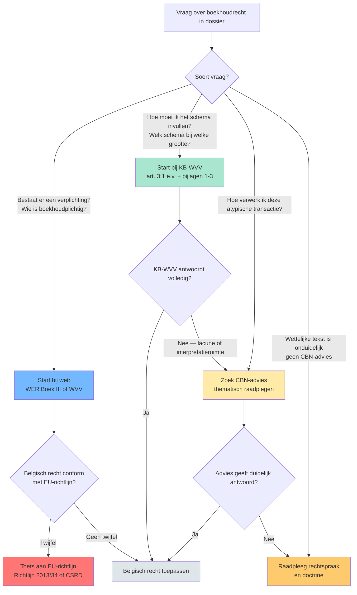
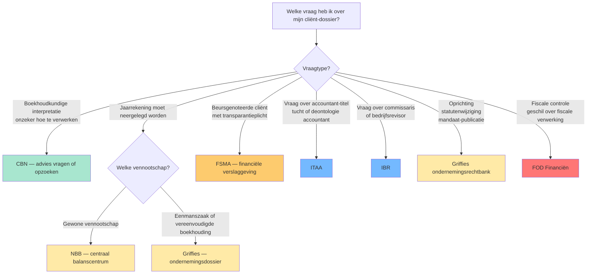
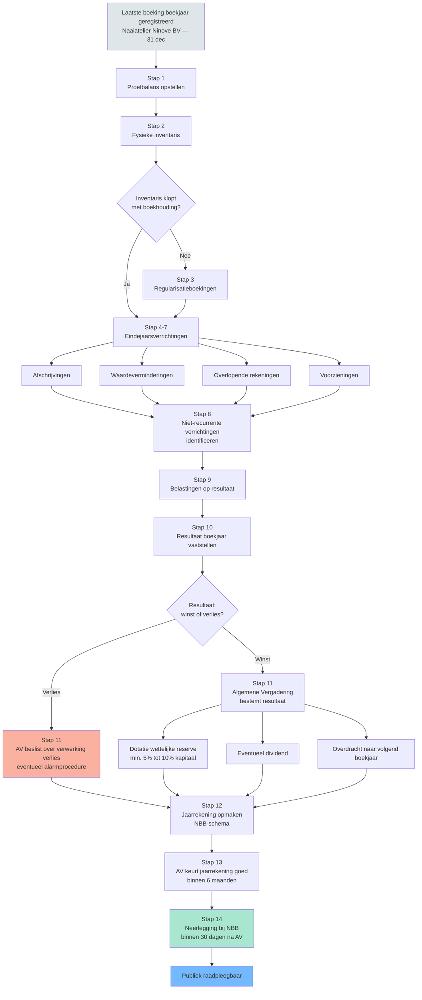
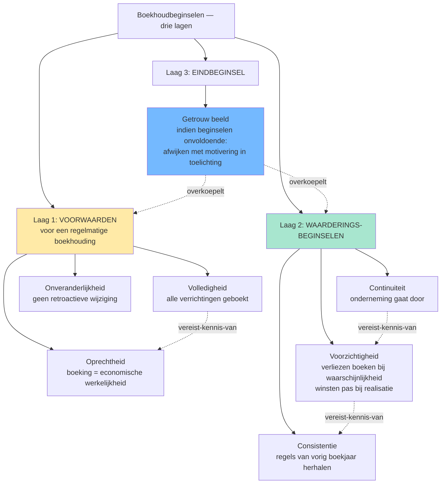

# PO 1.2 — Boekhoudrecht en jaarrekeningenrecht

> **Lees mij eerst:** dit document is een gestructureerd bundle van ALLE leermateriaal voor het programmaonderdeel "Boekhoudrecht en jaarrekeningenrecht" van het ITAA-bekwaamheidsexamen Gecertificeerd Accountant. Het bevat: (1) een didactische minicursus die je door het hele PO leidt, (2) 9 procedure-fiches die elk een concrete vaardigheid beschrijven ("hoe doe je X?"), en (3) 82 concept-fiches die elk een sleutel-begrip definiëren met bouwstenen, valkuilen en bronnen.
> 
> **Conventies in dit bundle:**
> - ⚖️ = directe wettelijke grondslag (WVV, KB WVV, CBN-advies, ITAA-norm, ISA, IFRS)
> - 🤖 = afgeleid of pedagogisch toegevoegd (geen letterlijke bron-citaat)
> - `[[concept-naam]]` = verwijzing naar een concept-fiche later in dit document
> - `[[competenties/naam]]` = verwijzing naar een competentie-fiche later in dit document
> 
> **Anti-fabricatie-regel voor afgeleide producten** (podcast / mindmap / slides / infographic / quiz): gebruik UITSLUITEND inhoud die in dit document staat. Geen externe bronnen, geen aanvullingen uit andere wetgevingen, geen verzonnen voorbeelden. Bij twijfel: zeg "dit staat niet in het bundle".


---

# Deel I — Minicursus

*De minicursus is de primaire leidraad. Lees ze in de aangeboden volgorde; gebruik de competentie- en concept-fiches in Deel II en III als verdieping wanneer iets onduidelijk blijft.*

### Wat verwacht het examen van jou?

> [!abstract] Dit programmaonderdeel wordt getoetst op niveau *integratie*.
> Je moet meerdere concepten samen kunnen inzetten in complexe casussen — onderdelen herkennen, prioriteren, en tot een coherent oordeel komen.


**Taken** (uit het ITAA-examenprogramma):

> [!abstract]- **Taak 1** — Opstellen van de individuele jaarrekening
>
> **Subtaken**:
> - Herstructureren van de balans en de resultatenrekening
> - Identificeren en interpreteren van de balansaggregaten
> - Berekenen van de elementen die nodig zijn voor een interpretatie van de kasstromen en die interpreteren
> - Berekenen van de ratio's en ze interpreteren
> - Contextualiseren van de interpretaties naargelang van het bedrijfsdomein en de nationale en internationale context
>
> **Doelstellingen**:
> - Een beginsel van boekhoudrecht of een wettelijke bepaling uit Belgische of Europese bron opzoeken, grondig analyseren en toepassen, in voorkomend geval met inachtneming van internationale normen.
> - Verifiëren en waarborgen van de conformiteit van de boekhouding en de documenten met de wettelijke en reglementaire vereisten.


### Leesgids

Deze minicursus bouwt van buiten naar binnen: eerst de [[rechtsbronnen-boekhoudrecht-piramide|rechtsbronnen]] en het [[autoriteiten-boekhoudrecht-landschap|autoriteiten-landschap]], dan de [[boekhoudplichtige-onderneming|boekhoudplicht]] en de [[vennootschapsgrootte-cascade|grootte-cascade]], en tot slot de [[samenstelling-statutaire-jaarrekening|jaarrekening]] met haar [[boekhoudbeginselen-overzicht|beginselen]] en [[openbaarmaking-jaarrekening|openbaarmaking]]. Op niveau *integratie* moet je deze concepten samen kunnen inzetten: een casus tegelijk juridisch (welke bron?), institutioneel (welke autoriteit?) én boekhoudkundig (welk beginsel?) ontleden.

### Waarom dit programmaonderdeel telt

Het boekhoudrecht is het stelsel waarbinnen elke vennootschap haar economische werkelijkheid in cijfers giet — en dat stelsel ontleent zijn betrouwbaarheid aan het [[getrouw-beeld|getrouw beeld]] van de jaarrekening. Voor een gecertificeerd accountant is dit het werkterrein waarbinnen je elk cliëntendossier opent. Een verkeerde keuze bij de [[groottecriteria-jaarrekening|groottecriteria]] sleept meteen schema, jaarverslag, [[commissaris|commissaris]], [[sociale-balans|sociale balans]] en openbaarmakingstermijn mee. Een gemiste [[onveranderlijkheid-boekingen|correctie-discipline]] of vergeten [[volledigheidsbeginsel|buiten-balans-verplichting]] ondermijnt de [[regelmatige-boekhouding|regelmatigheid]] van de hele boekhouding. Het examen toetst dit op integratie-niveau: niet één regel kennen, maar regels in onderlinge spanning kunnen wegen.

### Waarom een boekhoudrecht? Regelmatige en getrouwe boekhouding als spil

Het [[belgisch-boekhoudrecht|Belgisch boekhoudrecht]] dwingt af dat elke onderneming haar verrichtingen vastlegt in een [[regelmatige-boekhouding|regelmatige boekhouding]] die uitmondt in een jaarrekening met [[getrouw-beeld|getrouw beeld]]. Die spil bedient tegelijk schuldeisers, fiscus, vennoten en — via [[openbaarmaking-jaarrekening|openbaarmaking]] — de markt zelf. Zonder gemeenschappelijke spelregels valt het hele economisch verkeer terug op privé-vertrouwen.

### Rechtsbronnen van het Belgisch boekhoudrecht: van EU tot rechtspraak

> [!info] Hoort bij taak: Opstellen van de individuele jaarrekening

Je leert in een dossier herkennen welke rechtsbron primair antwoord geeft: gaat het om een verplichting ([[wetboek-economisch-recht-boek-iii|WER Boek III]] / [[wetboek-vennootschappen-verenigingen|WVV]]), om een schema-rubriek ([[kb-wvv-uitvoering|KB-WVV]]), om een interpretatie ([[cbn-adviezen|CBN-adviezen]]) of om een twistgeval ([[rechtspraak-boekhoudrecht|rechtspraak]])? Het [[europees-boekhoudrecht|Europees boekhoudrecht]] zit erboven via richtlijnen en de IAS-verordening. Wie deze lagen door elkaar haalt, mist op examen de hardere regel hogerop.

- [[belgisch-boekhoudrecht|Belgisch boekhoudrecht]] · `begrip`
- [[europees-boekhoudrecht|Europees boekhoudrecht]] · `begrip`
- [[wetboek-economisch-recht-boek-iii|Wetboek van Economisch Recht — Boek III (boekhouding)]] · `begrip`
- [[wetboek-vennootschappen-verenigingen|Wetboek van Vennootschappen en Verenigingen (WVV)]] · `begrip`
- [[kb-wvv-uitvoering|KB tot uitvoering van het WVV (KB-WVV)]] · `begrip`
- [[cbn-adviezen|CBN-adviezen]] · `begrip`
- [[rechtspraak-boekhoudrecht|Rechtspraak inzake boekhoudrecht]] · `begrip`

### Rechtsbronnen-piramide van het Belgisch boekhoudrecht

Synthese van de **vijfgelaagde hiërarchie** waaruit het Belgisch boekhoudrecht ontstaat: EU-bronnen → WER + WVV → KB-WVV → CBN-adviezen → rechtspraak. Voor de stagiair onmisbaar om te weten waar je in welke vraag in moet duiken; conflict tussen lagen wordt opgelost van boven naar beneden.


De tabel hieronder maakt de hiërarchie operationeel: per laag zie je wat je raadpleegt, met welke bindende kracht, en op welk soort vraag ze het sterkste antwoord biedt. De beslisboom toont de redeneer-as bij twijfel — niet alle vragen starten in dezelfde laag.

| Laag | Bron | Bindende kracht | Voorbeeld | Hoe raadpleeg ik het op examen? |
|---|---|---|---|---|
| 1 (top) | [[europees-boekhoudrecht\|EU-richtlijnen en -verordeningen]] | Hoogste &mdash; lidstaten moeten omzetten; IFRS-verordening rechtstreeks toepasselijk op PIEs | Richtlijn 2013/34/EU (jaarrekeningen); IAS-Verordening 1606/2002 (IFRS voor beursgenoteerde groepen); Richtlijn 2022/2464/EU (CSRD) | ITAA-LEX toont omzetting; check of Belgisch recht conform richtlijn is bij twijfel |
| 2 | [[wetboek-economisch-recht-boek-iii\|WER Boek III]] + [[wetboek-vennootschappen-verenigingen\|WVV]] | Wet &mdash; bindend voor alle ondernemingen | WER Boek III art. III.82-95 (boekhoudplicht ondernemingen); WVV Boek 3 (jaarrekening vennootschappen) | Eerste plaats om te zoeken bij vraag over verplichting of definitie |
| 3 | [[kb-wvv-uitvoering\|KB tot uitvoering WVV (KB-WVV)]] | KB &mdash; uitvoeringsbesluit; bindend mits binnen wettelijk kader | KB-WVV art. 3:1 t.e.m. 3:108: schema's jaarrekening, waarderingsregels, neerlegging | Bij vraag over praktische uitwerking (schema-rubrieken, waardering, bijlagen) |
| 4 | [[cbn-adviezen\|CBN-adviezen]] | Niet bindend maar gezaghebbend &mdash; door rechtspraak en fiscus gevolgd | CBN-2022/03 (groottecriteria); CBN-2017/10 (verbondenheid); CBN-2011/14 (rentabiliteit) | Bij interpretatie- of toepassingsvraag waarvoor de wet/KB onduidelijk is |
| 5 (bodem) | [[rechtspraak-boekhoudrecht\|Rechtspraak]] | Bindend in concreet geschil; gezaghebbend voor analoge gevallen (geen precedentenleer) | Cassatie-arresten over getrouw beeld, substance over form, faillissementsaansprakelijkheid bestuurders | Bij twistgeval &mdash; argumentatieve onderbouw, geen primaire bron |



**Kerninzichten**:

- De wettelijke piramide is geen mechanisch toepassings-algoritme maar een redeneer-as. Bij Rotex Roeselare NV met een twijfelgeval over leasing-verwerking: eerst KB-WVV art. 3:65 (financiële versus operationele lease), dan CBN-advies 2018/04 voor IFRS-stijl-bepaling, pas dan rechtspraak. Wie omgekeerd start, kan een hardere wettelijke regel missen.
- EU-richtlijnen zijn niet rechtstreeks toepasselijk &mdash; ze worden door wet/KB omgezet. EU-verordeningen (IAS-Verordening 1606/2002) wel. Het examen kan vragen 'waarom moet beursgenoteerde Solaris Sint-Truiden NV IFRS toepassen?' &mdash; antwoord: directe werking IAS-Verordening, niet via WVV.
- CBN-adviezen hebben geen formele bindende kracht maar in de praktijk worden ze door rechters en fiscus consistent gevolgd. Een accountant die afwijkt van een CBN-advies moet uitleggen waarom &mdash; de bewijslast verschuift. Voor examen-redenering: aanhalen van een CBN-advies is zelden fout, ook al is het niet 'verplicht'.
- Rechtspraak heeft in België geen precedenten-werking (geen stare decisis). Een Cassatie-arrest is gezaghebbend, geen wet. Maar voor identieke feitencomplexen geldt het praktisch wel: ondernemers en accountants stemmen hun gedrag erop af. Op examen: 'is volgens rechtspraak X verplicht?' &mdash; vermijd 'verplicht', zeg 'volgens rechtspraak verwacht'.
- Cijferzakboekje (drempels, bedragen) hoort niet in de piramide. Het is een hulpmiddel dat de WVV/KB-WVV-bedragen samenbrengt. Bij examen: gebruik altijd de cijfers uit ITAA-LEX en het Cijferzakboekje &mdash; nooit cijfers uit oudere handboeken (drempels werden in 2023-2024 met circa 25 % verhoogd door EU-delegated act).

_Bouwt op_: [[belgisch-boekhoudrecht]] · [[europees-boekhoudrecht]] · [[wetboek-economisch-recht-boek-iii]] · [[wetboek-vennootschappen-verenigingen]] · [[kb-wvv-uitvoering]] · [[cbn-adviezen]] · [[rechtspraak-boekhoudrecht]]
### Identificeren van de toepasselijke rechtsbron bij een vraag uit het boekhoudrecht

> [!info] Hoort bij taak: Opstellen van de individuele jaarrekening

Bij integratie-vragen moet je in een complexe casus stap voor stap kunnen verantwoorden welke bron je raadpleegt en waarom — start met het vraagtype kwalificeren, daal dan van wet via KB naar [[cbn-adviezen|CBN]] en eventueel [[rechtspraak-boekhoudrecht|rechtspraak]]. De volledige procedure schetst die afdaling op een herhaalbare manier.

[[competenties/identificeren-rechtsbron-boekhoudrecht|→ Volledige procedure]]

### Actoren van het boekhoudrecht: wie maakt, wie controleert, wie publiceert?

> [!info] Hoort bij taak: Opstellen van de individuele jaarrekening

Naast bronnen lopen er ook bevoegdheden door het boekhoudrecht: de [[commissie-boekhoudkundige-normen|CBN]] interpreteert, de [[nationale-bank-belgie|NBB]] ontvangt neerleggingen, de [[fsma|FSMA]] bewaakt markttransparantie, [[itaa|ITAA]] en [[ibr|IBR]] reglementeren de beroepen, de [[griffies-ondernemingsrechtbank|griffies]] beheren het ondernemingsdossier en de [[fod-financien-boekhoudrecht|FOD Financiën]] sluit fiscaal aan. Het examen camoufleert die afbakening graag — je moet bij elke vraag de juiste instantie eruit kunnen filteren.

- [[commissie-boekhoudkundige-normen|Commissie voor Boekhoudkundige Normen (CBN)]] · `autoriteit`
- [[nationale-bank-belgie|Nationale Bank van België (NBB)]] · `autoriteit`
- [[fsma|Financial Services and Markets Authority (FSMA)]] · `autoriteit`
- [[itaa|Instituut van de Belastingadviseurs en Accountants (ITAA)]] · `autoriteit`
- [[ibr|Instituut van de Bedrijfsrevisoren (IBR)]] · `autoriteit`
- [[fod-financien-boekhoudrecht|FOD Financiën (boekhoudrechtelijke rol)]] · `autoriteit`
- [[griffies-ondernemingsrechtbank|Griffies van de ondernemingsrechtbank]] · `autoriteit`

### Wie controleert wat? — Het autoriteiten-landschap van het Belgisch boekhoudrecht

Synthese-overzicht van de zeven autoriteiten die samen het Belgisch boekhoudrecht bewaken (CBN, NBB, FSMA, ITAA, IBR, griffies ondernemingsrechtbank, FOD Financiën). Voor stagiairs-GA cruciaal omdat de eerste vraag bij elk praktisch dossier is: 'naar welke autoriteit ga ik?' — examenvragen camoufleren regelmatig wie waarvoor bevoegd is.


De matrix legt per autoriteit de bevoegdheid, de wettelijke basis en het toepassingsgebied naast elkaar; de beslisboom routeert een concrete cliënt-vraag naar de juiste instantie. Gebruik beide samen: in een dossier kunnen meerdere autoriteiten naast elkaar bevoegd zijn (typisch bij beursgenoteerde groepen).

| Autoriteit | Wat doet ze? | Wettelijke basis | Toepasselijk op | Wanneer raadpleeg ik haar? |
|---|---|---|---|---|
| [[commissie-boekhoudkundige-normen\|CBN]] | Adviseert over interpretatie van boekhoudwetgeving | Wet 17 juli 1975 | Alle ondernemingen | Bij twijfel over boekhoudkundige verwerking &mdash; raadpleeg CBN-advies (niet bindend, maar gezaghebbend) |
| [[nationale-bank-belgie\|NBB]] | Ontvangt en publiceert neerleggingen jaarrekeningen + voert prudentieel toezicht (banken) | KB-WVV art. 3:104; Wet 22 februari 1998 | Alle vennootschappen (neerlegging); banken/verzekeraars (prudentieel) | Bij neerlegging jaarrekening (binnen 30 dagen na AV); banken voor prudentiële verslagstaten |
| [[fsma\|FSMA]] | Toezicht op gedrag op financiële markten + transparantie uitgevers | Wet 2 augustus 2002 | Beursgenoteerde uitgevers + verzekeringstussenpersonen + pensioeninstellingen | Bij beursgenoteerde cliënt &mdash; transparantieverplichtingen, prospectus, koersgevoelige info |
| [[itaa\|ITAA]] | Reglementeert accountants en belastingadviseurs (toegang, tucht, normen) | Wet 17 maart 2019 | Accountants + gecertificeerde accountants + fiscalisten + belastingadviseurs | Voor stage, bekwaamheidsexamen, tuchtklacht, deontologische vraag accountant |
| [[ibr\|IBR]] | Reglementeert bedrijfsrevisoren (commissarissen) | Wet 7 december 2016 | Bedrijfsrevisoren | Bij commissarisopdracht of audit door revisor &mdash; nooit door ITAA-accountant |
| [[griffies-ondernemingsrechtbank\|Griffies ondernemingsrechtbank]] | Ontvangt ondernemingsdossier (oprichting, statuten, mandaten) | WER Boek III; WVV | Alle ondernemingen | Bij oprichting, statutenwijziging, neerlegging bestuursverslag/mandaten |
| [[fod-financien-boekhoudrecht\|FOD Financiën]] | Fiscale controle &mdash; boekhouding als basis voor aangifte | WIB 92; BTW-Wetboek | Alle belastingplichtigen | Bij fiscale controle of geschil over fiscale verwerking van boekhoudkundige feiten |



**Kerninzichten**:

- ITAA en IBR zijn niet uitwisselbaar. ITAA reglementeert accountants (kunnen contractuele KMO-controle uitvoeren); IBR reglementeert bedrijfsrevisoren (kunnen wettelijke commissarisopdracht uitvoeren). Examenvalkuil: 'mag een ITAA-accountant commissaris zijn bij Rotex Roeselare NV (groot)?' &mdash; antwoord nee, dat is voorbehouden aan IBR-revisor.
- NBB en FSMA delen het 'Twin Peaks'-toezichtmodel maar met verschillende dimensies. NBB = prudentieel/macroprudentieel (gezondheid van financiële instellingen). FSMA = gedrag/markttransparantie (eerlijke informatie aan beleggers). Bij Belfius BV (bank): NBB controleert kapitaaltoereikendheid; FSMA controleert hoe Belfius haar producten in de markt zet.
- Neerlegging gebeurt via twee kanalen: jaarrekeningen via NBB (centraal balanscentrum); ondernemingsdossier (oprichting, statuten, benoemingen) via de griffies van de ondernemingsrechtbank. Verwar deze niet &mdash; dezelfde Meubelzaak Mertens BV legt elk jaar bij NBB neer maar ook bij de griffie bij statutenwijziging.
- CBN-adviezen zijn niet bindend maar gezaghebbend. Rechters en fiscus volgen ze in praktijk. Bij examenvraag 'wat is de boekhoudkundige verwerking van X?' is een CBN-advies vaak de beste bron &mdash; ook als de WVV/KB-WVV-tekst zwijgt of dubbelzinnig is.
- Bij een beursgenoteerde groep zijn doorgaans drie autoriteiten tegelijk betrokken: FSMA (transparantie), NBB (neerlegging jaarrekening + prudentieel indien financiële instelling), IBR-revisor (commissaris). Voor een gewone KMO is meestal alleen NBB + (eventueel) ITAA-accountant relevant.

_Bouwt op_: [[commissie-boekhoudkundige-normen]] · [[nationale-bank-belgie]] · [[fsma]] · [[itaa]] · [[ibr]] · [[griffies-ondernemingsrechtbank]] · [[fod-financien-boekhoudrecht]] · [[commissaris]] · [[public-interest-entity]]
### Identificeren van de juiste administratieve autoriteit bij een boekhoudrechtelijke vraag

> [!info] Hoort bij taak: Opstellen van de individuele jaarrekening

Op integratie-niveau moet je in een gemengde casus tegelijk meerdere autoriteiten kunnen activeren — typisch bij een beursgenoteerde groep waar [[fsma|FSMA]], [[nationale-bank-belgie|NBB]] en [[ibr|IBR]]-revisor samen optreden. De procedure leert je de routering systematisch op vraagtype te baseren.

[[competenties/identificeren-administratieve-autoriteit|→ Volledige procedure]]

### Grondslag van de boekhoudplicht: wie moet boekhouden en hoe?

> [!info] Hoort bij taak: Opstellen van de individuele jaarrekening

Hier zit de operationele kern van het boekhoudrecht: de [[boekhoudplichtige-onderneming|boekhoudplicht]], de keuze tussen [[dubbel-boekhouden|dubbele]] en [[vereenvoudigde-boekhouding|vereenvoudigde boekhouding]], en de drie technische pijlers ([[minimum-algemeen-rekeningenstelsel|MAR]], [[dagboek|dagboeken]], [[verantwoordingsstuk|verantwoordingsstukken]]) die samen de [[regelmatige-boekhouding|regelmatigheid]] dragen. Daar bovenop staan procedurele regels — [[onveranderlijkheid-boekingen|onveranderlijkheid]], [[bewaartermijn-boekhouding|bewaartermijn]] en [[eindejaarsverrichtingen|eindejaarsverrichtingen]] — die het cyclische karakter van een boekjaar vormgeven.

- [[boekhoudplichtige-onderneming|Boekhoudplichtige onderneming]] · `begrip`
- [[regelmatige-boekhouding|Regelmatige boekhouding]] · `cluster`
- [[dubbel-boekhouden|Dubbel boekhouden]] · `cluster`
- [[vereenvoudigde-boekhouding|Vereenvoudigde boekhouding]] · `begrip`
- [[minimum-algemeen-rekeningenstelsel|Minimum Algemeen Rekeningenstelsel (MAR)]] · `begrip`
- [[dagboek|Dagboek]] · `begrip`
- [[hulpdagboeken|Hulpdagboeken]] · `begrip`
- [[verantwoordingsstuk|Verantwoordingsstuk]] · `begrip`
- [[inventaris|Inventaris]] · `cluster`
- [[proef-en-saldibalans|Proef- en saldibalans]] · `begrip`
- [[eindejaarsverrichtingen|Eindejaarsverrichtingen (jaarafsluiting)]] · `procedure`
- [[onveranderlijkheid-boekingen|Onveranderlijkheid van de boekingen]] · `regel`
- [[bewaartermijn-boekhouding|Bewaartermijn van boeken en verantwoordingsstukken]] · `regel`

### Boekjaar afsluiten &mdash; van proefbalans tot neerlegging

Synthese die per stap toont wat een vennootschap aan het einde van haar boekjaar moet doen: inventaris opmaken, eindejaarsverrichtingen boeken, proef- en saldibalans opstellen, jaarrekening voorbereiden, goedkeuren en openbaarmaken. Voor de stagiair-GA is dit de praktische ruggengraat van zijn eerste boekjaar-afsluitingen.


De stappentabel en flowchart zetten de keten op één lijn — let vooral op de wettelijke timing-keten (boekjaar → AV → neerlegging) en op de [[eindejaarsverrichtingen|eindejaarsverrichtingen]] die direct uit de waarderingsbeginselen volgen. Wie de volgorde verstoort, breekt de logica van de jaarrekening.

| Stap | Wat | Wanneer | Concept-record | Output |
|---|---|---|---|---|
| 1 | Proefbalans opstellen | Direct na laatste boeking boekjaar | [[regelmatige-boekhouding]] · [[dubbel-boekhouden]] | Lijst met saldi per grootboekrekening; debet = credit |
| 2 | Fysieke inventarisopname | Op de afsluitingsdatum (in regel laatste dag boekjaar) | [[inventaris]] | Werkblad met fysieke tellingen voorraad, kas, vaste activa |
| 3 | Verschillen inventaris &harr; boekhouding regulariseren | Tussen inventaris-datum en jaarrekening-opmaak | [[inventaris]] · [[voorraden]] | Correctieboekingen (manco's, breukverliezen, inventarisverschillen) |
| 4 | Afschrijvingen boeken | Eindejaarsverrichting | [[afschrijvingen]] | Boeking 6302 / 22-28 voor materiele en immateriele vaste activa |
| 5 | Waardeverminderingen toetsen + boeken | Eindejaarsverrichting | [[waardeverminderingen]] | Boeking 631-634 voor duurzame waardeverminderingen op activa |
| 6 | Overlopende rekeningen boeken | Eindejaarsverrichting | [[overlopende-rekeningen]] | Boeking 490/491/492/493 voor toerekening kosten/opbrengsten aan juiste boekjaar |
| 7 | Voorzieningen aanleggen of terugnemen | Eindejaarsverrichting | [[voorzieningen]] · [[voorzichtigheidsbeginsel]] | Boeking 6360 / 160-163 voor risico's en kosten |
| 8 | Niet-recurrente verrichtingen identificeren | Bij opmaak resultatenrekening | [[niet-recurrente-verrichtingen]] | Boeking 66/76 (vroegere 'uitzonderlijke' rubrieken) |
| 9 | Belastingen op het resultaat berekenen + boeken | Na vaststelling resultaat voor belasting | [[bedrijfsresultaat]] | Boeking 670-679 |
| 10 | Resultaat van het boekjaar afsluiten | Sluiten rekeningen klasse 6 en 7 | [[bedrijfsresultaat]] · [[resultaatverwerking]] | Saldo op rekening 690/790 |
| 11 | Algemene vergadering: resultaat bestemmen | Binnen 6 maanden na boekjaareinde | [[resultaatverwerking]] · [[wettelijke-reserve]] | Beslissing AV: dotatie wettelijke reserve, eventueel andere reserves, dividend, overdracht naar volgend boekjaar |
| 12 | Jaarrekening opmaken in NBB-schema | Na resultaatverwerking | [[jaarrekening]] | Volledige of verkorte jaarrekening + toelichting + sociale balans |
| 13 | Goedkeuring algemene vergadering | Binnen 6 maanden na boekjaareinde | [[jaarrekening]] | AV-notulen + ondertekende jaarrekening |
| 14 | Neerlegging bij NBB | Binnen 30 dagen na goedkeuring AV (en uiterlijk 7 maanden na boekjaareinde) | [[jaarrekening]] | Neergelegde jaarrekening &mdash; publiek raadpleegbaar |



**Kerninzichten**:

- De volgorde is bindend: pas na de eindejaarsverrichtingen (stap 4-9) kan je het resultaat van het boekjaar vaststellen (stap 10). Pas na de algemene vergadering die het resultaat bestemt (stap 11) ken je het 'overgedragen resultaat' &mdash; pas dan is de jaarrekening volledig opmaakbaar (stap 12). Een examenvraag die zegt 'jaarrekening klaar, AV moet nog komen' bevat dus een logische fout: de jaarrekening kan niet 'klaar' zijn zonder AV-beslissing.
- De timing is wettelijk geketend: AV binnen 6 maanden na boekjaareinde (WVV art. 3:1 §1), neerlegging binnen 30 dagen na AV (WVV art. 3:10) en uiterlijk 7 maanden na boekjaareinde. Voor [[Naaiatelier Ninove BV]] met boekjaar dat eindigt op 31 december betekent dit: AV ten laatste 30 juni, neerlegging ten laatste 31 juli. Boete-risico: laattijdige neerlegging is een veelvoorkomende cliënt-vraag.
- Drie van de tien verplichte boekingen volgen direct uit de waarderingsbeginselen: afschrijvingen (consistentie), waardeverminderingen (voorzichtigheid), voorzieningen (voorzichtigheid). Wie de beginselen kent, kan deze stappen niet vergeten. Wie ze opvat als 'extra werk', vergeet er typisch een &mdash; bijvoorbeeld de waardeverminderingen op vorderingen.
- De wettelijke reserve (stap 11) ontstaat bij de resultaatverwerking, niet bij de jaarrekening-opmaak. Sequentieel: AV beslist welk percentage naar wettelijke reserve gaat (min. 5% van de winst, tot de wettelijke reserve 10% van het kapitaal bereikt). Pas dan staat het bedrag op rekening 130; pas dan past het in de jaarrekening die de AV daarna goedkeurt.

_Bouwt op_: [[regelmatige-boekhouding]] · [[inventaris]] · [[overlopende-rekeningen]] · [[afschrijvingen]] · [[waardeverminderingen]] · [[voorzieningen]] · [[jaarrekening]] · [[resultaatverwerking]] · [[wettelijke-reserve]]
### Kwalificeren of een onderneming boekhoudplichtig is en welk type boekhouding zij moet voeren

> [!info] Hoort bij taak: Opstellen van de individuele jaarrekening

Je leert in een casus de juridische vorm en omzet samen wegen om te kiezen tussen [[dubbel-boekhouden|dubbele boekhouding]] en [[vereenvoudigde-boekhouding|vereenvoudigde boekhouding]] — een rechtspersoon valt altijd onder dubbele boekhouding, een natuurlijke persoon onder de wettelijke drempel mag versimpelen. De procedure begeleidt die kwalificatie stap voor stap.

[[competenties/kwalificeren-boekhoudplichtige-onderneming|→ Volledige procedure]]

### Kwalificeren welk boekhoud- en jaarrekeningregime van toepassing is op een VZW, IVZW of stichting

> [!info] Hoort bij taak: Opstellen van de individuele jaarrekening

Voor verenigingen geldt een eigen drie-regime-cascade ([[jaarrekening-vzw-stichting|VZW-jaarrekening]]): zeer klein → vereenvoudigd, klein → verkort VZW-schema, groot → volledig VZW-schema. In een complexe casus moet je gelijktijdig de aard van de activiteiten en de drie grootte-criteria kunnen toetsen.

[[competenties/kwalificeren-jaarrekeningregime-vzw-stichting|→ Volledige procedure]]

### Vennootschapsvormen en groottecategorieën: de cascade in cijfers

> [!info] Hoort bij taak: Opstellen van de individuele jaarrekening

Hier komen [[vennootschapsvormen-typologie|vorm-keuze]] en [[groottecriteria-jaarrekening|grootte-toets]] samen tot het allesbepalende beslispunt van het dossier: is de vennootschap [[microvennootschap|micro]], [[kleine-vennootschap|klein]] of groot? Die ene kwalificatie stuurt het [[jaarrekening-schema|jaarrekening-schema]] én het volledige cascade-pakket van verplichtingen aan. Voor [[jaarrekening-vzw-stichting|VZW's en stichtingen]] geldt een parallelle cascade met eigen drempels.

- [[vennootschapsvormen-typologie|Typologie van vennootschaps- en verenigingsvormen]] · `begrip`
- [[groottecriteria-jaarrekening|Groottecriteria (jaarrekening-context)]] · `regel`
- [[microvennootschap|Microvennootschap (WVV art. 1:25)]] · `begrip`
- [[kleine-vennootschap|Kleine vennootschap (WVV art. 1:24)]] · `begrip`
- [[jaarrekening-schema|Jaarrekening-schema (volledig, verkort, micro)]] · `begrip`
- [[jaarrekening-vzw-stichting|Jaarrekening van VZW, IVZW en stichtingen]] · `begrip`

### Vennootschapsgrootte-cascade: micro &mdash; klein &mdash; groot

Synthese die in één beslisboom toont hoe de groottecategorie (micro/klein/groot) doorwerkt op jaarrekening-schema, commissaris-verplichting, jaarverslag-plicht en consolidatieverplichting. Voor stagiair-GA praktische ruggengraat bij elk vennootschapsdossier.


De vergelijkingstabel zet de zes parallelle verplichtingen per categorie naast elkaar; de beslisboom voegt de groep-context en de PIE-test toe. Wie alleen op schema-keuze focust, vergeet typisch de [[commissaris|commissaris]]-vrijstelling of de [[sociale-balans|sociale balans]].

| Aspect | [[microvennootschap\|Micro]] | [[kleine-vennootschap\|Klein]] | Groot |
|---|---|---|---|
| Drempels (max 1 overschrijden) | ≤ 10 VTE · ≤ € 900.000 omzet · ≤ € 450.000 balans | ≤ 50 VTE · ≤ € 11.250.000 omzet · ≤ € 6.000.000 balans | Boven de kleine-drempels (2 of 3 overschreden) |
| Extra voorwaarde | Mag geen moeder of dochter zijn | Verbondenheid telt op geconsolideerde basis | &mdash; |
| [[jaarrekening-schema\|Schema]] | Microschema (Bijlage 3 KB-WVV) | Verkort schema (Bijlage 2) | Volledig schema (Bijlage 1) |
| [[jaarverslag\|Jaarverslag]] | Vrijgesteld | Vrijgesteld | Verplicht (WVV art. 3:32) |
| [[commissaris\|Commissaris]] | Niet verplicht | Niet verplicht (tenzij groep groot is) | Verplicht (WVV art. 3:72) |
| [[sociale-balans\|Sociale balans]] | Vereenvoudigd | Verplicht (WVV art. 3:31) | Verplicht |
| [[openbaarmaking-jaarrekening\|Neerlegging NBB]] | Verplicht binnen 7 maanden na boekjaar | Verplicht binnen 7 maanden na boekjaar | Verplicht binnen 7 maanden na boekjaar |
| CSRD-duurzaamheidsrapportering | Niet van toepassing | Niet van toepassing | Vanaf 2024 voor grote vennootschappen die voldoen aan EU-omvangscriteria |

```mermaid
flowchart TD
  A[Cliënt-vennootschap &mdash; welke verplichtingen?] --> B[Verzamel 3 cijfers van afgesloten boekjaar:<br/>VTE &mdash; omzet excl. BTW &mdash; balanstotaal]
  B --> C{Behoort vennootschap tot groep?}
  C -->|Ja| D[Tel op geconsolideerde basis<br/>verbondenheid trekt cijfers op]
  C -->|Nee| E[Gebruik enkelvoudige cijfers]
  D --> F{Boven kleine-drempel<br/>op meer dan 1 criterium?}
  E --> F
  F -->|Ja| G[Groot: volledig schema<br/>jaarverslag + commissaris + sociale balans]
  F -->|Nee &mdash; max 1 criterium boven| H{Onder microdrempels<br/>op meer dan 1 criterium?}
  H -->|Ja én geen moeder/dochter| I[Micro: microschema<br/>geen jaarverslag<br/>geen commissaris]
  H -->|Ja maar moeder of dochter| J[Klein: verkort schema<br/>geen jaarverslag<br/>geen commissaris tenzij groep groot]
  H -->|Nee| J
  G --> K{Beursgenoteerd<br/>of grote PIE?}
  K -->|Ja| L[Bijkomend: CSRD-duurzaamheidsrapport<br/>via [[fsma\|FSMA]] toezicht]
  K -->|Nee| M[Enkel WVV-verplichtingen<br/>via [[nationale-bank-belgie\|NBB]] neerlegging]
  style I fill:#a8e6cf
  style J fill:#ffeaa7
  style G fill:#fdcb6e
  style L fill:#ff7675
  style M fill:#dfe6e9
```

**Kerninzichten**:

- Eén grootteklassering = zes parallelle verplichtingen. Stagiairs maken vaak de fout schema te kiezen en de cascade te vergeten. Voor Meubelzaak Mertens BV (klein) volgt uit de classering: verkort schema + geen jaarverslag + geen commissaris + verplichte sociale balans + neerlegging NBB binnen 7 maand. Vergeet je commissaris-vrijstelling, dan misbillijk je de cliënt met onnodige kosten.
- Microvennootschap heeft een extra voorwaarde die klein-vennootschap niet heeft: GEEN moeder of dochter zijn. Oprichtingen Oostende BV (omzet € 400K, 4 VTE) is micro &mdash; maar als ze morgen 60% van Industria Antwerpen NV verwerft, kantelt ze automatisch naar klein. De groottecascade is dynamisch.
- Twee opeenvolgende boekjaren-regel beschermt tegen heen-en-weer-schommelen. Eénmalige overschrijding kantelt status niet. Bij Brugse Brouwerij BV met uitschieter omzet in 2024: pas vanaf 2026 kantelen als 2025 ook overschrijdt. Examenvraag-camouflage: 'in 2024 had vennootschap X 55 VTE, dus is ze groot' &mdash; mis, je moet 2023 erbij hebben.
- Kleine groep beïnvloedt kleine vennootschap. Een kleine dochter van een grote groep wordt voor jaarrekening behandeld als groot (consolidatie-perspectief: WVV art. 1:24 § 5). Aurelia Holding NV (klein op zich) met 4 dochters die samen 60 VTE en € 18M omzet hebben &mdash; wordt voor jaarrekening grote vennootschap. Dit is de meest gemiste examen-valkuil.
- Onderscheid [[groottecriteria-jaarrekening\|groottecriteria-jaarrekening]] (WVV art. 1:24-1:25) en [[groottecriteria-consolidatie\|groottecriteria-consolidatie]] (WVV art. 1:26). Eerste bepaalt schema en cascade-verplichtingen van enkelvoudige jaarrekening. Tweede bepaalt vrijstelling consolidatieplicht. Andere drempels, ander doel &mdash; verwar nooit.

_Bouwt op_: [[groottecriteria-jaarrekening]] · [[kleine-vennootschap]] · [[microvennootschap]] · [[jaarrekening-schema]] · [[jaarverslag]] · [[commissaris]] · [[openbaarmaking-jaarrekening]] · [[sociale-balans]]
### Klasseren van een vennootschap als micro, klein of groot volgens de groottecriteria

> [!info] Hoort bij taak: Opstellen van de individuele jaarrekening

Stap voor stap doorloop je de drie criteria op balansdatum, pas je de twee-opeenvolgende-boekjaren-regel toe en activeer je waar nodig de [[groottecriteria-jaarrekening|verbondenheidstoets]] op geconsolideerde basis. Vergeet bij twijfel niet de extra micro-voorwaarde (geen moeder of dochter zijn).

[[competenties/klasseren-vennootschap-naar-groottecategorie|→ Volledige procedure]]

### Bepalen welk jaarrekening-schema (volledig, verkort, micro) een vennootschap moet gebruiken

> [!info] Hoort bij taak: Opstellen van de individuele jaarrekening

Eenmaal de [[groottecriteria-jaarrekening|grootteklasse]] bekend is, volgt het schema bijna deterministisch — maar je moet ook kunnen omgaan met overgangsperiodes en met de doorwerking op [[sociale-balans|sociale balans]] en [[toelichting-jaarrekening|toelichting]]. De procedure benoemt die randvoorwaarden expliciet.

[[competenties/bepalen-jaarrekeningschema|→ Volledige procedure]]

### De jaarrekening als studieobject: bestanddelen en samenstelling

> [!info] Hoort bij taak: Opstellen van de individuele jaarrekening

De jaarrekening is geen rapport maar een samenstel: [[balans|balans]], [[resultatenrekening|resultatenrekening]] en [[toelichting-jaarrekening|toelichting]] vormen de kern, [[sociale-balans|sociale balans]] en [[bestuursverslag|bestuursverslag]] (synoniem [[jaarverslag|jaarverslag]]) komen er als verplichte aanvullingen bij. De [[samenstelling-statutaire-jaarrekening|samenstellingsprocedure]] vertrekt steeds van de [[proef-en-saldibalans|proef- en saldibalans]] na [[eindejaarsverrichtingen|eindejaarsverrichtingen]]. Vergeet ook de [[klasse-0-niet-in-balans|niet-balans-rubrieken]] niet — daar zit het stille volledigheidsrisico.

- [[jaarrekening-als-studieobject|Jaarrekening als studieobject van financiële analyse]] · `begrip`
- [[samenstelling-statutaire-jaarrekening|Samenstelling van de statutaire jaarrekening]] · `procedure`
- [[balans|Balans (jaarrekening-component)]] · `cluster`
- [[resultatenrekening|Resultatenrekening]] · `cluster`
- [[toelichting-jaarrekening|Toelichting bij de jaarrekening]] · `begrip`
- [[sociale-balans|Sociale balans]] · `begrip`
- [[bestuursverslag|Bestuursverslag (jaarverslag)]] · `procedure`
- [[jaarverslag|Jaarverslag]] · `begrip`
- [[klasse-0-niet-in-balans|Klasse 0 — niet in de balans opgenomen rekeningen]] · `begrip`
- [[niet-in-balans-opgenomen-rechten-verplichtingen|Niet in de balans opgenomen rechten en verplichtingen]] · `regel`

### Boekhoudbeginselen en waarderingsregels: het redeneerkader bij twijfel

> [!info] Hoort bij taak: Opstellen van de individuele jaarrekening

De [[boekhoudbeginselen-overzicht|beginselen]] zijn geen catechismus maar het kompas dat richting geeft wanneer de wet zwijgt of meerdere wegen openlaat. Vier waarderingsbeginselen ([[voorzichtigheidsbeginsel|voorzichtigheid]], [[continuiteitsbeginsel|continuïteit]], [[oprechtheidsbeginsel|oprechtheid]], [[consistentiebeginsel|consistentie]]) sturen de [[waarderingsregels-jaarrekening|waarderingsregels]] — uitgewerkt in [[aanschaffingswaarde|aanschaffingswaarde]], [[afschrijvingen|afschrijvingen]], [[waardeverminderingen|waardeverminderingen]], [[herwaarderingsmeerwaarden|herwaarderingen]], [[voorzieningen|voorzieningen]] en [[overlopende-rekeningen|overlopende rekeningen]]. Boven alles staat het [[getrouw-beeld|getrouw beeld]] als eindtoets.

- [[getrouw-beeld|Getrouw beeld]] · `regel`
- [[getrouw-beeld-jaarrekening|Getrouw beeld van de jaarrekening]] · `regel`
- [[voorzichtigheidsbeginsel|Voorzichtigheidsbeginsel]] · `regel`
- [[continuiteitsbeginsel|Boekhoudkundig continuïteitsbeginsel (going concern)]] · `regel`
- [[oprechtheidsbeginsel|Oprechtheidsbeginsel (boekhouding)]] · `regel`
- [[consistentiebeginsel|Consistentiebeginsel]] · `regel`
- [[volledigheidsbeginsel|Volledigheidsbeginsel (boekhouding)]] · `regel`
- [[waarderingsregels-jaarrekening|Waarderingsregels (algemeen)]] · `begrip`
- [[aanschaffingswaarde|Aanschaffingswaarde]] · `begrip`
- [[afschrijvingen|Afschrijvingen]] · `cluster`
- [[waardeverminderingen|Waardeverminderingen]] · `cluster`
- [[herwaarderingsmeerwaarden|Herwaarderingsmeerwaarden]] · `cluster`
- [[voorzieningen|Voorzieningen voor risico's en kosten]] · `cluster`
- [[oprichtingskosten|Oprichtingskosten]] · `cluster`
- [[overlopende-rekeningen|Overlopende rekeningen]] · `cluster`

### Aanvullende boekhoudbeginselen (voorzichtigheid, oprechtheid, continuïteit, consistentie)

Naast de drie 'voorwaardelijke' boekhoudbeginselen (volledigheid, oprechtheid, onveranderlijkheid) zijn er vier aanvullende beginselen die de **waarderings- en presentatiekeuzes** sturen: voorzichtigheid, oprechtheid, continuïteit en consistentie. Ze staan niet in één wetsartikel maar zijn verspreid in KB-WVV art. 3:6 en 3:35 e.v. Voor het examen is dit cluster één van de meest getoetste theorie-blokken: vragen vertrekken meestal vanuit een concreet waarderings-dilemma en peilen welk beginsel je toepast.


De vier beginselen werken complementair en remmen elkaar: [[voorzichtigheidsbeginsel|voorzichtigheid]] zonder [[oprechtheidsbeginsel|oprechtheid]] vervalt in stille reserves; [[continuiteitsbeginsel|continuïteit]] zonder [[consistentiebeginsel|consistentie]] maakt boekjaren onvergelijkbaar. In een waarderings-casus identificeer je dus eerst welk beginsel primair geactiveerd wordt — pas dan zoek je de uitwerking in de [[waarderingsregels-jaarrekening|waarderingsregels]].

**Kerninzichten**:

- De vier beginselen werken **complementair**: voorzichtigheid (geen overschatting) is begrensd door oprechtheid (geen onderschatting als camouflage); continuïteit verklaart waarom waarderingen op going-concern-basis mogen; consistentie waarborgt vergelijkbaarheid tussen boekjaren.
- Bij conflict: **getrouw beeld** is het einddoel waaraan alle vier worden afgemeten. Een 'voorzichtige' onderwaardering die het beeld vertekent, schendt oprechtheid en uiteindelijk het getrouw beeld.
- Voor het examen: identificeer in elke waarderings-casus welke beginsel(s) primair geactiveerd worden — niet alle vier tegelijk.

_Bouwt op_: [[voorzichtigheidsbeginsel]] · [[oprechtheidsbeginsel]] · [[continuiteitsbeginsel]] · [[consistentiebeginsel]]
### Boekhoudbeginselen &mdash; overzicht

Synthese die de zeven boekhoudbeginselen in drie functionele lagen ordent: voorwaarden voor regelmatigheid (volledigheid, oprechtheid, onveranderlijkheid), waarderingssturing (continuïteit, voorzichtigheid, consistentie), en het eindbeginsel (getrouw beeld). Cruciaal voor stagiairs omdat losse memorisatie hier niet helpt — examenvragen toetsen welk beginsel doorslaggevend is bij conflicten (typisch: voorzichtigheid tegenover continuïteit).


De tabel koppelt elk beginsel aan zijn primaire bron en de typische valkuil; de drie-lagen-flowchart maakt zichtbaar welke beginselen meer ondersteunend zijn (regelmatigheid) en welke meer richting geven (waardering), met [[getrouw-beeld|getrouw beeld]] als overkoepelende eindtoets.

| Beginsel | Functie | Primaire bron | Vraag die het beantwoordt | Klassieke valkuil |
|---|---|---|---|---|
| [[getrouw-beeld]] | Eindbeginsel: de jaarrekening moet een getrouw beeld geven van vermogen, financiele positie en resultaat | WER art. III.89 · KB WVV art. 3:1 · Richtlijn 2013/34/EU art. 4 §3 | "Geeft mijn jaarrekening een getrouw beeld?" &mdash; eindtoets | Stagiair denkt: "als alle posten correct geboekt zijn klopt het beeld vanzelf". Fout: bij twijfel moet je afwijken van de regels mits motivering in de toelichting (KB WVV art. 3:1 derde lid). |
| [[volledigheidsbeginsel]] | Alle verrichtingen, bezittingen, rechten, schulden en verplichtingen zijn geboekt | WER art. III.83 · CBN 174/1 | "Heb ik alles opgenomen?" | Buiten-balans-rechten en -verplichtingen (klasse 0) worden vergeten &mdash; zie [[rechten-verplichtingen-buiten-balans]]. |
| [[oprechtheidsbeginsel]] | Boekingen reflecteren de werkelijke economische verrichting (niet de juridische schijn) | CBN 174/1 | "Komt mijn boeking overeen met de werkelijkheid?" | Substance over form: leasing waarbij [[Transport Tongeren BV]] het economisch eigendom heeft moet als financieringshuur geboekt worden, niet als operationele huur &mdash; ook al heet het contractueel zo. |
| [[onveranderlijkheid-boekingen]] | Eenmaal geboekt mag niet meer worden geschrapt of overschreven; correcties via tegenboeking | WER art. III.86 · CBN 174/1 | "Mag ik een vorige boeking nog wijzigen?" | Tipp-Ex of overschrijven in handgeschreven dagboek &rarr; boekhouding niet meer regelmatig. Correctie altijd via tegenboeking met datum en verwijzing. |
| [[continuiteitsbeginsel]] | Waardering veronderstelt dat de onderneming haar activiteiten voortzet | KB WVV art. 3:6 · CBN 2018/18 | "Mag ik blijven waarderen alsof we doorgaan?" | Bij twijfel over continuiteit moet bestuur uitdrukkelijk evalueren (toelichting jaarrekening); bij stopzetting overschakelen naar discontinuiteitswaarderingsregels. |
| [[voorzichtigheidsbeginsel]] | Verliezen en risico's boeken zodra waarschijnlijk; winsten pas bij realisatie | KB WVV art. 3:6 · Richtlijn 2013/34/EU art. 6 §1.c | "Mag ik deze opbrengst al boeken?" | Asymmetrie: voorzieningen aanleggen voor verwachte verliezen ja; herwaarderingsmeerwaarden boeken op niet-verkochte activa niet (behalve duurzame meerwaarde + KB-criteria). |
| [[consistentiebeginsel]] | Waarderingsregels van het ene boekjaar op het andere onveranderd toepassen | KB WVV art. 3:8 · CBN 174/1 | "Mag ik mijn afschrijvingsmethode veranderen?" | Methodewijziging mag, mits motivering in de toelichting + retroactieve aanpassing of prospectieve toepassing (afhankelijk van type wijziging). |



**Kerninzichten**:

- De zeven beginselen zijn niet allemaal gelijkwaardig: drie zijn voorwaarden om uberhaupt van een 'regelmatige' boekhouding te kunnen spreken (volledigheid, oprechtheid, onveranderlijkheid), drie sturen de waardering (continuiteit, voorzichtigheid, consistentie), en het getrouw-beeld-beginsel staat erboven als eindtoets. Stagiairs die ze op een rij zien staan zonder hierarchie missen die drie-lagen-structuur.
- Het getrouw-beeld-beginsel bevat een overrule-mechanisme: als toepassing van de andere beginselen onvoldoende is om een getrouw beeld te geven, moet je afwijken &mdash; met motivering in de toelichting (KB WVV art. 3:1 derde lid). Dit is geen vrijbrief: het bestuur moet uitdrukkelijk vaststellen dat de standaardregels onvoldoende zijn.
- Voorzichtigheid en getrouw-beeld kunnen op gespannen voet staan: pure voorzichtigheid leidt tot stille reserves (winsten onderschat, verliezen overschat), wat het getrouwe beeld verstoort. De moderne lezing (Richtlijn 2013/34/EU art. 6 §1.c): voorzichtigheid betekent geen overdreven onderwaardering, alleen waarschijnlijke verliezen + risico's opnemen.
- De onveranderlijkheid van boekingen is een formele eis (geen Tipp-Ex, geen overschrijven) maar geen verbod op correcties. Een verkeerde boeking corrigeer je via een tegenboeking met datum en verwijzing &mdash; de oorspronkelijke fout blijft zichtbaar in de audit-trail.
- Volledigheid omvat ook de rechten en verplichtingen buiten de balans (klasse 0): garanties verleend door [[Meubelzaak Mertens BV]], leaseverplichtingen, borgstellingen, pensioenverplichtingen. Wie deze vergeet schendt het volledigheidsbeginsel zonder dat de balans uit evenwicht raakt &mdash; daarom is het een silent error die makkelijk gemist wordt op examens.

_Bouwt op_: [[continuiteitsbeginsel]] · [[voorzichtigheidsbeginsel]] · [[getrouw-beeld]] · [[onveranderlijkheid-boekingen]] · [[consistentiebeginsel]] · [[oprechtheidsbeginsel]] · [[volledigheidsbeginsel]] · [[aanvullende-boekhoudbeginselen]]
### Toepassen van de boekhoudbeginselen op een concreet waarderingsvraagstuk

> [!info] Hoort bij taak: Opstellen van de individuele jaarrekening

In een complexe casus moet je het waarderingsvraagstuk eerst typeren, dan de relevante beginselen activeren en hun onderlinge spanning wegen — typisch [[voorzichtigheidsbeginsel|voorzichtigheid]] tegen [[oprechtheidsbeginsel|oprechtheid]] of [[continuiteitsbeginsel|continuïteit]] tegen [[consistentiebeginsel|consistentie]]. De procedure laat zien hoe je tot een coherent oordeel komt zonder in fabriceren te vervallen.

[[competenties/toepassen-boekhoudbeginselen-op-waarderingsvraagstuk|→ Volledige procedure]]

### Toezicht en openbaarmaking: de externe controle-keten

> [!info] Hoort bij taak: Opstellen van de individuele jaarrekening

De keten sluit op twee niveaus: intern via de [[commissaris|commissaris]] (verplicht bij grote vennootschappen en [[public-interest-entity|PIE's]]) en extern via [[openbaarmaking-jaarrekening|openbaarmaking]] bij de [[nationale-bank-belgie|NBB]]. Voor een gecertificeerd accountant is dit waar het hele dossier publiek wordt — getrouw beeld is hier geen abstract beginsel meer, maar een aansprakelijkheidsdrager.

- [[commissaris|Commissaris]] · `autoriteit`
- [[public-interest-entity|Public Interest Entity (PIE)]] · `begrip`
- [[openbaarmaking-jaarrekening|Openbaarmaking van de jaarrekening]] · `procedure`

### Beoordelen of een vennootschap een commissaris moet benoemen en welk regime van toepassing is

> [!info] Hoort bij taak: Opstellen van de individuele jaarrekening

In een complexe casus weeg je grootte én groep-context én eventueel PIE-statuut samen — een kleine vennootschap in een grote groep kan alsnog een [[commissaris|commissaris]] moeten benoemen. De procedure leert je dat onderscheid systematisch maken.

[[competenties/beoordelen-commissaris-verplichting|→ Volledige procedure]]

### Uitvoeren van de openbaarmaking van de jaarrekening bij de Nationale Bank

> [!info] Hoort bij taak: Opstellen van de individuele jaarrekening

Stap voor stap stel je het neerleggingsdossier samen, dien je het tijdig in bij de [[nationale-bank-belgie|NBB]] en volg je technische rejects op. De procedure dwingt af dat je alle verplichte stukken (jaarrekening + eventueel [[jaarverslag|jaarverslag]] en commissarisverslag) consistent bundelt vóór neerlegging.

[[competenties/uitvoeren-openbaarmaking-jaarrekening|→ Volledige procedure]]

### Reflectie: een levend rechtsdomein — CBN-adviezen in de praktijk

Het boekhoudrecht oogt strak gecodificeerd, maar leeft door [[cbn-adviezen|CBN-adviezen]] die op nieuwe vraagstukken antwoorden. Een actueel dossier kan zelden gesloten worden met enkel [[wetboek-vennootschappen-verenigingen|WVV]] en [[kb-wvv-uitvoering|KB-WVV]] in de hand — thematisch CBN-adviezen raadplegen hoort tot het basisritueel. Het examen toetst die reflex impliciet door vragen waarbij de wettekst zwijgt en alleen de doctrine richting geeft.


### Synthese-stappenplan

Een coherente werkwijze voor elk dossier uit dit programmaonderdeel. Begin met het [[identificeren-rechtsbron-boekhoudrecht|kwalificeren]] van het vraagtype: verplichting, schema, waardering of procedure? Stel dan de bron vast langs de [[rechtsbronnen-boekhoudrecht-piramide|piramide]] — start bij wet, daal af naar KB-WVV, raadpleeg [[cbn-adviezen|CBN]] bij interpretatieruimte. [[klasseren-vennootschap-naar-groottecategorie|Klasseer]] de onderneming op grootte (eventueel op geconsolideerde basis) en lees daaruit [[jaarrekening-schema|schema]] en cascade-verplichtingen af. Bij waarderings- of presentatievragen activeer je het juiste [[boekhoudbeginselen-overzicht|beginsel]]; bij conflict primeert het [[getrouw-beeld|getrouw beeld]]. Voor procedure-vragen volg je de [[boekjaar-eindprocedure-checklist|boekjaar-keten]] van proefbalans tot neerlegging en routeer je de externe stap naar de juiste [[autoriteiten-boekhoudrecht-landschap|autoriteit]]. Als de standaardregels onvoldoende blijken, hoort de afwijking thuis in de [[toelichting-jaarrekening|toelichting]].

### Cheatsheet

#### Kritische drempelwaarden

| Concept | Naam | Waarde | Eenheid | Gevolg |
|---|---|---|---|---|
| [[bewaartermijn-boekhouding]] | Bewaartermijn boeken + verantwoordingsstukken | 7 jaar | vanaf 1 januari na afsluitingsdatum boekjaar | Voorlegging mogelijk bij fiscale controle, accounting-audit, civiel of strafrechtelijk onderzoek |
| [[bewaartermijn-boekhouding]] | Bewaartermijn stukken zonder bewijswaarde t.a.v. derden | 3 jaar | vanaf 1 januari na afsluitingsdatum boekjaar | Beperkter regime voor interne stukken die geen externe bewijskracht hebben |
| [[groottecriteria-jaarrekening]] | Drempels kleine vennootschap (na update 2024) | Personeelsbezetting ≤ 50; jaaromzet excl. BTW ≤ € 11.250.000; balanstotaal ≤ € 6.000.000 | drie criteria — max 1 mag overschreden worden | Mag verkort schema gebruiken; geen jaarverslag verplicht; geen commissaris verplicht (tenzij ze deel uitmaakt van een gr… |
| [[groottecriteria-jaarrekening]] | Drempels microvennootschap | Personeelsbezetting ≤ 10; jaaromzet excl. BTW ≤ € 900.000; balanstotaal ≤ € 450.000 | drie criteria — max 1 mag overschreden worden | Mag microschema gebruiken (kleinste schema) |
| [[vereenvoudigde-boekhouding]] | Omzetdrempel voor vereenvoudigde boekhouding | € 500.000 | jaaromzet excl. BTW | Natuurlijke personen, vennootschappen onder firma (VOF) en gewone commanditaire vennootschappen (GCV) met een omzet onde… |

#### Vergelijkingsparen-matrix

| Concept | Verwarrend met | Trigger |
|---|---|---|
| [[afschrijvingen]] | [[waardeverminderingen]] | Examen: 'gebouw' (gebruiksduur beperkt) → afschrijving. 'Terrein' (onbeperkt) → waardevermindering. 'Voorraad' (vlottend actief) → waardevermindering. |
| [[balans]] | [[resultatenrekening]] | Examen: 'op welke staat staat post X?' Toestand (saldo) → balans. Beweging (gedurende periode) → RR. |
| [[balans]] | [[analytische-balans]] | Examen: 'bereken behoefte aan bedrijfskapitaal' — eerst statutaire balans naar analytische balans omzetten. |
| [[bestuursverslag]] | [[jaarverslag]] | Twee namen, één document. Term-keuze hangt af van regelgevings-context (BE/EU). |
| [[cbn-adviezen]] | [[rechtspraak-boekhoudrecht]] | Examenvraag 'welke bron bindt de partijen?' → rechtspraak (in de zaak). 'Wat zegt de doctrine?' → CBN-advies + andere rechtsleer. |
| [[commissaris]] | [[itaa]] | Wettelijke controle grote NV → commissaris. KMO-boekhouding en advies → accountant. |
| [[dubbel-boekhouden]] | [[vereenvoudigde-boekhouding]] | Examenvraag: kleine eenmanszaak met omzet onder € 500.000 (WER drempel) — mag vereenvoudigd, hoeft geen dubbel boekhouden. |
| [[europees-boekhoudrecht]] | [[belgisch-boekhoudrecht]] | Examenvraag over 'welke bron primeert' bij conflict tussen EU-richtlijn en Belgisch KB: → EU-recht na directe werking of richtlijn-conforme interpretatie. |
| [[fod-financien-boekhoudrecht]] | [[fsma]] | 'Vennootschapsbelasting-aangifte fout' → FOD Financiën. 'Beursgenoteerde uitgever publiceert te laat' → FSMA. |
| [[fod-financien-boekhoudrecht]] | [[commissaris]] | 'Wie controleert het getrouw beeld?' → commissaris. 'Wie controleert de belastbare basis?' → FOD Financiën. |
| [[fsma]] | [[nationale-bank-belgie]] | Examenvraag 'wie controleert wat?': verslaggeving van beursgenoteerde uitgever → FSMA. Solvabiliteit van een bank → NBB. Een KMO zonder beursnotering → noch FSMA, noch NBB (commissaris of fiscus). |
| [[fsma]] | [[commissaris]] | 'Wie geeft een oordeel over getrouw beeld?' → commissaris. 'Wie controleert tijdige publicatie en transparantie van een beursgenoteerde uitgever?' → FSMA. |
| [[getrouw-beeld-jaarrekening]] | [[voorzichtigheidsbeginsel]] | Bij een examenvraag 'welk beginsel?' — getrouw beeld als algemeen doel; voorzichtigheid als specifieke voorschrift om risico's volledig op te nemen. |
| [[getrouw-beeld]] | [[getrouw-beeld-jaarrekening]] | Vraag over algemeen beginsel → getrouw-beeld. Vraag over de jaarrekening-toets (vermogen/positie/resultaat) → getrouw-beeld-jaarrekening. |
| [[griffies-ondernemingsrechtbank]] | [[nationale-bank-belgie]] | 'Bestuurdersverandering' → griffie. 'Jaarrekening 2023' → NBB. Beide publiek raadpleegbaar maar via aparte portalen. |
| [[groottecriteria-jaarrekening]] | [[groottecriteria-consolidatie]] | Examen 'welk schema moet X gebruiken?' → 1:24/1:25. 'Mag groep X afzien van consolideren?' → 1:26. |
| [[herwaarderingsmeerwaarden]] | [[aanschaffingswaarde]] | Examen: 'aanpassen waarde van een terrein boven aankoopprijs' → herwaardering (mits voorwaarden), niet aanschaffingswaarde wijzigen. |
| [[ibr]] | [[itaa]] | 'Grote NV moet commissaris benoemen' → IBR-revisor. 'KMO heeft boekhouder/adviseur nodig' → ITAA-accountant. 'KMO wil contractuele controle door externe partij' → ITAA-gecertificeerd accountant kan dit ook. |
| [[itaa]] | [[ibr]] | Examenvraag 'mag een ITAA-accountant commissarisopdracht uitvoeren?' → **neen** (alleen IBR-revisor). 'Mag een ITAA-gecertificeerd accountant een contractuele KMO-controle doen?' → ja (ITAA-KMO-controlenorm). 'Wie controleert de jaarrekening van een grote NV?' → commissaris-revisor → IBR. 'Wie helpt een KMO met boekhouding en aangiftes?' → accountant → ITAA. |
| [[jaarverslag]] | [[geconsolideerd-jaarverslag]] | Vraag over individuele vennootschap → jaarverslag (3:32). Vraag over groep → geconsolideerd jaarverslag (3:34). |
| [[jaarverslag]] | [[bestuursverslag]] | Beide termen zijn synoniemen — gebruik 'jaarverslag' in WVV-context, 'bestuursverslag' in EU-context. |
| [[kleine-vennootschap]] | [[microvennootschap]] | Examen: omzet € 500K → check micro-drempels eerst; als ook personeel ≤ 10 én balans ≤ € 450K én niet moeder/dochter → micro. Zo niet → klein. |
| [[kleine-vennootschap]] | [[grote-vennootschap-wvv]] | Examen: omzet € 15M, personeel 80, balans € 8M → overschrijdt 3 drempels → groot. Verkort niet meer toegestaan, commissaris verplicht. |
| [[microvennootschap]] | [[kleine-vennootschap]] | Examen: 'cijfers onder klein-drempels' → ook check micro-drempels + groep-statuut. |
| [[niet-in-balans-opgenomen-rechten-verplichtingen]] | [[voorzieningen]] | Examenvraag 'voorziening of niet in balans?': becijferbaar + waarschijnlijk = voorziening (balans); onzeker of onbecijferbaar = niet in balans (toelichting). |
| [[oprechtheidsbeginsel]] | [[voorzichtigheidsbeginsel]] | Bij waardering twijfelt iemand → voorzichtig → mag niet zo ver gaan dat het beeld vertekend wordt → oprechtheid bepaalt de bovengrens van voorzichtigheid. |
| [[oprichtingskosten]] | [[immateriele-vaste-activa]] | Examen: 'patentaankoop voor € 80.000' → immaterieel vast actief (rubr. 21), NIET oprichtingskosten. |
| [[public-interest-entity]] | [[groottecriteria-jaarrekening]] | Vraag 'verkort schema toegestaan?' → eerst PIE-test (zo ja: nooit verkort) → dan groottetest. |
| [[resultatenrekening]] | [[balans]] | Examen: 'op welke staat staat post X?' — vraag jezelf: is dit een **toestand** (saldo: voorraad, schuld, kapitaal) of een **beweging** (gedurende boekjaar: omzet, kostprijs)? |
| [[vereenvoudigde-boekhouding]] | [[dubbel-boekhouden]] | Examen: 'eenmanszaak met omzet € 320.000' → vereenvoudigd toegelaten. 'BV met omzet € 200.000' → dubbel verplicht. |
| [[voorzieningen]] | [[waardeverminderingen]] | Examen: 'wij verwachten een verlies op een rechtsgeding' → voorziening. 'klant zal vermoedelijk niet betalen' → waardevermindering. |
| [[voorzieningen]] | [[schulden]] | Examen: 'betwiste belasting € 18.000' → voorziening 161. 'aanvaarde belasting € 18.000' → schuld 45. |
| [[waarderingsregels-jaarrekening]] | [[aanschaffingswaarde]] | Vraag 'wat is aanschaffingswaarde precies?' → aanschaffingswaarde-record. Vraag 'welke regel pas ik toe in scenario X?' → waarderingsregels-record. |
| [[waardeverminderingen]] | [[afschrijvingen]] | Examen: 'voorraad goederen waarvan marktprijs daalt' → waardevermindering (vlottend actief). 'machine waarvan technische ontwaarding sneller dan voorzien' → niet-recurrente afschrijving (beperkte gebruiksduur). |
| [[waardeverminderingen]] | [[voorzieningen]] | Examen: 'wij verwachten een vonnis tegen ons van € 80.000' → voorziening. 'klant zal vermoedelijk niet betalen' → waardevermindering. |
| [[wetboek-vennootschappen-verenigingen]] | [[kb-wvv-uitvoering]] | Examenvraag 'welk schema?' → eerst WVV (Boek 3 zegt 'drie schema's: volledig/verkort/micro'), dan KB-WVV (de exacte rubrieken). |
| [[wetboek-vennootschappen-verenigingen]] | [[wetboek-economisch-recht-boek-iii]] | Vraag over een eenmanszaak (Praktijk Persenaire) → WER. Vraag over een NV of vzw → WVV. |


### Heb je deze taken in de vingers?

Loop deze taken na vóór je verder gaat met examenfocus. Twijfel je bij een taak? Lees de aangegeven secties nog eens.

- ✓ **1.2.taak.1** — Opstellen van de individuele jaarrekening _Behandeld in §5, §6, §7, §8, §9, §10, §11, §12, §13, §14, §15, §16, §17, §18, §19, §20, §21, §22, §23, §24, §25, §26._

### Examenfocus

De examenvragen testen vooral je vermogen om in één casus tegelijk juridisch, institutioneel en boekhoudkundig te redeneren — typisch via groottecriteria, waarderingsdilemma's en formele vereisten zoals waarderingsregel-wijzigingen of [[vereenvoudigde-boekhouding|vereenvoudigde boekhouding]]. Verwacht meervoudige antwoorden: niet alleen *of* iets mag, maar *onder welke voorwaarden* en *welke verantwoording* in de toelichting hoort. Zoek de scharnier — het beginsel of de cascade — vóór je een specifiek antwoord kiest.

#### Wetgeving inzake de jaarrekening 📃

> [!question]- ITAA 2013-2 vraag 2 (tier B)
> Vraag 2 … / 4 punten
> Gelieve voor de onderstaande gevallen het juiste antwoord aan te kruisen.
> a) Tijdens het afgelopen boekjaar hebben een aantal bestuursleden ontslag genomen. Er
> werden ter vervanging nieuwe bestuurders benoemd. In de jaarrekening over het
> afgelopen jaar neemt zij volgende bestuurders op de eerste bladzijde op:
> 
> Antwoord … / 2 punten
> 
> |  |  |
> |---|---|
> | Zij neemt enkel de nieuwe bestuurders op en diegene die in functie zijn
> gebleven. |  |
> | Zij neemt alle bestuurders op met vermelding van begin- en einddata (dus
> nieuwe benoemde bestuurders en diegene die ontslag genomen hebben,
> alsook diegene die zonder wijziging in functie zijn gebleven) |  |
> | Zij neemt de bestuurders op die ontslag genomen hebben en diegene die
> in functie zijn gebleven |  |
> 
> b) Onderneming ABC wil de afschrijvingspercentages van de machines wijzigen wegens
> een langere economische levensduur.
> Antwoord … / 2 punten
> 
> |  |  |
> |---|---|
> | Zij kan de afschrijvingsregels die bepaald werden bij de oprichting van de
> vennootschap niet meer wijzigen. |  |
> | Het bestuursorgaan dient hieromtrent een formele beslissing te nemen. De
> vennootschap zal in haar jaarrekening bij de waarderingsregels melding
> maken van de wijziging. |  |
> | Zij kan de waarderingsregels wijzigen mits een formele beslissing van het
> bestuursorgaan en een bekendmaking aan de fiscus. |  |
> | Het bestuursorgaan dient hieromtrent een formele beslissing te nemen. De
> vennootschap zal in haar jaarrekening bij de waarderingsregels niet enkel
> melding maken van de wijziging met de verantwoording, maar ook van het
> effect op het vermogen en het resultaat. |  |


#### B. Wetgeving op de boekhouding en de jaarrekening + opstellen, analyse en kritische beoordeling van de jaarrekening 📃

> [!question]- ITAA 2003-bibf vraag B.1 (tier C)
> B.1. Vraag: Welke ondernemingen mogen een vereenvoudigde boekhouding voeren en uit wat bestaat deze? 3 PUNTEN
>
> > [!success]- Antwoord-motivering
> > **Wie mag een vereenvoudigde boekhouding voeren?**
> > 
> > Onder Boek III WER (art. III.85) mogen kleine ondernemingen een vereenvoudigde boekhouding voeren. Concreet:
> > - **Natuurlijke personen** met een zelfstandige beroepsactiviteit ⚖️
> > - **VOF's en CommV's** (vennootschappen onder firma / gewone commanditaire vennootschappen) — geen rechtspersonen met beperkte aansprakelijkheid 🤖
> > - Op voorwaarde dat de **jaaromzet onder een wettelijke drempel** blijft (historisch was die ca. € 500.000, sedert 2014 verhoogd; exacte cijfer in WER art. III.85 § 2 + uitvoerings-KB) 🤖
> > 
> > **Boekhoudplichtige ondernemingen** met rechtspersoonlijkheid (NV, BV, ...) moeten **altijd dubbel** boekhouden — vereenvoudigd is niet toegelaten. ⚖️
> > 
> > **Waaruit bestaat de vereenvoudigde boekhouding?**
> > 
> > Drie verplichte hulpdagboeken + één centraal boek ([[hulpdagboeken]] §Soorten):
> > 
> > 1. **Aankoopdagboek** — alle inkomende leveranciersfacturen + andere aankoopdocumenten ⚖️
> > 2. **Verkoopdagboek** — alle uitgaande klantenfacturen + andere verkoop-documenten ⚖️
> > 3. **Financieel dagboek** — alle bewegingen op bankrekeningen + kas (één dagboek per bankrekening + één voor kas) ⚖️
> > 4. **Centraal boek** — periodieke centralisatie van de hulpdagboeken (zie vrB2 hieronder) ⚖️
> > 
> > **Wat ontbreekt** ten opzichte van een volledige dubbele boekhouding:
> > - Geen algemeen rekeningstelsel (MAR) verplicht
> > - Geen jaarrekening volgens schema KB WVV — wel een **vereenvoudigde fiscale staat** voor aangifte personenbelasting + BTW
> > - Wel: bewaring van alle stukken (10 jaar) + inventaris
> > 
> > _Grondslag: WER art. III.82 + III.85; [[boekhoudplichtige-onderneming]]; [[hulpdagboeken]] §Centralisatie._
> > 
> > **Historische context** (vraag uit 2003): destijds gold het oude KB van 8 oktober 1976 en het Wetboek van vennootschappen. Inhoudelijk **identiek**: drie hulpdagboeken + driemaandelijkse centralisatie. Alleen omzet-drempels werden meerdere malen aangepast. 🤖


#### B. Wetgeving op de boekhouding en de jaarrekening + opstellen, analyse en kritische beoordeling van de jaarrekening 📃

> [!question]- ITAA 2003-bibf vraag B.2 (tier C)
> B.2. Vraag: Wat wordt in het "centraal boek" geregistreerd en in welke frequentie? 2 PUNTEN
>
> > [!success]- Antwoord-motivering
> > **Wat wordt in het centraal boek geregistreerd?**
> > 
> > Het centraal boek (algemeen dagboek) bevat de **geconsolideerde periodieke totalen** van alle hulpdagboeken — niet individuele transacties (die staan in de detail-dagboeken). Per periode wordt **één recapitulatieboeking** opgenomen die de saldi van elk hulpdagboek samenvat: ⚖️
> > 
> > - Totaal aankoopdagboek (per debetrekening + tegenpost crediteur)
> > - Totaal verkoopdagboek (per creditrekening + tegenpost debiteur)
> > - Totaal financieel dagboek (per bankrekening + kas)
> > - Totaal diversen-dagboek (loonjournaal, afschrijvingsboekingen, correcties)
> > 
> > **Waarom?** Het centraal boek geeft het **globaal overzicht** dat moet aansluiten op het algemeen rekeningstelsel en uiteindelijk de jaarrekening. Hulpdagboeken zijn de detail-bronnen; het centraal boek de chronologische samenvatting. ⚖️
> > 
> > **Frequentie van centralisatie**:
> > 
> > - **Volledige dubbele boekhouding** (NV, BV, grote ondernemingen): **minstens maandelijks** ⚖️
> > - **Vereenvoudigde boekhouding** (zie vrB1: kleine zelfstandigen, VOF's): **minstens driemaandelijks** ⚖️ — minder frequent toegestaan omdat de transactievolumes typisch lager zijn
> > 
> > **Wettelijke onderbouwing**: WER art. III.84-III.85 (vóór 2018: Wet boekhoudrecht 1975 art. 4) verplicht een chronologische registratie en periodieke centralisatie. CBN-advies 174/1 geeft de procedure-details. ⚖️
> > 
> > ⚠️ Het centraal boek is **niet** hetzelfde als het algemeen rekeningstelsel (MAR). MAR = nomenclatuur van rekeningen. Centraal boek = chronologische opslag van boekingen die naar het MAR worden geprojecteerd.
> > 
> > _Grondslag: WER art. III.84; CBN-advies 174/1; [[hulpdagboeken]] §Centralisatie minstens maandelijks._


#### B. Wetgeving op de boekhouding en de jaarrekening + opstellen, analyse en kritische beoordeling van de jaarrekening 📃

> [!question]- ITAA 2003-bibf vraag B.3 (tier C)
> B.3. Vraag: Welke activa mogen geherwaardeerd worden en onder welke voorwaarden? 5 PUNTEN
>
> > [!success]- Antwoord-motivering
> > **Welke activa mogen geherwaardeerd worden?** Onder Belgisch boekhoudrecht (KB WVV art. 3:30 + art. 3:35):
> > - **Materiële vaste activa** (gebouwen, terreinen, machines) ⚖️
> > - **Immateriële vaste activa** (octrooien, merken, ontwikkelingskosten) — KB WVV art. 3:35 expliciet ⚖️
> > - **Financiële vaste activa** — deelnemingen, vorderingen op verbonden ondernemingen ⚖️
> > 
> > Vlottende activa (voorraden, vorderingen op klanten, geldmiddelen) mogen NIET geherwaardeerd worden — voorzichtigheidsbeginsel verbiedt het boeken van latente meerwaarden buiten de strikt opgesomde uitzonderingen.
> > 
> > **Onder welke voorwaarden?** Drie **cumulatieve** voorwaarden (KB WVV art. 3:35):
> > 
> > 1. **Zeker** — de meerwaarde is niet hypothetisch, niet gebaseerd op een vermoeden, maar reëel en aantoonbaar. ⚖️
> > 2. **Duurzaam** — geen tijdelijke marktschommeling of conjuncturele opwaartse beweging die wellicht zou kunnen terugkeren. ⚖️
> > 3. **Onontbeerlijk voor de continuïteit** van de bedrijfsactiviteit — de boekhoudkundige waarde geeft anders een misleidend beeld; herwaardering corrigeert dat. ⚖️
> > 
> > **Boekhoudkundige gevolgen**:
> > - Geboekt op rekening 12 'Herwaarderingsmeerwaarden' (eigen vermogen, niet-uitkeerbaar). ⚖️
> > - Verantwoording in toelichting verplicht. ⚖️
> > - Realisatie via afschrijvingen (gespreid) of bij vervreemding (eenmalig); kan ingelijfd worden in kapitaal of overgeboekt naar uitkeerbare reserves. ⚖️
> > - Bij latere minderwaarde: uitboeking tot beloop van het nog niet afgeschreven bedrag.
> > 
> > **Historische context** (vraag uit 2003): de regels onder het toenmalige KB van 8 oktober 1976 en latere wijzigingen waren inhoudelijk **identiek** — zeker, duurzaam, onontbeerlijk. Alleen de artikelnummering is veranderd door de integratie in KB WVV 2019.
> > 
> > _Grondslag: KB WVV art. 3:30 + art. 3:35; [[herwaarderingsmeerwaarden]] §Strikte voorwaarden + §Toepassingsgebied._


#### B. Wetgeving op de boekhouding en de jaarrekening + opstellen, analyse en kritische beoordeling van de jaarrekening 📃

> [!question]- ITAA 2003-bibf vraag B.5 (tier C)
> B.5. Vraag: Welke meldingen moeten in de toelichting gedaan worden voor het boekjaar 2002 en 2003 voor de kapitaalsubsidies van geval A.1 hierboven? 3 PUNTEN


#### B. Wetgeving op de boekhouding en de jaarrekening + opstellen, analyse en kritische beoordeling van de jaarrekening 📃

> [!question]- ITAA 2008-bibf vraag B.2 (tier C)
> B.2 De hierboven vermelde vennootschap B stelt 5 voltijdse equivalenten tewerk en heeft een jaarlijkse omzet van 2.000.000 EUR. De moedervennootschap A telt 120 werknemers, berekend in voltijdse equivalenten. Welk schema moet / mag de vennootschap A voor haar jaarrekening gebruiken? Welk schema moet / mag de vennootschap B voor haar jaarrekening gebruiken?
>
> > [!success]- Antwoord-motivering
> > **Stap 1: Groottecriteria-toets voor vennootschap A (afzonderlijk)**
> > 
> > A heeft 120 voltijdse equivalenten — dat overschrijdt de drempel voor 'klein' (≤ 50 werknemers). ⚖️ Omzet en balanstotaal van A zijn niet gegeven; **echter**, A is **moedervennootschap** (controleert B en C), wat de **verbondenheidstoets** activeert (WVV art. 1:24, § 5): de groottecriteria moeten worden getoetst op **geconsolideerde basis**, niet afzonderlijk. ⚖️
> > 
> > **Stap 2: Groottecriteria-toets voor vennootschap B (afzonderlijk)**
> > 
> > B heeft 5 voltijdse equivalenten en € 2.000.000 jaaromzet — beide ruim onder de 'klein'-drempels. Op zich zou B als 'klein' kwalificeren (mogelijk zelfs 'micro' indien balanstotaal ≤ € 450.000 en geen moeder/dochter). 🤖 Maar B is **dochter** van A → **automatisch geen micro** (WVV art. 1:25, § 2: een microvennootschap mag géén dochter zijn). ⚖️ Daarnaast moet ook B haar groottetoets op **geconsolideerde basis** doen (WVV art. 1:24, § 5). ⚖️
> > 
> > **Stap 3: Geconsolideerde toets voor de groep A + B (+ C)**
> > 
> > - Personeel geconsolideerd: A (120) + B (5) = minstens **125 voltijdse equivalenten** → ver boven de drempel 50 → criterium overschreden. ⚖️
> > - Omzet en balanstotaal van A en C niet gegeven, maar 125 werknemers impliceert sterk dat omzet > € 11.250.000 (drempel klein). 🤖
> > - Conclusie: geconsolideerd is de groep **groot** — minstens twee criteria (zeker personeel, zeer waarschijnlijk omzet) overschreden. ⚖️
> > 
> > **Stap 4: Gevolgen voor de jaarrekening**
> > 
> > Onder huidig recht (WVV art. 1:24-1:26 + KB WVV art. 3:1):
> > 
> > - **Vennootschap A** → groot (afzonderlijk én geconsolideerd) → **verplicht het volledig schema** te gebruiken. ⚖️
> > - **Vennootschap B** → groot (op geconsolideerde basis, ook al is ze op zich klein) → **verplicht het volledig schema** te gebruiken. ⚖️
> > 
> > Geen vennootschap mag het verkort of microschema kiezen.
> > 
> > _Grondslag: WVV art. 1:24 (groottecriteria + verbondenheidstoets), WVV art. 1:25 (microvennootschap niet als dochter), KB WVV art. 3:1 e.v. (jaarrekeningschema-keuze)._
> > 
> > **Historische context**: deze vraag (2008) verwijst impliciet naar artikel 15 van het oude Wetboek van vennootschappen (vóór 2019). De inhoudelijke regel is **identiek** onder huidige WVV (verbondenheidstoets + drie criteria). Drempel-cijfers werden ondertussen aangepast (laatst: 2024-update) — de nieuwste 'klein'-drempels zijn 50 wn / € 11.250.000 omzet / € 6.000.000 balanstotaal.


#### B. Wetgeving op de boekhouding en de jaarrekening + opstellen, analyse en kritische beoordeling van de jaarrekening 📃

> [!question]- ITAA 2008-bibf vraag B.3 (tier C)
> B.3 De hierboven vermelde vennootschap A heeft 12.000 EUR, exclusief BTW, ereloon betaald voor de commissaris opdracht. In welke rubriek wordt deze bezoldiging geboekt? Moeten hieromtrent inlichtingen worden opgenomen in de jaarrekening?
>
> > [!success]- Antwoord-motivering
> > De bezoldiging wordt geboekt onder rubriek 613 Diensten en diverse goederen In overeenstemming met artikel 134, § 2 Wetboek van vennootschappen, moet de bezoldiging van de commissaris worden vermeld in de toelichting bij de jaarrekening.


#### B. Wetgeving op de boekhouding en de jaarrekening + opstellen, analyse en kritische beoordeling van de jaarrekening 📃

> [!question]- ITAA 2008-bibf vraag B.4 (tier C)
> B.4 In de sociale balans heeft een rubriek betrekking op de kosten van de vennootschap voor de opleiding van de werknemers. In de veronderstelling dat personeelsleden, tijdens de diensturen, seminaries hebben gevolgd buiten de onderneming, hoe gaat u de kost bepalen die in de sociale balans moet worden vermeld?
>
> > [!success]- Antwoord-motivering
> > De totale kost van de bezoldiging voor de opleidingsuren moet worden gewaardeerd; de eventuele terugbetaalde verplaatsingskosten worden eraan toegevoegd alsook de deelnamekosten aan het seminarie.


### Competentie-index

<div class="two-column-list">

- [[competenties/beoordelen-commissaris-verplichting|Beoordelen of een vennootschap een commissaris moet benoemen en welk regime van toepassing is]]
- [[competenties/bepalen-jaarrekeningschema|Bepalen welk jaarrekening-schema (volledig, verkort, micro) een vennootschap moet gebruiken]]
- [[competenties/identificeren-administratieve-autoriteit|Identificeren van de juiste administratieve autoriteit bij een boekhoudrechtelijke vraag]]
- [[competenties/identificeren-rechtsbron-boekhoudrecht|Identificeren van de toepasselijke rechtsbron bij een vraag uit het boekhoudrecht]]
- [[competenties/klasseren-vennootschap-naar-groottecategorie|Klasseren van een vennootschap als micro, klein of groot volgens de groottecriteria]]
- [[competenties/kwalificeren-boekhoudplichtige-onderneming|Kwalificeren of een onderneming boekhoudplichtig is en welk type boekhouding zij moet voeren]]
- [[competenties/kwalificeren-jaarrekeningregime-vzw-stichting|Kwalificeren welk boekhoud- en jaarrekeningregime van toepassing is op een VZW, IVZW of stichting]]
- [[competenties/toepassen-boekhoudbeginselen-op-waarderingsvraagstuk|Toepassen van de boekhoudbeginselen op een concreet waarderingsvraagstuk]]
- [[competenties/uitvoeren-openbaarmaking-jaarrekening|Uitvoeren van de openbaarmaking van de jaarrekening bij de Nationale Bank]]

</div>

### Concept-index

<div class="two-column-list">

- [[aanschaffingswaarde|Aanschaffingswaarde]] · `begrip`
- [[aanvullende-boekhoudbeginselen|Aanvullende boekhoudbeginselen (voorzichtigheid, oprechtheid, continuïteit, consistentie)]] · `synthese`
- [[afschrijvingen|Afschrijvingen]] · `cluster`
- [[balans|Balans (jaarrekening-component)]] · `cluster`
- [[belgisch-boekhoudrecht|Belgisch boekhoudrecht]] · `begrip`
- [[beoordelen-commissaris-verplichting|Beoordelen of een vennootschap een commissaris moet benoemen en welk regime van toepassing is]] · `competentie`
- [[bepalen-jaarrekeningschema|Bepalen welk jaarrekening-schema (volledig, verkort, micro) een vennootschap moet gebruiken]] · `competentie`
- [[bestuursverslag|Bestuursverslag (jaarverslag)]] · `procedure`
- [[bewaartermijn-boekhouding|Bewaartermijn van boeken en verantwoordingsstukken]] · `regel`
- [[boekhoudbeginselen-overzicht|Boekhoudbeginselen &mdash; overzicht]] · `synthese`
- [[continuiteitsbeginsel|Boekhoudkundig continuïteitsbeginsel (going concern)]] · `regel`
- [[boekhoudplichtige-onderneming|Boekhoudplichtige onderneming]] · `begrip`
- [[boekjaar-eindprocedure-checklist|Boekjaar afsluiten &mdash; van proefbalans tot neerlegging]] · `synthese`
- [[cbn-adviezen|CBN-adviezen]] · `begrip`
- [[commissaris|Commissaris]] · `autoriteit`
- [[commissie-boekhoudkundige-normen|Commissie voor Boekhoudkundige Normen (CBN)]] · `autoriteit`
- [[consistentiebeginsel|Consistentiebeginsel]] · `regel`
- [[dagboek|Dagboek]] · `begrip`
- [[dubbel-boekhouden|Dubbel boekhouden]] · `cluster`
- [[eindejaarsverrichtingen|Eindejaarsverrichtingen (jaarafsluiting)]] · `procedure`
- [[europees-boekhoudrecht|Europees boekhoudrecht]] · `begrip`
- [[fod-financien-boekhoudrecht|FOD Financiën (boekhoudrechtelijke rol)]] · `autoriteit`
- [[fsma|Financial Services and Markets Authority (FSMA)]] · `autoriteit`
- [[getrouw-beeld|Getrouw beeld]] · `regel`
- [[getrouw-beeld-jaarrekening|Getrouw beeld van de jaarrekening]] · `regel`
- [[griffies-ondernemingsrechtbank|Griffies van de ondernemingsrechtbank]] · `autoriteit`
- [[groottecriteria-jaarrekening|Groottecriteria (jaarrekening-context)]] · `regel`
- [[herwaarderingsmeerwaarden|Herwaarderingsmeerwaarden]] · `cluster`
- [[hulpdagboeken|Hulpdagboeken]] · `begrip`
- [[identificeren-administratieve-autoriteit|Identificeren van de juiste administratieve autoriteit bij een boekhoudrechtelijke vraag]] · `competentie`
- [[identificeren-rechtsbron-boekhoudrecht|Identificeren van de toepasselijke rechtsbron bij een vraag uit het boekhoudrecht]] · `competentie`
- [[ibr|Instituut van de Bedrijfsrevisoren (IBR)]] · `autoriteit`
- [[itaa|Instituut van de Belastingadviseurs en Accountants (ITAA)]] · `autoriteit`
- [[inventaris|Inventaris]] · `cluster`
- [[jaarrekening-als-studieobject|Jaarrekening als studieobject van financiële analyse]] · `begrip`
- [[jaarrekening-vzw-stichting|Jaarrekening van VZW, IVZW en stichtingen]] · `begrip`
- [[jaarrekening-schema|Jaarrekening-schema (volledig, verkort, micro)]] · `begrip`
- [[jaarverslag|Jaarverslag]] · `begrip`
- [[kb-wvv-uitvoering|KB tot uitvoering van het WVV (KB-WVV)]] · `begrip`
- [[klasse-0-niet-in-balans|Klasse 0 — niet in de balans opgenomen rekeningen]] · `begrip`
- [[klasseren-vennootschap-naar-groottecategorie|Klasseren van een vennootschap als micro, klein of groot volgens de groottecriteria]] · `competentie`
- [[kleine-vennootschap|Kleine vennootschap (WVV art. 1:24)]] · `begrip`
- [[kwalificeren-boekhoudplichtige-onderneming|Kwalificeren of een onderneming boekhoudplichtig is en welk type boekhouding zij moet voeren]] · `competentie`
- [[kwalificeren-jaarrekeningregime-vzw-stichting|Kwalificeren welk boekhoud- en jaarrekeningregime van toepassing is op een VZW, IVZW of stichting]] · `competentie`
- [[microvennootschap|Microvennootschap (WVV art. 1:25)]] · `begrip`
- [[minimum-algemeen-rekeningenstelsel|Minimum Algemeen Rekeningenstelsel (MAR)]] · `begrip`
- [[nationale-bank-belgie|Nationale Bank van België (NBB)]] · `autoriteit`
- [[niet-in-balans-opgenomen-rechten-verplichtingen|Niet in de balans opgenomen rechten en verplichtingen]] · `regel`
- [[onveranderlijkheid-boekingen|Onveranderlijkheid van de boekingen]] · `regel`
- [[openbaarmaking-jaarrekening|Openbaarmaking van de jaarrekening]] · `procedure`
- [[oprechtheidsbeginsel|Oprechtheidsbeginsel (boekhouding)]] · `regel`
- [[oprichtingskosten|Oprichtingskosten]] · `cluster`
- [[overlopende-rekeningen|Overlopende rekeningen]] · `cluster`
- [[proef-en-saldibalans|Proef- en saldibalans]] · `begrip`
- [[public-interest-entity|Public Interest Entity (PIE)]] · `begrip`
- [[rechtsbronnen-boekhoudrecht-piramide|Rechtsbronnen-piramide van het Belgisch boekhoudrecht]] · `synthese`
- [[rechtspraak-boekhoudrecht|Rechtspraak inzake boekhoudrecht]] · `begrip`
- [[regelmatige-boekhouding|Regelmatige boekhouding]] · `cluster`
- [[resultatenrekening|Resultatenrekening]] · `cluster`
- [[samenstelling-statutaire-jaarrekening|Samenstelling van de statutaire jaarrekening]] · `procedure`
- [[sociale-balans|Sociale balans]] · `begrip`
- [[toelichting-jaarrekening|Toelichting bij de jaarrekening]] · `begrip`
- [[toepassen-boekhoudbeginselen-op-waarderingsvraagstuk|Toepassen van de boekhoudbeginselen op een concreet waarderingsvraagstuk]] · `competentie`
- [[vennootschapsvormen-typologie|Typologie van vennootschaps- en verenigingsvormen]] · `begrip`
- [[uitvoeren-openbaarmaking-jaarrekening|Uitvoeren van de openbaarmaking van de jaarrekening bij de Nationale Bank]] · `competentie`
- [[vennootschapsgrootte-cascade|Vennootschapsgrootte-cascade: micro &mdash; klein &mdash; groot]] · `synthese`
- [[verantwoordingsstuk|Verantwoordingsstuk]] · `begrip`
- [[vereenvoudigde-boekhouding|Vereenvoudigde boekhouding]] · `begrip`
- [[volledigheidsbeginsel|Volledigheidsbeginsel (boekhouding)]] · `regel`
- [[voorzichtigheidsbeginsel|Voorzichtigheidsbeginsel]] · `regel`
- [[voorzieningen|Voorzieningen voor risico's en kosten]] · `cluster`
- [[waarderingsregels-jaarrekening|Waarderingsregels (algemeen)]] · `begrip`
- [[waardeverminderingen|Waardeverminderingen]] · `cluster`
- [[wetboek-economisch-recht-boek-iii|Wetboek van Economisch Recht — Boek III (boekhouding)]] · `begrip`
- [[wetboek-vennootschappen-verenigingen|Wetboek van Vennootschappen en Verenigingen (WVV)]] · `begrip`
- [[autoriteiten-boekhoudrecht-landschap|Wie controleert wat? — Het autoriteiten-landschap van het Belgisch boekhoudrecht]] · `synthese`

</div>


---

# Deel II — Competentie-procedures (hoe doe je X?)

*Per competentie staan hier de aanbevolen werkwijze en stappen. Deze fiches zijn dezelfde als waarnaar de minicursus verwijst via `[[competenties/...]]`.*

## Beoordelen of een vennootschap een commissaris moet benoemen en welk regime van toepassing is

### Beoordelen of een vennootschap een commissaris moet benoemen en welk regime van toepassing is

**⚖️ 90% · 🤖 10%**

> De plicht tot commissaris-benoeming is voorzien in WVV art. 3:72 e.v., met afwijkingen voor kleine vennootschappen en strengere regels voor PIE's. Praktijkoordeel betreft vooral de vraag of de groep-context de vennootschap toch onder commissarisplicht brengt.

#### Aanbevolen werkwijze

##### 1. Kwalificeer de vennootschap qua grootte en aard

Bepaal of de vennootschap klein/groot is en of ze een PIE is.

**Waarom?** Kleine vennootschappen zijn in beginsel vrijgesteld; PIE's hebben strengere regels.

**📥 Input**:
- Werknotitie groottecriteria + statuten → **Grootteklasse + PIE-status** _(conclusie)_

**📤 Output**:
- Werknotitie → **Klein/groot + wel/niet PIE** _(conclusie)_

**🛠️ Hoe**:

1. Open de resultaten van [[klasseren-vennootschap-naar-groottecategorie]].
2. Toets PIE-status volgens [[public-interest-entity]] §criteria: beursnotering op gereglementeerde markt, kredietinstelling, verzekeringsonderneming.
3. Noteer beide elementen in de werknotitie.


**Grondslag**: [[commissaris]] §toepassingsgebied, WVV art. 3:72

##### 2. Pas de hoofdregel toe voor kleine vennootschappen

Kleine vennootschappen zijn in beginsel vrijgesteld van commissaris-benoeming, tenzij ze deel uitmaken van een grote groep.

**Waarom?** Vrijstelling beperkt de kost voor KMO's; verbondenheid heft de vrijstelling op.

**📥 Input**:
- Werknotitie stap 1 → **Klein/groot, PIE-status, eventueel groep** _(conclusie)_

**📤 Output**:
- Tussenstand → **Wel of niet commissaris** _(conclusie)_

**🛠️ Hoe**:

1. Klein én geen PIE én geen lid van een grote groep? → geen commissaris verplicht ([[commissaris]] §uitzondering-klein).
2. Toets groep-context: indien de groep als geheel groot is, vervalt de vrijstelling — zie [[groottecriteria-jaarrekening]] §verbondenheid.
3. Klein én lid grote groep → wel commissaris.
4. Documenteer beslissing en grondslag.


> [!example]- Voorbeeld: Meubelzaak Mertens BV (klein, geen deelnemingen) en Naaiatelier Ninove BV (klein op zich, dochter van Aurelia Holding NV…
> Meubelzaak Mertens BV (klein, geen deelnemingen) en Naaiatelier Ninove BV (klein op zich, dochter van Aurelia Holding NV — groep groot).
>
> 1. **Toets per cliënt** 💬
>
>    | Cliënt | Eigen grootte | Groep-context | Commissaris? |
>    |---|:---:|:---:|:---:|
>    | Meubelzaak Mertens BV | klein | geen groep | Nee |
>    | Naaiatelier Ninove BV | klein | groep groot | Ja |
>    
>

**Grondslag**: [[commissaris]] §uitzondering-klein, WVV art. 3:72

> [!warning]- Toets verbondenheid voor je 'geen commissaris' adviseert aan een kleine vennootschap.
>
> _Vaak fout gedaan_: Aannemen dat een kleine dochter altijd vrijgesteld is van commissaris-benoeming.
>
> _Grondslag_: [[commissaris]] §verbondenheid

##### 3. Pas de regel toe voor grote vennootschappen en PIE's

Grote vennootschappen en PIE's moeten een commissaris benoemen.

**Waarom?** Externe wettelijke controle is verplicht voor entiteiten met ruimere stakeholderkring.

**📥 Input**:
- Werknotitie stap 1 → **Groot of PIE** _(conclusie)_

**📤 Output**:
- Beslissingsnota → **Commissaris verplicht + bijzondere PIE-vereisten** _(document)_

**🛠️ Hoe**:

1. Groot en geen PIE → één commissaris (of college) benoemen door de algemene vergadering (AV) op voordracht van het bestuursorgaan, na advies van de ondernemingsraad indien aanwezig.
2. PIE → strengere regels: rotatieplicht (maximum-mandaatduur), beperkte non-audit-diensten, toezicht door auditcomité. Zie [[public-interest-entity]] §strengere-eisen en EU-Verordening 537/2014.
3. Termijn van benoeming: drie jaar, hernieuwbaar ([[commissaris]] §mandaatduur).
4. Benoeming registreren bij de griffie van de ondernemingsrechtbank en bij het [[ibr]] (commissaris is IBR-lid).


**Grondslag**: [[commissaris]] §benoeming, WVV art. 3:72 § 1, [[public-interest-entity]] §strengere-eisen

##### 4. Formuleer het advies aan de cliënt

Stel een korte nota op met de conclusie, de grondslag en de praktische stappen voor benoeming of vrijstelling.

**Waarom?** De cliënt heeft een duidelijk antwoord nodig, met geargumenteerde verwijzing naar wetsartikelen.

**📥 Input**:
- Beslissingsnota stap 2 of 3 → **Conclusie + grondslag** _(document)_

**📤 Output**:
- Cliëntbrief → **Advies + uit te voeren stappen** _(document)_

**🛠️ Hoe**:

1. Schrijf één conclusiezin: "Een commissaris is wel/niet verplicht voor [cliënt]."
2. Voeg de wettelijke grondslag toe (WVV art. 3:72 + groep-context indien relevant).
3. Bij verplichting: lijst van stappen — agenderen op AV, kandidaat voordragen, benoemingsduur (3 jaar), publicatie in Belgisch Staatsblad, communicatie ondernemingsraad.
4. Bij vrijstelling: vermeld dat dit kan herzien worden bij wijziging grootteklasse of groep-context.


**Grondslag**: [[commissaris]] §benoemingsprocedure (praktijk-discipline)


#### Voorbeelden

> [!example]- Meubelzaak Mertens BV is een onafhankelijke kleine BV (12 werknemers, € 4,5M omzet) zonder deelnemingen
> **Conclusie**: Geen commissaris verplicht — kleine vennootschap zonder groep-context.
>
> **Grondslag**: [[commissaris]] §uitzondering-klein
>
> **Redenering**: Geen PIE, niet groot, geen groep. Klassieke KMO-vrijstelling.

> [!example]- Rotex Roeselare NV (groot, 550 werknemers, niet-beursgenoteerd)
> **Conclusie**: Commissaris verplicht — standaardregime van drie jaar, benoemd door AV op voordracht bestuursorgaan.
>
> **Grondslag**: [[commissaris]] §benoeming
>
> **Redenering**: Grote vennootschap → externe wettelijke controle vereist. Geen PIE → geen rotatieplicht, geen auditcomité-vereiste op zich.

> [!example]- Naaiatelier Ninove BV (25 werknemers, € 3M omzet, klein op zich) is 100%-dochter van Aurelia Holding NV (groep samen gro…
> **Conclusie**: Commissaris verplicht — vrijstelling 'klein' vervalt door verbondenheid met grote groep.
>
> **Grondslag**: [[commissaris]] §verbondenheid; [[groottecriteria-jaarrekening]] §verbondenheid
>
> **Redenering**: De groep wordt op geconsolideerde basis als groot geclassificeerd. Dat tilt elke deelvennootschap onder commissarisplicht, ook al is ze op zich klein.


#### Gebaseerd op concepten

[[commissaris]] · [[groottecriteria-jaarrekening]] · [[kleine-vennootschap]] · [[public-interest-entity]] · [[ibr]] · [[vennootschapsvormen-typologie]]
#### Voortkomend uit

- **Kenniselementen**: 1.2.IV.E, 1.2.IV

## Bepalen welk jaarrekening-schema (volledig, verkort, micro) een vennootschap moet gebruiken

### Bepalen welk jaarrekening-schema (volledig, verkort, micro) een vennootschap moet gebruiken

**⚖️ 95% · 🤖 5%**

> De drie schema's en hun bijhorende grootteklassen zijn rechtstreeks geregeld in KB-WVV (bijlagen 1, 2 en 3) en in WVV art. 3:5-3:7. Praktijkoordeel beperkt zich tot het beoordelen van overgangsperiodes (vorig schema voortzetten of niet) en sectorspecifieke aanpassingen.

#### Aanbevolen werkwijze

##### 1. Haal de grootteklasse op

Bepaal of de vennootschap micro, klein of groot is voor het betrokken boekjaar.

**Waarom?** De grootteklasse stuurt rechtstreeks de schemakeuze.

**📥 Input**:
- Werknotitie groottecriteria-toets → **Definitieve grootteklasse** _(conclusie)_

**📤 Output**:
- Werknotitie → **Grootteklasse (micro / klein / groot)** _(conclusie)_

**🛠️ Hoe**:

1. Open het resultaat van de competentie [[klasseren-vennootschap-naar-groottecategorie]] voor het boekjaar.
2. Voer ontbrekend de toets uit volgens [[groottecriteria-jaarrekening]] §criteria.
3. Noteer expliciet welke grootteklasse geldt voor het rapporteringsjaar.


**Grondslag**: [[groottecriteria-jaarrekening]] §grootteklassen

##### 2. Selecteer het bijhorende KB-WVV-schema

Wijs het schema toe volgens de regel groot → bijlage 1, klein → bijlage 2, micro → bijlage 3.

**Waarom?** Elk schema heeft een ander detailniveau in balans, resultatenrekening en toelichting.

**📥 Input**:
- Werknotitie stap 1 → **Grootteklasse** _(conclusie)_

**📤 Output**:
- Schemakeuze → **Volledig / verkort / micro** _(conclusie)_

**🛠️ Hoe**:

1. Groot → volledig schema, [[jaarrekening-schema]] §volledig-schema, KB-WVV bijlage 1.
2. Klein (niet micro) → verkort schema, [[jaarrekening-schema]] §verkort-schema, KB-WVV bijlage 2.
3. Micro → microschema, [[jaarrekening-schema]] §microschema, KB-WVV bijlage 3.
4. VZW / IVZW / stichting → apart vereenvoudigd of klein VZW-schema (KB-WVV art. 3:184 e.v.) — niet identiek aan vennootschapsschema's.


> [!example]- Voorbeeld: Drie cliënten op 31/12/2024: Rotex Roeselare NV (groot), Meubelzaak Mertens BV (klein, niet micro), Oprichtingen Oostend…
> Drie cliënten op 31/12/2024: Rotex Roeselare NV (groot), Meubelzaak Mertens BV (klein, niet micro), Oprichtingen Oostende BV (micro).
>
> 1. **Schema-toewijzing** 💬
>
>    | Cliënt | Grootteklasse | Schema | KB-WVV-bijlage |
>    |---|:---:|:---:|:---:|
>    | Rotex Roeselare NV | groot | volledig | bijlage 1 |
>    | Meubelzaak Mertens BV | klein | verkort | bijlage 2 |
>    | Oprichtingen Oostende BV | micro | micro | bijlage 3 |
>    
>

**Grondslag**: [[jaarrekening-schema]] §schema-per-grootte, KB-WVV art. 3:2 + bijlagen 1-3

##### 3. Maak gevolgen voor sociale balans en toelichting expliciet

Bepaal of de sociale balans verplicht is en welk detail van toelichting van toepassing is.

**Waarom?** Schema bepaalt niet alleen presentatie maar ook welke bijlage-onderdelen wel of niet vereist zijn.

**📥 Input**:
- Schemakeuze stap 2 → **Schema** _(conclusie)_

**📤 Output**:
- Documentenlijst → **Balans + RR + toelichting (+ eventueel sociale balans + jaarverslag)** _(document)_

**🛠️ Hoe**:

1. Volledig schema en verkort schema → sociale balans verplicht ([[sociale-balans]] §verplichting). Microschema → géén sociale balans verplicht.
2. Toelichting: volledig schema → uitgebreid (kapitaalstaat, staat vaste activa, niet-balansrechten in detail). Verkort → beperkter. Micro → minimaal — zie [[toelichting-jaarrekening]] §detail-per-schema.
3. Jaarverslag: volledig schema → verplicht voor grote vennootschappen. Verkort en micro → niet verplicht (tenzij PIE of beursnotering).
4. Stel een documentenlijst op die je in de neerlegging zult opnemen.


**Grondslag**: [[jaarrekening-schema]] §componenten, [[toelichting-jaarrekening]] §detail-per-schema

> [!warning]- Sociale balans hoort bij verkort EN volledig schema, niet bij micro.
>
> _Vaak fout gedaan_: Een microvennootschap toch een sociale balans laten opmaken.
>
> _Grondslag_: [[sociale-balans]] §verplichting

##### 4. Behandel een wijziging van schema bij grootteverandering

Stel de overgangsregels op als de vennootschap van grootteklasse verandert.

**Waarom?** Bij wisseling moet de vergelijkende kolom van het vorige boekjaar in het nieuwe schema worden gepresenteerd.

**📥 Input**:
- Schemakeuze huidig + vorig boekjaar → **Schema beide jaren** _(conclusie)_

**📤 Output**:
- Overgangs-werkblad → **Mapping rubrieken oud-nieuw + vergelijkende kolom** _(berekening)_

**🛠️ Hoe**:

1. Vergelijk schemakeuze huidig boekjaar met dat van vorig boekjaar.
2. Identiek? Geen overgangswerk — gebruik standaard vergelijkende kolom.
3. Verschillend (bv. klein → groot na lock-in)? Map elke rubriek van het verkort schema naar de uitgebreidere rubrieken van het volledig schema. Zie [[jaarrekening-schema]] §wijziging-bij-grootteverandering.
4. Documenteer in de toelichting de schemawissel en de impact op de vergelijkbaarheid.


**Grondslag**: [[jaarrekening-schema]] §wijziging-bij-grootteverandering, WVV art. 1:24 § 4


#### Voorbeelden

> [!example]- Meubelzaak Mertens BV (klein, geen deelnemingen, geen beursnotering)
> **Conclusie**: Verkort schema (KB-WVV bijlage 2). Sociale balans verplicht. Jaarverslag niet verplicht.
>
> **Grondslag**: [[jaarrekening-schema]] §verkort-schema; [[kleine-vennootschap]] §gevolgen
>
> **Redenering**: Klein → verkort. Sociale balans hoort bij verkort schema. Jaarverslag valt weg.

> [!example]- Rotex Roeselare NV (groot, 550 werknemers, € 95M omzet)
> **Conclusie**: Volledig schema (KB-WVV bijlage 1). Sociale balans + uitgebreide toelichting + jaarverslag verplicht.
>
> **Grondslag**: [[jaarrekening-schema]] §volledig-schema
>
> **Redenering**: Grote vennootschap → alle componenten verplicht. Volledige toelichting bevat onder andere staat vaste activa, kapitaalstaat, ARO.

> [!example]- Oprichtingen Oostende BV in boekjaar 1 (4 werknemers, € 400.000 omzet, geen deelneming)
> **Conclusie**: Microschema (KB-WVV bijlage 3). Geen sociale balans, geen jaarverslag, minimale toelichting.
>
> **Grondslag**: [[jaarrekening-schema]] §microschema; [[microvennootschap]] §gevolgen
>
> **Redenering**: Onder alle micro-drempels + geen moeder/dochter → microschema. Laagste rapporteringslast.


#### Gebaseerd op concepten

[[jaarrekening-schema]] · [[groottecriteria-jaarrekening]] · [[kleine-vennootschap]] · [[microvennootschap]] · [[kb-wvv-uitvoering]] · [[sociale-balans]] · [[toelichting-jaarrekening]]
#### Voortkomend uit

- **Taken**: 1.2.taak.1
- **Kenniselementen**: 1.2.IV.C, 1.2.IV

## Identificeren van de juiste administratieve autoriteit bij een boekhoudrechtelijke vraag

### Identificeren van de juiste administratieve autoriteit bij een boekhoudrechtelijke vraag

**⚖️ 85% · 🤖 15%**

> De bevoegdheden van CBN, NBB, FSMA, ITAA, IBR, griffies en FOD Financiën zijn elk afzonderlijk wettelijk vastgelegd. De praktische routering van een vraag naar de juiste instantie vraagt overzicht en oordeel — daarom 15% praktijk.

#### Aanbevolen werkwijze

##### 1. Categoriseer de vraag naar onderwerp

Bepaal of de vraag gaat over interpretatie van een boekhoudregel, openbaarmaking, toezicht op markten, beroepsuitoefening, geschillen of fiscaliteit.

**Waarom?** Elke categorie heeft één hoofdautoriteit.

**📥 Input**:
- Cliëntdossier of vraagstelling → **Onderwerp + cliëntcontext** _(document)_

**📤 Output**:
- Werknotitie → **Vraagcategorie** _(conclusie)_

**🛠️ Hoe**:

1. Lees de vraag en categoriseer:
   - Interpretatie van boekhoudregel (toepassing in concreet geval) → CBN-vraag.
   - Neerlegging jaarrekening of statistische rapportering → NBB.
   - Toezicht op beursgenoteerde of financiële vennootschappen → FSMA.
   - Beroepsuitoefening accountant/fiscalist → ITAA. Beroepsuitoefening revisor → IBR.
   - Inschrijving, statutenwijziging, ondernemingsdossier → griffie.
   - Fiscale invulling boekhouding → FOD Financiën.
2. Bij overlap: noteer beide autoriteiten.


**Grondslag**: [[commissie-boekhoudkundige-normen]] §opdracht (en analoog voor andere actoren)

##### 2. Bepaal de bevoegde autoriteit voor de hoofdvraag

Wijs de vraag toe aan de autoriteit met de wettelijke kernopdracht.

**Waarom?** Verkeerde instantie betekent vertraging of weigering.

**📥 Input**:
- Werknotitie stap 1 → **Categorie** _(conclusie)_

**📤 Output**:
- Routeringsadvies → **Naam autoriteit + contact / portaal** _(document)_

**🛠️ Hoe**:

1. Interpretatievraag → vraag CBN-advies, of raadpleeg gepubliceerde adviezen via portaal [[commissie-boekhoudkundige-normen]] §publicatiekanaal.
2. Neerlegging → NBB-Filing van [[nationale-bank-belgie]] §balanscentrale.
3. PIE-toezicht en marktmisbruik → [[fsma]] §toezicht-financiële-rapportering.
4. Accountant- of stagiair-vragen → [[itaa]] §opdracht.
5. Revisor-/commissaris-vragen → [[ibr]] §opdracht.
6. Vennootschapsdossier-vragen → [[griffies-ondernemingsrechtbank]] §ondernemingsdossier.
7. Fiscale boekhoud-koppeling → [[fod-financien-boekhoudrecht]] §opdracht.


> [!example]- Voorbeeld: Drie cliëntvragen tegelijk: (a) Sofie Janssens wil weten hoe een specifieke leasingformule te boeken; (b) Rotex Roeselar…
> Drie cliëntvragen tegelijk: (a) Sofie Janssens wil weten hoe een specifieke leasingformule te boeken; (b) Rotex Roeselare NV moet haar jaarrekening neerleggen; (c) Brugse Brouwerij BV wil een statutenwijziging publiceren.
>
> 1. **Routering per vraag** 💬
>
>    | Vraag | Hoofdautoriteit | Reden |
>    |---|---|---|
>    | (a) Boeking leasingformule | CBN | Interpretatie boekhoudregel — bestaand of nieuw advies |
>    | (b) Neerlegging jaarrekening | NBB-Balanscentrale | Wettelijke neerleggingsinstantie |
>    | (c) Statutenwijziging publiceren | Griffie ondernemingsrechtbank | Beheer ondernemingsdossier |
>    
>

**Grondslag**: [[commissie-boekhoudkundige-normen]] §opdracht, [[nationale-bank-belgie]] §balanscentrale, [[griffies-ondernemingsrechtbank]] §ondernemingsdossier

##### 3. Behandel cascade-vragen (meerdere autoriteiten betrokken)

Bij vragen die meerdere instanties raken: bepaal volgorde en synchronisatie.

**Waarom?** Sommige procedures lopen sequentieel (bv. statutenwijziging → publicatie griffie → neerlegging jaarrekening pas daarna).

**📥 Input**:
- Routeringsadvies stap 2 → **Lijst betrokken autoriteiten** _(document)_

**📤 Output**:
- Procesplan → **Volgorde + deadlines** _(document)_

**🛠️ Hoe**:

1. Identificeer de prioritaire autoriteit (vaak: griffie of CBN, vóór NBB-neerlegging).
2. Bij PIE: voeg FSMA-meldingsplicht toe als toepasselijk ([[public-interest-entity]] §toezicht).
3. Plan deadlines: griffie eerst, NBB binnen 30 dagen na AV, fiscale aangiftes apart (BTW + vennootschapsbelasting).
4. Communiceer planning aan cliënt en eventueel aan [[commissaris]] indien benoemd.


**Grondslag**: [[commissaris]] §rapporteringsplicht (bij PIE in samenwerking met FSMA)

##### 4. Formuleer het routeringsadvies

Schrijf een korte nota die per vraag aanduidt naar welke autoriteit te stappen en met welke documenten.

**Waarom?** De cliënt heeft een eenvoudig stappenplan nodig zonder zoektocht in wetteksten.

**📥 Input**:
- Procesplan stap 3 → **Volgorde + autoriteiten** _(document)_

**📤 Output**:
- Cliëntnota → **Per vraag — autoriteit, contactweg, vereiste documenten, deadlines** _(document)_

**🛠️ Hoe**:

1. Stel een eenvoudige tabel op: vraag | autoriteit | portaal/contact | documenten | deadline.
2. Voeg per rij een grondslag-verwijzing toe (wetsartikel of concept-id).
3. Stuur de nota naar de cliënt en bewaar een kopie in het dossier.


**Grondslag**: praktijk-discipline (routerings-overzicht voor cliënt)


#### Voorbeelden

> [!example]- Rotex Roeselare NV (groot, niet-beursgenoteerd) wil haar jaarrekening 2024 neerleggen na de AV van 12/06/2025
> **Conclusie**: Hoofdautoriteit: NBB-Balanscentrale, elektronische neerlegging via NBB-Filing vóór 12/07/2025. Geen FSMA-betrokkenheid (geen PIE).
>
> **Grondslag**: [[nationale-bank-belgie]] §balanscentrale
>
> **Redenering**: Standaardneerlegging zonder beursnotering. Termijn = AV + 30 dagen. Griffie krijgt automatisch melding via NBB.

> [!example]- Sofie Janssens twijfelt over de boekhoudkundige verwerking van een nieuwe sale-and-leaseback bij Transport Tongeren BV e…
> **Conclusie**: CBN — kan een nieuw advies aanvragen of telefonisch ruggespraak houden met het secretariaat. Voor de praktijkkant kan ze ook bij ITAA-helpdesk terecht.
>
> **Grondslag**: [[commissie-boekhoudkundige-normen]] §adviesaanvraag; [[itaa]] §opdracht
>
> **Redenering**: CBN voor doctrinaire interpretatie; ITAA voor praktijkbegeleiding van het beroep. Beide kunnen complementair zijn.

> [!example]- Brugse Brouwerij BV is recent beursgenoteerd
> **Conclusie**: Sinds beursnotering is Brugse een PIE → FSMA-toezicht op financiële rapportering (transparantieregels, periodieke informatieplicht). NBB-neerlegging blijft de standaardroute.
>
> **Grondslag**: [[fsma]] §toezicht-financiële-rapportering; [[public-interest-entity]] §criteria
>
> **Redenering**: PIE-status activeert FSMA. NBB en griffie blijven actief; FSMA komt erbij voor markttoezicht.


#### Gebaseerd op concepten

[[commissie-boekhoudkundige-normen]] · [[nationale-bank-belgie]] · [[fsma]] · [[itaa]] · [[ibr]] · [[griffies-ondernemingsrechtbank]] · [[fod-financien-boekhoudrecht]] · [[public-interest-entity]] · [[commissaris]]
#### Voortkomend uit

- **Kenniselementen**: 1.2.II

## Identificeren van de toepasselijke rechtsbron bij een vraag uit het boekhoudrecht

### Identificeren van de toepasselijke rechtsbron bij een vraag uit het boekhoudrecht

**⚖️ 90% · 🤖 10%**

> De hiërarchie van bronnen is wettelijk vastgelegd (Richtlijn 2013/34, WER Boek III, WVV Boek 3, KB-WVV). Enkel het wegen van CBN-adviezen en rechtspraak (niet-bindend) vraagt enig oordeel.

#### Aanbevolen werkwijze

##### 1. Kwalificeer het type vraag

Bepaal of de vraag gaat over de boekhoudplicht zelf, de jaarrekening, een waardering, openbaarmaking of een toezichtskwestie.

**Waarom?** Verschillende vragen vallen onder verschillende bronnen — WER versus WVV versus KB-WVV.

**📥 Input**:
- Cliëntdossier of examenvraag → **Onderwerp van de vraag** _(document)_

**📤 Output**:
- Werknotitie → **Categorie van de vraag (boekhoudplicht / jaarrekening / waardering / openbaarmaking / toezicht)** _(conclusie)_

**🛠️ Hoe**:

1. Lees de vraag bij Meubelzaak Mertens BV: gaat het over hoe de boekhouding gevoerd wordt of over de jaarrekening?
2. Plaats de vraag in één van vijf rubrieken volgens [[belgisch-boekhoudrecht]] §domeinen: boekhoudplicht, jaarrekening, waardering, openbaarmaking, toezicht.
3. Bij overlap (bv. een waarderingsregel die ook de jaarrekening raakt): noteer beide categorieën — dat kan tot meerdere bronnen leiden.


**Grondslag**: [[belgisch-boekhoudrecht]] §domeinen

##### 2. Pas de bronhiërarchie toe

Loop de hiërarchie van rechtsbronnen door van hoog naar laag tot de vraag beantwoord is.

**Waarom?** Hogere bronnen primeren op lagere — beginnen bij EU of WER bespaart fouten.

**📥 Input**:
- Werknotitie stap 1 → **Categorie van de vraag** _(conclusie)_

**📤 Output**:
- Bronlijst voor de vraag → **Hiërarchisch geordende lijst van toepasselijke bronnen** _(document)_

**🛠️ Hoe**:

1. Begin bovenaan met [[europees-boekhoudrecht]] (Richtlijn 2013/34/EU, IFRS-Verordening voor genoteerde groepen). Vraag: legt EU rechtstreeks iets op?
2. Daal af naar wet-niveau: voor boekhoudplicht en bewaren → [[wetboek-economisch-recht-boek-iii]] art. III.82-III.95. Voor jaarrekening + vennootschapsstructuur → [[wetboek-vennootschappen-verenigingen]] Boek 3.
3. Daal af naar het uitvoerings-KB: [[kb-wvv-uitvoering]] regelt MAR, schema's, waarderingsregels.
4. Stop zodra de vraag rechtstreeks beantwoord is — noteer artikel-referenties.


> [!example]- Voorbeeld: Sofie Janssens krijgt van Meubelzaak Mertens BV de vraag: 'moet onze BV verkort of volledig schema gebruiken?'
> Sofie Janssens krijgt van Meubelzaak Mertens BV de vraag: 'moet onze BV verkort of volledig schema gebruiken?'
>
> 1. **Categorie** 💬
>
>    Vraag over jaarrekening-presentatie → categorie 'jaarrekening'.
>    
>
> 2. **Toepasselijke bronnen** 💬
>
>    | Niveau | Bron | Artikel | Relevant? |
>    |---|---|---|---|
>    | EU | Richtlijn 2013/34/EU | art. 14, 16 | Indirect (geïmplementeerd in WVV) |
>    | Wet | WVV | art. 3:5 en 3:6, art. 1:24 | Ja — kernregel |
>    | KB | KB-WVV | bijlagen 1-3 | Ja — bevat de schema's zelf |
>    | Advies | CBN | 2022/03 | Aanvullend voor grenstoetsing |
>    
>

**Grondslag**: [[belgisch-boekhoudrecht]] §hiërarchie

##### 3. Raadpleeg CBN-adviezen en rechtspraak voor interpretatie

Zoek aanvullende CBN-adviezen of rechtspraak als de wettekst meerduidig is.

**Waarom?** Adviezen en rechtspraak verduidelijken hoe een open norm in de praktijk wordt toegepast — niet bindend, wel gezaghebbend.

**📥 Input**:
- Bronlijst stap 2 → **Wettekst-passages** _(document)_

**📤 Output**:
- Interpretatienota → **Toepassingscriteria + grondslag** _(document)_

**🛠️ Hoe**:

1. Is de wettekst eenduidig? Stop hier.
2. Open de CBN-adviezenbank en zoek op het sleutelwoord (bv. 'groottecriteria'). Zie [[cbn-adviezen]] §gezag.
3. Plaats het advies in zijn context: een advies legt uit hoe het wettelijke begrip in een concrete situatie wordt ingevuld. Niet-bindend maar gezaghebbend.
4. Heeft een hof van beroep of het Hof van Cassatie zich uitgesproken? Raadpleeg [[rechtspraak-boekhoudrecht]] §gezag-rechtspraak.
5. Documenteer in het dossier: wet → advies → eventueel rechtspraak.


**Grondslag**: [[cbn-adviezen]] §toepassing, [[rechtspraak-boekhoudrecht]] §gezag

> [!warning]- Beschouw een CBN-advies nooit als bindend recht — vermeld het altijd als aanvullende doctrine.
>
> _Vaak fout gedaan_: Een CBN-advies citeren als ware het een wetsartikel.
>
> _Grondslag_: [[cbn-adviezen]] §gezag

##### 4. Formuleer het antwoord met grondslag-vermelding

Schrijf het cliëntantwoord en vermeld voor elke claim de exacte bron.

**Waarom?** Zonder traceerbare grondslag is het advies niet verdedigbaar — kernregel voor de stagiair.

**📥 Input**:
- Bronlijst + interpretatienota → **Wetsartikelen + advies-nummers** _(document)_

**📤 Output**:
- Cliëntnota → **Antwoord + grondslagen** _(document)_

**🛠️ Hoe**:

1. Schrijf één conclusiezin per vraag.
2. Voeg per claim de bronnen toe in volgorde: wet (WER/WVV-art.) → KB-artikel → CBN-advies → rechtspraak.
3. Vermeld het type bron expliciet ('bindend', 'doctrinair', 'rechtspraak hof X').


**Grondslag**: [[belgisch-boekhoudrecht]] §grondslag-vermelding (praktijk-discipline)


#### Voorbeelden

> [!example]- Praktijk Persenaire (eenmanszaak vrij beroep, omzet € 280.000) vraagt of zij dubbele boekhouding moet voeren
> **Conclusie**: Toepasselijke hoofdbron is [[wetboek-economisch-recht-boek-iii]] art. III.82-III.85, niet WVV. Eenmanszaak met omzet onder € 500.000 mag vereenvoudigde boekhouding voeren.
>
> **Grondslag**: [[belgisch-boekhoudrecht]] §domeinen; [[wetboek-economisch-recht-boek-iii]] §boekhoudplicht
>
> **Redenering**: Een natuurlijke persoon met zelfstandige beroepsactiviteit valt niet onder WVV (geen rechtspersoon) maar wel onder WER Boek III. De drempel voor vereenvoudigde boekhouding staat in WER art. III.85 + KB.

> [!example]- Rotex Roeselare NV (grote NV, niet-beursgenoteerd) wil weten welk afschrijvingsregime fiscaal en boekhoudkundig geldt vo…
> **Conclusie**: Boekhoudkundige grondslag in [[kb-wvv-uitvoering]] art. 3:39 e.v. (degressief of lineair). Aanvullend [[cbn-adviezen]] 2012/18 voor componentenbenadering. Fiscaal regime apart in WIB.
>
> **Grondslag**: [[waarderingsregels-jaarrekening]] §afschrijvingen; [[kb-wvv-uitvoering]] §art.3:39
>
> **Redenering**: Afschrijving is een waarderingsregel → KB-WVV. CBN-advies legt componentenbenadering uit — niet in de wettekst zelf. Fiscaal recht staat los van boekhoudrecht, daarom apart vermelden.


#### Gebaseerd op concepten

[[belgisch-boekhoudrecht]] · [[europees-boekhoudrecht]] · [[wetboek-economisch-recht-boek-iii]] · [[wetboek-vennootschappen-verenigingen]] · [[kb-wvv-uitvoering]] · [[cbn-adviezen]] · [[rechtspraak-boekhoudrecht]]
#### Voortkomend uit

- **Kenniselementen**: 1.2.I, 1.2.I.A, 1.2.I.C, 1.2.I.D, 1.2.I.E, 1.2.I.F

## Klasseren van een vennootschap als micro, klein of groot volgens de groottecriteria

### Klasseren van een vennootschap als micro, klein of groot volgens de groottecriteria

**⚖️ 95% · 🤖 5%**

> De criteria, drempels, lock-in-regel en verbondenheidsregel staan letterlijk in WVV art. 1:24-1:25 en in CBN-advies 2022/03. Praktijkoordeel beperkt zich tot het correct berekenen van de jaargemiddelde personeelsbezetting en de omzet op alternatieve basis bij omzetschommelingen.

#### Aanbevolen werkwijze

##### 1. Verzamel de drie criteria-waarden op balansdatum

Bereken jaargemiddelde personeelsbezetting, jaaromzet excl. BTW en balanstotaal van het afgesloten boekjaar.

**Waarom?** Zonder de drie cijfers is geen toets mogelijk.

**📥 Input**:
- Loonadministratie en sociale balans → **Jaargemiddelde personeel (VTE)** _(getal)_
- Resultatenrekening + BTW-aangiftes → **Jaaromzet excl. BTW (rubriek 70)** _(boekhoudkundig-bedrag)_
- Voorlopige balans → **Balanstotaal (totaal activa)** _(boekhoudkundig-bedrag)_

**📤 Output**:
- Toets-werkblad → **Drie cijfers + boekjaar-eind** _(berekening)_

**🛠️ Hoe**:

1. Lees de jaargemiddelde personeelsbezetting uit de sociale balans (totaal uurtellingen ÷ normuren, in VTE).
2. Lees de jaaromzet excl. BTW uit rubriek 70 van de resultatenrekening van Meubelzaak Mertens BV.
3. Lees het balanstotaal uit het voorlopige balans-totaal van de activa-zijde.
4. Bij verbonden vennootschappen: bereken de cijfers op geconsolideerde of geaggregeerde basis — zie stap 3.


**Grondslag**: [[groottecriteria-jaarrekening]] §criteria, WVV art. 1:24 § 1

##### 2. Toets aan de drie drempels voor 'kleine vennootschap'

Vergelijk de drie cijfers met de WVV-drempels en pas de regel 'maximaal één criterium overschreden' toe.

**Waarom?** Slechts één criterium mag worden overschreden; twee of drie maken de vennootschap groot.

**📥 Input**:
- Toets-werkblad stap 1 → **Drie cijfers** _(berekening)_

**📤 Output**:
- Tussenstand → **Klein OF (potentieel) groot** _(conclusie)_

**🛠️ Hoe**:

1. Lees de actuele drempels uit [[groottecriteria-jaarrekening]] §drempels (cijferzakboekje): personeel ≤ 50, omzet ≤ € 11.250.000, balanstotaal ≤ € 6.000.000.
2. Tel het aantal overschreden criteria.
3. Eén overschrijding (of geen) → klein. Twee of drie → potentieel groot, maar eerst stap 4 (lock-in).


> [!example]- Voorbeeld: Meubelzaak Mertens BV op 31/12/2024: 12 werknemers (VTE), € 4.500.000 omzet, € 2.100.000 balanstotaal
> Meubelzaak Mertens BV op 31/12/2024: 12 werknemers (VTE), € 4.500.000 omzet, € 2.100.000 balanstotaal.
>
> 1. **Toets per criterium** 🧮
>
>    | Criterium | Waarde Mertens | Drempel klein | Overschreden? |
>    |---|---:|---:|:---|
>    | Personeel (VTE) | 12 | 50 | Nee |
>    | Omzet excl. BTW | € 4.500.000 | € 11.250.000 | Nee |
>    | Balanstotaal | € 2.100.000 | € 6.000.000 | Nee |
>    
>
> 2. **Tussenstand** 💬
>
>    Geen enkele drempel overschreden → klein. Ga door naar microtoets (stap 3).
>    
>

**Grondslag**: [[kleine-vennootschap]] §criteria, [[groottecriteria-jaarrekening]] §drempels

##### 3. Toets aan de micro-drempels en bijkomende voorwaarde

Als de vennootschap klein is, ga na of ze ook microvennootschap is.

**Waarom?** Een micro-vennootschap mag het microschema gebruiken — kleinste schema met laagste rapporteringslast.

**📥 Input**:
- Tussenstand stap 2 → **Klein OF (potentieel) groot** _(conclusie)_
- Aandeelhoudersregister + KBO van eventuele deelnemingen → **Bestaat moeder- of dochter-relatie?** _(document)_

**📤 Output**:
- Werknotitie → **Micro / klein / groot** _(conclusie)_

**🛠️ Hoe**:

1. Was de vennootschap in stap 2 al groot? → micro-toets niet relevant; stop hier.
2. Lees de strengere micro-drempels uit [[microvennootschap]] §drempels: personeel ≤ 10, omzet ≤ € 900.000, balanstotaal ≤ € 450.000.
3. Tel ook hier maximum één overschrijding toelaten.
4. Kruistoets: is de vennootschap moeder of dochter? Zo ja → géén micro, maximaal klein ([[microvennootschap]] §bijkomende-voorwaarde).
5. Beide voorwaarden vervuld → micro. Anders → klein.


> [!example]- Voorbeeld: Oprichtingen Oostende BV in jaar 1: 4 werknemers, € 400.000 omzet, € 380.000 balanstotaal, geen deelnemingen
> Oprichtingen Oostende BV in jaar 1: 4 werknemers, € 400.000 omzet, € 380.000 balanstotaal, geen deelnemingen.
>
> 1. **Toets micro-drempels** 🧮
>
>    | Criterium | Waarde Oostende | Drempel micro | Overschreden? |
>    |---|---:|---:|:---|
>    | Personeel | 4 | 10 | Nee |
>    | Omzet | € 400.000 | € 900.000 | Nee |
>    | Balanstotaal | € 380.000 | € 450.000 | Nee |
>    
>
> 2. **Bijkomende voorwaarde** 💬
>
>    Geen moeder, geen dochter → bijkomende voorwaarde vervuld.
>    → Microvennootschap.
>    
>

**Grondslag**: [[microvennootschap]] §criteria, WVV art. 1:25

> [!warning]- Een dochter in een groep is nooit microvennootschap, ook al blijft ze onder de drempels.
>
> _Vaak fout gedaan_: Een 100%-dochter van Aurelia Holding NV als micro aanmerken op grond van haar lage cijfers.
>
> _Grondslag_: [[microvennootschap]] §bijkomende-voorwaarde

##### 4. Pas de lock-in-regel en de verbondenheidsregel toe

Toets of de overschrijding twee opeenvolgende boekjaren standhoudt en of verbonden vennootschappen meegerekend moeten worden.

**Waarom?** Eénmalig overschrijden kantelt de status niet; een 'kleine' dochter van een grote groep wordt voor de jaarrekening als groot behandeld.

**📥 Input**:
- Tussenstand stap 2 of 3 → **Status van het huidige jaar** _(conclusie)_
- Cijfers vorig boekjaar + groepsstructuur → **Drie criteria + lijst verbonden vennootschappen** _(berekening)_

**📤 Output**:
- Definitieve grootteklasse → **Micro / klein / groot** _(conclusie)_

**🛠️ Hoe**:

1. Als de overschrijding nieuw is in het huidige jaar: kijk naar het vorige boekjaar. Twee jaar overschrijding op rij? → grootteklasse kantelt vanaf het volgende boekjaar (zie [[groottecriteria-jaarrekening]] §lock-in).
2. Maakt de vennootschap deel uit van een groep? Bereken de drie criteria op geconsolideerde of geaggregeerde basis (som van de groepscijfers) — zie [[groottecriteria-jaarrekening]] §verbondenheid.
3. Als de groep groot is, wordt de individuele vennootschap voor jaarrekening behandeld als groot, zelfs als ze op zich klein is.
4. Documenteer de definitieve grootteklasse in het dossier.


> [!example]- Voorbeeld: Naaiatelier Ninove BV is op zich klein (€ 3M omzet, 25 werknemers, € 2M balans), maar dochter van Aurelia Holding NV
> Naaiatelier Ninove BV is op zich klein (€ 3M omzet, 25 werknemers, € 2M balans), maar dochter van Aurelia Holding NV. De Aurelia-groep heeft samen 280 werknemers en € 60M omzet.
>
> 1. **Verbondenheidstoets** 🧮
>
>    | Niveau | Personeel | Omzet | Balans | Status |
>    |---|---:|---:|---:|:---|
>    | Naaiatelier individueel | 25 | € 3M | € 2M | klein |
>    | Aurelia-groep | 280 | € 60M | € 22M | groot |
>    
>
> 2. **Conclusie** 💬
>
>    Naaiatelier behoort tot een grote groep → voor jaarrekening behandeld als groot
>    → volledig schema, jaarverslag, mogelijk commissaris (afhankelijk van eigen toets).
>    
>

**Grondslag**: [[groottecriteria-jaarrekening]] §lock-in, [[groottecriteria-jaarrekening]] §verbondenheid

> [!warning]- Pas de lock-in-regel toe vóór je een schemawissel adviseert.
>
> _Vaak fout gedaan_: Een vennootschap onmiddellijk van klein naar groot kantelen na één jaar overschrijding.
>
> _Grondslag_: [[groottecriteria-jaarrekening]] §lock-in


#### Voorbeelden

> [!example]- Oprichtingen Oostende BV in haar eerste boekjaar: 4 werknemers, € 400.000 omzet, € 380.000 balanstotaal, geen deelneming…
> **Conclusie**: Microvennootschap — onder alle micro-drempels, geen moeder/dochter.
>
> **Grondslag**: [[microvennootschap]] §criteria
>
> **Redenering**: Drie criteria onder de micro-drempels + bijkomende voorwaarde vervuld. Mag microschema gebruiken vanaf eerste jaarrekening.

> [!example]- Rotex Roeselare NV: 550 werknemers, € 95.000.000 omzet, € 42.000.000 balanstotaal
> **Conclusie**: Grote vennootschap — alle drie criteria ver boven kleine-drempels.
>
> **Grondslag**: [[groottecriteria-jaarrekening]] §drempels
>
> **Redenering**: Geen twijfel — drie van de drie overschreden. Verplicht: volledig schema, jaarverslag, commissaris.

> [!example]- Brugse Brouwerij BV: 55 werknemers (te hoog), € 4M omzet (OK), € 3M balanstotaal (OK)
> **Conclusie**: Klein — slechts één criterium overschreden, dus 'max één overschrijding' is gerespecteerd.
>
> **Grondslag**: [[groottecriteria-jaarrekening]] §één-criterium-regel
>
> **Redenering**: De regel is geen som; één overschrijding is toegelaten. Brugse blijft klein, mag verkort schema.


#### Gebaseerd op concepten

[[groottecriteria-jaarrekening]] · [[kleine-vennootschap]] · [[microvennootschap]] · [[vennootschapsvormen-typologie]]
#### Voortkomend uit

- **Kenniselementen**: 1.2.IV.B, 1.2.IV

## Kwalificeren of een onderneming boekhoudplichtig is en welk type boekhouding zij moet voeren

### Kwalificeren of een onderneming boekhoudplichtig is en welk type boekhouding zij moet voeren

**⚖️ 90% · 🤖 10%**

> De boekhoudplicht en de keuze tussen dubbele en vereenvoudigde boekhouding zijn strikt geregeld in WER Boek III en het uitvoerings-KB van 21 oktober 2018. Enkel het inschatten van de feitelijke omzet en de eventuele opportuniteit van vrijwillig dubbele boekhouding vragen praktijkoordeel.

#### Aanbevolen werkwijze

##### 1. Identificeer de juridische vorm en de aard van de activiteit

Bepaal of het om een rechtspersoon, een natuurlijke persoon-zelfstandige of een entiteit zonder rechtspersoonlijkheid gaat.

**Waarom?** Het toepassingsgebied van WER Boek III hangt af van de vorm — alleen 'ondernemingen' in de zin van WER art. I.1 vallen eronder.

**📥 Input**:
- Statuten of inschrijving in de Kruispuntbank van Ondernemingen (KBO) → **Juridische vorm + activiteitscode** _(document)_

**📤 Output**:
- Werknotitie → **Vorm-categorie (rechtspersoon-vennootschap / VZW / eenmanszaak / vrij beroep / maatschap)** _(conclusie)_

**🛠️ Hoe**:

1. Open het KBO-uittreksel van bv. Praktijk Persenaire of Meubelzaak Mertens BV.
2. Lees de juridische vorm — onderscheid:
   - vennootschap met rechtspersoonlijkheid (BV, NV, CV, ...);
   - VZW, IVZW, stichting;
   - natuurlijke persoon-zelfstandige of vrij beroep;
   - maatschap zonder rechtspersoonlijkheid.
3. Toets aan de ondernemingsdefinitie van [[boekhoudplichtige-onderneming]] §definitie. Conclusie: valt deze entiteit onder WER Boek III?


**Grondslag**: [[boekhoudplichtige-onderneming]] §definitie, WER art. I.1.1°

> [!warning]- Een maatschap zonder rechtspersoonlijkheid is wél een onderneming en is boekhoudplichtig.
>
> _Vaak fout gedaan_: Aannemen dat 'geen rechtspersoonlijkheid' gelijkstaat aan 'geen boekhoudplicht'.
>
> _Grondslag_: [[boekhoudplichtige-onderneming]] §maatschap

##### 2. Beoordeel de drempels voor vereenvoudigde boekhouding

Toets de jaaromzet aan de WER-drempel die de keuze tussen dubbele en vereenvoudigde boekhouding bepaalt.

**Waarom?** Onder de wettelijke drempel mag een natuurlijke persoon of zeer kleine VOF een vereenvoudigde boekhouding voeren — geen dubbele boekhouding verplicht.

**📥 Input**:
- Resultaatcijfers vorig boekjaar of geprojecteerde omzet → **Omzet (excl. BTW)** _(boekhoudkundig-bedrag)_

**📤 Output**:
- Werknotitie → **Verplichting tot dubbele OF vereenvoudigde boekhouding** _(conclusie)_

**🛠️ Hoe**:

1. Lees de actuele omzet-drempel uit [[vereenvoudigde-boekhouding]] §drempel (cijferzakboekje).
2. Vergelijk met de gerealiseerde omzet van het vorige boekjaar van Praktijk Persenaire.
3. Onder de drempel én natuurlijk persoon / kleine VOF? → vereenvoudigde boekhouding toegelaten.
4. Boven de drempel of rechtspersoon? → dubbele boekhouding verplicht ([[dubbel-boekhouden]] §verplichting).


> [!example]- Voorbeeld: Praktijk Persenaire (eenmanszaak vrij beroep, omzet vorig jaar € 280.000) en Meubelzaak Mertens BV (omzet € 4.500.000) —…
> Praktijk Persenaire (eenmanszaak vrij beroep, omzet vorig jaar € 280.000) en Meubelzaak Mertens BV (omzet € 4.500.000) — vergelijking.
>
> 1. **Toets drempel** 🧮
>
>    | Cliënt | Vorm | Omzet | Drempel WER | Regime |
>    |---|---|---:|---:|---|
>    | Praktijk Persenaire | eenmanszaak | € 280.000 | € 500.000 | Vereenvoudigde boekhouding toegelaten |
>    | Meubelzaak Mertens BV | rechtspersoon BV | € 4.500.000 | n.v.t. (rechtspersoon) | Dubbele boekhouding verplicht |
>    
>
> 2. **Conclusie** 💬
>
>    Rechtspersoon: drempel speelt niet — altijd dubbele boekhouding.
>    Eenmanszaak: drempel beslist.
>    
>

**Grondslag**: [[vereenvoudigde-boekhouding]] §drempel, [[dubbel-boekhouden]] §verplichting

> [!warning]- De drempel speelt enkel voor natuurlijke personen en kleine VOF — een BV moet altijd dubbele boekhouding voeren, ongeacht omzet.
>
> _Vaak fout gedaan_: Een BV met omzet onder € 500.000 toelaten tot vereenvoudigde boekhouding.
>
> _Grondslag_: [[vereenvoudigde-boekhouding]] §toepassingsgebied

##### 3. Specificeer de inrichtings-eisen

Stel vast welke boeken en welk rekeningenstelsel de onderneming moet bijhouden.

**Waarom?** De wet schrijft niet alleen het type boekhouding voor, maar ook de instrumenten (centraal boek, dagboeken, MAR).

**📥 Input**:
- Conclusie stap 2 → **Regime (dubbel / vereenvoudigd)** _(conclusie)_

**📤 Output**:
- Inrichtingschecklist → **Lijst van vereiste boeken + rekeningenstelsel** _(document)_

**🛠️ Hoe**:

1. Bij dubbele boekhouding: stel het [[minimum-algemeen-rekeningenstelsel]] §opbouw op (zeven klassen 1-7, klasse 0 voor buiten balans), aangepast aan de bedrijfssector.
2. Bepaal de dagboeken: aankoopdagboek, verkoopdagboek, financieel dagboek, eventueel hulpdagboeken — zie [[regelmatige-boekhouding]] §inrichting.
3. Bij vereenvoudigde boekhouding: enkel drie afzonderlijke boeken (financieel, aankopen, verkopen) — geen MAR vereist.
4. Documenteer in het cliëntdossier welke boeken aangemaakt worden, met startdatum.


**Grondslag**: [[regelmatige-boekhouding]] §inrichting, [[minimum-algemeen-rekeningenstelsel]] §opbouw

##### 4. Bevestig de bewaartermijn aan de cliënt

Communiceer dat alle boeken en verantwoordingsstukken zeven jaar bewaard moeten blijven.

**Waarom?** Niet-naleving van de bewaarplicht is strafbaar en hindert de onderbouwing bij fiscale of vennootschapsrechtelijke betwistingen.

**📥 Input**:
- Inrichtingschecklist stap 3 → **Lijst van boeken en stukken** _(document)_

**📤 Output**:
- Cliëntbrief → **Bewaarplicht-instructie + startdatum** _(document)_

**🛠️ Hoe**:

1. Vermeld in de cliëntbrief de termijn van zeven jaar uit [[bewaartermijn-boekhouding]] §termijn.
2. Geef aan vanaf welke datum de termijn loopt: 1 januari volgend op het afsluiten van het boekjaar.
3. Vermeld dat ook elektronische bewaring toegelaten is, mits leesbaar en onveranderlijk.


**Grondslag**: [[bewaartermijn-boekhouding]] §termijn, WER art. III.86


#### Voorbeelden

> [!example]- Praktijk Persenaire is een eenmanszaak vrij beroep met omzet € 280.000 in 2024 (gefactureerde erelonen)
> **Conclusie**: Boekhoudplichtig onder WER Boek III. Omzet onder drempel + natuurlijke persoon → vereenvoudigde boekhouding toegelaten (drie boeken, geen MAR).
>
> **Grondslag**: [[boekhoudplichtige-onderneming]] §natuurlijke-personen; [[vereenvoudigde-boekhouding]] §drempel
>
> **Redenering**: WER-definitie omvat ook beoefenaars van een vrij beroep. Drempel-toets is gunstig. Cliënt moet wel jaarlijks een vereenvoudigde inventaris opmaken.

> [!example]- Meubelzaak Mertens BV is een BV met € 4.500.000 omzet en 12 werknemers
> **Conclusie**: Dubbele boekhouding verplicht — rechtspersoon. Inrichting met MAR, dagboeken (aankoop, verkoop, financieel) en eventueel hulpdagboeken voor de winkel.
>
> **Grondslag**: [[dubbel-boekhouden]] §verplichting; [[minimum-algemeen-rekeningenstelsel]] §opbouw
>
> **Redenering**: Voor rechtspersonen is dubbele boekhouding ongeacht omzet. Het MAR moet worden aangepast aan de detailhandel-sector (eigen subrubrieken voor voorraad winkelgoederen).


#### Gebaseerd op concepten

[[boekhoudplichtige-onderneming]] · [[dubbel-boekhouden]] · [[vereenvoudigde-boekhouding]] · [[regelmatige-boekhouding]] · [[minimum-algemeen-rekeningenstelsel]] · [[bewaartermijn-boekhouding]] · [[wetboek-economisch-recht-boek-iii]]
#### Voortkomend uit

- **Kenniselementen**: 1.2.III, 1.2.III.B, 1.2.III.C, 1.2.I.C

## Kwalificeren welk boekhoud- en jaarrekeningregime van toepassing is op een VZW, IVZW of stichting

### Kwalificeren welk boekhoud- en jaarrekeningregime van toepassing is op een VZW, IVZW of stichting

**⚖️ 90% · 🤖 10%**

> De drie regimes voor verenigingen (zeer klein → vereenvoudigde boekhouding; klein → verkort VZW-schema; groot → volledig VZW-schema) staan in WVV Boek 9 en KB-WVV art. 3:184 e.v. Praktijkoordeel ligt bij het inschatten van de aard van activiteiten en het toetsen van de drie criteria.

#### Aanbevolen werkwijze

##### 1. Identificeer de juridische vorm en de aard van de activiteit

Bepaal of het om een VZW, IVZW of stichting gaat en of zij economische activiteiten ontplooit.

**Waarom?** De ondernemings- en boekhoudplicht onder WER hangt af van de aard van de activiteit; het regime van WVV Boek 9 hangt af van de vorm.

**📥 Input**:
- Statuten + KBO-uittreksel → **Juridische vorm + activiteitscode + doel** _(document)_

**📤 Output**:
- Werknotitie → **Vorm + aard activiteit + verenigingstype** _(conclusie)_

**🛠️ Hoe**:

1. Open de statuten van bv. VZW Quelle de Vie en lees doel en activiteit.
2. Klasseer: VZW (Belgische rechtsvorm), IVZW (internationaal), stichting (geen leden).
3. Toets aan ondernemingsdefinitie WER art. I.1.1°: een vereniging met economische activiteit kan wel degelijk onderneming zijn — zie [[vennootschapsvormen-typologie]] §verenigingen.
4. Documenteer welke wettelijke kaders van toepassing zijn (WER Boek III + WVV Boek 9).


**Grondslag**: [[vennootschapsvormen-typologie]] §verenigingen, [[wetboek-vennootschappen-verenigingen]] §boek-9

##### 2. Toets de drie groottecriteria voor verenigingen

Vergelijk de cijfers met de drempels van WVV art. 1:28-1:29 voor verenigingen.

**Waarom?** De grootteklasse bepaalt welk regime van boekhouding en jaarrekening van toepassing is.

**📥 Input**:
- Cijfers vorig boekjaar → **Jaargemiddelde personeel, jaarontvangsten (excl. uitzonderlijke), balanstotaal** _(berekening)_

**📤 Output**:
- Tussenstand → **Zeer klein / klein / groot** _(conclusie)_

**🛠️ Hoe**:

1. Lees de drempels uit [[jaarrekening-vzw-stichting]] §groottecriteria (let op: andere indicatoren dan voor vennootschappen — 'andere ontvangsten dan uitzonderlijke' in plaats van 'omzet').
2. Toets aan twee niveaus: zeer kleine-drempel (vereenvoudigde boekhouding toegelaten) en kleine-drempel (verkort VZW-schema).
3. Pas de regel 'max één criterium overschreden' toe — analoog aan vennootschappen.
4. Documenteer de grootteklasse voor het rapporteringsjaar.


> [!example]- Voorbeeld: VZW Quelle de Vie organiseert een sociaal restaurant
> VZW Quelle de Vie organiseert een sociaal restaurant. Cijfers 2024: 6 werknemers, € 380.000 ontvangsten, € 220.000 balanstotaal.
>
> 1. **Toets aan VZW-drempels** 🧮
>
>    | Criterium | Quelle de Vie | Zeer klein-drempel | Klein-drempel | Status |
>    |---|---:|---:|---:|:---|
>    | Personeel | 6 | 5 | 50 | overschrijdt zeer-klein, onder klein |
>    | Ontvangsten | € 380.000 | € 391.000 | € 11.250.000 | onder zeer-klein |
>    | Balanstotaal | € 220.000 | € 1.563.000 | € 6.000.000 | onder zeer-klein |
>    
>
> 2. **Resultaat** 💬
>
>    Twee criteria onder zeer-klein, één criterium overschreden → blijft 'zeer klein'.
>    → Vereenvoudigde boekhouding toegelaten.
>    
>

**Grondslag**: [[jaarrekening-vzw-stichting]] §groottecriteria, WVV art. 1:28-1:29

##### 3. Selecteer het bijhorende regime

Wijs het boekhoud- en jaarrekening-regime toe op basis van de grootteklasse.

**Waarom?** Drie regimes met verschillende rapporteringslast.

**📥 Input**:
- Tussenstand stap 2 → **Grootteklasse** _(conclusie)_

**📤 Output**:
- Regime-werknotitie → **Boekhoud- en jaarrekening-regime** _(conclusie)_

**🛠️ Hoe**:

1. Zeer kleine VZW → [[vereenvoudigde-boekhouding]] §toepassing-vzw (kasboeken voor inkomsten/uitgaven). Geen jaarrekening volgens schema, maar wel staat van ontvangsten en uitgaven + inventaris.
2. Kleine VZW → [[dubbel-boekhouden]] §verplichting + verkort VZW-schema (KB-WVV bijlage 'vereniging-klein').
3. Grote VZW → dubbele boekhouding + volledig VZW-schema (KB-WVV bijlage 'vereniging-groot').
4. Documenteer keuze en startdatum-implementatie.


**Grondslag**: [[jaarrekening-vzw-stichting]] §regime-per-grootte

> [!warning]- Een VZW met economische activiteit volgt dezelfde boekhoudregels als een vennootschap, mits aangepaste schema's.
>
> _Vaak fout gedaan_: Aannemen dat 'geen winstoogmerk' impliceert dat geen boekhouding moet gevoerd worden.
>
> _Grondslag_: [[jaarrekening-vzw-stichting]] §toepassingsgebied

##### 4. Beoordeel de neerleggingsplicht

Bepaal waar de jaarrekening of staat van ontvangsten/uitgaven moet worden neergelegd.

**Waarom?** De plaats van neerlegging verschilt naargelang groottecategorie.

**📥 Input**:
- Regime-werknotitie stap 3 → **Regime** _(conclusie)_

**📤 Output**:
- Neerleggingsadvies → **Bestemming + termijn** _(document)_

**🛠️ Hoe**:

1. Zeer kleine VZW → staat van ontvangsten/uitgaven neerleggen bij de griffie van de ondernemingsrechtbank, niet bij de NBB.
2. Kleine of grote VZW → jaarrekening neerleggen bij de Balanscentrale van de NBB, identiek aan vennootschappen ([[jaarrekening-vzw-stichting]] §neerlegging).
3. Termijn: binnen 30 dagen na goedkeuring algemene vergadering, met absoluut plafond op 7 maanden na boekjaareinde.
4. Communiceer de termijn schriftelijk aan het bestuursorgaan.


**Grondslag**: [[jaarrekening-vzw-stichting]] §neerlegging, WVV art. 3:47


#### Voorbeelden

> [!example]- VZW Quelle de Vie heeft 6 werknemers, € 380.000 ontvangsten, € 220.000 balanstotaal
> **Conclusie**: Zeer kleine VZW (slechts één criterium overschreden tegenover zeer-klein-drempels) → vereenvoudigde boekhouding + staat ontvangsten/uitgaven bij griffie.
>
> **Grondslag**: [[jaarrekening-vzw-stichting]] §zeer-klein-regime; [[vereenvoudigde-boekhouding]] §toepassing-vzw
>
> **Redenering**: Activiteit (betalend restaurant) maakt VZW boekhoudplichtig onder WER. Cijfers laten zeer-klein-regime toe. Toch minimale rapportering: kasboeken + jaarlijkse staat.

> [!example]- VZW Quelle de Vie groeit in 2025 naar 12 werknemers en € 850.000 ontvangsten
> **Conclusie**: Kleine VZW → dubbele boekhouding + verkort VZW-schema + neerlegging NBB. Overgangsregels: vergelijkende kolom in nieuw schema.
>
> **Grondslag**: [[jaarrekening-vzw-stichting]] §klein-regime; [[dubbel-boekhouden]] §verplichting
>
> **Redenering**: Twee criteria boven zeer-klein-drempel → grootteklasse kantelt na lock-in. Implementatie: MAR aanpassen aan vereniging-context (geen kapitaal, wel fondsen), dagboeken opzetten.


#### Gebaseerd op concepten

[[jaarrekening-vzw-stichting]] · [[vennootschapsvormen-typologie]] · [[vereenvoudigde-boekhouding]] · [[dubbel-boekhouden]] · [[groottecriteria-jaarrekening]] · [[wetboek-vennootschappen-verenigingen]]
#### Voortkomend uit

- **Kenniselementen**: 1.2.IV.A, 1.2.IV, 1.2.III

## Toepassen van de boekhoudbeginselen op een concreet waarderingsvraagstuk

### Toepassen van de boekhoudbeginselen op een concreet waarderingsvraagstuk

**⚖️ 80% · 🤖 20%**

> De vijf boekhoudbeginselen + getrouw-beeld-vereiste zijn wettelijk verankerd in WVV art. 3:1 en KB-WVV art. 3:32 e.v. De toepassing op een concreet geval (welke waardering gebruiken, welk risico boeken) vraagt echter professional judgment — verzekerd door verwijzing naar CBN-adviezen en concept-grondslagen.

#### Aanbevolen werkwijze

##### 1. Identificeer het waarderingsvraagstuk

Beschrijf wat moet worden gewaardeerd of geboekt en op welk moment.

**Waarom?** Beginselen zijn pas operationeel zodra duidelijk is welk concreet vraagstuk men aanpakt.

**📥 Input**:
- Boekhoudverrichting of balanspost → **Korte beschrijving, bedrag, datum, partijen** _(document)_

**📤 Output**:
- Werknotitie → **Vraagstuk + balansdatum + waardering-keuzes** _(conclusie)_

**🛠️ Hoe**:

1. Lees de cliëntsituatie. Voorbeeld bij Meubelzaak Mertens BV: er hangt een lopende klantvordering van € 18.000 die volgens de bestuurder wellicht oninbaar wordt.
2. Bepaal het waarderingsobject: actief (welke balansrubriek?), passief (voorziening, schuld?), of een resultaat-element.
3. Bepaal het waarderingsmoment: op balansdatum, op verrichtingsdatum, of bij overdracht.
4. Noteer de keuze-alternatieven (bv. waardevermindering boeken of niet, voorziening boeken of niet).


**Grondslag**: [[waarderingsregels-jaarrekening]] §toepassingsgebied

##### 2. Loop de boekhoudbeginselen systematisch af

Test elk beginsel op het waarderingsvraagstuk en formuleer wat het beginsel concreet voorschrijft.

**Waarom?** Beginselen kunnen tegen elkaar inwerken; pas door ze één voor één te toetsen weet je welke keuze juist is.

**📥 Input**:
- Werknotitie stap 1 → **Waarderingsvraagstuk** _(conclusie)_

**📤 Output**:
- Beginselen-tabel → **Per beginsel een gevolg + grondslag** _(berekening)_

**🛠️ Hoe**:

1. [[continuiteitsbeginsel]]: kan de onderneming verder? Zo nee → liquidatiewaardering, ander regime.
2. [[voorzichtigheidsbeginsel]]: opbrengsten pas boeken als zeker, kosten en risico's al boeken als waarschijnlijk. Welke waardering levert de meest voorzichtige uitkomst?
3. [[volledigheidsbeginsel]]: zijn alle relevante verrichtingen en rechten/verplichtingen opgenomen, ook buiten balans?
4. [[oprechtheidsbeginsel]]: weerspiegelt de boeking de werkelijke economische realiteit? Geen vorm boven inhoud, geen window-dressing.
5. [[consistentiebeginsel]]: pas dezelfde regel toe als vorig boekjaar, of motiveer en kwantificeer een wijziging.
6. Vul de beginselen-tabel met per beginsel een korte conclusie.


> [!example]- Voorbeeld: Meubelzaak Mertens BV heeft een vordering € 18.000 op cliënt X die sinds 9 maanden niet betaalt
> Meubelzaak Mertens BV heeft een vordering € 18.000 op cliënt X die sinds 9 maanden niet betaalt. Bestuurder schat 60% kans op definitief verlies.
>
> 1. **Toets per beginsel** 💬
>
>    | Beginsel | Toepassing op vordering Mertens |
>    |---|---|
>    | Continuïteit | Mertens BV is going concern → vordering blijft op activa-zijde, geen liquidatie-discount. |
>    | Voorzichtigheid | Waardevermindering boeken voor het waarschijnlijke verlies — 60% × € 18.000 = € 10.800. |
>    | Volledigheid | Indien de cliënt al een vonnis tegen zich heeft: ook eventuele aanmaningskosten en gerechtskosten boeken. |
>    | Oprechtheid | Niet wachten met boekingen tot na balansdatum om winstcijfer op te smukken. |
>    | Consistentie | Toepassen dezelfde grens als vorig jaar (bv. 9 maanden + risico-oordeel) of nieuwe regel motiveren. |
>    
>

**Grondslag**: [[aanvullende-boekhoudbeginselen]] §systematische-toepassing

##### 3. Verifieer aan de getrouw-beeld-eis

Toets of de keuze die volgt uit de beginselen samen een getrouw beeld geeft.

**Waarom?** Indien strikte regeltoepassing geen getrouw beeld oplevert, moet afgeweken worden (en in de toelichting verantwoord).

**📥 Input**:
- Beginselen-tabel stap 2 → **Beginselen-conclusies** _(berekening)_

**📤 Output**:
- Gevolgschema → **Boeking + toelichting + eventuele afwijking** _(document)_

**🛠️ Hoe**:

1. Geeft de strikte regeltoepassing volgens stap 2 een getrouw beeld van het vermogen, de financiële positie en het resultaat? Zie [[getrouw-beeld-jaarrekening]] §toets.
2. Bij overeenstemming: voer de boeking uit volgens stap 2.
3. Bij onvoldoende getrouw beeld: pas KB-WVV art. 3:32 § 3 toe — wijk af van de standaardregel en motiveer in de toelichting.
4. Documenteer beslissing en grondslag.


**Grondslag**: [[getrouw-beeld-jaarrekening]] §toets, KB-WVV art. 3:32 § 3

> [!warning]- Een afwijking van een waarderingsregel is enkel toegelaten wanneer strikte toepassing geen getrouw beeld geeft — niet om resultaten te sturen.
>
> _Vaak fout gedaan_: De afwijkingsbepaling gebruiken om vrij te kiezen tussen alternatieve waarderingen.
>
> _Grondslag_: [[getrouw-beeld-jaarrekening]] §uitzondering

##### 4. Boek en documenteer met grondslag-verwijzing

Voer de boeking uit en leg in een werkdocument vast welk beginsel doorslaggevend was.

**Waarom?** Bij latere controle (commissaris, fiscale audit) moet de redenering reproduceerbaar zijn.

**📥 Input**:
- Gevolgschema stap 3 → **Boekingsregel + toelichtingstekst** _(document)_

**📤 Output**:
- Boekhouddossier → **Boeking + werkdocument** _(document)_

**🛠️ Hoe**:

1. Boek de verrichting (bv. waardevermindering op handelsvorderingen):
   Debet 6340 Waardeverminderingen op handelsvorderingen — € 10.800
   Credit 4071 Waardeverminderingen op handelsvorderingen (correctief) — € 10.800
2. Voeg een toelichting-paragraaf toe over de toegepaste waarderingsregel.
3. Bewaar in cliëntdossier de motivering met grondslag-verwijzing naar het concept en het wetsartikel.


**Grondslag**: [[waarderingsregels-jaarrekening]] §documentatie (praktijk-discipline)


#### Voorbeelden

> [!example]- Meubelzaak Mertens BV heeft op 31/12/2024 een vordering € 18.000 op cliënt X
> **Conclusie**: Voorzichtigheidsbeginsel + volledigheidsbeginsel → waardevermindering boeken van € 10.800 (60%) op rubriek 4071. Niet wachten tot definitief faillissement.
>
> **Grondslag**: [[voorzichtigheidsbeginsel]] §waarschijnlijke-verliezen; [[volledigheidsbeginsel]] §risicodekking
>
> **Redenering**: 60% risico maakt verlies 'waarschijnlijk'. Voorzichtigheidsbeginsel verlangt boeken vóór realisatie. Bedrag is best estimate; bij verdere informatie aanpassen volgens consistentiebeginsel.

> [!example]- Naaiatelier Ninove BV had vorig boekjaar voorraden gewaardeerd op FIFO
> **Conclusie**: Consistentiebeginsel laat wijziging toe mits motivering in toelichting + kwantificering effect. Wijziging is gerechtvaardigd door procesargument; impact op resultaat documenteren.
>
> **Grondslag**: [[consistentiebeginsel]] §wijziging-waarderingsregels
>
> **Redenering**: Wisselen van waarderingsmethode is toegelaten, niet vrij. Toelichting moet vermelden waarom (procesvoorraden) en hoeveel het bruto bedrijfsresultaat anders uitvalt dan onder FIFO.

> [!example]- Verffabriek Veurne BV is in vereffening per 30/06/2024 — going concern niet langer van toepassing
> **Conclusie**: Continuïteitsbeginsel niet meer toepasselijk → herwaardering volgens liquidatiewaarde; voorraden tegen verwachte opbrengstwaarde; voorzieningen voor opzegvergoedingen aanvullen.
>
> **Grondslag**: [[continuiteitsbeginsel]] §opheffing
>
> **Redenering**: Bij wegvallen going concern verandert het waarderingsregime fundamenteel. Vaste activa worden mogelijk afgewaardeerd, voorraden tegen realisatiewaarde. Toelichting moet dit duidelijk maken.


#### Gebaseerd op concepten

[[voorzichtigheidsbeginsel]] · [[continuiteitsbeginsel]] · [[oprechtheidsbeginsel]] · [[consistentiebeginsel]] · [[volledigheidsbeginsel]] · [[getrouw-beeld-jaarrekening]] · [[waarderingsregels-jaarrekening]] · [[aanvullende-boekhoudbeginselen]]
#### Voortkomend uit

- **Taken**: 1.2.taak.1
- **Kenniselementen**: 1.2.V, 1.2.V.A, 1.2.V.B

## Uitvoeren van de openbaarmaking van de jaarrekening bij de Nationale Bank

### Uitvoeren van de openbaarmaking van de jaarrekening bij de Nationale Bank

**⚖️ 90% · 🤖 10%**

> De openbaarmakingsprocedure (termijn 30 dagen na goedkeuring AV, neerlegging via Filing-toepassing NBB, retributie naargelang schema) is volledig wettelijk geregeld in WVV art. 3:10-3:13 en de KB-uitvoeringsbesluiten. Praktijkoordeel beperkt zich tot planning en het opvolgen van technische rejects door de NBB.

#### Aanbevolen werkwijze

##### 1. Stel het neerleggingsdossier samen

Verzamel alle documenten die op de neerlegging betrekking hebben.

**Waarom?** De wet vereist een coherent dossier; ontbrekende stukken leiden tot weigering van de neerlegging.

**📥 Input**:
- Goedgekeurde jaarrekening + bijhorende documenten → **Balans, RR, toelichting, eventueel sociale balans, jaarverslag, commissarisverslag** _(document)_

**📤 Output**:
- Neerleggingsdossier → **Bundel klaar voor NBB-Filing** _(document)_

**🛠️ Hoe**:

1. Open de door de AV goedgekeurde jaarrekening (datum AV vastleggen — startpunt termijn).
2. Stel de checklist op volgens [[openbaarmaking-jaarrekening]] §verplichte-bijlagen: balans, RR, toelichting, sociale balans (volledig/verkort), jaarverslag (groot), commissarisverslag (indien commissaris).
3. Voeg het bestuursorgaan-besluit toe waarin de jaarrekening is opgemaakt en de AV-notulen waarin ze is goedgekeurd.
4. Check dat alle documenten in het juiste schema-formaat zitten (volledig/verkort/micro — zie [[jaarrekening-schema]] §componenten).


**Grondslag**: [[openbaarmaking-jaarrekening]] §verplichte-bijlagen, WVV art. 3:10

##### 2. Respecteer de wettelijke termijn

Bereken de uiterste datum van neerlegging (30 dagen na goedkeuring AV, max 7 maanden na balansdatum).

**Waarom?** Laattijdige neerlegging leidt tot retributie en mogelijke bestuurdersaansprakelijkheid.

**📥 Input**:
- Boekjaar-einde + AV-datum → **Twee data** _(datum)_

**📤 Output**:
- Termijn-werkblad → **Uiterste neerleggingsdatum** _(datum)_

**🛠️ Hoe**:

1. Lees de balansdatum (bv. 31/12/2024 voor Meubelzaak Mertens BV).
2. Bepaal de AV-datum binnen 6 maanden na balansdatum — [[openbaarmaking-jaarrekening]] §AV-termijn.
3. Bereken uiterste neerleggingsdatum: AV-datum + 30 dagen, met absoluut plafond op 7 maanden na balansdatum.
4. Zet deadline in cliëntagenda; vermeld termijn schriftelijk in cliëntbrief.


> [!example]- Voorbeeld: Meubelzaak Mertens BV, boekjaar afgesloten 31/12/2024, AV gehouden op 25/05/2025
> Meubelzaak Mertens BV, boekjaar afgesloten 31/12/2024, AV gehouden op 25/05/2025.
>
> 1. **Termijn berekenen** 🧮
>
>    | Element | Datum |
>    |---|---|
>    | Balansdatum | 31/12/2024 |
>    | Uiterste datum AV (6 maanden) | 30/06/2025 |
>    | Werkelijke AV | 25/05/2025 |
>    | AV + 30 dagen | 24/06/2025 |
>    | Plafond 7 maanden na balansdatum | 31/07/2025 |
>    | Uiterste neerleggingsdatum | 24/06/2025 |
>    
>

**Grondslag**: [[openbaarmaking-jaarrekening]] §termijn, WVV art. 3:10

> [!warning]- Tel altijd 30 dagen vanaf de AV-datum, niet vanaf het einde van het boekjaar.
>
> _Vaak fout gedaan_: De termijn berekenen op zes maanden na balansdatum, terwijl de AV-datum bepalend is.
>
> _Grondslag_: [[openbaarmaking-jaarrekening]] §termijn

##### 3. Leg het dossier elektronisch neer bij de Balanscentrale van de NBB

Voer de neerlegging uit via NBB-Filing en bewaar het ontvangstbewijs.

**Waarom?** Elektronische neerlegging is verplicht; papierneerlegging wordt geweigerd.

**📥 Input**:
- Neerleggingsdossier + termijn-werkblad → **Documenten + deadline** _(document)_

**📤 Output**:
- Neerleggingsbewijs NBB → **Bevestiging + retributiebewijs** _(document)_

**🛠️ Hoe**:

1. Log in op NBB-Filing met de elektronische identiteit van de bestuurder of de mandataris (accountant ITAA-lid).
2. Selecteer het juiste schema (volledig/verkort/micro) — [[nationale-bank-belgie]] §balanscentrale.
3. Upload de XBRL- of PDF-bestanden volgens het NBB-formaat. Voer de aanvullende statistische gegevens in.
4. Betaal de retributie (afhankelijk van schema en eventuele laattijdigheid).
5. Bewaar het ontvangstbewijs in het cliëntdossier.


**Grondslag**: [[nationale-bank-belgie]] §balanscentrale, [[openbaarmaking-jaarrekening]] §filing-procedure

##### 4. Volg neerleggingsvermeldingen op bij de griffie

Controleer of de jaarrekening-neerlegging correct gemeld is in het ondernemingsdossier van de griffie.

**Waarom?** De griffie houdt een paralleldossier waarin de neerlegging-datums opgenomen worden — controle op tijdigheid.

**📥 Input**:
- Neerleggingsbewijs stap 3 → **Bevestiging + datum** _(document)_

**📤 Output**:
- Bevestiging in ondernemingsdossier → **Vermelding zichtbaar in KBO / griffie** _(document)_

**🛠️ Hoe**:

1. Open in de KBO of via de portaalsite van [[griffies-ondernemingsrechtbank]] §ondernemingsdossier het dossier van de cliënt.
2. Controleer dat de neerlegging-vermelding is opgenomen (meestal binnen 5-10 werkdagen na neerlegging).
3. Bij ontbreken na 4 weken: contact NBB-Filing helpdesk.
4. Documenteer in cliëntdossier en sluit het neerleggingsdossier af.


**Grondslag**: [[griffies-ondernemingsrechtbank]] §ondernemingsdossier


#### Voorbeelden

> [!example]- Meubelzaak Mertens BV (klein, verkort schema)
> **Conclusie**: Neerleggingsdossier: balans + RR + toelichting + sociale balans (verkort). Uiterste datum: 24/06/2025 (= AV + 30 dagen). Elektronisch via NBB-Filing met betrokken retributie.
>
> **Grondslag**: [[openbaarmaking-jaarrekening]] §termijn; [[jaarrekening-schema]] §verkort-schema
>
> **Redenering**: Klein → verkort + sociale balans. Geen jaarverslag, geen commissarisverslag. Standaard KMO-neerlegging.

> [!example]- Rotex Roeselare NV (groot, commissaris benoemd)
> **Conclusie**: Dossier: volledig schema + sociale balans + jaarverslag + commissarisverslag. Uiterste datum: 12/07/2025. Voorbereiding XBRL-bestanden in volledig formaat.
>
> **Grondslag**: [[openbaarmaking-jaarrekening]] §verplichte-bijlagen; [[commissaris]] §rapporteringsplicht
>
> **Redenering**: Volledige verplichting voor grote NV's. Commissarisverslag is verplicht onderdeel — zonder weigert NBB-Filing het dossier.


#### Gebaseerd op concepten

[[openbaarmaking-jaarrekening]] · [[nationale-bank-belgie]] · [[griffies-ondernemingsrechtbank]] · [[jaarrekening-schema]] · [[commissaris]] · [[jaarverslag]]
#### Voortkomend uit

- **Kenniselementen**: 1.2.IV.F, 1.2.IV


---

# Deel III — Concept-fiches (wat is X?)

*Per concept staan hier definitie, bouwstenen, in-praktijk-aspecten, vergelijkingsparen, valkuilen en bronnen. Volgorde: alfabetisch op slug.*

## Aanschaffingswaarde

### Aanschaffingswaarde ⚖️

De aanschaffingswaarde is de **basiswaarde** waaraan elk actief de boekhouding binnenkomt — vóór elke afschrijving of waardevermindering. Vrijwel alle latere waarderingsvragen (afschrijving, herwaardering, minderwaarde, vervreemdingsresultaat) vertrekken vanuit dit eerste cijfer. Voor een stagiair-GA is het de eerste boekhoudkundige beslissing in elke vaste-activacyclus: vergeet je een bijkomende kost of laat je een korting binnen, dan zit die fout vele jaren in de jaarrekening.

> [!summary] Korte inhoud
> De **basiswaarde** waartegen elk actiefbestanddeel bij verwerving in de boekhouding wordt opgenomen, vóór aftrek van afschrijvingen en waardeverminderingen.

De **basiswaarde** waartegen elk actiefbestanddeel bij verwerving in de boekhouding wordt opgenomen, vóór aftrek van afschrijvingen en waardeverminderingen. De aanschaffingswaarde kan **drie vormen** aannemen: (1) de **aanschaffingsprijs** bij aankoop van een derde (inclusief bijkomende kosten), (2) de **vervaardigingsprijs** bij eigen productie (directe + variabele indirecte productiekosten), of (3) de **inbrengwaarde** wanneer een actief als inbreng in natura in de vennootschap wordt opgenomen (KB WVV art. 3:13 — 3:15).

_Bron: KB WVV art. 3:13 — 3:15_


#### Bouwstenen

##### Aanschaffingsprijs bij externe aankoop ⚖️

Bij aankoop bij een derde is de aanschaffingsprijs de aankoopprijs PLUS alle bijkomende kosten om het actief in werking te brengen: invoerrechten, installatie, transport, niet-aftrekbare BTW.

**Waarom?** Een actief is pas operationeel ná installatie en transport; die kosten zijn onlosmakelijk deel van wat het actief 'kost'. Ze meeactiveren spreidt ze mee af in plaats van ze meteen als kost te boeken.


Naaiatelier Ninove BV koopt snij-installatie € 28.500 + transport € 750 + installatie € 1.250 = aanschaffingsprijs € 30.500. NIET inbegrepen: opleiding personeel (= bedrijfskost), proefdraaikost (= bedrijfskost).

_Grondslag: KB WVV art. 3:13_

##### Vervaardigingsprijs bij eigen productie ⚖️

Wanneer de onderneming het actief zelf produceert, is de vervaardigingsprijs de som van directe productiekosten (materialen, arbeid) plus een evenredig deel van de indirecte productiekosten. Algemene beheerkosten worden NIET geactiveerd.

**Waarom?** Een zelf gemaakt actief moet niet anders worden behandeld dan een gekocht actief; alleen kosten die er rechtstreeks aan toe te wijzen zijn, mogen mee.


Naaiatelier Ninove BV bouwt zelf een interne kledijopslag: materialen € 4.200, lonen montagepersoneel € 3.800, elektriciteit montagehal € 250 → vervaardigingsprijs € 8.250. NIET inbegrepen: jaarlijkse boekhoudkost.

_Grondslag: KB WVV art. 3:14_

##### Inbrengwaarde bij inbreng in natura ⚖️

Wanneer een actief als inbreng in natura wordt ingebracht in een vennootschap, geldt de inbrengwaarde — typisch de werkelijke waarde op datum van inbreng, gevalideerd door een bedrijfsrevisorenverslag.

**Waarom?** Er is geen externe aankoopprijs of vervaardigingsprijs; de inbrengwaarde moet de werkelijke economische waarde weerspiegelen, anders zou het eigen vermogen worden over- of onderschat.


Bij oprichting van Oprichtingen Oostende BV brengt aandeelhouder Pieter Vermeulen een bestelwagen in. Bedrijfsrevisor schat werkelijke waarde € 22.000 → inbrengwaarde € 22.000, geboekt op rekening 242 'Bedrijfswagens'.

_Grondslag: KB WVV art. 3:15_

##### Bestendigheidsbeginsel: aanschaffingswaarde blijft historisch ⚖️

Eenmaal vastgesteld blijft de aanschaffingswaarde stabiel op de balans; latere prijsstijgingen of dalingen worden NIET in deze post verwerkt. Wel kunnen afschrijvingen, waardeverminderingen of herwaarderingen de NETTO-boekwaarde wijzigen.

**Waarom?** Historische kostprijs is een objectieve, verifieerbare basis. Constant aanpassen zou subjectiviteit en volatiliteit introduceren.


Het bedrijfspand van Rotex Roeselare NV: aanschaffingswaarde € 850.000 in 2010 blijft op de balans als € 850.000, óók als de werkelijke waarde anno 20X1 € 1.250.000 is. De stijging verschijnt enkel bij eventuele herwaardering of bij verkoop.

_Grondslag: KB WVV art. 3:13 + bestendigheid_


#### In de praktijk

<h3 id="netto-boekwaarde-aanschaffingswaarde-min-cumul-afschrijvingen-waardeverminderingen">Netto-boekwaarde = aanschaffingswaarde min cumul. afschrijvingen/waardeverminderingen</h3>

> [!tip]- Netto-boekwaarde = aanschaffingswaarde min cumul. afschrijvingen/waardeverminderingen
> Op de balans verschijnt het actief in netto-boekwaarde. De aanschaffingswaarde staat onder rekening eindigend op 0 (bv. 230 voor Installaties), de gecumuleerde afschrijvingen onder de rekening eindigend op 9 (bv. 239). Het verschil is wat in de balans-rubriek getoond wordt. ⚖️

> [!tip]- Herkennen op het examen
> Examen: de balans toont 'rubriek III. Installaties, machines en uitrusting € 18.500' — dat is netto, NIET aanschaffingswaarde.


#### Valkuilen

> [!warning]- Niet alle 'kosten verbonden met de aankoop' mogen mee in de aanschaffingswaarde
> ⚠️ Niet alle 'kosten verbonden met de aankoop' mogen mee in de aanschaffingswaarde. Wel: invoerrechten, transport, installatie, niet-aftrekbare BTW. Niet: financieringskosten (intrest op aankoopkrediet), opleiding personeel, marketing-launch — die zijn gewone bedrijfskosten van het lopende jaar. 🤖
>
> _Bron: KB WVV art. 3:13 + CBN 2010/15_


#### Zie ook

- **Vereist kennis van**: [[afschrijvingen]]

#### Voorbeelden

Naaiatelier Ninove BV koopt een snij-installatie voor € 28.500 excl. BTW; bijkomende installatiekosten € 1.250 en transport € 750. Aanschaffingswaarde = € 28.500 + € 1.250 + € 750 = € 30.500 — dat is de basis waarop afschrijvingen worden berekend en die op de balans verschijnt onder rubriek 23 'Installaties, machines en uitrusting'.

#### Bronnen

[^1]: `CBN-2022-08-wijziging-van-het-boekhoudkundig-referentiestels__sec_boekhoudkundige-beginselen-en-waarderingsregels`
[^2]: `KB-WVV-2019__art_3_18`
[^3]: `MAR-ondernemingen__art_2`
[^4]: `CBN-2010-15-afschrijvingsmethoden__sec_af-te-schrijven-waarde`

## Afschrijvingen

### Afschrijvingen ⚖️

De aanschaffingswaarde van vaste activa met beperkte gebruiksduur **systematisch spreiden** over de jaren waarin het actief economisch wordt gebruikt — zodat de kost in elk jaar verschijnt waarin het actief baten oplevert (matching).

> [!summary] Korte inhoud
> Bedragen ten laste van de resultatenrekening genomen met betrekking tot **oprichtingskosten** en **immateriële en materiële vaste activa met beperkte gebruiksduur**, om hetzij de aanschaffingswaarde te spreiden over de waarschijnlijke gebruiksduur, hetzij de kost te nemen op het….

> [!info] Specialisatie van: [[voorzichtigheidsbeginsel]]

Bedragen ten laste van de resultatenrekening genomen met betrekking tot **oprichtingskosten** en **immateriële en materiële vaste activa met beperkte gebruiksduur**, om hetzij de aanschaffingswaarde te spreiden over de waarschijnlijke gebruiksduur, hetzij de kost te nemen op het ogenblik waarop ze worden aangegaan (KB WVV art. 3:23). Het afschrijvingsplan wordt vastgesteld door het bestuursorgaan en samengevat in de toelichting. De gecumuleerde afschrijvingen worden in mindering gebracht van de actiefposten waarop ze betrekking hebben.

_Bron: KB WVV art. 3:23_


#### Bouwstenen

##### Drie elementen om de afschrijving te bepalen ⚖️

Voor elk afschrijfbaar actief bepaal je drie dingen: (1) de **af te schrijven waarde** (aanschaffingswaarde, eventueel min restwaarde), (2) de **geschatte gebruiksduur** in jaren, (3) het **ritme van verbruik** (gelijkmatig, degressief, progressief, pro rata van prestatie-eenheden).

**Waarom?** Deze drie keuzes definiëren samen de jaarlijkse last. Eén keuze veranderen (bv. korte gebruiksduur) heeft direct impact op het resultaat — daarom moet het plan onderbouwd zijn en consistent worden toegepast.


Voor de snij-installatie van € 30.500: af te schrijven waarde € 30.500 (geen restwaarde geschat), gebruiksduur 5 jaar, ritme lineair → € 6.100/jaar.

_Grondslag: KB WVV art. 3:23; CBN 2010/15_

##### Vastgesteld door bestuursorgaan + samengevat in toelichting ⚖️

Het afschrijvingsplan wordt formeel vastgesteld door het bestuursorgaan. Een samenvatting van de waarderingsregels (inclusief gehanteerde gebruiksduur per categorie) komt in de toelichting bij de jaarrekening.

**Waarom?** Transparantie tegenover de jaarrekeninggebruiker: hij moet de afschrijvingslast kunnen interpreteren in functie van de gekozen methode. Bovendien dwingt de formele vaststelling tot bewuste keuzes.


Bestuur Naaiatelier Ninove BV beslist in waarderingsregels: 'Installaties en machines: lineair, 5 jaar. Bedrijfsvoertuigen: lineair, 4 jaar. Kantoormeubilair: lineair, 10 jaar.' Toelichting bij jaarrekening: sectie 'Waarderingsregels'.

_Grondslag: KB WVV art. 3:6 + CBN 2010/15_

##### Recurrent versus niet-recurrent ⚖️

Recurrente afschrijvingen volgen het opgestelde afschrijvingsplan. **Niet-recurrente afschrijvingen** worden geboekt bovenop het plan wanneer de boekwaarde plots groter is dan de gebruikswaarde door technische ontwaarding of gewijzigde economische omstandigheden.

**Waarom?** Het plan veronderstelt 'normaal gebruik'. Bij abnormale ontwaarding (brand, technologische sprong, brexit-effect) moet sneller afgeschreven worden om geen overgewaardeerd actief op de balans te houden.


Naaiatelier Ninove BV heeft een snij-installatie met boekwaarde € 18.300 (na 2 jaar). Door brand is de installatie maar half functioneel; gebruikswaarde = € 6.500. Niet-recurrente afschrijving = € 18.300 − € 6.500 = € 11.800, geboekt op rekening 6602 'Niet-recurrente afschrijvingen' i.p.v. 6302.

_Grondslag: KB WVV art. 3:23 + CBN 2019/04_

##### Terugname van niet-recurrente afschrijving — verplicht ⚖️

Wanneer de eerder geboekte niet-recurrente afschrijving niet langer verantwoord is (omdat de gebruikswaarde herstelt), MOET de overdaad worden teruggenomen — voor het surplus boven de gewone afschrijving die uit het plan zou volgen.

**Waarom?** Voorzichtigheid mag geen verborgen reserve worden. Als de oorzaak van de extra afschrijving verdwijnt, moet ook het effect verdwijnen.


Brand-versterkte niet-recurrente afschrijving van € 11.800 in jaar 2; in jaar 3 wordt de installatie volledig hersteld en de gebruikswaarde is terug € 22.000. Terugname tot het bedrag dat volgens het gewone plan op die datum aanvaardbaar is.

_Grondslag: KB WVV art. 3:23 + CBN 2019/04_


#### Berekening

##### Lineaire afschrijving

**Lineaire jaarlijkse afschrijving** 
```
jaarlijkse afschrijving = (aanschaffingswaarde − restwaarde) / gebruiksduur in jaren
```

| Symbool | Betekenis | Eenheid |
|---|---|---|
| `aanschaffingswaarde` | Zie [[aanschaffingswaarde]] | EUR |
| `restwaarde` | Geschatte waarde aan einde van gebruiksduur | EUR |
| `gebruiksduur` | Geschatte economische levensduur | jaar |

**Voorbeeld-invulling**: aanschaffingswaarde = € 30.500; restwaarde = € 0; gebruiksduur = 5 jaar

```
(€ 30.500 − € 0) / 5 = € 6.100 per jaar
```

_Resultaat in EUR_
*Het meest gangbare ritme: even grote tranches over alle jaren van de gebruiksduur. Geschikt wanneer het actief gelijkmatig wordt gebruikt.*

##### 1. Bepaal de af te schrijven waarde

Aanschaffingswaarde minus eventueel geschatte restwaarde. Vaak wordt restwaarde 0 verondersteld.

**🛠️ Hoe**:

1. Neem aanschaffingswaarde uit de boekhouding (rekening eindigend op 0).
2. Trek restwaarde af (indien geschat).
3. = af te schrijven waarde.


**Grondslag**: CBN 2010/15

##### 2. Bereken jaarlijkse tranche

Af te schrijven waarde / gebruiksduur in jaren.

**🛠️ Hoe**:

1. Deel af te schrijven waarde door gebruiksduur.
2. = jaarlijkse afschrijving.
3. Pro rata in jaar van aankoop (alleen voor het deel van het jaar).


> [!example]- Voorbeeld: Naaiatelier Ninove BV koopt op 1 juli 20X1 een snij-installatie voor € 30.500, gebruiksduur 5 jaar, restwaarde 0
> Naaiatelier Ninove BV koopt op 1 juli 20X1 een snij-installatie voor € 30.500, gebruiksduur 5 jaar, restwaarde 0.
>
> 1. **Berekening per jaar** 🧮
>
>    Af te schrijven waarde: € 30.500
>    Gebruiksduur: 5 jaar
>    Jaarlijkse tranche: € 30.500 / 5 = **€ 6.100**
>
> 2. **Pro rata jaar van aankoop (6 maanden in 20X1)** 🧮
>
>    Afschrijving 20X1: € 6.100 × 6/12 = **€ 3.050**
>    Afschrijving 20X2 — 20X5: € 6.100 elk jaar
>    Afschrijving 20X6: € 6.100 × 6/12 = € 3.050 (laatste half jaar)
>    Totaal: € 3.050 + € 6.100 × 4 + € 3.050 = € 30.500 ✓
>
> 3. **Boeking eind 20X1** 📝
>
>    Debet 6302 Afschrijvingen MVA € 3.050 / Credit 2309 Afschrijvingen op installaties € 3.050
>    Netto-boekwaarde 31/12/20X1 = € 30.500 − € 3.050 = € 27.450
>

**Grondslag**: CBN 2010/15

##### Degressieve afschrijving (versneld)

**Degressieve afschrijving (fiscaal)** 
```
jaarlijkse afschrijving = nettoboekwaarde × (2 × lineair %)  — tot lineair lager
```

| Symbool | Betekenis | Eenheid |
|---|---|---|
| `nettoboekwaarde` | Aanschaffingswaarde min cumul. afschrijvingen op begin van het jaar | EUR |
| `lineair %` | 1 / gebruiksduur in jaren | % |

**Voorbeeld-invulling**: aanschaffingswaarde € 30.500; gebruiksduur 5 jaar (lineair % = 20 %, degressief % = 40 %)

```
Jaar 1: € 30.500 × 40 % = € 12.200 (vs lineair € 6.100). Jaar 2: (€ 30.500 − € 12.200) × 40 % = € 7.320.
```

_Resultaat in EUR_
*Hogere afschrijvingen in de eerste jaren, lager in latere jaren. Toegelaten voor materiële en immateriële vaste activa wanneer dit het werkelijke verbruiksritme weerspiegelt; ook fiscaal versneld plan is toegelaten (KB WVV art. 3:25).*

##### 1. Kies methode (fiscaal degressief vs economisch degressief)

Fiscaal versneld: dubbele lineaire jaartranche tot lineair lager wordt. Economisch degressief: lijn volgens werkelijk verbruik.

**🛠️ Hoe**:

1. Fiscaal: bv. dubbele lineaire tranche = 2 × (1/n) op nettoboekwaarde tot lineair lager.
2. Economisch: indien aantoonbaar (bv. ICT-apparatuur verliest snel waarde).

**Grondslag**: KB WVV art. 3:25


#### In de praktijk

<h3 id="onderzoek-en-ontwikkeling-goodwill-5-jaar-motivering">Onderzoek en ontwikkeling, goodwill: > 5 jaar = motivering</h3>

> [!tip]- Onderzoek en ontwikkeling, goodwill: > 5 jaar = motivering
> Het KB WVV legt geen minimumafschrijvingsduur op voor immateriële vaste activa, MAAR afschrijving van **kosten van onderzoek en ontwikkeling** of **goodwill** over MEER dan 5 jaar moet worden verantwoord in de toelichting. ⚖️

> [!tip]- Herkennen op het examen
> Examen: 'goodwill afschrijven over 10 jaar' — kan, mits motivering in toelichting.

<h3 id="buiten-gebruik-gestelde-activa-rekening-26">Buiten gebruik gestelde activa (rekening 26)</h3>

> [!tip]- Buiten gebruik gestelde activa (rekening 26)
> Activa die niet meer duurzaam tot de activiteit bijdragen, worden overgebracht naar rekening 26 'Overige materiële vaste activa'. Recurrente afschrijvingen stoppen; in plaats daarvan: niet-recurrente afschrijving of waardevermindering tot realisatiewaarde. ⚖️


> [!info]- Niet verwarren met [[waardeverminderingen]]
> Afschrijvingen: planmatige correctie voor activa met BEPERKTE gebruiksduur (KB WVV art. 3:23, lid 1). Waardeverminderingen: correctie voor activa met onbeperkte gebruiksduur OF voor vlottende activa, om rekening te houden met al-dan-niet-definitieve ontwaardingen (lid 2). Verschillende rekeningen, ander logica.
>
> _Trigger_: Examen: 'gebouw' (gebruiksduur beperkt) → afschrijving. 'Terrein' (onbeperkt) → waardevermindering. 'Voorraad' (vlottend actief) → waardevermindering.


#### Valkuilen

> [!warning]- Afschrijving spreidt de KOST in de RR, NIET de waarde van het actief
> ⚠️ Afschrijving spreidt de KOST in de RR, NIET de waarde van het actief. De boekwaarde op de balans is een afgeleide. Stoppen met afschrijven 'omdat het actief eigenlijk niet zoveel waard meer is' is een fout — dat hoort via niet-recurrente afschrijving of waardevermindering. 🤖
>
> _Bron: KB WVV art. 3:23_


#### Zie ook

- **Vereist kennis van**: [[aanschaffingswaarde]]

#### Voorbeelden

Naaiatelier Ninove BV koopt een snij-installatie voor € 30.500 met geschatte gebruiksduur van 5 jaar. Lineaire afschrijving = € 30.500 / 5 = € 6.100 per jaar. Eind jaar 1: Debet 6302 Afschrijvingen materiële vaste activa € 6.100 / Credit 2309 Afschrijvingen op installaties € 6.100. Op de balans staat de netto-boekwaarde aan eind jaar 1 op € 30.500 − € 6.100 = € 24.400.

#### Bronnen

[^1]: `KB-WVV-2019__art_3_18`
[^2]: `CBN-2010-15-afschrijvingsmethoden__sec_algemeen`
[^3]: `CBN-2010-15-afschrijvingsmethoden__sec_immateri-le-en-materi-le-vaste-activa-met-beperkte-gebruiksd`
[^4]: `CBN-2019-04-gevolgen-op-gebied-van-financiele-rapportering-als-gevolg-van-de-bre__sec_afwaardering-van-vlottende-en-vaste-activa`
[^5]: `CBN-2010-15-afschrijvingsmethoden__sec_af-te-schrijven-waarde`
[^6]: `CBN-2021-09-rekening-26-overige-materiele-vaste-activa__sec_waarderingsregels-waardeverminderingen-en-afschrijvingen`

## Analytische balans (herstructureringsschema)

### Analytische balans (herstructureringsschema) 🤖

De wettelijke balans omvormen tot een herwerkt schema dat de analyse vereenvoudigt: activa gerangschikt naar liquiditeit, passiva naar opeisbaarheid; bepaalde posten geherklasseerd zodat economisch verband en risico zichtbaar worden.


#### Bouwstenen

##### Activa naar liquiditeit 🤖

Sorteer activa van minst naar meest liquide: vaste activa eerst, voorraden, vorderingen, geldbeleggingen, liquide middelen. Wettelijk schema volgt deze logica al.

**Waarom?** Zo zie je ineens hoeveel kapitaal vastligt versus hoeveel snel beschikbaar is.


Rotex Roeselare NV: € 18.000.000 vaste activa (vastliggend) — € 2.500.000 voorraden (medium) — € 5.300.000 vorderingen/geld/beleggingen (zeer liquide).

_Grondslag: Vakdoctrine + KB WVV balansschema_

##### Passiva naar opeisbaarheid 🤖

Sorteer passiva van minst naar meest opeisbaar: eigen vermogen (niet opeisbaar), voorzieningen, schulden > 1 jaar, schulden ≤ 1 jaar. Wettelijk schema volgt deze logica.

**Waarom?** Zo zie je hoeveel financiering structureel is (lange termijn) versus hoeveel binnenkort moet worden vergoed.


Rotex Roeselare NV: € 12.000.000 EV — € 1.000.000 voorzieningen — € 13.000.000 lange schulden — € 4.000.000 korte schulden.

_Grondslag: Vakdoctrine + KB WVV balansschema_

##### Herklassificaties voor analyse 🤖

De analist past soms herklassificaties toe: vorderingen > 1 jaar van vaste activa naar 'overig'; uitgestelde belastingen splitsen tussen schuld en EV; onuitkeerbare reserves zichtbaar maken. Doel: economisch realistische klasse.

**Waarom?** De wettelijke balans is verzoenend met meerdere doelen (juridisch, fiscaal). Voor analyse heb je soms behoefte aan een zuiver-economische voorstelling.


Bij Rotex Roeselare NV werd voor analyse de 'Uitgestelde belastingen' van € 500.000 opgesplitst: € 350.000 reëel schuldachtig (binnen 5 jaar), € 150.000 permanent → toegevoegd aan EV.

_Grondslag: Vakdoctrine_


#### In de praktijk

<h3 id="1.3.I.C">Documenteer herklassificaties</h3>

> [!tip]- Documenteer herklassificaties
> Een analyse die afwijkt van de wettelijke balans moet die afwijking documenteren — anders is ze niet reproduceerbaar en niet vergelijkbaar. 🤖


#### Valkuilen

> [!warning]- Twee analisten kunnen tot verschillende analytische balansen komen voor dezelfde wettelijke balans
> ⚠️ Twee analisten kunnen tot verschillende analytische balansen komen voor dezelfde wettelijke balans. Vóór ratio's berekenen → de gehanteerde methodologie expliciet vermelden. Anders zijn ratio's niet vergelijkbaar. 🤖
>
> _Bron: Financial analysis_


#### Zie ook

- **Vereist kennis van**: [[verticale-analyse-jaarrekening]]
- **Vereist kennis van**: [[horizontale-analyse-jaarrekening]]

#### Bronnen

[^1]: `anchor-1.3.I.C`

## Balans (jaarrekening-component)

### Balans (jaarrekening-component) ⚖️

Een van de drie verplichte stukken van de jaarrekening (naast resultatenrekening en toelichting). Voor de stagiair-GA centraal omdat **alle PO 1.1-rubrieken over vaste activa, vlottende activa, eigen vermogen, voorzieningen en schulden** hier op verschijnen. Vrijwel elke examenvraag over post-classificatie, schema-keuze of alarmprocedure begint met 'lees deze balans af'.

> [!summary] Korte inhoud
> Het **vermogensoverzicht op één specifieke datum** (balansdatum, typisch 31/12) van een onderneming.

> [!info] Behoort tot: [[jaarrekening]]

Het **vermogensoverzicht op één specifieke datum** (balansdatum, typisch 31/12) van een onderneming. Twee kolommen: **activa** (bezittingen + vorderingen, geordend naar liquiditeit — hoe gemakkelijker te gelde te maken hoe lager) en **passiva** (eigen vermogen + schulden, geordend naar opeisbaarheid — hoe sneller opeisbaar hoe lager). Het fundamentele evenwicht: **activa-totaal = passiva-totaal**. Geboekt op klasse 1 t.e.m. 5 van het MAR. Verplicht onderdeel van de jaarrekening (KB WVV bijlagen 2, 3 of 4 afhankelijk van groottecategorie).

_Bron: KB WVV art. 3:65 — 3:89 (balans); bijlage 2 (volledig schema)_


#### Bouwstenen

##### Activa: vaste activa boven, vlottende activa onder ⚖️

Activa-zijde geordend van **moeilijkst** naar **gemakkelijkst** liquide. Vaste activa (klasse 2): oprichtingskosten, immateriële vaste activa, materiële vaste activa, financiële vaste activa. Vlottende activa (klasse 3-5): voorraden en bestellingen in uitvoering, vorderingen op ten hoogste één jaar, geldbeleggingen, liquide middelen, overlopende rekeningen actief.

**Waarom?** Lezer ziet meteen de structuur van het ondernemingskapitaal: kapitaalintensief (veel MVA) versus handelsondernemend (veel voorraad/vorderingen). De ordening volgt het gebruik in de bedrijfsvoering — vaste activa zijn de langetermijn-instrumenten, vlottende activa zijn de operationele kringloop.


Rotex Roeselare NV (industriële productie): MVA € 8.500.000 (machines, gebouwen) domineert; vlottende activa € 4.200.000 (voorraad + klantenvorderingen). Naaiatelier Ninove BV (kleinschalig): MVA € 380.000, vlottende activa € 720.000 (voorraad + bank) — handelsverhouding eerder dan kapitaalintensief.

_Grondslag: KB WVV bijlage 2; MAR klasse 2-5_

##### Passiva: eigen vermogen boven, schulden onder ⚖️

Passiva-zijde geordend van **niet-opeisbaar** naar **sneller opeisbaar**. Eigen vermogen (klasse 1, rubrieken 10-15): inbreng (kapitaal/uitgiftepremies), reserves, overgedragen resultaat, herwaarderingsmeerwaarden, kapitaalsubsidies. Voorzieningen voor risico's en kosten + uitgestelde belastingen (rubriek 16-17). Schulden (klasse 17-49): schulden op meer dan één jaar, schulden op ten hoogste één jaar, overlopende rekeningen passief.

**Waarom?** Een lezer ziet de **financierings­bronnen** in volgorde van risico voor de onderneming: eigen vermogen kan niet worden opgeëist (geen claim), schulden moeten op vervaldag worden afgelost. Solvabiliteit lees je af uit de verhouding EV / totaal passiva.


Rotex Roeselare NV: EV € 5.800.000 (kapitaal + reserves + overgedragen) — schulden LT € 4.500.000 — schulden KT € 2.400.000 → solvabiliteit ≈ 45 %. Een KMO met EV € 95.000 op schulden € 480.000 (solvabiliteit ≈ 17 %) zit in alarmprocedure-risico (WVV art. 7:228 als negatief netto-actief ontstaat).

_Grondslag: KB WVV bijlage 2; MAR klasse 1, 16-17_

##### Activa-totaal = passiva-totaal (boekhoudkundig evenwicht) ⚖️

De fundamentele balans-vergelijking: activa = passiva. Boekhoudkundig gegarandeerd door dubbel-boekhouden (elke transactie heeft debet- én credit-impact). Een afwijking duidt op een boekhoudfout — niet op een economische ongelijkheid.

**Waarom?** Dit evenwicht is een **controle-instrument**: bij elke proefbalans (eindejaarsverrichtingen stap 7) moet debet = credit. Onbalans wijst op een telout, een vergeten boeking of een geboekte ongelijkmatige journaalpost.


Naaiatelier Ninove BV 31/12 (verkort schema): activa-totaal € 1.100.000 (MVA € 380.000 + voorraad € 195.000 + klanten € 280.000 + bank € 245.000) = passiva-totaal € 1.100.000 (EV € 380.000 + schulden LT € 95.000 + schulden KT € 625.000). Onbalans van € 1 = boekfout, opsporen vóór neerlegging.

_Grondslag: KB WVV art. 3:1; dubbel-boekhoudsysteem_

##### Drie schemas: volledig, verkort, micro ⚖️

Net als de resultatenrekening kent de balans drie detailniveaus. Volledig schema (bijlage 2 KB WVV, ~25 balansrubrieken aan elke kant); verkort schema (bijlage 3, ~12 rubrieken — samenvoegingen); microschema (bijlage 4, ~8 rubrieken — minimale uitsplitsing).

**Waarom?** Administratieve proportionaliteit naar grootte. Stagiair moet rubrieken in elk schema kunnen lokaliseren — examenvragen specifiëren typisch welk schema gebruikt wordt.


Volledig schema toont 'III. Materiële vaste activa' met sub-rubrieken A. Terreinen en gebouwen / B. Installaties, machines en uitrusting / C. Meubilair en rollend materieel / D. Leasing en soortgelijke rechten / E. Overige MVA / F. Activa in aanbouw. Verkort schema groepeert tot één lijn 'III. Materiële vaste activa'.

_Grondslag: KB WVV bijlagen 2, 3, 4_

##### Vergelijkende cijfers verplicht ⚖️

Op de balans staan voor elke rubriek **twee bedragen** naast elkaar: huidig boekjaar (N) en vorig boekjaar (N-1). Deze 'comparatives' vereisen identieke rubrieken en waarderingsmethoden tussen jaren (consistentiebeginsel). Bij methode-wijziging: vermelding in toelichting + (vaak) restatement van vorig jaar.

**Waarom?** Lezer ziet evolutie van vermogenspositie — sterke daling van EV, sterke stijging van schulden, voorraad-explosie zijn allemaal signalen die je pas ziet bij vergelijking.


Brugse Brouwerij BV balans 20X1: voorraad € 285.000 (20X1) versus € 165.000 (20X0). Stijging € 120.000 wekt vragen op — voorraadopbouw door zwakke verkoop, of strategische opslag voor seizoenspiek? Toelichting moet dat duiden.

_Grondslag: KB WVV art. 3:8 (consistentiebeginsel); bijlagen 2-4_


#### In de praktijk

- De balans is een **momentopname** — niet representatief voor het hele boekjaar. Bij sterk seizoensgebonden ondernemingen (ijsfabrikant, kerstdecoratie) kan de eindbalans op 31/12 ongewoon laag voorraadcijfer of hoog kassaldo tonen. De analist relativeert met seizoenscorrectie.
- Onder de balans staat een **buiten-balans-vermelding** in de toelichting: rechten en verplichtingen klasse 0 (borgstellingen, leaseverplichtingen niet-geactiveerd, hangende geschillen). Een 'mooie' balans kan een grote off-balance-exposure verbergen.
- Een **alarmprocedure** (WVV art. 5:153 voor BV / 7:228 voor NV) ontstaat wanneer het netto-actief (EV) onder kritieke drempels zakt: minder dan helft van het kapitaal of negatief. Bestuursorgaan moet dan AV bijeenroepen.
- De balans **beginstand jaar N** moet gelijk zijn aan de balans **eindstand jaar N-1** (continuiteitsbeginsel KB WVV art. 3:5). Onverklaard verschil = boekhoudfout of onverklaarde correctie.

> [!info]- Niet verwarren met [[resultatenrekening]]
> Balans = **toestand op één moment** (vermogensoverzicht 31/12). Resultatenrekening = **flow over een periode** (kosten en opbrengsten van 1/1 tot 31/12). Het saldo van de RR (winst/verlies) komt op de balans terecht als component van eigen vermogen (rekening 14 'Overgedragen resultaat').
>
> _Trigger_: Examen: 'op welke staat staat post X?' Toestand (saldo) → balans. Beweging (gedurende periode) → RR.

> [!info]- Niet verwarren met [[analytische-balans]]
> Statutaire balans volgt KB WVV-schema (juridisch/fiscaal/extern). Analytische balans is een geherorderde versie voor financiële analyse (werkkapitaal, behoefte aan bedrijfskapitaal, nettokas). Zelfde cijfers, andere rangschikking met andere onderverdelingen.
>
> _Trigger_: Examen: 'bereken behoefte aan bedrijfskapitaal' — eerst statutaire balans naar analytische balans omzetten.


#### Valkuilen

> [!warning]- **Solvabiliteit en liquiditeit lees je uit de balans, niet uit de RR**
> ⚠️ **Solvabiliteit en liquiditeit lees je uit de balans, niet uit de RR**. Een onderneming kan winstgevend zijn (RR positief) maar illiquide of insolvent (balans toont schulden > activa, of vlottende activa << vlottende schulden). Klassieke examenvraag: 'de NV maakte € 200.000 winst maar staat aan rand faillissement — hoe?'. ⚖️
>
> _Bron: KB WVV_


> [!warning]- **Eigen vermogen ≠ kapitaal**
> ⚠️ **Eigen vermogen ≠ kapitaal**. Het kapitaal (rubriek 10) is slechts één component van het eigen vermogen (klasse 1). Reserves, overgedragen resultaat, herwaarderingsmeerwaarden en kapitaalsubsidies maken óók deel uit van het eigen vermogen. Alarmprocedure-test kijkt naar **totaal eigen vermogen** (rubriek 10-15), niet naar kapitaal alleen. ⚖️
>
> _Bron: WVV art. 1:8 + KB WVV_


> [!warning]- **Boekwaarde ≠ marktwaarde**
> ⚠️ **Boekwaarde ≠ marktwaarde**. Een gebouw met boekwaarde € 850.000 kan een marktwaarde van € 1.500.000 hebben. Voorzichtigheidsbeginsel verbiedt opboeking. Pas bij verkoop wordt de meerwaarde gerealiseerd. Analyse-rapporten met liquidatie- of going-concern-waardering vragen daarom een herwaardering bovenop wat de balans toont. ⚖️
>
> _Bron: KB WVV art. 3:6 (voorzichtigheidsbeginsel)_


#### Zie ook

- **Getriggerd door**: [[eindejaarsverrichtingen]]

#### Voorbeelden

##### Statutaire balans verkort schema — Naaiatelier Ninove BV 31/12/20X1

_Personages: Naaiatelier Ninove BV_

Naaiatelier Ninove BV (klein) heeft op 31/12/20X1 een vereenvoudigde balans verkort schema.

1. Inventariseer activa: MVA netto € 380.000, voorraden € 195.000, handelsvorderingen € 280.000, bank € 245.000.
2. Inventariseer passiva: kapitaal € 18.500, reserves € 95.000, overgedragen resultaat € 142.500 (= EV € 256.000); voorzieningen € 25.000; schulden LT € 95.000; schulden KT (handel + sociaal + fiscaal) € 624.000.
3. Tel: activa € 1.100.000 = passiva € 1.000.000. Onbalans € 100.000 → fout opsporen.
4. Na correctie (herclassering van voorraad € 100.000 die dubbel was geboekt): activa € 1.000.000 = passiva € 1.000.000.
###### Balans verkort schema 31/12/20X1 (gecorrigeerd)
| Activa | Bedrag | Passiva | Bedrag |
|---|---:|---|---:|
| I. Oprichtingskosten | 0 | I. Eigen vermogen | 256000 |
| II. Immateriële vaste activa | 12000 | II. Voorzieningen | 25000 |
| III. Materiële vaste activa | 368000 | III. Schulden op meer dan 1 jaar | 95000 |
| IV. Voorraden | 95000 | IV. Schulden op ten hoogste 1 jaar | 624000 |
| V. Vorderingen ten hoogste 1 jaar | 280000 |  |  |
| VI. Geldbeleggingen + liquide middelen | 245000 |  |  |


#### Bronnen

[^1]: `KB-WVV-2019__art_3_66`
[^2]: `MAR-ondernemingen__art_1_part1`

## Bedrijfsresultaat (bedrijfskosten en bedrijfsopbrengsten)

### Bedrijfsresultaat (bedrijfskosten en bedrijfsopbrengsten) ⚖️

Het bedrijfsresultaat is de **operationele kern** van de resultatenrekening — de klassieke vraag 'verdient de onderneming geld uit haar gewone activiteit?'. Voor een stagiair-GA is dit het eerste analyse-niveau: alvorens financiële kosten of niet-recurrente posten in beeld komen, moet de bedrijfsmarge zelf gezond zijn. Categorisatie-fouten tussen klasse 6/7 (bedrijf), 65/75 (financieel) en 66/76 (niet-recurrent) vervormen direct dit cijfer.

> [!summary] Korte inhoud
> Het verschil tussen **bedrijfsopbrengsten** (klasse 7, hoofdzakelijk omzet en voorraadwijzigingen) en **bedrijfskosten** (klasse 6, hoofdzakelijk handelsgoederen/grond- en hulpstoffen, diensten en diverse goederen, bezoldigingen + sociale lasten, afschrijvingen, waardeverminderin….

> [!info] Behoort tot: [[resultatenrekening]]

Het verschil tussen **bedrijfsopbrengsten** (klasse 7, hoofdzakelijk omzet en voorraadwijzigingen) en **bedrijfskosten** (klasse 6, hoofdzakelijk handelsgoederen/grond- en hulpstoffen, diensten en diverse goederen, bezoldigingen + sociale lasten, afschrijvingen, waardeverminderingen, voorzieningen, andere bedrijfskosten). Geeft weer wat de onderneming presteert in haar **kernactiviteit** — vóór financiële en niet-recurrente posten.

_Bron: MAR klasse 6 + 7_


#### Bouwstenen

##### Klasse 70 — Omzet ⚖️

De **verkoop van goederen en levering van diensten aan derden** in het kader van de gewone bedrijfsuitoefening, onder aftrek van kortingen, rabatten en ristorno's. **Geen** BTW of andere directe verkoopbelasting. Voor natuurlijke personen-koopman: ook onttrekkingen in natura die niet aan het bedrijf ten goede komen.

**Waarom?** Omzet is de centrale meeteenheid van bedrijfsprestatie. Heldere definitie voorkomt manipulatie van groei-percentages of fiscale gunstregimes.


Meubelzaak Mertens BV verkoopt 245 stoelen × € 280 + 87 tafels × € 1.250 = € 68.600 + € 108.750 = € 177.350; geeft 3 % volumekorting = € 5.320 → omzet € 172.030 op rekening 700.

_Grondslag: MAR rubriek 70 (zie MAR-noot 55)_

##### Klasse 60 — Handelsgoederen, grond- en hulpstoffen ⚖️

Aankopen van grondstoffen en handelsgoederen, gecorrigeerd door voorraadwijzigingen (klasse 609 'Voorraadwijziging' kan in- of uitwerken).

**Waarom?** Boekhoudkundig moet de kost van wat verkocht is matchen met de opbrengst. Voorraadwijziging corrigeert de aankopen naar 'gebruikte/verkochte voorraad'.


Naaiatelier Ninove BV: aankoop grondstoffen 20X1 € 480.000; beginvoorraad € 60.000, eindvoorraad € 90.000 → voorraadwijziging +€ 30.000. Verbruikte grondstoffen = € 480.000 − € 30.000 = € 450.000.

_Grondslag: MAR klasse 60_

##### Klasse 62 — Bezoldigingen + sociale lasten ⚖️

Lonen en salarissen (620, 621), werkgeversbijdragen sociale zekerheid (621, 622), pensioenen en overige sociale lasten (623, 624), andere personeelskosten (verzekeringen, vergoedingen).

**Waarom?** Personeelskosten zijn vaak de grootste kostenpost; aparte rubricering laat de gebruiker toe loonintensiviteit te beoordelen.


Naaiatelier Ninove BV 20X1: brutolonen € 280.000 (620), werkgevers-RSZ € 84.000 (621), groepsverzekering € 12.000 (623), maaltijdcheques € 4.000 (624). Totaal € 380.000 onder rubriek 62.

_Grondslag: MAR klasse 62_

##### Klasse 63-64-65 — Niet-kaskosten en andere ⚖️

Rubriek 63 = afschrijvingen + waardeverminderingen + voorzieningen — toevoegingen (de zogenoemde 'niet-kaskosten' die het bedrijfsresultaat aanpassen zonder cashuitgang). Rubriek 64 = andere bedrijfskosten (bv. bedrijfsbelastingen op de exploitatie). Rubriek 65 = financiële kosten (apart van het bedrijfsresultaat).

**Waarom?** De financiële analyst onderscheidt graag operationele cashflow van boekhoudkundig resultaat. De niet-kasrubrieken (klasse 63) zijn essentieel voor die brug.


Naaiatelier Ninove BV: afschrijvingen MVA € 85.000 (6302) + IVA € 5.000 (6301) + waardeverminderingen voorraden € 4.500 (6340) + toevoeging voorziening garantie € 25.000 (6371) → klasse 63 totaal € 119.500.

_Grondslag: MAR klasse 63 + 64_


#### In de praktijk

<h3 id="brutomarge-en-ebitda-als-afgeleide-ratio-s">Brutomarge en EBITDA als afgeleide ratio's</h3>

> [!tip]- Brutomarge en EBITDA als afgeleide ratio's
> Brutomarge = omzet − klasse 60 (aankopen) − voorraadwijziging. EBITDA = bedrijfsresultaat + afschrijvingen + waardeverminderingen + voorzieningen — toevoegingen. Twee veelgebruikte indicatoren bij ratio-analyse en kredietbeoordeling. 🤖

> [!tip]- Herkennen op het examen
> Examen: EBITDA = klasse 70+71+72+74 − 60 − 61 − 62 − 64 (zonder klasse 63 niet-kas).


> [!info]- Niet verwarren met [[financiele-verrichtingen]]
> Bedrijfsresultaat: klasse 60-64 vs 70-74, gewone bedrijfsuitoefening. Financiële verrichtingen: klasse 65 vs 75, rente + financiële kosten/opbrengsten. Strikt gescheiden in de resultatenrekening voor analytische helderheid.
>
> _Trigger_: Examen: 'intrest op leveranciersschuld te laat betaald' — financiële kost (klasse 65), NIET bedrijfskost. 'huurkost van magazijn' — bedrijfskost (klasse 61).


#### Valkuilen

> [!warning]- Voorraadwijziging is een onderdeel van de bedrijfsopbrengsten (rekening 71) bij stijging van voorraad gereed product/goederen in bewerking,…
> ⚠️ Voorraadwijziging is een onderdeel van de bedrijfsopbrengsten (rekening 71) bij stijging van voorraad gereed product/goederen in bewerking, MAAR een correctie op de aankopen (rekening 609) bij voorraadwijziging grondstoffen. Onderscheid is essentieel voor correct bedrijfsresultaat. 🤖
>
> _Bron: MAR klasse 60 + 71_


> [!warning]- Bezoldigingen incl. werkgeversbijdragen en alle aanvullende kosten — niet alleen het brutoloon
> ⚠️ Bezoldigingen incl. werkgeversbijdragen en alle aanvullende kosten — niet alleen het brutoloon. Voor matching met fiscale aangifte: arbeiders/bedienden/zelfstandige bestuurders apart. ⚖️
>
> _Bron: MAR klasse 62_


#### Zie ook

- **Vereist kennis van**: [[voorraden]]

#### Voorbeelden

Naaiatelier Ninove BV 20X1: omzet € 1.250.000 (rekening 70), voorraadwijziging gereed product +€ 22.300 (71), totaal bedrijfsopbrengsten € 1.272.300. Bedrijfskosten: aankopen grondstoffen € 450.000 (60), diensten en diverse goederen € 185.000 (61), bezoldigingen + sociale lasten € 380.000 (62), afschrijvingen € 95.000 (630), waardeverminderingen € 8.500 (634), andere bedrijfskosten € 18.000 (64) → totaal € 1.136.500. Bedrijfsresultaat = € 1.272.300 − € 1.136.500 = € 135.800.

#### Bronnen

[^1]: `MAR-ondernemingen__art_7`
[^2]: `MAR-ondernemingen__art_6`
[^3]: `MAR-ondernemingen__art_0__sub_2deg_part2`

## Belgisch boekhoudrecht

### Belgisch boekhoudrecht ⚖️

Het Belgisch boekhoudrecht is het hele regelkader dat bepaalt **hoe je een boekhouding moet voeren en een jaarrekening moet opstellen, openbaarmaken en bewaren**. Voor PO 1.2 is dit de paraplu-context: alle subkenniselementen (1.2.I rechtsbronnen, 1.2.II autoriteiten, 1.2.III boekhoudkundige verplichtingen, 1.2.IV jaarrekening, 1.2.V beginselen) gaan over deelaspecten hiervan. Een stagiair moet vooral de gelaagde structuur kennen — EU → federale wet → KB → CBN-adviezen → rechtspraak — om bij elke vraag de juiste bron te kunnen identificeren.

> [!summary] Korte inhoud
> Het geheel van regels in België dat bepaalt hoe een onderneming haar boekhouding moet voeren en haar jaarrekening moet opstellen, openbaar maken en bewaren.

Het geheel van regels in België dat bepaalt hoe een onderneming haar boekhouding moet voeren en haar jaarrekening moet opstellen, openbaar maken en bewaren. Het bestaat uit gelaagde rechtsbronnen: Europese richtlijnen en verordeningen, federale wetten (WER en WVV), uitvoerende koninklijke besluiten, CBN-adviezen en rechtspraak.

_Bron: WER art. III.82-III.95_


#### Bouwstenen

##### Vier rechtsbron-lagen 🤖

Het boekhoudrecht zit op vier niveaus: (1) Europese verordeningen en richtlijnen, (2) Belgische wetten (WER, WVV), (3) uitvoerende koninklijke besluiten (vooral KB-WVV), (4) CBN-adviezen en rechtspraak ter interpretatie.

**Waarom?** Voor een stagiair: weet je niet zeker wat moet, klim de ladder af. Eerst kijken in de wet, dan in het KB, dan checken of een CBN-advies erover bestaat.


Vraag: 'Hoe waardeer ik een gebouw na herwaardering?' → KB-WVV art. 3:35 (regel) + CBN-advies 2019/06 (toelichting).

_Grondslag: WER art. II.1, art. III.82-III.95; WVV Boek 3; KB van 29 april 2019_

##### Hiërarchie bij conflict ⚖️

Een hogere regel verdringt een lagere regel. Europees recht (verordening rechtstreeks, richtlijn na omzetting) gaat boven Belgische wet. Wet gaat boven KB. KB gaat boven CBN-advies. CBN-adviezen zijn gezaghebbend maar niet bindend.

**Waarom?** Bij tegenstrijdige regels: kies de hogere bron. CBN-adviezen zijn 'soft law' — uitleg, geen bevel.


Een CBN-advies dat afwijkt van een artikel uit het KB-WVV moet wijken — het advies kan niet wet uit de weg gaan.

_Grondslag: Algemene rechtsleer (hiërarchie der normen) + WER art. II.1_

##### Toepassingsgebied: in België actieve ondernemingen ⚖️

Het Belgisch boekhoudrecht geldt voor alle ondernemingen die in België een activiteit uitoefenen — Belgische rechtspersonen, eenmanszaken, maar ook bijkantoren van buitenlandse vennootschappen voor hun Belgische werking.

**Waarom?** Een buitenlands hoofdkantoor (bv. Kappers Köln GmbH) volgt zijn eigen Duits recht voor de globale boekhouding; voor zijn Belgisch bijkantoor moet het de Belgische regels toepassen.


Kappers Köln GmbH heeft een bijkantoor in Antwerpen → voor de Antwerpse boekhouding gelden WER + KB-WVV.

_Grondslag: WER art. III.82; CBN-advies 2022/14_


#### In de praktijk

<h3 id="welke-bron-raadpleeg-ik-eerst">Welke bron raadpleeg ik eerst?</h3>

> [!tip]- Welke bron raadpleeg ik eerst?
> Stel een concrete boekhoudvraag → klim de hiërarchie af. (1) Is er een Europese verordening met directe werking? (2) Wat zegt het WER of WVV? (3) Is er een uitvoerend KB met een gedetailleerde regel? (4) Is er een CBN-advies dat de regel interpreteert? 🤖

> [!tip]- Herkennen op het examen
> Examenvraag 'Welke bron primeert?' → altijd hoogste-in-hiërarchie kiezen.

<h3 id="itaa-lex-als-examen-tool">ITAA-LEX als examen-tool</h3>

> [!tip]- ITAA-LEX als examen-tool
> Op het ITAA-examen krijgt de stagiair de ITAA-LEX (wettekstenbundel). Daarin staan de relevante wetteksten en KB's — niet alle CBN-adviezen. Voor advies-gevoelige vraagstukken: ken het bestaan van het advies en het kernidee, niet de exacte randnummers. 🤖

> [!tip]- Herkennen op het examen
> ITAA-LEX bevat WER Boek III, WVV Boek 3, KB-WVV; CBN-adviezen worden meestal niet integraal opgenomen.


#### Valkuilen

> [!warning]- CBN-adviezen niet als bindend recht behandelen
> ⚠️ CBN-adviezen niet als bindend recht behandelen. Ze zijn gezaghebbend, maar een rechter kan ze opzij zetten. Schrijf in een examen: 'CBN-advies X stelt dat ...' — niet 'Volgens de wet ...' ⚖️
>
> _Bron: CBN-advies 14/1 — Adviesbevoegdheid_


> [!warning]- WER en WVV niet door elkaar halen
> ⚠️ WER en WVV niet door elkaar halen. WER (Boek III) regelt de boekhoudplicht in het algemeen (alle ondernemingen). WVV regelt specifiek de jaarrekening van vennootschappen en verenigingen. Een vraag over 'welke boeken moet ik bijhouden?' zit in WER; een vraag over 'welk schema voor mijn jaarrekening?' zit in WVV + KB-WVV. 🤖
>
> _Bron: WER Boek III + WVV Boek 3_


#### Voorbeelden

Rotex Roeselare NV (Belgische grote NV) past het Belgisch boekhoudrecht toe: WER + WVV als wetsbasis, KB-WVV voor schema's, CBN-adviezen voor interpretatie, en de Europese jaarrekening-richtlijn (2013/34/EU) als bovenlaag.

#### Bronnen

[^1]: `WER__art_III_71`
[^2]: `CBN-2022-14-belgische-bijkantoren-van-buitenlandse-vennootschappen-toepassing-van-het-belg`
[^3]: `Richtlijn-2013-34-EU__art_1`
[^4]: `WER__art_II`
[^5]: `CBN-2010-20-gebruik-van-uniforme-boekhoudsoftware-door-internationale-ondernemingen__sec_d`
[^6]: `CBN-2024-02-belgische-bijkantoren-van-buitenlandse-verenigingen-en-stichtingen-toepassing-`
[^7]: `CBN-0014-01-adviesbevoegdheid__volledig_part1`
[^8]: `KB-WVV-2019__art_3_2`

## Beoordelen of een vennootschap een commissaris moet benoemen en welk regime van toepassing is

### Beoordelen of een vennootschap een commissaris moet benoemen en welk regime van toepassing is 🤖

Bij elke vennootschap moet de accountant in stap één bepalen of een commissaris vereist is — dit stuurt zowel het controle-regime als wie welk verslag levert. De toets is wettelijk strikt (WVV art. 3:72 e.v.) maar de praktijk vergt aandacht voor de groep-context: een verbonden kleine vennootschap kan toch commissaris-plichtig worden. Voor het examen is dit een klassiek camouflage-onderwerp omdat de uitzonderingen subtiel zijn.


#### Stappen

##### 1. Kwalificeer de vennootschap qua grootte en aard

Bepaal of de vennootschap klein/groot is en of ze een PIE is.

**Waarom?** Kleine vennootschappen zijn in beginsel vrijgesteld; PIE's hebben strengere regels.

**📥 Input**:
- Werknotitie groottecriteria + statuten → **Grootteklasse + PIE-status** _(conclusie)_

**📤 Output**:
- Werknotitie → **Klein/groot + wel/niet PIE** _(conclusie)_

**🛠️ Hoe**:

1. Open de resultaten van [[klasseren-vennootschap-naar-groottecategorie]].
2. Toets PIE-status volgens [[public-interest-entity]] §criteria: beursnotering op gereglementeerde markt, kredietinstelling, verzekeringsonderneming.
3. Noteer beide elementen in de werknotitie.


**Grondslag**: [[commissaris]] §toepassingsgebied, WVV art. 3:72

##### 2. Pas de hoofdregel toe voor kleine vennootschappen

Kleine vennootschappen zijn in beginsel vrijgesteld van commissaris-benoeming, tenzij ze deel uitmaken van een grote groep.

**Waarom?** Vrijstelling beperkt de kost voor KMO's; verbondenheid heft de vrijstelling op.

**📥 Input**:
- Werknotitie stap 1 → **Klein/groot, PIE-status, eventueel groep** _(conclusie)_

**📤 Output**:
- Tussenstand → **Wel of niet commissaris** _(conclusie)_

**🛠️ Hoe**:

1. Klein én geen PIE én geen lid van een grote groep? → geen commissaris verplicht ([[commissaris]] §uitzondering-klein).
2. Toets groep-context: indien de groep als geheel groot is, vervalt de vrijstelling — zie [[groottecriteria-jaarrekening]] §verbondenheid.
3. Klein én lid grote groep → wel commissaris.
4. Documenteer beslissing en grondslag.


> [!example]- Voorbeeld: Meubelzaak Mertens BV (klein, geen deelnemingen) en Naaiatelier Ninove BV (klein op zich, dochter van Aurelia Holding NV…
> Meubelzaak Mertens BV (klein, geen deelnemingen) en Naaiatelier Ninove BV (klein op zich, dochter van Aurelia Holding NV — groep groot).
>
> 1. **Toets per cliënt** 💬
>
>    | Cliënt | Eigen grootte | Groep-context | Commissaris? |
>    |---|:---:|:---:|:---:|
>    | Meubelzaak Mertens BV | klein | geen groep | Nee |
>    | Naaiatelier Ninove BV | klein | groep groot | Ja |
>    
>

**Grondslag**: [[commissaris]] §uitzondering-klein, WVV art. 3:72

> [!warning]- Toets verbondenheid voor je 'geen commissaris' adviseert aan een kleine vennootschap.
>
> _Vaak fout gedaan_: Aannemen dat een kleine dochter altijd vrijgesteld is van commissaris-benoeming.
>
> _Grondslag_: [[commissaris]] §verbondenheid

##### 3. Pas de regel toe voor grote vennootschappen en PIE's

Grote vennootschappen en PIE's moeten een commissaris benoemen.

**Waarom?** Externe wettelijke controle is verplicht voor entiteiten met ruimere stakeholderkring.

**📥 Input**:
- Werknotitie stap 1 → **Groot of PIE** _(conclusie)_

**📤 Output**:
- Beslissingsnota → **Commissaris verplicht + bijzondere PIE-vereisten** _(document)_

**🛠️ Hoe**:

1. Groot en geen PIE → één commissaris (of college) benoemen door de algemene vergadering (AV) op voordracht van het bestuursorgaan, na advies van de ondernemingsraad indien aanwezig.
2. PIE → strengere regels: rotatieplicht (maximum-mandaatduur), beperkte non-audit-diensten, toezicht door auditcomité. Zie [[public-interest-entity]] §strengere-eisen en EU-Verordening 537/2014.
3. Termijn van benoeming: drie jaar, hernieuwbaar ([[commissaris]] §mandaatduur).
4. Benoeming registreren bij de griffie van de ondernemingsrechtbank en bij het [[ibr]] (commissaris is IBR-lid).


**Grondslag**: [[commissaris]] §benoeming, WVV art. 3:72 § 1, [[public-interest-entity]] §strengere-eisen

##### 4. Formuleer het advies aan de cliënt

Stel een korte nota op met de conclusie, de grondslag en de praktische stappen voor benoeming of vrijstelling.

**Waarom?** De cliënt heeft een duidelijk antwoord nodig, met geargumenteerde verwijzing naar wetsartikelen.

**📥 Input**:
- Beslissingsnota stap 2 of 3 → **Conclusie + grondslag** _(document)_

**📤 Output**:
- Cliëntbrief → **Advies + uit te voeren stappen** _(document)_

**🛠️ Hoe**:

1. Schrijf één conclusiezin: "Een commissaris is wel/niet verplicht voor [cliënt]."
2. Voeg de wettelijke grondslag toe (WVV art. 3:72 + groep-context indien relevant).
3. Bij verplichting: lijst van stappen — agenderen op AV, kandidaat voordragen, benoemingsduur (3 jaar), publicatie in Belgisch Staatsblad, communicatie ondernemingsraad.
4. Bij vrijstelling: vermeld dat dit kan herzien worden bij wijziging grootteklasse of groep-context.


**Grondslag**: [[commissaris]] §benoemingsprocedure (praktijk-discipline)


#### Voorbeelden

## Bepalen welk jaarrekening-schema (volledig, verkort, micro) een vennootschap moet gebruiken

### Bepalen welk jaarrekening-schema (volledig, verkort, micro) een vennootschap moet gebruiken 🤖

Welk schema (volledig, verkort, micro) een vennootschap moet gebruiken bepaalt rechtstreeks de structuur van haar jaarrekening, de noodzaak van een sociale balans en de detailgraad van de toelichting. De competentie hangt direct af van de grootteclassificatie (WVV art. 1:24-1:26) en de eventuele PIE-status. Voor de stagiair is dit een routine-cascade die elk dossier opent.


#### Stappen

##### 1. Haal de grootteklasse op

Bepaal of de vennootschap micro, klein of groot is voor het betrokken boekjaar.

**Waarom?** De grootteklasse stuurt rechtstreeks de schemakeuze.

**📥 Input**:
- Werknotitie groottecriteria-toets → **Definitieve grootteklasse** _(conclusie)_

**📤 Output**:
- Werknotitie → **Grootteklasse (micro / klein / groot)** _(conclusie)_

**🛠️ Hoe**:

1. Open het resultaat van de competentie [[klasseren-vennootschap-naar-groottecategorie]] voor het boekjaar.
2. Voer ontbrekend de toets uit volgens [[groottecriteria-jaarrekening]] §criteria.
3. Noteer expliciet welke grootteklasse geldt voor het rapporteringsjaar.


**Grondslag**: [[groottecriteria-jaarrekening]] §grootteklassen

##### 2. Selecteer het bijhorende KB-WVV-schema

Wijs het schema toe volgens de regel groot → bijlage 1, klein → bijlage 2, micro → bijlage 3.

**Waarom?** Elk schema heeft een ander detailniveau in balans, resultatenrekening en toelichting.

**📥 Input**:
- Werknotitie stap 1 → **Grootteklasse** _(conclusie)_

**📤 Output**:
- Schemakeuze → **Volledig / verkort / micro** _(conclusie)_

**🛠️ Hoe**:

1. Groot → volledig schema, [[jaarrekening-schema]] §volledig-schema, KB-WVV bijlage 1.
2. Klein (niet micro) → verkort schema, [[jaarrekening-schema]] §verkort-schema, KB-WVV bijlage 2.
3. Micro → microschema, [[jaarrekening-schema]] §microschema, KB-WVV bijlage 3.
4. VZW / IVZW / stichting → apart vereenvoudigd of klein VZW-schema (KB-WVV art. 3:184 e.v.) — niet identiek aan vennootschapsschema's.


> [!example]- Voorbeeld: Drie cliënten op 31/12/2024: Rotex Roeselare NV (groot), Meubelzaak Mertens BV (klein, niet micro), Oprichtingen Oostend…
> Drie cliënten op 31/12/2024: Rotex Roeselare NV (groot), Meubelzaak Mertens BV (klein, niet micro), Oprichtingen Oostende BV (micro).
>
> 1. **Schema-toewijzing** 💬
>
>    | Cliënt | Grootteklasse | Schema | KB-WVV-bijlage |
>    |---|:---:|:---:|:---:|
>    | Rotex Roeselare NV | groot | volledig | bijlage 1 |
>    | Meubelzaak Mertens BV | klein | verkort | bijlage 2 |
>    | Oprichtingen Oostende BV | micro | micro | bijlage 3 |
>    
>

**Grondslag**: [[jaarrekening-schema]] §schema-per-grootte, KB-WVV art. 3:2 + bijlagen 1-3

##### 3. Maak gevolgen voor sociale balans en toelichting expliciet

Bepaal of de sociale balans verplicht is en welk detail van toelichting van toepassing is.

**Waarom?** Schema bepaalt niet alleen presentatie maar ook welke bijlage-onderdelen wel of niet vereist zijn.

**📥 Input**:
- Schemakeuze stap 2 → **Schema** _(conclusie)_

**📤 Output**:
- Documentenlijst → **Balans + RR + toelichting (+ eventueel sociale balans + jaarverslag)** _(document)_

**🛠️ Hoe**:

1. Volledig schema en verkort schema → sociale balans verplicht ([[sociale-balans]] §verplichting). Microschema → géén sociale balans verplicht.
2. Toelichting: volledig schema → uitgebreid (kapitaalstaat, staat vaste activa, niet-balansrechten in detail). Verkort → beperkter. Micro → minimaal — zie [[toelichting-jaarrekening]] §detail-per-schema.
3. Jaarverslag: volledig schema → verplicht voor grote vennootschappen. Verkort en micro → niet verplicht (tenzij PIE of beursnotering).
4. Stel een documentenlijst op die je in de neerlegging zult opnemen.


**Grondslag**: [[jaarrekening-schema]] §componenten, [[toelichting-jaarrekening]] §detail-per-schema

> [!warning]- Sociale balans hoort bij verkort EN volledig schema, niet bij micro.
>
> _Vaak fout gedaan_: Een microvennootschap toch een sociale balans laten opmaken.
>
> _Grondslag_: [[sociale-balans]] §verplichting

##### 4. Behandel een wijziging van schema bij grootteverandering

Stel de overgangsregels op als de vennootschap van grootteklasse verandert.

**Waarom?** Bij wisseling moet de vergelijkende kolom van het vorige boekjaar in het nieuwe schema worden gepresenteerd.

**📥 Input**:
- Schemakeuze huidig + vorig boekjaar → **Schema beide jaren** _(conclusie)_

**📤 Output**:
- Overgangs-werkblad → **Mapping rubrieken oud-nieuw + vergelijkende kolom** _(berekening)_

**🛠️ Hoe**:

1. Vergelijk schemakeuze huidig boekjaar met dat van vorig boekjaar.
2. Identiek? Geen overgangswerk — gebruik standaard vergelijkende kolom.
3. Verschillend (bv. klein → groot na lock-in)? Map elke rubriek van het verkort schema naar de uitgebreidere rubrieken van het volledig schema. Zie [[jaarrekening-schema]] §wijziging-bij-grootteverandering.
4. Documenteer in de toelichting de schemawissel en de impact op de vergelijkbaarheid.


**Grondslag**: [[jaarrekening-schema]] §wijziging-bij-grootteverandering, WVV art. 1:24 § 4


#### Voorbeelden

## Bestuursverslag (jaarverslag)

### Bestuursverslag (jaarverslag) ⚖️

Voor grote vennootschappen is het bestuursverslag het document waarin het bestuursorgaan **duiding** geeft bij de cijfers: ontwikkeling, resultaten, positie, risico's, niet-financiële informatie. Het is wat de jaarrekening niet vertelt. Voor de stagiair-GA staat de procedurele kant centraal: wanneer is het verplicht (groot, of klein-met-groep), wat moet erin staan (WVV art. 3:5 e.v.), en hoe verschilt het van het commissarisverslag.

> [!summary] Korte inhoud
> Het bestuursorgaan stelt een bestuursverslag op dat een getrouw overzicht geeft van de ontwikkeling, de resultaten en de positie van de onderneming, alsmede een beschrijving van de voornaamste risico's en onzekerheden.

Het bestuursorgaan stelt een bestuursverslag op dat een getrouw overzicht geeft van de ontwikkeling, de resultaten en de positie van de onderneming, alsmede een beschrijving van de voornaamste risico's en onzekerheden. Het overzicht moet evenwichtig en volledig zijn, in verhouding tot omvang en complexiteit van het bedrijf.

_Bron: Richtlijn 2013/34/EU art. 19, lid 1_


#### In de praktijk

<h3 id="1.3.I.E">Tegenhanger van de cijfers — vaak waar de analist begint</h3>

> [!tip]- Tegenhanger van de cijfers — vaak waar de analist begint
> Een goede analist leest eerst het bestuursverslag voor context, dan pas de cijfers. Het verslag duidt waarom de cijfers zo evolueerden — zonder die duiding zijn de ratio's slechts cijfers. 🤖

<h3 id="1.3.I.E">Vrijstelling voor kleine ondernemingen</h3>

> [!tip]- Vrijstelling voor kleine ondernemingen
> Lidstaten kunnen kleine ondernemingen vrijstellen van de verplichting om een bestuursverslag op te stellen, mits informatie over verwerving van eigen aandelen in de toelichting wordt vermeld. ⚖️

<h3 id="1.3.I.E">Financiële en niet-financiële KPI's</h3>

> [!tip]- Financiële en niet-financiële KPI's
> In de mate noodzakelijk voor begrip van ontwikkeling, resultaat of positie omvat het verslag zowel financiële als niet-financiële essentiële prestatie-indicatoren (KPI's) — bv. omzet, marge, klanttevredenheid, CO2-uitstoot. ⚖️


#### Stappen

##### 1. Beschrijf de ontwikkeling van het boekjaar

Geef een evenwichtige en volledige analyse van de ontwikkeling en de resultaten van de bedrijfsactiviteit en de positie van de onderneming. De analyse moet in overeenstemming zijn met de omvang en complexiteit van het bedrijf.

**Waarom?** De kale cijfers van de jaarrekening missen de uitleg waarom ze er zo uitzien. Het bestuursverslag geeft de narratieve duiding die de gebruiker nodig heeft.

**📥 Input**:
- Jaarrekening (balans, resultatenrekening, toelichting) → **Cijfers boekjaar + vergelijkingsjaar** _(boekhoudkundig-bedrag)_

**📤 Output**:
- Bestuursverslag → **Hoofdstuk 'Ontwikkeling en resultaten'** _(narratief)_

**🛠️ Hoe**:

1. Vergelijk omzet, resultaat en eigen vermogen met vorig boekjaar.
2. Geef duiding bij belangrijke afwijkingen (bv. uitzonderlijke verlieslatende contracten, integratie van overnames).
3. Plaats de cijfers in de marktcontext (sector, conjunctuur).


**Grondslag**: Richtlijn 2013/34/EU art. 19, lid 1

##### 2. Beschrijf de voornaamste risico's en onzekerheden

Som de risico's op waarmee de onderneming geconfronteerd wordt en geef een duiding van hun mogelijke gevolgen.

**Waarom?** Risico's zijn voor de gebruiker (vooral kredietverlener) essentieel — vaak belangrijker dan historische cijfers.

**📥 Input**:
- Risico-inventaris management → **Voornaamste risico's** _(narratief)_

**📤 Output**:
- Bestuursverslag → **Risico-paragraaf** _(narratief)_

**🛠️ Hoe**:

1. Klasseer risico's per type (markt, krediet, liquiditeit, operationeel, juridisch).
2. Beschrijf voor elk: aard + mogelijke impact + beheersmaatregelen.
3. Voor Rotex Roeselare NV bv.: prijsrisico op grondstoffen, kredietrisico op grote afnemers, valuta-risico bij export.


**Grondslag**: Richtlijn 2013/34/EU art. 19, lid 1 + art. 19, lid 2, e)

##### 3. Voeg specifieke verplichte rubrieken toe

Het bestuursverslag bevat verder: verwachte ontwikkeling, onderzoek en ontwikkeling, gegevens over verkrijging van eigen aandelen, bestaan van bijkantoren, doelstellingen en beleid inzake financieel risicomanagement (markt-, krediet-, liquiditeits- en kasstroomrisico).

**Waarom?** De richtlijn somt deze rubrieken op om vergelijkbaarheid en volledigheid over Europese vennootschappen te verzekeren.

**📥 Input**:
- Bedrijfsinformatie → **R&D, bijkantoren, eigen aandelen, hedging** _(narratief)_

**📤 Output**:
- Bestuursverslag → **Specifieke rubrieken** _(narratief)_

**🛠️ Hoe**:

1. Loop de checklist van Richtlijn 2013/34/EU art. 19, lid 2 af.
2. Voor elke rubriek: relevant voor deze onderneming? Zo ja, vul in.
3. Voor Rotex met exportactiviteit: vermeld valuta-hedging-beleid.


**Grondslag**: Richtlijn 2013/34/EU art. 19, lid 2

##### 4. Voeg corporate-governance-verklaring toe (voor specifieke vennootschappen)

Voor genoteerde vennootschappen (en sommige andere): een verklaring inzake corporate governance, met o.a. verwijzing naar code, beschrijving interne controle en risicobeheer, beschrijving werking algemene vergadering en bestuursorgaan, diversiteitsbeleid.

**Waarom?** Externe gebruikers willen weten hoe het toezicht binnen de vennootschap georganiseerd is, los van de cijfers.

**📥 Input**:
- Governance-documentatie → **Code, charter, intern reglement** _(narratief)_

**📤 Output**:
- Bestuursverslag → **Corporate-governance-verklaring (apart deel)** _(narratief)_

**🛠️ Hoe**:

1. Bepaal of de vennootschap onder art. 20 valt (organisaties van openbaar belang).
2. Loop de zeven verplichte rubrieken af (codeverwijzing, comply-or-explain, interne controle, OPA-info, AV-werking, bestuursorgaansamenstelling, diversiteit).
3. Stel een apart deel op in het bestuursverslag.


**Grondslag**: Richtlijn 2013/34/EU art. 20


> [!info]- Niet verwarren met [[jaarverslag]]
> Bestuursverslag en jaarverslag verwijzen naar hetzelfde document. **Bestuursverslag** is de Europese term (Richtlijn 2013/34/EU art. 19) — focus op procedure-stappen om het op te stellen. **Jaarverslag** is de Belgische WVV-term (WVV art. 3:32) — focus op verplicht onderdeel van de jaarrekening. In de praktijk identiek.
>
> _Trigger_: Twee namen, één document. Term-keuze hangt af van regelgevings-context (BE/EU).


#### Valkuilen

> [!warning]- Bestuursverslag dat alleen herhaalt wat in de jaarrekening staat is waardeloos — én niet conform
> ⚠️ Bestuursverslag dat alleen herhaalt wat in de jaarrekening staat is waardeloos — én niet conform. De richtlijn vraagt 'analyse', niet 'beschrijving van cijfers'. Bij audit/review: meld 'inhoudsloos bestuursverslag' als opmerking. 🤖
>
> _Bron: Richtlijn 2013/34/EU art. 19_


> [!warning]- Voor genoteerde vennootschappen moet de corporate-governance-verklaring een specifiek apart deel zijn — niet versmolten in het lopend verhaa…
> ⚠️ Voor genoteerde vennootschappen moet de corporate-governance-verklaring een specifiek apart deel zijn — niet versmolten in het lopend verhaal. Anders niet conform art. 20. ⚖️
>
> _Bron: Richtlijn 2013/34/EU art. 20_


#### Zie ook

- **Vereist kennis van**: [[getrouw-beeld-jaarrekening]]

> [!todo] Voorbeeld ontbreekt voor dit concept
> Een latere ENRICH-pass voegt een synthese-voorbeeld toe.

#### Bronnen

[^1]: `Richtlijn-2013-34-EU__art_19__sub_lid1-lid2`
[^2]: `Richtlijn-2013-34-EU__art_20__sub_lid1-lid4`
[^3]: `aggregate`

## Bewaartermijn van boeken en verantwoordingsstukken

### Bewaartermijn van boeken en verantwoordingsstukken ⚖️

De wet legt op hoe lang boekhoudstukken bewaard moeten blijven: zeven jaar voor bewijsstukken tegenover derden, drie jaar voor de overige. Stagiairs onderschatten vaak het verschil — én ze missen dat de termijn loopt vanaf 1 januari ná het boekjaar. Voor het examen is dit een typische precisie-vraag (juiste termijn × juiste startdatum).

> [!summary] Korte inhoud
> Boeken (dagboeken, centraal boek, inventarisboek) en verantwoordingsstukken (facturen, kasstukken, bankuittreksels) moeten gedurende 7 jaar bewaard worden, te rekenen vanaf 1 januari volgend op het afsluiten van het boekjaar waarop ze betrekking hebben.

> [!info] Behoort tot: [[wetboek-economisch-recht-boek-iii]]

Boeken (dagboeken, centraal boek, inventarisboek) en verantwoordingsstukken (facturen, kasstukken, bankuittreksels) moeten gedurende 7 jaar bewaard worden, te rekenen vanaf 1 januari volgend op het afsluiten van het boekjaar waarop ze betrekking hebben. Voor stukken zonder bewijswaarde tegenover derden volstaat 3 jaar. Elektronische bewaring is toegelaten mits leesbaarheid en authenticiteit gewaarborgd blijven.

_Bron: WER art. III.86_


#### Bouwstenen

##### Drie types bewaring ⚖️

(1) Papier — origineel bewaren in leesbare staat. (2) Microfilm/scan — toegelaten als geen origineel meer nodig is en authenticiteit gewaarborgd. (3) Geïnformatiseerd — toegelaten mits leesbaarheid op redelijke termijn en niet-manipuleerbaarheid. Een back-up vereist (CBN-advies 2016/22).

**Waarom?** Elektronische bewaring is praktisch maar moet betrouwbaarheid garanderen voor latere controles.


Meubelzaak Mertens BV scant facturen in PDF → mag papier vernietigen mits PDF-leesbaarheid + back-up + onveranderlijkheid.

_Grondslag: WER art. III.86; CBN-advies 2016/22_

##### Wettelijke uitzonderingen — andere termijnen 🤖

BTW-stukken: 7 jaar (WBTW art. 60). Personeelsdossiers: 5 jaar na uitdiensttreding. Vastgoedstukken bij meerwaarde-belasting: 15 jaar. Fiscale aangiften aanvulling: 7 jaar standaard, 10 jaar bij ernstige fraude. Bij strafrechtelijk onderzoek: geen verjaring.

**Waarom?** Verschillende rechtsgebieden leggen verschillende termijnen op — de algemene 7-jaar-regel is een minimum.


Rotex Roeselare NV ontvangt een aanslag voor boekjaar 2017 → bewaarplicht verlengt zich impliciet tot procedure afgerond.

_Grondslag: Diverse wetten + WBTW art. 60_


#### Drempelwaarden

| Naam | Waarde | Eenheid | Gevolg |
|---|---|---|---|
| Bewaartermijn boeken + verantwoordingsstukken | 7 jaar | vanaf 1 januari na afsluitingsdatum boekjaar | Voorlegging mogelijk bij fiscale controle, accounting-audit, civiel of strafrechtelijk onderzoek. |
| Bewaartermijn stukken zonder bewijswaarde t.a.v. derden | 3 jaar | vanaf 1 januari na afsluitingsdatum boekjaar | Beperkter regime voor interne stukken die geen externe bewijskracht hebben. |


#### Valkuilen

> [!warning]- Een vrijwillig kortere bewaring is geen verdediging tegen fiscale controle
> ⚠️ Een vrijwillig kortere bewaring is geen verdediging tegen fiscale controle. Stelt de fiscus dat de boekhouding niet voorgelegd kan worden → forfaitaire aanslag mogelijk + boete. 🤖
>
> _Bron: WER art. III.86 + WIB_


#### Voorbeelden

Boekjaar Meubelzaak Mertens BV afgesloten 31/12/2024 → bewaartermijn loopt vanaf 1/1/2025 tot 31/12/2031 (7 jaar). Alle facturen, kasstukken, dagboeken moeten tot eind 2031 raadpleegbaar blijven.

#### Bronnen

[^1]: `CBN-2010-14-bewaring-van-boeken-en-verantwoordingsstukken__sec_belgische-ondernemingen`
[^2]: `CBN-2016-22-bewaring-van-boeken-en-verantwoordingsstukken-bij-een-geinformatiseerde-boekho`
[^3]: `WBTW__art_93ter_2__sub_par1-par3`

## Boekhoudplichtige onderneming

### Boekhoudplichtige onderneming ⚖️

Eerste filter in élk boekhouddossier: is deze entiteit überhaupt onderworpen aan Boek III WER? Voor de stagiair-GA bepaalt dit antwoord of er een dubbele boekhouding moet, of een vereenvoudigde, of geen. De definitie (WER art. III.82) is ruim maar kent enkele uitzonderingen die regelmatig getoetst worden (kleine landbouwers, vrije beroepen onder drempels).

> [!summary] Korte inhoud
> Een boekhoudplichtige onderneming is — luidens WER art. III.82 — iedere onderneming die onder het toepassingsgebied van Boek III WER valt en dus verplicht is een boekhouding te voeren.

Een boekhoudplichtige onderneming is — luidens WER art. III.82 — iedere onderneming die onder het toepassingsgebied van Boek III WER valt en dus verplicht is een boekhouding te voeren. Dit omvat: alle rechtspersonen naar Belgisch recht, elke natuurlijke persoon met een zelfstandige beroepsactiviteit, en elke organisatie zonder rechtspersoonlijkheid met een economisch doel.

_Bron: WER art. III.82, § 1_


#### Bouwstenen

##### Drie categorieën boekhoudplichtigen ⚖️

(1) Alle rechtspersonen naar Belgisch recht (BV, NV, CV, VZW, IVZW, stichting, ...). (2) Natuurlijke personen die zelfstandig een beroepsactiviteit uitoefenen (handel, ambacht, vrije beroepen). (3) Organisaties zonder rechtspersoonlijkheid met economisch doel (bv. maatschap, feitelijke vereniging met handelsactiviteit).

**Waarom?** De wet wil dat élke economische actor — niet alleen vennootschappen — een minimum aan financiële transparantie biedt.


Tom Lefèvre is vennoot van een maatschap zonder rechtspersoonlijkheid → de maatschap is boekhoudplichtig (organisatie zonder rechtspersoonlijkheid met economisch doel).

_Grondslag: WER art. III.82, § 1_

##### Uitzonderingen op de boekhoudplicht ⚖️

Niet boekhoudplichtig zijn onder andere: (1) de Federale Staat en andere openbare overheden, (2) verenigingen zonder rechtspersoonlijkheid en zonder economisch doel, (3) bepaalde door bijzondere wet uitgesloten entiteiten. Dit zijn uitzonderingen — twijfel je? Dan ben je waarschijnlijk wél boekhoudplichtig.

**Waarom?** De boekhoudplicht is de regel, niet de uitzondering — voor de stagiair: 'twijfel = boekhouden'.


Een sportclub-feitelijke-vereniging die enkel lidgelden int en geen handel drijft → niet boekhoudplichtig. Een feitelijke vereniging die een café uitbaat → wel boekhoudplichtig.

_Grondslag: WER art. III.82, § 2_

##### Toepassingsgebied: Belgisch territorium ⚖️

Voor een buitenlandse onderneming geldt de Belgische boekhoudplicht enkel voor haar in België gevestigde bijkantoor of centrum van werkzaamheden. Het hoofdkantoor in het buitenland blijft onder zijn eigen recht.

**Waarom?** Belgisch recht is territoriaal — buitenlandse hoofdzetels worden niet 'gepakt' door WER Boek III.


Kappers Köln GmbH (Duits) heeft een Antwerps bijkantoor → het bijkantoor voert een Belgische boekhouding (KB-WVV regels); het hoofdkantoor blijft onder Duits recht.

_Grondslag: WER art. III.82, § 3; CBN-advies 2022/14_


#### In de praktijk

<h3 id="boekhoudplicht-versus-jaarrekening-plicht">Boekhoudplicht versus jaarrekening-plicht</h3>

> [!tip]- Boekhoudplicht versus jaarrekening-plicht
> Boekhoudplicht (WER) = je moet boeken. Jaarrekening-plicht (WVV) = je moet die boeken jaarlijks samenbrengen in een gestructureerde jaarrekening en die openbaar maken. Niet elk boekhoudplichtige is jaarrekening-plichtig: eenmanszaken met dubbele boekhouding bv. moeten geen jaarrekening neerleggen. 🤖

> [!tip]- Herkennen op het examen
> Praktijk Persenaire (eenmanszaak) → wél boekhouden, géén jaarrekening neerleggen bij NBB.


#### Zie ook

- **Getriggerd door**: [[wetboek-economisch-recht-boek-iii]]
- **Vereist kennis van**: [[dubbel-boekhouden]]

#### Voorbeelden

Praktijk Persenaire (eenmanszaak vrij beroep), Meubelzaak Mertens BV (vennootschap) en VZW Quelle de Vie (vereniging met economische activiteit) zijn alle drie boekhoudplichtige onderneming.

#### Bronnen

[^1]: `CBN-2019-09-boekhoudplichtige-onderneming__sec_boekhoudplichtige-onderneming`
[^2]: `CBN-2019-09-boekhoudplichtige-onderneming__sec_rechtspersonen-naar-belgisch-recht`
[^3]: `WER__art_III_69`
[^4]: `CBN-2022-14-belgische-bijkantoren-van-buitenlandse-vennootschappen-toepassing-van-het-belg`

## CBN-adviezen

### CBN-adviezen ⚖️

CBN-adviezen zijn de **doctrinaire toelichting** bij het Belgisch boekhoudrecht: hoe verwerk je iets als wet en KB geen helder antwoord geven? Ze zijn formeel niet bindend, maar in de praktijk autoritair: zowel ITAA, IBR, fiscus als rechtspraak volgen ze. Voor de stagiair-GA zijn ze het eerste raadpleegpunt bij twijfel over een verwerking.

> [!summary] Korte inhoud
> Adviezen van de Commissie voor Boekhoudkundige Normen (CBN).

> [!info] Behoort tot: [[belgisch-boekhoudrecht]]

Adviezen van de Commissie voor Boekhoudkundige Normen (CBN). Het is doctrinaire toelichting bij het Belgisch boekhoudrecht: hoe een onduidelijke regel toe te passen op een concrete situatie. CBN-adviezen zijn gezaghebbend maar niet bindend — een rechter, ondernemer of accountant mag motiveren waarom hij ervan afwijkt.

_Bron: CBN-advies 14/1 — Adviesbevoegdheid_


> [!info] Uitzondering op: [[wetshiërarchie-conflict]]

#### Bouwstenen

##### Niet bindend, wel gezaghebbend ⚖️

Een CBN-advies is geen wet. Toch volgen accountants, commissarissen en rechters het advies meestal — afwijken moet je expliciet motiveren. In de praktijk werkt een CBN-advies als 'soft law'.

**Waarom?** Zo houdt de boekhoudpraktijk eenduidigheid in een gebied waar de wet niet alles regelt.


Sofie Janssens (commissaris) wijkt af van CBN-advies 2018/15 over voorzieningen → ze moet dat schriftelijk motiveren in haar verslag.

_Grondslag: CBN-advies 14/1; geen wettelijke bindingstekst_

##### Twee functies: interpreteren + voorbeeldvorming 🤖

Een CBN-advies (1) verduidelijkt open wetsbegrippen (bv. 'getrouw beeld', 'voorzichtigheid'), en (2) geeft uitgewerkte voorbeelden van boekingen voor specifieke transacties (bv. boekhoudkundige verwerking van een fusie, een herwaardering, een leasing).

**Waarom?** Voor de stagiair is functie 2 vooral nuttig: hier vind je concrete boekingsschema's die in de wet niet staan.


CBN-advies 2018/14 geeft uitgewerkte boekingsvoorbeelden voor belastingen op het resultaat — niet in het KB-WVV te vinden.

_Grondslag: CBN-advies 14/1 (adviesbevoegdheid)_

##### Nummering en updates 🤖

CBN-adviezen worden chronologisch genummerd per jaar (bv. 2022/03 = derde advies van 2022). Oudere adviezen (uit voor 2010) hebben een eencijferig nummer (bv. 14/1, 174/1). Adviezen kunnen herzien worden — let altijd op een 'update'-vermelding in de titel.

**Waarom?** Een verouderd advies (bv. uit het Wetboek Vennootschappen-tijdperk) kan vervangen zijn door een WVV-conforme update.


CBN-advies 2017/10 'Groottecriteria art. 15 W.Venn.' — verwijst nog naar het oude W.Venn., dus check of er een WVV-update is.

_Grondslag: Praktijk CBN; geen wetsregel_


#### In de praktijk

<h3 id="hoe-gebruik-je-een-cbn-advies-in-een-examen-antwoord">Hoe gebruik je een CBN-advies in een examen-antwoord?</h3>

> [!tip]- Hoe gebruik je een CBN-advies in een examen-antwoord?
> Citeer het advies als 'CBN-advies 2022/03 stelt dat ...' — niet 'volgens de wet ...'. Geef het advies-nummer, het thema en de kern in 1-2 zinnen. 🤖

> [!tip]- Herkennen op het examen
> Bij een examenvraag met praktisch boekhoudkundig probleem (bv. 'hoe boek je X?'), zoek eerst of er een specifiek CBN-advies bestaat.

<h3 id="cbn-niet-altijd-in-itaa-lex">CBN niet altijd in ITAA-LEX</h3>

> [!tip]- CBN niet altijd in ITAA-LEX
> ITAA-LEX bevat hoofdwetten + KB-WVV, maar niet alle CBN-adviezen integraal. Ken het bestaan van centrale adviezen (groottecriteria, jaarrekening-schema's, fusies, leasing) en de kerngedachte, niet de exacte randnummers. 🤖

> [!tip]- Herkennen op het examen
> Examenvraag noemt 'CBN-advies X' → ITAA verwacht dat je het advies kent of er minstens van gehoord hebt.


> [!info]- Niet verwarren met [[rechtspraak-boekhoudrecht]]
> CBN-advies = preventief, abstract advies door de CBN over hoe een regel toe te passen. Rechtspraak = uitspraak van een rechtbank in een concreet geschil. Rechtspraak bindt de partijen; CBN-advies bindt niemand, maar wordt gevolgd.
>
> _Trigger_: Examenvraag 'welke bron bindt de partijen?' → rechtspraak (in de zaak). 'Wat zegt de doctrine?' → CBN-advies + andere rechtsleer.


#### Valkuilen

> [!warning]- CBN-adviezen niet als wet citeren. 'Volgens de wet moet je X boeken' is fout als de regel uit een CBN-advies komt — schrijf 'volgens CBN-adv…
> ⚠️ CBN-adviezen niet als wet citeren. 'Volgens de wet moet je X boeken' is fout als de regel uit een CBN-advies komt — schrijf 'volgens CBN-advies XX/YY'. De rechter kan ervan afwijken. ⚖️
>
> _Bron: CBN-advies 14/1_


> [!warning]- Een advies kan een wet of KB-bepaling niet opzij zetten
> ⚠️ Een advies kan een wet of KB-bepaling niet opzij zetten. Bij conflict: wet/KB primeert. CBN-adviezen vullen vooral leemtes op of geven praktische voorbeelden. ⚖️
>
> _Bron: CBN-advies 14/1_


#### Voorbeelden

Moet Solaris Sint-Truiden BV haar effectenportefeuille als financiële vaste activa of als geldbelegging boeken? → CBN-advies 2020/16 verduidelijkt het onderscheid voor effecten met houdintentie.

#### Bronnen

[^1]: `CBN-0014-01-adviesbevoegdheid__volledig_part1`
[^2]: `CBN-0174-01-beginselen-van-een-regelmatige-boekhouding__sec_inleiding`
[^3]: `CBN-2018-14-belastingen__sec_voorbeelden`

## Commissaris

### Commissaris ⚖️

De commissaris is de **wettelijke jaarlijkse controleur** van de jaarrekening — een door de algemene vergadering benoemde bedrijfsrevisor (IBR-lid). Voor de stagiair-GA cruciaal om te onderscheiden van de externe accountant (ITAA): de commissaris-opdracht is wettelijk voorbehouden aan bedrijfsrevisoren. Examenklassieker: 'mag een ITAA-accountant commissaris zijn?' — neen, alleen IBR-leden.

> [!summary] Korte inhoud
> Een commissaris is een door de algemene vergadering benoemde bedrijfsrevisor (IBR-lid) die de wettelijke jaarlijkse controle uitvoert op de jaarrekening en jaarverslag van de vennootschap.

Een commissaris is een door de algemene vergadering benoemde bedrijfsrevisor (IBR-lid) die de wettelijke jaarlijkse controle uitvoert op de jaarrekening en jaarverslag van de vennootschap. De commissaris vormt zich een onafhankelijk oordeel over het getrouw beeld van de jaarrekening en rapporteert daarover aan de algemene vergadering via een verslag (commissarisverslag).

_Bron: WVV art. 3:72-3:97_


#### Bouwstenen

##### Wanneer is een commissaris verplicht? ⚖️

Verplicht voor (1) grote vennootschappen (overschrijden meer dan één van de drempels: 50 werknemers / € 11.250.000 omzet / € 6.000.000 balanstotaal), (2) genoteerde vennootschappen (Public Interest Entity, PIE), (3) grote VZW's en stichtingen, (4) vennootschappen die deel uitmaken van een groep die als geheel groot is. Kleine vennootschappen kunnen vrijwillig een commissaris benoemen.

**Waarom?** Externe controle waarborgt vertrouwen voor derden (banken, leveranciers, fiscus, aandeelhouders).


Bouwwerf Beerse BV groeit boven de drempels in 2024 én 2025 → vanaf AV 2026 moet ze een commissaris aanstellen.

_Grondslag: WVV art. 3:72_

##### Drie kerntaken ⚖️

(1) Verifiëren dat de jaarrekening een getrouw beeld geeft (audit volgens ISA-normen). (2) Verifiëren of het jaarverslag overeenstemt met de jaarrekening en de wet. (3) Controleren of de boekhouding en de jaarrekening regelmatig zijn opgesteld in overeenstemming met het Belgisch boekhoudrecht.

**Waarom?** Niet alleen 'getrouw beeld' maar ook 'wettelijk in orde' — twee dimensies van controle.


Sofie Janssens controleert Rotex Roeselare NV's jaarrekening 2024 → toetst aan getrouw beeld (audit) + checkt naleving KB-WVV (compliance).

_Grondslag: WVV art. 3:75_

##### Drie soorten oordeel in het verslag 🤖

(1) Goedkeurend oordeel — jaarrekening geeft getrouw beeld. (2) Oordeel met voorbehoud — getrouw beeld behalve voor enkele punten. (3) Afkeurend oordeel of onthouding — jaarrekening geeft geen getrouw beeld of geen voldoende bewijsstukken beschikbaar. De keuze hangt af van de aard en grootte van de gevonden afwijkingen (materialiteit).

**Waarom?** Een gradatie laat de commissaris toe genuanceerd te rapporteren in plaats van een binaire 'OK / niet OK'.


Sofie Janssens vindt een voorraadwaardering die € 250.000 te hoog is op € 2,1M totaal → materieel maar niet alomvattend → 'oordeel met voorbehoud'.

_Grondslag: ISA-normen + WVV art. 3:78_

##### Onafhankelijkheid ⚖️

Een commissaris moet onafhankelijk zijn van de gecontroleerde vennootschap. Geen bestuurder, geen werknemer, geen significante financiële band. Sommige niet-audit-diensten (bv. fiscale aangiften, bookkeeping voor dezelfde klant) zijn uitgesloten of beperkt. Het IBR houdt tucht over schendingen.

**Waarom?** Zonder onafhankelijkheid is de controle waardeloos — een commissaris moet 'mentale onafhankelijkheid' én 'schijnbare onafhankelijkheid' bewaren.


Sofie Janssens kan geen commissaris worden bij Brugse Brouwerij BV omdat zij voorheen hun fiscale aangiften deed — cooling-off-periode van 2 jaar geldt.

_Grondslag: WVV art. 3:73 + Wet 7 december 2016_


#### In de praktijk

<h3 id="benoeming-en-termijn">Benoeming en termijn</h3>

> [!tip]- Benoeming en termijn
> De algemene vergadering benoemt de commissaris voor een hernieuwbare termijn van drie boekjaren (WVV art. 3:72, § 1). Tussentijdse afzetting kan enkel om wettige redenen (bv. zwaarwichtige fout, langdurig onvermogen). De ondernemingsraad heeft bij grote vennootschappen een adviesrecht. ⚖️

> [!tip]- Herkennen op het examen
> Examen-scenario 'AV wil commissaris ontslaan zonder reden' → niet zomaar mogelijk, wettige reden vereist.

<h3 id="verslag-aan-av">Verslag aan AV</h3>

> [!tip]- Verslag aan AV
> Het commissarisverslag wordt samen met de jaarrekening voorgelegd aan de algemene vergadering en samen neergelegd bij de NBB. Het verslag is publiek raadpleegbaar. ⚖️

> [!tip]- Herkennen op het examen
> Wie een commissarisverslag wil inkijken → NBB-Balanscentrale, zelfde pagina als de jaarrekening.


> [!info]- Niet verwarren met [[itaa]]
> Commissaris = wettelijke controle van jaarrekening grote/PIE-vennootschappen; revisor bij IBR; benoemd door AV. Accountant (ITAA) = adviserend + (gecertificeerd) ook contractuele KMO-controles; ITAA-lid; contractueel ingehuurd. Een vennootschap kan beide hebben — commissaris controleert achteraf, accountant helpt vooraf met boekhouding.
>
> _Trigger_: Wettelijke controle grote NV → commissaris. KMO-boekhouding en advies → accountant.


#### Zie ook

- **Vereist kennis van**: [[ibr]]
- **Getriggerd door**: [[groottecriteria-jaarrekening]]

#### Voorbeelden

Sofie Janssens (bedrijfsrevisor, IBR-lid) wordt door de algemene vergadering van Rotex Roeselare NV benoemd tot commissaris voor een termijn van drie boekjaren — zij zal jaarlijks de jaarrekening controleren en haar bevindingen rapporteren aan de aandeelhouders.

#### Bronnen

[^1]: `KB-WVV-2019__art_3_82`
[^2]: `ITAA-norm-kmo-controlenorm__sec_norm-met-betrekking-tot-de-contractuele-controle-van-kmo-s`

## Commissie voor Boekhoudkundige Normen (CBN)

### Commissie voor Boekhoudkundige Normen (CBN) ⚖️

De CBN is de federale adviescommissie die het Belgisch boekhoudrecht **doctrinair** uitlegt via gepubliceerde adviezen. Geen reglementaire bevoegdheid, wel hoog autoritair gezag. Voor stagiairs is dit de instantie naar wie je gaat bij interpretatievragen — en de bron waarvan je adviezen moet kunnen citeren in werknotities.

> [!summary] Korte inhoud
> De CBN is een federale adviescommissie die het Belgisch boekhoudrecht doctrinaire toelichting geeft.

De CBN is een federale adviescommissie die het Belgisch boekhoudrecht doctrinaire toelichting geeft. Ze publiceert adviezen over de toepassing van de boekhoudwetten op concrete vraagstukken. De Commissie is in 1975 opgericht en heeft een wettelijke opdracht — maar haar adviezen binden de adressaten niet.

_Bron: CBN-advies 14/1 — Adviesbevoegdheid_


#### Bouwstenen

##### Drie taken ⚖️

(1) Adviezen publiceren over interpretatie van boekhoudregels (algemene adviezen + individuele consultaties). (2) Voorbeelden uitwerken voor specifieke transacties. (3) De minister van Economie adviseren over wetswijzigingen.

**Waarom?** De CBN vult de gaten op tussen wat de wet algemeen zegt en wat de praktijk concreet nodig heeft.


CBN-advies 2022/03 geeft de doctrinaire interpretatie van de groottecriteria — invulling van WVV art. 1:24 die zonder advies onduidelijk zou blijven.

_Grondslag: Wet 17 juli 1975 art. 13; CBN-advies 14/1_

##### Bevoegdheid: enkel adviseren ⚖️

De CBN heeft géén tucht- of toezichtsbevoegdheid. Ze beslecht geen geschillen, ze legt geen sancties op, ze controleert geen jaarrekeningen. Haar enige bevoegdheid is advies geven — gezaghebbend, niet bindend.

**Waarom?** Wie aansprakelijk wordt gesteld voor een boekingsfout: de bestuurder of de accountant. De CBN is geen sanctie-instantie.


Een fiscale inspecteur kan zich beroepen op een CBN-advies om een correctie te motiveren, maar de CBN zelf legt geen aanslagen op.

_Grondslag: CBN-advies 14/1_


#### In de praktijk

<h3 id="hoe-vind-je-een-cbn-advies">Hoe vind je een CBN-advies?</h3>

> [!tip]- Hoe vind je een CBN-advies?
> Adviezen staan op de website van de CBN (cnc-cbn.be), chronologisch genummerd per jaar. Voor de stagiair: zoek op trefwoord (bv. 'voorzichtigheid', 'fusie', 'leasing') om relevante adviezen te vinden. 🤖

> [!tip]- Herkennen op het examen
> Een examenvraag verwijst soms naar 'CBN-advies 20XX/YY' — dat is de officiële verwijzing.


#### Zie ook

- **Vereist kennis van**: [[cbn-adviezen]]

#### Voorbeelden

Een accountant met een twijfelgeval over de boeking van een overnametransactie kan een vraag stellen aan de CBN — antwoord komt als formeel advies of als individuele consultatie.

#### Bronnen

[^1]: `CBN-0014-01-adviesbevoegdheid__volledig_part1`

## Consistentiebeginsel

### Consistentiebeginsel ⚖️

Het consistentiebeginsel (bestendigheid van waarderingsregels) zegt: gebruik dezelfde waarderingsregels van jaar tot jaar. Wijzigt je vennootschap toch — bv. een andere afschrijvingsmethode — dan moet dat in de toelichting verantwoord én cijfermatig herrekend worden. Stagiairs missen vaak het tweede deel: de wijziging is niet verboden, maar wel transparantieplichtig.

> [!summary] Korte inhoud
> Het consistentiebeginsel (of 'bestendigheid van waarderingsregels') verlangt dat een vennootschap haar waarderingsregels van boekjaar tot boekjaar identiek toepast.

> [!info] Behoort tot: [[getrouw-beeld-jaarrekening]] · [[boekhoudbeginselen-overzicht]]

Het consistentiebeginsel (of 'bestendigheid van waarderingsregels') verlangt dat een vennootschap haar waarderingsregels van boekjaar tot boekjaar identiek toepast. Wijzigt zij haar regels: dan moet ze dat motiveren in de toelichting en de impact op het resultaat en de financiële positie kwantificeren.

_Bron: KB-WVV art. 3:6_


#### Bouwstenen

##### Vier velden waarop consistentie geldt ⚖️

(1) Waarderingsmethode (FIFO/gewogen gemiddelde voor voorraad, lineair/degressief voor afschrijvingen). (2) Schatting nuttige levensduur. (3) Schatting restwaarde. (4) Drempel voor activeren versus kostenboeking. Verandering in één van deze velden vereist motivering.

**Waarom?** Vergelijkbaarheid tussen boekjaren: een gebruiker moet kunnen zien of de evolutie 'echt' is of door regelwijziging veroorzaakt.


Rotex Roeselare NV wijzigt afschrijvingstermijn machines van 10 naar 8 jaar (techn. veroudering sneller) → boekjaar-eindwijze: vermeld in toelichting + bereken impact.

_Grondslag: KB-WVV art. 3:6_

##### Wanneer mag je wijzigen? ⚖️

Wijziging is toegestaan als (1) de nieuwe regel beter aansluit bij het getrouwe beeld, of (2) een verplichte regelwijziging door wet of CBN-advies dit voorschrijft. Geen wijziging om opportunistische redenen (bv. resultaat opkrikken).

**Waarom?** Bestendigheid is geen absolute regel — soms is wijziging zelfs nodig voor getrouw beeld.


Een nieuw CBN-advies over leasing-classificatie → Transport Tongeren BV past haar regel aan voor 2024 → vermelding in toelichting met motivering 'CBN-advies XX/YY'.

_Grondslag: KB-WVV art. 3:7_


#### In de praktijk

<h3 id="toelichting-verplicht-bij-wijziging">Toelichting verplicht bij wijziging</h3>

> [!tip]- Toelichting verplicht bij wijziging
> Een wijziging in waarderingsregels wordt expliciet in de toelichting vermeld met: (1) wat is gewijzigd, (2) waarom, (3) kwantitatieve impact op resultaat en eigen vermogen. Zonder deze drie elementen is de wijziging in strijd met KB-WVV. ⚖️

> [!tip]- Herkennen op het examen
> Examenvraag 'X wijzigt haar afschrijvingsmethode' → niet enkel toepassen, maar ook toelichting opstellen + impact berekenen.


#### Valkuilen

> [!warning]- Consistentie betekent niet dat schattingen niet mogen wijzigen
> ⚠️ Consistentie betekent niet dat schattingen niet mogen wijzigen. Schattings-wijzigingen (bv. herziene levensduur op basis van nieuwe technische info) zijn prospectief — geen retroactieve aanpassing nodig. Wel motivering in toelichting. ⚖️
>
> _Bron: KB-WVV art. 3:7_


#### Voorbeelden

Naaiatelier Ninove BV waardeert haar grondstoffen sinds altijd via FIFO. In 2024 wil zij overstappen naar gewogen gemiddelde → moet motiveren in toelichting + impact (bv. 'voorraad-waardering daalt met € 45.000, resultaat met € 32.000 na belasting').

#### Bronnen

[^1]: `CBN-0174-01-beginselen-van-een-regelmatige-boekhouding__sec_inleiding`

## Boekhoudkundig continuïteitsbeginsel (going concern)

### Boekhoudkundig continuïteitsbeginsel (going concern) ⚖️

De jaarrekening wordt opgesteld onder de premisse dat de onderneming **haar bedrijf zal voortzetten** (going concern). Stagiairs moeten begrijpen wat er kantelt als deze premisse vervalt: vaste activa worden niet langer afgeschreven over hun gebruiksduur maar gewaardeerd tegen liquidatiewaarde. Examenscenario: bestuursverslag meldt continuïteitsrisico — wat verandert in de waardering?

> [!summary] Korte inhoud
> De jaarrekening wordt opgemaakt in de **veronderstelling dat de onderneming haar bedrijf zal voortzetten** (going concern).

> [!info] Behoort tot: [[boekhoudbeginselen-overzicht]]

De jaarrekening wordt opgemaakt in de **veronderstelling dat de onderneming haar bedrijf zal voortzetten** (going concern). Dat is de standaardpremisse voor alle waarderingen: vaste activa worden afgeschreven over hun gebruiksduur, voorraden tegen aanschaffingswaarde, vorderingen tegen verwachte realisatiewaarde. Als die veronderstelling niet langer geldt (vereffening, stopzetting), gelden **bijzondere waarderingsregels**: vaste activa naar liquidatiewaarde, voorzieningen voor herstructureringskosten, etc.

_Bron: CBN 2018/18 — Going concern waarderingsregels bij stopzetting_


#### Bouwstenen

##### Standaardregel: voortzetting verondersteld ⚖️

Tenzij anders blijkt, wordt de jaarrekening opgemaakt alsof de onderneming nog jaren actief zal blijven. Activa worden gewaardeerd in functie van hun gebruik in de bedrijfsvoering, niet in functie van een potentiële verkoop.

**Waarom?** Een onderneming-in-werking heeft economisch nut uit haar activa over de tijd. Een liquidatiewaardering ('alles verkopen morgen') zou systematisch te laag uitkomen en het bedrijf onterecht als noodlijdend voorstellen.


Het bedrijfspand van Rotex Roeselare NV (boekwaarde € 850.000, executiewaarde bij gedwongen verkoop € 620.000) blijft tegen € 850.000 op de balans staan zolang de NV actief is — going concern speelt door.

_Grondslag: Richtlijn 2013/34/EU art. 6, lid 1, a); KB 21/10/2018_

##### Uitzondering: discontinuïteit ⚖️

Wanneer het bestuursorgaan vaststelt dat de onderneming niet meer levensvatbaar is (vereffeningsbesluit, structureel verlies, ontbinding), schakelt de waardering over op **discontinuïteitsregels**: activa naar liquidatiewaarde, voorzieningen voor stopzettingskosten (sluitingsvergoedingen, lopende contracten), reclassificatie van LT- naar KT-schulden.

**Waarom?** Going concern berust op een feitelijke vooronderstelling. Als die wegvalt, mag de jaarrekening de werkelijkheid niet langer 'mooier' voorstellen dan ze is — gebruikers zouden anders misleid worden.


Verffabriek Veurne BV heeft op 15 november 20X1 een vereffeningsbesluit. Bij afsluiting 31/12 worden de naaimachines van € 12.000 boekwaarde geherwaardeerd naar verwachte verkoopopbrengst € 4.500; een voorziening voor stopzettingskosten van € 35.000 wordt geboekt.

_Grondslag: CBN 2018/18; KB WVV art. 3:6_

##### Continuïteitsbeoordeling door bestuursorgaan ⚖️

Het bestuursorgaan beoordeelt jaarlijks bij afsluiting of de onderneming nog levensvatbaar is. Twijfels worden vermeld in het jaarverslag. Bij ernstige twijfel: discontinuïteitsregels toepassen.

**Waarom?** De wettelijke 'going concern'-default mag geen excuus zijn om problemen te negeren. Het bestuursorgaan moet actief beoordelen — niet passief veronderstellen.


Bestuurder Marleen De Cock van Brugse Brouwerij BV stelt eind 20X1 vast: de NV heeft 3 jaar verlies, eigen vermogen daalt onder de helft van het kapitaal (alarmprocedure WVV art. 7:228). Beoordeling: continuïteit nog mogelijk mits sanering → going concern, maar met toelichting in jaarverslag.

_Grondslag: CBN 2018/18 §verslaggeving_


#### In de praktijk

<h3 id="schakelpunt-wanneer-overschakelen-op-discontinuiteit">Schakelpunt: wanneer overschakelen op discontinuïteit</h3>

> [!tip]- Schakelpunt: wanneer overschakelen op discontinuïteit
> Niet bij elke moeilijke periode discontinuïteitsregels toepassen — alleen als voortzetting praktisch uitgesloten is (formele ontbindingsbeslissing, faillissementsaanvraag, definitieve stopzetting van de activiteit). Bij twijfel: going concern + toelichting met onzekerheden. ⚖️

> [!tip]- Herkennen op het examen
> Examen: alarmprocedure WVV (negatief netto-actief) ≠ automatisch discontinuïteit. Pas bij formeel besluit tot vereffening kantelt de waardering.


#### Valkuilen

> [!warning]- Going concern is een **veronderstelling**, geen garantie
> ⚠️ Going concern is een **veronderstelling**, geen garantie. Bestuurders kunnen niet schuilen achter 'we hebben going concern toegepast' als er duidelijke signalen waren (negatief eigen vermogen, herhaalde verliezen, betaalachterstand) — daar hoort een expliciete continuïteitsbeoordeling én toelichting bij. 🤖
>
> _Bron: CBN 2018/18_


#### Zie ook

- **Vereist kennis van**: [[waarderingsregels-jaarrekening]]
- **Getriggerd door**: [[vereffening]]

#### Voorbeelden

Naaiatelier Ninove BV koopt een naaimachine voor € 24.000 met geschatte gebruiksduur van 6 jaar. Onder going concern: afschrijving € 4.000/jaar, restwaarde aan eind van jaar 3 op de balans = € 12.000. Bij stopzetting in jaar 3 (uitzondering): waardering naar liquidatiewaarde, bv. tweedehandsmarkt € 7.500 → bijkomende afschrijving € 4.500 in jaar 3.

#### Bronnen

[^1]: `CBN-2018-18-going-concern-waarderingsregels-bij-de-stopzetting__sec_verslaggeving-over-de-beoordeling-van-continuiteitsveronders`
[^2]: `CBN-2022-08-wijziging-van-het-boekhoudkundig-referentiestels__sec_het-boekhoudkundig-continuiteitsbeginsel`
[^3]: `Richtlijn-2013-34-EU__art_6`

## Dagboek

### Dagboek ⚖️

Het dagboek is het **chronologisch register** waarin elke verrichting wordt geboekt op de dag dat ze gebeurt. Voor stagiairs essentieel om twee vormen te kennen: het ongesplitst dagboek (alles in één) en het stelsel met hulpdagboeken (per type: aankoop, verkoop, financieel). Examenvraag draait vaak rond de juiste boekingsplaats (financieel ↔ centraal).

> [!summary] Korte inhoud
> Een **dagboek** is het chronologisch register waarin een onderneming al haar verrichtingen inschrijft op de dag dat ze gebeuren.

> [!info] Behoort tot: [[regelmatige-boekhouding]]

Een **dagboek** is het chronologisch register waarin een onderneming al haar verrichtingen inschrijft op de dag dat ze gebeuren. Twee vormen: (1) een **ongesplitst dagboek** waarin alle verrichtingen achter elkaar staan, of (2) een set **hulpdagboeken** (aankoopdagboek, verkoopdagboek, financieel dagboek, diversendagboek) waarbij elk soort verrichting in zijn eigen dagboek wordt geboekt en die periodiek (minstens maandelijks) gecentraliseerd worden in een centraal boek. Een boeking uitsluitend in de rekeningen — zonder doorgang door een dagboek — is niet toegelaten (WER art. III.84).

_Bron: WER art. III.84_


#### Bouwstenen

##### Ongesplitst dagboek vs hulpdagboeken ⚖️

Een kleine onderneming kan alle verrichtingen in één doorlopend dagboek inschrijven. Grotere ondernemingen splitsen op in hulpdagboeken per type verrichting (aankopen, verkopen, financieel, divers).

**Waarom?** Bij veel verrichtingen wordt één enkel dagboek onhandelbaar. Hulpdagboeken laten meerdere medewerkers tegelijk boeken én vergroten het overzicht per categorie.


Praktijk Persenaire (eenmanszaak, 30 verrichtingen/maand): één ongesplitst dagboek volstaat. Naaiatelier Ninove BV (productie, ~600 verrichtingen/maand): 4 hulpdagboeken plus diversendagboek.

_Grondslag: WER art. III.84, lid 1_

##### Periodieke centralisatie ⚖️

Hulpdagboeken worden minstens maandelijks samengevat in een centraal boek via één recapitulatieboeking. Voor vereenvoudigde boekhoudingen volstaat een driemaandelijkse centralisatie.

**Waarom?** Het centraal boek geeft het globaal overzicht; zonder periodieke centralisatie verlies je het verband tussen de gespecialiseerde dagboeken en het geheel.


Uitgeverij Ukkel NV centraliseert op 31 januari het aankoopdagboek van januari: één boeking 'Aankopen januari = € 87.450' wordt overgebracht naar het centraal boek, met als tegenpost de leveranciersschuld en BTW.

_Grondslag: WER art. III.84, lid 3_

##### Materiële continuïteit ⚖️

Elk dagboek vormt een doorlopende reeks: doorlopend genummerd, met vermelding van soort en plaats. Geen blanco pagina's tussenin, geen 'parallelle versies'.

**Waarom?** De doorlopende reeks is een technische waarborg voor de onveranderlijkheid: invoeging achteraf wordt zichtbaar door numerieke breuken.


Het aankoopdagboek 20X1 van Meubelzaak Mertens BV draagt bovenaan elke pagina 'Aankoopdagboek 20X1' en is doorlopend genummerd 1, 2, 3, ..., 287. Pagina 142 ontbreekt? → onregelmatigheid.

_Grondslag: WER art. III.84; CBN 174/1_

##### Inhoud van een boeking in het dagboek ⚖️

Per boeking: datum, volgnummer, verwijzing naar verantwoordingsstuk, omschrijving van de verrichting, geraakte rekeningen (debet/credit) en bedragen. Voor BTW-plichtigen: bijkomende BTW-vermeldingen.

**Waarom?** Een lege of incomplete boeking is niet controleerbaar. Deze velden vormen samen het 'audit trail' van de boekhouding.


Boeking 12/04/20X1 nr. 73 in aankoopdagboek van Meubelzaak Mertens BV: factuur leverancier Houthandel Hens nr. 2024-0412, 'Aankoop eikenhout 2 m³', Debet 600 € 1.450, Debet 411 € 304,50, Credit 440 € 1.754,50.

_Grondslag: CBN 174/1 — Inhoud van de boekingen_


#### In de praktijk

<h3 id="vier-klassieke-hulpdagboeken">Vier klassieke hulpdagboeken</h3>

> [!tip]- Vier klassieke hulpdagboeken
> In een dubbele boekhouding zijn de typische hulpdagboeken: aankoopdagboek (klasse 6 + 4 leveranciers), verkoopdagboek (klasse 7 + 4 klanten), financieel dagboek (klasse 5 bank/kas), diversendagboek (afschrijvingen, herwaarderingen, openingsboekingen). 🤖

> [!tip]- Herkennen op het examen
> Examen: een boeking 'aankoop machine' hoort in het aankoopdagboek; 'afschrijving op machine' in het diversendagboek (geen externe stuk, intern berekend).


#### Valkuilen

> [!warning]- Verrichtingen rechtstreeks in rekeningen boeken zonder dagboek-doorgang is verboden (WER art. III.84)
> ⚠️ Verrichtingen rechtstreeks in rekeningen boeken zonder dagboek-doorgang is verboden (WER art. III.84). Dit verbod geldt ook in software-omgevingen: het systeem moet een chronologisch dagboek genereren, ook al gebruikt de boekhouder 'snel boeken'-functies. ⚖️
>
> _Bron: CBN 174/1_


#### Zie ook

- **Vereist kennis van**: [[verantwoordingsstuk]]

#### Voorbeelden

Meubelzaak Mertens BV voert vier hulpdagboeken: aankoopdagboek (alle leveranciersfacturen, gemiddeld 40 per maand), verkoopdagboek (klantenfacturen, ~250/maand), financieel dagboek (bankuittreksels en kasstukken) en diversendagboek (afschrijvingen, herwaarderingen). Eind elke maand wordt elk dagboek gecentraliseerd in het centraal boek met één samenvattende boeking.

#### Bronnen

[^1]: `WER__art_III_71`
[^2]: `CBN-0174-01-beginselen-van-een-regelmatige-boekhouding__sec_in-een-dagboek`
[^3]: `CBN-0174-01-beginselen-van-een-regelmatige-boekhouding__sec_regels-die-voor-elke-bedrijfsboekhouding-gelden`
[^4]: `CBN-0174-01-beginselen-van-een-regelmatige-boekhouding__sec_inhoud-van-de-boekingen`

## Dubbel boekhouden

### Dubbel boekhouden ⚖️

Elke economische verrichting in twee gelijke kanten registreren (debet = credit), zodat de boekhouding op elk moment in balans is en de oorsprong en bestemming van elke euro traceerbaar zijn.

> [!summary] Korte inhoud
> Een boekhoudtechniek waarin elke verrichting wordt geboekt in **minstens twee rekeningen**: een debet- en een creditzijde, voor exact hetzelfde totaalbedrag.

> [!info] Behoort tot: [[regelmatige-boekhouding]]

Een boekhoudtechniek waarin elke verrichting wordt geboekt in **minstens twee rekeningen**: een debet- en een creditzijde, voor exact hetzelfde totaalbedrag. De som van alle debetboekingen is altijd gelijk aan de som van alle creditboekingen. Hierdoor klopt de balans (Activa = Passief) per definitie en zijn rekenfouten meteen detecteerbaar. Voor boekhoudplichtige ondernemingen schrijft WER art. III.84 expliciet voor dat de boekhouding 'wordt gevoerd met inachtneming van de gebruikelijke regels van het dubbel boekhouden'.

_Bron: WER art. III.84_


#### Bouwstenen

##### Elke boeking heeft twee zijden ⚖️

Een verrichting raakt minstens twee rekeningen: één wordt gedebiteerd, één wordt gecrediteerd. Eén rekening alleen aanpassen kan niet — dat is geen boekhouden meer maar een aantekening.

**Waarom?** Een verrichting heeft altijd een oorsprong (waar komt het geld/de waarde vandaan?) en een bestemming (waar gaat het naartoe?). Beide zijden expliciteren is de essentie.


Klantbetaling van € 4.500 op de rekening van Naaiatelier Ninove BV: Debet 550 Bank € 4.500 / Credit 400 Klanten € 4.500.

_Grondslag: WER art. III.84_

##### Som debet = som credit ⚖️

Per boeking is het totaal aan debet gelijk aan het totaal aan credit. Per hele boekhouding ook. Een uit balans staande proefbalans betekent: zoeken naar de fout.

**Waarom?** Deze identiteit is de wiskundige veiligheid: je kunt geen euro doen verschijnen of verdwijnen zonder dat het ergens anders zichtbaar wordt.


Verkoop van een meubel door Meubelzaak Mertens BV voor € 850 (BTW 21%): Debet 400 Klanten € 1.028,50 / Credit 700 Verkopen € 850 + Credit 451 BTW te betalen € 178,50. Debet € 1.028,50 = Credit (€ 850 + € 178,50) ✓.

_Grondslag: WER art. III.84_

##### Methodische inschrijving in rekeningen ⚖️

Naast inschrijving in een dagboek (chronologisch) worden de boekingen 'methodisch' overgebracht naar de rekeningen waarop ze betrekking hebben (per onderwerp: klanten, voorraad, kassa, ...).

**Waarom?** Het dagboek geeft het verloop in de tijd; de rekeningen geven het saldo per onderwerp. Beide perspectieven zijn nodig om de balans en de resultatenrekening op te bouwen.


Naaiatelier Ninove BV: alle aankoopboekingen verschijnen chronologisch in het aankoopdagboek (15/3, 22/3, 28/3, ...) en parallel verzameld op rekening 600 Aankopen waar het totaal-saldo afleesbaar is.

_Grondslag: WER art. III.84, lid 1_


#### Berekening

##### Boekingsregel toepassen

**Boekhoudkundige identiteit** 
```
som van alle debetboekingen = som van alle creditboekingen, en activa = passief op elke balansdatum
```

| Symbool | Betekenis | Eenheid |
|---|---|---|
| `som debet` | Totaal van alle bedragen geboekt aan de debetzijde | EUR |
| `som credit` | Totaal van alle bedragen geboekt aan de creditzijde | EUR |

**Voorbeeld-invulling**: Voor de aankoopboeking van Meubelzaak Mertens: debet (600 + 411) = € 2.500 + € 525; credit (440) = € 3.025

```
€ 3.025 = € 3.025 ✓
```

_Resultaat in EUR_
*Voor elke verrichting bepaal je: welke rekeningen worden geraakt, in welke richting (debet/credit), en voor welk bedrag. Som debet moet gelijk zijn aan som credit.*

##### 1. Identificeer de aard van de verrichting

Wat gebeurt er economisch? Aankoop, verkoop, betaling, ontvangst, lening, afschrijving, ...

**Waarom?** De aard bepaalt welke rekeningklassen worden geraakt (klasse 6 kosten, 7 opbrengsten, 4 vorderingen/schulden, 5 financieel, ...).

**📥 Input**:
- Verantwoordingsstuk → **Aard verrichting** _(tekst)_

**📤 Output**:
- Boekingsvoorstel → **Type verrichting** _(categorie)_

**🛠️ Hoe**:

1. Lees het verantwoordingsstuk (factuur, bankuittreksel, overeenkomst).
2. Stel vast: is dit een aankoop, verkoop, betaling, ...?
3. Identificeer eventuele BTW-component.

**Grondslag**: MAR (Minimum Algemeen Rekeningstelsel)

##### 2. Kies de rekeningen (debet- en creditzijde)

Wijs voor elke kant van de boeking een specifieke rekening toe uit het rekeningstelsel.

**Waarom?** Het rekeningstelsel structureert de informatie zodat de jaarrekening automatisch uit de boekhouding te halen is.

**📥 Input**:
- Boekingsvoorstel → **Type verrichting** _(categorie)_

**📤 Output**:
- Boekingsvoorstel → **Rekeningen + zijde** _(rekening-set)_

**🛠️ Hoe**:

1. Bestemming/Bron-vraag: wat krijgt de onderneming (debet, activa stijgt of passief daalt)? wat geeft ze op (credit, passief stijgt of activa daalt)?
2. Voor kosten: debet klasse 6.
3. Voor opbrengsten: credit klasse 7.
4. Voor vorderingen klant: debet 400 'Handelsdebiteuren'.
5. Voor schuld leverancier: credit 440 'Leveranciers'.


**Grondslag**: KB 21 oktober 2018 op de jaarrekening; MAR

##### 3. Boek de bedragen en controleer som-gelijkheid

Vul de bedragen in en controleer dat de debetzijde gelijk is aan de creditzijde.

**Waarom?** Een out-of-balance boeking wijst op een fout (rekenfout, vergeten BTW-component, of verkeerde rekeningkeuze).

**📥 Input**:
- Boekingsvoorstel → **Rekeningen + zijde** _(rekening-set)_

**📤 Output**:
- Boeking in dagboek → **Volledige boeking** _(boekingsregel)_

**🛠️ Hoe**:

1. Vul de bedragen in op elke rekening (debet of credit).
2. Tel debet-totaal op.
3. Tel credit-totaal op.
4. Indien ongelijk: zoek de fout (vaak: BTW vergeten, of verkeerde percentage).
5. Indien gelijk: boeking valideren, dagboeknummer toekennen.


> [!example]- Voorbeeld: Meubelzaak Mertens BV ontvangt een aankoopfactuur voor € 2.500 hout, BTW 21 % = € 525, totaal € 3.025
> Meubelzaak Mertens BV ontvangt een aankoopfactuur voor € 2.500 hout, BTW 21 % = € 525, totaal € 3.025.
>
> 1. **Aankoopboeking in het aankoopdagboek** 📝
>
>    | Rekening                          | Debet (€) | Credit (€) |
>    |-----------------------------------|----------:|-----------:|
>    | 600 Aankopen handelsgoederen      |  2.500,00 |            |
>    | 411 Terug te vorderen BTW         |    525,00 |            |
>    | 440 Leveranciers                  |           |   3.025,00 |
>    | **Totaal**                        |  **3.025,00** | **3.025,00** |
>
> 2. **Controle som-gelijkheid** 🧮
>
>    Debet  = € 2.500,00 + € 525,00 = **€ 3.025,00**
>    Credit = € 3.025,00                = **€ 3.025,00**
>    Debet = Credit ✓
>

**Grondslag**: WER art. III.84

**Voorbeeld**: Naaiatelier Ninove BV verkoopt op 12 juni een lot kleding aan een grootwarenhuis voor € 12.000 excl. BTW (21 % = € 2.520). Op 30 juni ontvangt zij de betaling van € 14.520 op de bankrekening.

```
Boeking 12/6 (verkoopdagboek): Debet 400 Handelsdebiteuren € 14.520 / Credit 700 Verkopen € 12.000 + Credit 451 BTW te betalen € 2.520. Controle: € 14.520 = € 12.000 + € 2.520 ✓. Boeking 30/6 (financieel dagboek): Debet 550 Bank € 14.520 / Credit 400 Handelsdebiteuren € 14.520.
```

Resultaat: De verkoop is volledig geregistreerd: omzet € 12.000 in de resultatenrekening, BTW-schuld € 2.520 op het passief tot aangifte, bank stijgt met € 14.520 en de vordering op de klant is voldaan.

#### In de praktijk

<h3 id="proefbalans-als-controlewerktuig">Proefbalans als controlewerktuig</h3>

> [!tip]- Proefbalans als controlewerktuig
> Op elk moment kan een proefbalans worden opgemaakt: lijst van alle rekeningen met hun debet- en credittotalen. Het verschil moet altijd nul zijn. Bij afwijking: zoek de transcriptie- of berekenfout. 🤖

> [!tip]- Herkennen op het examen
> Examen: 'de proefbalans toont een debet-overschot van € 250 op X-rekening' — wijst op een eenzijdige boeking of telfout.


> [!info]- Niet verwarren met [[vereenvoudigde-boekhouding]]
> Dubbel boekhouden registreert elke verrichting in twee rekeningen (debet/credit) met balans + resultatenrekening als output. Vereenvoudigde boekhouding registreert verrichtingen in drie aparte dagboeken (financieel, aankopen, verkopen) zonder klassieke rekeningenstructuur; toegelaten voor kleine ondernemingen onder de drempelwaarden.
>
> _Trigger_: Examenvraag: kleine eenmanszaak met omzet onder € 500.000 (WER drempel) — mag vereenvoudigd, hoeft geen dubbel boekhouden.


#### Valkuilen

> [!warning]- Een enkelvoudige boeking ('ik schrijf € 100 op de bankrekening en klaar') is geen dubbel boekhouden
> ⚠️ Een enkelvoudige boeking ('ik schrijf € 100 op de bankrekening en klaar') is geen dubbel boekhouden. De tegenpost moet expliciet zijn — wat is de andere kant van die € 100? (verkoop? lening? inbreng?). 🤖
>
> _Bron: WER art. III.84 — afgeleid_


#### Zie ook

- **Vereist kennis van**: [[dagboek]]

#### Voorbeelden

Meubelzaak Mertens BV koopt voor € 1.250 (incl. BTW € 217) hout op factuur. Boeking: Debet 600 Aankopen € 1.033 + Debet 411 Terug te vorderen BTW € 217 / Credit 440 Leveranciers € 1.250. Debet totaal € 1.250 = Credit totaal € 1.250 ✓.

#### Bronnen

[^1]: `WER__art_III_71`
[^2]: `CBN-0174-01-beginselen-van-een-regelmatige-boekhouding__sec_regels-die-voor-elke-bedrijfsboekhouding-gelden`
[^3]: `CBN-0174-01-beginselen-van-een-regelmatige-boekhouding__sec_inhoud-van-de-boekingen`
[^4]: `CBN-2019-10-de-boekhoudkundige-en-jaarrekeningrechtelijke-verplichtingen__sec_dubbele-boekhouding-of-vereenvoudigde-boekhouding-optie`

## Eindejaarsverrichtingen (jaarafsluiting)

### Eindejaarsverrichtingen (jaarafsluiting) 🤖

De eindejaarsverrichtingen (afsluitingsboekingen) zijn de boekingen die de boekhoudkundige cijfers tot **economische waarheid** brengen op balansdatum: afschrijvingen, waardeverminderingen, voorzieningen, overlopende rekeningen, periodisering. Voor de stagiair-GA is dit het meest praktische thema van PO 1.2 — examen-cases vertrekken vaak vanuit één missing eindejaarsverrichting.

> [!summary] Korte inhoud
> Voor het opstellen van de jaarrekening moeten de eindejaarsverrichtingen (ook 'inventarisboekingen' of 'afsluitingsboekingen') worden uitgevoerd.

Voor het opstellen van de jaarrekening moeten de eindejaarsverrichtingen (ook 'inventarisboekingen' of 'afsluitingsboekingen') worden uitgevoerd. Dit zijn boekingen die de boekhouding aanvullen om de positie op balansdatum correct weer te geven: afschrijvingen, waardeverminderingen, voorzieningen, overlopende rekeningen, herwaarderingen, eindvoorraad en herklasseringen.


#### In de praktijk

<h3 id="volgorde-matters">Volgorde matters</h3>

> [!tip]- Volgorde matters
> Beste praktijk: eerst inventariseren, dan afschrijvingen, dan waardeverminderingen, dan voorzieningen, dan overlopende rekeningen, dan eindvoorraad. Zo bouw je systematisch het correcte beeld op. 🤖

> [!tip]- Herkennen op het examen
> Examen-scenario 'voer eindejaarsverrichtingen uit' → ga deze volgorde af, niet random.


#### Tijdlijn

| Stap | Termijn | Actor | Actie |
|---|---|---|---|
| Inventarisatie | op of vlak na balansdatum | onderneming | Fysieke telling + bevestigingen + lijsten |
| Inventaris-boekingen | binnen 6 maanden na balansdatum | onderneming + accountant | Afschrijvingen, waardeverminderingen, voorzieningen, overlopende rekeningen |
| Definitieve proef-en-saldibalans | vóór jaarrekening-opstelling | accountant | Controle debet = credit; basis voor balans + RR |

#### Stappen

##### 1. Inventaris opmaken

Eens per jaar (op balansdatum) opnemen, verifiëren en waarderen van alle bezittingen, vorderingen, schulden en verplichtingen. Resultaat: inventarislijst.

**Waarom?** Zonder inventaris kun je niet beoordelen wat werkelijk in de boeken hoort te staan.

**📥 Input**:
- Magazijn → **Fysieke voorraad** _(telling)_
- Bankrekeningen → **Saldo per 31/12** _(bevestiging-bank)_
- Klantenlijst → **Openstaande facturen** _(lijst)_

**📤 Output**:
- Inventarisboek → **Alle bezittingen/vorderingen/schulden** _(boekhoudkundig-overzicht)_

**🛠️ Hoe**:

1. Tel fysiek de voorraad (telkens met twee personen onafhankelijk). 2. Vraag bankbevestigingen op (saldobrief). 3. Maak lijst klantenvorderingen en leveranciersschulden. 4. Maak lijst lopende contracten en verbintenissen. 5. Schrijf alles over in het inventarisboek.

**Grondslag**: WER art. III.85

##### 2. Boek afschrijvingen op vaste activa

Voor elke vaste actief met beperkte levensduur de jaarlijkse afschrijving boeken volgens de gekozen methode (lineair/degressief).

**Waarom?** Matching-beginsel: kost spreiden over levensduur waarin actief bijdraagt.

**🛠️ Hoe**:

1. Lijst alle vaste activa met aanschaffingsdatum en methode. 2. Bereken afschrijving voor het boekjaar (pro rata bij aankoop in lopend boekjaar). 3. Boek: 6300 'Afschrijvingen' (debet) tegen 22.X9 'Afschrijvingen vaste activa' (credit).

> [!example]- Voorbeeld: Naaiatelier Ninove BV bezit machine aangekocht 1/3/2024 voor € 80.000, lineair 10 jaar
> Naaiatelier Ninove BV bezit machine aangekocht 1/3/2024 voor € 80.000, lineair 10 jaar.
>
> 1. **Berekening pro rata 2024** 🧮
>
>    Jaarafschrijving = € 80.000 / 10 = € 8.000
>    Pro rata 2024 (maart-december = 10 maanden) = € 8.000 × 10/12 = **€ 6.667**
>
> 2. **Boeking 31/12/2024** 📝
>
>    | Rekening                          | Debet     | Credit    |
>    |-----------------------------------|----------:|----------:|
>    | 6300 Afschrijvingen MVA           | € 6.667   |           |
>    | 23.X9 Geboekte afschr. MVA        |           | € 6.667   |
>

**Grondslag**: KB-WVV art. 3:39

##### 3. Boek waardeverminderingen

Bij waardeverlies (vooral op vorderingen, voorraden, geldbeleggingen) een waardevermindering boeken. Voorzichtigheidsbeginsel: bij ernstige twijfel boeken, niet wachten.

**Waarom?** Maakt de balans actueel — toont schade aan waarde op het moment dat ze ontstaat.

**🛠️ Hoe**:

1. Beoordeel elke vordering op recupereerbaarheid. 2. Voor twijfelachtige debiteuren (faillissement, lange achterstand): waardevermindering 25-100%. 3. Boek: 6340/6360 (debet) tegen 40.9/29.9 (credit).

> [!example]- Voorbeeld: Klant van Meubelzaak Mertens BV failliet — vordering € 12.000
> Klant van Meubelzaak Mertens BV failliet — vordering € 12.000.
>
> 1. **Boeking waardevermindering 100%** 📝
>
>    | Rekening                                        | Debet      | Credit     |
>    |-------------------------------------------------|-----------:|-----------:|
>    | 6340 Waardeverminderingen handelsvorderingen    | € 12.000   |            |
>    | 40.9 Geboekte waardeverminderingen klanten      |            | € 12.000   |
>

**Grondslag**: KB-WVV art. 3:66

##### 4. Boek voorzieningen

Voor toekomstige verplichtingen die op balansdatum waarschijnlijk maar nog niet zeker zijn (rechtsgeschil, garantie-verplichtingen, herstructurering): voorziening aanleggen.

**Waarom?** Voorzichtigheidsbeginsel: erkennen wat waarschijnlijk gaat kosten, zelfs als bedrag onzeker is.

**🛠️ Hoe**:

1. Identificeer waarschijnlijke verplichtingen. 2. Schat beste raming. 3. Boek: 6.X (debet) tegen 16.X 'Voorzieningen' (credit).

> [!example]- Voorbeeld: Rotex Roeselare NV verwacht € 150.000 herstructureringskosten in 2025
> Rotex Roeselare NV verwacht € 150.000 herstructureringskosten in 2025.
>
> 1. **Boeking voorziening** 📝
>
>    | Rekening                                        | Debet       | Credit      |
>    |-------------------------------------------------|------------:|------------:|
>    | 6350 Voorz. risico's herstructurering           | € 150.000   |             |
>    | 162 Voorzieningen herstructurering              |             | € 150.000   |
>

**Grondslag**: KB-WVV art. 3:54-3:55

##### 5. Boek overlopende rekeningen

Toerekenen van kosten en opbrengsten aan het juiste boekjaar (matching-beginsel). Verleden boekjaar betaald maar betreft volgend jaar → 'over te dragen kosten' op activa. Nog niet betaald maar betreft afgelopen jaar → 'toe te rekenen kosten' op passiva.

**Waarom?** Het resultaat van een boekjaar moet alleen kosten en opbrengsten van dat boekjaar bevatten.

**🛠️ Hoe**:

1. Identificeer betalingen die meerdere boekjaren bestrijken (huur, verzekering, abonnementen). 2. Splits in deel-vorig-jaar en deel-volgend-jaar. 3. Boek 490/491 'Overlopende rekeningen' op de balans.

> [!example]- Voorbeeld: Meubelzaak Mertens BV betaalt op 1/10/2024 een verzekeringspremie € 12.000 die loopt van 1/10/2024 tot 30/9/2025
> Meubelzaak Mertens BV betaalt op 1/10/2024 een verzekeringspremie € 12.000 die loopt van 1/10/2024 tot 30/9/2025.
>
> 1. **Berekening over te dragen kost** 🧮
>
>    Periode 1/10/2024 - 31/12/2024 = 3 maanden = € 12.000 × 3/12 = € 3.000 (boekjaar 2024)
>    Periode 1/1/2025 - 30/9/2025 = 9 maanden = € 12.000 × 9/12 = € 9.000 (boekjaar 2025) → **over te dragen**
>
> 2. **Boeking** 📝
>
>    | Rekening                                | Debet    | Credit   |
>    |-----------------------------------------|---------:|---------:|
>    | 490 Over te dragen kosten               | € 9.000  |          |
>    | 6.X Verzekeringskosten                  |          | € 9.000  |
>

**Grondslag**: KB-WVV art. 3:56-3:57; matching-beginsel

##### 6. Voorraad-waardering en herklassering

Op balansdatum de eindvoorraad waarderen volgens de gekozen methode (FIFO, gewogen gemiddelde, individuele identificatie). Resultaat: aanpassen van rekening 6000 'Voorraadwijziging' tegenover voorraadrekening 30/31/32.

**Waarom?** Voorraadwaarde op balans correct krijgen — directe impact op resultaat (waarde stijgt → kost daalt → resultaat hoger).

**🛠️ Hoe**:

1. Tel fysiek de voorraad. 2. Waardeer aan eenheidsprijs volgens gekozen methode. 3. Vergelijk met openingsvoorraad. 4. Boek voorraadwijziging.

**Grondslag**: KB-WVV art. 3:44; voorraadmethodes

##### 7. Resultaatverwerking en afsluiting

Sluit alle resultaatrekeningen (klasse 6 en 7) af tegen rekening 14 'Overgedragen resultaat'. Definitieve proef- en saldibalans → vertrekpunt voor balans en RR.

**Waarom?** Boekjaar 'sluiten' — saldi van klasse 6 en 7 worden 0; alleen klasse 1-5 (balansposten) blijven actief voor het volgende boekjaar.

**🛠️ Hoe**:

1. Som alle 6-rekeningen → debet 14 'Resultaatverwerking'. 2. Som alle 7-rekeningen → credit 14. 3. Verschil = winst (credit op 14) of verlies (debet op 14).

**Grondslag**: WER art. III.84; KB-WVV


#### Valkuilen

> [!warning]- Vergeet niet de niet-balansrechten en -verplichtingen in de toelichting op te nemen — geen aparte boeking, wel verplichte vermelding (klasse…
> ⚠️ Vergeet niet de niet-balansrechten en -verplichtingen in de toelichting op te nemen — geen aparte boeking, wel verplichte vermelding (klasse 0 + toelichting rubriek IX). ⚖️
>
> _Bron: KB-WVV art. 3:14_


> [!warning]- Het matching-beginsel werkt twee kanten op
> ⚠️ Het matching-beginsel werkt twee kanten op. Niet alleen kosten van volgend jaar overdragen (490) maar ook **opbrengsten** die nog niet ontvangen zijn maar wel het boekjaar betreffen → toe te rekenen opbrengsten (491). ⚖️
>
> _Bron: KB-WVV art. 3:56-3:57_


#### Zie ook

- **Vereist kennis van**: [[inventaris]]
- **Vereist kennis van**: [[waarderingsregels-jaarrekening]]
- **Getriggerd door**: [[proef-en-saldibalans]]

#### Bronnen

[^1]: `CBN-0007-04-opmaken-van-de-inventaris__sec_inleiding`
[^2]: `KB-WVV-2019__art_3_57`
[^3]: `CBN-0174-01-beginselen-van-een-regelmatige-boekhouding__sec_in-een-dagboek`
[^4]: `CBN-0174-01-beginselen-van-een-regelmatige-boekhouding__sec_inleiding`
[^5]: `KB-WVV-2019__art_3_55`

## Europees boekhoudrecht

### Europees boekhoudrecht ⚖️

Het Belgisch boekhoudrecht is in laatste instantie afgeleid van **Europese instrumenten**: de Boekhoudrichtlijn 2013/34/EU (omgezet in WER en KB-WVV) en de IAS-verordening 1606/2002 (rechtstreeks geldig voor beursgenoteerde groepen). Voor de stagiair: begrijp dat de hiërarchie EU → nationaal nooit andersom werkt, en dat de IAS-verordening rechtstreekse werking heeft.

> [!summary] Korte inhoud
> De Europese rechtsbronnen die het Belgisch boekhoudrecht aansturen.

> [!info] Behoort tot: [[belgisch-boekhoudrecht]]

De Europese rechtsbronnen die het Belgisch boekhoudrecht aansturen. Twee instrumenten: verordeningen (rechtstreeks geldig in alle lidstaten — bv. IAS-verordening 1606/2002 voor beursgenoteerde groepen) en richtlijnen (lidstaat moet omzetten in eigen wet — bv. Richtlijn 2013/34/EU).

_Bron: Richtlijn 2013/34/EU art. 1_


#### Bouwstenen

##### Verordening: rechtstreekse werking ⚖️

Een Europese verordening werkt onmiddellijk in elke lidstaat — een Belgische rechter past haar rechtstreeks toe. De Belgische wetgever hoeft niets om te zetten.

**Waarom?** Stagiair-vuistregel: zie je 'Verordening (EG/EU)'? Dan gelden de Europese bepalingen rechtstreeks, ook als de Belgische wet er niets over zegt.


IAS-verordening 1606/2002 verplicht beursgenoteerde groepen om IFRS te gebruiken voor de geconsolideerde jaarrekening — Belgische wetgeving hoeft daarvoor niets te bevestigen.

_Grondslag: WER art. II.1_

##### Richtlijn: omzetting vereist ⚖️

Een Europese richtlijn bindt lidstaten over het doel, maar laat de keuze van vorm en middelen aan de lidstaat. België moet de richtlijn omzetten in eigen wet of KB — een richtlijn werkt niet rechtstreeks (behalve in bepaalde uitzonderingsgevallen).

**Waarom?** De jaarrekeningenwet bevat dus géén letterlijke Europese tekst, maar een Belgische versie. Bij interpretatieve onduidelijkheid kan een rechter wel teruggrijpen naar de richtlijn.


Richtlijn 2013/34/EU is in België omgezet via aanpassingen aan het WVV en het KB-WVV — dezelfde grootteklassen en jaarrekening-schema's vind je dus in beide teksten.

_Grondslag: Richtlijn 2013/34/EU art. 1; omzetting in WVV Boek 3_

##### Twee sporen voor jaarrekening 🤖

Voor de jaarrekening lopen twee Europese sporen parallel: (1) Richtlijn 2013/34/EU — Belgisch GAAP voor gewone ondernemingen, (2) IAS-verordening 1606/2002 — IFRS voor geconsolideerde jaarrekening van beursgenoteerde groepen.

**Waarom?** Een groep zonder beursnotering blijft volledig in Belgisch GAAP; een beursgenoteerde groep moet IFRS toepassen voor zijn consolidatie maar Belgisch GAAP voor zijn enkelvoudige rekening (tenzij optioneel IFRS gekozen).


Aurelia Holding NV (niet-beursgenoteerd) → Belgisch GAAP voor alles. Beursgenoteerde holding → IFRS-consolidatie + Belgisch-GAAP-enkelvoudig.

_Grondslag: Richtlijn 2013/34/EU + Verordening 1606/2002_


#### In de praktijk

<h3 id="hoe-herken-je-europese-basis-in-een-belgische-regel">Hoe herken je Europese basis in een Belgische regel?</h3>

> [!tip]- Hoe herken je Europese basis in een Belgische regel?
> Veel definities en grootteklassen in het WVV komen letterlijk uit Richtlijn 2013/34/EU. Bij twijfel over de bedoeling van een Belgische regel kun je teruggrijpen naar de Europese tekst — die heet 'richtlijnconforme interpretatie'. 🤖

> [!tip]- Herkennen op het examen
> Veelgebruikte signaalwoorden: 'Public Interest Entity (PIE)', 'micro-onderneming', 'kleine vennootschap' — deze definities zijn EU-geharmoniseerd.


> [!info]- Niet verwarren met [[belgisch-boekhoudrecht]]
> Europees boekhoudrecht is de bovenste laag — Belgisch boekhoudrecht zet de Europese richtlijnen om en past zelf eigen accenten toe (bv. CBN-adviezen). Bij conflict primeert EU-recht.
>
> _Trigger_: Examenvraag over 'welke bron primeert' bij conflict tussen EU-richtlijn en Belgisch KB: → EU-recht na directe werking of richtlijn-conforme interpretatie.


#### Valkuilen

> [!warning]- Belgisch GAAP is geen 'kopie' van Richtlijn 2013/34/EU
> ⚠️ Belgisch GAAP is geen 'kopie' van Richtlijn 2013/34/EU. België maakt bewuste keuzes binnen de richtlijn-marge (bv. de keuze om de microschema-categorie wel of niet toe te passen). Dus niet automatisch Europese voorbeelden gebruiken; check altijd het Belgisch KB. 🤖
>
> _Bron: Richtlijn 2013/34/EU_


#### Voorbeelden

Rotex Roeselare NV is beursgenoteerd → moet IFRS toepassen op haar geconsolideerde jaarrekening (rechtstreekse werking IAS-verordening 1606/2002). Voor haar enkelvoudige jaarrekening blijft Belgisch GAAP gelden (geïmplementeerde Richtlijn 2013/34/EU).

#### Bronnen

[^1]: `Richtlijn-2013-34-EU__art_1`
[^2]: `Richtlijn-2013-34-EU__art_2__sub_d`
[^3]: `WER__art_II`

## FOD Financiën (boekhoudrechtelijke rol)

### FOD Financiën (boekhoudrechtelijke rol) ⚖️

De FOD Financiën heeft twee raakpunten met boekhoudrecht: (1) fiscale inkomstenbelasting bouwt op de boekhoudkundige resultaten voort (WIB-fiscaal recht volgt boekhoudrecht, tenzij anders bepaald), en (2) BTW-administratie vereist boekhoudkundige onderbouwing. Voor de stagiair-GA belangrijk om te onderscheiden: FOD Financiën is **toepasser** van het boekhoudrecht (via fiscaliteit), niet de uitlegger (dat is CBN).

> [!summary] Korte inhoud
> De Federale Overheidsdienst Financiën (FOD Financiën) is het federale ministerie verantwoordelijk voor fiscaliteit.

De Federale Overheidsdienst Financiën (FOD Financiën) is het federale ministerie verantwoordelijk voor fiscaliteit. Voor het boekhoudrecht heeft de FOD Financiën twee raakvlakken: (1) fiscale controle op de boekhouding (recht op inzage van boeken en stukken, art. 315 WIB), (2) afstemming tussen boekhoudkundig en fiscaal resultaat (start-aangifte van fiscale resultaat = boekhoudkundig resultaat).

_Bron: WIB art. 315 + 322_


#### Bouwstenen

##### Controle-bevoegdheid ⚖️

FOD-controleurs hebben recht op inzage van alle boeken, dagboeken, verantwoordingsstukken en bewijsstukken — ter plaatse of via overlegging. De vennootschap kan niet weigeren behalve in zeer uitzonderlijke gevallen (beroepsgeheim, lopende procedure).

**Waarom?** Zonder inzage kan de fiscus de aangifte niet controleren.


Controle bij Rotex Roeselare NV → controleur vraagt alle bankuittreksels 2023 → onderneming legt voor binnen 14 dagen.

_Grondslag: WIB art. 315_

##### Boekhouding ↔ fiscale aangifte 🤖

Het boekhoudkundig resultaat is het vertrekpunt voor de fiscale aangifte. Vandaaruit worden specifieke fiscale correcties toegevoegd (niet-aftrekbare kosten, vrijgestelde inkomsten, fiscale meerwaarden). Boekhoud-fout → fiscale fout.

**Waarom?** Eén boekhouding vormt de basis voor twee rapporteringen — boekhoudkundige + fiscale.


Meubelzaak Mertens BV boekt restaurantkost € 800 → boekhoudkundig kost. Fiscaal: 31% niet-aftrekbaar → € 248 toegevoegd aan belastbare basis.

_Grondslag: WIB art. 24-25; primauteit boekhouding voor fiscus_

##### Onderscheid commissaris ↔ fiscale controleur 🤖

Commissaris controleert getrouw beeld + wettelijkheid jaarrekening voor aandeelhouders. Fiscale controleur controleert correcte berekening belastbare basis voor de fiscus. Twee aparte controles, met aparte bevoegdheden.

**Waarom?** Geen verwarring tussen privaatrechtelijke en publiekrechtelijke controle.


Een fiscale controleur kan een vondst niet eigenmachtig aan de commissaris meedelen — beroepsgeheim. Hij maakt eigen aanslag op.

_Grondslag: Algemene rechtsbeginselen + beroepsgeheim_


#### In de praktijk

<h3 id="wanneer-is-fod-financien-actor-in-een-boekhoud-dossier">Wanneer is FOD Financiën actor in een boekhoud-dossier?</h3>

> [!tip]- Wanneer is FOD Financiën actor in een boekhoud-dossier?
> Drie kerngebieden waar de stagiair-GA FOD Financiën als tegenpartij ontmoet: (1) **inkomstenbelastingen** (vennootschapsbelasting, personenbelasting met aanslag op jaarlijkse aangifte); (2) **btw-administratie** (driemaandelijkse of maandelijkse btw-aangiften en btw-controle); (3) **bedrijfsvoorheffing en roerende voorheffing** (loon- en dividend-aangiftes). De boekhouding levert de basis voor alle drie. 🤖

> [!tip]- Herkennen op het examen
> Examenvraag 'wie ontvangt de vennootschapsbelasting-aangifte?' → FOD Financiën (BIZTAX). 'Wie controleert de btw?' → FOD Financiën, btw-administratie.

<h3 id="controleperiodes-en-bewaartermijn">Controleperiodes en bewaartermijn</h3>

> [!tip]- Controleperiodes en bewaartermijn
> De gewone fiscale controleperiode is 3 jaar (vanaf 1 januari van het aanslagjaar). Bij fraude of laattijdige aangifte kan dit verlengd worden tot 10 jaar. De wettelijke boekhoudkundige bewaartermijn (7 jaar, WER art. III.86) is afgestemd op deze fiscale controlebevoegdheden — vandaar dat boekhoudkundige en fiscale dossiers vaak samen worden bewaard. ⚖️

> [!tip]- Herkennen op het examen
> Vraag 'tot wanneer kan een controle terug?' → standaard 3 jaar, bij fraude 10 jaar.

<h3 id="boekhouding-fiscale-aangifte">Boekhouding ↔ fiscale aangifte</h3>

> [!tip]- Boekhouding ↔ fiscale aangifte
> Het boekhoudkundig resultaat is het vertrekpunt voor de fiscale aangifte (primauteit van de boekhouding tenzij de fiscale wet anders bepaalt). Specifieke fiscale correcties (verworpen uitgaven, DBI-aftrek, fiscale meerwaarden, investeringsaftrek) worden toegevoegd. Een boekhoudfout werkt zo automatisch door in de fiscale aangifte. 🤖

> [!tip]- Herkennen op het examen
> Examenvraag 'fiscaal vertrekpunt' → boekhoudkundig resultaat → daarop fiscale correcties.


> [!info]- Niet verwarren met [[fsma]]
> FOD Financiën controleert de **fiscale** correctheid van de aangifte (belastbare basis, btw, voorheffingen). FSMA controleert de **financiële verslaggeving** van beursgenoteerde uitgevers (transparantie, tijdige publicatie). Twee verschillende controles op dezelfde boekhouding, met aparte bevoegdheden en sancties.
>
> _Trigger_: 'Vennootschapsbelasting-aangifte fout' → FOD Financiën. 'Beursgenoteerde uitgever publiceert te laat' → FSMA.

> [!info]- Niet verwarren met [[commissaris]]
> Commissaris controleert getrouw beeld voor aandeelhouders (privaatrechtelijk, benoemd door AV). Fiscale controleur controleert correcte berekening belastbare basis voor de Staat (publiekrechtelijk, ambtshalve). Beide kunnen tegelijk werken op dezelfde boekhouding, maar zonder uitwisseling: beroepsgeheim van de commissaris belet rechtstreekse mededeling aan de fiscus.
>
> _Trigger_: 'Wie controleert het getrouw beeld?' → commissaris. 'Wie controleert de belastbare basis?' → FOD Financiën.


#### Valkuilen

> [!warning]- FOD Financiën is geen 'algemene boekhoudpolitie' — haar mandaat is fiscaal, niet boekhoudrechtelijk. Zij toetst de boekhouding aan de fiscale wet, niet aan KB-WVV of CBN-adviezen rechtstreeks.
> ⚠️  🤖


> [!warning]- Beroepsgeheim accountant/commissaris versus fiscaal inzagerecht: WIB art. 315 verplicht de **belastingplichtige** tot inzage, niet de externe accountant. Verzoeken aan de accountant rechtstreeks zijn gelimiteerd door beroepsgeheim (Wet 17 maart 2019).
> ⚠️  🤖


#### Zie ook

- **Vereist kennis van**: [[bewaartermijn-boekhouding]]

#### Voorbeelden

Een fiscaal controleur van FOD Financiën vraagt bij Meubelzaak Mertens BV inzage in de aankoopdagboeken 2021-2024 → onderneming moet binnen redelijke termijn voorleggen (WIB art. 315).

#### Bronnen

[^1]: `WBTW__art_93ter_2__sub_par1-par3`
[^2]: `WER__art_XV_62`
[^3]: `CBN-2018-14-belastingen__sec_voorbeelden`

## Financial Services and Markets Authority (FSMA)

### Financial Services and Markets Authority (FSMA) 🤖

De FSMA controleert **beursgenoteerde uitgevers** op naleving van de financiële rapporteringsverplichtingen (IFRS-jaarrekening, kwartaalrapportering, transparantieregels). Voor PO 1.2 vooral relevant als afgrenzingsdomein: voor een gewone Belgische BV is de FSMA niet bevoegd — voor een beursgenoteerde holding wel.

> [!summary] Korte inhoud
> De FSMA (Autoriteit voor Financiële Diensten en Markten) is de Belgische toezichthouder op de financiële markten.

De FSMA (Autoriteit voor Financiële Diensten en Markten) is de Belgische toezichthouder op de financiële markten. Voor het boekhoudrecht is haar rol vooral controlerend bij beursgenoteerde vennootschappen: zij houdt toezicht op de financiële verslaggeving (gelaagde jaarrekening, IFRS) van uitgevers van publiek aangeboden effecten.

_Bron: Wet 2 augustus 2002 (financieel toezicht)_


#### Bouwstenen

##### Toezicht op beursgenoteerde uitgevers 🤖

De FSMA controleert dat beursgenoteerde vennootschappen tijdig en correct hun verplichte financiële informatie publiceren: jaarrapport, half-jaarrapport, ad-hoc-informatie bij koersgevoelige feiten.

**Waarom?** Beleggers hebben recht op betrouwbare en tijdige financiële informatie — anders functioneert de markt niet.


Een beursgenoteerde holding publiceert haar jaarrapport niet binnen 4 maanden na boekjaar-afsluiting → FSMA legt een dwangsom of berisping op.

_Grondslag: Wet 2 augustus 2002; KB transparantie_

##### Geen toezicht op niet-beursgenoteerde vennootschappen 🤖

De FSMA controleert niet de jaarrekening van een gewone niet-beursgenoteerde BV of NV. Voor niet-beursgenoteerde vennootschappen ligt het toezicht bij de commissaris (revisor), de fiscus (voor fiscale gevolgen) en eventueel het openbaar ministerie (bij valse jaarrekening).

**Waarom?** FSMA-toezicht is sector-specifiek (beurs); voor de meeste KMO's irrelevant.


Meubelzaak Mertens BV (kleine niet-beursgenoteerde BV) → geen FSMA-toezicht; controle ligt bij eventuele commissaris en de fiscus.

_Grondslag: Wet 2 augustus 2002 (toepassingsgebied)_


#### In de praktijk

<h3 id="wanneer-kom-je-fsma-tegen-in-een-dossier">Wanneer kom je FSMA tegen in een dossier?</h3>

> [!tip]- Wanneer kom je FSMA tegen in een dossier?
> Voor de stagiair-GA praktisch beperkt tot beursgenoteerde cliënten (Euronext Brussels / gereglementeerde markt). Concreet: prospectus bij IPO, half-jaarrapport en jaarrapport, ad-hoc-mededelingen bij koersgevoelig nieuws, transparantiekennisgevingen bij grote belangenwijzigingen. Voor een gewone KMO-cliënt is FSMA niet aan de orde. 🤖

> [!tip]- Herkennen op het examen
> Examen-trigger: het woord 'beursgenoteerd' of 'gereglementeerde markt' in de casus → FSMA-rol in beeld.

<h3 id="sancties-die-fsma-kan-opleggen">Sancties die FSMA kan opleggen</h3>

> [!tip]- Sancties die FSMA kan opleggen
> Bij niet-naleving kan FSMA administratieve boetes opleggen (tot meerdere miljoenen euro), publieke berispingen geven, schorsing van handel uitspreken, of zaken doorverwijzen naar het parket voor strafrechtelijke vervolging. De sanctie wordt vaak publiek bekendgemaakt — reputatieschade is even gevoelig als de geldboete. 🤖

> [!tip]- Herkennen op het examen
> Examenvraag over 'sanctie tegen beursgenoteerde uitgever wegens laattijdige publicatie' → FSMA-administratieve boete.

<h3 id="fsma-versus-commissaris-bij-pie">FSMA versus commissaris bij PIE</h3>

> [!tip]- FSMA versus commissaris bij PIE
> Bij een Public Interest Entity (PIE) opereren commissaris (IBR-revisor, privaatrechtelijke wettelijke controle) en FSMA (publiekrechtelijk markttoezicht) naast elkaar. Bij zware tekortkomingen meldt de commissaris dit ook aan de FSMA (whistleblowing-verplichting voor PIE-controle). 🤖

> [!tip]- Herkennen op het examen
> Casus met PIE-cliënt + fraude-indicatie → commissaris heeft meldingsplicht aan FSMA.


> [!info]- Niet verwarren met [[nationale-bank-belgie]]
> FSMA controleert het **gedrag** op financiële markten: prospectussen, transparantie van beursgenoteerde uitgevers, beleggersbescherming en marktintegriteit. De NBB doet **prudentieel** toezicht: solvabiliteit en liquiditeit van banken en verzekeraars (macro-financiële stabiliteit). Twee instellingen, twee bevoegdheidsgebieden — het Twin Peaks-model.
>
> _Trigger_: Examenvraag 'wie controleert wat?': verslaggeving van beursgenoteerde uitgever → FSMA. Solvabiliteit van een bank → NBB. Een KMO zonder beursnotering → noch FSMA, noch NBB (commissaris of fiscus).

> [!info]- Niet verwarren met [[commissaris]]
> De commissaris controleert de jaarrekening van één concrete vennootschap (privaatrechtelijke wettelijke controle, benoemd door AV). De FSMA controleert de naleving van markt- en verslaggevingsregels door beursgenoteerde uitgevers (publiekrechtelijk toezicht, ambtshalve). Bij een PIE werken beide naast elkaar.
>
> _Trigger_: 'Wie geeft een oordeel over getrouw beeld?' → commissaris. 'Wie controleert tijdige publicatie en transparantie van een beursgenoteerde uitgever?' → FSMA.


#### Valkuilen

> [!warning]- Differentieer FSMA en NBB strikt — FSMA = gedragstoezicht op markten/uitgevers; NBB = prudentieel toezicht op banken/verzekeraars.
> ⚠️  🤖


> [!warning]- FSMA-toezicht geldt enkel voor gereglementeerde markt (Euronext Brussels). MTF/groeimarkten (Euronext Growth) vallen onder lichter regime.
> ⚠️  🤖


> [!warning]- Voor een niet-beursgenoteerde KMO-cliënt: FSMA is niet aan de orde. Toezicht ligt bij commissaris (indien verplicht) en fiscus.
> ⚠️  🤖


#### Zie ook

- **Vereist kennis van**: [[europees-boekhoudrecht]]
- **Vereist kennis van**: [[public-interest-entity]]

#### Voorbeelden

Een beursgenoteerde groep (Public Interest Entity) moet IFRS-consolidatie publiceren — de FSMA controleert of die financiële informatie tijdig en volledig wordt verspreid.

#### Bronnen

[^1]: `WER__art_XV_62`
[^2]: `WER__art_XV_63`

## Geconsolideerd jaarverslag

### Geconsolideerd jaarverslag 🤖

Het narratieve sluitstuk naast de geconsolideerde jaarrekening binnen het Belgische vennootschapsrecht (WVV). Het verschaft externe gebruikers tekst-en-uitlegcontext — evolutie, risico's, vooruitzichten — die de cijfers alleen niet kunnen leveren, en is samen met de jaarrekening publicatieplichtig.

> [!summary] Korte inhoud
> Het narratieve (toelichtende) verslag dat het bestuursorgaan samen met de geconsolideerde jaarrekening opmaakt, laat controleren en publiceert.

> [!info] Behoort tot: [[geconsolideerde-jaarrekening]]

Het narratieve (toelichtende) verslag dat het bestuursorgaan samen met de geconsolideerde jaarrekening opmaakt, laat controleren en publiceert. Het beschrijft de evolutie van de zaken, het resultaat en de positie van de groep, gebeurtenissen na balansdatum, de voornaamste risico's, vooruitzichten, en alle informatie die de wet of behoorlijke ondernemingscommunicatie vereist. Bij een consortium maken de leden het samen op.

_Bron: WVV art. 3:32 (jaarverslag); art. 3:35 (gecondenseerd voor consolidatie)_


#### In de praktijk

<h3 id="altijd-samen-met-de-jaarrekening">Altijd samen met de jaarrekening</h3>

> [!tip]- Altijd samen met de jaarrekening
> Een consolidatieplichtige moeder maakt niet alleen een geconsolideerde jaarrekening op, maar daarbovenop ook een geconsolideerd jaarverslag. Allebei worden ze gecontroleerd door de commissaris en gepubliceerd (CBN 2022/11). Bij een consortium maken de leden dit samen op (CBN 2022/09). ⚖️

<h3 id="inhoud-minimum-aanvullingen-op-het-gewone-bestuursverslag">Inhoud — minimum-aanvullingen op het gewone bestuursverslag</h3>

> [!tip]- Inhoud — minimum-aanvullingen op het gewone bestuursverslag
> Het geconsolideerd jaarverslag bevat minstens dezelfde info als het gewone bestuursverslag (Richtlijn 2013/34/EU art. 19-20), maar dan op een manier die de positie van de hele groep duidelijk maakt. Twee extra punten op groepsniveau (art. 29, lid 2): (a) eigen aandelen — vermeld het aantal en de nominale waarde van alle aandelen in de moeder die in handen zijn van de moeder zelf, van dochters of van iemand die ze voor hen aanhoudt; (b) interne controle en risicobeheer — de verklaring corporate governance beschrijft de belangrijkste kenmerken van die systemen voor de groep als geheel. ⚖️

> [!tip]- Herkennen op het examen
> Examen-checklist: eigen-aandelen-overzicht op groepsniveau + groepsbrede interne-controle/risicobeheer-verklaring.

<h3 id="geconsolideerde-duurzaamheidsrapportering">Geconsolideerde duurzaamheidsrapportering</h3>

> [!tip]- Geconsolideerde duurzaamheidsrapportering
> Moeders van een grote groep (Richtlijn 2013/34/EU art. 3, lid 7) nemen in hun geconsolideerd jaarverslag ook duurzaamheidsinformatie op: hoe de groep de wereld beïnvloedt én hoe duurzaamheidskwesties de groep beïnvloeden (ontwikkeling, prestaties, positie). Dat is de CSRD-vertaling via art. 29 van de Richtlijn. ⚖️

> [!tip]- Herkennen op het examen
> Grote groep → geconsolideerde duurzaamheidsrapportering verplicht (binnen het geconsolideerd jaarverslag).

<h3 id="vrijstelling-valt-samen-met-die-van-de-jaarrekening">Vrijstelling valt samen met die van de jaarrekening</h3>

> [!tip]- Vrijstelling valt samen met die van de jaarrekening
> Maakt een vennootschap deel uit van een groep van beperkte omvang, dan is ze vrijgesteld van zowel de geconsolideerde jaarrekening als van het bijhorende jaarverslag (WVV art. 1:26 § 1; CBN 2022/11). Het jaarverslag heeft geen eigen vrijstellingsregime: het volgt altijd het regime van de jaarrekening. ⚖️

> [!tip]- Herkennen op het examen
> Groep van beperkte omvang → één vrijstelling dekt zowel jaarrekening als jaarverslag.


#### Valkuilen

> [!warning]- De vrijstelling voor de geconsolideerde jaarrekening (bv. groep van beperkte omvang of vrijstelling subconsolidatie) omvat altijd ook de vri…
> ⚠️ De vrijstelling voor de geconsolideerde jaarrekening (bv. groep van beperkte omvang of vrijstelling subconsolidatie) omvat altijd ook de vrijstelling voor het geconsolideerd jaarverslag. Je hebt niet twee verschillende vrijstellingen — ze vallen samen. 🤖
>
> _Bron: CBN 2022/11_


#### Zie ook

- **Getriggerd door**: [[consolidatieverplichting]]
- **Vereist kennis van**: [[geconsolideerde-jaarrekening]]

#### Voorbeelden

Aurelia Holding NV is consolidatieplichtig en maakt jaarlijks zowel een geconsolideerde jaarrekening op als een geconsolideerd jaarverslag dat de evolutie van de groep (Aurelia + Brugse Brouwerij BV + Bouwwerf Beerse BV) bespreekt, met groepsbrede risico's en eigen-aandelen-overzicht.

#### Bronnen

[^1]: `CBN-2022-11-vermogensmutatiemethode__sec_toepassingsgebied`
[^2]: `CBN-2022-09-consolidatie-bij-de-horizontale-groep-consortium-0__sec_consolidatieverplichting-consoliderende-vennootschap`
[^3]: `Richtlijn-2013-34-EU__art_29__sub_lid1-lid5_part1`

## Getrouw beeld

### Getrouw beeld ⚖️

Het getrouw-beeld-beginsel is het **eindbeginsel** van het Belgisch boekhoudrecht: de jaarrekening moet een getrouw beeld geven van vermogen, financiële positie en resultaat (Richtlijn 2013/34/EU art. 4 lid 3; KB-WVV art. 3:1). Het overstijgt alle andere beginselen — als strikte toepassing van de regels tot een vertekend beeld leidt, geldt een afwijkingsplicht met toelichting (true-and-fair-override). Voor het examen klassiek bij voorraad- of afschrijvingsvraagstukken.

> [!summary] Korte inhoud
> De jaarrekening moet **een getrouw beeld** geven van het vermogen, de financiële positie en het resultaat van de onderneming (Richtlijn 2013/34/EU art. 4, lid 3; KB 21/10/2018 art. 3:1).

> [!info] Behoort tot: [[boekhoudbeginselen-overzicht]]

De jaarrekening moet **een getrouw beeld** geven van het vermogen, de financiële positie en het resultaat van de onderneming (Richtlijn 2013/34/EU art. 4, lid 3; KB 21/10/2018 art. 3:1). Als de toepassing van de waarderingsregels in een uitzonderlijk geval geen getrouw beeld geeft, **moet** ervan worden afgeweken — met motivering in de toelichting. Het getrouw beeld is de uiteindelijke toets bovenop alle andere beginselen.

_Bron: KB 21/10/2018 art. 3:1; Richtlijn 2013/34/EU art. 4_


#### Bouwstenen

##### Drievoudige toets: vermogen, positie, resultaat ⚖️

Een jaarrekening moet drie aspecten getrouw weergeven: wat de onderneming bezit en schuldig is (vermogen), of ze financieel gezond is (positie: liquiditeit, solvabiliteit), en hoe ze gepresteerd heeft (resultaat).

**Waarom?** Eén dimensie is te beperkt: een onderneming kan veel bezittingen hebben maar weinig liquide middelen, of veel winst hebben maar negatief eigen vermogen. De drie samen geven een evenwichtig beeld.


Rotex Roeselare NV toont in haar jaarrekening: balanstotaal € 24.500.000 (vermogen), liquiditeitsratio 1,8 (positie), nettowinst € 950.000 (resultaat). Drie verschillende invalshoeken op dezelfde onderneming.

_Grondslag: KB 21/10/2018 art. 3:1_

##### Override-clausule: afwijken als regels geen getrouw beeld geven ⚖️

In uitzonderlijke gevallen waarin een gewone toepassing van de waarderingsregels GEEN getrouw beeld geeft, MOET de onderneming afwijken. De afwijking + reden + bedrag wordt expliciet vermeld in de toelichting.

**Waarom?** Het getrouw beeld is het einddoel; de regels zijn middelen. Als de middelen het doel niet bereiken, wint het doel.


Naaiatelier Ninove BV moet door brand een speciale waardevermindering boeken op machines die normaal gewoon afgeschreven werden — de standaard-methode zou ze nog op € 18.000 waarderen, terwijl ze nu maar € 2.500 herstelwaarde hebben. Afwijking + motivering in toelichting.

_Grondslag: KB 21/10/2018 art. 3:1, lid 4_

##### Voorzichtig, oprecht en te goeder trouw ⚖️

De waarderingen voldoen aan voorzichtigheid (geen overschatting), oprechtheid (in lijn met de werkelijkheid) en goede trouw (zonder oogmerk te misleiden).

**Waarom?** Het getrouw beeld is geen formele afvinkoefening maar een ethisch-professionele norm. Een 'technisch correcte maar materieel misleidende' jaarrekening voldoet niet.


Meubelzaak Mertens BV mag een vordering op een failliete klant niet 'technisch' op nominale waarde € 18.000 laten staan met argument 'er is nog geen formeel vonnis' — dat is niet te goeder trouw. Waardevermindering vereist.

_Grondslag: Richtlijn 2013/34/EU art. 6, lid 1, c); KB 21/10/2018 art. 3:6_


#### In de praktijk

<h3 id="toelichting-als-sluitstuk">Toelichting als sluitstuk</h3>

> [!tip]- Toelichting als sluitstuk
> Veel getrouw-beeld-issues worden niet opgelost door de cijfers te wijzigen, maar door uitleg in de toelichting: afwijkende waarderingsregels, gebeurtenissen na balansdatum, onzekerheden over de continuïteit. De toelichting maakt de cijfers leesbaar voor de gebruiker. ⚖️

> [!tip]- Herkennen op het examen
> Examen: 'getrouw beeld' bereikt niet enkel via balans+RR, maar ook via toelichting (verplicht onderdeel van de jaarrekening).


> [!info]- Niet verwarren met [[getrouw-beeld-jaarrekening]]
> Beide records behandelen het getrouw-beeld-beginsel. **getrouw-beeld** is de algemene formulering (alle financiële verslaggeving, incl. enkelvoudige + geconsolideerde jaarrekening + interne reporting); **getrouw-beeld-jaarrekening** is de jaarrekening-specifieke uitwerking met focus op KB-WVV art. 3:1 en de drie-dimensionele toets (vermogen, financiële positie, resultaat). Specialisatie-relatie: jaarrekening-record verfijnt het algemene record.
>
> _Trigger_: Vraag over algemeen beginsel → getrouw-beeld. Vraag over de jaarrekening-toets (vermogen/positie/resultaat) → getrouw-beeld-jaarrekening.


#### Valkuilen

> [!warning]- Het getrouw beeld geeft GEEN vrije creatieve ruimte
> ⚠️ Het getrouw beeld geeft GEEN vrije creatieve ruimte. Afwijken van de standaard-regels mag alleen in uitzonderlijke gevallen, MOET gemotiveerd worden in de toelichting, en het effect op vermogen, positie en resultaat MOET worden gekwantificeerd. ⚖️
>
> _Bron: KB 21/10/2018 art. 3:1, lid 4_


#### Zie ook

- **Vereist kennis van**: [[voorzichtigheidsbeginsel]]

#### Voorbeelden

Rotex Roeselare NV bezit een grond met aanschaffingswaarde € 1.200.000. Na een rampschade is de werkelijke waarde gezakt tot € 650.000. Het strikt volgen van 'aanschaffingswaarde − afschrijving' geeft geen getrouw beeld → uitzonderlijke waardevermindering van € 550.000 wordt geboekt, met motivering in de toelichting.

#### Bronnen

[^1]: `CBN-2020-05-verenigingen-en-stichtingen-vereenvoudigde-boekhouding-waarderingsregels__sec_waarderingsregels-algemene-beginselen`
[^2]: `Richtlijn-2013-34-EU__art_6`

## Getrouw beeld van de jaarrekening

### Getrouw beeld van de jaarrekening ⚖️

Externe gebruikers (aandeelhouders, kredietverleners, fiscus, werknemers) moeten op basis van de jaarrekening correcte beslissingen kunnen nemen. Het getrouwe beeld is geen detailregel maar het inhoudelijke richtsnoer waaraan alle waarderings- en presentatieregels worden afgemeten.

> [!summary] Korte inhoud
> De jaarrekening moet een getrouw beeld geven van het vermogen, de financiële positie en het resultaat van de vennootschap.

> [!info] Behoort tot: [[doelstellingen-financiele-analyse]] · Specialisatie van: [[getrouw-beeld]]

De jaarrekening moet een getrouw beeld geven van het vermogen, de financiële positie en het resultaat van de vennootschap. Volstaat de toepassing van de regels in titel 2 en 3 van het uitvoeringsbesluit niet om dat beeld te geven, dan moeten in de toelichting bijkomende inlichtingen worden verstrekt.

_Bron: KB WVV art. 3:1_


#### Bouwstenen

##### Vermogen, financiële positie en resultaat ⚖️

De jaarrekening moet die drie dimensies samen tonen: wat de onderneming bezit en schuldig is (vermogen), hoe gezond ze financieel is (positie), en wat ze dit jaar verdiend of verloren heeft (resultaat).

**Waarom?** Eén dimensie alleen geeft een vertekend beeld. Een hoog resultaat zegt niets als de schuldenpositie kritiek is; een sterk eigen vermogen zegt niets als de winstgevendheid afneemt.


Rotex Roeselare NV publiceert balanstotaal € 30.000.000, eigen vermogen € 12.000.000 en boekjaarwinst € 2.500.000 — pas die drie cijfers samen geven de gebruiker zicht op de financiële gezondheid.

_Grondslag: KB WVV art. 3:1_

##### Toelichting als veiligheidsklep ⚖️

Als de gewone schema's en waarderingsregels niet volstaan om het getrouwe beeld te geven, moeten extra inlichtingen in de toelichting verschijnen. De toelichting is dus geen sluitstuk, maar een actief correctiemiddel.

**Waarom?** Boekhoudregels zijn nooit volledig. Zonder die veiligheidsklep zou een formeel correcte jaarrekening toch een misleidend beeld kunnen geven.


Rotex Roeselare NV heeft een hangend geschil van € 1.500.000 dat niet voldoet aan de voorwaarden voor een voorziening. De toelichting vermeldt het toch — anders zou de gebruiker het risico niet kunnen inschatten.

_Grondslag: KB WVV art. 3:1 lid 2_

##### Aleatoire waardering = melding in toelichting ⚖️

Wanneer een schatting (risico, verlies, ontwaarding) bij gebrek aan objectieve criteria onvermijdelijk gokwerk wordt, en de bedragen zijn materieel belangrijk, dan moet dat in de toelichting staan.

**Waarom?** Het getrouwe beeld zou anders schijnzekerheid geven aan een cijfer dat eigenlijk een schatting is.


Solaris Sint-Truiden BV heeft een aandelenpakket van € 500.000 in een niet-genoteerde vennootschap zonder recente transactieprijs. De waardering is onvermijdelijk aleatoir; toelichting vermeldt dit.

_Grondslag: CBN-2018/15 §6_


#### In de praktijk

<h3 id="1.3.taak.1">Vertrekpunt voor financiële analyse</h3>

> [!tip]- Vertrekpunt voor financiële analyse
> Bij de analyse van de jaarrekening van een cliënt vertrek je altijd vanuit de aanname dat de jaarrekening een getrouw beeld geeft. Twijfels over dat getrouwe beeld (bv. een commissaris met onthoudende verklaring) maken de ratio's onbetrouwbaar. 🤖

> [!tip]- Herkennen op het examen
> Ratio's berekenen zonder eerst de toelichting te lezen is een examenvalkuil — de toelichting kan correcties bevatten die ratio's omkeren.

<h3 id="1.3.I.A">Voorzichtigheid, oprechtheid en goede trouw</h3>

> [!tip]- Voorzichtigheid, oprechtheid en goede trouw
> Het getrouwe beeld wordt onderbouwd door drie attitudes: voorzichtig (geen winsten optimistisch boeken), oprecht (geen camouflage van verliezen), te goeder trouw (geen formele truc om regel te omzeilen). ⚖️

> [!tip]- Herkennen op het examen
> Een vennootschap die voorzieningen 'vergeet' om winst hoger te tonen schendt dit beginsel.


> [!info]- Niet verwarren met [[voorzichtigheidsbeginsel]]
> Het getrouwe beeld is de uitkomst (een correcte jaarrekening). Het voorzichtigheidsbeginsel is één van de gedragsregels die naar dat beeld leiden — er zijn er meer (oprechtheid, te goeder trouw, materialiteit).
>
> _Trigger_: Bij een examenvraag 'welk beginsel?' — getrouw beeld als algemeen doel; voorzichtigheid als specifieke voorschrift om risico's volledig op te nemen.


#### Valkuilen

> [!warning]- Het getrouwe beeld is geen vrijbrief om af te wijken van de waarderingsregels naar believen
> ⚠️ Het getrouwe beeld is geen vrijbrief om af te wijken van de waarderingsregels naar believen. Je past de regels toe; pas wanneer ze niet volstaan, vul je aan in de toelichting. Afwijken van de regel zelf kan alleen in zeldzame uitzonderlijke gevallen. ⚖️
>
> _Bron: KB WVV art. 3:1_


#### Zie ook

- **Vereist kennis van**: [[materieel-belang-jaarrekening]]
- **Getriggerd door**: [[voorzichtigheidsbeginsel]]

#### Bronnen

[^1]: `KB-WVV-2019__art_3`
[^2]: `CBN-2018-15-boekhoudkundige-verwerking-van-onder-meer-de-rendementswaarborg-voor-werkgeversbijdragen__sec_a-algemeen`
[^3]: `CBN-2018-25-voorzieningen__sec_inleiding`
[^4]: `KB-WVV-2019__art_3_142`

## Griffies van de ondernemingsrechtbank

### Griffies van de ondernemingsrechtbank ⚖️

De griffies van de ondernemingsrechtbanken houden het **ondernemingsdossier** bij waarin oprichtingsakten, statutenwijzigingen en bestuurdersbenoemingen worden gedeponeerd. Voor PO 1.2 relevant als het neerleggingskanaal voor stukken die niet bij de NBB terechtkomen (bv. statutenwijzigingen, ontslag bestuurder). Stagiair-valkuil: jaarrekening neerleggen ↔ statuten neerleggen verwarren.

> [!summary] Korte inhoud
> De griffies van de ondernemingsrechtbanken houden voor elke vennootschap en vereniging een ondernemingsdossier bij waarin oprichtingsakten, statutenwijzigingen, benoemingen van bestuurders, ontbindingsbesluiten en jaarrekening-vermeldingen worden neergelegd.

De griffies van de ondernemingsrechtbanken houden voor elke vennootschap en vereniging een ondernemingsdossier bij waarin oprichtingsakten, statutenwijzigingen, benoemingen van bestuurders, ontbindingsbesluiten en jaarrekening-vermeldingen worden neergelegd. Dit dossier is openbaar — derden kunnen het raadplegen.

_Bron: KB-WVV art. 1:2_


#### Bouwstenen

##### Wat staat in het ondernemingsdossier? ⚖️

(1) Oprichtingsakte en latere statutenwijzigingen. (2) Benoeming en ontslag van bestuurders en commissaris. (3) Beslissingen over kapitaal en ontbinding. (4) Verwijzingen naar publicaties in het Belgisch Staatsblad. (5) Jaarrekening-vermeldingen (de jaarrekening zelf gaat naar de NBB).

**Waarom?** Het dossier biedt het 'juridische CV' van de vennootschap — wie kan handtekenen, wie is bestuurder, wat is het kapitaal.


Een leverancier checkt of Bouwwerf Beerse BV nog bestaat en wie tekenbevoegd is → griffie-dossier raadplegen.

_Grondslag: KB-WVV art. 1:2_

##### Verschil met NBB-neerlegging ⚖️

Jaarrekeningen worden niet bij de griffie maar bij de NBB-Balanscentrale neergelegd. De griffie houdt enkel een 'vermelding' bij dat de jaarrekening neergelegd is.

**Waarom?** Twee gescheiden registers met verschillende doelen: griffie = juridisch leven; NBB = financiële situatie.


Een derde wil de balans van Aurelia Holding NV zien → NBB-Balanscentrale (niet griffie). Wil hij weten wie bestuurder is → griffie (niet NBB).

_Grondslag: WVV art. 3:10; KB-WVV art. 1:2_


#### In de praktijk

<h3 id="wanneer-naar-griffie-wanneer-naar-nbb">Wanneer naar griffie, wanneer naar NBB?</h3>

> [!tip]- Wanneer naar griffie, wanneer naar NBB?
> Twee parallelle openbaarmakingskanalen die de stagiair vaak verwart. **Griffie van de ondernemingsrechtbank**: oprichtingsakte, statutenwijzigingen, benoeming/ontslag bestuurders en commissaris, ontbindingsbesluit, kapitaalverhoging, fusie/splitsing (publicatie in BS via griffie). **NBB-Balanscentrale**: jaarrekening, jaarverslag en commissarisverslag. Geheugensteun: **juridisch leven → griffie**; **financieel beeld → NBB**. ⚖️

> [!tip]- Herkennen op het examen
> Examenvraag 'waar leg je de notulen van de bestuurdersbenoeming neer?' → griffie (in het ondernemingsdossier). 'Waar leg je de jaarrekening neer?' → NBB.

<h3 id="bron-voor-due-diligence">Bron voor due-diligence</h3>

> [!tip]- Bron voor due-diligence
> Bij een overname of kredietverlening checkt de adviseur het ondernemingsdossier bij de griffie: wie tekenbevoegd is, of er recente statutenwijzigingen zijn, of de vennootschap niet in ontbinding is. Dit dossier is publiek raadpleegbaar (gratis online via Centraal Register van Ondernemingen / Kruispuntbank van Ondernemingen). 🤖

> [!tip]- Herkennen op het examen
> Casus 'verifieer of bestuurder Y nog tekenbevoegd is voor Aurelia Holding NV' → griffie-dossier raadplegen.


> [!info]- Niet verwarren met [[nationale-bank-belgie]]
> Griffie van de ondernemingsrechtbank houdt het **ondernemingsdossier** bij (juridisch leven: oprichting, statuten, bestuurders, ontbinding). NBB-Balanscentrale houdt de **jaarrekening-databank** bij (financieel: balans, RR, toelichting, jaarverslag, commissarisverslag). Twee aparte registers met aparte doelen — geen overlap.
>
> _Trigger_: 'Bestuurdersverandering' → griffie. 'Jaarrekening 2023' → NBB. Beide publiek raadpleegbaar maar via aparte portalen.


#### Valkuilen

> [!warning]- De jaarrekening wordt **niet** bij de griffie neergelegd — alleen bij de NBB. Bij de griffie komt enkel een **vermelding** dat de jaarrekening neergelegd is.
> ⚠️  🤖


> [!warning]- Statutenwijzigingen (kapitaalverhoging, naamwijziging, ...) moeten zowel bij de griffie als in het Belgisch Staatsblad worden gepubliceerd — niet bij de NBB.
> ⚠️  🤖


#### Zie ook

- **Vereist kennis van**: [[openbaarmaking-jaarrekening]]

#### Voorbeelden

Wanneer Oprichtingen Oostende BV opgericht wordt, neemt de notaris de oprichtingsakte op, en de griffie van de ondernemingsrechtbank legt die in het ondernemingsdossier — daar staat ze publiek beschikbaar.

#### Bronnen

[^1]: `KB-WVV-2019__art_1_2`
[^2]: `KB-WVV-2019__art_3_82`

## Groottecriteria voor de consolidatievrijstelling

### Groottecriteria voor de consolidatievrijstelling ⚖️

Een proportionaliteits-uitzondering op de consolidatieverplichting in het Belgische vennootschapsrecht (WVV). De groep wordt gewogen op personeel, omzet en balanstotaal; blijft ze onder twee van de drie drempels, dan vervalt de plicht tot geconsolideerde rapportering — tenzij een groepslid genoteerd is.

> [!summary] Korte inhoud
> Een moeder is vrijgesteld van de plicht om een geconsolideerde jaarrekening en jaarverslag op te stellen wanneer haar groep hoogstens één van de groottecriteria van WVV art. 1:26, § 1 overschrijdt.

Een moeder is vrijgesteld van de plicht om een geconsolideerde jaarrekening en jaarverslag op te stellen wanneer haar groep hoogstens één van de groottecriteria van WVV art. 1:26, § 1 overschrijdt. Je toetst op geconsolideerde basis of, via de vereenvoudigde methode, op geaggregeerde basis (dan worden de drempels met 20 % verhoogd). De drie criteria: jaaromzet, balanstotaal en jaargemiddelde personeel. Deze toets op geconsolideerde basis geldt in principe alleen voor moeders.

_Bron: WVV art. 1:26 jo. art. 1:24_


#### In de praktijk

<h3 id="twee-berekeningsmethoden">Twee berekeningsmethoden</h3>

> [!tip]- Twee berekeningsmethoden
> Methode 1 — geconsolideerde basis: pas de KB WVV-consolidatieregels echt toe (integrale consolidatie voor exclusieve dochters; evenredige consolidatie of vermogensmutatie voor gemeenschappelijke dochters en deelnemingen). Methode 2 — geaggregeerde basis: tel de bedragen van alle verbonden vennootschappen samen, met de drempels +20 %. ⚖️

> [!tip]- Herkennen op het examen
> De keuze tussen beide methodes ligt bij de vennootschap. Methode 2 spaart je een echte consolidatie-oefening uit zolang je alleen de groottetoets wil doen.

<h3 id="beoordeling-op-geconsolideerde-basis-verplichte-consolidatie">Beoordeling op geconsolideerde basis ≠ verplichte consolidatie</h3>

> [!tip]- Beoordeling op geconsolideerde basis ≠ verplichte consolidatie
> Een moeder die voor haar eigen klein/groot-kwalificatie op geconsolideerde basis moet toetsen, hoeft daarom niet effectief een geconsolideerde jaarrekening op te stellen. Methode 2 (geaggregeerde basis met +20 %-drempels) volstaat dan voor de groottetoets alleen. ⚖️

<h3 id="personeelsbestand">Personeelsbestand</h3>

> [!tip]- Personeelsbestand
> Het personeelsaantal bereken je altijd als jaargemiddelde per vennootschap voor alle verbonden vennootschappen — ongeacht of je methode 1 of methode 2 kiest voor omzet en balanstotaal. ⚖️


#### Drempelwaarden

| Naam | Waarde | Eenheid | Gevolg |
|---|---|---|---|
| Kleine vennootschap (WVV art. 1:24) — referentie | jaaromzet ≤ 11.250.000 EUR; balanstotaal ≤ 6.000.000 EUR; jaargemiddelde werknemers ≤ 50 | criteria-set | _zie toelichting hieronder_ |
| Vereenvoudigde berekening op geaggregeerde basis (WVV art. 1:24, § 6) | drempels balanstotaal en omzet vermeerderd met 20 % | %-toeslag | _zie toelichting hieronder_ |

> [!info]- Kleine vennootschap (WVV art. 1:24) — referentie
> Hoogstens één drempel overschreden → kleine vennootschap (verkorte schema's mogelijk). Bedragen zoals destijds vermeld in CBN 2017/15; de drempels worden periodiek geïndexeerd (zie CBN 2024/07 voor de meest recente verhoging). Bij examen: het Cijferzakboekje geeft de actuele bedragen.

> [!info]- Vereenvoudigde berekening op geaggregeerde basis (WVV art. 1:24, § 6)
> Een moeder die niet wettelijk verplicht is om te consolideren, mag voor de groottetoets alle bedragen van haar verbonden vennootschappen gewoon optellen (geaggregeerd). Om die snelle methode te verantwoorden tegenover de strengere consolidatiebasis, worden de drempels met 20 % verhoogd. Vermijdt een volledige consolidatie-oefening alleen om de drempel-vraag te beantwoorden.


#### Valkuilen

> [!warning]- De drempels zijn niet vast in de tijd
> ⚠️ De drempels zijn niet vast in de tijd. Ze worden periodiek verhoogd (CBN 2024/07 documenteert een aanpassing). De bedragen uit CBN 2017/15 of CBN 2022/03 zijn op examen-moment mogelijk niet meer actueel. Examen-strategie: leer de drie criteria en de twee berekeningsmethoden — de actuele bedragen vind je in het Cijferzakboekje dat tijdens het examen beschikbaar is. 🤖
>
> _Bron: CBN 2024/07_


> [!warning]- Bij een consortium toets je de groottecriteria voor de leden samen (Industria Antwerpen NV + Jachthaven Jezus-Eik NV)
> ⚠️ Bij een consortium toets je de groottecriteria voor de leden samen (Industria Antwerpen NV + Jachthaven Jezus-Eik NV). De centrale leider die zelf geen vennootschap is — een natuurlijke persoon zoals Pieter Vermeulen, een private stichting of een maatschap — telt niet mee in de berekening. ⚖️
>
> _Bron: CBN 2022/09 — Beoordeling groottecriteria_


#### Zie ook

- **Getriggerd door**: [[consolidatieverplichting]]
- **Vereist kennis van**: [[groep-van-beperkte-omvang]]

#### Voorbeelden

Aurelia Holding NV met dochter Gent Garantie BV: geaggregeerde omzet 20 mln EUR, balanstotaal 12 mln EUR, 180 personeelsleden. Slechts één drempel (personeel) overschreden → vrijstelling consolidatieplicht (groep van beperkte omvang).

#### Bronnen

[^1]: `CBN-2022-11-vermogensmutatiemethode__sec_toepassingsgebied`
[^2]: `CBN-2017-15-transacties-onder-gemeenschappelijke-leiding-common-control-transactions-update__sec_verband-met-de-berekening-van-de-groottecriteria-bij-transac`
[^3]: `CBN-2022-03-beoordeling-van-de-groottecriteria-overeenkomstig-artikelen-124-en-125-van-het-wetboek-van__sec_vereenvoudigde-methode-berekening-van-het-balanstotaal-en-de`
[^4]: `CBN-2022-03-beoordeling-van-de-groottecriteria-overeenkomstig-artikelen-124-en-125-van-het-wetboek-van__sec_consolidatie-moedervennootschap`
[^5]: `CBN-2024-07-gevolgen-verhoging-groottecriteria-voor-vennootschappen__sec_voorbeeld-5-beoordeling-op-geconsolideerde-of-geaggregeerde-_part2`
[^6]: `CBN-2022-09-consolidatie-bij-de-horizontale-groep-consortium-0__sec_beoordeling-groottecriteria-ingeval-van-een-consortium`

## Groottecriteria (jaarrekening-context)

### Groottecriteria (jaarrekening-context) ⚖️

De groottecriteria (WVV art. 1:24-1:26) bepalen of een vennootschap micro, klein of groot is — en sturen daarmee jaarrekening-schema, commissaris-verplichting, jaarverslag-plicht en consolidatieverplichting. Voor de stagiair-GA is dit de eerste rekenoefening bij elk nieuw dossier: drempels (personeel, omzet, balanstotaal) toetsen volgens de juiste regels (overschrijding tijdens twee opeenvolgende boekjaren, verbondenheidstoets).

> [!summary] Korte inhoud
> Vennootschappen en verenigingen worden onderverdeeld in drie groottecategorieën — micro, klein en groot — op basis van drie criteria (jaargemiddelde personeelsbezetting, jaaromzet excl. BTW, balanstotaal).

Vennootschappen en verenigingen worden onderverdeeld in drie groottecategorieën — micro, klein en groot — op basis van drie criteria (jaargemiddelde personeelsbezetting, jaaromzet excl. BTW, balanstotaal). Een vennootschap is 'klein' als ze op balansdatum maximaal één criterium overschrijdt; 'micro' als ze daarenboven ook nog onder de strengere microdrempels blijft én geen 'moeder' of 'dochter' is. Overschrijdt ze meer dan één criterium → 'groot'.

_Bron: WVV art. 1:24 en 1:25_


#### Bouwstenen

##### Drie criteria, max één mag overschreden worden ⚖️

Eén criterium overschrijden = nog steeds 'klein'. Twee of drie criteria overschrijden = 'groot'. Het is dus geen som-formule; één 'fout' is OK, twee niet.

**Waarom?** Deze regel beschermt vennootschappen tegen statuswisseling bij toevallige uitschieter op één enkel criterium.


Brugse Brouwerij BV: 55 werknemers (te hoog), € 4M omzet (OK), € 3M balanstotaal (OK) → slechts 1 criterium overschreden → blijft klein.

_Grondslag: WVV art. 1:24 § 1_

##### Twee opeenvolgende boekjaren ⚖️

De grootteklasse wijzigt pas als de overschrijding zich in twee opeenvolgende boekjaren voordoet ('lock-in regel'). Eénmalig overschrijden kantelt de status niet — pas bij herhaling.

**Waarom?** Voorkomt heen-en-weer-schommelen tussen klein en groot bij conjuncturele uitschieters.


Meubelzaak Mertens BV overschrijdt in 2024 zowel omzet als personeelsbezetting → moet wachten op 2025: blijft ze overschrijden? → vanaf 2026 'groot'.

_Grondslag: WVV art. 1:24, § 4_

##### Verbondenheid trekt de telling op ⚖️

Een vennootschap die deel uitmaakt van een groep (moeder of dochter) telt de gegevens van de verbonden vennootschappen mee op geconsolideerde basis. Een 'kleine' vennootschap in een 'grote' groep wordt voor de jaarrekening behandeld als groot.

**Waarom?** Zo kan een grote groep niet zijn jaarrekening-verplichtingen ontwijken door zich op te splitsen in kleinere entiteiten.


Aurelia Holding NV (klein op zich) heeft 4 dochters → de groep heeft samen 60 werknemers en € 18M omzet → Aurelia wordt voor jaarrekening behandeld als groot.

_Grondslag: WVV art. 1:24, § 5; CBN-advies 2017/10_

##### Microvennootschap: extra voorwaarde ⚖️

Naast de strengere drempels mag een microvennootschap géén moedervennootschap zijn en niet behoren tot een groep waarvan de moeder een geconsolideerde jaarrekening publiceert. Heeft ze één dochter → automatisch geen micro, maximaal klein.

**Waarom?** Microschema (kleinste schema) is bedoeld voor de allerkleinste, eenvoudigste vennootschappen — zonder groep-complexiteit.


Oprichtingen Oostende BV (omzet € 400K, 4 werknemers) → kan microschema gebruiken. Verwerft ze een 60%-deelneming → wordt moeder → schiet uit microschema, naar klein.

_Grondslag: WVV art. 1:25, § 2_


#### In de praktijk

<h3 id="welk-schema-bij-welke-grootte">Welk schema bij welke grootte?</h3>

> [!tip]- Welk schema bij welke grootte?
> Microvennootschap → microschema (bijlage 3 KB-WVV). Kleine vennootschap → verkort schema (bijlage 2). Grote vennootschap → volledig schema (bijlage 1). Schema bepaalt detailniveau van balans, RR, toelichting + verplichting tot jaarverslag. ⚖️

> [!tip]- Herkennen op het examen
> Examenvraag begint met cijfers (omzet/personeel/balanstotaal) → eerst klasseren in micro/klein/groot, dan schema kiezen.


#### Drempelwaarden

| Naam | Waarde | Eenheid | Gevolg |
|---|---|---|---|
| Drempels kleine vennootschap (na update 2024) | Personeelsbezetting ≤ 50; jaaromzet excl. BTW ≤ € 11.250.000; balanstotaal ≤ € 6.000.000 | drie criteria — max 1 mag overschreden worden | _zie toelichting hieronder_ |
| Drempels microvennootschap | Personeelsbezetting ≤ 10; jaaromzet excl. BTW ≤ € 900.000; balanstotaal ≤ € 450.000 | drie criteria — max 1 mag overschreden worden | Mag microschema gebruiken (kleinste schema). Bijkomende voorwaarde: geen moeder- of dochtervennootschap zijn. |

> [!info]- Drempels kleine vennootschap (na update 2024)
> Mag verkort schema gebruiken; geen jaarverslag verplicht; geen commissaris verplicht (tenzij ze deel uitmaakt van een groep die als geheel groot is).


> [!info]- Niet verwarren met [[groottecriteria-consolidatie]]
> Groottecriteria-jaarrekening (WVV art. 1:24-1:25) bepalen het schema van de enkelvoudige jaarrekening. Groottecriteria-consolidatie (WVV art. 1:26) bepalen de vrijstelling van consolidatieplicht voor 'groep van beperkte omvang'. Andere drempelwaarden, ander gevolg.
>
> _Trigger_: Examen 'welk schema moet X gebruiken?' → 1:24/1:25. 'Mag groep X afzien van consolideren?' → 1:26.


#### Valkuilen

> [!warning]- Een 'kleine' dochter van een grote groep is voor de jaarrekening géén kleine vennootschap
> ⚠️ Een 'kleine' dochter van een grote groep is voor de jaarrekening géén kleine vennootschap. Test altijd verbondenheid (WVV art. 1:24, § 5) voor je 'verkort schema' adviseert. ⚖️
>
> _Bron: CBN-advies 2017/10_


> [!warning]- Drempels zijn periodiek geïndexeerd
> ⚠️ Drempels zijn periodiek geïndexeerd. Bij EU-richtlijn delegated act 2023 werden de bedragen met circa 25% verhoogd. In ITAA-LEX vind je de actuele bedragen — niet vertrouwen op cijfers uit oudere studiehandboeken. 🤖
>
> _Bron: Delegated Directive 2023/2775_


#### Zie ook

- **Getriggerd door**: [[wetboek-vennootschappen-verenigingen]]
- **Vereist kennis van**: [[jaarrekening-schema]]

#### Voorbeelden

Meubelzaak Mertens BV heeft op 31/12/2024: 12 werknemers, € 4.500.000 omzet, € 2.100.000 balanstotaal → onder kleine-vennootschap-drempels op alle 3 criteria → kleine vennootschap → mag verkort schema gebruiken.

#### Bronnen

[^1]: `CBN-2022-03-beoordeling-van-de-groottecriteria-overeenkomstig-artikelen-124-en-125-van-het-wetboek-van__sec_definitie-van-kleine-vennootschappen-en-microvennootschappen`
[^2]: `CBN-2022-03-beoordeling-van-de-groottecriteria-overeenkomstig-artikelen-124-en-125-van-het-wetboek-van__sec_toepassingsgebied`
[^3]: `CBN-2018-22-groottecriteria-alternatieve-berekening-van-de-omzet-op__volledig_part1`
[^4]: `CBN-2017-10-groottecriteria-artikel-15-w-venn-verbonden__sec_wijziging-verbondenheid`
[^5]: `CBN-2017-10-groottecriteria-artikel-15-w-venn-verbonden__sec_algemeen`

## Herwaarderingsmeerwaarden

### Herwaarderingsmeerwaarden ⚖️

Een herwaardering is een **uitzonderlijke opwaardering** van een vast actief boven aanschaffingswaarde, waarbij de meerwaarde op het passief verschijnt als herwaarderingsreserve. Voor de stagiair belangrijk: dit is geen vrije keuze maar voorzien onder strikte voorwaarden (KB-WVV art. 3:35 §3); bovendien verandert de afschrijvingsbasis na herwaardering.

> [!summary] Korte inhoud
> Een **uitzonderlijke opwaardering** van een materieel of financieel vast actief boven zijn aanschaffingswaarde, geboekt als 'herwaarderingsmeerwaarde' aan de passiefzijde van de balans (rubriek III. binnen eigen middelen).

> [!info] Behoort tot: [[eigen-middelen]]

Een **uitzonderlijke opwaardering** van een materieel of financieel vast actief boven zijn aanschaffingswaarde, geboekt als 'herwaarderingsmeerwaarde' aan de passiefzijde van de balans (rubriek III. binnen eigen middelen). Toegelaten enkel onder strikte voorwaarden (KB WVV art. 3:35): (a) zekere en duurzame meerwaarde; (b) onontbeerlijk voor de continuïteit van de bedrijfsactiviteit; (c) past binnen het getrouw beeld. Niet-uitkeerbaar zolang niet gerealiseerd. Wanneer het actief afschrijfbaar is, wordt ook de herwaardering afgeschreven.

_Bron: KB WVV art. 3:35_


#### Bouwstenen

##### Strikte voorwaarden: zeker, duurzaam, onontbeerlijk ⚖️

Herwaardering is alleen mogelijk wanneer: (1) de meerwaarde **zeker** is (geen vermoeden), (2) **duurzaam** (geen tijdelijke marktopstoot), (3) **onontbeerlijk voor de continuïteit** van de bedrijfsactiviteit (de boekhoudkundige waarde geeft anders een misleidend beeld).

**Waarom?** Het voorzichtigheidsbeginsel verbiedt normaal het boeken van latente meerwaarden. De uitzondering bestaat alleen voor uitzonderlijke gevallen waarin het beeld anders zwaar verstoord zou zijn. Strikte criteria voorkomen oneigenlijk gebruik.


Solaris Sint-Truiden BV heeft een aandelenportefeuille (aanschaffing € 450.000, marktwaarde € 620.000) — fluctueert marktconform. NIET geschikt voor herwaardering: te volatiel, niet onontbeerlijk voor de continuïteit.

_Grondslag: KB WVV art. 3:35, § 1_

##### Boeking aan passiefzijde, onder eigen vermogen ⚖️

De herwaarderingsmeerwaarde verschijnt op rekening 12 'Herwaarderingsmeerwaarden' onder rubriek III van het eigen vermogen. NIET via de resultatenrekening; het is geen winst van het boekjaar.

**Waarom?** De meerwaarde is nog niet gerealiseerd; opname in resultaat zou een spookwinst genereren. Plaatsing in eigen vermogen maakt de opwaardering wel zichtbaar maar buiten het uitkeerbaar resultaat.


Naaiatelier Ninove BV: aanvang 20X1 terrein op € 320.000; eind 20X1 herwaardering naar € 580.000. Boeking: Debet 220 € 260.000 / Credit 12 € 260.000. Resultaat 20X1 niet beïnvloed.

_Grondslag: KB WVV art. 3:35, § 2; MAR klasse 12_

##### Afschrijfbaar actief: herwaardering volgt afschrijvingsplan ⚖️

Als het geherwaardeerd actief afschrijfbaar is (bv. gebouw), wordt de herwaardering proportioneel mee afgeschreven over de resterende gebruiksduur. Naarmate afgeschreven wordt, kan de herwaarderingsmeerwaarde naar reserves worden overgeboekt (gerealiseerd via afschrijving).

**Waarom?** Anders zou de balanswaarde stelselmatig oplopen terwijl het actief economisch verbruikt wordt. Realisatie door gebruik (via afschrijving) rechtvaardigt de overboeking naar reserves.


Naaiatelier Ninove BV herwaardeert haar gebouw (boekwaarde € 350.000, herwaardering +€ 150.000 → € 500.000). Resterende gebruiksduur 20 jaar. Jaarlijkse extra-afschrijving op herwaardering = € 150.000 / 20 = € 7.500; tegelijk overboeking € 7.500 van rekening 12 naar 14 Beschikbare reserves (gerealiseerd door gebruik).

_Grondslag: CBN 2011/14_

##### Niet-uitkeerbaar zolang niet gerealiseerd ⚖️

De herwaarderingsmeerwaarde mag NIET worden uitgekeerd zolang ze niet gerealiseerd is (door verkoop of door gebruik via afschrijving). Bij verkoop van het actief wordt het overblijvend deel van de meerwaarde gerealiseerd en kan het naar de winst van het jaar (of beschikbare reserves) gaan.

**Waarom?** De meerwaarde is een boekhoudkundige zichtbaarmaking, geen liquide vermogen. Uitkering zou kapitaal-uitholling betekenen.


Naaiatelier Ninove BV mag de € 260.000 herwaarderingsmeerwaarde op het terrein NIET in dividend uitkeren. Bij latere verkoop van het terrein voor € 600.000: gerealiseerd verschil komt eerst in resultaat, na bestemming kan het naar beschikbare reserves of dividend.

_Grondslag: KB WVV art. 3:35, § 3_

##### Vervreemding: realisatie van de meerwaarde ⚖️

Wanneer een geherwaardeerd actief wordt vervreemd, wordt de niet-uitkeerbare herwaarderingsmeerwaarde **gerealiseerd**: ze wordt overgeboekt naar de uitkeerbare reserves óf opgenomen in het kapitaal (kapitaalverhoging door incorporatie van reserves). Het bedrag = de boekwaarde van de meerwaarde op moment van vervreemding (oorspronkelijk geboekt min eventueel reeds gerealiseerd via afschrijvingen).

**Waarom?** Pas op het moment van vervreemding wordt de waardestijging definitief verdiend voor de vennootschap — vóórdien is ze 'latent'. De boekhouding spiegelt deze realisatie.


**In de praktijk**: Bij verkoop van een geherwaardeerd octrooi: schrap herwaarderingsmeerwaarde-reserve, boek het saldo over naar uitkeerbare reserves of kapitaal — niet rechtstreeks naar W&V. De winst-op-verkoop komt apart in W&V.


_Grondslag: KB WVV art. 3:35 (realisatie herwaarderingsmeerwaarde bij vervreemding)_

##### Toepassingsgebied: ook immateriële vaste activa ⚖️

Herwaardering onder BE GAAP geldt voor materiële én immateriële vaste activa (KB WVV art. 3:30 en 3:35) — bv. octrooien, merken, ontwikkelingskosten. Voorwaarden zijn dezelfde als voor MVA: meerwaarde moet **zeker, duurzaam en onontbeerlijk** zijn voor de bedrijfsuitoefening.

**Waarom?** Examenvraag 2014-1-vr3 toetst herwaardering specifiek op immaterieel (octrooi). Stagiair moet weten dat de IVA-toepassing analoog werkt.


_Grondslag: KB WVV art. 3:30; KB WVV art. 3:35_


#### In de praktijk

<h3 id="terugname-afschrijving-vs-herwaardering">Terugname afschrijving vs herwaardering</h3>

> [!tip]- Terugname afschrijving vs herwaardering
> Een volledig afgeschreven actief dat plots een nieuwe gebruiksduur krijgt (bv. exploitatievergunning verlengd) kan op twee manieren worden gecorrigeerd: (1) herwaardering volgens KB WVV art. 3:35 (mits voorwaarden), of (2) terugname van eerdere afschrijvingen (alleen voor activa met beperkte gebruiksduur waar de oorspronkelijke afschrijving te snel was). Verschil: herwaardering boekt nieuwe waarde boven aanschaffingswaarde; terugname blijft binnen aanschaffingswaarde. ⚖️

> [!tip]- Herkennen op het examen
> Examen: 'volledig afgeschreven gebouw, nieuwe exploitatievergunning verlengt levensduur' — keuze tussen terugname afschrijving of herwaardering hangt af van of de nieuwe waarde boven of binnen de oorspronkelijke aanschaffingswaarde ligt.


> [!info]- Niet verwarren met [[aanschaffingswaarde]]
> Aanschaffingswaarde = historische kostprijs, blijft stabiel op de balans. Herwaardering = uitzonderlijke opwaardering boven aanschaffingswaarde, geboekt als afzonderlijke meerwaarde-rubriek met eigen passief-tegenpost.
>
> _Trigger_: Examen: 'aanpassen waarde van een terrein boven aankoopprijs' → herwaardering (mits voorwaarden), niet aanschaffingswaarde wijzigen.


#### Valkuilen

> [!warning]- Herwaardering is GEEN gewone optie
> ⚠️ Herwaardering is GEEN gewone optie. De toepassingsvoorwaarden (zeker + duurzaam + onontbeerlijk voor continuïteit) zijn cumulatief en streng. De facto wordt ze in de praktijk weinig toegepast — meestal alleen voor terreinen of historische gebouwen met duidelijke duurzame waardestijging. 🤖
>
> _Bron: KB WVV art. 3:35_


> [!warning]- Herwaarderingsmeerwaarden zijn NIET vrij uitkeerbaar
> ⚠️ Herwaarderingsmeerwaarden zijn NIET vrij uitkeerbaar. Verwarring met beschikbare reserves: rekening 12 staat onder eigen vermogen MAAR is een gebonden reserve. ⚖️
>
> _Bron: KB WVV art. 3:35_


#### Voorbeelden

Naaiatelier Ninove BV heeft een productiehal aangeschaft in 2005 voor € 320.000 (terrein) — werkelijke waarde nu € 580.000 door bestemmingswijziging tot bouwgrond. Bestuur beslist herwaardering toe te passen: Debet 220 Terreinen € 260.000 / Credit 12 Herwaarderingsmeerwaarden € 260.000. Niet-uitkeerbaar; bij latere verkoop wordt de meerwaarde gerealiseerd en kan ze deels naar reserves.

#### Bronnen

[^1]: `CBN-2011-14-herwaarderingsmeerwaarden__sec_onderscheid-tussen-terugname-afschrijvingen-en-herwaardering`
[^2]: `CBN-0113-06-herwaardering-van-afschrijfbare-activa-intercommunale-verenigingen-e__sec_de-hoofdkenmerken-daarvan-zijn-de-volgende`
[^3]: `KB-WVV-uitvoering__sec_herwaarderingsmeerwaarden`
[^4]: `KB-WVV-uitvoering__sec_herwaardering-iva`

## Hulpdagboeken

### Hulpdagboeken ⚖️

Hulpdagboeken zijn **gespecialiseerde dagboeken per verrichtingstype** (aankoop, verkoop, financieel) naast het centraal dagboek. Stagiairs moeten weten welke verrichting waar hoort en dat alle hulpdagboeken periodisch centraliseren in het centraal boek.

> [!summary] Korte inhoud
> Hulpdagboeken zijn gespecialiseerde dagboeken die per type verrichting worden bijgehouden, naast het centrale dagboek.

> [!info] Behoort tot: [[dubbel-boekhouden]] · Specialisatie van: [[dagboek]]

Hulpdagboeken zijn gespecialiseerde dagboeken die per type verrichting worden bijgehouden, naast het centrale dagboek. Klassieke hulpdagboeken: aankoopdagboek, verkoopdagboek, financieel dagboek (per bankrekening + kas), diversen-dagboek. Hun saldi worden minstens maandelijks gecentraliseerd in het centraal boek.

_Bron: CBN-advies 174/1_


#### Bouwstenen

##### Vier klassieke hulpdagboeken ⚖️

(1) Aankoopdagboek — alle inkomende facturen, gerangschikt op datum. (2) Verkoopdagboek — alle uitgaande facturen. (3) Financieel dagboek — alle in- en uitgaven via bank of kas (één per rekening). (4) Diversen-dagboek — alle andere boekingen (afschrijvingen, herwaarderingen, correcties).

**Waarom?** Specialisatie verhoogt efficiëntie — één persoon kan op aankopen werken, een ander op verkopen.


Inkomende leveranciersfactuur bij Naaiatelier Ninove BV → aankoopdagboek. Eindjaarsboeking afschrijving → diversen-dagboek.

_Grondslag: WER art. III.84; CBN-advies 174/1_

##### Centralisatie — minstens maandelijks ⚖️

De saldi van elk hulpdagboek worden minstens maandelijks overgebracht naar het centraal boek (algemeen dagboek). Bij vereenvoudigde boekhouding volstaat een driemaandelijkse centralisatie.

**Waarom?** Centraal boek geeft het algemeen overzicht; hulpdagboeken zijn de detail-bronnen.


Eind januari boekt boekhouder Meubelzaak Mertens BV de totalen van januari uit elk hulpdagboek (€ 35.000 aankopen, € 52.000 verkopen, € 18.000 bank ING-bewegingen, ...) over naar het centraal boek.

_Grondslag: WER art. III.84; CBN-advies 174/1_


#### In de praktijk

<h3 id="welke-hulpdagboeken-zijn-standaard">Welke hulpdagboeken zijn standaard?</h3>

> [!tip]- Welke hulpdagboeken zijn standaard?
> In een KMO-boekhouding zie je doorgaans vier hulpdagboeken: (1) aankoopdagboek, (2) verkoopdagboek, (3) financieel dagboek (apart per bankrekening + kas), (4) diversen-dagboek (voor eindejaarsboekingen, herwaarderingen, correcties). Grotere ondernemingen splitsen verder (bv. aparte dagboeken voor cash-aankopen, voor terugbetalingen, voor specifieke domeinen). ⚖️

> [!tip]- Herkennen op het examen
> Examenvraag 'in welk dagboek boek ik X?': inkomende factuur → aankoop; uitgaande factuur → verkoop; bankuittreksel → financieel; afschrijving → diversen.

<h3 id="een-financieel-dagboek-per-rekening">Eén financieel dagboek per rekening</h3>

> [!tip]- Eén financieel dagboek per rekening
> Voor elke bankrekening en voor de kas wordt een **afzonderlijk** financieel dagboek bijgehouden. Heeft een onderneming drie bankrekeningen (ING, KBC, Belfius) plus kas → vier aparte financiële dagboeken. Centralisatie ervan loopt naar het centraal boek. ⚖️

> [!tip]- Herkennen op het examen
> Praktijkvalkuil: alle bankrekeningen samen in één dagboek boeken — niet correct, één per rekening verplicht.


#### Valkuilen

> [!warning]- Hulpdagboeken zijn niet hetzelfde als 'sub-rekeningen'. Een hulpdagboek is een chronologische registratie per type verrichting; sub-rekeningen zijn een verfijning binnen het rekeningenstelsel.
> ⚠️  🤖


> [!warning]- Centralisatie in centraal boek is verplicht **minstens maandelijks** (volledige dubbele boekhouding). Bij vereenvoudigde boekhouding mag het driemaandelijks.
> ⚠️  🤖


> [!warning]- Het diversen-dagboek is voor wat niet in aankoop/verkoop/financieel past — niet voor 'wat ik niet weet hoe te boeken'.
> ⚠️  🤖


#### Voorbeelden

Meubelzaak Mertens BV houdt 5 hulpdagboeken bij: aankopen, verkopen, financieel (ING bank), financieel (KBC bank), diversen. Eind maand: centralisatie naar centraal boek.

#### Bronnen

[^1]: `CBN-0174-01-beginselen-van-een-regelmatige-boekhouding__sec_in-een-dagboek`
[^2]: `WER__art_III_71`

## Instituut van de Bedrijfsrevisoren (IBR)

### Instituut van de Bedrijfsrevisoren (IBR) ⚖️

Het Instituut van de Bedrijfsrevisoren (IBR / IRE in het Frans) is de federatie + tuchtorgaan van de bedrijfsrevisoren in België. Vergelijkbaar met het ITAA aan accountancy-zijde: stelt beroepsnormen vast, organiseert toegang via stage + examen, oefent toezicht en tucht uit. Onder federaal publiek toezicht via het College van Toezicht op de Bedrijfsrevisoren (CTR). Voor PO 1.7.XII.G ('gereglementeerde beroepen') is het IBR hét sleutelinstituut aan revisor-zijde, parallel aan het ITAA.

> [!summary] Korte inhoud
> Het Instituut van de Bedrijfsrevisoren (IBR) is het Belgisch beroepsinstituut voor revisoren — de beroepsbeoefenaars die wettelijke jaarrekening-controles uitvoeren.

Het Instituut van de Bedrijfsrevisoren (IBR) is het Belgisch beroepsinstituut voor revisoren — de beroepsbeoefenaars die wettelijke jaarrekening-controles uitvoeren. Het IBR reguleert de toegang tot het revisoraat (stage + bekwaamheidsexamen), houdt tucht en publiceert audit-normen die in lijn liggen met de internationale ISA-normen.

_Bron: Wet 7 december 2016 (revisorenwet)_


#### Bouwstenen

##### Beroepsmonopolie voor wettelijke controle ⚖️

Alleen revisoren ingeschreven bij het IBR mogen wettelijke commissarisopdrachten aanvaarden bij vennootschappen die de controledrempels overschrijden (WVV art. 3:72), bij PIE's, bij grote VZW's en bij andere wettelijke controleopdrachten.

**Waarom?** Wet wil onafhankelijkheid en deskundigheid waarborgen — vandaar het beroepsmonopolie en de IBR-tucht.


Bouwwerf Beerse BV groeit boven de groottedrempels → moet een commissaris aanstellen → enkel een IBR-revisor komt in aanmerking.

_Grondslag: WVV art. 3:72; Wet 7 december 2016_

##### Drie kerntaken 🤖

(1) Toelating: bekwaamheidsexamen revisor + stage. (2) Tucht: deontologie + sancties (waarschuwing, schorsing, schrapping). (3) Normen: omzetting van ISA-normen tot Belgische audit-normen.

**Waarom?** Vergelijkbare structuur als ITAA, maar voor revisoren en gericht op grote vennootschappen.


Een commissaris die zijn onafhankelijkheid niet bewaart (bv. ook fiscale aangifte deed voor dezelfde klant) → tuchtzaak voor het IBR.

_Grondslag: Wet 7 december 2016_


#### In de praktijk

<h3 id="wanneer-is-een-ibr-revisor-commissaris-verplicht">Wanneer is een IBR-revisor (commissaris) verplicht?</h3>

> [!tip]- Wanneer is een IBR-revisor (commissaris) verplicht?
> Een bedrijfsrevisor (IBR-lid) is verplicht als commissaris bij grote vennootschappen (overschrijden van meer dan één van de groottedrempels: 50 werknemers / € 11.250.000 omzet / € 6.000.000 balanstotaal in twee opeenvolgende boekjaren), bij Public Interest Entities (PIE) en bij grote VZW's. Onder de drempels is geen commissaris verplicht; de vennootschap kan vrijwillig één benoemen of geen externe controle hebben. ⚖️

> [!tip]- Herkennen op het examen
> Examenvraag 'mag een ITAA-accountant commissaris zijn?' → neen, commissaris-opdracht is wettelijk voorbehouden aan IBR-revisoren.

<h3 id="stage-en-examentraject-revisor">Stage- en examentraject revisor</h3>

> [!tip]- Stage- en examentraject revisor
> Toegang tot het beroep verloopt via een driejarige stage onder een IBR-revisor-stagemeester + slagen voor het bekwaamheidsexamen. Pas dan inschrijving in het IBR-register. Permanente vorming jaarlijks verplicht (min. 120 uur over 3 jaar). 🤖

> [!tip]- Herkennen op het examen
> Belangrijk onderscheid met ITAA-gecertificeerd accountant: aparte stage, aparte examen, aparte tucht.

<h3 id="federaal-publiek-toezicht-via-ctr">Federaal publiek toezicht via CTR</h3>

> [!tip]- Federaal publiek toezicht via CTR
> Sinds 2017 staan de bedrijfsrevisoren onder publiek toezicht van het College van Toezicht op de Bedrijfsrevisoren (CTR), dat administratief bij de FSMA is ondergebracht. Het CTR doet kwaliteitsinspecties bij revisor-kantoren en kan tuchtdossiers initiëren. 🤖

> [!tip]- Herkennen op het examen
> Niet meer 'zelfregulering door IBR alleen' — er is een externe toezichthouder boven IBR (CTR).


> [!info]- Niet verwarren met [[itaa]]
> IBR reguleert bedrijfsrevisoren — beroepsmonopolie op de wettelijke jaarlijkse controle (commissarisopdracht) bij grote vennootschappen, PIE's en grote VZW's. ITAA reguleert accountants en gecertificeerde accountants — focus op KMO-boekhouding, advies en contractuele KMO-controles. Twee aparte beroepsinstituten met deels overlappende activiteiten (advies-werk) maar exclusieve bevoegdheden (commissarisopdracht = IBR-monopolie).
>
> _Trigger_: 'Grote NV moet commissaris benoemen' → IBR-revisor. 'KMO heeft boekhouder/adviseur nodig' → ITAA-accountant. 'KMO wil contractuele controle door externe partij' → ITAA-gecertificeerd accountant kan dit ook.


#### Valkuilen

> [!warning]- IBR-revisor (commissaris) en ITAA-gecertificeerd accountant zijn geen synoniemen — verschillende stages, verschillende examens, verschillende bevoegdheden.
> ⚠️  🤖


> [!warning]- Een vennootschap onder de groottedrempels kan vrijwillig een commissaris benoemen — die moet dan ook IBR-revisor zijn.
> ⚠️  🤖


#### Zie ook

- **Vereist kennis van**: [[commissaris]]

#### Voorbeelden

Rotex Roeselare NV (grote NV) heeft de plicht een commissaris aan te stellen → die commissaris moet ingeschreven zijn bij het IBR (revisorenregister).

#### Bronnen

[^1]: `ITAA-norm-kmo-controlenorm__sec_norm-met-betrekking-tot-de-contractuele-controle-van-kmo-s`
[^2]: `KB-WVV-2019__art_3_82`

## Identificeren van de juiste administratieve autoriteit bij een boekhoudrechtelijke vraag

### Identificeren van de juiste administratieve autoriteit bij een boekhoudrechtelijke vraag 🤖

Bij elke boekhoudrechtelijke vraag is de eerste reflex: 'naar welke autoriteit ga ik?' De keuze hangt af van de aard van de vraag (interpretatie → CBN, openbaarmaking → NBB, toezicht beurs → FSMA, tucht accountant → ITAA, tucht revisor → IBR). Voor stagiairs essentiële competentie omdat het dossier de verkeerde autoriteit aanspreken bijna altijd tijdverlies oplevert.


#### Stappen

##### 1. Categoriseer de vraag naar onderwerp

Bepaal of de vraag gaat over interpretatie van een boekhoudregel, openbaarmaking, toezicht op markten, beroepsuitoefening, geschillen of fiscaliteit.

**Waarom?** Elke categorie heeft één hoofdautoriteit.

**📥 Input**:
- Cliëntdossier of vraagstelling → **Onderwerp + cliëntcontext** _(document)_

**📤 Output**:
- Werknotitie → **Vraagcategorie** _(conclusie)_

**🛠️ Hoe**:

1. Lees de vraag en categoriseer:
   - Interpretatie van boekhoudregel (toepassing in concreet geval) → CBN-vraag.
   - Neerlegging jaarrekening of statistische rapportering → NBB.
   - Toezicht op beursgenoteerde of financiële vennootschappen → FSMA.
   - Beroepsuitoefening accountant/fiscalist → ITAA. Beroepsuitoefening revisor → IBR.
   - Inschrijving, statutenwijziging, ondernemingsdossier → griffie.
   - Fiscale invulling boekhouding → FOD Financiën.
2. Bij overlap: noteer beide autoriteiten.


**Grondslag**: [[commissie-boekhoudkundige-normen]] §opdracht (en analoog voor andere actoren)

##### 2. Bepaal de bevoegde autoriteit voor de hoofdvraag

Wijs de vraag toe aan de autoriteit met de wettelijke kernopdracht.

**Waarom?** Verkeerde instantie betekent vertraging of weigering.

**📥 Input**:
- Werknotitie stap 1 → **Categorie** _(conclusie)_

**📤 Output**:
- Routeringsadvies → **Naam autoriteit + contact / portaal** _(document)_

**🛠️ Hoe**:

1. Interpretatievraag → vraag CBN-advies, of raadpleeg gepubliceerde adviezen via portaal [[commissie-boekhoudkundige-normen]] §publicatiekanaal.
2. Neerlegging → NBB-Filing van [[nationale-bank-belgie]] §balanscentrale.
3. PIE-toezicht en marktmisbruik → [[fsma]] §toezicht-financiële-rapportering.
4. Accountant- of stagiair-vragen → [[itaa]] §opdracht.
5. Revisor-/commissaris-vragen → [[ibr]] §opdracht.
6. Vennootschapsdossier-vragen → [[griffies-ondernemingsrechtbank]] §ondernemingsdossier.
7. Fiscale boekhoud-koppeling → [[fod-financien-boekhoudrecht]] §opdracht.


> [!example]- Voorbeeld: Drie cliëntvragen tegelijk: (a) Sofie Janssens wil weten hoe een specifieke leasingformule te boeken; (b) Rotex Roeselar…
> Drie cliëntvragen tegelijk: (a) Sofie Janssens wil weten hoe een specifieke leasingformule te boeken; (b) Rotex Roeselare NV moet haar jaarrekening neerleggen; (c) Brugse Brouwerij BV wil een statutenwijziging publiceren.
>
> 1. **Routering per vraag** 💬
>
>    | Vraag | Hoofdautoriteit | Reden |
>    |---|---|---|
>    | (a) Boeking leasingformule | CBN | Interpretatie boekhoudregel — bestaand of nieuw advies |
>    | (b) Neerlegging jaarrekening | NBB-Balanscentrale | Wettelijke neerleggingsinstantie |
>    | (c) Statutenwijziging publiceren | Griffie ondernemingsrechtbank | Beheer ondernemingsdossier |
>    
>

**Grondslag**: [[commissie-boekhoudkundige-normen]] §opdracht, [[nationale-bank-belgie]] §balanscentrale, [[griffies-ondernemingsrechtbank]] §ondernemingsdossier

##### 3. Behandel cascade-vragen (meerdere autoriteiten betrokken)

Bij vragen die meerdere instanties raken: bepaal volgorde en synchronisatie.

**Waarom?** Sommige procedures lopen sequentieel (bv. statutenwijziging → publicatie griffie → neerlegging jaarrekening pas daarna).

**📥 Input**:
- Routeringsadvies stap 2 → **Lijst betrokken autoriteiten** _(document)_

**📤 Output**:
- Procesplan → **Volgorde + deadlines** _(document)_

**🛠️ Hoe**:

1. Identificeer de prioritaire autoriteit (vaak: griffie of CBN, vóór NBB-neerlegging).
2. Bij PIE: voeg FSMA-meldingsplicht toe als toepasselijk ([[public-interest-entity]] §toezicht).
3. Plan deadlines: griffie eerst, NBB binnen 30 dagen na AV, fiscale aangiftes apart (BTW + vennootschapsbelasting).
4. Communiceer planning aan cliënt en eventueel aan [[commissaris]] indien benoemd.


**Grondslag**: [[commissaris]] §rapporteringsplicht (bij PIE in samenwerking met FSMA)

##### 4. Formuleer het routeringsadvies

Schrijf een korte nota die per vraag aanduidt naar welke autoriteit te stappen en met welke documenten.

**Waarom?** De cliënt heeft een eenvoudig stappenplan nodig zonder zoektocht in wetteksten.

**📥 Input**:
- Procesplan stap 3 → **Volgorde + autoriteiten** _(document)_

**📤 Output**:
- Cliëntnota → **Per vraag — autoriteit, contactweg, vereiste documenten, deadlines** _(document)_

**🛠️ Hoe**:

1. Stel een eenvoudige tabel op: vraag | autoriteit | portaal/contact | documenten | deadline.
2. Voeg per rij een grondslag-verwijzing toe (wetsartikel of concept-id).
3. Stuur de nota naar de cliënt en bewaar een kopie in het dossier.


**Grondslag**: praktijk-discipline (routerings-overzicht voor cliënt)


#### Voorbeelden

## Identificeren van de toepasselijke rechtsbron bij een vraag uit het boekhoudrecht

### Identificeren van de toepasselijke rechtsbron bij een vraag uit het boekhoudrecht 🤖

Bij een boekhoudrechtelijke vraag moet je weten **op welk niveau** je het antwoord moet zoeken: EU-richtlijn, WER, WVV, KB-WVV, CBN-advies of rechtspraak. De hiërarchie is strikt — een KB-bepaling kan niet afwijken van WVV, en CBN-adviezen kunnen geen wet vervangen. Voor de stagiair-GA basisvaardigheid: zonder rechtsbronkennis is geen werknotitie te schrijven.


#### Stappen

##### 1. Kwalificeer het type vraag

Bepaal of de vraag gaat over de boekhoudplicht zelf, de jaarrekening, een waardering, openbaarmaking of een toezichtskwestie.

**Waarom?** Verschillende vragen vallen onder verschillende bronnen — WER versus WVV versus KB-WVV.

**📥 Input**:
- Cliëntdossier of examenvraag → **Onderwerp van de vraag** _(document)_

**📤 Output**:
- Werknotitie → **Categorie van de vraag (boekhoudplicht / jaarrekening / waardering / openbaarmaking / toezicht)** _(conclusie)_

**🛠️ Hoe**:

1. Lees de vraag bij Meubelzaak Mertens BV: gaat het over hoe de boekhouding gevoerd wordt of over de jaarrekening?
2. Plaats de vraag in één van vijf rubrieken volgens [[belgisch-boekhoudrecht]] §domeinen: boekhoudplicht, jaarrekening, waardering, openbaarmaking, toezicht.
3. Bij overlap (bv. een waarderingsregel die ook de jaarrekening raakt): noteer beide categorieën — dat kan tot meerdere bronnen leiden.


**Grondslag**: [[belgisch-boekhoudrecht]] §domeinen

##### 2. Pas de bronhiërarchie toe

Loop de hiërarchie van rechtsbronnen door van hoog naar laag tot de vraag beantwoord is.

**Waarom?** Hogere bronnen primeren op lagere — beginnen bij EU of WER bespaart fouten.

**📥 Input**:
- Werknotitie stap 1 → **Categorie van de vraag** _(conclusie)_

**📤 Output**:
- Bronlijst voor de vraag → **Hiërarchisch geordende lijst van toepasselijke bronnen** _(document)_

**🛠️ Hoe**:

1. Begin bovenaan met [[europees-boekhoudrecht]] (Richtlijn 2013/34/EU, IFRS-Verordening voor genoteerde groepen). Vraag: legt EU rechtstreeks iets op?
2. Daal af naar wet-niveau: voor boekhoudplicht en bewaren → [[wetboek-economisch-recht-boek-iii]] art. III.82-III.95. Voor jaarrekening + vennootschapsstructuur → [[wetboek-vennootschappen-verenigingen]] Boek 3.
3. Daal af naar het uitvoerings-KB: [[kb-wvv-uitvoering]] regelt MAR, schema's, waarderingsregels.
4. Stop zodra de vraag rechtstreeks beantwoord is — noteer artikel-referenties.


> [!example]- Voorbeeld: Sofie Janssens krijgt van Meubelzaak Mertens BV de vraag: 'moet onze BV verkort of volledig schema gebruiken?'
> Sofie Janssens krijgt van Meubelzaak Mertens BV de vraag: 'moet onze BV verkort of volledig schema gebruiken?'
>
> 1. **Categorie** 💬
>
>    Vraag over jaarrekening-presentatie → categorie 'jaarrekening'.
>    
>
> 2. **Toepasselijke bronnen** 💬
>
>    | Niveau | Bron | Artikel | Relevant? |
>    |---|---|---|---|
>    | EU | Richtlijn 2013/34/EU | art. 14, 16 | Indirect (geïmplementeerd in WVV) |
>    | Wet | WVV | art. 3:5 en 3:6, art. 1:24 | Ja — kernregel |
>    | KB | KB-WVV | bijlagen 1-3 | Ja — bevat de schema's zelf |
>    | Advies | CBN | 2022/03 | Aanvullend voor grenstoetsing |
>    
>

**Grondslag**: [[belgisch-boekhoudrecht]] §hiërarchie

##### 3. Raadpleeg CBN-adviezen en rechtspraak voor interpretatie

Zoek aanvullende CBN-adviezen of rechtspraak als de wettekst meerduidig is.

**Waarom?** Adviezen en rechtspraak verduidelijken hoe een open norm in de praktijk wordt toegepast — niet bindend, wel gezaghebbend.

**📥 Input**:
- Bronlijst stap 2 → **Wettekst-passages** _(document)_

**📤 Output**:
- Interpretatienota → **Toepassingscriteria + grondslag** _(document)_

**🛠️ Hoe**:

1. Is de wettekst eenduidig? Stop hier.
2. Open de CBN-adviezenbank en zoek op het sleutelwoord (bv. 'groottecriteria'). Zie [[cbn-adviezen]] §gezag.
3. Plaats het advies in zijn context: een advies legt uit hoe het wettelijke begrip in een concrete situatie wordt ingevuld. Niet-bindend maar gezaghebbend.
4. Heeft een hof van beroep of het Hof van Cassatie zich uitgesproken? Raadpleeg [[rechtspraak-boekhoudrecht]] §gezag-rechtspraak.
5. Documenteer in het dossier: wet → advies → eventueel rechtspraak.


**Grondslag**: [[cbn-adviezen]] §toepassing, [[rechtspraak-boekhoudrecht]] §gezag

> [!warning]- Beschouw een CBN-advies nooit als bindend recht — vermeld het altijd als aanvullende doctrine.
>
> _Vaak fout gedaan_: Een CBN-advies citeren als ware het een wetsartikel.
>
> _Grondslag_: [[cbn-adviezen]] §gezag

##### 4. Formuleer het antwoord met grondslag-vermelding

Schrijf het cliëntantwoord en vermeld voor elke claim de exacte bron.

**Waarom?** Zonder traceerbare grondslag is het advies niet verdedigbaar — kernregel voor de stagiair.

**📥 Input**:
- Bronlijst + interpretatienota → **Wetsartikelen + advies-nummers** _(document)_

**📤 Output**:
- Cliëntnota → **Antwoord + grondslagen** _(document)_

**🛠️ Hoe**:

1. Schrijf één conclusiezin per vraag.
2. Voeg per claim de bronnen toe in volgorde: wet (WER/WVV-art.) → KB-artikel → CBN-advies → rechtspraak.
3. Vermeld het type bron expliciet ('bindend', 'doctrinair', 'rechtspraak hof X').


**Grondslag**: [[belgisch-boekhoudrecht]] §grondslag-vermelding (praktijk-discipline)


#### Voorbeelden

## Immateriële vaste activa

### Immateriële vaste activa ⚖️

Het regime voor activa zonder fysieke vorm (R&D, software, goodwill, octrooien) — vereist scherper bewijs van toekomstige economische voordelen dan materiële activa. Voor een stagiair-GA: de activering-vs-kost-keuze (vooral bij R&D en software-ontwikkeling) is een terugkerend examenscenario en heeft meerjareneffect op resultaat en eigen vermogen.

> [!summary] Korte inhoud
> **Ondernemingsmiddelen van onlichamelijke aard** die duurzaam voor de bedrijfsactiviteit worden gebruikt en waaruit toekomstige economische voordelen zullen vloeien.

**Ondernemingsmiddelen van onlichamelijke aard** die duurzaam voor de bedrijfsactiviteit worden gebruikt en waaruit toekomstige economische voordelen zullen vloeien. Het MAR groepeert ze onder rubriek 21, opgesplitst in: (1) **kosten van onderzoek en ontwikkeling** (210), (2) **concessies, octrooien, licenties, know-how, merken en soortgelijke rechten** (211), (3) **goodwill** (212) en (4) **vooruitbetalingen** (213). Waardering: aanschaffingswaarde min cumul. afschrijvingen en waardeverminderingen.

_Bron: CBN 2012/13 — Boekhoudkundige verwerking van immateriële vaste activa_


#### Bouwstenen

##### Kosten van onderzoek en ontwikkeling (rekening 210) ⚖️

Kosten van eigen onderzoeks- en ontwikkelingsactiviteit kunnen geactiveerd worden onder rubriek 210 als ze voldoen aan de voorwaarden: identificeerbaar, gericht op specifieke toepassing, technische haalbaarheid en commerciële vooruitzichten aantoonbaar. Afschrijving > 5 jaar = motivering in toelichting.

**Waarom?** R&D kosten dragen bij tot toekomstige opbrengsten; activeren matched de kost met die opbrengsten. Strikte voorwaarden voorkomen dat elke 'denk-uur' op de balans verschijnt.


Rotex Roeselare NV ontwikkelt een nieuw productieproces; € 280.000 directe kosten worden geactiveerd op rekening 210 onderzoek en ontwikkeling, afgeschreven over 6 jaar (toelichting motiveert: aantoonbare 6-jarige commerciële cyclus van de nieuwe productlijn).

_Grondslag: KB WVV art. 3:38 + CBN 2012/13_

##### Concessies, octrooien, licenties, merken (211) ⚖️

Verworven rechten op intellectueel eigendom of exclusieve gebruiksrechten. Bij aankoop bij derde: aanschaffingsprijs + bijkomende kosten; intern ontwikkelde merken meestal NIET activeerbaar (geen objectieve aanschaffingsprijs).

**Waarom?** Verworven rechten hebben een objectieve aankoopprijs en een duidelijke economische waarde. Zelf-gemaakte merken zonder externe transactie ontberen die meetbare basis.


Uitgeverij Ukkel NV koopt de auteursrechten op een romanreeks voor € 120.000 voor 10 jaar exclusief. Rekening 211. Afschrijving over de licentieduur 10 jaar = € 12.000/jaar (motivering > 5 jaar: contractduur).

_Grondslag: CBN 2012/13_

##### Goodwill (212) ⚖️

Het verschil tussen wat een onderneming betaalt voor een bedrijfsactiviteit (overname van een handelsfonds of bedrijfstak) en de werkelijke waarde van de afzonderlijke verworven activa min schulden. Goodwill > 5 jaar afschrijven vereist motivering.

**Waarom?** Bij overname betaal je vaak meer dan de som van de identificeerbare onderdelen — voor klantenbestand, reputatie, synergieën. Dat residu is goodwill: een immaterieel actief dat afgeschreven wordt.


Meubelzaak Mertens BV koopt het handelsfonds van een concurrent voor € 280.000; identificeerbare activa min schulden = € 215.000. Goodwill = € 280.000 − € 215.000 = € 65.000, geboekt op rekening 212 en afgeschreven over 10 jaar (toelichting: stabiel klantenbestand van 12 jaar).

_Grondslag: KB WVV art. 3:38 + CBN 2012/13_

##### Vooruitbetalingen op IVA (213) ⚖️

Bedragen al betaald maar waarvoor het immaterieel vast actief nog niet geleverd of bruikbaar is. Geen afschrijving zolang het actief niet operationeel is; bij oplevering: overboeking naar de relevante subrubriek.

**Waarom?** Een vooruitbetaling is een vordering op de leverancier zolang het actief nog niet bruikbaar is. Pas bij ingebruikname start de waarde-afname.


Rotex Roeselare NV betaalt op 15/11 een voorschot van € 50.000 voor een softwarepakket dat pas in maart 20X2 wordt opgeleverd. Op 31/12 staat € 50.000 op rekening 213 Vooruitbetalingen IVA, geen afschrijving in 20X1.

_Grondslag: MAR + KB WVV_


#### In de praktijk

<h3 id="intern-gegenereerde-goodwill-niet-activeerbaar">Intern gegenereerde goodwill = NIET activeerbaar</h3>

> [!tip]- Intern gegenereerde goodwill = NIET activeerbaar
> Goodwill mag enkel geboekt worden bij verwerving van buitenaf (overname van een handelsfonds of bedrijfstak). Intern opgebouwde reputatie, klantenbestand of merkbekendheid mag NIET worden geactiveerd. ⚖️

> [!tip]- Herkennen op het examen
> Examen: 'wij willen onze merkwaarde van € 500.000 op de balans zetten' → niet toegelaten als merk intern is opgebouwd.


> [!info]- Niet verwarren met [[oprichtingskosten]]
> Oprichtingskosten (rubriek 20) = kosten van bestaan/structuur van de vennootschap, max 5 jaar afschrijving verplicht. Immateriële vaste activa (rubriek 21) = identificeerbare middelen voor de bedrijfsactiviteit, afschrijving over geschatte gebruiksduur (> 5 jaar mag mits motivering).
>
> _Trigger_: Examen: 'notariskosten kapitaalverhoging' → 200. 'aankoop patent' → 211.

> [!info]- Niet verwarren met [[materiele-vaste-activa]]
> Immaterieel: onlichamelijk (rechten, software, R&D, goodwill). Materieel: lichamelijk (gebouw, machine, voertuig, meubilair). Beide rubrieken vaste activa, beide afschrijfbaar volgens gebruiksduur.
>
> _Trigger_: Examen: 'aankoop industriële mengmachine € 45.000' → materieel (rubriek 23). 'aankoop licentie op patroontekening' → immaterieel (rubriek 211).


#### Valkuilen

> [!warning]- Software die wordt aangeschaft = immaterieel vast actief (rekening 211 of soms 210 voor R&D-software)
> ⚠️ Software die wordt aangeschaft = immaterieel vast actief (rekening 211 of soms 210 voor R&D-software). Software die wordt gehuurd via abonnement (SaaS) = lopende bedrijfskost (rekening 61), GEEN immaterieel vast actief. 🤖
>
> _Bron: CBN 2012/13_


#### Voorbeelden

Naaiatelier Ninove BV koopt het exclusieve licentierecht op een patroontekening voor € 35.000 voor 7 jaar. Boeking: Debet 211 Concessies/licenties € 35.000 / Credit 440 Leveranciers € 35.000. Afschrijving over 7 jaar = € 5.000/jaar. Op balans rubriek II 'Immateriële vaste activa': aanschaffingswaarde € 35.000 − afschrijvingen.

#### Bronnen

[^1]: `CBN-2012-13-de-boekhoudkundige-verwerking-van-immateriele-vaste-activa__sec_inleiding`
[^2]: `MAR-ondernemingen__art_2`

## Inventaris

### Inventaris ⚖️

De inventaris is het **gestructureerd overzicht** van alle bezittingen, vorderingen, schulden en verplichtingen op balansdatum. Voor de stagiair-GA cruciaal omdat de inventaris de **brug** vormt tussen het hele boekjaar (dagboeken, hulpdagboeken) en de jaarrekening: zonder correcte inventaris geen correcte jaarrekening. Examenvalkuil: inventaris ↔ proef- en saldibalans verwarren.

> [!summary] Korte inhoud
> Het **gestructureerd overzicht** van alle bezittingen, vorderingen, schulden, verplichtingen en eigen middelen van een onderneming op één gekozen datum (typisch balansdatum), opgesteld door fysieke telling, contractverificatie en waardering.

> [!info] Behoort tot: [[regelmatige-boekhouding]]

Het **gestructureerd overzicht** van alle bezittingen, vorderingen, schulden, verplichtingen en eigen middelen van een onderneming op één gekozen datum (typisch balansdatum), opgesteld door fysieke telling, contractverificatie en waardering. De inventaris is de feitelijke check op de boekhouding: voorraad ter plaatse tellen, klantenlijst nakijken, schuldenlijst opmaken. Verschillen tussen boekhouding en inventaris worden gecorrigeerd vóór de jaarrekening wordt opgesteld (WER art. III.89).

_Bron: WER art. III.89_


#### In de praktijk

<h3 id="cut-off-rond-balansdatum">Cut-off rond balansdatum</h3>

> [!tip]- Cut-off rond balansdatum
> Goederen ontvangen vóór 31/12 horen in de voorraad, ook al komt de factuur in januari. Goederen verzonden vóór 31/12 horen niet meer in de voorraad, ook al wordt de verkoopfactuur pas in januari opgemaakt. Cut-off is de kritische bewaking rond balansdatum. 🤖

> [!tip]- Herkennen op het examen
> Examenvraag: 'levering op 30/12 met factuur op 5/1' — boeking in 20X1 of 20X2?

<h3 id="rechten-en-verplichtingen-buiten-balans">Rechten en verplichtingen buiten balans</h3>

> [!tip]- Rechten en verplichtingen buiten balans
> De inventaris omvat ook rechten en verplichtingen die NIET in de balans staan: huurverplichtingen, persoonlijke borgstellingen, lopende garanties, opties, hangende geschillen. Deze gaan naar klasse 0 en in de toelichting. ⚖️

> [!tip]- Herkennen op het examen
> Examen: vergeten een verplichting buiten balans op te nemen = onvolledige inventaris.


#### Stappen

##### 1. Bepaal de inventarisdatum

Kies één vaste datum per boekjaar — meestal afsluitingsdatum (31/12 of een ander afsluitingsmoment).

**Waarom?** Eén vaste datum is nodig voor de coherentie van de jaarrekening; alle posten moeten op dezelfde datum gewaardeerd worden.

**🛠️ Hoe**:

1. Kies de afsluitingsdatum van het boekjaar (statuten).
2. Plan tellingen, controleberekeningen en bevragingen rond deze datum (cut-off-discipline: leveringen na 31/12 nog wel goederen onderweg?).

**Grondslag**: WER art. III.89

##### 2. Tel de fysieke voorraden en bezittingen

Voer een fysieke telling uit van voorraden (grondstoffen, halffabrikaten, afgewerkte producten, handelsgoederen) en controleer aanwezigheid van vaste activa (machines, voertuigen, ICT).

**Waarom?** De boekhoudkundige voorraad volgt aankopen en verkopen; fysieke telling vangt verlies, diefstal, breuk en administratieve fouten op.

**📥 Input**:
- Voorraadboeking + telblad → **Aantal en eenheidsprijs per item** _(lijst)_

**📤 Output**:
- Inventarislijst voorraad → **Totaalwaarde voorraad** _(boekhoudkundig-bedrag)_

**🛠️ Hoe**:

1. Maak telbladen per magazijnplaats.
2. Tel item per item door 2 personen onafhankelijk; vergelijk.
3. Waardeer aan aanschaffingswaarde, vervangingswaarde of marktwaarde (de laagste — voorzichtigheidsbeginsel).
4. Vergelijk met boekhoudkundige voorraad → verschil = inventarisverschil.


> [!example]- Voorbeeld: Meubelzaak Mertens BV: boekhoudkundige voorraad op 31/12 = € 184.500; fysieke telling levert € 175.800 op
> Meubelzaak Mertens BV: boekhoudkundige voorraad op 31/12 = € 184.500; fysieke telling levert € 175.800 op.
>
> 1. **Verschil boekhouding / fysieke telling** 🧮
>
>    Boekhouding:  € 184.500
>    Fysiek:       € 175.800
>    **Verschil:**  € 8.700 negatief (verlies/diefstal/breuk)
>
> 2. **Correctieboeking diversendagboek** 📝
>
>    Debet 609 Voorraadcorrecties (kosten) € 8.700 / Credit 34 Voorraad € 8.700
>    (Som debet = som credit ✓)
>

**Grondslag**: WER art. III.89; CBN 174/1

##### 3. Verifieer vorderingen en schulden

Maak een lijst van openstaande klantenvorderingen (op basis van de hulpklantenrekening), leveranciersschulden, bank, andere financiële schulden. Vraag eventueel saldobevestigingen.

**Waarom?** Open vorderingen kunnen geheel of gedeeltelijk oninbaar zijn; schulden kunnen ontbreken (verplichtingen die nog niet zijn gefactureerd). Zonder verificatie ontstaat een verkeerd vermogensbeeld.

**📥 Input**:
- Hulpklantenrekening + leveranciersrekening → **Openstaand bedrag** _(boekhoudkundig-bedrag)_

**📤 Output**:
- Inventarislijst vorderingen en schulden → **Geverifieerd saldo** _(boekhoudkundig-bedrag)_

**🛠️ Hoe**:

1. Print de openstaande klantenlijst en leveranciersposten per balansdatum.
2. Voor grote saldi: stuur saldobevestigingen.
3. Beoordeel inbaarheid: voor twijfelachtige vorderingen → waardevermindering boeken (zie [[bedrijfsvorderingen-waardevermindering]]).
4. Check schulden die nog niet gefactureerd zijn: ontvangen goederen zonder factuur, gewerkte uren personeel december, etc. → overlopende rekeningen.


**Grondslag**: WER art. III.89

##### 4. Pas waarderingsregels toe

Waardeer elke inventaris-post volgens de geldende waarderingsregels van de onderneming (aanschaffingswaarde, afschrijvingen, voorzichtigheidsbeginsel, going concern).

**Waarom?** Een ruwe inventarislijst zegt 'wat er is'; pas de waardering geeft 'wat het waard is op deze datum'.

**🛠️ Hoe**:

1. Vaste activa: aanschaffingswaarde minus geboekte afschrijvingen (zie afschrijvingsplan).
2. Voorraden: lagere van aanschaffingswaarde en marktwaarde.
3. Vorderingen: nominale waarde minus waardeverminderingen voor oninbaarheid.
4. Schulden: terugbetalingswaarde.
5. Vreemde valuta: omrekenen tegen slotkoers (uitzonderingen).


**Grondslag**: KB 21 oktober 2018; CBN 174/1

##### 5. Schrijf de inventaris over in het inventarisboek

De volledige inventaris en de jaarrekening worden overgeschreven in een inventarisboek dat samen met de andere boekhoudstukken wordt bewaard (minstens 7 jaar).

**Waarom?** Het inventarisboek is het tastbaar spoor van de jaarrekening — controleerbaar door fiscus, commissaris of curator.

**🛠️ Hoe**:

1. Stel inventarislijst op (gestructureerd per balansrubriek).
2. Schrijf samen met jaarrekening over in inventarisboek.
3. Onderteken (bestuursorgaan).
4. Bewaar 7 jaar.


**Grondslag**: WER art. III.86 (bewaring); CBN 174/1


#### Valkuilen

> [!warning]- De inventaris is niet 'gewoon de boekhoudkundige saldi'
> ⚠️ De inventaris is niet 'gewoon de boekhoudkundige saldi'. Het is een onafhankelijke vaststelling per fysieke telling, contractcheck en waardering. Wie enkel het balanscijfer overschrijft, voldoet niet aan de inventarisplicht. ⚖️
>
> _Bron: CBN 174/1_


#### Zie ook

- **Getriggerd door**: [[eindejaarsverrichtingen]]
- **Vereist kennis van**: [[waarderingsregels-jaarrekening]]

#### Bronnen

[^1]: `CBN-0174-01-beginselen-van-een-regelmatige-boekhouding__sec_regels-die-voor-elke-bedrijfsboekhouding-gelden`
[^2]: `CBN-0174-01-beginselen-van-een-regelmatige-boekhouding__sec_volledigheid-van-de-boekhouding-en-van-de-inventaris`
[^3]: `CBN-0003-02-niet-in-de-balans-opgenomen-rechten-en-verplichtingen__sec_top_part1`

## Instituut van de Belastingadviseurs en Accountants (ITAA)

### Instituut van de Belastingadviseurs en Accountants (ITAA) ⚖️

Het Instituut van de Belastingadviseurs en de Accountants (ITAA) is sinds de Wet van 17 maart 2019 de fusie-instantie die het oude IAB (Instituut van de Accountants en Belastingconsulenten) en het BIBF (Beroepsinstituut van erkende Boekhouders en Fiscalisten) verenigt. Het ITAA stelt beroepsnormen vast, controleert toegang via stage + examen, organiseert permanente vorming, oefent tuchtrechtelijke bevoegdheid uit, en is verantwoordelijk voor het reglementaire kader (deontologie, kwaliteit, AWW-toezicht) waarbinnen de gecertificeerd accountant en de belastingadviseur opereren. Voor PO 1.7.XII.G ('gereglementeerde beroepen') is het ITAA hét sleutelinstituut aan accountancy-zijde.

> [!summary] Korte inhoud
> Het ITAA (sinds 2020) is het Belgische beroepsinstituut voor accountants, gecertificeerd accountants, fiscalisten en belastingadviseurs.

Het ITAA (sinds 2020) is het Belgische beroepsinstituut voor accountants, gecertificeerd accountants, fiscalisten en belastingadviseurs. Het overneemt de taken van de vroegere IAB en BIBF. Het ITAA reguleert toegang tot het beroep (stage + bekwaamheidsexamen), legt deontologische normen op, houdt tucht en publiceert beroepsnormen.

_Bron: Wet 17 maart 2019 (oprichting ITAA)_


#### Bouwstenen

##### Twee titels: accountant + gecertificeerd accountant ⚖️

Sinds 2020 onderscheidt het ITAA: (1) accountant (begeleidt KMO's bij boekhouding en aangiften), (2) gecertificeerd accountant (mag ook contractuele controles van KMO's uitvoeren). De gecertificeerde titel vereist een bekwaamheidsexamen na de stage.

**Waarom?** De gecertificeerde titel is een tussenstap tussen accountant en revisor: meer dan KMO-boekhouding, minder dan wettelijke commissarisopdrachten (die voor revisor zijn).


Sofie Janssens slaagt voor het ITAA-bekwaamheidsexamen → zij mag voortaan contractuele KMO-controles uitvoeren onder ITAA-norm.

_Grondslag: Wet 17 maart 2019_

##### Drie kerntaken ⚖️

(1) Toelating: stage + bekwaamheidsexamen organiseren. (2) Tucht: deontologische klachten behandelen, sancties opleggen tot uitschrijving. (3) Normen: publiceert beroepsnormen (bv. KMO-controlenorm, ontbinding-vereffeningsnorm).

**Waarom?** Zonder beroepstoezicht zou de titel betekenisloos zijn — het ITAA bewaakt de kwaliteit en het vertrouwen.


Een accountant zonder verplichte beroepsverzekering → tuchtzaak voor het ITAA → mogelijk schorsing.

_Grondslag: Wet 17 maart 2019 + ITAA-normen_


> [!info]- Niet verwarren met [[ibr]]
> ITAA reguleert accountants en gecertificeerde accountants — focus op KMO-boekhouding, fiscaal advies en (voor gecertificeerden) contractuele KMO-controles. IBR reguleert bedrijfsrevisoren — wettelijke commissarisopdrachten bij grote vennootschappen, PIE's en grote VZW's. Twee aparte instituten met deels overlappende activiteiten (advies-werk) maar met **strikt onderscheiden monopolies**: commissarisopdracht is wettelijk voorbehouden aan IBR-revisoren (WVV art. 3:72).
>
> _Trigger_: Examenvraag 'mag een ITAA-accountant commissarisopdracht uitvoeren?' → **neen** (alleen IBR-revisor). 'Mag een ITAA-gecertificeerd accountant een contractuele KMO-controle doen?' → ja (ITAA-KMO-controlenorm). 'Wie controleert de jaarrekening van een grote NV?' → commissaris-revisor → IBR. 'Wie helpt een KMO met boekhouding en aangiftes?' → accountant → ITAA.


#### Voorbeelden

De gecertificeerd accountant die het bekwaamheidsexamen van het ITAA aflegt, krijgt na slagen het recht de beroepstitel te dragen — een wettelijk gereglementeerd beroep.

#### Bronnen

[^1]: `ITAA-norm-ontbinding-vereffening__sec_1-verantwoordelijkheden-van-het-bestuursorgaan`
[^2]: `ITAA-norm-kmo-controlenorm__sec_norm-met-betrekking-tot-de-contractuele-controle-van-kmo-s`

## Jaarrekening (synthesedocumenten)

### Jaarrekening (synthesedocumenten) ⚖️

Het eindproduct van het boekjaar — synthese van alle boekingen tot een **publiek leesbaar** drieluik (balans, RR, toelichting) volgens een door de KB WVV gestandaardiseerd model. Voor een stagiair-GA: bijna elke andere competentie (boekhoudbeginselen, eindejaarsverrichtingen, waardering) is uiteindelijk gericht op de correcte invulling van de juiste rubriek in de juiste schema-versie (volledig/verkort/micro).

> [!summary] Korte inhoud
> Het **gestandaardiseerde overzicht** van de financiële toestand van een onderneming aan het einde van een boekjaar.

Het **gestandaardiseerde overzicht** van de financiële toestand van een onderneming aan het einde van een boekjaar. Bestaat uit drie verplichte onderdelen: (1) de **balans** (vermogen op één moment), (2) de **resultatenrekening** (kosten en opbrengsten over het boekjaar), (3) de **toelichting** (uitleg bij de cijfers + waarderingsregels). Voor grote en niet-kleine ondernemingen ook (4) een **sociale balans**. De jaarrekening wordt opgesteld in één van drie schema's afhankelijk van de grootte: **volledig**, **verkort**, of **micro**.

_Bron: KB WVV art. 3:65 — 3:170 (jaarrekeningschema's)_


#### Bouwstenen

##### Drie schema's: volledig / verkort / micro ⚖️

Afhankelijk van de grootte van de vennootschap kiest deze tussen: **volledig schema** (bijlage 2 — grote ondernemingen), **verkort schema** (bijlage 3 — kleine), **microschema** (bijlage 4 — micro-vennootschappen). Hoe kleiner, hoe minder gedetailleerd.

**Waarom?** Administratieve last proportioneel houden aan economische omvang. Tegelijk consistentie door één van drie gestandaardiseerde formaten — niet vrij door iedereen te bepalen.


Rotex Roeselare NV (omzet € 45.000.000, 220 VTE) — verplicht volledig schema. Naaiatelier Ninove BV (omzet € 1.250.000, 18 VTE) — verkort. Praktijk Persenaire eenmanszaak (omzet € 180.000) — vereenvoudigde boekhouding, geen klassieke jaarrekening.

_Grondslag: KB WVV art. 3:65 e.v._

##### Balans, RR en toelichting verplicht ⚖️

De jaarrekening bestaat uit drie onlosmakelijke onderdelen: balans (situatie per balansdatum), resultatenrekening (boekjaar), toelichting (uitleg). Geen 'optionele' onderdelen — alle drie verplicht.

**Waarom?** Drie complementaire perspectieven: vermogenspositie (balans), prestatie (RR), context en methode (toelichting). Eén ervan weglaten zou een onvolledig beeld geven.


Rotex Roeselare NV's jaarrekening 20X1: balans 31/12 (vermogenspositie), RR 1/1 — 31/12 (resultaat), toelichting (waarderingsregels, mutaties vaste activa, klasse 0, sociale balans).

_Grondslag: KB WVV art. 3:65 — 3:71_

##### Toelichting als sluitstuk ⚖️

De toelichting bevat: (1) inhoud van bepaalde balansrubrieken (mutatietabellen vaste activa, langetermijnschulden, eigen vermogen-mutaties), (2) inhoud van bepaalde RR-rubrieken (bv. personeelskosten gesplitst), (3) verplichte vermeldingen (waarderingsregels, klasse 0, gebeurtenissen na balansdatum, transacties met verbonden partijen, ...).

**Waarom?** De cijfers in balans en RR zijn samenvattingen. De toelichting maakt ze leesbaar: hoe zijn ze samengesteld, welke methodes zijn gehanteerd, welke risico's lopen er.


Bij Rotex Roeselare NV: toelichting 'Mutatietabel materiële vaste activa' toont per categorie aanschaffingen, afstotingen, afschrijvingen en eindsaldo — niet zichtbaar in de gewone balans (alleen netto-bedrag).

_Grondslag: KB WVV art. 3:71 + bijlagen_

##### Neerlegging bij NBB ⚖️

Na goedkeuring door de algemene vergadering: de jaarrekening wordt binnen 30 dagen neergelegd bij de Nationale Bank van België. NBB publiceert ze publiek op www.nbb.be — toegankelijk voor iedereen.

**Waarom?** Transparantie tegenover derden (handelspartners, schuldeisers, fiscus, concurrenten). De Belgische publicatieplicht is uitgebreider dan in veel andere landen.


Rotex Roeselare NV: AV op 15 mei 20X2 keurt jaarrekening 20X1 goed. Neerlegging NBB ten laatste 14 juni 20X2. Vanaf dan: vrij raadpleegbaar op nbb.be onder ondernemingsnummer.

_Grondslag: WVV art. 3:10 — 3:14_


#### In de praktijk

<h3 id="boekhoudkundige-beginbalans-vorige-eindbalans">Boekhoudkundige beginbalans = vorige eindbalans</h3>

> [!tip]- Boekhoudkundige beginbalans = vorige eindbalans
> De beginbalans van een boekjaar moet overeenstemmen met de eindbalans van het voorafgaande boekjaar (boekhoudkundig continuïteitsbeginsel KB WVV art. 3:5). Onderbroken vergelijkbaarheid moet expliciet worden gemotiveerd. ⚖️

> [!tip]- Herkennen op het examen
> Examen: 'eind 20X1 reserves € 80.000; begin 20X2 reserves € 85.000?' → onverklaarbaar verschil, motivering vereist.


#### Drempelwaarden

| Naam | Waarde | Eenheid | Gevolg |
|---|---|---|---|
| Kleine vennootschap (verkort schema toegelaten) | Maximaal 1 criterium overschreden: balanstotaal € 6.000.000, omzet € 11.250.000, gemiddeld personeel 50 VTE | WVV art. 1:24 — 1:25 | _zie toelichting hieronder_ |
| Micro-vennootschap (microschema toegelaten) | Maximaal 1 criterium overschreden: balanstotaal € 350.000, omzet € 700.000, gemiddeld personeel 10 VTE | WVV art. 1:25 | Mag jaarrekening in **microschema** opstellen — kortere balans, minder verplichte vermeldingen in toelichting. |

> [!info]- Kleine vennootschap (verkort schema toegelaten)
> Mag jaarrekening in **verkort schema** opstellen; vrijgesteld van jaarverslag (tenzij beursgenoteerd), commissaris-vrijstelling onder voorwaarden.


> [!info]- Niet verwarren met [[geconsolideerde-jaarrekening]]
> Statutaire (gewone) jaarrekening: per individuele vennootschap, in lijn met KB WVV titel 1. Geconsolideerde jaarrekening: groepsperspectief, in lijn met titel 2 (boek 3) — als één economische entiteit. Beide kunnen naast elkaar bestaan voor dezelfde moedervennootschap.
>
> _Trigger_: Examen: 'jaarrekening Aurelia Holding NV' alleen = statutair. 'jaarrekening Aurelia Holding NV + dochters' = geconsolideerd.


#### Valkuilen

> [!warning]- De schema-keuze gebeurt op TWEE opeenvolgende boekjaren met overschrijding van drempels (consistency-rule)
> ⚠️ De schema-keuze gebeurt op TWEE opeenvolgende boekjaren met overschrijding van drempels (consistency-rule). Eén jaar boven drempel kantelt nog niet — pas twee jaar op rij. ⚖️
>
> _Bron: WVV art. 1:24 — 1:25_


#### Zie ook

- **Getriggerd door**: [[eindejaarsverrichtingen]]

#### Voorbeelden

Naaiatelier Ninove BV (omzet € 1.250.000, balanstotaal € 1.850.000, 18 werknemers) overschrijdt de drempel voor 'kleine vennootschap' op één criterium → moet jaarrekening in **verkort schema** opstellen. Balans + RR + toelichting + (geen sociale balans want < 20 VTE). Indiening bij NBB binnen 30 dagen na goedkeuring AV.

#### Bronnen

[^1]: `KB-WVV-2019__art_3_66`
[^2]: `KB-WVV-2019__art_3_68`
[^3]: `KB-WVV-2019__art_3_70`
[^4]: `CBN-2022-08-wijziging-van-het-boekhoudkundig-referentiestels__sec_boekhoudkundige-beginselen-en-waarderingsregels`

## Jaarrekening als studieobject van financiële analyse

### Jaarrekening als studieobject van financiële analyse 🤖

Voor de financiële analist is de jaarrekening (balans + resultatenrekening + toelichting) het **belangrijkste object van studie**: alle structuur-, ratio- en evolutie-analyses bouwen erop voort. Voor PO 1.2 vooral relevant als ankerpunt vanuit boekhoudrecht: welke regels hebben de jaarrekening gevormd zoals ze nu voor de analist op tafel ligt?

> [!summary] Korte inhoud
> Voor de financiële analist is de jaarrekening het samenspel van balans, resultatenrekening en toelichting waarop alle structuur-, ratio- en evolutie-analyses worden gevoerd.

Voor de financiële analist is de jaarrekening het samenspel van balans, resultatenrekening en toelichting waarop alle structuur-, ratio- en evolutie-analyses worden gevoerd. Het is geen kennisbron op zich maar het te onderzoeken object — vergelijkbaar met een patiëntdossier voor een arts.

_Bron: ITAA-examenprogramma 1.3.II.B_


#### Bouwstenen

##### Balans, resultatenrekening, toelichting ⚖️

De drie kerncomponenten samen. Balans = momentopname; resultatenrekening = boekjaarflow; toelichting = duiding bij beide.

**Waarom?** Eén component is onvoldoende — balans toont de cumulatieve toestand, resultatenrekening hoe die toestand evolueerde, toelichting waar de cijfers vandaan komen.


Bij Rotex Roeselare NV: balans toont eigen vermogen € 12.000.000 op 31/12/20X1; resultatenrekening toont hoe winst van € 2.500.000 daar dit jaar bijkwam; toelichting expliciteert dat € 1.500.000 hangend geschil niet in balans zit.

_Grondslag: CBN-0174-1 §jaarrekening_

##### Vloeit uit boekhouding ⚖️

De jaarrekening moet bij ondernemingen met volledige boekhouding rechtstreeks (zonder toevoeging of weglating) voortvloeien uit de proef- en saldibalans, na overeenstemming met de inventarisgegevens.

**Waarom?** Dat principe verzekert dat de jaarrekening niet 'samengesteld' wordt maar het resultaat is van een rigoureus boekhoudingsproces — basis voor betrouwbaarheid.


Bij Rotex: balanstotaal van € 30.000.000 op 31/12 = som van inventaris-bevestigde saldi op alle balansrekeningen.

_Grondslag: CBN-0174-1 §jaarrekening (na inventarisaanpassing)_


#### In de praktijk

<h3 id="1.3.II.B">Lees ALLE drie</h3>

> [!tip]- Lees ALLE drie
> Studenten vergeten vaak de toelichting. Een analyse zonder toelichting is incompleet: niet in balans opgenomen verplichtingen, waarderingsregels, verbonden partijen — allemaal in de toelichting. 🤖


#### Valkuilen

> [!warning]- Statutaire jaarrekening ≠ geconsolideerde jaarrekening
> ⚠️ Statutaire jaarrekening ≠ geconsolideerde jaarrekening. Bij analyse van een groep: gebruik consolidatie (toont totaalbeeld). Bij analyse van één rechtsentiteit (bv. voor leverancierscontract): statutair. 🤖
>
> _Bron: Financial analysis_


#### Zie ook

- **Vereist kennis van**: [[getrouw-beeld-jaarrekening]]

#### Bronnen

[^1]: `CBN-0174-01-beginselen-van-een-regelmatige-boekhouding__sec_de-jaarrekening`
[^2]: `CBN-2018-25-voorzieningen__sec_inleiding`
[^3]: `anchor-1.3.II.B`
[^4]: `aggregate`

## Jaarrekening-schema (volledig, verkort, micro)

### Jaarrekening-schema (volledig, verkort, micro) ⚖️

Het jaarrekening-schema is de **voorgeschreven opbouw en presentatie** van balans, resultatenrekening en toelichting. Het KB-WVV onderscheidt drie modellen (volledig, verkort, micro) die rechtstreeks gekoppeld zijn aan grootteklasse. Voor stagiairs het tweede beslispunt bij elke jaarrekening: 'welk schema mag/moet deze vennootschap gebruiken?'

> [!summary] Korte inhoud
> Het 'schema' van een jaarrekening is de voorgeschreven opbouw en presentatie van balans, resultatenrekening en toelichting.

> [!info] Behoort tot: [[kb-wvv-uitvoering]] · [[jaarrekening-presentatie]] · Specialisatie van: [[jaarrekening]]

Het 'schema' van een jaarrekening is de voorgeschreven opbouw en presentatie van balans, resultatenrekening en toelichting. Het KB-WVV onderscheidt drie modellen: volledig (bijlage 1, voor grote vennootschappen), verkort (bijlage 2, voor kleine vennootschappen) en micro (bijlage 3, voor microvennootschappen). Verenigingen hebben aparte bijlagen.

_Bron: KB-WVV art. 3:2 + bijlagen 1-3_


#### Bouwstenen

##### Volledig schema (bijlage 1) ⚖️

Voor grote vennootschappen. Bevat een gedetailleerde balans (met onderverdelingen), een resultatenrekening volgens een vast model (operationele kosten per aard óf per functie), en een uitgebreide toelichting met onder andere: staat van de vaste activa, kapitaalstaat, ARO, niet in de balans opgenomen rechten en verplichtingen.

**Waarom?** Grote vennootschappen hebben meer stakeholders (banken, leveranciers, fiscus, eventueel beursanalyse) en dus nood aan rijkere informatie.


Rotex Roeselare NV (550 werknemers, € 95M omzet) → volledig schema. Toelichting bevat detail over leasing, voorzieningen, niet-balansrechten.

_Grondslag: KB-WVV bijlage 1; WVV art. 3:5_

##### Verkort schema (bijlage 2) ⚖️

Voor kleine vennootschappen. Beknopter dan volledig: minder subrubrieken op balans, minder verplichte toelichting-elementen, geen detail per actief- of passief-categorie. Wel nog steeds een proper balans en RR.

**Waarom?** Kleinere KMO's hebben minder stakeholders die zo'n diep detail nodig hebben.


Meubelzaak Mertens BV (12 werknemers, € 4,5M omzet) → verkort schema. Hoeft geen staat van de oprichtingskosten gedetailleerd op te nemen.

_Grondslag: KB-WVV bijlage 2; WVV art. 3:6_

##### Microschema (bijlage 3) ⚖️

Het kleinste schema, ingevoerd door Richtlijn 2013/34/EU. Bestemd voor microvennootschappen (zelfstandige micro, geen moeder/dochter). Nog beknopter dan verkort: balans is samengeperst, RR enkel hoofdcategorieën, toelichting minimaal.

**Waarom?** Voor microvennootschappen weegt de administratieve last anders zwaar door. EU-keuze in 2013 om dit drempelregime toe te laten.


Oprichtingen Oostende BV (4 werknemers, € 400K omzet, geen dochter) → microschema. Toelichting beperkt zich tot de allernoodzakelijkste vermeldingen.

_Grondslag: KB-WVV bijlage 3; WVV art. 3:7_

##### Schema's voor verenigingen en stichtingen ⚖️

VZW, IVZW en stichtingen hebben aparte schema's (bijlagen die overeenkomen met klein/groot voor verenigingen) of een vereenvoudigde boekhouding voor zeer kleine verenigingen. Inhoudelijk lijken ze op het vennootschapsschema, maar met aanpassingen voor de verenigingscontext (geen kapitaal, wel fondsen; resultaat in plaats van winst).

**Waarom?** Verenigingen hebben geen aandeelhouders en geen winstuitkering — daarom een aangepaste structuur.


VZW Quelle de Vie (klein, met economische activiteit) → vereenvoudigd VZW-schema of klein VZW-schema, afhankelijk van groottecriteria voor verenigingen (WVV art. 1:28-1:29).

_Grondslag: KB-WVV art. 3:184 e.v._


#### In de praktijk

<h3 id="drie-componenten-in-elk-schema">Drie componenten in elk schema</h3>

> [!tip]- Drie componenten in elk schema
> Elk schema bestaat uit dezelfde drie hoofdcomponenten: (1) balans, (2) resultatenrekening, (3) toelichting. Het verschil zit in detailniveau en aantal verplichte rubrieken. De sociale balans (informatie personeel) is een aparte vierde component voor schema's groot en verkort. ⚖️

> [!tip]- Herkennen op het examen
> Examenvraag 'welke documenten omvat de jaarrekening?' → balans + RR + toelichting (+ eventueel sociale balans).

<h3 id="wijziging-schema-door-grootte-verandering">Wijziging schema door grootte-verandering</h3>

> [!tip]- Wijziging schema door grootte-verandering
> Wanneer een vennootschap haar groottecategorie verlaat (twee opeenvolgende boekjaren overschrijding), moet ze voor het volgende boekjaar overstappen naar het bijhorende schema. De cijfers van het vorige boekjaar moeten in het nieuwe schema worden herhaald voor vergelijkbaarheid. 🤖

> [!tip]- Herkennen op het examen
> Examen-scenario 'X is klein in 2024 maar groot in 2025+2026' → vanaf 2027 volledig schema; vergelijkende cijfers 2026 ook in volledig schema presenteren.


#### Zie ook

- **Getriggerd door**: [[groottecriteria-jaarrekening]]

#### Voorbeelden

Rotex Roeselare NV (grote) → volledig schema. Meubelzaak Mertens BV (klein) → verkort schema. Oprichtingen Oostende BV (micro, geen dochter) → microschema.

#### Bronnen

[^1]: `KB-WVV-2019__art_3_55`
[^2]: `KB-WVV-2019__art_3_57`
[^3]: `KB-WVV-2019__art_3_145`
[^4]: `KB-WVV-2019__art_3_2`
[^5]: `CBN-2022-03-beoordeling-van-de-groottecriteria-overeenkomstig-artikelen-124-en-125-van-het-wetboek-van__sec_definitie-van-kleine-vennootschappen-en-microvennootschappen`

## Jaarrekening van VZW, IVZW en stichtingen

### Jaarrekening van VZW, IVZW en stichtingen ⚖️

VZW's, IVZW's en stichtingen hebben **eigen** jaarrekeningregels (WVV Boek 9 + KB-WVV art. 3:184 e.v.). Drie regimes naar grootte: zeer kleine (vereenvoudigde boekhouding), kleine (verkort schema), grote (volledig schema). Voor de stagiair-GA belangrijk om niet automatisch het vennootschapsregime toe te passen — VZW heeft eigen drempels.

> [!summary] Korte inhoud
> VZW's, IVZW's en stichtingen hebben eigen jaarrekening-regels (WVV Boek 9 + KB-WVV art. 3:184 e.v.).

> [!info] Specialisatie van: [[jaarrekening-schema]]

VZW's, IVZW's en stichtingen hebben eigen jaarrekening-regels (WVV Boek 9 + KB-WVV art. 3:184 e.v.). Drie regimes naargelang grootte: (1) zeer kleine VZW — vereenvoudigde boekhouding (enkel kasboeken). (2) Kleine VZW — verkort vennootschap-achtig schema, aangepast aan vereniging. (3) Grote VZW — volledig schema. Specifiek: geen kapitaal maar 'fondsen'; resultaat als overschot of tekort, niet als winst.

_Bron: KB-WVV art. 3:184 e.v._


#### Bouwstenen

##### Drempels voor verenigingen ⚖️

WVV art. 1:28: kleine vereniging als max één van drie drempels overschreden — werknemers ≤ 50, ontvangsten ≤ € 11.250.000, balanstotaal ≤ € 6.000.000 (dezelfde drempels als vennootschappen sinds 2024-update). Zeer kleine VZW: ontvangsten < € 391.000 (vereenvoudigd toegelaten).

**Waarom?** Indeling die parallel loopt met de vennootschapsindeling, maar met aangepaste drempels voor de zeer kleine groep.


VZW Quelle de Vie ontvangsten € 250.000 → onder zeer-kleine-drempel → vereenvoudigde boekhouding toegestaan. Maar als de vereniging dat wil, kan zij wel het schema voor kleine verenigingen kiezen.

_Grondslag: WVV art. 1:28-1:29_

##### Verschillen met vennootschapsjaarrekening ⚖️

(1) Geen kapitaal → 'Fondsen van de vereniging' (rubriek 10/100). (2) Resultaat = overschot/tekort, niet winst/verlies. (3) Geen winstuitkering aan leden — overschot herinvesteren of in reserve. (4) Aparte rubrieken voor specifieke verenigingsactiviteiten (giften, lidgelden, subsidies, eigen activiteit). (5) Toelichting bevat aanvullende info over doel en activiteit.

**Waarom?** Verenigingen werken anders dan vennootschappen — geen aandeelhouders, geen winstoogmerk in juridische zin.


VZW Quelle de Vie genereert € 250.000 omzet via café-uitbating + € 15.000 lidgelden + € 8.000 subsidies → drie aparte rubrieken in RR.

_Grondslag: KB-WVV art. 3:184 e.v. + bijlagen verenigingen_

##### Neerlegging bij griffie (zeer klein) of NBB (klein/groot) ⚖️

Zeer kleine verenigingen leggen hun jaarrekening neer bij de griffie van de ondernemingsrechtbank (vereenvoudigde versie). Kleine en grote verenigingen leggen bij de NBB-Balanscentrale, zoals vennootschappen.

**Waarom?** Praktische uitzondering voor de allereenvoudigste verenigingen — griffie-neerlegging is goedkoper en directer.


VZW Quelle de Vie groeit boven € 391.000 ontvangsten → vanaf dan klein → neerlegging bij NBB-Balanscentrale, niet meer griffie.

_Grondslag: WVV art. 3:47 (verenigingen)_


#### In de praktijk

<h3 id="vzw-met-economische-activiteit-niet-uitgesloten">VZW met economische activiteit niet uitgesloten</h3>

> [!tip]- VZW met economische activiteit niet uitgesloten
> Sinds WVV 2019 mag een VZW commerciële activiteiten ontplooien (geen exclusief 'belangloos' doel meer). Voorwaarde: winst niet uitkeren aan leden. Boekhoudkundig wordt dat behandeld als andere bedrijfsactiviteit — gewone aan- en verkopen, BTW-plicht enzovoort. ⚖️

> [!tip]- Herkennen op het examen
> Examen-scenario 'VZW met café' → boekhoud-regime VZW, niet vennootschap — andere balans-structuur ondanks vergelijkbare activiteit.


#### Valkuilen

> [!warning]- Een VZW is niet automatisch 'vereenvoudigd boekhoudplichtig'
> ⚠️ Een VZW is niet automatisch 'vereenvoudigd boekhoudplichtig'. De drempels gelden (€ 391.000 ontvangsten). Boven die grens MOET ze dubbel boekhouden, ook als ze van naam VZW is. ⚖️
>
> _Bron: WVV art. 1:28-1:29_


#### Zie ook

- **Vereist kennis van**: [[vennootschapsvormen-typologie]]

#### Voorbeelden

VZW Quelle de Vie (kleine VZW met economische activiteit, € 250.000 omzet, 3 werknemers) → verkort VZW-schema; balans toont 'Fondsen van de vereniging' i.p.v. 'Kapitaal'.

#### Bronnen

[^1]: `KB-WVV-2019__art_3_145`
[^2]: `CBN-2019-09-boekhoudplichtige-onderneming__sec_rechtspersonen-naar-belgisch-recht`

## Jaarverslag

### Jaarverslag ⚖️

Het jaarverslag (bestuursverslag) is het toelichtend document **naast** de jaarrekening waarin het bestuursorgaan commentaar geeft op resultaten, ontwikkelingen en risico's. Voor stagiair-GA belangrijk: niet elke vennootschap moet het opstellen (klein en geen groep-context = vrijgesteld), en de inhoud is voorgeschreven (WVV art. 3:5-3:6).

> [!summary] Korte inhoud
> Het jaarverslag (ook 'bestuursverslag') is een toelichtend document dat het bestuursorgaan jaarlijks opstelt naast de jaarrekening.

> [!info] Behoort tot: [[wetboek-vennootschappen-verenigingen]]

Het jaarverslag (ook 'bestuursverslag') is een toelichtend document dat het bestuursorgaan jaarlijks opstelt naast de jaarrekening. Het geeft een commentaar op de bedrijfsresultaten, de financiële positie, de belangrijke risico's en onzekerheden, en bevat niet-financiële informatie zoals milieubeleid en personeelsbeleid. Verplicht voor grote vennootschappen; vrijgesteld voor kleine en microvennootschappen.

_Bron: WVV art. 3:32 (jaarverslag)_


> [!info] Uitzondering op: [[groottecriteria-jaarrekening]]

#### Bouwstenen

##### Inhoud — vijf verplichte elementen ⚖️

(1) Getrouwe analyse van de bedrijfsresultaten en financiële positie. (2) Beschrijving van de belangrijkste risico's en onzekerheden. (3) Belangrijke gebeurtenissen na balansdatum. (4) Vooruitzichten en omstandigheden die de ontwikkeling zouden kunnen beïnvloeden. (5) Werkzaamheden op het gebied van onderzoek en ontwikkeling. Voor grote vennootschappen ook: niet-financiële verklaring (milieu, personeel, mensenrechten, anti-corruptie).

**Waarom?** De jaarrekening toont cijfers; het jaarverslag legt uit waarom de cijfers zijn wat ze zijn en wat het bestuur ervan vindt.


Rotex Roeselare NV's jaarverslag 2024 vermeldt: 'Omzet daalde 8% door grondstoffen-tekort; we verwachten herstel in Q3 2025 dankzij nieuwe leverancier.'

_Grondslag: WVV art. 3:32, § 2-3_

##### Vrijstelling voor kleine en micro ⚖️

Kleine vennootschappen en microvennootschappen zijn vrijgesteld van het opstellen van een jaarverslag (WVV art. 3:6, § 2). Ze moeten wel een vereenvoudigde versie van bepaalde informatie in de toelichting bij de jaarrekening opnemen (bv. eigen aandelen, belangrijke gebeurtenissen na balansdatum).

**Waarom?** Vermindering van administratieve last voor KMO's — proportionaliteitsbeginsel.


Meubelzaak Mertens BV (klein) → geen jaarverslag; vermeldingen die anders in het jaarverslag stonden (bv. 'eigen aandelen') komen in de toelichting.

_Grondslag: WVV art. 3:6, § 2_

##### Niet-financiële verklaring (CSRD-context) 🤖

Sinds 2024 worden grote vennootschappen onder de CSRD (Corporate Sustainability Reporting Directive) verplicht een uitgebreide duurzaamheidsverklaring op te nemen volgens ESRS-standaarden. Dit vervangt de oude 'niet-financiële verklaring' uit Richtlijn 2014/95/EU.

**Waarom?** EU wil grote ondernemingen verplichten transparant te rapporteren over ESG-thema's; investeerders en consumenten krijgen vergelijkbare informatie.


Een Belgische beursgenoteerde onderneming met > 500 werknemers moet vanaf jaarrekening 2024 een CSRD-conforme duurzaamheidsverklaring in haar jaarverslag opnemen.

_Grondslag: Richtlijn 2022/2464/EU (CSRD); omzetting in WVV_


#### In de praktijk

<h3 id="verschil-jaarrekening-jaarverslag">Verschil jaarrekening ↔ jaarverslag</h3>

> [!tip]- Verschil jaarrekening ↔ jaarverslag
> Jaarrekening = cijfers (balans + RR + toelichting). Jaarverslag = commentaar van het bestuur op die cijfers + bijkomende informatie. Beide samen vormen de 'financiële verslaggeving'. Bij de algemene vergadering wordt zowel de jaarrekening (ter goedkeuring) als het jaarverslag (ter kennisname) voorgelegd. ⚖️

> [!tip]- Herkennen op het examen
> Examenvraag 'wat moet een grote vennootschap publiceren?' → jaarrekening + jaarverslag + verslag commissaris.


> [!info]- Niet verwarren met [[geconsolideerd-jaarverslag]]
> Jaarverslag = bij de enkelvoudige jaarrekening (één vennootschap). Geconsolideerd jaarverslag = bij de geconsolideerde jaarrekening (groep). Inhoudelijk vergelijkbaar maar groepsbreed perspectief.
>
> _Trigger_: Vraag over individuele vennootschap → jaarverslag (3:32). Vraag over groep → geconsolideerd jaarverslag (3:34).

> [!info]- Niet verwarren met [[bestuursverslag]]
> Hetzelfde wettelijke document onder twee namen: **jaarverslag** is de Belgische WVV-term (WVV art. 3:32), **bestuursverslag** is de term uit de Boekhoudrichtlijn 2013/34/EU (art. 19). In de praktijk identiek. Het PO 1.3-record `bestuursverslag` benadert het document procedureel (welke stappen om het op te stellen); het PO 1.2-record `jaarverslag` benadert het inhoudelijk (welk verplicht onderdeel van de jaarrekening).
>
> _Trigger_: Beide termen zijn synoniemen — gebruik 'jaarverslag' in WVV-context, 'bestuursverslag' in EU-context.


#### Valkuilen

> [!warning]- Het jaarverslag is geen ad-libitum-document — vijf elementen zijn wettelijk verplicht (WVV art. 3:32)
> ⚠️ Het jaarverslag is geen ad-libitum-document — vijf elementen zijn wettelijk verplicht (WVV art. 3:32). Een jaarverslag met enkel 'we zijn tevreden over de resultaten' is onvolledig en kan leiden tot aansprakelijkheid van het bestuur. ⚖️
>
> _Bron: WVV art. 3:32_


#### Voorbeelden

Rotex Roeselare NV (grote NV) moet samen met haar jaarrekening een jaarverslag opstellen — met o.a. commentaar bij de cijfers, vooruitzichten 2025, risico's (cyberveiligheid, energieprijzen), en informatie over personeelsdiversiteit.

#### Bronnen

[^1]: `KB-WVV-2019__art_3_82`

## KB tot uitvoering van het WVV (KB-WVV)

### KB tot uitvoering van het WVV (KB-WVV) ⚖️

Het KB van 29 april 2019 (kortweg KB-WVV) werkt het WVV gedetailleerd uit. **Boek 3** regelt jaarrekening en boekhouding — de bron van bijna alle praktische voorschriften (schemas, waarderingsregels, toelichtingsinhoud). Voor de stagiair-GA het meest geraadpleegde boekhoudrechtelijke instrument naast WVV zelf.

> [!summary] Korte inhoud
> Het Koninklijk Besluit van 29 april 2019 tot uitvoering van het Wetboek van vennootschappen en verenigingen (kortweg KB-WVV) werkt het WVV gedetailleerd uit.

> [!info] Behoort tot: [[belgisch-boekhoudrecht]] · Specialisatie van: [[wetboek-vennootschappen-verenigingen]]

Het Koninklijk Besluit van 29 april 2019 tot uitvoering van het Wetboek van vennootschappen en verenigingen (kortweg KB-WVV) werkt het WVV gedetailleerd uit. Boek 3 van het KB regelt het minimum algemeen rekeningenstelsel (MAR), de schema's van de jaarrekening (volledig/verkort/micro), de waarderingsregels, en de inhoud van de toelichting. Boek 3 vervangt het oude KB van 30 januari 2001.

_Bron: KB van 29 april 2019, Boek 3_


#### Bouwstenen

##### Vier blokken in KB-WVV Boek 3 🤖

(1) Algemeen — definities, MAR, schema-keuze. (2) Volledig, verkort en microschema — bijlagen met de rubrieken. (3) Waarderingsregels — aanschaffingswaarde, afschrijvingen, waardeverminderingen, herwaarderingen. (4) Toelichting — wat moet in de toelichting opgenomen worden.

**Waarom?** Stagiair-zoekwijze: weet je het thema (waardering, toelichting, schema)? Klik direct naar dat blok.


Voor 'waardering van vaste activa' → blok 3 (waarderingsregels). Voor 'mag ik vasthouden aan microschema?' → blok 1 (schema-keuze) + grootteklassen WVV art. 1:24-1:25.

_Grondslag: KB-WVV Boek 3, gestructureerd in titels_

##### Minimum Algemeen Rekeningenstelsel (MAR) ⚖️

Het MAR (KB-WVV art. 3:9 en bijlage MAR) legt een verplicht rekeningenstelsel op: zes klassen (1 eigen vermogen, 2 vaste activa, 3 voorraden, 4 vorderingen/schulden, 5 financiële, 6 kosten, 7 opbrengsten). Elke onderneming moet haar boekhouding hierop afstemmen.

**Waarom?** Eenheid in het rekeningenstelsel maakt jaarrekeningen vergelijkbaar tussen ondernemingen.


Rekening '610 Diensten en diverse goederen' staat in elke Belgische boekhouding op dezelfde plek — eis van het MAR.

_Grondslag: KB-WVV art. 3:9 + bijlage MAR; KB van 12 september 1983 (historisch)_

##### Drie schema-bijlagen ⚖️

Bijlage 1 = volledig schema (grote vennootschappen), bijlage 2 = verkort schema (kleine vennootschappen), bijlage 3 = microschema (microvennootschappen). De keuze hangt af van de grootteklasse (WVV art. 1:24-1:25). VZW's en stichtingen hebben afzonderlijke bijlagen (VZW-schema's).

**Waarom?** Schema bepaalt het detailniveau van de jaarrekening en wat in de toelichting moet.


Rotex Roeselare NV (grote NV) → bijlage 1; Meubelzaak Mertens BV (kleine BV) → bijlage 2; Oprichtingen Oostende BV (microvennootschap) → bijlage 3.

_Grondslag: KB-WVV bijlagen 1-3; verwijzing in art. 3:2 e.v._

##### Aparte regels voor VZW, IVZW en stichtingen ⚖️

Boek 3 KB-WVV bevat een aparte titel met aangepaste schema's voor verenigingen en stichtingen die een vereenvoudigde boekhouding voeren (omzet onder de drempel). Inhoudelijk lijken ze sterk op de vennootschapsschema's, maar met aanpassingen voor het verenigingsleven (geen kapitaal, wel fondsen).

**Waarom?** Een VZW met groot vermogen valt onder dezelfde schema's als een vennootschap; alleen kleine VZW's en stichtingen kunnen vereenvoudigd.


VZW Quelle de Vie (met economische activiteit, klein) → vereenvoudigd schema voor verenigingen, KB-WVV art. 3:184 e.v.

_Grondslag: KB-WVV art. 3:184 e.v._


#### In de praktijk

<h3 id="hoe-lees-je-een-kb-wvv-artikel">Hoe lees je een KB-WVV-artikel?</h3>

> [!tip]- Hoe lees je een KB-WVV-artikel?
> KB-WVV-artikelen zijn genummerd in 'Boek:Titel' formaat (bv. art. 3:35). Eerste cijfer = boek, na : = artikel. Voor jaarrekening-vragen: artikelen 3:1 tot 3:200. 🤖

> [!tip]- Herkennen op het examen
> Een verwijzing 'art. 3:127 KB-WVV' = artikel in Boek 3 van het uitvoeringsbesluit (consolidatie-context).


#### Valkuilen

> [!warning]- Een KB-bepaling kan een wettekst niet tegenspreken
> ⚠️ Een KB-bepaling kan een wettekst niet tegenspreken. Bij conflict tussen WVV en KB-WVV primeert de wet. CBN-adviezen kunnen het KB ook niet 'wegcontracten' — alleen interpreteren. ⚖️
>
> _Bron: Hiërarchie der normen_


#### Voorbeelden

Hoe moet Meubelzaak Mertens BV haar voorraad waarderen? → KB-WVV art. 3:35 e.v. (waarderingsregels) + KB-WVV art. 3:44 (voorraad-waardering).

#### Bronnen

[^1]: `KB-WVV-2019__art_3_2`
[^2]: `KB-WVV-2019__art_3_55`
[^3]: `KB-WVV-2019__art_3_57`
[^4]: `KB-WVV-2019__art_3_82`
[^5]: `CBN-2010-20-gebruik-van-uniforme-boekhoudsoftware-door-internationale-ondernemingen__sec_d`
[^6]: `KB-WVV-2019__art_3_145`
[^7]: `WER__art_II`

## Klasse 0 — niet in de balans opgenomen rekeningen

### Klasse 0 — niet in de balans opgenomen rekeningen ⚖️

Klasse 0 (rekeningen 00 tot 07) is een **dubbele rekeningenklasse buiten balans** voor het registreren van niet in de balans opgenomen rechten en verplichtingen (waarborgen, leasing, derivaten). Voor de stagiair-GA belangrijk: deze rekeningen werken in spiegelpaar (recht ↔ verplichting), en hun aanwezigheid moet in de toelichting vermeld worden.

> [!summary] Korte inhoud
> Klasse 0 verzamelt de boekhoudrekeningen (rekeningen 00 tot 07) waarop de vennootschap haar niet in de balans opgenomen rechten en verplichtingen registreert.

> [!info] Behoort tot: [[niet-in-balans-opgenomen-rechten-verplichtingen]] · Specialisatie van: [[rechten-verplichtingen-buiten-balans]]

Klasse 0 verzamelt de boekhoudrekeningen (rekeningen 00 tot 07) waarop de vennootschap haar niet in de balans opgenomen rechten en verplichtingen registreert. Deze rekeningen werken paarsgewijs (recht/verplichting met tegenrekening), volgens MAR (Minimum Algemeen Rekeningstelsel).

_Bron: MAR-ondernemingen Klasse 0 — KB 21.10.2018 Bijlage 1; KB W.Venn. art. 97_


#### Bouwstenen

##### Spiegel-boeking buiten de balans ⚖️

Elke klasse-0-rekening heeft een tegenrekening: bv. '03 Persoonlijke zekerheden gesteld voor rekening van derden' tegen '030 Crediteuren wegens persoonlijke zekerheden'. Beide bedragen heffen elkaar op (= geen balans-impact).

**Waarom?** Door de spiegel-boeking blijven de verplichtingen traceerbaar in de boekhouding zonder ze in de gewone balans op te nemen. De toelichting put uit deze rekeningen.


Rotex Roeselare NV staat zich borg voor € 2.000.000 — boeking: '03 ... € 2.000.000' tegen '030 ... € 2.000.000'. Saldo nul; informatie wel beschikbaar voor de toelichting.

_Grondslag: MAR — KB W.Venn. art. 97_

##### Categorieën 00 – 07 ⚖️

Onder andere: 00 Zekerheden (zakelijk/persoonlijk) door derden voor rekening van de onderneming; 01 Persoonlijke zekerheden gesteld voor rekening van de onderneming; 02 Zakelijke zekerheden gesteld op eigen activa; 03 Zekerheden gesteld voor rekening van derden; 04 Goederen en waarden gehouden door derden in hun naam maar voor risico van de onderneming; 05 Verplichtingen tot aankoop/verkoop op termijn; 06 Termijnverrichtingen op vreemde valuta; 07 Diverse.

**Waarom?** De categorisering helpt de analist en de gebruiker om verplichtingen naar type te scannen.


Solaris Sint-Truiden BV heeft een termijnaankoop USD voor € 350.000 — geregistreerd onder klasse 06.

_Grondslag: MAR Klasse 0_


#### In de praktijk

<h3 id="1.3.II.D">Audit-tracé voor toelichting</h3>

> [!tip]- Audit-tracé voor toelichting
> Bij controle of analyse: vergelijk altijd de klasse-0-saldi met wat in de toelichting staat. Verschil = signaal van incomplete vermelding. 🤖


#### Bronnen

[^1]: `MAR-ondernemingen__art_0__sub_1deg-3deg`
[^2]: `CBN-2017-07-niet-in-de-balans-opgenomen-rechten-en-verplichtingen__sec_rekeningen-van-de-klasse-0`
[^3]: `aggregate`

## Klasseren van een vennootschap als micro, klein of groot volgens de groottecriteria

### Klasseren van een vennootschap als micro, klein of groot volgens de groottecriteria 🤖

Klasseren naar grootte (micro, klein of groot) is de basistoets die elke vennootschapsdossier opent — ze stuurt jaarrekening-schema, commissaris-verplichting en consolidatieverplichting. De competentie vergt rekenen met de drempels én correct toepassen van de cascade (twee-opeenvolgende-boekjaren-regel + verbondenheidstoets).


#### Stappen

##### 1. Verzamel de drie criteria-waarden op balansdatum

Bereken jaargemiddelde personeelsbezetting, jaaromzet excl. BTW en balanstotaal van het afgesloten boekjaar.

**Waarom?** Zonder de drie cijfers is geen toets mogelijk.

**📥 Input**:
- Loonadministratie en sociale balans → **Jaargemiddelde personeel (VTE)** _(getal)_
- Resultatenrekening + BTW-aangiftes → **Jaaromzet excl. BTW (rubriek 70)** _(boekhoudkundig-bedrag)_
- Voorlopige balans → **Balanstotaal (totaal activa)** _(boekhoudkundig-bedrag)_

**📤 Output**:
- Toets-werkblad → **Drie cijfers + boekjaar-eind** _(berekening)_

**🛠️ Hoe**:

1. Lees de jaargemiddelde personeelsbezetting uit de sociale balans (totaal uurtellingen ÷ normuren, in VTE).
2. Lees de jaaromzet excl. BTW uit rubriek 70 van de resultatenrekening van Meubelzaak Mertens BV.
3. Lees het balanstotaal uit het voorlopige balans-totaal van de activa-zijde.
4. Bij verbonden vennootschappen: bereken de cijfers op geconsolideerde of geaggregeerde basis — zie stap 3.


**Grondslag**: [[groottecriteria-jaarrekening]] §criteria, WVV art. 1:24 § 1

##### 2. Toets aan de drie drempels voor 'kleine vennootschap'

Vergelijk de drie cijfers met de WVV-drempels en pas de regel 'maximaal één criterium overschreden' toe.

**Waarom?** Slechts één criterium mag worden overschreden; twee of drie maken de vennootschap groot.

**📥 Input**:
- Toets-werkblad stap 1 → **Drie cijfers** _(berekening)_

**📤 Output**:
- Tussenstand → **Klein OF (potentieel) groot** _(conclusie)_

**🛠️ Hoe**:

1. Lees de actuele drempels uit [[groottecriteria-jaarrekening]] §drempels (cijferzakboekje): personeel ≤ 50, omzet ≤ € 11.250.000, balanstotaal ≤ € 6.000.000.
2. Tel het aantal overschreden criteria.
3. Eén overschrijding (of geen) → klein. Twee of drie → potentieel groot, maar eerst stap 4 (lock-in).


> [!example]- Voorbeeld: Meubelzaak Mertens BV op 31/12/2024: 12 werknemers (VTE), € 4.500.000 omzet, € 2.100.000 balanstotaal
> Meubelzaak Mertens BV op 31/12/2024: 12 werknemers (VTE), € 4.500.000 omzet, € 2.100.000 balanstotaal.
>
> 1. **Toets per criterium** 🧮
>
>    | Criterium | Waarde Mertens | Drempel klein | Overschreden? |
>    |---|---:|---:|:---|
>    | Personeel (VTE) | 12 | 50 | Nee |
>    | Omzet excl. BTW | € 4.500.000 | € 11.250.000 | Nee |
>    | Balanstotaal | € 2.100.000 | € 6.000.000 | Nee |
>    
>
> 2. **Tussenstand** 💬
>
>    Geen enkele drempel overschreden → klein. Ga door naar microtoets (stap 3).
>    
>

**Grondslag**: [[kleine-vennootschap]] §criteria, [[groottecriteria-jaarrekening]] §drempels

##### 3. Toets aan de micro-drempels en bijkomende voorwaarde

Als de vennootschap klein is, ga na of ze ook microvennootschap is.

**Waarom?** Een micro-vennootschap mag het microschema gebruiken — kleinste schema met laagste rapporteringslast.

**📥 Input**:
- Tussenstand stap 2 → **Klein OF (potentieel) groot** _(conclusie)_
- Aandeelhoudersregister + KBO van eventuele deelnemingen → **Bestaat moeder- of dochter-relatie?** _(document)_

**📤 Output**:
- Werknotitie → **Micro / klein / groot** _(conclusie)_

**🛠️ Hoe**:

1. Was de vennootschap in stap 2 al groot? → micro-toets niet relevant; stop hier.
2. Lees de strengere micro-drempels uit [[microvennootschap]] §drempels: personeel ≤ 10, omzet ≤ € 900.000, balanstotaal ≤ € 450.000.
3. Tel ook hier maximum één overschrijding toelaten.
4. Kruistoets: is de vennootschap moeder of dochter? Zo ja → géén micro, maximaal klein ([[microvennootschap]] §bijkomende-voorwaarde).
5. Beide voorwaarden vervuld → micro. Anders → klein.


> [!example]- Voorbeeld: Oprichtingen Oostende BV in jaar 1: 4 werknemers, € 400.000 omzet, € 380.000 balanstotaal, geen deelnemingen
> Oprichtingen Oostende BV in jaar 1: 4 werknemers, € 400.000 omzet, € 380.000 balanstotaal, geen deelnemingen.
>
> 1. **Toets micro-drempels** 🧮
>
>    | Criterium | Waarde Oostende | Drempel micro | Overschreden? |
>    |---|---:|---:|:---|
>    | Personeel | 4 | 10 | Nee |
>    | Omzet | € 400.000 | € 900.000 | Nee |
>    | Balanstotaal | € 380.000 | € 450.000 | Nee |
>    
>
> 2. **Bijkomende voorwaarde** 💬
>
>    Geen moeder, geen dochter → bijkomende voorwaarde vervuld.
>    → Microvennootschap.
>    
>

**Grondslag**: [[microvennootschap]] §criteria, WVV art. 1:25

> [!warning]- Een dochter in een groep is nooit microvennootschap, ook al blijft ze onder de drempels.
>
> _Vaak fout gedaan_: Een 100%-dochter van Aurelia Holding NV als micro aanmerken op grond van haar lage cijfers.
>
> _Grondslag_: [[microvennootschap]] §bijkomende-voorwaarde

##### 4. Pas de lock-in-regel en de verbondenheidsregel toe

Toets of de overschrijding twee opeenvolgende boekjaren standhoudt en of verbonden vennootschappen meegerekend moeten worden.

**Waarom?** Eénmalig overschrijden kantelt de status niet; een 'kleine' dochter van een grote groep wordt voor de jaarrekening als groot behandeld.

**📥 Input**:
- Tussenstand stap 2 of 3 → **Status van het huidige jaar** _(conclusie)_
- Cijfers vorig boekjaar + groepsstructuur → **Drie criteria + lijst verbonden vennootschappen** _(berekening)_

**📤 Output**:
- Definitieve grootteklasse → **Micro / klein / groot** _(conclusie)_

**🛠️ Hoe**:

1. Als de overschrijding nieuw is in het huidige jaar: kijk naar het vorige boekjaar. Twee jaar overschrijding op rij? → grootteklasse kantelt vanaf het volgende boekjaar (zie [[groottecriteria-jaarrekening]] §lock-in).
2. Maakt de vennootschap deel uit van een groep? Bereken de drie criteria op geconsolideerde of geaggregeerde basis (som van de groepscijfers) — zie [[groottecriteria-jaarrekening]] §verbondenheid.
3. Als de groep groot is, wordt de individuele vennootschap voor jaarrekening behandeld als groot, zelfs als ze op zich klein is.
4. Documenteer de definitieve grootteklasse in het dossier.


> [!example]- Voorbeeld: Naaiatelier Ninove BV is op zich klein (€ 3M omzet, 25 werknemers, € 2M balans), maar dochter van Aurelia Holding NV
> Naaiatelier Ninove BV is op zich klein (€ 3M omzet, 25 werknemers, € 2M balans), maar dochter van Aurelia Holding NV. De Aurelia-groep heeft samen 280 werknemers en € 60M omzet.
>
> 1. **Verbondenheidstoets** 🧮
>
>    | Niveau | Personeel | Omzet | Balans | Status |
>    |---|---:|---:|---:|:---|
>    | Naaiatelier individueel | 25 | € 3M | € 2M | klein |
>    | Aurelia-groep | 280 | € 60M | € 22M | groot |
>    
>
> 2. **Conclusie** 💬
>
>    Naaiatelier behoort tot een grote groep → voor jaarrekening behandeld als groot
>    → volledig schema, jaarverslag, mogelijk commissaris (afhankelijk van eigen toets).
>    
>

**Grondslag**: [[groottecriteria-jaarrekening]] §lock-in, [[groottecriteria-jaarrekening]] §verbondenheid

> [!warning]- Pas de lock-in-regel toe vóór je een schemawissel adviseert.
>
> _Vaak fout gedaan_: Een vennootschap onmiddellijk van klein naar groot kantelen na één jaar overschrijding.
>
> _Grondslag_: [[groottecriteria-jaarrekening]] §lock-in


#### Voorbeelden

## Kleine vennootschap (WVV art. 1:24)

### Kleine vennootschap (WVV art. 1:24) ⚖️

Voor de stagiair die zich afvraagt waarom 'klein' zo'n breed gebruikt onderscheid is: het Belgische vennootschapsrecht (WVV) bouwt heel zijn rapporterings- en controleregime op deze drie-categorieën-classificatie. 'Klein' levert proportioneel lichtere lasten op: verkort schema, geen commissaris, geen jaarverslag, eenvoudiger toelichting. Voor het examen is dit één van de meest getoetste structureel-onderscheid-begrippen — vrijwel elke vraag over jaarrekening-verplichting, commissaris-verplichting of consolidatieverplichting begint met de groottetoets.

> [!summary] Korte inhoud
> Een kleine vennootschap is een vennootschap met rechtspersoonlijkheid die op balansdatum maximaal één van de groottecriteria overschrijdt (WVV art. 1:24): personeelsbezetting ≤ 50, omzet excl. BTW ≤ € 11.250.000, balanstotaal ≤ € 6.000.000.

> [!info] Specialisatie van: [[groottecriteria-jaarrekening]]

Een kleine vennootschap is een vennootschap met rechtspersoonlijkheid die op balansdatum maximaal één van de groottecriteria overschrijdt (WVV art. 1:24): personeelsbezetting ≤ 50, omzet excl. BTW ≤ € 11.250.000, balanstotaal ≤ € 6.000.000. Geniet vereenvoudigingen: verkort schema, vrijstelling jaarverslag, vrijstelling commissaris (tenzij groepsbreed groot).

_Bron: WVV art. 1:24_


#### Bouwstenen

##### Vier voordelen ten opzichte van groot ⚖️

(1) Verkort schema toegestaan. (2) Geen jaarverslag verplicht. (3) Geen commissaris verplicht (tenzij deel uitmaakt van grote groep). (4) Vereenvoudigde toelichting met minder verplichte rubrieken.

**Waarom?** Proportionele last — kleinere onderneming = minder rapportering-eisen.


Meubelzaak Mertens BV (klein) → verkort schema, geen jaarverslag, geen commissaris, eenvoudige toelichting.

_Grondslag: WVV art. 3:6 + 3:32 + 3:72_

##### Verlies van klein-statuut ⚖️

Verliest het statuut wanneer twee opeenvolgende boekjaren meer dan één drempel overschreden worden. Het nieuwe regime begint op het derde boekjaar — gefaseerde transitie, niet onmiddellijk.

**Waarom?** Beschermt de vennootschap tegen heen-en-weer-statuswisselingen door éénmalige uitschieters.


Brugse Brouwerij BV (klein) groeit explosief: 2024 én 2025 → 75 werknemers + € 13M omzet (twee drempels) → vanaf boekjaar 2026 groot.

_Grondslag: WVV art. 1:24 § 4_

##### Groepsconsolidatie-test ⚖️

Een vennootschap die individueel klein is maar deel uitmaakt van een groep (moeder of dochter) die als geheel groot is, wordt voor jaarrekening-doeleinden behandeld als groot. De individuele cijfers worden op geconsolideerde basis getest.

**Waarom?** Voorkomt fiscale en rapporterings-arbitrage door opsplitsing in kleine entiteiten.


Aurelia Holding NV (€ 4M omzet zelf) bezit 4 dochters met € 25M omzet → groep is groot → Aurelia rapporteert als grote NV.

_Grondslag: WVV art. 1:24 § 5_


#### In de praktijk

- De groottetoets gebeurt op balansdatum, retroactief over twee opeenvolgende boekjaren. Eenmalig overschrijden van twee criteria → blijft klein. Pas bij twee opeenvolgende boekjaren wijziging → nieuwe categorie vanaf het derde boekjaar.
- Een individueel kleine vennootschap die deel uitmaakt van een grote groep (geconsolideerd > drempels) wordt voor jaarrekening-doeleinden behandeld als groot — de groepstest overruled het individuele statuut.
- De kleine vennootschap is automatisch vrijgesteld van commissaris-aanduiding, behalve wanneer ze deel uitmaakt van een groep die als geheel groot is. Vervangend: een 'bedrijfsrevisor-light'-controle is niet vereist.
- Klein-statuut geldt voor jaarrekening-rapportering. Voor andere domeinen (fiscaal, sociale zekerheid, btw) kunnen andere drempels gelden — niet de WVV-groottecriteria letterlijk overnemen.
- Sinds WVV (2019) wordt het verkort schema afgekort als 'KMO-jaarrekening' in de praktijk. Het microschema (microvennootschap) is een aparte, nog kleinere categorie.

> [!info]- Niet verwarren met [[microvennootschap]]
> Klein heeft hogere drempels (50/€11,25M/€6M). Micro is strikter (10/€900K/€450K) én geen moeder/dochter mogen zijn. Micro krijgt het kleinste schema (microschema bijlage 3).
>
> _Trigger_: Examen: omzet € 500K → check micro-drempels eerst; als ook personeel ≤ 10 én balans ≤ € 450K én niet moeder/dochter → micro. Zo niet → klein.

> [!info]- Niet verwarren met [[grote-vennootschap-wvv]]
> Klein heeft drempels 50/€11,25M/€6M en mag verkort schema, geen jaarverslag, geen commissaris. Middelgroot (de impliciete categorie tussen klein en groot, soms ook 'gewoon' genoemd) en groot vereisen volledig schema. Groot voegt extra eisen toe: commissaris verplicht, jaarverslag verplicht, vaak consolidatieverplichting.
>
> _Trigger_: Examen: omzet € 15M, personeel 80, balans € 8M → overschrijdt 3 drempels → groot. Verkort niet meer toegestaan, commissaris verplicht.


#### Valkuilen

> [!warning]- Test eerst PIE-statuut. Een beursgenoteerde KMO is automatisch PIE en wordt voor jaarrekening behandeld als groot — geen klein-statuut.
> ⚠️  🤖


> [!warning]- Drie drempels, één-criterium-overschrijding: een klein-statuut behoudt men ZOLANG niet méér dan ÉÉN drempel wordt overschreden. Twee drempels overschrijden → niet langer klein.
> ⚠️  🤖


> [!warning]- Bij wijziging van statuut: het nieuwe regime begint op het derde boekjaar, niet onmiddellijk in het overschrijdings-jaar.
> ⚠️  🤖


> [!warning]- Bij groep-relatie: cijfers worden op geconsolideerde basis getest, niet individueel.
> ⚠️  🤖


> [!warning]- Drempels worden uitgedrukt in EUR exclusief BTW (omzet) en absoluut bedrag (balanstotaal). Het personeelsbestand is FTE-equivalent over het boekjaar.
> ⚠️  🤖


#### Voorbeelden

Meubelzaak Mertens BV — 12 werknemers (≤50), € 4,5M omzet (≤€11,25M), € 2,1M balanstotaal (≤€6M) → onder alle drie drempels → kleine vennootschap.

#### Bronnen

[^1]: `CBN-2022-03-beoordeling-van-de-groottecriteria-overeenkomstig-artikelen-124-en-125-van-het-wetboek-van__sec_definitie-van-kleine-vennootschappen-en-microvennootschappen`
[^2]: `CBN-2017-10-groottecriteria-artikel-15-w-venn-verbonden__sec_wijziging-verbondenheid`
[^3]: `CBN-2017-10-groottecriteria-artikel-15-w-venn-verbonden__sec_algemeen`

## Kwalificeren of een onderneming boekhoudplichtig is en welk type boekhouding zij moet voeren

### Kwalificeren of een onderneming boekhoudplichtig is en welk type boekhouding zij moet voeren 🤖

Eerste filter in elk boekhoudrechtelijk dossier: is deze onderneming **onder Boek III WER**? Zo ja, welk type boekhouding (dubbele of vereenvoudigde)? Voor de stagiair-GA basale instapcompetentie zonder dewelke geen verder advies mogelijk is.


#### Stappen

##### 1. Identificeer de juridische vorm en de aard van de activiteit

Bepaal of het om een rechtspersoon, een natuurlijke persoon-zelfstandige of een entiteit zonder rechtspersoonlijkheid gaat.

**Waarom?** Het toepassingsgebied van WER Boek III hangt af van de vorm — alleen 'ondernemingen' in de zin van WER art. I.1 vallen eronder.

**📥 Input**:
- Statuten of inschrijving in de Kruispuntbank van Ondernemingen (KBO) → **Juridische vorm + activiteitscode** _(document)_

**📤 Output**:
- Werknotitie → **Vorm-categorie (rechtspersoon-vennootschap / VZW / eenmanszaak / vrij beroep / maatschap)** _(conclusie)_

**🛠️ Hoe**:

1. Open het KBO-uittreksel van bv. Praktijk Persenaire of Meubelzaak Mertens BV.
2. Lees de juridische vorm — onderscheid:
   - vennootschap met rechtspersoonlijkheid (BV, NV, CV, ...);
   - VZW, IVZW, stichting;
   - natuurlijke persoon-zelfstandige of vrij beroep;
   - maatschap zonder rechtspersoonlijkheid.
3. Toets aan de ondernemingsdefinitie van [[boekhoudplichtige-onderneming]] §definitie. Conclusie: valt deze entiteit onder WER Boek III?


**Grondslag**: [[boekhoudplichtige-onderneming]] §definitie, WER art. I.1.1°

> [!warning]- Een maatschap zonder rechtspersoonlijkheid is wél een onderneming en is boekhoudplichtig.
>
> _Vaak fout gedaan_: Aannemen dat 'geen rechtspersoonlijkheid' gelijkstaat aan 'geen boekhoudplicht'.
>
> _Grondslag_: [[boekhoudplichtige-onderneming]] §maatschap

##### 2. Beoordeel de drempels voor vereenvoudigde boekhouding

Toets de jaaromzet aan de WER-drempel die de keuze tussen dubbele en vereenvoudigde boekhouding bepaalt.

**Waarom?** Onder de wettelijke drempel mag een natuurlijke persoon of zeer kleine VOF een vereenvoudigde boekhouding voeren — geen dubbele boekhouding verplicht.

**📥 Input**:
- Resultaatcijfers vorig boekjaar of geprojecteerde omzet → **Omzet (excl. BTW)** _(boekhoudkundig-bedrag)_

**📤 Output**:
- Werknotitie → **Verplichting tot dubbele OF vereenvoudigde boekhouding** _(conclusie)_

**🛠️ Hoe**:

1. Lees de actuele omzet-drempel uit [[vereenvoudigde-boekhouding]] §drempel (cijferzakboekje).
2. Vergelijk met de gerealiseerde omzet van het vorige boekjaar van Praktijk Persenaire.
3. Onder de drempel én natuurlijk persoon / kleine VOF? → vereenvoudigde boekhouding toegelaten.
4. Boven de drempel of rechtspersoon? → dubbele boekhouding verplicht ([[dubbel-boekhouden]] §verplichting).


> [!example]- Voorbeeld: Praktijk Persenaire (eenmanszaak vrij beroep, omzet vorig jaar € 280.000) en Meubelzaak Mertens BV (omzet € 4.500.000) —…
> Praktijk Persenaire (eenmanszaak vrij beroep, omzet vorig jaar € 280.000) en Meubelzaak Mertens BV (omzet € 4.500.000) — vergelijking.
>
> 1. **Toets drempel** 🧮
>
>    | Cliënt | Vorm | Omzet | Drempel WER | Regime |
>    |---|---|---:|---:|---|
>    | Praktijk Persenaire | eenmanszaak | € 280.000 | € 500.000 | Vereenvoudigde boekhouding toegelaten |
>    | Meubelzaak Mertens BV | rechtspersoon BV | € 4.500.000 | n.v.t. (rechtspersoon) | Dubbele boekhouding verplicht |
>    
>
> 2. **Conclusie** 💬
>
>    Rechtspersoon: drempel speelt niet — altijd dubbele boekhouding.
>    Eenmanszaak: drempel beslist.
>    
>

**Grondslag**: [[vereenvoudigde-boekhouding]] §drempel, [[dubbel-boekhouden]] §verplichting

> [!warning]- De drempel speelt enkel voor natuurlijke personen en kleine VOF — een BV moet altijd dubbele boekhouding voeren, ongeacht omzet.
>
> _Vaak fout gedaan_: Een BV met omzet onder € 500.000 toelaten tot vereenvoudigde boekhouding.
>
> _Grondslag_: [[vereenvoudigde-boekhouding]] §toepassingsgebied

##### 3. Specificeer de inrichtings-eisen

Stel vast welke boeken en welk rekeningenstelsel de onderneming moet bijhouden.

**Waarom?** De wet schrijft niet alleen het type boekhouding voor, maar ook de instrumenten (centraal boek, dagboeken, MAR).

**📥 Input**:
- Conclusie stap 2 → **Regime (dubbel / vereenvoudigd)** _(conclusie)_

**📤 Output**:
- Inrichtingschecklist → **Lijst van vereiste boeken + rekeningenstelsel** _(document)_

**🛠️ Hoe**:

1. Bij dubbele boekhouding: stel het [[minimum-algemeen-rekeningenstelsel]] §opbouw op (zeven klassen 1-7, klasse 0 voor buiten balans), aangepast aan de bedrijfssector.
2. Bepaal de dagboeken: aankoopdagboek, verkoopdagboek, financieel dagboek, eventueel hulpdagboeken — zie [[regelmatige-boekhouding]] §inrichting.
3. Bij vereenvoudigde boekhouding: enkel drie afzonderlijke boeken (financieel, aankopen, verkopen) — geen MAR vereist.
4. Documenteer in het cliëntdossier welke boeken aangemaakt worden, met startdatum.


**Grondslag**: [[regelmatige-boekhouding]] §inrichting, [[minimum-algemeen-rekeningenstelsel]] §opbouw

##### 4. Bevestig de bewaartermijn aan de cliënt

Communiceer dat alle boeken en verantwoordingsstukken zeven jaar bewaard moeten blijven.

**Waarom?** Niet-naleving van de bewaarplicht is strafbaar en hindert de onderbouwing bij fiscale of vennootschapsrechtelijke betwistingen.

**📥 Input**:
- Inrichtingschecklist stap 3 → **Lijst van boeken en stukken** _(document)_

**📤 Output**:
- Cliëntbrief → **Bewaarplicht-instructie + startdatum** _(document)_

**🛠️ Hoe**:

1. Vermeld in de cliëntbrief de termijn van zeven jaar uit [[bewaartermijn-boekhouding]] §termijn.
2. Geef aan vanaf welke datum de termijn loopt: 1 januari volgend op het afsluiten van het boekjaar.
3. Vermeld dat ook elektronische bewaring toegelaten is, mits leesbaar en onveranderlijk.


**Grondslag**: [[bewaartermijn-boekhouding]] §termijn, WER art. III.86


#### Voorbeelden

## Kwalificeren welk boekhoud- en jaarrekeningregime van toepassing is op een VZW, IVZW of stichting

### Kwalificeren welk boekhoud- en jaarrekeningregime van toepassing is op een VZW, IVZW of stichting 🤖

VZW-dossiers vergen een aparte cascade: drempels checken voor 'zeer klein' (vereenvoudigde boekhouding), 'klein' (verkort schema) of 'groot' (volledig schema). Voor de stagiair-GA belangrijk om niet automatisch het vennootschapsregime over te nemen — VZW heeft eigen drempels (WVV Boek 3 + Boek 9 + KB-WVV art. 3:184 e.v.).


#### Stappen

##### 1. Identificeer de juridische vorm en de aard van de activiteit

Bepaal of het om een VZW, IVZW of stichting gaat en of zij economische activiteiten ontplooit.

**Waarom?** De ondernemings- en boekhoudplicht onder WER hangt af van de aard van de activiteit; het regime van WVV Boek 9 hangt af van de vorm.

**📥 Input**:
- Statuten + KBO-uittreksel → **Juridische vorm + activiteitscode + doel** _(document)_

**📤 Output**:
- Werknotitie → **Vorm + aard activiteit + verenigingstype** _(conclusie)_

**🛠️ Hoe**:

1. Open de statuten van bv. VZW Quelle de Vie en lees doel en activiteit.
2. Klasseer: VZW (Belgische rechtsvorm), IVZW (internationaal), stichting (geen leden).
3. Toets aan ondernemingsdefinitie WER art. I.1.1°: een vereniging met economische activiteit kan wel degelijk onderneming zijn — zie [[vennootschapsvormen-typologie]] §verenigingen.
4. Documenteer welke wettelijke kaders van toepassing zijn (WER Boek III + WVV Boek 9).


**Grondslag**: [[vennootschapsvormen-typologie]] §verenigingen, [[wetboek-vennootschappen-verenigingen]] §boek-9

##### 2. Toets de drie groottecriteria voor verenigingen

Vergelijk de cijfers met de drempels van WVV art. 1:28-1:29 voor verenigingen.

**Waarom?** De grootteklasse bepaalt welk regime van boekhouding en jaarrekening van toepassing is.

**📥 Input**:
- Cijfers vorig boekjaar → **Jaargemiddelde personeel, jaarontvangsten (excl. uitzonderlijke), balanstotaal** _(berekening)_

**📤 Output**:
- Tussenstand → **Zeer klein / klein / groot** _(conclusie)_

**🛠️ Hoe**:

1. Lees de drempels uit [[jaarrekening-vzw-stichting]] §groottecriteria (let op: andere indicatoren dan voor vennootschappen — 'andere ontvangsten dan uitzonderlijke' in plaats van 'omzet').
2. Toets aan twee niveaus: zeer kleine-drempel (vereenvoudigde boekhouding toegelaten) en kleine-drempel (verkort VZW-schema).
3. Pas de regel 'max één criterium overschreden' toe — analoog aan vennootschappen.
4. Documenteer de grootteklasse voor het rapporteringsjaar.


> [!example]- Voorbeeld: VZW Quelle de Vie organiseert een sociaal restaurant
> VZW Quelle de Vie organiseert een sociaal restaurant. Cijfers 2024: 6 werknemers, € 380.000 ontvangsten, € 220.000 balanstotaal.
>
> 1. **Toets aan VZW-drempels** 🧮
>
>    | Criterium | Quelle de Vie | Zeer klein-drempel | Klein-drempel | Status |
>    |---|---:|---:|---:|:---|
>    | Personeel | 6 | 5 | 50 | overschrijdt zeer-klein, onder klein |
>    | Ontvangsten | € 380.000 | € 391.000 | € 11.250.000 | onder zeer-klein |
>    | Balanstotaal | € 220.000 | € 1.563.000 | € 6.000.000 | onder zeer-klein |
>    
>
> 2. **Resultaat** 💬
>
>    Twee criteria onder zeer-klein, één criterium overschreden → blijft 'zeer klein'.
>    → Vereenvoudigde boekhouding toegelaten.
>    
>

**Grondslag**: [[jaarrekening-vzw-stichting]] §groottecriteria, WVV art. 1:28-1:29

##### 3. Selecteer het bijhorende regime

Wijs het boekhoud- en jaarrekening-regime toe op basis van de grootteklasse.

**Waarom?** Drie regimes met verschillende rapporteringslast.

**📥 Input**:
- Tussenstand stap 2 → **Grootteklasse** _(conclusie)_

**📤 Output**:
- Regime-werknotitie → **Boekhoud- en jaarrekening-regime** _(conclusie)_

**🛠️ Hoe**:

1. Zeer kleine VZW → [[vereenvoudigde-boekhouding]] §toepassing-vzw (kasboeken voor inkomsten/uitgaven). Geen jaarrekening volgens schema, maar wel staat van ontvangsten en uitgaven + inventaris.
2. Kleine VZW → [[dubbel-boekhouden]] §verplichting + verkort VZW-schema (KB-WVV bijlage 'vereniging-klein').
3. Grote VZW → dubbele boekhouding + volledig VZW-schema (KB-WVV bijlage 'vereniging-groot').
4. Documenteer keuze en startdatum-implementatie.


**Grondslag**: [[jaarrekening-vzw-stichting]] §regime-per-grootte

> [!warning]- Een VZW met economische activiteit volgt dezelfde boekhoudregels als een vennootschap, mits aangepaste schema's.
>
> _Vaak fout gedaan_: Aannemen dat 'geen winstoogmerk' impliceert dat geen boekhouding moet gevoerd worden.
>
> _Grondslag_: [[jaarrekening-vzw-stichting]] §toepassingsgebied

##### 4. Beoordeel de neerleggingsplicht

Bepaal waar de jaarrekening of staat van ontvangsten/uitgaven moet worden neergelegd.

**Waarom?** De plaats van neerlegging verschilt naargelang groottecategorie.

**📥 Input**:
- Regime-werknotitie stap 3 → **Regime** _(conclusie)_

**📤 Output**:
- Neerleggingsadvies → **Bestemming + termijn** _(document)_

**🛠️ Hoe**:

1. Zeer kleine VZW → staat van ontvangsten/uitgaven neerleggen bij de griffie van de ondernemingsrechtbank, niet bij de NBB.
2. Kleine of grote VZW → jaarrekening neerleggen bij de Balanscentrale van de NBB, identiek aan vennootschappen ([[jaarrekening-vzw-stichting]] §neerlegging).
3. Termijn: binnen 30 dagen na goedkeuring algemene vergadering, met absoluut plafond op 7 maanden na boekjaareinde.
4. Communiceer de termijn schriftelijk aan het bestuursorgaan.


**Grondslag**: [[jaarrekening-vzw-stichting]] §neerlegging, WVV art. 3:47


#### Voorbeelden

## Microvennootschap (WVV art. 1:25)

### Microvennootschap (WVV art. 1:25) ⚖️

Een microvennootschap is een **kleine vennootschap onder de strengere micro-drempels** (≤10 werknemers, ≤€900.000 omzet, ≤€450.000 balanstotaal, niet moeder/dochter). Ze mag het microschema gebruiken (lichtst), maar verliest dat statuut bij verbondenheid. Examenvalkuil: micro-toets vergeten van verbondenheid → te lichte rapportering.

> [!summary] Korte inhoud
> Een microvennootschap is een kleine vennootschap die ook nog onder de strengere micro-drempels blijft (personeelsbezetting ≤ 10, omzet excl. BTW ≤ € 900.000, balanstotaal ≤ € 450.000) én géén moeder- of dochtervennootschap is.

> [!info] Specialisatie van: [[kleine-vennootschap]]

Een microvennootschap is een kleine vennootschap die ook nog onder de strengere micro-drempels blijft (personeelsbezetting ≤ 10, omzet excl. BTW ≤ € 900.000, balanstotaal ≤ € 450.000) én géén moeder- of dochtervennootschap is. Mag het microschema (KB-WVV bijlage 3) gebruiken — het meest beknopte jaarrekening-model.

_Bron: WVV art. 1:25_


#### Bouwstenen

##### Twee voorwaarden ⚖️

(1) Drempel-test: maximaal één van de drie micro-drempels overschreden (≤10/€900K/€450K). (2) Geen groep-statuut: niet zelf moeder, en niet behoren tot groep waarvan de moeder een geconsolideerde jaarrekening publiceert.

**Waarom?** Microschema is bedoeld voor de allereenvoudigste, ongroepeerde vennootschappen.


Oprichtingen Oostende BV onder alle micro-drempels → check 2: heeft ze deelnemingen > 50% in een andere vennootschap? Nee → micro toegestaan.

_Grondslag: WVV art. 1:25_

##### Wat krijgt micro extra? ⚖️

Bovenop de voordelen voor klein: gebruik microschema (nog minder toelichting), nog meer gestripte balans en RR. Geen sociale balans. Geen jaarverslag. Geen commissaris.

**Waarom?** Maximale administratieve vereenvoudiging — bedoeld voor zelfstandige BV'tjes zonder groep-complexiteit.


Microschema van Oprichtingen Oostende BV: 1 pagina balans, 1 pagina RR, korte toelichting met minimaal aantal verplichte rubrieken.

_Grondslag: KB-WVV bijlage 3_


> [!info]- Niet verwarren met [[kleine-vennootschap]]
> Micro = strenger dan klein. Strengere drempels (10/€900K/€450K vs 50/€11,25M/€6M) plus extra voorwaarde 'geen moeder of dochter'. Elk micro is ook klein; niet elk klein is micro.
>
> _Trigger_: Examen: 'cijfers onder klein-drempels' → ook check micro-drempels + groep-statuut.


#### Valkuilen

> [!warning]- Een micro-vennootschap die één dochter verwerft (controle > 50%) → schiet automatisch uit microschema, ook al blijft ze onder de cijferdremp…
> ⚠️ Een micro-vennootschap die één dochter verwerft (controle > 50%) → schiet automatisch uit microschema, ook al blijft ze onder de cijferdrempels. Vanaf dat boekjaar verkort schema. ⚖️
>
> _Bron: WVV art. 1:25 § 2_


#### Zie ook

- **Getriggerd door**: [[groottecriteria-jaarrekening]]

#### Voorbeelden

Oprichtingen Oostende BV — 4 werknemers, € 380.000 omzet, € 380.000 balanstotaal, geen dochters, geen moeder → microvennootschap → mag microschema gebruiken.

#### Bronnen

[^1]: `CBN-2022-03-beoordeling-van-de-groottecriteria-overeenkomstig-artikelen-124-en-125-van-het-wetboek-van__sec_definitie-van-kleine-vennootschappen-en-microvennootschappen`

## Minimum Algemeen Rekeningenstelsel (MAR)

### Minimum Algemeen Rekeningenstelsel (MAR) ⚖️

Het MAR (Minimum Algemeen Rekeningenstelsel) is het **verplicht uniforme rekeningenkader** waarop elke Belgische dubbele boekhouding gestoeld is. Voor stagiairs essentieel om de klassenstructuur (1 tot 7 + klasse 0) te kennen omdat zowel jaarrekeningschema's, boekingen als analyses ervan afhankelijk zijn.

> [!summary] Korte inhoud
> Het Minimum Algemeen Rekeningenstelsel (MAR, ook 'algemeen rekeningenplan') is het verplicht uniforme rekeningenkader waarop elke Belgische dubbele boekhouding gestoeld is.

> [!info] Behoort tot: [[kb-wvv-uitvoering]]

Het Minimum Algemeen Rekeningenstelsel (MAR, ook 'algemeen rekeningenplan') is het verplicht uniforme rekeningenkader waarop elke Belgische dubbele boekhouding gestoeld is. Het bestaat uit zeven klassen (0 tot 7 of nauwer 1 tot 7 met klasse 0 voor niet-balansrubrieken). Elke rekening krijgt een uniek nummer; ondernemingen mogen verder onderverdelen, maar de hoofdcategorieën zijn vast.

_Bron: KB-WVV art. 3:9 + bijlage MAR_


#### Bouwstenen

##### Zeven klassen (1 tot 7) ⚖️

Klasse 1 — Eigen vermogen, voorzieningen, schulden op meer dan een jaar. Klasse 2 — Vaste activa. Klasse 3 — Voorraden, bestellingen in uitvoering. Klasse 4 — Vorderingen en schulden op ten hoogste een jaar. Klasse 5 — Geldbeleggingen, liquide middelen. Klasse 6 — Kosten. Klasse 7 — Opbrengsten. (Klasse 0 voor niet-balans-rechten.)

**Waarom?** Universele structuur — elke Belgische boekhouder vindt onmiddellijk wat hij zoekt, ongeacht de onderneming.


Voorraad grondstoffen Naaiatelier Ninove BV → klasse 3 (specifiek rekening 310 of 311). Afschrijving machine → klasse 6 (rekening 6300 'Afschrijvingen op materiële vaste activa').

_Grondslag: KB-WVV bijlage MAR_

##### Minimum, niet maximum ⚖️

MAR is een minimum — elke onderneming mag verder onderverdelen voor analytische redenen (bv. 604001 voor hout, 604002 voor metaal). De hoofdrekeningen mogen niet weggelaten of hernoemd worden.

**Waarom?** Eenheid op het hoogste niveau, vrijheid op de analyse-laag.


Transport Tongeren BV onderscheidt voor analyse: 6100 'Onderhoud trucks', 6101 'Onderhoud bestelwagens', 6102 'Onderhoud kantoor'. Toegestaan zolang ze rolt onder hoofdrekening 610.

_Grondslag: KB-WVV art. 3:9; CBN-advies 2010/20_

##### Aansluiting op jaarrekening-schema 🤖

Elke MAR-klasse correspondeert met een sectie van de balans of resultatenrekening. Balans: klasse 1 (passiva) + klassen 2-3-4-5 (activa). RR: klasse 6 (kosten) + klasse 7 (opbrengsten). Hierdoor produceert de boekhouding 'vanzelf' de jaarrekening-cijfers.

**Waarom?** Eenvoud van mapping rekeningen → jaarrekening-rubrieken.


Saldi van alle 60-69-rekeningen → totaal 'Bedrijfskosten' op RR.

_Grondslag: KB-WVV bijlage 1 + MAR_


#### Valkuilen

> [!warning]- Buitenlandse moeders die hun groep-rekeningstelsel willen opleggen aan een Belgische dochter mogen dat enkel in de mate dat de MAR-aansluiti…
> ⚠️ Buitenlandse moeders die hun groep-rekeningstelsel willen opleggen aan een Belgische dochter mogen dat enkel in de mate dat de MAR-aansluiting bewaard blijft. Een Belgische dochter MOET in haar lokale boekhouding het MAR volgen. CBN-advies 2010/20 verduidelijkt dat parallel-administratie aanvaardbaar is. ⚖️
>
> _Bron: CBN-advies 2010/20_


#### Zie ook

- **Vereist kennis van**: [[dubbel-boekhouden]]

#### Voorbeelden

Aankoop koopwaren € 5.000 bij Meubelzaak Mertens BV → rekening 604000 'Aankopen koopwaren' (klasse 6, kosten). Klantbetaling op bank → rekening 550000 'Bank — zichtrekening' (klasse 5).

#### Bronnen

[^1]: `CBN-2010-20-gebruik-van-uniforme-boekhoudsoftware-door-internationale-ondernemingen__sec_d`

## Nationale Bank van België (NBB)

### Nationale Bank van België (NBB) ⚖️

De NBB-Balanscentrale is de **centrale autoriteit voor neerlegging van jaarrekeningen**: elke vennootschap deponeert haar goedgekeurde jaarrekening (en jaarverslag, commissarisverslag) digitaal via de NBB binnen 30 dagen na goedkeuring + uiterlijk 7 maanden na boekjaar-einde. Voor de stagiair-GA hét aandachtspunt qua deadlines en sancties bij laattijdige neerlegging.

> [!summary] Korte inhoud
> De Nationale Bank van België (NBB) is de Belgische centrale bank.

De Nationale Bank van België (NBB) is de Belgische centrale bank. Voor het boekhoudrecht is haar Balanscentrale de centrale autoriteit voor openbaarmaking van jaarrekeningen: elke Belgische vennootschap moet haar jaarrekening daar neerleggen volgens vaste modellen. De NBB beheert ook macro-economische statistieken op basis van deze data.

_Bron: KB-WVV art. 3:104 (openbaarmaking)_


#### Bouwstenen

##### Centrale neerlegging via Balanscentrale ⚖️

Alle Belgische vennootschappen en grote verenigingen leggen hun jaarrekening neer bij de NBB-Balanscentrale, online via de portal SOFISTA / Filing. Vroeger op papier; vandaag verplicht XBRL- of PDF-formaat.

**Waarom?** De NBB consolideert alle jaarrekeningen tot een publiek raadpleegbare databank — bron voor kredietverleners, accountants, journalisten en analisten.


Wie de jaarrekening van Brugse Brouwerij BV wil inkijken, vindt die op consult.cbso.nbb.be.

_Grondslag: WVV art. 3:10; KB-WVV art. 3:104 e.v._

##### Termijn: 30 dagen na AV, max 7 maanden na afsluiting ⚖️

De jaarrekening moet binnen 30 dagen na goedkeuring door de algemene vergadering (AV) neergelegd zijn — en hoe dan ook binnen 7 maanden na afsluiting van het boekjaar.

**Waarom?** Te late neerlegging triggert administratieve sancties en kan de aansprakelijkheid van het bestuur uitbreiden.


Boekjaar Meubelzaak Mertens BV sluit op 31 december 2024. AV gehouden op 15 juni 2025 → neerlegging uiterlijk 15 juli 2025 (en sowieso vóór 31 juli 2025).

_Grondslag: WVV art. 3:10_

##### Sanctie bij laattijdige of niet-neerlegging ⚖️

De NBB int een toeslag bij laattijdige neerlegging (gestaffeld naar maanden vertraging). Een vennootschap die meerdere jaren niet neerlegt, riskeert dat de rechtbank haar ontbinding uitspreekt op vordering van een belanghebbende of het openbaar ministerie.

**Waarom?** De openbaarmakingsplicht beschermt derden — daarom de stevige sanctie.


Verffabriek Veurne BV legt drie jaar op rij geen jaarrekening neer → het openbaar ministerie kan haar ontbinding vorderen (art. 2:74 WVV).

_Grondslag: WVV art. 2:74; KB tarifering toeslagen_


#### In de praktijk

<h3 id="public-access-via-centrale-voor-balansen">Public access via Centrale voor Balansen</h3>

> [!tip]- Public access via Centrale voor Balansen
> Alle neergelegde jaarrekeningen zijn publiek raadpleegbaar — een belangrijke transparantie-laag. Kredietverleners, journalisten en concurrenten kunnen de balans en resultatenrekening van élke Belgische vennootschap inkijken. 🤖

> [!tip]- Herkennen op het examen
> Examenvraag 'Waar kan een derde de jaarrekening van X inkijken?' → NBB-Balanscentrale.


#### Zie ook

- **Vereist kennis van**: [[openbaarmaking-jaarrekening]]

#### Voorbeelden

Rotex Roeselare NV moet binnen 30 dagen na de algemene vergadering haar jaarrekening (volledig schema) elektronisch neerleggen bij de NBB-Balanscentrale.

#### Bronnen

[^1]: `KB-WVV-2019__art_3_82`

## Niet in de balans opgenomen rechten en verplichtingen

### Niet in de balans opgenomen rechten en verplichtingen ⚖️

Sommige rechten en verplichtingen verschijnen niet in de balans (bv. een afgegeven persoonlijke borgstelling, een operationele lease, een derivaat), maar moeten **wel** in de toelichting per soort vermeld worden. Voor de stagiair-GA klassieke valkuil: balans lijkt schoon, maar de toelichting toont een grote off-balance-blootstelling — getrouw-beeld-implicaties.

> [!summary] Korte inhoud
> In de toelichting worden per soort de rechten en verplichtingen vermeld die niet in de balans voorkomen en die het vermogen, de financiële positie of het resultaat van de vennootschap aanmerkelijk kunnen beïnvloeden.

> [!info] Specialisatie van: [[rechten-verplichtingen-buiten-balans]]

In de toelichting worden per soort de rechten en verplichtingen vermeld die niet in de balans voorkomen en die het vermogen, de financiële positie of het resultaat van de vennootschap aanmerkelijk kunnen beïnvloeden. Belangrijke rechten en verplichtingen die niet kunnen worden becijferd, worden op passende wijze in de toelichting vermeld.

_Bron: KB W.Venn. art. 25 §3 — herhaald in KB WVV via Richtlijn 2013/34/EU art. 16, 1, d_


#### Bouwstenen

##### Wat hoort eronder ⚖️

Garanties, zekerheden, leasing- en huurverplichtingen, hangende geschillen, financiële verplichtingen, onvoorziene gebeurtenissen, persoonlijke of zakelijke zekerheden gesteld door of voor de vennootschap, pensioenverplichtingen, verplichtingen jegens verbonden of geassocieerde ondernemingen.

**Waarom?** Deze items raken het vermogen of risicoprofiel zonder dat ze op de balans verschijnen. De gebruiker zou ze missen als ze niet expliciet werden vermeld.


Rotex Roeselare NV staat zich borg voor een lening van € 2.000.000 die haar dochter Brugse Brouwerij BV bij de bank aanging. Op de balans van Rotex zelf staat niets, maar de toelichting moet de borgstelling vermelden.

_Grondslag: Richtlijn 2013/34/EU art. 16, 1, d) — KB W.Venn. art. 91 / 94 / 94/3_

##### Subsidiariteit — enkel als nog niet op balans ⚖️

Een recht of verplichting die al integraal in de balans of resultatenrekening verwerkt is, hoort niet meer in de toelichting onder deze rubriek. Subsidiair: alleen wat ontbreekt op de balans.

**Waarom?** Dubbele vermelding zou misleiden — alsof er meer verplichtingen zijn dan in werkelijkheid.


Een schuld aan een leverancier van € 50.000 staat al op de passiefzijde — niet ook nog eens onder 'niet in balans opgenomen verplichtingen' vermelden.

_Grondslag: CBN-2017/07 §subsidiariteit_

##### Klasse-0-rekeningen ⚖️

Niet-balansrechten en verplichtingen worden boekhoudkundig genoteerd op klasse-0-rekeningen (rekeningen 00 tot 07). KB W.Venn. art. 97 omschrijft de inhoud.

**Waarom?** Klasse 0 is buiten de gewone activa/passiva-balans: het is een 'spiegel-boeking' om verplichtingen te tracken zonder ze in de balans te tellen.


De borgstelling van Rotex Roeselare NV voor € 2.000.000 wordt in de boekhouding genoteerd op een klasse-0-rekening (bv. 03 Persoonlijke zekerheden gesteld voor rekening van derden).

_Grondslag: KB W.Venn. art. 97; CBN-2017/07 §rekeningen klasse 0_

##### Lijst is niet limitatief ⚖️

De opsomming in artikel 91 (volledig schema), artikel 94 (verkort schema) en artikel 94/3 (microschema) is illustratief — niet limitatief. Andere relevante rechten en verplichtingen moeten ook vermeld worden.

**Waarom?** Anders zou een vennootschap zich kunnen verschuilen achter het ontbreken van de specifieke verplichting in de lijst.


Een onbenoemd risico zoals een hangend antitrust-onderzoek dat een boete kan opleveren — niet in de lijst maar wel materieel belangrijk → toelichting vermelden.

_Grondslag: CBN-2017/07 §niet-limitativiteit_


#### In de praktijk

<h3 id="1.3.II.D">Cruciaal voor financiële analyse</h3>

> [!tip]- Cruciaal voor financiële analyse
> Voor een eerlijke risico-analyse moet je de toelichting lezen. Een vennootschap met € 5.000.000 EV en € 8.000.000 borgstellingen heeft een totaal risicoprofiel dat groter is dan haar balans suggereert. ⚖️

> [!tip]- Herkennen op het examen
> Bij een sterke balans en zwakke analyse-conclusie altijd de toelichting checken op verborgen verplichtingen.

<h3 id="1.3.II.D">Onbecijferbare verplichtingen ook vermelden</h3>

> [!tip]- Onbecijferbare verplichtingen ook vermelden
> Als een verplichting belangrijk is maar moeilijk in een bedrag uit te drukken (hangend geschil met onzekere afloop), wordt ze 'op passende wijze' beschreven in de toelichting — bv. door aard, partijen, mogelijke gevolgen. ⚖️


> [!info]- Niet verwarren met [[voorzieningen]]
> Een voorziening is een geboekte schatting van een waarschijnlijk verlies — die staat WEL op de balans. Een niet-balansverplichting is doorgaans onzekerder of niet-becijferbaar — die staat NIET op de balans maar in de toelichting.
>
> _Trigger_: Examenvraag 'voorziening of niet in balans?': becijferbaar + waarschijnlijk = voorziening (balans); onzeker of onbecijferbaar = niet in balans (toelichting).


#### Valkuilen

> [!warning]- Schemas verschillen: volledig schema vraagt veel detail (KB art. 91); microschema beperkt zich tot het belangrijkste (KB art. 94/3)
> ⚠️ Schemas verschillen: volledig schema vraagt veel detail (KB art. 91); microschema beperkt zich tot het belangrijkste (KB art. 94/3). Toepasselijk schema dus eerst bepalen aan de hand van groottecriteria. ⚖️
>
> _Bron: CBN-2017/07_


#### Zie ook

- **Vereist kennis van**: [[getrouw-beeld-jaarrekening]]

#### Bronnen

[^1]: `CBN-2017-07-niet-in-de-balans-opgenomen-rechten-en-verplichtingen__sec_vermelding-van-rechten-en-verplichtingen-in-de-toelichting`
[^2]: `CBN-2017-07-niet-in-de-balans-opgenomen-rechten-en-verplichtingen__sec_subsidiariteit`
[^3]: `CBN-2017-07-niet-in-de-balans-opgenomen-rechten-en-verplichtingen__sec_rekeningen-van-de-klasse-0`
[^4]: `CBN-2017-07-niet-in-de-balans-opgenomen-rechten-en-verplichtingen__sec_niet-limitativiteit-van-de-bestaande-lijsten`
[^5]: `aggregate`

## Niet-recurrente verrichtingen

### Niet-recurrente verrichtingen ⚖️

De resultatenrekening-categorie die **éénmalige posten** afzondert zodat het bedrijfsresultaat trend-vergelijkbaar blijft. Voor een stagiair-GA: categorisatie-fouten tussen recurrent en niet-recurrent zijn een typische camouflage in examenvragen — een meerwaarde op realisatie van een MVA hoort op 763, niet op klasse 75 of klasse 7.

> [!summary] Korte inhoud
> Kosten en opbrengsten die **niet voortvloeien uit de normale, herhalende bedrijfsuitoefening** van de onderneming en die op de resultatenrekening worden gepresenteerd in afzonderlijke rubrieken: **klasse 66** (niet-recurrente kosten) en **klasse 76** (niet-recurrente opbrengsten).

> [!info] Behoort tot: [[resultatenrekening]]

Kosten en opbrengsten die **niet voortvloeien uit de normale, herhalende bedrijfsuitoefening** van de onderneming en die op de resultatenrekening worden gepresenteerd in afzonderlijke rubrieken: **klasse 66** (niet-recurrente kosten) en **klasse 76** (niet-recurrente opbrengsten). Typisch: niet-recurrente afschrijvingen, meer- of minderwaarden op realisatie van vaste activa, herstructureringskosten, schade-uitkeringen, geschillenuitspraak. Sinds invoering KB 21/10/2018: 'niet-recurrent' vervangt het oude 'uitzonderlijk'.

_Bron: MAR klasse 66 + 76; KB 21/10/2018_


#### Bouwstenen

##### Klasse 66 — Niet-recurrente kosten ⚖️

(660) Niet-recurrente afschrijvingen + waardeverminderingen op vaste activa, (661) Op immateriële vaste activa, (662) Op materiële vaste activa, (663) Minderwaarden op realisatie vaste activa, (664) Andere niet-recurrente kosten (herstructurering, schade-uitspraak, sluitingsvergoedingen).

**Waarom?** Aparte presentatie maakt zichtbaar wat 'eenmalig' is en niet representatief voor de normale operationele performance. Helpt analist bij het schatten van toekomstige resultaten.


Naaiatelier Ninove BV brand in een opslagruimte; boekwaarde betroffen MVA € 18.000, herstelwaarde € 4.500 → niet-recurrente afschrijving € 13.500 op rekening 6602 'Niet-recurrente afschrijvingen MVA'.

_Grondslag: MAR klasse 66_

##### Klasse 76 — Niet-recurrente opbrengsten ⚖️

(760) Terugname niet-recurrente afschrijvingen + waardeverminderingen, (761) Op MVA, (763) Meerwaarden op realisatie van vaste activa, (764) Andere niet-recurrente opbrengsten (verzekeringsuitkeringen, dotaties bij overname, gewonnen rechtsgedingen).

**Waarom?** Symmetrische tegenhanger van klasse 66. Een grote eenmalige meerwaarde op een verkocht gebouw mag niet als 'omzet' worden gepresenteerd — zou het bedrijfsresultaat vertekenen.


Rotex Roeselare NV verkoopt een oud terrein (boekwaarde € 280.000) voor € 450.000 → meerwaarde € 170.000 op rekening 763 'Meerwaarden op realisatie van vaste activa'.

_Grondslag: MAR klasse 76_

##### Verschil met 'uitzonderlijk' (oude regeling) ⚖️

Sinds KB 21/10/2018 wordt 'niet-recurrent' gebruikt i.p.v. 'uitzonderlijk'. Het criterium is breder: 'niet voortvloeiend uit de normale, herhalende bedrijfsuitoefening' (i.p.v. echt 'uitzonderlijk'). Resultaat: ook gevallen die vroeger als gewone bedrijfskost zouden geboekt zijn, kunnen nu onder klasse 66/76 vallen indien ze niet recurrent zijn.

**Waarom?** De terminologische verschuiving brengt België dichter bij internationale rapporteringspraktijk (IFRS gebruikt 'unusual or infrequent items').


Onder oud KB: 'gewone' herstructureringskosten in een normale bedrijfscontext bleven vaak in klasse 64. Sinds 2018: zo'n eenmalige reorganisatie kan in klasse 664 'Andere niet-recurrente bedrijfskosten' wanneer ze niet jaarlijks optreedt.

_Grondslag: KB 21/10/2018 — invoering 'niet-recurrent'_


#### In de praktijk

<h3 id="twee-subcategorieen-bedrijfs-en-financieel-niet-recurrent">Twee subcategorieën: bedrijfs- en financieel niet-recurrent</h3>

> [!tip]- Twee subcategorieën: bedrijfs- en financieel niet-recurrent
> Klasse 66 wordt verder gesplitst in niet-recurrente BEDRIJFSkosten (660-664) en niet-recurrente FINANCIËLE kosten (666-669). Idem klasse 76. Zo behouden bedrijfsresultaat en financieel resultaat hun analytische zin. ⚖️

> [!tip]- Herkennen op het examen
> Examen: 'eenmalige minderwaarde op verkoop van een deelneming' → niet-recurrente FINANCIËLE kost (rekening 666X), niet bedrijfs.


> [!info]- Niet verwarren met [[bedrijfsresultaat]]
> Bedrijfsresultaat = **recurrente** operationele activiteit (rubrieken 70-74 minus 60-64). Niet-recurrent resultaat = **eenmalig** of buitengewoon (76A/66A bedrijfsmatig, 76B/66B financieel — sinds KB 21/10/2018). Belangrijk voor analisten: ze normaliseren resultaat door niet-recurrente posten te verwijderen.
>
> _Trigger_: Examen: 'meerwaarde verkoop oud kantoorpand' → niet-recurrent bedrijfsmatig (76A). 'omzet uit hoofdactiviteit' → recurrent bedrijfsresultaat (70). De oude term 'uitzonderlijk resultaat' (vóór KB 2018) is afgeschaft.


#### Valkuilen

> [!warning]- Niet-recurrent ≠ uitzonderlijk in absolute zin
> ⚠️ Niet-recurrent ≠ uitzonderlijk in absolute zin. Een herhaling om de 3-5 jaar (bv. grote reorganisatie) kan nog steeds niet-recurrent zijn als het geen onderdeel is van de normale jaarlijkse bedrijfsuitoefening. Beoordeling per geval. 🤖
>
> _Bron: KB 21/10/2018_


#### Voorbeelden

Rotex Roeselare NV verkoopt in 20X1 een verouderde productielijn (boekwaarde € 45.000) voor € 12.000 → minderwaarde € 33.000 op rekening 6630 'Minderwaarden op realisatie van vaste activa'. Tegelijk uitkering brandverzekering € 80.000 voor schade aan stockruimte → opbrengst op rekening 7610 'Niet-recurrente opbrengsten uit vaste activa'. Niet-recurrent resultaat = € 80.000 − € 33.000 = +€ 47.000.

#### Bronnen

[^1]: `MAR-ondernemingen__art_6`
[^2]: `CBN-2019-04-gevolgen-op-gebied-van-financiele-rapportering-als-gevolg-van-de-bre__sec_afwaardering-van-vlottende-en-vaste-activa`
[^3]: `MAR-ondernemingen__art_7`
[^4]: `KB-WVV-2019__art_3_90`

## Onveranderlijkheid van de boekingen

### Onveranderlijkheid van de boekingen ⚖️

Het onveranderlijkheidsbeginsel verbiedt dat een geboekte verrichting **onzichtbaar gewijzigd, weggelaten of toegevoegd** wordt. Wijzigingen zijn toegelaten, maar moeten leesbaar blijven (correctie via tegenboeking, niet door overschrijving). Voor de stagiair-GA grondslag voor de audit-trail discipline.

> [!summary] Korte inhoud
> Een boeking mag **na inschrijving niet onzichtbaar gewijzigd, weggelaten of toegevoegd** worden.

> [!info] Behoort tot: [[boekhoudbeginselen-overzicht]] · [[regelmatige-boekhouding]]

Een boeking mag **na inschrijving niet onzichtbaar gewijzigd, weggelaten of toegevoegd** worden. Wijzigingen zijn wel toegelaten, maar moeten **duidelijk leesbaar blijven** — het oorspronkelijke geschrevene én de correctie moeten allebei zichtbaar zijn. Hetzelfde geldt voor jaarrekening- en inventarisgegevens (WER art. III.84 jo. CBN 174/1).

_Bron: WER art. III.84_


#### Bouwstenen

##### Geen verborgen wijziging ⚖️

Wijzigingen aan een eerdere boeking mogen niet 'onzichtbaar' worden aangebracht: niet overschrijven, niet uitvegen, niet schrappen zonder zichtbaar spoor.

**Waarom?** Onzichtbare wijzigingen vernietigen de controleerbaarheid: niemand kan dan nog vaststellen wat oorspronkelijk geboekt was.


Een papieren dagboek met een uitgeveegde regel waar nu een ander bedrag staat = schending van onveranderlijkheid. In een softwarepakket: een 'edit'-knop die het origineel overschrijft zonder log = idem schending.

_Grondslag: WER art. III.84; CBN 174/1_

##### Correctie wel toegelaten — maar zichtbaar ⚖️

Fouten of vergetelheden mogen worden rechtgezet, op voorwaarde dat zowel het origineel als de correctie volledig leesbaar blijven. Typisch via een tegenboeking op huidige datum.

**Waarom?** De wet wil geen bevriezing van fouten, maar transparantie over correcties. Beide perspectieven (wat eerst stond, wat nu staat) blijven beschikbaar voor controle.


Naaiatelier Ninove BV ontdekt op 15 april dat een afschrijving van januari met € 1.200 te hoog werd geboekt. Correctie op 15 april: tegenboeking € 1.200 (Debet 22 / Credit 630), verwijzing 'corr. boeking nr. 22 d.d. 31/1, fout afschrijvingsbasis'.

_Grondslag: WER art. III.84; CBN 174/1_

##### Geldt ook voor jaarrekening en inventaris ⚖️

Niet alleen dagboekboekingen vallen onder het beginsel; ook de jaarrekening en de inventarisgegevens mogen niet stilzwijgend worden gewijzigd na vaststelling.

**Waarom?** De jaarrekening is het kernartefact dat met derden wordt gedeeld (NBB-neerlegging). Achteraf 'aanpassen' zou de derde misleiden.


Indien Rotex Roeselare NV na neerlegging een fout in de balans 20X1 ontdekt: NIET stilzwijgend de neergelegde versie vervangen, wel via een formele rechtzettings-procedure (en gecorrigeerde versie expliciet als zodanig vermelden).

_Grondslag: CBN 174/1_


#### In de praktijk

<h3 id="software-implementatie">Software-implementatie</h3>

> [!tip]- Software-implementatie
> Boekhoudsoftware moet wijzigingen aan reeds geboekte verrichtingen onmogelijk maken — of zichtbaar maken via een audit trail. Een 'update'-functie die overschrijft zonder log is in strijd met het beginsel. 🤖

> [!tip]- Herkennen op het examen
> Examen / fiscaal: vraag over de bewijskracht van een digitale boekhouding waar bedragen geretroactief zijn aangepast → onveranderlijkheid geschonden, bewijskracht aangetast.


#### Valkuilen

> [!warning]- Onveranderlijkheid betekent NIET 'fouten mogen niet gecorrigeerd worden'
> ⚠️ Onveranderlijkheid betekent NIET 'fouten mogen niet gecorrigeerd worden'. Wel: de correctie moet expliciet en zichtbaar gebeuren — via tegenboeking, niet via overschrijving. ⚖️
>
> _Bron: CBN 174/1_


> [!warning]- Onveranderlijkheid is één van meerdere regelmatigheidsbeginselen; ze volstaat NIET op zich om de boekhouding bewijskrachtig te maken
> ⚠️ Onveranderlijkheid is één van meerdere regelmatigheidsbeginselen; ze volstaat NIET op zich om de boekhouding bewijskrachtig te maken. CBN 174/1 benadrukt: volledigheid is minstens even belangrijk. ⚖️
>
> _Bron: CBN 174/1_


#### Voorbeelden

Boekhouder van Meubelzaak Mertens BV ontdekt dat een aankoopboeking van 12 maart per ongeluk € 8.500 in plaats van € 5.800 vermeldt. Hij mag NIET het bedrag overschrijven. Wel: een correctieboeking op huidige datum waarin de fout wordt teruggedraaid en de juiste boeking opnieuw wordt gemaakt, met expliciete verwijzing naar de oorspronkelijke fouttenboeking.

#### Bronnen

[^1]: `CBN-0174-01-beginselen-van-een-regelmatige-boekhouding__sec_draagwijdte-van-het-beginsel-van-de-onveranderlijkheid-van-d`
[^2]: `CBN-0174-01-beginselen-van-een-regelmatige-boekhouding__sec_boekhoudrechtelijke-invalshoek`

## Openbaarmaking van de jaarrekening

### Openbaarmaking van de jaarrekening 🤖

De openbaarmaking is de **wettelijke neerleggingsplicht** bij de NBB-Balanscentrale (en bij griffie voor sommige stukken). Voor stagiair-GA cruciaal om termijnen, vorm (XBRL-tags), sancties (administratieve geldboete + civielrechtelijke aansprakelijkheid bestuurders) en kanaal-onderscheid te beheersen.

> [!summary] Korte inhoud
> Elke vennootschap, vereniging of stichting met jaarrekening-plicht moet haar goedgekeurde jaarrekening (en, indien van toepassing, jaarverslag, commissarisverslag, geconsolideerde jaarrekening, sociaal balans) elektronisch neerleggen bij de Balanscentrale van de Nationale Bank va….

Elke vennootschap, vereniging of stichting met jaarrekening-plicht moet haar goedgekeurde jaarrekening (en, indien van toepassing, jaarverslag, commissarisverslag, geconsolideerde jaarrekening, sociaal balans) elektronisch neerleggen bij de Balanscentrale van de Nationale Bank van België binnen 30 dagen na goedkeuring door de algemene vergadering, en uiterlijk 7 maanden na afsluiting van het boekjaar.


#### In de praktijk

<h3 id="wat-moet-neergelegd-worden">Wat moet neergelegd worden</h3>

> [!tip]- Wat moet neergelegd worden
> Naast jaarrekening: bij grote vennootschappen ook jaarverslag + commissarisverslag; bij groepen die consolideren ook geconsolideerde jaarrekening + geconsolideerd jaarverslag; bij vennootschappen met sociaal balans ook die. Voor kleine vennootschappen volstaat de jaarrekening (verkort schema). ⚖️

> [!tip]- Herkennen op het examen
> Examen-vraag 'wat legt grote NV neer?' → jaarrekening volledig + jaarverslag + commissarisverslag (+ eventueel sociaal balans + geconsolideerde stukken).


#### Tijdlijn

| Stap | Termijn | Actor | Actie |
|---|---|---|---|
| Afsluiting boekjaar | T = 0 | vennootschap | Sluit boeken; inventaris opmaken |
| Opmaak jaarrekening + (indien van toepassing) jaarverslag | binnen 6 maanden na T | bestuursorgaan | Stelt jaarrekening en jaarverslag op, legt voor aan commissaris |
| Gewone algemene vergadering | binnen 6 maanden na T | aandeelhouders / leden | Goedkeuring jaarrekening, kwijting bestuur |
| Neerlegging bij NBB | binnen 30 dagen na AV, max T + 7 maanden | bestuursorgaan | Elektronische neerlegging via NBB-Filing |

#### Stappen

##### 1. Goedkeuring jaarrekening op AV

De algemene vergadering keurt de door het bestuur voorgelegde jaarrekening goed. Eventueel wordt zij gewijzigd of vertraagd.

**Waarom?** De AV is het orgaan dat over de jaarrekening beslist — niet het bestuur op eigen houtje.

**🛠️ Hoe**:

1. Bestuur stelt jaarrekening en jaarverslag op. 2. Commissaris (indien aanwezig) levert verslag in. 3. AV wordt bijeengeroepen binnen 6 maanden na boekjaar-einde. 4. AV stemt over goedkeuring jaarrekening en kwijting bestuur.

**Grondslag**: WVV art. 5:73 (BV) / 7:53 (NV) — gewone algemene vergadering

##### 2. Neerlegging bij NBB-Balanscentrale

Binnen 30 dagen na de goedkeurende AV en uiterlijk 7 maanden na de afsluitingsdatum moet de jaarrekening elektronisch worden neergelegd via de NBB-portal (SOFISTA / Filing). XBRL- of PDF-formaat naargelang het schema.

**Waarom?** Centrale openbaarmaking maakt derden mogelijk de financiële situatie van élke Belgische vennootschap te raadplegen.

**🛠️ Hoe**:

1. Bestuurder of accountant logt in bij NBB-Filing. 2. Vult jaarrekening in (XBRL-template) of laadt PDF op. 3. Betaalt het tariefje (KB tarifering). 4. Krijgt bevestigingsmail met dossier-referentie.

> [!example]- Voorbeeld: Meubelzaak Mertens BV sluit boekjaar af op 31/12/2024
> Meubelzaak Mertens BV sluit boekjaar af op 31/12/2024. Gewone AV op 15 juni 2025 keurt de jaarrekening goed.
>
> 1. **Termijn-berekening** 🧮
>
>    Uiterste neerleggingsdatum = min(AV + 30 dagen; afsluitingsdatum + 7 maanden) = min(15 juli 2025; 31 juli 2025) = **15 juli 2025**
>
> 2. **Wat wordt neergelegd** 💬
>
>    Voor klein vennootschap (verkort schema): balans + RR + toelichting (verkort schema). Geen jaarverslag. Geen commissarisverslag (geen commissaris benoemd).
>

**Grondslag**: WVV art. 3:10; KB-WVV art. 3:104

##### 3. Publieke raadpleging

Vanaf neerlegging is de jaarrekening publiek raadpleegbaar via consult.cbso.nbb.be. Derden (leveranciers, kredietverleners, journalisten) kunnen elke Belgische jaarrekening kosteloos consulteren.

**Waarom?** Transparantie naar derden — de prijs die een vennootschap betaalt voor haar beperkte aansprakelijkheid.

**🛠️ Hoe**:

Iedere internetgebruiker tikt naam of ondernemingsnummer in → ziet alle neergelegde jaarrekeningen.

**Grondslag**: WVV art. 3:10, § 5


#### Valkuilen

> [!warning]- Te laat neerleggen leidt niet alleen tot een toeslag, maar ook tot uitbreiding van bestuurdersaansprakelijkheid (WVV art. 2:56 — aansprakeli…
> ⚠️ Te laat neerleggen leidt niet alleen tot een toeslag, maar ook tot uitbreiding van bestuurdersaansprakelijkheid (WVV art. 2:56 — aansprakelijkheid voor bestuurders bij niet-naleving wettelijke verplichtingen). ⚖️
>
> _Bron: WVV art. 2:56_


> [!warning]- Drie opeenvolgende jaren niet neerleggen → de rechtbank kan op vordering van het openbaar ministerie of een belanghebbende de ontbinding uit…
> ⚠️ Drie opeenvolgende jaren niet neerleggen → de rechtbank kan op vordering van het openbaar ministerie of een belanghebbende de ontbinding uitspreken (WVV art. 2:74). ⚖️
>
> _Bron: WVV art. 2:74_


> [!warning]- Een gewijzigde jaarrekening na de eerste neerlegging vereist een nieuwe neerlegging met een gemotiveerd 'verbeterd exemplaar'
> ⚠️ Een gewijzigde jaarrekening na de eerste neerlegging vereist een nieuwe neerlegging met een gemotiveerd 'verbeterd exemplaar'. Niet zomaar een tweede bestand uploaden — formele procedure vereist. 🤖
>
> _Bron: KB-WVV art. 3:113_


#### Zie ook

- **Vereist kennis van**: [[nationale-bank-belgie]]
- **Getriggerd door**: [[wetboek-vennootschappen-verenigingen]]

#### Bronnen

[^1]: `KB-WVV-2019__art_3_82`

## Oprechtheidsbeginsel (boekhouding)

### Oprechtheidsbeginsel (boekhouding) ⚖️

Het oprechtheidsbeginsel verlangt dat de boekhouding de **werkelijke economische realiteit** weergeeft — geen vertekening, geen camouflage, geen window-dressing. Verrichtingen worden geboekt naar hun economische substantie, niet naar hun juridische vorm als die misleidend is. Klassiek examenscenario: sale-and-leaseback dat economisch een financiering is.

> [!summary] Korte inhoud
> Het oprechtheidsbeginsel verlangt dat de boekhouding en jaarrekening de werkelijke economische realiteit weergeven — geen vertekening, geen camouflage, geen 'window-dressing'.

> [!info] Behoort tot: [[getrouw-beeld-jaarrekening]] · [[boekhoudbeginselen-overzicht]]

Het oprechtheidsbeginsel verlangt dat de boekhouding en jaarrekening de werkelijke economische realiteit weergeven — geen vertekening, geen camouflage, geen 'window-dressing'. Verrichtingen worden geboekt zoals ze werkelijk plaatsvonden, naar substance over form. Het beginsel is een hoeksteen van het 'getrouw beeld'.

_Bron: WER art. III.83 + KB-WVV art. 3:1_


#### Bouwstenen

##### Substance over form 🤖

Bij verschil tussen juridische vorm en economische werkelijkheid moet de economische werkelijkheid worden weergegeven in de boekhouding. Een leasing-contract dat economisch een aankoop is, wordt geboekt als aankoop met financiering (financiële leasing).

**Waarom?** Voor stakeholders telt de economische werkelijkheid; juridische verpakking mag het beeld niet vertekenen.


Transport Tongeren BV least 10 trucks via financiële leasing (looptijd = economische levensduur, optie tot aankoop voor symbolisch bedrag) → boekt als materieel vast actief + langlopende schuld, niet als operationele kost.

_Grondslag: KB-WVV art. 3:1; CBN-advies 174/1_

##### Geen camouflage 🤖

Geen 'window-dressing': verrichtingen vlak voor balansdatum gepland om de balans 'mooier' te maken (bv. vorderingen tijdelijk afboeken tegen leveranciersschulden, intercompany schuiven) zijn in strijd met het oprechtheidsbeginsel.

**Waarom?** Het beeld op balansdatum moet representatief zijn, niet kunstmatig opgepoetst.


Rotex Roeselare NV verschuift op 28 december € 2M intercompany-vordering tijdelijk naar een ander filiaal om de current-ratio op te krikken → schending oprechtheidsbeginsel.

_Grondslag: KB-WVV art. 3:1; algemeen rechtsbeginsel_


#### In de praktijk

<h3 id="hoe-herken-je-een-schending-van-oprechtheid">Hoe herken je een schending van oprechtheid?</h3>

> [!tip]- Hoe herken je een schending van oprechtheid?
> Drie typische signalen: (1) **juridische vorm wijkt sterk af van economische realiteit** (bv. een sale-and-leaseback met terugkoopplicht die als gewone verkoop wordt geboekt), (2) **timing-trucs rond balansdatum** (intercompany-schuiven, vorderingen tijdelijk compenseren) die de balans op 31/12 oppoetsen, (3) **selectieve toelichting** waarbij negatieve informatie wordt geminimaliseerd of weggelaten. De externe controle (commissaris) richt zich expliciet op deze signalen. 🤖

> [!tip]- Herkennen op het examen
> Examen-casus met sale-and-leaseback of jaarafsluiting-window-dressing → toetsen aan oprechtheidsbeginsel.

<h3 id="substance-over-form-in-de-praktijk">Substance-over-form in de praktijk</h3>

> [!tip]- Substance-over-form in de praktijk
> Bij elke verrichting met afwijkende juridische verpakking moet de stagiair de **economische** vraag stellen: 'wie draagt het risico, wie krijgt de beloning?' Dat antwoord bepaalt de boeking, niet het contract-label. Voorbeelden: financiële leasing (juridisch huur, economisch aankoop), factoring (juridisch verkoop, economisch financiering), commissionair-overeenkomst (juridisch verkoop, economisch agentschap). 🤖

> [!tip]- Herkennen op het examen
> Vraag 'hoe boek ik?' → eerst risico/beloning analyseren, dan pas boeken.


> [!info]- Niet verwarren met [[voorzichtigheidsbeginsel]]
> Oprechtheid eist een neutraal, eerlijk beeld. Voorzichtigheid stelt dat bij twijfel eerder onderschatten dan overschatten. Soms in spanning: te voorzichtig wordt onoprecht (kunstmatig minimaliseren). Beide moeten in balans.
>
> _Trigger_: Bij waardering twijfelt iemand → voorzichtig → mag niet zo ver gaan dat het beeld vertekend wordt → oprechtheid bepaalt de bovengrens van voorzichtigheid.


#### Valkuilen

> [!warning]- Oprechtheid is de **bovengrens** van voorzichtigheid. Te voorzichtig waarderen (systematisch onder-onderwaarderen) wordt onoprecht.
> ⚠️  🤖


> [!warning]- Window-dressing op balansdatum (intercompany-schuiven, tijdelijke compensatie van rekeningen) is in strijd met oprechtheid, ook al is elke individuele boeking technisch correct.
> ⚠️  🤖


> [!warning]- Oprechtheid eist ook **volledigheid in toelichting** — een correcte balans met onvolledige toelichting is niet oprecht.
> ⚠️  🤖


#### Voorbeelden

Aurelia Holding NV mag een verkoop met terugkoopplicht niet boeken als gewone verkoop — economisch gaat het om een financieringsoperatie, dus substance over form: boek als 'verkoop met clausule' of leningstructuur.

#### Bronnen

[^1]: `CBN-0174-01-beginselen-van-een-regelmatige-boekhouding__sec_inleiding`
[^2]: `CBN-0174-01-beginselen-van-een-regelmatige-boekhouding__sec_volledigheid-van-de-boekhouding-en-van-de-inventaris`

## Oprichtingskosten

### Oprichtingskosten ⚖️

Oprichtingskosten zijn de kosten van **oprichting, kapitaalverhoging of herstructurering** van een vennootschap (notariskosten, registratierechten, eerste publicatiekosten). Voor de stagiair-GA belangrijk om te weten dat het KB-WVV deze activering toelaat (onder voorwaarden), maar afschrijving binnen maximaal vijf jaar oplegt.

> [!summary] Korte inhoud
> Kosten verbonden met de **oprichting, verdere ontwikkeling of herstructurering** van een vennootschap, in het bijzonder: (a) kosten van oprichting of kapitaalverhoging (notariskosten, registratierechten, advies), (b) kosten bij uitgifte van leningen (bankkosten, noteringskosten,….

Kosten verbonden met de **oprichting, verdere ontwikkeling of herstructurering** van een vennootschap, in het bijzonder: (a) kosten van oprichting of kapitaalverhoging (notariskosten, registratierechten, advies), (b) kosten bij uitgifte van leningen (bankkosten, noteringskosten, publicatiekosten bij obligatieleningen), (c) herstructureringskosten met duurzame impact op rentabiliteit. De onderneming kan **kiezen** ze als kost te boeken in het jaar zelf, OF ze te activeren onder rubriek 20 'Oprichtingskosten' aan de actiefzijde van de balans en af te schrijven over **minstens 5 jaar** (jaarlijkse tranche ≥ 20 %; KB WVV art. 3:36 + 3:37).

_Bron: KB WVV art. 3:36 jo. art. 3:37_


#### Bouwstenen

##### Keuze: kost of activeren ⚖️

Twee mogelijkheden: (1) de oprichtingskost meteen ten laste nemen in het boekjaar zelf (klasse 6 of 61), of (2) activeren op klasse 20 en spreiden in de tijd via afschrijving. De keuze maakt de onderneming bij de boeking.

**Waarom?** Activeren spreidt de kost over meerdere jaren waarin de onderneming de baten geniet (matching). Meteen ten laste nemen is conservatiever en transparanter. Beide zijn toegelaten.


Meubelzaak Mertens BV maakt bij kapitaalverhoging notariskosten van € 4.500. Keuze: ofwel meteen Debet 6181 Andere financiële kosten € 4.500, ofwel Debet 200 € 4.500 → activering en afschrijving over minstens 5 jaar.

_Grondslag: KB WVV art. 3:36_

##### Minimaal 20 % afschrijving per jaar ⚖️

Geactiveerde oprichtingskosten worden afgeschreven per jaarlijkse tranches van **minstens 20 %** van de werkelijk uitgegeven bedragen. In de praktijk: lineair over 5 jaar of korter, niet over langer dan 5 jaar.

**Waarom?** Oprichtingskosten hebben geen tastbare onderliggende waarde die jaren mee gaat. De wetgever forceert een snelle afbouw om geen 'spookactivum' lang op de balans te houden.


Oprichtingen Oostende BV activeert € 5.600 → maximaal 5 jaar afschrijven aan € 1.120/jaar. Mag sneller: bv. € 2.000/jaar over 3 jaar, of meteen € 5.600 in jaar 1.

_Grondslag: KB WVV art. 3:37_

##### Uitzondering: kosten uitgifte van leningen ⚖️

Kosten bij de uitgifte van een lening (obligatielening, bankkosten, noteringskosten) mogen worden afgeschreven **over de volledige looptijd van de lening** — ook als die langer is dan 5 jaar.

**Waarom?** Uitgiftekosten hebben een direct verband met de lening waarvan de looptijd vastligt; matching met de rentelast over de hele looptijd is logischer dan een geforceerde 5-jaars-afschrijving.


Uitgeverij Ukkel NV geeft een obligatielening uit op 10 jaar; uitgiftekosten € 35.000. Activering op rekening 201 'Kosten bij uitgifte van leningen' en afschrijving over 10 jaar = € 3.500/jaar (in plaats van € 7.000 over 5 jaar).

_Grondslag: KB WVV art. 3:37, tweede zin_

##### Herstructureringskosten — strikte voorwaarden ⚖️

Herstructureringskosten mogen alleen worden geactiveerd als: (1) het gaat om welbepaalde kosten verbonden met een ingrijpende wijziging in structuur of organisatie, EN (2) ze ertoe strekken een **gunstige en duurzame invloed** te hebben op de rentabiliteit. Motivering in de toelichting is verplicht.

**Waarom?** Zonder strikte voorwaarden zou elke kost als 'herstructurering' kunnen worden afgevoerd naar de balans — wat het resultaat artificieel zou opkrikken. De wetgever beperkt dit tot duidelijk-duurzame ingrepen.


Rotex Roeselare NV reorganiseert haar productieafdeling met sluiting van een vestiging; ontslagvergoedingen € 280.000, advieskosten € 45.000 = totaal € 325.000. Activering op rekening 204 'Herstructureringskosten' alleen mogelijk als duurzaam rentabiliteitseffect aantoonbaar; motivatie in toelichting. Anders meteen kost.

_Grondslag: KB WVV art. 3:36, tweede zin; CBN 2011/24_

##### Aftrek van bedrijfs- of financiële kosten — zichtbaarheid ⚖️

Wanneer herstructureringskosten met het karakter van bedrijfskosten/financiële kosten worden geactiveerd, gebeurt dat door ze 'op zichtbare wijze in mindering te brengen' van het totaal van die kosten in de resultatenrekening.

**Waarom?** De gebruiker mag niet misleid worden door een artificieel verlaagde kostenlijn; het effect moet expliciet zichtbaar zijn naast de bruto-kosten.


Bij Rotex Roeselare NV: bedrijfskosten 20X1 zijn bruto € 8.450.000 inclusief herstructureringskosten € 280.000. Op de RR verschijnt: bedrijfskosten € 8.450.000 — geactiveerde herstructureringskosten −€ 280.000 = € 8.170.000 netto.

_Grondslag: KB WVV art. 3:36, derde zin_


#### Berekening

##### Afschrijvingsschema oprichtingskosten

**Jaarlijkse afschrijving op klassieke oprichtingskosten** 
```
jaarlijkse afschrijving = werkelijk uitgegeven bedrag × afschrijvingspercentage (≥ 20 %)
```

| Symbool | Betekenis | Eenheid |
|---|---|---|
| `werkelijk uitgegeven bedrag` | Som van de geactiveerde oprichtingskosten | EUR |
| `afschrijvingspercentage` | Gekozen percentage, minstens 20 % per jaar | % |

**Voorbeeld-invulling**: Oprichtingen Oostende BV: € 5.600 × 20 %

```
€ 5.600 × 20 % = € 1.120 per jaar gedurende 5 jaar
```

_Resultaat in EUR_
**Afschrijving op kosten bij uitgifte van leningen** 
```
jaarlijkse afschrijving = uitgiftekosten / looptijd lening (in jaren)
```

| Symbool | Betekenis | Eenheid |
|---|---|---|
| `uitgiftekosten` | Bankkosten, noteringskosten, publicatiekosten bij uitgifte lening/obligatie | EUR |
| `looptijd lening` | Volledige looptijd van de onderliggende lening | jaar |

**Voorbeeld-invulling**: Uitgiftekosten = € 12.000; looptijd = 8 jaar

```
€ 12.000 / 8 = € 1.500 per jaar
```

_Resultaat in EUR_
*Standaard 20 % per jaar over 5 jaar; voor uitgiftekosten van leningen mag spreiding over de looptijd.*

##### 1. Bepaal het te activeren bedrag

Som alle kosten die voldoen aan de definitie van oprichtingskosten (oprichting, kapitaalverhoging, uitgifte leningen, herstructurering met duurzame impact).

**Waarom?** Niet alle 'eerste kosten' van een vennootschap zijn activeerbaar — alleen welbepaalde categorieën met substantiële economische impact.

**🛠️ Hoe**:

1. Verzamel facturen: notariskosten, advies, registratierechten, bankkosten lening, publicatiekosten.
2. Sluit uit: routine-bedrijfskosten (lonen eerste maanden, kantoorkosten), die zijn klasse 6.
3. Som = activeerbaar bedrag.


**Grondslag**: KB WVV art. 3:36

##### 2. Stel het afschrijvingsplan op

Bepaal afschrijvingsduur (minstens 20 %/jaar = max 5 jaar voor normale oprichtingskosten; tot looptijd voor uitgiftekosten leningen).

**Waarom?** Een formeel plan is nodig voor consistentie tussen jaren en als voorwerp van controle.

**📥 Input**:
- Boekhouding 20X1 → **Geactiveerd bedrag** _(boekhoudkundig-bedrag)_

**📤 Output**:
- Afschrijvingsplan oprichtingskosten → **Jaarlijkse tranche** _(boekhoudkundig-bedrag)_

**🛠️ Hoe**:

1. Klassieke oprichtingskosten: lineair 20 % over 5 jaar.
2. Bij snellere afbouw mogelijk: 25 %, 33 %, of zelfs 100 % in jaar 1.
3. Uitgiftekosten leningen: looptijd van de lening (bv. 10 jaar → 10 %/jaar).


> [!example]- Voorbeeld: Oprichtingen Oostende BV activeert € 5.600 oprichtingskosten + € 12.000 uitgiftekosten van een 8-jarige bedrijfslening
> Oprichtingen Oostende BV activeert € 5.600 oprichtingskosten + € 12.000 uitgiftekosten van een 8-jarige bedrijfslening.
>
> 1. **Afschrijvingsplan** 🧮
>
>    | Rubriek                          | Te activeren | Termijn | Jaarlijks |
>    |----------------------------------|-------------:|---------|----------:|
>    | 200 Kosten oprichting/kap        |    € 5.600   | 5 jaar  | € 1.120   |
>    | 201 Kosten uitgifte lening       |   € 12.000   | 8 jaar  | € 1.500   |
>    | **Totaal jaarlijkse afschrijving** | **€ 17.600** |        | **€ 2.620** |
>
> 2. **Boeking eind jaar 1** 📝
>
>    Debet 6300 Afschrijvingen oprichtingskosten € 2.620
>      Credit 2009 Afschrijvingen op kosten oprichting/kap € 1.120
>      Credit 2019 Afschrijvingen op kosten uitgifte leningen € 1.500
>    (Som debet = som credit ✓)
>

**Grondslag**: KB WVV art. 3:37

**Voorbeeld**: Oprichtingen Oostende BV maakt bij oprichting € 5.600 aan notaris- en advieskosten en geeft tegelijk een 8-jarige obligatielening uit met uitgiftekosten € 12.000.

```
Klassieke oprichtingskosten € 5.600: max 5 jaar afschrijving → € 1.120/jaar. Uitgiftekosten lening € 12.000: spreiding over 8 jaar (looptijd) → € 1.500/jaar. Totale jaarlijkse afschrijving = € 2.620.
```

Resultaat: Op de balans staat in jaar 1 onder rubriek 20: aanschaffingswaarde € 17.600 minus afschrijving € 2.620 = nettowaarde € 14.980. In de resultatenrekening rekening 6300 'Afschrijvingen oprichtingskosten' = € 2.620.

#### In de praktijk

<h3 id="rubrieken-in-mar-klasse-20">Rubrieken in MAR (klasse 20)</h3>

> [!tip]- Rubrieken in MAR (klasse 20)
> Rekening 200 'Kosten van oprichting en kapitaalverhoging', 201 'Kosten bij uitgifte van leningen', 202 'Overige oprichtingskosten', 204 'Herstructureringskosten'. Bijhorende afschrijvingsrekeningen 2009, 2019, 2029, 2049 (eindigend op 9 = afschrijvingen/waardeverminderingen). ⚖️

> [!tip]- Herkennen op het examen
> Examen: kostentype bepaalt subrekening — notariskosten oprichting → 200; uitgiftekosten obligatielening → 201; herstructureringskosten → 204.


> [!info]- Niet verwarren met [[immateriele-vaste-activa]]
> Oprichtingskosten (rubriek 20) = kosten verbonden met het bestaan/de structuur van de vennootschap; afschrijving min. 20 %/jaar. Immateriële vaste activa (rubriek 21) = identificeerbare niet-monetaire activa zonder fysieke substantie (concessies, octrooien, goodwill); afschrijving over geschatte gebruiksduur, niet beperkt tot 5 jaar.
>
> _Trigger_: Examen: 'patentaankoop voor € 80.000' → immaterieel vast actief (rubr. 21), NIET oprichtingskosten.


#### Valkuilen

> [!warning]- Niet alle 'eerste kosten' van een vennootschap zijn oprichtingskosten
> ⚠️ Niet alle 'eerste kosten' van een vennootschap zijn oprichtingskosten. Lopende werkingskosten (lonen, huur, ICT) blijven gewone bedrijfskosten — ook in jaar 1. Activering geldt alleen voor specifiek welomschreven categorieën uit KB WVV art. 3:36. ⚖️
>
> _Bron: KB WVV art. 3:36_


> [!warning]- Herstructureringskosten activeren = motivering verplicht in toelichting
> ⚠️ Herstructureringskosten activeren = motivering verplicht in toelichting. Zonder onderbouwde duurzame rentabiliteitsimpact: meteen kost boeken, geen activering. ⚖️
>
> _Bron: CBN 2011/24_


#### Zie ook

- **Getriggerd door**: [[obligatielening]]

#### Voorbeelden

Oprichtingen Oostende BV wordt opgericht met notariskosten € 3.200, advieskosten € 1.800, registratierechten € 600 → totaal € 5.600 oprichtingskosten. De BV kiest om te activeren op rekening 200 'Kosten van oprichting en kapitaalverhoging' aan de actiefzijde. Afschrijvingsplan: 20 % per jaar = € 1.120/jaar gedurende 5 jaar. Eerste jaar: Debet 6300 Afschrijvingen oprichtingskosten € 1.120 / Credit 2009 Afschrijvingen op oprichtingskosten € 1.120.

#### Bronnen

[^1]: `KB-WVV-2019__art_3_30`
[^2]: `KB-WVV-2019__art_3_31`
[^3]: `CBN-2010-15-afschrijvingsmethoden__sec_oprichtingskosten`
[^4]: `CBN-2019-07-boekhoudkundige-verwerking-van-de-uitgifte-van-een-obligatielening__sec_kosten-bij-uitgifte-van-leningen`
[^5]: `CBN-2011-24-herstructureringskosten-verwerking-in-de-jaarrekening__volledig`
[^6]: `MAR-ondernemingen__art_2`

## Overlopende rekeningen

### Overlopende rekeningen ⚖️

Kosten en opbrengsten **toerekenen aan het juiste boekjaar** (matching), ook al vond de feitelijke betaling of facturatie in een ander boekjaar plaats. Vier rubrieken op de balans: 490 'Over te dragen kosten' (actief), 491 'Verkregen opbrengsten' (actief), 492 'Toe te rekenen kosten' (passief), 493 'Over te dragen opbrengsten' (passief).

> [!summary] Korte inhoud
> **Balansrekeningen** die het verschil tussen kasstroom en economische toerekening zichtbaar maken aan het eind van het boekjaar.

**Balansrekeningen** die het verschil tussen kasstroom en economische toerekening zichtbaar maken aan het eind van het boekjaar. Twee paren: (1) **Over te dragen kosten** (490, actief): al betaalde kosten die op een volgend boekjaar betrekking hebben — vooruitbetaalde huur, premie verzekering 12 maanden. (2) **Verkregen opbrengsten** (491, actief): opbrengsten verdiend in lopend jaar maar nog niet ontvangen — bv. te ontvangen rente. (3) **Toe te rekenen kosten** (492, passief): kosten die op lopend jaar slaan maar nog niet zijn betaald — bv. december-elektriciteit, gewerkte uren personeel. (4) **Over te dragen opbrengsten** (493, passief): ontvangen bedragen die op volgend jaar betrekking hebben — bv. vooruitbetaalde abonnementen.

_Bron: KB WVV art. 3:60; MAR klasse 49_


#### Bouwstenen

##### Over te dragen kosten (490, actief) ⚖️

Kosten die in lopend boekjaar zijn betaald of geboekt maar economisch betrekking hebben op een volgend boekjaar. Worden op het actief uitgesteld om in het juiste boekjaar te belasten.

**Waarom?** Matching: kosten waar de baten in een toekomstig boekjaar liggen, mogen niet de winst van het lopende jaar drukken. Uitstellen via 490 corrigeert dat.


Naaiatelier Ninove BV betaalt op 15 december € 12.000 huur voor januari—maart 20X2 vooruit. Cut-off 31/12: Debet 490 Over te dragen kosten € 12.000 / Credit 61 Huurkosten € 12.000. In jaar 20X2 boeking terug: Debet 61 € 12.000 / Credit 490 € 12.000.

_Grondslag: KB WVV art. 3:60_

##### Toe te rekenen kosten (492, passief) ⚖️

Kosten die op lopend boekjaar slaan maar nog niet betaald of gefactureerd zijn op balansdatum. Worden op het passief opgenomen als 'te betalen' kost.

**Waarom?** Volledigheid: alle kosten van het lopende jaar moeten in het resultaat, ook als de financiële afhandeling later komt.


Meubelzaak Mertens BV: elektriciteitsfactuur december wordt pas in januari opgemaakt; geschatte kost € 1.850. Cut-off 31/12: Debet 61 Elektriciteit € 1.850 / Credit 492 Toe te rekenen kosten € 1.850. Boeking in januari bij ontvangst factuur: Debet 492 € 1.850 / Credit 440 € 1.850.

_Grondslag: KB WVV art. 3:60_

##### Verkregen opbrengsten (491, actief) ⚖️

Opbrengsten die in lopend jaar zijn verdiend maar nog niet ontvangen of gefactureerd. Bv. opgelopen rente op uitstaande vorderingen.

**Waarom?** Voorbeeld van matching aan opbrengstzijde: de rente die je verdient over december is een opbrengst van december, ook al vervalt ze pas in januari.


Solaris Sint-Truiden BV bezit obligaties met jaarlijkse coupon € 12.000 betaalbaar elke 1 maart. Op 31/12 is 10/12 maanden gelopen → verkregen rente € 12.000 × 10/12 = € 10.000. Boeking: Debet 491 Verkregen opbrengsten € 10.000 / Credit 751 Opbrengsten van vlottende activa € 10.000.

_Grondslag: KB WVV art. 3:60 + CBN 148/4_

##### Over te dragen opbrengsten (493, passief) ⚖️

Opbrengsten die in lopend jaar al ontvangen of gefactureerd zijn maar economisch betrekking hebben op een volgend boekjaar.

**Waarom?** Voorzichtigheid + matching: ontvangen geld is geen opbrengst zolang de prestatie nog niet is geleverd. Uitstellen tot het juiste boekjaar.


Uitgeverij Ukkel NV verkoopt jaarabonnementen aan haar tijdschriften; klant betaalt op 1 oktober € 240 voor 12 maanden. 3 maanden in 20X1 (€ 60), 9 maanden in 20X2 (€ 180). Cut-off 31/12: Debet 70 Verkopen € 180 / Credit 493 Over te dragen opbrengsten € 180. In 20X2: Debet 493 € 180 / Credit 70 € 180.

_Grondslag: KB WVV art. 3:60_


#### In de praktijk

<h3 id="klassieke-cut-off-correcties-bij-jaarafsluiting">Klassieke cut-off-correcties bij jaarafsluiting</h3>

> [!tip]- Klassieke cut-off-correcties bij jaarafsluiting
> De vier overlopende rekeningen zijn de werkpaarden van de jaarafsluiting. Typisch cut-off-werkblad: huur, verzekeringen, elektriciteit/gas, telecom, leasings, lonen + sociale bijdragen december, intresten op leningen, abonnementen ontvangen of geleverd. ⚖️

> [!tip]- Herkennen op het examen
> Examen: 'voorraad uit 31/12 ontvangen, factuur 5/1' = te ontvangen factuur (444), niet overlopende. 'huur vooruitbetaald in december voor januari' = over te dragen kost (490).

<h3 id="prorata-berekening-obligatie-intresten">Prorata-berekening obligatie-intresten</h3>

> [!tip]- Prorata-berekening obligatie-intresten
> Voor obligaties met periodieke coupons moet op balansdatum de gelopen-maar-nog-niet-vervallen rente prorata worden geboekt (CBN 148/4): coupon × (verstreken maanden / 12). ⚖️


#### Valkuilen

> [!warning]- Overlopende rekeningen (klasse 49) zijn iets ANDERS dan handelsschulden of -vorderingen (klasse 4)
> ⚠️ Overlopende rekeningen (klasse 49) zijn iets ANDERS dan handelsschulden of -vorderingen (klasse 4). Toe te rekenen kosten (492) ≠ leveranciersschuld (44) — de leveranciersschuld vereist een factuur; toe te rekenen kost wordt geboekt op basis van schatting/contract als de factuur nog niet binnen is en GEEN aparte 'te ontvangen factuur'-status heeft. 🤖
>
> _Bron: MAR_


#### Zie ook

- **Vereist kennis van**: [[voorzichtigheidsbeginsel]]
- **Getriggerd door**: [[eindejaarsverrichtingen]]

#### Voorbeelden

Meubelzaak Mertens BV betaalt op 1 oktober 20X1 een verzekeringspremie van € 4.800 voor 12 maanden vooruit (oktober 20X1 — september 20X2). 3 maanden in 20X1 (€ 1.200), 9 maanden in 20X2 (€ 3.600). Boeking op 1/10: Debet 61 Kosten € 4.800 / Credit 550 Bank € 4.800. Cut-off 31/12: Debet 490 Over te dragen kosten € 3.600 / Credit 61 Kosten € 3.600. Resultaat 20X1 belast met € 1.200, niet met € 4.800.

#### Bronnen

[^1]: `MAR-ondernemingen__art_4`

## Proef- en saldibalans

### Proef- en saldibalans ⚖️

De proef- en saldibalans is de **transitielijst** tussen boekjaar en jaarrekening: alle rekeningen met hun debet- en credit-totalen en saldi. Voor de stagiair-GA het werkpapier waarop afschrijvingen, waardeverminderingen en correcties worden aangebracht voor het opstellen van de jaarrekening.

> [!summary] Korte inhoud
> De proef- en saldibalans is een lijst van alle rekeningen uit de boekhouding, met per rekening: het totaal van de debetboekingen, het totaal van de creditboekingen, en het saldo (debet of credit).

De proef- en saldibalans is een lijst van alle rekeningen uit de boekhouding, met per rekening: het totaal van de debetboekingen, het totaal van de creditboekingen, en het saldo (debet of credit). Ze wordt minstens één keer per jaar opgemaakt (vóór jaarafsluiting) en is het vertrekpunt voor het samenstellen van de jaarrekening.

_Bron: CBN-advies 174/1 — Regelmatige boekhouding_


#### Bouwstenen

##### Vier kolommen per rekening ⚖️

Elke rekening krijgt vier cijfers: (1) totaal debetboekingen, (2) totaal creditboekingen, (3) saldo debet (als debet > credit), (4) saldo credit (als credit > debet). Sommatie over alle rekeningen: (1) = (2) en (3) = (4).

**Waarom?** De gelijkheid debet = credit op het einde is het ultieme bewijs dat de dubbele boekhouding intern consistent is.


Rekening 400 Klanten: debet € 850.000, credit € 720.000 → saldo debet € 130.000. Wordt op balans onder 'Vorderingen op ten hoogste een jaar'.

_Grondslag: CBN-advies 174/1_

##### Drie functies 🤖

(1) Controlefunctie — debet = credit toont dat geen boeking is misgegaan. (2) Brugfunctie — saldi worden gebruikt om balans en RR op te stellen. (3) Periodieke status — interne tussentijdse rapportering (vaak maandelijks).

**Waarom?** Een goede boekhouding produceert maandelijks een proef- en saldibalans als 'reality check'.


Bestuurder van Rotex Roeselare NV vraagt elke maand de proef- en saldibalans → kan resultaat en cashpositie volgen zonder volle jaarrekening op te maken.

_Grondslag: Praktijk + CBN-advies 174/1_

##### Voor → na eindejaarsverrichtingen 🤖

Eerst maakt men een **voorlopige** proef- en saldibalans op vóór eindejaarsverrichtingen. Daarna worden eindejaarsboekingen (afschrijvingen, waardeverminderingen, voorzieningen, overlopende rekeningen) toegevoegd. Resultaat = **definitieve** proef- en saldibalans → vertrekpunt jaarrekening.

**Waarom?** Twee versies maken zichtbaar wat de eindejaarsverrichtingen aan de cijfers veranderen.


Voorlopige PS-balans Naaiatelier Ninove BV: winst van € 180.000. Eindejaarsverrichtingen: + € 25.000 afschrijvingen + € 12.000 voorzieningen = winst daalt naar € 143.000.

_Grondslag: WER art. III.85; CBN-advies 174/1_


#### In de praktijk

<h3 id="brug-naar-jaarrekening">Brug naar jaarrekening</h3>

> [!tip]- Brug naar jaarrekening
> Vanuit de proef- en saldibalans: alle saldi van klassen 1-5 → balans. Alle saldi van klassen 6-7 → resultatenrekening. Eindsaldo RR (winst/verlies) wordt overgedragen naar 14 'Overgedragen resultaat' op de balans. ⚖️

> [!tip]- Herkennen op het examen
> Examenvraag 'stel de jaarrekening op uit proef- en saldibalans' → mapping rekening-klasse → jaarrekening-rubriek.


#### Zie ook

- **Vereist kennis van**: [[minimum-algemeen-rekeningenstelsel]]
- **Getriggerd door**: [[dubbel-boekhouden]]

#### Voorbeelden

Meubelzaak Mertens BV maakt eind 2024 een proef- en saldibalans op: rekening 604 Aankopen toont debet € 230.000, credit € 0, saldo € 230.000 debet. Som debet alle rekeningen = som credit alle rekeningen → balans in evenwicht.

#### Bronnen

[^1]: `CBN-0174-01-beginselen-van-een-regelmatige-boekhouding__sec_in-een-dagboek`
[^2]: `CBN-0174-01-beginselen-van-een-regelmatige-boekhouding__sec_inleiding`

## Public Interest Entity (PIE)

### Public Interest Entity (PIE) 🤖

Voor de stagiair die zich afvraagt waarom 'PIE' zo vaak terugkomt in deontologie- en audit-vragen: de Europese wetgever heeft een tweelagenmodel gebouwd waarin entiteiten met groot maatschappelijk belang (beursgenoteerden, banken, verzekeraars) strenger gereguleerd worden dan gewone vennootschappen. Het PIE-statuut activeert IFRS-verplichting, strenger onafhankelijkheidsregime, partner-rotatie, auditcomité, en versterkt toezicht. Examenvragen rond audit-onafhankelijkheid en IFRS-toepassing leunen sterk op het PIE-onderscheid.

> [!summary] Korte inhoud
> Een Public Interest Entity (PIE) is een vennootschap waarop strengere transparantie- en controle-eisen wegen omwille van haar maatschappelijke belang.

Een Public Interest Entity (PIE) is een vennootschap waarop strengere transparantie- en controle-eisen wegen omwille van haar maatschappelijke belang. PIE's zijn: (1) beursgenoteerde vennootschappen (gereglementeerde markt EU), (2) kredietinstellingen, (3) verzekeringsondernemingen, (4) andere door lidstaat aangewezen entiteiten. PIE's moeten IFRS-consolidatie publiceren, hebben strengere auditregels en staan onder bijkomend FSMA-toezicht.

_Bron: Richtlijn 2013/34/EU art. 2(1)_


#### Bouwstenen

##### Vier categorieën PIE 🤖

(1) Vennootschappen waarvan effecten genoteerd zijn op een gereglementeerde markt in de EU. (2) Kredietinstellingen (banken). (3) Verzekeringsondernemingen. (4) Andere door de lidstaat aangewezen entiteiten van groot openbaar belang.

**Waarom?** Sectoren met systemisch belang of brede impact op stakeholders krijgen strenger regime.


Beursgenoteerde holding op Euronext Brussels → PIE. Niet-genoteerde verzekeringsmaatschappij → PIE (sector). Niet-genoteerde gewone NV → geen PIE.

_Grondslag: Richtlijn 2013/34/EU art. 2(1)_

##### Drie strengere regels 🤖

(1) IFRS-consolidatie verplicht (verordening 1606/2002). (2) Rotatie van revisor — een commissaris kan maximaal 10 jaar (eventueel verlengbaar met openbare aanbesteding) dezelfde PIE controleren. (3) Audit committee (auditcomité) verplicht in de raad van bestuur.

**Waarom?** Hogere drempel voor onafhankelijkheid en kwaliteit van controle bij entiteiten van openbaar belang.


Een PIE moet vanaf jaar 11 een nieuwe revisor benoemen — Sofie Janssens kan dus niet voor 20 jaar achter elkaar de commissarisrol vervullen bij eenzelfde PIE.

_Grondslag: Wet 7 december 2016 + Verordening (EU) 537/2014_


#### In de praktijk

- PIE-test eerst, groottecriteria daarna. Een kleine vennootschap die toevallig beursgenoteerd is, is automatisch PIE — verkort schema niet toegestaan, commissaris verplicht.
- Voor de externe accountant betekent een PIE-cliënt: andere onafhankelijkheids-regels (Verordening 537/2014), maximale termijn als commissaris (10 jaar, eventueel verlengd via openbare aanbesteding tot 20 of 24 jaar onder voorwaarden), verbod op bepaalde niet-audit-diensten, en jaarlijkse partner-rotatie-eisen.
- PIE-statuut staat los van NACE-code of activiteitssector — het is de juridische vorm (beursnotering) of sector-statuut (krediet/verzekering) dat telt. Een NV met holding-activiteit kan PIE worden door beursnotering van enkel een dochter — afhankelijk van waar de notering zit.
- Audit-rapport bij PIE bevat extra elementen: Key Audit Matters (ISA 701 — verplicht bij beursgenoteerd), beschrijving onafhankelijkheid-bewijzen, melding aan auditcomité bij significante tekortkomingen.

> [!info]- Niet verwarren met [[groottecriteria-jaarrekening]]
> Groottecriteria onderscheiden klein/groot op basis van personeel, omzet, balans. PIE is een aparte categorie die los van grootte werkt — een kleine PIE bestaat in principe niet (genoteerde + kredietinstelling + verzekering zijn altijd groot in praktijk).
>
> _Trigger_: Vraag 'verkort schema toegestaan?' → eerst PIE-test (zo ja: nooit verkort) → dan groottetest.


#### Valkuilen

> [!warning]- PIE-test eerst uitvoeren, groottecriteria daarna toepassen.
> ⚠️  🤖


> [!warning]- Differentieer tussen 'beursgenoteerd' (gereglementeerde markt EU, zoals Euronext Brussels) en 'op MTF/groeimarkt' (zoals Euronext Growth). PIE-statuut geldt enkel voor gereglementeerde markt.
> ⚠️  🤖


> [!warning]- Verzekeringsondernemingen 'onder NBB-toezicht' zijn PIE, ook als ze niet beursgenoteerd zijn. Idem voor kredietinstellingen.
> ⚠️  🤖


> [!warning]- Audit committee (auditcomité) is verplicht bij PIE — niet bij gewone grote vennootschappen.
> ⚠️  🤖


#### Zie ook

- **Vereist kennis van**: [[fsma]]
- **Vereist kennis van**: [[europees-boekhoudrecht]]

#### Voorbeelden

Een Belgisch beursgenoteerde bank → PIE (zowel beursgenoteerd als kredietinstelling). Verplicht: IFRS-consolidatie, FSMA-toezicht, rotatie revisor om de 10 jaar.

#### Bronnen

[^1]: `Richtlijn-2013-34-EU__art_2__sub_d`

## Rechten en verplichtingen buiten balans

### Rechten en verplichtingen buiten balans ⚖️

Een aanvulling op de balans-paragrafen: rechten en verplichtingen die op balansdatum bestaan maar geen actief/passief vormen, moeten toch via klasse 0 en de toelichting worden vermeld. Voor een stagiair-GA: een geliefd auditelement (zekerheden, persoonlijke borgen, leasingverbintenissen die nog niet onder MVA staan) waar het getrouw beeld dwingt tot expliciete vermelding ook al staat het niet 'in' de balans.

> [!summary] Korte inhoud
> **Rechten en verplichtingen** die op balansdatum bestaan maar GEEN actief- of passiefbestanddeel vormen in de zin van het KB WVV (geen vermogensbestanddeel met onmiddellijke balansimpact).

> [!info] Behoort tot: [[regelmatige-boekhouding]]

**Rechten en verplichtingen** die op balansdatum bestaan maar GEEN actief- of passiefbestanddeel vormen in de zin van het KB WVV (geen vermogensbestanddeel met onmiddellijke balansimpact). Bv. zekerheden gesteld door of voor derden, persoonlijke borgstellingen, ontvangen of gegeven garanties, termijnovereenkomsten, lopende rechtsgedingen waarvan de uitkomst nog onzeker is, optieovereenkomsten. **MAR klasse 0** voorziet aparte rekeningen; ze verschijnen niet in de balans maar moeten WEL in de toelichting worden vermeld voor de volledigheid van de jaarrekening.

_Bron: MAR klasse 0; KB WVV_


#### Bouwstenen

##### Klasse 0 — Categorieën ⚖️

(00) Zekerheden door derden gesteld voor rekening van de onderneming, (01) Persoonlijke zekerheden gesteld voor rekening van derden, (02) Zakelijke zekerheden op eigen activa, (03) Ontvangen zekerheden, (04) Goederen en waarden gehouden door derden ten bate van de onderneming, (05) Verplichtingen tot aan- en verkoop van vaste activa, (06) Termijnovereenkomsten, (07) Goederen van derden gehouden door de onderneming, (09) Diverse rechten en verplichtingen.

**Waarom?** Een gestructureerde 'spiegel' van alle waarschijnlijke verplichtingen die ooit de balans kunnen raken. Zonder deze opname zou de jaarrekening misleidend onvolledig zijn.


Transport Tongeren BV heeft een retentierecht ontvangen van haar leasinggever op haar vrachtwagens (waarborg € 45.000) → boeking rekening 03 'Ontvangen zekerheden' € 45.000. Tegelijk heeft de NV haar vrachtwagens als zakelijke zekerheid bij eigen lening → rekening 02 'Zakelijke zekerheden op eigen activa' € 380.000.

_Grondslag: MAR klasse 0_

##### Toelichting verplicht ⚖️

Hoewel rekeningen klasse 0 niet in de balans verschijnen, MOETEN de bedragen en aard van rechten/verplichtingen buiten balans verplicht in de **toelichting** bij de jaarrekening worden vermeld (rubriek 13 toelichting van het volledige schema).

**Waarom?** Het volledigheidsbeginsel vereist dat de gebruiker alle relevante verplichtingen ziet — ook als ze nu nog niet op balans staan. Een persoonlijke borg van € 850.000 is een groot signaal voor schuldeisers, ook al staat het 'naast' de balans.


Toelichting Aurelia Holding NV: 'Persoonlijke borgstelling € 850.000 gesteld voor bankkrediet van Brugse Brouwerij BV (verbonden onderneming), looptijd 7 jaar.'

_Grondslag: KB WVV jaarrekeningschema + toelichtingsvereisten_

##### Boeking via tegenrekeningen klasse 0 ⚖️

Voor elk recht/verplichting buiten balans worden TWEE rekeningen in klasse 0 gebruikt: één voor het recht/verplichting zelf, één voor de tegenpost. Bv. rekening 010 'Persoonlijke zekerheden voor derden' tegen rekening 011 'Crediteuren'. De saldi compenseren elkaar; klasse 0 staat altijd in evenwicht.

**Waarom?** Symmetrische registratie — hetzelfde principe als dubbel boekhouden — geeft een interne consistentiecheck.


Aurelia Holding NV borgstelling € 850.000: Debet 010 Persoonlijke zekerheden voor rekening van derden € 850.000 / Credit 011 Crediteuren van persoonlijke zekerheden € 850.000.

_Grondslag: MAR klasse 0_

##### Migratie naar balans bij realisatie 🤖

Wanneer een recht/verplichting concretiseert (borgsteller wordt aangesproken, optie wordt uitgeoefend, geschil leidt tot vonnis), wordt het bedrag uit klasse 0 verwijderd en als een echte boeking op de balans of in RR opgenomen.

**Waarom?** Klasse 0 is een 'waakkamer'; bij activering moet de transactie volledig in de gewone boekhouding doorlopen.


Brugse Brouwerij BV (dochter van Aurelia) defaultoptreedt; bank roept persoonlijke borg op. Aurelia betaalt € 850.000. Boeking: (a) afboeking klasse 0: Debet 011 / Credit 010 € 850.000. (b) Werkelijke boeking: Debet 416 Vordering op verbonden ondernemingen € 850.000 / Credit 550 Bank € 850.000.

_Grondslag: MAR + algemene boekhoudkundige verwerking_


#### In de praktijk

<h3 id="typische-voorbeelden-bij-kmo">Typische voorbeelden bij KMO</h3>

> [!tip]- Typische voorbeelden bij KMO
> Frequent voorkomende posten klasse 0: persoonlijke borgstelling bestuurder voor bedrijfslening, hypothecaire inschrijving op pand voor bankkrediet, ontvangen pand op verkochte goederen, leasingovereenkomsten zonder activering, lopende rechtsgedingen, niet-opgenomen kapitaalverbintenissen (capital commitments). ⚖️

> [!tip]- Herkennen op het examen
> Examen: een bestuurder borg voor 100 % van de lening van zijn BV → onmiddellijk klasse 0 zelfs als boekhoudkundig niet 'gevoeld' tot default.


> [!info]- Niet verwarren met [[voorzieningen]]
> Voorzieningen = passief op de balans (rubriek 16) voor waarschijnlijke verplichting. Klasse 0 = mogelijk recht/verplichting buiten balans, met enkel toelichting. Bij toenemende waarschijnlijkheid + raamebaar bedrag verschuift klasse 0 → voorziening.
>
> _Trigger_: Examen: 'lopende rechtsgeding met 30 % verlieskans, schadebedrag onbekend' → klasse 0 (te onzeker voor voorziening). 'lopende rechtsgeding met 70 % verlieskans, schadebedrag € 75.000' → voorziening 16.


#### Valkuilen

> [!warning]- Het feit dat een recht/verplichting niet in de balans staat, betekent NIET dat het irrelevant is
> ⚠️ Het feit dat een recht/verplichting niet in de balans staat, betekent NIET dat het irrelevant is. Een grote persoonlijke borg of een hangend geschil kan economisch significant zijn — toelichtingsplicht voorkomt dat gebruiker misleid wordt. ⚖️
>
> _Bron: CBN 0003/02_


> [!warning]- Onderscheid met voorzieningen (klasse 16): voorziening = waarschijnlijke verplichting die de balans WEL raakt; klasse 0 = recht/verplichting…
> ⚠️ Onderscheid met voorzieningen (klasse 16): voorziening = waarschijnlijke verplichting die de balans WEL raakt; klasse 0 = recht/verplichting die de balans (nog) NIET raakt. Bij stijgende waarschijnlijkheid kantelt klasse 0 → voorziening. 🤖
>
> _Bron: CBN 0003/02 + CBN 2018/25_


#### Zie ook

- **Vereist kennis van**: [[klasse-0-niet-in-balans]]
- **Vereist kennis van**: [[niet-in-balans-opgenomen-rechten-verplichtingen]]

#### Voorbeelden

Aurelia Holding NV heeft op 31/12 een persoonlijke borgstelling gegeven voor een bankkrediet van € 850.000 verleend aan dochter Brugse Brouwerij BV. Geen balanspost — dochter blijft hoofdschuldenaar — MAAR opname op rekening 010 'Persoonlijke zekerheden gesteld voor rekening van derden' € 850.000. In toelichting: aard, ontvanger, bedrag, looptijd. Bij niet-betaling door dochter: omzetting in werkelijke verplichting en boeking op rekening 49 + klasse 65.

#### Bronnen

[^1]: `MAR-ondernemingen__art_0_part1`
[^2]: `CBN-0003-02-niet-in-de-balans-opgenomen-rechten-en-verplichtingen__sec_top_part1`

## Rechtspraak inzake boekhoudrecht

### Rechtspraak inzake boekhoudrecht ⚖️

Rechtspraak is de **vijfde laag** van het Belgisch boekhoudrecht — uitspraken van Cassatie, hoven van beroep en rechtbanken interpreteren wet, KB en (indirect) CBN-adviezen. Voor de stagiair-GA praktisch belangrijk bij dispuut (fiscale rechtspraak met boekhoudkundige reflex) maar zelden gevolgd in dagelijkse verwerking — wet en KB blijven primair.

> [!summary] Korte inhoud
> Het geheel van rechterlijke uitspraken (Hof van Cassatie, hoven van beroep, rechtbanken) over boekhoudkundige geschillen, fiscale betwistingen met boekhoudkundige relevantie, en aansprakelijkheidskwesties van bestuurders, accountants en commissarissen.

> [!info] Behoort tot: [[belgisch-boekhoudrecht]]

Het geheel van rechterlijke uitspraken (Hof van Cassatie, hoven van beroep, rechtbanken) over boekhoudkundige geschillen, fiscale betwistingen met boekhoudkundige relevantie, en aansprakelijkheidskwesties van bestuurders, accountants en commissarissen. Rechtspraak interpreteert open normen (getrouw beeld, voorzichtigheid, continuïteit) en zet de bakens voor wat in praktijk aanvaardbaar is.

_Bron: Algemene rechtsleer + WER art. II.1_


#### Bouwstenen

##### Twee rollen: interpreteren + sanctioneren 🤖

Rechtspraak (1) geeft uitleg aan open normen (wat is 'voorzichtigheid'? wat is een 'getrouw beeld'?) en (2) sanctioneert overtredingen — fiscaal, civielrechtelijk en strafrechtelijk.

**Waarom?** Voor de stagiair: de wet zegt 'voorzichtig waarderen', de rechter zegt 'in deze concrete situatie was dat te optimistisch'.


Vraag: 'Wanneer is een waardevermindering verplicht?' → KB-WVV zegt 'bij waarde-verlies', rechtspraak vult in 'al bij ernstige twijfel over recupereerbaarheid, niet pas bij vaststaande oninbaarheid'.

_Grondslag: Algemene rechtsleer; Hof van Cassatie_

##### Drie rechtsgebieden raken boekhoudrecht 🤖

(1) Burgerlijk: aansprakelijkheid bestuurders/accountants, geschillen met aandeelhouders. (2) Fiscaal: betwistingen over de aftrekbaarheid van een kost of de waardering van een actief. (3) Strafrechtelijk: valse jaarrekening, bedrieglijke boekhouding (art. 492bis Sw, art. 196 Sw).

**Waarom?** Een geschil over een boekingspraktijk kan in alle drie eindigen — afhankelijk van wie klaagt (fiscus, aandeelhouder, openbaar ministerie).


Robert Vandenberghe (minderheidsaandeelhouder) verdenkt het bestuur van een veel te hoge waardering van immateriële activa → kan civielrechtelijk procederen voor bestuursaansprakelijkheid.

_Grondslag: Sw art. 492bis (valse jaarrekening); WVV bestuurdersaansprakelijkheid_

##### Cassatie als richtinggevend 🤖

Het Hof van Cassatie spreekt zich uit over rechtspunten en bindt de feitenrechters niet rechtstreeks, maar zijn arresten zijn richtinggevend. Voor open normen (getrouw beeld, continuïteit) is Cassatie-rechtspraak de eerste referentie.

**Waarom?** Wie een commissarisverslag schrijft, weet welke Cassatie-lijn er bestaat over de invulling van 'getrouw beeld'.


Cassatie 2018: 'Een jaarrekening die de financiële positie niet getrouw weergeeft, is nietig — ook al stemt zij overeen met de letter van het KB.' (illustratie van substance over form)

_Grondslag: Hof van Cassatie; Gerechtelijk Wetboek_


#### In de praktijk

<h3 id="wanneer-raadpleeg-ik-rechtspraak">Wanneer raadpleeg ik rechtspraak?</h3>

> [!tip]- Wanneer raadpleeg ik rechtspraak?
> Bij open normen (getrouw beeld, voorzichtigheid, continuïteit) of bij grensgevallen (aansprakelijkheid bestuurder, afwijken van KB-regel om getrouw beeld te bewaren). Tijdschriften als 'Tijdschrift voor Rechtspersoon en Vennootschap', 'Comptabilité et Fiscalité Pratiques' en 'Tax Audit & Accountancy' bundelen relevante uitspraken. 🤖

> [!tip]- Herkennen op het examen
> Vraag met expliciete 'wat zou de rechter zeggen?'-component of 'aansprakelijkheid'-thema → rechtspraak relevant.


#### Valkuilen

> [!warning]- Rechtspraak bindt enkel de partijen in dat specifieke geschil
> ⚠️ Rechtspraak bindt enkel de partijen in dat specifieke geschil. Maar in fiscale en boekhoudkundige zaken volgt de praktijk wel de Cassatie-lijn — bij afwijken loop je een sterk risico op vernietiging in beroep. 🤖
>
> _Bron: Algemene rechtsleer_


> [!warning]- Niet elke uitspraak is 'rechtspraak' in de doctrinaire zin
> ⚠️ Niet elke uitspraak is 'rechtspraak' in de doctrinaire zin. Eerstelijns vonnissen zijn gezagsarmer dan arresten van het hof van beroep, en die zijn op hun beurt gezagsarmer dan Cassatie-arresten. 🤖
>
> _Bron: Algemene rechtsleer_


#### Voorbeelden

Het Hof van Cassatie heeft meermaals geoordeeld dat een bestuurder die wist of moest weten van een dreigend faillissement én bleef boekhouden alsof er continuïteit was, aansprakelijk kan gesteld worden voor wrongful trading (continuïteitsbeginsel).

#### Bronnen

[^1]: `WER__art_II`
[^2]: `WER__art_XV_62`

## Regelmatige boekhouding

### Regelmatige boekhouding ⚖️

Een boekhouding is **regelmatig** als ze passend (aard + omvang van het bedrijf), volledig (alle verrichtingen, bezittingen en verplichtingen), oprecht (economische realiteit) en onveranderlijk (audit-trail) is. Voor de stagiair-GA het concept waaronder alle drie de 'voorwaardelijke' boekhoudbeginselen samenkomen — examenvragen vertrekken vaak vanuit 'is deze boekhouding regelmatig?'

> [!summary] Korte inhoud
> Een boekhouding is **regelmatig** als ze drie dingen samen waarmaakt: ze is **passend** voor de aard en omvang van het bedrijf, ze is **volledig** (omvat alle verrichtingen, bezittingen, vorderingen, schulden en verplichtingen) en ze is **onveranderlijk** (boekingen kun je niet z….

> [!info] Specialisatie van: [[vereenvoudigde-boekhouding]]

Een boekhouding is **regelmatig** als ze drie dingen samen waarmaakt: ze is **passend** voor de aard en omvang van het bedrijf, ze is **volledig** (omvat alle verrichtingen, bezittingen, vorderingen, schulden en verplichtingen) en ze is **onveranderlijk** (boekingen kun je niet zonder spoor wijzigen). Daarbovenop moeten alle verrichtingen zonder uitstel, getrouw, naar tijdsorde in een dagboek worden ingeschreven, gedragen door een verantwoordingsstuk, en minstens één keer per jaar afgesloten met een inventaris en jaarrekening (artikel III.83 en III.84 Wetboek van Economisch Recht (WER)).

_Bron: WER art. III.82 — III.84_


#### Bouwstenen

##### Passend bij aard en omvang ⚖️

Het boekhoudsysteem moet aangepast zijn aan wat het bedrijf doet en hoe groot het is. Een kleine eenmanszaak met enkel facturen aan particulieren kiest een ander schema dan een productie-NV met voorraadbewegingen.

**Waarom?** Een te zwaar systeem is duur en onuitvoerbaar; een te licht systeem geeft geen betrouwbaar beeld. De wet laat ruimte voor schaal, maar de essentie blijft: bezittingen, schulden, kosten en opbrengsten moeten traceerbaar zijn.


Praktijk Persenaire (eenmanszaak vrij beroep, omzet € 180.000) houdt een vereenvoudigde boekhouding (3 dagboeken). Meubelzaak Mertens BV (omzet € 2.400.000) voert een dubbele boekhouding met klantenrekeningen, leveranciersrekeningen en BTW-administratie.

_Grondslag: WER art. III.82 — III.83; CBN 174/1_

##### Volledigheid van boekhouding én inventaris ⚖️

Alle verrichtingen, bezittingen, vorderingen, schulden en verplichtingen — ook die niet op de balans staan (rechten en verplichtingen buiten balans) — moeten in de boekhouding voorkomen.

**Waarom?** Een onvolledige boekhouding misleidt de gebruiker (kredietverlener, fiscus, vennoot). Volledigheid is de hoeksteen van het getrouw beeld.


Meubelzaak Mertens BV verkoopt op 28 december € 4.200 aan een klant, maar de factuur wordt pas in januari opgemaakt. De verkoop moet toch in boekjaar 20X1 worden opgenomen (toerekening) — en ook de huurverbintenis voor het nieuwe magazijn (verplichting buiten balans) verschijnt in de toelichting.

_Grondslag: WER art. III.83; CBN 174/1_

##### Inschrijving zonder uitstel, getrouw, naar tijdsorde ⚖️

Elke verrichting wordt direct, eerlijk en in chronologische volgorde geboekt in een dagboek (of hulpdagboek). Niet wachten tot maandeinde, niet selectief weglaten, niet later 'sorteren'.

**Waarom?** Tijdsorde + onmiddellijkheid maken het later moeilijk om de boekhouding bij te schaven. Het is de praktische tegenhanger van het onveranderlijkheidsbeginsel.


Naaiatelier Ninove BV ontvangt op 5 maart een leveranciersfactuur van € 8.700. Die wordt op 5 of 6 maart in het aankoopdagboek geboekt, niet pas in juni 'omdat de boekhouder dan tijd heeft'.

_Grondslag: WER art. III.84; CBN 174/1_

##### Verantwoordingsstuk per boeking ⚖️

Elke boeking verwijst naar een gedagtekend stuk (factuur, bankuittreksel, contract, intern memo) dat de boeking onderbouwt. Geen boeking zonder stuk.

**Waarom?** Het verantwoordingsstuk is het bewijsstuk: zonder dat is de boeking niet controleerbaar en heeft ze geen bewijskracht.


Aankoop van een drukpers door Uitgeverij Ukkel NV voor € 45.000 → boeking verwijst naar leveranciersfactuur nr. 2024-117 d.d. 12 april en naar bankuittreksel nr. 87 d.d. 15 april.

_Grondslag: WER art. III.84; CBN 174/1_

##### Jaarlijkse inventaris en jaarrekening ⚖️

Minstens één keer per jaar voert de onderneming de nodige opnemingen, verificaties en waarderingen uit om de inventaris op te maken van al haar bezittingen, vorderingen, schulden en verplichtingen. Op basis van die inventaris stelt zij de jaarrekening op.

**Waarom?** De doorlopende boekhouding wordt periodiek 'geverifieerd' tegen de werkelijkheid (echte voorraadtelling, klantenlijst, schuldenlijst). De inventaris is de brug tussen boekhouding en jaarrekening.


Meubelzaak Mertens BV telt op 31 december de voorraad in het magazijn (1.240 stoelen × € 85 + 320 tafels × € 220 = € 175.800), vergelijkt met de boekhoudkundige voorraad, boekt het verschil als voorraadcorrectie en stelt op basis van de aangepaste cijfers de jaarrekening op.

_Grondslag: WER art. III.89; CBN 174/1_


#### In de praktijk

<h3 id="materiele-continuiteit-van-de-dagboeken">Materiële continuïteit van de dagboeken</h3>

> [!tip]- Materiële continuïteit van de dagboeken
> De dagboeken vormen elk in hun soort een doorlopende reeks; ze dragen de vermelding van soort, plaats en volgnummer. Geen 'aparte' versies of parallelle reeksen die je naar believen kunt aanpassen. ⚖️

> [!tip]- Herkennen op het examen
> Examenvraag waar twee versies van een dagboek opduiken — dan kan de boekhouding nooit regelmatig zijn.

<h3 id="bewijskracht-volgt-uit-regelmatigheid">Bewijskracht volgt uit regelmatigheid</h3>

> [!tip]- Bewijskracht volgt uit regelmatigheid
> Een regelmatige boekhouding geeft een sterk vermoeden van waarheid in fiscale en civiele geschillen. Niet-naleving is op zich niet voldoende om de boekhouding bewijskrachtig of niet-bewijskrachtig te bestempelen — de rechter beoordeelt feitelijk of het geheel coherent is en de werkelijkheid weergeeft. ⚖️

> [!tip]- Herkennen op het examen
> Vraag over de bewijswaarde tegenover de fiscus: regelmatigheid = vermoeden, niet absolute bewijskracht.


#### Valkuilen

> [!warning]- Verrichtingen uitsluitend in de rekeningen boeken — zonder doorgang door een dagboek — is in strijd met het beginsel van inschrijving in een…
> ⚠️ Verrichtingen uitsluitend in de rekeningen boeken — zonder doorgang door een dagboek — is in strijd met het beginsel van inschrijving in een dagboek (WER art. III.84). Naast verlies van controleerbaarheid raak je ook het spoor kwijt van waar boekingen vandaan komen. ⚖️
>
> _Bron: CBN 174/1_


> [!warning]- Voor natuurlijke personen die zelfstandig zijn: de boekhouding heeft enkel betrekking op de zelfstandige beroepsactiviteit; particulier verm…
> ⚠️ Voor natuurlijke personen die zelfstandig zijn: de boekhouding heeft enkel betrekking op de zelfstandige beroepsactiviteit; particulier vermogen blijft erbuiten. Maar de eigen middelen die in het bedrijf zitten, moeten apart worden vermeld. ⚖️
>
> _Bron: WER art. III.83_


#### Zie ook

- **Vereist kennis van**: [[verantwoordingsstuk]]

#### Voorbeelden

Meubelzaak Mertens BV boekt elke aankoopfactuur, verkoopfactuur en bankverrichting van € 1.250, € 3.400 of € 18.000 dagelijks in haar dagboeken; eind december 20X1 maakt zij een inventaris op (voorraad meubelen, vorderingen op klanten, schulden aan leveranciers) en stelt op die basis de jaarrekening op. Zonder dagboek-inschrijvingen of zonder inventaris is haar boekhouding niet regelmatig.

#### Bronnen

[^1]: `CBN-0174-01-beginselen-van-een-regelmatige-boekhouding__sec_regels-die-voor-elke-bedrijfsboekhouding-gelden`
[^2]: `WER__art_III_71`
[^3]: `WER__art_III_70`
[^4]: `CBN-0174-01-beginselen-van-een-regelmatige-boekhouding__sec_volledigheid-van-de-boekhouding-en-van-de-inventaris`
[^5]: `CBN-0174-01-beginselen-van-een-regelmatige-boekhouding__sec_inhoud-van-de-boekingen`
[^6]: `CBN-0174-01-beginselen-van-een-regelmatige-boekhouding__sec_beginselen-van-een-regelmatige-boekhouding_part2`
[^7]: `CBN-0174-01-beginselen-van-een-regelmatige-boekhouding__sec_in-een-dagboek`

## Resultaatverwerking (winst- of verliesbestemming)

### Resultaatverwerking (winst- of verliesbestemming) ⚖️

Het eindjaars-paraplu-proces dat AV-besluit, wettelijke reserve-toets en uitkeerbaarheid in één boekingscyclus samenbrengt. Voor een stagiair-GA: cruciaal om de wettelijke reserve niet te vergeten zolang het 10 %-minimum niet bereikt is, en om de uitkeerbaarheidstoets correct toe te passen vóór een dividend wordt voorgesteld.

> [!summary] Korte inhoud
> Het proces waarbij het boekhoudkundige resultaat na winstbelasting wordt verdeeld over de verschillende bestemmingen: opname van wettelijke reserve, vrije bestemming aan beschikbare reserves, dividenduitkering, vergoeding bestuurders, overdracht naar volgend boekjaar.

Het proces waarbij het boekhoudkundige resultaat na winstbelasting wordt verdeeld over de verschillende bestemmingen: opname van wettelijke reserve, vrije bestemming aan beschikbare reserves, dividenduitkering, vergoeding bestuurders, overdracht naar volgend boekjaar. De resultaatverwerking gebeurt formeel door **goedkeuring van de algemene vergadering** op voorstel van het bestuursorgaan; tot dan staat het resultaat als 'te bestemmen' (rekening 79 of voorlopig overgedragen).

_Bron: WVV art. 7:211 + 5:142; KB WVV_


#### In de praktijk

<h3 id="uitkeringstest-bv-dubbele-toets">Uitkeringstest BV: dubbele toets</h3>

> [!tip]- Uitkeringstest BV: dubbele toets
> Voor BV's geldt sinds WVV 2019 een dubbele uitkeringstest: (1) netto-actief-test (uitkering mag niet leiden tot negatief netto-actief), (2) liquiditeitstest (BV moet 12 maanden vooruit haar opeisbare schulden kunnen voldoen). Bestuursorgaan moet motiveren. Geen uitkering zonder positief uitkomst. ⚖️

> [!tip]- Herkennen op het examen
> Examen BV: 'mag dividend uitgekeerd worden van € 50.000?' → eerst beide testen uitvoeren.

<h3 id="verliesverwerking">Verliesverwerking</h3>

> [!tip]- Verliesverwerking
> Bij verlies van het boekjaar: het bestuur stelt voor om over te dragen naar volgend boekjaar (rekening 141 Overgedragen verlies), eventueel met aanwending van beschikbare reserves of onttrekking aan kapitaal. Klasse 79 'Onttrekkingen aan reserves / kapitaal' wordt dan gebruikt. ⚖️


#### Tijdlijn

| Stap | Termijn | Actor | Actie |
|---|---|---|---|
| Afsluiting boekjaar | 31 december (klassiek) | bestuursorgaan | Inventaris + opstelling jaarrekening |
| Bijeenroeping AV | Binnen 6 maanden na boekjaareinde | bestuursorgaan | Bijeenroeping algemene vergadering voor goedkeuring |
| Neerlegging jaarrekening | Binnen 30 dagen na goedkeuring door AV | bestuursorgaan | Neerlegging bij Nationale Bank van België |

#### Stappen

##### 1. Bereken belastingen op het resultaat (klasse 67)

Verschuldigde vennootschapsbelasting op de fiscale winst van het boekjaar (670), aangevuld met regularisaties van vorige boekjaren (671) en gevormde fiscale voorzieningen (672, 6712).

**Waarom?** De vennootschapsbelasting is een echte kost die het resultaat verlaagt. Aparte rubriek toont de fiscale druk.

**📥 Input**:
- Fiscale aangifte → **Verschuldigde vennootschapsbelasting** _(boekhoudkundig-bedrag)_

**📤 Output**:
- Boekhouding → **Klasse 67 Belastingen** _(boekhoudkundig-bedrag)_

**🛠️ Hoe**:

1. Bepaal fiscale belastbare basis (= boekhoudkundige winst + verworpen uitgaven − fiscaal aftrekbare elementen).
2. Pas tarief toe (25 % standaard, 20 % verlaagd op eerste schijf voor KMO's onder voorwaarden).
3. Trek voorafbetalingen af.
4. Boek: Debet 670 Verschuldigde belasting / Credit 4500 Verschuldigde belastingen op resultaat.


**Grondslag**: MAR klasse 67 + WIB92

##### 2. Bereken winst (verlies) van het boekjaar (na belasting)

Resultaat vóór belasting min belastingen op het resultaat. Dit is het 'nettoresultaat' van de RR.

**📥 Input**:
- RR → **Resultaat vóór belasting** _(boekhoudkundig-bedrag)_
- Klasse 67 → **Belastingen** _(boekhoudkundig-bedrag)_

**📤 Output**:
- RR → **Winst (verlies) van het boekjaar** _(boekhoudkundig-bedrag)_

**🛠️ Hoe**:

1. Neem resultaat vóór belasting (uit klasse 70-66).
2. Trek klasse 67 af.
3. Resultaat = nettowinst (verlies).


**Grondslag**: MAR klasse 6 + 7

##### 3. Voorstel winstbestemming (klasse 69)

Bestuursorgaan stelt winstbestemming voor: (6920) toevoeging wettelijke reserve, (6921) toevoeging onbeschikbare reserves, (6922/3) belastingvrije/beschikbare reserves, (694) vergoeding van kapitaal (dividend), (695) bestuurders/zaakvoerders, (696) overdracht naar volgend jaar.

**Waarom?** De winst wordt niet automatisch uitgekeerd; algemene vergadering beslist op voorstel van bestuur over verdeling. Klasse 69-rekeningen registreren elk bestemmings-element.

> [!example]- Voorbeeld: Meubelzaak Mertens BV winst boekjaar 20X1 (na belasting) = € 42.000
> Meubelzaak Mertens BV winst boekjaar 20X1 (na belasting) = € 42.000. Voorstel bestuur.
>
> 1. **Voorstel winstbestemming** 🧮
>
>    Winst boekjaar:                           € 42.000
>    (a) Wettelijke reserve (5 %):              € 2.100
>    (b) Toevoeging beschikbare reserves:       € 10.000
>    (c) Dividend aan aandeelhouders:           € 15.000
>    (d) Vergoeding bestuurders:                € 5.000
>    (e) Overdracht naar volgend jaar:          € 9.900
>    **Totaal**:                                **€ 42.000** ✓
>
> 2. **Boekhoudkundige verwerking** 📝
>
>    Debet 6920 Toevoeging wettelijke reserve € 2.100
>    Debet 6921 Toevoeging onbeschikbare reserves €  0
>    Debet 6923 Toevoeging beschikbare reserves € 10.000
>    Debet 694 Vergoeding van het kapitaal (dividenden) € 15.000
>    Debet 695 Vergoeding bestuurders € 5.000
>    Debet 696 Overgedragen winst (overdracht) € 9.900
>      Credit 130 Wettelijke reserve € 2.100
>      Credit 133 Beschikbare reserves € 10.000
>      Credit 471 Tantièmes en dividenden te betalen € 20.000
>      Credit 140 Overgedragen winst € 9.900
>    (Debet = Credit = € 42.000 ✓)
>

**Grondslag**: MAR klasse 69 + WVV art. 7:211

##### 4. Goedkeuring door algemene vergadering

Algemene vergadering keurt de jaarrekening + winstbestemming goed. Dividend wordt opeisbaar; alle reserve-mutaties worden definitief.

**Waarom?** AV is het hoogste orgaan; haar goedkeuring is constitutief voor de uitkeerbaarheid van dividend en de juridische geldigheid van de bestemming.

**🛠️ Hoe**:

1. Bestuur stelt verslag op en roept AV bijeen (binnen 6 maanden na boekjaareinde).
2. AV behandelt jaarrekening + bestemming + kwijting bestuursorgaan + commissaris.
3. Notulen opmaken; neerlegging jaarrekening bij NBB.


**Grondslag**: WVV art. 7:181 (NV); 5:80 (BV) jaarvergadering


#### Valkuilen

> [!warning]- Boekhoudkundig resultaat ≠ uitkeerbaar resultaat
> ⚠️ Boekhoudkundig resultaat ≠ uitkeerbaar resultaat. De winst van het boekjaar wordt eerst gecorrigeerd voor wettelijke reserve, niet-uitkeerbare reserves en uitkeringstesten vóór er sprake is van dividend. ⚖️
>
> _Bron: WVV art. 7:211_


> [!warning]- Dividenden boekhoudkundig: VERGOEDING VAN HET KAPITAAL (rekening 694), GEEN financiële kost
> ⚠️ Dividenden boekhoudkundig: VERGOEDING VAN HET KAPITAAL (rekening 694), GEEN financiële kost. Onderscheid van klasse 65 cruciaal. ⚖️
>
> _Bron: MAR klasse 69_


#### Zie ook

- **Getriggerd door**: [[eindejaarsverrichtingen]]
- **Vereist kennis van**: [[wettelijke-reserve]]
- **Vereist kennis van**: [[eigen-middelen]]

#### Bronnen

[^1]: `MAR-ondernemingen__art_1`
[^2]: `MAR-ondernemingen__art_6`

## Resultatenrekening

### Resultatenrekening ⚖️

Een van de drie verplichte stukken van de jaarrekening — naast balans en toelichting. Voor de stagiair-GA centraal omdat **alle PO 1.1-rubrieken die met kosten of opbrengsten te maken hebben** (bedrijfsresultaat, financiële verrichtingen, niet-recurrent resultaat) hier uiteindelijk landen. Examenvraag-typen: 'in welk subtotaal valt deze transactie?', 'is dit recurrent of niet-recurrent?', 'naar aard of naar functie?'.

> [!summary] Korte inhoud
> Het **periodieke overzicht** van alle kosten (klasse 6) en opbrengsten (klasse 7) van een boekjaar, geordend volgens rubrieken die het resultaat opbouwen in vier blokken: (1) **bedrijfsresultaat** (operationele activiteit), (2) **financieel resultaat** (kosten en opbrengsten van….

> [!info] Behoort tot: [[jaarrekening]]

Het **periodieke overzicht** van alle kosten (klasse 6) en opbrengsten (klasse 7) van een boekjaar, geordend volgens rubrieken die het resultaat opbouwen in vier blokken: (1) **bedrijfsresultaat** (operationele activiteit), (2) **financieel resultaat** (kosten en opbrengsten van financieringsverrichtingen), (3) **niet-recurrent resultaat** (uitzonderlijke posten sinds KB 21/10/2018), (4) **belastingen** (vennootschapsbelasting, regularisaties, uitgestelde belastingen). Tussensaldi worden als 'subtotalen' getoond: bedrijfsresultaat → resultaat vóór belastingen → resultaat van het boekjaar. Onderdeel van de jaarrekening (KB WVV bijlagen 2, 3, 4 volgens schema-grootte).

_Bron: KB WVV art. 3:90 — 3:95 (resultatenrekening); bijlage 2 (volledig schema)_


#### Bouwstenen

##### Vier resultaatblokken naast elkaar ⚖️

De resultatenrekening toont in vier opeenvolgende blokken: bedrijfsresultaat (omzet en bedrijfskosten), financieel resultaat (rente-opbrengsten en -kosten, opbrengsten financiële vaste activa, koersverschillen), niet-recurrent resultaat (eenmalige meer-/minderwaarden, reorganisatiekosten), belastingen op het resultaat. Elke blok eindigt met een subtotaal; het laatste cumulatieve subtotaal is het resultaat van het boekjaar.

**Waarom?** Stagiair en derde-lezer kunnen zo onderscheiden wat **recurrente** bedrijfsprestatie is en wat éénmalig of financiering-gerelateerd. Een onderneming met grote winst uit verkoop van een gebouw (niet-recurrent) is fundamenteel anders dan dezelfde winst uit operationele omzet.


Rotex Roeselare NV 20X1: bedrijfsresultaat € 1.250.000 (omzet € 12M − bedrijfskosten € 10,75M), financieel resultaat − € 180.000 (rentelast > rente-opbrengst), niet-recurrent resultaat + € 320.000 (meerwaarde verkoop oud magazijn), belastingen − € 348.000 → resultaat van het boekjaar € 1.042.000.

_Grondslag: KB WVV art. 3:90; bijlage 2 schema_

##### Twee voorstellingsmodellen: aard versus functie ⚖️

Het volledige schema kent **twee voorstellingsmodellen** (KB WVV art. 3:91): de **kosten naar aard** (lijst van kostenrubrieken — handelsgoederen, diensten, personeelskosten, afschrijvingen, ...) of de **kosten naar functie** (toegerekend per activiteit — kostprijs verkoop, distributiekosten, administratiekosten, ...). In België is de naar-aard-voorstelling de gangbare default; naar-functie vooral bij multinationale groepen die IFRS-achtige presentatie volgen. Het verkort en het microschema kennen alleen naar-aard.

**Waarom?** De keuze beïnvloedt wel de leesbaarheid maar niet het eindresultaat (totaal blijft hetzelfde). Naar aard sluit aan bij MAR klasse 6; naar functie vereist een analytische uitsplitsing per departement of activiteit.


Naaiatelier Ninove BV gebruikt naar-aard-voorstelling (gangbaar Belgisch KMO): één lijn 'aankopen handelsgoederen', één lijn 'personeelskosten'. Aurelia Holding NV (consolidatieperspectief, IFRS-georiënteerd) presenteert naar functie: 'kostprijs verkochte goederen', 'distributiekosten', 'administratiekosten'.

_Grondslag: KB WVV art. 3:91; bijlage 2_

##### Schema-afhankelijke gedetailleerdheid ⚖️

Volledig schema kent ~25 rubrieken op de resultatenrekening; verkort schema groepeert tot ~12 rubrieken (samenvoeging van details); microschema beperkt zich tot ~7 rubrieken (basisstructuur). De groottecategorie van de vennootschap bepaalt welk schema verplicht is.

**Waarom?** Kleinere ondernemingen krijgen administratieve verlichting; grotere moeten meer detail tonen voor externe gebruikers.


Meubelzaak Mertens BV (klein) toont op de RR één lijn 'Diensten en diverse goederen € 285.000' (rubriek 61). Rotex Roeselare NV (groot) splitst datzelfde bedrag op in onderhoud, huur, energiekosten, advieskosten, ICT-kosten — apart benoemd in de toelichting.

_Grondslag: KB WVV bijlagen 2, 3, 4_

##### Klasse 6 (kosten) en klasse 7 (opbrengsten) ⚖️

De resultatenrekening is de **synthese van de boekhoudkundige saldi** op rekeningen klasse 6 (kosten) en klasse 7 (opbrengsten). Elke transactie van het boekjaar die kost of opbrengst genereert, kantelt uiteindelijk in één van die rekeningen. Bij jaarafsluiting worden ze afgesloten tegen rekening 14 'Overgedragen resultaat' (zie eindejaarsverrichtingen stap 7).

**Waarom?** Onderscheid tussen balansrekeningen (klasse 1-5, blijven over boekjaren heen) en resultaatrekeningen (klasse 6-7, leeggemaakt aan einde boekjaar). Zonder dit onderscheid zou je niet kunnen zeggen 'hoeveel was de winst dit jaar?'.


Saldo rekening 60 'Aankopen handelsgoederen' € 850.000 op 31/12 → wordt op de RR getoond bij 'Handelsgoederen, grond- en hulpstoffen'. Saldo rekening 70 'Omzet' € 2.150.000 → top van de RR. Verschil bouwt mee aan bedrijfsresultaat.

_Grondslag: MAR klasse 6 en 7_


#### In de praktijk

- De resultatenrekening leest 'van boven naar beneden' als een trechter: omzet → bedrijfsresultaat → resultaat vóór belastingen → resultaat van het boekjaar. Examenscenario's vragen vaak: 'wat blijft over na X?' — werk dan **alleen door de juiste subtotalen heen**.
- Het bedrijfsresultaat is de meest betekenisvolle KPI voor operationele prestaties — daarom focusen analisten daarop, niet op het uiteindelijke nettoresultaat dat ook eenmalige en fiscale posten bevat.
- Een fiscaal-boekhoudkundig spanningsveld: belastingen op het resultaat worden geboekt vóór de bestemming van het resultaat (rekening 67/77). De resultatenrekening eindigt bij 'resultaat van het boekjaar te bestemmen' — de bestemming (dividend, reserves) is een aparte beweging op de balans, niet op de RR zelf.
- Bij vergelijking met vorig boekjaar: KB WVV legt op de vergelijkende cijfers te tonen (consistentiebeginsel). Niet-vergelijkbaarheid (bv. door schema-wijziging) moet expliciet worden gemotiveerd in de toelichting.

> [!info]- Niet verwarren met [[balans]]
> Balans = **vermogenspositie op één moment** (klasse 1-5, momentopname per balansdatum). Resultatenrekening = **kosten en opbrengsten over een periode** (klasse 6-7, flow over het boekjaar). Het saldo van de RR (winst/verlies) belandt op de balans als component van het eigen vermogen (rekening 14).
>
> _Trigger_: Examen: 'op welke staat staat post X?' — vraag jezelf: is dit een **toestand** (saldo: voorraad, schuld, kapitaal) of een **beweging** (gedurende boekjaar: omzet, kostprijs)?


#### Valkuilen

> [!warning]- **Niet-recurrent** is niet hetzelfde als het oude '**uitzonderlijk resultaat**'
> ⚠️ **Niet-recurrent** is niet hetzelfde als het oude '**uitzonderlijk resultaat**'. Sinds KB 21/10/2018 wordt 'uitzonderlijk' (klasse 66/76) onderdrukt en vervangen door **niet-recurrent bedrijfsresultaat** (76A/66A) en **niet-recurrent financieel resultaat** (76B/66B). Stagiairs die nog oude leerboeken hebben raken hier verward. ⚖️
>
> _Bron: KB 21/10/2018 op de jaarrekening_


> [!warning]- Het 'resultaat van het boekjaar' op de resultatenrekening is **te bestemmen** — het is GEEN reserve
> ⚠️ Het 'resultaat van het boekjaar' op de resultatenrekening is **te bestemmen** — het is GEEN reserve. Reserves ontstaan pas na bestemming door de algemene vergadering (rekeningen 130-133). Klassieke examenvraag: 'is winst € 250.000 onmiddellijk beschikbaar voor dividend?' Nee — pas na AV-beslissing. ⚖️
>
> _Bron: WVV art. 5:142 / 7:212_


> [!warning]- Resultatenrekening is **periodiek** (boekjaar), balans is **op één moment** (balansdatum)
> ⚠️ Resultatenrekening is **periodiek** (boekjaar), balans is **op één moment** (balansdatum). Een rubriek 'voorraad' staat op de balans (eindstand), terwijl 'voorraadwijziging' (delta openings- en eindvoorraad) op de RR staat — die twee samen gelezen tonen waarom het bedrijfsresultaat is wat het is. ⚖️
>
> _Bron: KB WVV_


#### Zie ook

- **Getriggerd door**: [[eindejaarsverrichtingen]]

#### Voorbeelden

##### Resultatenrekening verkort schema — Naaiatelier Ninove BV 20X1

_Personages: Naaiatelier Ninove BV_

Naaiatelier Ninove BV (klein) maakt resultatenrekening 20X1 op in verkort schema (KB WVV bijlage 3).

1. Verzamel saldi klasse 7 (opbrengsten): rekening 70 Omzet € 1.250.000 + rekening 74 Andere bedrijfsopbrengsten € 18.000.
2. Verzamel saldi klasse 6 (kosten): rekening 60 Handelsgoederen € 720.000, rekening 61 Diensten € 145.000, rekening 62 Personeelskosten € 218.000, rekening 630 Afschrijvingen € 22.000.
3. Bereken bedrijfsresultaat: (€ 1.250.000 + € 18.000) − (€ 720.000 + € 145.000 + € 218.000 + € 22.000) = € 163.000.
4. Financieel resultaat: rente-opbrengsten € 1.200 − rente-kosten € 8.500 = − € 7.300.
5. Geen niet-recurrente posten in 20X1.
6. Resultaat vóór belasting € 155.700; vennootschapsbelasting ≈ € 31.140 (KMO-tarief 20 % op eerste schijf, vereenvoudigd).
7. Resultaat van het boekjaar te bestemmen: € 124.560.
###### Resultatenrekening verkort schema 20X1
> **resultatenrekening**
>
> | Rubriek | Bedrag |
> |---|---:|
> | 70/74 Bedrijfsopbrengsten | € 1.268.000 |
> | 60/64 Bedrijfskosten | (€ 1.105.000) |
> | **9901 Bedrijfsresultaat** | **€ 163.000** |
> | 75 Financiële opbrengsten | € 1.200 |
> | 65 Financiële kosten | (€ 8.500) |
> | **9903 Resultaat vóór belasting** | **€ 155.700** |
> | 67/77 Belastingen op het resultaat | (€ 31.140) |
> | **9904 Resultaat van het boekjaar** | **€ 124.560** |


#### Bronnen

[^1]: `KB-WVV-2019__art_3_90`
[^2]: `MAR-ondernemingen__art_6_part1`

## Samenstelling van de statutaire jaarrekening

### Samenstelling van de statutaire jaarrekening 🤖

Aan het einde van elk boekjaar stelt het bestuursorgaan, op basis van proef- en saldibalans en de eindejaarsverrichtingen, de **statutaire jaarrekening** op volgens het toepasselijke schema. Voor de stagiair-GA de procedurele kapstok van PO 1.2: deze procedure verbindt alle deelthema's (beginselen, schema, openbaarmaking, commissaris).

> [!summary] Korte inhoud
> Aan het einde van elk boekjaar stelt het bestuursorgaan, op basis van de proef- en saldibalans en de uitgevoerde eindejaarsverrichtingen, de statutaire jaarrekening op volgens het toepasselijke schema (volledig / verkort / micro).

> [!info] Behoort tot: [[jaarrekening]]

Aan het einde van elk boekjaar stelt het bestuursorgaan, op basis van de proef- en saldibalans en de uitgevoerde eindejaarsverrichtingen, de statutaire jaarrekening op volgens het toepasselijke schema (volledig / verkort / micro). De jaarrekening bevat balans, resultatenrekening, toelichting (+ sociale balans bij volledig en verkort schema) en wordt ter goedkeuring voorgelegd aan de algemene vergadering.


#### In de praktijk

<h3 id="volgorde-is-kritiek">Volgorde is kritiek</h3>

> [!tip]- Volgorde is kritiek
> Eerst groottecriteria → schema-keuze; daarna inventaris + eindejaarsverrichtingen; daarna definitieve PS-balans; daarna balans + RR + toelichting; daarna AV + NBB. Overslaan van een stap leidt tot een onvolledige jaarrekening. 🤖

> [!tip]- Herkennen op het examen
> Examen-scenario 'stel jaarrekening op' → volg deze zes-stappen-checklist.


#### Tijdlijn

| Stap | Termijn | Actor | Actie |
|---|---|---|---|
| Afsluiting boekjaar | T = 0 | vennootschap | Boeken sluiten + inventarisatie |
| Opstellen jaarrekening | binnen 6 maanden na T | bestuursorgaan + boekhouder/accountant | Stappen 1-5 hierboven |
| Controle door commissaris (indien benoemd) | vóór AV | commissaris | Audit + commissarisverslag |
| Goedkeuring AV + neerlegging NBB | binnen 6 maanden na T; neerlegging binnen 30 dagen na AV | algemene vergadering + bestuur | Stemming + elektronische neerlegging |

#### Stappen

##### 1. Schema-keuze op basis van grootteklasse

Bepaal het toepasselijke schema (volledig / verkort / micro) op basis van groottecriteria (WVV art. 1:24-1:25).

**Waarom?** Het schema bepaalt detailniveau en verplichte rubrieken.

**🛠️ Hoe**:

1. Bepaal de drie cijfers: personeel (VTE), omzet excl. BTW, balanstotaal. 2. Vergelijk met drempels. 3. Test verbondenheid: groep groot? 4. Conclusie: micro / klein / groot → schema.

**Grondslag**: WVV art. 1:24-1:25

##### 2. Vertrek vanuit definitieve proef- en saldibalans

Na alle eindejaarsverrichtingen (afschrijvingen, waardeverminderingen, voorzieningen, overlopende rekeningen, voorraad-aanpassing) is de PS-balans definitief. Vanuit die PS-balans worden de balans- en RR-cijfers opgesteld.

**Waarom?** PS-balans is het brutogegevens-overzicht — jaarrekening is de gestructureerde presentatie.

**🛠️ Hoe**:

1. Vraag definitieve PS-balans op. 2. Controleer som debet = som credit. 3. Map elke rekening op de juiste jaarrekening-rubriek.

**Grondslag**: CBN-advies 174/1; KB-WVV bijlagen

##### 3. Opstellen balans

Sommatie van rekeningsaldi per rubriek volgens schema. Klasse 1 (passiva) en klassen 2-3-4-5 (activa). Eindresultaat van het boekjaar wordt geboekt op 14 'Overgedragen resultaat' (winst toevoegen, verlies aftrekken).

**Waarom?** Balans toont vermogen op balansdatum — activa = eigen vermogen + schulden.

> [!example]- Voorbeeld: Meubelzaak Mertens BV op 31/12/2024: voorraad € 350.000, klanten € 130.000, bank € 75.000, materieel actief € 180.000 (n…
> Meubelzaak Mertens BV op 31/12/2024: voorraad € 350.000, klanten € 130.000, bank € 75.000, materieel actief € 180.000 (na afschr.); leveranciers € 220.000, kapitaal € 18.500, reserves € 90.000, overgedragen resultaat € 406.500.
>
> 1. **Activa-zijde** 📊
>
>    | Activa                                  |          |
>    |-----------------------------------------|---------:|
>    | Materiële vaste activa (klasse 22-26)   | € 180.000 |
>    | Voorraad (klasse 30-37)                 | € 350.000 |
>    | Klanten (klasse 40)                     | € 130.000 |
>    | Liquide middelen (klasse 55)            | € 75.000  |
>    | **Totaal activa**                       | **€ 735.000** |
>
> 2. **Passiva-zijde** 📊
>
>    | Passiva                                  |          |
>    |------------------------------------------|---------:|
>    | Kapitaal (klasse 10)                     | € 18.500  |
>    | Reserves (klasse 13)                     | € 90.000  |
>    | Overgedragen resultaat (klasse 14)       | € 406.500 |
>    | Leveranciers (klasse 44)                 | € 220.000 |
>    | **Totaal passiva**                       | **€ 735.000** |
>

**Grondslag**: KB-WVV bijlage 2 (verkort schema)

##### 4. Opstellen resultatenrekening

Sommatie van klasse 6 (kosten) en klasse 7 (opbrengsten) volgens schema. Onderscheid bedrijfsresultaat / financieel resultaat / uitzonderlijk resultaat. Berekening van resultaat vóór belasting → belasting → resultaat na belasting.

**Waarom?** RR toont het resultaat van het boekjaar — opbrengsten min kosten.

> [!example]- Voorbeeld: Meubelzaak Mertens BV boekjaar 2024: omzet € 4.500.000, aankopen € 2.800.000, personeelskosten € 950.000, afschrijvingen…
> Meubelzaak Mertens BV boekjaar 2024: omzet € 4.500.000, aankopen € 2.800.000, personeelskosten € 950.000, afschrijvingen € 45.000, overige € 320.000.
>
> 1. **Resultatenrekening-opbouw** 🧮
>
>    Omzet                          = € 4.500.000
>    Aankopen                       = − € 2.800.000
>    Personeelskosten               = − € 950.000
>    Afschrijvingen                 = − € 45.000
>    Overige bedrijfskosten         = − € 320.000
>    **Bedrijfsresultaat**          = **€ 385.000**
>    Financieel resultaat (saldo)   = − € 8.000
>    Resultaat vóór belasting       = € 377.000
>    Vennootschapsbelasting (25%)   = − € 94.250
>    **Resultaat na belasting**     = **€ 282.750**
>

**Grondslag**: KB-WVV bijlage 2 (verkort schema)

##### 5. Opstellen toelichting

Vul de verplichte rubrieken van de toelichting in: waarderingsregels, staat van vaste activa, niet-balansrechten, vergoedingen bestuurders, transacties met verbonden partijen, etc. (afhankelijk van schema).

**Waarom?** Toelichting maakt de jaarrekening interpreteerbaar.

**🛠️ Hoe**:

Volg de rubriek-lijst uit het toepasselijke KB-WVV-bijlage. Vink elke rubriek af.

**Grondslag**: KB-WVV bijlagen 1-3

##### 6. Voorlegging aan AV + neerlegging

Bestuursorgaan keurt de jaarrekening goed → legt voor aan algemene vergadering binnen 6 maanden na boekjaar-einde → AV stemt → neerlegging bij NBB binnen 30 dagen na AV.

**Waarom?** Bestuur stelt op, AV beslist, NBB publiceert — drie stappen voor governance + openbaarmaking.

**🛠️ Hoe**:

Zie procedure-record [[openbaarmaking-jaarrekening]] voor detail.

**Grondslag**: WVV art. 3:10 + 5:73 (BV) / 7:53 (NV)


#### Valkuilen

> [!warning]- Bij twijfel over groottecategorie: kies de strengere optie
> ⚠️ Bij twijfel over groottecategorie: kies de strengere optie. Een 'micro' die eigenlijk klein is → te beperkt schema → mogelijke fiscale en commerciële sancties. Een 'klein' die eigenlijk micro is → onnodige administratieve last maar minder risico. 🤖
>
> _Bron: WVV art. 1:24-1:25_


#### Zie ook

- **Vereist kennis van**: [[groottecriteria-jaarrekening]]
- **Vereist kennis van**: [[eindejaarsverrichtingen]]
- **Vereist kennis van**: [[jaarrekening-schema]]
- **Getriggerd door**: [[openbaarmaking-jaarrekening]]

#### Bronnen

[^1]: `WER__art_III_71`
[^2]: `KB-WVV-2019__art_3_2`
[^3]: `KB-WVV-2019__art_3_82`
[^4]: `CBN-0174-01-beginselen-van-een-regelmatige-boekhouding__sec_inleiding`
[^5]: `CBN-2022-03-beoordeling-van-de-groottecriteria-overeenkomstig-artikelen-124-en-125-van-het-wetboek-van__sec_definitie-van-kleine-vennootschappen-en-microvennootschappen`

## Schulden (LT en KT)

### Schulden (LT en KT) ⚖️

De passief-zijde van de financiering — vergt scherp onderscheid op resterende looptijd (LT/KT) en aard (handels/financieel/overige). Voor een stagiair-GA: de overboeking van LT naar KT op het deel dat binnen twaalf maanden vervalt (rekening 42) is een vaste eindjaarsverrichting, en de waardering aan terugbetalingswaarde zonder actualisering is een Belgisch-GAAP-eigenheid t.o.v. IFRS.

> [!summary] Korte inhoud
> **Verplichtingen** van de onderneming tot betaling van een vastgesteld bedrag aan een derde, gewaardeerd tegen nominale **terugbetalingswaarde**.

**Verplichtingen** van de onderneming tot betaling van een vastgesteld bedrag aan een derde, gewaardeerd tegen nominale **terugbetalingswaarde**. Onderscheid op de balans naar resterende looptijd op balansdatum: **schulden op meer dan één jaar** (rubriek VIII, MAR klasse 17 — financiële schulden, handelsschulden LT, ontvangen vooruitbetalingen LT) en **schulden op ten hoogste één jaar** (rubriek IX, MAR klasse 42 — schulden op meer dan één jaar die binnen het jaar vervallen, 43 — financiële schulden KT, 44 — leveranciers, 45 — schulden uit belastingen/lonen/sociale lasten, 48 — andere).

_Bron: MAR klasse 1 + 4; KB WVV art. 3:48_


#### Bouwstenen

##### Splitsing op meer / hoogstens één jaar ⚖️

Voor elke meerjarige schuld wordt op balansdatum het gedeelte dat binnen 12 maanden vervalt overgeboekt naar rekening 42 'Schulden op meer dan één jaar die binnen het jaar vervallen'. Het langere-termijn-deel blijft op rekening 17.

**Waarom?** Voor de gebruiker is liquiditeit cruciaal. Korte-termijn-druk moet uit de balans aflezbaar zijn, niet verstopt in een lange-termijn-rubriek.


Uitgeverij Ukkel NV hypothecaire lening 10 jaar, jaarlijkse aflossing € 85.000. Op 31/12/20X1: nog 8 jaar te lopen, totaal € 765.000 schuld. Splitsing: € 85.000 op rekening 42 (vervalt in 20X2), € 680.000 op rekening 173 (langer dan jaar).

_Grondslag: KB WVV art. 3:48 + MAR_

##### Categorieën schulden in MAR ⚖️

(17) Financiële schulden LT: 170 obligatieleningen, 173 kredietinstellingen, 174 leasingschulden. (42) idem maar binnen jaar vervallend. (43) Financiële schulden KT: bankvoorschotten. (44) Leveranciers + ontvangen vooruitbetalingen op bestellingen. (45) Belastingen, bezoldigingen, sociale lasten. (48) Diverse schulden.

**Waarom?** Per categorie krijgt de balanslezer meteen inzicht in de aard van de verplichtingen: handelsverplichtingen vs fiscale vs financiële.


Naaiatelier Ninove BV op 31/12: leveranciersschulden € 145.000 (440), BTW te betalen € 18.500 (4514), bedrijfsvoorheffing € 4.200 (453), bezoldigingen € 32.000 (455), RSZ-bijdragen € 18.700 (454). Subtotaal rubriek IX = € 218.400.

_Grondslag: MAR klasse 1 + 4_

##### Waardering aan terugbetalingswaarde ⚖️

Schulden worden gewaardeerd aan het bedrag dat bij vervaldag betaald moet worden (nominale waarde). Geen actualisering op basis van rente. Verschil tussen aanvankelijk ontvangen bedrag en terugbetalingswaarde (bv. bij obligaties uitgegeven beneden pari): verschil wordt geactiveerd of als financiële kost geboekt over de looptijd.

**Waarom?** Eenvoud en voorzichtigheid: de werkelijke betalingsverplichting is wat telt. Voor de gebruiker is dit het meest relevant cijfer.


Uitgeverij Ukkel NV geeft obligaties uit voor nominaal € 1.000.000 maar ontvangt slechts € 950.000 (uitgifte beneden pari, € 50.000 disagio). Schuldwaarde op balans = nominale € 1.000.000; disagio € 50.000 wordt geactiveerd onder oprichtingskosten 201 en afgeschreven over looptijd.

_Grondslag: KB WVV art. 3:48_

##### Niet-uitgesproken intresten op LT-schulden ⚖️

Voor schulden op meer dan één jaar zonder rente of met abnormaal lage rente kan een **correctie op de werkelijke schuldwaarde** worden geboekt. Het verschil wordt verspreid in de tijd als financiële kost (KB WVV art. 3:48).

**Waarom?** Een renteloze lening is in feite een korting; de echte economische waarde van de schuld is lager dan de nominale. Deze regel voorkomt verstoring.


Solaris Sint-Truiden BV ontvangt een renteloze lening van € 200.000 voor 5 jaar van een verbonden onderneming. Marktrente 4 % → contante waarde € 200.000 / (1,04)^5 = € 164.386. Verschil € 35.614 wordt over 5 jaar als intrestlast geboekt.

_Grondslag: KB WVV art. 3:48_


#### In de praktijk

<h3 id="cut-off-rond-balansdatum-schulden-die-nog-niet-zijn-gefactureerd">Cut-off rond balansdatum: schulden die nog niet zijn gefactureerd</h3>

> [!tip]- Cut-off rond balansdatum: schulden die nog niet zijn gefactureerd
> Op balansdatum kunnen goederen of diensten al ontvangen zijn waar de factuur nog niet is binnengekomen. Deze 'te ontvangen facturen' worden geboekt op rekening 444 'Te ontvangen facturen' (subcategorie leveranciersschulden). ⚖️

> [!tip]- Herkennen op het examen
> Examen: 'in december levering ontvangen voor € 25.000, factuur komt in januari' → boeking december op 444 (schuld) + 600 (kost), niet wachten op factuur.


#### Valkuilen

> [!warning]- De splitsing LT/KT gebeurt elk jaar opnieuw — op basis van RESTERENDE looptijd op balansdatum, niet oorspronkelijke
> ⚠️ De splitsing LT/KT gebeurt elk jaar opnieuw — op basis van RESTERENDE looptijd op balansdatum, niet oorspronkelijke. Een 10-jarige lening met nog 8 maanden te lopen staat volledig in rubriek IX. ⚖️
>
> _Bron: KB WVV art. 3:48_


> [!warning]- Voorzieningen (rubriek 16) ZIJN GEEN schulden
> ⚠️ Voorzieningen (rubriek 16) ZIJN GEEN schulden. Schulden zijn vaststaande verplichtingen; voorzieningen zijn onzekere risico's/kosten. Onder bepaalde voorwaarden migreert een voorziening naar een schuld (zodra zeker en gefactureerd). ⚖️
>
> _Bron: KB WVV art. 3:11 vs 3:48_


#### Zie ook

- **Vereist kennis van**: [[overlopende-rekeningen]]

#### Voorbeelden

Uitgeverij Ukkel NV heeft op 31/12: hypothecaire lening 10 jaar — beginsaldo € 850.000, eindsaldo € 765.000 waarvan € 85.000 binnen het jaar vervalt. Boekhoudkundige presentatie: € 680.000 op rubriek VIII 'Schulden op meer dan één jaar' (rekening 173) en € 85.000 op rubriek IX 'Schulden op ten hoogste één jaar' (rekening 42). Daarnaast leveranciersschulden € 145.000 (44), BTW-schuld € 18.500 (4514), bezoldigingen € 32.000 (455).

#### Bronnen

[^1]: `MAR-ondernemingen__art_1`
[^2]: `MAR-ondernemingen__art_4`

## Sociale balans

### Sociale balans ⚖️

De sociale balans is een **afzonderlijk onderdeel** van de jaarrekening met informatie over tewerkstelling (aantal werknemers, kosten, opleidingen). Verplicht voor vennootschappen die ten minste één werknemer tewerkstellen. Voor de stagiair-GA niet onder elk schema verplicht (microschema kent geen sociale balans).

> [!summary] Korte inhoud
> De sociale balans is een afzonderlijk onderdeel van de jaarrekening (naast balans, RR en toelichting) dat informatie bevat over de tewerkstelling in de onderneming: aantal werknemers, evolutie, opleidingen, arbeidsregimes en personeelskosten.

> [!info] Behoort tot: [[jaarrekening-schema]]

De sociale balans is een afzonderlijk onderdeel van de jaarrekening (naast balans, RR en toelichting) dat informatie bevat over de tewerkstelling in de onderneming: aantal werknemers, evolutie, opleidingen, arbeidsregimes en personeelskosten. Verplicht voor vennootschappen met werknemers; ingedeeld in verkort en volledig sociale-balans-schema afhankelijk van grootteklasse.

_Bron: KB-WVV bijlage 1 + bijlage 2 (sociale balans)_


#### Bouwstenen

##### Drie hoofdsecties ⚖️

(1) Werknemers ingeschreven in personeelsregister: aantal, VTE, arbeidsregime, opleidingen, kosten. (2) Personeelsverloop: in- en uitstroom, gemiddelde leeftijd. (3) Onkostenstructuur: brutolonen, sociale lasten, voordelen, bedrijfswagens.

**Waarom?** Voor stakeholders (vakbond, ondernemingsraad, bestuurder, overheid) is het personeelsbeleid een belangrijk facet — afzonderlijk gerapporteerd.


Naaiatelier Ninove BV's sociale balans toont: 22 werknemers, waarvan 18 productie en 4 administratie; € 850.000 loonkost; gemiddeld 12 opleidingsuren per medewerker.

_Grondslag: KB-WVV bijlage 1, deel IV_

##### Wie moet sociale balans neerleggen? 🤖

Alle vennootschappen met werknemers — kleine vennootschappen krijgen een verkort sociale-balans-model, grote het volledige model. Microvennootschappen zijn vrijgesteld (geen sociale balans in microschema).

**Waarom?** Eenmanszaak zonder personeel of micro-vennootschap → te lichte structuur om sociale balans op te leggen.


Meubelzaak Mertens BV (12 werknemers, klein) → verkort sociaal-balans-schema. Oprichtingen Oostende BV (4 werknemers, micro) → geen sociaal balans.

_Grondslag: KB-WVV bijlagen 1-2; geen sociaal balans in bijlage 3_


#### In de praktijk

<h3 id="brug-met-dimona-en-rsz">Brug met DIMONA en RSZ</h3>

> [!tip]- Brug met DIMONA en RSZ
> De sociale balans wordt gevoed door de informatie uit het personeelsregister, de DIMONA-aangiften en de RSZ-bijdragestaten. Voor een accountant: niet uit het hoofd schrijven maar uit de juiste payroll-bron halen. 🤖

> [!tip]- Herkennen op het examen
> Examenvraag 'waar haalt boekhouder cijfers voor sociaal balans?' → loonadministratie + DIMONA + RSZ.


#### Voorbeelden

Rotex Roeselare NV's sociale balans 2024: gemiddelde personeelsbezetting 550 VTE, € 22M loonkosten, 4.500 opleidingsuren, 12% deeltijds, 88% voltijds.

#### Bronnen

[^1]: `KB-WVV-2019__art_3_82`

## Toelichting bij de jaarrekening

### Toelichting bij de jaarrekening ⚖️

De toelichting is het **derde verplichte onderdeel** van de jaarrekening (naast balans en resultatenrekening). Ze geeft uitleg bij rubrieken, vermeldt waarderingsregels, niet-in-balans-rechten en alle verklarende informatie. Voor de stagiair-GA belangrijk: een vormelijk correcte balans zonder voldoende toelichting voldoet niet aan getrouw-beeld.

> [!summary] Korte inhoud
> De toelichting is het derde verplichte onderdeel van de jaarrekening (naast balans en resultatenrekening).

> [!info] Behoort tot: [[jaarrekening-schema]]

De toelichting is het derde verplichte onderdeel van de jaarrekening (naast balans en resultatenrekening). Ze geeft uitleg bij specifieke rubrieken, vermeldt waarderingsregels, niet in de balans opgenomen rechten en verplichtingen, vergoedingen bestuurders en commissaris, transacties met verbonden partijen, en alle informatie die nodig is om een getrouw beeld te geven.

_Bron: KB-WVV art. 3:14-3:18_


#### Bouwstenen

##### Vijf functies ⚖️

(1) Verklaring van cijfers in balans en RR (staat van vaste activa, kapitaalstaat, ...). (2) Vermelding van waarderingsregels. (3) Vermelding van niet-balansrechten en -verplichtingen. (4) Sociale informatie (sociaal balans). (5) Vermeldingen die het getrouw beeld vereist maar die nergens anders passen.

**Waarom?** De balans + RR geven cijfers; de toelichting geeft context en uitleg.


Toelichting van Naaiatelier Ninove BV bij rubriek voorraad: 'Grondstoffen worden gewaardeerd volgens FIFO; afgewerkte producten tegen kostprijs incl. proportioneel deel indirecte kosten.'

_Grondslag: KB-WVV art. 3:14-3:18 + bijlagen_

##### Schema-afhankelijke rijkheid 🤖

Volledig schema (groot) → ~ 20 verplichte rubrieken in toelichting. Verkort schema (klein) → ongeveer de helft. Microschema → minimaal: waarderingsregels + niet-balansrechten + bestuurdersvergoedingen.

**Waarom?** Proportionaliteit — kleinere ondernemingen leveren minder detailinformatie.


Rotex Roeselare NV (groot): toelichting van 25 pagina's. Oprichtingen Oostende BV (micro): toelichting van 2 pagina's.

_Grondslag: KB-WVV bijlagen 1-3_

##### Niet-balansrechten en -verplichtingen ⚖️

Een sleutelrubriek (rubriek IX in volledig schema, klasse 0). Hier komen: gegeven of ontvangen waarborgen, hypotheken, lopende rechtsgeschillen, niet-geactiveerde leasing-verplichtingen, contractuele verbintenissen op lange termijn, niet-balansvorderingen.

**Waarom?** Volledigheidsbeginsel — een gebruiker moet weten welke verbintenissen 'naast de balans' bestaan en de toekomst kunnen beïnvloeden.


Aurelia Holding NV gaf patronaatsverklaring voor lening € 2M aan dochter → toelichting rubriek IX 'Niet-balansrechten en -verplichtingen' → € 2M voorwaardelijke verplichting.

_Grondslag: KB-WVV art. 3:14_


#### In de praktijk

<h3 id="toelichting-is-integraal-onderdeel-van-jaarrekening">Toelichting is integraal onderdeel van jaarrekening</h3>

> [!tip]- Toelichting is integraal onderdeel van jaarrekening
> Toelichting is NIET een bijlage maar een volwaardig onderdeel van de jaarrekening. Bij neerlegging wordt zij samen met balans + RR gepubliceerd via NBB. ⚖️

> [!tip]- Herkennen op het examen
> Examenvraag 'wat moet neergelegd worden?' → balans + RR + toelichting (3 onderdelen, niet 'balans + RR + eventueel toelichting').


#### Zie ook

- **Vereist kennis van**: [[volledigheidsbeginsel]]

#### Voorbeelden

Rotex Roeselare NV's toelichting bevat o.a.: 'Waarderingsregels - vaste activa lineair afgeschreven over 5-10 jaar; voorraad volgens gewogen gemiddelde; klantenvorderingen met individuele waardevermindering bij faillissement.'

#### Bronnen

[^1]: `KB-WVV-2019__art_3_55`
[^2]: `KB-WVV-2019__art_3_57`
[^3]: `KB-WVV-2019__art_3_2`

## Toepassen van de boekhoudbeginselen op een concreet waarderingsvraagstuk

### Toepassen van de boekhoudbeginselen op een concreet waarderingsvraagstuk 🤖

Bij elk concreet waarderingsvraagstuk (voorraad, vaste activa, voorzieningen, debiteuren) moet de accountant **welke beginselen primeren** identificeren en consistent toepassen. Voor de stagiair-GA klassieke examenscenario: een feitencomplex met meerdere mogelijke verwerkingen — welk beginsel beslist?


#### Stappen

##### 1. Identificeer het waarderingsvraagstuk

Beschrijf wat moet worden gewaardeerd of geboekt en op welk moment.

**Waarom?** Beginselen zijn pas operationeel zodra duidelijk is welk concreet vraagstuk men aanpakt.

**📥 Input**:
- Boekhoudverrichting of balanspost → **Korte beschrijving, bedrag, datum, partijen** _(document)_

**📤 Output**:
- Werknotitie → **Vraagstuk + balansdatum + waardering-keuzes** _(conclusie)_

**🛠️ Hoe**:

1. Lees de cliëntsituatie. Voorbeeld bij Meubelzaak Mertens BV: er hangt een lopende klantvordering van € 18.000 die volgens de bestuurder wellicht oninbaar wordt.
2. Bepaal het waarderingsobject: actief (welke balansrubriek?), passief (voorziening, schuld?), of een resultaat-element.
3. Bepaal het waarderingsmoment: op balansdatum, op verrichtingsdatum, of bij overdracht.
4. Noteer de keuze-alternatieven (bv. waardevermindering boeken of niet, voorziening boeken of niet).


**Grondslag**: [[waarderingsregels-jaarrekening]] §toepassingsgebied

##### 2. Loop de boekhoudbeginselen systematisch af

Test elk beginsel op het waarderingsvraagstuk en formuleer wat het beginsel concreet voorschrijft.

**Waarom?** Beginselen kunnen tegen elkaar inwerken; pas door ze één voor één te toetsen weet je welke keuze juist is.

**📥 Input**:
- Werknotitie stap 1 → **Waarderingsvraagstuk** _(conclusie)_

**📤 Output**:
- Beginselen-tabel → **Per beginsel een gevolg + grondslag** _(berekening)_

**🛠️ Hoe**:

1. [[continuiteitsbeginsel]]: kan de onderneming verder? Zo nee → liquidatiewaardering, ander regime.
2. [[voorzichtigheidsbeginsel]]: opbrengsten pas boeken als zeker, kosten en risico's al boeken als waarschijnlijk. Welke waardering levert de meest voorzichtige uitkomst?
3. [[volledigheidsbeginsel]]: zijn alle relevante verrichtingen en rechten/verplichtingen opgenomen, ook buiten balans?
4. [[oprechtheidsbeginsel]]: weerspiegelt de boeking de werkelijke economische realiteit? Geen vorm boven inhoud, geen window-dressing.
5. [[consistentiebeginsel]]: pas dezelfde regel toe als vorig boekjaar, of motiveer en kwantificeer een wijziging.
6. Vul de beginselen-tabel met per beginsel een korte conclusie.


> [!example]- Voorbeeld: Meubelzaak Mertens BV heeft een vordering € 18.000 op cliënt X die sinds 9 maanden niet betaalt
> Meubelzaak Mertens BV heeft een vordering € 18.000 op cliënt X die sinds 9 maanden niet betaalt. Bestuurder schat 60% kans op definitief verlies.
>
> 1. **Toets per beginsel** 💬
>
>    | Beginsel | Toepassing op vordering Mertens |
>    |---|---|
>    | Continuïteit | Mertens BV is going concern → vordering blijft op activa-zijde, geen liquidatie-discount. |
>    | Voorzichtigheid | Waardevermindering boeken voor het waarschijnlijke verlies — 60% × € 18.000 = € 10.800. |
>    | Volledigheid | Indien de cliënt al een vonnis tegen zich heeft: ook eventuele aanmaningskosten en gerechtskosten boeken. |
>    | Oprechtheid | Niet wachten met boekingen tot na balansdatum om winstcijfer op te smukken. |
>    | Consistentie | Toepassen dezelfde grens als vorig jaar (bv. 9 maanden + risico-oordeel) of nieuwe regel motiveren. |
>    
>

**Grondslag**: [[aanvullende-boekhoudbeginselen]] §systematische-toepassing

##### 3. Verifieer aan de getrouw-beeld-eis

Toets of de keuze die volgt uit de beginselen samen een getrouw beeld geeft.

**Waarom?** Indien strikte regeltoepassing geen getrouw beeld oplevert, moet afgeweken worden (en in de toelichting verantwoord).

**📥 Input**:
- Beginselen-tabel stap 2 → **Beginselen-conclusies** _(berekening)_

**📤 Output**:
- Gevolgschema → **Boeking + toelichting + eventuele afwijking** _(document)_

**🛠️ Hoe**:

1. Geeft de strikte regeltoepassing volgens stap 2 een getrouw beeld van het vermogen, de financiële positie en het resultaat? Zie [[getrouw-beeld-jaarrekening]] §toets.
2. Bij overeenstemming: voer de boeking uit volgens stap 2.
3. Bij onvoldoende getrouw beeld: pas KB-WVV art. 3:32 § 3 toe — wijk af van de standaardregel en motiveer in de toelichting.
4. Documenteer beslissing en grondslag.


**Grondslag**: [[getrouw-beeld-jaarrekening]] §toets, KB-WVV art. 3:32 § 3

> [!warning]- Een afwijking van een waarderingsregel is enkel toegelaten wanneer strikte toepassing geen getrouw beeld geeft — niet om resultaten te sturen.
>
> _Vaak fout gedaan_: De afwijkingsbepaling gebruiken om vrij te kiezen tussen alternatieve waarderingen.
>
> _Grondslag_: [[getrouw-beeld-jaarrekening]] §uitzondering

##### 4. Boek en documenteer met grondslag-verwijzing

Voer de boeking uit en leg in een werkdocument vast welk beginsel doorslaggevend was.

**Waarom?** Bij latere controle (commissaris, fiscale audit) moet de redenering reproduceerbaar zijn.

**📥 Input**:
- Gevolgschema stap 3 → **Boekingsregel + toelichtingstekst** _(document)_

**📤 Output**:
- Boekhouddossier → **Boeking + werkdocument** _(document)_

**🛠️ Hoe**:

1. Boek de verrichting (bv. waardevermindering op handelsvorderingen):
   Debet 6340 Waardeverminderingen op handelsvorderingen — € 10.800
   Credit 4071 Waardeverminderingen op handelsvorderingen (correctief) — € 10.800
2. Voeg een toelichting-paragraaf toe over de toegepaste waarderingsregel.
3. Bewaar in cliëntdossier de motivering met grondslag-verwijzing naar het concept en het wetsartikel.


**Grondslag**: [[waarderingsregels-jaarrekening]] §documentatie (praktijk-discipline)


#### Voorbeelden

## Uitvoeren van de openbaarmaking van de jaarrekening bij de Nationale Bank

### Uitvoeren van de openbaarmaking van de jaarrekening bij de Nationale Bank 🤖

Praktische competentie: de stagiair-GA moet weten hoe je de jaarrekening **technisch indient** bij de NBB-Balanscentrale (XBRL-formaat, termijnen, kosten, controlestappen). Geen academisch maar uitvoerend.


#### Stappen

##### 1. Stel het neerleggingsdossier samen

Verzamel alle documenten die op de neerlegging betrekking hebben.

**Waarom?** De wet vereist een coherent dossier; ontbrekende stukken leiden tot weigering van de neerlegging.

**📥 Input**:
- Goedgekeurde jaarrekening + bijhorende documenten → **Balans, RR, toelichting, eventueel sociale balans, jaarverslag, commissarisverslag** _(document)_

**📤 Output**:
- Neerleggingsdossier → **Bundel klaar voor NBB-Filing** _(document)_

**🛠️ Hoe**:

1. Open de door de AV goedgekeurde jaarrekening (datum AV vastleggen — startpunt termijn).
2. Stel de checklist op volgens [[openbaarmaking-jaarrekening]] §verplichte-bijlagen: balans, RR, toelichting, sociale balans (volledig/verkort), jaarverslag (groot), commissarisverslag (indien commissaris).
3. Voeg het bestuursorgaan-besluit toe waarin de jaarrekening is opgemaakt en de AV-notulen waarin ze is goedgekeurd.
4. Check dat alle documenten in het juiste schema-formaat zitten (volledig/verkort/micro — zie [[jaarrekening-schema]] §componenten).


**Grondslag**: [[openbaarmaking-jaarrekening]] §verplichte-bijlagen, WVV art. 3:10

##### 2. Respecteer de wettelijke termijn

Bereken de uiterste datum van neerlegging (30 dagen na goedkeuring AV, max 7 maanden na balansdatum).

**Waarom?** Laattijdige neerlegging leidt tot retributie en mogelijke bestuurdersaansprakelijkheid.

**📥 Input**:
- Boekjaar-einde + AV-datum → **Twee data** _(datum)_

**📤 Output**:
- Termijn-werkblad → **Uiterste neerleggingsdatum** _(datum)_

**🛠️ Hoe**:

1. Lees de balansdatum (bv. 31/12/2024 voor Meubelzaak Mertens BV).
2. Bepaal de AV-datum binnen 6 maanden na balansdatum — [[openbaarmaking-jaarrekening]] §AV-termijn.
3. Bereken uiterste neerleggingsdatum: AV-datum + 30 dagen, met absoluut plafond op 7 maanden na balansdatum.
4. Zet deadline in cliëntagenda; vermeld termijn schriftelijk in cliëntbrief.


> [!example]- Voorbeeld: Meubelzaak Mertens BV, boekjaar afgesloten 31/12/2024, AV gehouden op 25/05/2025
> Meubelzaak Mertens BV, boekjaar afgesloten 31/12/2024, AV gehouden op 25/05/2025.
>
> 1. **Termijn berekenen** 🧮
>
>    | Element | Datum |
>    |---|---|
>    | Balansdatum | 31/12/2024 |
>    | Uiterste datum AV (6 maanden) | 30/06/2025 |
>    | Werkelijke AV | 25/05/2025 |
>    | AV + 30 dagen | 24/06/2025 |
>    | Plafond 7 maanden na balansdatum | 31/07/2025 |
>    | Uiterste neerleggingsdatum | 24/06/2025 |
>    
>

**Grondslag**: [[openbaarmaking-jaarrekening]] §termijn, WVV art. 3:10

> [!warning]- Tel altijd 30 dagen vanaf de AV-datum, niet vanaf het einde van het boekjaar.
>
> _Vaak fout gedaan_: De termijn berekenen op zes maanden na balansdatum, terwijl de AV-datum bepalend is.
>
> _Grondslag_: [[openbaarmaking-jaarrekening]] §termijn

##### 3. Leg het dossier elektronisch neer bij de Balanscentrale van de NBB

Voer de neerlegging uit via NBB-Filing en bewaar het ontvangstbewijs.

**Waarom?** Elektronische neerlegging is verplicht; papierneerlegging wordt geweigerd.

**📥 Input**:
- Neerleggingsdossier + termijn-werkblad → **Documenten + deadline** _(document)_

**📤 Output**:
- Neerleggingsbewijs NBB → **Bevestiging + retributiebewijs** _(document)_

**🛠️ Hoe**:

1. Log in op NBB-Filing met de elektronische identiteit van de bestuurder of de mandataris (accountant ITAA-lid).
2. Selecteer het juiste schema (volledig/verkort/micro) — [[nationale-bank-belgie]] §balanscentrale.
3. Upload de XBRL- of PDF-bestanden volgens het NBB-formaat. Voer de aanvullende statistische gegevens in.
4. Betaal de retributie (afhankelijk van schema en eventuele laattijdigheid).
5. Bewaar het ontvangstbewijs in het cliëntdossier.


**Grondslag**: [[nationale-bank-belgie]] §balanscentrale, [[openbaarmaking-jaarrekening]] §filing-procedure

##### 4. Volg neerleggingsvermeldingen op bij de griffie

Controleer of de jaarrekening-neerlegging correct gemeld is in het ondernemingsdossier van de griffie.

**Waarom?** De griffie houdt een paralleldossier waarin de neerlegging-datums opgenomen worden — controle op tijdigheid.

**📥 Input**:
- Neerleggingsbewijs stap 3 → **Bevestiging + datum** _(document)_

**📤 Output**:
- Bevestiging in ondernemingsdossier → **Vermelding zichtbaar in KBO / griffie** _(document)_

**🛠️ Hoe**:

1. Open in de KBO of via de portaalsite van [[griffies-ondernemingsrechtbank]] §ondernemingsdossier het dossier van de cliënt.
2. Controleer dat de neerlegging-vermelding is opgenomen (meestal binnen 5-10 werkdagen na neerlegging).
3. Bij ontbreken na 4 weken: contact NBB-Filing helpdesk.
4. Documenteer in cliëntdossier en sluit het neerleggingsdossier af.


**Grondslag**: [[griffies-ondernemingsrechtbank]] §ondernemingsdossier


#### Voorbeelden

## Typologie van vennootschaps- en verenigingsvormen

### Typologie van vennootschaps- en verenigingsvormen ⚖️

Het WVV onderscheidt **verschillende vennootschaps- en verenigingsvormen** (BV, NV, CV, VOF, VZW, IVZW, stichting). Voor PO 1.2 belangrijk omdat de vorm doorwerkt op boekhoudverplichtingen: een NV is altijd dubbele boekhouding, een eenmanszaak onder drempel mag vereenvoudigd.

> [!summary] Korte inhoud
> Het WVV onderscheidt verschillende vennootschapsvormen (rechtspersonen met winstoogmerk) en verenigingsvormen (rechtspersonen zonder of met sociaal oogmerk).

Het WVV onderscheidt verschillende vennootschapsvormen (rechtspersonen met winstoogmerk) en verenigingsvormen (rechtspersonen zonder of met sociaal oogmerk). Voor het boekhoudrecht zijn de vorm-keuze en de keuze tussen rechtspersoonlijkheid en geen rechtspersoonlijkheid bepalend: rechtspersonen volgen altijd dubbele boekhouding + jaarrekening-plicht; verenigingen volgen aangepaste schema's.

_Bron: WVV Boek 1 + Boeken 5-11_


#### Bouwstenen

##### Rechtspersonen vs geen rechtspersoonlijkheid ⚖️

Rechtspersonen (BV, NV, CV, VOF, CommV met rechtspersoonlijkheid, VZW, IVZW, stichting) zijn drager van eigen rechten en plichten — los van hun leden. Maatschap heeft geen rechtspersoonlijkheid → vennoten zijn rechtstreeks aansprakelijk en de maatschap zelf is geen 'drager'.

**Waarom?** Rechtspersoonlijkheid → beperkte aansprakelijkheid (meestal) + eigen boekhoudplicht + jaarrekening-plicht.


Aurelia Holding NV (rechtspersoon) is zelf eigenaar van haar gebouw. Tom Lefèvre's maatschap (geen rechtspersoon): het gebouw staat op naam van de vennoten in onverdeeldheid.

_Grondslag: WVV art. 1:1 e.v._

##### Vier basisvormen voor ondernemingen ⚖️

(1) **BV** (besloten vennootschap) — meest gebruikte KMO-vorm, beperkte aansprakelijkheid, geen kapitaalvereiste sinds WVV, flexibele governance. (2) **NV** (naamloze vennootschap) — voor grotere ondernemingen, kapitaal € 61.500 minimum, vrije overdraagbaarheid aandelen. (3) **CV** (coöperatieve vennootschap) — coöperatief gedachtegoed, samenwerking onder vennoten. (4) **VOF/CommV** — vennootschap onder firma / commanditaire vennootschap, onbeperkte aansprakelijkheid van vennoten.

**Waarom?** Vorm bepaalt aansprakelijkheid, governance, fiscaliteit én boekhoud-modaliteiten.


Meubelzaak Mertens BV — kapitaal € 18.500 (vrij gekozen), 2 vennoten, beperkte aansprakelijkheid. Rotex Roeselare NV — kapitaal € 5M, 1.200 aandeelhouders, beursgenoteerd.

_Grondslag: WVV Boek 5 (BV), Boek 7 (NV), Boek 6 (CV), Boek 4 (VOF/CommV)_

##### Drie verenigingsvormen ⚖️

(1) **VZW** (vereniging zonder winstoogmerk) — Belgisch, niet-winstgevend doel. (2) **IVZW** (internationale vereniging zonder winstoogmerk) — internationale werking, koninklijk besluit-erkenning. (3) **Stichting** — vermogen toegewijd aan een doel, geen leden. Sinds WVV 2019: een VZW mag wel commerciële activiteiten ontplooien zolang de winst niet wordt uitgekeerd aan leden.

**Waarom?** Belangrijk voor de boekhoud-keuze — verenigingen volgen aparte schema's (KB-WVV art. 3:184 e.v.).


VZW Quelle de Vie heeft een café-uitbating (commerciële activiteit) maar mag winst niet uitkeren aan leden — winst herinvesteren of fondsen vormen.

_Grondslag: WVV Boek 9_

##### Europese vormen ⚖️

Naast de Belgische vormen bestaan er Europese rechtsvormen: Europese vennootschap (SE — WVV Boek 15), Europese coöperatieve vennootschap (SCE — WVV Boek 16), Europees economisch samenwerkingsverband (EESV). Worden zelden gebruikt; relevant bij grensoverschrijdende structuren.

**Waarom?** Faciliteert grensoverschrijdende mobiliteit binnen de EU.


Een Belgisch-Nederlands consortium kan kiezen voor de SE-vorm — één wet voor beide vestigingen.

_Grondslag: WVV Boeken 15-16_


#### In de praktijk

<h3 id="boekhoudkundige-gevolgen-per-vorm">Boekhoudkundige gevolgen per vorm</h3>

> [!tip]- Boekhoudkundige gevolgen per vorm
> Eenmanszaak → vereenvoudigde optie onder omzetgrens. BV/NV/CV → altijd dubbel + jaarrekening + neerlegging NBB. VZW klein → vereenvoudigde boekhouding mogelijk; VZW groot → schema voor verenigingen. Stichting → idem als VZW. Maatschap → boekhoudplichtig maar geen jaarrekening-plicht voor de maatschap zelf. ⚖️

> [!tip]- Herkennen op het examen
> Examen-vraag begint met rechtsvorm → eerst boekhoud-regime kiezen, dan jaarrekening-regime.


#### Valkuilen

> [!warning]- Sinds WVV 2019 is het kapitaalbegrip verlaten in de BV — er is geen wettelijk minimumkapitaal meer
> ⚠️ Sinds WVV 2019 is het kapitaalbegrip verlaten in de BV — er is geen wettelijk minimumkapitaal meer. Bestaande BVBA's werden automatisch BV. Examenopgaven met 'minimum 18.550 euro kapitaal BV' verwijzen naar de oude regeling. ⚖️
>
> _Bron: WVV art. 5:1 e.v._


#### Zie ook

- **Vereist kennis van**: [[wetboek-vennootschappen-verenigingen]]
- **Vereist kennis van**: [[boekhoudplichtige-onderneming]]

#### Voorbeelden

Meubelzaak Mertens BV (besloten vennootschap, beperkte aansprakelijkheid) → dubbele boekhouding, jaarrekening verkort schema. Tom Lefèvre's maatschap (geen rechtspersoonlijkheid) → onbeperkte aansprakelijkheid vennoten, alleen boekhoudplicht (geen jaarrekening bij NBB).

#### Bronnen

[^1]: `WVV__art_15`
[^2]: `WVV__art_16`
[^3]: `CBN-2019-09-boekhoudplichtige-onderneming__sec_rechtspersonen-naar-belgisch-recht`

## Verantwoordingsstuk

### Verantwoordingsstuk ⚖️

WER art. III.83 verplicht een Belgische onderneming om elke boeking te staven met een verantwoordingsstuk. Voor de stagiair-GA cruciaal omdat de afwezigheid van verantwoordingsstukken **direct de regelmatigheid** van de boekhouding ondermijnt — en daarmee ook getrouw-beeld, fiscale aftrekbaarheid (artikel 49 WIB), en revisor-attestering.

> [!summary] Korte inhoud
> Een **verantwoordingsstuk** is elk document dat een verrichting of gebeurtenis aantoont en daardoor een boeking ondersteunt: een factuur, kwitantie, bankafschrift, leveringsbon, contract, rekenkundige nota of intern stuk.

> [!info] Behoort tot: [[regelmatige-boekhouding]]

Een **verantwoordingsstuk** is elk document dat een verrichting of gebeurtenis aantoont en daardoor een boeking ondersteunt: een factuur, kwitantie, bankafschrift, leveringsbon, contract, rekenkundige nota of intern stuk. WER art. III.83 verplicht elke onderneming om elke boeking te staven met een verantwoordingsstuk waarnaar het dagboek verwijst. Het is de **brug** tussen de werkelijke economische transactie en haar boekhoudkundige weerslag — zonder verantwoordingsstuk is een boeking niet controleerbaar en dus niet 'regelmatig'.

_Bron: WER art. III.83_


#### In de praktijk

- Typische verantwoordingsstukken in een KMO: aankoopfacturen, verkoopfacturen, bankuittreksels, kasticketten, loonbrieven, leveringsbonnen, ondertekende contracten, BTW-aangiften, expense-notes.
- Onveranderlijkheid van verantwoordingsstukken: ze mogen niet worden gewist, doorhaald of overschreven. Een correctie gebeurt via een tegen-stuk (creditnota, correctiefactuur) — het oorspronkelijke document blijft bewaard.
- Audit-traceerbaarheid loopt twee kanten op: van boeking → verantwoordingsstuk (kun je elke regel in het dagboek staven?) én van verantwoordingsstuk → boeking (is elk binnenkomend stuk geboekt? — volledigheidstoets).
- Bewaartermijn: zeven jaar vanaf 1 januari van het jaar volgend op afsluiting boekjaar (WER art. III.86). Fiscaal: tien jaar (WIB art. 315) — de fiscale bewaartermijn primeert in praktijk.

#### Valkuilen

> [!warning]- Een verantwoordingsstuk hoeft niet noodzakelijk een **extern** document te zijn
> ⚠️ Een verantwoordingsstuk hoeft niet noodzakelijk een **extern** document te zijn. Interne stukken (kasstaat, intern correctievoorstel, afsluitingsmemo) zijn óók verantwoordingsstukken, mits ze gedateerd en onderbouwd zijn. Onbevoegde interne stukken zonder spoor zijn echter een red flag. ⚖️
>
> _Bron: WER art. III.83_


> [!warning]- Digitale verantwoordingsstukken (e-factuur, PDF van uittreksel, gescande kwitantie) zijn **volwaardig** mits leesbaar en bewaard tot het ein…
> ⚠️ Digitale verantwoordingsstukken (e-factuur, PDF van uittreksel, gescande kwitantie) zijn **volwaardig** mits leesbaar en bewaard tot het einde van de bewaartermijn. Een papieren origineel **na digitale archivering** is niet meer verplicht. ⚖️
>
> _Bron: WER art. III.86 + CBN-advies_


#### Zie ook

- **Vereist kennis van**: [[bewaring-boekhoudstukken]]

#### Voorbeelden

Naaiatelier Ninove BV koopt stof voor € 850 + btw bij leverancier. Verantwoordingsstuk: aankoopfactuur F-2024-0856 met datum, leverancier, BTW-nummer, omschrijving, bedrag. Boeking 60 / 411 / 440 verwijst naar dit stuk-nummer in het aankoopdagboek.

#### Bronnen

[^1]: `WER__art_III_83`

## Vereenvoudigde boekhouding

### Vereenvoudigde boekhouding ⚖️

Een **alternatief boekhoudregime** voor kleine ondernemingen onder de WER-drempels: geen rekeningenstelsel, wel een aankoop-, verkoop- en financieel dagboek + inventaris. Voor de stagiair-GA cruciaal om de drempels (WER art. III.85) te kennen én te zien wanneer je tóch dubbele boekhouding moet aanraden.

> [!summary] Korte inhoud
> Een **alternatieve boekhoudvorm** voor kleine ondernemingen onder de wettelijke drempelwaarden (WER art. III.85), die GEEN dubbele boekhouding vereist.

> [!info] Specialisatie van: [[regelmatige-boekhouding]]

Een **alternatieve boekhoudvorm** voor kleine ondernemingen onder de wettelijke drempelwaarden (WER art. III.85), die GEEN dubbele boekhouding vereist. In plaats van een rekeningstelsel met debet/credit gebruikt de onderneming **drie aparte dagboeken**: een financieel dagboek (bank en kas), een aankoopdagboek (alle uitgaven) en een verkoopdagboek (alle inkomsten). De jaarrekening is een vereenvoudigd schema (staat van ontvangsten en uitgaven + opgave van het vermogen).

_Bron: WER art. III.85_


#### Bouwstenen

##### Drie dagboeken in plaats van rekeningenstelsel ⚖️

De drie verplichte dagboeken zijn: financieel (bank + kas), aankopen (alle uitgaven gegroepeerd per type), verkopen (alle inkomsten). Geen klasse-rekeningen, geen klantenposten, geen leveranciersposten in individuele rekeningen.

**Waarom?** Voor kleine ondernemingen is een volledig rekeningstelsel een onevenredige administratieve last. Drie dagboeken volstaan om de essentie van inkomsten en uitgaven te volgen.


Praktijk Persenaire boekt het kasstuk van 5 maart 'tankbeurt wagen € 78' in haar financieel dagboek (uitgave) en gelijktijdig in het aankoopdagboek onder rubriek 'autokosten'. Geen klasse 61 of klanten-rekening nodig.

_Grondslag: WER art. III.85_

##### Inventaris en jaarrekening blijven verplicht ⚖️

Ook bij vereenvoudigde boekhouding maakt de onderneming jaarlijks een inventaris op (bezittingen, vorderingen, schulden, verplichtingen) en stelt zij een vereenvoudigde jaarrekening op (staat van ontvangsten/uitgaven + opgave vermogen).

**Waarom?** De vereenvoudiging zit in de manier van boeken, niet in het wegvallen van het jaarlijks overzicht. Inventaris blijft essentieel om vermogen en resultaat correct vast te stellen.


Praktijk Persenaire stelt op 31/12 een inventaris op: bureel-uitrusting € 4.500, bankrekening € 18.700, openstaande honoraria € 6.800, sociale-bijdragen-schuld € 2.400. Op basis hiervan: vermogen + resultaat.

_Grondslag: WER art. III.85 + III.89_

##### Optie ook bij omzet onder drempel ⚖️

Een onderneming die in aanmerking komt voor vereenvoudigde boekhouding kan ervoor kiezen om toch dubbel te boekhouden. Eenmaal gekozen voor dubbel: terugkeer naar vereenvoudigd is niet zomaar mogelijk (consistentie).

**Waarom?** Sommige kleine ondernemingen kiezen dubbel omwille van fiscale of professionele redenen (bv. kredietaanvraag, fiscaal optimaliseren).


Praktijk Persenaire heeft omzet € 180.000 — mag vereenvoudigd. Maar zijn boekhouder adviseert dubbel boekhouden omwille van overzicht en kredietdossier — toegelaten.

_Grondslag: CBN 2019/10_


#### In de praktijk

<h3 id="wie-komt-in-aanmerking">Wie komt in aanmerking</h3>

> [!tip]- Wie komt in aanmerking
> Natuurlijke personen die zelfstandige beroepsactiviteit uitoefenen (eenmanszaken), VOFs en GCVs met jaaromzet ≤ € 500.000 excl. BTW. Vennootschappen met beperkte aansprakelijkheid (BV, NV, CV) zijn ALTIJD verplicht tot dubbel boekhouden, ongeacht de omzet. ⚖️

> [!tip]- Herkennen op het examen
> Examen: 'kleine BV met omzet € 200.000' — mag NIET vereenvoudigd, BV is altijd verplicht dubbel.

<h3 id="driemaandelijkse-centralisatie">Driemaandelijkse centralisatie</h3>

> [!tip]- Driemaandelijkse centralisatie
> Voor vereenvoudigde boekhouding volstaat een driemaandelijkse centralisatie (in plaats van maandelijks bij dubbel boekhouden). ⚖️


#### Drempelwaarden

| Naam | Waarde | Eenheid | Gevolg |
|---|---|---|---|
| Omzetdrempel voor vereenvoudigde boekhouding | € 500.000 | jaaromzet excl. BTW | _zie toelichting hieronder_ |

> [!info]- Omzetdrempel voor vereenvoudigde boekhouding
> Natuurlijke personen, vennootschappen onder firma (VOF) en gewone commanditaire vennootschappen (GCV) met een omzet onder deze drempel mogen een vereenvoudigde boekhouding voeren. Boven de drempel: verplicht dubbel boekhouden.


> [!info]- Niet verwarren met [[dubbel-boekhouden]]
> Vereenvoudigde boekhouding: 3 dagboeken, geen rekeningenstelsel, geen debet/credit-systeem; toegelaten voor kleine eenmanszaken/VOF/GCV onder € 500.000 omzet. Dubbel boekhouden: rekeningenstelsel + dagboeken + balans/RR; verplicht voor alle vennootschappen met beperkte aansprakelijkheid en boven drempel.
>
> _Trigger_: Examen: 'eenmanszaak met omzet € 320.000' → vereenvoudigd toegelaten. 'BV met omzet € 200.000' → dubbel verplicht.


#### Valkuilen

> [!warning]- Vereenvoudigde boekhouding is GEEN 'minder strikte' boekhouding qua bewijswaarde
> ⚠️ Vereenvoudigde boekhouding is GEEN 'minder strikte' boekhouding qua bewijswaarde. Ze blijft regelmatig moeten zijn (volledigheid, onveranderlijkheid, tijdsorde). Het verschil zit alleen in de structuur (drie dagboeken vs. rekeningstelsel), niet in de kwaliteitseisen. 🤖
>
> _Bron: CBN 174/1 + CBN 2019/10_


#### Voorbeelden

Praktijk Persenaire (eenmanszaak vrij beroep, omzet € 180.000 in 20X1) voert een vereenvoudigde boekhouding: financieel dagboek (alle bankuittreksels en kasontvangsten/uitgaven), aankoopdagboek (huur praktijk, software-licentie, kantoorbenodigdheden), verkoopdagboek (consultatie-erelonen). Geen klantenrekeningen, geen 'klasse 6' — wel een opgave van het vermogen per 31/12.

#### Bronnen

[^1]: `CBN-2019-10-de-boekhoudkundige-en-jaarrekeningrechtelijke-verplichtingen__sec_dubbele-boekhouding-of-vereenvoudigde-boekhouding-optie`
[^2]: `WER__art_III_71`
[^3]: `CBN-0174-01-beginselen-van-een-regelmatige-boekhouding__sec_in-een-dagboek`

## Volledigheidsbeginsel (boekhouding)

### Volledigheidsbeginsel (boekhouding) ⚖️

Het volledigheidsbeginsel verlangt dat álle verrichtingen, bezittingen, vorderingen, schulden en verplichtingen in de boekhouding zijn opgenomen — ook niet-balans-rechten (in de toelichting). Voor de stagiair-GA klassieke examen-valkuil bij niet-balans-posten (borg, leasing, derivaten) die 'vergeten' worden vermeld.

> [!summary] Korte inhoud
> Het volledigheidsbeginsel verlangt dat álle verrichtingen, bezittingen, vorderingen, schulden en verplichtingen van de onderneming in de boekhouding worden opgenomen.

> [!info] Behoort tot: [[getrouw-beeld-jaarrekening]] · [[boekhoudbeginselen-overzicht]]

Het volledigheidsbeginsel verlangt dat álle verrichtingen, bezittingen, vorderingen, schulden en verplichtingen van de onderneming in de boekhouding worden opgenomen. Ook niet-balansvorderingen en -verplichtingen (zoals gegeven of ontvangen waarborgen, voorwaardelijke verplichtingen) moeten in de toelichting vermeld worden. Niets weglaten.

_Bron: WER art. III.83; KB-WVV art. 3:1_


#### Bouwstenen

##### Drie types informatie ⚖️

(1) Verrichtingen: elke aan-, verkoop-, betaling of ontvangst. (2) Bezittingen en schulden: alle activa en passiva op balansdatum. (3) Niet-balanselementen: rechten en verplichtingen die juridisch bestaan maar (nog) niet als activa/passiva op de balans staan — bv. gegeven waarborgen, lopende rechtsgeschillen, kosten op lange termijn.

**Waarom?** Voor een getrouw beeld telt niet alleen wat op de balans staat, maar ook wat erbuiten ligt en de toekomstige financiële positie kan beïnvloeden.


Aurelia Holding NV heeft een patronaatsverklaring afgegeven voor een lening van € 2M aan haar dochter → niet op balans Aurelia (geen vaststaande verplichting), wél in toelichting.

_Grondslag: KB-WVV art. 3:14_

##### Geen 'kleine' boekingen overslaan ⚖️

Het volledigheidsbeginsel kent geen materialiteit-drempel — élke verrichting moet geboekt worden, ook van € 10. Wel mag voor de toelichting en de jaarrekening-presentatie aggregatie gehanteerd worden onder de materialiteits-drempel (KB-WVV art. 3:5).

**Waarom?** Een 'kleine' aankoop overslaan in de boekhouding ondergraaft de bewijswaarde van het hele systeem.


Praktijk Persenaire boekt een kasstuk van € 8 voor papier-rolletjes — ook al is het klein, het MOET in het boek staan.

_Grondslag: WER art. III.83_


#### In de praktijk

<h3 id="toelichting-als-verlengstuk">Toelichting als verlengstuk</h3>

> [!tip]- Toelichting als verlengstuk
> De toelichting bij de jaarrekening (rubrieken VII, VIII van bijlage 1) bevat de informatie die het volledigheidsbeginsel eist maar die niet in balans of RR past: waarborgen, lopende geschillen, derdenverbintenissen, leasing-verplichtingen niet geactiveerd, etc. ⚖️

> [!tip]- Herkennen op het examen
> Examenvraag 'X gaf een waarborg, waar boeken?' → niet op balans, wel in toelichting onder rubriek niet-balansrechten.


#### Valkuilen

> [!warning]- Materialiteit (KB-WVV art. 3:5) is een presentatie-regel voor de jaarrekening, geen vrijbrief voor het overslaan van boekingen
> ⚠️ Materialiteit (KB-WVV art. 3:5) is een presentatie-regel voor de jaarrekening, geen vrijbrief voor het overslaan van boekingen. Boekhouding zelf moet altijd volledig zijn; jaarrekening mag samenvoegen onder bepaalde voorwaarden. ⚖️
>
> _Bron: KB-WVV art. 3:5_


#### Zie ook

- **Vereist kennis van**: [[inventaris]]

#### Voorbeelden

Rotex Roeselare NV heeft een hypotheek toegekend op een pand ten gunste van haar bank → wordt vermeld in de toelichting onder 'Niet in de balans opgenomen rechten en verplichtingen' (rubriek 9, klasse 0), ook al staat het niet op de balans zelf.

#### Bronnen

[^1]: `CBN-0174-01-beginselen-van-een-regelmatige-boekhouding__sec_volledigheid-van-de-boekhouding-en-van-de-inventaris`
[^2]: `WER__art_III_70`

## Voorraden

### Voorraden ⚖️

Het werkkapitaal-bestanddeel dat **gebruik vs verbruik** scheidt van vaste activa: voorraden worden verkocht of verwerkt, niet duurzaam gebruikt. Voor een stagiair-GA: de waarderingskeuze (FIFO, gewogen gemiddelde, individualisering, vaste prijs) en de afwaarderingsregel (laagste van aanschaffingswaarde of marktwaarde) zijn vaste examenelementen.

> [!summary] Korte inhoud
> Activa die deel uitmaken van de bedrijfscyclus en die ofwel bij eerste gebruik worden geconsumeerd, ofwel worden verkocht — als zodanig of na een productieproces.

> [!info] Specialisatie van: [[voorzichtigheidsbeginsel]]

Activa die deel uitmaken van de bedrijfscyclus en die ofwel bij eerste gebruik worden geconsumeerd, ofwel worden verkocht — als zodanig of na een productieproces. Voorraden behoren tot de **vlottende activa** (rubriek 3 MAR). Subcategorieën: (30) grond- en hulpstoffen, (31) goederen in bewerking, (32) gereed product, (33) handelsgoederen, (34) onroerende goederen bestemd voor verkoop. Bij waardering: aanschaffingswaarde of vervaardigingsprijs getoetst aan markt- of realisatiewaarde — **laagste van de twee** geldt (voorzichtigheidsbeginsel).

_Bron: CBN 132/7 — Boeking en waardering van voorraden_


#### Bouwstenen

##### Voorraad vs vaste activa: gebruik vs verbruik ⚖️

Voorraden worden **verbruikt** of verkocht (vlottende activa, klasse 3). Vaste activa worden **gebruikt** voor duurzame bedrijfsuitoefening (klasse 2). Hetzelfde fysieke goed kan dus in beide categorieën zitten afhankelijk van bestemming.

**Waarom?** De boekhoudkundige rangschikking volgt de economische functie: een actief dat doorvloeit in de cyclus is fundamenteel iets anders dan een actief dat de cyclus aandrijft.


Bij Transport Tongeren BV: vrachtwagen voor eigen gebruik = MVA rubriek 242. Bij een vrachtwagendealer: dezelfde vrachtwagen die te koop staat = voorraad handelsgoederen rubriek 33.

_Grondslag: CBN 132/7 + KB WVV_

##### Waardering: laagste van aanschaffingswaarde of marktwaarde ⚖️

Per voorraadrubriek wordt de aanschaffings- of vervaardigingsprijs getoetst aan de markt- of realisatiewaarde op balansdatum. Is de marktwaarde lager → waardevermindering boeken tot marktwaarde. Is ze hoger → geen opwaardering (voorzichtigheidsbeginsel: latente winst niet boeken).

**Waarom?** Asymmetrische erkenning: verliezen direct, winsten pas bij realisatie. De voorraad blijft op de boekhouding tegen de waarde die zeker realiseerbaar is.


Naaiatelier Ninove BV: oude collectie afgewerkte kleding, aanschaffingswaarde € 22.000, marktwaarde (uitverkoopprijs) € 17.500 → waardevermindering € 4.500. Andere collectie aanschaffingswaarde € 35.000, marktwaarde € 48.000 → geen opwaardering, blijft op € 35.000.

_Grondslag: KB WVV art. 3:49 + CBN 132/7_

##### Vier toegelaten waarderingsmethoden ⚖️

Voor het bepalen van de aanschaffingswaarde per voorraad-eenheid mag de onderneming kiezen tussen: (1) **individualisering** (per stuk), (2) **gewogen gemiddelde** (totale waarde / totale stuks), (3) **FIFO** (First In, First Out: eerst binnen = eerst uit), (4) **LIFO** (Last In, First Out — fiscaal niet altijd toegelaten). De gekozen methode moet consistent worden toegepast.

**Waarom?** Bij grote, homogene voorraden is per-stuk-volgen onpraktisch. De vier methoden zijn alle aanvaard, maar geven verschillende resultaten bij prijsschommelingen. Consistentie tussen jaren is essentieel om de vergelijkbaarheid te waarborgen.


Naaiatelier Ninove BV koopt textiel met dalende prijs: 1.000 m aan € 12, dan 1.000 m aan € 10. Verkoop van 500 m. FIFO: kostprijs = 500 × € 12 = € 6.000 (eerst binnen). LIFO: kostprijs = 500 × € 10 = € 5.000. Gewogen gemiddelde: € 11/m → 500 × € 11 = € 5.500. Drie methoden, drie cijfers — daarom verplicht consistentie.

_Grondslag: KB WVV art. 3:50; CBN 132/7_

##### Toelichting verplicht: gekozen methoden vermelden ⚖️

De waarderingsregels voor voorraden moeten nauwkeurig vermeld worden in de samenvatting van de waarderingsregels in de toelichting: gekozen methode per voorraadsoort, behandeling indirecte productiekosten, eventuele intresten in vervaardigingsprijs.

**Waarom?** Voorraden hebben grote invloed op resultaat en balanstotaal; voor de lezer moet duidelijk zijn welke methode werd gehanteerd om de cijfers correct te kunnen interpreteren.


Toelichting Naaiatelier Ninove BV: 'Grond- en hulpstoffen: gewogen gemiddelde. Goederen in bewerking en gereed product: vervaardigingsprijs incl. directe + 60 % variabele indirecte productiekosten; intresten op productie-investering niet inbegrepen.'

_Grondslag: CBN 132/7_

##### Voorraadwijziging als resultaatcomponent ⚖️

De **voorraadwijziging** (eindvoorraad − beginvoorraad) verschijnt in de resultatenrekening. Stijging voorraad = positieve component (geactiveerde productie nog niet verkocht); daling voorraad = negatieve component. Komt onder bedrijfsopbrengsten rekening 71 (voor stijging) of als correctie op aankopen.

**Waarom?** Anders zou de productie van het jaar niet correct gematcht zijn met de verkopen. Voorraadwijziging is de boekhoudkundige brug tussen aankopen/productie en kostprijs verkopen.


Naaiatelier Ninove BV: beginvoorraad gereed product 1/1 = € 65.000; eindvoorraad 31/12 = € 87.300. Voorraadwijziging = +€ 22.300 (stijging) → rekening 71 Voorraadwijziging gereed product.

_Grondslag: CBN 132/7 + MAR klasse 71_


#### In de praktijk

<h3 id="inventarisopname-kwaliteitscontrole">Inventarisopname + kwaliteitscontrole</h3>

> [!tip]- Inventarisopname + kwaliteitscontrole
> Voor voorraden bestaat de inventaris uit: (1) kwantitatieve opgave (tellen of meten), (2) kwaliteitscontrole (oude/onverkoopbare items detecteren), (3) vergelijking aanschaffingsprijs vs markt/realisatiewaarde. ⚖️

> [!tip]- Herkennen op het examen
> Examen: 'voorraad textiel met aanschaffingsprijs € 50.000, maar 20 % is verouderd' → waardevermindering op het verouderde deel + andere methoden mogelijk.

<h3 id="fifo-bij-stijgende-prijzen-vs-lifo-bij-stijgende-prijzen">FIFO bij stijgende prijzen vs LIFO bij stijgende prijzen</h3>

> [!tip]- FIFO bij stijgende prijzen vs LIFO bij stijgende prijzen
> Bij stijgende inkoopprijzen geeft FIFO een hoger eindvoorraadwaarde (oudere/goedkopere kost in resultaat) en LIFO een lager. Het omgekeerde bij dalende prijzen. Methodekeuze heeft fiscaal en boekhoudkundig effect. 🤖


#### Valkuilen

> [!warning]- Voorraden zijn VLOTTENDE activa (klasse 3)
> ⚠️ Voorraden zijn VLOTTENDE activa (klasse 3). NIET verwarren met de fysieke aanwezigheid van bedrijfsmiddelen — een machine in productie is vast actief (klasse 2), GEEN voorraad. ⚖️
>
> _Bron: CBN 132/7_


> [!warning]- Waardevermindering op voorraad: enkel naar BENEDEN
> ⚠️ Waardevermindering op voorraad: enkel naar BENEDEN. Marktwaarde > aanschaffingswaarde leidt NIET tot opwaardering — voorzichtigheidsbeginsel verbiedt latente winst op voorraad. ⚖️
>
> _Bron: CBN 132/7_


#### Zie ook

- **Vereist kennis van**: [[waardeverminderingen]]

#### Voorbeelden

Naaiatelier Ninove BV heeft op 31/12: grondstoffen (textiel, garen) € 28.500 (rekening 30), goederen in bewerking € 14.200 (31), gereed product (afgewerkte kledingstukken) € 87.300 (32). Markwaarde van een gedeelte gereed product (30 stuks oude collectie) ligt onder aanschaffingswaarde → waardevermindering € 4.500. Op de balans rubriek IV.Voorraden: € 28.500 + € 14.200 + (€ 87.300 − € 4.500) = € 125.500.

#### Bronnen

[^1]: `CBN-0132-07-boeking-en-waardering-van-voorraden__sec_begrip-voorraad_part1`
[^2]: `CBN-0132-07-boeking-en-waardering-van-voorraden__sec_algemene-inleiding`
[^3]: `CBN-0132-07-boeking-en-waardering-van-voorraden__sec_waardering-van-voorraden-grond-en-hulpstoffen-goederen-in-be`
[^4]: `CBN-0132-07-boeking-en-waardering-van-voorraden__sec_samenvatting-van-de-voorraadwaarderingsregels-in-de-toelicht`
[^5]: `CBN-0132-07-boeking-en-waardering-van-voorraden__sec_inventarisopneming-en-waardering_part1`

## Voorzichtigheidsbeginsel

### Voorzichtigheidsbeginsel ⚖️

Bij waardering werkt de onderneming **oprecht, voorzichtig en te goeder trouw**: opbrengsten pas erkennen als ze zeker zijn (realisatie), kosten en risico's al boeken als ze waarschijnlijk zijn (matching/voorzichtigheid). Voor de stagiair-GA het beginsel dat bijna alle waarderingsvragen stuurt (voorraad → laagste van kostprijs of marktwaarde; debiteur dubieus → waardevermindering).

> [!summary] Korte inhoud
> Bij waardering moet de onderneming **oprecht, voorzichtig en te goeder trouw** te werk gaan.

> [!info] Behoort tot: [[boekhoudbeginselen-overzicht]]

Bij waardering moet de onderneming **oprecht, voorzichtig en te goeder trouw** te werk gaan. Concreet: opbrengsten boek je pas als ze **zeker** zijn (realisatie); kosten en risico's boek je al wanneer ze **waarschijnlijk of zelfs alleen mogelijk** zijn (voorzichtigheid). Verliezen die op balansdatum bekend zijn, worden meegenomen, ook als ze pas na balansdatum maar vóór goedkeuring zichtbaar worden. Stille meerwaarden (latente winsten) worden NIET geboekt.

_Bron: CBN 2010/12 + CBN 2020/05_


#### Bouwstenen

##### Opbrengsten pas bij zekerheid (realisatie) ⚖️

Een opbrengst boek je als ze zeker is — dat wil zeggen: feitelijk gerealiseerd door verkoop, levering of dienstverlening met een vaststaande tegenprestatie. Verwachte winsten op nog niet uitgevoerde contracten worden NIET als opbrengst geboekt.

**Waarom?** Anders zou de onderneming winst kunnen tonen die nooit komt (bv. de klant zegt het contract af). Het realisatiebeginsel beschermt tegen overschatting van het resultaat.


Naaiatelier Ninove BV heeft een orderbevestiging van € 85.000 voor levering in maart 20X2. In 20X1 wordt deze winst NIET geboekt — pas in 20X2 bij effectieve levering en factuur.

_Grondslag: KB 21/10/2018 art. 3:6, lid 2, c)_

##### Kosten en risico's al bij waarschijnlijkheid ⚖️

Een waarschijnlijk verlies of risico boek je al wanneer het op balansdatum bekend is, ook als het bedrag nog niet zeker is. Hiervoor dienen waardeverminderingen op activa en voorzieningen voor risico's en kosten.

**Waarom?** Een gebruiker mag niet verrast worden door verliezen die voorzienbaar waren. Voorzichtigheid plaatst risico's expliciet op tafel.


Uitgeverij Ukkel NV heeft een lopend rechtsgeding waar een schadevergoeding van € 75.000 dreigt; juridisch advies wijst op verlies-waarschijnlijkheid > 50 %. Voorziening voor risico's en kosten van € 75.000 wordt geboekt, ook al is er nog geen vonnis.

_Grondslag: KB 21/10/2018 art. 3:6 + 3:11 (voorzieningen)_

##### Geen stille meerwaarden boeken ⚖️

Latente meerwaarden (waarde-stijgingen die nog niet verkocht zijn) komen NIET in resultaat. Activa blijven op aanschaffingswaarde min afschrijvingen; herwaardering boven aanschaffingswaarde alleen in uitzonderlijke gevallen (herwaarderingsmeerwaarden op vaste activa onder strikte voorwaarden).

**Waarom?** Verkoop heeft nog niet plaatsgevonden, dus de winst is niet zeker. Boeken zou later corrigeren als de markt keert.


Solaris Sint-Truiden BV heeft een aandelenportefeuille met aanschaffingswaarde € 450.000 en marktwaarde € 620.000. De latente meerwaarde van € 170.000 wordt NIET als opbrengst geboekt; pas bij verkoop ontstaat een gerealiseerde meerwaarde.

_Grondslag: KB 21/10/2018 art. 3:6 + 3:32 (financiële vaste activa)_

##### Gebeurtenissen na balansdatum ⚖️

Verliezen die tussen balansdatum en goedkeuringsdatum bekend worden maar betrekking hebben op situaties die op balansdatum al bestonden, worden meegenomen in de af te sluiten jaarrekening.

**Waarom?** Het gaat om informatie die meer licht werpt op de toestand op balansdatum, niet om nieuwe feiten. Negeren zou een onvolledig beeld geven.


Op 31/12 had Meubelzaak Mertens BV een vordering van € 22.000 op klant X (die toen al financieel zwak was); op 20/2 (vóór goedkeuring jaarrekening) faillissement van X met 0% dividend → waardevermindering van € 22.000 wordt in 20X1 geboekt, niet in 20X2.

_Grondslag: KB 21/10/2018 art. 3:7_


#### In de praktijk

<h3 id="asymmetrie-tussen-kosten-en-opbrengsten">Asymmetrie tussen kosten en opbrengsten</h3>

> [!tip]- Asymmetrie tussen kosten en opbrengsten
> Het voorzichtigheidsbeginsel hanteert bewust een asymmetrie: kosten/risico's vroeg (al bij waarschijnlijkheid), opbrengsten laat (pas bij zekerheid). Dat is geen 'fout' maar een **kernkeuze** van het Belgisch boekhoudrecht. 🤖

> [!tip]- Herkennen op het examen
> Examenvraag: 'Mag een verwachte winst worden geboekt?' Nee — alleen verwachte verliezen.

<h3 id="voorrang-van-realisatiebeginsel-op-overeenstemmingsprincipe">Voorrang van realisatiebeginsel op overeenstemmingsprincipe</h3>

> [!tip]- Voorrang van realisatiebeginsel op overeenstemmingsprincipe
> Bij conflict met het matching-beginsel ('opbrengsten en bijbehorende kosten samen boeken') wint het realisatiebeginsel. Als een opbrengst nog niet gerealiseerd is, wordt ze niet geboekt — zelfs als de bijbehorende kosten al wel zeker zijn. ⚖️


#### Valkuilen

> [!warning]- Voorzichtigheid is niet pessimisme
> ⚠️ Voorzichtigheid is niet pessimisme. Het beginsel verbiedt overdreven opbrengstboeking, maar evenmin onnodige onderwaardering. Stille reserves vrijwillig opbouwen door activa te laag te waarderen, is óók een schending van het getrouw beeld. 🤖
>
> _Bron: KB 21/10/2018 art. 3:1 (getrouw beeld)_


#### Zie ook

- **Vereist kennis van**: [[waarderingsregels-jaarrekening]]

#### Voorbeelden

Meubelzaak Mertens BV heeft op 31/12 een vordering van € 18.000 op een klant in betalingsmoeilijkheden. Curator stelt dividend van 30 % in vooruitzicht: vordering wordt afgewaardeerd tot € 5.400 (waardevermindering € 12.600 als kost geboekt). Tegelijk staat een vastgoed van Mertens met boekwaarde € 240.000 op de markt voor € 320.000 — die stille meerwaarde wordt NIET als opbrengst geboekt zolang ze niet gerealiseerd is.

#### Bronnen

[^1]: `CBN-2010-12-de-toepassing-van-de-algemene-boekhoudprincipes-op-afgeleide-financiele-instrumenten__sec_hi-rarchische-rangschikking-van-de-waarderingsprincipes`
[^2]: `CBN-2020-05-verenigingen-en-stichtingen-vereenvoudigde-boekhouding-waarderingsregels__sec_waarderingsregels-algemene-beginselen`
[^3]: `Richtlijn-2013-34-EU__art_6`

## Voorzieningen voor risico's en kosten

### Voorzieningen voor risico's en kosten ⚖️

Voorzieningen zijn **schattingen aan passiefzijde** voor waarschijnlijke kosten of verliezen uit voorzienbare risico's, zonder dat bedrag of moment vaststaat (juridisch geschil, herstructurering, milieurisico). Voor de stagiair-GA belangrijk om voorzieningen (passief) te onderscheiden van waardeverminderingen (rectificatie van actief).

> [!summary] Korte inhoud
> **Schattingen aan passiefzijde** die bestemd zijn om de kosten of verliezen te dekken die uit voorzienbare risico's en lasten **waarschijnlijk** zullen voortvloeien — zonder dat het bedrag of de exacte timing al vaststaat.

> [!info] Behoort tot: [[eigen-middelen]] · Specialisatie van: [[voorzichtigheidsbeginsel]]

**Schattingen aan passiefzijde** die bestemd zijn om de kosten of verliezen te dekken die uit voorzienbare risico's en lasten **waarschijnlijk** zullen voortvloeien — zonder dat het bedrag of de exacte timing al vaststaat. Geboekt op rekening 16: (160) voorzieningen voor pensioenen en soortgelijke verplichtingen, (161) voorzieningen voor belastingen, (162) voorzieningen voor grote herstellings- en onderhoudswerken, (163-165) voorzieningen voor overige risico's en kosten, (168) uitgestelde belastingen.

_Bron: CBN 2018/25 — Voorzieningen_


#### Bouwstenen

##### Drie criteria voor een voorziening ⚖️

Een voorziening wordt aangelegd wanneer (a) er een **bestaande verplichting** is uit een verleden gebeurtenis, (b) afwikkeling waarschijnlijk een uitstroom van middelen vereist, en (c) het bedrag betrouwbaar geraamd kan worden. Anders: alleen toelichting (mogelijke verplichting).

**Waarom?** Een passieve buffer in de balans mag alleen bestaan als er een redelijke basis voor is — anders zou de onderneming naar believen winst kunnen 'reserveren' onder de noemer voorziening (egalisatieboekhouding, verboden).


Naaiatelier Ninove BV verkoopt kledij met garantie. Op basis van historische data: 2 % retouren door fabrieksfouten. Verkopen 20X1 = € 1.250.000 → voorziening voor garantieverplichtingen = 2 % × € 1.250.000 = € 25.000.

_Grondslag: KB WVV art. 3:11 + CBN 2018/25_

##### Voorzieningen voor pensioenen (160) ⚖️

Voor toekomstige pensioenverplichtingen aan werknemers (defined benefit-plannen, individuele pensioenbeloften). Berekend volgens actuariële methoden. Defined contribution-plannen vereisen GEEN voorziening (premies zijn al voldaan).

**Waarom?** Pensioenbeloften zijn vaak grote LT-verplichtingen die de onderneming zal moeten honoreren. Het voorzichtigheidsbeginsel vereist een vroege erkenning.


Rotex Roeselare NV heeft een groepsverzekering 'vaste prestatieplan' voor de 28 hogere kaderleden; actuariële berekening op 31/12 toont een netto-verplichting van € 850.000. Boeking op rekening 160.

_Grondslag: MAR rubriek 160; KB WVV_

##### Voorzieningen voor belastingen (161) ⚖️

Voor verwachte belastingverplichtingen uit wijzigingen in belastbare basis of berekening (typisch: lopende fiscale geschillen, betwiste aanslagen). Bij **eens** zijn met de aanslag: gewone belastingschuld (rekening 45), GEEN voorziening.

**Waarom?** Onzekere fiscale uitkomsten verdienen voorzichtigheid. Maar als het bedrag vaststaat en is aanvaard: gewone schuld, niet meer onzeker.


Uitgeverij Ukkel NV ontvangt een bericht van wijziging € 18.000 voor 20X1 (verwerping bepaalde reclamekosten). De NV betwist; advocaat schat 60 % kans op verlies → voorziening € 18.000 × 60 % = € 10.800 op rekening 161 (niet rekening 45).

_Grondslag: CBN 2018/25_

##### Voorzieningen voor grote herstellingen (162) ⚖️

Voor grote periodieke herstellings- en onderhoudswerken die over meerdere jaren zullen plaatsvinden (bv. dakvernieuwing om de 20 jaar, scheepsoverhaul). Jaarlijks wordt een tranche opgebouwd zodat de kost gespreid is.

**Waarom?** Anders zou een grote eenmalige onderhoudskost de winst van één boekjaar onevenredig drukken. Spreiding via voorziening volgt matching.


Rotex Roeselare NV verwacht over 10 jaar een dakrenovatie € 200.000. Jaarlijkse opbouw € 20.000 op rekening 162. Boeking elk jaar: Debet 6360 Voorzieningen voor grote herstellingen — toevoeging € 20.000 / Credit 162 € 20.000.

_Grondslag: MAR + KB WVV art. 3:11_

##### Uitgestelde belastingen (168) ⚖️

Voor uitgestelde belastingen op kapitaalsubsidies (1680), op gerealiseerde meerwaarden (1681) en op andere belastbare elementen waarvan de fiscale impact later valt. NIET een 'voorziening' in de strikte zin maar een aanverwante passiefpost.

**Waarom?** Boekhoudkundige opbrengsten en fiscale belastbare basis lopen niet altijd synchroon. Uitgestelde belastingen vangen die verschillen op.


Naaiatelier Ninove BV ontvangt subsidie € 20.000 (in kapitaalsubsidies geboekt). De fiscale impact valt gespreid over 5 jaar (parallel aan resultaatname). Uitgestelde belastingen op rekening 1680 vangen die spreiding op.

_Grondslag: CBN 2013/14 + KB WVV_


#### In de praktijk

<h3 id="beoordeling-op-elke-balansdatum">Beoordeling op elke balansdatum</h3>

> [!tip]- Beoordeling op elke balansdatum
> Elke voorziening wordt op balansdatum herzien: te hoog → terugnemen via opbrengsten (rekening 7361 e.v.); te laag → bijkomende toevoeging; gerealiseerd → tegen de werkelijke uitgave wegboeken. ⚖️

> [!tip]- Herkennen op het examen
> Examen: 'voorziening rechtsgeding € 75.000 in 20X1; uitspraak in 20X2 met schadevergoeding € 45.000' → in 20X2 voorziening wegboeken tegen werkelijke kost; saldo € 30.000 terugnemen als opbrengst.


> [!info]- Niet verwarren met [[waardeverminderingen]]
> Voorziening = passief-post (rubriek 16) voor toekomstig risico of kost. Waardevermindering = activa-correctie op een specifiek actief. Plaats op balans, en logica, fundamenteel verschillend.
>
> _Trigger_: Examen: 'wij verwachten een verlies op een rechtsgeding' → voorziening. 'klant zal vermoedelijk niet betalen' → waardevermindering.

> [!info]- Niet verwarren met [[schulden]]
> Voorziening: bedrag of timing onzeker. Schuld: bedrag en termijn vaststaand, eventueel gefactureerd. Bij overgang van onzeker naar zeker: voorziening wordt vervangen door schuld.
>
> _Trigger_: Examen: 'betwiste belasting € 18.000' → voorziening 161. 'aanvaarde belasting € 18.000' → schuld 45.


#### Valkuilen

> [!warning]- Voorziening ≠ waardevermindering
> ⚠️ Voorziening ≠ waardevermindering. Voorziening = passief-post voor toekomstig risico/last. Waardevermindering = correctie op een specifiek actief. Examen: 'twijfelachtige klantvordering' → waardevermindering (op activa-rekening 409), NIET voorziening. ⚖️
>
> _Bron: KB WVV art. 3:11 vs 3:23_


> [!warning]- Voorziening ≠ reserve
> ⚠️ Voorziening ≠ reserve. Voorziening = waarschijnlijke verplichting/risico, kost in resultaat. Reserve = afhouding van WINST, geen kost, blijft binnen eigen vermogen. ⚖️
>
> _Bron: CBN 2018/25_


#### Voorbeelden

Uitgeverij Ukkel NV heeft op 31/12 een lopend rechtsgeding waar een schadevergoeding van € 75.000 dreigt; juridisch advies wijst op verlies-waarschijnlijkheid > 50 %. Voorziening voor andere risico's en kosten van € 75.000 wordt geboekt: Debet 6371 Voorzieningen voor andere risico's en kosten — toevoeging € 75.000 / Credit 163 Voorzieningen voor overige risico's en kosten € 75.000.

#### Bronnen

[^1]: `MAR-ondernemingen__art_1`
[^2]: `CBN-2018-25-voorzieningen__sec_voorzieningen-voor-belastingen`
[^3]: `CBN-2013-14-de-boekhoudkundige-verwerking-van-de-uitgestelde-belastingen-bij-gerealiseerde-0__sec_uitgestelde-belastingen`

## Waarderingsregels (algemeen)

### Waarderingsregels (algemeen) ⚖️

Waarderingsregels bepalen aan welke waarde een actief of passief op de balans verschijnt. KB-WVV (art. 3:35 e.v.) stelt het basisprincipe: aanschaffingswaarde, vervolgens gecorrigeerd voor afschrijving en waardevermindering. Voor de stagiair-GA grondslag voor elke balansrubricering.

> [!summary] Korte inhoud
> Waarderingsregels zijn de regels die bepalen aan welke waarde een actief of passief op de balans wordt opgenomen.

> [!info] Behoort tot: [[kb-wvv-uitvoering]]

Waarderingsregels zijn de regels die bepalen aan welke waarde een actief of passief op de balans wordt opgenomen. Het KB-WVV (art. 3:35 e.v.) stelt het basisprincipe: aanschaffingswaarde (historische kost) als startpunt; daarna correcties (afschrijvingen, waardeverminderingen, herwaarderingen) volgens vastliggende methodes. Elke vennootschap legt haar eigen waarderingsregels expliciet vast in de toelichting bij de jaarrekening.

_Bron: KB-WVV art. 3:35_


#### Bouwstenen

##### Aanschaffingswaarde als startpunt ⚖️

Elk actief wordt initieel gewaardeerd tegen aanschaffingswaarde: aankoopprijs + bijkomende kosten (transport, installatie, niet-recupereerbare BTW). Bij eigen vervaardiging: kostprijs incl. directe productiekosten en redelijk deel van indirecte kosten. Geen interesten in principe — uitzondering: lange-termijn-productie (KB-WVV art. 3:38).

**Waarom?** Historische kost is objectief en verifieerbaar; markt-waardering vergt schattingen en variabiliteit.


Transport Tongeren BV koopt vrachtwagen € 95.000 + transportkosten € 1.200 + installatie tracking € 800 → aanschaffingswaarde € 97.000.

_Grondslag: KB-WVV art. 3:38_

##### Afschrijvingen — systematische waardevermindering ⚖️

Vaste activa met beperkte levensduur worden systematisch afgeschreven over hun economische levensduur. Methodes: lineair (gelijke jaarbedragen), degressief (hogere bedragen begin van levensduur), variabel (a.h.v. gebruik). De methode wordt vermeld in toelichting en consistent toegepast.

**Waarom?** Spreidt de kost van een actief over de jaren waarin het bijdraagt aan de winst (matching-principe).


Machine € 80.000, levensduur 10 jaar, lineair: € 8.000/jaar afschrijven. Degressief 20% op restwaarde: jaar 1 € 16.000, jaar 2 € 12.800, ...

_Grondslag: KB-WVV art. 3:39_

##### Waardeverminderingen — niet-systematisch ⚖️

Wanneer een actief plots aan waarde verliest (oninbare klant, beschadigde voorraad, dalende beurskoers) → bijkomende waardevermindering. Voorzichtigheidsbeginsel: bij ernstige twijfel over recupereerbaarheid waardevermindering boeken, niet wachten tot volledige zekerheid.

**Waarom?** Maakt de balans actueel — schade aan waarde tonen op het moment dat ze ontstaat, niet later.


Klant van Meubelzaak Mertens BV failliet → vordering € 12.000 op die klant → waardevermindering 100% = € 12.000 ten laste van resultaat.

_Grondslag: KB-WVV art. 3:66_

##### Herwaardering — uitzondering omhoog ⚖️

In principe geen waardering boven aanschaffingswaarde. Uitzondering: materiële vaste activa kunnen geherwaardeerd worden naar de werkelijke waarde indien deze 'op een duurzame manier en met aanzienlijk verschil' boven de boekwaarde ligt. De meerwaarde komt in 'Herwaarderingsmeerwaarden' (klasse 12), niet als winst.

**Waarom?** Toelaten dat een onderschatte vaste actief-waarde gecorrigeerd wordt — maar streng beperkt om onoprechtheid te vermijden.


Rotex Roeselare NV bezit een grondperceel sinds 1995 aan aanschaffingswaarde € 250.000; werkelijke waarde nu € 1.200.000 → herwaardering met € 950.000 naar 'Herwaarderingsmeerwaarden'. Geen impact op resultaat.

_Grondslag: KB-WVV art. 3:35 § 4_


#### In de praktijk

<h3 id="eigen-waarderingsregels-in-toelichting">Eigen waarderingsregels in toelichting</h3>

> [!tip]- Eigen waarderingsregels in toelichting
> Elke vennootschap legt haar specifieke waarderingsregels vast (welke afschrijvingsmethode per categorie vast activa, welke FIFO/gewogen voor voorraad, welke drempel voor activeren vs kostenboeken). Deze regels worden goedgekeurd door het bestuursorgaan en vermeld in de toelichting bij de jaarrekening. ⚖️

> [!tip]- Herkennen op het examen
> Examen-scenario 'X past haar regels toe' → eerst opzoeken in toelichting welke regel ze hanteert, dan toepassen.


> [!info]- Niet verwarren met [[aanschaffingswaarde]]
> Waarderingsregels zijn het overkoepelende kader (welke methode wanneer toepassen). Aanschaffingswaarde is één specifiek beginsel binnen dat kader (initial measurement). Andere beginselen binnen het kader: afschrijvingen, waardeverminderingen, herwaarderingen.
>
> _Trigger_: Vraag 'wat is aanschaffingswaarde precies?' → aanschaffingswaarde-record. Vraag 'welke regel pas ik toe in scenario X?' → waarderingsregels-record.


#### Zie ook

- **Vereist kennis van**: [[voorzichtigheidsbeginsel]]
- **Vereist kennis van**: [[consistentiebeginsel]]

#### Voorbeelden

Naaiatelier Ninove BV koopt op 1 maart 2024 een machine voor € 80.000 → boekwaarde initieel = aanschaffingswaarde € 80.000. Lineair afschrijven over 10 jaar = € 8.000 per jaar. Na 5 jaar: boekwaarde € 40.000.

#### Bronnen

[^1]: `KB-WVV-2019__art_3_55`
[^2]: `KB-WVV-2019__art_3_57`

## Waardeverminderingen

### Waardeverminderingen ⚖️

Correcties boeken op de aanschaffingswaarde van actiefbestanddelen om rekening te houden met **al-dan-niet-definitieve ontwaardingen** op balansdatum — voor activa met **onbeperkte gebruiksduur** of voor **vlottende activa** (voorraden, vorderingen, geldbeleggingen).

> [!summary] Korte inhoud
> Onder **waardeverminderingen** verstaat men de correcties op de aanschaffingswaarde van actiefbestanddelen — andere dan die met beperkte gebruiksduur (waarvoor afschrijvingen gelden) — om rekening te houden met al dan niet als definitief aan te merken ontwaardingen bij het afslui….

Onder **waardeverminderingen** verstaat men de correcties op de aanschaffingswaarde van actiefbestanddelen — andere dan die met beperkte gebruiksduur (waarvoor afschrijvingen gelden) — om rekening te houden met al dan niet als definitief aan te merken ontwaardingen bij het afsluiten van het boekjaar. Toepassing: terreinen (onbeperkt), financiële vaste activa, voorraden, handelsvorderingen, geldbeleggingen. De gecumuleerde waardeverminderingen worden in mindering gebracht van de actiefposten waarop ze betrekking hebben (KB WVV art. 3:23, lid 2).

_Bron: KB WVV art. 3:23_


#### Bouwstenen

##### Wanneer waardevermindering vs afschrijving ⚖️

Afschrijving = activa met BEPERKTE gebruiksduur (gebouw, machine, software). Waardevermindering = activa met ONBEPERKTE gebruiksduur (terrein, financiële vaste activa) of VLOTTENDE activa (voorraden, handelsvorderingen, geldbeleggingen).

**Waarom?** Beperkte gebruiksduur impliceert een gestructureerd plan; onbeperkte gebruiksduur of vlottende activa hebben geen 'natuurlijke' afnamecurve, dus eventuele correcties zijn ad-hoc reactie op vastgestelde ontwaarding.


Naaiatelier Ninove BV bezit een terrein (aanschaffingswaarde € 320.000) en een gebouw erop (€ 480.000). Het gebouw wordt jaarlijks afgeschreven; het terrein NIET. Als het terrein verontreinigd geraakt en € 90.000 zakt in waarde → waardevermindering op terrein.

_Grondslag: KB WVV art. 3:23 lid 1 vs lid 2_

##### Geboekt op rekening eindigend op 9 ⚖️

Gecumuleerde waardeverminderingen verschijnen op rekeningen waarvan de subrekening eindigt op 9 (bv. 409 'Geboekte waardeverminderingen op handelsvorderingen', 349 'Geboekte waardeverminderingen op voorraad', 519 'Geboekte waardeverminderingen op geldbeleggingen').

**Waarom?** Het MAR-systeem groepeert correctierekeningen consistent: 0 = aanschaffingswaarde, 8 = meerwaarden, 9 = afschrijvingen/waardeverminderingen. Zo is de bruto-aanschaffingswaarde altijd zichtbaar.


Op de balans van Meubelzaak Mertens BV: rekening 400 Handelsdebiteuren € 145.000; rekening 409 Geboekte waardeverminderingen op handelsvorderingen € −12.600. Netto klantenvordering = € 132.400.

_Grondslag: MAR + KB WVV art. 3:23_

##### Terugname als ontwaarding wegvalt 🤖

Wanneer de oorzaak van de ontwaarding wegvalt (klant betaalt alsnog, voorraadprijs herstelt, financiële markt veert op), wordt de eerder geboekte waardevermindering teruggenomen ten gunste van het resultaat.

**Waarom?** De waardevermindering reflecteert een toestand op balansdatum; als die toestand wijzigt, moet ook de boekhouding worden bijgewerkt.


Klant X van Meubelzaak Mertens betaalt onverwacht € 15.000 van de € 18.000 vordering. Terugname waardevermindering: van € 12.600 wordt € 9.600 teruggenomen (€ 15.000 effectief ontvangen × 70 % was geprovisioneerd → 70 % × € 15.000 = € 10.500 niet meer nodig; pragmatisch terugname op niveau van de werkelijke ontvangst). Boeking: Debet 409 / Credit 7340 Terugname waardeverminderingen.

_Grondslag: KB WVV art. 3:23 + algemene voorzichtigheid_


#### In de praktijk

<h3 id="voorzichtigheid-voorzien-zodra-waarschijnlijk">Voorzichtigheid: voorzien zodra waarschijnlijk</h3>

> [!tip]- Voorzichtigheid: voorzien zodra waarschijnlijk
> Waardevermindering wordt al geboekt zodra de ontwaarding waarschijnlijk is — niet pas wanneer ze 'zeker' is. Een vordering op een klant met betalingsmoeilijkheden wordt niet gewacht tot de curator een dividend bekendmaakt; de ontwaarding moet redelijk geraamd worden bij afsluiting. ⚖️

> [!tip]- Herkennen op het examen
> Examen: 'klant heeft 6 maanden niet betaald, advocaat aangemaand' — waardevermindering verplicht in lopend boekjaar.


> [!info]- Niet verwarren met [[afschrijvingen]]
> Afschrijvingen: planmatig, voor activa met beperkte gebruiksduur (gebouw, machine, software, oprichtingskosten). Waardeverminderingen: ad-hoc, voor activa met onbeperkte gebruiksduur (terrein) of vlottende activa (voorraden, vorderingen, geldbeleggingen).
>
> _Trigger_: Examen: 'voorraad goederen waarvan marktprijs daalt' → waardevermindering (vlottend actief). 'machine waarvan technische ontwaarding sneller dan voorzien' → niet-recurrente afschrijving (beperkte gebruiksduur).

> [!info]- Niet verwarren met [[voorzieningen]]
> Waardevermindering = correctie op een specifiek actief; staat aan actiefzijde als negatieve correctie. Voorziening = passief-post voor toekomstig risico/last; staat aan passiefzijde.
>
> _Trigger_: Examen: 'wij verwachten een vonnis tegen ons van € 80.000' → voorziening. 'klant zal vermoedelijk niet betalen' → waardevermindering.


#### Valkuilen

> [!warning]- Waardevermindering is GEEN voorziening
> ⚠️ Waardevermindering is GEEN voorziening. Waardevermindering = correctie op een specifiek actief (vordering, voorraad, terrein). Voorziening = passief-post voor een toekomstig risico of last (rechtsgeding, herstelling). Examen: 'reservering voor een toekomstig gerechtelijk verlies' → voorziening, niet waardevermindering. 🤖
>
> _Bron: KB WVV art. 3:11 (voorzieningen) vs. 3:23 (waardeverminderingen)_


#### Voorbeelden

Meubelzaak Mertens BV heeft een handelsvordering van € 18.000 op klant X. Op balansdatum 31/12 wordt klant X dubbel aangemaand zonder reactie; advocaat schat 70 % verlies. Waardevermindering = 70 % × € 18.000 = € 12.600. Boeking: Debet 6340 Waardeverminderingen op handelsvorderingen € 12.600 / Credit 409 Geboekte waardeverminderingen op handelsvorderingen € 12.600.

#### Bronnen

[^1]: `KB-WVV-2019__art_3_18`
[^2]: `CBN-2019-04-gevolgen-op-gebied-van-financiele-rapportering-als-gevolg-van-de-bre__sec_afwaardering-van-vlottende-en-vaste-activa`
[^3]: `MAR-ondernemingen__art_2`

## Wetboek van Economisch Recht — Boek III (boekhouding)

### Wetboek van Economisch Recht — Boek III (boekhouding) ⚖️

Het WER (Wetboek van Economisch Recht) is sinds 2014 de centrale codificatie van het economisch recht. **Boek III** (art. III.82 tot III.95) bevat de algemene boekhoudplicht (wie moet, welk type) en is de wettelijke grondslag waarop het KB-WVV verder uitwerkt. Voor de stagiair-GA samen met WVV het primaire wetgevend kader van PO 1.2.

> [!summary] Korte inhoud
> Het Wetboek van Economisch Recht (WER) is sinds 2014 de centrale Belgische codificatie van het economisch recht.

> [!info] Behoort tot: [[belgisch-boekhoudrecht]]

Het Wetboek van Economisch Recht (WER) is sinds 2014 de centrale Belgische codificatie van het economisch recht. Boek III (artikelen III.82 tot III.95) bevat de algemene boekhoudplicht: wie moet een boekhouding voeren, welk type (volledige dubbele of vereenvoudigde), welke boeken en bewaartermijnen. Dit boek bouwt voort op de oude Boekhoudwet van 17 juli 1975.

_Bron: WER art. III.82 tot III.95_


#### Bouwstenen

##### Definitie 'onderneming' ⚖️

WER art. III.82 definieert het begrip 'onderneming' breed: iedere natuurlijke persoon die zelfstandig een beroepsactiviteit uitoefent, elke rechtspersoon, en iedere organisatie zonder rechtspersoonlijkheid. Dit bepaalt wie onder de boekhoudplicht valt.

**Waarom?** De boekhoudplicht hangt af van het 'ondernemings'-statuut. Een eenmanszaak vrije beroep, een BV, een VZW met economische activiteit: alle drie zijn 'onderneming' onder het WER.


Praktijk Persenaire (eenmanszaak vrij beroep) en VZW Quelle de Vie (vereniging) zijn beide 'onderneming' in de zin van WER art. III.82.

_Grondslag: WER art. III.82, § 1_

##### Plicht tot boekhouding ⚖️

Elke onderneming moet een passende boekhouding voeren — dubbel boekhouden of (onder bepaalde omzetgrenzen) vereenvoudigd. De boekhouding moet alle verrichtingen, bezittingen, vorderingen, schulden en verplichtingen volledig en correct weergeven.

**Waarom?** Dit is de fundamentele plicht — alles wat erop volgt (jaarrekening, controle, openbaarmaking) bouwt hierop voort.


Rotex Roeselare NV moet als rechtspersoon altijd dubbel boekhouden (geen omzetgrens-uitzondering voor NV's).

_Grondslag: WER art. III.83 + III.84_

##### Bewaartermijn 7 jaar ⚖️

Boeken, dagboeken en verantwoordingsstukken moeten gedurende 7 jaar bewaard worden, te rekenen vanaf 1 januari volgend op het afsluiten van het boekjaar. Voor stukken zonder bewijswaarde tegenover derden volstaat 3 jaar.

**Waarom?** Cruciaal voor fiscale controles en aansprakelijkheidsprocedures. Een belastingcontroleur kan tot 7 jaar terug bewijsstukken opvragen.


Boekjaar Meubelzaak Mertens BV afgesloten op 31 december 2024 → bewaartermijn loopt tot 31 december 2031.

_Grondslag: WER art. III.86; KB van 12 september 1983_

##### Verhouding WER ↔ WVV 🤖

WER regelt de boekhoudplicht voor alle ondernemingen (ook eenmanszaken en VZW's). WVV regelt specifiek de jaarrekening van vennootschappen, verenigingen en stichtingen. Voor een vennootschap gelden beide: WER voor het boekhouden zelf, WVV voor de jaarrekening en openbaarmaking.

**Waarom?** WER is de basis. WVV bouwt erop voort met specifieke vennootschapsrechtelijke verplichtingen.


Voor Rotex Roeselare NV: WER bepaalt 'jullie moeten dubbel boekhouden'; WVV bepaalt 'en je jaarrekening moet in volledig schema neergelegd worden bij de NBB'.

_Grondslag: WER Boek III + WVV Boek 3_


#### In de praktijk

<h3 id="welke-regels-staan-in-wer-en-welke-in-wvv">Welke regels staan in WER en welke in WVV?</h3>

> [!tip]- Welke regels staan in WER en welke in WVV?
> WER → 'wat moet ik boeken' (boekhoudplicht, dagboeken, inventaris, bewaring). WVV → 'wat doe ik met die boekhouding op het einde van het jaar' (jaarrekening-schema, jaarverslag, openbaarmaking, commissaris-controle). 🤖

> [!tip]- Herkennen op het examen
> Vraag over een dagboek of een bewaartermijn → WER. Vraag over een jaarrekening-schema of een jaarverslag → WVV + KB-WVV.


#### Zie ook

- **Vereist kennis van**: [[boekhoudplichtige-onderneming]]
- **Getriggerd door**: [[dubbel-boekhouden]]

#### Voorbeelden

Meubelzaak Mertens BV (handels-BV) is een 'onderneming' in de zin van WER art. III.82 → moet een dubbele boekhouding voeren volgens WER art. III.83.

#### Bronnen

[^1]: `WER__art_III_69`
[^2]: `WER__art_III_70`
[^3]: `WER__art_III_71`
[^4]: `WER__art_III_76`
[^5]: `CBN-2019-09-boekhoudplichtige-onderneming__sec_boekhoudplichtige-onderneming`
[^6]: `CBN-2016-22-bewaring-van-boeken-en-verantwoordingsstukken-bij-een-geinformatiseerde-boekho`
[^7]: `CBN-2010-14-bewaring-van-boeken-en-verantwoordingsstukken__sec_belgische-ondernemingen`
[^8]: `KB-WVV-2019__art_3_2`

## Wetboek van Vennootschappen en Verenigingen (WVV)

### Wetboek van Vennootschappen en Verenigingen (WVV) ⚖️

Het WVV (wet van 23 maart 2019) codificeert vennootschaps- én verenigingsrecht. **Boek 3** ('Jaarrekening en geconsolideerde jaarrekening') is voor boekhoudrecht het primaire wettelijke kader rond jaarrekening, schema, openbaarmaking en commissaris. Boek 9 regelt VZW-jaarrekening. Voor de stagiair-GA naast WER Boek III het basisinstrument.

> [!summary] Korte inhoud
> Het Wetboek van Vennootschappen en Verenigingen (WVV) — wet van 23 maart 2019 — is de Belgische codificatie van het vennootschapsrecht én het verenigingsrecht.

> [!info] Behoort tot: [[belgisch-boekhoudrecht]]

Het Wetboek van Vennootschappen en Verenigingen (WVV) — wet van 23 maart 2019 — is de Belgische codificatie van het vennootschapsrecht én het verenigingsrecht. Boek 3 ('Jaarrekening, geconsolideerde jaarrekening en openbaarmakingsformaliteiten') bevat de boekhoudkundige verplichtingen die specifiek voor vennootschappen en verenigingen gelden, bovenop de algemene boekhoudplicht uit het WER.

_Bron: WVV, wet van 23 maart 2019_


#### Bouwstenen

##### Eén wetboek voor vennootschappen én verenigingen ⚖️

Sinds 1 mei 2019 staan vennootschapsrecht en verenigingsrecht (vzw, ivzw, stichting) in één wetboek. Vroeger waren dat twee aparte wetten — vandaag gelden grotendeels dezelfde grootteklassen en jaarrekening-regels.

**Waarom?** Voor een stagiair: zoek je iets over een vzw? Niet meer in een aparte vzw-wet, maar in het WVV (Boek 9).


Aurelia Holding NV (vennootschap) en VZW Quelle de Vie (vereniging) vinden hun regels in hetzelfde wetboek.

_Grondslag: WVV art. 1:1 e.v._

##### Boek 3: jaarrekening en consolidatie ⚖️

Boek 3 van het WVV bevat de regels over: opmaak en inhoud van de jaarrekening, grootteklassen, jaarverslag, controle door commissaris, openbaarmaking bij de NBB, en de geconsolideerde jaarrekening. De gedetailleerde uitvoering staat in het KB-WVV.

**Waarom?** Boek 3 is voor de stagiair de eerste plek om jaarrekening-vragen op te zoeken. Voor de exacte balansrubrieken en waarderingsregels: doorklikken naar het KB.


Vraag 'moet Rotex Roeselare NV een jaarverslag opstellen?' → WVV Boek 3 (verplichting voor grote vennootschappen).

_Grondslag: WVV Boek 3, art. 3:1 e.v._

##### Sleuteldefinities in Boek 1 ⚖️

Boek 1 van het WVV bevat de definities die overal terugkomen: controle (art. 1:14), dochteronderneming (art. 1:15), moedervennootschap (art. 1:15), kleine vennootschap (art. 1:24), microvennootschap (art. 1:25), groep (art. 1:20), verbonden vennootschappen (art. 1:20).

**Waarom?** Stagiair-vuistregel: snap je een term niet in Boek 3? Sla Boek 1 open — daar staat de definitie.


'Aurelia Holding NV is moedervennootschap van Brugse Brouwerij BV' → check WVV art. 1:14 en art. 1:15 voor de exacte criteria.

_Grondslag: WVV art. 1:14 tot art. 1:25_


#### In de praktijk

<h3 id="wvv-staat-in-itaa-lex">WVV staat in ITAA-LEX</h3>

> [!tip]- WVV staat in ITAA-LEX
> De relevante artikelen van het WVV Boek 1 (definities) en Boek 3 (jaarrekening) zijn opgenomen in de ITAA-LEX. Op het examen kun je dus opzoeken; uit het hoofd kennen hoeft niet, maar weten waar te zoeken wel. 🤖

> [!tip]- Herkennen op het examen
> Examenvraag over controle, grootteklasse of jaarrekening-schema → eerst WVV Boek 1 (definitie), dan WVV Boek 3 of KB-WVV (uitwerking).


> [!info]- Niet verwarren met [[kb-wvv-uitvoering]]
> Het WVV stelt de principes (welke schema's bestaan, wie moet consolideren, wie heeft een commissaris). Het KB-WVV werkt die principes gedetailleerd uit (precieze balansrubrieken, waarderingsregels, model jaarrekening).
>
> _Trigger_: Examenvraag 'welk schema?' → eerst WVV (Boek 3 zegt 'drie schema's: volledig/verkort/micro'), dan KB-WVV (de exacte rubrieken).

> [!info]- Niet verwarren met [[wetboek-economisch-recht-boek-iii]]
> WER Boek III regelt de boekhoudplicht voor alle ondernemingen (ook eenmanszaken). WVV regelt enkel vennootschappen en verenigingen, maar dieper: jaarrekening-schema's, openbaarmaking, consolidatie, jaarverslag.
>
> _Trigger_: Vraag over een eenmanszaak (Praktijk Persenaire) → WER. Vraag over een NV of vzw → WVV.


#### Voorbeelden

Rotex Roeselare NV moet als grote NV haar jaarrekening in volledig schema neerleggen — verplichting uit WVV Boek 3, uitgewerkt in KB-WVV.

#### Bronnen

[^1]: `WVV__art_15`
[^2]: `WVV__art_16`
[^3]: `KB-WVV-2019__art_3_2`
[^4]: `WER__art_III_71`

## Wettelijke reserve

### Wettelijke reserve ⚖️

De wettelijk verplichte buffer in het eigen vermogen die de uitkeerbaarheid en de schuldeisersbescherming bewaakt — 5 % van de jaarwinst tot een minimum van 10 % van het kapitaal (NV) of eigen vermogensinbreng (BV) is bereikt. Voor een stagiair-GA: een terugkerende eindjaarsverrichting bij resultaatverwerking — vergeten van de afhouding ondergraaft direct de geldigheid van een dividendvoorstel.

> [!summary] Korte inhoud
> **Verplichte jaarlijkse afhouding** van **5 % van de nettowinst** voor de **wettelijke reserve**, totdat deze reserve **10 % van het maatschappelijk kapitaal** bereikt (NV) of **één tiende van de eigen vermogensinbreng** (BV).

> [!info] Behoort tot: [[eigen-middelen]]

**Verplichte jaarlijkse afhouding** van **5 % van de nettowinst** voor de **wettelijke reserve**, totdat deze reserve **10 % van het maatschappelijk kapitaal** bereikt (NV) of **één tiende van de eigen vermogensinbreng** (BV). Geboekt op rekening 130 'Wettelijke reserve'. Niet uitkeerbaar zolang ze niet boven het wettelijk minimum staat. De afhouding wordt opgenomen in de winstbestemming bij goedkeuring jaarrekening door algemene vergadering (WVV art. 7:211, § 1; 5:200).

_Bron: WVV art. 7:211 (NV); 5:200 (BV)_


#### Bouwstenen

##### Verplichte afhouding 5 % per jaar tot 10 % kapitaal ⚖️

Zolang de wettelijke reserve niet 10 % van het kapitaal (NV) of de eigen vermogensinbreng (BV) bedraagt, MOET 5 % van de jaarwinst worden afgehouden. Bij verlies: geen afhouding (er is geen winst).

**Waarom?** De wettelijke reserve is een **veiligheidsbuffer** voor de schuldeisers: een wettelijk-vast bedrag dat niet vrij uitkeerbaar is. 10 % van het kapitaal is een redelijk minimum bescherming.


Naaiatelier Ninove BV kapitaal € 100.000, wettelijke reserve op 1/1 = € 6.500. Winst 20X1 = € 35.000. Verplichte afhouding 5 % × € 35.000 = € 1.750. Saldo eind 20X1 = € 8.250 (nog onder plafond € 10.000) → in 20X2 nog verplichte afhouding tot € 10.000 bereikt is.

_Grondslag: WVV art. 7:211 § 1_

##### Niet uitkeerbaar zolang minimum niet bereikt ⚖️

De wettelijke reserve mag NIET worden uitgekeerd zolang het wettelijk minimum (10 % van kapitaal/inbreng) niet is bereikt. Het bedrag is een 'gebonden' deel van het eigen vermogen.

**Waarom?** De bedoeling van de reserve is precies om een buffer te zijn die de schuldeisers beschermt. Uitkering zou de bescherming uithollen.


Meubelzaak Mertens BV met wettelijke reserve € 5.600 (boven minimum € 5.000). Het surplus van € 600 zou in theorie kunnen worden uitgekeerd, maar in de praktijk wordt de wettelijke reserve in haar geheel meestal gehandhaafd als zekerheidsbuffer.

_Grondslag: WVV art. 7:211_

##### Bij verlies: geen afhouding, maar reserve blijft staan 🤖

In een verliesjaar is er geen winst om uit te houden. De wettelijke reserve blijft op haar boekwaarde staan. Pas wanneer de cumulatieve verliezen het bestaande overgedragen resultaat overschrijden, kan de wettelijke reserve eventueel worden aangewend om verlies te dekken (uitzonderlijk).

**Waarom?** De jaarlijkse afhouding heeft enkel zin bij winst. Maar de bestaande reserve verdwijnt niet — ze beschermt actief tegen toekomstige verliezen.


Verffabriek Veurne BV maakt verlies € 18.000 in 20X1; wettelijke reserve € 8.000. Geen verplichte afhouding in 20X1 (geen winst). De € 8.000 blijft staan op rekening 130; het verlies komt op rekening 141 Overgedragen verlies.

_Grondslag: WVV art. 7:211_


#### Berekening

##### Verplichte afhouding wettelijke reserve

**Verplichte afhouding wettelijke reserve** 
```
afhouding = min(5 % × nettowinst ;  (10 % × kapitaal) − huidige saldo wettelijke reserve)
```

| Symbool | Betekenis | Eenheid |
|---|---|---|
| `nettowinst` | Resultaat van het boekjaar na belastingen | EUR |
| `kapitaal` | Maatschappelijk kapitaal (NV) of eigen vermogensinbreng (BV) | EUR |
| `huidige saldo wettelijke reserve` | Saldo van rekening 130 op begin boekjaar | EUR |

**Voorbeeld-invulling**: nettowinst = € 42.000; kapitaal = € 50.000; huidige reserve = € 3.500

```
min(5 % × € 42.000 ; 10 % × € 50.000 − € 3.500) = min(€ 2.100 ; € 1.500) = € 1.500
```

_Resultaat in EUR_
*5 % van de jaarwinst zolang de wettelijke reserve onder 10 % van het kapitaal/eigen vermogensinbreng blijft.*

##### 1. Bepaal het wettelijk minimum (10 % regel)

10 % van het kapitaal (NV) of de eigen vermogensinbreng (BV).

**🛠️ Hoe**:

1. Neem het kapitaal/inbreng-saldo van rekening 100.
2. Vermenigvuldig met 10 %.
3. = wettelijk minimum reserve.


**Grondslag**: WVV art. 7:211

##### 2. Vergelijk huidige reserve met het minimum

Saldo op rekening 130 vs minimum berekend in stap 1.

**🛠️ Hoe**:

1. Lees saldo rekening 130 op 1/1.
2. Indien ≥ minimum: geen verplichte afhouding meer.
3. Indien < minimum: afhouding van 5 % winst, MAAR maximaal het bedrag dat nodig is om het minimum te bereiken.


**Grondslag**: WVV art. 7:211

##### 3. Bereken en boek de afhouding

Min(5 % × nettowinst, minimum − huidige reserve).

**📥 Input**:
- Resultatenrekening 20X1 → **Nettowinst** _(boekhoudkundig-bedrag)_
- Saldo rekening 130 → **Huidige reserve** _(boekhoudkundig-bedrag)_

**📤 Output**:
- Winstbestemming → **Toevoeging wettelijke reserve** _(boekhoudkundig-bedrag)_

**🛠️ Hoe**:

1. Bereken 5 % × nettowinst.
2. Bereken het tekort: minimum − huidige reserve.
3. Neem het minimum van beide (om niet boven het wettelijk minimum te gaan).
4. Boek: Debet 6921 Toevoeging wettelijke reserve / Credit 130 Wettelijke reserve.


> [!example]- Voorbeeld: Meubelzaak Mertens BV: kapitaal € 50.000; wettelijke reserve op 1/1 = € 3.500; winst 20X1 = € 42.000
> Meubelzaak Mertens BV: kapitaal € 50.000; wettelijke reserve op 1/1 = € 3.500; winst 20X1 = € 42.000.
>
> 1. **Wettelijk minimum berekenen** 🧮
>
>    Minimum = 10 % × € 50.000 = **€ 5.000**
>    Huidige reserve = € 3.500 → tekort = € 1.500
>
> 2. **Verplichte afhouding** 🧮
>
>    5 % × € 42.000 = **€ 2.100**
>    Tekort = € 1.500
>    **Werkelijke afhouding** = min(€ 2.100, € 1.500) = **€ 1.500**
>    → Minimum bereikt; surplus € 600 (= € 2.100 − € 1.500) blijft beschikbaar voor andere bestemming.
>
> 3. **Boeking via winstbestemming** 📝
>
>    Debet 6921 Toevoeging aan wettelijke reserve € 1.500 / Credit 130 Wettelijke reserve € 1.500
>    Eindstand 130 = € 5.000 ✓
>

**Grondslag**: WVV art. 7:211


#### In de praktijk

<h3 id="bv-zonder-kapitaal-10-van-eigen-vermogensinbreng">BV zonder kapitaal: 10 % van eigen vermogensinbreng</h3>

> [!tip]- BV zonder kapitaal: 10 % van eigen vermogensinbreng
> Voor BV's geldt sinds WVV 2019 dat het 10 %-plafond berekend wordt op de eigen vermogensinbreng (vroeger: maatschappelijk kapitaal). Boekhoudkundig komt dat neer op rekening 100, ongeacht de terminologische verschuiving. ⚖️


#### Drempelwaarden

| Naam | Waarde | Eenheid | Gevolg |
|---|---|---|---|
| Verplichte afhouding van de nettowinst | 5 % | van de nettowinst van het boekjaar | Verplichte toevoeging aan wettelijke reserve uit winstbestemming. |
| Plafond wettelijke reserve | 10 % | van het maatschappelijk kapitaal (NV) of van de eigen vermogensinbreng (BV) | Wanneer de wettelijke reserve dit plafond bereikt, vervalt de verplichte jaarlijkse afhouding. |


> [!info]- Niet verwarren met [[beschikbare-reserves-aspect]]
> Wettelijke reserve: verplicht, geboden in WVV, minimum 10 % kapitaal, niet uitkeerbaar onder minimum. Beschikbare reserves: vrijwillig (vrije winstbestemming), vrij uitkeerbaar als dividend mits uitkeringstest.
>
> _Trigger_: Examen: 'kunnen we deze reserves uitkeren?' — Wettelijke: nee onder minimum. Beschikbare: ja na uitkeringstest.


#### Valkuilen

> [!warning]- 5 % is van de NETTOWINST (na belastingen), niet van de omzet of brutowinst
> ⚠️ 5 % is van de NETTOWINST (na belastingen), niet van de omzet of brutowinst. Examen-fout: 'omzet × 5 %' is geen wettelijke reserve. ⚖️
>
> _Bron: WVV art. 7:211_


> [!warning]- Afhouding stopt zodra minimum bereikt — niet stelselmatig 5 % blijven afhouden
> ⚠️ Afhouding stopt zodra minimum bereikt — niet stelselmatig 5 % blijven afhouden. Verwarring: 'elke winst → automatisch 5 % wettelijke reserve' is fout zodra het plafond van 10 % is bereikt. ⚖️
>
> _Bron: WVV art. 7:211_


#### Zie ook

- **Getriggerd door**: [[resultaatverwerking]]

#### Voorbeelden

Meubelzaak Mertens BV heeft kapitaal/eigen vermogensinbreng € 50.000 → wettelijk minimum wettelijke reserve = 10 % × € 50.000 = € 5.000. Wettelijke reserve op 1/1 = € 3.500. Winst 20X1 = € 42.000. Verplichte afhouding = 5 % × € 42.000 = € 2.100. Boeking: Debet 6921 Toevoeging aan wettelijke reserve € 2.100 / Credit 130 Wettelijke reserve € 2.100. Saldo eind 20X1: € 5.600 — boven minimum, dus volgend jaar geen verplichte afhouding meer.

#### Bronnen

[^1]: `MAR-ondernemingen__art_1`
