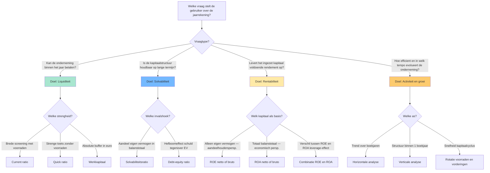
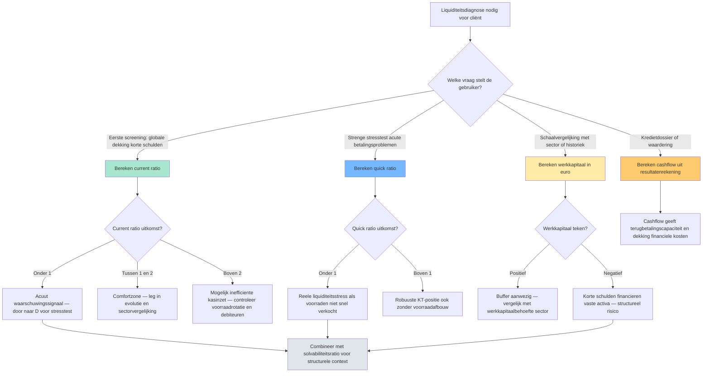

# PO 1.3 — Analyse en kritische beoordeling van de jaarrekening

> **Lees mij eerst:** dit document is een gestructureerd bundle van ALLE leermateriaal voor het programmaonderdeel "Analyse en kritische beoordeling van de jaarrekening" van het ITAA-bekwaamheidsexamen Gecertificeerd Accountant. Het bevat: (1) een didactische minicursus die je door het hele PO leidt, (2) 11 procedure-fiches die elk een concrete vaardigheid beschrijven ("hoe doe je X?"), en (3) 47 concept-fiches die elk een sleutel-begrip definiëren met bouwstenen, valkuilen en bronnen.
> 
> **Conventies in dit bundle:**
> - ⚖️ = directe wettelijke grondslag (WVV, KB WVV, CBN-advies, ITAA-norm, ISA, IFRS)
> - 🤖 = afgeleid of pedagogisch toegevoegd (geen letterlijke bron-citaat)
> - `[[concept-naam]]` = verwijzing naar een concept-fiche later in dit document
> - `[[competenties/naam]]` = verwijzing naar een competentie-fiche later in dit document
> 
> **Anti-fabricatie-regel voor afgeleide producten** (podcast / mindmap / slides / infographic / quiz): gebruik UITSLUITEND inhoud die in dit document staat. Geen externe bronnen, geen aanvullingen uit andere wetgevingen, geen verzonnen voorbeelden. Bij twijfel: zeg "dit staat niet in het bundle".


---

# Deel I — Minicursus

*De minicursus is de primaire leidraad. Lees ze in de aangeboden volgorde; gebruik de competentie- en concept-fiches in Deel II en III als verdieping wanneer iets onduidelijk blijft.*

### Wat verwacht het examen van jou?

> [!abstract] Dit programmaonderdeel wordt getoetst op niveau *integratie*.
> Je moet meerdere concepten samen kunnen inzetten in complexe casussen — onderdelen herkennen, prioriteren, en tot een coherent oordeel komen.


**Taken** (uit het ITAA-examenprogramma):

> [!abstract]- **Taak 1** — Analyse en beoordeling van de financiële situatie van een vennootschap of vereniging aan de hand van de jaarrekeningen, ratio's en kengetallen
>
> **Doelstellingen**:
> - In staat zijn om, na informatie te hebben verzameld, geselecteerd, geanalyseerd en samengevat, de jaarrekeningen van een vennootschap of een vereniging kritisch te bekijken.
> - Na de analyse ook voorstellen kunnen doen om de situatie van de onderneming/vereniging te verbeteren, waakzamer te zijn of te controleren.


### Leesgids

De minicursus loopt van fundament naar oordeel: eerst [[doelstellingen-financiele-analyse|waarom]] en voor wie je een [[jaarrekening-als-studieobject|jaarrekening]] leest, dan hoe je ze klaarzet via een [[analytische-balans|analytische balans]], en pas dan de vier ratio-families. Twee synthese-secties verbinden losse ratio's met een keuze-logica die je in een casus echt gebruikt. Tijds-, sector- en toezichts-as ([[historische-evolutie-financiele-analyse|trend]], [[sectorvergelijking-financiele-analyse|benchmark]], [[commissaris-toezicht-jaarrekening|commissaris]]) komen op het einde samen tot een geïntegreerde diagnose.

### Waarom dit programmaonderdeel telt

Het [[getrouw-beeld-jaarrekening|getrouw beeld]] is geen boekhoudkundig eindpunt maar het vertrekpunt van elk economisch oordeel. Klant, bank, vennoten en overheid lezen dezelfde cijfers met een eigen bril ([[gebruikers-jaarrekening]]); jij vertaalt hun vragen naar de juiste ratio's en plaatst de uitkomsten tegen sector en historiek. Liquiditeit zegt iets anders dan solvabiliteit, en rentabiliteit alléén misleidt zodra het hefboomeffect onbesproken blijft — formules kennen is een minimum, het combineren de kern. Via [[cijferanalyses-controle-norm|cijferanalyses]] krijg je tegelijk een controle-instrument: onverwachte afwijkingen zijn risico- of fout-signalen.

### Waarom analyseer je een jaarrekening? Doelstellingen, gebruikers en getrouw beeld

Begin niet bij de balans maar bij de vraag: wie wil wat weten? De vier [[doelstellingen-financiele-analyse|analyse-doelen]] krijgen pas relevantie vanuit het perspectief van een concrete [[gebruikers-jaarrekening|gebruiker]]. De cijfers zelf zijn gebonden aan het [[getrouw-beeld-jaarrekening|getrouw beeld]] en aan [[materieel-belang-jaarrekening|materieel belang]] — een afwijking is pas analyse-waardig als ze het oordeel zou kunnen kantelen.

### De jaarrekening als studieobject: structuur en aangrijpingspunten

> [!info] Hoort bij taak: Analyse en beoordeling van de financiële situatie van een vennootschap of vereniging aan de hand van de jaarrekeningen,…

Deze concepten zetten samen het werkterrein neer waarop alle latere ratio- en evolutie-analyses staan. De [[jaarrekening-als-studieobject|jaarrekening]] is het onderzochte object; [[getrouw-beeld-jaarrekening|getrouw beeld]] en [[materieel-belang-jaarrekening|materialiteit]] bepalen wanneer een afwijking telt, en de [[doelstellingen-financiele-analyse|doelstellingen]] van de analyse moeten gekoppeld worden aan de juiste [[gebruikers-jaarrekening|gebruiker]] voor je een formule opent.

- [[jaarrekening-als-studieobject|Jaarrekening als studieobject van financiële analyse]] · `begrip`
- [[getrouw-beeld-jaarrekening|Getrouw beeld van de jaarrekening]] · `regel`
- [[materieel-belang-jaarrekening|Materieel belang (materiality)]] · `regel`
- [[doelstellingen-financiele-analyse|Doelstellingen van financiële analyse]] · `begrip`
- [[gebruikers-jaarrekening|Gebruikers van de jaarrekening]] · `begrip`

### De vier analyse-doelen en hun ratio's — overzicht

Synthese-overzicht dat de vier klassieke doelen van financiële analyse (liquiditeit, solvabiliteit, rentabiliteit, werkkapitaal/cashflow) koppelt aan hun ratio's, zodat de stagiair in één oogopslag ziet welke ratio bij welk doel hoort en hoe ze elkaar aanvullen.


De scharnier hier is dat een gebruikersvraag het analyse-doel kiest, en pas dán het ratio. Wie [[liquiditeitsratio|liquiditeit]] en [[solvabiliteitsratio|solvabiliteit]] tegen elkaar uitspeelt, of [[rentabiliteit-eigen-vermogen-roe|ROE]] zonder [[rentabiliteit-totaal-activa-roa|ROA]] interpreteert, mist de helft van het beeld — beide assen lees je in een complexe casus altijd samen.

| Analyse-doel | Kernvraag | Belangrijkste ratio's | Bron-component balans/RR | Typische gebruiker |
|---|---|---|---|---|
| **Liquiditeit** (KT betaalkracht) | Kan de onderneming haar schulden ≤ 1 jaar betalen met haar vlottende activa? | [[current-ratio\|Current ratio]] · [[quick-ratio\|Quick ratio]] · [[werkkapitaal\|Werkkapitaal]] | Vlottende activa (voorraden + vorderingen ≤ 1 jaar + geldbeleggingen + liquide middelen); Schulden ≤ 1 jaar | Kredietverlener KT · leverancier · cashmanager |
| **Solvabiliteit** (LT schokbestendigheid) | Hoe groot is het eigen vermogen tegenover totaal vermogen en schulden? | [[solvabiliteitsratio\|Solvabiliteitsratio (EV / balanstotaal)]] · [[debt-equity-ratio\|Debt-equity (VV / EV)]] | Eigen vermogen totaal; Balanstotaal; Schulden totaal | Bank LT · obligatiehouder · aandeelhouder structureel risico |
| **Rentabiliteit** (winstgevendheid kapitaal) | Levert de zaak voldoende rendement op tegenover wat erin geïnvesteerd is? | [[rentabiliteit-eigen-vermogen-roe\|ROE (winst / EV)]] · [[rentabiliteit-totaal-activa-roa\|ROA (winst + kosten schulden / totaal activa)]] · Brutovarianten op [[cashflow-analyse\|cashflow]] | Winst van het boekjaar; Eigen vermogen; Balanstotaal; Kosten van schulden; Niet-kaskosten | Aandeelhouder · investeerder · interne controller |
| **Activiteit/groei** (operationele efficiëntie + dynamiek) | Hoe snel rouleren voorraden en handelsvorderingen? Groeit de omzet? | Rotatie voorraden · rotatie handelsvorderingen · [[horizontale-analyse-jaarrekening\|Horizontale analyse]] op omzet en EBITDA | Omzet meerdere boekjaren; Voorraden gemiddeld; Vorderingen gemiddeld | Operationele manager · auditor · sector-analyst |



**Kerninzichten**:

- De keuze van een ratio begint NOOIT bij de balans — ze begint bij de vraag van de gebruiker. Een kredietverlener op korte termijn kijkt eerst naar de quick ratio; een obligatiehouder eerst naar de solvabiliteit; een aandeelhouder eerst naar ROE. Wie eerst formules verzamelt en dan een verhaal zoekt, mist de analyse-discipline.
- ROE en ROA SAMEN lezen ontmaskert het leverage-effect. Bij Rotex Roeselare NV is netto-ROE 20,8 % terwijl netto-ROA 13,0 % is — het gat van 7,8 procentpunten zegt dat schulden de aandeelhouderswinst versterken. Als ROE lager wordt dan ROA, werkt de hefboom omgekeerd: de kost van schulden is dan groter dan het rendement op activa.
- Liquiditeit en solvabiliteit zijn complementair, geen synoniemen. Een vennootschap kan liquide zijn (vlottende activa > korte schulden) maar tegelijkertijd structureel zwak gefinancierd (laag eigen vermogen). Omgekeerd kan een solvabele onderneming tijdelijk illiquide zijn (cashtekort terwijl ze rijk is aan vaste activa). Examenvraag-camouflage: alleen op één van de twee letten = halve diagnose.
- Een hoge ratio is niet automatisch goed. Een current ratio > 3 kan signaleren dat middelen vastliggen in onproductieve voorraden of trage vorderingen; een solvabiliteit > 70 % kan betekenen dat de onderneming te weinig hefboom benut. Interpretatie vereist altijd sectorvergelijking en historiek — de drie analyse-assen samen.
- Brutovarianten met cashflow (bruto-ROE, bruto-ROA) filteren niet-kaskosten weg en zijn moeilijker boekhoudkundig te manipuleren dan nettovarianten. Voor kredietdossiers en waarderingsvragen geven brutoratio's vaak een eerlijker beeld dan nettoratio's. Voor aandeelhoudersrendementsanalyse blijft netto-ROE de standaard.

_Bouwt op_: [[doelstellingen-financiele-analyse]] · [[liquiditeitsratio]] · [[current-ratio]] · [[quick-ratio]] · [[werkkapitaal]] · [[solvabiliteitsratio]] · [[debt-equity-ratio]] · [[rentabiliteit-eigen-vermogen-roe]] · [[rentabiliteit-totaal-activa-roa]] · [[cashflow-analyse]] · [[horizontale-analyse-jaarrekening]] · [[verticale-analyse-jaarrekening]]
### Voorbereiden van een financiële analyse van de jaarrekening

> [!info] Hoort bij taak: Analyse en beoordeling van de financiële situatie van een vennootschap of vereniging aan de hand van de jaarrekeningen,…

Je leert de opdracht scopen vóór één cijfer wordt aangeraakt: doel en [[gebruikers-jaarrekening|gebruiker]] definiëren, boekjaren ophalen, bijzondere posten flaggen via een [[intake-financiele-analyse|intake]]. Die voorbereiding bepaalt of je tot een coherent oordeel komt of in losse ratio's blijft hangen.

[[competenties/voorbereiden-financiele-analyse|→ Volledige procedure]]

### Opstellen van een analytische balans voor een vennootschap

> [!info] Hoort bij taak: Analyse en beoordeling van de financiële situatie van een vennootschap of vereniging aan de hand van de jaarrekeningen,…

Je herwerkt het wettelijke balansschema tot een [[analytische-balans|analytische balans]] die de bouwstenen voor elke ratio levert: herklassificeren naar liquiditeit en opeisbaarheid, [[niet-in-balans-opgenomen-rechten-verplichtingen|off-balance]] integreren waar materieel, normaliseren waar éénmalige posten het beeld vertekenen. Zonder deze herstructurering staan je ratio's op verkeerde nominale.

[[competenties/opstellen-analytische-balans|→ Volledige procedure]]

### Berekenen en interpreteren van de liquiditeitsratio's

> [!info] Hoort bij taak: Analyse en beoordeling van de financiële situatie van een vennootschap of vereniging aan de hand van de jaarrekeningen,…

Je werkt een casus uit waarbij je [[current-ratio]] en [[quick-ratio]] samen leest, met [[werkkapitaal]] als absolute tegenhanger. De interpretatie staat of valt met benchmarking tegen sector en historiek ([[sectorvergelijking-financiele-analyse]]) — voor voorraad-intensieve activiteiten is de spreiding tussen current en quick het diagnostisch interessantste gegeven.

[[competenties/berekenen-interpreteren-liquiditeitsratios|→ Volledige procedure]]

### Verfijningen van de liquiditeitsanalyse: cash ratio en werkkapitaalbehoefte

> [!info] Hoort bij taak: Analyse en beoordeling van de financiële situatie van een vennootschap of vereniging aan de hand van de jaarrekeningen,…

Wanneer current en quick onvoldoende uitsluitsel geven, schakel je naar twee verfijningen die dieper in de cyclus kijken. De [[cash-ratio]] is de strengste toets en is relevant bij acute stress; de [[werkkapitaalbehoefte]] confronteert het beschikbare [[werkkapitaal]] met wat de operationele cyclus daadwerkelijk vraagt — een onderneming kan formeel werkkapitaal hebben en toch structureel cash tekort komen.

- [[cash-ratio|Cash ratio (liquiditeit in strenge zin)]] · `cluster`
- [[werkkapitaalbehoefte|Werkkapitaalbehoefte (besoin en fonds de roulement, BFR)]] · `begrip`
- [[werkkapitaal|Werkkapitaal (working capital)]] · `begrip`

### Berekenen en interpreteren van de solvabiliteitsratio's

> [!info] Hoort bij taak: Analyse en beoordeling van de financiële situatie van een vennootschap of vereniging aan de hand van de jaarrekeningen,…

Je zet [[solvabiliteitsratio]] en [[debt-equity-ratio]] naast elkaar in om de structurele veerkracht te beoordelen, met de uitkomst altijd tegen de sectormediaan. Onderzoek bij kredietdossiers ook of er [[ratio-covenants|ratio-covenants]] meelopen — een contractuele drempel kan een "event of default" triggeren lang vóór de wettelijke alarmbel.

[[competenties/berekenen-interpreteren-solvabiliteitsratios|→ Volledige procedure]]

### Berekenen en interpreteren van de rentabiliteitsratio's

> [!info] Hoort bij taak: Analyse en beoordeling van de financiële situatie van een vennootschap of vereniging aan de hand van de jaarrekeningen,…

Bouw je oordeel op door [[rentabiliteit-eigen-vermogen-roe|ROE]] en [[rentabiliteit-totaal-activa-roa|ROA]] systematisch samen te lezen — het gat tussen beide leest het hefboomeffect af. Met de bruto-varianten op [[cashflow-analyse|cashflow]] filter je niet-kaskosten weg, wat in waarderings- en kredietdossiers vaak een eerlijker beeld geeft.

[[competenties/berekenen-interpreteren-rentabiliteitsratios|→ Volledige procedure]]

### Welke liquiditeitstoets gebruik ik? — Beslisboom

Hulpstructuur voor de stagiair: welke liquiditeitsmaat is in welke context de juiste — current ratio voor algemene liquiditeit, quick ratio voor verfijnde toets bij voorraadintensieve sectoren, werkkapitaal als absolute aanvulling, cash ratio in stress-scenario's. De beslisboom maakt zichtbaar waarom één ratio nooit volstaat.


Bij liquiditeitsdiagnose vraagt het examen typisch om de juiste toets bij de juiste context te kiezen — niet om elke ratio te berekenen. De scharnier hier is dus de keuze-logica: brede screening, strenge stresstest, absolute buffer of kasgeneratie. Een coherent oordeel combineert minstens twee perspectieven.

| Toets | Wat meet ze? | Formule | Sterkte | Zwakte / valkuil |
|---|---|---|---|---|
| [[current-ratio\|Current ratio]] | Brede liquiditeit in ruime zin (verhouding) | vlottende activa / schulden ≤ 1 jaar | Snelle screening; vergelijkbaar tussen bedrijven van verschillende grootte | Hoge ratio kan opgeblazen voorraden of trage debiteuren verbergen |
| [[quick-ratio\|Quick ratio]] (zuurtegraad) | Liquiditeit in enge zin — zonder voorraden | (vlottende activa − voorraden) / schulden ≤ 1 jaar | Strenger; relevant bij voorraad-intensieve sectoren | Vorderingen worden als snel-cashbaar verondersteld; bij dubieuze debiteuren overschat ze |
| [[werkkapitaal\|Werkkapitaal]] | Absolute liquiditeitsbuffer in euro | vlottende activa − schulden ≤ 1 jaar | Toont schaal die ratio's verbergen | Twee bedrijven met zelfde werkkapitaal kunnen totaal verschillende risicoprofielen hebben (sectorgevoelig) |
| [[cashflow-analyse\|Cashflow]] (winst + niet-kaskosten) | Kasgeneratie uit eigen werking | resultaat + afschrijvingen + waardeverminderingen + voorzieningen | Filtert boekhoudkundige niet-kaselementen weg | Eenmalige voorzieningen kunnen cashflow van één boekjaar fors verhogen |



**Kerninzichten**:

- Current ratio en quick ratio zijn geen alternatieven — ze zijn complementair. Bij Rotex Roeselare NV: current 2,0 en quick 1,375. Het verschil tussen beide (0,625) is volledig toe te schrijven aan de voorraden (€ 2.500.000 op € 4.000.000 korte schulden). Het verschil zelf is dus een ratio-component: de mate waarin de liquiditeit op voorraden steunt.
- Werkkapitaal als absoluut bedrag corrigeert een verborgen valkuil van ratio's: schaal. Meubelzaak Mertens BV en Rotex Roeselare NV kunnen beide current ratio rond 1,3 hebben, maar werkkapitaal € 200.000 versus € 4.000.000. Voor financierings-capaciteit en investeringsruimte is de absolute buffer relevanter dan de verhouding.
- Een acute liquiditeitsstress (current ratio onder 1) zegt nog niets over levensvatbaarheid. Combineer altijd met de solvabiliteitsratio (structurele basis) en de cashflow (kasgeneratie). Een tijdelijk illiquide maar solvabel bedrijf kan financiering brugkalmen via een banklijn; een liquide maar onsolvabel bedrijf staat op een tijdbom.
- Cash ratio (geldbeleggingen + liquide middelen / korte schulden) is de strengste van de liquiditeitsfamilie maar krijgt in de standaard 1.3-records geen apart record. Voor voorraadintensieve sectoren of acute stress-scenario's is dat de meest waardevolle van de drie — zie open gap voor uitwerking.

_Bouwt op_: [[liquiditeitsratio]] · [[current-ratio]] · [[quick-ratio]] · [[werkkapitaal]] · [[cashflow-analyse]] · [[solvabiliteitsratio]]
### Uitvoeren van een horizontale en verticale analyse van de jaarrekening

> [!info] Hoort bij taak: Analyse en beoordeling van de financiële situatie van een vennootschap of vereniging aan de hand van de jaarrekeningen,…

Je zet beide assen samen in: [[horizontale-analyse-jaarrekening|horizontaal]] toont de trend over boekjaren, [[verticale-analyse-jaarrekening|verticaal]] de samenstelling binnen één boekjaar. De afwijkingen tussen die twee perspectieven — bijvoorbeeld dalende omzet bij stijgend voorraadaandeel — wijzen vaak naar dieperliggende problemen.

[[competenties/uitvoeren-horizontale-verticale-analyse|→ Volledige procedure]]

### Beoordelen van het werkkapitaal en de kasstroom van een onderneming

> [!info] Hoort bij taak: Analyse en beoordeling van de financiële situatie van een vennootschap of vereniging aan de hand van de jaarrekeningen,…

Je bouwt een oordeel op uit [[werkkapitaal]] (balans-kant) en [[cashflow-analyse|cashflow]] (resultaten-kant) samen — de eerste toont de structurele buffer, de tweede de jaarlijkse kasgeneratie. Pas wanneer beide consistent zijn, kun je iets zinnigs zeggen over terugbetalingscapaciteit en investeringsruimte.

[[competenties/beoordelen-werkkapitaal-en-kasstroom|→ Volledige procedure]]

### Confronteren van de financiële analyse met de toelichting en off-balance posten

> [!info] Hoort bij taak: Analyse en beoordeling van de financiële situatie van een vennootschap of vereniging aan de hand van de jaarrekeningen,…

Een analyse die stopt bij de balanscijfers mist de [[niet-in-balans-opgenomen-rechten-verplichtingen|verplichtingen buiten balans]] — borgstellingen, leasing-engagementen, geschillen — die nochtans materieel kunnen wegen. Je leert die elementen uit de toelichting en [[klasse-0-niet-in-balans|klasse 0]] systematisch confronteren met de ratio's: een gezonde solvabiliteit kan illusoir blijken zodra je significante off-balance-engagementen meetelt.

[[competenties/confronteren-toelichting-en-off-balance|→ Volledige procedure]]

### Beoordelen van het bestuursverslag en de niet-financiële informatie

> [!info] Hoort bij taak: Analyse en beoordeling van de financiële situatie van een vennootschap of vereniging aan de hand van de jaarrekeningen,…

Het [[bestuursverslag]] is een verbaal overzicht van ontwikkeling, resultaten en positie dat evenwichtig moet zijn ten opzichte van de cijfers. Lees de [[risicoparagraaf-bestuursverslag|risicoparagraaf]] en, waar van toepassing, de [[corporate-governance-verklaring]] kritisch: signaleren ze dezelfde risico's als wat uit jouw cijferanalyse blijkt? Discordantie tussen verbale en cijfermatige boodschap is op zichzelf een diagnostisch signaal.

[[competenties/beoordelen-bestuursverslag-en-niet-financiele-info|→ Volledige procedure]]

### Vergelijken in tijd en sector: trend, benchmark en controle-norm

> [!info] Hoort bij taak: Analyse en beoordeling van de financiële situatie van een vennootschap of vereniging aan de hand van de jaarrekeningen,…

Een ratio krijgt pas betekenis tegenover een referentiekader: de [[historische-evolutie-financiele-analyse|tijdsas]] toont de richting binnen één onderneming, de [[sectorvergelijking-financiele-analyse|sector-as]] de positie tussen ondernemingen. De norm [[cijferanalyses-controle-norm|cijferanalyses (KMO)]] voegt in controle-opdrachten een derde dimensie toe: afwijkingen als risico-signaal en als afsluitende redelijkheidstest.

- [[historische-evolutie-financiele-analyse|Historische evolutie in financiële analyse]] · `cluster`
- [[sectorvergelijking-financiele-analyse|Sectorvergelijking (benchmarking)]] · `cluster`
- [[cijferanalyses-controle-norm|Cijferanalyses (controlenorm KMO)]] · `regel`

### Formuleren van een financiële diagnose en concrete verbeteradviezen

> [!info] Hoort bij taak: Analyse en beoordeling van de financiële situatie van een vennootschap of vereniging aan de hand van de jaarrekeningen,…

Hier komen alle voorgaande deelanalyses samen in één coherent oordeel met concrete verbeteradviezen. Bij opgestapelde signalen weeg je continuïteit en de mogelijke signalering naar de [[kamer-ondernemingen-in-moeilijkheden|kamer voor ondernemingen in moeilijkheden]] of het uitlokken van [[ratio-covenants|ratio-covenants]].

[[competenties/formuleren-financiele-diagnose-en-adviezen|→ Volledige procedure]]

### Positioneren van de toezichtsorganen rond de jaarrekening

> [!info] Hoort bij taak: Analyse en beoordeling van de financiële situatie van een vennootschap of vereniging aan de hand van de jaarrekeningen,…

Je moet weten welk orgaan welke vraag stelt: de [[algemene-vergadering-toezichtsfunctie|algemene vergadering]] beslist over goedkeuring en kwijting, de [[commissaris-toezicht-jaarrekening|commissaris]] geeft de externe verklaring, de [[ondernemingsraad-sociaal-economische-info|ondernemingsraad]] krijgt sociaal-economische informatie, en de [[kamer-ondernemingen-in-moeilijkheden|kamer voor ondernemingen in moeilijkheden]] schakelt in bij knipperlichten. Samen vormen ze het governance-landschap rond de jaarrekening.

[[competenties/positioneren-toezichtsorganen-rond-jaarrekening|→ Volledige procedure]]

### Kritische blik: wat zegt een financiële analyse NIET?

Een financiële analyse is een retrospectieve lezing op cijfers binnen het [[materieel-belang-jaarrekening|materialiteitskader]] — ze meet niet wat buiten dat raster valt. Niet-gekwantificeerde [[niet-in-balans-opgenomen-rechten-verplichtingen|verplichtingen]], strategische positie, kwaliteit van het management of toekomstige marktshocks lees je niet rechtstreeks van een ratio af. Confronteer daarom altijd met [[bestuursverslag]] en sector- en evolutie-context vóór je een coherent oordeel velt.


### Synthese-stappenplan

In een examencasus pak je een financiële analyse zo aan. Scope eerst de opdracht via een [[intake-financiele-analyse|intake]]: gebruiker, [[doelstellingen-financiele-analyse|doelstelling]], boekjaren, bijzondere posten. Herwerk de jaarrekening tot een [[analytische-balans|analytische balans]] met [[niet-in-balans-opgenomen-rechten-verplichtingen|off-balance]] geïntegreerd. Reken dan per doel de ratio's — [[liquiditeitsratio|liquiditeit]], [[solvabiliteitsratio|solvabiliteit]], rentabiliteit ([[rentabiliteit-eigen-vermogen-roe|ROE]] én [[rentabiliteit-totaal-activa-roa|ROA]] samen), [[werkkapitaal]] versus [[cashflow-analyse|cashflow]]. Plaats elke uitkomst tegen [[historische-evolutie-financiele-analyse|tijdsas]] en [[sectorvergelijking-financiele-analyse|sector-benchmark]] — een ratio zonder context is geen oordeel. Confronteer met toelichting en [[bestuursverslag]]; discordantie is op zich een signaal. Synthetiseer tot één coherente diagnose en concrete adviezen ([[formuleren-financiele-diagnose-en-adviezen]]). Toets ten slotte continuïteit en eventuele [[ratio-covenants|ratio-covenants]], en positioneer je bevindingen tegenover de juiste toezichtsorganen.

### Cheatsheet

#### Vergelijkingsparen-matrix

| Concept | Verwarrend met | Trigger |
|---|---|---|
| [[bestuursverslag]] | [[jaarverslag]] | Twee namen, één document. Term-keuze hangt af van regelgevings-context (BE/EU). |
| [[cash-ratio]] | [[quick-ratio]] | Examenvraag 'liquiditeit in enge of strengste zin?': enge = quick (zonder voorraden); strengste = cash (zonder voorraden én vorderingen). |
| [[cash-ratio]] | [[current-ratio]] | Examenvraag 'liquiditeit in ruime versus strengste zin?': ruim = current; strengst = cash. |
| [[cashflow-analyse]] | [[rentabiliteit-eigen-vermogen-roe]] | Examenvraag 'cijfer of ratio?': cashflow is een €-bedrag; ROE/ROA op cashflow zijn percentages. |
| [[current-ratio]] | [[quick-ratio]] | Examenvraag 'liquiditeit in ruime / enge zin?': ruim = current; eng = quick. |
| [[debt-equity-ratio]] | [[solvabiliteitsratio]] | Beide drukken financieringsstructuur uit; context bepaalt welke courant is — bankcovenants gebruiken D/E, ratingagentschappen vaker solvabiliteit. |
| [[getrouw-beeld-jaarrekening]] | [[voorzichtigheidsbeginsel]] | Bij een examenvraag 'welk beginsel?' — getrouw beeld als algemeen doel; voorzichtigheid als specifieke voorschrift om risico's volledig op te nemen. |
| [[horizontale-analyse-jaarrekening]] | [[verticale-analyse-jaarrekening]] | Examenvraag 'evolutie of structuur?': over de tijd = horizontaal; samenstelling op één moment = verticaal. |
| [[liquiditeitsratio]] | [[solvabiliteitsratio]] | Examenvraag 'kortetermijnsbetaalkracht versus structurele veerkracht': KT = liquiditeit; lang = solvabiliteit. |
| [[liquiditeitsratio]] | [[cash-ratio]] | Examenvraag 'strengste liquiditeitstoets?' of 'welke ratio sluit voorraden én vorderingen uit?': altijd cash ratio. |
| [[niet-in-balans-opgenomen-rechten-verplichtingen]] | [[voorzieningen]] | Examenvraag 'voorziening of niet in balans?': becijferbaar + waarschijnlijk = voorziening (balans); onzeker of onbecijferbaar = niet in balans (toelichting). |
| [[quick-ratio]] | [[current-ratio]] | Voorraad-intensiteit: in productie/handel altijd allebei berekenen om de spreiding te zien. |
| [[rentabiliteit-eigen-vermogen-roe]] | [[rentabiliteit-totaal-activa-roa]] | Examenvraag 'welke ratio voor welke vraag?': aandeelhoudersrendement = ROE; economische winstgevendheid van de bedrijfsmiddelen = ROA. |
| [[rentabiliteit-totaal-activa-roa]] | [[rentabiliteit-eigen-vermogen-roe]] | Examenvraag 'economisch vs financieel rendement': economisch = ROA; financieel/aandeelhouder = ROE. |
| [[solvabiliteitsratio]] | [[liquiditeitsratio]] | Examenvraag 'structureel vs operationeel risico': structureel = solvabiliteit; KT betalingsrisico = liquiditeit. |
| [[solvabiliteitsratio]] | [[debt-equity-ratio]] | Solvabiliteitsratio bij algemene structuuranalyse; debt-equity-ratio bij specifieke hefboom- of risicobeoordeling (bankcovenants). |
| [[verticale-analyse-jaarrekening]] | [[horizontale-analyse-jaarrekening]] | Examen 'samenstelling of trend?': samenstelling = verticaal; trend = horizontaal. |
| [[werkkapitaal]] | [[current-ratio]] | Examenvraag 'absolute buffer of relatieve dekking?': absoluut = werkkapitaal; relatief = current ratio. |
| [[werkkapitaal]] | [[werkkapitaalbehoefte]] | Examenvraag 'beschikbaar versus benodigd werkkapitaal' of 'wanneer is er liquiditeitstekort?': vergelijk werkkapitaal (beschikbaar uit balans) met werkkapitaalbehoefte (benodigd voor cyclus). |
| [[werkkapitaalbehoefte]] | [[werkkapitaal]] | Examenvraag 'beschikbaar versus benodigd werkkapitaal': beschikbaar = werkkapitaal; benodigd = werkkapitaalbehoefte. |


### Heb je deze taken in de vingers?

Loop deze taken na vóór je verder gaat met examenfocus. Twijfel je bij een taak? Lees de aangegeven secties nog eens.

- ✓ **1.3.taak.1** — Analyse en beoordeling van de financiële situatie van een vennootschap of vereniging aan de hand van de jaarrekeningen,… _Behandeld in §5, §6, §7, §8, §9, §10, §11, §12, §13, §14, §15, §16, §17, §18, §19, §20._

### Examenfocus

Het examen toetst het combineren van ratio's en interpretatie tot een coherent oordeel — niet het opdreunen van formules. Verwacht meerkeuzevragen die je dwingen het juiste cijfer uit balans en resultatenrekening te halen, en open vragen waar je begrippen ([[werkkapitaal]], [[liquiditeitsratio]]) zelf moet definiëren en toepassen. Let op camouflage: ruim versus eng, structureel versus operationeel, absoluut versus relatief.

#### Analyse en kritische beoordeling jaarrekening 📃

> [!question]- ITAA 2024-1 vraag 10.A · open (tier A)
> Stellingen ivm financiële onafhankelijkheid

> [!question]- ITAA 2024-1 vraag 10.B · open (tier A)
> Welke ratio kan je niet berekenen op basis van een verkort schema n- dagen klanten krediet

> [!question]- ITAA 2024-1 vraag 10.C · open (tier A)
> In welke volgorde zijn rubrieken op Passief van de Balans gerangschikt? Toenemende eisbaarheid

> [!question]- ITAA 2024-1 vraag 10.D · open (tier A)
> JR kort model NBB voor kapitaal vennootschap wordt EV als volgt berekend:

> [!question]- ITAA 2024-1 vraag 10.E · meerkeuze (tier A)
> Alfa is verlieslatend. Verhoging van de afschrijving op gebouwen door verkorting van de verwachte levensduur heeft het volgende effect op de bruto verkoopmarge:
>
> - Stijging
> - Daling
> - Geen
> - Stijging op voorwaarde dat de verhoogde afschrijving als bedrijfskost is geboekt


#### Analyse en kritische beoordeling van de jaarrekening 📃

> [!question]- ITAA 2013-1 vraag 1 (tier B)
> Vraag 1 … / 9 punten In bijlage vindt u de balans na winstverdeling en de resultatenrekening van een cliënt. Bereken de gevraagde ratio’s telkens voor het BOEKJAAR. U dient de formules NIET uit te schrijven, maar WEL de gebruikte cijfers uit de jaarrekening als motivatie van uw antwoord. U dient uw antwoord uit te drukken tot TWEE cijfers na de komma. Uit de toelichting tot de jaarrekening blijkt o.a. dat :
> 
> 1. Er tijdens het boekjaar investeringen in materiële vaste activa werden gedaan voor 451 692,38 euro;
> 
> 2. Er kapitaalsubsidies werden aangerekend op de resultatenrekening voor 56 498,19 euro;
> 
> 3. Er geen andere exploitatiesubsidies werden ontvangen;
> 
> 4. De te bestemmen winst van het boekjaar integraal gereserveerd werd.
> 
> a) Nettobedrijfskapitaal Antwoord
> 
> b) Brutoverkoopmarge (in %) Antwoord
> 
> c) Personeelskosten ten opzichte van de toegevoegde waarde (in %) Antwoord


#### Analyse en kritische beoordeling van de jaarrekening 📃

> [!question]- ITAA 2013-1 vraag 2 (tier B)
> Vraag 2 … / 10 punten Omschrijf de volgende begrippen :
> 
> a) Intrinsieke waarde Antwoord
> 
> b) Fractiewaarde Antwoord
> 
> c) Netto rendabiliteit van de bedrijfsactiva Antwoord
> 
> d) Algemene schuldgraad Antwoord
> 
> e) Operationele cash flow voor belastingen Antwoord


#### Analyse en kritische beoordeling van de jaarrekening 📃

> [!question]- ITAA 2013-2 vraag 1 (tier B)
> Vraag 1 … / 6 punten In bijlage vindt u de balans na winstverdeling en de resultatenrekening van een cliënt. Bereken de gevraagde ratio’s telkens voor het BOEKJAAR. U dient de formules NIET uit te schrijven, maar WEL de gebruikte cijfers uit de jaarrekening als motivatie van uw antwoord. U dient uw antwoord uit te drukken tot TWEE cijfers na de komma. Uit de toelichting tot de jaarrekening blijkt o.a. dat :
> 
> 1) Er tijdens het boekjaar investeringen in materiële vaste activa werden gedaan voor 361 869,98 euro;
> 
> 2) Er exploitatiesubsidies werden aangerekend op de resultatenrekening voor 415 euro;
> 
> 3) Er geen intrestsubsidies zijn;
> 
> 4) Er werd geen disconto ten laste van de onderneming bij de verhandeling van vorderingen geboekt;
> 
> 5) Er werden geen belastingen geboekt op het resultaat van vorige boekjaren;
> 
> 6) De te bestemmen winst van het boekjaar integraal gereserveerd werd.
> 
> a) Brutoverkoopmarge (%) Antwoord … / 2 punten
> 
> b) Nettorentabiliteit van het totaal der activa, voor belastingen en financiële kosten (%) Antwoord … / 2 punten
> 
> c) Liquiditeit in ruime zin Antwoord … / 2 punten


#### Analyse en kritische beoordeling van de jaarrekening 📃

> [!question]- ITAA 2013-2 vraag 2 (tier B)
> Vraag 2 … / 3 punten Bij de bespreking van de jaarrekening deelt U aan uw cliënt mede dat het netto bedrijfskapitaal van zijn vennootschap zeer laag is. Hij vraagt U hoe hij het netto bedrijfskapitaal kan verhogen. Geef drie voorbeelden. Antwoord
>
> > [!success]- Antwoord-motivering
> > Netto bedrijfskapitaal = vlottende activa − kortlopende schulden (zie [[werkkapitaal]]). Verhogen kan via twee assen: vlottende activa verhogen ÉN kortlopende schulden verlagen. Concreet drie maatregelen:
> > 
> > 1. **Lange-termijn financiering aantrekken om kortlopende schulden te herfinancieren** — een nieuwe lange-termijn-lening of kapitaalverhoging stort kasmiddelen (vlottend actief) en kan worden gebruikt om kortlopende schulden af te lossen. Effect: vlottende activa stabiel of stijgend, kortlopende schulden dalend → werkkapitaal stijgt. 🤖
> > 2. **Operationele winst gebruiken om winstreservering toe te wijzen** in plaats van uit te keren als dividend — winstaccumulatie verhoogt het eigen vermogen en typisch ook de vlottende activa (kas, vorderingen) zonder de kortlopende schulden te raken. Werkkapitaal stijgt. 🤖
> > 3. **Niet-essentiële vaste activa verkopen** (bv. overtollig vastgoed, oude machines) → kasmiddelen stijgen (vlottend actief) zonder de kortlopende schulden te raken. Werkkapitaal stijgt. 🤖
> > 
> > Andere mogelijke maatregelen (niet in opsomming): voorraadbeheer optimaliseren (just-in-time → lager voorraadbeslag, maar dat verlaagt werkkapitaal-component voorraden zonder de eindwaarde te raken — neutraal effect), klantenkrediet verkorten (DSO verlagen → kas in plaats van vorderingen, neutraal effect op werkkapitaal-som).
> > 
> > _Grondslag: [[werkkapitaal]] §Bouwstenen — Absolute tegenhanger van current ratio; bedrijfseconomische standaard-doctrine (klassiek Brealey/Myers, ook in Belgische ratio-analyse-handboeken)._
> > 
> > ⚠️ Onderscheid: 'werkkapitaal verhogen' (de balanspost) is iets anders dan 'werkkapitaalbehoefte verlagen' (de operationele cyclus optimaliseren). De vraag spreekt over de eerste. Maatregelen die alleen voorraad of klantenkrediet roteren raken de werkkapitaal-som niet (alleen de samenstelling).


#### Analyse en kritische beoordeling van de jaarrekening 📃

> [!question]- ITAA 2013-2 vraag 3 (tier B)
> Vraag 3 … / 6 punten
> 
> a) Wat komt een bedrijfsleider te weten door de liquiditeitsratio’s te berekenen ? Antwoord … / 2 punten
> 
> b) Met welke elementen houdt men geen rekening bij de berekening van de liquiditeit in enge zin en wel bij de berekening van de liquiditeit in ruime zin? Antwoord … / 2 punten
> 
> c) Verklaar uw antwoord aangaande punt b. Antwoord … / 2 punten


#### Analyse en kritische beoordeling van de jaarrekening 📃

> [!question]- ITAA 2014-1 vraag 1 (tier B)
> Vraag 1 … / 8 punten In bijlage vindt U de balans na winstverdeling en de resultatenrekening van een cliënt. Kruis het juiste antwoord aan voor de ratio’s van het BOEKJAAR. Uit de toelichting tot de jaarrekening blijkt o.a. dat :
> 
> 1. Er tijdens het boekjaar investeringen in materiële vaste activa werden gedaan voor 361 869,98 EUR;
> 
> 2. Er exploitatiesubsidies werden aangerekend op de resultatenrekening voor 415,00 EUR;
> 
> 3. Er intrestsubsidies werden aangerekend op de resultatenrekening voor een bedrag van 6 000,00 EUR;
> 
> 4. Er geen disconto ten laste van de onderneming bij de verhandeling van vorderingen geboekt werd;
> 
> 5. Er gemiddeld 38,20 werknemers (voltijds equivalent) tewerkgesteld waren;
> 
> 6. De te bestemmen winst van het boekjaar integraal gereserveerd werd.
> 
> a) Bruto toegevoegde waarde per werknemer Antwoord  (7 441 663 – 3 185 295 – 1 192 317) : 38,20 = 80 210,76  (7 441 663 – 415 – 3 185 295 – 1 192 317) : 38,20 = 80 199,90  (7 441 663 – 3 185 295 – 1 192 317 – 1 548 647) : 38,20 = 39 670,26  (7 441 663 – 3 185 295 – 1 192 317 – 436 469 – 879) : 38,20 = 68 761,86
> 
> b) Nettobedrijfskapitaal Antwoord  1 371 010 + 1 739 806 + 2 200 000 + 2 548 415 – 1 210 536 = 6 648 695  120 000 + 1 371 010 + 1 739 806 + 2 200 000 + 2 548 415 – 1 210 536 = 6 768 695  1 371 010 + 1 739 806 +2 200 000 + 2 548 415 + 2 704 – 1 210 536 – 39 932 = 6 611 467  120 000 + 1 371 010 + 1 739 806 + 2 200 000 + 2 548 415 + 2 704 – 1 210 536 – 39 932 = 6 731 467
> 
> c) Nettorentabiliteit van het totaal der activa voor belastingen en financiële kosten Antwoord  ((877 279 + 46 934 + 211 950 – 6 000) : 9 081 054) % = 12,45  ((577 279 + 109 642 + 185 720 – 6 000) : 9 081 054) % = 9,54  ((877 279 + 46 934 + 211 950) : 9 081 054) % = 12,51  ((577 279 + 109 642 + 211 950 – 6 000) : 9 081 054) % = 9,83
> 
> d) Liquiditeit in enge zin Antwoord  (1 371 010 + 1 739 806 + 2 200 000 + 2 548 415 + 2 704) : (1 210 536 + 39 932) = 6,29  (1 739 806 + 2 200 000 + 2 548 415) : 1 210 536 = 5,36  (1 371 010 + 1 739 806 + 2 200 000 + 2 548 415) : 1 210 536 = 6, 49  (1 739 806 + 2 200 000 + 2 548 415 + 2 704) : (1 210 536 + 39 932) = 5,19


#### Analyse en kritische beoordeling van de jaarrekening 📃

> [!question]- ITAA 2014-1 vraag 2 (tier B)
> Vraag 2 … / 5 punten
> 
> a) Omschrijf het begrip “nettothesaurie”. Antwoord
> 
> b) Als u de nettothesaurie berekent en de uitkomst is positief, wat betekent dit dan ? Antwoord


#### Analyse en kritische beoordeling van de jaarrekening 📃

> [!question]- ITAA 2015-1 vraag 3 (tier B)
> Vraag 3 … / 6 punten
> Welke van de onderstaande elementen neemt U op in de berekening “behoefte aan
> werkkapitaal (of bedrijfskapitaal)”?
> Duid bij elke code “ja of nee” aan. Bij elk foutief antwoord of ontbrekend antwoord, wordt er
> één punt afgetrokken.
> 
> Antwoord … / punten
> 
> |  | Code | Ja | Neen |
> |---|---|---|---|
> | Materiële vaste activa | 22/27 |  |  |
> | Financiële vaste activa | 28 |  |  |
> | Vorderingen op meer dan één jaar | 29 |  |  |
> | Voorraden | 30/36 |  |  |
> | Bestellingen in uitvoering | 37 |  |  |
> | Handelsvorderingen | 40 |  |  |
> | Overige vorderingen | 41 |  |  |
> | Geldbeleggingen | 50/53 |  |  |
> | Liquide middelen | 54/58 |  |  |
> | Overlopende rekeningen van het actief | 490/1 |  |  |
> | Eigen vermogen | 10/15 |  |  |
> | Voorzieningen en uitgestelde belastingen | 16 |  |  |
> | Schulden op meer dan één jaar | 17 |  |  |
> | Schulden op meer dan één jaar die binnen het jaar
> vervallen | 42 |  |  |
> | Financiële schulden | 43 |  |  |
> | Handelsschulden | 44 |  |  |
> | Ontvangen vooruitbetalingen | 46 |  |  |
> | Schulden m.b.t. belastingen, bezoldigingen en sociale
> lasten | 45 |  |  |
> | Overige schulden | 47/48 |  |  |
> | Overlopende rekeningen van het passief | 492/3 |  |  |


#### Analyse en kritische beoordeling van de jaarrekening 📃

> [!question]- ITAA 2015-1 vraag 1.A · open (tier B)
> (1 479 283 + 425 554 + 804) x 100 / (8 034 747 + 344 153) = 22,74

> [!question]- ITAA 2015-1 vraag 1.B · open (tier B)
> (1 417 747 + 425 554 + 804) x 100 / (8 365 788 - 1 600 244) = 27,26

> [!question]- ITAA 2015-1 vraag 1.C · open (tier B)
> (1 479 283 + 425 554 + 804 – 1 665) x 100 / (8 034 747 + 344 153 – 1 288) = 22,73

> [!question]- ITAA 2015-1 vraag 1.D · meerkeuze (tier B)
> (968 829 + 425 554 + 804 – 1 665) x 100 / (8 365 788 – 1 288) = 16,66
>
> - Personeelskosten ten opzichte van toegevoegde waarde
> - (1 600 244 – 1 665) X 100 / (8 365 788 - 1 288 – 3 457 309 – 1 398 278) = 45,56
> - 1 600 244 x 100 / (8 365 788 – 3 457 309 – 1 398 278) = 45,59
> - 1 600 244 x 100 / 1 479 283 = 108,18

> [!question]- ITAA 2015-1 vraag 1.D · meerkeuze (tier B)
> (1 600 244 – 1 665) x 100 / (8 034 747 – 13 112 - 3 457 309 – 1 398 278 – 1 288) = 50,51
>
> - Nettorentabiliteit van het eigen vermogen na belastingen
> - 968 829 x 100 / 10 274 463 = 9,43
> - 968 829 x 100 / 8 177 941 = 11,85
> - 1 417 747 x 100 / 10 274 463 = 13,80

> [!question]- ITAA 2015-1 vraag 1.D · meerkeuze (tier B)
> 1 479 283 x 100 / 8 177 941 = 18,09
>
> - Rotatie van de voorraad handelsgoederen, grond- en hulpstoffen
> - 3 444 161 / 530 373 = 6,49
> - 3 457 309 / 530 373 = 6,52
> - 3 457 309 / 1 344 750 = 2,57
> - 3 444 161 / 1 344 750 = 2,56


#### Analyse en kritische beoordeling van de jaarrekening 📃

> [!question]- ITAA 2015-1 vraag 2 (tier B)
> Vraag 2 … / 5 punten Omschrijf de volgende begrippen :
> 
> a) Intrinsieke waarde Antwoord … / 1 punt
> 
> b) Fractiewaarde Antwoord … / 1 punt
> 
> c) Netto rendabiliteit van de bedrijfsactiva Antwoord … / 1 punt
> 
> d) Algemene schuldgraad Antwoord … / 1 punt
> 
> e) Operationele cash flow voor belastingen Antwoord … / 1 punt


#### Wetgeving inzake de jaarrekening 📃

> [!question]- ITAA 2013-1 vraag 1 (tier B)
> Vraag 1 … / 4 punten
> De besloten vennootschap met beperkte aansprakelijkheid XYZ heeft de volgende balans- en
> resultatenrekening.
> 
> | ACTIEF | JAAR
> 2012 | JAAR
> 2011 | PASSIEF | JAAR
> 2012 | JAAR
> 2011 |
> |---|---|---|---|---|---|
> | Materiële vaste activa | 105.000 | 100.000 | Kapitaal | 65.000 | 65.000 |
> | Vorderingen < jaar | 45.000 | 40.000 | Reserves | 15.000 | 15.000 |
> | Liquide middelen | 25.000 | 30.000 | Overgedragen
> resultaat | 5.000 | 10.000 |
> |  |  |  | Schulden >
> jaar | 50.000 | 50.000 |
> |  |  |  | Schulden <
> jaar | 40.000 | 30.000 |
> | TOTAAL | 175.000 | 170.000 | TOTAAL | 175.000 | 170.000 |
> |  |  |  |  |  |  |
> | RESULTATENREKENING |  |  |  |  |  |
> | Te bestemmen
> winst/verlies |  |  |  | -5.000 | 15.000 |
> |  |  |  |  |  |  |
> 
> Resultaatverwerking Jaar 2011:
> Te bestemmen winst van het boekjaar 15.000
> Overgedragen verlies vorig boekjaar -5.000
> Over te dragen winst 10.000
> Resultaatverwerking Jaar 2012:
> Te bestemmen verlies van het boekjaar -5.000
> Overgedragen winst vorig boekjaar 10.000
> Over te dragen winst 5.000
> a) Dient deze vennootschap haar waarderingsregels te verantwoorden in haar
> jaarverslag, en indien zij geen jaarverslag dient op te stellen in haar jaarrekening in
> het jaar 2012?
> Antwoord
> b) Motiveer uw antwoord.
> Antwoord


### Competentie-index

<div class="two-column-list">

- [[competenties/beoordelen-bestuursverslag-en-niet-financiele-info|Beoordelen van het bestuursverslag en de niet-financiële informatie]]
- [[competenties/beoordelen-werkkapitaal-en-kasstroom|Beoordelen van het werkkapitaal en de kasstroom van een onderneming]]
- [[competenties/berekenen-interpreteren-liquiditeitsratios|Berekenen en interpreteren van de liquiditeitsratio's]]
- [[competenties/berekenen-interpreteren-rentabiliteitsratios|Berekenen en interpreteren van de rentabiliteitsratio's]]
- [[competenties/berekenen-interpreteren-solvabiliteitsratios|Berekenen en interpreteren van de solvabiliteitsratio's]]
- [[competenties/confronteren-toelichting-en-off-balance|Confronteren van de financiële analyse met de toelichting en off-balance posten]]
- [[competenties/formuleren-financiele-diagnose-en-adviezen|Formuleren van een financiële diagnose en concrete verbeteradviezen]]
- [[competenties/opstellen-analytische-balans|Opstellen van een analytische balans voor een vennootschap]]
- [[competenties/positioneren-toezichtsorganen-rond-jaarrekening|Positioneren van de toezichtsorganen rond de jaarrekening]]
- [[competenties/uitvoeren-horizontale-verticale-analyse|Uitvoeren van een horizontale en verticale analyse van de jaarrekening]]
- [[competenties/voorbereiden-financiele-analyse|Voorbereiden van een financiële analyse van de jaarrekening]]

</div>

### Concept-index

<div class="two-column-list">

- [[algemene-vergadering-toezichtsfunctie|Algemene vergadering — toezichtsfunctie op jaarrekening]] · `autoriteit`
- [[analytische-balans|Analytische balans (herstructureringsschema)]] · `cluster`
- [[beoordelen-bestuursverslag-en-niet-financiele-info|Beoordelen van het bestuursverslag en de niet-financiële informatie]] · `competentie`
- [[beoordelen-werkkapitaal-en-kasstroom|Beoordelen van het werkkapitaal en de kasstroom van een onderneming]] · `competentie`
- [[berekenen-interpreteren-liquiditeitsratios|Berekenen en interpreteren van de liquiditeitsratio's]] · `competentie`
- [[berekenen-interpreteren-rentabiliteitsratios|Berekenen en interpreteren van de rentabiliteitsratio's]] · `competentie`
- [[berekenen-interpreteren-solvabiliteitsratios|Berekenen en interpreteren van de solvabiliteitsratio's]] · `competentie`
- [[bestuursverslag|Bestuursverslag (jaarverslag)]] · `procedure`
- [[cash-ratio|Cash ratio (liquiditeit in strenge zin)]] · `cluster`
- [[cashflow-analyse|Cashflow (bedrijfscashflow)]] · `begrip`
- [[cijferanalyses-controle-norm|Cijferanalyses (controlenorm KMO)]] · `regel`
- [[commissaris-toezicht-jaarrekening|Commissaris (extern toezicht op jaarrekening)]] · `autoriteit`
- [[confronteren-toelichting-en-off-balance|Confronteren van de financiële analyse met de toelichting en off-balance posten]] · `competentie`
- [[corporate-governance-verklaring|Corporate-governance-verklaring]] · `procedure`
- [[current-ratio|Current ratio (liquiditeit in ruime zin)]] · `cluster`
- [[ratio-vier-doelen-vergelijking|De vier analyse-doelen en hun ratio's — overzicht]] · `synthese`
- [[debt-equity-ratio|Debt-equity ratio (schuldgraad)]] · `cluster`
- [[doelstellingen-financiele-analyse|Doelstellingen van financiële analyse]] · `begrip`
- [[formuleren-financiele-diagnose-en-adviezen|Formuleren van een financiële diagnose en concrete verbeteradviezen]] · `competentie`
- [[gebruikers-jaarrekening|Gebruikers van de jaarrekening]] · `begrip`
- [[getrouw-beeld-jaarrekening|Getrouw beeld van de jaarrekening]] · `regel`
- [[historische-evolutie-financiele-analyse|Historische evolutie in financiële analyse]] · `cluster`
- [[horizontale-analyse-jaarrekening|Horizontale analyse (evolutie-analyse)]] · `cluster`
- [[intake-financiele-analyse|Intake (scoping) van financiële analyse]] · `procedure`
- [[jaarrekening-als-studieobject|Jaarrekening als studieobject van financiële analyse]] · `begrip`
- [[kamer-ondernemingen-in-moeilijkheden|Kamer voor ondernemingen in moeilijkheden]] · `autoriteit`
- [[klasse-0-niet-in-balans|Klasse 0 — niet in de balans opgenomen rekeningen]] · `begrip`
- [[liquiditeitsratio|Liquiditeitsratio (begrip)]] · `begrip`
- [[materieel-belang-jaarrekening|Materieel belang (materiality)]] · `regel`
- [[niet-in-balans-opgenomen-rechten-verplichtingen|Niet in de balans opgenomen rechten en verplichtingen]] · `regel`
- [[ondernemingsraad-sociaal-economische-info|Ondernemingsraad — sociaal-economische informatie]] · `autoriteit`
- [[opstellen-analytische-balans|Opstellen van een analytische balans voor een vennootschap]] · `competentie`
- [[positioneren-toezichtsorganen-rond-jaarrekening|Positioneren van de toezichtsorganen rond de jaarrekening]] · `competentie`
- [[quick-ratio|Quick ratio (liquiditeit in enge zin, zuurtegraad)]] · `cluster`
- [[ratio-covenants|Ratiocovenants (financial covenants)]] · `begrip`
- [[rentabiliteit-eigen-vermogen-roe|Rentabiliteit van het eigen vermogen (ROE)]] · `cluster`
- [[rentabiliteit-totaal-activa-roa|Rentabiliteit van het totaal der activa (ROA)]] · `cluster`
- [[risicoparagraaf-bestuursverslag|Risicoparagraaf in het bestuursverslag]] · `regel`
- [[sectorvergelijking-financiele-analyse|Sectorvergelijking (benchmarking)]] · `cluster`
- [[solvabiliteitsratio|Solvabiliteitsratio]] · `cluster`
- [[uitvoeren-horizontale-verticale-analyse|Uitvoeren van een horizontale en verticale analyse van de jaarrekening]] · `competentie`
- [[verticale-analyse-jaarrekening|Verticale analyse (percentageanalyse, common-size)]] · `cluster`
- [[voorbereiden-financiele-analyse|Voorbereiden van een financiële analyse van de jaarrekening]] · `competentie`
- [[liquiditeitstoets-beslisboom|Welke liquiditeitstoets gebruik ik? — Beslisboom]] · `synthese`
- [[werkkapitaal|Werkkapitaal (working capital)]] · `begrip`
- [[werkkapitaalbehoefte|Werkkapitaalbehoefte (besoin en fonds de roulement, BFR)]] · `begrip`

</div>


---

# Deel II — Competentie-procedures (hoe doe je X?)

*Per competentie staan hier de aanbevolen werkwijze en stappen. Deze fiches zijn dezelfde als waarnaar de minicursus verwijst via `[[competenties/...]]`.*

## Beoordelen van het bestuursverslag en de niet-financiële informatie

### Beoordelen van het bestuursverslag en de niet-financiële informatie

**⚖️ 75% · 🤖 25%**

> Inhoud bestuursverslag, risicoparagraaf en corporate-governance-verklaring is wettelijk geregeld (Richtlijn 2013/34/EU art. 19-20 + KB WVV). De kritische lezing-stijl is vakdoctrine.

#### Aanbevolen werkwijze

##### 1. Verzamelen van het bestuursverslag en het commissarisverslag

Haal de narratieve documenten op die bij de jaarrekening horen.

**Waarom?** Zonder de tekst kun je niet beoordelen of de cijfers correct geduid zijn.

**📥 Input**:
- Centraal Balanscentrum (CBSO) — NBB → **Volledige neerlegging, inclusief bestuursverslag en commissarisverslag** _(document)_

**📤 Output**:
- Document-werkbestand → **PDF's of platte tekst van de verslagen** _(document)_

**🛠️ Hoe**:

1. Open de NBB-depositie van Rotex Roeselare NV en controleer of het bestuursverslag aanwezig is — verkort of micro-schema mogen het soms weglaten.
2. Indien afwezig en de vennootschap is verplicht een verslag op te stellen: flag als hiaat in het dossier.
3. Indien een commissaris is benoemd: haal ook het commissarisverslag op.
4. Bewaar in werkmap met dezelfde naamconventie als jaarrekeningen (vennootschap-N-bestuursverslag.pdf).


**Grondslag**: [[bestuursverslag]] §verplichte-rubrieken (Richtlijn 2013/34/EU art. 19)

##### 2. Toetsen van de verplichte rubrieken

Loop de wettelijk verplichte rubrieken af en controleer dat elk aanwezig is.

**Waarom?** Een onvolledig bestuursverslag is een wettelijke tekortkoming en zegt iets over de kwaliteit van de governance.

**📥 Input**:
- Bestuursverslag → **Volledige tekst** _(document)_

**📤 Output**:
- Compliance-checklist → **Per rubriek aanwezig of ontbrekend** _(conclusie)_

**🛠️ Hoe**:

1. Toets aanwezigheid volgens [[bestuursverslag]] §stap-1, §stap-2 en §stap-3:
   - Ontwikkeling van het boekjaar en resultaat.
   - Voornaamste risico's en onzekerheden ([[risicoparagraaf-bestuursverslag]] §vier-verplichte-risicos).
   - Gebeurtenissen na balansdatum.
   - Onderzoek en ontwikkeling.
   - Eigen aandelen + bijkantoren.
   - Gebruik van financiële instrumenten (indien materieel).
2. Voor beursgenoteerde vennootschappen ook: corporate-governance-verklaring ([[corporate-governance-verklaring]] §comply-or-explain).
3. Voor grote vennootschappen ook: niet-financiële verklaring (NFRD/CSRD waar van toepassing).
4. Markeer per rubriek: aanwezig / ontbrekend / oppervlakkig.


> [!example]- Voorbeeld: Rotex Roeselare NV (grote NV) — checklist bestuursverslag
> Rotex Roeselare NV (grote NV) — checklist bestuursverslag.
>
> 1. **Compliance-checklist** 🧮
>
>    | Rubriek                                    | Aanwezig? | Diepgang        |
>    |--------------------------------------------|-----------|-----------------|
>    | Ontwikkeling boekjaar + resultaat          | Ja        | Volledig        |
>    | Risico's en onzekerheden                   | Ja        | Vier categorieën ontbreken |
>    | Hedging-beleid                             | Nee       | Materieel — flag |
>    | Gebeurtenissen na balansdatum              | Ja        | Volledig        |
>    | Onderzoek en ontwikkeling                  | Ja        | Beknopt         |
>    | Eigen aandelen                             | n.v.t.    | —               |
>    | Corporate governance (niet beursgenoteerd) | n.v.t.    | —               |
>    
>

**Grondslag**: [[bestuursverslag]] §verplichte-rubrieken, [[risicoparagraaf-bestuursverslag]] §vier-categorieen

> [!warning]- Onderscheid tussen "niet vermeld" en "niet van toepassing".
>
> _Vaak fout gedaan_: Een rubriek als ontbrekend flaggen terwijl ze terecht niet van toepassing is (bv. onderzoek-en-ontwikkeling bij een handelszaak).
>
> _Grondslag_: [[bestuursverslag]] §materialiteit

##### 3. Kritisch lezen van de risicoparagraaf

Beoordeel of de risicoparagraaf concrete risico's beschrijft of slechts boilerplate is.

**Waarom?** Een goede risicoparagraaf is een vroege waarschuwing voor problemen die niet uit de cijfers blijken.

**📥 Input**:
- Risicoparagraaf uit bestuursverslag → **Tekst over financiële risico's en onzekerheden** _(document)_

**📤 Output**:
- Risico-evaluatie → **Per risico: concreet/oppervlakkig + impact-inschatting** _(conclusie)_

**🛠️ Hoe**:

1. Identificeer de vier verplichte financiële risicocategorieën uit [[risicoparagraaf-bestuursverslag]] §vier-verplichte-risicos: prijsrisico, kredietrisico, liquiditeitsrisico, kasstroomrisico.
2. Voor elk: vraag of het concreet beschreven is met bedragen of percentages, of louter algemene zinnen ("wij volgen de markten op").
3. Toets aan de cijfers: een risicoparagraaf die "geen kredietrisico" claimt terwijl 60% van de omzet bij één klant zit, is niet betrouwbaar.
4. Controleer hedging-beleid: gebruikt de onderneming derivaten? Welke? Tegen welke risico's?
5. Documenteer bevindingen — een zwakke risicoparagraaf is op zich een rood vlaggetje voor governance-kwaliteit.


**Grondslag**: [[risicoparagraaf-bestuursverslag]] §hedging-beleid-expliciet

##### 4. Confronteren van het narratief met de cijfers

Toets of de positieve toonzetting strookt met de cijfers — en omgekeerd.

**Waarom?** Bestuurders hebben belang bij positieve framing — een analist moet narratief en cijfers naast elkaar lezen.

**📥 Input**:
- Bestuursverslag (volledige tekst) → **Trefwoorden, framing, claims** _(document)_
- Berekende ratio's + evolutie-tabellen → **Liquiditeit, solvabiliteit, rentabiliteit** _(percentage)_

**📤 Output**:
- Consistentie-paragraaf → **Bevestiging of tegenspraak narratief-cijfers** _(document)_

**🛠️ Hoe**:

1. Markeer in het bestuursverslag passages over "groei", "marges", "marktaandeel", "uitdagingen", "going concern".
2. Toets aan de cijfers: claimt het bestuursverslag "stevige marges" terwijl bedrijfsresultaat daalt? Markeer als inconsistentie.
3. Lees op aanwijzingen voor going-concern-twijfel — soms tussen de regels.
4. Bij significante inconsistentie: vraag toelichting aan het bestuur of vermeld dit expliciet in je analyserapport.


> [!example]- Voorbeeld: Bestuursverslag Rotex Roeselare NV stelt: 'onze marges blijven robuust ondanks energieprijsstijgingen'
> Bestuursverslag Rotex Roeselare NV stelt: 'onze marges blijven robuust ondanks energieprijsstijgingen'. Bedrijfsmarge N daalde van 5,7% naar 5,0%.
>
> 1. **Toetsing narratief** 💬
>
>    Daling marge van 5,7% naar 5,0% (= – 70 basispunten) is matig — niet
>    dramatisch maar wel een daling. "Robuust" is verdedigbaar in sectorcontext
>    (concurrenten hadden steilere dalingen). Analyseparagraaf: "narratief
>    klopt mits sectorvergelijking, expliciet vermelden."
>    
>

**Grondslag**: [[getrouw-beeld-jaarrekening]] §getrouw-beeld, vakdoctrine

> [!warning]- Documenteer afwijkingen tussen narratief en cijfers expliciet in je rapport.
>
> _Vaak fout gedaan_: Het bestuursverslag overnemen zonder toetsing aan de cijfers — geeft een vals beeld door aan de gebruiker.
>
> _Grondslag_: [[getrouw-beeld-jaarrekening]] §toelichting-veiligheidsklep

##### 5. Integreren van het commissarisverslag

Lees het commissarisverslag op voorbehouden, paragrafen ter benadrukking en kernpunten van de controle.

**Waarom?** Het commissarisverslag is het meest betrouwbare extern-onafhankelijke signaal over de jaarrekening.

**📥 Input**:
- Commissarisverslag → **Oordeel, voorbehouden, going-concern-paragraaf, kernpunten** _(document)_

**📤 Output**:
- Commissaris-bevindingen → **Per element: implicatie voor analyse** _(conclusie)_

**🛠️ Hoe**:

1. Lees het oordeel: goedkeurend zonder voorbehoud, met voorbehoud, onthouding, of afkeurend.
2. Bij een paragraaf "going concern": neem dit altijd over in je analyserapport — kritiek signaal.
3. Lees de "kernpunten van de controle" (key audit matters bij grote vennootschappen): aspecten die de commissaris het hardst toetste.
4. Vergelijk de kernpunten met je eigen aandachtspunten uit competentie [[voorbereiden-financiele-analyse]] stap 4 — overlap bevestigt; niet-overlap = mogelijk gemist aspect aan jouw kant.
5. Documenteer dit naast je eigen analyse.


**Grondslag**: [[commissaris-toezicht-jaarrekening]] §rol-onafhankelijk-oordeel


#### Voorbeelden

> [!example]- Rotex Roeselare NV — commissaris Sofie Janssens voegt aan haar verslag een paragraaf 'ter benadrukking van bepaalde aang…
> **Conclusie**: Robert Vandenberghe (minderheidsaandeelhouder) moet als analist deze paragraaf integraal overnemen in zijn rapport, samen met de impact op de eigen-vermogen-buffer indien het geschil verliest.
>
> **Grondslag**: [[commissaris-toezicht-jaarrekening]] §rol-onafhankelijk-oordeel
>
> **Redenering**: Een paragraaf ter benadrukking is geen voorbehoud maar wel een wezenlijk aandachtspunt. Niet vermelden in een externe analyse zou de gebruiker misleiden over een potentiële schuld die de cijfers nu niet weergeven.

> [!example]- Bij Solaris Sint-Truiden BV is geen bestuursverslag opgesteld (verkort schema)
> **Conclusie**: Sofie controleert eerst of Solaris wettelijk vrijgesteld is — kleine vennootschappen mogen het verslag weglaten. Indien wel vrijgesteld: geen tekortkoming. Indien niet: signaal voor zwakke governance, expliciet vermelden in analyse.
>
> **Grondslag**: [[bestuursverslag]] §materialiteit, [[corporate-governance-verklaring]] §toepassingsgebied
>
> **Redenering**: Wettelijke vrijstelling geldt voor kleine vennootschappen. Voor anderen is afwezigheid een tekortkoming die de analist niet mag negeren — het wijst op een governance-zwakte.


#### Gebaseerd op concepten

[[bestuursverslag]] · [[risicoparagraaf-bestuursverslag]] · [[corporate-governance-verklaring]] · [[commissaris-toezicht-jaarrekening]] · [[getrouw-beeld-jaarrekening]]
#### Voortkomend uit

- **Taken**: 1.3.taak.1
- **Kenniselementen**: 1.3.I.E, 1.3.I.C.1, 1.3.I.D.2

## Beoordelen van het werkkapitaal en de kasstroom van een onderneming

### Beoordelen van het werkkapitaal en de kasstroom van een onderneming

**⚖️ 15% · 🤖 85%**

> Werkkapitaal-formule en cashflow-definitie zijn vakdoctrine. CBN-2011/14 levert wel een Belgische grondslag voor de cashflow-definitie (resultaat + niet-kaskosten). Verdere interpretatie en behoeftenwerkkapitaal is praktijk. Vereist mens-review wegens praktijk_pct > 70%.

#### Aanbevolen werkwijze

##### 1. Berekenen van het werkkapitaal in twee richtingen

Bereken werkkapitaal volgens vlottende-activa-methode én permanent-kapitaal-methode.

**Waarom?** Beide methodes moeten hetzelfde getal opleveren — controle op consistente herwerking van de balans.

**📥 Input**:
- Analytische balans → **Vier blokken activa, vier blokken passiva** _(boekhoudkundig-bedrag)_

**📤 Output**:
- Werkkapitaal in € → **Eén getal, met beide berekeningswijzen als controle** _(boekhoudkundig-bedrag)_

**🛠️ Hoe**:

1. Bereken volgens [[werkkapitaal]] §absolute-tegenhanger op twee manieren:
   - **Methode 1 (van onder)**: Vlottende activa – schulden ≤ 1 jaar.
   - **Methode 2 (van boven)**: Permanent kapitaal – vaste activa.
2. Vergelijk: beide moeten identiek zijn. Verschil = rekenfout of vergeten herklassificatie.
3. Bereken het werkkapitaal op N, N-1 en N-2 voor evolutie-analyse.


> [!example]- Voorbeeld: Rotex Roeselare NV — werkkapitaal-controle
> Rotex Roeselare NV — werkkapitaal-controle.
>
> 1. **Beide methodes** 🧮
>
>    Methode 1: € 7.800.000 – € 4.800.000 = € 3.000.000
>    Methode 2: € 21.000.000 – € 18.000.000 = € 3.000.000
>    → Beide methodes geven € 3.000.000 → consistent.
>    
>

**Grondslag**: [[werkkapitaal]] §absolute-tegenhanger

##### 2. Beoordelen van de behoefte aan werkkapitaal

Bereken werkkapitaalbehoefte als vorderingen ≤ 1 jaar + voorraden – leveranciersschulden.

**Waarom?** Toont hoeveel kapitaal de exploitatiecyclus permanent vraagt — niet hetzelfde als beschikbaar werkkapitaal.

**📥 Input**:
- Analytische balans → **Voorraden, vorderingen ≤ 1 jaar, leveranciersschulden** _(boekhoudkundig-bedrag)_

**📤 Output**:
- Werkkapitaalbehoefte in € → **Behoefte op N + evolutie** _(boekhoudkundig-bedrag)_

**🛠️ Hoe**:

1. Bereken **werkkapitaalbehoefte (operationele cyclus)**: voorraden + vorderingen ≤ 1 jaar – leveranciers- en overige niet-bancaire korte schulden.
2. Vergelijk werkkapitaal (stap 1) met werkkapitaalbehoefte:
   - Werkkapitaal > werkkapitaalbehoefte → kasoverschot, comfortabel.
   - Werkkapitaal < werkkapitaalbehoefte → kastekort, gefinancierd via bankkrediet KT.
3. Plaats de evolutie van werkkapitaalbehoefte naast omzetgroei — sterk dalende behoefte zonder omzetdaling = efficiëntiewinst op werkkapitaal.


> [!example]- Voorbeeld: Rotex Roeselare NV — werkkapitaalbehoefte
> Rotex Roeselare NV — werkkapitaalbehoefte.
>
> 1. **Bouwstenen** 📊
>
>    | Post                                  | Bedrag       |
>    |---------------------------------------|-------------:|
>    | Voorraden                             | € 2.500.000  |
>    | Vorderingen ≤ 1 jaar (handelsvord.)   | € 3.500.000  |
>    | Leveranciersschulden                  | € 2.800.000  |
>    
>
> 2. **Berekening** 🧮
>
>    Werkkapitaalbehoefte = € 2.500.000 + € 3.500.000 – € 2.800.000 = **€ 3.200.000**
>    Werkkapitaal = € 3.000.000
>    → Werkkapitaal (3M) < Werkkapitaalbehoefte (3,2M) → klein kastekort van € 200.000.
>    
>
> 3. **Interpretatie** 💬
>
>    Kastekort € 200.000 wordt overbrugd via kort bankkrediet of overschrijding
>    rekening-courant. Niet alarmerend bij Rotex (sterke solvabiliteit) maar
>    wel een aandachtspunt: kleine omzetdaling zou de behoefte verder vergroten.
>    
>

**Grondslag**: [[werkkapitaal]] §positief-werkkapitaal, vakdoctrine

##### 3. Berekenen van de cashflow uit de resultatenrekening

Bereken cashflow = resultaat na belasting + afschrijvingen + waardeverminderingen + voorzieningen.

**Waarom?** Cashflow toont de werkelijke kasgeneratie — los van afschrijvingen en boekhoudkundige niet-kasbewegingen.

**📥 Input**:
- Resultatenrekening N → **Resultaat, afschrijvingen, waardeverminderingen, voorzieningen-mutatie** _(boekhoudkundig-bedrag)_

**📤 Output**:
- Cashflow in € → **Bedrag + bouwstenen** _(boekhoudkundig-bedrag)_

**🛠️ Hoe**:

1. Pas de formule toe uit [[cashflow-analyse]] §resultaat-plus-niet-kaskosten: resultaat na belasting + afschrijvingen + waardeverminderingen + dotaties voorzieningen – terugnames voorzieningen.
2. Deze "vereenvoudigde cashflow" benadert de operationele kasgeneratie zonder volledig kasstroomoverzicht.
3. Vergelijk met afschrijvingen alleen — als cashflow ≈ afschrijvingen, dan is de onderneming nauwelijks winstgevend in cash.
4. Bereken cashflow/EV en cashflow/balanstotaal — alternatieve rentabiliteitsmaten ([[rentabiliteit-eigen-vermogen-roe]] §brutorentabiliteit).


> [!example]- Voorbeeld: Rotex Roeselare NV — cashflow boekjaar N
> Rotex Roeselare NV — cashflow boekjaar N.
>
> 1. **Bouwstenen** 🧮
>
>    - Resultaat na belasting: € 2.500.000
>    - Afschrijvingen: € 1.200.000
>    - Waardeverminderingen: € 100.000
>    - Netto-dotatie voorzieningen: € 300.000
>    
>
> 2. **Berekening** 🧮
>
>    Cashflow = € 2.500.000 + € 1.200.000 + € 100.000 + € 300.000 = **€ 4.100.000**
>    Cashflow/omzet = € 4.100.000 / € 50.000.000 = 8,2%
>    
>

**Grondslag**: [[cashflow-analyse]] §resultaat-plus-niet-kaskosten (CBN-2011/14)

##### 4. Confronteren van cashflow met financiële verplichtingen

Toets of de cashflow voldoende is om aflossingen, rentelasten en investeringen te dragen.

**Waarom?** Dit is de echte test voor financiële houdbaarheid — winst zegt niets als de kas leeg loopt.

**📥 Input**:
- Cashflow uit stap 3 → **Operationele cashflow** _(boekhoudkundig-bedrag)_
- Aflossingstabel + investeringsplan → **LT aflossingen + capex** _(boekhoudkundig-bedrag)_

**📤 Output**:
- Dekkings-tabel → **Per categorie: dekking ja/nee** _(conclusie)_

**🛠️ Hoe**:

1. Verzamel de geplande aflossingen op lange-termijn-schulden voor het komende jaar.
2. Voeg de geschatte investeringen (capex) toe op basis van het bestuursverslag of investeringsplan.
3. Tel rentelasten op (uit resultatenrekening of geprojecteerd).
4. Toets: cashflow – aflossingen – capex – rentelasten = vrije kasstroom.
5. Positief = onderneming financiert zichzelf; negatief = bijkomende financiering of EV-injectie nodig.


> [!example]- Voorbeeld: Rotex Roeselare NV — vrije kasstroomtest jaar N+1
> Rotex Roeselare NV — vrije kasstroomtest jaar N+1.
>
> 1. **Dekkings-tabel** 🧮
>
>    | Element                         | Bedrag       |
>    |---------------------------------|-------------:|
>    | Cashflow                        | + € 4.100.000 |
>    | Aflossingen LT-schulden         | – € 1.200.000 |
>    | Capex (investeringen N+1)       | – € 1.500.000 |
>    | Rentelasten                     | – € 400.000  |
>    | **Vrije kasstroom**             | **+ € 1.000.000** |
>    
>
> 2. **Interpretatie** 💬
>
>    Vrije kasstroom € 1M positief — Rotex genereert zelf voldoende kas om
>    aflossingen + capex + rente te dragen. Geen externe financieringsbehoefte.
>    
>

**Grondslag**: [[cashflow-analyse]] §cashflow-als-waarderingsfactor, vakdoctrine

> [!warning]- Trek altijd ook de geplande capex af, niet alleen de aflossingen.
>
> _Vaak fout gedaan_: Vrije kasstroom berekenen zonder capex — onderschat de werkelijke financieringsbehoefte van een groeiende onderneming.
>
> _Grondslag_: [[cashflow-analyse]] §cashflow-als-waarderingsfactor


#### Voorbeelden

> [!example]- Verffabriek Veurne BV staat in vereffening
> **Conclusie**: Sofie Janssens flagt dit als ernstig signaal: cashflow dekt aflossingen niet. Bij een onderneming in vereffening is dit verwacht maar moet expliciet in het rapport — schuldeisers moeten weten dat de operationele kas onvoldoende is.
>
> **Grondslag**: [[cashflow-analyse]] §cashflow-als-waarderingsfactor, [[werkkapitaal]] §positief-werkkapitaal
>
> **Redenering**: Vereffeningsvennootschappen zijn structureel verlieslatend in cashflow — de realiteit van wat er resteert na verkoop activa primeert op cashflow uit exploitatie. Maar het signaal moet expliciet zijn voor schuldeisers.

> [!example]- Bij Meubelzaak Mertens BV is werkkapitaal € 100.000 positief, maar werkkapitaalbehoefte € 350.000
> **Conclusie**: Sofie legt uit dat de RC-overschrijding € 250.000 structureel werkkapitaal financiert — dat is duurder dan een vaste lange-termijn-krediet. Voorstel: omzetting in een investeringskrediet of factoring van vorderingen om de cyclus te bekorten.
>
> **Grondslag**: [[werkkapitaal]] §positief-werkkapitaal, [[cashflow-analyse]] §cashflow-als-waarderingsfactor
>
> **Redenering**: Korte-termijn-overschrijdingen zijn duur en wegen op rentabiliteit. Een structureel werkkapitaaltekort hoort gedekt te zijn met langere financiering of een operationele cyclus-verkorting (factoring, kortere klantbetaaltermijnen).


#### Gebaseerd op concepten

[[werkkapitaal]] · [[cashflow-analyse]] · [[analytische-balans]] · [[historische-evolutie-financiele-analyse]] · [[liquiditeitsratio]]
#### Voortkomend uit

- **Taken**: 1.3.taak.1
- **Kenniselementen**: 1.3.II.C, 1.3.II.C.2, 1.3.II.C.3

## Berekenen en interpreteren van de liquiditeitsratio's

### Berekenen en interpreteren van de liquiditeitsratio's

**⚖️ 5% · 🤖 95%**

> Liquiditeitsratio's zijn vakdoctrine — geen Belgische wettekst legt de formules op. Wettelijke link is uitsluitend dat de balansposten zelf uit KB WVV komen. Vereist mens-review wegens praktijk_pct > 70%.

#### Aanbevolen werkwijze

##### 1. Vertrekken vanuit de analytische balans

Gebruik de geherklasseerde analytische balans als basis, niet de officiële balans.

**Waarom?** Herklassificaties (zoals effectenportefeuille van vast naar vlottend) wijzigen de teller of noemer en dus de ratio.

**📥 Input**:
- Analytische balans uit competentie [[opstellen-analytische-balans]] → **Vier blokken activa, vier blokken passiva** _(boekhoudkundig-bedrag)_

**📤 Output**:
- Werkblad liquiditeit → **Te gebruiken bedragen + bron-cellen** _(document)_

**🛠️ Hoe**:

1. Open de analytische balans uit [[analytische-balans]] §herwerking.
2. Markeer de cellen die je nodig hebt: voorraden, vorderingen ≤ 1 jaar, geldbeleggingen, liquide middelen, schulden ≤ 1 jaar.
3. Noteer per cel of er een herklassificatie is gebeurd (bv. effectenportefeuille verplaatst).
4. Zet de bedragen klaar in je werkblad.


**Grondslag**: [[analytische-balans]] §herwerking

##### 2. Berekenen van de current ratio (algemene liquiditeit)

Bereken (vlottende activa) / (schulden ≤ 1 jaar).

**Waarom?** Dit toont of de onderneming haar korte schulden kan dekken met haar volledige korte termijn-actief.

**📥 Input**:
- Werkblad liquiditeit uit stap 1 → **Voorraden + vorderingen + geldbeleggingen + liquide** _(boekhoudkundig-bedrag)_

**📤 Output**:
- Current ratio → **Verhouding (kommagetal of percentage)** _(percentage)_

**🛠️ Hoe**:

1. Tel volgens [[current-ratio]] §vlottende-activa-tegenover-korte-schulden alle vlottende activa op: voorraden + vorderingen ≤ 1 jaar + geldbeleggingen + liquide middelen + overlopende rekeningen actief.
2. Tel alle schulden ≤ 1 jaar + overlopende rekeningen passief op.
3. Deel teller door noemer.
4. Lees af: > 1 = comfortzone; ongeveer 1 = grens; < 1 = ontoereikend zonder her-onderhandeling.
5. Vergelijk met de sectormediaan ([[sectorvergelijking-financiele-analyse]] §mediaan-boven-gemiddelde).


> [!example]- Voorbeeld: Rotex Roeselare NV — current ratio voor boekjaar N
> Rotex Roeselare NV — current ratio voor boekjaar N.
>
> 1. **Bouwstenen** 📊
>
>    | Element                       | Bedrag       |
>    |-------------------------------|-------------:|
>    | Voorraden                     | € 2.500.000  |
>    | Vorderingen ≤ 1 jaar          | € 3.800.000  |
>    | Geldbeleggingen + liquide     | € 1.500.000  |
>    | **Vlottende activa totaal**   | **€ 7.800.000** |
>    | Schulden ≤ 1 jaar             | € 4.800.000  |
>    
>
> 2. **Berekening** 🧮
>
>    Current ratio = € 7.800.000 / € 4.800.000 = **1,63**
>    
>
> 3. **Interpretatie** 💬
>
>    1,63 > 1 → comfortzone. Sectormediaan voor industriële NV's ligt rond
>    1,3-1,5. Rotex zit boven mediaan — gezonde liquiditeit op het eerste
>    gezicht. Test wordt verfijnd met quick ratio (stap 3).
>    
>

**Grondslag**: [[current-ratio]] §formule, vakdoctrine

##### 3. Berekenen van de quick ratio (verfijnde liquiditeit)

Bereken (vlottende activa – voorraden) / (schulden ≤ 1 jaar).

**Waarom?** Voorraden zijn de minst liquide vlottende activa — door ze weg te nemen zie je de echte korte-termijn-betaalcapaciteit.

**📥 Input**:
- Werkblad liquiditeit uit stap 1 → **Vlottende activa zonder voorraden** _(boekhoudkundig-bedrag)_

**📤 Output**:
- Quick ratio → **Verhouding (kommagetal)** _(percentage)_

**🛠️ Hoe**:

1. Neem de teller van current ratio en trek de voorraden af volgens [[quick-ratio]] §vlottende-activa-zonder-voorraden.
2. De noemer blijft schulden ≤ 1 jaar.
3. Deel teller door noemer.
4. Lees af: > 1 = sterke acid test; tussen 0,7 en 1 = aanvaardbaar voor onderneming met snel voorraadrotatie; < 0,7 = zwak.
5. Combineer met current ratio: groot gat tussen current en quick → voorraden domineren — sectorafhankelijk normaal of risicovol.


> [!example]- Voorbeeld: Rotex Roeselare NV — quick ratio voor boekjaar N
> Rotex Roeselare NV — quick ratio voor boekjaar N.
>
> 1. **Berekening** 🧮
>
>    Quick ratio = (€ 7.800.000 – € 2.500.000) / € 4.800.000
>                = € 5.300.000 / € 4.800.000
>                = **1,10**
>    
>
> 2. **Interpretatie** 💬
>
>    Quick ratio 1,10 > 1 — Rotex kan haar korte schulden dekken zonder een
>    enkele voorraadpost te verkopen. Verschil current (1,63) – quick (1,10)
>    = 0,53 wijst op significant voorraadbeslag. Normaal voor industriële NV;
>    geen alarmsignaal.
>    
>

**Grondslag**: [[quick-ratio]] §formule, vakdoctrine

> [!warning]- Voor handelsondernemingen met snelle voorraadrotatie is een quick ratio < 1 vaak gezond.
>
> _Vaak fout gedaan_: Mechanisch < 1 = problematisch toepassen ongeacht de sector.
>
> _Grondslag_: [[sectorvergelijking-financiele-analyse]] §sectorgrenzen

##### 4. Vergelijken met sectormediaan en historische evolutie

Plaats current en quick ratio naast sectormediaan en de eigen evolutie over drie boekjaren.

**Waarom?** Een ratio krijgt pas betekenis door vergelijking — absoluut zegt het te weinig.

**📥 Input**:
- Berekende ratio's huidig boekjaar → **Current + quick ratio** _(percentage)_
- Ratio's N-1 en N-2 → **Idem voorgaande boekjaren** _(percentage)_
- Sectorgegevens (NBB, Belfius, Bel-first) → **Sectormediaan + spreiding** _(percentage)_

**📤 Output**:
- Interpretatie-paragraaf → **Diagnose liquiditeit** _(document)_

**🛠️ Hoe**:

1. Bereken current en quick ratio op N, N-1 en N-2.
2. Zet ze in een evolutie-tabel ([[historische-evolutie-financiele-analyse]] §3-5-boekjaren).
3. Vergelijk met sectormediaan; de mediaan is robuuster dan het gemiddelde tegen uitschieters.
4. Trek conclusies: dalende ratio's met vlakke sector = bedrijfsspecifieke verslechtering; gelijke beweging als sector = conjunctuur.
5. Documenteer in één paragraaf met cijfers + interpretatie.


> [!example]- Voorbeeld: Rotex Roeselare NV — evolutie en sectorvergelijking
> Rotex Roeselare NV — evolutie en sectorvergelijking.
>
> 1. **Evolutie- en vergelijkingstabel** 🧮
>
>    | Ratio          | N    | N-1  | N-2  | Sectormediaan |
>    |----------------|-----:|-----:|-----:|--------------:|
>    | Current ratio  | 1,63 | 1,52 | 1,48 | 1,40          |
>    | Quick ratio    | 1,10 | 1,02 | 0,98 | 0,95          |
>    
>
> 2. **Interpretatie** 💬
>
>    Beide ratio's stijgen geleidelijk en liggen boven sectormediaan.
>    Liquiditeitspositie versterkt zich; geen knipperlicht.
>    
>

**Grondslag**: [[sectorvergelijking-financiele-analyse]] §sectorgrenzen, [[historische-evolutie-financiele-analyse]] §3-5-boekjaren


#### Voorbeelden

> [!example]- Meubelzaak Mertens BV (kleine handels-BV) toont een current ratio van 1,8 maar een quick ratio van 0,4
> **Conclusie**: Sofie Janssens stelt dat het verschil normaal is voor een meubelzaak: voorraad maakt het grootste deel van vlottend actief uit. Belangrijker is hoe snel die voorraad omloopt — daarvoor wordt de voorraadrotatie berekend.
>
> **Grondslag**: [[quick-ratio]] §rol-voorraad, [[sectorvergelijking-financiele-analyse]] §sectorgrenzen
>
> **Redenering**: In handelsondernemingen is voorraad de motor van omzet. Zolang de voorraadrotatie de sectormediaan benadert, is een lage quick ratio geen knipperlicht. Zonder sectorcontext is een geïsoleerde ratio misleidend.

> [!example]- Solaris Sint-Truiden BV heeft een current ratio van 0,9
> **Conclusie**: Na herklassificatie van € 1.500.000 naar vlottend stijgt de current ratio tot 1,4. De analyse moet dit expliciet vermelden — anders trekt de gebruiker een verkeerde conclusie.
>
> **Grondslag**: [[analytische-balans]] §herklassificaties-voor-analyse, [[current-ratio]] §formule
>
> **Redenering**: De wettelijke kwalificatie 'financiële vaste activa' is bestemmings-gedreven, niet liquiditeits-gedreven. Voor liquiditeit moet de analyse-balans de werkelijke liquiditeit volgen.


#### Gebaseerd op concepten

[[liquiditeitsratio]] · [[current-ratio]] · [[quick-ratio]] · [[werkkapitaal]] · [[analytische-balans]] · [[sectorvergelijking-financiele-analyse]]
#### Voortkomend uit

- **Taken**: 1.3.taak.1
- **Kenniselementen**: 1.3.II.C, 1.3.II.C.2

## Berekenen en interpreteren van de rentabiliteitsratio's

### Berekenen en interpreteren van de rentabiliteitsratio's

**⚖️ 35% · 🤖 65%**

> CBN-2011/14 levert expliciete Belgische grondslag voor de netto- en bruto-ROE/ROA-formules (zowel resultaat- als cashflow-variant). De interpretatie tegen sectormediaan en de hefboom-redenering blijven vakdoctrine.

#### Aanbevolen werkwijze

##### 1. Klaarzetten van de bouwstenen uit balans en resultatenrekening

Verzamel resultaat, eigen vermogen en totaal activa op de juiste basis (netto en bruto).

**Waarom?** ROE en ROA bestaan in netto- en brutovariant; je moet de juiste cijfers voor elk berekenen.

**📥 Input**:
- Resultatenrekening N → **Resultaat na belasting, financiële kosten, afschrijvingen + waardeverminderingen** _(boekhoudkundig-bedrag)_
- Analytische balans → **Eigen vermogen, totaal activa** _(boekhoudkundig-bedrag)_

**📤 Output**:
- Werkblad rentabiliteit → **Vier bouwstenen klaargezet** _(document)_

**🛠️ Hoe**:

1. Lees uit de resultatenrekening van Rotex Roeselare NV: resultaat van het boekjaar na belasting, financiële kosten, en afschrijvingen + waardeverminderingen.
2. Bereken **netto resultaat** = resultaat na belasting.
3. Bereken **bruto resultaat** = resultaat na belasting + financiële kosten + afschrijvingen + waardeverminderingen (= cashflow vóór financiering, conform [[cashflow-analyse]] §resultaat-plus-niet-kaskosten).
4. Neem **EV** en **totaal activa** uit de analytische balans (idealiter gemiddelde van begin- en eind-boekjaar voor stabielere ratio).


**Grondslag**: [[cashflow-analyse]] §cashflow-definitie, [[analytische-balans]] §herwerking

##### 2. Berekenen van de rentabiliteit van het eigen vermogen (ROE)

Bereken netto ROE = netto resultaat / EV en bruto ROE = cashflow / EV.

**Waarom?** ROE toont het rendement voor de aandeelhouders; de bruto-variant filtert het effect van afschrijvingen weg.

**📥 Input**:
- Werkblad rentabiliteit → **Netto resultaat, cashflow, EV** _(boekhoudkundig-bedrag)_

**📤 Output**:
- ROE-paar (netto + bruto) → **Twee percentages** _(percentage)_

**🛠️ Hoe**:

1. Pas de formules toe uit [[rentabiliteit-eigen-vermogen-roe]] §nettorentabiliteit en §brutorentabiliteit:
   - **Netto ROE** = (resultaat na belasting / gemiddeld EV) × 100%.
   - **Bruto ROE** = (cashflow / gemiddeld EV) × 100%.
2. Bereken beide en zet ze naast elkaar.
3. Lees af tegen vuistregel: ROE moet minstens de risicovrije rente + risicopremie overschrijden om aantrekkelijk te zijn.
4. Vergelijk met sectormediaan.


> [!example]- Voorbeeld: Rotex Roeselare NV — resultaat na belasting € 2.500.000, afschrijvingen € 1.200.000, financiële kosten € 400.000, gemidd…
> Rotex Roeselare NV — resultaat na belasting € 2.500.000, afschrijvingen € 1.200.000, financiële kosten € 400.000, gemiddeld EV € 12.000.000.
>
> 1. **Bouwstenen** 🧮
>
>    - Netto resultaat: € 2.500.000
>    - Cashflow = € 2.500.000 + € 1.200.000 + € 400.000 = € 4.100.000
>    - Gemiddeld EV: € 12.000.000
>    
>
> 2. **ROE-berekening** 🧮
>
>    Netto ROE = € 2.500.000 / € 12.000.000 × 100% = **20,8%**
>    Bruto ROE = € 4.100.000 / € 12.000.000 × 100% = **34,2%**
>    
>
> 3. **Interpretatie** 💬
>
>    Netto ROE 20,8% — ruim boven risicopremie. Bruto ROE 34,2% bevestigt
>    sterke kasstroomgeneratie. Sector-mediaan industriële NV's: 10-15%.
>    Rotex presteert bovengemiddeld.
>    
>

**Grondslag**: [[rentabiliteit-eigen-vermogen-roe]] §formule (CBN-2011/14)

##### 3. Berekenen van de rentabiliteit van het totaal activa (ROA)

Bereken netto ROA en bruto ROA — beide vóór financiële kosten van schulden.

**Waarom?** ROA toont de rendabiliteit van de exploitatie los van financieringsstructuur — direct vergelijkbaar tussen ondernemingen met verschillende schuldgraad.

**📥 Input**:
- Werkblad rentabiliteit → **Resultaat + financiële kosten, balanstotaal** _(boekhoudkundig-bedrag)_

**📤 Output**:
- ROA-paar (netto + bruto) → **Twee percentages** _(percentage)_

**🛠️ Hoe**:

1. Pas de formules toe uit [[rentabiliteit-totaal-activa-roa]] §nettorentabiliteit en §brutorentabiliteit:
   - **Netto ROA** = (resultaat na belasting + financiële kosten van schulden) / gemiddeld balanstotaal × 100%.
   - **Bruto ROA** = (cashflow) / gemiddeld balanstotaal × 100%.
2. Bereken beide.
3. Vergelijk netto ROA met de gemiddelde rente op schulden — verschil = hefboommarge.


> [!example]- Voorbeeld: Rotex Roeselare NV — balanstotaal gemiddeld € 25.000.000
> Rotex Roeselare NV — balanstotaal gemiddeld € 25.000.000.
>
> 1. **ROA-berekening** 🧮
>
>    Netto ROA = (€ 2.500.000 + € 400.000) / € 25.000.000 × 100% = **11,6%**
>    Bruto ROA = € 4.100.000 / € 25.000.000 × 100% = **16,4%**
>    
>
> 2. **Interpretatie** 💬
>
>    Netto ROA 11,6% > gemiddelde rente schulden (geschat 3%) → positieve
>    hefboom. Vreemd vermogen versterkt rendement op EV — verklaart waarom
>    ROE (20,8%) boven ROA (11,6%) ligt.
>    
>

**Grondslag**: [[rentabiliteit-totaal-activa-roa]] §formule (CBN-2011/14)

##### 4. Verklaren van het verschil tussen ROE en ROA via hefboomeffect

Toon hoe schuldfinanciering ROE optilt boven ROA en wanneer dat omslaat in destructief effect.

**Waarom?** Een hoge ROE zonder hefboom-analyse is misleidend — kan teken zijn van risicovolle financieringsstructuur.

**📥 Input**:
- ROE en ROA uit stap 2 en 3 → **Beide percentages** _(percentage)_
- Debt-equity ratio uit [[berekenen-interpreteren-solvabiliteitsratios]] → **Hefboomgraad** _(percentage)_

**📤 Output**:
- Hefboom-paragraaf in rapport → **Diagnose financieringseffect** _(document)_

**🛠️ Hoe**:

1. Bereken het verschil ROE – ROA.
2. Verklaar het: als ROA > gemiddelde kostprijs vreemd vermogen, dan tilt elke euro extra schuld het ROE op. Omgekeerd vergroot ze het verlies.
3. Combineer met debt-equity uit competentie [[berekenen-interpreteren-solvabiliteitsratios]].
4. Conclusie: positief hefboomeffect = duurzaam zolang ROA stabiel boven kostprijs schuld blijft; signaal als ROA daalt richting kostprijs schuld.


**Grondslag**: [[rentabiliteit-eigen-vermogen-roe]] §hefboom-effect, vakdoctrine

> [!warning]- Een hoge ROE met negatieve hefboom betekent niet automatisch een gezonde onderneming.
>
> _Vaak fout gedaan_: ROE als de enige rentabiliteits-meter gebruiken zonder ROA en debt-equity ernaast te zetten.
>
> _Grondslag_: [[rentabiliteit-totaal-activa-roa]] §waarom-ROA

##### 5. Plaatsen in historische evolutie en sectorvergelijking

Bereken ROE en ROA voor drie boekjaren en vergelijk met sectormediaan.

**Waarom?** Stijgende rentabiliteit in vlakke sector wijst op bedrijfsspecifieke kracht; dalende rentabiliteit in groeiende sector op zwakte.

**📥 Input**:
- ROE/ROA voor N, N-1, N-2 → **Zes percentages** _(percentage)_
- Sectormediaan → **Sectorale ratio's** _(percentage)_

**📤 Output**:
- Rentabiliteit-trendparagraaf → **Diagnose evolutie** _(document)_

**🛠️ Hoe**:

1. Bereken ROE en ROA op N, N-1 en N-2 conform [[historische-evolutie-financiele-analyse]] §3-5-boekjaren.
2. Isoleer eenmalige effecten (zie [[voorbereiden-financiele-analyse]] stap 4) — bv. uitzonderlijke meerwaarden.
3. Bereken een **recurrente ROE** = ROE zonder eenmalige effecten — vergelijk dat met sector.
4. Plaats in tabelvorm en interpreteer.


**Grondslag**: [[historische-evolutie-financiele-analyse]] §onderscheid-eenmalig-vs-structureel, [[sectorvergelijking-financiele-analyse]] §sectorgrenzen


#### Voorbeelden

> [!example]- Rotex Roeselare NV had een ROE van 35% in boekjaar N door eenmalige meerwaarde van € 800.000 op verkoop deelneming
> **Conclusie**: Sofie Janssens rapporteert beide cijfers afzonderlijk: ROE bruto 35% (met eenmalig effect) versus recurrente ROE 20,8%. Voor cliënt-beoordeling is de recurrente cijfer de juiste benchmark.
>
> **Grondslag**: [[rentabiliteit-eigen-vermogen-roe]] §nettorentabiliteit, [[historische-evolutie-financiele-analyse]] §eenmalig-effect
>
> **Redenering**: Eenmalige meerwaarden zijn geen herhaalbare bron van rendement. Het rapport moet de structurele rentabiliteit tonen, niet de boekhoudkundige eindkop.

> [!example]- Meubelzaak Mertens BV toont ROE 8%, ROA 7,5%, debt-equity 0,3
> **Conclusie**: Klein verschil ROE-ROA bevestigt minimale hefboom — Meubelzaak gebruikt weinig vreemd vermogen. Onder sectormediaan: rendement kan stijgen door gedoseerde inzet van bankfinanciering, mits ROA hoger blijft dan kredietkostprijs. Sofie stelt voor om een investerings-en-financieringssimulatie te maken.
>
> **Grondslag**: [[rentabiliteit-totaal-activa-roa]] §hefboom-marge
>
> **Redenering**: Het verschil ROE – ROA verklaart de afwezigheid van schuldhefboom. Sectorvergelijking suggereert ruimte voor verbetering via dosering van bankfinanciering — maar enkel als ROA voldoende marge boven kredietkostprijs houdt.


#### Gebaseerd op concepten

[[rentabiliteit-eigen-vermogen-roe]] · [[rentabiliteit-totaal-activa-roa]] · [[cashflow-analyse]] · [[analytische-balans]] · [[sectorvergelijking-financiele-analyse]] · [[historische-evolutie-financiele-analyse]]
#### Voortkomend uit

- **Taken**: 1.3.taak.1
- **Kenniselementen**: 1.3.II.C, 1.3.II.C.4, 1.3.I.A

## Berekenen en interpreteren van de solvabiliteitsratio's

### Berekenen en interpreteren van de solvabiliteitsratio's

**⚖️ 5% · 🤖 95%**

> Klassieke solvabiliteitsformule (EV/balanstotaal) en debt-equity ratio zijn vakdoctrine; ratio-covenants zijn contractueel (bankpraktijk) niet wettelijk. Vereist mens-review wegens praktijk_pct > 70%.

#### Aanbevolen werkwijze

##### 1. Vertrekken vanuit de analytische balans

Gebruik de geherklasseerde analytische balans, met name het analytische eigen vermogen.

**Waarom?** Herklassificaties van uitgestelde belastingen of onuitkeerbare reserves wijzigen het echte economische eigen vermogen.

**📥 Input**:
- Analytische balans → **Eigen vermogen, totaal schulden, balanstotaal** _(boekhoudkundig-bedrag)_

**📤 Output**:
- Werkblad solvabiliteit → **EV + schulden klaargezet** _(document)_

**🛠️ Hoe**:

1. Open de analytische balans uit [[opstellen-analytische-balans]].
2. Neem het **analytische eigen vermogen** (inclusief het permanent deel van uitgestelde belastingen).
3. Neem het **totaal vreemd vermogen** = voorzieningen (schuldachtig deel) + schulden > 1 jaar + schulden ≤ 1 jaar + overlopende rekeningen passief.
4. Controleer dat EV + VV = balanstotaal.


**Grondslag**: [[analytische-balans]] §herklassificaties-voor-analyse

##### 2. Berekenen van de klassieke solvabiliteitsratio

Bereken eigen vermogen / balanstotaal × 100%.

**Waarom?** Toont welk deel van het actief gefinancierd is met eigen middelen — een eerste lakmoesproef voor financiële autonomie.

**📥 Input**:
- Werkblad solvabiliteit uit stap 1 → **EV en balanstotaal** _(boekhoudkundig-bedrag)_

**📤 Output**:
- Solvabiliteitsratio → **Percentage (kommagetal × 100)** _(percentage)_

**🛠️ Hoe**:

1. Pas de formule toe uit [[solvabiliteitsratio]] §eigen-vermogen-tegenover-balanstotaal: EV / balanstotaal × 100%.
2. Lees af tegen vuistregels (vakdoctrine): > 35% = sterk; 20-35% = aanvaardbaar; < 20% = zwak.
3. Pas de vuistregels aan op sector — vastgoed en holdings hebben structureel lagere solvabiliteit, dienstverlening hogere.
4. Vergelijk met sectormediaan ([[sectorvergelijking-financiele-analyse]] §sectorgrenzen).


> [!example]- Voorbeeld: Rotex Roeselare NV — analytisch EV € 12.150.000, balanstotaal € 25.800.000
> Rotex Roeselare NV — analytisch EV € 12.150.000, balanstotaal € 25.800.000.
>
> 1. **Berekening** 🧮
>
>    Solvabiliteit = € 12.150.000 / € 25.800.000 × 100% = **47,1%**
>    
>
> 2. **Interpretatie** 💬
>
>    47,1% — ruim boven de 35%-grens. Sterke financiële autonomie. Industriële NV
>    sector-mediaan: ongeveer 35%. Rotex zit duidelijk boven mediaan.
>    
>

**Grondslag**: [[solvabiliteitsratio]] §klassieke-formule, vakdoctrine

##### 3. Berekenen van de debt-equity ratio (schuldhefboom)

Bereken totaal vreemd vermogen / eigen vermogen.

**Waarom?** Spiegelt de hefboomwerking: hoeveel schuld draagt elke euro EV?

**📥 Input**:
- Werkblad solvabiliteit → **EV + totaal VV** _(boekhoudkundig-bedrag)_

**📤 Output**:
- Debt-equity ratio → **Verhouding (kommagetal)** _(percentage)_

**🛠️ Hoe**:

1. Pas de formule toe uit [[debt-equity-ratio]] §schulden-totaal-tegenover-eigen-vermogen: VV / EV.
2. Lees af: < 1 = EV draagt meer dan schuld; 1-2 = matig hefboomgebruik; > 2 = zware hefboom.
3. Combineer met rentabiliteit: hoge hefboom is positief als rendement op activa boven kostprijs van schuld ligt — anders is het destructief.
4. Toets aan eventuele ratio-covenants in kredietovereenkomsten ([[ratio-covenants]] §typische-covenants).


> [!example]- Voorbeeld: Rotex Roeselare NV — VV = € 13.650.000, EV = € 12.150.000
> Rotex Roeselare NV — VV = € 13.650.000, EV = € 12.150.000.
>
> 1. **Berekening** 🧮
>
>    Debt-equity = € 13.650.000 / € 12.150.000 = **1,12**
>    
>
> 2. **Interpretatie** 💬
>
>    Hefboom 1,12 — elke euro EV draagt € 1,12 schuld. Matig hefboomgebruik.
>    Zolang ROA boven gemiddelde kostprijs vreemd vermogen ligt, werkt deze
>    hefboom positief op ROE.
>    
>

**Grondslag**: [[debt-equity-ratio]] §formule, vakdoctrine

> [!warning]- Beoordeel debt-equity altijd samen met rentabiliteit op totaal activa.
>
> _Vaak fout gedaan_: Een hoge debt-equity ratio per definitie als probleem zien — terwijl hij in winstgevende sectoren juist het ROE versterkt.
>
> _Grondslag_: [[debt-equity-ratio]] §hefboomwerking

##### 4. Toetsen aan ratio-covenants uit kredietovereenkomsten

Vergelijk de berekende ratio's met de drempels die in bankcontracten staan.

**Waarom?** Schending van een covenant kan leiden tot vervroegde opeisbaarheid van krediet — een liquiditeitsschok die niet uit de cijfers zelf blijkt.

**📥 Input**:
- Kredietovereenkomsten + addenda → **Solvency covenant, leverage covenant, dekkingsratio's** _(document)_
- Berekende ratio's uit stap 2 en 3 → **Solvabiliteit + debt-equity** _(percentage)_

**📤 Output**:
- Compliance-tabel → **Per covenant: drempel, actueel, marge, signaal** _(conclusie)_

**🛠️ Hoe**:

1. Vraag de kredietovereenkomsten op bij de cliënt.
2. Identificeer de financial covenants ([[ratio-covenants]] §typische-covenants): solvabiliteitsdrempel (vaak min. 25-30%), leverage maximum (vaak max. 3-4 keer EBITDA), interest coverage.
3. Plaats de berekende ratio's naast de drempels.
4. Bereken de marge: hoeveel kan de ratio nog verslechteren vooraleer breach?
5. Bij marge < 10%: flag als knipperlicht in het rapport. Bij marge negatief: noodsignaal — informeer cliënt onmiddellijk.


> [!example]- Voorbeeld: Rotex Roeselare NV — bankcovenant: solvabiliteit ≥ 30%, debt-equity ≤ 1,5
> Rotex Roeselare NV — bankcovenant: solvabiliteit ≥ 30%, debt-equity ≤ 1,5.
>
> 1. **Compliance-tabel** 🧮
>
>    | Covenant                | Drempel | Actueel | Marge       | Signaal |
>    |-------------------------|--------:|--------:|------------:|---------|
>    | Solvabiliteit ≥ 30%     | 30%     | 47,1%   | + 17,1 ppt  | OK      |
>    | Debt-equity ≤ 1,5       | 1,5     | 1,12    | – 0,38      | OK      |
>    
>

**Grondslag**: [[ratio-covenants]] §testdatum-en-testfrequentie


#### Voorbeelden

> [!example]- Solaris Sint-Truiden BV heeft solvabiliteit 22% en debt-equity 3,5
> **Conclusie**: Solaris zit in breach. Sofie Janssens flagt dit als alarmsignaal: covenant kan getriggerd worden, met risico op vervroegde opeisbaarheid. Eerst de bank informeren (default-clausule); dan herstructureringsopties bekijken.
>
> **Grondslag**: [[ratio-covenants]] §testdatum-en-testfrequentie
>
> **Redenering**: Een covenant-breach is geen voorspelling maar een hier-en-nu feit met directe juridische gevolgen. De analist moet dit prioritair signaleren los van de gewone diagnose.

> [!example]- Aurelia Holding NV (zuiver holdingvennootschap) heeft solvabiliteit 18%
> **Conclusie**: Sofie legt uit dat holdings structureel hogere schuldgraden hebben omdat ze deelnemingen vaak met vreemd vermogen financieren. Sectormediaan voor pure holdings ligt rond 25%. Solaris zit onder mediaan maar niet automatisch zorgwekkend — vereist diepere analyse van rentabiliteit en kasstroomgeneratie van de dochters.
>
> **Grondslag**: [[sectorvergelijking-financiele-analyse]] §sectorgrenzen, [[solvabiliteitsratio]] §interpretatie
>
> **Redenering**: Vuistregels van solvabiliteit zijn sectorafhankelijk. Een holding-context vraagt een andere normaal-zone dan een industriële vennootschap. Mechanisch toepassen leidt tot misleidende diagnose.


#### Gebaseerd op concepten

[[solvabiliteitsratio]] · [[debt-equity-ratio]] · [[analytische-balans]] · [[ratio-covenants]] · [[sectorvergelijking-financiele-analyse]]
#### Voortkomend uit

- **Taken**: 1.3.taak.1
- **Kenniselementen**: 1.3.II.C, 1.3.I.D.5

## Confronteren van de financiële analyse met de toelichting en off-balance posten

### Confronteren van de financiële analyse met de toelichting en off-balance posten

**⚖️ 75% · 🤖 25%**

> Off-balance-verplichtingen worden geregeld door KB W.Venn. art. 25 §3, 91, 94, 94/3 en 97, en CBN-2017/07 + Richtlijn 2013/34/EU art. 16. De rapportering en confrontatie-met-cijfers is praktijk.

#### Aanbevolen werkwijze

##### 1. Doorlezen van de volledige toelichting

Lees de toelichting bij de jaarrekening integraal vóór je conclusies trekt.

**Waarom?** De echte risico's staan vaak in de toelichting, niet in de samengevatte balansposten.

**📥 Input**:
- Jaarrekening — toelichtingen → **Volledige toelichting (XBRL of PDF)** _(document)_

**📤 Output**:
- Notitielijst toelichting → **Per onderwerp een korte aantekening** _(document)_

**🛠️ Hoe**:

1. Open de toelichting bij de jaarrekening van Rotex Roeselare NV.
2. Lees in deze volgorde:
   - Waarderingsregels (wijzigingen tegenover N-1).
   - Staat van vaste activa (afschrijvingen, herwaarderingen).
   - Staat van vorderingen en schulden (vervaltermijnen, aard).
   - Niet in de balans opgenomen rechten en verplichtingen ([[niet-in-balans-opgenomen-rechten-verplichtingen]] §wat-hoort-eronder).
   - Persoonlijke en zakelijke zekerheden.
   - Verbonden partijen.
   - Gebeurtenissen na balansdatum.
3. Markeer elk element dat zou kunnen wijzigen welke conclusie je trekt uit de cijfers.


**Grondslag**: [[getrouw-beeld-jaarrekening]] §toelichting-veiligheidsklep

##### 2. Inventariseren van niet in de balans opgenomen rechten en verplichtingen

Maak een lijst van alle off-balance items met bedrag en aard.

**Waarom?** Off-balance-verplichtingen kunnen de echte schuldgraad of risicopositie wezenlijk veranderen.

**📥 Input**:
- Sectie "Niet in de balans opgenomen rechten en verplichtingen" → **Borgstellingen, zekerheden, leasing, geschillen, contractuele commitments** _(document)_
- Klasse 0 — spiegelboekingen → **Buitenbalansrekeningen (00 tot 07)** _(boekhoudkundig-bedrag)_

**📤 Output**:
- Off-balance-inventaris → **Per item: aard, bedrag, duurtijd, partij** _(document)_

**🛠️ Hoe**:

1. Volg de zes categorieën uit [[niet-in-balans-opgenomen-rechten-verplichtingen]] §wat-hoort-eronder en [[klasse-0-niet-in-balans]] §categorieen-00-07:
   - Persoonlijke zekerheden (borgstellingen door en voor).
   - Zakelijke zekerheden (hypotheken, pand op handelszaak).
   - Andere verbintenissen (aankoop-, verkoop-verbintenissen).
   - Geschillen (lopende procedures).
   - Pensioenverplichtingen (defined benefit, indien niet voorzien).
   - Operationele leasing en huurverplichtingen — totaal toekomstige betalingen.
2. Per item: noteer aard, bedrag, eventuele duurtijd, tegenpartij.
3. Pas materialiteits-test toe ([[materieel-belang-jaarrekening]] §relatief): bedrag > 5% van balanstotaal = materieel.


> [!example]- Voorbeeld: Rotex Roeselare NV — off-balance items uit toelichting
> Rotex Roeselare NV — off-balance items uit toelichting.
>
> 1. **Off-balance-inventaris** 📊
>
>    | Item                                  | Bedrag       | Aard            | Materieel? (>5% balanstotaal € 25,8M) |
>    |---------------------------------------|-------------:|-----------------|:--------------------------------------|
>    | Hypotheek op bedrijfsgebouw           | € 8.000.000  | Zakelijke zekerheid | Ja (31%)                          |
>    | Borgstelling tgv. dochter             | € 1.500.000  | Persoonlijke zek. | Marginaal (5,8%)                    |
>    | Operationele leasing wagenpark (5 jaar)| € 600.000   | Huurverbintenis | Niet materieel                        |
>    | Lopend geschil met aannemer           | € 200.000    | Geschil         | Niet materieel                        |
>    
>

**Grondslag**: [[niet-in-balans-opgenomen-rechten-verplichtingen]] §subsidiariteit, KB W.Venn. art. 91-94

##### 3. Confronteren met de berekende ratio's

Toets of off-balance posten de eerder berekende ratio's wezenlijk wijzigen.

**Waarom?** Een gezonde solvabiliteit kan misleidend zijn als er voor € 8M aan zekerheden gegeven is op bestaande schulden.

**📥 Input**:
- Off-balance-inventaris uit stap 2 → **Materiële items** _(boekhoudkundig-bedrag)_
- Berekende ratio's uit competentie [[berekenen-interpreteren-solvabiliteitsratios]] → **Solvabiliteit, debt-equity** _(percentage)_

**📤 Output**:
- Aangepaste solvabiliteits-beoordeling → **Ratio met en zonder off-balance impact** _(percentage)_

**🛠️ Hoe**:

1. Voor leasing-verplichtingen: bereken de "schaduw-solvabiliteit" door de te kapitaliseren verplichtingen virtueel als schuld op te tellen.
2. Voor borgstellingen ten voordele van derden: voeg dit niet toe als schuld, maar vermeld als contingent risico.
3. Voor zakelijke zekerheden op eigen schulden: deze verhogen niet de schuldgraad maar verlagen wel de financierings-flexibiliteit. Vermelden.
4. Voor materiële geschillen: schat best-case/worst-case impact op EV.
5. Documenteer twee scenario's: "boekhoudkundig" (zoals balans toont) en "economisch" (na integratie van off-balance).


> [!example]- Voorbeeld: Rotex Roeselare NV — leasing kapitaliseren en doorrekenen op solvabiliteit
> Rotex Roeselare NV — leasing kapitaliseren en doorrekenen op solvabiliteit.
>
> 1. **Twee scenario's** 🧮
>
>    | Scenario                            | EV          | Balanstotaal  | Solvabiliteit |
>    |-------------------------------------|------------:|--------------:|--------------:|
>    | Boekhoudkundig (balans)             | € 12.150.000 | € 25.800.000 | 47,1%         |
>    | Economisch (na kapitalisering leasing € 600k) | € 12.150.000 | € 26.400.000 | 46,0%        |
>    
>
> 2. **Interpretatie** 💬
>
>    Impact leasing-kapitalisering: 1,1 ppt lager. Niet materieel — Rotex
>    blijft sterk solvabel. Zou wel materieel zijn voor een vennootschap
>    met meer leasing (bv. Transport Tongeren BV).
>    
>

**Grondslag**: [[niet-in-balans-opgenomen-rechten-verplichtingen]] §wat-hoort-eronder

> [!warning]- Behandel borgstellingen ten voordele van derden als contingent risico, niet als schuld.
>
> _Vaak fout gedaan_: Een borgstelling van € 1.500.000 mechanisch optellen bij de schulden — overschat de schuldgraad.
>
> _Grondslag_: [[niet-in-balans-opgenomen-rechten-verplichtingen]] §subsidiariteit

##### 4. Opnemen in het analyserapport

Schrijf één paragraaf over off-balance in je rapport.

**Waarom?** De gebruiker moet weten dat er materiële off-balance items zijn, ook al raken die de cijfers zelf niet.

**📥 Input**:
- Off-balance-inventaris + aangepaste solvabiliteit → **Materiële items + scenario-vergelijking** _(document)_

**📤 Output**:
- Off-balance-paragraaf in analyserapport → **Tekst met inventaris + impact-inschatting** _(document)_

**🛠️ Hoe**:

1. Schrijf een paragraaf met titel "Niet in de balans opgenomen verplichtingen en risico's".
2. Vermeld de materiële items met bedrag.
3. Geef de scenario-vergelijking (boekhoudkundig vs economisch).
4. Sluit af met concluderende zin: bevestiging of relativering van de ratio-conclusies.


**Grondslag**: [[getrouw-beeld-jaarrekening]] §toelichting-veiligheidsklep, vakdoctrine rapportering


#### Voorbeelden

> [!example]- Solaris Sint-Truiden BV heeft een sterke balans (solvabiliteit 35%) maar in de toelichting staat een lopend fiscaal gesc…
> **Conclusie**: Sofie Janssens stelt twee scenario's voor: zonder impact (status quo, solvabiliteit 35%) en met negatieve uitkomst (EV daalt naar € 1.200.000 minder, solvabiliteit zakt naar 23%). De analyse moet dit expliciet tonen — de bank moet weten dat het sterke beeld voorwaardelijk is.
>
> **Grondslag**: [[niet-in-balans-opgenomen-rechten-verplichtingen]] §wat-hoort-eronder, [[materieel-belang-jaarrekening]] §context-bepaalt
>
> **Redenering**: Hangende geschillen kunnen de eigen-vermogen-buffer sterk verminderen. Een scenario-aanpak respecteert getrouw beeld zonder een geschil verkeerd voor te stellen als zekere schuld.

> [!example]- Transport Tongeren BV heeft € 4.500.000 aan operationele leasing-verplichtingen over 6 jaar, op een balanstotaal van € 8…
> **Conclusie**: Sofie kapitaliseert € 4.500.000 leasing voor analyse-doeleinden. Economische solvabiliteit zakt naar 26% (= 3,2M / 12,5M). Boekhoudkundig beeld is misleidend; analyse moet beide ratio's tonen.
>
> **Grondslag**: [[niet-in-balans-opgenomen-rechten-verplichtingen]] §wat-hoort-eronder, [[analytische-balans]] §herklassificaties-voor-analyse
>
> **Redenering**: Voor transportondernemingen met grote leasing-vloot is operationele leasing economisch equivalent aan schuld — niet kapitaliseren leidt tot misleidende solvabiliteit. IFRS 16 dwingt dit nu af, maar Belgische verkort schema toont het nog niet op de balans.


#### Gebaseerd op concepten

[[niet-in-balans-opgenomen-rechten-verplichtingen]] · [[klasse-0-niet-in-balans]] · [[getrouw-beeld-jaarrekening]] · [[materieel-belang-jaarrekening]] · [[analytische-balans]]
#### Voortkomend uit

- **Taken**: 1.3.taak.1
- **Kenniselementen**: 1.3.II.B.4, 1.3.II.D, 1.3.I.A

## Formuleren van een financiële diagnose en concrete verbeteradviezen

### Formuleren van een financiële diagnose en concrete verbeteradviezen

**⚖️ 30% · 🤖 70%**

> Going-concern-beoordeling en signaleringsplicht naar Kamer voor Ondernemingen in Moeilijkheden (Boek XX WER) zijn wettelijk verankerd. Ratio-covenants zijn contractueel. De diagnose-synthese en adviesformulering zijn vakdoctrine.

#### Aanbevolen werkwijze

##### 1. Synthetiseren van de bevindingen uit alle deelanalyses

Vat de conclusies van liquiditeit, solvabiliteit, rentabiliteit, werkkapitaal en off-balance samen in één matrix.

**Waarom?** Een diagnose is meer dan een lijst — het is de coherente lezing van wat alle ratio's samen zeggen.

**📥 Input**:
- Resultaten uit competentie [[berekenen-interpreteren-liquiditeitsratios]] → **Current ratio, quick ratio, trend** _(percentage)_
- Resultaten uit competentie [[berekenen-interpreteren-solvabiliteitsratios]] → **Solvabiliteit, debt-equity, covenant-marge** _(percentage)_
- Resultaten uit competentie [[berekenen-interpreteren-rentabiliteitsratios]] → **ROE netto+bruto, ROA netto+bruto, hefboom-marge** _(percentage)_
- Resultaten uit competentie [[beoordelen-werkkapitaal-en-kasstroom]] → **Werkkapitaal, vrije kasstroom** _(boekhoudkundig-bedrag)_

**📤 Output**:
- Diagnose-matrix → **Vier dimensies × signaal** _(conclusie)_

**🛠️ Hoe**:

1. Vul een matrix in met de vier hoofdperspectieven uit [[doelstellingen-financiele-analyse]] §liquiditeit/solvabiliteit/rendabiliteit/activiteit-groei.
2. Voor elk: noteer huidige waarde, sectormediaan, trendrichting, signaalkleur (groen/oranje/rood).
3. Identificeer dimensies waar twee of meer signalen rood zijn → systemisch zwakke plek.
4. Identificeer dimensies waar alle signalen groen zijn → bevestigde kracht.


> [!example]- Voorbeeld: Rotex Roeselare NV — synthese-matrix N
> Rotex Roeselare NV — synthese-matrix N.
>
> 1. **Diagnose-matrix** 🧮
>
>    | Dimensie       | Waarde N | Sectormed. | Trend | Signaal |
>    |----------------|---------:|-----------:|-------|---------|
>    | Liquiditeit (current)    | 1,63 | 1,40 | Stijgend | Groen   |
>    | Solvabiliteit            | 47,1% | 35%  | Stijgend | Groen   |
>    | Rentabiliteit (netto ROE)| 20,8% | 12%  | Stijgend | Groen   |
>    | Werkkapitaal-marge       | – € 0,2M tekort | n.v.t. | Stabiel | Oranje  |
>    
>
> 2. **Interpretatie** 💬
>
>    Drie groene signalen + één oranje. Financiële gezondheid bevestigd;
>    enige aandachtspunt is structureel werkkapitaaltekort van € 200.000
>    dat gefinancierd wordt via rekening-courant.
>    
>

**Grondslag**: [[doelstellingen-financiele-analyse]] §liquiditeit-solvabiliteit-rendabiliteit-activiteit

##### 2. Detecteren van knipperlichten voor going concern

Toets aan de klassieke alarmsignalen voor financiële stress en continuïteits-twijfel.

**Waarom?** De accountant moet vroegtijdige signalen herkennen voordat ze tot insolventie leiden.

**📥 Input**:
- Diagnose-matrix uit stap 1 → **Signaalkleuren** _(conclusie)_
- Cashflow + dekkings-tabel → **Vrije kasstroom** _(boekhoudkundig-bedrag)_

**📤 Output**:
- Knipperlichten-lijst → **Per signaal: aanwezig/afwezig + ernst** _(conclusie)_

**🛠️ Hoe**:

1. Loop de klassieke alarmsignalen voor financiële moeilijkheden af volgens [[kamer-ondernemingen-in-moeilijkheden]] §signalen:
   - Aanhoudend negatief bedrijfsresultaat over meerdere boekjaren.
   - Erosie van het eigen vermogen (daling > 25% over twee boekjaren).
   - Negatieve vrije kasstroom recurrent.
   - Vervallen schulden — RSZ, fiscus, leveranciers.
   - Daling van de liquiditeit onder kritische drempels.
   - Schending of nakende schending van bankcovenanten ([[ratio-covenants]] §typische-covenants).
2. Markeer per signaal aanwezig/afwezig.
3. Bij twee of meer signalen aanwezig: going-concern-twijfel.
4. Bij going-concern-twijfel: documenteer expliciet en bespreek met cliënt.


> [!example]- Voorbeeld: Solaris Sint-Truiden BV — knipperlichten-toets
> Solaris Sint-Truiden BV — knipperlichten-toets.
>
> 1. **Knipperlichten-lijst** 🧮
>
>    | Signaal                                    | Aanwezig? |
>    |--------------------------------------------|-----------|
>    | Aanhoudend negatief bedrijfsresultaat      | Nee       |
>    | EV-erosie > 25% over 2 boekjaren           | Nee       |
>    | Recurrent negatieve vrije kasstroom        | Ja        |
>    | Vervallen RSZ-schuld € 180.000             | Ja        |
>    | Liquiditeit < 0,8                          | Nee       |
>    | Covenant-breach                            | Ja (debt-equity > 3) |
>    
>
> 2. **Conclusie** 💬
>
>    Drie signalen aanwezig: vervallen RSZ + negatieve vrije kasstroom +
>    covenant-breach. Going-concern-twijfel gerechtvaardigd. Solaris valt
>    binnen het detectie-bereik van de Kamer voor Ondernemingen in
>    Moeilijkheden — de zaakvoerder kan vrijwillig of op uitnodiging gehoord
>    worden.
>    
>

**Grondslag**: [[kamer-ondernemingen-in-moeilijkheden]] §signalen, Boek XX WER

> [!warning]- Documenteer going-concern-twijfel expliciet in een aparte paragraaf van het rapport.
>
> _Vaak fout gedaan_: Going-concern-signalen verwerken in een algemene zin "de onderneming heeft aandachtspunten" — onvoldoende voor een schuldeiser of bestuurder die op de analyse vertrouwt.
>
> _Grondslag_: [[cijferanalyses-controle-norm]] §drie-momenten

##### 3. Formuleren van concrete verbeteradviezen

Vertaal de zwakke dimensies in actionable adviezen aan het bestuur of de vennoten.

**Waarom?** De doelstelling van een financiële analyse is niet alleen vaststellen, maar ook handvatten geven om bij te sturen (1.3.taak.1.doel.2).

**📥 Input**:
- Diagnose-matrix + knipperlichten-lijst → **Zwakke dimensies + alarmsignalen** _(conclusie)_

**📤 Output**:
- Adviezenparagraaf in rapport → **Per zwakte: concreet voorstel** _(document)_

**🛠️ Hoe**:

1. Voor elke "oranje" of "rood" gemarkeerde dimensie: formuleer een concreet advies.
2. Liquiditeitsprobleem: factoring, herfinanciering korte schulden naar lange, voorraadafbouw, klantbetaaltermijnen verkorten.
3. Solvabiliteitsprobleem: kapitaalinbreng, winstinhouding versterken, verkoop niet-strategische activa.
4. Rentabiliteitsprobleem: kostenstructuur herbekijken, prijszetting, productmix optimaliseren.
5. Werkkapitaalprobleem: cyclusduur verkorten (klanten, voorraad), leveranciersbetalingen optimaliseren.
6. Going-concern-twijfel: ga naar stap 4 — overwegen escalatie en formele procedures.
7. Elk advies krijgt een verwachte impact-indicatie (groot/middel/klein).


**Grondslag**: [[doelstellingen-financiele-analyse]] §rendabiliteit, vakdoctrine

##### 4. Adviseren over escalatie en formele procedures

Bij going-concern-twijfel: bespreek met cliënt of vrijwillige melding aan Kamer voor Ondernemingen in Moeilijkheden, gerechtelijke reorganisatie of andere formele stappen aangewezen zijn.

**Waarom?** De accountant heeft een professionele plicht om in alarmsituaties op de juiste opvolgingsorganen te wijzen.

**📥 Input**:
- Knipperlichten-lijst → **Going-concern-signalen** _(conclusie)_

**📤 Output**:
- Escalatie-advies → **Aanbevolen formele stappen** _(document)_

**🛠️ Hoe**:

1. Bij twee of meer going-concern-signalen: documenteer dit en bespreek met de bestuurders.
2. Wijs op de bestaansreden van de [[kamer-ondernemingen-in-moeilijkheden]] §detectie-en-preventie: vroegtijdig bewustwording, mogelijke gerechtelijke reorganisatie.
3. Indien commissaris benoemd: stem af met commissaris (signaleringsplicht).
4. Indien er een ondernemingsraad is: bestuur moet de raad informeren over de financiële toestand.
5. Documenteer in dossier dat dit gesprek heeft plaatsgehad en welke beslissing de bestuurders namen.


**Grondslag**: [[kamer-ondernemingen-in-moeilijkheden]] §detectie-en-preventie, Boek XX WER

> [!warning]- Bespreek going-concern-signalen schriftelijk met het bestuur en documenteer in het dossier.
>
> _Vaak fout gedaan_: Alleen mondeling signaleren — bij latere insolventie is er geen spoor dat de accountant op tijd waarschuwde.
>
> _Grondslag_: [[cijferanalyses-controle-norm]] §drie-momenten

##### 5. Structureren van het eindrapport

Schrijf een gestructureerd analyserapport dat de cliënt kan lezen zonder voorkennis.

**Waarom?** Een sterke diagnose is waardeloos als ze niet leesbaar is voor de eindgebruiker.

**📥 Input**:
- Alle deeloutputs (matrix, knipperlichten, adviezen) → **Per onderdeel** _(document)_

**📤 Output**:
- Eindrapport financiële analyse → **Volledig document** _(document)_

**🛠️ Hoe**:

1. Begin met executive summary: drie tot vijf zinnen — wat is de financiële toestand?
2. Daarna: profiel onderneming + sector + boekjaren.
3. Diagnose per dimensie (liquiditeit, solvabiliteit, rentabiliteit, werkkapitaal/cashflow).
4. Off-balance en kwalitatieve aspecten (bestuursverslag, commissarisverslag).
5. Knipperlichten en going-concern-beoordeling (indien van toepassing).
6. Adviezen — concreet en gerangschikt naar prioriteit.
7. Bijlagen: berekeningen + werkbladen.


**Grondslag**: [[doelstellingen-financiele-analyse]] §doel-stuurt-analyse, vakdoctrine rapportering


#### Voorbeelden

> [!example]- Bij Solaris Sint-Truiden BV (drie going-concern-signalen + covenant-breach) vraagt de zaakvoerder: 'Moet ik me zorgen ma…
> **Conclusie**: Sofie Janssens antwoordt: 'Ja. Drie signalen samen wijzen op een vroege fase van financiële stress. Ik adviseer: (1) onmiddellijk bank contacteren over de covenant-breach voor er een opeisbaarheidsclausule getriggerd wordt, (2) onderhandelingsplan met RSZ over de € 180.000 schuld, (3) we bekijken samen of een gerechtelijke reorganisatie via Boek XX WER een te overwegen optie is.' Sofie documenteert het gesprek schriftelijk.
>
> **Grondslag**: [[kamer-ondernemingen-in-moeilijkheden]] §detectie-en-preventie, [[ratio-covenants]] §testdatum-en-testfrequentie
>
> **Redenering**: Vroegtijdige, gestructureerde escalatie geeft de bestuurders een venster om in te grijpen vooraleer formele insolventie. De schriftelijke documentatie beschermt zowel cliënt als accountant.

> [!example]- Bij Rotex Roeselare NV (drie groen + één oranje) vraagt de CFO welke prioriteit hij moet zetten
> **Conclusie**: Sofie geeft één concreet advies: zet de € 200.000 structurele rekening-courant-overschrijding om in een investeringskrediet over 3 jaar. Rentebesparing ongeveer € 5.000 per jaar; kasstroomzekerheid verhoogd. Andere dimensies zijn solide — geen verdere actie nodig.
>
> **Grondslag**: [[doelstellingen-financiele-analyse]] §liquiditeit, [[cashflow-analyse]] §cashflow-als-waarderingsfactor
>
> **Redenering**: Bij een over het algemeen gezonde onderneming is een gerichte verbetering effectiever dan een breed plan. De omzetting RC → investeringskrediet is een klassieke werkkapitaal-strategie met meetbare impact.


#### Gebaseerd op concepten

[[doelstellingen-financiele-analyse]] · [[kamer-ondernemingen-in-moeilijkheden]] · [[ratio-covenants]] · [[cijferanalyses-controle-norm]] · [[cashflow-analyse]] · [[historische-evolutie-financiele-analyse]]
#### Voortkomend uit

- **Taken**: 1.3.taak.1
- **Kenniselementen**: 1.3.II.C, 1.3.II.C.5, 1.3.I.D.4, 1.3.I.D.5

## Opstellen van een analytische balans voor een vennootschap

### Opstellen van een analytische balans voor een vennootschap

**⚖️ 20% · 🤖 80%**

> Het wettelijke balansschema (KB WVV) volgt al een liquiditeits/opeisbaarheidsordening. De herwerking tot analytische balans (herklassificeren, off-balance integreren, normalisatie) is vakdoctrine zonder Belgische bron.

#### Aanbevolen werkwijze

##### 1. Sorteren van de activa volgens liquiditeit

Orden de activa van minst naar meest liquide en groepeer ze in drie analyse-blokken.

**Waarom?** Pas door deze ordening zie je hoeveel kapitaal duurzaam vastligt en hoeveel snel kan worden gemobiliseerd.

**📥 Input**:
- Officiële balans uit de jaarrekening → **Activa-zijde, post per post** _(boekhoudkundig-bedrag)_

**📤 Output**:
- Analytische activa-tabel → **Drie blokken (vast, voorraden, vlottend zeer liquide)** _(nieuwe-balanspost)_

**🛠️ Hoe**:

1. Open de officiële balans van Rotex Roeselare NV en kopieer de activa-zijde naar je werkbestand.
2. Groepeer de posten in drie blokken volgens [[analytische-balans]] §activa-naar-liquiditeit:
   - **Vast** (minst liquide): oprichtingskosten, immateriële + materiële + financiële vaste activa, vorderingen > 1 jaar.
   - **Voorraden** (medium): voorraden + bestellingen in uitvoering.
   - **Vlottend zeer liquide**: vorderingen ≤ 1 jaar, geldbeleggingen, liquide middelen, overlopende rekeningen.
3. Bereken het subtotaal per blok.
4. Controleer dat de som van de drie blokken = balanstotaal-actief.


> [!example]- Voorbeeld: Rotex Roeselare NV (grote NV, volledig schema) — balanstotaal € 25.800.000
> Rotex Roeselare NV (grote NV, volledig schema) — balanstotaal € 25.800.000.
>
> 1. **Activa-blokken na herwerking** 📊
>
>    | Blok                       | Posten                                              | Bedrag        |
>    |----------------------------|-----------------------------------------------------|--------------:|
>    | Vast (minst liquide)       | Oprichting + Imm + Mat + Fin VA + Vord. > 1j        | € 18.000.000  |
>    | Voorraden (medium)         | Voorraden + bestellingen in uitvoering              | € 2.500.000   |
>    | Vlottend zeer liquide      | Vord. ≤ 1j + geldbeleggingen + liquide + overl.     | € 5.300.000   |
>    | **Totaal**                 |                                                     | **€ 25.800.000** |
>    
>

**Grondslag**: [[analytische-balans]] §activa-naar-liquiditeit, KB WVV balansschema

##### 2. Sorteren van de passiva volgens opeisbaarheid

Orden de passiva van niet-opeisbaar naar zeer kort opeisbaar in vier analyse-blokken.

**Waarom?** Zo zie je hoeveel financiering structureel is (permanent kapitaal) versus hoeveel binnenkort moet worden vergoed.

**📥 Input**:
- Officiële balans uit de jaarrekening → **Passiva-zijde, post per post** _(boekhoudkundig-bedrag)_

**📤 Output**:
- Analytische passiva-tabel → **Vier blokken (EV, voorzieningen, lange schulden, korte schulden)** _(nieuwe-balanspost)_

**🛠️ Hoe**:

1. Kopieer de passiva-zijde van Rotex naar je werkbestand.
2. Groepeer in vier blokken volgens [[analytische-balans]] §passiva-naar-opeisbaarheid:
   - **Eigen vermogen** (niet opeisbaar): kapitaal + reserves + overgedragen resultaat + herwaarderingsmeerwaarden + kapitaalsubsidies.
   - **Voorzieningen + uitgestelde belastingen**: opeisbaar bij realisatie van het risico.
   - **Schulden > 1 jaar** (lange termijn).
   - **Schulden ≤ 1 jaar + overlopende rekeningen** (korte termijn).
3. Bereken subtotaal per blok en het permanent kapitaal = EV + voorzieningen + schulden > 1 jaar.
4. Controleer dat de som = balanstotaal-passief = balanstotaal-actief uit stap 1.


> [!example]- Voorbeeld: Rotex Roeselare NV — passiva-zijde
> Rotex Roeselare NV — passiva-zijde.
>
> 1. **Passiva-blokken na herwerking** 📊
>
>    | Blok                            | Posten                                  | Bedrag        |
>    |---------------------------------|-----------------------------------------|--------------:|
>    | Eigen vermogen                  | Kapitaal + reserves + overgedr. result. | € 12.000.000  |
>    | Voorzieningen                   | Voorzieningen risico's en kosten        | € 1.000.000   |
>    | Schulden > 1 jaar               | Bank LT + obligaties + leasing LT       | € 8.000.000   |
>    | Schulden ≤ 1 jaar + overl. rek. | Leveranciers + bank KT + sociaal + fisc.| € 4.800.000   |
>    | **Totaal**                      |                                         | **€ 25.800.000** |
>    |                                 | **Permanent kapitaal** = € 12M + € 1M + € 8M = € 21.000.000 |          |
>    
>

**Grondslag**: [[analytische-balans]] §passiva-naar-opeisbaarheid

##### 3. Doorvoeren van noodzakelijke herklassificaties

Pas economisch verantwoorde correcties toe op de boekhoudkundige balans.

**Waarom?** De wettelijke balans verzoent meerdere doelen (juridisch, fiscaal). Voor analyse wil je een zuiver-economisch beeld.

**📥 Input**:
- Toelichting bij de jaarrekening → **Uitgestelde belastingen, verbonden partijen, gemengde posten** _(document)_
- Analytische tabellen uit stap 1 en 2 → **Per-blok-totalen** _(boekhoudkundig-bedrag)_

**📤 Output**:
- Geherklasseerde analytische balans → **Aangepaste blokken met motivering per herklassificatie** _(nieuwe-balanspost)_

**🛠️ Hoe**:

1. Open de toelichting en zoek naar posten die analytisch in een ander blok thuishoren.
2. **Vorderingen > 1 jaar**: laat staan in "vast", of verplaats naar "overig" als ze een specifieke financieringsrol hebben.
3. **Uitgestelde belastingen**: splits het deel dat binnen 5 jaar realiseerbaar is (schuldachtig) van het permanent deel (toevoegen aan EV).
4. **Onuitkeerbare reserves**: maak zichtbaar als aparte regel binnen het EV.
5. **Niet in de balans opgenomen verplichtingen** uit [[niet-in-balans-opgenomen-rechten-verplichtingen]] §subsidiariteit: noteer ze in een memo onder de balans (niet vermengen met balanscijfers — vakdoctrine vraagt transparantie).
6. Documenteer elke herklassificatie in een aparte kolom "Aanpassing + motivering" zodat de analyse reproduceerbaar is.


> [!example]- Voorbeeld: Rotex Roeselare NV — toelichting vermeldt € 500.000 uitgestelde belastingen waarvan € 350.000 realisatie binnen 5 jaar
> Rotex Roeselare NV — toelichting vermeldt € 500.000 uitgestelde belastingen waarvan € 350.000 realisatie binnen 5 jaar.
>
> 1. **Splitsing uitgestelde belastingen** 🧮
>
>    - Boekwaarde uitgestelde belastingen: € 500.000
>    - Schuldachtig (≤ 5 jaar): € 350.000 → blijft bij "Voorzieningen + uitgestelde belastingen"
>    - Permanent karakter: € 150.000 → toegevoegd aan **Eigen vermogen**
>    
>
> 2. **Analytisch EV na aanpassing** 📊
>
>    | Post                              | Wettelijk     | Aanpassing    | Analytisch    |
>    |-----------------------------------|--------------:|--------------:|--------------:|
>    | Eigen vermogen                    | € 12.000.000  | + € 150.000   | € 12.150.000  |
>    | Voorzieningen + uitgest. belast.  | € 1.000.000   | – € 150.000   | € 850.000     |
>    
>

**Grondslag**: [[analytische-balans]] §herklassificaties-voor-analyse

> [!warning]- Documenteer elke herklassificatie expliciet in een aparte kolom.
>
> _Vaak fout gedaan_: Een analyse maken die afwijkt van de wettelijke balans zonder dat de afwijking traceerbaar is — niet reproduceerbaar en niet vergelijkbaar.
>
> _Grondslag_: [[analytische-balans]] §documenteer-herklassificaties

##### 4. Berekenen van het werkkapitaal en het netto-bedrijfskapitaal

Bereken werkkapitaal en netto-bedrijfskapitaal op basis van de analytische balans.

**Waarom?** Werkkapitaal is de eerste indicator van financieel evenwicht tussen lange financiering en duurzame investering.

**📥 Input**:
- Analytische balans uit stap 1-3 → **Blokken activa en passiva** _(boekhoudkundig-bedrag)_

**📤 Output**:
- Werkkapitaal-tabel → **Werkkapitaal in € en als signaal positief/negatief** _(conclusie)_

**🛠️ Hoe**:

1. Bereken het **werkkapitaal** op twee manieren conform [[werkkapitaal]] §absolute-tegenhanger:
   - Vlottende activa – schulden ≤ 1 jaar
   - Permanent kapitaal – vaste activa
2. Beide moeten hetzelfde getal opleveren — verschil betekent rekenfout of vergeten post.
3. Interpreteer het teken: positief = comfortzone, vaste activa zijn met lange financiering gedekt; negatief = kwetsbaarheid, korte schulden financieren deels duurzaam actief.
4. Vergelijk met sectormediaan via [[sectorvergelijking-financiele-analyse]] §sectorgrenzen.


> [!example]- Voorbeeld: Rotex Roeselare NV — werkkapitaal-berekening na herwerking
> Rotex Roeselare NV — werkkapitaal-berekening na herwerking.
>
> 1. **Werkkapitaal beide methodes** 🧮
>
>    | Methode                                   | Berekening                          | Bedrag       |
>    |-------------------------------------------|-------------------------------------|-------------:|
>    | Vlottende activa – schulden ≤ 1 jaar      | (€ 2.500.000 + € 5.300.000) – € 4.800.000 | € 3.000.000 |
>    | Permanent kapitaal – vaste activa         | € 21.000.000 – € 18.000.000         | € 3.000.000  |
>    
>
> 2. **Interpretatie** 💬
>
>    Werkkapitaal € 3.000.000 — positief. Permanent kapitaal dekt vaste activa
>    ruimschoots; € 3M veiligheidsmarge financiert deel van voorraden en
>    vorderingen. Comfortzone bevestigd.
>    
>

**Grondslag**: [[werkkapitaal]] §positief-werkkapitaal, [[analytische-balans]] §herwerking


#### Voorbeelden

> [!example]- Bij Solaris Sint-Truiden BV (effectenportefeuille) staan € 4.000.000 financiële vaste activa op de balans
> **Conclusie**: Sofie Janssens verplaatst voor de analyse € 1.500.000 van 'Vast' naar 'Vlottend zeer liquide'. Zonder herklassificatie zou de current ratio onterecht lager lijken.
>
> **Grondslag**: [[analytische-balans]] §herklassificaties-voor-analyse
>
> **Redenering**: De wettelijke kwalificatie 'financiële vaste activa' volgt het bestemmings-criterium, niet de werkelijke liquiditeit. Voor analyse-doeleinden primeert de feitelijke liquiditeit.

> [!example]- Meubelzaak Mertens BV heeft een verkort schema
> **Conclusie**: Borgstelling staat niet op de balans. Sofie noteert in een memo onder de analytische balans: 'Persoonlijke borg zaakvoerder € 250.000 — relevant bij beoordeling solvabiliteit-perceptie maar geen schuldverhoging in de cijfers.'
>
> **Grondslag**: [[niet-in-balans-opgenomen-rechten-verplichtingen]] §subsidiariteit
>
> **Redenering**: Volgens [[niet-in-balans-opgenomen-rechten-verplichtingen]] hoort dit in de toelichting, niet in de balans. De analist neemt het wel mee als context, niet als cijfer.


#### Gebaseerd op concepten

[[analytische-balans]] · [[jaarrekening-als-studieobject]] · [[werkkapitaal]] · [[niet-in-balans-opgenomen-rechten-verplichtingen]]
#### Voortkomend uit

- **Taken**: 1.3.taak.1
- **Kenniselementen**: 1.3.I.C, 1.3.II.B, 1.3.II.C.1

## Positioneren van de toezichtsorganen rond de jaarrekening

### Positioneren van de toezichtsorganen rond de jaarrekening

**⚖️ 70% · 🤖 30%**

> De rol van algemene vergadering (WVV art. 9:19), commissaris (WVV + ITAA-normen), ondernemingsraad (KB 27 november 1973), KOM (Boek XX WER) is wettelijk verankerd. Ratio-covenants zijn contractueel. De synthese-procedure (welk orgaan vraag je wat) is praktijk.

#### Aanbevolen werkwijze

##### 1. In kaart brengen van welke organen op de onderneming van toepassing zijn

Bepaal welke toezichtsorganen rond een specifieke onderneming actief zijn op basis van haar omvang, vorm en sector.

**Waarom?** Een KMO heeft een ander toezichtsecosysteem dan een grote NV — analyse en advies moeten dit reflecteren.

**📥 Input**:
- KBO-uittreksel + jaarrekening-schema → **Vennootschapsvorm, grootte (klein/groot), beursnotering** _(document)_
- Werknemerstal (jaargemiddelde) → **Aantal werknemers** _(boekhoudkundig-bedrag)_

**📤 Output**:
- Organengrafiek → **Per orgaan: van toepassing ja/nee + rol** _(document)_

**🛠️ Hoe**:

1. Toets vennootschapsvorm: alle vennootschappen hebben een algemene vergadering (AV).
2. Toets commissaris: verplicht voor grote vennootschappen of indien statutair voorzien ([[commissaris-toezicht-jaarrekening]] §benoeming).
3. Toets ondernemingsraad: verplicht bij gemiddeld > 100 werknemers ([[ondernemingsraad-sociaal-economische-info]] §toepassingsgebied).
4. Toets Kamer voor Ondernemingen in Moeilijkheden: van toepassing zodra signalen (zie [[kamer-ondernemingen-in-moeilijkheden]] §signalen) opduiken — passieve detectie.
5. Toets financiële instanties met covenants: van toepassing zodra er bancaire kredieten met financial covenants lopen ([[ratio-covenants]] §typische-covenants).
6. Schrijf een tabel "Toezichtsorganen aanwezig" op.


> [!example]- Voorbeeld: Rotex Roeselare NV (grote NV, 280 werknemers, bankkrediet met covenants)
> Rotex Roeselare NV (grote NV, 280 werknemers, bankkrediet met covenants).
>
> 1. **Organengrafiek** 🧮
>
>    | Orgaan                                  | Van toepassing? | Rol kort                            |
>    |-----------------------------------------|-----------------|-------------------------------------|
>    | Algemene vergadering                    | Ja              | Goedkeuring jaarrekening + kwijting |
>    | Commissaris                             | Ja (grote NV)   | Wettelijke controle jaarrekening    |
>    | Ondernemingsraad                        | Ja (> 100 wn)   | Sociaal-economische info werknemers |
>    | Kamer voor Ondernemingen in Moeilijkheden | Latent        | Detectie bij signalen               |
>    | Bank met covenants                      | Ja              | Periodieke ratio-toetsing           |
>    
>

**Grondslag**: [[commissaris-toezicht-jaarrekening]] §benoeming, [[ondernemingsraad-sociaal-economische-info]] §toepassingsgebied

##### 2. Toelichten van de rol van de algemene vergadering bij de jaarrekening

Beschrijf welke beslissingen de AV neemt en welke documenten daarvoor moeten worden voorgelegd.

**Waarom?** De AV is het primaire orgaan dat de jaarrekening wettelijk goedkeurt — analyse moet die context kennen.

**📥 Input**:
- Statuten + WVV art. 9:19 → **Bevoegdheden AV** _(document)_

**📤 Output**:
- AV-rol-paragraaf → **Bevoegdheden, timing, documentenflow** _(document)_

**🛠️ Hoe**:

1. Beschrijf volgens [[algemene-vergadering-toezichtsfunctie]] §bevoegdheden: goedkeuring jaarrekening, kwijting aan bestuurders, benoeming commissaris.
2. Vermeld het toelichtingsrecht: bestuursorgaan moet vragen van aandeelhouders beantwoorden (WVV art. 9:19).
3. Vermeld bijzonder onderzoeksrecht: minderheidsaandeelhouder kan onderzoek vragen bij vermoeden van onregelmatigheden.
4. Bij entiteiten zonder commissaris: individueel onderzoeksrecht van elke vennoot.
5. Documenteer de jaarlijkse flow: jaarrekening voorleggen ≥ 15 dagen vóór AV; verslag goedkeuren; kwijting.


**Grondslag**: [[algemene-vergadering-toezichtsfunctie]] §bevoegdheden, WVV art. 9:19

##### 3. Toelichten van de rol van de commissaris

Beschrijf wat de analist mag verwachten van het commissarisverslag.

**Waarom?** De analist gebruikt het commissarisverslag als extern signaal — moet de scope en grenzen ervan kennen.

**📥 Input**:
- ITAA-normen + WVV → **Wettelijke controleopdracht** _(document)_

**📤 Output**:
- Commissaris-rol-paragraaf → **Scope, onafhankelijkheid, rapportering** _(document)_

**🛠️ Hoe**:

1. Vermeld volgens [[commissaris-toezicht-jaarrekening]] §rol-onafhankelijk-oordeel: oordeel over getrouw beeld van de jaarrekening.
2. Vermeld dat de commissaris GEEN management-advies geeft — beperkt tot controle.
3. Wijs op de bijzondere meldingsplichten: AV, bestuursorgaan, ondernemingsraad, alarmprocedures bij continuïteitsbedreiging.
4. Vermeld de onafhankelijkheidsregels: een commissaris is geen accountant in dienst.
5. Geef aan dat bij kleine vennootschappen geen commissaris vereist is — dan vervalt deze externe controlebron.


**Grondslag**: [[commissaris-toezicht-jaarrekening]] §rol-onafhankelijk-oordeel, [[cijferanalyses-controle-norm]] §drie-momenten

##### 4. Verhelderen van de informatieplichten richting ondernemingsraad

Beschrijf welke financiële informatie aan werknemers via de OR moet worden bezorgd.

**Waarom?** De OR is voor de analist een signaal: hoe transparant is het bestuur naar werknemers?

**📥 Input**:
- KB 27 november 1973 → **Basisinformatie, jaarinformatie, occasionele informatie** _(document)_

**📤 Output**:
- OR-flow-paragraaf → **Frequentie + inhoud** _(document)_

**🛠️ Hoe**:

1. Vermeld volgens [[ondernemingsraad-sociaal-economische-info]] §efi-procedure de drie informatie-types:
   - **Basisinformatie**: bij oprichting OR + bij wijzigingen — structuur, statuut, marktpositie.
   - **Jaarinformatie**: jaarlijks — jaarrekening + commentaar bestuur + sociaal balans.
   - **Occasionele informatie**: bij belangrijke wijzigingen (overnames, herstructureringen).
2. Bij twijfel kan de OR de commissaris om toelichting vragen — onafhankelijke controlebron.
3. Vermeld dat de bestuurder verplicht is de OR vóór de AV in te lichten over de financiële toestand.


**Grondslag**: [[ondernemingsraad-sociaal-economische-info]] §efi-procedure

##### 5. Plaatsen van de Kamer voor Ondernemingen in Moeilijkheden in het signaleringskader

Beschrijf hoe en wanneer deze gerechtelijke kamer een rol speelt.

**Waarom?** De analist moet weten wanneer een cliënt waarschijnlijk een uitnodiging krijgt en welke gevolgen dat heeft.

**📥 Input**:
- Boek XX WER → **Detectieprocedure, vertrouwelijk gesprek** _(document)_
- Knipperlichten uit competentie [[formuleren-financiele-diagnose-en-adviezen]] stap 2 → **Going-concern-signalen** _(conclusie)_

**📤 Output**:
- KOM-paragraaf → **Werking + impact op cliënt** _(document)_

**🛠️ Hoe**:

1. Vermeld de werking volgens [[kamer-ondernemingen-in-moeilijkheden]] §detectie-en-preventie: NBB-signalen + commerciële signalen activeren de kamer.
2. Vermeld het vertrouwelijk gesprek: geen sanctie, doel is bewustwording en oriëntatie naar oplossingen (gerechtelijke reorganisatie, overdracht, vereffening).
3. Bij going-concern-signalen: adviseer cliënt over de mogelijkheid van vrijwillige melding — proactief beter dan op uitnodiging.
4. Documenteer dit in de adviezen-paragraaf van de analyse.


**Grondslag**: [[kamer-ondernemingen-in-moeilijkheden]] §detectie-en-preventie, Boek XX WER

##### 6. Plaatsen van financiële tegenpartijen (banken) in het toezichtskader

Beschrijf de monitoring-rol van kredietverleners via ratio-covenants.

**Waarom?** Een bank is geen onafhankelijke controleur, maar haar covenants leggen wel reële beperkingen op aan de cliënt.

**📥 Input**:
- Kredietovereenkomsten met covenants → **Test-ratio's + drempels + testfrequentie** _(document)_

**📤 Output**:
- Bank-rol-paragraaf → **Werking + gevolgen breach** _(document)_

**🛠️ Hoe**:

1. Vermeld volgens [[ratio-covenants]] §typische-covenants: solvabiliteits-, leverage-, dekkings-covenants.
2. Vermeld testfrequentie: meestal kwartaal of jaarlijks.
3. Vermeld gevolgen breach: vervroegde opeisbaarheid, hogere marges, bijkomende zekerheden.
4. Wijs op de wisselwerking met analyse: een bank-monitoring-systeem versterkt of vervangt soms een commissaris-functie voor kredietverleners-doeleinden.


**Grondslag**: [[ratio-covenants]] §testdatum-en-testfrequentie


#### Voorbeelden

> [!example]- Bij Meubelzaak Mertens BV (klein, 8 werknemers, geen commissaris, geen bankcovenanten) vraagt de zaakvoerder: 'Wie contr…
> **Conclusie**: Sofie Janssens legt uit: alleen de algemene vergadering — in dit geval Mertens zelf als enige vennoot. Geen externe controlebron. Dat betekent dat de stagiair-accountant de enige professionele second opinion is — zorgvuldigheid is dus extra belangrijk.
>
> **Grondslag**: [[algemene-vergadering-toezichtsfunctie]] §bevoegdheden, [[commissaris-toezicht-jaarrekening]] §benoeming
>
> **Redenering**: Bij kleine vennootschappen ontbreken externe controlebronnen. De analist moet de zelf opgemaakte cijfers daarom extra kritisch behandelen — het risico op materiële fouten zonder externe correctie is hoger.

> [!example]- Rotex Roeselare NV — ondernemingsraad vraagt aan commissaris Sofie Janssens toelichting bij een waardevermindering van €…
> **Conclusie**: Sofie kan dit toelichten omdat de OR een wettelijk vraagrecht heeft. Voor de externe analist (Robert Vandenberghe) is dit een aanwijzing: een waardevermindering die de OR vraagstellingen oproept verdient ook in de externe analyse een eigen paragraaf — mogelijk verbergt zich strategisch issue achter de cijfers.
>
> **Grondslag**: [[ondernemingsraad-sociaal-economische-info]] §efi-procedure, [[commissaris-toezicht-jaarrekening]] §rol-onafhankelijk-oordeel
>
> **Redenering**: Vragen van de OR wijzen op bedrijfsspecifieke onzekerheid die niet altijd in de officiële documenten zichtbaar is. Een externe analist die signalen van interne overlegorganen oppikt, kan vroeger dan de cijfers alleen op risico's wijzen.


#### Gebaseerd op concepten

[[algemene-vergadering-toezichtsfunctie]] · [[commissaris-toezicht-jaarrekening]] · [[ondernemingsraad-sociaal-economische-info]] · [[kamer-ondernemingen-in-moeilijkheden]] · [[ratio-covenants]]
#### Voortkomend uit

- **Taken**: 1.3.taak.1
- **Kenniselementen**: 1.3.I.D, 1.3.I.D.1, 1.3.I.D.2, 1.3.I.D.3, 1.3.I.D.4, 1.3.I.D.5

## Uitvoeren van een horizontale en verticale analyse van de jaarrekening

### Uitvoeren van een horizontale en verticale analyse van de jaarrekening

**⚖️ 25% · 🤖 75%**

> KB WVV verplicht vergelijkende cijfers (horizontale basis grounded). De methode-naam "horizontaal" en "verticaal" en de % omzet/balanstotaal-rekenwijze zijn vakdoctrine.

#### Aanbevolen werkwijze

##### 1. Voorbereiden van een werkmatrix over meerdere boekjaren

Zet balans en resultatenrekening van drie tot vijf boekjaren naast elkaar in één werkblad.

**Waarom?** Pas in matrixvorm worden trends en structuur-verschuivingen zichtbaar.

**📥 Input**:
- Werkmap met jaarrekeningen N tot N-4 → **Officiële balans + resultatenrekening per boekjaar** _(boekhoudkundig-bedrag)_

**📤 Output**:
- Vergelijkingsmatrix → **Posten als rijen, boekjaren als kolommen** _(document)_

**🛠️ Hoe**:

1. Open de gedownloade jaarrekeningen uit competentie [[voorbereiden-financiele-analyse]] stap 3.
2. Maak één werkblad met posten in rijen en boekjaren in kolommen (N, N-1, N-2, eventueel N-3, N-4).
3. Controleer dat alle bedragen in dezelfde eenheid staan (euro, zonder duizendtal-verschillen).
4. Bij wijziging waarderingsregels: noteer dit in een kolom "Toelichting" — hercijferen of vergelijking met voorbehoud.


**Grondslag**: [[historische-evolutie-financiele-analyse]] §3-5-boekjaren

##### 2. Uitvoeren van de horizontale analyse (evolutie in de tijd)

Bereken per post de procentuele verandering tegenover een basisjaar of het vorige boekjaar.

**Waarom?** Toont hoe elke balans- of resultatenpost zich ontwikkelt — versnelt opsporen van trends.

**📥 Input**:
- Vergelijkingsmatrix → **Bedragen per post per boekjaar** _(boekhoudkundig-bedrag)_

**📤 Output**:
- Horizontale evolutie-tabel → **Per post een index of een %-wijziging** _(percentage)_

**🛠️ Hoe**:

1. Kies een basisjaar: meestal N-2 of het oudste beschikbare boekjaar.
2. Pas per post de formule toe uit [[horizontale-analyse-jaarrekening]] §vergelijking-met-basisjaar:
   - **Index**: post-N / post-basisjaar × 100. Een index van 120 = +20% groei.
   - Of **%-wijziging**: (post-N – post-N-1) / post-N-1 × 100%.
3. Bereken voor minstens balans-totalen + omzet + bedrijfsresultaat + EV + schulden.
4. Markeer posten met evolutie > 20% per jaar als aandachtspunt — vaak materieel.
5. Verklaar elk afwijking via de toelichting of via gesprek met cliënt.


> [!example]- Voorbeeld: Rotex Roeselare NV — omzet en bedrijfsresultaat over drie boekjaren
> Rotex Roeselare NV — omzet en bedrijfsresultaat over drie boekjaren.
>
> 1. **Horizontale evolutie-tabel** 🧮
>
>    | Post                | N-2 (basis)  | N-1          | N            | Index N    | %-wijz. N vs N-1 |
>    |---------------------|-------------:|-------------:|-------------:|-----------:|-----------------:|
>    | Omzet               | € 44.000.000 | € 47.000.000 | € 50.000.000 | 113,6      | + 6,4%           |
>    | Bedrijfsresultaat   | € 2.200.000  | € 2.700.000  | € 3.500.000  | 159,1      | + 29,6%          |
>    | Eigen vermogen      | € 10.500.000 | € 11.200.000 | € 12.000.000 | 114,3      | + 7,1%           |
>    
>
> 2. **Interpretatie** 💬
>
>    Bedrijfsresultaat groeit sneller dan omzet (index 159 vs 114) →
>    operationele hefboomwerking positief, marges verbeteren.
>    EV-groei volgt resultaat — winst wordt geherinvesteerd.
>    
>

**Grondslag**: [[horizontale-analyse-jaarrekening]] §methode, KB WVV verplicht vergelijkende cijfers

##### 3. Uitvoeren van de verticale analyse (structuur op één moment)

Druk elke balanspost uit als % van balanstotaal en elke resultatenpost als % van omzet.

**Waarom?** Toont de samenstelling — welk aandeel heeft elke post in het geheel.

**📥 Input**:
- Vergelijkingsmatrix → **Bedragen per post per boekjaar** _(boekhoudkundig-bedrag)_

**📤 Output**:
- Verticale structuur-tabel → **Per post een % van het totaal** _(percentage)_

**🛠️ Hoe**:

1. Bereken voor de balans volgens [[verticale-analyse-jaarrekening]] §balanspost-als-%-van-balanstotaal: post / balanstotaal × 100%.
2. Bereken voor de resultatenrekening volgens [[verticale-analyse-jaarrekening]] §resultatenpost-als-%-van-omzet: post / omzet × 100%.
3. Doe dit voor N, N-1 en N-2.
4. Plaats verticale percentages naast elkaar — zo zie je hoe de structuur evolueert.
5. Vergelijk met sectormediaan ([[sectorvergelijking-financiele-analyse]] §sectorgrenzen).


> [!example]- Voorbeeld: Rotex Roeselare NV — verticale structuur balans N (balanstotaal € 25.800.000)
> Rotex Roeselare NV — verticale structuur balans N (balanstotaal € 25.800.000).
>
> 1. **Verticale structuur-tabel** 🧮
>
>    | Post                          | Bedrag        | % van balanstotaal |
>    |-------------------------------|--------------:|-------------------:|
>    | Vaste activa                  | € 18.000.000  | 69,8%              |
>    | Voorraden                     | € 2.500.000   | 9,7%               |
>    | Vorderingen + liquide         | € 5.300.000   | 20,5%              |
>    | Eigen vermogen                | € 12.000.000  | 46,5%              |
>    | Voorzieningen                 | € 1.000.000   | 3,9%               |
>    | Schulden > 1 jaar             | € 8.000.000   | 31,0%              |
>    | Schulden ≤ 1 jaar             | € 4.800.000   | 18,6%              |
>    
>
> 2. **Interpretatie** 💬
>
>    70% vaste activa — kapitaalintensief productiebedrijf, typisch industrieel.
>    EV 46,5% sterk; permanent kapitaal (EV + voorzieningen + LT schuld) =
>    81,4% dekt vaste activa van 69,8% ruim → werkkapitaalreserve bevestigd.
>    
>

**Grondslag**: [[verticale-analyse-jaarrekening]] §methode

##### 4. Combineren van horizontale en verticale analyse tot één diagnose

Lees de twee tabellen samen om structuur-verschuivingen te detecteren.

**Waarom?** Een post die % gelijk blijft maar in absoluut bedrag groeit, is iets anders dan een post die in % stijgt.

**📥 Input**:
- Horizontale evolutie-tabel → **Indexen of %-wijzigingen** _(percentage)_
- Verticale structuur-tabel → **%-aandelen in totaal** _(percentage)_

**📤 Output**:
- Structuurparagraaf in rapport → **Diagnose evolutie + structuur** _(document)_

**🛠️ Hoe**:

1. Leg de twee tabellen naast elkaar.
2. Zoek posten die zowel horizontaal sterk groeien als verticaal aan gewicht winnen → structuurverschuiving.
3. Pas materialiteits-test toe volgens [[materieel-belang-jaarrekening]] §relatief: een post die nog onder 5% van het totaal blijft is veelal niet materieel ondanks % groei.
4. Schrijf één paragraaf die de belangrijkste verschuivingen verklaart.


**Grondslag**: [[horizontale-analyse-jaarrekening]] §combinatie, [[verticale-analyse-jaarrekening]] §combinatie

> [!warning]- Lees horizontaal en verticaal samen voor je conclusies trekt.
>
> _Vaak fout gedaan_: Alleen %-wijzigingen rapporteren zonder het verticale gewicht — kleine posten met grote %-stijging worden onterecht alarmerend.
>
> _Grondslag_: [[materieel-belang-jaarrekening]] §relatief


#### Voorbeelden

> [!example]- Bij Meubelzaak Mertens BV stijgt de post 'andere financiële opbrengsten' met 400% op één boekjaar (van € 5.000 naar € 25…
> **Conclusie**: Verticaal is dit minder dan 1% van de omzet (€ 2,2M). Sofie noteert het in haar werkpapieren maar markeert het niet als materieel — diepte-analyse niet vereist.
>
> **Grondslag**: [[materieel-belang-jaarrekening]] §relatief, [[verticale-analyse-jaarrekening]] §methode
>
> **Redenering**: Procentuele wijzigingen op kleine basis-bedragen geven misleidende signalen. Verticale weging filtert dat uit.

> [!example]- Bij Rotex Roeselare NV groeien voorraden horizontaal +60% over drie boekjaren maar omzet slechts +14%
> **Conclusie**: Voorraadbeslag groeit sneller dan omzet — Sofie flagt dit als aandachtspunt: voorraadrotatie verlaagt, mogelijk veroudering of overvoorraad. Verdere analyse van rotatie en obsolete voorraad aanbevolen.
>
> **Grondslag**: [[horizontale-analyse-jaarrekening]] §methode, [[verticale-analyse-jaarrekening]] §combinatie
>
> **Redenering**: Wanneer voorraad sneller groeit dan omzet, daalt de rotatie. Dit kan duiden op verkoopvertraging of voorraadbouw vóór een investerings- of strategiebeslissing. Vraagt opvolging.


#### Gebaseerd op concepten

[[horizontale-analyse-jaarrekening]] · [[verticale-analyse-jaarrekening]] · [[analytische-balans]] · [[historische-evolutie-financiele-analyse]] · [[materieel-belang-jaarrekening]]
#### Voortkomend uit

- **Taken**: 1.3.taak.1
- **Kenniselementen**: 1.3.I.C, 1.3.II.C, 1.3.II.B.3

## Voorbereiden van een financiële analyse van de jaarrekening

### Voorbereiden van een financiële analyse van de jaarrekening

**⚖️ 25% · 🤖 75%**

> De doelstelling "getrouw beeld" is wettelijk verankerd (KB WVV art. 3:1) en de gebruikers-categorieën hebben deels wettelijke basis (bv. WIB92 art. 321/1 voor fiscus). De intake-procedure zelf (doel definiëren, jaarrekeningen 3-5 boekjaren ophalen, bijzondere posten flaggen) is vakdoctrine zonder Belgische bron.

#### Aanbevolen werkwijze

##### 1. Definiëren van het doel en de gebruiker van de analyse

Stel vast wie de opdrachtgever is en welke beslissing of vraag de analyse moet ondersteunen.

**Waarom?** Hetzelfde cijfer wordt anders geïnterpreteerd door een bank (kredietrisico) dan door een aandeelhouder (rendement) of een fiscus (winstbasis).

**📥 Input**:
- Opdrachtbrief of e-mail van de cliënt → **Aard van de vraag** _(document)_
- Identificatie van de eindgebruiker → **Gebruikerstype** _(conclusie)_

**📤 Output**:
- Scoping-notitie → **Doel + gebruikersprofiel + diepgang** _(document)_

**🛠️ Hoe**:

1. Lees de opdrachtbrief en noteer de concrete vraag (kredietbeoordeling, overnameanalyse, going-concern, verbetervoorstellen, ...).
2. Kwalificeer de eindgebruiker volgens [[gebruikers-jaarrekening]] §categorieën (aandeelhouder, kredietverlener, fiscus, werknemers, klant/leverancier, publiek).
3. Koppel het doel aan één of meer hoofdperspectieven uit [[doelstellingen-financiele-analyse]] §liquiditeit/solvabiliteit/rendabiliteit/activiteit-groei.
4. Leg vast hoe diep je gaat: snelle review of grondige diagnose met sectorvergelijking en historiek.
5. Documenteer dit als scoping-notitie in het dossier.


> [!example]- Voorbeeld: Bank wil kredietlijn van € 2.000.000 verlengen aan Rotex Roeselare NV
> Bank wil kredietlijn van € 2.000.000 verlengen aan Rotex Roeselare NV. Vraagt aan accountant Sofie Janssens een ratio-analyse van de laatste drie boekjaren.
>
> 1. **Scoping** 💬
>
>    - **Gebruiker**: kredietverlener (bank).
>    - **Doel**: solvabiliteit + liquiditeit + dekking financiële lasten.
>    - **Perspectief**: terugbetalingscapaciteit op middellange termijn.
>    - **Diepgang**: drie boekjaren + sectorvergelijking + werkkapitaalevolutie.
>    
>

**Grondslag**: [[intake-financiele-analyse]] §stap-1, [[gebruikers-jaarrekening]] §categorieën

> [!warning]- Stel het doel expliciet op papier vóór je start.
>
> _Vaak fout gedaan_: Aannemen dat "even een analyse maken" volstaat — zonder doel kun je geen materialiteit bepalen.
>
> _Grondslag_: [[doelstellingen-financiele-analyse]] §doel-stuurt-analyse

##### 2. Verzamelen van achtergrondinformatie over de onderneming en de sector

Bouw een beknopt profiel van de onderneming en haar sector vóór je in de cijfers duikt.

**Waarom?** Cijfers zonder context zijn betekenisloos — een schuldgraad van 60% is normaal in vastgoed maar alarmerend in dienstverlening.

**📥 Input**:
- KBO-uittreksel → **Activiteitencode (NACE), oprichtingsdatum, bestuurders** _(document)_
- Website + LinkedIn van de onderneming → **Markt, producten, omvang** _(document)_
- Sectorrapporten (NBB, Belfius, Graydon) → **Sectormediaan voor kernratio's** _(document)_

**📤 Output**:
- Onderneming-en-sectorprofiel → **Kerncijfers, markt, sector, recente gebeurtenissen** _(document)_

**🛠️ Hoe**:

1. Haal het KBO-uittreksel op en noteer NACE-code, oprichtingsdatum, juridische vorm.
2. Lees de website van Rotex Roeselare NV en bepaal het bedrijfsmodel (productie, distributie, dienst).
3. Zoek de sector op in NBB-statistieken of Belfius-sectoranalyse en noteer de sectormediaan voor de ratio's die je gaat berekenen.
4. Check op recente persberichten of overnames die de cijfers kunnen vertekenen.
5. Vat dit op één pagina samen in het dossier.


**Grondslag**: [[intake-financiele-analyse]] §stap-2, [[sectorvergelijking-financiele-analyse]] §sectorgrenzen

##### 3. Verzamelen van de jaarrekeningen over drie tot vijf boekjaren

Haal de officiële jaarrekeningen op uit het Centraal Balanscentrum (CBSO) van de NBB.

**Waarom?** Eén boekjaar volstaat zelden — pas evolutie over meerdere jaren onthult trends en eenmalige effecten.

**📥 Input**:
- Centraal Balanscentrum (CBSO) — NBB → **Gedeponeerde jaarrekeningen N tot N-4** _(document)_

**📤 Output**:
- Werkmap met jaarrekeningen → **Drie tot vijf boekjaren, idealiter in Excel** _(document)_

**🛠️ Hoe**:

1. Ga naar nbb.be → Centraal Balanscentrum → zoek op KBO-nummer of naam.
2. Download minstens drie jaarrekeningen (boekjaren N, N-1, N-2); waar mogelijk vijf.
3. Open elk PDF-document en haal balans, resultatenrekening en toelichting in een werkbestand.
4. Noteer de schemavorm (verkort, micro, volledig) en de gebruikte waarderingsregels per boekjaar.
5. Controleer dat het boekjaar telkens dezelfde 12 maanden bestrijkt — anders moet je herrekenen.


**Grondslag**: [[intake-financiele-analyse]] §stap-3, [[historische-evolutie-financiele-analyse]] §3-5-boekjaren

> [!warning]- Check voor wijzigingen in waarderingsregels tussen de boekjaren.
>
> _Vaak fout gedaan_: Cijfers vergelijken zonder te merken dat de afschrijvingsmethode of voorraadwaardering veranderde.
>
> _Grondslag_: [[jaarrekening-als-studieobject]] §toelichting

##### 4. Identificeren van bijzondere posten en aandachtspunten

Doorloop balans, resultatenrekening en toelichting en flag wat eruit springt.

**Waarom?** Een ratio is misleidend als één uitzonderlijke post de noemer of teller vertekent.

**📥 Input**:
- Werkmap met jaarrekeningen → **Balans + resultatenrekening + toelichting** _(document)_
- Commissarisverslag (indien aanwezig) → **Voorbehouden, melding aleatoire waardering** _(document)_

**📤 Output**:
- Lijst van aandachtspunten → **Per post een korte aantekening** _(document)_

**🛠️ Hoe**:

1. Loop de balans door en flag posten die plots verdubbelen of halveren tussen boekjaren.
2. Loop de resultatenrekening door en flag uitzonderlijke baten/lasten, herstructureringskosten, herwaarderingsmeerwaarden.
3. Lees de toelichting integraal: aleatoire waarderingen ([[getrouw-beeld-jaarrekening]] §toelichting-veiligheidsklep), verbonden partijen, gebeurtenissen na balansdatum, niet in de balans opgenomen rechten en verplichtingen.
4. Lees het commissarisverslag indien aanwezig — voorbehouden, paragrafen over going concern, kernpunten van de controle.
5. Pas de materialiteits-test toe volgens [[materieel-belang-jaarrekening]] §relatief: alles boven 5% van balanstotaal of 10% van bedrijfsresultaat is materieel.


**Grondslag**: [[intake-financiele-analyse]] §stap-4, [[materieel-belang-jaarrekening]] §context-bepaalt


#### Voorbeelden

> [!example]- Een bestuurder van Meubelzaak Mertens BV (omzet € 2,2M, kleine BV) vraagt accountant Sofie Janssens een 'snelle financië…
> **Conclusie**: Sofie vraagt eerst om de jaarrekeningen N-1 en N-2 plus een toelichting bij het doel — gaat het over bankgesprek, overdracht, of intern dashboard? Pas daarna definieert zij de scope.
>
> **Grondslag**: [[intake-financiele-analyse]] §stap-1, [[doelstellingen-financiele-analyse]] §doel-stuurt-analyse
>
> **Redenering**: Eén boekjaar volstaat niet om trends te zien. En zonder doel kan Sofie de materialiteitsdrempels niet vastleggen. Eerst scoping, dan cijfers.

> [!example]- Bij Rotex Roeselare NV merkt Sofie tijdens stap 4 op dat de post 'andere financiële opbrengsten' verdrievoudigde tegenov…
> **Conclusie**: Sofie noteert dit als aandachtspunt: voor de rentabiliteitsratio's wordt deze meerwaarde geïsoleerd zodat de recurrente rentabiliteit zichtbaar blijft.
>
> **Grondslag**: [[materieel-belang-jaarrekening]] §context-bepaalt, [[doelstellingen-financiele-analyse]] §rendabiliteit
>
> **Redenering**: Niet-recurrente meerwaarden vertekenen rentabiliteit. Door ze te isoleren toon je het structureel rendement, niet een eenmalige boost.


#### Gebaseerd op concepten

[[intake-financiele-analyse]] · [[doelstellingen-financiele-analyse]] · [[gebruikers-jaarrekening]] · [[jaarrekening-als-studieobject]] · [[materieel-belang-jaarrekening]]
#### Voortkomend uit

- **Taken**: 1.3.taak.1
- **Kenniselementen**: 1.3.I.A, 1.3.I.B, 1.3.II.A


---

# Deel III — Concept-fiches (wat is X?)

*Per concept staan hier definitie, bouwstenen, in-praktijk-aspecten, vergelijkingsparen, valkuilen en bronnen. Volgorde: alfabetisch op slug.*

## Algemene vergadering — toezichtsfunctie op jaarrekening

### Algemene vergadering — toezichtsfunctie op jaarrekening ⚖️

De algemene vergadering oefent de externe toezichtsfunctie uit op de jaarrekening: het bestuursorgaan licht de cijfers toe, de aandeelhouders stemmen apart over goedkeuring én kwijting. Het is het laatste sluitstuk in de keten bestuur–commissaris–aandeelhouders waarmee de gepubliceerde jaarrekening haar formele kracht krijgt.

> [!summary] Korte inhoud
> De algemene vergadering van aandeelhouders (of leden bij een VZW) is het orgaan dat de jaarrekening goedkeurt.

De algemene vergadering van aandeelhouders (of leden bij een VZW) is het orgaan dat de jaarrekening goedkeurt. Het bestuursorgaan licht aan de algemene vergadering de financiële toestand en de uitvoering van de begroting toe; de AV beslist of ze de cijfers aanvaardt en kwijting geeft aan bestuurders en commissaris.

_Bron: WVV art. 9:19 (en analoge artikelen per rechtsvorm)_


#### Bouwstenen

##### Toelichting door bestuursorgaan ⚖️

Het bestuursorgaan licht aan de algemene vergadering de financiële toestand en de uitvoering van de begroting toe. De AV stelt vragen en beoordeelt.

**Waarom?** De AV is de uiteindelijke beslisser; haar kwijting bepaalt of bestuurders aansprakelijk blijven voor het beleid van het boekjaar.


Op de gewone AV van Rotex Roeselare NV in mei 20X2 licht de CEO de jaarrekening 20X1 toe. AV stemt over goedkeuring en kwijting.

_Grondslag: WVV art. 9:19 (VZW-context) en analoog voor andere rechtsvormen_

##### Goedkeuring en kwijting 🤖

Twee aparte stemmingen: (a) goedkeuring van de jaarrekening (validatie van de cijfers), (b) kwijting aan bestuurders en commissaris (vrijwaring tegen aansprakelijkheid voor het uitgevoerde boekjaar).

**Waarom?** Goedkeuring zonder kwijting is mogelijk (AV vindt cijfers OK maar wil bestuurders aansprakelijk kunnen blijven houden).


Bij Rotex Roeselare NV: 100 % vóór goedkeuring; 98 % vóór kwijting (Robert Vandenberghe, minderheidsaandeelhouder, onthoudt zich wegens hangend geschil).

_Grondslag: WVV (per rechtsvorm)_


#### In de praktijk

<h3 id="1.3.I.D">Datum kwijting = signaal voor analist</h3>

> [!tip]- Datum kwijting = signaal voor analist
> Een uitgestelde of geweigerde kwijting is een signaal dat aandeelhouders niet tevreden zijn met het beleid — relevant voor analist bij beoordeling van governance. 🤖


#### Zie ook

- **Vereist kennis van**: [[bestuursverslag]]

#### Bronnen

[^1]: `WVV__art_9_17`
[^2]: `anchor-1.3.I.D`
[^3]: `anchor-1.3.III`

## Analytische balans (herstructureringsschema)

### Analytische balans (herstructureringsschema) 🤖

De wettelijke balans omvormen tot een herwerkt schema dat de analyse vereenvoudigt: activa gerangschikt naar liquiditeit, passiva naar opeisbaarheid; bepaalde posten geherklasseerd zodat economisch verband en risico zichtbaar worden.


#### Bouwstenen

##### Activa naar liquiditeit 🤖

Sorteer activa van minst naar meest liquide: vaste activa eerst, voorraden, vorderingen, geldbeleggingen, liquide middelen. Wettelijk schema volgt deze logica al.

**Waarom?** Zo zie je ineens hoeveel kapitaal vastligt versus hoeveel snel beschikbaar is.


Rotex Roeselare NV: € 18.000.000 vaste activa (vastliggend) — € 2.500.000 voorraden (medium) — € 5.300.000 vorderingen/geld/beleggingen (zeer liquide).

_Grondslag: Vakdoctrine + KB WVV balansschema_

##### Passiva naar opeisbaarheid 🤖

Sorteer passiva van minst naar meest opeisbaar: eigen vermogen (niet opeisbaar), voorzieningen, schulden > 1 jaar, schulden ≤ 1 jaar. Wettelijk schema volgt deze logica.

**Waarom?** Zo zie je hoeveel financiering structureel is (lange termijn) versus hoeveel binnenkort moet worden vergoed.


Rotex Roeselare NV: € 12.000.000 EV — € 1.000.000 voorzieningen — € 13.000.000 lange schulden — € 4.000.000 korte schulden.

_Grondslag: Vakdoctrine + KB WVV balansschema_

##### Herklassificaties voor analyse 🤖

De analist past soms herklassificaties toe: vorderingen > 1 jaar van vaste activa naar 'overig'; uitgestelde belastingen splitsen tussen schuld en EV; onuitkeerbare reserves zichtbaar maken. Doel: economisch realistische klasse.

**Waarom?** De wettelijke balans is verzoenend met meerdere doelen (juridisch, fiscaal). Voor analyse heb je soms behoefte aan een zuiver-economische voorstelling.


Bij Rotex Roeselare NV werd voor analyse de 'Uitgestelde belastingen' van € 500.000 opgesplitst: € 350.000 reëel schuldachtig (binnen 5 jaar), € 150.000 permanent → toegevoegd aan EV.

_Grondslag: Vakdoctrine_


#### In de praktijk

<h3 id="1.3.I.C">Documenteer herklassificaties</h3>

> [!tip]- Documenteer herklassificaties
> Een analyse die afwijkt van de wettelijke balans moet die afwijking documenteren — anders is ze niet reproduceerbaar en niet vergelijkbaar. 🤖


#### Valkuilen

> [!warning]- Twee analisten kunnen tot verschillende analytische balansen komen voor dezelfde wettelijke balans
> ⚠️ Twee analisten kunnen tot verschillende analytische balansen komen voor dezelfde wettelijke balans. Vóór ratio's berekenen → de gehanteerde methodologie expliciet vermelden. Anders zijn ratio's niet vergelijkbaar. 🤖
>
> _Bron: Financial analysis_


#### Zie ook

- **Vereist kennis van**: [[verticale-analyse-jaarrekening]]
- **Vereist kennis van**: [[horizontale-analyse-jaarrekening]]

#### Bronnen

[^1]: `anchor-1.3.I.C`

## Beoordelen van het bestuursverslag en de niet-financiële informatie

### Beoordelen van het bestuursverslag en de niet-financiële informatie 🤖

Competentie om naast de cijfers ook het narratieve luik van de jaarrekening kritisch te lezen: bestuursverslag, risicoparagraaf, niet-financiële informatie en commissarisverslag. De analist controleert volledigheid van verplichte rubrieken en weegt of risicobeschrijvingen concreet zijn of boilerplate.


#### Stappen

##### 1. Verzamelen van het bestuursverslag en het commissarisverslag

Haal de narratieve documenten op die bij de jaarrekening horen.

**Waarom?** Zonder de tekst kun je niet beoordelen of de cijfers correct geduid zijn.

**📥 Input**:
- Centraal Balanscentrum (CBSO) — NBB → **Volledige neerlegging, inclusief bestuursverslag en commissarisverslag** _(document)_

**📤 Output**:
- Document-werkbestand → **PDF's of platte tekst van de verslagen** _(document)_

**🛠️ Hoe**:

1. Open de NBB-depositie van Rotex Roeselare NV en controleer of het bestuursverslag aanwezig is — verkort of micro-schema mogen het soms weglaten.
2. Indien afwezig en de vennootschap is verplicht een verslag op te stellen: flag als hiaat in het dossier.
3. Indien een commissaris is benoemd: haal ook het commissarisverslag op.
4. Bewaar in werkmap met dezelfde naamconventie als jaarrekeningen (vennootschap-N-bestuursverslag.pdf).


**Grondslag**: [[bestuursverslag]] §verplichte-rubrieken (Richtlijn 2013/34/EU art. 19)

##### 2. Toetsen van de verplichte rubrieken

Loop de wettelijk verplichte rubrieken af en controleer dat elk aanwezig is.

**Waarom?** Een onvolledig bestuursverslag is een wettelijke tekortkoming en zegt iets over de kwaliteit van de governance.

**📥 Input**:
- Bestuursverslag → **Volledige tekst** _(document)_

**📤 Output**:
- Compliance-checklist → **Per rubriek aanwezig of ontbrekend** _(conclusie)_

**🛠️ Hoe**:

1. Toets aanwezigheid volgens [[bestuursverslag]] §stap-1, §stap-2 en §stap-3:
   - Ontwikkeling van het boekjaar en resultaat.
   - Voornaamste risico's en onzekerheden ([[risicoparagraaf-bestuursverslag]] §vier-verplichte-risicos).
   - Gebeurtenissen na balansdatum.
   - Onderzoek en ontwikkeling.
   - Eigen aandelen + bijkantoren.
   - Gebruik van financiële instrumenten (indien materieel).
2. Voor beursgenoteerde vennootschappen ook: corporate-governance-verklaring ([[corporate-governance-verklaring]] §comply-or-explain).
3. Voor grote vennootschappen ook: niet-financiële verklaring (NFRD/CSRD waar van toepassing).
4. Markeer per rubriek: aanwezig / ontbrekend / oppervlakkig.


> [!example]- Voorbeeld: Rotex Roeselare NV (grote NV) — checklist bestuursverslag
> Rotex Roeselare NV (grote NV) — checklist bestuursverslag.
>
> 1. **Compliance-checklist** 🧮
>
>    | Rubriek                                    | Aanwezig? | Diepgang        |
>    |--------------------------------------------|-----------|-----------------|
>    | Ontwikkeling boekjaar + resultaat          | Ja        | Volledig        |
>    | Risico's en onzekerheden                   | Ja        | Vier categorieën ontbreken |
>    | Hedging-beleid                             | Nee       | Materieel — flag |
>    | Gebeurtenissen na balansdatum              | Ja        | Volledig        |
>    | Onderzoek en ontwikkeling                  | Ja        | Beknopt         |
>    | Eigen aandelen                             | n.v.t.    | —               |
>    | Corporate governance (niet beursgenoteerd) | n.v.t.    | —               |
>    
>

**Grondslag**: [[bestuursverslag]] §verplichte-rubrieken, [[risicoparagraaf-bestuursverslag]] §vier-categorieen

> [!warning]- Onderscheid tussen "niet vermeld" en "niet van toepassing".
>
> _Vaak fout gedaan_: Een rubriek als ontbrekend flaggen terwijl ze terecht niet van toepassing is (bv. onderzoek-en-ontwikkeling bij een handelszaak).
>
> _Grondslag_: [[bestuursverslag]] §materialiteit

##### 3. Kritisch lezen van de risicoparagraaf

Beoordeel of de risicoparagraaf concrete risico's beschrijft of slechts boilerplate is.

**Waarom?** Een goede risicoparagraaf is een vroege waarschuwing voor problemen die niet uit de cijfers blijken.

**📥 Input**:
- Risicoparagraaf uit bestuursverslag → **Tekst over financiële risico's en onzekerheden** _(document)_

**📤 Output**:
- Risico-evaluatie → **Per risico: concreet/oppervlakkig + impact-inschatting** _(conclusie)_

**🛠️ Hoe**:

1. Identificeer de vier verplichte financiële risicocategorieën uit [[risicoparagraaf-bestuursverslag]] §vier-verplichte-risicos: prijsrisico, kredietrisico, liquiditeitsrisico, kasstroomrisico.
2. Voor elk: vraag of het concreet beschreven is met bedragen of percentages, of louter algemene zinnen ("wij volgen de markten op").
3. Toets aan de cijfers: een risicoparagraaf die "geen kredietrisico" claimt terwijl 60% van de omzet bij één klant zit, is niet betrouwbaar.
4. Controleer hedging-beleid: gebruikt de onderneming derivaten? Welke? Tegen welke risico's?
5. Documenteer bevindingen — een zwakke risicoparagraaf is op zich een rood vlaggetje voor governance-kwaliteit.


**Grondslag**: [[risicoparagraaf-bestuursverslag]] §hedging-beleid-expliciet

##### 4. Confronteren van het narratief met de cijfers

Toets of de positieve toonzetting strookt met de cijfers — en omgekeerd.

**Waarom?** Bestuurders hebben belang bij positieve framing — een analist moet narratief en cijfers naast elkaar lezen.

**📥 Input**:
- Bestuursverslag (volledige tekst) → **Trefwoorden, framing, claims** _(document)_
- Berekende ratio's + evolutie-tabellen → **Liquiditeit, solvabiliteit, rentabiliteit** _(percentage)_

**📤 Output**:
- Consistentie-paragraaf → **Bevestiging of tegenspraak narratief-cijfers** _(document)_

**🛠️ Hoe**:

1. Markeer in het bestuursverslag passages over "groei", "marges", "marktaandeel", "uitdagingen", "going concern".
2. Toets aan de cijfers: claimt het bestuursverslag "stevige marges" terwijl bedrijfsresultaat daalt? Markeer als inconsistentie.
3. Lees op aanwijzingen voor going-concern-twijfel — soms tussen de regels.
4. Bij significante inconsistentie: vraag toelichting aan het bestuur of vermeld dit expliciet in je analyserapport.


> [!example]- Voorbeeld: Bestuursverslag Rotex Roeselare NV stelt: 'onze marges blijven robuust ondanks energieprijsstijgingen'
> Bestuursverslag Rotex Roeselare NV stelt: 'onze marges blijven robuust ondanks energieprijsstijgingen'. Bedrijfsmarge N daalde van 5,7% naar 5,0%.
>
> 1. **Toetsing narratief** 💬
>
>    Daling marge van 5,7% naar 5,0% (= – 70 basispunten) is matig — niet
>    dramatisch maar wel een daling. "Robuust" is verdedigbaar in sectorcontext
>    (concurrenten hadden steilere dalingen). Analyseparagraaf: "narratief
>    klopt mits sectorvergelijking, expliciet vermelden."
>    
>

**Grondslag**: [[getrouw-beeld-jaarrekening]] §getrouw-beeld, vakdoctrine

> [!warning]- Documenteer afwijkingen tussen narratief en cijfers expliciet in je rapport.
>
> _Vaak fout gedaan_: Het bestuursverslag overnemen zonder toetsing aan de cijfers — geeft een vals beeld door aan de gebruiker.
>
> _Grondslag_: [[getrouw-beeld-jaarrekening]] §toelichting-veiligheidsklep

##### 5. Integreren van het commissarisverslag

Lees het commissarisverslag op voorbehouden, paragrafen ter benadrukking en kernpunten van de controle.

**Waarom?** Het commissarisverslag is het meest betrouwbare extern-onafhankelijke signaal over de jaarrekening.

**📥 Input**:
- Commissarisverslag → **Oordeel, voorbehouden, going-concern-paragraaf, kernpunten** _(document)_

**📤 Output**:
- Commissaris-bevindingen → **Per element: implicatie voor analyse** _(conclusie)_

**🛠️ Hoe**:

1. Lees het oordeel: goedkeurend zonder voorbehoud, met voorbehoud, onthouding, of afkeurend.
2. Bij een paragraaf "going concern": neem dit altijd over in je analyserapport — kritiek signaal.
3. Lees de "kernpunten van de controle" (key audit matters bij grote vennootschappen): aspecten die de commissaris het hardst toetste.
4. Vergelijk de kernpunten met je eigen aandachtspunten uit competentie [[voorbereiden-financiele-analyse]] stap 4 — overlap bevestigt; niet-overlap = mogelijk gemist aspect aan jouw kant.
5. Documenteer dit naast je eigen analyse.


**Grondslag**: [[commissaris-toezicht-jaarrekening]] §rol-onafhankelijk-oordeel


#### Voorbeelden


#### Bronnen

[^1]: `anchor-1.3.taak.3`

## Beoordelen van het werkkapitaal en de kasstroom van een onderneming

### Beoordelen van het werkkapitaal en de kasstroom van een onderneming 🤖

Competentie om de operationele liquiditeit van een onderneming integraal te beoordelen via werkkapitaal (twee berekeningswijzen), werkkapitaalbehoefte en cashflow (uit resultaat én balans). Deze invalshoeken samen tonen of de onderneming haar dagelijkse activiteit kan financieren en kasstroom genereert.


#### Stappen

##### 1. Berekenen van het werkkapitaal in twee richtingen

Bereken werkkapitaal volgens vlottende-activa-methode én permanent-kapitaal-methode.

**Waarom?** Beide methodes moeten hetzelfde getal opleveren — controle op consistente herwerking van de balans.

**📥 Input**:
- Analytische balans → **Vier blokken activa, vier blokken passiva** _(boekhoudkundig-bedrag)_

**📤 Output**:
- Werkkapitaal in € → **Eén getal, met beide berekeningswijzen als controle** _(boekhoudkundig-bedrag)_

**🛠️ Hoe**:

1. Bereken volgens [[werkkapitaal]] §absolute-tegenhanger op twee manieren:
   - **Methode 1 (van onder)**: Vlottende activa – schulden ≤ 1 jaar.
   - **Methode 2 (van boven)**: Permanent kapitaal – vaste activa.
2. Vergelijk: beide moeten identiek zijn. Verschil = rekenfout of vergeten herklassificatie.
3. Bereken het werkkapitaal op N, N-1 en N-2 voor evolutie-analyse.


> [!example]- Voorbeeld: Rotex Roeselare NV — werkkapitaal-controle
> Rotex Roeselare NV — werkkapitaal-controle.
>
> 1. **Beide methodes** 🧮
>
>    Methode 1: € 7.800.000 – € 4.800.000 = € 3.000.000
>    Methode 2: € 21.000.000 – € 18.000.000 = € 3.000.000
>    → Beide methodes geven € 3.000.000 → consistent.
>    
>

**Grondslag**: [[werkkapitaal]] §absolute-tegenhanger

##### 2. Beoordelen van de behoefte aan werkkapitaal

Bereken werkkapitaalbehoefte als vorderingen ≤ 1 jaar + voorraden – leveranciersschulden.

**Waarom?** Toont hoeveel kapitaal de exploitatiecyclus permanent vraagt — niet hetzelfde als beschikbaar werkkapitaal.

**📥 Input**:
- Analytische balans → **Voorraden, vorderingen ≤ 1 jaar, leveranciersschulden** _(boekhoudkundig-bedrag)_

**📤 Output**:
- Werkkapitaalbehoefte in € → **Behoefte op N + evolutie** _(boekhoudkundig-bedrag)_

**🛠️ Hoe**:

1. Bereken **werkkapitaalbehoefte (operationele cyclus)**: voorraden + vorderingen ≤ 1 jaar – leveranciers- en overige niet-bancaire korte schulden.
2. Vergelijk werkkapitaal (stap 1) met werkkapitaalbehoefte:
   - Werkkapitaal > werkkapitaalbehoefte → kasoverschot, comfortabel.
   - Werkkapitaal < werkkapitaalbehoefte → kastekort, gefinancierd via bankkrediet KT.
3. Plaats de evolutie van werkkapitaalbehoefte naast omzetgroei — sterk dalende behoefte zonder omzetdaling = efficiëntiewinst op werkkapitaal.


> [!example]- Voorbeeld: Rotex Roeselare NV — werkkapitaalbehoefte
> Rotex Roeselare NV — werkkapitaalbehoefte.
>
> 1. **Bouwstenen** 📊
>
>    | Post                                  | Bedrag       |
>    |---------------------------------------|-------------:|
>    | Voorraden                             | € 2.500.000  |
>    | Vorderingen ≤ 1 jaar (handelsvord.)   | € 3.500.000  |
>    | Leveranciersschulden                  | € 2.800.000  |
>    
>
> 2. **Berekening** 🧮
>
>    Werkkapitaalbehoefte = € 2.500.000 + € 3.500.000 – € 2.800.000 = **€ 3.200.000**
>    Werkkapitaal = € 3.000.000
>    → Werkkapitaal (3M) < Werkkapitaalbehoefte (3,2M) → klein kastekort van € 200.000.
>    
>
> 3. **Interpretatie** 💬
>
>    Kastekort € 200.000 wordt overbrugd via kort bankkrediet of overschrijding
>    rekening-courant. Niet alarmerend bij Rotex (sterke solvabiliteit) maar
>    wel een aandachtspunt: kleine omzetdaling zou de behoefte verder vergroten.
>    
>

**Grondslag**: [[werkkapitaal]] §positief-werkkapitaal, vakdoctrine

##### 3. Berekenen van de cashflow uit de resultatenrekening

Bereken cashflow = resultaat na belasting + afschrijvingen + waardeverminderingen + voorzieningen.

**Waarom?** Cashflow toont de werkelijke kasgeneratie — los van afschrijvingen en boekhoudkundige niet-kasbewegingen.

**📥 Input**:
- Resultatenrekening N → **Resultaat, afschrijvingen, waardeverminderingen, voorzieningen-mutatie** _(boekhoudkundig-bedrag)_

**📤 Output**:
- Cashflow in € → **Bedrag + bouwstenen** _(boekhoudkundig-bedrag)_

**🛠️ Hoe**:

1. Pas de formule toe uit [[cashflow-analyse]] §resultaat-plus-niet-kaskosten: resultaat na belasting + afschrijvingen + waardeverminderingen + dotaties voorzieningen – terugnames voorzieningen.
2. Deze "vereenvoudigde cashflow" benadert de operationele kasgeneratie zonder volledig kasstroomoverzicht.
3. Vergelijk met afschrijvingen alleen — als cashflow ≈ afschrijvingen, dan is de onderneming nauwelijks winstgevend in cash.
4. Bereken cashflow/EV en cashflow/balanstotaal — alternatieve rentabiliteitsmaten ([[rentabiliteit-eigen-vermogen-roe]] §brutorentabiliteit).


> [!example]- Voorbeeld: Rotex Roeselare NV — cashflow boekjaar N
> Rotex Roeselare NV — cashflow boekjaar N.
>
> 1. **Bouwstenen** 🧮
>
>    - Resultaat na belasting: € 2.500.000
>    - Afschrijvingen: € 1.200.000
>    - Waardeverminderingen: € 100.000
>    - Netto-dotatie voorzieningen: € 300.000
>    
>
> 2. **Berekening** 🧮
>
>    Cashflow = € 2.500.000 + € 1.200.000 + € 100.000 + € 300.000 = **€ 4.100.000**
>    Cashflow/omzet = € 4.100.000 / € 50.000.000 = 8,2%
>    
>

**Grondslag**: [[cashflow-analyse]] §resultaat-plus-niet-kaskosten (CBN-2011/14)

##### 4. Confronteren van cashflow met financiële verplichtingen

Toets of de cashflow voldoende is om aflossingen, rentelasten en investeringen te dragen.

**Waarom?** Dit is de echte test voor financiële houdbaarheid — winst zegt niets als de kas leeg loopt.

**📥 Input**:
- Cashflow uit stap 3 → **Operationele cashflow** _(boekhoudkundig-bedrag)_
- Aflossingstabel + investeringsplan → **LT aflossingen + capex** _(boekhoudkundig-bedrag)_

**📤 Output**:
- Dekkings-tabel → **Per categorie: dekking ja/nee** _(conclusie)_

**🛠️ Hoe**:

1. Verzamel de geplande aflossingen op lange-termijn-schulden voor het komende jaar.
2. Voeg de geschatte investeringen (capex) toe op basis van het bestuursverslag of investeringsplan.
3. Tel rentelasten op (uit resultatenrekening of geprojecteerd).
4. Toets: cashflow – aflossingen – capex – rentelasten = vrije kasstroom.
5. Positief = onderneming financiert zichzelf; negatief = bijkomende financiering of EV-injectie nodig.


> [!example]- Voorbeeld: Rotex Roeselare NV — vrije kasstroomtest jaar N+1
> Rotex Roeselare NV — vrije kasstroomtest jaar N+1.
>
> 1. **Dekkings-tabel** 🧮
>
>    | Element                         | Bedrag       |
>    |---------------------------------|-------------:|
>    | Cashflow                        | + € 4.100.000 |
>    | Aflossingen LT-schulden         | – € 1.200.000 |
>    | Capex (investeringen N+1)       | – € 1.500.000 |
>    | Rentelasten                     | – € 400.000  |
>    | **Vrije kasstroom**             | **+ € 1.000.000** |
>    
>
> 2. **Interpretatie** 💬
>
>    Vrije kasstroom € 1M positief — Rotex genereert zelf voldoende kas om
>    aflossingen + capex + rente te dragen. Geen externe financieringsbehoefte.
>    
>

**Grondslag**: [[cashflow-analyse]] §cashflow-als-waarderingsfactor, vakdoctrine

> [!warning]- Trek altijd ook de geplande capex af, niet alleen de aflossingen.
>
> _Vaak fout gedaan_: Vrije kasstroom berekenen zonder capex — onderschat de werkelijke financieringsbehoefte van een groeiende onderneming.
>
> _Grondslag_: [[cashflow-analyse]] §cashflow-als-waarderingsfactor


#### Voorbeelden


#### Bronnen

[^1]: `anchor-1.3.taak.2`

## Berekenen en interpreteren van de liquiditeitsratio's

### Berekenen en interpreteren van de liquiditeitsratio's 🤖

Competentie om vanuit de analytische balans de liquiditeitsratio's (current, quick, cash) te berekenen en in evolutie en sectorvergelijking te interpreteren. De stagiair leert dat één ratio nooit volstaat — current + quick moeten samen gelezen worden.


#### Stappen

##### 1. Vertrekken vanuit de analytische balans

Gebruik de geherklasseerde analytische balans als basis, niet de officiële balans.

**Waarom?** Herklassificaties (zoals effectenportefeuille van vast naar vlottend) wijzigen de teller of noemer en dus de ratio.

**📥 Input**:
- Analytische balans uit competentie [[opstellen-analytische-balans]] → **Vier blokken activa, vier blokken passiva** _(boekhoudkundig-bedrag)_

**📤 Output**:
- Werkblad liquiditeit → **Te gebruiken bedragen + bron-cellen** _(document)_

**🛠️ Hoe**:

1. Open de analytische balans uit [[analytische-balans]] §herwerking.
2. Markeer de cellen die je nodig hebt: voorraden, vorderingen ≤ 1 jaar, geldbeleggingen, liquide middelen, schulden ≤ 1 jaar.
3. Noteer per cel of er een herklassificatie is gebeurd (bv. effectenportefeuille verplaatst).
4. Zet de bedragen klaar in je werkblad.


**Grondslag**: [[analytische-balans]] §herwerking

##### 2. Berekenen van de current ratio (algemene liquiditeit)

Bereken (vlottende activa) / (schulden ≤ 1 jaar).

**Waarom?** Dit toont of de onderneming haar korte schulden kan dekken met haar volledige korte termijn-actief.

**📥 Input**:
- Werkblad liquiditeit uit stap 1 → **Voorraden + vorderingen + geldbeleggingen + liquide** _(boekhoudkundig-bedrag)_

**📤 Output**:
- Current ratio → **Verhouding (kommagetal of percentage)** _(percentage)_

**🛠️ Hoe**:

1. Tel volgens [[current-ratio]] §vlottende-activa-tegenover-korte-schulden alle vlottende activa op: voorraden + vorderingen ≤ 1 jaar + geldbeleggingen + liquide middelen + overlopende rekeningen actief.
2. Tel alle schulden ≤ 1 jaar + overlopende rekeningen passief op.
3. Deel teller door noemer.
4. Lees af: > 1 = comfortzone; ongeveer 1 = grens; < 1 = ontoereikend zonder her-onderhandeling.
5. Vergelijk met de sectormediaan ([[sectorvergelijking-financiele-analyse]] §mediaan-boven-gemiddelde).


> [!example]- Voorbeeld: Rotex Roeselare NV — current ratio voor boekjaar N
> Rotex Roeselare NV — current ratio voor boekjaar N.
>
> 1. **Bouwstenen** 📊
>
>    | Element                       | Bedrag       |
>    |-------------------------------|-------------:|
>    | Voorraden                     | € 2.500.000  |
>    | Vorderingen ≤ 1 jaar          | € 3.800.000  |
>    | Geldbeleggingen + liquide     | € 1.500.000  |
>    | **Vlottende activa totaal**   | **€ 7.800.000** |
>    | Schulden ≤ 1 jaar             | € 4.800.000  |
>    
>
> 2. **Berekening** 🧮
>
>    Current ratio = € 7.800.000 / € 4.800.000 = **1,63**
>    
>
> 3. **Interpretatie** 💬
>
>    1,63 > 1 → comfortzone. Sectormediaan voor industriële NV's ligt rond
>    1,3-1,5. Rotex zit boven mediaan — gezonde liquiditeit op het eerste
>    gezicht. Test wordt verfijnd met quick ratio (stap 3).
>    
>

**Grondslag**: [[current-ratio]] §formule, vakdoctrine

##### 3. Berekenen van de quick ratio (verfijnde liquiditeit)

Bereken (vlottende activa – voorraden) / (schulden ≤ 1 jaar).

**Waarom?** Voorraden zijn de minst liquide vlottende activa — door ze weg te nemen zie je de echte korte-termijn-betaalcapaciteit.

**📥 Input**:
- Werkblad liquiditeit uit stap 1 → **Vlottende activa zonder voorraden** _(boekhoudkundig-bedrag)_

**📤 Output**:
- Quick ratio → **Verhouding (kommagetal)** _(percentage)_

**🛠️ Hoe**:

1. Neem de teller van current ratio en trek de voorraden af volgens [[quick-ratio]] §vlottende-activa-zonder-voorraden.
2. De noemer blijft schulden ≤ 1 jaar.
3. Deel teller door noemer.
4. Lees af: > 1 = sterke acid test; tussen 0,7 en 1 = aanvaardbaar voor onderneming met snel voorraadrotatie; < 0,7 = zwak.
5. Combineer met current ratio: groot gat tussen current en quick → voorraden domineren — sectorafhankelijk normaal of risicovol.


> [!example]- Voorbeeld: Rotex Roeselare NV — quick ratio voor boekjaar N
> Rotex Roeselare NV — quick ratio voor boekjaar N.
>
> 1. **Berekening** 🧮
>
>    Quick ratio = (€ 7.800.000 – € 2.500.000) / € 4.800.000
>                = € 5.300.000 / € 4.800.000
>                = **1,10**
>    
>
> 2. **Interpretatie** 💬
>
>    Quick ratio 1,10 > 1 — Rotex kan haar korte schulden dekken zonder een
>    enkele voorraadpost te verkopen. Verschil current (1,63) – quick (1,10)
>    = 0,53 wijst op significant voorraadbeslag. Normaal voor industriële NV;
>    geen alarmsignaal.
>    
>

**Grondslag**: [[quick-ratio]] §formule, vakdoctrine

> [!warning]- Voor handelsondernemingen met snelle voorraadrotatie is een quick ratio < 1 vaak gezond.
>
> _Vaak fout gedaan_: Mechanisch < 1 = problematisch toepassen ongeacht de sector.
>
> _Grondslag_: [[sectorvergelijking-financiele-analyse]] §sectorgrenzen

##### 4. Vergelijken met sectormediaan en historische evolutie

Plaats current en quick ratio naast sectormediaan en de eigen evolutie over drie boekjaren.

**Waarom?** Een ratio krijgt pas betekenis door vergelijking — absoluut zegt het te weinig.

**📥 Input**:
- Berekende ratio's huidig boekjaar → **Current + quick ratio** _(percentage)_
- Ratio's N-1 en N-2 → **Idem voorgaande boekjaren** _(percentage)_
- Sectorgegevens (NBB, Belfius, Bel-first) → **Sectormediaan + spreiding** _(percentage)_

**📤 Output**:
- Interpretatie-paragraaf → **Diagnose liquiditeit** _(document)_

**🛠️ Hoe**:

1. Bereken current en quick ratio op N, N-1 en N-2.
2. Zet ze in een evolutie-tabel ([[historische-evolutie-financiele-analyse]] §3-5-boekjaren).
3. Vergelijk met sectormediaan; de mediaan is robuuster dan het gemiddelde tegen uitschieters.
4. Trek conclusies: dalende ratio's met vlakke sector = bedrijfsspecifieke verslechtering; gelijke beweging als sector = conjunctuur.
5. Documenteer in één paragraaf met cijfers + interpretatie.


> [!example]- Voorbeeld: Rotex Roeselare NV — evolutie en sectorvergelijking
> Rotex Roeselare NV — evolutie en sectorvergelijking.
>
> 1. **Evolutie- en vergelijkingstabel** 🧮
>
>    | Ratio          | N    | N-1  | N-2  | Sectormediaan |
>    |----------------|-----:|-----:|-----:|--------------:|
>    | Current ratio  | 1,63 | 1,52 | 1,48 | 1,40          |
>    | Quick ratio    | 1,10 | 1,02 | 0,98 | 0,95          |
>    
>
> 2. **Interpretatie** 💬
>
>    Beide ratio's stijgen geleidelijk en liggen boven sectormediaan.
>    Liquiditeitspositie versterkt zich; geen knipperlicht.
>    
>

**Grondslag**: [[sectorvergelijking-financiele-analyse]] §sectorgrenzen, [[historische-evolutie-financiele-analyse]] §3-5-boekjaren


#### Voorbeelden


#### Bronnen

[^1]: `anchor-1.3.taak.1`

## Berekenen en interpreteren van de rentabiliteitsratio's

### Berekenen en interpreteren van de rentabiliteitsratio's 🤖

Competentie om de rentabiliteit van een onderneming te meten via ROE (eigen vermogen) en ROA (totaal activa), in netto en bruto vorm. De stagiair leert het verschil tussen bedrijfsrentabiliteit en netto rentabiliteit, en hoe het financiële hefboomeffect daartussen werkt.


#### Stappen

##### 1. Klaarzetten van de bouwstenen uit balans en resultatenrekening

Verzamel resultaat, eigen vermogen en totaal activa op de juiste basis (netto en bruto).

**Waarom?** ROE en ROA bestaan in netto- en brutovariant; je moet de juiste cijfers voor elk berekenen.

**📥 Input**:
- Resultatenrekening N → **Resultaat na belasting, financiële kosten, afschrijvingen + waardeverminderingen** _(boekhoudkundig-bedrag)_
- Analytische balans → **Eigen vermogen, totaal activa** _(boekhoudkundig-bedrag)_

**📤 Output**:
- Werkblad rentabiliteit → **Vier bouwstenen klaargezet** _(document)_

**🛠️ Hoe**:

1. Lees uit de resultatenrekening van Rotex Roeselare NV: resultaat van het boekjaar na belasting, financiële kosten, en afschrijvingen + waardeverminderingen.
2. Bereken **netto resultaat** = resultaat na belasting.
3. Bereken **bruto resultaat** = resultaat na belasting + financiële kosten + afschrijvingen + waardeverminderingen (= cashflow vóór financiering, conform [[cashflow-analyse]] §resultaat-plus-niet-kaskosten).
4. Neem **EV** en **totaal activa** uit de analytische balans (idealiter gemiddelde van begin- en eind-boekjaar voor stabielere ratio).


**Grondslag**: [[cashflow-analyse]] §cashflow-definitie, [[analytische-balans]] §herwerking

##### 2. Berekenen van de rentabiliteit van het eigen vermogen (ROE)

Bereken netto ROE = netto resultaat / EV en bruto ROE = cashflow / EV.

**Waarom?** ROE toont het rendement voor de aandeelhouders; de bruto-variant filtert het effect van afschrijvingen weg.

**📥 Input**:
- Werkblad rentabiliteit → **Netto resultaat, cashflow, EV** _(boekhoudkundig-bedrag)_

**📤 Output**:
- ROE-paar (netto + bruto) → **Twee percentages** _(percentage)_

**🛠️ Hoe**:

1. Pas de formules toe uit [[rentabiliteit-eigen-vermogen-roe]] §nettorentabiliteit en §brutorentabiliteit:
   - **Netto ROE** = (resultaat na belasting / gemiddeld EV) × 100%.
   - **Bruto ROE** = (cashflow / gemiddeld EV) × 100%.
2. Bereken beide en zet ze naast elkaar.
3. Lees af tegen vuistregel: ROE moet minstens de risicovrije rente + risicopremie overschrijden om aantrekkelijk te zijn.
4. Vergelijk met sectormediaan.


> [!example]- Voorbeeld: Rotex Roeselare NV — resultaat na belasting € 2.500.000, afschrijvingen € 1.200.000, financiële kosten € 400.000, gemidd…
> Rotex Roeselare NV — resultaat na belasting € 2.500.000, afschrijvingen € 1.200.000, financiële kosten € 400.000, gemiddeld EV € 12.000.000.
>
> 1. **Bouwstenen** 🧮
>
>    - Netto resultaat: € 2.500.000
>    - Cashflow = € 2.500.000 + € 1.200.000 + € 400.000 = € 4.100.000
>    - Gemiddeld EV: € 12.000.000
>    
>
> 2. **ROE-berekening** 🧮
>
>    Netto ROE = € 2.500.000 / € 12.000.000 × 100% = **20,8%**
>    Bruto ROE = € 4.100.000 / € 12.000.000 × 100% = **34,2%**
>    
>
> 3. **Interpretatie** 💬
>
>    Netto ROE 20,8% — ruim boven risicopremie. Bruto ROE 34,2% bevestigt
>    sterke kasstroomgeneratie. Sector-mediaan industriële NV's: 10-15%.
>    Rotex presteert bovengemiddeld.
>    
>

**Grondslag**: [[rentabiliteit-eigen-vermogen-roe]] §formule (CBN-2011/14)

##### 3. Berekenen van de rentabiliteit van het totaal activa (ROA)

Bereken netto ROA en bruto ROA — beide vóór financiële kosten van schulden.

**Waarom?** ROA toont de rendabiliteit van de exploitatie los van financieringsstructuur — direct vergelijkbaar tussen ondernemingen met verschillende schuldgraad.

**📥 Input**:
- Werkblad rentabiliteit → **Resultaat + financiële kosten, balanstotaal** _(boekhoudkundig-bedrag)_

**📤 Output**:
- ROA-paar (netto + bruto) → **Twee percentages** _(percentage)_

**🛠️ Hoe**:

1. Pas de formules toe uit [[rentabiliteit-totaal-activa-roa]] §nettorentabiliteit en §brutorentabiliteit:
   - **Netto ROA** = (resultaat na belasting + financiële kosten van schulden) / gemiddeld balanstotaal × 100%.
   - **Bruto ROA** = (cashflow) / gemiddeld balanstotaal × 100%.
2. Bereken beide.
3. Vergelijk netto ROA met de gemiddelde rente op schulden — verschil = hefboommarge.


> [!example]- Voorbeeld: Rotex Roeselare NV — balanstotaal gemiddeld € 25.000.000
> Rotex Roeselare NV — balanstotaal gemiddeld € 25.000.000.
>
> 1. **ROA-berekening** 🧮
>
>    Netto ROA = (€ 2.500.000 + € 400.000) / € 25.000.000 × 100% = **11,6%**
>    Bruto ROA = € 4.100.000 / € 25.000.000 × 100% = **16,4%**
>    
>
> 2. **Interpretatie** 💬
>
>    Netto ROA 11,6% > gemiddelde rente schulden (geschat 3%) → positieve
>    hefboom. Vreemd vermogen versterkt rendement op EV — verklaart waarom
>    ROE (20,8%) boven ROA (11,6%) ligt.
>    
>

**Grondslag**: [[rentabiliteit-totaal-activa-roa]] §formule (CBN-2011/14)

##### 4. Verklaren van het verschil tussen ROE en ROA via hefboomeffect

Toon hoe schuldfinanciering ROE optilt boven ROA en wanneer dat omslaat in destructief effect.

**Waarom?** Een hoge ROE zonder hefboom-analyse is misleidend — kan teken zijn van risicovolle financieringsstructuur.

**📥 Input**:
- ROE en ROA uit stap 2 en 3 → **Beide percentages** _(percentage)_
- Debt-equity ratio uit [[berekenen-interpreteren-solvabiliteitsratios]] → **Hefboomgraad** _(percentage)_

**📤 Output**:
- Hefboom-paragraaf in rapport → **Diagnose financieringseffect** _(document)_

**🛠️ Hoe**:

1. Bereken het verschil ROE – ROA.
2. Verklaar het: als ROA > gemiddelde kostprijs vreemd vermogen, dan tilt elke euro extra schuld het ROE op. Omgekeerd vergroot ze het verlies.
3. Combineer met debt-equity uit competentie [[berekenen-interpreteren-solvabiliteitsratios]].
4. Conclusie: positief hefboomeffect = duurzaam zolang ROA stabiel boven kostprijs schuld blijft; signaal als ROA daalt richting kostprijs schuld.


**Grondslag**: [[rentabiliteit-eigen-vermogen-roe]] §hefboom-effect, vakdoctrine

> [!warning]- Een hoge ROE met negatieve hefboom betekent niet automatisch een gezonde onderneming.
>
> _Vaak fout gedaan_: ROE als de enige rentabiliteits-meter gebruiken zonder ROA en debt-equity ernaast te zetten.
>
> _Grondslag_: [[rentabiliteit-totaal-activa-roa]] §waarom-ROA

##### 5. Plaatsen in historische evolutie en sectorvergelijking

Bereken ROE en ROA voor drie boekjaren en vergelijk met sectormediaan.

**Waarom?** Stijgende rentabiliteit in vlakke sector wijst op bedrijfsspecifieke kracht; dalende rentabiliteit in groeiende sector op zwakte.

**📥 Input**:
- ROE/ROA voor N, N-1, N-2 → **Zes percentages** _(percentage)_
- Sectormediaan → **Sectorale ratio's** _(percentage)_

**📤 Output**:
- Rentabiliteit-trendparagraaf → **Diagnose evolutie** _(document)_

**🛠️ Hoe**:

1. Bereken ROE en ROA op N, N-1 en N-2 conform [[historische-evolutie-financiele-analyse]] §3-5-boekjaren.
2. Isoleer eenmalige effecten (zie [[voorbereiden-financiele-analyse]] stap 4) — bv. uitzonderlijke meerwaarden.
3. Bereken een **recurrente ROE** = ROE zonder eenmalige effecten — vergelijk dat met sector.
4. Plaats in tabelvorm en interpreteer.


**Grondslag**: [[historische-evolutie-financiele-analyse]] §onderscheid-eenmalig-vs-structureel, [[sectorvergelijking-financiele-analyse]] §sectorgrenzen


#### Voorbeelden


#### Bronnen

[^1]: `anchor-1.3.taak.1`

## Berekenen en interpreteren van de solvabiliteitsratio's

### Berekenen en interpreteren van de solvabiliteitsratio's 🤖

Competentie om de solvabiliteit (lange-termijn financiële gezondheid) te meten via solvabiliteitsratio, debt-equity-ratio en gerelateerde maatstaven. De stagiair leert dat solvabiliteit altijd in sectorcontext gelezen wordt — kapitaalsintensieve sectoren hebben fundamenteel andere normen dan dienstensectoren.


#### Stappen

##### 1. Vertrekken vanuit de analytische balans

Gebruik de geherklasseerde analytische balans, met name het analytische eigen vermogen.

**Waarom?** Herklassificaties van uitgestelde belastingen of onuitkeerbare reserves wijzigen het echte economische eigen vermogen.

**📥 Input**:
- Analytische balans → **Eigen vermogen, totaal schulden, balanstotaal** _(boekhoudkundig-bedrag)_

**📤 Output**:
- Werkblad solvabiliteit → **EV + schulden klaargezet** _(document)_

**🛠️ Hoe**:

1. Open de analytische balans uit [[opstellen-analytische-balans]].
2. Neem het **analytische eigen vermogen** (inclusief het permanent deel van uitgestelde belastingen).
3. Neem het **totaal vreemd vermogen** = voorzieningen (schuldachtig deel) + schulden > 1 jaar + schulden ≤ 1 jaar + overlopende rekeningen passief.
4. Controleer dat EV + VV = balanstotaal.


**Grondslag**: [[analytische-balans]] §herklassificaties-voor-analyse

##### 2. Berekenen van de klassieke solvabiliteitsratio

Bereken eigen vermogen / balanstotaal × 100%.

**Waarom?** Toont welk deel van het actief gefinancierd is met eigen middelen — een eerste lakmoesproef voor financiële autonomie.

**📥 Input**:
- Werkblad solvabiliteit uit stap 1 → **EV en balanstotaal** _(boekhoudkundig-bedrag)_

**📤 Output**:
- Solvabiliteitsratio → **Percentage (kommagetal × 100)** _(percentage)_

**🛠️ Hoe**:

1. Pas de formule toe uit [[solvabiliteitsratio]] §eigen-vermogen-tegenover-balanstotaal: EV / balanstotaal × 100%.
2. Lees af tegen vuistregels (vakdoctrine): > 35% = sterk; 20-35% = aanvaardbaar; < 20% = zwak.
3. Pas de vuistregels aan op sector — vastgoed en holdings hebben structureel lagere solvabiliteit, dienstverlening hogere.
4. Vergelijk met sectormediaan ([[sectorvergelijking-financiele-analyse]] §sectorgrenzen).


> [!example]- Voorbeeld: Rotex Roeselare NV — analytisch EV € 12.150.000, balanstotaal € 25.800.000
> Rotex Roeselare NV — analytisch EV € 12.150.000, balanstotaal € 25.800.000.
>
> 1. **Berekening** 🧮
>
>    Solvabiliteit = € 12.150.000 / € 25.800.000 × 100% = **47,1%**
>    
>
> 2. **Interpretatie** 💬
>
>    47,1% — ruim boven de 35%-grens. Sterke financiële autonomie. Industriële NV
>    sector-mediaan: ongeveer 35%. Rotex zit duidelijk boven mediaan.
>    
>

**Grondslag**: [[solvabiliteitsratio]] §klassieke-formule, vakdoctrine

##### 3. Berekenen van de debt-equity ratio (schuldhefboom)

Bereken totaal vreemd vermogen / eigen vermogen.

**Waarom?** Spiegelt de hefboomwerking: hoeveel schuld draagt elke euro EV?

**📥 Input**:
- Werkblad solvabiliteit → **EV + totaal VV** _(boekhoudkundig-bedrag)_

**📤 Output**:
- Debt-equity ratio → **Verhouding (kommagetal)** _(percentage)_

**🛠️ Hoe**:

1. Pas de formule toe uit [[debt-equity-ratio]] §schulden-totaal-tegenover-eigen-vermogen: VV / EV.
2. Lees af: < 1 = EV draagt meer dan schuld; 1-2 = matig hefboomgebruik; > 2 = zware hefboom.
3. Combineer met rentabiliteit: hoge hefboom is positief als rendement op activa boven kostprijs van schuld ligt — anders is het destructief.
4. Toets aan eventuele ratio-covenants in kredietovereenkomsten ([[ratio-covenants]] §typische-covenants).


> [!example]- Voorbeeld: Rotex Roeselare NV — VV = € 13.650.000, EV = € 12.150.000
> Rotex Roeselare NV — VV = € 13.650.000, EV = € 12.150.000.
>
> 1. **Berekening** 🧮
>
>    Debt-equity = € 13.650.000 / € 12.150.000 = **1,12**
>    
>
> 2. **Interpretatie** 💬
>
>    Hefboom 1,12 — elke euro EV draagt € 1,12 schuld. Matig hefboomgebruik.
>    Zolang ROA boven gemiddelde kostprijs vreemd vermogen ligt, werkt deze
>    hefboom positief op ROE.
>    
>

**Grondslag**: [[debt-equity-ratio]] §formule, vakdoctrine

> [!warning]- Beoordeel debt-equity altijd samen met rentabiliteit op totaal activa.
>
> _Vaak fout gedaan_: Een hoge debt-equity ratio per definitie als probleem zien — terwijl hij in winstgevende sectoren juist het ROE versterkt.
>
> _Grondslag_: [[debt-equity-ratio]] §hefboomwerking

##### 4. Toetsen aan ratio-covenants uit kredietovereenkomsten

Vergelijk de berekende ratio's met de drempels die in bankcontracten staan.

**Waarom?** Schending van een covenant kan leiden tot vervroegde opeisbaarheid van krediet — een liquiditeitsschok die niet uit de cijfers zelf blijkt.

**📥 Input**:
- Kredietovereenkomsten + addenda → **Solvency covenant, leverage covenant, dekkingsratio's** _(document)_
- Berekende ratio's uit stap 2 en 3 → **Solvabiliteit + debt-equity** _(percentage)_

**📤 Output**:
- Compliance-tabel → **Per covenant: drempel, actueel, marge, signaal** _(conclusie)_

**🛠️ Hoe**:

1. Vraag de kredietovereenkomsten op bij de cliënt.
2. Identificeer de financial covenants ([[ratio-covenants]] §typische-covenants): solvabiliteitsdrempel (vaak min. 25-30%), leverage maximum (vaak max. 3-4 keer EBITDA), interest coverage.
3. Plaats de berekende ratio's naast de drempels.
4. Bereken de marge: hoeveel kan de ratio nog verslechteren vooraleer breach?
5. Bij marge < 10%: flag als knipperlicht in het rapport. Bij marge negatief: noodsignaal — informeer cliënt onmiddellijk.


> [!example]- Voorbeeld: Rotex Roeselare NV — bankcovenant: solvabiliteit ≥ 30%, debt-equity ≤ 1,5
> Rotex Roeselare NV — bankcovenant: solvabiliteit ≥ 30%, debt-equity ≤ 1,5.
>
> 1. **Compliance-tabel** 🧮
>
>    | Covenant                | Drempel | Actueel | Marge       | Signaal |
>    |-------------------------|--------:|--------:|------------:|---------|
>    | Solvabiliteit ≥ 30%     | 30%     | 47,1%   | + 17,1 ppt  | OK      |
>    | Debt-equity ≤ 1,5       | 1,5     | 1,12    | – 0,38      | OK      |
>    
>

**Grondslag**: [[ratio-covenants]] §testdatum-en-testfrequentie


#### Voorbeelden


#### Bronnen

[^1]: `anchor-1.3.taak.1`

## Bestuursverslag (jaarverslag)

### Bestuursverslag (jaarverslag) ⚖️

Voor grote vennootschappen is het bestuursverslag het document waarin het bestuursorgaan **duiding** geeft bij de cijfers: ontwikkeling, resultaten, positie, risico's, niet-financiële informatie. Het is wat de jaarrekening niet vertelt. Voor de stagiair-GA staat de procedurele kant centraal: wanneer is het verplicht (groot, of klein-met-groep), wat moet erin staan (WVV art. 3:5 e.v.), en hoe verschilt het van het commissarisverslag.

> [!summary] Korte inhoud
> Het bestuursorgaan stelt een bestuursverslag op dat een getrouw overzicht geeft van de ontwikkeling, de resultaten en de positie van de onderneming, alsmede een beschrijving van de voornaamste risico's en onzekerheden.

Het bestuursorgaan stelt een bestuursverslag op dat een getrouw overzicht geeft van de ontwikkeling, de resultaten en de positie van de onderneming, alsmede een beschrijving van de voornaamste risico's en onzekerheden. Het overzicht moet evenwichtig en volledig zijn, in verhouding tot omvang en complexiteit van het bedrijf.

_Bron: Richtlijn 2013/34/EU art. 19, lid 1_


#### In de praktijk

<h3 id="1.3.I.E">Tegenhanger van de cijfers — vaak waar de analist begint</h3>

> [!tip]- Tegenhanger van de cijfers — vaak waar de analist begint
> Een goede analist leest eerst het bestuursverslag voor context, dan pas de cijfers. Het verslag duidt waarom de cijfers zo evolueerden — zonder die duiding zijn de ratio's slechts cijfers. 🤖

<h3 id="1.3.I.E">Vrijstelling voor kleine ondernemingen</h3>

> [!tip]- Vrijstelling voor kleine ondernemingen
> Lidstaten kunnen kleine ondernemingen vrijstellen van de verplichting om een bestuursverslag op te stellen, mits informatie over verwerving van eigen aandelen in de toelichting wordt vermeld. ⚖️

<h3 id="1.3.I.E">Financiële en niet-financiële KPI's</h3>

> [!tip]- Financiële en niet-financiële KPI's
> In de mate noodzakelijk voor begrip van ontwikkeling, resultaat of positie omvat het verslag zowel financiële als niet-financiële essentiële prestatie-indicatoren (KPI's) — bv. omzet, marge, klanttevredenheid, CO2-uitstoot. ⚖️


#### Stappen

##### 1. Beschrijf de ontwikkeling van het boekjaar

Geef een evenwichtige en volledige analyse van de ontwikkeling en de resultaten van de bedrijfsactiviteit en de positie van de onderneming. De analyse moet in overeenstemming zijn met de omvang en complexiteit van het bedrijf.

**Waarom?** De kale cijfers van de jaarrekening missen de uitleg waarom ze er zo uitzien. Het bestuursverslag geeft de narratieve duiding die de gebruiker nodig heeft.

**📥 Input**:
- Jaarrekening (balans, resultatenrekening, toelichting) → **Cijfers boekjaar + vergelijkingsjaar** _(boekhoudkundig-bedrag)_

**📤 Output**:
- Bestuursverslag → **Hoofdstuk 'Ontwikkeling en resultaten'** _(narratief)_

**🛠️ Hoe**:

1. Vergelijk omzet, resultaat en eigen vermogen met vorig boekjaar.
2. Geef duiding bij belangrijke afwijkingen (bv. uitzonderlijke verlieslatende contracten, integratie van overnames).
3. Plaats de cijfers in de marktcontext (sector, conjunctuur).


**Grondslag**: Richtlijn 2013/34/EU art. 19, lid 1

##### 2. Beschrijf de voornaamste risico's en onzekerheden

Som de risico's op waarmee de onderneming geconfronteerd wordt en geef een duiding van hun mogelijke gevolgen.

**Waarom?** Risico's zijn voor de gebruiker (vooral kredietverlener) essentieel — vaak belangrijker dan historische cijfers.

**📥 Input**:
- Risico-inventaris management → **Voornaamste risico's** _(narratief)_

**📤 Output**:
- Bestuursverslag → **Risico-paragraaf** _(narratief)_

**🛠️ Hoe**:

1. Klasseer risico's per type (markt, krediet, liquiditeit, operationeel, juridisch).
2. Beschrijf voor elk: aard + mogelijke impact + beheersmaatregelen.
3. Voor Rotex Roeselare NV bv.: prijsrisico op grondstoffen, kredietrisico op grote afnemers, valuta-risico bij export.


**Grondslag**: Richtlijn 2013/34/EU art. 19, lid 1 + art. 19, lid 2, e)

##### 3. Voeg specifieke verplichte rubrieken toe

Het bestuursverslag bevat verder: verwachte ontwikkeling, onderzoek en ontwikkeling, gegevens over verkrijging van eigen aandelen, bestaan van bijkantoren, doelstellingen en beleid inzake financieel risicomanagement (markt-, krediet-, liquiditeits- en kasstroomrisico).

**Waarom?** De richtlijn somt deze rubrieken op om vergelijkbaarheid en volledigheid over Europese vennootschappen te verzekeren.

**📥 Input**:
- Bedrijfsinformatie → **R&D, bijkantoren, eigen aandelen, hedging** _(narratief)_

**📤 Output**:
- Bestuursverslag → **Specifieke rubrieken** _(narratief)_

**🛠️ Hoe**:

1. Loop de checklist van Richtlijn 2013/34/EU art. 19, lid 2 af.
2. Voor elke rubriek: relevant voor deze onderneming? Zo ja, vul in.
3. Voor Rotex met exportactiviteit: vermeld valuta-hedging-beleid.


**Grondslag**: Richtlijn 2013/34/EU art. 19, lid 2

##### 4. Voeg corporate-governance-verklaring toe (voor specifieke vennootschappen)

Voor genoteerde vennootschappen (en sommige andere): een verklaring inzake corporate governance, met o.a. verwijzing naar code, beschrijving interne controle en risicobeheer, beschrijving werking algemene vergadering en bestuursorgaan, diversiteitsbeleid.

**Waarom?** Externe gebruikers willen weten hoe het toezicht binnen de vennootschap georganiseerd is, los van de cijfers.

**📥 Input**:
- Governance-documentatie → **Code, charter, intern reglement** _(narratief)_

**📤 Output**:
- Bestuursverslag → **Corporate-governance-verklaring (apart deel)** _(narratief)_

**🛠️ Hoe**:

1. Bepaal of de vennootschap onder art. 20 valt (organisaties van openbaar belang).
2. Loop de zeven verplichte rubrieken af (codeverwijzing, comply-or-explain, interne controle, OPA-info, AV-werking, bestuursorgaansamenstelling, diversiteit).
3. Stel een apart deel op in het bestuursverslag.


**Grondslag**: Richtlijn 2013/34/EU art. 20


> [!info]- Niet verwarren met [[jaarverslag]]
> Bestuursverslag en jaarverslag verwijzen naar hetzelfde document. **Bestuursverslag** is de Europese term (Richtlijn 2013/34/EU art. 19) — focus op procedure-stappen om het op te stellen. **Jaarverslag** is de Belgische WVV-term (WVV art. 3:32) — focus op verplicht onderdeel van de jaarrekening. In de praktijk identiek.
>
> _Trigger_: Twee namen, één document. Term-keuze hangt af van regelgevings-context (BE/EU).


#### Valkuilen

> [!warning]- Bestuursverslag dat alleen herhaalt wat in de jaarrekening staat is waardeloos — én niet conform
> ⚠️ Bestuursverslag dat alleen herhaalt wat in de jaarrekening staat is waardeloos — én niet conform. De richtlijn vraagt 'analyse', niet 'beschrijving van cijfers'. Bij audit/review: meld 'inhoudsloos bestuursverslag' als opmerking. 🤖
>
> _Bron: Richtlijn 2013/34/EU art. 19_


> [!warning]- Voor genoteerde vennootschappen moet de corporate-governance-verklaring een specifiek apart deel zijn — niet versmolten in het lopend verhaa…
> ⚠️ Voor genoteerde vennootschappen moet de corporate-governance-verklaring een specifiek apart deel zijn — niet versmolten in het lopend verhaal. Anders niet conform art. 20. ⚖️
>
> _Bron: Richtlijn 2013/34/EU art. 20_


#### Zie ook

- **Vereist kennis van**: [[getrouw-beeld-jaarrekening]]

> [!todo] Voorbeeld ontbreekt voor dit concept
> Een latere ENRICH-pass voegt een synthese-voorbeeld toe.

#### Bronnen

[^1]: `Richtlijn-2013-34-EU__art_19__sub_lid1-lid2`
[^2]: `Richtlijn-2013-34-EU__art_20__sub_lid1-lid4`
[^3]: `aggregate`

## Cash ratio (liquiditeit in strenge zin)

### Cash ratio (liquiditeit in strenge zin) 🤖

Cash ratio = (geldbeleggingen + liquide middelen) / schulden op ten hoogste een jaar. Het is de strengste liquiditeitstoets: ze meet hoeveel van de korte schulden onmiddellijk kunnen worden voldaan zonder beroep te doen op vorderingen of voorraden. In voorraadintensieve sectoren is dit de meest waardevolle van de drie liquiditeitsratio's omdat ze de illusie van liquiditeit door grote voorraden uitsluit.

> [!summary] Korte inhoud
> De cash ratio is de verhouding tussen de meest liquide vlottende activa (geldbeleggingen + liquide middelen) en de schulden op ten hoogste een jaar.

> [!info] Behoort tot: [[liquiditeitsratio]]

De cash ratio is de verhouding tussen de meest liquide vlottende activa (geldbeleggingen + liquide middelen) en de schulden op ten hoogste een jaar. Ze toont in welke mate de onderneming haar korte schulden onmiddellijk en zonder operationele tussenstappen zou kunnen voldoen.

_Bron: Algemene financial-analysis-doctrine_


#### Bouwstenen

##### Enkel cash en cash-equivalenten 🤖

Tel rubriek VIII (geldbeleggingen) + rubriek IX (liquide middelen) op en deel door de schulden op ten hoogste een jaar. Voorraden en handelsvorderingen worden — anders dan bij quick ratio en current ratio — niet meegerekend.

**Waarom?** Geldbeleggingen en liquide middelen zijn binnen de dag beschikbaar. Vorderingen vergen nog inning; voorraad vergt nog verkoop. Bij acute crisis valt enkel echte cash terug.


Rotex Roeselare NV: geldbeleggingen € 500.000 + liquide middelen € 800.000 = € 1.300.000. Korte schulden € 4.000.000. Cash ratio = € 1.300.000 / € 4.000.000 = 0,325.

_Grondslag: Vakdoctrine financial analysis_

##### Strengste van de drie 🤖

Current ratio > quick ratio > cash ratio. Hoe lager je in deze hiërarchie zakt, hoe strenger de toets en hoe minder vlottende-activa-categorieën meetellen.

**Waarom?** Een lage cash ratio is niet meteen alarmerend (bedrijven houden bewust weinig kasreserve), maar samen met andere zwakke signalen (lage solvabiliteit, dalende quick ratio) wordt ze diagnostisch.


_Grondslag: Vakdoctrine_


#### Berekening

##### Berekening cash ratio

**Cash ratio** 
```
cash ratio = (geldbeleggingen + liquide middelen) / schulden op ten hoogste een jaar
```

| Symbool | Betekenis | Eenheid |
|---|---|---|
| `geldbeleggingen` | Balansrubriek VIII (geldbeleggingen, kortlopende effecten) | EUR |
| `liquide middelen` | Balansrubriek IX (kas, bank, postcheque) | EUR |
| `schulden op ten hoogste een jaar` | Passiefrubriek IX (financiële, handels, fiscale, sociale en andere schulden ≤ 1 jaar) + overlopende rekeningen passief | EUR |

**Voorbeeld-invulling**: Rotex: geldbeleggingen € 500.000; liquide middelen € 800.000; korte schulden € 4.000.000

```
(€ 500.000 + € 800.000) / € 4.000.000 = € 1.300.000 / € 4.000.000 = 0,325
```

_Resultaat in verhoudingsgetal_
*De onmiddellijk beschikbare middelen tegenover de schulden die binnen het jaar betaald moeten worden. Strenger dan current of quick omdat enkel cash en cash-equivalenten in de teller staan.*

##### 1. Lees geldbeleggingen en liquide middelen

Open de balans, neem de bedragen uit rubriek VIII (geldbeleggingen) en rubriek IX (liquide middelen) op activazijde.

**Waarom?** Dit zijn de twee balansrubrieken die binnen de dag in cash beschikbaar zijn.

**📥 Input**:
- Balans (actief) → **Rubrieken VIII en IX** _(boekhoudkundig-bedrag)_

**📤 Output**:
- Werkblad → **Totaal cash + equivalenten** _(boekhoudkundig-bedrag)_

**🛠️ Hoe**:

1. Voor Rotex: rubriek VIII = € 500.000, rubriek IX = € 800.000.
2. Som = € 1.300.000.


**Grondslag**: KB WVV balansschema

##### 2. Lees schulden op ten hoogste een jaar

Neem passiefrubriek IX (financiële, handels, fiscale, sociale, andere schulden ≤ 1 jaar) + overlopende rekeningen passief.

**Waarom?** Dit zijn de verplichtingen die binnen 12 maanden moeten worden voldaan.

**📥 Input**:
- Balans (passief) → **Rubriek IX + overlopende rekeningen** _(boekhoudkundig-bedrag)_

**📤 Output**:
- Werkblad → **Totaal korte schulden** _(boekhoudkundig-bedrag)_

**🛠️ Hoe**:

1. Voor Rotex: rubriek IX totaal = € 3.800.000 + overlopende rekeningen passief = € 200.000.
2. Som = € 4.000.000.


**Grondslag**: KB WVV balansschema

##### 3. Bereken de verhouding

Deel cash + equivalenten door de korte schulden.

**Waarom?** Geeft de strengste maatstaf: kan de onderneming morgen zonder hulp van vorderingen of voorraden alle korte schulden voldoen?

**📥 Input**:
- Werkblad → **Teller en noemer** _(boekhoudkundig-bedrag)_

**📤 Output**:
- Ratio-tabel → **Cash ratio** _(verhoudingsgetal)_

**🛠️ Hoe**:

1. € 1.300.000 / € 4.000.000 = 0,325.
2. Plaats in evolutie + samen met current en quick: trio toont volledig liquiditeitsbeeld.


> [!example]- Voorbeeld: Rotex Roeselare NV — boekjaar 20X1
> Rotex Roeselare NV — boekjaar 20X1.
>
> 1. **Inputgegevens balans** 📊
>
>    | Rotex Roeselare NV — extractie balans      | Bedrag (€) |
>    |--------------------------------------------|-----------:|
>    | Geldbeleggingen (VIII)                     |    500.000 |
>    | Liquide middelen (IX)                      |    800.000 |
>    | **Totaal cash + equivalenten**             | **1.300.000** |
>    | Schulden ≤ 1 jaar (incl. overlopende pass) |  4.000.000 |
>
> 2. **Berekening cash ratio** 🧮
>
>    Cash ratio = € 1.300.000 / € 4.000.000 = **0,325**
>

**Grondslag**: Vakdoctrine financial analysis

**Voorbeeld**: Rotex Roeselare NV: geldbeleggingen € 500.000 + liquide middelen € 800.000 = € 1.300.000; korte schulden € 4.000.000.

```
Cash ratio = € 1.300.000 / € 4.000.000 = 0,325.
```

Resultaat: Een cash ratio van 0,325 betekent dat Rotex met onmiddellijk beschikbare cash slechts 32,5 % van haar korte schulden zou kunnen voldoen. Voor een productie-onderneming met current ratio 2,0 en quick ratio 1,375 is dit niet alarmerend — voorraden en vorderingen vullen de rest aan. Bij een dienstverlener zonder voorraden zou diezelfde cash ratio te laag zijn.

#### In de praktijk

<h3 id="1.3.II.C">Strengste liquiditeitstoets</h3>

> [!tip]- Strengste liquiditeitstoets
> Bij examenvragen 'welke ratio test de meest acute betaalkracht?' of 'welke ratio sluit voorraden én vorderingen uit?' is het antwoord altijd cash ratio. Ze meet de pure kassituatie zonder operationele tussenschakels. 🤖

<h3 id="1.3.II.C">Geen vaste norm</h3>

> [!tip]- Geen vaste norm
> Anders dan current ratio (norm rond 1-2) of quick ratio (norm rond 1) heeft cash ratio geen algemeen aanvaarde minimumwaarde. Bedrijven optimaliseren bewust hun kaspositie: te hoge cash = niet productief belegd; te lage cash = liquiditeitsrisico. Interpretatie gebeurt steeds sectorgebonden en samen met de andere twee ratio's. 🤖


> [!info]- Niet verwarren met [[quick-ratio]]
> Quick ratio neemt naast cash ook handelsvorderingen mee (alles behalve voorraden). Cash ratio sluit ook vorderingen uit en houdt alleen geldbeleggingen + liquide middelen. Cash is strenger.
>
> _Trigger_: Examenvraag 'liquiditeit in enge of strengste zin?': enge = quick (zonder voorraden); strengste = cash (zonder voorraden én vorderingen).

> [!info]- Niet verwarren met [[current-ratio]]
> Current ratio neemt alle vlottende activa (inclusief voorraden + vorderingen). Cash ratio kijkt alleen naar onmiddellijk beschikbare middelen. Het verschil is groot voor voorraadintensieve sectoren.
>
> _Trigger_: Examenvraag 'liquiditeit in ruime versus strengste zin?': ruim = current; strengst = cash.


#### Valkuilen

> [!warning]- Een lage cash ratio is niet automatisch alarmerend
> ⚠️ Een lage cash ratio is niet automatisch alarmerend. Bedrijven met sterke handelskrediet-positie en betrouwbare klanten houden bewust weinig cash aan om geen renteverlies te lijden. Bekijk altijd samen met quick ratio, rotatie van vorderingen en bankkredietruimte. 🤖
>
> _Bron: Financial analysis_


> [!warning]- Geldbeleggingen onder rubriek VIII zijn niet altijd echt liquide
> ⚠️ Geldbeleggingen onder rubriek VIII zijn niet altijd echt liquide. Termijndeposito's op meer dan 3 maanden of niet-beursgenoteerde participaties horen er soms in maar zijn niet onmiddellijk te gelde te maken. Controleer de toelichting bij de geldbeleggingen vóór je ze als cash beschouwt. 🤖
>
> _Bron: Financial analysis_


#### Bronnen

[^1]: `anchor-1.3.II.C`

## Cashflow (bedrijfscashflow)

### Cashflow (bedrijfscashflow) ⚖️

De cashflow (resultaat na belasting + afschrijvingen + waardeverminderingen + dotaties voorzieningen) is de meest gebruikte proxy voor cashgenererend vermogen wanneer een Belgisch verkort schema geen volledig kasstroomoverzicht bevat. Het is een approximate — voor een volledig beeld zou ook werkkapitaalmutatie verrekend moeten worden zoals in IFRS-cashflow-statements.

> [!summary] Korte inhoud
> Cashflow is het nettoresultaat na belastingen, verhoogd met de niet-kaskosten (afschrijvingen, waardeverminderingen, voorzieningen).

> [!info] Behoort tot: [[doelstellingen-financiele-analyse]]

Cashflow is het nettoresultaat na belastingen, verhoogd met de niet-kaskosten (afschrijvingen, waardeverminderingen, voorzieningen). Het is een benadering van de cash die de onderneming uit haar eigen werking genereert, vóór investeringen of financieringsbeslissingen.

_Bron: CBN-2011/14 §rentabiliteit eigen vermogen (cashflow-definitie)_


#### Bouwstenen

##### Resultaat + niet-kaskosten ⚖️

Vertrek vanuit het nettoresultaat na belastingen en tel daar alle kosten bij die geen cash hebben gekost: afschrijvingen, waardeverminderingen op activa, dotaties aan voorzieningen.

**Waarom?** Niet-kaskosten verlagen de winst boekhoudkundig maar er ging geen euro de deur uit. Cashflow filtert dat boekhoudkundige effect weg.


Rotex Roeselare NV: nettowinst € 2.500.000 + afschrijvingen € 1.500.000 + waardeverminderingen € 200.000 = cashflow € 4.200.000.

_Grondslag: CBN-2011/14_

##### Cashflow als waarderingsfactor 🤖

Cashflow is een belangrijke factor in waardering: een onderneming met hoge cashflow heeft meer terugbetalingscapaciteit voor leningen en meer dividend-potentieel.

**Waarom?** Schuldeisers en investeerders kijken naar cashflow eerder dan winst — winst kan boekhoudkundig zijn opgepoetst; cashflow is moeilijker te manipuleren.


Een bank evalueert het kredietdossier van Rotex Roeselare NV met een schuld op meer dan een jaar van € 13.000.000 — cashflow van € 4.200.000 betekent een terugbetalingstermijn van ongeveer 3,1 jaar.

_Grondslag: Vakdoctrine + CBN-2011/14 (cashflow als rentabiliteitsmaatstaf)_


#### In de praktijk

<h3 id="1.3.II.B">Niet hetzelfde als kasstroomoverzicht</h3>

> [!tip]- Niet hetzelfde als kasstroomoverzicht
> Cashflow (in de analytische zin: winst + niet-kaskosten) is een approximate. Een volledig kasstroomoverzicht (cash flow statement) corrigeert ook werkkapitaalwijzigingen — toename voorraden vreet cash, afname levert cash. 🤖

<h3 id="1.3.II.B">Belgisch schema heeft geen kasstroomoverzicht verplicht</h3>

> [!tip]- Belgisch schema heeft geen kasstroomoverzicht verplicht
> Het Belgisch volledig schema bevat geen verplicht kasstroomoverzicht (anders dan IFRS). De analist berekent de cashflow zelf uit balans en resultatenrekening, of vertrouwt op de bedrijfscashflow zoals CBN-2011/14 die definieert. 🤖


> [!info]- Niet verwarren met [[rentabiliteit-eigen-vermogen-roe]]
> Cashflow is een tussenresultaat (€-bedrag). Bruto-ROE en bruto-ROA gebruiken cashflow als teller — cashflow is dus een component, geen ratio.
>
> _Trigger_: Examenvraag 'cijfer of ratio?': cashflow is een €-bedrag; ROE/ROA op cashflow zijn percentages.


#### Valkuilen

> [!warning]- Niet alle niet-kaskosten zijn even structureel
> ⚠️ Niet alle niet-kaskosten zijn even structureel. Een uitzonderlijke voorziening of waardevermindering kan de cashflow van één boekjaar fors verhogen zonder dat de onderliggende kasgeneratie wijzigt. Filter eenmalige effecten uit voor trendanalyse. 🤖
>
> _Bron: Financial analysis_


#### Zie ook

- **Vereist kennis van**: [[rentabiliteit-eigen-vermogen-roe]]
- **Vereist kennis van**: [[rentabiliteit-totaal-activa-roa]]

#### Bronnen

[^1]: `CBN-2011-14-herwaarderingsmeerwaarden__sec_rentabiliteit-van-het-eigen-vermogen-voorbeeldmethoden`
[^2]: `anchor-1.3.II.C`
[^3]: `aggregate`

## Cijferanalyses (controlenorm KMO)

### Cijferanalyses (controlenorm KMO) ⚖️

De ITAA-controlenorm legt op dat cijferanalyses verplicht worden uitgevoerd op drie momenten: bij risico-inschatting, tijdens de controle als gegevensgerichte procedure, en bij afsluiting voor de overall consistentie-check. Cijferanalyse is meer dan ratioberekening — ook vergelijking met budget, sector en plausibility-checks horen erbij.

> [!summary] Korte inhoud
> De beroepsbeoefenaar dient cijferanalyses uit te voeren (i) bij het identificeren en inschatten van de risico's van een afwijking van materieel belang, (ii) kan ze inzetten als gegevensgerichte controleprocedure, en (iii) voert ze uit aan het einde van de controle om een algehele….

De beroepsbeoefenaar dient cijferanalyses uit te voeren (i) bij het identificeren en inschatten van de risico's van een afwijking van materieel belang, (ii) kan ze inzetten als gegevensgerichte controleprocedure, en (iii) voert ze uit aan het einde van de controle om een algehele conclusie te trekken over de vraag of de financiële overzichten consistent zijn met zijn inzicht in de KMO of kleine VZW.

_Bron: ITAA-norm KMO-controlenorm §3.2.4 cijferanalyses §111_


#### Bouwstenen

##### Drie momenten ⚖️

(i) Risico-inschatting bij start van de controle (cijferanalyse om afwijkingen op te sporen). (ii) Tijdens de controle als gegevensgerichte procedure (om assurance te verkrijgen). (iii) Bij afsluiting als consistentiecheck (matchen de cijfers met je begrip van de onderneming?).

**Waarom?** Cijferanalyse is geen eenmalige techniek maar een rode draad doorheen de controle. Bij elke fase een ander doel.


Bij audit van Rotex Roeselare NV: (i) initieel zien dat afschrijvingen 60 % lager liggen dan vorig jaar → risico-indicator; (ii) tijdens controle, omzetontwikkeling vergelijken met sectortrend; (iii) afsluiting, de ratio's narekenen tegen het begrip van het bedrijfsmodel.

_Grondslag: ITAA-norm KMO §3.2.4 §111_


#### In de praktijk

<h3 id="1.3.II.C">Niet alleen ratio's</h3>

> [!tip]- Niet alleen ratio's
> Cijferanalyse omvat meer dan ratioberekening: vergelijking met vorige periode, met budget, met sector, plausibility-checks (omzet vs personeelskosten consistent?), trends, statistische technieken. ⚖️


#### Zie ook

- **Vereist kennis van**: [[doelstellingen-financiele-analyse]]
- **Vereist kennis van**: [[materieel-belang-jaarrekening]]

#### Bronnen

[^1]: `ITAA-norm-kmo-controlenorm__sec_3-2-4-cijferanalyses`
[^2]: `aggregate`

## Commissaris (extern toezicht op jaarrekening)

### Commissaris (extern toezicht op jaarrekening) 🤖

De commissaris is de bedrijfsrevisor die de wettelijke controle van de jaarrekening uitvoert in vennootschappen die de groottecriteria overschrijden of OOB zijn. Hij wordt benoemd door de algemene vergadering voor drie boekjaren (hernieuwbaar) en geeft een controleverklaring volgens ISA 700 (herzien). Voor de financiële analist (PO 1.3) is het type oordeel in het commissarisverslag een primair signaal over de betrouwbaarheid van de cijfers; voor de audit-stagiair (PO 1.6) is de commissaris het sluitstuk van de externe-controle-keten.

> [!summary] Korte inhoud
> Een commissaris is een bedrijfsrevisor (lid van het IBR) die door de algemene vergadering benoemd wordt om de jaarrekening te controleren bij vennootschappen die de groottecriteria voor verplichte controle overschrijden.

Een commissaris is een bedrijfsrevisor (lid van het IBR) die door de algemene vergadering benoemd wordt om de jaarrekening te controleren bij vennootschappen die de groottecriteria voor verplichte controle overschrijden. Hij geeft een verklaring af over het getrouwe beeld van de jaarrekening.

_Bron: WVV (boek 3) + Wet revisoraat_


#### Bouwstenen

##### Onthouding versus goedkeuring versus afkeurend 🤖

De commissaris geeft één van vier verklaringen af: goedkeurend (zonder voorbehoud), met voorbehoud, afkeurend, of onthoudend (geen verklaring kunnen geven).

**Waarom?** Het type verklaring is een eerste-rangs signaal voor de financiële analist. Een onthoudende of afkeurende verklaring betekent dat de jaarrekening niet (volledig) bruikbaar is voor analyse.


Bij Rotex Roeselare NV geeft de commissaris een goedkeurende verklaring zonder voorbehoud — ratio's mogen vertrouwd worden.

_Grondslag: ISA-normen + IBR-normen_

##### Vermelding in jaarrekening ⚖️

De jaarrekening vermeldt de gegevens van de commissaris (naam, vennootschap, IBR-nummer). Voor vennootschappen met klassieke bestuursvorm de bestuurders, voor duale vennootschappen de leden van de directieraad en raad van toezicht.

**Waarom?** Transparantie naar gebruikers: wie heeft toezicht uitgeoefend en kan worden aangesproken op de controle.


Op de eerste pagina van de jaarrekening Rotex Roeselare NV staat 'Commissaris: Sofie Janssens, [audit-vennootschap]'.

_Grondslag: CBN-2020/09_


#### In de praktijk

<h3 id="1.3.I.D">Eerst commissarisverslag lezen</h3>

> [!tip]- Eerst commissarisverslag lezen
> Bij elke analyse: lees eerst het commissarisverslag (verklaring van het type). Een goedkeurende verklaring zonder voorbehoud = ratio's mogen vertrouwd worden. Voorbehoud, afkeurend of onthoudend = pas op met de cijfers. 🤖


#### Zie ook

- **Vereist kennis van**: [[getrouw-beeld-jaarrekening]]

#### Bronnen

[^1]: `WVV__art_9_17`
[^2]: `CBN-2020-09-vermelding-in-de-jaarrekening-van-de-gegevens-van-de-bestuurders-en-de-commissaris__sec_gegevens-van-de-leden-van-het-bestuursorgaan`
[^3]: `anchor-1.3.I.D`
[^4]: `ITAA-norm-kmo-controlenorm__sec_1-1-2-ratione-materiae`

## Confronteren van de financiële analyse met de toelichting en off-balance posten

### Confronteren van de financiële analyse met de toelichting en off-balance posten 🤖

Competentie om financiële analyse op cijfers te confronteren met wat ernaast staat: de toelichting (waarderingsregels, off-balance-engagementen, lopende geschillen) en hors-balansposten. Zonder die confrontatie blijft de analyse oppervlakkig — een sterke solvabiliteit kan verbleken zodra borgstellingen en operationele leases meegenomen worden.


#### Stappen

##### 1. Doorlezen van de volledige toelichting

Lees de toelichting bij de jaarrekening integraal vóór je conclusies trekt.

**Waarom?** De echte risico's staan vaak in de toelichting, niet in de samengevatte balansposten.

**📥 Input**:
- Jaarrekening — toelichtingen → **Volledige toelichting (XBRL of PDF)** _(document)_

**📤 Output**:
- Notitielijst toelichting → **Per onderwerp een korte aantekening** _(document)_

**🛠️ Hoe**:

1. Open de toelichting bij de jaarrekening van Rotex Roeselare NV.
2. Lees in deze volgorde:
   - Waarderingsregels (wijzigingen tegenover N-1).
   - Staat van vaste activa (afschrijvingen, herwaarderingen).
   - Staat van vorderingen en schulden (vervaltermijnen, aard).
   - Niet in de balans opgenomen rechten en verplichtingen ([[niet-in-balans-opgenomen-rechten-verplichtingen]] §wat-hoort-eronder).
   - Persoonlijke en zakelijke zekerheden.
   - Verbonden partijen.
   - Gebeurtenissen na balansdatum.
3. Markeer elk element dat zou kunnen wijzigen welke conclusie je trekt uit de cijfers.


**Grondslag**: [[getrouw-beeld-jaarrekening]] §toelichting-veiligheidsklep

##### 2. Inventariseren van niet in de balans opgenomen rechten en verplichtingen

Maak een lijst van alle off-balance items met bedrag en aard.

**Waarom?** Off-balance-verplichtingen kunnen de echte schuldgraad of risicopositie wezenlijk veranderen.

**📥 Input**:
- Sectie "Niet in de balans opgenomen rechten en verplichtingen" → **Borgstellingen, zekerheden, leasing, geschillen, contractuele commitments** _(document)_
- Klasse 0 — spiegelboekingen → **Buitenbalansrekeningen (00 tot 07)** _(boekhoudkundig-bedrag)_

**📤 Output**:
- Off-balance-inventaris → **Per item: aard, bedrag, duurtijd, partij** _(document)_

**🛠️ Hoe**:

1. Volg de zes categorieën uit [[niet-in-balans-opgenomen-rechten-verplichtingen]] §wat-hoort-eronder en [[klasse-0-niet-in-balans]] §categorieen-00-07:
   - Persoonlijke zekerheden (borgstellingen door en voor).
   - Zakelijke zekerheden (hypotheken, pand op handelszaak).
   - Andere verbintenissen (aankoop-, verkoop-verbintenissen).
   - Geschillen (lopende procedures).
   - Pensioenverplichtingen (defined benefit, indien niet voorzien).
   - Operationele leasing en huurverplichtingen — totaal toekomstige betalingen.
2. Per item: noteer aard, bedrag, eventuele duurtijd, tegenpartij.
3. Pas materialiteits-test toe ([[materieel-belang-jaarrekening]] §relatief): bedrag > 5% van balanstotaal = materieel.


> [!example]- Voorbeeld: Rotex Roeselare NV — off-balance items uit toelichting
> Rotex Roeselare NV — off-balance items uit toelichting.
>
> 1. **Off-balance-inventaris** 📊
>
>    | Item                                  | Bedrag       | Aard            | Materieel? (>5% balanstotaal € 25,8M) |
>    |---------------------------------------|-------------:|-----------------|:--------------------------------------|
>    | Hypotheek op bedrijfsgebouw           | € 8.000.000  | Zakelijke zekerheid | Ja (31%)                          |
>    | Borgstelling tgv. dochter             | € 1.500.000  | Persoonlijke zek. | Marginaal (5,8%)                    |
>    | Operationele leasing wagenpark (5 jaar)| € 600.000   | Huurverbintenis | Niet materieel                        |
>    | Lopend geschil met aannemer           | € 200.000    | Geschil         | Niet materieel                        |
>    
>

**Grondslag**: [[niet-in-balans-opgenomen-rechten-verplichtingen]] §subsidiariteit, KB W.Venn. art. 91-94

##### 3. Confronteren met de berekende ratio's

Toets of off-balance posten de eerder berekende ratio's wezenlijk wijzigen.

**Waarom?** Een gezonde solvabiliteit kan misleidend zijn als er voor € 8M aan zekerheden gegeven is op bestaande schulden.

**📥 Input**:
- Off-balance-inventaris uit stap 2 → **Materiële items** _(boekhoudkundig-bedrag)_
- Berekende ratio's uit competentie [[berekenen-interpreteren-solvabiliteitsratios]] → **Solvabiliteit, debt-equity** _(percentage)_

**📤 Output**:
- Aangepaste solvabiliteits-beoordeling → **Ratio met en zonder off-balance impact** _(percentage)_

**🛠️ Hoe**:

1. Voor leasing-verplichtingen: bereken de "schaduw-solvabiliteit" door de te kapitaliseren verplichtingen virtueel als schuld op te tellen.
2. Voor borgstellingen ten voordele van derden: voeg dit niet toe als schuld, maar vermeld als contingent risico.
3. Voor zakelijke zekerheden op eigen schulden: deze verhogen niet de schuldgraad maar verlagen wel de financierings-flexibiliteit. Vermelden.
4. Voor materiële geschillen: schat best-case/worst-case impact op EV.
5. Documenteer twee scenario's: "boekhoudkundig" (zoals balans toont) en "economisch" (na integratie van off-balance).


> [!example]- Voorbeeld: Rotex Roeselare NV — leasing kapitaliseren en doorrekenen op solvabiliteit
> Rotex Roeselare NV — leasing kapitaliseren en doorrekenen op solvabiliteit.
>
> 1. **Twee scenario's** 🧮
>
>    | Scenario                            | EV          | Balanstotaal  | Solvabiliteit |
>    |-------------------------------------|------------:|--------------:|--------------:|
>    | Boekhoudkundig (balans)             | € 12.150.000 | € 25.800.000 | 47,1%         |
>    | Economisch (na kapitalisering leasing € 600k) | € 12.150.000 | € 26.400.000 | 46,0%        |
>    
>
> 2. **Interpretatie** 💬
>
>    Impact leasing-kapitalisering: 1,1 ppt lager. Niet materieel — Rotex
>    blijft sterk solvabel. Zou wel materieel zijn voor een vennootschap
>    met meer leasing (bv. Transport Tongeren BV).
>    
>

**Grondslag**: [[niet-in-balans-opgenomen-rechten-verplichtingen]] §wat-hoort-eronder

> [!warning]- Behandel borgstellingen ten voordele van derden als contingent risico, niet als schuld.
>
> _Vaak fout gedaan_: Een borgstelling van € 1.500.000 mechanisch optellen bij de schulden — overschat de schuldgraad.
>
> _Grondslag_: [[niet-in-balans-opgenomen-rechten-verplichtingen]] §subsidiariteit

##### 4. Opnemen in het analyserapport

Schrijf één paragraaf over off-balance in je rapport.

**Waarom?** De gebruiker moet weten dat er materiële off-balance items zijn, ook al raken die de cijfers zelf niet.

**📥 Input**:
- Off-balance-inventaris + aangepaste solvabiliteit → **Materiële items + scenario-vergelijking** _(document)_

**📤 Output**:
- Off-balance-paragraaf in analyserapport → **Tekst met inventaris + impact-inschatting** _(document)_

**🛠️ Hoe**:

1. Schrijf een paragraaf met titel "Niet in de balans opgenomen verplichtingen en risico's".
2. Vermeld de materiële items met bedrag.
3. Geef de scenario-vergelijking (boekhoudkundig vs economisch).
4. Sluit af met concluderende zin: bevestiging of relativering van de ratio-conclusies.


**Grondslag**: [[getrouw-beeld-jaarrekening]] §toelichting-veiligheidsklep, vakdoctrine rapportering


#### Voorbeelden


#### Bronnen

[^1]: `anchor-1.3.taak.3`

## Corporate-governance-verklaring

### Corporate-governance-verklaring ⚖️

De corporate-governance-verklaring is een verplicht apart deel van het bestuursverslag voor genoteerde vennootschappen waarin de governance-code, afwijkingen daarvan, en de werking van bestuurs- en controleorganen worden toegelicht. Voor de analist is het de plaats om governance-risico's te detecteren los van de cijfers.

> [!summary] Korte inhoud
> Vennootschappen als bedoeld in artikel 2, lid 1, punt a) van Richtlijn 2013/34/EU (i.e. genoteerde en bepaalde andere) moeten een verklaring inzake corporate governance in hun bestuursverslag opnemen.

> [!info] Behoort tot: [[bestuursverslag]]

Vennootschappen als bedoeld in artikel 2, lid 1, punt a) van Richtlijn 2013/34/EU (i.e. genoteerde en bepaalde andere) moeten een verklaring inzake corporate governance in hun bestuursverslag opnemen. Die verklaring vormt een specifiek deel van het bestuursverslag.

_Bron: Richtlijn 2013/34/EU art. 20, lid 1_


#### In de praktijk

<h3 id="1.3.I.E">Apart deel van bestuursverslag</h3>

> [!tip]- Apart deel van bestuursverslag
> De corporate-governance-verklaring is een specifiek apart deel — niet versmolten in het lopend verhaal. Een gebruiker moet ze als een herkenbare sectie kunnen vinden. ⚖️


#### Stappen

##### 1. Vermeld toepasselijke corporate-governance-code

Verwijs naar de code waaraan de vennootschap onderworpen is, of die ze vrijwillig toepast. Geef ook eventuele aanvullende governance-praktijken die ze toepast bovenop de wettelijke vereisten.

**📥 Input**:
- Corporate-governance-code → **Volledige tekst + locatie publicatie** _(narratief)_

**📤 Output**:
- Corporate-governance-verklaring → **Rubriek 'Code'** _(narratief)_

**🛠️ Hoe**:

1. Identificeer de van toepassing zijnde code (bv. Belgian Corporate Governance Code voor genoteerde NV's).
2. Vermeld waar de code publiek beschikbaar is.
3. Indien aanvullende praktijken: omschrijf deze en maak ze publiek beschikbaar.


**Grondslag**: Richtlijn 2013/34/EU art. 20, lid 1, a)

##### 2. Comply-or-explain

Bij afwijking van de code: motiveer per onderdeel waarom (de zogeheten 'pas toe of leg uit'-regel).

**🛠️ Hoe**:

1. Loop de bepalingen van de code af.
2. Voor elke afwijking: identificeer + motiveer (bv. 'gezien beperkte omvang van het bestuursorgaan wordt het audit-comité gevormd door de volledige raad').


**Grondslag**: Richtlijn 2013/34/EU art. 20, lid 1, b)

##### 3. Beschrijf interne controle en risicobeheersystemen

Beschrijf de belangrijkste kenmerken van de interne controle- en risicobeheersystemen in verband met de financiële verslaggeving.

**🛠️ Hoe**:

1. Documenteer hoe transacties worden geboekt en gevalideerd.
2. Documenteer functiescheidingen, controlepunten, interne audit-procedures.
3. Beschrijf hoe risico's op materiële afwijking worden gedetecteerd.


**Grondslag**: Richtlijn 2013/34/EU art. 20, lid 1, c)

##### 4. OPA-informatie + werking algemene vergadering + bestuursorgaan

Vermeld de gegevens die Richtlijn 2004/25/EG vereist voor overnames; beschrijf de werking en bevoegdheden van de algemene vergadering en aandeelhoudersrechten; beschrijf samenstelling en werking van het leidinggevend, toezichthoudend en bestuursorgaan en hun comités.

**🛠️ Hoe**:

1. Verwijs naar OPA-info (alleen voor vennootschappen die onder Richtlijn 2004/25 vallen).
2. Beschrijf hoe AV werkt: oproepingstermijn, agenda, stemrechten, agendapuntrecht.
3. Beschrijf bestuursstructuur: monistisch of duaal, comités (audit, remuneratie, benoeming).


**Grondslag**: Richtlijn 2013/34/EU art. 20, lid 1, d)–f)

##### 5. Beschrijf diversiteitsbeleid

Beschrijf het diversiteitsbeleid met betrekking tot het bestuursorgaan, leidinggevend en toezichthoudend orgaan (geslacht, leeftijd, opleiding, beroepservaring, handicap, achtergrond).

**🛠️ Hoe**:

1. Beschrijf doelstellingen van het diversiteitsbeleid.
2. Beschrijf hoe het beleid wordt uitgevoerd.
3. Beschrijf de behaalde resultaten in het verslagjaar.


**Grondslag**: Richtlijn 2013/34/EU art. 20, lid 1, g)


> [!todo] Voorbeeld ontbreekt voor dit concept
> Een latere ENRICH-pass voegt een synthese-voorbeeld toe.

#### Bronnen

[^1]: `Richtlijn-2013-34-EU__art_20__sub_lid1-lid4`
[^2]: `anchor-1.3.III`

## Current ratio (liquiditeit in ruime zin)

### Current ratio (liquiditeit in ruime zin) 🤖

Meten of de vennootschap genoeg vlottende activa heeft tegenover haar schulden op ten hoogste een jaar. De current ratio is de breedst gebruikte liquiditeitsratio in ruime zin.

> [!info] Behoort tot: [[liquiditeitsratio]]


#### Bouwstenen

##### Vlottende activa tegenover korte schulden 🤖

Tel alle vlottende activa op (voorraden, handelsvorderingen, geldbeleggingen, liquide middelen) en deel door de schulden op ten hoogste een jaar.

**Waarom?** Als de vennootschap morgen al haar korte schulden moest betalen, kan ze dan voldoende cash genereren uit haar vlottende activa? Een verhouding van meer dan 1 betekent: theoretisch wel.


Rotex Roeselare NV: vlottende activa € 8.000.000; schulden op ten hoogste een jaar € 4.000.000. Current ratio = € 8.000.000 / € 4.000.000 = 2,0.

_Grondslag: Vakdoctrine financial analysis_


#### Berekening

##### Berekening current ratio

**Current ratio** 
```
current ratio = vlottende activa / schulden op ten hoogste een jaar
```

| Symbool | Betekenis | Eenheid |
|---|---|---|
| `vlottende activa` | Voorraden + vorderingen ≤ 1 jaar + geldbeleggingen + liquide middelen + overlopende rekeningen actief | EUR |
| `schulden op ten hoogste een jaar` | Passief-rubriek IX (financiële, handels, fiscale, sociale en andere schulden ≤ 1 jaar) + overlopende rekeningen passief | EUR |

**Voorbeeld-invulling**: Rotex: vlottende activa € 8.000.000; korte schulden € 4.000.000

```
€ 8.000.000 / € 4.000.000 = 2,0
```

_Resultaat in verhoudingsgetal_
*De vlottende activa zijn middelen die binnen het jaar (typisch) cash worden; de korte schulden moeten binnen het jaar betaald worden. Een veilige verhouding geeft buffer voor onverwachte tegenslagen.*

##### 1. Tel vlottende activa op

Som de balansposten: voorraden + handelsvorderingen + andere vorderingen op ten hoogste een jaar + geldbeleggingen + liquide middelen + overlopende rekeningen actiefzijde.

**Waarom?** Dit is de buffer waarmee de onderneming haar korte verplichtingen kan dekken.

**📥 Input**:
- Balans (actief) → **Voorraden, vorderingen, geldbeleggingen, liquide middelen** _(boekhoudkundig-bedrag)_

**📤 Output**:
- Werkblad → **Totaal vlottende activa** _(boekhoudkundig-bedrag)_

**🛠️ Hoe**:

1. Open de balans van Rotex Roeselare NV.
2. Tel rubriek VI (voorraden + bestellingen) + VII (vorderingen op ten hoogste een jaar) + VIII (geldbeleggingen) + IX (liquide middelen) + X (overlopende rekeningen).
3. Voor Rotex: € 2.500.000 + € 4.000.000 + € 500.000 + € 800.000 + € 200.000 = € 8.000.000.


**Grondslag**: Vakdoctrine + KB WVV balansschema

##### 2. Lees schulden op ten hoogste een jaar

Neem rubriek IX van de passiefzijde 'Schulden op ten hoogste een jaar' (financiële schulden ≤ 1 jaar, handelsschulden, fiscale en sociale schulden, andere) + overlopende rekeningen passiefzijde.

**Waarom?** Dit zijn de verplichtingen die binnen 12 maanden moeten worden voldaan.

**📥 Input**:
- Balans (passief) → **Schulden op ten hoogste een jaar** _(boekhoudkundig-bedrag)_

**📤 Output**:
- Werkblad → **Totaal korte schulden** _(boekhoudkundig-bedrag)_

**🛠️ Hoe**:

1. Open passiefzijde balans Rotex.
2. Lees rubriek IX totaal (€ 3.800.000) + overlopende rekeningen passief (€ 200.000) = € 4.000.000.


**Grondslag**: KB WVV balansschema

##### 3. Bereken de verhouding

Deel de vlottende activa door de korte schulden.

**Waarom?** Geeft één getal — boven 1 = positief, onder 1 = signaal van mogelijk liquiditeitsprobleem.

**📥 Input**:
- Werkblad → **Teller en noemer** _(boekhoudkundig-bedrag)_

**📤 Output**:
- Ratio-tabel → **Current ratio** _(verhoudingsgetal)_

**🛠️ Hoe**:

1. € 8.000.000 / € 4.000.000 = 2,0.
2. Plaats in vergelijking: vorig jaar 1,7; sectormediaan 1,5. Conclusie: liquiditeit verbeterd, sterker dan sector.


> [!example]- Voorbeeld: Rotex Roeselare NV — boekjaar 20X1
> Rotex Roeselare NV — boekjaar 20X1.
>
> 1. **Inputgegevens balans** 📊
>
>    | Rotex Roeselare NV — extractie balans      | Bedrag (€) |
>    |--------------------------------------------|-----------:|
>    | Voorraden                                  |  2.500.000 |
>    | Handelsvorderingen ≤ 1 jaar                |  4.000.000 |
>    | Geldbeleggingen                            |    500.000 |
>    | Liquide middelen                           |    800.000 |
>    | Overlopende rekeningen (actief)            |    200.000 |
>    | **Totaal vlottende activa**                | **8.000.000** |
>    | Schulden ≤ 1 jaar (incl. overlopende pass) |  4.000.000 |
>
> 2. **Berekening current ratio** 🧮
>
>    Current ratio = € 8.000.000 / € 4.000.000 = **2,0**
>

**Grondslag**: Vakdoctrine financial analysis

**Voorbeeld**: Rotex Roeselare NV: vlottende activa € 8.000.000; schulden op ten hoogste een jaar € 4.000.000.

```
Current ratio = € 8.000.000 / € 4.000.000 = 2,0.
```

Resultaat: Een current ratio van 2,0 wordt traditioneel als comfortabel gezien. Lager dan 1 betekent dat de korte schulden de vlottende activa overschrijden — een waarschuwingssignaal.

#### In de praktijk

<h3 id="1.3.II.C">Een waarde van 1 of meer is ondergrens</h3>

> [!tip]- Een waarde van 1 of meer is ondergrens
> Onder 1 = vlottende activa kleiner dan korte schulden = signaal van mogelijk acuut betalingsprobleem. Boven 2 = ruime liquiditeitsbuffer maar kan ook signaleren dat middelen niet productief worden ingezet. 🤖

> [!tip]- Herkennen op het examen
> Examenanalyse: niet alleen 'ratio = 2,0' maar plaats in evolutie + sectorvergelijking + samen met de quick ratio.


> [!info]- Niet verwarren met [[quick-ratio]]
> Current ratio neemt alle vlottende activa, ook voorraden. Quick ratio (zuurtegraad) sluit voorraden uit omdat die niet zo snel cash worden. Bij voorraadintensieve sectoren (groothandel, productie) ligt current ratio veel hoger dan quick ratio.
>
> _Trigger_: Examenvraag 'liquiditeit in ruime / enge zin?': ruim = current; eng = quick.


#### Valkuilen

> [!warning]- Een hoge current ratio is niet automatisch goed
> ⚠️ Een hoge current ratio is niet automatisch goed. Bij overdreven voorraden of trage handelsvorderingen is de liquiditeit cijfermatig sterk maar operationeel zwak. Check altijd de quick ratio en de rotatie van voorraden/vorderingen. 🤖
>
> _Bron: Financial analysis_


> [!warning]- Sommige balansen tonen 'Vorderingen op meer dan een jaar' onder vaste activa
> ⚠️ Sommige balansen tonen 'Vorderingen op meer dan een jaar' onder vaste activa. Zorg dat je enkel vorderingen op ten hoogste een jaar in de teller meeneemt, anders overschat je de liquiditeit. 🤖
>
> _Bron: Financial analysis_


#### Zie ook

- **Vereist kennis van**: [[werkkapitaal]]

#### Bronnen

[^1]: `anchor-1.3.II.C`

## Debt-equity ratio (schuldgraad)

### Debt-equity ratio (schuldgraad) 🤖

Direct meten hoe groot de vreemde-vermogen-financiering is tegenover het eigen vermogen. Toont de hefboom: 1,5 betekent dat er € 1,50 vreemd vermogen tegenover elke € 1 eigen vermogen staat.

> [!info] Behoort tot: [[doelstellingen-financiele-analyse]]


#### Bouwstenen

##### Schulden totaal tegenover eigen vermogen 🤖

Tel alle schulden samen (voorzieningen + uitgestelde belastingen + schulden > 1 jaar + schulden ≤ 1 jaar + overlopende rekeningen passief) en deel door eigen vermogen.

**Waarom?** Schuldgraad maakt de hefboom rechtstreeks zichtbaar: bij stijgend resultaat versterkt schuld het ROE; bij dalend resultaat versterkt schuld ook het verlies voor de aandeelhouder.


Rotex Roeselare NV: schulden totaal € 18.000.000; eigen vermogen € 12.000.000. Debt-equity = € 18.000.000 / € 12.000.000 = 1,5.

_Grondslag: Vakdoctrine financial analysis_


#### Berekening

##### Berekening debt-equity ratio

**Debt-equity ratio** 
```
debt-equity = totaal vreemd vermogen / totaal eigen vermogen
```

| Symbool | Betekenis | Eenheid |
|---|---|---|
| `vreemd vermogen` | Voorzieningen + uitgestelde belastingen + schulden > 1 jaar + schulden ≤ 1 jaar + overlopende rekeningen passief | EUR |
| `eigen vermogen` | Som kapitaal + reserves + overgedragen resultaat (rubrieken I-VI van passief) | EUR |

**Voorbeeld-invulling**: Rotex: schulden € 18.000.000; eigen vermogen € 12.000.000

```
€ 18.000.000 / € 12.000.000 = 1,5
```

_Resultaat in verhoudingsgetal_
*Het is de directe spiegel van de solvabiliteit. Hoge schuldgraad = grote hefboomwerking = meer risico maar potentieel hogere ROE.*

##### 1. Tel alle schulden

Som de schulden op meer dan een jaar + schulden op ten hoogste een jaar + voorzieningen + uitgestelde belastingen + overlopende rekeningen passief.

**Waarom?** Alle schuldcomponenten samen = vreemd vermogen.

**📥 Input**:
- Balans (passief) → **Schuldcomponenten alle rubrieken** _(boekhoudkundig-bedrag)_

**📤 Output**:
- Werkblad → **Teller — totaal schulden** _(boekhoudkundig-bedrag)_

**🛠️ Hoe**:

1. Open passiefzijde balans Rotex.
2. Som rubrieken VII (voorzieningen) + VIII (schulden > 1 jaar) + IX (schulden ≤ 1 jaar) + X (overlopende rekeningen).
3. Voor Rotex: € 1.000.000 + € 13.000.000 + € 3.800.000 + € 200.000 = € 18.000.000.


**Grondslag**: KB WVV balansschema

##### 2. Deel door eigen vermogen

Neem totaal eigen vermogen en deel de schulden erdoor.

**📥 Input**:
- Balans → **Eigen vermogen totaal** _(boekhoudkundig-bedrag)_

**📤 Output**:
- Ratio-tabel → **Debt-equity ratio** _(verhoudingsgetal)_

**🛠️ Hoe**:

1. Eigen vermogen Rotex = € 12.000.000.
2. Debt-equity = € 18.000.000 / € 12.000.000 = 1,5.
3. Plaats in vergelijking en bankcovenants (typisch < 2,5 voor industriebedrijf).


> [!example]- Voorbeeld: Rotex Roeselare NV — boekjaar 20X1
> Rotex Roeselare NV — boekjaar 20X1.
>
> 1. **Inputgegevens balans** 📊
>
>    | Rotex Roeselare NV — passiefzijde         | Bedrag (€) |
>    |-------------------------------------------|-----------:|
>    | Eigen vermogen totaal                     | 12.000.000 |
>    | Voorzieningen + uitgestelde belastingen   |  1.000.000 |
>    | Schulden > 1 jaar                         | 13.000.000 |
>    | Schulden ≤ 1 jaar                         |  3.800.000 |
>    | Overlopende rekeningen (passief)          |    200.000 |
>    | **Totaal schulden**                       | **18.000.000** |
>
> 2. **Berekening** 🧮
>
>    Debt-equity ratio = € 18.000.000 / € 12.000.000 = **1,5**
>

**Grondslag**: Vakdoctrine

**Voorbeeld**: Rotex Roeselare NV: totaal schulden € 18.000.000; eigen vermogen € 12.000.000.

```
€ 18.000.000 / € 12.000.000 = 1,5.
```

Resultaat: Schuldgraad 1,5 = € 1,50 schuld tegenover € 1 eigen vermogen. Voor een industrieel bedrijf nog comfortabel; voor een dienstverlener al stevig.

#### In de praktijk

<h3 id="1.3.I.D">Bankcovenant</h3>

> [!tip]- Bankcovenant
> Banken nemen vaak een maximum-debt-equity op in kredietovereenkomsten. Overschrijding triggert default-clausules. Bij een commerciële analyse altijd de geldende covenants checken vóór conclusies. 🤖


> [!info]- Niet verwarren met [[solvabiliteitsratio]]
> Solvabiliteitsratio = EV / balanstotaal (één deel van de taart). Debt-equity = VV / EV (verhouding twee delen). Wiskundig samenhangend (als solvabiliteit = 40 %, dan EV = 0,4 × totaal en VV = 0,6 × totaal, dus D/E = 0,6/0,4 = 1,5).
>
> _Trigger_: Beide drukken financieringsstructuur uit; context bepaalt welke courant is — bankcovenants gebruiken D/E, ratingagentschappen vaker solvabiliteit.


#### Valkuilen

> [!warning]- Voorzieningen tellen mee als vreemd vermogen — soms vergeten studenten ze
> ⚠️ Voorzieningen tellen mee als vreemd vermogen — soms vergeten studenten ze. Ook overlopende rekeningen passief (vooral 'kosten te betalen') zijn schulden. 🤖
>
> _Bron: Financial analysis_


> [!warning]- Soms zie je 'net debt to equity' — die variant trekt liquide middelen en geldbeleggingen af van het vreemd vermogen
> ⚠️ Soms zie je 'net debt to equity' — die variant trekt liquide middelen en geldbeleggingen af van het vreemd vermogen. Niet gelijkstellen aan klassieke debt-equity zonder dat te vermelden. 🤖
>
> _Bron: Financial analysis_


#### Bronnen

[^1]: `anchor-1.3.II.C`

## Doelstellingen van financiële analyse

### Doelstellingen van financiële analyse 🤖

De analist transformeert de cijfers in een onderbouwd oordeel over de financiële gezondheid en risico's van de onderneming, vanuit het perspectief van een specifieke gebruiker (kredietverlener, aandeelhouder, manager).

> [!summary] Korte inhoud
> De doelstellingen van financiële analyse zijn de specifieke vragen die de analyst over de jaarrekening wil beantwoorden: kan de onderneming haar korte schulden betalen (liquiditeit), is de schuldenstructuur houdbaar (solvabiliteit), levert de onderneming voldoende winst op het in….

> [!info] Behoort tot: [[getrouw-beeld-jaarrekening]]

De doelstellingen van financiële analyse zijn de specifieke vragen die de analyst over de jaarrekening wil beantwoorden: kan de onderneming haar korte schulden betalen (liquiditeit), is de schuldenstructuur houdbaar (solvabiliteit), levert de onderneming voldoende winst op het ingezet kapitaal (rendabiliteit), en groeit ze (activiteit/groei).

_Bron: Financial analysis algemene consensus_


#### Bouwstenen

##### Liquiditeit als doel 🤖

Kan de onderneming de schulden betalen die op korte termijn (binnen het jaar) vervallen? Vlottende activa moeten groot genoeg zijn tegenover de schulden op korte termijn.

**Waarom?** Een winstgevende vennootschap kan toch failliet gaan als ze haar leveranciers niet meer kan betalen. Liquiditeit kijkt naar het tempo waarmee bezittingen in cash worden omgezet.


Rotex Roeselare NV heeft vlottende activa € 8.000.000 en schulden op ten hoogste een jaar € 4.000.000 — liquiditeit op het eerste gezicht in orde (verhouding 2 op 1).

_Grondslag: Vakdoctrine financial analysis_

##### Solvabiliteit als doel 🤖

Hoe groot is het eigen vermogen tegenover het totale balanstotaal of de schulden? Een solvabele onderneming heeft voldoende eigen middelen om tegenslag op te vangen.

**Waarom?** Solvabiliteit meet de structurele schokbestendigheid op middellange en lange termijn — niet het dag-tot-dag betalingsritme.


Rotex Roeselare NV heeft eigen vermogen € 12.000.000 op een balanstotaal van € 30.000.000 — solvabiliteitsratio van 40 %.

_Grondslag: Vakdoctrine financial analysis_

##### Rendabiliteit als doel ⚖️

Levert de onderneming voldoende winst op tegenover wat erin geïnvesteerd is? Vergelijk het resultaat met het ingezet vermogen (eigen vermogen of totaal activa).

**Waarom?** Een goed renderend bedrijf trekt kapitaal aan; een slecht renderend bedrijf verliest aandeelhouders en wordt duurder gefinancierd.


Rotex Roeselare NV: nettowinst € 2.500.000 op eigen vermogen € 12.000.000 = rentabiliteit eigen vermogen 20,8 %.

_Grondslag: CBN-2011/14 §rentabiliteit (voorbeeldmethoden)_

##### Activiteit en groei als doel 🤖

Hoe efficiënt rouleren voorraden en handelsvorderingen? Groeit de omzet, en zo ja, in welk tempo? Het zegt iets over operationele efficiëntie.

**Waarom?** Stilstaande voorraden en trage debiteurenbetaling zuigen kasmiddelen weg — een verborgen oorzaak van liquiditeitsproblemen.


Meubelzaak Mertens BV ziet de omzet stijgen van € 1.800.000 naar € 2.200.000 — een groei van 22 % — maar de voorraad steeg van € 400.000 naar € 700.000; signaal voor verdere analyse.

_Grondslag: Vakdoctrine financial analysis_


#### In de praktijk

<h3 id="1.3.taak.1">Doelstelling kiezen vóór ratio's</h3>

> [!tip]- Doelstelling kiezen vóór ratio's
> Bepaal eerst vanuit welke gebruikersrol je analyseert (krediet, aandelen, intern beheer) — dat bepaalt welke doelen primair zijn en dus welke ratio's relevant. 🤖

> [!tip]- Herkennen op het examen
> Een ratio zonder doel-context is een nummer zonder betekenis.


#### Valkuilen

> [!warning]- De vier doelstellingen overlappen — een hoge solvabiliteit zegt niets als de rendabiliteit nul is (kapitaal staat dood)
> ⚠️ De vier doelstellingen overlappen — een hoge solvabiliteit zegt niets als de rendabiliteit nul is (kapitaal staat dood). Verband leggen tussen de vier is de kern van de analyse, niet ze afzonderlijk afvinken. 🤖
>
> _Bron: Financial analysis_


#### Bronnen

[^1]: `CBN-2011-14-herwaarderingsmeerwaarden__sec_rentabiliteit-van-het-eigen-vermogen-voorbeeldmethoden`
[^2]: `CBN-2011-14-herwaarderingsmeerwaarden__sec_rentabiliteit-van-het-totaal-van-de-activa-voorbeeldmethoden`
[^3]: `anchor-1.3.I.A`

## Formuleren van een financiële diagnose en concrete verbeteradviezen

### Formuleren van een financiële diagnose en concrete verbeteradviezen 🤖

Sluitsteen-competentie: de losse cijferconclusies (liquiditeit, solvabiliteit, rentabiliteit, werkkapitaal, off-balance) samenballen in één diagnose en daaruit concrete verbeteradviezen formuleren. De stagiair leert dat een goede diagnose altijd gericht is op de specifieke gebruiker en zijn beslissing.


#### Stappen

##### 1. Synthetiseren van de bevindingen uit alle deelanalyses

Vat de conclusies van liquiditeit, solvabiliteit, rentabiliteit, werkkapitaal en off-balance samen in één matrix.

**Waarom?** Een diagnose is meer dan een lijst — het is de coherente lezing van wat alle ratio's samen zeggen.

**📥 Input**:
- Resultaten uit competentie [[berekenen-interpreteren-liquiditeitsratios]] → **Current ratio, quick ratio, trend** _(percentage)_
- Resultaten uit competentie [[berekenen-interpreteren-solvabiliteitsratios]] → **Solvabiliteit, debt-equity, covenant-marge** _(percentage)_
- Resultaten uit competentie [[berekenen-interpreteren-rentabiliteitsratios]] → **ROE netto+bruto, ROA netto+bruto, hefboom-marge** _(percentage)_
- Resultaten uit competentie [[beoordelen-werkkapitaal-en-kasstroom]] → **Werkkapitaal, vrije kasstroom** _(boekhoudkundig-bedrag)_

**📤 Output**:
- Diagnose-matrix → **Vier dimensies × signaal** _(conclusie)_

**🛠️ Hoe**:

1. Vul een matrix in met de vier hoofdperspectieven uit [[doelstellingen-financiele-analyse]] §liquiditeit/solvabiliteit/rendabiliteit/activiteit-groei.
2. Voor elk: noteer huidige waarde, sectormediaan, trendrichting, signaalkleur (groen/oranje/rood).
3. Identificeer dimensies waar twee of meer signalen rood zijn → systemisch zwakke plek.
4. Identificeer dimensies waar alle signalen groen zijn → bevestigde kracht.


> [!example]- Voorbeeld: Rotex Roeselare NV — synthese-matrix N
> Rotex Roeselare NV — synthese-matrix N.
>
> 1. **Diagnose-matrix** 🧮
>
>    | Dimensie       | Waarde N | Sectormed. | Trend | Signaal |
>    |----------------|---------:|-----------:|-------|---------|
>    | Liquiditeit (current)    | 1,63 | 1,40 | Stijgend | Groen   |
>    | Solvabiliteit            | 47,1% | 35%  | Stijgend | Groen   |
>    | Rentabiliteit (netto ROE)| 20,8% | 12%  | Stijgend | Groen   |
>    | Werkkapitaal-marge       | – € 0,2M tekort | n.v.t. | Stabiel | Oranje  |
>    
>
> 2. **Interpretatie** 💬
>
>    Drie groene signalen + één oranje. Financiële gezondheid bevestigd;
>    enige aandachtspunt is structureel werkkapitaaltekort van € 200.000
>    dat gefinancierd wordt via rekening-courant.
>    
>

**Grondslag**: [[doelstellingen-financiele-analyse]] §liquiditeit-solvabiliteit-rendabiliteit-activiteit

##### 2. Detecteren van knipperlichten voor going concern

Toets aan de klassieke alarmsignalen voor financiële stress en continuïteits-twijfel.

**Waarom?** De accountant moet vroegtijdige signalen herkennen voordat ze tot insolventie leiden.

**📥 Input**:
- Diagnose-matrix uit stap 1 → **Signaalkleuren** _(conclusie)_
- Cashflow + dekkings-tabel → **Vrije kasstroom** _(boekhoudkundig-bedrag)_

**📤 Output**:
- Knipperlichten-lijst → **Per signaal: aanwezig/afwezig + ernst** _(conclusie)_

**🛠️ Hoe**:

1. Loop de klassieke alarmsignalen voor financiële moeilijkheden af volgens [[kamer-ondernemingen-in-moeilijkheden]] §signalen:
   - Aanhoudend negatief bedrijfsresultaat over meerdere boekjaren.
   - Erosie van het eigen vermogen (daling > 25% over twee boekjaren).
   - Negatieve vrije kasstroom recurrent.
   - Vervallen schulden — RSZ, fiscus, leveranciers.
   - Daling van de liquiditeit onder kritische drempels.
   - Schending of nakende schending van bankcovenanten ([[ratio-covenants]] §typische-covenants).
2. Markeer per signaal aanwezig/afwezig.
3. Bij twee of meer signalen aanwezig: going-concern-twijfel.
4. Bij going-concern-twijfel: documenteer expliciet en bespreek met cliënt.


> [!example]- Voorbeeld: Solaris Sint-Truiden BV — knipperlichten-toets
> Solaris Sint-Truiden BV — knipperlichten-toets.
>
> 1. **Knipperlichten-lijst** 🧮
>
>    | Signaal                                    | Aanwezig? |
>    |--------------------------------------------|-----------|
>    | Aanhoudend negatief bedrijfsresultaat      | Nee       |
>    | EV-erosie > 25% over 2 boekjaren           | Nee       |
>    | Recurrent negatieve vrije kasstroom        | Ja        |
>    | Vervallen RSZ-schuld € 180.000             | Ja        |
>    | Liquiditeit < 0,8                          | Nee       |
>    | Covenant-breach                            | Ja (debt-equity > 3) |
>    
>
> 2. **Conclusie** 💬
>
>    Drie signalen aanwezig: vervallen RSZ + negatieve vrije kasstroom +
>    covenant-breach. Going-concern-twijfel gerechtvaardigd. Solaris valt
>    binnen het detectie-bereik van de Kamer voor Ondernemingen in
>    Moeilijkheden — de zaakvoerder kan vrijwillig of op uitnodiging gehoord
>    worden.
>    
>

**Grondslag**: [[kamer-ondernemingen-in-moeilijkheden]] §signalen, Boek XX WER

> [!warning]- Documenteer going-concern-twijfel expliciet in een aparte paragraaf van het rapport.
>
> _Vaak fout gedaan_: Going-concern-signalen verwerken in een algemene zin "de onderneming heeft aandachtspunten" — onvoldoende voor een schuldeiser of bestuurder die op de analyse vertrouwt.
>
> _Grondslag_: [[cijferanalyses-controle-norm]] §drie-momenten

##### 3. Formuleren van concrete verbeteradviezen

Vertaal de zwakke dimensies in actionable adviezen aan het bestuur of de vennoten.

**Waarom?** De doelstelling van een financiële analyse is niet alleen vaststellen, maar ook handvatten geven om bij te sturen (1.3.taak.1.doel.2).

**📥 Input**:
- Diagnose-matrix + knipperlichten-lijst → **Zwakke dimensies + alarmsignalen** _(conclusie)_

**📤 Output**:
- Adviezenparagraaf in rapport → **Per zwakte: concreet voorstel** _(document)_

**🛠️ Hoe**:

1. Voor elke "oranje" of "rood" gemarkeerde dimensie: formuleer een concreet advies.
2. Liquiditeitsprobleem: factoring, herfinanciering korte schulden naar lange, voorraadafbouw, klantbetaaltermijnen verkorten.
3. Solvabiliteitsprobleem: kapitaalinbreng, winstinhouding versterken, verkoop niet-strategische activa.
4. Rentabiliteitsprobleem: kostenstructuur herbekijken, prijszetting, productmix optimaliseren.
5. Werkkapitaalprobleem: cyclusduur verkorten (klanten, voorraad), leveranciersbetalingen optimaliseren.
6. Going-concern-twijfel: ga naar stap 4 — overwegen escalatie en formele procedures.
7. Elk advies krijgt een verwachte impact-indicatie (groot/middel/klein).


**Grondslag**: [[doelstellingen-financiele-analyse]] §rendabiliteit, vakdoctrine

##### 4. Adviseren over escalatie en formele procedures

Bij going-concern-twijfel: bespreek met cliënt of vrijwillige melding aan Kamer voor Ondernemingen in Moeilijkheden, gerechtelijke reorganisatie of andere formele stappen aangewezen zijn.

**Waarom?** De accountant heeft een professionele plicht om in alarmsituaties op de juiste opvolgingsorganen te wijzen.

**📥 Input**:
- Knipperlichten-lijst → **Going-concern-signalen** _(conclusie)_

**📤 Output**:
- Escalatie-advies → **Aanbevolen formele stappen** _(document)_

**🛠️ Hoe**:

1. Bij twee of meer going-concern-signalen: documenteer dit en bespreek met de bestuurders.
2. Wijs op de bestaansreden van de [[kamer-ondernemingen-in-moeilijkheden]] §detectie-en-preventie: vroegtijdig bewustwording, mogelijke gerechtelijke reorganisatie.
3. Indien commissaris benoemd: stem af met commissaris (signaleringsplicht).
4. Indien er een ondernemingsraad is: bestuur moet de raad informeren over de financiële toestand.
5. Documenteer in dossier dat dit gesprek heeft plaatsgehad en welke beslissing de bestuurders namen.


**Grondslag**: [[kamer-ondernemingen-in-moeilijkheden]] §detectie-en-preventie, Boek XX WER

> [!warning]- Bespreek going-concern-signalen schriftelijk met het bestuur en documenteer in het dossier.
>
> _Vaak fout gedaan_: Alleen mondeling signaleren — bij latere insolventie is er geen spoor dat de accountant op tijd waarschuwde.
>
> _Grondslag_: [[cijferanalyses-controle-norm]] §drie-momenten

##### 5. Structureren van het eindrapport

Schrijf een gestructureerd analyserapport dat de cliënt kan lezen zonder voorkennis.

**Waarom?** Een sterke diagnose is waardeloos als ze niet leesbaar is voor de eindgebruiker.

**📥 Input**:
- Alle deeloutputs (matrix, knipperlichten, adviezen) → **Per onderdeel** _(document)_

**📤 Output**:
- Eindrapport financiële analyse → **Volledig document** _(document)_

**🛠️ Hoe**:

1. Begin met executive summary: drie tot vijf zinnen — wat is de financiële toestand?
2. Daarna: profiel onderneming + sector + boekjaren.
3. Diagnose per dimensie (liquiditeit, solvabiliteit, rentabiliteit, werkkapitaal/cashflow).
4. Off-balance en kwalitatieve aspecten (bestuursverslag, commissarisverslag).
5. Knipperlichten en going-concern-beoordeling (indien van toepassing).
6. Adviezen — concreet en gerangschikt naar prioriteit.
7. Bijlagen: berekeningen + werkbladen.


**Grondslag**: [[doelstellingen-financiele-analyse]] §doel-stuurt-analyse, vakdoctrine rapportering


#### Voorbeelden


#### Bronnen

[^1]: `anchor-1.3.taak.4`

## Gebruikers van de jaarrekening

### Gebruikers van de jaarrekening 🤖

De jaarrekening kent meerdere primaire gebruikers — aandeelhouders, kredietverleners, leveranciers, werknemers, fiscus, overheid — elk met een ander informatie-belang. Geen analyse is goed of slecht in het abstracte: ze is goed of slecht vanuit het perspectief van een specifieke gebruiker.

> [!summary] Korte inhoud
> De jaarrekening wordt opgesteld voor en gebruikt door verschillende belanghebbenden met uiteenlopende informatiebehoeften.

De jaarrekening wordt opgesteld voor en gebruikt door verschillende belanghebbenden met uiteenlopende informatiebehoeften. Elke gebruiker leest dezelfde cijfers met een eigen bril, wat bepaalt welke ratio's en kengetallen voor hem relevant zijn.

_Bron: ITAA-examenprogramma 1.3.I.B_


#### Bouwstenen

##### Aandeelhouders en vennoten 🤖

Bestuderen winstgevendheid, dividend-potentieel en rendement op hun ingezet kapitaal. ROE en groei van het eigen vermogen zijn primair.

**Waarom?** Hun beslissing om kapitaal te laten staan, bij te storten of uit te stappen, hangt af van het rendement dat de onderneming oplevert.


Een aandeelhouder van Rotex Roeselare NV vergelijkt het rendement op zijn aandelen (ROE 20,8 %) met alternatieven zoals aandelen van vergelijkbare beursvennootschappen.

_Grondslag: Vakdoctrine + anker 1.3.I.B_

##### Kredietverleners (banken, leveranciers) 🤖

Beoordelen of de onderneming de afgesproken aflossingen en intresten kan betalen, of het bedrag van de openstaande factuur veilig is.

**Waarom?** Hun risico is asymmetrisch: ze delen niet in de winst maar wel in het verlies bij wanbetaling. Solvabiliteit, liquiditeit en cashflow zijn primair.


Een bank evalueert een kredietaanvraag van Rotex Roeselare NV op basis van debt-equity (1,5) en cashflow (€ 4.200.000) → terugbetalingscapaciteit.

_Grondslag: Vakdoctrine + anker 1.3.I.B_

##### Werknemers en sociale partners 🤖

Geïnteresseerd in continuïteit van de onderneming en evolutie van personeelskosten en winstgevendheid (mogelijke bron voor bonussen of arbeidsvoorwaarden).

**Waarom?** Hun loopbaan en sociale rechten hangen af van de overlevingskansen van de werkgever.


De ondernemingsraad van Rotex Roeselare NV bespreekt jaarlijks de jaarrekening en het bestuursverslag — verplichte sociaal-economische informatie.

_Grondslag: WVV + sociale wetgeving_

##### Fiscale en sociale overheden ⚖️

Gebruiken de jaarrekening voor aanslagen vennootschapsbelasting, BTW-controle, sociale lasten. WIB92 art. 321/1, 13° expliciteert dat geconsolideerde jaarrekening fiscaal gebruikt wordt.

**Waarom?** De jaarrekening is een aanslagbasis en een controle-instrument voor de overheid.


De fiscus baseert haar aanslag vennootschapsbelasting op het belastbaar resultaat dat van de jaarrekening Rotex Roeselare NV vertrekt.

_Grondslag: WIB92 art. 321/1, 13°_

##### Klanten en leveranciers 🤖

Leveranciers checken kredietwaardigheid vóór openstaande betalingstermijnen. Klanten checken continuïteit (vooral bij langlopende contracten).

**Waarom?** Bij faillissement van leverancier of klant verlies je opdrachten, voorraad of openstaande facturen.


Een leverancier overweegt of hij Meubelzaak Mertens BV nog op 60 dagen wil leveren — bekijkt liquiditeit en evolutie van overgedragen resultaat.

_Grondslag: Vakdoctrine_

##### Het brede publiek 🤖

Door neerlegging bij de Nationale Bank van België wordt de jaarrekening voor iedereen toegankelijk. Onderzoekers, journalisten, vakbonden, concurrenten gebruiken haar voor markt- of beleidsstudies.

**Waarom?** Publieke openbaarmaking is de keerzijde van rechtspersoonlijkheid — beperkte aansprakelijkheid vergt transparantie naar derden.


Een onderzoeksjournalist analyseert de jaarrekening van Rotex Roeselare NV om een artikel over de Vlaamse industriebasis te onderbouwen.

_Grondslag: WVV + KB WVV (publicatie)_


#### In de praktijk

<h3 id="1.3.I.B">Gebruikersperspectief bepaalt ratio-keuze</h3>

> [!tip]- Gebruikersperspectief bepaalt ratio-keuze
> Een 'goede analyse' bestaat niet abstract — ze is goed of slecht vanuit een specifiek gebruikersperspectief. Begin elke analyse met de vraag: voor wie analyseer ik? 🤖


#### Valkuilen

> [!warning]- Belangen van gebruikers kunnen tegenstrijdig zijn
> ⚠️ Belangen van gebruikers kunnen tegenstrijdig zijn. Een hoog dividend (aandeelhoudersgunstig) vermindert de buffer voor schuldeisers. De jaarrekening dient ze allemaal, maar de analyse interpreteert vanuit één perspectief tegelijk. 🤖
>
> _Bron: Financial analysis_


#### Zie ook

- **Vereist kennis van**: [[doelstellingen-financiele-analyse]]

#### Bronnen

[^1]: `CBN-2018-15-boekhoudkundige-verwerking-van-onder-meer-de-rendementswaarborg-voor-werkgeversbijdragen__sec_a-algemeen`
[^2]: `CBN-0174-01-beginselen-van-een-regelmatige-boekhouding__sec_de-jaarrekening`
[^3]: `anchor-1.3.I.B`
[^4]: `WIB92__art_321/1__sub_13deg`
[^5]: `aggregate`

## Getrouw beeld van de jaarrekening

### Getrouw beeld van de jaarrekening ⚖️

Externe gebruikers (aandeelhouders, kredietverleners, fiscus, werknemers) moeten op basis van de jaarrekening correcte beslissingen kunnen nemen. Het getrouwe beeld is geen detailregel maar het inhoudelijke richtsnoer waaraan alle waarderings- en presentatieregels worden afgemeten.

> [!summary] Korte inhoud
> De jaarrekening moet een getrouw beeld geven van het vermogen, de financiële positie en het resultaat van de vennootschap.

> [!info] Behoort tot: [[doelstellingen-financiele-analyse]] · Specialisatie van: [[getrouw-beeld]]

De jaarrekening moet een getrouw beeld geven van het vermogen, de financiële positie en het resultaat van de vennootschap. Volstaat de toepassing van de regels in titel 2 en 3 van het uitvoeringsbesluit niet om dat beeld te geven, dan moeten in de toelichting bijkomende inlichtingen worden verstrekt.

_Bron: KB WVV art. 3:1_


#### Bouwstenen

##### Vermogen, financiële positie en resultaat ⚖️

De jaarrekening moet die drie dimensies samen tonen: wat de onderneming bezit en schuldig is (vermogen), hoe gezond ze financieel is (positie), en wat ze dit jaar verdiend of verloren heeft (resultaat).

**Waarom?** Eén dimensie alleen geeft een vertekend beeld. Een hoog resultaat zegt niets als de schuldenpositie kritiek is; een sterk eigen vermogen zegt niets als de winstgevendheid afneemt.


Rotex Roeselare NV publiceert balanstotaal € 30.000.000, eigen vermogen € 12.000.000 en boekjaarwinst € 2.500.000 — pas die drie cijfers samen geven de gebruiker zicht op de financiële gezondheid.

_Grondslag: KB WVV art. 3:1_

##### Toelichting als veiligheidsklep ⚖️

Als de gewone schema's en waarderingsregels niet volstaan om het getrouwe beeld te geven, moeten extra inlichtingen in de toelichting verschijnen. De toelichting is dus geen sluitstuk, maar een actief correctiemiddel.

**Waarom?** Boekhoudregels zijn nooit volledig. Zonder die veiligheidsklep zou een formeel correcte jaarrekening toch een misleidend beeld kunnen geven.


Rotex Roeselare NV heeft een hangend geschil van € 1.500.000 dat niet voldoet aan de voorwaarden voor een voorziening. De toelichting vermeldt het toch — anders zou de gebruiker het risico niet kunnen inschatten.

_Grondslag: KB WVV art. 3:1 lid 2_

##### Aleatoire waardering = melding in toelichting ⚖️

Wanneer een schatting (risico, verlies, ontwaarding) bij gebrek aan objectieve criteria onvermijdelijk gokwerk wordt, en de bedragen zijn materieel belangrijk, dan moet dat in de toelichting staan.

**Waarom?** Het getrouwe beeld zou anders schijnzekerheid geven aan een cijfer dat eigenlijk een schatting is.


Solaris Sint-Truiden BV heeft een aandelenpakket van € 500.000 in een niet-genoteerde vennootschap zonder recente transactieprijs. De waardering is onvermijdelijk aleatoir; toelichting vermeldt dit.

_Grondslag: CBN-2018/15 §6_


#### In de praktijk

<h3 id="1.3.taak.1">Vertrekpunt voor financiële analyse</h3>

> [!tip]- Vertrekpunt voor financiële analyse
> Bij de analyse van de jaarrekening van een cliënt vertrek je altijd vanuit de aanname dat de jaarrekening een getrouw beeld geeft. Twijfels over dat getrouwe beeld (bv. een commissaris met onthoudende verklaring) maken de ratio's onbetrouwbaar. 🤖

> [!tip]- Herkennen op het examen
> Ratio's berekenen zonder eerst de toelichting te lezen is een examenvalkuil — de toelichting kan correcties bevatten die ratio's omkeren.

<h3 id="1.3.I.A">Voorzichtigheid, oprechtheid en goede trouw</h3>

> [!tip]- Voorzichtigheid, oprechtheid en goede trouw
> Het getrouwe beeld wordt onderbouwd door drie attitudes: voorzichtig (geen winsten optimistisch boeken), oprecht (geen camouflage van verliezen), te goeder trouw (geen formele truc om regel te omzeilen). ⚖️

> [!tip]- Herkennen op het examen
> Een vennootschap die voorzieningen 'vergeet' om winst hoger te tonen schendt dit beginsel.


> [!info]- Niet verwarren met [[voorzichtigheidsbeginsel]]
> Het getrouwe beeld is de uitkomst (een correcte jaarrekening). Het voorzichtigheidsbeginsel is één van de gedragsregels die naar dat beeld leiden — er zijn er meer (oprechtheid, te goeder trouw, materialiteit).
>
> _Trigger_: Bij een examenvraag 'welk beginsel?' — getrouw beeld als algemeen doel; voorzichtigheid als specifieke voorschrift om risico's volledig op te nemen.


#### Valkuilen

> [!warning]- Het getrouwe beeld is geen vrijbrief om af te wijken van de waarderingsregels naar believen
> ⚠️ Het getrouwe beeld is geen vrijbrief om af te wijken van de waarderingsregels naar believen. Je past de regels toe; pas wanneer ze niet volstaan, vul je aan in de toelichting. Afwijken van de regel zelf kan alleen in zeldzame uitzonderlijke gevallen. ⚖️
>
> _Bron: KB WVV art. 3:1_


#### Zie ook

- **Vereist kennis van**: [[materieel-belang-jaarrekening]]
- **Getriggerd door**: [[voorzichtigheidsbeginsel]]

#### Bronnen

[^1]: `KB-WVV-2019__art_3`
[^2]: `CBN-2018-15-boekhoudkundige-verwerking-van-onder-meer-de-rendementswaarborg-voor-werkgeversbijdragen__sec_a-algemeen`
[^3]: `CBN-2018-25-voorzieningen__sec_inleiding`
[^4]: `KB-WVV-2019__art_3_142`

## Historische evolutie in financiële analyse

### Historische evolutie in financiële analyse 🤖

Een ratio of kengetal pas interpreteren in het licht van de eigen historiek over meerdere boekjaren (typisch 3 tot 5). Trends zijn vaak informatiever dan momentopnames — een verslechterende solvabiliteit is alarmerender dan een statisch lage solvabiliteit.


#### Bouwstenen

##### 3-5 boekjaren 🤖

Vraag minstens 3, idealiter 5 boekjaren op. Onder 3 jaren zijn trends moeilijk vast te stellen; boven 5 jaren wordt het verband met huidige situatie wankel (markten veranderen).

**Waarom?** Eén of twee jaren tonen geen trend; te veel jaren brengen oude data binnen die de huidige realiteit niet meer weerspiegelen.


Voor Rotex Roeselare NV: vraag boekjaren 20W7 t.e.m. 20X1. Constateer dat solvabiliteit steeg van 28 % naar 40 % — duidelijk positieve trend.

_Grondslag: Vakdoctrine_

##### Onderscheid eenmalig effect van structurele trend 🤖

Identificeer eenmalige gebeurtenissen (overname, herstructurering, uitzonderlijke voorziening) die de cijfers in één boekjaar fors raakten. Filter die uit voor een zuivere trendanalyse.

**Waarom?** Een uitzonderlijke afschrijving van € 2.000.000 in 20X0 zou ROE 20X0 vertekenen — niet representatief voor de structurele rentabiliteit.


Rotex Roeselare NV nam in 20W9 een uitzonderlijke voorziening van € 1.500.000 voor een hangend geschil. Dat boekjaar is een outlier; corrigeer of vermeld in conclusie.

_Grondslag: Vakdoctrine_


#### In de praktijk

<h3 id="1.3.II.A">Combineer met sectorvergelijking</h3>

> [!tip]- Combineer met sectorvergelijking
> Een verslechterende trend in absolute zin kan toch positief zijn als de sector nog sterker verslechtert — relatief gewonnen. Plaats elke conclusie in beide dimensies. 🤖


#### Zie ook

- **Vereist kennis van**: [[sectorvergelijking-financiele-analyse]]
- **Vereist kennis van**: [[horizontale-analyse-jaarrekening]]

#### Bronnen

[^1]: `anchor-1.3.II.A`

## Horizontale analyse (evolutie-analyse)

### Horizontale analyse (evolutie-analyse) 🤖

De evolutie van balans- en resultatenposten over meerdere boekjaren in kaart brengen. Elke post wordt uitgedrukt als verandering tegenover een basisjaar (in absolute euro's of in procenten), zodat trends zichtbaar worden.


#### Bouwstenen

##### Vergelijking met vorig boekjaar of basisjaar 🤖

Voor elke balanspost en resultatenrekening-post: bereken het verschil met het vorige boekjaar (of een vast basisjaar) — absoluut en in procenten.

**Waarom?** Eén boekjaar alleen toont niet of de onderneming groeit, stagneert of krimpt. Trends zijn meestal belangrijker dan momentopnames.


Rotex Roeselare NV: omzet 20X0 = € 45.000.000; omzet 20X1 = € 50.000.000. Evolutie: + € 5.000.000 in absolute zin; + 11,1 % in relatieve zin.

_Grondslag: Vakdoctrine_

##### KB WVV verplicht vergelijkende cijfers 🤖

Het Belgisch jaarrekeningenrecht verplicht het opnemen van de cijfers van het voorgaande boekjaar naast die van het lopende boekjaar — dat is de bouwsteen waarop horizontale analyse rust.

**Waarom?** Zonder vergelijkende cijfers zou elke jaarrekening op zichzelf staan en zou trendanalyse onmogelijk zijn.


Op elke balans en resultatenrekening van Rotex staat naast elke post een 'Boekjaar N-1'-kolom.

_Grondslag: KB WVV (vergelijkende cijfers — algemene regel)_


#### Berekening

##### Horizontale evolutie

**Horizontale evolutie-index** 
```
index_boekjaar = (waarde_boekjaar / waarde_basisjaar) × 100
```

| Symbool | Betekenis | Eenheid |
|---|---|---|
| `waarde_boekjaar` | Waarde van de post in het te analyseren boekjaar | EUR |
| `waarde_basisjaar` | Waarde van dezelfde post in het basisjaar | EUR |

**Voorbeeld-invulling**: Omzet Rotex 20X2 = € 55.000.000; basisjaar 20X0 = € 45.000.000

```
(€ 55.000.000 / € 45.000.000) × 100 = 122,2
```

_Resultaat in index_
*Het basisjaar krijgt index 100. Volgende boekjaren krijgen index = (boekjaar / basisjaar) × 100. Het verschil met 100 is direct het cumulatief groei- of krimppercentage.*

##### 1. Kies basisjaar

Selecteer een basisjaar — meestal het oudste in de analyseperiode.

**🛠️ Hoe**:

1. Voor een 5-jarige trendanalyse van Rotex Roeselare NV: kies boekjaar 20X0 als basis.


**Grondslag**: Vakdoctrine

##### 2. Bereken indexen per post

Voor elke balans- of resultaatpost: index = (waarde boekjaar / waarde basisjaar) × 100.

**🛠️ Hoe**:

1. Voor de omzet: 20X0 = € 45.000.000 → index 100; 20X1 = € 50.000.000 → index 111,1; 20X2 = € 55.000.000 → index 122,2.
2. Doe hetzelfde voor: voorraden, vorderingen, schulden, ...


> [!example]- Voorbeeld: Rotex Roeselare NV — drie opeenvolgende boekjaren, omzetevolutie
> Rotex Roeselare NV — drie opeenvolgende boekjaren, omzetevolutie.
>
> 1. **Indextabel omzet** 🧮
>
>    | Boekjaar | Omzet (€)      | Index (basis 100) |
>    |----------|---------------:|------------------:|
>    | 20X0     |     45.000.000 |              100,0 |
>    | 20X1     |     50.000.000 |              111,1 |
>    | 20X2     |     55.000.000 |              122,2 |
>

**Grondslag**: Vakdoctrine

##### 3. Vergelijk evoluties tussen posten

Plot de evolutie van verschillende posten naast elkaar. Verschillen in groeitempo wijzen op structurele wijzigingen.

**🛠️ Hoe**:

1. Als omzet stijgt met 22 % maar voorraden met 75 %: voorraadrotatie verslechtert → mogelijk verkoopprobleem.
2. Als personeelskosten stijgen met 40 % maar omzet met 22 %: productiviteit daalt.


**Grondslag**: Vakdoctrine

**Voorbeeld**: Rotex Roeselare NV: omzet 20X0=€45M; 20X1=€50M; 20X2=€55M. Voorraden 20X0=€2M; 20X1=€2,5M; 20X2=€3,5M.

```
Omzet-indexen: 100 / 111,1 / 122,2. Voorraad-indexen: 100 / 125,0 / 175,0.
```

Resultaat: Voorraden groeien sneller dan omzet → vraag stelt zich of verkoop dezelfde tempo aanhoudt en of waardeverminderingen nodig zijn.

> [!info]- Niet verwarren met [[verticale-analyse-jaarrekening]]
> Horizontale analyse = evolutie in tijd (boekjaar-op-boekjaar). Verticale analyse = samenstelling binnen één boekjaar (elke post als % van balanstotaal of omzet).
>
> _Trigger_: Examenvraag 'evolutie of structuur?': over de tijd = horizontaal; samenstelling op één moment = verticaal.


#### Valkuilen

> [!warning]- Bij sterk fluctuerende waarden krijgt een laag basisjaar gevolg op alle indexen — een 'goed' basisjaar (gemiddeld of pre-crisis) kiezen is e…
> ⚠️ Bij sterk fluctuerende waarden krijgt een laag basisjaar gevolg op alle indexen — een 'goed' basisjaar (gemiddeld of pre-crisis) kiezen is essentieel. 🤖
>
> _Bron: Financial analysis_


#### Bronnen

[^1]: `anchor-1.3.I.C`

## Intake (scoping) van financiële analyse

### Intake (scoping) van financiële analyse 🤖

Eerste stap in elke financiële analyse-opdracht: scope vastleggen (vanuit welk perspectief? voor welke beslissing?), informatie verzamelen (jaarrekening + bestuursverslag + sectordata), en de analyse-aanpak afstemmen op het doel. Zonder expliciete scope-document is de analyse vatbaar voor verkeerde interpretatie.

> [!summary] Korte inhoud
> Vóór ratio's te berekenen, identificeer de scope: vanuit welke gebruikersperspectief analyseer je, welke onderneming, welke boekjaren, welke specifieke vragen moet de analyse beantwoorden, en welke bijzondere posten (uitzonderlijke voorzieningen, herwaarderingen, geconsolideerde….

Vóór ratio's te berekenen, identificeer de scope: vanuit welke gebruikersperspectief analyseer je, welke onderneming, welke boekjaren, welke specifieke vragen moet de analyse beantwoorden, en welke bijzondere posten (uitzonderlijke voorzieningen, herwaarderingen, geconsolideerde cijfers vs statutair) verdienen extra aandacht.

_Bron: Algemene financial-analysis-doctrine_


#### In de praktijk

<h3 id="1.3.II.A">Scope expliciteren beschermt de analist</h3>

> [!tip]- Scope expliciteren beschermt de analist
> Een analyse zonder scope-document loopt het risico om verkeerd geïnterpreteerd te worden. Een opdrachtbrief met expliciete scope is beste deontologische praktijk. 🤖


#### Stappen

##### 1. Definieer doel en gebruiker

Bepaal expliciet vanuit welk perspectief je analyseert (kredietbeoordeling, koopbeslissing, intern beheer, juridische geschil). Het doel bepaalt welke ratio's primair zijn.

**📥 Input**:
- Opdracht cliënt → **Vraagstelling** _(narratief)_

**📤 Output**:
- Scope-document → **Doel + gebruikersperspectief** _(narratief)_

**🛠️ Hoe**:

1. Stel een opdrachtbrief op: 'Ik analyseer de jaarrekening van Rotex Roeselare NV voor [bv. kredietbeslissing voor lening € 3.000.000].'
2. Verifieer met de cliënt: is dat de juiste scope?


**Grondslag**: Vakdoctrine + ITAA-deontologie (opdrachtdefiniëring)

##### 2. Verzamel achtergrondinfo over de onderneming en sector

Maak kennis met de onderneming: rechtsvorm, omvang, sector, NACE-code, geschiedenis, belangrijke aandeelhouders, recente gebeurtenissen.

**🛠️ Hoe**:

1. Open KBO-uittreksel en NBB-jaarrekeningen Rotex Roeselare NV.
2. Lees website + recente pers.
3. Identificeer NACE-code voor sectorvergelijking.


**Grondslag**: Vakdoctrine

##### 3. Verzamel jaarrekeningen 3-5 boekjaren

Vraag jaarrekeningen op uit Centrale voor Balansen van Nationale Bank van België of bij de cliënt zelf.

**🛠️ Hoe**:

1. NBB-Bel-first of CBSO-publicatie raadplegen.
2. Voor Rotex Roeselare NV: boekjaren 20W7 t.e.m. 20X1.
3. Verifieer: jaarrekening goedgekeurd door AV? Commissarisverslag beschikbaar?


**Grondslag**: Vakdoctrine + WVV (openbaarmaking)

##### 4. Identificeer bijzondere posten en opmerkingen

Lees de toelichting en het bestuursverslag eerst. Identificeer: niet in balans opgenomen verplichtingen, uitzonderlijke voorzieningen, herwaarderingsmeerwaarden, vergelijkingsproblemen (wijziging waarderingsregels, fusies, splitsingen).

**🛠️ Hoe**:

1. Lees toelichting bij Rotex 20X1: hangend geschil € 1.500.000 niet in balans → mee te nemen in risicoanalyse.
2. Bestuursverslag: omzetgroei 11 % — bevestigd.
3. Commissarisverslag: goedkeurende verklaring zonder voorbehoud → cijfers betrouwbaar.


**Grondslag**: Vakdoctrine + KB WVV (toelichting)


#### Zie ook

- **Vereist kennis van**: [[gebruikers-jaarrekening]]
- **Vereist kennis van**: [[doelstellingen-financiele-analyse]]

> [!todo] Voorbeeld ontbreekt voor dit concept
> Een latere ENRICH-pass voegt een synthese-voorbeeld toe.

#### Bronnen

[^1]: `anchor-1.3.II.A`
[^2]: `aggregate`

## Jaarrekening als studieobject van financiële analyse

### Jaarrekening als studieobject van financiële analyse 🤖

Voor de financiële analist is de jaarrekening (balans + resultatenrekening + toelichting) het **belangrijkste object van studie**: alle structuur-, ratio- en evolutie-analyses bouwen erop voort. Voor PO 1.2 vooral relevant als ankerpunt vanuit boekhoudrecht: welke regels hebben de jaarrekening gevormd zoals ze nu voor de analist op tafel ligt?

> [!summary] Korte inhoud
> Voor de financiële analist is de jaarrekening het samenspel van balans, resultatenrekening en toelichting waarop alle structuur-, ratio- en evolutie-analyses worden gevoerd.

Voor de financiële analist is de jaarrekening het samenspel van balans, resultatenrekening en toelichting waarop alle structuur-, ratio- en evolutie-analyses worden gevoerd. Het is geen kennisbron op zich maar het te onderzoeken object — vergelijkbaar met een patiëntdossier voor een arts.

_Bron: ITAA-examenprogramma 1.3.II.B_


#### Bouwstenen

##### Balans, resultatenrekening, toelichting ⚖️

De drie kerncomponenten samen. Balans = momentopname; resultatenrekening = boekjaarflow; toelichting = duiding bij beide.

**Waarom?** Eén component is onvoldoende — balans toont de cumulatieve toestand, resultatenrekening hoe die toestand evolueerde, toelichting waar de cijfers vandaan komen.


Bij Rotex Roeselare NV: balans toont eigen vermogen € 12.000.000 op 31/12/20X1; resultatenrekening toont hoe winst van € 2.500.000 daar dit jaar bijkwam; toelichting expliciteert dat € 1.500.000 hangend geschil niet in balans zit.

_Grondslag: CBN-0174-1 §jaarrekening_

##### Vloeit uit boekhouding ⚖️

De jaarrekening moet bij ondernemingen met volledige boekhouding rechtstreeks (zonder toevoeging of weglating) voortvloeien uit de proef- en saldibalans, na overeenstemming met de inventarisgegevens.

**Waarom?** Dat principe verzekert dat de jaarrekening niet 'samengesteld' wordt maar het resultaat is van een rigoureus boekhoudingsproces — basis voor betrouwbaarheid.


Bij Rotex: balanstotaal van € 30.000.000 op 31/12 = som van inventaris-bevestigde saldi op alle balansrekeningen.

_Grondslag: CBN-0174-1 §jaarrekening (na inventarisaanpassing)_


#### In de praktijk

<h3 id="1.3.II.B">Lees ALLE drie</h3>

> [!tip]- Lees ALLE drie
> Studenten vergeten vaak de toelichting. Een analyse zonder toelichting is incompleet: niet in balans opgenomen verplichtingen, waarderingsregels, verbonden partijen — allemaal in de toelichting. 🤖


#### Valkuilen

> [!warning]- Statutaire jaarrekening ≠ geconsolideerde jaarrekening
> ⚠️ Statutaire jaarrekening ≠ geconsolideerde jaarrekening. Bij analyse van een groep: gebruik consolidatie (toont totaalbeeld). Bij analyse van één rechtsentiteit (bv. voor leverancierscontract): statutair. 🤖
>
> _Bron: Financial analysis_


#### Zie ook

- **Vereist kennis van**: [[getrouw-beeld-jaarrekening]]

#### Bronnen

[^1]: `CBN-0174-01-beginselen-van-een-regelmatige-boekhouding__sec_de-jaarrekening`
[^2]: `CBN-2018-25-voorzieningen__sec_inleiding`
[^3]: `anchor-1.3.II.B`
[^4]: `aggregate`

## Jaarverslag

### Jaarverslag ⚖️

Het jaarverslag (bestuursverslag) is het toelichtend document **naast** de jaarrekening waarin het bestuursorgaan commentaar geeft op resultaten, ontwikkelingen en risico's. Voor stagiair-GA belangrijk: niet elke vennootschap moet het opstellen (klein en geen groep-context = vrijgesteld), en de inhoud is voorgeschreven (WVV art. 3:5-3:6).

> [!summary] Korte inhoud
> Het jaarverslag (ook 'bestuursverslag') is een toelichtend document dat het bestuursorgaan jaarlijks opstelt naast de jaarrekening.

> [!info] Behoort tot: [[wetboek-vennootschappen-verenigingen]]

Het jaarverslag (ook 'bestuursverslag') is een toelichtend document dat het bestuursorgaan jaarlijks opstelt naast de jaarrekening. Het geeft een commentaar op de bedrijfsresultaten, de financiële positie, de belangrijke risico's en onzekerheden, en bevat niet-financiële informatie zoals milieubeleid en personeelsbeleid. Verplicht voor grote vennootschappen; vrijgesteld voor kleine en microvennootschappen.

_Bron: WVV art. 3:32 (jaarverslag)_


> [!info] Uitzondering op: [[groottecriteria-jaarrekening]]

#### Bouwstenen

##### Inhoud — vijf verplichte elementen ⚖️

(1) Getrouwe analyse van de bedrijfsresultaten en financiële positie. (2) Beschrijving van de belangrijkste risico's en onzekerheden. (3) Belangrijke gebeurtenissen na balansdatum. (4) Vooruitzichten en omstandigheden die de ontwikkeling zouden kunnen beïnvloeden. (5) Werkzaamheden op het gebied van onderzoek en ontwikkeling. Voor grote vennootschappen ook: niet-financiële verklaring (milieu, personeel, mensenrechten, anti-corruptie).

**Waarom?** De jaarrekening toont cijfers; het jaarverslag legt uit waarom de cijfers zijn wat ze zijn en wat het bestuur ervan vindt.


Rotex Roeselare NV's jaarverslag 2024 vermeldt: 'Omzet daalde 8% door grondstoffen-tekort; we verwachten herstel in Q3 2025 dankzij nieuwe leverancier.'

_Grondslag: WVV art. 3:32, § 2-3_

##### Vrijstelling voor kleine en micro ⚖️

Kleine vennootschappen en microvennootschappen zijn vrijgesteld van het opstellen van een jaarverslag (WVV art. 3:6, § 2). Ze moeten wel een vereenvoudigde versie van bepaalde informatie in de toelichting bij de jaarrekening opnemen (bv. eigen aandelen, belangrijke gebeurtenissen na balansdatum).

**Waarom?** Vermindering van administratieve last voor KMO's — proportionaliteitsbeginsel.


Meubelzaak Mertens BV (klein) → geen jaarverslag; vermeldingen die anders in het jaarverslag stonden (bv. 'eigen aandelen') komen in de toelichting.

_Grondslag: WVV art. 3:6, § 2_

##### Niet-financiële verklaring (CSRD-context) 🤖

Sinds 2024 worden grote vennootschappen onder de CSRD (Corporate Sustainability Reporting Directive) verplicht een uitgebreide duurzaamheidsverklaring op te nemen volgens ESRS-standaarden. Dit vervangt de oude 'niet-financiële verklaring' uit Richtlijn 2014/95/EU.

**Waarom?** EU wil grote ondernemingen verplichten transparant te rapporteren over ESG-thema's; investeerders en consumenten krijgen vergelijkbare informatie.


Een Belgische beursgenoteerde onderneming met > 500 werknemers moet vanaf jaarrekening 2024 een CSRD-conforme duurzaamheidsverklaring in haar jaarverslag opnemen.

_Grondslag: Richtlijn 2022/2464/EU (CSRD); omzetting in WVV_


#### In de praktijk

<h3 id="verschil-jaarrekening-jaarverslag">Verschil jaarrekening ↔ jaarverslag</h3>

> [!tip]- Verschil jaarrekening ↔ jaarverslag
> Jaarrekening = cijfers (balans + RR + toelichting). Jaarverslag = commentaar van het bestuur op die cijfers + bijkomende informatie. Beide samen vormen de 'financiële verslaggeving'. Bij de algemene vergadering wordt zowel de jaarrekening (ter goedkeuring) als het jaarverslag (ter kennisname) voorgelegd. ⚖️

> [!tip]- Herkennen op het examen
> Examenvraag 'wat moet een grote vennootschap publiceren?' → jaarrekening + jaarverslag + verslag commissaris.


> [!info]- Niet verwarren met [[geconsolideerd-jaarverslag]]
> Jaarverslag = bij de enkelvoudige jaarrekening (één vennootschap). Geconsolideerd jaarverslag = bij de geconsolideerde jaarrekening (groep). Inhoudelijk vergelijkbaar maar groepsbreed perspectief.
>
> _Trigger_: Vraag over individuele vennootschap → jaarverslag (3:32). Vraag over groep → geconsolideerd jaarverslag (3:34).

> [!info]- Niet verwarren met [[bestuursverslag]]
> Hetzelfde wettelijke document onder twee namen: **jaarverslag** is de Belgische WVV-term (WVV art. 3:32), **bestuursverslag** is de term uit de Boekhoudrichtlijn 2013/34/EU (art. 19). In de praktijk identiek. Het PO 1.3-record `bestuursverslag` benadert het document procedureel (welke stappen om het op te stellen); het PO 1.2-record `jaarverslag` benadert het inhoudelijk (welk verplicht onderdeel van de jaarrekening).
>
> _Trigger_: Beide termen zijn synoniemen — gebruik 'jaarverslag' in WVV-context, 'bestuursverslag' in EU-context.


#### Valkuilen

> [!warning]- Het jaarverslag is geen ad-libitum-document — vijf elementen zijn wettelijk verplicht (WVV art. 3:32)
> ⚠️ Het jaarverslag is geen ad-libitum-document — vijf elementen zijn wettelijk verplicht (WVV art. 3:32). Een jaarverslag met enkel 'we zijn tevreden over de resultaten' is onvolledig en kan leiden tot aansprakelijkheid van het bestuur. ⚖️
>
> _Bron: WVV art. 3:32_


#### Voorbeelden

Rotex Roeselare NV (grote NV) moet samen met haar jaarrekening een jaarverslag opstellen — met o.a. commentaar bij de cijfers, vooruitzichten 2025, risico's (cyberveiligheid, energieprijzen), en informatie over personeelsdiversiteit.

#### Bronnen

[^1]: `KB-WVV-2019__art_3_82`

## Kamer voor ondernemingen in moeilijkheden

### Kamer voor ondernemingen in moeilijkheden 🤖

Bij elke ondernemingsrechtbank is een Kamer voor ondernemingen in moeilijkheden die signalen detecteert (negatief nettoactief, vervallen schulden, dagvaardingen, …) en de bestuurder uitnodigt voor een coachend gesprek. Voor de analist is een oproeping een rode vlag — onafhankelijk van wat de jaarrekening cijfermatig laat zien.

> [!summary] Korte inhoud
> Een gespecialiseerde kamer binnen de ondernemingsrechtbank die proactief onderzoekt of ondernemingen in financiële moeilijkheden verkeren.

Een gespecialiseerde kamer binnen de ondernemingsrechtbank die proactief onderzoekt of ondernemingen in financiële moeilijkheden verkeren. Zij krijgt signalen van knipperlichten (achterstand bij RSZ, BTW, niet-neergelegde jaarrekeningen, dagvaardingen) en kan de onderneming uitnodigen voor gesprek.

_Bron: Boek XX WER (insolventie)_


#### Bouwstenen

##### Vroege detectie van moeilijkheden 🤖

De kamer fungeert als vroegtijdig waarschuwingsmechanisme. Niet bestraffend maar coachend: een gesprek dat moet helpen om herstelmaatregelen te overwegen (Gerechtelijke Reorganisatie, vrijwillig akkoord).

**Waarom?** Hoe vroeger problemen worden gedetecteerd, hoe groter de kans op redding van de onderneming en behoud van werkgelegenheid.


Solaris Sint-Truiden BV heeft 2 kwartalen RSZ-achterstand en heeft de jaarrekening 20X0 niet neergelegd. De kamer nodigt het bestuursorgaan uit voor gesprek.

_Grondslag: Boek XX WER_


#### In de praktijk

<h3 id="1.3.I.D">Signaal voor financiële analyse</h3>

> [!tip]- Signaal voor financiële analyse
> Een onderneming die opgeroepen werd door de kamer is een rood vlag voor de analist — onafhankelijk van wat de jaarrekening laat zien. Toegankelijke informatie via dossier griffies of openbare bronnen. 🤖


#### Bronnen

[^1]: `anchor-1.3.I.D`
[^2]: `anchor-1.3.IV`

## Klasse 0 — niet in de balans opgenomen rekeningen

### Klasse 0 — niet in de balans opgenomen rekeningen ⚖️

Klasse 0 (rekeningen 00 tot 07) is een **dubbele rekeningenklasse buiten balans** voor het registreren van niet in de balans opgenomen rechten en verplichtingen (waarborgen, leasing, derivaten). Voor de stagiair-GA belangrijk: deze rekeningen werken in spiegelpaar (recht ↔ verplichting), en hun aanwezigheid moet in de toelichting vermeld worden.

> [!summary] Korte inhoud
> Klasse 0 verzamelt de boekhoudrekeningen (rekeningen 00 tot 07) waarop de vennootschap haar niet in de balans opgenomen rechten en verplichtingen registreert.

> [!info] Behoort tot: [[niet-in-balans-opgenomen-rechten-verplichtingen]] · Specialisatie van: [[rechten-verplichtingen-buiten-balans]]

Klasse 0 verzamelt de boekhoudrekeningen (rekeningen 00 tot 07) waarop de vennootschap haar niet in de balans opgenomen rechten en verplichtingen registreert. Deze rekeningen werken paarsgewijs (recht/verplichting met tegenrekening), volgens MAR (Minimum Algemeen Rekeningstelsel).

_Bron: MAR-ondernemingen Klasse 0 — KB 21.10.2018 Bijlage 1; KB W.Venn. art. 97_


#### Bouwstenen

##### Spiegel-boeking buiten de balans ⚖️

Elke klasse-0-rekening heeft een tegenrekening: bv. '03 Persoonlijke zekerheden gesteld voor rekening van derden' tegen '030 Crediteuren wegens persoonlijke zekerheden'. Beide bedragen heffen elkaar op (= geen balans-impact).

**Waarom?** Door de spiegel-boeking blijven de verplichtingen traceerbaar in de boekhouding zonder ze in de gewone balans op te nemen. De toelichting put uit deze rekeningen.


Rotex Roeselare NV staat zich borg voor € 2.000.000 — boeking: '03 ... € 2.000.000' tegen '030 ... € 2.000.000'. Saldo nul; informatie wel beschikbaar voor de toelichting.

_Grondslag: MAR — KB W.Venn. art. 97_

##### Categorieën 00 – 07 ⚖️

Onder andere: 00 Zekerheden (zakelijk/persoonlijk) door derden voor rekening van de onderneming; 01 Persoonlijke zekerheden gesteld voor rekening van de onderneming; 02 Zakelijke zekerheden gesteld op eigen activa; 03 Zekerheden gesteld voor rekening van derden; 04 Goederen en waarden gehouden door derden in hun naam maar voor risico van de onderneming; 05 Verplichtingen tot aankoop/verkoop op termijn; 06 Termijnverrichtingen op vreemde valuta; 07 Diverse.

**Waarom?** De categorisering helpt de analist en de gebruiker om verplichtingen naar type te scannen.


Solaris Sint-Truiden BV heeft een termijnaankoop USD voor € 350.000 — geregistreerd onder klasse 06.

_Grondslag: MAR Klasse 0_


#### In de praktijk

<h3 id="1.3.II.D">Audit-tracé voor toelichting</h3>

> [!tip]- Audit-tracé voor toelichting
> Bij controle of analyse: vergelijk altijd de klasse-0-saldi met wat in de toelichting staat. Verschil = signaal van incomplete vermelding. 🤖


#### Bronnen

[^1]: `MAR-ondernemingen__art_0__sub_1deg-3deg`
[^2]: `CBN-2017-07-niet-in-de-balans-opgenomen-rechten-en-verplichtingen__sec_rekeningen-van-de-klasse-0`
[^3]: `aggregate`

## Liquiditeitsratio (begrip)

### Liquiditeitsratio (begrip) 🤖

Liquiditeitsratio = verzamelnaam voor de ratio's die meten of een onderneming haar korte-termijn-verplichtingen kan voldoen met haar vlottende activa: current ratio (alle vlottende activa), quick ratio (zonder voorraden) en cash ratio (alleen cash + geldbeleggingen). In de analyse worden current en quick altijd samen gelezen.

> [!summary] Korte inhoud
> Een liquiditeitsratio is een verhoudingsgetal dat de capaciteit van de vennootschap meet om haar schulden op korte termijn (≤ 1 jaar) te betalen met haar vlottende activa of een deel ervan.

> [!info] Behoort tot: [[doelstellingen-financiele-analyse]]

Een liquiditeitsratio is een verhoudingsgetal dat de capaciteit van de vennootschap meet om haar schulden op korte termijn (≤ 1 jaar) te betalen met haar vlottende activa of een deel ervan. Het is een categorie van ratio's, geen één enkel cijfer.

_Bron: Algemene financial-analysis-doctrine_


#### Bouwstenen

##### Drie hoofdvarianten 🤖

De meest gebruikte zijn: current ratio (alle vlottende activa / korte schulden), quick ratio (zonder voorraden) en cash ratio (alleen geldbeleggingen + liquide middelen / korte schulden — strengste variant).

**Waarom?** Elke variant heeft een ander strengheidsniveau. De brede current is een eerste screening; quick en cash testen of de onderneming ook bij snelle marktdruk overeind blijft.


Voor Rotex Roeselare NV: current 2,0; quick 1,375; cash (€ 500.000 + € 800.000) / € 4.000.000 = 0,325. Trio toont volledig beeld.

_Grondslag: Vakdoctrine_


#### In de praktijk

<h3 id="1.3.II.C">Niet één cijfer maar een set</h3>

> [!tip]- Niet één cijfer maar een set
> Liquiditeit analyseren = altijd minstens current ratio + quick ratio samen lezen. Eén ratio geeft een vertekend beeld; samen tonen ze in hoeverre de liquiditeit op voorraden steunt. 🤖


> [!info]- Niet verwarren met [[solvabiliteitsratio]]
> Liquiditeit = kortetermijnvermogen om te betalen (12 maanden). Solvabiliteit = structurele schokbestendigheid op middellange en lange termijn (verhouding eigen vermogen / vreemd vermogen).
>
> _Trigger_: Examenvraag 'kortetermijnsbetaalkracht versus structurele veerkracht': KT = liquiditeit; lang = solvabiliteit.

> [!info]- Niet verwarren met [[cash-ratio]]
> Liquiditeitsratio is de overkoepelende categorie waar cash ratio onder valt als strengste hoofdvariant. Cash ratio neemt alleen de onmiddellijk beschikbare middelen (geldbeleggingen + liquide middelen); de bredere current en quick ratios nemen ook voorraden of vorderingen mee.
>
> _Trigger_: Examenvraag 'strengste liquiditeitstoets?' of 'welke ratio sluit voorraden én vorderingen uit?': altijd cash ratio.


#### Valkuilen

> [!warning]- Een vennootschap met sterke liquiditeit maar lage solvabiliteit overleeft acute schokken niet — ze kan kortetermijnschulden afbetalen, maar…
> ⚠️ Een vennootschap met sterke liquiditeit maar lage solvabiliteit overleeft acute schokken niet — ze kan kortetermijnschulden afbetalen, maar haar onderliggende kapitaalstructuur is te zwak. Liquiditeit zonder solvabiliteit is misleidend. 🤖
>
> _Bron: Financial analysis_


#### Bronnen

[^1]: `anchor-1.3.II.C`
[^2]: `aggregate`

## Materieel belang (materiality)

### Materieel belang (materiality) ⚖️

Materieel belang (materiality) is de drempel waarboven een fout of weglating de beslissing van een gebruiker van de jaarrekening zou kunnen beïnvloeden. Het is altijd relatief — een bedrag dat materieel is voor een KMO is verwaarloosbaar voor een grote groep — en auditors gebruiken vuistregels (0,5–1 % omzet, 5 % resultaat, 1–2 % balanstotaal) als startpunt voor professionele oordeelsvorming.

> [!summary] Korte inhoud
> Een element heeft materieel belang als 'redelijkerwijze kan worden verwacht dat de weglating of onjuiste vermelding ervan de beslissingen die een gebruiker op basis van de financiële overzichten van een onderneming neemt, zou kunnen beïnvloeden'.

> [!info] Behoort tot: [[getrouw-beeld-jaarrekening]]

Een element heeft materieel belang als 'redelijkerwijze kan worden verwacht dat de weglating of onjuiste vermelding ervan de beslissingen die een gebruiker op basis van de financiële overzichten van een onderneming neemt, zou kunnen beïnvloeden'. Het materieel belang van afzonderlijke posten wordt beoordeeld in de context van andere gelijkaardige posten.

_Bron: Richtlijn 2013/34/EU art. 2, 16)_


#### Bouwstenen

##### Niet absoluut — relatief ⚖️

Een bedrag van € 50.000 is materieel voor Meubelzaak Mertens BV (jaaromzet € 2.000.000) maar verwaarloosbaar voor Rotex Roeselare NV (omzet € 50.000.000).

**Waarom?** Hetzelfde bedrag heeft andere impact op andere ondernemingen. Materialiteit hangt af van schaal én aard.


Voor Rotex: een fout van € 50.000 op een omzet van € 50.000.000 = 0,1 % — niet materieel. Voor Meubelzaak Mertens BV: 2,5 % — wel materieel.

_Grondslag: Richtlijn 2013/34/EU art. 2, 16)_

##### Context bepaalt — gelijkaardige posten samen ⚖️

Posten van te verwaarlozen betekenis kunnen samen toch materieel zijn als ze zich opstapelen. Beoordeel in context van andere gelijkaardige posten.

**Waarom?** Anders kan een onderneming verschillende kleine afwijkingen camoufleren onder de materialiteitsdrempel.


Tien afzonderlijke voorraad-correcties van elk € 8.000 (= € 80.000 totaal) op Meubelzaak Mertens BV worden in samenhang beoordeeld — niet apart.

_Grondslag: Richtlijn 2013/34/EU art. 2, 16)_


#### In de praktijk

<h3 id="1.3.I.A">Drempelpercentages (vuistregels)</h3>

> [!tip]- Drempelpercentages (vuistregels)
> Auditors gebruiken vuistregels: 0,5–1 % van de omzet, 5 % van het resultaat vóór belasting, 1–2 % van balanstotaal. Eindbeslissing blijft professionele oordeelsvorming. 🤖

<h3 id="1.3.I.A">Materialiteit + aard samen</h3>

> [!tip]- Materialiteit + aard samen
> Een kwantitatief klein bedrag kan kwalitatief materieel zijn — bv. een transactie met een bestuurder, een fraude-element, een sanctie. De aard van de transactie kan materialiteit verhogen onafhankelijk van het bedrag. 🤖


#### Zie ook

- **Vereist kennis van**: [[niet-in-balans-opgenomen-rechten-verplichtingen]]

#### Bronnen

[^1]: `Richtlijn-2013-34-EU__art_2__sub_b__dup2`
[^2]: `anchor-1.3.I.A`
[^3]: `aggregate`

## Niet in de balans opgenomen rechten en verplichtingen

### Niet in de balans opgenomen rechten en verplichtingen ⚖️

Sommige rechten en verplichtingen verschijnen niet in de balans (bv. een afgegeven persoonlijke borgstelling, een operationele lease, een derivaat), maar moeten **wel** in de toelichting per soort vermeld worden. Voor de stagiair-GA klassieke valkuil: balans lijkt schoon, maar de toelichting toont een grote off-balance-blootstelling — getrouw-beeld-implicaties.

> [!summary] Korte inhoud
> In de toelichting worden per soort de rechten en verplichtingen vermeld die niet in de balans voorkomen en die het vermogen, de financiële positie of het resultaat van de vennootschap aanmerkelijk kunnen beïnvloeden.

> [!info] Specialisatie van: [[rechten-verplichtingen-buiten-balans]]

In de toelichting worden per soort de rechten en verplichtingen vermeld die niet in de balans voorkomen en die het vermogen, de financiële positie of het resultaat van de vennootschap aanmerkelijk kunnen beïnvloeden. Belangrijke rechten en verplichtingen die niet kunnen worden becijferd, worden op passende wijze in de toelichting vermeld.

_Bron: KB W.Venn. art. 25 §3 — herhaald in KB WVV via Richtlijn 2013/34/EU art. 16, 1, d_


#### Bouwstenen

##### Wat hoort eronder ⚖️

Garanties, zekerheden, leasing- en huurverplichtingen, hangende geschillen, financiële verplichtingen, onvoorziene gebeurtenissen, persoonlijke of zakelijke zekerheden gesteld door of voor de vennootschap, pensioenverplichtingen, verplichtingen jegens verbonden of geassocieerde ondernemingen.

**Waarom?** Deze items raken het vermogen of risicoprofiel zonder dat ze op de balans verschijnen. De gebruiker zou ze missen als ze niet expliciet werden vermeld.


Rotex Roeselare NV staat zich borg voor een lening van € 2.000.000 die haar dochter Brugse Brouwerij BV bij de bank aanging. Op de balans van Rotex zelf staat niets, maar de toelichting moet de borgstelling vermelden.

_Grondslag: Richtlijn 2013/34/EU art. 16, 1, d) — KB W.Venn. art. 91 / 94 / 94/3_

##### Subsidiariteit — enkel als nog niet op balans ⚖️

Een recht of verplichting die al integraal in de balans of resultatenrekening verwerkt is, hoort niet meer in de toelichting onder deze rubriek. Subsidiair: alleen wat ontbreekt op de balans.

**Waarom?** Dubbele vermelding zou misleiden — alsof er meer verplichtingen zijn dan in werkelijkheid.


Een schuld aan een leverancier van € 50.000 staat al op de passiefzijde — niet ook nog eens onder 'niet in balans opgenomen verplichtingen' vermelden.

_Grondslag: CBN-2017/07 §subsidiariteit_

##### Klasse-0-rekeningen ⚖️

Niet-balansrechten en verplichtingen worden boekhoudkundig genoteerd op klasse-0-rekeningen (rekeningen 00 tot 07). KB W.Venn. art. 97 omschrijft de inhoud.

**Waarom?** Klasse 0 is buiten de gewone activa/passiva-balans: het is een 'spiegel-boeking' om verplichtingen te tracken zonder ze in de balans te tellen.


De borgstelling van Rotex Roeselare NV voor € 2.000.000 wordt in de boekhouding genoteerd op een klasse-0-rekening (bv. 03 Persoonlijke zekerheden gesteld voor rekening van derden).

_Grondslag: KB W.Venn. art. 97; CBN-2017/07 §rekeningen klasse 0_

##### Lijst is niet limitatief ⚖️

De opsomming in artikel 91 (volledig schema), artikel 94 (verkort schema) en artikel 94/3 (microschema) is illustratief — niet limitatief. Andere relevante rechten en verplichtingen moeten ook vermeld worden.

**Waarom?** Anders zou een vennootschap zich kunnen verschuilen achter het ontbreken van de specifieke verplichting in de lijst.


Een onbenoemd risico zoals een hangend antitrust-onderzoek dat een boete kan opleveren — niet in de lijst maar wel materieel belangrijk → toelichting vermelden.

_Grondslag: CBN-2017/07 §niet-limitativiteit_


#### In de praktijk

<h3 id="1.3.II.D">Cruciaal voor financiële analyse</h3>

> [!tip]- Cruciaal voor financiële analyse
> Voor een eerlijke risico-analyse moet je de toelichting lezen. Een vennootschap met € 5.000.000 EV en € 8.000.000 borgstellingen heeft een totaal risicoprofiel dat groter is dan haar balans suggereert. ⚖️

> [!tip]- Herkennen op het examen
> Bij een sterke balans en zwakke analyse-conclusie altijd de toelichting checken op verborgen verplichtingen.

<h3 id="1.3.II.D">Onbecijferbare verplichtingen ook vermelden</h3>

> [!tip]- Onbecijferbare verplichtingen ook vermelden
> Als een verplichting belangrijk is maar moeilijk in een bedrag uit te drukken (hangend geschil met onzekere afloop), wordt ze 'op passende wijze' beschreven in de toelichting — bv. door aard, partijen, mogelijke gevolgen. ⚖️


> [!info]- Niet verwarren met [[voorzieningen]]
> Een voorziening is een geboekte schatting van een waarschijnlijk verlies — die staat WEL op de balans. Een niet-balansverplichting is doorgaans onzekerder of niet-becijferbaar — die staat NIET op de balans maar in de toelichting.
>
> _Trigger_: Examenvraag 'voorziening of niet in balans?': becijferbaar + waarschijnlijk = voorziening (balans); onzeker of onbecijferbaar = niet in balans (toelichting).


#### Valkuilen

> [!warning]- Schemas verschillen: volledig schema vraagt veel detail (KB art. 91); microschema beperkt zich tot het belangrijkste (KB art. 94/3)
> ⚠️ Schemas verschillen: volledig schema vraagt veel detail (KB art. 91); microschema beperkt zich tot het belangrijkste (KB art. 94/3). Toepasselijk schema dus eerst bepalen aan de hand van groottecriteria. ⚖️
>
> _Bron: CBN-2017/07_


#### Zie ook

- **Vereist kennis van**: [[getrouw-beeld-jaarrekening]]

#### Bronnen

[^1]: `CBN-2017-07-niet-in-de-balans-opgenomen-rechten-en-verplichtingen__sec_vermelding-van-rechten-en-verplichtingen-in-de-toelichting`
[^2]: `CBN-2017-07-niet-in-de-balans-opgenomen-rechten-en-verplichtingen__sec_subsidiariteit`
[^3]: `CBN-2017-07-niet-in-de-balans-opgenomen-rechten-en-verplichtingen__sec_rekeningen-van-de-klasse-0`
[^4]: `CBN-2017-07-niet-in-de-balans-opgenomen-rechten-en-verplichtingen__sec_niet-limitativiteit-van-de-bestaande-lijsten`
[^5]: `aggregate`

## Ondernemingsraad — sociaal-economische informatie

### Ondernemingsraad — sociaal-economische informatie 🤖

In vennootschappen met een ondernemingsraad heeft die OR recht op uitgebreide sociaal-economische en financiële informatie: basisinformatie bij installatie, jaarinformatie binnen drie maanden na boekjaar, en trimestriële periodieke informatie. De OR keurt de jaarrekening niet goed maar geeft advies — een informatiekanaal naast aandeelhouders en commissaris.

> [!summary] Korte inhoud
> De ondernemingsraad is een paritair orgaan (vertegenwoordigers werkgever + werknemers) in vennootschappen met gemiddeld minstens 100 werknemers.

De ondernemingsraad is een paritair orgaan (vertegenwoordigers werkgever + werknemers) in vennootschappen met gemiddeld minstens 100 werknemers. Hij krijgt jaarlijks een uitgebreide 'jaarinformatie' (sociaal-economische informatie) met financiële, economische en sociale gegevens van de onderneming.

_Bron: Belgisch arbeidsrecht — sociale dialoog_


#### Bouwstenen

##### Drie soorten informatie 🤖

(i) Basisinformatie (eenmalig bij installatie OR), (ii) jaarinformatie (binnen 3 maanden na boekjaar — uitgebreide financiële en operationele gegevens), (iii) periodieke informatie (trimestrieel).

**Waarom?** De gradatie geeft werknemersvertegenwoordigers een toenemend gedetailleerd beeld zonder hen continu te overstelpen.


Bij Rotex Roeselare NV (250 werknemers): jaarinformatie OR vóór 31 maart 20X2 met financiële situatie, omzetspreiding, exportcijfers, investeringsplan.

_Grondslag: KB 27 november 1973 + paritaire akkoorden_


#### In de praktijk

<h3 id="1.3.I.D">Ondernemingsraad ≠ algemene vergadering</h3>

> [!tip]- Ondernemingsraad ≠ algemene vergadering
> De OR krijgt informatie en geeft advies; zij keurt niet de jaarrekening goed (dat doet de AV). Wel kunnen vakbonden via de OR vragen om uitleg bij gecijfertabellen. 🤖


#### Bronnen

[^1]: `anchor-1.3.I.D`
[^2]: `anchor-1.3.III`

## Opstellen van een analytische balans voor een vennootschap

### Opstellen van een analytische balans voor een vennootschap 🤖

Competentie om de officiële balans te herklasseren tot analytische balans: activa naar liquiditeitsgraad geordend, passiva naar opeisbaarheid. Deze herklassering is de basis voor élke ratioberekening — de officiële balans dient als juridisch document, de analytische balans als analyse-instrument.


#### Stappen

##### 1. Sorteren van de activa volgens liquiditeit

Orden de activa van minst naar meest liquide en groepeer ze in drie analyse-blokken.

**Waarom?** Pas door deze ordening zie je hoeveel kapitaal duurzaam vastligt en hoeveel snel kan worden gemobiliseerd.

**📥 Input**:
- Officiële balans uit de jaarrekening → **Activa-zijde, post per post** _(boekhoudkundig-bedrag)_

**📤 Output**:
- Analytische activa-tabel → **Drie blokken (vast, voorraden, vlottend zeer liquide)** _(nieuwe-balanspost)_

**🛠️ Hoe**:

1. Open de officiële balans van Rotex Roeselare NV en kopieer de activa-zijde naar je werkbestand.
2. Groepeer de posten in drie blokken volgens [[analytische-balans]] §activa-naar-liquiditeit:
   - **Vast** (minst liquide): oprichtingskosten, immateriële + materiële + financiële vaste activa, vorderingen > 1 jaar.
   - **Voorraden** (medium): voorraden + bestellingen in uitvoering.
   - **Vlottend zeer liquide**: vorderingen ≤ 1 jaar, geldbeleggingen, liquide middelen, overlopende rekeningen.
3. Bereken het subtotaal per blok.
4. Controleer dat de som van de drie blokken = balanstotaal-actief.


> [!example]- Voorbeeld: Rotex Roeselare NV (grote NV, volledig schema) — balanstotaal € 25.800.000
> Rotex Roeselare NV (grote NV, volledig schema) — balanstotaal € 25.800.000.
>
> 1. **Activa-blokken na herwerking** 📊
>
>    | Blok                       | Posten                                              | Bedrag        |
>    |----------------------------|-----------------------------------------------------|--------------:|
>    | Vast (minst liquide)       | Oprichting + Imm + Mat + Fin VA + Vord. > 1j        | € 18.000.000  |
>    | Voorraden (medium)         | Voorraden + bestellingen in uitvoering              | € 2.500.000   |
>    | Vlottend zeer liquide      | Vord. ≤ 1j + geldbeleggingen + liquide + overl.     | € 5.300.000   |
>    | **Totaal**                 |                                                     | **€ 25.800.000** |
>    
>

**Grondslag**: [[analytische-balans]] §activa-naar-liquiditeit, KB WVV balansschema

##### 2. Sorteren van de passiva volgens opeisbaarheid

Orden de passiva van niet-opeisbaar naar zeer kort opeisbaar in vier analyse-blokken.

**Waarom?** Zo zie je hoeveel financiering structureel is (permanent kapitaal) versus hoeveel binnenkort moet worden vergoed.

**📥 Input**:
- Officiële balans uit de jaarrekening → **Passiva-zijde, post per post** _(boekhoudkundig-bedrag)_

**📤 Output**:
- Analytische passiva-tabel → **Vier blokken (EV, voorzieningen, lange schulden, korte schulden)** _(nieuwe-balanspost)_

**🛠️ Hoe**:

1. Kopieer de passiva-zijde van Rotex naar je werkbestand.
2. Groepeer in vier blokken volgens [[analytische-balans]] §passiva-naar-opeisbaarheid:
   - **Eigen vermogen** (niet opeisbaar): kapitaal + reserves + overgedragen resultaat + herwaarderingsmeerwaarden + kapitaalsubsidies.
   - **Voorzieningen + uitgestelde belastingen**: opeisbaar bij realisatie van het risico.
   - **Schulden > 1 jaar** (lange termijn).
   - **Schulden ≤ 1 jaar + overlopende rekeningen** (korte termijn).
3. Bereken subtotaal per blok en het permanent kapitaal = EV + voorzieningen + schulden > 1 jaar.
4. Controleer dat de som = balanstotaal-passief = balanstotaal-actief uit stap 1.


> [!example]- Voorbeeld: Rotex Roeselare NV — passiva-zijde
> Rotex Roeselare NV — passiva-zijde.
>
> 1. **Passiva-blokken na herwerking** 📊
>
>    | Blok                            | Posten                                  | Bedrag        |
>    |---------------------------------|-----------------------------------------|--------------:|
>    | Eigen vermogen                  | Kapitaal + reserves + overgedr. result. | € 12.000.000  |
>    | Voorzieningen                   | Voorzieningen risico's en kosten        | € 1.000.000   |
>    | Schulden > 1 jaar               | Bank LT + obligaties + leasing LT       | € 8.000.000   |
>    | Schulden ≤ 1 jaar + overl. rek. | Leveranciers + bank KT + sociaal + fisc.| € 4.800.000   |
>    | **Totaal**                      |                                         | **€ 25.800.000** |
>    |                                 | **Permanent kapitaal** = € 12M + € 1M + € 8M = € 21.000.000 |          |
>    
>

**Grondslag**: [[analytische-balans]] §passiva-naar-opeisbaarheid

##### 3. Doorvoeren van noodzakelijke herklassificaties

Pas economisch verantwoorde correcties toe op de boekhoudkundige balans.

**Waarom?** De wettelijke balans verzoent meerdere doelen (juridisch, fiscaal). Voor analyse wil je een zuiver-economisch beeld.

**📥 Input**:
- Toelichting bij de jaarrekening → **Uitgestelde belastingen, verbonden partijen, gemengde posten** _(document)_
- Analytische tabellen uit stap 1 en 2 → **Per-blok-totalen** _(boekhoudkundig-bedrag)_

**📤 Output**:
- Geherklasseerde analytische balans → **Aangepaste blokken met motivering per herklassificatie** _(nieuwe-balanspost)_

**🛠️ Hoe**:

1. Open de toelichting en zoek naar posten die analytisch in een ander blok thuishoren.
2. **Vorderingen > 1 jaar**: laat staan in "vast", of verplaats naar "overig" als ze een specifieke financieringsrol hebben.
3. **Uitgestelde belastingen**: splits het deel dat binnen 5 jaar realiseerbaar is (schuldachtig) van het permanent deel (toevoegen aan EV).
4. **Onuitkeerbare reserves**: maak zichtbaar als aparte regel binnen het EV.
5. **Niet in de balans opgenomen verplichtingen** uit [[niet-in-balans-opgenomen-rechten-verplichtingen]] §subsidiariteit: noteer ze in een memo onder de balans (niet vermengen met balanscijfers — vakdoctrine vraagt transparantie).
6. Documenteer elke herklassificatie in een aparte kolom "Aanpassing + motivering" zodat de analyse reproduceerbaar is.


> [!example]- Voorbeeld: Rotex Roeselare NV — toelichting vermeldt € 500.000 uitgestelde belastingen waarvan € 350.000 realisatie binnen 5 jaar
> Rotex Roeselare NV — toelichting vermeldt € 500.000 uitgestelde belastingen waarvan € 350.000 realisatie binnen 5 jaar.
>
> 1. **Splitsing uitgestelde belastingen** 🧮
>
>    - Boekwaarde uitgestelde belastingen: € 500.000
>    - Schuldachtig (≤ 5 jaar): € 350.000 → blijft bij "Voorzieningen + uitgestelde belastingen"
>    - Permanent karakter: € 150.000 → toegevoegd aan **Eigen vermogen**
>    
>
> 2. **Analytisch EV na aanpassing** 📊
>
>    | Post                              | Wettelijk     | Aanpassing    | Analytisch    |
>    |-----------------------------------|--------------:|--------------:|--------------:|
>    | Eigen vermogen                    | € 12.000.000  | + € 150.000   | € 12.150.000  |
>    | Voorzieningen + uitgest. belast.  | € 1.000.000   | – € 150.000   | € 850.000     |
>    
>

**Grondslag**: [[analytische-balans]] §herklassificaties-voor-analyse

> [!warning]- Documenteer elke herklassificatie expliciet in een aparte kolom.
>
> _Vaak fout gedaan_: Een analyse maken die afwijkt van de wettelijke balans zonder dat de afwijking traceerbaar is — niet reproduceerbaar en niet vergelijkbaar.
>
> _Grondslag_: [[analytische-balans]] §documenteer-herklassificaties

##### 4. Berekenen van het werkkapitaal en het netto-bedrijfskapitaal

Bereken werkkapitaal en netto-bedrijfskapitaal op basis van de analytische balans.

**Waarom?** Werkkapitaal is de eerste indicator van financieel evenwicht tussen lange financiering en duurzame investering.

**📥 Input**:
- Analytische balans uit stap 1-3 → **Blokken activa en passiva** _(boekhoudkundig-bedrag)_

**📤 Output**:
- Werkkapitaal-tabel → **Werkkapitaal in € en als signaal positief/negatief** _(conclusie)_

**🛠️ Hoe**:

1. Bereken het **werkkapitaal** op twee manieren conform [[werkkapitaal]] §absolute-tegenhanger:
   - Vlottende activa – schulden ≤ 1 jaar
   - Permanent kapitaal – vaste activa
2. Beide moeten hetzelfde getal opleveren — verschil betekent rekenfout of vergeten post.
3. Interpreteer het teken: positief = comfortzone, vaste activa zijn met lange financiering gedekt; negatief = kwetsbaarheid, korte schulden financieren deels duurzaam actief.
4. Vergelijk met sectormediaan via [[sectorvergelijking-financiele-analyse]] §sectorgrenzen.


> [!example]- Voorbeeld: Rotex Roeselare NV — werkkapitaal-berekening na herwerking
> Rotex Roeselare NV — werkkapitaal-berekening na herwerking.
>
> 1. **Werkkapitaal beide methodes** 🧮
>
>    | Methode                                   | Berekening                          | Bedrag       |
>    |-------------------------------------------|-------------------------------------|-------------:|
>    | Vlottende activa – schulden ≤ 1 jaar      | (€ 2.500.000 + € 5.300.000) – € 4.800.000 | € 3.000.000 |
>    | Permanent kapitaal – vaste activa         | € 21.000.000 – € 18.000.000         | € 3.000.000  |
>    
>
> 2. **Interpretatie** 💬
>
>    Werkkapitaal € 3.000.000 — positief. Permanent kapitaal dekt vaste activa
>    ruimschoots; € 3M veiligheidsmarge financiert deel van voorraden en
>    vorderingen. Comfortzone bevestigd.
>    
>

**Grondslag**: [[werkkapitaal]] §positief-werkkapitaal, [[analytische-balans]] §herwerking


#### Voorbeelden


#### Bronnen

[^1]: `anchor-1.3.II.A`

## Positioneren van de toezichtsorganen rond de jaarrekening

### Positioneren van de toezichtsorganen rond de jaarrekening 🤖

Competentie om de rolverdeling tussen bestuursorgaan, commissaris, algemene vergadering, ondernemingsraad en Kamer voor ondernemingen in moeilijkheden te kennen. De stagiair leert wie wat doet (opstelling vs. controle vs. goedkeuring vs. informatieverstrekking vs. signaaldetectie) en wanneer elk orgaan verplicht is op basis van omvang en vorm.


#### Stappen

##### 1. In kaart brengen van welke organen op de onderneming van toepassing zijn

Bepaal welke toezichtsorganen rond een specifieke onderneming actief zijn op basis van haar omvang, vorm en sector.

**Waarom?** Een KMO heeft een ander toezichtsecosysteem dan een grote NV — analyse en advies moeten dit reflecteren.

**📥 Input**:
- KBO-uittreksel + jaarrekening-schema → **Vennootschapsvorm, grootte (klein/groot), beursnotering** _(document)_
- Werknemerstal (jaargemiddelde) → **Aantal werknemers** _(boekhoudkundig-bedrag)_

**📤 Output**:
- Organengrafiek → **Per orgaan: van toepassing ja/nee + rol** _(document)_

**🛠️ Hoe**:

1. Toets vennootschapsvorm: alle vennootschappen hebben een algemene vergadering (AV).
2. Toets commissaris: verplicht voor grote vennootschappen of indien statutair voorzien ([[commissaris-toezicht-jaarrekening]] §benoeming).
3. Toets ondernemingsraad: verplicht bij gemiddeld > 100 werknemers ([[ondernemingsraad-sociaal-economische-info]] §toepassingsgebied).
4. Toets Kamer voor Ondernemingen in Moeilijkheden: van toepassing zodra signalen (zie [[kamer-ondernemingen-in-moeilijkheden]] §signalen) opduiken — passieve detectie.
5. Toets financiële instanties met covenants: van toepassing zodra er bancaire kredieten met financial covenants lopen ([[ratio-covenants]] §typische-covenants).
6. Schrijf een tabel "Toezichtsorganen aanwezig" op.


> [!example]- Voorbeeld: Rotex Roeselare NV (grote NV, 280 werknemers, bankkrediet met covenants)
> Rotex Roeselare NV (grote NV, 280 werknemers, bankkrediet met covenants).
>
> 1. **Organengrafiek** 🧮
>
>    | Orgaan                                  | Van toepassing? | Rol kort                            |
>    |-----------------------------------------|-----------------|-------------------------------------|
>    | Algemene vergadering                    | Ja              | Goedkeuring jaarrekening + kwijting |
>    | Commissaris                             | Ja (grote NV)   | Wettelijke controle jaarrekening    |
>    | Ondernemingsraad                        | Ja (> 100 wn)   | Sociaal-economische info werknemers |
>    | Kamer voor Ondernemingen in Moeilijkheden | Latent        | Detectie bij signalen               |
>    | Bank met covenants                      | Ja              | Periodieke ratio-toetsing           |
>    
>

**Grondslag**: [[commissaris-toezicht-jaarrekening]] §benoeming, [[ondernemingsraad-sociaal-economische-info]] §toepassingsgebied

##### 2. Toelichten van de rol van de algemene vergadering bij de jaarrekening

Beschrijf welke beslissingen de AV neemt en welke documenten daarvoor moeten worden voorgelegd.

**Waarom?** De AV is het primaire orgaan dat de jaarrekening wettelijk goedkeurt — analyse moet die context kennen.

**📥 Input**:
- Statuten + WVV art. 9:19 → **Bevoegdheden AV** _(document)_

**📤 Output**:
- AV-rol-paragraaf → **Bevoegdheden, timing, documentenflow** _(document)_

**🛠️ Hoe**:

1. Beschrijf volgens [[algemene-vergadering-toezichtsfunctie]] §bevoegdheden: goedkeuring jaarrekening, kwijting aan bestuurders, benoeming commissaris.
2. Vermeld het toelichtingsrecht: bestuursorgaan moet vragen van aandeelhouders beantwoorden (WVV art. 9:19).
3. Vermeld bijzonder onderzoeksrecht: minderheidsaandeelhouder kan onderzoek vragen bij vermoeden van onregelmatigheden.
4. Bij entiteiten zonder commissaris: individueel onderzoeksrecht van elke vennoot.
5. Documenteer de jaarlijkse flow: jaarrekening voorleggen ≥ 15 dagen vóór AV; verslag goedkeuren; kwijting.


**Grondslag**: [[algemene-vergadering-toezichtsfunctie]] §bevoegdheden, WVV art. 9:19

##### 3. Toelichten van de rol van de commissaris

Beschrijf wat de analist mag verwachten van het commissarisverslag.

**Waarom?** De analist gebruikt het commissarisverslag als extern signaal — moet de scope en grenzen ervan kennen.

**📥 Input**:
- ITAA-normen + WVV → **Wettelijke controleopdracht** _(document)_

**📤 Output**:
- Commissaris-rol-paragraaf → **Scope, onafhankelijkheid, rapportering** _(document)_

**🛠️ Hoe**:

1. Vermeld volgens [[commissaris-toezicht-jaarrekening]] §rol-onafhankelijk-oordeel: oordeel over getrouw beeld van de jaarrekening.
2. Vermeld dat de commissaris GEEN management-advies geeft — beperkt tot controle.
3. Wijs op de bijzondere meldingsplichten: AV, bestuursorgaan, ondernemingsraad, alarmprocedures bij continuïteitsbedreiging.
4. Vermeld de onafhankelijkheidsregels: een commissaris is geen accountant in dienst.
5. Geef aan dat bij kleine vennootschappen geen commissaris vereist is — dan vervalt deze externe controlebron.


**Grondslag**: [[commissaris-toezicht-jaarrekening]] §rol-onafhankelijk-oordeel, [[cijferanalyses-controle-norm]] §drie-momenten

##### 4. Verhelderen van de informatieplichten richting ondernemingsraad

Beschrijf welke financiële informatie aan werknemers via de OR moet worden bezorgd.

**Waarom?** De OR is voor de analist een signaal: hoe transparant is het bestuur naar werknemers?

**📥 Input**:
- KB 27 november 1973 → **Basisinformatie, jaarinformatie, occasionele informatie** _(document)_

**📤 Output**:
- OR-flow-paragraaf → **Frequentie + inhoud** _(document)_

**🛠️ Hoe**:

1. Vermeld volgens [[ondernemingsraad-sociaal-economische-info]] §efi-procedure de drie informatie-types:
   - **Basisinformatie**: bij oprichting OR + bij wijzigingen — structuur, statuut, marktpositie.
   - **Jaarinformatie**: jaarlijks — jaarrekening + commentaar bestuur + sociaal balans.
   - **Occasionele informatie**: bij belangrijke wijzigingen (overnames, herstructureringen).
2. Bij twijfel kan de OR de commissaris om toelichting vragen — onafhankelijke controlebron.
3. Vermeld dat de bestuurder verplicht is de OR vóór de AV in te lichten over de financiële toestand.


**Grondslag**: [[ondernemingsraad-sociaal-economische-info]] §efi-procedure

##### 5. Plaatsen van de Kamer voor Ondernemingen in Moeilijkheden in het signaleringskader

Beschrijf hoe en wanneer deze gerechtelijke kamer een rol speelt.

**Waarom?** De analist moet weten wanneer een cliënt waarschijnlijk een uitnodiging krijgt en welke gevolgen dat heeft.

**📥 Input**:
- Boek XX WER → **Detectieprocedure, vertrouwelijk gesprek** _(document)_
- Knipperlichten uit competentie [[formuleren-financiele-diagnose-en-adviezen]] stap 2 → **Going-concern-signalen** _(conclusie)_

**📤 Output**:
- KOM-paragraaf → **Werking + impact op cliënt** _(document)_

**🛠️ Hoe**:

1. Vermeld de werking volgens [[kamer-ondernemingen-in-moeilijkheden]] §detectie-en-preventie: NBB-signalen + commerciële signalen activeren de kamer.
2. Vermeld het vertrouwelijk gesprek: geen sanctie, doel is bewustwording en oriëntatie naar oplossingen (gerechtelijke reorganisatie, overdracht, vereffening).
3. Bij going-concern-signalen: adviseer cliënt over de mogelijkheid van vrijwillige melding — proactief beter dan op uitnodiging.
4. Documenteer dit in de adviezen-paragraaf van de analyse.


**Grondslag**: [[kamer-ondernemingen-in-moeilijkheden]] §detectie-en-preventie, Boek XX WER

##### 6. Plaatsen van financiële tegenpartijen (banken) in het toezichtskader

Beschrijf de monitoring-rol van kredietverleners via ratio-covenants.

**Waarom?** Een bank is geen onafhankelijke controleur, maar haar covenants leggen wel reële beperkingen op aan de cliënt.

**📥 Input**:
- Kredietovereenkomsten met covenants → **Test-ratio's + drempels + testfrequentie** _(document)_

**📤 Output**:
- Bank-rol-paragraaf → **Werking + gevolgen breach** _(document)_

**🛠️ Hoe**:

1. Vermeld volgens [[ratio-covenants]] §typische-covenants: solvabiliteits-, leverage-, dekkings-covenants.
2. Vermeld testfrequentie: meestal kwartaal of jaarlijks.
3. Vermeld gevolgen breach: vervroegde opeisbaarheid, hogere marges, bijkomende zekerheden.
4. Wijs op de wisselwerking met analyse: een bank-monitoring-systeem versterkt of vervangt soms een commissaris-functie voor kredietverleners-doeleinden.


**Grondslag**: [[ratio-covenants]] §testdatum-en-testfrequentie


#### Voorbeelden


#### Bronnen

[^1]: `anchor-1.3.III`

## Quick ratio (liquiditeit in enge zin, zuurtegraad)

### Quick ratio (liquiditeit in enge zin, zuurtegraad) 🤖

Strengere liquiditeitstoets: kan de vennootschap haar korte schulden betalen zónder dat ze voorraden moet verkopen? Voorraden zijn vaak niet snel cash te maken, vooral bij specifieke goederen of dalende vraag. Ook bekend als 'acid test' of 'zuurtegraad'.

> [!info] Behoort tot: [[liquiditeitsratio]]


#### Bouwstenen

##### Vlottende activa zonder voorraden 🤖

Schrap de voorraden uit de teller van de current ratio. Hou over: vorderingen, geldbeleggingen, liquide middelen. Deel door schulden op ten hoogste een jaar.

**Waarom?** Voorraden hebben een lange omloopcyclus (productie + verkoop + inning). In een liquiditeitscrisis zijn ze moeilijk snel te gelde te maken; zonder voorraden meet je de 'echte' kortetermijnsolventie.


Rotex Roeselare NV: vlottende activa € 8.000.000 minus voorraden € 2.500.000 = € 5.500.000; korte schulden € 4.000.000. Quick ratio = € 5.500.000 / € 4.000.000 = 1,375.

_Grondslag: Vakdoctrine financial analysis_


#### Berekening

##### Berekening quick ratio

**Quick ratio** 
```
quick ratio = (vlottende activa − voorraden) / schulden op ten hoogste een jaar
```

| Symbool | Betekenis | Eenheid |
|---|---|---|
| `vlottende activa` | Som vorderingen + geldbeleggingen + liquide middelen + overlopende rekeningen actief | EUR |
| `voorraden` | Voorraden en bestellingen in uitvoering | EUR |
| `korte schulden` | Schulden op ten hoogste een jaar + overlopende rekeningen passief | EUR |

**Voorbeeld-invulling**: Rotex: vlottende activa € 8.000.000; voorraden € 2.500.000; korte schulden € 4.000.000

```
(€ 8.000.000 − € 2.500.000) / € 4.000.000 = € 5.500.000 / € 4.000.000 = 1,375
```

_Resultaat in verhoudingsgetal_
*De voorraad is potentieel waarde maar geen onmiddellijke liquiditeit. Door ze uit te sluiten test je hoe snel je echt kan reageren in geval van een acuut betalingsprobleem.*

##### 1. Bereken vlottende activa zonder voorraden

Trek de voorraden af van de totale vlottende activa.

**Waarom?** De voorraden zijn de minst liquide vlottende activa. Door ze uit te sluiten focus je op snel-cashbare componenten.

**📥 Input**:
- Balans → **Vlottende activa totaal** _(boekhoudkundig-bedrag)_
- Balans → **Voorraden + bestellingen in uitvoering** _(boekhoudkundig-bedrag)_

**📤 Output**:
- Werkblad → **Snel-vlottende activa** _(boekhoudkundig-bedrag)_

**🛠️ Hoe**:

1. Rotex: vlottende activa € 8.000.000 − voorraden € 2.500.000 = € 5.500.000.


**Grondslag**: Vakdoctrine

##### 2. Deel door schulden op ten hoogste een jaar

Zelfde noemer als bij current ratio: schulden ≤ 1 jaar + overlopende rekeningen passief.

**Waarom?** Verhouding tussen direct beschikbare middelen en korte verplichtingen.

**📥 Input**:
- Balans → **Schulden op ten hoogste een jaar** _(boekhoudkundig-bedrag)_

**📤 Output**:
- Ratio-tabel → **Quick ratio** _(verhoudingsgetal)_

**🛠️ Hoe**:

1. Korte schulden Rotex = € 4.000.000.
2. Quick ratio = € 5.500.000 / € 4.000.000 = 1,375.
3. Plaats in vergelijking: vorig jaar 1,2; sectormediaan 1,0. Conclusie: ook in enge zin sterk.


> [!example]- Voorbeeld: Rotex Roeselare NV — boekjaar 20X1
> Rotex Roeselare NV — boekjaar 20X1.
>
> 1. **Componenten** 📊
>
>    | Rotex Roeselare NV — extractie balans   | Bedrag (€) |
>    |-----------------------------------------|-----------:|
>    | Vlottende activa (totaal)               |  8.000.000 |
>    | − Voorraden                             | −2.500.000 |
>    | Snel-vlottende activa                   |  5.500.000 |
>    | Schulden ≤ 1 jaar                       |  4.000.000 |
>
> 2. **Berekening** 🧮
>
>    Quick ratio = € 5.500.000 / € 4.000.000 = **1,375**
>

**Grondslag**: Vakdoctrine

**Voorbeeld**: Rotex Roeselare NV: vlottende activa € 8.000.000 met voorraden € 2.500.000; korte schulden € 4.000.000.

```
Snel-vlottende activa = € 8.000.000 − € 2.500.000 = € 5.500.000. Quick ratio = € 5.500.000 / € 4.000.000 = 1,375.
```

Resultaat: Quick ratio van 1,375 = de korte schulden zijn 1,375 keer gedekt door direct cash-baar actief. Boven 1 is comfortabel; onder 1 = signaal van liquiditeitsrisico bij snelle marktverstoring.

#### In de praktijk

<h3 id="1.3.II.C">Sectorgevoeligheid</h3>

> [!tip]- Sectorgevoeligheid
> In voorraad-intensieve sectoren (productie, handel) wijkt de quick ratio sterk af van de current ratio. In dienstensectoren liggen beide cijfers dicht bij elkaar omdat voorraad gering of nul is. 🤖


> [!info]- Niet verwarren met [[current-ratio]]
> Quick = current − voorraden in teller. Quick is strenger; toont kortetermijnsolventie zonder afhankelijkheid van voorraadverkoop.
>
> _Trigger_: Voorraad-intensiteit: in productie/handel altijd allebei berekenen om de spreiding te zien.


#### Valkuilen

> [!warning]- Niet elke vordering ≤ 1 jaar is in de praktijk snel cash
> ⚠️ Niet elke vordering ≤ 1 jaar is in de praktijk snel cash. Twijfelachtige debiteuren (waarvan waardeverminderingen werden geboekt) zijn al gecorrigeerd, maar trage betalers blijven aan boord. Combineer quick ratio met de rotatie van handelsvorderingen. 🤖
>
> _Bron: Financial analysis_


#### Bronnen

[^1]: `anchor-1.3.II.C`

## Ratiocovenants (financial covenants)

### Ratiocovenants (financial covenants) 🤖

Ratiocovenants zijn contractuele clausules in kredietovereenkomsten die de onderneming verbinden tot het respecteren van financiële drempels (max. debt-equity, min. solvabiliteit, min. interest coverage, …). Doorbreking triggert opeisbaarheid of strafrente. Voor de analist: een ratio die op zich sterk lijkt kan toch tegen een covenant-drempel aanleunen — het maakt covenant-clausules raadplegen tot een verplichte stap.

> [!summary] Korte inhoud
> Een ratiocovenant is een contractuele clausule (typisch in een bankkredietovereenkomst of obligatielening) die de kredietnemer verplicht om bepaalde financiële ratio's binnen een afgesproken bandbreedte te houden.

Een ratiocovenant is een contractuele clausule (typisch in een bankkredietovereenkomst of obligatielening) die de kredietnemer verplicht om bepaalde financiële ratio's binnen een afgesproken bandbreedte te houden. Overschrijding triggert een 'event of default' — de bank kan onmiddellijke terugbetaling vragen of nieuwe condities opleggen.

_Bron: Bankpraktijk en financieringsrecht_


#### Bouwstenen

##### Typische ratio-covenants 🤖

Vaak voorkomende covenants: maximum debt-equity (bv. < 2,5), minimum solvabiliteit (bv. > 25 %), minimum interest coverage (EBITDA / financiële kosten > 3), minimum current ratio (> 1,2), maximum net debt / EBITDA (< 3,5).

**Waarom?** Banken willen vroege signalen krijgen vóór de onderneming insolvabel wordt — covenants zijn die signalen.


Rotex Roeselare NV heeft een lening van € 13.000.000 met covenant 'debt-equity max 2,5'. Huidig: 1,5 — comfortabel binnen marge.

_Grondslag: Bankpraktijk_

##### Testdatum en testfrequentie 🤖

De covenants worden getest op specifieke data (typisch elk kwartaal of semester), op basis van geconsolideerde of statutaire cijfers naar gelang afspraak.

**Waarom?** Een covenant zonder testdatum is niet afdwingbaar; expliciete testfrequentie creëert opvolgingsrecht voor bank.


Voor Rotex: covenant getest op 30 juni en 31 december, op basis van geauditeerde geconsolideerde cijfers.

_Grondslag: Bankpraktijk_


#### In de praktijk

<h3 id="1.3.I.D">Belangrijke check vóór analyse-conclusie</h3>

> [!tip]- Belangrijke check vóór analyse-conclusie
> Als de cliënt met de jaarrekening kredieten heeft uitstaan: vraag de covenant-clausules op. Een ratio die door financiële analyse 'sterk' lijkt, kan toch dicht bij een covenant-grens zitten en zo een risico vormen. 🤖


#### Valkuilen

> [!warning]- Covenant-definities verschillen per kredietovereenkomst — 'EBITDA' kan bv. inclusief of exclusief uitzonderlijke posten zijn
> ⚠️ Covenant-definities verschillen per kredietovereenkomst — 'EBITDA' kan bv. inclusief of exclusief uitzonderlijke posten zijn. Lees de definitielijst van de covenant-clausule, niet zomaar je standaard-ratio. 🤖
>
> _Bron: Financieringsrecht_


#### Zie ook

- **Vereist kennis van**: [[debt-equity-ratio]]
- **Vereist kennis van**: [[solvabiliteitsratio]]

#### Bronnen

[^1]: `anchor-1.3.I.D`
[^2]: `anchor-1.3.II.C`
[^3]: `aggregate`

## Rentabiliteit van het eigen vermogen (ROE)

### Rentabiliteit van het eigen vermogen (ROE) 🤖

Meten welk rendement de onderneming behaalt op het eigen vermogen — het kapitaal dat de aandeelhouders hebben ingezet of laten staan. ROE staat voor 'Return On Equity'. Het kerngetal voor aandeelhouders die willen weten of hun ingezet kapitaal voldoende oplevert.

> [!info] Behoort tot: [[doelstellingen-financiele-analyse]]


#### Bouwstenen

##### Nettorentabiliteit van het eigen vermogen ⚖️

Verhouding tussen de winst (of verlies) van het boekjaar na belastingen — vóór resultaatverwerking — en het eigen vermogen op balansdatum.

**Waarom?** Geeft het direct uitkeerbare of beschikbare rendement aan voor de aandeelhouder — wat overblijft nadat de fiscus is bediend.


Rotex Roeselare NV: winst boekjaar € 2.500.000; eigen vermogen € 12.000.000. Nettorentabiliteit EV = € 2.500.000 / € 12.000.000 = 20,8 %.

_Grondslag: CBN-2011/14 §rentabiliteit eigen vermogen_

##### Brutorentabiliteit van het eigen vermogen ⚖️

Verhouding tussen de cashflow (nettoresultaat na belasting + niet-kaskosten zoals afschrijvingen, waardeverminderingen en voorzieningen) en het eigen vermogen.

**Waarom?** Filtert boekhoudkundige niet-kaselementen weg en toont wat de onderneming echt aan middelen genereert tegenover het eigen vermogen.


Rotex Roeselare NV: nettoresultaat € 2.500.000 + afschrijvingen € 1.500.000 + waardeverminderingen € 200.000 = cashflow € 4.200.000. Brutorentabiliteit EV = € 4.200.000 / € 12.000.000 = 35,0 %.

_Grondslag: CBN-2011/14 §rentabiliteit eigen vermogen_


#### Berekening

##### Berekening ROE (netto en bruto)

**Nettorentabiliteit van het eigen vermogen** 
```
netto ROE = winst (verlies) van het boekjaar / eigen vermogen
```

| Symbool | Betekenis | Eenheid |
|---|---|---|
| `winst van het boekjaar` | Resultaat na belastingen, vóór resultaatverwerking, uit de resultatenrekening | EUR |
| `eigen vermogen` | Totaal eigen vermogen op balansdatum (passiefzijde balans) | EUR |

**Voorbeeld-invulling**: winst Rotex Roeselare NV = € 2.500.000; eigen vermogen = € 12.000.000

```
€ 2.500.000 / € 12.000.000 = 0,2083 = 20,8 %
```

_Resultaat in %_
**Brutorentabiliteit van het eigen vermogen (op cashflow)** (volgt op: cashflow)
```
bruto ROE = cashflow / eigen vermogen
```

| Symbool | Betekenis | Eenheid |
|---|---|---|
| `cashflow` | Nettoresultaat na belasting + niet-kaskosten (afschrijvingen, waardeverminderingen, voorzieningen) | EUR |
| `eigen vermogen` | Totaal eigen vermogen op balansdatum | EUR |

**Voorbeeld-invulling**: cashflow Rotex = € 4.200.000; eigen vermogen = € 12.000.000

```
€ 4.200.000 / € 12.000.000 = 0,3500 = 35,0 %
```

_Resultaat in %_
*De aandeelhouder wil weten of zijn geld 'aan het werk' is. Vergelijk de oogst (winst of cashflow) met de zaak die hij liet staan (eigen vermogen).*

##### 1. Lees winst van het boekjaar uit de resultatenrekening

Neem het bedrag 'Winst (verlies) van het boekjaar' (rubriek na belastingen, vóór resultaatverwerking) uit de resultatenrekening van de onderneming.

**Waarom?** Dit cijfer is wat de aandeelhouder potentieel kan toe-eigenen via dividend of reserve.

**📥 Input**:
- Resultatenrekening → **Winst (verlies) van het boekjaar na belastingen** _(boekhoudkundig-bedrag)_

**📤 Output**:
- Werkblad analyse → **Teller netto-ROE** _(boekhoudkundig-bedrag)_

**🛠️ Hoe**:

1. Open de resultatenrekening van Rotex Roeselare NV.
2. Zoek de regel 'Winst van het boekjaar' onderaan, na belastingen op het resultaat.
3. Noteer het bedrag (bv. € 2.500.000).


**Grondslag**: CBN-2011/14 §rentabiliteit eigen vermogen

##### 2. Lees eigen vermogen uit de balans

Neem de totaalrubriek 'Eigen vermogen' uit de passiefzijde van de balans op afsluitingsdatum.

**Waarom?** Dat is het bedrag waaraan we het resultaat zullen relateren — wat de aandeelhouders aan kapitaal en reserves in de zaak hebben staan.

**📥 Input**:
- Balans (passief) → **Eigen vermogen totaal** _(boekhoudkundig-bedrag)_

**📤 Output**:
- Werkblad analyse → **Noemer ROE** _(boekhoudkundig-bedrag)_

**🛠️ Hoe**:

1. Open de balans van Rotex Roeselare NV.
2. Tel kapitaal + uitgiftepremies + herwaarderingsmeerwaarden + reserves + overgedragen resultaat (eventueel + kapitaalsubsidies).
3. Noteer het totaal (bv. € 12.000.000).


**Grondslag**: KB WVV (balansschema)

##### 3. Bereken nettorentabiliteit

Deel de winst door het eigen vermogen. Druk uit als percentage.

**Waarom?** Het percentage maakt vergelijking mogelijk met sector, historiek en alternatieve beleggingen.

**📥 Input**:
- Werkblad → **Winst boekjaar** _(boekhoudkundig-bedrag)_
- Werkblad → **Eigen vermogen** _(boekhoudkundig-bedrag)_

**📤 Output**:
- Ratio-tabel → **Netto-ROE** _(percentage)_

**🛠️ Hoe**:

1. Bereken: € 2.500.000 / € 12.000.000 = 0,208.
2. Vermenigvuldig met 100 = 20,8 %.
3. Plaats in evolutie- en sectorvergelijking (bv. ROE Rotex vorig jaar 18 %; sector-mediaan 12 %).


> [!example]- Voorbeeld: Rotex Roeselare NV — grote NV met volledig schema
> Rotex Roeselare NV — grote NV met volledig schema. Resultatenrekening en balans boekjaar 20X1.
>
> 1. **Inputgegevens uit jaarrekening** 📊
>
>    | Rotex Roeselare NV — uittreksel        | Bedrag (€) |
>    |----------------------------------------|-----------:|
>    | Winst van het boekjaar (na belastingen)|  2.500.000 |
>    | Eigen vermogen (passief totaal)        | 12.000.000 |
>
> 2. **Berekening netto-ROE** 🧮
>
>    Netto-ROE = € 2.500.000 / € 12.000.000 = 0,2083 → **20,8 %**
>

**Grondslag**: CBN-2011/14 §rentabiliteit eigen vermogen

##### 4. Bereken bruto-ROE met cashflow

Tel bij de winst de niet-kaskosten op (afschrijvingen, waardeverminderingen, voorzieningen). Deel die cashflow door het eigen vermogen.

**Waarom?** Bruto-ROE filtert boekhoudkundige niet-kaselementen weg en toont het kasgenererend vermogen.

**📥 Input**:
- Resultatenrekening → **Afschrijvingen, waardeverminderingen, voorzieningen** _(boekhoudkundig-bedrag)_

**📤 Output**:
- Ratio-tabel → **Bruto-ROE** _(percentage)_

**🛠️ Hoe**:

1. Zoek de niet-kaskosten van Rotex (bv. afschrijvingen € 1.500.000, waardeverminderingen € 200.000).
2. Cashflow = winst € 2.500.000 + niet-kaskosten € 1.700.000 = € 4.200.000.
3. Bruto-ROE = € 4.200.000 / € 12.000.000 = 35,0 %.


**Grondslag**: CBN-2011/14 §rentabiliteit eigen vermogen (cashflow-variant)

**Voorbeeld**: Rotex Roeselare NV: winst € 2.500.000; afschrijvingen € 1.500.000; waardeverminderingen € 200.000; eigen vermogen € 12.000.000.

```
Netto-ROE = € 2.500.000 / € 12.000.000 = 20,8 %. Cashflow = € 2.500.000 + € 1.700.000 = € 4.200.000. Bruto-ROE = € 4.200.000 / € 12.000.000 = 35,0 %.
```

Resultaat: Een netto-ROE van 20,8 % is sterk; verschil met bruto-ROE (35 %) signaleert dat de niet-kaskosten een aanzienlijk deel van de bruto-cashgeneratie afromen — relevant voor financieringsbeslissingen.

#### In de praktijk

<h3 id="1.3.II.C">Vergelijken in tijd en sector</h3>

> [!tip]- Vergelijken in tijd en sector
> Eén ROE-cijfer zegt weinig. Vergelijk met de ROE van vorige boekjaren (evolutie) en met de mediaan-ROE in de sector. Een ROE van 8 % kan goed zijn in een kapitaalintensieve sector en zwak in dienstverlening. ⚖️

> [!tip]- Herkennen op het examen
> Examenvalkuil: ROE-conclusie geven zonder context-referentie.

<h3 id="1.3.II.C">Effect van een herwaardering</h3>

> [!tip]- Effect van een herwaardering
> Een herwaardering doet het eigen vermogen stijgen, waardoor de ROE daalt — ook al is de winst dezelfde. CBN-2011/14 wijst op dit effect: een herwaarderingsmeerwaarde mag alleen geboekt worden als de rentabiliteit aanvaardbaar blijft. ⚖️

> [!tip]- Herkennen op het examen
> Bij een onderneming die net herwaardeerde — neem dat mee in je interpretatie.


> [!info]- Niet verwarren met [[rentabiliteit-totaal-activa-roa]]
> ROE meet rendement tegenover het eigen vermogen (perspectief aandeelhouder). ROA meet rendement tegenover het volledige balanstotaal (economisch perspectief, los van financieringswijze). Het verschil tussen beide signaleert het leverage-effect: hoge ROE bij lage ROA betekent dat schulden de winst voor de aandeelhouder versterken.
>
> _Trigger_: Examenvraag 'welke ratio voor welke vraag?': aandeelhoudersrendement = ROE; economische winstgevendheid van de bedrijfsmiddelen = ROA.


#### Valkuilen

> [!warning]- Een hoog ROE kan komen door een laag eigen vermogen (hefboomeffect met veel schuld), niet door sterke winstgevendheid
> ⚠️ Een hoog ROE kan komen door een laag eigen vermogen (hefboomeffect met veel schuld), niet door sterke winstgevendheid. Combineer ROE altijd met solvabiliteit en ROA voor een eerlijk beeld. 🤖
>
> _Bron: Financial analysis_


> [!warning]- Neem het eigen vermogen op afsluitingsdatum — niet op aanvangsdatum
> ⚠️ Neem het eigen vermogen op afsluitingsdatum — niet op aanvangsdatum. Sommige varianten werken met gemiddeld eigen vermogen ((begin + einde) / 2); vermeld in de toelichting welke variant je gebruikt. 🤖
>
> _Bron: Financial analysis_


#### Zie ook

- **Vereist kennis van**: [[cashflow-analyse]]

#### Bronnen

[^1]: `CBN-2011-14-herwaarderingsmeerwaarden__sec_rentabiliteit-van-het-eigen-vermogen-voorbeeldmethoden`
[^2]: `CBN-2011-14-herwaarderingsmeerwaarden__sec_rentabiliteitsvoorwaarden_part1`
[^3]: `CBN-2011-14-herwaarderingsmeerwaarden__sec_rentabiliteitsvoorwaarden_part2`
[^4]: `CBN-2011-14-herwaarderingsmeerwaarden__sec_rentabiliteit-van-het-totaal-van-de-activa-voorbeeldmethoden`

## Rentabiliteit van het totaal der activa (ROA)

### Rentabiliteit van het totaal der activa (ROA) 🤖

Meten welk rendement de onderneming behaalt op het totaal van haar bezittingen — onafhankelijk van hoe ze die bezittingen heeft gefinancierd. ROA staat voor 'Return On Assets' (rentabiliteit totaal der activa). Het toont de economische rentabiliteit zonder vertekening door belasting- of financieringsstructuur.

> [!info] Behoort tot: [[doelstellingen-financiele-analyse]]


#### Bouwstenen

##### Nettorentabiliteit totaal der activa — vóór belasting en kosten van schulden ⚖️

Verhouding tussen 'nettoresultaat vóór belasting + kosten van schulden' en het balanstotaal. De kosten van schulden tellen we erbij omdat we juist het economische rendement willen meten, los van de financieringskeuze.

**Waarom?** Zo krijg je zicht op de winstgevendheid van de bedrijfsmiddelen zelf — losgekoppeld van de vraag of die met eigen vermogen of met schuld zijn gefinancierd.


Rotex Roeselare NV: nettoresultaat vóór belasting € 3.300.000 + financiële kosten van schulden € 600.000 = € 3.900.000; balanstotaal € 30.000.000. Netto-ROA = € 3.900.000 / € 30.000.000 = 13,0 %.

_Grondslag: CBN-2011/14 §rentabiliteit totaal activa_

##### Brutorentabiliteit totaal der activa — vóór belasting en kosten van schulden ⚖️

Idem als netto-ROA maar met cashflow als teller: nettoresultaat vóór belasting + niet-kaskosten + kosten van schulden, gedeeld door het balanstotaal.

**Waarom?** Filtert ook de boekhoudkundige niet-kaselementen weg. Toont het kasrendement op de geïnvesteerde activa.


Rotex Roeselare NV: nettoresultaat vóór belasting € 3.300.000 + niet-kaskosten € 1.700.000 + kosten van schulden € 600.000 = € 5.600.000; balanstotaal € 30.000.000. Bruto-ROA = € 5.600.000 / € 30.000.000 = 18,7 %.

_Grondslag: CBN-2011/14 §rentabiliteit totaal activa_


#### Berekening

##### Berekening ROA (netto en bruto)

**Nettorentabiliteit totaal der activa, vóór belasting en kosten van schulden** 
```
netto ROA = (nettoresultaat boekjaar vóór belasting + kosten van schulden) / totaal van de activa
```

| Symbool | Betekenis | Eenheid |
|---|---|---|
| `nettoresultaat vóór belasting` | Winst (verlies) van het boekjaar vóór belastingen op het resultaat | EUR |
| `kosten van schulden` | Intresten en andere financiële kosten op leningen | EUR |
| `totaal van de activa` | Balanstotaal op afsluitingsdatum | EUR |

**Voorbeeld-invulling**: Rotex: winst vóór belasting € 3.300.000; kosten van schulden € 600.000; balanstotaal € 30.000.000

```
(€ 3.300.000 + € 600.000) / € 30.000.000 = € 3.900.000 / € 30.000.000 = 13,0 %
```

_Resultaat in %_
**Brutorentabiliteit totaal der activa (op cashflow)** 
```
bruto ROA = (nettoresultaat vóór belasting + niet-kaskosten + kosten van schulden) / totaal van de activa
```

| Symbool | Betekenis | Eenheid |
|---|---|---|
| `niet-kaskosten` | Afschrijvingen, waardeverminderingen, voorzieningen | EUR |
| `kosten van schulden` | Intresten op leningen | EUR |
| `totaal van de activa` | Balanstotaal | EUR |

**Voorbeeld-invulling**: Rotex: winst vóór belasting € 3.300.000; niet-kaskosten € 1.700.000; kosten van schulden € 600.000; balanstotaal € 30.000.000

```
(€ 3.300.000 + € 1.700.000 + € 600.000) / € 30.000.000 = € 5.600.000 / € 30.000.000 = 18,7 %
```

_Resultaat in %_
*Het balanstotaal is wat er aan kapitaal en schuld samen in de zaak zit. We willen weten of die middelen samen voldoende opbrengen — onafhankelijk van wie het geld leverde. Daarom tellen we de financiële kosten van schulden bij het resultaat: anders zou een vennootschap met veel schuld onterecht slechter scoren.*

##### 1. Lees nettoresultaat vóór belasting

Neem 'Winst van het boekjaar vóór belastingen' uit de resultatenrekening (de regel net vóór de belastingen op het resultaat).

**Waarom?** Door vóór belasting te werken filter je het belastingtarief weg — twee vennootschappen met dezelfde economische winst maar verschillende belastingstatus krijgen zo vergelijkbare cijfers.

**📥 Input**:
- Resultatenrekening → **Winst vóór belastingen** _(boekhoudkundig-bedrag)_

**📤 Output**:
- Werkblad analyse → **Eerste teller-component** _(boekhoudkundig-bedrag)_

**🛠️ Hoe**:

1. Open de resultatenrekening van Rotex Roeselare NV.
2. Zoek de regel 'Winst van het boekjaar vóór belastingen' (€ 3.300.000).
3. Noteer.


**Grondslag**: CBN-2011/14 §rentabiliteit totaal activa

##### 2. Tel de kosten van schulden erbij

Voeg de financiële kosten van schulden (intresten op leningen, kortingen op betaalde wisselbrieven, enz.) toe aan het resultaat.

**Waarom?** We willen het rendement los van de financieringskeuze. Door intresten terug op te tellen meet je wat de bezittingen 'als geheel' opbrengen — zoals een onderneming-zonder-schuld het zou doen.

**📥 Input**:
- Resultatenrekening → **Financiële kosten van schulden (intresten)** _(boekhoudkundig-bedrag)_

**📤 Output**:
- Werkblad analyse → **Teller ROA** _(boekhoudkundig-bedrag)_

**🛠️ Hoe**:

1. Open in de resultatenrekening de rubriek 'Financiële kosten'.
2. Selecteer de kosten van schulden (intresten op leningen, dotaties op kredietkosten — bv. € 600.000).
3. Teller ROA = € 3.300.000 + € 600.000 = € 3.900.000.


**Grondslag**: CBN-2011/14 §rentabiliteit totaal activa

##### 3. Deel door balanstotaal

Deel de teller (resultaat + kosten van schulden) door het balanstotaal op afsluitingsdatum.

**Waarom?** Het balanstotaal weerspiegelt alle economische middelen die in de onderneming zijn ingezet — eigen vermogen én schulden samen.

**📥 Input**:
- Balans → **Balanstotaal (activa = passiva)** _(boekhoudkundig-bedrag)_

**📤 Output**:
- Ratio-tabel → **Netto-ROA** _(percentage)_

**🛠️ Hoe**:

1. Lees balanstotaal Rotex Roeselare NV (€ 30.000.000).
2. Bereken: € 3.900.000 / € 30.000.000 = 0,13 = 13,0 %.
3. Plaats in vergelijkingsbasis (vorig jaar, sector).


> [!example]- Voorbeeld: Rotex Roeselare NV — boekjaar 20X1
> Rotex Roeselare NV — boekjaar 20X1.
>
> 1. **Inputgegevens** 📊
>
>    | Rotex Roeselare NV — uittreksel             | Bedrag (€) |
>    |---------------------------------------------|-----------:|
>    | Winst boekjaar vóór belastingen             |  3.300.000 |
>    | Financiële kosten van schulden (intresten)  |    600.000 |
>    | Balanstotaal                                | 30.000.000 |
>
> 2. **Berekening netto-ROA** 🧮
>
>    Teller = € 3.300.000 + € 600.000 = **€ 3.900.000**
>    Netto-ROA = € 3.900.000 / € 30.000.000 = **13,0 %**
>

**Grondslag**: CBN-2011/14 §rentabiliteit totaal activa

##### 4. Bereken bruto-ROA met cashflow

Tel ook de niet-kaskosten bij het resultaat, naast de kosten van schulden. Dan krijg je de bruto-cashbasis van het rendement op activa.

**Waarom?** Filtert boekhoudkundige niet-kaselementen uit: bruto-ROA toont het kasrendement op alle geïnvesteerde middelen.

**📥 Input**:
- Resultatenrekening → **Afschrijvingen, waardeverminderingen, voorzieningen** _(boekhoudkundig-bedrag)_

**📤 Output**:
- Ratio-tabel → **Bruto-ROA** _(percentage)_

**🛠️ Hoe**:

1. Som: winst vóór belasting € 3.300.000 + niet-kaskosten € 1.700.000 + kosten van schulden € 600.000 = € 5.600.000.
2. Deel door balanstotaal € 30.000.000.
3. Bruto-ROA = € 5.600.000 / € 30.000.000 = 18,7 %.


**Grondslag**: CBN-2011/14 §rentabiliteit totaal activa (cashflow-variant)

**Voorbeeld**: Rotex Roeselare NV: winst vóór belasting € 3.300.000; financiële kosten van schulden € 600.000; niet-kaskosten € 1.700.000; balanstotaal € 30.000.000.

```
Netto-ROA = (€ 3.300.000 + € 600.000) / € 30.000.000 = € 3.900.000 / € 30.000.000 = 13,0 %. Bruto-ROA = (€ 3.300.000 + € 1.700.000 + € 600.000) / € 30.000.000 = € 5.600.000 / € 30.000.000 = 18,7 %.
```

Resultaat: ROA van 13 % toont een gezonde economische winstgevendheid op de bedrijfsmiddelen, los van financieringsstructuur. Vergelijk met de gemiddelde kapitaalkost (WACC) — als ROA > WACC creëert de onderneming waarde.

#### In de praktijk

<h3 id="1.3.II.C">Waarom de intresten op schulden terug erbij?</h3>

> [!tip]- Waarom de intresten op schulden terug erbij?
> Anders zou een vennootschap met veel schuld onterecht een lagere rentabiliteit lijken te hebben — door de intresten, niet door slechtere activa-prestatie. Door intresten weg te denken meet je de economische prestatie zelf. ⚖️


> [!info]- Niet verwarren met [[rentabiliteit-eigen-vermogen-roe]]
> ROA = rendement op alle middelen (economisch). ROE = rendement op eigen vermogen (aandeelhoudersperspectief). Als ROE > ROA → schulden versterken het aandeelhoudersrendement (hefboomeffect positief); als ROE < ROA → de kosten van schulden vreten meer op dan de schuld bijbrengt.
>
> _Trigger_: Examenvraag 'economisch vs financieel rendement': economisch = ROA; financieel/aandeelhouder = ROE.


#### Valkuilen

> [!warning]- ROA wordt 'vóór belasting' berekend — verwar niet met nettowinst-marges, die vaak ná belasting zijn
> ⚠️ ROA wordt 'vóór belasting' berekend — verwar niet met nettowinst-marges, die vaak ná belasting zijn. Wees consistent: alle vergelijkingsbasis (sectorgemiddelden, vorige boekjaren) moet dezelfde tellerconventie gebruiken. ⚖️
>
> _Bron: CBN-2011/14 §rentabiliteit totaal activa_


> [!warning]- Een herwaardering doet het balanstotaal stijgen, waardoor ROA daalt — zelfs als de winst stabiel blijft
> ⚠️ Een herwaardering doet het balanstotaal stijgen, waardoor ROA daalt — zelfs als de winst stabiel blijft. CBN-2011/14 wijst expliciet op dit effect bij beoordeling van rentabiliteitsvoorwaarde voor een herwaarderingsmeerwaarde. ⚖️
>
> _Bron: CBN-2011/14 §rentabiliteitsvoorwaarden_


#### Bronnen

[^1]: `CBN-2011-14-herwaarderingsmeerwaarden__sec_rentabiliteit-van-het-totaal-van-de-activa-voorbeeldmethoden`
[^2]: `CBN-2011-14-herwaarderingsmeerwaarden__sec_rentabiliteit-van-het-eigen-vermogen-voorbeeldmethoden`
[^3]: `CBN-2011-14-herwaarderingsmeerwaarden__sec_rentabiliteitsvoorwaarden_part2`

## Risicoparagraaf in het bestuursverslag

### Risicoparagraaf in het bestuursverslag ⚖️

WVV-verplichte rubriek in het bestuursverslag waarin het bestuursorgaan de voornaamste risico's en onzekerheden beschrijft: prijsrisico, kredietrisico, liquiditeitsrisico, valutarisico. Voor de analist is dit de plaats waar toekomstgerichte bedreigingen geconcretiseerd worden — vaak doorslaggevend bij kredietbeoordeling.

> [!summary] Korte inhoud
> Het bestuursverslag bevat een beschrijving van de voornaamste risico's en onzekerheden waarmee de onderneming geconfronteerd wordt, met inbegrip van de doelstellingen en het beleid inzake het beheer van financiële risico's (prijsrisico, kredietrisico, liquiditeitsrisico en kasstr….

> [!info] Behoort tot: [[bestuursverslag]]

Het bestuursverslag bevat een beschrijving van de voornaamste risico's en onzekerheden waarmee de onderneming geconfronteerd wordt, met inbegrip van de doelstellingen en het beleid inzake het beheer van financiële risico's (prijsrisico, kredietrisico, liquiditeitsrisico en kasstroomrisico) en het hedge-accountingbeleid.

_Bron: Richtlijn 2013/34/EU art. 19, lid 1 + lid 2, e)_


#### Bouwstenen

##### Vier verplichte financiële risico's ⚖️

Beschrijf doelstellingen en beleid inzake: (i) prijsrisico (op grondstoffen, eindproducten, beleggingen), (ii) kredietrisico (klanten die niet betalen), (iii) liquiditeitsrisico (geen middelen om verplichtingen te voldoen), (iv) kasstroomrisico (rente- of valuta-fluctuaties die kasstromen raken).

**Waarom?** Deze vier risico's zijn de hoofdcategorieën die het financiële profiel van een onderneming bedreigen. Door ze allemaal te bespreken krijgt de gebruiker een volledig risico-overzicht.


Rotex Roeselare NV: prijsrisico = grondstof staal in € afhankelijk van wereldmarkt; kredietrisico = grote afnemer 18 % van omzet; liquiditeitsrisico = aflossingsschema lening 2027; kasstroomrisico = valuta-blootstelling USD-export.

_Grondslag: Richtlijn 2013/34/EU art. 19, lid 2, e)_

##### Hedging-beleid expliciet ⚖️

Vermeld het beleid voor de afdekking (hedging) van alle belangrijke soorten voorgenomen transacties waarvoor hedge accounting wordt toegepast.

**Waarom?** Hedge accounting verandert hoe schommelingen op de resultatenrekening verschijnen. De gebruiker moet weten welke transacties afgedekt zijn en hoe.


Rotex dekt 80 % van haar verwachte USD-omzet in op 12 maanden vooruit via valutatermijncontracten — vermeld in de risicoparagraaf.

_Grondslag: Richtlijn 2013/34/EU art. 19, lid 2, e), i)_


#### In de praktijk

<h3 id="1.3.I.E">Vaak waar de analist het verschil maakt</h3>

> [!tip]- Vaak waar de analist het verschil maakt
> Cijferanalyse alleen mist toekomstgerichte risico's. De risicoparagraaf is de plaats waar de analist vooruitzichten en bedreigingen vindt — vaak doorslaggevend voor een kredietbeslissing of investeringsadvies. 🤖


#### Valkuilen

> [!warning]- Risicoparagraaf die zich beperkt tot 'algemene economische omstandigheden' is onvoldoende
> ⚠️ Risicoparagraaf die zich beperkt tot 'algemene economische omstandigheden' is onvoldoende. De vier specifieke financiële risico's moeten elk afzonderlijk besproken worden, met beleid en doelstellingen — niet alleen vaststelling van bestaan. ⚖️
>
> _Bron: Richtlijn 2013/34/EU art. 19, lid 2, e)_


#### Bronnen

[^1]: `Richtlijn-2013-34-EU__art_19__sub_lid1-lid2`
[^2]: `anchor-1.3.III`

## Sectorvergelijking (benchmarking)

### Sectorvergelijking (benchmarking) 🤖

De ratio's en kengetallen van een onderneming plaatsen tegenover de mediaan of het gemiddelde van haar sector. Een ratio die in absolute zin lijkt zwak (of sterk), kan in sectorcontext normaal zijn. Sectorvergelijking maakt de analyse interpreteerbaar.


#### Bouwstenen

##### Sectorgrenzen bepalen 🤖

Identificeer de sector waarin de onderneming actief is — bij voorkeur via NACE-code, anders door analyse van haar producten en markten. Beperkt tot vergelijkbare bedrijven (geografie, schaal, marktsegment).

**Waarom?** Een te brede definitie verwatert de vergelijking. Een te enge definitie laat te weinig vergelijkbare bedrijven over.


Rotex Roeselare NV (metaalconstructie B2B) wordt vergeleken met andere Vlaamse metaalconstructeurs van vergelijkbare grootte — niet met de bredere 'metallurgie'-sector.

_Grondslag: Vakdoctrine_

##### Mediaan boven gemiddelde 🤖

De mediaan is meestal informatiever dan het gemiddelde, vooral bij sectoren met uitschieters (één zeer groot bedrijf vertekent het gemiddelde).

**Waarom?** De mediaan is robuust tegen extreme waarden; het gemiddelde is dat niet.


In de sector metaalconstructie heeft één multinational ROE 30 %; 9 KMO's hebben ROE rond 10 %. Gemiddelde = 12 %; mediaan = 10 % → de mediaan vertelt het accurater verhaal.

_Grondslag: Vakdoctrine statistiek_


#### In de praktijk

<h3 id="1.3.II.A">Bronnen voor sectorcijfers</h3>

> [!tip]- Bronnen voor sectorcijfers
> Nationale Bank van België publiceert geaggregeerde sectorratios; sectorfederaties publiceren benchmark-rapporten; commerciële databases (Belfirst, Trends Top, ...) leveren peer-cijfers. 🤖


#### Valkuilen

> [!warning]- Sectorgemiddelden kunnen verouderd zijn (publicatie 1-2 jaar na boekjaar)
> ⚠️ Sectorgemiddelden kunnen verouderd zijn (publicatie 1-2 jaar na boekjaar). Houd rekening met die vertraging — vooral in conjunctuurgevoelige sectoren. 🤖
>
> _Bron: Financial analysis_


#### Zie ook

- **Vereist kennis van**: [[historische-evolutie-financiele-analyse]]

#### Bronnen

[^1]: `anchor-1.3.II.A`

## Solvabiliteitsratio

### Solvabiliteitsratio 🤖

Meten welk aandeel van de balans gefinancierd is met eigen vermogen — een maatstaf voor structurele schokbestendigheid op middellange en lange termijn. Een vennootschap met hoge solvabiliteit kan tegenslag (verliezen, waardeverminderingen) opvangen zonder direct in betalingsproblemen te komen.

> [!info] Behoort tot: [[doelstellingen-financiele-analyse]]


#### Bouwstenen

##### Eigen vermogen tegenover balanstotaal 🤖

De klassieke solvabiliteitsratio = eigen vermogen / totaal passiva (balanstotaal). Uitgedrukt als percentage.

**Waarom?** Hoe groter het eigen vermogen tegenover het geheel, hoe meer ruimte voor verliezen zonder dat schuldeisers worden geraakt.


Rotex Roeselare NV: eigen vermogen € 12.000.000; balanstotaal € 30.000.000. Solvabiliteitsratio = € 12.000.000 / € 30.000.000 = 40 %.

_Grondslag: Vakdoctrine_


#### Berekening

##### Berekening solvabiliteitsratio (klassieke vorm)

**Solvabiliteitsratio (klassieke vorm)** 
```
solvabiliteitsratio = eigen vermogen / balanstotaal
```

| Symbool | Betekenis | Eenheid |
|---|---|---|
| `eigen vermogen` | Totaal eigen vermogen op afsluitingsdatum (passief rubrieken I-VI) | EUR |
| `balanstotaal` | Som van alle activa (= som van alle passiva) | EUR |

**Voorbeeld-invulling**: Rotex: eigen vermogen € 12.000.000; balanstotaal € 30.000.000

```
€ 12.000.000 / € 30.000.000 = 0,40 = 40 %
```

_Resultaat in %_
*Hoe groter het deel van het balanstotaal dat met eigen middelen is gefinancierd, hoe minder afhankelijk de onderneming is van schuldeisers. Een dunne kapitaalbasis betekent dat verliezen snel het eigen vermogen wegvreten, met technisch faillissement als gevolg.*

##### 1. Lees eigen vermogen totaal uit balans

Som kapitaal + uitgiftepremies + herwaarderingsmeerwaarden + reserves + overgedragen resultaat (+ kapitaalsubsidies).

**Waarom?** Het eigen vermogen is wat de aandeelhouders structureel in de vennootschap hebben staan.

**📥 Input**:
- Balans (passief) → **Eigen vermogen rubrieken** _(boekhoudkundig-bedrag)_

**📤 Output**:
- Werkblad → **Teller** _(boekhoudkundig-bedrag)_

**🛠️ Hoe**:

1. Open balans Rotex.
2. Tel rubrieken I tot VI van eigen vermogen.
3. Noteer € 12.000.000.


**Grondslag**: KB WVV balansschema

##### 2. Lees balanstotaal

Neem het totaal van activa (gelijk aan totaal passiva).

**📥 Input**:
- Balans → **Balanstotaal** _(boekhoudkundig-bedrag)_

**📤 Output**:
- Werkblad → **Noemer** _(boekhoudkundig-bedrag)_

**🛠️ Hoe**:

1. Balanstotaal Rotex = € 30.000.000.


**Grondslag**: KB WVV balansschema

##### 3. Bereken de verhouding

Deel eigen vermogen door balanstotaal; druk uit als percentage.

**Waarom?** Het percentage geeft direct interpreteerbaar beeld (>30 % = sterk, <15 % = zwak — vuistregels).

**🛠️ Hoe**:

1. € 12.000.000 / € 30.000.000 = 0,40 = 40 %.
2. Plaats in vergelijking: vorig jaar 35 %; sectormediaan 32 %. Conclusie: solvabiliteit sterk en verbeterend.


> [!example]- Voorbeeld: Rotex Roeselare NV — boekjaar 20X1
> Rotex Roeselare NV — boekjaar 20X1.
>
> 1. **Inputgegevens balans** 📊
>
>    | Rotex Roeselare NV — balans-extract | Bedrag (€) |
>    |-------------------------------------|-----------:|
>    | Kapitaal                            |  5.000.000 |
>    | Reserves                            |  4.000.000 |
>    | Overgedragen resultaat              |  3.000.000 |
>    | **Eigen vermogen totaal**           | **12.000.000** |
>    | **Balanstotaal**                    | **30.000.000** |
>
> 2. **Berekening** 🧮
>
>    Solvabiliteitsratio = € 12.000.000 / € 30.000.000 = 0,40 = **40 %**
>

**Grondslag**: Vakdoctrine

**Voorbeeld**: Rotex Roeselare NV: eigen vermogen € 12.000.000; balanstotaal € 30.000.000.

```
€ 12.000.000 / € 30.000.000 = 40 %.
```

Resultaat: Solvabiliteit 40 % geldt als sterk: 4 op 10 euro op de balans is met eigen middelen gefinancierd. Onder 20 % is meestal een waarschuwing — minder dan een vijfde van de balans is dan eigen middelen.

#### In de praktijk

<h3 id="1.3.II.C">Sectorgevoelig</h3>

> [!tip]- Sectorgevoelig
> Vuistregels (>30 % sterk; <15 % zwak) variëren sterk per sector. Banken en verzekeraars hebben eigen wettelijke kapitaalvereisten; productiebedrijven dragen vaak meer eigen vermogen dan dienstverleners. 🤖

<h3 id="1.3.II.C">Herwaardering doet ratio stijgen</h3>

> [!tip]- Herwaardering doet ratio stijgen
> Een herwaarderingsmeerwaarde verhoogt zowel eigen vermogen als balanstotaal — maar het eigen vermogen relatief meer (de meerwaarde gaat 100 % naar EV terwijl het balanstotaal slechts gedeeltelijk stijgt door de meerwaarde). Resultaat: ratio stijgt cijfermatig zonder dat er nieuwe cash binnenkwam. CBN-2011/14 wijst op dit boekhoudkundig effect bij beoordeling. ⚖️


> [!info]- Niet verwarren met [[liquiditeitsratio]]
> Solvabiliteit = structurele kapitaalsamenstelling (lange termijn). Liquiditeit = betalingscapaciteit binnen het jaar (korte termijn). Een bedrijf kan tijdelijk illiquide zijn maar solvabel; omgekeerd kan een liquide bedrijf structureel zwak gefinancierd zijn.
>
> _Trigger_: Examenvraag 'structureel vs operationeel risico': structureel = solvabiliteit; KT betalingsrisico = liquiditeit.

> [!info]- Niet verwarren met [[debt-equity-ratio]]
> Solvabiliteitsratio = EV / balanstotaal. Debt-equity-ratio = vreemd vermogen / eigen vermogen. Beide drukken de financieringsstructuur uit; debt-equity geeft het hefboomeffect rechtstreeks weer.
>
> _Trigger_: Solvabiliteitsratio bij algemene structuuranalyse; debt-equity-ratio bij specifieke hefboom- of risicobeoordeling (bankcovenants).


#### Valkuilen

> [!warning]- Bij ondernemingen met overgedragen verliezen of negatieve reserves daalt het eigen vermogen, soms onder nul
> ⚠️ Bij ondernemingen met overgedragen verliezen of negatieve reserves daalt het eigen vermogen, soms onder nul. Solvabiliteitsratio kan dan negatief worden — duidt op een technisch faillissementsrisico (alarmbel-procedure WVV). 🤖
>
> _Bron: Financial analysis_


#### Bronnen

[^1]: `anchor-1.3.II.C`
[^2]: `CBN-2011-14-herwaarderingsmeerwaarden__sec_rentabiliteitsvoorwaarden_part2`

## Uitvoeren van een horizontale en verticale analyse van de jaarrekening

### Uitvoeren van een horizontale en verticale analyse van de jaarrekening 🤖

Competentie om balans en resultatenrekening over meerdere jaren te lezen via twee complementaire technieken: horizontaal (evolutie van elke post over de tijd) en verticaal (elke post als percentage van een referentietotaal). Samen tonen ze structuur én dynamiek en vormen ze de standaard-startpunt voor elke ratio-analyse.


#### Stappen

##### 1. Voorbereiden van een werkmatrix over meerdere boekjaren

Zet balans en resultatenrekening van drie tot vijf boekjaren naast elkaar in één werkblad.

**Waarom?** Pas in matrixvorm worden trends en structuur-verschuivingen zichtbaar.

**📥 Input**:
- Werkmap met jaarrekeningen N tot N-4 → **Officiële balans + resultatenrekening per boekjaar** _(boekhoudkundig-bedrag)_

**📤 Output**:
- Vergelijkingsmatrix → **Posten als rijen, boekjaren als kolommen** _(document)_

**🛠️ Hoe**:

1. Open de gedownloade jaarrekeningen uit competentie [[voorbereiden-financiele-analyse]] stap 3.
2. Maak één werkblad met posten in rijen en boekjaren in kolommen (N, N-1, N-2, eventueel N-3, N-4).
3. Controleer dat alle bedragen in dezelfde eenheid staan (euro, zonder duizendtal-verschillen).
4. Bij wijziging waarderingsregels: noteer dit in een kolom "Toelichting" — hercijferen of vergelijking met voorbehoud.


**Grondslag**: [[historische-evolutie-financiele-analyse]] §3-5-boekjaren

##### 2. Uitvoeren van de horizontale analyse (evolutie in de tijd)

Bereken per post de procentuele verandering tegenover een basisjaar of het vorige boekjaar.

**Waarom?** Toont hoe elke balans- of resultatenpost zich ontwikkelt — versnelt opsporen van trends.

**📥 Input**:
- Vergelijkingsmatrix → **Bedragen per post per boekjaar** _(boekhoudkundig-bedrag)_

**📤 Output**:
- Horizontale evolutie-tabel → **Per post een index of een %-wijziging** _(percentage)_

**🛠️ Hoe**:

1. Kies een basisjaar: meestal N-2 of het oudste beschikbare boekjaar.
2. Pas per post de formule toe uit [[horizontale-analyse-jaarrekening]] §vergelijking-met-basisjaar:
   - **Index**: post-N / post-basisjaar × 100. Een index van 120 = +20% groei.
   - Of **%-wijziging**: (post-N – post-N-1) / post-N-1 × 100%.
3. Bereken voor minstens balans-totalen + omzet + bedrijfsresultaat + EV + schulden.
4. Markeer posten met evolutie > 20% per jaar als aandachtspunt — vaak materieel.
5. Verklaar elk afwijking via de toelichting of via gesprek met cliënt.


> [!example]- Voorbeeld: Rotex Roeselare NV — omzet en bedrijfsresultaat over drie boekjaren
> Rotex Roeselare NV — omzet en bedrijfsresultaat over drie boekjaren.
>
> 1. **Horizontale evolutie-tabel** 🧮
>
>    | Post                | N-2 (basis)  | N-1          | N            | Index N    | %-wijz. N vs N-1 |
>    |---------------------|-------------:|-------------:|-------------:|-----------:|-----------------:|
>    | Omzet               | € 44.000.000 | € 47.000.000 | € 50.000.000 | 113,6      | + 6,4%           |
>    | Bedrijfsresultaat   | € 2.200.000  | € 2.700.000  | € 3.500.000  | 159,1      | + 29,6%          |
>    | Eigen vermogen      | € 10.500.000 | € 11.200.000 | € 12.000.000 | 114,3      | + 7,1%           |
>    
>
> 2. **Interpretatie** 💬
>
>    Bedrijfsresultaat groeit sneller dan omzet (index 159 vs 114) →
>    operationele hefboomwerking positief, marges verbeteren.
>    EV-groei volgt resultaat — winst wordt geherinvesteerd.
>    
>

**Grondslag**: [[horizontale-analyse-jaarrekening]] §methode, KB WVV verplicht vergelijkende cijfers

##### 3. Uitvoeren van de verticale analyse (structuur op één moment)

Druk elke balanspost uit als % van balanstotaal en elke resultatenpost als % van omzet.

**Waarom?** Toont de samenstelling — welk aandeel heeft elke post in het geheel.

**📥 Input**:
- Vergelijkingsmatrix → **Bedragen per post per boekjaar** _(boekhoudkundig-bedrag)_

**📤 Output**:
- Verticale structuur-tabel → **Per post een % van het totaal** _(percentage)_

**🛠️ Hoe**:

1. Bereken voor de balans volgens [[verticale-analyse-jaarrekening]] §balanspost-als-%-van-balanstotaal: post / balanstotaal × 100%.
2. Bereken voor de resultatenrekening volgens [[verticale-analyse-jaarrekening]] §resultatenpost-als-%-van-omzet: post / omzet × 100%.
3. Doe dit voor N, N-1 en N-2.
4. Plaats verticale percentages naast elkaar — zo zie je hoe de structuur evolueert.
5. Vergelijk met sectormediaan ([[sectorvergelijking-financiele-analyse]] §sectorgrenzen).


> [!example]- Voorbeeld: Rotex Roeselare NV — verticale structuur balans N (balanstotaal € 25.800.000)
> Rotex Roeselare NV — verticale structuur balans N (balanstotaal € 25.800.000).
>
> 1. **Verticale structuur-tabel** 🧮
>
>    | Post                          | Bedrag        | % van balanstotaal |
>    |-------------------------------|--------------:|-------------------:|
>    | Vaste activa                  | € 18.000.000  | 69,8%              |
>    | Voorraden                     | € 2.500.000   | 9,7%               |
>    | Vorderingen + liquide         | € 5.300.000   | 20,5%              |
>    | Eigen vermogen                | € 12.000.000  | 46,5%              |
>    | Voorzieningen                 | € 1.000.000   | 3,9%               |
>    | Schulden > 1 jaar             | € 8.000.000   | 31,0%              |
>    | Schulden ≤ 1 jaar             | € 4.800.000   | 18,6%              |
>    
>
> 2. **Interpretatie** 💬
>
>    70% vaste activa — kapitaalintensief productiebedrijf, typisch industrieel.
>    EV 46,5% sterk; permanent kapitaal (EV + voorzieningen + LT schuld) =
>    81,4% dekt vaste activa van 69,8% ruim → werkkapitaalreserve bevestigd.
>    
>

**Grondslag**: [[verticale-analyse-jaarrekening]] §methode

##### 4. Combineren van horizontale en verticale analyse tot één diagnose

Lees de twee tabellen samen om structuur-verschuivingen te detecteren.

**Waarom?** Een post die % gelijk blijft maar in absoluut bedrag groeit, is iets anders dan een post die in % stijgt.

**📥 Input**:
- Horizontale evolutie-tabel → **Indexen of %-wijzigingen** _(percentage)_
- Verticale structuur-tabel → **%-aandelen in totaal** _(percentage)_

**📤 Output**:
- Structuurparagraaf in rapport → **Diagnose evolutie + structuur** _(document)_

**🛠️ Hoe**:

1. Leg de twee tabellen naast elkaar.
2. Zoek posten die zowel horizontaal sterk groeien als verticaal aan gewicht winnen → structuurverschuiving.
3. Pas materialiteits-test toe volgens [[materieel-belang-jaarrekening]] §relatief: een post die nog onder 5% van het totaal blijft is veelal niet materieel ondanks % groei.
4. Schrijf één paragraaf die de belangrijkste verschuivingen verklaart.


**Grondslag**: [[horizontale-analyse-jaarrekening]] §combinatie, [[verticale-analyse-jaarrekening]] §combinatie

> [!warning]- Lees horizontaal en verticaal samen voor je conclusies trekt.
>
> _Vaak fout gedaan_: Alleen %-wijzigingen rapporteren zonder het verticale gewicht — kleine posten met grote %-stijging worden onterecht alarmerend.
>
> _Grondslag_: [[materieel-belang-jaarrekening]] §relatief


#### Voorbeelden


#### Bronnen

[^1]: `anchor-1.3.II.B`

## Verticale analyse (percentageanalyse, common-size)

### Verticale analyse (percentageanalyse, common-size) 🤖

De samenstelling van balans en resultatenrekening uitdrukken in procenten van een gemeenschappelijke noemer (balanstotaal voor de balans, omzet voor de resultatenrekening). Zo wordt vergelijking tussen ondernemingen van verschillende grootte mogelijk.


#### Bouwstenen

##### Balanspost als % van balanstotaal 🤖

Voor elke balanspost: deel door het balanstotaal en druk uit als percentage. Het totaal van de actief-zijde is 100 %; idem passiefzijde.

**Waarom?** Zo zie je de structuur: hoeveel vaste activa, vlottende activa, eigen vermogen, lange schulden, korte schulden — zonder dat schaal de blik verstoort.


Rotex Roeselare NV (balanstotaal € 30.000.000): vaste activa € 18.000.000 = 60 %; vlottende activa € 12.000.000 = 40 %. Eigen vermogen 40 %; lange schulden 43 %; korte schulden 17 %.

_Grondslag: Vakdoctrine_

##### Resultatenpost als % van omzet 🤖

Voor elke kost en opbrengst: deel door de omzet. Omzet is 100 %; alle andere posten een percentage daarvan.

**Waarom?** Toont kostenstructuur en marges. Geeft direct zicht op brutomarge, bedrijfsresultaatmarge, nettomarge.


Rotex Roeselare NV (omzet € 50.000.000): handelsgoederen € 30.000.000 = 60 %; personeelskosten € 8.000.000 = 16 %; afschrijvingen € 1.500.000 = 3 %; nettowinst € 2.500.000 = 5 %.

_Grondslag: Vakdoctrine_


#### Berekening

##### Common-size balans en resultatenrekening

**Verticale-analyse-percentage** 
```
aandeel_post = (post / noemer) × 100
```

| Symbool | Betekenis | Eenheid |
|---|---|---|
| `post` | Te analyseren balans- of resultatenpost | EUR |
| `noemer` | Balanstotaal (voor balans) of omzet (voor resultatenrekening) | EUR |

**Voorbeeld-invulling**: Personeelskosten Rotex 20X1 = € 8.000.000; omzet = € 50.000.000

```
(€ 8.000.000 / € 50.000.000) × 100 = 16,0 %
```

_Resultaat in %_
*Door alles als percentage van eenzelfde noemer uit te drukken, zijn balansen of resultatenrekeningen van zeer verschillende grootte rechtstreeks vergelijkbaar — zowel met andere ondernemingen als met sectorgemiddelden.*

##### 1. Kies noemer per overzicht

Balans → balanstotaal; resultatenrekening → omzet (of bedrijfsopbrengsten als omzet niet bruikbaar is).

**🛠️ Hoe**:

1. Voor Rotex Roeselare NV: balans-noemer € 30.000.000; resultatenrekening-noemer omzet € 50.000.000.


**Grondslag**: Vakdoctrine

##### 2. Bereken percentages per post

Voor elke post: (post / noemer) × 100.

**🛠️ Hoe**:

1. Bv. eigen vermogen Rotex: € 12.000.000 / € 30.000.000 × 100 = 40 %.
2. Bv. personeelskosten Rotex: € 8.000.000 / € 50.000.000 × 100 = 16 %.


> [!example]- Voorbeeld: Rotex Roeselare NV — common-size balans (kant passief, boekjaar 20X1)
> Rotex Roeselare NV — common-size balans (kant passief, boekjaar 20X1).
>
> 1. **Common-size passief** 📊
>
>    | Rubriek                          | Bedrag (€)     | Aandeel |
>    |----------------------------------|---------------:|--------:|
>    | Eigen vermogen                   |     12.000.000 |   40 %  |
>    | Voorzieningen + uitgest. bel.    |      1.000.000 |    3 %  |
>    | Schulden > 1 jaar                |     13.000.000 |   43 %  |
>    | Schulden ≤ 1 jaar                |      3.800.000 |   13 %  |
>    | Overlopende rekeningen passief   |        200.000 |    1 %  |
>    | **Balanstotaal**                 | **30.000.000** | **100 %** |
>

**Grondslag**: Vakdoctrine

##### 3. Vergelijk met sector of vorig boekjaar

De common-size cijfers laten zich direct vergelijken met sectormediaan of met vorig boekjaar — schaalverschillen verdwijnen.

**🛠️ Hoe**:

1. Vergelijk Rotex passief-mix (40 % EV) met sectormediaan (32 % EV) → conclusie: Rotex is robuuster gefinancierd dan sector.
2. Bv. de personeelskosten-marge stijgt van 14 % naar 16 % over 2 jaar → productiviteit onder druk.


**Grondslag**: Vakdoctrine

**Voorbeeld**: Rotex Roeselare NV — common-size resultatenrekening boekjaar 20X1; omzet € 50.000.000.

```
Handelsgoederen € 30M / € 50M = 60 %; personeelskosten € 8M / € 50M = 16 %; afschrijvingen € 1,5M / € 50M = 3 %; bedrijfsresultaat € 4,2M / € 50M = 8,4 %; nettowinst € 2,5M / € 50M = 5 %.
```

Resultaat: Brutomarge 40 % (na handelsgoederen); bedrijfsmarge 8,4 %; nettomarge 5 %. In één tabel zichtbaar; vergelijkbaar met sectorgemiddelden en met vorig boekjaar.

> [!info]- Niet verwarren met [[horizontale-analyse-jaarrekening]]
> Verticaal = samenstelling op één moment (alle posten als % van zelfde noemer). Horizontaal = evolutie over tijd (elke post vs. basisjaar). Verticaal toont structuur, horizontaal toont trend.
>
> _Trigger_: Examen 'samenstelling of trend?': samenstelling = verticaal; trend = horizontaal.


#### Valkuilen

> [!warning]- Bij vennootschappen zonder echte 'omzet' (financieel actief, holding) is omzet als noemer onbruikbaar
> ⚠️ Bij vennootschappen zonder echte 'omzet' (financieel actief, holding) is omzet als noemer onbruikbaar. Gebruik dan 'bedrijfsopbrengsten' of een totaal-noemer. 🤖
>
> _Bron: Financial analysis_


#### Bronnen

[^1]: `anchor-1.3.I.C`

## Voorbereiden van een financiële analyse van de jaarrekening

### Voorbereiden van een financiële analyse van de jaarrekening 🤖

Competentie om vóór de eigenlijke ratio-analyse de opdracht goed te kaderen: opdrachtgever en doel identificeren, perimeter bepalen (enkelvoudige vs. geconsolideerde jaarrekening), beschikbare bronnen verzamelen en analytische balans opstellen. Zonder deze voorbereiding loopt elke analyse risico op verkeerde focus.


#### Stappen

##### 1. Definiëren van het doel en de gebruiker van de analyse

Stel vast wie de opdrachtgever is en welke beslissing of vraag de analyse moet ondersteunen.

**Waarom?** Hetzelfde cijfer wordt anders geïnterpreteerd door een bank (kredietrisico) dan door een aandeelhouder (rendement) of een fiscus (winstbasis).

**📥 Input**:
- Opdrachtbrief of e-mail van de cliënt → **Aard van de vraag** _(document)_
- Identificatie van de eindgebruiker → **Gebruikerstype** _(conclusie)_

**📤 Output**:
- Scoping-notitie → **Doel + gebruikersprofiel + diepgang** _(document)_

**🛠️ Hoe**:

1. Lees de opdrachtbrief en noteer de concrete vraag (kredietbeoordeling, overnameanalyse, going-concern, verbetervoorstellen, ...).
2. Kwalificeer de eindgebruiker volgens [[gebruikers-jaarrekening]] §categorieën (aandeelhouder, kredietverlener, fiscus, werknemers, klant/leverancier, publiek).
3. Koppel het doel aan één of meer hoofdperspectieven uit [[doelstellingen-financiele-analyse]] §liquiditeit/solvabiliteit/rendabiliteit/activiteit-groei.
4. Leg vast hoe diep je gaat: snelle review of grondige diagnose met sectorvergelijking en historiek.
5. Documenteer dit als scoping-notitie in het dossier.


> [!example]- Voorbeeld: Bank wil kredietlijn van € 2.000.000 verlengen aan Rotex Roeselare NV
> Bank wil kredietlijn van € 2.000.000 verlengen aan Rotex Roeselare NV. Vraagt aan accountant Sofie Janssens een ratio-analyse van de laatste drie boekjaren.
>
> 1. **Scoping** 💬
>
>    - **Gebruiker**: kredietverlener (bank).
>    - **Doel**: solvabiliteit + liquiditeit + dekking financiële lasten.
>    - **Perspectief**: terugbetalingscapaciteit op middellange termijn.
>    - **Diepgang**: drie boekjaren + sectorvergelijking + werkkapitaalevolutie.
>    
>

**Grondslag**: [[intake-financiele-analyse]] §stap-1, [[gebruikers-jaarrekening]] §categorieën

> [!warning]- Stel het doel expliciet op papier vóór je start.
>
> _Vaak fout gedaan_: Aannemen dat "even een analyse maken" volstaat — zonder doel kun je geen materialiteit bepalen.
>
> _Grondslag_: [[doelstellingen-financiele-analyse]] §doel-stuurt-analyse

##### 2. Verzamelen van achtergrondinformatie over de onderneming en de sector

Bouw een beknopt profiel van de onderneming en haar sector vóór je in de cijfers duikt.

**Waarom?** Cijfers zonder context zijn betekenisloos — een schuldgraad van 60% is normaal in vastgoed maar alarmerend in dienstverlening.

**📥 Input**:
- KBO-uittreksel → **Activiteitencode (NACE), oprichtingsdatum, bestuurders** _(document)_
- Website + LinkedIn van de onderneming → **Markt, producten, omvang** _(document)_
- Sectorrapporten (NBB, Belfius, Graydon) → **Sectormediaan voor kernratio's** _(document)_

**📤 Output**:
- Onderneming-en-sectorprofiel → **Kerncijfers, markt, sector, recente gebeurtenissen** _(document)_

**🛠️ Hoe**:

1. Haal het KBO-uittreksel op en noteer NACE-code, oprichtingsdatum, juridische vorm.
2. Lees de website van Rotex Roeselare NV en bepaal het bedrijfsmodel (productie, distributie, dienst).
3. Zoek de sector op in NBB-statistieken of Belfius-sectoranalyse en noteer de sectormediaan voor de ratio's die je gaat berekenen.
4. Check op recente persberichten of overnames die de cijfers kunnen vertekenen.
5. Vat dit op één pagina samen in het dossier.


**Grondslag**: [[intake-financiele-analyse]] §stap-2, [[sectorvergelijking-financiele-analyse]] §sectorgrenzen

##### 3. Verzamelen van de jaarrekeningen over drie tot vijf boekjaren

Haal de officiële jaarrekeningen op uit het Centraal Balanscentrum (CBSO) van de NBB.

**Waarom?** Eén boekjaar volstaat zelden — pas evolutie over meerdere jaren onthult trends en eenmalige effecten.

**📥 Input**:
- Centraal Balanscentrum (CBSO) — NBB → **Gedeponeerde jaarrekeningen N tot N-4** _(document)_

**📤 Output**:
- Werkmap met jaarrekeningen → **Drie tot vijf boekjaren, idealiter in Excel** _(document)_

**🛠️ Hoe**:

1. Ga naar nbb.be → Centraal Balanscentrum → zoek op KBO-nummer of naam.
2. Download minstens drie jaarrekeningen (boekjaren N, N-1, N-2); waar mogelijk vijf.
3. Open elk PDF-document en haal balans, resultatenrekening en toelichting in een werkbestand.
4. Noteer de schemavorm (verkort, micro, volledig) en de gebruikte waarderingsregels per boekjaar.
5. Controleer dat het boekjaar telkens dezelfde 12 maanden bestrijkt — anders moet je herrekenen.


**Grondslag**: [[intake-financiele-analyse]] §stap-3, [[historische-evolutie-financiele-analyse]] §3-5-boekjaren

> [!warning]- Check voor wijzigingen in waarderingsregels tussen de boekjaren.
>
> _Vaak fout gedaan_: Cijfers vergelijken zonder te merken dat de afschrijvingsmethode of voorraadwaardering veranderde.
>
> _Grondslag_: [[jaarrekening-als-studieobject]] §toelichting

##### 4. Identificeren van bijzondere posten en aandachtspunten

Doorloop balans, resultatenrekening en toelichting en flag wat eruit springt.

**Waarom?** Een ratio is misleidend als één uitzonderlijke post de noemer of teller vertekent.

**📥 Input**:
- Werkmap met jaarrekeningen → **Balans + resultatenrekening + toelichting** _(document)_
- Commissarisverslag (indien aanwezig) → **Voorbehouden, melding aleatoire waardering** _(document)_

**📤 Output**:
- Lijst van aandachtspunten → **Per post een korte aantekening** _(document)_

**🛠️ Hoe**:

1. Loop de balans door en flag posten die plots verdubbelen of halveren tussen boekjaren.
2. Loop de resultatenrekening door en flag uitzonderlijke baten/lasten, herstructureringskosten, herwaarderingsmeerwaarden.
3. Lees de toelichting integraal: aleatoire waarderingen ([[getrouw-beeld-jaarrekening]] §toelichting-veiligheidsklep), verbonden partijen, gebeurtenissen na balansdatum, niet in de balans opgenomen rechten en verplichtingen.
4. Lees het commissarisverslag indien aanwezig — voorbehouden, paragrafen over going concern, kernpunten van de controle.
5. Pas de materialiteits-test toe volgens [[materieel-belang-jaarrekening]] §relatief: alles boven 5% van balanstotaal of 10% van bedrijfsresultaat is materieel.


**Grondslag**: [[intake-financiele-analyse]] §stap-4, [[materieel-belang-jaarrekening]] §context-bepaalt


#### Voorbeelden


#### Bronnen

[^1]: `anchor-1.3.taak.1`

## Voorzichtigheidsbeginsel

### Voorzichtigheidsbeginsel ⚖️

Bij waardering werkt de onderneming **oprecht, voorzichtig en te goeder trouw**: opbrengsten pas erkennen als ze zeker zijn (realisatie), kosten en risico's al boeken als ze waarschijnlijk zijn (matching/voorzichtigheid). Voor de stagiair-GA het beginsel dat bijna alle waarderingsvragen stuurt (voorraad → laagste van kostprijs of marktwaarde; debiteur dubieus → waardevermindering).

> [!summary] Korte inhoud
> Bij waardering moet de onderneming **oprecht, voorzichtig en te goeder trouw** te werk gaan.

> [!info] Behoort tot: [[boekhoudbeginselen-overzicht]]

Bij waardering moet de onderneming **oprecht, voorzichtig en te goeder trouw** te werk gaan. Concreet: opbrengsten boek je pas als ze **zeker** zijn (realisatie); kosten en risico's boek je al wanneer ze **waarschijnlijk of zelfs alleen mogelijk** zijn (voorzichtigheid). Verliezen die op balansdatum bekend zijn, worden meegenomen, ook als ze pas na balansdatum maar vóór goedkeuring zichtbaar worden. Stille meerwaarden (latente winsten) worden NIET geboekt.

_Bron: CBN 2010/12 + CBN 2020/05_


#### Bouwstenen

##### Opbrengsten pas bij zekerheid (realisatie) ⚖️

Een opbrengst boek je als ze zeker is — dat wil zeggen: feitelijk gerealiseerd door verkoop, levering of dienstverlening met een vaststaande tegenprestatie. Verwachte winsten op nog niet uitgevoerde contracten worden NIET als opbrengst geboekt.

**Waarom?** Anders zou de onderneming winst kunnen tonen die nooit komt (bv. de klant zegt het contract af). Het realisatiebeginsel beschermt tegen overschatting van het resultaat.


Naaiatelier Ninove BV heeft een orderbevestiging van € 85.000 voor levering in maart 20X2. In 20X1 wordt deze winst NIET geboekt — pas in 20X2 bij effectieve levering en factuur.

_Grondslag: KB 21/10/2018 art. 3:6, lid 2, c)_

##### Kosten en risico's al bij waarschijnlijkheid ⚖️

Een waarschijnlijk verlies of risico boek je al wanneer het op balansdatum bekend is, ook als het bedrag nog niet zeker is. Hiervoor dienen waardeverminderingen op activa en voorzieningen voor risico's en kosten.

**Waarom?** Een gebruiker mag niet verrast worden door verliezen die voorzienbaar waren. Voorzichtigheid plaatst risico's expliciet op tafel.


Uitgeverij Ukkel NV heeft een lopend rechtsgeding waar een schadevergoeding van € 75.000 dreigt; juridisch advies wijst op verlies-waarschijnlijkheid > 50 %. Voorziening voor risico's en kosten van € 75.000 wordt geboekt, ook al is er nog geen vonnis.

_Grondslag: KB 21/10/2018 art. 3:6 + 3:11 (voorzieningen)_

##### Geen stille meerwaarden boeken ⚖️

Latente meerwaarden (waarde-stijgingen die nog niet verkocht zijn) komen NIET in resultaat. Activa blijven op aanschaffingswaarde min afschrijvingen; herwaardering boven aanschaffingswaarde alleen in uitzonderlijke gevallen (herwaarderingsmeerwaarden op vaste activa onder strikte voorwaarden).

**Waarom?** Verkoop heeft nog niet plaatsgevonden, dus de winst is niet zeker. Boeken zou later corrigeren als de markt keert.


Solaris Sint-Truiden BV heeft een aandelenportefeuille met aanschaffingswaarde € 450.000 en marktwaarde € 620.000. De latente meerwaarde van € 170.000 wordt NIET als opbrengst geboekt; pas bij verkoop ontstaat een gerealiseerde meerwaarde.

_Grondslag: KB 21/10/2018 art. 3:6 + 3:32 (financiële vaste activa)_

##### Gebeurtenissen na balansdatum ⚖️

Verliezen die tussen balansdatum en goedkeuringsdatum bekend worden maar betrekking hebben op situaties die op balansdatum al bestonden, worden meegenomen in de af te sluiten jaarrekening.

**Waarom?** Het gaat om informatie die meer licht werpt op de toestand op balansdatum, niet om nieuwe feiten. Negeren zou een onvolledig beeld geven.


Op 31/12 had Meubelzaak Mertens BV een vordering van € 22.000 op klant X (die toen al financieel zwak was); op 20/2 (vóór goedkeuring jaarrekening) faillissement van X met 0% dividend → waardevermindering van € 22.000 wordt in 20X1 geboekt, niet in 20X2.

_Grondslag: KB 21/10/2018 art. 3:7_


#### In de praktijk

<h3 id="asymmetrie-tussen-kosten-en-opbrengsten">Asymmetrie tussen kosten en opbrengsten</h3>

> [!tip]- Asymmetrie tussen kosten en opbrengsten
> Het voorzichtigheidsbeginsel hanteert bewust een asymmetrie: kosten/risico's vroeg (al bij waarschijnlijkheid), opbrengsten laat (pas bij zekerheid). Dat is geen 'fout' maar een **kernkeuze** van het Belgisch boekhoudrecht. 🤖

> [!tip]- Herkennen op het examen
> Examenvraag: 'Mag een verwachte winst worden geboekt?' Nee — alleen verwachte verliezen.

<h3 id="voorrang-van-realisatiebeginsel-op-overeenstemmingsprincipe">Voorrang van realisatiebeginsel op overeenstemmingsprincipe</h3>

> [!tip]- Voorrang van realisatiebeginsel op overeenstemmingsprincipe
> Bij conflict met het matching-beginsel ('opbrengsten en bijbehorende kosten samen boeken') wint het realisatiebeginsel. Als een opbrengst nog niet gerealiseerd is, wordt ze niet geboekt — zelfs als de bijbehorende kosten al wel zeker zijn. ⚖️


#### Valkuilen

> [!warning]- Voorzichtigheid is niet pessimisme
> ⚠️ Voorzichtigheid is niet pessimisme. Het beginsel verbiedt overdreven opbrengstboeking, maar evenmin onnodige onderwaardering. Stille reserves vrijwillig opbouwen door activa te laag te waarderen, is óók een schending van het getrouw beeld. 🤖
>
> _Bron: KB 21/10/2018 art. 3:1 (getrouw beeld)_


#### Zie ook

- **Vereist kennis van**: [[waarderingsregels-jaarrekening]]

#### Voorbeelden

Meubelzaak Mertens BV heeft op 31/12 een vordering van € 18.000 op een klant in betalingsmoeilijkheden. Curator stelt dividend van 30 % in vooruitzicht: vordering wordt afgewaardeerd tot € 5.400 (waardevermindering € 12.600 als kost geboekt). Tegelijk staat een vastgoed van Mertens met boekwaarde € 240.000 op de markt voor € 320.000 — die stille meerwaarde wordt NIET als opbrengst geboekt zolang ze niet gerealiseerd is.

#### Bronnen

[^1]: `CBN-2010-12-de-toepassing-van-de-algemene-boekhoudprincipes-op-afgeleide-financiele-instrumenten__sec_hi-rarchische-rangschikking-van-de-waarderingsprincipes`
[^2]: `CBN-2020-05-verenigingen-en-stichtingen-vereenvoudigde-boekhouding-waarderingsregels__sec_waarderingsregels-algemene-beginselen`
[^3]: `Richtlijn-2013-34-EU__art_6`

## Voorzieningen voor risico's en kosten

### Voorzieningen voor risico's en kosten ⚖️

Voorzieningen zijn **schattingen aan passiefzijde** voor waarschijnlijke kosten of verliezen uit voorzienbare risico's, zonder dat bedrag of moment vaststaat (juridisch geschil, herstructurering, milieurisico). Voor de stagiair-GA belangrijk om voorzieningen (passief) te onderscheiden van waardeverminderingen (rectificatie van actief).

> [!summary] Korte inhoud
> **Schattingen aan passiefzijde** die bestemd zijn om de kosten of verliezen te dekken die uit voorzienbare risico's en lasten **waarschijnlijk** zullen voortvloeien — zonder dat het bedrag of de exacte timing al vaststaat.

> [!info] Behoort tot: [[eigen-middelen]] · Specialisatie van: [[voorzichtigheidsbeginsel]]

**Schattingen aan passiefzijde** die bestemd zijn om de kosten of verliezen te dekken die uit voorzienbare risico's en lasten **waarschijnlijk** zullen voortvloeien — zonder dat het bedrag of de exacte timing al vaststaat. Geboekt op rekening 16: (160) voorzieningen voor pensioenen en soortgelijke verplichtingen, (161) voorzieningen voor belastingen, (162) voorzieningen voor grote herstellings- en onderhoudswerken, (163-165) voorzieningen voor overige risico's en kosten, (168) uitgestelde belastingen.

_Bron: CBN 2018/25 — Voorzieningen_


#### Bouwstenen

##### Drie criteria voor een voorziening ⚖️

Een voorziening wordt aangelegd wanneer (a) er een **bestaande verplichting** is uit een verleden gebeurtenis, (b) afwikkeling waarschijnlijk een uitstroom van middelen vereist, en (c) het bedrag betrouwbaar geraamd kan worden. Anders: alleen toelichting (mogelijke verplichting).

**Waarom?** Een passieve buffer in de balans mag alleen bestaan als er een redelijke basis voor is — anders zou de onderneming naar believen winst kunnen 'reserveren' onder de noemer voorziening (egalisatieboekhouding, verboden).


Naaiatelier Ninove BV verkoopt kledij met garantie. Op basis van historische data: 2 % retouren door fabrieksfouten. Verkopen 20X1 = € 1.250.000 → voorziening voor garantieverplichtingen = 2 % × € 1.250.000 = € 25.000.

_Grondslag: KB WVV art. 3:11 + CBN 2018/25_

##### Voorzieningen voor pensioenen (160) ⚖️

Voor toekomstige pensioenverplichtingen aan werknemers (defined benefit-plannen, individuele pensioenbeloften). Berekend volgens actuariële methoden. Defined contribution-plannen vereisen GEEN voorziening (premies zijn al voldaan).

**Waarom?** Pensioenbeloften zijn vaak grote LT-verplichtingen die de onderneming zal moeten honoreren. Het voorzichtigheidsbeginsel vereist een vroege erkenning.


Rotex Roeselare NV heeft een groepsverzekering 'vaste prestatieplan' voor de 28 hogere kaderleden; actuariële berekening op 31/12 toont een netto-verplichting van € 850.000. Boeking op rekening 160.

_Grondslag: MAR rubriek 160; KB WVV_

##### Voorzieningen voor belastingen (161) ⚖️

Voor verwachte belastingverplichtingen uit wijzigingen in belastbare basis of berekening (typisch: lopende fiscale geschillen, betwiste aanslagen). Bij **eens** zijn met de aanslag: gewone belastingschuld (rekening 45), GEEN voorziening.

**Waarom?** Onzekere fiscale uitkomsten verdienen voorzichtigheid. Maar als het bedrag vaststaat en is aanvaard: gewone schuld, niet meer onzeker.


Uitgeverij Ukkel NV ontvangt een bericht van wijziging € 18.000 voor 20X1 (verwerping bepaalde reclamekosten). De NV betwist; advocaat schat 60 % kans op verlies → voorziening € 18.000 × 60 % = € 10.800 op rekening 161 (niet rekening 45).

_Grondslag: CBN 2018/25_

##### Voorzieningen voor grote herstellingen (162) ⚖️

Voor grote periodieke herstellings- en onderhoudswerken die over meerdere jaren zullen plaatsvinden (bv. dakvernieuwing om de 20 jaar, scheepsoverhaul). Jaarlijks wordt een tranche opgebouwd zodat de kost gespreid is.

**Waarom?** Anders zou een grote eenmalige onderhoudskost de winst van één boekjaar onevenredig drukken. Spreiding via voorziening volgt matching.


Rotex Roeselare NV verwacht over 10 jaar een dakrenovatie € 200.000. Jaarlijkse opbouw € 20.000 op rekening 162. Boeking elk jaar: Debet 6360 Voorzieningen voor grote herstellingen — toevoeging € 20.000 / Credit 162 € 20.000.

_Grondslag: MAR + KB WVV art. 3:11_

##### Uitgestelde belastingen (168) ⚖️

Voor uitgestelde belastingen op kapitaalsubsidies (1680), op gerealiseerde meerwaarden (1681) en op andere belastbare elementen waarvan de fiscale impact later valt. NIET een 'voorziening' in de strikte zin maar een aanverwante passiefpost.

**Waarom?** Boekhoudkundige opbrengsten en fiscale belastbare basis lopen niet altijd synchroon. Uitgestelde belastingen vangen die verschillen op.


Naaiatelier Ninove BV ontvangt subsidie € 20.000 (in kapitaalsubsidies geboekt). De fiscale impact valt gespreid over 5 jaar (parallel aan resultaatname). Uitgestelde belastingen op rekening 1680 vangen die spreiding op.

_Grondslag: CBN 2013/14 + KB WVV_


#### In de praktijk

<h3 id="beoordeling-op-elke-balansdatum">Beoordeling op elke balansdatum</h3>

> [!tip]- Beoordeling op elke balansdatum
> Elke voorziening wordt op balansdatum herzien: te hoog → terugnemen via opbrengsten (rekening 7361 e.v.); te laag → bijkomende toevoeging; gerealiseerd → tegen de werkelijke uitgave wegboeken. ⚖️

> [!tip]- Herkennen op het examen
> Examen: 'voorziening rechtsgeding € 75.000 in 20X1; uitspraak in 20X2 met schadevergoeding € 45.000' → in 20X2 voorziening wegboeken tegen werkelijke kost; saldo € 30.000 terugnemen als opbrengst.


> [!info]- Niet verwarren met [[waardeverminderingen]]
> Voorziening = passief-post (rubriek 16) voor toekomstig risico of kost. Waardevermindering = activa-correctie op een specifiek actief. Plaats op balans, en logica, fundamenteel verschillend.
>
> _Trigger_: Examen: 'wij verwachten een verlies op een rechtsgeding' → voorziening. 'klant zal vermoedelijk niet betalen' → waardevermindering.

> [!info]- Niet verwarren met [[schulden]]
> Voorziening: bedrag of timing onzeker. Schuld: bedrag en termijn vaststaand, eventueel gefactureerd. Bij overgang van onzeker naar zeker: voorziening wordt vervangen door schuld.
>
> _Trigger_: Examen: 'betwiste belasting € 18.000' → voorziening 161. 'aanvaarde belasting € 18.000' → schuld 45.


#### Valkuilen

> [!warning]- Voorziening ≠ waardevermindering
> ⚠️ Voorziening ≠ waardevermindering. Voorziening = passief-post voor toekomstig risico/last. Waardevermindering = correctie op een specifiek actief. Examen: 'twijfelachtige klantvordering' → waardevermindering (op activa-rekening 409), NIET voorziening. ⚖️
>
> _Bron: KB WVV art. 3:11 vs 3:23_


> [!warning]- Voorziening ≠ reserve
> ⚠️ Voorziening ≠ reserve. Voorziening = waarschijnlijke verplichting/risico, kost in resultaat. Reserve = afhouding van WINST, geen kost, blijft binnen eigen vermogen. ⚖️
>
> _Bron: CBN 2018/25_


#### Voorbeelden

Uitgeverij Ukkel NV heeft op 31/12 een lopend rechtsgeding waar een schadevergoeding van € 75.000 dreigt; juridisch advies wijst op verlies-waarschijnlijkheid > 50 %. Voorziening voor andere risico's en kosten van € 75.000 wordt geboekt: Debet 6371 Voorzieningen voor andere risico's en kosten — toevoeging € 75.000 / Credit 163 Voorzieningen voor overige risico's en kosten € 75.000.

#### Bronnen

[^1]: `MAR-ondernemingen__art_1`
[^2]: `CBN-2018-25-voorzieningen__sec_voorzieningen-voor-belastingen`
[^3]: `CBN-2013-14-de-boekhoudkundige-verwerking-van-de-uitgestelde-belastingen-bij-gerealiseerde-0__sec_uitgestelde-belastingen`

## Werkkapitaal (working capital)

### Werkkapitaal (working capital) 🤖

Werkkapitaal = vlottende activa − schulden op ten hoogste een jaar (absolute tegenhanger van de current ratio als verhouding). Het meet hoeveel cash er overblijft als alle korte schulden zouden moeten betaald worden uit vlottende activa. De werkkapitaalbehoefte (vorderingen + voorraden − leveranciers) toont hoeveel er nodig is — verschil tussen werkkapitaal en behoefte = netto-kaspositie.

> [!summary] Korte inhoud
> Werkkapitaal is het verschil tussen vlottende activa en schulden op ten hoogste een jaar.

> [!info] Behoort tot: [[liquiditeitsratio]]

Werkkapitaal is het verschil tussen vlottende activa en schulden op ten hoogste een jaar. Het toont de absolute buffer waarmee de onderneming haar lopende activiteiten kan financieren zonder beroep te doen op nieuwe schulden.

_Bron: Algemene financial-analysis-doctrine_


#### Bouwstenen

##### Absolute tegenhanger van current ratio 🤖

Current ratio drukt de liquiditeit uit als verhouding (€ 8.000.000 / € 4.000.000 = 2,0). Werkkapitaal drukt diezelfde liquiditeit uit als absoluut bedrag (€ 8.000.000 − € 4.000.000 = € 4.000.000).

**Waarom?** Verhoudingen verbergen de schaal. Twee bedrijven met dezelfde current ratio van 2 kunnen € 100.000 of € 100.000.000 werkkapitaal hebben — een schaalverschil dat belangrijk is voor financieringscapaciteit.


Rotex Roeselare NV: werkkapitaal = € 8.000.000 − € 4.000.000 = € 4.000.000 positief. Meubelzaak Mertens BV: € 800.000 − € 600.000 = € 200.000 positief. Beide hebben current ratio rond 1,3 maar zeer verschillende absolute buffers.

_Grondslag: Vakdoctrine_

##### Positief werkkapitaal = comfortzone 🤖

Werkkapitaal positief betekent dat de vlottende activa de korte schulden overschrijden. De vennootschap heeft een buffer om operationele schokken op te vangen.

**Waarom?** Negatief werkkapitaal betekent dat korte schulden langetermijnactiva financieren — een structureel risico (mismatch in looptijd).


Solaris Sint-Truiden BV met vlottende activa € 1.200.000 en korte schulden € 1.500.000 heeft een negatief werkkapitaal van € 300.000 — waarschuwingssignaal.

_Grondslag: Vakdoctrine_


#### In de praktijk

<h3 id="1.3.II.C">Werkkapitaalbehoefte vs werkkapitaal</h3>

> [!tip]- Werkkapitaalbehoefte vs werkkapitaal
> Het werkkapitaal (zoals hierboven berekend) is wat er is. De werkkapitaalbehoefte is wat er nodig is om de operationele cyclus (voorraad + handelsvorderingen − handelsschulden) te financieren. Als werkkapitaal < werkkapitaalbehoefte → liquiditeitstekort. 🤖

<h3 id="1.3.II.C">Evolutie volgen</h3>

> [!tip]- Evolutie volgen
> Een stijgend werkkapitaal kan komen door winstaccumulatie (goed) of door oplopende voorraden / trage debiteuren (slecht). Decomponeer altijd waar de stijging vandaan komt. 🤖


> [!info]- Niet verwarren met [[current-ratio]]
> Werkkapitaal = absoluut verschil (€); current ratio = verhouding (geen eenheid). Werkkapitaal toont schaal, current ratio is vergelijkbaar tussen bedrijven van verschillende grootte.
>
> _Trigger_: Examenvraag 'absolute buffer of relatieve dekking?': absoluut = werkkapitaal; relatief = current ratio.

> [!info]- Niet verwarren met [[werkkapitaalbehoefte]]
> Werkkapitaal = wat er is uit de balans (vlottende activa − schulden op ten hoogste een jaar). Werkkapitaalbehoefte = wat de operationele cyclus nodig heeft (voorraden + handelsvorderingen − handelsschulden). Het verschil tussen beide = nettokaspositie. Negatieve nettokas = structureel liquiditeitstekort.
>
> _Trigger_: Examenvraag 'beschikbaar versus benodigd werkkapitaal' of 'wanneer is er liquiditeitstekort?': vergelijk werkkapitaal (beschikbaar uit balans) met werkkapitaalbehoefte (benodigd voor cyclus).


#### Valkuilen

> [!warning]- Een positief werkkapitaal kan misleiden als de samenstelling slecht is (vooral voorraden + dubieuze vorderingen)
> ⚠️ Een positief werkkapitaal kan misleiden als de samenstelling slecht is (vooral voorraden + dubieuze vorderingen). Combineer altijd met quick ratio en de rotatie van voorraden/vorderingen. 🤖
>
> _Bron: Financial analysis_


#### Bronnen

[^1]: `anchor-1.3.II.C`
[^2]: `aggregate`

## Werkkapitaalbehoefte (besoin en fonds de roulement, BFR)

### Werkkapitaalbehoefte (besoin en fonds de roulement, BFR) 🤖

Werkkapitaalbehoefte = (voorraden + handelsvorderingen) − handelsschulden. Het meet hoeveel cash de operationele cyclus zelf vraagt om de tijd tussen aankoop, verkoop en betaling te overbruggen. Samen met werkkapitaal (de absolute buffer uit de balans) bepaalt het de netto-kaspositie: werkkapitaal − werkkapitaalbehoefte = nettokas. Wanneer werkkapitaalbehoefte groter is dan werkkapitaal, ontstaat een structureel liquiditeitstekort dat moet worden opgevangen met bankkrediet of leveranciersuitstel.

> [!summary] Korte inhoud
> De werkkapitaalbehoefte is het bedrag aan financiering dat de operationele cyclus van de onderneming nodig heeft: de som van voorraden en handelsvorderingen, verminderd met de handelsschulden.

> [!info] Behoort tot: [[liquiditeitsratio]]

De werkkapitaalbehoefte is het bedrag aan financiering dat de operationele cyclus van de onderneming nodig heeft: de som van voorraden en handelsvorderingen, verminderd met de handelsschulden. Het toont hoeveel cash er vastzit in de cyclus tussen aankoop, productie, verkoop en inning.

_Bron: Algemene financial-analysis-doctrine_


#### Bouwstenen

##### Drie operationele componenten 🤖

Voorraden + handelsvorderingen − handelsschulden. De eerste twee binden cash (geld dat in voorraad of nog niet geïnd is); de handelsschulden vrijgeven cash (leveranciers financieren de cyclus mee).

**Waarom?** Hoe langer de productie- en inningscyclus, hoe meer middelen er nodig zijn om die te financieren tot het verkochte product effectief wordt betaald.


Rotex Roeselare NV: voorraden € 2.500.000 + handelsvorderingen € 4.000.000 − handelsschulden € 1.800.000 = werkkapitaalbehoefte € 4.700.000.

_Grondslag: Vakdoctrine financial analysis_

##### Sectorgebonden 🤖

Een groothandel of producent met lange productiecyclus heeft een hoge werkkapitaalbehoefte; een supermarkt (kort houdbare voorraad, cash-verkoop) of dienstverlener heeft een lage of zelfs negatieve werkkapitaalbehoefte.

**Waarom?** Bedrijven die snel innen (cash bij verkoop) en traag betalen aan leveranciers, laten in feite de leverancier hun cyclus financieren — werkkapitaalbehoefte negatief.


Supermarkt Mertens BV: voorraad € 200.000 + handelsvorderingen € 50.000 − handelsschulden € 600.000 = werkkapitaalbehoefte € −350.000. De leveranciers financieren de cyclus.

_Grondslag: Vakdoctrine_


#### Berekening

##### Berekening werkkapitaalbehoefte

**Werkkapitaalbehoefte** 
```
werkkapitaalbehoefte = voorraden + handelsvorderingen − handelsschulden
```

| Symbool | Betekenis | Eenheid |
|---|---|---|
| `voorraden` | Balanspost VI (voorraden en bestellingen in uitvoering) | EUR |
| `handelsvorderingen` | Vorderingen op ten hoogste een jaar uit hoofde van handelstransacties (rubriek VII.A.4 handelsvorderingen) | EUR |
| `handelsschulden` | Schulden op ten hoogste een jaar tegenover leveranciers (rubriek IX.C.1 handelsschulden) | EUR |

**Voorbeeld-invulling**: Rotex: voorraden € 2.500.000; handelsvorderingen € 4.000.000; handelsschulden € 1.800.000

```
€ 2.500.000 + € 4.000.000 − € 1.800.000 = € 4.700.000
```

_Resultaat in EUR_
**Nettokaspositie** (volgt op: werkkapitaalbehoefte-formule)
```
nettokas = werkkapitaal − werkkapitaalbehoefte
```

| Symbool | Betekenis | Eenheid |
|---|---|---|
| `werkkapitaal` | Vlottende activa − schulden op ten hoogste een jaar (zie record [[werkkapitaal]]) | EUR |
| `werkkapitaalbehoefte` | Resultaat van de eerste formule | EUR |

**Voorbeeld-invulling**: Rotex: werkkapitaal € 4.000.000; werkkapitaalbehoefte € 4.700.000

```
€ 4.000.000 − € 4.700.000 = € −700.000
```

_Resultaat in EUR (negatief = liquiditeitstekort, op te vangen met bankkrediet)_
*De operationele cyclus (van aankoop tot inning) heeft permanent een hoeveelheid cash nodig. Voorraad en vorderingen binden cash; handelsschulden vrijgeven cash.*


#### In de praktijk

<h3 id="1.3.II.C">Liquiditeitstekort detecteren</h3>

> [!tip]- Liquiditeitstekort detecteren
> De vergelijking werkkapitaal versus werkkapitaalbehoefte is de standaard-redenering voor liquiditeitsdiagnose. Werkkapitaal < werkkapitaalbehoefte = structureel liquiditeitstekort: de balans-buffer dekt de operationele behoefte niet en de onderneming moet noodzakelijk extern krediet aantrekken (kaskrediet, factoring, leveranciersuitstel). 🤖

<h3 id="1.3.II.C">Decompositie via rotatieratio's</h3>

> [!tip]- Decompositie via rotatieratio's
> Een stijgende werkkapitaalbehoefte komt meestal uit (a) tragere voorraadrotatie (voorraad blijft langer liggen), (b) langere klantkrediet-termijn (vorderingen stijgen sneller dan omzet), of (c) kortere leverancierskrediet-termijn. Combineer altijd met de rotatie-ratio's om te zien welk element verklarend is. 🤖


> [!info]- Niet verwarren met [[werkkapitaal]]
> Werkkapitaal = wat er is (balans-buffer: vlottende activa − korte schulden). Werkkapitaalbehoefte = wat er nodig is (operationele cyclus: voorraden + handelsvorderingen − handelsschulden). Verschil = nettokaspositie.
>
> _Trigger_: Examenvraag 'beschikbaar versus benodigd werkkapitaal': beschikbaar = werkkapitaal; benodigd = werkkapitaalbehoefte.


#### Valkuilen

> [!warning]- Niet alle vorderingen en schulden horen in de berekening
> ⚠️ Niet alle vorderingen en schulden horen in de berekening. Werkkapitaalbehoefte bevat alleen de operationele cyclus-componenten: handelsvorderingen en handelsschulden, niet bv. fiscale schulden, dividenduitkeringen of financiële schulden ≤ 1 jaar. 🤖
>
> _Bron: Financial analysis_


> [!warning]- Een negatieve werkkapitaalbehoefte is niet automatisch goed: ze betekent dat de onderneming sterk afhankelijk is van leverancierskrediet
> ⚠️ Een negatieve werkkapitaalbehoefte is niet automatisch goed: ze betekent dat de onderneming sterk afhankelijk is van leverancierskrediet. Bij verstrenging (leveranciers eisen contante betaling) klapt de operationele cyclus in elkaar. 🤖
>
> _Bron: Financial analysis_


#### Bronnen

[^1]: `aggregate`
[^2]: `anchor-1.3.II.C`
