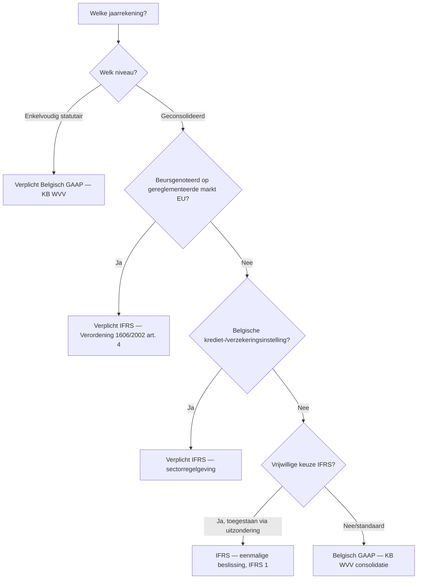
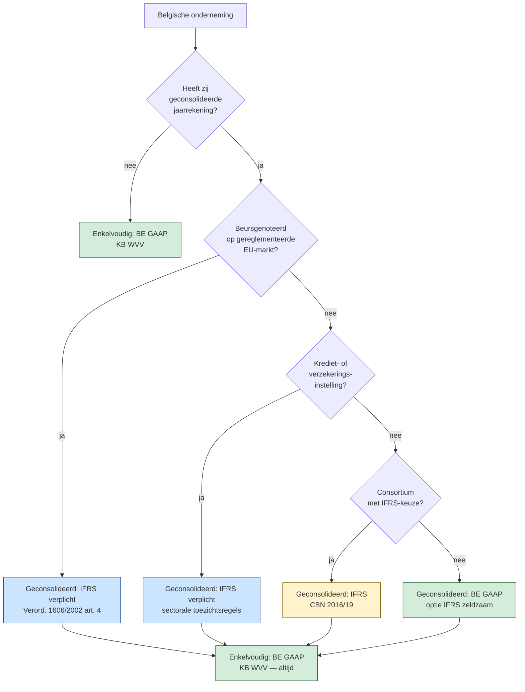

# PO 1.5 — Beginselen van de Europese wetgeving en de IFRS-normen

> **Lees mij eerst:** dit document is een gestructureerd bundle van ALLE leermateriaal voor het programmaonderdeel "Beginselen van de Europese wetgeving en de IFRS-normen" van het ITAA-bekwaamheidsexamen Gecertificeerd Accountant. Het bevat: (1) een didactische minicursus die je door het hele PO leidt, (2) 9 procedure-fiches die elk een concrete vaardigheid beschrijven ("hoe doe je X?"), en (3) 63 concept-fiches die elk een sleutel-begrip definiëren met bouwstenen, valkuilen en bronnen.
> 
> **Conventies in dit bundle:**
> - ⚖️ = directe wettelijke grondslag (WVV, KB WVV, CBN-advies, ITAA-norm, ISA, IFRS)
> - 🤖 = afgeleid of pedagogisch toegevoegd (geen letterlijke bron-citaat)
> - `[[concept-naam]]` = verwijzing naar een concept-fiche later in dit document
> - `[[competenties/naam]]` = verwijzing naar een competentie-fiche later in dit document
> 
> **Anti-fabricatie-regel voor afgeleide producten** (podcast / mindmap / slides / infographic / quiz): gebruik UITSLUITEND inhoud die in dit document staat. Geen externe bronnen, geen aanvullingen uit andere wetgevingen, geen verzonnen voorbeelden. Bij twijfel: zeg "dit staat niet in het bundle".


---

# Deel I — Minicursus

*De minicursus is de primaire leidraad. Lees ze in de aangeboden volgorde; gebruik de competentie- en concept-fiches in Deel II en III als verdieping wanneer iets onduidelijk blijft.*

### Wat verwacht het examen van jou?

> [!abstract] Dit programmaonderdeel wordt getoetst op niveau *integratie*.
> Je moet meerdere concepten samen kunnen inzetten in complexe casussen — onderdelen herkennen, prioriteren, en tot een coherent oordeel komen.


**Taken** (uit het ITAA-examenprogramma):

> [!abstract]- **Taak 1** — Opstellen van de individuele en geconsolideerde jaarrekening
>
> **Subtaken**:
> - Herstructureren van de balans en de resultatenrekening
> - Identificeren en interpreteren van de balansaggregaten
> - Berekenen van de elementen die nodig zijn voor een interpretatie van de kasstromen en die interpreteren
> - Berekenen van de ratio's en ze interpreteren
> - Contextualiseren van de interpretaties naargelang van het bedrijfsdomein en de nationale en internationale context
>
> **Doelstellingen**:
> - Een beginsel van boekhoudrecht of een wettelijke bepaling uit Belgische of Europese bron opzoeken, grondig analyseren en toepassen, met inachtneming van internationale normen.
> - Verifiëren en waarborgen van de conformiteit van de boekhouding en de documenten met de wettelijke en reglementaire vereisten.


### Leesgids

De minicursus loopt van algemeen kader naar concrete toepassing: eerst de twee referentiestelsels naast elkaar via [[belgisch-gaap]] en [[ifrs]], dan het Europese harmonisatie-kader dat bepaalt wie IFRS moet gebruiken via [[verplichte-ifrs-eu-beursgenoteerden]] en [[ifrs-toepassingsgebied-belgie]]. Daarna duik je per IFRS-domein in — presentatie ([[jaarrekening-componenten-ifrs]]), waardering vaste activa, impairment, opbrengsten, voorraden en leasing — telkens met BE-GAAP als referentie. De minicursus sluit af met de procedurele kant: hoe voer je een stelselwissel uit via [[ifrs-eerste-toepassing]]. Lees de overzichts-tabel onder *Hoofdverschillen* als kompas — daar staan de scharnieren die in elk hoofdstuk terugkomen.

### Waarom dit programmaonderdeel telt

In België wordt elke statutaire jaarrekening opgesteld onder [[belgisch-gaap]], maar zodra een groep beursgenoteerd is op een gereglementeerde EU-markt geldt voor de geconsolideerde rekening verplicht [[ifrs]] op grond van Verordening 1606/2002 — zie [[verplichte-ifrs-eu-beursgenoteerden]]. Als accountant kom je beide stelsels tegen binnen dezelfde groep, en de twee wijken op cruciale punten af: leasing on-balance versus off-balance, goodwill-impairment versus afschrijving, opbrengsten via 5-stappen-model versus realisatiebeginsel. Je moet kunnen bepalen welk stelsel op welke jaarrekening van toepassing is via [[ifrs-toepassingsgebied-belgie]], welke gevolgen dat heeft voor balansomvang en resultaatdynamiek, en hoe een overgang procedureel verloopt onder [[ifrs-eerste-toepassing]]. Het examen test dat je niet alleen de verschillen kent, maar in een casus kunt redeneren welke richting je moet kiezen en wat de cijfermatige impact is. Wie de twee stelsels niet uit elkaar houdt, leest een geconsolideerde IFRS-balans met de bril van BE-GAAP — en omgekeerd — en mist daardoor systematisch de juiste waardering.

### Waarom IFRS naast Belgisch GAAP? Twee referentiestelsels, één economische realiteit

Dezelfde economische werkelijkheid — een onderneming met activa, schulden en transacties — kan onder twee fundamenteel verschillende kaders worden afgebeeld: het juridisch-fiscaal georiënteerde [[belgisch-gaap]] of het investeerdersgerichte [[ifrs]] dat steunt op het [[ifrs-conceptueel-raamwerk]]. Het verschil is geen detail: hetzelfde leasecontract verschijnt als huurlast onder BE-GAAP en als gebruiksrecht-actief plus leaseverplichting onder IFRS, met directe gevolgen voor balansomvang en ratio's. In dit programmaonderdeel leer je de twee stelsels naast elkaar lezen — niet door alles te memoriseren, maar door de scharnieren tussen rule-based en principle-based te doorgronden.

### De twee referentiestelsels — begrippen en conceptueel raamwerk

> [!info] Hoort bij taak: Opstellen van de individuele en geconsolideerde jaarrekening

Je leert de twee bronstelsels begrijpen als coherente systemen, niet als losse regels. [[belgisch-gaap]] vertrekt vanuit voorzichtigheid en vaste schema's, terwijl [[ifrs]] vertrekt vanuit nuttige informatie voor investeerders en steunt op het overkoepelende [[ifrs-conceptueel-raamwerk]] dat doelstelling, kwalitatieve kenmerken en definities oplegt zonder zelf een afdwingbare standaard te zijn.

- [[belgisch-gaap|Belgisch GAAP]] · `begrip`
- [[ifrs|IFRS — International Financial Reporting Standards]] · `begrip`
- [[ifrs-conceptueel-raamwerk|IFRS Conceptueel Raamwerk (IASB Conceptual Framework)]] · `cluster`

### Het Europese kader: richtlijn 2013/34/EU en verordening 1606/2002

> [!info] Hoort bij taak: Opstellen van de individuele en geconsolideerde jaarrekening

Je leert hier het Europese tweesporenbeleid toepassen op een Belgische casus: de [[eu-harmonisatie-jaarrekeningenrecht]] via de Boekhoudrichtlijn legt de minimumkern op voor élke jaarrekening (omgezet via KB WVV), terwijl Verordening 1606/2002 IFRS oplegt aan een specifieke ring ondernemingen — zie [[verplichte-ifrs-eu-beursgenoteerden]]. Doorslaggevend voor de toepasselijkheid in België is de [[ifrs-toepassingsgebied-belgie]]-regel, gekoppeld aan kwalificaties als [[public-interest-entity]] en [[groottecriteria-jaarrekening]]. Pas wanneer de Europese Commissie een IASB-standaard via de [[endorsement-procedure-eu]] heeft goedgekeurd, wordt die afdwingbaar binnen de EU — en activeert de [[consolidatieverplichting]] de IFRS-plicht op groepsniveau.

- [[eu-harmonisatie-jaarrekeningenrecht|EU-harmonisatie van het jaarrekeningenrecht]] · `cluster`
- [[verplichte-ifrs-eu-beursgenoteerden|Verplichte IFRS voor EU-beursgenoteerden — geconsolideerde jaarrekening]] · `regel`
- [[endorsement-procedure-eu|Endorsement-procedure — EU-goedkeuring van IFRS-standaarden]] · `cluster`
- [[ifrs-toepassingsgebied-belgie|IFRS-toepassingsgebied in België — wie moet en wie mag?]] · `regel`
- [[public-interest-entity|Public Interest Entity (PIE)]] · `begrip`
- [[groottecriteria-jaarrekening|Groottecriteria (jaarrekening-context)]] · `regel`
- [[consolidatieverplichting|Consolidatieverplichting]] · `regel`

### Belgisch GAAP versus IFRS — overzicht van hoofdverschillen

De tabel hieronder vat het scharnier samen dat in elk thematisch hoofdstuk terugkomt: dezelfde post wordt onder [[belgisch-gaap]] en [[ifrs]] anders gewaardeerd of gepresenteerd. Lees de tabel niet als losse weetjes maar als drie clusters — balansomvang, resultaatdynamiek en opnamecriteria — die je in een examencasus systematisch kunt afgaan.

| Aspect                          | Belgisch GAAP (KB WVV)                                              | IFRS                                                                                       | Belangrijkste gevolg                                                                                       |
|--------------------------------|---------------------------------------------------------------------|--------------------------------------------------------------------------------------------|------------------------------------------------------------------------------------------------------------|
| **Algemeen kader**             | Rule-based, vast schema, juridisch-fiscaal georiënteerd             | Principle-based, flexibele presentatie, investeerders-georiënteerd                          | IFRS vereist meer professional judgment, BE-GAAP meer schemavolgen                                          |
| **Componenten jaarrekening**   | Balans + W&V + toelichting (3); voor groot schema: kasstroom + bestuursverslag | 5 verplichte componenten: balans + totaalresultaat + mutaties EV + kasstroom + toelichting | IFRS verplicht mutatieoverzicht EV en kasstroom voor iedereen                                              |
| **Materiële vaste activa**     | Kostprijsmodel; herwaardering uitzonderlijk + voor financiële + materiële vaste activa | Kostprijs- of herwaarderingsmodel (keuze per categorie) — IAS 16                            | IFRS staat structurele herwaardering tegen reële waarde toe; BE-GAAP veel terughoudender                    |
| **Onderzoekskosten**           | Activering mogelijk (KB WVV art. 3:31)                              | Verbod op activering — moet als kost (IAS 38 alinea 54)                                     | Eerste IFRS-toepassing: schrappen geactiveerde onderzoekskosten, ingehouden winsten −                       |
| **Ontwikkelingskosten**        | Activering mogelijk onder strikte voorwaarden                       | Activering verplicht bij 6 cumulatieve criteria (IAS 38 alinea 57)                          | IFRS strikter inhoudelijk maar dwingender in toepassing                                                     |
| **Goodwill**                   | Afschrijving over vermoedelijke gebruiksduur (KB WVV art. 3:131 § 1): **5 jaar default; langer mits gemotiveerd in toelichting**. Aanvullende/niet-recurrente afschrijving bij gewijzigde economische omstandigheden. Negatief consolidatieverschil NIET direct in W&V (art. 3:131 § 2). Zie [[goodwill-be-gaap]] | GEEN afschrijving — verplichte **jaarlijkse impairment-test** (IAS 36 / IFRS 3). Bargain purchase gain (negatief verschil) direct in W&V                  | IFRS-resultaat schommelt meer (impairment-shock vs. gladde afschrijving); BE-GAAP voorspelbaarder maar mogelijk minder reactief op echte waardevermindering                                    |
| **Leasing — lessee**           | Operationele lease off-balance; financiële lease op balans          | ALLE leases on-balance: gebruiksrecht-actief + leaseverplichting (IFRS 16)                  | IFRS toont meer activa én meer schulden; ratio's debt/equity stijgen                                       |
| **Opbrengsten**                | 'Aangenomen wanneer winsten gerealiseerd zijn op balansdatum' — KB WVV art. 3:18 | 5-stappen-model (IFRS 15) — vergoeding ↔ prestatieverplichtingen                            | IFRS analyseert contract diepgaander; soms andere tijdsbepaling van opbrengst                              |
| **Voorraden**                  | LIFO, FIFO of gewogen gemiddelde toegelaten                          | LIFO **verboden**; alleen FIFO of gewogen gemiddelde (IAS 2 alinea 25)                      | IFRS-overgang dwingt LIFO-gebruikers tot herrekening                                                       |
| **Voorzieningen**              | Voor 'voorzienbare risico's' — soms ruim ingeschat                  | Strikte 3 criteria: huidige verplichting + waarschijnlijke uitstroom + betrouwbaar schatbaar (IAS 37) | IFRS staat minder 'reserve-vorming' toe — voorzieningen die niet aan criteria voldoen, worden teruggenomen |
| **Reële waarde**               | Beperkt — sommige financiële instrumenten                            | Centraal kader (IFRS 13) — uitgebreid gebruik bij financiële activa, vastgoedbeleggingen, biologische activa | IFRS-resultaat volatieler; meer hierarchie 1/2/3 toelichtingen                                              |
| **Uitgestelde belastingen**    | Toelichting vermeld; opname terughoudend                            | Volledige opname verplicht (IAS 12) — verschillen tussen boekwaarde en fiscale waarde      | IFRS-balans heeft meer uitgestelde belastingactiva/passiva zichtbaar                                       |



**Kerninzichten**:

- **Twee filosofieën**: BE-GAAP is rule-based en juridisch-fiscaal georiënteerd (vaste schema's, voorzichtigheidsbeginsel); IFRS is principle-based en investeerders-georiënteerd (reële waarde, professional judgment). — _waarom_: De stagiair kan twee jaarrekeningen van dezelfde onderneming verschillend zien uitvallen onder beide stelsels — niet door fout maar door fundamenteel ander uitgangspunt.
- **Belgisch verplicht IFRS-toepassingsgebied is smal**: enkel geconsolideerde jaarrekeningen van EU-beursgenoteerden + financiële sector. Enkelvoudige jaarrekeningen blijven altijd BE-GAAP. Vrijwillige IFRS-toepassing is in België uitzonderlijk (CBN 2016/19 voor consortia, ...). — _waarom_: Examen-valstrik: 'mag een grote NV IFRS toepassen?' — Voor enkelvoudige rekening: nee. Voor geconsolideerde rekening: alleen bij wettelijke verplichting of beperkte optie.
- **Drie thematische clusters van verschil** vanuit examenperspectief: (a) **balansomvang**: IFRS toont meer activa én meer schulden (leasing, uitgestelde belastingen, herwaardering); (b) **resultaatdynamiek**: IFRS-resultaat is volatieler (impairment-shocks, reële waarde) terwijl BE-GAAP gladder verloopt (afschrijving goodwill, voorzichtige voorzieningen); (c) **opnamecriteria**: IFRS strikter voor activering (geen onderzoekskosten, strikte voorzieningen) maar dwingender voor andere posten (ontwikkelingskosten activering verplicht bij 6 criteria, alle leases on-balance). — _waarom_: Stagiair leert hoofdverschillen groeperen i.p.v. memoriseren van losse artikels. Bij een examen-casus 'noem 3 verschillen tussen BE-GAAP en IFRS' kiest hij telkens uit één cluster om coverage te tonen.
- **Overgang BE-GAAP ↔ IFRS** is geen mechanische cijferconversie maar een procedureel project: IFRS 1 voor BE-GAAP → IFRS (5 stappen, retroactief openingsbalans), CBN 2022/08 voor IFRS → BE-GAAP. Het aanpassingsverschil komt rechtstreeks in ingehouden winsten — niet in resultaat van de overgangsperiode. — _waarom_: Stagiair die in praktijk een groep helpt over te stappen, weet dat het project maanden duurt: openingsbalans, vrijstellingen-keuze, aansluitingstabellen, communicatie naar gebruikers.

_Bouwt op_: [[eu-harmonisatie-jaarrekeningenrecht]] · [[verplichte-ifrs-eu-beursgenoteerden]] · [[endorsement-procedure-eu]] · [[ifrs-toepassingsgebied-belgie]] · [[jaarrekening-componenten-ifrs]] · [[presentatiebeginselen-jaarrekening-ifrs]] · [[materiele-vaste-activa-ifrs]] · [[immateriele-vaste-activa-ifrs]] · [[leasing-ifrs]] · [[opbrengsten-ifrs]] · [[voorraden-ifrs]] · [[goodwill-be-gaap]] · [[bijzondere-waardevermindering-be-gaap]] · [[bijzondere-waardevermindering-ifrs]] · [[ifrs-conceptueel-raamwerk]]
### Bepalen of een onderneming IFRS moet of mag toepassen in België

> [!info] Hoort bij taak: Opstellen van de individuele en geconsolideerde jaarrekening

Stap voor stap loop je de beslissing door: eerst rapporteringsniveau (enkelvoudig versus geconsolideerd), dan beursnotering of sectorale kwalificatie, dan eventuele vrijwillige toepassing — een redenering die rechtstreeks volgt uit [[ifrs-toepassingsgebied-belgie]] en de Europese basis van [[verplichte-ifrs-eu-beursgenoteerden]]. Bij een positieve uitkomst activeer je vervolgens [[ifrs-eerste-toepassing]] als project.

[[competenties/bepalen-toepasselijkheid-ifrs-belgie|→ Volledige procedure]]

### Brug: jaarrekeningpresentatie als regime-overstijgend concept

> [!info] Hoort bij taak: Opstellen van de individuele en geconsolideerde jaarrekening

Vóór je in de IFRS-specifieke regels duikt, leer je de gedeelde basis kennen: [[jaarrekening-presentatie]] beschrijft welke vormvereisten en presentatiebeginselen onder elk regime gelden, zodat je de IFRS-keuzes verderop kunt zien als variaties op een gemeenschappelijke logica in plaats van geïsoleerde regels.

- [[jaarrekening-presentatie|Jaarrekeningpresentatie (regime-overstijgend)]] · `cluster`

### IAS 1 — Presentatie van de jaarrekening: vijf componenten en presentatiebeginselen

> [!info] Hoort bij taak: Opstellen van de individuele en geconsolideerde jaarrekening

Je leert IAS 1 toepassen door de vijf [[jaarrekening-componenten-ifrs]] te koppelen aan de overkoepelende [[presentatiebeginselen-jaarrekening-ifrs]] — going concern, accruals, materialiteit, consistentie en het verbod op compensatie. Voor de balans hanteer je de splitsing in [[balans-presentatie-ifrs]] tussen vlottend en niet-vlottend, voor het resultaat het brede begrip [[totaalresultaat-ifrs]] (P&L plus OCI), aangevuld met het [[mutatieoverzicht-eigen-vermogen-ifrs]] en de [[toelichtingsvereisten-jaarrekening-ifrs]] die de cijfers leesbaar maken.

- [[jaarrekening-componenten-ifrs|Componenten van een IFRS-jaarrekening]] · `begrip`
- [[presentatiebeginselen-jaarrekening-ifrs|Algemene presentatiebeginselen IFRS-jaarrekening]] · `regel`
- [[balans-presentatie-ifrs|IFRS-balanspresentatie — vlottend versus niet-vlottend]] · `regel`
- [[totaalresultaat-ifrs|Winst of verlies en overige onderdelen van het totaalresultaat (IFRS)]] · `begrip`
- [[mutatieoverzicht-eigen-vermogen-ifrs|Mutatieoverzicht eigen vermogen (IFRS)]] · `begrip`
- [[toelichtingsvereisten-jaarrekening-ifrs|Toelichtingsvereisten IFRS-jaarrekening — structuur en inhoud]] · `regel`

### Presenteren van een IFRS-jaarrekening volgens IAS 1 (5 componenten en presentatiebeginselen)

> [!info] Hoort bij taak: Opstellen van de individuele en geconsolideerde jaarrekening

Je leert de vijf verplichte componenten opbouwen tot een coherente jaarrekening die voldoet aan IAS 1: eerst de [[jaarrekening-componenten-ifrs]] inventariseren, dan voor elk de minimumposten plaatsen volgens [[balans-presentatie-ifrs]] en [[totaalresultaat-ifrs]], en de [[toelichtingsvereisten-jaarrekening-ifrs]] uitwerken tot een set grondslagen die de cijfers verklaren.

[[competenties/presenteren-jaarrekening-ifrs|→ Volledige procedure]]

### Vaste activa onder IFRS: IAS 16 en IAS 38 — kostprijs, herwaardering en componenten

> [!info] Hoort bij taak: Opstellen van de individuele en geconsolideerde jaarrekening

Je leert vaste activa waarderen volgens de IFRS-logica die [[materiele-vaste-activa-ifrs]] en [[immateriele-vaste-activa-ifrs]] onderscheidt op tastbaarheid en activerings-criteria. Per categorie kies je tussen kostprijs- en [[herwaarderingsmodel-ifrs]], pas je de [[componentenbenadering]] toe wanneer onderdelen substantieel verschillende gebruiksduren hebben, en bepaal je de [[afschrijvingen-ifrs]] daarop. Voor activa met lange constructieperiode reken je [[intercalaire-interesten]] mee in de aanschaffingswaarde voor zover de regels dat toelaten.

- [[materiele-vaste-activa-ifrs|Materiële vaste activa onder IFRS (IAS 16)]] · `regel`
- [[immateriele-vaste-activa-ifrs|Immateriële activa onder IFRS (IAS 38)]] · `regel`
- [[herwaarderingsmodel-ifrs|Herwaarderingsmodel onder IFRS (IAS 16)]] · `cluster`
- [[componentenbenadering|Componentenbenadering — afschrijving per onderdeel]] · `cluster`
- [[afschrijvingen-ifrs|Afschrijvingen onder IFRS (IAS 16 + IAS 38)]] · `cluster`
- [[intercalaire-interesten|Intercalaire interesten (financieringskosten tijdens bouw)]] · `regel`

### Waarderen van materiële vaste activa onder IAS 16 (kostprijs- of herwaarderingsmodel)

> [!info] Hoort bij taak: Opstellen van de individuele en geconsolideerde jaarrekening

Stap voor stap doorloop je de waardering: eerste opname tegen kostprijs van [[materiele-vaste-activa-ifrs]], dan beleidskeuze tussen kostprijs- of [[herwaarderingsmodel-ifrs]] per categorie, en vervolgens de [[afschrijvingen-ifrs]] op basis van de [[componentenbenadering]]. Tussentijds toets je via [[bijzondere-waardevermindering-ifrs]] wanneer indicatoren wijzen op een waardeverlies.

[[competenties/waarderen-materiele-vaste-activa-ifrs|→ Volledige procedure]]

### Brug: bijzondere waardevermindering als regime-overstijgend mechanisme

> [!info] Hoort bij taak: Opstellen van de individuele en geconsolideerde jaarrekening

Voor je IAS 36 detailleert, leer je de gedeelde logica via [[bijzondere-waardevermindering]]: detecteer indicatoren, vergelijk boekwaarde met realiseerbare of gebruikswaarde, boek het verschil als verlies. Onder Belgisch recht worden diezelfde gevolgen bereikt via de mechanismen van [[bijzondere-waardevermindering-be-gaap]] — aanvullende afschrijving voor activa met beperkte gebruiksduur, waardevermindering voor activa met onbeperkte gebruiksduur — zonder de strikt-geformaliseerde impairment-test van IAS 36.

- [[bijzondere-waardevermindering|Bijzondere waardevermindering (regime-overstijgend)]] · `cluster`
- [[bijzondere-waardevermindering-be-gaap|Aanvullende afschrijving en waardevermindering onder BE-GAAP (art. 3:42 KB WVV)]] · `cluster`

### Bijzondere waardevermindering onder IAS 36: indicaties, CGU en realiseerbare waarde

> [!info] Hoort bij taak: Opstellen van de individuele en geconsolideerde jaarrekening

Je leert de IAS 36-procedure toepassen op concrete activa: indicatoren scannen (extern en intern), realiseerbare waarde berekenen als hoogste van reële waarde min verkoopkosten of bedrijfswaarde, en bij gebrek aan onafhankelijke kasstromen terugvallen op een kasstroomgenererende eenheid — alles geregeld door [[bijzondere-waardevermindering-ifrs]] dat de scharnier vormt met de waardering van vaste activa uit het vorige hoofdstuk.

- [[bijzondere-waardevermindering-ifrs|Bijzondere waardevermindering onder IFRS (IAS 36)]] · `cluster`

### Toetsen van een actief op bijzondere waardevermindering onder IAS 36

> [!info] Hoort bij taak: Opstellen van de individuele en geconsolideerde jaarrekening

Stap voor stap voer je de impairment-test uit zoals voorgeschreven door [[bijzondere-waardevermindering-ifrs]]: eerst scan op aanwijzingen, dan realiseerbare waarde bepalen op het niveau van actief of CGU, vergelijken met boekwaarde, en het verlies splitsen tussen W&V en — bij eerder geherwaardeerde activa — OCI volgens [[herwaarderingsmodel-ifrs]].

[[competenties/toetsen-bijzondere-waardevermindering-ifrs|→ Volledige procedure]]

### Brug: opbrengsten onder BE-GAAP — het realisatiebeginsel

Onder [[belgisch-gaap]] worden opbrengsten erkend op het ogenblik dat de winst op balansdatum gerealiseerd is — een toepassing van het voorzichtigheidsbeginsel uit de [[boekhoudbeginselen-overzicht]]. Dit korte bruggetje zet de toon voor IFRS 15 in het volgende hoofdstuk: dezelfde transactie kan onder IFRS op een ander moment leiden tot opname dan onder BE-GAAP.

- [[opbrengsten-be-gaap]] — record niet gevonden

### Opbrengsten onder IFRS 15: het vijf-stappen-model en prestatieverplichtingen

> [!info] Hoort bij taak: Opstellen van de individuele en geconsolideerde jaarrekening

Je leert het [[opbrengsten-ifrs]] 5-stappen-model toepassen op uiteenlopende contracten: contract identificeren, [[prestatieverplichting]] onderscheiden, transactieprijs vastleggen, prijs toewijzen aan elke onderscheiden belofte, en opbrengst opnemen op het tijdstip of over de periode waarin controle overgaat. Voor klant-specifieke projecten geldt sinds 2018 de algemene regel — IAS 11 is afgeschaft — en bepaalt [[onderhanden-projecten-ifrs]] of opname over de periode kan, met een passende voortgangsmeting.

- [[opbrengsten-ifrs|Opbrengsten onder IFRS (IFRS 15) — 5-stappen-model]] · `cluster`
- [[prestatieverplichting|Prestatieverplichting (performance obligation)]] · `begrip`
- [[onderhanden-projecten-ifrs|Onderhanden projecten in opdracht van derden — onder IFRS 15]] · `regel`

### Toepassen van het 5-stappen-model van IFRS 15 voor opbrengstenherkenning

> [!info] Hoort bij taak: Opstellen van de individuele en geconsolideerde jaarrekening

Stap voor stap doorloop je het 5-stappen-model van [[opbrengsten-ifrs]] op een concreet contract: contract identificeren, elke [[prestatieverplichting]] als onderscheiden of bundel afbakenen, transactieprijs bepalen inclusief variabele componenten, prijs toewijzen op basis van standalone selling prices, en uiteindelijk opname op tijdstip of over periode kiezen — bij over-periode-opname met een input- of outputmethode voor voortgangsmeting.

[[competenties/toepassen-vijf-stappen-model-opbrengsten-ifrs|→ Volledige procedure]]

### Voorraden onder IFRS: IAS 2 en het verbod op LIFO

> [!info] Hoort bij taak: Opstellen van de individuele en geconsolideerde jaarrekening

Je leert de IFRS-waardering van voorraden toepassen via [[voorraden-ifrs]]: kostprijs of opbrengstwaarde — de laagste van beide — met alleen FIFO of gewogen gemiddelde als kostprijsformule. Wie van BE-GAAP komt waar LIFO nog toelaatbaar is, moet bij overgang naar IFRS herrekeningen plannen — een typisch onderdeel van het project rond [[ifrs-eerste-toepassing]].

- [[voorraden-ifrs|Voorraden onder IFRS (IAS 2)]] · `regel`

### IFRS 16 — lessee versus lessor (overzicht)

IFRS 16 hanteert een asymmetrisch model: lessee én lessor volgen niet meer dezelfde classificatie (zoals onder IAS 17), maar geven een lease vanuit hun eigen perspectief weer. Voor de stagiair betekent dit dat dezelfde lease-overeenkomst aan beide kanten van de balans verschillend zichtbaar is.


De tabel hieronder maakt de scharnier expliciet: aan lessee-zijde verdween het onderscheid operationeel/financieel volledig — zie [[leasing-ifrs]] — terwijl aan lessor-zijde dezelfde tweedeling blijft bestaan zoals beschreven in [[lessee-vs-lessor-leasing-ifrs]]. Bij intra-groep-leases creëert die asymmetrie consolidatie-uitdagingen omdat de boekingen aan beide kanten niet één-op-één matchen.

| Aspect | Lessee onder IFRS 16 | Lessor onder IFRS 16 |
|---|---|---|
| Basismodel | Single model: alle leases on-balance | Twee modellen: operationele vs. financiële lease (zoals IAS 17) |
| Activa | Right-of-use-actief op de balans, jaarlijks afgeschreven | Operationele lease: activa blijft op balans lessor; Financiële lease: vordering ipv activa |
| Verplichting / vordering | Leaseverplichting (effectieve-rente-methode) | Operationele lease: geen vordering; Financiële lease: vordering met rente-component |
| Resultaat | Afschrijving (vast) + rente (degressief) | Operationele lease: huurinkomst (vast); Financiële lease: rente-inkomst (degressief) + winst op verkoop |
| Uitzonderingen | Kortdurende leases (< 12 maand) en lease van lage waarde mogen off-balance | Geen vergelijkbare vrijstelling |


**Kerninzichten**:

- De asymmetrie maakt vergelijking lastig: dezelfde economische transactie verschijnt aan lessee-kant (gebruiksrecht-actief + verplichting) groter dan aan lessor-kant (alleen vordering bij financiële lease). — _waarom_: Voor de stagiair die een groep met intra-groep-leases analyseert: de eliminaties bij consolidatie vragen extra aandacht omdat de boekingen aan beide kanten niet symmetrisch zijn.
- IFRS 16 schaft het BE-GAAP-onderscheid tussen operationele en financiële lease alleen aan lessee-zijde af. Aan lessor-zijde blijft het onderscheid bestaan, met andere boekingen voor elk type. — _waarom_: Een examenvraag over 'classificatie van een lease onder IFRS' vereist altijd duidelijkheid: vanuit wie? Lessee → niet meer relevant; lessor → nog steeds belangrijk.

_Bouwt op_: [[leasing-ifrs]] · [[right-of-use-actief]] · [[leaseverplichting-ifrs]]
### Leasing onder IFRS 16: right-of-use-actief en leaseverplichting bij lessee

> [!info] Hoort bij taak: Opstellen van de individuele en geconsolideerde jaarrekening

Je leert leases verwerken volgens het single model van [[leasing-ifrs]] dat aan lessee-zijde alles on-balance brengt: tegenover de contante waarde van toekomstige leasebetalingen — de [[leaseverplichting-ifrs]] — staat het [[right-of-use-actief]] dat het gebruiksrecht over de leaseperiode vertegenwoordigt. Voor samengestelde transacties zoals [[sale-and-leaseback-ifrs]] doe je eerst de IFRS 15-toets op de verkoop voor je het lease-deel boekt.

- [[leasing-ifrs|Leasing onder IFRS (IFRS 16) — lessee-perspectief]] · `cluster`
- [[right-of-use-actief|Right-of-use-actief (gebruiksrecht-actief) onder IFRS 16]] · `begrip`
- [[leaseverplichting-ifrs|Leaseverplichting onder IFRS 16]] · `begrip`
- [[lessee-vs-lessor-leasing-ifrs|Lessee versus lessor onder IFRS 16 — overzicht en asymmetrie]] · `synthese`
- [[sale-and-leaseback-ifrs|Sale-and-leaseback onder IFRS (IFRS 16)]] · `cluster`

### Verwerken van een leaseovereenkomst onder IFRS 16 als lessee (right-of-use + lease-verplichting)

> [!info] Hoort bij taak: Opstellen van de individuele en geconsolideerde jaarrekening

Stap voor stap voer je de verwerking uit: identificeer of het contract een lease bevat onder [[leasing-ifrs]], bepaal de leasetermijn en disconteringsvoet, waardeer de [[leaseverplichting-ifrs]] op contante waarde van leasebetalingen, en stel het [[right-of-use-actief]] in tegen kostprijs. Vervolgens splits je elke periode in een afschrijvings- en een rente-component, en beoordeel je of de vrijstellingen voor kortlopende leases of activa van lage waarde toepasbaar zijn.

[[competenties/verwerken-leasing-ifrs-lessee|→ Volledige procedure]]

### Brug: stelselwissel jaarrekening — van BE-GAAP naar IFRS en omgekeerd

> [!info] Hoort bij taak: Opstellen van de individuele en geconsolideerde jaarrekening

Je leert een overgang tussen referentiestelsels uitvoeren als project, niet als boeking. [[stelselwissel-jaarrekening]] beschrijft de gedeelde principes — openingsbalans, retroactieve toepassing, aansluitingstabellen — die in beide richtingen gelden. Van BE-GAAP naar IFRS volg je [[ifrs-eerste-toepassing]] (IFRS 1) met verplichte uitzonderingen en optionele vrijstellingen; van IFRS naar BE-GAAP geldt [[wijziging-boekhoudkundig-referentiestelsel]] (CBN 2022/08). Binnen een lopende IFRS-rekening houdt [[correctie-jaarrekening-ifrs]] grondslag-, schattings- en foutwijzigingen scherp uit elkaar, met direct gevolg voor de vergelijkbaarheid van de cijfers — denk aan de afwijkende behandeling van [[goodwill-be-gaap]] versus IFRS bij overstap.

- [[stelselwissel-jaarrekening|Stelselwissel jaarrekening (BE GAAP ↔ IFRS)]] · `cluster`
- [[wijziging-boekhoudkundig-referentiestelsel|Wijziging van boekhoudkundig referentiestelsel naar BE GAAP (CBN 2022/08)]] · `cluster`
- [[ifrs-eerste-toepassing|Eerste toepassing van IFRS (IFRS 1)]] · `cluster`
- [[correctie-jaarrekening-ifrs|Correctie van de jaarrekening — IAS 8 versus CBN 2020/12]] · `cluster`
- [[goodwill-be-gaap|Goodwill onder BE-GAAP (consolidatieverschil en verworven goodwill)]] · `cluster`

### Uitvoeren van de eerste toepassing van IFRS overeenkomstig IFRS 1

> [!info] Hoort bij taak: Opstellen van de individuele en geconsolideerde jaarrekening

Stap voor stap voer je de overgang uit zoals geregeld door [[ifrs-eerste-toepassing]]: stel de datum van overgang vast, bouw de openingsbalans op door alle IFRS-vereiste activa en verplichtingen op te nemen, schrap wat onder IFRS niet kwalificeert, herclassificeer en herwaardeer waar nodig — met het aanpassingsverschil rechtstreeks in ingehouden winsten. Beoordeel tot slot welke verplichte uitzonderingen en optionele vrijstellingen je toepast, en stel de aansluitingstabellen op die [[stelselwissel-jaarrekening]] vereist.

[[competenties/uitvoeren-eerste-toepassing-ifrs|→ Volledige procedure]]

### Reflectie: IFRS als levend normenstelsel — IAS 17 → IFRS 16 en IAS 18 → IFRS 15

[[ifrs]] is geen vast stelsel maar evolueert: [[leasing-ifrs]] verving in 2019 IAS 17 met een single model dat alle leases aan lessee-zijde on-balance brengt, en [[opbrengsten-ifrs]] verving in 2018 IAS 18 én IAS 11 met één geïntegreerd 5-stappen-model. Voor jou als accountant betekent dit dat je niet alleen huidige standaarden moet kennen, maar ook moet aansluiten bij oudere cijferreeksen waarin de vervangen standaarden nog doorwerken — en bij elke standaard-wissel de impact via [[correctie-jaarrekening-ifrs]] correct als grondslagwijziging verwerken.


### Synthese-stappenplan

Bij elke jaarrekening-vraag die je in praktijk of op het examen tegenkomt, doorloop je deze stappen in vaste volgorde. **Stap 1 — Identificeer het rapporteringsniveau**: enkelvoudig of geconsolideerd? Enkelvoudig in België is altijd [[belgisch-gaap]]. **Stap 2 — Test de IFRS-toepasselijkheid** via [[ifrs-toepassingsgebied-belgie]]: geconsolideerd plus beursnotering op gereglementeerde EU-markt of sectorale kwalificatie als kredietinstelling/verzekeraar activeert verplichte [[verplichte-ifrs-eu-beursgenoteerden]]. **Stap 3 — Bepaal de presentatievereisten**: onder IFRS pas je IAS 1 toe met vijf [[jaarrekening-componenten-ifrs]] en de [[presentatiebeginselen-jaarrekening-ifrs]]; onder BE-GAAP volg je het schema-conform KB WVV. **Stap 4 — Waardeer per domein** volgens het juiste stelsel: vaste activa via [[materiele-vaste-activa-ifrs]] en [[immateriele-vaste-activa-ifrs]] met keuze voor [[herwaarderingsmodel-ifrs]], voorraden via [[voorraden-ifrs]], opbrengsten via het 5-stappen-model van [[opbrengsten-ifrs]], leases via [[leasing-ifrs]]. **Stap 5 — Toets op waardevermindering** via [[bijzondere-waardevermindering-ifrs]] wanneer indicatoren of jaarlijkse verplichtingen dat vragen. **Stap 6 — Bij stelselwissel**: pas [[ifrs-eerste-toepassing]] toe voor BE-GAAP → IFRS of [[wijziging-boekhoudkundig-referentiestelsel]] voor IFRS → BE-GAAP, met aansluitingstabellen en aanpassingsverschillen in ingehouden winsten. **Stap 7 — Werk de [[toelichtingsvereisten-jaarrekening-ifrs]] uit** zodat de cijfers traceerbaar zijn naar grondslagen.

### Cheatsheet

#### Kritische drempelwaarden

| Concept | Naam | Waarde | Eenheid | Gevolg |
|---|---|---|---|---|
| [[groottecriteria-jaarrekening]] | Drempels kleine vennootschap (na update 2024) | Personeelsbezetting ≤ 50; jaaromzet excl. BTW ≤ € 11.250.000; balanstotaal ≤ € 6.000.000 | drie criteria — max 1 mag overschreden worden | Mag verkort schema gebruiken; geen jaarverslag verplicht; geen commissaris verplicht (tenzij ze deel uitmaakt van een gr… |
| [[groottecriteria-jaarrekening]] | Drempels microvennootschap | Personeelsbezetting ≤ 10; jaaromzet excl. BTW ≤ € 900.000; balanstotaal ≤ € 450.000 | drie criteria — max 1 mag overschreden worden | Mag microschema gebruiken (kleinste schema) |
| [[jaarrekening]] | Kleine vennootschap (verkort schema toegelaten) | Maximaal 1 criterium overschreden: balanstotaal € 6.000.000, omzet € 11.250.000, gemiddeld personeel 50 VTE | WVV art. 1:24 — 1:25 | Mag jaarrekening in **verkort schema** opstellen; vrijgesteld van jaarverslag (tenzij beursgenoteerd), commissaris-vrijs… |
| [[jaarrekening]] | Micro-vennootschap (microschema toegelaten) | Maximaal 1 criterium overschreden: balanstotaal € 350.000, omzet € 700.000, gemiddeld personeel 10 VTE | WVV art. 1:25 | Mag jaarrekening in **microschema** opstellen — kortere balans, minder verplichte vermeldingen in toelichting |
| [[verplichte-ifrs-eu-beursgenoteerden]] | Trigger verplichte IFRS-toepassing | Beursnotering op gereglementeerde markt EU-lidstaat op balansdatum + EU-rechtsvorm | kwalitatief criterium | Verplichte IFRS-toepassing op geconsolideerde jaarrekening voor boekjaren beginnend op of na 1 januari 2005 |

#### Vergelijkingsparen-matrix

| Concept | Verwarrend met | Trigger |
|---|---|---|
| [[balans-presentatie-ifrs]] | [[jaarrekening-schema]] | Examenvraag over balansrubrieken: KB WVV gebruikt vaste-activa-rubrieken I (oprichtingskosten) tot IV (financiële vaste activa). IAS 1 gebruikt geen 'oprichtingskosten' — die mogen onder IFRS niet geactiveerd worden. |
| [[balans]] | [[resultatenrekening]] | Examen: 'op welke staat staat post X?' Toestand (saldo) → balans. Beweging (gedurende periode) → RR. |
| [[balans]] | [[analytische-balans]] | Examen: 'bereken behoefte aan bedrijfskapitaal' — eerst statutaire balans naar analytische balans omzetten. |
| [[belgisch-gaap]] | [[ifrs]] | Examenvraag over een specifieke balanspost: bepaal eerst onder welk stelsel het cijfer berekend is. Beursnotering + geconsolideerd → IFRS; alle andere gevallen → BE-GAAP. |
| [[bijzondere-waardevermindering-be-gaap]] | [[bijzondere-waardevermindering-ifrs]] | Examen: 'Onder welk regime werd deze waardevermindering geboekt?' → toets op DCF-onderbouwing + CGU-allocatie (= IFRS) versus eenvoudige verwijzing naar 'duurzame minderwaarde' of 'gebruikswaarde voor de vennootschap' (= BE-GAAP). |
| [[bijzondere-waardevermindering-ifrs]] | [[herwaarderingsmeerwaarden]] | Examen: 'boekwaarde > marktwaarde' → impairment (verlaging, W&V); 'marktwaarde > boekwaarde + herwaarderingsmodel' → herwaardering (verhoging, OCI). |
| [[bijzondere-waardevermindering-ifrs]] | [[bijzondere-waardevermindering-be-gaap]] | Examen: 'Onder welk regime werd deze waardevermindering geboekt?' → toets op aanwezigheid van DCF-onderbouwing en CGU-allocatie (= IFRS) versus eenvoudige verwijzing naar duurzame minderwaarde (= BE-GAAP). |
| [[bijzondere-waardevermindering]] | [[bijzondere-waardevermindering-ifrs]] | Algemeen → 'wat is het mechanisme van bijzondere waardevermindering?'; IFRS → 'hoe bereken ik VIU?' / 'wat is CGU-allocatie?' |
| [[bijzondere-waardevermindering]] | [[bijzondere-waardevermindering-be-gaap]] | Algemeen → 'wat is het mechanisme?'; BE GAAP → 'aanvullende afschrijving of waardevermindering — welk artikel?' |
| [[correctie-jaarrekening-ifrs]] | [[wijziging-boekhoudkundig-referentiestelsel]] | Examen: 'Onderneming wijzigt afschrijvingsmethode' (lineair → degressief) — IAS 8 schattingswijziging (prospectief). 'Onderneming wijzigt waarderingsbasis vastgoed' (kostprijs → herwaardering) — IAS 8 grondslagwijziging (retroactief). 'Onderneming gaat over naar IFRS' — IFRS 1 + CBN 2022/08. |
| [[eu-harmonisatie-jaarrekeningenrecht]] | [[verplichte-ifrs-eu-beursgenoteerden]] | Examenvraag 'welke EU-norm bepaalt of IFRS verplicht is?' → Verordening 1606/2002 / `verplichte-ifrs-eu-beursgenoteerden`. 'Welke EU-norm bepaalt de minimuminhoud van de Belgische jaarrekening?' → Richtlijn 2013/34/EU (via KB WVV). |
| [[getrouw-beeld]] | [[getrouw-beeld-jaarrekening]] | Vraag over algemeen beginsel → getrouw-beeld. Vraag over de jaarrekening-toets (vermogen/positie/resultaat) → getrouw-beeld-jaarrekening. |
| [[goodwill-be-gaap]] | [[ifrs-conceptueel-raamwerk]] | Examen: 'op welke rubriek staat goodwill en hoe wordt ze gewaardeerd?' onder BE-GAAP → III. Immateriële vaste activa (enkelvoudig) of Consolidatieverschillen (geconsolideerd) + afschrijving over vermoedelijke gebruiksduur (5 jaar default, langer mits motivatie). |
| [[groottecriteria-jaarrekening]] | [[groottecriteria-consolidatie]] | Examen 'welk schema moet X gebruiken?' → 1:24/1:25. 'Mag groep X afzien van consolideren?' → 1:26. |
| [[herwaarderingsmodel-ifrs]] | [[herwaarderingsmeerwaarden]] | Examen: 'mag ik onder IFRS dit actief herwaarderen?' → check IAS 16 keuze tussen kostprijsmodel en herwaarderingsmodel. 'Onder BE GAAP?' → check de drie voorwaarden art. 3:30. |
| [[ifrs-conceptueel-raamwerk]] | [[boekhoudbeginselen-overzicht]] | Examen: 'noem de kernverschillen tussen de bovenliggende kaders van IFRS en BE-GAAP' → primair publiek (investeerders vs juridisch-fiscale gebruikers) en plaats van voorzichtigheid (Conceptual Framework: neutraal; BE-GAAP: asymmetrisch voorzichtig). |
| [[ifrs-conceptueel-raamwerk]] | [[getrouw-beeld]] | Stagiair denkt dat 'faithful representation' = 'getrouw beeld'. Dat klopt qua geest maar niet qua mechanisme — IFRS heeft geen overrule-clausule, BE-GAAP wel. |
| [[ifrs]] | [[belgisch-gaap]] | Examenvraag over specifieke post: check enkelvoudig versus geconsolideerd, en bij geconsolideerd de beursnotering. Beursgenoteerd + geconsolideerd → IFRS. |
| [[immateriele-vaste-activa-ifrs]] | [[immateriele-vaste-activa]] | Examen: onderneming heeft € 2.500.000 onderzoekskosten op balans. Welk stelsel? → Als IFRS: schrappen, ingehouden winsten −€ 2.500.000. Als BE-GAAP: behouden mits voorwaarden vervuld. |
| [[immateriele-vaste-activa-ifrs]] | [[materiele-vaste-activa-ifrs]] | Examen: 'op welke rekening classificeer ik een software-aankoop?' → check zelfstandigheid versus integratie. |
| [[jaarrekening-componenten-ifrs]] | [[samenstelling-statutaire-jaarrekening]] | Bij vraag 'Welke vorm heeft de jaarrekening van een beursgenoteerde NV?': onderscheid maken tussen enkelvoudige (BE-GAAP-schema) en geconsolideerde (IAS 1). |
| [[jaarrekening-presentatie]] | [[balans-presentatie-ifrs]] | Algemeen → 'welke componenten zijn verplicht?'; IFRS-specialisatie → 'welke posten op de balans onder IAS 1?' |
| [[jaarrekening]] | [[geconsolideerde-jaarrekening]] | Examen: 'jaarrekening Aurelia Holding NV' alleen = statutair. 'jaarrekening Aurelia Holding NV + dochters' = geconsolideerd. |
| [[leasing-ifrs]] | [[leasing]] | Examen: 'Bedrijf X heeft een huurcontract voor 5 jaar' — onder BE-GAAP: huurlast jaarlijks; onder IFRS 16: ROU + leaseverplichting op balans. Materiële impact bij vergelijking. |
| [[materiele-vaste-activa-ifrs]] | [[materiele-vaste-activa]] | Bij examenvraag over machine met componenten: KB WVV → één afschrijvingsplan mogelijk; IAS 16 → afzonderlijke afschrijving per component met substantiële kostprijs. |
| [[mutatieoverzicht-eigen-vermogen-ifrs]] | [[samenstelling-statutaire-jaarrekening]] | Examen: 'Welke component bestaat WEL onder IFRS maar NIET onder BE-GAAP-jaarrekening?' → Mutatieoverzicht eigen vermogen. |
| [[onderhanden-projecten-ifrs]] | [[voorraden-ifrs]] | Examen: 'Klant-specifiek project' → IFRS 15 over periode (mits criterium b of c vervuld); 'algemene voorraad voor verkoop' → IAS 2. |
| [[public-interest-entity]] | [[groottecriteria-jaarrekening]] | Vraag 'verkort schema toegestaan?' → eerst PIE-test (zo ja: nooit verkort) → dan groottetest. |
| [[resultatenrekening]] | [[balans]] | Examen: 'op welke staat staat post X?' — vraag jezelf: is dit een **toestand** (saldo: voorraad, schuld, kapitaal) of een **beweging** (gedurende boekjaar: omzet, kostprijs)? |
| [[sale-and-leaseback-ifrs]] | [[leasing]] | Examen: 'Onderneming X verkoopt gebouw aan financier en least het 10 jaar terug.' Onder BE-GAAP: meerwaarde naar overlopende rekening, jaarlijks vrijgegeven. Onder IFRS 16: eerst IFRS 15-toets; bij geldige verkoop direct gedeeltelijke winst + ROU + leaseverplichting. |
| [[sale-and-leaseback-ifrs]] | [[leasing-ifrs]] | Examen: leasenemer vs verkoper-lessee onderscheid. Leasenemer-only → ROU = kostprijs (alinea 23-24). Verkoper-lessee → ROU = oude boekwaarde × verhouding behouden gebruiksrecht (alinea 100). |
| [[stelselwissel-jaarrekening]] | [[wijziging-boekhoudkundig-referentiestelsel]] | Algemeen → 'wat zijn de gemeenschappelijke principes bij elke stelselwissel?'; CBN-record → 'wat zegt CBN 2022/08 over de uitzonderingen?' |
| [[stelselwissel-jaarrekening]] | [[ifrs-eerste-toepassing]] | Algemeen → 'welke aansluitingen vraagt elke wissel?'; IFRS-1-record → 'welke vrijstellingen kent IFRS 1?' |
| [[voorraden-ifrs]] | [[voorraden]] | Examen: 'Onderneming gebruikt LIFO voor voorraadwaardering' — onder IFRS NIET toegelaten; onder BE-GAAP wel. |
| [[wijziging-boekhoudkundig-referentiestelsel]] | [[ifrs-eerste-toepassing]] | Bij examenvraag over 'stelselwissel': eerst bepalen welke richting. Buitenlands stelsel → BE GAAP voor statutaire jaarrekening = CBN 2022/08. BE GAAP → IFRS (typisch voor geconsolideerde jaarrekening van nieuw beursgenoteerde groep) = IFRS 1. |
| [[wijziging-boekhoudkundig-referentiestelsel]] | [[continuiteitsbeginsel]] | Bij vraag over 'continuïteit': uitvragen of de bron-context over cijferreeks-continuïteit (CBN 2022/08, art. 3:3) of over going-concern-veronderstelling (art. 3:6) gaat — twee verschillende beginselen. |


### Heb je deze taken in de vingers?

Loop deze taken na vóór je verder gaat met examenfocus. Twijfel je bij een taak? Lees de aangegeven secties nog eens.

- ✓ **1.5.taak.1** — Opstellen van de individuele en geconsolideerde jaarrekening _Behandeld in §5, §6, §7, §8, §9, §10, §11, §12, §13, §14, §15, §16, §18, §19, §20, §21, §22, §23, §24, §25._

### Examenfocus

Het examen test vooral of je in een casus het juiste stelsel selecteert en de stelselverschillen cijfermatig kunt vertalen — niet of je de standaarden uit het hoofd kent. Verwacht juist/fout-vragen over kostprijsformules, presentatievereisten en het voorzichtigheidsbeginsel, naast open vragen waarin je de behandeling van een concrete transactie onder beide stelsels moet vergelijken.

#### Wetgeving jaarrekening + IFRS 📃

> [!question]- ITAA 2024-1 vraag 7.A · juist/fout (tier A)
> Onder IAS/ IFRS zijn volgende methoden mogelijk: ( Juist/ fout)
>
> - Fifo, Lifo, gewogen gemiddelde, individueel.
> - Fifi, gewogen gemiddelde, individueel
> - Lifo, gewogen gemiddelde individueel
> - Fifo en gewogen gemiddelde

> [!question]- ITAA 2024-1 vraag 7.B · juist/fout (tier A)
> Richtlijn 2013/34/EU 26/06/2013, opname waardering volgens voorzichtigheidsprincipe. Welke stellingen juist/ fout
>
> - Winsten mogen slechts opgenomen worden voor zover zij op balansdatum gerealiseerd zijn
> - Verplichtingen die hun oorsprong hebben in het betrokken boekjaar of in de loop van een vorig boekjaar worden opgenomen, ook als die verplichting pas worden tussen balansdatum en de datum waarop de balans wordt opgesteld
> - Alle negatieve waarde correcties worden opgenomen ongeacht of het boekjaar met winst of verlies wordt afgesloten.
> - Voor bepaalde categorieën van ondernemingen wordt verplicht om bepaalde VA aan geherwaardeerde waarde op te nemen.

> [!question]- ITAA 2024-1 vraag 7.C · juist/fout (tier A)
> Stellingen mbt IAS / IFRS Juist/ fout
>
> - Degressieve afschrijvingen zijn toegestaan
> - Kosten voor voorbereiding van een terrein……?
> - Uitzonderlijke opbrengsten boeken is toegestaan
> - Afschr. MVA mag stopgezet worden wanneer reële waarde van het actief groter is dan boekwaarde

> [!question]- ITAA 2024-1 vraag 7.D · open (tier A)
> Operationele / financiële laesing, hoe behandelen?


### Competentie-index

<div class="two-column-list">

- [[competenties/bepalen-toepasselijkheid-ifrs-belgie|Bepalen of een onderneming IFRS moet of mag toepassen in België]]
- [[competenties/presenteren-jaarrekening-ifrs|Presenteren van een IFRS-jaarrekening volgens IAS 1 (5 componenten en presentatiebeginselen)]]
- [[competenties/toepassen-vijf-stappen-model-opbrengsten-ifrs|Toepassen van het 5-stappen-model van IFRS 15 voor opbrengstenherkenning]]
- [[competenties/toetsen-bijzondere-waardevermindering-ifrs|Toetsen van een actief op bijzondere waardevermindering onder IAS 36]]
- [[competenties/uitvoeren-eerste-toepassing-ifrs|Uitvoeren van de eerste toepassing van IFRS overeenkomstig IFRS 1]]
- [[competenties/verwerken-leasing-ifrs-lessee|Verwerken van een leaseovereenkomst onder IFRS 16 als lessee (right-of-use + lease-verplichting)]]
- [[competenties/waarderen-materiele-vaste-activa-ifrs|Waarderen van materiële vaste activa onder IAS 16 (kostprijs- of herwaarderingsmodel)]]

</div>

### Concept-index

<div class="two-column-list">

- [[bijzondere-waardevermindering-be-gaap|Aanvullende afschrijving en waardevermindering onder BE-GAAP (art. 3:42 KB WVV)]] · `cluster`
- [[afschrijvingen-ifrs|Afschrijvingen onder IFRS (IAS 16 + IAS 38)]] · `cluster`
- [[presentatiebeginselen-jaarrekening-ifrs|Algemene presentatiebeginselen IFRS-jaarrekening]] · `regel`
- [[balans|Balans (jaarrekening-component)]] · `cluster`
- [[belgisch-gaap|Belgisch GAAP]] · `begrip`
- [[be-gaap-vs-ifrs-overzicht|Belgisch GAAP versus IFRS — overzicht van hoofdverschillen]] · `synthese`
- [[bepalen-toepasselijkheid-ifrs-belgie|Bepalen of een onderneming IFRS moet of mag toepassen in België]] · `competentie`
- [[bijzondere-waardevermindering|Bijzondere waardevermindering (regime-overstijgend)]] · `cluster`
- [[bijzondere-waardevermindering-ifrs|Bijzondere waardevermindering onder IFRS (IAS 36)]] · `cluster`
- [[boekhoudbeginselen-overzicht|Boekhoudbeginselen &mdash; overzicht]] · `synthese`
- [[jaarrekening-componenten-ifrs|Componenten van een IFRS-jaarrekening]] · `begrip`
- [[componentenbenadering|Componentenbenadering — afschrijving per onderdeel]] · `cluster`
- [[consolidatieverplichting|Consolidatieverplichting]] · `regel`
- [[correctie-jaarrekening-ifrs|Correctie van de jaarrekening — IAS 8 versus CBN 2020/12]] · `cluster`
- [[eu-harmonisatie-jaarrekeningenrecht|EU-harmonisatie van het jaarrekeningenrecht]] · `cluster`
- [[ifrs-eerste-toepassing|Eerste toepassing van IFRS (IFRS 1)]] · `cluster`
- [[endorsement-procedure-eu|Endorsement-procedure — EU-goedkeuring van IFRS-standaarden]] · `cluster`
- [[getrouw-beeld|Getrouw beeld]] · `regel`
- [[goodwill-be-gaap|Goodwill onder BE-GAAP (consolidatieverschil en verworven goodwill)]] · `cluster`
- [[groottecriteria-jaarrekening|Groottecriteria (jaarrekening-context)]] · `regel`
- [[herwaarderingsmodel-ifrs|Herwaarderingsmodel onder IFRS (IAS 16)]] · `cluster`
- [[ifrs-16-lessee-vs-lessor-overzicht|IFRS 16 — lessee versus lessor (overzicht)]] · `synthese`
- [[ifrs-conceptueel-raamwerk|IFRS Conceptueel Raamwerk (IASB Conceptual Framework)]] · `cluster`
- [[ifrs|IFRS — International Financial Reporting Standards]] · `begrip`
- [[balans-presentatie-ifrs|IFRS-balanspresentatie — vlottend versus niet-vlottend]] · `regel`
- [[ifrs-toepassingsgebied-belgie|IFRS-toepassingsgebied in België — wie moet en wie mag?]] · `regel`
- [[immateriele-vaste-activa-ifrs|Immateriële activa onder IFRS (IAS 38)]] · `regel`
- [[intercalaire-interesten|Intercalaire interesten (financieringskosten tijdens bouw)]] · `regel`
- [[jaarrekening|Jaarrekening (synthesedocumenten)]] · `cluster`
- [[jaarrekening-presentatie|Jaarrekeningpresentatie (regime-overstijgend)]] · `cluster`
- [[leaseverplichting-ifrs|Leaseverplichting onder IFRS 16]] · `begrip`
- [[leasing-ifrs|Leasing onder IFRS (IFRS 16) — lessee-perspectief]] · `cluster`
- [[lessee-vs-lessor-leasing-ifrs|Lessee versus lessor onder IFRS 16 — overzicht en asymmetrie]] · `synthese`
- [[materiele-vaste-activa-ifrs|Materiële vaste activa onder IFRS (IAS 16)]] · `regel`
- [[mutatieoverzicht-eigen-vermogen-ifrs|Mutatieoverzicht eigen vermogen (IFRS)]] · `begrip`
- [[onderhanden-projecten-ifrs|Onderhanden projecten in opdracht van derden — onder IFRS 15]] · `regel`
- [[opbrengsten-ifrs|Opbrengsten onder IFRS (IFRS 15) — 5-stappen-model]] · `cluster`
- [[presenteren-jaarrekening-ifrs|Presenteren van een IFRS-jaarrekening (vijf componenten en presentatiebeginselen)]] · `competentie`
- [[prestatieverplichting|Prestatieverplichting (performance obligation)]] · `begrip`
- [[public-interest-entity|Public Interest Entity (PIE)]] · `begrip`
- [[resultatenrekening|Resultatenrekening]] · `cluster`
- [[right-of-use-actief|Right-of-use-actief (gebruiksrecht-actief) onder IFRS 16]] · `begrip`
- [[sale-and-leaseback-ifrs|Sale-and-leaseback onder IFRS (IFRS 16)]] · `cluster`
- [[stelselwissel-jaarrekening|Stelselwissel jaarrekening (BE GAAP ↔ IFRS)]] · `cluster`
- [[toelichtingsvereisten-jaarrekening-ifrs|Toelichtingsvereisten IFRS-jaarrekening — structuur en inhoud]] · `regel`
- [[toepassen-vijf-stappen-model-opbrengsten-ifrs|Toepassen van het 5-stappen-model van IFRS 15 voor opbrengstenherkenning]] · `competentie`
- [[toetsen-bijzondere-waardevermindering-ifrs|Toetsen van een actief op bijzondere waardevermindering onder IFRS (IAS 36)]] · `competentie`
- [[uitvoeren-eerste-toepassing-ifrs|Uitvoeren van de eerste toepassing van IFRS overeenkomstig IFRS 1]] · `competentie`
- [[verplichte-ifrs-eu-beursgenoteerden|Verplichte IFRS voor EU-beursgenoteerden — geconsolideerde jaarrekening]] · `regel`
- [[verwerken-leasing-ifrs-lessee|Verwerken van een leaseovereenkomst onder IFRS 16 als lessee (right-of-use + lease-verplichting)]] · `competentie`
- [[voorraden-ifrs|Voorraden onder IFRS (IAS 2)]] · `regel`
- [[waarderen-materiele-vaste-activa-ifrs|Waarderen van materiële vaste activa onder IAS 16 (kostprijs- of herwaarderingsmodel)]] · `competentie`
- [[wijziging-boekhoudkundig-referentiestelsel|Wijziging van boekhoudkundig referentiestelsel naar BE GAAP (CBN 2022/08)]] · `cluster`
- [[totaalresultaat-ifrs|Winst of verlies en overige onderdelen van het totaalresultaat (IFRS)]] · `begrip`

</div>


---

# Deel II — Competentie-procedures (hoe doe je X?)

*Per competentie staan hier de aanbevolen werkwijze en stappen. Deze fiches zijn dezelfde als waarnaar de minicursus verwijst via `[[competenties/...]]`.*

## Bepalen of een onderneming IFRS moet of mag toepassen in België

### Bepalen of een onderneming IFRS moet of mag toepassen in België

**⚖️ 90% · 🤖 10%**

> De verplichte gevallen volgen rechtstreeks uit Verordening (EG) 1606/2002 art. 4 (beursgenoteerde geconsolideerde rekeningen) en sectorale regels (kredietinstellingen, verzekeraars). Vrijwillige IFRS-toepassing op statutair niveau is in België in beginsel niet toegestaan — alleen via uitzondering. Het praktijk-aandeel zit in het inschatten van de strategische gevolgen (toelichting, externe rapportering, vergelijkbaarheid).

#### Aanbevolen werkwijze

##### 1. Identificeer het rapporteringsniveau

Stel vast of de vraag gaat over de statutaire (enkelvoudige) jaarrekening of over de geconsolideerde jaarrekening van de onderneming.

**Waarom?** Het Europese en Belgische kader behandelt beide niveaus verschillend: IFRS-verplichting geldt onder Verordening 1606/2002 voor geconsolideerde rekeningen van beursgenoteerden, niet voor statutaire.

**📥 Input**:
- Vennootschapsdocumenten → **Vraag van de cliënt — over welke jaarrekening?** _(document)_

**📤 Output**:
- Werkpapier IFRS-toepasselijkheid → **Niveau (statutair / geconsolideerd)** _(conclusie)_

**🛠️ Hoe**:

1. Vraag bij Zelena Bio NV expliciet op: betreft het de jaarrekening van Zelena alléén of de geconsolideerde jaarrekening van de Zelena-groep (Zelena Bio NV + dochters)?
2. Noteer 'statutaire' of 'geconsolideerde' rapportering — dit stuurt de hele verdere beslisboom.
3. Bij twijfel: vraag of de cliënt een raadpleegbare set aandeelhouders heeft en of er dochters zijn — alleen dan kan geconsolideerd relevant zijn.


**Grondslag**: [[verplichte-ifrs-eu-beursgenoteerden]] §toepassingsgebied

##### 2. Toets of de onderneming beursgenoteerd is op een gereglementeerde EU-markt

Verifieer of de aandelen of obligaties van de onderneming op een gereglementeerde markt binnen de Europese Unie (Euronext Brussel, andere lidstaten) worden verhandeld op balansdatum.

**Waarom?** Verordening (EG) 1606/2002 art. 4 verplicht alle beursgenoteerde EU-vennootschappen om hun geconsolideerde jaarrekening volgens IFRS op te stellen — rechtstreeks van toepassing zonder nationale omzetting.

**📥 Input**:
- Statuten + aandelenregister → **Notering aandelen of obligaties** _(document)_
- FSMA-register → **Notering op gereglementeerde markt** _(document)_

**📤 Output**:
- Werkpapier IFRS-toepasselijkheid → **Beursgenoteerd ja/nee + welke markt** _(conclusie)_

**🛠️ Hoe**:

1. Open de FSMA-website of EBA-register en zoek op de naam Zelena Bio NV.
2. Verifieer of effecten genoteerd zijn op Euronext Brussel of een andere gereglementeerde EU-markt.
3. Belangrijk: 'gereglementeerde markt' is enger dan 'beurs' — MTF's zoals Euronext Growth tellen NIET voor de Verordening.
4. Bij Zelena Bio: noteer 'Beursgenoteerd op Euronext Brussel (gereglementeerde markt EU) sinds 2022'.


**Grondslag**: [[verplichte-ifrs-eu-beursgenoteerden]] §artikel-4, Verordening (EG) 1606/2002 art. 4

##### 3. Pas de beslisboom toe en formuleer conclusie

Combineer rapporteringsniveau (stap 1) + notering (stap 2) + sectorale status om vast te stellen of IFRS verplicht, toegestaan of verboden is.

**Waarom?** De combinatie van factoren bepaalt het regime; één enkele factor volstaat zelden voor een sluitende conclusie.

**📥 Input**:
- Werkpapier uit stappen 1 + 2 → **Niveau, notering, sector** _(conclusie)_

**📤 Output**:
- Advies-nota aan cliënt → **Toepasselijk referentiestelsel** _(conclusie)_

**🛠️ Hoe**:

1. Pas de beslisboom uit [[be-gaap-vs-ifrs-overzicht]] §beslisboom toe.
2. Geconsolideerd + beursgenoteerd EU = IFRS **verplicht** (Verordening art. 4).
3. Geconsolideerd + kredietinstelling/verzekeraar = IFRS **verplicht** (sectorregelgeving — KB).
4. Geconsolideerd + niet-beursgenoteerd, niet-financieel = Belgisch GAAP (KB WVV consolidatie) standaard; IFRS niet toegestaan op statutair maar wel op geconsolideerd indien vrijwillige keuze toegestaan door bestuur.
5. Statutair (enkelvoudig) = Belgisch GAAP (KB WVV) **verplicht** — IFRS niet toegestaan tenzij specifieke uitzondering.
6. Voor Zelena Bio NV (beursgenoteerd Euronext Brussel, geconsolideerd): conclusie = **IFRS verplicht voor geconsolideerd; Belgisch GAAP verplicht voor statutair**.


> [!example]- Voorbeeld: Cliënt Zelena Bio NV (beursgenoteerd Euronext Brussel, omzet € 250M, 3 dochters) vraagt of de groepscijfers in 2026 in I…
> Cliënt Zelena Bio NV (beursgenoteerd Euronext Brussel, omzet € 250M, 3 dochters) vraagt of de groepscijfers in 2026 in IFRS moeten worden gepresenteerd.
>
> 1. **Beslismatrix** 💬
>
>    | Vraag                                       | Antwoord                           |
>    |---------------------------------------------|------------------------------------|
>    | Geconsolideerd of statutair?                | Geconsolideerd                     |
>    | Beursgenoteerd op gereglementeerde EU-markt?| Ja (Euronext Brussel)              |
>    | Kredietinstelling/verzekeraar?              | Nee                                |
>    | → Toepasselijk stelsel?                     | **IFRS verplicht** — Verord. art. 4|
>    
>
> 2. **Conclusie voor stagiair** 💬
>
>    Zelena Bio NV moet de geconsolideerde jaarrekening 2026 volgens IFRS opstellen. Voor de statutaire jaarrekening van Zelena Bio NV blijft het Belgisch boekhoudrecht (KB WVV) van toepassing. Bij eerste IFRS-toepassing geldt [[ifrs-eerste-toepassing]] (zie aparte competentie [[uitvoeren-eerste-toepassing-ifrs]]).
>    
>

**Grondslag**: [[ifrs-toepassingsgebied-belgie]] §beslisboom, [[be-gaap-vs-ifrs-overzicht]] §beslisboom

> [!warning]- Toets expliciet of de markt 'gereglementeerd' is in de zin van MiFID — niet elke verhandelingsmarkt valt onder Verordening 1606/2002.
>
> _Vaak fout gedaan_: Aannemen dat elke notering op een handelsplatform IFRS-verplichting triggert. Multilateral Trading Facilities (MTF's) zoals Euronext Growth zijn geen gereglementeerde markt.
>
> _Grondslag_: [[verplichte-ifrs-eu-beursgenoteerden]] §toepassingsgebied

> [!warning]- Hou statutair (enkelvoudig) en geconsolideerd strikt gescheiden bij IFRS-vraagstukken.
>
> _Vaak fout gedaan_: Concluderen dat een beursgenoteerde Belgische NV haar statutaire jaarrekening in IFRS opmaakt — dat blijft KB WVV-Belgisch GAAP.
>
> _Grondslag_: [[ifrs-toepassingsgebied-belgie]] §statutair-niveau


#### Voorbeelden

> [!example]- Meubelzaak Mertens BV (niet-beursgenoteerd, kleine groep met 1 dochter, omzet € 8M) overweegt vrijwillig IFRS toe te pas…
> **Conclusie**: IFRS-toepassing op geconsolideerd niveau is niet uitdrukkelijk verboden voor niet-beursgenoteerde groepen, maar in België ongebruikelijk en niet als verplichting opgelegd. De geconsolideerde jaarrekening volgens Belgisch GAAP (KB WVV consolidatie) blijft het wettelijk vereiste; vrijwillige IFRS-rapportering kan parallel gebeuren als aanvullende informatie aan de stakeholders. Statutair blijft Belgisch GAAP verplicht.
>
> **Grondslag**: [[ifrs-toepassingsgebied-belgie]] §vrijwillige-keuze; [[verplichte-ifrs-eu-beursgenoteerden]] §lidstaat-opties
>
> **Redenering**: Verordening 1606/2002 art. 5 laat lidstaten toe om IFRS toe te staan of te verplichten voor niet-beursgenoteerde groepen of voor statutaire jaarrekeningen. België heeft op statutair niveau Belgisch GAAP behouden en stelt vrijwillige IFRS-rapportering parallel toe maar niet ter vervanging van de KB WVV-verplichting.


#### Gebaseerd op concepten

[[verplichte-ifrs-eu-beursgenoteerden]] · [[ifrs-toepassingsgebied-belgie]] · [[eu-harmonisatie-jaarrekeningenrecht]] · [[be-gaap-vs-ifrs-overzicht]]
#### Voortkomend uit

- **Taken**: 1.5.taak.1
- **Kenniselementen**: 1.5.II, 1.5.III, 1.5.I

## Presenteren van een IFRS-jaarrekening volgens IAS 1 (5 componenten en presentatiebeginselen)

### Presenteren van een IFRS-jaarrekening volgens IAS 1 (5 componenten en presentatiebeginselen)

**⚖️ 85% · 🤖 15%**

> De 5 verplichte componenten, de presentatiebeginselen (going concern, accruals, materialiteit, consistentie, geen compensatie) en de minimale toelichtingsvereisten staan in IAS 1 (alinea's 9-138). Het praktijk-aandeel zit in het uitwerken van de minimum-categorieën in balans- en resultatenrekening tot een leesbare presentatie en in de samenstelling van de grondslagen-toelichting.

#### Aanbevolen werkwijze

##### 1. Stel de 5 verplichte componenten samen

Een volledige IFRS-jaarrekening bevat: (a) overzicht van financiële positie (balans), (b) overzicht van winst of verlies en overig totaalresultaat, (c) mutatieoverzicht van het eigen vermogen, (d) kasstroomoverzicht, (e) toelichting (grondslagen + verdere informatie). Bij eerste IFRS-jaarrekening: drie balansen (alinea 40A).

**Waarom?** Het IAS 1-set is dwingend — een component weglaten of vervangen tast de volledigheidsclaim aan. Het BE-GAAP-volstaan-met-3-componenten geldt niet onder IFRS.

**📥 Input**:
- Gewerkte cijfers uit ETL/consolidatieproces → **Balans, W&V, kasstroom, EV-mutaties** _(boekhoudkundig-bedrag)_

**📤 Output**:
- IFRS-jaarrekening-set → **5 componenten + toelichting** _(jaarrekening-overzicht)_

**🛠️ Hoe**:

1. Volg [[ias-1-jaarrekening-componenten]] §vijf-componenten voor de checklist.
2. Voor Zelena Bio NV boekjaar 2027: bouw elk component in een aparte rapport-sectie:
   (a) Geconsolideerde balans per 31 december 2027 + vergelijkbare per 31 december 2026 + openingsbalans per 1 januari 2026 (overgangsdatum — drie balansen verplicht bij eerste IFRS-jaarrekening).
   (b) Geconsolideerd overzicht van winst of verlies en OCI 2027 + vergelijkbare 2026.
   (c) Geconsolideerd mutatieoverzicht EV 2027 + vergelijkbare 2026.
   (d) Geconsolideerd kasstroomoverzicht 2027 + vergelijkbare 2026.
   (e) Toelichting met grondslagen + verdere disclosures.
3. Vermeld op titelblad: 'Geconsolideerde jaarrekening over het boekjaar afgesloten op 31 december 2027, opgesteld in overeenstemming met IFRS zoals goedgekeurd door de EU'.


**Grondslag**: [[ias-1-jaarrekening-componenten]] §vijf-componenten, IAS 1 alinea 10 + 40A

##### 2. Pas de presentatiebeginselen toe

Verwerk de zes beginselen: getrouwe weergave (eerlijkheidsverklaring), going concern (alinea 25), accrual-basis (behalve kasstroom), materialiteit en aggregatie, geen compensatie, en frequentie van verslaggeving + vergelijkbare periode.

**Waarom?** Een correct cijferresultaat zonder respect voor presentatiebeginselen is misleidend. Compensatie van activa en passiva of het verbergen van materiële posten ondergraaft de getrouwe weergave.

**📥 Input**:
- Conceptversie van de 5 componenten → **Volledige set** _(document)_
- Going-concern-beoordeling bestuur → **Onderbouwing 12 maanden vooruitzicht** _(document)_

**📤 Output**:
- IFRS-jaarrekening — herwerkt → **Componenten + verklaringen** _(jaarrekening-overzicht)_

**🛠️ Hoe**:

1. Volg [[ias-1-presentatie-beginselen]] §toepassing voor de zes principes.
2. Voor Zelena Bio: bestuur beoordeelt going concern positief over 12 maanden vooruit; geen materiële onzekerheid → vermelding in toelichting (alinea 25). Indien onzekerheid: expliciete melding vereist.
3. Compensatieverbod: vorderingen op klanten en schulden aan leveranciers nooit netto presenteren — bruto op balans. Uitzonderingen: alleen wanneer compenserend recht én voornemen tot netto-afwikkeling (alinea 32-35).
4. Materialiteit: groepeer onmateriële posten; specifieer materiële (alinea 29-31). 'Diverse vorderingen € 50.000' OK; 'Diverse vorderingen € 5.000.000' niet — uitsplitsing vereist.
5. Stel een eerlijkheidsverklaring op in toelichting noot 1: 'De geconsolideerde jaarrekening voldoet aan alle IFRS zoals goedgekeurd door de EU' (alinea 16).


**Grondslag**: [[ias-1-presentatie-beginselen]] §zes-beginselen, IAS 1 alinea 13-46

> [!warning]- Compensatie van bruto-posten in balans of resultatenrekening is verboden tenzij IFRS het uitdrukkelijk toestaat.
>
> _Vaak fout gedaan_: Activa en passiva (of opbrengsten en kosten) netto presenteren om de balans 'leesbaarder' te maken. IAS 1 alinea 32 verbiedt dit categorisch.
>
> _Grondslag_: [[ias-1-presentatie-beginselen]] §compensatieverbod

##### 3. Structureer de balans en het overzicht van winst of verlies en OCI

Voor de balans: kies courant/niet-courant of liquiditeitsvolgorde (alinea 60); minimumposten uit alinea 54. Voor het W&V + OCI-overzicht: kies één-overzicht of twee-overzichtenpresentatie (alinea 81A); minimumlijnen uit alinea 82 + 82A. Klassificeer OCI-items in reclassifiable en non-reclassifiable.

**Waarom?** Een juiste structuur stuurt de leesbaarheid voor analisten en commissaris. De OCI-classificatie (reclassifiable versus non-reclassifiable) bepaalt of bv. een herwaardering van een actief ooit nog door W&V kan stromen — een notoir examenpunt.

**📥 Input**:
- Cijfers per IFRS-grondslag → **Balans + resultaat + OCI-componenten** _(boekhoudkundig-bedrag)_

**📤 Output**:
- Balans + W&V + OCI-overzichten → **Gestructureerd per minimum-categorieën** _(jaarrekening-overzicht)_

**🛠️ Hoe**:

1. Volg [[ias-1-balans-presentatie]] §courant-niet-courant + [[ias-1-winst-en-totaalresultaat]] §een-of-twee-overzichten.
2. Voor Zelena Bio: balans in **courant/niet-courant** presentatie (gebruikelijk voor productieonderneming):
   Niet-courante activa: materiële vaste activa, immateriële vaste activa, ROU, deelnemingen, uitgestelde belastingvorderingen.
   Courante activa: voorraden, handelsvorderingen, geldmiddelen.
   Spiegelbeeld voor passiva.
3. W&V + OCI: **één geïntegreerd overzicht** met expliciete tussenlijn 'Winst of verlies' gevolgd door 'Overig totaalresultaat'. Splits OCI in twee groepen (alinea 82A):
   - **Niet door W&V geclassificeerd**: herwaardering MVA (IAS 16), actuarieel verschil pensioenen (IAS 19).
   - **Eventueel door W&V geclassificeerd**: kasstroom-hedge-component, omrekeningsverschillen buitenlandse dochters, FVOCI-schuldinstrumenten.
4. Toon belastingeffect per OCI-component, óf bruto + één totaalbelasting (alinea 90-91).


> [!example]- Voorbeeld: Structuur W&V + OCI Zelena Bio NV 2027 (vereenvoudigd)
> Structuur W&V + OCI Zelena Bio NV 2027 (vereenvoudigd).
>
> 1. **Eén-overzicht-presentatie W&V + OCI** 🧮
>
>    | Post                                              | 2027 (€)      | 2026 (€)      |
>    |---------------------------------------------------|--------------:|--------------:|
>    | Opbrengsten                                       |   250.000.000 |   235.000.000 |
>    | Kostprijs van verkopen                            |  −168.000.000 |  −160.000.000 |
>    | Brutowinst                                        |    82.000.000 |    75.000.000 |
>    | Bedrijfskosten                                    |   −45.000.000 |   −42.000.000 |
>    | Bedrijfsresultaat                                 |    37.000.000 |    33.000.000 |
>    | Financieringskosten (incl. rente leaseverplichting) |    −2.500.000 |    −2.400.000 |
>    | Winst vóór belastingen                            |    34.500.000 |    30.600.000 |
>    | Winstbelastingen                                  |    −8.625.000 |    −7.650.000 |
>    | **Winst over de periode**                         | **25.875.000** | **22.950.000** |
>    | *Overig totaalresultaat — niet door W&V herzien:* |               |               |
>    |  Herwaardering terreinen (IAS 16)                 |    +4.000.000 |             0 |
>    |  Actuarieel verschil pensioenen (IAS 19)          |      −600.000 |      +200.000 |
>    | *Overig totaalresultaat — eventueel door W&V:*    |               |               |
>    |  Kasstroom-hedge-component (IFRS 9)               |      +150.000 |      −300.000 |
>    | **Totaalresultaat over de periode**               | **29.425.000** | **22.850.000** |
>    
>

**Grondslag**: [[ias-1-balans-presentatie]] §minimumposten, [[ias-1-winst-en-totaalresultaat]] §oci-classificatie, IAS 1 alinea 54 + 81A + 82 + 82A

##### 4. Stel het mutatieoverzicht eigen vermogen en het kasstroomoverzicht op

Mutatieoverzicht EV (IAS 1 alinea 106): per kolom een EV-component (kapitaal, herwaarderingsreserve, ingehouden winsten, OCI-reserves) en per rij een mutatie (totaalresultaat, dividend, transacties met aandeelhouders). Kasstroomoverzicht (IAS 7): operationele, investerings- en financieringsactiviteiten.

**Waarom?** Het EV-mutatieoverzicht is in BE-GAAP enkel verplicht voor groot schema; in IFRS altijd. Het is vaak de enige plek waar OCI-bewegingen voor de balanslezer expliciet zichtbaar zijn (kopiëren naar herwaarderingsreserve, terugname naar ingehouden winsten bij realisatie).

**📥 Input**:
- Openings-EV-saldi + bewegingen per component → **Per EV-component** _(boekhoudkundig-bedrag)_
- Kasstroomanalyse (operationeel/investering/financiering) → **Direct of indirect** _(boekhoudkundig-bedrag)_

**📤 Output**:
- Mutatieoverzicht EV + kasstroomoverzicht → **Per kolom/categorie** _(jaarrekening-overzicht)_

**🛠️ Hoe**:

1. Volg [[ias-1-mutatieoverzicht-eigen-vermogen]] §kolomstructuur voor opbouw.
2. Voor Zelena Bio: kolommen = Kapitaal | Uitgiftepremies | Herwaarderingsreserve terreinen | Pensioen-OCI | Ingehouden winsten | Totaal.
   Rijen = Opening 1 januari 2027 | Winst 2027 | OCI 2027 per type | Dividend uitgekeerd | Overdrachten (bv. herwaardering naar ingehouden bij realisatie) | Eind 31 december 2027.
3. Kasstroomoverzicht: kies indirecte methode (Belgische praktijk) — start bij 'Winst vóór belasting' en corrigeer voor niet-kasitems (afschrijvingen, herwaarderingen, voorzieningen, rente toegerekend versus betaald).
4. Aandachtspunt: leaseverplichting-betalingen splitsen: rente in 'operationeel' of 'financiering' (consistent toepassen, IAS 7); aflossing in 'financiering' (IAS 7 alinea 17(e)).


**Grondslag**: [[ias-1-mutatieoverzicht-eigen-vermogen]] §kolomstructuur, IAS 1 alinea 106-110 + IAS 7

##### 5. Stel de toelichting op

Bouw de toelichting in een logische volgorde (alinea 114): (a) verklaring van overeenstemming met IFRS, (b) overzicht van belangrijke grondslagen, (c) ondersteunende informatie per balans- en W&V-post, (d) andere openbaarmaking (gebeurtenissen na balansdatum, juridische geschillen, transacties met verbonden partijen).

**Waarom?** De toelichting is het kwantitatief grootste deel van een IFRS-jaarrekening en draagt veel van de informatieverschaffing. Een onvolledige toelichting vormt vaak het verschil tussen een correcte en een tekortschietende jaarrekening.

**📥 Input**:
- Werkpapieren per IFRS-grondslag → **Verkozen methode + schattingen + gevoeligheden** _(document)_

**📤 Output**:
- Toelichting eerste IFRS-jaarrekening → **Gestructureerd in noten 1-50+** _(toelichtingsnoot)_

**🛠️ Hoe**:

1. Volg [[ias-1-toelichtingsvereisten]] §structuur voor de checklist.
2. Verplichte noten Zelena Bio:
   - Noot 1 — Verklaring van overeenstemming met IFRS zoals goedgekeurd door EU (alinea 16).
   - Noot 2 — Grondslagen voor financiële verslaggeving (afschrijvingsmethoden, voorraadwaarderingsmethode, opbrengstherkenning, leaseverwerking, ...).
   - Noot 3 — Kritische schattingen en oordelen (alinea 122 + 125): impairment-test goodwill, leaseperiode-beoordeling, discontinueringsvoeten.
   - Noten 4+ — Per balanspost en W&V-post.
   - Toelichting eerste IFRS-toepassing: aansluitingstabellen EV op overgangsdatum + einddatum vergelijkende periode + totaalresultaat (volg [[uitvoeren-eerste-toepassing-ifrs]] §stap-5).
   - Gebeurtenissen na balansdatum (IAS 10) + transacties met verbonden partijen (IAS 24).
3. Sluit af met datum van goedkeuring door bestuursorgaan + handtekeningen.


**Grondslag**: [[ias-1-toelichtingsvereisten]] §structuur, IAS 1 alinea 112-138

> [!warning]- Vermeld kritische schattingen en oordelen expliciet (IAS 1 alinea 122 + 125) — niet enkel grondslagen.
>
> _Vaak fout gedaan_: Alleen de grondslagen samenvatten zonder de schattingsonzekerheid (bv. WACC bij impairment, leaseperiode) te bespreken. Dit ondergraaft de getrouwheid van de toelichting.
>
> _Grondslag_: [[ias-1-toelichtingsvereisten]] §kritische-schattingen


#### Voorbeelden

> [!example]- Zelena Bio NV publiceert haar eerste IFRS-geconsolideerde jaarrekening voor boekjaar 2027
> **Conclusie**: Checklist: (1) 5 componenten + drie balansen aanwezig (overgangsdatum + 2026 + 2027); (2) eerlijkheidsverklaring in toelichting noot 1; (3) going-concern-melding; (4) compensatie afwezig; (5) balans courant/niet-courant; (6) W&V + OCI in één overzicht met splitsing reclassifiable/non-reclassifiable; (7) mutatieoverzicht EV met kolom per herwaarderingsreserve + ingehouden winsten; (8) kasstroomoverzicht indirect met expliciete rente/aflossingsplitsing leaseverplichting; (9) aansluitingstabellen IFRS 1 bij eerste toepassing; (10) kritische schattingen + oordelen vermeld. Conclusie: jaarrekening voldoet aan IAS 1 — bevestigend toetsplan voor commissaris [[Wolters & Partners CVBA]].
>
> **Grondslag**: [[ias-1-jaarrekening-componenten]] §volledigheid; [[ias-1-presentatie-beginselen]] §toepassing; IAS 1 alinea 10 + 16 + 40A
>
> **Redenering**: De combinatie van IAS 1 met IFRS 1 (drie balansen + aansluitingstabellen) bepaalt de scope van een eerste IFRS-jaarrekening. Een toetsplan dat deze tien punten dekt, vangt de meest voorkomende presentatiefouten op die in voorbeeldexamens worden getoetst.


#### Gebaseerd op concepten

[[ias-1-jaarrekening-componenten]] · [[ias-1-presentatie-beginselen]] · [[ias-1-balans-presentatie]] · [[ias-1-winst-en-totaalresultaat]] · [[ias-1-mutatieoverzicht-eigen-vermogen]] · [[ias-1-toelichtingsvereisten]]
#### Voortkomend uit

- **Taken**: 1.5.taak.1
- **Kenniselementen**: 1.5.IV.B, 1.5.IV, 1.5.IV.C

## Presenteren van een IFRS-jaarrekening volgens IAS 1 (5 componenten en presentatiebeginselen)

### Presenteren van een IFRS-jaarrekening volgens IAS 1 (5 componenten en presentatiebeginselen)

**⚖️ 85% · 🤖 15%**

> De 5 verplichte componenten, de presentatiebeginselen (going concern, accruals, materialiteit, consistentie, geen compensatie) en de minimale toelichtingsvereisten staan in IAS 1 (alinea's 9-138). Het praktijk-aandeel zit in het uitwerken van de minimum-categorieën in balans- en resultatenrekening tot een leesbare presentatie en in de samenstelling van de grondslagen-toelichting.

#### Aanbevolen werkwijze

##### 1. Stel de 5 verplichte componenten samen

Een volledige IFRS-jaarrekening bevat: (a) overzicht van financiële positie (balans), (b) overzicht van winst of verlies en overig totaalresultaat, (c) mutatieoverzicht van het eigen vermogen, (d) kasstroomoverzicht, (e) toelichting (grondslagen + verdere informatie). Bij eerste IFRS-jaarrekening: drie balansen (alinea 40A).

**Waarom?** Het IAS 1-set is dwingend — een component weglaten of vervangen tast de volledigheidsclaim aan. Het BE-GAAP-volstaan-met-3-componenten geldt niet onder IFRS.

**📥 Input**:
- Gewerkte cijfers uit ETL/consolidatieproces → **Balans, W&V, kasstroom, EV-mutaties** _(boekhoudkundig-bedrag)_

**📤 Output**:
- IFRS-jaarrekening-set → **5 componenten + toelichting** _(jaarrekening-overzicht)_

**🛠️ Hoe**:

1. Volg [[jaarrekening-componenten-ifrs]] §vijf-componenten voor de checklist.
2. Voor Zelena Bio NV boekjaar 2027: bouw elk component in een aparte rapport-sectie:
   (a) Geconsolideerde balans per 31 december 2027 + vergelijkbare per 31 december 2026 + openingsbalans per 1 januari 2026 (overgangsdatum — drie balansen verplicht bij eerste IFRS-jaarrekening).
   (b) Geconsolideerd overzicht van winst of verlies en OCI 2027 + vergelijkbare 2026.
   (c) Geconsolideerd mutatieoverzicht EV 2027 + vergelijkbare 2026.
   (d) Geconsolideerd kasstroomoverzicht 2027 + vergelijkbare 2026.
   (e) Toelichting met grondslagen + verdere disclosures.
3. Vermeld op titelblad: 'Geconsolideerde jaarrekening over het boekjaar afgesloten op 31 december 2027, opgesteld in overeenstemming met IFRS zoals goedgekeurd door de EU'.


**Grondslag**: [[jaarrekening-componenten-ifrs]] §vijf-componenten, IAS 1 alinea 10 + 40A

##### 2. Pas de presentatiebeginselen toe

Verwerk de zes beginselen: getrouwe weergave (eerlijkheidsverklaring), going concern (alinea 25), accrual-basis (behalve kasstroom), materialiteit en aggregatie, geen compensatie, en frequentie van verslaggeving + vergelijkbare periode.

**Waarom?** Een correct cijferresultaat zonder respect voor presentatiebeginselen is misleidend. Compensatie van activa en passiva of het verbergen van materiële posten ondergraaft de getrouwe weergave.

**📥 Input**:
- Conceptversie van de 5 componenten → **Volledige set** _(document)_
- Going-concern-beoordeling bestuur → **Onderbouwing 12 maanden vooruitzicht** _(document)_

**📤 Output**:
- IFRS-jaarrekening — herwerkt → **Componenten + verklaringen** _(jaarrekening-overzicht)_

**🛠️ Hoe**:

1. Volg [[presentatiebeginselen-jaarrekening-ifrs]] §toepassing voor de zes principes.
2. Voor Zelena Bio: bestuur beoordeelt going concern positief over 12 maanden vooruit; geen materiële onzekerheid → vermelding in toelichting (alinea 25). Indien onzekerheid: expliciete melding vereist.
3. Compensatieverbod: vorderingen op klanten en schulden aan leveranciers nooit netto presenteren — bruto op balans. Uitzonderingen: alleen wanneer compenserend recht én voornemen tot netto-afwikkeling (alinea 32-35).
4. Materialiteit: groepeer onmateriële posten; specifieer materiële (alinea 29-31). 'Diverse vorderingen € 50.000' OK; 'Diverse vorderingen € 5.000.000' niet — uitsplitsing vereist.
5. Stel een eerlijkheidsverklaring op in toelichting noot 1: 'De geconsolideerde jaarrekening voldoet aan alle IFRS zoals goedgekeurd door de EU' (alinea 16).


**Grondslag**: [[presentatiebeginselen-jaarrekening-ifrs]] §zes-beginselen, IAS 1 alinea 13-46

> [!warning]- Compensatie van bruto-posten in balans of resultatenrekening is verboden tenzij IFRS het uitdrukkelijk toestaat.
>
> _Vaak fout gedaan_: Activa en passiva (of opbrengsten en kosten) netto presenteren om de balans 'leesbaarder' te maken. IAS 1 alinea 32 verbiedt dit categorisch.
>
> _Grondslag_: [[presentatiebeginselen-jaarrekening-ifrs]] §compensatieverbod

##### 3. Structureer de balans en het overzicht van winst of verlies en OCI

Voor de balans: kies courant/niet-courant of liquiditeitsvolgorde (alinea 60); minimumposten uit alinea 54. Voor het W&V + OCI-overzicht: kies één-overzicht of twee-overzichtenpresentatie (alinea 81A); minimumlijnen uit alinea 82 + 82A. Klassificeer OCI-items in reclassifiable en non-reclassifiable.

**Waarom?** Een juiste structuur stuurt de leesbaarheid voor analisten en commissaris. De OCI-classificatie (reclassifiable versus non-reclassifiable) bepaalt of bv. een herwaardering van een actief ooit nog door W&V kan stromen — een notoir examenpunt.

**📥 Input**:
- Cijfers per IFRS-grondslag → **Balans + resultaat + OCI-componenten** _(boekhoudkundig-bedrag)_

**📤 Output**:
- Balans + W&V + OCI-overzichten → **Gestructureerd per minimum-categorieën** _(jaarrekening-overzicht)_

**🛠️ Hoe**:

1. Volg [[balans-presentatie-ifrs]] §courant-niet-courant + [[totaalresultaat-ifrs]] §een-of-twee-overzichten.
2. Voor Zelena Bio: balans in **courant/niet-courant** presentatie (gebruikelijk voor productieonderneming):
   Niet-courante activa: materiële vaste activa, immateriële vaste activa, ROU, deelnemingen, uitgestelde belastingvorderingen.
   Courante activa: voorraden, handelsvorderingen, geldmiddelen.
   Spiegelbeeld voor passiva.
3. W&V + OCI: **één geïntegreerd overzicht** met expliciete tussenlijn 'Winst of verlies' gevolgd door 'Overig totaalresultaat'. Splits OCI in twee groepen (alinea 82A):
   - **Niet door W&V geclassificeerd**: herwaardering MVA (IAS 16), actuarieel verschil pensioenen (IAS 19).
   - **Eventueel door W&V geclassificeerd**: kasstroom-hedge-component, omrekeningsverschillen buitenlandse dochters, FVOCI-schuldinstrumenten.
4. Toon belastingeffect per OCI-component, óf bruto + één totaalbelasting (alinea 90-91).


> [!example]- Voorbeeld: Structuur W&V + OCI Zelena Bio NV 2027 (vereenvoudigd)
> Structuur W&V + OCI Zelena Bio NV 2027 (vereenvoudigd).
>
> 1. **Eén-overzicht-presentatie W&V + OCI** 🧮
>
>    | Post                                              | 2027 (€)      | 2026 (€)      |
>    |---------------------------------------------------|--------------:|--------------:|
>    | Opbrengsten                                       |   250.000.000 |   235.000.000 |
>    | Kostprijs van verkopen                            |  −168.000.000 |  −160.000.000 |
>    | Brutowinst                                        |    82.000.000 |    75.000.000 |
>    | Bedrijfskosten                                    |   −45.000.000 |   −42.000.000 |
>    | Bedrijfsresultaat                                 |    37.000.000 |    33.000.000 |
>    | Financieringskosten (incl. rente leaseverplichting) |    −2.500.000 |    −2.400.000 |
>    | Winst vóór belastingen                            |    34.500.000 |    30.600.000 |
>    | Winstbelastingen                                  |    −8.625.000 |    −7.650.000 |
>    | **Winst over de periode**                         | **25.875.000** | **22.950.000** |
>    | *Overig totaalresultaat — niet door W&V herzien:* |               |               |
>    |  Herwaardering terreinen (IAS 16)                 |    +4.000.000 |             0 |
>    |  Actuarieel verschil pensioenen (IAS 19)          |      −600.000 |      +200.000 |
>    | *Overig totaalresultaat — eventueel door W&V:*    |               |               |
>    |  Kasstroom-hedge-component (IFRS 9)               |      +150.000 |      −300.000 |
>    | **Totaalresultaat over de periode**               | **29.425.000** | **22.850.000** |
>    
>

**Grondslag**: [[balans-presentatie-ifrs]] §minimumposten, [[totaalresultaat-ifrs]] §oci-classificatie, IAS 1 alinea 54 + 81A + 82 + 82A

##### 4. Stel het mutatieoverzicht eigen vermogen en het kasstroomoverzicht op

Mutatieoverzicht EV (IAS 1 alinea 106): per kolom een EV-component (kapitaal, herwaarderingsreserve, ingehouden winsten, OCI-reserves) en per rij een mutatie (totaalresultaat, dividend, transacties met aandeelhouders). Kasstroomoverzicht (IAS 7): operationele, investerings- en financieringsactiviteiten.

**Waarom?** Het EV-mutatieoverzicht is in BE-GAAP enkel verplicht voor groot schema; in IFRS altijd. Het is vaak de enige plek waar OCI-bewegingen voor de balanslezer expliciet zichtbaar zijn (kopiëren naar herwaarderingsreserve, terugname naar ingehouden winsten bij realisatie).

**📥 Input**:
- Openings-EV-saldi + bewegingen per component → **Per EV-component** _(boekhoudkundig-bedrag)_
- Kasstroomanalyse (operationeel/investering/financiering) → **Direct of indirect** _(boekhoudkundig-bedrag)_

**📤 Output**:
- Mutatieoverzicht EV + kasstroomoverzicht → **Per kolom/categorie** _(jaarrekening-overzicht)_

**🛠️ Hoe**:

1. Volg [[mutatieoverzicht-eigen-vermogen-ifrs]] §kolomstructuur voor opbouw.
2. Voor Zelena Bio: kolommen = Kapitaal | Uitgiftepremies | Herwaarderingsreserve terreinen | Pensioen-OCI | Ingehouden winsten | Totaal.
   Rijen = Opening 1 januari 2027 | Winst 2027 | OCI 2027 per type | Dividend uitgekeerd | Overdrachten (bv. herwaardering naar ingehouden bij realisatie) | Eind 31 december 2027.
3. Kasstroomoverzicht: kies indirecte methode (Belgische praktijk) — start bij 'Winst vóór belasting' en corrigeer voor niet-kasitems (afschrijvingen, herwaarderingen, voorzieningen, rente toegerekend versus betaald).
4. Aandachtspunt: leaseverplichting-betalingen splitsen: rente in 'operationeel' of 'financiering' (consistent toepassen, IAS 7); aflossing in 'financiering' (IAS 7 alinea 17(e)).


**Grondslag**: [[mutatieoverzicht-eigen-vermogen-ifrs]] §kolomstructuur, IAS 1 alinea 106-110 + IAS 7

##### 5. Stel de toelichting op

Bouw de toelichting in een logische volgorde (alinea 114): (a) verklaring van overeenstemming met IFRS, (b) overzicht van belangrijke grondslagen, (c) ondersteunende informatie per balans- en W&V-post, (d) andere openbaarmaking (gebeurtenissen na balansdatum, juridische geschillen, transacties met verbonden partijen).

**Waarom?** De toelichting is het kwantitatief grootste deel van een IFRS-jaarrekening en draagt veel van de informatieverschaffing. Een onvolledige toelichting vormt vaak het verschil tussen een correcte en een tekortschietende jaarrekening.

**📥 Input**:
- Werkpapieren per IFRS-grondslag → **Verkozen methode + schattingen + gevoeligheden** _(document)_

**📤 Output**:
- Toelichting eerste IFRS-jaarrekening → **Gestructureerd in noten 1-50+** _(toelichtingsnoot)_

**🛠️ Hoe**:

1. Volg [[toelichtingsvereisten-jaarrekening-ifrs]] §structuur voor de checklist.
2. Verplichte noten Zelena Bio:
   - Noot 1 — Verklaring van overeenstemming met IFRS zoals goedgekeurd door EU (alinea 16).
   - Noot 2 — Grondslagen voor financiële verslaggeving (afschrijvingsmethoden, voorraadwaarderingsmethode, opbrengstherkenning, leaseverwerking, ...).
   - Noot 3 — Kritische schattingen en oordelen (alinea 122 + 125): impairment-test goodwill, leaseperiode-beoordeling, discontinueringsvoeten.
   - Noten 4+ — Per balanspost en W&V-post.
   - Toelichting eerste IFRS-toepassing: aansluitingstabellen EV op overgangsdatum + einddatum vergelijkende periode + totaalresultaat (volg [[uitvoeren-eerste-toepassing-ifrs]] §stap-5).
   - Gebeurtenissen na balansdatum (IAS 10) + transacties met verbonden partijen (IAS 24).
3. Sluit af met datum van goedkeuring door bestuursorgaan + handtekeningen.


**Grondslag**: [[toelichtingsvereisten-jaarrekening-ifrs]] §structuur, IAS 1 alinea 112-138

> [!warning]- Vermeld kritische schattingen en oordelen expliciet (IAS 1 alinea 122 + 125) — niet enkel grondslagen.
>
> _Vaak fout gedaan_: Alleen de grondslagen samenvatten zonder de schattingsonzekerheid (bv. WACC bij impairment, leaseperiode) te bespreken. Dit ondergraaft de getrouwheid van de toelichting.
>
> _Grondslag_: [[toelichtingsvereisten-jaarrekening-ifrs]] §kritische-schattingen


#### Voorbeelden

> [!example]- Zelena Bio NV publiceert haar eerste IFRS-geconsolideerde jaarrekening voor boekjaar 2027
> **Conclusie**: Checklist: (1) 5 componenten + drie balansen aanwezig (overgangsdatum + 2026 + 2027); (2) eerlijkheidsverklaring in toelichting noot 1; (3) going-concern-melding; (4) compensatie afwezig; (5) balans courant/niet-courant; (6) W&V + OCI in één overzicht met splitsing reclassifiable/non-reclassifiable; (7) mutatieoverzicht EV met kolom per herwaarderingsreserve + ingehouden winsten; (8) kasstroomoverzicht indirect met expliciete rente/aflossingsplitsing leaseverplichting; (9) aansluitingstabellen IFRS 1 bij eerste toepassing; (10) kritische schattingen + oordelen vermeld. Conclusie: jaarrekening voldoet aan IAS 1 — bevestigend toetsplan voor commissaris [[Wolters & Partners CVBA]].
>
> **Grondslag**: [[jaarrekening-componenten-ifrs]] §volledigheid; [[presentatiebeginselen-jaarrekening-ifrs]] §toepassing; IAS 1 alinea 10 + 16 + 40A
>
> **Redenering**: De combinatie van IAS 1 met IFRS 1 (drie balansen + aansluitingstabellen) bepaalt de scope van een eerste IFRS-jaarrekening. Een toetsplan dat deze tien punten dekt, vangt de meest voorkomende presentatiefouten op die in voorbeeldexamens worden getoetst.


#### Gebaseerd op concepten

[[jaarrekening-componenten-ifrs]] · [[presentatiebeginselen-jaarrekening-ifrs]] · [[balans-presentatie-ifrs]] · [[totaalresultaat-ifrs]] · [[mutatieoverzicht-eigen-vermogen-ifrs]] · [[toelichtingsvereisten-jaarrekening-ifrs]]
#### Voortkomend uit

- **Taken**: 1.5.taak.1
- **Kenniselementen**: 1.5.IV.B, 1.5.IV, 1.5.IV.C

## Toepassen van het 5-stappen-model van IFRS 15 voor opbrengstenherkenning

### Toepassen van het 5-stappen-model van IFRS 15 voor opbrengstenherkenning

**⚖️ 80% · 🤖 20%**

> Het 5-stappen-model en de criteria voor onderscheiden prestatieverplichtingen + tijdsbepaling (op tijdstip versus over periode) zijn volledig in IFRS 15 (alinea's 9-129) geregeld. Het praktijk-aandeel zit in het beoordelen van het 'onderscheiden'-criterium en in het kiezen van een geschikte voortgangsmeting (input- of outputmethode) bij over-periode-opname.

#### Aanbevolen werkwijze

##### 1. Identificeer het contract met de klant

Toets of een afspraak een contract in de zin van IFRS 15 is — 5 cumulatieve criteria: partijen hebben akkoord gegeven; rechten en betalingsvoorwaarden zijn identificeerbaar; commerciële substantie; inning waarschijnlijk.

**Waarom?** Zonder kwalificerend contract geen opbrengstherkenning onder IFRS 15. De criteria voorkomen dat informele of dubieuze afspraken al opbrengsten genereren.

**📥 Input**:
- Schriftelijke of mondelinge overeenkomst met klant → **Partijen + commitments + betalingsvoorwaarden** _(document)_

**📤 Output**:
- Werkpapier IFRS 15-toepassing → **Kwalificatie: contract ja/nee** _(conclusie)_

**🛠️ Hoe**:

1. Volg [[opbrengsten-ifrs]] §stap-1 voor de 5 contractcriteria.
2. Voor Zelena Bio NV — verkoop softwarelicentie + implementatie + 2 jaar onderhoud aan klant Aurelia Holding NV: schriftelijk akkoord, prijzen vastgelegd, betaaltermijn 30 dagen, commerciële substantie aanwezig, kredietwaardigheid Aurelia gecheckt.
3. Alle 5 criteria voldaan → contract kwalificeert onder IFRS 15.
4. Documenteer in werkpapier met contractdatum en partijen.


**Grondslag**: [[opbrengsten-ifrs]] §stap-1, IFRS 15 alinea 9-16

##### 2. Identificeer de afzonderlijke prestatieverplichtingen

Splits het contract in de afzonderlijke goederen of diensten die onderscheiden zijn: (a) de klant kan er afzonderlijk voordeel uit halen, EN (b) het is onderscheidbaar binnen de context van het contract (alinea 27).

**Waarom?** Elke prestatieverplichting krijgt haar eigen tijdsbepaling en haar eigen toegewezen transactieprijs. Verkeerde splitsing → opbrengst op verkeerd moment of in verkeerde fasen.

**📥 Input**:
- Contract-inhoud uit stap 1 → **Lijst van toegezegde goederen/diensten** _(document)_

**📤 Output**:
- Werkpapier → **Lijst onderscheiden prestatieverplichtingen** _(conclusie)_

**🛠️ Hoe**:

1. Volg [[prestatieverplichting]] §onderscheiden-criteria voor de twee toetsen.
2. Inventariseer alle beloofde goederen/diensten: bv. Zelena's contract = (a) softwarelicentie € 600.000, (b) implementatieservice € 200.000, (c) onderhoud 2 jaar € 200.000.
3. Toets criterium (a) — afzonderlijk voordeel: licentie zonder implementatie kan klant elders laten doen → ja. Onderhoud is geen onderdeel van licentie zelf → ja.
4. Toets criterium (b) — onderscheidbaar binnen context: implementatie is hoog-gestandaardiseerd en niet specifiek geïntegreerd met de software → ja, onderscheiden.
5. Conclusie: 3 prestatieverplichtingen.


**Grondslag**: [[opbrengsten-ifrs]] §stap-2, [[prestatieverplichting]] §criteria, IFRS 15 alinea 22-30

> [!warning]- Voer beide criteria (afzonderlijk voordeel + onderscheidbaar in context) uit — niet één van de twee.
>
> _Vaak fout gedaan_: Elke factuurregel automatisch als afzonderlijke prestatieverplichting beschouwen. Wanneer implementatie sterk geïntegreerd is met software (één combined output), is het één gecombineerde prestatieverplichting.
>
> _Grondslag_: [[prestatieverplichting]] §onderscheiden-binnen-context

##### 3. Bepaal de transactieprijs

Stel de vergoeding vast die de entiteit verwacht te ontvangen in ruil voor de overdracht van de goederen of diensten — exclusief btw en bedragen geïnd voor derden. Hou rekening met variabele componenten, financieringscomponenten en niet-cash-vergoedingen.

**Waarom?** Foutieve transactieprijs (te hoog door verwachte kortingen niet mee te tellen, te laag door bonus-clausule te negeren) leidt tot foutieve toegewezen prijzen in stap 4 en foutieve opbrengsten in stap 5.

**📥 Input**:
- Contract + bijlagen + scenario-analyse variabele componenten → **Vaste + variabele bedragen** _(boekhoudkundig-bedrag)_

**📤 Output**:
- Werkpapier → **Totale transactieprijs** _(boekhoudkundig-bedrag)_

**🛠️ Hoe**:

1. Volg [[opbrengsten-ifrs]] §stap-3 voor de componenten van transactieprijs.
2. Voor Zelena/Aurelia: vaste vergoeding € 1.000.000 (600 + 200 + 200). Variabele bonus € 50.000 bij implementatie binnen 3 maanden — beoordeel verwachting via 'most likely amount' of 'expected value' (alinea 53). Bij Zelena historisch 80 % kans → € 50.000 erbij of niet, afhankelijk van methode.
3. Korten/aftrekken: financiering > 1 jaar afsplitsen als rente; btw expliciet uitsluiten.
4. Conclusie Zelena: transactieprijs = **€ 1.050.000** (inclusief verwachte bonus, omzichtigheidsclausule alinea 56 toegepast).


**Grondslag**: [[opbrengsten-ifrs]] §stap-3, IFRS 15 alinea 47-72

##### 4. Wijs de transactieprijs toe aan de prestatieverplichtingen

Verdeel de transactieprijs over de onderscheiden prestatieverplichtingen op basis van **relatieve standalone selling prices** (SSP) — de prijs die elke goed of dienst afzonderlijk zou hebben.

**Waarom?** Allocatie op basis van SSP voorkomt cherry-picking (bv. de licentie als 'gratis bonus' bij onderhoud presenteren om opbrengst uit te stellen). Allocatie weerspiegelt de economische substantie.

**📥 Input**:
- Lijst prestatieverplichtingen uit stap 2 → **Per onderscheiden goed/dienst** _(boekhoudkundig-bedrag)_
- Marktprijzen of geschatte SSP → **Per onderscheiden goed/dienst** _(boekhoudkundig-bedrag)_

**📤 Output**:
- Werkpapier → **Allocatietabel per prestatieverplichting** _(berekening)_

**🛠️ Hoe**:

1. Volg [[opbrengsten-ifrs]] §stap-4 voor de allocatiemethode.
2. Verzamel SSP per prestatieverplichting: licentie € 700.000 (lijstprijs Zelena), implementatie € 250.000 (uurtarieven × dagen), onderhoud € 150.000 (jaarlijks tarief × 2 jaar). Som SSP = € 1.100.000.
3. Allocatie pro rato: licentie € 1.050.000 × (700/1100) = € 668.182; implementatie € 1.050.000 × (250/1100) = € 238.636; onderhoud € 1.050.000 × (150/1100) = € 143.182.
4. Documenteer in allocatietabel + motivering keuze SSP-bron.


> [!example]- Voorbeeld: Allocatie transactieprijs € 1.050.000 over de drie prestatieverplichtingen Zelena/Aurelia
> Allocatie transactieprijs € 1.050.000 over de drie prestatieverplichtingen Zelena/Aurelia.
>
> 1. **Allocatietabel met SSP** 🧮
>
>    | Prestatieverplichting | SSP (€)      | Aandeel  | Toegewezen prijs (€) |
>    |-----------------------|-------------:|---------:|---------------------:|
>    | Softwarelicentie      |      700.000 |  63,64 % |              668.182 |
>    | Implementatie         |      250.000 |  22,73 % |              238.636 |
>    | Onderhoud 2 jaar      |      150.000 |  13,64 % |              143.182 |
>    | **Totaal**            |  **1.100.000** | **100 %** |          **1.050.000** |
>    
>

**Grondslag**: [[opbrengsten-ifrs]] §stap-4, IFRS 15 alinea 73-86

##### 5. Neem opbrengst op bij vervulling — tijdstip of over periode

Bepaal per prestatieverplichting of opbrengst **op één tijdstip** (control-transfer-moment) of **over een periode** wordt opgenomen. Drie criteria voor over-periode-opname (alinea 35); bij geen voldoening → tijdstip-opname.

**Waarom?** De timing van opbrengstherkenning is de meest examen-getoetste IFRS 15-beslissing. Foute timing zet meerdere boekjaren in een verkeerde stand.

**📥 Input**:
- Lijst prestatieverplichtingen + toegewezen prijzen uit stap 4 → **Per prestatieverplichting** _(boekhoudkundig-bedrag)_

**📤 Output**:
- Boekingen opbrengsten + contractactiva/-passiva → **Per prestatieverplichting** _(boekingsregel)_

**🛠️ Hoe**:

1. Volg [[opbrengsten-ifrs]] §stap-5 voor de tijdstip-versus-periode-toets.
2. Voor elke prestatieverplichting van Zelena/Aurelia:
   - **Licentie € 668.182**: levering op tijdstip — control transfers bij activering licentiesleutel → opbrengst in één keer op die datum.
   - **Implementatie € 238.636**: voortbrengt iets met alternatief gebruik voor Zelena (gestandaardiseerd) → niet over-periode-criterium A. Maar klant ontvangt en verbruikt voordeel terwijl implementatie loopt → criterium A wel voldaan → opbrengst **over periode** via input-methode (gewerkte uren / verwachte uren).
   - **Onderhoud € 143.182**: klant verbruikt voordelen gelijktijdig → opbrengst **over periode** lineair over 24 maanden = € 5.966/maand.
3. Boek: bij control-transfer licentie → debet 'Vordering klanten' € 668.182 / credit 'Opbrengsten'. Bij implementatie over periode: maand 1 25 % voltooid → € 59.659 opbrengst + 'Contractactief'. Bij onderhoud: maand 1 → € 5.966 opbrengst.
4. Hou contractsaldo's bij: contractactief (opbrengst > factuur) of contractpassief (factuur > opbrengst).


**Grondslag**: [[opbrengsten-ifrs]] §stap-5, IFRS 15 alinea 31-45

> [!warning]- Splits het contract financieel naar de drie tijdsbepalingen — licentie tijdstip / implementatie over periode / onderhoud over periode.
>
> _Vaak fout gedaan_: Het volledige contractbedrag op factuurdatum als opbrengst boeken. Dit overschat omzet in de beginperiode en onderschat in latere periodes.
>
> _Grondslag_: [[opbrengsten-ifrs]] §tijdstip-versus-periode


#### Voorbeelden

> [!example]- Constructies Cattoir BV bouwt een fabriek voor Zelena Bio NV op een terrein dat eigendom van Zelena is
> **Conclusie**: De gebouwde fabriek wordt vermogensbestanddeel van Zelena terwijl de bouw vordert (Zelena heeft terreinrecht; werk in uitvoering creëert geen alternatief gebruik voor Cattoir). Criterium B van alinea 35 voldaan → opbrengst **over periode**. Cattoir gebruikt input-methode 'gemaakte kosten / verwachte totale kosten' (alinea 41). Boekjaar 1 gemaakte kosten € 4.500.000 / verwachte totale kosten € 10.000.000 = 45 % → opbrengst boekjaar 1 = € 13.800.000 × 45 % = **€ 6.210.000**. Boekjaar 2 oplevering: opbrengst € 13.800.000 − € 6.210.000 = € 7.590.000.
>
> **Grondslag**: [[opbrengsten-ifrs]] §over-periode; [[onderhanden-projecten-ifrs]] §percentage-of-completion; IFRS 15 alinea 35-41
>
> **Redenering**: IFRS 15 vervangt het oude IAS 11-onderscheid bouwcontract/leveringscontract. Voor Cattoir geldt: een actief zonder alternatief gebruik (specifiek voor terrein Zelena) + onmiddellijk afdwingbaar recht op betaling voor verricht werk = over-periode-opname. De input-methode (kosten-voortgang) is gepast wanneer de output-methode (bv. mijlpalen) niet betrouwbaar meetbaar is. Onder BE-GAAP zou dezelfde transactie via 'onderhanden werk' worden geboekt met een vergelijkbaar percentage-of-completion-resultaat — vergelijking blijft pedagogisch relevant.


#### Gebaseerd op concepten

[[opbrengsten-ifrs]] · [[prestatieverplichting]] · [[onderhanden-projecten-ifrs]] · [[be-gaap-vs-ifrs-overzicht]]
#### Voortkomend uit

- **Taken**: 1.5.taak.1
- **Kenniselementen**: 1.5.V.D, 1.5.V, 1.5.IV.C

## Toetsen van een actief op bijzondere waardevermindering onder IAS 36

### Toetsen van een actief op bijzondere waardevermindering onder IAS 36

**⚖️ 80% · 🤖 20%**

> De impairment-procedure (aanwijzingen scannen, realiseerbare waarde berekenen als hoogste van reële waarde min verkoopkosten EN bedrijfswaarde, verschil boeken) is volledig in IAS 36 (alinea 8-99) geregeld. Het praktijk-aandeel zit in de schatting van toekomstige kasstromen, in de keuze van een passende disconteringsvoet (WACC) en in het identificeren van kasstroomgenererende eenheden (CGU's) wanneer een actief geen onafhankelijke kasstromen genereert.

#### Aanbevolen werkwijze

##### 1. Scan op aanwijzingen voor mogelijke waardevermindering

Toets op balansdatum (of vaker bij triggers) op externe en interne aanwijzingen — bv. waardedaling marktsector, technologische veroudering, fysieke schade, slechtere bedrijfsresultaten, of indicaties dat netto-realiseerbare waarde gedaald is.

**Waarom?** De volledige impairment-test (stap 2-4) is duur en wordt alleen uitgevoerd als er aanwijzingen zijn. Goodwill en immateriële vaste activa met onbeperkte gebruiksduur worden echter **jaarlijks** getest, ongeacht aanwijzingen (alinea 10).

**📥 Input**:
- Externe rapporten (sector, markt) → **Indicatoren marktdaling, technologische evolutie** _(document)_
- Interne managementrapporten → **Resultaten, schadegevallen, herstructureringsplannen** _(document)_

**📤 Output**:
- Werkpapier impairment-scan → **Lijst aanwijzingen + activa-categorieën te testen** _(conclusie)_

**🛠️ Hoe**:

1. Volg [[bijzondere-waardevermindering-ias-36]] §stap-1 voor de standaardlijst van aanwijzingen (alinea 12).
2. Doorloop voor Zelena Bio NV: marktrentes gestegen (externe aanwijzing — verhoogde disconteringsvoet kan bedrijfswaarde drukken); operationele marges productielijn 'PL-3' gedaald van 18 % naar 6 % (interne aanwijzing — slechtere prestaties); een patent verloopt over 2 jaar (interne aanwijzing — kortere kasstroomhorizon).
3. Conclusie: lijst activa/CGU's voor volledige test = productielijn PL-3 (€ 12.000.000 boekwaarde) + goodwill segment 'Bio-feed' (€ 8.500.000, jaarlijkse test sowieso verplicht).
4. Documenteer aanwijzingen + scope in werkpapier.


**Grondslag**: [[bijzondere-waardevermindering-ias-36]] §stap-1, IAS 36 alinea 9-17

##### 2. Identificeer het kasstroomgenererende niveau (individueel actief of CGU)

Bepaal of het actief zelfstandig kasstromen genereert (dan: individueel testen) of niet (dan: kasstroomgenererende eenheid (CGU) bepalen — kleinste groep activa die onafhankelijke kasstromen genereert).

**Waarom?** Veel productieactiva (machines, gebouwen) genereren geen onafhankelijke kasstroom — alleen samen met andere activa. CGU-niveau voorkomt overschatting van realiseerbare waarde door artificiële segmentering.

**📥 Input**:
- Operationele structuur van de onderneming → **Welke activa werken samen voor een output-kasstroom?** _(document)_

**📤 Output**:
- Werkpapier → **Per te testen actief: CGU-afbakening** _(conclusie)_

**🛠️ Hoe**:

1. Volg [[bijzondere-waardevermindering-ias-36]] §cgu-afbakening voor de criteria.
2. Voor productielijn PL-3 van Zelena Bio: lijn produceert biologisch veevoer dat afzonderlijk wordt verkocht aan klanten → onafhankelijke kasstroom mogelijk → CGU = de productielijn zelf met haar machines + voorraad + werkkapitaal (boekwaarde € 12.000.000).
3. Voor goodwill 'Bio-feed' segment: goodwill genereert zelf geen kasstromen → toets op het **laagste niveau** waar de goodwill wordt opgevolgd (alinea 80) — typisch business segment. CGU = volledig segment Bio-feed (€ 45.000.000 boekwaarde inclusief goodwill).
4. Documenteer CGU-grenzen, consistentie met vorige periodes (alinea 72), en de allocatie van goodwill aan CGU's.


**Grondslag**: [[bijzondere-waardevermindering-ias-36]] §cgu-afbakening, IAS 36 alinea 65-87

##### 3. Bereken de realiseerbare waarde (hoogste van reële waarde min verkoopkosten en bedrijfswaarde)

**Realiseerbare waarde** = max(reële waarde min verkoopkosten, bedrijfswaarde). Reële waarde min verkoopkosten: marktprijs of taxatie min directe verkoopkosten. Bedrijfswaarde: contante waarde van toekomstige kasstromen × passende disconteringsvoet (WACC of asset-specifiek).

**Waarom?** Een actief is alleen waarde-aangetast als noch verkoop (reële waarde) noch verder gebruik (bedrijfswaarde) een waarde bovenop de boekwaarde oplevert. Eén van beide volstaat om impairment te vermijden.

**📥 Input**:
- Marktdata of taxatierapport → **Reële waarde + verkoopkosten** _(boekhoudkundig-bedrag)_
- Toekomstige-kasstroomprognose CGU → **Per jaar over typisch 5 jaar + terminal value** _(boekhoudkundig-bedrag)_
- Disconteringsvoet (WACC) → **Vóór belasting, asset-specifiek risico** _(percentage)_

**📤 Output**:
- Werkpapier → **Realiseerbare waarde per CGU** _(berekening)_

**🛠️ Hoe**:

1. Volg [[bijzondere-waardevermindering-ias-36]] §realiseerbare-waarde voor de definitie.
2. **Reële waarde min verkoopkosten** productielijn PL-3: taxatie tweedehandsmarkt machines € 7.500.000 − afbraakkosten € 200.000 = **€ 7.300.000**.
3. **Bedrijfswaarde** PL-3: prognose 5 jaar netto-kasstroom (€ 2.000.000; € 1.800.000; € 1.500.000; € 1.200.000; € 900.000) + terminal value (kasstroom jaar 5 × 2) = € 1.800.000. Disconteringsvoet 9 % (WACC vóór belasting, asset-specifiek aangepast). Contante waarde = bv. € 1.835.000 + € 1.515.000 + € 1.158.000 + € 850.000 + € 585.000 + terminal contante € 1.170.000 = **€ 7.113.000**.
4. Realiseerbare waarde = max(€ 7.300.000; € 7.113.000) = **€ 7.300.000**.
5. Aandachtspunt: kasstromen mogen GEEN financieringscashflows of belastingen bevatten (alinea 50-51).


> [!example]- Voorbeeld: Berekening realiseerbare waarde productielijn PL-3 Zelena Bio NV op 31 december 2027
> Berekening realiseerbare waarde productielijn PL-3 Zelena Bio NV op 31 december 2027.
>
> 1. **Reële waarde min verkoopkosten** 🧮
>
>    reële waarde markttaxatie  = € 7.500.000
>    ─ verkoopkosten (afbraak)  = € 200.000
>    = **€ 7.300.000**
>    
>
> 2. **Bedrijfswaarde (contante kasstromen)** 🧮
>
>    | Jaar | Kasstroom (€) | Factor 9 % | Contante (€) |
>    |------|--------------:|-----------:|-------------:|
>    | 1    |     2.000.000 |    0,9174  |    1.834.800 |
>    | 2    |     1.800.000 |    0,8417  |    1.515.060 |
>    | 3    |     1.500.000 |    0,7722  |    1.158.300 |
>    | 4    |     1.200.000 |    0,7084  |      850.080 |
>    | 5    |       900.000 |    0,6499  |      584.910 |
>    | TV   |     1.800.000 |    0,6499  |    1.169.820 |
>    | **Totaal**                            | **7.112.970** |
>    
>
> 3. **Realiseerbare waarde** 🧮
>
>    realiseerbare waarde = max(reële − verkoopkosten ; bedrijfswaarde)
>                         = max(€ 7.300.000 ; € 7.113.000)
>                         = **€ 7.300.000**
>    
>

**Grondslag**: [[bijzondere-waardevermindering-ias-36]] §realiseerbare-waarde, IAS 36 alinea 18-57

##### 4. Vergelijk met boekwaarde en boek de bijzondere waardevermindering

Indien realiseerbare waarde < boekwaarde → boek het verschil als bijzondere waardevermindering. Volgorde voor CGU: eerst goodwill, dan pro rata over andere activa van de CGU (alinea 104).

**Waarom?** De boekwaarde mag nooit hoger zijn dan de waarde die de onderneming nog uit het actief kan halen — door verkoop of door verder gebruik. De impairment-boeking herstelt deze regel.

**📥 Input**:
- Boekwaarde CGU/actief vóór impairment → **Bedrag** _(boekhoudkundig-bedrag)_
- Realiseerbare waarde uit stap 3 → **Bedrag** _(boekhoudkundig-bedrag)_

**📤 Output**:
- Boekingen W&V + balans → **Bijzondere waardevermindering** _(boekingsregel)_

**🛠️ Hoe**:

1. Volg [[bijzondere-waardevermindering-ias-36]] §boeking-impairment voor de boekingsregel.
2. Voor productielijn PL-3 Zelena Bio: boekwaarde € 12.000.000 versus realiseerbare waarde € 7.300.000 → **impairment € 4.700.000**.
3. Allocatie: PL-3 bevat geen goodwill, dus heel het bedrag verlaagt activa pro rata over de componenten van de CGU. Bv. machines −€ 3.200.000; gebouw −€ 1.000.000; werkkapitaal niet onder grens (alinea 105 — actief mag niet onder hogere van reële waarde, bedrijfswaarde, nul gedrukt worden).
4. Boek: debet 'Bijzondere waardeverminderingen' € 4.700.000 (W&V); credit 'Cumulatieve waardevermindering productielijn PL-3' € 4.700.000.
5. Bij CGU met goodwill (Bio-feed segment): vergelijk goodwill € 8.500.000 + andere activa. Stel realiseerbare waarde € 38.000.000 versus boekwaarde € 45.000.000 = impairment € 7.000.000. Eerst goodwill afboeken: − € 7.000.000 → goodwill van € 8.500.000 daalt naar € 1.500.000. Andere activa onaangetast.
6. Belangrijke regel: **goodwill-impairment kan nooit worden teruggenomen** (alinea 124). Voor andere activa: terugname mogelijk indien aanwijzingen wijzigen.


> [!example]- Voorbeeld: Bijzondere waardevermindering productielijn PL-3 op 31 december 2027
> Bijzondere waardevermindering productielijn PL-3 op 31 december 2027.
>
> 1. **Berekening impairment** 🧮
>
>    boekwaarde CGU PL-3            = € 12.000.000
>    realiseerbare waarde (uit stap 3) = € 7.300.000
>    **impairment**                  = **€ 4.700.000**
>    
>
> 2. **Boeking** 📝
>
>    Debiteer:  Bijzondere waardeverminderingen (W&V) € 4.700.000
>    Crediteer: Cumulatieve waardevermindering PL-3   € 4.700.000
>    
>    (Allocatie pro rata over componenten: machines € 3.200.000, gebouw € 1.000.000, overige € 500.000.)
>    
>
> 3. **Herzien afschrijvingsplan** 💬
>
>    Nieuwe boekwaarde PL-3 = € 7.300.000.
>    Resterende gebruiksduur = 5 jaar (oud plan).
>    Nieuwe lineaire afschrijving = € 7.300.000 / 5 = **€ 1.460.000/jaar** (versus eerder € 2.400.000/jaar).
>    Herziening en gebruik nieuwe afschrijvingsbedrag vanaf boekjaar 2028.
>    
>

**Grondslag**: [[bijzondere-waardevermindering-ias-36]] §boeking-impairment, IAS 36 alinea 58-99 + 104 + 124

> [!warning]- Bij CGU met goodwill: eerst alle goodwill afboeken vóór andere activa te raken — en goodwill-impairment is nooit terug te nemen.
>
> _Vaak fout gedaan_: Goodwill-impairment in latere jaren terugnemen omdat de markt opnieuw aantrekt. IAS 36 alinea 124 verbiedt dit categorisch.
>
> _Grondslag_: [[bijzondere-waardevermindering-ias-36]] §terugname


#### Voorbeelden

> [!example]- Zelena Bio NV doet eind 2027 een impairment-test op haar Bio-feed-segment (boekwaarde € 45.000.000 inclusief goodwill €…
> **Conclusie**: Impairment = € 45.000.000 − € 38.000.000 = € 7.000.000. Allocatie: eerst volledige € 8.500.000 goodwill afboeken — maar dat zou méér dan € 7.000.000 zijn; dus € 7.000.000 volledig tegen goodwill (goodwill daalt van € 8.500.000 naar € 1.500.000). Andere activa van het segment blijven onaangetast. Boeking: debet 'Bijzondere waardevermindering goodwill' € 7.000.000 / credit 'Cumulatieve waardevermindering goodwill Bio-feed' € 7.000.000. In latere boekjaren: zelfs als de markt herstelt, blijft deze impairment definitief (IAS 36 alinea 124).
>
> **Grondslag**: [[bijzondere-waardevermindering-ias-36]] §goodwill-volgorde; IAS 36 alinea 104 + 124
>
> **Redenering**: De volgorde van afboeking (eerst goodwill, dan pro rata andere activa) is dwingend en is een vaak-getoetst examenpunt. Het permanente karakter van goodwill-impairment onderscheidt zich van andere activa, waar terugname mogelijk blijft als de aanwijzingen wijzigen.


#### Gebaseerd op concepten

[[bijzondere-waardevermindering-ias-36]] · [[materiele-vaste-activa-ifrs]] · [[immateriele-vaste-activa-ifrs]] · [[afschrijvingen-ifrs]]
#### Voortkomend uit

- **Taken**: 1.5.taak.1
- **Kenniselementen**: 1.5.V.A, 1.5.V.B, 1.5.IV.C

## Toetsen van een actief op bijzondere waardevermindering onder IAS 36

### Toetsen van een actief op bijzondere waardevermindering onder IAS 36

**⚖️ 80% · 🤖 20%**

> De impairment-procedure (aanwijzingen scannen, realiseerbare waarde berekenen als hoogste van reële waarde min verkoopkosten EN bedrijfswaarde, verschil boeken) is volledig in IAS 36 (alinea 8-99) geregeld. Het praktijk-aandeel zit in de schatting van toekomstige kasstromen, in de keuze van een passende disconteringsvoet (WACC) en in het identificeren van kasstroomgenererende eenheden (CGU's) wanneer een actief geen onafhankelijke kasstromen genereert.

#### Aanbevolen werkwijze

##### 1. Scan op aanwijzingen voor mogelijke waardevermindering

Toets op balansdatum (of vaker bij triggers) op externe en interne aanwijzingen — bv. waardedaling marktsector, technologische veroudering, fysieke schade, slechtere bedrijfsresultaten, of indicaties dat netto-realiseerbare waarde gedaald is.

**Waarom?** De volledige impairment-test (stap 2-4) is duur en wordt alleen uitgevoerd als er aanwijzingen zijn. Goodwill en immateriële vaste activa met onbeperkte gebruiksduur worden echter **jaarlijks** getest, ongeacht aanwijzingen (alinea 10).

**📥 Input**:
- Externe rapporten (sector, markt) → **Indicatoren marktdaling, technologische evolutie** _(document)_
- Interne managementrapporten → **Resultaten, schadegevallen, herstructureringsplannen** _(document)_

**📤 Output**:
- Werkpapier impairment-scan → **Lijst aanwijzingen + activa-categorieën te testen** _(conclusie)_

**🛠️ Hoe**:

1. Volg [[bijzondere-waardevermindering-ifrs]] §stap-1 voor de standaardlijst van aanwijzingen (alinea 12).
2. Doorloop voor Zelena Bio NV: marktrentes gestegen (externe aanwijzing — verhoogde disconteringsvoet kan bedrijfswaarde drukken); operationele marges productielijn 'PL-3' gedaald van 18 % naar 6 % (interne aanwijzing — slechtere prestaties); een patent verloopt over 2 jaar (interne aanwijzing — kortere kasstroomhorizon).
3. Conclusie: lijst activa/CGU's voor volledige test = productielijn PL-3 (€ 12.000.000 boekwaarde) + goodwill segment 'Bio-feed' (€ 8.500.000, jaarlijkse test sowieso verplicht).
4. Documenteer aanwijzingen + scope in werkpapier.


**Grondslag**: [[bijzondere-waardevermindering-ifrs]] §stap-1, IAS 36 alinea 9-17

##### 2. Identificeer het kasstroomgenererende niveau (individueel actief of CGU)

Bepaal of het actief zelfstandig kasstromen genereert (dan: individueel testen) of niet (dan: kasstroomgenererende eenheid (CGU) bepalen — kleinste groep activa die onafhankelijke kasstromen genereert).

**Waarom?** Veel productieactiva (machines, gebouwen) genereren geen onafhankelijke kasstroom — alleen samen met andere activa. CGU-niveau voorkomt overschatting van realiseerbare waarde door artificiële segmentering.

**📥 Input**:
- Operationele structuur van de onderneming → **Welke activa werken samen voor een output-kasstroom?** _(document)_

**📤 Output**:
- Werkpapier → **Per te testen actief: CGU-afbakening** _(conclusie)_

**🛠️ Hoe**:

1. Volg [[bijzondere-waardevermindering-ifrs]] §cgu-afbakening voor de criteria.
2. Voor productielijn PL-3 van Zelena Bio: lijn produceert biologisch veevoer dat afzonderlijk wordt verkocht aan klanten → onafhankelijke kasstroom mogelijk → CGU = de productielijn zelf met haar machines + voorraad + werkkapitaal (boekwaarde € 12.000.000).
3. Voor goodwill 'Bio-feed' segment: goodwill genereert zelf geen kasstromen → toets op het **laagste niveau** waar de goodwill wordt opgevolgd (alinea 80) — typisch business segment. CGU = volledig segment Bio-feed (€ 45.000.000 boekwaarde inclusief goodwill).
4. Documenteer CGU-grenzen, consistentie met vorige periodes (alinea 72), en de allocatie van goodwill aan CGU's.


**Grondslag**: [[bijzondere-waardevermindering-ifrs]] §cgu-afbakening, IAS 36 alinea 65-87

##### 3. Bereken de realiseerbare waarde (hoogste van reële waarde min verkoopkosten en bedrijfswaarde)

**Realiseerbare waarde** = max(reële waarde min verkoopkosten, bedrijfswaarde). Reële waarde min verkoopkosten: marktprijs of taxatie min directe verkoopkosten. Bedrijfswaarde: contante waarde van toekomstige kasstromen × passende disconteringsvoet (WACC of asset-specifiek).

**Waarom?** Een actief is alleen waarde-aangetast als noch verkoop (reële waarde) noch verder gebruik (bedrijfswaarde) een waarde bovenop de boekwaarde oplevert. Eén van beide volstaat om impairment te vermijden.

**📥 Input**:
- Marktdata of taxatierapport → **Reële waarde + verkoopkosten** _(boekhoudkundig-bedrag)_
- Toekomstige-kasstroomprognose CGU → **Per jaar over typisch 5 jaar + terminal value** _(boekhoudkundig-bedrag)_
- Disconteringsvoet (WACC) → **Vóór belasting, asset-specifiek risico** _(percentage)_

**📤 Output**:
- Werkpapier → **Realiseerbare waarde per CGU** _(berekening)_

**🛠️ Hoe**:

1. Volg [[bijzondere-waardevermindering-ifrs]] §realiseerbare-waarde voor de definitie.
2. **Reële waarde min verkoopkosten** productielijn PL-3: taxatie tweedehandsmarkt machines € 7.500.000 − afbraakkosten € 200.000 = **€ 7.300.000**.
3. **Bedrijfswaarde** PL-3: prognose 5 jaar netto-kasstroom (€ 2.000.000; € 1.800.000; € 1.500.000; € 1.200.000; € 900.000) + terminal value (kasstroom jaar 5 × 2) = € 1.800.000. Disconteringsvoet 9 % (WACC vóór belasting, asset-specifiek aangepast). Contante waarde = bv. € 1.835.000 + € 1.515.000 + € 1.158.000 + € 850.000 + € 585.000 + terminal contante € 1.170.000 = **€ 7.113.000**.
4. Realiseerbare waarde = max(€ 7.300.000; € 7.113.000) = **€ 7.300.000**.
5. Aandachtspunt: kasstromen mogen GEEN financieringscashflows of belastingen bevatten (alinea 50-51).


> [!example]- Voorbeeld: Berekening realiseerbare waarde productielijn PL-3 Zelena Bio NV op 31 december 2027
> Berekening realiseerbare waarde productielijn PL-3 Zelena Bio NV op 31 december 2027.
>
> 1. **Reële waarde min verkoopkosten** 🧮
>
>    reële waarde markttaxatie  = € 7.500.000
>    ─ verkoopkosten (afbraak)  = € 200.000
>    = **€ 7.300.000**
>    
>
> 2. **Bedrijfswaarde (contante kasstromen)** 🧮
>
>    | Jaar | Kasstroom (€) | Factor 9 % | Contante (€) |
>    |------|--------------:|-----------:|-------------:|
>    | 1    |     2.000.000 |    0,9174  |    1.834.800 |
>    | 2    |     1.800.000 |    0,8417  |    1.515.060 |
>    | 3    |     1.500.000 |    0,7722  |    1.158.300 |
>    | 4    |     1.200.000 |    0,7084  |      850.080 |
>    | 5    |       900.000 |    0,6499  |      584.910 |
>    | TV   |     1.800.000 |    0,6499  |    1.169.820 |
>    | **Totaal**                            | **7.112.970** |
>    
>
> 3. **Realiseerbare waarde** 🧮
>
>    realiseerbare waarde = max(reële − verkoopkosten ; bedrijfswaarde)
>                         = max(€ 7.300.000 ; € 7.113.000)
>                         = **€ 7.300.000**
>    
>

**Grondslag**: [[bijzondere-waardevermindering-ifrs]] §realiseerbare-waarde, IAS 36 alinea 18-57

##### 4. Vergelijk met boekwaarde en boek de bijzondere waardevermindering

Indien realiseerbare waarde < boekwaarde → boek het verschil als bijzondere waardevermindering. Volgorde voor CGU: eerst goodwill, dan pro rata over andere activa van de CGU (alinea 104).

**Waarom?** De boekwaarde mag nooit hoger zijn dan de waarde die de onderneming nog uit het actief kan halen — door verkoop of door verder gebruik. De impairment-boeking herstelt deze regel.

**📥 Input**:
- Boekwaarde CGU/actief vóór impairment → **Bedrag** _(boekhoudkundig-bedrag)_
- Realiseerbare waarde uit stap 3 → **Bedrag** _(boekhoudkundig-bedrag)_

**📤 Output**:
- Boekingen W&V + balans → **Bijzondere waardevermindering** _(boekingsregel)_

**🛠️ Hoe**:

1. Volg [[bijzondere-waardevermindering-ifrs]] §boeking-impairment voor de boekingsregel.
2. Voor productielijn PL-3 Zelena Bio: boekwaarde € 12.000.000 versus realiseerbare waarde € 7.300.000 → **impairment € 4.700.000**.
3. Allocatie: PL-3 bevat geen goodwill, dus heel het bedrag verlaagt activa pro rata over de componenten van de CGU. Bv. machines −€ 3.200.000; gebouw −€ 1.000.000; werkkapitaal niet onder grens (alinea 105 — actief mag niet onder hogere van reële waarde, bedrijfswaarde, nul gedrukt worden).
4. Boek: debet 'Bijzondere waardeverminderingen' € 4.700.000 (W&V); credit 'Cumulatieve waardevermindering productielijn PL-3' € 4.700.000.
5. Bij CGU met goodwill (Bio-feed segment): vergelijk goodwill € 8.500.000 + andere activa. Stel realiseerbare waarde € 38.000.000 versus boekwaarde € 45.000.000 = impairment € 7.000.000. Eerst goodwill afboeken: − € 7.000.000 → goodwill van € 8.500.000 daalt naar € 1.500.000. Andere activa onaangetast.
6. Belangrijke regel: **goodwill-impairment kan nooit worden teruggenomen** (alinea 124). Voor andere activa: terugname mogelijk indien aanwijzingen wijzigen.


> [!example]- Voorbeeld: Bijzondere waardevermindering productielijn PL-3 op 31 december 2027
> Bijzondere waardevermindering productielijn PL-3 op 31 december 2027.
>
> 1. **Berekening impairment** 🧮
>
>    boekwaarde CGU PL-3            = € 12.000.000
>    realiseerbare waarde (uit stap 3) = € 7.300.000
>    **impairment**                  = **€ 4.700.000**
>    
>
> 2. **Boeking** 📝
>
>    Debiteer:  Bijzondere waardeverminderingen (W&V) € 4.700.000
>    Crediteer: Cumulatieve waardevermindering PL-3   € 4.700.000
>    
>    (Allocatie pro rata over componenten: machines € 3.200.000, gebouw € 1.000.000, overige € 500.000.)
>    
>
> 3. **Herzien afschrijvingsplan** 💬
>
>    Nieuwe boekwaarde PL-3 = € 7.300.000.
>    Resterende gebruiksduur = 5 jaar (oud plan).
>    Nieuwe lineaire afschrijving = € 7.300.000 / 5 = **€ 1.460.000/jaar** (versus eerder € 2.400.000/jaar).
>    Herziening en gebruik nieuwe afschrijvingsbedrag vanaf boekjaar 2028.
>    
>

**Grondslag**: [[bijzondere-waardevermindering-ifrs]] §boeking-impairment, IAS 36 alinea 58-99 + 104 + 124

> [!warning]- Bij CGU met goodwill: eerst alle goodwill afboeken vóór andere activa te raken — en goodwill-impairment is nooit terug te nemen.
>
> _Vaak fout gedaan_: Goodwill-impairment in latere jaren terugnemen omdat de markt opnieuw aantrekt. IAS 36 alinea 124 verbiedt dit categorisch.
>
> _Grondslag_: [[bijzondere-waardevermindering-ifrs]] §terugname


#### Voorbeelden

> [!example]- Zelena Bio NV doet eind 2027 een impairment-test op haar Bio-feed-segment (boekwaarde € 45.000.000 inclusief goodwill €…
> **Conclusie**: Impairment = € 45.000.000 − € 38.000.000 = € 7.000.000. Allocatie: eerst volledige € 8.500.000 goodwill afboeken — maar dat zou méér dan € 7.000.000 zijn; dus € 7.000.000 volledig tegen goodwill (goodwill daalt van € 8.500.000 naar € 1.500.000). Andere activa van het segment blijven onaangetast. Boeking: debet 'Bijzondere waardevermindering goodwill' € 7.000.000 / credit 'Cumulatieve waardevermindering goodwill Bio-feed' € 7.000.000. In latere boekjaren: zelfs als de markt herstelt, blijft deze impairment definitief (IAS 36 alinea 124).
>
> **Grondslag**: [[bijzondere-waardevermindering-ifrs]] §goodwill-volgorde; IAS 36 alinea 104 + 124
>
> **Redenering**: De volgorde van afboeking (eerst goodwill, dan pro rata andere activa) is dwingend en is een vaak-getoetst examenpunt. Het permanente karakter van goodwill-impairment onderscheidt zich van andere activa, waar terugname mogelijk blijft als de aanwijzingen wijzigen.


#### Gebaseerd op concepten

[[bijzondere-waardevermindering-ifrs]] · [[materiele-vaste-activa-ifrs]] · [[immateriele-vaste-activa-ifrs]] · [[afschrijvingen-ifrs]]
#### Voortkomend uit

- **Taken**: 1.5.taak.1
- **Kenniselementen**: 1.5.V.A, 1.5.V.B, 1.5.IV.C

## Uitvoeren van de eerste toepassing van IFRS overeenkomstig IFRS 1

### Uitvoeren van de eerste toepassing van IFRS overeenkomstig IFRS 1

**⚖️ 70% · 🤖 30%**

> De stappen volgen IFRS 1 alinea's 6-25 (openingsbalans, vier acties, verplichte uitzonderingen, optionele vrijstellingen, aansluiting in toelichting). Het praktijk-aandeel zit in het beoordelen van welke vrijstellingen (D1-D8) economisch en organisatorisch zinvol zijn, en in het opzetten van parallel-rapportering tijdens de vergelijkende periode.

#### Aanbevolen werkwijze

##### 1. Stel de datum van overgang naar IFRS vast

Identificeer de begindatum van de vergelijkende periode in de eerste IFRS-jaarrekening — dat is de overgangsdatum.

**Waarom?** Op die datum moet de openingsbalans al volledig IFRS-conform zijn. Foute overgangsdatum = alle openingscijfers verkeerd in de tijd geplaatst.

**📥 Input**:
- Bestuursbeslissing tot IFRS-toepassing → **Eerste IFRS-verslagperiode** _(datum)_

**📤 Output**:
- IFRS-overgangsdossier → **Datum van overgang naar IFRS** _(datum)_

**🛠️ Hoe**:

1. Volg [[ifrs-eerste-toepassing]] §stap-1 voor de definitie van overgangsdatum.
2. Zelena Bio NV beslist begin 2027 voor het eerst IFRS toe te passen voor boekjaar eindigend 31 december 2027.
3. Vergelijkende periode = boekjaar 2026 → overgangsdatum = **1 januari 2026**.
4. Documenteer in het IFRS-overgangsdossier.


**Grondslag**: [[ifrs-eerste-toepassing]] §stap-1, IFRS 1 alinea 3 en 6

##### 2. Stel het IFRS-openingsoverzicht financiële positie op

Maak op de overgangsdatum een balans die volledig voldoet aan IFRS — vier acties: opnemen, niet-opnemen, herclassificeren, herwaarderen volgens IFRS-grondslagen.

**Waarom?** De openingsbalans is het IFRS-vertrekpunt. Het verschil met BE-GAAP-balans gaat rechtstreeks naar ingehouden winsten — niet via resultaat.

**📥 Input**:
- Belgisch-GAAP-balans op overgangsdatum → **Alle activa en passiva** _(boekhoudkundig-bedrag)_
- IFRS-grondslagenkeuze → **Per categorie: kostprijs- of reëlewaardemodel** _(beleidskeuze)_

**📤 Output**:
- IFRS-openingsbalans → **Volledige balans per overgangsdatum** _(jaarrekening-overzicht)_

**🛠️ Hoe**:

1. Volg [[ifrs-eerste-toepassing]] §stap-2 voor de vier acties.
2. Doorloop elke balanspost van Zelena Bio NV per 1 januari 2026 en check op basis van [[be-gaap-vs-ifrs-overzicht]] §vergelijkingstabel waar IFRS afwijkt.
3. Voorbeeld-aanpassingen: schrap geactiveerde onderzoekskosten € 2.500.000 (IAS 38 art. 54); neem operationele leasing on-balance (IFRS 16: ROU + leaseverplichting); stop goodwill-afschrijving en plaats goodwill onder jaarlijkse impairment-test (IAS 36).
4. Documenteer per balanspost: actie + bedrag + IFRS-grondslag.


> [!example]- Voorbeeld: Zelena Bio NV op overgangsdatum 1 januari 2026: BE-GAAP-eigen vermogen € 125.000.000
> Zelena Bio NV op overgangsdatum 1 januari 2026: BE-GAAP-eigen vermogen € 125.000.000. Aanpassingen volgens vier acties.
>
> 1. **Vier acties toegepast** 🧮
>
>    | Actie                                                              | Bedrag (€)    |
>    |--------------------------------------------------------------------|-------------:|
>    | (b) Schrap geactiveerde onderzoekskosten (IAS 38 art. 54)          |  −2.500.000  |
>    | (a) Neem gebruiksrecht wagenpark op (IFRS 16)                      | +20.000.000  |
>    | (a) Neem leaseverplichting wagenpark op (IFRS 16)                  | −24.000.000  |
>    | (d) Terreinen op reële waarde — vrijstelling IFRS 1 D5             |  +6.000.000  |
>    | (d) Terugname jaarlijkse goodwill-afschrijving 2020-2025 (IFRS 3) |  +1.500.000  |
>    | **Netto-impact op ingehouden winsten**                             |  **+1.000.000** |
>    
>
> 2. **Eigen-vermogen-aansluiting** 🧮
>
>    EV onder BE-GAAP per 1 januari 2026 = € 125.000.000
>    + netto-aanpassingen volgens vier acties = € 1.000.000
>    = **EV onder IFRS per 1 januari 2026 = € 126.000.000**
>    
>

**Grondslag**: [[ifrs-eerste-toepassing]] §stap-2, IFRS 1 alinea 10 + 11

##### 3. Pas verplichte uitzonderingen en gekozen vrijstellingen toe

Beoordeel per balanspost welke verplichte uitzonderingen (IFRS 1 bijlage B) en welke optionele vrijstellingen (bijlagen C-D-E) van toepassing zijn of worden gekozen.

**Waarom?** Volledige retroactieve toepassing zou misleidende resultaten geven of praktisch onhaalbaar zijn. De uitzonderingen + vrijstellingen kalibreren de overgang op een redelijke kostengrens.

**📥 Input**:
- Lijst balansposten + IFRS-grondslagenkeuze stap 2 → **Per post: hypothese over te gebruiken vrijstelling** _(beleidskeuze)_
- IFRS 1 bijlagen B-C-D-E → **Toepasselijke uitzonderingen en vrijstellingen** _(regelset)_

**📤 Output**:
- IFRS-overgangsdossier → **Keuzen en motivering per categorie** _(beleidskeuze)_

**🛠️ Hoe**:

1. Volg [[ifrs-eerste-toepassing]] §stap-3 voor de structuur uitzonderingen versus vrijstellingen.
2. Verplichte uitzonderingen (bijlage B) toetsen: schattingen onder BE-GAAP **niet** herzien tenzij objectieve aanwijzing van fout (alinea 14-15); hedge-aanwijzingen niet retroactief; niet-beheersbelangen prospectief.
3. Optionele vrijstellingen (bijlage D) overwegen: D5 'reële waarde als veronderstelde kostprijs' voor materiële vaste activa — Zelena's terreinen op € 18.000.000 (reële waarde) i.p.v. € 12.000.000 (BE-GAAP-kostprijs); D7 'cumulatieve omrekeningsverschillen op nul zetten'; D1 'IFRS 3 bedrijfscombinaties niet retroactief'.
4. Documenteer per gebruikte vrijstelling: motivering + impact op eigen vermogen.


**Grondslag**: [[ifrs-eerste-toepassing]] §stap-3, IFRS 1 alinea 13-17 + bijlagen B-D

> [!warning]- Beslis bewust over D5: reële waarde als veronderstelde kostprijs mag alleen bij eerste toepassing — niet later.
>
> _Vaak fout gedaan_: De vrijstelling D5 op een later moment alsnog willen gebruiken — IFRS 1 staat dat niet toe.
>
> _Grondslag_: [[ifrs-eerste-toepassing]] §uitzonderingen-en-vrijstellingen

##### 4. Verwerk het aanpassingsverschil rechtstreeks in ingehouden winsten

Boek het saldo tussen BE-GAAP- en IFRS-eigen-vermogen op overgangsdatum als correctie op de openingspost 'Ingehouden winsten' — NIET via winst of verlies.

**Waarom?** Het aanpassingsverschil weerspiegelt feiten van vóór de overgangsdatum. Via W&V boeken zou één jaar belasten met correcties die op meerdere voorgaande jaren slaan.

**📥 Input**:
- EV onder BE-GAAP op overgangsdatum → **Bedrag** _(boekhoudkundig-bedrag)_
- EV onder IFRS op overgangsdatum (uit stappen 2-3) → **Bedrag** _(boekhoudkundig-bedrag)_

**📤 Output**:
- IFRS-openingsbalans → **Ingehouden winsten — aangepast** _(boekhoudkundig-bedrag)_

**🛠️ Hoe**:

1. Volg [[ifrs-eerste-toepassing]] §stap-4 voor de boekingsregel.
2. Voor Zelena Bio NV: aanpassingsverschil = € 126.000.000 − € 125.000.000 = +€ 1.000.000.
3. Boek het volledige verschil onder 'Ingehouden winsten' in de IFRS-openingsbalans per 1 januari 2026.
4. Hou de splitsing per categorie bij voor de toelichting: aandeel goodwill-correctie / aandeel leasing-correctie / aandeel onderzoek-schrap / aandeel terreinen-uplift.


**Grondslag**: [[ifrs-eerste-toepassing]] §stap-4, IFRS 1 alinea 11

##### 5. Stel aansluitingstabellen en toelichting op

Maak in de eerste IFRS-jaarrekening de verplichte aansluitingen: EV op overgangsdatum, EV op einddatum laatste BE-GAAP-periode, en totaalresultaat over de laatste BE-GAAP-periode.

**Waarom?** Gebruikers (beleggers, analisten, commissaris) moeten traceerbaar de overgang kunnen volgen. Zonder aansluiting lijkt de overgang een 'cijfermachine' zonder verklaring.

**📥 Input**:
- BE-GAAP-cijfers vergelijkende periode → **EV + totaalresultaat** _(boekhoudkundig-bedrag)_
- IFRS-cijfers vergelijkende periode (parallel rapportering) → **EV + totaalresultaat** _(boekhoudkundig-bedrag)_

**📤 Output**:
- Toelichting eerste IFRS-jaarrekening → **Aansluitingstabellen + grondslagen-toelichting** _(toelichtingsnoot)_

**🛠️ Hoe**:

1. Volg [[ifrs-eerste-toepassing]] §stap-5 voor de drie verplichte aansluitingen.
2. Aansluitingstabel EV op overgangsdatum: startlijn 'EV BE-GAAP', per aanpassing één regel met grondslag, eindlijn 'EV IFRS'.
3. Idem voor EV op 31 december 2026 (einddatum vergelijkende periode).
4. Aansluiting totaalresultaat 2026 (BE-GAAP → IFRS): begin met BE-GAAP-resultaat, lijst per IFRS-correctie de impact op resultaat versus OCI.
5. Voeg toe: lijst gebruikte vrijstellingen IFRS 1 + impact + IAS 36-info indien impairment voor het eerst opgenomen.
6. Drie balansen presenteren in eerste IFRS-jaarrekening (IAS 1 alinea 40A): overgangsdatum + einde vergelijkende + einde eerste IFRS-periode.


**Grondslag**: [[ifrs-eerste-toepassing]] §stap-5, IFRS 1 alinea 23-25 + IAS 1 alinea 40A

> [!warning]- Drie balansen presenteren in de eerste IFRS-jaarrekening — niet twee.
>
> _Vaak fout gedaan_: Alleen de eindbalans en vergelijkbare balans tonen. Bij eerste IFRS-jaarrekening is een derde balans (op overgangsdatum) verplicht.
>
> _Grondslag_: [[jaarrekening-componenten-ifrs]] §drie-balansen-bij-eerste-toepassing


#### Voorbeelden

> [!example]- Zelena Bio NV (beursgenoteerd Euronext Brussel, omzet € 250M) brengt voor boekjaar 2027 voor het eerst een IFRS-conforme…
> **Conclusie**: EV BE-GAAP per 1 januari 2026 = € 125.000.000; netto IFRS-correcties (schrappen onderzoek, opname leaseverplichting, terreinen reële waarde, terugname goodwill-afschrijving) = +€ 1.000.000; EV IFRS per 1 januari 2026 = € 126.000.000. Verschil rechtstreeks in ingehouden winsten. Drie balansen presenteren in de eerste IFRS-jaarrekening 2027. Vrijstelling IFRS 1 D5 (reële waarde terreinen) gebruikt en gedocumenteerd in toelichting.
>
> **Grondslag**: [[ifrs-eerste-toepassing]] §volledig; IFRS 1 alinea 6-25
>
> **Redenering**: De vier acties uit IFRS 1 alinea 10 zijn systematisch toegepast op elke balanspost; gekozen vrijstellingen zijn gemotiveerd; aansluitingstabellen tonen traceerbaar elke aanpassing met grondslag-referentie.


#### Gebaseerd op concepten

[[ifrs-eerste-toepassing]] · [[wijziging-boekhoudkundig-referentiestelsel]] · [[jaarrekening-componenten-ifrs]] · [[be-gaap-vs-ifrs-overzicht]]
#### Voortkomend uit

- **Taken**: 1.5.taak.1
- **Kenniselementen**: 1.5.IV.A, 1.5.IV, 1.5.IV.C

## Verwerken van een leaseovereenkomst onder IFRS 16 als lessee (right-of-use + lease-verplichting)

### Verwerken van een leaseovereenkomst onder IFRS 16 als lessee (right-of-use + lease-verplichting)

**⚖️ 80% · 🤖 20%**

> De single-model-benadering, eerste waardering en afschrijvings-/rente-splitsing zijn volledig in IFRS 16 alinea's 22-45 geregeld. Het praktijk-aandeel zit in de keuze of de vrijstellingen (kortlopend, lage waarde) worden toegepast en in het bepalen van de marginale rentevoet wanneer de impliciete rentevoet niet bekend is.

#### Aanbevolen werkwijze

##### 1. Identificeer of het contract een lease bevat

Toets of het contract het recht verleent om gedurende een periode het gebruik van een geïdentificeerd actief te beheersen in ruil voor een vergoeding.

**Waarom?** IFRS 16 alinea 9-11 (bijlage B9-B33) bepaalt dat enkel contracten met 'identified asset' + 'right to direct the use' onder de standaard vallen. Servicecontracten zonder beheersing van een actief vallen erbuiten.

**📥 Input**:
- Contract (huur, leasing, gebruiksrecht) → **Identificatie actief + beheersingsrechten** _(document)_

**📤 Output**:
- Werkpapier lease-kwalificatie → **Lease ja/nee + grondslag** _(conclusie)_

**🛠️ Hoe**:

1. Lees het contract van Zelena Bio NV voor de Antwerpse productiehal: huur 10 jaar, vaste betaling € 480.000/jaar, geen variabele componenten gekoppeld aan omzet, geen koopoptie.
2. Toets op 'identified asset': specifiek de hal in Antwerpen (niet een willekeurig gebouw uit de portefeuille van Vastgoed Veurne NV) → ja.
3. Toets op 'right to direct the use': Zelena beslist wanneer en hoe de hal wordt gebruikt → ja.
4. Conclusie: contract bevat een lease in de zin van IFRS 16. Documenteer in werkpapier.


**Grondslag**: [[leasing-ifrs]] §kwalificatie, IFRS 16 alinea 9 + B9-B33

##### 2. Beslis of een vrijstelling wordt toegepast

Beoordeel of de lease kortlopend is (≤ 12 maanden zonder koopoptie) of een lage waarde betreft (≤ ca. € 5.000 als nieuw — alinea 5-6 + B3-B8). Bij gekozen vrijstelling: huurlast lineair in W&V, géén balansopname.

**Waarom?** De vrijstellingen verminderen administratie voor kleine of korte leases. Wie ze niet gebruikt mag dat (alinea 5 is een keuze), maar dan moet de lease op de balans.

**📥 Input**:
- Contract kenmerken uit stap 1 → **Duur + waarde-onderwerp** _(document)_

**📤 Output**:
- Werkpapier lease-kwalificatie → **Vrijstelling ja/nee + categorie** _(conclusie)_

**🛠️ Hoe**:

1. Volg [[leasing-ifrs]] §vrijstellingen voor de twee criteria.
2. Zelena's productiehal: 10 jaar (niet kortlopend); waarde productiehal ≫ € 5.000 (niet lage waarde) → geen vrijstelling, **on-balance**.
3. Voor klein bureeluitrustinghuur (≤ € 5.000 per stuk, bv. printer-leasing): vrijstelling 'lage waarde' kan gekozen worden — keuze per individueel onderliggend actief (alinea 8).
4. Documenteer beslissing.


**Grondslag**: [[leasing-ifrs]] §vrijstellingen, IFRS 16 alinea 5-8 + B3-B8

##### 3. Bepaal de leaseperiode en de leasebetalingen die meetellen

Stel de niet-opzegbare leaseperiode vast + verlengingsopties die de lessee redelijk zeker zal uitoefenen + opzegtermijnen die niet zullen worden uitgeoefend. Identificeer alle leasebetalingen die in de eerste waardering meegaan.

**Waarom?** Foute leaseperiode of weggelaten variabele componenten leiden tot een te lage leaseverplichting en ROU-actief — met fout afschrijvings- en rente-patroon over de hele looptijd.

**📥 Input**:
- Contract Zelena Bio NV — Antwerpse hal → **Niet-opzegbare periode + opties** _(document)_

**📤 Output**:
- Werkpapier waardering → **Leaseperiode + lijst betalingen** _(document)_

**🛠️ Hoe**:

1. Volg [[leaseverplichting-ifrs]] §welke-betalingen-tellen-mee voor de inventaris van betalingen.
2. Zelena's contract: 10 jaar niet-opzegbaar + verlengingsoptie 3 jaar. Beoordeel waarschijnlijkheid uitoefening — bij Zelena: nog niet redelijk zeker → leaseperiode = **10 jaar**.
3. Inventaris betalingen: vaste basishuur € 480.000/jaar = in de verplichting. Een eventuele omzet-afhankelijke topup van 1% × omzet: **NIET** in de verplichting (variabel naar prestatie — alinea 27); jaarlijks als kost wanneer verschuldigd.
4. Restwaardegarantie: bij Zelena nihil.
5. Documenteer in werkpapier: leaseperiode + cashflow-tabel van vaste betalingen.


**Grondslag**: [[leasing-ifrs]] §leaseperiode, IFRS 16 alinea 18-21 + 27

> [!warning]- Variabele betalingen die afhangen van toekomstig gebruik of prestatie (bv. omzet-topup) NIET in de eerste waardering opnemen — alleen vaste of in-wezen-vaste betalingen.
>
> _Vaak fout gedaan_: Variabele omzet-huur in de leaseverplichting opnemen op basis van een schatting. Dit overschat zowel actief als schuld.
>
> _Grondslag_: [[leaseverplichting-ifrs]] §welke-betalingen, IFRS 16 alinea 27 + 38(b)

##### 4. Bereken en boek de eerste waardering van ROU-actief en leaseverplichting

Leaseverplichting = contante waarde van leasebetalingen tegen impliciete rentevoet (of marginale rentevoet lessee). ROU-actief = leaseverplichting + initiële directe kosten + ontmantelings-/herstelverplichting − ontvangen prikkels.

**Waarom?** IFRS 16 vereist een gespiegelde balansopname: de lessee toont het gebruiksrecht aan de actief-zijde en de financieringsverplichting aan de passief-zijde. Symmetrie is essentieel.

**📥 Input**:
- Leaseperiode + betalingen uit stap 3 → **Cashflow-tabel** _(boekhoudkundig-bedrag)_
- Marginale rentevoet lessee → **IBR (incremental borrowing rate)** _(percentage)_

**📤 Output**:
- Geboekte balanspost ROU + Leaseverplichting → **Bedragen op aanvangsdatum** _(nieuwe-balanspost)_

**🛠️ Hoe**:

1. Volg [[leaseverplichting-ifrs]] §berekening-eerste-waardering voor de contante-waarde-formule.
2. Zelena Bio NV: impliciete rentevoet onbekend (verhuurder geeft geen kostprijs) → gebruik marginale rentevoet 4 % (gebaseerd op 10-jarige bankfinanciering met vastgoed-onderpand).
3. Bereken leaseverplichting = € 480.000 × annuïteitfactor(10 jaar; 4 %) = € 480.000 × 8,1109 = **€ 3.893.232 ≈ € 3.894.000**.
4. ROU-actief = leaseverplichting € 3.894.000 + initiële directe kosten € 0 + ontmanteling € 0 − prikkels € 0 = **€ 3.894.000**.
5. Boek de eerste waardering op aanvangsdatum (1 januari 2026).


> [!example]- Voorbeeld: Zelena Bio NV op aanvangsdatum 1 januari 2026: 10-jarige huur productiehal Antwerpen, vaste betaling € 480.000/jaar, mar…
> Zelena Bio NV op aanvangsdatum 1 januari 2026: 10-jarige huur productiehal Antwerpen, vaste betaling € 480.000/jaar, marginale rentevoet 4 %.
>
> 1. **Berekening leaseverplichting** 🧮
>
>    annuïteitfactor(10 jaar; 4 %) = (1 − (1 + 0,04)^−10) / 0,04 = **8,1109**
>    leaseverplichting = € 480.000 × 8,1109
>                      = **€ 3.894.000** (afgerond)
>    
>
> 2. **Boeking eerste waardering** 📝
>
>    Debiteer:  Right-of-use actief — gebouw      € 3.894.000
>    Crediteer: Leaseverplichting                  € 3.894.000
>    
>    (Symmetrische balansopname; geen impact op W&V op aanvangsdatum.)
>    
>
> 3. **Impactbalans Zelena Bio NV (vóór versus na opname)** 📊
>
>    | Geconsolideerde balans (uittreksel)  | Vóór (€)        | Na (€)          |
>    |--------------------------------------|----------------:|----------------:|
>    | Materiële vaste activa               |      85.000.000 |      85.000.000 |
>    | **Right-of-use actief**              |               0 |   **3.894.000** |
>    | Vlottende activa                     |      40.000.000 |      40.000.000 |
>    | **Totaal activa**                    |     125.000.000 |     128.894.000 |
>    | Eigen vermogen                       |      80.000.000 |      80.000.000 |
>    | **Leaseverplichting (langlopend)**   |               0 |   **3.569.760** |
>    | **Leaseverplichting (kortlopend)**   |               0 |     **324.240** |
>    | Andere schulden                      |      45.000.000 |      45.000.000 |
>    | **Totaal passiva**                   |     125.000.000 |     128.894.000 |
>    
>

**Grondslag**: [[leasing-ifrs]] §eerste-waardering, [[right-of-use-actief]] §componenten, IFRS 16 alinea 22-26

##### 5. Boek de jaarlijkse verwerking: afschrijving ROU + rente leaseverplichting

Schrijf ROU-actief lineair af over leaseperiode (of lager van leaseperiode/gebruiksduur indien koopoptie zeker). Pas effectieve rentemethode toe op leaseverplichting: rente over openstaand saldo + aflossing hoofdsom uit betaling.

**Waarom?** Het IFRS 16-resultaatpatroon is **front-loaded**: rente is hoger in beginjaren (groot saldo) en daalt; afschrijving is lineair. Totale jaarlijkse W&V-impact is dus hoger in beginjaren dan onder BE-GAAP-huurlast.

**📥 Input**:
- Boekwaarden ROU + leaseverplichting begin boekjaar → **Bedragen** _(boekhoudkundig-bedrag)_
- Cashflow-tabel + rentevoet → **Jaarlijkse betaling + IBR** _(boekhoudkundig-bedrag)_

**📤 Output**:
- Boekingen W&V + balans → **Afschrijving + rente + aflossing** _(boekingsregel)_

**🛠️ Hoe**:

1. Volg [[leaseverplichting-ifrs]] §effectieve-rentemethode voor de splitsing rente/aflossing.
2. Voor Zelena Bio jaar 1 (2026):
   - Afschrijving ROU = € 3.894.000 / 10 = **€ 389.400** (lineair).
   - Rente leaseverplichting = 4 % × € 3.894.000 = **€ 155.760**.
   - Betaling € 480.000; aflossing hoofdsom = € 480.000 − € 155.760 = **€ 324.240**.
   - Boekwaarde ROU einde jaar 1 = € 3.894.000 − € 389.400 = € 3.504.600.
   - Boekwaarde leaseverplichting einde jaar 1 = € 3.894.000 − € 324.240 = € 3.569.760.
3. Boekingen per kwartaal of jaareinde:
   - Debet 'Afschrijving ROU' / credit 'Cumulatieve afschrijving ROU' € 389.400.
   - Debet 'Rentelast leaseverplichting' / credit 'Leaseverplichting' € 155.760.
   - Debet 'Leaseverplichting' / credit 'Bank' € 480.000.
4. Aandachtspunt: jaar 2 rente = 4 % × € 3.569.760 = € 142.790; dus de jaarlijkse W&V-last daalt langzaam.


> [!example]- Voorbeeld: Zelena Bio NV jaar 1 (2026) verwerking lease productiehal Antwerpen — eerste boekjaar
> Zelena Bio NV jaar 1 (2026) verwerking lease productiehal Antwerpen — eerste boekjaar.
>
> 1. **Splitsing van de € 480.000 betaling jaar 1** 🧮
>
>    betaling totaal       = € 480.000
>    ─ rente               = 4 % × € 3.894.000 = **€ 155.760**
>    ─ aflossing hoofdsom  = € 480.000 − € 155.760 = **€ 324.240**
>    
>
> 2. **Boekingen jaar 1 (samengevat)** 📝
>
>    (a) Afschrijving ROU
>    Debiteer:  Afschrijvingskosten ROU              € 389.400
>    Crediteer: Cumulatieve afschrijving ROU         € 389.400
>    
>    (b) Rente + betaling
>    Debiteer:  Rentelast leaseverplichting          € 155.760
>    Debiteer:  Leaseverplichting (aflossing)        € 324.240
>    Crediteer: Bank                                  € 480.000
>    
>
> 3. **Totale W&V-impact jaar 1** 🧮
>
>    afschrijving ROU                  = € 389.400
>    + rentelast                       = € 155.760
>    **= € 545.160** (versus € 480.000 huurlast onder BE-GAAP)
>    
>    Verschil = € 65.160 hogere W&V-last in jaar 1 onder IFRS — front-loaded patroon.
>    
>

**Grondslag**: [[leasing-ifrs]] §verwerking, [[leaseverplichting-ifrs]] §effectieve-rentemethode, IFRS 16 alinea 30-38

> [!warning]- Hou rente en afschrijving strikt gescheiden in de W&V — de splitsing is een kerncomponent van IFRS 16-rapportering.
>
> _Vaak fout gedaan_: Het totaal betaalde bedrag (€ 480.000) als 'huurkost' boeken, alsof het BE-GAAP was. Dat negeert zowel de balansopname als de splitsing rente/afschrijving.
>
> _Grondslag_: [[leaseverplichting-ifrs]] §effectieve-rentemethode


#### Voorbeelden

> [!example]- Vergelijking: Zelena Bio NV (IFRS) versus Rotex Roeselare NV (BE-GAAP) sluiten elk een identiek 10-jarig huurcontract vo…
> **Conclusie**: Zelena onder IFRS 16: ROU-actief € 3.894.000 + leaseverplichting € 3.894.000 op aanvangsdatum; W&V-last jaar 1 = afschrijving € 389.400 + rente € 155.760 = € 545.160. Rotex onder BE-GAAP (CBN 2015/04 — operationele lease): geen balansopname; W&V-last = € 480.000 (huurlast). Verschil EBITDA: Zelena toont € 480.000 hoger EBITDA (geen huur in EBITDA, wel afschrijving daaronder); ratio's debt/equity stijgen voor Zelena.
>
> **Grondslag**: [[leasing-ifrs]] §single-model; [[leasing]] §be-gaap-onderscheid; [[lessee-vs-lessor-leasing-ifrs]] §vergelijkingstabel
>
> **Redenering**: IFRS 16 schaft het lessee-onderscheid operationeel/financieel af; BE-GAAP behoudt het. Dezelfde economische realiteit, twee verschillende balansposities en verschillende W&V-patronen. Examenvragen toetsen vaak dit verschil door één feiten-situatie onder beide stelsels te laten verwerken.


#### Gebaseerd op concepten

[[leasing-ifrs]] · [[right-of-use-actief]] · [[leaseverplichting-ifrs]] · [[lessee-vs-lessor-leasing-ifrs]] · [[leasing]]
#### Voortkomend uit

- **Taken**: 1.5.taak.1
- **Kenniselementen**: 1.5.V.C, 1.5.V, 1.5.IV.C

## Waarderen van materiële vaste activa onder IAS 16 (kostprijs- of herwaarderingsmodel)

### Waarderen van materiële vaste activa onder IAS 16 (kostprijs- of herwaarderingsmodel)

**⚖️ 75% · 🤖 25%**

> De keuze tussen kostprijs- en herwaarderingsmodel + de componentenbenadering + afschrijvingsregels zijn rechtstreeks in IAS 16 (alinea's 15-66) geregeld. Het praktijk-aandeel zit in het inschatten van de gebruiksduur per component, de restwaarde, en de frequentie van herwaardering (bij voldoende regelmaat zodat boekwaarde nooit substantieel afwijkt van reële waarde).

#### Aanbevolen werkwijze

##### 1. Bepaal de eerste waardering (kostprijs)

Stel de kostprijs vast bij eerste opname: aankoopprijs (netto van kortingen) + alle direct toerekenbare kosten om het actief gebruiksklaar te maken + geraamde ontmantelings- en herstelverplichting.

**Waarom?** IAS 16 alinea 15 bepaalt dat de eerste waardering uit drie componenten bestaat. Onvolledig opnemen (bv. ontmantelingsverplichting vergeten) leidt tot een te lage activum-waarde en een latere voorzieningsboeking met cumulatieve impact.

**📥 Input**:
- Aankoopfactuur + transportkosten + installatiekosten → **Per kostenpost: bedrag** _(boekhoudkundig-bedrag)_
- Inschatting ontmantelings- en herstelverplichting → **Contante waarde verwachte kosten** _(boekhoudkundig-bedrag)_

**📤 Output**:
- Investeringsdossier → **Initiële kostprijs van het actief** _(boekhoudkundig-bedrag)_

**🛠️ Hoe**:

1. Volg [[materiele-vaste-activa-ifrs]] §eerste-waardering voor de drie componenten.
2. Zelena Bio NV koopt een productie-installatie: aankoopprijs € 8.000.000 + transport en installatie € 250.000 + initiële tests € 150.000 + contante waarde ontmantelingsverplichting € 600.000 = **initiële kostprijs € 9.000.000**.
3. Documenteer per component met factuur-referentie of berekenings-werkpapier.
4. Belangrijk: lopende exploitatiekosten en opleidings-kosten zijn GEEN onderdeel van de kostprijs (alinea 19).


**Grondslag**: [[materiele-vaste-activa-ifrs]] §eerste-waardering, IAS 16 alinea 15-22

##### 2. Identificeer significante componenten en stel afschrijvingsplan per component op

Splits het actief in delen waarvan de kostprijs significant is t.o.v. het totaal én die een verschillende gebruiksduur of afschrijvingspatroon hebben. Schrijf elke component apart af.

**Waarom?** IAS 16 alinea 43-45 (componentenbenadering) is verplicht — een gebouw heeft niet één gebruiksduur maar bv. structuur (50 jaar), dakbedekking (20 jaar) en HVAC (15 jaar).

**📥 Input**:
- Investeringsdossier uit stap 1 → **Totaalkostprijs + technische beschrijving** _(boekhoudkundig-bedrag)_
- Technische expertise → **Gebruiksduren per component** _(document)_

**📤 Output**:
- Afschrijvingsplan IFRS → **Per component: kostprijs + duur + methode + jaarlijkse afschrijving** _(document)_

**🛠️ Hoe**:

1. Volg [[componentenbenadering]] §identificatie voor het detecteren van significante componenten.
2. Voor de Zelena-productie-installatie van € 9.000.000: identificeer (a) machine-kern € 6.500.000 / 20 jaar, (b) regelsysteem € 1.500.000 / 8 jaar, (c) bekabeling € 800.000 / 10 jaar, (d) ontmantelingsdeel € 200.000 / 20 jaar.
3. Kies per component een afschrijvingsmethode die het verbruikspatroon van de economische voordelen weerspiegelt: lineair, degressief of units-of-production (alinea 62). Geen 'opbrengstenmethode' (alinea 62A — verboden).
4. Reken de jaarlijkse afschrijving per component uit en sommeer.


> [!example]- Voorbeeld: Componentenbenadering productie-installatie Zelena Bio NV: € 9.000.000 verdeeld over 4 componenten met verschillende geb…
> Componentenbenadering productie-installatie Zelena Bio NV: € 9.000.000 verdeeld over 4 componenten met verschillende gebruiksduren.
>
> 1. **Afschrijvingsplan per component** 🧮
>
>    | Component        | Kostprijs (€) | Gebruiksduur | Jaarlijkse afschrijving (€) |
>    |------------------|--------------:|-------------:|----------------------------:|
>    | Machine-kern     |     6.500.000 |      20 jaar |                     325.000 |
>    | Regelsysteem     |     1.500.000 |       8 jaar |                     187.500 |
>    | Bekabeling       |       800.000 |      10 jaar |                      80.000 |
>    | Ontmantelingsdeel|       200.000 |      20 jaar |                      10.000 |
>    | **Totaal**       | **9.000.000** |              |                 **602.500** |
>    
>

**Grondslag**: [[componentenbenadering]] §identificatie, [[afschrijvingen-ifrs]] §methodekeuze, IAS 16 alinea 43-62A

##### 3. Kies tussen kostprijs- en herwaarderingsmodel per klasse

Beslis per klasse van materiële vaste activa (terreinen, gebouwen, machines, voertuigen, ...) of na eerste opname het kostprijsmodel (alinea 30) of het herwaarderingsmodel (alinea 31) wordt toegepast. De keuze geldt voor de hele klasse.

**Waarom?** IAS 16 vereist consistentie binnen één klasse om cherry-picking van enkel waardevolle activa te voorkomen. De keuze is geen vrije omkering — wel een doordachte beleidskeuze.

**📥 Input**:
- Klasse-indeling materiële vaste activa → **Lijst van klassen + activa per klasse** _(document)_
- Inschatting frequentie en kosten reële-waarde-bepaling → **Per klasse: haalbaar of niet** _(document)_

**📤 Output**:
- Grondslagen-toelichting IFRS → **Per klasse: gekozen model + motivering** _(beleidskeuze)_

**🛠️ Hoe**:

1. Volg [[herwaarderingsmodel-ifrs]] §toepassingsvoorwaarden voor het herwaarderingsmodel.
2. Voor Zelena Bio: terreinen → herwaarderingsmodel (reële waarde betrouwbaar te bepalen via externe taxateur jaarlijks); gebouwen → kostprijsmodel (eenvoudiger, geen volatiele markt); machines → kostprijsmodel.
3. Bij keuze herwaarderingsmodel: herwaarderingen moeten frequent genoeg gebeuren zodat boekwaarde nooit substantieel afwijkt van reële waarde (alinea 31 + 34).
4. Vermelding in toelichting: gekozen model + (bij herwaarderingsmodel) datum laatste herwaardering + onafhankelijke taxateur + grondslagen voor reële-waarde-bepaling (alinea 77).


**Grondslag**: [[herwaarderingsmodel-ifrs]] §toepassingsvoorwaarden, IAS 16 alinea 29-31

> [!warning]- Bij keuze voor herwaarderingsmodel: ga deze keuze pas aan als reële waarde betrouwbaar én regelmatig kan worden vastgesteld — niet voor uniek of moeilijk meetbaar actief.
>
> _Vaak fout gedaan_: Het herwaarderingsmodel kiezen om de balans op te poetsen, zonder structurele frequentie van herwaarderen. Dit produceert misleidende stille meerwaarden.
>
> _Grondslag_: [[herwaarderingsmodel-ifrs]] §frequentie

##### 4. Pas het gekozen model toe (kostprijs OF herwaardering)

Voor kostprijsmodel: kostprijs − cumulatieve afschrijving − cumulatieve bijzondere waardevermindering. Voor herwaarderingsmodel: reële waarde op herwaarderingsdatum − sindsdien cumulatieve afschrijving − cumulatieve bijzondere waardevermindering.

**Waarom?** Het toepassen vereist concrete boekingen: bij kostprijsmodel jaarlijkse afschrijving + impairment-test bij triggers; bij herwaarderingsmodel herwaarderingen via OCI of W&V naargelang dezelfde klasse eerder anders bewogen heeft.

**📥 Input**:
- Boekwaarde op begin boekjaar → **Per actief** _(boekhoudkundig-bedrag)_
- Externe taxatie (bij herwaarderingsmodel) → **Reële waarde op herwaarderingsdatum** _(boekhoudkundig-bedrag)_

**📤 Output**:
- Boekingen in IFRS-resultaat en OCI → **Afschrijving / herwaardering / impairment** _(boekingsregel)_

**🛠️ Hoe**:

1. Bij kostprijsmodel: boek jaarlijkse afschrijving per component conform plan stap 2 → debet 'Afschrijvingskosten', credit 'Cumulatieve afschrijving'.
2. Bij herwaarderingsmodel: vergelijk reële waarde met boekwaarde op herwaarderingsdatum. Eerste opwaardering → boek het verschil in **OCI** als 'Herwaarderingsreserve' (alinea 39). Latere afwaardering → eerst tegen de bestaande herwaarderingsreserve van hetzelfde actief in OCI, dan pas in W&V (alinea 40).
3. Toets op elke balansdatum of er aanwijzingen zijn voor bijzondere waardevermindering — zo ja, volg [[toetsen-bijzondere-waardevermindering-ifrs]].
4. Bij realisatie (verkoop): herwaarderingsreserve mag overgeboekt worden naar ingehouden winsten — NIET via W&V (alinea 41).


> [!example]- Voorbeeld: Zelena Bio NV: herwaardering terreinen Antwerpse site op 31 december 2027
> Zelena Bio NV: herwaardering terreinen Antwerpse site op 31 december 2027. Boekwaarde (BE-GAAP-kostprijs op overgangsdatum 1 januari 2026 = veronderstelde kostprijs onder IFRS 1 D5) € 18.000.000; nieuwe reële waarde € 22.000.000.
>
> 1. **Berekening herwaarderingsverschil** 🧮
>
>    reële waarde op 31 december 2027 = € 22.000.000
>    boekwaarde vóór herwaardering    = € 18.000.000
>    **opwaardering**                  = **€ 4.000.000**
>    
>
> 2. **Boeking in OCI** 📝
>
>    Debiteer:  Terreinen                                  € 4.000.000
>    Crediteer: Herwaarderingsreserve (OCI, eigen vermogen) € 4.000.000
>    
>    (Geen impact op W&V — eerste opwaardering van deze klasse.)
>    
>

**Grondslag**: [[materiele-vaste-activa-ifrs]] §waardering-na-opname, IAS 16 alinea 29-42

> [!warning]- Bij herwaarderingsmodel altijd eerst de bestaande herwaarderingsreserve van datzelfde actief opzoeken vóór een afwaardering in W&V te boeken.
>
> _Vaak fout gedaan_: Een afwaardering meteen in W&V boeken terwijl er nog een eerdere opwaardering in OCI staat. IAS 16 alinea 40 vereist die eerst terug te draaien.
>
> _Grondslag_: [[herwaarderingsmodel-ifrs]] §symmetrische-verwerking


#### Voorbeelden

> [!example]- Rotex Roeselare NV (BE-GAAP, niet IFRS-plichtig) en Zelena Bio NV (IFRS-plichtig) kopen elk dezelfde productie-installat…
> **Conclusie**: Rotex onder BE-GAAP: één afschrijvingsplan over een gewogen gemiddelde gebruiksduur van bv. 15 jaar → jaarlijkse afschrijving € 600.000. Zelena Bio onder IFRS: vier componenten met verschillende duren → jaarlijkse afschrijving € 602.500 maar met afnemend patroon (regelsysteem volledig afgeschreven na 8 jaar; bekabeling na 10 jaar). De IFRS-componentenbenadering toont sneller dat verlengingen of vervangingen nodig zijn — pedagogisch verschil illustreert de hogere granulariteit.
>
> **Grondslag**: [[componentenbenadering]] §pedagogisch-verschil; [[afschrijvingen-ifrs]] §verbruikspatroon; [[be-gaap-vs-ifrs-overzicht]] §materiele-vaste-activa
>
> **Redenering**: Onder BE-GAAP volstaat één afschrijvingsplan op activum-niveau (KB WVV staat dit toe). IFRS vereist componenten met significante verschillen in gebruiksduur apart te behandelen. De som van componenten-afschrijvingen wijkt slechts marginaal af, maar de tijdsspreiding is verschillend.


#### Gebaseerd op concepten

[[materiele-vaste-activa-ifrs]] · [[herwaarderingsmodel-ifrs]] · [[componentenbenadering]] · [[afschrijvingen-ifrs]] · [[bijzondere-waardevermindering-ifrs]]
#### Voortkomend uit

- **Taken**: 1.5.taak.1
- **Kenniselementen**: 1.5.V.A, 1.5.V.B, 1.5.IV.C


---

# Deel III — Concept-fiches (wat is X?)

*Per concept staan hier definitie, bouwstenen, in-praktijk-aspecten, vergelijkingsparen, valkuilen en bronnen. Volgorde: alfabetisch op slug.*

## Afschrijvingen onder IFRS (IAS 16 + IAS 38)

### Afschrijvingen onder IFRS (IAS 16 + IAS 38) 🤖

Onder IFRS is afschrijving (IAS 16 alinea 6, IAS 38 alinea 8) de **stelselmatige toerekening van het afschrijfbaar bedrag** van een actief **over zijn gebruiksduur**. Het afschrijfbaar bedrag = kostprijs (of geherwaardeerde waarde) − **restwaarde**. De gebruikte methode moet 'een afspiegeling zijn van het patroon volgens welk de toekomstige economische voordelen van het actief naar verwachting zullen worden verbruikt' (IAS 16 alinea 60). Drie veelvoorkomende methoden: lineair, degressief, en op basis van verbruikte werkeenheden. De entiteit moet **jaarlijks** restwaarde, gebruiksduur en afschrijvingsmethode herzien (alinea 51 + 61); aanpassingen zijn schattingswijzigingen (IAS 8, prospectief). Een methode op basis van **opbrengsten** is voor materiële vaste activa NIET toegestaan (alinea 62A) — opbrengsten weerspiegelen prijs en volume, niet het verbruik van het actief.

> [!info] Behoort tot: [[materiele-vaste-activa-ifrs]] · Specialisatie van: [[afschrijvingen]]


#### Bouwstenen

##### Restwaarde — vaak nul, maar niet altijd ⚖️

De restwaarde is het bedrag dat de entiteit naar verwachting **vandaag** zou ontvangen bij vervreemding van een actief in de staat aan het eind van zijn gebruiksduur. In de praktijk is restwaarde vaak nihil (machines die volledig verbruikt zijn, software die obsoleet is). Maar voor activa met blijvende intrinsieke waarde (voertuigen, vastgoed-component 'gebouw') kan ze materieel zijn.

**Waarom?** Het afschrijfbaar bedrag = kostprijs − restwaarde. Een te lage restwaarde overschat de afschrijving; een te hoge restwaarde onderschat de afschrijving. Restwaarde moet realistisch zijn op basis van vandaag (alinea 53).


Zelena Bio NV koopt een vrachtwagen voor € 85.000, geschatte restwaarde bij 8 jaar gebruik = € 12.500 (verwachte verkoopprijs van vergelijkbare 8-jarige vrachtwagens vandaag). Afschrijfbaar bedrag = € 72.500. Lineair: € 9.063/jaar.

_Grondslag: IAS 16 alinea 6, 53_

##### Start- en einddatum afschrijving ⚖️

Afschrijving **begint** wanneer het actief gereed is voor gebruik — d.w.z. op de locatie en in de staat is om te functioneren zoals door management beoogd. **Eindigt** op de vroegste van: classificatie als 'aangehouden voor verkoop' (IFRS 5), of niet langer opnemen (vervreemding, buitengebruikstelling) (alinea 55).

**Waarom?** Niet de aankoopdatum maar de gebruiksklare datum is bepalend. Een nieuwe productielijn die nog 4 maanden ingericht moet worden levert pas vanaf maand 5 economische voordelen — afschrijving begint dan ook pas op maand 5.


Zelena Bio's productielijn: aankoopfactuur 15 oktober 2025, installatie + tests afgerond 31 januari 2026. Afschrijving start op 1 februari 2026; voor boekjaar 2026 wordt 11/12 van de jaarafschrijving geboekt.

_Grondslag: IAS 16 alinea 55_

##### Drie methoden — kies volgens verbruikspatroon ⚖️

**Lineair**: gelijk bedrag per periode (typisch voor gebouwen, kantoorinrichting). **Degressief**: dalend bedrag per periode (typisch voor voertuigen die in eerste jaren meer waarde verliezen). **Op basis van verbruikte werkeenheden**: per uitgevoerde productie-eenheid of werkuur (typisch voor mijnen, drukmachines). De entiteit kiest de methode die het verbruikspatroon van toekomstige economische voordelen het beste weerspiegelt.

**Waarom?** Een uniforme methode voor alle activa zou de afschrijving van werkelijkheid loskoppelen. De keuze hangt af van de aard van het actief en hoe het zijn waarde verliest.


Zelena Bio: productie-installatie (constante output) → lineair; vrachtwagen (snelle waardevermindering eerste jaren) → degressief; gietvorm voor productie van 500.000 doseflesjes → op basis van werkeenheden (€ 0,80 per geproduceerd flesje, kostprijs gietvorm € 400.000).

_Grondslag: IAS 16 alinea 60-62_

##### Verbod op opbrengstenmethode ⚖️

Een afschrijvingsmethode op basis van **opbrengsten gegenereerd door de activiteit waarbij het actief wordt gebruikt** is voor materiële vaste activa **niet passend** (IAS 16 alinea 62A). Opbrengsten weerspiegelen veel factoren naast verbruik (prijs, volume, inflatie, marketing). Voor immateriële activa geldt een **weerlegbaar vermoeden** dat dezelfde methode niet passend is (IAS 38 alinea 98A). Het vermoeden kan in **twee beperkte gevallen** worden weerlegd: (a) wanneer het immaterieel actief is uitgedrukt als een **opbrengstenmaatstaf** (typisch contract met opbrengsten-cap, alinea 98C) — bv. een concessie 'tot € 2.000.000.000 cumulatieve goudverkoop'; of (b) wanneer kan worden aangetoond dat opbrengsten en het verbruik van economische voordelen **sterk gecorreleerd** zijn.

**Waarom?** Een entiteit die afschrijft op basis van omzet zou bij hoge omzet veel afschrijven (geeft optisch lage marge) en bij lage omzet weinig afschrijven (optisch hogere marge). Dat maakt resultaten manipuleerbaar en koppelt afschrijving los van werkelijk verbruik.


Zelena Bio mag NIET haar productielijn afschrijven op basis van '€ 0,02 per euro verkochte productieopbrengst'. Wel: per geproduceerd doseflesje (output-eenheden) of lineair over jaren.
Zelena Bio NV verwerft een **concessie** voor de winning van zeldzame celcultuur uit een bioreactor; het contract loopt tot € 12.000.000 cumulatieve opbrengsten zijn gerealiseerd. Het immaterieel actief is uitgedrukt als opbrengstenmaatstaf — IAS 38 alinea 98C laat hier wél een opbrengstengebaseerde afschrijving toe. Bij € 1.500.000 jaaromzet uit de concessie: afschrijving = 1.500.000/12.000.000 × kostprijs concessie.

_Grondslag: IAS 16 alinea 62A; IAS 38 alinea 98A + 98C_

##### Onbepaalde gebruiksduur immateriële activa — geen afschrijving ⚖️

Onder IAS 38 wordt een immaterieel actief met **onbepaalde gebruiksduur** NIET afgeschreven (alinea 107). In plaats daarvan: jaarlijkse impairment-test onder IAS 36. Voorwaarde: er is geen voorzienbare beperking op de periode waarin het actief toekomstige economische voordelen genereert.

**Waarom?** Afschrijven over 'onbepaald' is conceptueel onmogelijk. De impairment-test waarborgt dat een verminderde economische realiteit wel zichtbaar wordt op het juiste moment.


Zelena Bio's productlicentie zonder vervaldatum (kostprijs € 4.500.000): geen afschrijving. Elke 31 december: impairment-test onder IAS 36 — vergelijk boekwaarde met realiseerbare waarde.

_Grondslag: IAS 38 alinea 107-108_

##### Immateriële activa — default lineair bij onbetrouwbaar patroon ⚖️

Voor een immaterieel actief met beperkte gebruiksduur moet de afschrijvingsmethode het verwachte verbruikspatroon van toekomstige economische voordelen weergeven. **Kan dat patroon niet betrouwbaar worden bepaald, dan is de lineaire methode verplicht** (IAS 38 alinea 97). Dat is een belangrijk verschil met IAS 16: voor materiële vaste activa schrijft IAS 16 alinea 60 geen default-methode voor wanneer het patroon onzeker is.

**Waarom?** Voor immateriële activa is het verbruikspatroon vaak moeilijker objectief vast te stellen dan bij fysieke activa. Een dwingende default voorkomt willekeurige methodekeuzes en bevordert vergelijkbaarheid tussen entiteiten.


Zelena Bio koopt een softwarelicentie van € 240.000 met een gebruiksduur van 6 jaar. Het management kan niet betrouwbaar inschatten of het verbruik gelijkmatig of degressief verloopt — IAS 38 alinea 97 verplicht dan lineair: € 240.000 / 6 = € 40.000 per jaar.

_Grondslag: IAS 38 alinea 97_

##### Restwaarde immateriële activa — verondersteld nul ⚖️

Voor een immaterieel vast actief met beperkte gebruiksduur wordt **de restwaarde verondersteld nul te zijn** (IAS 38 alinea 100), tenzij: (a) een derde zich ertoe verbonden heeft het actief aan het eind van zijn gebruiksduur aan te kopen; of (b) er een actieve markt is voor het actief én de restwaarde kan op die markt worden bepaald én het is waarschijnlijk dat die markt zal bestaan aan het einde van de gebruiksduur. Voor materiële vaste activa onder IAS 16 geldt geen vergelijkbaar default-vermoeden — daar moet de restwaarde steeds expliciet worden geschat (alinea 53).

**Waarom?** Voor de meeste immateriële activa (software, octrooien, ontwikkelingskosten) bestaat geen tweedehandsmarkt en is een verkoopbeding aan het eind van de gebruiksduur uitzonderlijk. Een default-nul vermijdt willekeurige inschattingen en houdt de afschrijfbare basis robuust.


Zelena Bio's intern ontwikkelde productiesoftware (geactiveerd voor € 720.000, gebruiksduur 6 jaar): geen verkoopovereenkomst, geen actieve markt → restwaarde = € 0. Afschrijfbaar bedrag = € 720.000; lineair = € 120.000/jaar.

_Grondslag: IAS 38 alinea 100_


#### Berekening

##### Lineaire afschrijving

**Jaarlijkse lineaire afschrijving** 
```
jaarafschrijving = (kostprijs − restwaarde) / gebruiksduur in jaren
```

| Symbool | Betekenis | Eenheid |
|---|---|---|
| `kostprijs` | Kostprijs of geherwaardeerde waarde van het actief | EUR |
| `restwaarde` | Geschatte opbrengst bij vervreemding aan einde gebruiksduur (vandaag) | EUR |
| `gebruiksduur in jaren` | Periode waarin actief economisch nuttig is voor entiteit | jaar |

**Voorbeeld-invulling**: Zelena Bio vrachtwagen: kostprijs = € 85.000, restwaarde = € 12.500, gebruiksduur = 8 jaar

```
(€ 85.000 − € 12.500) / 8 = € 9.063 per jaar
```

_Resultaat in EUR_
##### Afschrijving op basis van verbruikte werkeenheden

**Afschrijving per eenheid** 
```
afschrijving per eenheid = (kostprijs − restwaarde) / totale verwachte werkeenheden
```

| Symbool | Betekenis | Eenheid |
|---|---|---|
| `kostprijs` | Kostprijs van actief | EUR |
| `restwaarde` | Restwaarde aan einde gebruik | EUR |
| `totale verwachte werkeenheden` | Totaal aantal productie-eenheden, draaiuren, ton, ... over leven | eenheden |

**Voorbeeld-invulling**: Zelena Bio gietvorm: kostprijs = € 400.000, restwaarde = € 0, totale verwachte productie = 500.000 doseflesjes

```
(€ 400.000 − € 0) / 500.000 = € 0,80 per flesje. Bij jaarproductie 120.000 flesjes: € 96.000 afschrijving
```

_Resultaat in EUR_

#### In de praktijk

- Onder IAS 16 alinea 60 zijn meerdere afschrijvingsmethoden toegestaan: **lineair**, **degressief** (diminishing balance) en **units-of-production**. De keuze moet het verbruikspatroon van de toekomstige economische voordelen weerspiegelen.
- Afschrijving stopt **niet** zomaar omdat de marktwaarde boven de boekwaarde stijgt (IAS 16 alinea 52). Afschrijving stopt pas als de restwaarde de boekwaarde bereikt — of als het actief geclassificeerd wordt als gehouden-voor-verkoop (IFRS 5).
- Restwaarde en gebruiksduur worden ten minste jaarlijks herzien (IAS 16 alinea 51) — wijzigingen worden prospectief verwerkt (geen retroactieve correctie).
- Voor stagiair: 'is degressieve afschrijving toegestaan?' → ja. 'Stopt afschrijving als marktwaarde > boekwaarde?' → nee. Beide stellingen zijn typische examenvragen.

#### Valkuilen

> [!warning]- Restwaarde, gebruiksduur en afschrijvingsmethode worden **prospectief** aangepast bij wijziging (IAS 8)
> ⚠️ Restwaarde, gebruiksduur en afschrijvingsmethode worden **prospectief** aangepast bij wijziging (IAS 8). Geen retroactieve aanpassing van voorgaande boekjaren — alleen aanpassing van resterende afschrijfbaar bedrag over resterende gebruiksduur. ⚖️
>
> _Bron: IAS 16 alinea 51 + 61, verwijzing IAS 8_


> [!warning]- Terreinen worden NIET afgeschreven (alinea 58)
> ⚠️ Terreinen worden NIET afgeschreven (alinea 58). Bij aankoop van vastgoed: kostprijs splitsen in 'grond' (geen afschrijving) en 'gebouw' (wel afschrijving). Stagiairs vergeten deze splitsing. ⚖️
>
> _Bron: IAS 16 alinea 58_


> [!warning]- Een actief blijft afschrijven zolang het volledig afschrijfbaar bedrag niet bereikt is, ook als de reële waarde hoger is dan de boekwaarde (…
> ⚠️ Een actief blijft afschrijven zolang het volledig afschrijfbaar bedrag niet bereikt is, ook als de reële waarde hoger is dan de boekwaarde (alinea 52). Reële waarde stopt geen afschrijving — alleen de restwaarde doet dat indirect. ⚖️
>
> _Bron: IAS 16 alinea 52_


#### Bronnen

[^1]: `IAS-16-materiele-vaste-activa__sec_waardering-na-eerste-opname`
[^2]: `IAS-16-materiele-vaste-activa__sec_62a`
[^3]: `IAS-38-immateriele-activa__sec_gebruiksduur`
[^4]: `IAS-38-immateriele-activa__sec_immateri-le-activa-met-een-beperkte-gebruiksduur`

## Analytische balans (herstructureringsschema)

### Analytische balans (herstructureringsschema) 🤖

De wettelijke balans omvormen tot een herwerkt schema dat de analyse vereenvoudigt: activa gerangschikt naar liquiditeit, passiva naar opeisbaarheid; bepaalde posten geherklasseerd zodat economisch verband en risico zichtbaar worden.


#### Bouwstenen

##### Activa naar liquiditeit 🤖

Sorteer activa van minst naar meest liquide: vaste activa eerst, voorraden, vorderingen, geldbeleggingen, liquide middelen. Wettelijk schema volgt deze logica al.

**Waarom?** Zo zie je ineens hoeveel kapitaal vastligt versus hoeveel snel beschikbaar is.


Rotex Roeselare NV: € 18.000.000 vaste activa (vastliggend) — € 2.500.000 voorraden (medium) — € 5.300.000 vorderingen/geld/beleggingen (zeer liquide).

_Grondslag: Vakdoctrine + KB WVV balansschema_

##### Passiva naar opeisbaarheid 🤖

Sorteer passiva van minst naar meest opeisbaar: eigen vermogen (niet opeisbaar), voorzieningen, schulden > 1 jaar, schulden ≤ 1 jaar. Wettelijk schema volgt deze logica.

**Waarom?** Zo zie je hoeveel financiering structureel is (lange termijn) versus hoeveel binnenkort moet worden vergoed.


Rotex Roeselare NV: € 12.000.000 EV — € 1.000.000 voorzieningen — € 13.000.000 lange schulden — € 4.000.000 korte schulden.

_Grondslag: Vakdoctrine + KB WVV balansschema_

##### Herklassificaties voor analyse 🤖

De analist past soms herklassificaties toe: vorderingen > 1 jaar van vaste activa naar 'overig'; uitgestelde belastingen splitsen tussen schuld en EV; onuitkeerbare reserves zichtbaar maken. Doel: economisch realistische klasse.

**Waarom?** De wettelijke balans is verzoenend met meerdere doelen (juridisch, fiscaal). Voor analyse heb je soms behoefte aan een zuiver-economische voorstelling.


Bij Rotex Roeselare NV werd voor analyse de 'Uitgestelde belastingen' van € 500.000 opgesplitst: € 350.000 reëel schuldachtig (binnen 5 jaar), € 150.000 permanent → toegevoegd aan EV.

_Grondslag: Vakdoctrine_


#### In de praktijk

<h3 id="1.3.I.C">Documenteer herklassificaties</h3>

> [!tip]- Documenteer herklassificaties
> Een analyse die afwijkt van de wettelijke balans moet die afwijking documenteren — anders is ze niet reproduceerbaar en niet vergelijkbaar. 🤖


#### Valkuilen

> [!warning]- Twee analisten kunnen tot verschillende analytische balansen komen voor dezelfde wettelijke balans
> ⚠️ Twee analisten kunnen tot verschillende analytische balansen komen voor dezelfde wettelijke balans. Vóór ratio's berekenen → de gehanteerde methodologie expliciet vermelden. Anders zijn ratio's niet vergelijkbaar. 🤖
>
> _Bron: Financial analysis_


#### Zie ook

- **Vereist kennis van**: [[verticale-analyse-jaarrekening]]
- **Vereist kennis van**: [[horizontale-analyse-jaarrekening]]

#### Bronnen

[^1]: `anchor-1.3.I.C`

## Balans (jaarrekening-component)

### Balans (jaarrekening-component) ⚖️

Een van de drie verplichte stukken van de jaarrekening (naast resultatenrekening en toelichting). Voor de stagiair-GA centraal omdat **alle PO 1.1-rubrieken over vaste activa, vlottende activa, eigen vermogen, voorzieningen en schulden** hier op verschijnen. Vrijwel elke examenvraag over post-classificatie, schema-keuze of alarmprocedure begint met 'lees deze balans af'.

> [!summary] Korte inhoud
> Het **vermogensoverzicht op één specifieke datum** (balansdatum, typisch 31/12) van een onderneming.

> [!info] Behoort tot: [[jaarrekening]]

Het **vermogensoverzicht op één specifieke datum** (balansdatum, typisch 31/12) van een onderneming. Twee kolommen: **activa** (bezittingen + vorderingen, geordend naar liquiditeit — hoe gemakkelijker te gelde te maken hoe lager) en **passiva** (eigen vermogen + schulden, geordend naar opeisbaarheid — hoe sneller opeisbaar hoe lager). Het fundamentele evenwicht: **activa-totaal = passiva-totaal**. Geboekt op klasse 1 t.e.m. 5 van het MAR. Verplicht onderdeel van de jaarrekening (KB WVV bijlagen 2, 3 of 4 afhankelijk van groottecategorie).

_Bron: KB WVV art. 3:65 — 3:89 (balans); bijlage 2 (volledig schema)_


#### Bouwstenen

##### Activa: vaste activa boven, vlottende activa onder ⚖️

Activa-zijde geordend van **moeilijkst** naar **gemakkelijkst** liquide. Vaste activa (klasse 2): oprichtingskosten, immateriële vaste activa, materiële vaste activa, financiële vaste activa. Vlottende activa (klasse 3-5): voorraden en bestellingen in uitvoering, vorderingen op ten hoogste één jaar, geldbeleggingen, liquide middelen, overlopende rekeningen actief.

**Waarom?** Lezer ziet meteen de structuur van het ondernemingskapitaal: kapitaalintensief (veel MVA) versus handelsondernemend (veel voorraad/vorderingen). De ordening volgt het gebruik in de bedrijfsvoering — vaste activa zijn de langetermijn-instrumenten, vlottende activa zijn de operationele kringloop.


Rotex Roeselare NV (industriële productie): MVA € 8.500.000 (machines, gebouwen) domineert; vlottende activa € 4.200.000 (voorraad + klantenvorderingen). Naaiatelier Ninove BV (kleinschalig): MVA € 380.000, vlottende activa € 720.000 (voorraad + bank) — handelsverhouding eerder dan kapitaalintensief.

_Grondslag: KB WVV bijlage 2; MAR klasse 2-5_

##### Passiva: eigen vermogen boven, schulden onder ⚖️

Passiva-zijde geordend van **niet-opeisbaar** naar **sneller opeisbaar**. Eigen vermogen (klasse 1, rubrieken 10-15): inbreng (kapitaal/uitgiftepremies), reserves, overgedragen resultaat, herwaarderingsmeerwaarden, kapitaalsubsidies. Voorzieningen voor risico's en kosten + uitgestelde belastingen (rubriek 16-17). Schulden (klasse 17-49): schulden op meer dan één jaar, schulden op ten hoogste één jaar, overlopende rekeningen passief.

**Waarom?** Een lezer ziet de **financierings­bronnen** in volgorde van risico voor de onderneming: eigen vermogen kan niet worden opgeëist (geen claim), schulden moeten op vervaldag worden afgelost. Solvabiliteit lees je af uit de verhouding EV / totaal passiva.


Rotex Roeselare NV: EV € 5.800.000 (kapitaal + reserves + overgedragen) — schulden LT € 4.500.000 — schulden KT € 2.400.000 → solvabiliteit ≈ 45 %. Een KMO met EV € 95.000 op schulden € 480.000 (solvabiliteit ≈ 17 %) zit in alarmprocedure-risico (WVV art. 7:228 als negatief netto-actief ontstaat).

_Grondslag: KB WVV bijlage 2; MAR klasse 1, 16-17_

##### Activa-totaal = passiva-totaal (boekhoudkundig evenwicht) ⚖️

De fundamentele balans-vergelijking: activa = passiva. Boekhoudkundig gegarandeerd door dubbel-boekhouden (elke transactie heeft debet- én credit-impact). Een afwijking duidt op een boekhoudfout — niet op een economische ongelijkheid.

**Waarom?** Dit evenwicht is een **controle-instrument**: bij elke proefbalans (eindejaarsverrichtingen stap 7) moet debet = credit. Onbalans wijst op een telout, een vergeten boeking of een geboekte ongelijkmatige journaalpost.


Naaiatelier Ninove BV 31/12 (verkort schema): activa-totaal € 1.100.000 (MVA € 380.000 + voorraad € 195.000 + klanten € 280.000 + bank € 245.000) = passiva-totaal € 1.100.000 (EV € 380.000 + schulden LT € 95.000 + schulden KT € 625.000). Onbalans van € 1 = boekfout, opsporen vóór neerlegging.

_Grondslag: KB WVV art. 3:1; dubbel-boekhoudsysteem_

##### Drie schemas: volledig, verkort, micro ⚖️

Net als de resultatenrekening kent de balans drie detailniveaus. Volledig schema (bijlage 2 KB WVV, ~25 balansrubrieken aan elke kant); verkort schema (bijlage 3, ~12 rubrieken — samenvoegingen); microschema (bijlage 4, ~8 rubrieken — minimale uitsplitsing).

**Waarom?** Administratieve proportionaliteit naar grootte. Stagiair moet rubrieken in elk schema kunnen lokaliseren — examenvragen specifiëren typisch welk schema gebruikt wordt.


Volledig schema toont 'III. Materiële vaste activa' met sub-rubrieken A. Terreinen en gebouwen / B. Installaties, machines en uitrusting / C. Meubilair en rollend materieel / D. Leasing en soortgelijke rechten / E. Overige MVA / F. Activa in aanbouw. Verkort schema groepeert tot één lijn 'III. Materiële vaste activa'.

_Grondslag: KB WVV bijlagen 2, 3, 4_

##### Vergelijkende cijfers verplicht ⚖️

Op de balans staan voor elke rubriek **twee bedragen** naast elkaar: huidig boekjaar (N) en vorig boekjaar (N-1). Deze 'comparatives' vereisen identieke rubrieken en waarderingsmethoden tussen jaren (consistentiebeginsel). Bij methode-wijziging: vermelding in toelichting + (vaak) restatement van vorig jaar.

**Waarom?** Lezer ziet evolutie van vermogenspositie — sterke daling van EV, sterke stijging van schulden, voorraad-explosie zijn allemaal signalen die je pas ziet bij vergelijking.


Brugse Brouwerij BV balans 20X1: voorraad € 285.000 (20X1) versus € 165.000 (20X0). Stijging € 120.000 wekt vragen op — voorraadopbouw door zwakke verkoop, of strategische opslag voor seizoenspiek? Toelichting moet dat duiden.

_Grondslag: KB WVV art. 3:8 (consistentiebeginsel); bijlagen 2-4_


#### In de praktijk

- De balans is een **momentopname** — niet representatief voor het hele boekjaar. Bij sterk seizoensgebonden ondernemingen (ijsfabrikant, kerstdecoratie) kan de eindbalans op 31/12 ongewoon laag voorraadcijfer of hoog kassaldo tonen. De analist relativeert met seizoenscorrectie.
- Onder de balans staat een **buiten-balans-vermelding** in de toelichting: rechten en verplichtingen klasse 0 (borgstellingen, leaseverplichtingen niet-geactiveerd, hangende geschillen). Een 'mooie' balans kan een grote off-balance-exposure verbergen.
- Een **alarmprocedure** (WVV art. 5:153 voor BV / 7:228 voor NV) ontstaat wanneer het netto-actief (EV) onder kritieke drempels zakt: minder dan helft van het kapitaal of negatief. Bestuursorgaan moet dan AV bijeenroepen.
- De balans **beginstand jaar N** moet gelijk zijn aan de balans **eindstand jaar N-1** (continuiteitsbeginsel KB WVV art. 3:5). Onverklaard verschil = boekhoudfout of onverklaarde correctie.

> [!info]- Niet verwarren met [[resultatenrekening]]
> Balans = **toestand op één moment** (vermogensoverzicht 31/12). Resultatenrekening = **flow over een periode** (kosten en opbrengsten van 1/1 tot 31/12). Het saldo van de RR (winst/verlies) komt op de balans terecht als component van eigen vermogen (rekening 14 'Overgedragen resultaat').
>
> _Trigger_: Examen: 'op welke staat staat post X?' Toestand (saldo) → balans. Beweging (gedurende periode) → RR.

> [!info]- Niet verwarren met [[analytische-balans]]
> Statutaire balans volgt KB WVV-schema (juridisch/fiscaal/extern). Analytische balans is een geherorderde versie voor financiële analyse (werkkapitaal, behoefte aan bedrijfskapitaal, nettokas). Zelfde cijfers, andere rangschikking met andere onderverdelingen.
>
> _Trigger_: Examen: 'bereken behoefte aan bedrijfskapitaal' — eerst statutaire balans naar analytische balans omzetten.


#### Valkuilen

> [!warning]- **Solvabiliteit en liquiditeit lees je uit de balans, niet uit de RR**
> ⚠️ **Solvabiliteit en liquiditeit lees je uit de balans, niet uit de RR**. Een onderneming kan winstgevend zijn (RR positief) maar illiquide of insolvent (balans toont schulden > activa, of vlottende activa << vlottende schulden). Klassieke examenvraag: 'de NV maakte € 200.000 winst maar staat aan rand faillissement — hoe?'. ⚖️
>
> _Bron: KB WVV_


> [!warning]- **Eigen vermogen ≠ kapitaal**
> ⚠️ **Eigen vermogen ≠ kapitaal**. Het kapitaal (rubriek 10) is slechts één component van het eigen vermogen (klasse 1). Reserves, overgedragen resultaat, herwaarderingsmeerwaarden en kapitaalsubsidies maken óók deel uit van het eigen vermogen. Alarmprocedure-test kijkt naar **totaal eigen vermogen** (rubriek 10-15), niet naar kapitaal alleen. ⚖️
>
> _Bron: WVV art. 1:8 + KB WVV_


> [!warning]- **Boekwaarde ≠ marktwaarde**
> ⚠️ **Boekwaarde ≠ marktwaarde**. Een gebouw met boekwaarde € 850.000 kan een marktwaarde van € 1.500.000 hebben. Voorzichtigheidsbeginsel verbiedt opboeking. Pas bij verkoop wordt de meerwaarde gerealiseerd. Analyse-rapporten met liquidatie- of going-concern-waardering vragen daarom een herwaardering bovenop wat de balans toont. ⚖️
>
> _Bron: KB WVV art. 3:6 (voorzichtigheidsbeginsel)_


#### Zie ook

- **Getriggerd door**: [[eindejaarsverrichtingen]]

#### Voorbeelden

##### Statutaire balans verkort schema — Naaiatelier Ninove BV 31/12/20X1

_Personages: Naaiatelier Ninove BV_

Naaiatelier Ninove BV (klein) heeft op 31/12/20X1 een vereenvoudigde balans verkort schema.

1. Inventariseer activa: MVA netto € 380.000, voorraden € 195.000, handelsvorderingen € 280.000, bank € 245.000.
2. Inventariseer passiva: kapitaal € 18.500, reserves € 95.000, overgedragen resultaat € 142.500 (= EV € 256.000); voorzieningen € 25.000; schulden LT € 95.000; schulden KT (handel + sociaal + fiscaal) € 624.000.
3. Tel: activa € 1.100.000 = passiva € 1.000.000. Onbalans € 100.000 → fout opsporen.
4. Na correctie (herclassering van voorraad € 100.000 die dubbel was geboekt): activa € 1.000.000 = passiva € 1.000.000.
###### Balans verkort schema 31/12/20X1 (gecorrigeerd)
| Activa | Bedrag | Passiva | Bedrag |
|---|---:|---|---:|
| I. Oprichtingskosten | 0 | I. Eigen vermogen | 256000 |
| II. Immateriële vaste activa | 12000 | II. Voorzieningen | 25000 |
| III. Materiële vaste activa | 368000 | III. Schulden op meer dan 1 jaar | 95000 |
| IV. Voorraden | 95000 | IV. Schulden op ten hoogste 1 jaar | 624000 |
| V. Vorderingen ten hoogste 1 jaar | 280000 |  |  |
| VI. Geldbeleggingen + liquide middelen | 245000 |  |  |


#### Bronnen

[^1]: `KB-WVV-2019__art_3_66`
[^2]: `MAR-ondernemingen__art_1_part1`

## IFRS-balanspresentatie — vlottend versus niet-vlottend

### IFRS-balanspresentatie — vlottend versus niet-vlottend ⚖️

> [!summary] Korte inhoud
> Het overzicht van de financiële positie (IFRS-balans) moet activa en verplichtingen splitsen in **vlottend** en **niet-vlottend** (alinea 60).

> [!info] Behoort tot: [[jaarrekening-componenten-ifrs]] · [[jaarrekening-presentatie]]

Het overzicht van de financiële positie (IFRS-balans) moet activa en verplichtingen splitsen in **vlottend** en **niet-vlottend** (alinea 60). Vlottend = de entiteit verwacht het actief te realiseren, te verkopen of te verbruiken binnen de normale bedrijfscyclus OF binnen 12 maanden na de verslagperiode, OF het is voornamelijk aangehouden om te verhandelen, OF het is een geldmiddel of kasequivalent zonder ruilbeperking (alinea 66). Een verplichting is vlottend onder analoge criteria — incl. wanneer de entiteit geen onvoorwaardelijk recht heeft om de afwikkeling met minstens 12 maanden uit te stellen (alinea 69). Een entiteit mag van deze splitsing afwijken naar een presentatie **op basis van liquiditeitsvolgorde** indien dat een betrouwbaarder en relevanter beeld geeft (typisch financiële instellingen). De minimumposten op het overzicht (alinea 54) zijn vastgelegd: 17 verplichte posten zoals materiële vaste activa, immateriële activa, voorraden, handelsvorderingen, geldmiddelen, voorzieningen, financiële verplichtingen, belastingverplichtingen, eigen vermogen — additionele posten en subtotalen mogen worden toegevoegd indien relevant.

_Bron: IAS 1 alinea 54-69_


#### Bouwstenen

##### Vlottend actief — vier criteria ⚖️

Een actief is vlottend als minstens één van vier criteria geldt: (a) gerealiseerd, verkocht of verbruikt binnen de normale bedrijfscyclus; (b) primair aangehouden om te verhandelen (held for trading onder IFRS 9); (c) gerealiseerd binnen 12 maanden na de verslagperiode; (d) geldmiddel of kasequivalent zonder ruil- of vereffeningsbeperking gedurende minstens 12 maanden.

**Waarom?** De vier criteria vangen vier verschillende soorten 'kortheid': operationele cyclus, intentie tot verhandeling, kalender-termijn, en cash-equivalentie.


Zelena Bio: voorraden grondstoffen vlottend (criterium a — verbruikt binnen bedrijfscyclus < 12 maanden); aandelen Brugse Brouwerij in beleggingsportefeuille vlottend (criterium b — held for trading); een vordering met betaling op 30 juni 2027 vlottend (criterium c — binnen 12 maanden); € 5.000.000 termijndeposito op 9 maanden vlottend (criterium d — kasequivalent).

_Grondslag: IAS 1 alinea 66_

##### Vlottende verplichting — analoge criteria + onvoorwaardelijk recht ⚖️

Een verplichting is vlottend bij: (a) afwikkeling binnen normale bedrijfscyclus; (b) primair aangehouden om te verhandelen; (c) afwikkeling binnen 12 maanden na verslagperiode; OF (d) de entiteit heeft GEEN **onvoorwaardelijk recht** om de afwikkeling met minstens 12 maanden uit te stellen. Criterium (d) is cruciaal: een lening die op 6 maanden zou kunnen worden teruggevraagd door schending van een convenant is vlottend, ook als 'normaal' de afwikkeling pas in jaar 5 zou plaatsvinden.

**Waarom?** Het onvoorwaardelijk-rechtcriterium beschermt gebruikers tegen optisch-langlopende schulden die in realiteit elk moment opeisbaar zijn.


Zelena Bio NV heeft een obligatielening van € 60.000.000 met vervaldatum 2031, mét een financial covenant (debt/equity ≤ 1,5). Per 31 december 2026 is debt/equity = 1,6 → covenant schending → bank kan onmiddellijke terugbetaling vragen. Resultaat: de lening is **vlottend** te classificeren, ook al staat 2031 in het contract. Materiële herclassificatie van € 60.000.000.

_Grondslag: IAS 1 alinea 69 + 74_

##### Minimumposten op het overzicht (alinea 54) ⚖️

IAS 1 alinea 54 somt 17 posten op die minstens op het overzicht financiële positie moeten staan: materiële vaste activa, vastgoedbeleggingen, immateriële activa, financiële activa, equity-method-investeringen, biologische activa, voorraden, handelsvorderingen, geldmiddelen + kasequivalenten, aangehouden-voor-verkoop-activa, handelsschulden, voorzieningen, financiële verplichtingen, actuele en uitgestelde belastingverplichtingen, aangehouden-voor-verkoop-verplichtingen, belangen zonder zeggenschap, geplaatst kapitaal + reserves. Verdere uitsplitsing als de aard, functie of omvang het rechtvaardigt (alinea 55).

**Waarom?** Een vaste lijst minimumposten waarborgt minimale vergelijkbaarheid tussen entiteiten zonder een rigide schema op te leggen.


Zelena Bio's IFRS-balans toont alle 17 posten — sommige met € 0 als die niet relevant zijn (geen biologische activa). Zou Zelena een grote landbouwactiviteit hebben, dan zou ze 'Biologische activa: € 8.500.000' apart vermelden.

_Grondslag: IAS 1 alinea 54-55_


> [!info]- Niet verwarren met [[jaarrekening-schema]]
> Het Belgisch volledig schema (KB WVV) ordent activa naar **rubriek I tot VI** (Vaste activa: oprichtingskosten, immateriële, materiële, financiële vaste activa; Vlottende activa: voorraden, vorderingen, geldbeleggingen, liquide middelen, overlopende rekeningen). IAS 1 ordent vlottend vs. niet-vlottend met flexibele minimumposten. KB WVV-schema is gedetailleerder maar minder flexibel; IAS 1 is principle-based.
>
> _Trigger_: Examenvraag over balansrubrieken: KB WVV gebruikt vaste-activa-rubrieken I (oprichtingskosten) tot IV (financiële vaste activa). IAS 1 gebruikt geen 'oprichtingskosten' — die mogen onder IFRS niet geactiveerd worden.


#### Valkuilen

> [!warning]- Een lening die op balansdatum een covenant schendt wordt **vlottend**, ook als de bank na balansdatum (maar voor publicatie) een waiver verl…
> ⚠️ Een lening die op balansdatum een covenant schendt wordt **vlottend**, ook als de bank na balansdatum (maar voor publicatie) een waiver verleent — tenzij die waiver een onvoorwaardelijk recht op uitstel ≥ 12 maanden geeft. Cruciale toets: het recht op uitstel moet er **op balansdatum** zijn. ⚖️
>
> _Bron: IAS 1 alinea 74_


> [!warning]- De minimumlijst is geen volgorde-voorschrift
> ⚠️ De minimumlijst is geen volgorde-voorschrift. Een entiteit mag activa in volgorde van afnemende liquiditeit presenteren (handelsbedrijven) of in oplopende liquiditeit (productiebedrijven, Belgische conventie). Beide zijn IFRS-conform mits consistent. ⚖️
>
> _Bron: IAS 1 alinea 57_


#### Voorbeelden

##### IFRS-balans Zelena Bio NV per 31 december 2026 (vereenvoudigd, courant/niet-courant)

_Personages: Zelena Bio NV_

Geconsolideerde IFRS-balans Zelena Bio NV per 31 december 2026. Vlottend/niet-vlottend-presentatie (productiebedrijf). Eigen vermogen sluit aan op het mutatieoverzicht.
###### Overzicht financiële positie (vereenvoudigd)
_Totaal activa = € 266.500.000 = Totaal passiva. Vlottend/niet-vlottend duidelijk gescheiden per alinea 60. De 17 minimumposten zijn aanwezig (sommige met € 0 — geen biologische activa, geen aangehouden-voor-verkoop)._

| Activa | Bedrag | Passiva | Bedrag |
|---|---:|---|---:|
| Niet-vlottende activa — Materiële vaste activa | 145000000 | Eigen vermogen — Geplaatst kapitaal + reserves | 138500000 |
| Niet-vlottende activa — Immateriële activa | 25000000 | Niet-vlottende verplichtingen — Obligatielening (vervalt 2031) | 60000000 |
| Niet-vlottende activa — Vastgoedbeleggingen | 18000000 | Vlottende verplichtingen — Handelsschulden | 18000000 |
| Niet-vlottende activa — Uitgestelde belastingvorderingen | 3500000 | Vlottende verplichtingen — Kortlopende bankleningen | 12000000 |
| Vlottende activa — Voorraden | 32000000 | Vlottende verplichtingen — Belastingverplichtingen | 38000000 |
| Vlottende activa — Handelsvorderingen | 28000000 |  |  |
| Vlottende activa — Geldmiddelen + kasequivalenten | 15000000 |  |  |


#### Bronnen

[^1]: `IAS-1-presentatie-van-de-jaarrekening__sec_jaarrekening`
[^2]: `IAS-1-presentatie-van-de-jaarrekening__sec_structuur-en-inhoud`

## Belgisch GAAP

### Belgisch GAAP ⚖️

Het Belgisch boekhoudkundig referentiestelsel zoals vastgelegd in het Wetboek van vennootschappen en verenigingen (WVV) en het KB van uitvoering. BE-GAAP geldt voor de enkelvoudige statutaire jaarrekening van alle Belgische vennootschappen en voor de geconsolideerde jaarrekening van niet-beursgenoteerde groepen. Het stelsel is juridisch-fiscaal georiënteerd: vaste schema's, voorzichtigheidsbeginsel, beperkte ruimte voor reële waarde.

> [!summary] Korte inhoud
> **Belgisch GAAP** (Generally Accepted Accounting Principles in België) is het rule-based boekhoudkundig referentiestelsel voor Belgische ondernemingen, gebaseerd op het WVV (Wetboek van vennootschappen en verenigingen) en het KB van uitvoering.

> [!info] Behoort tot: [[eu-harmonisatie-jaarrekeningenrecht]]

**Belgisch GAAP** (Generally Accepted Accounting Principles in België) is het rule-based boekhoudkundig referentiestelsel voor Belgische ondernemingen, gebaseerd op het WVV (Wetboek van vennootschappen en verenigingen) en het KB van uitvoering. Het schrijft vaste jaarrekening-schema's voor (volledig, verkort, micro) en hanteert het voorzichtigheidsbeginsel: winsten pas opnemen wanneer gerealiseerd, verliezen wanneer waarschijnlijk.

_Bron: WVV + KB uitvoering_


#### In de praktijk

<h3 id="verplicht-voor-enkelvoudige-belgische-jaarrekeningen">Verplicht voor enkelvoudige Belgische jaarrekeningen</h3>

> [!tip]- Verplicht voor enkelvoudige Belgische jaarrekeningen
> Elke Belgische vennootschap stelt haar enkelvoudige statutaire jaarrekening op volgens BE-GAAP, ongeacht beursnotering. Een beursgenoteerde groep heeft dus *twee* jaarrekeningen: een enkelvoudige BE-GAAP-rekening per entiteit en een geconsolideerde IFRS-rekening voor de groep. ⚖️

<h3 id="drie-schema-s-afhankelijk-van-grootte">Drie schema's afhankelijk van grootte</h3>

> [!tip]- Drie schema's afhankelijk van grootte
> Volledig schema (grote ondernemingen), verkort schema (kleine vennootschappen — max 1 criterium overschreden van € 6M balans / € 11,25M omzet / 50 VTE) en microschema (microvennootschappen — max 1 criterium overschreden van € 350k / € 700k / 10 VTE). Schema bepaalt diepte van toelichtingen en vrijstellingen (bv. geen jaarverslag, geen commissaris). ⚖️


> [!info]- Niet verwarren met [[ifrs]]
> BE-GAAP is rule-based (vaste schema's, juridisch-fiscaal georiënteerd, voorzichtigheidsbeginsel); IFRS is principle-based (flexibele presentatie, investeerders-georiënteerd, reële waarde). Concreet: LIFO toegelaten in BE-GAAP / verboden in IFRS; goodwill afschrijven onder BE-GAAP / jaarlijkse impairment-test onder IFRS; alle leases on-balance onder IFRS 16 / operationele off-balance onder BE-GAAP.
>
> _Trigger_: Examenvraag over een specifieke balanspost: bepaal eerst onder welk stelsel het cijfer berekend is. Beursnotering + geconsolideerd → IFRS; alle andere gevallen → BE-GAAP.


#### Valkuilen

> [!warning]- Verwar BE-GAAP niet met fiscale boekhouding — het zijn twee aparte sets regels.
> ⚠️  ⚖️


> [!todo] Voorbeeld ontbreekt voor dit concept
> Een latere ENRICH-pass voegt een synthese-voorbeeld toe.

## Bepalen of een onderneming IFRS moet of mag toepassen in België

### Bepalen of een onderneming IFRS moet of mag toepassen in België 🤖


#### Stappen

##### 1. Identificeer het rapporteringsniveau

Stel vast of de vraag gaat over de statutaire (enkelvoudige) jaarrekening of over de geconsolideerde jaarrekening van de onderneming.

**Waarom?** Het Europese en Belgische kader behandelt beide niveaus verschillend: IFRS-verplichting geldt onder Verordening 1606/2002 voor geconsolideerde rekeningen van beursgenoteerden, niet voor statutaire.

**📥 Input**:
- Vennootschapsdocumenten → **Vraag van de cliënt — over welke jaarrekening?** _(document)_

**📤 Output**:
- Werkpapier IFRS-toepasselijkheid → **Niveau (statutair / geconsolideerd)** _(conclusie)_

**🛠️ Hoe**:

1. Vraag bij Zelena Bio NV expliciet op: betreft het de jaarrekening van Zelena alléén of de geconsolideerde jaarrekening van de Zelena-groep (Zelena Bio NV + dochters)?
2. Noteer 'statutaire' of 'geconsolideerde' rapportering — dit stuurt de hele verdere beslisboom.
3. Bij twijfel: vraag of de cliënt een raadpleegbare set aandeelhouders heeft en of er dochters zijn — alleen dan kan geconsolideerd relevant zijn.


**Grondslag**: [[verplichte-ifrs-eu-beursgenoteerden]] §toepassingsgebied

##### 2. Toets of de onderneming beursgenoteerd is op een gereglementeerde EU-markt

Verifieer of de aandelen of obligaties van de onderneming op een gereglementeerde markt binnen de Europese Unie (Euronext Brussel, andere lidstaten) worden verhandeld op balansdatum.

**Waarom?** Verordening (EG) 1606/2002 art. 4 verplicht alle beursgenoteerde EU-vennootschappen om hun geconsolideerde jaarrekening volgens IFRS op te stellen — rechtstreeks van toepassing zonder nationale omzetting.

**📥 Input**:
- Statuten + aandelenregister → **Notering aandelen of obligaties** _(document)_
- FSMA-register → **Notering op gereglementeerde markt** _(document)_

**📤 Output**:
- Werkpapier IFRS-toepasselijkheid → **Beursgenoteerd ja/nee + welke markt** _(conclusie)_

**🛠️ Hoe**:

1. Open de FSMA-website of EBA-register en zoek op de naam Zelena Bio NV.
2. Verifieer of effecten genoteerd zijn op Euronext Brussel of een andere gereglementeerde EU-markt.
3. Belangrijk: 'gereglementeerde markt' is enger dan 'beurs' — MTF's zoals Euronext Growth tellen NIET voor de Verordening.
4. Bij Zelena Bio: noteer 'Beursgenoteerd op Euronext Brussel (gereglementeerde markt EU) sinds 2022'.


**Grondslag**: [[verplichte-ifrs-eu-beursgenoteerden]] §artikel-4, Verordening (EG) 1606/2002 art. 4

##### 3. Pas de beslisboom toe en formuleer conclusie

Combineer rapporteringsniveau (stap 1) + notering (stap 2) + sectorale status om vast te stellen of IFRS verplicht, toegestaan of verboden is.

**Waarom?** De combinatie van factoren bepaalt het regime; één enkele factor volstaat zelden voor een sluitende conclusie.

**📥 Input**:
- Werkpapier uit stappen 1 + 2 → **Niveau, notering, sector** _(conclusie)_

**📤 Output**:
- Advies-nota aan cliënt → **Toepasselijk referentiestelsel** _(conclusie)_

**🛠️ Hoe**:

1. Pas de beslisboom uit [[be-gaap-vs-ifrs-overzicht]] §beslisboom toe.
2. Geconsolideerd + beursgenoteerd EU = IFRS **verplicht** (Verordening art. 4).
3. Geconsolideerd + kredietinstelling/verzekeraar = IFRS **verplicht** (sectorregelgeving — KB).
4. Geconsolideerd + niet-beursgenoteerd, niet-financieel = Belgisch GAAP (KB WVV consolidatie) standaard; IFRS niet toegestaan op statutair maar wel op geconsolideerd indien vrijwillige keuze toegestaan door bestuur.
5. Statutair (enkelvoudig) = Belgisch GAAP (KB WVV) **verplicht** — IFRS niet toegestaan tenzij specifieke uitzondering.
6. Voor Zelena Bio NV (beursgenoteerd Euronext Brussel, geconsolideerd): conclusie = **IFRS verplicht voor geconsolideerd; Belgisch GAAP verplicht voor statutair**.


> [!example]- Voorbeeld: Cliënt Zelena Bio NV (beursgenoteerd Euronext Brussel, omzet € 250M, 3 dochters) vraagt of de groepscijfers in 2026 in I…
> Cliënt Zelena Bio NV (beursgenoteerd Euronext Brussel, omzet € 250M, 3 dochters) vraagt of de groepscijfers in 2026 in IFRS moeten worden gepresenteerd.
>
> 1. **Beslismatrix** 💬
>
>    | Vraag                                       | Antwoord                           |
>    |---------------------------------------------|------------------------------------|
>    | Geconsolideerd of statutair?                | Geconsolideerd                     |
>    | Beursgenoteerd op gereglementeerde EU-markt?| Ja (Euronext Brussel)              |
>    | Kredietinstelling/verzekeraar?              | Nee                                |
>    | → Toepasselijk stelsel?                     | **IFRS verplicht** — Verord. art. 4|
>    
>
> 2. **Conclusie voor stagiair** 💬
>
>    Zelena Bio NV moet de geconsolideerde jaarrekening 2026 volgens IFRS opstellen. Voor de statutaire jaarrekening van Zelena Bio NV blijft het Belgisch boekhoudrecht (KB WVV) van toepassing. Bij eerste IFRS-toepassing geldt [[ifrs-eerste-toepassing]] (zie aparte competentie [[uitvoeren-eerste-toepassing-ifrs]]).
>    
>

**Grondslag**: [[ifrs-toepassingsgebied-belgie]] §beslisboom, [[be-gaap-vs-ifrs-overzicht]] §beslisboom

> [!warning]- Toets expliciet of de markt 'gereglementeerd' is in de zin van MiFID — niet elke verhandelingsmarkt valt onder Verordening 1606/2002.
>
> _Vaak fout gedaan_: Aannemen dat elke notering op een handelsplatform IFRS-verplichting triggert. Multilateral Trading Facilities (MTF's) zoals Euronext Growth zijn geen gereglementeerde markt.
>
> _Grondslag_: [[verplichte-ifrs-eu-beursgenoteerden]] §toepassingsgebied

> [!warning]- Hou statutair (enkelvoudig) en geconsolideerd strikt gescheiden bij IFRS-vraagstukken.
>
> _Vaak fout gedaan_: Concluderen dat een beursgenoteerde Belgische NV haar statutaire jaarrekening in IFRS opmaakt — dat blijft KB WVV-Belgisch GAAP.
>
> _Grondslag_: [[ifrs-toepassingsgebied-belgie]] §statutair-niveau


#### Zie ook

- **Vereist kennis van**: [[ifrs-toepassingsgebied-belgie]]
- **Vereist kennis van**: [[ifrs-eerste-toepassing]]
- **Vereist kennis van**: [[uitvoeren-eerste-toepassing-ifrs]]

#### Voorbeelden

## Bijzondere waardevermindering (regime-overstijgend)

### Bijzondere waardevermindering (regime-overstijgend) 🤖

Het examenprogramma toetst onder PO 1.5.V.A de IFRS-mechaniek (impairment-test, CGU, omkering) naast PO 1.1 de BE-GAAP-mechaniek (aanvullende afschrijving, waardevermindering). De stagiair moet beide regimes kennen én weten hoe ze functioneel hetzelfde economische probleem (boekwaarde > realiseerbare waarde) op verschillende manieren oplossen.

> [!summary] Korte inhoud
> Bijzondere waardevermindering is de boekhoudkundige erkenning van een waardeverlies op een actief wanneer de realiseerbare of gebruikswaarde van dat actief lager ligt dan zijn boekhoudkundige restwaarde.

> [!info] Behoort tot: [[waarderingsregels-jaarrekening]]

Bijzondere waardevermindering is de boekhoudkundige erkenning van een waardeverlies op een actief wanneer de realiseerbare of gebruikswaarde van dat actief lager ligt dan zijn boekhoudkundige restwaarde. Onder elk boekhoudregime is de logica gelijk: detecteer indicatoren, vergelijk boekwaarde met realiseerbare/gebruikswaarde, registreer het verschil als verlies of als aanvullende afschrijving. De rekenmethode en rapportering verschillen wezenlijk tussen IFRS (IAS 36 — formele test, expliciete CGU) en BE GAAP (KB WVV art. 3:42 — gebruikswaarde voor de vennootschap, principe-gebaseerd).

_Bron: Aggregatie IAS 36 + KB WVV art. 3:42-3:43_


#### Bouwstenen

##### Trigger: waarde-indicatoren ⚖️

Bij elke afsluiting beoordeelt het bestuur of er indicatoren zijn dat een actief waarde verloren heeft: externe (marktwaarde, technologische obsolescentie, sectoriële krimp) en interne (fysieke beschadiging, verminderd gebruik, ondermaatse prestatie). Onder IFRS verplichte jaarlijkse test voor goodwill en immaterieel-onbepaald.

**Waarom?** De trigger is regime-onafhankelijk: de boekhouding moet getrouw beeld bewaren. Verschil zit in hoe formeel de test is (IFRS-protocol versus BE-GAAP-oordeel).


_Grondslag: IAS 36 alinea 9-17; KB WVV art. 3:42 § 1 lid 2_

##### Vergelijking boekwaarde met waarde-maatstaf ⚖️

Het verlies = boekwaarde − realiseerbare/gebruikswaarde. Onder IFRS is realiseerbare waarde = hoogste van fair value less costs of disposal (FVLCD) en value in use (VIU). Onder BE GAAP is de maatstaf 'gebruikswaarde voor de vennootschap' — meestal beoordeeld door het bestuur zonder voorgeschreven rekenmodel.

**Waarom?** Beide regimes vertrekken van een 'wat is dit actief economisch nog waard?'-vraag. IFRS formaliseert die vraag (FVLCD, VIU, discontering). BE GAAP geeft het oordeel aan het bestuur, met principle-based onderbouwing.


_Grondslag: IAS 36 alinea 18-57 (realiseerbare waarde); KB WVV art. 3:42 § 1 (gebruikswaarde voor de vennootschap)_

##### Boeking: verlies versus aanvullende afschrijving ⚖️

Onder IFRS wordt het verlies onmiddellijk in W&V geboekt (tenzij herwaarderingsreserve aanwezig — dan eerst tegenover OCI tot de reserve op is). Onder BE GAAP onderscheid: voor materiële vaste activa **met** beperkte gebruiksduur = aanvullende of niet-recurrente afschrijving (art. 3:42 § 1 lid 2); voor materiële vaste activa **zonder** beperkte gebruiksduur (terreinen, kunstwerken) = waardevermindering (art. 3:42 § 2).

**Waarom?** Het BE-GAAP-onderscheid 'aanvullende afschrijving' versus 'waardevermindering' is een examen-klassieker. Stagiair moet de gebruiksduur-vraag herkennen om de juiste rekening te kiezen.


_Grondslag: IAS 36 alinea 60-64 (impairment loss); KB WVV art. 3:42 § 1 lid 2 (beperkte gebruiksduur) + art. 3:42 § 2 (onbeperkte gebruiksduur)_

##### Omkering van eerder verlies ⚖️

Onder IFRS is omkering verplicht zodra de indicatoren omgekeerd zijn — behalve voor goodwill (verbod op terugneming, IAS 36 alinea 124). Onder BE GAAP is terugneming verplicht zodra de verminderwaarde wegvalt (KB WVV art. 3:39 — terugneming waardeverminderingen).

**Waarom?** Goodwill-asymmetrie onder IFRS (afgeschreven verlies blijft permanent) is een sleutelverschil met BE-GAAP-praktijk en wordt regelmatig getoetst.


_Grondslag: IAS 36 alinea 109-125 (omkering); KB WVV art. 3:39 (terugneming)_


> [!info]- Niet verwarren met [[bijzondere-waardevermindering-ifrs]]
> Algemeen cluster dekt regime-overstijgende kern (indicatoren, boekwaarde-vergelijking, boekingslogica). IFRS-specialisatie dekt IAS 36-mechaniek: realiseerbare waarde = hoogste van FVLCD en VIU, expliciete CGU-allocatie, jaarlijkse test goodwill en immaterieel-onbepaald.
>
> _Trigger_: Algemeen → 'wat is het mechanisme van bijzondere waardevermindering?'; IFRS → 'hoe bereken ik VIU?' / 'wat is CGU-allocatie?'

> [!info]- Niet verwarren met [[bijzondere-waardevermindering-be-gaap]]
> Algemeen cluster dekt regime-overstijgende kern. BE-GAAP-specialisatie dekt het onderscheid aanvullende afschrijving versus waardevermindering en de art. 3:42-redactie 'gebruikswaarde voor de vennootschap'.
>
> _Trigger_: Algemeen → 'wat is het mechanisme?'; BE GAAP → 'aanvullende afschrijving of waardevermindering — welk artikel?'


> [!todo] Voorbeeld ontbreekt voor dit concept
> Een latere ENRICH-pass voegt een synthese-voorbeeld toe.

#### Bronnen

[^1]: `IAS-36-bijzondere-waardevermindering__sec_indicatoren`
[^2]: `IAS-36-bijzondere-waardevermindering__sec_realiseerbare-waarde`
[^3]: `KB-WVV-uitvoering__sec_waardeverminderingen`
[^4]: `IAS-36-bijzondere-waardevermindering__sec_omkering`

## Aanvullende afschrijving en waardevermindering onder BE-GAAP (art. 3:42 KB WVV)

### Aanvullende afschrijving en waardevermindering onder BE-GAAP (art. 3:42 KB WVV) ⚖️

Het regime is voorzichtigheid-georiënteerd en lichter dan IAS 36: geen formele realiseerbare-waarde-test met FVLCD/VIU-tweesporenbenadering, geen verplichte jaarlijkse goodwill-test, geen voorgeschreven DCF-methodologie. De rapporteur kijkt naar de **gebruikswaarde voor de vennootschap** — een ondernemingsspecifiek begrip dat niet hetzelfde is als de IFRS-bedrijfswaarde (VIU): de Belgische gebruikswaarde mag intern subjectief blijven, IFRS-VIU vereist contante-waarde-berekening met expliciete WACC. De keuze tussen aanvullende afschrijving (terugneembaar onder strikte voorwaarden) en waardevermindering (op MVA met onbeperkte gebruiksduur) hangt af van het type actief.

> [!summary] Korte inhoud
> Onder Belgisch boekhoudrecht kent men geen formele 'impairment-test' zoals IAS 36, maar wel twee mechanismen die functioneel hetzelfde doel dienen — de boekwaarde van een vast actief verlagen wanneer een verlies van waarde optreedt.

> [!info] Specialisatie van: [[bijzondere-waardevermindering]]

Onder Belgisch boekhoudrecht kent men geen formele 'impairment-test' zoals IAS 36, maar wel twee mechanismen die functioneel hetzelfde doel dienen — de boekwaarde van een vast actief verlagen wanneer een verlies van waarde optreedt. Voor **materiële vaste activa met beperkte gebruiksduur** (art. 3:42 § 1 tweede lid KB WVV): er wordt overgegaan tot een **aanvullende of niet-recurrente afschrijving** wanneer, ingevolge technische ontwaarding of wegens wijziging van economische of technologische omstandigheden, de boekhoudkundige waarde hoger is dan de **gebruikswaarde voor de vennootschap**. Voor **materiële vaste activa zonder beperkte gebruiksduur** (art. 3:42 § 2): er wordt slechts overgegaan tot een **waardevermindering** in geval van duurzame minderwaarde of ontwaarding.

_Bron: KB WVV art. 3:42 § 1 lid 2 + § 2_


#### Bouwstenen

##### Aanvullende afschrijving — beperkte gebruiksduur ⚖️

Voor MVA met een vastgestelde gebruiksduur (machines, gebouwen, voertuigen): wanneer de boekhoudkundige waarde hoger is dan de gebruikswaarde **wegens technische ontwaarding of wijziging van economische/technologische omstandigheden**, wordt een aanvullende of niet-recurrente afschrijving geboekt. Deze komt **bovenop** het gewone afschrijvingsplan. De boeking: debet 6602 — Niet-recurrente afschrijving (of soortgelijke rekening 660-661 onder MAR), credit 22x9 — Geboekte afschrijvingen.

**Waarom?** Het voorzichtigheidsbeginsel vereist dat een onhoudbaar hoge boekwaarde direct gereduceerd wordt. De keuze voor 'aanvullende afschrijving' (in plaats van 'waardevermindering') reflecteert dat het verlies aan beperkte gebruiksduur-MVA economisch een versnelling van de normale waardevermindering is.


**In de praktijk**: Bouwwerf Beerse BV heeft een productiehal voor steenfabricage. Na een vergunningsweigering die de exploitatie beperkt, daalt de gebruikswaarde voor de vennootschap onder de boekwaarde. Boek aanvullende afschrijving voor het verschil.


_Grondslag: KB WVV art. 3:42 § 1 tweede lid_

##### Waardevermindering — onbeperkte gebruiksduur ⚖️

Voor MVA zonder beperkte gebruiksduur (typisch: gronden, terreinen) wordt **uitsluitend** een waardevermindering geboekt in geval van **duurzame minderwaarde of ontwaarding** (art. 3:42 § 2). Voor deze activa is er geen afschrijvingsplan dus geen 'aanvullende afschrijving' mogelijk — alleen een directe waardevermindering. De duurzaamheids-eis verhindert dat tijdelijke marktfluctuaties tot boekingen leiden.

**Waarom?** Een terrein heeft geen versleten-versnelling — een verlies aan waarde is een autonoom fenomeen. De 'duurzaamheids'-eis filtert cyclische schommelingen uit.


_Grondslag: KB WVV art. 3:42 § 2_

##### Terugneming — strikt onder twee regels ⚖️

Aanvullende afschrijvingen onder § 1 tweede lid mogen **worden teruggenomen** wanneer ze, wegens gewijzigde economische of technologische omstandigheden, **niet langer verantwoord** blijken — beperkt tot het surplus boven de oorspronkelijk geplande afschrijvingen (art. 3:42 § 1 vierde lid). Voor gewone (recurrente) afschrijvingen onder lid 1 geldt: terugneming mag ook, wanneer blijkt dat het afschrijvingsplan 'wegens gewijzigde economische of technologische omstandigheden, een te snelle afschrijving tot gevolg heeft gehad' (art. 3:42 § 1 derde lid). Het verschil met IFRS: BE-GAAP-terugneming is mogelijk maar nooit verplicht — het is steeds een beoordelingskwestie.

**Waarom?** Symmetrie met opnametriggers: wat geboekt is op grond van veranderde omstandigheden moet ook teruggenomen kunnen worden als die omstandigheden weer veranderen. De wetgever stelt geen ceiling-formule voor (zoals IAS 36 §117 wel doet) — de rapporteur moet 'naar redelijkheid' beslissen.


_Grondslag: KB WVV art. 3:42 § 1 derde + vierde lid_

##### Buiten gebruik gestelde activa — art. 3:43 ⚖️

Voor materiële vaste activa die buiten gebruik zijn gesteld of niet meer duurzaam bijdragen tot de activiteit, wordt 'in voorkomend geval tot een niet-recurrente afschrijving overgegaan om rekening te houden met de waarschijnlijke realisatiewaarde ervan' (art. 3:43). Dit is een specifiek-buitenwerkingsregime: het actief blijft op de balans, maar de boekwaarde wordt naar de realisatiewaarde verlaagd.

**Waarom?** Een buiten-gebruik-gesteld actief levert geen toekomstige kasstromen meer; alleen de verkoopwaarde is relevant. De boeking maakt de verwachting expliciet.


_Grondslag: KB WVV art. 3:43_


> [!info]- Niet verwarren met [[bijzondere-waardevermindering-ifrs]]
> IAS 36 vereist een formele realiseerbare-waarde-test (hoogste van FVLCD = fair value minus verkoopkosten en VIU = value in use als gedisconteerde toekomstige kasstromen) en een **jaarlijkse** test voor goodwill en immaterieel-onbepaald, ongeacht aanwijzingen. Art. 3:42 KB WVV vereist alleen dat aanvullende afschrijving of waardevermindering wordt geboekt **zodra** de boekhoudkundige waarde 'hoger is dan' de gebruikswaarde voor de vennootschap — zonder voorgeschreven rekenmethode en zonder verplichte jaarlijkse test. Goodwill onder BE-GAAP wordt afgeschreven (art. 3:131, geconsolideerd; art. 3:38-3:39 enkelvoudig), niet jaarlijks getest.
>
> _Trigger_: Examen: 'Onder welk regime werd deze waardevermindering geboekt?' → toets op DCF-onderbouwing + CGU-allocatie (= IFRS) versus eenvoudige verwijzing naar 'duurzame minderwaarde' of 'gebruikswaarde voor de vennootschap' (= BE-GAAP).


#### Valkuilen

> [!warning]- Aanvullende afschrijving (§ 1 lid 2) is voor MVA met **beperkte** gebruiksduur; waardevermindering (§ 2) is voor MVA zonder beperkte gebruik…
> ⚠️ Aanvullende afschrijving (§ 1 lid 2) is voor MVA met **beperkte** gebruiksduur; waardevermindering (§ 2) is voor MVA zonder beperkte gebruiksduur. Stagiair die voor een terrein 'aanvullende afschrijving' boekt, schendt § 2 — een terrein wordt niet afgeschreven, dus ook geen 'aanvullend'. Correcte boeking voor een terrein met duurzame minderwaarde: waardevermindering op rekening 220x9. ⚖️
>
> _Bron: KB WVV art. 3:42 § 1 vs § 2_


> [!warning]- Het criterium **'gebruikswaarde voor de vennootschap'** is ondernemingsspecifiek — geen marktprijs en geen IFRS-VIU
> ⚠️ Het criterium **'gebruikswaarde voor de vennootschap'** is ondernemingsspecifiek — geen marktprijs en geen IFRS-VIU. Het is een interne beoordeling: welk nut heeft dit actief nog voor MIJ? Wie spontaan een marktprijs als referentie neemt, mist het juridische ankerpunt van art. 3:42. ⚖️
>
> _Bron: KB WVV art. 3:42 § 1 lid 2_


> [!warning]- Bij dubbele rapportage (BE-GAAP + IFRS, bv. beursgenoteerde groep) ontstaan **tijdsverschillen**: IAS 36 pikt triggers eerder op (jaarlijkse…
> ⚠️ Bij dubbele rapportage (BE-GAAP + IFRS, bv. beursgenoteerde groep) ontstaan **tijdsverschillen**: IAS 36 pikt triggers eerder op (jaarlijkse goodwill-test, ruime aanwijzingen-lijst alinea 12), terwijl BE-GAAP wacht tot het 'duidelijk' is dat de gebruikswaarde lager is. Wie verwacht dat een impairment-boeking onder IFRS automatisch ook onder BE-GAAP geboekt moet worden, vergist zich: het kan andersom of in een ander jaar gebeuren. ⚖️
>
> _Bron: IAS 36 alinea 9-12 (aanwijzingen)_


#### Zie ook

- **Vereist kennis van**: [[voorzichtigheidsbeginsel]]

#### Voorbeelden

##### Aanvullende afschrijving productielijn Bouwwerf Beerse BV

_Personages: Bouwwerf Beerse BV_

Bouwwerf Beerse BV heeft op 1 januari 2024 een productielijn aangeschaft voor € 1.000.000, lineair af te schrijven over 10 jaar (€ 100.000/jaar). Op 31 december 2026: boekwaarde = € 1.000.000 − 3 × € 100.000 = € 700.000. In de loop van 2026 worden nieuwe milieuregels van kracht die de output van deze productielijn beperken. De gebruikswaarde voor de vennootschap daalt: het management raamt dat de productielijn nog slechts € 450.000 zal opbrengen aan toekomstig nut.

1. Toets art. 3:42 § 1 tweede lid: technische ontwaarding wegens gewijzigde economische/regulatoire omstandigheden — voldaan.
2. Bereken verschil: boekwaarde € 700.000 − gebruikswaarde € 450.000 = € 250.000.
3. Boek aanvullende afschrijving € 250.000 in 2026: debet 6602 — Niet-recurrente afschrijving, credit 22x9 — Geboekte afschrijvingen productielijn.
4. Nieuwe boekwaarde 31/12/2026 = € 450.000.
5. Herzie afschrijvingsplan: nieuwe boekwaarde over resterende 7 jaar (oorspronkelijk plan) = € 64.286/jaar, of langer indien gebruiksduur ook herzien wordt.
6. Toelichting: 'In 2026 werd een aanvullende afschrijving van € 250.000 geboekt op productielijn X wegens een gewijzigde regulatoire omgeving die de gebruikswaarde voor de vennootschap heeft beperkt (art. 3:42 § 1 tweede lid KB WVV).'
###### Aanvullende afschrijving 31 december 2026
_Debet- en credit-totaal beide € 250.000. Het verlies wordt direct in W&V geboekt onder de niet-recurrente bedrijfskosten._

| Rekening | Debet | Credit |
|---|---:|---:|
| 6602 — Niet-recurrente afschrijving op materiële vaste activa | 250000 |  |
| 22x9 — Geboekte afschrijvingen productielijn |  | 250000 |

###### Balansevolutie productielijn Bouwwerf Beerse BV

_Bron: KB WVV art. 3:42 § 1 lid 2_ ⚖️


#### Bronnen

[^1]: `KB-WVV-2019__art_3_29`

## Bijzondere waardevermindering onder IFRS (IAS 36)

### Bijzondere waardevermindering onder IFRS (IAS 36) 🤖

IAS 36 — Bijzondere waardevermindering van activa zorgt ervoor dat een entiteit haar activa niet boven hun **realiseerbare waarde** (recoverable amount) waardeert. Op elke balansdatum: beoordeel of er **aanwijzingen** zijn voor waardevermindering. Voor goodwill, immateriële activa met onbepaalde gebruiksduur en nog-niet-beschikbare-voor-gebruik immateriële activa: jaarlijkse test **verplicht**, ongeacht aanwijzingen. Een bijzondere waardevermindering (impairment) treedt op wanneer de **boekwaarde** de **realiseerbare waarde** overschrijdt. De realiseerbare waarde = de **hoogste** van: (a) **reële waarde minus verkoopkosten** (fair value less costs of disposal); of (b) **bedrijfswaarde** (value in use, contante waarde van toekomstige kasstromen uit voortgezet gebruik + vervreemding). Impairment-verlies in winst of verlies (tenzij activa onder herwaarderingsmodel — dan eerst herwaarderingsreserve aanspreken). Voor goodwill: nooit terugneembaar. Voor andere activa: terugneembaar bij verbeterde omstandigheden, maximum tot oorspronkelijke kostprijs minus normale afschrijvingen.

> [!info] Specialisatie van: [[bijzondere-waardevermindering]]


#### Bouwstenen

##### Kasstroomgenererende eenheid (CGU) ⚖️

Als een individueel actief geen onafhankelijke kasstromen genereert, wordt het impairment-test uitgevoerd op het niveau van de **kasstroomgenererende eenheid** (cash-generating unit, CGU): de kleinste groep activa die onafhankelijke kasstromen genereert. Goodwill wordt toegewezen aan CGU's bij overname (alinea 80).

**Waarom?** Voor productielijnen, fabrieken, divisies kan een individuele machine geen aparte cashflows tonen. De CGU is het bedrijfseconomisch zinvolle niveau van impairment.


Zelena Bio's biofarmaceutische divisie genereert eigen kasstromen; de individuele machines binnen die divisie niet. Impairment-test op divisieniveau, niet per machine. Goodwill van vroegere acquisitie ad € 12.000.000 is toegewezen aan deze CGU.

_Grondslag: IAS 36 alinea 6, 66, 80_

##### Terugneming impairment — behalve goodwill ⚖️

Bij latere verbetering van omstandigheden kan een impairment-verlies worden **teruggenomen** — maximum tot het bedrag dat de boekwaarde zou hebben gehad zonder de oorspronkelijke impairment (alinea 117). Uitzondering: een impairment op **goodwill mag NOOIT worden teruggenomen** (alinea 124) — goodwill is per definitie waarschijnlijk-vervangen-door-intern-gegenereerde-goodwill bij herstel, en die mag niet geactiveerd worden.

**Waarom?** Symmetrie: als de oorzaak van impairment verdwijnt, hoort de boekwaarde te herstellen. Maar goodwill is een uitzondering omdat herstel typisch via intern gegenereerde goodwill gebeurt — wat IFRS niet toestaat te activeren.


Zelena's productielijn Y in 2028 (twee jaar na impairment): nieuwe regelgeving versoepelt, marktwaarde herstelt. Boekwaarde 31 december 2028 (na 2 jaar herziene afschrijving € 1.440.000/jaar op € 7.200.000) = € 4.320.000. Hypothetische boekwaarde zonder oorspronkelijke impairment (€ 8.500.000 − 2 × € 2.000.000) = € 4.500.000. Realiseerbare waarde nu = € 5.500.000. Terugneming begrensd door hypothetische boekwaarde: € 4.500.000 − € 4.320.000 = € 180.000 in W&V (IAS 36 alinea 117-ceiling).

_Grondslag: IAS 36 alinea 114-117 + 124_

##### BE-GAAP-tegenhanger: art. 3:42 KB WVV ⚖️

Onder Belgisch boekhoudrecht heet een vergelijkbare verlaging geen 'impairment' maar een **aanvullende of niet-recurrente afschrijving** (art. 3:42 § 1, tweede lid KB WVV) voor MVA met beperkte gebruiksduur, of een **waardevermindering wegens duurzame minderwaarde** (art. 3:42 § 2) voor MVA met onbeperkte gebruiksduur. De trigger lijkt op IAS 36: 'boekhoudkundige waarde hoger dan gebruikswaarde voor de vennootschap' wegens technische ontwaarding of gewijzigde economische/technologische omstandigheden.

**Waarom?** Belgisch boekhoudrecht kent geen formele realiseerbare-waarde-test met FVLCD/VIU-tweesporenbenadering en geen verplichte jaarlijkse goodwill-test. De afweging gebeurt 'naar redelijkheid' onder voorzichtigheidsbeginsel; documentatie-eisen zijn lichter dan onder IAS 36 (kein discounted cash flow-formule voorgeschreven).


**In de praktijk**: Praktisch verschil voor de stagiair: een IFRS-rapporteur moet jaarlijks scannen op aanwijzingen en het realiseerbare-waarde-onderzoek documenteren; een BE-GAAP-rapporteur boekt aanvullende afschrijving wanneer 'duidelijk' is dat de gebruiks- of marktwaarde lager is dan de boekwaarde. Bij dubbele rapportage (BE-GAAP + IFRS, bv. beursgenoteerde groep) ontstaan vaak tijdsverschillen omdat de IFRS-test eerder triggers oppikt.


_Grondslag: KB WVV art. 3:42 § 1 tweede lid + § 2_


#### Berekening

##### Vier-staps-procedure impairment-test IAS 36

*Voor elk actief (of CGU) met aanwijzing op waardevermindering: scan op aanwijzingen, bereken realiseerbare waarde, vergelijk met boekwaarde, boek het verschil als impairment-verlies, herzie het afschrijvingsplan.*

##### 1. Scan op aanwijzingen voor waardevermindering

Aan het einde van elke verslagperiode toetst de entiteit of er aanwijzingen zijn voor waardevermindering. Externe aanwijzingen (alinea 12): significant daling marktwaarde, ongunstige technologische/markt-/economische veranderingen, gestegen marktrentes, boekwaarde nettoactiva > marktkapitalisatie. Interne aanwijzingen: bewijs van fysieke schade, plannen tot stopzetting/herstructurering, slechtere economische prestaties dan verwacht.

**Waarom?** Niet voor elk actief is een jaarlijkse impairment-test verplicht — alleen wanneer er aanwijzingen zijn. Voor goodwill en immaterieel-onbepaald geldt wel een verplichte jaarlijkse test, ongeacht aanwijzingen.

**📥 Input**:
- Externe + interne data → **Marktontwikkeling + operationele indicatoren** _(informatie)_

**📤 Output**:
- Impairment-aanwijzingenrapport → **Lijst getroffen activa/CGU's** _(rapport)_

**🛠️ Hoe**:

1. Zelena Bio NV scant in december 2026 op aanwijzingen. Externe aanwijzing: nieuwe Europese regelgeving 2027 beperkt productie van een product — marktwaarde van bijbehorende productielijn dalen.
2. Interne aanwijzing: divisie X heeft drie jaar onder budget gepresteerd.
3. Conclusie: impairment-test vereist voor productielijn Y en divisie X.

**Grondslag**: IAS 36 alinea 9-14

##### 2. Bereken de realiseerbare waarde

Realiseerbare waarde = hoogste van (a) reële waarde minus verkoopkosten (FVLCD) of (b) bedrijfswaarde (VIU). VIU = contante waarde van toekomstige kasstromen uit voortgezet gebruik + vervreemdingswaarde aan einde gebruiksduur, gedisconteerd tegen risico-aangepaste rentevoet.

**Waarom?** De entiteit kiest de hoogste van twee — dat is wat ze 'redelijkerwijs zou kunnen realiseren'. Als verkoop meer opbrengt dan voortgezet gebruik, zou het management rationeel verkopen; als gebruik meer opbrengt, doorgaan.

**📥 Input**:
- Marktdata of taxatie → **Reële waarde - kosten** _(boekhoudkundig-bedrag)_
- Cashflow-prognoses + WACC → **Bedrijfswaarde** _(boekhoudkundig-bedrag)_

**📤 Output**:
- Realiseerbare waarde → **Bedrag** _(boekhoudkundig-bedrag)_

**🛠️ Hoe**:

1. Zelena's productielijn Y: boekwaarde € 8.500.000.
2. Reële waarde minus verkoopkosten: marktconforme tweedehandsprijs € 6.200.000 − verkoopkosten € 200.000 = € 6.000.000.
3. Bedrijfswaarde: verwachte kasstromen over resterende 5 jaar, gedisconteerd tegen 8% = € 7.200.000.
4. Realiseerbare waarde = hoogste van € 6.000.000 en € 7.200.000 = **€ 7.200.000**.

**Grondslag**: IAS 36 alinea 18-21

##### 3. Vergelijk en boek impairment

Als boekwaarde > realiseerbare waarde: impairment-verlies = verschil. Boek het verlies in winst of verlies. Bij activa onder het herwaarderingsmodel (IAS 16 alinea 39): eerst openstaande herwaarderingsreserve aanspreken (impact in OCI), pas het excedent in winst of verlies.

**Waarom?** Impairment vermijdt dat activa met blijvende waardevermindering tegen overgewaardeerde boekwaarde op de balans blijven — het is een directe correctie van een onhoudbare positie.

**📥 Input**:
- Boekwaarde actief → **Huidige boekwaarde** _(boekhoudkundig-bedrag)_
- Realiseerbare waarde → **Bedrag berekend in stap 2** _(boekhoudkundig-bedrag)_

**📤 Output**:
- Boeking impairment → **Verlies in W&V + reductie boekwaarde** _(boekingsregel)_

**🛠️ Hoe**:

1. Boekwaarde Zelena's productielijn Y = € 8.500.000.
2. Realiseerbare waarde = € 7.200.000.
3. Impairment-verlies = € 8.500.000 − € 7.200.000 = € 1.300.000.
4. Boek: Debet 'Bijzondere waardevermindering' € 1.300.000 in W&V; Credit 'Geaccumuleerde waardevermindering productielijn Y' € 1.300.000.
5. Nieuwe boekwaarde = € 7.200.000; toekomstige afschrijvingen berekenen op deze gereduceerde basis.

> [!example]- Voorbeeld: Zelena Bio NV's productielijn Y op 31 december 2026: boekwaarde € 8.500.000, realiseerbare waarde € 7.200.000 (na stap 2…
> Zelena Bio NV's productielijn Y op 31 december 2026: boekwaarde € 8.500.000, realiseerbare waarde € 7.200.000 (na stap 2). Impairment-verlies te boeken in W&V.
>
> 1. **Bereken impairment-verlies** 🧮
>
>    Impairment = boekwaarde − realiseerbare waarde
>               = € 8.500.000 − € 7.200.000
>               = **€ 1.300.000**
>
> 2. **Boekingsregel impairment** 📝
>
>    | Rekening                                            |     Debet (€) |    Credit (€) |
>    |-----------------------------------------------------|--------------:|--------------:|
>    | 660 — Bijzondere waardevermindering productielijn Y |     1.300.000 |               |
>    | 2329 — Geaccumuleerde waardevermindering            |               |     1.300.000 |
>    
>    Debet-totaal = Credit-totaal = € 1.300.000 (balanseffect: actiefzijde daalt; W&V belast).
>
> 3. **Nieuwe boekwaarde** 📊
>
>    | Productielijn Y — balansweergave 31 december 2026 |        € |
>    |---------------------------------------------------|----------:|
>    | Bruto-aanschaffingswaarde                          |10.000.000 |
>    | − Geaccumuleerde afschrijvingen                    |−1.500.000 |
>    | − Geaccumuleerde waardevermindering (IAS 36)       |−1.300.000 |
>    | **Boekwaarde (netto)**                              | **7.200.000** |
>

**Grondslag**: IAS 36 alinea 59-60

##### 4. Herzie afschrijvingsplan

Na een impairment moet het afschrijvingsplan voor het actief worden herzien: de nieuwe (lagere) boekwaarde wordt over de resterende gebruiksduur afgeschreven. Afschrijvingsbedrag per periode = nieuwe boekwaarde / resterende gebruiksduur (alinea 63).

**Waarom?** Het afschrijfbaar bedrag is nu lager; afschrijven over de oorspronkelijke kost zou inconsistent zijn. Het herziene plan zorgt voor coherente cijfers in toekomstige jaren.

**📥 Input**:
- Nieuwe boekwaarde na impairment → **Bedrag** _(boekhoudkundig-bedrag)_
- Vasteactivafile → **Resterende gebruiksduur** _(jaar)_

**📤 Output**:
- Aangepast afschrijvingsplan → **Nieuwe jaarlijkse afschrijving** _(boekhoudkundig-bedrag)_

**🛠️ Hoe**:

1. Zelena's productielijn Y nieuwe boekwaarde = € 7.200.000 na impairment.
2. Resterende gebruiksduur ook herzien wegens versnelde technologische veroudering: 5 jaar (i.p.v. 4,25 jaar die rekenkundig zou volgen uit een ongewijzigd plan).
3. Nieuwe jaarafschrijving = € 7.200.000 / 5 = € 1.440.000/jaar.
4. Oorspronkelijk afschrijvingsplan bedroeg € 10.000.000 / 5 = € 2.000.000/jaar; het herziene plan ligt € 560.000/jaar lager — de impairment heeft de jaarlijkse W&V-impact significant gereduceerd.

**Grondslag**: IAS 36 alinea 63


> [!info]- Niet verwarren met [[herwaarderingsmeerwaarden]]
> Impairment (IAS 36) is een **verlaging** van boekwaarde wanneer realiseerbare waarde gedaald is — een verlies. Herwaardering (IAS 16 alinea 31) is een **verhoging** naar marktwaarde — geen verlies maar reserve in OCI. Beide kunnen elkaar afwisselen voor hetzelfde actief: een herwaardering vergroten, dan impairment dat eerst de herwaarderingsreserve verbruikt voor het in W&V terechtkomt.
>
> _Trigger_: Examen: 'boekwaarde > marktwaarde' → impairment (verlaging, W&V); 'marktwaarde > boekwaarde + herwaarderingsmodel' → herwaardering (verhoging, OCI).

> [!info]- Niet verwarren met [[bijzondere-waardevermindering-be-gaap]]
> IAS 36 vereist formele realiseerbare-waarde-test (hoogste van FVLCD en VIU) en jaarlijkse test voor goodwill + immaterieel-onbepaald. Art. 3:42 KB WVV vereist alleen dat aanvullende afschrijving wordt geboekt zodra de boekhoudkundige waarde 'hoger' is dan de gebruikswaarde voor de vennootschap — zonder voorgeschreven rekenmethode. Goodwill onder BE-GAAP wordt afgeschreven (art. 3:42 § 1), niet jaarlijks getest zoals onder IAS 36.
>
> _Trigger_: Examen: 'Onder welk regime werd deze waardevermindering geboekt?' → toets op aanwezigheid van DCF-onderbouwing en CGU-allocatie (= IFRS) versus eenvoudige verwijzing naar duurzame minderwaarde (= BE-GAAP).


#### Valkuilen

> [!warning]- Impairment op goodwill is NOOIT terugneembaar (alinea 124)
> ⚠️ Impairment op goodwill is NOOIT terugneembaar (alinea 124). Een entiteit die € 5.000.000 goodwill-impairment boekt in jaar 1 en herstel ziet in jaar 3, mag de impairment niet ongedaan maken — de goodwill blijft op de verlaagde boekwaarde. ⚖️
>
> _Bron: IAS 36 alinea 124_


> [!warning]- Bedrijfswaarde (VIU) gebruikt 'reasonable and supportable assumptions' — geen optimistische scenario-planning
> ⚠️ Bedrijfswaarde (VIU) gebruikt 'reasonable and supportable assumptions' — geen optimistische scenario-planning. Te hoge cashflowprognoses zouden de impairment ondergraven. Externe inputs (markt, sectorrapport) zijn belangrijke checks. ⚖️
>
> _Bron: IAS 36 alinea 30-57_


#### Zie ook

- **Vereist kennis van**: [[materiele-vaste-activa-ifrs]]
- **Vereist kennis van**: [[immateriele-vaste-activa-ifrs]]

#### Voorbeelden

##### Impairment + latere terugneming productielijn Y

_Personages: Zelena Bio NV_

Zelena Bio NV's productielijn Y in farma-divisie: aanschaffingswaarde € 10.000.000 op **1 april 2026**, gebruiksduur 5 jaar lineair (€ 2.000.000/jaar), restwaarde € 0. Op 31 december 2026 (9 maanden in gebruik, dus 0,75 jaar) geaccumuleerde afschrijving = 0,75 × € 2.000.000 = € 1.500.000 → boekwaarde vóór impairment = **€ 8.500.000**. In december 2026 kondigt de EU regelgeving aan die het product per 2030 verbiedt — interne aanwijzing voor impairment.

1. Identificeer aanwijzingen: regulatoire wijziging EU 2030 (extern) + jaarlijkse verkoop daalt 30% versus budget (intern).
2. Bereken realiseerbare waarde: FVLCD € 6.000.000 (markt voor tweedehands productielijnen); VIU € 7.200.000 (DCF over resterende 5 jaar, WACC 8%). Hoogste = € 7.200.000.
3. Vergelijk: boekwaarde € 8.500.000 > realiseerbare waarde € 7.200.000 → impairment € 1.300.000.
4. Boek het verlies (zie illustratie) en herzie het afschrijvingsplan. Wegens dezelfde gewijzigde technologische omstandigheden wordt ook de **resterende gebruiksduur** herijkt naar 5 jaar (versnelde veroudering, IAS 36 alinea 63). Nieuwe afschrijving = € 7.200.000 / 5 jaar = € 1.440.000/jaar.
5. Twee jaar later (31 december 2028): EU versoepelt regelgeving. Werkelijke boekwaarde = € 7.200.000 − 2 × € 1.440.000 = € 4.320.000. Hypothetische boekwaarde zonder oorspronkelijke impairment (gebruik blijft 2,75 jaar sinds 1 april 2026): € 10.000.000 − 2,75 × € 2.000.000 = **€ 4.500.000** (ceiling, IAS 36 alinea 117). Realiseerbare waarde nu € 5.500.000. Terugneming begrensd: min(€ 5.500.000 − € 4.320.000, € 4.500.000 − € 4.320.000) = min(€ 1.180.000, € 180.000) = **€ 180.000** in W&V.
###### Impairment-boeking 31 december 2026
_Debet- en credit-totaal beide € 1.300.000. De geaccumuleerde waardevermindering is een tegenpost op het brutoactief — boekwaarde valt naar € 7.200.000._

| Rekening | Debet | Credit |
|---|---:|---:|
| 660 — Bijzondere waardevermindering op productielijn Y _(Verlies in W&V)_ | 1300000 |  |
| 2329 — Geaccumuleerde waardevermindering productielijn Y _(Reductie boekwaarde op balans)_ |  | 1300000 |

###### Terugneming impairment 31 december 2028
_Symmetrische tegenboeking. Maximum begrensd door hypothetische-boekwaarde-zonder-impairment-regel (IAS 36 alinea 117)._

| Rekening | Debet | Credit |
|---|---:|---:|
| 2329 — Geaccumuleerde waardevermindering productielijn Y _(Terugneming impairment)_ | 180000 |  |
| 760 — Terugneming bijzondere waardevermindering _(Opbrengst in W&V (ceiling toegepast))_ |  | 180000 |

###### Boekwaarde-evolutie productielijn Y over tijd


#### Bronnen

[^1]: `IAS-38-immateriele-activa__sec_realiseerbaarheid-van-de-boekwaarde-bijzondere-waardeverminderingsverliezen`
[^2]: `KB-WVV-2019__art_3_29`
[^3]: `IAS-16-materiele-vaste-activa__sec_waardering-na-eerste-opname`

## Componentenbenadering — afschrijving per onderdeel

### Componentenbenadering — afschrijving per onderdeel 🤖

De componentenbenadering (IAS 16 alinea 43-47) verplicht een entiteit om elk **bestanddeel** (component) van een materieel vast actief met een **substantiële kostprijs** in verhouding tot de totale kostprijs van het actief **afzonderlijk af te schrijven** wanneer dat bestanddeel een andere gebruiksduur of een ander verbruikspatroon heeft dan de rest van het actief. Componenten met dezelfde gebruiksduur én methode mogen gegroepeerd worden. Overige bestanddelen (zonder substantieel deel in de kostprijs) mogen samen worden afgeschreven volgens een 'rest'-categorie, met benaderingstechnieken indien nodig.

> [!info] Behoort tot: [[materiele-vaste-activa-ifrs]]


#### Bouwstenen

##### Wat is een 'substantiële kostprijs'? ⚖️

IAS 16 definieert geen vaste drempel. De entiteit maakt een **professional judgment**: een component is substantieel als zijn kostprijs significant is in verhouding tot de totale kostprijs van het actief. In de praktijk wordt vaak 10-15% van het totaal als richtlijn gehanteerd, maar dat is geen IFRS-regel.

**Waarom?** Een rigide percentage zou willekeur creëren. Bij een vliegtuig is een motor van 5% van de totaalkostprijs nog steeds zo belangrijk dat aparte afschrijving zinvol is; bij een gebouw is een lift van 5% misschien op te nemen onder 'rest'.


Zelena Bio's productielijn (kostprijs € 13.800.000): motor € 4.000.000 (29%), reactor € 7.000.000 (51%), bedieningssoftware € 2.800.000 (20%). Alle drie boven 15% → alle drie afzonderlijk afschrijven.

_Grondslag: IAS 16 alinea 43 + judgment_

##### Vervanging — oude component schrappen ⚖️

Wanneer een component wordt vervangen, neem je de **boekwaarde van het vervangen onderdeel niet langer op** (alinea 70). Indien die boekwaarde niet meer afzonderlijk te bepalen is, mag je de **kosten van de vervanging gebruiken als indicatie** voor de oorspronkelijke kostprijs van het vervangen onderdeel (uiteraard verminderd met geaccumuleerde afschrijvingen).

**Waarom?** Een nieuw onderdeel activeren zonder het oude eruit te halen zou dubbel-tellen op de balans. De componentenbenadering werkt alleen als je consistent oude én nieuwe onderdelen behandelt.


In 2034 (na 8 jaar) wordt de motor van Zelena Bio's productielijn vervangen. Oude motor: kostprijs € 4.000.000, geaccumuleerde afschrijving 8/8 × € 4.000.000 = € 4.000.000 → boekwaarde € 0. Nieuwe motor: kostprijs € 5.500.000 → geactiveerd, afgeschreven over 8 jaar (€ 687.500/jaar).

_Grondslag: IAS 16 alinea 13 + 70_

##### Grondige inspecties — eigen component ⚖️

Periodieke **grondige inspecties** (bv. revisie van een vliegtuig elke 5 jaar, regulatoir verplichte controle van een installatie) mogen als afzonderlijke 'component' worden behandeld: de kostprijs van de inspectie wordt geactiveerd en afgeschreven tot de volgende inspectie (alinea 14).

**Waarom?** Inspectiekosten zijn substantieel maar niet aan een fysiek onderdeel verbonden. Ze als kost meteen erkennen zou een ongelijke verdeling van kosten over de tijd geven; ze activeren en spreiden tot de volgende inspectie is conceptueel correcter.


Zelena Bio's reactor vereist elke 5 jaar een wettelijk verplichte grondige inspectie (kosten € 800.000). Bij aanschaf wordt € 800.000 als 'inspectie-component' geactiveerd, afgeschreven over 5 jaar. Bij volgende inspectie: oude inspectiekost niet langer opnemen + nieuwe € 800.000 activeren.

_Grondslag: IAS 16 alinea 14_


#### Berekening

##### Splitsing kostprijs in componenten — voorbeeld productielijn

*Identificeer elke component met substantiële kostprijs en verschillende gebruiksduur. Bereken jaarlijkse afschrijving per component. Totaal jaarafschrijving = som over alle componenten.*

##### 1. Identificeer de componenten

Maak een inventaris van de fysieke en logische onderdelen met verschillende gebruiksduur of verbruikspatroon.

**Waarom?** Zonder identificatie geen componentenbenadering. De inventaris vormt de basis voor alle latere afschrijvingsberekeningen.

**📥 Input**:
- Technische documentatie installatie → **Onderdelenlijst met levensduur** _(documentatie)_

**📤 Output**:
- Componenteninventaris → **Lijst van onderscheiden bestanddelen** _(registerlijst)_

**🛠️ Hoe**:

1. Vraag technische documentatie op van de fabrikant van de productielijn van Zelena Bio.
2. Identificeer onderdelen met eigen vervangingsschema: motor (8 jaar), reactor (20 jaar), bedieningssoftware (5 jaar).
3. Documenteer in vastactivafile per component.

**Grondslag**: IAS 16 alinea 43

##### 2. Verdeel de totale kostprijs

Reken een fractie van de totale kostprijs toe aan elke component. Methode: facturatie-uitsplitsing van fabrikant of relatieve marktwaarde.

**Waarom?** De afschrijving per component moet vertrekken van een correcte kostprijs. Verkeerde toerekening = verkeerd afschrijvingsbedrag.

**📥 Input**:
- Inkoopfactuur productielijn → **Per-component-prijs of totaal** _(boekhoudkundig-bedrag)_
- Componenteninventaris → **Onderdelenlijst** _(registerlijst)_

**📤 Output**:
- Componentenboek → **Kostprijs per component** _(boekhoudkundig-bedrag)_

**🛠️ Hoe**:

1. Vraag de fabrikant om een uitsplitsing in zijn factuur.
2. Voor Zelena Bio: motor € 4.000.000, reactor € 7.000.000, software € 2.800.000 — totaal aankoopprijs € 13.800.000.
3. Indien geen factuuruitsplitsing: gebruik relatieve marktwaarde of professionele schatting.

**Grondslag**: IAS 16 alinea 44

##### 3. Bereken jaarlijkse afschrijving per component

Afschrijving = (kostprijs − restwaarde) / gebruiksduur, per component afzonderlijk.

**Waarom?** Verschillende componenten verbruiken aan verschillend tempo. Aparte afschrijvingsplannen geven de getrouwste cost-allocation.

**📥 Input**:
- Componentenboek → **Kostprijs, restwaarde, gebruiksduur** _(boekhoudkundig-bedrag)_

**📤 Output**:
- Afschrijvingstabel → **Jaarlijkse afschrijving per component** _(boekhoudkundig-bedrag)_

**🛠️ Hoe**:

1. Voor de motor van Zelena Bio (restwaarde 0): € 4.000.000 / 8 = € 500.000/jaar.
2. Reactor: € 7.000.000 / 20 = € 350.000/jaar.
3. Software: € 2.800.000 / 5 = € 560.000/jaar.
4. Totaal jaarlijkse afschrijving = € 1.410.000.

> [!example]- Voorbeeld: Zelena Bio NV's productielijn: aanschaffingsdatum 1 januari 2026, kostprijs € 13.800.000
> Zelena Bio NV's productielijn: aanschaffingsdatum 1 januari 2026, kostprijs € 13.800.000.
>
> 1. **Componententabel met afschrijving** 🧮
>
>    | Component         | Kostprijs (€) | Gebruiksduur | Restwaarde (€) | Jaarafschrijving (€) |
>    |-------------------|--------------:|-------------:|---------------:|---------------------:|
>    | Motor             |     4.000.000 |        8 jaar |              0 |              500.000 |
>    | Reactor           |     7.000.000 |       20 jaar |              0 |              350.000 |
>    | Bedieningssoftware|     2.800.000 |        5 jaar |              0 |              560.000 |
>    | **Totaal**        |  **13.800.000** |             |                |        **1.410.000** |
>
> 2. **Vergelijking met niet-componenten-benadering** 🧮
>
>    Zou Zelena de hele productielijn als één actief afschrijven over 20 jaar (gemiddelde gewogen levensduur):
>    Jaarafschrijving = € 13.800.000 / 20 = € 690.000/jaar.
>    
>    Verschil: componenten-benadering geeft € 1.410.000/jaar in eerste 5 jaar (= +€ 720.000/jaar). Dit weerspiegelt het werkelijk snellere verbruik van software (5 jaar) en motor (8 jaar).
>

**Grondslag**: IAS 16 alinea 50 (afschrijfbaar bedrag)


#### Valkuilen

> [!warning]- Componenten met dezelfde gebruiksduur EN dezelfde afschrijvingsmethode mogen wél worden samengevoegd (alinea 45)
> ⚠️ Componenten met dezelfde gebruiksduur EN dezelfde afschrijvingsmethode mogen wél worden samengevoegd (alinea 45). Niet alles hoeft afzonderlijk — het criterium is verschillend verbruikspatroon. ⚖️
>
> _Bron: IAS 16 alinea 45_


> [!warning]- Bij vervanging mag je de boekwaarde van het vervangen onderdeel NIET aanhouden naast het nieuwe — alinea 70 verplicht 'niet langer opnemen'
> ⚠️ Bij vervanging mag je de boekwaarde van het vervangen onderdeel NIET aanhouden naast het nieuwe — alinea 70 verplicht 'niet langer opnemen'. Anders heb je dubbel-tellen op de balans. ⚖️
>
> _Bron: IAS 16 alinea 70_


#### Bronnen

[^1]: `IAS-16-materiele-vaste-activa__sec_waardering-na-eerste-opname`
[^2]: `IAS-16-materiele-vaste-activa__sec_niet-langer-opnemen`
[^3]: `IAS-16-materiele-vaste-activa__sec_opname`

## Consolidatieverplichting

### Consolidatieverplichting ⚖️

Een centrale verplichting uit het Belgische vennootschapsrecht (WVV) die de groeps-rapportagecyclus aanstuurt. Ze bepaalt of een moeder een geconsolideerde jaarrekening, een geconsolideerd jaarverslag en een commissarisverslag moet opstellen en publiceren, en is het vertrekpunt voor elke groeps-jaarafsluiting.

> [!summary] Korte inhoud
> Elke moeder die — alleen of samen met een andere — één of meer dochters controleert, moet een geconsolideerde jaarrekening en een jaarverslag opstellen, laten controleren door een commissaris en publiceren.

Elke moeder die — alleen of samen met een andere — één of meer dochters controleert, moet een geconsolideerde jaarrekening en een jaarverslag opstellen, laten controleren door een commissaris en publiceren. Bij een consortium (horizontale groep) ligt die plicht gezamenlijk bij de consortium-leden. De plicht geldt alleen voor vennootschappen met rechtspersoonlijkheid — niet voor natuurlijke personen, maatschappen zonder rechtspersoonlijkheid of private stichtingen.

_Bron: WVV art. 3:22 jo. art. 3:24 (consortium)_


#### In de praktijk

<h3 id="vrijwillige-consolidatie">Vrijwillige consolidatie</h3>

> [!tip]- Vrijwillige consolidatie
> Een vennootschap die niet consolidatieplichtig is maar op eigen initiatief (of op grond van een bijzondere wet) toch een geconsolideerde jaarrekening publiceert, moet daarvoor de regels van KB WVV Hoofdstuk Geconsolideerde jaarrekening volgen (KB WVV art. 3:112). ⚖️

<h3 id="beoordeling-van-de-groottecriteria">Beoordeling van de groottecriteria</h3>

> [!tip]- Beoordeling van de groottecriteria
> De groottecriteria toets je op geconsolideerde of geaggregeerde basis. De wet biedt een vereenvoudigde methode (geaggregeerde cijfers van alle groepsleden optellen, drempels verhoogd met 20 %) om de administratieve last te beperken (WVV art. 1:24, § 6). ⚖️


#### Voorwaarden / uitzonderingen

- De entiteit moet rechtspersoonlijkheid hebben en kwalificeren als moeder (WVV art. 1:15, 1°: een vennootschap die controle uitoefent over een andere vennootschap). ⚖️
- De controle (in rechte of in feite, exclusief of gezamenlijk) moet effectief bestaan op balansdatum. ⚖️
- Vrijstelling 'groep van beperkte omvang' — als de groep van Aurelia Holding NV (moeder + dochters samen, op geconsolideerde of geaggregeerde basis) niet meer dan één van de criteria van WVV art. 1:26, § 1 overschrijdt, vervalt de consolidatieplicht. ⚖️
- Vrijstelling van subconsolidatie — een submoeder is vrijgesteld als haar eigen moeder hogerop al consolideert (een geconsolideerde jaarrekening + jaarverslag opmaakt, laat controleren en publiceert). Niet van toepassing zodra een van de betrokken vennootschappen (de submoeder zelf of één van haar dochters) beursgenoteerd is. ⚖️
#### Valkuilen

> [!warning]- Een natuurlijke persoon (bv. Pieter Vermeulen) of een private stichting die meerderheidsstemrechten in meerdere vennootschappen aanhoudt, is…
> ⚠️ Een natuurlijke persoon (bv. Pieter Vermeulen) of een private stichting die meerderheidsstemrechten in meerdere vennootschappen aanhoudt, is zelf geen moeder en is dus niet consolidatieplichtig. In zo'n configuratie ontstaat doorgaans een consortium en rust de consolidatieplicht gezamenlijk op de leden. ⚖️
>
> _Bron: CBN 2022/09 — voorbeeld 7_


> [!warning]- Een maatschap zonder rechtspersoonlijkheid kan nooit moeder zijn
> ⚠️ Een maatschap zonder rechtspersoonlijkheid kan nooit moeder zijn. Als de structuur ook niet als consortium kwalificeert, vervalt de vrijstelling van subconsolidatie voor de onderliggende vennootschappen en moeten zij zelf consolideren. ⚖️
>
> _Bron: CBN 2015/10_


> [!warning]- 'Beoordeling van groottecriteria op geconsolideerde basis' betekent niet automatisch dat je effectief een geconsolideerde jaarrekening moet…
> ⚠️ 'Beoordeling van groottecriteria op geconsolideerde basis' betekent niet automatisch dat je effectief een geconsolideerde jaarrekening moet opmaken — het is enkel een rekenwijze om te toetsen of de vrijstellingsdrempels al dan niet overschreden zijn. ⚖️
>
> _Bron: CBN 2017/15_


#### Zie ook

- **Vereist kennis van**: [[controle]]

#### Voorbeelden

Aurelia Holding NV controleert Brugse Brouwerij BV (90 %) en Bouwwerf Beerse BV (70 %); samen 380 personeelsleden, 50 mln EUR omzet, 35 mln EUR balans → drempels overschreden → Aurelia is consolidatieplichtig en moet een geconsolideerde jaarrekening + jaarverslag opmaken, laten controleren en neerleggen bij de NBB.

#### Bronnen

[^1]: `CBN-2022-11-vermogensmutatiemethode__sec_toepassingsgebied`
[^2]: `CBN-2011-05-consolidatiekring-interpretatie-van-de-uitsluitingsgrond-van-artikel-107-4deg-kb-wvenn__sec_consolidatieplicht-en-bepaling-van-de-consolidatiekring`
[^3]: `CBN-2022-09-consolidatie-bij-de-horizontale-groep-consortium-0__sec_consolidatieverplichting-consoliderende-vennootschap`
[^4]: `CBN-2022-03-beoordeling-van-de-groottecriteria-overeenkomstig-artikelen-124-en-125-van-het-wetboek-van__sec_consolidatie-moedervennootschap`
[^5]: `CBN-2012-12-vrijstelling-van-subconsolidatie__sec_inleiding`
[^6]: `CBN-2012-12-vrijstelling-van-subconsolidatie__sec_analyse-van-de-betrokken-artikelen-van-het-w-venn`
[^7]: `CBN-2015-10-vrijstelling-van-subconsolidatie-de-maatschap__sec_de-kwalificatie-van-de-maatschap-als-moedervennootschap`
[^8]: `KB-WVV-2019__art_3_88`
[^9]: `CBN-2022-03-beoordeling-van-de-groottecriteria-overeenkomstig-artikelen-124-en-125-van-het-wetboek-van__sec_vereenvoudigde-methode-berekening-van-het-balanstotaal-en-de`
[^10]: `CBN-2022-03-beoordeling-van-de-groottecriteria-overeenkomstig-artikelen-124-en-125-van-het-wetboek-van__sec_berekeningsmethoden`
[^11]: `CBN-2022-09-consolidatie-bij-de-horizontale-groep-consortium-0__sec_voorbeeld-7`
[^12]: `CBN-2015-10-vrijstelling-van-subconsolidatie-de-maatschap__sec_gevolgen-voor-consolidatieplicht`
[^13]: `CBN-2017-15-transacties-onder-gemeenschappelijke-leiding-common-control-transactions-update__sec_verband-met-de-berekening-van-de-groottecriteria-bij-transac`

## Boekhoudkundig continuïteitsbeginsel (going concern)

### Boekhoudkundig continuïteitsbeginsel (going concern) ⚖️

De jaarrekening wordt opgesteld onder de premisse dat de onderneming **haar bedrijf zal voortzetten** (going concern). Stagiairs moeten begrijpen wat er kantelt als deze premisse vervalt: vaste activa worden niet langer afgeschreven over hun gebruiksduur maar gewaardeerd tegen liquidatiewaarde. Examenscenario: bestuursverslag meldt continuïteitsrisico — wat verandert in de waardering?

> [!summary] Korte inhoud
> De jaarrekening wordt opgemaakt in de **veronderstelling dat de onderneming haar bedrijf zal voortzetten** (going concern).

> [!info] Behoort tot: [[boekhoudbeginselen-overzicht]]

De jaarrekening wordt opgemaakt in de **veronderstelling dat de onderneming haar bedrijf zal voortzetten** (going concern). Dat is de standaardpremisse voor alle waarderingen: vaste activa worden afgeschreven over hun gebruiksduur, voorraden tegen aanschaffingswaarde, vorderingen tegen verwachte realisatiewaarde. Als die veronderstelling niet langer geldt (vereffening, stopzetting), gelden **bijzondere waarderingsregels**: vaste activa naar liquidatiewaarde, voorzieningen voor herstructureringskosten, etc.

_Bron: CBN 2018/18 — Going concern waarderingsregels bij stopzetting_


#### Bouwstenen

##### Standaardregel: voortzetting verondersteld ⚖️

Tenzij anders blijkt, wordt de jaarrekening opgemaakt alsof de onderneming nog jaren actief zal blijven. Activa worden gewaardeerd in functie van hun gebruik in de bedrijfsvoering, niet in functie van een potentiële verkoop.

**Waarom?** Een onderneming-in-werking heeft economisch nut uit haar activa over de tijd. Een liquidatiewaardering ('alles verkopen morgen') zou systematisch te laag uitkomen en het bedrijf onterecht als noodlijdend voorstellen.


Het bedrijfspand van Rotex Roeselare NV (boekwaarde € 850.000, executiewaarde bij gedwongen verkoop € 620.000) blijft tegen € 850.000 op de balans staan zolang de NV actief is — going concern speelt door.

_Grondslag: Richtlijn 2013/34/EU art. 6, lid 1, a); KB 21/10/2018_

##### Uitzondering: discontinuïteit ⚖️

Wanneer het bestuursorgaan vaststelt dat de onderneming niet meer levensvatbaar is (vereffeningsbesluit, structureel verlies, ontbinding), schakelt de waardering over op **discontinuïteitsregels**: activa naar liquidatiewaarde, voorzieningen voor stopzettingskosten (sluitingsvergoedingen, lopende contracten), reclassificatie van LT- naar KT-schulden.

**Waarom?** Going concern berust op een feitelijke vooronderstelling. Als die wegvalt, mag de jaarrekening de werkelijkheid niet langer 'mooier' voorstellen dan ze is — gebruikers zouden anders misleid worden.


Verffabriek Veurne BV heeft op 15 november 20X1 een vereffeningsbesluit. Bij afsluiting 31/12 worden de naaimachines van € 12.000 boekwaarde geherwaardeerd naar verwachte verkoopopbrengst € 4.500; een voorziening voor stopzettingskosten van € 35.000 wordt geboekt.

_Grondslag: CBN 2018/18; KB WVV art. 3:6_

##### Continuïteitsbeoordeling door bestuursorgaan ⚖️

Het bestuursorgaan beoordeelt jaarlijks bij afsluiting of de onderneming nog levensvatbaar is. Twijfels worden vermeld in het jaarverslag. Bij ernstige twijfel: discontinuïteitsregels toepassen.

**Waarom?** De wettelijke 'going concern'-default mag geen excuus zijn om problemen te negeren. Het bestuursorgaan moet actief beoordelen — niet passief veronderstellen.


Bestuurder Marleen De Cock van Brugse Brouwerij BV stelt eind 20X1 vast: de NV heeft 3 jaar verlies, eigen vermogen daalt onder de helft van het kapitaal (alarmprocedure WVV art. 7:228). Beoordeling: continuïteit nog mogelijk mits sanering → going concern, maar met toelichting in jaarverslag.

_Grondslag: CBN 2018/18 §verslaggeving_


#### In de praktijk

<h3 id="schakelpunt-wanneer-overschakelen-op-discontinuiteit">Schakelpunt: wanneer overschakelen op discontinuïteit</h3>

> [!tip]- Schakelpunt: wanneer overschakelen op discontinuïteit
> Niet bij elke moeilijke periode discontinuïteitsregels toepassen — alleen als voortzetting praktisch uitgesloten is (formele ontbindingsbeslissing, faillissementsaanvraag, definitieve stopzetting van de activiteit). Bij twijfel: going concern + toelichting met onzekerheden. ⚖️

> [!tip]- Herkennen op het examen
> Examen: alarmprocedure WVV (negatief netto-actief) ≠ automatisch discontinuïteit. Pas bij formeel besluit tot vereffening kantelt de waardering.


#### Valkuilen

> [!warning]- Going concern is een **veronderstelling**, geen garantie
> ⚠️ Going concern is een **veronderstelling**, geen garantie. Bestuurders kunnen niet schuilen achter 'we hebben going concern toegepast' als er duidelijke signalen waren (negatief eigen vermogen, herhaalde verliezen, betaalachterstand) — daar hoort een expliciete continuïteitsbeoordeling én toelichting bij. 🤖
>
> _Bron: CBN 2018/18_


#### Zie ook

- **Vereist kennis van**: [[waarderingsregels-jaarrekening]]
- **Getriggerd door**: [[vereffening]]

#### Voorbeelden

Naaiatelier Ninove BV koopt een naaimachine voor € 24.000 met geschatte gebruiksduur van 6 jaar. Onder going concern: afschrijving € 4.000/jaar, restwaarde aan eind van jaar 3 op de balans = € 12.000. Bij stopzetting in jaar 3 (uitzondering): waardering naar liquidatiewaarde, bv. tweedehandsmarkt € 7.500 → bijkomende afschrijving € 4.500 in jaar 3.

#### Bronnen

[^1]: `CBN-2018-18-going-concern-waarderingsregels-bij-de-stopzetting__sec_verslaggeving-over-de-beoordeling-van-continuiteitsveronders`
[^2]: `CBN-2022-08-wijziging-van-het-boekhoudkundig-referentiestels__sec_het-boekhoudkundig-continuiteitsbeginsel`
[^3]: `Richtlijn-2013-34-EU__art_6`

## Correctie van de jaarrekening — IAS 8 versus CBN 2020/12

### Correctie van de jaarrekening — IAS 8 versus CBN 2020/12 ⚖️

> [!summary] Korte inhoud
> **Correctie van de jaarrekening** is het rechtzetten van een eerder gepubliceerde jaarrekening — door wijziging van een grondslag voor financiële verslaggeving, herziening van een schatting of correctie van een fout uit een vorige periode.

**Correctie van de jaarrekening** is het rechtzetten van een eerder gepubliceerde jaarrekening — door wijziging van een grondslag voor financiële verslaggeving, herziening van een schatting of correctie van een fout uit een vorige periode. Onder IFRS regelt **IAS 8** drie scherp onderscheiden categorieën met elk een eigen verwerking: retroactief (grondslag, fout) of prospectief (schatting). Onder Belgisch GAAP geldt **CBN 2020/12** voor de enkelvoudige jaarrekening; de principes lopen grotendeels gelijk maar publicatie-formaliteiten verschillen — onder BE-GAAP wordt een 'verbeterde jaarrekening' opnieuw bij de Nationale Bank gedeponeerd, terwijl IFRS de correctie in de **volgende** jaarrekening (vergelijkende cijfers) verwerkt.

_Bron: IAS 8 + CBN 2020/12_


#### Bouwstenen

##### Onderscheid schatting versus fout — soms moeilijk ⚖️

Een **fout** vereist dat de juiste informatie op publicatiedatum redelijkerwijze beschikbaar had moeten zijn. Een **schatting** is herziening op basis van nieuwe omstandigheden of betere techniek. Wanneer in twijfel: documenteer de redenering. Een keuze voor 'fout' (retroactief) heeft grote impact; een keuze voor 'schatting' (prospectief) ook — maar omgekeerd.

**Waarom?** Auditors testen deze classificatie streng — een 'cosmetische' herclassificatie van een fout als 'schattingswijziging' om retroactieve correctie te vermijden is een auditbevinding.


Zelena ontdekt in 2026 dat een vordering uit 2024 op een failliet gegane klant nooit had moeten worden geactiveerd (klant was al insolvent op 31 december 2024). Indien op 2024-publicatiedatum bekend → fout. Indien insolventie pas in 2025 publiek werd → schatting (en correctie via 2025-resultatenrekening als bad debt).

_Grondslag: IAS 8 alinea 5 (definities) + 41_

##### Praktisch onhaalbaar — uitzondering ⚖️

Indien retroactieve toepassing voor een eerdere periode **praktisch onhaalbaar** is (alinea 23-25 voor grondslagwijzigingen, alinea 43 voor fouten): pas de wijziging toe vanaf de vroegste haalbare periode. Praktisch onhaalbaar = de entiteit kan ondanks redelijke inspanningen de informatie niet reconstrueren.

**Waarom?** Soms is hindsight nodig om retroactief de cijfers te bepalen — wat IFRS niet toelaat. Bv. een grondslagwissel voor IFRS 9 zou cashflowprognoses vereisen die er destijds niet waren. In zulke gevallen mag prospectief vanaf de eerste haalbare datum.


Zelena Bio kan voor de oudste vergelijkende periode (2024) de impact van een grondslagwijziging niet betrouwbaar berekenen wegens ontbrekende historische data van een opvolgende onderneming. Toepassing vanaf 2025 (eerste haalbare); toelichting van praktische onhaalbaarheid.

_Grondslag: IAS 8 alinea 23-25 + 43_


#### Berekening

##### Procedure correctie jaarrekening — classificatie en behandeling

##### 1. Classificeer de aanpassing

Bepaal of de aanpassing een (a) wijziging in grondslag, (b) schattingswijziging of (c) fout is. Onderscheid is cruciaal: andere behandeling per categorie. Bij twijfel tussen schatting en fout: een fout bevat onjuiste informatie die op publicatiedatum redelijkerwijs beschikbaar was; een schatting hangt af van nieuwe informatie of betere techniek.

**Waarom?** Verkeerde classificatie leidt tot verkeerde behandeling — retroactief versus prospectief — met materiële impact op cijfers en op vertrouwen van gebruikers.

**📥 Input**:
- Beschrijving aanpassing → **Aard + oorzaak** _(informatie)_

**📤 Output**:
- Classificatiebeslissing → **Grondslag/schatting/fout** _(beslissing)_

**🛠️ Hoe**:

1. Zelena Bio ontdekt in 2026 dat ze in 2024 een voorraad van € 1.200.000 over het hoofd zag bij stocktelling (was wel fysiek aanwezig).
2. Test: Op publicatiedatum 2024-jaarrekening had Zelena dit kunnen weten met grondige controle? Ja → fout.
3. Conclusie: fout uit vorige periode → retroactieve correctie.

**Grondslag**: IAS 8 alinea 5 + 41

##### 2. Pas retroactieve correctie toe (fouten + grondslagwijzigingen)

Bij retroactieve toepassing: pas de nieuwe grondslag of correctie aan alsof ze altijd had bestaan. Concreet: (a) pas vergelijkende cijfers van eerdere periodes aan; (b) als de fout/wijziging materieel effect heeft op een periode vóór de vergelijkende: pas het beginsaldo van ingehouden winsten van de vroegste gepresenteerde periode aan; (c) presenteer een **derde balans** als de impact op de openingsbalans van de vergelijkende periode materieel is (IAS 1 alinea 40A).

**Waarom?** Retroactieve aanpassing simuleert hoe de cijfers eruit zouden hebben gezien zonder de fout. Gebruikers zien een coherent beeld over periodes — anders zou een correctie van 5 jaar oude fouten de winst van het lopende jaar verstoren.

**📥 Input**:
- Originele cijfers vorige periode → **Foutieve cijfers** _(boekhoudkundig-bedrag)_
- Aanpassingsbedrag → **Correctie + ev. uitgestelde belasting** _(boekhoudkundig-bedrag)_

**📤 Output**:
- Aangepaste vergelijkende cijfers → **Correctie reflecteert** _(boekhoudkundig-bedrag)_
- Toelichting fout → **Aard + impact per regel** _(toelichtingsnoot)_

**🛠️ Hoe**:

1. Zelena Bio's fout: voorraad € 1.200.000 niet opgenomen in 2024.
2. Correctie: balans 31 december 2024 voorraad +€ 1.200.000; ingehouden winsten +€ 900.000 (na 25% uitgestelde belasting); uitgestelde belastingverplichting +€ 300.000.
3. Vergelijkende cijfers in 2025-jaarrekening (gepubliceerd in 2026 met correctie): aangepast voor de fout.
4. Derde balans (1 januari 2024) opnemen als materieel.
5. Toelichting noot 'Fout uit vorige periode' met aard + bedrag per regel.

**Grondslag**: IAS 8 alinea 42 + IAS 1 alinea 40A

##### 3. Pas prospectieve toepassing toe (schattingswijziging)

Bij schattingswijziging: GEEN aanpassing van vergelijkende periodes. De wijziging wordt toegepast vanaf het moment van herziening — toekomstige effecten in winst of verlies. Toelichting van aard en bedrag van effect indien materieel.

**Waarom?** Schattingen evolueren met de tijd. Eerdere schattingen waren niet 'fout' — ze weerspiegelden de info op dat moment. Retroactief aanpassen zou hindsight-rapportering zijn.

**📥 Input**:
- Nieuwe schatting → **Bedrag + grondslag** _(boekhoudkundig-bedrag)_
- Resterende toekomst → **Periodes waar de schatting nog impact heeft** _(periode)_

**📤 Output**:
- Toekomstige boekingen → **Aangepaste afschrijving/voorziening/etc** _(boekhoudkundig-bedrag)_

**🛠️ Hoe**:

1. Zelena's productielijn (kostprijs € 13.800.000, gestart 1 januari 2026, oorspronkelijk 20 jaar): boekwaarde 31 december 2030 = € 13.800.000 − 5 × € 690.000 = € 10.350.000.
2. Eind 2030 herziet management gebruiksduur naar resterend 8 jaar (was 15).
3. Vanaf 2031: € 10.350.000 / 8 = € 1.293.750/jaar.
4. Geen aanpassing van afschrijvingen 2026-2030 — prospectieve toepassing.
5. Toelichting: aard schattingswijziging + effect (€ 603.750/jaar extra afschrijving in toekomst).

**Grondslag**: IAS 8 alinea 36-40


#### In de praktijk

- IAS 8 onderscheidt **schattingswijziging** (prospectief) van **stelselwijziging of fout** (retrospectief). Beslislogica voor stagiair: 'verandert er een **regel** of een **inschatting**?' Wijziging van regel → retrospectief, herwerking openingsbalans; wijziging van schatting → prospectief, alleen toekomstige periodes.
- Bij een ontdekte fout in een eerder boekjaar: retrospectieve correctie als praktisch haalbaar — herwerk de openingsbalans van het eerste vergelijkbare boekjaar. Disclosure verplicht in toelichting (aard van de fout + bedrag).
- Voorbeeld onderscheid: afschrijvingsduur van 10 naar 8 jaar wegens nieuwe inzichten = schattingswijziging (prospectief). Switch van FIFO naar gewogen gemiddelde = stelselwijziging (retrospectief, behalve impracticable).

> [!info]- Niet verwarren met [[wijziging-boekhoudkundig-referentiestelsel]]
> Stelselwijziging (BE-GAAP ↔ IFRS, CBN 2022/08) is een fundamentele heropbouw van de cijferbasis. Grondslagwijziging binnen één stelsel (IAS 8 alinea 14) is een beperkte aanpassing — bv. binnen IFRS van kostprijs- naar herwaarderingsmodel voor MVA. Beide retroactief, maar de stelselwijziging is veel ingrijpender en gebruikt IFRS 1 voor eerste IFRS-toepassing.
>
> _Trigger_: Examen: 'Onderneming wijzigt afschrijvingsmethode' (lineair → degressief) — IAS 8 schattingswijziging (prospectief). 'Onderneming wijzigt waarderingsbasis vastgoed' (kostprijs → herwaardering) — IAS 8 grondslagwijziging (retroactief). 'Onderneming gaat over naar IFRS' — IFRS 1 + CBN 2022/08.


#### Valkuilen

> [!warning]- Een wijziging in afschrijvingsmethode is een **schattingswijziging** (IAS 16 alinea 61 + IAS 8 alinea 38), GEEN grondslagwijziging — dus pro…
> ⚠️ Een wijziging in afschrijvingsmethode is een **schattingswijziging** (IAS 16 alinea 61 + IAS 8 alinea 38), GEEN grondslagwijziging — dus prospectief, niet retroactief. Stagiairs verwarren dit vaak met grondslagwijzigingen die wel retroactief zouden moeten. ⚖️
>
> _Bron: IAS 16 alinea 61 + IAS 8 alinea 38_


> [!warning]- Onder Belgisch GAAP geldt CBN 2020/12
> ⚠️ Onder Belgisch GAAP geldt CBN 2020/12. De principes zijn vergelijkbaar maar de **publicatie-vereisten** zijn anders: BE-GAAP vereist soms een aangepaste deponering bij de Nationale Bank, met expliciete vermelding 'verbeterde jaarrekening'. Onder IFRS gebeurt correctie in de **volgende** jaarrekening (vergelijkende cijfers), niet via een aparte 'verbeterde' jaarrekening. ⚖️
>
> _Bron: CBN 2020/12 vs. IAS 8_


#### Zie ook

- **Vereist kennis van**: [[mutatieoverzicht-eigen-vermogen-ifrs]]

#### Bronnen

[^1]: `IAS-8-grondslagen-voor-financiele-verslaggeving-schattingswijzigingen-en-fouten__sec_definities`
[^2]: `CBN-2020-12-correctie-van-de-jaarrekening-0__sec_voorbeeld`
[^3]: `IAS-1-presentatie-van-de-jaarrekening__sec_jaarrekening`

## Endorsement-procedure — EU-goedkeuring van IFRS-standaarden

### Endorsement-procedure — EU-goedkeuring van IFRS-standaarden ⚖️

> [!summary] Korte inhoud
> De **endorsement-procedure** is het Europese goedkeuringsmechanisme waarmee een IASB-standaard (IAS, IFRS of bijhorende SIC/IFRIC-interpretatie) wordt omgezet in EU-recht.

De **endorsement-procedure** is het Europese goedkeuringsmechanisme waarmee een IASB-standaard (IAS, IFRS of bijhorende SIC/IFRIC-interpretatie) wordt omgezet in EU-recht. Pas na endorsement door de Europese Commissie — en bekendmaking als afzonderlijke Commissie-verordening in het Publicatieblad — is een standaard rechtsgeldig toepasbaar binnen de EU. De Commissie wordt bijgestaan door een **regelgevend comité voor financiële verslaglegging** dat in de praktijk bekend staat als het Accounting Regulatory Committee (ARC). Goedkeuring kan alleen als de standaard niet in strijd is met het true-and-fair-view-beginsel uit de Belgische omzetting van de richtlijnen én voldoet aan de vier kwalitatieve criteria voor financiële informatie (begrijpelijkheid, relevantie, betrouwbaarheid, vergelijkbaarheid).

_Bron: Verordening (EG) 1606/2002 art. 3 + art. 6_


#### Bouwstenen

##### Vier kwalitatieve criteria ⚖️

Een IASB-standaard kan **alleen** endorsed worden als de financiële informatie die zij produceert beantwoordt aan **vier criteria**: begrijpelijkheid, relevantie, betrouwbaarheid en vergelijkbaarheid. De vier criteria zijn cumulatief — faalt één, dan blijft de standaard buiten EU-IFRS.

**Waarom?** De Europese wetgever stelt minimumeisen aan de kwaliteit van wat als rechtsbron geldt: de informatie moet economische beslissingen mogelijk maken en het management beoordeelbaar maken (art. 3 lid 2).


_Grondslag: Verordening 1606/2002 art. 3 lid 2_

##### Europees openbaar belang ⚖️

Naast de kwaliteitscriteria moet de standaard het **Europees openbaar belang** dienen. Dit is een afzonderlijke voorwaarde — niet versmolten met de vier kwaliteitscriteria. De Commissie weegt mee of toepassing in de EU de doeltreffende werking van de kapitaalmarkt en de interne markt waarborgt.

**Waarom?** De EU behoudt soevereiniteit over haar verslagleggingsrecht: een technisch correcte IFRS-standaard kan alsnog afgewezen worden als toepassing in de EU ongewenste economische of beleidsmatige effecten zou hebben.


_Grondslag: Verordening 1606/2002 art. 3 lid 2 (samenhang met overweging 9)_

##### Regelgevend comité (ARC) 🤖

De Commissie wordt bij elke endorsement-beslissing bijgestaan door een **regelgevend comité voor financiële verslaglegging**, in de Europese praktijk bekend als het **Accounting Regulatory Committee (ARC)**. Het comité bestaat uit vertegenwoordigers van de lidstaten en stelt zijn eigen reglement van orde vast. De Commissie raadpleegt het comité regelmatig over lopende IASB-projecten (art. 7) en moet het tijdig informeren als zij voornemens is een standaard **niet** te endorsen.

**Waarom?** Lidstaten houden zo mee de hand aan de Europese verslagleggingsregels: het comité is hun technische kanaal om standpunten te coördineren en om vroegtijdig te wegen op endorsement-voorstellen.


_Grondslag: Verordening 1606/2002 art. 6 lid 1 + art. 7_

##### Publicatie als Commissie-verordening ⚖️

Een endorsed-standaard wordt **in haar geheel** bekendgemaakt als afzonderlijke verordening van de Commissie, in alle officiële talen, in het Publicatieblad van de Europese Unie. Pas vanaf die publicatie is de standaard formele rechtsbron in de EU. De huidige geconsolideerde tekst van alle endorsed IFRS staat in **Verordening (EU) 2023/1803**.

**Waarom?** Rechtszekerheid: ondernemingen, controleurs en rechters moeten één authentieke tekst kunnen raadplegen in hun werktaal. De geconsolideerde Commissie-verordening is dat eindpunt; de IASB-publicatie zelf heeft binnen de EU geen rechtskracht zonder deze omzetting.


IFRS 17 Verzekeringscontracten is door de IASB in mei 2017 uitgegeven, maar pas geëndosseerd door de EU op 19 november 2021 (Verordening 2021/2036). Tussen 2017 en eind 2021 mocht een Belgische verzekeraar IFRS 17 dus niet in haar wettelijke jaarrekening toepassen.

_Grondslag: Verordening 1606/2002 art. 3 lid 4_


#### In de praktijk

<h3 id="endorsed-ifrs-versus-iasb-ifrs">Endorsed IFRS versus IASB-IFRS</h3>

> [!tip]- Endorsed IFRS versus IASB-IFRS
> Wat de IASB publiceert (full IFRS) en wat in de EU geldt (endorsed IFRS) loopt niet gelijk. Endorsement neemt typisch enkele maanden tot enkele jaren. In een Belgische examencontext betekent 'IFRS' altijd endorsed IFRS, tenzij anders aangegeven. ⚖️

> [!tip]- Herkennen op het examen
> Bij elke nieuwe IFRS-versie checkt de stagiair eerst: is deze versie reeds geëndosseerd? EUR-Lex (CELEX 32023R1803) is de actuele referentie.


#### Valkuilen

> [!warning]- Een door de Commissie **goedgekeurde** standaard die nog niet in het Publicatieblad als verordening verschenen is, is **nog geen** EU-rechts…
> ⚠️ Een door de Commissie **goedgekeurde** standaard die nog niet in het Publicatieblad als verordening verschenen is, is **nog geen** EU-rechtsbron. Pas de publicatiedatum telt voor de toepassingsdatum. ⚖️
>
> _Bron: Verordening 1606/2002 art. 3 lid 4_


> [!warning]- Verwar het **ARC** (politiek-regelgevend comité van de lidstaten) niet met **EFRAG** (European Financial Reporting Advisory Group — privaatr…
> ⚠️ Verwar het **ARC** (politiek-regelgevend comité van de lidstaten) niet met **EFRAG** (European Financial Reporting Advisory Group — privaatrechtelijk technisch adviesorgaan dat de Commissie voorbereidende adviezen geeft). EFRAG adviseert; het ARC stemt. 🤖
>
> _Bron: Europese institutionele praktijk_


> [!warning]- De vier kwaliteitscriteria (begrijpelijkheid, relevantie, betrouwbaarheid, vergelijkbaarheid) zijn **cumulatief**, niet alternatief
> ⚠️ De vier kwaliteitscriteria (begrijpelijkheid, relevantie, betrouwbaarheid, vergelijkbaarheid) zijn **cumulatief**, niet alternatief. Een stagiair die 'voldoet aan minstens één' antwoordt, leest art. 3 lid 2 verkeerd. ⚖️
>
> _Bron: Verordening 1606/2002 art. 3 lid 2_


#### Zie ook

- **Vereist kennis van**: [[verplichte-ifrs-eu-beursgenoteerden]]
- **Wordt voorondersteld in** (1): [[verplichte-ifrs-eu-beursgenoteerden]]
#### Voorbeelden

##### Stilstaande klok bij niet-endorsed IFRS

_Personages: Zelena Bio NV_

Zelena Bio NV stelt haar IFRS-geconsolideerde jaarrekening 2026 op. De IASB heeft in 2026 een wijziging aan IAS 7 (Kasstroomoverzichten) uitgegeven die nuttig zou zijn voor haar rapportering. De wijziging is nog niet in het Publicatieblad van de EU verschenen.

1. CFO leest IASB-update en stelt voor de wijziging toe te passen.
2. Externe revisor toetst: 'staat de wijziging in een Commissie-verordening?' — nee.
3. Beslissing: huidige endorsed IAS 7 toepassen; toelichting vermeldt de aankomende wijziging zonder ze in cijfers door te voeren.
4. Zodra de Commissie-verordening verschijnt en de wijziging effectief is, wordt zij wel toegepast — bij de volgende toepasselijke jaarrekening.


#### Bronnen

[^1]: `EU-IFRS-verordening-1606-2002__art_3`
[^2]: `EU-IFRS-verordening-1606-2002__art_6`

## EU-harmonisatie van het jaarrekeningenrecht

### EU-harmonisatie van het jaarrekeningenrecht ⚖️

> [!summary] Korte inhoud
> Het Europese kader dat de **minimuminhoud** en de **gemeenschappelijke beginselen** voor de jaarrekening en de geconsolideerde jaarrekening van vennootschappen vastlegt, met de bedoeling de financiële verslaggeving in de hele Europese Unie vergelijkbaar te maken.

Het Europese kader dat de **minimuminhoud** en de **gemeenschappelijke beginselen** voor de jaarrekening en de geconsolideerde jaarrekening van vennootschappen vastlegt, met de bedoeling de financiële verslaggeving in de hele Europese Unie vergelijkbaar te maken. Het is niet één wettekst maar een **tweesporig systeem**: een richtlijn die per lidstaat in nationaal recht moet worden omgezet (Richtlijn 2013/34/EU), naast een verordening die rechtstreeks IFRS oplegt voor beursgenoteerde geconsolideerde rekeningen (Verordening 1606/2002). De richtlijn werkt via **coördinatiemaatregelen** op de nationale wettelijke en bestuursrechtelijke bepalingen — niet via rechtstreekse toepassing op ondernemingen.

_Bron: Richtlijn 2013/34/EU art. 1_


#### Bouwstenen

##### Coördinatiemaatregelen, geen rechtstreekse werking ⚖️

Richtlijn 2013/34/EU werkt via **coördinatiemaatregelen op de wettelijke en bestuursrechtelijke bepalingen van de lidstaten** — niet op vennootschappen zelf. Elke lidstaat zet de richtlijn om in eigen recht (in België: WVV + KB WVV van 29 april 2019, gevoed door het KB van 18 december 2015 dat de eigenlijke omzetting deed).

**Waarom?** Een richtlijn (in tegenstelling tot een verordening) laat lidstaten ruimte voor de manier van implementeren. Dat verklaart waarom Belgische schemabepalingen in detail kunnen verschillen van die van een Nederlandse onderneming, ook al delen ze dezelfde Europese kern.


**In de praktijk**: Bij twijfel over de bron van een Belgische regel: zoek in CBN-adviezen of in de toelichting van het KB WVV — daar wordt de richtlijn-oorsprong vaak expliciet vermeld.


_Grondslag: Richtlijn 2013/34/EU art. 1; CBN 2017/08 Inleiding_

##### Minimuminhoud + lidstaat-opties ⚖️

De richtlijn schrijft een **minimumset** voor (balans, winst-en-verliesrekening, toelichting — art. 4 lid 1) en geeft lidstaten daarnaast **opties** om strenger te zijn: extra overzichten voor middelgrote en grote ondernemingen (bv. kasstroomoverzicht), reële-waarde-waardering op bepaalde activa, herwaarderingsmodellen voor materiële vaste activa.

**Waarom?** Door minimumharmonisatie + opties kan de richtlijn EU-breed werken zonder elke lidstaat in een keurslijf te dwingen. België heeft enkele opties wél (bv. micromodel) en andere niet (bv. herwaardering tegen reële waarde voor financiële instrumenten is beperkt) overgenomen.


**In de praktijk**: Wanneer je leest dat 'lidstaten kunnen voorschrijven dat …' of 'lidstaten kunnen toestaan dat …', staat de bepaling niet automatisch in het Belgische recht. Zoek de Belgische tekst om zeker te zijn.

Rotex Roeselare NV (grote NV) maakt naast balans, WVR en toelichting óók een kasstroomoverzicht en mutatieoverzicht eigen vermogen — die zijn in België verplicht voor grote vennootschappen via KB WVV, gebaseerd op de lidstaat-optie in art. 4 lid 1 van de richtlijn. ⚖️

_Grondslag: Richtlijn 2013/34/EU art. 4 lid 1; KB WVV art. 3:104_

##### Groottecategorieën als reguleringsknop ⚖️

De richtlijn definieert vier groottecategorieën (micro, klein, middelgroot, groot — art. 3) op basis van balanstotaal, omzet en gemiddeld personeelsbestand. Per categorie schalen de toelichtingsverplichtingen, schema-detail en publicatieplicht. Lidstaten kunnen **kleine** en **middelgrote** drempels binnen marges optrekken; voor **groot** is de drempel niet optioneel.

**Waarom?** Hetzelfde regelboek toepassen op een micro-onderneming en op een multinational is disproportioneel. Door de drempels te koppelen aan grootte verdeelt de richtlijn de regulatoire last.


**In de praktijk**: De Belgische groottecriteria in WVV art. 1:24-1:27 zijn een 1-op-1-omzetting van art. 3 van de richtlijn — de cijfers (€ 11.250.000 / € 22.500.000 / 50 FTE voor klein) zijn EU-bepaald.


_Grondslag: Richtlijn 2013/34/EU art. 3_

##### Tweesporig EU-kader: richtlijn + IFRS-verordening ⚖️

De richtlijn is **niet het enige** EU-instrument voor jaarrekeningen. Verordening (EG) 1606/2002 verplicht alle EU-beursgenoteerde vennootschappen om hun **geconsolideerde** jaarrekening volgens IFRS op te stellen, rechtstreeks van toepassing. Voor statutaire rekeningen of niet-beursgenoteerde groepen blijft de richtlijn (via nationale omzetting) leidend.

**Waarom?** Beursgenoteerde groepen worden vergeleken door investeerders over EU-grenzen heen — daar volstaat een richtlijn (met lidstaat-verschillen) niet, een uniform stelsel (IFRS) is nodig. Voor de duizenden niet-beursgenoteerde KMO's blijft een richtlijn-met-flexibiliteit pragmatischer.


_Grondslag: Verordening (EG) 1606/2002 art. 4; Richtlijn 2013/34/EU considerans_

##### CbCR — winstbelastingverslag voor multinationals (art. 48) ⚖️

Uiteindelijke moederondernemingen onder nationaal recht met een **geconsolideerde omzet > € 750.000.000** in twee opeenvolgende boekjaren moeten een afzonderlijk **verslag inzake informatie over de winstbelasting** (country-by-country tax report) opstellen, publiceren en toegankelijk maken. Toegevoegd aan de richtlijn via een latere wijziging.

**Waarom?** Reactie op de OESO-BEPS-discussie: transparantie over waar grote groepen winst rapporteren en belastingen betalen. Geldt voor alle EU-multinationals + grote dochters van niet-EU-moeders.


**In de praktijk**: Voor een Belgische groep zoals Zelena Bio NV (geconsolideerde omzet € 250M) speelt CbCR-rapportering nog niet — drempel niet bereikt. Voor een hypothetische grote groep met € 900M omzet zou dit een aparte rapportering opleveren bovenop de geconsolideerde jaarrekening.


_Grondslag: Richtlijn 2013/34/EU art. 48 lid 1_


#### In de praktijk

<h3 id="waarom-de-stagiair-de-richtlijn-meestal-niet-rechtstreeks-citeert">Waarom de stagiair de richtlijn meestal niet rechtstreeks citeert</h3>

> [!tip]- Waarom de stagiair de richtlijn meestal niet rechtstreeks citeert
> Richtlijn 2013/34/EU werkt niet rechtstreeks op Belgische ondernemingen. De Belgische omzettingstekst (Wetboek van vennootschappen en verenigingen + KB van 29 april 2019 tot uitvoering van het WVV) is de wet die je in een audit-dossier of toelichting citeert. De richtlijn verschijnt typisch alleen in CBN-adviezen die uitleggen waarom een Belgische regel die vorm heeft. ⚖️

> [!tip]- Herkennen op het examen
> In CBN-adviezen lees je vaak: 'het koninklijk besluit van 18 december 2015 tot omzetting van Richtlijn 2013/34/EU heeft …' — dat is de schakel tussen het EU-kader en de Belgische tekst.

<h3 id="twee-eu-sporen-naast-elkaar">Twee EU-sporen naast elkaar</h3>

> [!tip]- Twee EU-sporen naast elkaar
> Eén beursgenoteerde Belgische groep zoals Zelena Bio NV werkt **gelijktijdig** in twee EU-kaders: de geconsolideerde jaarrekening volgens **IFRS** (Verordening 1606/2002, rechtstreeks van toepassing), de statutaire jaarrekening volgens **Belgisch GAAP** (de KB WVV-omzetting van Richtlijn 2013/34/EU). Een grote niet-beursgenoteerde NV zoals Rotex Roeselare NV werkt op beide niveaus binnen Belgisch GAAP. ⚖️


> [!info]- Niet verwarren met [[verplichte-ifrs-eu-beursgenoteerden]]
> Richtlijn 2013/34/EU regelt het **basiskader** voor alle EU-ondernemingen via nationale omzetting (in België: WVV + KB WVV); Verordening 1606/2002 (gevat door `verplichte-ifrs-eu-beursgenoteerden`) verplicht **uitsluitend beursgenoteerde groepen** om hun geconsolideerde jaarrekening volgens IFRS op te stellen — rechtstreeks van toepassing zonder nationale tussenstap.
>
> _Trigger_: Examenvraag 'welke EU-norm bepaalt of IFRS verplicht is?' → Verordening 1606/2002 / `verplichte-ifrs-eu-beursgenoteerden`. 'Welke EU-norm bepaalt de minimuminhoud van de Belgische jaarrekening?' → Richtlijn 2013/34/EU (via KB WVV).


#### Valkuilen

> [!warning]- Citeer in een audit-dossier of toelichting **nooit** de richtlijn als rechtsgrond — gebruik de Belgische omzetting (WVV-artikel of KB WVV-ar…
> ⚠️ Citeer in een audit-dossier of toelichting **nooit** de richtlijn als rechtsgrond — gebruik de Belgische omzetting (WVV-artikel of KB WVV-artikel). De richtlijn is geen rechtsregel voor de Belgische onderneming zelf. 🤖
>
> _Bron: Algemene Europese rechtsleer_


> [!warning]- Verwar de richtlijn niet met IFRS. 'Europese boekhoudregels' betekent in 95% van de gevallen Richtlijn 2013/34/EU (basis van Belgisch GAAP),…
> ⚠️ Verwar de richtlijn niet met IFRS. 'Europese boekhoudregels' betekent in 95% van de gevallen Richtlijn 2013/34/EU (basis van Belgisch GAAP), niet IFRS. IFRS is geregeld in Verordening 1606/2002 en geldt rechtstreeks voor beursgenoteerde geconsolideerde rekeningen. ⚖️
>
> _Bron: Verordening 1606/2002 art. 1_


> [!warning]- Lidstaat-opties zijn geen automatische verplichting
> ⚠️ Lidstaat-opties zijn geen automatische verplichting. Wanneer een richtlijntekst zegt 'de lidstaten kunnen …', is de bepaling pas relevant nadat je hebt vastgesteld dat België de optie heeft overgenomen (zoek in WVV/KB WVV). 🤖
>
> _Bron: Richtlijn 2013/34/EU art. 4 lid 1, art. 8_


#### Zie ook

- **Vereist kennis van**: [[jaarrekening]]
- **Vereist kennis van**: [[boekhoudbeginselen-overzicht]]
- **Vereist kennis van**: [[getrouw-beeld]]
- **Vereist kennis van**: [[groottecriteria-jaarrekening]]
- **Getriggerd door**: [[consolidatieverplichting]]

#### Bronnen

[^1]: `Richtlijn-2013-34-EU__art_1`
[^2]: `Richtlijn-2013-34-EU__art_4`
[^3]: `CBN-2017-08-cijfers-van-het-vorig-boekjaar-bij-opmaak-jaarrekening-volgens-nieuw-model__sec_inleiding`
[^4]: `EU-IFRS-verordening-1606-2002__art_4`
[^5]: `Koninklijk-besluit-van-29-april-2019__art_3_104`
[^6]: `Richtlijn-2013-34-EU__art_3`
[^7]: `Richtlijn-2013-34-EU__art_48__sub_lid1`
[^8]: `EU-IFRS-verordening-1606-2002__art_1`
[^9]: `Richtlijn-2013-34-EU__art_8__sub_lid1-lid9`

## Geconsolideerde jaarrekening

### Geconsolideerde jaarrekening ⚖️

Het centrale rapporteringsproduct van een groep onder het Belgische vennootschapsrecht (WVV) en het KB WVV: één jaarrekening die moeder en dochters voorstelt alsof het één economische entiteit is. Ze maakt onderlinge transacties zichtbaar geëlimineerd en geeft een getrouw beeld op groepsniveau, los van de enkelvoudige rekeningen.

> [!summary] Korte inhoud
> De jaarrekening die het vermogen, de financiële positie en het resultaat van de hele groep (moeder + alle dochters in de consolidatiekring) presenteert alsof het om één bedrijf gaat.

De jaarrekening die het vermogen, de financiële positie en het resultaat van de hele groep (moeder + alle dochters in de consolidatiekring) presenteert alsof het om één bedrijf gaat. Ze bestaat uit balans, resultatenrekening en toelichting — samen één geheel. Ze wordt afgesloten op dezelfde datum als de jaarrekening van de moeder (KB WVV art. 3:109) en uitgedrukt in euro (KB WVV art. 3:103 jo. WVV art. 3:30, § 2). De cijfers moeten voortvloeien uit een samenhangend, controleerbaar boekhoudsysteem dat van jaar tot jaar consistent blijft.

_Bron: KB WVV art. 3:103 jo. art. 3:107 jo. art. 3:123_


#### Bouwstenen

##### Eén economische entiteit ⚖️

In de geconsolideerde jaarrekening verschijnt de hele groep (moeder + dochters in de consolidatiekring) alsof het één bedrijf is. Die fictie verklaart waarom je transacties binnen de groep schrapt en waarom belangen van derden apart komen.

**Waarom?** Beleggers, schuldeisers en andere derden willen zien hoe de groep er als geheel voorstaat — niet de versnipperde cijfers van elke vennootschap apart. De fictie 'één bedrijf' levert dat groepsbeeld.


Aurelia verkoopt voor 50 aan Brugse; in de geconsolideerde jaarrekening verdwijnt die verkoop, omdat de groep niet aan zichzelf kan verkopen.

_Grondslag: KB WVV art. 3:123_

##### Vormvereisten en compensatieverbod ⚖️

De geconsolideerde jaarrekening moet duidelijk en stelselmatig opgemaakt worden. Op afsluitingsdatum moet ze de bezittingen en rechten, schulden en verplichtingen en eigen middelen van de hele groep tonen, en voor het boekjaar de opbrengsten en kosten. Belangen van derden vermeld je apart op de balans en in de resultatenrekening. Tegoeden en schulden, rechten en verplichtingen, opbrengsten en kosten mag je niet tegen elkaar wegstrepen — behalve waar het KB dat expliciet toestaat.

**Waarom?** Het compensatieverbod beschermt de informatiewaarde van de jaarrekening: zonder dat verbod zou een groep tegoeden tegen schulden kunnen wegstrepen en zo de werkelijke omvang van haar verplichtingen verbergen.


Aurelia heeft 200 tegoeden bij niet-verbonden klanten en 150 schulden aan niet-verbonden leveranciers; beide blijven in de geconsolideerde balans afzonderlijk staan.

_Grondslag: KB WVV art. 3:107_

##### Keuze tussen BEGAAP en IFRS ⚖️

Standaard volg je het Belgisch consolidatierecht (titel 2 KB WVV). Het bestuursorgaan kan beslissen om in plaats daarvan IFRS te gebruiken (zoals door de EU aangenomen — Verordening 1606/2002). Die keuze is definitief: je kunt achteraf niet meer terugschakelen. In de toelichting bevestig je dat de onderneming over de nodige middelen beschikt en dat ze alle IFRS-normen toepast die de Europese Commissie heeft aangenomen.

**Waarom?** De onherroepelijkheid voorkomt dat een groep heen en weer schakelt tussen normenstelsels naargelang dat in een bepaald jaar gunstig uitkomt. Voor lezers van de jaarrekening blijven cijfers van jaar tot jaar vergelijkbaar.


Aurelia Holding NV beslist in 20X1 om voor de geconsolideerde jaarrekening over te stappen naar IFRS. Vanaf dat boekjaar volgt ze IFRS; terugschakelen naar BEGAAP is niet meer mogelijk.

_Grondslag: KB WVV art. 3:104_

##### Afsluitingsdatum ⚖️

De geconsolideerde jaarrekening sluit in principe af op dezelfde datum als de jaarrekening van de moeder. Wijk je af, dan moet die andere datum rekening houden met de afsluitingsdatum van de meeste of belangrijkste dochters in de consolidatie — en je motiveert het in de toelichting (KB WVV art. 3:111).

**Waarom?** Eén gemeenschappelijke afsluitingsdatum garandeert dat je de cijfers van moeder en dochters kunt optellen zonder vergelijkbaarheidsproblemen.


Aurelia (afsluitdatum 31 december) consolideert Brugse en Bouwwerf Beerse, die beide op 31 december afsluiten → geconsolideerde jaarrekening op 31 december.

_Grondslag: KB WVV art. 3:109 jo. art. 3:111_

##### Volledigheid ⚖️

Behalve voor de wettelijke eliminaties en de afzondering van derden bevat de geconsolideerde jaarrekening op afsluitingsdatum alle bezittingen en schulden, alle rechten en verplichtingen, en alle opbrengsten en kosten van de moeder en van de dochters in de consolidatiekring.

**Waarom?** Volledigheid is de keerzijde van de fictie 'één bedrijf': om de groep eerlijk weer te geven, mag je niets weglaten dat economisch tot de groep behoort.


Aurelia heeft hangende borgstellingen voor Brugse en Bouwwerf Beerse → die staan integraal in de toelichting van de geconsolideerde jaarrekening, niet alleen in de enkelvoudige jaarrekening van Aurelia.

_Grondslag: KB WVV art. 3:110_


#### In de praktijk

<h3 id="toewijzing-van-het-resultaat-van-de-moeder">Toewijzing van het resultaat van de moeder</h3>

> [!tip]- Toewijzing van het resultaat van de moeder
> De geconsolideerde balans wordt opgesteld nadat het resultaat van de moeder bestemd is — winstuitkering, reserveringen, overdracht naar volgend boekjaar (KB WVV art. 3:114). Uitzondering: als KB WVV art. 3:109, tweede lid wordt toegepast (afwijkende afsluitingsdatum), gebeurt dat anders. ⚖️

<h3 id="wijzigingen-in-de-consolidatiekring">Wijzigingen in de consolidatiekring</h3>

> [!tip]- Wijzigingen in de consolidatiekring
> Verandert de samenstelling van de groep tijdens het boekjaar wezenlijk (bv. Aurelia verwerft Bouwwerf Beerse in juni), dan moet de toelichting genoeg context geven om een zinvolle vergelijking met vorige boekjaren mogelijk te maken. Naast elke balans- of resultatenrekeningpost vermeld je het overeenkomstige bedrag van het vorige boekjaar (KB WVV art. 3:152). ⚖️


#### Drempelwaarden

| Naam | Waarde | Eenheid | Gevolg |
|---|---|---|---|
| Maximale afwijking afsluitingsdatum dochter ↔ geconsolideerde jaarrekening | 3 | maanden | _zie toelichting hieronder_ |

> [!info]- Maximale afwijking afsluitingsdatum dochter ↔ geconsolideerde jaarrekening
> KB WVV art. 3:110, tweede lid: als het uiterst moeilijk is om bezittingen, schulden, rechten, verplichtingen, opbrengsten of kosten van de moeder of van een dochter op te nemen op de afsluitingsdatum van de geconsolideerde jaarrekening (of als dat de opstelling en publicatie sterk zou vertragen), mag je ze op een ander tijdstip in aanmerking nemen — mits er tussen beide data of periodes 'onder geen enkel beding' meer dan drie maanden zit. Geldt zowel vóór als na de afsluitingsdatum. Motivering in de toelichting verplicht. Bv. Aurelia (afsluiting 31 december) consolideert Holsters Horst BV (afsluiting 30 september) → afwijking precies 3 maanden, nog binnen de regel.


#### Valkuilen

> [!warning]- De keuze voor IFRS (KB WVV art. 3:104, § 2) is onherroepbaar
> ⚠️ De keuze voor IFRS (KB WVV art. 3:104, § 2) is onherroepbaar. Een onderneming die eenmaal voor IFRS-consolidatie heeft gekozen, kan niet meer terugschakelen naar Belgisch boekhoudrecht. ⚖️
>
> _Bron: KB WVV art. 3:104, § 2_


> [!warning]- Een vennootschap die niet wettelijk consolidatieplichtig is maar toch vrijwillig (of op grond van bijzondere bepalingen) een geconsolideerde…
> ⚠️ Een vennootschap die niet wettelijk consolidatieplichtig is maar toch vrijwillig (of op grond van bijzondere bepalingen) een geconsolideerde jaarrekening publiceert, moet die opstellen volgens hetzelfde wettelijke kader (KB WVV art. 3:112). Vrijwillig consolideren = vrijwillig de regels volgen. ⚖️
>
> _Bron: KB WVV art. 3:112_


> [!warning]- WIB92 art. 321/1, 13° geeft een fiscaaltechnische definitie voor 'multinationale groepen' (Pillar Two-context)
> ⚠️ WIB92 art. 321/1, 13° geeft een fiscaaltechnische definitie voor 'multinationale groepen' (Pillar Two-context). Verwar die niet met de gewone boekhoudrechtelijke geconsolideerde jaarrekening (KB WVV). Verschillende doelen, andere drempels. ⚖️
>
> _Bron: WIB92 art. 321/1, 13°_


#### Zie ook

- **Getriggerd door**: [[consolidatieverplichting]]
- **Vereist kennis van**: [[consolidatiekring]]

#### Voorbeelden

Aurelia Holding NV stelt op 31 december 20X1 één geconsolideerde jaarrekening op die de cijfers van Aurelia + Brugse Brouwerij BV (80 %) + Bouwwerf Beerse BV (100 %) samenvoegt — alsof alledrie samen één bedrijf zijn. Onderlinge vorderingen tussen Aurelia en Brugse verdwijnen; 20 % van het eigen vermogen van Brugse staat apart als belangen van derden.

#### Bronnen

[^1]: `KB-WVV-2019__art_3_81`
[^2]: `KB-WVV-2019__art_3_82`
[^3]: `KB-WVV-2019__art_3_83`
[^4]: `KB-WVV-2019__art_3_84`
[^5]: `KB-WVV-2019__art_3_97`
[^6]: `WIB92__art_321/1__sub_13deg`
[^7]: `KB-WVV-2019__art_3_85`
[^8]: `KB-WVV-2019__art_3_87`
[^9]: `KB-WVV-2019__art_3_86`
[^10]: `KB-WVV-2019__art_3_90`
[^11]: `KB-WVV-2019__art_3_80`
[^12]: `KB-WVV-2019__art_3_122`
[^13]: `KB-WVV-2019__art_3_88`

## Getrouw beeld

### Getrouw beeld ⚖️

Het getrouw-beeld-beginsel is het **eindbeginsel** van het Belgisch boekhoudrecht: de jaarrekening moet een getrouw beeld geven van vermogen, financiële positie en resultaat (Richtlijn 2013/34/EU art. 4 lid 3; KB-WVV art. 3:1). Het overstijgt alle andere beginselen — als strikte toepassing van de regels tot een vertekend beeld leidt, geldt een afwijkingsplicht met toelichting (true-and-fair-override). Voor het examen klassiek bij voorraad- of afschrijvingsvraagstukken.

> [!summary] Korte inhoud
> De jaarrekening moet **een getrouw beeld** geven van het vermogen, de financiële positie en het resultaat van de onderneming (Richtlijn 2013/34/EU art. 4, lid 3; KB 21/10/2018 art. 3:1).

> [!info] Behoort tot: [[boekhoudbeginselen-overzicht]]

De jaarrekening moet **een getrouw beeld** geven van het vermogen, de financiële positie en het resultaat van de onderneming (Richtlijn 2013/34/EU art. 4, lid 3; KB 21/10/2018 art. 3:1). Als de toepassing van de waarderingsregels in een uitzonderlijk geval geen getrouw beeld geeft, **moet** ervan worden afgeweken — met motivering in de toelichting. Het getrouw beeld is de uiteindelijke toets bovenop alle andere beginselen.

_Bron: KB 21/10/2018 art. 3:1; Richtlijn 2013/34/EU art. 4_


#### Bouwstenen

##### Drievoudige toets: vermogen, positie, resultaat ⚖️

Een jaarrekening moet drie aspecten getrouw weergeven: wat de onderneming bezit en schuldig is (vermogen), of ze financieel gezond is (positie: liquiditeit, solvabiliteit), en hoe ze gepresteerd heeft (resultaat).

**Waarom?** Eén dimensie is te beperkt: een onderneming kan veel bezittingen hebben maar weinig liquide middelen, of veel winst hebben maar negatief eigen vermogen. De drie samen geven een evenwichtig beeld.


Rotex Roeselare NV toont in haar jaarrekening: balanstotaal € 24.500.000 (vermogen), liquiditeitsratio 1,8 (positie), nettowinst € 950.000 (resultaat). Drie verschillende invalshoeken op dezelfde onderneming.

_Grondslag: KB 21/10/2018 art. 3:1_

##### Override-clausule: afwijken als regels geen getrouw beeld geven ⚖️

In uitzonderlijke gevallen waarin een gewone toepassing van de waarderingsregels GEEN getrouw beeld geeft, MOET de onderneming afwijken. De afwijking + reden + bedrag wordt expliciet vermeld in de toelichting.

**Waarom?** Het getrouw beeld is het einddoel; de regels zijn middelen. Als de middelen het doel niet bereiken, wint het doel.


Naaiatelier Ninove BV moet door brand een speciale waardevermindering boeken op machines die normaal gewoon afgeschreven werden — de standaard-methode zou ze nog op € 18.000 waarderen, terwijl ze nu maar € 2.500 herstelwaarde hebben. Afwijking + motivering in toelichting.

_Grondslag: KB 21/10/2018 art. 3:1, lid 4_

##### Voorzichtig, oprecht en te goeder trouw ⚖️

De waarderingen voldoen aan voorzichtigheid (geen overschatting), oprechtheid (in lijn met de werkelijkheid) en goede trouw (zonder oogmerk te misleiden).

**Waarom?** Het getrouw beeld is geen formele afvinkoefening maar een ethisch-professionele norm. Een 'technisch correcte maar materieel misleidende' jaarrekening voldoet niet.


Meubelzaak Mertens BV mag een vordering op een failliete klant niet 'technisch' op nominale waarde € 18.000 laten staan met argument 'er is nog geen formeel vonnis' — dat is niet te goeder trouw. Waardevermindering vereist.

_Grondslag: Richtlijn 2013/34/EU art. 6, lid 1, c); KB 21/10/2018 art. 3:6_


#### In de praktijk

<h3 id="toelichting-als-sluitstuk">Toelichting als sluitstuk</h3>

> [!tip]- Toelichting als sluitstuk
> Veel getrouw-beeld-issues worden niet opgelost door de cijfers te wijzigen, maar door uitleg in de toelichting: afwijkende waarderingsregels, gebeurtenissen na balansdatum, onzekerheden over de continuïteit. De toelichting maakt de cijfers leesbaar voor de gebruiker. ⚖️

> [!tip]- Herkennen op het examen
> Examen: 'getrouw beeld' bereikt niet enkel via balans+RR, maar ook via toelichting (verplicht onderdeel van de jaarrekening).


> [!info]- Niet verwarren met [[getrouw-beeld-jaarrekening]]
> Beide records behandelen het getrouw-beeld-beginsel. **getrouw-beeld** is de algemene formulering (alle financiële verslaggeving, incl. enkelvoudige + geconsolideerde jaarrekening + interne reporting); **getrouw-beeld-jaarrekening** is de jaarrekening-specifieke uitwerking met focus op KB-WVV art. 3:1 en de drie-dimensionele toets (vermogen, financiële positie, resultaat). Specialisatie-relatie: jaarrekening-record verfijnt het algemene record.
>
> _Trigger_: Vraag over algemeen beginsel → getrouw-beeld. Vraag over de jaarrekening-toets (vermogen/positie/resultaat) → getrouw-beeld-jaarrekening.


#### Valkuilen

> [!warning]- Het getrouw beeld geeft GEEN vrije creatieve ruimte
> ⚠️ Het getrouw beeld geeft GEEN vrije creatieve ruimte. Afwijken van de standaard-regels mag alleen in uitzonderlijke gevallen, MOET gemotiveerd worden in de toelichting, en het effect op vermogen, positie en resultaat MOET worden gekwantificeerd. ⚖️
>
> _Bron: KB 21/10/2018 art. 3:1, lid 4_


#### Zie ook

- **Vereist kennis van**: [[voorzichtigheidsbeginsel]]

#### Voorbeelden

Rotex Roeselare NV bezit een grond met aanschaffingswaarde € 1.200.000. Na een rampschade is de werkelijke waarde gezakt tot € 650.000. Het strikt volgen van 'aanschaffingswaarde − afschrijving' geeft geen getrouw beeld → uitzonderlijke waardevermindering van € 550.000 wordt geboekt, met motivering in de toelichting.

#### Bronnen

[^1]: `CBN-2020-05-verenigingen-en-stichtingen-vereenvoudigde-boekhouding-waarderingsregels__sec_waarderingsregels-algemene-beginselen`
[^2]: `Richtlijn-2013-34-EU__art_6`

## Getrouw beeld van de jaarrekening

### Getrouw beeld van de jaarrekening ⚖️

Externe gebruikers (aandeelhouders, kredietverleners, fiscus, werknemers) moeten op basis van de jaarrekening correcte beslissingen kunnen nemen. Het getrouwe beeld is geen detailregel maar het inhoudelijke richtsnoer waaraan alle waarderings- en presentatieregels worden afgemeten.

> [!summary] Korte inhoud
> De jaarrekening moet een getrouw beeld geven van het vermogen, de financiële positie en het resultaat van de vennootschap.

> [!info] Behoort tot: [[doelstellingen-financiele-analyse]] · Specialisatie van: [[getrouw-beeld]]

De jaarrekening moet een getrouw beeld geven van het vermogen, de financiële positie en het resultaat van de vennootschap. Volstaat de toepassing van de regels in titel 2 en 3 van het uitvoeringsbesluit niet om dat beeld te geven, dan moeten in de toelichting bijkomende inlichtingen worden verstrekt.

_Bron: KB WVV art. 3:1_


#### Bouwstenen

##### Vermogen, financiële positie en resultaat ⚖️

De jaarrekening moet die drie dimensies samen tonen: wat de onderneming bezit en schuldig is (vermogen), hoe gezond ze financieel is (positie), en wat ze dit jaar verdiend of verloren heeft (resultaat).

**Waarom?** Eén dimensie alleen geeft een vertekend beeld. Een hoog resultaat zegt niets als de schuldenpositie kritiek is; een sterk eigen vermogen zegt niets als de winstgevendheid afneemt.


Rotex Roeselare NV publiceert balanstotaal € 30.000.000, eigen vermogen € 12.000.000 en boekjaarwinst € 2.500.000 — pas die drie cijfers samen geven de gebruiker zicht op de financiële gezondheid.

_Grondslag: KB WVV art. 3:1_

##### Toelichting als veiligheidsklep ⚖️

Als de gewone schema's en waarderingsregels niet volstaan om het getrouwe beeld te geven, moeten extra inlichtingen in de toelichting verschijnen. De toelichting is dus geen sluitstuk, maar een actief correctiemiddel.

**Waarom?** Boekhoudregels zijn nooit volledig. Zonder die veiligheidsklep zou een formeel correcte jaarrekening toch een misleidend beeld kunnen geven.


Rotex Roeselare NV heeft een hangend geschil van € 1.500.000 dat niet voldoet aan de voorwaarden voor een voorziening. De toelichting vermeldt het toch — anders zou de gebruiker het risico niet kunnen inschatten.

_Grondslag: KB WVV art. 3:1 lid 2_

##### Aleatoire waardering = melding in toelichting ⚖️

Wanneer een schatting (risico, verlies, ontwaarding) bij gebrek aan objectieve criteria onvermijdelijk gokwerk wordt, en de bedragen zijn materieel belangrijk, dan moet dat in de toelichting staan.

**Waarom?** Het getrouwe beeld zou anders schijnzekerheid geven aan een cijfer dat eigenlijk een schatting is.


Solaris Sint-Truiden BV heeft een aandelenpakket van € 500.000 in een niet-genoteerde vennootschap zonder recente transactieprijs. De waardering is onvermijdelijk aleatoir; toelichting vermeldt dit.

_Grondslag: CBN-2018/15 §6_


#### In de praktijk

<h3 id="1.3.taak.1">Vertrekpunt voor financiële analyse</h3>

> [!tip]- Vertrekpunt voor financiële analyse
> Bij de analyse van de jaarrekening van een cliënt vertrek je altijd vanuit de aanname dat de jaarrekening een getrouw beeld geeft. Twijfels over dat getrouwe beeld (bv. een commissaris met onthoudende verklaring) maken de ratio's onbetrouwbaar. 🤖

> [!tip]- Herkennen op het examen
> Ratio's berekenen zonder eerst de toelichting te lezen is een examenvalkuil — de toelichting kan correcties bevatten die ratio's omkeren.

<h3 id="1.3.I.A">Voorzichtigheid, oprechtheid en goede trouw</h3>

> [!tip]- Voorzichtigheid, oprechtheid en goede trouw
> Het getrouwe beeld wordt onderbouwd door drie attitudes: voorzichtig (geen winsten optimistisch boeken), oprecht (geen camouflage van verliezen), te goeder trouw (geen formele truc om regel te omzeilen). ⚖️

> [!tip]- Herkennen op het examen
> Een vennootschap die voorzieningen 'vergeet' om winst hoger te tonen schendt dit beginsel.


> [!info]- Niet verwarren met [[voorzichtigheidsbeginsel]]
> Het getrouwe beeld is de uitkomst (een correcte jaarrekening). Het voorzichtigheidsbeginsel is één van de gedragsregels die naar dat beeld leiden — er zijn er meer (oprechtheid, te goeder trouw, materialiteit).
>
> _Trigger_: Bij een examenvraag 'welk beginsel?' — getrouw beeld als algemeen doel; voorzichtigheid als specifieke voorschrift om risico's volledig op te nemen.


#### Valkuilen

> [!warning]- Het getrouwe beeld is geen vrijbrief om af te wijken van de waarderingsregels naar believen
> ⚠️ Het getrouwe beeld is geen vrijbrief om af te wijken van de waarderingsregels naar believen. Je past de regels toe; pas wanneer ze niet volstaan, vul je aan in de toelichting. Afwijken van de regel zelf kan alleen in zeldzame uitzonderlijke gevallen. ⚖️
>
> _Bron: KB WVV art. 3:1_


#### Zie ook

- **Vereist kennis van**: [[materieel-belang-jaarrekening]]
- **Getriggerd door**: [[voorzichtigheidsbeginsel]]

#### Bronnen

[^1]: `KB-WVV-2019__art_3`
[^2]: `CBN-2018-15-boekhoudkundige-verwerking-van-onder-meer-de-rendementswaarborg-voor-werkgeversbijdragen__sec_a-algemeen`
[^3]: `CBN-2018-25-voorzieningen__sec_inleiding`
[^4]: `KB-WVV-2019__art_3_142`

## Goodwill onder BE-GAAP (consolidatieverschil en verworven goodwill)

### Goodwill onder BE-GAAP (consolidatieverschil en verworven goodwill) ⚖️

Het cruciale BE-GAAP-kenmerk versus IFRS: goodwill wordt onder BE-GAAP **systematisch afgeschreven** (geen jaarlijkse impairment-test als onder IFRS/IAS 36). De afschrijving volgt een **vermoedelijke gebruiksduur**; de vijfjarige drempel uit art. 3:131 § 1 is geen automatische maximum maar een **motivatieplicht**: bij langere spreiding moet het bestuur uitleggen waarom. In de Belgische praktijk worden afschrijvingsperiodes van 5, 10 of 20 jaar gebruikt; periodes boven de 10 jaar zijn zelden zonder duidelijke business-case houdbaar. Het 20-jaar-maximum dat soms vermeld wordt komt uit de Europese richtlijn 2013/34 (art. 12 §11) en is in het Belgisch recht omgezet via de motivatieplicht, niet via een harde grens in art. 3:131.

> [!summary] Korte inhoud
> Onder Belgisch boekhoudrecht heeft 'goodwill' twee verschijningsvormen, met telkens een eigen wettelijke grondslag. **(1) Verworven goodwill in enkelvoudige rekening**: wanneer een onderneming bij overname meer betaalt dan de waarde van de overgenomen netto-activa, wordt het vers….

Onder Belgisch boekhoudrecht heeft 'goodwill' twee verschijningsvormen, met telkens een eigen wettelijke grondslag. **(1) Verworven goodwill in enkelvoudige rekening**: wanneer een onderneming bij overname meer betaalt dan de waarde van de overgenomen netto-activa, wordt het verschil opgenomen onder de **immateriële vaste activa** (rubriek III.2 'Goodwill', activa-zijde van de balans). Afschrijving volgens een passend plan op basis van art. 3:42 § 1 KB WVV. **(2) Positief consolidatieverschil**: bij eerste consolidatie van een dochter wordt het verschil tussen verkrijgingsprijs van de aandelen en het pro-rata-aandeel in het eigen vermogen — voor zover niet toerekenbaar aan onder- of overgewaardeerde activa/passiva — opgenomen onder de post **'Consolidatieverschillen'** van de geconsolideerde balans (art. 3:130). De afschrijving van deze positieve consolidatieverschillen wordt geregeld door art. 3:131 § 1: een passend afschrijvingsplan dat overeenstemt met de vermoedelijke gebruiksduur; **bij spreiding over meer dan vijf jaar moet dit worden gemotiveerd in de toelichting**.

_Bron: KB WVV art. 3:130-3:131 + art. 3:38-3:42_


#### Bouwstenen

##### Rubricering: immateriële vaste activa (III.2 enkelvoudig) of consolidatieverschillen (geconsolideerd) ⚖️

Op de enkelvoudige balans: goodwill staat onder **III. Immateriële vaste activa, post 2 'Goodwill'** (BNB-schema). Op de geconsolideerde balans: **positief consolidatieverschil** als aparte post 'Consolidatieverschillen' aan actiefzijde; **negatief consolidatieverschil** aan passiefzijde. De keuze hangt af van het type rekening (enkelvoudig vs geconsolideerd) — niet van een interpretatieve keuze.

**Waarom?** Voorkomt verwarring tussen de twee verschijningsvormen. Enkelvoudig: koopprijs-overschot bij overname van handelsfonds of activa-passiva = immaterieel actief. Geconsolideerd: koopprijs-overschot bij overname van aandelen = consolidatieverschil dat compenseert tegen het eigen vermogen van de dochter.


_Grondslag: KB WVV art. 3:89 (BNB-schema MVA/IVA) + art. 3:130 (consolidatieverschillen)_

##### Afschrijving: passend plan, 5-jaars-motivatiedrempel ⚖️

De afschrijving gebeurt volgens een **passend plan** dat overeenstemt met de **vermoedelijke gebruiksduur**. Voor positieve consolidatieverschillen geldt art. 3:131 § 1: **bij spreiding over meer dan vijf jaar moet de motivatie in de toelichting** worden opgenomen. Voor enkelvoudige goodwill wordt dezelfde geest gevolgd via art. 3:42 § 1 (afschrijfregel MVA + analoge toepassing op IVA via de algemene waardeverminderingsregels van art. 3:38).

**Waarom?** De wetgever wilde geen rigide maximum opleggen — sommige acquisities hebben langetermijn-waarde (bv. merken, klantrelaties) die langer dan 5 jaar nut blijven leveren. De motivatieplicht zorgt voor verantwoording aan gebruikers en commissaris.


**In de praktijk**: In de praktijk: 5 jaar als default; 10 jaar bij overname met duidelijke synergie-business-case; 20 jaar zelden, alleen bij strategische merken of langetermijn-contracten. Boven 20 jaar in België ongebruikelijk.


_Grondslag: KB WVV art. 3:131 § 1 (geconsolideerd) + art. 3:42 § 1 + art. 3:38 (enkelvoudig)_

##### Aanvullende of niet-recurrente afschrijving — bij ontwaarding ⚖️

Bovenop het normale afschrijvingsplan worden **aanvullende of niet-recurrente afschrijvingen** geboekt wanneer het, ingevolge **wijzigingen in de economische omstandigheden**, niet langer economisch verantwoord is om het consolidatieverschil tegen die boekwaarde te handhaven (art. 3:131 § 1 tweede lid). Deze worden geboekt in een afzonderlijke post van de bedrijfskosten of financiële kosten.

**Waarom?** Functioneel analoog aan IFRS-impairment, maar zonder formele realiseerbare-waarde-test. De toets gebeurt 'naar redelijkheid' op grond van veranderde economische omstandigheden — geen jaarlijkse plicht.


_Grondslag: KB WVV art. 3:131 § 1 tweede lid_

##### Negatief consolidatieverschil — geen onmiddellijke winst ⚖️

Een **negatief** consolidatieverschil (verkrijgingsprijs lager dan pro-rata-aandeel) mag **niet** rechtstreeks in resultaat worden opgenomen (art. 3:131 § 2). Uitzondering: wanneer het verklaard kan worden door verwachte ongunstige resultaten van de dochter of verwachte kosten, wordt het in resultaat genomen 'voor zover en op het ogenblik dat deze vooruitzichten werkelijkheid worden'.

**Waarom?** Voorzichtigheidsbeginsel: een 'koopje' (goodkoper dan de boekhoudkundige waarde) reflecteert vaak verwachte slechte resultaten of verborgen kosten. Het verschil wordt pas in W&V genomen wanneer die werkelijkheid bevestigd is.


_Grondslag: KB WVV art. 3:131 § 2_


> [!info]- Niet verwarren met [[ifrs-conceptueel-raamwerk]]
> Onder IFRS (IFRS 3 + IAS 36): goodwill wordt **niet afgeschreven** maar jaarlijks aan een **impairment-test** onderworpen. Onder BE-GAAP wordt goodwill **systematisch afgeschreven** over de vermoedelijke gebruiksduur (5 jaar of langer mits motivering). De BE-GAAP-aanpak gladmaakt de jaarlijkse W&V; de IFRS-aanpak leidt tot 'impairment-shocks' wanneer een dochter ondermaats presteert.
>
> _Trigger_: Examen: 'op welke rubriek staat goodwill en hoe wordt ze gewaardeerd?' onder BE-GAAP → III. Immateriële vaste activa (enkelvoudig) of Consolidatieverschillen (geconsolideerd) + afschrijving over vermoedelijke gebruiksduur (5 jaar default, langer mits motivatie).


#### Valkuilen

> [!warning]- Verwar 'positief consolidatieverschil' (= goodwill in geconsolideerde rekening) niet met 'enkelvoudige goodwill onder III.2'
> ⚠️ Verwar 'positief consolidatieverschil' (= goodwill in geconsolideerde rekening) niet met 'enkelvoudige goodwill onder III.2'. De rubricering verschilt; ook de regelgeving voor afschrijving is anders (art. 3:131 § 1 voor consolidatieverschillen, art. 3:38-3:42 + algemene afschrijvingsregels voor enkelvoudige goodwill). ⚖️
>
> _Bron: KB WVV art. 3:131 vs 3:38-3:42_


> [!warning]- De **vijfjaarsdrempel** in art. 3:131 § 1 is **geen maximum** — hij is een motivatiedrempel
> ⚠️ De **vijfjaarsdrempel** in art. 3:131 § 1 is **geen maximum** — hij is een motivatiedrempel. Langere afschrijving is toegestaan mits verantwoording in de toelichting. Stagiair die 'goodwill maximum 5 jaar' antwoordt is fout; correct: '5 jaar default, langer mits gemotiveerd'. ⚖️
>
> _Bron: KB WVV art. 3:131 § 1_


> [!warning]- Negatief consolidatieverschil mag **niet** als opbrengst in W&V geboekt worden bij eerste consolidatie (art. 3:131 § 2)
> ⚠️ Negatief consolidatieverschil mag **niet** als opbrengst in W&V geboekt worden bij eerste consolidatie (art. 3:131 § 2). Dit verschilt fundamenteel van IFRS 3 (bargain purchase gain → IFRS rekent het verschil direct in resultaat). Wie onder BE-GAAP een negatief verschil als 'andere bedrijfsopbrengsten' boekt, schendt § 2. ⚖️
>
> _Bron: KB WVV art. 3:131 § 2_


> [!warning]- Onder BE-GAAP wordt goodwill **systematisch** afgeschreven — geen jaarlijkse impairment-test zoals IFRS/IAS 36
> ⚠️ Onder BE-GAAP wordt goodwill **systematisch** afgeschreven — geen jaarlijkse impairment-test zoals IFRS/IAS 36. Aanvullende afschrijving alleen wanneer 'niet langer economisch verantwoord' (art. 3:131 § 1 lid 2). De stagiair die voor BE-GAAP een DCF-impairment-test uitvoert, past het verkeerde regime toe. ⚖️
>
> _Bron: KB WVV art. 3:131 § 1_


#### Zie ook

- **Vereist kennis van**: [[ifrs-consolidatieraamwerk]]

#### Voorbeelden

##### Overname Brugse Brouwerij BV door Aurelia Holding NV — consolidatieverschil

_Personages: Aurelia Holding NV, Brugse Brouwerij BV_

Aurelia Holding NV verwerft op 1 januari 2026 100 % van de aandelen Brugse Brouwerij BV voor € 5.000.000. Het eigen vermogen van Brugse Brouwerij bij verwerving bedraagt € 4.000.000; herwaardering van onder-/overgewaardeerde activa/passiva toont een onderwaardering van een merk ad € 300.000. Aurelia consolideert volledig.

1. Bereken pro-rata-aandeel in EV: 100 % × € 4.000.000 = € 4.000.000.
2. Compensatie (art. 3:127 a + 3:130): verkrijgingsprijs € 5.000.000 − pro-rata € 4.000.000 = € 1.000.000 verschil.
3. Toerekening aan over-/ondergewaardeerde bestanddelen (art. 3:130 lid 1): € 300.000 naar het merk (immaterieel actief op de geconsolideerde balans).
4. Resterend verschil: € 1.000.000 − € 300.000 = € 700.000 → post **'Consolidatieverschillen'** aan actiefzijde van de geconsolideerde balans.
5. Afschrijvingsplan (art. 3:131 § 1): vermoedelijke gebruiksduur 5 jaar → € 700.000 / 5 = € 140.000/jaar afschrijving, geboekt in de geconsolideerde resultatenrekening.
6. Als Aurelia kiest voor 10 jaar wegens langetermijn-synergie-business-case: motivatie in toelichting verplicht. Afschrijving wordt € 70.000/jaar over 10 jaar.
###### Boeking eerste consolidatie 1 januari 2026 (geconsolideerd, vereenvoudigd)
_Bij consolidatie wordt de deelneming (€ 5.000.000) en het EV van de dochter (€ 4.000.000) tegen elkaar afgezet; het verschil wordt verdeeld over onder-/overgewaardeerde bestanddelen en consolidatieverschillen._

| Rekening | Debet | Credit |
|---|---:|---:|
| 211 — Merk (toegerekend, onderwaardering) | 300000 |  |
| 9920 — Consolidatieverschillen (positief) | 700000 |  |
| Eigen vermogen Brugse Brouwerij (afgeboekt) | 4000000 |  |
| 280 — Deelneming Brugse Brouwerij BV |  | 5000000 |

###### Effect op geconsolideerde balans Aurelia Holding NV

_Bron: KB WVV art. 3:130-3:131_ ⚖️


#### Bronnen

[^1]: `KB-WVV-2019__art_3_131`

## Groottecriteria voor de consolidatievrijstelling

### Groottecriteria voor de consolidatievrijstelling ⚖️

Een proportionaliteits-uitzondering op de consolidatieverplichting in het Belgische vennootschapsrecht (WVV). De groep wordt gewogen op personeel, omzet en balanstotaal; blijft ze onder twee van de drie drempels, dan vervalt de plicht tot geconsolideerde rapportering — tenzij een groepslid genoteerd is.

> [!summary] Korte inhoud
> Een moeder is vrijgesteld van de plicht om een geconsolideerde jaarrekening en jaarverslag op te stellen wanneer haar groep hoogstens één van de groottecriteria van WVV art. 1:26, § 1 overschrijdt.

Een moeder is vrijgesteld van de plicht om een geconsolideerde jaarrekening en jaarverslag op te stellen wanneer haar groep hoogstens één van de groottecriteria van WVV art. 1:26, § 1 overschrijdt. Je toetst op geconsolideerde basis of, via de vereenvoudigde methode, op geaggregeerde basis (dan worden de drempels met 20 % verhoogd). De drie criteria: jaaromzet, balanstotaal en jaargemiddelde personeel. Deze toets op geconsolideerde basis geldt in principe alleen voor moeders.

_Bron: WVV art. 1:26 jo. art. 1:24_


#### In de praktijk

<h3 id="twee-berekeningsmethoden">Twee berekeningsmethoden</h3>

> [!tip]- Twee berekeningsmethoden
> Methode 1 — geconsolideerde basis: pas de KB WVV-consolidatieregels echt toe (integrale consolidatie voor exclusieve dochters; evenredige consolidatie of vermogensmutatie voor gemeenschappelijke dochters en deelnemingen). Methode 2 — geaggregeerde basis: tel de bedragen van alle verbonden vennootschappen samen, met de drempels +20 %. ⚖️

> [!tip]- Herkennen op het examen
> De keuze tussen beide methodes ligt bij de vennootschap. Methode 2 spaart je een echte consolidatie-oefening uit zolang je alleen de groottetoets wil doen.

<h3 id="beoordeling-op-geconsolideerde-basis-verplichte-consolidatie">Beoordeling op geconsolideerde basis ≠ verplichte consolidatie</h3>

> [!tip]- Beoordeling op geconsolideerde basis ≠ verplichte consolidatie
> Een moeder die voor haar eigen klein/groot-kwalificatie op geconsolideerde basis moet toetsen, hoeft daarom niet effectief een geconsolideerde jaarrekening op te stellen. Methode 2 (geaggregeerde basis met +20 %-drempels) volstaat dan voor de groottetoets alleen. ⚖️

<h3 id="personeelsbestand">Personeelsbestand</h3>

> [!tip]- Personeelsbestand
> Het personeelsaantal bereken je altijd als jaargemiddelde per vennootschap voor alle verbonden vennootschappen — ongeacht of je methode 1 of methode 2 kiest voor omzet en balanstotaal. ⚖️


#### Drempelwaarden

| Naam | Waarde | Eenheid | Gevolg |
|---|---|---|---|
| Kleine vennootschap (WVV art. 1:24) — referentie | jaaromzet ≤ 11.250.000 EUR; balanstotaal ≤ 6.000.000 EUR; jaargemiddelde werknemers ≤ 50 | criteria-set | _zie toelichting hieronder_ |
| Vereenvoudigde berekening op geaggregeerde basis (WVV art. 1:24, § 6) | drempels balanstotaal en omzet vermeerderd met 20 % | %-toeslag | _zie toelichting hieronder_ |

> [!info]- Kleine vennootschap (WVV art. 1:24) — referentie
> Hoogstens één drempel overschreden → kleine vennootschap (verkorte schema's mogelijk). Bedragen zoals destijds vermeld in CBN 2017/15; de drempels worden periodiek geïndexeerd (zie CBN 2024/07 voor de meest recente verhoging). Bij examen: het Cijferzakboekje geeft de actuele bedragen.

> [!info]- Vereenvoudigde berekening op geaggregeerde basis (WVV art. 1:24, § 6)
> Een moeder die niet wettelijk verplicht is om te consolideren, mag voor de groottetoets alle bedragen van haar verbonden vennootschappen gewoon optellen (geaggregeerd). Om die snelle methode te verantwoorden tegenover de strengere consolidatiebasis, worden de drempels met 20 % verhoogd. Vermijdt een volledige consolidatie-oefening alleen om de drempel-vraag te beantwoorden.


#### Valkuilen

> [!warning]- De drempels zijn niet vast in de tijd
> ⚠️ De drempels zijn niet vast in de tijd. Ze worden periodiek verhoogd (CBN 2024/07 documenteert een aanpassing). De bedragen uit CBN 2017/15 of CBN 2022/03 zijn op examen-moment mogelijk niet meer actueel. Examen-strategie: leer de drie criteria en de twee berekeningsmethoden — de actuele bedragen vind je in het Cijferzakboekje dat tijdens het examen beschikbaar is. 🤖
>
> _Bron: CBN 2024/07_


> [!warning]- Bij een consortium toets je de groottecriteria voor de leden samen (Industria Antwerpen NV + Jachthaven Jezus-Eik NV)
> ⚠️ Bij een consortium toets je de groottecriteria voor de leden samen (Industria Antwerpen NV + Jachthaven Jezus-Eik NV). De centrale leider die zelf geen vennootschap is — een natuurlijke persoon zoals Pieter Vermeulen, een private stichting of een maatschap — telt niet mee in de berekening. ⚖️
>
> _Bron: CBN 2022/09 — Beoordeling groottecriteria_


#### Zie ook

- **Getriggerd door**: [[consolidatieverplichting]]
- **Vereist kennis van**: [[groep-van-beperkte-omvang]]

#### Voorbeelden

Aurelia Holding NV met dochter Gent Garantie BV: geaggregeerde omzet 20 mln EUR, balanstotaal 12 mln EUR, 180 personeelsleden. Slechts één drempel (personeel) overschreden → vrijstelling consolidatieplicht (groep van beperkte omvang).

#### Bronnen

[^1]: `CBN-2022-11-vermogensmutatiemethode__sec_toepassingsgebied`
[^2]: `CBN-2017-15-transacties-onder-gemeenschappelijke-leiding-common-control-transactions-update__sec_verband-met-de-berekening-van-de-groottecriteria-bij-transac`
[^3]: `CBN-2022-03-beoordeling-van-de-groottecriteria-overeenkomstig-artikelen-124-en-125-van-het-wetboek-van__sec_vereenvoudigde-methode-berekening-van-het-balanstotaal-en-de`
[^4]: `CBN-2022-03-beoordeling-van-de-groottecriteria-overeenkomstig-artikelen-124-en-125-van-het-wetboek-van__sec_consolidatie-moedervennootschap`
[^5]: `CBN-2024-07-gevolgen-verhoging-groottecriteria-voor-vennootschappen__sec_voorbeeld-5-beoordeling-op-geconsolideerde-of-geaggregeerde-_part2`
[^6]: `CBN-2022-09-consolidatie-bij-de-horizontale-groep-consortium-0__sec_beoordeling-groottecriteria-ingeval-van-een-consortium`

## Groottecriteria (jaarrekening-context)

### Groottecriteria (jaarrekening-context) ⚖️

De groottecriteria (WVV art. 1:24-1:26) bepalen of een vennootschap micro, klein of groot is — en sturen daarmee jaarrekening-schema, commissaris-verplichting, jaarverslag-plicht en consolidatieverplichting. Voor de stagiair-GA is dit de eerste rekenoefening bij elk nieuw dossier: drempels (personeel, omzet, balanstotaal) toetsen volgens de juiste regels (overschrijding tijdens twee opeenvolgende boekjaren, verbondenheidstoets).

> [!summary] Korte inhoud
> Vennootschappen en verenigingen worden onderverdeeld in drie groottecategorieën — micro, klein en groot — op basis van drie criteria (jaargemiddelde personeelsbezetting, jaaromzet excl. BTW, balanstotaal).

Vennootschappen en verenigingen worden onderverdeeld in drie groottecategorieën — micro, klein en groot — op basis van drie criteria (jaargemiddelde personeelsbezetting, jaaromzet excl. BTW, balanstotaal). Een vennootschap is 'klein' als ze op balansdatum maximaal één criterium overschrijdt; 'micro' als ze daarenboven ook nog onder de strengere microdrempels blijft én geen 'moeder' of 'dochter' is. Overschrijdt ze meer dan één criterium → 'groot'.

_Bron: WVV art. 1:24 en 1:25_


#### Bouwstenen

##### Drie criteria, max één mag overschreden worden ⚖️

Eén criterium overschrijden = nog steeds 'klein'. Twee of drie criteria overschrijden = 'groot'. Het is dus geen som-formule; één 'fout' is OK, twee niet.

**Waarom?** Deze regel beschermt vennootschappen tegen statuswisseling bij toevallige uitschieter op één enkel criterium.


Brugse Brouwerij BV: 55 werknemers (te hoog), € 4M omzet (OK), € 3M balanstotaal (OK) → slechts 1 criterium overschreden → blijft klein.

_Grondslag: WVV art. 1:24 § 1_

##### Twee opeenvolgende boekjaren ⚖️

De grootteklasse wijzigt pas als de overschrijding zich in twee opeenvolgende boekjaren voordoet ('lock-in regel'). Eénmalig overschrijden kantelt de status niet — pas bij herhaling.

**Waarom?** Voorkomt heen-en-weer-schommelen tussen klein en groot bij conjuncturele uitschieters.


Meubelzaak Mertens BV overschrijdt in 2024 zowel omzet als personeelsbezetting → moet wachten op 2025: blijft ze overschrijden? → vanaf 2026 'groot'.

_Grondslag: WVV art. 1:24, § 4_

##### Verbondenheid trekt de telling op ⚖️

Een vennootschap die deel uitmaakt van een groep (moeder of dochter) telt de gegevens van de verbonden vennootschappen mee op geconsolideerde basis. Een 'kleine' vennootschap in een 'grote' groep wordt voor de jaarrekening behandeld als groot.

**Waarom?** Zo kan een grote groep niet zijn jaarrekening-verplichtingen ontwijken door zich op te splitsen in kleinere entiteiten.


Aurelia Holding NV (klein op zich) heeft 4 dochters → de groep heeft samen 60 werknemers en € 18M omzet → Aurelia wordt voor jaarrekening behandeld als groot.

_Grondslag: WVV art. 1:24, § 5; CBN-advies 2017/10_

##### Microvennootschap: extra voorwaarde ⚖️

Naast de strengere drempels mag een microvennootschap géén moedervennootschap zijn en niet behoren tot een groep waarvan de moeder een geconsolideerde jaarrekening publiceert. Heeft ze één dochter → automatisch geen micro, maximaal klein.

**Waarom?** Microschema (kleinste schema) is bedoeld voor de allerkleinste, eenvoudigste vennootschappen — zonder groep-complexiteit.


Oprichtingen Oostende BV (omzet € 400K, 4 werknemers) → kan microschema gebruiken. Verwerft ze een 60%-deelneming → wordt moeder → schiet uit microschema, naar klein.

_Grondslag: WVV art. 1:25, § 2_


#### In de praktijk

<h3 id="welk-schema-bij-welke-grootte">Welk schema bij welke grootte?</h3>

> [!tip]- Welk schema bij welke grootte?
> Microvennootschap → microschema (bijlage 3 KB-WVV). Kleine vennootschap → verkort schema (bijlage 2). Grote vennootschap → volledig schema (bijlage 1). Schema bepaalt detailniveau van balans, RR, toelichting + verplichting tot jaarverslag. ⚖️

> [!tip]- Herkennen op het examen
> Examenvraag begint met cijfers (omzet/personeel/balanstotaal) → eerst klasseren in micro/klein/groot, dan schema kiezen.


#### Drempelwaarden

| Naam | Waarde | Eenheid | Gevolg |
|---|---|---|---|
| Drempels kleine vennootschap (na update 2024) | Personeelsbezetting ≤ 50; jaaromzet excl. BTW ≤ € 11.250.000; balanstotaal ≤ € 6.000.000 | drie criteria — max 1 mag overschreden worden | _zie toelichting hieronder_ |
| Drempels microvennootschap | Personeelsbezetting ≤ 10; jaaromzet excl. BTW ≤ € 900.000; balanstotaal ≤ € 450.000 | drie criteria — max 1 mag overschreden worden | Mag microschema gebruiken (kleinste schema). Bijkomende voorwaarde: geen moeder- of dochtervennootschap zijn. |

> [!info]- Drempels kleine vennootschap (na update 2024)
> Mag verkort schema gebruiken; geen jaarverslag verplicht; geen commissaris verplicht (tenzij ze deel uitmaakt van een groep die als geheel groot is).


> [!info]- Niet verwarren met [[groottecriteria-consolidatie]]
> Groottecriteria-jaarrekening (WVV art. 1:24-1:25) bepalen het schema van de enkelvoudige jaarrekening. Groottecriteria-consolidatie (WVV art. 1:26) bepalen de vrijstelling van consolidatieplicht voor 'groep van beperkte omvang'. Andere drempelwaarden, ander gevolg.
>
> _Trigger_: Examen 'welk schema moet X gebruiken?' → 1:24/1:25. 'Mag groep X afzien van consolideren?' → 1:26.


#### Valkuilen

> [!warning]- Een 'kleine' dochter van een grote groep is voor de jaarrekening géén kleine vennootschap
> ⚠️ Een 'kleine' dochter van een grote groep is voor de jaarrekening géén kleine vennootschap. Test altijd verbondenheid (WVV art. 1:24, § 5) voor je 'verkort schema' adviseert. ⚖️
>
> _Bron: CBN-advies 2017/10_


> [!warning]- Drempels zijn periodiek geïndexeerd
> ⚠️ Drempels zijn periodiek geïndexeerd. Bij EU-richtlijn delegated act 2023 werden de bedragen met circa 25% verhoogd. In ITAA-LEX vind je de actuele bedragen — niet vertrouwen op cijfers uit oudere studiehandboeken. 🤖
>
> _Bron: Delegated Directive 2023/2775_


#### Zie ook

- **Getriggerd door**: [[wetboek-vennootschappen-verenigingen]]
- **Vereist kennis van**: [[jaarrekening-schema]]

#### Voorbeelden

Meubelzaak Mertens BV heeft op 31/12/2024: 12 werknemers, € 4.500.000 omzet, € 2.100.000 balanstotaal → onder kleine-vennootschap-drempels op alle 3 criteria → kleine vennootschap → mag verkort schema gebruiken.

#### Bronnen

[^1]: `CBN-2022-03-beoordeling-van-de-groottecriteria-overeenkomstig-artikelen-124-en-125-van-het-wetboek-van__sec_definitie-van-kleine-vennootschappen-en-microvennootschappen`
[^2]: `CBN-2022-03-beoordeling-van-de-groottecriteria-overeenkomstig-artikelen-124-en-125-van-het-wetboek-van__sec_toepassingsgebied`
[^3]: `CBN-2018-22-groottecriteria-alternatieve-berekening-van-de-omzet-op__volledig_part1`
[^4]: `CBN-2017-10-groottecriteria-artikel-15-w-venn-verbonden__sec_wijziging-verbondenheid`
[^5]: `CBN-2017-10-groottecriteria-artikel-15-w-venn-verbonden__sec_algemeen`

## Herwaarderingsmeerwaarden

### Herwaarderingsmeerwaarden ⚖️

Een herwaardering is een **uitzonderlijke opwaardering** van een vast actief boven aanschaffingswaarde, waarbij de meerwaarde op het passief verschijnt als herwaarderingsreserve. Voor de stagiair belangrijk: dit is geen vrije keuze maar voorzien onder strikte voorwaarden (KB-WVV art. 3:35 §3); bovendien verandert de afschrijvingsbasis na herwaardering.

> [!summary] Korte inhoud
> Een **uitzonderlijke opwaardering** van een materieel of financieel vast actief boven zijn aanschaffingswaarde, geboekt als 'herwaarderingsmeerwaarde' aan de passiefzijde van de balans (rubriek III. binnen eigen middelen).

> [!info] Behoort tot: [[eigen-middelen]]

Een **uitzonderlijke opwaardering** van een materieel of financieel vast actief boven zijn aanschaffingswaarde, geboekt als 'herwaarderingsmeerwaarde' aan de passiefzijde van de balans (rubriek III. binnen eigen middelen). Toegelaten enkel onder strikte voorwaarden (KB WVV art. 3:35): (a) zekere en duurzame meerwaarde; (b) onontbeerlijk voor de continuïteit van de bedrijfsactiviteit; (c) past binnen het getrouw beeld. Niet-uitkeerbaar zolang niet gerealiseerd. Wanneer het actief afschrijfbaar is, wordt ook de herwaardering afgeschreven.

_Bron: KB WVV art. 3:35_


#### Bouwstenen

##### Strikte voorwaarden: zeker, duurzaam, onontbeerlijk ⚖️

Herwaardering is alleen mogelijk wanneer: (1) de meerwaarde **zeker** is (geen vermoeden), (2) **duurzaam** (geen tijdelijke marktopstoot), (3) **onontbeerlijk voor de continuïteit** van de bedrijfsactiviteit (de boekhoudkundige waarde geeft anders een misleidend beeld).

**Waarom?** Het voorzichtigheidsbeginsel verbiedt normaal het boeken van latente meerwaarden. De uitzondering bestaat alleen voor uitzonderlijke gevallen waarin het beeld anders zwaar verstoord zou zijn. Strikte criteria voorkomen oneigenlijk gebruik.


Solaris Sint-Truiden BV heeft een aandelenportefeuille (aanschaffing € 450.000, marktwaarde € 620.000) — fluctueert marktconform. NIET geschikt voor herwaardering: te volatiel, niet onontbeerlijk voor de continuïteit.

_Grondslag: KB WVV art. 3:35, § 1_

##### Boeking aan passiefzijde, onder eigen vermogen ⚖️

De herwaarderingsmeerwaarde verschijnt op rekening 12 'Herwaarderingsmeerwaarden' onder rubriek III van het eigen vermogen. NIET via de resultatenrekening; het is geen winst van het boekjaar.

**Waarom?** De meerwaarde is nog niet gerealiseerd; opname in resultaat zou een spookwinst genereren. Plaatsing in eigen vermogen maakt de opwaardering wel zichtbaar maar buiten het uitkeerbaar resultaat.


Naaiatelier Ninove BV: aanvang 20X1 terrein op € 320.000; eind 20X1 herwaardering naar € 580.000. Boeking: Debet 220 € 260.000 / Credit 12 € 260.000. Resultaat 20X1 niet beïnvloed.

_Grondslag: KB WVV art. 3:35, § 2; MAR klasse 12_

##### Afschrijfbaar actief: herwaardering volgt afschrijvingsplan ⚖️

Als het geherwaardeerd actief afschrijfbaar is (bv. gebouw), wordt de herwaardering proportioneel mee afgeschreven over de resterende gebruiksduur. Naarmate afgeschreven wordt, kan de herwaarderingsmeerwaarde naar reserves worden overgeboekt (gerealiseerd via afschrijving).

**Waarom?** Anders zou de balanswaarde stelselmatig oplopen terwijl het actief economisch verbruikt wordt. Realisatie door gebruik (via afschrijving) rechtvaardigt de overboeking naar reserves.


Naaiatelier Ninove BV herwaardeert haar gebouw (boekwaarde € 350.000, herwaardering +€ 150.000 → € 500.000). Resterende gebruiksduur 20 jaar. Jaarlijkse extra-afschrijving op herwaardering = € 150.000 / 20 = € 7.500; tegelijk overboeking € 7.500 van rekening 12 naar 14 Beschikbare reserves (gerealiseerd door gebruik).

_Grondslag: CBN 2011/14_

##### Niet-uitkeerbaar zolang niet gerealiseerd ⚖️

De herwaarderingsmeerwaarde mag NIET worden uitgekeerd zolang ze niet gerealiseerd is (door verkoop of door gebruik via afschrijving). Bij verkoop van het actief wordt het overblijvend deel van de meerwaarde gerealiseerd en kan het naar de winst van het jaar (of beschikbare reserves) gaan.

**Waarom?** De meerwaarde is een boekhoudkundige zichtbaarmaking, geen liquide vermogen. Uitkering zou kapitaal-uitholling betekenen.


Naaiatelier Ninove BV mag de € 260.000 herwaarderingsmeerwaarde op het terrein NIET in dividend uitkeren. Bij latere verkoop van het terrein voor € 600.000: gerealiseerd verschil komt eerst in resultaat, na bestemming kan het naar beschikbare reserves of dividend.

_Grondslag: KB WVV art. 3:35, § 3_

##### Vervreemding: realisatie van de meerwaarde ⚖️

Wanneer een geherwaardeerd actief wordt vervreemd, wordt de niet-uitkeerbare herwaarderingsmeerwaarde **gerealiseerd**: ze wordt overgeboekt naar de uitkeerbare reserves óf opgenomen in het kapitaal (kapitaalverhoging door incorporatie van reserves). Het bedrag = de boekwaarde van de meerwaarde op moment van vervreemding (oorspronkelijk geboekt min eventueel reeds gerealiseerd via afschrijvingen).

**Waarom?** Pas op het moment van vervreemding wordt de waardestijging definitief verdiend voor de vennootschap — vóórdien is ze 'latent'. De boekhouding spiegelt deze realisatie.


**In de praktijk**: Bij verkoop van een geherwaardeerd octrooi: schrap herwaarderingsmeerwaarde-reserve, boek het saldo over naar uitkeerbare reserves of kapitaal — niet rechtstreeks naar W&V. De winst-op-verkoop komt apart in W&V.


_Grondslag: KB WVV art. 3:35 (realisatie herwaarderingsmeerwaarde bij vervreemding)_

##### Toepassingsgebied: ook immateriële vaste activa ⚖️

Herwaardering onder BE GAAP geldt voor materiële én immateriële vaste activa (KB WVV art. 3:30 en 3:35) — bv. octrooien, merken, ontwikkelingskosten. Voorwaarden zijn dezelfde als voor MVA: meerwaarde moet **zeker, duurzaam en onontbeerlijk** zijn voor de bedrijfsuitoefening.

**Waarom?** Examenvraag 2014-1-vr3 toetst herwaardering specifiek op immaterieel (octrooi). Stagiair moet weten dat de IVA-toepassing analoog werkt.


_Grondslag: KB WVV art. 3:30; KB WVV art. 3:35_


#### In de praktijk

<h3 id="terugname-afschrijving-vs-herwaardering">Terugname afschrijving vs herwaardering</h3>

> [!tip]- Terugname afschrijving vs herwaardering
> Een volledig afgeschreven actief dat plots een nieuwe gebruiksduur krijgt (bv. exploitatievergunning verlengd) kan op twee manieren worden gecorrigeerd: (1) herwaardering volgens KB WVV art. 3:35 (mits voorwaarden), of (2) terugname van eerdere afschrijvingen (alleen voor activa met beperkte gebruiksduur waar de oorspronkelijke afschrijving te snel was). Verschil: herwaardering boekt nieuwe waarde boven aanschaffingswaarde; terugname blijft binnen aanschaffingswaarde. ⚖️

> [!tip]- Herkennen op het examen
> Examen: 'volledig afgeschreven gebouw, nieuwe exploitatievergunning verlengt levensduur' — keuze tussen terugname afschrijving of herwaardering hangt af van of de nieuwe waarde boven of binnen de oorspronkelijke aanschaffingswaarde ligt.


> [!info]- Niet verwarren met [[aanschaffingswaarde]]
> Aanschaffingswaarde = historische kostprijs, blijft stabiel op de balans. Herwaardering = uitzonderlijke opwaardering boven aanschaffingswaarde, geboekt als afzonderlijke meerwaarde-rubriek met eigen passief-tegenpost.
>
> _Trigger_: Examen: 'aanpassen waarde van een terrein boven aankoopprijs' → herwaardering (mits voorwaarden), niet aanschaffingswaarde wijzigen.


#### Valkuilen

> [!warning]- Herwaardering is GEEN gewone optie
> ⚠️ Herwaardering is GEEN gewone optie. De toepassingsvoorwaarden (zeker + duurzaam + onontbeerlijk voor continuïteit) zijn cumulatief en streng. De facto wordt ze in de praktijk weinig toegepast — meestal alleen voor terreinen of historische gebouwen met duidelijke duurzame waardestijging. 🤖
>
> _Bron: KB WVV art. 3:35_


> [!warning]- Herwaarderingsmeerwaarden zijn NIET vrij uitkeerbaar
> ⚠️ Herwaarderingsmeerwaarden zijn NIET vrij uitkeerbaar. Verwarring met beschikbare reserves: rekening 12 staat onder eigen vermogen MAAR is een gebonden reserve. ⚖️
>
> _Bron: KB WVV art. 3:35_


#### Voorbeelden

Naaiatelier Ninove BV heeft een productiehal aangeschaft in 2005 voor € 320.000 (terrein) — werkelijke waarde nu € 580.000 door bestemmingswijziging tot bouwgrond. Bestuur beslist herwaardering toe te passen: Debet 220 Terreinen € 260.000 / Credit 12 Herwaarderingsmeerwaarden € 260.000. Niet-uitkeerbaar; bij latere verkoop wordt de meerwaarde gerealiseerd en kan ze deels naar reserves.

#### Bronnen

[^1]: `CBN-2011-14-herwaarderingsmeerwaarden__sec_onderscheid-tussen-terugname-afschrijvingen-en-herwaardering`
[^2]: `CBN-0113-06-herwaardering-van-afschrijfbare-activa-intercommunale-verenigingen-e__sec_de-hoofdkenmerken-daarvan-zijn-de-volgende`
[^3]: `KB-WVV-uitvoering__sec_herwaarderingsmeerwaarden`
[^4]: `KB-WVV-uitvoering__sec_herwaardering-iva`

## Herwaarderingsmodel onder IFRS (IAS 16)

### Herwaarderingsmodel onder IFRS (IAS 16) 🤖

Het herwaarderingsmodel (IAS 16 alinea 31) waardeert materiële vaste activa **na eerste opname tegen geherwaardeerde waarde**: de reële waarde op de datum van herwaardering, verminderd met latere geaccumuleerde afschrijvingen en bijzondere waardeverminderingsverliezen. Doel: gebruikers van de jaarrekening een actueler beeld geven van de werkelijke economische waarde van het bedrijfskapitaal, in plaats van vast te houden aan historische kostprijs die snel verouderd kan zijn. Het model is een **alternatief** voor het kostprijsmodel; een entiteit kiest per categorie materiële vaste activa welk van beide ze toepast.

> [!info] Behoort tot: [[materiele-vaste-activa-ifrs]] · Specialisatie van: [[herwaarderingsmeerwaarden]]


#### Bouwstenen

##### Stijging — naar OCI (herwaarderingsreserve) ⚖️

Wanneer de boekwaarde van een actief **stijgt** als gevolg van een herwaardering, neem je de stijging op in **overige onderdelen van het totaalresultaat** (OCI) en verwerk je ze in het eigen vermogen als **herwaarderingsreserve**. Uitzondering: als de stijging een eerdere herwaarderingsafname tegengaat die in winst of verlies was opgenomen, gaat ze tot dat bedrag in winst of verlies (en het saldo in OCI).

**Waarom?** Een herwaarderings-uplift is een niet-gerealiseerde meerwaarde. Ze meteen als winst boeken zou de gebruiker misleiden — de winst bestaat alleen op papier zolang het actief niet verkocht is. OCI parkeert ze tot realisatie of vervreemding.


Zelena Bio NV's terreinen op 1 januari 2026: boekwaarde € 12.000.000. Reële waarde uit taxatie: € 18.000.000. Herwaardering +€ 6.000.000 → OCI → herwaarderingsreserve. Eigen vermogen stijgt met € 6.000.000 (minus uitgestelde belasting volgens IAS 12).

_Grondslag: IAS 16 alinea 39_

##### Daling — naar winst of verlies ⚖️

Wanneer de boekwaarde **daalt** door herwaardering, neem je de afname op in winst of verlies. Uitzondering: voor zover er voor dat actief een creditsaldo aan herwaarderingsreserve bestaat (uit eerdere uplift), gaat de afname tot dat bedrag eerst in OCI (verminderen reserve), pas het excedent in winst of verlies.

**Waarom?** Symmetrisch tegengesteld aan de stijging-regel: een waardedaling die nog door eerdere reserve gedekt is, hoort niet onmiddellijk het resultaat te belasten. Pas wanneer de reserve op is, treft het verlies daadwerkelijk de winst.


Op 31 december 2030 vertonen Zelena's terreinen door regionale crisis een reële waarde van € 14.000.000 (was € 18.000.000). Daling −€ 4.000.000. Herwaarderingsreserve had nog € 6.000.000 → afname gaat volledig naar OCI (reserve daalt naar € 2.000.000). Geen effect op winst of verlies 2030.

_Grondslag: IAS 16 alinea 40_

##### Frequentie van herwaardering ⚖️

Herwaarderen moet '**voldoende regelmatig**' zodat de boekwaarde niet beduidend afwijkt van de reële waarde aan het eind van de verslagperiode. Concreet: jaarlijks bij volatiele markten; om de 3 à 5 jaar bij stabiele markten (alinea 34). Bij voortschrijdende herwaardering binnen een categorie: korte periode, recente waarden.

**Waarom?** Een herwaardering uit 2015 die je vandaag nog gebruikt zegt niets over de actuele reële waarde. De frequentie-eis voorkomt dat het model uitgehold wordt door verouderde taxaties.


Zelena Bio kiest jaarlijkse herwaardering voor terreinen in stedelijk gebied (volatiele vastgoedmarkt) en driejaarlijkse herwaardering voor terreinen in landelijke productiezones (stabiele markt).

_Grondslag: IAS 16 alinea 34_

##### Volledige categorie — geen cherry-picking ⚖️

De keuze voor het herwaarderingsmodel geldt voor **alle activa binnen een categorie** (alinea 36). Categorieën zijn gegroepeerd naar gelijksoortige aard en gebruik: grond, terreinen en gebouwen, machines, schepen, vliegtuigen, motorvoertuigen, meubilair, kantoorinrichting, vruchtdragende planten.

**Waarom?** Selectief enkele activa herwaarderen zou de mooie activa optillen en de minder mooie achterlaten — cherry-picking ten gunste van het management. Categorie-brede toepassing voorkomt dat.


Zelena Bio mag NIET alleen haar terrein in Brussel herwaarderen (met fraaie uplift) en haar andere terreinen (met dalende waarde) op kostprijs houden. Ofwel ALLE terreinen aan het herwaarderingsmodel, ofwel geen enkel.

_Grondslag: IAS 16 alinea 36-37_

##### Realisatie herwaarderingsreserve — naar ingehouden winsten ⚖️

De herwaarderingsreserve mag direct naar **ingehouden winsten** worden overgeboekt zodra het actief niet langer wordt opgenomen (verkocht, buiten gebruik gesteld, vervreemd). Optioneel ook gedurende het gebruik: het verschil tussen afschrijving op geherwaardeerde waarde en afschrijving op oorspronkelijke kostprijs mag jaarlijks worden overgeboekt. Deze transfer gaat NIET via winst of verlies.

**Waarom?** Een gerealiseerde herwaardering (via verkoop) hoort niet meer in OCI te staan. Maar omdat ze in geen enkel stadium via winst-of-verlies is gegaan, gaat ze rechtstreeks naar ingehouden winsten.


Zelena Bio verkoopt in 2032 het Brusselse terrein voor € 22.000.000 (geherwaardeerde boekwaarde € 18.000.000). Realisatiewinst € 4.000.000 in winst of verlies. Daarnaast: de openstaande herwaarderingsreserve voor dat terrein (€ 6.000.000) wordt overgeboekt naar ingehouden winsten — NIET in resultaat.

_Grondslag: IAS 16 alinea 41_


#### Berekening

##### Berekening herwaarderingsverschil

**Herwaarderingsverschil** 
```
herwaardering = reële waarde op herwaarderingsdatum − boekwaarde vóór herwaardering
```

| Symbool | Betekenis | Eenheid |
|---|---|---|
| `reële waarde op herwaarderingsdatum` | Marktwaarde, typisch bepaald door externe taxateur volgens IFRS 13 | EUR |
| `boekwaarde vóór herwaardering` | Kostprijs of vorige geherwaardeerde waarde, na geaccumuleerde afschrijvingen en impairments | EUR |

**Voorbeeld-invulling**: reële waarde Zelena Bio's Brusselse terrein op 1 januari 2026 = € 18.000.000; boekwaarde vóór herwaardering (= aanschaffingsprijs, terrein wordt niet afgeschreven) = € 12.000.000

```
€ 18.000.000 − € 12.000.000 = € 6.000.000 (positief → OCI, herwaarderingsreserve)
```

_Resultaat in EUR_
*Trek de boekwaarde vóór herwaardering af van de nieuwe reële waarde. Het verschil is de herwaardering.*


> [!info]- Niet verwarren met [[herwaarderingsmeerwaarden]]
> Onder IFRS (IAS 16/IAS 38) verhoogt herwaardering naar fair value, regelmatig genoeg om geen materieel verschil met boekwaarde te krijgen. De meerwaarde gaat naar OCI als 'herwaarderingsreserve' (geen winst). Onder BE GAAP (KB WVV art. 3:30, 3:35) zijn de voorwaarden strenger: meerwaarde moet zeker, duurzaam en onontbeerlijk zijn voor de bedrijfsuitoefening, geboekt onder eigen vermogen (niet OCI als concept).
>
> _Trigger_: Examen: 'mag ik onder IFRS dit actief herwaarderen?' → check IAS 16 keuze tussen kostprijsmodel en herwaarderingsmodel. 'Onder BE GAAP?' → check de drie voorwaarden art. 3:30.


#### Valkuilen

> [!warning]- Bij stijging na eerdere daling: niet automatisch alles in OCI
> ⚠️ Bij stijging na eerdere daling: niet automatisch alles in OCI. Het deel dat een eerdere afname-in-winst-of-verlies tegengaat, gaat **eerst** in winst of verlies (alinea 39). Pas het excedent gaat naar OCI. ⚖️
>
> _Bron: IAS 16 alinea 39_


> [!warning]- Reële waarde-bepaling moet voldoen aan IFRS 13 — niet zomaar elke schatting volstaat
> ⚠️ Reële waarde-bepaling moet voldoen aan IFRS 13 — niet zomaar elke schatting volstaat. Hiërarchie: niveau 1 (gequoteerde prijzen actieve markt) > niveau 2 (waarneembare inputs) > niveau 3 (niet-waarneembare inputs). Voor terreinen typisch een onafhankelijke taxatie (niveau 3 of 2). ⚖️
>
> _Bron: IFRS 13_


#### Bronnen

[^1]: `IAS-16-materiele-vaste-activa__sec_waardering-na-eerste-opname`

## IFRS — International Financial Reporting Standards

### IFRS — International Financial Reporting Standards ⚖️

Het internationaal boekhoudkundig referentiestelsel uitgegeven door de IASB (International Accounting Standards Board) en in de EU verplicht voor de geconsolideerde jaarrekening van EU-beursgenoteerden via Verordening 1606/2002. IFRS is principle-based en gericht op investeerders die vergelijkbare cijfers willen zien over EU-grenzen heen — niet op fiscale of juridische harmonisatie.

> [!summary] Korte inhoud
> **IFRS** (International Financial Reporting Standards) is het principle-based boekhoudkundig referentiestelsel uitgegeven door de IASB.

> [!info] Behoort tot: [[eu-harmonisatie-jaarrekeningenrecht]]

**IFRS** (International Financial Reporting Standards) is het principle-based boekhoudkundig referentiestelsel uitgegeven door de IASB. Het bestaat uit ongeveer 40 standaarden (IAS 1 t/m IAS 41 en IFRS 1 t/m IFRS 17, inclusief de meest recente standaarden). In de EU is IFRS verplicht voor de geconsolideerde jaarrekening van EU-beursgenoteerden (via Verordening 1606/2002), en optioneel voor Belgische kredietinstellingen en vrijwillige toepassers.

_Bron: EU-Verordening 1606/2002_


#### In de praktijk

<h3 id="verplicht-voor-geconsolideerde-rekeningen-van-eu-beursgenoteerden">Verplicht voor geconsolideerde rekeningen van EU-beursgenoteerden</h3>

> [!tip]- Verplicht voor geconsolideerde rekeningen van EU-beursgenoteerden
> Beursgenoteerde groepen op een EU-gereglementeerde markt (Euronext, Frankfurt, ...) stellen hun geconsolideerde jaarrekening op volgens IFRS — voor boekjaren beginnend op of na 1 januari 2005. De enkelvoudige rekening van elke dochter blijft BE-GAAP (of het lokale stelsel). ⚖️

<h3 id="endorsement-mechanisme-niet-elke-iasb-standaard-is-automatisch-eu-recht">Endorsement-mechanisme: niet elke IASB-standaard is automatisch EU-recht</h3>

> [!tip]- Endorsement-mechanisme: niet elke IASB-standaard is automatisch EU-recht
> Een nieuwe standaard van de IASB wordt pas EU-recht na een endorsement-procedure via EFRAG en de Europese Commissie. Soms wijkt EU-IFRS af van de globale IASB-versie — bijvoorbeeld bij hedge-accounting onder IAS 39 (carve-out). ⚖️

<h3 id="vijf-jaarrekening-componenten-verplicht">Vijf jaarrekening-componenten verplicht</h3>

> [!tip]- Vijf jaarrekening-componenten verplicht
> Onder IFRS bestaat elke jaarrekening uit vijf componenten: balans, totaalresultaat (winst-en-verlies + overige onderdelen totaalresultaat), mutatieoverzicht eigen vermogen, kasstroomoverzicht, en toelichtingen. Geen drempels — ook kleine IFRS-toepassers maken alle vijf. ⚖️


> [!info]- Niet verwarren met [[belgisch-gaap]]
> IFRS is principle-based en investeerders-georiënteerd; BE-GAAP is rule-based en juridisch-fiscaal georiënteerd. IFRS staat structurele herwaardering toe (IAS 16) en eist alle leases on-balance (IFRS 16), terwijl BE-GAAP beperkter is in herwaardering en operationele lease off-balance houdt.
>
> _Trigger_: Examenvraag over specifieke post: check enkelvoudig versus geconsolideerd, en bij geconsolideerd de beursnotering. Beursgenoteerd + geconsolideerd → IFRS.


#### Valkuilen

> [!warning]- IFRS is geen alternatief voor BE-GAAP bij enkelvoudige jaarrekeningen.
> ⚠️  ⚖️


> [!warning]- Onderscheid IFRS van US GAAP — twee verschillende internationale stelsels.
> ⚠️  ⚖️


#### Zie ook

- **Vereist kennis van**: [[verplichte-ifrs-eu-beursgenoteerden]]
- **Vereist kennis van**: [[endorsement-procedure-eu]]

> [!todo] Voorbeeld ontbreekt voor dit concept
> Een latere ENRICH-pass voegt een synthese-voorbeeld toe.

## IFRS Conceptueel Raamwerk (IASB Conceptual Framework)

### IFRS Conceptueel Raamwerk (IASB Conceptual Framework) 🤖

Anchor 1.5.IV 'Algemeen kader' van het ITAA-examenprogramma verwijst naar dit Conceptual Framework als het overkoepelend interpretatief kader voor de IFRS-jaarrekening. Het raamwerk is **principle-based**: het geeft definities en kwalitatieve criteria maar geen rekenkundige regels — die staan in de individuele standaarden (IAS, IFRS). De stagiair moet het kennen om twee redenen: (a) bij examenvragen over 'waarom IFRS' (objectief getrouw beeld voor investeerders) en (b) bij interpretatie van een IFRS-standaard die niet expliciet ingaat op een nieuw fenomeen — de fallback-hierarchie in IAS 8 §10-12 wijst dan naar het Conceptual Framework.

> [!summary] Korte inhoud
> Het **IFRS Conceptueel Raamwerk** (IASB Conceptual Framework for Financial Reporting, herziene versie 2018) is geen standaard maar een **interpretatief kader**: het beschrijft de **doelstelling** van algemeen-doelgerichte financiële verslaggeving, de **kwalitatieve kenmerken** di….

Het **IFRS Conceptueel Raamwerk** (IASB Conceptual Framework for Financial Reporting, herziene versie 2018) is geen standaard maar een **interpretatief kader**: het beschrijft de **doelstelling** van algemeen-doelgerichte financiële verslaggeving, de **kwalitatieve kenmerken** die nuttige financiële informatie hoort te hebben, de **definities** van de vijf elementen van een jaarrekening (activa, verplichtingen, eigen vermogen, opbrengsten, lasten), en de **opname- en waarderingsbasissen**. Het raamwerk is bindend voor de IASB bij het ontwikkelen van nieuwe IFRS-standaarden en helpt opstellers en gebruikers van een IFRS-jaarrekening bij het interpreteren van regels in gevallen waar een specifieke standaard ontbreekt of stilzwijgt (IAS 8 hierarchy of guidance).

_Bron: IASB Conceptual Framework 2018 — algemeen_


#### Bouwstenen

##### Doelstelling van financiële verslaggeving 🤖

De **doelstelling** is het verstrekken van financiële informatie over de rapporterende entiteit die nuttig is voor bestaande en potentiële **investeerders, kredietverstrekkers en andere geldschieters** bij hun beslissingen over het ter beschikking stellen van middelen aan de entiteit. Het Conceptual Framework benoemt deze gebruikers expliciet als **primair publiek** — niet de fiscus, niet de overheid, niet werknemers (al hebben die ook secundair belang).

**Waarom?** De doelstelling stuurt de inhoud: informatie die deze gebruikers nodig hebben (over kasstromen, risico's, prestatie) krijgt prioriteit boven andere informatie. De keuze voor 'investeerder als primaire gebruiker' is wat IFRS principieel onderscheidt van het Belgisch GAAP, waar de boekhoudwet ook fiscaal-juridische gebruikers bedient.


**In de praktijk**: Een examenvraag 'voor wie zijn IFRS-jaarrekeningen geschreven?' verwacht: investeerders en kredietverstrekkers — niet de fiscus of de overheid.


_Grondslag: IASB Conceptual Framework 2018, hoofdstuk 1 §1.2-1.10_

##### Kwalitatieve kenmerken — fundamenteel en versterkend 🤖

Nuttige financiële informatie heeft twee **fundamentele** kwalitatieve kenmerken die altijd vervuld moeten zijn: (a) **relevantie** — informatie die een verschil kan maken in beslissingen (voorspellende waarde of bevestigende waarde); (b) **getrouwe weergave** (faithful representation) — volledig, neutraal, vrij van fouten. Daarnaast vier **versterkende** kenmerken die de bruikbaarheid verhogen: (c) **vergelijkbaarheid** (comparability) tussen entiteiten en perioden; (d) **verifieerbaarheid** (verifiability) — onafhankelijke waarnemers komen tot dezelfde conclusie; (e) **tijdigheid** (timeliness) — informatie beschikbaar voordat beslissingen vervallen; (f) **begrijpelijkheid** (understandability) — duidelijk en bondig gepresenteerd, voor gebruikers met redelijke basiskennis.

**Waarom?** Dit is de toetssteen voor 'goede' jaarrekeninginformatie. Als een opsteller moet kiezen tussen twee waarderingsmethodes, kiest hij die het meest **relevant** is én een **getrouwe weergave** geeft. De versterkende kenmerken kunnen niet ontbrekende fundamentele kenmerken compenseren.


**In de praktijk**: Examenvalkuil: stagiair verwart 'getrouwe weergave' (Conceptual Framework) met 'getrouw beeld' (BE-GAAP). Beide hebben dezelfde geest maar Conceptual Framework werkt het uit in drie componenten (volledig, neutraal, foutloos) terwijl BE-GAAP een meer juridisch overrule-mechanisme heeft.


_Grondslag: IASB Conceptual Framework 2018, hoofdstuk 2 §2.4-2.38_

##### Vijf elementen van de jaarrekening 🤖

Het raamwerk definieert vijf elementen: (a) **activum** — een huidige economische middel beheerd door de entiteit als gevolg van gebeurtenissen uit het verleden (waarbij een economisch middel een recht is dat het potentieel heeft om economische voordelen te genereren); (b) **verplichting** — een huidige plicht van de entiteit om een economisch middel over te dragen als gevolg van gebeurtenissen uit het verleden; (c) **eigen vermogen** — het residueel belang in de activa na aftrek van alle verplichtingen; (d) **opbrengst** (income) — toename van activa of afname van verplichtingen die leidt tot een toename van eigen vermogen anders dan bijdragen van eigenaars; (e) **last** (expense) — afname van activa of toename van verplichtingen die leidt tot een afname van eigen vermogen anders dan uitkeringen aan eigenaars.

**Waarom?** De definities bepalen wat überhaupt op de balans of in de W&V kan staan. Bijvoorbeeld: contingent assets die niet voldoen aan de activa-definitie worden niet opgenomen; alleen geactiveerd wanneer ze 'virtually certain' worden. De 2018-revisie heeft expliciet 'economic resource' (recht) als basis genomen — niet meer 'expected inflow' — wat in de praktijk minder gewicht legt op waarschijnlijkheid bij erkenning.


**In de praktijk**: Examen-toepassing: 'mag de entiteit een verwachte schadevergoeding op de balans zetten?' — Toets aan activa-definitie: bestaat er een huidig recht? Bij rechtszaak nog hangende: geen activum, ondanks waarschijnlijke uitstroom.


_Grondslag: IASB Conceptual Framework 2018, hoofdstuk 4 §4.1-4.78_

##### Opname-criteria (recognition) 🤖

Een item dat aan een element-definitie voldoet, wordt **opgenomen** op de balans of in resultaat als opname **relevante informatie** verstrekt én een **getrouwe weergave** is. Het oude opname-criterium 'probable inflow of economic benefits' werd in 2018 vervangen door een meer expliciete kosten-baten-afweging: wat is de meerwaarde van opname versus de meet-onzekerheid? Items met zeer hoge meet-onzekerheid (bv. langetermijn-juridische claims) mogen om die reden niet opgenomen worden, ook al voldoen ze aan de definitie.

**Waarom?** Dit verklaart waarom sommige economische rechten/verplichtingen niet op de balans staan — niet omdat ze er niet zijn, maar omdat de meting te onzeker is voor zinvolle informatie.


_Grondslag: IASB Conceptual Framework 2018, hoofdstuk 5 §5.1-5.25_

##### Waarderingsgrondslagen (measurement bases) 🤖

Het raamwerk benoemt vier categorieën waarderingsgrondslagen: (a) **historische kostprijs** (historical cost) — bedrag betaald bij verwerving, eventueel aangepast voor afschrijving, impairment of betalingsstroom; (b) **reële waarde** (fair value, IFRS 13) — prijs ontvangen bij vervreemding tussen marktdeelnemers op meetdatum; (c) **bedrijfswaarde** (value in use, voor activa) of **vervullingswaarde** (fulfilment value, voor verplichtingen) — contante waarde van toekomstige kasstromen uit gebruik resp. vervulling; (d) **lopende kostprijs** (current cost) — actuele aanschaffingsprijs op meetdatum. De keuze hangt af van het soort actief/verplichting en de informatiebehoefte van gebruikers — geen één-grondslag-past-overal.

**Waarom?** IFRS staat hierdoor een **gemengd-grondslag-systeem** toe: vastgoedbeleggingen op reële waarde (IAS 40), voorraden op kostprijs of nettoverkoopprijs (IAS 2), financiële instrumenten op reële waarde of geamortiseerde kostprijs (IFRS 9). Het Conceptual Framework legt de criteria uit voor 'welke grondslag wanneer'.


**In de praktijk**: Verschil met BE-GAAP: BE-GAAP is historischer-kostprijs-georiënteerd; reële-waarde-waardering is uitzondering (financiële instrumenten + vastgoedfondsen). IFRS gebruikt reële waarde veel breder.


_Grondslag: IASB Conceptual Framework 2018, hoofdstuk 6 §6.1-6.95_

##### Presentatie en toelichting + kapitaal-concepten 🤖

Hoofdstuk 7 (presentatie) en hoofdstuk 8 (kapitaal- en kapitaalbehouds-concepten) geven hoogniveau-richtlijnen over hoe informatie wordt gepresenteerd (gegroepeerd, geclassificeerd, vergeleken over perioden) en over twee concepten van kapitaalbehoud: **financieel** kapitaalbehoud (winst = stijging nominaal eigen vermogen na uitkeringen) versus **fysiek** kapitaalbehoud (winst = stijging van de productiecapaciteit). De meeste IFRS-rapporteurs gebruiken financieel kapitaalbehoud in geldeenheden van algemene koopkracht.

**Waarom?** Hoofdstuk 7 onderbouwt de structuur van IAS 1 (presentatie van de jaarrekening). Hoofdstuk 8 is theoretisch maar relevant bij hyperinflatie-jurisdicties (IAS 29) waar fysiek kapitaalbehoud relevant wordt.


_Grondslag: IASB Conceptual Framework 2018, hoofdstuk 7-8_


> [!info]- Niet verwarren met [[boekhoudbeginselen-overzicht]]
> Het **Conceptual Framework** is principle-based en investeerders-georiënteerd: doelstelling = informatie voor kapitaalverschaffers; kwalitatieve kenmerken (relevantie + getrouwe weergave). De **Belgische boekhoudbeginselen** (KB WVV art. 3:1-3:8, CBN 174/1) zijn rule-based en juridisch-fiscaal georiënteerd: doelstelling = getrouw beeld als juridische verantwoordingsplicht; beginselen (volledigheid, voorzichtigheid, continuïteit, ...). Het Conceptual Framework heeft geen voorzichtigheidsbeginsel op gelijke voet — neutraliteit is een component van getrouwe weergave, maar voorzichtigheid in de zin van 'asymmetrisch verlies-eerder-dan-winst' werd in 2018 expliciet verworpen.
>
> _Trigger_: Examen: 'noem de kernverschillen tussen de bovenliggende kaders van IFRS en BE-GAAP' → primair publiek (investeerders vs juridisch-fiscale gebruikers) en plaats van voorzichtigheid (Conceptual Framework: neutraal; BE-GAAP: asymmetrisch voorzichtig).

> [!info]- Niet verwarren met [[getrouw-beeld]]
> **Getrouwe weergave** (Conceptual Framework hoofdstuk 2) = volledig + neutraal + foutloos, een kwalitatief kenmerk van informatie. **Getrouw beeld** (KB WVV art. 3:1 + WER art. III.89) = een juridische eindtoets met overrule-mechanisme: bij twijfel afwijken van de regels met motivering in de toelichting. Conceptual Framework heeft geen vergelijkbare overrule-bepaling: de standaarden zelf zijn principle-based genoeg om geen aparte overrule nodig te hebben.
>
> _Trigger_: Stagiair denkt dat 'faithful representation' = 'getrouw beeld'. Dat klopt qua geest maar niet qua mechanisme — IFRS heeft geen overrule-clausule, BE-GAAP wel.


#### Valkuilen

> [!warning]- Het Conceptual Framework is **geen standaard**: een afwijking ervan in een IFRS-standaard wint van het raamwerk
> ⚠️ Het Conceptual Framework is **geen standaard**: een afwijking ervan in een IFRS-standaard wint van het raamwerk. De volgorde in IAS 8 §10-12 is: (1) specifieke IFRS-standaard; (2) bij afwezigheid: vereisten in andere IFRS-standaarden over vergelijkbare items; (3) Conceptual Framework. Het raamwerk is dus een fallback, geen primaire bron. 🤖
>
> _Bron: IAS 8 §10-12 hierarchy of guidance_


> [!warning]- De 2018-revisie verwierp **voorzichtigheid in asymmetrische zin** als zelfstandig kenmerk — neutraliteit is wat telt
> ⚠️ De 2018-revisie verwierp **voorzichtigheid in asymmetrische zin** als zelfstandig kenmerk — neutraliteit is wat telt. Stagiairs die de oude IFRS-Framework-versie (1989) bestudeerden, herinneren zich 'prudence' wel als kenmerk; in de 2018-versie is het ingebed in 'neutralität with prudence' = voorzichtigheid bij oordelen onder onzekerheid, maar geen systematisch onderschatten van activa of overschatten van verplichtingen. 🤖


> [!warning]- Het Conceptual Framework is **niet door de EU geëndosseerd** als zodanig — dat doet de EU alleen voor de standaarden zelf (IAS, IFRS, IFRIC,…
> ⚠️ Het Conceptual Framework is **niet door de EU geëndosseerd** als zodanig — dat doet de EU alleen voor de standaarden zelf (IAS, IFRS, IFRIC, SIC) via Verordening 1606/2002. Het raamwerk geldt indirect, via de standaarden die ernaar verwijzen en via IAS 8-fallback. 🤖


#### Zie ook

- **Vereist kennis van**: [[verplichte-ifrs-eu-beursgenoteerden]]

> [!todo] Voorbeeld ontbreekt voor dit concept
> Een latere ENRICH-pass voegt een synthese-voorbeeld toe.

## Eerste toepassing van IFRS (IFRS 1)

### Eerste toepassing van IFRS (IFRS 1) ⚖️

> [!summary] Korte inhoud
> De **eerste toepassing van IFRS** is de eenmalige overgang waarbij een onderneming voor het eerst een jaarrekening uitbrengt met expliciete en onvoorwaardelijke verklaring van overeenstemming met de IFRSs.

> [!info] Specialisatie van: [[stelselwissel-jaarrekening]]

De **eerste toepassing van IFRS** is de eenmalige overgang waarbij een onderneming voor het eerst een jaarrekening uitbrengt met expliciete en onvoorwaardelijke verklaring van overeenstemming met de IFRSs. Op een vooraf bepaalde **datum van overgang naar IFRS** — de begindatum van de vergelijkende periode — stelt de onderneming een volledig IFRS-conforme openingsbalans op. Alle activa en verplichtingen worden geherwaardeerd, geherclassificeerd of opgenomen alsof IFRS altijd al gold; het verschil met de oude grondslagen wordt rechtstreeks in de ingehouden winsten geboekt.

_Bron: IFRS 1 alinea's 1-7_


#### Berekening

##### Procedure eerste toepassing IFRS — vijf stappen

##### 1. Bepaal de datum van overgang naar IFRS

Identificeer (a) de eerste verslagperiode waarin je een volledig IFRS-conforme jaarrekening uitbrengt — bv. boekjaar 31 december 2027 — en (b) de begindatum van de daarbij gepresenteerde vergelijkende periode. Die laatste datum is je **datum van overgang naar IFRS**.

**Waarom?** IFRS vereist minstens één vergelijkbare periode. De openingsbalans op de overgangsdatum moet al volledig IFRS-conform zijn, anders is de vergelijking onmogelijk.

**📥 Input**:
- Beslissing tot IFRS-toepassing → **Eerste IFRS-verslagperiode** _(datum)_

**📤 Output**:
- IFRS-overgangsdossier → **Datum van overgang** _(datum)_

**🛠️ Hoe**:

1. Zelena Bio NV beslist begin 2027 om voor boekjaar eindigend 31 december 2027 voor het eerst IFRS-jaarrekening uit te brengen.
2. Vergelijkende periode = boekjaar 2026.
3. Begindatum vergelijkende periode = 1 januari 2026.
4. Datum van overgang naar IFRS = **1 januari 2026**.

**Grondslag**: IFRS 1 alinea 3 + 6 + voorbeeld in 'Achtergrond'-sectie

##### 2. Stel het IFRS-openingsoverzicht op

Maak een balans (overzicht van de financiële positie) op de overgangsdatum die volledig voldoet aan IFRS — alsof je altijd al IFRS had toegepast. Vier acties: (a) activa/verplichtingen opnemen die IFRS vereist maar BE-GAAP niet had; (b) activa/verplichtingen NIET opnemen die BE-GAAP wel had maar IFRS niet toestaat; (c) herclassificeren waar IFRS een andere categorie gebruikt; (d) volgens IFRS-grondslagen waarderen.

**Waarom?** Het openingsoverzicht is je IFRS-vertrekpunt. Foute openingsbalans → alle volgende IFRS-cijfers fout.

**📥 Input**:
- Belgisch-GAAP-balans op overgangsdatum → **Alle activa en passiva** _(boekhoudkundig-bedrag)_
- IFRS-grondslagenkeuze → **Per categorie kostprijs of reële waarde** _(beleidskeuze)_

**📤 Output**:
- IFRS-openingsoverzicht financiële positie → **Balans per overgangsdatum** _(jaarrekening-overzicht)_

**🛠️ Hoe**:

1. Neem de Belgisch-GAAP-balans van Zelena Bio NV per 1 januari 2026: activa € 200.000.000, passiva € 75.000.000, eigen vermogen € 125.000.000.
2. Check categorie per categorie:
   - Onderzoekskosten € 2.500.000 (geactiveerd onder BE-GAAP): IFRS staat geen activering toe (IAS 38, art. 54) → **schrappen**, ingehouden winsten −€ 2.500.000.
   - Operationele leasing wagenpark: BE-GAAP toonde alleen leasebedrag als kost. IFRS 16 vereist gebruiksrecht-actief + leaseverplichting. → Berekenen en **opnemen**.
   - Goodwill uit acquisitie 2020: BE-GAAP schreef gestaag af; IFRS 3 → niet langer afschrijven maar jaarlijks toetsen op bijzondere waardevermindering (impairment).
3. Resultaat: nieuwe balans met IFRS-cijfers per 1 januari 2026.

**Grondslag**: IFRS 1 alinea 10 (vier acties)

##### 3. Pas verplichte uitzonderingen en optionele vrijstellingen toe

IFRS 1 voorziet **verplichte uitzonderingen** op retroactieve toepassing (waar het niet wenselijk is een IFRS volledig terug te draaien — bv. eerdere schattingen, hedging-aanwijzingen, niet-beheersbelangen). Daarnaast biedt het **optionele vrijstellingen** (in bijlagen C tot en met E): je mág kiezen om bv. de reële waarde op de overgangsdatum als 'veronderstelde kostprijs' te gebruiken voor materiële vaste activa.

**Waarom?** Volledige retroactieve toepassing is praktisch onhaalbaar of zou misleidende resultaten geven (bv. herzien van schattingen achteraf met kennis van vandaag). De uitzonderingen vermijden dat probleem; de vrijstellingen geven een redelijke kostengrens.

**📥 Input**:
- IFRS 1 bijlage B (verplichte uitzonderingen) → **Toepasselijke uitzonderingen** _(regelset)_
- IFRS 1 bijlage D (vrijstellingen) → **Optionele vrijstellingen** _(regelset)_

**📤 Output**:
- IFRS-overgangsdossier → **Keuzen en motivering per actief/passief-categorie** _(beleidskeuze)_

**🛠️ Hoe**:

1. Zelena Bio's terreinen (boekwaarde Belgisch GAAP € 12.000.000, marktwaarde 1 januari 2026 € 18.000.000): de stagiair gebruikt de vrijstelling 'reële waarde als veronderstelde kostprijs' (D5) → terreinen op € 18.000.000 in IFRS-openingsbalans, herwaarderingsverschil € 6.000.000 in ingehouden winsten.
2. Schattingen van uitgestelde belastingen die in 2020 onder BE-GAAP werden gemaakt: NIET herzien (verplichte uitzondering — IFRS 1 alinea 14).
3. Documentatie: per gebruikte vrijstelling vermelden in de toelichting.

**Grondslag**: IFRS 1 alinea's 13-17 + bijlagen B, C, D, E

##### 4. Verwerk het aanpassingsverschil in ingehouden winsten

Het verschil tussen de oude (BE-GAAP) en nieuwe (IFRS) balans op de overgangsdatum komt **rechtstreeks** in de ingehouden winsten — niet in winst of verlies. Latere boekjaren gebruiken de IFRS-cijfers als vertrekpunt.

**Waarom?** De aanpassing weerspiegelt feiten van vóór de overgangsdatum. Ze hoort niet thuis in het resultaat van de overgangsperiode, anders zou één jaar de last/baat dragen van een correctie die over jaren is opgebouwd.

**📥 Input**:
- BE-GAAP-balans op overgangsdatum → **Eigen vermogen** _(boekhoudkundig-bedrag)_
- IFRS-openingsbalans → **Eigen vermogen** _(boekhoudkundig-bedrag)_

**📤 Output**:
- IFRS-openingsbalans → **Ingehouden winsten (aangepast)** _(boekhoudkundig-bedrag)_

**🛠️ Hoe**:

1. Zelena Bio: eigen vermogen onder BE-GAAP per 1 januari 2026 = € 125.000.000.
2. Aanpassingen: schrap onderzoek −€ 2.500.000; opname leaseverplichting netto-effect −€ 4.000.000; reële-waarde-uplift terreinen +€ 6.000.000; impairment-correctie goodwill +€ 1.500.000; saldo = +€ 1.000.000.
3. Eigen vermogen onder IFRS per 1 januari 2026 = € 126.000.000.
4. Het verschil van € 1.000.000 boek je in 'Ingehouden winsten' van de IFRS-openingsbalans.

**Grondslag**: IFRS 1 alinea 11

##### 5. Stel aansluiting + toelichting op

Vermeld in de eerste IFRS-jaarrekening: (a) aansluiting tussen BE-GAAP- en IFRS-eigen vermogen op zowel de overgangsdatum als de einddatum van de laatste BE-GAAP-jaarrekening; (b) aansluiting tussen BE-GAAP- en IFRS-totaalresultaat over de laatste BE-GAAP-periode; (c) als impairment voor het eerst is opgenomen of teruggenomen: extra IAS 36-informatie.

**Waarom?** Gebruikers van de jaarrekening (beleggers, analisten) moeten **traceerbaar** kunnen zien hoe de cijfers veranderden. De aansluiting voorkomt dat de overgang lijkt op een 'cijfermachine' zonder verklaring.

**📥 Input**:
- BE-GAAP-cijfers vorige periode → **Eigen vermogen + totaalresultaat** _(boekhoudkundig-bedrag)_
- IFRS-cijfers vergelijkende periode → **Eigen vermogen + totaalresultaat** _(boekhoudkundig-bedrag)_

**📤 Output**:
- Toelichting eerste IFRS-jaarrekening → **Aansluitingstabellen** _(toelichtingsnoot)_

**🛠️ Hoe**:

1. Maak een tabel met als startpunt: 'EV onder BE-GAAP per 1 januari 2026 = € 125.000.000'.
2. Per aanpassing één regel: 'Schrappen onderzoekskosten (IAS 38) −€ 2.500.000', 'Opname leaseverplichting netto (IFRS 16) −€ 4.000.000', etc.
3. Eindlijn: 'EV onder IFRS per 1 januari 2026 = € 126.000.000'.
4. Herhaal dezelfde oefening voor 31 december 2026 (de einddatum van de vergelijkende periode).
5. Doe een vergelijkbare oefening voor het totaalresultaat 2026 (BE-GAAP → IFRS).

> [!example]- Voorbeeld: Aansluiting eigen vermogen Zelena Bio NV per 1 januari 2026 (datum van overgang naar IFRS)
> Aansluiting eigen vermogen Zelena Bio NV per 1 januari 2026 (datum van overgang naar IFRS)
>
> 1. **Aansluitingstabel EV op overgangsdatum** 🧮
>
>    | Post                                                            | Bedrag (€)       |
>    |-----------------------------------------------------------------|-----------------:|
>    | Eigen vermogen volgens Belgisch GAAP (1 januari 2026)           |   125.000.000    |
>    | Schrappen geactiveerde onderzoekskosten (IAS 38 art. 54)        |    −2.500.000    |
>    | Opname gebruiksrecht wagenpark (IFRS 16) — actief +20.000.000   |                  |
>    |   minus leaseverplichting −24.000.000 → netto                   |    −4.000.000    |
>    | Reële waarde terreinen als veronderstelde kostprijs (IFRS 1 D5) |    +6.000.000    |
>    | Terugname jaarlijkse goodwill-afschrijving 2020-2025            |    +1.500.000    |
>    | **Eigen vermogen volgens IFRS (1 januari 2026)**                |  **126.000.000** |
>

**Grondslag**: IFRS 1 alinea's 23-25 (toelichting en aansluitingen)


#### In de praktijk

<h3 id="wanneer-kom-je-dit-tegen">Wanneer kom je dit tegen?</h3>

> [!tip]- Wanneer kom je dit tegen?
> Bij een Belgische beursgenoteerde groep die voor het eerst een IFRS-geconsolideerde jaarrekening publiceert, bij een dochter die overstapt omdat de buitenlandse moeder IFRS rapporteert, of bij een onderneming die uit een IFRS-stelsel terugkeert naar BE-GAAP en later opnieuw overstapt. 🤖

<h3 id="wat-is-de-drie-perioden-presentatie">Wat is de drie-perioden-presentatie?</h3>

> [!tip]- Wat is de drie-perioden-presentatie?
> De eerste IFRS-jaarrekening toont drie balansen: de IFRS-openingsbalans op de overgangsdatum, de balans op het einde van de vergelijkende periode, en de balans op het einde van de eerste IFRS-verslagperiode. Voor een onderneming met boekjaar dat eindigt op 31 december 2027 betekent dat: balans 1 januari 2026 + balans 31 december 2026 + balans 31 december 2027. ⚖️

<h3 id="waarom-rechtstreeks-in-ingehouden-winsten">Waarom rechtstreeks in ingehouden winsten?</h3>

> [!tip]- Waarom rechtstreeks in ingehouden winsten?
> Het aanpassingsverschil tussen BE-GAAP en IFRS weerspiegelt feiten van vóór de overgangsdatum — vaak meerdere boekjaren oud. Het opvoeren via de winst-en-verliesrekening van het overgangsjaar zou dat ene jaar onterecht belasten of bevoordelen met correcties die over verschillende voorgaande jaren slaan. ⚖️


#### Tijdlijn

| Stap | Termijn | Actor | Actie |
|---|---|---|---|
| Datum van overgang naar IFRS — IFRS-openingsbalans opstellen | Begindatum vergelijkende periode (typisch 1 januari Y−1) | Onderneming + IFRS-team | Volledige IFRS-openingsbalans opstellen, aanpassingen in ingehouden winsten |
| Vergelijkende verslagperiode — registreer alle transacties parallel onder IFRS | Eerste vergelijkende boekjaar (Y−1) | Onderneming | Schaduw-rapportering onder IFRS naast de wettelijke BE-GAAP-rapportering |
| Eerste IFRS-verslagperiode — publicatie eerste IFRS-jaarrekening | Eerste IFRS-boekjaar (Y) | Onderneming + commissaris | Publicatie eerste IFRS-jaarrekening met aansluitingstabellen + IAS 1 minimum drie balansen (Y, Y−1, openingsbalans Y−1) |

#### Valkuilen

> [!warning]- Het aanpassingsverschil bij eerste toepassing gaat **niet** via winst of verlies maar rechtstreeks naar ingehouden winsten
> ⚠️ Het aanpassingsverschil bij eerste toepassing gaat **niet** via winst of verlies maar rechtstreeks naar ingehouden winsten. Wie dat fout doet, vervuilt het IFRS-resultaat van de overgangsperiode met correcties die feitelijk over alle voorgaande jaren slaan. ⚖️
>
> _Bron: IFRS 1 alinea 11_


> [!warning]- Eenmalige vrijstelling 'reële waarde als veronderstelde kostprijs' (IFRS 1 D5) mag alleen bij **eerste** toepassing worden gebruikt — niet l…
> ⚠️ Eenmalige vrijstelling 'reële waarde als veronderstelde kostprijs' (IFRS 1 D5) mag alleen bij **eerste** toepassing worden gebruikt — niet later. Een onderneming die de overgang miste, kan dat voordeel niet meer benutten. ⚖️
>
> _Bron: IFRS 1 bijlage D_


> [!warning]- Schattingen die op de overgangsdatum onder BE-GAAP gemaakt waren, mogen alleen herzien worden als er objectieve aanwijzingen waren dat de ou…
> ⚠️ Schattingen die op de overgangsdatum onder BE-GAAP gemaakt waren, mogen alleen herzien worden als er objectieve aanwijzingen waren dat de oude schatting fout was. Nieuwe informatie die ná de overgangsdatum kwam, gebruik je niet om de openingsbalans aan te passen — dat zou hindsight zijn (IFRS 1 alinea 14-15). ⚖️
>
> _Bron: IFRS 1 alinea 14-15_


#### Zie ook

- **Getriggerd door**: [[verplichte-ifrs-eu-beursgenoteerden]]
- **Vereist kennis van**: [[jaarrekening-componenten-ifrs]]

> [!todo] Voorbeeld ontbreekt voor dit concept
> Een latere ENRICH-pass voegt een synthese-voorbeeld toe.

#### Bronnen

[^1]: `IFRS-1-eerste-toepassing-van-international-financial-reporting-standards__sec_opname-en-waardering`
[^2]: `IFRS-1-eerste-toepassing-van-international-financial-reporting-standards__sec_presentatie-en-informatieverschaffing`
[^3]: `IFRS-1-eerste-toepassing-van-international-financial-reporting-standards__sec_doel`
[^4]: `EU-IFRS-verordening-1606-2002__art_1`
[^5]: `IFRS-1-eerste-toepassing-van-international-financial-reporting-standards__sec_toepassingsgebied`

## IFRS-toepassingsgebied in België — wie moet en wie mag?

### IFRS-toepassingsgebied in België — wie moet en wie mag? ⚖️

> [!summary] Korte inhoud
> In België is IFRS-toepassing zeer beperkt. **Verplicht** is IFRS alleen voor de geconsolideerde jaarrekening van (1) op een gereglementeerde markt genoteerde Belgische ondernemingen, en (2) Belgische kredietinstellingen en verzekeringsondernemingen (op grond van sectorale toezich….

> [!info] Specialisatie van: [[verplichte-ifrs-eu-beursgenoteerden]]

In België is IFRS-toepassing zeer beperkt. **Verplicht** is IFRS alleen voor de geconsolideerde jaarrekening van (1) op een gereglementeerde markt genoteerde Belgische ondernemingen, en (2) Belgische kredietinstellingen en verzekeringsondernemingen (op grond van sectorale toezichtsregels). **Toegestaan** (optie) is IFRS voor de geconsolideerde jaarrekening van een Belgische niet-beursgenoteerde moeder die uitdrukkelijk voor IFRS kiest en daarvoor toestemming krijgt — én voor de geconsolideerde jaarrekening van een consortium dat tot één enkel rapporteringsstelsel wil overgaan (Commissie voor Boekhoudkundige Normen, CBN, 2016/19). **Voor de enkelvoudige (statutaire) jaarrekening van een vennootschap** is IFRS in België niét toegestaan — die volgt altijd Belgisch GAAP (KB WVV).

_Bron: EU-IFRS-verordening 1606/2002 art. 4 + CBN 2016/19_


#### Bouwstenen

##### Geconsolideerd niveau: vier scenario's ⚖️

Voor de **geconsolideerde** jaarrekening kent België vier situaties: (1) **verplicht IFRS** — beursgenoteerden + financiële instellingen; (2) **optie IFRS** — niet-beursgenoteerde moeder mag kiezen (zelden gedaan); (3) **verplicht Belgisch GAAP** — alle andere groepen; (4) **consortium**: één gemeenschappelijke standaard verplicht — meestal Belgisch GAAP, IFRS mag onder voorwaarden.

**Waarom?** Het regelgevende kader weegt de **kosten** van IFRS-rapportering (specialistische kennis, software, externe rapportering) tegen de **baten** (vergelijkbaarheid voor beleggers). Voor beursgenoteerde groepen wegen de baten zwaar; voor familiebedrijven niet.


Antwerpse Investments NV (niet-beursgenoteerde holding, € 1.250.000.000 balanstotaal) had IFRS kunnen overwegen voor haar consolidatie maar koos voor Belgisch GAAP — minder kost, voldoende voor haar Belgische financiers.

_Grondslag: EU-IFRS-verordening 1606/2002 art. 4 jo. art. 5; CBN 2016/19_

##### Enkelvoudig niveau: altijd Belgisch GAAP 🤖

De wettelijke (statutaire) jaarrekening van een Belgische vennootschap — die dient voor uitkeerbaarheid, kapitaalbescherming en fiscale aangifte — volgt **altijd** Belgisch GAAP. Geen optie om IFRS te kiezen voor enkelvoudige cijfers. (De negatieve claim — IFRS NIET toegestaan voor enkelvoudige jaarrekening — is afgeleid uit het ontbreken van een Belgische art. 5-omzetting van Verord. 1606/2002; geen rechtstreekse positieve regel.)

**Waarom?** De statutaire jaarrekening is de **rechtsgrondslag** voor dividenden en winstbelasting. Het Belgisch systeem koppelt die rechtsgevolgen aan Belgisch GAAP — overschakelen naar IFRS zou de fiscaal-juridische infrastructuur ondermijnen.


Zelena Bio NV publiceert dus elk jaar **twee** verschillende jaarrekeningen: één in IFRS (geconsolideerd, voor de beurs) en één in Belgisch GAAP (enkelvoudig, voor de Nationale Bank en de fiscus). Beide zijn rechtsgeldig en hebben verschillende doelen.

_Grondslag: KB WVV (geen optie tot IFRS voor enkelvoudig)_

##### Consortium-uitzondering (CBN 2016/19) ⚖️

Bij een **consortium** (horizontale groep zonder moeder, art. 1:19 WVV) moeten de leden samen één geconsolideerde jaarrekening opstellen. Als één lid beursgenoteerd is, geldt IFRS voor het geheel. Anders mag het consortium kiezen tussen Belgisch GAAP en IFRS — maar dezelfde keuze geldt voor alle leden.

**Waarom?** Een consortium presenteert zich aan derden als één economische groep; verschillende standaarden binnen het consortium zouden de geconsolideerde cijfers incoherent maken.


Industria Antwerpen NV en Jachthaven Jezus-Eik NV vormen een consortium onder gemeenschappelijke leiding van Pieter Vermeulen. Geen van beide is beursgenoteerd → ze kiezen Belgisch GAAP voor hun gezamenlijke geconsolideerde jaarrekening (eenvoudiger, goedkoper).

_Grondslag: CBN 2016/19_

##### Wijziging boekhoudkundig referentiestelsel (CBN 2022/08) ⚖️

Een onderneming die wisselt van een buitenlands stelsel (typisch IFRS) **naar BE GAAP** voor haar **statutaire** jaarrekening volgt CBN 2022/08: continuïteitsbeginsel blijft gelden (openingsbalans = eindbalans vorig boekjaar), maar afwijkende waarderingen worden herwerkt via eigen-vermogen-rekeningen; vergelijkende cijfers worden aangepast via een concordantietabel in de toelichting. De **omgekeerde** richting (BE GAAP → IFRS, typisch voor geconsolideerde jaarrekening bij nieuwe beursnotering) valt onder **IFRS 1**, niet onder CBN 2022/08. CBN 2022/08 dekt niét de geconsolideerde jaarrekening.

**Waarom?** Een stelselwissel raakt de fundamenten van de cijferbasis. CBN 2022/08 voorkomt zowel een ongedocumenteerde 'reset' (continuïteit blijft staan) als een mechanische doorrekening die in strijd is met BE GAAP (uitzondering bij twee cumulatieve voorwaarden).


Aurelia Holding NV verliest in 2027 haar GVV-status; vanaf boekjaar 2028 moet zij haar statutaire jaarrekening terug in BE GAAP opstellen. Per 1 januari 2028 herwerkt ze MVA, financiële vaste activa en geldbeleggingen naar BE-GAAP-conforme waardering; de vergelijkende cijfers 2027 worden in een concordantietabel toegelicht.

_Grondslag: CBN 2022/08 (BE-bestemming, statutair); IFRS 1 voor IFRS-bestemming_


#### In de praktijk

<h3 id="belgische-bijkantoren-van-buitenlandse-vennootschappen">Belgische bijkantoren van buitenlandse vennootschappen</h3>

> [!tip]- Belgische bijkantoren van buitenlandse vennootschappen
> Een Belgisch bijkantoor van een buitenlandse vennootschap (bv. Kappers Köln GmbH met bijkantoor in Antwerpen) heeft géén eigen Belgische boekhoudverplichting voor zijn 'enkelvoudige' cijfers — het Belgisch boekhoudrecht is op zo'n bijkantoor niet van toepassing. Het bijkantoor neerlegt wél de buitenlandse jaarrekening van de moedervennootschap, vertaald in EUR en in een van de nationale talen. ⚖️

<h3 id="brexit-impact-op-ifrs-erkenning">Brexit-impact op IFRS-erkenning</h3>

> [!tip]- Brexit-impact op IFRS-erkenning
> Een Britse beursgenoteerde vennootschap is sinds 1 januari 2021 een 'derde land'-vennootschap. UK-IFRS geldt niet automatisch als EU-IFRS. Voor een Belgische dochter van zo'n UK-moeder die binnen de EU-IFRS-vrijstellingen wil blijven (art. 23 Richtlijn 2013/34), is nodig dat de UK-jaarrekening als 'gelijkwaardig' wordt erkend. ⚖️

<h3 id="wat-ziet-de-stagiair-in-een-dossier">Wat ziet de stagiair in een dossier?</h3>

> [!tip]- Wat ziet de stagiair in een dossier?
> Drie concrete signalen waaruit een stagiair afleidt welk stelsel van toepassing is op een dossier: (1) **prospectus of jaarverslag** vermeldt 'gereglementeerde markt' of een notering op Euronext-hoofdmarkt → geconsolideerd onder IFRS; vermelding 'Euronext Growth' of 'MTF' → géén art. 4-verplichting. (2) **statuut van de moeder** in de bedrijfsfiche: erkend als kredietinstelling (NBB-licentie) of verzekeringsmaatschappij (FSMA) → geconsolideerd IFRS sectoraal verplicht. (3) **consortium-vermelding** in de toelichting bij de geconsolideerde jaarrekening → check CBN 2016/19 voor de keuze van het rapporteringsstelsel. 🤖


#### Valkuilen

> [!warning]- Niet verwarren: 'beursgenoteerd' in art. 4 Verordening 1606/2002 betekent **gereglementeerde markt** (Euronext, MTS, ...) — NIET een multila…
> ⚠️ Niet verwarren: 'beursgenoteerd' in art. 4 Verordening 1606/2002 betekent **gereglementeerde markt** (Euronext, MTS, ...) — NIET een multilaterale handelsfaciliteit (MTF) zoals Euronext Growth. Een onderneming alleen op Euronext Growth genoteerd is dus NIET verplicht IFRS toe te passen. ⚖️
>
> _Bron: Verordening 1606/2002 art. 4 (verwijzing naar 'gereglementeerde markt')_


> [!warning]- Een Belgische niet-beursgenoteerde moeder mag NIET vrijwillig naar IFRS overschakelen voor haar enkelvoudige jaarrekening
> ⚠️ Een Belgische niet-beursgenoteerde moeder mag NIET vrijwillig naar IFRS overschakelen voor haar enkelvoudige jaarrekening. Wil de moeder toch IFRS-cijfers? Dan moet zij ze als parallelle (informele) rapportering naast de wettelijke jaarrekening leveren. 🤖
>
> _Bron: Belgische praktijk_


#### Zie ook

- **Vereist kennis van**: [[consortium]]

#### Illustraties

###### Beslisboom — welk stelsel voor welke Belgische jaarrekening? ⚖️
_Twee assen: jaarrekening-niveau (geconsolideerd / enkelvoudig) × notering-status. Pijl uit een blok = 'leidt tot'._



_Bron: Verord. 1606/2002 art. 4-5 + CBN 2016/19 + KB WVV_


#### Voorbeelden

Zelena Bio NV (beursgenoteerd op Euronext Brussel, € 350.000.000 omzet groep) is verplicht IFRS toe te passen op haar **geconsolideerde** jaarrekening. Voor haar **enkelvoudige** jaarrekening blijft KB WVV (Belgisch GAAP) van toepassing. Rotex Roeselare NV (grote NV, niet beursgenoteerd, € 80.000.000 omzet) past op beide niveaus Belgisch GAAP toe — geen IFRS, niet verplicht en niet toegestaan voor haar enkelvoudige rekening.

#### Bronnen

[^1]: `EU-IFRS-verordening-1606-2002__art_4`
[^2]: `EU-IFRS-verordening-1606-2002__art_2`
[^3]: `CBN-2016-19-consortium-toepasselijke-rapporteringsstandaard-vrijstelling-van-subconsolidatie-update-0__sec_toepasselijke-rapporteringsstandaard`
[^4]: `CBN-2022-14-belgische-bijkantoren-van-buitenlandse-vennootschappen-toepassing-van-het-belgisch__sec_toepassingsgebied-van-het-belgisch-boekhoudrecht`
[^5]: `CBN-2022-08-wijziging-van-het-boekhoudkundig-referentiestelsel__sec_inleiding`
[^6]: `CBN-2019-04-gevolgen-op-gebied-van-financiele-rapportering-als-gevolg-van-de-brexit-0__sec_de-vorm-waarin-de-jaarrekening-en-de-geconsolideerde-jaarrek_part2`
[^7]: `EU-IFRS-verordening-1606-2002__art_5`

## Immateriële vaste activa

### Immateriële vaste activa ⚖️

Het regime voor activa zonder fysieke vorm (R&D, software, goodwill, octrooien) — vereist scherper bewijs van toekomstige economische voordelen dan materiële activa. Voor een stagiair-GA: de activering-vs-kost-keuze (vooral bij R&D en software-ontwikkeling) is een terugkerend examenscenario en heeft meerjareneffect op resultaat en eigen vermogen.

> [!summary] Korte inhoud
> **Ondernemingsmiddelen van onlichamelijke aard** die duurzaam voor de bedrijfsactiviteit worden gebruikt en waaruit toekomstige economische voordelen zullen vloeien.

**Ondernemingsmiddelen van onlichamelijke aard** die duurzaam voor de bedrijfsactiviteit worden gebruikt en waaruit toekomstige economische voordelen zullen vloeien. Het MAR groepeert ze onder rubriek 21, opgesplitst in: (1) **kosten van onderzoek en ontwikkeling** (210), (2) **concessies, octrooien, licenties, know-how, merken en soortgelijke rechten** (211), (3) **goodwill** (212) en (4) **vooruitbetalingen** (213). Waardering: aanschaffingswaarde min cumul. afschrijvingen en waardeverminderingen.

_Bron: CBN 2012/13 — Boekhoudkundige verwerking van immateriële vaste activa_


#### Bouwstenen

##### Kosten van onderzoek en ontwikkeling (rekening 210) ⚖️

Kosten van eigen onderzoeks- en ontwikkelingsactiviteit kunnen geactiveerd worden onder rubriek 210 als ze voldoen aan de voorwaarden: identificeerbaar, gericht op specifieke toepassing, technische haalbaarheid en commerciële vooruitzichten aantoonbaar. Afschrijving > 5 jaar = motivering in toelichting.

**Waarom?** R&D kosten dragen bij tot toekomstige opbrengsten; activeren matched de kost met die opbrengsten. Strikte voorwaarden voorkomen dat elke 'denk-uur' op de balans verschijnt.


Rotex Roeselare NV ontwikkelt een nieuw productieproces; € 280.000 directe kosten worden geactiveerd op rekening 210 onderzoek en ontwikkeling, afgeschreven over 6 jaar (toelichting motiveert: aantoonbare 6-jarige commerciële cyclus van de nieuwe productlijn).

_Grondslag: KB WVV art. 3:38 + CBN 2012/13_

##### Concessies, octrooien, licenties, merken (211) ⚖️

Verworven rechten op intellectueel eigendom of exclusieve gebruiksrechten. Bij aankoop bij derde: aanschaffingsprijs + bijkomende kosten; intern ontwikkelde merken meestal NIET activeerbaar (geen objectieve aanschaffingsprijs).

**Waarom?** Verworven rechten hebben een objectieve aankoopprijs en een duidelijke economische waarde. Zelf-gemaakte merken zonder externe transactie ontberen die meetbare basis.


Uitgeverij Ukkel NV koopt de auteursrechten op een romanreeks voor € 120.000 voor 10 jaar exclusief. Rekening 211. Afschrijving over de licentieduur 10 jaar = € 12.000/jaar (motivering > 5 jaar: contractduur).

_Grondslag: CBN 2012/13_

##### Goodwill (212) ⚖️

Het verschil tussen wat een onderneming betaalt voor een bedrijfsactiviteit (overname van een handelsfonds of bedrijfstak) en de werkelijke waarde van de afzonderlijke verworven activa min schulden. Goodwill > 5 jaar afschrijven vereist motivering.

**Waarom?** Bij overname betaal je vaak meer dan de som van de identificeerbare onderdelen — voor klantenbestand, reputatie, synergieën. Dat residu is goodwill: een immaterieel actief dat afgeschreven wordt.


Meubelzaak Mertens BV koopt het handelsfonds van een concurrent voor € 280.000; identificeerbare activa min schulden = € 215.000. Goodwill = € 280.000 − € 215.000 = € 65.000, geboekt op rekening 212 en afgeschreven over 10 jaar (toelichting: stabiel klantenbestand van 12 jaar).

_Grondslag: KB WVV art. 3:38 + CBN 2012/13_

##### Vooruitbetalingen op IVA (213) ⚖️

Bedragen al betaald maar waarvoor het immaterieel vast actief nog niet geleverd of bruikbaar is. Geen afschrijving zolang het actief niet operationeel is; bij oplevering: overboeking naar de relevante subrubriek.

**Waarom?** Een vooruitbetaling is een vordering op de leverancier zolang het actief nog niet bruikbaar is. Pas bij ingebruikname start de waarde-afname.


Rotex Roeselare NV betaalt op 15/11 een voorschot van € 50.000 voor een softwarepakket dat pas in maart 20X2 wordt opgeleverd. Op 31/12 staat € 50.000 op rekening 213 Vooruitbetalingen IVA, geen afschrijving in 20X1.

_Grondslag: MAR + KB WVV_


#### In de praktijk

<h3 id="intern-gegenereerde-goodwill-niet-activeerbaar">Intern gegenereerde goodwill = NIET activeerbaar</h3>

> [!tip]- Intern gegenereerde goodwill = NIET activeerbaar
> Goodwill mag enkel geboekt worden bij verwerving van buitenaf (overname van een handelsfonds of bedrijfstak). Intern opgebouwde reputatie, klantenbestand of merkbekendheid mag NIET worden geactiveerd. ⚖️

> [!tip]- Herkennen op het examen
> Examen: 'wij willen onze merkwaarde van € 500.000 op de balans zetten' → niet toegelaten als merk intern is opgebouwd.


> [!info]- Niet verwarren met [[oprichtingskosten]]
> Oprichtingskosten (rubriek 20) = kosten van bestaan/structuur van de vennootschap, max 5 jaar afschrijving verplicht. Immateriële vaste activa (rubriek 21) = identificeerbare middelen voor de bedrijfsactiviteit, afschrijving over geschatte gebruiksduur (> 5 jaar mag mits motivering).
>
> _Trigger_: Examen: 'notariskosten kapitaalverhoging' → 200. 'aankoop patent' → 211.

> [!info]- Niet verwarren met [[materiele-vaste-activa]]
> Immaterieel: onlichamelijk (rechten, software, R&D, goodwill). Materieel: lichamelijk (gebouw, machine, voertuig, meubilair). Beide rubrieken vaste activa, beide afschrijfbaar volgens gebruiksduur.
>
> _Trigger_: Examen: 'aankoop industriële mengmachine € 45.000' → materieel (rubriek 23). 'aankoop licentie op patroontekening' → immaterieel (rubriek 211).


#### Valkuilen

> [!warning]- Software die wordt aangeschaft = immaterieel vast actief (rekening 211 of soms 210 voor R&D-software)
> ⚠️ Software die wordt aangeschaft = immaterieel vast actief (rekening 211 of soms 210 voor R&D-software). Software die wordt gehuurd via abonnement (SaaS) = lopende bedrijfskost (rekening 61), GEEN immaterieel vast actief. 🤖
>
> _Bron: CBN 2012/13_


#### Voorbeelden

Naaiatelier Ninove BV koopt het exclusieve licentierecht op een patroontekening voor € 35.000 voor 7 jaar. Boeking: Debet 211 Concessies/licenties € 35.000 / Credit 440 Leveranciers € 35.000. Afschrijving over 7 jaar = € 5.000/jaar. Op balans rubriek II 'Immateriële vaste activa': aanschaffingswaarde € 35.000 − afschrijvingen.

#### Bronnen

[^1]: `CBN-2012-13-de-boekhoudkundige-verwerking-van-immateriele-vaste-activa__sec_inleiding`
[^2]: `MAR-ondernemingen__art_2`

## Immateriële activa onder IFRS (IAS 38)

### Immateriële activa onder IFRS (IAS 38) ⚖️

> [!summary] Korte inhoud
> IAS 38 — Immateriële activa regelt de boekhoudkundige verwerking van **identificeerbare, niet-monetaire activa zonder fysieke vorm** (alinea 8).

> [!info] Specialisatie van: [[immateriele-vaste-activa]]

IAS 38 — Immateriële activa regelt de boekhoudkundige verwerking van **identificeerbare, niet-monetaire activa zonder fysieke vorm** (alinea 8). Drie cumulatieve definitie-eisen: (1) identificeerbaar — afscheidbaar OF voortkomend uit contractuele/juridische rechten; (2) entiteit heeft de zeggenschap (control); (3) toekomstige economische voordelen verwacht. Daarnaast twee opnamecriteria (alinea 21): waarschijnlijke instroom van economische voordelen + betrouwbaar bepaalbare kostprijs. Bij eerste opname tegen kostprijs (alinea 24). Na eerste opname: kostprijsmodel of herwaarderingsmodel (alinea 72-75) — maar herwaardering vereist een **actieve markt**, wat voor de meeste immateriële activa NIET het geval is. Twee scherpe regels: (a) **onderzoek wordt nooit geactiveerd** — kosten in winst of verlies (alinea 54-55); (b) **intern gegenereerde goodwill, merken, klantenbestanden mogen niet opgenomen worden** (alinea 48, 63). Voor afschrijving onderscheidt IAS 38 tussen activa met **beperkte gebruiksduur** (lineaire of andere methode, jaarlijks herzien) en **onbepaalde gebruiksduur** (geen afschrijving; jaarlijks impairment-test onder IAS 36).

_Bron: IAS 38 alinea's 8, 12, 21, 24, 48, 54-57, 72_


#### Bouwstenen

##### Onderzoek versus ontwikkeling — scharniermoment ⚖️

Een intern project moet je opsplitsen in een **onderzoeksfase** (geen activering, kosten direct in winst of verlies) en een **ontwikkelingsfase** (verplichte activering bij zes cumulatieve criteria, alinea 57). De zes criteria: technische uitvoerbaarheid, intentie tot voltooiing, vermogen om te gebruiken/verkopen, waarschijnlijke toekomstige economische voordelen, beschikbaarheid van middelen, en betrouwbaar meten van uitgaven. Kun je onderzoek niet scheiden van ontwikkeling? Dan behandel alles als onderzoek (alinea 53) — kosten.

**Waarom?** Onderzoeksuitgaven leveren niet noodzakelijk een actief op (uitkomst onzeker). Pas in de ontwikkelingsfase is het waarschijnlijk genoeg dat er een waardevol actief uit voortkomt. Verplichte activering bij de zes criteria vermijdt willekeur.


Zelena Bio's R&D-afdeling: 2025 Q1-Q3 = onderzoek (€ 900.000 als kost in W&V); 1 december 2025 mijlpaal — alle zes criteria vervuld → vanaf die datum ontwikkelingsfase → uitgaven Q4 (€ 100.000) geactiveerd als immaterieel actief.

_Grondslag: IAS 38 alinea 52, 54, 57_

##### Intern gegenereerde goodwill, merken, klantenbestanden — verboden ⚖️

Intern gegenereerde **goodwill** mag nooit als actief worden opgenomen (alinea 48). Idem voor intern gegenereerde **merken, uitgaverechten, klantenbestanden** en activa die in wezen gelijksoortig zijn (alinea 63). Reden: deze kosten zijn niet te scheiden van de algemene bedrijfsactiviteit en het zou hindsight-rapportering opleveren.

**Waarom?** Een sterk merk dat een onderneming intern opbouwt is moeilijk te onderscheiden van algemene marketingkosten en investering in goodwill. Activering zou willekeurige resultaatsturing toelaten. Alleen extern verworven merken (in bedrijfscombinatie) kunnen geactiveerd worden — daar is een transactieprijs als objectieve basis.


Zelena Bio NV mag haar bekende productmerk 'BioVital' (intern opgebouwd over 15 jaar, marktwaarde geschat op € 25.000.000) NIET als immaterieel actief opnemen. Zou Zelena het merk via overname van een concurrent verwerven, dan WEL — tegen transactieprijs.

_Grondslag: IAS 38 alinea 48 + 63_

##### Beperkte versus onbepaalde gebruiksduur ⚖️

Activa met **beperkte gebruiksduur** worden lineair (of andere passende methode) afgeschreven over die duur. Activa met **onbepaalde gebruiksduur** (= geen voorzienbare beperking) worden NIET afgeschreven — wel jaarlijks getest op bijzondere waardevermindering onder IAS 36. Voorbeelden onbepaald: sommige merken, bepaalde licenties zonder vervaldatum.

**Waarom?** Een immaterieel actief zonder voorzienbare einddatum (sterk merk, onbeperkte licentie) verbruikt zich niet — afschrijven zou een waardevermindering simuleren die er niet is. Maar de impairment-test waarborgt dat een verminderde economische realiteit alsnog zichtbaar wordt.


Zelena Bio NV verwerft via acquisitie van een Italiaanse concurrent een productlicentie zonder vervaldatum (kostprijs € 4.500.000). Onbepaalde gebruiksduur → geen afschrijving, jaarlijkse impairment-test. Daarnaast een octrooi met 12 jaar resterende geldigheid (€ 3.200.000) → lineair afschrijven: € 266.667/jaar.

_Grondslag: IAS 38 alinea 88-89 + 107-108_

##### Verwerving via bedrijfscombinatie — altijd betrouwbaar waardeerbaar ⚖️

Een immaterieel actief verworven in een **bedrijfscombinatie** (IFRS 3) wordt altijd geacht aan beide opnamecriteria te voldoen — waarschijnlijkheid van voordelen + betrouwbare waarde — als het identificeerbaar is. De reële waarde op overnamedatum is de kostprijs. Hierdoor verschijnen er vaak immateriële activa op de geconsolideerde balans (klantenrelaties, technologie, merknamen) die op de enkelvoudige rekeningen van de overgenomen onderneming niet zichtbaar waren.

**Waarom?** Bij een overname is er een objectieve transactie waaruit de waarde kan worden afgeleid (toewijzing van de transactieprijs). Dat geeft een betrouwbare basis die intern gegenereerde activa missen.


Zelena Bio NV neemt een biotech-startup over voor € 50.000.000. Bij de purchase price allocation worden geïdentificeerd: technologie € 12.000.000, klantenrelaties € 8.000.000, in-process R&D € 5.000.000. Deze drie immateriële activa verschijnen op de geconsolideerde balans van Zelena Bio — vóór de overname stonden ze niet in de boeken van de startup (intern gegenereerd, mocht niet geactiveerd worden).

_Grondslag: IAS 38 alinea 33-35 + IFRS 3_


#### In de praktijk

- Onder IAS 38 zijn **onderzoekskosten** niet activeerbaar (alinea 54: kosten — direct in W&V). **Ontwikkelingskosten** zijn activeerbaar mits **zes cumulatieve criteria** (alinea 57): technische haalbaarheid, intentie tot afwerking, vermogen tot gebruik of verkoop, toekomstige economische voordelen aantoonbaar, voldoende middelen, betrouwbare meting van uitgaven.
- Praktijktest: 'studie- en ontwerpkosten vóór de ontwikkelingsfase' = onderzoek = direct W&V. 'Bouwen van een eerste werkend prototype na vaststelling haalbaarheid' = ontwikkeling = activeerbaar als alle zes criteria voldaan.
- Software-classificatie: **geïntegreerde** software (operating system in laptop) = onderdeel van materieel vast actief (IAS 16). **Losse standalone software** (boekhoudpakket) = immaterieel vast actief (IAS 38). **Software voor doorverkoop** = voorraad (IAS 2).

> [!info]- Niet verwarren met [[immateriele-vaste-activa]]
> Belgisch GAAP (KB WVV) staat activering van onderzoekskosten **wel** toe (vóór 2016 ruim; sindsdien beperkter onder bepaalde voorwaarden). IFRS verbiedt onderzoekskosten te activeren — kost. Intern gegenereerde merken: onder BE-GAAP soms toegestaan; onder IFRS expliciet verboden (alinea 63). Bij eerste IFRS-toepassing zijn geactiveerde onderzoekskosten een typische schrap-post.
>
> _Trigger_: Examen: onderneming heeft € 2.500.000 onderzoekskosten op balans. Welk stelsel? → Als IFRS: schrappen, ingehouden winsten −€ 2.500.000. Als BE-GAAP: behouden mits voorwaarden vervuld.

> [!info]- Niet verwarren met [[materiele-vaste-activa-ifrs]]
> Software-classificatie: geïntegreerd in hardware (BIOS, OS op laptop) → MVA onder IAS 16. Losstaand softwarepakket (boekhoudprogramma, ERP) → IVA onder IAS 38. Software voor doorverkoop (handelsgoed) → voorraad onder IAS 2. Doorslaggevende vraag: 'kan dit actief zelfstandig functioneren of is het inherent gebonden aan het materiële actief?'
>
> _Trigger_: Examen: 'op welke rekening classificeer ik een software-aankoop?' → check zelfstandigheid versus integratie.


#### Valkuilen

> [!warning]- Reclamekosten, opleidingskosten, opstartkosten mogen NIET als immaterieel actief worden geactiveerd (alinea 69 lijst)
> ⚠️ Reclamekosten, opleidingskosten, opstartkosten mogen NIET als immaterieel actief worden geactiveerd (alinea 69 lijst). Ook al verwacht je toekomstige economische voordelen — als de uitgave niet aan een identificeerbaar actief gekoppeld is, blijft het een kost. ⚖️
>
> _Bron: IAS 38 alinea 69_


> [!warning]- Het herwaarderingsmodel vereist een **actieve markt** voor de immateriële activa (alinea 75)
> ⚠️ Het herwaarderingsmodel vereist een **actieve markt** voor de immateriële activa (alinea 75). Voor de meeste immateriële activa (merken, klantenrelaties, technologie) bestaat zo'n markt niet → het kostprijsmodel is in de praktijk vrijwel altijd de enige optie. ⚖️
>
> _Bron: IAS 38 alinea 75_


> [!warning]- Latere uitgaven na verwerving van een immaterieel actief (bv. updates of marketing voor een merk) worden meestal als **kost** opgenomen — ni…
> ⚠️ Latere uitgaven na verwerving van een immaterieel actief (bv. updates of marketing voor een merk) worden meestal als **kost** opgenomen — niet bij de boekwaarde gevoegd (alinea 20). Bestaande boekwaarde wordt zelden verhoogd. ⚖️
>
> _Bron: IAS 38 alinea 20_


#### Zie ook

- **Vereist kennis van**: [[bijzondere-waardevermindering-ifrs]]

#### Voorbeelden

Zelena Bio NV ontwikkelt een nieuw farmaceutisch productieproces. Uitgaven 2025 totaal € 1.000.000, waarvan € 900.000 vóór 1 december 2025 (onderzoeksfase — als kost) en € 100.000 ná 1 december 2025 (ontwikkelingsfase — geactiveerd want zes criteria alinea 57 vervuld). Immaterieel actief op balans per 31 december 2025 = € 100.000.

#### Bronnen

[^1]: `IAS-38-immateriele-activa__sec_opname-en-waardering`
[^2]: `IAS-38-immateriele-activa__sec_waardering-na-eerste-opname`
[^3]: `IAS-38-immateriele-activa__sec_gebruiksduur`
[^4]: `IAS-38-immateriele-activa__sec_opname-van-een-last`

## Intercalaire interesten (financieringskosten tijdens bouw)

### Intercalaire interesten (financieringskosten tijdens bouw) 🤖

Wanneer een onderneming een vast actief (gebouw, productielijn, immaterieel actief) **zelf opbouwt** of laat bouwen, kan er een periode zijn waarin het actief nog niet bedrijfsklaar is maar al financieringskosten op leningen worden gemaakt. Deze rente op vreemd vermogen tijdens de bouwperiode heet de **intercalaire interest**. Art. 3:16 KB WVV laat toe — maar verplicht niet — dat deze rente in de **aanschaffingswaarde** wordt opgenomen voor zover ze betrekking heeft op de **periode voorafgaand aan de bedrijfsklaarheid**. Het is dus een **keuze-regel**: ofwel activeren als onderdeel van de aanschaffingswaarde (en mee afschrijven over de gebruiksduur), ofwel rechtstreeks in resultaat boeken als financiële kost (rekening 65). De keuze wordt bij de waarderingsregels in de toelichting vermeld.

> [!summary] Korte inhoud
> In de aanschaffingswaarde van immateriële en materiële vaste activa mag de rente op vreemd vermogen dat wordt gebruikt voor hun financiering worden opgenomen, doch slechts voor zover zij betrekking heeft op de periode welke de bedrijfsklaarheid van deze vaste activa voorafgaat (a….

> [!info] Behoort tot: [[aanvullende-boekhoudbeginselen]]

In de aanschaffingswaarde van immateriële en materiële vaste activa mag de rente op vreemd vermogen dat wordt gebruikt voor hun financiering worden opgenomen, doch slechts voor zover zij betrekking heeft op de periode welke de bedrijfsklaarheid van deze vaste activa voorafgaat (art. 3:16 lid 1 KB WVV).


#### In de praktijk

<h3 id="wanneer-kom-je-dit-tegen">Wanneer kom je dit tegen?</h3>

> [!tip]- Wanneer kom je dit tegen?
> Typisch bij bouwprojecten (bedrijfsgebouwen, productielijnen op maat), zelfgebouwde immateriële activa (groot ERP-systeem in eigen ontwikkeling) en bij voorraden met productiecycli > 1 jaar (wijn, alcohol, grote machines, scheepsbouw). De stagiair-gecertificeerd-accountant ziet dit bij audits van bouwondernemingen, projectontwikkelaars en industriële groepen met eigen R&D. ⚖️

<h3 id="effect-op-jaarrekening">Effect op jaarrekening</h3>

> [!tip]- Effect op jaarrekening
> Activering verhoogt de boekwaarde van het actief én verschuift de kost van financiële kosten (rekening 65) naar afschrijvingen (rekening 63) over de gebruiksduur. Resultaat in jaar van bouw stijgt; resultaat in latere jaren daalt door extra afschrijving. Totale resultaat over de levensduur blijft gelijk — het is een tijdsverschuiving, geen blijvend verschil. 🤖


#### Voorwaarden / uitzonderingen

- {'voorwaarde': 'Rente betrekkelijk op de bouwperiode', 'uitleg': 'Alleen rente die loopt van de financieringsdatum tot het moment van **bedrijfsklaarheid** (technische ingebruikname) komt in aanmerking. Rente die loopt na bedrijfsklaarheid is steeds een financiële kost van het lopende boekjaar.', 'grondslag': 'KB WVV art. 3:16 lid 1', 'confidence': 'grounded'} ⚖️
- {'voorwaarde': 'Beslissing opgenomen in waarderingsregels', 'uitleg': 'De keuze om intercalaire interesten te activeren wordt bij de waarderingsregels in de toelichting bij de jaarrekening vermeld. Eens gekozen, consistent toepassen (consistentiebeginsel).', 'grondslag': 'KB WVV art. 3:16 lid 3', 'confidence': 'grounded'} ⚖️
- {'voorwaarde': 'Voor voorraden en bestellingen in uitvoering: looptijd > 1 jaar', 'uitleg': 'Voor voorraden en bestellingen in uitvoering is activering van rente alleen toegestaan als de productie of uitvoering **meer dan één jaar** bestrijkt en de rente op de normale productie- of uitvoeringsperiode betrekking heeft.', 'grondslag': 'KB WVV art. 3:16 lid 2', 'confidence': 'grounded'} ⚖️
- {'uitzondering': 'Verbod onder IFRS-perspectief omgekeerd: verplichting', 'uitleg': "Onder IAS 23 (Borrowing Costs) is activering van financieringskosten op kwalificerende activa **verplicht** — niet optioneel zoals onder BE-GAAP. Dit is dus geen 'uitzondering' op het BE-GAAP-keuzeregime, maar wel een belangrijk regime-verschil: IFRS-rapporteurs activeren altijd, BE-GAAP-rapporteurs kiezen.", 'grondslag': 'IAS 23 alinea 8', 'confidence': 'grounded'} ⚖️
#### Valkuilen

> [!warning]- Vergeten dat het een **keuze** is
> ⚠️ Vergeten dat het een **keuze** is. Activering is niet verplicht onder BE-GAAP — wie geen vermelding in de waarderingsregels heeft staan, mag niet activeren. De stagiair die spontaan rente in de aanschaffingswaarde stopt zonder beleidskeuze schendt art. 3:16 lid 3. ⚖️
>
> _Bron: KB WVV art. 3:16 lid 3_


> [!warning]- Rente na bedrijfsklaarheid is **altijd** financiële kost — nooit activeerbaar, ook al loopt de lening door
> ⚠️ Rente na bedrijfsklaarheid is **altijd** financiële kost — nooit activeerbaar, ook al loopt de lening door. Het activeringsvenster sluit op de datum waarop het actief technisch bedrijfsklaar is, niet op de datum waarop de lening eindigt. ⚖️
>
> _Bron: KB WVV art. 3:16 lid 1_


> [!warning]- Onder IFRS (IAS 23) is activering geen keuze maar een **verplichting** voor kwalificerende activa (aanzienlijke tijd nodig om bedrijfsklaar…
> ⚠️ Onder IFRS (IAS 23) is activering geen keuze maar een **verplichting** voor kwalificerende activa (aanzienlijke tijd nodig om bedrijfsklaar te zijn). Een dubbele rapporteur (BE-GAAP + IFRS) moet de IFRS-verplichte activering doen, ook als de BE-GAAP-jaarrekening voor directe kostenneming koos. ⚖️
>
> _Bron: IAS 23 alinea 8_


#### Zie ook

- **Vereist kennis van**: [[materiele-vaste-activa-ifrs]]

#### Voorbeelden

##### Bouw productiehal Bouwwerf Beerse BV met activering intercalaire interesten

_Personages: Bouwwerf Beerse BV_

Bouwwerf Beerse BV laat een nieuwe productiehal optrekken. Bouwperiode loopt van **1 januari 2026** tot **30 juni 2026** (bedrijfsklaar). Aanschaffingsprijs aannemer: € 2.000.000. Financiering: lening € 2.000.000 aan 5 %/jaar, opgenomen op 1 januari 2026. Bouwwerf kiest in de waarderingsregels voor activering van intercalaire interesten.

1. Bereken rente over de bouwperiode (1 jan – 30 juni 2026 = 6 maanden): € 2.000.000 × 5 % × 6/12 = € 50.000.
2. Activeer deze € 50.000 als onderdeel van de aanschaffingswaarde van de productiehal.
3. Aanschaffingswaarde productiehal = € 2.000.000 (bouwkost) + € 50.000 (intercalaire interest) = € 2.050.000.
4. Na bedrijfsklaarheid (1 juli 2026): rente over tweede semester (€ 2.000.000 × 5 % × 6/12 = € 50.000) wordt rechtstreeks geboekt op 650 — Rente op leningen (financiële kost).
5. Afschrijving productiehal: lineair over 25 jaar = € 2.050.000 / 25 = € 82.000/jaar (i.p.v. € 80.000 zonder activering). De geactiveerde rente wordt zo over 25 jaar gespreid in resultaat genomen.
6. Vermelding in toelichting: 'Intercalaire interesten op nieuwbouw productiehal werden geactiveerd als onderdeel van de aanschaffingswaarde overeenkomstig art. 3:16 KB WVV.'
###### Activering intercalaire interest 30 juni 2026 (bij bedrijfsklaarheid)
_De tijdens de bouwperiode betaalde rente (€ 50.000) werd in eerste instantie op 650 — Rente op leningen geboekt. Bij bedrijfsklaarheid wordt ze overgebracht naar de aanschaffingswaarde van het actief via de tegenrekening 6503 — Geactiveerde rente of via een directe correctieboeking._

| Rekening | Debet | Credit |
|---|---:|---:|
| 221 — Gebouwen — productiehal _(Activering intercalaire interest)_ | 50000 |  |
| 6503 — Geactiveerde intercalaire rente (tegenboeking financiële kost) _(Tegenpost: financiële kost van het boekjaar wordt gereduceerd)_ |  | 50000 |

###### Effect op balans Bouwwerf Beerse BV 31 december 2026

_Bron: KB WVV art. 3:16_ ⚖️


#### Bronnen

[^1]: `KB-WVV-2019__art_3_16`

## Jaarrekening (synthesedocumenten)

### Jaarrekening (synthesedocumenten) ⚖️

Het eindproduct van het boekjaar — synthese van alle boekingen tot een **publiek leesbaar** drieluik (balans, RR, toelichting) volgens een door de KB WVV gestandaardiseerd model. Voor een stagiair-GA: bijna elke andere competentie (boekhoudbeginselen, eindejaarsverrichtingen, waardering) is uiteindelijk gericht op de correcte invulling van de juiste rubriek in de juiste schema-versie (volledig/verkort/micro).

> [!summary] Korte inhoud
> Het **gestandaardiseerde overzicht** van de financiële toestand van een onderneming aan het einde van een boekjaar.

Het **gestandaardiseerde overzicht** van de financiële toestand van een onderneming aan het einde van een boekjaar. Bestaat uit drie verplichte onderdelen: (1) de **balans** (vermogen op één moment), (2) de **resultatenrekening** (kosten en opbrengsten over het boekjaar), (3) de **toelichting** (uitleg bij de cijfers + waarderingsregels). Voor grote en niet-kleine ondernemingen ook (4) een **sociale balans**. De jaarrekening wordt opgesteld in één van drie schema's afhankelijk van de grootte: **volledig**, **verkort**, of **micro**.

_Bron: KB WVV art. 3:65 — 3:170 (jaarrekeningschema's)_


#### Bouwstenen

##### Drie schema's: volledig / verkort / micro ⚖️

Afhankelijk van de grootte van de vennootschap kiest deze tussen: **volledig schema** (bijlage 2 — grote ondernemingen), **verkort schema** (bijlage 3 — kleine), **microschema** (bijlage 4 — micro-vennootschappen). Hoe kleiner, hoe minder gedetailleerd.

**Waarom?** Administratieve last proportioneel houden aan economische omvang. Tegelijk consistentie door één van drie gestandaardiseerde formaten — niet vrij door iedereen te bepalen.


Rotex Roeselare NV (omzet € 45.000.000, 220 VTE) — verplicht volledig schema. Naaiatelier Ninove BV (omzet € 1.250.000, 18 VTE) — verkort. Praktijk Persenaire eenmanszaak (omzet € 180.000) — vereenvoudigde boekhouding, geen klassieke jaarrekening.

_Grondslag: KB WVV art. 3:65 e.v._

##### Balans, RR en toelichting verplicht ⚖️

De jaarrekening bestaat uit drie onlosmakelijke onderdelen: balans (situatie per balansdatum), resultatenrekening (boekjaar), toelichting (uitleg). Geen 'optionele' onderdelen — alle drie verplicht.

**Waarom?** Drie complementaire perspectieven: vermogenspositie (balans), prestatie (RR), context en methode (toelichting). Eén ervan weglaten zou een onvolledig beeld geven.


Rotex Roeselare NV's jaarrekening 20X1: balans 31/12 (vermogenspositie), RR 1/1 — 31/12 (resultaat), toelichting (waarderingsregels, mutaties vaste activa, klasse 0, sociale balans).

_Grondslag: KB WVV art. 3:65 — 3:71_

##### Toelichting als sluitstuk ⚖️

De toelichting bevat: (1) inhoud van bepaalde balansrubrieken (mutatietabellen vaste activa, langetermijnschulden, eigen vermogen-mutaties), (2) inhoud van bepaalde RR-rubrieken (bv. personeelskosten gesplitst), (3) verplichte vermeldingen (waarderingsregels, klasse 0, gebeurtenissen na balansdatum, transacties met verbonden partijen, ...).

**Waarom?** De cijfers in balans en RR zijn samenvattingen. De toelichting maakt ze leesbaar: hoe zijn ze samengesteld, welke methodes zijn gehanteerd, welke risico's lopen er.


Bij Rotex Roeselare NV: toelichting 'Mutatietabel materiële vaste activa' toont per categorie aanschaffingen, afstotingen, afschrijvingen en eindsaldo — niet zichtbaar in de gewone balans (alleen netto-bedrag).

_Grondslag: KB WVV art. 3:71 + bijlagen_

##### Neerlegging bij NBB ⚖️

Na goedkeuring door de algemene vergadering: de jaarrekening wordt binnen 30 dagen neergelegd bij de Nationale Bank van België. NBB publiceert ze publiek op www.nbb.be — toegankelijk voor iedereen.

**Waarom?** Transparantie tegenover derden (handelspartners, schuldeisers, fiscus, concurrenten). De Belgische publicatieplicht is uitgebreider dan in veel andere landen.


Rotex Roeselare NV: AV op 15 mei 20X2 keurt jaarrekening 20X1 goed. Neerlegging NBB ten laatste 14 juni 20X2. Vanaf dan: vrij raadpleegbaar op nbb.be onder ondernemingsnummer.

_Grondslag: WVV art. 3:10 — 3:14_


#### In de praktijk

<h3 id="boekhoudkundige-beginbalans-vorige-eindbalans">Boekhoudkundige beginbalans = vorige eindbalans</h3>

> [!tip]- Boekhoudkundige beginbalans = vorige eindbalans
> De beginbalans van een boekjaar moet overeenstemmen met de eindbalans van het voorafgaande boekjaar (boekhoudkundig continuïteitsbeginsel KB WVV art. 3:5). Onderbroken vergelijkbaarheid moet expliciet worden gemotiveerd. ⚖️

> [!tip]- Herkennen op het examen
> Examen: 'eind 20X1 reserves € 80.000; begin 20X2 reserves € 85.000?' → onverklaarbaar verschil, motivering vereist.


#### Drempelwaarden

| Naam | Waarde | Eenheid | Gevolg |
|---|---|---|---|
| Kleine vennootschap (verkort schema toegelaten) | Maximaal 1 criterium overschreden: balanstotaal € 6.000.000, omzet € 11.250.000, gemiddeld personeel 50 VTE | WVV art. 1:24 — 1:25 | _zie toelichting hieronder_ |
| Micro-vennootschap (microschema toegelaten) | Maximaal 1 criterium overschreden: balanstotaal € 350.000, omzet € 700.000, gemiddeld personeel 10 VTE | WVV art. 1:25 | Mag jaarrekening in **microschema** opstellen — kortere balans, minder verplichte vermeldingen in toelichting. |

> [!info]- Kleine vennootschap (verkort schema toegelaten)
> Mag jaarrekening in **verkort schema** opstellen; vrijgesteld van jaarverslag (tenzij beursgenoteerd), commissaris-vrijstelling onder voorwaarden.


> [!info]- Niet verwarren met [[geconsolideerde-jaarrekening]]
> Statutaire (gewone) jaarrekening: per individuele vennootschap, in lijn met KB WVV titel 1. Geconsolideerde jaarrekening: groepsperspectief, in lijn met titel 2 (boek 3) — als één economische entiteit. Beide kunnen naast elkaar bestaan voor dezelfde moedervennootschap.
>
> _Trigger_: Examen: 'jaarrekening Aurelia Holding NV' alleen = statutair. 'jaarrekening Aurelia Holding NV + dochters' = geconsolideerd.


#### Valkuilen

> [!warning]- De schema-keuze gebeurt op TWEE opeenvolgende boekjaren met overschrijding van drempels (consistency-rule)
> ⚠️ De schema-keuze gebeurt op TWEE opeenvolgende boekjaren met overschrijding van drempels (consistency-rule). Eén jaar boven drempel kantelt nog niet — pas twee jaar op rij. ⚖️
>
> _Bron: WVV art. 1:24 — 1:25_


#### Zie ook

- **Getriggerd door**: [[eindejaarsverrichtingen]]

#### Voorbeelden

Naaiatelier Ninove BV (omzet € 1.250.000, balanstotaal € 1.850.000, 18 werknemers) overschrijdt de drempel voor 'kleine vennootschap' op één criterium → moet jaarrekening in **verkort schema** opstellen. Balans + RR + toelichting + (geen sociale balans want < 20 VTE). Indiening bij NBB binnen 30 dagen na goedkeuring AV.

#### Bronnen

[^1]: `KB-WVV-2019__art_3_66`
[^2]: `KB-WVV-2019__art_3_68`
[^3]: `KB-WVV-2019__art_3_70`
[^4]: `CBN-2022-08-wijziging-van-het-boekhoudkundig-referentiestels__sec_boekhoudkundige-beginselen-en-waarderingsregels`

## Componenten van een IFRS-jaarrekening

### Componenten van een IFRS-jaarrekening ⚖️

> [!summary] Korte inhoud
> Onder IAS 1 — Presentatie van de jaarrekening bestaat een volledige IFRS-jaarrekening uit **vijf vaste componenten**: (1) een overzicht van de financiële positie aan het eind van de periode (de 'IFRS-balans'); (2) een overzicht van het totaalresultaat over de periode (winst of ve….

> [!info] Behoort tot: [[jaarrekening-presentatie]]

Onder IAS 1 — Presentatie van de jaarrekening bestaat een volledige IFRS-jaarrekening uit **vijf vaste componenten**: (1) een overzicht van de financiële positie aan het eind van de periode (de 'IFRS-balans'); (2) een overzicht van het totaalresultaat over de periode (winst of verlies + overige onderdelen van het totaalresultaat, samen of in twee afzonderlijke overzichten); (3) een mutatieoverzicht van het eigen vermogen; (4) een kasstroomoverzicht (vereisten in IAS 7); en (5) de toelichting met grondslagen voor financiële verslaggeving en andere materiële informatie. Daarbij hoort verplicht vergelijkende informatie over de voorgaande periode, en in specifieke gevallen (eerste IFRS-toepassing, retroactieve aanpassing, herclassificatie) ook een derde balans (openingsbalans van de vergelijkende periode). De entiteit mag andere namen gebruiken voor de overzichten — bv. 'overzicht van gerealiseerde en niet-gerealiseerde resultaten' in plaats van 'overzicht van het totaalresultaat'.

_Bron: IAS 1 alinea 10_


#### Bouwstenen

##### Overzicht financiële positie (IFRS-balans) ⚖️

De IFRS-balans toont activa, verplichtingen en eigen vermogen op één tijdstip. Activa en verplichtingen worden gesplitst in **vlottend** (current — gebruikt of vereffend binnen 12 maanden of bedrijfscyclus) en **niet-vlottend** (non-current). Een entiteit mag van deze splitsing afwijken naar een **liquiditeitsvolgorde** indien dat een betrouwbaarder en relevanter beeld geeft (bv. financiële instellingen).

**Waarom?** De vlottend/niet-vlottend-splitsing geeft gebruikers meteen inzicht in liquiditeitsrisico en kapitaalstructuur. Voor banken is die splitsing weinig zinvol — vandaar de afwijking.


Zelena Bio NV (productiebedrijf) volgt de vlottend/niet-vlottend-splitsing. Een buitenlandse bankdochter binnen de Zelena Bio Groep zou de liquiditeitsvolgorde aanhouden in haar lokale rapportering.

_Grondslag: IAS 1 alinea 54 + 60_

##### Overzicht totaalresultaat ⚖️

Twee onderdelen: **winst of verlies** (de klassieke W&V-rekening) + **overige onderdelen van het totaalresultaat** (Other Comprehensive Income, OCI). OCI omvat zaken die IFRS bewust buiten het resultaat houdt: herwaarderingsreserves (IAS 16, IAS 38), actuariële herwaarderingen pensioenen (IAS 19), wisselkoersverschillen uit omrekening buitenlandse activiteit (IAS 21), reële-waardewijzigingen voor eigen-vermogensinstrumenten (IFRS 9), kasstroom-hedge-effectieve deel (IFRS 9), etc. De entiteit mag één enkel overzicht presenteren of twee afzonderlijke (eerst W&V, daarna totaalresultaat).

**Waarom?** Sommige waarde-mutaties hebben niets met de gewone bedrijfsuitoefening te maken (herwaardering vastgoed; wisselkoersverschil op buitenlandse dochter). Ze meteen in winst of verlies opnemen zou het resultaat onvergelijkbaar maken. OCI parkeert ze tot ze definitief gerealiseerd of geherclassificeerd worden.


Zelena Bio NV behaalt in 2026 een winst van € 35.000.000 (uit verkoop biofarmaceutische producten). Daarnaast OCI: herwaardering productieterrein +€ 4.500.000 (Zelena past het herwaarderingsmodel toe op terreinen — IAS 16 alinea 31). Totaalresultaat = € 39.500.000.

_Grondslag: IAS 1 alinea 10A + 81A + 82A_

##### Mutatieoverzicht eigen vermogen ⚖️

Verzoeningsschema: beginsaldo per categorie eigen vermogen (kapitaal, agio, herwaarderingsreserve, hedge-reserve, ingehouden winsten, ...) → totaalresultaat → transacties met eigenaars (dividenden, kapitaalverhoging, terugkoop eigen aandelen) → eindsaldo.

**Waarom?** Eigen vermogen is geen monoliet. Gebruikers willen zien hoeveel van de verandering komt uit operationele winst, hoeveel uit OCI, hoeveel uit dividenden of kapitaaltransacties.


Zelena Bio NV: ingehouden winsten 1 januari 2026 € 95.000.000 + winst 2026 € 35.000.000 − dividend 2026 −€ 15.000.000 = € 115.000.000 ingehouden winsten 31 december 2026. Apart kolom voor herwaarderingsreserve toont de OCI-toevoeging € 4.500.000.

_Grondslag: IAS 1 alinea 106_

##### Kasstroomoverzicht (IAS 7) ⚖️

Splitsing van geldstromen in drie categorieën: **operationeel** (uit bedrijfsuitoefening, direct of indirect gepresenteerd), **investeringsactiviteiten** (verwerving/vervreemding activa) en **financieringsactiviteiten** (kapitaal, schulden). De vereisten zelf staan in IAS 7, niet in IAS 1.

**Waarom?** De W&V-rekening werkt op toerekeningsbasis (accruals), dus weerspiegelt niet de cash-realiteit. Het kasstroomoverzicht voegt de cash-laag toe.


Zelena Bio NV: operationele cashflow 2026 = € 42.000.000 (winst € 35M + afschrijvingen € 12M − werkkapitaalstijging −€ 5M); investeringscashflow = −€ 28.000.000 (CAPEX in nieuwe productielijn); financieringscashflow = −€ 8.000.000 (dividend + aflossing obligaties).

_Grondslag: IAS 1 alinea 10(d) + IAS 7_

##### Toelichting ⚖️

Bevat de grondslagen voor financiële verslaggeving (welke IFRS-keuzes — kostprijsmodel vs. herwaarderingsmodel, FIFO vs. gewogen gemiddelde, ...) plus alle door specifieke IFRS-en vereiste toelichtingsnota's (segmentinformatie onder IFRS 8, financiële-instrumentenrisico onder IFRS 7, leasing onder IFRS 16, opbrengsten-uitsplitsing onder IFRS 15, etc.).

**Waarom?** Cijfers krijgen pas betekenis met context. IFRS bevat veel keuze-momenten; gebruikers moeten weten welke keuze de entiteit maakte om vergelijkingen te kunnen maken.


Zelena Bio's toelichting vermeldt: 'Materiële vaste activa: kostprijsmodel (IAS 16 alinea 30), behalve terreinen die volgens het herwaarderingsmodel worden gewaardeerd (IAS 16 alinea 31).' Een lezer weet meteen waarom de terreinen schommelen in waarde.

_Grondslag: IAS 1 alinea 7 + 117_


#### In de praktijk

<h3 id="drie-balansen-bij-eerste-ifrs-toepassing-of-retroactieve-aanpassing">Drie balansen bij eerste IFRS-toepassing of retroactieve aanpassing</h3>

> [!tip]- Drie balansen bij eerste IFRS-toepassing of retroactieve aanpassing
> Een entiteit moet drie balansen presenteren (huidig jaareinde + vorig jaareinde + begin vorig jaar) wanneer: (a) zij voor het eerst IFRS toepast (IFRS 1); of (b) zij een grondslag retroactief wijzigt of een fout corrigeert met materieel effect (IAS 1 alinea 40A). In gewone jaren volstaan twee balansen. ⚖️

> [!tip]- Herkennen op het examen
> Bij eerste IFRS-jaarrekening van Zelena Bio voor boekjaar 2027: balans 31 december 2027 + 31 december 2026 + **1 januari 2026** (openingsdatum vergelijkende periode).

<h3 id="geen-voorgeschreven-vorm-wel-verplichte-minimumposten">Geen voorgeschreven vorm — wel verplichte minimumposten</h3>

> [!tip]- Geen voorgeschreven vorm — wel verplichte minimumposten
> IAS 1 schrijft geen vast jaarrekeningmodel voor zoals KB WVV doet. Wél een lijst minimum-posten die op de balans (alinea 54) en in het overzicht totaalresultaat (alinea 82) moeten verschijnen. De volgorde, naam en groepering staan vrij — mits getrouw beeld. ⚖️


> [!info]- Niet verwarren met [[samenstelling-statutaire-jaarrekening]]
> Belgische statutaire jaarrekening (KB WVV) heeft een **vast voorgeschreven schema** met letter-cijfer-codes (II.A, II.B, ...). IFRS-jaarrekening volgens IAS 1 heeft geen vast schema — wel een minimumlijst posten (alinea 54 en 82). IFRS verplicht expliciet vijf componenten; KB WVV vereist standaard drie (balans + W&V + toelichting).
>
> _Trigger_: Bij vraag 'Welke vorm heeft de jaarrekening van een beursgenoteerde NV?': onderscheid maken tussen enkelvoudige (BE-GAAP-schema) en geconsolideerde (IAS 1).


#### Valkuilen

> [!warning]- Het mutatieoverzicht eigen vermogen is geen optie maar een **verplichte** component (alinea 10(c))
> ⚠️ Het mutatieoverzicht eigen vermogen is geen optie maar een **verplichte** component (alinea 10(c)). Stagiairs vergeten dit vaak omdat KB WVV geen vergelijkbare verplichting kent voor de enkelvoudige jaarrekening. ⚖️
>
> _Bron: IAS 1 alinea 10(c)_


> [!warning]- OCI ≠ winst of verlies
> ⚠️ OCI ≠ winst of verlies. Een entiteit mag **niet** OCI-posten als opbrengsten of kosten in winst of verlies opnemen — dat zou dubbeltelling zijn. Hereclassificatie naar W&V gebeurt enkel bij specifieke gebeurtenissen (bv. realisatie hedge, vervreemding buitenlandse activiteit). ⚖️
>
> _Bron: IAS 1 alinea 7 (definitie OCI)_


#### Voorbeelden

De geconsolideerde IFRS-jaarrekening 2027 van Zelena Bio NV (eerste IFRS-jaar) bevat: (1) overzicht financiële positie per 31 december 2027 + per 31 december 2026; (2) overzicht totaalresultaat 2027 + 2026; (3) mutatieoverzicht eigen vermogen 2027 + 2026; (4) kasstroomoverzicht 2027 + 2026; (5) toelichting met grondslagen, segment-informatie, leasing-uitsplitsing, etc. Omdat 2027 het eerste IFRS-jaar is, hoort er ook een derde balans bij — de openingsbalans per 1 januari 2026 (overgangsdatum, IFRS 1).

#### Bronnen

[^1]: `IAS-1-presentatie-van-de-jaarrekening__sec_jaarrekening`
[^2]: `IAS-1-presentatie-van-de-jaarrekening__sec_10a`
[^3]: `IAS-1-presentatie-van-de-jaarrekening__sec_definities`
[^4]: `IAS-1-presentatie-van-de-jaarrekening__sec_40a`

## Jaarrekeningpresentatie (regime-overstijgend)

### Jaarrekeningpresentatie (regime-overstijgend) 🤖

Het examenprogramma toetst onder PO 1.5.IV de IFRS-presentatie naast de BE-GAAP-presentatie uit PO 1.1. De stagiair moet kunnen wisselen tussen beide regimes en de regime-overstijgende kern herkennen: welke componenten verplicht zijn, welke classificatie-keuzes spelen, en hoe presentatiebeginselen (continuïteit, consistentie, materialiteit) doorlopend gelden onafhankelijk van het regime.

> [!summary] Korte inhoud
> Jaarrekeningpresentatie is het geheel van vormvereisten en presentatiebeginselen waaraan een jaarrekening voldoet zodat ze het getrouw beeld geeft van het vermogen, de financiële positie en het resultaat.

> [!info] Behoort tot: [[jaarrekening]]

Jaarrekeningpresentatie is het geheel van vormvereisten en presentatiebeginselen waaraan een jaarrekening voldoet zodat ze het getrouw beeld geeft van het vermogen, de financiële positie en het resultaat. Onder elk boekhoudregime (BE GAAP via KB WVV, IFRS via IAS 1) is dezelfde economische realiteit te presenteren, maar de gekozen indeling, classificatie-criteria en verplichte componenten verschillen wezenlijk.

_Bron: Aggregatie BE GAAP (KB WVV bijlagen 1-3) + IFRS (IAS 1)_


#### Bouwstenen

##### Regime-overstijgende componenten ⚖️

Elke jaarrekening bevat in beide regimes minimaal: een vermogenstoestand (balans / staat van financiële positie), een prestatie-overzicht (resultatenrekening / winst-en-totaalresultaat) en een toelichting. IFRS voegt verplicht toe: een mutatieoverzicht eigen vermogen én een kasstroomoverzicht; onder BE GAAP zijn die laatste twee niet altijd verplicht voor kleine en micro-vennootschappen.

**Waarom?** De stagiair moet de minimale set componenten kennen vóór hij regime-specifieke verfijningen aanleert. Verschil in verplichte componenten verklaart asymmetrieën in disclosure-volume.


_Grondslag: KB WVV art. 3:5 (componenten BE GAAP); IAS 1 alinea 10 (componenten IFRS)_

##### Classificatie-keuzes verschillen per regime ⚖️

BE GAAP schrijft een wettelijk vast schema voor (KB WVV bijlagen 1-3, indeling balans en resultatenrekening per groottecategorie). IFRS laat keuze tussen vlottend/vast (current/non-current) of liquiditeitsvolgorde voor de balans, en kostengericht-aard versus bestemming voor de resultatenrekening (IAS 1 alinea 60, 99).

**Waarom?** Verschil tussen regelmatigheid (BE GAAP volgt KB-schema strikt) en getrouwheid (IFRS kiest schema dat best informeert). Examen toetst geregeld of de stagiair beide logica's herkent.


_Grondslag: KB WVV bijlagen 1-3; IAS 1 alinea 60-61 (vlottend/vast) en alinea 99 (resultatenrekening)_

##### Presentatiebeginselen gelden in beide regimes ⚖️

Continuïteit, consistentie, materialiteit, getrouw beeld en compensatie-verbod zijn beginselen die in beide regimes verankerd zijn — al verschilt de exacte juridische bron. Onder BE GAAP via KB WVV art. 3:1 e.v., onder IFRS via IAS 1 alinea 15-46.

**Waarom?** De beginselen sturen de waarderingsregels niet rechtstreeks maar geven het kader waarbinnen elke regime-specifieke regel werkt. Zonder dit kader is regime-vergelijking moeilijk.


_Grondslag: KB WVV art. 3:1 (getrouw beeld); IAS 1 alinea 15-46 (presentatiebeginselen)_


#### In de praktijk

- Begin altijd met de regime-vraag: 'volgens welk boekhoudkader stelt de cliënt zijn jaarrekening op?' — dat bepaalt welke set vormvereisten geldt.
- Bij dubbele rapportering (geconsolideerd IFRS + statutair BE GAAP) presenteer je twee jaarrekeningen volgens elk regime; de presentatiebeginselen blijven coherent.

> [!info]- Niet verwarren met [[balans-presentatie-ifrs]]
> Algemeen cluster dekt de regime-overstijgende kern (welke componenten, welke beginselen); `balans-presentatie-ifrs` dekt de IFRS-specifieke vlottend/vast-classificatie en alinea 54-affichage.
>
> _Trigger_: Algemeen → 'welke componenten zijn verplicht?'; IFRS-specialisatie → 'welke posten op de balans onder IAS 1?'


> [!todo] Voorbeeld ontbreekt voor dit concept
> Een latere ENRICH-pass voegt een synthese-voorbeeld toe.

#### Bronnen

[^1]: `IAS-1-presentatie-van-de-jaarrekening__sec_componenten`
[^2]: `IAS-1-presentatie-van-de-jaarrekening__sec_balans`
[^3]: `IAS-1-presentatie-van-de-jaarrekening__sec_algemene-beginselen`

## Jaarrekening-schema (volledig, verkort, micro)

### Jaarrekening-schema (volledig, verkort, micro) ⚖️

Het jaarrekening-schema is de **voorgeschreven opbouw en presentatie** van balans, resultatenrekening en toelichting. Het KB-WVV onderscheidt drie modellen (volledig, verkort, micro) die rechtstreeks gekoppeld zijn aan grootteklasse. Voor stagiairs het tweede beslispunt bij elke jaarrekening: 'welk schema mag/moet deze vennootschap gebruiken?'

> [!summary] Korte inhoud
> Het 'schema' van een jaarrekening is de voorgeschreven opbouw en presentatie van balans, resultatenrekening en toelichting.

> [!info] Behoort tot: [[kb-wvv-uitvoering]] · [[jaarrekening-presentatie]] · Specialisatie van: [[jaarrekening]]

Het 'schema' van een jaarrekening is de voorgeschreven opbouw en presentatie van balans, resultatenrekening en toelichting. Het KB-WVV onderscheidt drie modellen: volledig (bijlage 1, voor grote vennootschappen), verkort (bijlage 2, voor kleine vennootschappen) en micro (bijlage 3, voor microvennootschappen). Verenigingen hebben aparte bijlagen.

_Bron: KB-WVV art. 3:2 + bijlagen 1-3_


#### Bouwstenen

##### Volledig schema (bijlage 1) ⚖️

Voor grote vennootschappen. Bevat een gedetailleerde balans (met onderverdelingen), een resultatenrekening volgens een vast model (operationele kosten per aard óf per functie), en een uitgebreide toelichting met onder andere: staat van de vaste activa, kapitaalstaat, ARO, niet in de balans opgenomen rechten en verplichtingen.

**Waarom?** Grote vennootschappen hebben meer stakeholders (banken, leveranciers, fiscus, eventueel beursanalyse) en dus nood aan rijkere informatie.


Rotex Roeselare NV (550 werknemers, € 95M omzet) → volledig schema. Toelichting bevat detail over leasing, voorzieningen, niet-balansrechten.

_Grondslag: KB-WVV bijlage 1; WVV art. 3:5_

##### Verkort schema (bijlage 2) ⚖️

Voor kleine vennootschappen. Beknopter dan volledig: minder subrubrieken op balans, minder verplichte toelichting-elementen, geen detail per actief- of passief-categorie. Wel nog steeds een proper balans en RR.

**Waarom?** Kleinere KMO's hebben minder stakeholders die zo'n diep detail nodig hebben.


Meubelzaak Mertens BV (12 werknemers, € 4,5M omzet) → verkort schema. Hoeft geen staat van de oprichtingskosten gedetailleerd op te nemen.

_Grondslag: KB-WVV bijlage 2; WVV art. 3:6_

##### Microschema (bijlage 3) ⚖️

Het kleinste schema, ingevoerd door Richtlijn 2013/34/EU. Bestemd voor microvennootschappen (zelfstandige micro, geen moeder/dochter). Nog beknopter dan verkort: balans is samengeperst, RR enkel hoofdcategorieën, toelichting minimaal.

**Waarom?** Voor microvennootschappen weegt de administratieve last anders zwaar door. EU-keuze in 2013 om dit drempelregime toe te laten.


Oprichtingen Oostende BV (4 werknemers, € 400K omzet, geen dochter) → microschema. Toelichting beperkt zich tot de allernoodzakelijkste vermeldingen.

_Grondslag: KB-WVV bijlage 3; WVV art. 3:7_

##### Schema's voor verenigingen en stichtingen ⚖️

VZW, IVZW en stichtingen hebben aparte schema's (bijlagen die overeenkomen met klein/groot voor verenigingen) of een vereenvoudigde boekhouding voor zeer kleine verenigingen. Inhoudelijk lijken ze op het vennootschapsschema, maar met aanpassingen voor de verenigingscontext (geen kapitaal, wel fondsen; resultaat in plaats van winst).

**Waarom?** Verenigingen hebben geen aandeelhouders en geen winstuitkering — daarom een aangepaste structuur.


VZW Quelle de Vie (klein, met economische activiteit) → vereenvoudigd VZW-schema of klein VZW-schema, afhankelijk van groottecriteria voor verenigingen (WVV art. 1:28-1:29).

_Grondslag: KB-WVV art. 3:184 e.v._


#### In de praktijk

<h3 id="drie-componenten-in-elk-schema">Drie componenten in elk schema</h3>

> [!tip]- Drie componenten in elk schema
> Elk schema bestaat uit dezelfde drie hoofdcomponenten: (1) balans, (2) resultatenrekening, (3) toelichting. Het verschil zit in detailniveau en aantal verplichte rubrieken. De sociale balans (informatie personeel) is een aparte vierde component voor schema's groot en verkort. ⚖️

> [!tip]- Herkennen op het examen
> Examenvraag 'welke documenten omvat de jaarrekening?' → balans + RR + toelichting (+ eventueel sociale balans).

<h3 id="wijziging-schema-door-grootte-verandering">Wijziging schema door grootte-verandering</h3>

> [!tip]- Wijziging schema door grootte-verandering
> Wanneer een vennootschap haar groottecategorie verlaat (twee opeenvolgende boekjaren overschrijding), moet ze voor het volgende boekjaar overstappen naar het bijhorende schema. De cijfers van het vorige boekjaar moeten in het nieuwe schema worden herhaald voor vergelijkbaarheid. 🤖

> [!tip]- Herkennen op het examen
> Examen-scenario 'X is klein in 2024 maar groot in 2025+2026' → vanaf 2027 volledig schema; vergelijkende cijfers 2026 ook in volledig schema presenteren.


#### Zie ook

- **Getriggerd door**: [[groottecriteria-jaarrekening]]

#### Voorbeelden

Rotex Roeselare NV (grote) → volledig schema. Meubelzaak Mertens BV (klein) → verkort schema. Oprichtingen Oostende BV (micro, geen dochter) → microschema.

#### Bronnen

[^1]: `KB-WVV-2019__art_3_55`
[^2]: `KB-WVV-2019__art_3_57`
[^3]: `KB-WVV-2019__art_3_145`
[^4]: `KB-WVV-2019__art_3_2`
[^5]: `CBN-2022-03-beoordeling-van-de-groottecriteria-overeenkomstig-artikelen-124-en-125-van-het-wetboek-van__sec_definitie-van-kleine-vennootschappen-en-microvennootschappen`

## Leaseverplichting onder IFRS 16

### Leaseverplichting onder IFRS 16 ⚖️

> [!summary] Korte inhoud
> De **leaseverplichting** is de financiële verplichting die de lessee op de aanvangsdatum onder IFRS 16 op zijn balans opneemt: de **contante waarde van leasebetalingen die op aanvangsdatum nog niet zijn verricht** (alinea 26).

> [!info] Behoort tot: [[leasing-ifrs]]

De **leaseverplichting** is de financiële verplichting die de lessee op de aanvangsdatum onder IFRS 16 op zijn balans opneemt: de **contante waarde van leasebetalingen die op aanvangsdatum nog niet zijn verricht** (alinea 26). Disconteringsvoet: **impliciete rentevoet van de leaseovereenkomst** indien gemakkelijk bepaalbaar; anders **marginale rentevoet van de lessee** (rentevoet die de lessee zou betalen om geleende middelen te krijgen voor een soortgelijke transactie). Na eerste opname (alinea 36): boekwaarde verhogen met rente op leaseverplichting (effectieve-rentemethode); boekwaarde verminderen met verrichte leasebetalingen; boekwaarde herwaarderen bij wijzigingen in leaseperiode, aankoopoptie-beoordeling, restwaardegaranties, of index/rentevoet-aanpassingen.

_Bron: IFRS 16 alinea 26-43_


#### Bouwstenen

##### Welke betalingen tellen mee ⚖️

Bij eerste waardering tellen mee (alinea 27): (a) vaste betalingen (incl. in wezen vaste); (b) variabele leasebetalingen afhankelijk van index/rentevoet, gewaardeerd op basis van index op aanvangsdatum; (c) bedragen verschuldigd uit restwaardegaranties; (d) uitoefenprijs aankoopoptie indien redelijk zeker uitgeoefend; (e) boete voor beëindiging indien leaseperiode dat reflecteert. NIET meegerekend: variabele betalingen die afhangen van toekomstig gebruik of prestatie (bv. omzet-afhankelijke huur).

**Waarom?** Alleen betalingen waarvan op aanvangsdatum vaststaat (of redelijk zeker is) dat ze verschuldigd zullen zijn, horen in de verplichting. Te onzekere variabele betalingen worden als kost geboekt op het moment ze ontstaan.


Zelena's Antwerpse huur: vaste basishuur € 480.000/jaar in de verplichting. Een omzet-afhankelijke topup van 1% over € 10.000.000 omzet (variabel naar prestatie): NIET in verplichting, jaarlijks als huurkost wanneer verschuldigd.

_Grondslag: IFRS 16 alinea 27 + 38(b)_

##### Disconteringsvoet — impliciet of marginaal ⚖️

Eerste keuze: **impliciete rentevoet van de leaseovereenkomst** (rate that equates the present value of lease payments + unguaranteed residual value to the fair value of the underlying asset + initial direct costs of lessor). In de praktijk is die voor de lessee zelden gemakkelijk bepaalbaar. Tweede keuze: **marginale rentevoet van de lessee** (incremental borrowing rate, IBR) — wat de lessee zou betalen om geleende middelen te bekomen voor een soortgelijke termijn en zekerheid.

**Waarom?** De impliciete rentevoet is theoretisch zuiver maar vereist info over de cost-side van de lessor — typisch ontoegankelijk voor de lessee. De marginale rentevoet is een redelijke proxy met data die de lessee zelf heeft.


Zelena Bio kent de impliciete rentevoet van haar Antwerpse huurcontract niet (verhuurder geeft geen kostprijs). Zij gebruikt haar IBR = 4% (gebaseerd op haar bank-lenenkost voor 10-jarige financiering met vastgoed als onderpand). Verplichting berekend op 4%.

_Grondslag: IFRS 16 alinea 26 + definitie 'marginale rentevoet van de lessee'_

##### Effectieve rentemethode na opname ⚖️

Na eerste opname (alinea 36-37): boekwaarde wordt periodiek verhoogd met rente (effectieve rentevoet × openstaande hoofdsom) en verlaagd met de werkelijke leasebetalingen. De rente is een **constant percentage** op het dalende saldo — daardoor neemt de rentelast af terwijl de hoofdsom-aflossing toeneemt over de leaseperiode.

**Waarom?** Een leaseverplichting is in essentie een gefinancierde schuld — de rentemethode is dezelfde als voor een bancaire lening. Het effectieve-rente-principe waarborgt dat de totale rentekosten correct gespreid worden over de leaseperiode.


Zelena's Antwerpse huur jaar 1: rente € 155.760, hoofdsomaflossing € 324.240, totaal betaald € 480.000. Jaar 2: rente 4% × € 3.569.760 = € 142.790, hoofdsom € 337.210. Rente daalt; hoofdsom-aflossing stijgt.

_Grondslag: IFRS 16 alinea 36-37_

##### Herwaardering bij wijzigingen ⚖️

De leaseverplichting wordt herwaardeerd bij (alinea 40-43): (a) verandering in leaseperiode of beoordeling aankoopoptie — dan op basis van **herziene disconteringsvoet**; (b) verandering in restwaardegarantie of in variabele betalingen door index/rentevoet — op basis van **ongewijzigde disconteringsvoet**, tenzij de verandering door variabele rentevoet is (dan herziene rentevoet). De herwaarderingen passen het ROU-actief aan; zou de aanpassing ROU onder nul drukken, dan rest in W&V.

**Waarom?** Een leaseperiode-verlenging of aankoopoptie-uitoefening verandert de aard van de schuld substantieel — nieuwe disconteringsvoet past. Een index-aanpassing is incrementeel — oude voet aanhouden.


Zelena Bio besluit in 2030 (na 5 jaar) de verlengingsoptie van 3 extra jaar uit te oefenen. Herziene leaseverplichting = contante waarde resterende 8 jaar × € 480.000 + 3 extra × € 480.000 = met herziene IBR van 5% (gestegen sinds 2026). Nieuwe verplichting hoger; ROU-actief stijgt parallel.

_Grondslag: IFRS 16 alinea 40-43_


#### In de praktijk

<h3 id="presentatie-apart-van-andere-schulden">Presentatie — apart van andere schulden</h3>

> [!tip]- Presentatie — apart van andere schulden
> Een lessee moet leaseverplichtingen apart presenteren in het overzicht financiële positie OF in de toelichting (alinea 47b). De looptijdanalyse (alinea 58) is verplicht — analoog aan IFRS 7-rapportering voor financiële verplichtingen. ⚖️


#### Valkuilen

> [!warning]- Variabele betalingen op basis van **gebruik of prestatie** (bv. omzet-afhankelijke huur, kilometervergoeding boven drempel) horen **NIET** i…
> ⚠️ Variabele betalingen op basis van **gebruik of prestatie** (bv. omzet-afhankelijke huur, kilometervergoeding boven drempel) horen **NIET** in de leaseverplichting bij eerste opname (alinea 27 + B42). Zij worden als kost geboekt wanneer ze ontstaan. Alleen vaste betalingen, in-wezen-vaste betalingen, en variabele betalingen die van een **index of rentevoet** afhangen (gewaardeerd op basis van de index op aanvangsdatum) horen in de verplichting. Stagiairs die een omzethuur kapitaliseren overschatten de schuldpositie en de afschrijvings­basis ROU. ⚖️
>
> _Bron: IFRS 16 alinea 27 + B42_


> [!warning]- Index-aanpassingen (bv. jaarlijkse CPI-indexering) leiden NIET onmiddellijk tot een herwaardering van de leaseverplichting
> ⚠️ Index-aanpassingen (bv. jaarlijkse CPI-indexering) leiden NIET onmiddellijk tot een herwaardering van de leaseverplichting. Pas op het moment dat de nieuwe kasstroom in werking treedt (alinea 42b + 43) wordt de verplichting herwaardeerd, en dat gebeurt met de **ongewijzigde** disconteringsvoet — tenzij de wijziging het gevolg is van een variabele rentevoet. Stagiairs die elk jaar de IBR opnieuw schatten of de index-impact retroactief verwerken creëren onterechte W&V-effecten. ⚖️
>
> _Bron: IFRS 16 alinea 42-43_


> [!warning]- Marginale rentevoet (IBR) verwarren met de algemene lenenkost van de onderneming
> ⚠️ Marginale rentevoet (IBR) verwarren met de algemene lenenkost van de onderneming. De IBR is contract-specifiek: ze reflecteert wat de lessee zou betalen voor een lening van **gelijke duur**, met **gelijke zekerheid**, om een actief van **gelijke waarde** te verwerven (definitie alinea A IFRS 16). Een KMO die haar bestaande bankrentevoet voor werkkapitaal-financiering hanteert voor een 10-jarige vastgoedlease onderschat de IBR substantieel en overschat zo de leaseverplichting. ⚖️
>
> _Bron: IFRS 16 alinea 26 + Bijlage A_


#### Zie ook

- **Vereist kennis van**: [[right-of-use-actief]]
- **Wordt voorondersteld in** (3): [[lessee-vs-lessor-leasing-ifrs]] · [[right-of-use-actief]] · [[sale-and-leaseback-ifrs]]
#### Voorbeelden

Zelena Bio NV op aanvangsdatum 1 januari 2026: 10 jaar huurperiode Antwerpse locatie, vaste betaling € 480.000 jaarlijks, marginale rentevoet 4%. Leaseverplichting bij eerste opname = € 480.000 × annuïteitfactor(10 jaar, 4%) = € 480.000 × 8,1109 = **€ 3.893.232**, afgerond € 3.894.000. Jaar 1: rentelast 4% × € 3.894.000 = € 155.760; betaling € 480.000; aflossing hoofdsom € 480.000 − € 155.760 = € 324.240. Boekwaarde einde jaar 1 = € 3.894.000 − € 324.240 = € 3.569.760.
##### Effectieve-rentemethode jaar 1 — Zelena Bio NV

_Personages: Zelena Bio NV_

Zelena Bio betaalt op 31 december 2026 de eerste jaarlijkse leasebetaling van € 480.000 voor de Antwerpse locatie. De betaling wordt gesplitst in rentelast (effectieve-rentemethode, 4% × openstaande hoofdsom € 3.894.000) en aflossing van de hoofdsom (saldo).

1. Bereken rentelast jaar 1: 4% × € 3.894.000 = € 155.760.
2. Bereken aflossing hoofdsom: € 480.000 − € 155.760 = € 324.240.
3. Boek de betaling: rentelast in W&V, aflossing tegen leaseverplichting, totaal € 480.000 uit bank.
4. Bepaal boekwaarde leaseverplichting einde jaar 1: € 3.894.000 − € 324.240 = € 3.569.760.
###### Boeking jaarlijkse leasebetaling — 31 december 2026
_Splitsing volgens effectieve-rentemethode (IFRS 16 alinea 36-37). Rente daalt over de looptijd; hoofdsom-aflossing stijgt parallel._

| Rekening | Debet | Credit |
|---|---:|---:|
| Rentelast op leaseverplichting (W&V) | 155760 |  |
| Leaseverplichting (hoofdsom-aflossing) | 324240 |  |
| Bank |  | 480000 |

_Bron: IFRS 16 alinea 36-38_ ⚖️


#### Bronnen

[^1]: `IFRS-16-leaseovereenkomsten__sec_waardering`
[^2]: `IFRS-16-leaseovereenkomsten__sec_presentatie`

## Leasing (financieel en operationeel)

### Leasing (financieel en operationeel) ⚖️

De Belgische GAAP-classificatie loopt fundamenteel anders dan IFRS — financieel/operationeel hangt af van wedersamenstellings-criterium, niet van risico-overdracht. Voor een stagiair-GA: cruciaal om beide regimes uit elkaar te houden en het juiste te kiezen volgens het toepasselijke kader (B-GAAP voor de meeste KMO's, IFRS bij genoteerd of consoliderende moeder).

> [!summary] Korte inhoud
> Een overeenkomst waarbij een **leasinggever** het gebruik van een goed (auto, machine, gebouw) afstaat aan een **leasingnemer** tegen periodieke vergoeding.

Een overeenkomst waarbij een **leasinggever** het gebruik van een goed (auto, machine, gebouw) afstaat aan een **leasingnemer** tegen periodieke vergoeding. Twee soorten met fundamenteel verschillende boekhoudkundige verwerking: (1) **Financiële leasing** — de leasingvergoedingen dekken de **integrale wedersamenstelling van het kapitaal** dat de gever in het goed investeerde (plus rente). Economisch een aankoop met financiering → activering bij leasingnemer (rubriek 25 MVA in leasing). (2) **Operationele leasing** — vergoedingen dekken NIET de integrale wedersamenstelling. Economisch een huur → kost in resultaat bij leasingnemer.

_Bron: CBN 2015/04 — Leasing + KB WVV art. 3:43 (oud art. 95 KB W.Venn.)_


#### Bouwstenen

##### Criterium financiële vs operationele leasing ⚖️

Een leasing is **financieel** wanneer de contractueel te storten termijnen (naast rente en kosten) de **integrale wedersamenstelling** dekken van het kapitaal dat de gever in het goed heeft geïnvesteerd. Voor roerende leasings met koopoptie: de optieprijs telt mee als ze maximaal **15 % vertegenwoordigt** van het geïnvesteerde kapitaal. Boven 15 %: operationeel.

**Waarom?** Het criterium volgt de economische werkelijkheid: als de gebruiker uiteindelijk alle waarde van het goed betaalt + zelfs gebruik kan uitkopen tegen een lage prijs, is het de facto een aankoop. Boekhouding moet die economische werkelijkheid weergeven (substance over form).


Transport Tongeren BV vrachtwagen € 85.000, koopoptie € 5.000 (5,9 %) → financieel. Alternatief: koopoptie € 17.500 (20,6 % > 15 %) → operationeel.

_Grondslag: KB WVV art. 3:43 (oud KB art. 95)_

##### Financiële leasing — boekhoudkundige verwerking bij leasingnemer ⚖️

(a) Aanvang: actief op rubriek 25 ('MVA in leasing') tegen aanschaffingswaarde (= geïnvesteerd kapitaal) + leasingschuld op rubriek 172 voor zelfde bedrag. (b) Per annuïteit: splitsing kapitaal (vermindering schuld) + rente (financiële kost). (c) Afschrijving van het geleasde actief volgens normale regels voor het soort goed (cfr. eigen MVA). (d) Bij optielichting: overboeking van rubriek 25 naar relevante MVA-rubriek.

**Waarom?** Het actief is economisch dat van de leasingnemer; symmetrische schuld toont financiering. Substance over form.


Transport Tongeren BV jaar 1: jaarlijkse annuïteit € 18.500 (kapitaal € 17.000 + intrest € 1.500). Boeking: Debet 172 Leasingschulden € 17.000 + Debet 650 Intresten € 1.500 / Credit 550 Bank € 18.500. Tegelijk afschrijving vrachtwagen: € 85.000 / 5 jaar = € 17.000 → Debet 6302 / Credit 2529.

_Grondslag: CBN 2015/04_

##### Operationele leasing — boekhoudkundige verwerking ⚖️

Goed blijft op de balans van de leasinggever; de leasingnemer boekt de vergoedingen rechtstreeks als **kost** (rubriek 61 'Diensten en diverse goederen'). Geen activum op balans, geen schuld. Soortgelijk aan huur.

**Waarom?** Economisch is operationele leasing dichter bij huur dan bij aankoop; de leasingnemer gebruikt het goed maar 'bezit' het niet. Eenvoudige presentatie volstaat.


Meubelzaak Mertens BV huurt een bestelwagen via operationele leasing aan € 480/maand. Maandelijks: Debet 6105 Huur voertuigen € 480 / Credit 550 Bank € 480. Geen activum, geen schuld op balans.

_Grondslag: CBN 2015/04_

##### Toelichting — verplichte vermeldingen ⚖️

In de toelichting bij de jaarrekening: (a) staat MVA in leasing (aanschaffingswaarde, mutaties, afschrijvingen, nettoboekwaarde) per categorie, (b) staat schulden in leasing met uitsplitsing naar resterende looptijd, (c) rechten op aankoop, (d) samenvatting waarderingsregels, (e) algemene beschrijving leasingvoorwaarden.


Transport Tongeren BV toelichting: 'Rubriek III.D Materiële vaste activa in leasing: aanschaffingswaarde € 85.000 (vrachtwagen), cumul. afschr. € 34.000 (na 2 jaar), nettowaarde € 51.000. Leasingschuld 172: oorspr. € 85.000, resterend € 51.000, waarvan € 17.000 binnen jaar en € 34.000 op meer dan jaar.'

_Grondslag: CBN 2015/04_


#### In de praktijk

<h3 id="tijdelijke-niet-betaling-covid-context">Tijdelijke niet-betaling (Covid-context)</h3>

> [!tip]- Tijdelijke niet-betaling (Covid-context)
> Bij Covid-kwijtscheldingen: voor operationele leasing geen huur geboekt tijdens opschortingsperiode; voor financiële leasing hangt af van overeenkomst (vaak alleen hoofdsom opgeschort, intrest blijft lopen). ⚖️


> [!info]- Niet verwarren met [[huur-versus-leasing-aspect]]
> Operationele leasing en huur zijn boekhoudkundig vrijwel identiek (kost in RR, geen activum/schuld). Verschil ligt juridisch (huurovereenkomst vs leasecontract) en in mogelijke koopoptie.
>
> _Trigger_: Examen: 'gewone huur kantoor € 1.500/maand' = kostenrekening 61. 'leasing met optie tot aankoop' = onderzoek of optie ≤ 15 % → financieel of operationeel.


#### Valkuilen

> [!warning]- De **15 %-regel** voor de koopoptie geldt ALLEEN voor roerende goederen
> ⚠️ De **15 %-regel** voor de koopoptie geldt ALLEEN voor roerende goederen. Voor onroerende goederen (gebouwen) zijn andere criteria van toepassing. Examen: 'leasing van een gebouw met koopoptie 8 %' — niet automatisch financieel; bekijk volledige criteria. ⚖️
>
> _Bron: CBN 2015/04_


> [!warning]- Belgisch boekhoudrecht hanteert een **andere financiële leasing-definitie dan IFRS 16**
> ⚠️ Belgisch boekhoudrecht hanteert een **andere financiële leasing-definitie dan IFRS 16**. Onder IFRS 16 worden bijna alle leasings geactiveerd; in België blijft de splitsing financieel/operationeel volgens KB WVV-criteria gelden. ⚖️
>
> _Bron: CBN 2015/04_


#### Zie ook

- **Vereist kennis van**: [[materiele-vaste-activa]]
- **Vereist kennis van**: [[afschrijvingen]]

#### Voorbeelden

Transport Tongeren BV neemt een vrachtwagen (werkelijke waarde € 85.000) in financiële leasing voor 5 jaar; jaarlijkse vergoeding € 18.500 (kapitaal € 17.000 + intrest € 1.500) + koopoptie € 5.000 (5,9 % van € 85.000 < 15 %, dus financieel). Boekingen aanvang: Debet 252 MVA in leasing — meubilair/rollend € 85.000 / Credit 172 Leasingschulden € 85.000. Per jaar: Debet 172 € 17.000 + Debet 650 Intresten € 1.500 / Credit 550 Bank € 18.500; en afschrijving Debet 6302 € 17.000 / Credit 2529 € 17.000 (lineair 5 jaar).

#### Bronnen

[^1]: `CBN-2015-04-leasing__sec_algemene-principes`
[^2]: `CBN-2021-05-boekhoudrechtelijke-behandeling-van-kwijtschelding-van-huur-ten-gevolge-van-de-covid-19__sec_boekhoudkundige-verwerking-van-de-tijdelijke-niet-betaling-v`
[^3]: `CBN-2015-04-leasing__sec_boekingen-tijdens-de-looptijd-van-het-leasingcontract`
[^4]: `CBN-2015-04-leasing__sec_informatieverschaffing-in-de-toelichting-bij-de-jaarrekening`

## Leasing onder IFRS (IFRS 16) — lessee-perspectief

### Leasing onder IFRS (IFRS 16) — lessee-perspectief ⚖️

> [!summary] Korte inhoud
> IFRS 16 — Leaseovereenkomsten vervangt sinds 1 januari 2019 de oude IAS 17 en hanteert voor de **lessee** een **single model**: ALLE leases (boven de vrijstellingsdrempels) worden on-balance gezet.

> [!info] Specialisatie van: [[leasing]]

IFRS 16 — Leaseovereenkomsten vervangt sinds 1 januari 2019 de oude IAS 17 en hanteert voor de **lessee** een **single model**: ALLE leases (boven de vrijstellingsdrempels) worden on-balance gezet. Op de aanvangsdatum neemt de lessee twee posten op: (1) een **met een gebruiksrecht overeenstemmend actief** (right-of-use asset, ROU) en (2) een **leaseverplichting** voor de contante waarde van de nog te betalen leasebetalingen. Een leaseovereenkomst is een contract dat in ruil voor een vergoeding het recht verleent gedurende een bepaalde periode de zeggenschap over het gebruik van een geïdentificeerd actief uit te oefenen (alinea 9). Twee vrijstellingen (alinea 5): leaseovereenkomsten van korte duur (≤ 12 maanden) en leaseovereenkomsten voor activa met een lage waarde — beide mogen lineair als kost worden opgenomen. Voor de **lessor** blijft het dubbele model van IAS 17 grotendeels behouden: classificatie als operationele lease (actief blijft bij lessor) of financiële lease (vordering op netto-investering).

_Bron: IFRS 16 alinea's 9, 22-27, 47_


#### Bouwstenen

##### On-balance voor ALLE leases (lessee) ⚖️

Het oude onderscheid uit IAS 17 tussen operationele lease (off-balance) en financiële lease (on-balance) is voor lessees **afgeschaft**. Sinds 1 januari 2019 staan alle leases on-balance, ongeacht of de risico's en voordelen overgaan. Doel: vergelijkbaarheid en transparantie van schuldposities.

**Waarom?** Bedrijven met veel operationele lease (luchtvaart, retail, telecom) hadden onder IAS 17 een veel optisch sterkere balans dan bedrijven die activa kochten — beide leveren dezelfde economische situatie maar de balans verschilde drastisch. IFRS 16 elimineert die vertekening.


Onder IAS 17 zou Zelena Bio's huurcontract voor de Antwerpse locatie alleen € 480.000 jaarlijkse huurlast tonen — geen activa, geen schulden. Onder IFRS 16 verschijnt € 3.894.000 ROU-actief én € 3.894.000 leaseverplichting in de balans. Debt/equity ratio stijgt zichtbaar. ⚖️

_Grondslag: IFRS 16 alinea 22 (vs. IAS 17)_

##### ROU-actief — wat zit erin ⚖️

De kostprijs van het ROU-actief bestaat uit (alinea 24): (a) eerste waardering leaseverplichting; (b) leasebetalingen vóór de aanvangsdatum verminderd met ontvangen lease-incentives; (c) initiële directe kosten van lessee; (d) geschatte ontmantelings- en herstelkosten. Na eerste opname kost-prijsmodel met afschrijving en eventuele impairment.

**Waarom?** Het ROU-actief moet alle kosten weergeven die nodig waren om het gebruiksrecht te verwerven — niet alleen de contante waarde van toekomstige betalingen. Vooral incidentele installatie- of inrichtingskosten horen erbij.


Zelena Bio's Antwerpse locatie: contante waarde toekomstige huur € 3.894.000 + sleutelgeld vooruitbetaald € 50.000 + advocatenkosten contractonderhandeling (initiële directe kosten) € 25.000 + geschatte ontmantelingskosten einde huur (verdisconteerd) € 80.000 = ROU-kostprijs € 4.049.000. ⚖️

_Grondslag: IFRS 16 alinea 23-24_

##### Leaseverplichting — contante waarde ⚖️

Bij eerste opname tegen de **contante waarde** van leasebetalingen die op aanvangsdatum nog niet zijn verricht. Disconteringsvoet: **impliciete rentevoet** van de lease indien gemakkelijk te bepalen; anders de **marginale rentevoet** van de lessee. Welke betalingen meetellen: vaste betalingen, variabele betalingen die afhankelijk zijn van een index of rentevoet (op basis van index aanvangsdatum), garantierestwaarde, uitoefenprijs aankoopoptie (indien redelijk zeker uitgeoefend), boete voor beëindigen (indien leaseperiode dat reflecteert).

**Waarom?** Een lange-termijn huurschuld moet gedisconteerd worden om vergelijkbaar te zijn met andere financieringsvormen. De impliciete rentevoet is theoretisch zuiver; de marginale rentevoet is een redelijke proxy als de impliciete onbekend is.


Zelena Bio's Antwerpse huur: jaarlijkse betaling € 480.000 over 10 jaar; marginale rentevoet Zelena = 4%. Contante waarde annuïteit = € 480.000 × ((1 − (1,04)^−10) / 0,04) = € 480.000 × 8,1109 = € 3.893.232 ≈ € 3.894.000. ⚖️

_Grondslag: IFRS 16 alinea 26-27_

##### Verwerking in winst of verlies — splitsing ⚖️

Onder IFRS 16 verschijnen TWEE lasten in winst of verlies: (a) **afschrijving ROU-actief** (typisch lineair over de korste van leaseperiode of gebruiksduur — alinea 31); (b) **rentelast op leaseverplichting** (effectieve-rentemethode, dalend over de leaseperiode). In het kasstroomoverzicht: hoofdsom-aflossing onder financieringsactiviteiten, rente onder financiering of operationeel volgens IAS 7-keuze.

**Waarom?** Onder IAS 17 stond er één 'huur'-last per periode. Onder IFRS 16 wordt die opgesplitst in afschrijving (operationeel) en rente (financieringskost) — analoog aan een gefinancierde aankoop. Eerste jaren hoger totale last door hogere rente; aflopend over de tijd.


Zelena Bio jaar 1 (2026) — basis-scenario (ROU € 3.894.000 zonder bijkomende kosten): afschrijving ROU € 389.400 (lineair € 3.894.000 / 10) + rentelast € 155.760 (4% × € 3.894.000) = € 545.160 totaal in W&V. Onder IAS 17 zou dit € 480.000 huur zijn. Verschil van € 65.160 in jaar 1 (front-loading) reduceert over de leaseperiode en compenseert in latere jaren. ⚖️

_Grondslag: IFRS 16 alinea 31, 38, 49_

##### Vrijstellingen — kortlopend + lage waarde ⚖️

Twee leases mogen volgens IAS 17-stijl lineair als kost worden opgenomen (off-balance): (a) **leaseovereenkomsten van korte duur** — leaseperiode ≤ 12 maanden zonder aankoopoptie; (b) **leaseovereenkomsten voor activa met een lage waarde** — bv. laptops, kantoorprinters, kleine kantoormeubelen. Indicatieve drempel uit IASB-toelichting: nieuwwaarde ≤ USD 5.000 per actief. De keuze geldt per categorie (kortlopend) of per leaseovereenkomst (lage waarde).

**Waarom?** Voor zeer kortlopende of immateriële leases zou on-balance-opname disproportioneel veel administratie kosten zonder substantieel informatievoordeel.


Zelena Bio least 80 kantoorlaptops (€ 1.200 per stuk, 36 maanden): on-balance (niet kortlopend, niet lage-waarde-uitzondering want dit zijn niet 'kleine kantoormeubelen' in de zin van IFRS 16, en de € 1.200 is onder maar de aard is niet typisch laag-waarde). Een huurlease van een kopieerapparaat aan € 200/maand voor 12 maanden: kortlopend → off-balance, lineair € 200/maand als kost. ⚖️

_Grondslag: IFRS 16 alinea 5-8 + B3-B8_


#### In de praktijk

<h3 id="lessor-perspectief-dubbel-model-behouden">Lessor-perspectief — dubbel model behouden</h3>

> [!tip]- Lessor-perspectief — dubbel model behouden
> Voor lessors blijft het oude onderscheid: financiële lease (eigendomsrisico bij lessee → activum als 'netto-investering in lease' op balans lessor) versus operationele lease (eigendomsrisico bij lessor → activum blijft fysiek op balans lessor, huur als opbrengst). Indicatoren financiële lease (alinea 63): eigendomsoverdracht op einde, aankoopoptie tegen voordelige prijs, leaseperiode is grootste deel van economische levensduur, contante waarde betalingen ≈ reële waarde, actief is heel specifiek voor lessee. ⚖️

<h3 id="eerste-ifrs-toepassing-grote-impact-op-kmo">Eerste IFRS-toepassing — grote impact op KMO</h3>

> [!tip]- Eerste IFRS-toepassing — grote impact op KMO
> Voor een onderneming die overstapt van Belgisch GAAP naar IFRS (eerste toepassing onder IFRS 1) zijn de tot dan toe operationele lease-contracten een aandachtspunt: alle huurcontracten met resterende looptijd > 12 maanden moeten on-balance. Voor retailers, logistiek, luchtvaart kan dit miljarden euro's aan ROU en leaseverplichting toevoegen. ⚖️


> [!info]- Niet verwarren met [[leasing]]
> Belgisch GAAP (CBN 2015/04) houdt de splitsing operationele lease (huurlast) versus financiële lease (activum + verplichting op balans lessee) afhankelijk van risico- en voordelen-overgang. IFRS 16 schaft dit onderscheid af voor lessees: alles on-balance. Lessors blijven onder beide stelsels twee modellen hanteren.
>
> _Trigger_: Examen: 'Bedrijf X heeft een huurcontract voor 5 jaar' — onder BE-GAAP: huurlast jaarlijks; onder IFRS 16: ROU + leaseverplichting op balans. Materiële impact bij vergelijking.


#### Valkuilen

> [!warning]- De lage-waarde-vrijstelling kijkt naar de waarde **als het actief nieuw zou zijn** — niet naar de geleasde portie of de leaseperiode
> ⚠️ De lage-waarde-vrijstelling kijkt naar de waarde **als het actief nieuw zou zijn** — niet naar de geleasde portie of de leaseperiode. Een laptop van € 1.500 nieuw is mogelijk laag-waarde; een specifieke onderdeel-lease van € 1.500 over een industriële installatie is NIET laag-waarde. ⚖️
>
> _Bron: IFRS 16 alinea B3-B8_


> [!warning]- Verlengings- en beëindigingsopties: de leaseperiode omvat verlengingen 'indien redelijk zeker' uitgeoefend (alinea 18)
> ⚠️ Verlengings- en beëindigingsopties: de leaseperiode omvat verlengingen 'indien redelijk zeker' uitgeoefend (alinea 18). Te conservatieve schatting onderschat de leaseverplichting; te optimistische overschat. Herbeoordelen bij significante gebeurtenissen. ⚖️
>
> _Bron: IFRS 16 alinea 18-21_


> [!warning]- De rentelast onder IFRS 16 is **dalend** (effectieve rente op afnemende schuld), de afschrijving van ROU typisch lineair
> ⚠️ De rentelast onder IFRS 16 is **dalend** (effectieve rente op afnemende schuld), de afschrijving van ROU typisch lineair. Totale last in jaar 1 hoger dan in jaar N — front-loading effect. Vergelijking met BE-GAAP-huur (constant) is dus niet 1-op-1. ⚖️
>
> _Bron: IFRS 16 alinea 37_


#### Voorbeelden

Zelena Bio NV least een nieuwe productielocatie in Antwerpen: huurperiode 10 jaar, vaste jaarlijkse betaling € 480.000 (€ 40.000/maand), marginale rentevoet van Zelena 4%. Contante waarde betalingen ≈ € 3.894.000. Op aanvangsdatum 1 januari 2026 boekt Zelena: ROU-actief € 3.894.000 + leaseverplichting € 3.894.000. Latere jaren: afschrijving ROU + rentelast op leaseverplichting in winst of verlies.
##### Eerste opname IFRS 16-lease — productielocatie Zelena Bio NV

_Personages: Zelena Bio NV_

Zelena Bio NV least op 1 januari 2026 een productielocatie in Antwerpen: huurperiode 10 jaar, vaste jaarlijkse betaling € 480.000, marginale rentevoet 4 %. Geen aankoopoptie. Bij eerste opname rekent Zelena de contante waarde van de leasebetalingen uit en boekt zowel een met een gebruiksrecht overeenstemmend actief (ROU) als een leaseverplichting.

1. Bereken contante waarde van leasebetalingen: € 480.000 × annuïteitfactor(10 jaar; 4 %) = € 480.000 × 8,1109 = € 3.893.232 ≈ € 3.894.000.
2. Boek leaseverplichting voor dit bedrag.
3. Boek ROU-actief voor hetzelfde bedrag (er zijn in dit scenario geen initiële directe kosten of vooruitbetalingen).
###### Boeking eerste opname IFRS 16-lease — 1 januari 2026
_Aanvangsdatum lease productielocatie Antwerpen onder IFRS 16._

| Rekening | Debet | Credit |
|---|---:|---:|
| ROU-actief (gebouwen) | 3894000 |  |
| Leaseverplichting (langlopend) |  | 3894000 |

_Bron: IFRS 16 alinea 22-27_ ⚖️


#### Bronnen

[^1]: `IFRS-16-leaseovereenkomsten__sec_opname`
[^2]: `IFRS-16-leaseovereenkomsten__sec_waardering`
[^3]: `IFRS-16-leaseovereenkomsten__sec_vrijstellingen-van-opname-alinea-s-b3-tot-en-met-b8`
[^4]: `IFRS-16-leaseovereenkomsten__sec_lessor`
[^5]: `IFRS-16-leaseovereenkomsten__sec_lessee`
[^6]: `CBN-2015-04-leasing__sec_algemene-principes`
[^7]: `IFRS-16-leaseovereenkomsten__sec_leaseperiode-alinea-s-b34-tot-en-met-b41`
[^8]: `IFRS-16-leaseovereenkomsten__sec_presentatie`

## Materiële vaste activa

### Materiële vaste activa ⚖️

De grootste categorie vaste activa bij productie- en handelsondernemingen — bepaalt grotendeels de afschrijvingslast en daarmee het meerjaren-resultaat. Voor een stagiair-GA: het terrein vs gebouw-onderscheid, de leasing-activering onder rubriek 25, en de waardering aan aanschaffingswaarde of vervaardigingsprijs zijn vaste examenelementen.

> [!summary] Korte inhoud
> **Lichamelijke** activa die de onderneming aanhoudt voor gebruik in de productie of levering van goederen of diensten, voor verhuur aan derden of voor bestuurlijke doeleinden.

**Lichamelijke** activa die de onderneming aanhoudt voor gebruik in de productie of levering van goederen of diensten, voor verhuur aan derden of voor bestuurlijke doeleinden. Het MAR groepeert ze onder rubrieken 22 — 26: (22) terreinen en gebouwen, (23) installaties, machines en uitrusting, (24) meubilair en rollend materieel, (25) vaste activa in leasing, (26) andere materiële vaste activa (incl. buiten gebruik gesteld). Materiële vaste activa met beperkte gebruiksduur worden afgeschreven; activa met onbeperkte gebruiksduur (terreinen) krijgen indien nodig waardeverminderingen.

_Bron: MAR + KB WVV art. 3:18 — 3:23_


#### Bouwstenen

##### Terreinen en gebouwen (rubriek 22) ⚖️

Terreinen (rekening 220) hebben onbeperkte gebruiksduur — geen afschrijving. Gebouwen (rekening 221) wel — afschrijving over economische gebruiksduur. Bij gecombineerde aankoop: splits aanschaffingswaarde toe aan terrein/gebouw.

**Waarom?** Gebouwen verslijten fysiek en functioneel; terreinen verliezen geen waarde door tijd. De boekhoudkundige behandeling moet dit onderscheid respecteren — anders zou een terrein onterecht afgeschreven worden.


Rotex Roeselare NV koopt een bedrijfssite voor € 850.000 (terrein € 280.000 + gebouw € 570.000). Boeking gesplitst: Debet 220 € 280.000 + Debet 221 € 570.000 / Credit 440 € 850.000. Afschrijving alleen op gebouw, bv. lineair over 33 jaar = € 17.273/jaar.

_Grondslag: MAR + KB WVV art. 3:23_

##### Installaties, machines, meubilair, voertuigen (rubrieken 23 + 24) ⚖️

Productie-installaties en machines (230, 231), meubilair (240), kantoormaterieel (241), bedrijfs- en personenwagens (242, 243). Alle met beperkte gebruiksduur → afschrijving volgens plan.

**Waarom?** Bedrijfsmiddelen die in de productie worden gebruikt slijten zichtbaar. Een uniform afschrijfregime garandeert vergelijkbaarheid binnen de jaarrekening en tussen ondernemingen.


Naaiatelier Ninove BV koopt: drie snij-installaties (totaal € 145.000, gebruiksduur 5 jaar → € 29.000/jaar), drie naaimachines (€ 90.000, 8 jaar → € 11.250/jaar), één bestelwagen (€ 32.000, 5 jaar → € 6.400/jaar).

_Grondslag: MAR rubrieken 23 + 24_

##### Vaste activa in leasing (rubriek 25) ⚖️

Activa die de onderneming in leasing of soortgelijk recht aanhoudt, maar waarvan de economische risico's en voordelen op haar liggen, worden geactiveerd op rubriek 25 (terreinen/gebouwen 250, installaties 251, meubilair/rollend 252). Tegenpost: financiële schuld onder rubriek leasingschulden.

**Waarom?** Economisch is een financiële leasing equivalent aan een aankoop met financiering. Daarom wordt het geleasde actief op de balans geboekt, met de gespiegelde schuld aan passiefzijde — substance over form.


Transport Tongeren BV neemt een vrachtwagen in financiële leasing: economische aankoopwaarde € 85.000, looptijd 5 jaar. Boeking aanvang: Debet 252 Vaste activa in leasing — meubilair/rollend € 85.000 / Credit 172 Leasingschulden € 85.000. Afschrijving + intrestkost zoals bij eigen actief.

_Grondslag: MAR rubriek 25 + KB WVV art. 3:43_

##### Andere MVA / buiten gebruik (rubriek 26) ⚖️

Onroerende goederen aangehouden als reserve (260), buiten gebruik of buiten exploitatie gestelde MVA (262), inrichtingskosten van gehuurde gebouwen (264). Op buiten gebruik gestelde activa stopt de recurrente afschrijving; eventueel niet-recurrente afschrijving of waardevermindering tot realisatiewaarde.

**Waarom?** Activa die niet meer aan de exploitatie bijdragen mogen niet meer planmatig afgeschreven worden volgens de oorspronkelijke gebruiksduur — die is doorbroken. Wel: corrigeer naar verwachte realisatiewaarde.


Rotex Roeselare NV stopt een verouderde productielijn (boekwaarde € 45.000); de installatie wordt overgebracht van rekening 230 naar 262 'Buiten gebruik gestelde MVA'. Verwachte tweedehandsopbrengst € 12.000 → niet-recurrente afschrijving € 33.000.

_Grondslag: CBN 2021/09_


#### In de praktijk

<h3 id="onderscheid-terrein-gebouw-bij-notariele-akte">Onderscheid terrein/gebouw bij notariële akte</h3>

> [!tip]- Onderscheid terrein/gebouw bij notariële akte
> Bij aankoop van een bebouwd onroerend goed worden terreinen en gebouwen samen aangeschaft, maar voor de boekhouding moeten ze gesplitst worden. Splitsing op basis van werkelijke waardeverhouding (vaak in akte vermeld of door schatter bepaald). 🤖

> [!tip]- Herkennen op het examen
> Examen: 'aankoop pand € 600.000, akte vermeldt grond 30 % / opstal 70 %' → 220 € 180.000 + 221 € 420.000.


> [!info]- Niet verwarren met [[immateriele-vaste-activa]]
> Materieel = lichamelijk (gebouw, machine, voertuig). Immaterieel = onlichamelijk (rechten, software, R&D, goodwill).
>
> _Trigger_: Examen: 'gekocht productiehal € 480.000' → MVA (221). 'gekocht patent € 35.000' → IVA (211).


#### Valkuilen

> [!warning]- Een terrein wordt NIET afgeschreven
> ⚠️ Een terrein wordt NIET afgeschreven. Maar het is wel onderhevig aan WAARDEVERMINDERING als objectieve indicatie van duurzame ontwaarding (bv. bodemverontreiniging, bestemmingswijziging). ⚖️
>
> _Bron: KB WVV art. 3:23, lid 2_


#### Zie ook

- **Vereist kennis van**: [[afschrijvingen]]
- **Vereist kennis van**: [[leasing]]

#### Voorbeelden

Naaiatelier Ninove BV bezit: terrein € 320.000 (rubriek 220), gebouw € 480.000 (221), snij-installaties € 145.000 (230), machines en gereedschap € 218.000 (231), kantoormeubilair € 22.000 (240) en bedrijfswagens € 65.000 (242). Totaal bruto-aanschaffingswaarde € 1.250.000; netto-boekwaarde na cumul. afschrijvingen € 815.000 op de balans onder rubriek III 'Materiële vaste activa'.

#### Bronnen

[^1]: `MAR-ondernemingen__art_2`
[^2]: `CBN-2010-15-afschrijvingsmethoden__sec_immateri-le-en-materi-le-vaste-activa-met-beperkte-gebruiksd`
[^3]: `CBN-2021-09-rekening-26-overige-materiele-vaste-activa__sec_waarderingsregels-waardeverminderingen-en-afschrijvingen`
[^4]: `KB-WVV-2019__art_3_18`

## Materiële vaste activa onder IFRS (IAS 16)

### Materiële vaste activa onder IFRS (IAS 16) ⚖️

> [!summary] Korte inhoud
> IAS 16 — Materiële vaste activa regelt de boekhoudkundige verwerking van **materiële vaste activa**: tastbare bezittingen aangehouden voor gebruik in productie/levering van goederen of diensten, verhuur of bestuurlijke doeleinden, met verwacht gebruik over **meer dan één periode*….

> [!info] Specialisatie van: [[materiele-vaste-activa]]

> [!info] Bestaat uit (3): [[afschrijvingen-ifrs]] · [[componentenbenadering]] · [[herwaarderingsmodel-ifrs]]

IAS 16 — Materiële vaste activa regelt de boekhoudkundige verwerking van **materiële vaste activa**: tastbare bezittingen aangehouden voor gebruik in productie/levering van goederen of diensten, verhuur of bestuurlijke doeleinden, met verwacht gebruik over **meer dan één periode**. Opnamecriteria (alinea 7): (a) toekomstige economische voordelen waarschijnlijk naar entiteit + (b) kostprijs betrouwbaar bepaalbaar. Bij eerste opname tegen **kostprijs** (alinea 15-16): aankoopprijs (incl. invoerrechten, na aftrek kortingen) + alle rechtstreeks toerekenbare kosten om actief op locatie en in staat te brengen voor beoogd gebruik + eerste schatting van ontmantelings- en herstelkosten (decommissioning). Na eerste opname kiest de entiteit per **categorie** materiële vaste activa tussen het **kostprijsmodel** (alinea 30) en het **herwaarderingsmodel** (alinea 31). Elke component met substantiële kostprijs in verhouding tot het totaal wordt **afzonderlijk afgeschreven** (componentenbenadering, alinea 43-47). Afschrijving start wanneer het actief gereed is voor gebruik; eindigt bij vervreemding of classificatie als 'aangehouden voor verkoop' onder IFRS 5.

_Bron: IAS 16 alinea's 6-7, 15, 30-31_


#### Bouwstenen

##### Kostprijsmodel — standaard keuze ⚖️

Onder het kostprijsmodel (alinea 30) houdt het actief zijn historische kostprijs aan, verminderd met geaccumuleerde afschrijvingen en eventuele bijzondere waardeverminderingen (impairments) volgens IAS 36. Geen opwaardering naar reële waarde.

**Waarom?** Eenvoud + objectiviteit. Geen jaarlijkse waarderingen door externe taxateurs nodig. Voor productiebedrijven met operationele activa (machines, gebouwen voor eigen gebruik) is dit het natuurlijke model.


Zelena Bio's productielijn (kostprijs € 13.800.000): boekwaarde 31 december 2026 = € 13.800.000 − geaccumuleerde afschrijving € 2.760.000 = € 11.040.000. Geen herwaardering — markt voor tweedehands biofarmaceutische installaties bestaat amper.

_Grondslag: IAS 16 alinea 30_

##### Herwaarderingsmodel — reële waarde ⚖️

Onder het herwaarderingsmodel (alinea 31) wordt het actief geboekt tegen geherwaardeerde waarde = reële waarde op moment van herwaardering, verminderd met latere geaccumuleerde afschrijvingen en impairments. Herwaardering moet voldoende regelmatig (jaarlijks bij volatiele markten, om de 3 à 5 jaar bij stabiele markten — alinea 34). Toegepast op **volledige categorie** (alinea 36) — niet selectief op één actief. Een stijging gaat in OCI → herwaarderingsreserve; een daling in winst of verlies (tenzij ze een eerdere stijging tegengaat).

**Waarom?** Sommige activa (terreinen, gebouwen in actieve markten) hebben een betekenisvolle marktwaarde die los staat van historische kost. Reële waarde geeft gebruikers een actueler beeld van het kapitaal van de onderneming.


Zelena Bio NV waardeert haar terreinen (categorie 'grond') volgens het herwaarderingsmodel. Op 1 januari 2026 kostprijs € 12.000.000, reële waarde uit taxatie € 18.000.000. Herwaardering +€ 6.000.000 → OCI (herwaarderingsreserve eigen vermogen). Productie-installaties (categorie 'machines') blijven onder kostprijsmodel — daar is geen actieve markt.

_Grondslag: IAS 16 alinea 31, 34, 36, 39-40_

##### Componentenbenadering — verplicht ⚖️

Wanneer een materieel vast actief bestaat uit onderdelen met **verschillende gebruiksduur of afschrijvingsmethode**, en die onderdelen hebben elk een substantiële kostprijs in verhouding tot het totaal, dan moet je elk onderdeel afzonderlijk afschrijven. Klassiek voorbeeld: casco van een vliegtuig (25 jaar) en motoren (10 jaar) afzonderlijk.

**Waarom?** Een lineaire afschrijving over het 'gemiddelde' van casco + motor zou de motor onderdrijven en het casco overschatten. Componentenbenadering geeft een getrouwer beeld per onderdeel en respecteert het werkelijke verbruik.


Zelena Bio's productie-installatie: motor € 4.000.000 / 8 jaar = € 500.000/jaar; reactor € 7.000.000 / 20 jaar = € 350.000/jaar; software € 2.800.000 / 5 jaar = € 560.000/jaar. Totaal jaarlijkse afschrijving = € 1.410.000 (versus € 690.000 bij gemiddelde 20-jarige looptijd).

_Grondslag: IAS 16 alinea 43-47_

##### Verplichte jaarlijkse herziening restwaarde + gebruiksduur ⚖️

Aan het einde van elk boekjaar moet de entiteit restwaarde en gebruiksduur van elk actief **herzien**. Bij gewijzigde verwachting → schattingswijziging volgens IAS 8 (prospectief, niet retroactief). Idem voor de afschrijvingsmethode (alinea 61).

**Waarom?** Een actief verandert in de loop van zijn leven (technische veroudering, nieuwe gebruikswijze, marktontwikkelingen). Een 'set-and-forget' gebruiksduur zou de werkelijkheid niet volgen.


Zelena Bio's productie-installatie was bij aanschaf op 20 jaar gebruiksduur ingeschat. Eind 2030 stelt management vast dat door nieuwe regulering de installatie maar tot 2040 nuttig kan zijn (resterende gebruiksduur dus 10 ipv 15 jaar). Resterende boekwaarde wordt over 10 jaar afgeschreven — geen retroactieve aanpassing.

_Grondslag: IAS 16 alinea 51 + 61_


#### In de praktijk

<h3 id="ontmantelingskosten-in-kostprijs">Ontmantelingskosten in kostprijs</h3>

> [!tip]- Ontmantelingskosten in kostprijs
> De geschatte toekomstige ontmantelings-, verwijderings- en herstelkosten worden bij eerste opname in de kostprijs van het actief opgenomen — typisch verdisconteerd naar contante waarde. De tegenpost is een voorziening onder IAS 37. Latere wijzigingen in de schatting passen het actief en de voorziening parallel aan. ⚖️

> [!tip]- Herkennen op het examen
> Vooral bij petrochemie, mijnbouw, windturbines.

<h3 id="terreinen-worden-niet-afgeschreven">Terreinen worden niet afgeschreven</h3>

> [!tip]- Terreinen worden niet afgeschreven
> Grond heeft een onbeperkte gebruiksduur (behalve uitzonderingen: steengroeven, stortplaatsen) en wordt dus **niet** afgeschreven (alinea 58). Gebouwen wél, op de grond ze staan niet — vandaar de splitsing bij aankoop van vastgoed. ⚖️


> [!info]- Niet verwarren met [[materiele-vaste-activa]]
> Belgisch GAAP (KB WVV art. 3:18-25): aanschaffingswaarde + bijhorende kosten + ev. herwaardering bij uitzonderlijke en duurzame meerwaarde. IFRS (IAS 16): kostprijs incl. ontmantelingskosten + keuze tussen kostprijsmodel en herwaarderingsmodel per categorie. IFRS verplicht componentenbenadering; BE-GAAP staat ze toe maar verplicht niet.
>
> _Trigger_: Bij examenvraag over machine met componenten: KB WVV → één afschrijvingsplan mogelijk; IAS 16 → afzonderlijke afschrijving per component met substantiële kostprijs.


#### Valkuilen

> [!warning]- Een afschrijvingsmethode gebaseerd op **opbrengsten** is niet toegestaan (IAS 16 alinea 62A)
> ⚠️ Een afschrijvingsmethode gebaseerd op **opbrengsten** is niet toegestaan (IAS 16 alinea 62A). Opbrengsten weerspiegelen veel factoren naast het verbruik van het actief (prijs, volume, inflatie) — daarom geen geldige basis voor afschrijving. ⚖️
>
> _Bron: IAS 16 alinea 62A_


> [!warning]- Een keuze voor het herwaarderingsmodel geldt voor de **volledige categorie**, niet voor één actief
> ⚠️ Een keuze voor het herwaarderingsmodel geldt voor de **volledige categorie**, niet voor één actief. Wie terreinen herwaardeert, moet ALLE terreinen herwaarderen — anders zou cherry-picking ontstaan. ⚖️
>
> _Bron: IAS 16 alinea 36_


> [!warning]- Dagelijkse onderhoudskosten gaan in winst of verlies, NIET in de boekwaarde van het actief (alinea 12)
> ⚠️ Dagelijkse onderhoudskosten gaan in winst of verlies, NIET in de boekwaarde van het actief (alinea 12). Vervangingsonderdelen die aan opnamecriteria voldoen worden wél geactiveerd; oude onderdelen worden niet langer opgenomen. ⚖️
>
> _Bron: IAS 16 alinea 12-13_


#### Zie ook

- **Vereist kennis van**: [[afschrijvingen-ifrs]]
- **Vereist kennis van**: [[herwaarderingsmodel-ifrs]]
- **Wordt voorondersteld in** (1): [[bijzondere-waardevermindering-ifrs]]
#### Voorbeelden

Zelena Bio NV verwerft een productie-installatie voor € 12.500.000 (aankoopprijs) + € 350.000 transport + € 750.000 installatie + € 200.000 ontmantelingsverplichting (verdisconteerd). Kostprijs IAS 16 = € 13.800.000. De installatie bestaat uit drie componenten met verschillende gebruiksduur: motor (€ 4.000.000, 8 jaar), reactor (€ 7.000.000, 20 jaar), bedieningssoftware (€ 2.800.000, 5 jaar) — elk afzonderlijk afgeschreven volgens IAS 16 alinea 43.

#### Bronnen

[^1]: `IAS-16-materiele-vaste-activa__sec_opname`
[^2]: `IAS-16-materiele-vaste-activa__sec_waardering-bij-eerste-opname`
[^3]: `IAS-16-materiele-vaste-activa__sec_waardering-na-eerste-opname`
[^4]: `IAS-16-materiele-vaste-activa__sec_62a`

## Mutatieoverzicht eigen vermogen (IFRS)

### Mutatieoverzicht eigen vermogen (IFRS) ⚖️

> [!summary] Korte inhoud
> Het **mutatieoverzicht eigen vermogen** (Statement of Changes in Equity, SOCIE) is de derde verplichte component van een IFRS-jaarrekening (IAS 1 alinea 10c).

> [!info] Behoort tot: [[jaarrekening-componenten-ifrs]]

Het **mutatieoverzicht eigen vermogen** (Statement of Changes in Equity, SOCIE) is de derde verplichte component van een IFRS-jaarrekening (IAS 1 alinea 10c). Het toont de **verzoening tussen begin- en eindsaldo van elke component van het eigen vermogen** over de verslagperiode: geplaatst kapitaal, agio (uitgiftepremies), herwaarderingsreserve, hedge-reserve, omrekeningsverschillen, ingehouden winsten, eigen aandelen, belangen zonder zeggenschap, etc. Voor elke component (alinea 106): begin-saldo + totaalresultaat van de periode (winst of verlies + OCI relevant voor die component) + transacties met eigenaars (dividenduitkeringen, kapitaalverhogingen, terugkoop eigen aandelen, op-aandelen-gebaseerde betalingen) + correcties voor schattingswijzigingen of fouten = eind-saldo. Wijzigingen in grondslagen voor financiële verslaggeving en correctie van materiële fouten worden retroactief verwerkt en separaat getoond (alinea 106A).

_Bron: IAS 1 alinea 106-110_


#### Bouwstenen

##### Drie soorten mutaties — onderscheid bewaren ⚖️

Het overzicht onderscheidt drie bronnen van mutaties in eigen vermogen: (1) **totaalresultaat van de periode** — winst of verlies + OCI; (2) **transacties met eigenaars in hun hoedanigheid van eigenaars** — dividenden, kapitaaltransacties; (3) **effect van wijzigingen in grondslagen of correctie van fouten** — retroactief.

**Waarom?** Gebruikers willen weten waar veranderingen vandaan komen. Een winststijging is een prestatie van de onderneming; een kapitaalverhoging is een eigenaarstransactie; een fout-correctie is een retroactieve aanpassing van het verleden. Mengen zou inzicht beletten.


Zelena Bio's ingehouden winsten over 2026: beginsaldo € 95M + winst boekjaar € 31,5M (toerekenbaar aan eigenaars Zelena Bio) − dividend €  15M = eindsaldo € 111,5M. Drie mutaties duidelijk gescheiden op het overzicht.

_Grondslag: IAS 1 alinea 106 (a, b, d)_

##### Dividend per aandeel — in overzicht of toelichting ⚖️

Dividenden uitgekeerd of voorgesteld + bijhorend dividend per aandeel moeten in het mutatieoverzicht OF in de toelichting worden vermeld (alinea 107). Veel entiteiten vermelden dit op het gezicht van het overzicht — voor beleggers belangrijke informatie.

**Waarom?** Dividenden per aandeel zijn een centrale indicator voor beleggers. Verstoppen in de toelichting is mogelijk maar minder transparant.


Zelena Bio NV dividenduitkering 2026: € 15.000.000 totaal, dividend per aandeel € 0,75 (op 20.000.000 uitstaande aandelen). Vermelding op overzicht.

_Grondslag: IAS 1 alinea 107_

##### Retroactieve aanpassing — apart tonen ⚖️

Bij retroactieve toepassing van een nieuwe grondslag of correctie van een materiële fout uit een vorige periode (IAS 8): het effect wordt geboekt tegen het beginsaldo van ingehouden winsten van de **vroegste gepresenteerde periode**, en apart getoond in het mutatieoverzicht (alinea 106A). Gebruikers kunnen zo het effect van correctie zien gescheiden van de gewone winstgroei.

**Waarom?** Een correctie raakt eigen vermogen maar is geen prestatie van het lopende jaar. Mengen met gewone winst zou de prestatie van het lopende jaar vervalsen.


Zelena Bio ontdekt in 2026 een materiële fout in haar 2024-jaarrekening: € 1.200.000 te laag geboekte voorraad. Correctie retroactief — beginsaldo ingehouden winsten 2025 verhoogd met € 1.200.000 (na uitgestelde belasting). Apart getoond in mutatieoverzicht als 'Correctie fout vorige periode'.

_Grondslag: IAS 1 alinea 106A + IAS 8_


> [!info]- Niet verwarren met [[samenstelling-statutaire-jaarrekening]]
> Belgische statutaire jaarrekening (KB WVV) kent geen verplicht mutatieoverzicht eigen vermogen — wel een 'staat van wijzigingen in het kapitaal en de reserves' in de toelichting (rubriek XIV.A). IFRS-mutatieoverzicht is een vaste component op gelijk niveau als balans en W&V — niet weggestopt in de toelichting.
>
> _Trigger_: Examen: 'Welke component bestaat WEL onder IFRS maar NIET onder BE-GAAP-jaarrekening?' → Mutatieoverzicht eigen vermogen.


#### Valkuilen

> [!warning]- Transacties met eigenaars (dividenden, kapitaalverhoging) lopen via mutatieoverzicht, NIET via winst of verlies of OCI
> ⚠️ Transacties met eigenaars (dividenden, kapitaalverhoging) lopen via mutatieoverzicht, NIET via winst of verlies of OCI. Een veelvoorkomende stagiair-fout is dividenden als 'kost' boeken — verkeerd. ⚖️
>
> _Bron: IAS 1 alinea 106(d)_


#### Zie ook

- **Wordt voorondersteld in** (1): [[correctie-jaarrekening-ifrs]]
#### Voorbeelden

Zelena Bio NV mutatieoverzicht 2026 (vereenvoudigd, in € miljoenen, kolom 'Toerekenbaar aan eigenaars van de moeder' — NCI-kolom apart): kapitaal € 50M + agio € 18M + herwaarderingsreserve € 8M + ingehouden winsten € 95M (begin) + winst 2026 toerekenbaar aan eigenaars € 31,5M − dividend € 15M + herwaardering terreinen +€ 4,5M (OCI) − wisselkoers Argentinië −€ 0,8M = totaal toerekenbaar aan eigenaars einde 2026 = € 191,2M. Naast deze kolom een aparte kolom 'Belangen zonder zeggenschap' met +€ 3,5M winsttoerekening NCI.

#### Bronnen

[^1]: `IAS-1-presentatie-van-de-jaarrekening__sec_jaarrekening`

## Onderhanden projecten in opdracht van derden — onder IFRS 15

### Onderhanden projecten in opdracht van derden — onder IFRS 15 ⚖️

> [!summary] Korte inhoud
> Sinds de inwerkingtreding van IFRS 15 op 1 januari 2018 is IAS 11 — Construction Contracts ingetrokken. **Onderhanden projecten in opdracht van derden** (bouwprojecten, infrastructuurprojecten, specifiek-gemaakte goederen of diensten) vallen nu onder de algemene regel van IFRS 15.

> [!info] Behoort tot: [[opbrengsten-ifrs]]

Sinds de inwerkingtreding van IFRS 15 op 1 januari 2018 is IAS 11 — Construction Contracts ingetrokken. **Onderhanden projecten in opdracht van derden** (bouwprojecten, infrastructuurprojecten, specifiek-gemaakte goederen of diensten) vallen nu onder de algemene regel van IFRS 15. De kernvraag wordt: voldoet de prestatieverplichting aan de criteria van **opname over een periode** (alinea 35)? Drie criteria, waarvan minstens één moet vervuld zijn: (a) klant ontvangt en consumeert gelijktijdig de voordelen naarmate de entiteit presteert; (b) prestaties creëren of versterken een actief waarover de klant zeggenschap heeft naarmate dat actief wordt gecreëerd of versterkt; (c) prestaties creëren geen actief met een alternatieve gebruiksmogelijkheid voor de entiteit én de entiteit heeft een afdwingbaar recht op betaling voor reeds verrichte prestaties. Bij vervulling over een periode: opbrengstopname via een **outputmethode** (geleverde eenheden, mijlpalen) of **inputmethode** (kosten gemaakt / totaal verwachte kosten; gewerkte uren) — alinea 41 + B14-B19. Voor de vroegere IAS 11-techniek (percentage-of-completion via kosten-input) gaat in essentie de inputmethode.

_Bron: IFRS 15 alinea 35-37 + 41_


#### Bouwstenen

##### Outputmethode versus inputmethode ⚖️

**Outputmethode** (alinea B15): opbrengstopname op basis van waarde voor de klant van de tot dusver overgedragen goederen/diensten — bv. opgeleverde mijlpalen, geïnstalleerde eenheden, gefactureerde projectresultaten. **Inputmethode** (alinea B18): op basis van entiteits-inputs in verhouding tot totaal verwachte inputs — bv. kosten gemaakt / totale verwachte kosten, gewerkte uren / totaal verwachte uren.

**Waarom?** Outputmethode is theoretisch zuiverder (klantperspectief) maar vereist meetbare outputmijlpalen. Inputmethode is praktischer wanneer prestaties gelijkmatig over de tijd lopen — bv. bouwprojecten met diffuse output.


Cattoir's productie-eenheid bouwen voor Zelena Bio: prestaties zijn gelijkmatig en complex; outputmijlpalen zijn moeilijk objectief te identificeren. → Inputmethode (kosten gemaakt). Voor een rijwegproject waarbij elke afgewerkte 100 m oplevering = betaling: outputmethode (kilometer opgeleverd) is logischer.

_Grondslag: IFRS 15 alinea B15 + B18_

##### Verwacht verlies — onmiddellijk opnemen 🤖

Wanneer de **totale verwachte kosten** van het contract hoger zijn dan de **totale transactieprijs**, ontstaat een verwacht verlies. Onder IFRS 15 wordt het verlies opgenomen via IAS 37 (onerous contracts) of via de gewone IFRS 15-opname, niet apart als 'voorziening'. Het netto-effect: de boekhoudkundige opname van het verlies gebeurt zodra het verlies waarschijnlijk en betrouwbaar schatbaar is — niet pas bij opleveringen.

**Waarom?** Voorzichtigheidsbeginsel: een verwacht verlies in een lopend contract is een actuele economische realiteit. Wachten tot het project klaar is zou de winst van de tussenliggende jaren artificieel hoog houden.


Cattoir's contract met Zelena Bio: transactieprijs € 4.500.000, totaal verwachte kosten € 4.900.000 (oorspronkelijk € 4.200.000, gestegen door materiaalprijzen). Verwacht verlies € 400.000 → onmiddellijk opgenomen in W&V, niet gewacht tot eindoplevering.

_Grondslag: IAS 37 onerous contracts + IFRS 15_

##### Niet-meetbare voortgang — alleen kosten goedmaken ⚖️

Als een entiteit haar voortgang niet redelijkerwijs kan meten (vroege fase contract, te grote onzekerheid), maar zij verwacht wel de gemaakte kosten goed te maken: opbrengstopname **overeenkomstig de gemaakte kosten** totdat voortgang redelijk meetbaar wordt (alinea 45). Dat geeft een nul-marge tijdens de onzekere fase.

**Waarom?** Geen winst boeken zolang voortgang niet meetbaar is — anders zou de winst kunstmatig geconstrueerd zijn. Maar ook geen verlies tonen als de kosten gedekt zullen worden — daarom: opbrengst = kost.


Cattoir's eerste 3 maanden van het Zelena-project: design-fase, hoge onzekerheid over totale kosten. Kosten gemaakt € 350.000. Opbrengstopname = € 350.000 (nul-marge). Vanaf maand 4 wordt voortgang meetbaar → reguliere percentage-of-completion methode.

_Grondslag: IFRS 15 alinea 45_


#### Berekening

##### Percentage-of-completion via inputmethode (kosten)

**Voortgangspercentage** 
```
voortgangspercentage = kosten gemaakt tot dusver / totaal verwachte kosten
```

| Symbool | Betekenis | Eenheid |
|---|---|---|
| `kosten gemaakt tot dusver` | Cumulatief gemaakte kosten van contractuitvoering | EUR |
| `totaal verwachte kosten` | Som verwachte kosten over hele contractduur (regelmatig herzien) | EUR |

**Voorbeeld-invulling**: Cattoir's contract met Zelena Bio op 31 december 2026: kosten gemaakt € 2.700.000; totaal verwachte kosten € 4.500.000

```
€ 2.700.000 / € 4.500.000 = 60%
```

_Resultaat in %_
**Cumulatieve opbrengstopname** (volgt op: voortgangspercentage)
```
cumulatieve opbrengst = voortgangspercentage × totale transactieprijs
```

| Symbool | Betekenis | Eenheid |
|---|---|---|
| `voortgangspercentage` | Resultaat vorige formule | % |
| `totale transactieprijs` | Vergoeding waarop entiteit recht heeft | EUR |

**Voorbeeld-invulling**: voortgangspercentage = 60%; totale transactieprijs = € 4.500.000

```
60% × € 4.500.000 = € 2.700.000 cumulatief opgenomen opbrengst
```

_Resultaat in EUR_
**Opbrengst van de periode** (volgt op: opbrengstopname-tot-dusver)
```
opbrengst periode = cumulatieve opbrengst eind − cumulatieve opbrengst begin
```

| Symbool | Betekenis | Eenheid |
|---|---|---|
| `cumulatieve opbrengst eind` | Cumulatieve opbrengst tot einde van huidige periode | EUR |
| `cumulatieve opbrengst begin` | Cumulatieve opbrengst tot einde van vorige periode | EUR |

**Voorbeeld-invulling**: Cattoir: cumulatieve opbrengst 31 december 2026 = € 2.700.000; cumulatieve opbrengst 31 december 2025 = € 1.080.000 (voortgang 24% × € 4.500.000)

```
€ 2.700.000 − € 1.080.000 = € 1.620.000 opbrengst boekjaar 2026
```

_Resultaat in EUR_

> [!info]- Niet verwarren met [[voorraden-ifrs]]
> Voorraden (IAS 2) zijn activa aangehouden voor verkoop in de NORMALE bedrijfsvoering — generieke producten. Onderhanden projecten in opdracht van derden (nu IFRS 15) zijn klant-specifieke prestaties waar opbrengstopname over een periode gebeurt onder strikte criteria. Een product op voorraad voor algemene verkoop = IAS 2; een gebouw in opdracht van een specifieke klant = IFRS 15-PO over periode.
>
> _Trigger_: Examen: 'Klant-specifiek project' → IFRS 15 over periode (mits criterium b of c vervuld); 'algemene voorraad voor verkoop' → IAS 2.


#### Valkuilen

> [!warning]- Niet automatisch elk bouwproject is opname over periode
> ⚠️ Niet automatisch elk bouwproject is opname over periode. Toets de drie criteria van alinea 35. Een speculatief residentieel bouwproject zonder specifieke koper (entiteit bouwt voor eigen rekening en zoekt later koper) voldoet typisch NIET aan de over-periode-criteria → opbrengstopname pas bij verkoop. ⚖️
>
> _Bron: IFRS 15 alinea 35-37_


> [!warning]- De inputmethode 'kosten gemaakt' moet inputs uitsluiten die geen vooruitgang reflecteren
> ⚠️ De inputmethode 'kosten gemaakt' moet inputs uitsluiten die geen vooruitgang reflecteren. Bv. een grote voorraad materialen ingekocht maar nog niet verwerkt mag NIET als gemaakte kost in de teller — dat zou voortgang overschatten (alinea B19). ⚖️
>
> _Bron: IFRS 15 alinea B19_


> [!warning]- Totaal verwachte kosten worden **periodiek herzien**
> ⚠️ Totaal verwachte kosten worden **periodiek herzien**. Een kostenstijging (materiaalprijzen, vertragingen) leidt tot een lager voortgangspercentage — en dus mogelijk een terugneming van eerder geboekte opbrengst in het lopende boekjaar (cumulatieve inhaal). ⚖️
>
> _Bron: IFRS 15 alinea 43_


#### Zie ook

- **Vereist kennis van**: [[prestatieverplichting]]

#### Voorbeelden

Constructies Cattoir BV bouwt een specifiek geïnstalleerde productie-eenheid voor Zelena Bio NV (contract € 4.500.000, looptijd 18 maanden). De productie-eenheid is volledig op maat (geen alternatieve gebruiksmogelijkheid voor Cattoir — criterium c) en Cattoir heeft contractueel afdwingbaar recht op betaling van reeds verrichte prestaties bij eventuele beëindiging. → Opbrengstopname over periode via inputmethode: 'kosten gemaakt tot dusver / totaal verwachte kosten × transactieprijs'.

#### Bronnen

[^1]: `IFRS-15-opbrengsten-van-contracten-met-klanten__sec_opname`

## Opbrengsten onder BE GAAP (realisatiebeginsel)

### Opbrengsten onder BE GAAP (realisatiebeginsel) ⚖️

Het realisatiebeginsel is de Belgische tegenhanger van het IFRS-15-vijfstappenmodel. Beide benoemen wanneer een opbrengst boekhoudkundig erkend wordt, maar BE GAAP doet dit principle-based (gerealiseerd = geleverd + betaling zeker) terwijl IFRS 15 een gedetailleerde vijf-stappen-procedure voorschrijft die uitsplitst per prestatieverplichting.

> [!summary] Korte inhoud
> Onder Belgisch boekhoudrecht worden opbrengsten erkend volgens het **realisatiebeginsel**: een opbrengst wordt geboekt zodra ze gerealiseerd is, dat wil zeggen wanneer de levering of dienstverrichting is voltrokken en de tegenprestatie redelijk zeker is.

Onder Belgisch boekhoudrecht worden opbrengsten erkend volgens het **realisatiebeginsel**: een opbrengst wordt geboekt zodra ze gerealiseerd is, dat wil zeggen wanneer de levering of dienstverrichting is voltrokken en de tegenprestatie redelijk zeker is. Dit principe sluit aan bij de algemene voorzichtigheidsregel — opbrengsten worden niet vooruitgenomen, kosten wel.

_Bron: KB WVV art. 3:11 + art. 3:46_


#### Bouwstenen

##### Realisatie: levering + zekere tegenprestatie ⚖️

Een opbrengst is gerealiseerd zodra de wezenlijke prestatie (levering van goederen of verrichting van dienst) voltrokken is én de tegenprestatie redelijkerwijs vaststaat. Een betalingsbelofte volstaat als de inning waarschijnlijk is; bij twijfel over inbaarheid → waardevermindering op vordering, niet weigeren-op-te-nemen.

**Waarom?** Het beginsel stuurt op getrouwheid: boekt wat economisch verworven is, niet wat enkel toekomstig contractueel beloofd is.


_Grondslag: KB WVV art. 3:11; KB WVV art. 3:46_

##### Voorzichtigheid: opbrengsten niet vooruitnemen ⚖️

Opbrengsten mogen niet anticipatief worden geboekt, ook niet als ze contractueel vaststaan voor de toekomst. Toekomstige opbrengsten worden pas erkend in het boekjaar waarin de prestatie wordt geleverd. Tegenovergesteld: te verwachten verliezen worden wel onmiddellijk geboekt (asymmetrie van voorzichtigheid).

**Waarom?** Voorzichtigheid beschermt tegen onverdiend optimisme in de jaarrekening. Asymmetrie t.o.v. kosten/verliezen is een typisch Belgisch boekhoudkundig kenmerk.


_Grondslag: KB WVV art. 3:11; KB WVV art. 3:23 (voorzichtigheidsbeginsel)_

##### Bestemmingsgebonden vooruitontvangsten ⚖️

Vooruitontvangen bedragen voor toekomstige prestaties worden op de balans-passiefzijde geboekt als 'over te dragen opbrengsten' (rubriek 493) tot het boekjaar waarin de prestatie wordt geleverd. Pas dan komt het bedrag in de resultatenrekening.

**Waarom?** Aansluiting met realisatiebeginsel: opbrengst behoort tot het boekjaar van prestatie, niet van inning. Cash-versus-economische-realisatie-onderscheid is fundamenteel.


_Grondslag: KB WVV art. 3:11; KB WVV bijlage 1 (rubriek 493)_

##### Geen specifiek vijf-stappen-protocol 🤖

Anders dan onder IFRS 15 schrijft BE GAAP geen gedetailleerd vijf-stappen-protocol voor (contract identificeren → prestatieverplichtingen identificeren → transactieprijs bepalen → toerekenen → erkennen bij voldoening). Het oordeel 'wanneer is gerealiseerd?' ligt bij het bestuur en de boekhouder, met algemene leidraad uit KB WVV en CBN-adviezen.

**Waarom?** Verschil maakt vergelijking BE GAAP ↔ IFRS-15 expliciet: BE GAAP is principle-based, IFRS 15 is rule-based.


_Grondslag: KB WVV art. 3:11 (versus IFRS 15)_


#### In de praktijk

- Bij een dossier met facturatie op leverdatum: opbrengst boeken op het moment dat goederen geleverd of diensten voltooid zijn — niet op factuurdatum als die later valt.
- Bij vooruitbetaling (abonnement, voorschot): boek op de overlopende rekening 493 tot de prestatie geleverd is; pas dan resultatenrekening.

> [!info]- Niet verwarren met [[opbrengsten-ifrs]]
> BE GAAP erkent opbrengst op realisatiemoment (levering + betaling-zeker) zonder specifiek protocol. IFRS 15 dwingt vijfstappen-procedure af met expliciete prestatieverplichting-allocatie, variabele-omzet-schatting en performance-over-tijd-versus-punt-in-tijd-onderscheid.
>
> _Trigger_: Examen: 'is opbrengst gerealiseerd onder BE GAAP?' → check levering + inbaarheid; 'wanneer onder IFRS 15?' → check stap 5 (voldoening van prestatieverplichting).


#### Valkuilen

> [!warning]- Boek opbrengst op realisatiemoment, niet op factuur- of inningsdatum.
> ⚠️  🤖


> [!warning]- Toekomstige opbrengsten blijven op rekening 493 staan tot de prestatie geleverd is.
> ⚠️  🤖


#### Zie ook

- **Vereist kennis van**: [[voorzichtigheidsbeginsel]]

> [!todo] Voorbeeld ontbreekt voor dit concept
> Een latere ENRICH-pass voegt een synthese-voorbeeld toe.

#### Bronnen

[^1]: `KB-WVV-uitvoering__sec_realisatiebeginsel`
[^2]: `KB-WVV-uitvoering__sec_voorzichtigheid`
[^3]: `KB-WVV-uitvoering__sec_overlopende-rekeningen`
[^4]: `IFRS-15-opbrengsten__sec_vijf-stappen-model`

## Opbrengsten onder IFRS (IFRS 15) — 5-stappen-model

### Opbrengsten onder IFRS (IFRS 15) — 5-stappen-model 🤖

IFRS 15 — Opbrengsten van contracten met klanten vervangt sinds 1 januari 2018 IAS 18 (Opbrengsten uit gewone activiteiten) en IAS 11 (Onderhanden projecten in opdracht van derden). Het **kernprincipe** (alinea 2): een entiteit neemt opbrengsten op om de overdracht van beloofde goederen of diensten aan klanten weer te geven, voor een bedrag dat de vergoeding weerspiegelt waarop de entiteit recht zal hebben in ruil. De toepassing volgt een **5-stappen-model**: (1) identificeer het contract met de klant; (2) identificeer de prestatieverplichtingen in het contract; (3) bepaal de transactieprijs; (4) wijs de transactieprijs toe aan de prestatieverplichtingen; (5) neem opbrengsten op wanneer (of naarmate) een prestatieverplichting wordt vervuld. Het model is **principe-georiënteerd** en geldt voor alle sectoren, met uitzondering van leasing (IFRS 16), verzekeringen (IFRS 17) en financiële instrumenten (IFRS 9).


#### Berekening

##### Significante financieringscomponent (IFRS 15) — contante waarde van uitgestelde betalingen

**Contante waarde van een reeks gelijke jaarlijkse betalingen (annuïteit-achterstal)** 
```
CW = Σ_{t=1..n} K / (1+r)^t = K × [1 − (1+r)^(−n)] / r
```

| Symbool | Betekenis | Eenheid |
|---|---|---|
| `CW` | Contante verkoopprijs op contractdatum = transactieprijs onder IFRS 15 (alinea 61). | EUR |
| `K` | Vaste jaarlijkse termijn die de klant betaalt. | EUR |
| `r` | Disconteringspercentage bij contractaanvang: het percentage dat tot uitdrukking zou komen in een afzonderlijke financieringstransactie tussen entiteit en klant (alinea 64) — typisch de marktrente op de kredietmarkt voor vergelijkbaar krediet aan dezelfde klant. | decimaal (bv. 0,09 voor 9 %) |
| `n` | Aantal jaarlijkse termijnen. | jaren |

**Voorbeeld-invulling**: Zelena Bio NV verkoopt op 5 februari 2026 een productielijn voor nominaal € 5.000.000, betaalbaar in 5 gelijke jaarlijkse termijnen van € 1.000.000. Het contract verhoogt de prijs met 4 %/jaar contract-interest (€ 600.000 in totaal) → totaal te ontvangen € 5.600.000 in 5 stortingen. Marktrente voor vergelijkbaar krediet: 9 %.

```
Termijn K = € 5.600.000 / 5 = € 1.120.000. CW = 1.120.000 × [1 − (1,09)^(−5)] / 0,09 = 1.120.000 × 3,88965 = € 4.356.408. NB: de officiële ITAA-vraag (2014-1-vr4) start van K = € 1.000.000 (nominale termijn zonder contract-interest) en presenteert de extra 4 %-component apart; in dat geval is omzet = 5.600.000 − 600.000 (contract-interest) − 404.706 (disconto t.o.v. 9 % marktrente) = € 4.595.294.
```

_Resultaat in EUR_
**Splitsing nominale vergoeding in opbrengst + financiering** 
```
Opbrengst (rekening 70) = CW;  Te ontwikkelen renteopbrengst over de looptijd = Σ termijnen − CW
```

| Symbool | Betekenis | Eenheid |
|---|---|---|
| `Opbrengst_70` | Bedrag dat bij overdracht zeggenschap op rekening 70 — Omzet wordt geboekt (= contante verkoopprijs). | EUR |
| `Rente_751` | Cumulatieve renteopbrengst (rekening 751 — opbrengsten uit vlottende activa / financieel resultaat) te ontwikkelen over de looptijd via effectieve-rentemethode. Onder IFRS 15 alinea 65 afzonderlijk te presenteren van opbrengsten uit contracten met klanten. | EUR |
| `Disconto_651` | Het deel van de contract-interest dat afwijkt van de marktrente, BE-GAAP-style geboekt op 651 (financiële kosten / disconto op vorderingen). Onder IFRS 15: er is geen aparte 'disconto'-categorie — alles wordt via effectieve-rente verdeeld als rentecomponent. | EUR |

**Voorbeeld-invulling**: Zelena-scenario (zie boven). Nominaal € 5.600.000, omzet € 4.595.294, te ontwikkelen renteopbrengsten € 600.000 (contract-interest) + 'gerealiseerd' disconto € 404.706 (verschil contract-interest 4 % vs. marktrente 9 %) over de 5 termijnen.

```
Omzet 70 = 4.595.294. Cumulatieve financiële component over 5 jaar = 5.600.000 − 4.595.294 = 1.004.706, opgesplitst (BE-GAAP-rekeningenstelsel) in interest 751 € 600.000 + disconto 651 € 404.706 over de 5 terugbetalingstermijnen. Onder IFRS 15 (alinea 65): één renteopbrengst-lijn, afzonderlijk van omzet, via effectieve-rentemethode.
```

_Resultaat in EUR_

#### In de praktijk

<h3 id="verkoop-op-afbetaling-met-looptijd-1-jaar-typisch-dossier">Verkoop op afbetaling met looptijd > 1 jaar — typisch dossier</h3>

> [!tip]- Verkoop op afbetaling met looptijd > 1 jaar — typisch dossier
> Een stagiair-gecertificeerd accountant ziet deze configuratie typisch bij B2B-investeringsgoederen (machines, productielijnen, vrachtwagens), grondverkopen tussen verbonden partijen en bouwprojecten met geactiveerde betalingsschema's. Eerste reflex onder IFRS 15: looptijd > 1 jaar → financieringscomponent significant (alinea 60), praktische oplossing alinea 63 valt weg. Omzet ≠ nominaal contractbedrag — omzet = contante verkoopprijs op overdrachtsdatum. Het verschil wordt rente, niet omzet, en wordt afzonderlijk gepresenteerd in het overzicht van het totaalresultaat (alinea 65). ⚖️

<h3 id="disconteringspercentage-kiezen-niet-de-contract-rente">Disconteringspercentage kiezen — niet de contract-rente</h3>

> [!tip]- Disconteringspercentage kiezen — niet de contract-rente
> Een veelgemaakte fout: de in het contract vermelde rente (hier 4 %) gebruiken om de financieringscomponent te bepalen. Alinea 64 vereist dat de entiteit het percentage gebruikt dat in een afzonderlijke financieringstransactie tussen entiteit en klant tot uitdrukking zou komen — dus de **markt**rente voor vergelijkbaar krediet (hier 9 %). Als de contractuele rente onder de marktrente ligt, wordt het verschil (in dit voorbeeld € 404.706) extra rente onder IFRS 15, en omzet zakt evenredig. Dit percentage wordt na contractaanvang niet meer geactualiseerd (alinea 64, slot). ⚖️

<h3 id="presentatie-in-w-v-rente-apart-van-omzet">Presentatie in W&V — rente apart van omzet</h3>

> [!tip]- Presentatie in W&V — rente apart van omzet
> Onder IFRS 15 alinea 65 worden renteopbrengsten of rentelasten afzonderlijk gepresenteerd van opbrengsten uit contracten met klanten. Belgisch GAAP-rekeningenstelsel splitst de financieringscomponent traditioneel in (a) contract-interest op 751 — Opbrengsten uit vlottende activa, en (b) disconto-effect t.o.v. marktrente op 651 — Disconto op vorderingen. Voor een IFRS-rapporterende entiteit: één rentelijn, niet uitgesplitst. Voor een BE-GAAP-rapporterende entiteit: behoud van de 751/651-splitsing over de terugbetalingstermijnen, conform CBN-leer. ⚖️


#### Stappen

##### 1. Identificeer het contract met de klant

Een contract is alleen administratief te verwerken onder IFRS 15 als VIJF criteria vervuld zijn (alinea 9): (a) partijen hebben het contract goedgekeurd en zich verbonden tot nakoming; (b) rechten over te dragen goederen/diensten zijn identificeerbaar; (c) betalingsvoorwaarden zijn identificeerbaar; (d) het contract heeft economische betekenis; (e) inbaarheid van de vergoeding is waarschijnlijk.

**Waarom?** Een contract is de basis: zonder afdwingbare rechten en verplichtingen ontstaan er geen prestatieverplichtingen en dus geen IFRS 15-opbrengst. Het waarschijnlijkheidscriterium (e) sluit klanten met onbetwijfeld slecht krediet uit van opbrengstopname.

**📥 Input**:
- Schriftelijk of mondeling contract met klant → **Voorwaarden** _(contractdocument)_

**📤 Output**:
- Boekhoudkundige bestempeling → **Contract erkend onder IFRS 15** _(beslissing)_

**🛠️ Hoe**:

1. Zelena Bio NV ontvangt een bestelling van Brugse Brouwerij BV voor 500.000 doseflesjes ingrediënt X, prijs € 0,80/flesje (€ 400.000 totaal), levering Q3 2026, betaling 60 dagen na levering.
2. Check criterium (a): Brugse heeft schriftelijke bestelorder gestuurd, Zelena heeft die bevestigd. → OK.
3. Check (b): 500.000 doseflesjes ingrediënt X — duidelijk geïdentificeerd. → OK.
4. Check (c): € 0,80/flesje, betaling 60 dagen. → OK.
5. Check (d): Zelena verwacht een nieuwe kasstroom; Brugse krijgt een bedrijfsmiddel. → OK.
6. Check (e): Brugse is een gevestigde klant met goede betaalhistoriek. → OK.
7. Contract is opneembaar onder IFRS 15.

> [!example]- Voorbeeld: Brugse Brouwerij BV sluit een contract met Aurelia Holding NV voor leveringen van bier gedurende 2 jaar, met een vaste v…
> Brugse Brouwerij BV sluit een contract met Aurelia Holding NV voor leveringen van bier gedurende 2 jaar, met een vaste vergoeding van € 240.000.
>
> 1. **Contractidentificatie** 💬
>
>    Bestaat er een contract met afdwingbare rechten? Ja — getekende overeenkomst. Stap 1 voldaan.
>

**Grondslag**: IFRS 15 alinea 9-13

##### 2. Identificeer de prestatieverplichtingen

Een **prestatieverplichting** (performance obligation, PO) is een belofte om aan de klant een **onderscheiden** goed/dienst (of bundel/reeks daarvan) over te dragen (alinea 22). Goed/dienst is onderscheiden als (a) de klant ervan kan profiteren op zichzelf of in combinatie met gemakkelijk beschikbare middelen, EN (b) de belofte is afzonderlijk identificeerbaar van andere beloften in het contract (alinea 27).

**Waarom?** Een contract bevat soms meerdere afzonderlijke prestaties (verkoop machine + installatie + onderhoud). Elke prestatie kan op een ander moment vervuld zijn → opbrengstopname op verschillende tijdstippen. Eén grote bundel als één PO behandelen zou de timing vervalsen.

**📥 Input**:
- Contract Zelena-Brugse → **Lijst van beloofde goederen/diensten** _(contractdocument)_

**📤 Output**:
- PO-inventaris → **Lijst van onderscheiden prestatieverplichtingen** _(registerlijst)_

**🛠️ Hoe**:

1. Bekijk wat Zelena Bio aan Brugse Brouwerij belooft: 500.000 doseflesjes ingrediënt X (productverkoop) — één PO.
2. Geen aparte installatie of onderhoud beloofd → één onderscheiden PO.
3. Was het contract complexer (bv. productverkoop + 12 maanden helpdesk + 3 trainingssessies), dan zou de stagiair drie PO's identificeren — mits elk onderscheiden is in de zin van alinea 27.

> [!example]- Voorbeeld: Het contract bevat twee prestatieverplichtingen: levering van bier (200 hl/maand, 24 maanden) en jaarlijkse kwaliteitsco…
> Het contract bevat twee prestatieverplichtingen: levering van bier (200 hl/maand, 24 maanden) en jaarlijkse kwaliteitscontroles ter plaatse.
>
> 1. **Identificatie prestatieverplichtingen** 💬
>
>    Twee afzonderlijke leveringen: (a) bier per maand = 24 leveringen + (b) twee kwaliteits-bezoeken. Elk een aparte prestatieverplichting omdat ze afzonderlijk identificeerbaar zijn.
>

**Grondslag**: IFRS 15 alinea 22-30

##### 3. Bepaal de transactieprijs

De transactieprijs is de vergoeding waarop de entiteit verwacht recht te hebben in ruil voor de overdracht — exclusief namens derden geïnde bedragen (bv. btw). Mee in rekening houden: vaste bedragen, variabele bedragen (kortingen, prestatiebonussen — schatten via verwachte waarde of meest waarschijnlijk bedrag, alinea 53), beperking van schattingen variabele vergoeding (alinea 56-58), significante financieringscomponent (alinea 60-65), niet-geldelijke vergoeding (66-69), aan klant te betalen vergoeding (70-72).

**Waarom?** De transactieprijs is wat ECHT zal worden ontvangen — niet wat er op het contract staat als 'kale prijs'. Variabele componenten (kortingen, bonus) maken de werkelijke verwachting anders dan de lijstprijs.

**📥 Input**:
- Contract Zelena-Brugse → **Prijsbedingen + kortingsregels** _(contractdocument)_

**📤 Output**:
- Transactieprijs → **Verwachte vergoeding** _(boekhoudkundig-bedrag)_

**🛠️ Hoe**:

1. Zelena's prijs: € 0,80/flesje × 500.000 = € 400.000 vaste prijs.
2. Variabele component: Brugse krijgt 2% korting bij betaling binnen 30 dagen. Verwachte waarschijnlijkheid betaling binnen 30 dagen = 70% → verwachte korting = 70% × 2% × € 400.000 = € 5.600.
3. Transactieprijs = € 400.000 − € 5.600 = € 394.400.
4. Geen significante financieringscomponent (betaaltermijn ≤ 1 jaar — alinea 63 praktische oplossing).

**Grondslag**: IFRS 15 alinea 47-58

##### 4. Wijs de transactieprijs toe aan de prestatieverplichtingen

Bij meerdere PO's: verdeel de transactieprijs **proportioneel** op basis van de **opzichzelfstaande verkoopprijs** (standalone selling price) van elke PO bij contractaanvang. Als die niet observeerbaar is: schatten via marktbenadering (aangepaste prijzen vergelijkbare entiteiten), kostprijsplus-marge of restwaarde-benadering (alinea 79).

**Waarom?** Bij een bundel-aanbod (machine + installatie + onderhoud aan gebundelde prijs) moet de totale prijs eerlijk verdeeld worden over de drie PO's, anders krijgt één PO te veel en een andere te weinig opbrengst.

**📥 Input**:
- PO-inventaris → **Lijst PO's** _(registerlijst)_
- Prijslijst Zelena Bio → **Opzichzelfstaande prijs per PO** _(boekhoudkundig-bedrag)_

**📤 Output**:
- Toewijzingstabel → **Transactieprijs per PO** _(boekhoudkundig-bedrag)_

**🛠️ Hoe**:

1. Zelena-Brugse heeft maar één PO (productverkoop ingrediënt X) → volledige € 394.400 aan die PO toegewezen. Geen splitsing nodig.
2. Was er ook € 30.000 helpdesk (opzichzelfstaande prijs) en € 10.000 training (opzichzelfstaande prijs), bij gebundelde totaalprijs € 400.000: verdelen op basis van prijsverhouding 400 : 30 : 10 → product € 363.636, helpdesk € 27.273, training € 9.091.

> [!example]- Voorbeeld: Transactieprijs € 240.000 verdeeld over twee prestatieverplichtingen op basis van standalone-verkoopsprijzen: € 220.000…
> Transactieprijs € 240.000 verdeeld over twee prestatieverplichtingen op basis van standalone-verkoopsprijzen: € 220.000 voor leveringen, € 20.000 voor kwaliteitscontroles.
>
> 1. **Allocatie op basis van standalone-prijzen** 🧮
>
>    Bier: € 220.000 / 24 maanden = € 9.167 per maandelijkse levering
>    Kwaliteitscontrole: € 20.000 / 2 bezoeken = € 10.000 per bezoek
>

**Grondslag**: IFRS 15 alinea 73-80

##### 5. Neem opbrengst op bij vervulling prestatieverplichting

Opname is **over een periode** (over time) of **op een tijdstip** (point in time). Over periode (alinea 35) bij minstens één van drie criteria: (a) klant ontvangt en consumeert gelijktijdig de voordelen; (b) prestaties creëren of versterken een actief waarover klant zeggenschap heeft naarmate dat actief wordt gecreëerd; (c) prestaties creëren geen actief met alternatieve gebruiksmogelijkheid voor entiteit én entiteit heeft afdwingbaar recht op betaling voor reeds verrichte prestaties. Anders: opname op het **tijdstip** waarop de klant zeggenschap over het goed verkrijgt (alinea 38) — indicatoren: actueel betalingsrecht, juridische eigendom, fysiek bezit, risico's en beloningen overgedragen, aanvaarding door klant.

**Waarom?** Een productverkoop wordt typisch op één tijdstip overgedragen (klant ontvangt het goed → opbrengstopname). Een dienst zoals consultancy of bouwproject loopt over tijd → opbrengstopname proportioneel aan de voortgang (input- of outputmethode, alinea 41).

**📥 Input**:
- PO + transactieprijs → **PO-status** _(registerlijst)_
- Leveringsdocumentatie → **Datum overdracht zeggenschap** _(datum)_

**📤 Output**:
- Boeking opbrengst → **Bedrag + tijdstip** _(boekingsregel)_

**🛠️ Hoe**:

1. Zelena's PO is een productverkoop → opname op tijdstip van overdracht zeggenschap.
2. Leveringsdatum Q3 2026, bv. 15 september 2026. Op die datum: juridische eigendom over, fysiek bezit over, risico's over → alle indicatoren wijzen op overdracht.
3. Boek opbrengst € 394.400 op 15 september 2026; tegelijk vordering € 394.400 op Brugse.
4. Bij betaling op 15 oktober 2026 (binnen 30 dagen, korting realiseerbaar): klant betaalt € 392.000 (€ 400.000 − 2%). Gerealiseerde korting € 8.000 was deels al voorzien (€ 5.600). Verschil € 2.400 → aanpassing variabele vergoeding in W&V.

> [!example]- Voorbeeld: Zelena Bio NV verkoopt 500.000 doseflesjes ingrediënt X aan Brugse Brouwerij BV, contract 1 mei 2026, levering 15 septem…
> Zelena Bio NV verkoopt 500.000 doseflesjes ingrediënt X aan Brugse Brouwerij BV, contract 1 mei 2026, levering 15 september 2026, betaling 15 oktober 2026 (binnen 30 dagen, 2% korting effectief gerealiseerd).
>
> 1. **Boeking opbrengst en vordering bij levering (15 september 2026)** 📝
>
>    Debet 4000 Handelsvorderingen          € 394.400
>    Credit 7000 Opbrengsten productverkoop        € 394.400
>    
>    Debet 6040 Kostprijs voorraad verkocht       € 200.000
>    Credit 3000 Voorraad ingrediënt X            € 200.000
>
> 2. **Ontvangst betaling met korting (15 oktober 2026)** 📝
>
>    Debet 5500 Bank                              € 392.000
>    Debet 7300 Aanpassing variabele vergoeding    € 2.400
>    Credit 4000 Handelsvorderingen               € 394.400
>

**Grondslag**: IFRS 15 alinea 31-45


#### Valkuilen

> [!warning]- Btw en andere namens-derden geïnde bedragen zijn GEEN onderdeel van de transactieprijs (alinea 47)
> ⚠️ Btw en andere namens-derden geïnde bedragen zijn GEEN onderdeel van de transactieprijs (alinea 47). Opbrengst wordt netto-vergoeding gerapporteerd. ⚖️
>
> _Bron: IFRS 15 alinea 47_


> [!warning]- Variabele vergoeding (kortingen, bonus, terugbetalingen) wordt in de transactieprijs opgenomen alleen tot het bedrag waar het 'zeer waarschi…
> ⚠️ Variabele vergoeding (kortingen, bonus, terugbetalingen) wordt in de transactieprijs opgenomen alleen tot het bedrag waar het 'zeer waarschijnlijk' is dat geen significante terugneming zal plaatsvinden (alinea 56). Te optimistische schatting → onnodige opbrengstcorrecties later. ⚖️
>
> _Bron: IFRS 15 alinea 56-58_


> [!warning]- Voorschotbetalingen vóór levering creëren GEEN opbrengst maar een **contractverplichting** (deferred revenue)
> ⚠️ Voorschotbetalingen vóór levering creëren GEEN opbrengst maar een **contractverplichting** (deferred revenue). Pas bij vervulling van de prestatieverplichting wordt de contractverplichting omgezet in opbrengst. ⚖️
>
> _Bron: IFRS 15 alinea 105-107_


> [!warning]- Het 'aanvaarden van de klant' is slechts één indicator voor zeggenschapsoverdracht — niet doorslaggevend
> ⚠️ Het 'aanvaarden van de klant' is slechts één indicator voor zeggenschapsoverdracht — niet doorslaggevend. Een entiteit mag opbrengst opnemen bij overdracht van fysiek bezit en risico's, ook al heeft de klant nog niet formeel 'aanvaard'. ⚖️
>
> _Bron: IFRS 15 alinea 38_


#### Zie ook

- **Vereist kennis van**: [[prestatieverplichting]]

#### Voorbeelden

##### Verkoop met uitgesteld betalingsplan en disconto (IFRS 15 financieringscomponent + BE-GAAP-rekeningen)

_Personages: Zelena Bio NV, Brugse Brouwerij BV_

Op 5 februari 2026 verkoopt Zelena Bio NV een productielijn aan Brugse Brouwerij BV. Nominale verkoopprijs € 5.000.000. Brugse betaalt in 5 jaarlijkse stortingen van € 1.000.000. Wegens de toegestane betalingstermijn werd de verkoopprijs verhoogd met een contract-interest van 4 % per jaar → totaal € 600.000 bijkomende interest, te ontvangen € 5.600.000. De op de kredietmarkt geldende discontovoet voor vergelijkbaar krediet aan Brugse bedraagt 9 % → disconto € 404.706. Onder IFRS 15 alinea 60-65 is dit een significante financieringscomponent (looptijd > 1 jaar, alinea 63 niet van toepassing). De transactieprijs (omzet bij overdracht) wordt de contante verkoopprijs; de renteopbrengsten worden afzonderlijk gepresenteerd (alinea 65) en ontwikkeld over de 5 termijnen via de effectieve-rentemethode.

1. Toets praktische oplossing alinea 63: looptijd 5 jaar > 1 jaar → financieringscomponent moet aangepast worden.
2. Bepaal disconteringspercentage (alinea 64): marktrente voor afzonderlijke financieringstransactie met deze klant = 9 %.
3. Bereken contante verkoopprijs: nominaal € 5.600.000 verdisconteerd aan 9 % over 5 jaarlijkse termijnen = € 4.595.294 (= omzet bij overdracht zeggenschap).
4. Financieringscomponent = € 5.600.000 − € 4.595.294 = € 1.004.706, op te splitsen over de 5 jaren via effectieve-rente.
5. Boek bij levering (5 februari 2026) opbrengst € 4.595.294 op rekening 70 — Omzet, met vordering nominaal € 5.600.000 en tegenboeking 'over te dragen rente' € 1.004.706 (passief).
6. Ontwikkel jaarlijks de rente: het contract-interest-deel (€ 600.000 totaal) loopt op rekening 751 — Opbrengsten uit vlottende activa / renteopbrengsten; het disconto-deel (€ 404.706 totaal) wordt onder BE-GAAP-rekeningenstelsel geboekt op 651 — Disconto op vorderingen / financiële kosten over de 5 terugbetalingstermijnen. Onder IFRS 15: één renteopbrengstlijn, los van omzet (alinea 65).
###### Boeking bij overdracht zeggenschap — 5 februari 2026 (BE-GAAP-rekeningen, IFRS 15-bedragen)
_Vordering wordt geboekt aan nominale waarde (€ 5.600.000); omzet onder IFRS 15 = contante verkoopprijs (€ 4.595.294); het verschil zit als nog-te-ontwikkelen-rente in een passiefrekening die over de looptijd in resultaat wordt genomen._

| Rekening | Debet | Credit |
|---|---:|---:|
| 4000 Handelsvorderingen — nominaal | 5600000 |  |
| 70 Omzet (contante verkoopprijs = transactieprijs IFRS 15) |  | 4595294 |
| 4960 Over te dragen renteopbrengsten / disconto (nog-te-ontwikkelen rente) |  | 1004706 |

###### Jaarlijkse ontwikkeling van rente bij ontvangst termijn (BE-GAAP-uitsplitsing 751 / 651)
_Onder het Belgisch rekeningenstelsel wordt de € 1.004.706 financieringscomponent uitgesplitst in (a) contract-interest 4 % → rekening 751 (€ 600.000 cumulatief), en (b) disconto-effect t.o.v. marktrente 9 % → rekening 651 (€ 404.706 cumulatief), telkens pro rata over de 5 terugbetalingstermijnen. Bij elke jaarlijkse aflossing wordt het pro-rata-deel vrijgemaakt uit de overlopende rekening. Onder IFRS 15 (alinea 65) zou de uitsplitsing tot één renteopbrengst-lijn worden gereduceerd, los van omzet._

| Rekening | Debet | Credit |
|---|---:|---:|
| 5500 Bank (ontvangst jaarlijkse termijn) | 1120000 |  |
| 4000 Handelsvorderingen |  | 1120000 |
| 4960 Over te dragen renteopbrengsten / disconto | 200941 |  |
| 751 Opbrengsten uit vlottende activa (contract-interest 4 %, pro rata) |  | 120000 |
| 651 (tegenboeking — disconto-effect 9 % vs. 4 %, pro rata; in IFRS 15 onderdeel rente) |  | 80941 |

_Bron: IFRS 15 alinea 60-65_ ⚖️


#### Bronnen

[^1]: `IFRS-15-opbrengsten-van-contracten-met-klanten__sec_waardering`
[^2]: `IFRS-15-opbrengsten-van-contracten-met-klanten__sec_presentatie`
[^3]: `IFRS-15-opbrengsten-van-contracten-met-klanten__sec_opname`
[^4]: `IFRS-15-opbrengsten-van-contracten-met-klanten__sec_doel`

## Algemene presentatiebeginselen IFRS-jaarrekening

### Algemene presentatiebeginselen IFRS-jaarrekening ⚖️

> [!summary] Korte inhoud
> IAS 1 legt zes algemene presentatie-beginselen op die altijd gelden bij het opstellen van een IFRS-jaarrekening: (1) **getrouw beeld + naleving van IFRSs** — een getrouw beeld wordt verkregen door naleving van de toepasselijke standaarden; (2) **continuïteit (going concern)** — d….

> [!info] Behoort tot: [[jaarrekening-componenten-ifrs]]

IAS 1 legt zes algemene presentatie-beginselen op die altijd gelden bij het opstellen van een IFRS-jaarrekening: (1) **getrouw beeld + naleving van IFRSs** — een getrouw beeld wordt verkregen door naleving van de toepasselijke standaarden; (2) **continuïteit (going concern)** — de jaarrekening wordt opgesteld in de veronderstelling dat de entiteit haar continuïteit waarborgt, tenzij vereffening of stopzetting voorzien is; (3) **toerekeningsbeginsel (accrual basis)** — alle componenten behalve het kasstroomoverzicht worden opgesteld volgens toerekening, niet kasbasis; (4) **materialiteit en aggregatie** — materiële categorieën soortgelijke posten worden afzonderlijk gepresenteerd; (5) **saldering verboden** — activa/verplichtingen of baten/lasten mogen niet gesaldeerd worden tenzij een IFRS dat expliciet toestaat; (6) **consistentie van presentatie** — dezelfde presentatie en classificatie van boekjaar tot boekjaar handhaven, tenzij wijziging noodzakelijk is. Daarnaast geldt frequentie minstens jaarlijks en verplichte vergelijkende informatie.

_Bron: IAS 1 alinea's 15-46_


#### Bouwstenen

##### Getrouw beeld vereist soms afwijking ⚖️

In uitzonderlijke omstandigheden waarin het management vaststelt dat strikte naleving van een IFRS-vereiste het doel van de jaarrekening misleidend zou ondergraven, **mag** de entiteit van die vereiste afwijken — als de relevante regelgeving dat toelaat. Bij afwijking: motivering, kwantitatieve impact en alternatieve verwerkingswijze in de toelichting.

**Waarom?** Het inhoudelijk doel (gebruiker correct informeren) overstemt de letterlijke regel. Maar de uitzondering wordt streng begrensd: anders zou elke entiteit kunnen 'afwijken' om haar cijfers mooier te maken.


Zelena Bio NV moet op basis van IFRS X een specifieke financiële constructie als schuld classificeren, maar dat zou de economische realiteit (in feite eigen vermogen) misleidend voorstellen. Management mag afwijken — mits volledige toelichting met cijfermatige impact (€ 22.000.000 reclassificatie) en motivering.

_Grondslag: IAS 1 alinea 19-21_

##### Going concern — beoordelingsperiode minstens 12 maanden ⚖️

Bij het beoordelen of de continuïteit gewaarborgd is, kijkt het management ten minste **12 maanden vanaf het einde van de verslagperiode** vooruit. Materiële onzekerheden over continuïteit moeten in de toelichting vermeld worden. Als de entiteit haar jaarrekening NIET op basis van continuïteit opstelt: dat feit vermelden, plus de gebruikte alternatieve grondslag (typisch liquidatiewaarde) en de reden.

**Waarom?** Twaalf maanden komt overeen met de gewone boekjaarcyclus. Korter zou onbetrouwbaar zijn; langer is moeilijk voorspelbaar.


Verffabriek Veurne BV (in vereffening): jaarrekening niét opgesteld op continuïteitsbasis maar op liquidatiebasis. Activa en passiva gewaardeerd tegen verwachte realisatiewaarde, niet historische kost. Toelichting vermeldt expliciet dat continuïteitsveronderstelling niet meer geldt.

_Grondslag: IAS 1 alinea 25-26_

##### Materialiteit — operationeel begrip ⚖️

Informatie is van materieel belang als 'redelijkerwijze mag worden verwacht dat weglating, onjuiste weergave of versluiering ervan van invloed zal zijn op beslissingen die de primaire gebruikers nemen'. Materialiteit hangt af van aard én omvang. Een entiteit mag specifieke IFRS-vereiste informatie **weglaten** als die informatie niet materieel is — zelfs als IFRS een lijst geeft van minimumvereisten.

**Waarom?** Een jaarrekening met élk detail wordt onleesbaar. Materialiteit is het filter dat 'wat ertoe doet' onderscheidt van 'wat ruis is'. Stagiairs leren: niet elk wetsvoorschrift letterlijk volgen, maar denken vanuit de gebruiker.


Zelena Bio NV (€ 350.000.000 omzet groep) hoeft een licentievergoeding van € 18.500 niet apart toe te lichten — dat is immaterieel binnen het geheel. Voor Meubelzaak Mertens BV (€ 1.200.000 omzet) is dezelfde € 18.500 wél potentieel materieel en mogelijk te vermelden.

_Grondslag: IAS 1 alinea 7 (definitie) + alinea 31_

##### Saldering — strikt verboden behoudens uitzondering ⚖️

Activa en verplichtingen mogen je **niet** salderen (= netto presenteren) tenzij een IFRS dat uitdrukkelijk toestaat of voorschrijft. Idem voor baten en lasten. Voorzieningen voor dubieuze vorderingen of voorraadwaardevermindering vallen niet onder saldering — ze zijn waarderingsverminderingen.

**Waarom?** Salderen verbergt brutobedragen. Gebruiker ziet niet hoe groot de onderliggende risico's en stromen zijn. Voorbeeld: € 100M vorderingen tegen € 95M schulden gesaldeerd tot € 5M zou risico-blindheid creëren — beide brutoposities moeten zichtbaar zijn.


Zelena Bio NV mag haar handelsvorderingen op klant Brugse Brouwerij BV (€ 350.000) NIET salderen met haar handelsschulden aan Brugse (€ 280.000). Beide zichtbaar in de balans, brutopresentatie.

_Grondslag: IAS 1 alinea 32-33_

##### Consistentie + vergelijkende informatie ⚖️

Dezelfde presentatie en classificatie moet je van boekjaar tot boekjaar handhaven, tenzij (a) een belangrijke wijziging in activiteit andere presentatie meer geëigend maakt, of (b) een IFRS de wijziging voorschrijft. Bij wijziging: vergelijkende informatie herclassificeren, tenzij praktisch onhaalbaar. Verplichte vergelijkende informatie voor ALLE bedragen, plus voor beschrijvende info indien relevant.

**Waarom?** Trendanalyse en jaar-op-jaar-vergelijking zijn de basis van financiële analyse. Inconsistente presentatie maakt cijfers onvergelijkbaar — dat ondermijnt het hele doel van de jaarrekening.


Zelena Bio NV reclassificeert in 2026 'Diensten' van een aparte rubriek naar 'Overige bedrijfslasten'. Vergelijkbare bedragen 2025: € 4.500.000 wordt mee verschoven naar 'Overige bedrijfslasten' in de vergelijkende kolom. Toelichting: aard van herclassificatie + reden.

_Grondslag: IAS 1 alinea 38 + 41 + 45_


#### In de praktijk

<h3 id="verklaring-van-overeenstemming-met-ifrss">Verklaring van overeenstemming met IFRSs</h3>

> [!tip]- Verklaring van overeenstemming met IFRSs
> De entiteit moet in de toelichting een **expliciete en onvoorwaardelijke** verklaring opnemen dat haar jaarrekening voldoet aan de IFRSs. De jaarrekening mag niet als 'in overeenstemming met IFRSs' worden beschreven tenzij ze aan ALLE IFRS-vereisten voldoet. Halfslachtige varianten ('grotendeels conform IFRS') zijn niet toegelaten. ⚖️


#### Valkuilen

> [!warning]- Het kasstroomoverzicht is de **enige** component die NIET op toerekeningsbasis maar op kasbasis wordt opgesteld
> ⚠️ Het kasstroomoverzicht is de **enige** component die NIET op toerekeningsbasis maar op kasbasis wordt opgesteld. Verwar dit niet — andere overzichten (incl. winst-en-verlies) volgen accruals. ⚖️
>
> _Bron: IAS 1 alinea 27_


> [!warning]- Materialiteit werkt **twee kanten op**: weglaten van immateriële details mag, maar materiële posten samenvoegen met immateriële zodat ze 've…
> ⚠️ Materialiteit werkt **twee kanten op**: weglaten van immateriële details mag, maar materiële posten samenvoegen met immateriële zodat ze 'verdwijnen' mag NIET (alinea 30A — versluiering). ⚖️
>
> _Bron: IAS 1 alinea 30A_


#### Voorbeelden

Zelena Bio NV signaleert in haar toelichting expliciet: 'De jaarrekening is opgesteld in overeenstemming met de IFRSs zoals goedgekeurd door de Europese Unie, op basis van het toerekeningsbeginsel en in de veronderstelling van continuïteit van de bedrijfsuitoefening' — daarmee dekt zij beginselen 1, 2 en 3 in één zin.

#### Bronnen

[^1]: `IAS-1-presentatie-van-de-jaarrekening__sec_jaarrekening`
[^2]: `IAS-1-presentatie-van-de-jaarrekening__sec_30a`
[^3]: `IAS-1-presentatie-van-de-jaarrekening__sec_definities`

## Presenteren van een IFRS-jaarrekening (vijf componenten en presentatiebeginselen)

### Presenteren van een IFRS-jaarrekening (vijf componenten en presentatiebeginselen) 🤖


#### Stappen

##### 1. Stel de 5 verplichte componenten samen

Een volledige IFRS-jaarrekening bevat: (a) overzicht van financiële positie (balans), (b) overzicht van winst of verlies en overig totaalresultaat, (c) mutatieoverzicht van het eigen vermogen, (d) kasstroomoverzicht, (e) toelichting (grondslagen + verdere informatie). Bij eerste IFRS-jaarrekening: drie balansen (alinea 40A).

**Waarom?** Het IAS 1-set is dwingend — een component weglaten of vervangen tast de volledigheidsclaim aan. Het BE-GAAP-volstaan-met-3-componenten geldt niet onder IFRS.

**📥 Input**:
- Gewerkte cijfers uit ETL/consolidatieproces → **Balans, W&V, kasstroom, EV-mutaties** _(boekhoudkundig-bedrag)_

**📤 Output**:
- IFRS-jaarrekening-set → **5 componenten + toelichting** _(jaarrekening-overzicht)_

**🛠️ Hoe**:

1. Volg [[jaarrekening-componenten-ifrs]] §vijf-componenten voor de checklist.
2. Voor Zelena Bio NV boekjaar 2027: bouw elk component in een aparte rapport-sectie:
   (a) Geconsolideerde balans per 31 december 2027 + vergelijkbare per 31 december 2026 + openingsbalans per 1 januari 2026 (overgangsdatum — drie balansen verplicht bij eerste IFRS-jaarrekening).
   (b) Geconsolideerd overzicht van winst of verlies en OCI 2027 + vergelijkbare 2026.
   (c) Geconsolideerd mutatieoverzicht EV 2027 + vergelijkbare 2026.
   (d) Geconsolideerd kasstroomoverzicht 2027 + vergelijkbare 2026.
   (e) Toelichting met grondslagen + verdere disclosures.
3. Vermeld op titelblad: 'Geconsolideerde jaarrekening over het boekjaar afgesloten op 31 december 2027, opgesteld in overeenstemming met IFRS zoals goedgekeurd door de EU'.


**Grondslag**: [[jaarrekening-componenten-ifrs]] §vijf-componenten, IAS 1 alinea 10 + 40A

##### 2. Pas de presentatiebeginselen toe

Verwerk de zes beginselen: getrouwe weergave (eerlijkheidsverklaring), going concern (alinea 25), accrual-basis (behalve kasstroom), materialiteit en aggregatie, geen compensatie, en frequentie van verslaggeving + vergelijkbare periode.

**Waarom?** Een correct cijferresultaat zonder respect voor presentatiebeginselen is misleidend. Compensatie van activa en passiva of het verbergen van materiële posten ondergraaft de getrouwe weergave.

**📥 Input**:
- Conceptversie van de 5 componenten → **Volledige set** _(document)_
- Going-concern-beoordeling bestuur → **Onderbouwing 12 maanden vooruitzicht** _(document)_

**📤 Output**:
- IFRS-jaarrekening — herwerkt → **Componenten + verklaringen** _(jaarrekening-overzicht)_

**🛠️ Hoe**:

1. Volg [[presentatiebeginselen-jaarrekening-ifrs]] §toepassing voor de zes principes.
2. Voor Zelena Bio: bestuur beoordeelt going concern positief over 12 maanden vooruit; geen materiële onzekerheid → vermelding in toelichting (alinea 25). Indien onzekerheid: expliciete melding vereist.
3. Compensatieverbod: vorderingen op klanten en schulden aan leveranciers nooit netto presenteren — bruto op balans. Uitzonderingen: alleen wanneer compenserend recht én voornemen tot netto-afwikkeling (alinea 32-35).
4. Materialiteit: groepeer onmateriële posten; specifieer materiële (alinea 29-31). 'Diverse vorderingen € 50.000' OK; 'Diverse vorderingen € 5.000.000' niet — uitsplitsing vereist.
5. Stel een eerlijkheidsverklaring op in toelichting noot 1: 'De geconsolideerde jaarrekening voldoet aan alle IFRS zoals goedgekeurd door de EU' (alinea 16).


**Grondslag**: [[presentatiebeginselen-jaarrekening-ifrs]] §zes-beginselen, IAS 1 alinea 13-46

> [!warning]- Compensatie van bruto-posten in balans of resultatenrekening is verboden tenzij IFRS het uitdrukkelijk toestaat.
>
> _Vaak fout gedaan_: Activa en passiva (of opbrengsten en kosten) netto presenteren om de balans 'leesbaarder' te maken. IAS 1 alinea 32 verbiedt dit categorisch.
>
> _Grondslag_: [[presentatiebeginselen-jaarrekening-ifrs]] §compensatieverbod

##### 3. Structureer de balans en het overzicht van winst of verlies en OCI

Voor de balans: kies courant/niet-courant of liquiditeitsvolgorde (alinea 60); minimumposten uit alinea 54. Voor het W&V + OCI-overzicht: kies één-overzicht of twee-overzichtenpresentatie (alinea 81A); minimumlijnen uit alinea 82 + 82A. Klassificeer OCI-items in reclassifiable en non-reclassifiable.

**Waarom?** Een juiste structuur stuurt de leesbaarheid voor analisten en commissaris. De OCI-classificatie (reclassifiable versus non-reclassifiable) bepaalt of bv. een herwaardering van een actief ooit nog door W&V kan stromen — een notoir examenpunt.

**📥 Input**:
- Cijfers per IFRS-grondslag → **Balans + resultaat + OCI-componenten** _(boekhoudkundig-bedrag)_

**📤 Output**:
- Balans + W&V + OCI-overzichten → **Gestructureerd per minimum-categorieën** _(jaarrekening-overzicht)_

**🛠️ Hoe**:

1. Volg [[balans-presentatie-ifrs]] §courant-niet-courant + [[totaalresultaat-ifrs]] §een-of-twee-overzichten.
2. Voor Zelena Bio: balans in **courant/niet-courant** presentatie (gebruikelijk voor productieonderneming):
   Niet-courante activa: materiële vaste activa, immateriële vaste activa, ROU, deelnemingen, uitgestelde belastingvorderingen.
   Courante activa: voorraden, handelsvorderingen, geldmiddelen.
   Spiegelbeeld voor passiva.
3. W&V + OCI: **één geïntegreerd overzicht** met expliciete tussenlijn 'Winst of verlies' gevolgd door 'Overig totaalresultaat'. Splits OCI in twee groepen (alinea 82A):
   - **Niet door W&V geclassificeerd**: herwaardering MVA (IAS 16), actuarieel verschil pensioenen (IAS 19).
   - **Eventueel door W&V geclassificeerd**: kasstroom-hedge-component, omrekeningsverschillen buitenlandse dochters, FVOCI-schuldinstrumenten.
4. Toon belastingeffect per OCI-component, óf bruto + één totaalbelasting (alinea 90-91).


> [!example]- Voorbeeld: Structuur W&V + OCI Zelena Bio NV 2027 (vereenvoudigd)
> Structuur W&V + OCI Zelena Bio NV 2027 (vereenvoudigd).
>
> 1. **Eén-overzicht-presentatie W&V + OCI** 🧮
>
>    | Post                                              | 2027 (€)      | 2026 (€)      |
>    |---------------------------------------------------|--------------:|--------------:|
>    | Opbrengsten                                       |   250.000.000 |   235.000.000 |
>    | Kostprijs van verkopen                            |  −168.000.000 |  −160.000.000 |
>    | Brutowinst                                        |    82.000.000 |    75.000.000 |
>    | Bedrijfskosten                                    |   −45.000.000 |   −42.000.000 |
>    | Bedrijfsresultaat                                 |    37.000.000 |    33.000.000 |
>    | Financieringskosten (incl. rente leaseverplichting) |    −2.500.000 |    −2.400.000 |
>    | Winst vóór belastingen                            |    34.500.000 |    30.600.000 |
>    | Winstbelastingen                                  |    −8.625.000 |    −7.650.000 |
>    | **Winst over de periode**                         | **25.875.000** | **22.950.000** |
>    | *Overig totaalresultaat — niet door W&V herzien:* |               |               |
>    |  Herwaardering terreinen (IAS 16)                 |    +4.000.000 |             0 |
>    |  Actuarieel verschil pensioenen (IAS 19)          |      −600.000 |      +200.000 |
>    | *Overig totaalresultaat — eventueel door W&V:*    |               |               |
>    |  Kasstroom-hedge-component (IFRS 9)               |      +150.000 |      −300.000 |
>    | **Totaalresultaat over de periode**               | **29.425.000** | **22.850.000** |
>    
>

**Grondslag**: [[balans-presentatie-ifrs]] §minimumposten, [[totaalresultaat-ifrs]] §oci-classificatie, IAS 1 alinea 54 + 81A + 82 + 82A

##### 4. Stel het mutatieoverzicht eigen vermogen en het kasstroomoverzicht op

Mutatieoverzicht EV (IAS 1 alinea 106): per kolom een EV-component (kapitaal, herwaarderingsreserve, ingehouden winsten, OCI-reserves) en per rij een mutatie (totaalresultaat, dividend, transacties met aandeelhouders). Kasstroomoverzicht (IAS 7): operationele, investerings- en financieringsactiviteiten.

**Waarom?** Het EV-mutatieoverzicht is in BE-GAAP enkel verplicht voor groot schema; in IFRS altijd. Het is vaak de enige plek waar OCI-bewegingen voor de balanslezer expliciet zichtbaar zijn (kopiëren naar herwaarderingsreserve, terugname naar ingehouden winsten bij realisatie).

**📥 Input**:
- Openings-EV-saldi + bewegingen per component → **Per EV-component** _(boekhoudkundig-bedrag)_
- Kasstroomanalyse (operationeel/investering/financiering) → **Direct of indirect** _(boekhoudkundig-bedrag)_

**📤 Output**:
- Mutatieoverzicht EV + kasstroomoverzicht → **Per kolom/categorie** _(jaarrekening-overzicht)_

**🛠️ Hoe**:

1. Volg [[mutatieoverzicht-eigen-vermogen-ifrs]] §kolomstructuur voor opbouw.
2. Voor Zelena Bio: kolommen = Kapitaal | Uitgiftepremies | Herwaarderingsreserve terreinen | Pensioen-OCI | Ingehouden winsten | Totaal.
   Rijen = Opening 1 januari 2027 | Winst 2027 | OCI 2027 per type | Dividend uitgekeerd | Overdrachten (bv. herwaardering naar ingehouden bij realisatie) | Eind 31 december 2027.
3. Kasstroomoverzicht: kies indirecte methode (Belgische praktijk) — start bij 'Winst vóór belasting' en corrigeer voor niet-kasitems (afschrijvingen, herwaarderingen, voorzieningen, rente toegerekend versus betaald).
4. Aandachtspunt: leaseverplichting-betalingen splitsen: rente in 'operationeel' of 'financiering' (consistent toepassen, IAS 7); aflossing in 'financiering' (IAS 7 alinea 17(e)).


**Grondslag**: [[mutatieoverzicht-eigen-vermogen-ifrs]] §kolomstructuur, IAS 1 alinea 106-110 + IAS 7

##### 5. Stel de toelichting op

Bouw de toelichting in een logische volgorde (alinea 114): (a) verklaring van overeenstemming met IFRS, (b) overzicht van belangrijke grondslagen, (c) ondersteunende informatie per balans- en W&V-post, (d) andere openbaarmaking (gebeurtenissen na balansdatum, juridische geschillen, transacties met verbonden partijen).

**Waarom?** De toelichting is het kwantitatief grootste deel van een IFRS-jaarrekening en draagt veel van de informatieverschaffing. Een onvolledige toelichting vormt vaak het verschil tussen een correcte en een tekortschietende jaarrekening.

**📥 Input**:
- Werkpapieren per IFRS-grondslag → **Verkozen methode + schattingen + gevoeligheden** _(document)_

**📤 Output**:
- Toelichting eerste IFRS-jaarrekening → **Gestructureerd in noten 1-50+** _(toelichtingsnoot)_

**🛠️ Hoe**:

1. Volg [[toelichtingsvereisten-jaarrekening-ifrs]] §structuur voor de checklist.
2. Verplichte noten Zelena Bio:
   - Noot 1 — Verklaring van overeenstemming met IFRS zoals goedgekeurd door EU (alinea 16).
   - Noot 2 — Grondslagen voor financiële verslaggeving (afschrijvingsmethoden, voorraadwaarderingsmethode, opbrengstherkenning, leaseverwerking, ...).
   - Noot 3 — Kritische schattingen en oordelen (alinea 122 + 125): impairment-test goodwill, leaseperiode-beoordeling, discontinueringsvoeten.
   - Noten 4+ — Per balanspost en W&V-post.
   - Toelichting eerste IFRS-toepassing: aansluitingstabellen EV op overgangsdatum + einddatum vergelijkende periode + totaalresultaat (volg [[uitvoeren-eerste-toepassing-ifrs]] §stap-5).
   - Gebeurtenissen na balansdatum (IAS 10) + transacties met verbonden partijen (IAS 24).
3. Sluit af met datum van goedkeuring door bestuursorgaan + handtekeningen.


**Grondslag**: [[toelichtingsvereisten-jaarrekening-ifrs]] §structuur, IAS 1 alinea 112-138

> [!warning]- Vermeld kritische schattingen en oordelen expliciet (IAS 1 alinea 122 + 125) — niet enkel grondslagen.
>
> _Vaak fout gedaan_: Alleen de grondslagen samenvatten zonder de schattingsonzekerheid (bv. WACC bij impairment, leaseperiode) te bespreken. Dit ondergraaft de getrouwheid van de toelichting.
>
> _Grondslag_: [[toelichtingsvereisten-jaarrekening-ifrs]] §kritische-schattingen


#### Zie ook

- **Vereist kennis van**: [[uitvoeren-eerste-toepassing-ifrs]]
- **Vereist kennis van**: [[jaarrekening-componenten-ifrs]]

#### Voorbeelden

## Prestatieverplichting (performance obligation)

### Prestatieverplichting (performance obligation) ⚖️

> [!summary] Korte inhoud
> Een **prestatieverplichting** (performance obligation, PO) is een belofte in een contract met een klant om aan die klant over te dragen: (a) een **onderscheiden** goed of dienst (of bundel van onderscheiden goederen of diensten); OF (b) een reeks van onderscheiden goederen of die….

> [!info] Behoort tot: [[opbrengsten-ifrs]]

Een **prestatieverplichting** (performance obligation, PO) is een belofte in een contract met een klant om aan die klant over te dragen: (a) een **onderscheiden** goed of dienst (of bundel van onderscheiden goederen of diensten); OF (b) een reeks van onderscheiden goederen of diensten die grotendeels hetzelfde zijn en hetzelfde patroon van overdracht aan de klant vertonen (IFRS 15 alinea 22). De PO is de **eenheid van rekening** voor opbrengstopname. Bij aanvang van het contract identificeert de entiteit ALLE PO's; vervolgens wordt de transactieprijs daaraan toegewezen en opname gebeurt PO per PO. Een goed/dienst is **onderscheiden** (alinea 27) als beide voorwaarden gelden: (1) klant kan ervan profiteren op zichzelf of met gemakkelijk beschikbare middelen — 'in staat onderscheiden te zijn'; (2) de belofte is **afzonderlijk identificeerbaar** binnen de context van het contract — geen significante integratie of substantiële wijziging met andere beloofde elementen.

_Bron: IFRS 15 alinea 22 + 27_


#### Bouwstenen

##### Onderscheiden — twee voorwaarden ⚖️

Voorwaarde 1 (alinea 27a, 'capable of being distinct'): de klant kan op zichzelf profiteren OF in combinatie met gemakkelijk beschikbare middelen. Voorwaarde 2 (alinea 27b, 'distinct within the context of the contract'): de belofte is afzonderlijk identificeerbaar binnen het contract — niet onlosmakelijk verweven met andere beloften door significante integratie of wezenlijke aanpassing.

**Waarom?** Voorwaarde 1 betreft het goed/dienst op zich; voorwaarde 2 betreft de plaats binnen het contract. Beide moeten vervuld zijn — een goed kan op zichzelf bruikbaar zijn maar binnen het contract zo geïntegreerd dat het geen aparte PO vormt (bv. bouwstenen van een gebouw).


Bouwbedrijf bouwt voor Zelena Bio NV een fabrieksgebouw. Apart inkopen van metselstenen, isolatie en dakbedekking is mogelijk (voorwaarde 1 OK). Maar binnen het contract zijn alle deze elementen ge-integreerd in één gebouw — geen aparte PO's, één enkele PO 'bouw fabrieksgebouw' (voorwaarde 2 NIET vervuld voor afzonderlijke materialen).

_Grondslag: IFRS 15 alinea 27_

##### Reeks onderscheiden goederen/diensten — bv. abonnement ⚖️

Een reeks onderscheiden goederen/diensten die grotendeels hetzelfde zijn en hetzelfde patroon van overdracht hebben, vormt **één** PO (alinea 22b). Typisch: een schoonmaakcontract voor 36 maanden = één PO 'periodieke schoonmaakdienst', niet 36 PO's.

**Waarom?** Splitsen in maandelijkse PO's zou administratief disproportioneel zijn voor uitkomst die niet wezenlijk verschilt. IFRS 15 erkent dat 'reeks van soortgelijke prestaties' als één PO mag worden behandeld.


Zelena Bio NV onderhoudt een 24-maands onderhoudscontract voor de productie-installatie bij Brusselse Klinieken. De maandelijkse preventieve controles zijn allemaal hetzelfde patroon → één PO 'onderhoud', opbrengst opgenomen over 24 maanden naar voortgang.

_Grondslag: IFRS 15 alinea 22(b) + 23_

##### Combineren tot één PO als niet onderscheiden ⚖️

Als een beloofd goed of dienst NIET onderscheiden is, moet de entiteit het combineren met andere beloofde goederen/diensten tot een onderscheiden bundel (alinea 30). Soms leidt dat tot één enkele PO voor het hele contract.

**Waarom?** De PO moet altijd onderscheiden zijn. Een niet-onderscheiden 'losse' belofte zou geen geldige PO vormen — daarom samenvoegen tot een betekenisvol geheel.


Bouwbedrijf X bouwt voor Zelena Bio een fabriekshal met geïntegreerd HVAC-systeem en bedrijfsspecifieke productielijnvoorbereiding. Drie beloften, maar zo verweven (significante integratie, wederzijdse aanpassing) dat ze NIET onderscheiden zijn binnen het contract → één PO 'bouw + uitrusten productiefaciliteit', opbrengst over periode.

_Grondslag: IFRS 15 alinea 30_


#### In de praktijk

<h3 id="garanties-assurance-vs-service">Garanties — assurance vs. service</h3>

> [!tip]- Garanties — assurance vs. service
> Een **garantie-assurance** (de fabrikant garandeert dat het product werkt zoals beloofd, bv. eenjaars-fabrieksgarantie op een wasmachine) is GEEN aparte PO — kosten als voorziening onder IAS 37. Een **garantie-dienst** (uitgebreide service-garantie, optioneel betalend) IS een aparte PO — opbrengst over periode opgenomen. ⚖️

> [!tip]- Herkennen op het examen
> Test: kan de klant deze garantie apart kopen? Ja → service-garantie → eigen PO. Nee → assurance → voorziening.

<h3 id="contractherzieningen-drie-behandelingen">Contractherzieningen — drie behandelingen</h3>

> [!tip]- Contractherzieningen — drie behandelingen
> Een contractwijziging kan worden behandeld als (a) **afzonderlijk contract** (toevoeging onderscheiden + prijs reflecteert opzichzelfstaande prijs); (b) **beëindiging + nieuw contract** (resterende goederen/diensten onderscheiden, transactieprijs herverdeeld); (c) **onderdeel bestaand contract** (resterende niet onderscheiden, cumulatieve aanpassing opbrengst, alinea 21). ⚖️


#### Valkuilen

> [!warning]- Administratieve activiteiten die geen goed/dienst overdragen aan de klant zijn GEEN PO (alinea 25)
> ⚠️ Administratieve activiteiten die geen goed/dienst overdragen aan de klant zijn GEEN PO (alinea 25). Bv. een dienstverlener moet contractinstellingsactiviteiten doen — die zijn geen aparte PO maar inherent aan het contract. ⚖️
>
> _Bron: IFRS 15 alinea 25_


> [!warning]- 'Onderscheiden' is een TWEEDELIJNS-test (alinea 27 vs. alinea 30)
> ⚠️ 'Onderscheiden' is een TWEEDELIJNS-test (alinea 27 vs. alinea 30). Eerst kijken op niveau van het individuele goed (alinea 27); als niet onderscheiden, combineren tot bundel (alinea 30). Beide criteria toepassen — niet maar één. ⚖️
>
> _Bron: IFRS 15 alinea 27 + 30_


#### Zie ook

- **Wordt voorondersteld in** (3): [[onderhanden-projecten-ifrs]] · [[opbrengsten-ifrs]] · [[sale-and-leaseback-ifrs]]
#### Voorbeelden

Zelena Bio NV verkoopt aan een ziekenhuis (Brusselse Klinieken) een productie-installatie + 24 maanden onderhoud + 3 trainingssessies, totaalprijs € 850.000. Drie PO's identificeerbaar: (1) installatie (overgedragen op tijdstip, opzichzelfstaande prijs € 720.000); (2) onderhoud (over periode, opzichzelfstaande prijs € 100.000); (3) trainingssessies (op drie tijdstippen, opzichzelfstaande prijs € 30.000). Toewijzing transactieprijs: 720/850 × € 850.000 = € 720.000, etc.

#### Bronnen

[^1]: `IFRS-15-opbrengsten-van-contracten-met-klanten__sec_opname`

## Public Interest Entity (PIE)

### Public Interest Entity (PIE) 🤖

Voor de stagiair die zich afvraagt waarom 'PIE' zo vaak terugkomt in deontologie- en audit-vragen: de Europese wetgever heeft een tweelagenmodel gebouwd waarin entiteiten met groot maatschappelijk belang (beursgenoteerden, banken, verzekeraars) strenger gereguleerd worden dan gewone vennootschappen. Het PIE-statuut activeert IFRS-verplichting, strenger onafhankelijkheidsregime, partner-rotatie, auditcomité, en versterkt toezicht. Examenvragen rond audit-onafhankelijkheid en IFRS-toepassing leunen sterk op het PIE-onderscheid.

> [!summary] Korte inhoud
> Een Public Interest Entity (PIE) is een vennootschap waarop strengere transparantie- en controle-eisen wegen omwille van haar maatschappelijke belang.

Een Public Interest Entity (PIE) is een vennootschap waarop strengere transparantie- en controle-eisen wegen omwille van haar maatschappelijke belang. PIE's zijn: (1) beursgenoteerde vennootschappen (gereglementeerde markt EU), (2) kredietinstellingen, (3) verzekeringsondernemingen, (4) andere door lidstaat aangewezen entiteiten. PIE's moeten IFRS-consolidatie publiceren, hebben strengere auditregels en staan onder bijkomend FSMA-toezicht.

_Bron: Richtlijn 2013/34/EU art. 2(1)_


#### Bouwstenen

##### Vier categorieën PIE 🤖

(1) Vennootschappen waarvan effecten genoteerd zijn op een gereglementeerde markt in de EU. (2) Kredietinstellingen (banken). (3) Verzekeringsondernemingen. (4) Andere door de lidstaat aangewezen entiteiten van groot openbaar belang.

**Waarom?** Sectoren met systemisch belang of brede impact op stakeholders krijgen strenger regime.


Beursgenoteerde holding op Euronext Brussels → PIE. Niet-genoteerde verzekeringsmaatschappij → PIE (sector). Niet-genoteerde gewone NV → geen PIE.

_Grondslag: Richtlijn 2013/34/EU art. 2(1)_

##### Drie strengere regels 🤖

(1) IFRS-consolidatie verplicht (verordening 1606/2002). (2) Rotatie van revisor — een commissaris kan maximaal 10 jaar (eventueel verlengbaar met openbare aanbesteding) dezelfde PIE controleren. (3) Audit committee (auditcomité) verplicht in de raad van bestuur.

**Waarom?** Hogere drempel voor onafhankelijkheid en kwaliteit van controle bij entiteiten van openbaar belang.


Een PIE moet vanaf jaar 11 een nieuwe revisor benoemen — Sofie Janssens kan dus niet voor 20 jaar achter elkaar de commissarisrol vervullen bij eenzelfde PIE.

_Grondslag: Wet 7 december 2016 + Verordening (EU) 537/2014_


#### In de praktijk

- PIE-test eerst, groottecriteria daarna. Een kleine vennootschap die toevallig beursgenoteerd is, is automatisch PIE — verkort schema niet toegestaan, commissaris verplicht.
- Voor de externe accountant betekent een PIE-cliënt: andere onafhankelijkheids-regels (Verordening 537/2014), maximale termijn als commissaris (10 jaar, eventueel verlengd via openbare aanbesteding tot 20 of 24 jaar onder voorwaarden), verbod op bepaalde niet-audit-diensten, en jaarlijkse partner-rotatie-eisen.
- PIE-statuut staat los van NACE-code of activiteitssector — het is de juridische vorm (beursnotering) of sector-statuut (krediet/verzekering) dat telt. Een NV met holding-activiteit kan PIE worden door beursnotering van enkel een dochter — afhankelijk van waar de notering zit.
- Audit-rapport bij PIE bevat extra elementen: Key Audit Matters (ISA 701 — verplicht bij beursgenoteerd), beschrijving onafhankelijkheid-bewijzen, melding aan auditcomité bij significante tekortkomingen.

> [!info]- Niet verwarren met [[groottecriteria-jaarrekening]]
> Groottecriteria onderscheiden klein/groot op basis van personeel, omzet, balans. PIE is een aparte categorie die los van grootte werkt — een kleine PIE bestaat in principe niet (genoteerde + kredietinstelling + verzekering zijn altijd groot in praktijk).
>
> _Trigger_: Vraag 'verkort schema toegestaan?' → eerst PIE-test (zo ja: nooit verkort) → dan groottetest.


#### Valkuilen

> [!warning]- PIE-test eerst uitvoeren, groottecriteria daarna toepassen.
> ⚠️  🤖


> [!warning]- Differentieer tussen 'beursgenoteerd' (gereglementeerde markt EU, zoals Euronext Brussels) en 'op MTF/groeimarkt' (zoals Euronext Growth). PIE-statuut geldt enkel voor gereglementeerde markt.
> ⚠️  🤖


> [!warning]- Verzekeringsondernemingen 'onder NBB-toezicht' zijn PIE, ook als ze niet beursgenoteerd zijn. Idem voor kredietinstellingen.
> ⚠️  🤖


> [!warning]- Audit committee (auditcomité) is verplicht bij PIE — niet bij gewone grote vennootschappen.
> ⚠️  🤖


#### Zie ook

- **Vereist kennis van**: [[fsma]]
- **Vereist kennis van**: [[europees-boekhoudrecht]]

#### Voorbeelden

Een Belgisch beursgenoteerde bank → PIE (zowel beursgenoteerd als kredietinstelling). Verplicht: IFRS-consolidatie, FSMA-toezicht, rotatie revisor om de 10 jaar.

#### Bronnen

[^1]: `Richtlijn-2013-34-EU__art_2__sub_d`

## Resultatenrekening

### Resultatenrekening ⚖️

Een van de drie verplichte stukken van de jaarrekening — naast balans en toelichting. Voor de stagiair-GA centraal omdat **alle PO 1.1-rubrieken die met kosten of opbrengsten te maken hebben** (bedrijfsresultaat, financiële verrichtingen, niet-recurrent resultaat) hier uiteindelijk landen. Examenvraag-typen: 'in welk subtotaal valt deze transactie?', 'is dit recurrent of niet-recurrent?', 'naar aard of naar functie?'.

> [!summary] Korte inhoud
> Het **periodieke overzicht** van alle kosten (klasse 6) en opbrengsten (klasse 7) van een boekjaar, geordend volgens rubrieken die het resultaat opbouwen in vier blokken: (1) **bedrijfsresultaat** (operationele activiteit), (2) **financieel resultaat** (kosten en opbrengsten van….

> [!info] Behoort tot: [[jaarrekening]]

Het **periodieke overzicht** van alle kosten (klasse 6) en opbrengsten (klasse 7) van een boekjaar, geordend volgens rubrieken die het resultaat opbouwen in vier blokken: (1) **bedrijfsresultaat** (operationele activiteit), (2) **financieel resultaat** (kosten en opbrengsten van financieringsverrichtingen), (3) **niet-recurrent resultaat** (uitzonderlijke posten sinds KB 21/10/2018), (4) **belastingen** (vennootschapsbelasting, regularisaties, uitgestelde belastingen). Tussensaldi worden als 'subtotalen' getoond: bedrijfsresultaat → resultaat vóór belastingen → resultaat van het boekjaar. Onderdeel van de jaarrekening (KB WVV bijlagen 2, 3, 4 volgens schema-grootte).

_Bron: KB WVV art. 3:90 — 3:95 (resultatenrekening); bijlage 2 (volledig schema)_


#### Bouwstenen

##### Vier resultaatblokken naast elkaar ⚖️

De resultatenrekening toont in vier opeenvolgende blokken: bedrijfsresultaat (omzet en bedrijfskosten), financieel resultaat (rente-opbrengsten en -kosten, opbrengsten financiële vaste activa, koersverschillen), niet-recurrent resultaat (eenmalige meer-/minderwaarden, reorganisatiekosten), belastingen op het resultaat. Elke blok eindigt met een subtotaal; het laatste cumulatieve subtotaal is het resultaat van het boekjaar.

**Waarom?** Stagiair en derde-lezer kunnen zo onderscheiden wat **recurrente** bedrijfsprestatie is en wat éénmalig of financiering-gerelateerd. Een onderneming met grote winst uit verkoop van een gebouw (niet-recurrent) is fundamenteel anders dan dezelfde winst uit operationele omzet.


Rotex Roeselare NV 20X1: bedrijfsresultaat € 1.250.000 (omzet € 12M − bedrijfskosten € 10,75M), financieel resultaat − € 180.000 (rentelast > rente-opbrengst), niet-recurrent resultaat + € 320.000 (meerwaarde verkoop oud magazijn), belastingen − € 348.000 → resultaat van het boekjaar € 1.042.000.

_Grondslag: KB WVV art. 3:90; bijlage 2 schema_

##### Twee voorstellingsmodellen: aard versus functie ⚖️

Het volledige schema kent **twee voorstellingsmodellen** (KB WVV art. 3:91): de **kosten naar aard** (lijst van kostenrubrieken — handelsgoederen, diensten, personeelskosten, afschrijvingen, ...) of de **kosten naar functie** (toegerekend per activiteit — kostprijs verkoop, distributiekosten, administratiekosten, ...). In België is de naar-aard-voorstelling de gangbare default; naar-functie vooral bij multinationale groepen die IFRS-achtige presentatie volgen. Het verkort en het microschema kennen alleen naar-aard.

**Waarom?** De keuze beïnvloedt wel de leesbaarheid maar niet het eindresultaat (totaal blijft hetzelfde). Naar aard sluit aan bij MAR klasse 6; naar functie vereist een analytische uitsplitsing per departement of activiteit.


Naaiatelier Ninove BV gebruikt naar-aard-voorstelling (gangbaar Belgisch KMO): één lijn 'aankopen handelsgoederen', één lijn 'personeelskosten'. Aurelia Holding NV (consolidatieperspectief, IFRS-georiënteerd) presenteert naar functie: 'kostprijs verkochte goederen', 'distributiekosten', 'administratiekosten'.

_Grondslag: KB WVV art. 3:91; bijlage 2_

##### Schema-afhankelijke gedetailleerdheid ⚖️

Volledig schema kent ~25 rubrieken op de resultatenrekening; verkort schema groepeert tot ~12 rubrieken (samenvoeging van details); microschema beperkt zich tot ~7 rubrieken (basisstructuur). De groottecategorie van de vennootschap bepaalt welk schema verplicht is.

**Waarom?** Kleinere ondernemingen krijgen administratieve verlichting; grotere moeten meer detail tonen voor externe gebruikers.


Meubelzaak Mertens BV (klein) toont op de RR één lijn 'Diensten en diverse goederen € 285.000' (rubriek 61). Rotex Roeselare NV (groot) splitst datzelfde bedrag op in onderhoud, huur, energiekosten, advieskosten, ICT-kosten — apart benoemd in de toelichting.

_Grondslag: KB WVV bijlagen 2, 3, 4_

##### Klasse 6 (kosten) en klasse 7 (opbrengsten) ⚖️

De resultatenrekening is de **synthese van de boekhoudkundige saldi** op rekeningen klasse 6 (kosten) en klasse 7 (opbrengsten). Elke transactie van het boekjaar die kost of opbrengst genereert, kantelt uiteindelijk in één van die rekeningen. Bij jaarafsluiting worden ze afgesloten tegen rekening 14 'Overgedragen resultaat' (zie eindejaarsverrichtingen stap 7).

**Waarom?** Onderscheid tussen balansrekeningen (klasse 1-5, blijven over boekjaren heen) en resultaatrekeningen (klasse 6-7, leeggemaakt aan einde boekjaar). Zonder dit onderscheid zou je niet kunnen zeggen 'hoeveel was de winst dit jaar?'.


Saldo rekening 60 'Aankopen handelsgoederen' € 850.000 op 31/12 → wordt op de RR getoond bij 'Handelsgoederen, grond- en hulpstoffen'. Saldo rekening 70 'Omzet' € 2.150.000 → top van de RR. Verschil bouwt mee aan bedrijfsresultaat.

_Grondslag: MAR klasse 6 en 7_


#### In de praktijk

- De resultatenrekening leest 'van boven naar beneden' als een trechter: omzet → bedrijfsresultaat → resultaat vóór belastingen → resultaat van het boekjaar. Examenscenario's vragen vaak: 'wat blijft over na X?' — werk dan **alleen door de juiste subtotalen heen**.
- Het bedrijfsresultaat is de meest betekenisvolle KPI voor operationele prestaties — daarom focusen analisten daarop, niet op het uiteindelijke nettoresultaat dat ook eenmalige en fiscale posten bevat.
- Een fiscaal-boekhoudkundig spanningsveld: belastingen op het resultaat worden geboekt vóór de bestemming van het resultaat (rekening 67/77). De resultatenrekening eindigt bij 'resultaat van het boekjaar te bestemmen' — de bestemming (dividend, reserves) is een aparte beweging op de balans, niet op de RR zelf.
- Bij vergelijking met vorig boekjaar: KB WVV legt op de vergelijkende cijfers te tonen (consistentiebeginsel). Niet-vergelijkbaarheid (bv. door schema-wijziging) moet expliciet worden gemotiveerd in de toelichting.

> [!info]- Niet verwarren met [[balans]]
> Balans = **vermogenspositie op één moment** (klasse 1-5, momentopname per balansdatum). Resultatenrekening = **kosten en opbrengsten over een periode** (klasse 6-7, flow over het boekjaar). Het saldo van de RR (winst/verlies) belandt op de balans als component van het eigen vermogen (rekening 14).
>
> _Trigger_: Examen: 'op welke staat staat post X?' — vraag jezelf: is dit een **toestand** (saldo: voorraad, schuld, kapitaal) of een **beweging** (gedurende boekjaar: omzet, kostprijs)?


#### Valkuilen

> [!warning]- **Niet-recurrent** is niet hetzelfde als het oude '**uitzonderlijk resultaat**'
> ⚠️ **Niet-recurrent** is niet hetzelfde als het oude '**uitzonderlijk resultaat**'. Sinds KB 21/10/2018 wordt 'uitzonderlijk' (klasse 66/76) onderdrukt en vervangen door **niet-recurrent bedrijfsresultaat** (76A/66A) en **niet-recurrent financieel resultaat** (76B/66B). Stagiairs die nog oude leerboeken hebben raken hier verward. ⚖️
>
> _Bron: KB 21/10/2018 op de jaarrekening_


> [!warning]- Het 'resultaat van het boekjaar' op de resultatenrekening is **te bestemmen** — het is GEEN reserve
> ⚠️ Het 'resultaat van het boekjaar' op de resultatenrekening is **te bestemmen** — het is GEEN reserve. Reserves ontstaan pas na bestemming door de algemene vergadering (rekeningen 130-133). Klassieke examenvraag: 'is winst € 250.000 onmiddellijk beschikbaar voor dividend?' Nee — pas na AV-beslissing. ⚖️
>
> _Bron: WVV art. 5:142 / 7:212_


> [!warning]- Resultatenrekening is **periodiek** (boekjaar), balans is **op één moment** (balansdatum)
> ⚠️ Resultatenrekening is **periodiek** (boekjaar), balans is **op één moment** (balansdatum). Een rubriek 'voorraad' staat op de balans (eindstand), terwijl 'voorraadwijziging' (delta openings- en eindvoorraad) op de RR staat — die twee samen gelezen tonen waarom het bedrijfsresultaat is wat het is. ⚖️
>
> _Bron: KB WVV_


#### Zie ook

- **Getriggerd door**: [[eindejaarsverrichtingen]]

#### Voorbeelden

##### Resultatenrekening verkort schema — Naaiatelier Ninove BV 20X1

_Personages: Naaiatelier Ninove BV_

Naaiatelier Ninove BV (klein) maakt resultatenrekening 20X1 op in verkort schema (KB WVV bijlage 3).

1. Verzamel saldi klasse 7 (opbrengsten): rekening 70 Omzet € 1.250.000 + rekening 74 Andere bedrijfsopbrengsten € 18.000.
2. Verzamel saldi klasse 6 (kosten): rekening 60 Handelsgoederen € 720.000, rekening 61 Diensten € 145.000, rekening 62 Personeelskosten € 218.000, rekening 630 Afschrijvingen € 22.000.
3. Bereken bedrijfsresultaat: (€ 1.250.000 + € 18.000) − (€ 720.000 + € 145.000 + € 218.000 + € 22.000) = € 163.000.
4. Financieel resultaat: rente-opbrengsten € 1.200 − rente-kosten € 8.500 = − € 7.300.
5. Geen niet-recurrente posten in 20X1.
6. Resultaat vóór belasting € 155.700; vennootschapsbelasting ≈ € 31.140 (KMO-tarief 20 % op eerste schijf, vereenvoudigd).
7. Resultaat van het boekjaar te bestemmen: € 124.560.
###### Resultatenrekening verkort schema 20X1
> **resultatenrekening**
>
> | Rubriek | Bedrag |
> |---|---:|
> | 70/74 Bedrijfsopbrengsten | € 1.268.000 |
> | 60/64 Bedrijfskosten | (€ 1.105.000) |
> | **9901 Bedrijfsresultaat** | **€ 163.000** |
> | 75 Financiële opbrengsten | € 1.200 |
> | 65 Financiële kosten | (€ 8.500) |
> | **9903 Resultaat vóór belasting** | **€ 155.700** |
> | 67/77 Belastingen op het resultaat | (€ 31.140) |
> | **9904 Resultaat van het boekjaar** | **€ 124.560** |


#### Bronnen

[^1]: `KB-WVV-2019__art_3_90`
[^2]: `MAR-ondernemingen__art_6_part1`

## Right-of-use-actief (gebruiksrecht-actief) onder IFRS 16

### Right-of-use-actief (gebruiksrecht-actief) onder IFRS 16 ⚖️

> [!summary] Korte inhoud
> Het **met een gebruiksrecht overeenstemmende actief** (right-of-use asset, ROU) is het actief dat een lessee onder IFRS 16 op zijn balans opneemt: het **recht om gedurende de leaseperiode het onderliggende activum te gebruiken**.

> [!info] Behoort tot: [[leasing-ifrs]]

Het **met een gebruiksrecht overeenstemmende actief** (right-of-use asset, ROU) is het actief dat een lessee onder IFRS 16 op zijn balans opneemt: het **recht om gedurende de leaseperiode het onderliggende activum te gebruiken**. Niet de eigendom van het actief zelf, wel het exclusieve gebruiksrecht voor de overeengekomen duur. Bij eerste opname (aanvangsdatum) tegen kostprijs (IFRS 16 alinea 23): waarde van de leaseverplichting + leasebetalingen vóór aanvangsdatum (minus incentives) + initiële directe kosten + ontmantelings- en herstelkosten. Na eerste opname volgens het **kostprijsmodel** (alinea 30): afschrijving + bijzondere waardeverminderingen, eventueel aangepast voor herwaarderingen van de leaseverplichting. Alternatieve modellen: reëlewaardemodel als ROU vastgoedbelegging is (IAS 40), herwaarderingsmodel als de onderliggende activacategorie onder IAS 16 wordt geherwaardeerd.

_Bron: IFRS 16 alinea 22-25, 30_


#### Bouwstenen

##### Afschrijving over de korste van leaseperiode of gebruiksduur ⚖️

Bij afschrijving (alinea 31) volgt de lessee de IAS 16-afschrijvingsvereisten met één bijzonderheid: als de leaseovereenkomst de eigendom op einde overdraagt OF als de kostprijs ROU weerspiegelt dat de lessee een aankoopoptie zal uitoefenen, dan afschrijven over de **gebruiksduur van het onderliggende actief**. Anders afschrijven tot het **vroegste** van (a) einde gebruiksduur ROU of (b) einde leaseperiode.

**Waarom?** Als eigendom uiteindelijk overgaat naar de lessee, dan is het gebruiksrecht eigenlijk een gefinancierde aankoop — afschrijven over de volledige levensduur. Anders verlaat het actief na leaseperiode de balans; dan is afschrijven tot het einde van de leaseperiode logisch.


Zelena Bio's Antwerpse huur (10 jaar, geen aankoopoptie): ROU € 4.049.000 lineair over 10 jaar = € 404.900/jaar. Zou Zelena een aankoopoptie hebben tegen een voordelige prijs die ze zeker uitoefent: dan over de volledige gebruiksduur van het gebouw (typisch 30-50 jaar).

_Grondslag: IFRS 16 alinea 32_

##### Aanpassing voor herwaardering leaseverplichting ⚖️

Wanneer de leaseverplichting wordt herwaardeerd (bv. wijziging leaseperiode, wijziging variabele betalingsindex), wordt het aanpassingsbedrag **als aanpassing van het ROU-actief** verwerkt. Als het ROU-actief al tot nul is afgeschreven en de verplichting daalt verder: het resterende bedrag in winst of verlies.

**Waarom?** Het ROU en de leaseverplichting zijn twee zijden van dezelfde munt: het gebruiksrecht en de schuld om het te verwerven. Een wijziging in de schuld moet symmetrisch op het actief reflecteren — zonder winst- of verliesimpact, behalve bij onmogelijke aanpassing op ROU.


Zelena Bio verlengt na 5 jaar de Antwerpse huur met 3 extra jaar (verlengingsoptie uitgeoefend). Herwaardering leaseverplichting +€ 1.250.000. ROU-actief stijgt met € 1.250.000 (geen winst-of-verliesimpact). De nieuwe ROU wordt afgeschreven over resterende leaseperiode van 8 jaar.

_Grondslag: IFRS 16 alinea 39_

##### Impairment-toets onder IAS 36 ⚖️

ROU-actief is onderworpen aan dezelfde impairment-test als andere materiële vaste activa onder IAS 36. Bij aanwijzingen voor waardevermindering (gewijzigde economische context, niet-gebruik, slechtere financiële prestatie van de kasstroomgenererende eenheid): boekwaarde vergelijken met realiseerbare waarde, bij overschrijding impairment opnemen.

**Waarom?** Hoewel ROU een gebruiksrecht is, kan het economisch waardevermindering ondergaan — bv. een gehuurde productielocatie die ineens niet meer productief gebruikt kan worden door regulering. De impairment-test waarborgt dat de boekwaarde realiteit weerspiegelt.


Zelena Bio's Antwerpse locatie wordt in 2029 wegens nieuwe milieuregelgeving niet meer als productielocatie bruikbaar. Boekwaarde ROU € 2.430.000; realiseerbare waarde (te onderverhuren tegen € 200.000/jaar over resterende 6 jaar, contant € 1.054.000) → impairment-verlies € 1.376.000 in W&V.

_Grondslag: IFRS 16 alinea 33 + IAS 36_


#### In de praktijk

<h3 id="balanspresentatie-apart-of-binnen-mva">Balanspresentatie — apart of binnen MVA</h3>

> [!tip]- Balanspresentatie — apart of binnen MVA
> Een lessee mag ROU-activa apart presenteren onder een eigen post 'Met een gebruiksrecht overeenstemmende activa', of binnen dezelfde balanspost als de onderliggende activacategorie (bv. ROU voor gebouwen binnen 'Materiële vaste activa — gebouwen'). Bij integratie binnen MVA: in toelichting vermelden onder welke posten ROU-activa zitten. ⚖️

<h3 id="toelichtingsvereisten-uitgebreid">Toelichtingsvereisten — uitgebreid</h3>

> [!tip]- Toelichtingsvereisten — uitgebreid
> IFRS 16 vereist uitgebreide toelichting (alinea 51-60): afschrijvingskosten per categorie, rentelasten leaseverplichting, kortlopende-lease- en lage-waarde-lease-kosten, totale cashuitstroom, toevoegingen aan ROU, looptijdanalyse leaseverplichtingen (analoog aan IFRS 7), en kwalitatieve info over leaseactiviteiten. ⚖️


#### Valkuilen

> [!warning]- Afschrijvingstermijn ROU verwarren met economische levensduur van het onderliggende actief
> ⚠️ Afschrijvingstermijn ROU verwarren met economische levensduur van het onderliggende actief. Default = afschrijven tot het **vroegste** van (a) einde gebruiksduur ROU of (b) einde leaseperiode (alinea 32). Alleen wanneer eigendom op einde overgaat, OF wanneer de kost ROU reflecteert dat de lessee een aankoopoptie zal uitoefenen, schrijf je af over de volledige gebruiksduur van het onderliggende actief. Stagiairs die een 10-jarige huurperiode op een gebouw van 40 jaar lineair afschrijven over 40 jaar onderschrijven de jaarlijkse afschrijvingslast met 75 %. ⚖️
>
> _Bron: IFRS 16 alinea 32_


> [!warning]- Herwaardering van de leaseverplichting (bv. verlengingsoptie, indexering) boek je **NIET** rechtstreeks in winst of verlies — je past het RO…
> ⚠️ Herwaardering van de leaseverplichting (bv. verlengingsoptie, indexering) boek je **NIET** rechtstreeks in winst of verlies — je past het ROU-actief aan (alinea 39). Pas wanneer het ROU-actief al naar nul is afgeboekt en de verplichting verder daalt, gaat het resterende bedrag wel naar W&V. Stagiairs die een leaseverlenging als financiële kost boeken in plaats van als ROU-bijschrijving vertekenen zowel de actief- als de resultaatzijde. ⚖️
>
> _Bron: IFRS 16 alinea 39_


> [!warning]- Impairment-toets op het ROU-actief vergeten
> ⚠️ Impairment-toets op het ROU-actief vergeten. Het ROU is een gewoon actief onder IAS 36 (alinea 33 IFRS 16) — bij aanwijzingen voor waardevermindering (gehuurd pand niet meer bruikbaar, herstructurering, leegstaande winkel) moet de boekwaarde getoetst worden tegen de realiseerbare waarde. Stagiairs behandelen ROU soms als 'huurcontract' en missen daardoor de impairment-stap die voor MVA wel automatisch gebeurt. ⚖️
>
> _Bron: IFRS 16 alinea 33 + IAS 36_


#### Zie ook

- **Vereist kennis van**: [[leaseverplichting-ifrs]]
- **Wordt voorondersteld in** (3): [[leaseverplichting-ifrs]] · [[lessee-vs-lessor-leasing-ifrs]] · [[sale-and-leaseback-ifrs]]
#### Voorbeelden

Zelena Bio's ROU-actief voor Antwerpse productielocatie op 1 januari 2026: € 4.049.000 (= leaseverplichting € 3.894.000 + sleutelgeld € 50.000 + advocatenkosten € 25.000 + ontmantelingskosten € 80.000). In de IFRS-balans presentatie: ofwel apart als 'Met een gebruiksrecht overeenstemmende activa' ofwel binnen 'Materiële vaste activa' (met vermelding in toelichting in welke post).
##### Afschrijving ROU jaar 1 — Zelena Bio NV

_Personages: Zelena Bio NV_

Zelena Bio schrijft het ROU-actief voor de Antwerpse productielocatie lineair af over de leaseperiode van 10 jaar (geen aankoopoptie → kortste van leaseperiode of gebruiksduur). Aanvangswaarde ROU € 4.049.000 inclusief bijkomende kosten.

1. Bepaal afschrijvingstermijn: 10 jaar (leaseperiode) — geen aankoopoptie, dus niet de 30-50 jaar gebruiksduur van het gebouw.
2. Bereken jaarlijkse afschrijving: € 4.049.000 / 10 = € 404.900.
3. Boek de afschrijving op het einde van het boekjaar 2026.
###### Boeking jaarlijkse afschrijving ROU — 31 december 2026
_Lineaire afschrijving over leaseperiode 10 jaar (IFRS 16 alinea 31-32, default-regel zonder eigendomsoverdracht)._

| Rekening | Debet | Credit |
|---|---:|---:|
| Afschrijvingskost ROU (W&V) | 404900 |  |
| Geaccumuleerde afschrijving ROU-actief |  | 404900 |

_Bron: IFRS 16 alinea 31-32_ ⚖️


#### Bronnen

[^1]: `IFRS-16-leaseovereenkomsten__sec_waardering`
[^2]: `IFRS-16-leaseovereenkomsten__sec_presentatie`
[^3]: `IFRS-16-leaseovereenkomsten__sec_informatieverschaffing`

## Sale-and-leaseback onder IFRS (IFRS 16)

### Sale-and-leaseback onder IFRS (IFRS 16) ⚖️

> [!summary] Korte inhoud
> Een **sale-and-leaseback** (verkoop-en-terugleasing) is een samengestelde transactie waarbij één onderneming (de **verkoper-lessee**) een actief verkoopt aan een andere onderneming (de **koper-lessor**) en datzelfde actief onmiddellijk van de koper terugleaset (alinea 98).

> [!info] Behoort tot: [[leasing-ifrs]]

Een **sale-and-leaseback** (verkoop-en-terugleasing) is een samengestelde transactie waarbij één onderneming (de **verkoper-lessee**) een actief verkoopt aan een andere onderneming (de **koper-lessor**) en datzelfde actief onmiddellijk van de koper terugleaset (alinea 98). Economisch is het een financieringstechniek: de verkoper-lessee genereert liquiditeit door eigendom over te dragen, maar blijft het actief gebruiken via een lease. IFRS 16 verwerkt het in twee stappen: eerst beoordelen of de overdracht überhaupt **een verkoop is volgens IFRS 15-criteria** (alinea 99 — vooral het 'zeggenschap'-criterium), en dan op basis daarvan kiezen tussen twee verwerkingspaden. Onder BE-GAAP geldt artikel 63 KB W.Venn.: de meerwaarde uit de overdracht wordt **uitgesteld** via een overlopende rekening en jaarlijks in resultaat genomen naar verhouding van de afschrijving van het geleasde goed — de transactie wordt economisch als één geheel beschouwd.

_Bron: IFRS 16 alinea 98-103_


#### Bouwstenen

##### Tweestappentest — eerst is het een verkoop? ⚖️

IFRS 16 dwingt de entiteit eerst de IFRS 15-toets toe te passen (alinea 99): is de zeggenschap over het actief daadwerkelijk overgegaan naar de koper-lessor? Indicatoren uit IFRS 15: overdracht van wettelijke eigendom, fysieke bezit, risico's en voordelen, klant-aanvaarding, recht op betaling. Pas na een 'ja' op deze toets volgt de boekhoudkundige verwerking van een echte verkoop + leaseback (alinea 100). 'Nee' → de overdracht is geen verkoop → financieringsverwerking (alinea 103).

**Waarom?** Een sale-and-leaseback kan economisch een verkapte lening zijn. Als de verkoper-lessee de zeggenschap nooit echt overdroeg, zou meteen winstrealisatie en eigendomswijziging boeken een vertekend beeld geven. De IFRS 15-test filtert echte verkopen van pure financieringen.


Twee varianten op Zelena Bio's productiehal-deal: (a) Aurelia neemt fysiek bezit, draagt onderhouds- en eigendomsrisico's, kan de hal verkopen aan derden — verkoop geldig, alinea 100-verwerking. (b) Aurelia heeft een terugkoopverplichting tegen vaste prijs op einde lease — geen werkelijke zeggenschapsoverdracht, alinea 103-verwerking (financiering).

_Grondslag: IFRS 16 alinea 99 + IFRS 15-criteria_

##### Pad A — overdracht is een verkoop (alinea 100) ⚖️

Bij een geldige verkoop boekt de verkoper-lessee: (a) het ROU-actief tegen **een evenredig deel van de oude boekwaarde** = oude boekwaarde × (contante waarde leasebetalingen / reële waarde actief). Het ROU vertegenwoordigt alleen het *behouden* gebruiksrecht. (b) Winst of verlies wordt alleen opgenomen voor het deel van de rechten dat **werkelijk is overgedragen** aan de koper-lessor — niet de volledige verkoopwinst. De koper-lessor verwerkt de aankoop volgens de geldende standaard (typisch IAS 16 voor het vastgoed) en de lease volgens de lessor-regels van IFRS 16.

**Waarom?** Als de verkoper-lessee het actief blijft gebruiken, heeft hij niet alle rechten verkocht. Volledige winstrealisatie zou economisch onjuist zijn. Het splitsingsprincipe ('overgedragen rechten' versus 'behouden rechten') zorgt voor symmetrie tussen wat is verkocht en wat als winst telt.


Zie record-niveau voorbeeld bij Zelena Bio: ROU = € 4.000.000 × (€ 3.894.000 / € 6.000.000) = € 2.596.000; opgenomen winst = € 2.000.000 × (€ 2.106.000 / € 6.000.000) ≈ € 702.000. De overige winst (€ 1.298.000) zit verwerkt in de relatief lagere ROU-waarde en kruist later via lagere afschrijving in het resultaat.

_Grondslag: IFRS 16 alinea 100_

##### Pad B — overdracht is geen verkoop (alinea 103) ⚖️

Bij een ongeldige verkoop (IFRS 15-toets niet doorstaan) blijft het actief op de balans van de verkoper-lessee staan — er is geen activum-wegboeking en geen winstrealisatie. In plaats daarvan boekt de verkoper-lessee een **financiële verplichting** ten belope van de ontvangen overdrachtsprijs, te verwerken volgens IFRS 9 (rentekost op effectieve-rentevoetmethode, aflossing met de leasebetalingen). De koper-lessor neemt het actief NIET op de balans — die boekt een financieel actief (vordering) ten belope van de betaalde prijs.

**Waarom?** Als de zeggenschap niet werkelijk is overgegaan, is de transactie economisch een **gedekte lening** waarbij het actief enkel als zekerheid dient. Boekhoudkundig moet de balans dat reflecteren: actief blijft bij oorspronkelijke eigenaar; cash-instroom is een schuld, geen verkoop.


Variant op Zelena Bio's deal: Aurelia ontvangt € 6.000.000 maar Zelena heeft een vaste terugkoopverplichting in jaar 10 voor € 1.000.000 en blijft alle risico's dragen. Zeggenschap is niet overgegaan. Zelena boekt: hal blijft op balans voor € 4.000.000, schuld aan Aurelia € 6.000.000; jaarlijkse lease-betalingen worden gesplitst in rente (IFRS 9 effectieve methode) + hoofdsom-aflossing.

_Grondslag: IFRS 16 alinea 103 + IFRS 9_

##### Aanpassing voor niet-marktconforme prijzen (alinea 101-102) ⚖️

Als de verkoopprijs of de lease-betalingen niet marktconform zijn, moet de entiteit eerst corrigeren naar reële waarde: **gunstiger** voorwaarden voor de verkoper-lessee → behandelen als **vooruitbetaling van lease**; **ongunstiger** voorwaarden → behandelen als **additionele financiering** door de koper-lessor. De aanpassing wordt bepaald op basis van het kleinste van twee bedragen: (a) verschil tussen reële vergoeding en reële waarde actief, of (b) verschil tussen contante waarde contractuele leasebetalingen en marktconforme leasebetalingen.

**Waarom?** Sale-and-leaseback-deals worden vaak gestructureerd om resultaten te manipuleren — door bv. een te hoge verkoopprijs te koppelen aan extra hoge huur. Alinea 101-102 voorkomt dit door substance over form te verzekeren: niet-marktconforme elementen worden uitgesplitst en correct toegewezen aan respectievelijk lease-voorschot of financiering.


Aurelia betaalt Zelena € 7.000.000 (reële waarde hal: € 6.000.000), in ruil voor verhoogde jaarlease € 580.000 (marktconform € 480.000). De extra € 1.000.000 verkoopprijs corrigeert tegen € 100.000 × annuïteit(10j;4%) = € 811.000 contante waarde extra lease. Aanpassing = min(€ 1.000.000; € 811.000) = € 811.000 wordt als additionele financiering (schuld) verwerkt; de eigenlijke verkoop is dan € 7.000.000 − € 811.000 = € 6.189.000 — dichter bij reële waarde.

_Grondslag: IFRS 16 alinea 101-102_

##### Zeggenschap-criterium voor sale-and-leaseback (B46-B47) ⚖️

De technische definitie van 'sale-and-leaseback' draait om **zeggenschap vóór de overdracht**: een transactie geldt als sale-and-leaseback wanneer de lessee al zeggenschap had over het actief vóór het werd overgedragen aan de lessor (B46). Indien de lessee tijdelijk juridische eigendom verwerft (bv. via een fabrikant) maar nooit zeggenschap heeft gehad, dan is het GEEN sale-and-leaseback maar een gewone leaseovereenkomst (B47).

**Waarom?** Een onderneming die een nieuw actief via een lessor financiert (typisch bij autofinancieringen of equipment-leases waarbij de lessor van de fabrikant koopt) zou anders ten onrechte onder de strenge sale-and-leaseback-regels vallen. Het onderscheid 'al zeggenschap gehad' versus 'nooit zeggenschap gehad' filtert deze typische driehoekstransacties.


Zelena Bio bezat de productiehal al jaren en verkoopt die nu aan Aurelia met terugleasing → sale-and-leaseback (alinea 98-103). Zou Zelena een nieuwe machine bestellen die direct door Aurelia bij de fabrikant gekocht en aan Zelena geleased wordt zonder dat Zelena tussentijds zeggenschap had, dan is dat een gewone lease (B47).

_Grondslag: IFRS 16 B45-B47_


#### In de praktijk

<h3 id="belgische-gaap-uitgestelde-meerwaarde-via-overlopende-rekening">Belgische GAAP — uitgestelde meerwaarde via overlopende rekening</h3>

> [!tip]- Belgische GAAP — uitgestelde meerwaarde via overlopende rekening
> Onder Belgisch GAAP (artikel 63 KB W.Venn., toegelicht in CBN-advies 2015/04 §III.C) is sale-and-leaseback één samengestelde verrichting. De bij overdracht vastgestelde **meerwaarde** wordt aan de passiefzijde geboekt op een overlopende rekening (rekening 49) en elk jaar in resultaat genomen **naar verhouding van de afschrijving** van het geleasde goed. Dezelfde behandeling geldt voor minderwaarden. Praktisch effect: geen onmiddellijke winstrealisatie, de winst smelt mee met de afschrijving van het terugleased goed. Onder IFRS 16 daarentegen wordt een evenredige winst onmiddellijk opgenomen voor het overgedragen deel (alinea 100) en draagt het ROU-actief de overige winst impliciet via een lagere boekwaarde. ⚖️

<h3 id="toelichting-en-informatieverschaffing">Toelichting en informatieverschaffing</h3>

> [!tip]- Toelichting en informatieverschaffing
> Een lessee moet onder IFRS 16 in de toelichting de winsten of verliezen uit sale-and-leasebacktransacties apart vermelden (alinea 53(i)). Voor materiële sale-and-leaseback-transacties verwacht IFRS 16 (B52) ook kwalitatieve toelichting over: de **redenen** voor de transactie, sleutelvoorwaarden, en de impact op kasstromen in de verslagperiode. Onder BE-GAAP is geen specifieke sale-and-leaseback-toelichtingsregel; de algemene leasing-toelichtingen van CBN 2015/04 gelden plus de boeking op overlopende rekening is herkenbaar in de balansposten. ⚖️


> [!info]- Niet verwarren met [[leasing]]
> BE-GAAP (art. 63 KB W.Venn. + CBN 2015/04) verwerkt sale-and-leaseback als één geheel met uitgestelde meerwaarde (overlopende rekening 49, vrijgegeven naar verhouding van afschrijving). IFRS 16 doet eerst een IFRS 15-zeggenschap-toets en kiest dan tussen evenredige onmiddellijke winstrealisatie (alinea 100) of financieringsverwerking (alinea 103). Verschillende winst-timing en balans-impact.
>
> _Trigger_: Examen: 'Onderneming X verkoopt gebouw aan financier en least het 10 jaar terug.' Onder BE-GAAP: meerwaarde naar overlopende rekening, jaarlijks vrijgegeven. Onder IFRS 16: eerst IFRS 15-toets; bij geldige verkoop direct gedeeltelijke winst + ROU + leaseverplichting.

> [!info]- Niet verwarren met [[leasing-ifrs]]
> Bij een gewone IFRS 16-lease boekt de lessee bij aanvang ROU + leaseverplichting (alinea 22). Bij sale-and-leaseback komt daar een verkoop-luik bij: het actief verlaat de balans, een evenredige winst kan worden opgenomen, en het ROU wordt op basis van de boekwaarde van het verkochte actief gewaardeerd — niet op basis van de contante waarde van leasebetalingen.
>
> _Trigger_: Examen: leasenemer vs verkoper-lessee onderscheid. Leasenemer-only → ROU = kostprijs (alinea 23-24). Verkoper-lessee → ROU = oude boekwaarde × verhouding behouden gebruiksrecht (alinea 100).


#### Valkuilen

> [!warning]- Volledige winstrealisatie is een klassieke fout: een onderneming die een gebouw met € 2.000.000 boekmeerwaarde verkoopt en terugleaset zou o…
> ⚠️ Volledige winstrealisatie is een klassieke fout: een onderneming die een gebouw met € 2.000.000 boekmeerwaarde verkoopt en terugleaset zou onder oude IAS 17-regels (operationele leaseback) de volledige meerwaarde mogen boeken. Onder IFRS 16 alinea 100 mag enkel het deel van de meerwaarde dat overeenkomt met de **overgedragen rechten** worden opgenomen; de rest blijft impliciet in de ROU-waarde verwerkt. Zelena Bio's € 2.000.000 boekmeerwaarde leidt onder IFRS 16 maar tot ~€ 702.000 onmiddellijke winst. ⚖️
>
> _Bron: IFRS 16 alinea 100_


> [!warning]- Verwarring tussen 'tijdelijke eigendom' en 'sale-and-leaseback': een driehoekstransactie waarbij de lessee even juridische eigendom verwerft…
> ⚠️ Verwarring tussen 'tijdelijke eigendom' en 'sale-and-leaseback': een driehoekstransactie waarbij de lessee even juridische eigendom verwerft maar nooit zeggenschap had (B47), is GEEN sale-and-leaseback maar een gewone lease. Typische fout bij autofinancieringen waar de fabrikant kortstondig aan de lessee verkoopt en de leasemaatschappij de keten financiert. ⚖️
>
> _Bron: IFRS 16 B47_


> [!warning]- Niet-marktconforme prijzen ondoorzichtig: een verkoop boven reële waarde gekoppeld aan boven-marktlease wordt vaak benut om winsten naar vor…
> ⚠️ Niet-marktconforme prijzen ondoorzichtig: een verkoop boven reële waarde gekoppeld aan boven-marktlease wordt vaak benut om winsten naar voren te halen. Alinea 101-102 dwingt dat de extra niet-marktconforme component als vooruitbetaling van lease OF additionele financiering wordt verwerkt — niet als gewone verkoopprijs. Stagiairs vergeten deze test door te lopen. ⚖️
>
> _Bron: IFRS 16 alinea 101-102_


#### Zie ook

- **Vereist kennis van**: [[right-of-use-actief]]
- **Vereist kennis van**: [[leaseverplichting-ifrs]]
- **Vereist kennis van**: [[prestatieverplichting]]

#### Voorbeelden

Zelena Bio NV bezit haar productiehal in Antwerpen (boekwaarde € 4.000.000, reële waarde € 6.000.000). Op 1 januari 2026 verkoopt zij de hal aan Aurelia Holding NV voor € 6.000.000 én sluit gelijktijdig een 10-jarige lease aan € 480.000/jaar (marginale rentevoet 4%, contante waarde betalingen ≈ € 3.894.000). De overdracht voldoet aan IFRS 15: Aurelia heeft de zeggenschap verworven. Onder IFRS 16 alinea 100 boekt Zelena: (1) actief wegboeken voor boekwaarde € 4.000.000; (2) ROU opnemen voor het *behouden* gebruiksrecht = € 4.000.000 × (€ 3.894.000 / € 6.000.000) = € 2.596.000; (3) leaseverplichting € 3.894.000; (4) winst op verkoop alleen op het *overgedragen* deel = (€ 6.000.000 − € 4.000.000) × ((€ 6.000.000 − € 3.894.000) / € 6.000.000) = € 2.000.000 × 0,351 ≈ € 702.000. Geen volledige winstrealisatie van € 2.000.000.
##### Sale-and-leaseback Pad A — Zelena Bio NV verkoopt productiehal aan Aurelia Holding NV

_Personages: Zelena Bio NV, Aurelia Holding NV_

Zelena Bio NV (verkoper-lessee) bezit een productiehal in Antwerpen — boekwaarde € 4.000.000, reële waarde € 6.000.000. Op 1 januari 2026 verkoopt zij de hal aan Aurelia Holding NV (koper-lessor) voor € 6.000.000 en sluit een 10-jarige lease aan € 480.000/jaar (marginale rentevoet 4%, contante waarde leasebetalingen ≈ € 3.894.000). Aurelia heeft volgens IFRS 15 de zeggenschap verworven, dus Pad A van IFRS 16 alinea 100 is van toepassing.

1. Bereken behouden gebruiksrecht in verhouding tot reële waarde: € 3.894.000 / € 6.000.000 = 0,649 → ROU = € 4.000.000 × 0,649 = € 2.596.000.
2. Bereken overgedragen rechten in verhouding tot reële waarde: (€ 6.000.000 − € 3.894.000) / € 6.000.000 = 0,351.
3. Bepaal winst op overgedragen deel: (€ 6.000.000 − € 4.000.000) × 0,351 = € 2.000.000 × 0,351 ≈ € 702.000.
4. Boek het wegboeken van de hal (€ 4.000.000), de opname ROU (€ 2.596.000) + leaseverplichting (€ 3.894.000), ontvangen cash (€ 6.000.000) en de winst op overgedragen deel (€ 702.000).
###### Boeking sale-and-leaseback Pad A bij Zelena Bio NV — 1 januari 2026
_Verkoop voldoet aan IFRS 15-zeggenschap-test → verwerking volgens IFRS 16 alinea 100 (Pad A). Debet-totaal € 8.596.000 = credit-totaal € 8.596.000 (= € 4.000.000 hal + € 3.894.000 leaseverplichting + € 702.000 meerwaarde op overgedragen deel)._

| Rekening | Debet | Credit |
|---|---:|---:|
| Bank | 6000000 |  |
| ROU-actief (gebouwen, behouden gebruiksrecht) | 2596000 |  |
| Materiële vaste activa — productiehal (uitboeken) |  | 4000000 |
| Leaseverplichting (langlopend) |  | 3894000 |
| Meerwaarde op verkoop activa (W&V, alleen overgedragen deel) |  | 702000 |

_Bron: IFRS 16 alinea 99-100_ ⚖️


#### Bronnen

[^1]: `IFRS-16-leaseovereenkomsten__sec_informatieverschaffing_2`
[^2]: `CBN-2015-04-leasing__sec_sale-and-lease-back-overeenkomsten`
[^3]: `IFRS-16-leaseovereenkomsten__sec_identificatie-van-een-leaseovereenkomst-alinea-s-b9-tot-en-m`
[^4]: `IFRS-16-leaseovereenkomsten__sec_informatieverschaffing`

## Samenstelling van de statutaire jaarrekening

### Samenstelling van de statutaire jaarrekening 🤖

Aan het einde van elk boekjaar stelt het bestuursorgaan, op basis van proef- en saldibalans en de eindejaarsverrichtingen, de **statutaire jaarrekening** op volgens het toepasselijke schema. Voor de stagiair-GA de procedurele kapstok van PO 1.2: deze procedure verbindt alle deelthema's (beginselen, schema, openbaarmaking, commissaris).

> [!summary] Korte inhoud
> Aan het einde van elk boekjaar stelt het bestuursorgaan, op basis van de proef- en saldibalans en de uitgevoerde eindejaarsverrichtingen, de statutaire jaarrekening op volgens het toepasselijke schema (volledig / verkort / micro).

> [!info] Behoort tot: [[jaarrekening]]

Aan het einde van elk boekjaar stelt het bestuursorgaan, op basis van de proef- en saldibalans en de uitgevoerde eindejaarsverrichtingen, de statutaire jaarrekening op volgens het toepasselijke schema (volledig / verkort / micro). De jaarrekening bevat balans, resultatenrekening, toelichting (+ sociale balans bij volledig en verkort schema) en wordt ter goedkeuring voorgelegd aan de algemene vergadering.


#### In de praktijk

<h3 id="volgorde-is-kritiek">Volgorde is kritiek</h3>

> [!tip]- Volgorde is kritiek
> Eerst groottecriteria → schema-keuze; daarna inventaris + eindejaarsverrichtingen; daarna definitieve PS-balans; daarna balans + RR + toelichting; daarna AV + NBB. Overslaan van een stap leidt tot een onvolledige jaarrekening. 🤖

> [!tip]- Herkennen op het examen
> Examen-scenario 'stel jaarrekening op' → volg deze zes-stappen-checklist.


#### Tijdlijn

| Stap | Termijn | Actor | Actie |
|---|---|---|---|
| Afsluiting boekjaar | T = 0 | vennootschap | Boeken sluiten + inventarisatie |
| Opstellen jaarrekening | binnen 6 maanden na T | bestuursorgaan + boekhouder/accountant | Stappen 1-5 hierboven |
| Controle door commissaris (indien benoemd) | vóór AV | commissaris | Audit + commissarisverslag |
| Goedkeuring AV + neerlegging NBB | binnen 6 maanden na T; neerlegging binnen 30 dagen na AV | algemene vergadering + bestuur | Stemming + elektronische neerlegging |

#### Stappen

##### 1. Schema-keuze op basis van grootteklasse

Bepaal het toepasselijke schema (volledig / verkort / micro) op basis van groottecriteria (WVV art. 1:24-1:25).

**Waarom?** Het schema bepaalt detailniveau en verplichte rubrieken.

**🛠️ Hoe**:

1. Bepaal de drie cijfers: personeel (VTE), omzet excl. BTW, balanstotaal. 2. Vergelijk met drempels. 3. Test verbondenheid: groep groot? 4. Conclusie: micro / klein / groot → schema.

**Grondslag**: WVV art. 1:24-1:25

##### 2. Vertrek vanuit definitieve proef- en saldibalans

Na alle eindejaarsverrichtingen (afschrijvingen, waardeverminderingen, voorzieningen, overlopende rekeningen, voorraad-aanpassing) is de PS-balans definitief. Vanuit die PS-balans worden de balans- en RR-cijfers opgesteld.

**Waarom?** PS-balans is het brutogegevens-overzicht — jaarrekening is de gestructureerde presentatie.

**🛠️ Hoe**:

1. Vraag definitieve PS-balans op. 2. Controleer som debet = som credit. 3. Map elke rekening op de juiste jaarrekening-rubriek.

**Grondslag**: CBN-advies 174/1; KB-WVV bijlagen

##### 3. Opstellen balans

Sommatie van rekeningsaldi per rubriek volgens schema. Klasse 1 (passiva) en klassen 2-3-4-5 (activa). Eindresultaat van het boekjaar wordt geboekt op 14 'Overgedragen resultaat' (winst toevoegen, verlies aftrekken).

**Waarom?** Balans toont vermogen op balansdatum — activa = eigen vermogen + schulden.

> [!example]- Voorbeeld: Meubelzaak Mertens BV op 31/12/2024: voorraad € 350.000, klanten € 130.000, bank € 75.000, materieel actief € 180.000 (n…
> Meubelzaak Mertens BV op 31/12/2024: voorraad € 350.000, klanten € 130.000, bank € 75.000, materieel actief € 180.000 (na afschr.); leveranciers € 220.000, kapitaal € 18.500, reserves € 90.000, overgedragen resultaat € 406.500.
>
> 1. **Activa-zijde** 📊
>
>    | Activa                                  |          |
>    |-----------------------------------------|---------:|
>    | Materiële vaste activa (klasse 22-26)   | € 180.000 |
>    | Voorraad (klasse 30-37)                 | € 350.000 |
>    | Klanten (klasse 40)                     | € 130.000 |
>    | Liquide middelen (klasse 55)            | € 75.000  |
>    | **Totaal activa**                       | **€ 735.000** |
>
> 2. **Passiva-zijde** 📊
>
>    | Passiva                                  |          |
>    |------------------------------------------|---------:|
>    | Kapitaal (klasse 10)                     | € 18.500  |
>    | Reserves (klasse 13)                     | € 90.000  |
>    | Overgedragen resultaat (klasse 14)       | € 406.500 |
>    | Leveranciers (klasse 44)                 | € 220.000 |
>    | **Totaal passiva**                       | **€ 735.000** |
>

**Grondslag**: KB-WVV bijlage 2 (verkort schema)

##### 4. Opstellen resultatenrekening

Sommatie van klasse 6 (kosten) en klasse 7 (opbrengsten) volgens schema. Onderscheid bedrijfsresultaat / financieel resultaat / uitzonderlijk resultaat. Berekening van resultaat vóór belasting → belasting → resultaat na belasting.

**Waarom?** RR toont het resultaat van het boekjaar — opbrengsten min kosten.

> [!example]- Voorbeeld: Meubelzaak Mertens BV boekjaar 2024: omzet € 4.500.000, aankopen € 2.800.000, personeelskosten € 950.000, afschrijvingen…
> Meubelzaak Mertens BV boekjaar 2024: omzet € 4.500.000, aankopen € 2.800.000, personeelskosten € 950.000, afschrijvingen € 45.000, overige € 320.000.
>
> 1. **Resultatenrekening-opbouw** 🧮
>
>    Omzet                          = € 4.500.000
>    Aankopen                       = − € 2.800.000
>    Personeelskosten               = − € 950.000
>    Afschrijvingen                 = − € 45.000
>    Overige bedrijfskosten         = − € 320.000
>    **Bedrijfsresultaat**          = **€ 385.000**
>    Financieel resultaat (saldo)   = − € 8.000
>    Resultaat vóór belasting       = € 377.000
>    Vennootschapsbelasting (25%)   = − € 94.250
>    **Resultaat na belasting**     = **€ 282.750**
>

**Grondslag**: KB-WVV bijlage 2 (verkort schema)

##### 5. Opstellen toelichting

Vul de verplichte rubrieken van de toelichting in: waarderingsregels, staat van vaste activa, niet-balansrechten, vergoedingen bestuurders, transacties met verbonden partijen, etc. (afhankelijk van schema).

**Waarom?** Toelichting maakt de jaarrekening interpreteerbaar.

**🛠️ Hoe**:

Volg de rubriek-lijst uit het toepasselijke KB-WVV-bijlage. Vink elke rubriek af.

**Grondslag**: KB-WVV bijlagen 1-3

##### 6. Voorlegging aan AV + neerlegging

Bestuursorgaan keurt de jaarrekening goed → legt voor aan algemene vergadering binnen 6 maanden na boekjaar-einde → AV stemt → neerlegging bij NBB binnen 30 dagen na AV.

**Waarom?** Bestuur stelt op, AV beslist, NBB publiceert — drie stappen voor governance + openbaarmaking.

**🛠️ Hoe**:

Zie procedure-record [[openbaarmaking-jaarrekening]] voor detail.

**Grondslag**: WVV art. 3:10 + 5:73 (BV) / 7:53 (NV)


#### Valkuilen

> [!warning]- Bij twijfel over groottecategorie: kies de strengere optie
> ⚠️ Bij twijfel over groottecategorie: kies de strengere optie. Een 'micro' die eigenlijk klein is → te beperkt schema → mogelijke fiscale en commerciële sancties. Een 'klein' die eigenlijk micro is → onnodige administratieve last maar minder risico. 🤖
>
> _Bron: WVV art. 1:24-1:25_


#### Zie ook

- **Vereist kennis van**: [[groottecriteria-jaarrekening]]
- **Vereist kennis van**: [[eindejaarsverrichtingen]]
- **Vereist kennis van**: [[jaarrekening-schema]]
- **Getriggerd door**: [[openbaarmaking-jaarrekening]]

#### Bronnen

[^1]: `WER__art_III_71`
[^2]: `KB-WVV-2019__art_3_2`
[^3]: `KB-WVV-2019__art_3_82`
[^4]: `CBN-0174-01-beginselen-van-een-regelmatige-boekhouding__sec_inleiding`
[^5]: `CBN-2022-03-beoordeling-van-de-groottecriteria-overeenkomstig-artikelen-124-en-125-van-het-wetboek-van__sec_definitie-van-kleine-vennootschappen-en-microvennootschappen`

## Stelselwissel jaarrekening (BE GAAP ↔ IFRS)

### Stelselwissel jaarrekening (BE GAAP ↔ IFRS) 🤖

Bij beursintroductie of moederwissel (BE GAAP → IFRS) gebeurt de overgang via IFRS 1. Bij delisting of vrijwillige terugkeer (IFRS → BE GAAP) gebeurt de overgang via CBN-advies 2022/08. In beide gevallen zit de uitdaging in retroactieve herwerking versus prospectieve voortzetting: welke balansposten moeten herwerkt, welke disclosures verplicht.

> [!summary] Korte inhoud
> Een stelselwissel is de eenmalige overgang van het ene boekhoudkundige referentiestelsel naar het andere — typisch tussen Belgisch GAAP en IFRS, in beide richtingen.

> [!info] Behoort tot: [[jaarrekening]]

Een stelselwissel is de eenmalige overgang van het ene boekhoudkundige referentiestelsel naar het andere — typisch tussen Belgisch GAAP en IFRS, in beide richtingen. De wissel gebeurt op een overgangsdatum waarop een openingsbalans wordt opgesteld onder het nieuwe stelsel, met expliciete aansluitingsverklaring tussen het oude en het nieuwe stelsel.

_Bron: Synthese IFRS 1 + CBN 2022/08_


#### Bouwstenen

##### Twee richtingen, twee regimes ⚖️

Overgang BE GAAP → IFRS volgt IFRS 1 (First-time Adoption). Overgang IFRS → BE GAAP volgt CBN 2022/08. Beide regimes vereisen een openingsbalans onder het nieuwe stelsel; beide kennen vrijstellingen en uitzonderingen op volledige retroactieve herwerking.

**Waarom?** Hoewel de regimes verschillende juridische bronnen hebben, deelt de stelselwissel hetzelfde economische probleem: balanscijfers en resultaten vertonen een breuk; aansluitingen overbruggen die breuk voor de gebruiker.


_Grondslag: IFRS 1 alinea 6-9; CBN 2022/08 Standpunt_

##### Continuïteit versus breuk ⚖️

Het algemene principe is **continuïteit van waarderingsregels** (geen retroactieve herwerking). De uitzonderingen — IFRS 1 §10 verplichte aanpassingen, CBN 2022/08 cumulatieve voorwaarden — gelden alleen wanneer het oude regime een waardering oplevert die in het nieuwe regime niet houdbaar is.

**Waarom?** Continuïteit beschermt de vergelijkbaarheid over tijd, breuken zijn enkel toegestaan waar getrouw beeld of regimevoorschriften dat eisen. Stagiair moet beide spanningen kennen.


_Grondslag: IFRS 1 alinea 7; CBN 2022/08 §Continuïteitsbeginsel_

##### Aansluitingen voor de gebruiker ⚖️

Bij elke stelselwissel verlangt het nieuwe regime een aansluitingsverklaring: eigen vermogen op de overgangsdatum onder oud versus nieuw stelsel, en (voor IFRS 1) ook op het einde van de laatste vergelijkbare periode. Onder BE GAAP-richting is de verklaring eerder een toelichting in het jaarverslag dan een verplichte gestructureerde tabel.

**Waarom?** Zonder aansluiting kan de gebruiker de breuk niet plaatsen. Examen toetst regelmatig welke aansluitingen IFRS 1 expliciet eist (eigen vermogen + totaalresultaat).


_Grondslag: IFRS 1 alinea 24; CBN 2022/08 §Boekhoudkundige verwerking_


> [!info]- Niet verwarren met [[wijziging-boekhoudkundig-referentiestelsel]]
> Algemeen cluster dekt regime-overstijgende kern (continuïteit als gemene deler, twee richtingen, aansluitingen). CBN 2022/08-record dekt specifiek de richting IFRS → BE GAAP statutair.
>
> _Trigger_: Algemeen → 'wat zijn de gemeenschappelijke principes bij elke stelselwissel?'; CBN-record → 'wat zegt CBN 2022/08 over de uitzonderingen?'

> [!info]- Niet verwarren met [[ifrs-eerste-toepassing]]
> Algemeen cluster dekt regime-overstijgende kern. IFRS-1-record dekt specifiek de richting BE GAAP → IFRS.
>
> _Trigger_: Algemeen → 'welke aansluitingen vraagt elke wissel?'; IFRS-1-record → 'welke vrijstellingen kent IFRS 1?'


> [!todo] Voorbeeld ontbreekt voor dit concept
> Een latere ENRICH-pass voegt een synthese-voorbeeld toe.

#### Bronnen

[^1]: `IFRS-1-eerste-toepassing-IFRS__sec_openingsbalans`
[^2]: `CBN-2022-08-wijziging-van-het-boekhoudkundig-referentiestelsel__sec_inleiding`
[^3]: `IFRS-1-eerste-toepassing-IFRS__sec_toelichting`

## Toelichtingsvereisten IFRS-jaarrekening — structuur en inhoud

### Toelichtingsvereisten IFRS-jaarrekening — structuur en inhoud ⚖️

> [!summary] Korte inhoud
> De toelichting bij de IFRS-jaarrekening (IAS 1 alinea 112-138) is geen optioneel addendum maar een **integraal deel** van de jaarrekening.

> [!info] Behoort tot: [[jaarrekening-componenten-ifrs]]

De toelichting bij de IFRS-jaarrekening (IAS 1 alinea 112-138) is geen optioneel addendum maar een **integraal deel** van de jaarrekening. Verplichte inhoud (alinea 112): (a) **verklaring van overeenstemming** met IFRS-en; (b) **samenvatting van significante grondslagen voor financiële verslaggeving** (welke keuzes — kostprijs vs. herwaardering, FIFO vs. gewogen gemiddelde, gevolgde IFRS-en); (c) **ondersteunende informatie** voor posten in balans, totaalresultaat, mutatieoverzicht en kasstroomoverzicht — in dezelfde volgorde als die overzichten; (d) **andere informatie** zoals voorwaardelijke verplichtingen, contractuele verbintenissen, niet-financiële informatie (alinea 137-138 — bv. risico- en kapitaalbeheer). Structuur (alinea 114): systematisch geordend; elke post in de overzichten met kruisverwijzing naar gerelateerde toelichting. Materialiteit (alinea 31): specifieke IFRS-vereiste informatie mag worden weggelaten als ze niet materieel is.

_Bron: IAS 1 alinea 112-138_


#### Bouwstenen

##### Significante oordeelsvorming + schattingsonzekerheid ⚖️

De entiteit moet in de toelichting (a) de **significante oordeelsvorming** beschrijven die het management heeft toegepast bij de IFRS-grondslagen (alinea 122) — bv. classificatie van bepaalde leases, going concern-beoordeling; (b) de **bronnen van schattingsonzekerheid** die een significant risico inhouden van materiële aanpassing in het volgend jaar (alinea 125) — bv. impairment-tests, actuariële assumpties.

**Waarom?** IFRS-cijfers berusten op talloze schattingen. Wat de management 'denkt' en welke onzekerheid daaronder zit, is voor gebruikers cruciaal om de cijfers naar waarde te schatten.


Zelena Bio's toelichting noot 3 vermeldt: 'Bij de jaarlijkse impairment-test van goodwill (€ 18.000.000 boekwaarde) is uitgegaan van een groeivoet van 2,5% over 5 jaar en een WACC van 8,3%. Een stijging van WACC met 1%-punt zou een impairment-verlies van circa € 2.700.000 tot gevolg hebben.'

_Grondslag: IAS 1 alinea 122 + 125_

##### Kapitaalbeheer ⚖️

De entiteit moet informatie verschaffen over haar **doelstellingen, gedragslijnen en processen voor het beheer van het kapitaal** (alinea 134): kwalitatieve info (wat zij beschouwt als kapitaal, externe vereisten — bv. financial covenants, regelgevende kapitaalvereisten bij banken/verzekeraars), kwantitatieve samenvatting van beheerd kapitaal, eventuele wijzigingen in de periode.

**Waarom?** Beleggers en analisten willen weten hoe het management de kapitaalpositie ziet — niet alleen de cijfers maar het beleid erachter. Vooral bij banken en verzekeraars is dit cruciaal voor toezicht.


Zelena Bio's toelichting noot 32 'Kapitaalbeheer': 'De Groep beschouwt eigen vermogen + langlopende schulden als beheerd kapitaal. Doelstelling: financiële slagkracht behouden met debt/equity ratio onder 1,5. Per 31 december 2026: debt/equity = 0,8 — ruim onder doel. Kapitaalbeleid niet gewijzigd in 2026.'

_Grondslag: IAS 1 alinea 134-136_

##### Verbonden partijen — uitgebreide vereisten ⚖️

IAS 24 (Informatieverschaffing over verbonden partijen) vereist gedetailleerde toelichting over transacties met dochterondernemingen, geassocieerde entiteiten, joint ventures, sleutelfunctionarissen (CEO, raad van bestuur), en hun dichte familie. Voor elke categorie: aard transactie + bedrag + openstaande saldi + voorzieningen + waardeverminderingen.

**Waarom?** Verbonden-partij-transacties bevatten een inherent risico van niet-marktconforme voorwaarden. Toelichting maakt mogelijke value transfers tussen verbonden ondernemingen zichtbaar voor minderheidsbeleggers en crediteuren.


Zelena Bio's toelichting noot 41 'Verbonden partijen': 'Transacties met Brusselse Klinieken (joint venture, 50% belang Zelena): omzet € 12.500.000 (marktconforme prijzen), openstaande handelsvordering 31 december € 2.300.000. Bezoldigingen sleutelfunctionarissen (5 personen) totaal € 4.800.000.'

_Grondslag: IAS 24 + IAS 1 alinea 138_


#### In de praktijk

<h3 id="gebeurtenissen-na-de-verslagperiode-ias-10">Gebeurtenissen na de verslagperiode (IAS 10)</h3>

> [!tip]- Gebeurtenissen na de verslagperiode (IAS 10)
> Twee soorten: (a) **adjusting events** — gebeurtenissen die bewijs leveren over omstandigheden op balansdatum (bv. een klant gaat failliet net na balansdatum: vordering moet al op balansdatum afgewaardeerd worden); (b) **non-adjusting events** — gebeurtenissen indicatief voor nieuwe omstandigheden (bv. een grote brand na balansdatum). Adjusting: cijfers aanpassen. Non-adjusting: alleen toelichting indien materieel. ⚖️


#### Valkuilen

> [!warning]- Toelichting NIET vereist als de informatie niet materieel is (alinea 31), maar **versluiering** door materiële info te verbergen tussen imma…
> ⚠️ Toelichting NIET vereist als de informatie niet materieel is (alinea 31), maar **versluiering** door materiële info te verbergen tussen immateriële info is wel verboden (alinea 30A). Stagiairs interpreteren materialiteit soms te eng — leesbaarheid weegt mee. ⚖️
>
> _Bron: IAS 1 alinea 30A + 31_


> [!warning]- De grondslagen-noot is niet alleen 'we volgen IFRS'
> ⚠️ De grondslagen-noot is niet alleen 'we volgen IFRS'. Voor elke significante post moet de specifieke keuze worden gemeld (welke afschrijvingsmethode, welke voorraadformule, welke goodwill-behandeling, etc.). ⚖️
>
> _Bron: IAS 1 alinea 117_


#### Voorbeelden

Zelena Bio NV toelichting 2026 bevat: noot 1 'Algemene informatie' (statutaire zetel, hoofdactiviteit), noot 2 'Grondslagen voor financiële verslaggeving' (12 subnoten over MVA, voorraden, leasing, opbrengsten, etc.), noot 3 'Significante schattingen' (impairment-test goodwill, levensduur productielijn), noten 4-25 toelichting per balanspost, noten 26-40 toelichting per W&V-post, noten 41-45 verbonden partijen, gebeurtenissen na balansdatum, etc. Totaal 45 toelichtingsnoten over ongeveer 70 pagina's.

#### Bronnen

[^1]: `IAS-1-presentatie-van-de-jaarrekening__sec_jaarrekening`
[^2]: `IAS-1-presentatie-van-de-jaarrekening__sec_30a`

## Toepassen van het 5-stappen-model van IFRS 15 voor opbrengstenherkenning

### Toepassen van het 5-stappen-model van IFRS 15 voor opbrengstenherkenning 🤖


#### Stappen

##### 1. Identificeer het contract met de klant

Toets of een afspraak een contract in de zin van IFRS 15 is — 5 cumulatieve criteria: partijen hebben akkoord gegeven; rechten en betalingsvoorwaarden zijn identificeerbaar; commerciële substantie; inning waarschijnlijk.

**Waarom?** Zonder kwalificerend contract geen opbrengstherkenning onder IFRS 15. De criteria voorkomen dat informele of dubieuze afspraken al opbrengsten genereren.

**📥 Input**:
- Schriftelijke of mondelinge overeenkomst met klant → **Partijen + commitments + betalingsvoorwaarden** _(document)_

**📤 Output**:
- Werkpapier IFRS 15-toepassing → **Kwalificatie: contract ja/nee** _(conclusie)_

**🛠️ Hoe**:

1. Volg [[opbrengsten-ifrs]] §stap-1 voor de 5 contractcriteria.
2. Voor Zelena Bio NV — verkoop softwarelicentie + implementatie + 2 jaar onderhoud aan klant Aurelia Holding NV: schriftelijk akkoord, prijzen vastgelegd, betaaltermijn 30 dagen, commerciële substantie aanwezig, kredietwaardigheid Aurelia gecheckt.
3. Alle 5 criteria voldaan → contract kwalificeert onder IFRS 15.
4. Documenteer in werkpapier met contractdatum en partijen.


**Grondslag**: [[opbrengsten-ifrs]] §stap-1, IFRS 15 alinea 9-16

##### 2. Identificeer de afzonderlijke prestatieverplichtingen

Splits het contract in de afzonderlijke goederen of diensten die onderscheiden zijn: (a) de klant kan er afzonderlijk voordeel uit halen, EN (b) het is onderscheidbaar binnen de context van het contract (alinea 27).

**Waarom?** Elke prestatieverplichting krijgt haar eigen tijdsbepaling en haar eigen toegewezen transactieprijs. Verkeerde splitsing → opbrengst op verkeerd moment of in verkeerde fasen.

**📥 Input**:
- Contract-inhoud uit stap 1 → **Lijst van toegezegde goederen/diensten** _(document)_

**📤 Output**:
- Werkpapier → **Lijst onderscheiden prestatieverplichtingen** _(conclusie)_

**🛠️ Hoe**:

1. Volg [[prestatieverplichting]] §onderscheiden-criteria voor de twee toetsen.
2. Inventariseer alle beloofde goederen/diensten: bv. Zelena's contract = (a) softwarelicentie € 600.000, (b) implementatieservice € 200.000, (c) onderhoud 2 jaar € 200.000.
3. Toets criterium (a) — afzonderlijk voordeel: licentie zonder implementatie kan klant elders laten doen → ja. Onderhoud is geen onderdeel van licentie zelf → ja.
4. Toets criterium (b) — onderscheidbaar binnen context: implementatie is hoog-gestandaardiseerd en niet specifiek geïntegreerd met de software → ja, onderscheiden.
5. Conclusie: 3 prestatieverplichtingen.


**Grondslag**: [[opbrengsten-ifrs]] §stap-2, [[prestatieverplichting]] §criteria, IFRS 15 alinea 22-30

> [!warning]- Voer beide criteria (afzonderlijk voordeel + onderscheidbaar in context) uit — niet één van de twee.
>
> _Vaak fout gedaan_: Elke factuurregel automatisch als afzonderlijke prestatieverplichting beschouwen. Wanneer implementatie sterk geïntegreerd is met software (één combined output), is het één gecombineerde prestatieverplichting.
>
> _Grondslag_: [[prestatieverplichting]] §onderscheiden-binnen-context

##### 3. Bepaal de transactieprijs

Stel de vergoeding vast die de entiteit verwacht te ontvangen in ruil voor de overdracht van de goederen of diensten — exclusief btw en bedragen geïnd voor derden. Hou rekening met variabele componenten, financieringscomponenten en niet-cash-vergoedingen.

**Waarom?** Foutieve transactieprijs (te hoog door verwachte kortingen niet mee te tellen, te laag door bonus-clausule te negeren) leidt tot foutieve toegewezen prijzen in stap 4 en foutieve opbrengsten in stap 5.

**📥 Input**:
- Contract + bijlagen + scenario-analyse variabele componenten → **Vaste + variabele bedragen** _(boekhoudkundig-bedrag)_

**📤 Output**:
- Werkpapier → **Totale transactieprijs** _(boekhoudkundig-bedrag)_

**🛠️ Hoe**:

1. Volg [[opbrengsten-ifrs]] §stap-3 voor de componenten van transactieprijs.
2. Voor Zelena/Aurelia: vaste vergoeding € 1.000.000 (600 + 200 + 200). Variabele bonus € 50.000 bij implementatie binnen 3 maanden — beoordeel verwachting via 'most likely amount' of 'expected value' (alinea 53). Bij Zelena historisch 80 % kans → € 50.000 erbij of niet, afhankelijk van methode.
3. Korten/aftrekken: financiering > 1 jaar afsplitsen als rente; btw expliciet uitsluiten.
4. Conclusie Zelena: transactieprijs = **€ 1.050.000** (inclusief verwachte bonus, omzichtigheidsclausule alinea 56 toegepast).


**Grondslag**: [[opbrengsten-ifrs]] §stap-3, IFRS 15 alinea 47-72

##### 4. Wijs de transactieprijs toe aan de prestatieverplichtingen

Verdeel de transactieprijs over de onderscheiden prestatieverplichtingen op basis van **relatieve standalone selling prices** (SSP) — de prijs die elke goed of dienst afzonderlijk zou hebben.

**Waarom?** Allocatie op basis van SSP voorkomt cherry-picking (bv. de licentie als 'gratis bonus' bij onderhoud presenteren om opbrengst uit te stellen). Allocatie weerspiegelt de economische substantie.

**📥 Input**:
- Lijst prestatieverplichtingen uit stap 2 → **Per onderscheiden goed/dienst** _(boekhoudkundig-bedrag)_
- Marktprijzen of geschatte SSP → **Per onderscheiden goed/dienst** _(boekhoudkundig-bedrag)_

**📤 Output**:
- Werkpapier → **Allocatietabel per prestatieverplichting** _(berekening)_

**🛠️ Hoe**:

1. Volg [[opbrengsten-ifrs]] §stap-4 voor de allocatiemethode.
2. Verzamel SSP per prestatieverplichting: licentie € 700.000 (lijstprijs Zelena), implementatie € 250.000 (uurtarieven × dagen), onderhoud € 150.000 (jaarlijks tarief × 2 jaar). Som SSP = € 1.100.000.
3. Allocatie pro rato: licentie € 1.050.000 × (700/1100) = € 668.182; implementatie € 1.050.000 × (250/1100) = € 238.636; onderhoud € 1.050.000 × (150/1100) = € 143.182.
4. Documenteer in allocatietabel + motivering keuze SSP-bron.


> [!example]- Voorbeeld: Allocatie transactieprijs € 1.050.000 over de drie prestatieverplichtingen Zelena/Aurelia
> Allocatie transactieprijs € 1.050.000 over de drie prestatieverplichtingen Zelena/Aurelia.
>
> 1. **Allocatietabel met SSP** 🧮
>
>    | Prestatieverplichting | SSP (€)      | Aandeel  | Toegewezen prijs (€) |
>    |-----------------------|-------------:|---------:|---------------------:|
>    | Softwarelicentie      |      700.000 |  63,64 % |              668.182 |
>    | Implementatie         |      250.000 |  22,73 % |              238.636 |
>    | Onderhoud 2 jaar      |      150.000 |  13,64 % |              143.182 |
>    | **Totaal**            |  **1.100.000** | **100 %** |          **1.050.000** |
>    
>

**Grondslag**: [[opbrengsten-ifrs]] §stap-4, IFRS 15 alinea 73-86

##### 5. Neem opbrengst op bij vervulling — tijdstip of over periode

Bepaal per prestatieverplichting of opbrengst **op één tijdstip** (control-transfer-moment) of **over een periode** wordt opgenomen. Drie criteria voor over-periode-opname (alinea 35); bij geen voldoening → tijdstip-opname.

**Waarom?** De timing van opbrengstherkenning is de meest examen-getoetste IFRS 15-beslissing. Foute timing zet meerdere boekjaren in een verkeerde stand.

**📥 Input**:
- Lijst prestatieverplichtingen + toegewezen prijzen uit stap 4 → **Per prestatieverplichting** _(boekhoudkundig-bedrag)_

**📤 Output**:
- Boekingen opbrengsten + contractactiva/-passiva → **Per prestatieverplichting** _(boekingsregel)_

**🛠️ Hoe**:

1. Volg [[opbrengsten-ifrs]] §stap-5 voor de tijdstip-versus-periode-toets.
2. Voor elke prestatieverplichting van Zelena/Aurelia:
   - **Licentie € 668.182**: levering op tijdstip — control transfers bij activering licentiesleutel → opbrengst in één keer op die datum.
   - **Implementatie € 238.636**: voortbrengt iets met alternatief gebruik voor Zelena (gestandaardiseerd) → niet over-periode-criterium A. Maar klant ontvangt en verbruikt voordeel terwijl implementatie loopt → criterium A wel voldaan → opbrengst **over periode** via input-methode (gewerkte uren / verwachte uren).
   - **Onderhoud € 143.182**: klant verbruikt voordelen gelijktijdig → opbrengst **over periode** lineair over 24 maanden = € 5.966/maand.
3. Boek: bij control-transfer licentie → debet 'Vordering klanten' € 668.182 / credit 'Opbrengsten'. Bij implementatie over periode: maand 1 25 % voltooid → € 59.659 opbrengst + 'Contractactief'. Bij onderhoud: maand 1 → € 5.966 opbrengst.
4. Hou contractsaldo's bij: contractactief (opbrengst > factuur) of contractpassief (factuur > opbrengst).


**Grondslag**: [[opbrengsten-ifrs]] §stap-5, IFRS 15 alinea 31-45

> [!warning]- Splits het contract financieel naar de drie tijdsbepalingen — licentie tijdstip / implementatie over periode / onderhoud over periode.
>
> _Vaak fout gedaan_: Het volledige contractbedrag op factuurdatum als opbrengst boeken. Dit overschat omzet in de beginperiode en onderschat in latere periodes.
>
> _Grondslag_: [[opbrengsten-ifrs]] §tijdstip-versus-periode


#### Voorbeelden

## Toetsen van een actief op bijzondere waardevermindering onder IFRS (IAS 36)

### Toetsen van een actief op bijzondere waardevermindering onder IFRS (IAS 36) 🤖


#### Stappen

##### 1. Scan op aanwijzingen voor mogelijke waardevermindering

Toets op balansdatum (of vaker bij triggers) op externe en interne aanwijzingen — bv. waardedaling marktsector, technologische veroudering, fysieke schade, slechtere bedrijfsresultaten, of indicaties dat netto-realiseerbare waarde gedaald is.

**Waarom?** De volledige impairment-test (stap 2-4) is duur en wordt alleen uitgevoerd als er aanwijzingen zijn. Goodwill en immateriële vaste activa met onbeperkte gebruiksduur worden echter **jaarlijks** getest, ongeacht aanwijzingen (alinea 10).

**📥 Input**:
- Externe rapporten (sector, markt) → **Indicatoren marktdaling, technologische evolutie** _(document)_
- Interne managementrapporten → **Resultaten, schadegevallen, herstructureringsplannen** _(document)_

**📤 Output**:
- Werkpapier impairment-scan → **Lijst aanwijzingen + activa-categorieën te testen** _(conclusie)_

**🛠️ Hoe**:

1. Volg [[bijzondere-waardevermindering-ifrs]] §stap-1 voor de standaardlijst van aanwijzingen (alinea 12).
2. Doorloop voor Zelena Bio NV: marktrentes gestegen (externe aanwijzing — verhoogde disconteringsvoet kan bedrijfswaarde drukken); operationele marges productielijn 'PL-3' gedaald van 18 % naar 6 % (interne aanwijzing — slechtere prestaties); een patent verloopt over 2 jaar (interne aanwijzing — kortere kasstroomhorizon).
3. Conclusie: lijst activa/CGU's voor volledige test = productielijn PL-3 (€ 12.000.000 boekwaarde) + goodwill segment 'Bio-feed' (€ 8.500.000, jaarlijkse test sowieso verplicht).
4. Documenteer aanwijzingen + scope in werkpapier.


**Grondslag**: [[bijzondere-waardevermindering-ifrs]] §stap-1, IAS 36 alinea 9-17

##### 2. Identificeer het kasstroomgenererende niveau (individueel actief of CGU)

Bepaal of het actief zelfstandig kasstromen genereert (dan: individueel testen) of niet (dan: kasstroomgenererende eenheid (CGU) bepalen — kleinste groep activa die onafhankelijke kasstromen genereert).

**Waarom?** Veel productieactiva (machines, gebouwen) genereren geen onafhankelijke kasstroom — alleen samen met andere activa. CGU-niveau voorkomt overschatting van realiseerbare waarde door artificiële segmentering.

**📥 Input**:
- Operationele structuur van de onderneming → **Welke activa werken samen voor een output-kasstroom?** _(document)_

**📤 Output**:
- Werkpapier → **Per te testen actief: CGU-afbakening** _(conclusie)_

**🛠️ Hoe**:

1. Volg [[bijzondere-waardevermindering-ifrs]] §cgu-afbakening voor de criteria.
2. Voor productielijn PL-3 van Zelena Bio: lijn produceert biologisch veevoer dat afzonderlijk wordt verkocht aan klanten → onafhankelijke kasstroom mogelijk → CGU = de productielijn zelf met haar machines + voorraad + werkkapitaal (boekwaarde € 12.000.000).
3. Voor goodwill 'Bio-feed' segment: goodwill genereert zelf geen kasstromen → toets op het **laagste niveau** waar de goodwill wordt opgevolgd (alinea 80) — typisch business segment. CGU = volledig segment Bio-feed (€ 45.000.000 boekwaarde inclusief goodwill).
4. Documenteer CGU-grenzen, consistentie met vorige periodes (alinea 72), en de allocatie van goodwill aan CGU's.


**Grondslag**: [[bijzondere-waardevermindering-ifrs]] §cgu-afbakening, IAS 36 alinea 65-87

##### 3. Bereken de realiseerbare waarde (hoogste van reële waarde min verkoopkosten en bedrijfswaarde)

**Realiseerbare waarde** = max(reële waarde min verkoopkosten, bedrijfswaarde). Reële waarde min verkoopkosten: marktprijs of taxatie min directe verkoopkosten. Bedrijfswaarde: contante waarde van toekomstige kasstromen × passende disconteringsvoet (WACC of asset-specifiek).

**Waarom?** Een actief is alleen waarde-aangetast als noch verkoop (reële waarde) noch verder gebruik (bedrijfswaarde) een waarde bovenop de boekwaarde oplevert. Eén van beide volstaat om impairment te vermijden.

**📥 Input**:
- Marktdata of taxatierapport → **Reële waarde + verkoopkosten** _(boekhoudkundig-bedrag)_
- Toekomstige-kasstroomprognose CGU → **Per jaar over typisch 5 jaar + terminal value** _(boekhoudkundig-bedrag)_
- Disconteringsvoet (WACC) → **Vóór belasting, asset-specifiek risico** _(percentage)_

**📤 Output**:
- Werkpapier → **Realiseerbare waarde per CGU** _(berekening)_

**🛠️ Hoe**:

1. Volg [[bijzondere-waardevermindering-ifrs]] §realiseerbare-waarde voor de definitie.
2. **Reële waarde min verkoopkosten** productielijn PL-3: taxatie tweedehandsmarkt machines € 7.500.000 − afbraakkosten € 200.000 = **€ 7.300.000**.
3. **Bedrijfswaarde** PL-3: prognose 5 jaar netto-kasstroom (€ 2.000.000; € 1.800.000; € 1.500.000; € 1.200.000; € 900.000) + terminal value (kasstroom jaar 5 × 2) = € 1.800.000. Disconteringsvoet 9 % (WACC vóór belasting, asset-specifiek aangepast). Contante waarde = bv. € 1.835.000 + € 1.515.000 + € 1.158.000 + € 850.000 + € 585.000 + terminal contante € 1.170.000 = **€ 7.113.000**.
4. Realiseerbare waarde = max(€ 7.300.000; € 7.113.000) = **€ 7.300.000**.
5. Aandachtspunt: kasstromen mogen GEEN financieringscashflows of belastingen bevatten (alinea 50-51).


> [!example]- Voorbeeld: Berekening realiseerbare waarde productielijn PL-3 Zelena Bio NV op 31 december 2027
> Berekening realiseerbare waarde productielijn PL-3 Zelena Bio NV op 31 december 2027.
>
> 1. **Reële waarde min verkoopkosten** 🧮
>
>    reële waarde markttaxatie  = € 7.500.000
>    ─ verkoopkosten (afbraak)  = € 200.000
>    = **€ 7.300.000**
>    
>
> 2. **Bedrijfswaarde (contante kasstromen)** 🧮
>
>    | Jaar | Kasstroom (€) | Factor 9 % | Contante (€) |
>    |------|--------------:|-----------:|-------------:|
>    | 1    |     2.000.000 |    0,9174  |    1.834.800 |
>    | 2    |     1.800.000 |    0,8417  |    1.515.060 |
>    | 3    |     1.500.000 |    0,7722  |    1.158.300 |
>    | 4    |     1.200.000 |    0,7084  |      850.080 |
>    | 5    |       900.000 |    0,6499  |      584.910 |
>    | TV   |     1.800.000 |    0,6499  |    1.169.820 |
>    | **Totaal**                            | **7.112.970** |
>    
>
> 3. **Realiseerbare waarde** 🧮
>
>    realiseerbare waarde = max(reële − verkoopkosten ; bedrijfswaarde)
>                         = max(€ 7.300.000 ; € 7.113.000)
>                         = **€ 7.300.000**
>    
>

**Grondslag**: [[bijzondere-waardevermindering-ifrs]] §realiseerbare-waarde, IAS 36 alinea 18-57

##### 4. Vergelijk met boekwaarde en boek de bijzondere waardevermindering

Indien realiseerbare waarde < boekwaarde → boek het verschil als bijzondere waardevermindering. Volgorde voor CGU: eerst goodwill, dan pro rata over andere activa van de CGU (alinea 104).

**Waarom?** De boekwaarde mag nooit hoger zijn dan de waarde die de onderneming nog uit het actief kan halen — door verkoop of door verder gebruik. De impairment-boeking herstelt deze regel.

**📥 Input**:
- Boekwaarde CGU/actief vóór impairment → **Bedrag** _(boekhoudkundig-bedrag)_
- Realiseerbare waarde uit stap 3 → **Bedrag** _(boekhoudkundig-bedrag)_

**📤 Output**:
- Boekingen W&V + balans → **Bijzondere waardevermindering** _(boekingsregel)_

**🛠️ Hoe**:

1. Volg [[bijzondere-waardevermindering-ifrs]] §boeking-impairment voor de boekingsregel.
2. Voor productielijn PL-3 Zelena Bio: boekwaarde € 12.000.000 versus realiseerbare waarde € 7.300.000 → **impairment € 4.700.000**.
3. Allocatie: PL-3 bevat geen goodwill, dus heel het bedrag verlaagt activa pro rata over de componenten van de CGU. Bv. machines −€ 3.200.000; gebouw −€ 1.000.000; werkkapitaal niet onder grens (alinea 105 — actief mag niet onder hogere van reële waarde, bedrijfswaarde, nul gedrukt worden).
4. Boek: debet 'Bijzondere waardeverminderingen' € 4.700.000 (W&V); credit 'Cumulatieve waardevermindering productielijn PL-3' € 4.700.000.
5. Bij CGU met goodwill (Bio-feed segment): vergelijk goodwill € 8.500.000 + andere activa. Stel realiseerbare waarde € 38.000.000 versus boekwaarde € 45.000.000 = impairment € 7.000.000. Eerst goodwill afboeken: − € 7.000.000 → goodwill van € 8.500.000 daalt naar € 1.500.000. Andere activa onaangetast.
6. Belangrijke regel: **goodwill-impairment kan nooit worden teruggenomen** (alinea 124). Voor andere activa: terugname mogelijk indien aanwijzingen wijzigen.


> [!example]- Voorbeeld: Bijzondere waardevermindering productielijn PL-3 op 31 december 2027
> Bijzondere waardevermindering productielijn PL-3 op 31 december 2027.
>
> 1. **Berekening impairment** 🧮
>
>    boekwaarde CGU PL-3            = € 12.000.000
>    realiseerbare waarde (uit stap 3) = € 7.300.000
>    **impairment**                  = **€ 4.700.000**
>    
>
> 2. **Boeking** 📝
>
>    Debiteer:  Bijzondere waardeverminderingen (W&V) € 4.700.000
>    Crediteer: Cumulatieve waardevermindering PL-3   € 4.700.000
>    
>    (Allocatie pro rata over componenten: machines € 3.200.000, gebouw € 1.000.000, overige € 500.000.)
>    
>
> 3. **Herzien afschrijvingsplan** 💬
>
>    Nieuwe boekwaarde PL-3 = € 7.300.000.
>    Resterende gebruiksduur = 5 jaar (oud plan).
>    Nieuwe lineaire afschrijving = € 7.300.000 / 5 = **€ 1.460.000/jaar** (versus eerder € 2.400.000/jaar).
>    Herziening en gebruik nieuwe afschrijvingsbedrag vanaf boekjaar 2028.
>    
>

**Grondslag**: [[bijzondere-waardevermindering-ifrs]] §boeking-impairment, IAS 36 alinea 58-99 + 104 + 124

> [!warning]- Bij CGU met goodwill: eerst alle goodwill afboeken vóór andere activa te raken — en goodwill-impairment is nooit terug te nemen.
>
> _Vaak fout gedaan_: Goodwill-impairment in latere jaren terugnemen omdat de markt opnieuw aantrekt. IAS 36 alinea 124 verbiedt dit categorisch.
>
> _Grondslag_: [[bijzondere-waardevermindering-ifrs]] §terugname


#### Voorbeelden

## Winst of verlies en overige onderdelen van het totaalresultaat (IFRS)

### Winst of verlies en overige onderdelen van het totaalresultaat (IFRS) ⚖️

> [!summary] Korte inhoud
> Onder IAS 1 omvat het **totaalresultaat** twee onderdelen: (1) **winst of verlies** (profit or loss) — de klassieke W&V-componenten zoals opbrengsten, kostprijs van omzet, financieringskosten, belastingen; en (2) **overige onderdelen van het totaalresultaat** (Other Comprehensive….

> [!info] Behoort tot: [[jaarrekening-componenten-ifrs]]

Onder IAS 1 omvat het **totaalresultaat** twee onderdelen: (1) **winst of verlies** (profit or loss) — de klassieke W&V-componenten zoals opbrengsten, kostprijs van omzet, financieringskosten, belastingen; en (2) **overige onderdelen van het totaalresultaat** (Other Comprehensive Income, OCI) — baten en lasten die door specifieke IFRS-en bewust BUITEN winst of verlies worden opgenomen. OCI omvat onder meer: wijzigingen in herwaarderingsreserves (IAS 16, IAS 38), herwaarderingen van toegezegdpensioenregelingen (IAS 19), wisselkoersverschillen uit omrekening buitenlandse activiteit (IAS 21), reële-waardewijzigingen op specifieke financiële activa (IFRS 9), effectieve deel van kasstroom-hedge-instrumenten (IFRS 9), kredietrisico-component bij FVTPL-verplichtingen, tijdswaarde-componenten van optie-hedges. Een entiteit mag het totaalresultaat presenteren in één enkel overzicht (winst of verlies + OCI samen) of in twee afzonderlijke overzichten (eerst W&V, dan totaalresultaat).

_Bron: IAS 1 alinea 7 (definities) + 10A + 81A_


#### Bouwstenen

##### Reclassificeren van OCI naar winst of verlies — niet altijd ⚖️

Sommige OCI-posten worden later **gereclassificeerd** naar winst of verlies wanneer een specifieke gebeurtenis plaatsvindt (bv. effectief deel kasstroom-hedge → W&V bij realisatie van de gedekte transactie; cumulatieve wisselkoersverschillen → W&V bij vervreemding buitenlandse activiteit). Andere OCI-posten worden **NOOIT gereclassificeerd** (bv. herwaarderingsreserves IAS 16/38, actuariële herwaarderingen IAS 19) — die gaan direct van OCI naar ingehouden winsten bij realisatie.

**Waarom?** De aard van de OCI-post bepaalt of de uiteindelijke realisatie via W&V loopt of niet. Voor hedges hoort het effectieve deel ooit de gedekte transactie te matchen in W&V; voor herwaarderingsreserves bestaat geen 'matching' transactie in W&V.


Zelena Bio's Argentijnse dochter wordt in 2030 verkocht. Cumulatieve wisselkoersverschillen in OCI sinds aanschaf (€ 2.500.000 verlies) worden bij verkoop **gereclassificeerd** naar W&V. Daarentegen: de herwaarderingsreserve op de Brusselse terreinen blijft in eigen vermogen, en wordt bij verkoop overgeboekt naar ingehouden winsten (niet in W&V).

_Grondslag: IAS 1 alinea 7 (definitie herclassificatie) + 82A_

##### Analyse van lasten — aard of functie ⚖️

Een entiteit moet de lasten in winst of verlies analyseren ofwel naar **aard** (grond- en hulpstoffen, personeelsbeloningen, afschrijvingen, andere bedrijfslasten) ofwel naar **functie** (kostprijs van omzet, verkoopkosten, administratiekosten, andere bedrijfslasten). Belgische statutaire jaarrekening volgt 'naar aard'; veel IFRS-rapporteringen volgen 'naar functie'. Bij keuze voor functie: extra toelichting nodig met aard-uitsplitsing (alinea 104).

**Waarom?** Naar functie geeft inzicht in waarvoor het geld is uitgegeven (productie, verkoop, administratie) — relevant voor analisten. Naar aard geeft inzicht in welke soort kosten dominant zijn — relevant voor kostencontrole.


Zelena Bio presenteert volgens functie: 'Kostprijs van omzet € 175.000.000 + Verkoopkosten € 42.000.000 + Administratiekosten € 28.000.000 + Onderzoek & ontwikkeling € 22.000.000'. In de toelichting: aard-uitsplitsing met personeelsbeloningen € 95.000.000 + afschrijvingen € 12.000.000, etc.

_Grondslag: IAS 1 alinea 99-105_

##### Verplichte minimumposten in winst of verlies (alinea 82) ⚖️

Op het gezicht van het totaalresultaat-overzicht moeten minstens worden vermeld: opbrengsten; financieringskosten; aandeel in winst van equity-method-investeringen; belastinglast; resultaat aangehouden voor verkoop (IFRS 5); winst of verlies. Plus toerekening van winst of verlies aan eigenaars van moeder en belangen zonder zeggenschap.

**Waarom?** Minimale vergelijkbaarheid en informatiewaarde voor gebruikers vereist een vaste set posten. Daaronder mag de entiteit verder uitsplitsen of categoriseren.


Zelena Bio's totaalresultaat-overzicht eindigt met: 'Winst over de periode € 35.000.000 — toerekenbaar aan: eigenaars van Zelena Bio NV € 31.500.000; belangen zonder zeggenschap € 3.500.000'.

_Grondslag: IAS 1 alinea 82-83_


#### Valkuilen

> [!warning]- Niet alle OCI-posten worden ooit door winst of verlies herzien. **Reclassifiable** (effectief deel kasstroom-hedge, omrekeningsverschillen b…
> ⚠️ Niet alle OCI-posten worden ooit door winst of verlies herzien. **Reclassifiable** (effectief deel kasstroom-hedge, omrekeningsverschillen buitenlandse activiteit, FVOCI-schuldinstrumenten) gaat bij realisatie via W&V. **Non-reclassifiable** (herwaarderingsreserves IAS 16/38, actuariële herwaarderingen IAS 19, FVOCI-eigenvermogensinstrumenten via election) gaat bij realisatie rechtstreeks naar ingehouden winsten — nooit via W&V. Het overzicht moet beide groepen apart presenteren (alinea 82A). Examenval: een stagiair die alle OCI 'ooit door W&V' veronderstelt zit fout. ⚖️
>
> _Bron: IAS 1 alinea 82A + 7 (definitie reclassificatie)_


> [!warning]- Buitengewone resultaten ('extraordinary items') mogen onder IFRS NIET als aparte categorie worden gepresenteerd (alinea 87)
> ⚠️ Buitengewone resultaten ('extraordinary items') mogen onder IFRS NIET als aparte categorie worden gepresenteerd (alinea 87). Belgisch GAAP had die wel — een typische bron van verschillen bij eerste IFRS-toepassing. ⚖️
>
> _Bron: IAS 1 alinea 87_


> [!warning]- OCI-posten zijn NIET hetzelfde als 'directe boekingen in eigen vermogen'
> ⚠️ OCI-posten zijn NIET hetzelfde als 'directe boekingen in eigen vermogen'. Transacties met eigenaars (dividenden, kapitaalverhogingen, terugkoop eigen aandelen) lopen via mutatieoverzicht eigen vermogen — NIET via OCI. ⚖️
>
> _Bron: IAS 1 alinea 7 (definitie totaalresultaat)_


#### Voorbeelden

Zelena Bio NV totaalresultaat 2026: winst € 35.000.000 + OCI: herwaardering terreinen +€ 4.500.000 (na uitgestelde belasting) + wisselkoersverschillen Argentijnse dochter −€ 800.000 + actuariële winsten pensioenplan +€ 320.000 = totaalresultaat **€ 39.020.000**.

#### Bronnen

[^1]: `IAS-1-presentatie-van-de-jaarrekening__sec_definities`
[^2]: `IAS-1-presentatie-van-de-jaarrekening__sec_10a`
[^3]: `IAS-1-presentatie-van-de-jaarrekening__sec_jaarrekening`

## Uitvoeren van de eerste toepassing van IFRS overeenkomstig IFRS 1

### Uitvoeren van de eerste toepassing van IFRS overeenkomstig IFRS 1 🤖


#### Stappen

##### 1. Stel de datum van overgang naar IFRS vast

Identificeer de begindatum van de vergelijkende periode in de eerste IFRS-jaarrekening — dat is de overgangsdatum.

**Waarom?** Op die datum moet de openingsbalans al volledig IFRS-conform zijn. Foute overgangsdatum = alle openingscijfers verkeerd in de tijd geplaatst.

**📥 Input**:
- Bestuursbeslissing tot IFRS-toepassing → **Eerste IFRS-verslagperiode** _(datum)_

**📤 Output**:
- IFRS-overgangsdossier → **Datum van overgang naar IFRS** _(datum)_

**🛠️ Hoe**:

1. Volg [[ifrs-eerste-toepassing]] §stap-1 voor de definitie van overgangsdatum.
2. Zelena Bio NV beslist begin 2027 voor het eerst IFRS toe te passen voor boekjaar eindigend 31 december 2027.
3. Vergelijkende periode = boekjaar 2026 → overgangsdatum = **1 januari 2026**.
4. Documenteer in het IFRS-overgangsdossier.


**Grondslag**: [[ifrs-eerste-toepassing]] §stap-1, IFRS 1 alinea 3 en 6

##### 2. Stel het IFRS-openingsoverzicht financiële positie op

Maak op de overgangsdatum een balans die volledig voldoet aan IFRS — vier acties: opnemen, niet-opnemen, herclassificeren, herwaarderen volgens IFRS-grondslagen.

**Waarom?** De openingsbalans is het IFRS-vertrekpunt. Het verschil met BE-GAAP-balans gaat rechtstreeks naar ingehouden winsten — niet via resultaat.

**📥 Input**:
- Belgisch-GAAP-balans op overgangsdatum → **Alle activa en passiva** _(boekhoudkundig-bedrag)_
- IFRS-grondslagenkeuze → **Per categorie: kostprijs- of reëlewaardemodel** _(beleidskeuze)_

**📤 Output**:
- IFRS-openingsbalans → **Volledige balans per overgangsdatum** _(jaarrekening-overzicht)_

**🛠️ Hoe**:

1. Volg [[ifrs-eerste-toepassing]] §stap-2 voor de vier acties.
2. Doorloop elke balanspost van Zelena Bio NV per 1 januari 2026 en check op basis van [[be-gaap-vs-ifrs-overzicht]] §vergelijkingstabel waar IFRS afwijkt.
3. Voorbeeld-aanpassingen: schrap geactiveerde onderzoekskosten € 2.500.000 (IAS 38 art. 54); neem operationele leasing on-balance (IFRS 16: ROU + leaseverplichting); stop goodwill-afschrijving en plaats goodwill onder jaarlijkse impairment-test (IAS 36).
4. Documenteer per balanspost: actie + bedrag + IFRS-grondslag.


> [!example]- Voorbeeld: Zelena Bio NV op overgangsdatum 1 januari 2026: BE-GAAP-eigen vermogen € 125.000.000
> Zelena Bio NV op overgangsdatum 1 januari 2026: BE-GAAP-eigen vermogen € 125.000.000. Aanpassingen volgens vier acties.
>
> 1. **Vier acties toegepast** 🧮
>
>    | Actie                                                              | Bedrag (€)    |
>    |--------------------------------------------------------------------|-------------:|
>    | (b) Schrap geactiveerde onderzoekskosten (IAS 38 art. 54)          |  −2.500.000  |
>    | (a) Neem gebruiksrecht wagenpark op (IFRS 16)                      | +20.000.000  |
>    | (a) Neem leaseverplichting wagenpark op (IFRS 16)                  | −24.000.000  |
>    | (d) Terreinen op reële waarde — vrijstelling IFRS 1 D5             |  +6.000.000  |
>    | (d) Terugname jaarlijkse goodwill-afschrijving 2020-2025 (IFRS 3) |  +1.500.000  |
>    | **Netto-impact op ingehouden winsten**                             |  **+1.000.000** |
>    
>
> 2. **Eigen-vermogen-aansluiting** 🧮
>
>    EV onder BE-GAAP per 1 januari 2026 = € 125.000.000
>    + netto-aanpassingen volgens vier acties = € 1.000.000
>    = **EV onder IFRS per 1 januari 2026 = € 126.000.000**
>    
>

**Grondslag**: [[ifrs-eerste-toepassing]] §stap-2, IFRS 1 alinea 10 + 11

##### 3. Pas verplichte uitzonderingen en gekozen vrijstellingen toe

Beoordeel per balanspost welke verplichte uitzonderingen (IFRS 1 bijlage B) en welke optionele vrijstellingen (bijlagen C-D-E) van toepassing zijn of worden gekozen.

**Waarom?** Volledige retroactieve toepassing zou misleidende resultaten geven of praktisch onhaalbaar zijn. De uitzonderingen + vrijstellingen kalibreren de overgang op een redelijke kostengrens.

**📥 Input**:
- Lijst balansposten + IFRS-grondslagenkeuze stap 2 → **Per post: hypothese over te gebruiken vrijstelling** _(beleidskeuze)_
- IFRS 1 bijlagen B-C-D-E → **Toepasselijke uitzonderingen en vrijstellingen** _(regelset)_

**📤 Output**:
- IFRS-overgangsdossier → **Keuzen en motivering per categorie** _(beleidskeuze)_

**🛠️ Hoe**:

1. Volg [[ifrs-eerste-toepassing]] §stap-3 voor de structuur uitzonderingen versus vrijstellingen.
2. Verplichte uitzonderingen (bijlage B) toetsen: schattingen onder BE-GAAP **niet** herzien tenzij objectieve aanwijzing van fout (alinea 14-15); hedge-aanwijzingen niet retroactief; niet-beheersbelangen prospectief.
3. Optionele vrijstellingen (bijlage D) overwegen: D5 'reële waarde als veronderstelde kostprijs' voor materiële vaste activa — Zelena's terreinen op € 18.000.000 (reële waarde) i.p.v. € 12.000.000 (BE-GAAP-kostprijs); D7 'cumulatieve omrekeningsverschillen op nul zetten'; D1 'IFRS 3 bedrijfscombinaties niet retroactief'.
4. Documenteer per gebruikte vrijstelling: motivering + impact op eigen vermogen.


**Grondslag**: [[ifrs-eerste-toepassing]] §stap-3, IFRS 1 alinea 13-17 + bijlagen B-D

> [!warning]- Beslis bewust over D5: reële waarde als veronderstelde kostprijs mag alleen bij eerste toepassing — niet later.
>
> _Vaak fout gedaan_: De vrijstelling D5 op een later moment alsnog willen gebruiken — IFRS 1 staat dat niet toe.
>
> _Grondslag_: [[ifrs-eerste-toepassing]] §uitzonderingen-en-vrijstellingen

##### 4. Verwerk het aanpassingsverschil rechtstreeks in ingehouden winsten

Boek het saldo tussen BE-GAAP- en IFRS-eigen-vermogen op overgangsdatum als correctie op de openingspost 'Ingehouden winsten' — NIET via winst of verlies.

**Waarom?** Het aanpassingsverschil weerspiegelt feiten van vóór de overgangsdatum. Via W&V boeken zou één jaar belasten met correcties die op meerdere voorgaande jaren slaan.

**📥 Input**:
- EV onder BE-GAAP op overgangsdatum → **Bedrag** _(boekhoudkundig-bedrag)_
- EV onder IFRS op overgangsdatum (uit stappen 2-3) → **Bedrag** _(boekhoudkundig-bedrag)_

**📤 Output**:
- IFRS-openingsbalans → **Ingehouden winsten — aangepast** _(boekhoudkundig-bedrag)_

**🛠️ Hoe**:

1. Volg [[ifrs-eerste-toepassing]] §stap-4 voor de boekingsregel.
2. Voor Zelena Bio NV: aanpassingsverschil = € 126.000.000 − € 125.000.000 = +€ 1.000.000.
3. Boek het volledige verschil onder 'Ingehouden winsten' in de IFRS-openingsbalans per 1 januari 2026.
4. Hou de splitsing per categorie bij voor de toelichting: aandeel goodwill-correctie / aandeel leasing-correctie / aandeel onderzoek-schrap / aandeel terreinen-uplift.


**Grondslag**: [[ifrs-eerste-toepassing]] §stap-4, IFRS 1 alinea 11

##### 5. Stel aansluitingstabellen en toelichting op

Maak in de eerste IFRS-jaarrekening de verplichte aansluitingen: EV op overgangsdatum, EV op einddatum laatste BE-GAAP-periode, en totaalresultaat over de laatste BE-GAAP-periode.

**Waarom?** Gebruikers (beleggers, analisten, commissaris) moeten traceerbaar de overgang kunnen volgen. Zonder aansluiting lijkt de overgang een 'cijfermachine' zonder verklaring.

**📥 Input**:
- BE-GAAP-cijfers vergelijkende periode → **EV + totaalresultaat** _(boekhoudkundig-bedrag)_
- IFRS-cijfers vergelijkende periode (parallel rapportering) → **EV + totaalresultaat** _(boekhoudkundig-bedrag)_

**📤 Output**:
- Toelichting eerste IFRS-jaarrekening → **Aansluitingstabellen + grondslagen-toelichting** _(toelichtingsnoot)_

**🛠️ Hoe**:

1. Volg [[ifrs-eerste-toepassing]] §stap-5 voor de drie verplichte aansluitingen.
2. Aansluitingstabel EV op overgangsdatum: startlijn 'EV BE-GAAP', per aanpassing één regel met grondslag, eindlijn 'EV IFRS'.
3. Idem voor EV op 31 december 2026 (einddatum vergelijkende periode).
4. Aansluiting totaalresultaat 2026 (BE-GAAP → IFRS): begin met BE-GAAP-resultaat, lijst per IFRS-correctie de impact op resultaat versus OCI.
5. Voeg toe: lijst gebruikte vrijstellingen IFRS 1 + impact + IAS 36-info indien impairment voor het eerst opgenomen.
6. Drie balansen presenteren in eerste IFRS-jaarrekening (IAS 1 alinea 40A): overgangsdatum + einde vergelijkende + einde eerste IFRS-periode.


**Grondslag**: [[ifrs-eerste-toepassing]] §stap-5, IFRS 1 alinea 23-25 + IAS 1 alinea 40A

> [!warning]- Drie balansen presenteren in de eerste IFRS-jaarrekening — niet twee.
>
> _Vaak fout gedaan_: Alleen de eindbalans en vergelijkbare balans tonen. Bij eerste IFRS-jaarrekening is een derde balans (op overgangsdatum) verplicht.
>
> _Grondslag_: [[jaarrekening-componenten-ifrs]] §drie-balansen-bij-eerste-toepassing


#### Zie ook

- **Vereist kennis van**: [[ifrs-eerste-toepassing]]
- **Vereist kennis van**: [[stelselwissel-jaarrekening]]

#### Voorbeelden

## Verplichte IFRS voor EU-beursgenoteerden — geconsolideerde jaarrekening

### Verplichte IFRS voor EU-beursgenoteerden — geconsolideerde jaarrekening ⚖️

> [!summary] Korte inhoud
> Voor elk boekjaar dat begint op of na **1 januari 2005** moet een onderneming die onder het recht van een EU-lidstaat valt haar **geconsolideerde** jaarrekening opstellen volgens de door de Europese Commissie goedgekeurde internationale standaarden (endorsed IAS/IFRS) wanneer haa….

> [!info] Specialisaties (1): [[ifrs-toepassingsgebied-belgie]]

Voor elk boekjaar dat begint op of na **1 januari 2005** moet een onderneming die onder het recht van een EU-lidstaat valt haar **geconsolideerde** jaarrekening opstellen volgens de door de Europese Commissie goedgekeurde internationale standaarden (endorsed IAS/IFRS) wanneer haar effecten op de balansdatum zijn toegelaten tot de handel op een **gereglementeerde markt** van een lidstaat (in de zin van Richtlijn 93/22/EEG, nu MiFID II). De verplichting raakt **uitsluitend de geconsolideerde** jaarrekening — de enkelvoudige (statutaire) jaarrekening van de moedervennootschap valt onder het nationale boekhoudrecht van de lidstaat. Lidstaten mogen het toepassingsgebied uitbreiden (art. 5): zij mogen ook beursgenoteerde ondernemingen toestaan of verplichten hun **enkelvoudige** jaarrekening onder IFRS op te stellen, en zij mogen IFRS openstellen voor niet-beursgenoteerde ondernemingen.

_Bron: Verordening (EG) 1606/2002 art. 4 + art. 5_


#### Drempelwaarden

| Naam | Waarde | Eenheid | Gevolg |
|---|---|---|---|
| Trigger verplichte IFRS-toepassing | Beursnotering op gereglementeerde markt EU-lidstaat op balansdatum + EU-rechtsvorm | kwalitatief criterium | Verplichte IFRS-toepassing op geconsolideerde jaarrekening voor boekjaren beginnend op of na 1 januari 2005 |


#### Voorwaarden / uitzonderingen

- {'voorwaarde': 'EU-rechtspersoon', 'uitleg': 'De onderneming valt onder het recht van een EU-lidstaat (rechtsvorm uit een lidstaat). Een Amerikaanse onderneming met secundaire notering op Euronext Brussel valt niét onder de verordening.', 'confidence': 'grounded', 'source': {'type': 'verordening', 'short': 'Verordening 1606/2002 art. 4'}, '_provenance': {'inputs': [{'id': 'EU-IFRS-verordening-1606-2002__art_4', 'sha256': None, 'version': 'rag-v1'}]}} ⚖️
- {'voorwaarde': 'Notering op gereglementeerde markt', 'uitleg': 'De effecten zijn op balansdatum toegelaten tot de handel op een **gereglementeerde markt** van een lidstaat. Een multilaterale handelsfaciliteit (MTF) zoals Euronext Growth telt niét — alleen de hoofdmarkten (Euronext Brussel, Paris, Amsterdam, Lisbon, Milan, Frankfurt, ...).', 'confidence': 'grounded', 'source': {'type': 'verordening', 'short': 'Verordening 1606/2002 art. 4 jo. Richtlijn 93/22/EEG art. 1 punt 13 (nu MiFID II)'}, '_provenance': {'inputs': [{'id': 'EU-IFRS-verordening-1606-2002__art_4', 'sha256': None, 'version': 'rag-v1'}]}} ⚖️
- {'voorwaarde': 'Geconsolideerd niveau', 'uitleg': 'De verplichting geldt voor de **geconsolideerde** jaarrekening (groep), niet voor de enkelvoudige jaarrekening van de moedervennootschap. Onderneming zonder dochters → geen consolidatieplicht → geen IFRS-verplichting op grond van deze verordening (al kan toezichtswetgeving voor banken/verzekeraars wel IFRS opleggen op enkelvoudig niveau).', 'confidence': 'grounded', 'source': {'type': 'verordening', 'short': 'Verordening 1606/2002 art. 4'}, '_provenance': {'inputs': [{'id': 'EU-IFRS-verordening-1606-2002__art_4', 'sha256': None, 'version': 'rag-v1'}]}} ⚖️
- {'uitzondering': 'Lidstatenoptie — uitbreiding naar enkelvoudig of niet-beursgenoteerd (art. 5)', 'uitleg': 'Lidstaten **mogen** de verplichting uitbreiden: (a) beursgenoteerden ook voor hun **enkelvoudige** jaarrekening laten of doen rapporteren onder IFRS; (b) **niet-beursgenoteerde** ondernemingen IFRS-rapportering laten of opleggen voor geconsolideerde en/of enkelvoudige jaarrekening. België heeft van deze optie zeer beperkt gebruik gemaakt — zie `ifrs-toepassingsgebied-belgie` voor de Belgische invulling.', 'confidence': 'grounded', 'source': {'type': 'verordening', 'short': 'Verordening 1606/2002 art. 5'}, '_provenance': {'inputs': [{'id': 'EU-IFRS-verordening-1606-2002__art_5', 'sha256': None, 'version': 'rag-v1'}]}} ⚖️
- {'uitzondering': 'Overgangsbepaling — uitsteldatum 1 januari 2007 (art. 9)', 'uitleg': 'Lidstaten konden bepalen dat de IFRS-verplichting pas vanaf boekjaren die begonnen op of na 1 januari 2007 gold voor: (a) ondernemingen waarvan **alleen schuldinstrumenten** waren toegelaten tot een gereglementeerde markt; (b) ondernemingen die in een derde land beursgenoteerd waren en daar al internationaal aanvaarde standaarden hanteerden.', 'confidence': 'grounded', 'source': {'type': 'verordening', 'short': 'Verordening 1606/2002 art. 9'}, '_provenance': {'inputs': [{'id': 'EU-IFRS-verordening-1606-2002__art_4', 'sha256': None, 'version': 'rag-v1'}]}} ⚖️
#### Valkuilen

> [!warning]- De verordening verplicht alleen ondernemingen onder **EU-recht** met effecten op een **EU-gereglementeerde markt**
> ⚠️ De verordening verplicht alleen ondernemingen onder **EU-recht** met effecten op een **EU-gereglementeerde markt**. Een Amerikaanse onderneming met aandelen op Euronext volgt US-GAAP (of een gelijkwaardig kader); zij valt niét onder art. 4. ⚖️
>
> _Bron: Verordening 1606/2002 art. 4_


> [!warning]- **Alleen geconsolideerd**: de enkelvoudige jaarrekening van de moedervennootschap blijft onder nationaal boekhoudrecht (in België: KB WVV)
> ⚠️ **Alleen geconsolideerd**: de enkelvoudige jaarrekening van de moedervennootschap blijft onder nationaal boekhoudrecht (in België: KB WVV). Een examenvraag die suggereert dat een beursgenoteerde groep 'volledig op IFRS' rapporteert is een valstrik — de enkelvoudige cijfers volgen Belgisch GAAP. ⚖️
>
> _Bron: Verordening 1606/2002 art. 4_


> [!warning]- 'IFRS' in art. 4 betekent de door de Commissie **endorsed** set, niet de IASB-publicatie
> ⚠️ 'IFRS' in art. 4 betekent de door de Commissie **endorsed** set, niet de IASB-publicatie. Een examenvraag over 'verplichte IFRS' verwijst altijd naar endorsed IFRS — zie `endorsement-procedure-eu`. ⚖️
>
> _Bron: Verordening 1606/2002 art. 2 + art. 4_


#### Zie ook

- **Vereist kennis van**: [[endorsement-procedure-eu]]
- **Getriggerd door**: [[ifrs-eerste-toepassing]]
- **Wordt voorondersteld in** (1): [[endorsement-procedure-eu]]- **Triggert** (1): [[ifrs-eerste-toepassing]]
#### Voorbeelden

Zelena Bio NV is genoteerd op Euronext Brussel (gereglementeerde markt) en valt onder Belgisch recht. Vanaf boekjaar 2005 stelt zij haar **geconsolideerde** jaarrekening (omzet groep € 350.000.000) op onder endorsed IFRS. Haar **enkelvoudige** jaarrekening blijft onder KB WVV vallen — België heeft van art. 5-optie geen gebruik gemaakt voor enkelvoudige rekeningen.
Industria Antwerpen NV is alleen genoteerd op Euronext Growth (een MTF, geen gereglementeerde markt). Zij valt **niet** onder de art. 4-verplichting en rapporteert geconsolideerd onder Belgisch GAAP.

#### Bronnen

[^1]: `EU-IFRS-verordening-1606-2002__art_2`
[^2]: `EU-IFRS-verordening-1606-2002__art_4`
[^3]: `EU-IFRS-verordening-1606-2002__art_5`

## Verwerken van een leaseovereenkomst onder IFRS 16 als lessee (right-of-use + lease-verplichting)

### Verwerken van een leaseovereenkomst onder IFRS 16 als lessee (right-of-use + lease-verplichting) 🤖


#### Stappen

##### 1. Identificeer of het contract een lease bevat

Toets of het contract het recht verleent om gedurende een periode het gebruik van een geïdentificeerd actief te beheersen in ruil voor een vergoeding.

**Waarom?** IFRS 16 alinea 9-11 (bijlage B9-B33) bepaalt dat enkel contracten met 'identified asset' + 'right to direct the use' onder de standaard vallen. Servicecontracten zonder beheersing van een actief vallen erbuiten.

**📥 Input**:
- Contract (huur, leasing, gebruiksrecht) → **Identificatie actief + beheersingsrechten** _(document)_

**📤 Output**:
- Werkpapier lease-kwalificatie → **Lease ja/nee + grondslag** _(conclusie)_

**🛠️ Hoe**:

1. Lees het contract van Zelena Bio NV voor de Antwerpse productiehal: huur 10 jaar, vaste betaling € 480.000/jaar, geen variabele componenten gekoppeld aan omzet, geen koopoptie.
2. Toets op 'identified asset': specifiek de hal in Antwerpen (niet een willekeurig gebouw uit de portefeuille van Vastgoed Veurne NV) → ja.
3. Toets op 'right to direct the use': Zelena beslist wanneer en hoe de hal wordt gebruikt → ja.
4. Conclusie: contract bevat een lease in de zin van IFRS 16. Documenteer in werkpapier.


**Grondslag**: [[leasing-ifrs]] §kwalificatie, IFRS 16 alinea 9 + B9-B33

##### 2. Beslis of een vrijstelling wordt toegepast

Beoordeel of de lease kortlopend is (≤ 12 maanden zonder koopoptie) of een lage waarde betreft (≤ ca. € 5.000 als nieuw — alinea 5-6 + B3-B8). Bij gekozen vrijstelling: huurlast lineair in W&V, géén balansopname.

**Waarom?** De vrijstellingen verminderen administratie voor kleine of korte leases. Wie ze niet gebruikt mag dat (alinea 5 is een keuze), maar dan moet de lease op de balans.

**📥 Input**:
- Contract kenmerken uit stap 1 → **Duur + waarde-onderwerp** _(document)_

**📤 Output**:
- Werkpapier lease-kwalificatie → **Vrijstelling ja/nee + categorie** _(conclusie)_

**🛠️ Hoe**:

1. Volg [[leasing-ifrs]] §vrijstellingen voor de twee criteria.
2. Zelena's productiehal: 10 jaar (niet kortlopend); waarde productiehal ≫ € 5.000 (niet lage waarde) → geen vrijstelling, **on-balance**.
3. Voor klein bureeluitrustinghuur (≤ € 5.000 per stuk, bv. printer-leasing): vrijstelling 'lage waarde' kan gekozen worden — keuze per individueel onderliggend actief (alinea 8).
4. Documenteer beslissing.


**Grondslag**: [[leasing-ifrs]] §vrijstellingen, IFRS 16 alinea 5-8 + B3-B8

##### 3. Bepaal de leaseperiode en de leasebetalingen die meetellen

Stel de niet-opzegbare leaseperiode vast + verlengingsopties die de lessee redelijk zeker zal uitoefenen + opzegtermijnen die niet zullen worden uitgeoefend. Identificeer alle leasebetalingen die in de eerste waardering meegaan.

**Waarom?** Foute leaseperiode of weggelaten variabele componenten leiden tot een te lage leaseverplichting en ROU-actief — met fout afschrijvings- en rente-patroon over de hele looptijd.

**📥 Input**:
- Contract Zelena Bio NV — Antwerpse hal → **Niet-opzegbare periode + opties** _(document)_

**📤 Output**:
- Werkpapier waardering → **Leaseperiode + lijst betalingen** _(document)_

**🛠️ Hoe**:

1. Volg [[leaseverplichting-ifrs]] §welke-betalingen-tellen-mee voor de inventaris van betalingen.
2. Zelena's contract: 10 jaar niet-opzegbaar + verlengingsoptie 3 jaar. Beoordeel waarschijnlijkheid uitoefening — bij Zelena: nog niet redelijk zeker → leaseperiode = **10 jaar**.
3. Inventaris betalingen: vaste basishuur € 480.000/jaar = in de verplichting. Een eventuele omzet-afhankelijke topup van 1% × omzet: **NIET** in de verplichting (variabel naar prestatie — alinea 27); jaarlijks als kost wanneer verschuldigd.
4. Restwaardegarantie: bij Zelena nihil.
5. Documenteer in werkpapier: leaseperiode + cashflow-tabel van vaste betalingen.


**Grondslag**: [[leasing-ifrs]] §leaseperiode, IFRS 16 alinea 18-21 + 27

> [!warning]- Variabele betalingen die afhangen van toekomstig gebruik of prestatie (bv. omzet-topup) NIET in de eerste waardering opnemen — alleen vaste of in-wezen-vaste betalingen.
>
> _Vaak fout gedaan_: Variabele omzet-huur in de leaseverplichting opnemen op basis van een schatting. Dit overschat zowel actief als schuld.
>
> _Grondslag_: [[leaseverplichting-ifrs]] §welke-betalingen, IFRS 16 alinea 27 + 38(b)

##### 4. Bereken en boek de eerste waardering van ROU-actief en leaseverplichting

Leaseverplichting = contante waarde van leasebetalingen tegen impliciete rentevoet (of marginale rentevoet lessee). ROU-actief = leaseverplichting + initiële directe kosten + ontmantelings-/herstelverplichting − ontvangen prikkels.

**Waarom?** IFRS 16 vereist een gespiegelde balansopname: de lessee toont het gebruiksrecht aan de actief-zijde en de financieringsverplichting aan de passief-zijde. Symmetrie is essentieel.

**📥 Input**:
- Leaseperiode + betalingen uit stap 3 → **Cashflow-tabel** _(boekhoudkundig-bedrag)_
- Marginale rentevoet lessee → **IBR (incremental borrowing rate)** _(percentage)_

**📤 Output**:
- Geboekte balanspost ROU + Leaseverplichting → **Bedragen op aanvangsdatum** _(nieuwe-balanspost)_

**🛠️ Hoe**:

1. Volg [[leaseverplichting-ifrs]] §berekening-eerste-waardering voor de contante-waarde-formule.
2. Zelena Bio NV: impliciete rentevoet onbekend (verhuurder geeft geen kostprijs) → gebruik marginale rentevoet 4 % (gebaseerd op 10-jarige bankfinanciering met vastgoed-onderpand).
3. Bereken leaseverplichting = € 480.000 × annuïteitfactor(10 jaar; 4 %) = € 480.000 × 8,1109 = **€ 3.893.232 ≈ € 3.894.000**.
4. ROU-actief = leaseverplichting € 3.894.000 + initiële directe kosten € 0 + ontmanteling € 0 − prikkels € 0 = **€ 3.894.000**.
5. Boek de eerste waardering op aanvangsdatum (1 januari 2026).


> [!example]- Voorbeeld: Zelena Bio NV op aanvangsdatum 1 januari 2026: 10-jarige huur productiehal Antwerpen, vaste betaling € 480.000/jaar, mar…
> Zelena Bio NV op aanvangsdatum 1 januari 2026: 10-jarige huur productiehal Antwerpen, vaste betaling € 480.000/jaar, marginale rentevoet 4 %.
>
> 1. **Berekening leaseverplichting** 🧮
>
>    annuïteitfactor(10 jaar; 4 %) = (1 − (1 + 0,04)^−10) / 0,04 = **8,1109**
>    leaseverplichting = € 480.000 × 8,1109
>                      = **€ 3.894.000** (afgerond)
>    
>
> 2. **Boeking eerste waardering** 📝
>
>    Debiteer:  Right-of-use actief — gebouw      € 3.894.000
>    Crediteer: Leaseverplichting                  € 3.894.000
>    
>    (Symmetrische balansopname; geen impact op W&V op aanvangsdatum.)
>    
>
> 3. **Impactbalans Zelena Bio NV (vóór versus na opname)** 📊
>
>    | Geconsolideerde balans (uittreksel)  | Vóór (€)        | Na (€)          |
>    |--------------------------------------|----------------:|----------------:|
>    | Materiële vaste activa               |      85.000.000 |      85.000.000 |
>    | **Right-of-use actief**              |               0 |   **3.894.000** |
>    | Vlottende activa                     |      40.000.000 |      40.000.000 |
>    | **Totaal activa**                    |     125.000.000 |     128.894.000 |
>    | Eigen vermogen                       |      80.000.000 |      80.000.000 |
>    | **Leaseverplichting (langlopend)**   |               0 |   **3.569.760** |
>    | **Leaseverplichting (kortlopend)**   |               0 |     **324.240** |
>    | Andere schulden                      |      45.000.000 |      45.000.000 |
>    | **Totaal passiva**                   |     125.000.000 |     128.894.000 |
>    
>

**Grondslag**: [[leasing-ifrs]] §eerste-waardering, [[right-of-use-actief]] §componenten, IFRS 16 alinea 22-26

##### 5. Boek de jaarlijkse verwerking: afschrijving ROU + rente leaseverplichting

Schrijf ROU-actief lineair af over leaseperiode (of lager van leaseperiode/gebruiksduur indien koopoptie zeker). Pas effectieve rentemethode toe op leaseverplichting: rente over openstaand saldo + aflossing hoofdsom uit betaling.

**Waarom?** Het IFRS 16-resultaatpatroon is **front-loaded**: rente is hoger in beginjaren (groot saldo) en daalt; afschrijving is lineair. Totale jaarlijkse W&V-impact is dus hoger in beginjaren dan onder BE-GAAP-huurlast.

**📥 Input**:
- Boekwaarden ROU + leaseverplichting begin boekjaar → **Bedragen** _(boekhoudkundig-bedrag)_
- Cashflow-tabel + rentevoet → **Jaarlijkse betaling + IBR** _(boekhoudkundig-bedrag)_

**📤 Output**:
- Boekingen W&V + balans → **Afschrijving + rente + aflossing** _(boekingsregel)_

**🛠️ Hoe**:

1. Volg [[leaseverplichting-ifrs]] §effectieve-rentemethode voor de splitsing rente/aflossing.
2. Voor Zelena Bio jaar 1 (2026):
   - Afschrijving ROU = € 3.894.000 / 10 = **€ 389.400** (lineair).
   - Rente leaseverplichting = 4 % × € 3.894.000 = **€ 155.760**.
   - Betaling € 480.000; aflossing hoofdsom = € 480.000 − € 155.760 = **€ 324.240**.
   - Boekwaarde ROU einde jaar 1 = € 3.894.000 − € 389.400 = € 3.504.600.
   - Boekwaarde leaseverplichting einde jaar 1 = € 3.894.000 − € 324.240 = € 3.569.760.
3. Boekingen per kwartaal of jaareinde:
   - Debet 'Afschrijving ROU' / credit 'Cumulatieve afschrijving ROU' € 389.400.
   - Debet 'Rentelast leaseverplichting' / credit 'Leaseverplichting' € 155.760.
   - Debet 'Leaseverplichting' / credit 'Bank' € 480.000.
4. Aandachtspunt: jaar 2 rente = 4 % × € 3.569.760 = € 142.790; dus de jaarlijkse W&V-last daalt langzaam.


> [!example]- Voorbeeld: Zelena Bio NV jaar 1 (2026) verwerking lease productiehal Antwerpen — eerste boekjaar
> Zelena Bio NV jaar 1 (2026) verwerking lease productiehal Antwerpen — eerste boekjaar.
>
> 1. **Splitsing van de € 480.000 betaling jaar 1** 🧮
>
>    betaling totaal       = € 480.000
>    ─ rente               = 4 % × € 3.894.000 = **€ 155.760**
>    ─ aflossing hoofdsom  = € 480.000 − € 155.760 = **€ 324.240**
>    
>
> 2. **Boekingen jaar 1 (samengevat)** 📝
>
>    (a) Afschrijving ROU
>    Debiteer:  Afschrijvingskosten ROU              € 389.400
>    Crediteer: Cumulatieve afschrijving ROU         € 389.400
>    
>    (b) Rente + betaling
>    Debiteer:  Rentelast leaseverplichting          € 155.760
>    Debiteer:  Leaseverplichting (aflossing)        € 324.240
>    Crediteer: Bank                                  € 480.000
>    
>
> 3. **Totale W&V-impact jaar 1** 🧮
>
>    afschrijving ROU                  = € 389.400
>    + rentelast                       = € 155.760
>    **= € 545.160** (versus € 480.000 huurlast onder BE-GAAP)
>    
>    Verschil = € 65.160 hogere W&V-last in jaar 1 onder IFRS — front-loaded patroon.
>    
>

**Grondslag**: [[leasing-ifrs]] §verwerking, [[leaseverplichting-ifrs]] §effectieve-rentemethode, IFRS 16 alinea 30-38

> [!warning]- Hou rente en afschrijving strikt gescheiden in de W&V — de splitsing is een kerncomponent van IFRS 16-rapportering.
>
> _Vaak fout gedaan_: Het totaal betaalde bedrag (€ 480.000) als 'huurkost' boeken, alsof het BE-GAAP was. Dat negeert zowel de balansopname als de splitsing rente/afschrijving.
>
> _Grondslag_: [[leaseverplichting-ifrs]] §effectieve-rentemethode


#### Voorbeelden

## Voorraden

### Voorraden ⚖️

Het werkkapitaal-bestanddeel dat **gebruik vs verbruik** scheidt van vaste activa: voorraden worden verkocht of verwerkt, niet duurzaam gebruikt. Voor een stagiair-GA: de waarderingskeuze (FIFO, gewogen gemiddelde, individualisering, vaste prijs) en de afwaarderingsregel (laagste van aanschaffingswaarde of marktwaarde) zijn vaste examenelementen.

> [!summary] Korte inhoud
> Activa die deel uitmaken van de bedrijfscyclus en die ofwel bij eerste gebruik worden geconsumeerd, ofwel worden verkocht — als zodanig of na een productieproces.

> [!info] Specialisatie van: [[voorzichtigheidsbeginsel]]

Activa die deel uitmaken van de bedrijfscyclus en die ofwel bij eerste gebruik worden geconsumeerd, ofwel worden verkocht — als zodanig of na een productieproces. Voorraden behoren tot de **vlottende activa** (rubriek 3 MAR). Subcategorieën: (30) grond- en hulpstoffen, (31) goederen in bewerking, (32) gereed product, (33) handelsgoederen, (34) onroerende goederen bestemd voor verkoop. Bij waardering: aanschaffingswaarde of vervaardigingsprijs getoetst aan markt- of realisatiewaarde — **laagste van de twee** geldt (voorzichtigheidsbeginsel).

_Bron: CBN 132/7 — Boeking en waardering van voorraden_


#### Bouwstenen

##### Voorraad vs vaste activa: gebruik vs verbruik ⚖️

Voorraden worden **verbruikt** of verkocht (vlottende activa, klasse 3). Vaste activa worden **gebruikt** voor duurzame bedrijfsuitoefening (klasse 2). Hetzelfde fysieke goed kan dus in beide categorieën zitten afhankelijk van bestemming.

**Waarom?** De boekhoudkundige rangschikking volgt de economische functie: een actief dat doorvloeit in de cyclus is fundamenteel iets anders dan een actief dat de cyclus aandrijft.


Bij Transport Tongeren BV: vrachtwagen voor eigen gebruik = MVA rubriek 242. Bij een vrachtwagendealer: dezelfde vrachtwagen die te koop staat = voorraad handelsgoederen rubriek 33.

_Grondslag: CBN 132/7 + KB WVV_

##### Waardering: laagste van aanschaffingswaarde of marktwaarde ⚖️

Per voorraadrubriek wordt de aanschaffings- of vervaardigingsprijs getoetst aan de markt- of realisatiewaarde op balansdatum. Is de marktwaarde lager → waardevermindering boeken tot marktwaarde. Is ze hoger → geen opwaardering (voorzichtigheidsbeginsel: latente winst niet boeken).

**Waarom?** Asymmetrische erkenning: verliezen direct, winsten pas bij realisatie. De voorraad blijft op de boekhouding tegen de waarde die zeker realiseerbaar is.


Naaiatelier Ninove BV: oude collectie afgewerkte kleding, aanschaffingswaarde € 22.000, marktwaarde (uitverkoopprijs) € 17.500 → waardevermindering € 4.500. Andere collectie aanschaffingswaarde € 35.000, marktwaarde € 48.000 → geen opwaardering, blijft op € 35.000.

_Grondslag: KB WVV art. 3:49 + CBN 132/7_

##### Vier toegelaten waarderingsmethoden ⚖️

Voor het bepalen van de aanschaffingswaarde per voorraad-eenheid mag de onderneming kiezen tussen: (1) **individualisering** (per stuk), (2) **gewogen gemiddelde** (totale waarde / totale stuks), (3) **FIFO** (First In, First Out: eerst binnen = eerst uit), (4) **LIFO** (Last In, First Out — fiscaal niet altijd toegelaten). De gekozen methode moet consistent worden toegepast.

**Waarom?** Bij grote, homogene voorraden is per-stuk-volgen onpraktisch. De vier methoden zijn alle aanvaard, maar geven verschillende resultaten bij prijsschommelingen. Consistentie tussen jaren is essentieel om de vergelijkbaarheid te waarborgen.


Naaiatelier Ninove BV koopt textiel met dalende prijs: 1.000 m aan € 12, dan 1.000 m aan € 10. Verkoop van 500 m. FIFO: kostprijs = 500 × € 12 = € 6.000 (eerst binnen). LIFO: kostprijs = 500 × € 10 = € 5.000. Gewogen gemiddelde: € 11/m → 500 × € 11 = € 5.500. Drie methoden, drie cijfers — daarom verplicht consistentie.

_Grondslag: KB WVV art. 3:50; CBN 132/7_

##### Toelichting verplicht: gekozen methoden vermelden ⚖️

De waarderingsregels voor voorraden moeten nauwkeurig vermeld worden in de samenvatting van de waarderingsregels in de toelichting: gekozen methode per voorraadsoort, behandeling indirecte productiekosten, eventuele intresten in vervaardigingsprijs.

**Waarom?** Voorraden hebben grote invloed op resultaat en balanstotaal; voor de lezer moet duidelijk zijn welke methode werd gehanteerd om de cijfers correct te kunnen interpreteren.


Toelichting Naaiatelier Ninove BV: 'Grond- en hulpstoffen: gewogen gemiddelde. Goederen in bewerking en gereed product: vervaardigingsprijs incl. directe + 60 % variabele indirecte productiekosten; intresten op productie-investering niet inbegrepen.'

_Grondslag: CBN 132/7_

##### Voorraadwijziging als resultaatcomponent ⚖️

De **voorraadwijziging** (eindvoorraad − beginvoorraad) verschijnt in de resultatenrekening. Stijging voorraad = positieve component (geactiveerde productie nog niet verkocht); daling voorraad = negatieve component. Komt onder bedrijfsopbrengsten rekening 71 (voor stijging) of als correctie op aankopen.

**Waarom?** Anders zou de productie van het jaar niet correct gematcht zijn met de verkopen. Voorraadwijziging is de boekhoudkundige brug tussen aankopen/productie en kostprijs verkopen.


Naaiatelier Ninove BV: beginvoorraad gereed product 1/1 = € 65.000; eindvoorraad 31/12 = € 87.300. Voorraadwijziging = +€ 22.300 (stijging) → rekening 71 Voorraadwijziging gereed product.

_Grondslag: CBN 132/7 + MAR klasse 71_


#### In de praktijk

<h3 id="inventarisopname-kwaliteitscontrole">Inventarisopname + kwaliteitscontrole</h3>

> [!tip]- Inventarisopname + kwaliteitscontrole
> Voor voorraden bestaat de inventaris uit: (1) kwantitatieve opgave (tellen of meten), (2) kwaliteitscontrole (oude/onverkoopbare items detecteren), (3) vergelijking aanschaffingsprijs vs markt/realisatiewaarde. ⚖️

> [!tip]- Herkennen op het examen
> Examen: 'voorraad textiel met aanschaffingsprijs € 50.000, maar 20 % is verouderd' → waardevermindering op het verouderde deel + andere methoden mogelijk.

<h3 id="fifo-bij-stijgende-prijzen-vs-lifo-bij-stijgende-prijzen">FIFO bij stijgende prijzen vs LIFO bij stijgende prijzen</h3>

> [!tip]- FIFO bij stijgende prijzen vs LIFO bij stijgende prijzen
> Bij stijgende inkoopprijzen geeft FIFO een hoger eindvoorraadwaarde (oudere/goedkopere kost in resultaat) en LIFO een lager. Het omgekeerde bij dalende prijzen. Methodekeuze heeft fiscaal en boekhoudkundig effect. 🤖


#### Valkuilen

> [!warning]- Voorraden zijn VLOTTENDE activa (klasse 3)
> ⚠️ Voorraden zijn VLOTTENDE activa (klasse 3). NIET verwarren met de fysieke aanwezigheid van bedrijfsmiddelen — een machine in productie is vast actief (klasse 2), GEEN voorraad. ⚖️
>
> _Bron: CBN 132/7_


> [!warning]- Waardevermindering op voorraad: enkel naar BENEDEN
> ⚠️ Waardevermindering op voorraad: enkel naar BENEDEN. Marktwaarde > aanschaffingswaarde leidt NIET tot opwaardering — voorzichtigheidsbeginsel verbiedt latente winst op voorraad. ⚖️
>
> _Bron: CBN 132/7_


#### Zie ook

- **Vereist kennis van**: [[waardeverminderingen]]

#### Voorbeelden

Naaiatelier Ninove BV heeft op 31/12: grondstoffen (textiel, garen) € 28.500 (rekening 30), goederen in bewerking € 14.200 (31), gereed product (afgewerkte kledingstukken) € 87.300 (32). Markwaarde van een gedeelte gereed product (30 stuks oude collectie) ligt onder aanschaffingswaarde → waardevermindering € 4.500. Op de balans rubriek IV.Voorraden: € 28.500 + € 14.200 + (€ 87.300 − € 4.500) = € 125.500.

#### Bronnen

[^1]: `CBN-0132-07-boeking-en-waardering-van-voorraden__sec_begrip-voorraad_part1`
[^2]: `CBN-0132-07-boeking-en-waardering-van-voorraden__sec_algemene-inleiding`
[^3]: `CBN-0132-07-boeking-en-waardering-van-voorraden__sec_waardering-van-voorraden-grond-en-hulpstoffen-goederen-in-be`
[^4]: `CBN-0132-07-boeking-en-waardering-van-voorraden__sec_samenvatting-van-de-voorraadwaarderingsregels-in-de-toelicht`
[^5]: `CBN-0132-07-boeking-en-waardering-van-voorraden__sec_inventarisopneming-en-waardering_part1`

## Voorraden onder IFRS (IAS 2)

### Voorraden onder IFRS (IAS 2) ⚖️

> [!summary] Korte inhoud
> IAS 2 — Voorraden regelt de boekhoudkundige verwerking van voorraden onder IFRS. **Voorraden** (alinea 6) zijn activa: (a) aangehouden voor verkoop in het kader van de normale bedrijfsvoering; (b) in het productieproces voor dergelijke verkoop; OF (c) grond-/hulpstoffen die tijde….

> [!info] Specialisatie van: [[voorraden]]

IAS 2 — Voorraden regelt de boekhoudkundige verwerking van voorraden onder IFRS. **Voorraden** (alinea 6) zijn activa: (a) aangehouden voor verkoop in het kader van de normale bedrijfsvoering; (b) in het productieproces voor dergelijke verkoop; OF (c) grond-/hulpstoffen die tijdens het productieproces of de dienstverlening worden verbruikt. **Waarderingsregel**: voorraden worden gewaardeerd tegen de **laagste waarde** van **kostprijs** en **opbrengstwaarde** (net realisable value, NRV) — alinea 9. De **kostprijs** bestaat uit inkoopkosten + conversiekosten + andere kosten om voorraden op huidige locatie en in huidige staat te brengen (alinea 10). De **opbrengstwaarde** is de geschatte verkoopprijs in de normale bedrijfsvoering minus geschatte kosten van voltooiing en minus geschatte kosten om de verkoop te realiseren (alinea 6). Voor toerekening van kosten aan voorraadbestanddelen: **specifieke identificatie** voor niet-onderling-uitwisselbare voorraden of specifieke projecten (alinea 23); **FIFO** (eerst in, eerst uit) of **gewogen gemiddelde kostprijs** voor alle andere (alinea 25). **LIFO is verboden** onder IFRS — een belangrijk verschil met Belgisch GAAP.

_Bron: IAS 2 alinea's 6, 9, 10, 25_


#### Bouwstenen

##### Kostprijscomponenten ⚖️

Drie hoofdcomponenten (alinea 10): (a) **inkoopkosten** — aankoopprijs + invoerrechten + niet-terugvorderbare belastingen + transport- en afhandelingskosten, minus handelskortingen; (b) **conversiekosten** — directe arbeidskosten + systematische toerekening van vaste en variabele indirecte productiekosten; (c) **andere kosten** indien nodig om voorraad op locatie en in staat te brengen.

**Waarom?** Voorraad moet een correcte volledige kostprijs dragen — niet alleen de inkoopprijs maar ook de transport, eventuele bewerking, indirecte productie. Anders zou de marge bij verkoop kunstmatig hoog of laag worden.


Zelena Bio's grondstof: aankoopprijs € 11,00/kg + transport vanuit Duitsland € 0,80/kg + invoerrechten € 0,30/kg − kwantumkorting 5% (€ 0,55/kg) = inkoopkost € 11,55/kg. Plus conversiekosten in productie € 4,50/kg → kostprijs gereed product € 16,05/kg.

_Grondslag: IAS 2 alinea 10-15_

##### Verboden kosten — geen onderdeel kostprijs ⚖️

Niét in de kostprijs van voorraden opnemen (alinea 16): (a) abnormale hoeveelheden verspilling van grondstof, arbeid of productiekosten; (b) opslagkosten, tenzij noodzakelijk in productieproces vóór later stadium; (c) administratieve overheadkosten zonder bijdrage aan locatie/staat van voorraad; (d) verkoopkosten. Deze kosten direct als last in W&V.

**Waarom?** Abnormale verspilling weerspiegelt geen normale kostprijs en zou voorraad opblazen. Verkoopkosten ontstaan pas bij realisatie en horen bij periode-resultaat, niet bij voorraad-waarde.


Zelena Bio's chemische reactor heeft in 2026 een ongebruikelijke uitval gehad waardoor 8.000 kg ingrediënt verloren ging (kost € 92.400). Niét toevoegen aan voorraadkostprijs — direct als 'Exceptioneel productieverlies' in W&V boeken.

_Grondslag: IAS 2 alinea 16_

##### Toerekeningsformules — geen LIFO ⚖️

Voor onderling uitwisselbare voorraden: **FIFO** (first in, first out) of **gewogen gemiddelde kostprijs**. Voor dezelfde aard en gebruik moet één formule consequent worden gebruikt (alinea 25). **LIFO (last in, first out) is expliciet verboden** sinds 2003 — een belangrijk verschil met Belgisch GAAP en sommige andere stelsels (US-GAAP).

**Waarom?** LIFO geeft in inflatiegevoelige sectoren een lagere voorraad-boekwaarde en hogere kostprijs van omzet — wat winstmanipulatie kan toelaten en de balans onrealistisch laag toont. IASB-conclusie: ongewenst.


Zelena Bio mocht onder oude BE-GAAP (pre-2016) LIFO toepassen voor haar grondstoffen. Bij IFRS-overgang: omschakelen naar FIFO of gewogen gemiddelde. Verschil materieel — typisch enkele honderdduizenden euro's op een voorraad van € 600.000.

_Grondslag: IAS 2 alinea 25_

##### Opbrengstwaarde-test — laagste-van ⚖️

Op elke balansdatum: vergelijk de boekwaarde (kostprijs) met de **opbrengstwaarde** (NRV) — geschatte verkoopprijs minus geschatte kosten van voltooiing en realisatie. Indien NRV lager: afschrijven van voorraad tot NRV, verlies in W&V (alinea 9 + 28). In een volgende periode mag de afschrijving worden teruggenomen tot maximum de oorspronkelijke kostprijs (alinea 33).

**Waarom?** Het voorzichtigheidsbeginsel: voorraden mogen niet boven hun waarschijnlijke realisatiewaarde worden gewaardeerd. Maar overdreven afschrijvingen mogen ook niet permanent blijven — terugneming bij herstel van NRV.


Naaiatelier Ninove BV (kleine productie-BV) heeft voorraad textiel met kostprijs € 85.000, NRV (na collectiewissel) € 62.000. Afschrijving van voorraad −€ 23.000, in W&V als 'Waardevermindering voorraad'. Boekwaarde 31 december = € 62.000.

_Grondslag: IAS 2 alinea 9 + 28-33_

##### Opname als last bij verkoop ⚖️

Wanneer voorraden verkocht worden, neem je de boekwaarde op als last (kostprijs van omzet) in **dezelfde** periode waarin de daarmee verband houdende opbrengst wordt opgenomen. Matching-beginsel: opbrengst en bijhorende kostprijs gaan samen.

**Waarom?** Een correcte marge per periode vereist dat opbrengsten en hun directe kostprijs samen worden geboekt. Decouplen zou de werkelijke winstgevendheid vervalsen.


Zelena Bio verkoopt op 15 september 2026 doseflesjes voor € 394.400 opbrengst. Boekwaarde voorraad doseflesjes € 200.000 → debet 'Kostprijs voorraad verkocht' € 200.000, credit 'Voorraad' € 200.000. Brutomarge boekjaar Q3 = € 194.400.

_Grondslag: IAS 2 alinea 34_


#### Berekening

##### Gewogen gemiddelde kostprijs — illustratie

**Gewogen gemiddelde kostprijs per eenheid** 
```
gewogen gemiddelde = (totale kostprijs begin + totale aankoopkosten periode) / (aantal eenheden begin + aantal eenheden gekocht)
```

| Symbool | Betekenis | Eenheid |
|---|---|---|
| `totale kostprijs begin` | Boekwaarde voorraad bij aanvang periode | EUR |
| `totale aankoopkosten periode` | Som van alle aankopen tijdens periode | EUR |
| `aantal eenheden` | Aantal voorraad-eenheden | kg/stuks |

**Voorbeeld-invulling**: Zelena Bio ingrediënt X — beginvoorraad 30.000 kg × € 12,00 = € 360.000; aankoop januari 20.000 kg × € 13,00 = € 260.000; aankoop juni 25.000 kg × € 12,50 = € 312.500

```
(€ 360.000 + € 260.000 + € 312.500) / (30.000 + 20.000 + 25.000) = € 932.500 / 75.000 = € 12,43 per kg
```

_Resultaat in EUR/kg_

#### In de praktijk

- Toegelaten methoden onder IFRS: FIFO en gewogen gemiddelde kostprijs. **LIFO is verboden** sinds IAS 2 (alinea 25) — historische methode is weggehaald omdat ze geen getrouw beeld geeft van de huidige vervangingswaarde.
- Bij een dossier dat LIFO gebruikt onder BE GAAP en wisselt naar IFRS: hercalculeer de voorraad onder FIFO of gewogen gemiddelde en boek het verschil als IFRS 1-overgangsaanpassing op de openingsbalans.
- Onderscheid kostprijs versus netto realisatie-waarde: voorraad wordt geboekt aan de **laagste** van beide (IAS 2 alinea 9). Bij dalende marktwaarden → afwaardering naar NRV; bij stijgende → blijft op kostprijs.

> [!info]- Niet verwarren met [[voorraden]]
> Belgisch GAAP (KB WVV) staat **drie methoden** toe voor toerekening: FIFO, LIFO, gewogen gemiddelde. IFRS (IAS 2) staat alleen FIFO of gewogen gemiddelde toe — **LIFO verboden**. Bij eerste IFRS-toepassing moeten LIFO-gebruikers herrekenen.
>
> _Trigger_: Examen: 'Onderneming gebruikt LIFO voor voorraadwaardering' — onder IFRS NIET toegelaten; onder BE-GAAP wel.


#### Valkuilen

> [!warning]- Bij grondstoffen geldt: NIET afschrijven tot NRV als het verwachte gereed product (waarin de grondstof verwerkt wordt) tegen of boven kostpr…
> ⚠️ Bij grondstoffen geldt: NIET afschrijven tot NRV als het verwachte gereed product (waarin de grondstof verwerkt wordt) tegen of boven kostprijs verkocht zal worden (alinea 32). De vervangingskostprijs is dan een proxy voor NRV alleen als ook het gereed product onder kostprijs zou worden verkocht. ⚖️
>
> _Bron: IAS 2 alinea 32_


> [!warning]- Bij abnormaal lage productie blijft de toerekening van vaste indirecte productiekosten op het 'normale capaciteit'-niveau (alinea 13)
> ⚠️ Bij abnormaal lage productie blijft de toerekening van vaste indirecte productiekosten op het 'normale capaciteit'-niveau (alinea 13). De niet-toegerekende overhead wordt direct als last opgenomen, NIET in de voorraadkostprijs verwerkt. ⚖️
>
> _Bron: IAS 2 alinea 13_


> [!warning]- Onderhanden projecten in opdracht van derden (oude IAS 11) vallen sinds 2018 onder **IFRS 15** — niet meer onder IAS 2 of een aparte standaa…
> ⚠️ Onderhanden projecten in opdracht van derden (oude IAS 11) vallen sinds 2018 onder **IFRS 15** — niet meer onder IAS 2 of een aparte standaard. Opbrengsten over periode opgenomen volgens IFRS 15 alinea 35-37. ⚖️
>
> _Bron: IFRS 15 (vervanging IAS 11)_


#### Voorbeelden

Zelena Bio NV's voorraden grondstoffen op 31 december 2026: ingrediënt X — 50.000 kg, kostprijs gewogen gemiddelde € 12,50/kg = € 625.000. Vervangingskostprijs op balansdatum € 11,80/kg (markt prijs gedaald). Maar verwacht gereed product blijft boven kostprijs verkoopbaar → géén afschrijving van grondstof tot NRV (alinea 32). Boekwaarde voorraad ingrediënt X = € 625.000.

#### Bronnen

[^1]: `IAS-2-voorraden__sec_waardering-van-voorraden`
[^2]: `IAS-2-voorraden__sec_definities`
[^3]: `IAS-2-voorraden__sec_opname-als-last`
[^4]: `IFRS-15-opbrengsten-van-contracten-met-klanten__sec_opname`

## Waarderen van materiële vaste activa onder IAS 16 (kostprijs- of herwaarderingsmodel)

### Waarderen van materiële vaste activa onder IAS 16 (kostprijs- of herwaarderingsmodel) 🤖


#### Stappen

##### 1. Bepaal de eerste waardering (kostprijs)

Stel de kostprijs vast bij eerste opname: aankoopprijs (netto van kortingen) + alle direct toerekenbare kosten om het actief gebruiksklaar te maken + geraamde ontmantelings- en herstelverplichting.

**Waarom?** IAS 16 alinea 15 bepaalt dat de eerste waardering uit drie componenten bestaat. Onvolledig opnemen (bv. ontmantelingsverplichting vergeten) leidt tot een te lage activum-waarde en een latere voorzieningsboeking met cumulatieve impact.

**📥 Input**:
- Aankoopfactuur + transportkosten + installatiekosten → **Per kostenpost: bedrag** _(boekhoudkundig-bedrag)_
- Inschatting ontmantelings- en herstelverplichting → **Contante waarde verwachte kosten** _(boekhoudkundig-bedrag)_

**📤 Output**:
- Investeringsdossier → **Initiële kostprijs van het actief** _(boekhoudkundig-bedrag)_

**🛠️ Hoe**:

1. Volg [[materiele-vaste-activa-ifrs]] §eerste-waardering voor de drie componenten.
2. Zelena Bio NV koopt een productie-installatie: aankoopprijs € 8.000.000 + transport en installatie € 250.000 + initiële tests € 150.000 + contante waarde ontmantelingsverplichting € 600.000 = **initiële kostprijs € 9.000.000**.
3. Documenteer per component met factuur-referentie of berekenings-werkpapier.
4. Belangrijk: lopende exploitatiekosten en opleidings-kosten zijn GEEN onderdeel van de kostprijs (alinea 19).


**Grondslag**: [[materiele-vaste-activa-ifrs]] §eerste-waardering, IAS 16 alinea 15-22

##### 2. Identificeer significante componenten en stel afschrijvingsplan per component op

Splits het actief in delen waarvan de kostprijs significant is t.o.v. het totaal én die een verschillende gebruiksduur of afschrijvingspatroon hebben. Schrijf elke component apart af.

**Waarom?** IAS 16 alinea 43-45 (componentenbenadering) is verplicht — een gebouw heeft niet één gebruiksduur maar bv. structuur (50 jaar), dakbedekking (20 jaar) en HVAC (15 jaar).

**📥 Input**:
- Investeringsdossier uit stap 1 → **Totaalkostprijs + technische beschrijving** _(boekhoudkundig-bedrag)_
- Technische expertise → **Gebruiksduren per component** _(document)_

**📤 Output**:
- Afschrijvingsplan IFRS → **Per component: kostprijs + duur + methode + jaarlijkse afschrijving** _(document)_

**🛠️ Hoe**:

1. Volg [[componentenbenadering]] §identificatie voor het detecteren van significante componenten.
2. Voor de Zelena-productie-installatie van € 9.000.000: identificeer (a) machine-kern € 6.500.000 / 20 jaar, (b) regelsysteem € 1.500.000 / 8 jaar, (c) bekabeling € 800.000 / 10 jaar, (d) ontmantelingsdeel € 200.000 / 20 jaar.
3. Kies per component een afschrijvingsmethode die het verbruikspatroon van de economische voordelen weerspiegelt: lineair, degressief of units-of-production (alinea 62). Geen 'opbrengstenmethode' (alinea 62A — verboden).
4. Reken de jaarlijkse afschrijving per component uit en sommeer.


> [!example]- Voorbeeld: Componentenbenadering productie-installatie Zelena Bio NV: € 9.000.000 verdeeld over 4 componenten met verschillende geb…
> Componentenbenadering productie-installatie Zelena Bio NV: € 9.000.000 verdeeld over 4 componenten met verschillende gebruiksduren.
>
> 1. **Afschrijvingsplan per component** 🧮
>
>    | Component        | Kostprijs (€) | Gebruiksduur | Jaarlijkse afschrijving (€) |
>    |------------------|--------------:|-------------:|----------------------------:|
>    | Machine-kern     |     6.500.000 |      20 jaar |                     325.000 |
>    | Regelsysteem     |     1.500.000 |       8 jaar |                     187.500 |
>    | Bekabeling       |       800.000 |      10 jaar |                      80.000 |
>    | Ontmantelingsdeel|       200.000 |      20 jaar |                      10.000 |
>    | **Totaal**       | **9.000.000** |              |                 **602.500** |
>    
>

**Grondslag**: [[componentenbenadering]] §identificatie, [[afschrijvingen-ifrs]] §methodekeuze, IAS 16 alinea 43-62A

##### 3. Kies tussen kostprijs- en herwaarderingsmodel per klasse

Beslis per klasse van materiële vaste activa (terreinen, gebouwen, machines, voertuigen, ...) of na eerste opname het kostprijsmodel (alinea 30) of het herwaarderingsmodel (alinea 31) wordt toegepast. De keuze geldt voor de hele klasse.

**Waarom?** IAS 16 vereist consistentie binnen één klasse om cherry-picking van enkel waardevolle activa te voorkomen. De keuze is geen vrije omkering — wel een doordachte beleidskeuze.

**📥 Input**:
- Klasse-indeling materiële vaste activa → **Lijst van klassen + activa per klasse** _(document)_
- Inschatting frequentie en kosten reële-waarde-bepaling → **Per klasse: haalbaar of niet** _(document)_

**📤 Output**:
- Grondslagen-toelichting IFRS → **Per klasse: gekozen model + motivering** _(beleidskeuze)_

**🛠️ Hoe**:

1. Volg [[herwaarderingsmodel-ifrs]] §toepassingsvoorwaarden voor het herwaarderingsmodel.
2. Voor Zelena Bio: terreinen → herwaarderingsmodel (reële waarde betrouwbaar te bepalen via externe taxateur jaarlijks); gebouwen → kostprijsmodel (eenvoudiger, geen volatiele markt); machines → kostprijsmodel.
3. Bij keuze herwaarderingsmodel: herwaarderingen moeten frequent genoeg gebeuren zodat boekwaarde nooit substantieel afwijkt van reële waarde (alinea 31 + 34).
4. Vermelding in toelichting: gekozen model + (bij herwaarderingsmodel) datum laatste herwaardering + onafhankelijke taxateur + grondslagen voor reële-waarde-bepaling (alinea 77).


**Grondslag**: [[herwaarderingsmodel-ifrs]] §toepassingsvoorwaarden, IAS 16 alinea 29-31

> [!warning]- Bij keuze voor herwaarderingsmodel: ga deze keuze pas aan als reële waarde betrouwbaar én regelmatig kan worden vastgesteld — niet voor uniek of moeilijk meetbaar actief.
>
> _Vaak fout gedaan_: Het herwaarderingsmodel kiezen om de balans op te poetsen, zonder structurele frequentie van herwaarderen. Dit produceert misleidende stille meerwaarden.
>
> _Grondslag_: [[herwaarderingsmodel-ifrs]] §frequentie

##### 4. Pas het gekozen model toe (kostprijs OF herwaardering)

Voor kostprijsmodel: kostprijs − cumulatieve afschrijving − cumulatieve bijzondere waardevermindering. Voor herwaarderingsmodel: reële waarde op herwaarderingsdatum − sindsdien cumulatieve afschrijving − cumulatieve bijzondere waardevermindering.

**Waarom?** Het toepassen vereist concrete boekingen: bij kostprijsmodel jaarlijkse afschrijving + impairment-test bij triggers; bij herwaarderingsmodel herwaarderingen via OCI of W&V naargelang dezelfde klasse eerder anders bewogen heeft.

**📥 Input**:
- Boekwaarde op begin boekjaar → **Per actief** _(boekhoudkundig-bedrag)_
- Externe taxatie (bij herwaarderingsmodel) → **Reële waarde op herwaarderingsdatum** _(boekhoudkundig-bedrag)_

**📤 Output**:
- Boekingen in IFRS-resultaat en OCI → **Afschrijving / herwaardering / impairment** _(boekingsregel)_

**🛠️ Hoe**:

1. Bij kostprijsmodel: boek jaarlijkse afschrijving per component conform plan stap 2 → debet 'Afschrijvingskosten', credit 'Cumulatieve afschrijving'.
2. Bij herwaarderingsmodel: vergelijk reële waarde met boekwaarde op herwaarderingsdatum. Eerste opwaardering → boek het verschil in **OCI** als 'Herwaarderingsreserve' (alinea 39). Latere afwaardering → eerst tegen de bestaande herwaarderingsreserve van hetzelfde actief in OCI, dan pas in W&V (alinea 40).
3. Toets op elke balansdatum of er aanwijzingen zijn voor bijzondere waardevermindering — zo ja, volg [[toetsen-bijzondere-waardevermindering-ifrs]].
4. Bij realisatie (verkoop): herwaarderingsreserve mag overgeboekt worden naar ingehouden winsten — NIET via W&V (alinea 41).


> [!example]- Voorbeeld: Zelena Bio NV: herwaardering terreinen Antwerpse site op 31 december 2027
> Zelena Bio NV: herwaardering terreinen Antwerpse site op 31 december 2027. Boekwaarde (BE-GAAP-kostprijs op overgangsdatum 1 januari 2026 = veronderstelde kostprijs onder IFRS 1 D5) € 18.000.000; nieuwe reële waarde € 22.000.000.
>
> 1. **Berekening herwaarderingsverschil** 🧮
>
>    reële waarde op 31 december 2027 = € 22.000.000
>    boekwaarde vóór herwaardering    = € 18.000.000
>    **opwaardering**                  = **€ 4.000.000**
>    
>
> 2. **Boeking in OCI** 📝
>
>    Debiteer:  Terreinen                                  € 4.000.000
>    Crediteer: Herwaarderingsreserve (OCI, eigen vermogen) € 4.000.000
>    
>    (Geen impact op W&V — eerste opwaardering van deze klasse.)
>    
>

**Grondslag**: [[materiele-vaste-activa-ifrs]] §waardering-na-opname, IAS 16 alinea 29-42

> [!warning]- Bij herwaarderingsmodel altijd eerst de bestaande herwaarderingsreserve van datzelfde actief opzoeken vóór een afwaardering in W&V te boeken.
>
> _Vaak fout gedaan_: Een afwaardering meteen in W&V boeken terwijl er nog een eerdere opwaardering in OCI staat. IAS 16 alinea 40 vereist die eerst terug te draaien.
>
> _Grondslag_: [[herwaarderingsmodel-ifrs]] §symmetrische-verwerking


#### Zie ook

- **Vereist kennis van**: [[materiele-vaste-activa-ifrs]]
- **Vereist kennis van**: [[bijzondere-waardevermindering-ifrs]]
- **Vereist kennis van**: [[be-gaap-vs-ifrs-overzicht]]

#### Voorbeelden

## Wijziging van boekhoudkundig referentiestelsel naar BE GAAP (CBN 2022/08)

### Wijziging van boekhoudkundig referentiestelsel naar BE GAAP (CBN 2022/08) ⚖️

> [!summary] Korte inhoud
> **CBN-advies 2022/08** behandelt de boekhoudkundige verwerking bij **wijziging van het boekhoudkundig referentiestelsel** wanneer een vennootschap, VZW, IVZW of stichting voor het eerst haar **statutaire jaarrekening** opstelt volgens het Belgisch boekhoudkundig referentiestelsel….

> [!info] Specialisatie van: [[stelselwissel-jaarrekening]]

**CBN-advies 2022/08** behandelt de boekhoudkundige verwerking bij **wijziging van het boekhoudkundig referentiestelsel** wanneer een vennootschap, VZW, IVZW of stichting voor het eerst haar **statutaire jaarrekening** opstelt volgens het Belgisch boekhoudkundig referentiestelsel (BE GAAP) terwijl zij voordien een ander stelsel toepaste (typisch IFRS, maar het advies geldt voor elke overgang van een buitenlands stelsel naar BE GAAP). Het advies behandelt **uitsluitend de statutaire jaarrekening** — niet de geconsolideerde — en focust op **waarderingsverschillen** tussen het oude en het nieuwe stelsel, met bijzondere aandacht voor materiële vaste activa. De kern: het boekhoudkundig **continuïteitsbeginsel** blijft van toepassing — openingsbalans = eindbalans vorig boekjaar — maar de cijfers moeten **herwerkt** worden zodat de balans in lijn is met BE GAAP, en de vergelijkende cijfers van het voorafgaande boekjaar worden aangepast (concordantietabel in toelichting).

_Bron: CBN 2022/08 — Inleiding + Standpunt van de Commissie_


#### Bouwstenen

##### Toepassingsgebied — strikt afgebakend ⚖️

Het advies geldt voor vennootschappen, VZW's, IVZW's en stichtingen die voor het **eerst** hun statutaire jaarrekening opstellen volgens BE GAAP en die voordien een ander (typisch IFRS) referentiestelsel toepasten. Het advies gaat **niet** over de geconsolideerde jaarrekening, **niet** over fiscale aspecten, en **niet** over de overgang van BE GAAP naar IFRS (die valt onder IFRS 1).

**Waarom?** CBN-adviezen zijn altijd domeinspecifiek; de scope-afbakening voorkomt verwarring over welk advies geldt in welk scenario.


Een Belgische openbare GVV (gereglementeerde vastgoedvennootschap) verliest haar GVV-status en is niet langer verplicht om haar statutaire jaarrekening in IFRS op te stellen. Zij keert terug naar BE GAAP voor haar statutaire jaarrekening — CBN 2022/08 begeleidt die overgang. ⚖️

_Grondslag: CBN 2022/08 — Inleiding (alinea 3 en 4)_

##### Continuïteitsbeginsel blijft van toepassing ⚖️

Het **boekhoudkundig continuïteitsbeginsel** geldt ook bij stelselwissel: de openingsbalans van het eerste BE-GAAP-boekjaar = eindbalans van het voorafgaande boekjaar. Dit is niét dezelfde 'going concern' als bedrijfscontinuïteit (KB WVV art. 3:6 §1) — beide bestaan naast elkaar. Wanneer de aanvangs- en de afsluitingstoestand door waarderingsverschillen moeilijk vergelijkbaar zijn, vermeldt de toelichting dit.

**Waarom?** Continuïteit van de cijferreeks is essentieel voor gebruikers van de jaarrekening; een 'reset' bij stelselwissel zou de tijdreeks breken. Toch staat het advies een uitzondering toe wanneer continuïteit zou leiden tot een waardering in strijd met BE GAAP.


_Grondslag: CBN 2022/08 — Standpunt §Continuïteitsbeginsel; KB WVV art. 3:3 §2_

##### Uitzondering — twee cumulatieve voorwaarden ⚖️

Een afwijking van het continuïteitsbeginsel is verantwoord als **beide** voorwaarden vervuld zijn: (1) de afwijkende waarderingsregels betreffen verrichtingen die volgens BE GAAP de balans **meerdere boekjaren** kunnen beïnvloeden en dus volgens BE GAAP moeten worden uitgedrukt, ook al gerealiseerd vóór de stelselwissel; én (2) toepassing van het continuïteitsbeginsel zou leiden tot een openingsbalans-waardering die **in strijd is met BE GAAP**. Bovendien mag in elk geval een uitzondering gerechtvaardigd worden wanneer er **géén materiële gevolgen** zijn voor het getrouw beeld van de jaarrekening.

**Waarom?** Het advies beschermt zowel de continuïteit (regel) als de getrouwheid van de jaarrekening (uitzondering). Cumulatieve voorwaarden voorkomen lichtvaardig afwijken.


Een actief stond onder IFRS op fair-value-through-profit-or-loss. Onder BE GAAP (KB WVV art. 3:13) moet het terug naar aanschaffingswaarde. Beide voorwaarden vervuld → uitzondering op continuïteit, herwerking van de openingsbalans verplicht. ⚖️

_Grondslag: CBN 2022/08 — Standpunt §Uitzondering op het boekhoudkundig continuïteitsbeginsel; KB WVV art. 3:1 (getrouw beeld) — uitzonderingsclausule voor afwijkende waardering. Eerdere verwijzing naar art. 3:58 §5 was minder accuraat: 3:58 §5 betreft de openbaarmaking-uitzondering op groottecriteria, niet de waarderingsafwijking._

##### Herwerking via eigen-vermogen-rekeningen ⚖️

Wanneer waardeverschillen uit de openingsbalans moeten verdwijnen, gebeurt dat door rechtstreeks te debiteren of crediteren — **niet via de resultatenrekening**. Voor vennootschappen mag de keuze gaan tussen: rekening 10 *Kapitaal* (of 11 *Inbreng buiten kapitaal* voor kapitaalloze vennootschappen), 11 *Uitgiftepremies*, 132 *Belastingvrije reserves*, 133 *Beschikbare reserves*, of 14 *Overgedragen winst/Overgedragen verlies*. Voor VZW's/stichtingen: vermogen van de vereniging, belastingvrije reserves of overgedragen resultaat. De keuze hangt af van het fiscaal statuut en de gebruikte rekeningen; bij keuze voor kapitaal-rekeningen kan een **statutenwijziging** nodig zijn.

**Waarom?** Een stelselwissel is een fundamenteel-vermogensmatige correctie, geen resultaat van de bedrijfsactiviteit. Boekhoudkundige zuiverheid vereist dat correcties via eigen-vermogen-rekeningen lopen.


**In de praktijk**: De Commissie acht het 'aangewezen' om de herwerking via rekening 14 (overgedragen resultaat) te laten lopen, omdat de algemene vergadering toch elke wijziging moet bevestigen (CBN 2022/08 voetnoot 17).


_Grondslag: CBN 2022/08 — Standpunt §Aanpassing + Voorbeeld 2; KB WVV art. 3:35 §1_

##### Materiële vaste activa — openingsbalans ⚖️

MVA worden in de eerste BE-GAAP-openingsbalans opgenomen tegen **aanschaffingswaarde**, verminderd met afschrijvingen en waardeverminderingen. De aanschaffingswaarde **mag** herwaardeerd worden via een **herwaarderingsmeerwaarde** (rekening 12) — maar enkel als de voorwaarden van KB WVV art. 3:35 §1 vervuld zijn (de waarde is duurzaam, vaststaand en hoger dan boekwaarde). Een herwaardering is een **mogelijkheid**, geen verplichting. Wanneer de boekwaarde uit het oude stelsel hoger is dan aanschaffingswaarde + opvolgende investeringen, splitst de stagiair de boekwaarde in twee componenten (aanschaffingswaarde + herwaarderingsbestanddelen). MVA met beperkte gebruiksduur worden afgeschreven op basis van de geherwaardeerde waarde over de residuele gebruiksduur (KB WVV art. 3:6).

**Waarom?** MVA is de meest voorkomende post waar IFRS (fair-value-model, IAS 16) en BE GAAP (kostprijsmodel met optionele herwaardering) wezenlijk verschillen. CBN 2022/08 expliciteert hoe je beide afstemt zonder de Belgische voorwaarden voor herwaardering te overtreden.


Een gebouw stond onder IFRS gewaardeerd op € 5.200.000 (revaluation model). Historische aanschaffingswaarde = € 3.000.000, opvolgende investeringen € 200.000. Onder BE GAAP: aanschaffingswaarde = € 3.200.000; herwaarderingsmeerwaarde € 2.000.000 wordt afzonderlijk geboekt mits art. 3:35 §1-voorwaarden vervuld — anders moet de boekwaarde tot € 3.200.000 worden teruggebracht via debitering van een EV-rekening. ⚖️

_Grondslag: CBN 2022/08 — Boekhoudkundige verwerking van materiële vaste activa; KB WVV art. 3:35_

##### Vergelijkende cijfers — concordantietabel ⚖️

KB WVV art. 3:59 vereist dat bij elke rubriek het bedrag van het voorafgaande boekjaar wordt vermeld. Wanneer die bedragen niet vergelijkbaar zijn (door stelselwissel), **mogen** ze worden aangepast met het oog op vergelijkbaarheid — aanpassingen worden in de toelichting vermeld en toegelicht. De Commissie noemt het 'hoogst aangewezen' om de cijfers van het voorafgaande boekjaar **wel** aan te passen en pleit expliciet voor een **concordantietabel** in de toelichting die de overgang van oud-stelsel-cijfers naar BE-GAAP-cijfers per rubriek toont.

**Waarom?** Zonder concordantietabel zou de gebruiker geen vergelijking kunnen maken tussen het eerste BE-GAAP-jaar en het laatste IFRS-jaar — de jaarrekening verliest zijn analytische waarde.


_Grondslag: CBN 2022/08 — Standpunt §Aanpassing van de bedragen; KB WVV art. 3:59 eerste en tweede lid_

##### Specifiek voor VZW's/IVZW's/stichtingen — KB WVV art. 3:175 ⚖️

Bij VZW's, IVZW's en stichtingen die voor het eerst boek 3 titel 1 en titel 3 KB WVV toepassen, zijn er **twee alternatieve methodes** (KB WVV art. 3:175): (a) als het bestuursorgaan oordeelt dat de boekhouding al overeenstemt met titels 1 & 3 → openingsbalans = eindbalans vorig boekjaar (met aanpassing van eventuele afwijkende waarderingsregels en toelichting); (b) als de boekhouding niét overeenstemt → activa worden gewaardeerd tegen aanschaffingswaarde minus afschrijvingen-die-zouden-zijn-geboekt-bij-vanaf-begin-toepassing, of nul indien aanschaffingswaarde niet te reconstrueren. Het bestuursorgaan kan in dat tweede geval, mits verantwoording, kiezen voor werkelijke-waarde/marktwaarde/gebruikswaarde — met afzonderlijke subrekening en bij beperkte gebruiksduur afschrijving over residuele gebruiksduur.

**Waarom?** VZW-sector heeft historisch een grote diversiteit aan boekhoudpraktijken; de twee methodes geven het bestuursorgaan flexibiliteit zonder de structuur van titels 1 & 3 te ondergraven.


_Grondslag: CBN 2022/08 — Boekhoudkundige beginselen; KB WVV art. 3:175 §1, §2, §3_

##### Herwaarderingsmeerwaarde uit oud stelsel — schrappen ⚖️

Wanneer onder IFRS een actief gewaardeerd was tegen fair value (zonder herwaarderingsreserve onder IFRS — fair-value-through-profit-or-loss), en de voorwaarden van KB WVV art. 3:35 §1 zijn níet vervuld voor herwaardering, dan moet het actief in de BE-GAAP-openingsbalans worden teruggebracht tot aanschaffingswaarde. Stond de meerwaarde onder IFRS in een herwaarderingsreserve (rekening 12 *Herwaarderingsmeerwaarden*) en moet die nu verdwijnen, dan debiteert de vennootschap rekening 12 ten belope van het nog niet afgeschreven gedeelte; indien al geïncorporeerd in kapitaal, debiteert ze rekening 10 *Kapitaal* (met bijbehorende statutenwijziging). **Geldbeleggingen** kunnen onder BE GAAP nooit geherwaardeerd worden — *lower of cost or market* (KB WVV art. 3:52) — dus elke fair-value-stijging boven aanschaffingswaarde moet sowieso worden afgeboekt.

**Waarom?** BE GAAP heeft strikte voorwaarden voor herwaardering (duurzaam, vaststaand, exclusief MVA en bepaalde financiële vaste activa). Reële-waarde-waarderingen die onder IFRS toegestaan zijn vallen vaak buiten die voorwaarden, dus de herwerking is geen kosmetische correctie maar een rechtsplicht.


_Grondslag: CBN 2022/08 — Voorbeeld 2; KB WVV art. 3:13, art. 3:35 §1, art. 3:52_


#### In de praktijk

<h3 id="wanneer-relevant-in-stagiair-dossier">Wanneer relevant in stagiair-dossier</h3>

> [!tip]- Wanneer relevant in stagiair-dossier
> Komt zelden voor in standaardpraktijk. Typische triggers: (1) Belgische dochter van buitenlandse moeder die overstapt naar lokale rapportering, (2) openbare GVV die GVV-status verliest en terug moet naar BE GAAP voor statutair, (3) buitenlandse vennootschap die naar België verhuist of activiteiten Belgisch herstructureert, (4) VZW die zwaarder regime gaat voeren. ⚖️

<h3 id="werkstroom-in-vier-stappen">Werkstroom in vier stappen</h3>

> [!tip]- Werkstroom in vier stappen
> 1. **Inventariseer waarderingsverschillen** tussen oud stelsel en BE GAAP per balansrubriek (MVA, financiële vaste activa, geldbeleggingen, voorzieningen, leasingverplichtingen, ...). 2. **Pas continuïteitsbeginsel toe**, tenzij beide cumulatieve uitzonderingsvoorwaarden gelden. 3. **Herwerk** afwijkende posten via debet/credit op een EV-rekening naar keuze (rekening 10/11/132/133/14). 4. **Documenteer** in toelichting + concordantietabel voor het voorafgaande boekjaar. 🤖

<h3 id="signaal-in-clientdossier">Signaal in cliëntdossier</h3>

> [!tip]- Signaal in cliëntdossier
> Drie observaties wijzen op een mogelijk stelselwissel-naar-BE-GAAP: (1) een rubriek 28 of MVA die in de proefbalans hoger staat dan de fiscale aanschaffingswaarde + opvolgende investeringen, (2) een aandeelhoudersbesluit waarin de overstap naar BE GAAP wordt vastgelegd of een verlies van GVV-/banken-/verzekeraars-statuut, (3) een onverklaarde rubriek 12 *Herwaarderingsmeerwaarden* zonder onderliggende KB WVV art. 3:35 §1-verantwoording. Bij eender welke trigger: lees CBN 2022/08 erbij vóór de openingsbalans wordt opgesteld. 🤖


> [!info]- Niet verwarren met [[ifrs-eerste-toepassing]]
> **CBN 2022/08** regelt de overgang **naar BE GAAP** (statutaire jaarrekening) — herwerking via eigen-vermogen-rekeningen, continuïteit met aanpassing, concordantietabel. **IFRS 1** regelt de overgang **naar IFRS** (geconsolideerde of statutaire jaarrekening) — opening IFRS balance sheet op transitiedatum, drie aansluitingstabellen (EV op transitiedatum, EV einde vergelijkende periode, totaalresultaat vergelijkende periode), aanpassingsverschil in ingehouden winsten.
>
> _Trigger_: Bij examenvraag over 'stelselwissel': eerst bepalen welke richting. Buitenlands stelsel → BE GAAP voor statutaire jaarrekening = CBN 2022/08. BE GAAP → IFRS (typisch voor geconsolideerde jaarrekening van nieuw beursgenoteerde groep) = IFRS 1.

> [!info]- Niet verwarren met [[continuiteitsbeginsel]]
> Het **boekhoudkundig continuïteitsbeginsel** (KB WVV art. 3:3 §2) zegt: openingsbalans = eindbalans vorig boekjaar — een **technische identiteitsregel** voor cijferreeksen. De **going-concern-veronderstelling** (KB WVV art. 3:6 §1) zegt: waarderingsregels gelden alsof het bedrijf voortduurt — een **waardering-paradigma**. CBN 2022/08 leunt op het eerste; bij stelselwissel blijft de openingsbalans-eindbalans-identiteit gelden, maar met aanpassing voor BE-GAAP-conformiteit.
>
> _Trigger_: Bij vraag over 'continuïteit': uitvragen of de bron-context over cijferreeks-continuïteit (CBN 2022/08, art. 3:3) of over going-concern-veronderstelling (art. 3:6) gaat — twee verschillende beginselen.


#### Valkuilen

> [!warning]- **Scope-val**: CBN 2022/08 dekt **alleen** de overgang van een buitenlands stelsel (typisch IFRS) **naar** BE GAAP voor de **statutaire jaar…
> ⚠️ **Scope-val**: CBN 2022/08 dekt **alleen** de overgang van een buitenlands stelsel (typisch IFRS) **naar** BE GAAP voor de **statutaire jaarrekening** van een vennootschap, VZW, IVZW of stichting. De omgekeerde richting (BE GAAP → IFRS) valt onder **IFRS 1 (eerste toepassing van IFRS)**, niet onder CBN 2022/08. De geconsolideerde jaarrekening valt evenmin onder dit advies. ⚖️
>
> _Bron: CBN 2022/08 — Inleiding (alinea 3 en 4)_


> [!warning]- **Niet via resultatenrekening**: de herwerking van waardeverschillen bij stelselwissel verloopt **rechtstreeks** via eigen-vermogen-rekening…
> ⚠️ **Niet via resultatenrekening**: de herwerking van waardeverschillen bij stelselwissel verloopt **rechtstreeks** via eigen-vermogen-rekeningen (kapitaal, uitgiftepremies, reserves, overgedragen winst). Het is geen schattingswijziging (IAS 8) en geen courante resultaatcomponent — boeken via 6xx/7xx is onjuist. ⚖️
>
> _Bron: CBN 2022/08 — Voorbeeld 2_


> [!warning]- **Herwaarderingsmeerwaarde niet voor verliesverrekening**: een herwaarderingsmeerwaarde die uit het oude stelsel meekomt mag nooit, rechtstr…
> ⚠️ **Herwaarderingsmeerwaarde niet voor verliesverrekening**: een herwaarderingsmeerwaarde die uit het oude stelsel meekomt mag nooit, rechtstreeks of onrechtstreeks, aangewend worden om overgedragen verliezen aan te zuiveren voor het nog niet afgeschreven gedeelte (KB WVV art. 3:35 §3 tweede lid). Een veelgemaakte fout bij stelselwissels met negatieve overgedragen resultaten. ⚖️
>
> _Bron: KB WVV art. 3:35 §3 tweede lid_


> [!warning]- **Statutenwijziging-trigger**: als de herwerking kapitaal-rekeningen raakt (rekening 10 of 11 inbreng buiten kapitaal), moet de vennootschap…
> ⚠️ **Statutenwijziging-trigger**: als de herwerking kapitaal-rekeningen raakt (rekening 10 of 11 inbreng buiten kapitaal), moet de vennootschap een **statutenwijziging** doorvoeren. Dat geldt zowel bij debitering (herwaarderingsmeerwaarde verlaten kapitaal) als bij creditering (correctie via kapitaal). Vergeet deze juridische stap niet. ⚖️
>
> _Bron: CBN 2022/08 voetnoten 18, 20, 21, 24_


#### Zie ook

- **Vereist kennis van**: [[continuiteitsbeginsel]]
- **Vereist kennis van**: [[herwaarderingsmeerwaarden]]
- **Vereist kennis van**: [[materiele-vaste-activa]]
- **Getriggerd door**: [[ifrs-toepassingsgebied-belgie]]

#### Voorbeelden

##### Herwerking financieel vast actief bij overgang IFRS → BE GAAP

_Personages: Aurelia Holding NV_

Aurelia Holding NV stelt haar statutaire jaarrekening voor het eerst onder BE GAAP op (voorheen IFRS). Zij houdt een deelneming aan onder rubriek 28 *Financiële vaste activa* die onder IFRS gewaardeerd was op fair value through profit or loss (geen herwaarderingsreserve onder IFRS). De werkelijke waarde is € 1.350.000; de historische aanschaffingswaarde € 1.000.000. De voorwaarden van KB WVV art. 3:35 §1 voor een herwaardering zijn niet vervuld.

1. Vaststellen waarderingsverschil: € 1.350.000 (fair value) − € 1.000.000 (aanschaffingswaarde) = € 350.000 surplus uit IFRS-FVTPL.
2. Toets KB WVV art. 3:35 §1 — herwaardering vereist duurzaam, vaststaand, hoger dan boekwaarde. Niet voldaan.
3. Beslissing: het financieel vast actief moet in de BE-GAAP-openingsbalans tegen aanschaffingswaarde (€ 1.000.000) staan.
4. Herwerking via eigen-vermogen-rekeningen (niet via resultatenrekening): rubriek 28 wordt gecrediteerd ten belope van het verschil; tegenboeking op een EV-rekening naar keuze (hier: 14 *Overgedragen winst*).
5. Concordantietabel in toelichting bij de jaarrekening: rubriek 28 — IFRS € 1.350.000 / BE GAAP € 1.000.000; rubriek 14 — IFRS-cijfer minus € 350.000 → BE-GAAP-cijfer.
###### Herwerking openingsbalans — financieel vast actief (FVTPL → aanschaffingswaarde)
_Eénmalige correctieboeking per openingsdatum eerste BE-GAAP-boekjaar._

| Rekening | Debet | Credit |
|---|---:|---:|
| 14 — Overgedragen winst _(Doorhalen van fair-value-surplus uit IFRS-stelsel (keuze EV-rekening — alternatief 10/11/132/133))_ | 350000 |  |
| 28 — Financiële vaste activa (deelneming) _(Terugbrengen tot aanschaffingswaarde € 1.000.000 conform KB WVV art. 3:13)_ |  | 350000 |

_Bron: CBN 2022/08 §Voorbeeld 2 + Standpunt §Aanpassing_ ⚖️


#### Bronnen

[^1]: `CBN-2022-08-wijziging-van-het-boekhoudkundig-referentiestelsel__sec_inleiding`
