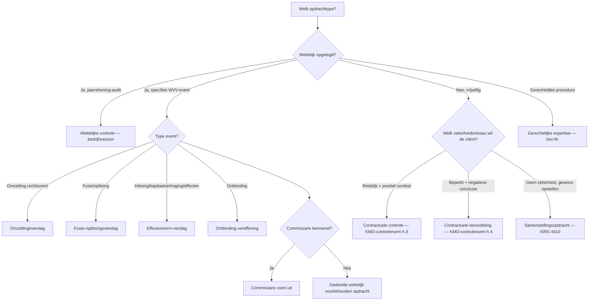
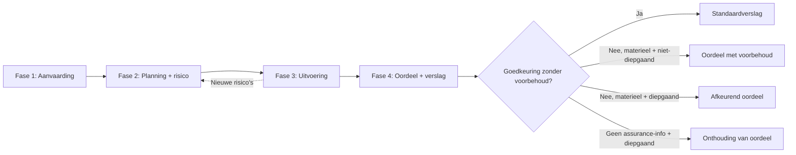

# PO 1.6 — Externe controle — Bedrijfsrevisor / Gecertificeerd accountant

> **Lees mij eerst:** dit document is een gestructureerd bundle van ALLE leermateriaal voor het programmaonderdeel "Externe controle — Bedrijfsrevisor / Gecertificeerd accountant" van het ITAA-bekwaamheidsexamen Gecertificeerd Accountant. Het bevat: (1) een didactische minicursus die je door het hele PO leidt, (2) 10 procedure-fiches die elk een concrete vaardigheid beschrijven ("hoe doe je X?"), en (3) 92 concept-fiches die elk een sleutel-begrip definiëren met bouwstenen, valkuilen en bronnen.
> 
> **Conventies in dit bundle:**
> - ⚖️ = directe wettelijke grondslag (WVV, KB WVV, CBN-advies, ITAA-norm, ISA, IFRS)
> - 🤖 = afgeleid of pedagogisch toegevoegd (geen letterlijke bron-citaat)
> - `[[concept-naam]]` = verwijzing naar een concept-fiche later in dit document
> - `[[competenties/naam]]` = verwijzing naar een competentie-fiche later in dit document
> 
> **Anti-fabricatie-regel voor afgeleide producten** (podcast / mindmap / slides / infographic / quiz): gebruik UITSLUITEND inhoud die in dit document staat. Geen externe bronnen, geen aanvullingen uit andere wetgevingen, geen verzonnen voorbeelden. Bij twijfel: zeg "dit staat niet in het bundle".


---

# Deel I — Minicursus

*De minicursus is de primaire leidraad. Lees ze in de aangeboden volgorde; gebruik de competentie- en concept-fiches in Deel II en III als verdieping wanneer iets onduidelijk blijft.*

### Wat verwacht het examen van jou?

> [!abstract] Dit programmaonderdeel wordt getoetst op niveau *integratie*.
> Je moet meerdere concepten samen kunnen inzetten in complexe casussen — onderdelen herkennen, prioriteren, en tot een coherent oordeel komen.


**Taken** (uit het ITAA-examenprogramma):

> [!abstract]- **Taak 1** — Opstellen van specifieke verslagen en analyses voor de externe en interne verslaglegging, met inbegrip van juridische en contractuele opdrachten
>
> **Subtaken**:
> - privé-expertise op het gebied van bedrijfsboekhouding
> - gerechtelijke expertise op het gebied van bedrijfsboekhouding
> - opstellen van verslagen die leiden tot een attestering of een expertiseverslag bestemd om aan derden te worden afgegeven
>
> **Doelstellingen**:
> - Opstellen van specifieke verslagen en analyses voor de externe en interne verslaglegging, met inbegrip van het uitvoeren van wettelijke en contractuele opdrachten


### Leesgids

Deze minicursus volgt de logica van een opdracht: eerst opdrachttype + wettelijk kader, dan de vier fasen van de [[auditcyclus-fasen-synthese|auditcyclus]] van aanvaarding tot verslag, tot slot deontologie, antiwitwas en communicatie. De twee vroege synthesetabellen — [[opdrachttypes-zekerheidsniveaus-synthese|opdrachttypes]] en fasen — zijn je mentale kapstok. Competentie-secties leggen procedure vast; thematische secties leveren de begripsbouwstenen.

### Waarom dit programmaonderdeel telt

Externe controle is het paradepaardje van de assurance-keten: een derde verschaft gebruikers van de jaarrekening een onderbouwd oordeel. Op integratieniveau moet je in een complexe casus opdrachtsoort kiezen, risico's calibreren, instrumenten inzetten en uit de [[assurance-informatie|evidence]] een coherent oordeel destilleren. Twee pijlers dragen alles: het [[auditrisicomodel|auditrisicomodel]] bepaalt hoeveel werk nodig is, [[onafhankelijkheid-externe-accountant|onafhankelijkheid]] en [[professioneel-kritische-instelling|professioneel-kritische instelling]] bepalen of dat werk geloofwaardig is. Een GA beweegt zich in dezelfde normenruimte als de [[bedrijfsrevisor|bedrijfsrevisor]] — alleen het commissarismandaat blijft exclusief voor laatstgenoemde.

### Waarom externe controle? Stakeholders, vertrouwen en de assurance-keten

De financiële overzichten worden opgesteld door precies die partij over wiens prestaties ze rapporteren. Een onafhankelijke beroepsbeoefenaar die [[redelijke-mate-van-zekerheid|redelijke]] of [[beperkte-mate-van-zekerheid|beperkte zekerheid]] verschaft, doorbreekt die informatie-asymmetrie. Het zekerheidsniveau dat je levert, bepaalt de vorm van je oordeel — niet andersom.

### Wettelijk kader en normenhiërarchie: Wet ITAA, KB plichtenleer, ITAA-normen, ISA en IESBA

> [!info] Hoort bij taak: Opstellen van specifieke verslagen en analyses voor de externe en interne verslaglegging, met inbegrip van juridische en…

Het normenstelsel werkt in lagen: wet en KB plichtenleer als basis, daarop de ITAA-normen — [[algemene-controlenorm-accountant|algemene controlenorm]] én [[kmo-controlenorm-accountant|KMO-controlenorm]] — en de [[iesba-code-of-ethics|IESBA-code]] als ethische bovenbouw. Voor het commissarismandaat schakelt het veld over naar de ISA-set; voor KMO-werk blijft de KMO-controlenorm het anker. In een casus moet je bepalen welke norm dwingend is en welke aanvullend.

- [[algemene-controlenorm-accountant|Algemene controlenorm voor de externe accountant]] · `cluster`
- [[kmo-controlenorm-accountant|KMO-controlenorm voor de externe accountant]] · `cluster`
- [[iesba-code-of-ethics|IESBA International Code of Ethics for Professional Accountants]] · `autoriteit`
- [[wettelijke-controleopdracht-commissaris|Wettelijke controleopdracht (commissaris-mandaat)]] · `begrip`
- [[contractuele-controleopdracht|Contractuele controleopdracht]] · `begrip`
- [[contractuele-beoordelingsopdracht|Contractuele beoordelingsopdracht]] · `begrip`

### Actoren in de externe controle: wie mag wat?

> [!info] Hoort bij taak: Opstellen van specifieke verslagen en analyses voor de externe en interne verslaglegging, met inbegrip van juridische en…

De [[bedrijfsrevisor|bedrijfsrevisor]] heeft het monopolie op de wettelijke jaarrekeningcontrole; [[gecertificeerd-accountant-ga|GA]] en revisor delen daarnaast een aantal door wet voorbehouden opdrachten ([[gedeelde-wettelijk-voorbehouden-opdracht|gedeeld monopolie]]). De [[met-governance-belaste-personen|met governance belaste personen]] zijn aan cliëntzijde de formele tegenpartij; grootte-classificatie ([[kleine-vennootschap|klein]] tot [[public-interest-entity|PIE]]) bepaalt welke regels strenger of soepeler zijn.

- [[bedrijfsrevisor|Bedrijfsrevisor]] · `autoriteit`
- [[gecertificeerd-accountant-ga|Gecertificeerd accountant (GA)]] · `autoriteit`
- [[gedeelde-wettelijk-voorbehouden-opdracht|Gedeelde wettelijk voorbehouden opdracht]] · `begrip`
- [[met-governance-belaste-personen|Met governance belaste personen]] · `autoriteit`
- [[kleine-vennootschap|Kleine vennootschap (WVV art. 1:24)]] · `begrip`
- [[public-interest-entity|Public Interest Entity (PIE)]] · `begrip`

### Opdrachttypes en zekerheidsniveaus vergeleken

Deze synthese vergelijkt de negen mogelijke opdrachttypes voor een GA of bedrijfsrevisor op één matrix: van geen zekerheid (samenstelling) tot redelijke zekerheid (controle), plus de WVV-event-opdrachten (fusie, splitsing, omzetting, effecten, ontbinding) en de gerechtelijke/private expertise. De keuze tussen de types is GEEN cliëntvoorkeur — ze wordt bepaald door (1) wettelijke verplichting + type event, (2) cliëntbehoefte, en (3) toepasselijke norm. Het verschil tussen positief oordeel en negatieve conclusie vloeit voort uit het zekerheidsniveau.


In een casus is het type bepalen altijd je eerste zet: pas dan ligt vast welke norm geldt en welk soort uitspraak je doet. Lees de matrix verticaal — zekerheidsniveau naar oordeelsvorm — en horizontaal — trigger naar toepasselijke norm.

| Opdrachttype | Zekerheidsniveau | Oordeel/Conclusie-vorm | Toepasselijke norm | Wie kan uitvoeren? | Typische triggerwoorden |
|---|---|---|---|---|---|
| Wettelijke controle (commissaris) | Redelijke zekerheid | Positief oordeel ('getrouw beeld') | ISA + Wet 7 december 2016 | Bedrijfsrevisor (commissaris) | 'wettelijke controle jaarrekening', 'commissaris' |
| Contractuele controle | Redelijke zekerheid | Positief oordeel | ITAA KMO-controlenorm h.3 | GA of bedrijfsrevisor | 'controle van de jaarrekening', 'getrouw beeld' |
| Contractuele beoordeling (review) | Beperkte zekerheid | Negatieve conclusie ('geen aanwijzingen') | ITAA KMO-controlenorm h.4 / ISRE 2400 | GA of bedrijfsrevisor | 'beperkte controle', 'beperkt nazicht', 'review' |
| Samenstellingsopdracht | GEEN zekerheid | Geen oordeel/conclusie | ITAA-norm Samenstelling (ISRS 4410) | GA of bedrijfsrevisor | 'opmaken jaarrekening', 'samenstelling' |
| Fusie-/splitsingsverslag | Specifiek (redelijkheid ruilverhouding) | Verklaring over redelijkheid van ruilverhouding | ITAA-norm Fusie en splitsing + WVV art. 12:25 e.v. | GA of bedrijfsrevisor (commissaris als die er is) | 'fusie', 'splitsing', 'ruilverhouding aandelen' |
| Omzettingsverslag | Beperkte zekerheid | Negatieve conclusie over of nettoactief overgewaardeerd is | ITAA-norm Omzetting + WVV Boek 14 | GA of bedrijfsrevisor | 'omzetting rechtsvorm', 'BV wordt NV' |
| Effectennorm-verslag | Beperkte zekerheid | Negatieve conclusie over getrouw en voldoende zijn financiële gegevens | ITAA-norm Effectennorm + WVV art. 5:121, 7:179, 7:191 | GA of bedrijfsrevisor | 'kapitaalverhoging', 'opheffing voorkeurrecht', 'converteerbare obligaties' |
| Ontbinding-vereffening | Beperkte zekerheid | Conclusie over staat van actief/passief | ITAA-norm Ontbinding-vereffening + WVV art. 2:71 e.v. | GA of bedrijfsrevisor | 'ontbinding', 'vereffening', 'staat van actief en passief' |
| Gerechtelijke/private expertise | n.v.t. (geen assurance, wel gemotiveerd verslag) | Boekhoudkundige analyse + besluit | Wet ITAA 2019 art. 3, 6° + Ger.W. art. 962 e.v. | GA (gerechtsdeskundige of privé) | 'gerechtsdeskundige', 'expertise', 'rechter benoemt' |



**Kerninzichten**:

- Het zekerheidsniveau (geen / beperkt / redelijk) bepaalt de vorm van het oordeel (geen / negatief / positief), niet andersom.
- GA en bedrijfsrevisor zijn dragers van ALLE niveaus behalve het commissarismandaat — dat is exclusief revisor.
- Bij voorbehouden opdrachten (WVV-events) vervalt het 'gedeelde' karakter zodra er een commissaris is — die voert ze uit.

_Bouwt op_: [[contractuele-controleopdracht]] · [[contractuele-beoordelingsopdracht]] · [[samenstellingsopdracht]] · [[wettelijke-controleopdracht-commissaris]] · [[redelijke-mate-van-zekerheid]] · [[beperkte-mate-van-zekerheid]] · [[fusie-splitsing-controleopdracht]] · [[omzetting-vennootschap-opdracht]] · [[effectennorm-opdracht]] · [[ontbinding-vereffening-opdracht]] · [[gerechtelijke-en-private-expertise]]
### Zekerheidsniveaus en alternatieve opdrachttypes: review en samenstelling

> [!info] Hoort bij taak: Opstellen van specifieke verslagen en analyses voor de externe en interne verslaglegging, met inbegrip van juridische en…

Niet elke cliënt vraagt om de volle [[redelijke-mate-van-zekerheid|redelijke zekerheid]]. Een [[contractuele-beoordelingsopdracht|beoordelingsopdracht]] geeft [[beperkte-mate-van-zekerheid|beperkte zekerheid]] met negatieve conclusie; een [[samenstellingsopdracht|samenstellingsopdracht]] verschaft geen zekerheid. Het [[beoordelingsverslag-elementen|beoordelingsverslag]] heeft bovendien een eigen rubrieken-stramien.

- [[redelijke-mate-van-zekerheid|Redelijke mate van zekerheid]] · `begrip`
- [[beperkte-mate-van-zekerheid|Beperkte mate van zekerheid]] · `begrip`
- [[samenstellingsopdracht|Samenstellingsopdracht]] · `cluster`
- [[beoordelingsverslag-elementen|Elementen van het beoordelingsverslag (review report)]] · `procedure`

### Bijzondere wettelijk voorbehouden opdrachten

> [!info] Hoort bij taak: Opstellen van specifieke verslagen en analyses voor de externe en interne verslaglegging, met inbegrip van juridische en…

Bepaalde vennootschapsrechtelijke events triggeren een eigen voorbehouden opdracht: [[fusie-splitsing-controleopdracht|fusie of splitsing]], [[omzetting-vennootschap-opdracht|omzetting]], [[effectennorm-opdracht|effectenverrichting]], [[ontbinding-vereffening-opdracht|ontbinding-vereffening]]. [[gerechtelijke-en-private-expertise|Gerechtelijke en private expertise]] is voorbehouden aan de GA; de [[wettelijke-verklaring-gecertificeerd-accountant|wettelijke verklaring]] is het generieke vehikel voor GA-conclusies bij specifieke wettelijke triggers.

- [[ontbinding-vereffening-opdracht|Ontbinding-vereffening opdracht van de gecertificeerd accountant]] · `cluster`
- [[fusie-splitsing-controleopdracht|Verslag bij fusie of splitsing van vennootschappen]] · `cluster`
- [[omzetting-vennootschap-opdracht|Verslag bij omzetting van een vennootschap]] · `cluster`
- [[effectennorm-opdracht|Verslag bij effectenverrichting (effectennorm)]] · `cluster`
- [[gerechtelijke-en-private-expertise|Gerechtelijke en private expertise door de gecertificeerd accountant]] · `begrip`
- [[wettelijke-verklaring-gecertificeerd-accountant|Wettelijke verklaring van de gecertificeerd accountant]] · `begrip`

### Aanvaarden van een audit-opdracht en opmaken van de opdrachtbrief

> [!info] Hoort bij taak: Opstellen van specifieke verslagen en analyses voor de externe en interne verslaglegging, met inbegrip van juridische en…

De aanvaardingsfase test [[randvoorwaarden-controle|randvoorwaarden]], [[onafhankelijkheid-externe-accountant|onafhankelijkheid]] en — bij overname — de [[opvolging-voorganger-accountant|opvolging van de voorganger]]; pas daarna giet je de afspraken in een [[opdrachtbrief-accountant|opdrachtbrief]]. Stap voor stap doorlopen, want examen-casussen toetsen graag op een ontbrekende voortoets.

[[competenties/aanvaarden-audit-opdracht|→ Volledige procedure]]

### Auditcyclus — vier fasen vergeleken

De auditcyclus structureert de hele externe-controleopdracht in vier opeenvolgende, deels iteratieve fasen: aanvaarding, planning en risico-inschatting, uitvoering, oordeel en verslag. Deze synthese vergelijkt per fase het doel, de kern-output en de norm-referentie zodat de stagiair een mentaal model heeft waarop alle specifieke records (planning, werkprogramma, gegevensgerichte werkzaamheden, oordeelstypes, verslag-elementen) gehangen worden.


Onthoud dat fase 3 terugkoppelt naar fase 2 zodra je tijdens uitvoering nieuwe risico's vindt — de cyclus is opeenvolgend maar niet star. Gebruik deze fasen-synthese als referentie wanneer een casus op één fase inzoomt.

| Fase | Doel | Kern-output | Norm-referentie |
|---|---|---|---|
| 1. Aanvaarding + opdrachtbrief | Scope vastleggen, randvoorwaarden checken, ethische voorschriften toetsen | Opdrachtbrief + acceptatie-memo | KMO-norm §2 + Norm Opdrachtbrief |
| 2. Planning + risico-inschatting | Strategie + werkprogramma opbouwen op basis van inzicht in cliënt + IC | Risk assessment memo + werkprogramma | KMO-norm §70-§77 |
| 3. Uitvoering + assurance-informatie | Test of controls + gegevensgerichte werkzaamheden uitvoeren, evidence verzamelen | Werkpapieren + getoetste populaties + bevindingen | KMO-norm §85-§115 |
| 4. Conclusie + verslag | Oordeel vormen, verslag schrijven, communicatie afsluiten | Controleverslag + management letter + management representation letter | KMO-norm §116-§120 + Algemene controlenorm §2 |



_Bouwt op_: [[auditplanning]] · [[auditstrategie]] · [[werkprogramma-audit]] · [[risico-inschatting-audit]] · [[gegevensgerichte-werkzaamheden]] · [[toetsing-interne-beheersing]] · [[controledocumentatie]] · [[controleoordeel-types]] · [[controleverslag-elementen]]
### Verwerven van kennis van de cliënt en zijn omgeving in een audit-opdracht

> [!info] Hoort bij taak: Opstellen van specifieke verslagen en analyses voor de externe en interne verslaglegging, met inbegrip van juridische en…

[[kennis-van-onderneming-omgeving|Kennis van de onderneming en haar omgeving]] is de fundering van de hele [[risico-inschatting-audit|risico-inschatting]]. Geleidelijk stap je van externe omgeving naar interne processen en markeer je verhoogde alertheid voor [[verbonden-partijen-audit|verbonden partijen]] of [[continuiteitsveronderstelling-audit|continuïteit]].

[[competenties/verwerven-kennis-van-clientonderneming-audit|→ Volledige procedure]]

### Uitvoeren van risico-inschatting en bepalen van het materieel belang in een audit

> [!info] Hoort bij taak: Opstellen van specifieke verslagen en analyses voor de externe en interne verslaglegging, met inbegrip van juridische en…

Het [[auditrisicomodel|auditrisicomodel]] dwingt je [[inherent-risico|inherent risico]] en [[intern-beheersingsrisico|beheersingsrisico]] te wegen om je [[ontdekkingsrisico|ontdekkingsrisico]] doelbewust te calibreren. Parallel bepaal je [[materieel-belang-audit|materieel belang]] op overall- en performance-niveau, met extra aandacht voor [[significant-risico-audit|significante risico's]]. Stap voor stap leg je risicomatrix per [[beweringen-audit|bewering]] vast — die calibratie stuurt al je controle-instrumenten.

[[competenties/uitvoeren-risico-inschatting-en-materialiteit-audit|→ Volledige procedure]]

### Fraude-risico in de audit: typologie, driehoek en risicofactoren

> [!info] Hoort bij taak: Opstellen van specifieke verslagen en analyses voor de externe en interne verslaglegging, met inbegrip van juridische en…

[[fraude-versus-fout|Fraude verschilt fundamenteel van fout]] door het opzettelijke karakter. De [[fraudedriehoek|fraude-driehoek]] (motief, gelegenheid, rationalisatie) geeft je het detectie-raamwerk; de [[fraudetypologie-acfe|ACFE-typologie]] structureert wat je tegenkomt en de [[frauderisicofactoren|ISA 240-risicofactoren]] zijn de signalen die je actief moet zoeken.

- [[fraude-versus-fout|Fraude versus fout — onderscheid in audit en interne controle]] · `synthese`
- [[fraudedriehoek|Fraude-driehoek (motief – gelegenheid – rationalisatie)]] · `begrip`
- [[frauderisicofactoren|Frauderisicofactoren (ISA 240)]] · `begrip`
- [[fraudetypologie-acfe|Fraudetypologie ACFE (drie hoofdtypen)]] · `begrip`

### Opstellen van de auditstrategie en het werkprogramma

> [!info] Hoort bij taak: Opstellen van specifieke verslagen en analyses voor de externe en interne verslaglegging, met inbegrip van juridische en…

Planning werkt op twee lagen: de [[auditstrategie|auditstrategie]] legt scope, timing en richting vast; het [[werkprogramma-audit|werkprogramma]] vertaalt dat per bewering naar concrete werkzaamheden. Vanuit risico-inschatting en materialiteit bouw je het stap voor stap op in het [[controledocumentatie|dossier]].

[[competenties/opstellen-auditstrategie-en-werkprogramma|→ Volledige procedure]]

### Controle-instrumenten en testing-soorten: het instrumentarium van de auditor

> [!info] Hoort bij taak: Opstellen van specifieke verslagen en analyses voor de externe en interne verslaglegging, met inbegrip van juridische en…

De auditor heeft een gesloten instrumentarium: [[toetsing-interne-beheersing|test of controls]], [[gegevensgerichte-werkzaamheden|gegevensgerichte werkzaamheden]], [[cijferanalyses-audit|cijferanalyses]], [[externe-bevestiging-audit|externe bevestigingen]], [[steekproef-audit|steekproeven]] en de [[schriftelijke-bevestiging-management|management representation letter]] aan het einde. Welke je inzet en hoe zwaar, hangt af van het risico per [[beweringen-audit|bewering]]; wat ze samen opleveren is je [[assurance-informatie|assurance-informatie]].

- [[assurance-informatie|Assurance-informatie (controle-informatie)]] · `begrip`
- [[toetsing-interne-beheersing|Toetsing van interne beheersing (test of controls)]] · `cluster`
- [[gegevensgerichte-werkzaamheden|Gegevensgerichte werkzaamheden (substantive procedures)]] · `cluster`
- [[cijferanalyses-audit|Cijferanalyses bij een audit]] · `cluster`
- [[externe-bevestiging-audit|Externe bevestiging (audit)]] · `cluster`
- [[steekproef-audit|Steekproef bij een audit (audit sampling)]] · `cluster`
- [[schriftelijke-bevestiging-management|Schriftelijke bevestiging van het management (management representation letter)]] · `begrip`
- [[beweringen-audit|Beweringen (assertions) in een audit]] · `begrip`

### Selecteren en uitvoeren van controle-instrumenten (test of controls + gegevensgerichte werkzaamheden)

> [!info] Hoort bij taak: Opstellen van specifieke verslagen en analyses voor de externe en interne verslaglegging, met inbegrip van juridische en…

Per [[beweringen-audit|bewering]] kies je een instrument-mix die je [[ontdekkingsrisico|ontdekkingsrisico]] tot een aanvaardbaar laag niveau terugbrengt. Bij hoog inherent risico of zwakke IC schuif je naar substantief; bij betrouwbare IC kan je deels op test of controls steunen.

[[competenties/selecteren-en-uitvoeren-controle-instrumenten-audit|→ Volledige procedure]]

### Bijzondere uitvoeringsthema's: schattingen, automatisering en het werk van interne auditors

> [!info] Hoort bij taak: Opstellen van specifieke verslagen en analyses voor de externe en interne verslaglegging, met inbegrip van juridische en…

Drie gebieden vergen specifieke aandacht: [[boekhoudkundige-schattingen-audit|boekhoudkundige schattingen]] (schattingsonzekerheid + assumpties toetsen), [[specifieke-kwesties-automatisering-audit|automatisering]] (risico verschuift naar IT-controles), en onder strikte voorwaarden [[gebruik-werk-interne-auditors-audit|steunen op het werk van interne auditors]].

- [[boekhoudkundige-schattingen-audit|Boekhoudkundige schattingen (audit-perspectief)]] · `begrip`
- [[specifieke-kwesties-automatisering-audit|Specifieke kwesties bij automatisering (audit-perspectief)]] · `begrip`
- [[gebruik-werk-interne-auditors-audit|Gebruikmaken van de werkzaamheden van interne auditors bij externe controle]] · `cluster`

### Documenteren van de revisiewerkzaamheden in het auditdossier

> [!info] Hoort bij taak: Opstellen van specifieke verslagen en analyses voor de externe en interne verslaglegging, met inbegrip van juridische en…

[[controledocumentatie|Controledocumentatie]] vraagt om een permanent dossier plus een lopend dossier per opdracht, met alle [[werkprogramma-audit|werkprogramma-stappen]], evidence en conclusies traceerbaar vastgelegd. Bewaarregels en samenstellingstermijn maken deel uit van de discipline.

[[competenties/documenteren-auditdossier|→ Volledige procedure]]

### Kwaliteitsbeheersing rond het auditdossier: kantoor, opdracht en review

> [!info] Hoort bij taak: Opstellen van specifieke verslagen en analyses voor de externe en interne verslaglegging, met inbegrip van juridische en…

Kwaliteit werkt op drie lagen: het [[intern-kwaliteitsmanagement-kantoor|kantoorbrede systeem]], de [[kwaliteitsbeheersing-opdrachtniveau|opdrachtbeheersing]] van de opdrachtpartner met [[delegatie-en-supervisie-audit|delegatie en supervisie]], en — voor risicovolle of PIE-opdrachten — een aparte [[opdrachtgerichte-kwaliteitsbeoordeling|EQR-review]]. Examenvragen testen vaak welke laag op welk niveau zit.

- [[controledocumentatie|Controledocumentatie / controledossier]] · `cluster`
- [[kwaliteitsbeheersing-opdrachtniveau|Kwaliteitsbeheersing op opdrachtniveau]] · `cluster`
- [[intern-kwaliteitsmanagement-kantoor|Intern kwaliteitsmanagement op kantoorniveau]] · `cluster`
- [[delegatie-en-supervisie-audit|Delegatie en supervisie binnen het auditteam]] · `cluster`
- [[opdrachtgerichte-kwaliteitsbeoordeling|Opdrachtgerichte kwaliteitsbeoordeling (EQR)]] · `cluster`

### Beoordelen van regelmatigheid, waarachtigheid en getrouw beeld van de jaarrekening

> [!info] Hoort bij taak: Opstellen van specifieke verslagen en analyses voor de externe en interne verslaglegging, met inbegrip van juridische en…

Het oordeel kent twee dimensies: [[regelmatigheid-jaarrekening-audit|regelmatigheid]] (conformiteit met het KB WVV-stelsel) en [[getrouw-beeld-controle|getrouw beeld]] — beide moeten kloppen. Daarbovenop houd je de [[continuiteitsveronderstelling-audit|continuïteitsveronderstelling]] tegen het licht en weeg je elke vaststelling tegen het [[materieel-belang-audit|materieel belang]].

[[competenties/beoordelen-getrouw-beeld-en-regelmatigheid|→ Volledige procedure]]

### Het oordeel: afwijkingen, materialiteit en KAM

> [!info] Hoort bij taak: Opstellen van specifieke verslagen en analyses voor de externe en interne verslaglegging, met inbegrip van juridische en…

De [[controleoordeel-types|oordeelsmatrix]] werkt op twee assen: bron (afwijking of scope-beperking) en intensiteit (geïsoleerd of diepgaand). Daaruit volgen de varianten van [[aangepast-oordeel|aangepast oordeel]]. Daarnaast bestaan [[paragraaf-ter-benadrukking|emphasis of matter]], [[paragraaf-overige-aangelegenheden|other matter]] en — bij beursvennootschappen — [[kernpunten-van-controle|KAM]].

- [[afwijking-van-materieel-belang|Afwijking van materieel belang]] · `begrip`
- [[controleoordeel-types|Types van controleoordeel]] · `cluster`
- [[aangepast-oordeel|Aangepast oordeel (modified opinion)]] · `begrip`
- [[paragraaf-ter-benadrukking|Paragraaf ter benadrukking van bepaalde aangelegenheden]] · `begrip`
- [[paragraaf-overige-aangelegenheden|Paragraaf inzake overige aangelegenheden]] · `begrip`
- [[kernpunten-van-controle|Kernpunten van de controle (KAM)]] · `begrip`

### Opstellen van het controleverslag en formuleren van het oordeel

> [!info] Hoort bij taak: Opstellen van specifieke verslagen en analyses voor de externe en interne verslaglegging, met inbegrip van juridische en…

Het [[controleverslag-elementen|controleverslag]] kent dwingende rubrieken in vaste volgorde; de oordeelskeuze volgt strikt uit materialiteit en pervasiviteit. In een casus bouw je geleidelijk je oordeel op uit alle ongecorrigeerde afwijkingen en scope-beperkingen, en pas dan formuleer je verslag-tekst die er exact bij past.

[[competenties/opstellen-controleverslag-en-formuleren-oordeel|→ Volledige procedure]]

### Communiceren met audit-comité en bestuur over auditbevindingen

> [!info] Hoort bij taak: Opstellen van specifieke verslagen en analyses voor de externe en interne verslaglegging, met inbegrip van juridische en…

De auditor moet weten wie [[met-governance-belaste-personen|met governance belast]] is en daar strategische bevindingen aan rapporteren — onderscheiden van de operationele lijn met management. Eerste vraag in een casus: aan wie wat, in welk medium, op welk moment?

[[competenties/communiceren-met-bestuur-en-auditcomite|→ Volledige procedure]]

### Communicatie met management, governance en de brug naar interne controle (PO 1.7)

> [!info] Hoort bij taak: Opstellen van specifieke verslagen en analyses voor de externe en interne verslaglegging, met inbegrip van juridische en…

Naast het hoofdoordeel lopen er twee permanente kanalen mee: [[communicatie-met-management-governance|communicatie met management en governance]] over operationele én strategische aangelegenheden, en de specifieke plicht om [[communicatie-tekortkomingen-interne-beheersing|tekortkomingen in de interne beheersing]] gestructureerd te rapporteren — meteen de brug naar PO 1.7.

- [[communicatie-met-management-governance|Communicatie met management en met governance belaste personen]] · `cluster`
- [[communicatie-tekortkomingen-interne-beheersing|Communicatie van tekortkomingen in de interne beheersing]] · `cluster`

### Toepassen van professional skepticism en deontologische normen tijdens de audit

> [!info] Hoort bij taak: Opstellen van specifieke verslagen en analyses voor de externe en interne verslaglegging, met inbegrip van juridische en…

[[professioneel-kritische-instelling|Professioneel-kritische instelling]] en [[professionele-oordeelsvorming|oordeelsvorming]] kleuren elke werkwijze tijdens de opdracht; geen aparte stap, maar continue alertheid. Bewaak [[onafhankelijkheid-externe-accountant|onafhankelijkheid]], vermijd [[belangenconflict-accountant|belangenconflicten]] en respecteer het [[beroepsgeheim-accountant|beroepsgeheim]].

[[competenties/toepassen-professional-skepticism-en-deontologie-audit|→ Volledige procedure]]

### Antiwitwas- en tuchtrechtelijk kader rond de externe controle

> [!info] Hoort bij taak: Opstellen van specifieke verslagen en analyses voor de externe en interne verslaglegging, met inbegrip van juridische en…

Rond de audit hangt een handhavingskader: de [[antiwitwasmeldingsplicht-accountant|antiwitwasmeldingsplicht]] doorbreekt bij vermoedens van witwassen het beroepsgeheim. De [[tuchtrechtelijke-aansprakelijkheid-accountant|tuchtrechtelijke aansprakelijkheid]] loopt langs de ITAA-tuchtcommissies; de [[beroepsaansprakelijkheid-accountant|beroepsaansprakelijkheid]] langs het gemeen recht.

- [[antiwitwasmeldingsplicht-accountant|Antiwitwasmeldingsplicht voor de accountant]] · `cluster`
- [[tuchtrechtelijke-aansprakelijkheid-accountant|Tuchtrechtelijke aansprakelijkheid van de accountant]] · `regel`
- [[beroepsaansprakelijkheid-accountant|Beroepsaansprakelijkheid van de accountant]] · `regel`

### Reflectie: kwaliteitscontrole, beroepsaansprakelijkheid en het levende beroep

Externe controle is geen statisch boekje regels maar een levend beroep waar elke opdracht regels, oordeel en houding in elkaar schuift. Kwaliteitslagen, tucht en aansprakelijkheid houden het eerlijk; de geloofwaardigheid hangt af van wat jij doet met je [[professioneel-kritische-instelling|kritische instelling]] en [[onafhankelijkheid-externe-accountant|onafhankelijkheid]].


### Synthese-stappenplan

Een end-to-end audit-opdracht doorloop je zo. Eerst bepaal je het [[opdrachttypes-zekerheidsniveaus-synthese|opdrachttype]] — daaruit volgen norm en zekerheidsniveau. Vervolgens toets je [[randvoorwaarden-controle|randvoorwaarden]], [[onafhankelijkheid-externe-accountant|onafhankelijkheid]] en eventuele [[opvolging-voorganger-accountant|opvolging]], en giet je de afspraken in een [[opdrachtbrief-accountant|opdrachtbrief]]. Je verwerft [[kennis-van-onderneming-omgeving|kennis van de cliënt]] en voert een [[risico-inschatting-audit|risico-inschatting]] uit met vastlegging van [[materieel-belang-audit|materieel belang]] en [[significant-risico-audit|significante risico's]]. Op die basis bouw je [[auditstrategie|auditstrategie]] en [[werkprogramma-audit|werkprogramma]]. In de uitvoering combineer je [[toetsing-interne-beheersing|test of controls]] en [[gegevensgerichte-werkzaamheden|gegevensgerichte werkzaamheden]] per [[beweringen-audit|bewering]], onderbouwd met [[externe-bevestiging-audit|externe bevestigingen]], [[cijferanalyses-audit|cijferanalyses]] en [[steekproef-audit|steekproeven]]; aan het einde vraag je een [[schriftelijke-bevestiging-management|management representation letter]] en evalueer je [[continuiteitsveronderstelling-audit|continuïteit]]. Tot slot weeg je [[regelmatigheid-jaarrekening-audit|regelmatigheid]] en [[getrouw-beeld-controle|getrouw beeld]] tegen het materieel belang om uit de [[controleoordeel-types|oordeelsmatrix]] te kiezen, schrijf je het [[controleverslag-elementen|controleverslag]] en sluit je het [[controledocumentatie|dossier]] tijdig af.

### Cheatsheet

#### Kritische drempelwaarden

| Concept | Naam | Waarde | Eenheid | Gevolg |
|---|---|---|---|---|
| [[controledocumentatie]] | Minimumbewaartermijn werkdocumenten — algemene controlenorm | 10 jaar | jaren vanaf datum verslag | Werkdocumenten moeten minstens 10 jaar bewaard worden onder de Algemene Controlenorm §3 |
| [[controledocumentatie]] | Minimumbewaartermijn dossier — KMO-controlenorm | 5 jaar | jaren vanaf ondertekening verslag | Onder de KMO-controlenorm bedraagt de bewaarperiode minimaal 5 jaar (§49) |
| [[controledocumentatie]] | Termijn samenstelling definitief controledossier | 60 dagen | dagen na datum controleverslag | ISA 230 §14 + ISQM 1 vragen tijdige samenstelling van het definitieve dossier; de gangbare termijn die ISQM 1 als richtl… |

#### Vergelijkingsparen-matrix

| Concept | Verwarrend met | Trigger |
|---|---|---|
| [[afwijking-van-materieel-belang]] | [[materieel-belang-audit]] | Examenvraag: 'de auditor stelt 5% × winst voor belasting voorop' → materieel belang (drempel). 'De auditor stelt een overwaardering van € 280.000 vast' → afwijking van materieel belang. |
| [[algemene-controlenorm-accountant]] | [[kmo-controlenorm-accountant]] | Examenvraag: 'welke norm regelt een contractuele audit bij een KMO?' → KMO-controlenorm. 'Welke norm regelt de algemene plichten van de accountant bij elke controle?' → Algemene controlenorm. |
| [[antiwitwasmeldingsplicht-accountant]] | [[beroepsgeheim-accountant]] | Examenscenario 'accountant ontdekt vermoeden van witwassen' → meldingsplicht wint van beroepsgeheim. Maar bij 'accountant vermoedt fiscale fraude zonder witwas-element' → beroepsgeheim blijft, geen CFI-melding. |
| [[bedrijfsrevisor]] | [[gecertificeerd-accountant-ga]] | Examenvraag: 'wettelijke controle van de jaarrekening' → enkel bedrijfsrevisor. 'Inbreng in natura, geen commissaris' → beide kunnen. |
| [[beoordelingsverslag-elementen]] | [[controleverslag-elementen]] | Examen-zin: type opdracht = controle → controleverslag. Type = beoordeling/review → beoordelingsverslag. |
| [[beroepsaansprakelijkheid-accountant]] | [[tuchtrechtelijke-aansprakelijkheid-accountant]] | Examen-zin 'schadevergoeding' → civielrechtelijk (art. 44 Wet ITAA). 'Schorsing' / 'schrapping' → tuchtrechtelijk (ITAA-tuchtcommissie). |
| [[communicatie-tekortkomingen-interne-beheersing]] | [[evaluatie-interne-controle]] | Vraag 'hoe beoordeel je IC?' → evaluatie-interne-controle. Vraag 'wat doe je met een gevonden tekortkoming?' → ISA 265. |
| [[contractuele-beoordelingsopdracht]] | [[contractuele-controleopdracht]] | Examenwoord 'controle' / 'audit' / 'getrouw beeld' → controle. Woord 'beoordeling' / 'review' / 'beperkt nazicht' → beoordeling. |
| [[contractuele-beoordelingsopdracht]] | [[samenstellingsopdracht]] | Geeft de beroepsbeoefenaar zekerheid (zelfs beperkt)? Ja → beoordeling. Nee, hij helpt enkel opstellen? → samenstelling. |
| [[contractuele-controleopdracht]] | [[wettelijke-controleopdracht-commissaris]] | Examenvraag: 'is een commissaris benoemd?' Zo nee + audit gevraagd → contractuele controle (KMO-controlenorm). Zo ja → wettelijke controle (ISA + bedrijfsrevisor). |
| [[contractuele-controleopdracht]] | [[contractuele-beoordelingsopdracht]] | Examen-keuze: zoekt de cliënt 'audit'/'controle' → controleopdracht; zoekt hij 'review'/'beperkte controle'/'beperkt nazicht' → beoordelingsopdracht. |
| [[controleoordeel-types]] | [[controleoordeel-types]] | Examenvraag: ‘systematische overwaardering van voorraden die balans en resultaat omslaat’ → afkeurend. ‘één deelneming € 250.000 te hoog gewaardeerd’ → oordeel met voorbehoud. |
| [[controleoordeel-types]] | [[controleoordeel-types]] | Examenvraag: ‘klant weigert openingsbalans + alle aankoopfacturen H1’ → oordeelonthouding. ‘inventarisatie van één magazijn niet bijwoonbaar, alternatieve procedures slagen niet’ → oordeel met voorbehoud. |
| [[fraude-versus-fout]] | [[afwijking-van-materieel-belang]] | Examen-zin met 'opzettelijk' / 'om te misleiden' → fraude. 'Vergissing' / 'verkeerde inschatting' → fout. |
| [[fraude-versus-fout]] | [[verspilling]] | Examen-zin met 'inefficiënt' / 'idle capacity' / 'overstock' zonder boekhoudfout → verspilling. |
| [[fusie-splitsing-controleopdracht]] | [[omzetting-vennootschap-opdracht]] | Examenvraag: 'twee vennootschappen worden één' / 'splitsing in twee NV's' → fusie-/splitsingsverslag. 'BV wordt NV' / 'verandering rechtsvorm' → omzettingsverslag. |
| [[gebruik-werk-interne-auditors-audit]] | [[interne-audit]] | Vraag 'wat doet interne audit?' → record 'interne-audit'. Vraag 'mag externe auditor steunen op interne audit?' → dit record. |
| [[gegevensgerichte-werkzaamheden]] | [[toetsing-interne-beheersing]] | Hoog inherent risico en/of geen vertrouwen in IC → vooral gegevensgericht. Goede IC + intentie tot steunen → mix met toetsing IC. |
| [[gerechtelijke-en-private-expertise]] | [[contractuele-controleopdracht]] | Examenvraag: 'is er een rechter of een geschil?' → expertise. 'is er een audit van de jaarrekening gevraagd?' → controle. |
| [[iesba-code-of-ethics]] | [[onafhankelijkheid-externe-accountant]] | Belgisch examen → KB plichtenleer of ITAA-norm citeren. Internationale context of conceptuele vraag → IESBA. Vaak werken beide samen: 'volgens de IESBA-code en de Belgische omzetting...'. |
| [[iesba-code-of-ethics]] | [[beroepsgeheim-accountant]] | Internationaal/conceptueel → IESBA vertrouwelijkheid. Concreet Belgisch geval met sanctie-vraag → beroepsgeheim accountant. |
| [[inherent-risico]] | [[intern-beheersingsrisico]] | Examen: praat de opgave over de complexiteit van de transacties zelf → inherent risico. Praat ze over zwakheden in de interne controleprocessen → intern beheersingsrisico. |
| [[intern-kwaliteitsmanagement-kantoor]] | [[kwaliteitsbeheersing-opdrachtniveau]] | Vraag focust op één specifieke audit-opdracht en de review erop → ISA 220. Vraag focust op kantoor-procedures, beleid, monitoring over alle opdrachten heen → ISQM 1 / ITAA-norm IKM. |
| [[kernpunten-van-controle]] | [[paragraaf-ter-benadrukking]] | Examenvraag: 'aangelegenheid waar de auditor veel werk in heeft gestoken' → KAM. 'De auditor wijst de lezer op een belangrijke toelichting in de jaarrekening' → emphasis of matter. |
| [[kleine-vennootschap]] | [[microvennootschap]] | Examen: omzet € 500K → check micro-drempels eerst; als ook personeel ≤ 10 én balans ≤ € 450K én niet moeder/dochter → micro. Zo niet → klein. |
| [[kleine-vennootschap]] | [[grote-vennootschap-wvv]] | Examen: omzet € 15M, personeel 80, balans € 8M → overschrijdt 3 drempels → groot. Verkort niet meer toegestaan, commissaris verplicht. |
| [[omzetting-vennootschap-opdracht]] | [[ontbinding-vereffening-opdracht]] | Examen-keuze: 'verandert de rechtsvorm?' → omzettingsverslag. 'wordt de vennootschap stopgezet?' → ontbinding-vereffening. |
| [[opdrachtbrief-accountant]] | [[wettelijke-controleopdracht-commissaris]] | Examenvraag: 'wat regelt de relatie tussen accountant en cliënt?' → contractueel = opdrachtbrief, wettelijke controle = benoemingsbesluit AV. |
| [[opdrachtgerichte-kwaliteitsbeoordeling]] | [[]] | Examenvraag-formulering 'wie reviewt wat'. |
| [[paragraaf-overige-aangelegenheden]] | [[paragraaf-ter-benadrukking]] | Examen: 'vergelijkende cijfers door andere auditor gecontroleerd' → other matter (info niet in jaarrekening). 'Belangrijke toelichting bij continuïteit' → emphasis of matter (info in jaarrekening). |
| [[paragraaf-overige-aangelegenheden]] | [[kernpunten-van-controle]] | Examen: 'vorige auditor controleerde 2024-cijfers' → other matter. 'Complexe schatting van garantieprovision € 1,2M' → KAM. |
| [[paragraaf-ter-benadrukking]] | [[paragraaf-overige-aangelegenheden]] | Examen: 'toelichting in jaarrekening wijst op X' → benadrukking. 'Niet in jaarrekening, wel in verslag wegens audit-context' → overige. |
| [[paragraaf-ter-benadrukking]] | [[aangepast-oordeel]] | Is er een materiële afwijking of scope-beperking? Ja → aangepast oordeel. Nee, maar wel belangrijk gevolg dat correct in jaarrekening staat → paragraaf ter benadrukking. |
| [[paragraaf-ter-benadrukking]] | [[kernpunten-van-controle]] | Examen: 'wijs op de toelichting bij de aanvallende rechtszaak (€ 5M) in de jaarrekening' → emphasis. 'Beschrijf hoe de auditor de complexe schatting van de garantieprovision heeft aangepakt' → KAM. |
| [[professioneel-kritische-instelling]] | [[professionele-oordeelsvorming]] | Examenvraag: 'De auditor twijfelt aan de waardering van een schatting' → skepticism (kritisch onderzoeken). 'De norm geeft geen keuze; de auditor moet zelf beslissen welke werkwijze passend is' → judgment. |
| [[professionele-oordeelsvorming]] | [[professioneel-kritische-instelling]] | Examenvraag: 'De norm laat de keuze tussen interne of externe deskundige open' → judgment. 'De CFO bevestigt mondeling dat alles klopt — wat doet de auditor?' → skepticism. |
| [[public-interest-entity]] | [[groottecriteria-jaarrekening]] | Vraag 'verkort schema toegestaan?' → eerst PIE-test (zo ja: nooit verkort) → dan groottetest. |
| [[redelijke-mate-van-zekerheid]] | [[beperkte-mate-van-zekerheid]] | Examen-zin met positieve uitspraak → redelijke zekerheid. Negatieve uitspraak ('niet gebleken') → beperkte zekerheid. |
| [[regelmatigheid-jaarrekening-audit]] | [[getrouw-beeld-controle]] | Examen-zin: 'overeenstemming met KB WVV-schema' → regelmatigheid. 'Vermogen, financiële toestand en resultaat correct weergegeven' → getrouw beeld. |
| [[samenstellingsopdracht]] | [[contractuele-beoordelingsopdracht]] | Examenvraag: 'wordt zekerheid verschaft over de jaarrekening?' Nee → samenstelling. Ja, beperkt → beoordeling. Ja, redelijk → controle. |
| [[wettelijke-controleopdracht-commissaris]] | [[contractuele-controleopdracht]] | Examenvraag: 'is een commissaris benoemd?' Ja → wettelijke controle. Nee → contractuele controle als de cliënt het vraagt. |
| [[wettelijke-verklaring-gecertificeerd-accountant]] | [[wettelijke-controleopdracht-commissaris]] | Examenvraag: 'jaarrekening grote NV, commissaris benoemd' → commissarisverslag van bedrijfsrevisor. 'Inbreng in natura zonder commissaris' → wettelijke verklaring van GA of bedrijfsrevisor naar keuze. 'Beoordelingsverslag effectenuitgifte' → wettelijke verklaring van GA of bedrijfsrevisor. |


### Heb je deze taken in de vingers?

Loop deze taken na vóór je verder gaat met examenfocus. Twijfel je bij een taak? Lees de aangegeven secties nog eens.

- ✓ **1.6.taak.1** — Opstellen van specifieke verslagen en analyses voor de externe en interne verslaglegging, met inbegrip van juridische en… _Behandeld in §5, §6, §7, §8, §9, §10, §11, §12, §13, §14, §15, §16, §17, §18, §19, §20, §21, §22, §23, §24, §25, §26, §27._

### Examenfocus

Examenvragen toetsen typisch type, risico, instrument en oordeel samen in één casus. Let extra op de schijngelijkenissen [[contractuele-controleopdracht|controle]] versus [[contractuele-beoordelingsopdracht|beoordeling]], [[inherent-risico|inherent]] versus [[intern-beheersingsrisico|beheersingsrisico]], en tussen de oordeelsvarianten.

#### Externe controle / accountantsonderzoek 📃

> [!question]- ITAA 2024-1 vraag 2.A · open (tier A)
> Stellingen juist of fout ivm onafhankelijkheid bij controle opdracht

> [!question]- ITAA 2024-1 vraag 2.B · open (tier A)
> Na acceptatie van de opdracht -> voldoende kennis verwerven, op welke wijze?

> [!question]- ITAA 2024-1 vraag 2.C · open (tier A)
> Volkomen controle volgens revisienormen

> [!question]- ITAA 2024-1 vraag 2.D · open (tier A)
> 4 algemene stellingen juist of fout

> [!question]- ITAA 2024-1 vraag 2.E · meerkeuze (tier A)
> Bij een accountantsonderzoek wordt de materialiteitsdrempel:
>
> - Vastgesteld bij KB
> - Door aandeelhouders van de vennootschap vastgesteld
> - Bepaald op basis van omzet van de 2 laatste jaren
> - Bepaald naargelang inherente risico’s + interne controle van de cliënt


#### Accountantsonderzoek 📃

> [!question]- ITAA 2014-1 vraag 1 (tier B)
> Vraag 1 … / 8 punten Er worden onvoldoende antwoorden ontvangen op de confirmatie- of bevestigingsbrieven welke verzonden werden aan de klanten.
> 
> a) Moeten we daarvoor een voorbehoud in ons verslag maken ?
> 
> Antwoord
> 
> b) Welke acties kan men ondernemen om aan dit onvoldoende aantal antwoorden te remediëren (geef twee voorbeelden)? Antwoord
> 
> c) Welke is de werkwijze nadat we onze selectie hebben gemaakt van de klanten aan dewelke de confirmatiebrieven worden verzonden : door wie zijn de confirmatiebrieven opgesteld en getekend, aan wie moeten de antwoorden opgestuurd worden, wie verzendt de confirmatiebrieven? Antwoord


#### Accountantsonderzoek 📃

> [!question]- ITAA 2014-1 vraag 2 (tier B)
> Vraag 2 … / 3 punten Bij nazicht van de resultatenrekening komen we op de kostenrekening “erelonen advocaat” ten belope van 12.000,00 EUR. Waarom is dit van belang voor het controleverslag? Welke actie stel je voor ? Antwoord
>
> > [!success]- Antwoord-motivering
> > **Waarom is dit van belang voor het controleverslag?**
> > 
> > De aanwezigheid van een kostenpost "erelonen advocaat" van € 12.000 in de resultatenrekening is een **signaal** voor de auditor dat er **lopende of recent afgesloten juridische geschillen** zijn. ⚖️ Geschillen kunnen drie soorten effecten hebben op de jaarrekening:
> > 
> > 1. **Off-balance verplichting** (klasse 0 in toelichting): geschillen zonder zekere uitkomst worden vermeld bij de rechten en verplichtingen buiten balans ([[balans]] §In de praktijk — buiten-balans-vermelding). ⚖️
> > 2. **Voorziening voor risico's en kosten** (rek 16 Voorzieningen): bij waarschijnlijk verlies → voorziening boeken op basis van de schatting van het bedrag (KB WVV art. 3:24-3:27). ⚖️
> > 3. **Materiële afwijking** bij niet-vermelding of onder-geschatte voorziening → impact op het oordeel van de auditor.
> > 
> > **Welke acties moet de auditor ondernemen?**
> > 
> > 1. **Externe bevestiging vragen aan de advocaat** ([[externe-bevestiging-audit]] §Werkwijze): de advocaat is bij uitstek de externe partij die status, aard, en bedrag van de geschillen kan bevestigen. Schriftelijke confirmatie rechtstreeks aan auditor. ⚖️
> > 2. **Toelichting nazien**: zijn alle hangende geschillen vermeld in de toelichting (off-balance + voorzieningen)? Vergelijk de erelonen-volume met de toelichting — onverhouding wijst op niet-vermelding. ⚖️
> > 3. **Voorziening evalueren** ([[boekhoudkundige-schattingen-audit]]): bij materieel geschil + waarschijnlijk verlies → voorziening boeken op basis van de schatting. Auditor toetst de redelijkheid van de schatting (range van uitkomsten van de advocaat). ⚖️
> > 4. **Continuïteit beoordelen**: een groot geschil kan continuïteit bedreigen. Bij materieel risico → assessing going concern (ISA 570). ⚖️
> > 
> > **Impact op het controleverslag**:
> > 
> > - **Niets aan de hand** (geschil gering, correct vermeld, voorziening adequaat) → geen impact, gewoon goedkeurend oordeel
> > - **Materiële niet-vermelding of onder-voorziening** → mogelijke afwijking van materieel belang → oordeel met **voorbehoud** indien geïsoleerd, of **afkeurend** indien diepgaand (zie [[controleoordeel-types]]) ⚖️
> > - **Onmogelijk om informatie te krijgen** (advocaat antwoordt niet, cliënt weigert) → scope-beperking → mogelijk **onthouding van oordeel** indien diepgaand ⚖️
> > - **Materiële continuïteitsonzekerheid** → paragraaf 'Materiële onzekerheid m.b.t. continuïteit' in het verslag (ISA 570) ⚖️
> > 
> > ⚠️ Een ereloon van € 12.000 is **niet automatisch** materieel — afhankelijk van de bedrijfsgrootte en de materialiteitsdrempel. Maar het is een **trigger** om dieper te kijken, niet de afwijking zelf. 🤖
> > 
> > _Grondslag: [[externe-bevestiging-audit]]; [[boekhoudkundige-schattingen-audit]]; [[controleoordeel-types]]; ISA 501 §4-A6 (litigation & claims); ISA 505 (externe confirmaties); ISA 570 (continuïteit); KB WVV art. 3:24-3:27 (voorzieningen)._


#### Accountantsonderzoek 📃

> [!question]- ITAA 2014-1 vraag 3 (tier B)
> Vraag 3 … / 14 punten In het kader van een controleopdracht waarvoor een volkomen controle vereist is ontvangen we tijdens onze audit ter plaatse op 20/02/2014 van de interne boekhouder de boekhoudkundige staat per 31/12/2013. Zoals je weet moeten er voor we op de cijfers “afstormen” een aantal voorbereidende werken en checks verricht worden. Alvorens over te gaan tot cijfercontroles hebben we de materialiteitsgrens berekend op 50.000 EUR.
> 
> a) Kunnen we onze controleopdracht op deze cijfers afhandelen en ons besluit ondertekenen? Motiveer uw antwoord. Antwoord
> 
> b) Wat is het belang, in het kader van deze opdracht, zoals hierboven beschreven, van het vastleggen van de materialiteitsgrens? Antwoord
> 
> c) De vennootschap voor dewelke wij deze controleopdracht verrichten, heeft een dochterbedrijf via aandelen aangekocht voor 300.000 EUR (code 28). Hoe pak je deze post aan ? Geef 2 controledoelstellingen en 2 controletechnieken die hier kunnen toegepast worden. Antwoord
> 
> d) Gedurende deze controleopdracht, ga je een afloopcontrole uitvoeren op de post “bezoldigingen en sociale lasten” (passief codes 454/9) . Hoe voer je zo een controle uit, leg uit of werk een voorbeeld uit? Antwoord
> 
> VENNOOTSCHAPSRECHT 20 PUNTEN


#### Accountantsonderzoek 📃

> [!question]- ITAA 2015-1 vraag 1 (tier B)
> Vraag 1 … / 2 punten
> Tijdens een controleopdracht bij een middelgrote onderneming, zonder commissaris en in
> het kader van een contractueel beperkt nazicht stelt de externe accountant een aantal
> verbeteringen (adjustments) voor.
> a) Wanneer deze adjustments talrijk en substantieel zijn in bedrag, zou dit een probleem
> kunnen veroorzaken in het bijzonder op het vlak van deontologische regels?
> Antwoord … / 0,5 punt
> 
> |  |  |
> |---|---|
> |  | Ja |
> |  | Neen |
> 
> b) Verklaar bondig.
> Antwoord … / 1,5 punten


#### Accountantsonderzoek 📃

> [!question]- ITAA 2015-1 vraag 2 (tier B)
> Vraag 2 … / 4 punten Een eerste stap bij het auditwerk is de aanvaardingsprocedure van de opdracht. Geef twee voorbeelden van situaties bij deze procedure, waarbij we het dossier mogelijks niet kunnen aanvaarden. Antwoord
>
> > [!success]- Antwoord-motivering
> > Bij de aanvaardingsprocedure van een audit-opdracht moet de accountant verschillende randvoorwaarden toetsen ([[aanvaarden-audit-opdracht]] §Stappen 1-5). Situaties waarin het dossier **mogelijk niet kan worden aanvaard**:
> > 
> > ### Voorbeeld 1: Onafhankelijkheidsprobleem of belangenconflict
> > 
> > De accountant — zijn kantoor of zijn nauwe verwanten — hebben een band met de cliënt die de onafhankelijkheid in twijfel trekt:
> > - Familiale band met de bestuurder/eigenaar
> > - Significant financieel belang (aandelen, schulden, leningen)
> > - Eerdere niet-audit-diensten die zelf-controle veroorzaken (bv. boekhouding gevoerd voor dezelfde cliënt)
> > - Gerelateerde commerciële relaties (significant deel van de omzet komt van deze ene cliënt)
> > 
> > ⚖️ Schending van onafhankelijkheid leidt tot **tucht en nietigheid van het verslag** (Wet ITAA 2019 + KB 1998 plichtenleer art. 12 + IESBA Code of Ethics). De accountant **weigert** of trekt zich terug.
> > 
> > ### Voorbeeld 2: Cliënt erkent niet de drie basisverantwoordelijkheden van het management
> > 
> > Voor een audit moet het management ([[aanvaarden-audit-opdracht]] §1) erkennen:
> > - Verantwoordelijkheid voor het opstellen van de jaarrekening conform het toepasselijke financieel rapporteringsstelsel ⚖️
> > - Verantwoordelijkheid voor de interne beheersing die het opstellen mogelijk maakt zonder afwijking van materieel belang ⚖️
> > - Verplichting om de accountant toegang te verschaffen tot alle relevante informatie en aanvullende inlichtingen ⚖️
> > 
> > Zonder die erkenning **mist de audit een referentiekader** en is een controle-oordeel onmogelijk te onderbouwen. → niet aanvaarden.
> > 
> > ### Aanvullende voorbeelden (niet in opsomming):
> > - Toepasselijk rapporteringsstelsel niet aanvaardbaar (bv. exotisch zelfbedacht model in plaats van BE GAAP/IFRS)
> > - Voorgaande accountant meldt fundamentele integriteitsbezwaren over het management (KB 1998 plichtenleer art. 17-18 — collegiaal contact verplicht)
> > - Cliënt is geen toegestane juridische entiteit voor de opdracht (bv. een ad-hoc structuur zonder rechtspersoonlijkheid voor een wettelijke commissaris-controle)
> > 
> > _Grondslag: [[aanvaarden-audit-opdracht]] §Stappen 1-3; Wet ITAA 2019; KB 1998 plichtenleer art. 12 + 17-18; IESBA Code of Ethics._


#### Accountantsonderzoek 📃

> [!question]- ITAA 2015-1 vraag 3 (tier B)
> Vraag 3 … / 6 punten Tijdens de werkzaamheden aan een controleverslag ivm een omzetting stelt de aangestelde accountant vast dat op het actief een debet lopende rekening op naam van de overleden vader van de zaakvoerders-aandeelhouders voorkomt.
> 
> a) Geef twee (2) controledoelstellingen die op dergelijk actief worden toegepast?
> 
> b) Geef kort weer voor elk van deze twee (2) controledoelstellingen welke techniek of methodiek je toepast? Vul uw antwoorden in op volgend schema. Antwoord Controledoelstelling Techniek of methodiek
> 
> Debet lopende 1. 1. rekening
> 
> 2. 2.


#### Accountantsonderzoek 📃

> [!question]- ITAA 2015-1 vraag 4 (tier B)
> Vraag 4 … / 8 punten
> Het is 23 januari 2015 en de onderneming heeft haar boekhouding afgesloten op
> 30 september 2014 conform haar statuten. Op 1 oktober 2014 heeft u als controlerende
> accountant de voorraadtelling gevolgd en u ermee akkoord verklaard. Het betreft hier een
> Belgisch bedrijf dat in handen is van een Franse groep. Het bedrijf is gespecialiseerd in
> hoogtechnologische gasleidingen. We berekenen een materialiteit van 100.000 EUR op de
> resultatenrekening en 70.000 EUR op de balansposten.
> Het risicoprofiel is laag gezien er een goede interne controle is voor wat de aankopen,
> financiële verrichtingen en verkopen betreft.
> a) De telling van de voorraad (30/09/2014) hebben we fysiek kunnen meemaken en deze
> hoeveelheidstelling was in orde. Welke controle gaan we nu (23/01/2015) nog doen op
> de voorraad ?
> Geef twee controledoelstellingen met telkens een voorbeeld van de techniek die je
> gaat toepassen.
> Antwoord … / 6 punten
> Vul uw antwoorden in op volgend schema.
> 
> | Controledoelstelling | Techniek |
> |---|---|
> | 1.
> 2. | 1.
> 2. |
> 
> b) Bij nazicht van de handelsvorderingen (onder toepassing van 21% BTW) wordt een
> confirmatie bekomen van een klant voor 121.000,00 EUR, daar waar de vordering in de
> boekhouding op 217.800,00 EUR staat. Bij de confirmatie zit een ontvangstbon
> afgetekend op 29/09/2014 door de klant en de chauffeur die de levering heeft gedaan.
> Op deze ontvangstbon staat de vermelding dat er voor 80.000,00 EUR (excl btw) aan
> fout geleverde goederen terug zijn meegenomen.
> Welke actie onderneem je als controlerende accountant:
>  Kies één van de drie mogelijkheden:
> Antwoord … / 1 punt
> 
> |  |  |
> |---|---|
> |  | of je stelt een correctieboeking voor (geef dan de boeking) |
> |  | of je maakt een voorbehoud (motiveer) |
> |  | of vraag je de correctie te boeken in de heropening van
> volgend boekjaar (geef dan de boeking). |
> 
>  Verklaar bondig.
> Antwoord … / 1 punt


#### Accountantsonderzoek 📃

> [!question]- ITAA 2015-1 vraag 5 (tier B)
> Vraag 5 … / 5 punten
> Geef de werkwijze tijdens een externe controle om tot de confirmatie van een representatief
> aantal leverancierssaldi te komen.
> a) Wat is representatief?
> Antwoord … / 1 punt
> b) Hoe doe je de steekproef?
> Antwoord … / 1 punt
> c) Hoe gebeurt de verzending van de confirmatiebrieven?
> Antwoord … / 1 punt
> d) Wie ontvangt de antwoorden?
> Antwoord … / 1 punt
> e) Wat bij niet ontvangst van antwoorden?
> Antwoord … / 1 punt
> 
> |  |  |  |  |  |
> |---|---|---|---|---|
> | VENNOOTSCHAPSRECHT |  |  | 20 PUNTEN |  |
> |  |  |  |  | 20 PUNTEN |
> 
> Antwoorden
> Plaats de letter van het juiste antwoord in onderstaande rooster.
> 
> | Vraag | 1 | 2 | 3 | 4 | 5 |
> |---|---|---|---|---|---|
> | Antwoord |  |  |  |  |  |
> | Punten | 4 | 4 | 4 | 4 | 4 |
>
> > [!success]- Antwoord-motivering
> > Vraag betreft de werkwijze van externe bevestiging (confirmation) voor leverancierssaldi — vijf procedurestappen. Zie subvragen per stap.


#### Interne controle en accountantsonderzoek 📃

> [!question]- ITAA 2013-2 vraag 3 (tier B)
> Vraag 3 … / 8 punten Wanneer dient een accountant een onthoudende verklaring af te geven? Antwoord
>
> > [!success]- Antwoord-motivering
> > Een **onthouding van oordeel** (synoniem: 'disclaimer of opinion' in ISA-terminologie, 'onthoudende verklaring' in Belgische audit-praktijk) wordt afgegeven wanneer **cumulatief**:
> > 
> > 1. De accountant **onmogelijk** voldoende en geschikte assurance-informatie kan verkrijgen om de jaarrekening te onderbouwen — bv. door scope-beperking opgelegd door de cliënt, of door externe omstandigheden (boekhouding verloren, sleuteldocumenten ontoegankelijk). ⚖️
> > 2. De **mogelijke effecten** van het ontbrekend bewijs op de jaarrekening **diepgaand** kunnen zijn — niet alleen materieel, maar zo verspreid dat ze het globale geloofwaardigheidsoordeel aantasten. ⚖️
> > 
> > **Vergelijk met andere oordeel-types**:
> > - Goedkeurend zonder voorbehoud: jaarrekening geeft getrouw beeld, geen significante issues
> > - Goedkeurend **met voorbehoud**: er is een materiële afwijking of scope-beperking, maar **niet diepgaand** (geïsoleerd) — accountant formuleert oordeel met expliciete uitzondering
> > - **Afkeurend**: materiële afwijking + diepgaand (alles-doordringend) — accountant verklaart dat de jaarrekening geen getrouw beeld geeft
> > - **Onthoudend**: onvoldoende bewijs + diepgaande mogelijke gevolgen — geen oordeel mogelijk
> > 
> > **Voorbeelden** van situaties die tot onthouding leiden:
> > - Cliënt weigert toegang tot belangrijke contracten, bankrekeningen, of vorderingen-overzichten
> > - Materiële voorraad-opname onmogelijk + geen alternatieve werkzaamheden mogelijk (vooral bij eerste-jaars audit)
> > - Continuïteitsonzekerheid waarvoor management onvoldoende toelichting geeft en de auditor de impact niet kan kwantificeren
> > 
> > _Grondslag: ISA 705 (herzien) §10 + §A12-A14; ITAA KMO-controlenorm; [[controleoordeel-types]] §Onthouding van oordeel._


#### Interne controle en accountantsonderzoek 📃

> [!question]- ITAA 2013-2 vraag 5 (tier B)
> Vraag 5 … / 8 punten Je wordt gevraagd om als extern accountant een controleopdracht uit te voeren bij de NV Fortunato. De interne boekhouder van de onderneming bezorgt de cijfers per 30 november 2013 ( = de afsluitdatum conform de statuten). Op 2 december 2013 heb je ter plaatse de voorraadtelling gevolgd en je met de getelde hoeveelheden akkoord verklaard. Het bedrijf is gespecialiseerd in de aan- en verkoop van landbouwmachines. Het risicoprofiel is laag gezien er volgens onze testen een goede interne controle is voor wat aankopen, financieel en verkopen betreft.
> 
> a) Kunnen we ons baseren op de cijfers ontvangen van de interne boekhouder? Leg uit. Antwoord … / 4 punten
> 
> b) De telling van de voorraad (30/11/2013) hebben we fysiek kunnen meemaken. Welke controle doen we nu tijdens de controlewerkzaamheden op de voorraad landbouwmachines? Geef één controledoelstelling en één voorbeeld van de techniek die je daarvoor gaat toepassen. Antwoord … / 4 punten  Controledoelstelling:  Voorbeeld:
> 
> VENNOOTSCHAPSRECHT 20 PUNTEN


#### Interne controle en accountantsonderzoek 📃

> [!question]- ITAA 2013-2 vraag 1 (tier B)
> Vraag 1 … / 8 punten Een auditprocedure is een gedetailleerde instructie voor het verzamelen van een bepaald auditbewijsmiddel. Geef 4 soorten auditmethodes. Antwoord
>
> > [!success]- Antwoord-motivering
> > ISA 500 §A14-A25 ('audit evidence') somt **zeven** auditprocedure-types op om controle-informatie te verzamelen: inspectie, waarneming, externe bevestiging, herberekening, opnieuw uitvoeren, cijferanalyses, verzoeken om inlichtingen. ⚖️ De vraag vraagt vier **soorten auditmethodes** — de vier voornaamste zijn:
> > 
> > 1. **Inspectie** — het onderzoeken van vastleggingen, documenten (intern of extern, op papier of digitaal) of fysieke activa. Voorbeeld: factuur, bestelbon, contract, voorraad in magazijn. Levert bewijs over bestaan en (in beperkte mate) waardering. ⚖️
> > 2. **Waarneming** — het gadeslaan van een proces of procedure die door anderen wordt uitgevoerd (bv. de auditor woont de jaarlijkse voorraadopname bij). Levert bewijs over de **uitvoering** van een controle op het moment van waarnemen — beperkt in tijd. ⚖️
> > 3. **Externe bevestiging** — schriftelijke reactie rechtstreeks van een derde partij (bank, klant, leverancier, advocaat) aan de auditor (zie [[externe-bevestiging-audit]]). Hoogwaardige assurance wegens extern + onafhankelijk + schriftelijk. Vormen: positieve, negatieve, saldo-bevestiging. ⚖️
> > 4. **Herberekening** — door de auditor zelf de wiskundige correctheid van documenten of registers verifiëren (bv. nakijken of een afschrijvingsplan klopt, BTW-totalen, salarisberekeningen). ⚖️
> > 
> > (De drie andere uit ISA 500 — opnieuw uitvoeren, cijferanalyses, verzoeken om inlichtingen — zijn ook auditmethodes, maar worden vaak als aanvullingen geclassificeerd of in een andere groepering geplaatst.)
> > 
> > _Grondslag: ISA 500 §A14-A25; ITAA KMO-controlenorm §89-92 voor externe bevestiging; record [[selecteren-en-uitvoeren-controle-instrumenten-audit]]._


### Competentie-index

<div class="two-column-list">

- [[competenties/aanvaarden-audit-opdracht|Aanvaarden van een audit-opdracht en opmaken van de opdrachtbrief]]
- [[competenties/beoordelen-getrouw-beeld-en-regelmatigheid|Beoordelen van regelmatigheid, waarachtigheid en getrouw beeld van de jaarrekening]]
- [[competenties/communiceren-met-bestuur-en-auditcomite|Communiceren met audit-comité en bestuur over auditbevindingen]]
- [[competenties/documenteren-auditdossier|Documenteren van de revisiewerkzaamheden in het auditdossier]]
- [[competenties/opstellen-auditstrategie-en-werkprogramma|Opstellen van de auditstrategie en het werkprogramma]]
- [[competenties/opstellen-controleverslag-en-formuleren-oordeel|Opstellen van het controleverslag en formuleren van het oordeel]]
- [[competenties/selecteren-en-uitvoeren-controle-instrumenten-audit|Selecteren en uitvoeren van controle-instrumenten (test of controls + gegevensgerichte werkzaamheden)]]
- [[competenties/toepassen-professional-skepticism-en-deontologie-audit|Toepassen van professional skepticism en deontologische normen tijdens de audit]]
- [[competenties/uitvoeren-risico-inschatting-en-materialiteit-audit|Uitvoeren van risico-inschatting en bepalen van het materieel belang in een audit]]
- [[competenties/verwerven-kennis-van-clientonderneming-audit|Verwerven van kennis van de cliënt en zijn omgeving in een audit-opdracht]]

</div>

### Concept-index

<div class="two-column-list">

- [[aangepast-oordeel|Aangepast oordeel (modified opinion)]] · `begrip`
- [[aanvaarden-audit-opdracht|Aanvaarden van een audit-opdracht en opmaken van de opdrachtbrief]] · `competentie`
- [[afwijking-van-materieel-belang|Afwijking van materieel belang]] · `begrip`
- [[algemene-controlenorm-accountant|Algemene controlenorm voor de externe accountant]] · `cluster`
- [[antiwitwasmeldingsplicht-accountant|Antiwitwasmeldingsplicht voor de accountant]] · `cluster`
- [[assurance-informatie|Assurance-informatie (controle-informatie)]] · `begrip`
- [[auditcyclus-fasen-synthese|Auditcyclus — vier fasen vergeleken]] · `synthese`
- [[auditplanning|Auditplanning]] · `cluster`
- [[auditrisicomodel|Auditrisicomodel (controlerisico)]] · `cluster`
- [[auditstrategie|Auditstrategie]] · `begrip`
- [[bedrijfsrevisor|Bedrijfsrevisor]] · `autoriteit`
- [[belangenconflict-accountant|Belangenconflict van de externe accountant]] · `regel`
- [[beoordelen-getrouw-beeld-en-regelmatigheid|Beoordelen van regelmatigheid, waarachtigheid en getrouw beeld van de jaarrekening]] · `competentie`
- [[beperkte-mate-van-zekerheid|Beperkte mate van zekerheid]] · `begrip`
- [[beroepsaansprakelijkheid-accountant|Beroepsaansprakelijkheid van de accountant]] · `regel`
- [[beroepsgeheim-accountant|Beroepsgeheim van de accountant]] · `regel`
- [[beweringen-audit|Beweringen (assertions) in een audit]] · `begrip`
- [[boekhoudkundige-schattingen-audit|Boekhoudkundige schattingen (audit-perspectief)]] · `begrip`
- [[cijferanalyses-audit|Cijferanalyses bij een audit]] · `cluster`
- [[communicatie-met-management-governance|Communicatie met management en met governance belaste personen]] · `cluster`
- [[communicatie-tekortkomingen-interne-beheersing|Communicatie van tekortkomingen in de interne beheersing]] · `cluster`
- [[communiceren-met-bestuur-en-auditcomite|Communiceren met audit-comité en bestuur over auditbevindingen]] · `competentie`
- [[continuiteitsveronderstelling-audit|Continuïteitsveronderstelling (audit-perspectief)]] · `regel`
- [[contractuele-beoordelingsopdracht|Contractuele beoordelingsopdracht]] · `begrip`
- [[contractuele-controleopdracht|Contractuele controleopdracht]] · `begrip`
- [[controledocumentatie|Controledocumentatie / controledossier]] · `cluster`
- [[delegatie-en-supervisie-audit|Delegatie en supervisie binnen het auditteam]] · `cluster`
- [[documenteren-auditdossier|Documenteren van de revisiewerkzaamheden in het auditdossier]] · `competentie`
- [[beoordelingsverslag-elementen|Elementen van het beoordelingsverslag (review report)]] · `procedure`
- [[controleverslag-elementen|Elementen van het controleverslag (revisieverslag)]] · `cluster`
- [[externe-bevestiging-audit|Externe bevestiging (audit)]] · `cluster`
- [[fraude-versus-fout|Fraude versus fout — onderscheid in audit en interne controle]] · `synthese`
- [[fraudedriehoek|Fraude-driehoek (motief – gelegenheid – rationalisatie)]] · `begrip`
- [[frauderisicofactoren|Frauderisicofactoren (ISA 240)]] · `begrip`
- [[fraudetypologie-acfe|Fraudetypologie ACFE (drie hoofdtypen)]] · `begrip`
- [[gebruik-werk-interne-auditors-audit|Gebruikmaken van de werkzaamheden van interne auditors bij externe controle]] · `cluster`
- [[gecertificeerd-accountant-ga|Gecertificeerd accountant (GA)]] · `autoriteit`
- [[gedeelde-wettelijk-voorbehouden-opdracht|Gedeelde wettelijk voorbehouden opdracht]] · `begrip`
- [[gegevensgerichte-werkzaamheden|Gegevensgerichte werkzaamheden (substantive procedures)]] · `cluster`
- [[gerechtelijke-en-private-expertise|Gerechtelijke en private expertise door de gecertificeerd accountant]] · `begrip`
- [[getrouw-beeld-controle|Getrouw beeld als controlecriterium]] · `regel`
- [[iesba-code-of-ethics|IESBA International Code of Ethics for Professional Accountants]] · `autoriteit`
- [[inherent-risico|Inherent risico]] · `begrip`
- [[intern-beheersingsrisico|Intern beheersingsrisico]] · `begrip`
- [[intern-kwaliteitsmanagement-kantoor|Intern kwaliteitsmanagement op kantoorniveau]] · `cluster`
- [[kmo-controlenorm-accountant|KMO-controlenorm voor de externe accountant]] · `cluster`
- [[kennis-van-onderneming-omgeving|Kennis van de onderneming en haar omgeving]] · `cluster`
- [[kernpunten-van-controle|Kernpunten van de controle (KAM)]] · `begrip`
- [[kleine-vennootschap|Kleine vennootschap (WVV art. 1:24)]] · `begrip`
- [[kwaliteitsbeheersing-opdrachtniveau|Kwaliteitsbeheersing op opdrachtniveau]] · `cluster`
- [[materieel-belang-audit|Materieel belang (materialiteit) in een audit]] · `begrip`
- [[met-governance-belaste-personen|Met governance belaste personen]] · `autoriteit`
- [[onafhankelijkheid-externe-accountant|Onafhankelijkheid van de externe accountant]] · `regel`
- [[ontbinding-vereffening-opdracht|Ontbinding-vereffening opdracht van de gecertificeerd accountant]] · `cluster`
- [[ontdekkingsrisico|Ontdekkingsrisico]] · `begrip`
- [[opdrachtbrief-accountant|Opdrachtbrief van de accountant]] · `cluster`
- [[opdrachtgerichte-kwaliteitsbeoordeling|Opdrachtgerichte kwaliteitsbeoordeling (EQR)]] · `cluster`
- [[opdrachttypes-zekerheidsniveaus-synthese|Opdrachttypes en zekerheidsniveaus vergeleken]] · `synthese`
- [[opstellen-auditstrategie-en-werkprogramma|Opstellen van de auditstrategie en het werkprogramma]] · `competentie`
- [[opstellen-controleverslag-en-formuleren-oordeel|Opstellen van het controleverslag en formuleren van het oordeel]] · `competentie`
- [[opvolging-voorganger-accountant|Opvolging van een collega-accountant]] · `competentie`
- [[paragraaf-overige-aangelegenheden|Paragraaf inzake overige aangelegenheden]] · `begrip`
- [[paragraaf-ter-benadrukking|Paragraaf ter benadrukking van bepaalde aangelegenheden]] · `begrip`
- [[professioneel-kritische-instelling|Professioneel-kritische instelling]] · `regel`
- [[professionele-oordeelsvorming|Professionele oordeelsvorming]] · `regel`
- [[public-interest-entity|Public Interest Entity (PIE)]] · `begrip`
- [[randvoorwaarden-controle|Randvoorwaarden voor een controle (preconditions)]] · `regel`
- [[redelijke-mate-van-zekerheid|Redelijke mate van zekerheid]] · `begrip`
- [[regelmatigheid-jaarrekening-audit|Regelmatigheid van de jaarrekening (audit-perspectief)]] · `regel`
- [[risico-inschatting-audit|Risico-inschatting (audit)]] · `cluster`
- [[samenstellingsopdracht|Samenstellingsopdracht]] · `cluster`
- [[schriftelijke-bevestiging-management|Schriftelijke bevestiging van het management (management representation letter)]] · `begrip`
- [[selecteren-en-uitvoeren-controle-instrumenten-audit|Selecteren en uitvoeren van controle-instrumenten (test of controls + gegevensgerichte werkzaamheden)]] · `competentie`
- [[significant-risico-audit|Significant risico (audit)]] · `begrip`
- [[specifieke-kwesties-automatisering-audit|Specifieke kwesties bij automatisering (audit-perspectief)]] · `begrip`
- [[steekproef-audit|Steekproef bij een audit (audit sampling)]] · `cluster`
- [[toepassen-professional-skepticism-en-deontologie-audit|Toepassen van professional skepticism en deontologische normen tijdens de audit]] · `competentie`
- [[toetsing-interne-beheersing|Toetsing van interne beheersing (test of controls)]] · `cluster`
- [[tuchtrechtelijke-aansprakelijkheid-accountant|Tuchtrechtelijke aansprakelijkheid van de accountant]] · `regel`
- [[controleoordeel-types|Types van controleoordeel]] · `cluster`
- [[uitvoeren-risico-inschatting-en-materialiteit-audit|Uitvoeren van risico-inschatting en bepalen van het materieel belang in een audit]] · `competentie`
- [[verbonden-partijen-audit|Verbonden partijen (audit-perspectief)]] · `regel`
- [[effectennorm-opdracht|Verslag bij effectenverrichting (effectennorm)]] · `cluster`
- [[fusie-splitsing-controleopdracht|Verslag bij fusie of splitsing van vennootschappen]] · `cluster`
- [[omzetting-vennootschap-opdracht|Verslag bij omzetting van een vennootschap]] · `cluster`
- [[verwerven-kennis-van-clientonderneming-audit|Verwerven van kennis van de cliënt en zijn omgeving in een audit-opdracht]] · `competentie`
- [[werkprogramma-audit|Werkprogramma / werkschema audit]] · `begrip`
- [[wettelijke-controleopdracht-commissaris|Wettelijke controleopdracht (commissaris-mandaat)]] · `begrip`
- [[wettelijke-verklaring-gecertificeerd-accountant|Wettelijke verklaring van de gecertificeerd accountant]] · `begrip`

</div>


---

# Deel II — Competentie-procedures (hoe doe je X?)

*Per competentie staan hier de aanbevolen werkwijze en stappen. Deze fiches zijn dezelfde als waarnaar de minicursus verwijst via `[[competenties/...]]`.*

## Aanvaarden van een audit-opdracht en opmaken van de opdrachtbrief

### Aanvaarden van een audit-opdracht en opmaken van de opdrachtbrief

**⚖️ 80% · 🤖 20%**

> De aanvaarding en opdrachtbrief zijn strak gereguleerd door de ITAA-norm Opdrachtbrief, KB 1998 plichtenleer (art. 17–18 overname van opdracht), de ITAA KMO-controlenorm §29-§50 (randvoorwaarden + onafhankelijkheid) en Wet ITAA 2019 art. 44 (aansprakelijkheid). Eigen oordeel beperkt zich tot de inschatting van integriteit van het management en operationele inrichting (team, ereloon).

#### Aanbevolen werkwijze

##### 1. Toetsen van de randvoorwaarden vóór aanvaarding

Ga na of het toepasselijke financieel rapporteringsstelsel aanvaardbaar is en of het management zijn drie basisverantwoordelijkheden erkent.

**Waarom?** Zonder aanvaardbaar stelsel en erkende verantwoordelijkheden mist de audit een referentiekader en is een controle-oordeel onmogelijk te onderbouwen.

**📥 Input**:
- Statuten + jaarrekening-stelsel van de cliënt → **BE GAAP / IFRS / specifiek vzw-stelsel** _(document)_
- Notulen bestuursorgaan + bestuurdersverklaring → **Erkenning verantwoordelijkheden jaarrekening + IC + toegang** _(document)_

**📤 Output**:
- Werkpapier randvoorwaarden-check → **Go / no-go op aanvaarding** _(conclusie)_

**🛠️ Hoe**:

1. Identificeer het rapporteringsstelsel dat Rotex Roeselare NV toepast — BE GAAP volledig schema in dit voorbeeld — en toets dit aan [[randvoorwaarden-controle]] §aanvaardbaar-stelsel.
2. Verkrijg een schriftelijke bevestiging van het bestuursorgaan dat het management zich verantwoordelijk acht voor (a) de jaarrekening, (b) de interne beheersing en (c) toegang verlenen tot alle informatie.
3. Indien één van de drie ontbreekt: aanvaard de opdracht niet of trek je terug vóór ondertekening.


**Grondslag**: [[randvoorwaarden-controle]] §toepassingsgebied, ITAA KMO-controlenorm §29

> [!warning]- Verkrijg de bestuurdersverklaring schriftelijk vóór ondertekening van de opdrachtbrief.
>
> _Vaak fout gedaan_: De randvoorwaarden mondeling laten bevestigen en de discussie pas voeren bij de schriftelijke bevestiging op het einde van de audit.
>
> _Grondslag_: [[randvoorwaarden-controle]] §schriftelijke-bevestiging

##### 2. Beoordelen van onafhankelijkheid en belangenconflicten

Toets de eigen positie + die van het kantoor + nauwe verwanten aan de onafhankelijkheidsregels, en bewaar het bewijs in het dossier.

**Waarom?** Onafhankelijkheid is wettelijk geregeld (Wet ITAA 2019 + KB 1998 plichtenleer art. 12). Schending leidt tot tucht en nietigheid van het verslag.

**📥 Input**:
- Onafhankelijkheidsverklaring per teamlid → **Financiële, familiale, zakelijke banden** _(document)_
- Cliëntenregister Wolters & Partners CVBA → **Andere opdrachten bij dezelfde cliënt of verbonden partijen** _(document)_

**📤 Output**:
- Onafhankelijkheidsdossier → **Bevestiging onafhankelijk + bewaarmaatregelen** _(document)_

**🛠️ Hoe**:

1. Vraag aan elk teamlid de jaarlijkse onafhankelijkheidsverklaring volgens [[onafhankelijkheid-externe-accountant]] §teamverklaring.
2. Controleer of Wolters & Partners CVBA in de voorbije drie jaar andere niet-audit-diensten heeft geleverd aan Rotex Roeselare NV die de onafhankelijkheid in het gedrang kunnen brengen.
3. Identificeer bedreigingen (eigenbelang, zelftoetsing, vertrouwdheid, belangenbehartiging, intimidatie) en pas waarborgen toe (rotatie, externe review, terugtrekking uit subopdracht).
4. Documenteer de slotsom: onafhankelijk → ga door; bedreiging niet te verhelpen → weiger de opdracht.


**Grondslag**: [[onafhankelijkheid-externe-accountant]] §toets, Wet ITAA 2019 art. 14 + KB 1998 plichtenleer art. 12

##### 3. Contacteren van de voorgaande accountant

Bij overname van een lopend mandaat: neem schriftelijk contact op met de voorganger om redenen van vervanging en eventuele beletselen te kennen.

**Waarom?** KB 1998 plichtenleer art. 17–18 en de ITAA-deontologie verplichten een collegiaal contact vóór aanvaarding bij overname.

**📥 Input**:
- Mandaatovereenkomst voorganger → **Naam vorige accountant + datum einde mandaat** _(document)_

**📤 Output**:
- Werkpapier 'overname mandaat' → **Antwoord voorganger + slotsom go/no-go** _(document)_

**🛠️ Hoe**:

1. Vraag Rotex Roeselare NV om de naam van de voorgaande beroepsbeoefenaar.
2. Stuur een gestandaardiseerde brief naar de voorganger met vraag naar (a) reden van beëindiging, (b) eventuele professionele bedenkingen, (c) toegang tot historische dossiers — volgens [[opvolging-voorganger-accountant]] §contactbrief.
3. Wacht een redelijke termijn (typisch 30 dagen) op antwoord vóór je de opdrachtbrief ondertekent.
4. Bij signalen van conflict, niet-betaling of integriteitsprobleem: heroverweeg aanvaarding.


**Grondslag**: [[opvolging-voorganger-accountant]] §collegialiteit, KB 1998 plichtenleer art. 17

> [!warning]- Wacht het schriftelijk antwoord van de voorganger af vóór ondertekening van de opdrachtbrief.
>
> _Vaak fout gedaan_: De cliënt's verklaring over de redenen van wissel klakkeloos overnemen zonder cross-check bij de voorganger.
>
> _Grondslag_: [[opvolging-voorganger-accountant]] §verplicht-contact

##### 4. Opstellen en laten ondertekenen van de opdrachtbrief

Stel een opdrachtbrief op die scope, timing, ereloon, verantwoordelijkheden, beroepsgeheim en aansprakelijkheidsbeperking vastlegt — en laat beide partijen ondertekenen vóór de uitvoering start.

**Waarom?** De opdrachtbrief is het juridische kader van de opdracht en de hefboom voor aansprakelijkheidsbeperking (Wet ITAA 2019 art. 44).

**📥 Input**:
- Conclusies stap 1–3 → **Stelsel + onafhankelijkheid + voorgangerresultaat** _(document)_
- ITAA-modelopdrachtbrief → **Standaardclausules** _(document)_

**📤 Output**:
- Ondertekende opdrachtbrief → **Scope, ereloon, aansprakelijkheid, verantwoordelijkheden** _(document)_

**🛠️ Hoe**:

1. Volg [[opdrachtbrief-accountant]] §stappen — identificatie van partijen, verplichtingen langs cliënt- én accountantzijde, ereloon, aansprakelijkheidsbeperking.
2. Pas geen aansprakelijkheidsplafond toe bij wettelijk voorbehouden opdrachten (Wet ITAA 2019 art. 44) — alleen toegelaten bij contractuele opdrachten.
3. Laat zowel een bevoegde bestuurder van Rotex Roeselare NV als de vertegenwoordiger-natuurlijke persoon van Wolters & Partners CVBA (Sofie Janssens) ondertekenen.
4. Bewaar het origineel in het permanent dossier; bewaartermijn = bewaartermijn auditdossier ([[controledocumentatie]]).


> [!example]- Voorbeeld: Wolters & Partners CVBA aanvaardt de wettelijke controleopdracht voor Rotex Roeselare NV voor boekjaren 2025–2027 (drie…
> Wolters & Partners CVBA aanvaardt de wettelijke controleopdracht voor Rotex Roeselare NV voor boekjaren 2025–2027 (drie jaar mandaat). Sofie Janssens is de aangeduide bedrijfsrevisor-natuurlijke persoon.
>
> 1. **Sjabloon-opening opdrachtbrief** 💬
>
>    "Tussen Rotex Roeselare NV, vertegenwoordigd door bestuurder Marleen De Cock,
>    en Wolters & Partners CVBA, vertegenwoordigd door bedrijfsrevisor Sofie Janssens,
>    wordt overeengekomen dat Wolters & Partners de wettelijke controleopdracht
>    van commissaris zal uitvoeren voor de boekjaren 2025–2027."
>    
>
> 2. **Ereloon-clausule** 💬
>
>    Vast ereloon: € 45.000 per boekjaar (excl. btw), forfaitair voor de
>    jaarrekeningcontrole. Bijkomend werk (bv. bijzondere verslagen bij
>    kapitaalverhoging) factureerbaar aan uurtarief € 165.
>    
>
> 3. **Aansprakelijkheid (geen beperking want wettelijk)** 💬
>
>    Geen contractuele beperking — Wet ITAA 2019 art. 44 sluit beperking uit
>    voor wettelijk voorbehouden opdrachten. Alleen burgerlijke aansprakelijkheid
>    volgens gemeen recht is van toepassing.
>    
>

**Grondslag**: [[opdrachtbrief-accountant]] §sjabloon, ITAA-norm Opdrachtbrief §2-§7, Wet ITAA 2019 art. 44

> [!warning]- Bij wettelijk voorbehouden opdrachten geen aansprakelijkheidsplafond opnemen.
>
> _Vaak fout gedaan_: De standaardclausule met plafond drie keer ereloon overnemen, ook bij een commissarismandaat — clausule is dan nietig.
>
> _Grondslag_: [[opdrachtbrief-accountant]] §valkuil-wettelijk-voorbehouden

##### 5. Bevestigen van kwaliteitsbeheersing op opdrachtniveau

Wijs een opdrachtverantwoordelijke aan, beoordeel of een opdracht-kwaliteitsreviewer nodig is en documenteer de aanvaardingsslotsom in het kwaliteitsdossier.

**Waarom?** Op kantoorniveau (KB ITAA-kwaliteitsregeling) en op opdrachtniveau moet de aanvaarding traceerbaar zijn.

**📥 Input**:
- Risico-inschatting van het mandaat (complexiteit, beursnotering) → **Risicocategorie** _(conclusie)_

**📤 Output**:
- Kwaliteitsbeheersingsdossier Wolters & Partners CVBA → **Mandaat-aanvaardingsformulier** _(document)_

**🛠️ Hoe**:

1. Beoordeel via [[kwaliteitsbeheersing-opdrachtniveau]] §criteria of een afzonderlijke kwaliteitsreviewer (Engagement Quality Reviewer) vereist is — typisch bij OOB's, beursgenoteerde of complexe mandaten.
2. Wijs de opdrachtverantwoordelijke aan (Sofie Janssens) en de tweede ondertekenaar binnen Wolters & Partners CVBA.
3. Sluit het aanvaardingsdossier af met handtekening van de opdrachtverantwoordelijke + datum.


**Grondslag**: [[kwaliteitsbeheersing-opdrachtniveau]] §aanvaarding, ITAA KMO-controlenorm §47


#### Voorbeelden

> [!example]- Meubelzaak Mertens BV vraagt aan Wolters & Partners CVBA een vrijwillige (contractuele) controle van de jaarrekening 202…
> **Conclusie**: Aanvaardbaar. Opdrachtbrief vermeldt: contractuele controleopdracht volgens ITAA KMO-controlenorm + ISA, ereloon € 12.500 forfait, aansprakelijkheidsplafond drie keer ereloon (toegelaten want contractueel, niet wettelijk voorbehouden), bewaartermijn dossier 5 jaar.
>
> **Grondslag**: [[opdrachtbrief-accountant]] §sjabloon; [[onafhankelijkheid-externe-accountant]] §waarborgen; [[randvoorwaarden-controle]] §schriftelijke-bevestiging
>
> **Redenering**: Geen wettelijke verplichting → contractuele opdracht → plafond toegelaten. Aandeelhouderschap zus < 5 % en buiten directe lijn → waarborg (teamuitsluiting) volstaat.

> [!example]- Sofie Janssens wordt aangesproken om Rotex Roeselare NV als commissaris over te nemen van een vorige bedrijfsrevisor
> **Conclusie**: Niet meteen weigeren, maar wel verdiepend gesprek: vraag Rotex Roeselare NV om uitleg over de twee signalen. Documenteer beide. Verdere stappen: betalingsregeling met voorganger aanmoedigen + bijkomende risicofocus op voorraadwaardering in het werkprogramma. Pas aanvaarden na deze verdieping.
>
> **Grondslag**: [[opvolging-voorganger-accountant]] §signalen; [[opdrachtbrief-accountant]] §ereloon
>
> **Redenering**: Onbetaald ereloon van voorganger is een rode vlag voor toekomstige betaling én voor relatie. Twijfels over voorraadwaardering vormen een significant inherent risico dat de auditstrategie moet bepalen.


#### Gebaseerd op concepten

[[opdrachtbrief-accountant]] · [[randvoorwaarden-controle]] · [[opvolging-voorganger-accountant]] · [[onafhankelijkheid-externe-accountant]] · [[kwaliteitsbeheersing-opdrachtniveau]]
#### Voortkomend uit

- **Taken**: 1.6.taak.1
- **Kenniselementen**: 1.6.I.A, 1.6.I.B, 1.6.III.A, 1.6.III.E

## Beoordelen van regelmatigheid, waarachtigheid en getrouw beeld van de jaarrekening

### Beoordelen van regelmatigheid, waarachtigheid en getrouw beeld van de jaarrekening

**⚖️ 80% · 🤖 20%**

> De toetsing aan regelmatigheid (conformiteit met KB WVV-stelsel) en getrouw beeld is wettelijk gestructureerd in art. 3:75 WVV + ITAA KMO-controlenorm §122-§135. Materialiteitsoordeel en hoe ver je gaat in alternatieve presentaties is professioneel oordeel.

#### Aanbevolen werkwijze

##### 1. Toetsen of de jaarrekening regelmatig is opgesteld

Vergelijk de jaarrekening met het toepasselijke financieel rapporteringsstelsel (KB WVV, IFRS, sectoraal stelsel).

**Waarom?** Regelmatigheid is een binaire toets — alles wat afwijkt is een 'afwijking op het stelsel' die in het verslag moet vermeld worden.

**📥 Input**:
- Volledige jaarrekening (balans + resultatenrekening + toelichting + sociale balans) → **Alle onderdelen** _(document)_
- Toepasselijk stelsel — KB WVV 2019 (volledig of verkort schema) → **Vormvereisten + waarderingsregels** _(document)_

**📤 Output**:
- Werkpapier 'regelmatigheidstoets' → **Per onderdeel: conform / afwijking** _(conclusie)_

**🛠️ Hoe**:

1. Toets vorm volgens [[regelmatigheid-jaarrekening-audit]] §schema — verkort of volledig schema, sociale balans, toelichtingen.
2. Toets waarderingsregels: voorraad (FIFO/GGP), vaste activa (afschrijvingsmethode), vorderingen (waardeverminderingen), voorzieningen.
3. Toets bestendigheid: zijn waarderingsregels consistent met vorig jaar? Wijzigingen toegelicht?
4. Documenteer per onderdeel de slotsom 'conform' of 'afwijking' met verwijzing naar specifieke KB WVV-artikel.


**Grondslag**: [[regelmatigheid-jaarrekening-audit]] §toetsing, ITAA KMO-controlenorm §123

##### 2. Beoordelen of de jaarrekening waarachtig is

Toets of de bedragen daadwerkelijk overeenstemmen met de onderliggende boekhouding en met de werkelijkheid op de balansdatum.

**Waarom?** Waarachtigheid is de tweede pijler: een formeel regelmatige jaarrekening kan toch onjuist zijn (bv. fictieve omzet, niet-bestaande voorraad).

**📥 Input**:
- Resultaten controle-instrumenten uit [[selecteren-en-uitvoeren-controle-instrumenten-audit]] → **Testbevindingen per rubriek** _(document)_

**📤 Output**:
- Waarachtigheidsoordeel per rubriek → **Geen materiële afwijking / afwijking € XXX** _(conclusie)_

**🛠️ Hoe**:

1. Aggregeer per rubriek de testbevindingen (factuele afwijkingen, geprojecteerde steekproefafwijkingen, gemiste toelichtingen).
2. Vergelijk de aggregatie met de performance materiality uit [[uitvoeren-risico-inschatting-en-materialiteit-audit]].
3. Bij overschrijding materialiteit: oordeel materieel onjuist. Bij overschrijding én pervasief effect: oordeel onthouding of afkeurend (zie [[opstellen-controleverslag-en-formuleren-oordeel]]).
4. Hou een 'Summary of Audit Differences' bij — gewone afwijkingen (boekhoudkundige correctie voorgesteld) + ongereinigde afwijkingen (waarop het oordeel rust).


**Grondslag**: [[regelmatigheid-jaarrekening-audit]] §waarachtigheid, ITAA KMO-controlenorm §125

##### 3. Toetsen of de jaarrekening een getrouw beeld geeft

Beoordeel of de jaarrekening, ondanks formele conformiteit, een eerlijke voorstelling geeft van vermogen, financiële positie en resultaat.

**Waarom?** Getrouw beeld is breder dan regelmatigheid: een transactie kan boekhoudkundig juist verwerkt zijn maar de jaarrekening misleidend door context (bv. gebrekkige toelichting bij hoog risico).

**📥 Input**:
- Aggregaat regelmatigheid + waarachtigheid stap 1+2 → **Geïdentificeerde issues** _(document)_
- Toelichting bij jaarrekening → **Volledigheid + leesbaarheid** _(document)_

**📤 Output**:
- Werkpapier 'getrouw-beeld-conclusie' → **Per balansrubriek + toelichting** _(conclusie)_

**🛠️ Hoe**:

1. Stap terug: 'als ik de lezer was, krijg ik dan een correct beeld?' — volgens [[getrouw-beeld-controle]] §test.
2. Toets of materiële posten in toelichting voldoende zijn uitgelegd — verbonden partijen, garanties, off-balance.
3. Toets dat schattingen redelijk zijn binnen een aanvaardbare bandbreedte, zelfs als regelmatig.
4. Bij twijfel of formele regelmatigheid een misleidend beeld dekt: 'true and fair view override' overwegen volgens [[getrouw-beeld-controle]] §override.


**Grondslag**: [[getrouw-beeld-controle]] §toetsing, art. 3:75 §1, 2° WVV

> [!warning]- Een jaarrekening kan regelmatig zijn (conform stelsel) maar tegelijk geen getrouw beeld geven — toets de twee onafhankelijk.
>
> _Vaak fout gedaan_: Regelmatigheid als equivalent van getrouw beeld behandelen; alleen vormcheck doen.
>
> _Grondslag_: [[getrouw-beeld-controle]] §scheiding-met-regelmatigheid

##### 4. Continuïteit als overkoepelende toets

Toets of de continuïteitsveronderstelling van de jaarrekening passend is en of materiële onzekerheid moet worden vermeld.

**Waarom?** Continuïteitsproblemen raken zowel waardering (going-concern versus liquidatie) als toelichting — kerncomponent van het oordeel.

**📥 Input**:
- Indicatoren continuïteit uit [[verwerven-kennis-van-clientonderneming-audit]] stap 3 → **Risicocategorie** _(conclusie)_
- Cashflow-prognose 12 maanden + financieringsplanning → **Liquiditeit + ratio-verplichtingen** _(document)_

**📤 Output**:
- Conclusie continuïteit → **Aanvaardbaar / aanvaardbaar mits toelichting / niet aanvaardbaar** _(conclusie)_

**🛠️ Hoe**:

1. Vraag een 12-maanden cashflow-prognose en financieringsoverzicht van het management.
2. Toets de redelijkheid van de assumpties volgens [[continuiteitsveronderstelling-audit]] §toetsing.
3. Bij materiële onzekerheid: vereis een toelichting in de jaarrekening + plan een 'paragraaf ter benadrukking' of een aangepast oordeel.
4. Bij vaststelling dat de going-concern-basis niet aanvaardbaar is: jaarrekening moet op liquidatiebasis worden opgesteld — anders afkeurend oordeel.


**Grondslag**: [[continuiteitsveronderstelling-audit]] §toetsing, ITAA KMO-controlenorm §122


#### Voorbeelden

> [!example]- Rotex Roeselare NV — jaarrekening conform KB WVV-schema
> **Conclusie**: Twee issues: (a) regelmatigheid OK (geen verplichte voorziening bij twijfelachtige uitkomst); (b) getrouw beeld NIET OK (toelichting verbonden risico ontbreekt, boven materialiteit). Vraag aanpassing toelichting; bij weigering: oordeel met voorbehoud.
>
> **Grondslag**: [[getrouw-beeld-controle]] §toelichting; [[regelmatigheid-jaarrekening-audit]] §scheiding
>
> **Redenering**: Formeel regelmatig (geen voorziening vereist) ≠ getrouw beeld (lezer moet kunnen weten dat er een € 1.500.000 risico open staat). Toelichting volstaat als correctie.

> [!example]- Naaiatelier Ninove BV — eigen vermogen negatief € 200.000 (kapitaal € 18.500, overgedragen verlies € 218.500)
> **Conclusie**: Materiële onzekerheid omtrent continuïteit (negatief EV). De achtergestelde lening helpt, maar dekt slechts één jaar cashbehoefte. Vereis: toelichting in jaarrekening over going-concern-onzekerheid + paragraaf ter benadrukking in controleverslag.
>
> **Grondslag**: [[continuiteitsveronderstelling-audit]] §materiële-onzekerheid; [[paragraaf-ter-benadrukking]] §going-concern
>
> **Redenering**: Negatief EV + beperkte financieringsruimte = klassieke materiële onzekerheid. Paragraaf ter benadrukking signaleert risico zonder het oordeel aan te tasten (op voorwaarde dat de jaarrekening de onzekerheid duidelijk toelicht).


#### Gebaseerd op concepten

[[getrouw-beeld-controle]] · [[regelmatigheid-jaarrekening-audit]] · [[continuiteitsveronderstelling-audit]] · [[materieel-belang-audit]] · [[assurance-informatie]]
#### Voortkomend uit

- **Taken**: 1.6.taak.1
- **Kenniselementen**: 1.6.IV.A, 1.6.IV

## Communiceren met audit-comité en bestuur over auditbevindingen

### Communiceren met audit-comité en bestuur over auditbevindingen

**⚖️ 70% · 🤖 30%**

> Communicatie met de met governance belaste personen is opgelegd door de ITAA KMO-controlenorm §131-§138 + art. 3:75 WVV (verslag) en — voor commissaris bij OOB — door art. 7:99 WVV (auditcomité). Inhoud en frequentie van mondelinge tussentijdse update is professioneel oordeel en praktijkbeleid van het kantoor.

#### Aanbevolen werkwijze

##### 1. Identificeren wie 'met governance belaste personen' zijn

Bepaal wie binnen de cliënt de toezichtsrol vervult — bestuursorgaan, audit-comité, raad van commissarissen of equivalent.

**Waarom?** Het bestuur (operationeel) verschilt vaak van de toezichthouder; communicatie moet de toezichthouder bereiken, niet alleen de boekhouder.

**📥 Input**:
- Statuten + governance-structuur → **Wie houdt toezicht op management?** _(document)_

**📤 Output**:
- Adressen-lijst 'governance-aansprakers' → **Wie, rol, contact** _(document)_

**🛠️ Hoe**:

1. Lees de statuten en het organogram volgens [[met-governance-belaste-personen]] §identificatie.
2. Bij KMO zonder audit-comité: bestuursorgaan = governance-orgaan.
3. Bij OOB / grote vennootschap met audit-comité: het audit-comité is de primaire gesprekspartner (art. 7:99 WVV).
4. Bij eenmansbestuur (bv. Meubelzaak Mertens BV — zaakvoerder Robert Vandenberghe): hij is zowel bestuurder als governance-orgaan; communicatie wordt schriftelijk afgehandeld om paper trail te garanderen.


**Grondslag**: [[met-governance-belaste-personen]] §identificatie, art. 7:99 WVV

##### 2. Planningscommunicatie afleveren bij aanvang opdracht

Communiceer aan het governance-orgaan de scope, timing, sleutelrisico's, materialiteitsdrempels en kostenraming vóór de uitvoering.

**Waarom?** Transparantie bij start vermijdt verrassingen bij het verslag en creëert een gedeelde verwachtingshorizon.

**📥 Input**:
- Auditstrategie + werkprogramma uit [[opstellen-auditstrategie-en-werkprogramma]] → **Scope, sleutelrisico's, timing** _(document)_
- Materialiteitsbedrag → **Bedrag + benchmark** _(boekhoudkundig-bedrag)_

**📤 Output**:
- Planningsmemo aan bestuur / audit-comité → **Schriftelijk document** _(document)_

**🛠️ Hoe**:

1. Stuur of presenteer een planningsmemo aan het governance-orgaan (typisch een vergadering vroeg in het boekjaar of bij aanvang tussenfase).
2. Inhoud: scope, deadlines, vermoede sleutelrisico's, gekozen materialiteit, teamopstelling, onafhankelijkheidsbevestiging.
3. Bij beursgenoteerde: voor de start van de audit ook informatie geven over fees-mix tussen audit + niet-audit.
4. Documenteer ontvangst (notulen, getekend ontvangstbewijs) in het dossier.


**Grondslag**: [[met-governance-belaste-personen]] §planningscommunicatie, ITAA KMO-controlenorm §131

##### 3. Tussentijdse rapportering over significante bevindingen

Bij significante bevindingen tijdens veldwerk (fraude-vermoeden, materiële afwijking, going-concern-twijfel): communiceer onverwijld aan het governance-orgaan.

**Waarom?** Tussentijdse communicatie geeft het governance-orgaan kans tot correctie vóór het verslag — en is bovendien wettelijk verplicht in sommige situaties (bv. art. 3:69 WVV bij continuïteitsgevaar).

**📥 Input**:
- Lijst significante bevindingen → **Onderwerp + impact + voorgestelde correctie** _(document)_

**📤 Output**:
- Tussentijds rapport / brief aan governance → **Schriftelijk + getekend** _(document)_

**🛠️ Hoe**:

1. Bij fraude-vermoeden of materiële afwijking: schrijf een vertrouwelijke nota aan voorzitter audit-comité of bestuur — niet alleen aan management.
2. Bij continuïteitsgevaar dat het bestuur niet zelf aanpakt: art. 3:69 WVV-procedure starten (alarmbel bij commissaris).
3. Bij vaststelling van zwakke IC: een 'management letter' opmaken met aanbevelingen — typisch na tussenfase of bij eindfase.
4. Bewaar alle communicatie in dossier-sectie 'governance-communicatie'.


**Grondslag**: [[met-governance-belaste-personen]] §tussentijds, ITAA KMO-controlenorm §134

> [!warning]- Bij fraude-vermoeden communiceer rechtstreeks aan het hoogste governance-niveau, niet aan het management dat verdacht is.
>
> _Vaak fout gedaan_: Het volledig management informeren over een fraude-vermoeden waarbij één manager zelf verdacht is — risico op tippen-off.
>
> _Grondslag_: [[met-governance-belaste-personen]] §kanaal-bij-fraude

##### 4. Eindrapportering vóór ondertekening verslag

Bespreek vóór ondertekening met het governance-orgaan: type oordeel, eventuele paragrafen, ongereinigde afwijkingen, zwakheden in IC, andere wettelijke vermeldingen.

**Waarom?** Het governance-orgaan moet kans krijgen om afwijkingen alsnog te corrigeren — anders volgt aangepast oordeel.

**📥 Input**:
- Concept-verslag uit [[opstellen-controleverslag-en-formuleren-oordeel]] stap 3 → **Oordeel + paragrafen** _(document)_
- Summary of Audit Differences → **Niet-gecorrigeerde afwijkingen** _(boekhoudkundig-bedrag)_

**📤 Output**:
- Notulen eindvergadering audit-comité / bestuur → **Beslissingen + bevestigingen** _(document)_

**🛠️ Hoe**:

1. Plan een eindvergadering met het governance-orgaan (audit-comité bij OOB, anders bestuur).
2. Bespreek systematisch: type oordeel + redenen, paragrafen, ongereinigde afwijkingen, zwakheden IC, sleutelaangelegenheden (KAM).
3. Geef het governance-orgaan tijd te beslissen of het corrigeert.
4. Documenteer eindbeslissingen in een schriftelijke nota + bevestiging dat onafhankelijkheid behouden bleef.


**Grondslag**: [[met-governance-belaste-personen]] §eindcommunicatie, art. 7:99 WVV §3

##### 5. Onafhankelijkheid en niet-audit-diensten formeel bevestigen

Bij wettelijke controle: bevestig schriftelijk aan het audit-comité de onafhankelijkheid van het audit-team en geef overzicht van niet-audit-diensten die werden geleverd.

**Waarom?** Art. 7:99 §4 WVV vereist een onafhankelijkheidsbevestiging per controlecyclus. Onontbeerlijk voor het auditcomité om zijn toezichtsrol uit te oefenen.

**📥 Input**:
- Onafhankelijkheidsverklaring team Wolters & Partners CVBA → **Bedreigingen + waarborgen** _(document)_
- Cliëntenregister niet-audit-diensten → **Per dienst: bedrag + bedreiging** _(document)_

**📤 Output**:
- Onafhankelijkheidsbevestigingsbrief aan audit-comité → **Slotsom + fees-overzicht** _(document)_

**🛠️ Hoe**:

1. Verzamel verklaringen van alle teamleden volgens [[onafhankelijkheid-externe-accountant]] §teamverklaring.
2. Lijst alle niet-audit-diensten gefactureerd in het boekjaar op (per dienst + bedrag).
3. Toets fees-ratio (niet-audit / audit) tegen wettelijke limieten — typisch < 70 % bij OOB over drie jaar.
4. Onderteken de bevestigingsbrief persoonlijk en geef aan het audit-comité vóór de eindvergadering.


**Grondslag**: [[onafhankelijkheid-externe-accountant]] §formele-bevestiging, art. 7:99 §4 WVV


#### Voorbeelden

> [!example]- Bij Rotex Roeselare NV vinden Sofie Janssens en haar team in december 2025 aanwijzingen van fictieve facturen ten belope…
> **Conclusie**: Niet via management. Vertrouwelijke nota aan de voorzitter van het bestuur (of audit-comité indien aanwezig) — niet aan het verdachte managementlid. Plan met governance een gespecialiseerd forensisch onderzoek. Documenteer alle stappen in dossier-sectie 'governance-communicatie'.
>
> **Grondslag**: [[met-governance-belaste-personen]] §kanaal-bij-fraude
>
> **Redenering**: Tipping-off-risico is reëel bij fraude-vermoeden waarbij management betrokken kan zijn. Hoogste governance-niveau is correct kanaal — onafhankelijk van management.

> [!example]- Bij Meubelzaak Mertens BV (geen audit-comité, eenmansbestuur Robert Vandenberghe) eindigt de audit met € 18.000 niet-gec…
> **Conclusie**: Schriftelijke 'closing letter' aan Robert Vandenberghe als enige bestuurder + governance-orgaan: type oordeel (goedkeurend), kleine afwijkingen onder materialiteit, vastgestelde IC-zwakte (geen scheiding tussen boeken en betalen), aanbevelingen, onafhankelijkheidsbevestiging.
>
> **Grondslag**: [[met-governance-belaste-personen]] §eenmansbestuur
>
> **Redenering**: Eenmansbestuur = governance + management samen, maar formaliteit blijft. Schriftelijke trail biedt latere verdedigbaarheid + helpt cliënt zijn IC te verbeteren.


#### Gebaseerd op concepten

[[met-governance-belaste-personen]] · [[opdrachtbrief-accountant]] · [[kwaliteitsbeheersing-opdrachtniveau]] · [[controleverslag-elementen]] · [[onafhankelijkheid-externe-accountant]]
#### Voortkomend uit

- **Taken**: 1.6.taak.1
- **Kenniselementen**: 1.6.III.E, 1.6.IV.B

## Documenteren van de revisiewerkzaamheden in het auditdossier

### Documenteren van de revisiewerkzaamheden in het auditdossier

**⚖️ 80% · 🤖 20%**

> De ITAA KMO-controlenorm §41-§50 (en de algemene controlenorm: bewaartermijn 10 jaar versus KMO-norm: 5 jaar) leggen minimuminhoud, vorm en bewaartermijn van het dossier wettelijk vast. Concrete dossier-indeling, naamgeving werkpapieren en gebruik van software (CaseWare, AuditFile) is praktische uitwerking.

#### Aanbevolen werkwijze

##### 1. Permanent dossier opbouwen en up-to-date houden

Verzamel cliënt-info met meerjarige relevantie (statuten, organogram, waarderingsregels, mandaten, fiscale gegevens) op één plaats en update jaarlijks.

**Waarom?** Permanent dossier bespaart heropbouw-werk elk jaar en is referentie bij interne reviews + tucht.

**📥 Input**:
- Statuten, UBO, fiscale dossiers, mandaatovereenkomsten → **Documenten met multi-jaar relevantie** _(document)_

**📤 Output**:
- Permanent dossier sectie A-Z → **Geactualiseerde sectie + datum laatste review** _(document)_

**🛠️ Hoe**:

1. Volg de standaardindeling van Wolters & Partners CVBA — typisch: A (statuten + governance), B (boekhoudsysteem), C (interne beheersing), D (verbonden partijen), E (significant contracts).
2. Bij elke jaarlijkse audit: review per sectie of er wijzigingen zijn en datumstempel het update-moment.
3. Volgens [[controledocumentatie]] §permanent vs jaardossier: enkel info met multi-jaar relevantie in permanent, jaarlijkse werkdocumenten in jaardossier.


**Grondslag**: [[controledocumentatie]] §permanent-dossier, ITAA KMO-controlenorm §44

##### 2. Jaardossier opbouwen tijdens uitvoering

Documenteer alle werkzaamheden van de specifieke audit-opdracht — strategie, werkprogramma, testresultaten, conclusies, communicatie.

**Waarom?** Het jaardossier is het bewijs dat voldoende geschikt audit-bewijs is verzameld voor het oordeel.

**📥 Input**:
- Werkprogramma's + testbevindingen + correspondentie → **Alle stukken van de actuele audit** _(document)_

**📤 Output**:
- Jaardossier sectie 1-9 → **Compleet dossier per indeling** _(document)_

**🛠️ Hoe**:

1. Standaardindeling van het jaardossier (volgens [[controledocumentatie]] §indeling): (1) planning + strategie, (2) risico-inschatting + materialiteit, (3) interne beheersing, (4) werkprogramma + uitvoering per rubriek, (5) externe bevestigingen, (6) cijferanalyses, (7) communicatie cliënt, (8) reviewers' notes, (9) finale conclusies + verslag.
2. Vermeld op elk werkpapier: cliënt, boekjaar, paragraaf werkprogramma, opsteller + datum, reviewer + datum.
3. Cross-reference werkpapieren naar werkprogramma-cel en risicomatrix.
4. Documenteer significante professionele oordelen (bv. waarom je bepaalde tests niet uitvoerde) expliciet.


**Grondslag**: [[controledocumentatie]] §jaardossier, ITAA KMO-controlenorm §41

> [!warning]- Documenteer professionele oordelen expliciet — niet alleen het resultaat van een test, maar ook waarom je voor die test gekozen hebt.
>
> _Vaak fout gedaan_: Werkpapieren met alleen cijfers en tikteken-symbolen — een buitenstaander kan de redenering niet reconstrueren.
>
> _Grondslag_: [[controledocumentatie]] §reproduceerbaarheid

##### 3. Reviewers de dossiers laten aftekenen

Iedere senior + opdrachtverantwoordelijke + eventueel kwaliteitsreviewer tekent de werkpapieren binnen zijn verantwoordelijkheid af vóór het verslag wordt ondertekend.

**Waarom?** Volgens [[kwaliteitsbeheersing-opdrachtniveau]] §review is gestructureerde review onmisbaar voor de kwaliteit én aansprakelijkheid van de opdracht.

**📥 Input**:
- Werkpapieren stap 2 → **Concept-status** _(document)_

**📤 Output**:
- Werkpapieren met reviewer-handtekening + datum + opmerkingen → **Gereviewed status** _(document)_

**🛠️ Hoe**:

1. Senior reviewer (typisch manager): inhoudelijke review van werkpapieren juniors. Datum + handtekening + 'review notes' indien vragen.
2. Opdrachtverantwoordelijke (Sofie Janssens): tweede review op materiële posten + significant risks + finale conclusie.
3. Engagement Quality Reviewer (indien aangewezen): onafhankelijke review op kritische elementen (oordeel, schattingen, going concern).
4. Alle review-notes worden afgesloten ('cleared') vóór ondertekening van het verslag — geen openstaande vragen bij ondertekening.


**Grondslag**: [[kwaliteitsbeheersing-opdrachtniveau]] §review-lagen, ITAA KMO-controlenorm §48

##### 4. Dossier afsluiten en bewaren binnen de wettelijke termijn

Sluit het dossier binnen 60 dagen na ondertekening van het verslag definitief af en bewaar het volgens de wettelijke termijn.

**Waarom?** Na afsluiting zijn wijzigingen verboden behalve gemotiveerde correcties (file assembly cut-off).

**📥 Input**:
- Volledig jaardossier → **Inclusief verslag + bevestigingsbrief management** _(document)_

**📤 Output**:
- Afgesloten + gearchiveerd dossier → **Datum afsluiting + verantwoordelijke + locatie** _(document)_

**🛠️ Hoe**:

1. Stel binnen 60 dagen na datum verslag het assembly-pakket samen — controleer compleetheid via een sluitlijst.
2. Sluit het digitaal of fysiek dossier af (write-protect / verzegeling).
3. Bewaartermijn: 5 jaar volgens ITAA KMO-controlenorm; 10 jaar volgens de algemene controlenorm — kies de strengste termijn die op de opdracht van toepassing is.
4. Wijzigingen na assembly: alleen toegelaten als 'addendum' met datum, motivering en handtekening.


**Grondslag**: [[controledocumentatie]] §bewaartermijn-en-afsluiting, ITAA KMO-controlenorm §49-§50, Wet ITAA 2019

> [!warning]- Wijzigingen na afsluiting altijd als gedateerd addendum met motivering — nooit retro-actief in bestaande werkpapieren wijzigen.
>
> _Vaak fout gedaan_: Bij review-vraag een werkpapier 'even bijwerken' zonder addendum — leidt tot integriteitsproblemen bij tuchtonderzoek.
>
> _Grondslag_: [[controledocumentatie]] §file-assembly-cut-off


#### Voorbeelden

> [!example]- Audit van Rotex Roeselare NV verslag ondertekend op 30 april 2026
> **Conclusie**: Voeg een addendum toe gedateerd 15/06/2026 met handtekening reviewer + motivering. Niet retro-actief de oorspronkelijke werkpaper aanpassen. Het dossier wordt definitief afgesloten binnen de 60-dagen-termijn (uiterlijk 29/06/2026 voor verslag van 30/04).
>
> **Grondslag**: [[controledocumentatie]] §file-assembly-cut-off
>
> **Redenering**: Assembly-cut-off van 60 dagen laat aanvullingen toe; daarna alleen via addendum-mechanisme. Retro-actief wijzigen is integriteitschending.

> [!example]- Voor Meubelzaak Mertens BV (vrijwillige controle) past Sofie Janssens de ITAA KMO-controlenorm toe → bewaartermijn 5 jaa…
> **Conclusie**: Twee aparte bewaarregimes. Indien beide audits door Wolters & Partners CVBA: praktisch beleid kiezen voor uniforme 10-jaar-termijn (strengste) op alle dossiers vermijdt verwarring.
>
> **Grondslag**: [[controledocumentatie]] §bewaartermijn-vergelijking
>
> **Redenering**: Differentiële bewaartermijnen per opdrachttype zijn risicovol bij accidenteel vroegtijdig vernietigen. Uniform strengste regime is verdedigbaar praktijkbeleid.


#### Gebaseerd op concepten

[[controledocumentatie]] · [[kwaliteitsbeheersing-opdrachtniveau]] · [[werkprogramma-audit]] · [[assurance-informatie]]
#### Voortkomend uit

- **Taken**: 1.6.taak.1
- **Kenniselementen**: 1.6.III.C, 1.6.III.B, 1.6.III.D

## Opstellen van de auditstrategie en het werkprogramma

### Opstellen van de auditstrategie en het werkprogramma

**⚖️ 70% · 🤖 30%**

> De auditplanning op twee lagen (strategie + werkprogramma) is wettelijk geregeld in de ITAA KMO-controlenorm §70-§73 en de algemene controlenorm. Concrete teamsamenstelling, timing en allocatie van uren over werkzaamheden is praktisch beheer en valt onder professionele oordeelsvorming.

#### Aanbevolen werkwijze

##### 1. Algemene auditstrategie formuleren

Documenteer scope, timing, te leveren rapportering, materieel belang, sleutelrisico's en middelen op één strategie-document.

**Waarom?** De strategie kadert het werkprogramma en zorgt dat de hele audit dezelfde focus en deadlines volgt.

**📥 Input**:
- Materialiteit + risicomatrix uit [[uitvoeren-risico-inschatting-en-materialiteit-audit]] → **Bedrag + significante posten** _(boekhoudkundig-bedrag)_
- Mandaat-document + opdrachtbrief → **Scope + deadlines** _(document)_

**📤 Output**:
- Strategie-memo (typisch 2–4 pagina's) → **Scope, timing, team, sleutelrisico's, materialiteit** _(document)_

**🛠️ Hoe**:

1. Vermeld scope: 'wettelijke controle jaarrekening 2025 + bestuursverslag + controleverslag art. 3:75 WVV'.
2. Vermeld timing: tussenfase (typisch okt-dec) + eindfase (typisch feb-mrt) + datum verslag (typisch 30 dagen na bestuursorgaan).
3. Bepaal teamsamenstelling — junior, senior, manager, opdrachtverantwoordelijke (Sofie Janssens), eventueel specialisten (IT-auditor, fiscalist).
4. Vermeld de gekozen materialiteit + performance materiality + clearly trivial threshold.
5. Lijst de drie tot vijf sleutelrisico's op en de gekozen reactie-strategie ('substantive only' / 'reliance op IC' / 'mixed').


**Grondslag**: [[auditstrategie]] §inhoud, ITAA KMO-controlenorm §72

##### 2. Werkprogramma per rubriek uitwerken

Per significante rubriek en bewering: vertaal de risicomatrix naar concrete controlewerkzaamheden met aard (test of control / substantive), timing (interim / final) en omvang (steekproefgrootte).

**Waarom?** Het werkprogramma is de praktische uitvoeringsgids — junioren moeten erop kunnen werken zonder zelf de strategie te herbeoordelen.

**📥 Input**:
- Risicomatrix per rubriek × bewering → **IR / IBR / OR-classificatie** _(document)_
- Vorig-jaar werkprogramma indien lopend mandaat → **Goede practices + lacunes** _(document)_

**📤 Output**:
- Werkprogramma-spreadsheet per rubriek → **Werkzaamheid + uitvoerder + budget-uren** _(document)_

**🛠️ Hoe**:

1. Maak een werkblad per rubriek (omzet, voorraden, vaste activa, ...).
2. Per cel rubriek × bewering met OR = laag: plan minstens één gegevensgerichte werkzaamheid uit [[selecteren-en-uitvoeren-controle-instrumenten-audit]] §gereedschap.
3. Per cel met OR = middel/hoog: cijferanalyse of selectieve test volstaat — maar documenteer waarom OR aanvaardbaar is.
4. Geef per werkzaamheid een budget (uren) + verantwoordelijke + deadline.
5. Markeer in [[werkprogramma-audit]] §kruisverwijzing dat het werkprogramma terugverwijst naar de relevante risico-cel.


> [!example]- Voorbeeld: Werkprogramma-uittreksel voor rubriek Voorraden bij Rotex Roeselare NV
> Werkprogramma-uittreksel voor rubriek Voorraden bij Rotex Roeselare NV.
>
> 1. **Uittreksel werkprogramma voorraden** 💬
>
>    | Bewering    | Werkzaamheid                                      | Aard         | Timing  | Steekproef | Uitvoerder | Budget |
>    |-------------|---------------------------------------------------|--------------|---------|------------|-----------|--------|
>    | Bestaan     | Voorraadopname bijwonen op 31/12                  | substantive  | final   | n.v.t.     | Senior    | 8u     |
>    | Bestaan     | Steekproef 25 items tellen + naar grootboek matchen | substantive | final  | 25 items   | Junior    | 6u     |
>    | Waardering  | Berekening last-in/first-out + slow movers (>180d) | substantive  | final  | volledig   | Senior    | 6u     |
>    | Volledigheid| Cut-off test 5 dagen ervoor + 5 erna              | substantive  | final   | 10 items   | Junior    | 4u     |
>    
>

**Grondslag**: [[werkprogramma-audit]] §opbouw, ITAA KMO-controlenorm §71

##### 3. Reviewen en goedkeuren vóór uitvoering

Laat de strategie + het werkprogramma reviewen door de opdrachtverantwoordelijke (en de Engagement Quality Reviewer indien aangewezen) vóór de uitvoering start.

**Waarom?** Vier-ogen-principe bij planning vermijdt blinde vlekken en is een hoeksteen van [[kwaliteitsbeheersing-opdrachtniveau]].

**📥 Input**:
- Strategie-memo + werkprogramma → **Concept-versies** _(document)_

**📤 Output**:
- Goedgekeurde strategie + werkprogramma → **Met handtekeningen en datum** _(document)_

**🛠️ Hoe**:

1. Plan een planningsmeeting met het volledige team + Sofie Janssens als opdrachtverantwoordelijke.
2. Bespreek de sleutelrisico's, de reactie-strategie en de werkverdeling.
3. Pas waar nodig aan na de meeting; laat de definitieve versie ondertekenen.
4. Bij OOB / beursgenoteerd: laat ook de Engagement Quality Reviewer expliciet aftekenen op strategie.


**Grondslag**: [[auditplanning]] §review, ITAA KMO-controlenorm §73

##### 4. Doorlopend bijsturen tijdens uitvoering

Update strategie en werkprogramma telkens nieuwe informatie of risico's opduiken (bv. fraude-vermoeden, materiële wijziging in cijfers, gewijzigde regelgeving).

**Waarom?** Een audit is iteratief: de planning is een vertrekpunt, niet een vast contract met de werkelijkheid.

**📥 Input**:
- Bevindingen tussentijdse fase → **Wijzigingen IC / cijfers / context** _(document)_

**📤 Output**:
- Geactualiseerd werkprogramma + audit trail van wijzigingen → **Wijzigingen + reden + datum** _(document)_

**🛠️ Hoe**:

1. Bij elke materiële bevinding: heroverweeg of risicomatrix bijgewerkt moet worden.
2. Documenteer de wijziging in het werkprogramma volgens [[controledocumentatie]] §wijzigingsregister.
3. Indien materialiteit wijzigt: herbereken performance materiality en herzie steekproefgroottes in lopende testen.


**Grondslag**: [[auditplanning]] §bijsturing, ITAA KMO-controlenorm §73

> [!warning]- Wijzigingen aan strategie + werkprogramma altijd schriftelijk + gedateerd documenteren.
>
> _Vaak fout gedaan_: Mondeling bijsturen tijdens veldwerk zonder paper trail — review en latere verdediging onmogelijk.
>
> _Grondslag_: [[controledocumentatie]] §wijzigingsregister


#### Voorbeelden

> [!example]- Wolters & Partners CVBA plant de controle van Rotex Roeselare NV
> **Conclusie**: Bijsturing: IT-auditor toevoegen aan team; werkprogramma uitbreiden met data-validatie tussen oude + nieuwe systeem; materialiteit reviewen indien dataverlies invloed heeft op cijfers. Strategie-document update met handtekening.
>
> **Grondslag**: [[auditplanning]] §bijsturing; [[auditstrategie]] §wijziging-context
>
> **Redenering**: IT-migratie tijdens boekjaar = nieuw inherent risico op volledigheid en cut-off. Werkprogramma dat geen data-validatie omvat = audit-bewijs onvoldoende.

> [!example]- Voor de controle van Meubelzaak Mertens BV (omzet € 2,8 M) plant Sofie Janssens 80 uren — 40 uur senior, 40 uur junior
> **Conclusie**: Uitbreiden van voorraadwerk met 6 extra uren (alternatieve tests: cut-off + analyse rotatie + steekproef facturen leveranciers). Werkprogramma-update + uren-budget bijgewerkt + reden gedocumenteerd.
>
> **Grondslag**: [[werkprogramma-audit]] §alternatieve-tests
>
> **Redenering**: Onvolledige voorraadopname = onvoldoende substantive evidence voor bewering 'bestaan'. Alternatieve werkzaamheden vereist, anders kan oordeel niet zonder voorbehoud.


#### Gebaseerd op concepten

[[auditstrategie]] · [[auditplanning]] · [[werkprogramma-audit]] · [[risico-inschatting-audit]] · [[materieel-belang-audit]] · [[controledocumentatie]]
#### Voortkomend uit

- **Taken**: 1.6.taak.1
- **Kenniselementen**: 1.6.III.A, 1.6.III.B, 1.6.III

## Opstellen van het controleverslag en formuleren van het oordeel

### Opstellen van het controleverslag en formuleren van het oordeel

**⚖️ 85% · 🤖 15%**

> Het controleverslag van de commissaris is dwingend gestructureerd door art. 3:75 §1 WVV + Wet ITAA 2019 + ITAA KMO-controlenorm §140-§150 (verplichte rubrieken, ondertekening, toezending). De keuze tussen 'goedkeurend' / 'voorbehoud' / 'afkeurend' / 'onthouding' is bepaald door materialiteit + pervasiviteit — een gestructureerde keuze, niet een vrij oordeel.

#### Aanbevolen werkwijze

##### 1. Slotsom maken over voldoende geschikt audit-bewijs

Beoordeel of de verzamelde bevindingen een redelijke mate van zekerheid (wettelijke controle) of beperkte mate (review) ondersteunen.

**Waarom?** Het type opdracht bepaalt het zekerheidsniveau; onvoldoende bewijs leidt tot scope-beperking → aangepast oordeel.

**📥 Input**:
- Volledig auditdossier → **Werkpapieren + cijferanalyses + bevestigingen** _(document)_
- Summary of Audit Differences → **Aggregaat ongereinigde afwijkingen** _(boekhoudkundig-bedrag)_

**📤 Output**:
- Werkpapier 'slotsom audit-bewijs' → **Voldoende / beperkt / onvoldoende** _(conclusie)_

**🛠️ Hoe**:

1. Controleer dat per significant risico en per materiële rubriek voldoende geschikt audit-bewijs is verzameld.
2. Identificeer eventuele scope-beperkingen (onmogelijkheid om te bevestigen, ontbrekende documenten).
3. Aggregeer de afwijkingen volgens [[beoordelen-getrouw-beeld-en-regelmatigheid]] §waarachtigheid.
4. Vergelijk met materialiteit + materialiteit voor het oordeel (lager dan algemene materialiteit) — zie [[materieel-belang-audit]] §oordeels-materialiteit.


**Grondslag**: [[assurance-informatie]] §slotsom, ITAA KMO-controlenorm §140

##### 2. Type oordeel bepalen via een beslisboom

Pas een gestructureerde beslisboom toe: geen materiële afwijking → goedkeurend; materiële afwijking → voorbehoud / afkeurend / onthouding afhankelijk van pervasiviteit.

**Waarom?** Het oordeelstype is geen vrije keuze maar volgt uit twee dimensies: materialiteit én pervasiviteit (raakt het de jaarrekening als geheel?).

**📥 Input**:
- Slotsom audit-bewijs uit stap 1 → **Voldoende / beperkt / onvoldoende** _(conclusie)_
- Aggregaat afwijkingen + impact → **Bedrag + raakgebied** _(boekhoudkundig-bedrag)_

**📤 Output**:
- Werkpapier 'type oordeel' → **Goedkeurend / voorbehoud / afkeurend / onthouding** _(conclusie)_

**🛠️ Hoe**:

1. Pas de beslisboom uit [[controleoordeel-types]] §beslisboom toe.
2. Geen materiële afwijking + voldoende bewijs → **goedkeurend** (eventueel met paragraaf ter benadrukking).
3. Materiële afwijking, niet-pervasief OF scope-beperking, niet-pervasief → **oordeel met voorbehoud** ('except for').
4. Materiële + pervasieve afwijking → **afkeurend oordeel** ('adverse').
5. Materiële + pervasieve scope-beperking → **onthouding van oordeel** ('disclaimer').


> [!example]- Voorbeeld: Drie scenario-vergelijkingen voor Rotex Roeselare NV
> Drie scenario-vergelijkingen voor Rotex Roeselare NV.
>
> 1. **Beslisboom toegepast** 🌊
>
>    Scenario A: € 50.000 afwijking voorraad, materialiteit € 225.000
>      → niet materieel → goedkeurend, geen paragraaf
>    
>    Scenario B: € 300.000 afwijking voorraad, materialiteit € 225.000, niet-pervasief
>      → materieel + niet-pervasief → **oordeel met voorbehoud**
>      ("Behalve voor het effect van een overschatting van de voorraad
>      ten belope van € 300.000 ...")
>    
>    Scenario C: € 2.000.000 afwijking + structurele continuïteitstwijfel
>      → materieel + pervasief → **afkeurend oordeel**
>    
>
> 2. **Versus onthouding** 💬
>
>    Onthouding ≠ afkeurend. Onthouding bij scope-beperking
>    (kan niet beoordelen). Afkeurend bij gekende afwijking
>    (kan beoordelen en oordeel = negatief).
>    
>

**Grondslag**: [[controleoordeel-types]] §beslisboom, art. 3:75 §1 WVV

> [!warning]- Onderscheid scope-beperking (→ voorbehoud of onthouding) van vaststelling van afwijking (→ voorbehoud of afkeurend).
>
> _Vaak fout gedaan_: Een afkeurend oordeel uitspreken bij onvoldoende informatie; correct is dan een onthouding van oordeel.
>
> _Grondslag_: [[controleoordeel-types]] §scope-versus-afwijking

##### 3. Verslag opstellen volgens verplichte structuur

Bouw het verslag op met de wettelijke rubrieken: titel, geadresseerde, oordeel, basis voor het oordeel, sleutelaangelegenheden, verantwoordelijkheden, ondertekening.

**Waarom?** Ontbrekende of foutief geformuleerde rubrieken maken het verslag aanvechtbaar; de structuur is strak gereglementeerd.

**📥 Input**:
- Type oordeel uit stap 2 → **Oordeelstype + redenen** _(conclusie)_
- Sjabloon verslag commissaris uit ITAA-bijlage → **Verplichte rubrieken** _(document)_

**📤 Output**:
- Concept-controleverslag → **Volledig + intern gereviewed** _(document)_

**🛠️ Hoe**:

1. Volg de structuur uit [[controleverslag-elementen]] §verplichte-rubrieken — twee delen voor commissaris: (1) verslag over jaarrekening + (2) verslag over overige door wetgeving gestelde eisen.
2. Schrijf het oordeel als eerste rubriek (post-2016 conventie) — bij aangepast oordeel staat de basis voor het aangepast oordeel onmiddellijk daaronder.
3. Voeg paragrafen toe waar relevant: [[paragraaf-ter-benadrukking]] (going-concern, post-balansdatum-gebeurtenis), [[paragraaf-overige-aangelegenheden]].
4. Vermeld sleutelaangelegenheden (Key Audit Matters) verplicht bij OOB's; aangemoedigd bij andere wettelijke opdrachten.
5. Tweede deel verslag: bestuursverslag-conformiteit, dividend-toelaatbaarheid, conformiteit boekhouding/WVV/statuten, antiwitwas, betalingen aan overheden.


**Grondslag**: [[controleverslag-elementen]] §verplichte-rubrieken, ITAA KMO-controlenorm §141, art. 3:75 §1 WVV

##### 4. Verslag laten reviewen, ondertekenen en toezenden

Laat het verslag reviewen door tweede partner / Engagement Quality Reviewer, onderteken het persoonlijk en stuur het naar ITAA + cliënt.

**Waarom?** Persoonlijke ondertekening + vier-ogen-review + tijdige aflevering bij ITAA zijn wettelijke verplichtingen — niet-naleving = tuchtvergrijp.

**📥 Input**:
- Goedgekeurd concept-verslag → **Met alle reviewer-notes 'cleared'** _(document)_

**📤 Output**:
- Ondertekend verslag + bewijs van indiening → **Bij cliënt + ITAA + AV-dossier** _(document)_

**🛠️ Hoe**:

1. Laat het verslag finaal goedkeuren door de Engagement Quality Reviewer (indien aangewezen).
2. Sofie Janssens ondertekent persoonlijk — niet via volmacht. Vermeld haar naam + hoedanigheid + ITAA-nummer + naam Wolters & Partners CVBA.
3. Stuur het verslag binnen 30 dagen na ondertekening naar het ITAA (via online-platform).
4. Bezorg een origineel aan de cliënt, tijdig vóór de algemene vergadering (typisch 15 dagen).


**Grondslag**: [[controleverslag-elementen]] §ondertekening, ITAA KMO-controlenorm §149, Wet ITAA 2019 art. 32

> [!warning]- Persoonlijke handtekening van de aangeduide bedrijfsrevisor is verplicht — niet delegeerbaar.
>
> _Vaak fout gedaan_: Verslag laten ondertekenen door een collega bij afwezigheid; bij wettelijke opdracht is dit nietig.
>
> _Grondslag_: [[wettelijke-controleopdracht-commissaris]] §persoonlijke-ondertekening


#### Voorbeelden

> [!example]- Rotex Roeselare NV — boekjaar 2025
> **Conclusie**: Oordeel met voorbehoud. Tekst: 'Behalve voor het effect van een overschatting van de voorraad ten belope van € 280.000 op de balansrubriek voorraden en op het resultaat vóór belasting, geeft de jaarrekening een getrouw beeld...'. Paragraaf 'basis voor het oordeel met voorbehoud' direct na oordeel.
>
> **Grondslag**: [[aangepast-oordeel]] §voorbehoud; [[controleverslag-elementen]] §positie-oordeel-eerst
>
> **Redenering**: Niet-pervasief = effect is isoleerbaar op één post. Voorbehoud volstaat. Afkeurend zou disproportioneel zijn — andere rubrieken geven wel getrouw beeld.

> [!example]- Naaiatelier Ninove BV — going-concern toegelicht in jaarrekening, gebaseerd op achtergestelde lening van zaakvoerder
> **Conclusie**: Goedkeurend oordeel + paragraaf ter benadrukking 'materiële onzekerheid omtrent de continuïteit' verwijzend naar de toelichting in de jaarrekening. Paragraaf staat ná het oordeel.
>
> **Grondslag**: [[paragraaf-ter-benadrukking]] §going-concern; [[controleoordeel-types]] §goedkeurend-met-emphasis
>
> **Redenering**: Going-concern-onzekerheid die correct in jaarrekening toegelicht is + voldoende bewijs → goedkeurend oordeel mogelijk. Paragraaf ter benadrukking signaleert het risico zonder oordeel aan te tasten.

> [!example]- Verffabriek Veurne BV — Sofie Janssens kan voor 4 maanden van het boekjaar geen voorraadcijfers verifiëren wegens ontbre…
> **Conclusie**: Scope-beperking, materieel, niet-pervasief (raakt voorraad maar niet hele jaarrekening) → oordeel met voorbehoud op grond van scope-beperking. Indien voorraad meer dan de helft van activa zou bedragen → onthouding wegens pervasiviteit.
>
> **Grondslag**: [[controleoordeel-types]] §scope-versus-afwijking; [[aangepast-oordeel]] §scope-voorbehoud
>
> **Redenering**: Pervasiviteit-test: voorraad € 850.000 op € 3.500.000 = 24 % — significant maar niet pervasief op de jaarrekening als geheel. Voorbehoud volstaat; onthouding zou overdreven zijn.


#### Gebaseerd op concepten

[[controleverslag-elementen]] · [[controleoordeel-types]] · [[aangepast-oordeel]] · [[paragraaf-ter-benadrukking]] · [[paragraaf-overige-aangelegenheden]] · [[materieel-belang-audit]] · [[getrouw-beeld-controle]] · [[wettelijke-controleopdracht-commissaris]]
#### Voortkomend uit

- **Taken**: 1.6.taak.1
- **Kenniselementen**: 1.6.IV.B, 1.6.IV.C, 1.6.IV

## Selecteren en uitvoeren van controle-instrumenten (test of controls + gegevensgerichte werkzaamheden)

### Selecteren en uitvoeren van controle-instrumenten (test of controls + gegevensgerichte werkzaamheden)

**⚖️ 75% · 🤖 25%**

> De ITAA KMO-controlenorm §96-§120 + de algemene controlenorm leggen een gesloten lijst van controle-instrumenten op (test of controls, gegevensgerichte werkzaamheden, cijferanalyse, externe bevestiging, steekproef, schriftelijke bevestiging). De keuze + dosering tussen instrumenten is risico-gestuurd professioneel oordeel.

#### Aanbevolen werkwijze

##### 1. Per bewering een instrument selecteren

Kies per cel rubriek × bewering uit de risicomatrix het meest geschikte controle-instrument (of combinatie).

**Waarom?** Het instrument moet passen bij het risico: niet alle beweringen worden even goed gedekt door alle instrumenten (bv. externe bevestiging dekt bestaan, niet volledigheid).

**📥 Input**:
- Werkprogramma per rubriek × bewering → **Gevraagd type werkzaamheid + omvang** _(document)_
- Risicomatrix met IR + IBR + OR → **Per cel risicoclassificatie** _(document)_

**📤 Output**:
- Instrument-keuze per werkzaamheid → **Naam instrument + motivering** _(document)_

**🛠️ Hoe**:

1. Kies bij 'bestaan' + extern bewijs: voorkeur voor [[externe-bevestiging-audit]] (bank, debiteuren, advocaat).
2. Kies bij 'volledigheid': cut-off + cijferanalyse + 'beneden-naar-boven'-test (bv. levering → factuur).
3. Kies bij 'waardering' + complexe schatting: substantive detail-test + werk van specialist + [[schriftelijke-bevestiging-management]] over uitgangspunten.
4. Bij sterke IC met OR = middel/hoog: combineer [[toetsing-interne-beheersing]] § test of controls met beperkte substantive werkzaamheden.


**Grondslag**: [[assurance-informatie]] §toepasselijkheid-per-bewering, ITAA KMO-controlenorm §103

##### 2. Test of controls uitvoeren wanneer reliance gepland is

Test of de geïdentificeerde sleutelcontroles bij de cliënt effectief functioneren tijdens de gecontroleerde periode.

**Waarom?** Reliance op IC mag alleen indien tests bevestigen dat controles effectief zijn (ITAA KMO-controlenorm §107).

**📥 Input**:
- IC-walkthrough + flowchart uit [[verwerven-kennis-van-clientonderneming-audit]] → **Sleutelcontroles per cyclus** _(document)_

**📤 Output**:
- Testresultaat IC per controle → **Effectief / niet-effectief** _(conclusie)_

**🛠️ Hoe**:

1. Selecteer per cyclus 1–3 sleutelcontroles die je wilt steunen (bv. 'goedkeuring van betaling > € 5.000 door tweede ondertekenaar').
2. Test elke controle op een steekproef van bv. 25 transacties over de gecontroleerde periode volgens [[toetsing-interne-beheersing]] §steekproef.
3. Documenteer per geteste transactie of de controle effectief uitgevoerd is (handtekening, parafering, log).
4. Bij > 1 afwijking op 25: controle is niet betrouwbaar → val terug op uitgebreidere gegevensgerichte werkzaamheden in stap 3.


**Grondslag**: [[toetsing-interne-beheersing]] §uitvoering, ITAA KMO-controlenorm §107

> [!warning]- Pas reliance op IC alleen toe wanneer test of controls slaagt; documenteer fallback bij falen.
>
> _Vaak fout gedaan_: Test of controls plannen maar fallback niet voorbereid — bij falen geen tijd meer voor substantive werk.
>
> _Grondslag_: [[toetsing-interne-beheersing]] §fallback

##### 3. Gegevensgerichte werkzaamheden uitvoeren

Voer detail-tests, cijferanalyse en externe bevestigingen uit om bewijs te verzamelen over de cijfers zelf.

**Waarom?** Gegevensgerichte werkzaamheden zijn altijd vereist bij significante risico's en bij OR = laag — onafhankelijk van IC-test-uitkomst.

**📥 Input**:
- Grootboek + subadministraties + saldobalans → **Per rubriek detailcijfers** _(boekhoudkundig-bedrag)_
- Steekproefkaders (facturen, contracten, bankafschriften) → **Populaties per test** _(document)_

**📤 Output**:
- Werkpapieren met testbevindingen per rubriek → **Bevinding + afwijking + extrapolatie** _(boekhoudkundig-bedrag)_

**🛠️ Hoe**:

1. Voor materiële posten: detail-test op een statistische of stelselmatige steekproef volgens [[steekproef-audit]] §omvang.
2. Voor stabiele posten met sterke correlatie: cijferanalyse volgens [[cijferanalyses-audit]] §verwachting-vs-werkelijk (bv. omzet × marge → bruto winst).
3. Voor extern bewijs: stuur bevestigingsbrieven volgens [[externe-bevestiging-audit]] §procedure (positief voor materiële saldi, negatief voor populaties).
4. Bij bewering 'volledigheid': start vanuit een externe bron (bv. bankafschriften, leveringsbonnen) en match terug naar de boekhouding.


> [!example]- Voorbeeld: Rotex Roeselare NV — handelsvorderingen € 4.200.000 verdeeld over 145 klanten
> Rotex Roeselare NV — handelsvorderingen € 4.200.000 verdeeld over 145 klanten. Sofie Janssens kiest een positieve confirmatie voor de top-10 klanten (€ 2.800.000) en een steekproef van 30 saldi uit de overige.
>
> 1. **Dekking-berekening** 🧮
>
>    top-10 klanten gedekt = € 2.800.000 (67 % van totaal)
>    steekproef 30 saldi uit € 1.400.000 resterend
>    verwachte dekking gecombineerd ≥ 75 % van populatie — voldoende
>    
>
> 2. **Bevestigingsbrief sjabloon** 💬
>
>    "Geachte heer/mevrouw, in het kader van onze controle van Rotex Roeselare NV
>    verzoeken wij u te bevestigen of het door Rotex aangegeven openstaand saldo
>    van € XXX op 31/12/2025 met uw boekhouding overeenstemt. Gelieve te
>    antwoorden aan Wolters & Partners CVBA per beveiligde e-mail of
>    ondertekende fax."
>    
>
> 3. **Verwerking antwoorden** 💬
>
>    Geen antwoord op 2 van 10: alternatieve test — match met bankafschriften
>    januari (betalingen na balansdatum bevestigen vordering).
>    Verschil bij 1 antwoord (€ 25.000 minder bij klant) → onderzoek geschil
>    of niet-erkende creditnota → mogelijke afwijking € 25.000.
>    
>

**Grondslag**: [[gegevensgerichte-werkzaamheden]] §typologie, ITAA KMO-controlenorm §96-§102

##### 4. Schriftelijke bevestiging van management opvragen

Verkrijg op het einde van de werkzaamheden een schriftelijke bevestiging van het management over assertions die niet via andere bron volledig te dekken zijn (intenties, kennis fraude, volledigheid mededelingen).

**Waarom?** ISA / ITAA-normen vereisen een management representation letter; vaak verplicht element van het dossier.

**📥 Input**:
- Sjabloon-bevestigingsbrief → **Standaardparagrafen + cliënt-specifieke aanvullingen** _(document)_

**📤 Output**:
- Ondertekende bevestiging door bestuur → **Datum = datum verslag of vlak ervoor** _(document)_

**🛠️ Hoe**:

1. Stel de brief op met de standaardclausules uit [[schriftelijke-bevestiging-management]] §inhoud + cliënt-specifieke aanvullingen (rechtszaken, verbonden partijen, going concern).
2. Datum van de brief = datum verslag (of binnen een paar dagen ervoor).
3. Bij weigering management om te ondertekenen: dat is een beperking → mogelijk aangepast oordeel volgens [[opstellen-controleverslag-en-formuleren-oordeel]] §scope-beperking.


**Grondslag**: [[schriftelijke-bevestiging-management]] §verplicht-element, ITAA KMO-controlenorm §119


#### Voorbeelden

> [!example]- Bij Rotex Roeselare NV staat het bankrekeningensaldo op € 1.800.000
> **Conclusie**: Bevestigingsbrief aan de bank is vereist — een uittreksel toont alleen saldo, geen verborgen rechten/plichten (pand, kredietlijnen, derivaten, niet-uitgevoerde transfers). Brief vraagt alle accounts + relaties van Rotex bij de bank.
>
> **Grondslag**: [[externe-bevestiging-audit]] §bank-volledigheid
>
> **Redenering**: Bewering 'volledigheid' op rekeningen + 'rechten en verplichtingen' op kredietlijnen kan alleen via bevestiging — niet via uittreksel.

> [!example]- Meubelzaak Mertens BV — voorraad € 180.000 op 31/12
> **Conclusie**: Alternatieve tests: (a) cut-off test 5 dagen voor/na 31/12 op inkomende + uitgaande leveringen; (b) cijferanalyse rotatie (voorraad/COGS); (c) onaangekondigde steekproef-telling in januari + terugrekenen naar 31/12 via bewegingen. Indien alternatieve tests onvoldoende: scope-beperking → aangepast oordeel.
>
> **Grondslag**: [[gegevensgerichte-werkzaamheden]] §alternatieve-procedures
>
> **Redenering**: Voorraadopname niet bijwonen = bewering 'bestaan' niet rechtstreeks gedekt. Alternatieve werkzaamheden zijn aanvaardbaar maar geen volwaardige vervanging — moeten samen voldoende bewijs leveren.


#### Gebaseerd op concepten

[[gegevensgerichte-werkzaamheden]] · [[toetsing-interne-beheersing]] · [[cijferanalyses-audit]] · [[externe-bevestiging-audit]] · [[steekproef-audit]] · [[schriftelijke-bevestiging-management]] · [[beweringen-audit]] · [[assurance-informatie]]
#### Voortkomend uit

- **Taken**: 1.6.taak.1
- **Kenniselementen**: 1.6.II.C, 1.6.II

## Toepassen van professional skepticism en deontologische normen tijdens de audit

### Toepassen van professional skepticism en deontologische normen tijdens de audit

**⚖️ 70% · 🤖 30%**

> Professionele kritische instelling, onafhankelijkheid, belangenconflict-vermijding en beroepsgeheim zijn wettelijk geregeld in Wet ITAA 2019 art. 14 + KB 1998 plichtenleer art. 11–13 + ITAA-normen + ITAA-deontologie-beroepsgeheim. De concrete toepassing in dagelijkse oordeelsvorming (welke twijfel pak je verder op, welk waarborgmaatregel kies je) is praktijkbeleid van het kantoor + persoonlijke oordeelsvorming.

#### Aanbevolen werkwijze

##### 1. Onafhankelijkheid bewaken doorheen de opdracht

Bevestig bij start + tussentijds + bij ondertekening dat geen onafhankelijkheidsbedreiging ontstaan is, en pas waarborgen toe of trek je terug bij niet-verhelpbare bedreiging.

**Waarom?** Onafhankelijkheid is geen one-shot-toets bij aanvaarding maar een doorlopende verplichting (Wet ITAA 2019 art. 14).

**📥 Input**:
- Wijzigingen team-samenstelling, niet-audit-diensten, persoonlijke situatie → **Nieuwe banden tijdens opdracht** _(document)_

**📤 Output**:
- Actualisatie onafhankelijkheidsdossier → **Per gebeurtenis: bedreiging + waarborg / terugtrekking** _(document)_

**🛠️ Hoe**:

1. Vereis van elk teamlid een 'geen-wijziging-verklaring' bij start + bij einde van uitvoeringsfase (volgens [[onafhankelijkheid-externe-accountant]] §doorlopend).
2. Toets bij elke aanvraag tot niet-audit-dienst of onafhankelijkheid in het gedrang komt — bv. een fiscale optimalisatie waarbij Wolters & Partners CVBA later zelf het advies zou moeten controleren.
3. Identificeer de 5 categorieën bedreiging volgens [[onafhankelijkheid-externe-accountant]] §typologie: eigenbelang, zelftoetsing, vertrouwdheid, belangenbehartiging, intimidatie.
4. Pas waarborgen toe (rotatie, externe review, terugtrekking deelteam) of trek de opdracht terug indien geen waarborg volstaat.


**Grondslag**: [[onafhankelijkheid-externe-accountant]] §doorlopend, Wet ITAA 2019 art. 14 + KB 1998 plichtenleer art. 12

##### 2. Belangenconflicten actief identificeren en beheren

Toets per opdracht of er belangenconflicten zijn tussen verschillende cliënten of tussen Wolters & Partners CVBA en de cliënt.

**Waarom?** Belangenconflicten vragen specifieke waarborgen (informed consent, scheiden van teams) of weigering — KB 1998 plichtenleer art. 13.

**📥 Input**:
- Cliëntenregister Wolters & Partners CVBA → **Andere cliënten in dezelfde sector / met dezelfde tegenpartij** _(document)_

**📤 Output**:
- Belangenconflict-dossier → **Identificatie + maatregel + cliëntbevestiging** _(document)_

**🛠️ Hoe**:

1. Voer een conflict-screening bij elke nieuwe opdracht volgens [[belangenconflict-accountant]] §screening.
2. Voorbeeld-conflict: Wolters & Partners CVBA werkt voor Rotex Roeselare NV én voor zijn grootste afnemer; specifieke risicobeoordeling vereist.
3. Bij conflict: vraag schriftelijke informed consent van betrokken cliënten + scheiden van teams (information barrier).
4. Bij niet-oplosbaar conflict: weiger of trek je terug uit één van beide opdrachten.


**Grondslag**: [[belangenconflict-accountant]] §screening, KB 1998 plichtenleer art. 13

##### 3. Beroepsgeheim respecteren met begrip van uitzonderingen

Bewaar de vertrouwelijkheid van cliëntinformatie en pas de wettelijke uitzonderingen correct toe.

**Waarom?** Beroepsgeheim is strafrechtelijk gesanctioneerd (art. 458 Sw.) maar kent dwingende uitzonderingen (antiwitwas, getuigenis voor de rechter, opvolger-accountant).

**📥 Input**:
- Cliëntinformatie + lopende correspondentie → **Vertrouwelijke gegevens** _(document)_

**📤 Output**:
- Werkpapieren met confidentialiteit-markering → **Toegang beperkt tot opdrachtteam** _(document)_

**🛠️ Hoe**:

1. Bewaar dossiers volgens [[beroepsgeheim-accountant]] §bewaring (beveiligd, toegangscontrole).
2. Bij vraag tot overleg met derden (bv. bank, fiscus): toets eerst of er een wettelijke vrijstelling is.
3. Bij overname-mandaat: deel het permanent dossier met opvolger volgens [[opvolging-voorganger-accountant]] §toegang.
4. Bij antiwitwas-verdacht: gebruik de FOD CFI-meldingsweg, niet directe communicatie met de cliënt (tipping-off-verbod).


**Grondslag**: [[beroepsgeheim-accountant]] §toepassing, art. 458 Strafwetboek + ITAA-deontologie

> [!warning]- Bij twijfel over een wettelijke uitzondering op het beroepsgeheim: raadpleeg het ITAA-juridisch comité vóór delen.
>
> _Vaak fout gedaan_: Spontane gegevensdeling met fiscus of bank zonder formele wettelijke basis — strafbaar.
>
> _Grondslag_: [[beroepsgeheim-accountant]] §uitzonderingen-strikt-toepassen

##### 4. Professional skepticism toepassen in oordeelsvorming

Hou een onderzoekende, kritische houding aan — accepteer geen verklaring of evidentie zonder corroboratie, zeker niet bij hoge risico's of complexe schattingen.

**Waarom?** Professionele kritische instelling is wettelijk vereist (ITAA-normen) en is het verschil tussen een ceremoniële audit en een audit die fraude detecteert.

**📥 Input**:
- Managementverklaringen + audit-bewijs uit veldwerk → **Beweringen + onderliggende stukken** _(document)_

**📤 Output**:
- Werkpapieren met kritische assessment + corroboratie-bewijs → **Bewijs van challenge** _(document)_

**🛠️ Hoe**:

1. Behandel cliëntverklaringen niet als bewijs op zich — vraag onderliggende documenten + cross-references volgens [[professioneel-kritische-instelling]] §corroboratie.
2. Bij complexe schattingen: vraag de assumpties, beoordeel hun redelijkheid, vraag een tegenscenario.
3. Bij plotse winstverbetering / verlies: zoek de driver expliciet, accepteer geen 'het zal wel'.
4. Documenteer expliciet je 'challenge'-procedures — niet alleen de uitkomst, ook de oordeelsvorming.
5. Pas professionele oordeelsvorming toe volgens [[professionele-oordeelsvorming]] §pijlers: vakkennis + ervaring + ITAA-normen.


> [!example]- Voorbeeld: Sofie Janssens controleert bij Rotex Roeselare NV een eenmalige meerwaarde van € 380.000 op verkoop van een machine
> Sofie Janssens controleert bij Rotex Roeselare NV een eenmalige meerwaarde van € 380.000 op verkoop van een machine. Het management zegt: 'er was een opportuniteit, koper wou betalen'.
>
> 1. **Niet-kritische versus kritische aanpak** 💬
>
>    Niet-kritisch: managementverklaring overnemen, boeking accepteren.
>    Kritisch (vereist): vraag aankoopcontract koper, vraag bedragen op
>    secundaire markt voor vergelijkbare machines, controleer of koper
>    een verbonden partij is, controleer of timing past (vlak vóór
>    balansdatum kan vermoeden van winstmanipulatie suggereren).
>    
>
> 2. **Documentatie van challenge** 💬
>
>    Werkpapier: 'Procedure: contract opgevraagd + marktvergelijking
>    uitgevoerd via Machineworld-prijslijst. Conclusie: prijs binnen
>    marktrange (€ 350.000–€ 400.000). Koper is geen verbonden partij
>    (UBO-check). Boeking aanvaardbaar — geen revisie nodig.'
>    
>

**Grondslag**: [[professioneel-kritische-instelling]] §toepassing, ITAA KMO-controlenorm §17 + algemene controlenorm §3

> [!warning]- Documenteer professional skepticism via expliciete challenge-procedures, niet via leuze 'gezond verstand'.
>
> _Vaak fout gedaan_: Werkpapier vermeldt alleen 'redelijk' zonder bewijs van challenge — bij tucht-controle onverdedigbaar.
>
> _Grondslag_: [[professioneel-kritische-instelling]] §documenteer-de-challenge


#### Voorbeelden

> [!example]- Wolters & Partners CVBA wordt gevraagd om zowel Rotex Roeselare NV (commissaris) als haar grootste afnemer Naaiatelier N…
> **Conclusie**: Belangenconflict vereist beheer: aparte teams (information barrier), schriftelijke informed consent van beide cliënten, opdrachtverantwoordelijke per dossier verschillend. Niet onmogelijk maar wel beheerstaak die in opdrachtbrief en governance-communicatie vermeld moet worden.
>
> **Grondslag**: [[belangenconflict-accountant]] §screening; [[onafhankelijkheid-externe-accountant]] §waarborgen
>
> **Redenering**: Twee cliënten met materiële onderlinge transacties + dezelfde auditor = vertrouwdheidsbedreiging + risico op informatie-overflow. Information barrier + dubbele toestemming volstaan.

> [!example]- Tijdens de audit van Verffabriek Veurne BV ontdekt het team aanwijzingen dat de zaakvoerder Tom Lefèvre zelf € 75.000 co…
> **Conclusie**: Antiwitwas-meldingsplicht aan CFI is van toepassing. Sofie Janssens meldt aan CFI zonder dit aan de cliënt te zeggen (tipping-off-verbod). Beroepsgeheim wordt opgeheven door wettelijke meldingsplicht. Documenteer melding in vertrouwelijk dossier-onderdeel.
>
> **Grondslag**: [[beroepsgeheim-accountant]] §antiwitwas-uitzondering
>
> **Redenering**: Cash-onttrekking zonder verantwoording = klassieke witwas-indicatie. Antiwitwaswet doorbreekt beroepsgeheim én verbiedt tipping-off. CFI is exclusief kanaal.

> [!example]- Sofie Janssens werkt al 8 jaar als bedrijfsrevisor voor Rotex Roeselare NV
> **Conclusie**: Vertrouwdheidsbedreiging. Waarborgen: opdrachtrotatie volgens art. 14 Wet ITAA 2019 (max 9 jaar voor sleutel-audit-partner bij OOB; aanbeveling ook bij andere wettelijke opdrachten); ook tijdige zelfreflectie + 'cold review' door externe collega op significante oordelen tijdens laatste jaren.
>
> **Grondslag**: [[onafhankelijkheid-externe-accountant]] §vertrouwdheidsbedreiging; [[professioneel-kritische-instelling]] §rotatie
>
> **Redenering**: Lange relatie + persoonlijke band = vertrouwdheidsbedreiging. Rotatie is wettelijke waarborg; tussentijdse cold review compenseert in interim-periode.


#### Gebaseerd op concepten

[[professioneel-kritische-instelling]] · [[professionele-oordeelsvorming]] · [[onafhankelijkheid-externe-accountant]] · [[belangenconflict-accountant]] · [[beroepsgeheim-accountant]] · [[fraude-versus-fout]] · [[algemene-controlenorm-accountant]] · [[kmo-controlenorm-accountant]]
#### Voortkomend uit

- **Taken**: 1.6.taak.1
- **Kenniselementen**: 1.6.I.B, 1.6.I.C, 1.6.II, 1.6.III, 1.6.IV

## Uitvoeren van risico-inschatting en bepalen van het materieel belang in een audit

### Uitvoeren van risico-inschatting en bepalen van het materieel belang in een audit

**⚖️ 75% · 🤖 25%**

> Het auditrisicomodel en de plicht tot risico-inschatting zijn dwingend opgenomen in de ITAA KMO-controlenorm §75-§95 en de algemene controlenorm. De keuze van het materialiteitspercentage (typisch 0,5–5 %) en de calibratie van inherent + intern-beheersingsrisico per bewering is professionele oordeelsvorming.

#### Aanbevolen werkwijze

##### 1. Vaststellen van het materieel belang op jaarrekening-niveau

Kies een benchmark (winst vóór belastingen, omzet, totaal activa, eigen vermogen) en pas een percentage toe om het algemene materialiteitsbedrag te bepalen.

**Waarom?** Het materialiteitsbedrag stuurt zowel de scope (welke posten test ik?) als de evaluatie (welke afwijkingen zijn relevant?).

**📥 Input**:
- Voorlopige cijfers boekjaar → **Winst vóór belastingen, omzet, totaal activa, eigen vermogen** _(boekhoudkundig-bedrag)_
- Historische cijfers (drie boekjaren) → **Trend benchmark** _(boekhoudkundig-bedrag)_

**📤 Output**:
- Werkpapier 'materialiteit' → **Benchmark + percentage + bedrag** _(boekhoudkundig-bedrag)_

**🛠️ Hoe**:

1. Selecteer een benchmark volgens [[materieel-belang-audit]] §benchmark — voor een winstgevende NV typisch 'winst vóór belastingen', voor verlieslatende: 'omzet' of 'totaal activa'.
2. Pas een redelijk percentage toe (illustratief 5 % van winst vóór belastingen, 0,5–1 % van omzet of totaal activa) en motiveer.
3. Bereken een 'performance materiality' (typisch 50–75 % van het algemene materialiteitsbedrag) om risico op aggregatie van ongedetecteerde fouten te dekken.
4. Bepaal ook een 'duidelijk te verwaarlozen drempel' (Clearly Trivial Threshold, typisch 5 % van materialiteit) waarboven afwijkingen worden gedocumenteerd.


> [!example]- Voorbeeld: Rotex Roeselare NV — voorlopige winst vóór belastingen € 4.500.000, omzet € 38.000.000, totaal activa € 27.000.000
> Rotex Roeselare NV — voorlopige winst vóór belastingen € 4.500.000, omzet € 38.000.000, totaal activa € 27.000.000.
>
> 1. **Keuze benchmark** 💬
>
>    Vennootschap is winstgevend en niet beursgenoteerd → benchmark = winst vóór belastingen.
>    
>
> 2. **Berekening algemene materialiteit** 🧮
>
>    algemene materialiteit = 5 % × € 4.500.000 = **€ 225.000**
>    
>
> 3. **Performance materiality + clearly trivial** 🧮
>
>    performance materiality = 60 % × € 225.000 = **€ 135.000**
>    clearly trivial threshold = 5 % × € 225.000 = **€ 11.250**
>    
>

**Grondslag**: [[materieel-belang-audit]] §benchmark, ITAA KMO-controlenorm §86-§91

> [!warning]- Materialiteit herbeoordelen indien voorlopige cijfers significant wijzigen tijdens het werk.
>
> _Vaak fout gedaan_: Materialiteit eenmalig vaststellen op planningsmoment en niet herbeoordelen wanneer eindcijfers materieel afwijken.
>
> _Grondslag_: [[materieel-belang-audit]] §herbeoordeling

##### 2. Toepassen van het auditrisicomodel per bewering en rubriek

Schat inherent risico (IR) en intern-beheersingsrisico (IBR) per significante rubriek + bewering; calibreer ontdekkingsrisico (OR) om aanvaardbaar controlerisico (AR) te bereiken.

**Waarom?** Het model dwingt expliciete keuze waar je gegevensgerichte werkzaamheden of testen van interne beheersing inzet — de basis van een verdedigbaar werkprogramma.

**📥 Input**:
- Werkpapier kennis cliënt + omgeving (zie [[verwerven-kennis-van-clientonderneming-audit]]) → **Externe + interne risicofactoren** _(document)_
- Lijst beweringen per rubriek → **Bestaan, volledigheid, waardering, eigendom, presentatie** _(document)_

**📤 Output**:
- Risicomatrix per rubriek × bewering → **IR / IBR / OR-classificatie hoog/middel/laag** _(document)_

**🛠️ Hoe**:

1. Bouw een matrix met rubrieken (omzet, voorraden, vaste activa, voorzieningen, ...) in de rijen en beweringen ([[beweringen-audit]] §lijst) in de kolommen.
2. Schat IR per cel — bv. omzet × bestaan = hoog (typisch fraude-risico bij omzeterkenning).
3. Schat IBR per cel op basis van de IC-walkthrough — bv. voorraden × waardering = middel (geen sterke voorraadcontroles bij Rotex).
4. Bepaal het aanvaardbaar AR (typisch laag, ≤ 5 %) en bereken het residueel OR via het model uit [[auditrisicomodel]] §formule.
5. Markeer de cellen 'OR = laag' — daar plan je uitgebreid gegevensgericht werk; cellen 'OR = hoog' kunnen volstaan met cijferanalyse + selectieve testen.


> [!example]- Voorbeeld: Rotex Roeselare NV — risicomatrix voor twee posten
> Rotex Roeselare NV — risicomatrix voor twee posten.
>
> 1. **Voorbeeld-cellen uit risicomatrix** 🧮
>
>    | Rubriek × Bewering              | IR    | IBR   | Aanvaardbaar AR | Residueel OR |
>    |---------------------------------|-------|-------|-----------------|--------------|
>    | Omzet × bestaan (fraude-vermoeden) | hoog  | middel| laag (5 %)      | **laag**     |
>    | Vaste activa × waardering          | laag  | laag  | laag (5 %)      | middel       |
>    
>    → Omzet × bestaan: zwaar gegevensgericht testen + steekproef facturen + verzendbewijzen.
>    → Vaste activa × waardering: cijferanalyse + selectieve test op grote bewegingen.
>    
>

**Grondslag**: [[auditrisicomodel]] §formule, [[risico-inschatting-audit]] §matrix, ITAA KMO-controlenorm §75-§78

##### 3. Identificeren en apart markeren van significante risico's

Markeer specifieke risico's als 'significant risk' (bv. omzet-erkenning, complexe schattingen, fraude-vermoeden) — die vragen aangepast werk.

**Waarom?** Significante risico's vereisen volgens [[significant-risico-audit]] §respons specifieke procedures, geen reliance op test van controls alleen.

**📥 Input**:
- Risicomatrix uit stap 2 → **Cellen met IR hoog + complexiteit** _(document)_
- Fraude-overwegingen volgens [[fraude-versus-fout]] → **Indicatoren management override + omzet-erkenning** _(document)_

**📤 Output**:
- Lijst 'significante risico's' → **Risico + bewering + plan respons** _(document)_

**🛠️ Hoe**:

1. Loop de risicomatrix door en markeer als 'significant' elke cel die voldoet aan de criteria uit [[significant-risico-audit]] §criteria — complexiteit, oordeelsvorming, niet-routinematig, fraude-risico.
2. Volgens [[fraude-versus-fout]] §verplicht-significant: omzet-erkenning is standaard een significant risico tenzij weerlegd; management-override blijft altijd significant.
3. Plan voor elk significant risico een specifieke respons: gegevensgericht detailwerk, externe bevestigingen, of inzet van een specialist (fiscalist, IT-auditor).


**Grondslag**: [[significant-risico-audit]] §criteria, ITAA KMO-controlenorm §80

> [!warning]- Omzet-erkenning standaard als significant risico opnemen, en alleen bij gemotiveerde redenering uitsluiten.
>
> _Vaak fout gedaan_: Omzet als laag risico classificeren omdat de boekhouder ervaren is — fraude-presumptie blijft.
>
> _Grondslag_: [[fraude-versus-fout]] §verplicht-significant

##### 4. Documenteren van risico-inschatting en materialiteit

Leg de matrix, het materialiteitsbedrag, de significant risks en de gekozen respons-strategie vast in het controledossier.

**Waarom?** Volgens [[controledocumentatie]] §minimuminhoud is documentatie van risico-inschatting verplicht — voor latere review én voor tuchtonderzoek.

**📥 Input**:
- Werkpapieren stap 1–3 → **Materialiteit + risicomatrix + significant risks** _(document)_

**📤 Output**:
- Sectie 'risico-inschatting' in controledossier → **Eindversie + handtekening opdrachtverantwoordelijke** _(document)_

**🛠️ Hoe**:

1. Bundel de werkpapieren in een logische volgorde — externe omgeving → interne organisatie → risicomatrix → materialiteit → significant risks.
2. Laat het document beoordelen + ondertekenen door de opdrachtverantwoordelijke (Sofie Janssens) vóór de uitvoeringsfase start.
3. Plan een herziening op het einde van de tussenfase en vóór het sluiten van de eindfase (zie [[opstellen-auditstrategie-en-werkprogramma]] §bijsturing).


**Grondslag**: [[controledocumentatie]] §minimuminhoud, ITAA KMO-controlenorm §95


#### Voorbeelden

> [!example]- Rotex Roeselare NV — voorlopige winst € 4.500.000 (vorig jaar € 2.000.000)
> **Conclusie**: Materialiteit herbeoordelen: 5 % × € 1.800.000 = € 90.000. Performance materiality van € 54.000. Voorraad-testresultaten van € 100.000-afwijking, eerder als 'binnen materialiteit' geklasseerd, kan nu materieel worden. Uitbreiden van testen vereist.
>
> **Grondslag**: [[materieel-belang-audit]] §herbeoordeling
>
> **Redenering**: Materialiteit volgt de uiteindelijke benchmark. Een eenmalige voorziening die winst halveert dwingt revisie van zowel materialiteit als planning. Niet-bijsturen = werkprogramma is overschatte zekerheid.

> [!example]- Meubelzaak Mertens BV — kassa-verkopen € 1.200.000 op jaaromzet € 2.800.000
> **Conclusie**: Wel significant risico → omzet-erkenning + fraude-vermoeden. Respons: gegevensgericht. Reconstrueer kasstromen + match met BTW-aangiftes + steekproef-tellingen onaangekondigd. Reliance op controls niet mogelijk.
>
> **Grondslag**: [[fraude-versus-fout]] §management-override; [[significant-risico-audit]] §criteria
>
> **Redenering**: Eenmansbestuur + geen scheiding van functies + cash-intensieve activiteit = klassiek scenario voor management-override van controls. Standaard significant risico zonder hertoetsing.


#### Gebaseerd op concepten

[[risico-inschatting-audit]] · [[auditrisicomodel]] · [[materieel-belang-audit]] · [[significant-risico-audit]] · [[beweringen-audit]] · [[fraude-versus-fout]] · [[inherent-risico]] · [[intern-beheersingsrisico]] · [[ontdekkingsrisico]]
#### Voortkomend uit

- **Taken**: 1.6.taak.1
- **Kenniselementen**: 1.6.II.B, 1.6.II, 1.6.III.A

## Verwerven van kennis van de cliënt en zijn omgeving in een audit-opdracht

### Verwerven van kennis van de cliënt en zijn omgeving in een audit-opdracht

**⚖️ 70% · 🤖 30%**

> De ITAA KMO-controlenorm §53-§63 en de algemene controlenorm verplichten een kennisverwerving over de cliënt en zijn omgeving als basis voor de risico-inschatting. Welke informatiebronnen je effectief raadpleegt (interviews, rondgang, sectorrapporten) en hoe diep je gaat per onderwerp, is professionele oordeelsvorming.

#### Aanbevolen werkwijze

##### 1. Externe omgeving en sector in kaart brengen

Verzamel inzicht in de sector, het regelgevende kader en de macro-economische context waarbinnen de cliënt opereert.

**Waarom?** Sectorrisico's en wijzigingen in regelgeving zijn vaak hoofdoorzaken van inherente risico's bij belangrijke posten (omzet-erkenning, voorraadwaardering, voorzieningen).

**📥 Input**:
- Sectorrapporten (Graydon, NBB, brancheorganisaties) → **Trends, concurrentie, prijsdruk** _(document)_
- Toepasselijke regelgeving → **Sectorale wetten, vergunningen, milieuverplichtingen** _(document)_

**📤 Output**:
- Werkpapier 'externe omgeving' → **Sectorrisico's + impact op jaarrekening** _(document)_

**🛠️ Hoe**:

1. Identificeer de NACE-code en de sector van Rotex Roeselare NV (machinebouw).
2. Raadpleeg sectorrapporten en NBB-statistieken voor sectortrends — krimpende marges, voorraadrotatie, debiteurenrisico.
3. Identificeer specifieke regelgeving — bv. milieuvergunningen, CE-markering, BTW-regimes voor uitvoer.
4. Documenteer per externe factor de potentiële impact op jaarrekeningposten (volgens [[kennis-van-onderneming-omgeving]] §externe-factoren).


**Grondslag**: [[kennis-van-onderneming-omgeving]] §externe-factoren, ITAA KMO-controlenorm §54

##### 2. Interne organisatie en strategie begrijpen

Verwerf kennis over de aandeelhoudersstructuur, het bestuur, de operationele inrichting, de financieringsstructuur en de boekhoudkundige principes.

**Waarom?** De interne werking bepaalt waar fouten en fraude waarschijnlijk worden — bv. eenmansbestuur zonder controles, complexe groepsstructuur, recente herstructurering.

**📥 Input**:
- Statuten, UBO-register, bestuurdersregister → **Aandeelhouders + bestuurders + verbonden partijen** _(document)_
- Boekhoudhandleiding + waarderingsregels → **Toegepaste regels per rubriek** _(document)_
- Interview met financieel directeur → **Strategie, financiering, recente gebeurtenissen** _(document)_

**📤 Output**:
- Permanent dossier sectie 'cliëntprofiel' → **Organogram + significante feiten + waarderingsregels** _(document)_

**🛠️ Hoe**:

1. Lees de statuten en het UBO-register; bouw een organogram met Aurelia Holding NV als 100 %-aandeelhouder van Rotex Roeselare NV indien van toepassing.
2. Interview de financieel directeur en operationeel verantwoordelijke; vraag naar recente acquisities, vestigingen, IT-migraties.
3. Identificeer verbonden partijen via [[verbonden-partijen-audit]] §opsporing — managementloon, leningen aan bestuurders, transacties met zustervennootschappen.
4. Documenteer per significant onderdeel de impact op jaarrekening-rubrieken.


**Grondslag**: [[kennis-van-onderneming-omgeving]] §interne-organisatie, ITAA KMO-controlenorm §56

> [!warning]- Verbonden partijen actief opsporen, ook als het management ze niet spontaan vermeldt.
>
> _Vaak fout gedaan_: Vertrouwen op de bestuurdersverklaring 'geen verbonden partijen' zonder cross-check via UBO en notulen.
>
> _Grondslag_: [[verbonden-partijen-audit]] §opsporing

##### 3. Continuïteit beoordelen op niveau van kennisverwerving

Toets of er signalen zijn dat de continuïteitsveronderstelling van de jaarrekening niet gerechtvaardigd is.

**Waarom?** Indicaties van continuïteitsproblemen bepalen mee de scope van de audit en triggeren specifieke vermeldingen in het controleverslag.

**📥 Input**:
- Recente jaarrekeningen + tussentijdse cijfers → **Resultaat, eigen vermogen, werkkapitaal** _(boekhoudkundig-bedrag)_
- Lopende kredietlijnen + convenanten → **Beschikbare middelen + ratio-verplichtingen** _(document)_

**📤 Output**:
- Werkpapier 'continuïteitsindicatie' → **Risicocategorie geen / verhoogd / materieel onzeker** _(conclusie)_

**🛠️ Hoe**:

1. Bereken de evolutie van het eigen vermogen, werkkapitaal en netto bedrijfskapitaal over drie boekjaren.
2. Toets aan de signalen uit [[continuiteitsveronderstelling-audit]] §indicatoren — twee opeenvolgende verliesjaren, negatief eigen vermogen, opgezegde kredietlijnen.
3. Klasseer de continuïteit als 'geen verhoogd risico', 'verhoogd risico' of 'materiële onzekerheid' — dat bepaalt de stappen in [[opstellen-controleverslag-en-formuleren-oordeel]].


**Grondslag**: [[continuiteitsveronderstelling-audit]] §indicatoren, ITAA KMO-controlenorm §122

##### 4. Boekhoudsysteem en interne beheersing op hoog niveau begrijpen

Beschrijf het boekhoud- en IT-systeem en de basisstructuur van de interne beheersing — voldoende voor risico-inschatting, geen volledige test.

**Waarom?** Pas met inzicht in het systeem kan je in [[uitvoeren-risico-inschatting-en-materialiteit-audit]] uitspraak doen over inherent + intern beheersingsrisico per bewering.

**📥 Input**:
- Boekhoudpakket-documentatie (Exact, BOB50, SAP, ...) → **Functionele scheidingen, audit-trail** _(document)_
- Procedure-flowcharts per cyclus (inkoop, verkoop, personeel, voorraad) → **Wie boekt, wie keurt goed, wie betaalt** _(document)_

**📤 Output**:
- Werkpapier 'systeembeschrijving + IC-flow' → **Per cyclus: belangrijkste controlepunten** _(document)_

**🛠️ Hoe**:

1. Vraag een rondgang bij de boekhoudafdeling van Rotex Roeselare NV — interview de hoofdboekhouder over de cyclus 'inkoop tot betaling'.
2. Documenteer per cyclus: triggers, sleutelcontroles, scheiding van functies — op het niveau van een narrative of een eenvoudig flowchart.
3. Toets oppervlakkig (walkthrough): volg één transactie van order tot betaling om te bevestigen dat het beschreven systeem effectief werkt.
4. Markeer reeds in deze fase de cycli waar IC zwak of afwezig blijkt — die krijgen voorrang in [[uitvoeren-risico-inschatting-en-materialiteit-audit]] §interne-beheersingsrisico.


**Grondslag**: [[kennis-van-onderneming-omgeving]] §boekhoudsysteem, ITAA KMO-controlenorm §60


#### Voorbeelden

> [!example]- Sofie Janssens neemt voor de eerste keer de wettelijke controle van Rotex Roeselare NV op
> **Conclusie**: Verhoogde aandacht voor (a) verbonden-partijen-risico (single afnemer mogelijk groep-gerelateerd), (b) continuïteit (kredietlijnherziening = materieel onzeker indien onbeslist op datum verslag), (c) inherent risico op omzet-erkenning + waardering handelsvorderingen.
>
> **Grondslag**: [[kennis-van-onderneming-omgeving]] §externe-factoren; [[continuiteitsveronderstelling-audit]] §indicatoren; [[verbonden-partijen-audit]] §opsporing
>
> **Redenering**: Concentratie-risico op één afnemer + open financiering = twee materiële onzekerheden. De auditstrategie focust op deze posten en plant tussentijdse update vóór het verslag.

> [!example]- Bij Meubelzaak Mertens BV blijkt uit het organogram dat de zaakvoerder Robert Vandenberghe ook eigenaar is van een privé…
> **Conclusie**: Toelichting verbonden partijen is onvolledig. Vraag aan management om aanvulling, of vermeld als afwijking in werkprogramma + heroverweeg materieel-belang van transacties met verbonden partijen.
>
> **Grondslag**: [[verbonden-partijen-audit]] §toelichting
>
> **Redenering**: Onroerend goed verhuren door bestuurder aan vennootschap = klassieke verbonden-partij-transactie. Niet-vermelden is een afwijking op het stelsel — vergt aanpassing of vermelding in verslag.


#### Gebaseerd op concepten

[[kennis-van-onderneming-omgeving]] · [[verbonden-partijen-audit]] · [[randvoorwaarden-controle]] · [[risico-inschatting-audit]] · [[continuiteitsveronderstelling-audit]]
#### Voortkomend uit

- **Taken**: 1.6.taak.1
- **Kenniselementen**: 1.6.II.A, 1.6.II.B


---

# Deel III — Concept-fiches (wat is X?)

*Per concept staan hier definitie, bouwstenen, in-praktijk-aspecten, vergelijkingsparen, valkuilen en bronnen. Volgorde: alfabetisch op slug.*

## Aangepast oordeel (modified opinion)

### Aangepast oordeel (modified opinion) 🤖

Een aangepast (modified) oordeel is een verzamelterm voor de drie controleoordeel-types die afwijken van het standaard goedkeurende oordeel zonder voorbehoud: oordeel met voorbehoud, afkeurend oordeel, oordeelonthouding. De keuze tussen de drie wordt gestuurd door twee assen: (1) bron — afwijking in de financiële overzichten vs. scope-beperking; (2) intensiteit — materieel maar geïsoleerd vs. materieel én diepgaand. Bij elk aangepast oordeel hoort een ‘Basis voor het oordeel’-paragraaf vóór de oordeelsparagraaf in het controleverslag.

> [!summary] Korte inhoud
> Een aangepast oordeel is elk oordeel dat AFWIJKT van een goedkeurend oordeel zonder voorbehoud: een oordeel met voorbehoud, een afkeurend oordeel, of een onthouding van oordeel.

> [!info] Behoort tot: [[controleoordeel-types]]

Een aangepast oordeel is elk oordeel dat AFWIJKT van een goedkeurend oordeel zonder voorbehoud: een oordeel met voorbehoud, een afkeurend oordeel, of een onthouding van oordeel. De keuze hangt af van twee dimensies: bron van probleem (afwijking vs. scope-beperking) en intensiteit (niet-diepgaand vs. diepgaand).

_Bron: ISA 705 (herzien) §4 + ITAA KMO-controlenorm §118_


#### In de praktijk

<h3 id="basis-voor-het-oordeel-apart-vermelden">Basis voor het oordeel apart vermelden</h3>

> [!tip]- Basis voor het oordeel apart vermelden
> Bij elk aangepast oordeel komt een paragraaf 'Basis voor het oordeel met voorbehoud / afkeurend oordeel / onthouding van oordeel' VÓÓR de oordeelsparagraaf, met uitleg over de aard en het bedrag (waar mogelijk) van de afwijking of scope-beperking. 🤖


#### Zie ook

- **Getriggerd door**: [[afwijking-van-materieel-belang]]

#### Voorbeelden

Bij Naaiatelier Ninove BV ontdekt Sofie Janssens dat de continuïteitsveronderstelling materieel onzeker is én onvoldoende toegelicht. Eén stevige afwijking → oordeel met voorbehoud (aangepast oordeel).

#### Bronnen

[^1]: `ISA-705-herzien__sec_doelstelling`
[^2]: `ITAA-norm-kmo-controlenorm__sec_3-3-2-aangepast-oordeel`
[^3]: `ISA-705-herzien__sec_vereisten_2_part2`

## Aanvaarden van een audit-opdracht en opmaken van de opdrachtbrief

### Aanvaarden van een audit-opdracht en opmaken van de opdrachtbrief 🤖

De aanvaardingsfase is de poortwachter van elke audit-opdracht: vóór een vinger aan het dossier ligt moet de accountant beslissen of hij de opdracht mag, kan en wil uitvoeren. Vijf checks: (1) randvoorwaarden door cliënt vervuld, (2) onafhankelijkheid bewezen, (3) eventuele voorganger schriftelijk gecontacteerd, (4) opdrachtbrief opgesteld en ondertekend, (5) kwaliteitsbeheersingsdossier geopend. Mis je één → opdracht weigeren of terugtrekken. De competentie speelt zowel bij contractuele opdrachten (KMO-controlenorm) als commissarismandaten (ISA 220 + ISA 210).


#### Stappen

##### 1. Toetsen van de randvoorwaarden vóór aanvaarding

Ga na of het toepasselijke financieel rapporteringsstelsel aanvaardbaar is en of het management zijn drie basisverantwoordelijkheden erkent.

**Waarom?** Zonder aanvaardbaar stelsel en erkende verantwoordelijkheden mist de audit een referentiekader en is een controle-oordeel onmogelijk te onderbouwen.

**📥 Input**:
- Statuten + jaarrekening-stelsel van de cliënt → **BE GAAP / IFRS / specifiek vzw-stelsel** _(document)_
- Notulen bestuursorgaan + bestuurdersverklaring → **Erkenning verantwoordelijkheden jaarrekening + IC + toegang** _(document)_

**📤 Output**:
- Werkpapier randvoorwaarden-check → **Go / no-go op aanvaarding** _(conclusie)_

**🛠️ Hoe**:

1. Identificeer het rapporteringsstelsel dat Rotex Roeselare NV toepast — BE GAAP volledig schema in dit voorbeeld — en toets dit aan [[randvoorwaarden-controle]] §aanvaardbaar-stelsel.
2. Verkrijg een schriftelijke bevestiging van het bestuursorgaan dat het management zich verantwoordelijk acht voor (a) de jaarrekening, (b) de interne beheersing en (c) toegang verlenen tot alle informatie.
3. Indien één van de drie ontbreekt: aanvaard de opdracht niet of trek je terug vóór ondertekening.


**Grondslag**: [[randvoorwaarden-controle]] §toepassingsgebied, ITAA KMO-controlenorm §29

> [!warning]- Verkrijg de bestuurdersverklaring schriftelijk vóór ondertekening van de opdrachtbrief.
>
> _Vaak fout gedaan_: De randvoorwaarden mondeling laten bevestigen en de discussie pas voeren bij de schriftelijke bevestiging op het einde van de audit.
>
> _Grondslag_: [[randvoorwaarden-controle]] §schriftelijke-bevestiging

##### 2. Beoordelen van onafhankelijkheid en belangenconflicten

Toets de eigen positie + die van het kantoor + nauwe verwanten aan de onafhankelijkheidsregels, en bewaar het bewijs in het dossier.

**Waarom?** Onafhankelijkheid is wettelijk geregeld (Wet ITAA 2019 + KB 1998 plichtenleer art. 12). Schending leidt tot tucht en nietigheid van het verslag.

**📥 Input**:
- Onafhankelijkheidsverklaring per teamlid → **Financiële, familiale, zakelijke banden** _(document)_
- Cliëntenregister Wolters & Partners CVBA → **Andere opdrachten bij dezelfde cliënt of verbonden partijen** _(document)_

**📤 Output**:
- Onafhankelijkheidsdossier → **Bevestiging onafhankelijk + bewaarmaatregelen** _(document)_

**🛠️ Hoe**:

1. Vraag aan elk teamlid de jaarlijkse onafhankelijkheidsverklaring volgens [[onafhankelijkheid-externe-accountant]] §teamverklaring.
2. Controleer of Wolters & Partners CVBA in de voorbije drie jaar andere niet-audit-diensten heeft geleverd aan Rotex Roeselare NV die de onafhankelijkheid in het gedrang kunnen brengen.
3. Identificeer bedreigingen (eigenbelang, zelftoetsing, vertrouwdheid, belangenbehartiging, intimidatie) en pas waarborgen toe (rotatie, externe review, terugtrekking uit subopdracht).
4. Documenteer de slotsom: onafhankelijk → ga door; bedreiging niet te verhelpen → weiger de opdracht.


**Grondslag**: [[onafhankelijkheid-externe-accountant]] §toets, Wet ITAA 2019 art. 14 + KB 1998 plichtenleer art. 12

##### 3. Contacteren van de voorgaande accountant

Bij overname van een lopend mandaat: neem schriftelijk contact op met de voorganger om redenen van vervanging en eventuele beletselen te kennen.

**Waarom?** KB 1998 plichtenleer art. 17–18 en de ITAA-deontologie verplichten een collegiaal contact vóór aanvaarding bij overname.

**📥 Input**:
- Mandaatovereenkomst voorganger → **Naam vorige accountant + datum einde mandaat** _(document)_

**📤 Output**:
- Werkpapier 'overname mandaat' → **Antwoord voorganger + slotsom go/no-go** _(document)_

**🛠️ Hoe**:

1. Vraag Rotex Roeselare NV om de naam van de voorgaande beroepsbeoefenaar.
2. Stuur een gestandaardiseerde brief naar de voorganger met vraag naar (a) reden van beëindiging, (b) eventuele professionele bedenkingen, (c) toegang tot historische dossiers — volgens [[opvolging-voorganger-accountant]] §contactbrief.
3. Wacht een redelijke termijn (typisch 30 dagen) op antwoord vóór je de opdrachtbrief ondertekent.
4. Bij signalen van conflict, niet-betaling of integriteitsprobleem: heroverweeg aanvaarding.


**Grondslag**: [[opvolging-voorganger-accountant]] §collegialiteit, KB 1998 plichtenleer art. 17

> [!warning]- Wacht het schriftelijk antwoord van de voorganger af vóór ondertekening van de opdrachtbrief.
>
> _Vaak fout gedaan_: De cliënt's verklaring over de redenen van wissel klakkeloos overnemen zonder cross-check bij de voorganger.
>
> _Grondslag_: [[opvolging-voorganger-accountant]] §verplicht-contact

##### 4. Opstellen en laten ondertekenen van de opdrachtbrief

Stel een opdrachtbrief op die scope, timing, ereloon, verantwoordelijkheden, beroepsgeheim en aansprakelijkheidsbeperking vastlegt — en laat beide partijen ondertekenen vóór de uitvoering start.

**Waarom?** De opdrachtbrief is het juridische kader van de opdracht en de hefboom voor aansprakelijkheidsbeperking (Wet ITAA 2019 art. 44).

**📥 Input**:
- Conclusies stap 1–3 → **Stelsel + onafhankelijkheid + voorgangerresultaat** _(document)_
- ITAA-modelopdrachtbrief → **Standaardclausules** _(document)_

**📤 Output**:
- Ondertekende opdrachtbrief → **Scope, ereloon, aansprakelijkheid, verantwoordelijkheden** _(document)_

**🛠️ Hoe**:

1. Volg [[opdrachtbrief-accountant]] §stappen — identificatie van partijen, verplichtingen langs cliënt- én accountantzijde, ereloon, aansprakelijkheidsbeperking.
2. Pas geen aansprakelijkheidsplafond toe bij wettelijk voorbehouden opdrachten (Wet ITAA 2019 art. 44) — alleen toegelaten bij contractuele opdrachten.
3. Laat zowel een bevoegde bestuurder van Rotex Roeselare NV als de vertegenwoordiger-natuurlijke persoon van Wolters & Partners CVBA (Sofie Janssens) ondertekenen.
4. Bewaar het origineel in het permanent dossier; bewaartermijn = bewaartermijn auditdossier ([[controledocumentatie]]).


> [!example]- Voorbeeld: Wolters & Partners CVBA aanvaardt de wettelijke controleopdracht voor Rotex Roeselare NV voor boekjaren 2025–2027 (drie…
> Wolters & Partners CVBA aanvaardt de wettelijke controleopdracht voor Rotex Roeselare NV voor boekjaren 2025–2027 (drie jaar mandaat). Sofie Janssens is de aangeduide bedrijfsrevisor-natuurlijke persoon.
>
> 1. **Sjabloon-opening opdrachtbrief** 💬
>
>    "Tussen Rotex Roeselare NV, vertegenwoordigd door bestuurder Marleen De Cock,
>    en Wolters & Partners CVBA, vertegenwoordigd door bedrijfsrevisor Sofie Janssens,
>    wordt overeengekomen dat Wolters & Partners de wettelijke controleopdracht
>    van commissaris zal uitvoeren voor de boekjaren 2025–2027."
>    
>
> 2. **Ereloon-clausule** 💬
>
>    Vast ereloon: € 45.000 per boekjaar (excl. btw), forfaitair voor de
>    jaarrekeningcontrole. Bijkomend werk (bv. bijzondere verslagen bij
>    kapitaalverhoging) factureerbaar aan uurtarief € 165.
>    
>
> 3. **Aansprakelijkheid (geen beperking want wettelijk)** 💬
>
>    Geen contractuele beperking — Wet ITAA 2019 art. 44 sluit beperking uit
>    voor wettelijk voorbehouden opdrachten. Alleen burgerlijke aansprakelijkheid
>    volgens gemeen recht is van toepassing.
>    
>

**Grondslag**: [[opdrachtbrief-accountant]] §sjabloon, ITAA-norm Opdrachtbrief §2-§7, Wet ITAA 2019 art. 44

> [!warning]- Bij wettelijk voorbehouden opdrachten geen aansprakelijkheidsplafond opnemen.
>
> _Vaak fout gedaan_: De standaardclausule met plafond drie keer ereloon overnemen, ook bij een commissarismandaat — clausule is dan nietig.
>
> _Grondslag_: [[opdrachtbrief-accountant]] §valkuil-wettelijk-voorbehouden

##### 5. Bevestigen van kwaliteitsbeheersing op opdrachtniveau

Wijs een opdrachtverantwoordelijke aan, beoordeel of een opdracht-kwaliteitsreviewer nodig is en documenteer de aanvaardingsslotsom in het kwaliteitsdossier.

**Waarom?** Op kantoorniveau (KB ITAA-kwaliteitsregeling) en op opdrachtniveau moet de aanvaarding traceerbaar zijn.

**📥 Input**:
- Risico-inschatting van het mandaat (complexiteit, beursnotering) → **Risicocategorie** _(conclusie)_

**📤 Output**:
- Kwaliteitsbeheersingsdossier Wolters & Partners CVBA → **Mandaat-aanvaardingsformulier** _(document)_

**🛠️ Hoe**:

1. Beoordeel via [[kwaliteitsbeheersing-opdrachtniveau]] §criteria of een afzonderlijke kwaliteitsreviewer (Engagement Quality Reviewer) vereist is — typisch bij OOB's, beursgenoteerde of complexe mandaten.
2. Wijs de opdrachtverantwoordelijke aan (Sofie Janssens) en de tweede ondertekenaar binnen Wolters & Partners CVBA.
3. Sluit het aanvaardingsdossier af met handtekening van de opdrachtverantwoordelijke + datum.


**Grondslag**: [[kwaliteitsbeheersing-opdrachtniveau]] §aanvaarding, ITAA KMO-controlenorm §47


#### Zie ook

- **Vereist kennis van**: [[]]
- **Vereist kennis van**: [[]]
- **Vereist kennis van**: [[]]
- **Vereist kennis van**: [[]]
- **Vereist kennis van**: [[]]

#### Voorbeelden

## Afwijking van materieel belang

### Afwijking van materieel belang 🤖

Een afwijking van materieel belang is wat de auditor in zijn werk effectief detecteert (of vermoedt) — het is de uitkomst-zijde van de materialiteitsbeoordeling, waar `materieel-belang-audit` de drempel-zijde is. Afwijkingen kunnen ontstaan uit fout, fraude of een niet-gecorrigeerde schatting; ze worden afzonderlijk én gezamenlijk geëvalueerd. De aanwezigheid van een afwijking van materieel belang (niet-gecorrigeerd) is de directe trigger voor een aangepast oordeel onder ISA 705.

> [!summary] Korte inhoud
> Een afwijking van materieel belang is een afwijking (of niet-gerapporteerde toelichting) in de financiële overzichten die — afzonderlijk of geaggregeerd met andere afwijkingen — de economische beslissingen van de gebruikers kan beïnvloeden.

Een afwijking van materieel belang is een afwijking (of niet-gerapporteerde toelichting) in de financiële overzichten die — afzonderlijk of geaggregeerd met andere afwijkingen — de economische beslissingen van de gebruikers kan beïnvloeden. Wordt afgemeten aan de bij de planning bepaalde materialiteitsdrempel én aan kwalitatieve factoren (aard, omstandigheden). Niet-gecorrigeerde afwijkingen van materieel belang verplichten de auditor tot een aangepast oordeel.

_Bron: ISA 450 §4(a) + ISA 705 (herzien) §4-§7_


#### In de praktijk

<h3 id="drie-bronnen">Drie bronnen</h3>

> [!tip]- Drie bronnen
> Afwijkingen ontstaan uit (1) feitelijke fout (bv. dubbel geboekte factuur), (2) verschil van oordeel met het management over een schatting (bv. waardevermindering op klant), of (3) onvolledige/ontbrekende toelichting. De auditor classificeert ze om het management gericht aan te spreken. 🤖

<h3 id="geaggregeerd-evalueren">Geaggregeerd evalueren</h3>

> [!tip]- Geaggregeerd evalueren
> Een afzonderlijke afwijking van € 30.000 kan onder de drempel liggen, maar samen met vijf andere afwijkingen van € 25.000 boven de drempel uitkomen. Aan het einde van de audit aggregeert de auditor alle niet-gecorrigeerde afwijkingen op een 'Summary of Audit Differences' en vergelijkt ze met de oordeels-materialiteit. ⚖️

<h3 id="diepgaand-of-niet">Diepgaand of niet?</h3>

> [!tip]- Diepgaand of niet?
> Eens vastgesteld dat een afwijking materieel is, beoordeelt de auditor of ze 'diepgaande invloed' heeft op de jaarrekening (raakt de geloofwaardigheid in zijn geheel). Materieel + niet-diepgaand → oordeel met voorbehoud. Materieel + diepgaand → afkeurend oordeel. ⚖️


> [!info]- Niet verwarren met [[materieel-belang-audit]]
> Materieel belang = de DREMPEL die de auditor aan het begin van de audit bepaalt (input, planning). Afwijking van materieel belang = wat de auditor effectief VINDT en boven de drempel uitkomt (output, oordeelsvorming). Beide zijn nodig: zonder drempel geen toetscriterium, zonder afwijking geen aangepast oordeel.
>
> _Trigger_: Examenvraag: 'de auditor stelt 5% × winst voor belasting voorop' → materieel belang (drempel). 'De auditor stelt een overwaardering van € 280.000 vast' → afwijking van materieel belang.


#### Valkuilen

> [!warning]- Niet elke afwijking is materieel
> ⚠️ Niet elke afwijking is materieel. Onder de materialiteitsdrempel mag een afwijking als 'niet-materieel' worden geclassificeerd — maar wordt nog steeds gerapporteerd op de Summary of Audit Differences voor aggregatie-toets aan het einde. ⚖️
>
> _Bron: ITAA KMO-controlenorm §117_


> [!warning]- Een kwalitatief materiële afwijking kan een klein bedrag dragen
> ⚠️ Een kwalitatief materiële afwijking kan een klein bedrag dragen. Voorbeelden: fraude (zelfs € 5.000), bewuste afwijking van waarderingsregels, transactie met een verbonden partij die niet wordt toegelicht. De kwantitatieve drempel geldt hier niet — kwalitatieve factoren prevaleren. 🤖
>
> _Bron: ISA 450 + ITAA KMO-controlenorm Bijlage 1_


#### Zie ook

- **Vereist kennis van**: [[materieel-belang-audit]]
- **Getriggerd door**: [[aangepast-oordeel]]

#### Voorbeelden

Sofie Janssens auditeert Rotex Roeselare NV met materialiteit van € 100.000. Zij stelt vast: (a) één deelneming € 250.000 te hoog gewaardeerd → materiële afwijking, niet diepgaand → oordeel met voorbehoud; (b) bij Naaiatelier Ninove BV vindt zij € 1.200.000 systematische overwaardering van voorraden → materieel én diepgaand → afkeurend oordeel.
Bij Meubelzaak Mertens BV ontdekt Sofie Janssens drie kleine afwijkingen: € 30.000 dubbel geboekte factuur, € 25.000 ontbrekende voorziening, € 28.000 te lage waardevermindering. Elk afzonderlijk onder de materialiteit van € 75.000; geaggregeerd € 83.000 → materiële afwijking. Sofie vraagt correctie.

#### Bronnen

[^1]: `ISA-705-herzien__sec_doelstelling`
[^2]: `ITAA-norm-kmo-controlenorm__sec_3-3-2-1-financi-le-overzichten-bevatten-afwijkingen-van-mate`
[^3]: `ITAA-norm-kmo-controlenorm__sec_3-3-1-basis-voor-het-oordeel`
[^4]: `ITAA-norm-kmo-controlenorm__sec_bijlage-1-definities_part2`

## Algemene controlenorm voor de externe accountant

### Algemene controlenorm voor de externe accountant ⚖️

De Algemene controlenorm is de overkoepelende ITAA-norm die voor elke controleopdracht van een gecertificeerd accountant de basisprincipes vastlegt: bekwaamheid, onafhankelijkheid, werkschema, werkdocumenten, opvolging van een collega, controlewerkzaamheden en toezicht. Speelt de rol van 'algemene voorwaarden' waarop bijzondere normen (KMO-controlenorm, samenstellingsnorm, ontbinding-vereffening) zich enten. Belangrijk: de norm bepaalt ook de bronnenhiërarchie die de accountant volgt — wet → contract → ITAA-norm → vakliteratuur.

> [!summary] Korte inhoud
> De algemene controlenorm bundelt voor de gecertificeerd accountant de basisprincipes die voor elke controleopdracht gelden: bekwaamheid en onafhankelijkheid van de beroepsbeoefenaar, opstellen van een werkschema, bijhouden van werkdocumenten, opvolgingsregels bij overname van een….

> [!info] Specialisaties (1): [[kmo-controlenorm-accountant]]

De algemene controlenorm bundelt voor de gecertificeerd accountant de basisprincipes die voor elke controleopdracht gelden: bekwaamheid en onafhankelijkheid van de beroepsbeoefenaar, opstellen van een werkschema, bijhouden van werkdocumenten, opvolgingsregels bij overname van een opdracht, uitvoering van controlewerkzaamheden, opmaken van een verslag en toezicht via de Commissie van Toezicht. De norm is uitgevaardigd door het ITAA (voorheen IAB).

_Bron: ITAA-norm Algemene controlenorm_


#### Bouwstenen

##### Hiërarchie van bronnen voor de accountant ⚖️

Bij elke opdracht moet de accountant zich laten leiden door: (1) de wettekst die de opdracht omschrijft, (2) de overeenkomst met de cliënt, (3) bijzondere ITAA-aanbevelingen, (4) gespecialiseerde vakliteratuur — in die volgorde.

**Waarom?** Wet boven contract, contract boven norm, norm boven vakliteratuur — hiërarchie waarborgt rechtszekerheid.


_Grondslag: ITAA Algemene Controlenorm §1_

##### Zeven kerngebieden ⚖️

(1) Inleiding/onafhankelijkheid, (2) Verslag, (3) Werkschema, (4) Werkdocumenten, (5) Opvolging, (6) Controles, (7) Commissie van Toezicht.

**Waarom?** Sluit aan op de auditcyclus: aanvaarding, planning, dossier, uitvoering, oordeel, toezicht.


_Grondslag: ITAA-norm-algemene-controlenorm (structuur)_


> [!info]- Niet verwarren met [[kmo-controlenorm-accountant]]
> Algemene controlenorm = brede principes voor elke controleopdracht door een accountant. KMO-controlenorm = specifieke en gedetailleerde norm voor contractuele controle/beoordeling bij KMO's en kleine vzw's (risicogestuurde audit, definitieslijst, paragraaf-nummering). De KMO-norm is de uitgewerkte 'how-to'; de algemene is het breder kader.
>
> _Trigger_: Examenvraag: 'welke norm regelt een contractuele audit bij een KMO?' → KMO-controlenorm. 'Welke norm regelt de algemene plichten van de accountant bij elke controle?' → Algemene controlenorm.


#### Zie ook

- **Vereist kennis van**: [[gecertificeerd-accountant-ga]]
- **Wordt voorondersteld in** (1): [[toepassen-professional-skepticism-en-deontologie-audit]]
#### Voorbeelden

Sofie Janssens voert een contractuele controle uit op de jaarrekening van Naaiatelier Ninove BV. Zij baseert haar werkzaamheden op (1) de wettekst die haar opdracht omschrijft, (2) de opdrachtbrief, (3) de algemene controlenorm van ITAA en (4) gespecialiseerde vakliteratuur — exact in die volgorde voorgeschreven door §1 van de norm.

#### Bronnen

[^1]: `ITAA-norm-algemene-controlenorm__sec_1-inleiding`

## Antiwitwasmeldingsplicht voor de accountant

### Antiwitwasmeldingsplicht voor de accountant ⚖️

Voor de stagiair die zich afvraagt waarom een 'gewone' accountant zich plots als compliance-officer moet gedragen: de Belgische wetgever heeft accountants (samen met notarissen, advocaten in bepaalde gevallen, vastgoedmakelaars) aangewezen als 'gatekeepers' tegen witwassen — niet omdat ze de misdrijven plegen, maar omdat ze door hun cliëntcontacten signalen kunnen oppikken die de fiscus en politie niet zien. Het examen toetst doorgaans: welke verplichtingen, welk type meldingen, wie is de bestemmeling, hoe verhoudt dit zich tot het beroepsgeheim.

> [!summary] Korte inhoud
> De antiwitwasmeldingsplicht is het geheel van verplichtingen dat de Wet van 18 september 2017 (omzetting van de vierde en vijfde Europese antiwitwasrichtlijn) oplegt aan accountants en belastingadviseurs als 'onderworpen entiteiten'.

De antiwitwasmeldingsplicht is het geheel van verplichtingen dat de Wet van 18 september 2017 (omzetting van de vierde en vijfde Europese antiwitwasrichtlijn) oplegt aan accountants en belastingadviseurs als 'onderworpen entiteiten'. De kern: (1) een interne organisatie opzetten met een AMLCO, (2) een algemene risicobeoordeling maken, (3) cliëntonderzoek (Customer Due Diligence) uitvoeren bij elke nieuwe relatie en periodiek tijdens de relatie, (4) verdachte verrichtingen onderwerpen aan een specifieke analyse en (5) vermoedens van witwassen of financiering van terrorisme melden aan de Cel voor Financiële Informatieverwerking (CFI).

_Bron: ITAA-norm AWW (geconsolideerd) punt 1.1_


#### Bouwstenen

##### AMLCO en hoogste verantwoordelijke ⚖️

Elke beroepsbeoefenaar moet een Anti-Money Laundering Compliance Officer (AMLCO) aanduiden (art. 9 §2 wet). Vanaf 10 beroepsbeoefenaars in het kantoor moet de AMLCO een ánder persoon zijn dan de 'verantwoordelijke op het hoogste niveau' (effectieve leiding). In een eenmanskantoor mag dezelfde persoon beide rollen vervullen. Een stagiair kan nooit AMLCO of hoogste verantwoordelijke zijn.

**Waarom?** Functiescheiding op kantoorniveau: de AMLCO is operationeel verantwoordelijk voor de risicobeoordeling, meldingen en interne procedures, terwijl de leiding eindverantwoordelijk blijft. In kleine kantoren is splitsing onpraktisch.


**In de praktijk**: Examenvraag-patroon: 'Heeft kantoor X een aparte AMLCO nodig?' → tel het aantal beroepsbeoefenaars; ≥10 = ja, anders mag combineren.

Kantoor Sofie Janssens BV met 3 accountants → Sofie mag zelf AMLCO én hoogste verantwoordelijke zijn. Bij groei naar 12 beroepsbeoefenaars: tweede persoon als AMLCO aanstellen.

_Grondslag: Wet 18 september 2017 art. 9 §2 + ITAA-norm AWW punt 2.1-2.3_

##### Algemene en individuele risicobeoordeling ⚖️

De accountant stelt onder verantwoordelijkheid van de AMLCO een algemene risicobeoordeling op die het volledige cliëntenbestand en de aangeboden diensten dekt. Aanvullend bij elke nieuwe cliëntrelatie en bij elke nieuwe verrichting: een individuele risicobeoordeling. De variabelen, hogere en lagere risicofactoren staan in bijlagen I, II en III van de wet en de ITAA-norm.

**Waarom?** Risk-based approach: niet elke cliënt vereist dezelfde diepte van controle. Bij hoog risico (bv. politiek prominente personen, jurisdicties op de FATF-grijze lijst) → verscherpt cliëntonderzoek (Enhanced Due Diligence). Bij laag risico → vereenvoudigd onderzoek (Simplified Due Diligence).


**In de praktijk**: De jaarlijkse update van de algemene risicobeoordeling is een AMLCO-taak en wordt door het ITAA gecontroleerd tijdens de kwaliteitstoetsing.

Aurelia Holding NV: complexe groepsstructuur, twee buitenlandse dochters in lage-belastingjurisdicties → hoog risico → verscherpt cliëntonderzoek, identificatie uiteindelijke begunstigden (UBO-register), bron-van-fondsen-vraag, hogere transactiedrempel-monitoring.

_Grondslag: Wet 18 september 2017 art. 16-19 + ITAA-norm AWW punt 3_

##### Cliëntonderzoek (Customer Due Diligence) ⚖️

Bij elke nieuwe zakelijke relatie: (a) identificatie van de cliënt en de UBO('s) op basis van bewijsstukken, (b) verificatie van de identiteit, (c) inzicht in de aard en het doel van de zakelijke relatie, (d) continue monitoring. Identificatie moet plaatsvinden vóór aanvang van de relatie of verrichting; in beperkte gevallen mag een tijdelijke uitstel (art. 31).

**Waarom?** Anonieme of pseudonieme cliëntrelaties bieden ruimte voor witwasstructuren. CDD dwingt om altijd te weten met wie men werkt.


**In de praktijk**: Praktijk-test: heb ik een kopie van de identiteitskaart van elke natuurlijke persoon-cliënt? Heb ik de UBO('s) geïdentificeerd uit het UBO-register voor elke rechtspersoon? Bij een wijziging in de UBO-structuur tijdens de relatie: opnieuw verificatie.

Sofie aanvaardt een nieuwe cliënt 'Brugse Brouwerij BV'. Vóór de opdrachtbrief: identificatiekaart bestuurder Marleen De Cock + UBO-uittreksel (Pieter Vermeulen, 80% aandelen) + kruising met UBO-register-publicatie. Pas na verificatie mag het dossier opgestart worden.

_Grondslag: Wet 18 september 2017 art. 19-41 + ITAA-norm AWW punt 4_

##### Melding van vermoedens aan de CFI ⚖️

Wanneer de AMLCO of een individuele beroepsbeoefenaar vermoedt dat een verrichting of poging tot verrichting verband houdt met witwassen of financiering van terrorisme, moet hij dit melden aan de Cel voor Financiële Informatieverwerking (CFI) (art. 47 wet). De melding gebeurt schriftelijk via het beveiligde CFI-platform en bevat de identiteit van betrokkenen, de aard van het vermoeden en relevante stukken. Na melding doet de CFI verder onderzoek; de meldende beroepsbeoefenaar blijft anoniem ten aanzien van de cliënt.

**Waarom?** De CFI is de centrale Belgische witwas-meldingsentiteit en filtert vermoedens vóór ze naar het parket gaan. Directe melding aan politie of fiscus is verboden — alle meldingen lopen via de CFI.


**In de praktijk**: Tipping-off-verbod (art. 55): de accountant mag de cliënt NIET informeren dat een melding is gedaan of overwogen. Sancties bij overtreding zijn zowel administratief (geldboete) als strafrechtelijk. Het beroepsgeheim wijkt voor de meldingsplicht — dit is een wettelijke uitzondering op art. 458 Sw + art. 50 wet 17 maart 2019.

##### Vermoeden bij contante kasstroom

_Personages: Brugse Brouwerij BV, Pieter Vermeulen, Sofie Janssens_

Tijdens samenstelling jaarrekening 20X1 ontdekt Sofie dat Brugse Brouwerij BV systematisch contante deposito's van € 25.000 per maand registreert zonder herkomstdocumentatie, terwijl het bedrijfsmodel die omzet niet ondersteunt. Pieter (UBO) weigert toelichting.

1. Sofie meldt intern aan de AMLCO van haar kantoor (eigen kantoor: zij ís de AMLCO).
2. AMLCO opent een dossier, beoordeelt de transactie, raadpleegt de individuele risicobeoordeling.
3. Vermoeden bevestigd → schriftelijke melding via CFI-platform met identificatie cliënt + UBO + bedragen + periode.
4. Sofie deelt de melding niet mee aan Brugse Brouwerij BV (tipping-off-verbod).
5. CFI onderzoekt verder; eventueel parketmelding.


_Grondslag: Wet 18 september 2017 art. 47-55 + ITAA-norm AWW punt 5.3_

##### Bewaarplicht en documentatie ⚖️

Identificatiestukken, risicobeoordelingen, intern onderzoek, meldingen aan de CFI en interne procedures moeten ten minste tien jaar bewaard worden na het einde van de zakelijke relatie of de uitvoering van de occasionele verrichting. De documentatie moet tijdens kwaliteitstoetsing door het ITAA en eventuele controle door de FOD Financiën/CFI raadpleegbaar zijn.

**Waarom?** Latere reconstructie van een witwastraject vereist toegang tot historische cliëntinformatie. Tien jaar matcht de algemene fiscale bewaartermijn en de termijn voor strafrechtelijke vervolging van financieel-economische delicten.


_Grondslag: Wet 18 september 2017 art. 60 + ITAA-norm AWW punt 6_


#### In de praktijk

- Het beroepsgeheim van de accountant (art. 50 wet 17 maart 2019) WIJKT VOOR de meldingsplicht aan de CFI — dit is een wettelijke uitzondering. Geen toestemming van de cliënt vereist, melding is verplicht.
- De meldingsplicht geldt voor élke beroepsbeoefenaar (accountant, belastingadviseur), niet alleen voor wie audit-opdrachten doet. Ook bij samenstellingsopdrachten of fiscaal advies kan een melding nodig zijn.
- Sancties zijn pittig: tot 5.000.000 EUR administratieve geldboete (art. 132 e.v.) en strafrechtelijke vervolging bij ernstige nalatigheid.

> [!info]- Niet verwarren met [[beroepsgeheim-accountant]]
> Beroepsgeheim (art. 50 wet 17 maart 2019 + art. 458 Sw) verbiedt het meedelen van vertrouwelijke informatie. AML-meldingsplicht (wet 2017 art. 47) verplicht juist tot melding. Bij conflict: meldingsplicht prevaleert (art. 53 wet 2017 — civielrechtelijke en strafrechtelijke immuniteit voor meldende beroepsbeoefenaar).
>
> _Trigger_: Examenscenario 'accountant ontdekt vermoeden van witwassen' → meldingsplicht wint van beroepsgeheim. Maar bij 'accountant vermoedt fiscale fraude zonder witwas-element' → beroepsgeheim blijft, geen CFI-melding.


#### Valkuilen

> [!warning]- Meld via de CFI, niet direct aan politie of parket — directe melding doorbreekt het anonimiteitskanaal.
> ⚠️  🤖


> [!warning]- Tipping-off (cliënt waarschuwen) is een aparte strafrechtelijke inbreuk, ook bij goede bedoelingen.
> ⚠️  🤖


> [!warning]- Vermoeden ≠ zekerheid. De drempel is een redelijk vermoeden van witwassen, niet bewezen feit.
> ⚠️  🤖


> [!warning]- Identificatie UBO via UBO-register is verplicht — kopie identiteitskaart bestuurder is niet voldoende.
> ⚠️  🤖


#### Zie ook

- **Vereist kennis van**: [[cfi]]
- **Vereist kennis van**: [[beroepsgeheim-accountant]]
- **Vereist kennis van**: [[itaa]]

#### Bronnen

[^1]: `ITAA-norm-aww-geconsolideerd__sec_2-organisatie-en-interne-controle`
[^2]: `ITAA-norm-aww-geconsolideerd__sec_3-algemene-risicobeoordeling-op-te-maken-door-de-beroepsbeoefenaar`
[^3]: `ITAA-norm-aww-geconsolideerd__sec_4-waakzaamheid-ten-aanzien-van-de-clienten-en-de-verrichtingen`
[^4]: `ITAA-norm-aww-geconsolideerd__sec_5-onderzoek-van-de-verrichtingen`

## Assurance-informatie (controle-informatie)

### Assurance-informatie (controle-informatie) ⚖️

Assurance-informatie (audit evidence) is de bouwstof waaruit het audit-oordeel wordt opgebouwd. Voldoende én geschikte assurance-informatie verkrijgen is dé permanente eis tijdens een controle-opdracht — geen voldoende informatie betekent een scope-beperking die leidt tot oordeel met voorbehoud of oordeelonthouding. Geschiktheid wordt beoordeeld op relevantie + betrouwbaarheid (externe > interne bron, schriftelijk > mondeling, eigen waarneming > bevestiging).

> [!summary] Korte inhoud
> Assurance-informatie (in ISA-jargon: audit evidence) is alle informatie die de beroepsbeoefenaar gebruikt om tot de conclusies te komen waarop hij zijn oordeel baseert.

> [!info] Bestaat uit (5): [[externe-bevestiging-audit]] · [[gegevensgerichte-werkzaamheden]] · [[schriftelijke-bevestiging-management]] · [[steekproef-audit]] · [[toetsing-interne-beheersing]]

Assurance-informatie (in ISA-jargon: audit evidence) is alle informatie die de beroepsbeoefenaar gebruikt om tot de conclusies te komen waarop hij zijn oordeel baseert. Hij moet voldoende EN geschikte assurance-informatie verkrijgen — voldoende verwijst naar de hoeveelheid; geschikt naar de relevantie en betrouwbaarheid.

_Bron: ITAA KMO-controlenorm §85-§86_


#### Bouwstenen

##### Voldoende vs. geschikt ⚖️

Voldoende = kwantiteit (genoeg testen, genoeg items in de steekproef). Geschikt = kwaliteit (relevant voor het assertion + betrouwbaar gezien de bron).

**Waarom?** Veel data van slechte kwaliteit ≠ assurance. Beide criteria moeten gehaald zijn.


Een telefonische bevestiging van een klant is geschikt qua bron maar niet voldoende (mondeling, niet schriftelijk). Een schriftelijke externe confirmatie is voldoende én geschikt.

_Grondslag: ITAA KMO-controlenorm §85-§86_

##### Beoordelen van betrouwbaarheid bron ⚖️

Origineel > kopie. Schriftelijk > mondeling. Extern > intern. Eigen waarneming > bevestiging van de cliënt.

**Waarom?** Hiërarchie helpt om bij conflicterende informatie de meest betrouwbare bron te laten wegen.


_Grondslag: ITAA KMO-controlenorm §86_

##### Conflicterende informatie aanpakken ⚖️

Bij tegenstrijdige bronnen of twijfel over betrouwbaarheid moet de auditor extra werk verrichten, het effect op andere aspecten van de audit afwegen en documenteren hoe hij de discrepantie heeft opgelost.

**Waarom?** Negeren van conflict = onaanvaardbaar risico op een verkeerd oordeel.


_Grondslag: ITAA KMO-controlenorm §88_


#### Valkuilen

> [!warning]- Cliënt-geleverde informatie moet beoordeeld worden op nauwkeurigheid + volledigheid
> ⚠️ Cliënt-geleverde informatie moet beoordeeld worden op nauwkeurigheid + volledigheid. Een Excel uit het ERP-systeem is geen 'audit-bewijs' tot je de bron hebt getoetst. ⚖️
>
> _Bron: ITAA KMO-controlenorm §87_


> [!warning]- Bij twijfel over authenticiteit van een document → verder onderzoeken en eventueel de opdracht stopzetten als de opdrachtbrief dat toelaat
> ⚠️ Bij twijfel over authenticiteit van een document → verder onderzoeken en eventueel de opdracht stopzetten als de opdrachtbrief dat toelaat. Niet 'gewoon verder gaan'. ⚖️
>
> _Bron: ITAA KMO-controlenorm §91_


#### Zie ook

- **Wordt voorondersteld in** (4): [[beoordelen-getrouw-beeld-en-regelmatigheid]] · [[controleverslag-elementen]] · [[documenteren-auditdossier]] · [[selecteren-en-uitvoeren-controle-instrumenten-audit]]
#### Voorbeelden

Voor de bevestiging van handelsvorderingen van Rotex Roeselare NV vraagt Sofie Janssens externe bevestigingen aan de top 20 klanten (€ 4.500.000 op € 6.200.000 saldo). De ontvangen confirmaties + overige analytische procedures geven haar voldoende en geschikte assurance-informatie over het 'bestaan'-assertion.

#### Bronnen

[^1]: `ITAA-norm-kmo-controlenorm__sec_3-2-1-manieren-om-in-te-spelen-op-ingeschatte-risico-s`

## Auditplanning

### Auditplanning ⚖️

Planning is de tweede fase van de auditcyclus (na aanvaarding, vóór uitvoering en oordeelsvorming). Goede planning zorgt dat aandacht gericht is op belangrijke gebieden, dat risico's tijdig worden geïdentificeerd, dat het werk efficiënt verloopt en dat het team correct wordt samengesteld en aangestuurd. Bij doorlopende controles begint de planning vaak vlak na afsluiting van de vorige opdracht; bij initiële opdrachten gelden aanvullende overwegingen (ISA 300 §13-§14).

> [!summary] Korte inhoud
> Auditplanning is de fase waarin de auditor zijn opdracht uitstippelt voordat het veldwerk start.

Auditplanning is de fase waarin de auditor zijn opdracht uitstippelt voordat het veldwerk start. De planning levert twee outputs: (a) een algehele controleaanpak (auditstrategie) die scope, timing, omvang en richting vastlegt, en (b) een controleprogramma (werkprogramma) dat per rubriek/bewering de uit te voeren controlewerkzaamheden beschrijft. De planning is iteratief: ze wordt bijgestuurd telkens nieuwe informatie of risico's tijdens de uitvoering opduiken.

_Bron: ISA 300 §7-§10 + ITAA KMO-controlenorm §70-§73_


#### Bouwstenen

##### Algehele controleaanpak vaststellen ⚖️

Bepaal reikwijdte, timing en richting van de hele opdracht en leg die vast als planningsdocument op overall niveau. ISA 300 §8 vereist dat de auditor onder meer opdrachtkenmerken, rapportagedoelstellingen, sleutelfactoren voor teamaansturing, ervaring uit eerdere opdrachten, en aard/timing/omvang van benodigde middelen meeneemt.

**Waarom?** De strategie kadert het werkprogramma — zonder vooraf bepaalde richting weet het team niet welke risico's prioritair worden bewerkt, met welke materialiteit en met welk teamprofiel.


**In de praktijk**: Vertaalt zich in een 2-4 pagina's strategie-memo voor een KMO-audit; uitgebreider voor grotere of geconsolideerde opdrachten.


_Grondslag: ISA 300 §7-§8, ITAA KMO-controlenorm §72_

##### Controleprogramma ontwikkelen ⚖️

Vertaal de strategie in een gedetailleerd werkprogramma dat per assertie/rubriek beschrijft: aard, timing en omvang van (a) aansturing en supervisie van teamleden, (b) risico-inschattingswerkzaamheden (ISA 315), (c) verdere controlewerkzaamheden op beweringniveau (ISA 330), (d) overige werkzaamheden om de opdracht conform de standaarden uit te voeren.

**Waarom?** Het werkprogramma is de operationele blauwdruk waarmee teamleden de audit uitvoeren — junioren moeten erop kunnen werken zonder zelf de strategie te herbeoordelen.


_Grondslag: ISA 300 §9, ITAA KMO-controlenorm §71_

##### Doorlopend bijsturen tijdens uitvoering ⚖️

Actualiseer strategie en werkprogramma telkens dat nodig blijkt — bij nieuwe risico's, ongekende complicaties, of wanneer interne beheersing zwakker blijkt dan ingeschat. Belangrijke wijzigingen + redenen worden in de controledocumentatie vastgelegd (ISA 300 §11(c)).

**Waarom?** Een audit is iteratief: de planning is een vertrekpunt, niet een onveranderlijk contract. Latere bijsturingen documenteren is bewijskracht en is verplicht.


_Grondslag: ISA 300 §10-§11, ITAA KMO-controlenorm §73_

##### Aanvullende overwegingen bij initiële opdrachten ⚖️

Bij een eerstejaars-opdracht wordt de aard en reikwijdte versterkt: controle van openingsbalansen (ISA 510), beoordeling van toegepaste waarderingsregels, contact met de voorganger (ISA 220-herzien) over relevante issues. Dit is een uitzondering op het standaard-planningsregime, niet een extra fase.

**Waarom?** Bij een eerste audit ontbreekt de cumulatieve kennis die normaal uit voorgaande boekjaren bestaat; de auditor moet zelf zekerheid opbouwen over openingscijfers en gebruikte schattingen.


_Grondslag: ISA 300 §13-§14, ITAA KMO-controlenorm §72_


#### In de praktijk

<h3 id="wanneer-begint-planning">Wanneer begint planning?</h3>

> [!tip]- Wanneer begint planning?
> Voor doorlopende controles begint de planning vaak vlak na afronding van de vorige opdracht — typisch in oktober voor een boekjaar dat 31 december afsluit. Bij initiële opdrachten begint planning na de aanvaardingsfase en duurt langer omwille van de openingsbalans-procedures. ⚖️

<h3 id="documenteren-in-controledossier">Documenteren in controledossier</h3>

> [!tip]- Documenteren in controledossier
> ISA 300 §11 vereist drie documenten in het controledossier: (a) de algehele controleaanpak, (b) het controleprogramma, (c) belangrijke wijzigingen + redenen tijdens de opdracht. Zonder deze documentatie is de planning niet verdedigbaar bij tucht of toezicht. ⚖️


#### Valkuilen

> [!warning]- Bij een eerstejaars-opdracht dezelfde scoping gebruiken als bij een lopend mandaat
> ⚠️ Bij een eerstejaars-opdracht dezelfde scoping gebruiken als bij een lopend mandaat. Bij eerstejaarsopdracht is werkdiepte op openingsbalansen + waarderingsregels versterkt. ⚖️
>
> _Bron: ITAA KMO-controlenorm §72 + ISA 300 §13-§14_


#### Zie ook

- **Vereist kennis van**: [[]]
- **Vereist kennis van**: [[]]

#### Voorbeelden

Voor de audit van Rotex Roeselare NV (boekjaar 2025) doorloopt Sofie Janssens in oktober 2025 de planningsfase: zij stelt eerst de algehele strategie op (scope = jaarrekening volledig schema, timing = tussenfase december + eindfase februari-maart, sleutelrisico's = voorraden + voorzieningen, team = vier juniors + één manager), en bouwt daarop het concrete werkprogramma met testen en steekproeven.
##### Bijsturing tijdens uitvoering

_Personages: Rotex Roeselare NV, Sofie Janssens_

Tijdens de tussenfase ontdekt het team dat de IT-omgeving van Rotex in november 2025 gemigreerd is naar een nieuw ERP-pakket, waardoor de audit-trail tussen oud en nieuw systeem onderbroken is voor de eerste tien maanden.

1. Heroverweeg risicomatrix: volledigheid en cut-off worden hoger ingeschat door datamigratie.
2. Pas de strategie aan: voeg een IT-auditor toe aan het team, herbereken benodigde middelen.
3. Pas het werkprogramma aan: nieuwe data-validatie-werkzaamheid tussen oude en nieuwe systeem.
4. Documenteer de wijziging + reden in het controledossier (ISA 300 §11(c)).
5. Laat de bijgestuurde strategie ondertekenen door de opdrachtverantwoordelijke.


#### Bronnen

[^1]: `ISA-300__sec_doelstellingen`
[^2]: `ITAA-norm-kmo-controlenorm__sec_3-1-1-planning`
[^3]: `ISA-300__sec_toepassingsgebied-van-deze-isa`
[^4]: `ISA-300__sec_toepassingsgerichte-en-overige-verklarende-teksten`

## Auditrisicomodel (controlerisico)

### Auditrisicomodel (controlerisico) 🤖

Het auditrisicomodel structureert de risico-aanpak van de auditor. Het controlerisico — het risico dat de auditor een verkeerd oordeel geeft terwijl de financiële overzichten een materiële afwijking bevatten — wordt opgesplitst in drie componenten: inherent risico, intern beheersingsrisico en ontdekkingsrisico. De auditor stuurt het ontdekkingsrisico (= hoeveel werk hij doet) op basis van zijn inschatting van de eerste twee.

> [!info] Bestaat uit (3): [[inherent-risico]] · [[intern-beheersingsrisico]] · [[ontdekkingsrisico]] · Specialisaties (1): [[auditrisico-1-7-context]]


#### Bouwstenen

##### Drie componenten ⚖️

Inherent risico (vatbaarheid van een bewering voor afwijking vóór interne beheersing) + intern beheersingsrisico (kans dat de IC een afwijking mist) = risico op een afwijking van materieel belang. Ontdekkingsrisico = de auditor zelf.

**Waarom?** Splits het 'globale' risico in onderdelen die je apart kan inschatten en beïnvloeden.


_Grondslag: ITAA KMO-controlenorm Bijlage 1_

##### Wat de auditor kan beïnvloeden 🤖

Enkel het ontdekkingsrisico. Inherent en intern beheersingsrisico zijn EIGENSCHAPPEN van de cliënt — de auditor schat ze in, hij verlaagt ze niet.

**Waarom?** Zo focust het model op de stuurknop van de auditor: omvang, timing en aard van zijn werkzaamheden.


Sofie Janssens kan niet de IT-controles van Rotex verbeteren, maar zij kan beslissen om méér substantive testing te doen op voorraadwaardering wanneer de IC daar zwak is.

_Grondslag: ITAA KMO-controlenorm §96_


#### Berekening

##### Controlerisico als product van componenten

**Controlerisico (audit risk)** 
```
controlerisico = inherent risico × intern beheersingsrisico × ontdekkingsrisico
```

| Symbool | Betekenis | Eenheid |
|---|---|---|
| `inherent risico` | Kans op afwijking vóór interne beheersing | % / kans |
| `intern beheersingsrisico` | Kans dat interne beheersing een afwijking mist | % / kans |
| `ontdekkingsrisico` | Kans dat audit-werkzaamheden de afwijking niet ontdekken | % / kans |

**Voorbeeld-invulling**: Bij Rotex Roeselare NV schat Sofie Janssens in: inherent risico = 60 % (complexe groep), intern beheersingsrisico = 30 % (sterke IC), gewenst controlerisico = 5 %.

```
ontdekkingsrisico = 5 % / (60 % × 30 %) = 5 % / 18 % ≈ 28 %
```

_Resultaat in % / kans_
*Het model maakt de relatie expliciet: als inherent of intern beheersingsrisico hoger zijn, moet ontdekkingsrisico lager — wat betekent: meer en gerichtere werkzaamheden door de auditor.*


#### Zie ook

- **Wordt voorondersteld in** (4): [[materieel-belang-audit]] · [[redelijke-mate-van-zekerheid]] · [[risico-inschatting-audit]] · [[uitvoeren-risico-inschatting-en-materialiteit-audit]]
#### Bronnen

[^1]: `ITAA-norm-kmo-controlenorm__sec_bijlage-1-definities_part2`
[^2]: `ITAA-norm-kmo-controlenorm__sec_3-2-1-manieren-om-in-te-spelen-op-ingeschatte-risico-s`

## Auditstrategie

### Auditstrategie ⚖️

Bij elke controleopdracht moet de auditor een algehele controleaanpak vaststellen (ISA 300 §7) — een planningsdocument op overall niveau dat de richting van de hele audit bepaalt. De strategie is het vertrekpunt waarop het concrete werkprogramma (controleprogramma) wordt gebouwd, en wordt aangepast wanneer nieuwe informatie of risico's tijdens de uitvoering opduiken (§10). Voor KMO-opdrachten geldt een analoog tweestappig planningsmodel onder de ITAA KMO-controlenorm (§71-§73).

> [!summary] Korte inhoud
> De auditstrategie is het overkoepelende plan voor de hele opdracht: ze bepaalt de reikwijdte, het tijdschema en de omvang, en geeft richtlijnen voor het opstellen van het werkprogramma.

> [!info] Behoort tot: [[]]

De auditstrategie is het overkoepelende plan voor de hele opdracht: ze bepaalt de reikwijdte, het tijdschema en de omvang, en geeft richtlijnen voor het opstellen van het werkprogramma. De strategie weegt opdrachtkenmerken, doelstellingen, professionele oordeelsfactoren, ervaring uit eerdere opdrachten, en de aard/timing/omvang van de benodigde middelen.

_Bron: ITAA KMO-controlenorm §71-§72_


#### In de praktijk

<h3 id="vier-afwegingen-volgens-72">Vier afwegingen volgens §72</h3>

> [!tip]- Vier afwegingen volgens §72
> (1) Kenmerken van de opdracht die de reikwijdte bepalen (bv. versterkte controle bij eerstejaars-opdracht). (2) Doelstellingen voor het uit te brengen verslag (timing + aard van communicaties). (3) Professionele oordeelsfactoren om het team te sturen. (4) Resultaten van eerder werk en relevante ervaring met de cliënt. (5) Aard, timing en omvang van benodigde middelen. ⚖️

<h3 id="inhoud-volgens-isa-300-8">Inhoud volgens ISA 300 §8</h3>

> [!tip]- Inhoud volgens ISA 300 §8
> Bij het vaststellen van de strategie identificeert de auditor (a) opdrachtkenmerken die de reikwijdte bepalen, (b) de rapportagedoelstellingen voor timing en communicatie, (c) factoren die op grond van professionele oordeelsvorming significant zijn voor het aansturen van het team, (d) uitkomsten van voorbereidende werkzaamheden + ervaring uit eerdere opdrachten, (e) aard/timing/omvang van benodigde middelen. ⚖️


#### Voorbeelden

Voor Rotex Roeselare NV 2025 legt Sofie Janssens de auditstrategie vast in oktober: scope volledige jaarrekening + jaarverslag-consistentie + IFRS-toelichtingen, twee fases (interim december + eindfase februari), team van 5 personen (1 senior + 3 juniors + zijzelf), externe valuator voor goodwill-impairment, deadline verslag = 15 maart 2026.

#### Bronnen

[^1]: `ITAA-norm-kmo-controlenorm__sec_3-1-1-planning`
[^2]: `ISA-300__sec_doelstellingen`

## Balans (jaarrekening-component)

### Balans (jaarrekening-component) ⚖️

Een van de drie verplichte stukken van de jaarrekening (naast resultatenrekening en toelichting). Voor de stagiair-GA centraal omdat **alle PO 1.1-rubrieken over vaste activa, vlottende activa, eigen vermogen, voorzieningen en schulden** hier op verschijnen. Vrijwel elke examenvraag over post-classificatie, schema-keuze of alarmprocedure begint met 'lees deze balans af'.

> [!summary] Korte inhoud
> Het **vermogensoverzicht op één specifieke datum** (balansdatum, typisch 31/12) van een onderneming.

> [!info] Behoort tot: [[jaarrekening]]

Het **vermogensoverzicht op één specifieke datum** (balansdatum, typisch 31/12) van een onderneming. Twee kolommen: **activa** (bezittingen + vorderingen, geordend naar liquiditeit — hoe gemakkelijker te gelde te maken hoe lager) en **passiva** (eigen vermogen + schulden, geordend naar opeisbaarheid — hoe sneller opeisbaar hoe lager). Het fundamentele evenwicht: **activa-totaal = passiva-totaal**. Geboekt op klasse 1 t.e.m. 5 van het MAR. Verplicht onderdeel van de jaarrekening (KB WVV bijlagen 2, 3 of 4 afhankelijk van groottecategorie).

_Bron: KB WVV art. 3:65 — 3:89 (balans); bijlage 2 (volledig schema)_


#### Bouwstenen

##### Activa: vaste activa boven, vlottende activa onder ⚖️

Activa-zijde geordend van **moeilijkst** naar **gemakkelijkst** liquide. Vaste activa (klasse 2): oprichtingskosten, immateriële vaste activa, materiële vaste activa, financiële vaste activa. Vlottende activa (klasse 3-5): voorraden en bestellingen in uitvoering, vorderingen op ten hoogste één jaar, geldbeleggingen, liquide middelen, overlopende rekeningen actief.

**Waarom?** Lezer ziet meteen de structuur van het ondernemingskapitaal: kapitaalintensief (veel MVA) versus handelsondernemend (veel voorraad/vorderingen). De ordening volgt het gebruik in de bedrijfsvoering — vaste activa zijn de langetermijn-instrumenten, vlottende activa zijn de operationele kringloop.


Rotex Roeselare NV (industriële productie): MVA € 8.500.000 (machines, gebouwen) domineert; vlottende activa € 4.200.000 (voorraad + klantenvorderingen). Naaiatelier Ninove BV (kleinschalig): MVA € 380.000, vlottende activa € 720.000 (voorraad + bank) — handelsverhouding eerder dan kapitaalintensief.

_Grondslag: KB WVV bijlage 2; MAR klasse 2-5_

##### Passiva: eigen vermogen boven, schulden onder ⚖️

Passiva-zijde geordend van **niet-opeisbaar** naar **sneller opeisbaar**. Eigen vermogen (klasse 1, rubrieken 10-15): inbreng (kapitaal/uitgiftepremies), reserves, overgedragen resultaat, herwaarderingsmeerwaarden, kapitaalsubsidies. Voorzieningen voor risico's en kosten + uitgestelde belastingen (rubriek 16-17). Schulden (klasse 17-49): schulden op meer dan één jaar, schulden op ten hoogste één jaar, overlopende rekeningen passief.

**Waarom?** Een lezer ziet de **financierings­bronnen** in volgorde van risico voor de onderneming: eigen vermogen kan niet worden opgeëist (geen claim), schulden moeten op vervaldag worden afgelost. Solvabiliteit lees je af uit de verhouding EV / totaal passiva.


Rotex Roeselare NV: EV € 5.800.000 (kapitaal + reserves + overgedragen) — schulden LT € 4.500.000 — schulden KT € 2.400.000 → solvabiliteit ≈ 45 %. Een KMO met EV € 95.000 op schulden € 480.000 (solvabiliteit ≈ 17 %) zit in alarmprocedure-risico (WVV art. 7:228 als negatief netto-actief ontstaat).

_Grondslag: KB WVV bijlage 2; MAR klasse 1, 16-17_

##### Activa-totaal = passiva-totaal (boekhoudkundig evenwicht) ⚖️

De fundamentele balans-vergelijking: activa = passiva. Boekhoudkundig gegarandeerd door dubbel-boekhouden (elke transactie heeft debet- én credit-impact). Een afwijking duidt op een boekhoudfout — niet op een economische ongelijkheid.

**Waarom?** Dit evenwicht is een **controle-instrument**: bij elke proefbalans (eindejaarsverrichtingen stap 7) moet debet = credit. Onbalans wijst op een telout, een vergeten boeking of een geboekte ongelijkmatige journaalpost.


Naaiatelier Ninove BV 31/12 (verkort schema): activa-totaal € 1.100.000 (MVA € 380.000 + voorraad € 195.000 + klanten € 280.000 + bank € 245.000) = passiva-totaal € 1.100.000 (EV € 380.000 + schulden LT € 95.000 + schulden KT € 625.000). Onbalans van € 1 = boekfout, opsporen vóór neerlegging.

_Grondslag: KB WVV art. 3:1; dubbel-boekhoudsysteem_

##### Drie schemas: volledig, verkort, micro ⚖️

Net als de resultatenrekening kent de balans drie detailniveaus. Volledig schema (bijlage 2 KB WVV, ~25 balansrubrieken aan elke kant); verkort schema (bijlage 3, ~12 rubrieken — samenvoegingen); microschema (bijlage 4, ~8 rubrieken — minimale uitsplitsing).

**Waarom?** Administratieve proportionaliteit naar grootte. Stagiair moet rubrieken in elk schema kunnen lokaliseren — examenvragen specifiëren typisch welk schema gebruikt wordt.


Volledig schema toont 'III. Materiële vaste activa' met sub-rubrieken A. Terreinen en gebouwen / B. Installaties, machines en uitrusting / C. Meubilair en rollend materieel / D. Leasing en soortgelijke rechten / E. Overige MVA / F. Activa in aanbouw. Verkort schema groepeert tot één lijn 'III. Materiële vaste activa'.

_Grondslag: KB WVV bijlagen 2, 3, 4_

##### Vergelijkende cijfers verplicht ⚖️

Op de balans staan voor elke rubriek **twee bedragen** naast elkaar: huidig boekjaar (N) en vorig boekjaar (N-1). Deze 'comparatives' vereisen identieke rubrieken en waarderingsmethoden tussen jaren (consistentiebeginsel). Bij methode-wijziging: vermelding in toelichting + (vaak) restatement van vorig jaar.

**Waarom?** Lezer ziet evolutie van vermogenspositie — sterke daling van EV, sterke stijging van schulden, voorraad-explosie zijn allemaal signalen die je pas ziet bij vergelijking.


Brugse Brouwerij BV balans 20X1: voorraad € 285.000 (20X1) versus € 165.000 (20X0). Stijging € 120.000 wekt vragen op — voorraadopbouw door zwakke verkoop, of strategische opslag voor seizoenspiek? Toelichting moet dat duiden.

_Grondslag: KB WVV art. 3:8 (consistentiebeginsel); bijlagen 2-4_


#### In de praktijk

- De balans is een **momentopname** — niet representatief voor het hele boekjaar. Bij sterk seizoensgebonden ondernemingen (ijsfabrikant, kerstdecoratie) kan de eindbalans op 31/12 ongewoon laag voorraadcijfer of hoog kassaldo tonen. De analist relativeert met seizoenscorrectie.
- Onder de balans staat een **buiten-balans-vermelding** in de toelichting: rechten en verplichtingen klasse 0 (borgstellingen, leaseverplichtingen niet-geactiveerd, hangende geschillen). Een 'mooie' balans kan een grote off-balance-exposure verbergen.
- Een **alarmprocedure** (WVV art. 5:153 voor BV / 7:228 voor NV) ontstaat wanneer het netto-actief (EV) onder kritieke drempels zakt: minder dan helft van het kapitaal of negatief. Bestuursorgaan moet dan AV bijeenroepen.
- De balans **beginstand jaar N** moet gelijk zijn aan de balans **eindstand jaar N-1** (continuiteitsbeginsel KB WVV art. 3:5). Onverklaard verschil = boekhoudfout of onverklaarde correctie.

> [!info]- Niet verwarren met [[resultatenrekening]]
> Balans = **toestand op één moment** (vermogensoverzicht 31/12). Resultatenrekening = **flow over een periode** (kosten en opbrengsten van 1/1 tot 31/12). Het saldo van de RR (winst/verlies) komt op de balans terecht als component van eigen vermogen (rekening 14 'Overgedragen resultaat').
>
> _Trigger_: Examen: 'op welke staat staat post X?' Toestand (saldo) → balans. Beweging (gedurende periode) → RR.

> [!info]- Niet verwarren met [[analytische-balans]]
> Statutaire balans volgt KB WVV-schema (juridisch/fiscaal/extern). Analytische balans is een geherorderde versie voor financiële analyse (werkkapitaal, behoefte aan bedrijfskapitaal, nettokas). Zelfde cijfers, andere rangschikking met andere onderverdelingen.
>
> _Trigger_: Examen: 'bereken behoefte aan bedrijfskapitaal' — eerst statutaire balans naar analytische balans omzetten.


#### Valkuilen

> [!warning]- **Solvabiliteit en liquiditeit lees je uit de balans, niet uit de RR**
> ⚠️ **Solvabiliteit en liquiditeit lees je uit de balans, niet uit de RR**. Een onderneming kan winstgevend zijn (RR positief) maar illiquide of insolvent (balans toont schulden > activa, of vlottende activa << vlottende schulden). Klassieke examenvraag: 'de NV maakte € 200.000 winst maar staat aan rand faillissement — hoe?'. ⚖️
>
> _Bron: KB WVV_


> [!warning]- **Eigen vermogen ≠ kapitaal**
> ⚠️ **Eigen vermogen ≠ kapitaal**. Het kapitaal (rubriek 10) is slechts één component van het eigen vermogen (klasse 1). Reserves, overgedragen resultaat, herwaarderingsmeerwaarden en kapitaalsubsidies maken óók deel uit van het eigen vermogen. Alarmprocedure-test kijkt naar **totaal eigen vermogen** (rubriek 10-15), niet naar kapitaal alleen. ⚖️
>
> _Bron: WVV art. 1:8 + KB WVV_


> [!warning]- **Boekwaarde ≠ marktwaarde**
> ⚠️ **Boekwaarde ≠ marktwaarde**. Een gebouw met boekwaarde € 850.000 kan een marktwaarde van € 1.500.000 hebben. Voorzichtigheidsbeginsel verbiedt opboeking. Pas bij verkoop wordt de meerwaarde gerealiseerd. Analyse-rapporten met liquidatie- of going-concern-waardering vragen daarom een herwaardering bovenop wat de balans toont. ⚖️
>
> _Bron: KB WVV art. 3:6 (voorzichtigheidsbeginsel)_


#### Zie ook

- **Getriggerd door**: [[eindejaarsverrichtingen]]

#### Voorbeelden

##### Statutaire balans verkort schema — Naaiatelier Ninove BV 31/12/20X1

_Personages: Naaiatelier Ninove BV_

Naaiatelier Ninove BV (klein) heeft op 31/12/20X1 een vereenvoudigde balans verkort schema.

1. Inventariseer activa: MVA netto € 380.000, voorraden € 195.000, handelsvorderingen € 280.000, bank € 245.000.
2. Inventariseer passiva: kapitaal € 18.500, reserves € 95.000, overgedragen resultaat € 142.500 (= EV € 256.000); voorzieningen € 25.000; schulden LT € 95.000; schulden KT (handel + sociaal + fiscaal) € 624.000.
3. Tel: activa € 1.100.000 = passiva € 1.000.000. Onbalans € 100.000 → fout opsporen.
4. Na correctie (herclassering van voorraad € 100.000 die dubbel was geboekt): activa € 1.000.000 = passiva € 1.000.000.
###### Balans verkort schema 31/12/20X1 (gecorrigeerd)
| Activa | Bedrag | Passiva | Bedrag |
|---|---:|---|---:|
| I. Oprichtingskosten | 0 | I. Eigen vermogen | 256000 |
| II. Immateriële vaste activa | 12000 | II. Voorzieningen | 25000 |
| III. Materiële vaste activa | 368000 | III. Schulden op meer dan 1 jaar | 95000 |
| IV. Voorraden | 95000 | IV. Schulden op ten hoogste 1 jaar | 624000 |
| V. Vorderingen ten hoogste 1 jaar | 280000 |  |  |
| VI. Geldbeleggingen + liquide middelen | 245000 |  |  |


#### Bronnen

[^1]: `KB-WVV-2019__art_3_66`
[^2]: `MAR-ondernemingen__art_1_part1`

## Bedrijfsrevisor

### Bedrijfsrevisor 🤖

De bedrijfsrevisor is de tegenhanger van de gecertificeerd accountant aan de revisor-zijde: exclusief bevoegd voor de wettelijke controle van de jaarrekening (commissarismandaat), maar deelt voor andere wettelijk voorbehouden opdrachten het monopolie met de GA. Georganiseerd via het Instituut van de Bedrijfsrevisoren (IBR) en onder publiek toezicht van het College van Toezicht. Voor het bekwaamheidsexamen GA cruciaal: WAT mag enkel de revisor, WAT mogen beide?

> [!summary] Korte inhoud
> Een bedrijfsrevisor is een natuurlijke of rechtspersoon die door het Instituut van de Bedrijfsrevisoren (IBR) is erkend en die exclusief bevoegd is voor de wettelijke controle van de jaarrekening van vennootschappen (commissaris-mandaat).

> [!info] Behoort tot: [[ibr]]

Een bedrijfsrevisor is een natuurlijke of rechtspersoon die door het Instituut van de Bedrijfsrevisoren (IBR) is erkend en die exclusief bevoegd is voor de wettelijke controle van de jaarrekening van vennootschappen (commissaris-mandaat). Bedrijfsrevisoren staan onder publiek toezicht via het College van Toezicht.

_Bron: Wet 7 december 2016 (revisorenwet)_


#### Bouwstenen

##### Monopolie op wettelijke controle ⚖️

Enkel een bedrijfsrevisor mag de wettelijke controle van de jaarrekening uitvoeren (commissaris-mandaat). Een gecertificeerd accountant mag dat NIET.

**Waarom?** De wetgever wil dat de wettelijke audit van grote vennootschappen door één gespecialiseerd beroep + één publieke toezichthouder (College van Toezicht) wordt verzekerd.


Rotex Roeselare NV moet een commissaris benoemen → enkel Sofie Janssens (bedrijfsrevisor) komt in aanmerking, niet haar collega-gecertificeerd accountant.

_Grondslag: Wet 7 december 2016 art. 3 (revisorenwet)_

##### Gedeeld monopolie met gecertificeerd accountant ⚖️

Voor andere wettelijk voorbehouden opdrachten (inbreng in natura, omzetting, ontbinding ...) deelt de bedrijfsrevisor het monopolie met de gecertificeerd accountant. De cliënt mag kiezen — tenzij er een commissaris is.

**Waarom?** Voor specifieke vennootschapsrechtelijke verrichtingen heeft de wetgever twee gelijkwaardige beroepen aangeduid.


_Grondslag: Wet ITAA 2019 art. 3 jo. WVV_

##### Natuurlijke persoon ondertekent 🤖

Wanneer de bedrijfsrevisor in een vennootschap (CVBA, BV ...) werkt, moet een natuurlijke persoon-bedrijfsrevisor als vaste vertegenwoordiger het verslag in eigen naam ondertekenen.

**Waarom?** De wetgever wil aansprakelijkheid kunnen toeschrijven aan een mens, niet aan een rechtspersoon.


Het commissarisverslag van Rotex wordt ondertekend door 'Wolters & Partners CVBA, vertegenwoordigd door Sofie Janssens, bedrijfsrevisor'.

_Grondslag: Wet 7 december 2016 + analogie KB plichtenleer art. 18_


> [!info]- Niet verwarren met [[gecertificeerd-accountant-ga]]
> Bedrijfsrevisor = monopolie op wettelijke controle (commissaris). Gecertificeerd accountant = monopolie op boekhoudkundige organisatie + fiscaal advies; deelt wettelijk-voorbehouden opdrachten (geen commissariaat). Beide kunnen contractuele controles uitvoeren.
>
> _Trigger_: Examenvraag: 'wettelijke controle van de jaarrekening' → enkel bedrijfsrevisor. 'Inbreng in natura, geen commissaris' → beide kunnen.


#### Zie ook

- **Vereist kennis van**: [[commissaris]]

#### Voorbeelden

Sofie Janssens is bedrijfsrevisor en IBR-lid, vaste vertegenwoordiger van Wolters & Partners CVBA. Zij ondertekent persoonlijk het commissarisverslag bij de jaarrekening 2025 van Rotex Roeselare NV.

#### Bronnen

[^1]: `ITAA-norm-kmo-controlenorm__sec_1-1-2-ratione-materiae`
[^2]: `Wet-ITAA-2019__art_3`
[^3]: `KB-1998-plichtenleer__art_18`

## Belangenconflict van de externe accountant

### Belangenconflict van de externe accountant ⚖️

Belangenconflicten zijn de meest voorkomende bedreiging voor de onafhankelijkheid van de externe accountant. KB plichtenleer art. 11 verbiedt elke opdracht aanvaarden of voortzetten waar de uitoefening tot een conflict zou leiden. Typische triggers: dezelfde cliënt aan beide zijden van een transactie, familiale of financiële banden met de gecontroleerde, een eerder mandaat in de cliëntvennootschap. Geldt voor het hele kantoor — niet alleen voor de opdrachtpartner.

> [!summary] Korte inhoud
> Het is de externe accountant verboden om — rechtstreeks of onrechtstreeks — een opdracht, functie of mandaat te aanvaarden of voort te zetten wanneer de uitoefening daarvan hem in een positie van belangenconflict dreigt te plaatsen die zijn onafhankelijke oordeel in het gedrang k….

> [!info] Behoort tot: [[]]

Het is de externe accountant verboden om — rechtstreeks of onrechtstreeks — een opdracht, functie of mandaat te aanvaarden of voort te zetten wanneer de uitoefening daarvan hem in een positie van belangenconflict dreigt te plaatsen die zijn onafhankelijke oordeel in het gedrang kan brengen. Hij moet de cliënt onmiddellijk inlichten en maatregelen nemen om de belangen van de cliënt te vrijwaren.

_Bron: KB plichtenleer art. 11_


#### In de praktijk

<h3 id="triggers-voor-belangenconflict">Triggers voor belangenconflict</h3>

> [!tip]- Triggers voor belangenconflict
> Tegelijk werken voor twee partijen met tegengestelde belangen (bv. verkoper én koper), financieel belang in de gecontroleerde onderneming, familiale relatie met de leiding, of een mandaat in de cliënt-vennootschap. 🤖

<h3 id="geldt-voor-vennoten-en-medewerkers">Geldt voor vennoten en medewerkers</h3>

> [!tip]- Geldt voor vennoten en medewerkers
> Het belangenconflict van een vennoot of vaste medewerker besmet de hele accountantsvennootschap. Toets dus altijd ook de positie van vennoten en medewerkers, niet alleen die van de opdrachtpartner. ⚖️


#### Voorbeelden

Sofie Janssens controleert Meubelzaak Mertens BV. Halfweg de opdracht vraagt de zaakvoerder haar ook om een verkoop te bemiddelen tussen zijn vennootschap en een koper waarvoor zij ook fiscaal advies geeft. Belangenconflict → opdracht weigeren of zich terugtrekken uit één van beide rollen.

#### Bronnen

[^1]: `KB-1998-plichtenleer__art_11`

## Beoordelen van regelmatigheid, waarachtigheid en getrouw beeld van de jaarrekening

### Beoordelen van regelmatigheid, waarachtigheid en getrouw beeld van de jaarrekening 🤖

Deze competentie bundelt wat de stagiair moet kunnen bij het beoordelen van de jaarrekening op haar drie wettelijke eigenschappen: regelmatigheid (in overeenstemming met het boekhoud- en jaarrekeningenrecht), waarachtigheid (geen materiële afwijkingen), en getrouw beeld (juiste weergave van vermogen, financiële toestand en resultaat). Deze drie samen vormen het toetsingsobject van het uiteindelijke controleoordeel.


#### Stappen

##### 1. Toetsen of de jaarrekening regelmatig is opgesteld

Vergelijk de jaarrekening met het toepasselijke financieel rapporteringsstelsel (KB WVV, IFRS, sectoraal stelsel).

**Waarom?** Regelmatigheid is een binaire toets — alles wat afwijkt is een 'afwijking op het stelsel' die in het verslag moet vermeld worden.

**📥 Input**:
- Volledige jaarrekening (balans + resultatenrekening + toelichting + sociale balans) → **Alle onderdelen** _(document)_
- Toepasselijk stelsel — KB WVV 2019 (volledig of verkort schema) → **Vormvereisten + waarderingsregels** _(document)_

**📤 Output**:
- Werkpapier 'regelmatigheidstoets' → **Per onderdeel: conform / afwijking** _(conclusie)_

**🛠️ Hoe**:

1. Toets vorm volgens [[regelmatigheid-jaarrekening-audit]] §schema — verkort of volledig schema, sociale balans, toelichtingen.
2. Toets waarderingsregels: voorraad (FIFO/GGP), vaste activa (afschrijvingsmethode), vorderingen (waardeverminderingen), voorzieningen.
3. Toets bestendigheid: zijn waarderingsregels consistent met vorig jaar? Wijzigingen toegelicht?
4. Documenteer per onderdeel de slotsom 'conform' of 'afwijking' met verwijzing naar specifieke KB WVV-artikel.


**Grondslag**: [[regelmatigheid-jaarrekening-audit]] §toetsing, ITAA KMO-controlenorm §123

##### 2. Beoordelen of de jaarrekening waarachtig is

Toets of de bedragen daadwerkelijk overeenstemmen met de onderliggende boekhouding en met de werkelijkheid op de balansdatum.

**Waarom?** Waarachtigheid is de tweede pijler: een formeel regelmatige jaarrekening kan toch onjuist zijn (bv. fictieve omzet, niet-bestaande voorraad).

**📥 Input**:
- Resultaten controle-instrumenten uit [[selecteren-en-uitvoeren-controle-instrumenten-audit]] → **Testbevindingen per rubriek** _(document)_

**📤 Output**:
- Waarachtigheidsoordeel per rubriek → **Geen materiële afwijking / afwijking € XXX** _(conclusie)_

**🛠️ Hoe**:

1. Aggregeer per rubriek de testbevindingen (factuele afwijkingen, geprojecteerde steekproefafwijkingen, gemiste toelichtingen).
2. Vergelijk de aggregatie met de performance materiality uit [[uitvoeren-risico-inschatting-en-materialiteit-audit]].
3. Bij overschrijding materialiteit: oordeel materieel onjuist. Bij overschrijding én pervasief effect: oordeel onthouding of afkeurend (zie [[opstellen-controleverslag-en-formuleren-oordeel]]).
4. Hou een 'Summary of Audit Differences' bij — gewone afwijkingen (boekhoudkundige correctie voorgesteld) + ongereinigde afwijkingen (waarop het oordeel rust).


**Grondslag**: [[regelmatigheid-jaarrekening-audit]] §waarachtigheid, ITAA KMO-controlenorm §125

##### 3. Toetsen of de jaarrekening een getrouw beeld geeft

Beoordeel of de jaarrekening, ondanks formele conformiteit, een eerlijke voorstelling geeft van vermogen, financiële positie en resultaat.

**Waarom?** Getrouw beeld is breder dan regelmatigheid: een transactie kan boekhoudkundig juist verwerkt zijn maar de jaarrekening misleidend door context (bv. gebrekkige toelichting bij hoog risico).

**📥 Input**:
- Aggregaat regelmatigheid + waarachtigheid stap 1+2 → **Geïdentificeerde issues** _(document)_
- Toelichting bij jaarrekening → **Volledigheid + leesbaarheid** _(document)_

**📤 Output**:
- Werkpapier 'getrouw-beeld-conclusie' → **Per balansrubriek + toelichting** _(conclusie)_

**🛠️ Hoe**:

1. Stap terug: 'als ik de lezer was, krijg ik dan een correct beeld?' — volgens [[getrouw-beeld-controle]] §test.
2. Toets of materiële posten in toelichting voldoende zijn uitgelegd — verbonden partijen, garanties, off-balance.
3. Toets dat schattingen redelijk zijn binnen een aanvaardbare bandbreedte, zelfs als regelmatig.
4. Bij twijfel of formele regelmatigheid een misleidend beeld dekt: 'true and fair view override' overwegen volgens [[getrouw-beeld-controle]] §override.


**Grondslag**: [[getrouw-beeld-controle]] §toetsing, art. 3:75 §1, 2° WVV

> [!warning]- Een jaarrekening kan regelmatig zijn (conform stelsel) maar tegelijk geen getrouw beeld geven — toets de twee onafhankelijk.
>
> _Vaak fout gedaan_: Regelmatigheid als equivalent van getrouw beeld behandelen; alleen vormcheck doen.
>
> _Grondslag_: [[getrouw-beeld-controle]] §scheiding-met-regelmatigheid

##### 4. Continuïteit als overkoepelende toets

Toets of de continuïteitsveronderstelling van de jaarrekening passend is en of materiële onzekerheid moet worden vermeld.

**Waarom?** Continuïteitsproblemen raken zowel waardering (going-concern versus liquidatie) als toelichting — kerncomponent van het oordeel.

**📥 Input**:
- Indicatoren continuïteit uit [[verwerven-kennis-van-clientonderneming-audit]] stap 3 → **Risicocategorie** _(conclusie)_
- Cashflow-prognose 12 maanden + financieringsplanning → **Liquiditeit + ratio-verplichtingen** _(document)_

**📤 Output**:
- Conclusie continuïteit → **Aanvaardbaar / aanvaardbaar mits toelichting / niet aanvaardbaar** _(conclusie)_

**🛠️ Hoe**:

1. Vraag een 12-maanden cashflow-prognose en financieringsoverzicht van het management.
2. Toets de redelijkheid van de assumpties volgens [[continuiteitsveronderstelling-audit]] §toetsing.
3. Bij materiële onzekerheid: vereis een toelichting in de jaarrekening + plan een 'paragraaf ter benadrukking' of een aangepast oordeel.
4. Bij vaststelling dat de going-concern-basis niet aanvaardbaar is: jaarrekening moet op liquidatiebasis worden opgesteld — anders afkeurend oordeel.


**Grondslag**: [[continuiteitsveronderstelling-audit]] §toetsing, ITAA KMO-controlenorm §122


#### Zie ook

- **Vereist kennis van**: [[getrouw-beeld-controle]]
- **Vereist kennis van**: [[regelmatigheid-jaarrekening-audit]]
- **Vereist kennis van**: [[continuiteitsveronderstelling-audit]]
- **Vereist kennis van**: [[materieel-belang-audit]]
- **Vereist kennis van**: [[assurance-informatie]]

#### Voorbeelden


#### Bronnen

[^1]: `KB-WVV-2019__art_3`
[^2]: `ITAA-norm-kmo-controlenorm__sec_3-3-1-basis-voor-het-oordeel`

## Elementen van het beoordelingsverslag (review report)

### Elementen van het beoordelingsverslag (review report) ⚖️

> [!summary] Korte inhoud
> De beroepsbeoefenaar brengt een geschreven en gedateerd beoordelingsverslag uit dat de volgende elementen bevat: een titel, de geadresseerde en eventueel de beoogde gebruiker, identificatie van de gecontroleerde financiële overzichten, een korte beschrijving van de opdracht (uit….

De beroepsbeoefenaar brengt een geschreven en gedateerd beoordelingsverslag uit dat de volgende elementen bevat: een titel, de geadresseerde en eventueel de beoogde gebruiker, identificatie van de gecontroleerde financiële overzichten, een korte beschrijving van de opdracht (uit de opdrachtbrief), een paragraaf met de verantwoordelijkheden van het management én van de beroepsbeoefenaar, een beschrijving van de uitgevoerde procedures, een conclusie, de plaats van ondertekening en de naam van de beroepsbeoefenaar. De opdrachtbrief kan mits akkoord worden bijgevoegd.

_Bron: ITAA KMO-controlenorm §150_


#### In de praktijk

<h3 id="aanpassen-aan-rechtsvorm-en-stelsel">Aanpassen aan rechtsvorm en stelsel</h3>

> [!tip]- Aanpassen aan rechtsvorm en stelsel
> De beroepsbeoefenaar past zijn verslag aan in functie van bijzonderheden van de opdracht, de rechtsvorm van de cliënt (KMO of kleine vzw), het boekhoudkundig referentiestelsel en toepasselijke wettelijke voorschriften. ⚖️


> [!info]- Niet verwarren met [[controleverslag-elementen]]
> Controleverslag → oordeel in positieve vorm + uitgebreidere werkzaamheden + 'getrouw beeld'. Beoordelingsverslag → conclusie in negatieve vorm + beperkte werkzaamheden + 'geen aanwijzingen gebleken'. Structuur verder grotendeels gelijk.
>
> _Trigger_: Examen-zin: type opdracht = controle → controleverslag. Type = beoordeling/review → beoordelingsverslag.


#### Voorbeelden

Het beoordelingsverslag voor Naaiatelier Ninove BV bevat: 'Beoordelingsverslag van de externe accountant aan de zaakvoerder; identificatie tussentijdse cijfers per 30/06/2025; opdracht: beoordeling overeenkomstig ITAA KMO-controlenorm hoofdstuk 4; werkzaamheden: cijferanalyses + bevragingen; conclusie: op basis van onze werkzaamheden zijn ons geen feiten gebleken die ons doen oordelen dat ...; getekend te Roeselare, 15 september 2025'.

#### Bronnen

[^1]: `ITAA-norm-kmo-controlenorm__sec_4-6-beoordelingsverslag`

## Beperkte mate van zekerheid

### Beperkte mate van zekerheid ⚖️

Beperkte zekerheid is het assurance-niveau bij een beoordelingsopdracht: de beroepsbeoefenaar voert beduidend lichtere werkzaamheden uit (vooral cijferanalyses en bevragingen, geen detailcontroles) en kan daardoor enkel een negatieve conclusie geven. Geen 'getrouw beeld' uitspraak — alleen de afwezigheid van bezwaren. Het examen-onderscheid met redelijke zekerheid is cruciaal: positieve vs negatieve vormgeving.

> [!summary] Korte inhoud
> Een beperkte mate van zekerheid (limited assurance) is het zekerheidsniveau bij een beoordelingsopdracht: het risico dat de beroepsbeoefenaar een verkeerde uitspraak doet wordt tot een aanvaardbaar (maar hoger dan bij een controle) niveau gebracht.

Een beperkte mate van zekerheid (limited assurance) is het zekerheidsniveau bij een beoordelingsopdracht: het risico dat de beroepsbeoefenaar een verkeerde uitspraak doet wordt tot een aanvaardbaar (maar hoger dan bij een controle) niveau gebracht. De conclusie wordt geformuleerd in negatieve vorm.

_Bron: ITAA KMO-controlenorm §2_


#### In de praktijk

<h3 id="werkzaamheden-vs-controle">Werkzaamheden vs. controle</h3>

> [!tip]- Werkzaamheden vs. controle
> Bij een beoordeling beperkt de beroepsbeoefenaar zich tot lichtere werkzaamheden: vooral inquiry (bevragingen) en analytical procedures (cijferanalyses). Hij voert weinig of geen detailcontroles uit. Dat verklaart de lagere zekerheid en de negatieve formulering. ⚖️


#### Zie ook

- **Getriggerd door**: [[contractuele-beoordelingsopdracht]]
- **Wordt voorondersteld in** (4): [[contractuele-beoordelingsopdracht]] · [[effectennorm-opdracht]] · [[omzetting-vennootschap-opdracht]] · [[ontbinding-vereffening-opdracht]]
#### Voorbeelden

Sofie Janssens beoordeelt de tussentijdse cijfers van Naaiatelier Ninove BV per 30 juni 2025. Beperkte werkzaamheden (vooral cijferanalyses en bevragingen). Haar conclusie: 'op basis van onze beoordeling zijn ons geen feiten gebleken die ons doen geloven dat de tussentijdse cijfers geen getrouw beeld geven'.

#### Bronnen

[^1]: `ITAA-norm-kmo-controlenorm__sec_1-1-2-ratione-materiae`

## Beroepsaansprakelijkheid van de accountant

### Beroepsaansprakelijkheid van de accountant ⚖️

De beroepsaansprakelijkheid van de accountant loopt op DRIE sporen: civiel (schadevergoeding aan cliënt of derden, gemeen recht), tuchtrechtelijk (sancties van ITAA-tuchtcommissie, schrapping mogelijk) en strafrechtelijk (zelden, bv. medeplichtigheid bij fraude). Wet ITAA 2019 art. 44 regelt het civielrechtelijk spoor: beperking is mogelijk in de opdrachtbrief, BEHALVE bij bedrog en bij wettelijk voorbehouden opdrachten. Verplichte verzekering BA is de eerste lijn van risicobeheersing — verzekeraar moet door het ITAA zijn erkend.

> [!summary] Korte inhoud
> De beroepsbeoefenaar is aansprakelijk volgens het gemeen recht voor de uitvoering van zijn opdrachten.

De beroepsbeoefenaar is aansprakelijk volgens het gemeen recht voor de uitvoering van zijn opdrachten. Hij mag zich niet — zelfs niet gedeeltelijk — aan zijn aansprakelijkheid onttrekken bij (1) een fout met bedrieglijk opzet of oogmerk te schaden, en (2) bij wettelijke controleopdrachten van de commissaris of voorbehouden opdrachten. Hij moet zijn beroepsaansprakelijkheid verzekeren bij een verzekeraar erkend door het ITAA.

_Bron: Wet ITAA 2019 art. 44_


#### In de praktijk

<h3 id="civielrechtelijk-vs-tuchtrechtelijk-twee-sporen">Civielrechtelijk vs. tuchtrechtelijk: twee sporen</h3>

> [!tip]- Civielrechtelijk vs. tuchtrechtelijk: twee sporen
> Civielrechtelijke aansprakelijkheid (gemeen recht, art. 44 Wet ITAA) = schadevergoeding aan de cliënt of derden. Tuchtrechtelijke aansprakelijkheid (KB plichtenleer + ITAA-tuchtinstanties) = sancties (waarschuwing, schrapping). Twee verschillende sporen, kunnen samen lopen. 🤖


#### Voorwaarden / uitzonderingen

- De aansprakelijkheidsbeperking mag enkel via een schriftelijke opdrachtbrief. Geen geldige beperking zonder akkoord vooraf. ⚖️
- Beperking NIET toegestaan voor: fout met bedrieglijk opzet of oogmerk te schaden, en wettelijk voorbehouden opdrachten (commissaris of vervangende bedrijfsrevisor/accountant). ⚖️
- Verplichte verzekering burgerlijke beroepsaansprakelijkheid. Verzekeringscontract moet door het ITAA worden goedgekeurd en voldoet aan de minimale voorwaarden bepaald door de Koning. ⚖️
> [!info]- Niet verwarren met [[tuchtrechtelijke-aansprakelijkheid-accountant]]
> Beroepsaansprakelijkheid (civiel) = schadevergoeding aan cliënt of derden, beperkbaar via opdrachtbrief behalve bij opzet of wettelijke opdrachten. Tuchtrechtelijke aansprakelijkheid = sancties van ITAA-tuchtcommissies (waarschuwing, schorsing, schrapping), NIET beperkbaar via opdrachtbrief.
>
> _Trigger_: Examen-zin 'schadevergoeding' → civielrechtelijk (art. 44 Wet ITAA). 'Schorsing' / 'schrapping' → tuchtrechtelijk (ITAA-tuchtcommissie).


#### Valkuilen

> [!warning]- Een clausule in de opdrachtbrief die de aansprakelijkheid voor ALLE fouten uitsluit is nietig — beperking is enkel mogelijk voor lichte fout…
> ⚠️ Een clausule in de opdrachtbrief die de aansprakelijkheid voor ALLE fouten uitsluit is nietig — beperking is enkel mogelijk voor lichte fouten, nooit voor opzet, en nooit voor wettelijk voorbehouden opdrachten. ⚖️
>
> _Bron: Wet ITAA 2019 art. 44_


#### Zie ook

- **Vereist kennis van**: [[opdrachtbrief-accountant]]
- **Wordt voorondersteld in** (1): [[opdrachtbrief-accountant]]
#### Voorbeelden

Wolters & Partners CVBA voert een contractuele controle uit bij Meubelzaak Mertens BV. De opdrachtbrief beperkt de aansprakelijkheid tot drie keer het ereloon. Geldig — maar enkel voor gewone fouten, niet voor bedrog. Bij een wettelijk voorbehouden opdracht (bv. inbreng in natura) zou zo'n beperkingsclausule nietig zijn.

#### Bronnen

[^1]: `Wet-ITAA-2019__art_44`
[^2]: `ITAA-norm-opdrachtbrief__sec_5-de-draagwijdte-van-de-aansprakelijkheid`
[^3]: `Wet-ITAA-2019__art_3`

## Beroepsgeheim van de accountant

### Beroepsgeheim van de accountant ⚖️

Het beroepsgeheim van de accountant is strafrechtelijk verankerd (art. 458 Sw.) en deontologisch uitgewerkt (KB plichtenleer + ITAA-deontologische gids). Het is een PLICHT (niet alleen een recht) om vertrouwelijke informatie van de cliënt niet vrijwillig prijs te geven. Drie scherpe uitzonderingen: getuigenis voor een rechter, eigen verdediging, en wettelijke meldingsplichten (CFI antiwitwas, DAC6). Cruciaal voor het vertrouwensmandaat tussen accountant en cliënt — en voor de bescherming van controledocumentatie.

> [!summary] Korte inhoud
> De externe accountant is gebonden door het beroepsgeheim (art. 458 Strafwetboek).

De externe accountant is gebonden door het beroepsgeheim (art. 458 Strafwetboek). Hij mag vertrouwelijke informatie niet vrijwillig delen — ook niet bij een verhoor door politieambtenaar of openbaar ministerie. Uitzonderingen: getuigenis in rechte voor een rechter, eigen verdediging in een tuchtprocedure of ereloon-betwisting, wettelijke meldingsplicht (antiwitwas).

_Bron: ITAA-deontologie-beroepsgeheim + art. 458 Strafwetboek_


#### Voorwaarden / uitzonderingen

- Uitzondering 1 — getuigenis in rechte: voor een rechter (onderzoeksrechter, strafrechter, burgerlijke rechter) mag de accountant onthullen, mits de rechter beoordeelt of de informatie effectief onder het beroepsgeheim valt. ⚖️
- Uitzondering 2 — eigen verdediging: het beroepsgeheim geldt niet wanneer de accountant zich moet verdedigen tegen aansprakelijkheidsclaims of erelonen-betwistingen. ⚖️
- Uitzondering 3 — wettelijke meldingsplicht: antiwitwaswet (CFI-meldingen), DAC6 (grensoverschrijdende fiscale constructies). Hier prevaleert de meldingsplicht. ⚖️
#### Valkuilen

> [!warning]- De accountant mag NIET vrijwillig een onrechtmatige daad van zijn klant melden bij de gerechtelijke autoriteiten — beroepsgeheim primeert
> ⚠️ De accountant mag NIET vrijwillig een onrechtmatige daad van zijn klant melden bij de gerechtelijke autoriteiten — beroepsgeheim primeert. Wel mag hij de klant intern waarschuwen; die waarschuwingen kunnen niet tegen de klant worden gebruikt. ⚖️
>
> _Bron: ITAA-deontologie-beroepsgeheim_


> [!warning]- Werkdocumenten + controledossier zijn gedekt door het beroepsgeheim — ze blijven eigendom van de accountant en mogen niet zomaar aan derden…
> ⚠️ Werkdocumenten + controledossier zijn gedekt door het beroepsgeheim — ze blijven eigendom van de accountant en mogen niet zomaar aan derden worden afgegeven. ⚖️
>
> _Bron: ITAA Algemene controlenorm §4_


#### Zie ook

- **Vereist kennis van**: [[]]
- **Getriggerd door**: [[]]

#### Voorbeelden

Een politieambtenaar contacteert Sofie Janssens en vraagt naar de boekhouding van Meubelzaak Mertens BV in het kader van een fiscaal onderzoek. Sofie weigert vrijwillig te antwoorden — beroepsgeheim. Pas wanneer een onderzoeksrechter haar oproept, mag zij — en moet zij zelfs — verschijnen en de eed afleggen.

#### Bronnen

[^1]: `ITAA-deontologie-beroepsgeheim__sec_wanneer-de-accountant-of-de-belastingadviseur-persoonlijk-be`
[^2]: `ITAA-norm-algemene-controlenorm__sec_4-werkdocumenten`

## Beweringen (assertions) in een audit

### Beweringen (assertions) in een audit ⚖️

Het management drukt — meestal impliciet — uit dat elke post in de jaarrekening voldoet aan een set beweringen: bestaan, volledigheid, juistheid, presentatie. De auditor verzamelt assurance-informatie per bewering om elk type fout afdoende te dekken. Risico-inschatting en controlewerkzaamheden zijn pas zinvol als ze tegen concrete beweringen worden afgezet (ISA 315 §A124–A129).

> [!summary] Korte inhoud
> Beweringen (assertions) zijn de impliciete verklaringen die het management aflegt over elke transactiestroom, elk rekeningsaldo en elke toelichting in de jaarrekening.

Beweringen (assertions) zijn de impliciete verklaringen die het management aflegt over elke transactiestroom, elk rekeningsaldo en elke toelichting in de jaarrekening. De auditor toetst per bewering of zij correct is. Typische beweringen: bestaan / voorkomen, volledigheid, rechten en verplichtingen, nauwkeurigheid en waardering, rubricering en begrijpelijkheid.

_Bron: ITAA KMO-controlenorm Bijlage 1 (beweringen-definities)_


#### In de praktijk

<h3 id="risico-inschatting-per-bewering">Risico-inschatting per bewering</h3>

> [!tip]- Risico-inschatting per bewering
> Bij risico-inschatting bouwt de auditor een matrix: rijen = balansrubrieken; kolommen = beweringen. Per cel wordt het risico ingeschat. Voor hoge cellen ontwerpt hij specifieke controlewerkzaamheden. 🤖

<h3 id="verschillende-sets-voor-balans-rr-toelichting">Verschillende sets voor balans / RR / toelichting</h3>

> [!tip]- Verschillende sets voor balans / RR / toelichting
> Beweringen verschillen per type element. Balansposten: bestaan, volledigheid, rechten/verplichtingen, waardering. Transactiestromen (RR): voorkomen, volledigheid, nauwkeurigheid, afgrenzing (cut-off), classificatie. Toelichtingen: voorkomen + rechten/verplichtingen, volledigheid, nauwkeurigheid/waardering, rubricering/begrijpelijkheid. ⚖️


#### Zie ook

- **Vereist kennis van**: [[risico-inschatting-audit]]
- **Wordt voorondersteld in** (2): [[selecteren-en-uitvoeren-controle-instrumenten-audit]] · [[uitvoeren-risico-inschatting-en-materialiteit-audit]]
#### Voorbeelden

Voor de balanspost 'Handelsvorderingen € 1.250.000' bij Rotex Roeselare NV toetst Sofie Janssens vijf beweringen: (1) BESTAAN — bestaan deze klanten effectief en hebben ze openstaande schulden? (2) VOLLEDIGHEID — staan alle openstaande vorderingen erop? (3) RECHTEN — heeft Rotex effectief recht op invordering (geen factoring)? (4) WAARDERING — zijn dubieuze vorderingen afgeschreven? (5) RUBRICERING — staan ze correct onder 'kort/lang' geclassificeerd?

#### Bronnen

[^1]: `ITAA-norm-kmo-controlenorm__sec_bijlage-1-definities_part2`
[^2]: `ITAA-norm-kmo-controlenorm__sec_3-1-2-risico-s-op-een-afwijking-van-materieel-belang-identif`
[^3]: `ISA-315__sec_toepassingsgerichte-en-overige-verklarende-teksten`

## Boekhoudkundige schattingen (audit-perspectief)

### Boekhoudkundige schattingen (audit-perspectief) ⚖️

Een groot deel van de jaarrekening berust op schattingen: voorzieningen, afschrijvingstermijnen, waardeverminderingen, restwaardes. Deze posten dragen inherent een hoog risico op manipulatie of fout omdat ze management-oordeel vereisen. ISA 540 (herzien 2018) eist dat de auditor het schattingsproces beoordeelt, veronderstellingen test en de redelijkheid van de uitkomst evalueert in een specifiek risico-gebaseerd kader.

> [!summary] Korte inhoud
> Een boekhoudkundige schatting is een benadering van een bedrag wanneer het niet mogelijk is dat bedrag nauwkeurig te bepalen.

Een boekhoudkundige schatting is een benadering van een bedrag wanneer het niet mogelijk is dat bedrag nauwkeurig te bepalen. Voorbeelden: voorzieningen voor geschillen, oninbare vorderingen, restwaarde van vaste activa, gebruiksduren van immateriële activa. Schattingsonzekerheid is het inherente gebrek aan precisie bij zulke benaderingen.

_Bron: ITAA KMO-controlenorm Bijlage 1 (Schattingen + Schattingsonzekerheid) + §114_


#### Valkuilen

> [!warning]- Schattingen zijn een typische zone van management-bias
> ⚠️ Schattingen zijn een typische zone van management-bias. Vooral bij significante risico's (bv. impairment) is professioneel-kritische instelling cruciaal — toets de aannames, vergelijk met externe data, daag de range uit. ⚖️
>
> _Bron: ITAA KMO-controlenorm §93_


#### Zie ook

- **Vereist kennis van**: [[professioneel-kritische-instelling]]

#### Voorbeelden

Rotex Roeselare NV vormt een voorziening van € 350.000 voor een aanhangig rechtsgeding. Sofie Janssens evalueert: (1) heeft het management de geschillen geïnventariseerd? (2) is de schatting redelijk gezien de juridische adviezen + analoge zaken? (3) is de toelichting in de jaarrekening adequaat?

#### Bronnen

[^1]: `ITAA-norm-kmo-controlenorm__sec_bijlage-1-definities_part4`
[^2]: `ITAA-norm-kmo-controlenorm__sec_3-2-6-boekhoudkundige-schattingen`
[^3]: `ITAA-norm-kmo-controlenorm__sec_3-2-1-manieren-om-in-te-spelen-op-ingeschatte-risico-s`
[^4]: `ISA-540__sec_definities`

## Cijferanalyses bij een audit

### Cijferanalyses bij een audit 🤖

Cijferanalyses (analytical procedures) zijn evaluaties van financiële informatie door de analyse van aannemelijke verbanden tussen zowel financiële als niet-financiële gegevens. De auditor onderzoekt fluctuaties of relaties die inconsistent zijn met andere relevante informatie of significant verschillen van verwachte waarden.

> [!info] Behoort tot: [[gegevensgerichte-werkzaamheden]] · [[risico-inschatting-audit]]


#### Bouwstenen

##### Drie momenten ⚖️

(1) Bij risico-inschatting: inzicht verwerven in de cliënt + risico's identificeren. (2) Als gegevensgerichte werkzaamheid: ASSURANCE verkrijgen over bepaalde rekeningsaldi. (3) Op het einde: algehele consistentie van de financiële overzichten met het verworven inzicht toetsen.

**Waarom?** Cijferanalyses zijn breed bruikbaar — verschillende doelen op verschillende momenten.


_Grondslag: ITAA KMO-controlenorm §111_

##### Typische analyses ⚖️

Tendensanalyse over meerdere boekjaren, ratio-analyse (current ratio, debt/equity, omloopsnelheid), vergelijking met sectorgemiddelden, vergelijking begroting vs. werkelijk, niet-financiële vs. financiële verbanden (m² × prijs per m² ≈ omzet).

**Waarom?** Snel een 'sanity check' krijgen op de jaarrekening voor je in details duikt.


_Grondslag: ITAA Algemene controlenorm §4 (analyse van belangrijke tendensen en ratio's)_


#### Zie ook

- **Wordt voorondersteld in** (1): [[selecteren-en-uitvoeren-controle-instrumenten-audit]]
#### Voorbeelden

Sofie Janssens vergelijkt voor Rotex Roeselare NV de bruto-marge per productlijn 2025 vs. 2024: productlijn A daalt van 35 % naar 22 %. Onverwacht. Zij onderzoekt verder en ontdekt dat een voorraad obsolete grondstoffen niet werd afgeschreven. Cijferanalyse leidt tot detectie van een afwijking.

#### Bronnen

[^1]: `ITAA-norm-kmo-controlenorm__sec_3-2-4-cijferanalyses`
[^2]: `ITAA-norm-algemene-controlenorm__sec_4-werkdocumenten`
[^3]: `ITAA-norm-kmo-controlenorm__sec_bijlage-1-definities_part2`

## Communicatie met management en met governance belaste personen

### Communicatie met management en met governance belaste personen ⚖️

Communicatie is geen formaliteit op het einde van de audit maar een doorlopende plicht. Tijdige bespreking van significante bevindingen geeft het management de kans om corrigerende boekingen aan te brengen vóór finalisering, beschermt de auditor tegen 'verrassingen' bij ondertekening, en stelt het governance-orgaan in staat zijn toezichtstaak naar behoren uit te oefenen. Bij kleinere KMO's met beperkte bestuursstructuur zijn 'management' en 'governance' vaak deels dezelfde personen — de auditor documenteert dan duidelijk in welke hoedanigheid het gesprek werd gevoerd.

> [!summary] Korte inhoud
> De auditor onderhoudt tijdens de hele opdracht twee parallelle communicatiestromen: één met het dagelijks management (CFO, boekhoudchef, interne controleur) over operationele aspecten, en één met de met governance belaste personen (raad van bestuur, auditcomité) over strategische….

De auditor onderhoudt tijdens de hele opdracht twee parallelle communicatiestromen: één met het dagelijks management (CFO, boekhoudchef, interne controleur) over operationele aspecten, en één met de met governance belaste personen (raad van bestuur, auditcomité) over strategische aangelegenheden en significante bevindingen. ISA 260 (herzien) en de ITAA KMO-controlenorm §63-§67 vereisen tijdige, gedocumenteerde communicatie van verantwoordelijkheden, scope, timing, planningsoverzicht, vaststellingen en oordeel.

_Bron: ISA 260 (herzien) + ITAA KMO-controlenorm §63-§67_


#### Bouwstenen

##### Bij opdrachtaanvaarding: scope + verantwoordelijkheden ⚖️

Helder uitleggen wat de audit wel en niet inhoudt; welk zekerheidsniveau wordt geleverd; welke verplichtingen voor het management gelden (informatie geven, toegang verschaffen, schriftelijke bevestigingen geven).

**Waarom?** Een gemeenschappelijk begrip van scope en verantwoordelijkheden vermijdt latere conflicten over verwachtingen en is wettelijk vereist als deel van de opdrachtbrief (ISA 210).


**In de praktijk**: Onderdeel van de opdrachtbrief + persoonlijke onthaalvergadering met de RvB / zaakvoerder. Bij meerjarige mandaten jaarlijks bevestigd zonder volledige heronderhandeling.


_Grondslag: ITAA KMO-controlenorm §64, ISA 210_

##### Bij planningsfase: planningsoverzicht meedelen ⚖️

Overhandig aan het governance-orgaan een overzicht van de geplande reikwijdte en timing van de opdracht, inclusief de geïdentificeerde sleutelrisico's en de gekozen materialiteit. Vraag inbreng over bekende zaken die voor de audit relevant kunnen zijn (lopende geschillen, fraudevermoedens, gevoeligheden).

**Waarom?** Het governance-orgaan kent context die de auditor niet uit de boekhouding kan halen; vroege communicatie verkleint het risico op niet-ontdekte materiële afwijkingen.


_Grondslag: ISA 260 (herzien) §15, ITAA KMO-controlenorm §64_

##### Tijdens uitvoering: significante bevindingen tijdig melden ⚖️

Significante zaken die opduiken (frauderisico, IC-tekortkomingen, conflicterende informatie, schattingsproblemen, indicaties continuïteit) worden direct besproken — niet pas in het eindrapport.

**Waarom?** Tijdige bespreking laat het management toe te corrigeren of bijkomende informatie te verstrekken vóór het oordeel wordt geformuleerd. Achteraf-mededeling is voor de cliënt onverdedigbaar en voor de auditor risicovol.


**In de praktijk**: Vergadering met de CFO en/of voorzitter RvB; vastlegging in dossier (datum, deelnemers, besproken punten, akkoord/onenigheid).


_Grondslag: ITAA KMO-controlenorm §64-§66, ISA 260 (herzien) §16_

##### Op het einde: management letter + verslag ⚖️

Schriftelijke vastlegging van bevindingen en IC-aanbevelingen in een management letter, en ondertekend controleverslag voor de governance-belaste personen. Belangrijke tekortkomingen in de interne beheersing worden schriftelijk gemeld (ISA 265).

**Waarom?** Schriftelijke vorm geeft bewijskracht, maakt opvolging door volgend boekjaar mogelijk, en is bij toezicht- of tucht-onderzoek essentieel.


**In de praktijk**: Management letter circuleren binnen de RvB; documenteren wie deelnam aan de bespreking; akkoord-of-onenigheid van het bestuur registreren.


_Grondslag: ITAA KMO-controlenorm §67, ISA 265_


#### In de praktijk

<h3 id="dubbele-communicatie-stroom">Dubbele communicatie-stroom</h3>

> [!tip]- Dubbele communicatie-stroom
> De auditor onderhoudt parallel een operationele stroom met het management (CFO, controller, hoofd boekhouding) en een toezicht-stroom met de governance-belaste personen (RvB, auditcomité). Onderwerpen die enkel het management aangaan (bv. cijfermatige toelichtingen) zitten niet op de RvB-agenda; onderwerpen die de governance-rol raken (fraude, materiële tekortkomingen, onafhankelijkheidsbedreigingen) zijn voor de RvB. ⚖️

<h3 id="bij-kmo-s-vaak-overlappende-rollen">Bij KMO's: vaak overlappende rollen</h3>

> [!tip]- Bij KMO's: vaak overlappende rollen
> In een kleine BV zijn de zaakvoerder en de enige bestuurder vaak dezelfde persoon. De auditor documenteert dan duidelijk in welke hoedanigheid een gesprek werd gevoerd (operationeel/management vs. governance). Bij vragen die op het bestuursniveau moeten worden besproken, wordt dat ook expliciet zo benoemd in het dossier. ⚖️


#### Valkuilen

> [!warning]- Bevindingen pas in het eindrapport vermelden zonder vooraf het management op de hoogte te stellen
> ⚠️ Bevindingen pas in het eindrapport vermelden zonder vooraf het management op de hoogte te stellen. De cliënt verliest de kans op tijdige correctie; de auditor riskeert verwijt van onbehoorlijke communicatie. ⚖️
>
> _Bron: ITAA KMO-controlenorm §65 + ISA 260 (herzien) §16_


> [!warning]- Onderwerpen die op governance-niveau horen, enkel met het operationele management bespreken
> ⚠️ Onderwerpen die op governance-niveau horen, enkel met het operationele management bespreken. Tekortkomingen in IC die het bestuur moet kennen, mogen niet 'op het niveau van de boekhouder' blijven hangen. 🤖
>
> _Bron: ISA 260 (herzien) doelstelling_


#### Zie ook

- **Vereist kennis van**: [[]]

#### Voorbeelden

Aan het einde van de audit van Rotex Roeselare NV stuurt Sofie Janssens een management letter aan de raad van bestuur: drie significante IC-tekortkomingen rond aankooporders (geen functiescheiding) + één aanbeveling rond de continuïteitsanalyse. Schriftelijk, gedateerd, opgenomen in het controledossier.
##### Tijdige bespreking van fraudevermoeden

_Personages: Verffabriek Veurne BV, Tom Lefèvre, Sofie Janssens_

Tijdens de tussenfase ontdekt het team aanwijzingen dat de boeking van bepaalde voorraadbewegingen niet sluit met de bestelbonnen. Bedrag rond € 45.000.

1. Sofie Janssens bespreekt het signaal eerst met de financieel directeur (operationeel): wat zou een legitieme verklaring kunnen zijn?
2. Geen sluitende uitleg → escaleer naar de voorzitter van de raad van bestuur (governance-niveau).
3. Documenteer datum, aanwezigen, besproken inhoud en afsprakem in het controledossier.
4. Beoordeel of bijkomende werkzaamheden vereist zijn (uitbreiding steekproef, gespecialiseerde tests).
5. Indien fraude-indicatie zich bevestigt: ga na of antiwitwas-melding aan CFI aan de orde is.


#### Bronnen

[^1]: `ISA-260-herzien__sec_doelstellingen`
[^2]: `ITAA-norm-kmo-controlenorm__sec_2-2-9-communicatie-met-het-management-of-de-met-governance-b`

## Communicatie van tekortkomingen in de interne beheersing

### Communicatie van tekortkomingen in de interne beheersing ⚖️

Voor de stagiair die zich afvraagt of een gevonden controle-zwakte 'gewoon noteren is voldoende': nee, ISA 265 vereist gestructureerde communicatie afhankelijk van de ernst. Het examen toetst doorgaans de driedeling (geen significante / management-mededeling / governance-mededeling), de vereiste schriftelijkheid en de inhoud van de schriftelijke communicatie (omschrijving + mogelijke gevolgen + context).

> [!summary] Korte inhoud
> Tijdens een externe controle geïdentificeerde tekortkomingen in de interne beheersing moeten op passende wijze aan de met governance belaste personen en het management worden meegedeeld.

Tijdens een externe controle geïdentificeerde tekortkomingen in de interne beheersing moeten op passende wijze aan de met governance belaste personen en het management worden meegedeeld. ISA 265 onderscheidt 'tekortkomingen' (interne beheersingsmaatregel die afwijkingen niet tijdig kan voorkomen of detecteren) van 'significante tekortkomingen' (voldoende belangrijk om de aandacht van governance te verdienen). Significante tekortkomingen moeten schriftelijk worden meegedeeld; andere tekortkomingen worden minstens aan het management gecommuniceerd indien zij voldoende belangrijk zijn.

_Bron: ISA 265 paragrafen 5-6, 9-10_


#### Bouwstenen

##### Definitie: tekortkoming versus significante tekortkoming ⚖️

Tekortkoming in de interne beheersing bestaat wanneer (i) een interne beheersingsmaatregel zodanig is opgezet, geïmplementeerd of operationeel dat hij niet in staat is om afwijkingen tijdig te voorkomen, detecteren of corrigeren, OF (ii) een interne beheersingsmaatregel die nodig zou zijn, ontbreekt. Een significante tekortkoming is een tekortkoming (of combinatie) die op grond van de professionele oordeelsvorming van de auditor voldoende belangrijk is om de aandacht van de met governance belaste personen te verdienen.

**Waarom?** Drempelsysteem: niet elke onvolkomenheid hoeft de raad van bestuur of het auditcomité te bereiken. De auditor filtert op materialiteit en strategische relevantie.


**In de praktijk**: Beoordelingsfactoren voor 'significant' (paragraaf A6): waarschijnlijkheid van materiële afwijking, vatbaarheid voor verlies/fraude, complexiteit van schattingen, omvang van bedragen, belang van de controlemaatregel voor financiële verslaggeving (monitoring, fraudepreventie, related parties, ...).

Bij Rotex Roeselare NV ontbreekt elke handtekening-vereiste op aankoopfacturen > € 50.000 → tekortkoming (geen controle aanwezig). Gegeven de omvang van Rotex (omzet € 50M) en het frauderisico → significante tekortkoming → schriftelijke melding aan auditcomité.
Bij Meubelzaak Mertens BV (klein) ontbreekt formele 4-ogen-controle op kasstortingen, maar de eigenaar-bestuurder controleert dagelijks zelf (compenseerende controle) → tekortkoming, maar niet significant gegeven de schaal en monitoring door eigenaar.

_Grondslag: ISA 265 paragrafen 6(a)-6(b) + A5-A11_

##### Mededeling aan governance: schriftelijk en tijdig ⚖️

De auditor deelt significante tekortkomingen tijdig schriftelijk mee aan de met governance belaste personen (typisch: auditcomité; bij ontbreken: raad van bestuur). De schriftelijke communicatie bevat verplicht: (a) omschrijving van de tekortkoming en mogelijke gevolgen, (b) voldoende context-informatie zodat governance de melding kan plaatsen, inclusief expliciete vermelding dat het doel van de controle een oordeel over de financiële overzichten was (geen oordeel over de effectiviteit van de interne beheersing) en dat alleen de tijdens de controle geïdentificeerde tekortkomingen worden gerapporteerd.

**Waarom?** Schriftelijkheid voorkomt latere discussie over 'wat is er nu juist gezegd'. De expliciete reikwijdte-beperking ('we hebben niet alle tekortkomingen gezocht') vermijdt dat governance het rapport interpreteert als een volledige IC-audit.


**In de praktijk**: Timing 'tijdig' = redelijke termijn nadat de auditor de tekortkoming heeft geïdentificeerd en geëvalueerd. Doorgaans samen met het management letter of vóór einde van de auditcyclus.


_Grondslag: ISA 265 paragrafen 9, 11 + A12-A18_

##### Mededeling aan management ⚖️

Naast governance moet de auditor ook het management op het passende verantwoordelijkheidsniveau informeren: (a) schriftelijk, over de significante tekortkomingen die ook aan governance worden gemeld (tenzij niet passend), en (b) over andere tekortkomingen die niet door andere partijen zijn gemeld en voldoende belangrijk zijn voor management-aandacht.

**Waarom?** Management heeft de bevoegdheid om corrigerende maatregelen te nemen — zonder hun kennis kan de tekortkoming niet worden geremedieerd.


**In de praktijk**: Uitzondering 'niet passend': als de bevindingen de integriteit of competentie van het management zelf in twijfel trekken (paragraaf A20). Dan rechtstreeks naar governance, niet via management.

Sofie ontdekt dat de CFO van Aurelia Holding NV opzettelijk een controle heeft omzeild → integriteits-bezwaar. Communicatie rechtstreeks aan auditcomité, niet via de betrokken CFO.

_Grondslag: ISA 265 paragraaf 10 + A19-A26_

##### Inhoud van de schriftelijke communicatie ⚖️

De auditor neemt in de schriftelijke communicatie over significante tekortkomingen het volgende op: (a) omschrijving van de tekortkomingen en uitleg over mogelijke gevolgen; (b) context-informatie: (i) het doel van de controle was een oordeel over de financiële overzichten, (ii) de controle had betrekking op de IC voor zover relevant voor de financiële overzichten — niet met het doel een oordeel over de effectiviteit van de IC, (iii) de gerapporteerde aangelegenheden zijn beperkt tot die welke de auditor tijdens de controle heeft geïdentificeerd en voldoende belangrijk acht.

**Waarom?** Drie elementen die governance helpen om de scope correct te interpreteren. Zonder deze context bestaat het risico dat governance denkt 'als de auditor niets meldt over X, is X dus in orde' — wat niet noodzakelijk klopt.


_Grondslag: ISA 265 paragraaf 11_


#### In de praktijk

- De schriftelijke communicatie staat los van het auditrapport zelf. Het is een afzonderlijk document — vaak 'management letter' of 'governance letter' genoemd in de praktijk.
- Bij kleinere entiteiten (paragraaf A3-A4) is de mate van formaliteit van interne beheersing lager. De auditor weegt dit mee bij het bepalen of een tekortkoming significant is — niet elke 'ontbrekende functiescheiding' bij een 3-mans-BV is significant.
- ISA 265 vereist niet dat de auditor specifiek naar tekortkomingen zoekt. Het regelt enkel wat te doen met tekortkomingen die tijdens de gewone controlewerkzaamheden worden geïdentificeerd.

> [!info]- Niet verwarren met [[evaluatie-interne-controle]]
> 'Evaluatie interne controle' is de inhoudelijke beoordeling van het IC-systeem (opzet, bestaan, werking) — wat de auditor doét. ISA 265 regelt wat hij doet met de geïdentificeerde tekortkomingen — communicatieproces.
>
> _Trigger_: Vraag 'hoe beoordeel je IC?' → evaluatie-interne-controle. Vraag 'wat doe je met een gevonden tekortkoming?' → ISA 265.


#### Valkuilen

> [!warning]- Onderscheid duidelijk: 'tekortkoming' (alle) vs 'significante tekortkoming' (subset, vereist governance-mededeling).
> ⚠️  🤖


> [!warning]- Schriftelijk = schriftelijk. Mondelinge mededeling alleen voldoet niet voor significante tekortkomingen aan governance.
> ⚠️  🤖


> [!warning]- Vermeld expliciet dat het auditdoel een oordeel over de financiële overzichten was — niet een oordeel over de IC-effectiviteit.
> ⚠️  🤖


#### Zie ook

- **Vereist kennis van**: [[evaluatie-interne-controle]]
- **Vereist kennis van**: [[auditcomite]]

#### Bronnen

[^1]: `ISA-265__sec_definities`
[^2]: `ISA-265__sec_vereisten`

## Communiceren met audit-comité en bestuur over auditbevindingen

### Communiceren met audit-comité en bestuur over auditbevindingen 🤖

Wettelijke en contractuele controles vereisen formele communicatie met de met governance belaste personen — niet alleen met het management. De accountant moet scope en risico's bij start melden, significante bevindingen tussentijds rapporteren en vóór ondertekening van het verslag oordeel en eventuele paragrafen bespreken. Bij OOB komt daar onafhankelijkheids-bevestiging aan het audit-comité bij (art. 7:99 WVV). Deze communicatie-stroom loopt parallel met de hele audit-cyclus en is determinerend voor de aanvaardbaarheid van het verslag — een aangepast oordeel zonder voorafgaande dialoog is een proces-fout.


#### Stappen

##### 1. Identificeren wie 'met governance belaste personen' zijn

Bepaal wie binnen de cliënt de toezichtsrol vervult — bestuursorgaan, audit-comité, raad van commissarissen of equivalent.

**Waarom?** Het bestuur (operationeel) verschilt vaak van de toezichthouder; communicatie moet de toezichthouder bereiken, niet alleen de boekhouder.

**📥 Input**:
- Statuten + governance-structuur → **Wie houdt toezicht op management?** _(document)_

**📤 Output**:
- Adressen-lijst 'governance-aansprakers' → **Wie, rol, contact** _(document)_

**🛠️ Hoe**:

1. Lees de statuten en het organogram volgens [[met-governance-belaste-personen]] §identificatie.
2. Bij KMO zonder audit-comité: bestuursorgaan = governance-orgaan.
3. Bij OOB / grote vennootschap met audit-comité: het audit-comité is de primaire gesprekspartner (art. 7:99 WVV).
4. Bij eenmansbestuur (bv. Meubelzaak Mertens BV — zaakvoerder Robert Vandenberghe): hij is zowel bestuurder als governance-orgaan; communicatie wordt schriftelijk afgehandeld om paper trail te garanderen.


**Grondslag**: [[met-governance-belaste-personen]] §identificatie, art. 7:99 WVV

##### 2. Planningscommunicatie afleveren bij aanvang opdracht

Communiceer aan het governance-orgaan de scope, timing, sleutelrisico's, materialiteitsdrempels en kostenraming vóór de uitvoering.

**Waarom?** Transparantie bij start vermijdt verrassingen bij het verslag en creëert een gedeelde verwachtingshorizon.

**📥 Input**:
- Auditstrategie + werkprogramma uit [[opstellen-auditstrategie-en-werkprogramma]] → **Scope, sleutelrisico's, timing** _(document)_
- Materialiteitsbedrag → **Bedrag + benchmark** _(boekhoudkundig-bedrag)_

**📤 Output**:
- Planningsmemo aan bestuur / audit-comité → **Schriftelijk document** _(document)_

**🛠️ Hoe**:

1. Stuur of presenteer een planningsmemo aan het governance-orgaan (typisch een vergadering vroeg in het boekjaar of bij aanvang tussenfase).
2. Inhoud: scope, deadlines, vermoede sleutelrisico's, gekozen materialiteit, teamopstelling, onafhankelijkheidsbevestiging.
3. Bij beursgenoteerde: voor de start van de audit ook informatie geven over fees-mix tussen audit + niet-audit.
4. Documenteer ontvangst (notulen, getekend ontvangstbewijs) in het dossier.


**Grondslag**: [[met-governance-belaste-personen]] §planningscommunicatie, ITAA KMO-controlenorm §131

##### 3. Tussentijdse rapportering over significante bevindingen

Bij significante bevindingen tijdens veldwerk (fraude-vermoeden, materiële afwijking, going-concern-twijfel): communiceer onverwijld aan het governance-orgaan.

**Waarom?** Tussentijdse communicatie geeft het governance-orgaan kans tot correctie vóór het verslag — en is bovendien wettelijk verplicht in sommige situaties (bv. art. 3:69 WVV bij continuïteitsgevaar).

**📥 Input**:
- Lijst significante bevindingen → **Onderwerp + impact + voorgestelde correctie** _(document)_

**📤 Output**:
- Tussentijds rapport / brief aan governance → **Schriftelijk + getekend** _(document)_

**🛠️ Hoe**:

1. Bij fraude-vermoeden of materiële afwijking: schrijf een vertrouwelijke nota aan voorzitter audit-comité of bestuur — niet alleen aan management.
2. Bij continuïteitsgevaar dat het bestuur niet zelf aanpakt: art. 3:69 WVV-procedure starten (alarmbel bij commissaris).
3. Bij vaststelling van zwakke IC: een 'management letter' opmaken met aanbevelingen — typisch na tussenfase of bij eindfase.
4. Bewaar alle communicatie in dossier-sectie 'governance-communicatie'.


**Grondslag**: [[met-governance-belaste-personen]] §tussentijds, ITAA KMO-controlenorm §134

> [!warning]- Bij fraude-vermoeden communiceer rechtstreeks aan het hoogste governance-niveau, niet aan het management dat verdacht is.
>
> _Vaak fout gedaan_: Het volledig management informeren over een fraude-vermoeden waarbij één manager zelf verdacht is — risico op tippen-off.
>
> _Grondslag_: [[met-governance-belaste-personen]] §kanaal-bij-fraude

##### 4. Eindrapportering vóór ondertekening verslag

Bespreek vóór ondertekening met het governance-orgaan: type oordeel, eventuele paragrafen, ongereinigde afwijkingen, zwakheden in IC, andere wettelijke vermeldingen.

**Waarom?** Het governance-orgaan moet kans krijgen om afwijkingen alsnog te corrigeren — anders volgt aangepast oordeel.

**📥 Input**:
- Concept-verslag uit [[opstellen-controleverslag-en-formuleren-oordeel]] stap 3 → **Oordeel + paragrafen** _(document)_
- Summary of Audit Differences → **Niet-gecorrigeerde afwijkingen** _(boekhoudkundig-bedrag)_

**📤 Output**:
- Notulen eindvergadering audit-comité / bestuur → **Beslissingen + bevestigingen** _(document)_

**🛠️ Hoe**:

1. Plan een eindvergadering met het governance-orgaan (audit-comité bij OOB, anders bestuur).
2. Bespreek systematisch: type oordeel + redenen, paragrafen, ongereinigde afwijkingen, zwakheden IC, sleutelaangelegenheden (KAM).
3. Geef het governance-orgaan tijd te beslissen of het corrigeert.
4. Documenteer eindbeslissingen in een schriftelijke nota + bevestiging dat onafhankelijkheid behouden bleef.


**Grondslag**: [[met-governance-belaste-personen]] §eindcommunicatie, art. 7:99 WVV §3

##### 5. Onafhankelijkheid en niet-audit-diensten formeel bevestigen

Bij wettelijke controle: bevestig schriftelijk aan het audit-comité de onafhankelijkheid van het audit-team en geef overzicht van niet-audit-diensten die werden geleverd.

**Waarom?** Art. 7:99 §4 WVV vereist een onafhankelijkheidsbevestiging per controlecyclus. Onontbeerlijk voor het auditcomité om zijn toezichtsrol uit te oefenen.

**📥 Input**:
- Onafhankelijkheidsverklaring team Wolters & Partners CVBA → **Bedreigingen + waarborgen** _(document)_
- Cliëntenregister niet-audit-diensten → **Per dienst: bedrag + bedreiging** _(document)_

**📤 Output**:
- Onafhankelijkheidsbevestigingsbrief aan audit-comité → **Slotsom + fees-overzicht** _(document)_

**🛠️ Hoe**:

1. Verzamel verklaringen van alle teamleden volgens [[onafhankelijkheid-externe-accountant]] §teamverklaring.
2. Lijst alle niet-audit-diensten gefactureerd in het boekjaar op (per dienst + bedrag).
3. Toets fees-ratio (niet-audit / audit) tegen wettelijke limieten — typisch < 70 % bij OOB over drie jaar.
4. Onderteken de bevestigingsbrief persoonlijk en geef aan het audit-comité vóór de eindvergadering.


**Grondslag**: [[onafhankelijkheid-externe-accountant]] §formele-bevestiging, art. 7:99 §4 WVV


#### Zie ook

- **Vereist kennis van**: [[]]
- **Vereist kennis van**: [[]]
- **Vereist kennis van**: [[]]
- **Vereist kennis van**: [[]]
- **Vereist kennis van**: [[]]

#### Voorbeelden

## Continuïteitsveronderstelling (audit-perspectief)

### Continuïteitsveronderstelling (audit-perspectief) ⚖️

Belgische en internationale jaarrekeningstandaarden gaan uit van going concern: de onderneming zet haar activiteiten voort in de voorzienbare toekomst. Wanneer die veronderstelling niet houdt, moet de jaarrekening op andere grondslagen worden opgesteld. ISA 570 verplicht de auditor om de inschatting van het management te evalueren én zelf na te gaan of er gebeurtenissen of omstandigheden zijn die gerede twijfel doen ontstaan over de continuïteit.

> [!summary] Korte inhoud
> De financiële overzichten worden opgesteld onder de veronderstelling dat de continuïteit van de onderneming gehandhaafd blijft en dat zij haar activiteiten in de voorzienbare toekomst zal voortzetten — tenzij het management voornemens is te liquideren of geen realistisch alternat….

De financiële overzichten worden opgesteld onder de veronderstelling dat de continuïteit van de onderneming gehandhaafd blijft en dat zij haar activiteiten in de voorzienbare toekomst zal voortzetten — tenzij het management voornemens is te liquideren of geen realistisch alternatief heeft. De auditor evalueert deze veronderstelling als onderdeel van zijn opdracht.

_Bron: ITAA KMO-controlenorm Bijlage 1 (Continuïteitsveronderstelling) + §93_


#### In de praktijk

<h3 id="bij-twijfel-extra-werk">Bij twijfel: extra werk</h3>

> [!tip]- Bij twijfel: extra werk
> Bij signalen van continuïteitsproblemen (verliesreeks, negatief netto-actief, schending van convenants, juridische geschillen, sleutelpersoneel verlies) moet de auditor de continuïteitsbeoordeling van het management uitdagend toetsen + extra documenteren. ⚖️

<h3 id="drie-scenario-s-in-het-verslag">Drie scenario's in het verslag</h3>

> [!tip]- Drie scenario's in het verslag
> (1) Continuïteit OK → geen vermelding. (2) Materiële onzekerheid maar gerechtvaardigd → paragraaf ter benadrukking. (3) Continuïteit verbroken EN niet juist verwerkt → aangepast oordeel. 🤖


#### Valkuilen

> [!warning]- Een materiële continuïteitsonzekerheid die correct in de jaarrekening is toegelicht en waarover voldoende controle-informatie is verkregen →…
> ⚠️ Een materiële continuïteitsonzekerheid die correct in de jaarrekening is toegelicht en waarover voldoende controle-informatie is verkregen → GEEN aangepast oordeel, MAAR een verplichte aparte sectie 'Materiële onzekerheid over de continuïteit' in het verslag (ISA 570 §22). Dit is GEEN paragraaf ter benadrukking — het is een eigen genormeerde sectie. Verwarrend: oudere verslagen gebruikten emphasis daarvoor. ⚖️
>
> _Bron: ISA 570 (herzien) §22 + ISA 700 (herzien) §29_


> [!warning]- Continuïteit niet correct toegelicht in de jaarrekening (terwijl er een materiële onzekerheid is) → aangepast oordeel: met voorbehoud (geïso…
> ⚠️ Continuïteit niet correct toegelicht in de jaarrekening (terwijl er een materiële onzekerheid is) → aangepast oordeel: met voorbehoud (geïsoleerd) of afkeurend (diepgaand). NIET louter een paragraaf bijvoegen — het oordeel moet wijzigen. ⚖️
>
> _Bron: ISA 570 (herzien) §23 + ISA 705 (herzien)_


#### Zie ook

- **Vereist kennis van**: [[paragraaf-ter-benadrukking]]
- **Vereist kennis van**: [[afwijking-van-materieel-belang]]

#### Voorbeelden

Naaiatelier Ninove BV heeft twee jaar op rij verlies en een negatief eigen vermogen. Sofie Janssens vraagt aan het management een liquiditeitsbegroting op 18 maanden + onderbouwing van de geplande herfinanciering. Resultaat: redelijk plan met krediettoezegging van de bank → continuïteit blijft als veronderstelling aanvaardbaar, maar Sofie neemt een paragraaf ter benadrukking op in haar verslag over de materiële onzekerheid.

#### Bronnen

[^1]: `ITAA-norm-kmo-controlenorm__sec_bijlage-1-definities_part2`
[^2]: `ITAA-norm-kmo-controlenorm__sec_3-2-1-manieren-om-in-te-spelen-op-ingeschatte-risico-s`
[^3]: `ITAA-norm-kmo-controlenorm__sec_3-3-2-1-financi-le-overzichten-bevatten-afwijkingen-van-mate`
[^4]: `ISA-570__sec_definities`
[^5]: `ISA-700-herzien__sec_vereisten_2_part3`

## Contractuele beoordelingsopdracht

### Contractuele beoordelingsopdracht ⚖️

Een contractuele beoordelingsopdracht (review) is een lichtere variant van de contractuele controle: minder werk, lager zekerheidsniveau, negatieve conclusie ('geen aanwijzingen gevonden dat...'). Past wanneer de cliënt enige geloofwaardigheid wil maar geen volledige audit wenst — bv. een tussentijdse cijferanalyse voor de bank. Onder de ITAA KMO-controlenorm hoofdstuk 4 en internationaal ISRE 2400.

> [!summary] Korte inhoud
> Een contractuele beoordelingsopdracht (ook 'review' of 'beperkt nazicht') is een assurance-opdracht waarbij de beroepsbeoefenaar een beperkte mate van zekerheid verschaft over de betrouwbaarheid van historische financiële informatie.

Een contractuele beoordelingsopdracht (ook 'review' of 'beperkt nazicht') is een assurance-opdracht waarbij de beroepsbeoefenaar een beperkte mate van zekerheid verschaft over de betrouwbaarheid van historische financiële informatie. Hij formuleert een conclusie in negatieve vorm: 'er zijn ons geen aanwijzingen gebleken dat ...'.

_Bron: ITAA KMO-controlenorm §2_


#### Bouwstenen

##### Beperkte mate van zekerheid ⚖️

Het risico op een verkeerde uitspraak wordt tot een aanvaardbaar niveau gebracht — maar is duidelijk hoger dan bij een volwaardige controle. Minder werkzaamheden, minder dossierdiepte.

**Waarom?** Soms heeft de cliënt geen audit nodig — een 'comfort statement' volstaat. Beoordeling is goedkoper.


Een KMO die geen audit nodig heeft maar haar bank wel een tweede paar ogen wil tonen op de jaarrekening.

_Grondslag: ITAA KMO-controlenorm §2_

##### Conclusie in negatieve vorm ⚖️

Het verslag formuleert geen positief oordeel maar de afwezigheid van bezwaren. Typische zin: 'er zijn ons geen feiten gebleken die ons doen oordelen dat de jaarrekening geen getrouw beeld geeft'.

**Waarom?** De auditor heeft niet genoeg werk verricht om in positieve zin in te staan voor het getrouw beeld — hij kan enkel zeggen wat hij niet heeft gevonden.


_Grondslag: ITAA KMO-controlenorm §2_

##### Wettelijke triggers — terminologie ⚖️

Wanneer de wetgever de termen 'beperkte controle' of 'beperkt nazicht' gebruikt, gaat het om een beoordelingsopdracht. Bij 'controle van de jaarrekening' of 'getrouw beeld' gaat het om een controleopdracht.

**Waarom?** Termen in een wettekst beslissen welk zekerheidsniveau geldt — niet de cliëntwens.


_Grondslag: ITAA KMO-controlenorm §3_


> [!info]- Niet verwarren met [[contractuele-controleopdracht]]
> Controle = positief oordeel + redelijke zekerheid + diepe dossiers. Beoordeling = negatieve conclusie + beperkte zekerheid + lichter dossier (vooral inquiry + analytical procedures).
>
> _Trigger_: Examenwoord 'controle' / 'audit' / 'getrouw beeld' → controle. Woord 'beoordeling' / 'review' / 'beperkt nazicht' → beoordeling.

> [!info]- Niet verwarren met [[samenstellingsopdracht]]
> Beoordeling = ASSURANCE-opdracht (zekerheidsverschaffing, hoewel beperkt). Samenstelling (ISRS 4410) = GEEN assurance — de beroepsbeoefenaar helpt enkel cijfers in financiële overzichten gieten, hij vormt geen oordeel. Bij samenstelling geen 'wij hebben geen aanwijzingen gevonden'-zin.
>
> _Trigger_: Geeft de beroepsbeoefenaar zekerheid (zelfs beperkt)? Ja → beoordeling. Nee, hij helpt enkel opstellen? → samenstelling.


#### Zie ook

- **Vereist kennis van**: [[beperkte-mate-van-zekerheid]]
- **Triggert** (1): [[beperkte-mate-van-zekerheid]]
#### Voorbeelden

Een minderheidsaandeelhouder van Naaiatelier Ninove BV wil een gevoel krijgen of de jaarrekening 2025 klopt, maar betaalt liever niet voor een volledige audit. Sofie Janssens voert een beperkte controle uit (vooral cijferanalyses + bevragingen) en levert een beoordelingsverslag af: 'op basis van onze werkzaamheden zijn ons geen feiten gebleken die ons doen oordelen dat de jaarrekening geen getrouw beeld geeft'.

#### Bronnen

[^1]: `ITAA-norm-kmo-controlenorm__sec_1-1-2-ratione-materiae`
[^2]: `ITAA-norm-samenstellingsopdrachten-isrs4410__sec_norm-inzake-de-samenstellingsopdrachten`

## Contractuele controleopdracht

### Contractuele controleopdracht ⚖️

De contractuele controleopdracht is de niet-wettelijke audit van een jaarrekening: zowel de gecertificeerd accountant als de bedrijfsrevisor mag hem uitvoeren onder de ITAA KMO-controlenorm of (voor de revisor) de ISA-standaarden. Vraag komt typisch van banken, kandidaat-overnemers of aandeelhouders die meer comfort willen dan een samenstelling biedt maar niet de wettelijke controle nodig hebben. Levert het hoogste haalbare zekerheidsniveau (redelijk) en eindigt op een positief oordeel.

> [!summary] Korte inhoud
> Een contractuele controleopdracht is een opdracht waarbij de gecertificeerd accountant (of bedrijfsrevisor) op verzoek van de cliënt — niet door wet opgelegd — een redelijke mate van zekerheid verschaft over de betrouwbaarheid van historische financiële informatie zoals een jaarr….

Een contractuele controleopdracht is een opdracht waarbij de gecertificeerd accountant (of bedrijfsrevisor) op verzoek van de cliënt — niet door wet opgelegd — een redelijke mate van zekerheid verschaft over de betrouwbaarheid van historische financiële informatie zoals een jaarrekening. De beroepsbeoefenaar brengt een oordeel in positieve vorm tot uitdrukking ('de financiële overzichten geven een getrouw beeld').

_Bron: ITAA KMO-controlenorm §2_


#### Bouwstenen

##### Vrijwillig, geen wettelijke verplichting ⚖️

De cliënt vraagt de opdracht zelf — er is geen commissaris benoemd en geen wettelijke verplichting tot externe controle. Vaak voor banken, kandidaat-overnemers of aandeelhouders.

**Waarom?** Externe partijen vertrouwen liever op een audit dan op zelfgemaakte cijfers.


Een bank vraagt aan Meubelzaak Mertens BV een gecontroleerde jaarrekening vooraleer een krediet van € 750.000 toe te kennen.

_Grondslag: ITAA KMO-controlenorm §2_

##### Redelijke mate van zekerheid ⚖️

De beroepsbeoefenaar voert voldoende werkzaamheden uit om het risico op een verkeerde uitspraak tot een vaktechnisch aanvaardbaar laag niveau terug te brengen.

**Waarom?** Volledige zekerheid is onmogelijk — 'redelijke zekerheid' is het hoogste niveau dat in een audit haalbaar is.


Sofie Janssens kan na haar werkzaamheden met redelijke zekerheid zeggen: 'de jaarrekening van Meubelzaak Mertens BV geeft een getrouw beeld'. Niet 'met 100 % zekerheid'.

_Grondslag: ITAA KMO-controlenorm §2_

##### Oordeel in positieve vorm ⚖️

Het verslag formuleert een uitdrukkelijk oordeel: 'naar ons oordeel geeft de jaarrekening een getrouw beeld'. Niet 'wij hebben geen aanwijzingen gevonden dat ...'.

**Waarom?** Positief = de auditor staat actief in voor de uitspraak. Negatief (limited assurance) = enkel afwezigheid van aanwijzingen.


_Grondslag: ITAA KMO-controlenorm §2_


> [!info]- Niet verwarren met [[wettelijke-controleopdracht-commissaris]]
> Contractuele controle = op vraag van de cliënt, zonder commissaris-mandaat. Wettelijke controle (commissaris) = opgelegd door WVV art. 3:72 voor grote vennootschappen. Beide leveren redelijke zekerheid, maar de wettelijke kent specifiek bedrijfsrevisor-mandaat + IBR-toezicht.
>
> _Trigger_: Examenvraag: 'is een commissaris benoemd?' Zo nee + audit gevraagd → contractuele controle (KMO-controlenorm). Zo ja → wettelijke controle (ISA + bedrijfsrevisor).

> [!info]- Niet verwarren met [[contractuele-beoordelingsopdracht]]
> Controle = redelijke mate van zekerheid + oordeel in positieve vorm. Beoordeling = beperkte mate van zekerheid + conclusie in negatieve vorm ('wij hebben geen aanwijzingen gevonden dat ...'). Beoordeling vraagt minder werk en is goedkoper.
>
> _Trigger_: Examen-keuze: zoekt de cliënt 'audit'/'controle' → controleopdracht; zoekt hij 'review'/'beperkte controle'/'beperkt nazicht' → beoordelingsopdracht.


#### Valkuilen

> [!warning]- De norm geldt niet als er een commissaris aangesteld is
> ⚠️ De norm geldt niet als er een commissaris aangesteld is. Wanneer een vennootschap al een commissaris heeft, wordt elke wettelijk voorbehouden opdracht door de commissaris uitgevoerd, niet door een externe accountant onder de KMO-controlenorm. ⚖️
>
> _Bron: ITAA KMO-controlenorm §2_


#### Zie ook

- **Vereist kennis van**: [[redelijke-mate-van-zekerheid]]
- **Getriggerd door**: [[opdrachtbrief-accountant]]
- **Triggert** (1): [[redelijke-mate-van-zekerheid]]
#### Voorbeelden

Meubelzaak Mertens BV (KMO onder de drempels) wil bij een bankaanvraag van € 750.000 extra geloofwaardigheid. De zaakvoerder vraagt Wolters & Partners CVBA om een contractuele controle uit te voeren over boekjaar 2025. Sofie Janssens voert een volledige audit uit volgens de KMO-controlenorm en levert een verslag af met een positief oordeel.

#### Bronnen

[^1]: `ITAA-norm-kmo-controlenorm__sec_1-1-2-ratione-materiae`

## Controledocumentatie / controledossier

### Controledocumentatie / controledossier ⚖️

Controledocumentatie is meer dan administratie: het is het bewijs dat de auditor zijn beroep heeft uitgeoefend volgens de regels van de kunst. ISA 230 spreekt expliciet de 'ervaren-auditor-test': een externe collega die het dossier 'koud' opent, moet uit de documentatie kunnen reconstrueren wat is gedaan, door wie, met welk resultaat en welke conclusies. Het dossier wordt 'ingevroren' na samenstelling — wijzigingen achteraf moeten getraceerd worden, anders verliest het zijn bewijswaarde bij toezicht of in rechtbank. Belgisch + ITAA-normen vragen 5-10 jaar bewaring; KB plichtenleer beschermt de eigendom voor de accountant.

> [!summary] Korte inhoud
> Controledocumentatie is de schriftelijke vastlegging van uitgevoerde controlewerkzaamheden, verkregen assurance-informatie en getrokken conclusies.

> [!info] Behoort tot: [[]]

Controledocumentatie is de schriftelijke vastlegging van uitgevoerde controlewerkzaamheden, verkregen assurance-informatie en getrokken conclusies. Een controledossier bestaat uit één of meer mappen (fysiek of elektronisch) met alle vastleggingen van een specifieke controleopdracht.

_Bron: ITAA KMO-controlenorm Bijlage 1 + §43-§49 + ITAA Algemene Controlenorm §4_


#### Bouwstenen

##### Verplichte inhoud (algemene norm) ⚖️

Onder meer: structuur van de onderneming, uittreksels juridische stukken, werkschema, analyse van het boekhoudsysteem en interne controles, analyse van verrichtingen en saldi, ratio's, controleprocedures + resultaten, identificatie van wie wat heeft gedaan, externe inlichtingen, brieven aan de cliënt, opdrachtbrief, schriftelijke verklaringen, conclusies op kernpunten, kopie van financiële informatie en verslagen.

**Waarom?** Het dossier moet als bewijs kunnen dienen van wat de auditor heeft gedaan — voor de toezichthouder én voor een eventuele rechtbank.


_Grondslag: ITAA Algemene controlenorm §4_

##### Ervaren-beroepsbeoefenaar-test ⚖️

ISA 230 §8 (en ITAA KMO-controlenorm §44) vereisen dat de documentatie zo voldoende is dat een ervaren auditor (een persoon binnen of buiten het kantoor met praktische controle-ervaring) die voorheen niet bij de controle betrokken was, inzicht krijgt in: aard/timing/omvang werkzaamheden, wie ze uitvoerde en wanneer, wie ze reviewde, resultaten en getrokken conclusies, significante professionele oordeelsvormingen.

**Waarom?** Dossier moet 'cold readable' zijn — zoniet is de bewijswaarde nul.


Een vervangende confrater moet in 2030 het dossier 2025 van Rotex kunnen openen en begrijpen waarom Sofie Janssens een paragraaf ter benadrukking had opgenomen.

_Grondslag: ISA 230 §6(c), §8 + ITAA KMO-controlenorm §44_

##### Eigendom + beroepsgeheim ⚖️

De werkdocumenten behoren exclusief tot de accountant en zijn gedekt door het beroepsgeheim. De cliënt heeft GEEN eigendomsrecht op het dossier.

**Waarom?** Garandeert de onafhankelijkheid van de auditor en de vertrouwelijkheid van het oordeelsvormingsproces.


_Grondslag: ITAA Algemene controlenorm §4 in fine_

##### Permanent dossier versus jaardossier ⚖️

Het controledossier bestaat in de praktijk uit twee delen: het PERMANENT dossier (gegevens met blijvende relevantie zoals statuten, organogrammen, beschrijving van de cyclussen en interne controle, leveranciers- en cliëntencontracten van duurzaam belang) en het JAARDOSSIER (de werkdocumenten specifiek voor het boekjaar: planningsmemo, risico-evaluatie, werkschema, uitgevoerde tests, conclusies, eindverslag).

**Waarom?** Een dossier dat bij elke audit volledig zou worden opgebouwd kost onnodig tijd; permanent dossier wordt jaarlijks geüpdatet (niet herwerkt) terwijl het jaardossier per boekjaar nieuw opgebouwd wordt. Splitsing maakt review en kennisoverdracht naar nieuwe teamleden makkelijker.


**In de praktijk**: Bij een eerste opdracht wordt het permanent dossier opgebouwd; bij vervolgjaren update je wat veranderd is (nieuwe filialen, statutenwijziging, ...) en bouw je een vers jaardossier op.


_Grondslag: ISA 230 §A14 + ITAA-onderwijspraktijk_


#### Drempelwaarden

| Naam | Waarde | Eenheid | Gevolg |
|---|---|---|---|
| Minimumbewaartermijn werkdocumenten — algemene controlenorm | 10 jaar | jaren vanaf datum verslag | Werkdocumenten moeten minstens 10 jaar bewaard worden onder de Algemene Controlenorm §3. |
| Minimumbewaartermijn dossier — KMO-controlenorm | 5 jaar | jaren vanaf ondertekening verslag | _zie toelichting hieronder_ |
| Termijn samenstelling definitief controledossier | 60 dagen | dagen na datum controleverslag | _zie toelichting hieronder_ |

> [!info]- Minimumbewaartermijn dossier — KMO-controlenorm
> Onder de KMO-controlenorm bedraagt de bewaarperiode minimaal 5 jaar (§49). De strengste norm primeert (10 jaar onder Algemene Controlenorm).

> [!info]- Termijn samenstelling definitief controledossier
> ISA 230 §14 + ISQM 1 vragen tijdige samenstelling van het definitieve dossier; de gangbare termijn die ISQM 1 als richtlijn aangeeft is binnen 60 dagen na datum controleverslag. Na samenstelling worden wijzigingen alleen toegelaten als ze worden gedateerd, gemotiveerd en geïdentificeerd.


#### Valkuilen

> [!warning]- Na samenstelling van het definitief dossier mag niets meer worden geschrapt of verwijderd
> ⚠️ Na samenstelling van het definitief dossier mag niets meer worden geschrapt of verwijderd. Wijzigingen achteraf moeten worden gedateerd, gemotiveerd en geïdentificeerd (wie wijzigde wat en waarom). Anders zou het dossier vatbaar zijn voor manipulatie achteraf. ⚖️
>
> _Bron: ITAA KMO-controlenorm §47_


#### Zie ook

- **Vereist kennis van**: [[]]
- **Wordt voorondersteld in** (3): [[documenteren-auditdossier]] · [[opstellen-auditstrategie-en-werkprogramma]] · [[werkprogramma-audit]]
#### Voorbeelden

Het controledossier 2025 van Rotex Roeselare NV bevat: opdrachtbrief, strategie + risico-evaluatie, werkprogramma per cyclus, alle steekproeven (met testresultaten en evaluatie), correspondentie met derden, management-letters, vergaderingsverslagen met de directie, en het ondertekende controleverslag. Sofie Janssens bewaart het dossier 10 jaar.

#### Bronnen

[^1]: `ITAA-norm-kmo-controlenorm__sec_bijlage-1-definities_part2`
[^2]: `ITAA-norm-kmo-controlenorm__sec_2-2-4-documentatie`
[^3]: `ITAA-norm-algemene-controlenorm__sec_4-werkdocumenten`
[^4]: `ISA-230__sec_vereisten_2`
[^5]: `ISA-230__sec_toepassingsgerichte-en-overige-verklarende-teksten_2_part4`
[^6]: `ITAA-norm-algemene-controlenorm__sec_3-werkschema`
[^7]: `ISA-230__sec_vereisten`
[^8]: `ISA-230__sec_inleiding_2`
[^9]: `ISA-230__sec_toepassingsgerichte-en-overige-verklarende-teksten_2_part2`

## Types van controleoordeel

### Types van controleoordeel 🤖

Op het einde van een audit formuleert de beroepsbeoefenaar een controleoordeel. Vier types: (1) goedkeurend oordeel zonder voorbehoud, (2) oordeel met voorbehoud, (3) afkeurend oordeel, (4) onthouding van oordeel. De keuze hangt af van (a) of afwijkingen materieel zijn én of zij diepgaande invloed hebben, en (b) of voldoende en geschikte assurance-informatie kon worden verkregen.


#### Bouwstenen

##### Goedkeurend oordeel zonder voorbehoud ⚖️

De jaarrekening geeft in alle van materieel belang zijnde opzichten een getrouw beeld. Geen materiële afwijkingen, voldoende assurance-informatie.

**Waarom?** De default-uitkomst als de audit niets materieels heeft gedetecteerd.


Bij Rotex Roeselare NV vindt Sofie Janssens geen materiële afwijkingen → goedkeurend oordeel zonder voorbehoud.

_Grondslag: ITAA KMO-controlenorm §117_

##### Oordeel met voorbehoud (qualified) ⚖️

(a) Er zijn materiële afwijkingen vastgesteld die echter geen diepgaande invloed hebben, OF (b) er kon geen voldoende assurance-informatie worden verkregen, maar de mogelijke effecten zijn niet diepgaand.

**Waarom?** Tussenoordeel: er zijn problemen, maar niet zo erg dat de hele jaarrekening onbruikbaar wordt.


Sofie Janssens stelt vast dat één deelneming van Rotex met € 250.000 te hoog gewaardeerd is — materieel maar geïsoleerd. Oordeel met voorbehoud: 'naar ons oordeel, behoudens de overwaardering van de deelneming X, geeft de jaarrekening een getrouw beeld'.

_Grondslag: ITAA KMO-controlenorm §119_

##### Afkeurend oordeel (adverse) ⚖️

Materiële afwijkingen MET diepgaande invloed: de jaarrekening geeft GEEN getrouw beeld.

**Waarom?** Wanneer de afwijking zo erg is dat één paragraaf voorbehoud niet volstaat — een afzonderlijke afwijking benoemen zou misleiden.


Sofie Janssens stelt vast dat Naaiatelier Ninove BV haar voorraden globaal en systematisch met € 1.200.000 heeft overgewaardeerd, wat de hele balans en het resultaat omslaat. Afkeurend oordeel.

_Grondslag: ITAA KMO-controlenorm §120_

##### Onthouding van oordeel (disclaimer) ⚖️

Onmogelijk om voldoende en geschikte assurance-informatie te verkrijgen, EN de mogelijke effecten kunnen diepgaand zijn. De auditor kan geen oordeel formuleren.

**Waarom?** Bv. de cliënt weigert toegang tot kerndocumenten, of een scope-beperking maakt audit onmogelijk.


Meubelzaak Mertens BV weigert de openingsbalans en de aankoopfacturen voor de eerste jaarhelft beschikbaar te stellen. Sofie Janssens kan de voorraadwaardering niet auditeren → onthouding van oordeel.

_Grondslag: ITAA KMO-controlenorm §118_


> [!info]- Niet verwarren met [[controleoordeel-types]]
> Beide gaan over een AFWIJKING in de jaarrekening die voldoende-en-geschikte assurance-informatie heeft opgeleverd. Oordeel met voorbehoud = de afwijking is materieel maar GEÏSOLEERD (één post, één rubriek): de rest van de jaarrekening blijft gebruikbaar. Afkeurend oordeel = de afwijking is materieel ÉN DIEPGAAND: de hele jaarrekening is misleidend, één paragraaf voorbehoud zou de gebruiker bedriegen.
>
> _Trigger_: Examenvraag: ‘systematische overwaardering van voorraden die balans en resultaat omslaat’ → afkeurend. ‘één deelneming € 250.000 te hoog gewaardeerd’ → oordeel met voorbehoud.

> [!info]- Niet verwarren met [[controleoordeel-types]]
> Beide kunnen het gevolg zijn van SCOPE-BEPERKING (geen voldoende-en-geschikte assurance-informatie). Oordeel met voorbehoud = de niet-detecteerbare effecten zijn materieel maar geïsoleerd. Oordeelonthouding = de niet-detecteerbare effecten kunnen materieel én diepgaand zijn (één pijler van de jaarrekening niet auditeerbaar). De auditor kan dan geen oordeel formuleren.
>
> _Trigger_: Examenvraag: ‘klant weigert openingsbalans + alle aankoopfacturen H1’ → oordeelonthouding. ‘inventarisatie van één magazijn niet bijwoonbaar, alternatieve procedures slagen niet’ → oordeel met voorbehoud.


#### Zie ook

- **Vereist kennis van**: [[materieel-belang-audit]]
- **Vereist kennis van**: [[afwijking-van-materieel-belang]]

#### Bronnen

[^1]: `ITAA-norm-kmo-controlenorm__sec_3-3-1-basis-voor-het-oordeel`
[^2]: `ITAA-norm-kmo-controlenorm__sec_3-3-2-1-financi-le-overzichten-bevatten-afwijkingen-van-mate`
[^3]: `ITAA-norm-kmo-controlenorm__sec_3-3-2-aangepast-oordeel`
[^4]: `ISA-705-herzien__sec_vereisten_2_part2`

## Elementen van het controleverslag (revisieverslag)

### Elementen van het controleverslag (revisieverslag) ⚖️

Het controleverslag is het zichtbare eindproduct waarmee de auditor zijn oordeel communiceert aan de gebruikers van de jaarrekening (aandeelhouders, bankiers, leveranciers, fiscus). ISA 700 (herzien) schrijft een vaste structuur en volgorde van paragrafen voor; ISA 705 wijzigt de oordeels- en basisparagraaf bij een aangepast oordeel; ISA 706 voegt optionele emphasis-paragrafen toe; ISA 701 voegt verplichte key audit matters toe voor beursgenoteerden; ISA 720 voegt de rapportage over andere informatie toe. ITAA-normen voegen Belgische plichten toe (vermelding andere prestaties, confraterneel afschrift).

> [!summary] Korte inhoud
> Het controleverslag (revisieverslag) is het schriftelijke eindproduct van een controleopdracht waarin de beroepsbeoefenaar (gecertificeerd accountant of bedrijfsrevisor) zijn oordeel formuleert over de financiële overzichten.

Het controleverslag (revisieverslag) is het schriftelijke eindproduct van een controleopdracht waarin de beroepsbeoefenaar (gecertificeerd accountant of bedrijfsrevisor) zijn oordeel formuleert over de financiële overzichten. ISA 700 (herzien) §§20-52 schrijft voor welke vaste rubrieken in welke volgorde aanwezig moeten zijn — van titel tot handtekening; ITAA-normen vullen aan met Belgische verplichtingen (afschrift naar het Instituut, vermelding andere prestaties, scope-grenzen).

_Bron: ISA 700 (herzien) §§20-52 + ITAA Algemene controlenorm §2 + KMO-controlenorm §150_


#### Bouwstenen

##### Titel + geadresseerde ⚖️

Het verslag draagt een titel die het duidelijk identificeert als verslag van een onafhankelijke auditor (bv. ‘Controleverslag van de externe accountant’). Het is gericht aan een specifieke ontvanger — meestal de algemene vergadering van de gecontroleerde entiteit.

**Waarom?** Beschermt tegen verwarring met andere assurance-rapporten en maakt duidelijk wie de geadresseerde gebruiker is.


_Grondslag: ISA 700 (herzien) §§21-22_

##### Oordeelsparagraaf ⚖️

Eerste inhoudelijke sectie. Identificeert de entiteit, stelt dat de financiële overzichten zijn gecontroleerd, somt de samenstellende stukken op (balans, resultatenrekening, toelichting, …), specificeert de datum/periode, en formuleert het oordeel — goedkeurend, met voorbehoud, afkeurend, of een oordeelonthouding. Bij een getrouw-beeld-stelsel gebruikt de auditor de formulering ‘geeft een getrouw beeld van …’ of ‘vormt een getrouwe weergave …’.

**Waarom?** Het oordeel is wat de gebruiker zoekt — daarom vooraan, zodat het niet ondergaat in detail.


_Grondslag: ISA 700 (herzien) §§23-27_

##### Basis voor het oordeel ⚖️

Direct na de oordeelsparagraaf. Vermeldt (a) dat de controle volgens de ISA’s is uitgevoerd, (b) verwijst naar de sectie met de verantwoordelijkheden van de auditor, (c) bevestigt onafhankelijkheid en naleving van ethische voorschriften, (d) bevestigt dat de verkregen controle-informatie voldoende en geschikt is. Bij een AANGEPAST oordeel wordt de titel uitgebreid (‘Basis voor ons oordeel met voorbehoud’, ‘… afkeurend oordeel’, ‘… onze oordeelonthouding’) en wordt de aangelegenheid die tot de aanpassing leidt hier kwantitatief én kwalitatief beschreven.

**Waarom?** Maakt het oordeel toetsbaar: de gebruiker ziet welke normen zijn gevolgd, en bij aanpassing welk probleem is vastgesteld.


_Grondslag: ISA 700 (herzien) §28 + ISA 705 (herzien) §§20-23_

##### Materiële onzekerheid over continuïteit (indien van toepassing) ⚖️

Wanneer er een materiële onzekerheid bestaat over het vermogen van de entiteit haar continuïteit te behouden, en deze onzekerheid passend is toegelicht in de jaarrekening, neemt de auditor een aparte sectie ‘Materiële onzekerheid over de continuïteit’ op. Bij een goedkeurend oordeel blijft het oordeel ongewijzigd, maar de aandacht wordt op de toelichting gevestigd.

**Waarom?** Continuïteits-onzekerheid is voor de gebruiker zo belangrijk dat ze een eigen, zichtbare sectie krijgt — niet weggestopt in een ‘paragraaf ter benadrukking’.


_Grondslag: ISA 700 (herzien) §29 (verwijst naar ISA 570 herzien)_

##### Kernpunten van de controle (Key Audit Matters) ⚖️

Voor controles van volledige sets financiële overzichten van beursgenoteerde entiteiten verplicht; voor andere entiteiten optioneel of door wet/regelgeving vereist. De auditor beschrijft de aangelegenheden die in zijn professionele oordeelsvorming het meest significant waren in de controle (bv. complexe schattingen, fraude-risico-gebieden, een belangrijke transactie). Per kernpunt: waarom het zo significant was + hoe het is aangepakt in de controle.

**Waarom?** Toont aan beleggers en andere gebruikers waar de auditor zijn moeilijkste oordeelsvormingen heeft gemaakt — verhoogt de informatiewaarde van het verslag.


_Grondslag: ISA 700 (herzien) §§30-31 + ISA 701_

##### Verantwoordelijkheden van het management ⚖️

Beschrijft dat het management verantwoordelijk is voor het opstellen van de financiële overzichten in overeenstemming met het toepasselijke stelsel inzake financiële verslaggeving en voor de interne beheersing die nodig is om deze overzichten op te stellen die geen afwijkingen van materieel belang bevatten. Ook: verantwoordelijkheid voor het beoordelen van het vermogen om de continuïteit te behouden.

**Waarom?** Maakt de RESPONSABILITEITSVERDELING expliciet — voorkomt dat de auditor verantwoordelijk wordt gesteld voor de inhoud van wat hij niet heeft opgesteld.


_Grondslag: ISA 700 (herzien) §§33-34_

##### Verantwoordelijkheden van de auditor ⚖️

Standaard-tekst die beschrijft: het verkrijgen van redelijke zekerheid, het identificeren en inschatten van risico’s op afwijkingen van materieel belang (al dan niet door fraude), het evalueren van interne beheersing voor het ontwerpen van controleprocedures, het beoordelen van schattingen + grondslagen voor financiële verslaggeving + getrouw beeld. Voor beursgenoteerde entiteiten: ook communicatie met de met governance belaste personen vermelden.

**Waarom?** Standaardiseert de uitleg van wat een auditor wel én niet doet — vermindert verkeerde verwachtingen (expectation gap).


_Grondslag: ISA 700 (herzien) §§35-39_

##### Paragrafen ter benadrukking + paragrafen inzake overige aangelegenheden ⚖️

Optionele aanvullende paragrafen. (1) Paragraaf ter benadrukking (emphasis of matter) verwijst naar een aangelegenheid die PASSEND is toegelicht in de jaarrekening maar zo fundamenteel is voor het begrip dat de auditor er de aandacht op vestigt. (2) Paragraaf inzake overige aangelegenheden (other matter) behandelt iets dat NIET in de jaarrekening staat maar dat relevant is voor het begrip van de controle of het verslag zelf. Beide laten het oordeel ongewijzigd.

**Waarom?** Communicatie-instrument om gebruikers te wijzen op context-elementen die voor begrip nodig zijn zonder het oordeel te modificeren.


_Grondslag: ISA 706 (herzien) §6_

##### Rapportage over andere informatie ⚖️

Wanneer het management ‘andere informatie’ heeft uitgegeven samen met de jaarrekening (jaarverslag, persbericht, geïntegreerd rapport, …), vermeldt de auditor of hij die informatie heeft gelezen, of hij eventuele materiële inconsistenties met de jaarrekening of materiële afwijkingen van feiten heeft vastgesteld. Bij een afkeurend oordeel of oordeelonthouding wordt deze sectie aangepast of weggelaten zodat het oordeel niet verwatert.

**Waarom?** Voorkomt dat de jaarrekening klopt maar nevendocumenten een tegenstrijdig beeld geven.


_Grondslag: ISA 720 (herzien) §22_

##### Belgische bijkomende vereisten (ITAA-normen) ⚖️

Bovenop het ISA-template vereisen ITAA-normen: (a) vermelden binnen welke wettelijke, contractuele en technische grenzen de opdracht is uitgevoerd; (b) expliciteren in welke mate de auditor heeft kunnen steunen op de interne beheersing; (c) vermelden of hij ook ANDERE prestaties heeft geleverd aan de cliënt in de betrokken periode (KB plichtenleer art. 12); (d) persoonlijke schriftelijke ondertekening + hoedanigheid; (e) afschrift bezorgen aan het Instituut voor confraterneel toezicht.

**Waarom?** ITAA voegt transparantie- en toezicht-vereisten toe die specifiek zijn voor de Belgische beroepsorganisatie.


_Grondslag: ITAA Algemene controlenorm §2 + §7 + KB plichtenleer art. 12 + art. 18_

##### Naam, plaats, datum en handtekening ⚖️

Het verslag eindigt met (a) de handtekening van de externe accountant (natuurlijke persoon), eventueel als vertegenwoordiger van een vennootschap, (b) de plaats waar het verslag is ondertekend, (c) de datum (niet eerder dan de datum waarop voldoende en geschikte controle-informatie is verkregen).

**Waarom?** Identificeert verantwoordelijkheid (handtekening) en geeft het tijdstip aan waarop het oordeel geldig is.


_Grondslag: ISA 700 (herzien) §§47-49 + KB plichtenleer art. 18_


#### Valkuilen

> [!warning]- Vergeet niet te vermelden of je ook ANDERE prestaties hebt geleverd aan de cliënt in de betrokken periode (KB plichtenleer art. 12)
> ⚠️ Vergeet niet te vermelden of je ook ANDERE prestaties hebt geleverd aan de cliënt in de betrokken periode (KB plichtenleer art. 12). Transparantie over de relatie is verplicht. ⚖️
>
> _Bron: KB plichtenleer art. 12_


> [!warning]- De volgorde van de paragrafen is voorgeschreven door ISA 700 herzien: oordeel → basis voor het oordeel → continuïteit (indien) → key audit m…
> ⚠️ De volgorde van de paragrafen is voorgeschreven door ISA 700 herzien: oordeel → basis voor het oordeel → continuïteit (indien) → key audit matters (indien) → verantwoordelijkheden management → verantwoordelijkheden auditor → eventuele emphasis of matter / other matter → rapportage over andere informatie → handtekening/datum. Vrije volgorde leidt tot een normconform verslag dat formeel niet aan ISA voldoet. ⚖️
>
> _Bron: ISA 700 (herzien) §§23-49_


> [!warning]- Een 'paragraaf ter benadrukking' (emphasis of matter) MAG GEEN VERVANGING zijn van een aangepast oordeel
> ⚠️ Een 'paragraaf ter benadrukking' (emphasis of matter) MAG GEEN VERVANGING zijn van een aangepast oordeel. Wanneer de auditor materieel afwijkende informatie ontdekt of een scope-beperking ondervindt: aangepast oordeel (ISA 705), niet enkel een emphasis-paragraaf. Emphasis wijst op iets dat correct is toegelicht. ⚖️
>
> _Bron: ISA 706 (herzien) §6 + §A2_


#### Zie ook

- **Vereist kennis van**: [[controleoordeel-types]]
- **Vereist kennis van**: [[paragraaf-ter-benadrukking]]
- **Vereist kennis van**: [[materieel-belang-audit]]
- **Vereist kennis van**: [[assurance-informatie]]
- **Vereist kennis van**: [[kernpunten-van-controle]]
- **Vereist kennis van**: [[paragraaf-overige-aangelegenheden]]
- **Vereist kennis van**: [[afwijking-van-materieel-belang]]

#### Voorbeelden

Het controleverslag van Sofie Janssens over Rotex Roeselare NV bevat: titel ('Controleverslag van de externe accountant'), geadresseerde (de algemene vergadering), identificatie jaarrekening 2025, beschrijving van de opdracht uit de opdrachtbrief, paragraaf 'Verantwoordelijkheid van het management', paragraaf 'Verantwoordelijkheid van de accountant', oordeelsparagraaf, paragraaf ter benadrukking (continuïteit), datum, plaats van ondertekening, handtekening en hoedanigheid.

#### Bronnen

[^1]: `KB-1998-plichtenleer__art_12`
[^2]: `ISA-700-herzien__sec_vereisten_2_part3`
[^3]: `ISA-706-herzien__sec_doelstelling`
[^4]: `ITAA-norm-algemene-controlenorm__sec_2-verslag`
[^5]: `ITAA-norm-algemene-controlenorm__sec_7-commissie-van-toezicht`
[^6]: `ISA-700-herzien__sec_vereisten_2_part2`
[^7]: `ISA-705-herzien__sec_vereisten_2_part3`
[^8]: `ISA-701__sec_doelstellingen`
[^9]: `ISA-720-herzien__sec_definities_2_part7`
[^10]: `ISA-700-herzien__sec_vereisten`
[^11]: `ISA-705-herzien__sec_vereisten`

## Delegatie en supervisie binnen het auditteam

### Delegatie en supervisie binnen het auditteam ⚖️

Delegatie is operationeel onmisbaar — geen partner kan een controle van enige omvang alleen uitvoeren. Tegelijk is delegatie de plek waar kwaliteit kan kapot gaan: een onervaren junior op een complex risico-gebied zonder supervisie levert dossier-werk dat niet beoordeelbaar is. Schaalbaarheid is hier centraal: bij een minder complexe entiteit volledig door de opdrachtpartner uitgevoerd → veel ISA 220-vereisten worden irrelevant. Bij groepscontroles met componentauditors → ISA 600 voegt extra delegatie-laag toe.

> [!summary] Korte inhoud
> Delegatie en supervisie regelen hoe de opdrachtpartner taken toewijst aan teamleden en hoe hij hun werk aanstuurt, daarop toezicht houdt en het reviewt.

> [!info] Behoort tot: [[]]

Delegatie en supervisie regelen hoe de opdrachtpartner taken toewijst aan teamleden en hoe hij hun werk aanstuurt, daarop toezicht houdt en het reviewt. Aansturing geeft instructies vooraf, toezicht volgt het werk tijdens uitvoering, review controleert na uitvoering. De aard, timing en omvang van elk worden bepaald door competentie van het teamlid, complexiteit van het werk en ingeschat risico.

_Bron: ISA 220 (herzien) §29-§31_


#### Bouwstenen

##### Aansturing (direction) ⚖️

Vooraf de teamleden informeren over hun verantwoordelijkheden, doelstellingen, aard van het bedrijf, risicogebieden, mogelijke problemen, en hoe ze elk werkonderdeel moeten aanpakken. Een schriftelijke planningsmemo of team-briefing is de typische vorm.

**Waarom?** Zonder duidelijke aansturing weten teamleden niet welk werkresultaat van hen verwacht wordt — werk dat 'iets' oplevert maar de auditdoelstelling mist, is voor het dossier weinig waard.


**In de praktijk**: Kick-off-vergadering + planningsmemo waarin per cyclus de risico's, beweringen en geplande tests zijn vermeld.


_Grondslag: ISA 220 (herzien) §29_

##### Toezicht (supervision) tijdens uitvoering ⚖️

Tijdens het werk: voortgang volgen, competentie van teamleden inschatten, raadpleging mogelijk maken voor moeilijke kwesties, significante zaken identificeren en bespreken. Aanpasbaarheid van het team-mix (samenstelling, ervaring) op basis van wat tijdens uitvoering blijkt.

**Waarom?** Toezicht maakt het mogelijk om bij te sturen voor het werk klaar is — een junior die een test verkeerd uitvoert wordt liever halverwege gecorrigeerd dan dat hij twee dagen later het hele werk moet overdoen.


**In de praktijk**: Tussentijdse stand-ups, manager beschikbaar voor vragen, ad-hoc reviews van werkpapieren onderweg.


_Grondslag: ISA 220 (herzien) §29 + §A85_

##### Review na uitvoering ⚖️

Werk wordt geëvalueerd door iemand met passende ervaring (typisch een senior of manager): zijn de geplande werkzaamheden uitgevoerd, sluiten de resultaten met de bewering, is de conclusie deugdelijk onderbouwd, is de documentatie voldoende? De opdrachtpartner zelf reviewt het werk over significante aangelegenheden en significante oordeelsvormingen.

**Waarom?** Review garandeert dat het werk de auditdoelstelling effectief bereikt — getallen die wel ingevuld zijn maar geen audit-conclusie ondersteunen, moeten herwerkt worden.


**In de praktijk**: Reviewer paraf in werkdocument, eventueel reviewnotes als open punten; opdrachtpartner-review op planning, significante risico-evaluaties en eindconclusies.


_Grondslag: ISA 220 (herzien) §30-§31_

##### Schaalbaarheid: aanpassen aan complexiteit + ervaring ⚖️

De aard, timing en omvang van aansturing, toezicht en review wordt aangepast op basis van: complexiteit van de opdracht, ervaring van het teamlid, ingeschatte risico's, en eerdere ervaring met de cliënt. Hoog risico of onervaren teamlid → meer + frequentere supervisie. Lange-termijnrelatie + bekend gebied → minder gedetailleerde review mogelijk.

**Waarom?** Uniform supervisieregime is inefficiënt en niet risico-gebaseerd. Schaalbaarheid is een expliciete ISA 220-bevoegdheid.


_Grondslag: ISA 220 (herzien) §A95_

##### Beperking bij monopolie-opdrachten ⚖️

Bij wettelijke (monopolie-)opdrachten mag de externe accountant zich enkel laten bijstaan door een andere accountant, door stagiairs of door vaste medewerkers van zijn kantoor. Inschakeling van externen vereist gemotiveerde, schriftelijke uitzondering.

**Waarom?** Beroepsbescherming: de wettelijk gemonopoliseerde controlewerkzaamheden mogen niet uitbesteed worden aan niet-beroepsbeoefenaars.


_Grondslag: KB plichtenleer art. 17_


#### In de praktijk

<h3 id="risico-stuurt-supervisie">Risico-stuurt-supervisie</h3>

> [!tip]- Risico-stuurt-supervisie
> Werk op een gebied met hoog risico op afwijking (bv. omzetbeginsel bij een dienstenbedrijf) krijgt meer review-aandacht dan werk op een routine-gebied met laag risico (bv. kasvoorraad). ⚖️


#### Valkuilen

> [!warning]- Een junior alleen op een complex gebied zetten zonder concrete instructies vooraf
> ⚠️ Een junior alleen op een complex gebied zetten zonder concrete instructies vooraf. Het werk wordt 'iets', maar levert geen audit-conclusie op — herwerk nodig. 🤖
>
> _Bron: ISA 220 (herzien) §29 + §A95_


> [!warning]- Review pas op het einde van de opdracht uitvoeren
> ⚠️ Review pas op het einde van de opdracht uitvoeren. Significante issues kunnen dan niet meer worden opgelost zonder dossier-herwerk en eventueel vertraagd verslag. ⚖️
>
> _Bron: ISA 220 (herzien) §A91_


#### Voorbeelden

##### Schaalbare supervisie bij Rotex Roeselare NV

_Personages: Rotex Roeselare NV, Sofie Janssens_

Sofie Janssens leidt een team van 5 op de audit van Rotex Roeselare NV: 2 juniors, 2 seniors, 1 manager.

1. Kick-off met planningsmemo: juniors krijgen routine-cyclusssen (kas, voorraad-telling); seniors krijgen omzet en aankopen; manager doet groepsoverkoepelende analyses.
2. Juniors worden door de manager dagelijks bijgestaan; seniors hebben wekelijkse stand-up met Sofie.
3. Review: manager reviewt juniors-werk, Sofie reviewt manager- + senior-werk; planningsmemo, risico-analyse en eindconclusies krijgen Sofie's expliciete paraf.
4. Bij vondst van een fraude-indicatie tijdens omzet-test door senior Yannick Wuyts: directe escalatie naar Sofie, niet via manager — significante zaak vereist opdrachtpartner-betrokkenheid.


#### Bronnen

[^1]: `ISA-220-herzien__sec_vereisten_2_part3`
[^2]: `ISA-220-herzien__sec_schaalbaarheid`
[^3]: `ISA-220-herzien__sec_schaalbaarheid_3_part2`
[^4]: `KB-1998-plichtenleer__art_17`
[^5]: `ISA-220-herzien__sec_schaalbaarheid_2_part3`

## Documenteren van de revisiewerkzaamheden in het auditdossier

### Documenteren van de revisiewerkzaamheden in het auditdossier 🤖

Het auditdossier is de schriftelijke neerslag van alle uitgevoerde werkzaamheden — van planningsmemo tot ondertekend verslag. Het moet zo opgesteld zijn dat een ervaren reviewer (ITAA-kwaliteitstoezicht, peer reviewer of rechter) achteraf kan reconstrueren wat is gedaan, welke afwegingen zijn gemaakt en hoe het oordeel tot stand kwam. Onvolledige documentatie ondermijnt de verdedigbaarheid van het oordeel en is een veelvoorkomende reden voor tuchtsanctie. De competentie is transversaal: ze loopt parallel met élke andere fase van de audit-cyclus.


#### Stappen

##### 1. Permanent dossier opbouwen en up-to-date houden

Verzamel cliënt-info met meerjarige relevantie (statuten, organogram, waarderingsregels, mandaten, fiscale gegevens) op één plaats en update jaarlijks.

**Waarom?** Permanent dossier bespaart heropbouw-werk elk jaar en is referentie bij interne reviews + tucht.

**📥 Input**:
- Statuten, UBO, fiscale dossiers, mandaatovereenkomsten → **Documenten met multi-jaar relevantie** _(document)_

**📤 Output**:
- Permanent dossier sectie A-Z → **Geactualiseerde sectie + datum laatste review** _(document)_

**🛠️ Hoe**:

1. Volg de standaardindeling van Wolters & Partners CVBA — typisch: A (statuten + governance), B (boekhoudsysteem), C (interne beheersing), D (verbonden partijen), E (significant contracts).
2. Bij elke jaarlijkse audit: review per sectie of er wijzigingen zijn en datumstempel het update-moment.
3. Volgens [[controledocumentatie]] §permanent vs jaardossier: enkel info met multi-jaar relevantie in permanent, jaarlijkse werkdocumenten in jaardossier.


**Grondslag**: [[controledocumentatie]] §permanent-dossier, ITAA KMO-controlenorm §44

##### 2. Jaardossier opbouwen tijdens uitvoering

Documenteer alle werkzaamheden van de specifieke audit-opdracht — strategie, werkprogramma, testresultaten, conclusies, communicatie.

**Waarom?** Het jaardossier is het bewijs dat voldoende geschikt audit-bewijs is verzameld voor het oordeel.

**📥 Input**:
- Werkprogramma's + testbevindingen + correspondentie → **Alle stukken van de actuele audit** _(document)_

**📤 Output**:
- Jaardossier sectie 1-9 → **Compleet dossier per indeling** _(document)_

**🛠️ Hoe**:

1. Standaardindeling van het jaardossier (volgens [[controledocumentatie]] §indeling): (1) planning + strategie, (2) risico-inschatting + materialiteit, (3) interne beheersing, (4) werkprogramma + uitvoering per rubriek, (5) externe bevestigingen, (6) cijferanalyses, (7) communicatie cliënt, (8) reviewers' notes, (9) finale conclusies + verslag.
2. Vermeld op elk werkpapier: cliënt, boekjaar, paragraaf werkprogramma, opsteller + datum, reviewer + datum.
3. Cross-reference werkpapieren naar werkprogramma-cel en risicomatrix.
4. Documenteer significante professionele oordelen (bv. waarom je bepaalde tests niet uitvoerde) expliciet.


**Grondslag**: [[controledocumentatie]] §jaardossier, ITAA KMO-controlenorm §41

> [!warning]- Documenteer professionele oordelen expliciet — niet alleen het resultaat van een test, maar ook waarom je voor die test gekozen hebt.
>
> _Vaak fout gedaan_: Werkpapieren met alleen cijfers en tikteken-symbolen — een buitenstaander kan de redenering niet reconstrueren.
>
> _Grondslag_: [[controledocumentatie]] §reproduceerbaarheid

##### 3. Reviewers de dossiers laten aftekenen

Iedere senior + opdrachtverantwoordelijke + eventueel kwaliteitsreviewer tekent de werkpapieren binnen zijn verantwoordelijkheid af vóór het verslag wordt ondertekend.

**Waarom?** Volgens [[kwaliteitsbeheersing-opdrachtniveau]] §review is gestructureerde review onmisbaar voor de kwaliteit én aansprakelijkheid van de opdracht.

**📥 Input**:
- Werkpapieren stap 2 → **Concept-status** _(document)_

**📤 Output**:
- Werkpapieren met reviewer-handtekening + datum + opmerkingen → **Gereviewed status** _(document)_

**🛠️ Hoe**:

1. Senior reviewer (typisch manager): inhoudelijke review van werkpapieren juniors. Datum + handtekening + 'review notes' indien vragen.
2. Opdrachtverantwoordelijke (Sofie Janssens): tweede review op materiële posten + significant risks + finale conclusie.
3. Engagement Quality Reviewer (indien aangewezen): onafhankelijke review op kritische elementen (oordeel, schattingen, going concern).
4. Alle review-notes worden afgesloten ('cleared') vóór ondertekening van het verslag — geen openstaande vragen bij ondertekening.


**Grondslag**: [[kwaliteitsbeheersing-opdrachtniveau]] §review-lagen, ITAA KMO-controlenorm §48

##### 4. Dossier afsluiten en bewaren binnen de wettelijke termijn

Sluit het dossier binnen 60 dagen na ondertekening van het verslag definitief af en bewaar het volgens de wettelijke termijn.

**Waarom?** Na afsluiting zijn wijzigingen verboden behalve gemotiveerde correcties (file assembly cut-off).

**📥 Input**:
- Volledig jaardossier → **Inclusief verslag + bevestigingsbrief management** _(document)_

**📤 Output**:
- Afgesloten + gearchiveerd dossier → **Datum afsluiting + verantwoordelijke + locatie** _(document)_

**🛠️ Hoe**:

1. Stel binnen 60 dagen na datum verslag het assembly-pakket samen — controleer compleetheid via een sluitlijst.
2. Sluit het digitaal of fysiek dossier af (write-protect / verzegeling).
3. Bewaartermijn: 5 jaar volgens ITAA KMO-controlenorm; 10 jaar volgens de algemene controlenorm — kies de strengste termijn die op de opdracht van toepassing is.
4. Wijzigingen na assembly: alleen toegelaten als 'addendum' met datum, motivering en handtekening.


**Grondslag**: [[controledocumentatie]] §bewaartermijn-en-afsluiting, ITAA KMO-controlenorm §49-§50, Wet ITAA 2019

> [!warning]- Wijzigingen na afsluiting altijd als gedateerd addendum met motivering — nooit retro-actief in bestaande werkpapieren wijzigen.
>
> _Vaak fout gedaan_: Bij review-vraag een werkpapier 'even bijwerken' zonder addendum — leidt tot integriteitsproblemen bij tuchtonderzoek.
>
> _Grondslag_: [[controledocumentatie]] §file-assembly-cut-off


#### Zie ook

- **Vereist kennis van**: [[]]
- **Vereist kennis van**: [[]]
- **Vereist kennis van**: [[]]
- **Vereist kennis van**: [[]]

#### Voorbeelden

## Verslag bij effectenverrichting (effectennorm)

### Verslag bij effectenverrichting (effectennorm) ⚖️

Wanneer een vennootschap nieuwe aandelen uitgeeft, converteerbare obligaties uitschrijft, het voorkeurrecht opheft of de rechten van aandelensoorten wijzigt, vereist het WVV een onafhankelijk verslag over het bestuursverslag dat aan de aandeelhouders wordt voorgelegd. Dit is GEEN fairness opinion (geen oordeel over of de prijs commercieel verstandig is), maar een 'informed consent'-opdracht: zijn de cijfers in het bestuursverslag getrouw en voldoende voor de stemming? Beoordelingsopdracht — beperkte zekerheid, negatieve conclusie. Gedeeld monopolie GA / bedrijfsrevisor; commissaris als die er is.

> [!summary] Korte inhoud
> De effectennorm-opdracht is een gedeelde wettelijk voorbehouden beoordelingsopdracht bij specifieke vennootschapsrechtelijke verrichtingen — uitgifte van nieuwe aandelen, converteerbare obligaties of inschrijvingsrechten, wijziging of opheffing van het voorkeurrecht, en wijziging….

> [!info] Specialisatie van: [[gedeelde-wettelijk-voorbehouden-opdracht]]

De effectennorm-opdracht is een gedeelde wettelijk voorbehouden beoordelingsopdracht bij specifieke vennootschapsrechtelijke verrichtingen — uitgifte van nieuwe aandelen, converteerbare obligaties of inschrijvingsrechten, wijziging of opheffing van het voorkeurrecht, en wijziging van de rechten verbonden aan aandelensoorten. De beroepsbeoefenaar verschaft een beperkte mate van zekerheid over of de financiële en boekhoudkundige gegevens in het bestuursverslag in alle van materieel belang zijnde opzichten getrouw en voldoende zijn, zodat de aandeelhouders met geïnformeerde toestemming (informed consent) kunnen beslissen.

_Bron: ITAA-norm Effectennorm §II.2_


#### Bouwstenen

##### Informed consent — geen fairness opinion ⚖️

De opdracht beoogt enkel of de aandeelhouder met kennis van zaken kan beslissen — niet of de verrichting commercieel of strategisch verstandig is.

**Waarom?** De wetgever wil aandeelhouderbescherming via informatieplicht, niet een oordeel over de opportuniteit van het bestuursbesluit. Dat onderscheid is examenkritisch.


_Grondslag: ITAA-norm Effectennorm §II.2 par. 13_

##### Triggerende verrichtingen ⚖️

Vier typische triggers: (1) uitgifte van nieuwe aandelen, (2) uitgifte van converteerbare obligaties of inschrijvingsrechten, (3) wijziging of opheffing van het voorkeurrecht (al dan niet ten gunste van personeel), (4) wijziging van rechten verbonden aan aandelensoorten.

**Waarom?** Dit zijn de WVV-verrichtingen waar bestaande aandeelhouders verwaterd kunnen worden zonder voldoende informatie.


_Grondslag: WVV art. 5:121, 7:179, 7:191; ITAA-norm Effectennorm §1_

##### Aanvullende normen op werkprogramma ⚖️

Het werkprogramma vult de effectennorm aan met ISRE 2410 (bij uitvoering door de commissaris) of de KMO-controlenorm (bij uitvoering door GA / bedrijfsrevisor bij een KMO). Bij toekomstgerichte financiële informatie: specifieke secties van de effectennorm zelf.

**Waarom?** De effectennorm verwijst naar andere normen omdat de werkprogramma's overlappend zijn met bestaande review-standaarden.


_Grondslag: ITAA-norm Effectennorm §II.2 par. 15_


#### Valkuilen

> [!warning]- Bij een gecombineerde verrichting (bv. kapitaalverhoging + opheffing voorkeurrecht agendapunten op dezelfde BAV) mag één verslag worden afge…
> ⚠️ Bij een gecombineerde verrichting (bv. kapitaalverhoging + opheffing voorkeurrecht agendapunten op dezelfde BAV) mag één verslag worden afgeleverd dat beide opdrachten dekt. Cruciaal is wél dat ALLE betrokken normen worden toegepast op het werkprogramma — niet alleen de hoofdtrigger. ⚖️
>
> _Bron: ITAA-norm Effectennorm §16_


#### Zie ook

- **Vereist kennis van**: [[beperkte-mate-van-zekerheid]]

#### Voorbeelden

Rotex Roeselare NV (geen commissaris benoemd) wil een kapitaalverhoging van € 2.500.000 doorvoeren met opheffing van het voorkeurrecht ten gunste van één strategische investeerder. De BAV moet erover stemmen. De zaakvoerder vraagt Sofie Janssens (gecertificeerd accountant) een effectennorm-verslag op te stellen. Zij beoordeelt of de financiële en boekhoudkundige gegevens in het bestuursverslag — waarderingsbasis, uitgifteprijs, verantwoording prijszetting — getrouw en voldoende zijn zodat de aandeelhouders met kennis van zaken kunnen beslissen. Zij maakt GEEN uitspraak of de uitgifteprijs commercieel verstandig is.

#### Bronnen

[^1]: `ITAA-norm-effectennorm__sec_ii-2-aard-van-de-opdracht`
[^2]: `ITAA-norm-effectennorm__sec_1-context-en-toevertrouwde-opdracht`

## Evaluatie van de interne controle

### Evaluatie van de interne controle 🤖

Evaluatie van interne controle is de gestructureerde beoordeling van een IC-systeem op opzet (design), werking (operating) en efficiëntie. Wordt uitgevoerd door interne audit, externe consultant, externe accountant in adviesrol of via management self-assessment. Resultaat: rapport met bevindingen, root cause en remediation-plan.

> [!summary] Korte inhoud
> Evaluatie van interne controle is de systematische beoordeling of het IC-systeem (zowel het ontwerp van controles als hun uitvoering) effectief en efficiënt werkt om risico's te beheersen.

> [!info] Behoort tot: [[interne-controle]] · [[monitoring-interne-controle]]

Evaluatie van interne controle is de systematische beoordeling of het IC-systeem (zowel het ontwerp van controles als hun uitvoering) effectief en efficiënt werkt om risico's te beheersen. Onderscheiden van toetsing van interne beheersing door de externe auditor: die laatste is gericht op assurance voor de jaarrekening-opinie, terwijl IC-evaluatie breder is en ook operationele/compliance-effectiviteit dekt.


#### Bouwstenen

##### Wanneer wettelijk verplicht ⚖️

Voor de meeste ondernemingen géén algemene wettelijke verplichting om IC zelf te evalueren. Wel: de externe auditor moet IC-werking begrijpen (ITAA-norm-kmo-controlenorm §97). Voor organisaties van openbaar belang + grote vennootschappen: jaarlijkse zelfbeoordeling via auditcomité.

**Waarom?** Stagiair moet weten dat IC-evaluatie typisch praktijk-gedreven is, niet wettekst-gedreven — behalve bij OOB.


_Grondslag: ITAA-norm-kmo-controlenorm §97-§98_

##### Wie voert de evaluatie uit 🤖

Vier mogelijke uitvoerders: (1) interne audit indien aanwezig (meest objectief intern); (2) externe consultant; (3) externe accountant in adviesrol (mits onafhankelijkheidsregels gerespecteerd bij gelijktijdige wettelijke controle); (4) self-assessment door management (minst objectief, wel waardevol).

**Waarom?** Keuze-afhankelijk van ondernemingsgrootte, sector en kosten-baten.


_Grondslag: IIA-praktijk + ITAA-deontologie_


#### Berekening

##### IC-evaluatie-procedure (drie hoofdstappen)

##### 1. Bepaal evaluatiecriteria

Definieer waarop je IC zal beoordelen: opzet (is procedure goed ontworpen?), werking (wordt ze nageleefd?), effectiviteit (vermijdt ze risico's?), efficiëntie (kost ze niet meer dan ze oplevert?).

**Waarom?** Een IC-evaluatie zonder vooraf gestelde criteria wordt vaag — niet objectief beoordeelbaar.

**🛠️ Hoe**:

1. Lijst per proces 3-5 criteria op.
2. Maak ze meetbaar (% naleving, # afwijkingen).
3. Stel drempel voor 'voldoende'.
4. Documenteer in evaluatieprotocol.

**Grondslag**: COSO + ITAA-norm-kmo-controlenorm §97

##### 2. Verzamel evidence

Documentanalyse + interviews + walkthroughs + steekproeven (test of controls). Vergelijkbaar met externe-audit-aanpak.

**Waarom?** Een evaluatie zonder bewijs is een opinie — niet acceptabel.

**🛠️ Hoe**:

1. Selecteer steekproef transacties per proces.
2. Volg elke transactie door alle controles.
3. Documenteer afwijkingen.
4. Interview procesverantwoordelijken over afwijkingen.

**Grondslag**: ITAA-norm-kmo-controlenorm §97-§98

##### 3. Rapport + aanbevelingen

Schriftelijk verslag met bevindingen + impact + aanbevelingen + actieplan + termijn + eigenaar.

**Waarom?** Een evaluatie zonder follow-up is verspilling van tijd.

**🛠️ Hoe**:

1. Classificeer bevindingen (kritisch / belangrijk / verbetering).
2. Bespreek conceptrapport met procesverantwoordelijken.
3. Stel actieplan op met termijnen.
4. Rapporteer aan directie / auditcomité.
5. Volg op na 3-6 maanden.

**Grondslag**: IIA Standards


#### In de praktijk

<h3 id="wie-voert-de-evaluatie-uit">Wie voert de evaluatie uit</h3>

> [!tip]- Wie voert de evaluatie uit
> (1) Interne audit (indien aanwezig). (2) Externe consultant (bv. Xenon Expertise BV bij Yperse Werkplaats BV). (3) Externe accountant in adviesrol — let op onafhankelijkheidsregels bij gelijktijdige wettelijke controle. (4) Self-assessment door management — minst objectief maar wel waardevol als trigger. 🤖


#### Zie ook

- **Vereist kennis van**: [[evaluatiecriteria-ic]]

> [!todo] Voorbeeld ontbreekt voor dit concept
> Een latere ENRICH-pass voegt een synthese-voorbeeld toe.

#### Bronnen

[^1]: `ITAA-norm-kmo-controlenorm__sec_toetsingen-van-interne-beheersingsmaatregelen`

## Externe bevestiging (audit)

### Externe bevestiging (audit) ⚖️

Externe bevestiging is een van de meest betrouwbare controle-instrumenten: de auditor verzamelt schriftelijk bewijs rechtstreeks van een derde partij (bank, klant, leverancier, advocaat) buiten de cliënt om. Omdat de bron extern en onafhankelijk is, krijgt deze evidence een hoge plaats in de hiërarchie van assurance-informatie. ISA 505 en ITAA KMO-controlenorm §89–92 schrijven de werkwijze voor: auditor selecteert, verstuurt, ontvangt en evalueert.

> [!summary] Korte inhoud
> Externe bevestigingen zijn assurance-informatie verkregen in de vorm van een rechtstreekse schriftelijke reactie van een derde partij (de bevestigende partij) aan de beroepsbeoefenaar — op papier, elektronisch of op andere drager.

> [!info] Behoort tot: [[assurance-informatie]]

Externe bevestigingen zijn assurance-informatie verkregen in de vorm van een rechtstreekse schriftelijke reactie van een derde partij (de bevestigende partij) aan de beroepsbeoefenaar — op papier, elektronisch of op andere drager. De auditor zelf selecteert en verzendt deze; de cliënt mag de inhoud niet onderscheppen of beïnvloeden.

_Bron: ITAA KMO-controlenorm Bijlage 1 + §89_


#### Bouwstenen

##### Drie soorten externe bevestiging ⚖️

Positieve bevestiging (derde antwoordt altijd, ook bij overeenstemming), negatieve bevestiging (derde antwoordt enkel bij verschil), saldo-bevestiging (specifiek bedrag bevestigen).

**Waarom?** De positieve bevestiging geeft hoogwaardige assurance maar is duurder en trager; negatieve bevestiging mag enkel bij laag risico + grote populatie + verwachte hoge respons.


_Grondslag: ITAA KMO-controlenorm §89_

##### Auditor controleert het kanaal ⚖️

De auditor verstuurt zelf, ontvangt zelf, en de cliënt mag de inhoud niet onderscheppen of beïnvloeden. Adres = kantoor van de auditor; antwoord rechtstreeks aan auditor.

**Waarom?** Cliënt-tussenkomst zou de evidence-waarde nullen — extern + onafhankelijk is de essentie van deze techniek.


_Grondslag: ITAA KMO-controlenorm §89 + ISA 505 §7–8_

##### Niet-antwoord en alternatieve werkzaamheden ⚖️

Bij niet-antwoord: alternatieve werkzaamheden uitvoeren (bv. subsequente ontvangst testen, contractdocumentatie inspecteren). Bij verschil: oorzaak onderzoeken en documenteren.

**Waarom?** Niet-antwoord is geen bevestiging; zonder alternatieve evidence is de bewering onvoldoende onderbouwd.


_Grondslag: ITAA KMO-controlenorm §92_

##### Werkwijze in drie stappen ⚖️

1. Doelpopulaties selecteren: Bepaal welke partijen worden aangeschreven: banken (saldi, kredieten), klanten (vorderingen), leveranciers (schulden), advocaten (geschillen).; 2. Brieven zelf verzenden en ontvangen: De auditor verstuurt zelf de bevestiging en ontvangt het antwoord rechtstreeks. De cliënt mag de brief opmaken of ondertekenen, maar niet onderscheppen.; 3. Reactie evalueren: Confronteer het antwoord met de boekhouding van de cliënt. Bij verschillen: onderzoeken en documenteren. Bij niet-antwoord: alternatieve werkzaamheden uitvoeren (bv. subsequente ontvangst testen).

**Waarom?** Standaard-volgorde garandeert dat selectie, kanaalbeheer en discrepantie-opvolging gestructureerd verlopen.


_Grondslag: ITAA KMO-controlenorm §89–92_


#### Zie ook

- **Wordt voorondersteld in** (1): [[selecteren-en-uitvoeren-controle-instrumenten-audit]]
#### Voorbeelden

Sofie Janssens stuurt een bevestigingsbrief naar de bank van Rotex Roeselare NV (KBC): saldi rekening-courant, kredietlijnen, waarborgen. Zij ondertekent de brief zelf, vraagt de antwoorden direct naar haar kantoor te sturen, en confronteert het antwoord met de balans. Dit is hoogstwaardige assurance-informatie wegens schriftelijk + extern.

#### Bronnen

[^1]: `ITAA-norm-kmo-controlenorm__sec_bijlage-1-definities_part2`
[^2]: `ITAA-norm-kmo-controlenorm__sec_3-2-1-manieren-om-in-te-spelen-op-ingeschatte-risico-s`

## Fraude-driehoek (motief – gelegenheid – rationalisatie)

### Fraude-driehoek (motief – gelegenheid – rationalisatie) ⚖️

De fraude-driehoek (Donald Cressey, 1953) is het diagnostische kader dat ISA 240 §A1 hanteert om te beschrijven onder welke omstandigheden fraude ontstaat. Voor de stagiair is dit een centraal denkkader: het verklaart waarom IC primair op één element kan aangrijpen — gelegenheid — terwijl de andere twee buiten de greep van de onderneming liggen. Bij elke fraude-risico-inschatting (verplicht onder ISA 240) toetst de auditor of de drie elementen aanwezig zijn.

> [!summary] Korte inhoud
> De fraude-driehoek beschrijft drie voorwaarden die samen aanwezig zijn wanneer fraude wordt gepleegd: (1) een stimulans of druk om te frauderen (motief), (2) een waargenomen gelegenheid om de interne beheersing te doorbreken, en (3) een rechtvaardiging waarmee de pleger de handel….

> [!info] Behoort tot: [[fraude]]

De fraude-driehoek beschrijft drie voorwaarden die samen aanwezig zijn wanneer fraude wordt gepleegd: (1) een stimulans of druk om te frauderen (motief), (2) een waargenomen gelegenheid om de interne beheersing te doorbreken, en (3) een rechtvaardiging waarmee de pleger de handeling voor zichzelf aanvaardbaar maakt. Het wegnemen van één element verkleint significant het fraude-risico — en daarom mikt sterke IC vooral op het verkleinen van gelegenheid.

_Bron: ISA 240 §A1_


#### Bouwstenen

##### Motief — stimulans of druk ⚖️

De druk of stimulans die de pleger ertoe brengt fraude te overwegen. Kan persoonlijk zijn (financiële stress, gokverslaving, levensstijl-druk) of organisationeel (winstdoelstellingen, bonus-targets, dreiging van ontslag).

**Waarom?** Zonder druk is er geen aanleiding tot fraude. Bij management-druk om winst te halen wordt frauduleuze financiële verslaggeving waarschijnlijker; bij persoonlijke druk eerder oneigenlijke toeëigening van activa.


**In de praktijk**: De auditor herkent dit aan: agressieve targets, stockoptie-plannen met cliff-dates, debiteur-leveringen vlak vóór jaareinde, persoonlijke financiële stress bij sleutel-personen (publiek bekend of geruchten).


_Grondslag: ISA 240 §A1 + Cressey (1953)_

##### Gelegenheid — doorbreking van IC mogelijk ⚖️

De pleger meent dat de interne beheersing kan worden omzeild: zwakke functiescheiding, geen onafhankelijke review, vertrouwenspositie zonder controle, of een management-override-cultuur.

**Waarom?** Dit is het ENIGE element dat de onderneming direct via IC kan verkleinen — daarom de hefboom voor preventief IC-ontwerp.


**In de praktijk**: Concrete gelegenheids-indicatoren: één persoon doet aankoop + goedkeuring + betaling, geen periodieke rotatie van functies, niemand reviewt de hoogste-niveau-handtekeningen, ERP-superuser zonder log.


_Grondslag: ISA 240 §A1 + COSO 2013 component 3 (beheersactiviteiten)_

##### Rationalisatie — argumenten om de handeling te rechtvaardigen ⚖️

De interne narratief waarmee de pleger zijn handeling voor zichzelf aanvaardbaar maakt: 'ik leen het maar', 'iedereen doet het', 'ze betalen me te weinig', 'het bedrijf merkt het toch niet', 'ik geef het later terug'.

**Waarom?** Zelfs eerlijke personen kunnen fraude plegen wanneer de omgevingsdruk groot genoeg is en een rationalisatie zich aanbiedt (ISA 240 §A1). Tone-at-the-top en gedragscode verkleinen rationalisatie-ruimte.


**In de praktijk**: Detectie indirect: cultuur-onderzoek, exit-interviews, klokkenluiderkanaal als signaalmechanisme. Sterke ethische cultuur + voorbeeldgedrag van leidinggevenden vermindert het rationalisatie-element.


_Grondslag: ISA 240 §A1 + Cressey (1953)_


#### In de praktijk

<h3 id="diagnostisch-gebruik-door-auditor">Diagnostisch gebruik door auditor</h3>

> [!tip]- Diagnostisch gebruik door auditor
> Bij elke audit-engagement-bespreking (ISA 240 §16) toetsen de teamleden waar in de entiteit alle drie elementen samenkomen. Dat is de prioritaire fraude-risk-locatie. Het is geen bewijs — wel een waarschuwingssignaal dat extra controlewerkzaamheden noodzakelijk maakt. ⚖️

<h3 id="ic-ontwerp-implicatie">IC-ontwerp-implicatie</h3>

> [!tip]- IC-ontwerp-implicatie
> Een goed IC-systeem verkleint primair de 'gelegenheid' via functiescheiding, controle-instrumenten en monitoring. Motief en rationalisatie worden indirect verkleind via tone-at-the-top, gedragscode, transparante remuneratie, eerlijke targets. 🤖


#### Valkuilen

> [!warning]- Eén element zien betekent NIET dat fraude is gepleegd — het is een waarschuwing dat de gelegenheid bestaat of de druk hoog is
> ⚠️ Eén element zien betekent NIET dat fraude is gepleegd — het is een waarschuwing dat de gelegenheid bestaat of de druk hoog is. Bewijs van opzet blijft vereist alvorens 'fraude' te kwalificeren. 🤖


#### Zie ook

- **Vereist kennis van**: [[functiescheiding]]
- **Vereist kennis van**: [[controle-omgeving]]

#### Voorbeelden

##### De drie elementen bij Yperse Werkplaats BV

_Personages: Yperse Werkplaats BV, Tom Lefèvre_

Aankoopdirecteur Tom Lefèvre van Yperse Werkplaats BV bouwt over een jaar een schaduw-leveranciersfraude op van € 280.000.

Motief: persoonlijke gokschulden + recente echtscheiding (extern bekend bij collega's, niet bij management).
Gelegenheid: Tom mag zowel leveranciers goedkeuren als facturen tekenen voor betaling onder € 50.000 — functiescheiding ontbreekt voor 'mid-range' transacties (alleen ingericht > € 50.000).
Rationalisatie: 'ik werk al 15 jaar onderbetaald hier, dit is wat ik verdien' (gemeld in klokkenluider-melding nà ontslag).
Conclusie: alle drie elementen aanwezig → fraude. IC-respons: drie-weg-match verplicht voor alle nieuwe leveranciers; functiescheiding aankoop/betaling ook onder € 50.000.


#### Bronnen

[^1]: `ISA-240__sec_toepassingsgerichte-en-overige-verklarende-teksten_2_part2`
[^2]: `ISA-240__sec_toepassingsgerichte-en-overige-verklarende-teksten`

## Frauderisicofactoren (ISA 240)

### Frauderisicofactoren (ISA 240) ⚖️

ISA 240 §12(b) definieert 'frauderisicofactoren' als formele term: gebeurtenissen of omstandigheden die wijzen op druk om fraude te plegen, of op een gelegenheid om te frauderen. Bijlage 3 van ISA 240 geeft een uitgebreide lijst voorbeelden. Voor de stagiair is dit het werkbare equivalent van de fraude-driehoek: concrete, observeerbare red flags die in de audit moeten worden geïnventariseerd en geëvalueerd.

> [!summary] Korte inhoud
> Frauderisicofactoren zijn gebeurtenissen of omstandigheden die wijzen op een stimulans of druk om fraude te plegen, of die een gelegenheid scheppen om te frauderen.

> [!info] Behoort tot: [[fraude]]

Frauderisicofactoren zijn gebeurtenissen of omstandigheden die wijzen op een stimulans of druk om fraude te plegen, of die een gelegenheid scheppen om te frauderen. De auditor inventariseert deze factoren tijdens de risico-inschatting (ISA 240 §24) en weegt ze af bij het bepalen van de aard, timing en omvang van controlewerkzaamheden.

_Bron: ISA 240 §12(b)_


#### Bouwstenen

##### Risicofactoren wijzend op gelegenheid (ISA 240 bijlage 3) ⚖️

Indicatoren van zwakke interne beheersing of mogelijkheid tot doorbreking: transacties niet volledig of tijdig vastgelegd; saldi of transacties zonder onderbouwing; laatste-moment-wijzigingen met significante invloed; personeel met toegang voorbij hun taakomschrijving; tegenstrijdig of ontbrekend bewijsmateriaal (gewijzigde documenten, ontbrekende stukken); ongebruikelijke discrepanties tussen registers en bevestigingen.

**Waarom?** Deze factoren zijn rechtstreeks te observeren in audit-werk: walkthroughs, reconciliaties, bevestigingen. Ze vertalen het abstracte 'gelegenheid'-element van de fraude-driehoek naar concreet detecteerbare red flags.


**In de praktijk**: Bij elke walkthrough noteert de auditor afwijkingen tegenover beschreven IC. Onderbouwde discrepanties in reconciliaties (afstemmingsverschillen die het management niet kan verklaren) zijn klassieke alarm-signalen.


_Grondslag: ISA 240 bijlage 3_

##### Risicofactoren wijzend op druk of stimulans (ISA 240 bijlage 1) ⚖️

Indicatoren van persoonlijke of organisationele druk: dreiging van faillissement of overname; agressieve winstdoelstellingen of bonus-targets; covenanten met banken die op punt staan overschreden te worden; bestuurders met grote persoonlijke financiële belangen in resultaat; recent grote verliezen.

**Waarom?** Deze factoren liggen op management- en bestuursniveau. De auditor verzamelt ze in plannings-fase via gesprekken, achtergrondonderzoek (KBO, financiële pers) en management-bevraging.


**In de praktijk**: Een auditor die bij Rotex Roeselare NV ziet dat de bonus van de CEO ≥ 60% van zijn salaris bedraagt en gekoppeld is aan EBITDA-target — markeert dit als druk-risicofactor.


_Grondslag: ISA 240 bijlage 1_

##### Verwerking — significante risico's en respons ⚖️

Geïdentificeerde frauderisicofactoren leiden tot inschatting van 'significante risico's' (ISA 240 §27 + ISA 315). Voor elk significant risico moet de auditor de IC-maatregelen identificeren, de opzet evalueren en bepalen of ze geïmplementeerd zijn. Daarna bepalen aard, timing en omvang van substantieve werkzaamheden.

**Waarom?** Het verzamelen van red flags is geen doel op zich — de output is de risico-inschatting die de audit-aanpak stuurt.


_Grondslag: ISA 240 §27 + ISA 315 §28_


#### In de praktijk

<h3 id="verplichte-gepresumeerde-fraude-risico-s">Verplichte gepresumeerde fraude-risico's</h3>

> [!tip]- Verplichte gepresumeerde fraude-risico's
> Naast de geïdentificeerde frauderisicofactoren moet de auditor sowieso TWEE risico's behandelen als significant (ISA 240 §26 + §32): (i) frauderisico in opbrengstverantwoording (tenzij weerlegd met argumentatie) en (ii) management-override van interne beheersing. Deze worden nooit geschrapt — ongeacht entiteitskenmerken. ⚖️


#### Zie ook

- **Vereist kennis van**: [[fraudedriehoek]]
- **Vereist kennis van**: [[management-override]]
- **Getriggerd door**: [[risico-inschatting-audit]]

#### Voorbeelden

Bij Yperse Werkplaats BV identificeert externe auditor Sofie Janssens in een eerste audit-pass: (a) druk-factor — CFO heeft persoonlijke garantie op bankschuld; (b) gelegenheid-factor — boekhouder doet zowel input als reconciliatie kas-grootboek; (c) bijlage-3-indicator — twee handgeschreven correcties op de bankreconciliatie van december zonder duidelijke onderbouwing. Drie factoren in convergentie → fraude-significant-risico voor kasprocessen. Audit-respons: specifieke kas-procedures (surprise count, externe bankbevestigingen, periode-uitbreiding tot januari).

#### Bronnen

[^1]: `ISA-240__sec_definities`
[^2]: `ISA-240__sec_bijlage-3`
[^3]: `ISA-240__sec_vereisten_2_part3`

## Fraudetypologie ACFE (drie hoofdtypen)

### Fraudetypologie ACFE (drie hoofdtypen) 🤖

De Association of Certified Fraud Examiners (ACFE) onderscheidt drie wezenlijk verschillende fraude-types — elk met eigen modus operandi, eigen red flags en eigen detectie-methodes. ISA 240 §A2 benoemt expliciet de eerste twee (frauduleuze financiële verslaggeving + oneigenlijke toeëigening van activa). Voor de stagiair is dit dé taxonomie om bij een gemeld fraudegeval het type te identificeren en de gepaste auditor- of IC-respons te kiezen.

> [!summary] Korte inhoud
> De ACFE-fraudetypologie verdeelt fraude in drie wezenlijk verschillende categorieën: (1) frauduleuze financiële verslaggeving — manipulatie van jaarrekening om beeld te verbeteren; (2) oneigenlijke toeëigening van activa (asset misappropriation) — verduistering van geld, voorraad….

> [!info] Behoort tot: [[fraude]]

De ACFE-fraudetypologie verdeelt fraude in drie wezenlijk verschillende categorieën: (1) frauduleuze financiële verslaggeving — manipulatie van jaarrekening om beeld te verbeteren; (2) oneigenlijke toeëigening van activa (asset misappropriation) — verduistering van geld, voorraad, immaterieel; (3) corruption — omkoping, belangenconflicten, kickbacks. Elk type vraagt eigen preventie + detectie.


#### Bouwstenen

##### Frauduleuze financiële verslaggeving ⚖️

Opzettelijke afwijkingen in de jaarrekening (inclusief weglatingen) om gebruikers te misleiden over prestaties of financiële positie. Typische schema's: omzet padding (vervroegd boeken, fictieve verkopen), kosten uitstellen, voorraad overwaarderen, schulden verbergen, off-balance-sheet-entiteiten.

**Waarom?** Wordt typisch gepleegd door of met medeweten van het management — dus moeilijk te detecteren met routine-controles. Auditor moet professioneel-kritisch zijn bij subjectieve waarderingen en periode-grensjes.


**In de praktijk**: Detectie via: cijferanalyses op trends (omzetgroei vs. cash-flow-groei), cut-off-tests op grens financiële periode, journaalboeking-analyse (ISA 240 §32(a) verplicht), substantieve werkzaamheden op subjectieve schattingen.

Bij Rotex Roeselare NV verschuift het management work-in-progress van € 200.000 naar 'klaar product' om omzet vroeger te kunnen erkennen — boekjaar haalt zo de bank-covenant. Geen verkoop, wel boeking.

_Grondslag: ISA 240 §A2 + ACFE Report to the Nations_

##### Oneigenlijke toeëigening van activa (asset misappropriation) ⚖️

Verduistering van middelen door werknemers of management: kasgeld, voorraad, vaste activa, intellectuele eigendom. Typische schema's: skimming (cash voor registratie), larceny (na registratie), ghost employees (fictieve werknemers in payroll), expense-fraud, voorraad-diefstal.

**Waarom?** Meest voorkomende fraudetype in KMO's — typisch lage bedragen per voorval, hoge frequentie. Treft het bedrijf direct in resultaat én kas.


**In de praktijk**: Detectie via: bank- en kas-reconciliaties (skimming-detectie), periodieke fysieke voorraadtellingen, payroll-analyse (HR-data ↔ payroll), expense-claim-audits, surprise cash counts.

Bij Meubelzaak Mertens BV neemt een magazijnier maandelijks afgekeurde meubels mee voor privé-verkoop. Detectie pas na 14 maanden via voorraadtelling-discrepantie + tip van collega.

_Grondslag: ISA 240 §A2 + ACFE Report to the Nations_

##### Corruption (omkoping, kickbacks, belangenconflicten) ⚖️

Misbruik van bedrijfspositie voor persoonlijk voordeel via externe partijen: kickbacks van leveranciers, omkoping van inkopers, ondoorzichtige consultancy-vergoedingen, belangenconflicten zonder disclosure. Vaak ondergewaardeerd in fraude-cijfers omdat het in twee organisaties tegelijk speelt.

**Waarom?** Raakt rechtstreeks de beslissingsketen van inkopen + contracten — kan grote bedragen omvatten zonder dat de jaarrekening direct fout is (de leverancier is wel duur, niet fictief).


**In de praktijk**: Detectie via: leverancier-due-diligence, periodieke benchmark van inkoopprijzen, klokkenluider-kanaal, levensstijl-analyse sleutelmedewerkers, third-party-relationship-disclosures.

Aankoper bij Yperse Werkplaats BV krijgt 5% kickback van een leverancier op orders > € 100.000. Leverancier is bestaand en levert echt — jaarrekening is technisch correct, maar de onderneming betaalt structureel 10% te veel.

_Grondslag: ISA 240 §A6 + ACFE Report to the Nations_


#### In de praktijk

<h3 id="type-bepaalt-detectiestrategie">Type bepaalt detectiestrategie</h3>

> [!tip]- Type bepaalt detectiestrategie
> Elk type wordt op een andere plek detecteerd: financiële vervalsing in de jaarrekening-analyse (cijfertests, cut-off); asset misappropriation in kasprocessen + voorraad; corruption in leveranciers-due-diligence + klokkenluiders. Een fraude-detectie-strategie die alle drie negeert, mist het meeste. 🤖


#### Valkuilen

> [!warning]- Een corruption-geval kan een 'cleane' jaarrekening hebben — een externe auditor die alleen rekent en niet vraagt naar leverancier-relaties z…
> ⚠️ Een corruption-geval kan een 'cleane' jaarrekening hebben — een externe auditor die alleen rekent en niet vraagt naar leverancier-relaties zal het niet vinden. Audit-procedures moeten alle drie types adresseren. 🤖


#### Zie ook

- **Vereist kennis van**: [[klokkenluiderregeling]]

#### Bronnen

[^1]: `ISA-240__sec_toepassingsgerichte-en-overige-verklarende-teksten_2_part2`

## Verslag bij fusie of splitsing van vennootschappen

### Verslag bij fusie of splitsing van vennootschappen ⚖️

Het fusie-/splitsingsverslag is één van de gedeelde wettelijk voorbehouden opdrachten uit het WVV: bij elke fusie, splitsing of partiële splitsing van een Belgische vennootschap moet een onafhankelijke beroepsbeoefenaar de redelijkheid van de ruilverhouding toetsen en de aandeelhouders informeren. Bij vennootschappen met commissaris voert die de opdracht uit; ontbreekt een commissaris, dan kan een gecertificeerd accountant of bedrijfsrevisor worden aangesteld (cliëntkeuze). Het verslag wordt aan de buitengewone algemene vergadering voorgelegd samen met het bestuursverslag en het fusie-/splitsingsvoorstel.

> [!summary] Korte inhoud
> Het verslag bij fusie of splitsing is een gedeelde wettelijk voorbehouden opdracht (commissaris, bedrijfsrevisor of — bij afwezigheid van commissaris — gecertificeerd accountant) waarbij de beroepsbeoefenaar nagaat of de inlichtingen in het fusie- of splitsingsvoorstel en de best….

> [!info] Specialisatie van: [[gedeelde-wettelijk-voorbehouden-opdracht]]

Het verslag bij fusie of splitsing is een gedeelde wettelijk voorbehouden opdracht (commissaris, bedrijfsrevisor of — bij afwezigheid van commissaris — gecertificeerd accountant) waarbij de beroepsbeoefenaar nagaat of de inlichtingen in het fusie- of splitsingsvoorstel en de bestuursverslagen de algemene vergadering toelaten met volkomen kennis van zaken te beslissen. Hij verklaart inzonderheid in welke mate de aandelen-ruilverhouding redelijk is vanuit het standpunt van de aandeelhouders van de vennootschap aan wie hij verslag uitbrengt.

_Bron: ITAA-norm Fusie en splitsing §2_


#### Bouwstenen

##### Toetsing van de ruilverhouding ⚖️

De beroepsbeoefenaar onderzoekt of het aantal aandelen dat de aandeelhouders ontvangen, in verhouding staat tot de relatieve waarde van de in te brengen vennootschappen. Hij toetst de methodologie van het bestuursorgaan (bv. DCF, multiples, herwaardering) en de gehanteerde parameters.

**Waarom?** Een onevenwichtige ruilverhouding benadeelt rechtstreeks de aandeelhouders aan wie verslag wordt uitgebracht — daar zit het kernrisico van een fusie of splitsing.


Bij de fusie van Brugse Brouwerij BV met Mechelse Mouterij BV brengt Sofie Janssens verslag uit over de ruilverhouding 3 nieuwe aandelen Brouwerij voor elke 2 aandelen Mouterij — zij toetst de DCF-waardering en concludeert of de verhouding redelijk is.

_Grondslag: ITAA-norm Fusie en splitsing §2_

##### Coördinatie met de notaris ⚖️

De notaris bevestigt het bestaan en de wettigheid van de rechtshandelingen. De beroepsbeoefenaar neemt zo vroeg mogelijk contact op met de notaris en deelt vaststellingen die relevant zijn voor de juridische correctheid van de verrichting.

**Waarom?** Fusie/splitsing is een notariële akte. Onverenigbaarheden tussen het accountantsverslag en de juridische analyse moeten vóór de algemene vergadering opgelost zijn.


_Grondslag: ITAA-norm Fusie en splitsing §2.3_

##### Eén beroepsbeoefenaar voor meerdere vennootschappen ⚖️

Wanneer dezelfde persoon verslag uitbrengt aan de algemene vergaderingen van meerdere betrokken vennootschappen, formuleert hij zijn standpunt in één coherent oordeel, opgenomen in afzonderlijke verslagen, gericht aan elke algemene vergadering.

**Waarom?** Eén persoon over meerdere vennootschappen voorkomt tegenstrijdige verslagen, maar moet wel transparant maken welke voor- of nadelen aan welke partij toekomen.


_Grondslag: ITAA-norm Fusie en splitsing §2.2_


> [!info]- Niet verwarren met [[omzetting-vennootschap-opdracht]]
> Fusie/splitsing = ruilverhouding van AANDELEN bij combinatie of opsplitsing van vennootschappen, met redelijkheid-conclusie. Omzetting = waardering van NETTOACTIEF bij verandering van rechtsvorm, met focus op of nettoactief overgewaardeerd is.
>
> _Trigger_: Examenvraag: 'twee vennootschappen worden één' / 'splitsing in twee NV's' → fusie-/splitsingsverslag. 'BV wordt NV' / 'verandering rechtsvorm' → omzettingsverslag.


#### Valkuilen

> [!warning]- Het verslag is GEEN fairness opinion en GEEN advies over de opportuniteit van de fusie
> ⚠️ Het verslag is GEEN fairness opinion en GEEN advies over de opportuniteit van de fusie. De beroepsbeoefenaar oordeelt enkel of de aandeelhouders met volkomen kennis van zaken kunnen beslissen — niet of de fusie strategisch verstandig is. ⚖️
>
> _Bron: ITAA-norm Fusie en splitsing §2_


#### Voorbeelden

Brugse Brouwerij BV (gewaardeerd op € 4.500.000) wordt opgesplitst in een operationele BV (€ 3.500.000) en een vastgoed-BV (€ 1.000.000). Geen commissaris benoemd. De algemene vergadering benoemt Sofie Janssens (gecertificeerd accountant). Zij toetst de waarderingsmethodes uit het splitsingsvoorstel, concludeert dat de toewijzing van aandelen aan de bestaande aandeelhouders (4:1-verhouding) redelijk is, en levert haar verslag aan de buitengewone algemene vergadering.

#### Bronnen

[^1]: `ITAA-norm-fusie-splitsing__sec_2-voorwerp-van-de-opdracht`

## Gebruikmaken van de werkzaamheden van interne auditors bij externe controle

### Gebruikmaken van de werkzaamheden van interne auditors bij externe controle ⚖️

Voor de stagiair die zich afvraagt waarom een externe controle wordt afgestemd op wat de interne auditafdeling al doet: dat is geen 'gemakkelijkheidshalve' beslissing, maar een gereguleerd proces. ISA 610 schrijft voor wanneer het mag, hoe te beoordelen of de interne auditfunctie betrouwbaar genoeg is, en wat de externe auditor blijft moeten doen. Examenvragen toetsen meestal: (a) onder welke voorwaarden mag het, (b) wat verandert er aan de werklast van de externe auditor, (c) wie blijft eindverantwoordelijk.

> [!summary] Korte inhoud
> De externe auditor kan onder strikte voorwaarden gebruikmaken van het werk van de interne auditfunctie van de gecontroleerde entiteit.

De externe auditor kan onder strikte voorwaarden gebruikmaken van het werk van de interne auditfunctie van de gecontroleerde entiteit. Twee vormen worden onderscheiden: (a) het gebruikmaken van het reguliere werk van de interne auditfunctie als onderdeel van de eigen controle-informatie, en (b) het inschakelen van interne auditors voor directe ondersteuning onder de aansturing en het toezicht van de externe auditor. De externe auditor behoudt in beide gevallen de ongedeelde verantwoordelijkheid voor het controleoordeel.

_Bron: ISA 610 (herzien 2013) paragrafen 1-2, 11_


#### Bouwstenen

##### Drie evaluatiecriteria voor de interne auditfunctie ⚖️

Vóór gebruik moet de externe auditor evalueren: (a) de mate waarin de organisatorische positie en de beleidslijnen de objectiviteit van de interne auditors ondersteunen, (b) het competentieniveau van de interne auditfunctie en (c) of de interne auditfunctie een systematische en gedisciplineerde benadering hanteert, inclusief kwaliteitsbeheersing. Faalt één van de drie → geen gebruik van het werk toegestaan.

**Waarom?** Externe auditor mag enkel steunen op werk dat objectief, competent en methodologisch gedisciplineerd is uitgevoerd. Anders zou hij controleoordeel-zekerheid uitbesteden aan een afdeling die niet aan auditstandaarden voldoet.


**In de praktijk**: Beoordeling objectiviteit: aan wie rapporteert de interne audit (best: auditcomité)? Beoordeling competentie: opleiding, ervaring, certificaten (CIA, ...) van de interne auditors. Beoordeling methodologie: documentatie, supervisie, peer reviews.

Bij Rotex Roeselare NV rapporteert de interne audit aan de CFO (de gecontroleerde) — objectiviteit-bezwaar. Externe auditor Sofie Janssens kan dan niet steunen op de werkzaamheden, ongeacht de inhoudelijke kwaliteit.

_Grondslag: ISA 610 (herzien 2013) paragrafen 15-16_

##### Bepaling van aard, timing en omvang van gebruik ⚖️

Na positieve evaluatie bepaalt de externe auditor op welke gebieden, in welke mate en met welke timing hij van het werk gebruikmaakt. Hoe hoger de ingeschatte materialiteit en het risico, hoe minder de externe auditor mag steunen op intern werk. De externe auditor moet altijd voldoende eigen werkzaamheden uitvoeren om voldoende en geschikte controle-informatie te verkrijgen.

**Waarom?** Bij hoge inherente risico-zones (fraude-gevoelig, schattingen, related parties) blijft directe externe-auditor-actie nodig. Steunen op intern werk vermindert procedures, vervangt ze niet volledig.


**In de praktijk**: Praktijktest: in een laag-risico-cyclus (bv. ontvangsten van een retail-cyclus met goede controle-omgeving) kan substantieel werk van de interne audit overgenomen worden. In hoog-risico-gebieden (omzeterkenning bij contracten, IFRS-schattingen) blijft externe testing dominant.


_Grondslag: ISA 610 (herzien 2013) paragrafen 17-20_

##### Directe ondersteuning door interne auditors ⚖️

Onderscheiden van het gebruikmaken van het normale interne audit-werk: interne auditors kunnen door de externe auditor worden ingeschakeld voor specifieke controlewerkzaamheden onder zijn directe aansturing, toezicht en beoordeling. Voorwaarden: dezelfde objectiviteits- en competentie-evaluatie (paragraaf 26-32), aansluitend toezicht en heruitvoering van een deel van het werk door de externe auditor (paragraaf 33-35).

**Waarom?** Efficiëntie-mogelijkheid voor kostbare procedures (bv. fysieke voorraadtellingen op meerdere locaties), maar zonder de externe verantwoordelijkheid te verschuiven.


**In de praktijk**: In sommige rechtsgebieden is directe ondersteuning verboden of beperkt door wet- of regelgeving (paragraaf 5). In België is het toegelaten binnen ISA-kader.

Bij Transport Tongeren BV (multi-site) laat externe auditor Sofie de fysieke voorraadtelling op 8 satellietlocaties uitvoeren door de interne auditors van Transport Tongeren. Sofie superviseert, herziet en heruitvoert sample-tellingen — eindverantwoordelijkheid blijft bij haar.

_Grondslag: ISA 610 (herzien 2013) paragrafen 26-35_

##### Ongedeelde verantwoordelijkheid van de externe auditor ⚖️

Ongeacht het gebruik van interne audit-werk of directe ondersteuning blijft de externe auditor de ongedeelde verantwoordelijkheid dragen voor het controleoordeel. De interne auditfunctie en de interne auditors zijn niet onafhankelijk van de entiteit zoals ISA 200 vereist voor de externe auditor.

**Waarom?** Onafhankelijkheid is de hoeksteen van het externe controleoordeel. Geen 'verschuiving' van verantwoordelijkheid mogelijk — de externe auditor mag werk gebruiken, maar tekent en draagt het oordeel.


**In de praktijk**: Examenvraag-anker: 'Wie is verantwoordelijk als achteraf blijkt dat een door interne audit goedgekeurde controle gefaald heeft?' → de externe auditor, altijd.


_Grondslag: ISA 610 (herzien 2013) paragraaf 11 + ISA 200 paragraaf 14_

##### Communicatie en documentatie ⚖️

De externe auditor communiceert met de met governance belaste personen over hoe hij gebruik heeft gemaakt van de interne auditfunctie. Documentatie omvat de evaluatie van objectiviteit/competentie/methodologie, de aard en omvang van gebruikt werk en de heruitvoering bij directe ondersteuning (paragrafen 36-37).

**Waarom?** Documentatie-eis ondersteunt latere review en kwaliteitstoetsing; communicatie met governance ondersteunt de governance-functie van het auditcomité.


_Grondslag: ISA 610 (herzien 2013) paragrafen 36-37 + ISA 260 (herzien)_


#### In de praktijk

- ISA 610 is niet van toepassing als de entiteit geen interne auditfunctie heeft (paragraaf 2). Bij kmo's zonder interne audit: irrelevant.
- ISA 610 en ISA 315 (herzien 2019) werken samen: ISA 315 gebruikt de interne audit als informatiebron voor risico-inschatting; ISA 610 regelt wanneer en hoe de externe auditor steunt op het interne audit-werk zelf.
- Het gebruikmaken van het interne audit-werk verschuift slechts de aard en omvang van controlewerkzaamheden; het reduceert NIET de planning- en risico-inschattings-procedures van de externe auditor.

> [!info]- Niet verwarren met [[interne-audit]]
> Het record 'interne-audit' beschrijft de interne auditfunctie zelf (haar rol binnen de governance van de entiteit). ISA 610 beschrijft hoe de externe auditor mag gebruikmaken van die functie tijdens zijn externe controle — een interactie tussen twee actoren.
>
> _Trigger_: Vraag 'wat doet interne audit?' → record 'interne-audit'. Vraag 'mag externe auditor steunen op interne audit?' → dit record.


#### Valkuilen

> [!warning]- Eerst de drie evaluatiecriteria checken — objectiviteit, competentie, systematische benadering. Pas dan beslissen over aard en omvang van gebruik.
> ⚠️  🤖


> [!warning]- Bij hoog inherent risico of significante aangelegenheden: de externe auditor blijft de hoofdtester.
> ⚠️  🤖


> [!warning]- Bij directe ondersteuning: aansturing + toezicht + (her)beoordeling van een deel van het werk zijn alle drie verplicht.
> ⚠️  🤖


#### Zie ook

- **Vereist kennis van**: [[interne-audit]]
- **Vereist kennis van**: [[functie-interne-auditor]]

#### Bronnen

[^1]: `ISA-610-herzien__sec_inleiding`
[^2]: `ISA-610-herzien__sec_vereisten`

## Gecertificeerd accountant (GA)

### Gecertificeerd accountant (GA) ⚖️

De gecertificeerd accountant (GA) is het beroep dat door het ITAA wordt georganiseerd; het is de huidige titel (Wet 17 maart 2019) die de oude titels 'accountant IAB' en 'belastingconsulent' bundelt. Behoort tot één van twee accountants-beroepen in België (naast de bedrijfsrevisor) en deelt enkele wettelijk voorbehouden opdrachten daarmee. NIET bevoegd voor: commissaris-mandaat (wettelijke jaarrekeningcontrole). WEL bevoegd voor: boekhouding, jaarrekening, fiscaal advies, gedeelde voorbehouden opdrachten en contractuele controle.

> [!summary] Korte inhoud
> Een gecertificeerd accountant (GA) is een door het ITAA (Instituut van de Belastingadviseurs en de Accountants) erkend beroepsbeoefenaar bevoegd voor het organiseren van boekhouding, opmaken van jaarrekeningen, fiscaal advies en — in een aantal gevallen, in monopolie of gedeeld m….

> [!info] Behoort tot: [[itaa]]

Een gecertificeerd accountant (GA) is een door het ITAA (Instituut van de Belastingadviseurs en de Accountants) erkend beroepsbeoefenaar bevoegd voor het organiseren van boekhouding, opmaken van jaarrekeningen, fiscaal advies en — in een aantal gevallen, in monopolie of gedeeld met de bedrijfsrevisor — voor opdrachten met attestering of expertiseverslag bestemd voor derden.

_Bron: Wet 17 maart 2019 (ITAA-wet) art. 3_


#### Bouwstenen

##### Twaalf hoofd-beroepsactiviteiten ⚖️

Het organiseren van de boekhouding (1°), bepalen van resultaten en jaarrekening (2°), boekingen openen/houden/centraliseren/sluiten (3°), boekhoudstukken nazien en corrigeren (4°), analyse van positie/werking/kredietwaardigheid (5°), expertise (6°), monopolie-opdrachten met attestering (7°), wettelijke opdrachten (8°), fiscaal advies (9°), bijstand belastingplichtige (10°), vertegenwoordiging bij belastingdiensten (11°), administratieve organisatie (12°) + sinds 2024: bijstand duurzaamheidsinformatie (13°).

**Waarom?** De wet ITAA 2019 bundelt drie historische beroepen (accountants + belastingconsulenten + bekwaamheidsexamen) onder één titel met een afgebakend takenpakket.


_Grondslag: Wet ITAA 2019 art. 3_

##### Wat NIET tot zijn monopolie behoort ⚖️

Wettelijke controle van de jaarrekening (commissariaat) — dat is exclusief voor de bedrijfsrevisor. De GA mag wel contractuele controles uitvoeren onder de ITAA-normen.

**Waarom?** De wettelijke audit van grote ondernemingen is voorbehouden aan één beroep met publiek toezicht.


Wolters & Partners CVBA kan voor Meubelzaak Mertens BV een contractuele audit doen, maar moet een bedrijfsrevisor aanduiden als commissaris voor Rotex Roeselare NV.

_Grondslag: ITAA KMO-controlenorm §4 + Wet 7 december 2016_


#### Voorbeelden

Sofie Janssens is gecertificeerd accountant bij Wolters & Partners. Zij organiseert de boekhouding van Meubelzaak Mertens BV, stelt de fiscale aangifte op en voert vrijwillig een contractuele controle uit op de jaarrekening 2025 — geen commissariaat (dat is voorbehouden aan de bedrijfsrevisor).

#### Bronnen

[^1]: `Wet-ITAA-2019__art_3`
[^2]: `ITAA-norm-kmo-controlenorm__sec_1-1-2-ratione-materiae`

## Gedeelde wettelijk voorbehouden opdracht

### Gedeelde wettelijk voorbehouden opdracht ⚖️

De gedeelde wettelijk voorbehouden opdracht is het tweede luik van het opdrachten-palet van de gecertificeerd accountant: bepaalde verrichtingen uit het WVV (inbreng in natura, quasi-inbreng, omzetting, ontbinding-vereffening) vereisen een verslag van een onafhankelijke beroepsbeoefenaar. Wet ITAA 2019 art. 3 wijst die opdrachten toe aan ofwel een GA ofwel een bedrijfsrevisor — de cliënt kiest. Heeft de vennootschap al een commissaris, dan vervalt de keuze: hij voert de opdracht uit.

> [!summary] Korte inhoud
> Een gedeelde wettelijk voorbehouden opdracht is een opdracht die door of krachtens de wet wordt toevertrouwd aan ofwel een gecertificeerd accountant ofwel een bedrijfsrevisor (gedeeld monopolie).

Een gedeelde wettelijk voorbehouden opdracht is een opdracht die door of krachtens de wet wordt toevertrouwd aan ofwel een gecertificeerd accountant ofwel een bedrijfsrevisor (gedeeld monopolie). Voorbeelden: inbreng in natura, quasi-inbreng, omzetting van rechtsvorm, ontbinding-vereffening. Geldt enkel als er geen commissaris is — heeft de vennootschap er één, dan voert die de opdracht uit.

_Bron: ITAA KMO-controlenorm §2 (definitie + ratione materiae)_


> [!info] Uitzondering op: [[wettelijke-controleopdracht-commissaris]]

#### Bouwstenen

##### Gedeeld monopolie ⚖️

Twee beroepen mogen de opdracht uitvoeren: gecertificeerd accountant of bedrijfsrevisor. De cliënt mag kiezen.

**Waarom?** De wetgever erkent dat beide beroepen de vereiste vakbekwaamheid bezitten voor specifieke vennootschapsrechtelijke verrichtingen.


Voor de inbreng in natura van € 250.000 in Oprichtingen Oostende BV mag de oprichter kiezen tussen Sofie Janssens (gecertificeerd accountant) of een bedrijfsrevisor.

_Grondslag: Wet 17 maart 2019 (ITAA-wet) art. 3 jo. specifieke WVV-bepalingen_

##### Uitsluiting bij commissaris ⚖️

Heeft de vennootschap een commissaris, dan vervalt het 'gedeelde' karakter — de commissaris is exclusief bevoegd.

**Waarom?** Vermijdt dubbele controles + de commissaris kent de vennootschap al.


Rotex Roeselare NV (met commissaris Wolters & Partners) doet een quasi-inbreng → de commissaris voert de opdracht uit, niet een externe accountant.

_Grondslag: ITAA KMO-controlenorm §2_

##### Catalogus van typische voorbehouden verrichtingen 🤖

WVV-events die een gedeeld voorbehouden verslag vereisen: (1) inbreng in natura + quasi-inbreng (WVV art. 5:7, 7:7), (2) omzetting van rechtsvorm (WVV Boek 14), (3) fusie en splitsing (WVV art. 12:25 e.v.), (4) ontbinding-vereffening (WVV art. 2:71 e.v.), (5) effectenverrichtingen onder de effectennorm (uitgifte aandelen, converteerbare obligaties, opheffing voorkeurrecht).

**Waarom?** Deze opsomming geeft de stagiair een geheugenkaart om in een examencasus te herkennen welk type opdracht gevraagd wordt.


_Grondslag: Wet ITAA 2019 art. 3, 8° + WVV + ITAA-normen per opdrachttype_


#### Voorbeelden

Meubelzaak Mertens BV wil omzetten van BV naar NV. Aangezien er geen commissaris is, vraagt de zaakvoerder Sofie Janssens (gecertificeerd accountant) om het wettelijk verplicht verslag op te stellen — een typische gedeelde wettelijk voorbehouden opdracht.

#### Bronnen

[^1]: `ITAA-norm-kmo-controlenorm__sec_1-1-2-ratione-materiae`
[^2]: `ITAA-norm-ontbinding-vereffening__sec_2-verantwoordelijkheden-van-de-gecertificeerd-accountant`
[^3]: `Wet-ITAA-2019__art_3`

## Gegevensgerichte werkzaamheden (substantive procedures)

### Gegevensgerichte werkzaamheden (substantive procedures) 🤖

Gegevensgerichte werkzaamheden zijn controlewerkzaamheden die zijn opgezet om afwijkingen van materieel belang op het niveau van beweringen te ontdekken. Twee soorten: detailcontroles (transactiestromen, rekeningsaldi, toelichtingen) en gegevensgerichte cijferanalyses.

> [!info] Behoort tot: [[assurance-informatie]]

> [!info] Bestaat uit (1): [[cijferanalyses-audit]]


#### Bouwstenen

##### Twee subtypes ⚖️

(1) Detailcontroles: één-voor-één testen van transacties of saldi op specifieke beweringen. (2) Gegevensgerichte cijferanalyses: aannemelijkheid van een rubriek toetsen via verwachtingen, ratio's of verbanden.

**Waarom?** Detailcontroles zijn diep maar duur. Cijferanalyses zijn breed maar minder precies — combineer ze.


_Grondslag: ITAA KMO-controlenorm Bijlage 1_

##### Wanneer onmisbaar ⚖️

Voor significante risico's: gegevensgerichte werkzaamheden ALTIJD verplicht — pure dependence op interne beheersing volstaat niet.

**Waarom?** Bij hoge inherente of fraude-risico's moet de auditor zelf assurance-informatie verzamelen, niet enkel steunen op IC.


_Grondslag: ITAA KMO-controlenorm §94_


> [!info]- Niet verwarren met [[toetsing-interne-beheersing]]
> Gegevensgerichte werkzaamheden = direct toetsen of de financiële overzichten kloppen. Toetsing van interne beheersing = toetsen of de processen die afwijkingen voorkomen of detecteren wérken. Combineer beide naargelang van het risico-profiel.
>
> _Trigger_: Hoog inherent risico en/of geen vertrouwen in IC → vooral gegevensgericht. Goede IC + intentie tot steunen → mix met toetsing IC.


#### Zie ook

- **Wordt voorondersteld in** (1): [[selecteren-en-uitvoeren-controle-instrumenten-audit]]
#### Voorbeelden

Sofie Janssens test de waardering van de top-20 voorraadposten van Rotex Roeselare NV: zij gaat naar de opslagplaats, telt zelf de stuks (€ 850.000 totaal), vergelijkt met de aankoopfacturen, en checkt de toepassing van FIFO. Dat is een detailcontrole. Daarnaast voert zij een gegevensgerichte cijferanalyse uit op de bruto-marge per productlijn.

#### Bronnen

[^1]: `ITAA-norm-kmo-controlenorm__sec_bijlage-1-definities_part4`
[^2]: `ITAA-norm-kmo-controlenorm__sec_3-2-1-manieren-om-in-te-spelen-op-ingeschatte-risico-s`
[^3]: `ITAA-norm-kmo-controlenorm__sec_gegevensgerichte-werkzaamheden6`

## Gerechtelijke en private expertise door de gecertificeerd accountant

### Gerechtelijke en private expertise door de gecertificeerd accountant ⚖️

Wet ITAA 2019 art. 3 lijst de beroepsactiviteiten van de gecertificeerd accountant op; punt 6° vermeldt 'zowel privé- als gerechtelijke expertise met betrekking tot de boekhouding van ondernemingen'. Dit is dus geen marginale extraopdracht maar een kernactiviteit. Bij gerechtelijke expertise gelden de bepalingen van het Gerechtelijk Wetboek (Ger.W. art. 962 e.v.): de rechter benoemt, kadert de opdracht, en de expert is onpartijdig dienstbaar aan het gerecht — niet aan een partij. Bij private expertise contracteren de partijen rechtstreeks; de beroepsregels (KB plichtenleer, ITAA-deontologie) blijven gelden.

> [!summary] Korte inhoud
> Gerechtelijke en private expertise is een opdrachttype dat de Wet ITAA 2019 expliciet toewijst aan de gecertificeerd accountant (art. 3, 6°): de beroepsbeoefenaar treedt op als boekhoudkundig expert in een gerechtelijke procedure (aangesteld door de rechter) of in een private con….

Gerechtelijke en private expertise is een opdrachttype dat de Wet ITAA 2019 expliciet toewijst aan de gecertificeerd accountant (art. 3, 6°): de beroepsbeoefenaar treedt op als boekhoudkundig expert in een gerechtelijke procedure (aangesteld door de rechter) of in een private context (in opdracht van partijen, vaak buiten procedure of in arbitrage). Hij analyseert boekhoudkundige feiten, beoordeelt cijfermateriaal en levert een gemotiveerd expertiseverslag. De opdracht behoort tot de wettelijke beroepsactiviteiten van de GA, samen met de gedeelde wettelijk voorbehouden opdrachten.

_Bron: Wet ITAA 2019 art. 3, 6°_


#### In de praktijk

<h3 id="twee-aparte-settings">Twee aparte settings</h3>

> [!tip]- Twee aparte settings
> Gerechtelijke expertise = rechter benoemt; expert is auxiliaire van het gerecht; tegensprekelijk dossier. Private expertise = partijen contracteren (bv. bij overname-geschil, fiscale procedure, scheiding); expert dient de aanstellende partij of bemiddelt tussen partijen. 🤖

<h3 id="verslag-bestemd-voor-derden">Verslag bestemd voor derden</h3>

> [!tip]- Verslag bestemd voor derden
> Het expertiseverslag is een 'attestering of expertiseverslag bestemd om aan derden te worden afgegeven' in de zin van art. 3, 4°-5° van de Wet ITAA — en valt daarmee onder de gereguleerde opdrachten met aansprakelijkheidsregime en verzekeringsplicht. ⚖️


> [!info]- Niet verwarren met [[contractuele-controleopdracht]]
> Contractuele controle = assurance over een jaarrekening, met positief oordeel. Gerechtelijke/private expertise = boekhoudkundige analyse van een specifiek geschilpunt, geen jaarrekening-oordeel. Cliëntenkring (rechter / partijen) en doel (geschilbeslechting) wijken af.
>
> _Trigger_: Examenvraag: 'is er een rechter of een geschil?' → expertise. 'is er een audit van de jaarrekening gevraagd?' → controle.


#### Valkuilen

> [!warning]- Bij gerechtelijke expertise blijft de beroepsbeoefenaar gebonden aan het beroepsgeheim, behalve voor de mededelingen die hij in zijn verslag…
> ⚠️ Bij gerechtelijke expertise blijft de beroepsbeoefenaar gebonden aan het beroepsgeheim, behalve voor de mededelingen die hij in zijn verslag aan de rechter maakt (en die noodzakelijk zijn voor de opdracht). Hij mag dus niet alle stukken uit zijn cliëntdossier zomaar in het expertiseverslag opnemen; selectie volgens proportionaliteit en relevantie blijft een plicht. 🤖
>
> _Bron: ITAA-deontologie beroepsgeheim + Ger.W. art. 962_


#### Voorbeelden

In een geschil tussen de aandeelhouders van Brugse Brouwerij BV over de berekening van de uittredingsvergoeding stelt de ondernemingsrechtbank Sofie Janssens aan als gerechtsdeskundige. Zij analyseert de boekhouding, hoort beide partijen tegensprekelijk, en levert een gemotiveerd verslag af met haar berekening van de waardering — bestemd voor de rechter, niet voor één partij.

#### Bronnen

[^1]: `Wet-ITAA-2019__art_3`
[^2]: `ITAA-deontologie-beroepsgeheim__sec_het-beroepsgeheim-van-de-accountant-en-de-belastingadviseur`

## Getrouw beeld als controlecriterium

### Getrouw beeld als controlecriterium ⚖️

Getrouw beeld is hét toetsingscriterium dat de externe accountant of revisor toepast op de jaarrekening. Het beoordelingscriterium leeft binnen het van toepassing zijnde stelsel inzake financiële verslaggeving (Belgisch jaarrekeningenrecht KB WVV, IFRS, of een stelsel voor bijzondere doeleinden) en wordt altijd gekoppeld aan de materialiteitsdrempel: enkel afwijkingen van materieel belang tasten het getrouw beeld aan. Zonder dit criterium kan de auditor geen oordeel formuleren.

> [!summary] Korte inhoud
> Het getrouw beeld is het centrale beoordelingscriterium van de auditor: hij toetst of de financiële overzichten — in alle van materieel belang zijnde opzichten — een getrouw beeld geven van het vermogen, de financiële toestand en het resultaat van de onderneming, overeenkomstig h….

Het getrouw beeld is het centrale beoordelingscriterium van de auditor: hij toetst of de financiële overzichten — in alle van materieel belang zijnde opzichten — een getrouw beeld geven van het vermogen, de financiële toestand en het resultaat van de onderneming, overeenkomstig het van toepassing zijnde stelsel inzake financiële verslaggeving.

_Bron: KB WVV art. 3:1 + ITAA KMO-controlenorm §117_


#### In de praktijk

<h3 id="toets-op-alle-van-materieel-belang-zijnde-opzichten">Toets op 'alle van materieel belang zijnde opzichten'</h3>

> [!tip]- Toets op 'alle van materieel belang zijnde opzichten'
> Geen 100 %-toets — de auditor onderzoekt of er materiële afwijkingen zijn. Niet-materiële afwijkingen mogen blijven (worden wel gerapporteerd op een misstatement-log). ⚖️

<h3 id="linkt-naar-het-van-toepassing-zijnde-stelsel">Linkt naar het van toepassing zijnde stelsel</h3>

> [!tip]- Linkt naar het van toepassing zijnde stelsel
> Getrouw beeld wordt altijd beoordeeld binnen het stelsel: Belgisch jaarrekeningenrecht (KB WVV), IFRS, of een stelsel voor speciale doeleinden (fiscale grondslag, beheersjaarrekeningen). ⚖️


#### Zie ook

- **Vereist kennis van**: [[materieel-belang-audit]]
- **Wordt voorondersteld in** (2): [[beoordelen-getrouw-beeld-en-regelmatigheid]] · [[opstellen-controleverslag-en-formuleren-oordeel]]
#### Voorbeelden

Sofie Janssens controleert of de balans van Rotex Roeselare NV per 31 december 2025 een getrouw beeld geeft: zijn alle activa correct gewaardeerd, alle schulden volledig opgenomen, alle verbintenissen toegelicht, alle waarderingsregels consistent toegepast? Bij positief antwoord → goedkeurend oordeel.

#### Bronnen

[^1]: `KB-WVV-2019__art_3`
[^2]: `ITAA-norm-kmo-controlenorm__sec_3-3-1-basis-voor-het-oordeel`
[^3]: `ITAA-norm-kmo-controlenorm__sec_bijlage-1-definities_part2`
[^4]: `ISA-700-herzien__sec_vereisten_2_part2`

## Groottecriteria (jaarrekening-context)

### Groottecriteria (jaarrekening-context) ⚖️

De groottecriteria (WVV art. 1:24-1:26) bepalen of een vennootschap micro, klein of groot is — en sturen daarmee jaarrekening-schema, commissaris-verplichting, jaarverslag-plicht en consolidatieverplichting. Voor de stagiair-GA is dit de eerste rekenoefening bij elk nieuw dossier: drempels (personeel, omzet, balanstotaal) toetsen volgens de juiste regels (overschrijding tijdens twee opeenvolgende boekjaren, verbondenheidstoets).

> [!summary] Korte inhoud
> Vennootschappen en verenigingen worden onderverdeeld in drie groottecategorieën — micro, klein en groot — op basis van drie criteria (jaargemiddelde personeelsbezetting, jaaromzet excl. BTW, balanstotaal).

Vennootschappen en verenigingen worden onderverdeeld in drie groottecategorieën — micro, klein en groot — op basis van drie criteria (jaargemiddelde personeelsbezetting, jaaromzet excl. BTW, balanstotaal). Een vennootschap is 'klein' als ze op balansdatum maximaal één criterium overschrijdt; 'micro' als ze daarenboven ook nog onder de strengere microdrempels blijft én geen 'moeder' of 'dochter' is. Overschrijdt ze meer dan één criterium → 'groot'.

_Bron: WVV art. 1:24 en 1:25_


#### Bouwstenen

##### Drie criteria, max één mag overschreden worden ⚖️

Eén criterium overschrijden = nog steeds 'klein'. Twee of drie criteria overschrijden = 'groot'. Het is dus geen som-formule; één 'fout' is OK, twee niet.

**Waarom?** Deze regel beschermt vennootschappen tegen statuswisseling bij toevallige uitschieter op één enkel criterium.


Brugse Brouwerij BV: 55 werknemers (te hoog), € 4M omzet (OK), € 3M balanstotaal (OK) → slechts 1 criterium overschreden → blijft klein.

_Grondslag: WVV art. 1:24 § 1_

##### Twee opeenvolgende boekjaren ⚖️

De grootteklasse wijzigt pas als de overschrijding zich in twee opeenvolgende boekjaren voordoet ('lock-in regel'). Eénmalig overschrijden kantelt de status niet — pas bij herhaling.

**Waarom?** Voorkomt heen-en-weer-schommelen tussen klein en groot bij conjuncturele uitschieters.


Meubelzaak Mertens BV overschrijdt in 2024 zowel omzet als personeelsbezetting → moet wachten op 2025: blijft ze overschrijden? → vanaf 2026 'groot'.

_Grondslag: WVV art. 1:24, § 4_

##### Verbondenheid trekt de telling op ⚖️

Een vennootschap die deel uitmaakt van een groep (moeder of dochter) telt de gegevens van de verbonden vennootschappen mee op geconsolideerde basis. Een 'kleine' vennootschap in een 'grote' groep wordt voor de jaarrekening behandeld als groot.

**Waarom?** Zo kan een grote groep niet zijn jaarrekening-verplichtingen ontwijken door zich op te splitsen in kleinere entiteiten.


Aurelia Holding NV (klein op zich) heeft 4 dochters → de groep heeft samen 60 werknemers en € 18M omzet → Aurelia wordt voor jaarrekening behandeld als groot.

_Grondslag: WVV art. 1:24, § 5; CBN-advies 2017/10_

##### Microvennootschap: extra voorwaarde ⚖️

Naast de strengere drempels mag een microvennootschap géén moedervennootschap zijn en niet behoren tot een groep waarvan de moeder een geconsolideerde jaarrekening publiceert. Heeft ze één dochter → automatisch geen micro, maximaal klein.

**Waarom?** Microschema (kleinste schema) is bedoeld voor de allerkleinste, eenvoudigste vennootschappen — zonder groep-complexiteit.


Oprichtingen Oostende BV (omzet € 400K, 4 werknemers) → kan microschema gebruiken. Verwerft ze een 60%-deelneming → wordt moeder → schiet uit microschema, naar klein.

_Grondslag: WVV art. 1:25, § 2_


#### In de praktijk

<h3 id="welk-schema-bij-welke-grootte">Welk schema bij welke grootte?</h3>

> [!tip]- Welk schema bij welke grootte?
> Microvennootschap → microschema (bijlage 3 KB-WVV). Kleine vennootschap → verkort schema (bijlage 2). Grote vennootschap → volledig schema (bijlage 1). Schema bepaalt detailniveau van balans, RR, toelichting + verplichting tot jaarverslag. ⚖️

> [!tip]- Herkennen op het examen
> Examenvraag begint met cijfers (omzet/personeel/balanstotaal) → eerst klasseren in micro/klein/groot, dan schema kiezen.


#### Drempelwaarden

| Naam | Waarde | Eenheid | Gevolg |
|---|---|---|---|
| Drempels kleine vennootschap (na update 2024) | Personeelsbezetting ≤ 50; jaaromzet excl. BTW ≤ € 11.250.000; balanstotaal ≤ € 6.000.000 | drie criteria — max 1 mag overschreden worden | _zie toelichting hieronder_ |
| Drempels microvennootschap | Personeelsbezetting ≤ 10; jaaromzet excl. BTW ≤ € 900.000; balanstotaal ≤ € 450.000 | drie criteria — max 1 mag overschreden worden | Mag microschema gebruiken (kleinste schema). Bijkomende voorwaarde: geen moeder- of dochtervennootschap zijn. |

> [!info]- Drempels kleine vennootschap (na update 2024)
> Mag verkort schema gebruiken; geen jaarverslag verplicht; geen commissaris verplicht (tenzij ze deel uitmaakt van een groep die als geheel groot is).


> [!info]- Niet verwarren met [[groottecriteria-consolidatie]]
> Groottecriteria-jaarrekening (WVV art. 1:24-1:25) bepalen het schema van de enkelvoudige jaarrekening. Groottecriteria-consolidatie (WVV art. 1:26) bepalen de vrijstelling van consolidatieplicht voor 'groep van beperkte omvang'. Andere drempelwaarden, ander gevolg.
>
> _Trigger_: Examen 'welk schema moet X gebruiken?' → 1:24/1:25. 'Mag groep X afzien van consolideren?' → 1:26.


#### Valkuilen

> [!warning]- Een 'kleine' dochter van een grote groep is voor de jaarrekening géén kleine vennootschap
> ⚠️ Een 'kleine' dochter van een grote groep is voor de jaarrekening géén kleine vennootschap. Test altijd verbondenheid (WVV art. 1:24, § 5) voor je 'verkort schema' adviseert. ⚖️
>
> _Bron: CBN-advies 2017/10_


> [!warning]- Drempels zijn periodiek geïndexeerd
> ⚠️ Drempels zijn periodiek geïndexeerd. Bij EU-richtlijn delegated act 2023 werden de bedragen met circa 25% verhoogd. In ITAA-LEX vind je de actuele bedragen — niet vertrouwen op cijfers uit oudere studiehandboeken. 🤖
>
> _Bron: Delegated Directive 2023/2775_


#### Zie ook

- **Getriggerd door**: [[wetboek-vennootschappen-verenigingen]]
- **Vereist kennis van**: [[jaarrekening-schema]]

#### Voorbeelden

Meubelzaak Mertens BV heeft op 31/12/2024: 12 werknemers, € 4.500.000 omzet, € 2.100.000 balanstotaal → onder kleine-vennootschap-drempels op alle 3 criteria → kleine vennootschap → mag verkort schema gebruiken.

#### Bronnen

[^1]: `CBN-2022-03-beoordeling-van-de-groottecriteria-overeenkomstig-artikelen-124-en-125-van-het-wetboek-van__sec_definitie-van-kleine-vennootschappen-en-microvennootschappen`
[^2]: `CBN-2022-03-beoordeling-van-de-groottecriteria-overeenkomstig-artikelen-124-en-125-van-het-wetboek-van__sec_toepassingsgebied`
[^3]: `CBN-2018-22-groottecriteria-alternatieve-berekening-van-de-omzet-op__volledig_part1`
[^4]: `CBN-2017-10-groottecriteria-artikel-15-w-venn-verbonden__sec_wijziging-verbondenheid`
[^5]: `CBN-2017-10-groottecriteria-artikel-15-w-venn-verbonden__sec_algemeen`

## IESBA International Code of Ethics for Professional Accountants

### IESBA International Code of Ethics for Professional Accountants ⚖️

Voor wie zich afvraagt waarom alle deontologische regels van het ITAA, KB plichtenleer en ITAA-normen vrijwel dezelfde structuur hebben: ze gaan terug op één internationale code. De IESBA Code is geen Belgische wet, maar wordt door de wet van 17 maart 2019 en de ITAA-normen impliciet en expliciet als referentiekader gebruikt. Bij een examenvraag over deontologie of onafhankelijkheid herken je de vijf principes en het bedreigingen-en-waarborgen-raamwerk meteen.

> [!summary] Korte inhoud
> De IESBA Code of Ethics is de internationale deontologische code voor accountants, opgesteld door de International Ethics Standards Board for Accountants (IESBA).

De IESBA Code of Ethics is de internationale deontologische code voor accountants, opgesteld door de International Ethics Standards Board for Accountants (IESBA). De code definieert vijf fundamentele beginselen die elke beroepsbeoefenaar moet naleven en beschrijft een conceptueel raamwerk waarmee bedreigingen voor die beginselen worden geïdentificeerd, beoordeeld en weggewerkt. De code vormt de internationale basis waarop nationale deontologische regels (in België: KB plichtenleer en ITAA-normen) zijn gebaseerd.

_Bron: IESBA Code of Ethics 2024 — Section 110, paragraaf 110.1 A1_


#### Bouwstenen

##### Vijf fundamentele beginselen ⚖️

(1) Integriteit — recht door zee en eerlijk in alle zakelijke relaties. (2) Objectiviteit — geen vooringenomenheid, belangenconflict of overmatige beïnvloeding laten toe aan het professioneel oordeel. (3) Professionele bekwaamheid en zorgvuldigheid — kennis en vaardigheden op vereist niveau houden, diligent handelen volgens technische standaarden. (4) Vertrouwelijkheid — informatie verkregen in professionele context respecteren, niet voor eigen voordeel gebruiken. (5) Professioneel gedrag — wetten en reglementen naleven, niets doen dat het beroep in diskrediet brengt.

**Waarom?** Deze vijf beginselen vormen de gedragsstandaard waar de accountant aan moet voldoen — niet als optionele richtlijn maar als verplichte basis. Ze gelden voor élke professionele activiteit, niet alleen voor auditopdrachten.


**In de praktijk**: Een examenvraag of casus over deontologie volgt vrijwel altijd het patroon: 'welk(e) beginsel(en) wordt geschonden?'. Test: integriteit (liegen of misleiden) → objectiviteit (belangenconflict, druk) → professionele bekwaamheid (kennis ontbreekt, onvoldoende kwaliteit) → vertrouwelijkheid (informatie lekken of misbruiken) → professioneel gedrag (wet overtreden, reputatieschade).

Sofie Janssens, externe accountant bij Aurelia Holding NV, ontvangt een gratis vakantie van een leverancier van Aurelia → objectiviteit-bedreiging (self-interest threat) én professioneel-gedrag-vraag. Zonder weigering of waarborg een schending.

_Grondslag: IESBA Code of Ethics 2024 — Section 110, paragrafen 110.1 A1, R111-R115_

##### Conceptueel raamwerk: bedreigingen en waarborgen ⚖️

Stap-voor-stap-aanpak die elke beroepsbeoefenaar volgt: (1) identificeer bedreigingen voor naleving van de fundamentele beginselen, (2) evalueer hun belang, (3) pak ze aan door eliminatie of waarborgen tot een aanvaardbaar niveau (acceptable level). Vijf types bedreigingen: eigenbelang (self-interest), zelftoetsing (self-review), belangenbehartiging (advocacy), vertrouwdheid (familiarity), intimidatie (intimidation).

**Waarom?** De code geeft géén uitputtende lijst van verboden situaties — onmogelijk om elk geval te voorzien. In plaats daarvan reikt ze een methode aan: redeneer principle-based vanaf elke nieuwe situatie. Bedreiging-categorieën helpen herkennen wát de aard van het probleem is.


**In de praktijk**: Examen-redenering: 'wat bedreigt hier de objectiviteit?' → benoem het type (zelftoetsing als je je eigen werk controleert, vertrouwdheid bij langdurige cliëntrelatie, intimidatie bij dreiging tot stopzetting). Daarna: welke waarborg neutraliseert dit? Rotatie, second review, opdracht weigeren.

Sofie Janssens is 12 jaar commissaris bij Rotex Roeselare NV → vertrouwdheid-bedreiging (familiarity threat). Waarborg: rotatie partner verplicht bij PIE (Verordening 537/2014); bij niet-PIE → second partner review of opdrachtrotatie.
Sofie stelt zelf een waardering op voor Brugse Brouwerij BV én geeft een assurance-oordeel over die waardering → zelftoetsing (self-review). Waarborg: ander team voor assurance, of opdracht weigeren.

_Grondslag: IESBA Code of Ethics 2024 — Section 120, paragrafen 120.6 A1, 120.10, R120.5_

##### Public interest — handelen in het algemeen belang ⚖️

Een onderscheidende karakteristiek van de accountancy-professie volgens de code: aanvaarding van de verantwoordelijkheid om in het algemeen belang (public interest) te handelen, niet alleen in het belang van de individuele cliënt of werkgever. Dit verklaart waarom de revisor/commissaris bij een PIE strenger gereguleerd is en waarom meldingsplichten (antiwitwas, ondergang-vermoedens) primeren op het beroepsgeheim.

**Waarom?** Zonder publiek-belang-mandaat zou de accountant enkel dienaar van de cliënt zijn — terwijl een externe controle juist betekent dat derden (banken, investeerders, fiscus, werknemers) moeten kunnen vertrouwen op het oordeel.


**In de praktijk**: Argument-anker in examens over conflicten tussen cliëntloyaliteit en wettelijke verplichting: het publiek belang weegt door. Bij twijfel tussen 'stilzwijgen voor cliënt' en 'melding bij autoriteit' → de code dwingt naar de meldingskant (CFI bij witwasvermoeden, ondergang-rapport bij continuïteit, materiële afwijking bij audit).


_Grondslag: IESBA Code of Ethics 2024 — Section 100, paragrafen 100.1 A1_


#### In de praktijk

- Bij élke Belgische deontologische vraag (KB plichtenleer, ITAA-normen): de redenering loopt uiteindelijk terug op de vijf IESBA-beginselen + het bedreigings-raamwerk. Wie deze structuur kent, lost ook nieuwe ongeziene gevallen op.
- De code spreekt in Engelstalige termen (self-interest, self-review, advocacy, familiarity, intimidation) — leer beide talen (NL: eigenbelang, zelftoetsing, belangenbehartiging, vertrouwdheid, intimidatie). Voorbeeldexamens gebruiken doorgaans Nederlandse benamingen maar de Engelse zijn algemeen aanvaard.
- Niet elk principe-conflict is een schending: de waarborg-stap (Section 120) kan een bedreiging op aanvaardbaar niveau brengen. 'Bedreiging aanwezig' ≠ 'verboden situatie'.

> [!info]- Niet verwarren met [[onafhankelijkheid-externe-accountant]]
> IESBA Code is internationaal en dekt alle vijf beginselen + het raamwerk voor élke beroepsactiviteit. 'Onafhankelijkheid externe accountant' (KB plichtenleer art. 9) is de Belgische, audit-specifieke implementatie — strikter en met concrete cooling-off-periodes.
>
> _Trigger_: Belgisch examen → KB plichtenleer of ITAA-norm citeren. Internationale context of conceptuele vraag → IESBA. Vaak werken beide samen: 'volgens de IESBA-code en de Belgische omzetting...'.

> [!info]- Niet verwarren met [[beroepsgeheim-accountant]]
> IESBA vertrouwelijkheid is één van de vijf fundamentele beginselen — algemeen. Beroepsgeheim (art. 458 Sw + art. 50 wet 17 maart 2019) is de Belgische strafrechtelijke + tuchtrechtelijke implementatie, met expliciete uitzonderingen (CFI-melding bij witwas, gerechtelijke vordering, ...).
>
> _Trigger_: Internationaal/conceptueel → IESBA vertrouwelijkheid. Concreet Belgisch geval met sanctie-vraag → beroepsgeheim accountant.


#### Valkuilen

> [!warning]- Identificeer eerst het type bedreiging vóór je over waarborgen praat.
> ⚠️  🤖


> [!warning]- Onafhankelijkheid (independence) is een aparte set vereisten bóvenop de vijf fundamentele beginselen, alleen voor audit- en assurance-opdrachten (Part 4A en 4B van de code).
> ⚠️  🤖


> [!warning]- De code geldt voor élke professionele activiteit van de accountant, ook adviesopdrachten, samenstelling, fiscaal advies — niet alleen audit.
> ⚠️  🤖


#### Zie ook

- **Vereist kennis van**: [[onafhankelijkheid-externe-accountant]]
- **Vereist kennis van**: [[beroepsgeheim-accountant]]

#### Bronnen

[^1]: `IESBA-code-of-ethics-2024__sec_part-1-fundamental-principles`
[^2]: `IESBA-code-of-ethics-2024__sec_section-120-conceptual-framework`

## Inherent risico

### Inherent risico ⚖️

Inherent risico is één van de drie componenten van het auditrisicomodel en geeft de vatbaarheid van een bewering voor afwijking aan vóór interne beheersing in beeld komt. Het hangt af van de aard van de post (schattingen, complexe contracten, valuta), de sector en de economische context. De auditor beïnvloedt dit risico niet — hij schat het in en stuurt zijn werkzaamheden ernaar.

> [!summary] Korte inhoud
> Inherent risico is de vatbaarheid van een bewering (over een transactiestroom, rekeningsaldo of toelichting) voor een afwijking die — afzonderlijk of samen met andere — van materieel belang is, VOORDAT er rekening wordt gehouden met de interne beheersing.

> [!info] Behoort tot: [[auditrisicomodel]]

Inherent risico is de vatbaarheid van een bewering (over een transactiestroom, rekeningsaldo of toelichting) voor een afwijking die — afzonderlijk of samen met andere — van materieel belang is, VOORDAT er rekening wordt gehouden met de interne beheersing. Het is een eigenschap van de aard en context van de cliënt.

_Bron: ITAA KMO-controlenorm Bijlage 1_


#### In de praktijk

<h3 id="risicofactoren-die-inherent-risico-verhogen">Risicofactoren die inherent risico verhogen</h3>

> [!tip]- Risicofactoren die inherent risico verhogen
> Complexiteit van transacties, schattingen, oordeelsvorming, niet-routinematige transacties, technologische verandering, regelgevende complexiteit, fraudedruk, beursnotering. 🤖


> [!info]- Niet verwarren met [[intern-beheersingsrisico]]
> Inherent risico = vatbaarheid VOOR interne beheersing (intrinsieke complexiteit). Intern beheersingsrisico = kans dat de IC die afwijking NIET tijdig detecteert of corrigeert. Beide samen = risico op een afwijking van materieel belang.
>
> _Trigger_: Examen: praat de opgave over de complexiteit van de transacties zelf → inherent risico. Praat ze over zwakheden in de interne controleprocessen → intern beheersingsrisico.


#### Zie ook

- **Wordt voorondersteld in** (1): [[uitvoeren-risico-inschatting-en-materialiteit-audit]]
#### Voorbeelden

Bij Rotex Roeselare NV is het inherent risico op voorraadwaardering hoog: complexe productie-eenheid + lange productielijnen met work-in-progress + technologie die verouderd kan zijn. Bij Meubelzaak Mertens BV (handelsvoorraden in showroom) is het inherent risico lager: telbare stuks met aankoopfacturen.

#### Bronnen

[^1]: `ITAA-norm-kmo-controlenorm__sec_bijlage-1-definities_part4`
[^2]: `ITAA-norm-kmo-controlenorm__sec_3-1-2-risico-s-op-een-afwijking-van-materieel-belang-identif`
[^3]: `ITAA-norm-kmo-controlenorm__sec_bijlage-1-definities_part2`

## Intern beheersingsrisico

### Intern beheersingsrisico ⚖️

Intern beheersingsrisico is het risico dat de interne beheersing van de cliënt een potentiële afwijking niet voorkomt of niet tijdig detecteert. Het is een eigenschap van de cliënt — de auditor beïnvloedt het niet, hij toetst het via test-of-controls en stuurt zijn substantive werkzaamheden ernaar. Samen met inherent risico vormt het het risico op een afwijking van materieel belang.

> [!summary] Korte inhoud
> Intern beheersingsrisico is het risico dat een afwijking die kan optreden in een bewering (over een transactiestroom, rekeningsaldo of toelichting) — afzonderlijk of samen met andere van materieel belang — niet wordt voorkomen of niet tijdig wordt gedetecteerd en hersteld door de….

> [!info] Behoort tot: [[auditrisicomodel]]

Intern beheersingsrisico is het risico dat een afwijking die kan optreden in een bewering (over een transactiestroom, rekeningsaldo of toelichting) — afzonderlijk of samen met andere van materieel belang — niet wordt voorkomen of niet tijdig wordt gedetecteerd en hersteld door de interne beheersing van de cliënt.

_Bron: ITAA KMO-controlenorm Bijlage 1_


#### Bouwstenen

##### Plaats in het auditrisicomodel ⚖️

Auditrisico = inherent risico × intern beheersingsrisico × detectierisico. Intern beheersingsrisico is een eigenschap van de cliënt, niet beïnvloedbaar door de auditor — hij toetst het en stuurt zijn werkzaamheden ernaar.

**Waarom?** Bij hoog intern beheersingsrisico moet de auditor zijn detectierisico verlagen door méér substantieve toetsen — direct kost-driver.


_Grondslag: ISA 200 §13 + ISA 315 (herzien-2019)_

##### Inschatting begint met design en implementatie ⚖️

De auditor moet eerst evalueren of de IC-maatregelen goed ontworpen zijn én daadwerkelijk geïmplementeerd vooraleer hij hun werking kan testen.

**Waarom?** Een prachtig ontworpen procedure die niemand uitvoert is geen IC. Walkthrough en inquiry zijn standaardprocedures hiervoor.


_Grondslag: ISA 315 (herzien-2019)_

##### Test-of-controls bij lage inschatting ⚖️

Wanneer de auditor het beheersingsrisico laag inschat en daarop wil steunen, MOET hij de werking effectief testen via test-of-controls — niet alleen ontwerp.

**Waarom?** Steunen op IC zonder werkingstoets = ongegrond optimisme.


_Grondslag: ISA 330 §8_


#### In de praktijk

<h3 id="onmogelijk-volledig-nul">Onmogelijk volledig nul</h3>

> [!tip]- Onmogelijk volledig nul
> Zelfs een sterke interne beheersing kan niet alle risico's elimineren — beperkingen zoals management override, menselijke fout en cost-benefit-afwegingen blijven. Intern beheersingsrisico > 0 is dus normaal. 🤖

<h3 id="steunen-op-interne-beheersing-testen-verplicht">Steunen op interne beheersing → testen verplicht</h3>

> [!tip]- Steunen op interne beheersing → testen verplicht
> Wil de auditor steunen op de effectieve werking van de interne beheersing om minder gegevensgerichte werkzaamheden te doen, dan MOET hij toetsingen van interne beheersing uitvoeren (test of controls). Pas dan mag hij het intern beheersingsrisico als laag inschatten. ⚖️


#### Zie ook

- **Getriggerd door**: [[toetsing-interne-beheersing]]
- **Vereist kennis van**: [[interne-controle]]

#### Voorbeelden

Sofie Janssens schat het beheersingsrisico voor verkoop-cyclus van Yperse Werkplaats BV in als 'midden': automatische ERP-validaties werken, maar één werknemer (Karen De Backer) heeft volledige toegang van bestelling tot betaling — beperkte functiescheiding. Daarom test ze 25 verkopen op effectiviteit van compenserende review-controle door Pieter Vermeulen.

#### Bronnen

[^1]: `ITAA-norm-kmo-controlenorm__sec_bijlage-1-definities_part4`
[^2]: `ITAA-norm-kmo-controlenorm__sec_3-2-1-manieren-om-in-te-spelen-op-ingeschatte-risico-s`
[^3]: `ITAA-norm-kmo-controlenorm__sec_toetsingen-van-interne-beheersingsmaatregelen`
[^4]: `ITAA-norm-kmo-controlenorm__sec_bijlage-1-definities_part2`
[^5]: `ISA-200__sec_definities`
[^6]: `ISA-315-herzien-2019__sec_bijlage-3`
[^7]: `ISA-330__sec_definities`

## Intern kwaliteitsmanagement op kantoorniveau

### Intern kwaliteitsmanagement op kantoorniveau ⚖️

Voor de stagiair die zich afvraagt waarom de boekhoudkundige termen 'kwaliteitsmanagement' en 'kwaliteitsbeheersing' opduiken: het beroep heeft een verschuiving doorgemaakt van 'kwaliteitsbeheersing per opdracht' (oude ISA 220) naar 'kwaliteitsmanagement op kantoorniveau plus per opdracht' (ISQM 1 + herziene ISA 220). De gedachte: zonder een goed kantoor-systeem kan geen enkele individuele opdracht structureel kwaliteit leveren. Het examen toetst doorgaans: wat zijn de componenten, wie is eindverantwoordelijk, hoe verhoudt dit zich tot ISA 220 (opdrachtniveau).

> [!summary] Korte inhoud
> Een kwaliteitsmanagementsysteem op kantoorniveau is het geheel van beleidslijnen en procedures dat een beroepskantoor opzet, implementeert en in werking stelt om aan zichzelf een redelijke mate van zekerheid te verschaffen dat het kantoor en zijn personeel beroepsactiviteiten uit….

Een kwaliteitsmanagementsysteem op kantoorniveau is het geheel van beleidslijnen en procedures dat een beroepskantoor opzet, implementeert en in werking stelt om aan zichzelf een redelijke mate van zekerheid te verschaffen dat het kantoor en zijn personeel beroepsactiviteiten uitoefenen in overeenstemming met het toepasselijke wettelijk, reglementair en normatief kader. De Belgische ITAA-norm 'Intern Kwaliteitsmanagement' (in werking 3 september 2025, toepassing uiterlijk 1 januari 2026) operationaliseert dit op kantoorniveau, parallel aan de internationale ISQM 1.

_Bron: ITAA-norm Intern Kwaliteitsmanagement art. 4_


#### Bouwstenen

##### Eindverantwoordelijkheid ⚖️

In een eenmanskantoor draagt de zelfstandige beroepsbeoefenaar deontologisch de eindverantwoordelijkheid en de verantwoordingsplicht voor het vaststellen en onderhouden van het kwaliteitsmanagementsysteem. In een erkende rechtspersoon dragen alle bestuurders-beroepsbeoefenaars die eindverantwoordelijkheid gezamenlijk.

**Waarom?** Eindverantwoordelijkheid is niet delegeerbaar naar een 'kwaliteits-medewerker' — het systeem is een leiding-aangelegenheid en moet op het hoogste niveau gedragen worden.


**In de praktijk**: Praktisch: in een kantoor met 2 partner-bestuurders zijn beiden persoonlijk aansprakelijk indien het kwaliteitssysteem bij toetsing als ontoereikend wordt beoordeeld.


_Grondslag: ITAA-norm Intern Kwaliteitsmanagement art. 2-3_

##### Componenten van het systeem ⚖️

De ITAA-norm vereist beleidslijnen en procedures voor: (1) governance en leiderschap (kwaliteitscultuur), (2) relevante ethische voorschriften (onafhankelijkheid, deontologische beginselen), (3) netwerk-eisen en netwerk-diensten (wanneer het kantoor tot een netwerk behoort), (4) organisatie van beroepsactiviteiten (middelen, personeel), (5) bekwaamheid (beroepskwalificaties, permanente vorming), (6) aanvaarding van opdrachten (capaciteit, opdrachtbrief, belangenconflicten), (7) beëindigen van cliëntenrelaties (teruggave documenten), (8) verzekering burgerlijke beroepsaansprakelijkheid, (9) beroepsgeheim en geheimhouding, (10) proces van monitoren en remediëren.

**Waarom?** Tienpunts-checklist die het ITAA gebruikt tijdens kwaliteitstoetsing. Een kantoor dat één component mist, voldoet niet aan de norm — los van inhoudelijke kwaliteit van individuele dossiers.


**In de praktijk**: Examenvraag-anker: 'Welke componenten vereist de ITAA-norm?' → som ze op. 'Wat als netwerk-eisen tegenstrijdig zijn met eigen kantoor-procedures?' → het kantoor blijft eindverantwoordelijk en moet evalueren of netwerk-elementen aangepast of aangevuld moeten worden (art. 7-8).

Een kantoor zonder schriftelijke procedure voor aanvaarding van nieuwe cliënten → voldoet niet aan art. 11; eerste opmerking bij kwaliteitstoetsing.

_Grondslag: ITAA-norm Intern Kwaliteitsmanagement art. 5-14_

##### Kwaliteitsdoelstellingen en kwaliteitsrisico's ⚖️

Kwaliteitsdoelstellingen zijn de gewenste resultaten met betrekking tot de componenten — wat het kantoor wil bereiken. Een kwaliteitsrisico is een risico dat een redelijke kans heeft om afzonderlijk of in combinatie met andere risico's het bereiken van die doelstellingen negatief te beïnvloeden. Het systeem moet de risico's identificeren, beoordelen en passende reacties opzetten.

**Waarom?** Risk-based benadering: niet elk kantoor heeft dezelfde risico's. Een 1-mans-kantoor heeft andere risico's (continuïteit, opvolging) dan een netwerk-kantoor met 50 medewerkers (consistentie, supervisie).


**In de praktijk**: Voorbeeld kwaliteitsdoelstelling: 'alle opdrachten worden uitgevoerd in overeenstemming met de toepasselijke deontologische beginselen'. Kwaliteitsrisico: 'sommige medewerkers kennen de recente IESBA-update onvoldoende'. Reactie: jaarlijkse update-vorming + voor-aanvang-test bij nieuwe opdracht-typen.


_Grondslag: ITAA-norm Intern Kwaliteitsmanagement art. 'Definities' + art. 1_

##### Monitoren en remediëren ⚖️

Het kantoor stelt jaarlijks een proces vast om (a) relevante, betrouwbare en tijdige informatie te verstrekken over de opzet, implementatie en werking van het kwaliteitsmanagementsysteem, en (b) passende maatregelen te nemen om geïdentificeerde tekortkomingen tijdig te remediëren.

**Waarom?** Het systeem is niet statisch — jaarlijkse evaluatie en bijsturing voorkomt dat procedures op papier blijven zonder werking. Dit is het 'plan-do-check-act'-element op kantoorniveau.


**In de praktijk**: Typische monitoring-elementen: review van een steekproef afgesloten dossiers, terugkoppeling van medewerkers, opvolging van klachten en kwaliteitstoetsings-feedback van het ITAA.


_Grondslag: ITAA-norm Intern Kwaliteitsmanagement art. 15_

##### Documentatie en kwaliteitstoetsing ⚖️

Het kantoor stelt documentatie op die voldoende is om (a) een samenhangend inzicht in het kwaliteitsmanagementsysteem bij het personeel te bevorderen, en (b) de Raad in het kader van kwaliteitstoetsing inzicht te geven in opzet en werking. De kwaliteitstoetsing wordt uitgevoerd door het ITAA op basis van het reglement (KB 9 december 2019).

**Waarom?** Documentatie maakt het systeem auditeerbaar — voor het kantoor zelf én voor de toetsingscommissie van het ITAA.


**In de praktijk**: Praktisch: het kantoor houdt een 'kwaliteitshandboek' bij met de procedures + jaarlijkse monitoring-rapporten + bewijs van permanente vorming + dossier-review-rapporten.


_Grondslag: ITAA-norm Intern Kwaliteitsmanagement art. 16 + KB 9 december 2019_


#### In de praktijk

- Belangrijke onderscheid: ISA 220 (herzien) regelt kwaliteit op individuele OPDRACHT-niveau (engagement quality). ISQM 1 / ITAA-norm IKM regelt kwaliteit op KANTOOR-niveau (firm-level system). Beide moeten samen functioneren.
- De ITAA-norm IKM treedt formeel in werking 3 september 2025 en moet uiterlijk 1 januari 2026 toegepast worden. Voor het examen 2025-2026 is dit dus rauw nieuwe stof.
- De norm is gebaseerd op ISQM 1 maar specifiek aangepast aan de Belgische context (wet 17 maart 2019, KB kwaliteitstoetsing). Deel 1 (kantoorniveau) is door de Hoge Raad goedgekeurd; Deel 2 (assurance-opdrachten) is teruggetrokken na negatief advies.

> [!info]- Niet verwarren met [[kwaliteitsbeheersing-opdrachtniveau]]
> Kwaliteitsbeheersing op opdrachtniveau (ISA 220 herzien) is per individuele opdracht (engagement quality review). Intern kwaliteitsmanagement op kantoorniveau (ISQM 1 / ITAA-norm IKM) is het kantoor-brede systeem dat alle opdrachten omvat. Het ene voedt het andere: kantoorsysteem stelt de standaard, opdracht-team voert toe.
>
> _Trigger_: Vraag focust op één specifieke audit-opdracht en de review erop → ISA 220. Vraag focust op kantoor-procedures, beleid, monitoring over alle opdrachten heen → ISQM 1 / ITAA-norm IKM.


#### Valkuilen

> [!warning]- Onderscheid kantoor-niveau (ISQM 1 / ITAA-norm IKM) van opdracht-niveau (ISA 220 herzien). Verwar de twee niet.
> ⚠️  🤖


> [!warning]- Het systeem moet 'redelijke mate van zekerheid' bieden — niet absolute. Geen enkel systeem garandeert nulfouten.
> ⚠️  🤖


> [!warning]- Eindverantwoordelijkheid ligt bij de leiding, niet bij een 'kwaliteits-medewerker'. Een eenmanskantoor mag de rollen combineren; vanaf 10 beroepsbeoefenaars gelden strengere functiescheidings-eisen (cf. AMLCO-regeling).
> ⚠️  🤖


#### Zie ook

- **Vereist kennis van**: [[kwaliteitsbeheersing-opdrachtniveau]]
- **Vereist kennis van**: [[iesba-code-of-ethics]]

#### Bronnen

[^1]: `ITAA-norm-intern-kwaliteitsmanagement__sec_definities`
[^2]: `ITAA-norm-intern-kwaliteitsmanagement__sec_kantoorniveau`
[^3]: `ITAA-norm-intern-kwaliteitsmanagement__sec_proces-van-monitoren-en-remedieren`

## Interne audit

### Interne audit 🤖

Interne audit is de derde verdedigingslijn van het drie-lijnen-model: een onafhankelijke evaluatie- en adviesfunctie binnen de onderneming. Onderscheidt zich van interne controle (de operationele procedures zelf) en externe audit (door commissaris voor derden). Wettelijk verplicht in financiële sector (NBB-toezicht) en beursgenoteerd; vrijwillig bij andere grote ondernemingen. ISA 610 regelt hoe de externe auditor op het werk van interne audit mag steunen.

> [!summary] Korte inhoud
> Interne audit is een onafhankelijke, objectieve evaluatie- en adviesactiviteit binnen een onderneming die de werking van het interne-controle-systeem, het risicobeheer en de governance toetst.

> [!info] Behoort tot: [[drie-lijnen-model]]

Interne audit is een onafhankelijke, objectieve evaluatie- en adviesactiviteit binnen een onderneming die de werking van het interne-controle-systeem, het risicobeheer en de governance toetst. De interne auditor rapporteert hiërarchisch aan de hoogste leiding (raad van bestuur of auditcomité), niet aan het management van het proces dat hij beoordeelt — dat geeft hem zijn onafhankelijkheid binnen de onderneming.


#### Bouwstenen

##### Onafhankelijkheid binnen de onderneming ⚖️

De interne auditor is werknemer maar staat hiërarchisch los van de gecontroleerde processen. Rapporteert rechtstreeks aan het auditcomité of de raad van bestuur — niet aan het operationeel management dat hij beoordeelt.

**Waarom?** Zonder hiërarchische scheiding kan de auditor onder druk worden gezet of zichzelf moeten beoordelen. ISA 610 § A6-A7 noemt 'organisatorische positie' uitdrukkelijk als bepalende factor voor objectiviteit.


**In de praktijk**: Toetsregel: vraag waaraan de interne auditor rapporteert. Aan de CFO of operationeel directeur → onafhankelijkheid is zwak. Aan auditcomité of raad van bestuur → sterk.


_Grondslag: ISA 610 (herzien) § 15(a) + § A6-A7_

##### Competentie en systematische werkwijze ⚖️

De interne audit-functie moet voldoende competentie hebben (opleiding, ervaring, professionele certificering zoals CIA) en werkt volgens een systematische, gedisciplineerde methode met risico-gebaseerde planning, toetsing en documentatie.

**Waarom?** Onafhankelijkheid zonder competentie levert geen bruikbare assurance. ISA 610 § A8-A9 vereist beide pijlers naast elkaar.


_Grondslag: ISA 610 (herzien) § 15(b) + IIA International Professional Practices Framework_

##### Drie soorten interne-audit-werk ⚖️

(1) Assurance over interne-controle-werking — toetst opzet, bestaan en werking. (2) Risico- en governance-evaluatie — toetst of significante blootstellingen geïdentificeerd en beheerst worden. (3) Compliance-review — toetst naleving van wet, regelgeving en interne beleidslijnen.

**Waarom?** Deze drie velden samen dekken de scope die ISA 610 § A1 toekent aan een typische interne-audit-functie. In de praktijk verschuift de balans naargelang de organisatie (financiële sector heeft veel compliance-werk; productie meer operationeel).


**In de praktijk**: Bij een examenvraag 'wat doet de interne auditor concreet?' verwacht de gewicht-verdeling tussen deze drie activiteiten in plaats van een algemene 'hij kijkt of het werkt'.


_Grondslag: ISA 610 (herzien) § A1_

##### Charter en mandaat 🤖

De scope, bevoegdheden en verantwoordingsplicht van de interne-audit-functie worden vastgelegd in een door het auditcomité goedgekeurd 'internal audit charter'. Bepaalt wat de auditor mag onderzoeken, aan wie hij rapporteert en welke ressources hem ter beschikking staan.

**Waarom?** Zonder schriftelijk mandaat is de bevoegdheid voor onderzoek (toegang tot dossiers, gesprekken, IT-systemen) juridisch onzeker. Het charter is ook het instrument waarmee onafhankelijkheid formeel wordt gegarandeerd.


**In de praktijk**: Examenval: 'wie keurt het auditplan goed?' — antwoord is auditcomité, niet operationeel management.


_Grondslag: IIA International Standard 1000, 1010_


#### In de praktijk

<h3 id="vier-kerntaken-interne-auditor">Vier kerntaken interne auditor</h3>

> [!tip]- Vier kerntaken interne auditor
> (1) Evaluatie van het IC-systeem: werkt het zoals beoogd? (2) Risicobeheer-evaluatie: zijn de juiste risico's geïdentificeerd en beheerst? (3) Governance-review: functioneren de overlegorganen correct? (4) Adviesrol: aanbevelingen voor verbetering. 🤖

<h3 id="onafhankelijkheid-binnen-de-onderneming">Onafhankelijkheid binnen de onderneming</h3>

> [!tip]- Onafhankelijkheid binnen de onderneming
> De interne auditor is werknemer maar staat hiërarchisch los van de gecontroleerde processen. Rapporteert rechtstreeks aan auditcomité of raad van bestuur, niet aan operationeel management. Mag geen taken uitvoeren in de cyclus die hij audit (anders zit hij zichzelf te beoordelen). 🤖

<h3 id="wanneer-wettelijk-verplicht-in-belgie">Wanneer wettelijk verplicht in België</h3>

> [!tip]- Wanneer wettelijk verplicht in België
> Voor de meeste ondernemingen niet wettelijk verplicht — wel in financiële sector (banken, verzekeraars onder toezicht van NBB), beursgenoteerde vennootschappen (Code Buysse / Code 2020), en grote overheidsentiteiten. Yperse Werkplaats BV (KMO) heeft géén wettelijke verplichting; Rotex Roeselare NV (groot, beursgenoteerd) wel via de Corporate Governance Code. 🤖


> [!info]- Niet verwarren met [[externe-controle]]
> Interne audit = werknemer van de onderneming, evalueert continu intern. Externe controle = onafhankelijke buitenstaander, controleert periodiek (typisch jaarlijks).
>
> _Trigger_: Wie betaalt de auditor en wie krijgt het verslag? Eigen werknemer + intern verslag → IA. Externe firma + extern verslag → externe controle.

> [!info]- Niet verwarren met [[interne-controle]]
> Interne controle = de procedures zelf. Interne audit = de evaluator van die procedures. Een IC-medewerker doet IC, een interne auditor doet IA.
>
> _Trigger_: Voor elke 'controle': gebeurt het bij elke transactie (= IC) of periodiek/steekproefsgewijs (= IA)?


#### Valkuilen

> [!warning]- Interne auditor ≠ interne controleur
> ⚠️ Interne auditor ≠ interne controleur. De controleur zit ingebed in het proces (tekent facturen af, doet inventaris). De interne auditor evalueert achteraf of die controles werken — hij voert ze niet uit. 🤖


> [!warning]- Bij externe audit mag de externe auditor 'gebruik maken van' werk van interne audit (ISA 610) — maar blijft volledig verantwoordelijk voor z…
> ⚠️ Bij externe audit mag de externe auditor 'gebruik maken van' werk van interne audit (ISA 610) — maar blijft volledig verantwoordelijk voor zijn eigen oordeel. Hij delegeert niet, hij steunt waar zinvol. 🤖


> [!warning]- Belangrijk voor de externe accountant: hij mag geen interne audit-dienst leveren aan zijn eigen audit-cliënt waarbij hij management-verantwo…
> ⚠️ Belangrijk voor de externe accountant: hij mag geen interne audit-dienst leveren aan zijn eigen audit-cliënt waarbij hij management-verantwoordelijkheid op zich neemt (IESBA Code R605.3). De cliënt moet altijd een eigen competente persoon aanstellen die de interne controle ontwerpt, monitort en onderhoudt; de externe accountant mag hooguit ondersteunend werken op specifieke risico-aspecten. ⚖️
>
> _Bron: IESBA Code of Ethics 2024 § R605.3_


#### Zie ook

- **Vereist kennis van**: [[auditcomite]]

#### Voorbeelden

Bij Rotex Roeselare NV werkt Sofie Janssens als interne auditor. Ze rapporteert aan het auditcomité van de raad van bestuur. In 2026 voert ze een review uit van de aankoopcyclus: ze test of de procedure 'drie handtekeningen + leverancier-due-diligence' systematisch wordt nageleefd. Ze rapporteert haar bevindingen aan het auditcomité, niet aan de aankoopdirecteur.

#### Bronnen

[^1]: `IESBA-code-of-ethics-2024__sec_section-600-provision-of-non-assurance-services-to-an_part8`
[^2]: `ISA-610-herzien__sec_doelstellingen`
[^3]: `ISA-610-herzien__sec_toepassingsgerichte-en-overige-verklarende-teksten_2_part2`

## Kennis van de onderneming en haar omgeving

### Kennis van de onderneming en haar omgeving ⚖️

Een audit begint nooit blind. De auditor moet de cliënt-onderneming, de sector waarin ze opereert en het regelgevend kader kennen vooraleer hij beslist waar de materiële risico's zitten. ISA 315 (herzien 2019) en de ITAA KMO-controlenorm §76–77 verplichten een gestructureerde kennis-verwerving over zes domeinen. Dit is de inputlaag voor de risico-inschatting en de planning van de werkzaamheden.

> [!summary] Korte inhoud
> De accountant moet bij elke controle een degelijke kennis hebben van het bedrijf en zijn werkzaamheden.

> [!info] Bestaat uit (1): [[specifieke-kwesties-automatisering-audit]]

De accountant moet bij elke controle een degelijke kennis hebben van het bedrijf en zijn werkzaamheden. Hij analyseert de administratieve en boekhoudkundige organisatie en gaat na in hoeverre de interne controles van het bedrijf betrouwbaar zijn. Deze kennis is de basis voor de risico-inschatting en het bepalen van de aard, timing en omvang van de werkzaamheden.

_Bron: ITAA Algemene controlenorm §6 + ITAA KMO-controlenorm §77_


#### Bouwstenen

##### Zes te documenteren domeinen ⚖️

Per controle: (1) sectorspecifieke factoren + regelgeving, (2) aard van de onderneming (activiteiten, eigendom, governance, investeringen, financiering), (3) gehanteerde grondslagen voor financiële verslaggeving + wijzigingen, (4) doelstellingen + strategieën + bedrijfsrisico's, (5) prestatiemeting + beoordeling, (6) interne beheersing (omgeving, risico-inschattingsproces, informatiesysteem, beheersingsactiviteiten, monitoring).

**Waarom?** Deze zes domeinen vormen de input voor risico-identificatie op overall- en assertion-niveau.


_Grondslag: ITAA KMO-controlenorm §77_

##### Drie bronnen van kennis ⚖️

(a) Inquiry (bevragingen bij management, met governance belaste personen, anderen binnen de onderneming), (b) cijferanalyses op voorgaande boekjaren, (c) waarneming (rondgang) + inspectie (documenten, beleid, contracten).

**Waarom?** Combineren van bronnen verkleint het risico op blind spots.


_Grondslag: ITAA KMO-controlenorm §76_


#### Zie ook

- **Vereist kennis van**: [[risico-inschatting-audit]]
- **Vereist kennis van**: [[met-governance-belaste-personen]]
- **Wordt voorondersteld in** (1): [[verwerven-kennis-van-clientonderneming-audit]]
#### Voorbeelden

Vooraleer Sofie Janssens de audit van Rotex Roeselare NV start, verwerft zij inzicht: textielsector + Europese concurrentie, eigendomsstructuur (familieaandeelhouders), financiering (€ 12M bankkrediet + obligatielening), KPI's (omzet per m² + bezetting), interne beheersing (ERP + 3-handtekening-procuratie). Daaruit blijkt: voorraad + valuta-risico + continuïteit zijn focusgebieden.

#### Bronnen

[^1]: `ITAA-norm-kmo-controlenorm__sec_3-1-2-risico-s-op-een-afwijking-van-materieel-belang-identif`
[^2]: `ITAA-norm-algemene-controlenorm__sec_6-controles`

## Kernpunten van de controle (KAM)

### Kernpunten van de controle (KAM) ⚖️

Kernpunten van de controle (KAM, key audit matters) is een uitvinding van ISA 701 (2015, herzien). Het verplicht de auditor van een beursgenoteerde entiteit (OOB — Organisatie van Openbaar Belang) om in zijn controleverklaring een aparte sectie te wijden aan de aangelegenheden die in zijn professionele oordeelsvorming het MEEST significant waren. Dit verhoogt de informatiewaarde van het verslag voor beleggers en analisten — eerder was de standaard-tekst van de verklaring grotendeels uniform. Voor niet-OOB-entiteiten optioneel of door wetgeving vereist.

> [!summary] Korte inhoud
> Kernpunten van de controle (KAM) zijn die aangelegenheden die — naar het professionele oordeel van de auditor — het meest significant waren in de controle van de financiële overzichten van het lopende boekjaar.

> [!info] Behoort tot: [[controleverslag-elementen]]

Kernpunten van de controle (KAM) zijn die aangelegenheden die — naar het professionele oordeel van de auditor — het meest significant waren in de controle van de financiële overzichten van het lopende boekjaar. Het zijn altijd aangelegenheden die met de met governance belaste personen (auditcomité) zijn besproken. Per kernpunt vermeldt de auditor (a) waarom de aangelegenheid in de controle significant was en (b) hoe de aangelegenheid in de controle is aangepakt.

_Bron: ISA 701 §8-§10_


#### In de praktijk

<h3 id="voor-wie-verplicht">Voor wie verplicht?</h3>

> [!tip]- Voor wie verplicht?
> Verplicht voor controles van volledige sets financiële overzichten van beursgenoteerde entiteiten (OOB's). Voor andere entiteiten optioneel; sommige landen of contractuele bedingen kunnen het ook verplichten. ITAA-normen volgen ISA 701 in BE. ⚖️

<h3 id="hoe-selecteer-je-kernpunten">Hoe selecteer je kernpunten?</h3>

> [!tip]- Hoe selecteer je kernpunten?
> Selectie via een trechter: (1) start bij alle aangelegenheden die met governance zijn besproken; (2) houd over: aangelegenheden waar significante auditor-attentie aan is besteed (bijv. hoge risico's, complexe schattingen, een grote transactie); (3) houd over: degenen die in de controle van DIT boekjaar het meest significant waren. Tipisch 2 à 5 KAM's per OOB-controle. ⚖️

<h3 id="plaats-in-het-verslag">Plaats in het verslag</h3>

> [!tip]- Plaats in het verslag
> Aparte sectie 'Kernpunten van de controle' direct na de basis-voor-het-oordeel-sectie en (indien aanwezig) de continuïteits-sectie, MAAR vóór de verantwoordelijkheden van het management. Bij een afkeurend oordeel of oordeelonthouding kunnen KAM's worden weggelaten omdat het oordeel zelf het belangrijkste signaal is. ⚖️


> [!info]- Niet verwarren met [[paragraaf-ter-benadrukking]]
> KAM = SIGNIFICANTE AANGELEGENHEDEN tijdens de controle, vereisen aparte sectie 'Kernpunten van de controle', verplicht bij OOB's (ISA 701). Paragraaf ter benadrukking = FUNDAMENTEEL voor begrip van de gebruiker maar correct toegelicht in de jaarrekening, optionele paragraaf (ISA 706). KAM's zijn EXTRA informatie van de auditor; emphasis verwijst naar bestaande informatie in de jaarrekening.
>
> _Trigger_: Examenvraag: 'aangelegenheid waar de auditor veel werk in heeft gestoken' → KAM. 'De auditor wijst de lezer op een belangrijke toelichting in de jaarrekening' → emphasis of matter.


#### Valkuilen

> [!warning]- Een KAM is GEEN aangepast oordeel
> ⚠️ Een KAM is GEEN aangepast oordeel. KAM's worden vermeld in verslagen met een goedkeurend oordeel; zij signaleren waar de auditor veel werk heeft gehad, niet dat de jaarrekening fout is. Verwarring met emphasis of matter is een examen-favoriet. ⚖️
>
> _Bron: ISA 701 §13_


> [!warning]- Een KAM mag GEEN VERVANGING zijn voor een toelichting in de jaarrekening die het management eigenlijk had moeten geven
> ⚠️ Een KAM mag GEEN VERVANGING zijn voor een toelichting in de jaarrekening die het management eigenlijk had moeten geven. Als materiële informatie ontbreekt in de jaarrekening: aangepast oordeel (ISA 705), niet KAM. ⚖️
>
> _Bron: ISA 701 §14_


#### Zie ook

- **Vereist kennis van**: [[communiceren-met-bestuur-en-auditcomite]]

#### Voorbeelden

Rotex Roeselare NV is beursgenoteerd. Sofie Janssens identificeert drie KAM's: (1) waardering van de deelneming in een joint venture in Brazilië (complexe schatting, herwaardering bij volatiliteit), (2) opname van € 8.500.000 omzet uit langlopende contracten in Q4 (timing-risico), (3) waardevermindering van klant Brugse Brouwerij BV in opstart. Voor elk: 'waarom significant' + 'hoe aangepakt'.

#### Bronnen

[^1]: `ISA-701__sec_doelstellingen`
[^2]: `ISA-700-herzien__sec_vereisten_2_part3`
[^3]: `ISA-706-herzien__sec_doelstelling`

## Kleine vennootschap (WVV art. 1:24)

### Kleine vennootschap (WVV art. 1:24) ⚖️

Voor de stagiair die zich afvraagt waarom 'klein' zo'n breed gebruikt onderscheid is: het Belgische vennootschapsrecht (WVV) bouwt heel zijn rapporterings- en controleregime op deze drie-categorieën-classificatie. 'Klein' levert proportioneel lichtere lasten op: verkort schema, geen commissaris, geen jaarverslag, eenvoudiger toelichting. Voor het examen is dit één van de meest getoetste structureel-onderscheid-begrippen — vrijwel elke vraag over jaarrekening-verplichting, commissaris-verplichting of consolidatieverplichting begint met de groottetoets.

> [!summary] Korte inhoud
> Een kleine vennootschap is een vennootschap met rechtspersoonlijkheid die op balansdatum maximaal één van de groottecriteria overschrijdt (WVV art. 1:24): personeelsbezetting ≤ 50, omzet excl. BTW ≤ € 11.250.000, balanstotaal ≤ € 6.000.000.

> [!info] Specialisatie van: [[groottecriteria-jaarrekening]]

Een kleine vennootschap is een vennootschap met rechtspersoonlijkheid die op balansdatum maximaal één van de groottecriteria overschrijdt (WVV art. 1:24): personeelsbezetting ≤ 50, omzet excl. BTW ≤ € 11.250.000, balanstotaal ≤ € 6.000.000. Geniet vereenvoudigingen: verkort schema, vrijstelling jaarverslag, vrijstelling commissaris (tenzij groepsbreed groot).

_Bron: WVV art. 1:24_


#### Bouwstenen

##### Vier voordelen ten opzichte van groot ⚖️

(1) Verkort schema toegestaan. (2) Geen jaarverslag verplicht. (3) Geen commissaris verplicht (tenzij deel uitmaakt van grote groep). (4) Vereenvoudigde toelichting met minder verplichte rubrieken.

**Waarom?** Proportionele last — kleinere onderneming = minder rapportering-eisen.


Meubelzaak Mertens BV (klein) → verkort schema, geen jaarverslag, geen commissaris, eenvoudige toelichting.

_Grondslag: WVV art. 3:6 + 3:32 + 3:72_

##### Verlies van klein-statuut ⚖️

Verliest het statuut wanneer twee opeenvolgende boekjaren meer dan één drempel overschreden worden. Het nieuwe regime begint op het derde boekjaar — gefaseerde transitie, niet onmiddellijk.

**Waarom?** Beschermt de vennootschap tegen heen-en-weer-statuswisselingen door éénmalige uitschieters.


Brugse Brouwerij BV (klein) groeit explosief: 2024 én 2025 → 75 werknemers + € 13M omzet (twee drempels) → vanaf boekjaar 2026 groot.

_Grondslag: WVV art. 1:24 § 4_

##### Groepsconsolidatie-test ⚖️

Een vennootschap die individueel klein is maar deel uitmaakt van een groep (moeder of dochter) die als geheel groot is, wordt voor jaarrekening-doeleinden behandeld als groot. De individuele cijfers worden op geconsolideerde basis getest.

**Waarom?** Voorkomt fiscale en rapporterings-arbitrage door opsplitsing in kleine entiteiten.


Aurelia Holding NV (€ 4M omzet zelf) bezit 4 dochters met € 25M omzet → groep is groot → Aurelia rapporteert als grote NV.

_Grondslag: WVV art. 1:24 § 5_


#### In de praktijk

- De groottetoets gebeurt op balansdatum, retroactief over twee opeenvolgende boekjaren. Eenmalig overschrijden van twee criteria → blijft klein. Pas bij twee opeenvolgende boekjaren wijziging → nieuwe categorie vanaf het derde boekjaar.
- Een individueel kleine vennootschap die deel uitmaakt van een grote groep (geconsolideerd > drempels) wordt voor jaarrekening-doeleinden behandeld als groot — de groepstest overruled het individuele statuut.
- De kleine vennootschap is automatisch vrijgesteld van commissaris-aanduiding, behalve wanneer ze deel uitmaakt van een groep die als geheel groot is. Vervangend: een 'bedrijfsrevisor-light'-controle is niet vereist.
- Klein-statuut geldt voor jaarrekening-rapportering. Voor andere domeinen (fiscaal, sociale zekerheid, btw) kunnen andere drempels gelden — niet de WVV-groottecriteria letterlijk overnemen.
- Sinds WVV (2019) wordt het verkort schema afgekort als 'KMO-jaarrekening' in de praktijk. Het microschema (microvennootschap) is een aparte, nog kleinere categorie.

> [!info]- Niet verwarren met [[microvennootschap]]
> Klein heeft hogere drempels (50/€11,25M/€6M). Micro is strikter (10/€900K/€450K) én geen moeder/dochter mogen zijn. Micro krijgt het kleinste schema (microschema bijlage 3).
>
> _Trigger_: Examen: omzet € 500K → check micro-drempels eerst; als ook personeel ≤ 10 én balans ≤ € 450K én niet moeder/dochter → micro. Zo niet → klein.

> [!info]- Niet verwarren met [[grote-vennootschap-wvv]]
> Klein heeft drempels 50/€11,25M/€6M en mag verkort schema, geen jaarverslag, geen commissaris. Middelgroot (de impliciete categorie tussen klein en groot, soms ook 'gewoon' genoemd) en groot vereisen volledig schema. Groot voegt extra eisen toe: commissaris verplicht, jaarverslag verplicht, vaak consolidatieverplichting.
>
> _Trigger_: Examen: omzet € 15M, personeel 80, balans € 8M → overschrijdt 3 drempels → groot. Verkort niet meer toegestaan, commissaris verplicht.


#### Valkuilen

> [!warning]- Test eerst PIE-statuut. Een beursgenoteerde KMO is automatisch PIE en wordt voor jaarrekening behandeld als groot — geen klein-statuut.
> ⚠️  🤖


> [!warning]- Drie drempels, één-criterium-overschrijding: een klein-statuut behoudt men ZOLANG niet méér dan ÉÉN drempel wordt overschreden. Twee drempels overschrijden → niet langer klein.
> ⚠️  🤖


> [!warning]- Bij wijziging van statuut: het nieuwe regime begint op het derde boekjaar, niet onmiddellijk in het overschrijdings-jaar.
> ⚠️  🤖


> [!warning]- Bij groep-relatie: cijfers worden op geconsolideerde basis getest, niet individueel.
> ⚠️  🤖


> [!warning]- Drempels worden uitgedrukt in EUR exclusief BTW (omzet) en absoluut bedrag (balanstotaal). Het personeelsbestand is FTE-equivalent over het boekjaar.
> ⚠️  🤖


#### Voorbeelden

Meubelzaak Mertens BV — 12 werknemers (≤50), € 4,5M omzet (≤€11,25M), € 2,1M balanstotaal (≤€6M) → onder alle drie drempels → kleine vennootschap.

#### Bronnen

[^1]: `CBN-2022-03-beoordeling-van-de-groottecriteria-overeenkomstig-artikelen-124-en-125-van-het-wetboek-van__sec_definitie-van-kleine-vennootschappen-en-microvennootschappen`
[^2]: `CBN-2017-10-groottecriteria-artikel-15-w-venn-verbonden__sec_wijziging-verbondenheid`
[^3]: `CBN-2017-10-groottecriteria-artikel-15-w-venn-verbonden__sec_algemeen`

## KMO-controlenorm voor de externe accountant

### KMO-controlenorm voor de externe accountant ⚖️

De KMO-controlenorm is de gedetailleerde ITAA-uitwerking voor contractuele controle- en beoordelingsopdrachten bij kleine vennootschappen en kleine vzw's. Ze geldt NIET voor het commissarismandaat (die volgt ISA + de revisorenwet) en NIET voor opdrachten die exclusief aan de bedrijfsrevisor zijn voorbehouden. Volgt de internationale auditcyclus (aanvaarding → planning → uitvoering → oordeel → verslag) met aanpassingen voor de KMO-realiteit: lichtere documentatie, meer professionele oordeelsvorming, expliciete definitielijst (bijlage 1).

> [!summary] Korte inhoud
> De KMO-controlenorm is het gedetailleerd normenkader dat de externe accountant gebruikt bij contractuele controle- en beoordelingsopdrachten op de jaarrekening van kleine vennootschappen en kleine vzw's.

> [!info] Specialisatie van: [[algemene-controlenorm-accountant]]

De KMO-controlenorm is het gedetailleerd normenkader dat de externe accountant gebruikt bij contractuele controle- en beoordelingsopdrachten op de jaarrekening van kleine vennootschappen en kleine vzw's. Geïnspireerd door ISA-standaarden maar aangepast aan de KMO-realiteit. Bevat regels voor opdrachtaanvaarding, planning, risico-inschatting, werkzaamheden, documentatie, oordeel en verslag.

_Bron: ITAA-norm KMO-controlenorm_


#### Bouwstenen

##### Vier hoofdfasen ⚖️

(1) Aanvaarding en planning (2.x), (2) Uitvoering en risico-inspeling (3.x), (3) Documentatie en kwaliteitsbeheersing, (4) Oordeel en verslag (3.3 of 4.6).

**Waarom?** Sluit aan op de internationale auditcyclus (ISA-stijl) en geeft de KMO-accountant een chronologisch script.


_Grondslag: Structuur ITAA KMO-controlenorm_

##### Definitieslijst (bijlage 1) ⚖️

Bijlage 1 bevat een uitgebreide definitieslijst met sleuteltermen: assurance-informatie, controlerisico, inherent risico, intern beheersingsrisico, materieel belang, professioneel-kritische instelling, significant risico, schattingsonzekerheid, etc.

**Waarom?** Eenduidige terminologie tussen normen, dossiers en verslagen — examen-relevant.


_Grondslag: ITAA KMO-controlenorm Bijlage 1_


#### Voorwaarden / uitzonderingen

- Geldt voor: contractuele controle- en beoordelingsopdrachten (assurance), én voor gedeelde wettelijk voorbehouden opdrachten — voor zover er geen specifieke bijzondere norm bestaat en er geen commissaris is. ⚖️
- Geldt NIET voor: wettelijke controleopdrachten van de commissaris (art. 16/1 W. Venn. / WVV art. 3:72), niet voor opdrachten exclusief voorbehouden aan de bedrijfsrevisor, en niet voor opdrachten op andere dan historische financiële informatie. ⚖️
#### Zie ook

- **Wordt voorondersteld in** (1): [[toepassen-professional-skepticism-en-deontologie-audit]]
#### Voorbeelden

Wolters & Partners CVBA voert een contractuele audit uit op Meubelzaak Mertens BV (omzet € 4.500.000, balanstotaal € 1.800.000 — kleine vennootschap). Sofie Janssens past de KMO-controlenorm toe: aanvaardingsfase, opdrachtbrief, risico-inschatting, gegevensgerichte werkzaamheden, oordeelsvorming en commissarisverslag-equivalent.

#### Bronnen

[^1]: `ITAA-norm-kmo-controlenorm__sec_1-1-2-ratione-materiae`
[^2]: `ITAA-norm-kmo-controlenorm__sec_3-1-1-planning`
[^3]: `ITAA-norm-kmo-controlenorm__sec_bijlage-1-definities_part2`
[^4]: `ITAA-norm-kmo-controlenorm__sec_bijlage-1-definities_part4`

## Kwaliteitsbeheersing op opdrachtniveau

### Kwaliteitsbeheersing op opdrachtniveau ⚖️

Sinds 2022 vervangt ISA 220 (herzien) het oudere quality-control-paradigma door een proactief kwaliteitsmanagement-paradigma — gekoppeld aan ISQM 1 (kantoor-niveau) en ISQM 2 (Engagement Quality Review). Het zwaartepunt verschuift van checklist-conformiteit naar professional skepticism, verantwoorde middelen-toewijzing en doorlopende opdrachtpartner-betrokkenheid. Voor de stagiair is het belangrijk te begrijpen dat kwaliteit niet pas bij review opduikt maar in elke fase aanwezig moet zijn: aanvaarding, planning, uitvoering, review, ondertekening.

> [!summary] Korte inhoud
> Kwaliteitsbeheersing op opdrachtniveau is het geheel aan procedures dat de opdrachtpartner toepast om redelijke zekerheid te verkrijgen dat de individuele audit-opdracht voldoet aan de professionele standaarden, de wettelijke vereisten en het kwaliteitsmanagementsysteem van het k….

Kwaliteitsbeheersing op opdrachtniveau is het geheel aan procedures dat de opdrachtpartner toepast om redelijke zekerheid te verkrijgen dat de individuele audit-opdracht voldoet aan de professionele standaarden, de wettelijke vereisten en het kwaliteitsmanagementsysteem van het kantoor (ISQM 1). De opdrachtpartner behoudt de eindverantwoordelijkheid en kan geen verantwoordingsplicht delegeren — wel taken.

_Bron: ISA 220 (herzien) §9, §13 + ITAA KMO-controlenorm §29-§31_


#### Bouwstenen

##### Eindverantwoordelijkheid opdrachtpartner ⚖️

De opdrachtpartner draagt de algehele verantwoordelijkheid voor het managen en bereiken van kwaliteit op de opdracht en moet 'voldoende en op passende wijze' betrokken zijn doorheen de hele controle, zodat hij eigen oordeelsvormingen over significante zaken kan vormen.

**Waarom?** Kwaliteit kan niet gedelegeerd worden naar een teamlid. Bij tucht- of toezichtonderzoek is het de opdrachtpartner die verantwoording aflegt, ongeacht wie het werk uitvoerde.


**In de praktijk**: Tekenen voor ontvangst, planningsmemo paraferen, deelnemen aan team-briefings, eindreview van werkdocumenten met significante oordeelsvorming.


_Grondslag: ISA 220 (herzien) §13, §9_

##### Cultuur + verwacht teamgedrag ⚖️

Creëer een opdrachtcultuur die de nadruk legt op kwaliteit en professional skepticism: duidelijke, consistente maatregelen die de commitment van het kantoor aan kwaliteit weergeven, en heldere verwachtingen voor teamleden.

**Waarom?** Kwaliteitscultuur op kantoorniveau (ISQM 1) moet zich vertalen in concrete gedragsverwachtingen op opdrachtniveau — anders blijft het bij beleid op papier.


**In de praktijk**: Kick-off-vergadering met heldere boodschap over scepticisme, fraude-alertheid, tijdige documentatie en open communicatie bij twijfel.


_Grondslag: ISA 220 (herzien) §14_

##### Ethiek + onafhankelijkheid bewaken ⚖️

De opdrachtpartner overweegt — gedurende de hele opdracht — of het team de relevante ethische voorschriften naleeft, met inbegrip van onafhankelijkheid. Bedreigingen identificeren, evalueren en aanpakken via passende maatregelen, anders teruggave van de opdracht overwegen.

**Waarom?** Onafhankelijkheid kan tijdens de opdracht aangetast raken (cliënt-werving van teamlid, nieuwe verbonden diensten, financieel belang). De opdrachtpartner mag niet achteraf 'verrast' worden.


**In de praktijk**: Onafhankelijkheidsverklaringen bij teamstart + halverwege + bij ondertekening. Bij nieuwe diensten aan de cliënt direct herevalueren.


_Grondslag: ISA 220 (herzien) §16-§21 + IESBA Code R120_

##### Aanvaarding en continuering van de cliëntrelatie ⚖️

Vóór aanvang en bij elke heraanvaarding: bepaal of de opdracht aanvaardbaar is op basis van integriteit cliënt, competentie team, ethische conformiteit en haalbare uitvoering. Bij twijfel raadpleging op kantoorniveau.

**Waarom?** Slechte aanvaarding genereert systeem-fouten in alle volgende fasen — een onbruikbare cliënt of onvoldoende middelen worden zelden later 'opgelost'.


**In de praktijk**: Aanvaardingsformulier met checklist (integriteit, onafhankelijkheid, competentie, randvoorwaarden) en handtekening opdrachtpartner.


_Grondslag: ISA 220 (herzien) §22-§24_

##### Aansturing, toezicht en review (delegatie) ⚖️

De opdrachtpartner bepaalt aard, timing en omvang van aansturing, toezicht en review van het werk van teamleden. Hij reviewt de controledocumentatie op passende tijdstippen — met inbegrip van werk over significante aangelegenheden, significante oordeelsvormingen en andere zaken die hij significant acht.

**Waarom?** Junior-werk dat niet tijdig wordt gereviewed kan niet meer worden gecorrigeerd zonder dossier-herwerk. Schaalbaarheid: ervaren teamleden op routine-werk vragen minder review dan een junior op een complex risico-gebied.


**In de praktijk**: Review-strategie aanpassen aan ervaring, complexiteit en risico-niveau van elk werkdocument; aftekenen door reviewer in werkdocument.


_Grondslag: ISA 220 (herzien) §29-§31_

##### Opdrachtgerichte kwaliteitsbeoordeling (EQR) ⚖️

Voor controles van beursgenoteerde entiteiten en andere opdrachten waar het kantoor of wetgeving dit vereist: een onafhankelijke EQ-reviewer beoordeelt vóór ondertekening de significante oordeelsvormingen van het opdrachtteam en de bereikte conclusies. Geen 'tweede mening' op alles, wel objectieve uitdaging op de risicovolste oordelen.

**Waarom?** EQR voegt een tweede paar ogen toe voor opdrachten met hoog publiek belang. ISQM 2 regelt wanneer een EQR verplicht is en wat de reviewer onafhankelijkheidsvereisten zijn.


**In de praktijk**: EQR voltooid op of vóór de datum van het controleverslag. Verschillen van mening tussen reviewer en team volgen kantoorprocedure.


_Grondslag: ISA 220 (herzien) §32-§36 + ISQM 2_

##### Documentatie van kwaliteitsbeheersing ⚖️

Documenteer in het auditdossier: identiteit en kwalificaties van de EQR-reviewer (indien van toepassing), aftekeningen + tijdsbestedingen die de betrokkenheid van de opdrachtpartner aantonen, raadplegingen over moeilijke aangelegenheden, en de oplossing van verschillen van mening.

**Waarom?** Zonder documentatie is de kwaliteitsbeheersing onbewijsbaar — kwaliteitstoezicht (ITAA-CTR) en tuchtrechtelijke instanties beoordelen vooral wat traceerbaar is in het dossier.


_Grondslag: ISA 220 (herzien) §41 + ISA 230 §A7_


#### In de praktijk

<h3 id="eindverantwoordelijkheid-bij-een-persoon">Eindverantwoordelijkheid bij één persoon</h3>

> [!tip]- Eindverantwoordelijkheid bij één persoon
> De opdrachtpartner kan zijn werk delegeren maar niet zijn verantwoordelijkheid. Een verslag tekenen is altijd persoonlijk — geen handtekeningsdelegatie bij voorbehouden opdrachten. ⚖️

<h3 id="onderaannemers-medewerkers">Onderaannemers + medewerkers</h3>

> [!tip]- Onderaannemers + medewerkers
> De externe accountant kan zich bij monopolie-opdrachten enkel laten bijstaan door een andere accountant, stagiairs of vaste medewerkers (KB plichtenleer art. 17). Geen essentiële delegatie zonder gemotiveerde schriftelijke uitzondering. ⚖️


#### Valkuilen

> [!warning]- Denken dat 'review aan het einde' volstaat
> ⚠️ Denken dat 'review aan het einde' volstaat. ISA 220 (herzien) vereist betrokkenheid doorheen de hele opdracht — een laat-stadium-review kan significante oordeelsvormingen niet meer rechtzetten zonder dossier-herwerk. ⚖️
>
> _Bron: ISA 220 (herzien) §13, §A28-A37_


> [!warning]- Verwarren van delegatie van het werk met delegatie van de verantwoordelijkheid
> ⚠️ Verwarren van delegatie van het werk met delegatie van de verantwoordelijkheid. De opdrachtpartner blijft eindverantwoordelijk, ook wanneer een ervaren senior de meeste werkzaamheden uitvoert. ⚖️
>
> _Bron: ISA 220 (herzien) §9 + KB plichtenleer art. 18_


> [!warning]- Een EQR verwarren met een 'tweede mening' over alles
> ⚠️ Een EQR verwarren met een 'tweede mening' over alles. EQR is gericht op significante oordeelsvormingen; de EQ-reviewer mag de uitvoering niet 'overdoen' maar moet wel de redenering objectief kunnen evalueren. ⚖️
>
> _Bron: ISA 220 (herzien) §A107-A109_


#### Zie ook

- **Vereist kennis van**: [[]]
- **Vereist kennis van**: [[]]
- **Vereist kennis van**: [[]]
- **Wordt voorondersteld in** (3): [[aanvaarden-audit-opdracht]] · [[communiceren-met-bestuur-en-auditcomite]] · [[documenteren-auditdossier]]
#### Voorbeelden

Sofie Janssens is opdrachtpartner voor de audit van Rotex Roeselare NV. Zij leidt het team van 5, controleert de werkpapieren van elke junior, bespreekt elke significante professionele oordeelsvorming en laat een onafhankelijke kwaliteitsreviewer (collega-partner Pieter Vermeulen) het dossier herlezen vóór ondertekening van het verslag.
##### EQR bij beursgenoteerde controle

_Personages: Verffabriek Veurne BV, Sofie Janssens, Pieter Vermeulen_

Verffabriek Veurne BV is recent beursgenoteerd geworden op Euronext Brussels. Sofie Janssens is opdrachtpartner; haar collega-partner Pieter Vermeulen wordt als EQR-reviewer aangewezen.

1. Pieter Vermeulen wordt formeel aangewezen vóór planningsfase — hij is onafhankelijk van Verffabriek Veurne BV en deed geen werk op het dossier (ISQM 2-onafhankelijkheidsvereiste).
2. Pieter reviewt de planningsmemo, de risico-inschatting en de gekozen materialiteit (€ 280.000) — focus op significante oordeelsvormingen rond goodwill-impairment en omzetbeginsel.
3. Pieter heeft tijdens uitvoering toegang tot het dossier; bespreekt met Sofie elke significante issue (correctie op continuïteits-toelichting).
4. Eindreview EQR voltooid op 12 maart, datum verslag 14 maart — voldoet aan 'voltooid op of vóór datum verslag' (ISQM 2 §26).
5. EQR-evaluatie + aftekening opgenomen in dossier; geen verschil van mening met opdrachtteam.


#### Bronnen

[^1]: `ISA-220-herzien__sec_schaalbaarheid`
[^2]: `ISA-220-herzien__sec_vereisten_2_part2`
[^3]: `ITAA-norm-kmo-controlenorm__sec_2-1-7-kwaliteitsbeheersing-en-toezicht`
[^4]: `ISA-220-herzien__sec_toepassingsgerichte-en-overige-verklarende-teksten_2_part2`
[^5]: `ISA-220-herzien__sec_vereisten`
[^6]: `ISA-220-herzien__sec_vereisten_2_part3`
[^7]: `ISA-220-herzien__sec_schaalbaarheid_3_part2`
[^8]: `ISA-220-herzien__sec_definities`
[^9]: `ISA-220-herzien__sec_schaalbaarheid_3_part4`
[^10]: `ITAA-norm-opdrachtbrief__sec_3-uitvoering-van-de-opdracht`
[^11]: `KB-1998-plichtenleer__art_18`
[^12]: `KB-1998-plichtenleer__art_17`
[^13]: `ISA-220-herzien__sec_schaalbaarheid_3_part3`

## Materieel belang (materialiteit) in een audit

### Materieel belang (materialiteit) in een audit 🤖

Materieel belang (materialiteit) is de drempel waarboven afwijkingen — qua bedrag of qua aard — de economische beslissingen van gebruikers van de financiële overzichten beïnvloeden. Het is een kerngrootheid die zowel bij planning (waar moet ik testen?) als bij de oordeelsvorming (zijn niet-gecorrigeerde afwijkingen samen materieel?) optreedt. Een tweede dimensie — diepgaande invloed — bepaalt of een materiële afwijking tot oordeel met voorbehoud (geïsoleerd) of afkeurend oordeel (alles-doordringend) leidt.

> [!summary] Korte inhoud
> Materieel belang is de drempel waarboven een afwijking — afzonderlijk of gezamenlijk — de economische beslissingen kan beïnvloeden die gebruikers nemen op basis van de financiële overzichten.

Materieel belang is de drempel waarboven een afwijking — afzonderlijk of gezamenlijk — de economische beslissingen kan beïnvloeden die gebruikers nemen op basis van de financiële overzichten. Boven die drempel is een afwijking 'van materieel belang'. De beroepsbeoefenaar bepaalt de drempel aan het begin van de audit en gebruikt hem zowel bij de planning als bij de oordeelsvorming.

_Bron: ITAA KMO-controlenorm Bijlage 1 + §117_


#### In de praktijk

<h3 id="twee-dimensies-kwantitatief-en-kwalitatief">Twee dimensies: kwantitatief én kwalitatief</h3>

> [!tip]- Twee dimensies: kwantitatief én kwalitatief
> Een afwijking kan materieel zijn op basis van cijfers (bv. € 100.000 op een omzet van € 2.000.000), OF op basis van haar aard (bv. een fraudegeval — ook al is het bedrag klein). De auditor weegt beide. 🤖

<h3 id="gebruik-bij-planning-vs-oordeel">Gebruik bij planning vs. oordeel</h3>

> [!tip]- Gebruik bij planning vs. oordeel
> Bij planning bepaalt de auditor de werkzaamheden zodat afwijkingen boven de drempel worden gedetecteerd. Bij oordeelsvorming kijkt hij of niet-gecorrigeerde afwijkingen afzonderlijk of gezamenlijk materieel zijn — wat tot een aangepast oordeel kan leiden. ⚖️

<h3 id="verschil-materieel-belang-vs-diepgaande-invloed">Verschil 'materieel belang' vs. 'diepgaande invloed'</h3>

> [!tip]- Verschil 'materieel belang' vs. 'diepgaande invloed'
> Een afwijking is van materieel belang wanneer ze de beslissingen van gebruikers kan beïnvloeden. Een afwijking heeft DIEPGAANDE invloed wanneer ze het globale geloofwaardigheidsoordeel over de jaarrekening aantast — zo erg dat één paragraaf niet volstaat. Diepgaande afwijking → afkeurend oordeel; materiële maar niet-diepgaande → oordeel met voorbehoud. ⚖️


#### Valkuilen

> [!warning]- Materialiteit is GEEN audit-toleranciegrens onder dewelke een fraude mag worden genegeerd
> ⚠️ Materialiteit is GEEN audit-toleranciegrens onder dewelke een fraude mag worden genegeerd. Voor signaleringen van fraude of niet-naleving van wet- en regelgeving geldt de materialiteitsdrempel niet absoluut — kwalitatieve overwegingen kunnen kleine bedragen materieel maken. 🤖
>
> _Bron: ITAA KMO-controlenorm §117_


#### Zie ook

- **Vereist kennis van**: [[afwijking-van-materieel-belang]]
- **Vereist kennis van**: [[]]

#### Voorbeelden

Sofie Janssens bepaalt voor Rotex Roeselare NV een materialiteit van 5 % op het resultaat vóór belasting (€ 2.000.000 × 5 % = € 100.000). Afwijkingen ≥ € 100.000 zijn 'materieel'; daaronder maar > € 5.000 (=5 % van materialiteit) worden gerapporteerd op een misstatement-log. Onder € 5.000 niet getest.

#### Bronnen

[^1]: `ITAA-norm-kmo-controlenorm__sec_bijlage-1-definities_part2`
[^2]: `ITAA-norm-kmo-controlenorm__sec_3-3-1-basis-voor-het-oordeel`
[^3]: `ITAA-norm-kmo-controlenorm__sec_3-3-2-1-financi-le-overzichten-bevatten-afwijkingen-van-mate`

## Met governance belaste personen

### Met governance belaste personen ⚖️

Met governance belaste personen zijn de personen of organen die toezien op de strategische richting en de verantwoording van de entiteit — typisch het bestuur, de raad van toezicht of een auditcomité. De accountant communiceert met hen (niet met de dagelijkse leiding) bij risico-inschatting, bevindingen over interne beheersing en eindrapportering. ISA 260 en 265 vormen de communicatie-as.

> [!summary] Korte inhoud
> De met governance belaste personen zijn de persoon (personen) of organisatie(s) — bv. de bestuurders van een vennootschap — die verantwoordelijk zijn voor het uitoefenen van toezicht op de strategische aansturing van de onderneming en op haar verantwoordingsverplichtingen.

De met governance belaste personen zijn de persoon (personen) of organisatie(s) — bv. de bestuurders van een vennootschap — die verantwoordelijk zijn voor het uitoefenen van toezicht op de strategische aansturing van de onderneming en op haar verantwoordingsverplichtingen. Hun verantwoordelijkheid omvat het toezicht op het proces van financiële verslaggeving.

_Bron: ITAA KMO-controlenorm Bijlage 1_


#### In de praktijk

<h3 id="onderscheid-management-vs-governance">Onderscheid 'management' vs. 'governance'</h3>

> [!tip]- Onderscheid 'management' vs. 'governance'
> Management = uitvoerend (CEO, CFO, directie). Met governance belaste personen = toezichthoudend (bestuurders, raad van toezicht). In KMO's vaak dezelfde personen — dan moet de auditor extra alert zijn voor management override. ⚖️

<h3 id="verplichte-communicatie">Verplichte communicatie</h3>

> [!tip]- Verplichte communicatie
> De auditor moet tijdig communiceren met deze personen over scope, planning, bevindingen en tekortkomingen in de IC. Documentatie van die communicatie is verplicht in het dossier. ⚖️


#### Zie ook

- **Vereist kennis van**: [[]]

#### Voorbeelden

Bij Rotex Roeselare NV: de bestuurders Marleen De Cock, Pieter Vermeulen en Robert Vandenberghe samen vormen 'de met governance belaste personen'. Bij Meubelzaak Mertens BV (eenpersoons-BV): de zaakvoerder is tegelijk eigenaar-bestuurder.

#### Bronnen

[^1]: `ITAA-norm-kmo-controlenorm__sec_bijlage-1-definities_part2`
[^2]: `ITAA-norm-kmo-controlenorm__sec_2-2-9-communicatie-met-het-management-of-de-met-governance-b`
[^3]: `ISA-260__sec_definities`

## Microvennootschap (WVV art. 1:25)

### Microvennootschap (WVV art. 1:25) ⚖️

Een microvennootschap is een **kleine vennootschap onder de strengere micro-drempels** (≤10 werknemers, ≤€900.000 omzet, ≤€450.000 balanstotaal, niet moeder/dochter). Ze mag het microschema gebruiken (lichtst), maar verliest dat statuut bij verbondenheid. Examenvalkuil: micro-toets vergeten van verbondenheid → te lichte rapportering.

> [!summary] Korte inhoud
> Een microvennootschap is een kleine vennootschap die ook nog onder de strengere micro-drempels blijft (personeelsbezetting ≤ 10, omzet excl. BTW ≤ € 900.000, balanstotaal ≤ € 450.000) én géén moeder- of dochtervennootschap is.

> [!info] Specialisatie van: [[kleine-vennootschap]]

Een microvennootschap is een kleine vennootschap die ook nog onder de strengere micro-drempels blijft (personeelsbezetting ≤ 10, omzet excl. BTW ≤ € 900.000, balanstotaal ≤ € 450.000) én géén moeder- of dochtervennootschap is. Mag het microschema (KB-WVV bijlage 3) gebruiken — het meest beknopte jaarrekening-model.

_Bron: WVV art. 1:25_


#### Bouwstenen

##### Twee voorwaarden ⚖️

(1) Drempel-test: maximaal één van de drie micro-drempels overschreden (≤10/€900K/€450K). (2) Geen groep-statuut: niet zelf moeder, en niet behoren tot groep waarvan de moeder een geconsolideerde jaarrekening publiceert.

**Waarom?** Microschema is bedoeld voor de allereenvoudigste, ongroepeerde vennootschappen.


Oprichtingen Oostende BV onder alle micro-drempels → check 2: heeft ze deelnemingen > 50% in een andere vennootschap? Nee → micro toegestaan.

_Grondslag: WVV art. 1:25_

##### Wat krijgt micro extra? ⚖️

Bovenop de voordelen voor klein: gebruik microschema (nog minder toelichting), nog meer gestripte balans en RR. Geen sociale balans. Geen jaarverslag. Geen commissaris.

**Waarom?** Maximale administratieve vereenvoudiging — bedoeld voor zelfstandige BV'tjes zonder groep-complexiteit.


Microschema van Oprichtingen Oostende BV: 1 pagina balans, 1 pagina RR, korte toelichting met minimaal aantal verplichte rubrieken.

_Grondslag: KB-WVV bijlage 3_


> [!info]- Niet verwarren met [[kleine-vennootschap]]
> Micro = strenger dan klein. Strengere drempels (10/€900K/€450K vs 50/€11,25M/€6M) plus extra voorwaarde 'geen moeder of dochter'. Elk micro is ook klein; niet elk klein is micro.
>
> _Trigger_: Examen: 'cijfers onder klein-drempels' → ook check micro-drempels + groep-statuut.


#### Valkuilen

> [!warning]- Een micro-vennootschap die één dochter verwerft (controle > 50%) → schiet automatisch uit microschema, ook al blijft ze onder de cijferdremp…
> ⚠️ Een micro-vennootschap die één dochter verwerft (controle > 50%) → schiet automatisch uit microschema, ook al blijft ze onder de cijferdrempels. Vanaf dat boekjaar verkort schema. ⚖️
>
> _Bron: WVV art. 1:25 § 2_


#### Zie ook

- **Getriggerd door**: [[groottecriteria-jaarrekening]]

#### Voorbeelden

Oprichtingen Oostende BV — 4 werknemers, € 380.000 omzet, € 380.000 balanstotaal, geen dochters, geen moeder → microvennootschap → mag microschema gebruiken.

#### Bronnen

[^1]: `CBN-2022-03-beoordeling-van-de-groottecriteria-overeenkomstig-artikelen-124-en-125-van-het-wetboek-van__sec_definitie-van-kleine-vennootschappen-en-microvennootschappen`

## Verslag bij omzetting van een vennootschap

### Verslag bij omzetting van een vennootschap ⚖️

Bij elke omzetting van rechtsvorm (BV → NV, NV → CV, ...) eist het WVV een verslag van een onafhankelijke beroepsbeoefenaar over een staat van activa en passiva, opgesteld door het bestuursorgaan. De opdracht is een beoordelingsopdracht (beperkte zekerheid, negatieve conclusie 'geen feiten gebleken dat het nettoactief overgewaardeerd is'). Bij commissaris: hij voert de opdracht uit. Anders: gedeeld monopolie GA / bedrijfsrevisor. Bij grensoverschrijdende omzetting komt er een aanvullende opdracht over de geldelijke vergoeding voor uittredende aandeelhouders bij.

> [!summary] Korte inhoud
> Het verslag bij omzetting van vennootschap is een gedeelde wettelijk voorbehouden beoordelingsopdracht: de gecertificeerd accountant of bedrijfsrevisor (bij afwezigheid van commissaris) beoordeelt de staat van activa en passiva die het bestuursorgaan opstelt vóór de omzetting van….

> [!info] Specialisatie van: [[gedeelde-wettelijk-voorbehouden-opdracht]]

Het verslag bij omzetting van vennootschap is een gedeelde wettelijk voorbehouden beoordelingsopdracht: de gecertificeerd accountant of bedrijfsrevisor (bij afwezigheid van commissaris) beoordeelt de staat van activa en passiva die het bestuursorgaan opstelt vóór de omzetting van de rechtsvorm, en vermeldt inzonderheid of het nettoactief, in alle van materieel belang zijnde opzichten, niet overgewaardeerd is. Het is een beoordelingsopdracht met beperkte mate van zekerheid.

_Bron: ITAA-norm Omzetting vennootschap §II.2_


#### Bouwstenen

##### Beoordeling staat van activa en passiva ⚖️

De beroepsbeoefenaar onderzoekt of de staat — opgesteld door en onder verantwoordelijkheid van het bestuursorgaan — in alle van materieel belang zijnde opzichten getrouw is, en in het bijzonder of het nettoactief niet overgewaardeerd is.

**Waarom?** Bij omzetting verandert het wettelijk regime (bv. BV → NV met hogere kapitaalvereisten). Een overgewaardeerd nettoactief zou de schuldeisers en nieuwe aandeelhouders kunnen misleiden.


Meubelzaak Mertens BV wil omzetten naar NV. Het bestuursorgaan stelt een staat van activa en passiva op per 30 juni 2025 (nettoactief € 850.000). Sofie Janssens (gecertificeerd accountant) toetst de waarderingsregels (voorraad, voorzieningen, vorderingen) en concludeert dat geen feiten haar erop wijzen dat het nettoactief overgewaardeerd zou zijn.

_Grondslag: ITAA-norm Omzetting §15-16_

##### Beperkte mate van zekerheid ⚖️

Werkzaamheden bestaan vooral uit inquiry (bevragingen bij management) en analytical procedures (cijferanalyses) — geen volledige detailcontrole. De conclusie wordt geformuleerd in negatieve vorm.

**Waarom?** De wetgever vraagt geen volledige audit (te duur voor een omzetting) maar wél een onafhankelijk oordeel met beperkt comfort.


_Grondslag: ITAA-norm Omzetting §16-18_

##### Grensoverschrijdende omzetting (emigratie) ⚖️

Bij verplaatsing van de zetel naar het buitenland krijgt de beroepsbeoefenaar een aanvullende beoordelingsopdracht: hij toetst of de geldelijke vergoeding voor uittredende aandeelhouders relevant en redelijk is.

**Waarom?** Minderheidsaandeelhouders die niet meewillen naar het buitenland krijgen een uitstapprijs; die moet eerlijk zijn.


_Grondslag: ITAA-norm Omzetting §17_


> [!info]- Niet verwarren met [[ontbinding-vereffening-opdracht]]
> Omzetting = vennootschap blijft bestaan, alleen rechtsvorm verandert; nettoactief toetsen. Ontbinding-vereffening = vennootschap stopt; staat van actief/passief toetsen + going-concern vervalt.
>
> _Trigger_: Examen-keuze: 'verandert de rechtsvorm?' → omzettingsverslag. 'wordt de vennootschap stopgezet?' → ontbinding-vereffening.


#### Zie ook

- **Vereist kennis van**: [[beperkte-mate-van-zekerheid]]

#### Voorbeelden

Naaiatelier Ninove BV wil omzetten naar NV om toegang te krijgen tot beursfinanciering. Geen commissaris. De zaakvoerder vraagt Sofie Janssens (gecertificeerd accountant) om de wettelijke beoordelingsopdracht. Zij toetst de staat van actief en passief per 31 augustus 2025 en concludeert in negatieve vorm: 'op basis van onze beoordelingswerkzaamheden zijn ons geen feiten gebleken die ons doen oordelen dat het nettoactief van € 1.250.000 in alle van materieel belang zijnde opzichten overgewaardeerd zou zijn.'

#### Bronnen

[^1]: `ITAA-norm-omzetting-vennootschap__sec_ii-2-aard-van-de-opdracht`

## Onafhankelijkheid van de externe accountant

### Onafhankelijkheid van de externe accountant ⚖️

Onafhankelijkheid is de bestaansgrond van elke assurance-opdracht: zonder onafhankelijke beroepsbeoefenaar verliest het verslag zijn waarde voor derden. KB plichtenleer art. 9-13 en de IESBA-code definiëren wat onafhankelijkheid is, welke functies/relaties/financiële belangen ze in gevaar brengen, en welke cooling-off-perioden gelden. Geldt continu (niet alleen bij aanvang) en geldt voor het hele team — vennoten en medewerkers besmetten elkaar.

> [!summary] Korte inhoud
> De externe accountant moet een opdracht weigeren of stopzetten zodra hij invloeden, feiten of banden vaststelt die zijn onafhankelijkheid, wils- of beoordelingsvrijheid of onpartijdigheid kunnen aantasten.

De externe accountant moet een opdracht weigeren of stopzetten zodra hij invloeden, feiten of banden vaststelt die zijn onafhankelijkheid, wils- of beoordelingsvrijheid of onpartijdigheid kunnen aantasten. Onafhankelijkheid is een continue plicht, niet alleen bij aanvang van de opdracht.

_Bron: KB plichtenleer art. 9_


#### Voorwaarden / uitzonderingen

- Geen functie van bestuurder of zaakvoerder uitgeoefend in de gecontroleerde onderneming of een verbonden onderneming in de laatste 2 jaar (cooling-off-periode). ⚖️
- Geen andere functie, mandaat of opdracht aanvaarden die de accountant zou betrekken bij het beheer of de vertegenwoordiging van de gecontroleerde onderneming. Uitzondering: fiscale vertegenwoordiging. ⚖️
- Geen positie van belangenconflict — direct of indirect — die het onafhankelijke oordeel in het gedrang kan brengen. Cliënt onmiddellijk informeren en passende maatregelen treffen. ⚖️
#### Valkuilen

> [!warning]- De plicht geldt ook voor medewerkers, vennoten en alle personen waarop de accountant beroep doet — niet enkel voor hemzelf
> ⚠️ De plicht geldt ook voor medewerkers, vennoten en alle personen waarop de accountant beroep doet — niet enkel voor hemzelf. Een vennoot met een mandaat in de cliënt-vennootschap besmet de hele accountantsvennootschap. ⚖️
>
> _Bron: KB plichtenleer art. 9 + art. 13 §1_


> [!warning]- Vermelding in elk attest of verslag: de externe accountant moet in zijn attest melden of hij voor de cliënt ook andere prestaties heeft gele…
> ⚠️ Vermelding in elk attest of verslag: de externe accountant moet in zijn attest melden of hij voor de cliënt ook andere prestaties heeft geleverd in de betrokken periode. Onafhankelijkheid is dus ook transparantie. ⚖️
>
> _Bron: KB plichtenleer art. 12_


#### Zie ook

- **Vereist kennis van**: [[]]

#### Voorbeelden

Sofie Janssens treedt op als externe accountant van Meubelzaak Mertens BV. Halverwege het boekjaar stelt de zaakvoerder haar voor als bestuurder van een dochteronderneming. Conform KB plichtenleer art. 9 moet zij dit weigeren of de controleopdracht teruggeven — anders verliest zij haar onafhankelijkheid.

#### Bronnen

[^1]: `KB-1998-plichtenleer__art_9`
[^2]: `KB-1998-plichtenleer__art_13`
[^3]: `KB-1998-plichtenleer__art_11`
[^4]: `KB-1998-plichtenleer__art_12`

## Ontbinding-vereffening opdracht van de gecertificeerd accountant

### Ontbinding-vereffening opdracht van de gecertificeerd accountant ⚖️

De ontbinding-vereffening-opdracht is één van de gedeelde wettelijk voorbehouden opdrachten uit het WVV. Ze controleert of de aandeelhouders en bestuurders een waarheidsgetrouw beeld krijgen van wat er nog te verdelen valt op het moment van ontbinding. Specifieke punten van aandacht: continuïteitsbeginsel vervalt (going-out-of-business waardering), waarderingsregels van vlottende activa worden vaak voorzichtiger, en sociale verplichtingen + vereffeningskosten moeten als passief erkend zijn.

> [!summary] Korte inhoud
> De ontbinding-vereffening-opdracht is een door wet voorbehouden controleopdracht waarbij de gecertificeerd accountant (of bedrijfsrevisor) een verslag aflevert over de staat van actief en passief van een vennootschap die ontbonden wordt.

> [!info] Specialisatie van: [[gedeelde-wettelijk-voorbehouden-opdracht]]

De ontbinding-vereffening-opdracht is een door wet voorbehouden controleopdracht waarbij de gecertificeerd accountant (of bedrijfsrevisor) een verslag aflevert over de staat van actief en passief van een vennootschap die ontbonden wordt. De staat dateert maximaal drie maanden vóór de buitengewone algemene vergadering die de ontbinding besluit. Bij een vennootschap met commissaris wordt deze opdracht door de commissaris uitgevoerd; anders door een GA of bedrijfsrevisor naar keuze.

_Bron: ITAA-norm Ontbinding-vereffening §2 + IV_


#### Bouwstenen

##### Staat van actief en passief — max. 3 maanden oud ⚖️

De accountant beoordeelt een staat van actief en passief opgesteld door het bestuursorgaan, die maximaal drie maanden vóór de buitengewone algemene vergadering dateert die de ontbinding besluit.

**Waarom?** Een verouderde staat geeft een onbetrouwbaar beeld van wat nog te verdelen valt; de 3-maanden-regel waarborgt actualiteit.


_Grondslag: ITAA-norm Ontbinding-vereffening §IV_

##### Continuïteitsbeginsel valt weg — aangepaste waardering 🤖

Bij ontbinding stopt de going-concern-veronderstelling. De waarderingsregels worden aangepast naar een 'going-out-of-business'-perspectief: activa tegen liquidatiewaarde, voorzieningen voor vereffeningskosten en sociale verplichtingen.

**Waarom?** Zonder continuïteit zijn andere waarderingsgrondslagen relevant — bv. vlottende activa worden voorzichtiger gewaardeerd; verbouwingen verliezen hun economische waarde.


_Grondslag: ITAA-norm Ontbinding-vereffening + KB WVV waarderingsregels_

##### Verslag aan de buitengewone algemene vergadering ⚖️

Het ontbindingsverslag wordt samen met het bestuursverslag aan de BAV voorgelegd. Het bevat een conclusie over of de staat van actief en passief een getrouw beeld geeft.

**Waarom?** De BAV beslist over de ontbinding op basis van het bestuursverslag en het accountantsverslag — zonder die documenten ontbreekt de basis voor een geïnformeerde stemming.


_Grondslag: ITAA-norm Ontbinding-vereffening §IV.2_


#### In de praktijk

<h3 id="verslag-aan-de-buitengewone-algemene-vergadering">Verslag aan de buitengewone algemene vergadering</h3>

> [!tip]- Verslag aan de buitengewone algemene vergadering
> Het ontbindingsverslag wordt voorgelegd aan de BAV samen met het bestuursverslag. Het bevat een conclusie over of de staat van actief en passief een getrouw beeld geeft. ⚖️

<h3 id="werkdocumenten-bewaring">Werkdocumenten + bewaring</h3>

> [!tip]- Werkdocumenten + bewaring
> Specifieke documentatieverplichting: alle gegevens en oordelen die het verslag onderbouwen worden bewaard in een controledossier dat valt onder beroepsgeheim en bewaarplicht van de Algemene Controlenorm. ⚖️


#### Valkuilen

> [!warning]- Bij ontbinding moeten de waarderingsregels worden aangepast: het continuïteitsbeginsel valt weg en activa worden in een 'going-out-of-busine…
> ⚠️ Bij ontbinding moeten de waarderingsregels worden aangepast: het continuïteitsbeginsel valt weg en activa worden in een 'going-out-of-business'-perspectief gewaardeerd. Het bestuursorgaan moet dit expliciet beslissen en motiveren — de accountant toetst of dit gebeurd is. 🤖
>
> _Bron: ITAA-norm Ontbinding-vereffening + KB WVV waarderingsregels_


#### Zie ook

- **Vereist kennis van**: [[beperkte-mate-van-zekerheid]]

#### Voorbeelden

Verffabriek Veurne BV wil zich ontbinden. De aandeelhouders besluiten tot vrijwillige vereffening. Geen commissaris → Sofie Janssens (gecertificeerd accountant) krijgt de opdracht. Zij toetst de staat van actief en passief, beoordeelt de continuïteit van de waardering, controleert of de waarderingsregels zijn aangepast aan stopzetting (going concern → going-out-of-business), en levert haar verslag af aan de buitengewone algemene vergadering.

#### Bronnen

[^1]: `ITAA-norm-ontbinding-vereffening__sec_iv-2-verslag`
[^2]: `ITAA-norm-ontbinding-vereffening__sec_i-5-documentatie`
[^3]: `ITAA-norm-ontbinding-vereffening__sec_2-verantwoordelijkheden-van-de-gecertificeerd-accountant`
[^4]: `ITAA-norm-ontbinding-vereffening__sec_iv-oordeel-en-verslag-iv-1-het-vormen-van-het-oordeel`

## Ontdekkingsrisico

### Ontdekkingsrisico 🤖

Ontdekkingsrisico is de enige risicocomponent die de auditor zelf kan beïnvloeden. Het is de kans dat zijn werkzaamheden een afwijking van materieel belang niet opsporen. Door aard, timing en omvang van zijn procedures aan te passen — meer of minder werk, gerichter selecteren, beter timen — stuurt hij dit risico naar het niveau dat het auditrisicomodel vraagt.

> [!summary] Korte inhoud
> Ontdekkingsrisico is het risico dat de door de beroepsbeoefenaar uitgevoerde controlewerkzaamheden geen afwijking van materieel belang ontdekken die afzonderlijk of samen met andere bestaat.

> [!info] Behoort tot: [[auditrisicomodel]]

Ontdekkingsrisico is het risico dat de door de beroepsbeoefenaar uitgevoerde controlewerkzaamheden geen afwijking van materieel belang ontdekken die afzonderlijk of samen met andere bestaat. Het is de enige risicocomponent die de auditor zelf kan beïnvloeden, door de aard, timing en omvang van zijn werkzaamheden bij te sturen.

_Bron: ITAA KMO-controlenorm Bijlage 1 (Controlerisico) + §96_


#### In de praktijk

<h3 id="steekproefrisico-als-sub-component">Steekproefrisico als sub-component</h3>

> [!tip]- Steekproefrisico als sub-component
> Ontdekkingsrisico bevat onder meer steekproefrisico (de conclusie op basis van een steekproef kan verschillen van die op de hele populatie). Dat is onvermijdelijk wanneer niet 100 % wordt getest. ⚖️


#### Zie ook

- **Wordt voorondersteld in** (1): [[uitvoeren-risico-inschatting-en-materialiteit-audit]]
#### Voorbeelden

Sofie Janssens wil het controlerisico op € 5 % houden. Het inherent en intern beheersingsrisico op voorraden van Rotex Roeselare NV samen schat zij in op 18 %. Het ontdekkingsrisico mag dus maximaal 5 % / 18 % ≈ 28 % bedragen → ze plant uitgebreide voorraadtellingen + cut-off-testen + analytical procedures.

#### Bronnen

[^1]: `ITAA-norm-kmo-controlenorm__sec_bijlage-1-definities_part2`
[^2]: `ITAA-norm-kmo-controlenorm__sec_3-2-1-manieren-om-in-te-spelen-op-ingeschatte-risico-s`
[^3]: `ITAA-norm-kmo-controlenorm__sec_bijlage-1-definities_part4`

## Opdrachtbrief van de accountant

### Opdrachtbrief van de accountant ⚖️

De opdrachtbrief is in België verplicht voor elke contractuele opdracht van een gecertificeerd accountant. De ITAA-norm Opdrachtbrief (2020) en KB plichtenleer art. 17 leggen vast wat erin moet staan; Wet ITAA 2019 art. 44 bepaalt wanneer aansprakelijkheidsbeperking geldig is. De brief is geen formaliteit maar een werkinstrument: hij bepaalt scope, prijs en risico-allocatie.

> [!summary] Korte inhoud
> De opdrachtbrief is het schriftelijk contract tussen cliënt en beroepsbeoefenaar dat de scope, ereloon, wederzijdse verplichtingen, aansprakelijkheid en beroepsgeheim vastlegt.

De opdrachtbrief is het schriftelijk contract tussen cliënt en beroepsbeoefenaar dat de scope, ereloon, wederzijdse verplichtingen, aansprakelijkheid en beroepsgeheim vastlegt. Voor elke contractuele opdracht verplicht — ondertekend vóór de uitvoering — en hét juridisch fundament voor zowel honoreringsdiscussies als aansprakelijkheidsbeperking.

_Bron: ITAA-norm Opdrachtbrief §1_


#### Bouwstenen

##### Identificatie van partijen + opdracht ⚖️

Vermeld de gegevens van cliënt en beroepsbeoefenaar, de aard van de opdracht (samenstelling / fiscale aangifte / contractuele controle ...) en de begindatum.


**In de praktijk**: Gebruik een sjabloon: 'Tussen Meubelzaak Mertens BV en Wolters & Partners CVBA, vertegenwoordigd door Sofie Janssens, wordt overeengekomen dat Wolters & Partners volgende opdracht zal uitvoeren ...'.


_Grondslag: ITAA-norm Opdrachtbrief §2_

##### Verplichtingen langs cliëntzijde vastleggen ⚖️

Tijdige overhandiging van documenten, spontane melding van betalingsverzuim, samenwerking, toegang tot informatie. Cruciaal voor latere bewijslast bij vertraging.


**In de praktijk**: Voeg een clausule toe: 'de cliënt verbindt zich ertoe alle stukken binnen 30 dagen na boekjaarafsluiting ter beschikking te stellen, bij gebreke waarvan de uitvoeringstermijn wordt opgeschort'.


_Grondslag: ITAA-norm Opdrachtbrief §4_

##### Verplichtingen langs accountantzijde vastleggen ⚖️

Beroepsgeheim respecteren, wettelijke uitzonderingen (antiwitwas, DAC6), kwaliteitsvolle uitvoering, schriftelijke aantekening werkzaamheden.


**In de praktijk**: Voeg een clausule toe over beroepsgeheim en meldingsplichten onder antiwitwaswetgeving.


_Grondslag: ITAA-norm Opdrachtbrief §4_

##### Aansprakelijkheidsbeperking opnemen (waar toegelaten) ⚖️

Beperkingsclausule (bv. plafond drie keer ereloon) — niet bij bedrog, niet bij wettelijk voorbehouden opdrachten.


**In de praktijk**: Voorbeeldclausule: 'de aansprakelijkheid van de beroepsbeoefenaar is beperkt tot € 25.000, behoudens bedrieglijk opzet of oogmerk te schaden'.


_Grondslag: ITAA-norm Opdrachtbrief §5 + Wet ITAA 2019 art. 44_

##### Erelonen en betalingstermijnen ⚖️

Eindbedrag, forfait of uurtarief, voorschotten, vervaltermijnen, gevolgen van niet-betaling.


**In de praktijk**: Splits standaardwerk (forfait) van bijkomend werk (uurtarief); zo geen discussie achteraf.


_Grondslag: ITAA-norm Opdrachtbrief §7_


> [!info]- Niet verwarren met [[wettelijke-controleopdracht-commissaris]]
> Voor contractuele opdrachten = verplichte opdrachtbrief, ondertekend door beide partijen. Voor wettelijke controle (commissaris-mandaat) is er geen opdrachtbrief maar een benoemingsbesluit van de algemene vergadering — het mandaat krijgt zijn rechtsgrond uit de wet, niet uit een contract.
>
> _Trigger_: Examenvraag: 'wat regelt de relatie tussen accountant en cliënt?' → contractueel = opdrachtbrief, wettelijke controle = benoemingsbesluit AV.


#### Valkuilen

> [!warning]- Bij voorbehouden opdrachten (inbreng in natura, ontbinding, ...) mag de aansprakelijkheid NIET worden beperkt — een beperkingsclausule daar…
> ⚠️ Bij voorbehouden opdrachten (inbreng in natura, ontbinding, ...) mag de aansprakelijkheid NIET worden beperkt — een beperkingsclausule daar is nietig. Lees Wet ITAA 2019 art. 44 nauwgezet vooraleer een plafond op te nemen. ⚖️
>
> _Bron: Wet ITAA 2019 art. 44_


> [!warning]- De vertegenwoordiger-natuurlijke persoon kan zijn handtekeningsbevoegdheid bij voorbehouden opdrachten NIET delegeren — hij moet zelf het ui…
> ⚠️ De vertegenwoordiger-natuurlijke persoon kan zijn handtekeningsbevoegdheid bij voorbehouden opdrachten NIET delegeren — hij moet zelf het uiteindelijk verslag ondertekenen. ⚖️
>
> _Bron: ITAA-norm Opdrachtbrief §3_


#### Zie ook

- **Vereist kennis van**: [[]]

#### Voorbeelden

Wolters & Partners CVBA stelt voor Meubelzaak Mertens BV een opdrachtbrief op vóór de start van de jaarlijkse boekhoudkundige opdracht: scope (organisatie boekhouding + jaarrekening + fiscale aangifte), termijnen (jaarrekening klaar tegen 30 april), ereloon (€ 8.500 forfait + uurtarief boven scope), aansprakelijkheidsplafond (drie keer ereloon, niet bij bedrog).

#### Bronnen

[^1]: `ITAA-norm-opdrachtbrief__sec_1-algemeen_2`
[^2]: `ITAA-norm-opdrachtbrief__sec_2-begindatum-van-uw-opdracht`
[^3]: `ITAA-norm-opdrachtbrief__sec_4-verplichtingen-van-de-partijen`
[^4]: `Wet-ITAA-2019__art_44`
[^5]: `ITAA-norm-opdrachtbrief__sec_3-uitvoering-van-de-opdracht`

## Opdrachtgerichte kwaliteitsbeoordeling (EQR)

### Opdrachtgerichte kwaliteitsbeoordeling (EQR) ⚖️

EQR is sinds 2022 verankerd in ISQM 2 (een aparte ISQM-standaard naast ISQM 1). Het is verplicht voor controles van beursgenoteerde entiteiten en in andere gevallen waar het kantoor of de regelgever het oplegt op basis van publiek belang of complexiteit. EQR is geen 'check' op uitvoering, wel een objectieve uitdaging op de oordeelsvormingen die het oordeel het meest beïnvloeden — typisch fraude-inschatting, continuïteit, schattingen, IFRS-toepassingen.

> [!summary] Korte inhoud
> Een opdrachtgerichte kwaliteitsbeoordeling (EQR) is een objectieve evaluatie van de significante oordeelsvormingen van het opdrachtteam en van de bereikte conclusies, uitgevoerd door een opdrachtgerichte kwaliteitsbeoordelaar — een partner of andere geschikte persoon binnen of bu….

> [!info] Behoort tot: [[]]

Een opdrachtgerichte kwaliteitsbeoordeling (EQR) is een objectieve evaluatie van de significante oordeelsvormingen van het opdrachtteam en van de bereikte conclusies, uitgevoerd door een opdrachtgerichte kwaliteitsbeoordelaar — een partner of andere geschikte persoon binnen of buiten het kantoor — en voltooid op of vóór de datum van het opdrachtrapport.

_Bron: ISA 220 (herzien) §12(b)-(c) + ISQM 2_


#### Bouwstenen

##### Wanneer EQR verplicht is ⚖️

Verplicht voor controles van financiële overzichten van beursgenoteerde entiteiten, en voor andere opdrachten geïdentificeerd door het kantoor of vereist door wet- en regelgeving op basis van publiek belang of complexiteit.

**Waarom?** Hoog publiek belang of complexiteit verhoogt het risico op materiële afwijkingen die de markten of toezichthouders zouden raken — een onafhankelijke EQR is dan een tweede verdediging.


_Grondslag: ISA 220 (herzien) §32 + ISQM 2_

##### Onafhankelijkheid van de reviewer ⚖️

De EQ-reviewer moet objectief zijn ten aanzien van het opdrachtteam en de cliënt. Vereist: niet betrokken bij uitvoering van de opdracht; geen significante interactie die de objectiviteit bedreigt; cooling-off-periode wanneer hij eerder opdrachtpartner was op dezelfde cliënt.

**Waarom?** Een reviewer die zelf in het dossier zat kan zijn eerdere oordelen niet objectief uitdagen — fundamentele voorwaarde voor EQR-waarde.


_Grondslag: ISQM 2 §17-§20_

##### Reikwijdte van de EQR ⚖️

De reviewer evalueert: het opdrachtteam's identificatie van risico's, de significante oordeelsvormingen rond materialiteit en risico-responses, de conclusies over significante aangelegenheden, de geschiktheid van de controleverklaring. NIET: alle controlewerkzaamheden hervalueren.

**Waarom?** EQR is gericht op de hot spots, niet op heruitvoering van uitgevoerd werk — anders verviervoudigt de kosten zonder bijkomende zekerheid.


_Grondslag: ISA 220 (herzien) §34 + ISQM 2 §25_

##### Timing: voltooid op of vóór de datum verslag ⚖️

De EQR moet voltooid zijn op of vóór de datum van het opdrachtrapport — de opdrachtpartner mag het verslag niet tekenen vooraleer de EQR is afgerond.

**Waarom?** Tekent de opdrachtpartner eerder, dan is de EQR formeel waardeloos en is de bron-zekerheid voor lezers van het verslag aangetast.


_Grondslag: ISA 220 (herzien) §36 + ISQM 2 §26_

##### Documentatie en verschillen van mening ⚖️

Documenteer: identiteit en kwalificaties van de reviewer; aanvullende werkzaamheden uitgevoerd indien risico-niveau hoog; oplossing van verschillen van mening tussen reviewer en opdrachtteam. Bij onopgeloste verschillen: kantoorprocedure volgen.

**Waarom?** Eventuele tucht- of toezichts-evaluatie steunt zwaar op de EQR-documentatie — onbewijsbare review is geen review.


_Grondslag: ISA 220 (herzien) §41 + ISQM 2 §27_


#### In de praktijk

<h3 id="wie-kan-eq-reviewer-zijn">Wie kan EQ-reviewer zijn?</h3>

> [!tip]- Wie kan EQ-reviewer zijn?
> Meestal een ervaren partner uit hetzelfde kantoor (andere afdeling/team). Mogelijk ook een externe persoon met passende competentie (bv. een gepensioneerde partner ingeschakeld op een complexe opdracht). ⚖️

<h3 id="eqr-partner-review">EQR ≠ partner-review</h3>

> [!tip]- EQR ≠ partner-review
> Partner-review = de opdrachtpartner reviewt het werk van zijn team. EQR = onafhankelijke partner-buiten-team reviewt de oordeelsvormingen van die opdrachtpartner. 🤖


> [!info]- Niet verwarren met [[]]
> Beoordeling door de opdrachtpartner is binnen-team review van werk van junior of senior teamleden. EQR is een externe-aan-het-team beoordeling van de significante oordeelsvormingen van de opdrachtpartner zelf.
>
> _Trigger_: Examenvraag-formulering 'wie reviewt wat'.


#### Zie ook

- **Vereist kennis van**: [[]]

#### Voorbeelden

Bij de controle van Verffabriek Veurne BV (beursgenoteerd op Euronext Brussels) wordt collega-partner Pieter Vermeulen aangewezen als EQ-reviewer. Hij is niet betrokken bij de uitvoering, beoordeelt enkel de significante oordeelsvormingen rond goodwill-impairment en continuïteit, en tekent zijn evaluatie 12 maart — twee dagen vóór Sofie Janssens haar verslag ondertekent op 14 maart.

#### Bronnen

[^1]: `ISA-220-herzien__sec_definities`
[^2]: `ISA-220-herzien__sec_schaalbaarheid_3_part3`
[^3]: `ISA-220-herzien__sec_vereisten_2_part3`

## Opstellen van de auditstrategie en het werkprogramma

### Opstellen van de auditstrategie en het werkprogramma 🤖

Deze competentie sluit aan op de planningsfase van de auditcyclus (PO 1.6, ankerpunt 1.6.III.A-B): de stagiair-accountant moet zelf in staat zijn een tweelagig planningsdocument (strategie + werkprogramma) op te stellen op basis van de risico-inschatting, het te reviewen vóór uitvoering, en doorlopend bij te sturen tijdens veldwerk. De wettelijke en normatieve basis ligt in ITAA KMO-controlenorm §70-§73 + Algemene controlenorm; de praktische uitwerking (team-allocatie, uren-budget) is professionele oordeelsvorming en kantoorbeleid.


#### Stappen

##### 1. Algemene auditstrategie formuleren

Documenteer scope, timing, te leveren rapportering, materieel belang, sleutelrisico's en middelen op één strategie-document.

**Waarom?** De strategie kadert het werkprogramma en zorgt dat de hele audit dezelfde focus en deadlines volgt.

**📥 Input**:
- Materialiteit + risicomatrix uit [[uitvoeren-risico-inschatting-en-materialiteit-audit]] → **Bedrag + significante posten** _(boekhoudkundig-bedrag)_
- Mandaat-document + opdrachtbrief → **Scope + deadlines** _(document)_

**📤 Output**:
- Strategie-memo (typisch 2–4 pagina's) → **Scope, timing, team, sleutelrisico's, materialiteit** _(document)_

**🛠️ Hoe**:

1. Vermeld scope: 'wettelijke controle jaarrekening 2025 + bestuursverslag + controleverslag art. 3:75 WVV'.
2. Vermeld timing: tussenfase (typisch okt-dec) + eindfase (typisch feb-mrt) + datum verslag (typisch 30 dagen na bestuursorgaan).
3. Bepaal teamsamenstelling — junior, senior, manager, opdrachtverantwoordelijke (Sofie Janssens), eventueel specialisten (IT-auditor, fiscalist).
4. Vermeld de gekozen materialiteit + performance materiality + clearly trivial threshold.
5. Lijst de drie tot vijf sleutelrisico's op en de gekozen reactie-strategie ('substantive only' / 'reliance op IC' / 'mixed').


**Grondslag**: [[auditstrategie]] §inhoud, ITAA KMO-controlenorm §72

##### 2. Werkprogramma per rubriek uitwerken

Per significante rubriek en bewering: vertaal de risicomatrix naar concrete controlewerkzaamheden met aard (test of control / substantive), timing (interim / final) en omvang (steekproefgrootte).

**Waarom?** Het werkprogramma is de praktische uitvoeringsgids — junioren moeten erop kunnen werken zonder zelf de strategie te herbeoordelen.

**📥 Input**:
- Risicomatrix per rubriek × bewering → **IR / IBR / OR-classificatie** _(document)_
- Vorig-jaar werkprogramma indien lopend mandaat → **Goede practices + lacunes** _(document)_

**📤 Output**:
- Werkprogramma-spreadsheet per rubriek → **Werkzaamheid + uitvoerder + budget-uren** _(document)_

**🛠️ Hoe**:

1. Maak een werkblad per rubriek (omzet, voorraden, vaste activa, ...).
2. Per cel rubriek × bewering met OR = laag: plan minstens één gegevensgerichte werkzaamheid uit [[selecteren-en-uitvoeren-controle-instrumenten-audit]] §gereedschap.
3. Per cel met OR = middel/hoog: cijferanalyse of selectieve test volstaat — maar documenteer waarom OR aanvaardbaar is.
4. Geef per werkzaamheid een budget (uren) + verantwoordelijke + deadline.
5. Markeer in [[werkprogramma-audit]] §kruisverwijzing dat het werkprogramma terugverwijst naar de relevante risico-cel.


> [!example]- Voorbeeld: Werkprogramma-uittreksel voor rubriek Voorraden bij Rotex Roeselare NV
> Werkprogramma-uittreksel voor rubriek Voorraden bij Rotex Roeselare NV.
>
> 1. **Uittreksel werkprogramma voorraden** 💬
>
>    | Bewering    | Werkzaamheid                                      | Aard         | Timing  | Steekproef | Uitvoerder | Budget |
>    |-------------|---------------------------------------------------|--------------|---------|------------|-----------|--------|
>    | Bestaan     | Voorraadopname bijwonen op 31/12                  | substantive  | final   | n.v.t.     | Senior    | 8u     |
>    | Bestaan     | Steekproef 25 items tellen + naar grootboek matchen | substantive | final  | 25 items   | Junior    | 6u     |
>    | Waardering  | Berekening last-in/first-out + slow movers (>180d) | substantive  | final  | volledig   | Senior    | 6u     |
>    | Volledigheid| Cut-off test 5 dagen ervoor + 5 erna              | substantive  | final   | 10 items   | Junior    | 4u     |
>    
>

**Grondslag**: [[werkprogramma-audit]] §opbouw, ITAA KMO-controlenorm §71

##### 3. Reviewen en goedkeuren vóór uitvoering

Laat de strategie + het werkprogramma reviewen door de opdrachtverantwoordelijke (en de Engagement Quality Reviewer indien aangewezen) vóór de uitvoering start.

**Waarom?** Vier-ogen-principe bij planning vermijdt blinde vlekken en is een hoeksteen van [[kwaliteitsbeheersing-opdrachtniveau]].

**📥 Input**:
- Strategie-memo + werkprogramma → **Concept-versies** _(document)_

**📤 Output**:
- Goedgekeurde strategie + werkprogramma → **Met handtekeningen en datum** _(document)_

**🛠️ Hoe**:

1. Plan een planningsmeeting met het volledige team + Sofie Janssens als opdrachtverantwoordelijke.
2. Bespreek de sleutelrisico's, de reactie-strategie en de werkverdeling.
3. Pas waar nodig aan na de meeting; laat de definitieve versie ondertekenen.
4. Bij OOB / beursgenoteerd: laat ook de Engagement Quality Reviewer expliciet aftekenen op strategie.


**Grondslag**: [[auditplanning]] §review, ITAA KMO-controlenorm §73

##### 4. Doorlopend bijsturen tijdens uitvoering

Update strategie en werkprogramma telkens nieuwe informatie of risico's opduiken (bv. fraude-vermoeden, materiële wijziging in cijfers, gewijzigde regelgeving).

**Waarom?** Een audit is iteratief: de planning is een vertrekpunt, niet een vast contract met de werkelijkheid.

**📥 Input**:
- Bevindingen tussentijdse fase → **Wijzigingen IC / cijfers / context** _(document)_

**📤 Output**:
- Geactualiseerd werkprogramma + audit trail van wijzigingen → **Wijzigingen + reden + datum** _(document)_

**🛠️ Hoe**:

1. Bij elke materiële bevinding: heroverweeg of risicomatrix bijgewerkt moet worden.
2. Documenteer de wijziging in het werkprogramma volgens [[controledocumentatie]] §wijzigingsregister.
3. Indien materialiteit wijzigt: herbereken performance materiality en herzie steekproefgroottes in lopende testen.


**Grondslag**: [[auditplanning]] §bijsturing, ITAA KMO-controlenorm §73

> [!warning]- Wijzigingen aan strategie + werkprogramma altijd schriftelijk + gedateerd documenteren.
>
> _Vaak fout gedaan_: Mondeling bijsturen tijdens veldwerk zonder paper trail — review en latere verdediging onmogelijk.
>
> _Grondslag_: [[controledocumentatie]] §wijzigingsregister


#### Zie ook

- **Vereist kennis van**: [[]]
- **Vereist kennis van**: [[]]
- **Vereist kennis van**: [[]]
- **Vereist kennis van**: [[]]
- **Vereist kennis van**: [[]]
- **Vereist kennis van**: [[]]

#### Voorbeelden


#### Bronnen

[^1]: `ITAA-norm-kmo-controlenorm__sec_3-1-1-planning`

## Opstellen van het controleverslag en formuleren van het oordeel

### Opstellen van het controleverslag en formuleren van het oordeel 🤖

Deze competentie omvat het formuleren van het controleoordeel (kiezen uit de vier types op basis van materialiteit + diepgaandheid + voldoende-en-geschikte assurance-informatie) én het redigeren van het controleverslag conform de ISA-700/705/706/701/720-structuur, aangevuld met Belgische ITAA-vereisten (scope-grenzen, andere prestaties, confraterneel afschrift). De stagiair leert het verslag als communicatie-instrument: paragraaf-volgorde en paragraaf-titels verschillen mee met het oordeels-type.


#### Stappen

##### 1. Slotsom maken over voldoende geschikt audit-bewijs

Beoordeel of de verzamelde bevindingen een redelijke mate van zekerheid (wettelijke controle) of beperkte mate (review) ondersteunen.

**Waarom?** Het type opdracht bepaalt het zekerheidsniveau; onvoldoende bewijs leidt tot scope-beperking → aangepast oordeel.

**📥 Input**:
- Volledig auditdossier → **Werkpapieren + cijferanalyses + bevestigingen** _(document)_
- Summary of Audit Differences → **Aggregaat ongereinigde afwijkingen** _(boekhoudkundig-bedrag)_

**📤 Output**:
- Werkpapier 'slotsom audit-bewijs' → **Voldoende / beperkt / onvoldoende** _(conclusie)_

**🛠️ Hoe**:

1. Controleer dat per significant risico en per materiële rubriek voldoende geschikt audit-bewijs is verzameld.
2. Identificeer eventuele scope-beperkingen (onmogelijkheid om te bevestigen, ontbrekende documenten).
3. Aggregeer de afwijkingen volgens [[beoordelen-getrouw-beeld-en-regelmatigheid]] §waarachtigheid.
4. Vergelijk met materialiteit + materialiteit voor het oordeel (lager dan algemene materialiteit) — zie [[materieel-belang-audit]] §oordeels-materialiteit.


**Grondslag**: [[assurance-informatie]] §slotsom, ITAA KMO-controlenorm §140

##### 2. Type oordeel bepalen via een beslisboom

Pas een gestructureerde beslisboom toe: geen materiële afwijking → goedkeurend; materiële afwijking → voorbehoud / afkeurend / onthouding afhankelijk van pervasiviteit.

**Waarom?** Het oordeelstype is geen vrije keuze maar volgt uit twee dimensies: materialiteit én pervasiviteit (raakt het de jaarrekening als geheel?).

**📥 Input**:
- Slotsom audit-bewijs uit stap 1 → **Voldoende / beperkt / onvoldoende** _(conclusie)_
- Aggregaat afwijkingen + impact → **Bedrag + raakgebied** _(boekhoudkundig-bedrag)_

**📤 Output**:
- Werkpapier 'type oordeel' → **Goedkeurend / voorbehoud / afkeurend / onthouding** _(conclusie)_

**🛠️ Hoe**:

1. Pas de beslisboom uit [[controleoordeel-types]] §beslisboom toe.
2. Geen materiële afwijking + voldoende bewijs → **goedkeurend** (eventueel met paragraaf ter benadrukking).
3. Materiële afwijking, niet-pervasief OF scope-beperking, niet-pervasief → **oordeel met voorbehoud** ('except for').
4. Materiële + pervasieve afwijking → **afkeurend oordeel** ('adverse').
5. Materiële + pervasieve scope-beperking → **onthouding van oordeel** ('disclaimer').


> [!example]- Voorbeeld: Drie scenario-vergelijkingen voor Rotex Roeselare NV
> Drie scenario-vergelijkingen voor Rotex Roeselare NV.
>
> 1. **Beslisboom toegepast** 🌊
>
>    Scenario A: € 50.000 afwijking voorraad, materialiteit € 225.000
>      → niet materieel → goedkeurend, geen paragraaf
>    
>    Scenario B: € 300.000 afwijking voorraad, materialiteit € 225.000, niet-pervasief
>      → materieel + niet-pervasief → **oordeel met voorbehoud**
>      ("Behalve voor het effect van een overschatting van de voorraad
>      ten belope van € 300.000 ...")
>    
>    Scenario C: € 2.000.000 afwijking + structurele continuïteitstwijfel
>      → materieel + pervasief → **afkeurend oordeel**
>    
>
> 2. **Versus onthouding** 💬
>
>    Onthouding ≠ afkeurend. Onthouding bij scope-beperking
>    (kan niet beoordelen). Afkeurend bij gekende afwijking
>    (kan beoordelen en oordeel = negatief).
>    
>

**Grondslag**: [[controleoordeel-types]] §beslisboom, art. 3:75 §1 WVV

> [!warning]- Onderscheid scope-beperking (→ voorbehoud of onthouding) van vaststelling van afwijking (→ voorbehoud of afkeurend).
>
> _Vaak fout gedaan_: Een afkeurend oordeel uitspreken bij onvoldoende informatie; correct is dan een onthouding van oordeel.
>
> _Grondslag_: [[controleoordeel-types]] §scope-versus-afwijking

##### 3. Verslag opstellen volgens verplichte structuur

Bouw het verslag op met de wettelijke rubrieken: titel, geadresseerde, oordeel, basis voor het oordeel, sleutelaangelegenheden, verantwoordelijkheden, ondertekening.

**Waarom?** Ontbrekende of foutief geformuleerde rubrieken maken het verslag aanvechtbaar; de structuur is strak gereglementeerd.

**📥 Input**:
- Type oordeel uit stap 2 → **Oordeelstype + redenen** _(conclusie)_
- Sjabloon verslag commissaris uit ITAA-bijlage → **Verplichte rubrieken** _(document)_

**📤 Output**:
- Concept-controleverslag → **Volledig + intern gereviewed** _(document)_

**🛠️ Hoe**:

1. Volg de structuur uit [[controleverslag-elementen]] §verplichte-rubrieken — twee delen voor commissaris: (1) verslag over jaarrekening + (2) verslag over overige door wetgeving gestelde eisen.
2. Schrijf het oordeel als eerste rubriek (post-2016 conventie) — bij aangepast oordeel staat de basis voor het aangepast oordeel onmiddellijk daaronder.
3. Voeg paragrafen toe waar relevant: [[paragraaf-ter-benadrukking]] (going-concern, post-balansdatum-gebeurtenis), [[paragraaf-overige-aangelegenheden]].
4. Vermeld sleutelaangelegenheden (Key Audit Matters) verplicht bij OOB's; aangemoedigd bij andere wettelijke opdrachten.
5. Tweede deel verslag: bestuursverslag-conformiteit, dividend-toelaatbaarheid, conformiteit boekhouding/WVV/statuten, antiwitwas, betalingen aan overheden.


**Grondslag**: [[controleverslag-elementen]] §verplichte-rubrieken, ITAA KMO-controlenorm §141, art. 3:75 §1 WVV

##### 4. Verslag laten reviewen, ondertekenen en toezenden

Laat het verslag reviewen door tweede partner / Engagement Quality Reviewer, onderteken het persoonlijk en stuur het naar ITAA + cliënt.

**Waarom?** Persoonlijke ondertekening + vier-ogen-review + tijdige aflevering bij ITAA zijn wettelijke verplichtingen — niet-naleving = tuchtvergrijp.

**📥 Input**:
- Goedgekeurd concept-verslag → **Met alle reviewer-notes 'cleared'** _(document)_

**📤 Output**:
- Ondertekend verslag + bewijs van indiening → **Bij cliënt + ITAA + AV-dossier** _(document)_

**🛠️ Hoe**:

1. Laat het verslag finaal goedkeuren door de Engagement Quality Reviewer (indien aangewezen).
2. Sofie Janssens ondertekent persoonlijk — niet via volmacht. Vermeld haar naam + hoedanigheid + ITAA-nummer + naam Wolters & Partners CVBA.
3. Stuur het verslag binnen 30 dagen na ondertekening naar het ITAA (via online-platform).
4. Bezorg een origineel aan de cliënt, tijdig vóór de algemene vergadering (typisch 15 dagen).


**Grondslag**: [[controleverslag-elementen]] §ondertekening, ITAA KMO-controlenorm §149, Wet ITAA 2019 art. 32

> [!warning]- Persoonlijke handtekening van de aangeduide bedrijfsrevisor is verplicht — niet delegeerbaar.
>
> _Vaak fout gedaan_: Verslag laten ondertekenen door een collega bij afwezigheid; bij wettelijke opdracht is dit nietig.
>
> _Grondslag_: [[wettelijke-controleopdracht-commissaris]] §persoonlijke-ondertekening


#### Zie ook

- **Vereist kennis van**: [[controleverslag-elementen]]
- **Vereist kennis van**: [[controleoordeel-types]]
- **Vereist kennis van**: [[aangepast-oordeel]]
- **Vereist kennis van**: [[paragraaf-ter-benadrukking]]
- **Vereist kennis van**: [[paragraaf-overige-aangelegenheden]]
- **Vereist kennis van**: [[materieel-belang-audit]]
- **Vereist kennis van**: [[getrouw-beeld-controle]]
- **Vereist kennis van**: [[wettelijke-controleopdracht-commissaris]]

#### Voorbeelden


#### Bronnen

[^1]: `ISA-700-herzien__sec_vereisten_2_part3`
[^2]: `ISA-705-herzien__sec_vereisten_2_part3`
[^3]: `ITAA-norm-algemene-controlenorm__sec_2-verslag`

## Opvolging van een collega-accountant

### Opvolging van een collega-accountant 🤖

Wanneer een stagiair of accountant een nieuwe opdracht aanvaardt waarbij een andere accountant of bedrijfsrevisor de cliënt eerder bediende, treedt de confraterniteits-plicht in werking. KB plichtenleer art. 25 en ITAA Algemene controlenorm §5 schrijven voor dat de opvolger vóór aanvaarding contact opneemt met de voorganger en parallelle accountants schriftelijk informeert. Deze competentie operationaliseert die plicht stap-voor-stap.

> [!info] Behoort tot: [[]]


#### Stappen

##### 1. Contact opnemen vóór aanvaarding

Voorafgaand de voorganger schriftelijk inlichten over het nieuwe mandaat; vraag toelating om dossier te raadplegen.

**🛠️ Hoe**:

Aangetekende brief of bevestigde mail. Vraag of er deontologische redenen zijn waarom je de opdracht zou weigeren.

**Grondslag**: ITAA Algemene controlenorm §5 + KB plichtenleer art. 25

##### 2. Inzage werkdocumenten

Mag inzien; voorganger geeft GEEN originele stukken weg (blijft eigendom van de voorganger).

**🛠️ Hoe**:

Bezoek ter plaatse + kopieën waar nuttig (mits beroepsgeheim).

**Grondslag**: ITAA Algemene controlenorm §5

##### 3. Informeer parallelle accountants (12-maanden-regel)

Wanneer een andere externe accountant in de laatste 12 maanden voor dezelfde cliënt werkt of werkte, hem schriftelijk informeren van je tussenkomst.

**🛠️ Hoe**:

Verstuur kopie van de opdrachtbrief of een korte mededeling — bij voorkeur schriftelijk.

**Grondslag**: KB plichtenleer art. 25


#### Valkuilen

> [!warning]- De plicht geldt voor elk soort opdracht — niet alleen audits
> ⚠️ De plicht geldt voor elk soort opdracht — niet alleen audits. Ook bij overname van een samenstellingsopdracht of fiscale opdracht: voorganger contacteren. Negeren is een tuchtrechtelijke overtreding. ⚖️
>
> _Bron: KB plichtenleer art. 25_


#### Zie ook

- **Vereist kennis van**: [[]]

#### Voorbeelden

Wolters & Partners CVBA wordt benoemd als nieuwe controleaccountant van Naaiatelier Ninove BV, na ontslag van de vorige accountant. Sofie Janssens contacteert haar voorganger schriftelijk, vraagt inzage in zijn werkdocumenten (vooral risico-evaluatie en eindbevindingen), en informeert ook de externe accountant die in de laatste 12 maanden samenstellingsopdrachten heeft uitgevoerd.

#### Bronnen

[^1]: `KB-1998-plichtenleer__art_25`
[^2]: `ITAA-norm-algemene-controlenorm__sec_5-opvolging`

## Paragraaf inzake overige aangelegenheden

### Paragraaf inzake overige aangelegenheden ⚖️

Een paragraaf inzake overige aangelegenheden (other matter, ISA 706) is bedoeld voor informatie die NIET in de financiële overzichten staat maar die wel relevant is voor het begrip van (a) de controle zelf, (b) de verantwoordelijkheden van de auditor, of (c) de controleverklaring. Het is een aanvullings-paragraaf — geen oordeels-modifier — bedoeld om gebruikers de context te geven die ze nodig hebben buiten de jaarrekening om. Geliefd in een examen om naast emphasis te plaatsen: het verschil zit in waar de info VANDAAN komt.

> [!summary] Korte inhoud
> Een paragraaf inzake overige aangelegenheden (other matter) is een paragraaf in de controleverklaring die verwijst naar een aangelegenheid die NIET in de financiële overzichten is gepresenteerd of toegelicht, maar die — naar het oordeel van de beroepsbeoefenaar — relevant is voor….

Een paragraaf inzake overige aangelegenheden (other matter) is een paragraaf in de controleverklaring die verwijst naar een aangelegenheid die NIET in de financiële overzichten is gepresenteerd of toegelicht, maar die — naar het oordeel van de beroepsbeoefenaar — relevant is voor het begrip van de controle, de verantwoordelijkheden van de beroepsbeoefenaar of de controleverklaring zelf.

_Bron: ITAA KMO-controlenorm Bijlage 1_


> [!info]- Niet verwarren met [[paragraaf-ter-benadrukking]]
> Other matter → info NIET in jaarrekening, wel relevant voor begrip van controle/verantwoordelijkheden. Emphasis of matter → info WEL in jaarrekening, fundamenteel voor begrip ervan. De informatie-locatie is het onderscheidende criterium.
>
> _Trigger_: Examen: 'vergelijkende cijfers door andere auditor gecontroleerd' → other matter (info niet in jaarrekening). 'Belangrijke toelichting bij continuïteit' → emphasis of matter (info in jaarrekening).

> [!info]- Niet verwarren met [[kernpunten-van-controle]]
> Other matter → relevante CONTEXT-info buiten de jaarrekening (bv. wie controleerde de vergelijkende cijfers). KAM → significante AANGELEGENHEDEN tijdens de huidige controle (bv. complexe schatting in waardevermindering). Beide voegen iets toe aan het standaardverslag maar dienen een verschillend doel.
>
> _Trigger_: Examen: 'vorige auditor controleerde 2024-cijfers' → other matter. 'Complexe schatting van garantieprovision € 1,2M' → KAM.


#### Valkuilen

> [!warning]- Other matter is GEEN VERVANGING van een aangepast oordeel: alleen voor info DIE NIET in de jaarrekening hoort
> ⚠️ Other matter is GEEN VERVANGING van een aangepast oordeel: alleen voor info DIE NIET in de jaarrekening hoort. Materiële afwijking of scope-beperking → ISA 705 aangepast oordeel. ⚖️
>
> _Bron: ISA 706 (herzien) §A8_


> [!warning]- Spaarzaam gebruiken
> ⚠️ Spaarzaam gebruiken. Veelvuldig gebruik holt de signaalwaarde uit. Typische gevallen: vergelijkende cijfers door andere auditor gecontroleerd, beperking van het gebruik van het verslag tot specifieke gebruikers, controle van twee jaarrekening-versies onder verschillende verslaggevingsstelsels. ⚖️
>
> _Bron: ISA 706 (herzien) §A12-§A15_


#### Voorbeelden

Sofie Janssens audit de jaarrekening 2025 van Rotex maar treedt voor het eerst op (vorige jaar werd door een andere auditor gecertificeerd). Zij neemt een paragraaf 'overige aangelegenheden' op die de gebruiker informeert dat de vergelijkende cijfers 2024 door een collega-auditor werden gecontroleerd.
Wolters & Partners CVBA stelt een wettelijke verklaring op bij een omzetting van Rotex Roeselare NV. In het verslag neemt Sofie Janssens een paragraaf 'overige aangelegenheden' op die uitlegt dat het verslag enkel mag worden gebruikt in het kader van de notariële omzettingsakte — beperking van de gebruikerskring.

#### Bronnen

[^1]: `ITAA-norm-kmo-controlenorm__sec_bijlage-1-definities_part4`
[^2]: `ISA-706-herzien__sec_doelstelling`
[^3]: `ISA-701__sec_doelstellingen`

## Paragraaf ter benadrukking van bepaalde aangelegenheden

### Paragraaf ter benadrukking van bepaalde aangelegenheden ⚖️

Een paragraaf ter benadrukking (emphasis of matter, ISA 706) is een instrument waarmee de auditor de aandacht van de gebruiker vestigt op een aangelegenheid die wel correct in de jaarrekening is gepresenteerd of toegelicht, maar die zo fundamenteel is voor het begrip van die jaarrekening dat ze onder de oppervlakte zou kunnen verdwijnen. Het oordeel blijft ongewijzigd: emphasis is een communicatie-mechanisme, geen oordeelsmodifier. Geliefd voorbeeld in een examen: een materiële continuïteitsonzekerheid die het management correct heeft toegelicht.

> [!summary] Korte inhoud
> Een paragraaf ter benadrukking van bepaalde aangelegenheden (emphasis of matter) is een paragraaf in de controleverklaring die verwijst naar een aangelegenheid die op PASSENDE wijze in de financiële overzichten is gepresenteerd of toegelicht, maar die — naar het oordeel van de be….

Een paragraaf ter benadrukking van bepaalde aangelegenheden (emphasis of matter) is een paragraaf in de controleverklaring die verwijst naar een aangelegenheid die op PASSENDE wijze in de financiële overzichten is gepresenteerd of toegelicht, maar die — naar het oordeel van de beroepsbeoefenaar — zo belangrijk is dat ze fundamenteel is voor het begrip van de gebruikers. De verklaring zelf wordt NIET aangepast.

_Bron: ITAA KMO-controlenorm Bijlage 1_


> [!info]- Niet verwarren met [[paragraaf-overige-aangelegenheden]]
> Paragraaf ter benadrukking → aangelegenheid IS in de financiële overzichten gepresenteerd. Paragraaf overige aangelegenheden → aangelegenheid is NIET in de financiële overzichten gepresenteerd of toegelicht, maar wel relevant voor het begrip van de controle of de verantwoordelijkheden van de auditor.
>
> _Trigger_: Examen: 'toelichting in jaarrekening wijst op X' → benadrukking. 'Niet in jaarrekening, wel in verslag wegens audit-context' → overige.

> [!info]- Niet verwarren met [[aangepast-oordeel]]
> Paragraaf ter benadrukking → oordeel BLIJFT goedkeurend zonder voorbehoud. Aangepast oordeel → oordeel wijzigt (voorbehoud / afkeurend / onthouding).
>
> _Trigger_: Is er een materiële afwijking of scope-beperking? Ja → aangepast oordeel. Nee, maar wel belangrijk gevolg dat correct in jaarrekening staat → paragraaf ter benadrukking.

> [!info]- Niet verwarren met [[kernpunten-van-controle]]
> Emphasis = wijst gebruiker op een aangelegenheid die WEL al in de jaarrekening is toegelicht en fundamenteel is voor begrip. KAM = informatie van de auditor zelf over WAT in de controle het meest significant was (waarom + hoe aangepakt). Emphasis verwijst NAAR de jaarrekening; KAM ADDS info OVER de controle.
>
> _Trigger_: Examen: 'wijs op de toelichting bij de aanvallende rechtszaak (€ 5M) in de jaarrekening' → emphasis. 'Beschrijf hoe de auditor de complexe schatting van de garantieprovision heeft aangepakt' → KAM.


#### Valkuilen

> [!warning]- Een emphasis-paragraaf is GEEN VERVANGING van een aangepast oordeel
> ⚠️ Een emphasis-paragraaf is GEEN VERVANGING van een aangepast oordeel. Als materiële informatie ontbreekt of foutief in de jaarrekening staat → aangepast oordeel (ISA 705). Emphasis blijft beperkt tot aangelegenheden die WEL correct zijn toegelicht. ⚖️
>
> _Bron: ISA 706 (herzien) §6 + §A2_


> [!warning]- Plaats van de paragraaf: BIJ een goedkeurend oordeel staat emphasis ná de oordeels-sectie en ná de verantwoordelijkheden-secties (vrij plaat…
> ⚠️ Plaats van de paragraaf: BIJ een goedkeurend oordeel staat emphasis ná de oordeels-sectie en ná de verantwoordelijkheden-secties (vrij plaatsbaar mits met logische volgorde). Bij een going-concern-materiële-onzekerheid is er een APARTE verplichte sectie 'Materiële onzekerheid over de continuïteit' (ISA 570) — geen emphasis-paragraaf voor dezelfde aangelegenheid. ⚖️
>
> _Bron: ISA 706 (herzien) §8 + ISA 570 (herzien) §22_


> [!warning]- Niet verwarren met KAM
> ⚠️ Niet verwarren met KAM. KAM = significante aangelegenheid TIJDENS de controle (verplicht bij OOB's onder ISA 701). Emphasis = aangelegenheid die fundamenteel is voor begrip jaarrekening en al correct is toegelicht (optioneel, ISA 706). ⚖️
>
> _Bron: ISA 701 §13 + ISA 706 (herzien) §6_


#### Voorbeelden

Naaiatelier Ninove BV heeft een materiële onzekerheid rond de continuïteit, maar deze is correct toegelicht in toelichting 12. Sofie Janssens neemt een paragraaf ter benadrukking op die naar toelichting 12 verwijst — zonder haar oordeel aan te passen.

#### Bronnen

[^1]: `ITAA-norm-kmo-controlenorm__sec_bijlage-1-definities_part4`
[^2]: `ISA-706-herzien__sec_doelstelling`
[^3]: `ISA-701__sec_doelstellingen`

## Professioneel-kritische instelling

### Professioneel-kritische instelling ⚖️

Professioneel-kritische instelling (professional skepticism) is een wettelijk vereiste houding van de auditor doorheen de hele opdracht — geplant en uitgevoerd vanuit een onderzoekende, alerte mindset. Het is geen punctuele beslissing maar een continue ingesteldheid, in het bijzonder bij schattingen, transacties met verbonden partijen en fraude-indicaties. Samen met professionele oordeelsvorming (judgment) vormt het de auditor-attitude die het verschil maakt tussen een ceremoniële audit en een audit die afwijkingen detecteert.

> [!summary] Korte inhoud
> De beroepsbeoefenaar plant en voert de opdracht uit vanuit een professioneel-kritische instelling (professional skepticism): een onderzoekende houding, alert zijn op omstandigheden die kunnen wijzen op afwijkingen door fouten of fraude, en kritische evaluatie van controle-informa….

De beroepsbeoefenaar plant en voert de opdracht uit vanuit een professioneel-kritische instelling (professional skepticism): een onderzoekende houding, alert zijn op omstandigheden die kunnen wijzen op afwijkingen door fouten of fraude, en kritische evaluatie van controle-informatie. Hij neemt informatie niet zonder meer voor waar aan.

_Bron: ITAA KMO-controlenorm Bijlage 1 + §42_


#### In de praktijk

<h3 id="verschil-met-cynisme">Verschil met cynisme</h3>

> [!tip]- Verschil met cynisme
> Professioneel-kritische instelling is GEEN wantrouwen: de auditor gaat ervan uit dat documenten authentiek zijn, tenzij er aanwijzingen voor het tegendeel zijn. Hij is alert, niet vijandig. ⚖️

<h3 id="doorlopend-tijdens-de-hele-opdracht">Doorlopend tijdens de hele opdracht</h3>

> [!tip]- Doorlopend tijdens de hele opdracht
> Niet enkel bij planning of bij specifieke risicogebieden — bij elke stap. Vooral bij schattingen, fraude-vermoedens en transacties met verbonden partijen. ⚖️


> [!info]- Niet verwarren met [[professionele-oordeelsvorming]]
> Professioneel-kritische instelling (skepticism) = kritische HOUDING tijdens veldwerk — niet zomaar geloven, om corroboratie vragen, alert zijn op fraude-indicatoren. Professionele oordeelsvorming (judgment) = de KEUZE wanneer de norm zwijgt — welke benchmark, welke procedures, welke conclusie bij grensgeval. Skepticism is een continue houding; judgment is een punctuele beslissing.
>
> _Trigger_: Examenvraag: 'De auditor twijfelt aan de waardering van een schatting' → skepticism (kritisch onderzoeken). 'De norm geeft geen keuze; de auditor moet zelf beslissen welke werkwijze passend is' → judgment.


#### Zie ook

- **Wordt voorondersteld in** (2): [[boekhoudkundige-schattingen-audit]] · [[toepassen-professional-skepticism-en-deontologie-audit]]
#### Voorbeelden

De CFO van Rotex Roeselare NV vertelt Sofie Janssens dat de voorraadwaardering klopt 'volgens onze gebruikelijke methode'. Vanuit een professioneel-kritische instelling vraagt Sofie de methode op schrift, controleert ze tegen vorig jaar, en test ze op een steekproef — ze gelooft de mondelinge bevestiging niet zonder onderbouwing.

#### Bronnen

[^1]: `ITAA-norm-kmo-controlenorm__sec_bijlage-1-definities_part4`
[^2]: `ITAA-norm-kmo-controlenorm__sec_2-2-3-uitvoering-van-de-opdracht`
[^3]: `ITAA-norm-kmo-controlenorm__sec_3-2-1-manieren-om-in-te-spelen-op-ingeschatte-risico-s`

## Professionele oordeelsvorming

### Professionele oordeelsvorming ⚖️

Professionele oordeelsvorming (professional judgment) is de wettelijk vereiste capaciteit om relevante training, kennis en ervaring toe te passen wanneer de geldende controle-, verslaggevings- en ethische normen geen volledig vooraf-bepaald antwoord bieden. Het komt overal voor in de audit: bij het bepalen van materialiteit, kiezen van controleprocedures, beoordelen van schattingen, formuleren van het oordeel. Samen met professioneel-kritische instelling vormt het de attitude-kern die ITAA-normen, ISA en deontologie van de auditor verwachten.

> [!summary] Korte inhoud
> Professionele oordeelsvorming is het toepassen van relevante training, kennis en ervaring — in de context van de geldende controle-, verslaggevings- en ethische normen — bij het maken van weloverwogen keuzes over de handelwijzen die passend zijn in de omstandigheden van de opdrac….

Professionele oordeelsvorming is het toepassen van relevante training, kennis en ervaring — in de context van de geldende controle-, verslaggevings- en ethische normen — bij het maken van weloverwogen keuzes over de handelwijzen die passend zijn in de omstandigheden van de opdracht. Het is wat de auditor doet wanneer de norm de keuze niet helemaal voorschrijft.

_Bron: ITAA KMO-controlenorm Bijlage 1_


#### In de praktijk

<h3 id="te-documenteren">Te documenteren</h3>

> [!tip]- Te documenteren
> Significante professionele oordeelsvormingen worden in het controledossier vastgelegd: welke alternatieven zijn afgewogen, welke argumenten doorslag gaven, welke conclusies werden getrokken. Een ervaren confrater moet later de redenering kunnen reconstrueren. ⚖️


> [!info]- Niet verwarren met [[professioneel-kritische-instelling]]
> Professionele oordeelsvorming (judgment) = punctuele KEUZE wanneer de norm geen automatisch antwoord geeft (welke benchmark, welke werkwijze, welk type bewijs). Professioneel-kritische instelling (skepticism) = onderzoekende HOUDING tijdens het hele veldwerk (verklaringen niet zonder corroboratie aannemen). Judgment is een handeling; skepticism is een mindset.
>
> _Trigger_: Examenvraag: 'De norm laat de keuze tussen interne of externe deskundige open' → judgment. 'De CFO bevestigt mondeling dat alles klopt — wat doet de auditor?' → skepticism.


#### Zie ook

- **Wordt voorondersteld in** (1): [[toepassen-professional-skepticism-en-deontologie-audit]]
#### Voorbeelden

Sofie Janssens moet beslissen of zij voor Rotex' voorraadtelling een externe deskundige inschakelt (geschat materiaal) of zelf samen met haar team de waardering uitvoert. De KMO-controlenorm geeft geen automatisch antwoord — zij past haar professionele oordeelsvorming toe en kiest voor een interne uitvoering met externe ondersteuning op 2 specifieke items.

#### Bronnen

[^1]: `ITAA-norm-kmo-controlenorm__sec_bijlage-1-definities_part4`
[^2]: `ITAA-norm-kmo-controlenorm__sec_2-2-4-documentatie`

## Public Interest Entity (PIE)

### Public Interest Entity (PIE) 🤖

Voor de stagiair die zich afvraagt waarom 'PIE' zo vaak terugkomt in deontologie- en audit-vragen: de Europese wetgever heeft een tweelagenmodel gebouwd waarin entiteiten met groot maatschappelijk belang (beursgenoteerden, banken, verzekeraars) strenger gereguleerd worden dan gewone vennootschappen. Het PIE-statuut activeert IFRS-verplichting, strenger onafhankelijkheidsregime, partner-rotatie, auditcomité, en versterkt toezicht. Examenvragen rond audit-onafhankelijkheid en IFRS-toepassing leunen sterk op het PIE-onderscheid.

> [!summary] Korte inhoud
> Een Public Interest Entity (PIE) is een vennootschap waarop strengere transparantie- en controle-eisen wegen omwille van haar maatschappelijke belang.

Een Public Interest Entity (PIE) is een vennootschap waarop strengere transparantie- en controle-eisen wegen omwille van haar maatschappelijke belang. PIE's zijn: (1) beursgenoteerde vennootschappen (gereglementeerde markt EU), (2) kredietinstellingen, (3) verzekeringsondernemingen, (4) andere door lidstaat aangewezen entiteiten. PIE's moeten IFRS-consolidatie publiceren, hebben strengere auditregels en staan onder bijkomend FSMA-toezicht.

_Bron: Richtlijn 2013/34/EU art. 2(1)_


#### Bouwstenen

##### Vier categorieën PIE 🤖

(1) Vennootschappen waarvan effecten genoteerd zijn op een gereglementeerde markt in de EU. (2) Kredietinstellingen (banken). (3) Verzekeringsondernemingen. (4) Andere door de lidstaat aangewezen entiteiten van groot openbaar belang.

**Waarom?** Sectoren met systemisch belang of brede impact op stakeholders krijgen strenger regime.


Beursgenoteerde holding op Euronext Brussels → PIE. Niet-genoteerde verzekeringsmaatschappij → PIE (sector). Niet-genoteerde gewone NV → geen PIE.

_Grondslag: Richtlijn 2013/34/EU art. 2(1)_

##### Drie strengere regels 🤖

(1) IFRS-consolidatie verplicht (verordening 1606/2002). (2) Rotatie van revisor — een commissaris kan maximaal 10 jaar (eventueel verlengbaar met openbare aanbesteding) dezelfde PIE controleren. (3) Audit committee (auditcomité) verplicht in de raad van bestuur.

**Waarom?** Hogere drempel voor onafhankelijkheid en kwaliteit van controle bij entiteiten van openbaar belang.


Een PIE moet vanaf jaar 11 een nieuwe revisor benoemen — Sofie Janssens kan dus niet voor 20 jaar achter elkaar de commissarisrol vervullen bij eenzelfde PIE.

_Grondslag: Wet 7 december 2016 + Verordening (EU) 537/2014_


#### In de praktijk

- PIE-test eerst, groottecriteria daarna. Een kleine vennootschap die toevallig beursgenoteerd is, is automatisch PIE — verkort schema niet toegestaan, commissaris verplicht.
- Voor de externe accountant betekent een PIE-cliënt: andere onafhankelijkheids-regels (Verordening 537/2014), maximale termijn als commissaris (10 jaar, eventueel verlengd via openbare aanbesteding tot 20 of 24 jaar onder voorwaarden), verbod op bepaalde niet-audit-diensten, en jaarlijkse partner-rotatie-eisen.
- PIE-statuut staat los van NACE-code of activiteitssector — het is de juridische vorm (beursnotering) of sector-statuut (krediet/verzekering) dat telt. Een NV met holding-activiteit kan PIE worden door beursnotering van enkel een dochter — afhankelijk van waar de notering zit.
- Audit-rapport bij PIE bevat extra elementen: Key Audit Matters (ISA 701 — verplicht bij beursgenoteerd), beschrijving onafhankelijkheid-bewijzen, melding aan auditcomité bij significante tekortkomingen.

> [!info]- Niet verwarren met [[groottecriteria-jaarrekening]]
> Groottecriteria onderscheiden klein/groot op basis van personeel, omzet, balans. PIE is een aparte categorie die los van grootte werkt — een kleine PIE bestaat in principe niet (genoteerde + kredietinstelling + verzekering zijn altijd groot in praktijk).
>
> _Trigger_: Vraag 'verkort schema toegestaan?' → eerst PIE-test (zo ja: nooit verkort) → dan groottetest.


#### Valkuilen

> [!warning]- PIE-test eerst uitvoeren, groottecriteria daarna toepassen.
> ⚠️  🤖


> [!warning]- Differentieer tussen 'beursgenoteerd' (gereglementeerde markt EU, zoals Euronext Brussels) en 'op MTF/groeimarkt' (zoals Euronext Growth). PIE-statuut geldt enkel voor gereglementeerde markt.
> ⚠️  🤖


> [!warning]- Verzekeringsondernemingen 'onder NBB-toezicht' zijn PIE, ook als ze niet beursgenoteerd zijn. Idem voor kredietinstellingen.
> ⚠️  🤖


> [!warning]- Audit committee (auditcomité) is verplicht bij PIE — niet bij gewone grote vennootschappen.
> ⚠️  🤖


#### Zie ook

- **Vereist kennis van**: [[fsma]]
- **Vereist kennis van**: [[europees-boekhoudrecht]]

#### Voorbeelden

Een Belgisch beursgenoteerde bank → PIE (zowel beursgenoteerd als kredietinstelling). Verplicht: IFRS-consolidatie, FSMA-toezicht, rotatie revisor om de 10 jaar.

#### Bronnen

[^1]: `Richtlijn-2013-34-EU__art_2__sub_d`

## Randvoorwaarden voor een controle (preconditions)

### Randvoorwaarden voor een controle (preconditions) ⚖️

De randvoorwaarden (preconditions) zijn de minimale voorwaarden die ISA 210 en de ITAA KMO-controlenorm stellen aan elke audit-opdracht. Zonder aanvaardbaar verslaggevingsstelsel mist de auditor zijn referentiekader; zonder erkenning van de drie verantwoordelijkheden door het management is een controle niet uitvoerbaar. De preconditions worden geverifieerd vóór aanvaarding en blijven gelden gedurende de hele audit.

> [!summary] Korte inhoud
> Vóór de aanvaarding van een audit-opdracht (en vervolgens doorlopend) toetst de externe accountant of de randvoorwaarden voor een controle vervuld zijn: (1) het management of de met governance belaste personen gebruikt een aanvaardbaar stelsel inzake financiële verslaggeving, en….

Vóór de aanvaarding van een audit-opdracht (en vervolgens doorlopend) toetst de externe accountant of de randvoorwaarden voor een controle vervuld zijn: (1) het management of de met governance belaste personen gebruikt een aanvaardbaar stelsel inzake financiële verslaggeving, en (2) zij erkennen en aanvaarden hun drie basisverantwoordelijkheden — voor de jaarrekening, voor de interne beheersing en voor het verschaffen van informatie en toegang. Wanneer één van beide ontbreekt, mag de auditor de opdracht niet aanvaarden of moet hij de scope materieel beperken.

_Bron: ITAA KMO-controlenorm Bijlage 1_


#### In de praktijk

<h3 id="drie-management-verantwoordelijkheden">Drie management-verantwoordelijkheden</h3>

> [!tip]- Drie management-verantwoordelijkheden
> Het management erkent expliciet (a) zijn verantwoordelijkheid voor het opstellen van de financiële overzichten volgens het stelsel, (b) voor de IC die het opstellen mogelijk maakt vrij van materiële afwijking door fraude of fout, en (c) voor het verschaffen aan de auditor van toegang tot alle relevante informatie, aanvullende inlichtingen die de auditor vraagt, en onbeperkte toegang tot personen. ⚖️

<h3 id="gevolg-bij-ontbreken">Gevolg bij ontbreken</h3>

> [!tip]- Gevolg bij ontbreken
> Wanneer de randvoorwaarden niet voldaan zijn (cliënt weigert verantwoordelijkheid te erkennen, gebruikt niet-aanvaardbaar stelsel) moet de auditor de opdracht weigeren of de scope materieel beperken. 🤖


#### Valkuilen

> [!warning]- De drie verantwoordelijkheden van het management moeten SCHRIFTELIJK worden bevestigd vóór de aanvaarding — niet pas in de schriftelijke bev…
> ⚠️ De drie verantwoordelijkheden van het management moeten SCHRIFTELIJK worden bevestigd vóór de aanvaarding — niet pas in de schriftelijke bevestiging op het einde van de audit. Mondelinge bevestiging volstaat niet. ⚖️
>
> _Bron: ITAA KMO-controlenorm Bijlage 1_


> [!warning]- Het 'aanvaardbaar stelsel inzake financiële verslaggeving' is meestal evident (BE-GAAP, IFRS, vzw-stelsel) — maar bij niche-stelsels (specia…
> ⚠️ Het 'aanvaardbaar stelsel inzake financiële verslaggeving' is meestal evident (BE-GAAP, IFRS, vzw-stelsel) — maar bij niche-stelsels (special purpose framework, bijzondere reportagewijze) moet de auditor expliciet beoordelen of het stelsel aanvaardbaar is. Niet elk stelsel dat de cliënt voorstelt is geldig. 🤖
>
> _Bron: ISA 210 §6, ITAA KMO-controlenorm Bijlage 1_


#### Zie ook

- **Vereist kennis van**: [[opdrachtbrief-accountant]]
- **Wordt voorondersteld in** (3): [[aanvaarden-audit-opdracht]] · [[opvolging-voorganger-accountant]] · [[verwerven-kennis-van-clientonderneming-audit]]
#### Voorbeelden

Vooraleer Wolters & Partners CVBA de audit van Meubelzaak Mertens BV aanvaardt, vergewist Sofie Janssens zich ervan dat (1) de jaarrekening volgens Belgisch jaarrekeningenrecht / KB WVV wordt opgesteld (aanvaardbaar stelsel) en (2) de zaakvoerder erkent zijn verantwoordelijkheden voor de jaarrekening, de IC, en het verschaffen van toegang/informatie.

#### Bronnen

[^1]: `ITAA-norm-kmo-controlenorm__sec_bijlage-1-definities_part4`

## Redelijke mate van zekerheid

### Redelijke mate van zekerheid ⚖️

Redelijke zekerheid is het zekerheidsniveau dat een controle (audit) oplevert — het hoogste niveau dat een beroepsbeoefenaar praktisch kan verschaffen, maar nog steeds niet 100%. De auditor erkent dat steekproef-, inherente en intern beheersingsrisico's blijven bestaan. Het zekerheidsniveau bepaalt of het oordeel in positieve vorm ('geeft getrouw beeld') of in negatieve vorm ('geen aanwijzingen') mag worden uitgedrukt.

> [!summary] Korte inhoud
> Een redelijke mate van zekerheid (reasonable assurance) is het hoogste praktisch haalbare niveau van zekerheid in een audit-opdracht.

Een redelijke mate van zekerheid (reasonable assurance) is het hoogste praktisch haalbare niveau van zekerheid in een audit-opdracht. De beroepsbeoefenaar heeft voldoende en geschikte assurance-informatie verzameld om het controlerisico tot een vaktechnisch aanvaardbaar laag niveau terug te brengen, zodat hij een oordeel in positieve vorm kan tot uitdrukking brengen.

_Bron: ITAA KMO-controlenorm §2 + §117_


#### In de praktijk

<h3 id="geen-absolute-zekerheid">Geen absolute zekerheid</h3>

> [!tip]- Geen absolute zekerheid
> Redelijk = hoog, maar niet 100 %. De auditor erkent dat er steekproefrisico, inherent risico en intern beheersingsrisico bestaat. Volledige zekerheid is onhaalbaar wegens schattingen, oordeelsvorming en de fundamentele onbekendheid van fraude. ⚖️

> [!tip]- Herkennen op het examen
> Examen-zin 'de auditor garandeert dat ...' → verkeerd. Auditor 'verschaft redelijke zekerheid', hij 'garandeert' niet.

<h3 id="drie-afwegingen-voor-de-basis-van-het-oordeel">Drie afwegingen voor de basis van het oordeel</h3>

> [!tip]- Drie afwegingen voor de basis van het oordeel
> Vooraleer een redelijke zekerheid uit te spreken concludeert de beroepsbeoefenaar: (1) is voldoende en geschikte assurance-informatie verkregen, (2) zijn niet-gecorrigeerde afwijkingen afzonderlijk of gezamenlijk van materieel belang, (3) zijn de financiële overzichten opgesteld in overeenstemming met het stelsel inzake financiële verslaggeving. ⚖️


> [!info]- Niet verwarren met [[beperkte-mate-van-zekerheid]]
> Redelijke zekerheid = hoog niveau, positief oordeel ('geeft een getrouw beeld'). Beperkte zekerheid = lager niveau, conclusie in negatieve vorm ('geen aanwijzingen gebleken dat ...'). Verschil komt voort uit de omvang en aard van de uitgevoerde werkzaamheden.
>
> _Trigger_: Examen-zin met positieve uitspraak → redelijke zekerheid. Negatieve uitspraak ('niet gebleken') → beperkte zekerheid.


#### Zie ook

- **Vereist kennis van**: [[auditrisicomodel]]
- **Getriggerd door**: [[contractuele-controleopdracht]]
- **Wordt voorondersteld in** (1): [[contractuele-controleopdracht]]
#### Voorbeelden

Sofie Janssens controleert de jaarrekening 2025 van Rotex Roeselare NV. Na 8 weken werk (planning, risicoanalyse, testen, conclusie) kan zij met redelijke zekerheid stellen: 'naar ons oordeel geeft de jaarrekening een getrouw beeld van het vermogen, de financiële toestand en het resultaat van Rotex Roeselare NV per 31 december 2025'.

#### Bronnen

[^1]: `ITAA-norm-kmo-controlenorm__sec_1-1-2-ratione-materiae`
[^2]: `ITAA-norm-kmo-controlenorm__sec_3-3-1-basis-voor-het-oordeel`

## Regelmatigheid van de jaarrekening (audit-perspectief)

### Regelmatigheid van de jaarrekening (audit-perspectief) 🤖

Regelmatigheid is één van de drie pijlers van het auditoordeel (samen met waarachtigheid en getrouw beeld) en toetst of de jaarrekening formeel werd opgesteld in overeenstemming met het toepasselijke verslaggevingskader (KB WVV, IFRS, sectorale schema's). Het is een binair, vormgericht criterium: de auditor checkt schema, structuur en wettelijke voorschriften — niet de economische werkelijkheid (dat is getrouw beeld). Een jaarrekening kan formeel regelmatig zijn maar geen getrouw beeld geven, of omgekeerd.

> [!summary] Korte inhoud
> Naast 'getrouw beeld' beoordeelt de auditor ook de REGELMATIGHEID van de boekhouding en jaarrekening: zijn ze opgesteld in overeenstemming met de wettelijke en reglementaire voorschriften (KB WVV, CBN-adviezen, sectorspecifieke regels).

Naast 'getrouw beeld' beoordeelt de auditor ook de REGELMATIGHEID van de boekhouding en jaarrekening: zijn ze opgesteld in overeenstemming met de wettelijke en reglementaire voorschriften (KB WVV, CBN-adviezen, sectorspecifieke regels)? Dit is een aparte dimensie van het oordeel — een jaarrekening kan een getrouw beeld geven maar toch onregelmatig zijn (bv. ontbrekende toelichting).

_Bron: KB WVV art. 3:1 + ITAA-norm-algemene-controlenorm §2_


> [!info]- Niet verwarren met [[getrouw-beeld-controle]]
> Getrouw beeld = economisch correct (substance over form). Regelmatigheid = wettelijk correct (form-naleving). Twee complementaire toetsen — een audit beoordeelt beide.
>
> _Trigger_: Examen-zin: 'overeenstemming met KB WVV-schema' → regelmatigheid. 'Vermogen, financiële toestand en resultaat correct weergegeven' → getrouw beeld.


#### Valkuilen

> [!warning]- Regelmatigheid ≠ getrouw beeld
> ⚠️ Regelmatigheid ≠ getrouw beeld. Het examen test deze scheiding actief: een ontbrekende toelichting kan getrouw beeld aantasten zonder dat een waarderingsregel formeel werd geschonden, en omgekeerd een formele inconsistentie (verkeerd schema) hoeft het getrouw beeld niet aan te tasten als de gebruiker toch het juiste beeld krijgt. ⚖️
>
> _Bron: ITAA Algemene controlenorm §2_


> [!warning]- Een onregelmatigheid leidt niet automatisch tot een aangepast oordeel: alleen wanneer ze materieel is
> ⚠️ Een onregelmatigheid leidt niet automatisch tot een aangepast oordeel: alleen wanneer ze materieel is. Niet-materiële onregelmatigheden worden vermeld in de tweede sectie van het commissarisverslag ('verslag over de overige door wetgeving gestelde eisen') — niet in de oordeelsparagraaf. 🤖
>
> _Bron: WVV art. 3:75 §1 + ITAA KMO-controlenorm §141_


#### Zie ook

- **Vereist kennis van**: [[afwijking-van-materieel-belang]]

#### Voorbeelden

Sofie Janssens stelt vast dat de jaarrekening van Meubelzaak Mertens BV een getrouw beeld geeft, maar dat de wettelijk verplichte toelichting over erfdienstbaarheden ontbreekt → onregelmatigheid, op te nemen als observatie in het controleverslag.

#### Bronnen

[^1]: `KB-WVV-2019__art_3`
[^2]: `ITAA-norm-algemene-controlenorm__sec_2-verslag`

## Risico-inschatting (audit)

### Risico-inschatting (audit) ⚖️

Risico-inschatting is de planningsfase waarin de auditor begrijpt waar afwijkingen van materieel belang kunnen ontstaan — vóór hij beslist welke werkzaamheden hij gaat doen. Het is geen substantive werk: het levert geen assurance, maar stuurt wel de scope, intensiteit en aard van het werkprogramma. Een ondergewaardeerd risico leidt tot onderwerk (en een verkeerd oordeel); een overgewaardeerd risico leidt tot kostbaar overwerk. De auditrisico-formule (controle = inherent × intern beheersing × ontdekking) operationaliseert die inschatting.

> [!summary] Korte inhoud
> De beroepsbeoefenaar identificeert en schat de risico's op een afwijking van materieel belang in op het niveau van de financiële overzichten én op het niveau van de beweringen (assertions), als gevolg van fraude of fouten.

> [!info] Bestaat uit (2): [[cijferanalyses-audit]] · [[significant-risico-audit]]

De beroepsbeoefenaar identificeert en schat de risico's op een afwijking van materieel belang in op het niveau van de financiële overzichten én op het niveau van de beweringen (assertions), als gevolg van fraude of fouten. Hij doet dit door inzicht te verwerven in de cliënt en haar omgeving — inclusief de interne beheersing.

_Bron: ITAA KMO-controlenorm §74-§77_


#### Bouwstenen

##### Twee niveaus: overall + bewering ⚖️

Risico's worden ingeschat op twee niveaus: (1) op het niveau van de financiële overzichten als geheel — bv. integriteit van het management, complexe groepsstructuur, gaande-zaak-vermoeden; (2) op het niveau van de beweringen — per rubriek × bewering (bestaan, volledigheid, juistheid, waardering, presentatie, rechten/verplichtingen).

**Waarom?** Een risico op overall-niveau (zoals management-override) raakt vele rubrieken tegelijk en vraagt een algemene respons; risico's op bewering-niveau vragen specifieke werkzaamheden per cel van de matrix.


_Grondslag: ITAA KMO-controlenorm §74_

##### Drie inschattingswerkzaamheden ⚖️

De auditor verwerft inzicht via (1) bevragingen bij management en met governance belaste personen, (2) cijferanalyses op openings- en lopende cijfers, (3) waarneming en inspectie (rondgang op de werkvloer, doorname van interne documenten).

**Waarom?** De drie technieken vullen elkaar aan: bevraging geeft context, cijferanalyses zoeken afwijkingen, waarneming/inspectie corroboreert wat verteld werd.


_Grondslag: ITAA KMO-controlenorm §76-§77_

##### Risico-matrix als artefact 🤖

Het werkproduct is een risico-matrix: rijen = balansrubrieken/transactiestromen, kolommen = beweringen, cellen = inschatting (laag/midden/hoog) met onderliggende argumenten. Die matrix stuurt het werkprogramma.

**Waarom?** Zonder matrix is risico-inschatting impressionistisch — de matrix dwingt om elke combinatie expliciet te benoemen en is later traceerbaar voor review en tucht.


_Grondslag: ITAA KMO-controlenorm §75_

##### Significante risico's apart markeren ⚖️

Risico's die volgens professioneel oordeel speciale aandacht vragen krijgen het label 'significant'. Triggers: complexe of niet-routinematige transactie, fraude-indicator, transacties met verbonden partijen, schattingen met grote onzekerheid. Voor significante risico's altijd gegevensgerichte werkzaamheden — geen reliance op test of controls alleen.

**Waarom?** Het label dwingt een aangepaste respons. Zonder dit label kan de auditor 'standaard'-werkzaamheden plannen voor een risico dat er net niet bij past.


_Grondslag: ITAA KMO-controlenorm §80 + Bijlage 1 (Significant risico)_

##### Documenteren van de inschatting ⚖️

Belangrijke kenmerken van de cliënt + omgeving, gebruikte informatiebronnen, uitgevoerde inschattingswerkzaamheden en de risico-classificatie per cel worden vastgelegd in het controledossier — typisch via een 'risk assessment memo' per cyclus.

**Waarom?** Zonder documentatie kan een latere review (peer, tuchtonderzoek) niet reconstrueren waarom een bepaald risico hoog of laag is ingeschat. Documentatie ondersteunt ook bijsturing wanneer cijfers later wijzigen.


_Grondslag: ITAA KMO-controlenorm §77 + §95_


#### Valkuilen

> [!warning]- Risico-inschattingswerkzaamheden zijn GEEN substantive werkzaamheden
> ⚠️ Risico-inschattingswerkzaamheden zijn GEEN substantive werkzaamheden. Zij geven enkel inzicht — niet voldoende assurance op zichzelf. Je moet ze opvolgen met gerichte werkzaamheden om de assertions te toetsen. ⚖️
>
> _Bron: ITAA KMO-controlenorm §85_


#### Zie ook

- **Vereist kennis van**: [[auditrisicomodel]]
- **Getriggerd door**: [[auditplanning]]
- **Wordt voorondersteld in** (6): [[auditplanning]] · [[beweringen-audit]] · [[kennis-van-onderneming-omgeving]] · [[opstellen-auditstrategie-en-werkprogramma]] · [[uitvoeren-risico-inschatting-en-materialiteit-audit]] · [[verwerven-kennis-van-clientonderneming-audit]]
#### Voorbeelden

Bij Rotex Roeselare NV verwerft Sofie Janssens inzicht door bevragingen bij de CFO + de productieleider, doorlezen van het beleid, cijferanalyses op de afgelopen drie boekjaren, en een rondgang op de werkvloer. Daaruit identificeert ze drie risicogebieden: voorraadwaardering, een aanhangig fiscaal geschil, en het hoge ondernemingskrediet.

#### Bronnen

[^1]: `ITAA-norm-kmo-controlenorm__sec_3-1-2-risico-s-op-een-afwijking-van-materieel-belang-identif`
[^2]: `ITAA-norm-kmo-controlenorm__sec_bijlage-1-definities_part4`
[^3]: `ITAA-norm-kmo-controlenorm__sec_3-2-1-manieren-om-in-te-spelen-op-ingeschatte-risico-s`

## Samenstellingsopdracht

### Samenstellingsopdracht ⚖️

De samenstellingsopdracht (internationaal: compilation engagement) is in België de meest voorkomende dienst van een gecertificeerd accountant aan een KMO: de boekhouding wordt jaarlijks afgesloten en de jaarrekening opgesteld. Internationaal geregeld door ISRS 4410 (herzien), in België geïmplementeerd via de ITAA-norm Samenstellingsopdrachten. Cruciaal onderscheid: GÉÉN assurance, géén onafhankelijkheid vereist — wél integriteit, vakbekwaamheid en correcte vermelding in het verslag dat geen audit of beoordeling is uitgevoerd.

> [!summary] Korte inhoud
> Een samenstellingsopdracht (ISRS 4410) is een dienst zonder zekerheid: de gecertificeerd accountant past zijn vakkennis toe om het management bij te staan bij het opstellen en presenteren van historische financiële informatie zoals een jaarrekening.

Een samenstellingsopdracht (ISRS 4410) is een dienst zonder zekerheid: de gecertificeerd accountant past zijn vakkennis toe om het management bij te staan bij het opstellen en presenteren van historische financiële informatie zoals een jaarrekening. Er wordt géén oordeel en géén conclusie uitgebracht. De cliënt blijft verantwoordelijk voor de cijfers — de accountant 'compileert' enkel.

_Bron: ITAA-norm Samenstellingsopdrachten (ISRS 4410 herzien)_


#### Bouwstenen

##### Opdracht aanvaarden + ethische voorschriften ⚖️

Toets onafhankelijkheid is NIET vereist (geen assurance), maar wel andere ethische voorschriften (integriteit, vakbekwaamheid). Opdrachtbrief opstellen.


**In de praktijk**: 1. Check of de cliënt het van toepassing zijnde verslaggevingsstelsel begrijpt (vaak Belgisch jaarrekeningenrecht / KB WVV). 2. Stel opdrachtbrief op met scope, verantwoordelijkheden, ereloon. 3. Laat de cliënt erkennen dat zij verantwoordelijk blijft voor de financiële overzichten.


_Grondslag: ITAA-norm Samenstellingsopdrachten (ISRS 4410) §Doelstellingen_

##### Inzicht verwerven in de cliënt ⚖️

De beroepsbeoefenaar moet de aard van de cliënt, haar activiteiten en haar boekhoudkundige systemen begrijpen — voldoende om de opdracht uit te voeren.


**In de praktijk**: Bevragingen bij management, doorlezen van vorige jaarrekeningen, kennen van sector en grondslagen voor financiële verslaggeving.


_Grondslag: ITAA-norm Samenstellingsopdrachten (ISRS 4410)_

##### Cijfers samenstellen + onjuistheden corrigeren ⚖️

De beroepsbeoefenaar verwerkt onderliggende stukken en stelt de financiële overzichten op. Bij onjuistheden, onvolledigheid of misleiding moet hij de cliënt verzoeken bij te sturen.


**In de praktijk**: Boekhoudkundige verwerking, classificatie, schemakeuze (volledig/verkort/microschema). Bij weigering tot correctie: verslag aanpassen of opdracht terugtrekken.


_Grondslag: ITAA-norm Samenstellingsopdrachten (ISRS 4410)_

##### Samenstellingsverslag uitbrengen ⚖️

Schriftelijk verslag met o.m. titel, geadresseerde, identificatie van de financiële overzichten, beschrijving werkzaamheden, expliciete mededeling 'geen assurance', handtekening en datum.


**In de praktijk**: Volg de modelverslagen in de norm. Cruciaal: vermeld dat noch audit noch beoordeling werd uitgevoerd.


_Grondslag: ITAA-norm Samenstellingsopdrachten (ISRS 4410) §Modellen van samenstellingsverslagen_


> [!info]- Niet verwarren met [[contractuele-beoordelingsopdracht]]
> Samenstelling = GEEN assurance, geen oordeel, geen conclusie. Beoordeling = beperkte assurance, conclusie in negatieve vorm. Bij samenstelling helpt de accountant de cijfers opmaken; bij beoordeling toetst hij ze.
>
> _Trigger_: Examenvraag: 'wordt zekerheid verschaft over de jaarrekening?' Nee → samenstelling. Ja, beperkt → beoordeling. Ja, redelijk → controle.


#### Valkuilen

> [!warning]- Onafhankelijkheid is NIET vereist (geen assurance) — wel andere ethische voorschriften (integriteit, vakbekwaamheid, vertrouwelijkheid, prof…
> ⚠️ Onafhankelijkheid is NIET vereist (geen assurance) — wel andere ethische voorschriften (integriteit, vakbekwaamheid, vertrouwelijkheid, professioneel gedrag). Foutieve aanname in examens: alle accountantsopdrachten zouden onafhankelijkheid vereisen. Bij samenstelling niet. ⚖️
>
> _Bron: ITAA-norm Samenstellingsopdrachten (ISRS 4410)_


#### Voorbeelden

Meubelzaak Mertens BV doet haar boekhouding zelf maar wil hulp bij de jaarafsluiting. Sofie Janssens (gecertificeerd accountant) verwerkt afschrijvingen, herclassificeert posten en stelt de jaarrekening op in het wettelijk schema. Haar samenstellingsverslag vermeldt expliciet: 'wij hebben geen audit of beoordelingswerkzaamheden uitgevoerd — er is geen oordeel of conclusie'.

#### Bronnen

[^1]: `ITAA-norm-samenstellingsopdrachten-isrs4410__sec_norm-inzake-de-samenstellingsopdrachten`
[^2]: `ITAA-norm-samenstellingsopdrachten-isrs4410__sec_toepassing-van-isrs-4410-herzien-samenstellingsopdrachten-in`

## Schriftelijke bevestiging van het management (management representation letter)

### Schriftelijke bevestiging van het management (management representation letter) ⚖️

De schriftelijke bevestiging is een verklaring die het management aan het einde van de audit ondertekent over de verantwoordelijkheden, de volledigheid van de informatie en specifieke beweringen waarvoor andere assurance-informatie schaars is. ISA 580 maakt ze verplicht. Ze vervangt geen andere audit-procedures, maar documenteert managementverantwoordelijkheid en sluit het dossier af.

> [!summary] Korte inhoud
> Een schriftelijke bevestiging is een schriftelijke verklaring van het management — verstrekt aan de beroepsbeoefenaar — met als doel bepaalde aangelegenheden te bevestigen of andere assurance-informatie te onderbouwen.

> [!info] Behoort tot: [[]]

Een schriftelijke bevestiging is een schriftelijke verklaring van het management — verstrekt aan de beroepsbeoefenaar — met als doel bepaalde aangelegenheden te bevestigen of andere assurance-informatie te onderbouwen. Schriftelijke bevestigingen omvatten NIET de financiële overzichten zelf, niet de daarin opgenomen beweringen en niet de onderliggende boekingen.

_Bron: ITAA KMO-controlenorm Bijlage 1_


#### In de praktijk

<h3 id="niet-vervangbaar-door-audit-werk">Niet vervangbaar door audit-werk</h3>

> [!tip]- Niet vervangbaar door audit-werk
> Een management representation letter is GEEN substantive audit evidence — het is een aanvulling, geen vervanging. Een bevestiging dat 'voorraden correct gewaardeerd zijn' compenseert geen ontbrekende inventarisatie. 🤖


#### Voorbeelden

Aan het einde van de audit van Rotex 2025 vraagt Sofie Janssens een 'management representation letter' aan de CFO + de voorzitter RvB: bevestigingen over volledigheid van geschillen, alle relevante info verschaft, geen gekende fraude, gebruik van continuïteitsveronderstelling, juistheid van schattingen. De brief is ondertekend en gedateerd vóór de datum van het controleverslag.

#### Bronnen

[^1]: `ITAA-norm-kmo-controlenorm__sec_bijlage-1-definities_part4`
[^2]: `ISA-580__sec_definities`

## Selecteren en uitvoeren van controle-instrumenten (test of controls + gegevensgerichte werkzaamheden)

### Selecteren en uitvoeren van controle-instrumenten (test of controls + gegevensgerichte werkzaamheden) 🤖

De keuze tussen test-of-controls en gegevensgerichte werkzaamheden — én de passende mix — bepaalt of de audit doeltreffend én efficiënt is. Bij sterke interne controle leunt de accountant op systeemtoetsen aangevuld met beperkte data-controles; bij zwakke IC moet hij dieper substantief testen. De stagiair moet per beweringen-cluster de juiste instrumenten kiezen (cijferanalyses, steekproef, externe bevestiging, herberekening) en de verzamelde controle-informatie evalueren op voldoendheid en geschiktheid (ISA 500).


#### Stappen

##### 1. Per bewering een instrument selecteren

Kies per cel rubriek × bewering uit de risicomatrix het meest geschikte controle-instrument (of combinatie).

**Waarom?** Het instrument moet passen bij het risico: niet alle beweringen worden even goed gedekt door alle instrumenten (bv. externe bevestiging dekt bestaan, niet volledigheid).

**📥 Input**:
- Werkprogramma per rubriek × bewering → **Gevraagd type werkzaamheid + omvang** _(document)_
- Risicomatrix met IR + IBR + OR → **Per cel risicoclassificatie** _(document)_

**📤 Output**:
- Instrument-keuze per werkzaamheid → **Naam instrument + motivering** _(document)_

**🛠️ Hoe**:

1. Kies bij 'bestaan' + extern bewijs: voorkeur voor [[externe-bevestiging-audit]] (bank, debiteuren, advocaat).
2. Kies bij 'volledigheid': cut-off + cijferanalyse + 'beneden-naar-boven'-test (bv. levering → factuur).
3. Kies bij 'waardering' + complexe schatting: substantive detail-test + werk van specialist + [[schriftelijke-bevestiging-management]] over uitgangspunten.
4. Bij sterke IC met OR = middel/hoog: combineer [[toetsing-interne-beheersing]] § test of controls met beperkte substantive werkzaamheden.


**Grondslag**: [[assurance-informatie]] §toepasselijkheid-per-bewering, ITAA KMO-controlenorm §103

##### 2. Test of controls uitvoeren wanneer reliance gepland is

Test of de geïdentificeerde sleutelcontroles bij de cliënt effectief functioneren tijdens de gecontroleerde periode.

**Waarom?** Reliance op IC mag alleen indien tests bevestigen dat controles effectief zijn (ITAA KMO-controlenorm §107).

**📥 Input**:
- IC-walkthrough + flowchart uit [[verwerven-kennis-van-clientonderneming-audit]] → **Sleutelcontroles per cyclus** _(document)_

**📤 Output**:
- Testresultaat IC per controle → **Effectief / niet-effectief** _(conclusie)_

**🛠️ Hoe**:

1. Selecteer per cyclus 1–3 sleutelcontroles die je wilt steunen (bv. 'goedkeuring van betaling > € 5.000 door tweede ondertekenaar').
2. Test elke controle op een steekproef van bv. 25 transacties over de gecontroleerde periode volgens [[toetsing-interne-beheersing]] §steekproef.
3. Documenteer per geteste transactie of de controle effectief uitgevoerd is (handtekening, parafering, log).
4. Bij > 1 afwijking op 25: controle is niet betrouwbaar → val terug op uitgebreidere gegevensgerichte werkzaamheden in stap 3.


**Grondslag**: [[toetsing-interne-beheersing]] §uitvoering, ITAA KMO-controlenorm §107

> [!warning]- Pas reliance op IC alleen toe wanneer test of controls slaagt; documenteer fallback bij falen.
>
> _Vaak fout gedaan_: Test of controls plannen maar fallback niet voorbereid — bij falen geen tijd meer voor substantive werk.
>
> _Grondslag_: [[toetsing-interne-beheersing]] §fallback

##### 3. Gegevensgerichte werkzaamheden uitvoeren

Voer detail-tests, cijferanalyse en externe bevestigingen uit om bewijs te verzamelen over de cijfers zelf.

**Waarom?** Gegevensgerichte werkzaamheden zijn altijd vereist bij significante risico's en bij OR = laag — onafhankelijk van IC-test-uitkomst.

**📥 Input**:
- Grootboek + subadministraties + saldobalans → **Per rubriek detailcijfers** _(boekhoudkundig-bedrag)_
- Steekproefkaders (facturen, contracten, bankafschriften) → **Populaties per test** _(document)_

**📤 Output**:
- Werkpapieren met testbevindingen per rubriek → **Bevinding + afwijking + extrapolatie** _(boekhoudkundig-bedrag)_

**🛠️ Hoe**:

1. Voor materiële posten: detail-test op een statistische of stelselmatige steekproef volgens [[steekproef-audit]] §omvang.
2. Voor stabiele posten met sterke correlatie: cijferanalyse volgens [[cijferanalyses-audit]] §verwachting-vs-werkelijk (bv. omzet × marge → bruto winst).
3. Voor extern bewijs: stuur bevestigingsbrieven volgens [[externe-bevestiging-audit]] §procedure (positief voor materiële saldi, negatief voor populaties).
4. Bij bewering 'volledigheid': start vanuit een externe bron (bv. bankafschriften, leveringsbonnen) en match terug naar de boekhouding.


> [!example]- Voorbeeld: Rotex Roeselare NV — handelsvorderingen € 4.200.000 verdeeld over 145 klanten
> Rotex Roeselare NV — handelsvorderingen € 4.200.000 verdeeld over 145 klanten. Sofie Janssens kiest een positieve confirmatie voor de top-10 klanten (€ 2.800.000) en een steekproef van 30 saldi uit de overige.
>
> 1. **Dekking-berekening** 🧮
>
>    top-10 klanten gedekt = € 2.800.000 (67 % van totaal)
>    steekproef 30 saldi uit € 1.400.000 resterend
>    verwachte dekking gecombineerd ≥ 75 % van populatie — voldoende
>    
>
> 2. **Bevestigingsbrief sjabloon** 💬
>
>    "Geachte heer/mevrouw, in het kader van onze controle van Rotex Roeselare NV
>    verzoeken wij u te bevestigen of het door Rotex aangegeven openstaand saldo
>    van € XXX op 31/12/2025 met uw boekhouding overeenstemt. Gelieve te
>    antwoorden aan Wolters & Partners CVBA per beveiligde e-mail of
>    ondertekende fax."
>    
>
> 3. **Verwerking antwoorden** 💬
>
>    Geen antwoord op 2 van 10: alternatieve test — match met bankafschriften
>    januari (betalingen na balansdatum bevestigen vordering).
>    Verschil bij 1 antwoord (€ 25.000 minder bij klant) → onderzoek geschil
>    of niet-erkende creditnota → mogelijke afwijking € 25.000.
>    
>

**Grondslag**: [[gegevensgerichte-werkzaamheden]] §typologie, ITAA KMO-controlenorm §96-§102

##### 4. Schriftelijke bevestiging van management opvragen

Verkrijg op het einde van de werkzaamheden een schriftelijke bevestiging van het management over assertions die niet via andere bron volledig te dekken zijn (intenties, kennis fraude, volledigheid mededelingen).

**Waarom?** ISA / ITAA-normen vereisen een management representation letter; vaak verplicht element van het dossier.

**📥 Input**:
- Sjabloon-bevestigingsbrief → **Standaardparagrafen + cliënt-specifieke aanvullingen** _(document)_

**📤 Output**:
- Ondertekende bevestiging door bestuur → **Datum = datum verslag of vlak ervoor** _(document)_

**🛠️ Hoe**:

1. Stel de brief op met de standaardclausules uit [[schriftelijke-bevestiging-management]] §inhoud + cliënt-specifieke aanvullingen (rechtszaken, verbonden partijen, going concern).
2. Datum van de brief = datum verslag (of binnen een paar dagen ervoor).
3. Bij weigering management om te ondertekenen: dat is een beperking → mogelijk aangepast oordeel volgens [[opstellen-controleverslag-en-formuleren-oordeel]] §scope-beperking.


**Grondslag**: [[schriftelijke-bevestiging-management]] §verplicht-element, ITAA KMO-controlenorm §119


#### Zie ook

- **Vereist kennis van**: [[gegevensgerichte-werkzaamheden]]
- **Vereist kennis van**: [[toetsing-interne-beheersing]]
- **Vereist kennis van**: [[cijferanalyses-audit]]
- **Vereist kennis van**: [[externe-bevestiging-audit]]
- **Vereist kennis van**: [[steekproef-audit]]
- **Vereist kennis van**: [[schriftelijke-bevestiging-management]]
- **Vereist kennis van**: [[beweringen-audit]]
- **Vereist kennis van**: [[assurance-informatie]]

#### Voorbeelden

## Significant risico (audit)

### Significant risico (audit) ⚖️

Significante risico's zijn risico's waarvoor de auditor in zijn risico-inschatting concludeert dat ze speciale aandacht vragen. ISA 315 (herzien 2019) verplicht hem om voor elk significant risico substantive procedures te plannen — ook als de IC sterk lijkt. Typische triggers: niet-routinematige transacties, schattings-risico, fraude-risico, complexe contracten.

> [!summary] Korte inhoud
> Een significant risico is een onderkend en ingeschat risico op een afwijking van materieel belang waaraan — volgens het oordeel van de beroepsbeoefenaar — tijdens de controle SPECIALE aandacht moet worden besteed.

> [!info] Behoort tot: [[]]

Een significant risico is een onderkend en ingeschat risico op een afwijking van materieel belang waaraan — volgens het oordeel van de beroepsbeoefenaar — tijdens de controle SPECIALE aandacht moet worden besteed. Voor zulke risico's altijd substantive procedures plannen, ook als de IC sterk lijkt.

_Bron: ITAA KMO-controlenorm Bijlage 1 + §93_


#### In de praktijk

<h3 id="klassieke-significante-risico-s">Klassieke significante risico's</h3>

> [!tip]- Klassieke significante risico's
> Opbrengstverantwoording (vermoeden van fraude — altijd), management override van IC (altijd), niet-routinematige significante transacties, complexe schattingen, transacties met verbonden partijen, going concern bij twijfel. ⚖️


#### Voorbeelden

Bij Rotex Roeselare NV markeert Sofie Janssens de waardering van een grote impairment-test (€ 4.500.000 goodwill) als significant risico: hoge schattingsonzekerheid + management-bias mogelijk. Gevolg: uitgebreide substantive procedures + onafhankelijke valuator + extra dossierdiepte.

#### Bronnen

[^1]: `ITAA-norm-kmo-controlenorm__sec_bijlage-1-definities_part4`
[^2]: `ITAA-norm-kmo-controlenorm__sec_3-2-1-manieren-om-in-te-spelen-op-ingeschatte-risico-s`
[^3]: `ISA-315__sec_toepassingsgerichte-en-overige-verklarende-teksten`

## Specifieke kwesties bij automatisering (audit-perspectief)

### Specifieke kwesties bij automatisering (audit-perspectief) 🤖

Geautomatiseerde boekhoudomgevingen verschuiven de plek waar audit-risico's ontstaan: van menselijke routes naar IT-controles, applicatie-controles en data-flows. De auditor moet zijn aanpak aanpassen — IT general controls (toegang, wijzigingsbeheer, back-up) testen vóór hij steunt op applicatie-output, en bij data-rijke omgevingen overwegen CAATs of data-analytics in te zetten.

> [!summary] Korte inhoud
> Bij geautomatiseerde boekhoudkundige systemen verschuiven de auditrisico's: meer afhankelijkheid van IT-controles, meer 'embedded' controles in software, complexere audit trails, en specifieke risico's rond toegang, autorisatie en gegevensintegriteit.

> [!info] Behoort tot: [[kennis-van-onderneming-omgeving]]

Bij geautomatiseerde boekhoudkundige systemen verschuiven de auditrisico's: meer afhankelijkheid van IT-controles, meer 'embedded' controles in software, complexere audit trails, en specifieke risico's rond toegang, autorisatie en gegevensintegriteit. De auditor moet specifieke kennis hebben van het informatiesysteem voor financiële verslaggeving en de daarmee verband houdende bedrijfsprocessen.

_Bron: ITAA KMO-controlenorm §77 + ITAA Algemene controlenorm §4_


#### In de praktijk

<h3 id="verschuiving-naar-test-of-controls">Verschuiving naar test of controls</h3>

> [!tip]- Verschuiving naar test of controls
> In geautomatiseerde omgevingen is het vaak inefficiënt om alleen gegevensgericht te testen — er staan te veel transacties tegenover. De auditor steunt waar mogelijk op IT-controles (toegangsbeheer, validatieregels, automatische reconciliaties) na ze grondig getoetst te hebben. 🤖

<h3 id="audit-trail-risk">Audit-trail risk</h3>

> [!tip]- Audit-trail risk
> In moderne ERP's verdwijnt soms de papieren audit-trail. De auditor moet zich vergewissen dat de elektronische trail volledig en onaantastbaar is — anders kan hij geen voldoende assurance-informatie ontlenen aan systeem-output. 🤖


#### Voorbeelden

Rotex Roeselare NV werkt met een ERP (SAP) met sterk geïntegreerde modules. Sofie Janssens onderzoekt: toegangsbeheer (wie kan boeken/wijzigen), application controls (drie-handtekeningen-procuratie in inkoopmodule), interfaces tussen verkoop en boekhouding, change management. Zij overweegt om een IT-auditor in te schakelen voor de ERP-omgeving.

#### Bronnen

[^1]: `ITAA-norm-kmo-controlenorm__sec_3-1-2-risico-s-op-een-afwijking-van-materieel-belang-identif`
[^2]: `ITAA-norm-algemene-controlenorm__sec_4-werkdocumenten`
[^3]: `ITAA-norm-kmo-controlenorm__sec_toetsingen-van-interne-beheersingsmaatregelen`
[^4]: `ISA-315__sec_toepassingsgerichte-en-overige-verklarende-teksten`

## Steekproef bij een audit (audit sampling)

### Steekproef bij een audit (audit sampling) 🤖

Een steekproef bij een audit is het verrichten van controlewerkzaamheden op minder dan 100 % van de elementen binnen een relevante populatie, op zodanige wijze dat alle elementen geselecteerd kunnen worden. Het doel: een redelijke basis krijgen voor conclusies over de hele populatie zonder alles te testen.

> [!info] Behoort tot: [[assurance-informatie]]


#### In de praktijk

<h3 id="steekproefrisico-twee-soorten-foutieve-conclusies">Steekproefrisico — twee soorten foutieve conclusies</h3>

> [!tip]- Steekproefrisico — twee soorten foutieve conclusies
> (a) Conclude dat de IC effectief werkt of dat er geen materiële afwijking is, terwijl dit niet zo is — gevaarlijke fout, beïnvloedt effectiviteit van de audit en de kans op een verkeerd oordeel. (b) Conclude dat de IC niet werkt of dat er een afwijking is, terwijl dit niet zo is — minder gevaarlijk maar verhoogt audit-kost (extra werk om de eerste conclusie te corrigeren). ⚖️


#### Zie ook

- **Wordt voorondersteld in** (1): [[selecteren-en-uitvoeren-controle-instrumenten-audit]]
#### Voorbeelden

Rotex Roeselare NV heeft 4.500 aankoopfacturen 2025. Sofie Janssens kan onmogelijk alle 4.500 testen. Zij selecteert een statistische steekproef van 60 facturen — gestratificeerd naar bedrag — en toetst per factuur of de IC-controles werden uitgevoerd. Steekproefrisico: 0 fouten in steekproef garandeert niet dat er 0 fouten in de populatie zitten.

#### Bronnen

[^1]: `ITAA-norm-kmo-controlenorm__sec_bijlage-1-definities_part4`
[^2]: `ITAA-norm-kmo-controlenorm__sec_bijlage-1-definities_part2`

## Toepassen van professional skepticism en deontologische normen tijdens de audit

### Toepassen van professional skepticism en deontologische normen tijdens de audit 🤖

Deze competentie omspant de doorlopende attitude-componenten van een externe controle-opdracht: onafhankelijkheid bewaken, belangenconflicten beheersen, beroepsgeheim respecteren met begrip van de wettelijke uitzonderingen, en professioneel-kritische instelling toepassen in concrete oordeelsvorming. Wettelijk verankerd in Wet ITAA 2019 art. 14 + KB 1998 plichtenleer + ITAA-normen + art. 458 Strafwetboek; de invulling van waarborgmaatregelen en challenge-procedures is praktijkbeleid + persoonlijke oordeelsvorming.


#### Stappen

##### 1. Onafhankelijkheid bewaken doorheen de opdracht

Bevestig bij start + tussentijds + bij ondertekening dat geen onafhankelijkheidsbedreiging ontstaan is, en pas waarborgen toe of trek je terug bij niet-verhelpbare bedreiging.

**Waarom?** Onafhankelijkheid is geen one-shot-toets bij aanvaarding maar een doorlopende verplichting (Wet ITAA 2019 art. 14).

**📥 Input**:
- Wijzigingen team-samenstelling, niet-audit-diensten, persoonlijke situatie → **Nieuwe banden tijdens opdracht** _(document)_

**📤 Output**:
- Actualisatie onafhankelijkheidsdossier → **Per gebeurtenis: bedreiging + waarborg / terugtrekking** _(document)_

**🛠️ Hoe**:

1. Vereis van elk teamlid een 'geen-wijziging-verklaring' bij start + bij einde van uitvoeringsfase (volgens [[onafhankelijkheid-externe-accountant]] §doorlopend).
2. Toets bij elke aanvraag tot niet-audit-dienst of onafhankelijkheid in het gedrang komt — bv. een fiscale optimalisatie waarbij Wolters & Partners CVBA later zelf het advies zou moeten controleren.
3. Identificeer de 5 categorieën bedreiging volgens [[onafhankelijkheid-externe-accountant]] §typologie: eigenbelang, zelftoetsing, vertrouwdheid, belangenbehartiging, intimidatie.
4. Pas waarborgen toe (rotatie, externe review, terugtrekking deelteam) of trek de opdracht terug indien geen waarborg volstaat.


**Grondslag**: [[onafhankelijkheid-externe-accountant]] §doorlopend, Wet ITAA 2019 art. 14 + KB 1998 plichtenleer art. 12

##### 2. Belangenconflicten actief identificeren en beheren

Toets per opdracht of er belangenconflicten zijn tussen verschillende cliënten of tussen Wolters & Partners CVBA en de cliënt.

**Waarom?** Belangenconflicten vragen specifieke waarborgen (informed consent, scheiden van teams) of weigering — KB 1998 plichtenleer art. 13.

**📥 Input**:
- Cliëntenregister Wolters & Partners CVBA → **Andere cliënten in dezelfde sector / met dezelfde tegenpartij** _(document)_

**📤 Output**:
- Belangenconflict-dossier → **Identificatie + maatregel + cliëntbevestiging** _(document)_

**🛠️ Hoe**:

1. Voer een conflict-screening bij elke nieuwe opdracht volgens [[belangenconflict-accountant]] §screening.
2. Voorbeeld-conflict: Wolters & Partners CVBA werkt voor Rotex Roeselare NV én voor zijn grootste afnemer; specifieke risicobeoordeling vereist.
3. Bij conflict: vraag schriftelijke informed consent van betrokken cliënten + scheiden van teams (information barrier).
4. Bij niet-oplosbaar conflict: weiger of trek je terug uit één van beide opdrachten.


**Grondslag**: [[belangenconflict-accountant]] §screening, KB 1998 plichtenleer art. 13

##### 3. Beroepsgeheim respecteren met begrip van uitzonderingen

Bewaar de vertrouwelijkheid van cliëntinformatie en pas de wettelijke uitzonderingen correct toe.

**Waarom?** Beroepsgeheim is strafrechtelijk gesanctioneerd (art. 458 Sw.) maar kent dwingende uitzonderingen (antiwitwas, getuigenis voor de rechter, opvolger-accountant).

**📥 Input**:
- Cliëntinformatie + lopende correspondentie → **Vertrouwelijke gegevens** _(document)_

**📤 Output**:
- Werkpapieren met confidentialiteit-markering → **Toegang beperkt tot opdrachtteam** _(document)_

**🛠️ Hoe**:

1. Bewaar dossiers volgens [[beroepsgeheim-accountant]] §bewaring (beveiligd, toegangscontrole).
2. Bij vraag tot overleg met derden (bv. bank, fiscus): toets eerst of er een wettelijke vrijstelling is.
3. Bij overname-mandaat: deel het permanent dossier met opvolger volgens [[opvolging-voorganger-accountant]] §toegang.
4. Bij antiwitwas-verdacht: gebruik de FOD CFI-meldingsweg, niet directe communicatie met de cliënt (tipping-off-verbod).


**Grondslag**: [[beroepsgeheim-accountant]] §toepassing, art. 458 Strafwetboek + ITAA-deontologie

> [!warning]- Bij twijfel over een wettelijke uitzondering op het beroepsgeheim: raadpleeg het ITAA-juridisch comité vóór delen.
>
> _Vaak fout gedaan_: Spontane gegevensdeling met fiscus of bank zonder formele wettelijke basis — strafbaar.
>
> _Grondslag_: [[beroepsgeheim-accountant]] §uitzonderingen-strikt-toepassen

##### 4. Professional skepticism toepassen in oordeelsvorming

Hou een onderzoekende, kritische houding aan — accepteer geen verklaring of evidentie zonder corroboratie, zeker niet bij hoge risico's of complexe schattingen.

**Waarom?** Professionele kritische instelling is wettelijk vereist (ITAA-normen) en is het verschil tussen een ceremoniële audit en een audit die fraude detecteert.

**📥 Input**:
- Managementverklaringen + audit-bewijs uit veldwerk → **Beweringen + onderliggende stukken** _(document)_

**📤 Output**:
- Werkpapieren met kritische assessment + corroboratie-bewijs → **Bewijs van challenge** _(document)_

**🛠️ Hoe**:

1. Behandel cliëntverklaringen niet als bewijs op zich — vraag onderliggende documenten + cross-references volgens [[professioneel-kritische-instelling]] §corroboratie.
2. Bij complexe schattingen: vraag de assumpties, beoordeel hun redelijkheid, vraag een tegenscenario.
3. Bij plotse winstverbetering / verlies: zoek de driver expliciet, accepteer geen 'het zal wel'.
4. Documenteer expliciet je 'challenge'-procedures — niet alleen de uitkomst, ook de oordeelsvorming.
5. Pas professionele oordeelsvorming toe volgens [[professionele-oordeelsvorming]] §pijlers: vakkennis + ervaring + ITAA-normen.


> [!example]- Voorbeeld: Sofie Janssens controleert bij Rotex Roeselare NV een eenmalige meerwaarde van € 380.000 op verkoop van een machine
> Sofie Janssens controleert bij Rotex Roeselare NV een eenmalige meerwaarde van € 380.000 op verkoop van een machine. Het management zegt: 'er was een opportuniteit, koper wou betalen'.
>
> 1. **Niet-kritische versus kritische aanpak** 💬
>
>    Niet-kritisch: managementverklaring overnemen, boeking accepteren.
>    Kritisch (vereist): vraag aankoopcontract koper, vraag bedragen op
>    secundaire markt voor vergelijkbare machines, controleer of koper
>    een verbonden partij is, controleer of timing past (vlak vóór
>    balansdatum kan vermoeden van winstmanipulatie suggereren).
>    
>
> 2. **Documentatie van challenge** 💬
>
>    Werkpapier: 'Procedure: contract opgevraagd + marktvergelijking
>    uitgevoerd via Machineworld-prijslijst. Conclusie: prijs binnen
>    marktrange (€ 350.000–€ 400.000). Koper is geen verbonden partij
>    (UBO-check). Boeking aanvaardbaar — geen revisie nodig.'
>    
>

**Grondslag**: [[professioneel-kritische-instelling]] §toepassing, ITAA KMO-controlenorm §17 + algemene controlenorm §3

> [!warning]- Documenteer professional skepticism via expliciete challenge-procedures, niet via leuze 'gezond verstand'.
>
> _Vaak fout gedaan_: Werkpapier vermeldt alleen 'redelijk' zonder bewijs van challenge — bij tucht-controle onverdedigbaar.
>
> _Grondslag_: [[professioneel-kritische-instelling]] §documenteer-de-challenge


#### Zie ook

- **Vereist kennis van**: [[professioneel-kritische-instelling]]
- **Vereist kennis van**: [[professionele-oordeelsvorming]]
- **Vereist kennis van**: [[onafhankelijkheid-externe-accountant]]
- **Vereist kennis van**: [[belangenconflict-accountant]]
- **Vereist kennis van**: [[beroepsgeheim-accountant]]
- **Vereist kennis van**: [[fraude-versus-fout]]
- **Vereist kennis van**: [[algemene-controlenorm-accountant]]
- **Vereist kennis van**: [[kmo-controlenorm-accountant]]

#### Voorbeelden


#### Bronnen

[^1]: `ITAA-norm-kmo-controlenorm__sec_2-2-3-uitvoering-van-de-opdracht`
[^2]: `ITAA-norm-kmo-controlenorm__sec_bijlage-1-definities_part4`

## Toetsing van interne beheersing (test of controls)

### Toetsing van interne beheersing (test of controls) 🤖

Een toetsing van interne beheersing is een controlemaatregel die de auditor opzet om te evalueren of de interne beheersing van de cliënt werkt zoals beoogd — d.w.z. of zij afwijkingen op het niveau van beweringen voorkomt of tijdig ontdekt en corrigeert.

> [!info] Behoort tot: [[assurance-informatie]]


#### Bouwstenen

##### Wanneer toetsen ⚖️

Wanneer de auditor wil STEUNEN op de werking van een IC-maatregel om minder gegevensgerichte werkzaamheden te doen. Anders niet verplicht.

**Waarom?** Toetsen kost tijd — alleen lonend wanneer je daarna kunt schalen op de IC.


_Grondslag: ITAA KMO-controlenorm §97_

##### Overwegingen bij opzet ⚖️

Aard en draagwijdte van de IC, gedekte periode, frequentie van uitvoering, belangrijke veranderingen tijdens het boekjaar, afhankelijkheid van andere IC-maatregelen.

**Waarom?** Een IC die alleen aan het einde van het boekjaar werd ingevoerd kan niet over de volledige periode gesteund worden.


_Grondslag: ITAA KMO-controlenorm §98_


#### Valkuilen

> [!warning]- Hoe sterker je op een IC wil steunen, hoe overtuigender de assurance-informatie moet zijn
> ⚠️ Hoe sterker je op een IC wil steunen, hoe overtuigender de assurance-informatie moet zijn. Niet 5 items testen en concluderen 'IC werkt' — de omvang van de steekproef hangt af van de mate van steun. ⚖️
>
> _Bron: ITAA KMO-controlenorm §97_


#### Zie ook

- **Vereist kennis van**: [[interne-controle]]

#### Voorbeelden

Sofie Janssens wil bij Rotex Roeselare NV steunen op de IC rond aankopen. Zij test 25 willekeurig gekozen aankoopfacturen: voor elk gaat ze na of er drie handtekeningen op zitten (besteller, magazijnier, CFO) en of het bedrag binnen de delegatieprocuratie blijft. 0 fouten → IC werkt → minder substantive testing nodig.

#### Bronnen

[^1]: `ITAA-norm-kmo-controlenorm__sec_toetsingen-van-interne-beheersingsmaatregelen`
[^2]: `ITAA-norm-kmo-controlenorm__sec_bijlage-1-definities_part4`

## Tuchtrechtelijke aansprakelijkheid van de accountant

### Tuchtrechtelijke aansprakelijkheid van de accountant 🤖

Tuchtrechtelijke aansprakelijkheid is één van de drie sporen waarop een accountant kan worden aangesproken (naast civiel = schadevergoeding en strafrechtelijk = misdrijf). Doel is bescherming van het beroep en van het vertrouwen van het publiek, niet schadeloosstelling. Procedurele garanties: tegensprekelijk debat, mogelijkheid van beroep, geen bestraffing zonder bewezen inbreuk. Tuchtprocedure wordt gevoerd voor de tuchtinstanties van het ITAA.

> [!summary] Korte inhoud
> De gecertificeerd accountant is onderworpen aan tuchtrechtelijke aansprakelijkheid voor inbreuken op de wettelijke en reglementaire verplichtingen, het KB van 1 maart 1998 (plichtenleer) en de ITAA-deontologie.

De gecertificeerd accountant is onderworpen aan tuchtrechtelijke aansprakelijkheid voor inbreuken op de wettelijke en reglementaire verplichtingen, het KB van 1 maart 1998 (plichtenleer) en de ITAA-deontologie. Tuchtinstanties zijn de tuchtcommissies van het ITAA in eerste aanleg en de commissie van beroep. Sancties zijn — in stijgende ernst — waarschuwing, berisping, schorsing (max. één jaar) en schrapping. Tuchtsporen verlopen onafhankelijk van een civiele schadeprocedure: de twee kunnen samen lopen.

_Bron: Wet ITAA 2019 + KB plichtenleer 1998_


#### In de praktijk

<h3 id="drie-sporen-civiel-tuchtrechtelijk-strafrechtelijk">Drie sporen — civiel, tuchtrechtelijk, strafrechtelijk</h3>

> [!tip]- Drie sporen — civiel, tuchtrechtelijk, strafrechtelijk
> Eén feit kan drie reacties opleveren: civiele schadeclaim van een gedupeerde cliënt (art. 44 Wet ITAA + gemeen recht), tuchtprocedure voor de ITAA-tuchtcommissie (schorsing/schrapping), strafrechtelijke vervolging (bv. valsheid in geschrifte, witwasmisdrijf-medeplichtigheid). Sporen lopen parallel en zijn niet wederzijds uitsluitend. 🤖


#### Valkuilen

> [!warning]- Tuchtsanctie is niet beperkt door een aansprakelijkheidsclausule in de opdrachtbrief: contractuele aansprakelijkheidsbeperking geldt enkel c…
> ⚠️ Tuchtsanctie is niet beperkt door een aansprakelijkheidsclausule in de opdrachtbrief: contractuele aansprakelijkheidsbeperking geldt enkel civielrechtelijk. Tuchtrechtelijk kan de accountant geschorst of geschrapt worden ongeacht wat in zijn opdrachtbrief staat. 🤖
>
> _Bron: Wet ITAA 2019 art. 44 (analogie)_


#### Zie ook

- **Vereist kennis van**: [[gecertificeerd-accountant-ga]]

#### Voorbeelden

Sofie Janssens onderhandelt een groot ereloon-akkoord op resultaatbasis (verboden onder KB plichtenleer art. 14). Een collega-accountant dient klacht in bij het ITAA. Tuchtcommissie spreekt een schorsing van zes maanden uit. Daarnaast loopt geen civiele schadeclaim — er was geen gedupeerde cliënt. De tuchtsanctie staat los van eventuele contractuele aansprakelijkheidsclausules.

#### Bronnen

[^1]: `KB-1998-plichtenleer__art_17`
[^2]: `Wet-ITAA-2019__art_3`

## Uitvoeren van risico-inschatting en bepalen van het materieel belang in een audit

### Uitvoeren van risico-inschatting en bepalen van het materieel belang in een audit 🤖

Risico-inschatting en materialiteit zijn de twee parameters die bepalen waar de accountant zijn werkzaamheden concentreert en waar minimale aandacht volstaat. Het auditrisicomodel (IR × CR × DR ≤ AR) en de materialiteitsdrempel (typisch 5-10% van een passende benchmark) sturen samen de scope van het werkprogramma. Zonder gedocumenteerde risico-inschatting kan een latere bevinding niet verdedigd worden in een review: 'we hebben niet gekeken want we hadden het niet als risico geïdentificeerd' is alleen aanvaardbaar mits dat geargumenteerd vastligt.


#### Stappen

##### 1. Vaststellen van het materieel belang op jaarrekening-niveau

Kies een benchmark (winst vóór belastingen, omzet, totaal activa, eigen vermogen) en pas een percentage toe om het algemene materialiteitsbedrag te bepalen.

**Waarom?** Het materialiteitsbedrag stuurt zowel de scope (welke posten test ik?) als de evaluatie (welke afwijkingen zijn relevant?).

**📥 Input**:
- Voorlopige cijfers boekjaar → **Winst vóór belastingen, omzet, totaal activa, eigen vermogen** _(boekhoudkundig-bedrag)_
- Historische cijfers (drie boekjaren) → **Trend benchmark** _(boekhoudkundig-bedrag)_

**📤 Output**:
- Werkpapier 'materialiteit' → **Benchmark + percentage + bedrag** _(boekhoudkundig-bedrag)_

**🛠️ Hoe**:

1. Selecteer een benchmark volgens [[materieel-belang-audit]] §benchmark — voor een winstgevende NV typisch 'winst vóór belastingen', voor verlieslatende: 'omzet' of 'totaal activa'.
2. Pas een redelijk percentage toe (illustratief 5 % van winst vóór belastingen, 0,5–1 % van omzet of totaal activa) en motiveer.
3. Bereken een 'performance materiality' (typisch 50–75 % van het algemene materialiteitsbedrag) om risico op aggregatie van ongedetecteerde fouten te dekken.
4. Bepaal ook een 'duidelijk te verwaarlozen drempel' (Clearly Trivial Threshold, typisch 5 % van materialiteit) waarboven afwijkingen worden gedocumenteerd.


> [!example]- Voorbeeld: Rotex Roeselare NV — voorlopige winst vóór belastingen € 4.500.000, omzet € 38.000.000, totaal activa € 27.000.000
> Rotex Roeselare NV — voorlopige winst vóór belastingen € 4.500.000, omzet € 38.000.000, totaal activa € 27.000.000.
>
> 1. **Keuze benchmark** 💬
>
>    Vennootschap is winstgevend en niet beursgenoteerd → benchmark = winst vóór belastingen.
>    
>
> 2. **Berekening algemene materialiteit** 🧮
>
>    algemene materialiteit = 5 % × € 4.500.000 = **€ 225.000**
>    
>
> 3. **Performance materiality + clearly trivial** 🧮
>
>    performance materiality = 60 % × € 225.000 = **€ 135.000**
>    clearly trivial threshold = 5 % × € 225.000 = **€ 11.250**
>    
>

**Grondslag**: [[materieel-belang-audit]] §benchmark, ITAA KMO-controlenorm §86-§91

> [!warning]- Materialiteit herbeoordelen indien voorlopige cijfers significant wijzigen tijdens het werk.
>
> _Vaak fout gedaan_: Materialiteit eenmalig vaststellen op planningsmoment en niet herbeoordelen wanneer eindcijfers materieel afwijken.
>
> _Grondslag_: [[materieel-belang-audit]] §herbeoordeling

##### 2. Toepassen van het auditrisicomodel per bewering en rubriek

Schat inherent risico (IR) en intern-beheersingsrisico (IBR) per significante rubriek + bewering; calibreer ontdekkingsrisico (OR) om aanvaardbaar controlerisico (AR) te bereiken.

**Waarom?** Het model dwingt expliciete keuze waar je gegevensgerichte werkzaamheden of testen van interne beheersing inzet — de basis van een verdedigbaar werkprogramma.

**📥 Input**:
- Werkpapier kennis cliënt + omgeving (zie [[verwerven-kennis-van-clientonderneming-audit]]) → **Externe + interne risicofactoren** _(document)_
- Lijst beweringen per rubriek → **Bestaan, volledigheid, waardering, eigendom, presentatie** _(document)_

**📤 Output**:
- Risicomatrix per rubriek × bewering → **IR / IBR / OR-classificatie hoog/middel/laag** _(document)_

**🛠️ Hoe**:

1. Bouw een matrix met rubrieken (omzet, voorraden, vaste activa, voorzieningen, ...) in de rijen en beweringen ([[beweringen-audit]] §lijst) in de kolommen.
2. Schat IR per cel — bv. omzet × bestaan = hoog (typisch fraude-risico bij omzeterkenning).
3. Schat IBR per cel op basis van de IC-walkthrough — bv. voorraden × waardering = middel (geen sterke voorraadcontroles bij Rotex).
4. Bepaal het aanvaardbaar AR (typisch laag, ≤ 5 %) en bereken het residueel OR via het model uit [[auditrisicomodel]] §formule.
5. Markeer de cellen 'OR = laag' — daar plan je uitgebreid gegevensgericht werk; cellen 'OR = hoog' kunnen volstaan met cijferanalyse + selectieve testen.


> [!example]- Voorbeeld: Rotex Roeselare NV — risicomatrix voor twee posten
> Rotex Roeselare NV — risicomatrix voor twee posten.
>
> 1. **Voorbeeld-cellen uit risicomatrix** 🧮
>
>    | Rubriek × Bewering              | IR    | IBR   | Aanvaardbaar AR | Residueel OR |
>    |---------------------------------|-------|-------|-----------------|--------------|
>    | Omzet × bestaan (fraude-vermoeden) | hoog  | middel| laag (5 %)      | **laag**     |
>    | Vaste activa × waardering          | laag  | laag  | laag (5 %)      | middel       |
>    
>    → Omzet × bestaan: zwaar gegevensgericht testen + steekproef facturen + verzendbewijzen.
>    → Vaste activa × waardering: cijferanalyse + selectieve test op grote bewegingen.
>    
>

**Grondslag**: [[auditrisicomodel]] §formule, [[risico-inschatting-audit]] §matrix, ITAA KMO-controlenorm §75-§78

##### 3. Identificeren en apart markeren van significante risico's

Markeer specifieke risico's als 'significant risk' (bv. omzet-erkenning, complexe schattingen, fraude-vermoeden) — die vragen aangepast werk.

**Waarom?** Significante risico's vereisen volgens [[significant-risico-audit]] §respons specifieke procedures, geen reliance op test van controls alleen.

**📥 Input**:
- Risicomatrix uit stap 2 → **Cellen met IR hoog + complexiteit** _(document)_
- Fraude-overwegingen volgens [[fraude-versus-fout]] → **Indicatoren management override + omzet-erkenning** _(document)_

**📤 Output**:
- Lijst 'significante risico's' → **Risico + bewering + plan respons** _(document)_

**🛠️ Hoe**:

1. Loop de risicomatrix door en markeer als 'significant' elke cel die voldoet aan de criteria uit [[significant-risico-audit]] §criteria — complexiteit, oordeelsvorming, niet-routinematig, fraude-risico.
2. Volgens [[fraude-versus-fout]] §verplicht-significant: omzet-erkenning is standaard een significant risico tenzij weerlegd; management-override blijft altijd significant.
3. Plan voor elk significant risico een specifieke respons: gegevensgericht detailwerk, externe bevestigingen, of inzet van een specialist (fiscalist, IT-auditor).


**Grondslag**: [[significant-risico-audit]] §criteria, ITAA KMO-controlenorm §80

> [!warning]- Omzet-erkenning standaard als significant risico opnemen, en alleen bij gemotiveerde redenering uitsluiten.
>
> _Vaak fout gedaan_: Omzet als laag risico classificeren omdat de boekhouder ervaren is — fraude-presumptie blijft.
>
> _Grondslag_: [[fraude-versus-fout]] §verplicht-significant

##### 4. Documenteren van risico-inschatting en materialiteit

Leg de matrix, het materialiteitsbedrag, de significant risks en de gekozen respons-strategie vast in het controledossier.

**Waarom?** Volgens [[controledocumentatie]] §minimuminhoud is documentatie van risico-inschatting verplicht — voor latere review én voor tuchtonderzoek.

**📥 Input**:
- Werkpapieren stap 1–3 → **Materialiteit + risicomatrix + significant risks** _(document)_

**📤 Output**:
- Sectie 'risico-inschatting' in controledossier → **Eindversie + handtekening opdrachtverantwoordelijke** _(document)_

**🛠️ Hoe**:

1. Bundel de werkpapieren in een logische volgorde — externe omgeving → interne organisatie → risicomatrix → materialiteit → significant risks.
2. Laat het document beoordelen + ondertekenen door de opdrachtverantwoordelijke (Sofie Janssens) vóór de uitvoeringsfase start.
3. Plan een herziening op het einde van de tussenfase en vóór het sluiten van de eindfase (zie [[opstellen-auditstrategie-en-werkprogramma]] §bijsturing).


**Grondslag**: [[controledocumentatie]] §minimuminhoud, ITAA KMO-controlenorm §95


#### Zie ook

- **Vereist kennis van**: [[]]
- **Vereist kennis van**: [[]]
- **Vereist kennis van**: [[]]
- **Vereist kennis van**: [[]]
- **Vereist kennis van**: [[]]
- **Vereist kennis van**: [[]]
- **Vereist kennis van**: [[]]
- **Vereist kennis van**: [[]]
- **Vereist kennis van**: [[]]

#### Voorbeelden

## Verbonden partijen (audit-perspectief)

### Verbonden partijen (audit-perspectief) ⚖️

Transacties met verbonden partijen (moeders, dochters, zusters, bestuurders en hun familie) zijn een klassieke vector voor manipulatie van het getrouwe beeld: verschuiven van winst, verdoezelen van schulden, niet-marktconforme prijzen. ISA 550 verplicht de auditor om hen te identificeren, transacties te begrijpen en de toelichtingsplicht na te gaan.

> [!summary] Korte inhoud
> De beroepsbeoefenaar verwerft voldoende inzicht in de relaties en transacties met verbonden partijen om (a) eventuele fraude-risicofactoren te onderkennen die uit zulke relaties voortkomen, en (b) op basis van de verzamelde assurance-informatie te besluiten of de financiële overz….

De beroepsbeoefenaar verwerft voldoende inzicht in de relaties en transacties met verbonden partijen om (a) eventuele fraude-risicofactoren te onderkennen die uit zulke relaties voortkomen, en (b) op basis van de verzamelde assurance-informatie te besluiten of de financiële overzichten — voor zover beïnvloed door deze relaties — een getrouw beeld geven en correct rapporteren.

_Bron: ITAA KMO-controlenorm §115_


#### In de praktijk

<h3 id="fraude-indicatoren-bij-verbonden-partijen">Fraude-indicatoren bij verbonden partijen</h3>

> [!tip]- Fraude-indicatoren bij verbonden partijen
> Transacties zonder duidelijke commerciële logica, niet-marktconforme prijzen, complexe constructies via meerdere vennootschappen van dezelfde aandeelhouder, ronde bedragen zonder onderbouwing. Altijd extra documenteren en eventueel als significant risico markeren. ⚖️


#### Zie ook

- **Vereist kennis van**: [[fraude-versus-fout]]
- **Wordt voorondersteld in** (1): [[verwerven-kennis-van-clientonderneming-audit]]
#### Voorbeelden

De zaakvoerder van Meubelzaak Mertens BV verhuurt een loods aan zijn eigen vennootschap voor € 4.500/maand. Verbonden-partij-transactie. Sofie Janssens vraagt het huurcontract, vergelijkt met marktconforme huurprijzen, en checkt of de transactie correct werd toegelicht in de jaarrekening. Risico-indicator voor fraude indien niet at-arms-length.

#### Bronnen

[^1]: `ITAA-norm-kmo-controlenorm__sec_3-2-7-verbonden-partijen`
[^2]: `ITAA-norm-kmo-controlenorm__sec_3-2-1-manieren-om-in-te-spelen-op-ingeschatte-risico-s`
[^3]: `ISA-550__sec_definities`

## Verspilling (rationeel gebruik van middelen)

### Verspilling (rationeel gebruik van middelen) ⚖️

Verspilling is het derde kenniselement onder 1.7.VI naast fouten en fraude. Bij fouten en fraude gaat het om afwijkingen in de jaarrekening of in transacties (registratie- en assertie-perspectief); bij verspilling gaat het om de efficiëntie van het middelen-gebruik (operations-perspectief). Drie verschillende IC-doelstellingen, drie verschillende soorten beheersactiviteiten. De ITAA KMO-controlenorm (bijlage 1) noemt expliciet 'effectiviteit en efficiëntie van de uitoefening van de activiteiten' als één van de drie pijlers van interne beheersing — daar zit verspillings-preventie. Voor de stagiair: leer het onderscheid expliciet maken bij een examen-casus.

> [!summary] Korte inhoud
> Verspilling is het niet-optimaal inzetten van middelen door een onderneming — geen fraude (geen opzet om persoonlijk voordeel te halen) en geen boekhoudfout, maar wel ondoelmatig gebruik.

> [!info] Behoort tot: [[interne-controle]] · [[fraude-versus-fout]] · [[coso-i-framework]]

Verspilling is het niet-optimaal inzetten van middelen door een onderneming — geen fraude (geen opzet om persoonlijk voordeel te halen) en geen boekhoudfout, maar wel ondoelmatig gebruik. Het tegengaan van verspilling is onderdeel van de IC-doelstelling 'effectiviteit en efficiëntie van de uitoefening van de activiteiten' zoals gedefinieerd in de ITAA KMO-controlenorm (bijlage 1) en in COSO 2013 (component 'beheersactiviteiten' i.f.v. operationele doelstellingen). Typische vormen: overstock, idle capacity, dubbele invoer, niet-gebruikte abonnementen of licenties.

_Bron: ITAA KMO-controlenorm bijlage 1 §interne-beheersing + COSO 2013_


#### Bouwstenen

##### IC-doelstelling 'efficiëntie en effectiviteit' ⚖️

Naast (1) betrouwbaarheid van de financiële verslaggeving en (2) naleven van wet- en regelgeving omvat interne beheersing een derde doelstelling: effectiviteit en efficiëntie van de uitoefening van de activiteiten. Dit is een management-control-perspectief op IC — middelen worden ingezet voor activiteiten waarvoor ze nodig zijn, zonder overproductie, idle capacity of overprocurement.

**Waarom?** De stagiair die IC alleen ziet als 'controle van de jaarrekening' mist twee derde van de doelstelling. Examen-vragen toetsen of de stagiair de drie pijlers kan benoemen en aan een gegeven IC-maatregel kan koppelen welke pijler hij dient.


**In de praktijk**: Voorbeeld-koppeling: maandelijkse cijferanalyses = betrouwbaarheid; AVG-procedures = naleving wet- en regelgeving; capaciteits-KPI's en voorraadrotatie = efficiëntie/effectiviteit.


_Grondslag: ITAA KMO-controlenorm bijlage 1 §interne-beheersing + COSO 2013_

##### Typische bronnen van verspilling 🤖

(1) Overstock: te veel voorraad — kapitaalkost + bederf- of obsolescence-risico. (2) Underutilization: machines, ruimtes of personeel niet voldoende ingezet — vaste kosten worden verspreid over te weinig output. (3) Process inefficiency: dubbele invoer, wachttijden, niet-toegevoegde-waarde-stappen — operational overhead zonder waarde-creatie. (4) Buying waste: abonnementen, licenties of consultancy waarvoor de organisatie betaalt maar niet (volledig) gebruikt.

**Waarom?** Bewust herkennen vergemakkelijkt het ontwerpen van gerichte detectief-maatregelen: voorraadrotatie-KPI voor (1), bezettingsgraad-KPI voor (2), proces-mining voor (3), periodieke licentie-audit voor (4).


**In de praktijk**: Een KMO met EUR 500.000 voorraad waar de rotatie van 12× naar 4× daalt heeft niet noodzakelijk fraude of fout — wel een verspilling van kapitaal (rente-kost + risico op afwaardering). De auditor signaleert dit in management-letter, niet in controleverklaring.


_Grondslag: Management-control-vakdoctrine — geen Belgisch wetsbegrip_

##### IC-respons en monitoring 🤖

Periodieke evaluatie van KPI's (bezettingsgraad, voorraadrotatie, kost per eenheid), benchmarking tegen sector-cijfers, beslissingsdrempels bij grote aankopen met onafhankelijke review, periodieke audit van abonnementen en licenties.

**Waarom?** Verspilling wordt zelden in één boekjaar zichtbaar — pas een trend over meerdere periodes maakt het kwantitatief tastbaar. Continue monitoring + benchmarking is de gebruikelijke aanpak.


**In de praktijk**: Niet primair een boekhoudkundige controle maar een uitwerking van managementcontrole. De auditor kan dit signaleren in een management-letter (ISA 265-aanverwante communicatie), maar de IC-responsibility ligt bij management — niet bij externe auditor.


_Grondslag: Management-control-vakdoctrine_


#### In de praktijk

<h3 id="onderscheid-t-o-v-fout-en-fraude">Onderscheid t.o.v. fout en fraude</h3>

> [!tip]- Onderscheid t.o.v. fout en fraude
> Verspilling is legaal en onopzettelijk-suboptimaal. Geen boekhoudkundige afwijking (de cijfers in de jaarrekening kloppen), geen wetsovertreding, geen misleiding. Wel value destruction — middelen die anders productief hadden kunnen worden ingezet. 🤖

<h3 id="rol-van-de-auditor-versus-rol-van-management">Rol van de auditor versus rol van management</h3>

> [!tip]- Rol van de auditor versus rol van management
> De externe auditor heeft GEEN audit-opinie over efficiëntie van middelen — zijn opinie betreft de jaarrekening (assurance-niveau, ISA 200). Verspillings-signaleringen horen in management-letters, niet in de controleverklaring. Interne audit en managementcontrole kunnen wel een efficiëntie-mandaat hebben. ⚖️


#### Valkuilen

> [!warning]- Verspilling als 'derde categorie' lijkt op fraude of fout te lijken — maar het is een fundamenteel ander concept: geen afwijking in registra…
> ⚠️ Verspilling als 'derde categorie' lijkt op fraude of fout te lijken — maar het is een fundamenteel ander concept: geen afwijking in registratie, geen opzet, alleen suboptimale allocatie. Examen-valkuil: een casus met 'machinepark 30% onderbezet' is geen IC-falen in de zin van fout/fraude, wel een efficiëntie-issue. 🤖


> [!warning]- De externe auditor kwalificeert nooit zijn opinie omwille van verspilling — assurance betreft de jaarrekening, niet de operationele efficiën…
> ⚠️ De externe auditor kwalificeert nooit zijn opinie omwille van verspilling — assurance betreft de jaarrekening, niet de operationele efficiëntie. Wel kan een management-letter een verspillings-signaal geven (los van de controleverklaring). ⚖️


#### Voorbeelden

Bij Yperse Werkplaats BV staat een productiemachine 30% van de tijd stil door slechte planning. Geen fraude, geen fout in de boekhouding — maar significant verspild kapitaal en arbeid. Een IC-evaluatie door Sofie Janssens (interne auditor) kan dit signaleren via capaciteitsanalyse en operatie-KPI's. Aanbeveling: planningsmodule in ERP, betere productieplanning.

#### Bronnen

[^1]: `ITAA-norm-kmo-controlenorm__sec_bijlage-1-definities_part3`

## Verwerven van kennis van de cliënt en zijn omgeving in een audit-opdracht

### Verwerven van kennis van de cliënt en zijn omgeving in een audit-opdracht 🤖

Begrijpen van de cliënt en zijn omgeving is de eerste planningsstap die elke verdere risico-inschatting voedt (ISA 315). De stagiair documenteert bedrijfsmodel, sector-risico's, governance-structuur, IT-omgeving en relaties met verbonden partijen — en gebruikt die kennis om abnormaliteiten in cijfers te herkennen. Zonder kennis-van-de-cliënt-fundament is risico-inschatting speculatief; daarom is dit een verplichte voorbereidingsstap bij elke audit, ook bij continuïteits-opdrachten (waar de update minder zwaar is dan bij eerste opdracht).


#### Stappen

##### 1. Externe omgeving en sector in kaart brengen

Verzamel inzicht in de sector, het regelgevende kader en de macro-economische context waarbinnen de cliënt opereert.

**Waarom?** Sectorrisico's en wijzigingen in regelgeving zijn vaak hoofdoorzaken van inherente risico's bij belangrijke posten (omzet-erkenning, voorraadwaardering, voorzieningen).

**📥 Input**:
- Sectorrapporten (Graydon, NBB, brancheorganisaties) → **Trends, concurrentie, prijsdruk** _(document)_
- Toepasselijke regelgeving → **Sectorale wetten, vergunningen, milieuverplichtingen** _(document)_

**📤 Output**:
- Werkpapier 'externe omgeving' → **Sectorrisico's + impact op jaarrekening** _(document)_

**🛠️ Hoe**:

1. Identificeer de NACE-code en de sector van Rotex Roeselare NV (machinebouw).
2. Raadpleeg sectorrapporten en NBB-statistieken voor sectortrends — krimpende marges, voorraadrotatie, debiteurenrisico.
3. Identificeer specifieke regelgeving — bv. milieuvergunningen, CE-markering, BTW-regimes voor uitvoer.
4. Documenteer per externe factor de potentiële impact op jaarrekeningposten (volgens [[kennis-van-onderneming-omgeving]] §externe-factoren).


**Grondslag**: [[kennis-van-onderneming-omgeving]] §externe-factoren, ITAA KMO-controlenorm §54

##### 2. Interne organisatie en strategie begrijpen

Verwerf kennis over de aandeelhoudersstructuur, het bestuur, de operationele inrichting, de financieringsstructuur en de boekhoudkundige principes.

**Waarom?** De interne werking bepaalt waar fouten en fraude waarschijnlijk worden — bv. eenmansbestuur zonder controles, complexe groepsstructuur, recente herstructurering.

**📥 Input**:
- Statuten, UBO-register, bestuurdersregister → **Aandeelhouders + bestuurders + verbonden partijen** _(document)_
- Boekhoudhandleiding + waarderingsregels → **Toegepaste regels per rubriek** _(document)_
- Interview met financieel directeur → **Strategie, financiering, recente gebeurtenissen** _(document)_

**📤 Output**:
- Permanent dossier sectie 'cliëntprofiel' → **Organogram + significante feiten + waarderingsregels** _(document)_

**🛠️ Hoe**:

1. Lees de statuten en het UBO-register; bouw een organogram met Aurelia Holding NV als 100 %-aandeelhouder van Rotex Roeselare NV indien van toepassing.
2. Interview de financieel directeur en operationeel verantwoordelijke; vraag naar recente acquisities, vestigingen, IT-migraties.
3. Identificeer verbonden partijen via [[verbonden-partijen-audit]] §opsporing — managementloon, leningen aan bestuurders, transacties met zustervennootschappen.
4. Documenteer per significant onderdeel de impact op jaarrekening-rubrieken.


**Grondslag**: [[kennis-van-onderneming-omgeving]] §interne-organisatie, ITAA KMO-controlenorm §56

> [!warning]- Verbonden partijen actief opsporen, ook als het management ze niet spontaan vermeldt.
>
> _Vaak fout gedaan_: Vertrouwen op de bestuurdersverklaring 'geen verbonden partijen' zonder cross-check via UBO en notulen.
>
> _Grondslag_: [[verbonden-partijen-audit]] §opsporing

##### 3. Continuïteit beoordelen op niveau van kennisverwerving

Toets of er signalen zijn dat de continuïteitsveronderstelling van de jaarrekening niet gerechtvaardigd is.

**Waarom?** Indicaties van continuïteitsproblemen bepalen mee de scope van de audit en triggeren specifieke vermeldingen in het controleverslag.

**📥 Input**:
- Recente jaarrekeningen + tussentijdse cijfers → **Resultaat, eigen vermogen, werkkapitaal** _(boekhoudkundig-bedrag)_
- Lopende kredietlijnen + convenanten → **Beschikbare middelen + ratio-verplichtingen** _(document)_

**📤 Output**:
- Werkpapier 'continuïteitsindicatie' → **Risicocategorie geen / verhoogd / materieel onzeker** _(conclusie)_

**🛠️ Hoe**:

1. Bereken de evolutie van het eigen vermogen, werkkapitaal en netto bedrijfskapitaal over drie boekjaren.
2. Toets aan de signalen uit [[continuiteitsveronderstelling-audit]] §indicatoren — twee opeenvolgende verliesjaren, negatief eigen vermogen, opgezegde kredietlijnen.
3. Klasseer de continuïteit als 'geen verhoogd risico', 'verhoogd risico' of 'materiële onzekerheid' — dat bepaalt de stappen in [[opstellen-controleverslag-en-formuleren-oordeel]].


**Grondslag**: [[continuiteitsveronderstelling-audit]] §indicatoren, ITAA KMO-controlenorm §122

##### 4. Boekhoudsysteem en interne beheersing op hoog niveau begrijpen

Beschrijf het boekhoud- en IT-systeem en de basisstructuur van de interne beheersing — voldoende voor risico-inschatting, geen volledige test.

**Waarom?** Pas met inzicht in het systeem kan je in [[uitvoeren-risico-inschatting-en-materialiteit-audit]] uitspraak doen over inherent + intern beheersingsrisico per bewering.

**📥 Input**:
- Boekhoudpakket-documentatie (Exact, BOB50, SAP, ...) → **Functionele scheidingen, audit-trail** _(document)_
- Procedure-flowcharts per cyclus (inkoop, verkoop, personeel, voorraad) → **Wie boekt, wie keurt goed, wie betaalt** _(document)_

**📤 Output**:
- Werkpapier 'systeembeschrijving + IC-flow' → **Per cyclus: belangrijkste controlepunten** _(document)_

**🛠️ Hoe**:

1. Vraag een rondgang bij de boekhoudafdeling van Rotex Roeselare NV — interview de hoofdboekhouder over de cyclus 'inkoop tot betaling'.
2. Documenteer per cyclus: triggers, sleutelcontroles, scheiding van functies — op het niveau van een narrative of een eenvoudig flowchart.
3. Toets oppervlakkig (walkthrough): volg één transactie van order tot betaling om te bevestigen dat het beschreven systeem effectief werkt.
4. Markeer reeds in deze fase de cycli waar IC zwak of afwezig blijkt — die krijgen voorrang in [[uitvoeren-risico-inschatting-en-materialiteit-audit]] §interne-beheersingsrisico.


**Grondslag**: [[kennis-van-onderneming-omgeving]] §boekhoudsysteem, ITAA KMO-controlenorm §60


#### Zie ook

- **Vereist kennis van**: [[kennis-van-onderneming-omgeving]]
- **Vereist kennis van**: [[verbonden-partijen-audit]]
- **Vereist kennis van**: [[randvoorwaarden-controle]]
- **Vereist kennis van**: [[risico-inschatting-audit]]
- **Vereist kennis van**: [[continuiteitsveronderstelling-audit]]

#### Voorbeelden

## Werkprogramma / werkschema audit

### Werkprogramma / werkschema audit ⚖️

Het werkprogramma (controleprogramma in ISA 300-terminologie) is de tweede laag van de audit-planning: nadat de algehele strategie de richting heeft bepaald, beschrijft het werkprogramma per assertie en rubriek welke risico-inschattingswerkzaamheden en verdere controlewerkzaamheden worden uitgevoerd, met aanduiding van aard, timing en omvang. Het is het werkdocument waarmee teamleden de audit operationeel uitvoeren.

> [!summary] Korte inhoud
> Een werkprogramma (of werkschema) is een schriftelijke beschrijving van de controlewerkzaamheden die uitgevoerd zullen worden — met aanduiding van wanneer en hoe ze gebeuren en hoeveel tijd ze in beslag nemen.

> [!info] Behoort tot: [[]]

Een werkprogramma (of werkschema) is een schriftelijke beschrijving van de controlewerkzaamheden die uitgevoerd zullen worden — met aanduiding van wanneer en hoe ze gebeuren en hoeveel tijd ze in beslag nemen. Het is de uitvoeringsblauwdruk van de audit: per assertie, per rekeningsaldo of per transactiestroom geeft het werkprogramma aan welke procedures de auditor zal toepassen.

_Bron: ITAA Algemene controlenorm §3_


#### In de praktijk

<h3 id="aanpasbaar-tijdens-uitvoering">Aanpasbaar tijdens uitvoering</h3>

> [!tip]- Aanpasbaar tijdens uitvoering
> Het werkprogramma is geen contract maar een gids — naarmate de opdracht vordert wordt het bijgestuurd. Belangrijke wijzigingen worden gedocumenteerd in het dossier. ⚖️

<h3 id="bewaarplicht-10-jaar">Bewaarplicht 10 jaar</h3>

> [!tip]- Bewaarplicht 10 jaar
> De werkdocumenten — inclusief het werkprogramma — moeten minimum 10 jaar bewaard worden. Toezichthouder (Commissie van Toezicht) kan ze op elk moment opvragen. ⚖️


#### Zie ook

- **Vereist kennis van**: [[]]
- **Vereist kennis van**: [[]]

#### Voorbeelden

Sofie Janssens bouwt voor de audit Rotex Roeselare NV een werkprogramma per rubriek: bv. 'Voorraden — uitvoeren fysieke telling 31 dec, steekproef 30 SKU's met waardering tegen FIFO, testen cut-off december/januari, bevraging consignatievoorraad'. Geschatte tijd: 40 uur, uitvoerder: Tom (junior), review: Sofie.

#### Bronnen

[^1]: `ITAA-norm-algemene-controlenorm__sec_3-werkschema`
[^2]: `ISA-300__sec_doelstellingen`

## Wettelijke controleopdracht (commissaris-mandaat)

### Wettelijke controleopdracht (commissaris-mandaat) ⚖️

De wettelijke controleopdracht (commissariaat) is in België voorbehouden aan de bedrijfsrevisor: de GA mag dit NIET uitoefenen. Geldt voor grote vennootschappen (drempels WVV art. 1:24-1:26) en Public Interest Entities (beursgenoteerd, banken, verzekeraars). De commissaris werkt onder de ISA-standaarden + Wet 7 december 2016 (revisorenwet) en is onderworpen aan publiek toezicht door het College van Toezicht. Mandaat duurt drie boekjaren, hernieuwbaar.

> [!summary] Korte inhoud
> Een wettelijke controleopdracht is een door of krachtens de wet aan de commissaris (bedrijfsrevisor) opgelegde audit van de jaarrekening van een vennootschap.

Een wettelijke controleopdracht is een door of krachtens de wet aan de commissaris (bedrijfsrevisor) opgelegde audit van de jaarrekening van een vennootschap. Verplicht voor grote vennootschappen en Public Interest Entities. Levert een redelijke mate van zekerheid en eindigt op een commissarisverslag.

_Bron: WVV art. 3:72 jo. Wet 7 december 2016 (revisorenwet)_


> [!info] Uitzonderingen (1): [[gedeelde-wettelijk-voorbehouden-opdracht]]

#### Voorwaarden / uitzonderingen

- De vennootschap overschrijdt meer dan één van de groottecriteria (50 werknemers / € 11.250.000 omzet / € 6.000.000 balanstotaal) gedurende twee opeenvolgende boekjaren, of is een Public Interest Entity (genoteerd, financiële instelling). 🤖
> [!info]- Niet verwarren met [[contractuele-controleopdracht]]
> Wettelijke controle = opgelegd door wet, voorbehouden aan bedrijfsrevisor, normenkader ISA + Wet 2016. Contractuele controle = vrijwillig, ook door gecertificeerd accountant onder de ITAA KMO-controlenorm.
>
> _Trigger_: Examenvraag: 'is een commissaris benoemd?' Ja → wettelijke controle. Nee → contractuele controle als de cliënt het vraagt.


#### Valkuilen

> [!warning]- Een gecertificeerd accountant kan een commissarismandaat NIET uitoefenen — alleen een bedrijfsrevisor (IBR-lid) wel
> ⚠️ Een gecertificeerd accountant kan een commissarismandaat NIET uitoefenen — alleen een bedrijfsrevisor (IBR-lid) wel. Wettelijke controle van de jaarrekening is voorbehouden aan bedrijfsrevisoren. Een gecertificeerd accountant mag wel contractuele controle uitvoeren. ⚖️
>
> _Bron: ITAA KMO-controlenorm §4_


#### Zie ook

- **Vereist kennis van**: [[commissaris]]
- **Wordt voorondersteld in** (1): [[opstellen-controleverslag-en-formuleren-oordeel]]- **Triggert** (1): [[externe-controle]]
#### Voorbeelden

Rotex Roeselare NV is een grote NV (omzet € 35M, balanstotaal € 18M, 120 werknemers). De algemene vergadering benoemt Wolters & Partners CVBA als commissaris voor 3 boekjaren; Sofie Janssens (bedrijfsrevisor + IBR-lid) tekent als vaste vertegenwoordiger het commissarisverslag.

#### Bronnen

[^1]: `ITAA-norm-kmo-controlenorm__sec_1-1-2-ratione-materiae`
[^2]: `KB-WVV-2019__art_3_82`

## Wettelijke verklaring van de gecertificeerd accountant

### Wettelijke verklaring van de gecertificeerd accountant 🤖

De wettelijke verklaring van de gecertificeerd accountant (GA) is de verzamelterm voor de schriftelijke verslagen die de GA aflevert in opdrachten die hem door of krachtens de wet zijn toegewezen — buiten het commissaris-mandaat dat exclusief voor de bedrijfsrevisor is. Vorm-elementen worden gedeeld (oordeels-structuur, vier oordeelstypes), maar de wettelijke grondslag en het object verschillen per opdracht (effectenverrichting, inbreng in natura, omzetting, ontbinding-vereffening, fusie/splitsing). Het anchor 1.6.IV.B onderscheidt deze GA-verklaring nadrukkelijk van de certificering door de bedrijfsrevisor.

> [!summary] Korte inhoud
> Een wettelijke verklaring van de gecertificeerd accountant is een door of krachtens de wet voorgeschreven schriftelijke conclusie van een GA over een welomschreven boekhoudkundige aangelegenheid (jaarrekening voor niet-grote vennootschappen wanneer overeengekomen, staat van activ….

Een wettelijke verklaring van de gecertificeerd accountant is een door of krachtens de wet voorgeschreven schriftelijke conclusie van een GA over een welomschreven boekhoudkundige aangelegenheid (jaarrekening voor niet-grote vennootschappen wanneer overeengekomen, staat van activa en passiva bij ontbinding, financiële gegevens bij een uitgifte van effecten, inbreng in natura, omzetting, fusie/splitsing, ...). De GA tekent persoonlijk (KB plichtenleer art. 18), bezorgt het verslag aan het ITAA voor confraternele controle (ITAA Algemene controlenorm §7) en kan een goedkeurend, voorbehouden, afkeurend of onthoudend oordeel formuleren (zelfde vier types als ISA 705).

_Bron: Wet ITAA 2019 art. 3 + KB plichtenleer art. 18 + ITAA Algemene controlenorm §2 + §7_


#### In de praktijk

<h3 id="niet-hetzelfde-als-een-commissarisverslag">Niet hetzelfde als een commissarisverslag</h3>

> [!tip]- Niet hetzelfde als een commissarisverslag
> De wettelijke controle van de jaarrekening (commissariaat, WVV art. 3:72) is voorbehouden aan de bedrijfsrevisor. Een GA kan daar geen wettelijke verklaring afleggen. De GA wel: bij specifieke verrichtingen (effectenuitgifte, inbreng in natura, omzetting, ontbinding, fusie/splitsing) of bij contractuele controle. ⚖️

<h3 id="persoonlijke-ondertekening-afschrift-aan-itaa">Persoonlijke ondertekening + afschrift aan ITAA</h3>

> [!tip]- Persoonlijke ondertekening + afschrift aan ITAA
> Elke wettelijke verklaring wordt persoonlijk ondertekend door de GA-natuurlijke-persoon (KB plichtenleer art. 18) — niet door een vennootschap als rechtspersoon. Daarnaast wordt een afschrift bezorgd aan het ITAA met het oog op confraternele controle (ITAA Algemene controlenorm §7). Het beroepsgeheim blijft gevrijwaard bij die toezending. ⚖️

<h3 id="vorm-omstandig-voorbehoud-zichtbaar">Vorm: omstandig + voorbehoud zichtbaar</h3>

> [!tip]- Vorm: omstandig + voorbehoud zichtbaar
> Elke verklaring is schriftelijk en omstandig: vermeldt hoe de controle is uitgevoerd, welke informatie ontbreekt, op welke interne beheersing de GA heeft kunnen steunen, en — verplicht — het eventueel voorbehoud op bepaalde punten. De vier oordeelstypes (goedkeurend, voorbehoud, afkeurend, onthouding) volgen dezelfde structuur als bij een ISA-controleverslag. ⚖️


> [!info]- Niet verwarren met [[wettelijke-controleopdracht-commissaris]]
> Commissaris-mandaat = wettelijke audit van de jaarrekening, EXCLUSIEF voorbehouden aan de bedrijfsrevisor, normenkader Wet 2016 + ISA's, verslag-toezending aan IBR. Wettelijke verklaring van GA = andere wettelijk voorbehouden opdrachten (effectenverrichtingen, inbreng in natura, omzetting, ontbinding, fusie/splitsing, contractuele controle), open voor GA en bedrijfsrevisor, normenkader Wet ITAA 2019 + KMO-controlenorm + bijzondere ITAA-normen, verslag-toezending aan ITAA.
>
> _Trigger_: Examenvraag: 'jaarrekening grote NV, commissaris benoemd' → commissarisverslag van bedrijfsrevisor. 'Inbreng in natura zonder commissaris' → wettelijke verklaring van GA of bedrijfsrevisor naar keuze. 'Beoordelingsverslag effectenuitgifte' → wettelijke verklaring van GA of bedrijfsrevisor.


#### Valkuilen

> [!warning]- De wettelijke verklaring van de GA is geen 'kleinere commissarisverklaring'
> ⚠️ De wettelijke verklaring van de GA is geen 'kleinere commissarisverklaring'. Hij is een schriftelijk verslag binnen een eigen wettelijk kader (Wet ITAA 2019, KB plichtenleer 1998, ITAA-normen) — niet een ISA-controleverslag onder de Wet 7 december 2016. De GA mag GEEN commissariaat uitvoeren, ook niet onder een andere naam. ⚖️
>
> _Bron: ITAA KMO-controlenorm §1.1.2 + Wet 7 december 2016_


> [!warning]- De vier oordeelstypes (goedkeurend / voorbehoud / afkeurend / onthouding) gelden óók voor de wettelijke verklaring van de GA
> ⚠️ De vier oordeelstypes (goedkeurend / voorbehoud / afkeurend / onthouding) gelden óók voor de wettelijke verklaring van de GA. Bij twijfel: kies bewust voor 'voorbehoud' of 'onthouding' — een goedkeurend oordeel met verborgen onzekerheid is een tuchtvergrijp. 🤖
>
> _Bron: ITAA-norm-ontbinding-vereffening §IV.1 + ITAA Algemene controlenorm §2_


#### Zie ook

- **Vereist kennis van**: [[gecertificeerd-accountant-ga]]
- **Vereist kennis van**: [[controleoordeel-types]]

#### Voorbeelden

Yperse Werkplaats BV doet een inbreng in natura van een productiehal (€ 850.000). Geen commissaris in deze BV. Sofie Janssens, gecertificeerd accountant bij Wolters & Partners CVBA, stelt een wettelijke verklaring (inbreng-in-natura-verslag) op volgens WVV art. 5:7: zij verifieert de waardering, beoordeelt de gebruikte methode en formuleert een goedkeurend oordeel. Persoonlijke ondertekening + afschrift aan ITAA.
Verffabriek Veurne BV wordt ontbonden. Geen commissaris. Sofie Janssens (GA) wordt aangewezen voor de wettelijke controle van de staat van activa en passiva volgens ITAA-norm-ontbinding-vereffening. Zij geeft een oordeel met voorbehoud omdat één rubriek (voorraden) onvoldoende auditeerbaar was.

#### Bronnen

[^1]: `Wet-ITAA-2019__art_3`
[^2]: `KB-1998-plichtenleer__art_18`
[^3]: `ITAA-norm-effectennorm__sec_1-context-en-toevertrouwde-opdracht`
[^4]: `ITAA-norm-ontbinding-vereffening__sec_2-verantwoordelijkheden-van-de-gecertificeerd-accountant`
[^5]: `ITAA-norm-algemene-controlenorm__sec_2-verslag`
[^6]: `ITAA-norm-algemene-controlenorm__sec_7-commissie-van-toezicht`
[^7]: `ITAA-norm-kmo-controlenorm__sec_1-1-2-ratione-materiae`
[^8]: `ITAA-norm-ontbinding-vereffening__sec_iv-oordeel-en-verslag-iv-1-het-vormen-van-het-oordeel`
