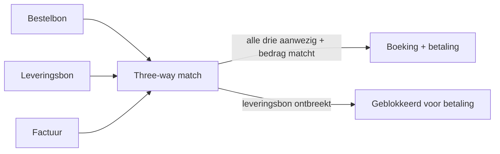
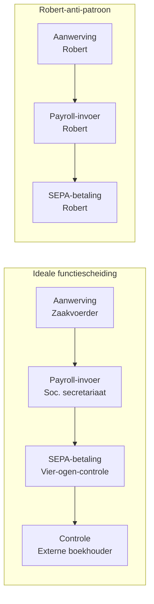
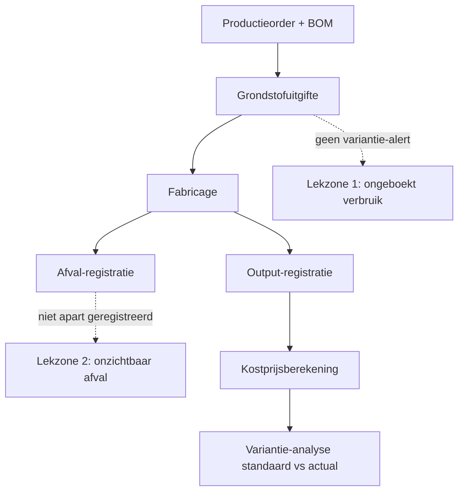

# PO 1.7 — Interne controle

> **Lees mij eerst:** dit document is een gestructureerd bundle van ALLE leermateriaal voor het programmaonderdeel "Interne controle" van het ITAA-bekwaamheidsexamen Gecertificeerd Accountant. Het bevat: (1) een didactische minicursus die je door het hele PO leidt, (2) 10 procedure-fiches die elk een concrete vaardigheid beschrijven ("hoe doe je X?"), en (3) 104 concept-fiches die elk een sleutel-begrip definiëren met bouwstenen, valkuilen en bronnen.
> 
> **Conventies in dit bundle:**
> - ⚖️ = directe wettelijke grondslag (WVV, KB WVV, CBN-advies, ITAA-norm, ISA, IFRS)
> - 🤖 = afgeleid of pedagogisch toegevoegd (geen letterlijke bron-citaat)
> - `[[concept-naam]]` = verwijzing naar een concept-fiche later in dit document
> - `[[competenties/naam]]` = verwijzing naar een competentie-fiche later in dit document
> 
> **Anti-fabricatie-regel voor afgeleide producten** (podcast / mindmap / slides / infographic / quiz): gebruik UITSLUITEND inhoud die in dit document staat. Geen externe bronnen, geen aanvullingen uit andere wetgevingen, geen verzonnen voorbeelden. Bij twijfel: zeg "dit staat niet in het bundle".


---

# Deel I — Minicursus

*De minicursus is de primaire leidraad. Lees ze in de aangeboden volgorde; gebruik de competentie- en concept-fiches in Deel II en III als verdieping wanneer iets onduidelijk blijft.*

### Wat verwacht het examen van jou?

> [!abstract] Dit programmaonderdeel wordt getoetst op niveau *integratie*.
> Je moet meerdere concepten samen kunnen inzetten in complexe casussen — onderdelen herkennen, prioriteren, en tot een coherent oordeel komen.


**Taken** (uit het ITAA-examenprogramma):

> [!abstract]- **Taak 1** — Opstellen van specifieke verslagen en analyses voor de externe en interne verslaglegging, met inbegrip van juridische en contractuele opdrachten
>
> **Subtaken**:
> - privé-expertise op het gebied van bedrijfsboekhouding
> - gerechtelijke expertise op het gebied van bedrijfsboekhouding
> - opstellen van verslagen die leiden tot een attestering of een expertiseverslag bestemd om aan derden te worden afgegeven
>
> **Doelstellingen**:
> - Begrijpen van het beginsel van redelijke zekerheid en naleving/compliance
> - Zoeken van referentiepunten ten opzichte van de verwachtingen van belanghebbenden (bv. bedrijfsleiders en auditors)
> - Opsporen van risico's
> - Beheren van het evenwicht tussen de begrippen redelijke zekerheid en naleving/compliance
> - Interpreteren van de aanbevelingen van de revisoren/accountants die verantwoordelijk zijn voor de beoordeling van de doeltreffendheid van de interne controle van de onderneming
> - Formuleren van aanbevelingen naar aanleiding van vastgestelde risico's


### Leesgids

De minicursus loopt van binnen naar buiten en van algemeen naar concreet. Eerst leer je de aard van [[interne-controle|interne controle]] kennen — de zes kenmerken, de actoren in het [[drie-lijnen-model|drie-lijnen-model]] en het [[coso-componenten-synthese|COSO-kader]]. Daarna doorloop je risico, transactiecycli, ISA-werk en de bijzondere verslagen waarin de gecertificeerd accountant zijn IC-oordeel materialiseert. Op het einde wacht een synthese-stappenplan plus een cheatsheet met de drempelwaarden en vergelijkingsparen die op het examen verwarring veroorzaken.

### Waarom dit programmaonderdeel telt

Interne controle is geen apart vak naast boekhouding of audit — het is de ruggengraat waarop redelijke zekerheid rust. De externe auditor steunt op IC om zijn werk te beperken (ISA 315 en [[auditrisicomodel|auditrisicomodel]]), de wetgever bouwt er compliance-verplichtingen op (AVG, antiwitwas, klokkenluiders), en het management gebruikt IC om operationele én rapporterings­doelstellingen te beheersen. Als gecertificeerd accountant zit je op het kruispunt: je adviseert KMO's bij IC-ontwerp, je toetst IC tijdens contractuele opdrachten en je rapporteert tekortkomingen aan governance. Examenvragen testen vaak het samenspel: welke actor, welk COSO-component, welk wettelijk regime — geïntegreerd, niet apart.

### Waarom interne controle? Van procedure naar systeem

Een procedurelijst is een verzameling regels; een [[interne-controle|intern-controlesysteem]] is een organisme dat doelstellingen, risico's, cultuur en monitoring met elkaar verweeft. Wie IC nog leest als 'wie tekent welk papier' mist de kern: het is een continu proces, gedragen door mensen, dat slechts [[redelijke-zekerheid|redelijke zekerheid]] biedt over de realisatie van doelen. We bouwen die systeemblik geleidelijk op — eerst de kenmerken, dan de actoren, dan de vijf [[coso-componenten-synthese|COSO-componenten]] die het denkkader leveren voor elk concreet IC-vraagstuk.

### Kenmerken van interne controle

De 'kenmerken' zijn de inherente eigenschappen van interne controle — eigenschappen die je móet kennen om realistisch over IC te oordelen. Voor de stagiair is dit de examenstof voor anchor 1.7.III: waarom IC nooit absolute zekerheid biedt, waarom mensen + cultuur centraal staan, en waarom IC moet schalen aan grootte. Deze synthese vat de zes hoofdkenmerken samen in één vergelijkingstabel zodat verwarring bij oppervlakkige stof-herhaling vermeden wordt.


De zes [[kenmerken-interne-controle|kenmerken]] hangen niet los van elkaar — ze omschrijven samen waarom IC nooit een afdeling of project kan zijn. Lees de tabel als een zes-stappen-test die je in elk casus loslaat voordat je oordeelt over IC-kwaliteit.

| Kenmerk | Wat het betekent | Wat het uitsluit |
|---|---|---|
| Proces, geen evenement | IC is continu, ingebakken in dagelijkse werking | Geen jaarlijkse 'opkuis' of 'IC-week' |
| Door mensen gedragen | Iedereen draagt bij — bestuur, management, personeel | Geen 'IC-afdeling' die het alleen doet |
| Redelijke, geen absolute zekerheid | Aanvaardt residual risk | Geen droom van foutloos systeem |
| Gericht op doelstellingen | Werkt aan operationele, rapporterings-, compliance-doelen | Geen IC om de IC |
| Aanpasbaar aan context | Schaalt mee met grootte, sector, risico | Geen one-size-fits-all standaardpakket |
| Dubbele dimensie | Hard (procedures) + zacht (cultuur) | Geen procedures alleen, geen cultuur alleen |

Test of IC-systeem voldoet aan de zes kenmerken:
1. Werkt IC continu mee in dagelijks proces? Zo nee → niet meer dan papierwerk.
2. Draagt élke laag verantwoordelijkheid? Zo nee → systeem is geïsoleerd.
3. Aanvaardt management residual risk? Zo nee → onrealistische verwachtingen.
4. Zijn doelstellingen expliciet? Zo nee → IC zonder kompas.
5. Is systeem aangepast aan context? Zo nee → over- of onder-engineering.
6. Is er aandacht voor cultuur naast procedures? Zo nee → procedures slijten weg.

**Kerninzichten**:

- IC is een continu proces (geen evenement). Op het examen 'periodieke IC-week' afwijzen.
- IC wordt gedragen door mensen, niet door systemen. Een ERP is een hulpmiddel; IC blijft een menselijke verantwoordelijkheid.
- Redelijke zekerheid — nooit absoluut. Inherente beperkingen blijven altijd: menselijke fout, samenspanning, management override, kosten-baten-grens.
- IC dient operationele, rapporterings- en compliance-doelstellingen. Geen IC zonder duidelijk doel.
- IC schaalt mee met de onderneming. Een KMO heeft een ander IC dan een groep — beide kunnen 'effectief' zijn.
- Dubbele dimensie: hard (procedures, IT, autorisaties) én zacht (cultuur, ethiek, tone at the top). Eén zonder de andere werkt niet.

_Bouwt op_: [[interne-controle]] · [[controle-omgeving]] · [[functiescheiding]]
### Begrippen-fundament: interne controle, informatie en ethiek

> [!info] Hoort bij taak: Opstellen van specifieke verslagen en analyses voor de externe en interne verslaglegging, met inbegrip van juridische en…

Voor je IC-vraagstukken kan integreren, moet je weten waarover je het hebt. Hier leer je de basisbegrippen samen inzetten: wat 'controle' betekent, wat een onderneming als IC-object onderscheidt van haar [[stromen-onderneming|stromen]] en haar [[informatiesysteem-onderneming|informatiesysteem]], en waarom [[ethiek-organisatie-ic|ethiek]] de stille premisse vormt onder elke procedure. Mis je hier één begrip, dan struikel je later bij elke casus.

- [[controle-begrip-algemeen|Controle — begrip algemeen]] · `begrip`
- [[onderneming-begrip-ic|Onderneming (begrip in IC-context)]] · `begrip`
- [[stromen-onderneming|Stromen in de onderneming]] · `begrip`
- [[informatiesysteem-onderneming|Informatiesysteem van de onderneming]] · `begrip`
- [[informatie-kwaliteit-ic|Informatie en haar kwaliteitseisen]] · `begrip`
- [[ethiek-organisatie-ic|Ethiek in de organisatie (IC-context)]] · `begrip`

### Actoren van interne controle

Interne controle is een gedeelde verantwoordelijkheid van meerdere actoren binnen én buiten de onderneming. Het drie-lijnen-model verdeelt de operationele rollen (lijn 1-3), met daarboven het bestuursorgaan (auditcomité, raad van bestuur) als oversight en externe assurance (commissaris, regulator) als externe controleur. Dit synthese-record maakt de rolverdeling expliciet — een stagiair moet voor elke IC-vraag kunnen identificeren WIE de actor is.


Een geleidelijke lezing van de tabel onthult de IC-keten van uitvoering naar oversight. Bij KMO-casussen moet je leren herkennen welke lijnen zijn samengevoegd of uitbesteed, en wat dat betekent voor het residual risk — een sleutelvaardigheid op integratie-niveau.

| Actor | Rol in IC | Onafhankelijk van? | Voorbeeld bij Rotex Roeselare NV |
|---|---|---|---|
| Raad van bestuur | Stelt risk appetite, keurt IC-kader goed, oversight | Operationeel management | Pieter Vermeulen, voorzitter |
| Auditcomité | Reviewed IC-werking + IA-rapporten + externe-audit-uitkomsten | Operationeel management | 3 niet-uitvoerende leden RvB |
| Operationeel management | Eerste verdedigingslijn — voert IC dagelijks uit | Eigen processen niet | Aankoopdirecteur, productiedirecteur |
| Risk-/compliance-functie | Tweede verdedigingslijn — beleid, methodologie, monitoring | Operationeel proces | Risk Officer Marleen De Cock |
| Interne audit | Derde verdedigingslijn — onafhankelijke assurance | Hele uitvoeringslijn | Sofie Janssens, IA-directeur |
| Externe auditor / commissaris | Externe assurance voor derden | Hele onderneming | Wolters & Partners CVBA |
| Personeel (alle medewerkers) | Past procedures dagelijks toe | — | Magazijnier, boekhouder, ... |

1. **Wie zet het kader op?** → Raad van bestuur / directie / risk-functie.
2. **Wie voert dagelijks uit?** → Operationeel management + alle medewerkers (1e lijn).
3. **Wie monitort beleidsmatig?** → Risk + compliance (2e lijn).
4. **Wie geeft onafhankelijke assurance intern?** → Interne audit (3e lijn).
5. **Wie geeft assurance aan externen?** → Commissaris / externe accountant.
6. **Wie oversight totaal?** → Auditcomité + raad van bestuur.

**Kerninzichten**:

- Geen enkele actor draagt alleen de verantwoordelijkheid: IC is een keten waar de eerste lijn (operationeel management) eigenaar blijft, ondersteund door tweede lijn (risk/compliance), gevalideerd door derde lijn (interne audit), met oversight door auditcomité/RvB en externe assurance door commissaris.
- Bij KMO's worden lijnen samengeperst tot één persoon (zaakvoerder) of uitbesteed (externe accountant). Het model blijft conceptueel relevant: bewustzijn van de gemiste 'lijn' is een risico-indicator.
- Het auditcomité staat boven de drie lijnen, niet binnen — het is een orgaan van governance, niet van uitvoering.
- Externe auditor en regulator (NBB, FSMA) staan buiten de onderneming en geven assurance aan derden, niet aan management.

_Bouwt op_: [[interne-controle]] · [[interne-audit]] · [[externe-controle]] · [[auditcomite]] · [[functiescheiding]]
### Actoren en organen: management, interne audit, auditcomité

> [!info] Hoort bij taak: Opstellen van specifieke verslagen en analyses voor de externe en interne verslaglegging, met inbegrip van juridische en…

Hier zoomen we in op de organen en functies die het IC-systeem dragen. Je leert het verschil tussen [[managementcontrole|managementcontrole]] (sturing door directie zelf) en [[interne-audit|interne audit]] (onafhankelijke evaluatie), tussen de [[functie-interne-auditor|interne auditor]] en het [[auditcomite|auditcomité]] dat zijn werk valideert, en tussen interne en [[externe-controle|externe controle]]. Op het examen kruist de vraag vaak deze rollen — je moet ze niet alleen kennen maar in een casus correct kunnen plaatsen.

- [[managementcontrole|Managementcontrole]] · `begrip`
- [[interne-audit|Interne audit]] · `cluster`
- [[functie-interne-auditor|Functie van de interne auditor]] · `autoriteit`
- [[auditcomite|Auditcomité]] · `autoriteit`
- [[drie-lijnen-model|Drie-lijnen-model (Three Lines of Defense)]] · `cluster`
- [[externe-auditor-relatie-ic|Externe auditor en interne controle — relatie]] · `begrip`
- [[externe-controle|Externe controle]] · `begrip`

### COSO-componenten — synthese-overzicht

De vijf COSO-componenten zijn het organiserend kader voor interne controle in de internationale praktijk én in ISA 315 (herzien-2019) — de standaard die elke auditor moet volgen bij risk assessment. Voor de stagiair is dit dé synthese die hij moet kunnen reproduceren: de vijf componenten in volgorde, met onderlinge afhankelijkheden (controle-omgeving als fundament, monitoring als afsluiting). Examen-vragen testen of hij elk component aan een concreet voorbeeld kan koppelen.


Lees de tabel als een vijf-treden-architectuur: zonder fundament (omgeving) draagt geen activiteit; zonder feedback-loop (monitoring) verdampt elke procedure in de tijd. Bij integratie-casussen moet je de vijf componenten samen kunnen inzetten — niet één wegnemen omdat hij 'minder belangrijk' zou zijn.

| Component | Wat | Kern-vraag | Voorbeeld bij Yperse Werkplaats BV |
|---|---|---|---|
| 1. Controle-omgeving | Cultuur, integriteit, tone at the top | Wat is de fundamentele houding tegenover regels en risico's? | Gedragscode + voorbeeldgedrag directeur Pieter Vermeulen |
| 2. Risico-inschatting | Identificatie + analyse risico's | Wat kan fout gaan? | Risicomatrix uitgewerkt door Xenon Expertise BV |
| 3. Beheersactiviteiten | Procedures, controles | Welke maatregelen tegen welk risico? | Dubbele handtekening op betalingen > € 25.000 |
| 4. Informatie & communicatie | Relevante info bij juiste mensen | Welke info, naar wie, wanneer? | Maandelijks KPI-dashboard + wekelijkse productiemeeting |
| 5. Monitoring | Continu + periodiek IC opvolgen | Werkt het systeem nog? | Maandelijkse review CFO + jaarlijkse IA-review |

Bij elke IC-vraag, doorloop de vijf componenten:
1. **Cultuur OK?** (omgeving) → Zo nee: training, sancties, voorbeeldgedrag herzien.
2. **Risico's geïdentificeerd?** (inschatting) → Zo nee: risicomatrix opmaken.
3. **Controles aanwezig per risico?** (activiteiten) → Zo nee: ontwerpen, functiescheiding toepassen.
4. **Info bereikt juiste mensen?** (info & com) → Zo nee: rapportering aanpassen.
5. **Wordt systeem opgevolgd?** (monitoring) → Zo nee: KPI's + interne audit installeren.

**Kerninzichten**:

- Vijf componenten samen — niet één afzonderlijk volstaat. Een sterke controle-omgeving zonder activiteiten is folklore; sterke activiteiten zonder monitoring verzwakken in de tijd.
- Volgorde is functioneel: controle-omgeving (1) is fundament; risico-inschatting (2) drijft keuze; activiteiten (3) zijn uitvoering; informatie/communicatie (4) is verbindingsweefsel; monitoring (5) is feedback-loop.
- ISA 315 (herzien-2019) eist dat de auditor de vijf componenten doorgrondt vóór hij risk's op afwijking-van-materieel-belang inschat. Dat is geen vrijblijvende stap.
- COSO is geen Belgische wet — het is internationale doctrine die wel via ISA's en ITAA-controlenormen wordt verankerd.

_Bouwt op_: [[controle-omgeving]] · [[risico-inschatting-organisatie]] · [[beheersactiviteiten]] · [[informatie-en-communicatie-ic]] · [[monitoring-interne-controle]] · [[interne-controle]]
### Ontwerpen van een intern-controlesysteem volgens de vijf COSO-componenten

> [!info] Hoort bij taak: Opstellen van specifieke verslagen en analyses voor de externe en interne verslaglegging, met inbegrip van juridische en…

Hier bouw je een IC-systeem op vanaf nul volgens [[coso-componenten-synthese|COSO]] — stap voor stap doorlopen we de vijf componenten en plaatsen we bij elk component de keuzes die een adviseur in een KMO-casus moet motiveren. De volledige procedure beschrijft de overgang van risico-inventaris naar concrete beheersmaatregelen.

[[competenties/ontwerpen-intern-controlesysteem-coso|→ Volledige procedure]]

### Risicobeheer en digitale omgeving: van auditrisicomodel naar cyberrisico

> [!info] Hoort bij taak: Opstellen van specifieke verslagen en analyses voor de externe en interne verslaglegging, met inbegrip van juridische en…

Risico is de motor van IC: zonder risico-inschatting heeft een procedure geen doel. Je leert het [[auditrisicomodel|auditrisicomodel]] hanteren als kompas — hoe het [[intern-beheersingsrisico|interne beheersingsrisico]] de detectie-inspanning stuurt — en hoe digitalisering het IC-landschap verschuift via [[geinformatiseerde-omgeving-ic|IT-controles]], [[cyberrisico-ic|cyberrisico's]] en de regelgevende laag van [[nis-2-richtlijn|NIS 2]] en [[dora-verordening|DORA]].

- [[auditrisicomodel|Auditrisicomodel (controlerisico)]] · `cluster`
- [[auditrisico-1-7-context]] — record niet gevonden
- [[intern-beheersingsrisico|Intern beheersingsrisico]] · `begrip`
- [[geinformatiseerde-omgeving-ic|Interne controle in een geïnformatiseerde omgeving]] · `cluster`
- [[cyberrisico-ic|Cyberrisico in IC-context]] · `cluster`
- [[nis-2-richtlijn|NIS 2-richtlijn (cybersecurity-kader)]] · `regel`
- [[dora-verordening|Digital Operational Resilience Act (DORA)]] · `regel`

### Uitvoeren van een risico-identificatie en -analyse voor het IC-systeem

> [!info] Hoort bij taak: Opstellen van specifieke verslagen en analyses voor de externe en interne verslaglegging, met inbegrip van juridische en…

In een complexe casus moet je risico's niet alleen benoemen maar ook prioriteren in een risicomatrix die management kan onderschrijven. De procedure begeleidt je van scoping over identificatie en inschatting naar respons — geleidelijk, met de [[iso-31000-risicobeheer|ISO 31000]]-logica als ruggengraat.

[[competenties/uitvoeren-risicoanalyse-organisatie|→ Volledige procedure]]

### Implementeren van functiescheiding op kritieke transactiecycli

> [!info] Hoort bij taak: Opstellen van specifieke verslagen en analyses voor de externe en interne verslaglegging, met inbegrip van juridische en…

[[functiescheiding|Functiescheiding]] is het meest voorkomende IC-instrument én het eerste dat sneuvelt in een KMO-context. We werken een aanpak uit waarbij je per transactiecyclus de incompatibele rollen identificeert en compenserende controles oplegt waar volledige scheiding onhaalbaar is.

[[competenties/implementeren-functiescheiding-transactiecycli|→ Volledige procedure]]

### Controle-activiteiten en monitoring in detail

> [!info] Hoort bij taak: Opstellen van specifieke verslagen en analyses voor de externe en interne verslaglegging, met inbegrip van juridische en…

We doorgronden hier hoe abstracte beheersactiviteiten zich vertalen naar concrete [[uitvoering-interne-controle|uitvoering]] en [[controlemiddelen-ic|controlemiddelen]] — en hoe je via [[toetsing-interne-beheersing|toetsing]] vaststelt of die middelen ook werken. Het [[controleproces-organisatie|controleproces]] vormt de plan-do-check-act-cyclus waarin elke maatregel haar plaats vindt.

- [[uitvoering-interne-controle|Uitvoering van interne controle — aanpak]] · `cluster`
- [[controleproces-organisatie|Controleproces in de organisatie]] · `cluster`
- [[controlemiddelen-ic|Controlemiddelen — concrete instrumenten]] · `cluster`
- [[toetsing-interne-beheersing|Toetsing van interne beheersing (test of controls)]] · `cluster`

### Opzetten van controle-activiteiten en monitoringsmechanismen

> [!info] Hoort bij taak: Opstellen van specifieke verslagen en analyses voor de externe en interne verslaglegging, met inbegrip van juridische en…

Stap voor stap doorlopen we hoe je per geïdentificeerd risico een passende mix van [[preventief-versus-detecterende-controle|preventieve en detectieve]] maatregelen kiest en deze in een blijvend [[monitoring-interne-controle|monitoringkader]] verankert. Je leert het samenspel inzetten: een sterke preventieve laag minimaliseert het werk van de detectieve laag.

[[competenties/opzetten-controleactiviteiten-en-monitoring|→ Volledige procedure]]

### fouten-en-fraude

[[fraude-versus-fout|Fraude en fout]] vragen elk een eigen IC-respons: een [[fouten-ic|fout]] is onopzettelijk en wordt door routine-controles afgevangen, [[fraude|fraude]] is opzettelijk en vraagt diepere mechanismen zoals klokkenluiderskanalen, [[fraudedriehoek|fraude-driehoek-analyse]] en [[management-override|management-override-detectie]]. Daarnaast bestaat [[verspilling|verspilling]] als derde categorie — geen boekhoudfout, wel een efficiëntie-probleem dat IC kan opsporen.

### Identificeren van fouten, fraude en verspilling in een organisatie

> [!info] Hoort bij taak: Opstellen van specifieke verslagen en analyses voor de externe en interne verslaglegging, met inbegrip van juridische en…

In een complexe casus moet je het verschil tussen onopzettelijk en opzettelijk niet alleen typeren maar omzetten in een werkplan: welke [[frauderisicofactoren|risicofactoren]] activeer je, welke [[fraudetypologie-acfe|fraudetypologie]] past, welke meldroute volgt? De procedure brengt het samen.

[[competenties/identificeren-fouten-fraude-verspilling|→ Volledige procedure]]

### Compliance, NOCLAR en antiwitwas-meldingsstroom

> [!info] Hoort bij taak: Opstellen van specifieke verslagen en analyses voor de externe en interne verslaglegging, met inbegrip van juridische en…

[[niet-naleving-wet-regelgeving-noclar|NOCLAR]] en [[antiwitwasmeldingsplicht-accountant|antiwitwasmelding]] zijn twee compliance-stromen die de accountant binnen elke opdracht moet kunnen activeren. Je leert het verband: niet elke NOCLAR is een witwasvermoeden, maar elk witwasvermoeden vraagt melding aan de [[cfi|CFI]] — meldingsplicht wint dan van het beroepsgeheim.

- [[niet-naleving-wet-regelgeving-noclar|Niet-naleving wet- en regelgeving (NOCLAR)]] · `cluster`
- [[cfi|Cel voor Financiële Informatieverwerking (CFI)]] · `autoriteit`

### Cyclusanalyse bij interne controle

De cyclusbenadering splitst de bedrijfsvoering op in herkenbare transactie-stromen (aankoop, productie, verkoop, HR, voorraad) en evalueert de interne controle binnen elke cyclus apart. Het is een standaardmethode in zowel internal control design als in externe audit (walkthrough per cyclus). Stagiairs gebruiken cyclusanalyse om systematisch zwakke punten te identificeren en om hun controlewerkzaamheden te plannen.


De tabel hieronder is een patroon-bibliotheek: elke cyclus kent zijn typische risico's en zijn structurele tegenhanger (three-way match voor aankoop, delivery-order-match voor verkoop). Bij een integratie-vraag combineer je deze patronen met functiescheiding en monitoring uit de COSO-laag.

| Cyclus | Hoofdrisico's | Kritische IC-maatregelen |
|---|---|---|
| Aankoop | Fictieve facturen, kickbacks, ongeautoriseerde uitgaven | Three-way match + autorisatie-drempels + functiescheiding inkoper/ontvanger/boeker/betaler |
| Verkoop | Fictieve omzet, oninbare vorderingen, cut-off | Krediettoetsing + delivery-order match + DSO-monitoring |
| Productie | Verkeerde kostprijs, voorraadafwijking, afval-fraude | BOM-tracking + yield-analyse + standaard vs actual variance |
| HR | Ghost employees, loonmanipulatie | Functiescheiding HR/payroll/betaling + jaarlijkse werknemerslijst-review + Dimona-cross-check |
| Voorraad | Diefstal, verkeerde waardering, telmiss | Fysieke beveiliging + permanente voorraad + onafhankelijke inventaris |

Voor elke cyclus, doorloop de IC-evaluatie in 3 stappen:
1. Identificeer kerngerichten (welke beweringen worden geraakt: bestaan, volledigheid, juistheid, cut-off, waardering, presentatie).
2. Map de proces-stappen (van trigger tot eindboeking).
3. Test functiescheiding + autorisaties + verificaties + monitoring per stap.

**Kerninzichten**:

- Functiescheiding loopt door alle vijf cycli — het is de gemeenschappelijke noemer, geen cyclus-specifieke controle.
- Three-way match (aankoop) en delivery-order-factuur-match (verkoop) zijn structurele tegenhangers — herken het patroon.
- Voorraad raakt rechtstreeks aan productie en wordt vaak samen behandeld bij audits van industriële klanten.

_Bouwt op_: [[aankoopcyclus-ic]] · [[verkoopcyclus-ic]] · [[productiecyclus-ic]] · [[hr-cyclus-ic]] · [[voorraadcyclus-ic]] · [[functiescheiding]]
### Transactiecycli in detail: aankoop, verkoop, productie, HR, voorraad

> [!info] Hoort bij taak: Opstellen van specifieke verslagen en analyses voor de externe en interne verslaglegging, met inbegrip van juridische en…

Hier zoomen we in op elke cyclus apart. Bij elke transactiecyclus moet je de drie vragen samen kunnen beantwoorden: welke risico's, welke kerncontroles, welke [[taakverdeling-ic|taakverdeling]]. De [[opvolging-verrichtingen-ic|opvolging van verrichtingen]] verbindt de cycli onderling — een aankoop genereert een voorraad-mutatie, een verkoop activeert een productie-aanvraag.

- [[aankoopcyclus-ic|Aankoopcyclus en interne controle]] · `cluster`
- [[verkoopcyclus-ic|Verkoopcyclus en interne controle]] · `cluster`
- [[productiecyclus-ic|Productiecyclus en interne controle]] · `cluster`
- [[hr-cyclus-ic|HR-cyclus en interne controle]] · `cluster`
- [[voorraadcyclus-ic|Voorraadcyclus en interne controle]] · `cluster`
- [[taakverdeling-ic|Taakverdeling binnen interne controle]] · `begrip`
- [[opvolging-verrichtingen-ic|Opvolging van verrichtingen]] · `cluster`

### Wettelijk kader voor interne controle in België

Het wettelijk kader voor interne controle in België is geen één-stuks-wet maar een lappendeken van bronnen die elk een aspect van IC reguleren: boekhoudkundige verplichtingen (KB 21.10.2018), audit-toetsing (ITAA-normen), plichtenleer (KB 1998 + Wet ITAA 2019), persoonsgegevens (AVG), klokkenluiders (Wet 28.11.2022), witwasbestrijding (Wet 18.09.2017), corporate governance (WVV + Codes), sector-specifiek (NBB, FSMA). Voor de stagiair is het examen-relevant om te weten welke bronnen van toepassing zijn op een gegeven onderneming: een KMO valt onder een lichter regime dan een beursgenoteerde of financiële onderneming. De toets is meestal: 'gegeven deze onderneming, welke IC-verplichtingen?'.


De tabel is een beslisboom: classificeer eerst de onderneming (omvang, [[public-interest-entity|PIE-status]], sector) en map daarna de toepasselijke bronnen. Bij een integratie-vraag moet je ook de drie regelgevingslagen — algemene wetgeving, domeinwetten en beroepsnormen — samen kunnen inzetten.

| Domein | Belgische bron | Toepassing IC |
|---|---|---|
| Algemene boekhoud-IC | KB 21.10.2018 boekhoudkundige verplichtingen | Verplicht aanhouden van boekhoudkundige documenten + jaarlijkse inventaris |
| Audit-toetsing IC | ITAA-norm-kmo-controlenorm + ITAA-algemene-controlenorm | Verplichting voor beroepsbeoefenaar om IC te begrijpen + te toetsen waar gesteund |
| Plichtenleer accountants | KB 1 maart 1998 + Wet 17 maart 2019 ITAA | Onafhankelijkheid, geheimhouding, onverenigbaarheden |
| Persoonsgegevens | AVG/GDPR + Wet 30 juli 2018 | Verplichte technische + organisatorische maatregelen |
| Klokkenluiders | Wet 28 november 2022 | Intern meldkanaal verplicht voor middelgrote/grote ondernemingen |
| Witwasbestrijding | Wet 18 september 2017 + Richtlijn (EU) 2018/1673 | Cliëntenidentificatie, transactiemonitoring, melding verdachte verrichtingen |
| Corporate governance | WVV + Code Buysse + Code 2020 (beursgenoteerd) | Auditcomité, niet-uitvoerende bestuurders, interne controle-rapportering |
| Sector-specifiek | NBB-regelgeving (banken), FSMA (verzekeraars) | Strenge IC-vereisten voor financiële sector |

**Kerninzichten**:

- Toepasselijkheid van het IC-kader hangt af van drie variabelen: omvang (KMO vs groot), PIE-status (beursgenoteerd / financieel / zorg) en sector (NBB/FSMA-toezicht). Eerst classificeren, dan regime toepassen.
- Belgische IC-regelgeving bestaat uit drie lagen: algemene bedrijfswetgeving (WVV, KB boekhouding), domein-specifieke wetten (AVG, AWW, klokkenluiders) en beroepsnormen (ITAA, IBR). Alle drie zijn in principe afdwingbaar.
- ITAA-normen + KB plichtenleer 1998 zijn formele rechtsbronnen — niet vrijblijvend — en samen met de Wet ITAA 2019 de kern van de deontologische IC-pijler.
- Internationale standaarden (ISA, ISQM 1, IFRS) gelden via de Belgische omzetting: ISA via KB-jaarrekening-controle voor commissaris, ISQM 1 via ITAA-norm intern kwaliteitsmanagement, AVG rechtstreeks Europees.

_Bouwt op_: [[interne-controle]] · [[kmo-controlenorm-accountant]] · [[algemene-controlenorm-accountant]] · [[klokkenluiderregeling]] · [[avg-interne-controle]]
### ISA-standaarden in IC-context

De ISA-standaarden zijn de internationale audit-grondwet voor de wettelijke controle van financiële overzichten — in België via koninklijk besluit overgenomen voor commissarisopdrachten. Voor de stagiair zijn de ISA's relevant in IC-context omdat verschillende ISA's expliciet IC-werk vereisen: ISA 315 begint elke audit met een begrip van de interne beheersing, ISA 330 vertaalt dat in toetsen, ISA 265 verplicht communicatie van tekortkomingen, ISA 610 regelt het gebruik van interne audit. De examen-vraag is meestal niet 'wat staat in ISA X?' maar 'welke ISA is van toepassing op deze situatie?'.


Lees de tabel als een mapping van situatie naar standaard. De kerntrias voor IC-werk — risico-inschatting, response, rapportering — keert in elke audit-opdracht terug; bij integratie-casussen moet je de juiste ISA aan de juiste situatie kunnen koppelen zonder aarzelen.

| ISA-nummer | Titel | IC-relevantie |
|---|---|---|
| ISA 200 | Algemene doelstellingen en uitvoering audit | Algemeen kader |
| ISA 240 | Verantwoordelijkheid auditor m.b.t. fraude | Fraude-detectie binnen IC |
| ISA 250 | Wet- en regelgeving | Compliance-controles |
| ISA 260 | Communicatie met governance | Auditcomité-rapportering |
| ISA 265 | Mededeling IC-tekortkomingen aan management | Management letter |
| ISA 315 | Identificatie + inschatting risico's via begrip onderneming + IC | Centraal voor IC-toetsing |
| ISA 330 | Reactie auditor op ingeschatte risico's | Toetsing IC + substantief werk |
| ISA 402 | Service organizations | IC bij outsourcing/cloud |
| ISA 610 | Gebruik van werk interne audit | Externe ↔ interne audit |

1. **Algemene aanpak?** → ISA 200.
2. **Risico-inschatting starten?** → ISA 315 (entity + IC begrip).
3. **Reactie plannen?** → ISA 330.
4. **Outsourcing aanwezig?** → ISA 402.
5. **Fraude-risico's?** → ISA 240.
6. **IA aanwezig?** → ISA 610.
7. **Rapportering aan governance?** → ISA 260 + 265.

**Kerninzichten**:

- ISA's zijn de internationale audit-grondwet voor wettelijke jaarrekening-controles; in België via KB 26 april 2007 (wettelijke audit) overgenomen voor commissarisopdrachten.
- De kerntrias voor IC-werk: ISA 315 (begrip + risico-inschatting via IC), ISA 330 (toetsing IC + substantieve werkzaamheden), ISA 265 (rapportering tekortkomingen).
- ISA 200 zet de fundamenten: redelijke zekerheid, professional scepticism, ethische vereisten via IESBA, en het auditrisicomodel.
- ISA's zijn niet rechtstreeks van toepassing op samenstellings- of beoordelingsopdrachten — daarvoor gelden ISRS 4410 / ISRE 2400. De aanpak van IC verschilt fundamenteel per opdrachttype.

_Bouwt op_: [[interne-controle]] · [[auditrisicomodel]] · [[toetsing-interne-beheersing]]
### ITAA-normen en interne controle

De ITAA-normen vormen de Belgische operationele vertaling van de internationale audit- en kwaliteitsstandaarden naar de gecertificeerd accountant. Voor de stagiair is dit het kruispunt tussen ISA (internationaal) en eigen praktijk: welke norm geldt voor welk type opdracht (wettelijke controle, contractuele controle, samenstelling, bijzondere verslagen)? De normen leggen vast hoe de accountant interne controle benadert per opdrachttype, en welke documentatie- en kwaliteitsverwachtingen er gelden. Examen-vragen testen vaak het onderscheid algemene controlenorm versus KMO-controlenorm, of de toepassing van de norm intern kwaliteitsmanagement op het kantoor zelf.


De tabel ordent de normen per opdrachttype. Onthoud dat het [[intern-kwaliteitsmanagement-kantoor|intern kwaliteitsmanagement]] over alle opdrachten heen werkt — een vraag over kantoorbeleid wijst altijd naar deze norm, terwijl een vraag over één audit-engagement over de controlenormen gaat.

| ITAA-norm | Domein | IC-aspect |
|---|---|---|
| Algemene controlenorm | Wettelijke + contractuele audit (algemeen) | Auditor moet IC begrijpen + waar zinvol op steunen |
| KMO-controlenorm | Audit bij KMO's | Specifieke IC-aanpassingen voor KMO-context, lichtere documentatie |
| Samenstellingsopdracht (ISRS 4410) | Geen audit, wel hulp bij jaarrekening | Geen IC-toetsing maar wel awareness van zwakke IC |
| Norm intern kwaliteitsmanagement | Kantoor van de accountant zelf | IC voor het accountantskantoor |
| Norm fusie/splitsing | Specifieke opdrachten WVV | IC-controle bij waardering + ruilverhouding |
| AWW (anti-witwassen) reglement | Witwasvoorkoming | IC op cliëntenidentificatie + monitoring |
| Norm permanente vorming | Beroepsuitoefening | Update kennis IC + audit |

**Kerninzichten**:

- ITAA-normen vormen het tweede normatieve laagje boven de ISA's voor de Belgische gecertificeerd accountant. Ze gelden bij elke opdracht waarin de GA als gereglementeerde beroepsbeoefenaar optreedt.
- De vier hoofdgroepen: (1) controlenormen (algemene + KMO), (2) samenstellings- en beoordelingsnormen (ISRS 4410, ISRE 2400), (3) kwaliteitsnormen (intern kwaliteitsmanagement = ISQM 1), (4) deontologische + opdracht-specifieke normen (effectennorm, fusie-splitsing, ontbinding, AWW).
- Voor IC-werk verlangen de controlenormen expliciet: begrip van IC + risico-inschatting + toetsing waar gesteund wordt + documentatie.
- De normen zijn schaalbaar: KMO-controlenorm laat lichtere documentatie + procedure toe; algemene controlenorm vereist meer formele aanpak.

_Bouwt op_: [[kmo-controlenorm-accountant]] · [[algemene-controlenorm-accountant]] · [[samenstellingsopdracht]]
### Beoordelen van de effectiviteit van een intern-controlesysteem (interne audit)

> [!info] Hoort bij taak: Opstellen van specifieke verslagen en analyses voor de externe en interne verslaglegging, met inbegrip van juridische en…

In een complexe casus toets je niet alleen of controles bestaan maar of ze effectief werken in de tijd. De procedure bouwt een coherent oordeel op uit [[evaluatiecriteria-ic|evaluatiecriteria]], steekproef-toetsing en walkthroughs — het inhoudelijke werk dat de interne auditor uit zijn [[functie-interne-auditor|functie]] verricht.

[[competenties/beoordelen-effectiviteit-ic-via-interne-audit|→ Volledige procedure]]

### Opstellen van een intern-audit-rapport

> [!info] Hoort bij taak: Opstellen van specifieke verslagen en analyses voor de externe en interne verslaglegging, met inbegrip van juridische en…

Een audit-bevinding is pas waardevol als ze bruikbaar is voor het [[auditcomite|auditcomité]] en het management. Je leert vaststellingen, oorzaken en aanbevelingen samen inzetten in een gestructureerd rapport — de procedure begeleidt je van bevindings-fiche naar finale managementsamenvatting.

[[competenties/opstellen-intern-audit-rapport|→ Volledige procedure]]

### Integreren van AVG-compliance in het intern-controlesysteem

> [!info] Hoort bij taak: Opstellen van specifieke verslagen en analyses voor de externe en interne verslaglegging, met inbegrip van juridische en…

[[avg-interne-controle|AVG-verplichtingen]] zijn geen apart compliance-eiland — je leert ze inweven in het bestaande IC-systeem zodat technische en organisatorische maatregelen mee meeleven met de transactiecycli. De procedure beschrijft hoe je verwerkingsregister, DPIA en monitoring in COSO-componenten verankert.

[[competenties/integreren-avg-compliance-in-ic|→ Volledige procedure]]

### Adviseren van het management bij IC-design als externe adviseur

> [!info] Hoort bij taak: Opstellen van specifieke verslagen en analyses voor de externe en interne verslaglegging, met inbegrip van juridische en…

Als externe adviseur bouw je een coherent oordeel op uit het bestaande IC, formuleer je aanbevelingen die het management kan onderschrijven, en bewaak je de grens met je [[opdrachtbrief-accountant|opdrachtbrief]] zodat geen onafhankelijkheids­conflict ontstaat — zeker wanneer dezelfde cliënt later een controleopdracht vraagt.

[[competenties/adviseren-management-ic-design-als-externe-adviseur|→ Volledige procedure]]

### Bijzondere verslagen — overzicht

De gecertificeerd accountant en bedrijfsrevisor leveren naast het commissarisverslag een hele reeks 'bijzondere verslagen' af — telkens bij een specifieke vennootschapsrechtelijke verrichting (inbreng in natura, omzetting, fusie/splitsing, ontbinding, effectenuitgifte) of een specifieke contractuele opdracht. Elk type volgt een eigen ITAA-norm met eigen verslagmodel, maar deelt de basis-elementen (vier oordeelstypes, persoonlijke ondertekening, afschrift aan ITAA). Dit synthese-record geeft de typologie; de details staan in de individuele opdracht-records (PO 1.7).


De tabel groepeert de verslagtypes naar zekerheid en aanleiding. In een integratie-casus moet je een gegeven verrichting (kapitaalverhoging, fusie, omzetting, vereffening) kunnen koppelen aan het juiste verslag, de juiste WVV-grondslag en de juiste ITAA-norm.

| Type verslag | Wettelijke grondslag | Doel | Voorbeeld |
|---|---|---|---|
| Commissarisverslag | WVV (jaarrekening grote NV's) | Wettelijke audit met redelijke zekerheid | Jaarverslag Rotex Roeselare NV |
| Inbreng-in-natura-verslag | WVV art. 5:7 (BV) / 7:7 (NV) | Verifieer waardering ingebrachte goederen bij oprichting/kapitaalverhoging | Inbreng productiehal bij oprichting BV |
| Quasi-inbreng-verslag | WVV art. 5:8 (BV) / 7:8 (NV) | Verifieer waardering bij verwerving van goed van oprichter/bestuurder binnen 2 jaar na oprichting | Aankoop vastgoed van bestuurder door jonge BV |
| Effectennorm-opdracht | WVV art. 5:121, 7:179, 7:191 + ITAA-norm Effectennorm | 'Informed consent' over bestuursverslag bij uitgifte aandelen, converteerbare obligaties, opheffing voorkeurrecht | Kapitaalverhoging met opheffing voorkeurrecht |
| Fusie-/splitsingsverslag | WVV Boek 12 + ITAA-norm Fusie-splitsing | Toetsing redelijkheid aandelen-ruilverhouding | Fusie van twee dochterondernemingen |
| Omzetting-verslag | WVV Boek 14 + ITAA-norm Omzetting | Toetsing of nettoactief niet overgewaardeerd is bij verandering rechtsvorm | BV wordt NV |
| Ontbinding-vereffening-verslag | WVV art. 2:71 + ITAA-norm Ontbinding | Vermogenssituatie bij vrijwillige vereffening | Verffabriek Veurne BV in vereffening |
| Samenstellingsopdracht (ISRS 4410) | Contractueel — ITAA-norm Samenstellingsopdrachten | Hulp bij opmaak jaarrekening — GÉÉN assurance | KMO zonder commissaris |
| Contractuele controleopdracht | Contractueel | Audit op vrijwillige basis | Bank vraagt extra zekerheid bij KMO |
| Beoordeling (beperkte zekerheid) | ISRE-norm | Lichtere review met beperkte zekerheid | Tussentijdse cijfers |

1. **Wettelijke verplichting?** → Welke wet/norm (WVV, ITAA-norm).
2. **Welk niveau zekerheid?** → Redelijke (audit), beperkte (beoordeling), geen (samenstellingsopdracht).
3. **Eénmalig of jaarlijks?** → Eenmalig (juridische verrichting) of cyclisch (commissaris).
4. **Welk verslagmodel?** → ITAA-norm bevat verslagmodellen per type.

_Bouwt op_: [[inbreng-in-natura-verslag]] · [[quasi-inbreng-verslag]] · [[effectennorm-opdracht]] · [[omzetting-vennootschap-opdracht]] · [[fusie-splitsing-controleopdracht]] · [[ontbinding-vereffening-opdracht]] · [[samenstellingsopdracht]] · [[opdrachtbrief-accountant]] · [[wettelijke-controleopdracht-commissaris]] · [[contractuele-controleopdracht]]
### Opstellen van bijzondere verslagen en IC-evaluaties voor specifieke verrichtingen

> [!info] Hoort bij taak: Opstellen van specifieke verslagen en analyses voor de externe en interne verslaglegging, met inbegrip van juridische en…

In een complexe casus combineer je IC-evaluatie met verslaglogica: een [[inbreng-in-natura-verslag|inbreng]], [[fusie-splitsing-controleopdracht|fusie]] of [[ontbinding-vereffening-opdracht|ontbinding]] vraagt elk specifieke werkzaamheden plus een eigen verslagmodel. De procedure begeleidt je van opdrachtaanvaarding via werkprogramma naar finaal getekend verslag.

[[competenties/opstellen-bijzondere-verslagen-en-ic-evaluaties|→ Volledige procedure]]

### Reflectie: interne controle als systeem, niet als procedurelijst

Wie heel deze stof doorploegt, beseft dat [[interne-controle|IC]] geen optelsom is van losse procedures maar een organisch samenspel van cultuur, structuur, processen en oversight. De zes [[kenmerken-interne-controle|kenmerken]] zijn geen lijst om af te vinken — ze zijn de criteria waarmee je een systeem in zijn geheel kunt beoordelen. Op het examen herken je sterke kandidaten aan hun vermogen om bij een nieuwe casus eerst de systeem-blik te activeren (welke COSO-componenten worden geraakt, welke actoren bepalen wat) voor ze in detail duiken.


### Synthese-stappenplan

Wanneer je in een examenvraag een IC-casus krijgt voorgelegd, volg dan dit werkschema. Classificeer eerst de onderneming op grootte, [[public-interest-entity|PIE-status]] en sector — die drie variabelen bepalen welk regime geldt. Identificeer vervolgens de actoren via het [[drie-lijnen-model|drie-lijnen-model]] en check of bij KMO's lijnen zijn samengeperst. Loop daarna de vijf [[coso-componenten-synthese|COSO-componenten]] door om vast te stellen waar het systeem rust of breekt. Per geïdentificeerd risico kies je een mix van [[preventief-versus-detecterende-controle|preventieve en detectieve]] maatregelen, ondersteund door [[functiescheiding|functiescheiding]] op kritieke transactiestappen. Onderzoek vervolgens of fouten-, fraude- of verspilling-signalen aanwezig zijn en welke meldroute geactiveerd moet worden ([[niet-naleving-wet-regelgeving-noclar|NOCLAR]], [[antiwitwasmeldingsplicht-accountant|antiwitwasmelding aan CFI]], [[communicatie-tekortkomingen-interne-beheersing|ISA 265-rapportering]]). Sluit af met de vraag welk verslagtype past bij de opdracht — commissarisverslag, bijzonder verslag, contractueel rapport — en welke ITAA-norm de werkzaamheden stuurt. Documenteer elk besluit zodat het auditspoor sluit.

### Cheatsheet

#### Kritische drempelwaarden

| Concept | Naam | Waarde | Eenheid | Gevolg |
|---|---|---|---|---|
| [[dora-verordening]] | Toepassingsdatum | 17 januari 2025 | datum |  |
| [[nis-2-richtlijn]] |  |  | — |  |

#### Vergelijkingsparen-matrix

| Concept | Verwarrend met | Trigger |
|---|---|---|
| [[antiwitwasmeldingsplicht-accountant]] | [[beroepsgeheim-accountant]] | Examenscenario 'accountant ontdekt vermoeden van witwassen' → meldingsplicht wint van beroepsgeheim. Maar bij 'accountant vermoedt fiscale fraude zonder witwas-element' → beroepsgeheim blijft, geen CFI-melding. |
| [[bedrijfsrevisor]] | [[gecertificeerd-accountant-ga]] | Examenvraag: 'wettelijke controle van de jaarrekening' → enkel bedrijfsrevisor. 'Inbreng in natura, geen commissaris' → beide kunnen. |
| [[cfi]] | [[fsma]] | Examenvraag 'aan wie meldt de accountant een vermoeden van witwassen?' → CFI. 'Wie houdt toezicht op transparantie van een beursgenoteerde uitgever?' → FSMA. |
| [[communicatie-tekortkomingen-interne-beheersing]] | [[evaluatie-interne-controle]] | Vraag 'hoe beoordeel je IC?' → evaluatie-interne-controle. Vraag 'wat doe je met een gevonden tekortkoming?' → ISA 265. |
| [[controle-begrip-algemeen]] | [[controle]] | Examen-context: gaat het over jaarrekening / IC / audit? → betekenis (1). Gaat het over consolidatie / groepen / belangenpercentage? → betekenis (2). |
| [[dora-verordening]] | [[nis-2-richtlijn]] | Examenvraag 'welk cybersecurity-regime geldt voor een Belgische verzekeraar?' → DORA (lex specialis). 'voor een ziekenhuis?' → NIS-2. |
| [[externe-controle]] | [[interne-controle]] | Wie betaalt en gebruikt het verslag? Externe stakeholder → externe controle. Het management zelf → interne controle of interne audit. |
| [[externe-controle]] | [[interne-audit]] | Behoort de controleur tot de onderneming? Ja → IA. Nee → externe controle. |
| [[fouten-ic]] | [[correctie-jaarrekening-ifrs]] | Examen-zin met 'fout in een vorige periode' + 'IAS 8' → correctie-pad onder IAS 8. Zin met 'fout' + 'audit-respons' + 'ISA 450' → onopzettelijk, accumulatie en materialiteits-evaluatie. |
| [[fraude-versus-fout]] | [[afwijking-van-materieel-belang]] | Examen-zin met 'opzettelijk' / 'om te misleiden' → fraude. 'Vergissing' / 'verkeerde inschatting' → fout. |
| [[fraude-versus-fout]] | [[verspilling]] | Examen-zin met 'inefficiënt' / 'idle capacity' / 'overstock' zonder boekhoudfout → verspilling. |
| [[fusie-splitsing-controleopdracht]] | [[omzetting-vennootschap-opdracht]] | Examenvraag: 'twee vennootschappen worden één' / 'splitsing in twee NV's' → fusie-/splitsingsverslag. 'BV wordt NV' / 'verandering rechtsvorm' → omzettingsverslag. |
| [[gebruik-werk-interne-auditors-audit]] | [[interne-audit]] | Vraag 'wat doet interne audit?' → record 'interne-audit'. Vraag 'mag externe auditor steunen op interne audit?' → dit record. |
| [[ibr]] | [[itaa]] | 'Grote NV moet commissaris benoemen' → IBR-revisor. 'KMO heeft boekhouder/adviseur nodig' → ITAA-accountant. 'KMO wil contractuele controle door externe partij' → ITAA-gecertificeerd accountant kan dit ook. |
| [[iesba-code-of-ethics]] | [[onafhankelijkheid-externe-accountant]] | Belgisch examen → KB plichtenleer of ITAA-norm citeren. Internationale context of conceptuele vraag → IESBA. Vaak werken beide samen: 'volgens de IESBA-code en de Belgische omzetting...'. |
| [[iesba-code-of-ethics]] | [[beroepsgeheim-accountant]] | Internationaal/conceptueel → IESBA vertrouwelijkheid. Concreet Belgisch geval met sanctie-vraag → beroepsgeheim accountant. |
| [[inbreng-in-natura-verslag]] | [[quasi-inbreng-verslag]] | Examen-keuze: 'goederen bij oprichting of kapitaalverhoging als kapitaal' → inbreng in natura. 'aankoop van goederen van oprichter/bestuurder binnen 2 jaar na oprichting voor ≥ 1/10 kapitaal' → quasi-inbreng. |
| [[intern-kwaliteitsmanagement-kantoor]] | [[kwaliteitsbeheersing-opdrachtniveau]] | Vraag focust op één specifieke audit-opdracht en de review erop → ISA 220. Vraag focust op kantoor-procedures, beleid, monitoring over alle opdrachten heen → ISQM 1 / ITAA-norm IKM. |
| [[interne-audit]] | [[externe-controle]] | Wie betaalt de auditor en wie krijgt het verslag? Eigen werknemer + intern verslag → IA. Externe firma + extern verslag → externe controle. |
| [[interne-audit]] | [[interne-controle]] | Voor elke 'controle': gebeurt het bij elke transactie (= IC) of periodiek/steekproefsgewijs (= IA)? |
| [[interne-controle]] | [[interne-audit]] | Vraagt het examen 'wie tekent de factuur af'? → IC. 'Wie evalueert of de procedure werkt?' → IA. |
| [[interne-controle]] | [[externe-controle]] | Examenvraag spreekt over 'wie steunt op wie': de externe auditor (Sofie Janssens) steunt op de interne controle om zijn werk te beperken — niet andersom. |
| [[it-application-controls]] | [[]] | Examenvraag: 'classificeer deze controle' — beslis op basis van scope (binnen één applicatie versus over de IT-omgeving). |
| [[itaa]] | [[ibr]] | Examenvraag 'mag een ITAA-accountant commissarisopdracht uitvoeren?' → **neen** (alleen IBR-revisor). 'Mag een ITAA-gecertificeerd accountant een contractuele KMO-controle doen?' → ja (ITAA-KMO-controlenorm). 'Wie controleert de jaarrekening van een grote NV?' → commissaris-revisor → IBR. 'Wie helpt een KMO met boekhouding en aangiftes?' → accountant → ITAA. |
| [[kleine-vennootschap]] | [[microvennootschap]] | Examen: omzet € 500K → check micro-drempels eerst; als ook personeel ≤ 10 én balans ≤ € 450K én niet moeder/dochter → micro. Zo niet → klein. |
| [[kleine-vennootschap]] | [[grote-vennootschap-wvv]] | Examen: omzet € 15M, personeel 80, balans € 8M → overschrijdt 3 drempels → groot. Verkort niet meer toegestaan, commissaris verplicht. |
| [[managementcontrole]] | [[interne-controle]] | Vraagt het examen 'hoe wordt afwijking van plan vs werkelijk opgevolgd?' → managementcontrole. 'Hoe wordt fraude voorkomen bij betalingen?' → IC. |
| [[managementcontrole]] | [[externe-controle]] | Wie maakt het rapport, voor wie? Eigen directie → managementcontrole. Externe partij → externe controle. |
| [[niet-naleving-wet-regelgeving-noclar]] | [[fraude]] | Onopzettelijke niet-aangifte van vergunning = enkel NOCLAR. Opzettelijke balansvervalsing = fraude én NOCLAR. |
| [[niet-naleving-wet-regelgeving-noclar]] | [[antiwitwasmeldingsplicht-accountant]] | Geconstateerde witwasrelevante feiten → antiwitwasmelding loopt + NOCLAR-respons in auditdossier. |
| [[nis-2-richtlijn]] | [[dora-verordening]] | Vraagt examen welk regime voor een bank geldt? → DORA (lex specialis). Voor een chemiebedrijf? → NIS 2. |
| [[nis-2-richtlijn]] | [[avg-interne-controle]] | — |
| [[omzetting-vennootschap-opdracht]] | [[ontbinding-vereffening-opdracht]] | Examen-keuze: 'verandert de rechtsvorm?' → omzettingsverslag. 'wordt de vennootschap stopgezet?' → ontbinding-vereffening. |
| [[opdrachtbrief-accountant]] | [[wettelijke-controleopdracht-commissaris]] | Examenvraag: 'wat regelt de relatie tussen accountant en cliënt?' → contractueel = opdrachtbrief, wettelijke controle = benoemingsbesluit AV. |
| [[public-interest-entity]] | [[groottecriteria-jaarrekening]] | Vraag 'verkort schema toegestaan?' → eerst PIE-test (zo ja: nooit verkort) → dan groottetest. |
| [[quasi-inbreng-verslag]] | [[inbreng-in-natura-verslag]] | Examen-keuze: 'inbreng bij oprichting/kapitaalverhoging' → inbreng-in-natura. 'aankoop binnen 2 jaar van oprichter/bestuurder voor ≥ 1/10 kapitaal' → quasi-inbreng. |
| [[redelijke-zekerheid]] | [[beperkte-mate-van-zekerheid]] | Type opdracht: audit → redelijke. Review → beperkte. Examen: vraag naar 'soort verklaring'. |
| [[samenstellingsopdracht]] | [[contractuele-beoordelingsopdracht]] | Examenvraag: 'wordt zekerheid verschaft over de jaarrekening?' Nee → samenstelling. Ja, beperkt → beoordeling. Ja, redelijk → controle. |


### Heb je deze taken in de vingers?

Loop deze taken na vóór je verder gaat met examenfocus. Twijfel je bij een taak? Lees de aangegeven secties nog eens.

- ✓ **1.7.taak.1** — Opstellen van specifieke verslagen en analyses voor de externe en interne verslaglegging, met inbegrip van juridische en… _Behandeld in §5, §6, §7, §8, §9, §10, §11, §12, §13, §14, §15, §17, §18, §19, §20, §21, §22, §23, §24, §25, §26, §27, §28, §29._

### Examenfocus

Examen-vragen voor PO 1.7 testen integratie: niet 'wat is COSO-component 3?' maar 'welke maatregel kies je gegeven deze KMO-context en welk regelgevingskader speelt mee?'. Verwacht casus-vragen waarbij actor-rol, COSO-component, transactiecyclus en wettelijk regime gecombineerd moeten worden. Let scherp op de vergelijkingsparen in de cheatsheet — daar wordt schijngelijkenis tot toets gemaakt.

<!-- TODO: geen examenfocus--*.json voor dit PO; genereer via tools/examen/genereer_examenfocus_uit_classificatie.py of laat een agent examenfocus-objecten curateren -->


### Competentie-index

<div class="two-column-list">

- [[competenties/adviseren-management-ic-design-als-externe-adviseur|Adviseren van het management bij IC-design als externe adviseur]]
- [[competenties/beoordelen-effectiviteit-ic-via-interne-audit|Beoordelen van de effectiviteit van een intern-controlesysteem (interne audit)]]
- [[competenties/identificeren-fouten-fraude-verspilling|Identificeren van fouten, fraude en verspilling in een organisatie]]
- [[competenties/implementeren-functiescheiding-transactiecycli|Implementeren van functiescheiding op kritieke transactiecycli]]
- [[competenties/integreren-avg-compliance-in-ic|Integreren van AVG-compliance in het intern-controlesysteem]]
- [[competenties/ontwerpen-intern-controlesysteem-coso|Ontwerpen van een intern-controlesysteem volgens de vijf COSO-componenten]]
- [[competenties/opstellen-bijzondere-verslagen-en-ic-evaluaties|Opstellen van bijzondere verslagen en IC-evaluaties voor specifieke verrichtingen]]
- [[competenties/opstellen-intern-audit-rapport|Opstellen van een intern-audit-rapport]]
- [[competenties/opzetten-controleactiviteiten-en-monitoring|Opzetten van controle-activiteiten en monitoringsmechanismen]]
- [[competenties/uitvoeren-risicoanalyse-organisatie|Uitvoeren van een risico-identificatie en -analyse voor het IC-systeem]]

</div>

### Concept-index

<div class="two-column-list">

- [[avg-interne-controle|AVG/GDPR in IC-context]] · `regel`
- [[aankoopcyclus-ic|Aankoopcyclus en interne controle]] · `cluster`
- [[actoren-interne-controle|Actoren van interne controle]] · `synthese`
- [[adviseren-management-ic-design-als-externe-adviseur|Adviseren van het management bij IC-design als externe adviseur]] · `competentie`
- [[antiwitwasmeldingsplicht-accountant|Antiwitwasmeldingsplicht voor de accountant]] · `cluster`
- [[it-audit-procedures|Audit-procedures in een IT-omgeving]] · `cluster`
- [[auditcomite|Auditcomité]] · `autoriteit`
- [[auditrisico-in-ic-context|Auditrisico in IC-context]] · `begrip`
- [[auditrisicomodel|Auditrisicomodel (controlerisico)]] · `cluster`
- [[bedrijfsrevisor|Bedrijfsrevisor]] · `autoriteit`
- [[beheersactiviteiten|Beheersactiviteiten (COSO-component 3)]] · `cluster`
- [[beoordelen-effectiviteit-ic-via-interne-audit|Beoordelen van de effectiviteit van een intern-controlesysteem (interne audit)]] · `competentie`
- [[bijzondere-verslagen-overzicht|Bijzondere verslagen — overzicht]] · `synthese`
- [[coso-i-framework|COSO I — Internal Control Integrated Framework]] · `cluster`
- [[coso-ii-erm-framework|COSO II — Enterprise Risk Management]] · `cluster`
- [[coso-componenten-synthese|COSO-componenten — synthese-overzicht]] · `synthese`
- [[cfi|Cel voor Financiële Informatieverwerking (CFI)]] · `autoriteit`
- [[communicatie-tekortkomingen-interne-beheersing|Communicatie van tekortkomingen in de interne beheersing]] · `cluster`
- [[controle-begrip-algemeen|Controle — begrip algemeen]] · `begrip`
- [[controle-omgeving|Controle-omgeving (COSO-component 1)]] · `begrip`
- [[controlemiddelen-ic|Controlemiddelen — concrete instrumenten]] · `cluster`
- [[controleproces-organisatie|Controleproces in de organisatie]] · `cluster`
- [[cyberrisico-ic|Cyberrisico in IC-context]] · `cluster`
- [[cyclus-analyse-ic|Cyclusanalyse bij interne controle]] · `synthese`
- [[dora-verordening|Digital Operational Resilience Act (DORA)]] · `regel`
- [[management-override|Doorbreking door management (management override)]] · `begrip`
- [[drie-lijnen-model|Drie-lijnen-model (Three Lines of Defense)]] · `cluster`
- [[ethiek-organisatie-ic|Ethiek in de organisatie (IC-context)]] · `begrip`
- [[evaluatie-interne-controle|Evaluatie van de interne controle]] · `cluster`
- [[evaluatiecriteria-ic|Evaluatiecriteria voor interne controle]] · `begrip`
- [[externe-auditor-relatie-ic|Externe auditor en interne controle — relatie]] · `begrip`
- [[externe-controle|Externe controle]] · `begrip`
- [[fouten-ic|Fouten in IC-context]] · `cluster`
- [[fraude|Fraude]] · `cluster`
- [[fraude-versus-fout|Fraude versus fout — onderscheid in audit en interne controle]] · `synthese`
- [[fraudedriehoek|Fraude-driehoek (motief – gelegenheid – rationalisatie)]] · `begrip`
- [[frauderisicofactoren|Frauderisicofactoren (ISA 240)]] · `begrip`
- [[fraudetypologie-acfe|Fraudetypologie ACFE (drie hoofdtypen)]] · `begrip`
- [[functie-interne-auditor|Functie van de interne auditor]] · `autoriteit`
- [[functiescheiding|Functiescheiding]] · `cluster`
- [[gebruik-werk-interne-auditors-audit|Gebruikmaken van de werkzaamheden van interne auditors bij externe controle]] · `cluster`
- [[gecertificeerd-accountant-ga|Gecertificeerd accountant (GA)]] · `autoriteit`
- [[gedeelde-wettelijk-voorbehouden-opdracht|Gedeelde wettelijk voorbehouden opdracht]] · `begrip`
- [[hr-cyclus-ic|HR-cyclus en interne controle]] · `cluster`
- [[iesba-code-of-ethics|IESBA International Code of Ethics for Professional Accountants]] · `autoriteit`
- [[isa-standaarden-ic|ISA-standaarden in IC-context]] · `synthese`
- [[iso-31000-risicobeheer|ISO 31000 — Risk Management Guidelines]] · `cluster`
- [[it-application-controls|IT application controls]] · `cluster`
- [[it-general-controls|IT general controls (ITGC)]] · `cluster`
- [[itaa-normen-ic|ITAA-normen en interne controle]] · `synthese`
- [[identificeren-fouten-fraude-verspilling|Identificeren van fouten, fraude en verspilling in een organisatie]] · `competentie`
- [[implementeren-functiescheiding-transactiecycli|Implementeren van functiescheiding op kritieke transactiecycli]] · `competentie`
- [[informatie-en-communicatie-ic|Informatie en communicatie (COSO-component 4)]] · `begrip`
- [[informatie-kwaliteit-ic|Informatie en haar kwaliteitseisen]] · `begrip`
- [[informatiesysteem-onderneming|Informatiesysteem van de onderneming]] · `begrip`
- [[ibr|Instituut van de Bedrijfsrevisoren (IBR)]] · `autoriteit`
- [[itaa|Instituut van de Belastingadviseurs en Accountants (ITAA)]] · `autoriteit`
- [[integreren-avg-compliance-in-ic|Integreren van AVG-compliance in het intern-controlesysteem]] · `competentie`
- [[intern-beheersingsrisico|Intern beheersingsrisico]] · `begrip`
- [[intern-kwaliteitsmanagement-kantoor|Intern kwaliteitsmanagement op kantoorniveau]] · `cluster`
- [[interne-audit|Interne audit]] · `cluster`
- [[interne-controle|Interne controle]] · `cluster`
- [[geinformatiseerde-omgeving-ic|Interne controle in een geïnformatiseerde omgeving]] · `cluster`
- [[kenmerken-interne-controle|Kenmerken van interne controle]] · `synthese`
- [[kleine-vennootschap|Kleine vennootschap (WVV art. 1:24)]] · `begrip`
- [[klokkenluiderregeling|Klokkenluiderregeling (interne meldkanaal)]] · `regel`
- [[kwaliteitscriteria-interne-controle|Kwaliteitscriteria van interne controle]] · `synthese`
- [[managementcontrole|Managementcontrole]] · `begrip`
- [[met-governance-belaste-personen|Met governance belaste personen]] · `autoriteit`
- [[monitoring-interne-controle|Monitoring (COSO-component 5)]] · `cluster`
- [[nis-2-richtlijn|NIS 2-richtlijn (cybersecurity-kader)]] · `regel`
- [[niet-naleving-wet-regelgeving-noclar|Niet-naleving wet- en regelgeving (NOCLAR)]] · `cluster`
- [[onderneming-begrip-ic|Onderneming (begrip in IC-context)]] · `begrip`
- [[ontbinding-vereffening-opdracht|Ontbinding-vereffening opdracht van de gecertificeerd accountant]] · `cluster`
- [[ontwerpen-intern-controlesysteem-coso|Ontwerpen van een intern-controlesysteem volgens de vijf COSO-componenten]] · `competentie`
- [[opdrachtbrief-accountant|Opdrachtbrief van de accountant]] · `cluster`
- [[opstellen-bijzondere-verslagen-en-ic-evaluaties|Opstellen van bijzondere verslagen en IC-evaluaties voor specifieke verrichtingen]] · `competentie`
- [[opstellen-intern-audit-rapport|Opstellen van een intern-audit-rapport]] · `competentie`
- [[opvolging-verrichtingen-ic|Opvolging van verrichtingen]] · `cluster`
- [[opzetten-controleactiviteiten-en-monitoring|Opzetten van controle-activiteiten en monitoringsmechanismen]] · `competentie`
- [[preventief-versus-detecterende-controle|Preventieve versus detecterende interne controle]] · `synthese`
- [[productiecyclus-ic|Productiecyclus en interne controle]] · `cluster`
- [[public-interest-entity|Public Interest Entity (PIE)]] · `begrip`
- [[redelijke-zekerheid|Redelijke zekerheid]] · `begrip`
- [[risico-inschatting-organisatie|Risico-inschatting binnen de organisatie (COSO-component 2)]] · `cluster`
- [[samenstellingsopdracht|Samenstellingsopdracht]] · `cluster`
- [[stromen-onderneming|Stromen in de onderneming]] · `begrip`
- [[taakverdeling-ic|Taakverdeling binnen interne controle]] · `begrip`
- [[toetsing-interne-beheersing|Toetsing van interne beheersing (test of controls)]] · `cluster`
- [[uitvoeren-risicoanalyse-organisatie|Uitvoeren van een risico-identificatie en -analyse voor het IC-systeem]] · `competentie`
- [[uitvoering-interne-controle|Uitvoering van interne controle — aanpak]] · `cluster`
- [[verkoopcyclus-ic|Verkoopcyclus en interne controle]] · `cluster`
- [[effectennorm-opdracht|Verslag bij effectenverrichting (effectennorm)]] · `cluster`
- [[fusie-splitsing-controleopdracht|Verslag bij fusie of splitsing van vennootschappen]] · `cluster`
- [[inbreng-in-natura-verslag|Verslag bij inbreng in natura]] · `cluster`
- [[omzetting-vennootschap-opdracht|Verslag bij omzetting van een vennootschap]] · `cluster`
- [[quasi-inbreng-verslag|Verslag bij quasi-inbreng]] · `cluster`
- [[verspilling|Verspilling (rationeel gebruik van middelen)]] · `cluster`
- [[voorraadcyclus-ic|Voorraadcyclus en interne controle]] · `cluster`
- [[wettelijk-kader-ic|Wettelijk kader voor interne controle in België]] · `synthese`

</div>


---

# Deel II — Competentie-procedures (hoe doe je X?)

*Per competentie staan hier de aanbevolen werkwijze en stappen. Deze fiches zijn dezelfde als waarnaar de minicursus verwijst via `[[competenties/...]]`.*

## Adviseren van het management bij IC-design als externe adviseur

### Adviseren van het management bij IC-design als externe adviseur

**⚖️ 35% · 🤖 65%**

> Wet ITAA 2019 + KB 1998 plichtenleer kaderen de positie van de externe accountant — onafhankelijkheid, beroepsgeheim, opdrachtbrief. Adviesopdrachten over IC-design zijn niet wettelijk gereglementeerd qua inhoud maar wel qua verenigbaarheid met eventuele controle-mandaten (zelftoetsingsbedreiging). Concrete IC-advisering volgt vakdoctrine.

#### Aanbevolen werkwijze

##### 1. Onafhankelijkheid en verenigbaarheid toetsen vóór aanvaarding

Toets of een IC-advies-opdracht verenigbaar is met andere mandaten bij dezelfde cliënt — vooral commissaris- of controlemandaat (zelftoetsingsbedreiging).

**Waarom?** Adviseren over IC-design en daarna die IC controleren = zelftoetsing. Wet ITAA 2019 art. 14 + KB plichtenleer art. 12 verbieden dit als commissaris.

**📥 Input**:
- Cliëntenregister Xenon Expertise BV / Wolters & Partners CVBA → **Bestaande mandaten bij dezelfde cliënt of groep** _(document)_

**📤 Output**:
- Werkpapier onafhankelijkheidstoets → **Go / no-go op aanvaarding + eventuele waarborgen** _(document)_

**🛠️ Hoe**:

1. Volg [[onafhankelijkheid-externe-accountant]] §bedreigingen om zelftoetsing-bedreiging te identificeren.
2. Bij bestaand commissarismandaat: aanvaard geen IC-design-opdracht zonder voorafgaande review door auditcomité — typisch niet toegelaten bij OIB's.
3. Bij bestaand contractueel controle-mandaat (geen commissaris): waarborgen mogelijk — andere teamleden voor advies dan voor controle, externe review.
4. Documenteer de aanvaardingsslotsom + eventuele waarborgen in het opdrachtdossier ([[aanvaarden-audit-opdracht]] §onafhankelijkheid).


**Grondslag**: [[onafhankelijkheid-externe-accountant]] §zelftoetsing, Wet ITAA 2019 art. 14, KB 1998 art. 12

> [!warning]- Bij OIB-cliënt en commissarismandaat: weiger IC-design-advies — zelftoetsing onverenigbaar.
>
> _Vaak fout gedaan_: Een 'klein IC-advies' aanvaarden naast een commissarismandaat 'omdat het maar een halve dag is' — schending Wet ITAA 2019 art. 14.
>
> _Grondslag_: [[onafhankelijkheid-externe-accountant]] §zelftoetsing

##### 2. Diagnose uitvoeren — bestaande IC mappen en gaps identificeren

Voer een diagnose uit van het huidige IC-systeem: in welke fase staat het, welke COSO-componenten zijn aanwezig, waar zijn de grootste gaps?

**Waarom?** Adviseren zonder diagnose is gokken. De diagnose is ook de basis voor offerte-scoping én voor het vertrouwen van de cliënt.

**📥 Input**:
- Opdrachtbrief Xenon Expertise BV → **Scope + verwachtingen cliënt** _(document)_
- Bestaande IC-documentatie cliënt (indien aanwezig) → **Procedures, organogram, beleid** _(document)_

**📤 Output**:
- IC-diagnose-rapport → **Per COSO-component: stadium + gaps + quick wins** _(document)_

**🛠️ Hoe**:

1. Workshop met bestuur + key proceseigenaren (typisch halve dag): doorlopen [[interne-controle]] §componenten en stel kwalitatieve vragen per component.
2. Walk-through één transactie per kritische cyclus om feitelijk waar te nemen wat er gebeurt (versus wat op papier staat).
3. Map bevindingen op COSO-rooster: 5 componenten × maturity-niveau (afwezig / ad hoc / gedefinieerd / gemeten / geoptimaliseerd).
4. Identificeer quick wins (laag-effort/hoog-impact) versus strategische investeringen (hoog-effort/hoog-impact) — geeft cliënt prioritering-handvat.


**Grondslag**: [[interne-controle]] §componenten, COSO 2013 maturity

##### 3. Roadmap en design voorstellen — fasering en governance

Werk een concrete roadmap uit met fasering (typisch 12-24 maand), governance (stuurgroep, sponsor), milestones en succesindicatoren.

**Waarom?** Een goed IC-systeem komt niet in één keer tot stand. Fasering maakt het beheersbaar en houdt momentum.

**📥 Input**:
- Diagnose-rapport stap 2 → **Gaps + prioriteiten** _(document)_

**📤 Output**:
- Roadmap-document → **Fasen + milestones + governance + budget** _(document)_

**🛠️ Hoe**:

1. Definieer 3 fasen typisch: (1) Fundament — controle-omgeving + risicoanalyse + governance (3-6 maand), (2) Bouw — controle-activiteiten per cyclus + monitoring (6-12 maand), (3) Verankering — monitoring + interne audit + cultuur (continu).
2. Stel governance op: bedrijfssponsor (zaakvoerder of CFO), stuurgroep (kwartaal), projectleider (intern of door Xenon Expertise BV).
3. Definieer milestones met meetbare deliverables: bv. "M3: AVG-register goedgekeurd door bestuursorgaan", "M6: drie cycli volledig gedocumenteerd".
4. Bouw transitie-plan: van advisering naar zelfstandig beheer door de organisatie. Adviseur moet zichzelf overbodig maken voor het einde.


**Grondslag**: [[interne-controle]] §implementatie, vakdoctrine project-management

##### 4. Begeleiding tijdens implementatie — coaching + training

Begeleid de organisatie tijdens implementatie via periodieke coaching-sessies, gerichte training en review van deliverables — zonder zelf eigenaar te worden van het systeem.

**Waarom?** Eigenaarschap moet bij de organisatie blijven. Adviseur die deliverables zelf opmaakt creëert afhankelijkheid + zelftoetsingsrisico bij eventuele latere audit.

**📥 Input**:
- Roadmap stap 3 → **Fasen + milestones** _(document)_

**📤 Output**:
- Coaching-logboek + reviewed deliverables → **Per milestone: status + review-opmerkingen** _(document)_

**🛠️ Hoe**:

1. Tweewekelijkse coaching-sessies met projectleider en proceseigenaren — maximaal 2u per sessie. Adviseur reviewt, daagt uit, suggereert — schrijft niet zelf.
2. Gerichte training-sessies op basis van [[controle-omgeving]] §cultuur: tone-at-the-top voor directie, functiescheiding-workshop voor middle management, awareness-sessie voor alle medewerkers.
3. Review elk deliverable (procesbeschrijving, controlematrix, AVG-register) — schriftelijke commentaren. Cliënt past aan. Adviseur tekent eventueel een 'kwaliteitsstempel' van advies maar niet als opsteller.
4. Mid-term review per fase: voltooien deliverables? Risico's opgekomen? Bijsturing roadmap?


> [!example]- Voorbeeld: Yperse Werkplaats BV: 12-maand IC-implementatie begeleid door Xenon Expertise BV. Sofie Janssens is opdrachtverantwoorde…
> Yperse Werkplaats BV: 12-maand IC-implementatie begeleid door Xenon Expertise BV. Sofie Janssens is opdrachtverantwoordelijke; intern projectleider is Marleen De Cock.
>
> 1. **Diagnose-uitkomst (uittreksel)** 💬
>
>    Controle-omgeving: 2/5 (gedefinieerd maar niet gemeten)
>    Risico-inschatting: 1/5 (ad hoc)
>    Beheersactiviteiten: 3/5 (gedefinieerd + gemeten in 3 van 6 cycli)
>    Informatie en communicatie: 2/5
>    Monitoring: 1/5 (afwezig)
>    
>    Quick wins (Q1):
>    - Gedragscode + organogram formaliseren
>    - Bankreconciliatie maandelijks aftekenen
>    - SOD-conflict aankoop oplossen
>    
>
> 2. **Roadmap-fasering** 💬
>
>    Fase 1 (M1-M3) — Fundament: € 18.000
>      Deliverables: gedragscode, risico-register v1, IC-handboek-skeleton
>    Fase 2 (M4-M9) — Bouw: € 35.000
>      Deliverables: 6 cycli gedocumenteerd, beheersmatrices, ERP-rolwijzigingen
>    Fase 3 (M10-M12) — Verankering: € 14.000
>      Deliverables: monitoring-dashboard, eerste interne audit, jaarlijkse evaluatie-template
>    Totaal: € 67.000 (excl. btw)
>    
>
> 3. **Coaching-cadans** 💬
>
>    - Tweewekelijkse 2u-sessie met Marleen De Cock + proceseigenaren
>    - Maandelijkse stuurgroep met Pieter Vermeulen (zaakvoerder) en CFO
>    - Mid-term review na fase 1 + na fase 2
>    - Closure-rapport met aanbevelingen voor jaar 2
>    
>

**Grondslag**: [[interne-controle]] §implementatie-begeleiding, [[externe-controle]] §advisering-grenzen


#### Voorbeelden

> [!example]- Wolters & Partners CVBA is commissaris van Rotex Roeselare NV
> **Conclusie**: Niet als commissaris. Wet ITAA 2019 art. 14 + Verordening 537/2014 verbieden niet-audit-diensten bij OIB's die zelftoetsing-bedreiging veroorzaken. IC-design is een verboden non-audit service bij OIB-commissaris. Oplossing: verwijs naar Xenon Expertise BV (onafhankelijke firma) of een ander accountantskantoor. Wel toegelaten: hoog-niveau-aanbevelingen geven na audit, niet opzet doen.
>
> **Grondslag**: [[onafhankelijkheid-externe-accountant]] §verboden-diensten, Wet ITAA 2019 art. 14, EU-Verordening 537/2014
>
> **Redenering**: Bij OIB's is de lijst van verboden non-audit-diensten ruim. IC-design valt onmiskenbaar onder zelftoetsing — de commissaris zou later moeten oordelen over een IC die hij zelf ontworpen heeft.

> [!example]- Praktijk Persenaire (eenmanszaak vrij beroep, 1 medewerker) vraagt Sofie Janssens (haar accountant) om 'iets aan IC' te…
> **Conclusie**: Pas proportionele aanpak toe — geen volledige COSO-implementatie. Halfdag-workshop: identificeer top-5 risico's, stel 5 basale controls in (bankrekening-only, externe accountant kasreconciliatie, dossierregister cliënten, AVG-eenpagina, jaarlijkse boekhoudreview). Documenteer op 2 A4. Geen onafhankelijkheidsprobleem want vrijwillige boekhoudopdracht, geen wettelijke controle.
>
> **Grondslag**: [[interne-controle]] §proportionaliteit, [[externe-controle]] §advisering-KMO
>
> **Redenering**: Vrijwillige controle + boekhoudopdracht maakt advisering mogelijk zonder zelftoetsing-zorgen. Proportionele aanpak past KMO-realiteit.


#### Gebaseerd op concepten

[[externe-controle]] · [[externe-auditor-relatie-ic]] · [[interne-controle]] · [[drie-lijnen-model]] · [[onafhankelijkheid-externe-accountant]] · [[controle-omgeving]]
#### Voortkomend uit

- **Taken**: 1.7.taak.1, 1.7.taak.1.a
- **Kenniselementen**: 1.7.I.B, 1.7.V.C, 1.7.III.A, 1.7.VIII.A, 1.7.taak.1

## Beoordelen van de effectiviteit van een intern-controlesysteem (interne audit)

### Beoordelen van de effectiviteit van een intern-controlesysteem (interne audit)

**⚖️ 25% · 🤖 75%**

> WVV verplicht een onafhankelijke interne auditfunctie voor organisaties van openbaar belang en grote NV's (in samenhang met auditcomité). KMO's kennen geen wettelijke verplichting. Methodologisch volgt het werk de IIA International Professional Practices Framework (IIA-standaarden) en het drie-lijnen-model — internationale vakdoctrine zonder Belgische omzetting.

#### Aanbevolen werkwijze

##### 1. Auditplan opstellen op basis van risico-prioriteiten

Stel een jaarlijks en meerjarig (3 jaar) auditplan op dat alle kritische processen dekt, met focus op hoogste risico's en risico-eigenaarschap.

**Waarom?** Een risk-based auditplan voorkomt verspilling van auditcapaciteit aan lage-risico-zones en zorgt voor systematische coverage.

**📥 Input**:
- Risico-register organisatie → **Risico's met kans × impact** _(document)_
- Audit-universe (lijst alle auditbare entiteiten) → **Processen, afdelingen, IT-systemen** _(document)_

**📤 Output**:
- Jaarlijks auditplan + meerjarenplan → **Auditopdrachten met scope, timing, dagen, auditor** _(document)_

**🛠️ Hoe**:

1. Volg [[interne-audit]] §risk-based: prioriteer auditeerbare entiteiten op (a) risico-niveau uit register, (b) tijd sinds laatste audit, (c) impact van controles op rapportering.
2. Wijs minstens jaarlijks een audit toe aan ELK hoog-risico-proces én aan kritische IT-systemen.
3. Reserveer 10-20% van capaciteit voor ad-hoc onderzoeken (klokkenluidermelding, fraude-vermoeden, dringende vraag bestuur).
4. Laat het auditplan goedkeuren door auditcomité ([[auditcomite]] §rol) — bestuursorgaan voor KMO zonder auditcomité.


**Grondslag**: [[interne-audit]] §risk-based-plan, [[auditcomite]] §goedkeuring-plan, IIA Standard 2010

##### 2. Auditopdracht voorbereiden — scope, criteria en programma

Per auditopdracht: definieer expliciete scope, gebruik [[evaluatiecriteria-ic]] §design-operating als toetsingskader, en stel een werkprogramma op met testen en samplemethode.

**Waarom?** Onduidelijke scope leidt tot scope-creep en zwakke conclusies. Expliciete criteria beschermen tegen subjectieve oordelen.

**📥 Input**:
- Auditplan stap 1 → **Geplande auditopdracht** _(document)_
- Procesdocumentatie van auditee (IC-handboek, flowcharts) → **Bestaand IC-systeem** _(document)_

**📤 Output**:
- Auditplan-opdracht + werkprogramma → **Scope-statement, criteria, testen, samples** _(document)_

**🛠️ Hoe**:

1. Definieer scope SMART: welk proces, welke periode, welke entiteiten, wat uitgesloten. Bv. "aankoopcyclus van Yperse Werkplaats BV voor periode 2026, exclusief inter-company".
2. Identificeer toetsingscriteria via [[evaluatiecriteria-ic]] §design-operating: is de control adequaat ontworpen? wordt ze consistent uitgevoerd?
3. Stel werkprogramma op met combinatie van: walk-through (begrip), test of design (1 transactie per control), test of operating (sample 25-60 transacties afhankelijk van frequentie en risico).
4. Plan ook cijferanalyse op kritische rekeningen — verschillen versus verwachting zijn red flags.


**Grondslag**: [[evaluatiecriteria-ic]] §design-operating, [[interne-audit]] §werkprogramma, IIA Standard 2200

##### 3. Audit uitvoeren — design én operating effectiveness testen

Voer eerst een walk-through (één transactie van begin tot einde) uit om design te begrijpen; voer dan operating tests uit op een sample om consistentie te bevestigen.

**Waarom?** Design én operating zijn cumulatief nodig. Design-OK alleen geeft schijnzekerheid; operating-tests zonder design-begrip toetsen iets dat misschien niet relevant is.

**📥 Input**:
- Werkprogramma stap 2 → **Test-instructies** _(document)_

**📤 Output**:
- Werkpapieren met bevindingen → **Per test: scope, resultaten, conclusie, evidence** _(document)_

**🛠️ Hoe**:

1. Walk-through (design test): selecteer één transactie en volg ze van initiatie tot eindboeking. Identificeer alle controls die ze passeert. Test of elke control aanwezig is en logisch het risico mitigeert.
2. Test of operating: selecteer een sample volgens [[monitoring-interne-controle]] §sample-grootte (typisch 25 voor dagelijkse, 12 voor wekelijkse, 5 voor maandelijkse, 2 voor kwartaal-controls).
3. Voor elke sample-transactie: verifieer dat de control daadwerkelijk werd uitgevoerd (paraaf, ERP-flag, formulier).
4. Bij uitzonderingen (control niet uitgevoerd): bepaal of dit een isolated incident is of systematic failure — afhankelijk verschilt de conclusie sterk.


**Grondslag**: [[evaluatiecriteria-ic]] §test-methoden, [[monitoring-interne-controle]] §samples, IIA Standard 2300

> [!warning]- Documenteer elk werkpapier met cliënt, periode, opsteller, datum, reviewer, conclusie + crossreference naar werkprogramma-cel.
>
> _Vaak fout gedaan_: Werkpapieren met enkel cijfers en tikteken-symbolen — externe reviewer of opvolgende auditor kan redenering niet reconstrueren.
>
> _Grondslag_: [[interne-audit]] §documentatie, IIA Standard 2330

##### 4. Bevindingen klasseren — significantie en root cause

Klasseer elke bevinding op significantie (hoog/midden/laag) en identificeer de root cause (ontwerpgebrek, uitvoeringsgebrek, monitoring-gebrek, beleid-gebrek).

**Waarom?** Zonder root cause leidt remediation tot symptoom-bestrijding. Zonder significantie krijgen alle bevindingen evenveel aandacht, ook de triviale.

**📥 Input**:
- Werkpapieren stap 3 → **Uitzonderingen en afwijkingen** _(document)_

**📤 Output**:
- Bevindingenrapport intern → **Per bevinding: feit, criterium, oorzaak, impact, aanbeveling** _(document)_

**🛠️ Hoe**:

1. Volg het IIA-bevinding-format: Condition (wat is vastgesteld), Criteria (wat moest het zijn), Cause (waarom is dit gebeurd), Consequence (wat is de impact), Corrective action (wat te doen).
2. Significantie hoog: bedreigt accuratesse van financiële rapportering, of materiële operationele schade, of significant compliance-risico. Vereist directe rapportering aan auditcomité + remediation < 3 maand.
3. Significantie midden: lokaal IC-gebrek met beheersbare impact. Remediation binnen 6-12 maand.
4. Significantie laag: efficiëntie-suggesties of housekeeping. Opname in management letter.


**Grondslag**: [[interne-audit]] §root-cause, [[evaluatie-interne-controle]] §rapportering, IIA Standard 2410


#### Voorbeelden

> [!example]- Interne audit Yperse Werkplaats BV vindt 2 van 25 sample-aankoopfacturen zonder vereiste drie-weg-match-paraaf
> **Conclusie**: Operating failure: 8% afwijking is significant boven aanvaardbare 0-5%. Root cause onderzoeken: was de control niet bekend (training-gebrek), niet uitvoerbaar (system-gebrek), of bewust overgeslagen (cultuur-gebrek)? Klasseer als 'midden' (niet hoog want geen evidence van financiële impact, > laag want systemisch). Aanbeveling: hertraining + ERP-blokker zodat geen factuur boekbaar is zonder drie-weg-match-veld.
>
> **Grondslag**: [[evaluatie-interne-controle]] §uitzondering-tolerantie, [[evaluatiecriteria-ic]] §operating
>
> **Redenering**: Sample-uitzondering moet geprojecteerd worden over populatie. 8% is statistisch significant — geen geïsoleerde incidenten.

> [!example]- Sofie Janssens (interne auditor Rotex Roeselare NV) vindt dat het IC-handboek-onderdeel voor cyberrisico's onvolledig is
> **Conclusie**: Design-gebrek: het systeem op papier dekt niet alle risico's — los van operating-testen. Significantie hoog bij beursgenoteerde NV (concentratie cyberrisico's, regelgevingsrisico NIS-2). Aanbeveling: prioritair design-update door CISO + opname in volgend auditplan om operating te toetsen na ontwerp.
>
> **Grondslag**: [[evaluatiecriteria-ic]] §design-versus-operating
>
> **Redenering**: Design-gebrek is fundamenteler dan operating-gebrek — een control die niet bestaat kan nooit worden uitgevoerd. Prioriteit boven operating-issues.


#### Gebaseerd op concepten

[[interne-audit]] · [[functie-interne-auditor]] · [[evaluatie-interne-controle]] · [[evaluatiecriteria-ic]] · [[drie-lijnen-model]] · [[monitoring-interne-controle]] · [[auditcomite]]
#### Voortkomend uit

- **Taken**: 1.7.taak.1
- **Kenniselementen**: 1.7.I.D, 1.7.V, 1.7.V.A, 1.7.V.B, 1.7.VIII.F, 1.7.XI, 1.7.IV

## Identificeren van fouten, fraude en verspilling in een organisatie

### Identificeren van fouten, fraude en verspilling in een organisatie

**⚖️ 30% · 🤖 70%**

> De rechtsfiguur fraude wordt strafrechtelijk omkaderd (Strafwetboek 2024 Boek 2 art. 479 oplichting, art. 488 informaticabedrog). De Wet 28 november 2022 klokkenluiderregeling verplicht meldkanalen bij middelgrote en grote ondernemingen. De detectie- en preventiemethodologie zelf (fraudedriehoek Cressey, ACFE-typologie, red flags) is vakdoctrine.

#### Aanbevolen werkwijze

##### 1. Onderscheid maken tussen fout, fraude en verspilling — definities toepassen

Classificeer elke vastgestelde onregelmatigheid als fout (onopzettelijk), fraude (opzettelijk + bedrog) of verspilling (legaal maar inefficiënt). De juridische en operationele gevolgen verschillen fundamenteel.

**Waarom?** Fout, fraude en verspilling vragen verschillende reacties: foutcorrectie (fout), onderzoek + sanctie + melding (fraude), procesoptimalisatie (verspilling).

**📥 Input**:
- Bevindingen-rapport (uit reconciliatie, audit of klokkenluiderkanaal) → **Onregelmatigheden + context** _(document)_

**📤 Output**:
- Geclassificeerd bevindingen-rapport → **Per item: type (fout/fraude/verspilling) + onderbouwing** _(conclusie)_

**🛠️ Hoe**:

1. Volg [[fouten-en-fraude]] §typologie: onopzettelijk + correctie-mogelijk = fout; opzettelijk + bedrog/bevoordeling = fraude; legaal + suboptimaal = verspilling.
2. Voor fouten — gebruik [[fouten-ic]] §types: oordeelsfouten (verkeerde inschatting), uitvoeringsfouten (mens of systeem maakt fout), datafouten (foute invoer).
3. Voor fraude — toets aan [[fraude]] §driehoek: druk + gelegenheid + rationalisatie. Geen driehoek = geen fraude (waarschijnlijk fout).
4. Voor verspilling — categoriseer volgens [[verspilling]]: tijd, materiaal, kapitaal, informatie. Geen wetsovertreding, wel value destruction.


**Grondslag**: [[fouten-en-fraude]] §typologie, [[fraude]] §driehoek, [[verspilling]] §types

> [!warning]- Documenteer altijd de intentie-analyse — bij ontbreken van bewijs van opzet classificeer als fout, niet als fraude.
>
> _Vaak fout gedaan_: Een onregelmatigheid voortijdig 'fraude' noemen zonder bewijs van opzet — heeft reputatie- en juridische gevolgen voor de beschuldigde.
>
> _Grondslag_: [[fraude]] §opzet-vereist

##### 2. Fraude-red-flags monitoren in transactiestromen en HR

Bouw indicatoren in de organisatie die typische fraude-red-flags signaleren: ongewone leveranciers, ronde bedragen, weekend-transacties, levensstijl-discrepantie.

**Waarom?** Fraude wordt zelden ontdekt door geplande audit (~4%) maar door tips en red-flag-monitoring. Vroege detectie verkleint schade.

**📥 Input**:
- Transactiedata + HR-data → **ERP-export, payroll, expense-claims** _(document)_

**📤 Output**:
- Red-flag-dashboard → **Periodieke lijst van afwijkingen voor onderzoek** _(document)_

**🛠️ Hoe**:

1. Bouw transactie-red-flags: nieuwe leveranciers met directe grote orders, betalingen aan privé-adressen, leveranciers zonder KBO, ronde bedragen vlak onder autorisatiedrempels (€ 4.999 bij drempel € 5.000), facturen zonder onderliggende bestelling.
2. Bouw HR-red-flags: medewerker neemt geen vakantie, weekend-werk in financiële systemen, levensstijl-discrepantie versus salaris, klachten van leveranciers/klanten over een medewerker.
3. Volg [[fraude]] §ACFE-typologie: corruption (omkoping, conflict of interest), asset misappropriation (verduistering, skimming, payroll fraud), financial statement fraud (omzet-padding, cost-shifting).
4. Documenteer red-flag-onderzoeken vertrouwelijk — onschuldvermoeden + AVG-bescherming van de betrokkene.


**Grondslag**: [[fraude]] §ACFE-typologie, [[opvolging-verrichtingen-ic]] §afwijkingen, ACFE Report to the Nations

##### 3. Klokkenluiderkanaal inrichten en beheren conform Wet 28 november 2022

Implementeer een intern meldkanaal (telefonisch, online platform of postbus) dat anoniem of vertrouwelijk meldingen accepteert, behandeld door een onafhankelijke meldfunctionaris.

**Waarom?** Wet 28 november 2022 verplicht een meldkanaal bij ondernemingen met ≥ 50 werknemers. Klokkenluiders zorgen voor ~40% van fraude-ontdekkingen (ACFE).

**📥 Input**:
- Werknemersaantal + sectorale verplichtingen → **Toepasselijkheid Wet 2022** _(document)_

**📤 Output**:
- Klokkenluiderbeleid + meldkanaal → **Procedure + technische tool + register meldingen** _(document)_

**🛠️ Hoe**:

1. Volg [[klokkenluiderregeling]] §verplichtingen: ondernemingen ≥ 50 werknemers moeten intern kanaal hebben; ≥ 250 sinds 17/12/2021, 50-249 sinds 17/12/2023.
2. Stel een meldfunctionaris aan — onafhankelijk van management, met directe toegang tot bestuursorgaan of auditcomité.
3. Bouw drie kanalen aan: (a) intern meldkanaal (telefoon, e-mail, online platform), (b) extern naar Federaal Coördinator (FOD), (c) publiekelijk in uitzonderlijke gevallen.
4. Garandeer bescherming: anonieme melding mogelijk, vergeldingsverbod, omkering bewijslast bij arbeidsmaatregel. Behandel binnen 3 maanden (ontvangstbevestiging binnen 7 dagen, feedback < 3 maanden).


**Grondslag**: [[klokkenluiderregeling]] §verplichtingen, Wet 28 november 2022

> [!warning]- Stel een onafhankelijke meldfunctionaris aan — niet de HR-directeur of een lid van het uitvoerend management.
>
> _Vaak fout gedaan_: Meldkanaal toewijzen aan HR — afhankelijkheid leidt tot wantrouwen + lagere meldingen. Doet het beoogde effect teniet.
>
> _Grondslag_: [[klokkenluiderregeling]] §onafhankelijkheid

##### 4. Vermoeden van fraude onderzoeken en escaleren

Bij concreet vermoeden: voer een fact-finding-onderzoek uit, betrek juridische en (indien nodig) gerechtelijke instanties, en documenteer chain-of-custody van bewijsmateriaal.

**Waarom?** Fout onderzoek kan bewijs vernietigen, de betrokkene tippen, of nietigheid van eventuele sanctie veroorzaken.

**📥 Input**:
- Concrete red-flag of melding → **Aanwijzing + onderbouwing** _(document)_

**📤 Output**:
- Onderzoeksdossier → **Feiten, bewijs, conclusies, beslissingen, gevolgen** _(document)_

**🛠️ Hoe**:

1. Stel een onderzoeksteam samen — discreet, met externe forensisch accountant indien complex (verwijs naar [[interne-audit]] §forensic).
2. Beveilig bewijs: blokkeer ERP-toegang van verdachte medewerker, kopieer hard drives (chain-of-custody), exporteer transactielogs, bevries betalingsworkflows.
3. Hoor de verdachte volgens recht op verdediging — bij voorkeur in aanwezigheid van HR + jurist. Geen confrontatie zonder dossier-voorbereiding.
4. Beslis: arbeidsrechtelijk (sanctie tot ontslag om dringende reden), civielrechtelijk (terugvordering schade), strafrechtelijk (aangifte bij parket — verplicht bij significante fraude). Meld witwasvermoedens aan CFI (Cel Financiële Informatieverwerking) via art. 47 antiwitwaswet.


> [!example]- Voorbeeld: Bij Yperse Werkplaats BV detecteert de maandelijkse cijferanalyse dat aankopen van Leverancier X € 280.000 zijn (vorig j…
> Bij Yperse Werkplaats BV detecteert de maandelijkse cijferanalyse dat aankopen van Leverancier X € 280.000 zijn (vorig jaar € 35.000), met factuurnummers die niet sequentieel lopen. Aankoopdirecteur Tom Lefèvre is bevoegd. Sofie Janssens (externe IC-adviseur) wordt geconsulteerd.
>
> 1. **Voor-analyse (zonder Tom Lefèvre te alarmeren)** 💬
>
>    - Achtergrondcheck Leverancier X via KBO/Graydon: opgericht 6 maanden geleden, geen webpresence, één actieve zaakvoerder.
>    - Cross-check leveringen vs ontvangstbonnen: 14 facturen zonder bijhorende ontvangst.
>    - Betalingsdetail: alle betalingen naar één bankrekening BE-NL combinatie.
>    - Adres Leverancier X = zelfde postcode als woonadres Tom Lefèvre.
>    
>
> 2. **Conclusie + escalatie** 💬
>
>    Fraude-driehoek aanwezig: druk (privé-schulden vermoed), gelegenheid (Tom Lefèvre tekent leveranciersgoedkeuring én factuur goed = SOD-conflict niet eerder gedetecteerd!), rationalisatie nog te bevestigen.
>    Escalatie: Pieter Vermeulen (zaakvoerder) geïnformeerd; externe jurist betrokken; ERP-toegang Tom geschorst; back-up e-mailaccount; aangifte parket + CFI-melding voorbereid.
>    
>
> 3. **Vervolgacties IC-systeem** 💬
>
>    - SOD-conflict in aankoop-flow oplossen: aankoopgoedkeuring losgekoppeld van leveranciersacceptatie.
>    - Nieuwe leverancier > € 25.000 vereist KBO-check + tweede goedkeuring CFO.
>    - Whistleblower-platform werd niet gebruikt — interne communicatie heropfrissen.
>    
>

**Grondslag**: [[fraude]] §onderzoek, Strafwetboek 2024 art. 479 + art. 488, Antiwitwaswet art. 47

> [!warning]- Betrek vroeg een jurist + behoud chain-of-custody van bewijsmateriaal — anders is bewijs in rechtszaak onbruikbaar.
>
> _Vaak fout gedaan_: Verdachte direct confronteren in een vergadering 'om het uit te praten' — verdachte vernietigt sporen en collega's worden gewaarschuwd.
>
> _Grondslag_: [[fraude]] §onderzoek, Strafwetboek art. 479-488


#### Voorbeelden

> [!example]- Meubelzaak Mertens BV: de zaakvoerder ontdekt dat een werknemer al 3 jaar geen vakantie heeft genomen
> **Conclusie**: Ja — klassieke fraude-red-flag uit ACFE-typologie. Geen vakantie betekent dat de medewerker bang is dat in zijn afwezigheid een collega zijn werk bekijkt en fraude ontdekt. Actie: forceer minimaal 2 aaneensluitende weken vakantie waarin een collega zijn taken overneemt + spot-check uitvoert. Documenteer professioneel — geen beschuldiging, wel preventieve maatregel.
>
> **Grondslag**: [[fraude]] §red-flags-HR, ACFE Report to the Nations
>
> **Redenering**: Vakantie-vermijding is een vroege indicator zonder zelf bewijs van fraude. De passende reactie is preventief (verplichte vakantie + cross-review) — niet beschuldigend.

> [!example]- Praktijk Persenaire (eenmanszaak, 1 werknemer) — moet er een klokkenluiderkanaal opgezet worden
> **Conclusie**: Niet wettelijk verplicht onder Wet 2022 (< 50 werknemers). Wel: documenteer een eenvoudige meldroute via externe accountant Sofie Janssens als 'klacht- en meldfunctie'. Verzeker dat de werknemer weet dat dit kanaal bestaat — voorkomt onzichtbaarheid van misstanden.
>
> **Grondslag**: [[klokkenluiderregeling]] §toepassingsgebied
>
> **Redenering**: Wettelijke ondergrens 50 werknemers; daaronder geen verplichting maar best practice — toont integriteitscultuur.


#### Gebaseerd op concepten

[[fouten-en-fraude]] · [[fouten-ic]] · [[fraude]] · [[verspilling]] · [[klokkenluiderregeling]] · [[opvolging-verrichtingen-ic]]
#### Voortkomend uit

- **Taken**: 1.7.taak.1
- **Kenniselementen**: 1.7.VI, 1.7.VI.A, 1.7.VI.B, 1.7.VI.C, 1.7.XII.A, 1.7.XII.H

## Implementeren van functiescheiding op kritieke transactiecycli

### Implementeren van functiescheiding op kritieke transactiecycli

**⚖️ 10% · 🤖 90%**

> Functiescheiding heeft geen specifiek Belgisch wetsartikel — het is internationale audit-doctrine (COSO, ISA 315) erkend door de ITAA-norm-kmo-controlenorm §96 als kerncomponent van IC. De concrete inrichting per cyclus is volledig praktijk: ERP-rolprofielen, ondertekenmandaten, IT-toegangsmatrix.

#### Aanbevolen werkwijze

##### 1. Vier kritische functies identificeren per cyclus

Map per kritische transactiecyclus de vier functies — autoriseren, uitvoeren, bewaren, registreren — op concrete personen en systemen.

**Waarom?** Functiescheiding is geen abstract principe maar een concrete toewijzing: wie tekent de aankooporder, wie ontvangt de goederen, wie betaalt, wie boekt?

**📥 Input**:
- Procesflowcharts per cyclus uit IC-handboek → **Activiteiten + actoren** _(document)_
- Organogram + ERP-rolprofielen → **Toegangsrechten en mandaatlimieten** _(document)_

**📤 Output**:
- Functietoewijzingsmatrix per cyclus → **Per activiteit: autorisatie / uitvoering / bewaring / registratie + naam persoon + ERP-rol** _(document)_

**🛠️ Hoe**:

1. Volg [[functiescheiding]] §vier-functies: autoriseren (mag de transactie?), uitvoeren (doe de handeling), bewaren (bewaar het activum), registreren (boek het in).
2. Werk cyclus per cyclus volgens [[cyclus-analyse-ic]]: aankoop, verkoop, kas/bank, loon, voorraad, productie.
3. Voor elke transactiestap noteer wie autoriseert (bv. CFO bij betaling > € 5.000), wie uitvoert (boekhouder bij invoer in ERP), wie bewaart (magazijnier voor goederen), wie registreert (boekhouder voor boeking).
4. Vergelijk met [[taakverdeling-ic]] §verantwoordelijkheidsmatrix om generieke template-rollen te koppelen.


**Grondslag**: [[functiescheiding]] §vier-functies, [[taakverdeling-ic]] §matrix

##### 2. Incompatibele combinaties detecteren en oplossen

Scan de functietoewijzingsmatrix op verboden combinaties (kasontvangst + bankboeking; voorraadbeheer + voorraadtelling; HR-aanmelding + loonbetaling; goederontvangst + factuurgoedkeuring).

**Waarom?** Een verboden combinatie geeft één persoon de macht om een fictieve transactie te creëren én de boekhoudkundige sporen te wissen.

**📥 Input**:
- Functietoewijzingsmatrix stap 1 → **Per activiteit toegewezen personen** _(document)_

**📤 Output**:
- Lijst van geïdentificeerde SOD-conflicten + remediation-plan → **Per conflict: bron, risico, voorgestelde oplossing** _(document)_

**🛠️ Hoe**:

1. Test alle combinaties tegen [[functiescheiding]] §incompatibele-combinaties — minstens vier paren.
2. Voor elk conflict: kies één van drie oplossingen.
   a. Splits taken op (extra persoon).
   b. Voer compenserende controle in (review door bovenliggende laag).
   c. Roteer taken periodiek tussen meerdere medewerkers.
3. In een IT-omgeving: gebruik SOD-rapporten uit ERP (bv. SAP GRC, Microsoft Dynamics) om systeemrollen te toetsen — zie [[geinformatiseerde-omgeving-ic]] §IT-controls.
4. Documenteer aanvaarde residuele conflicten met expliciete management-handtekening en compensaties.


**Grondslag**: [[functiescheiding]] §incompatibele-combinaties, [[geinformatiseerde-omgeving-ic]] §SOD

> [!warning]- Test SOD-conflicten zowel op personen (mens) als op ERP-rollen (systeem) — twee aparte testen.
>
> _Vaak fout gedaan_: Enkel personeels-niveau toetsen terwijl één persoon vier ERP-rollen heeft — systeem-niveau SOD-conflict wordt gemist.
>
> _Grondslag_: [[geinformatiseerde-omgeving-ic]] §toegangsbeheer

##### 3. Compenserende controles ontwerpen voor KMO-context

Bij beperkt personeel: ontwerp compenserende controles (review zaakvoerder, externe boekhouder, periodieke spot-checks) die het residuele SOD-risico tot acceptabel niveau brengen.

**Waarom?** Geen scheiding zonder compensatie = open deur voor fouten en fraude. ITAA-norm-kmo-controlenorm §96 erkent deze KMO-realiteit expliciet.

**📥 Input**:
- Lijst residuele SOD-conflicten → **Onoplosbare splits-conflicten** _(document)_

**📤 Output**:
- Compensatie-matrix → **Per conflict: compenserende control, frequentie, evidence** _(document)_

**🛠️ Hoe**:

1. Volg [[functiescheiding]] §KMO-uitdaging: zaakvoerderbetrokkenheid + externe revisie als typische compensaties.
2. Concrete compensaties: zaakvoerder reviewt maandelijks bankafschriften; externe accountant doet kwartaal-kasreconciliatie; jaarlijkse voorraadtelling door iemand buiten magazijn.
3. Voor elke compensatie definieer evidence (paraaf, screenshot, werkpapier) en bewaringstermijn (typisch 5-7 jaar in lijn met boekhoudkundige bewaarplicht).
4. Verkleinde KMO's met één werknemer: focus op externe controle (accountant) en automatisering (ERP met built-in checks).


> [!example]- Voorbeeld: Meubelzaak Mertens BV (8 werknemers): één boekhoudster doet kasontvangsten + bankreconciliatie + boekhouding
> Meubelzaak Mertens BV (8 werknemers): één boekhoudster doet kasontvangsten + bankreconciliatie + boekhouding. De externe accountant wil dit opvolgen.
>
> 1. **Geïdentificeerde SOD-conflict** 💬
>
>    Boekhoudster heeft alle vier functies voor kascyclus.
>    Inherent risico: verduistering door fictieve cash-uitgaves of niet-geboekte ontvangsten.
>    
>
> 2. **Compenserende controle** 💬
>
>    - Zaakvoerder Pieter Vermeulen tekent wekelijks bankuittreksels.
>    - Externe accountant Sofie Janssens doet maandelijkse kasreconciliatie via verrassings-controle.
>    - Camera in kasruimte (dissuasief).
>    - Kassasaldo nooit > € 1.000 (limiet via beleid).
>    
>
> 3. **Evidence** 💬
>
>    Bankuittreksels met paraaf zaakvoerder gearchiveerd; werkpapier kasreconciliatie door accountant (datum + paraaf); cameralogs 30 dagen bewaard.
>    
>

**Grondslag**: [[functiescheiding]] §KMO-uitdaging, ITAA-norm-kmo-controlenorm §96

##### 4. ERP- en IT-toegangsrechten configureren conform functietoewijzing

Vertaal de functiematrix naar ERP-rolprofielen en IT-toegangsrechten. Zorg dat het systeem zelf SOD-violations technisch verhindert.

**Waarom?** Papieren matrix zonder systeemafdwinging blijft kwetsbaar — IT-control beveiligt structureel.

**📥 Input**:
- Functiematrix + compensatiematrix → **Definitieve toegangswensen** _(document)_

**📤 Output**:
- ERP-rolconfiguratie + toegangsrechten-overzicht → **Profiel per gebruiker met SOD-check** _(document)_

**🛠️ Hoe**:

1. Definieer rolprofielen in ERP zodat geen enkel profiel twee incompatibele transactietypes kan uitvoeren (zie [[geinformatiseerde-omgeving-ic]] §applicatie-controls).
2. Implementeer maker-checker workflows: invoer door A, goedkeuring door B vóór boeking definitief is.
3. Configureer betaallimieten in banking software: > € 5.000 vereist tweede goedkeuring; > € 25.000 vereist zaakvoerder.
4. Voer minstens jaarlijks een toegangsreview uit: matchen huidige rechten nog met huidige functies van personen? Gebruikers die uit dienst zijn → onmiddellijk deactiveren.


**Grondslag**: [[geinformatiseerde-omgeving-ic]] §toegangsbeheer, [[functiescheiding]] §IT-implementatie

> [!warning]- Plan een formele jaarlijkse access-recertification — bv. elke proceseigenaar tekent af op de actuele toegangslijst.
>
> _Vaak fout gedaan_: Toegangsrechten cumuleren bij interne mobiliteit (functie B krijgt rechten erbij maar A blijft) — leidt tot SOD-conflicten.
>
> _Grondslag_: [[geinformatiseerde-omgeving-ic]] §periodieke-review


#### Voorbeelden

> [!example]- Tom Lefèvre is aankoopdirecteur bij Yperse Werkplaats BV. Hij wenst zelf de leveranciersfacturen goed te keuren én de be…
> **Conclusie**: Niet toestaan. Aankoopgoedkeuring (autoriseren) en betalingsbevestiging (uitvoering) bij één persoon = klassieke SOD-violation. Oplossing: Tom Lefèvre keurt aankoopfactuur goed; CFO of zaakvoerder Pieter Vermeulen bevestigt betaalbatch in banking-tool. Als compensatie kan Tom Lefèvre wel een tweede paar ogen zijn bij betalingen aan nieuwe leveranciers.
>
> **Grondslag**: [[functiescheiding]] §incompatibele-combinaties, [[beheersactiviteiten]] §autorisatie
>
> **Redenering**: Wie zowel autoriseert als betaalt kan fictieve facturen creëren + betalingen naar eigen rekening sturen. Standaard fraude-scenario.

> [!example]- Praktijk Persenaire (eenmanszaak vrij beroep): de zaakvoerder doet logischerwijs alles zelf
> **Conclusie**: Documenteer expliciet dat volledige scheiding niet haalbaar is. Compenserende controles: maandelijkse kasreconciliatie door externe accountant Sofie Janssens; alle bankverrichtingen via bankrekening (geen contant); jaarlijks fiscaal en boekhoudkundig review.
>
> **Grondslag**: [[functiescheiding]] §KMO-uitdaging, ITAA-norm-kmo-controlenorm §96
>
> **Redenering**: Eenmanszaak heeft enkel externe compensatie als feitelijke SOD. Documentatie van bewuste keuze + compensatie maakt het auditbaar.


#### Gebaseerd op concepten

[[functiescheiding]] · [[taakverdeling-ic]] · [[beheersactiviteiten]] · [[cyclus-analyse-ic]] · [[geinformatiseerde-omgeving-ic]]
#### Voortkomend uit

- **Taken**: 1.7.taak.1
- **Kenniselementen**: 1.7.VII, 1.7.VIII.B, 1.7.IX, 1.7.IX.A, 1.7.IX.C, 1.7.IX.D, 1.7.X.C

## Integreren van AVG-compliance in het intern-controlesysteem

### Integreren van AVG-compliance in het intern-controlesysteem

**⚖️ 80% · 🤖 20%**

> AVG (EU-Verordening 2016/679) + Wet 30 juli 2018 leggen wettelijk strikte verplichtingen op: rechtmatige verwerking, AVG-register (art. 30), DPIA bij hoog risico (art. 35), datalekmelding aan GBA binnen 72u (art. 33), rechten betrokkenen (art. 12-22), aanstelling DPO bij verplichte categorieën (art. 37). De vertaling naar IC-procedures, retentie-schema's en awareness-training is praktijkmatig.

#### Aanbevolen werkwijze

##### 1. AVG-register opstellen — alle verwerkingen van persoonsgegevens

Inventariseer alle verwerkingen van persoonsgegevens binnen de organisatie en documenteer per verwerking de rechtsgrondslag, doel, categorieën, bewaartermijn en ontvangers.

**Waarom?** AVG-register (art. 30) is wettelijke verplichting voor organisaties met ≥ 250 werknemers + voor risicovolle verwerkingen ongeacht omvang. Zonder register is geen demonstratie van compliance mogelijk.

**📥 Input**:
- Procesinventaris IC-handboek → **Alle bedrijfsprocessen** _(document)_
- HR-data, klantendata, leveranciersdata, marketing-data → **Bestaande databronnen** _(document)_

**📤 Output**:
- AVG-verwerkingsregister → **Per verwerking: identificatie, doel, rechtsgrondslag, categorieën, ontvangers, bewaartermijn, beveiliging** _(document)_

**🛠️ Hoe**:

1. Volg [[avg-interne-controle]] §register-art-30: doorloop elke bedrijfsproces en identificeer waar persoonsgegevens worden verwerkt — HR (loonadministratie, sollicitaties), verkoop (klantgegevens), marketing (mailing-lijsten), inkoop (contactpersonen).
2. Documenteer per verwerking de zes verplichte velden uit art. 30: doel, categorieën betrokkenen, categorieën gegevens, ontvangers, internationale doorgifte, bewaartermijn.
3. Voeg rechtsgrondslag toe (art. 6): toestemming, contract, wettelijke verplichting, vitale belangen, openbaar belang, gerechtvaardigd belang.
4. Voor bijzondere categorieën (gezondheid, biometrie, lidmaatschap) — strengere grondslag uit art. 9 vereist.


**Grondslag**: [[avg-interne-controle]] §register, AVG art. 30 + art. 5

> [!warning]- Documenteer bewaartermijnen expliciet per categorie — niet enkel 'zolang noodzakelijk'.
>
> _Vaak fout gedaan_: Bewaartermijn 'voor onbepaalde duur' invullen — schending van data-minimisatie-beginsel (art. 5).
>
> _Grondslag_: [[avg-interne-controle]] §bewaartermijn

##### 2. DPIA uitvoeren bij hoog risico — privacy-impactbeoordeling

Voor verwerkingen die waarschijnlijk een hoog risico inhouden voor rechten en vrijheden (grootschalige profilering, bijzondere categorieën, systematische monitoring): voer een Data Protection Impact Assessment uit.

**Waarom?** DPIA (art. 35) is wettelijk verplicht bij hoog risico. Geen DPIA = directe sanctiegrond + GBA-handhaving.

**📥 Input**:
- AVG-register stap 1 → **Hoog-risico-verwerkingen** _(document)_

**📤 Output**:
- DPIA-rapporten per verwerking → **Risico-analyse + waarborgen + residueel risico** _(document)_

**🛠️ Hoe**:

1. Pas [[avg-interne-controle]] §DPIA-trigger toe: gebruik GBA-lijst van verplichte DPIA-verwerkingen (bv. camerabewaking op werkplek, biometrie, grootschalige gezondheidsdata).
2. Beschrijf systematisch de verwerking + noodzakelijkheid en proportionaliteit.
3. Analyseer risico's voor rechten betrokkenen: discriminatie, identiteitsdiefstal, financieel verlies, reputatieschade.
4. Definieer waarborgen: technische (encryptie, pseudonimisering) + organisatorische (toegangsbeleid, training). Bij rest-hoog-risico: voorafgaande raadpleging GBA verplicht (art. 36).


**Grondslag**: [[avg-interne-controle]] §DPIA, AVG art. 35-36

##### 3. Procedures voor rechten betrokkenen en datalekken inbouwen

Bouw IC-procedures voor (a) afhandeling van verzoeken van betrokkenen (inzage, rectificatie, wissing, beperking, overdraagbaarheid, bezwaar) en (b) detectie + 72u-melding van datalekken.

**Waarom?** Termijnen zijn hard: 1 maand voor verzoeken (art. 12), 72u voor datalekmelding aan GBA (art. 33). Vroeger gemist = sanctie.

**📥 Input**:
- AVG-register + DPIA-rapporten → **Volledig beeld verwerkingen** _(document)_

**📤 Output**:
- Procedures + meldformulieren rechten + datalekken → **Met deadlines + verantwoordelijken + meldroutes** _(document)_

**🛠️ Hoe**:

1. Verzoeken-procedure: één centraal kanaal (DPO of dataverantwoordelijke), template voor identificatie betrokkene, beslissingsmatrix per recht, tracker voor doorlooptijd. Vervaltermijn 1 maand (verlengbaar tot 3 met motivatie).
2. Datalek-detectie via IT-monitoring + medewerker-meldingen. Definieer 'datalek' duidelijk (vernietiging, verlies, ongeoorloofde toegang).
3. 72u-protocol: meldformulier GBA voorbereid; juridisch en IT pre-geïdentificeerd. Bij hoog risico voor betrokkenen: ook melding aan betrokkenen (art. 34).
4. Train alle medewerkers minstens jaarlijks: hoe een datalek herkennen en wie te informeren. Documenteer training-evidence (Yperse Werkplaats BV: jaarlijkse 30-min e-learning + handtekening).


**Grondslag**: [[avg-interne-controle]] §rechten + datalek, AVG art. 12-22 + art. 33-34

> [!warning]- Behandel datalek-melding aan GBA proactief — ook bij twijfel melden. GBA waardeert transparantie; verzwijgen leidt tot zwaardere sancties.
>
> _Vaak fout gedaan_: Wachten met datalekmelding 'tot we de impact begrepen hebben' — vervaltermijn 72u wordt overschreden.
>
> _Grondslag_: [[avg-interne-controle]] §datalek-72u, AVG art. 33

##### 4. AVG koppelen aan cyberbeveiliging en IT-controls

Integreer AVG-beveiligingsverplichtingen (art. 32) met algemene cyberbeveiliging: toegangsbeheer, encryptie, back-up, incident response.

**Waarom?** AVG en cyberbeveiliging overlappen sterk — een aanpak die beide combineert vermijdt duplicatie en versterkt zekerheid.

**📥 Input**:
- IT-beleid Yperse Werkplaats BV → **Bestaand cyberbeleid** _(document)_

**📤 Output**:
- Geïntegreerd security + AVG-beleid → **Eén document met cross-references** _(document)_

**🛠️ Hoe**:

1. Pas [[geinformatiseerde-omgeving-ic]] §IT-controls toe met AVG-bril: toegangsbeheer op basis van need-to-know, MFA voor persoonsgegevens-systemen, encryptie van back-ups, periodieke toegangsreview.
2. Volg [[cyberrisico-ic]] §typologie: malware, phishing, insider threat, supply chain attack — elk heeft AVG-impact.
3. Aanstelling DPO (Data Protection Officer) verplicht bij art. 37-triggers: overheid, grootschalige systematische monitoring, grootschalige verwerking bijzondere gegevens. DPO rapporteert direct aan hoogste bestuursniveau.
4. Awareness-programma: phishing-simulaties, cybersafe-day, AVG-quiz voor nieuwe medewerkers in onboarding.


> [!example]- Voorbeeld: Yperse Werkplaats BV (45 werknemers, productie-KMO, geen verplichte DPO) integreert AVG met begeleiding van Xenon Expert…
> Yperse Werkplaats BV (45 werknemers, productie-KMO, geen verplichte DPO) integreert AVG met begeleiding van Xenon Expertise BV. Marleen De Cock fungeert als data-coördinator (geen DPO-functietitel).
>
> 1. **AVG-register-overzicht** 💬
>
>    8 verwerkingen geïdentificeerd:
>    - HR: loonadmin + ziekteverlof (rechtsgrond: contract + wet)
>    - Klanten-CRM (contact + facturatie — rechtsgrond: contract)
>    - Sollicitaties (rechtsgrond: gerechtvaardigd belang; bewaartermijn 2 jaar)
>    - Marketing-nieuwsbrief (rechtsgrond: toestemming)
>    - Camerabewaking magazijn (rechtsgrond: gerechtvaardigd belang; DPIA uitgevoerd)
>    - Bezoekersregister receptie
>    - Telefooncentrale (call recording: alleen voor klachten, retentie 1 maand)
>    - Wearables veiligheid (productie): rechtsgrondslag = wet arbeidsbescherming; retentie 6 maand.
>    
>
> 2. **DPIA-trigger** 💬
>
>    Camerabewaking en wearables = hoog-risico (systematische monitoring werknemers).
>    DPIA's opgemaakt: identificatie waarborgen (gerichte camera-zones, geen continue beeldopname werknemers; wearables: alleen veiligheidsdata, geen biometrische identificatie). Vakbond ingelicht.
>    
>
> 3. **Datalek-procedure (72u)** 💬
>
>    Stap 1: medewerker meldt aan Marleen (telefoon + e-mail).
>    Stap 2: Marleen + IT classificeren binnen 24u (datalek of niet; impact).
>    Stap 3: bij datalek = melding GBA via portal binnen 72u (Marleen ondertekent).
>    Stap 4: bij hoog risico betrokkenen = e-mail naar betrokkenen binnen 5 dagen.
>    Stap 5: lessons-learned-review na 30 dagen.
>    
>

**Grondslag**: [[geinformatiseerde-omgeving-ic]] §IT-controls, [[cyberrisico-ic]] §typologie, AVG art. 32 + art. 37


#### Voorbeelden

> [!example]- Meubelzaak Mertens BV (8 werknemers, kleine BV) heeft AVG-vragen
> **Conclusie**: Ja, AVG geldt voor elke organisatie die persoonsgegevens verwerkt — geen drempel. Wel proportioneel: verwerkingsregister verplicht alleen bij ≥ 250 werknemers OF bij risicovolle verwerkingen — kleine BV's met enkel basale HR + klantenadministratie kunnen vereenvoudigde tracking gebruiken (cliëntenkaartje met bewaartermijn). Datalekmelding 72u + rechten betrokkenen 1 maand gelden zonder drempel.
>
> **Grondslag**: [[avg-interne-controle]] §toepassingsgebied, AVG art. 30 lid 5
>
> **Redenering**: Drempels gelden voor formaliteiten (register, DPO), niet voor materiële verplichtingen. Kleine onderneming moet kernverplichtingen alsnog naleven.

> [!example]- Bij Rotex Roeselare NV verzoekt een ex-werknemer om verwijdering van zijn HR-dossier op basis van 'recht op vergetelheid…
> **Conclusie**: Recht op wissing (art. 17) heeft uitzonderingen — onder andere wettelijke bewaarplicht. HR-dossiers moeten 5 jaar bewaard worden (sociale wetgeving + arbeidsrechtelijke verjaring), loonfiches 10 jaar (sociale zekerheid). Antwoord aan betrokkene binnen 1 maand: gedeeltelijke wissing waar mogelijk + motivering waarom andere data wettelijk bewaard moet blijven. Documenteer beslissing in AVG-tracking-tool.
>
> **Grondslag**: [[avg-interne-controle]] §rechten-uitzonderingen, AVG art. 17 lid 3
>
> **Redenering**: AVG-rechten zijn niet absoluut. Wettelijke bewaarplichten hebben voorrang. Correct antwoorden binnen termijn beschermt tegen sanctie.


#### Gebaseerd op concepten

[[avg-interne-controle]] · [[geinformatiseerde-omgeving-ic]] · [[cyberrisico-ic]] · [[beheersactiviteiten]] · [[hr-cyclus-ic]]
#### Voortkomend uit

- **Taken**: 1.7.taak.1
- **Kenniselementen**: 1.7.XII.A, 1.7.XII.H, 1.7.X, 1.7.X.A, 1.7.IX.D

## Ontwerpen van een intern-controlesysteem volgens de vijf COSO-componenten

### Ontwerpen van een intern-controlesysteem volgens de vijf COSO-componenten

**⚖️ 25% · 🤖 75%**

> Voor de Belgische KMO is er geen wettelijke verplichting tot opzet van een COSO-conform IC-systeem; ITAA-norm-kmo-controlenorm §96-§98 omschrijft het IC-begrip en de audit-toetsing ervan. WVV en Corporate Governance Code 2020 leggen wel verplichtingen op aan grote NV's en organisaties van openbaar belang. Het concrete ontwerp (proceslandschap, controle-activiteiten, dashboards) is overwegend praktijkmatig — COSO 2013 levert het internationale kader.

#### Aanbevolen werkwijze

##### 1. Vaststellen van doelstellingen en scope

Leg per organisatorische eenheid de doelstellingen vast in de drie COSO-categorieën: operationeel, financiële rapportering en compliance. Bepaal welke processen in scope vallen.

**Waarom?** Zonder expliciete doelstellingen is elke controle een controle 'voor de controle'. COSO eist dat doelstellingen vooraf bepaald zijn — anders kan men niet meten of het systeem werkt.

**📥 Input**:
- Strategisch plan + organogram Yperse Werkplaats BV → **Doelstellingen op groeps- en afdelingsniveau** _(document)_
- Risico-appetijt-verklaring bestuursorgaan → **Tolerantie per risicotype** _(document)_

**📤 Output**:
- Werkdocument 'IC-scope en doelstellingen' → **Drie kolommen (Operations / Reporting / Compliance) met meetbare doelen per proces** _(document)_

**🛠️ Hoe**:

1. Volg de drie doelstellingencategorieën uit [[interne-controle]] §drie-doelstellingen en [[coso-i-framework]] §kubus.
2. Vraag aan Pieter Vermeulen (zaakvoerder) welke processen kritisch zijn (typisch aankoop, productie, verkoop, loon, kas).
3. Schrijf per proces minstens één meetbare doelstelling per categorie: bv. "facturen worden binnen 5 werkdagen geboekt" (Operations), "omzet wordt periodecorrect erkend" (Reporting), "btw-aangifte tijdig en correct" (Compliance).
4. Laat het bestuursorgaan deze scopelijst goedkeuren — vergeet ook subdoelstellingen voor de IT-omgeving niet ([[geinformatiseerde-omgeving-ic]]).


**Grondslag**: [[coso-i-framework]] §kubus, [[interne-controle]] §drie-doelstellingen, ITAA-norm-kmo-controlenorm Bijlage 1

> [!warning]- Maak doelstellingen meetbaar en koppel ze aan één van de drie COSO-categorieën — anders mist het systeem zijn referentiepunt.
>
> _Vaak fout gedaan_: Doelstellingen formuleren als 'goed werken' of 'fouten vermijden' — niet toetsbaar, niet bruikbaar voor monitoring.
>
> _Grondslag_: [[interne-controle]] §drie-doelstellingen

##### 2. Componenten 1 en 2 inrichten — controle-omgeving en risico-inschatting

Bouw de tone-at-the-top (gedragscode, integriteitsverklaring, organisatiestructuur) en leg een risico-register aan dat per proces inherente risico's en beheersingsdoelen koppelt.

**Waarom?** Componenten 1 en 2 zijn fundamenteel: zonder cultuur en zonder zicht op risico's kunnen controle-activiteiten (component 3) nooit gericht zijn.

**📥 Input**:
- Bestaande gedragscode + HR-richtlijnen → **Integriteit, klokkenluiderkanalen, anti-fraude-beleid** _(document)_
- Resultaten risicoanalyse (zie [[uitvoeren-risicoanalyse-organisatie]]) → **Risico-register met kans × impact** _(conclusie)_

**📤 Output**:
- Controle-omgeving-charter + risico-register → **Cultuurdocument + risicomatrix per proces** _(document)_

**🛠️ Hoe**:

1. Stel een gedragscode op die de drie pijlers van [[controle-omgeving]] dekt: integriteit en ethische waarden, governance-toezicht (raad van bestuur / auditcomité), competentie-eisen en accountability-structuur.
2. Bevestig de organisatiestructuur in een organogram met rapporteringslijnen en delegatieniveaus — wie tekent welk bedrag, wie keurt welk contract goed.
3. Voer een risico-inschatting uit volgens [[risico-inschatting-organisatie]] §stappen (identificatie, analyse kans × impact, respons) en documenteer per geïdentificeerd risico de gewenste IC-respons.
4. Knoop COSO 17 principes (zie [[coso-i-framework]] §principes) aan elk onderdeel — gebruik de 5 principes voor controle-omgeving (integriteit, governance, structuur, competentie, accountability).


**Grondslag**: [[controle-omgeving]] §definitie, [[risico-inschatting-organisatie]] §stappen, [[coso-i-framework]] §principes

##### 3. Component 3 — beheersactiviteiten ontwerpen per kritische cyclus

Werk per transactiecyclus (aankoop, verkoop, kas, loon, voorraad, productie) een set van preventieve én detectieve beheersactiviteiten uit, met expliciete functiescheiding en autorisatie-niveaus.

**Waarom?** Beheersactiviteiten zijn waar IC 'tast en grijpt' — zonder concrete procedures blijft COSO theorie.

**📥 Input**:
- Procesbeschrijvingen per cyclus (flowcharts of narratives) → **Activiteiten + actoren per cyclus** _(document)_
- Risico-register stap 2 → **Welke risico's vereisen welke control** _(conclusie)_

**📤 Output**:
- Beheersmatrix per cyclus → **Per risico: control-type, frequentie, eigenaar, evidence** _(document)_

**🛠️ Hoe**:

1. Volg [[beheersactiviteiten]] §vier-categorieen: (a) autorisaties en goedkeuringen, (b) verificaties (reconciliaties, drie-weg-match), (c) functiescheiding, (d) fysieke beveiliging.
2. Pas [[functiescheiding]] §vier-functies expliciet toe op elke kritische transactie: scheid autoriseren, uitvoeren, bewaren en registreren.
3. Onderscheid preventieve controls (vooraf — bv. autorisatielimiet in ERP) en detectieve controls (achteraf — bv. maandelijkse cashreconciliatie). Per risico minstens één van elk.
4. Voor de IT-omgeving: leg algemene IT-controls (toegangsbeheer, change management, back-up) en applicatie-controls (input-validatie, edit-checks) vast — zie [[geinformatiseerde-omgeving-ic]].


**Grondslag**: [[beheersactiviteiten]] §vier-categorieen, [[functiescheiding]] §vier-functies, [[geinformatiseerde-omgeving-ic]] §IT-controls

> [!warning]- Per risico moet één eigenaar in de RACI verantwoordelijk zijn — niet 'het departement'.
>
> _Vaak fout gedaan_: Controls toewijzen aan een dienst zonder concrete persoon — bij personeelswissel valt de control weg.
>
> _Grondslag_: [[beheersactiviteiten]] §toewijzing

##### 4. Componenten 4 en 5 — informatie/communicatie en monitoring inrichten

Bouw rapporteringsstromen die de juiste info op het juiste niveau krijgen, en zet doorlopende plus periodieke monitoring op.

**Waarom?** Zonder informatie weet niemand of controles werken; zonder monitoring verzwakt elk systeem in de tijd.

**📥 Input**:
- Beheersmatrix stap 3 → **Welke evidence elk control produceert** _(document)_

**📤 Output**:
- Rapportering-kalender + monitoring-plan → **Wie krijgt welke rapport wanneer; welke spot-checks per kwartaal** _(document)_

**🛠️ Hoe**:

1. Volg [[informatie-en-communicatie-ic]] §kwaliteit: relevant, accuraat, tijdig, toegankelijk. Bouw een KPI-dashboard voor Pieter Vermeulen met maandelijkse cijfers per cyclus.
2. Communicatie loopt drie richtingen: top-down (beleid, doelstellingen), bottom-up (afwijkingen, incidenten via klokkenluiderkanaal — zie [[klokkenluiderregeling]]), en horizontaal (tussen departementen).
3. Stel monitoring op via [[monitoring-interne-controle]] §twee-niveaus: doorlopende monitoring (afstemmingen in dagelijkse processen) en periodieke evaluaties (interne audit, walk-throughs).
4. Plan jaarlijks een formele evaluatie van het IC-systeem als geheel — Sofie Janssens (interne auditor of externe adviseur) voert deze uit en rapporteert aan het auditcomité.


**Grondslag**: [[informatie-en-communicatie-ic]] §kwaliteit, [[monitoring-interne-controle]] §twee-niveaus, [[klokkenluiderregeling]] §intern-kanaal

##### 5. Documenteren en formaliseren van het IC-systeem

Leg het volledige systeem vast in een IC-handboek met procesbeschrijvingen (flowcharts en narratives), beheersmatrices, RACI en verantwoordelijkheidstoewijzing.

**Waarom?** Zonder documentatie is het systeem niet auditbaar door interne audit én niet betrouwbaar voor de externe auditor om op te steunen ([[toetsing-interne-beheersing]]).

**📥 Input**:
- Stappen 1-4 deliverables → **Scope, charter, beheersmatrices, monitoring-plan** _(document)_

**📤 Output**:
- IC-handboek Yperse Werkplaats BV → **Versie-beheerd document met alle procesbeschrijvingen + matrices** _(document)_

**🛠️ Hoe**:

1. Stel per kritische cyclus een flowchart op (proces) + narrative (toelichting) + control matrix (risico → control → evidence).
2. Versie-beheer: nummering, datum, eigenaar, jaarlijkse review-cyclus.
3. Maak het handboek toegankelijk voor alle medewerkers — typisch op intranet of in een GRC-tool.
4. Bouw de link met de externe auditor: zorg dat de structuur aansluit bij de werkwijze die de externe auditor gebruikt om IC te begrijpen ([[toetsing-interne-beheersing]]).


> [!example]- Voorbeeld: Yperse Werkplaats BV (productie-KMO, omzet € 8.500.000, 45 werknemers) implementeert haar eerste formele IC-systeem met…
> Yperse Werkplaats BV (productie-KMO, omzet € 8.500.000, 45 werknemers) implementeert haar eerste formele IC-systeem met begeleiding van Xenon Expertise BV. Pieter Vermeulen is zaakvoerder; Sofie Janssens treedt op als externe IC-adviseur.
>
> 1. **Doelstellingenmatrix (uittreksel)** 💬
>
>    Aankoopcyclus:
>    - Operations: aankooporders binnen 2 werkdagen verwerkt
>    - Reporting: aankopen periodecorrect geboekt
>    - Compliance: btw-aftrek correct + leverancierscredibiliteitscheck
>    
>
> 2. **Voorbeeld control matrix-rij** 💬
>
>    Risico: fictieve leveranciers in masterdata
>    Control: nieuwe leverancier vereist KBO-verificatie + ondertekend formulier + tweede goedkeuring CFO
>    Type: preventief
>    Frequentie: per nieuwe leverancier
>    Eigenaar: aankoopdirecteur Tom Lefèvre
>    Evidence: ondertekend formulier in leveranciersdossier
>    
>

**Grondslag**: [[interne-controle]] §dragers, [[toetsing-interne-beheersing]] §begrip, COSO 2013

> [!warning]- Documenteer met de externe auditor in gedachten — flowcharts + matrices verlagen de auditkost en geven evidence voor IC-betrouwbaarheid.
>
> _Vaak fout gedaan_: IC-handboek schrijven als interne procedure-bundel zonder zicht op auditbaarheid — externe auditor moet alles opnieuw mappen.
>
> _Grondslag_: [[toetsing-interne-beheersing]] §begrip-IC-omgeving


#### Voorbeelden

> [!example]- Meubelzaak Mertens BV (kleine handels-BV, 8 werknemers) vraagt een KMO-vriendelijke IC-opzet
> **Conclusie**: Pas COSO toe in proportie. Componenten 1, 3 en 5 zijn niet-onderhandelbaar (basis-cultuur, basale functiescheiding, periodieke check zaakvoerder). Componenten 2 en 4 light: één jaarlijkse risico-discussie tussen zaakvoerder + accountant, en maandelijkse kasreconciliatie + bankafstemming als monitoring.
>
> **Grondslag**: [[interne-controle]] §proportionaliteit, [[functiescheiding]] §KMO-uitdaging
>
> **Redenering**: ITAA-norm-kmo-controlenorm §96 erkent expliciet KMO-context. Volledige COSO is niet vereist; de geest van controle moet er zijn met externe compensatie (boekhouder, accountant).

> [!example]- Rotex Roeselare NV (grote NV, beursgenoteerd) — moet COSO + ERM-uitbreiding (COSO II) integreren wegens beurseisen
> **Conclusie**: Pas COSO I als basis toe en breid uit met [[coso-ii-erm-framework]] §risk-appetite + portefeuille-visie op risico's. Voeg een Risk Officer (Marleen De Cock) toe in de tweede lijn van [[drie-lijnen-model]]. Auditcomité onder voorzitterschap van Robert Vandenberghe (onafhankelijk niet-uitvoerend bestuurder met financiële expertise).
>
> **Grondslag**: [[coso-ii-erm-framework]] §risk-appetite, [[drie-lijnen-model]] §lijn-twee, [[auditcomite]] §samenstelling
>
> **Redenering**: Beursnotering + grootte triggeren WVV-verplichtingen en Corporate Governance Code 2020. ERM-uitbreiding hoort bij organisatorische schaal.


#### Gebaseerd op concepten

[[interne-controle]] · [[coso-i-framework]] · [[coso-componenten-synthese]] · [[controle-omgeving]] · [[risico-inschatting-organisatie]] · [[beheersactiviteiten]] · [[informatie-en-communicatie-ic]] · [[monitoring-interne-controle]]
#### Voortkomend uit

- **Taken**: 1.7.taak.1
- **Kenniselementen**: 1.7.I.A, 1.7.III, 1.7.III.A, 1.7.III.B, 1.7.VIII.A, 1.7.XII.D

## Opstellen van bijzondere verslagen en IC-evaluaties voor specifieke verrichtingen

### Opstellen van bijzondere verslagen en IC-evaluaties voor specifieke verrichtingen

**⚖️ 75% · 🤖 25%**

> Bijzondere verslagen zijn wettelijk geregeld in WVV per verrichting: inbreng in natura art. 5:7 (BV) en 7:7 (NV); quasi-inbreng art. 5:8 en 7:8; uitkeringen art. 5:142 en 7:212; ontbinding art. 2:71 et seq. Vorm en inhoud zijn strikt voorgeschreven. De methodologie van IC-evaluatie binnen die verslagen volgt ITAA-controlenormen en vakdoctrine.

#### Aanbevolen werkwijze

##### 1. Type bijzonder verslag identificeren en wettelijk kader vaststellen

Bepaal welk type bijzonder verslag vereist is op basis van de geplande verrichting (inbreng in natura, quasi-inbreng, fusie, splitsing, ontbinding, omzetting, uitkering uit reserves).

**Waarom?** Elke verrichting heeft eigen WVV-artikel + eigen verslagvereisten. Verkeerde keuze = verslag nietig of onvolledig.

**📥 Input**:
- Voorstel verrichting van bestuursorgaan → **Type verrichting + bedragen + planning** _(document)_
- WVV-bepalingen relevant voor verrichting → **Artikelen + uitvoeringsbesluiten** _(document)_

**📤 Output**:
- Memo type verslag + wettelijk kader → **Type verslag, toepasselijke artikelen, dwingende inhoudselementen** _(document)_

**🛠️ Hoe**:

1. Volg [[bijzondere-verslagen-overzicht]] §typologie om type te identificeren. Hoofdtypen:
   a. Inbreng in natura (WVV art. 5:7 BV / 7:7 NV) — opmaken vóór oprichting of kapitaalverhoging in natura.
   b. Quasi-inbreng (WVV art. 5:8 BV / 7:8 NV) — bij verwerving van goed van oprichter/bestuurder binnen 2 jaar oprichting.
   c. Uitkering uit andere reserves (WVV art. 5:142 BV / 7:212 NV) — vóór uitkering met IC-element.
   d. Fusie/splitsing-controle (WVV Boek 12) — controleverslag externe accountant.
   e. Ontbinding (WVV art. 2:71) — staat van actief en passief.
2. Bepaal wie het verslag mag opmaken: externe accountant (BV-zaken) of bedrijfsrevisor (NV-zaken in regel; specifieke uitzonderingen). [[inbreng-in-natura-verslag]] §wie.
3. Identificeer dwingende inhoudselementen per WVV-artikel — bv. art. 5:7 vereist beschrijving inbreng, toegepaste waarderingsmethode, te emitteren aandelen.
4. Stel inkortingstabel op: zonder welk element is verslag nietig?


**Grondslag**: [[bijzondere-verslagen-overzicht]] §typologie, [[inbreng-in-natura-verslag]] §kader, WVV art. 5:7-5:8, 7:7-7:8

##### 2. IC van de specifieke verrichting evalueren

Beoordeel de interne controle rond de specifieke verrichting: zijn er adequate procedures voor waardering, autorisatie, documentatie en boekhoudkundige verwerking?

**Waarom?** Het verslag steunt mede op de IC-kwaliteit rond de verrichting. Een zwakke IC verhoogt het inherent risico en vereist meer substantief werk.

**📥 Input**:
- Documentatie van de verrichting (overeenkomst, waardering, schattingsverslagen) → **Onderbouwing van bedragen + procedures** _(document)_

**📤 Output**:
- IC-evaluatie-werkpapier → **Identificatie controls + design + operating + restrisico** _(conclusie)_

**🛠️ Hoe**:

1. Identificeer specifieke controls rond de verrichting: wie tekent overeenkomst goed; wie waardeert en op basis van welke methode; wie boekt in welke rubriek.
2. Toets design via [[evaluatiecriteria-ic]] §design: zijn de controls logisch en proportioneel aan risico?
3. Toets operating door walk-through en sample-test indien de verrichting recurrent is (bv. uitkering uit reserves elk jaar) — bij éénmalige verrichtingen (inbreng): toets de geplande procedure tegen aanwezige evidence.
4. Documenteer restrisico — wat kan nog mis zijn ondanks de controles? Verwerk in substantief werk.


**Grondslag**: [[evaluatie-interne-controle]] §verrichting-specifiek, [[evaluatiecriteria-ic]] §design-operating

##### 3. Waardering controleren en redelijkheid bevestigen

Voor inbreng/quasi-inbreng: controleer de toegepaste waarderingsmethode, de redelijkheid van de aangenomen waarden, en de samenhang met de te emitteren aandelen.

**Waarom?** Het verslag is een bescherming voor toekomstige aandeelhouders en schuldeisers tegen overwaardering van inbreng. Onderwaardering benadeelt de inbrenger. Beide zijn schadelijk.

**📥 Input**:
- Waarderingsdossier inbrenger / verrichting → **Methodologie + onderbouwing + alternatieven** _(document)_

**📤 Output**:
- Waarderings-werkpapier → **Toetsing methode + alternatieve scenario's + slotsom** _(document)_

**🛠️ Hoe**:

1. Identificeer de waarderingsmethode: marktwaarde, discounted cash flow, gecorrigeerde boekwaarde, vergelijkingsmethode, expert-rapport.
2. Toets passendheid: bij vastgoed is expert-rapport doorgaans verplicht; bij vorderingen is nominaal-met-correctie courant; bij goodwill-inbreng is DCF dominant.
3. Voer een redelijkheidstoets uit: vergelijk met alternatieve methode (sensitiviteits-analyse); bij sterk afwijkende waarderingen — onderzoek discrepantie.
4. Vergelijk waardering met aantal en categorie te emitteren aandelen — vermijd over- of onderwaardering. Documenteer eventuele afwijkingen + motivering in verslag.


**Grondslag**: [[inbreng-in-natura-verslag]] §waardering, WVV art. 5:7 lid 2

> [!warning]- Bij vastgoed of complexe activa: vraag expertise of een onafhankelijk expert-rapport — het accountantsverslag kan steunen op die expertise maar moet de redelijkheid bevestigen.
>
> _Vaak fout gedaan_: Zelf vastgoed waarderen zonder vastgoed-expertise — leidt tot betwistbare waarde en aansprakelijkheid.
>
> _Grondslag_: [[inbreng-in-natura-verslag]] §expert-steun

##### 4. Verslag opmaken, ondertekenen en deponeren

Stel het verslag op volgens WVV-vereisten, onderteken het met datum en handtekening, en zorg voor neerlegging bij de griffie waar wettelijk vereist.

**Waarom?** Niet-naleving van vormvereisten kan de gehele verrichting nietig maken — kapitaalverhoging zonder geldig verslag is gevoelig voor vernietiging.

**📥 Input**:
- Werkpapieren stappen 1-3 → **Volledig dossier** _(document)_

**📤 Output**:
- Definitief verslag + neerleggingsbewijs → **Ondertekend en gedeponeerd** _(document)_

**🛠️ Hoe**:

1. Structuur volgens [[bijzondere-verslagen-overzicht]] §structuur:
   a. Identificatie van partijen en verrichting.
   b. Beschrijving van inbreng/verrichting en gebruikte gegevens.
   c. Toegepaste waarderingsmethode + motivering.
   d. Eventuele opmerkingen of voorbehouden.
   e. Slotsom — bevestiging dat de waardering tenminste overeenkomt met de te emitteren aandelen (bij inbreng) of dat de verrichting voldoet aan WVV-vereisten.
2. Onderteken met datum, naam en hoedanigheid (externe accountant / bedrijfsrevisor) — verwijs naar ITAA-registratie. Bewaar origineel in opdrachtdossier minimaal 5 jaar (KMO-norm) of 10 jaar (algemene norm).
3. Voor inbreng in natura: het verslag wordt deel van de oprichtingsakte of kapitaalverhogingsakte (notaris-bemoeienis). Aandachtspunt: notaris ontvangt verslag tijdig.
4. Neerlegging bij griffie binnen 15 dagen na akte voor publicatie in Belgisch Staatsblad — typisch via notaris georchestreerd.


> [!example]- Voorbeeld: Sofie Janssens (externe accountant Wolters & Partners CVBA) maakt inbreng-in-natura-verslag op voor Oprichtingen Oostend…
> Sofie Janssens (externe accountant Wolters & Partners CVBA) maakt inbreng-in-natura-verslag op voor Oprichtingen Oostende BV. Pieter Vermeulen brengt een bestaande handelsfonds in (klantenbestand + handelsnaam + 3 leasecontracten) bij oprichting.
>
> 1. **Wettelijk kader** 💬
>
>    WVV art. 5:7 — verslag externe accountant of bedrijfsrevisor vereist bij inbreng in natura bij oprichting BV. Verslag wordt deel van oprichtingsakte (notaris).
>    
>
> 2. **Waarderingsmethode** 💬
>
>    Toegepaste methode: discounted cash flow voor klantenbestand + handelsnaam (immateriële activa). Leasecontracten als overgenomen verplichting netto: nul.
>    
>    DCF-onderbouwing:
>    - Genormaliseerde EBITDA: € 75.000
>    - Discontovoet 12% (geen schuld, KMO-premie)
>    - Eeuwige groei 1% (conservatief)
>    - Indicatieve waarde: € 75.000 / (12% - 1%) = € 681.818
>    
>    Voorzichtigheidshalve afgerond op € 650.000 (kleinste alternatieve scenario).
>    
>
> 3. **Te emitteren aandelen** 💬
>
>    Oprichtingen Oostende BV emitteert 650 gewone aandelen aan € 1.000 elk = € 650.000.
>    Inbreng dekt deze waarde.
>    
>
> 4. **Slotsom verslag** 💬
>
>    "Op basis van onze controlewerkzaamheden zijn wij van oordeel dat de waardering
>    van € 650.000 toegekend aan de ingebrachte handelsfondsen ten minste overeenkomt
>    met het aantal en de fractiewaarde van de daarvoor uit te geven aandelen
>    (650 aandelen aan fractiewaarde € 1.000), conform WVV art. 5:7."
>    
>    Sofie Janssens, externe accountant ITAA (registratienr. XXX)
>    Wolters & Partners CVBA
>    Datum: 12/06/2026
>    
>

**Grondslag**: [[bijzondere-verslagen-overzicht]] §structuur, [[inbreng-in-natura-verslag]] §formaliteiten, WVV art. 5:7 + art. 7:7

> [!warning]- Zorg dat het verslag in concept klaar is vóór de notarisakte — wijzigingen op de dag van akte zijn niet meer mogelijk zonder herzieningsproces.
>
> _Vaak fout gedaan_: Verslag op laatste moment finaliseren — notaris kan akte niet ondertekenen zonder definitief verslag.
>
> _Grondslag_: [[bijzondere-verslagen-overzicht]] §timing-notaris


#### Voorbeelden

> [!example]- Een aandeelhouder van Antwerpse Investments NV wenst een quasi-inbreng van zijn privé-vastgoed te doen, binnen 2 jaar na…
> **Conclusie**: Quasi-inbreng-verslag conform WVV art. 7:8. Externe accountant of bedrijfsrevisor verifieert (a) waardering van het vastgoed (typisch expert-rapport vereist), (b) marktconformiteit van de transactie, (c) afwezigheid van benadeling van de vennootschap. Verslag voorgelegd aan algemene vergadering vóór beslissing. Aandachtspunt: transactie binnen 2-jaar-termijn na oprichting + waarde ≥ 1/10 kapitaal triggert verplichting.
>
> **Grondslag**: [[bijzondere-verslagen-overzicht]] §quasi-inbreng, WVV art. 7:8
>
> **Redenering**: Quasi-inbreng wil ontwijking van inbreng-in-natura-regels voorkomen. Dezelfde controle is vereist binnen 2 jaar — duidelijke wettelijke termijn.

> [!example]- Voor Rotex Roeselare NV (commissaris in functie): mag de commissaris ook het verslag inbreng in natura opmaken bij een k…
> **Conclusie**: Ja, de commissaris is bevoegd voor verslag inbreng in natura bij NV (WVV art. 7:7). Geen onafhankelijkheidsconflict want het is wettelijk voorbehouden opdracht binnen het commissarismandaat. Wel: het verslag moet evident onderscheiden zijn van het controleverslag op de jaarrekening — apart verslag, aparte datering, eigen werkpapieren. Bewaartermijn = bewaartermijn auditdossier (10 jaar).
>
> **Grondslag**: [[inbreng-in-natura-verslag]] §commissaris-bevoegdheid, [[externe-controle]] §wettelijke-opdrachten, WVV art. 7:7
>
> **Redenering**: WVV biedt commissaris expliciete bevoegdheid voor deze wettelijke nevenopdracht. Bij OIB-cliënt is dit een toegelaten audit-related service.


#### Gebaseerd op concepten

[[bijzondere-verslagen-overzicht]] · [[inbreng-in-natura-verslag]] · [[externe-controle]] · [[evaluatie-interne-controle]] · [[evaluatiecriteria-ic]]
#### Voortkomend uit

- **Taken**: 1.7.taak.1, 1.7.taak.1.c
- **Kenniselementen**: 1.7.taak.1, 1.7.XIII, 1.7.V.C, 1.7.VIII.F

## Opstellen van een intern-audit-rapport

### Opstellen van een intern-audit-rapport

**⚖️ 15% · 🤖 85%**

> Geen Belgisch wetsartikel definieert vorm of inhoud van een interne-audit-rapport. Het verslag volgt de IIA International Standards (IIA Standard 2400-2440) als vakdoctrine. Voor bijzondere verslagen (1.7.taak.1.c) bestaan wel wettelijke vereisten — bv. WVV-vereisten bij inbreng in natura art. 5:7 en 7:7 — maar dit zijn verslagen door externe accountant of bedrijfsrevisor, niet door interne auditor.

#### Aanbevolen werkwijze

##### 1. Conceptrapport opstellen — feiten en aanbevelingen per bevinding

Werk elk bevindingenpaar uit volgens het IIA-5C-format: Condition, Criteria, Cause, Consequence, Corrective action. Werk per bevinding één paragraaf.

**Waarom?** Een goed gestructureerde bevinding kan door management direct gebruikt worden voor remediation. Onduidelijke bevindingen leiden tot weerwoord en uitstel.

**📥 Input**:
- Werkpapieren met bevindingen (uit auditopdracht) → **Geverifieerde feiten + analyses** _(document)_

**📤 Output**:
- Conceptrapport → **Voor elke bevinding 5C-uitwerking + significantie-klasse** _(document)_

**🛠️ Hoe**:

1. Volg [[interne-audit]] §5C-format.
   a. Condition: wat hebben we vastgesteld? Concreet, met cijfers waar mogelijk.
   b. Criteria: wat had het moeten zijn? Verwijs naar IC-handboek-sectie, wettekst, beleid.
   c. Cause: waarom is dit zo gegaan? Root cause uit de [[beoordelen-effectiviteit-ic-via-interne-audit]] §root-cause-analyse.
   d. Consequence: wat is de impact? Financieel (€), operationeel (kwaliteit, doorlooptijd), of reputationeel.
   e. Corrective action: wat moet er gebeuren? Specifiek, met deadline, met eigenaar.
2. Klasseer significantie (hoog/midden/laag) bovenaan elke bevinding.
3. Vermijd zachte woorden ("misschien", "lijkt") — feitelijke vaststellingen of nog niet vermelden.
4. Citeer evidence uit werkpapier (referentie-code) — niet de evidence zelf reproduceren.


**Grondslag**: [[interne-audit]] §5C-format, IIA Standard 2410

> [!warning]- Citeer voor elke bevinding het criterium expliciet ([[interne-controle]]-handboek sectie X, beleid Y, wet Z) — niet enkel 'best practice'.
>
> _Vaak fout gedaan_: Bevindingen zonder criterium — auditee discussieert dan terecht 'waar staat dit dan?'.
>
> _Grondslag_: [[interne-audit]] §criteria, IIA Standard 2410

##### 2. Conceptrapport bespreken met auditee — recht op weerwoord

Stuur het conceptrapport naar het management van de geauditeerde afdeling, hou een formele exit-meeting, en verzamel hun reactie + remediation-commitments.

**Waarom?** Onaangekondigde rapporten zonder management-respons leiden tot weerstand en geen actie. Procesoreectheid vereist hoor + wederhoor.

**📥 Input**:
- Conceptrapport stap 1 → **Bevindingen + aanbevelingen** _(document)_

**📤 Output**:
- Conceptrapport + management-respons-paragraaf → **Per bevinding: management-respons + actiehouder + deadline** _(document)_

**🛠️ Hoe**:

1. Stuur conceptrapport minstens 2 weken voor exit-meeting naar auditee-management.
2. Vraag schriftelijke management-respons per bevinding: erkennen / niet-erkennen + reden, actie + eigenaar + deadline.
3. Houd een exit-meeting met auditee-management om resterende verschillen te bespreken. Documenteer eventuele blijvende verschillen ('management disagrees').
4. Bij blijvende disagreement: rapporteer beide standpunten in finaal rapport — auditcomité oordeelt.


**Grondslag**: [[interne-audit]] §wederhoor, IIA Standard 2440

##### 3. Finaal rapport opmaken — executive summary + detailbevindingen

Werk het rapport in finale vorm uit: executive summary (max 1 pagina), context, scope, methodologie, geclassificeerde bevindingen, management-respons, conclusie en handtekening.

**Waarom?** Bestuursorgaan en auditcomité lezen vaak alleen de executive summary. Detailbevindingen voor remediation-eigenaars.

**📥 Input**:
- Conceptrapport + management-respons → **Volledige inhoud** _(document)_

**📤 Output**:
- Finaal auditrapport → **Definitief verslag voor distributie** _(document)_

**🛠️ Hoe**:

1. Bouw vaste structuur: (1) Executive summary, (2) Achtergrond en scope, (3) Methodologie, (4) Bevindingen per significantie, (5) Management-respons, (6) Conclusie + algemene opinie over IC.
2. Executive summary bevat de top-3-bevindingen + overall control rating (typisch satisfactory / needs improvement / unsatisfactory).
3. Identificeer waar bevindingen patronen vormen — bv. drie keer "ontoereikende monitoring" wijst op cultureel/systemisch probleem, niet drie aparte issues.
4. Onderteken door audit-leider + dateer. Voor vertrouwelijkheid: classificatie "Confidential — Internal Audit" en distributie-controle.


> [!example]- Voorbeeld: Sofie Janssens (interne auditor Rotex Roeselare NV) voltooit een audit van de aankoopcyclus voor Q3 2026
> Sofie Janssens (interne auditor Rotex Roeselare NV) voltooit een audit van de aankoopcyclus voor Q3 2026. Auditperiode 8 weken, scope drie business units.
>
> 1. **Executive summary (uittreksel)** 💬
>
>    Overall control rating: Needs Improvement
>    
>    Top-3 bevindingen:
>    1. (HOOG) 12% van leveranciers in masterdata zonder verificatie KBO + ondertekening (€ 4,2M cumulatieve aankoopwaarde) — risico fraudeleuze leveranciers.
>    2. (HOOG) SOD-conflict in business unit B: aankoopgoedkeurder Tom Lefèvre = factuurgoedkeurder. Geen compenserende control.
>    3. (MIDDEN) Drie-weg-match-paraaf ontbreekt op 8% sample (drempel 5%). Reden: ERP-veld optioneel, geen blokker.
>    
>
> 2. **Bevinding 1 detail (5C-format)** 💬
>
>    Condition: 47 van 392 actieve leveranciers (12%) in SAP-master zonder ondertekend leveranciersregistratieformulier of KBO-verificatie. Cumulatieve aankoopvolume 2026: € 4.200.000.
>    
>    Criteria: IC-handboek §A.3.2 vereist KBO-check + tweede goedkeuring CFO + ondertekend formulier vóór activering. ITAA-norm-kmo-controlenorm Bijlage 1 §96.
>    
>    Cause: Vóór SAP-migratie (juni 2025) bestaande leveranciers werden zonder review overgenomen.
>    
>    Consequence: Risico fictieve of vooraf gefraudeerde leveranciers; € 4,2M aan betalingen vatbaar voor fraudeel diversion.
>    
>    Corrective action: Alle 47 leveranciers retrospectief verifiëren tegen 31/12/2026; ERP-flag activeren die nieuwe boeking blokkeert zonder registratie-evidence; aanvragen status-update aan CFO per maand.
>    
>    Owner: Aankoopdirecteur + CFO. Deadline: 31/12/2026. Status follow-up: kwartaal.
>    
>
> 3. **Distributie + handtekening** 💬
>
>    Distributie: CEO Pieter Vermeulen; CFO; Aankoopdirecteur Tom Lefèvre; Auditcomité-voorzitter Robert Vandenberghe; externe commissaris (na auditcomité-vergadering).
>    Datum: 15/10/2026
>    Handtekening: Sofie Janssens, Head of Internal Audit
>    
>

**Grondslag**: [[interne-audit]] §rapportstructuur, IIA Standard 2410-2440

##### 4. Rapport presenteren aan auditcomité en remediation opvolgen

Presenteer het rapport in de auditcomité-vergadering, bespreek significante bevindingen + management-respons, en plan kwartaal-status-update over remediation.

**Waarom?** Rapport zonder accountability-platform leidt tot niet-uitgevoerde acties. Auditcomité is de governance-laag die remediation afdwingt.

**📥 Input**:
- Finaal rapport stap 3 → **Definitief verslag** _(document)_

**📤 Output**:
- Auditcomité-notulen + remediation-tracking-spreadsheet → **Beslissingen + open acties** _(document)_

**🛠️ Hoe**:

1. Presenteer in auditcomité-vergadering (typisch kwartaal). Volg [[auditcomite]] §rol — comité oordeelt over significantie en pusht remediation.
2. Houd een remediation-tracker bij: per actie status (open / in progress / completed / overdue), eigenaar, deadline, evidence van completion.
3. Volg minstens per kwartaal alle openstaande acties op — overdue items rapporteren naar auditcomité en CEO.
4. Sluit een bevinding pas af ('closed') na retest door interne audit dat de remediation effectief werkt — niet enkel op verklaring van auditee.


**Grondslag**: [[auditcomite]] §rol, [[interne-audit]] §follow-up, IIA Standard 2500

> [!warning]- Sluit bevindingen enkel na retest die operating effectiveness bevestigt — niet op management-verklaring alleen.
>
> _Vaak fout gedaan_: Bevinding 'closed' verklaren omdat management zegt 'het is opgelost' — drie maanden later blijkt het niet zo.
>
> _Grondslag_: [[interne-audit]] §follow-up, IIA Standard 2500


#### Voorbeelden

> [!example]- Yperse Werkplaats BV (geen wettelijke commissaris, geen auditcomité): aan wie rapporteert de externe IC-adviseur Sofie J…
> **Conclusie**: Bij KMO zonder auditcomité: rapporteer aan bestuursorgaan (raad van bestuur of zaakvoerder Pieter Vermeulen) + CFO. Houd een vertrouwelijke 'in camera'-sessie met zaakvoerder voor gevoelige bevindingen (vermoedens fraude, integriteitsissues). Voor follow-up: kwartaal-debrief met zaakvoerder + jaarlijkse remediation-review.
>
> **Grondslag**: [[interne-audit]] §rapportering-KMO, [[auditcomite]] §alternatieven-KMO
>
> **Redenering**: Auditcomité is voorbehouden aan organisaties van openbaar belang en grote NV's (WVV). KMO heeft bestuursorgaan als equivalent.

> [!example]- De interne auditor wenst een bevinding niet op te nemen 'om de verstandhouding niet te schaden'
> **Conclusie**: Niet aanvaardbaar. Onafhankelijkheid + objectiviteit zijn niet-onderhandelbaar (IIA Standard 1100). Alle materiële bevindingen worden gerapporteerd. Wel: management-respons opnemen + significantie correct klasseren. Bij druk van management om weg te laten: escaleer aan auditcomité — auditor heeft directe rapporteringslijn.
>
> **Grondslag**: [[interne-audit]] §onafhankelijkheid, [[functie-interne-auditor]] §directe-lijn, IIA Standard 1100
>
> **Redenering**: Onafhankelijkheid is de bestaansreden van interne audit. Capitulatie ondergraaft het beroep én de IC-zekerheid.


#### Gebaseerd op concepten

[[interne-audit]] · [[functie-interne-auditor]] · [[auditcomite]] · [[bijzondere-verslagen-overzicht]] · [[evaluatie-interne-controle]]
#### Voortkomend uit

- **Taken**: 1.7.taak.1
- **Kenniselementen**: 1.7.V.A, 1.7.V.B, 1.7.V.D, 1.7.VIII.F, 1.7.taak.1, 1.7.XIII

## Opzetten van controle-activiteiten en monitoringsmechanismen

### Opzetten van controle-activiteiten en monitoringsmechanismen

**⚖️ 15% · 🤖 85%**

> Geen specifieke Belgische wet voor opzet van controle-activiteiten — uitgezonderd sectorale (bv. KB 21.10.2018 voor voorraadinventaris, WBTW voor factuurformaliteiten, NIS-2 voor IT). De methodologie volgt uit ITAA-norm-kmo-controlenorm Bijlage 1 + COSO 2013 §componenten 3 en 5.

#### Aanbevolen werkwijze

##### 1. Per risico het type controle kiezen — preventief versus detectief

Wijs aan elk risico boven appetite minstens één preventieve én één detectieve controle toe, op het juiste niveau (transactie, periode, of jaar).

**Waarom?** Preventief alleen mist falen op uitvoering; detectief alleen ontdekt fouten te laat. Combinatie verhoogt zekerheid en faciliteert tijdige correctie.

**📥 Input**:
- Risico-register met risk-respons-keuze → **Per risico: gekozen verminderen-respons** _(document)_

**📤 Output**:
- Control-design-tabel → **Per risico: preventieve control + detectieve control + frequentie** _(document)_

**🛠️ Hoe**:

1. Volg [[beheersactiviteiten]] §preventief-detectief: preventief stopt de fout (autorisatie, validatie, drie-weg-match); detectief vindt de fout achteraf (reconciliatie, review, cijferanalyse).
2. Categorieën uit [[beheersactiviteiten]] §vier-categorieen: autorisaties/goedkeuringen, verificaties, functiescheiding, fysieke beveiliging.
3. Kies de frequentie: bij elke transactie (online controls), dagelijks (reconciliaties), wekelijks (rapporten), maandelijks (bankafstemming), kwartaal (managementrapport), jaarlijks (inventaris, review).
4. Onderscheid manuele controls (mens controleert) van geautomatiseerde controls (systeem blokkeert) — geautomatiseerd is robuuster en consistenter.


**Grondslag**: [[beheersactiviteiten]] §types, [[controlemiddelen-ic]] §preventief-detectief

##### 2. Controlemiddelen kiezen — handtekening, paraaf, formulier, IT-control

Bepaal per control welk concreet middel zekerheid geeft: ondertekend formulier, ERP-veld, dubbel-paraaf, screenshot, reconciliatieblad.

**Waarom?** Een control zonder evidence is niet auditbaar. Een control zonder middel is niet uitvoerbaar.

**📥 Input**:
- Control-design-tabel stap 1 → **Controle-acties zonder middel** _(document)_

**📤 Output**:
- Evidence-matrix → **Per control: middel + bewaarplaats + bewaartermijn** _(document)_

**🛠️ Hoe**:

1. Volg [[controlemiddelen-ic]] §middelen: handtekening op originele documenten, paraaf op werkpapieren, ondertekende formulieren, ERP-flags, screenshots van rapporten.
2. Onderscheid harde evidence (ondertekend papier, ERP-log) van zachte evidence (e-mail, mondelinge bevestiging) — bij hoog-risico-controls altijd harde evidence.
3. Voor IT-controls: zorg dat het systeem zelf de control afdwingt en logt — bv. ERP-veld vereist dat factuurnummer ingevuld is + audit-trail bewaart de input-gebruiker.
4. Bewaartermijn alignen met boekhoudkundige bewaarplicht (7 jaar boekhoudkundige stukken; 10 jaar bij commissaris-mandaat — zie ook [[documenteren-auditdossier]]).


**Grondslag**: [[controlemiddelen-ic]] §evidence, [[geinformatiseerde-omgeving-ic]] §audit-trail

##### 3. Opvolging-verrichtingen — dagelijkse en periodieke afstemmingen inrichten

Implementeer reguliere afstemmingen die discrepanties tussen verschillende informatiebronnen detecteren (bv. bank vs grootboek, voorraad vs ERP, klant-saldo vs verkoopdagboek).

**Waarom?** Reconciliaties vinden vroeg afwijkingen — voorkomt foute jaarrekening en is laagdrempelige fraudedetectie.

**📥 Input**:
- Lijst informatiebronnen per cyclus → **Bron A versus bron B per cyclus** _(document)_

**📤 Output**:
- Afstemmings-kalender → **Per afstemming: bronnen, frequentie, uitvoerder, reviewer** _(document)_

**🛠️ Hoe**:

1. Volg [[opvolging-verrichtingen-ic]] §reconciliaties: bankreconciliatie (dagelijks of wekelijks), btw-controle (maandelijks), voorraadrotatie-cycle-counts (continu of kwartaal), klantbalans-aging (maandelijks).
2. Voor elke reconciliatie: documenteer wie uitvoert (uitvoerder), wie reviewt (reviewer ≠ uitvoerder — functiescheiding!), evidence (afstemmingsblad met paraffen).
3. Definieer verschillen-tolerantie: < € 100 = afsluiten met opmerking; € 100-€ 1.000 = onderzoek + correctie binnen 2 weken; > € 1.000 = escalatie naar CFO.
4. Combineer met cijferanalyses ([[cijferanalyses-audit]] aangepast aan interne context): maandelijkse marge-analyse per productlijn, debiteurenrotatie, voorraadrotatie.


**Grondslag**: [[opvolging-verrichtingen-ic]] §reconciliaties, [[beheersactiviteiten]] §verificaties

> [!warning]- Scheid uitvoerder en reviewer van elke reconciliatie — automatische SOD-toepassing op IC zelf.
>
> _Vaak fout gedaan_: Boekhouder doet reconciliatie én tekent ze zelf af — geen tweede paar ogen, fraude makkelijk te verbergen.
>
> _Grondslag_: [[opvolging-verrichtingen-ic]] §reviewer

##### 4. Doorlopende monitoring en periodieke evaluatie opzetten

Bouw monitoring op twee niveaus: doorlopend (ingebed in dagelijkse processen) en periodiek (formele review door interne audit of externe adviseur).

**Waarom?** Controles verzwakken in de tijd door personeelswissel, regelgevingsverandering en proceswijziging. Monitoring is component 5 van COSO.

**📥 Input**:
- Volledig IC-systeem (componenten 1-4) → **Documentatie + beheersmatrices** _(document)_

**📤 Output**:
- Monitoring-plan en KPI-dashboard → **Doorlopende KPI's + periodieke audit-plan** _(document)_

**🛠️ Hoe**:

1. Volg [[monitoring-interne-controle]] §twee-niveaus.
   a. Doorlopend: bouw KPI's in dashboards (% afgekeurde facturen, dagen tot reconciliatie, % toegangsrechten herbevestigd) die proceseigenaren zien.
   b. Periodiek: plan jaarlijkse evaluatie van design én operating effectiveness — zie [[beoordelen-effectiviteit-ic-via-interne-audit]].
2. Definieer escalatie-protocol: bij rode KPI (afwijking > drempel) automatische melding aan CFO en risico-eigenaar binnen 5 werkdagen.
3. Gebruik [[evaluatiecriteria-ic]] §design-operating om in elke periodieke evaluatie beide dimensies te toetsen.
4. Rapporteer maandelijks aan zaakvoerder, kwartaal aan bestuursorgaan, jaarlijks aan auditcomité (indien aanwezig) of algemene vergadering.


> [!example]- Voorbeeld: Yperse Werkplaats BV (€ 8,5M omzet, productie-KMO) implementeert haar eerste formele monitoring-laag, begeleid door Xeno…
> Yperse Werkplaats BV (€ 8,5M omzet, productie-KMO) implementeert haar eerste formele monitoring-laag, begeleid door Xenon Expertise BV.
>
> 1. **KPI-dashboard maandelijks** 💬
>
>    - Bankreconciliatie tijdig (binnen 5 dagen na maandeinde): target 100%, drempel < 90%
>    - % facturen drie-weg-match niet succesvol: target < 2%, drempel > 5%
>    - Voorraadtelling-variantie: target < 1%, drempel > 3%
>    - Aging klantvorderingen > 60 dagen: target < € 50.000, drempel > € 100.000
>    - Aantal SOD-violations open: target = 0, drempel > 3
>    
>
> 2. **Periodieke audit-cycle** 💬
>
>    Q1: review aankoopcyclus (8 dagen)
>    Q2: review verkoopcyclus + AVG-compliance (8 dagen)
>    Q3: review HR + payroll-cyclus (5 dagen)
>    Q4: IT-general-controls + cyberrisico (10 dagen)
>    Jaarlijks: management self-assessment IC + commissaris-debrief
>    
>
> 3. **Rapportering-kalender** 💬
>
>    - Wekelijks: dashboard naar CFO
>    - Maandelijks: KPI-rapport naar zaakvoerder + bestuur
>    - Kwartaal: status risico-respons + audit-bevindingen naar auditcomité
>    - Jaarlijks: IC-jaarrapport + bevestigingsbrief management aan externe auditor
>    
>

**Grondslag**: [[monitoring-interne-controle]] §twee-niveaus, [[evaluatiecriteria-ic]] §design-operating, COSO 2013 component 5


#### Voorbeelden

> [!example]- Bij Meubelzaak Mertens BV bestaan er wel controles op papier (handtekening op aankoopfacturen, maandelijkse bankreconcil…
> **Conclusie**: Klassiek voorbeeld van design-OK maar operating-NIET-OK ([[evaluatiecriteria-ic]] §design-operating). De control bestaat (design) maar wordt niet consistent uitgevoerd (operating). Remediation: monthly close-checklist invoeren die afsluit op uitgevoerde controles + zaakvoerder Pieter Vermeulen tekent maandelijks af.
>
> **Grondslag**: [[evaluatiecriteria-ic]] §design-operating, [[monitoring-interne-controle]] §periodiek
>
> **Redenering**: Het IC-systeem hangt af van consequente uitvoering — een control die '3 keer per jaar overgeslagen wordt' is geen control. Monitoring moet de operating effectiveness blijvend opvolgen.

> [!example]- De commissaris wil bij Rotex Roeselare NV op interne monitoring steunen om minder substantive tests te doen
> **Conclusie**: Lever bewijs van monitoring-design (plan, KPI-definities, governance-structuur) + monitoring-operating (uitgevoerde tests met evidence + remediation-acties). Combineer met onafhankelijkheid van monitoring-team (typisch interne audit, derde lijn van [[drie-lijnen-model]]). De commissaris doet zelf een walk-through + retesting van een sample om operating te bevestigen ([[toetsing-interne-beheersing]]).
>
> **Grondslag**: [[toetsing-interne-beheersing]] §steunen-op-IC, [[monitoring-interne-controle]] §evidence
>
> **Redenering**: ISA 315/330 staat toe op IC te steunen mits design én operating bewezen zijn. Monitoring-evidence is de hefboom om audit-uren te verlagen.


#### Gebaseerd op concepten

[[beheersactiviteiten]] · [[controlemiddelen-ic]] · [[monitoring-interne-controle]] · [[opvolging-verrichtingen-ic]] · [[evaluatiecriteria-ic]] · [[geinformatiseerde-omgeving-ic]]
#### Voortkomend uit

- **Taken**: 1.7.taak.1
- **Kenniselementen**: 1.7.VIII, 1.7.VIII.A, 1.7.VIII.C, 1.7.VIII.D, 1.7.VIII.F, 1.7.X.D, 1.7.XI

## Uitvoeren van een risico-identificatie en -analyse voor het IC-systeem

### Uitvoeren van een risico-identificatie en -analyse voor het IC-systeem

**⚖️ 15% · 🤖 85%**

> Geen Belgische wet schrijft een specifieke risicoanalyse-methode voor (uitgezonderd sectorale verplichtingen zoals NIS-2 cyberrisico en AVG art. 35 DPIA). De methodologie volgt uit internationale vakdoctrine (COSO ERM 2017, ISO 31000:2018, ITAA-norm-kmo-controlenorm §96). Voor organisaties van openbaar belang verplicht WVV een risico-rapport door bestuursorgaan.

#### Aanbevolen werkwijze

##### 1. Risico's identificeren per proces en risicocategorie

Identificeer per kritische bedrijfsproces en per risicocategorie (strategisch, operationeel, financieel, compliance, cyber) potentiële gebeurtenissen die de doelstellingen kunnen frustreren.

**Waarom?** Wat niet geïdentificeerd is, kan niet beheerst worden. Identificatie vooraf is goedkoper dan een crisis achteraf.

**📥 Input**:
- Procesinventaris (uit IC-handboek) → **Kritische processen per cyclus** _(document)_
- Workshop-output bestuur en proceseigenaren → **Brainstorm-output per categorie** _(document)_

**📤 Output**:
- Risico-register versie 1 → **Risico-ID, beschrijving, proces, categorie, eigenaar** _(document)_

**🛠️ Hoe**:

1. Volg [[risico-inschatting-organisatie]] §stappen-1: bottom-up via proceseigenaren én top-down via bestuursorgaan-perspectief.
2. Gebruik vier hoofdcategorieën (COSO ERM 2017): strategisch, operationeel, rapportering, compliance — voeg expliciet cyber/IT toe via [[cyberrisico-ic]] §typologie.
3. Inventariseer per proces zowel fout-risico ([[fouten-ic]]: oordeels-, uitvoerings-, datafouten) als fraude-risico ([[fraude]] §driehoek: druk, gelegenheid, rationalisatie).
4. Onderscheid inherente risico's (los van controles) van residuele risico's (na bestaande controles) — werk in deze stap met inherent niveau.


**Grondslag**: [[risico-inschatting-organisatie]] §identificatie, [[coso-ii-erm-framework]] §risicocategorieen, [[fraude]] §driehoek

> [!warning]- Bevraag zowel bestuur (strategische blik) als operationele medewerkers (daadwerkelijke gebeurtenissen) — niet één van beide.
>
> _Vaak fout gedaan_: Risico-workshop enkel met directie — operationele kennis ontbreekt en blinde vlekken blijven.
>
> _Grondslag_: [[risico-inschatting-organisatie]] §bottom-up-top-down

##### 2. Risico's analyseren — kans × impact + risk-appetite

Schat per risico de waarschijnlijkheid en de impact in (kwalitatief of kwantitatief) en confronteer met de door het bestuur bepaalde risk-appetite.

**Waarom?** Zonder ranking is elk risico even belangrijk en raakt het IC-budget verspreid in niet-prioritaire controles.

**📥 Input**:
- Risico-register versie 1 → **Geïdentificeerde risico's** _(document)_
- Risk-appetite-verklaring bestuursorgaan → **Tolerantie per categorie (€-drempel of impact-klasse)** _(document)_

**📤 Output**:
- Risicomatrix → **Heatmap kans × impact met risk-appetite-grens** _(document)_

**🛠️ Hoe**:

1. Pas een 5×5 of 3×3 schaal toe (kans: zeer laag → zeer hoog; impact: insignificant → catastrofaal) volgens [[iso-31000-risicobeheer]] §analyseproces.
2. Bepaal voor financiële impact concrete €-drempels (bv. < € 25.000 = laag, € 25.000-€ 250.000 = middel, > € 250.000 = hoog) — gebruik cast-cijfers uit context.
3. Plot elk risico op een heatmap. Risico's boven de risk-appetite-lijn vereisen respons.
4. Onderscheid bruto- (zonder controles) en netto- (na bestaande controles) inschatting — visualiseer de "control gap".


**Grondslag**: [[risico-inschatting-organisatie]] §analyse, [[iso-31000-risicobeheer]] §kans-impact, [[coso-ii-erm-framework]] §risk-appetite

##### 3. Risico-respons kiezen per risico

Bepaal per risico boven de appetite-lijn: vermijden, verminderen (controle toevoegen), delen (verzekering of outsourcing) of accepteren — en wijs een actiehouder toe.

**Waarom?** Een risicomatrix zonder respons-acties is een papier-oefening. De respons is het scharnier naar concrete controle-activiteiten.

**📥 Input**:
- Risicomatrix stap 2 → **Risico's boven appetite-grens** _(document)_

**📤 Output**:
- Actieplan risicoreductie → **Per risico: respons-type, actiehouder, deadline, kosten** _(document)_

**🛠️ Hoe**:

1. Pas de vier responsen toe uit [[risico-inschatting-organisatie]] §respons en [[iso-31000-risicobeheer]] §treatment.
2. Vermijden: stop met de risicovolle activiteit (bv. exotische valuta-handel).
3. Verminderen: introduceer of versterk een control — koppel aan een beheersactiviteit ([[beheersactiviteiten]]).
4. Delen: verzekering, hedging, of outsourcing aan gespecialiseerde partij.
5. Accepteren: documenteer expliciete bewuste keuze door bestuursorgaan (gemotiveerd).


**Grondslag**: [[risico-inschatting-organisatie]] §respons, [[iso-31000-risicobeheer]] §treatment

> [!warning]- Documenteer 'accepteren' altijd met expliciete bestuursbeslissing en motivering — anders is het verzuim, geen acceptatie.
>
> _Vaak fout gedaan_: Risico's stilzwijgend accepteren ('we doen er niets aan') — bij incident is er geen verdediging dat het bewust was.
>
> _Grondslag_: [[coso-ii-erm-framework]] §respons-types

##### 4. Risico-register integreren in IC-systeem en jaarlijks updaten

Integreer het risico-register in het IC-handboek en plan een minimaal jaarlijkse update — én ad hoc bij significante veranderingen (nieuwe activiteit, regelwijziging, incident).

**Waarom?** Risico's evolueren. Cyber-, regelgevings- en bedrijfsrisico's veranderen sneller dan een jaarlijkse cyclus — monitoring is permanent.

**📥 Input**:
- Actieplan stap 3 → **Acties en deadlines** _(document)_

**📤 Output**:
- Risico-register versie 2 in IC-handboek → **Live document met versie-historiek** _(document)_

**🛠️ Hoe**:

1. Plan een vaste jaarlijkse risico-review (typisch bij budget- of strategie-cyclus) met bestuursorgaan + proceseigenaren.
2. Definieer triggers voor ad-hoc update: incident, nieuwe regelgeving (bv. NIS-2, AVG-aanpassing), nieuwe activiteit, M&A.
3. Rapporteer kwartaalstatus van actieplan-deadlines aan het auditcomité (indien aanwezig — [[auditcomite]]) of de zaakvoerder.
4. Zorg dat de externe auditor toegang krijgt tot het risico-register als input voor zijn eigen risico-inschatting ([[risico-inschatting-audit]]).


> [!example]- Voorbeeld: Yperse Werkplaats BV voert haar eerste structurele risicoanalyse uit met Marleen De Cock (interim Risk Officer aangeleve…
> Yperse Werkplaats BV voert haar eerste structurele risicoanalyse uit met Marleen De Cock (interim Risk Officer aangeleverd door Xenon Expertise BV). De workshop is 1 dag met bestuursorgaan + 5 proceseigenaren.
>
> 1. **Top-5 geïdentificeerde inherente risico's** 💬
>
>    1. Frauduleuze leveranciersfacturen (operationeel — kans midden, impact hoog: € 350.000/jaar potentieel)
>    2. Cyberaanval op ERP (cyber — kans midden, impact catastrofaal: > € 1.000.000)
>    3. Voorraadverspilling productie-restanten (operationeel — kans hoog, impact middel: € 80.000/jaar)
>    4. Verkeerde periodetoerekening omzet (rapportering — kans laag, impact middel)
>    5. AVG-inbreuk personeelsdata (compliance — kans laag, impact hoog: boete tot 4% omzet)
>    
>
> 2. **Risicomatrix-positionering** 💬
>
>    Boven appetite-grens (€ 100.000 of catastrofaal): risico 1, 2, 5.
>    Binnen appetite: risico 3, 4.
>    
>
> 3. **Gekozen respons** 💬
>
>    R1: verminderen (drie-weg-match + leverancierscredibiliteit)
>    R2: delen (cyberverzekering € 5M) + verminderen (back-up + MFA)
>    R3: accepteren (€ 80.000 binnen appetite, monitoring KPI)
>    R4: verminderen (cut-off-procedure einde maand)
>    R5: verminderen (AVG-register + DPIA — zie [[integreren-avg-compliance-in-ic]])
>    
>

**Grondslag**: [[risico-inschatting-organisatie]] §monitoring, [[coso-ii-erm-framework]] §continu, [[auditcomite]] §rapportering


#### Voorbeelden

> [!example]- Praktijk Persenaire (eenmanszaak vrij beroep, 1 medewerker) vraagt: 'risicoanalyse hoort toch alleen bij grote bedrijven…
> **Conclusie**: Ook bij eenmanszaak nuttig — proportioneel. Maak één A4 met drie kolommen: top-5 risico's (bv. cliëntfraude, AVG-lek, ziekte zaakvoerder, fiscale boete door late aangifte, banksaldofout) + kans/impact-inschatting + één compensatie-actie per risico. Externe accountant doet jaarlijkse check.
>
> **Grondslag**: [[risico-inschatting-organisatie]] §proportionaliteit
>
> **Redenering**: Aanvalsvlak is kleiner maar concentratiegevoel hoger (één persoon = single point of failure). Minimale gestructureerde aanpak vermindert blinde vlekken.

> [!example]- Bij Rotex Roeselare NV ontdekt Sofie Janssens (commissaris) dat het risico-register geen cyberrisico's bevat hoewel er e…
> **Conclusie**: Communiceer als 'significant deficiency' aan het auditcomité ([[communicatie-met-management-governance]]). Het management moet een DPIA-achtige cyberrisico-analyse opzetten met aandacht voor de SAP-migratie. Voor de audit zelf: verhoog het ingeschatte controle-risico (CR) voor IT-afhankelijke beweringen.
>
> **Grondslag**: [[cyberrisico-ic]] §typologie, [[communicatie-met-management-governance]] §deficiency
>
> **Redenering**: Significante ICT-verandering zonder bijhorende risicoanalyse is een design-gebrek in component 2 (risk assessment). ISA 315 vereist auditrespons.


#### Gebaseerd op concepten

[[risico-inschatting-organisatie]] · [[coso-ii-erm-framework]] · [[iso-31000-risicobeheer]] · [[fouten-en-fraude]] · [[fraude]] · [[fouten-ic]] · [[cyberrisico-ic]]
#### Voortkomend uit

- **Taken**: 1.7.taak.1
- **Kenniselementen**: 1.7.III.B, 1.7.XII.E, 1.7.XII.F, 1.7.VI, 1.7.VI.A, 1.7.VI.B, 1.7.VIII.E


---

# Deel III — Concept-fiches (wat is X?)

*Per concept staan hier definitie, bouwstenen, in-praktijk-aspecten, vergelijkingsparen, valkuilen en bronnen. Volgorde: alfabetisch op slug.*

## Aankoopcyclus en interne controle

### Aankoopcyclus en interne controle 🤖

De aankoopcyclus is de keten die loopt van behoefte tot betaling van een leverancier. Interne controle in deze cyclus richt zich op het voorkomen van ongeoorloofde aankopen, fictieve leveranciers en dubbele betalingen. Drempelautorisaties, functiescheiding en de three-way match (bestelbon ↔ leveringsbon ↔ factuur) vormen de ruggengraat. Stagiairs komen dit tegen bij walkthroughs van procurement-processen en bij KMO-controle-opdrachten waar de aankoopstroom een hoog frauderisico draagt.

> [!summary] Korte inhoud
> Interne controle in de aankoopcyclus is het geheel van organisatorische en geautomatiseerde maatregelen die de stadia behoefte → bestelling → ontvangst → factuur → betaling beheersen, met als doel ongeautoriseerde of fictieve aankopen, dubbele betalingen en kickbacks te voorkomen….

> [!info] Behoort tot: [[cyclus-analyse-ic]]

Interne controle in de aankoopcyclus is het geheel van organisatorische en geautomatiseerde maatregelen die de stadia behoefte → bestelling → ontvangst → factuur → betaling beheersen, met als doel ongeautoriseerde of fictieve aankopen, dubbele betalingen en kickbacks te voorkomen of te detecteren.


#### Bouwstenen

##### Drempelautorisaties op bestellingen 🤖

Goedkeuringsbevoegdheid wordt verdeeld over rollen op basis van bedragsgrenzen, met dubbele handtekening boven een hogere drempel.

**Waarom?** Voorkomt onbevoegde uitgaven en bouwt een natuurlijke detectie-laag in voor ongebruikelijke aankoopvolumes.


**In de praktijk**: In een KMO ondertekent de inkoper tot een eerste drempel, de financieel directeur tot een tweede drempel en daarboven steeds twee personen samen met voorafgaande melding aan het bestuur.

Bij Yperse Werkplaats BV bestelt productie € 35.000 grondstoffen. Drempel € 25.000 wordt overschreden: dubbele handtekening door financieel directeur David Maes en algemeen directeur Pieter Vermeulen + voorafgaande melding aan de raad van bestuur. _(Yperse Werkplaats BV, David Maes, Pieter Vermeulen)_ 🤖

_Grondslag: Delegatie-procuratie-doctrine + ISA 315 Bijlage 6 (autorisatie-controles)_

##### Three-way match 🤖

Bestelbon, leveringsbon en factuur worden tegen elkaar afgezet voor de factuur wordt geboekt en betaald.

**Waarom?** Detecteert facturen voor niet-bestelde of niet-geleverde goederen, prijsafwijkingen en btw-fouten — een centrale anti-fraude controle.


**In de praktijk**: In een ERP-systeem wordt de factuur pas vrijgegeven voor boeking wanneer de drie documenten matchen op aantal, prijs en totaal binnen vooraf gedefinieerde toleranties.

Bij Yperse Werkplaats BV haalt boekhouder Cindy Demeyer voor factuur Acerta de bestelbon (300 stuks × € 12) en de leveringsbon (300 stuks ontvangen) op. Factuur vermeldt 320 stuks × € 12 — afwijking → terug naar inkoper voor opheldering vóór boeking. _(Yperse Werkplaats BV, Cindy Demeyer)_ 🤖

_Grondslag: Audit-doctrine + ISA 315 Bijlage 5 (geautomatiseerde three-way match als toepassings-IC)_

##### Functiescheiding bestellen-ontvangen-boeken-betalen 🤖

De rollen besteller, ontvanger, boeker en betaler worden door verschillende personen ingevuld.

**Waarom?** Wie tegelijk bestelt, ontvangt, boekt én betaalt kan fictieve facturen aanmaken en uitbetalen zonder dat iemand het ziet.


Inkoper Tom Lefèvre plaatst bestellingen; magazijnier Bart Vandenberghe tekent voor ontvangst; boekhouder Cindy Demeyer boekt de factuur; financieel directeur David Maes geeft de betaling vrij. Geen rol valt samen met een andere. _(Tom Lefèvre, Bart Vandenberghe, Cindy Demeyer, David Maes)_ 🤖

_Grondslag: [[functiescheiding]] §toepassing-aankoop_

##### Leveranciersbestand-hygiëne 🤖

Aanmaken, wijzigen en deactiveren van leveranciers verloopt via een afzonderlijk goedkeuringsproces, los van het bestelproces.

**Waarom?** Fictieve leveranciers en gewijzigde bankrekeningnummers zijn klassieke fraude-vectoren; controle op masterdata sluit deze af.


**In de praktijk**: Wijzigingen van bankrekening van een leverancier worden altijd telefonisch geverifieerd via een eerder bekend nummer, nooit via een nummer uit de e-mail die de wijziging aanvraagt.


_Grondslag: Audit-doctrine — anti-business-email-compromise_


#### Berekening

##### Procesgang aankoopcyclus — stappen + IC-haakpunten

##### 1. Behoeftebepaling en bestelaanvraag

De aanvrager identificeert wat nodig is en doet een formele bestelaanvraag via een standaardformulier of ERP-module.

**Waarom?** Zonder formele aanvraag riskeer je dubbele of niet-geautoriseerde aankopen.

**📥 Input**:
- Behoefte-trigger → **specificatie** _(bedrijfsproces)_

**📤 Output**:
- Bestelaanvraag → **leverancier, hoeveelheid, prijs, kostencentrum** _(ERP-record)_

**🛠️ Hoe**:

1. Aanvraag via standaardformulier of ERP-module.
2. Specificeer leverancier, hoeveelheid, prijs, kostencentrum.
3. Verstuur naar autoriserende verantwoordelijke.

**Grondslag**: Audit-cyclus-doctrine

##### 2. Autorisatie volgens drempel

Goedkeuring door bevoegde persoon volgens delegatie-procuratie op basis van bedrag.

**Waarom?** Onbevoegd aankopen leidt tot ongeautoriseerde uitgaven of kickbacks bij bevriende leveranciers.

**📥 Input**:
- Bestelaanvraag → **bedrag** _(ERP-record)_

**📤 Output**:
- Goedgekeurde bestelbon → **handtekening(en)** _(ERP-record)_

**🛠️ Hoe**:

Toepassen drempelmatrix; boven hoogste drempel: dubbele handtekening + voorafgaande mededeling aan raad van bestuur.

**Grondslag**: [[functiescheiding]] §autorisaties

##### 3. Bestelling versturen en ontvangst

Bestelling wordt verzonden naar leverancier; bij ontvangst worden goederen geteld en gecontroleerd tegen bestelbon.

**Waarom?** Zonder ontvangstcontrole riskeer je 'paying for nothing' — facturen betalen voor goederen die nooit zijn geleverd.

**📥 Input**:
- Bestelbon → **aantallen, specificaties** _(ERP-record)_

**📤 Output**:
- Leveringsbon → **ontvangstbevestiging** _(ERP-record)_

**🛠️ Hoe**:

1. Bestelbon in ERP creëert verwacht-record.
2. Magazijnier controleert leveringsbon tegen bestelbon (aantal, kwaliteit).
3. Tekent voor ontvangst; bestelbon wordt 'geleverd' gestempeld.
4. Bij afwijking: meld direct aan inkoper + boekhouding.

**Grondslag**: Cyclus-three-way-match-principe

##### 4. Factuurcontrole en boeking

Boekhouder controleert factuur tegen bestelbon én leveringsbon (three-way match) vóór boeking.

**Waarom?** Three-way match detecteert facturen voor niet-bestelde of niet-geleverde goederen, prijsafwijkingen en btw-fouten.

**📥 Input**:
- Factuur + bestelbon + leveringsbon → **aantal, prijs, totaal, btw** _(match-input)_

**📤 Output**:
- Geboekte aankoopfactuur → **rekening, btw-code** _(boeking)_

**🛠️ Hoe**:

1. Boekhouder haalt bestelbon en leveringsbon op.
2. Vergelijkt aantal, prijs, totaal, btw.
3. Bij match: boek in ERP onder juiste kostencentrum.
4. Bij afwijking: terug naar inkoper.

**Grondslag**: Three-way-match-doctrine

##### 5. Betaling

Betaling uitvoeren door iemand anders dan de boeker, met handtekening volgens drempels.

**Waarom?** Wie boekt én betaalt kan fictieve facturen aanmaken en uitbetalen — scheiding is essentieel.

**📥 Input**:
- Geboekte factuur → **vervaldatum, IBAN** _(betalingsorder)_

**📤 Output**:
- Bankuittreksel → **uitgevoerde betaling** _(banktransactie)_

**🛠️ Hoe**:

1. Financieel directeur selecteert facturen voor betaling.
2. Digitale ondertekening in bankplatform.
3. Bedragen boven hoogste drempel: dubbele digitale ondertekening.
4. Periodieke review bankuittreksels door zaakvoerder.

**Grondslag**: [[functiescheiding]] §betaling


#### Valkuilen

> [!warning]- Spoedaankopen omzeilen vaak de hele procedure
> ⚠️ Spoedaankopen omzeilen vaak de hele procedure. Definieer expliciet uitzonderingsprotocol (welke bedragen, welke autorisatie achteraf, welke termijn voor inhaalcontrole). 🤖


> [!warning]- Persoonlijke aankopen via bedrijfsrekening zijn verduistering
> ⚠️ Persoonlijke aankopen via bedrijfsrekening zijn verduistering. Klassieke detectie: ongebruikelijke leveranciers, ongewone factuuradressen, recurrente kleine bedragen onder de eerste drempel. 🤖


> [!warning]- Een ERP dat three-way match niet hard afdwingt geeft schijnzekerheid
> ⚠️ Een ERP dat three-way match niet hard afdwingt geeft schijnzekerheid. Audit-stap: toets de tolerantie-parameters en het percentage handmatig vrijgegeven mismatches. 🤖


#### Zie ook

- **Vereist kennis van**: [[functiescheiding]]
- **Vereist kennis van**: [[beheersactiviteiten]]

#### Voorbeelden

##### Three-way match betrapt fictieve leverancier bij Meubelzaak Mertens BV

_Personages: Meubelzaak Mertens BV, Pieter Vermeulen, Marleen De Cock_

Meubelzaak Mertens BV is een handels-BV met vijftien medewerkers. Aankoopverantwoordelijke Pieter Vermeulen kan in het ERP zowel leveranciers aanmaken als bestelbons goedkeuren onder € 5.000. Hij maakt een fictieve leverancier 'Houthandel Vermeulen' aan en boekt elke maand twee facturen van € 4.500 voor 'plaatmateriaal'. Boekhoudster Marleen De Cock detecteert het patroon pas wanneer ze een three-way-match-rapport instelt en de afwezige leveringsbons opvallen.

1. IC-zwakte: Pieter combineert masterdata-beheer leveranciers + bestelautorisatie onder de drempel — bouwsteen 'Functiescheiding bestellen-ontvangen-boeken-betalen' en 'Leveranciersbestand-hygiëne' beide doorbroken.
2. Detectie: Marleen voert een query 'facturen geboekt zonder gekoppelde leveringsbon' over Q1 — 6 facturen × € 4.500 = € 27.000 zonder enige fysieke ontvangst.
3. Remediëring: leveranciersaanmaak wordt verplaatst naar de zaakvoerder; de drempel van € 5.000 wordt verlaagd naar € 1.500; het ERP wordt zo geparametreerd dat boeking pas mogelijk is na koppeling aan een leveringsbon.
4. Audit-implicatie: dit is fraudetypologie 'billing schemes' (oneigenlijke toe-eigening van activa, ACFE). Aangifte cel financiële informatie + ontslag om dringende reden.
###### Fictieve aankoopboeking die de three-way match zou hebben tegengehouden
| Rekening | Debet | Credit |
|---|---:|---:|
| 604 — Aankoop handelsgoederen | 3719 |  |
| 411 — Terug te vorderen btw | 781 |  |
| 440 — Leveranciers _(Houthandel Vermeulen — geen leveringsbon)_ |  | 4500 |

_Three-way match — controlepoort die de fraude zou blokkeren_



🤖

## Adviseren van het management bij IC-design als externe adviseur

### Adviseren van het management bij IC-design als externe adviseur 🤖


#### Stappen

##### 1. Onafhankelijkheid en verenigbaarheid toetsen vóór aanvaarding

Toets of een IC-advies-opdracht verenigbaar is met andere mandaten bij dezelfde cliënt — vooral commissaris- of controlemandaat (zelftoetsingsbedreiging).

**Waarom?** Adviseren over IC-design en daarna die IC controleren = zelftoetsing. Wet ITAA 2019 art. 14 + KB plichtenleer art. 12 verbieden dit als commissaris.

**📥 Input**:
- Cliëntenregister Xenon Expertise BV / Wolters & Partners CVBA → **Bestaande mandaten bij dezelfde cliënt of groep** _(document)_

**📤 Output**:
- Werkpapier onafhankelijkheidstoets → **Go / no-go op aanvaarding + eventuele waarborgen** _(document)_

**🛠️ Hoe**:

1. Volg [[onafhankelijkheid-externe-accountant]] §bedreigingen om zelftoetsing-bedreiging te identificeren.
2. Bij bestaand commissarismandaat: aanvaard geen IC-design-opdracht zonder voorafgaande review door auditcomité — typisch niet toegelaten bij OIB's.
3. Bij bestaand contractueel controle-mandaat (geen commissaris): waarborgen mogelijk — andere teamleden voor advies dan voor controle, externe review.
4. Documenteer de aanvaardingsslotsom + eventuele waarborgen in het opdrachtdossier ([[aanvaarden-audit-opdracht]] §onafhankelijkheid).


**Grondslag**: [[onafhankelijkheid-externe-accountant]] §zelftoetsing, Wet ITAA 2019 art. 14, KB 1998 art. 12

> [!warning]- Bij OIB-cliënt en commissarismandaat: weiger IC-design-advies — zelftoetsing onverenigbaar.
>
> _Vaak fout gedaan_: Een 'klein IC-advies' aanvaarden naast een commissarismandaat 'omdat het maar een halve dag is' — schending Wet ITAA 2019 art. 14.
>
> _Grondslag_: [[onafhankelijkheid-externe-accountant]] §zelftoetsing

##### 2. Diagnose uitvoeren — bestaande IC mappen en gaps identificeren

Voer een diagnose uit van het huidige IC-systeem: in welke fase staat het, welke COSO-componenten zijn aanwezig, waar zijn de grootste gaps?

**Waarom?** Adviseren zonder diagnose is gokken. De diagnose is ook de basis voor offerte-scoping én voor het vertrouwen van de cliënt.

**📥 Input**:
- Opdrachtbrief Xenon Expertise BV → **Scope + verwachtingen cliënt** _(document)_
- Bestaande IC-documentatie cliënt (indien aanwezig) → **Procedures, organogram, beleid** _(document)_

**📤 Output**:
- IC-diagnose-rapport → **Per COSO-component: stadium + gaps + quick wins** _(document)_

**🛠️ Hoe**:

1. Workshop met bestuur + key proceseigenaren (typisch halve dag): doorlopen [[interne-controle]] §componenten en stel kwalitatieve vragen per component.
2. Walk-through één transactie per kritische cyclus om feitelijk waar te nemen wat er gebeurt (versus wat op papier staat).
3. Map bevindingen op COSO-rooster: 5 componenten × maturity-niveau (afwezig / ad hoc / gedefinieerd / gemeten / geoptimaliseerd).
4. Identificeer quick wins (laag-effort/hoog-impact) versus strategische investeringen (hoog-effort/hoog-impact) — geeft cliënt prioritering-handvat.


**Grondslag**: [[interne-controle]] §componenten, COSO 2013 maturity

##### 3. Roadmap en design voorstellen — fasering en governance

Werk een concrete roadmap uit met fasering (typisch 12-24 maand), governance (stuurgroep, sponsor), milestones en succesindicatoren.

**Waarom?** Een goed IC-systeem komt niet in één keer tot stand. Fasering maakt het beheersbaar en houdt momentum.

**📥 Input**:
- Diagnose-rapport stap 2 → **Gaps + prioriteiten** _(document)_

**📤 Output**:
- Roadmap-document → **Fasen + milestones + governance + budget** _(document)_

**🛠️ Hoe**:

1. Definieer 3 fasen typisch: (1) Fundament — controle-omgeving + risicoanalyse + governance (3-6 maand), (2) Bouw — controle-activiteiten per cyclus + monitoring (6-12 maand), (3) Verankering — monitoring + interne audit + cultuur (continu).
2. Stel governance op: bedrijfssponsor (zaakvoerder of CFO), stuurgroep (kwartaal), projectleider (intern of door Xenon Expertise BV).
3. Definieer milestones met meetbare deliverables: bv. "M3: AVG-register goedgekeurd door bestuursorgaan", "M6: drie cycli volledig gedocumenteerd".
4. Bouw transitie-plan: van advisering naar zelfstandig beheer door de organisatie. Adviseur moet zichzelf overbodig maken voor het einde.


**Grondslag**: [[interne-controle]] §implementatie, vakdoctrine project-management

##### 4. Begeleiding tijdens implementatie — coaching + training

Begeleid de organisatie tijdens implementatie via periodieke coaching-sessies, gerichte training en review van deliverables — zonder zelf eigenaar te worden van het systeem.

**Waarom?** Eigenaarschap moet bij de organisatie blijven. Adviseur die deliverables zelf opmaakt creëert afhankelijkheid + zelftoetsingsrisico bij eventuele latere audit.

**📥 Input**:
- Roadmap stap 3 → **Fasen + milestones** _(document)_

**📤 Output**:
- Coaching-logboek + reviewed deliverables → **Per milestone: status + review-opmerkingen** _(document)_

**🛠️ Hoe**:

1. Tweewekelijkse coaching-sessies met projectleider en proceseigenaren — maximaal 2u per sessie. Adviseur reviewt, daagt uit, suggereert — schrijft niet zelf.
2. Gerichte training-sessies op basis van [[controle-omgeving]] §cultuur: tone-at-the-top voor directie, functiescheiding-workshop voor middle management, awareness-sessie voor alle medewerkers.
3. Review elk deliverable (procesbeschrijving, controlematrix, AVG-register) — schriftelijke commentaren. Cliënt past aan. Adviseur tekent eventueel een 'kwaliteitsstempel' van advies maar niet als opsteller.
4. Mid-term review per fase: voltooien deliverables? Risico's opgekomen? Bijsturing roadmap?


> [!example]- Voorbeeld: Yperse Werkplaats BV: 12-maand IC-implementatie begeleid door Xenon Expertise BV. Sofie Janssens is opdrachtverantwoorde…
> Yperse Werkplaats BV: 12-maand IC-implementatie begeleid door Xenon Expertise BV. Sofie Janssens is opdrachtverantwoordelijke; intern projectleider is Marleen De Cock.
>
> 1. **Diagnose-uitkomst (uittreksel)** 💬
>
>    Controle-omgeving: 2/5 (gedefinieerd maar niet gemeten)
>    Risico-inschatting: 1/5 (ad hoc)
>    Beheersactiviteiten: 3/5 (gedefinieerd + gemeten in 3 van 6 cycli)
>    Informatie en communicatie: 2/5
>    Monitoring: 1/5 (afwezig)
>    
>    Quick wins (Q1):
>    - Gedragscode + organogram formaliseren
>    - Bankreconciliatie maandelijks aftekenen
>    - SOD-conflict aankoop oplossen
>    
>
> 2. **Roadmap-fasering** 💬
>
>    Fase 1 (M1-M3) — Fundament: € 18.000
>      Deliverables: gedragscode, risico-register v1, IC-handboek-skeleton
>    Fase 2 (M4-M9) — Bouw: € 35.000
>      Deliverables: 6 cycli gedocumenteerd, beheersmatrices, ERP-rolwijzigingen
>    Fase 3 (M10-M12) — Verankering: € 14.000
>      Deliverables: monitoring-dashboard, eerste interne audit, jaarlijkse evaluatie-template
>    Totaal: € 67.000 (excl. btw)
>    
>
> 3. **Coaching-cadans** 💬
>
>    - Tweewekelijkse 2u-sessie met Marleen De Cock + proceseigenaren
>    - Maandelijkse stuurgroep met Pieter Vermeulen (zaakvoerder) en CFO
>    - Mid-term review na fase 1 + na fase 2
>    - Closure-rapport met aanbevelingen voor jaar 2
>    
>

**Grondslag**: [[interne-controle]] §implementatie-begeleiding, [[externe-controle]] §advisering-grenzen


#### Voorbeelden

## Afwijking van materieel belang

### Afwijking van materieel belang 🤖

Een afwijking van materieel belang is wat de auditor in zijn werk effectief detecteert (of vermoedt) — het is de uitkomst-zijde van de materialiteitsbeoordeling, waar `materieel-belang-audit` de drempel-zijde is. Afwijkingen kunnen ontstaan uit fout, fraude of een niet-gecorrigeerde schatting; ze worden afzonderlijk én gezamenlijk geëvalueerd. De aanwezigheid van een afwijking van materieel belang (niet-gecorrigeerd) is de directe trigger voor een aangepast oordeel onder ISA 705.

> [!summary] Korte inhoud
> Een afwijking van materieel belang is een afwijking (of niet-gerapporteerde toelichting) in de financiële overzichten die — afzonderlijk of geaggregeerd met andere afwijkingen — de economische beslissingen van de gebruikers kan beïnvloeden.

Een afwijking van materieel belang is een afwijking (of niet-gerapporteerde toelichting) in de financiële overzichten die — afzonderlijk of geaggregeerd met andere afwijkingen — de economische beslissingen van de gebruikers kan beïnvloeden. Wordt afgemeten aan de bij de planning bepaalde materialiteitsdrempel én aan kwalitatieve factoren (aard, omstandigheden). Niet-gecorrigeerde afwijkingen van materieel belang verplichten de auditor tot een aangepast oordeel.

_Bron: ISA 450 §4(a) + ISA 705 (herzien) §4-§7_


#### In de praktijk

<h3 id="drie-bronnen">Drie bronnen</h3>

> [!tip]- Drie bronnen
> Afwijkingen ontstaan uit (1) feitelijke fout (bv. dubbel geboekte factuur), (2) verschil van oordeel met het management over een schatting (bv. waardevermindering op klant), of (3) onvolledige/ontbrekende toelichting. De auditor classificeert ze om het management gericht aan te spreken. 🤖

<h3 id="geaggregeerd-evalueren">Geaggregeerd evalueren</h3>

> [!tip]- Geaggregeerd evalueren
> Een afzonderlijke afwijking van € 30.000 kan onder de drempel liggen, maar samen met vijf andere afwijkingen van € 25.000 boven de drempel uitkomen. Aan het einde van de audit aggregeert de auditor alle niet-gecorrigeerde afwijkingen op een 'Summary of Audit Differences' en vergelijkt ze met de oordeels-materialiteit. ⚖️

<h3 id="diepgaand-of-niet">Diepgaand of niet?</h3>

> [!tip]- Diepgaand of niet?
> Eens vastgesteld dat een afwijking materieel is, beoordeelt de auditor of ze 'diepgaande invloed' heeft op de jaarrekening (raakt de geloofwaardigheid in zijn geheel). Materieel + niet-diepgaand → oordeel met voorbehoud. Materieel + diepgaand → afkeurend oordeel. ⚖️


> [!info]- Niet verwarren met [[materieel-belang-audit]]
> Materieel belang = de DREMPEL die de auditor aan het begin van de audit bepaalt (input, planning). Afwijking van materieel belang = wat de auditor effectief VINDT en boven de drempel uitkomt (output, oordeelsvorming). Beide zijn nodig: zonder drempel geen toetscriterium, zonder afwijking geen aangepast oordeel.
>
> _Trigger_: Examenvraag: 'de auditor stelt 5% × winst voor belasting voorop' → materieel belang (drempel). 'De auditor stelt een overwaardering van € 280.000 vast' → afwijking van materieel belang.


#### Valkuilen

> [!warning]- Niet elke afwijking is materieel
> ⚠️ Niet elke afwijking is materieel. Onder de materialiteitsdrempel mag een afwijking als 'niet-materieel' worden geclassificeerd — maar wordt nog steeds gerapporteerd op de Summary of Audit Differences voor aggregatie-toets aan het einde. ⚖️
>
> _Bron: ITAA KMO-controlenorm §117_


> [!warning]- Een kwalitatief materiële afwijking kan een klein bedrag dragen
> ⚠️ Een kwalitatief materiële afwijking kan een klein bedrag dragen. Voorbeelden: fraude (zelfs € 5.000), bewuste afwijking van waarderingsregels, transactie met een verbonden partij die niet wordt toegelicht. De kwantitatieve drempel geldt hier niet — kwalitatieve factoren prevaleren. 🤖
>
> _Bron: ISA 450 + ITAA KMO-controlenorm Bijlage 1_


#### Zie ook

- **Vereist kennis van**: [[materieel-belang-audit]]
- **Getriggerd door**: [[aangepast-oordeel]]

#### Voorbeelden

Sofie Janssens auditeert Rotex Roeselare NV met materialiteit van € 100.000. Zij stelt vast: (a) één deelneming € 250.000 te hoog gewaardeerd → materiële afwijking, niet diepgaand → oordeel met voorbehoud; (b) bij Naaiatelier Ninove BV vindt zij € 1.200.000 systematische overwaardering van voorraden → materieel én diepgaand → afkeurend oordeel.
Bij Meubelzaak Mertens BV ontdekt Sofie Janssens drie kleine afwijkingen: € 30.000 dubbel geboekte factuur, € 25.000 ontbrekende voorziening, € 28.000 te lage waardevermindering. Elk afzonderlijk onder de materialiteit van € 75.000; geaggregeerd € 83.000 → materiële afwijking. Sofie vraagt correctie.

#### Bronnen

[^1]: `ISA-705-herzien__sec_doelstelling`
[^2]: `ITAA-norm-kmo-controlenorm__sec_3-3-2-1-financi-le-overzichten-bevatten-afwijkingen-van-mate`
[^3]: `ITAA-norm-kmo-controlenorm__sec_3-3-1-basis-voor-het-oordeel`
[^4]: `ITAA-norm-kmo-controlenorm__sec_bijlage-1-definities_part2`

## Algemene controlenorm voor de externe accountant

### Algemene controlenorm voor de externe accountant ⚖️

De Algemene controlenorm is de overkoepelende ITAA-norm die voor elke controleopdracht van een gecertificeerd accountant de basisprincipes vastlegt: bekwaamheid, onafhankelijkheid, werkschema, werkdocumenten, opvolging van een collega, controlewerkzaamheden en toezicht. Speelt de rol van 'algemene voorwaarden' waarop bijzondere normen (KMO-controlenorm, samenstellingsnorm, ontbinding-vereffening) zich enten. Belangrijk: de norm bepaalt ook de bronnenhiërarchie die de accountant volgt — wet → contract → ITAA-norm → vakliteratuur.

> [!summary] Korte inhoud
> De algemene controlenorm bundelt voor de gecertificeerd accountant de basisprincipes die voor elke controleopdracht gelden: bekwaamheid en onafhankelijkheid van de beroepsbeoefenaar, opstellen van een werkschema, bijhouden van werkdocumenten, opvolgingsregels bij overname van een….

> [!info] Specialisaties (1): [[kmo-controlenorm-accountant]]

De algemene controlenorm bundelt voor de gecertificeerd accountant de basisprincipes die voor elke controleopdracht gelden: bekwaamheid en onafhankelijkheid van de beroepsbeoefenaar, opstellen van een werkschema, bijhouden van werkdocumenten, opvolgingsregels bij overname van een opdracht, uitvoering van controlewerkzaamheden, opmaken van een verslag en toezicht via de Commissie van Toezicht. De norm is uitgevaardigd door het ITAA (voorheen IAB).

_Bron: ITAA-norm Algemene controlenorm_


#### Bouwstenen

##### Hiërarchie van bronnen voor de accountant ⚖️

Bij elke opdracht moet de accountant zich laten leiden door: (1) de wettekst die de opdracht omschrijft, (2) de overeenkomst met de cliënt, (3) bijzondere ITAA-aanbevelingen, (4) gespecialiseerde vakliteratuur — in die volgorde.

**Waarom?** Wet boven contract, contract boven norm, norm boven vakliteratuur — hiërarchie waarborgt rechtszekerheid.


_Grondslag: ITAA Algemene Controlenorm §1_

##### Zeven kerngebieden ⚖️

(1) Inleiding/onafhankelijkheid, (2) Verslag, (3) Werkschema, (4) Werkdocumenten, (5) Opvolging, (6) Controles, (7) Commissie van Toezicht.

**Waarom?** Sluit aan op de auditcyclus: aanvaarding, planning, dossier, uitvoering, oordeel, toezicht.


_Grondslag: ITAA-norm-algemene-controlenorm (structuur)_


> [!info]- Niet verwarren met [[kmo-controlenorm-accountant]]
> Algemene controlenorm = brede principes voor elke controleopdracht door een accountant. KMO-controlenorm = specifieke en gedetailleerde norm voor contractuele controle/beoordeling bij KMO's en kleine vzw's (risicogestuurde audit, definitieslijst, paragraaf-nummering). De KMO-norm is de uitgewerkte 'how-to'; de algemene is het breder kader.
>
> _Trigger_: Examenvraag: 'welke norm regelt een contractuele audit bij een KMO?' → KMO-controlenorm. 'Welke norm regelt de algemene plichten van de accountant bij elke controle?' → Algemene controlenorm.


#### Zie ook

- **Vereist kennis van**: [[gecertificeerd-accountant-ga]]
- **Wordt voorondersteld in** (1): [[toepassen-professional-skepticism-en-deontologie-audit]]
#### Voorbeelden

Sofie Janssens voert een contractuele controle uit op de jaarrekening van Naaiatelier Ninove BV. Zij baseert haar werkzaamheden op (1) de wettekst die haar opdracht omschrijft, (2) de opdrachtbrief, (3) de algemene controlenorm van ITAA en (4) gespecialiseerde vakliteratuur — exact in die volgorde voorgeschreven door §1 van de norm.

#### Bronnen

[^1]: `ITAA-norm-algemene-controlenorm__sec_1-inleiding`

## Antiwitwasmeldingsplicht voor de accountant

### Antiwitwasmeldingsplicht voor de accountant ⚖️

Voor de stagiair die zich afvraagt waarom een 'gewone' accountant zich plots als compliance-officer moet gedragen: de Belgische wetgever heeft accountants (samen met notarissen, advocaten in bepaalde gevallen, vastgoedmakelaars) aangewezen als 'gatekeepers' tegen witwassen — niet omdat ze de misdrijven plegen, maar omdat ze door hun cliëntcontacten signalen kunnen oppikken die de fiscus en politie niet zien. Het examen toetst doorgaans: welke verplichtingen, welk type meldingen, wie is de bestemmeling, hoe verhoudt dit zich tot het beroepsgeheim.

> [!summary] Korte inhoud
> De antiwitwasmeldingsplicht is het geheel van verplichtingen dat de Wet van 18 september 2017 (omzetting van de vierde en vijfde Europese antiwitwasrichtlijn) oplegt aan accountants en belastingadviseurs als 'onderworpen entiteiten'.

De antiwitwasmeldingsplicht is het geheel van verplichtingen dat de Wet van 18 september 2017 (omzetting van de vierde en vijfde Europese antiwitwasrichtlijn) oplegt aan accountants en belastingadviseurs als 'onderworpen entiteiten'. De kern: (1) een interne organisatie opzetten met een AMLCO, (2) een algemene risicobeoordeling maken, (3) cliëntonderzoek (Customer Due Diligence) uitvoeren bij elke nieuwe relatie en periodiek tijdens de relatie, (4) verdachte verrichtingen onderwerpen aan een specifieke analyse en (5) vermoedens van witwassen of financiering van terrorisme melden aan de Cel voor Financiële Informatieverwerking (CFI).

_Bron: ITAA-norm AWW (geconsolideerd) punt 1.1_


#### Bouwstenen

##### AMLCO en hoogste verantwoordelijke ⚖️

Elke beroepsbeoefenaar moet een Anti-Money Laundering Compliance Officer (AMLCO) aanduiden (art. 9 §2 wet). Vanaf 10 beroepsbeoefenaars in het kantoor moet de AMLCO een ánder persoon zijn dan de 'verantwoordelijke op het hoogste niveau' (effectieve leiding). In een eenmanskantoor mag dezelfde persoon beide rollen vervullen. Een stagiair kan nooit AMLCO of hoogste verantwoordelijke zijn.

**Waarom?** Functiescheiding op kantoorniveau: de AMLCO is operationeel verantwoordelijk voor de risicobeoordeling, meldingen en interne procedures, terwijl de leiding eindverantwoordelijk blijft. In kleine kantoren is splitsing onpraktisch.


**In de praktijk**: Examenvraag-patroon: 'Heeft kantoor X een aparte AMLCO nodig?' → tel het aantal beroepsbeoefenaars; ≥10 = ja, anders mag combineren.

Kantoor Sofie Janssens BV met 3 accountants → Sofie mag zelf AMLCO én hoogste verantwoordelijke zijn. Bij groei naar 12 beroepsbeoefenaars: tweede persoon als AMLCO aanstellen.

_Grondslag: Wet 18 september 2017 art. 9 §2 + ITAA-norm AWW punt 2.1-2.3_

##### Algemene en individuele risicobeoordeling ⚖️

De accountant stelt onder verantwoordelijkheid van de AMLCO een algemene risicobeoordeling op die het volledige cliëntenbestand en de aangeboden diensten dekt. Aanvullend bij elke nieuwe cliëntrelatie en bij elke nieuwe verrichting: een individuele risicobeoordeling. De variabelen, hogere en lagere risicofactoren staan in bijlagen I, II en III van de wet en de ITAA-norm.

**Waarom?** Risk-based approach: niet elke cliënt vereist dezelfde diepte van controle. Bij hoog risico (bv. politiek prominente personen, jurisdicties op de FATF-grijze lijst) → verscherpt cliëntonderzoek (Enhanced Due Diligence). Bij laag risico → vereenvoudigd onderzoek (Simplified Due Diligence).


**In de praktijk**: De jaarlijkse update van de algemene risicobeoordeling is een AMLCO-taak en wordt door het ITAA gecontroleerd tijdens de kwaliteitstoetsing.

Aurelia Holding NV: complexe groepsstructuur, twee buitenlandse dochters in lage-belastingjurisdicties → hoog risico → verscherpt cliëntonderzoek, identificatie uiteindelijke begunstigden (UBO-register), bron-van-fondsen-vraag, hogere transactiedrempel-monitoring.

_Grondslag: Wet 18 september 2017 art. 16-19 + ITAA-norm AWW punt 3_

##### Cliëntonderzoek (Customer Due Diligence) ⚖️

Bij elke nieuwe zakelijke relatie: (a) identificatie van de cliënt en de UBO('s) op basis van bewijsstukken, (b) verificatie van de identiteit, (c) inzicht in de aard en het doel van de zakelijke relatie, (d) continue monitoring. Identificatie moet plaatsvinden vóór aanvang van de relatie of verrichting; in beperkte gevallen mag een tijdelijke uitstel (art. 31).

**Waarom?** Anonieme of pseudonieme cliëntrelaties bieden ruimte voor witwasstructuren. CDD dwingt om altijd te weten met wie men werkt.


**In de praktijk**: Praktijk-test: heb ik een kopie van de identiteitskaart van elke natuurlijke persoon-cliënt? Heb ik de UBO('s) geïdentificeerd uit het UBO-register voor elke rechtspersoon? Bij een wijziging in de UBO-structuur tijdens de relatie: opnieuw verificatie.

Sofie aanvaardt een nieuwe cliënt 'Brugse Brouwerij BV'. Vóór de opdrachtbrief: identificatiekaart bestuurder Marleen De Cock + UBO-uittreksel (Pieter Vermeulen, 80% aandelen) + kruising met UBO-register-publicatie. Pas na verificatie mag het dossier opgestart worden.

_Grondslag: Wet 18 september 2017 art. 19-41 + ITAA-norm AWW punt 4_

##### Melding van vermoedens aan de CFI ⚖️

Wanneer de AMLCO of een individuele beroepsbeoefenaar vermoedt dat een verrichting of poging tot verrichting verband houdt met witwassen of financiering van terrorisme, moet hij dit melden aan de Cel voor Financiële Informatieverwerking (CFI) (art. 47 wet). De melding gebeurt schriftelijk via het beveiligde CFI-platform en bevat de identiteit van betrokkenen, de aard van het vermoeden en relevante stukken. Na melding doet de CFI verder onderzoek; de meldende beroepsbeoefenaar blijft anoniem ten aanzien van de cliënt.

**Waarom?** De CFI is de centrale Belgische witwas-meldingsentiteit en filtert vermoedens vóór ze naar het parket gaan. Directe melding aan politie of fiscus is verboden — alle meldingen lopen via de CFI.


**In de praktijk**: Tipping-off-verbod (art. 55): de accountant mag de cliënt NIET informeren dat een melding is gedaan of overwogen. Sancties bij overtreding zijn zowel administratief (geldboete) als strafrechtelijk. Het beroepsgeheim wijkt voor de meldingsplicht — dit is een wettelijke uitzondering op art. 458 Sw + art. 50 wet 17 maart 2019.

##### Vermoeden bij contante kasstroom

_Personages: Brugse Brouwerij BV, Pieter Vermeulen, Sofie Janssens_

Tijdens samenstelling jaarrekening 20X1 ontdekt Sofie dat Brugse Brouwerij BV systematisch contante deposito's van € 25.000 per maand registreert zonder herkomstdocumentatie, terwijl het bedrijfsmodel die omzet niet ondersteunt. Pieter (UBO) weigert toelichting.

1. Sofie meldt intern aan de AMLCO van haar kantoor (eigen kantoor: zij ís de AMLCO).
2. AMLCO opent een dossier, beoordeelt de transactie, raadpleegt de individuele risicobeoordeling.
3. Vermoeden bevestigd → schriftelijke melding via CFI-platform met identificatie cliënt + UBO + bedragen + periode.
4. Sofie deelt de melding niet mee aan Brugse Brouwerij BV (tipping-off-verbod).
5. CFI onderzoekt verder; eventueel parketmelding.


_Grondslag: Wet 18 september 2017 art. 47-55 + ITAA-norm AWW punt 5.3_

##### Bewaarplicht en documentatie ⚖️

Identificatiestukken, risicobeoordelingen, intern onderzoek, meldingen aan de CFI en interne procedures moeten ten minste tien jaar bewaard worden na het einde van de zakelijke relatie of de uitvoering van de occasionele verrichting. De documentatie moet tijdens kwaliteitstoetsing door het ITAA en eventuele controle door de FOD Financiën/CFI raadpleegbaar zijn.

**Waarom?** Latere reconstructie van een witwastraject vereist toegang tot historische cliëntinformatie. Tien jaar matcht de algemene fiscale bewaartermijn en de termijn voor strafrechtelijke vervolging van financieel-economische delicten.


_Grondslag: Wet 18 september 2017 art. 60 + ITAA-norm AWW punt 6_


#### In de praktijk

- Het beroepsgeheim van de accountant (art. 50 wet 17 maart 2019) WIJKT VOOR de meldingsplicht aan de CFI — dit is een wettelijke uitzondering. Geen toestemming van de cliënt vereist, melding is verplicht.
- De meldingsplicht geldt voor élke beroepsbeoefenaar (accountant, belastingadviseur), niet alleen voor wie audit-opdrachten doet. Ook bij samenstellingsopdrachten of fiscaal advies kan een melding nodig zijn.
- Sancties zijn pittig: tot 5.000.000 EUR administratieve geldboete (art. 132 e.v.) en strafrechtelijke vervolging bij ernstige nalatigheid.

> [!info]- Niet verwarren met [[beroepsgeheim-accountant]]
> Beroepsgeheim (art. 50 wet 17 maart 2019 + art. 458 Sw) verbiedt het meedelen van vertrouwelijke informatie. AML-meldingsplicht (wet 2017 art. 47) verplicht juist tot melding. Bij conflict: meldingsplicht prevaleert (art. 53 wet 2017 — civielrechtelijke en strafrechtelijke immuniteit voor meldende beroepsbeoefenaar).
>
> _Trigger_: Examenscenario 'accountant ontdekt vermoeden van witwassen' → meldingsplicht wint van beroepsgeheim. Maar bij 'accountant vermoedt fiscale fraude zonder witwas-element' → beroepsgeheim blijft, geen CFI-melding.


#### Valkuilen

> [!warning]- Meld via de CFI, niet direct aan politie of parket — directe melding doorbreekt het anonimiteitskanaal.
> ⚠️  🤖


> [!warning]- Tipping-off (cliënt waarschuwen) is een aparte strafrechtelijke inbreuk, ook bij goede bedoelingen.
> ⚠️  🤖


> [!warning]- Vermoeden ≠ zekerheid. De drempel is een redelijk vermoeden van witwassen, niet bewezen feit.
> ⚠️  🤖


> [!warning]- Identificatie UBO via UBO-register is verplicht — kopie identiteitskaart bestuurder is niet voldoende.
> ⚠️  🤖


#### Zie ook

- **Vereist kennis van**: [[cfi]]
- **Vereist kennis van**: [[beroepsgeheim-accountant]]
- **Vereist kennis van**: [[itaa]]

#### Bronnen

[^1]: `ITAA-norm-aww-geconsolideerd__sec_2-organisatie-en-interne-controle`
[^2]: `ITAA-norm-aww-geconsolideerd__sec_3-algemene-risicobeoordeling-op-te-maken-door-de-beroepsbeoefenaar`
[^3]: `ITAA-norm-aww-geconsolideerd__sec_4-waakzaamheid-ten-aanzien-van-de-clienten-en-de-verrichtingen`
[^4]: `ITAA-norm-aww-geconsolideerd__sec_5-onderzoek-van-de-verrichtingen`

## Auditcomité

### Auditcomité 🤖

Een auditcomité is een gespecialiseerde commissie binnen de raad van bestuur die toezicht houdt op financiële verslaggeving, interne en externe audit, en risicobeheer. Verplicht voor organisaties van openbaar belang (beursgenoteerd, banken, verzekeraars); vrijwillig bij andere grote vennootschappen. Bij KMO's neemt het bestuursorgaan deze rol typisch zelf op. Het comité fungeert als brug tussen management, externe auditor en raad van bestuur.

> [!summary] Korte inhoud
> Een auditcomité is een gespecialiseerd comité binnen de raad van bestuur, samengesteld uit niet-uitvoerende bestuurders (waarvan minstens één onafhankelijk en met expertise in financiën of audit).

> [!info] Behoort tot: [[drie-lijnen-model]]

Een auditcomité is een gespecialiseerd comité binnen de raad van bestuur, samengesteld uit niet-uitvoerende bestuurders (waarvan minstens één onafhankelijk en met expertise in financiën of audit). Het comité houdt toezicht op de financiële verslaggeving, het IC-systeem, het werk van de interne en externe auditor, en op risicobeheer. Verplicht voor organisaties van openbaar belang en grote vennootschappen onder voorwaarden.


#### Bouwstenen

##### Wettelijk kader en verplichting ⚖️

Voor organisaties van openbaar belang (POBI: beursgenoteerd, kredietinstellingen, verzekeraars) is een auditcomité verplicht. Voor andere grote vennootschappen geldt de verplichting via Corporate Governance Code (Code 2020 of Code Buysse) of vrijwillige aanstelling.

**Waarom?** Richtlijn 2013/34/EU art. 34 schrijft voor dat financiële overzichten van POBI's en middelgrote/grote ondernemingen gecontroleerd worden door wettelijke auditors; de governance-structuur die daarop toezicht houdt (auditcomité) wordt parallel verplicht door de auditrichtlijn (2006/43/EG).


**In de praktijk**: Toetsregel KMO: heeft de onderneming POBI-status of overschrijdt zij groottecriteria én is zij beursgenoteerd? Zo nee → geen wettelijke verplichting. Wel kan een aandeelhouderspact of bancaire voorwaarden vrijwillige aanstelling vereisen.


_Grondslag: Richtlijn 2013/34/EU art. 34; WVV art. 7:99 (genoteerde NV's)_

##### Samenstelling: niet-uitvoerend, onafhankelijk, financieel expert 🤖

Het auditcomité bestaat uit niet-uitvoerende bestuurders. Minstens één lid is onafhankelijk en beschikt over deskundigheid op het gebied van boekhouding, audit of financiële verslaggeving. De voorzitter wordt aangeduid binnen het comité.

**Waarom?** Onafhankelijkheid en financiële expertise verzekeren dat het toezichtsorgaan inhoudelijk kan oordelen over jaarrekening, IC en commissarisbevindingen — niet enkel formeel registreren.


**In de praktijk**: Examenval: 'volstaat het dat alle leden van het auditcomité bestuurder zijn?' → Nee. Er moet minstens één onafhankelijke + financieel-ervaren lid zijn (typisch een ex-CFO, ex-bedrijfsrevisor of academicus financiën).


_Grondslag: WVV art. 7:99 §2; Richtlijn 2006/43/EG art. 39_

##### Communicatie met de externe auditor (ISA 260) ⚖️

Het auditcomité is bij beursgenoteerde en grote entiteiten doorgaans dé subgroep van de 'met governance belaste personen' waarmee de externe auditor communiceert in de zin van ISA 260. De auditor bepaalt wel of bepaalde aangelegenheden ook aan de volledige raad van bestuur moeten worden meegedeeld.

**Waarom?** ISA 260 §11-12 vereist dat de auditor de geschikte persoon kiest binnen de governance-structuur; communicatie met een subgroep (auditcomité) volstaat tenzij de aard van het onderwerp ook bredere mededeling vergt.


**In de praktijk**: Drie typische onderwerpen die de commissaris met het auditcomité bespreekt: significante bevindingen, onafhankelijkheidskwesties, en — onder ISA 610 §36-37 — hoe hij gebruik heeft gemaakt van het werk van interne audit.


_Grondslag: ISA 260 (herzien) §11-12; ISA 610 (herzien) §36-37_

##### Schakelfunctie tussen drie controlelijnen 🤖

Het auditcomité fungeert als brug tussen (a) het operationeel management en eerste/tweede lijn, (b) de interne audit (derde lijn), en (c) de externe commissaris. Het keurt het audit-charter, het jaarplan van interne audit en de aanstelling/vergoeding van de commissaris voor. Daarmee bewaakt het de onafhankelijkheid van beide audit-functies.

**Waarom?** Zonder een tussenliggend toezichtsorgaan zou de interne auditor moeten rapporteren aan dezelfde managers die hij beoordeelt, en zou de commissaris zijn bevindingen enkel met het management kunnen bespreken — beide situaties ondermijnen onafhankelijkheid.


**In de praktijk**: Bij KMO's zonder auditcomité neemt het bestuursorgaan deze schakelrol op; bij een eenmanszaak verdwijnt de schakel volledig en spreekt de commissaris rechtstreeks met de zaakvoerder.


_Grondslag: Drie-lijnen-model (IIA Three Lines) + ISA 260_


#### In de praktijk

<h3 id="vier-kerntaken">Vier kerntaken</h3>

> [!tip]- Vier kerntaken
> (1) Toezicht op de financiële verslaggeving (jaarrekening, halfjaarrapport). (2) Toezicht op het IC- en risicobeheerssysteem. (3) Toezicht op interne audit (programma, bemensing, bevindingen). (4) Relatie met externe auditor (onafhankelijkheid, prestaties, niet-audit-diensten). 🤖

<h3 id="wettelijk-verplicht-voor">Wettelijk verplicht voor</h3>

> [!tip]- Wettelijk verplicht voor
> Organisaties van openbaar belang (beursgenoteerd, kredietinstellingen, verzekeraars) zijn verplicht een auditcomité op te richten. Andere grote vennootschappen kunnen vrijwillig of via Corporate Governance Code. KMO's hebben deze verplichting niet. 🤖


#### Valkuilen

> [!warning]- Auditcomité ≠ raad van bestuur
> ⚠️ Auditcomité ≠ raad van bestuur. Het comité bereidt voor en adviseert; de raad neemt formele besluiten over jaarrekening, kwijting en commissaris-mandaat. Verwarring leidt tot examenfout 'het auditcomité keurt de jaarrekening goed' (fout — de raad doet dat na advies). 🤖


> [!warning]- Bij KMO's zonder POBI-status bestaat geen wettelijke verplichting tot auditcomité
> ⚠️ Bij KMO's zonder POBI-status bestaat geen wettelijke verplichting tot auditcomité. Verwacht geen examenpunt voor 'ontbrekend auditcomité' bij Yperse Werkplaats BV — wel bij een beursgenoteerde Rotex Roeselare NV. 🤖


#### Zie ook

- **Vereist kennis van**: [[interne-audit]]
- **Vereist kennis van**: [[functie-interne-auditor]]
- **Vereist kennis van**: [[onafhankelijkheid-externe-accountant]]

#### Voorbeelden

Bij Rotex Roeselare NV (beursgenoteerd) telt het auditcomité 3 niet-uitvoerende bestuurders, waaronder Robert Vandenberghe (ex-CFO van een bank, onafhankelijk + financiële expertise). Het comité vergadert 4x per jaar, ontvangt het IA-rapport van Sofie Janssens, bespreekt management letter van commissaris Wolters & Partners CVBA, valideert de jaarrekening vóór ze naar de RvB gaat.

#### Bronnen

[^1]: `Richtlijn-2013-34-EU__art_34__sub_lid1-lid6`
[^2]: `ISA-260-herzien__sec_vereisten_2_part2`
[^3]: `ISA-260-herzien__sec_toepassingsgerichte-en-overige-verklarende-teksten_2_part2`

## Auditrisico in IC-context

### Auditrisico in IC-context ⚖️

Het auditrisicomodel (AR = IR × CR × DR) krijgt in IC-context een specifieke focus: het intern beheersingsrisico (CR) wordt rechtstreeks gemoduleerd door de kwaliteit van het IC-systeem van de cliënt. Een sterk IC verlaagt CR — daardoor mag de auditor minder gegevensgerichte werkzaamheden inplannen zonder dat het audit-risico stijgt. Dit verband is de hefboom waarop de hele IC-toetsing van de externe auditor gebouwd is.

> [!summary] Korte inhoud
> Auditrisico is het risico dat de auditor een verkeerde controleverklaring afgeeft over een jaarrekening die in werkelijkheid materieel afwijkend is.

> [!info] Specialisatie van: [[auditrisicomodel]]

Auditrisico is het risico dat de auditor een verkeerde controleverklaring afgeeft over een jaarrekening die in werkelijkheid materieel afwijkend is. Audit risico = Inherent risico × Intern beheersingsrisico × Detectierisico (zie [[auditrisicomodel]]). In de context van IC: hoe sterker het IC-systeem, hoe lager het intern beheersingsrisico, hoe minder substantief testwerk de auditor nodig heeft.

_Bron: ITAA-norm-kmo-controlenorm Bijlage 1 + §97-§98_


#### Bouwstenen

##### Sterk IC → lager CR → minder gegevensgericht werk ⚖️

Het intern beheersingsrisico (CR) is rechtstreeks afhankelijk van het IC-systeem van de cliënt. Wanneer de auditor inschat dat de IC effectief is opgezet én operationeel werkt, kan hij CR op 'laag' inschatten. Bij een gewenst totaal-auditrisico (bv. 5 %) kan het ontdekkingsrisico (DR) dan hoger zijn → minder substantieve werkzaamheden volstaan.

**Waarom?** Dit is de economische rationale van IC-evaluatie door de externe auditor: tijd besparen op gegevensgerichte tests die hoog overlappen met IC-werking. Zonder dat IC-CR-verband zou audit duur en weinig efficiënt zijn.


**In de praktijk**: Bij Rotex Roeselare NV met sterke aankoopcyclus-IC: enkele walkthroughs + 25 controle-tests + analytische review volstaan. Bij Transport Tongeren BV met zwakke verkoopcyclus-IC: volledige substantieve testen van vorderingen + bevestigingen + cut-off-tests.


_Grondslag: ITAA-norm-kmo-controlenorm §97-§98; ISA 330 §6-7_

##### Verplichte test-of-controls bij CR-verlaging ⚖️

Als de auditor van plan is om CR lager dan 'maximum' in te schatten en daarop te steunen, moet hij dat onderbouwen met toetsingen van de werking van de interne beheersingsmaatregelen ('test of controls'). Inquiry en observatie alleen volstaan niet — er moet ook bewijs uit inspectie of heruitvoering komen.

**Waarom?** ISA 315 §34 verbiedt dat de auditor enkel op design-effectiviteit van IC steunt: hij moet de werking ook toetsen. Anders kan een mooi gedocumenteerd maar niet-uitgevoerd IC-stelsel onterecht tot CR-verlaging leiden.


**In de praktijk**: Examenval: 'mag de auditor CR op laag zetten enkel op basis van een walkthrough?' → Nee. Walkthrough toont design + bestaan; werking vereist samples van transacties + inspectie van het bewijs van uitvoering (handtekeningen, ERP-logs, checklists).


_Grondslag: ISA 315 (herzien-2019) §34; ISA 330 §8_

##### Schaalbaarheid: minder geformaliseerde IC bij kleinere entiteiten ⚖️

In een minder complexe entiteit kan de auditor inzicht in IC verwerven via directe waarneming (bv. fysieke voorraadtelling, functiescheiding observeren) ook al is de IC niet schriftelijk gedocumenteerd. Schaal van toetsing volgt schaal en complexiteit van de entiteit, niet een vast minimum.

**Waarom?** ISA 315 (herzien-2019) erkent expliciet de schaalbaarheid: kmo-audits volgen dezelfde principes maar met een proportionele aanpak. Documentatie-gebrek alleen is geen ground voor CR=maximum, mits de auditor andere controle-informatie verkrijgt.


**In de praktijk**: Bij Yperse Werkplaats BV (15 VTE) is er geen IC-handboek. De commissaris observeert dat de zaakvoerder elke aankoopfactuur tekent vóór betaling én dat de boekhouder een tweede goedkeuring vraagt voor uitgaven > € 5.000. Dit volstaat als bewijs van IC-werking voor de aankoopcyclus.


_Grondslag: ISA 315 (herzien-2019) §A33 + Schaalbaarheid_


#### Valkuilen

> [!warning]- CR ≠ IC
> ⚠️ CR ≠ IC. CR is de risico-inschatting van de auditor; IC is de objectieve realiteit bij de cliënt. Een sterk IC verlaagt CR, maar een lage CR-inschatting is geen vervanging voor IC-werking — als IC tijdens het boekjaar verandert, moet CR opnieuw worden ingeschat. 🤖


> [!warning]- Ontdekkingsrisico (DR) staat los van IC — het is een eigenschap van de werkzaamheden van de auditor zelf
> ⚠️ Ontdekkingsrisico (DR) staat los van IC — het is een eigenschap van de werkzaamheden van de auditor zelf. Een lager DR vergt méér en gerichtere substantieve werkzaamheden; IC kan DR niet beïnvloeden. 🤖


#### Zie ook

- **Vereist kennis van**: [[toetsing-interne-beheersing]]
- **Vereist kennis van**: [[evaluatie-interne-controle]]

#### Voorbeelden

Bij Yperse Werkplaats BV inschat Sofie Janssens het inherente risico op voorraadwaardering als 'middel-hoog' (productie-WIP, schatting nodig). Intern beheersingsrisico = 'laag' want maandelijkse stockcount + ERP met audit trail. Dus IR×CR = middel → detectierisico mag iets hoger → minder substantieve testwerk nodig.

#### Bronnen

[^1]: `ITAA-norm-kmo-controlenorm__sec_bijlage-1-definities_part4`
[^2]: `ITAA-norm-kmo-controlenorm__sec_toetsingen-van-interne-beheersingsmaatregelen`
[^3]: `ISA-315-herzien-2019__sec_vereisten_2_part4`
[^4]: `ISA-315-herzien-2019__sec_schaalbaarheid_8_part3`

## Auditrisicomodel (controlerisico)

### Auditrisicomodel (controlerisico) 🤖

Het auditrisicomodel structureert de risico-aanpak van de auditor. Het controlerisico — het risico dat de auditor een verkeerd oordeel geeft terwijl de financiële overzichten een materiële afwijking bevatten — wordt opgesplitst in drie componenten: inherent risico, intern beheersingsrisico en ontdekkingsrisico. De auditor stuurt het ontdekkingsrisico (= hoeveel werk hij doet) op basis van zijn inschatting van de eerste twee.

> [!info] Bestaat uit (3): [[inherent-risico]] · [[intern-beheersingsrisico]] · [[ontdekkingsrisico]] · Specialisaties (1): [[auditrisico-1-7-context]]


#### Bouwstenen

##### Drie componenten ⚖️

Inherent risico (vatbaarheid van een bewering voor afwijking vóór interne beheersing) + intern beheersingsrisico (kans dat de IC een afwijking mist) = risico op een afwijking van materieel belang. Ontdekkingsrisico = de auditor zelf.

**Waarom?** Splits het 'globale' risico in onderdelen die je apart kan inschatten en beïnvloeden.


_Grondslag: ITAA KMO-controlenorm Bijlage 1_

##### Wat de auditor kan beïnvloeden 🤖

Enkel het ontdekkingsrisico. Inherent en intern beheersingsrisico zijn EIGENSCHAPPEN van de cliënt — de auditor schat ze in, hij verlaagt ze niet.

**Waarom?** Zo focust het model op de stuurknop van de auditor: omvang, timing en aard van zijn werkzaamheden.


Sofie Janssens kan niet de IT-controles van Rotex verbeteren, maar zij kan beslissen om méér substantive testing te doen op voorraadwaardering wanneer de IC daar zwak is.

_Grondslag: ITAA KMO-controlenorm §96_


#### Berekening

##### Controlerisico als product van componenten

**Controlerisico (audit risk)** 
```
controlerisico = inherent risico × intern beheersingsrisico × ontdekkingsrisico
```

| Symbool | Betekenis | Eenheid |
|---|---|---|
| `inherent risico` | Kans op afwijking vóór interne beheersing | % / kans |
| `intern beheersingsrisico` | Kans dat interne beheersing een afwijking mist | % / kans |
| `ontdekkingsrisico` | Kans dat audit-werkzaamheden de afwijking niet ontdekken | % / kans |

**Voorbeeld-invulling**: Bij Rotex Roeselare NV schat Sofie Janssens in: inherent risico = 60 % (complexe groep), intern beheersingsrisico = 30 % (sterke IC), gewenst controlerisico = 5 %.

```
ontdekkingsrisico = 5 % / (60 % × 30 %) = 5 % / 18 % ≈ 28 %
```

_Resultaat in % / kans_
*Het model maakt de relatie expliciet: als inherent of intern beheersingsrisico hoger zijn, moet ontdekkingsrisico lager — wat betekent: meer en gerichtere werkzaamheden door de auditor.*


#### Zie ook

- **Wordt voorondersteld in** (4): [[materieel-belang-audit]] · [[redelijke-mate-van-zekerheid]] · [[risico-inschatting-audit]] · [[uitvoeren-risico-inschatting-en-materialiteit-audit]]
#### Bronnen

[^1]: `ITAA-norm-kmo-controlenorm__sec_bijlage-1-definities_part2`
[^2]: `ITAA-norm-kmo-controlenorm__sec_3-2-1-manieren-om-in-te-spelen-op-ingeschatte-risico-s`

## AVG/GDPR in IC-context

### AVG/GDPR in IC-context ⚖️

> [!summary] Korte inhoud
> De Algemene Verordening Gegevensbescherming (AVG/GDPR, Verordening (EU) 2016/679) + Wet 30 juli 2018 verplichten elke onderneming die persoonsgegevens verwerkt om passende technische en organisatorische maatregelen (TOM) te nemen voor de bescherming van die gegevens.

> [!info] Behoort tot: [[interne-controle]]

De Algemene Verordening Gegevensbescherming (AVG/GDPR, Verordening (EU) 2016/679) + Wet 30 juli 2018 verplichten elke onderneming die persoonsgegevens verwerkt om passende technische en organisatorische maatregelen (TOM) te nemen voor de bescherming van die gegevens. Voor IC: privacy-gerelateerde controles vormen een eigen domein dat samenvalt met IT-general-controls (toegangsbeheer, encryptie, audit trails) en HR-gerelateerde procedures.

_Bron: AVG art. 32 + Wet 30 juli 2018 art. 239_


#### In de praktijk

<h3 id="verplichte-technische-en-organisatorische-maatregelen-tom">Verplichte technische en organisatorische maatregelen (TOM)</h3>

> [!tip]- Verplichte technische en organisatorische maatregelen (TOM)
> (1) Toegangsbeheer met rol-gebaseerde rechten. (2) Versleuteling van data in transit en at rest. (3) Backup + recovery procedures. (4) Audit trail van toegangen tot gevoelige gegevens. (5) Awareness training personeel. (6) Data Protection Impact Assessment (DPIA) bij hoog-risico-verwerkingen. ⚖️

<h3 id="functionaris-voor-gegevensbescherming-dpo">Functionaris voor Gegevensbescherming (DPO)</h3>

> [!tip]- Functionaris voor Gegevensbescherming (DPO)
> Verplicht voor: (1) publieke organen, (2) ondernemingen die op grote schaal systematische monitoring doen, (3) ondernemingen die op grote schaal bijzondere categorieën persoonsgegevens verwerken. Bij Rotex Roeselare NV: aangesteld; bij Yperse Werkplaats BV: niet verplicht, vrijwillig. ⚖️

<h3 id="datalekken">Datalekken</h3>

> [!tip]- Datalekken
> Bij datalek met risico voor de betrokkenen: melding aan Gegevensbeschermingsautoriteit binnen 72 uur; bij hoog risico ook aan de betrokkenen zelf. Klassieke IC-procedure: incident response plan, eskalatieketen, draaiboek. ⚖️


#### Zie ook

- **Vereist kennis van**: [[geinformatiseerde-omgeving-ic]]
- **Wordt voorondersteld in** (3): [[cyberrisico-ic]] · [[geinformatiseerde-omgeving-ic]] · [[hr-cyclus-ic]]
#### Voorbeelden

Bij Yperse Werkplaats BV verwerkt HR persoonsgegevens (loongegevens, evaluaties, ziekteverzuim). AVG vereist: register van verwerkingsactiviteiten, toegangsbeperking (alleen HR en CFO), versleuteling bij transport, retentie-policy (max bewaartermijn), informatieplicht aan werknemer, antwoord op inzageverzoek binnen één maand.

#### Bronnen

[^1]: `AVG-wet-2018__art_239`

## Bedrijfsrevisor

### Bedrijfsrevisor 🤖

De bedrijfsrevisor is de tegenhanger van de gecertificeerd accountant aan de revisor-zijde: exclusief bevoegd voor de wettelijke controle van de jaarrekening (commissarismandaat), maar deelt voor andere wettelijk voorbehouden opdrachten het monopolie met de GA. Georganiseerd via het Instituut van de Bedrijfsrevisoren (IBR) en onder publiek toezicht van het College van Toezicht. Voor het bekwaamheidsexamen GA cruciaal: WAT mag enkel de revisor, WAT mogen beide?

> [!summary] Korte inhoud
> Een bedrijfsrevisor is een natuurlijke of rechtspersoon die door het Instituut van de Bedrijfsrevisoren (IBR) is erkend en die exclusief bevoegd is voor de wettelijke controle van de jaarrekening van vennootschappen (commissaris-mandaat).

> [!info] Behoort tot: [[ibr]]

Een bedrijfsrevisor is een natuurlijke of rechtspersoon die door het Instituut van de Bedrijfsrevisoren (IBR) is erkend en die exclusief bevoegd is voor de wettelijke controle van de jaarrekening van vennootschappen (commissaris-mandaat). Bedrijfsrevisoren staan onder publiek toezicht via het College van Toezicht.

_Bron: Wet 7 december 2016 (revisorenwet)_


#### Bouwstenen

##### Monopolie op wettelijke controle ⚖️

Enkel een bedrijfsrevisor mag de wettelijke controle van de jaarrekening uitvoeren (commissaris-mandaat). Een gecertificeerd accountant mag dat NIET.

**Waarom?** De wetgever wil dat de wettelijke audit van grote vennootschappen door één gespecialiseerd beroep + één publieke toezichthouder (College van Toezicht) wordt verzekerd.


Rotex Roeselare NV moet een commissaris benoemen → enkel Sofie Janssens (bedrijfsrevisor) komt in aanmerking, niet haar collega-gecertificeerd accountant.

_Grondslag: Wet 7 december 2016 art. 3 (revisorenwet)_

##### Gedeeld monopolie met gecertificeerd accountant ⚖️

Voor andere wettelijk voorbehouden opdrachten (inbreng in natura, omzetting, ontbinding ...) deelt de bedrijfsrevisor het monopolie met de gecertificeerd accountant. De cliënt mag kiezen — tenzij er een commissaris is.

**Waarom?** Voor specifieke vennootschapsrechtelijke verrichtingen heeft de wetgever twee gelijkwaardige beroepen aangeduid.


_Grondslag: Wet ITAA 2019 art. 3 jo. WVV_

##### Natuurlijke persoon ondertekent 🤖

Wanneer de bedrijfsrevisor in een vennootschap (CVBA, BV ...) werkt, moet een natuurlijke persoon-bedrijfsrevisor als vaste vertegenwoordiger het verslag in eigen naam ondertekenen.

**Waarom?** De wetgever wil aansprakelijkheid kunnen toeschrijven aan een mens, niet aan een rechtspersoon.


Het commissarisverslag van Rotex wordt ondertekend door 'Wolters & Partners CVBA, vertegenwoordigd door Sofie Janssens, bedrijfsrevisor'.

_Grondslag: Wet 7 december 2016 + analogie KB plichtenleer art. 18_


> [!info]- Niet verwarren met [[gecertificeerd-accountant-ga]]
> Bedrijfsrevisor = monopolie op wettelijke controle (commissaris). Gecertificeerd accountant = monopolie op boekhoudkundige organisatie + fiscaal advies; deelt wettelijk-voorbehouden opdrachten (geen commissariaat). Beide kunnen contractuele controles uitvoeren.
>
> _Trigger_: Examenvraag: 'wettelijke controle van de jaarrekening' → enkel bedrijfsrevisor. 'Inbreng in natura, geen commissaris' → beide kunnen.


#### Zie ook

- **Vereist kennis van**: [[commissaris]]

#### Voorbeelden

Sofie Janssens is bedrijfsrevisor en IBR-lid, vaste vertegenwoordiger van Wolters & Partners CVBA. Zij ondertekent persoonlijk het commissarisverslag bij de jaarrekening 2025 van Rotex Roeselare NV.

#### Bronnen

[^1]: `ITAA-norm-kmo-controlenorm__sec_1-1-2-ratione-materiae`
[^2]: `Wet-ITAA-2019__art_3`
[^3]: `KB-1998-plichtenleer__art_18`

## Beheersactiviteiten (COSO-component 3)

### Beheersactiviteiten (COSO-component 3) ⚖️

Beheersactiviteiten zijn COSO-component 3 — de concrete laag waar abstract risico wordt vertaald naar dagelijkse handelingen die het IC-systeem maken werken. In ISA 315 (herzien-2019) genoemd als één van de vijf componenten die de auditor moet begrijpen vóór risk assessment. Voor de stagiair een centraal begrip: examen-vragen testen of hij beheersactiviteiten kan typeren (preventief vs detectief, manueel vs geautomatiseerd, vier categorieën) en aan concrete risico's koppelen.

> [!summary] Korte inhoud
> Beheersactiviteiten zijn de concrete procedures en handelingen die de onderneming inzet om de geïdentificeerde risico's te beheersen.

> [!info] Behoort tot: [[interne-controle]]

Beheersactiviteiten zijn de concrete procedures en handelingen die de onderneming inzet om de geïdentificeerde risico's te beheersen. Ze omvatten zowel preventieve (vóór de transactie) als detectieve (na de transactie) maatregelen, en kunnen manueel of geautomatiseerd zijn. Vormen samen COSO-component 3 — de uitvoerende laag van het IC-systeem.

_Bron: ISA 315 (herzien-2019) §A86 + COSO 2013 component 3_


#### Bouwstenen

##### Vier hoofdcategorieën 🤖

(1) Autorisaties + goedkeuringen (wie mag wat tot welk bedrag). (2) Verificaties + afstemmingen (kruiscontrole tussen registers, bank-grootboek). (3) Functiescheiding (zie [[functiescheiding]]). (4) Fysieke controles (toegangsbeperking magazijn, sleutels, alarm).

**Waarom?** Een goed IC-systeem combineert minstens uit elke categorie — geen enkele aanpak dekt alles af.


Bij Yperse Werkplaats BV: toegangsbadge magazijn (fysiek) + dubbele handtekening boven drempel (autorisatie) + maandelijkse stockcount door extern (verificatie) + scheiding aankoop/ontvangst/betaling (segregation).

_Grondslag: COSO-doctrine_

##### Preventief versus detectief 🤖

Preventief = ontwerpt fouten/fraude weg vóór ze gebeuren (autorisaties, functiescheiding). Detectief = ontdekt fouten/fraude nadat ze gebeurd zijn (afstemmingen, inventaris, analyse). Een sluitend systeem gebruikt beide.

**Waarom?** Preventief alleen verzwakt door management override; detectief alleen laat fouten doorlopen tot de detectie — soms te laat.


_Grondslag: COSO-doctrine_

##### Manuele versus geautomatiseerde controls ⚖️

Manueel = een mens beslist en tekent af (handtekening op factuur, paraaf op reconciliatie, oog-check op voorraad). Geautomatiseerd = het systeem dwingt zelf af (ERP blokkeert input buiten range, drie-weg-match-validatie, audit trail). Geautomatiseerd is consistenter; manueel is flexibeler bij uitzondering.

**Waarom?** Bij een audit op IT-zware processen (zie ISA 315 §A87 schaalbaarheid) zijn geautomatiseerde controls vaak betrouwbaarder mits de general IT controls (toegang, change management) ook werken. Bij KMO's met beperkte IT-volwassenheid blijven manuele controls dominant.


**In de praktijk**: Bij Yperse Werkplaats BV: drie-weg-match in ERP (geautomatiseerd, > € 0) + dubbele handtekening boven € 25.000 (manueel) + maandelijkse reconciliatie door externe accountant (manueel + extern).


_Grondslag: ISA 315 (herzien-2019) §13 + §A86_


#### Zie ook

- **Vereist kennis van**: [[functiescheiding]]

#### Voorbeelden

Bij Yperse Werkplaats BV: (preventief) facturen > € 25.000 vereisen handtekening van CFO David; (detectief) maandelijkse afstemming bank-grootboek door iemand anders dan de boeker; (geautomatiseerd) ERP weigert input van prijs > 20% afwijking van laatste aankoopprijs zonder override.

#### Bronnen

[^1]: `ISA-315-herzien-2019__sec_bijlage-3`
[^2]: `ISA-315-herzien-2019__sec_schaalbaarheid_13_part3`

## Beoordelen van de effectiviteit van een intern-controlesysteem (interne audit)

### Beoordelen van de effectiviteit van een intern-controlesysteem (interne audit) 🤖

Deze competentie integreert PO 1.7 (interne controle, met name kenniselementen IV en V) tot een uitvoerbaar audit-traject: van risicogebaseerd auditplan, via design- en operating-testen, tot bevindingenrapport met root-cause en remediatie. De stagiair die intern werkt of als externe accountant op interne-auditwerk wil steunen, moet de hele cyclus kunnen doorlopen — examen-vragen testen vooral stap-2 (scope en criteria) en stap-4 (significantie en root-cause).


#### Stappen

##### 1. Auditplan opstellen op basis van risico-prioriteiten

Stel een jaarlijks en meerjarig (3 jaar) auditplan op dat alle kritische processen dekt, met focus op hoogste risico's en risico-eigenaarschap.

**Waarom?** Een risk-based auditplan voorkomt verspilling van auditcapaciteit aan lage-risico-zones en zorgt voor systematische coverage.

**📥 Input**:
- Risico-register organisatie → **Risico's met kans × impact** _(document)_
- Audit-universe (lijst alle auditbare entiteiten) → **Processen, afdelingen, IT-systemen** _(document)_

**📤 Output**:
- Jaarlijks auditplan + meerjarenplan → **Auditopdrachten met scope, timing, dagen, auditor** _(document)_

**🛠️ Hoe**:

1. Volg [[interne-audit]] §risk-based: prioriteer auditeerbare entiteiten op (a) risico-niveau uit register, (b) tijd sinds laatste audit, (c) impact van controles op rapportering.
2. Wijs minstens jaarlijks een audit toe aan ELK hoog-risico-proces én aan kritische IT-systemen.
3. Reserveer 10-20% van capaciteit voor ad-hoc onderzoeken (klokkenluidermelding, fraude-vermoeden, dringende vraag bestuur).
4. Laat het auditplan goedkeuren door auditcomité ([[auditcomite]] §rol) — bestuursorgaan voor KMO zonder auditcomité.


**Grondslag**: [[interne-audit]] §risk-based-plan, [[auditcomite]] §goedkeuring-plan, IIA Standard 2010

##### 2. Auditopdracht voorbereiden — scope, criteria en programma

Per auditopdracht: definieer expliciete scope, gebruik [[evaluatiecriteria-ic]] §design-operating als toetsingskader, en stel een werkprogramma op met testen en samplemethode.

**Waarom?** Onduidelijke scope leidt tot scope-creep en zwakke conclusies. Expliciete criteria beschermen tegen subjectieve oordelen.

**📥 Input**:
- Auditplan stap 1 → **Geplande auditopdracht** _(document)_
- Procesdocumentatie van auditee (IC-handboek, flowcharts) → **Bestaand IC-systeem** _(document)_

**📤 Output**:
- Auditplan-opdracht + werkprogramma → **Scope-statement, criteria, testen, samples** _(document)_

**🛠️ Hoe**:

1. Definieer scope SMART: welk proces, welke periode, welke entiteiten, wat uitgesloten. Bv. "aankoopcyclus van Yperse Werkplaats BV voor periode 2026, exclusief inter-company".
2. Identificeer toetsingscriteria via [[evaluatiecriteria-ic]] §design-operating: is de control adequaat ontworpen? wordt ze consistent uitgevoerd?
3. Stel werkprogramma op met combinatie van: walk-through (begrip), test of design (1 transactie per control), test of operating (sample 25-60 transacties afhankelijk van frequentie en risico).
4. Plan ook cijferanalyse op kritische rekeningen — verschillen versus verwachting zijn red flags.


**Grondslag**: [[evaluatiecriteria-ic]] §design-operating, [[interne-audit]] §werkprogramma, IIA Standard 2200

##### 3. Audit uitvoeren — design én operating effectiveness testen

Voer eerst een walk-through (één transactie van begin tot einde) uit om design te begrijpen; voer dan operating tests uit op een sample om consistentie te bevestigen.

**Waarom?** Design én operating zijn cumulatief nodig. Design-OK alleen geeft schijnzekerheid; operating-tests zonder design-begrip toetsen iets dat misschien niet relevant is.

**📥 Input**:
- Werkprogramma stap 2 → **Test-instructies** _(document)_

**📤 Output**:
- Werkpapieren met bevindingen → **Per test: scope, resultaten, conclusie, evidence** _(document)_

**🛠️ Hoe**:

1. Walk-through (design test): selecteer één transactie en volg ze van initiatie tot eindboeking. Identificeer alle controls die ze passeert. Test of elke control aanwezig is en logisch het risico mitigeert.
2. Test of operating: selecteer een sample volgens [[monitoring-interne-controle]] §sample-grootte (typisch 25 voor dagelijkse, 12 voor wekelijkse, 5 voor maandelijkse, 2 voor kwartaal-controls).
3. Voor elke sample-transactie: verifieer dat de control daadwerkelijk werd uitgevoerd (paraaf, ERP-flag, formulier).
4. Bij uitzonderingen (control niet uitgevoerd): bepaal of dit een isolated incident is of systematic failure — afhankelijk verschilt de conclusie sterk.


**Grondslag**: [[evaluatiecriteria-ic]] §test-methoden, [[monitoring-interne-controle]] §samples, IIA Standard 2300

> [!warning]- Documenteer elk werkpapier met cliënt, periode, opsteller, datum, reviewer, conclusie + crossreference naar werkprogramma-cel.
>
> _Vaak fout gedaan_: Werkpapieren met enkel cijfers en tikteken-symbolen — externe reviewer of opvolgende auditor kan redenering niet reconstrueren.
>
> _Grondslag_: [[interne-audit]] §documentatie, IIA Standard 2330

##### 4. Bevindingen klasseren — significantie en root cause

Klasseer elke bevinding op significantie (hoog/midden/laag) en identificeer de root cause (ontwerpgebrek, uitvoeringsgebrek, monitoring-gebrek, beleid-gebrek).

**Waarom?** Zonder root cause leidt remediation tot symptoom-bestrijding. Zonder significantie krijgen alle bevindingen evenveel aandacht, ook de triviale.

**📥 Input**:
- Werkpapieren stap 3 → **Uitzonderingen en afwijkingen** _(document)_

**📤 Output**:
- Bevindingenrapport intern → **Per bevinding: feit, criterium, oorzaak, impact, aanbeveling** _(document)_

**🛠️ Hoe**:

1. Volg het IIA-bevinding-format: Condition (wat is vastgesteld), Criteria (wat moest het zijn), Cause (waarom is dit gebeurd), Consequence (wat is de impact), Corrective action (wat te doen).
2. Significantie hoog: bedreigt accuratesse van financiële rapportering, of materiële operationele schade, of significant compliance-risico. Vereist directe rapportering aan auditcomité + remediation < 3 maand.
3. Significantie midden: lokaal IC-gebrek met beheersbare impact. Remediation binnen 6-12 maand.
4. Significantie laag: efficiëntie-suggesties of housekeeping. Opname in management letter.


**Grondslag**: [[interne-audit]] §root-cause, [[evaluatie-interne-controle]] §rapportering, IIA Standard 2410


#### Voorbeelden


#### Bronnen

[^1]: `ISA-610-herzien__sec_doelstellingen`
[^2]: `ISA-315-herzien-2019__sec_bijlage-4_part2`

## Beperkte mate van zekerheid

### Beperkte mate van zekerheid ⚖️

Beperkte zekerheid is het assurance-niveau bij een beoordelingsopdracht: de beroepsbeoefenaar voert beduidend lichtere werkzaamheden uit (vooral cijferanalyses en bevragingen, geen detailcontroles) en kan daardoor enkel een negatieve conclusie geven. Geen 'getrouw beeld' uitspraak — alleen de afwezigheid van bezwaren. Het examen-onderscheid met redelijke zekerheid is cruciaal: positieve vs negatieve vormgeving.

> [!summary] Korte inhoud
> Een beperkte mate van zekerheid (limited assurance) is het zekerheidsniveau bij een beoordelingsopdracht: het risico dat de beroepsbeoefenaar een verkeerde uitspraak doet wordt tot een aanvaardbaar (maar hoger dan bij een controle) niveau gebracht.

Een beperkte mate van zekerheid (limited assurance) is het zekerheidsniveau bij een beoordelingsopdracht: het risico dat de beroepsbeoefenaar een verkeerde uitspraak doet wordt tot een aanvaardbaar (maar hoger dan bij een controle) niveau gebracht. De conclusie wordt geformuleerd in negatieve vorm.

_Bron: ITAA KMO-controlenorm §2_


#### In de praktijk

<h3 id="werkzaamheden-vs-controle">Werkzaamheden vs. controle</h3>

> [!tip]- Werkzaamheden vs. controle
> Bij een beoordeling beperkt de beroepsbeoefenaar zich tot lichtere werkzaamheden: vooral inquiry (bevragingen) en analytical procedures (cijferanalyses). Hij voert weinig of geen detailcontroles uit. Dat verklaart de lagere zekerheid en de negatieve formulering. ⚖️


#### Zie ook

- **Getriggerd door**: [[contractuele-beoordelingsopdracht]]
- **Wordt voorondersteld in** (4): [[contractuele-beoordelingsopdracht]] · [[effectennorm-opdracht]] · [[omzetting-vennootschap-opdracht]] · [[ontbinding-vereffening-opdracht]]
#### Voorbeelden

Sofie Janssens beoordeelt de tussentijdse cijfers van Naaiatelier Ninove BV per 30 juni 2025. Beperkte werkzaamheden (vooral cijferanalyses en bevragingen). Haar conclusie: 'op basis van onze beoordeling zijn ons geen feiten gebleken die ons doen geloven dat de tussentijdse cijfers geen getrouw beeld geven'.

#### Bronnen

[^1]: `ITAA-norm-kmo-controlenorm__sec_1-1-2-ratione-materiae`

## Beroepsgeheim van de accountant

### Beroepsgeheim van de accountant ⚖️

Het beroepsgeheim van de accountant is strafrechtelijk verankerd (art. 458 Sw.) en deontologisch uitgewerkt (KB plichtenleer + ITAA-deontologische gids). Het is een PLICHT (niet alleen een recht) om vertrouwelijke informatie van de cliënt niet vrijwillig prijs te geven. Drie scherpe uitzonderingen: getuigenis voor een rechter, eigen verdediging, en wettelijke meldingsplichten (CFI antiwitwas, DAC6). Cruciaal voor het vertrouwensmandaat tussen accountant en cliënt — en voor de bescherming van controledocumentatie.

> [!summary] Korte inhoud
> De externe accountant is gebonden door het beroepsgeheim (art. 458 Strafwetboek).

De externe accountant is gebonden door het beroepsgeheim (art. 458 Strafwetboek). Hij mag vertrouwelijke informatie niet vrijwillig delen — ook niet bij een verhoor door politieambtenaar of openbaar ministerie. Uitzonderingen: getuigenis in rechte voor een rechter, eigen verdediging in een tuchtprocedure of ereloon-betwisting, wettelijke meldingsplicht (antiwitwas).

_Bron: ITAA-deontologie-beroepsgeheim + art. 458 Strafwetboek_


#### Voorwaarden / uitzonderingen

- Uitzondering 1 — getuigenis in rechte: voor een rechter (onderzoeksrechter, strafrechter, burgerlijke rechter) mag de accountant onthullen, mits de rechter beoordeelt of de informatie effectief onder het beroepsgeheim valt. ⚖️
- Uitzondering 2 — eigen verdediging: het beroepsgeheim geldt niet wanneer de accountant zich moet verdedigen tegen aansprakelijkheidsclaims of erelonen-betwistingen. ⚖️
- Uitzondering 3 — wettelijke meldingsplicht: antiwitwaswet (CFI-meldingen), DAC6 (grensoverschrijdende fiscale constructies). Hier prevaleert de meldingsplicht. ⚖️
#### Valkuilen

> [!warning]- De accountant mag NIET vrijwillig een onrechtmatige daad van zijn klant melden bij de gerechtelijke autoriteiten — beroepsgeheim primeert
> ⚠️ De accountant mag NIET vrijwillig een onrechtmatige daad van zijn klant melden bij de gerechtelijke autoriteiten — beroepsgeheim primeert. Wel mag hij de klant intern waarschuwen; die waarschuwingen kunnen niet tegen de klant worden gebruikt. ⚖️
>
> _Bron: ITAA-deontologie-beroepsgeheim_


> [!warning]- Werkdocumenten + controledossier zijn gedekt door het beroepsgeheim — ze blijven eigendom van de accountant en mogen niet zomaar aan derden…
> ⚠️ Werkdocumenten + controledossier zijn gedekt door het beroepsgeheim — ze blijven eigendom van de accountant en mogen niet zomaar aan derden worden afgegeven. ⚖️
>
> _Bron: ITAA Algemene controlenorm §4_


#### Zie ook

- **Vereist kennis van**: [[]]
- **Getriggerd door**: [[]]

#### Voorbeelden

Een politieambtenaar contacteert Sofie Janssens en vraagt naar de boekhouding van Meubelzaak Mertens BV in het kader van een fiscaal onderzoek. Sofie weigert vrijwillig te antwoorden — beroepsgeheim. Pas wanneer een onderzoeksrechter haar oproept, mag zij — en moet zij zelfs — verschijnen en de eed afleggen.

#### Bronnen

[^1]: `ITAA-deontologie-beroepsgeheim__sec_wanneer-de-accountant-of-de-belastingadviseur-persoonlijk-be`
[^2]: `ITAA-norm-algemene-controlenorm__sec_4-werkdocumenten`

## Cel voor Financiële Informatieverwerking (CFI)

### Cel voor Financiële Informatieverwerking (CFI) 🤖

De CFI is de federale meldautoriteit voor het Belgische antiwitwasregime. Zij staat tussen de meldingsplichtigen (financiële instellingen, accountants, revisors, notarissen, advocaten, vastgoedmakelaars, ...) en het strafrechtelijk apparaat: meldingen gaan eerst naar de CFI, niet rechtstreeks naar het parket. Voor de gecertificeerd accountant is de CFI de unieke geadresseerde van elke vermoedensmelding op grond van de Antiwitwaswet van 18 september 2017.

> [!summary] Korte inhoud
> De Cel voor Financiële Informatieverwerking (CFI/CTIF) is een onafhankelijke administratieve autoriteit, opgericht bij de Antiwitwaswet (Wet 18 september 2017, art. 76 e.v.), die de meldingen van vermoedens van witwassen en terrorismefinanciering ontvangt, analyseert en — bij vol….

De Cel voor Financiële Informatieverwerking (CFI/CTIF) is een onafhankelijke administratieve autoriteit, opgericht bij de Antiwitwaswet (Wet 18 september 2017, art. 76 e.v.), die de meldingen van vermoedens van witwassen en terrorismefinanciering ontvangt, analyseert en — bij voldoende ernstige aanwijzingen — overmaakt aan het federaal parket of de procureur des Konings.

_Bron: Wet 18 september 2017 art. 76 e.v._


#### Bouwstenen

##### Ontvangst van vermoedensmeldingen 🤖

De CFI is de enige geadresseerde van vermoedensmeldingen. Meldingsplichtigen zijn onder meer banken, verzekeraars, accountants, bedrijfsrevisoren, notarissen, advocaten (in welbepaalde gevallen) en vastgoedmakelaars.

**Waarom?** Eén centraal punt vermijdt dat informatie versnipperd raakt en garandeert vertrouwelijke behandeling vóór een eventuele strafrechtelijke fase.


Bij Aurelia Holding NV stelt accountant Sofie Janssens een ongebruikelijke kasstroom uit Cyprus vast zonder zakelijke verantwoording. Zij maakt een melding op aan de CFI — niet rechtstreeks aan het parket.

_Grondslag: Wet 18 september 2017 art. 47, 76_

##### Analyse en verrijking 🤖

De CFI heeft toegang tot fiscale, strafrechtelijke en politionele databases en kan internationale collega-FIU's bevragen (FIU.NET, Egmont-groep). Zij beoordeelt of een melding voldoende ernstige aanwijzingen oplevert.

**Waarom?** Een geïsoleerde melding zegt weinig; door kruising met andere data en buitenlandse meldingen krijgt het vermoeden contour.


_Grondslag: Wet 18 september 2017 art. 79-83_

##### Overdracht aan parket 🤖

Bij voldoende ernstige aanwijzingen van witwassen of terrorismefinanciering meldt de CFI het dossier aan de procureur des Konings of de federaal procureur. De melder wordt niet als getuige opgeroepen tenzij strikt noodzakelijk; zijn identiteit blijft afgeschermd.

**Waarom?** De CFI vormt de cesuur tussen administratieve melding en strafrechtelijk onderzoek. Bescherming van de melder is essentieel voor het functioneren van het systeem.


_Grondslag: Wet 18 september 2017 art. 82-83_

##### Tipping-off-verbod beschermen 🤖

Het is de meldingsplichtige verboden de cliënt of een derde te informeren dat een melding aan de CFI werd gedaan of overwogen wordt. De CFI ziet er via haar feedback en sanctiebeleid mee op toe dat dit verbod operationeel werkbaar blijft.

**Waarom?** Een tipping-off ondermijnt het hele systeem: de cliënt vlucht of vernietigt bewijs.


_Grondslag: Wet 18 september 2017 art. 55_


#### In de praktijk

- De accountant meldt aan de CFI, niet aan de politie of het parket. Verkeerde geadresseerde = procedurefout én mogelijke schending van het beroepsgeheim.
- De melding wordt elektronisch ingediend via het beveiligde portaal www.ctif-cfi.be (geen e-mail, geen post).
- Na melding: niets aan de cliënt zeggen — geen aanwijzing, geen suggestie. Bij vraag van de cliënt: neutraal blijven.

> [!info]- Niet verwarren met [[fsma]]
> CFI = federale FIU, ontvangt vermoedensmeldingen van witwas/terrorismefinanciering, antiwitwasregime. FSMA = markttoezichthouder financiële sector (beursgenoteerden, financiële diensten), prudentieel en gedragstoezicht. Beide federale autoriteiten maar wezenlijk verschillende opdracht.
>
> _Trigger_: Examenvraag 'aan wie meldt de accountant een vermoeden van witwassen?' → CFI. 'Wie houdt toezicht op transparantie van een beursgenoteerde uitgever?' → FSMA.


#### Valkuilen

> [!warning]- Verwarring met de FSMA: de FSMA doet markttoezicht (beursgenoteerden, financiële sector), de CFI doet antiwitwas
> ⚠️ Verwarring met de FSMA: de FSMA doet markttoezicht (beursgenoteerden, financiële sector), de CFI doet antiwitwas. Een vermoedensmelding gaat NOOIT naar de FSMA. 🤖


> [!warning]- Denken dat de CFI sancties oplegt aan de melder bij wanmelding
> ⚠️ Denken dat de CFI sancties oplegt aan de melder bij wanmelding. De CFI sanctioneert niet rechtstreeks; tuchtsancties tegen de accountant komen van het ITAA, niet van de CFI. 🤖

## Communicatie van tekortkomingen in de interne beheersing

### Communicatie van tekortkomingen in de interne beheersing ⚖️

Voor de stagiair die zich afvraagt of een gevonden controle-zwakte 'gewoon noteren is voldoende': nee, ISA 265 vereist gestructureerde communicatie afhankelijk van de ernst. Het examen toetst doorgaans de driedeling (geen significante / management-mededeling / governance-mededeling), de vereiste schriftelijkheid en de inhoud van de schriftelijke communicatie (omschrijving + mogelijke gevolgen + context).

> [!summary] Korte inhoud
> Tijdens een externe controle geïdentificeerde tekortkomingen in de interne beheersing moeten op passende wijze aan de met governance belaste personen en het management worden meegedeeld.

Tijdens een externe controle geïdentificeerde tekortkomingen in de interne beheersing moeten op passende wijze aan de met governance belaste personen en het management worden meegedeeld. ISA 265 onderscheidt 'tekortkomingen' (interne beheersingsmaatregel die afwijkingen niet tijdig kan voorkomen of detecteren) van 'significante tekortkomingen' (voldoende belangrijk om de aandacht van governance te verdienen). Significante tekortkomingen moeten schriftelijk worden meegedeeld; andere tekortkomingen worden minstens aan het management gecommuniceerd indien zij voldoende belangrijk zijn.

_Bron: ISA 265 paragrafen 5-6, 9-10_


#### Bouwstenen

##### Definitie: tekortkoming versus significante tekortkoming ⚖️

Tekortkoming in de interne beheersing bestaat wanneer (i) een interne beheersingsmaatregel zodanig is opgezet, geïmplementeerd of operationeel dat hij niet in staat is om afwijkingen tijdig te voorkomen, detecteren of corrigeren, OF (ii) een interne beheersingsmaatregel die nodig zou zijn, ontbreekt. Een significante tekortkoming is een tekortkoming (of combinatie) die op grond van de professionele oordeelsvorming van de auditor voldoende belangrijk is om de aandacht van de met governance belaste personen te verdienen.

**Waarom?** Drempelsysteem: niet elke onvolkomenheid hoeft de raad van bestuur of het auditcomité te bereiken. De auditor filtert op materialiteit en strategische relevantie.


**In de praktijk**: Beoordelingsfactoren voor 'significant' (paragraaf A6): waarschijnlijkheid van materiële afwijking, vatbaarheid voor verlies/fraude, complexiteit van schattingen, omvang van bedragen, belang van de controlemaatregel voor financiële verslaggeving (monitoring, fraudepreventie, related parties, ...).

Bij Rotex Roeselare NV ontbreekt elke handtekening-vereiste op aankoopfacturen > € 50.000 → tekortkoming (geen controle aanwezig). Gegeven de omvang van Rotex (omzet € 50M) en het frauderisico → significante tekortkoming → schriftelijke melding aan auditcomité.
Bij Meubelzaak Mertens BV (klein) ontbreekt formele 4-ogen-controle op kasstortingen, maar de eigenaar-bestuurder controleert dagelijks zelf (compenseerende controle) → tekortkoming, maar niet significant gegeven de schaal en monitoring door eigenaar.

_Grondslag: ISA 265 paragrafen 6(a)-6(b) + A5-A11_

##### Mededeling aan governance: schriftelijk en tijdig ⚖️

De auditor deelt significante tekortkomingen tijdig schriftelijk mee aan de met governance belaste personen (typisch: auditcomité; bij ontbreken: raad van bestuur). De schriftelijke communicatie bevat verplicht: (a) omschrijving van de tekortkoming en mogelijke gevolgen, (b) voldoende context-informatie zodat governance de melding kan plaatsen, inclusief expliciete vermelding dat het doel van de controle een oordeel over de financiële overzichten was (geen oordeel over de effectiviteit van de interne beheersing) en dat alleen de tijdens de controle geïdentificeerde tekortkomingen worden gerapporteerd.

**Waarom?** Schriftelijkheid voorkomt latere discussie over 'wat is er nu juist gezegd'. De expliciete reikwijdte-beperking ('we hebben niet alle tekortkomingen gezocht') vermijdt dat governance het rapport interpreteert als een volledige IC-audit.


**In de praktijk**: Timing 'tijdig' = redelijke termijn nadat de auditor de tekortkoming heeft geïdentificeerd en geëvalueerd. Doorgaans samen met het management letter of vóór einde van de auditcyclus.


_Grondslag: ISA 265 paragrafen 9, 11 + A12-A18_

##### Mededeling aan management ⚖️

Naast governance moet de auditor ook het management op het passende verantwoordelijkheidsniveau informeren: (a) schriftelijk, over de significante tekortkomingen die ook aan governance worden gemeld (tenzij niet passend), en (b) over andere tekortkomingen die niet door andere partijen zijn gemeld en voldoende belangrijk zijn voor management-aandacht.

**Waarom?** Management heeft de bevoegdheid om corrigerende maatregelen te nemen — zonder hun kennis kan de tekortkoming niet worden geremedieerd.


**In de praktijk**: Uitzondering 'niet passend': als de bevindingen de integriteit of competentie van het management zelf in twijfel trekken (paragraaf A20). Dan rechtstreeks naar governance, niet via management.

Sofie ontdekt dat de CFO van Aurelia Holding NV opzettelijk een controle heeft omzeild → integriteits-bezwaar. Communicatie rechtstreeks aan auditcomité, niet via de betrokken CFO.

_Grondslag: ISA 265 paragraaf 10 + A19-A26_

##### Inhoud van de schriftelijke communicatie ⚖️

De auditor neemt in de schriftelijke communicatie over significante tekortkomingen het volgende op: (a) omschrijving van de tekortkomingen en uitleg over mogelijke gevolgen; (b) context-informatie: (i) het doel van de controle was een oordeel over de financiële overzichten, (ii) de controle had betrekking op de IC voor zover relevant voor de financiële overzichten — niet met het doel een oordeel over de effectiviteit van de IC, (iii) de gerapporteerde aangelegenheden zijn beperkt tot die welke de auditor tijdens de controle heeft geïdentificeerd en voldoende belangrijk acht.

**Waarom?** Drie elementen die governance helpen om de scope correct te interpreteren. Zonder deze context bestaat het risico dat governance denkt 'als de auditor niets meldt over X, is X dus in orde' — wat niet noodzakelijk klopt.


_Grondslag: ISA 265 paragraaf 11_


#### In de praktijk

- De schriftelijke communicatie staat los van het auditrapport zelf. Het is een afzonderlijk document — vaak 'management letter' of 'governance letter' genoemd in de praktijk.
- Bij kleinere entiteiten (paragraaf A3-A4) is de mate van formaliteit van interne beheersing lager. De auditor weegt dit mee bij het bepalen of een tekortkoming significant is — niet elke 'ontbrekende functiescheiding' bij een 3-mans-BV is significant.
- ISA 265 vereist niet dat de auditor specifiek naar tekortkomingen zoekt. Het regelt enkel wat te doen met tekortkomingen die tijdens de gewone controlewerkzaamheden worden geïdentificeerd.

> [!info]- Niet verwarren met [[evaluatie-interne-controle]]
> 'Evaluatie interne controle' is de inhoudelijke beoordeling van het IC-systeem (opzet, bestaan, werking) — wat de auditor doét. ISA 265 regelt wat hij doet met de geïdentificeerde tekortkomingen — communicatieproces.
>
> _Trigger_: Vraag 'hoe beoordeel je IC?' → evaluatie-interne-controle. Vraag 'wat doe je met een gevonden tekortkoming?' → ISA 265.


#### Valkuilen

> [!warning]- Onderscheid duidelijk: 'tekortkoming' (alle) vs 'significante tekortkoming' (subset, vereist governance-mededeling).
> ⚠️  🤖


> [!warning]- Schriftelijk = schriftelijk. Mondelinge mededeling alleen voldoet niet voor significante tekortkomingen aan governance.
> ⚠️  🤖


> [!warning]- Vermeld expliciet dat het auditdoel een oordeel over de financiële overzichten was — niet een oordeel over de IC-effectiviteit.
> ⚠️  🤖


#### Zie ook

- **Vereist kennis van**: [[evaluatie-interne-controle]]
- **Vereist kennis van**: [[auditcomite]]

#### Bronnen

[^1]: `ISA-265__sec_definities`
[^2]: `ISA-265__sec_vereisten`

## Contractuele beoordelingsopdracht

### Contractuele beoordelingsopdracht ⚖️

Een contractuele beoordelingsopdracht (review) is een lichtere variant van de contractuele controle: minder werk, lager zekerheidsniveau, negatieve conclusie ('geen aanwijzingen gevonden dat...'). Past wanneer de cliënt enige geloofwaardigheid wil maar geen volledige audit wenst — bv. een tussentijdse cijferanalyse voor de bank. Onder de ITAA KMO-controlenorm hoofdstuk 4 en internationaal ISRE 2400.

> [!summary] Korte inhoud
> Een contractuele beoordelingsopdracht (ook 'review' of 'beperkt nazicht') is een assurance-opdracht waarbij de beroepsbeoefenaar een beperkte mate van zekerheid verschaft over de betrouwbaarheid van historische financiële informatie.

Een contractuele beoordelingsopdracht (ook 'review' of 'beperkt nazicht') is een assurance-opdracht waarbij de beroepsbeoefenaar een beperkte mate van zekerheid verschaft over de betrouwbaarheid van historische financiële informatie. Hij formuleert een conclusie in negatieve vorm: 'er zijn ons geen aanwijzingen gebleken dat ...'.

_Bron: ITAA KMO-controlenorm §2_


#### Bouwstenen

##### Beperkte mate van zekerheid ⚖️

Het risico op een verkeerde uitspraak wordt tot een aanvaardbaar niveau gebracht — maar is duidelijk hoger dan bij een volwaardige controle. Minder werkzaamheden, minder dossierdiepte.

**Waarom?** Soms heeft de cliënt geen audit nodig — een 'comfort statement' volstaat. Beoordeling is goedkoper.


Een KMO die geen audit nodig heeft maar haar bank wel een tweede paar ogen wil tonen op de jaarrekening.

_Grondslag: ITAA KMO-controlenorm §2_

##### Conclusie in negatieve vorm ⚖️

Het verslag formuleert geen positief oordeel maar de afwezigheid van bezwaren. Typische zin: 'er zijn ons geen feiten gebleken die ons doen oordelen dat de jaarrekening geen getrouw beeld geeft'.

**Waarom?** De auditor heeft niet genoeg werk verricht om in positieve zin in te staan voor het getrouw beeld — hij kan enkel zeggen wat hij niet heeft gevonden.


_Grondslag: ITAA KMO-controlenorm §2_

##### Wettelijke triggers — terminologie ⚖️

Wanneer de wetgever de termen 'beperkte controle' of 'beperkt nazicht' gebruikt, gaat het om een beoordelingsopdracht. Bij 'controle van de jaarrekening' of 'getrouw beeld' gaat het om een controleopdracht.

**Waarom?** Termen in een wettekst beslissen welk zekerheidsniveau geldt — niet de cliëntwens.


_Grondslag: ITAA KMO-controlenorm §3_


> [!info]- Niet verwarren met [[contractuele-controleopdracht]]
> Controle = positief oordeel + redelijke zekerheid + diepe dossiers. Beoordeling = negatieve conclusie + beperkte zekerheid + lichter dossier (vooral inquiry + analytical procedures).
>
> _Trigger_: Examenwoord 'controle' / 'audit' / 'getrouw beeld' → controle. Woord 'beoordeling' / 'review' / 'beperkt nazicht' → beoordeling.

> [!info]- Niet verwarren met [[samenstellingsopdracht]]
> Beoordeling = ASSURANCE-opdracht (zekerheidsverschaffing, hoewel beperkt). Samenstelling (ISRS 4410) = GEEN assurance — de beroepsbeoefenaar helpt enkel cijfers in financiële overzichten gieten, hij vormt geen oordeel. Bij samenstelling geen 'wij hebben geen aanwijzingen gevonden'-zin.
>
> _Trigger_: Geeft de beroepsbeoefenaar zekerheid (zelfs beperkt)? Ja → beoordeling. Nee, hij helpt enkel opstellen? → samenstelling.


#### Zie ook

- **Vereist kennis van**: [[beperkte-mate-van-zekerheid]]
- **Triggert** (1): [[beperkte-mate-van-zekerheid]]
#### Voorbeelden

Een minderheidsaandeelhouder van Naaiatelier Ninove BV wil een gevoel krijgen of de jaarrekening 2025 klopt, maar betaalt liever niet voor een volledige audit. Sofie Janssens voert een beperkte controle uit (vooral cijferanalyses + bevragingen) en levert een beoordelingsverslag af: 'op basis van onze werkzaamheden zijn ons geen feiten gebleken die ons doen oordelen dat de jaarrekening geen getrouw beeld geeft'.

#### Bronnen

[^1]: `ITAA-norm-kmo-controlenorm__sec_1-1-2-ratione-materiae`
[^2]: `ITAA-norm-samenstellingsopdrachten-isrs4410__sec_norm-inzake-de-samenstellingsopdrachten`

## Contractuele controleopdracht

### Contractuele controleopdracht ⚖️

De contractuele controleopdracht is de niet-wettelijke audit van een jaarrekening: zowel de gecertificeerd accountant als de bedrijfsrevisor mag hem uitvoeren onder de ITAA KMO-controlenorm of (voor de revisor) de ISA-standaarden. Vraag komt typisch van banken, kandidaat-overnemers of aandeelhouders die meer comfort willen dan een samenstelling biedt maar niet de wettelijke controle nodig hebben. Levert het hoogste haalbare zekerheidsniveau (redelijk) en eindigt op een positief oordeel.

> [!summary] Korte inhoud
> Een contractuele controleopdracht is een opdracht waarbij de gecertificeerd accountant (of bedrijfsrevisor) op verzoek van de cliënt — niet door wet opgelegd — een redelijke mate van zekerheid verschaft over de betrouwbaarheid van historische financiële informatie zoals een jaarr….

Een contractuele controleopdracht is een opdracht waarbij de gecertificeerd accountant (of bedrijfsrevisor) op verzoek van de cliënt — niet door wet opgelegd — een redelijke mate van zekerheid verschaft over de betrouwbaarheid van historische financiële informatie zoals een jaarrekening. De beroepsbeoefenaar brengt een oordeel in positieve vorm tot uitdrukking ('de financiële overzichten geven een getrouw beeld').

_Bron: ITAA KMO-controlenorm §2_


#### Bouwstenen

##### Vrijwillig, geen wettelijke verplichting ⚖️

De cliënt vraagt de opdracht zelf — er is geen commissaris benoemd en geen wettelijke verplichting tot externe controle. Vaak voor banken, kandidaat-overnemers of aandeelhouders.

**Waarom?** Externe partijen vertrouwen liever op een audit dan op zelfgemaakte cijfers.


Een bank vraagt aan Meubelzaak Mertens BV een gecontroleerde jaarrekening vooraleer een krediet van € 750.000 toe te kennen.

_Grondslag: ITAA KMO-controlenorm §2_

##### Redelijke mate van zekerheid ⚖️

De beroepsbeoefenaar voert voldoende werkzaamheden uit om het risico op een verkeerde uitspraak tot een vaktechnisch aanvaardbaar laag niveau terug te brengen.

**Waarom?** Volledige zekerheid is onmogelijk — 'redelijke zekerheid' is het hoogste niveau dat in een audit haalbaar is.


Sofie Janssens kan na haar werkzaamheden met redelijke zekerheid zeggen: 'de jaarrekening van Meubelzaak Mertens BV geeft een getrouw beeld'. Niet 'met 100 % zekerheid'.

_Grondslag: ITAA KMO-controlenorm §2_

##### Oordeel in positieve vorm ⚖️

Het verslag formuleert een uitdrukkelijk oordeel: 'naar ons oordeel geeft de jaarrekening een getrouw beeld'. Niet 'wij hebben geen aanwijzingen gevonden dat ...'.

**Waarom?** Positief = de auditor staat actief in voor de uitspraak. Negatief (limited assurance) = enkel afwezigheid van aanwijzingen.


_Grondslag: ITAA KMO-controlenorm §2_


> [!info]- Niet verwarren met [[wettelijke-controleopdracht-commissaris]]
> Contractuele controle = op vraag van de cliënt, zonder commissaris-mandaat. Wettelijke controle (commissaris) = opgelegd door WVV art. 3:72 voor grote vennootschappen. Beide leveren redelijke zekerheid, maar de wettelijke kent specifiek bedrijfsrevisor-mandaat + IBR-toezicht.
>
> _Trigger_: Examenvraag: 'is een commissaris benoemd?' Zo nee + audit gevraagd → contractuele controle (KMO-controlenorm). Zo ja → wettelijke controle (ISA + bedrijfsrevisor).

> [!info]- Niet verwarren met [[contractuele-beoordelingsopdracht]]
> Controle = redelijke mate van zekerheid + oordeel in positieve vorm. Beoordeling = beperkte mate van zekerheid + conclusie in negatieve vorm ('wij hebben geen aanwijzingen gevonden dat ...'). Beoordeling vraagt minder werk en is goedkoper.
>
> _Trigger_: Examen-keuze: zoekt de cliënt 'audit'/'controle' → controleopdracht; zoekt hij 'review'/'beperkte controle'/'beperkt nazicht' → beoordelingsopdracht.


#### Valkuilen

> [!warning]- De norm geldt niet als er een commissaris aangesteld is
> ⚠️ De norm geldt niet als er een commissaris aangesteld is. Wanneer een vennootschap al een commissaris heeft, wordt elke wettelijk voorbehouden opdracht door de commissaris uitgevoerd, niet door een externe accountant onder de KMO-controlenorm. ⚖️
>
> _Bron: ITAA KMO-controlenorm §2_


#### Zie ook

- **Vereist kennis van**: [[redelijke-mate-van-zekerheid]]
- **Getriggerd door**: [[opdrachtbrief-accountant]]
- **Triggert** (1): [[redelijke-mate-van-zekerheid]]
#### Voorbeelden

Meubelzaak Mertens BV (KMO onder de drempels) wil bij een bankaanvraag van € 750.000 extra geloofwaardigheid. De zaakvoerder vraagt Wolters & Partners CVBA om een contractuele controle uit te voeren over boekjaar 2025. Sofie Janssens voert een volledige audit uit volgens de KMO-controlenorm en levert een verslag af met een positief oordeel.

#### Bronnen

[^1]: `ITAA-norm-kmo-controlenorm__sec_1-1-2-ratione-materiae`

## Controle

### Controle ⚖️

Het sleutelbegrip van het Belgische vennootschapsrecht (WVV) waarop de hele groepskwalificatie scharniert. Wie controle uitoefent over een vennootschap is per definitie haar moeder, wat consolidatieplicht, transparantieverplichtingen en bestuurdersaansprakelijkheid in werking zet.

> [!summary] Korte inhoud
> De macht — juridisch (in rechte) of feitelijk (in feite) — om beslissende invloed uit te oefenen op een vennootschap: de meerderheid van de bestuurders aanstellen of de hoofdlijn van het beleid bepalen.

De macht — juridisch (in rechte) of feitelijk (in feite) — om beslissende invloed uit te oefenen op een vennootschap: de meerderheid van de bestuurders aanstellen of de hoofdlijn van het beleid bepalen. Controle is het kernbegrip dat bepaalt of een vennootschap als moeder geldt en dus verplicht is om te consolideren.

_Bron: WVV art. 1:14, § 2_


#### Bouwstenen

##### Controle in rechte 🤖

Controle die rechtstreeks uit objectieve juridische elementen volgt: meerderheid van de stemrechten, het recht om de meerderheid van de bestuurders te benoemen, statutaire macht of een stemovereenkomst. Onweerlegbaar — er valt niets meer aan te tonen.

**Waarom?** Door dit vast objectief vermoeden vermijdt de wet eindeloze discussie over wie nu eigenlijk de leiding heeft. Eén keer aan een onweerlegbaar criterium voldoen → moeder.


Aurelia Holding NV heeft 80 % van de stemrechten in Brugse Brouwerij BV → controle in rechte. Aurelia is moeder, Brugse is dochter.

_Grondslag: WVV art. 1:14, § 2 jo. art. 1:16_

##### Controle in feite ⚖️

Controle die niet uit een onweerlegbaar juridisch criterium volgt, maar zichtbaar wordt uit gedrag. Klassieke test: heeft de moeder tijdens de laatste twee algemene vergaderingen met haar effectief uitgeoefende stemrechten de meerderheid van de bestuurders kunnen aanstellen? Zo ja → controle in feite. Belangrijke valkuil: een dochter waarover je alleen controle in feite hebt, moet je uit de consolidatiekring laten als opname het getrouwe beeld zou verstoren (KB WVV art. 3:98).

**Waarom?** Een moeder kan in de praktijk de baas spelen zonder formele meerderheid — bijvoorbeeld door versnipperde aandeelhouders die nooit komen opdagen. De controle-in-feite-test laat het materiële criterium prevaleren boven het formele.


Aurelia Holding NV heeft 35 % stemrechten in Brugse Brouwerij BV; de overige 65 % is verspreid over 200 kleine aandeelhouders. Tijdens de laatste twee algemene vergaderingen heeft Aurelia met haar 35 % de meerderheid van de bestuurders kunnen aanstellen → controle in feite.

_Grondslag: KB WVV art. 3:98_


#### In de praktijk

<h3 id="hoe-lees-je-controle-in-een-examenopgave">Hoe lees je 'controle' in een examenopgave</h3>

> [!tip]- Hoe lees je 'controle' in een examenopgave
> De controlevraag staat los van het belangenpercentage (kapitaal). Bij een stemrechtmeerderheid (> 50 %) is er onweerlegbaar exclusieve controle in rechte. Bij ≤ 50 % stemrechten kan er nog controle in feite zijn (twee-vergaderingen-test) of gezamenlijke controle (op grond van een aandeelhoudersovereenkomst). 🤖

> [!tip]- Herkennen op het examen
> Opgave 'Aurelia Holding NV bezit 40 % van Brugse Brouwerij BV' zonder mention van stemovereenkomsten → meestal geen controle → vermogensmutatie of geen consolidatie, geen integrale consolidatie.

<h3 id="gevolg-voor-consolidatiemethode">Gevolg voor consolidatiemethode</h3>

> [!tip]- Gevolg voor consolidatiemethode
> Exclusieve controle → integrale consolidatie. Gezamenlijke controle (gemeenschappelijke dochter) → in regel evenredige consolidatie, of vermogensmutatie als het bedrijf niet nauw met de groep is geïntegreerd. Invloed van betekenis (geassocieerde onderneming, geen controle) → vermogensmutatiemethode. 🤖

> [!tip]- Herkennen op het examen
> De controle-vraag bepaalt de keuze tussen drie consolidatietechnieken; niet het kale percentage.


> [!info]- Niet verwarren met [[invloed-van-betekenis]]
> Controle = beslissende invloed (je kunt het beleid eenzijdig of samen met enkele anderen sturen). Invloed van betekenis = significant, maar niet beslissend (je doet mee aan het beleid zonder dominante positie). Beide kunnen bij vergelijkbare percentages voorkomen; het verschil zit in stemrechtmeerderheden, aandeelhoudersovereenkomsten en bestuursbenoemingen.
>
> _Trigger_: Bij percentages 20–50 %: standaard vermogensmutatie (invloed van betekenis). Bij overeenkomst voor gezamenlijke uitoefening van beleid: gezamenlijke controle.

> [!info]- Niet verwarren met [[controlepercentage]]
> Controle is een kwalitatief begrip (wel/niet). Controlepercentage is een kwantitatieve maat van stemrechten die de moeder direct en indirect aanhoudt. Een controlepercentage > 50 % wijst meestal op exclusieve controle in rechte, maar controle in feite kan ook bij lagere percentages.
>
> _Trigger_: Wanneer een opgave een percentage geeft: vraag eerst of het over stemrechten (controle) of over kapitaal (belang) gaat.


#### Valkuilen

> [!warning]- Een participatie van precies 50 % zonder stemovereenkomst geeft géén controle
> ⚠️ Een participatie van precies 50 % zonder stemovereenkomst geeft géén controle. Pas op om die niet automatisch als 'dochter' te etiketteren in een opgave. Voorbeeld: Aurelia en Cardinal Group hebben elk 50 % in Filmstudio Florence zonder akkoord — geen controle voor Aurelia (CBN 2017/02 — geval 2). ⚖️
>
> _Bron: CBN 2017/02 — Gezamenlijke controle, geval 2_


> [!warning]- Controle in feite kan ook bij beperkte participaties bestaan
> ⚠️ Controle in feite kan ook bij beperkte participaties bestaan. Toets altijd aan de twee-vergaderingen-test voor je 'geen controle' besluit bij <50 %. 🤖
>
> _Bron: KB WVV art. 3:98_


#### Zie ook

- **Vereist kennis van**: [[consolidatieverplichting]]
- **Getriggerd door**: [[integrale-consolidatie]]

#### Voorbeelden

Aurelia Holding NV heeft 80 % van de stemrechten in Brugse Brouwerij BV → onweerlegbaar controle in rechte → Brugse is dochter van Aurelia, Aurelia is consolidatieplichtig.

#### Bronnen

[^1]: `CBN-2022-11-vermogensmutatiemethode__sec_toepassingsgebied`
[^2]: `CBN-2017-02-gezamenlijke-controle-over-een-vennootschap-groottecriteria-update__sec_algemeen`
[^3]: `CBN-2011-05-consolidatiekring-interpretatie-van-de-uitsluitingsgrond-van-artikel-107-4deg-kb-wvenn__sec_consolidatieplicht-en-bepaling-van-de-consolidatiekring`
[^4]: `CBN-2017-02-gezamenlijke-controle-over-een-vennootschap-groottecriteria-update__sec_geval-2-de-vennootschap-a-en-de-vennootschap-b-hebben-geen-o_2`
[^5]: `KB-WVV-2019__art_3_77`
[^6]: `CBN-2013-03-de-boekhoudkundige-verwerking-van-step-acquisitions-update__sec_praktische-uitwerking`
[^7]: `KB-WVV-2019__art_3_98`

## Controle — begrip algemeen

### Controle — begrip algemeen ⚖️

Het woord 'controle' is in het ITAA-programma ambigu en de bron van veel examen-verwarring. Voor de stagiair is dit verschil cruciaal: in een vennootschapsrechtelijk advies (consolidatie, deelnemingsverhoudingen) bedoelt 'controle' het beslissende invloed-recht uit WVV art. 1:14; in een audit- of IC-opdracht bedoelt 'controle' een handeling van verifiëren of beheersen. Examen-vragen tikken vaak waar de student deze twee betekenissen door elkaar haalt.

> [!summary] Korte inhoud
> 'Controle' heeft in IC-context twee onderscheiden betekenissen die studenten vaak verwarren: (1) controle = verifiëren of beheersen — een handeling van toetsen en bijsturen (synoniem: 'beheersing'). (2) controle in vennootschapsrechtelijke zin (WVV art. 1:14) = bevoegdheid om bes….

'Controle' heeft in IC-context twee onderscheiden betekenissen die studenten vaak verwarren: (1) controle = verifiëren of beheersen — een handeling van toetsen en bijsturen (synoniem: 'beheersing'). (2) controle in vennootschapsrechtelijke zin (WVV art. 1:14) = bevoegdheid om beslissend invloed uit te oefenen op een vennootschap. In dit programmaonderdeel betreft het bijna uitsluitend betekenis (1).

_Bron: WVV art. 1:14 (voor betekenis 2) + ITAA-norm-kmo-controlenorm Bijlage 1 (voor betekenis 1)_


#### Bouwstenen

##### Controle versus interne beheersing — taal-conventie ⚖️

In ITAA-normen en Belgische audit-praktijk wordt 'interne controle' steeds vaker vervangen door 'interne beheersing' (vertaling van 'internal control') om het onderscheid met de WVV-betekenis van 'controle' (= bevoegdheid) duidelijk te maken. Een 'controlemaatregel' wordt dan een 'interne beheersingsmaatregel'. Examenvragen gebruiken beide termen door elkaar — de stagiair moet ze als synoniemen herkennen.

**Waarom?** Het verschil is taalkundig, niet inhoudelijk. ISA 315 (NL-vertaling) spreekt van 'interne beheersing'; oudere Belgische literatuur van 'interne controle'. Beide verwijzen naar hetzelfde COSO-systeem.


**In de praktijk**: Bij ITAA-norm-toetsing leest de stagiair §97 'toetsingen van interne beheersingsmaatregelen' — dezelfde toets als 'tests of controls' in ISA-NL.


_Grondslag: ITAA-norm-kmo-controlenorm §97 + ISA 315 vertaalconventie_

##### Drie controlemomenten — preventief, detectief, correctief 🤖

Preventief = voorkomt fout vóór ze optreedt (autorisatie vóór betaling). Detectief = vindt fout achteraf (afpunten bankafschrift). Correctief = herstelt of voorkomt herhaling (boekingscorrectie, procedure-update).

**Waarom?** Goed IC-ontwerp combineert de drie: alleen preventief is duur, alleen detectief mist real-time-bescherming.


_Grondslag: IC-doctrine (COSO)_

##### Handmatig versus geautomatiseerd 🤖

Handmatige controle = menselijke handeling (visuele check, paraaf). Geautomatiseerde controle = systeem-regel (ERP-validatie, drempelblokkering).

**Waarom?** Geautomatiseerd is consistenter; handmatig is flexibeler voor uitzonderingen. Examen-val: alle controle als 'handmatig' denken.


**In de praktijk**: Bij review: tel hoeveel controles handmatig versus geautomatiseerd zijn. Te veel handmatig = schaalrisico bij groei.


_Grondslag: IC-doctrine_


> [!info]- Niet verwarren met [[controle]]
> Controle (algemeen, IC-context) = handeling van verifiëren/beheersen. Controle (WVV, vennootschapsrechtelijk) = bevoegdheid om beslissend invloed uit te oefenen.
>
> _Trigger_: Examen-context: gaat het over jaarrekening / IC / audit? → betekenis (1). Gaat het over consolidatie / groepen / belangenpercentage? → betekenis (2).


#### Voorbeelden

Bij Yperse Werkplaats BV: 'Sofie Janssens controleert de aankoopfacturen' = betekenis (1), zij verifieert. 'Aurelia Holding NV oefent controle uit op Brugse Brouwerij BV' = betekenis (2), zij beheert beslissend (WVV art. 1:14). Beide gebruiken het woord 'controle' — verschillende juridische ladingen.

#### Bronnen

[^1]: `ITAA-norm-kmo-controlenorm__sec_bijlage-1-definities_part3`
[^2]: `ITAA-norm-kmo-controlenorm__sec_toetsingen-van-interne-beheersingsmaatregelen`

## Controle-omgeving (COSO-component 1)

### Controle-omgeving (COSO-component 1) 🤖

De controle-omgeving is COSO-component 1 en het fundament waarop de andere vier rusten. Voor de stagiair komt dit als eerste vraag bij risk assessment (ISA 315): hoe is de tone at the top? Een zwakke controle-omgeving maakt sterke procedures (component 3) zinloos — ze worden routinematig omzeild. Examen-vragen testen of je dit verband legt: 'op welk niveau van COSO situeer je integriteit van het management?'.

> [!summary] Korte inhoud
> De controle-omgeving is het geheel van waarden, integriteit, ethiek en cultuur dat in een onderneming heerst, vastgesteld door het bestuur en gedragen door alle medewerkers.

> [!info] Behoort tot: [[interne-controle]]

De controle-omgeving is het geheel van waarden, integriteit, ethiek en cultuur dat in een onderneming heerst, vastgesteld door het bestuur en gedragen door alle medewerkers. Het is het fundament waarop alle andere IC-componenten rusten — een slechte controle-omgeving maakt de andere componenten waardeloos. Kernidee: 'tone at the top'.


#### Bouwstenen

##### Vijf principes (COSO 2013) 🤖

(1) Integriteit en ethische waarden, (2) bestuur en toezicht, (3) bevoegdheid en verantwoordelijkheid, (4) competentie en HR-beleid, (5) accountability voor IC-verantwoordelijkheden.

**Waarom?** Elke principe is een toetsbaar element bij risk assessment; alle vijf samen vormen de cultuurlaag.


_Grondslag: COSO 2013 + ISA 315 (herzien-2019)_

##### HR-beleid als zichtbare hefboom 🤖

Aanwerving, training, beoordeling, beloning en sanctionering van personeel — wie wordt aangeworven, gepromoveerd en hoe wordt prestatie beloond.

**Waarom?** Bonusstructuur die alleen omzet beloont creëert ander gedrag dan een structuur die ook kwaliteits-KPI's meeneemt. HR-beleid is dus rechtstreeks IC-relevant.


**In de praktijk**: Stagiair-test: vraag naar bonusstructuur sales. 'Alleen omzet, geen claw-back' = risicosignaal voor agressieve revenue recognition.


_Grondslag: COSO 2013_

##### Bestuurseffectiviteit 🤖

Werking van raad van bestuur en eventueel auditcomité: vergaderfrequentie, expertise, onafhankelijkheid, betrokkenheid bij IC-evaluatie.

**Waarom?** Een raad die niet vergadert of zonder onafhankelijke leden is in praktijk geen toezichthouder.


_Grondslag: WVV + Code Buysse (governance KMO)_


#### In de praktijk

<h3 id="vijf-elementen-volgens-coso">Vijf elementen volgens COSO</h3>

> [!tip]- Vijf elementen volgens COSO
> (1) Integriteit en ethische waarden. (2) Toezicht door governance-orgaan (raad van bestuur, auditcomité). (3) Organisatiestructuur, rapporteringslijnen, autoriteit. (4) HR-praktijken (selectie, opleiding, evaluatie). (5) Verantwoording vragen voor performance. 🤖


#### Valkuilen

> [!warning]- Controle-omgeving zien als 'zacht' en daarom minder belangrijk dan procedures
> ⚠️ Controle-omgeving zien als 'zacht' en daarom minder belangrijk dan procedures. Empirisch: meer fraude wordt veroorzaakt door zwakke omgeving dan door zwakke procedures. 🤖


#### Zie ook

- **Vereist kennis van**: [[ethiek-organisatie-ic]]

#### Voorbeelden

Bij Yperse Werkplaats BV (familiale BV): RvB met 5 leden (3 familie, 2 onafhankelijken Pieter Vermeulen en Sofie Janssens), vergadert kwartaal, doorlicht jaarlijks risk register; HR-beleid eist deontologie-training bij indiensttreding; bonusstructuur weegt 60% omzet, 40% kwaliteit + procesnaleving.

#### Bronnen

[^1]: `ISA-315-herzien-2019__sec_bijlage-3`

## Controlemiddelen — concrete instrumenten

### Controlemiddelen — concrete instrumenten 🤖

Controlemiddelen zijn de fysieke + digitale infrastructuur die beheersactiviteiten daadwerkelijk afdwingt — wat ISA 315 (herzien-2019) onderbrengt onder 'controle-instrumenten' van COSO-component 3. Voor de stagiair belangrijk om te begrijpen dat een control zonder middel niet uitvoerbaar én niet auditbaar is: zonder ondertekend formulier, ERP-flag, of audit-trail is er geen evidence en kan de auditor er niet op steunen (ISA 500 + ISA 330). Het examenprogramma 1.7.VIII.D vraagt de stagiair om concrete instrumenten te kunnen koppelen aan controle-doelen.

> [!summary] Korte inhoud
> Controlemiddelen zijn de concrete instrumenten — documenten, fysieke beveiligingen, IT-functies, procedurele artefacten — waarmee beheersactiviteiten daadwerkelijk worden uitgevoerd.

> [!info] Behoort tot: [[beheersactiviteiten]]

Controlemiddelen zijn de concrete instrumenten — documenten, fysieke beveiligingen, IT-functies, procedurele artefacten — waarmee beheersactiviteiten daadwerkelijk worden uitgevoerd. Het is de tastbare laag onder COSO-component 3: zonder middel kan een controle niet plaatsvinden én niet bewezen worden. Een sluitend IC-systeem combineert middelen uit alle vier categorieën (documenten, fysiek, IT, procedureel).


#### Bouwstenen

##### Documenten en formulieren ⚖️

Gestandaardiseerde papieren of digitale dragers met vaste velden, doorlopende nummering en verplichte goedkeuringsslots: bestelbon, ontvangstbon, factuur, kasstaat, urenstaat, reisnota. Het document is tegelijk middel én bewijs.

**Waarom?** Standaardvelden dwingen volledigheid af; doorlopende nummering maakt ontbrekende transacties zichtbaar; verplichte goedkeuringsslots realiseren autorisatie zonder extra handeling.


**In de praktijk**: Bij Yperse Werkplaats BV: bestelbon (5-cijferig opvolgnummer, paraaf inkoper, handtekening boven € 5.000), ontvangstbon (gekoppeld aan bestelbon-nummer), driewegmatch met factuur vóór betaling.

Een ontbrekend bestelbon-nummer in de reeks (bv. 1234 → 1236) signaleert ofwel een geannuleerde transactie ofwel een verwijderd document — beide vragen onderzoek.

_Grondslag: ISA 500 §A1-A3 (controle-informatie), CBN-advies 174/1 (volledigheid van boekingen)_

##### Fysieke beveiligingen ⚖️

Toegangsbeperkingen die directe beschikking over activa regelen: sleutels, badges, kluizen, magazijnsloten, kassa-sloten, camerabewaking, alarmering, sloten op IT-rekken.

**Waarom?** Activa die fysiek niet bereikbaar zijn zonder identificatie en autorisatie genereren een ingebouwde scheiding tussen 'bewaring' en 'gebruik'. Spreekt direct met de vier-functies-doctrine (bewaring).


**In de praktijk**: Bij Yperse Werkplaats BV: magazijn alleen toegankelijk met badge gekoppeld aan rolprofiel; bestelmuntje voor goederenontvangst getekend door magazijnier; nachtcamera met cloud-opslag van 30 dagen.


_Grondslag: ISA 315 (herzien-2019) Bijlage 3 §20 (physical controls + segregation)_

##### IT-instrumenten ⚖️

Geautomatiseerde controlemechanismen in software: rollenbeheer + wachtwoorden + multi-factor authenticatie, audit trails met user-id + timestamp, geautomatiseerde validaties (range-checks, drie-weg-match, mandatory fields), geautomatiseerde blokkades (kredietlimiet, betalingsdrempel), digitale handtekeningen, encryptie.

**Waarom?** IT-controls zijn consistenter dan menselijke (geen vermoeidheid, geen sociale druk), maar werken alleen als de general IT controls (toegang, change management) zelf werken — anders zijn ze omzeilbaar.


**In de praktijk**: Bij Yperse Werkplaats BV: ERP weigert inkoopfactuur zonder gekoppelde ontvangstbon; bank-platform vraagt digitale handtekening + SMS-code boven € 25.000; audit trail logt elke prijswijziging met user + datum + oude/nieuwe waarde.

Bij een audit van Rotex Roeselare NV trekt de auditor de audit trail-export op alle journaalposten van december (uniform reeks). Drie posten geboekt door super-user buiten kantooruren — onderzoek toont legitieme jaarafsluiting-correcties met getekende motivering. Audit trail = controlemiddel + evidence.

_Grondslag: ISA 315 (herzien-2019) §A86 (geautomatiseerde controles) + ISA 230 (controledocumentatie)_

##### Procedurele instrumenten ⚖️

Geformaliseerde werkwijzen die menselijke uitvoering structureren: checklists, walkthroughs, observation-rondes, periodieke afstemmingen, KPI-dashboards, control self-assessments. Geen fysiek of digitaal middel, wel een herhaalbaar proces.

**Waarom?** Procedures geven uitvoerders een steiger zonder het systeem digitaal te moeten dichten — vooral nuttig voor KMO's met beperkte IT-volwassenheid.


**In de praktijk**: Bij Praktijk Persenaire (eenmanszaak): maandelijkse kasstaat-checklist (zes vragen: kasbeginsaldo, ontvangsten, uitgaven, eindsaldo, fysieke telling, verschil). Zonder ERP-validatie maar wel reproduceerbaar.


_Grondslag: ITAA-norm-kmo-controlenorm §96-§97 (proportionele aanpak bij KMO)_


#### In de praktijk

<h3 id="mix-afhankelijk-van-risico-en-aard-proces">Mix afhankelijk van risico en aard proces</h3>

> [!tip]- Mix afhankelijk van risico en aard proces
> Geen one-size-fits-all: een kasontvangst-proces vraagt fysieke beveiligingen + dubbele telling (procedureel) + dagboek-registratie (documentair). Een online-aankoop vraagt vooral IT-instrumenten (drie-weg-match, krediet-check) + documenten (bestelbon-bewijs). Aanvullende procedurele controle als sluitstuk. 🤖

<h3 id="middel-beheersactiviteit">Middel ≠ beheersactiviteit</h3>

> [!tip]- Middel ≠ beheersactiviteit
> Een handtekening (middel) is nog geen autorisatie (beheersactiviteit) tot er ook een norm bestaat wie tekent vanaf welk bedrag. Stagiair krijgt soms 'controle-instrumenten' vraag — vertaal eerst naar welke beheersactiviteit ze realiseren. 🤖


#### Valkuilen

> [!warning]- Middelen verzamelen zonder de onderliggende beheersactiviteit te benoemen — leidt tot 'controle-theater': stempel-en-paraaf-cultuur waarbij…
> ⚠️ Middelen verzamelen zonder de onderliggende beheersactiviteit te benoemen — leidt tot 'controle-theater': stempel-en-paraaf-cultuur waarbij niemand inhoudelijk kijkt. 🤖


> [!warning]- IT-instrumenten vertrouwen zonder ITGC te testen — als toegangsbeheer faalt, valt de hele geautomatiseerde controlelaag
> ⚠️ IT-instrumenten vertrouwen zonder ITGC te testen — als toegangsbeheer faalt, valt de hele geautomatiseerde controlelaag. 🤖


#### Zie ook

- **Vereist kennis van**: [[geinformatiseerde-omgeving-ic]]
- **Vereist kennis van**: [[functiescheiding]]

#### Voorbeelden

##### Controlemiddelen-mix bij Yperse Werkplaats BV (KMO)

_Personages: Yperse Werkplaats BV_

Voor het inkoop-tot-betalingsproces zet Yperse Werkplaats BV de volgende mix in:

1. Documentair: bestelbon (doorlopend genummerd) + ontvangstbon + leveranciersfactuur — drie-weg-match.
2. Fysiek: magazijnbadge per medewerker, camera bij ontvangstdok.
3. IT: ERP-validatie weigert facturen zonder gekoppelde ontvangstbon; betaling vraagt digitale handtekening + SMS-code boven € 25.000; audit trail logt elke prijswijziging.
4. Procedureel: maandelijkse bank-grootboek-afstemming door externe accountant (Xenon Expertise BV); kwartaalrapport openstaande crediteuren > 60 dagen.
Resultaat: één persoon kan geen fictieve transactie creëren zonder dat een ander middel haar zichtbaar maakt.


#### Bronnen

[^1]: `ISA-315-herzien-2019__sec_bijlage-3`
[^2]: `ISA-230__sec_definities`
[^3]: `ISA-500__sec_vereisten`
[^4]: `CBN-0174-01-beginselen-van-een-regelmatige-boekhouding__sec_boeking-van-verrichtingen`
[^5]: `ITAA-norm-kmo-controlenorm__sec_3-2-1-manieren-om-in-te-spelen-op-ingeschatte-risico-s`

## Controleproces in de organisatie

### Controleproces in de organisatie 🤖

Het generieke 'controleproces' (PDCA-cyclus: plan-do-check-act) is een management-doctrine die het examenprogramma binnenbrengt om interne controle af te zetten tegen ruimere bedrijfssturing. Voor de stagiair: dit is geen wettelijk verplicht model, maar je moet de cyclische logica herkennen als je een management-letter schrijft of een advies geeft over interne controle. De vijf stappen (doelstellen → middelen → uitvoeren → vergelijken → bijsturen) zijn ook de ruggengraat van budgetcontrole, kostenanalyse en variantieanalyse.

> [!summary] Korte inhoud
> Het controleproces in een organisatie is de cyclische bedrijfsvoerings-routine waarin het management doelen vastlegt, middelen toewijst, uitvoering meet, afwijkingen analyseert en bijstuurt — een algemene plan-do-check-act-cyclus die het kader vormt waarin interne controle als sp….

Het controleproces in een organisatie is de cyclische bedrijfsvoerings-routine waarin het management doelen vastlegt, middelen toewijst, uitvoering meet, afwijkingen analyseert en bijstuurt — een algemene plan-do-check-act-cyclus die het kader vormt waarin interne controle als specifiek risicobeheers-instrument inpast.


#### Bouwstenen

##### Doelstellingen vastleggen 🤖

Definieer wat moet worden bereikt — SMART (specifiek, meetbaar, aanvaardbaar, realistisch, tijdsgebonden).

**Waarom?** Zonder doel: geen meetbare prestatie, geen zinvolle bijsturing.


**In de praktijk**: 1. Strategisch doel formuleren.
2. Operationaliseren in concrete KPI's met streefwaarden.
3. Verantwoordelijken aanwijzen.


_Grondslag: Managementcontrole-doctrine_

##### Plan + middelen toewijzen 🤖

Budget, mensen, technologie toewijzen aan elk doel.

**Waarom?** Doel zonder middelen blijft wens.


**In de praktijk**: Budget per kostencentrum + verantwoordelijke + termijn.


_Grondslag: Managementcontrole-doctrine_

##### Uitvoeren + meten 🤖

Werkelijke prestaties registreren via informatiesysteem.

**Waarom?** Zonder meting: subjectieve indrukken in plaats van objectieve evaluatie.


**In de praktijk**: Maandelijkse KPI-rapportering uit ERP.


_Grondslag: Managementcontrole-doctrine_

##### Vergelijken + analyseren afwijkingen 🤖

Werkelijk vs gepland; analyseer oorzaken van afwijking > drempel.

**Waarom?** Niet elke afwijking is problematisch; alleen significante afwijkingen actie vragen.


**In de praktijk**: Per KPI: drempel definiëren (bv. >5% afwijking) → root cause analyse.


_Grondslag: Variantieanalyse_

##### Bijsturen 🤖

Actie ondernemen op basis van analyse: doel wijzigen, middelen aanpassen, proces verbeteren.

**Waarom?** Cyclus is zinloos zonder corrigerende actie.


**In de praktijk**: Actieplan met termijn + eigenaar + opvolging in volgende periode.


_Grondslag: PDCA-cyclus_

##### Toepassing op auditopdracht — planning, uitvoering, rapportering ⚖️

De PDCA-cyclus heeft een directe pendant in elke auditopdracht: planning (algemene strategie + controleprogramma — ITAA-norm 3.1.1 §70-§72), uitvoering (controlewerkzaamheden), rapportering (controleverklaring), follow-up (management letter, opvolging IC-tekortkomingen). Een goede planning identificeert tijdig problemen, kies controleaanpak en bepaalt timing.

**Waarom?** Voor de stagiair is dit waar het management-controleproces (intern, doorlopend) en de audit-procesvoering (extern, periodiek) elkaar raken: beide volgen plan-do-check-act, beide vragen om bijsturing op afwijkingen.


**In de praktijk**: Bij eerste opdrachtjaar: ITAA-norm-kmo-controlenorm §72 vereist verzwaarde aard en reikwijdte — analoog aan de eerste cyclus-iteratie van een nieuw management-controleproces.


_Grondslag: ITAA-norm-kmo-controlenorm §70-§72 (planning)_


#### In de praktijk

- Een klein bedrijf zonder formeel jaarbudget heeft tóch een controleproces — alleen mondeling: 'we hadden 100 ton geleverd, we leverden er 95, waarom?'. Stagiairs herkennen dat dat geen 'gebrek aan controle' is maar wel 'gebrek aan structurering'.
- Bij een adviesopdracht voor IC-design is de eerste vraag aan de cliënt: 'welke doelstellingen wil u beheersen?'. Geen doel = geen IC.

#### Valkuilen

> [!warning]- Examen-val: 'controleproces' verwarren met 'interne controle'
> ⚠️ Examen-val: 'controleproces' verwarren met 'interne controle'. Controleproces is breed managementsturen; IC is gericht op risico-mitigatie binnen dat proces. 🤖


#### Zie ook

- **Vereist kennis van**: [[managementcontrole]]
- **Vereist kennis van**: [[controle-begrip-algemeen]]

> [!todo] Voorbeeld ontbreekt voor dit concept
> Een latere ENRICH-pass voegt een synthese-voorbeeld toe.

#### Bronnen

[^1]: `ITAA-norm-kmo-controlenorm__sec_3-1-1-planning`

## Correctie van de jaarrekening — IAS 8 versus CBN 2020/12

### Correctie van de jaarrekening — IAS 8 versus CBN 2020/12 ⚖️

> [!summary] Korte inhoud
> **Correctie van de jaarrekening** is het rechtzetten van een eerder gepubliceerde jaarrekening — door wijziging van een grondslag voor financiële verslaggeving, herziening van een schatting of correctie van een fout uit een vorige periode.

**Correctie van de jaarrekening** is het rechtzetten van een eerder gepubliceerde jaarrekening — door wijziging van een grondslag voor financiële verslaggeving, herziening van een schatting of correctie van een fout uit een vorige periode. Onder IFRS regelt **IAS 8** drie scherp onderscheiden categorieën met elk een eigen verwerking: retroactief (grondslag, fout) of prospectief (schatting). Onder Belgisch GAAP geldt **CBN 2020/12** voor de enkelvoudige jaarrekening; de principes lopen grotendeels gelijk maar publicatie-formaliteiten verschillen — onder BE-GAAP wordt een 'verbeterde jaarrekening' opnieuw bij de Nationale Bank gedeponeerd, terwijl IFRS de correctie in de **volgende** jaarrekening (vergelijkende cijfers) verwerkt.

_Bron: IAS 8 + CBN 2020/12_


#### Bouwstenen

##### Onderscheid schatting versus fout — soms moeilijk ⚖️

Een **fout** vereist dat de juiste informatie op publicatiedatum redelijkerwijze beschikbaar had moeten zijn. Een **schatting** is herziening op basis van nieuwe omstandigheden of betere techniek. Wanneer in twijfel: documenteer de redenering. Een keuze voor 'fout' (retroactief) heeft grote impact; een keuze voor 'schatting' (prospectief) ook — maar omgekeerd.

**Waarom?** Auditors testen deze classificatie streng — een 'cosmetische' herclassificatie van een fout als 'schattingswijziging' om retroactieve correctie te vermijden is een auditbevinding.


Zelena ontdekt in 2026 dat een vordering uit 2024 op een failliet gegane klant nooit had moeten worden geactiveerd (klant was al insolvent op 31 december 2024). Indien op 2024-publicatiedatum bekend → fout. Indien insolventie pas in 2025 publiek werd → schatting (en correctie via 2025-resultatenrekening als bad debt).

_Grondslag: IAS 8 alinea 5 (definities) + 41_

##### Praktisch onhaalbaar — uitzondering ⚖️

Indien retroactieve toepassing voor een eerdere periode **praktisch onhaalbaar** is (alinea 23-25 voor grondslagwijzigingen, alinea 43 voor fouten): pas de wijziging toe vanaf de vroegste haalbare periode. Praktisch onhaalbaar = de entiteit kan ondanks redelijke inspanningen de informatie niet reconstrueren.

**Waarom?** Soms is hindsight nodig om retroactief de cijfers te bepalen — wat IFRS niet toelaat. Bv. een grondslagwissel voor IFRS 9 zou cashflowprognoses vereisen die er destijds niet waren. In zulke gevallen mag prospectief vanaf de eerste haalbare datum.


Zelena Bio kan voor de oudste vergelijkende periode (2024) de impact van een grondslagwijziging niet betrouwbaar berekenen wegens ontbrekende historische data van een opvolgende onderneming. Toepassing vanaf 2025 (eerste haalbare); toelichting van praktische onhaalbaarheid.

_Grondslag: IAS 8 alinea 23-25 + 43_


#### Berekening

##### Procedure correctie jaarrekening — classificatie en behandeling

##### 1. Classificeer de aanpassing

Bepaal of de aanpassing een (a) wijziging in grondslag, (b) schattingswijziging of (c) fout is. Onderscheid is cruciaal: andere behandeling per categorie. Bij twijfel tussen schatting en fout: een fout bevat onjuiste informatie die op publicatiedatum redelijkerwijs beschikbaar was; een schatting hangt af van nieuwe informatie of betere techniek.

**Waarom?** Verkeerde classificatie leidt tot verkeerde behandeling — retroactief versus prospectief — met materiële impact op cijfers en op vertrouwen van gebruikers.

**📥 Input**:
- Beschrijving aanpassing → **Aard + oorzaak** _(informatie)_

**📤 Output**:
- Classificatiebeslissing → **Grondslag/schatting/fout** _(beslissing)_

**🛠️ Hoe**:

1. Zelena Bio ontdekt in 2026 dat ze in 2024 een voorraad van € 1.200.000 over het hoofd zag bij stocktelling (was wel fysiek aanwezig).
2. Test: Op publicatiedatum 2024-jaarrekening had Zelena dit kunnen weten met grondige controle? Ja → fout.
3. Conclusie: fout uit vorige periode → retroactieve correctie.

**Grondslag**: IAS 8 alinea 5 + 41

##### 2. Pas retroactieve correctie toe (fouten + grondslagwijzigingen)

Bij retroactieve toepassing: pas de nieuwe grondslag of correctie aan alsof ze altijd had bestaan. Concreet: (a) pas vergelijkende cijfers van eerdere periodes aan; (b) als de fout/wijziging materieel effect heeft op een periode vóór de vergelijkende: pas het beginsaldo van ingehouden winsten van de vroegste gepresenteerde periode aan; (c) presenteer een **derde balans** als de impact op de openingsbalans van de vergelijkende periode materieel is (IAS 1 alinea 40A).

**Waarom?** Retroactieve aanpassing simuleert hoe de cijfers eruit zouden hebben gezien zonder de fout. Gebruikers zien een coherent beeld over periodes — anders zou een correctie van 5 jaar oude fouten de winst van het lopende jaar verstoren.

**📥 Input**:
- Originele cijfers vorige periode → **Foutieve cijfers** _(boekhoudkundig-bedrag)_
- Aanpassingsbedrag → **Correctie + ev. uitgestelde belasting** _(boekhoudkundig-bedrag)_

**📤 Output**:
- Aangepaste vergelijkende cijfers → **Correctie reflecteert** _(boekhoudkundig-bedrag)_
- Toelichting fout → **Aard + impact per regel** _(toelichtingsnoot)_

**🛠️ Hoe**:

1. Zelena Bio's fout: voorraad € 1.200.000 niet opgenomen in 2024.
2. Correctie: balans 31 december 2024 voorraad +€ 1.200.000; ingehouden winsten +€ 900.000 (na 25% uitgestelde belasting); uitgestelde belastingverplichting +€ 300.000.
3. Vergelijkende cijfers in 2025-jaarrekening (gepubliceerd in 2026 met correctie): aangepast voor de fout.
4. Derde balans (1 januari 2024) opnemen als materieel.
5. Toelichting noot 'Fout uit vorige periode' met aard + bedrag per regel.

**Grondslag**: IAS 8 alinea 42 + IAS 1 alinea 40A

##### 3. Pas prospectieve toepassing toe (schattingswijziging)

Bij schattingswijziging: GEEN aanpassing van vergelijkende periodes. De wijziging wordt toegepast vanaf het moment van herziening — toekomstige effecten in winst of verlies. Toelichting van aard en bedrag van effect indien materieel.

**Waarom?** Schattingen evolueren met de tijd. Eerdere schattingen waren niet 'fout' — ze weerspiegelden de info op dat moment. Retroactief aanpassen zou hindsight-rapportering zijn.

**📥 Input**:
- Nieuwe schatting → **Bedrag + grondslag** _(boekhoudkundig-bedrag)_
- Resterende toekomst → **Periodes waar de schatting nog impact heeft** _(periode)_

**📤 Output**:
- Toekomstige boekingen → **Aangepaste afschrijving/voorziening/etc** _(boekhoudkundig-bedrag)_

**🛠️ Hoe**:

1. Zelena's productielijn (kostprijs € 13.800.000, gestart 1 januari 2026, oorspronkelijk 20 jaar): boekwaarde 31 december 2030 = € 13.800.000 − 5 × € 690.000 = € 10.350.000.
2. Eind 2030 herziet management gebruiksduur naar resterend 8 jaar (was 15).
3. Vanaf 2031: € 10.350.000 / 8 = € 1.293.750/jaar.
4. Geen aanpassing van afschrijvingen 2026-2030 — prospectieve toepassing.
5. Toelichting: aard schattingswijziging + effect (€ 603.750/jaar extra afschrijving in toekomst).

**Grondslag**: IAS 8 alinea 36-40


#### In de praktijk

- IAS 8 onderscheidt **schattingswijziging** (prospectief) van **stelselwijziging of fout** (retrospectief). Beslislogica voor stagiair: 'verandert er een **regel** of een **inschatting**?' Wijziging van regel → retrospectief, herwerking openingsbalans; wijziging van schatting → prospectief, alleen toekomstige periodes.
- Bij een ontdekte fout in een eerder boekjaar: retrospectieve correctie als praktisch haalbaar — herwerk de openingsbalans van het eerste vergelijkbare boekjaar. Disclosure verplicht in toelichting (aard van de fout + bedrag).
- Voorbeeld onderscheid: afschrijvingsduur van 10 naar 8 jaar wegens nieuwe inzichten = schattingswijziging (prospectief). Switch van FIFO naar gewogen gemiddelde = stelselwijziging (retrospectief, behalve impracticable).

> [!info]- Niet verwarren met [[wijziging-boekhoudkundig-referentiestelsel]]
> Stelselwijziging (BE-GAAP ↔ IFRS, CBN 2022/08) is een fundamentele heropbouw van de cijferbasis. Grondslagwijziging binnen één stelsel (IAS 8 alinea 14) is een beperkte aanpassing — bv. binnen IFRS van kostprijs- naar herwaarderingsmodel voor MVA. Beide retroactief, maar de stelselwijziging is veel ingrijpender en gebruikt IFRS 1 voor eerste IFRS-toepassing.
>
> _Trigger_: Examen: 'Onderneming wijzigt afschrijvingsmethode' (lineair → degressief) — IAS 8 schattingswijziging (prospectief). 'Onderneming wijzigt waarderingsbasis vastgoed' (kostprijs → herwaardering) — IAS 8 grondslagwijziging (retroactief). 'Onderneming gaat over naar IFRS' — IFRS 1 + CBN 2022/08.


#### Valkuilen

> [!warning]- Een wijziging in afschrijvingsmethode is een **schattingswijziging** (IAS 16 alinea 61 + IAS 8 alinea 38), GEEN grondslagwijziging — dus pro…
> ⚠️ Een wijziging in afschrijvingsmethode is een **schattingswijziging** (IAS 16 alinea 61 + IAS 8 alinea 38), GEEN grondslagwijziging — dus prospectief, niet retroactief. Stagiairs verwarren dit vaak met grondslagwijzigingen die wel retroactief zouden moeten. ⚖️
>
> _Bron: IAS 16 alinea 61 + IAS 8 alinea 38_


> [!warning]- Onder Belgisch GAAP geldt CBN 2020/12
> ⚠️ Onder Belgisch GAAP geldt CBN 2020/12. De principes zijn vergelijkbaar maar de **publicatie-vereisten** zijn anders: BE-GAAP vereist soms een aangepaste deponering bij de Nationale Bank, met expliciete vermelding 'verbeterde jaarrekening'. Onder IFRS gebeurt correctie in de **volgende** jaarrekening (vergelijkende cijfers), niet via een aparte 'verbeterde' jaarrekening. ⚖️
>
> _Bron: CBN 2020/12 vs. IAS 8_


#### Zie ook

- **Vereist kennis van**: [[mutatieoverzicht-eigen-vermogen-ifrs]]

#### Bronnen

[^1]: `IAS-8-grondslagen-voor-financiele-verslaggeving-schattingswijzigingen-en-fouten__sec_definities`
[^2]: `CBN-2020-12-correctie-van-de-jaarrekening-0__sec_voorbeeld`
[^3]: `IAS-1-presentatie-van-de-jaarrekening__sec_jaarrekening`

## COSO I — Internal Control Integrated Framework

### COSO I — Internal Control Integrated Framework 🤖

COSO I is het internationaal meest gebruikte referentiekader voor interne controle. Bevat een gestructureerde aanpak met drie doelstellingen (operationeel, rapportering, compliance), vijf componenten (controle-omgeving, risico-inschatting, beheersactiviteiten, informatie & communicatie, monitoring) en 17 onderliggende principes (sinds herziening 2013). Doel: hulpmiddel voor management en externe stakeholders om IC te ontwerpen en te beoordelen.


#### Bouwstenen

##### Drie doelstellingen × vijf componenten × drie niveaus 🤖

COSO-kubus: 3 doelstellingen (Operations, Reporting, Compliance), 5 componenten (CE, RA, CA, I&C, M) en 3 organisatieniveaus (entity, division, operating unit, function). 45 cellen waar elke IC-activiteit kan worden gepositioneerd.

**Waarom?** Forceert systematisch denken — geen blinde vlekken in dimensie X of Y.


_Grondslag: COSO 2013_

##### 17 principes (sinds 2013) 🤖

Elke component is uitgewerkt in 3-4 principes met points of focus. Bv. Component 1 (Controle-omgeving) bevat principe 1 (integriteit en ethiek), principe 2 (governance oversight), principe 3 (organisatiestructuur), principe 4 (commitment to competence), principe 5 (accountability).

**Waarom?** Operationaliseert de abstracte componenten naar concrete toetsbare punten.


_Grondslag: COSO 2013 herziening_


#### In de praktijk

- Voor de stagiair GA: COSO is het taalkader om over interne controle te praten. Als je IC moet beoordelen (bv. bij ISA 315), gebruik je dit raster om te checken of alle vijf componenten aanwezig + werkend zijn.
- Bij een typische KMO: drie componenten zijn meestal zwak (controle-omgeving via beperkte segregation of duties; risicobeoordeling vaak ad hoc; monitoring beperkt). Dit is geen disqualificatie maar wel een aandachtspunt voor compenserende controles (bv. eigenaar-bestuurder die zelf reviews doet).
- Bij grote of beursgenoteerde onderneming: alle vijf componenten formeel uitgewerkt + 17 principes documenteerbaar. Verwacht expliciete IC-handboeken, risk-registers, IT-controles, ICFR-rapportering.
- COSO is het de facto wereldraamwerk. Wanneer de Belgische wet of ITAA-norm over 'interne controle' spreekt, wordt impliciet vaak het COSO-raster bedoeld — ook al staat dat zelden expliciet.

#### Valkuilen

> [!warning]- COSO is een ontwerpkader, geen audit-checklist. De vraag is altijd: zijn de vijf componenten + 17 principes effectief geïmplementeerd voor de risico's die deze onderneming loopt? Een onderneming kan zonder formele 'COSO-procedures' wel een werkende interne controle hebben.
> ⚠️  🤖


> [!warning]- Controle-omgeving = de 'toon aan de top', cultuur, ethische waarden, governance-structuur — soft. Controle-activiteiten = concrete procedures (autorisaties, reconciliaties, segregation of duties) — hard. Beide nodig, niet inwisselbaar.
> ⚠️  🤖


> [!warning]- Monitoring is breder: ongoing monitoring (continue zelfcontroles binnen processen) + separate evaluations (periodieke aparte beoordelingen, waarvan interne audit één vorm is) + rapportering van tekortkomingen. Alle drie nodig.
> ⚠️  🤖


#### Zie ook

- **Vereist kennis van**: [[interne-controle]]

#### Voorbeelden

Bij Rotex Roeselare NV gebruikt het auditcomité COSO 2013 als referentie voor self-assessment: jaarlijks scoort elke afdeling de 17 principes (volledig / deels / niet aanwezig). Resultaat: gap-analyse en actieplan voor 2026.

## COSO II — Enterprise Risk Management

### COSO II — Enterprise Risk Management 🤖

COSO II breidt COSO I uit naar Enterprise Risk Management — een geïntegreerde benadering van risicobeheer die strategie, prestaties en cultuur in één framework brengt. Centraal: risicobeheer is geen afzonderlijke functie maar verweven in elke strategische beslissing. Herziening 2017 verlegt klemtoon naar 'risk in strategy setting' en 'risk appetite'.


#### Bouwstenen

##### Vijf samenstellende delen (2017) 🤖

(1) Governance & cultuur. (2) Strategy & objective setting. (3) Performance (incl. risicoresponsen). (4) Review & revision. (5) Information, communication & reporting. Daaronder 20 principes.

**Waarom?** Integreert risico in strategische cyclus — niet alleen operationeel.


_Grondslag: COSO 2017 herziening_

##### Risk appetite 🤖

De hoeveelheid risico die de onderneming bewust wil nemen om strategische doelstellingen te halen. Wordt door bestuur vastgesteld, kwalitatief én kwantitatief.

**Waarom?** Zonder expliciete risk appetite worden risico's ad-hoc beoordeeld — inconsistent en moeilijk te delegeren.


RvB Rotex Roeselare NV: 'maximum 2% van EBITDA aan operationele losses; geen tolerance voor compliance-overtredingen'. Operationele directies werken binnen deze envelop.

_Grondslag: COSO 2017_


#### In de praktijk

- COSO ERM is relevanter voor de stagiair GA wanneer hij grote, beursgenoteerde of complexe ondernemingen begeleidt — minder voor de typische KMO waar strategie meestal in het hoofd van de zaakvoerder zit.
- Bij audit/IC-werk gebruik je COSO ERM-taal in twee gevallen: (1) wanneer de onderneming zelf een ERM-systeem heeft (dan moet je dat begrijpen), (2) wanneer je een opdracht uitvoert die strategisch risicobeheer evalueert (zeldzaam voor GA).
- Voor de meeste audit-doeleinden is COSO I voldoende. ERM komt vooral in IC-rapportering aan de raad van bestuur of het auditcomité bij PIE's.
- Examen-aanpak: weet het verschil COSO I vs II (IC over financial reporting vs ERM gekoppeld aan strategie) + de term 'risk appetite' herkennen.

#### Valkuilen

> [!warning]- COSO II (2017) is een fundamentele heroriëntering: het verbindt risicomanagement met strategie + performance, niet met IC. De vijf samenstellende delen van 2017 (governance, strategy + objective setting, performance, review + revision, information/communication/reporting) komen niet 1-op-1 overeen met de COSO I-componenten.
> ⚠️  🤖


> [!warning]- Risk appetite = de hoeveelheid risico die een onderneming bereid is te nemen om strategische doelen te halen (top-down, kwalitatief). Risk tolerance = de aanvaardbare afwijking rond een specifiek prestatie-objectief (operationeel, kwantitatief). Appetite ⊃ tolerances.
> ⚠️  🤖


> [!warning]- ERM zonder strategische doelstellingen is hooguit risico-inventarisatie. De waarde zit in het koppelen van risk decisions aan strategy execution: welk risico is acceptabel om welk objectief te halen?
> ⚠️  🤖


#### Voorbeelden

Bij Rotex Roeselare NV (groot, beursgenoteerd): COSO II ondersteunt het risicobeheer op enterprise-niveau. Strategie 'expansie naar Duitse markt' krijgt risico-assessment (regelgeving, valuta, concurrentie, reputatie) en wordt afgewogen tegen risk appetite vastgesteld door RvB.

## Cyberrisico in IC-context

### Cyberrisico in IC-context 🤖

Cyberrisico is het risico van financiële, operationele of reputationele schade door cyber-incidenten zoals ransomware, phishing, datalekken en business interruption. Voor de internal-control-architectuur is het een specifieke risicocategorie die zowel technische (firewall, EDR, 2FA) als organisatorische (awareness, incident response) maatregelen vereist. Stagiairs herkennen dit thema bij audits van entiteiten met essentiële diensten (NIS-2) en bij AVG-meldingsplicht na datalek.

> [!summary] Korte inhoud
> Cyberrisico is het risico van financiële, operationele of reputationele schade door cyber-incidenten — ongeautoriseerde toegang, ransomware, phishing, dataverlies, business interruption.

> [!info] Behoort tot: [[geinformatiseerde-omgeving-ic]]

Cyberrisico is het risico van financiële, operationele of reputationele schade door cyber-incidenten — ongeautoriseerde toegang, ransomware, phishing, dataverlies, business interruption. Voor de interne controle vereist het specifieke technische en organisatorische maatregelen die de klassieke IC-componenten aanvullen.


#### Bouwstenen

##### Vier hoofdtypen cyberdreigingen 🤖

Ransomware (encryptie + losgeld), phishing/CEO fraud, data-exfiltratie, business email compromise (BEC).

**Waarom?** De vier types vragen verschillende controles: ransomware vereist offline backups, BEC vereist verificatie-procedures op leverancier-bankgegevens.


_Grondslag: IT-security-vakdoctrine_

##### Technische maatregelen 🤖

Firewall, endpoint-detection-and-response (EDR), tweefactor-authenticatie (2FA), encryptie van data in transit en at rest, geregeld patch management.

**Waarom?** Technische verdedigingen vormen de eerste laag; 2FA alleen al sluit een groot deel van phishing-aanvallen af.


_Grondslag: Cybersecurity-vakdoctrine_

##### Organisatorische maatregelen 🤖

Gebruikersbeheer (joiner-mover-leaver), awareness-training, incident response plan, offline back-ups, bevoegdheidsmatrix.

**Waarom?** Mensen zijn de zwakste schakel: een goed getraind team detecteert phishing voordat technische controles falen.


_Grondslag: Cybersecurity-vakdoctrine_

##### Verificatie-procedure op leverancierbankgegevens 🤖

Bij elke wijziging van bankrekeningnummer van een leverancier wordt het nieuwe nummer telefonisch geverifieerd via een eerder bekend nummer, nooit via een nummer uit de e-mail die de wijziging aanvraagt.

**Waarom?** Business email compromise is anno 2025 de meest succesvolle fraude tegen KMO's; deze ene controle sluit het grootste deel af.


_Grondslag: Anti-BEC-doctrine_

##### Reglementair kader (NIS-2 + AVG) ⚖️

NIS-2-richtlijn (EU 2022/2555, omgezet in België) verplicht middelgrote en grote ondernemingen in essentiële en belangrijke sectoren tot cyberbeveiligingsmaatregelen en meldingsplicht. AVG vereist datalek-melding aan GBA binnen 72 uur.

**Waarom?** Niet-naleving leidt tot sancties en aansprakelijkheid van de bedrijfsleiding; voor stagiair is herkenning belangrijk bij anti-witwas-controles en governance-vragen.


_Grondslag: Richtlijn EU 2022/2555 + AVG art. 33_

##### Systeemuitval en verlies van audit-trail ⚖️

Twee specifieke digitale-proces-risico's naast cyberaanvallen: (1) systeemuitval — onbeschikbaarheid van het systeem door hardware-falen, ransomware, stroom-uitval of cloud-incidenten met directe gevolgen voor de financiële afsluiting; (2) verlies of manipulatie van audit-trail — logbestanden die ontbreken, overschreven worden of door admin-privileges aanpasbaar zijn, waardoor ongeautoriseerde wijzigingen onopgemerkt blijven.

**Waarom?** ISA 315 (herzien-2019) Bijlage 6 par. 2(c) eist controles op IT-activiteiten (back-up, recovery, monitoring) precies om systeemuitval op te vangen. Bijlage 6 par. 2(a) eist toegangscontroles op beheerderstoegang omdat die directe manipulatie van logs en data mogelijk maken — verlies van audit-trail betekent dat de auditor de werking van geautomatiseerde controles niet meer kan reconstrueren.


**In de praktijk**: Systeemuitval-controles: documented disaster-recovery-plan met RTO/RPO-doelen, jaarlijkse restore-test, redundantie (RAID, dubbele datacenter, cloud-availability-zones). Audit-trail-controles: write-once-logging op kritische tabellen, scheiding tussen sysadmin (beheert systeem) en security officer (reviewt logs), SIEM-tool voor alert op verdachte database-handelingen.

Bij Rotex Roeselare NV viel het ERP tijdens de jaarafsluiting 2024 zes uur uit door een storage-controller-defect. Door geteste hot-standby was de impact beperkt; zonder zou de afsluiting met dagen vertraging zijn opgelopen. 🤖
Bij Yperse Werkplaats BV bleek een bonus-uitbetaling van € 12.000 nooit door HR aangevraagd, maar wel via direct database-update verwerkt — geen log-spoor omdat de IT-administrator zowel uitvoering als log-rotatie beheerde. Functiescheiding op admin-niveau was de gemiste controle. 🤖

_Grondslag: ISA 315 (herzien-2019) Bijlage 6 par. 2(a) + 2(c)_


#### In de praktijk

<h3 id="cyberrisico-is-een-risico-inschattings-input-geen-aparte-controle">Cyberrisico is een risico-inschattings-input, geen aparte controle</h3>

> [!tip]- Cyberrisico is een risico-inschattings-input, geen aparte controle
> In de COSO/ISA 315-architectuur is cyberrisico een element van risico-inschatting (component 2). De effectieve antwoorden op cyberrisico zitten in beheersactiviteiten (component 3, vooral ITGC en application controls) en monitoring (component 5). Stagiair moet dus de link leggen tussen cyber-risico-inschatting en concrete IT-controles, niet cyber als 'apart hoofdstuk' behandelen. 🤖


#### Zie ook

- **Vereist kennis van**: [[avg-interne-controle]]
- **Vereist kennis van**: [[it-general-controls]]
- **Vereist kennis van**: [[risico-inschatting-organisatie]]

#### Voorbeelden

Bij Yperse Werkplaats BV trof in 2025 een ransomware-aanval het ERP-systeem; productie lag 4 dagen stil, dataverlies € 35.000 herstel + omzetderving € 280.000. Post-incident: investering in EDR-systeem, 2FA voor alle externe toegang, maandelijkse phishing-trainingen, offline back-up off-site.

#### Bronnen

[^1]: `ISA-315-herzien-2019__sec_bijlage-6-overwegingen-voor-het-verwerven-van-inzicht-in-gen`

## Digital Operational Resilience Act (DORA)

### Digital Operational Resilience Act (DORA) 🤖

DORA is een rechtstreeks werkende EU-verordening die digitale operationele weerbaarheid oplegt aan de financiële sector. Sinds 17 januari 2025 moeten financiële entiteiten ICT-risico's beheersen volgens een uniform Europees kader, in plaats van de eerdere lappendeken van nationale prudentiële vereisten. Voor de gecertificeerd accountant relevant omdat ICT-risicobeheer raakt aan de interne controle (PO 1.7) en omdat externe ICT-leveranciers van financiële cliënten plots onder Europees toezicht vallen.

> [!summary] Korte inhoud
> Financiële entiteiten in de EU moeten een geïntegreerd kader voor digitale operationele weerbaarheid implementeren rond vijf pijlers: (1) ICT-risicobeheer, (2) ICT-incidenten classificeren en rapporteren, (3) digitale weerbaarheid testen (waaronder threat-led penetration testing)….

Financiële entiteiten in de EU moeten een geïntegreerd kader voor digitale operationele weerbaarheid implementeren rond vijf pijlers: (1) ICT-risicobeheer, (2) ICT-incidenten classificeren en rapporteren, (3) digitale weerbaarheid testen (waaronder threat-led penetration testing), (4) ICT-derdenrisico beheersen, en (5) informatiedeling over cyberbedreigingen. Verordening (EU) 2022/2554, toepasselijk sinds 17 januari 2025.

_Bron: Verordening (EU) 2022/2554 (DORA)_


#### In de praktijk

- Een Belgische bank moet een ICT-risico-strategie hebben goedgekeurd door het bestuursorgaan, incident-rapportering naar de NBB binnen strakke deadlines, periodieke threat-led penetration testing (TLPT) elke 3 jaar, en een schriftelijke ICT-derdenovereenkomst met elke kritieke leverancier.
- Voor een gewone niet-financiële KMO geldt DORA NIET — die valt eventueel onder NIS-2 (essentiële of belangrijke entiteit). Het is dus belangrijk om eerst sector + grootte te bepalen voor je bepaalt welk regime geldt.

#### Drempelwaarden

| Naam | Waarde | Eenheid | Gevolg |
|---|---|---|---|
| Toepassingsdatum | 17 januari 2025 | datum |  |


#### Voorwaarden / uitzonderingen

- Toepassingsgebied: kredietinstellingen, betalingsinstellingen, beleggingsondernemingen, beheerders van alternatieve beleggingsinstellingen, verzekerings- en herverzekeringsondernemingen, aanbieders van crypto-activadiensten, centrale tegenpartijen, handelsplatforms — én kritieke ICT-derde-dienstverleners die deze entiteiten bedienen. 🤖
- Bevoegde toezichthouders in België: NBB voor prudentieel gereguleerde entiteiten (banken, verzekeraars), FSMA voor markt- en gedragstoezicht, en ESAs (EBA, EIOPA, ESMA) voor de kritieke ICT-derden via het Joint Oversight Framework. 🤖
- Micro-ondernemingen onder DORA (< 10 werknemers én < € 2 miljoen balans of omzet) krijgen een vereenvoudigd ICT-risicobeheerregime met minder uitgebreide testverplichtingen. 🤖
> [!info]- Niet verwarren met [[nis-2-richtlijn]]
> DORA = sector-specifiek voor financiële diensten + hun kritieke ICT-derden; rechtstreeks werkende EU-verordening; lex specialis voor de financiële sector. NIS-2 = cross-sectoraal (energie, vervoer, gezondheid, digitale infrastructuur, ...); richtlijn die nationaal omgezet moet worden; lex generalis. Voor een bank: DORA primeert. Voor een chemiebedrijf: NIS-2.
>
> _Trigger_: Examenvraag 'welk cybersecurity-regime geldt voor een Belgische verzekeraar?' → DORA (lex specialis). 'voor een ziekenhuis?' → NIS-2.


#### Valkuilen

> [!warning]- DORA is een verordening, NIS-2 een richtlijn
> ⚠️ DORA is een verordening, NIS-2 een richtlijn. Verordening = rechtstreeks toepasselijk zonder omzetting; richtlijn = nationale omzettingswet nodig. Verkeerd kwalificeren leidt tot fouten over directe werking. 🤖


> [!warning]- Denken dat DORA enkel de bank zelf raakt — kritieke ICT-leveranciers (cloud, software-as-a-service, datacenter) vallen óók onder Europees ov…
> ⚠️ Denken dat DORA enkel de bank zelf raakt — kritieke ICT-leveranciers (cloud, software-as-a-service, datacenter) vallen óók onder Europees oversight, ook als zij zelf geen financiële entiteit zijn. 🤖


> [!todo] Voorbeeld ontbreekt voor dit concept
> Een latere ENRICH-pass voegt een synthese-voorbeeld toe.

## Drie-lijnen-model

### Drie-lijnen-model 🤖

Het drie-lijnen-model verdeelt verantwoordelijkheid voor risicobeheer en IC over drie onafhankelijke lijnen: (1) operationeel management (eigenaar van risico's, voert IC uit), (2) risk- en compliancefuncties (beleidsmatig toezicht en methodologie), (3) interne audit (onafhankelijke assurance). Doel: vermijden dat één rol zowel risico's loopt als ze evalueert.

> [!info] Behoort tot: [[interne-controle]]


#### Bouwstenen

##### Lijn 1 — operationeel management 🤖

De afdelingen en processen die risico's nemen in hun dagelijkse werking en de IC-procedures uitvoeren. Eerste verdedigingslijn omdat zij als eerste fouten of fraude detecteren in hun eigen proces.

**Waarom?** IC moet ingebed zijn waar het risico ontstaat — niet pas later van buitenaf opgelegd worden.


Aankoopdirecteur Tom Lefèvre tekent elke bestelling > € 25.000 af; magazijnier Bart toetst goederen tegen bestelbon. Beiden zitten in lijn 1.

_Grondslag: IIA Three Lines Model_

##### Lijn 2 — risk- en compliancefuncties 🤖

Beleidsmatige functies (risk management, compliance, kwaliteit) die methodologie ontwikkelen, beleid schrijven en lijn 1 ondersteunen. Tweede verdedigingslijn omdat zij toezicht houden zonder zelf operationeel uit te voeren.

**Waarom?** Operationele lijn heeft niet altijd tijd of expertise om de juiste methodologie te kiezen — lijn 2 brengt expertise.


Risk Officer Marleen De Cock werkt de risicomatrix uit, doet compliance reviews, adviseert directie over framework-wijzigingen.

_Grondslag: IIA Three Lines Model_

##### Lijn 3 — interne audit 🤖

Onafhankelijke evaluatie van zowel lijn 1 als lijn 2. Rapporteert aan raad van bestuur / auditcomité, niet aan operationeel management. Geeft objectieve assurance over de werking van het hele IC-systeem.

**Waarom?** Zonder onafhankelijke derde lijn kunnen lijnen 1 en 2 elkaar dekken — niemand kijkt critisch naar het geheel.


Sofie Janssens (IA-directeur) test in haar jaarprogramma 4 cycli volledig en rapporteert bevindingen + actieplan aan het auditcomité.

_Grondslag: IIA Three Lines Model_


#### In de praktijk

<h3 id="buiten-de-drie-lijnen">Buiten de drie lijnen</h3>

> [!tip]- Buiten de drie lijnen
> Externe auditor (commissaris) en regulator (NBB, FSMA) staan BUITEN de drie lijnen — zij geven externe assurance aan derden. Sommige modellen spreken van een 'vierde lijn' (regelgever) maar dat is niet de klassieke IIA-indeling. 🤖

<h3 id="kmo-aanpassing">KMO-aanpassing</h3>

> [!tip]- KMO-aanpassing
> Bij KMO's zijn de drie lijnen vaak samengeperst in dezelfde persoon. Compensatie via externe accountant + periodieke management self-assessment. Volledige scheiding is onmogelijk; bewustzijn van het model helpt om risico's te benoemen. 🤖


#### Voorbeelden

Bij Rotex Roeselare NV: lijn 1 = aankoopdirecteur (eigenaar aankooprisico's + uitvoert IC), lijn 2 = compliance officer (test of policy nageleefd wordt + adviseert), lijn 3 = Sofie Janssens als interne auditor (jaarlijks audit van de hele cyclus, onafhankelijk verslag aan auditcomité).

## Verslag bij effectenverrichting (effectennorm)

### Verslag bij effectenverrichting (effectennorm) ⚖️

Wanneer een vennootschap nieuwe aandelen uitgeeft, converteerbare obligaties uitschrijft, het voorkeurrecht opheft of de rechten van aandelensoorten wijzigt, vereist het WVV een onafhankelijk verslag over het bestuursverslag dat aan de aandeelhouders wordt voorgelegd. Dit is GEEN fairness opinion (geen oordeel over of de prijs commercieel verstandig is), maar een 'informed consent'-opdracht: zijn de cijfers in het bestuursverslag getrouw en voldoende voor de stemming? Beoordelingsopdracht — beperkte zekerheid, negatieve conclusie. Gedeeld monopolie GA / bedrijfsrevisor; commissaris als die er is.

> [!summary] Korte inhoud
> De effectennorm-opdracht is een gedeelde wettelijk voorbehouden beoordelingsopdracht bij specifieke vennootschapsrechtelijke verrichtingen — uitgifte van nieuwe aandelen, converteerbare obligaties of inschrijvingsrechten, wijziging of opheffing van het voorkeurrecht, en wijziging….

> [!info] Specialisatie van: [[gedeelde-wettelijk-voorbehouden-opdracht]]

De effectennorm-opdracht is een gedeelde wettelijk voorbehouden beoordelingsopdracht bij specifieke vennootschapsrechtelijke verrichtingen — uitgifte van nieuwe aandelen, converteerbare obligaties of inschrijvingsrechten, wijziging of opheffing van het voorkeurrecht, en wijziging van de rechten verbonden aan aandelensoorten. De beroepsbeoefenaar verschaft een beperkte mate van zekerheid over of de financiële en boekhoudkundige gegevens in het bestuursverslag in alle van materieel belang zijnde opzichten getrouw en voldoende zijn, zodat de aandeelhouders met geïnformeerde toestemming (informed consent) kunnen beslissen.

_Bron: ITAA-norm Effectennorm §II.2_


#### Bouwstenen

##### Informed consent — geen fairness opinion ⚖️

De opdracht beoogt enkel of de aandeelhouder met kennis van zaken kan beslissen — niet of de verrichting commercieel of strategisch verstandig is.

**Waarom?** De wetgever wil aandeelhouderbescherming via informatieplicht, niet een oordeel over de opportuniteit van het bestuursbesluit. Dat onderscheid is examenkritisch.


_Grondslag: ITAA-norm Effectennorm §II.2 par. 13_

##### Triggerende verrichtingen ⚖️

Vier typische triggers: (1) uitgifte van nieuwe aandelen, (2) uitgifte van converteerbare obligaties of inschrijvingsrechten, (3) wijziging of opheffing van het voorkeurrecht (al dan niet ten gunste van personeel), (4) wijziging van rechten verbonden aan aandelensoorten.

**Waarom?** Dit zijn de WVV-verrichtingen waar bestaande aandeelhouders verwaterd kunnen worden zonder voldoende informatie.


_Grondslag: WVV art. 5:121, 7:179, 7:191; ITAA-norm Effectennorm §1_

##### Aanvullende normen op werkprogramma ⚖️

Het werkprogramma vult de effectennorm aan met ISRE 2410 (bij uitvoering door de commissaris) of de KMO-controlenorm (bij uitvoering door GA / bedrijfsrevisor bij een KMO). Bij toekomstgerichte financiële informatie: specifieke secties van de effectennorm zelf.

**Waarom?** De effectennorm verwijst naar andere normen omdat de werkprogramma's overlappend zijn met bestaande review-standaarden.


_Grondslag: ITAA-norm Effectennorm §II.2 par. 15_


#### Valkuilen

> [!warning]- Bij een gecombineerde verrichting (bv. kapitaalverhoging + opheffing voorkeurrecht agendapunten op dezelfde BAV) mag één verslag worden afge…
> ⚠️ Bij een gecombineerde verrichting (bv. kapitaalverhoging + opheffing voorkeurrecht agendapunten op dezelfde BAV) mag één verslag worden afgeleverd dat beide opdrachten dekt. Cruciaal is wél dat ALLE betrokken normen worden toegepast op het werkprogramma — niet alleen de hoofdtrigger. ⚖️
>
> _Bron: ITAA-norm Effectennorm §16_


#### Zie ook

- **Vereist kennis van**: [[beperkte-mate-van-zekerheid]]

#### Voorbeelden

Rotex Roeselare NV (geen commissaris benoemd) wil een kapitaalverhoging van € 2.500.000 doorvoeren met opheffing van het voorkeurrecht ten gunste van één strategische investeerder. De BAV moet erover stemmen. De zaakvoerder vraagt Sofie Janssens (gecertificeerd accountant) een effectennorm-verslag op te stellen. Zij beoordeelt of de financiële en boekhoudkundige gegevens in het bestuursverslag — waarderingsbasis, uitgifteprijs, verantwoording prijszetting — getrouw en voldoende zijn zodat de aandeelhouders met kennis van zaken kunnen beslissen. Zij maakt GEEN uitspraak of de uitgifteprijs commercieel verstandig is.

#### Bronnen

[^1]: `ITAA-norm-effectennorm__sec_ii-2-aard-van-de-opdracht`
[^2]: `ITAA-norm-effectennorm__sec_1-context-en-toevertrouwde-opdracht`

## Ethiek in de organisatie (IC-context)

### Ethiek in de organisatie (IC-context) 🤖

Ethiek in een onderneming is in PO 1.7 het 'zachte' luik van interne controle — de cultuur die procedures hun werking geeft. Voor de stagiair-accountant raakt dit twee dingen: (a) zijn eigen beroepsethiek (IESBA, ITAA-deontologie) — onafhankelijkheid en integriteit als beroepsbeoefenaar; (b) de ethiek-evaluatie bij de cliënt — als de tone at the top zwak is, zijn alle harde controles tactisch te omzeilen. Examen-vragen verwijzen vaak naar 'integriteit van het management' als hoeksteen van risk assessment (ISA 315).

> [!summary] Korte inhoud
> Ethiek in een onderneming is het geheel van waarden en gedragsregels dat bepaalt wat acceptabel handelen is — voorbij wat de wet strikt verplicht.

> [!info] Behoort tot: [[interne-controle]]

Ethiek in een onderneming is het geheel van waarden en gedragsregels dat bepaalt wat acceptabel handelen is — voorbij wat de wet strikt verplicht. In IC-context is ethiek de 'zachte' dimensie van het systeem: zonder ethische grondhouding (integriteit, eerlijkheid, voorbeeldgedrag van management) blijven procedures dode letter. De 'tone at the top' is de kern van de controle-omgeving (COSO-component 1).


#### Bouwstenen

##### Vijf fundamentele beroepsethische principes (ITAA/IESBA) ⚖️

De ITAA-deontologie volgt het IESBA Code of Ethics — vijf fundamentele principes voor de beroepsbeoefenaar: (1) integriteit (eerlijk, oprecht), (2) objectiviteit (onpartijdig, geen belangenconflict), (3) vakbekwaamheid en zorgvuldigheid (kennis op peil, zorgvuldig handelen), (4) geheimhouding (beroepsgeheim), (5) professioneel gedrag (handelen conform wet en reputatie).

**Waarom?** Voor de stagiair is dit niet alleen 'gedragscode bij de cliënt' maar ook *zijn eigen* beroepsethiek. Ethiek bij de cliënt evalueren begint met begrip van wat ethiek voor een professional inhoudt. Beide niveaus (cliënt en accountant) maken samen de 'controle-omgeving' tot een werkend systeem.


**In de praktijk**: Bij elk opdrachtaanvaardings-overleg checkt de stagiair beide kanten: (a) zijn eigen onafhankelijkheid (objectiviteit), (b) integriteit van het management (ISA 315 §19-§20 risk-assessment-component).


_Grondslag: ITAA-norm-kmo-controlenorm §25 + IESBA Code 2024 Section 100/200_

##### Tone at the top 🤖

De houding, integriteit en ethische waarden van het topmanagement bepalen wat in de organisatie acceptabel handelen is — méér dan welke geschreven gedragscode dan ook.

**Waarom?** Personeel kopieert het gedrag van wie de bonus uitdeelt. Een CEO die regels omzeilt geeft daadwerkelijke licentie om alle regels te omzeilen.


_Grondslag: COSO-component 1 (controle-omgeving)_

##### Gedragscode + sanctiebeleid 🤖

Geschreven code (verwacht gedrag, conflicten, geschenken, klokkenluiding) gecombineerd met geloofwaardig sanctiebeleid bij overtreding.

**Waarom?** Code zonder sanctie = papieren tijger. Sanctie zonder code = willekeur.


**In de praktijk**: Stagiair-test: vraag aan HR-verantwoordelijke wanneer voor het laatst een sanctie volgde op een code-overtreding. 'Nooit' kan twee dingen betekenen — perfect personeel, of dode-letter-code.


_Grondslag: COSO 2013 + ITAA-deontologie_

##### Klokkenluiderkanaal 🤖

Vertrouwelijke meldweg voor personeel om vermoedens van fraude, integriteitsschendingen of regeloverschrijdingen te melden — los van hiërarchische lijn.

**Waarom?** Zonder kanaal blijven veel signalen ondergronds; in een lokale omgeving (België) is anonieme bereikbaarheid extra belangrijk.


_Grondslag: Klokkenluidersrichtlijn EU 2019/1937 + Belgische uitvoering_


#### In de praktijk

<h3 id="concrete-instrumenten">Concrete instrumenten</h3>

> [!tip]- Concrete instrumenten
> (1) Gedragscode/ethische code — geschreven, getekend. (2) Klokkenluidersregeling (zie [[klokkenluiderregeling]]) — kanaal om wantoestanden te melden. (3) Conflict-of-interest-policy — verklaring jaarlijks te tekenen. (4) Tone-at-the-top — voorbeeldgedrag van bestuur en directie. (5) Sancties bij overtreding, consistent toegepast. 🤖

<h3 id="beroepsplichtenleer-accountants">Beroepsplichtenleer accountants</h3>

> [!tip]- Beroepsplichtenleer accountants
> Voor accountants en bedrijfsrevisoren is ethiek geregeld in het KB van 1 maart 1998 (plichtenleer) — onafhankelijkheid, geheimhouding, professionele zorgvuldigheid. Bij een externe controleopdracht is dit niet 'zacht' maar afdwingbaar. ⚖️


#### Voorbeelden

Bij Yperse Werkplaats BV ondertekent elk personeelslid bij indiensttreding de gedragscode (anti-omkoping, vertrouwelijkheidsclausule, melding van conflicten). Vertrouwenspersoon Anna Vermeulen krijgt 2-3 meldingen per jaar; één leidde in 20X3 tot ontslag van een aankoper wegens kickback-vermoeden.

#### Bronnen

[^1]: `ITAA-norm-kmo-controlenorm__sec_2-1-3-ethische-regels-deontologie`
[^2]: `IESBA-code-of-ethics-2024__sec_section-200-applying-the-conceptual-framework-professional-a_part2`
[^3]: `KB-1998-plichtenleer__art_13`

## Evaluatie van de interne controle

### Evaluatie van de interne controle 🤖

Evaluatie van interne controle is de gestructureerde beoordeling van een IC-systeem op opzet (design), werking (operating) en efficiëntie. Wordt uitgevoerd door interne audit, externe consultant, externe accountant in adviesrol of via management self-assessment. Resultaat: rapport met bevindingen, root cause en remediation-plan.

> [!summary] Korte inhoud
> Evaluatie van interne controle is de systematische beoordeling of het IC-systeem (zowel het ontwerp van controles als hun uitvoering) effectief en efficiënt werkt om risico's te beheersen.

> [!info] Behoort tot: [[interne-controle]] · [[monitoring-interne-controle]]

Evaluatie van interne controle is de systematische beoordeling of het IC-systeem (zowel het ontwerp van controles als hun uitvoering) effectief en efficiënt werkt om risico's te beheersen. Onderscheiden van toetsing van interne beheersing door de externe auditor: die laatste is gericht op assurance voor de jaarrekening-opinie, terwijl IC-evaluatie breder is en ook operationele/compliance-effectiviteit dekt.


#### Bouwstenen

##### Wanneer wettelijk verplicht ⚖️

Voor de meeste ondernemingen géén algemene wettelijke verplichting om IC zelf te evalueren. Wel: de externe auditor moet IC-werking begrijpen (ITAA-norm-kmo-controlenorm §97). Voor organisaties van openbaar belang + grote vennootschappen: jaarlijkse zelfbeoordeling via auditcomité.

**Waarom?** Stagiair moet weten dat IC-evaluatie typisch praktijk-gedreven is, niet wettekst-gedreven — behalve bij OOB.


_Grondslag: ITAA-norm-kmo-controlenorm §97-§98_

##### Wie voert de evaluatie uit 🤖

Vier mogelijke uitvoerders: (1) interne audit indien aanwezig (meest objectief intern); (2) externe consultant; (3) externe accountant in adviesrol (mits onafhankelijkheidsregels gerespecteerd bij gelijktijdige wettelijke controle); (4) self-assessment door management (minst objectief, wel waardevol).

**Waarom?** Keuze-afhankelijk van ondernemingsgrootte, sector en kosten-baten.


_Grondslag: IIA-praktijk + ITAA-deontologie_


#### Berekening

##### IC-evaluatie-procedure (drie hoofdstappen)

##### 1. Bepaal evaluatiecriteria

Definieer waarop je IC zal beoordelen: opzet (is procedure goed ontworpen?), werking (wordt ze nageleefd?), effectiviteit (vermijdt ze risico's?), efficiëntie (kost ze niet meer dan ze oplevert?).

**Waarom?** Een IC-evaluatie zonder vooraf gestelde criteria wordt vaag — niet objectief beoordeelbaar.

**🛠️ Hoe**:

1. Lijst per proces 3-5 criteria op.
2. Maak ze meetbaar (% naleving, # afwijkingen).
3. Stel drempel voor 'voldoende'.
4. Documenteer in evaluatieprotocol.

**Grondslag**: COSO + ITAA-norm-kmo-controlenorm §97

##### 2. Verzamel evidence

Documentanalyse + interviews + walkthroughs + steekproeven (test of controls). Vergelijkbaar met externe-audit-aanpak.

**Waarom?** Een evaluatie zonder bewijs is een opinie — niet acceptabel.

**🛠️ Hoe**:

1. Selecteer steekproef transacties per proces.
2. Volg elke transactie door alle controles.
3. Documenteer afwijkingen.
4. Interview procesverantwoordelijken over afwijkingen.

**Grondslag**: ITAA-norm-kmo-controlenorm §97-§98

##### 3. Rapport + aanbevelingen

Schriftelijk verslag met bevindingen + impact + aanbevelingen + actieplan + termijn + eigenaar.

**Waarom?** Een evaluatie zonder follow-up is verspilling van tijd.

**🛠️ Hoe**:

1. Classificeer bevindingen (kritisch / belangrijk / verbetering).
2. Bespreek conceptrapport met procesverantwoordelijken.
3. Stel actieplan op met termijnen.
4. Rapporteer aan directie / auditcomité.
5. Volg op na 3-6 maanden.

**Grondslag**: IIA Standards


#### In de praktijk

<h3 id="wie-voert-de-evaluatie-uit">Wie voert de evaluatie uit</h3>

> [!tip]- Wie voert de evaluatie uit
> (1) Interne audit (indien aanwezig). (2) Externe consultant (bv. Xenon Expertise BV bij Yperse Werkplaats BV). (3) Externe accountant in adviesrol — let op onafhankelijkheidsregels bij gelijktijdige wettelijke controle. (4) Self-assessment door management — minst objectief maar wel waardevol als trigger. 🤖


#### Zie ook

- **Vereist kennis van**: [[evaluatiecriteria-ic]]

> [!todo] Voorbeeld ontbreekt voor dit concept
> Een latere ENRICH-pass voegt een synthese-voorbeeld toe.

#### Bronnen

[^1]: `ITAA-norm-kmo-controlenorm__sec_toetsingen-van-interne-beheersingsmaatregelen`

## Evaluatiecriteria voor interne controle

### Evaluatiecriteria voor interne controle 🤖

> [!summary] Korte inhoud
> Evaluatiecriteria voor IC zijn de maatstaven waarop een IC-maatregel of -systeem wordt beoordeeld.

Evaluatiecriteria voor IC zijn de maatstaven waarop een IC-maatregel of -systeem wordt beoordeeld. Twee hoofdcriteria: (1) opzet (design) — is de controle goed ontworpen om het risico te beheersen? (2) werking (operating effectiveness) — wordt de controle daadwerkelijk consistent uitgevoerd zoals beoogd? Aanvullende criteria: efficiëntie (kost-baten), responsiviteit op nieuwe risico's, documentatie-kwaliteit.


#### In de praktijk

<h3 id="opzet-vs-werking">Opzet vs werking</h3>

> [!tip]- Opzet vs werking
> Een controle kan goed ontworpen zijn maar in praktijk niet werken (procedure op papier, in praktijk genegeerd). Omgekeerd kan een goed werkende controle slecht ontworpen zijn (oversight zwakkere risico's). Audit-rapportering onderscheidt: 'design gap' (ontwerp tekort) vs 'operating gap' (uitvoering tekort). 🤖

<h3 id="vijf-evaluatiedimensies-uitgebreid">Vijf evaluatiedimensies (uitgebreid)</h3>

> [!tip]- Vijf evaluatiedimensies (uitgebreid)
> (1) Effectiviteit — werkt het tegen de risico's? (2) Efficiëntie — kost-baten OK? (3) Tijdigheid — wordt op tijd ingegrepen? (4) Consistentie — gelijk toegepast doorheen tijd en plaats? (5) Documentatie — sporen aanwezig voor audit? 🤖


#### Zie ook

- **Vereist kennis van**: [[evaluatie-interne-controle]]

#### Voorbeelden

Bij Yperse Werkplaats BV evalueert Sofie Janssens de aankoopautorisatie: opzet OK (drempels gedefinieerd, functiescheiding voorzien), maar werking zwak (10 op 25 facturen ontbreekt CFO-handtekening — drempel werd in praktijk genegeerd). Conclusie: design effective, operation NOT effective → aanbeveling aanscherping + maandelijkse exception-review.

## Externe auditor en interne controle — relatie

### Externe auditor en interne controle — relatie ⚖️

De externe auditor (commissaris, externe accountant met wettelijke controle-opdracht) heeft een gestructureerde relatie met het IC-systeem van zijn cliënt. Hij moet IC begrijpen om risico's in te schatten (ISA 315), kan op IC steunen om gegevensgerichte werkzaamheden te beperken (ISA 330 + ITAA-norm-kmo-controlenorm §97), maar mag IC niet zelf opzetten zonder onafhankelijkheid te verliezen. Aan het einde van de opdracht communiceert hij tekortkomingen via management letter (ISA 265).

> [!summary] Korte inhoud
> De externe auditor (commissaris, externe accountant) controleert de jaarrekening voor derden en moet daartoe het IC-systeem van de cliënt begrijpen.

De externe auditor (commissaris, externe accountant) controleert de jaarrekening voor derden en moet daartoe het IC-systeem van de cliënt begrijpen. Als hij op IC wil steunen, voert hij toetsingen uit (ITAA-norm-kmo-controlenorm §97). Sterke IC → minder substantieve werkzaamheden nodig → efficiënter audit-budget. Hij geeft ook feedback aan management over IC-tekortkomingen via 'management letter' (ISA 265).

_Bron: ITAA-norm-kmo-controlenorm §97-§98 + ITAA-algemene-controlenorm §6_


#### In de praktijk

<h3 id="vier-momenten-van-interactie">Vier momenten van interactie</h3>

> [!tip]- Vier momenten van interactie
> (1) Planning: IC-begrip opbouwen via walkthroughs + documentatie-review. (2) Risico-inschatting: combineer IR + CR (ITAA-norm §97). (3) Uitvoering: test of controls + substantive testing op basis van risico-inschatting. (4) Afsluiting: management letter met IC-tekortkomingen (ISA 265). ⚖️

<h3 id="adviesrol-voorzichtig">Adviesrol — voorzichtig</h3>

> [!tip]- Adviesrol — voorzichtig
> De externe auditor mag IC-aanbevelingen doen maar mag niet IC voor de cliënt OPZETTEN — anders verliest hij onafhankelijkheid (zelf-audit-risico). Bij KMO's is dit grijs gebied; KB plichtenleer en ITAA-deontologie vereisen voorzichtigheid. ⚖️


#### Zie ook

- **Vereist kennis van**: [[toetsing-interne-beheersing]]
- **Vereist kennis van**: [[onafhankelijkheid-externe-accountant]]

#### Voorbeelden

Bij Rotex Roeselare NV doet commissaris Sofie Janssens (Wolters & Partners CVBA) in planningsfase een walkthrough per cyclus. Aankoopcyclus: IC sterk → ze toetst 25 facturen op functiescheiding-naleving → 0 fouten → CR laag → minder substantief werk. Verkoopcyclus: IC zwak (geen krediettoetsing nieuwe klanten) → CR hoog → volledige substantieve testen van vorderingen. Management letter wijst op verkoop-IC-zwakte met aanbevelingen.

#### Bronnen

[^1]: `ITAA-norm-kmo-controlenorm__sec_toetsingen-van-interne-beheersingsmaatregelen`
[^2]: `ITAA-norm-algemene-controlenorm__sec_6-controles`
[^3]: `KB-1998-plichtenleer__art_13`

## Externe controle

### Externe controle ⚖️

Externe controle is het examenprogramma's tegenpool van interne controle: niet wat de onderneming zelf doet, maar wat een onafhankelijke beroepsbeoefenaar (commissaris, accountant) ervan vindt. Voor de stagiair is dit zijn toekomstige praktijk — kennen wie wettelijk verplicht is een commissaris aan te stellen, welk soort verklaringen mogelijk zijn, en hoe externe en interne controle elkaar versterken (de auditor steunt op IC om zijn werkzaamheden te verminderen).

> [!summary] Korte inhoud
> Externe controle is een onafhankelijke beoordeling van de jaarrekening of andere financiële informatie van een onderneming door iemand die niet tot de onderneming behoort — typisch een commissaris (bedrijfsrevisor), externe accountant of fiscale controleur.

Externe controle is een onafhankelijke beoordeling van de jaarrekening of andere financiële informatie van een onderneming door iemand die niet tot de onderneming behoort — typisch een commissaris (bedrijfsrevisor), externe accountant of fiscale controleur. Doel: geloofwaardigheid geven aan externe gebruikers (aandeelhouders, banken, fiscus, derden) over de juistheid van de informatie.

_Bron: KB 1 maart 1998 plichtenleer art. 13, 17, 18_


#### Bouwstenen

##### Wettelijke vs vrijwillige externe controle 🤖

Wettelijke externe controle = commissaris bij grote vennootschappen (WVV-criteria) of bepaalde regimes (bv. VZW boven drempel, beursgenoteerde entiteit). Vrijwillige externe controle = auditcliënt vraagt zelf een verklaring (bv. bankfinanciering, due diligence).

**Waarom?** Examen-val: wettelijke verplichting hangt af van groottecriteria én sector; niet alleen omzet.


_Grondslag: WVV art. 3:72-3:74 + ITAA-controlenormen_

##### Soorten externe oordelen ⚖️

Goedkeurend, met voorbehoud, afkeurend, of onthouding van oordeel — afhankelijk van de aard en omvang van controleverklaringen.

**Waarom?** Het oordeelstype bepaalt het signaal aan derden; een 'met voorbehoud' is geen catastrofe maar wel een waarschuwingsteken.


_Grondslag: ISA 700, ISA 705_

##### Externe controle steunt op interne controle ⚖️

De externe auditor mag zijn substantieve werkzaamheden beperken in de mate dat hij de IC effectief acht. Hij toetst dat door 'test of controls'.

**Waarom?** Geen of zwakke IC = méér gegevensgerichte controle nodig = hogere auditcost.


_Grondslag: ITAA KMO-controlenorm §97; ISA 330_


#### In de praktijk

- Voor de stagiair: zodra je een commissarisopdracht oppakt is dit jouw rol. Voor adviesopdrachten (niet-audit) ben je geen 'externe controle' — je hebt geen onafhankelijkheids-zekerheid te leveren.
- Externe controle is periodiek (typisch jaarlijks), nooit dagelijks; voor permanent toezicht heeft de cliënt interne audit of management nodig.

> [!info]- Niet verwarren met [[interne-controle]]
> Externe controle = onafhankelijk, voor derden, periodiek (jaarlijks). Interne controle = in de onderneming zelf, voor het management, dagelijks/continu.
>
> _Trigger_: Wie betaalt en gebruikt het verslag? Externe stakeholder → externe controle. Het management zelf → interne controle of interne audit.

> [!info]- Niet verwarren met [[interne-audit]]
> Externe controle wordt uitgevoerd door buitenstaander; interne audit door eigen personeel (of uitbestede dienst) die wel onafhankelijk staat van het gecontroleerde proces maar deel van de onderneming blijft.
>
> _Trigger_: Behoort de controleur tot de onderneming? Ja → IA. Nee → externe controle.


#### Valkuilen

> [!warning]- Verwarring met fiscale controle: de fiscus is óók 'extern' maar heeft een ander mandaat (toezicht op aangifte) en geen ISA-verplichting
> ⚠️ Verwarring met fiscale controle: de fiscus is óók 'extern' maar heeft een ander mandaat (toezicht op aangifte) en geen ISA-verplichting. In het examen-jargon is 'externe controle' meestal de wettelijke audit door bedrijfsrevisor/commissaris, niet de fiscus. 🤖


#### Zie ook

- **Vereist kennis van**: [[onafhankelijkheid-externe-accountant]]
- **Getriggerd door**: [[wettelijke-controleopdracht-commissaris]]
- **Vereist kennis van**: [[toetsing-interne-beheersing]]
- **Vereist kennis van**: [[commissaris]]

#### Voorbeelden

Yperse Werkplaats BV (omzet € 8.000.000, 40 VTE) overschrijdt twee criteria van een 'grote vennootschap' en moet jaarlijks een commissaris aanstellen. Sofie Janssens (bedrijfsrevisor, ITAA-lid) voert de wettelijke controle uit en verklaart op 30 april dat de jaarrekening van Yperse een getrouw beeld geeft.

#### Bronnen

[^1]: `KB-1998-plichtenleer__art_13`
[^2]: `KB-1998-plichtenleer__art_18`
[^3]: `ISA-700-herzien__sec_definities`
[^4]: `ITAA-norm-kmo-controlenorm__sec_toetsingen-van-interne-beheersingsmaatregelen`
[^5]: `ISA-330__sec_definities`

## Fouten in IC-context

### Fouten in IC-context ⚖️

Een 'fout' in IC- en audit-context is ISA 450 §4(a)'s niet-frauduleuze afwijking: een onopzettelijke discrepantie tussen registratie en realiteit. De interne controle moet fouten primair preventief vermijden (procedures, automatische plausibility-checks, vier-ogen-principe op kritische posten) en residueel detectief opvangen (afstemmingen, cijferanalyses, periodieke reviews). Voor de stagiair is dit het tegen-begrip van fraude — geen opzet → andere preventie + detectie + auditor-respons.

> [!summary] Korte inhoud
> Een fout is een onopzettelijke afwijking in de boekhouding, rapportering of bedrijfsvoering — door vergissing, onkunde, slordigheid of slecht ontworpen proces.

> [!info] Behoort tot: [[fraude-versus-fout]]

Een fout is een onopzettelijke afwijking in de boekhouding, rapportering of bedrijfsvoering — door vergissing, onkunde, slordigheid of slecht ontworpen proces. Onderscheidt zich van fraude door het ontbreken van opzet. ISA 450 §4(a) classificeert fouten als één van de twee oorzaken van een 'afwijking' tussen jaarrekening en stelsel. IC moet zoveel mogelijk fouten preventief vermijden (procedures, checks) en residuele fouten detecteren (afstemmingen, analyses).

_Bron: ISA 450 §4(a)_


#### Bouwstenen

##### Foutsoorten volgens ISA 450 §A1 ⚖️

ISA 450 onderscheidt vijf bronnen van fouten: (a) onnauwkeurigheid bij accumuleren of verwerken van gegevens, (b) weglating van een bedrag of toelichting, (c) incorrecte schatting doordat feiten over het hoofd zijn gezien of verkeerd geïnterpreteerd, (d) oordeelsvorming van het management bij schattingen of grondslagen die de auditor als onredelijk of niet passend beschouwt, en (e) onjuiste classificatie of presentatie.

**Waarom?** Deze indeling is bruikbaar bij de risico-inschatting: elke bron vraagt een ander type controlewerkzaamheid (cijferanalyse voor verwerkingsfouten, substantive tests voor weglating, schatting-review voor oordeels-fouten).


**In de praktijk**: In een audit-werkpapier wordt elke geïdentificeerde afwijking ingedeeld onder één van deze categorieën — dat helpt om patronen te herkennen (bv. systematische schatting-fouten wijzen op een diepere methode-tekortkoming).


_Grondslag: ISA 450 §A1_

##### Accumulatie en duidelijk-triviaal-drempel (ISA 450 §A2-§A6) ⚖️

Alle geïdentificeerde fouten worden door de auditor geaccumuleerd, behalve fouten die 'duidelijk triviaal' zijn — een orde-van-grootte kleiner dan materialiteit én ongeacht aard of omstandigheden onbeduidend. De auditor mag een drempelbedrag vaststellen waaronder fouten niet hoeven te worden geaccumuleerd. Bij twijfel: niet als duidelijk triviaal beschouwen.

**Waarom?** Accumulatie maakt zichtbaar of gezamenlijke fouten de materialiteit naderen — het is geen bureaucratische oefening maar een mechanisme om verborgen risico's op materiële afwijking te detecteren (ISA 450 §A8).


**In de praktijk**: De auditor onderscheidt drie types geaccumuleerde fouten: feitelijke (geen twijfel), inschatting (oordeelsvormingen), en geprojecteerde (extrapolatie uit steekproef). Elk type wordt apart geëvalueerd voordat het totaal tegen materialiteit wordt gehouden.


_Grondslag: ISA 450 §5 + §A2-§A6_

##### IC-respons — preventief versus detectief 🤖

Een goede IC voorkomt fouten primair door procedure-design (automatische plausibility checks, vereiste velden in ERP, drempelwaardes met manuele review, vier-ogen-principe op kritische posten). Wat preventief niet wordt afgevangen, moet detectief worden opgepikt: maandelijkse afstemmingen (bank ↔ grootboek), cijferanalyses (trends, ratio's), spotcheck-samples door een supervisor.

**Waarom?** Preventief is goedkoper dan detectief (geen correctie-werk nadien) maar nooit volledig: residuele fouten — door uitzonderingen, nieuwe transactietypes, software-bugs — moeten via detectieve controles worden gevangen. De combinatie van beide is wat ISA 315 'beheersactiviteiten' noemt.


**In de praktijk**: Examen-patroon: kies bij een gegeven foutsoort de juiste IC-laag. Invoerfout van bedrag → preventief (range-validatie in ERP). Verkeerde rekeningtoewijzing → detectief (maandelijkse review per kostencentrum). Foutieve schatting (afschrijvingstermijn) → detectief (jaarlijkse review door extern controle-orgaan).


_Grondslag: ISA 315 (herzien-2019) bijlage 3 + COSO 2013 component 3 (beheersactiviteiten)_


#### In de praktijk

<h3 id="centrale-onderscheidsregel">Centrale onderscheidsregel</h3>

> [!tip]- Centrale onderscheidsregel
> Fout = onopzettelijk; fraude = opzettelijk + misleiding. Hetzelfde geldbedrag, zelfde balanspost — alleen het bewijs van opzet bepaalt welke regelset van toepassing is (ISA 240 voor fraude-respons, ISA 450 voor fout-accumulatie). Bij twijfel: documenteren en doorvragen, niet voorbarig kwalificeren. ⚖️


> [!info]- Niet verwarren met [[correctie-jaarrekening-ifrs]]
> Een 'fout' in ISA 450-zin (en in de IC-context van 1.7.VI.A) is per definitie ONOPZETTELIJK — fraude is een aparte categorie. Een 'fout' in IAS 8 §41-zin daarentegen omvat zowel onopzettelijke ALS opzettelijke afwijkingen in de jaarrekening (IAS 8 §41: 'fouten ... die opzettelijk zijn gemaakt teneinde de financiële positie ... te presenteren'). Dezelfde term, twee scopes — gevolg: een opzettelijke handeling die onder ISA 240 'fraude' heet, kan onder IAS 8 een 'materiële fout' heten die retrospectief moet worden gecorrigeerd in vergelijkende informatie.
>
> _Trigger_: Examen-zin met 'fout in een vorige periode' + 'IAS 8' → correctie-pad onder IAS 8. Zin met 'fout' + 'audit-respons' + 'ISA 450' → onopzettelijk, accumulatie en materialiteits-evaluatie.


#### Valkuilen

> [!warning]- Een opzettelijke wijziging in de jaarrekening kan onder IAS 8 als 'fout' worden bestempeld (IAS 8 §41 noemt expliciet opzettelijke fouten) —…
> ⚠️ Een opzettelijke wijziging in de jaarrekening kan onder IAS 8 als 'fout' worden bestempeld (IAS 8 §41 noemt expliciet opzettelijke fouten) — terwijl dezelfde handeling onder ISA 240 'fraude' heet. De terminologie verschilt per stelsel; volg de scope van het standaard-document waarbinnen je redeneert. ⚖️


> [!warning]- Een geaccumuleerde lijst kleine fouten kan, gezamenlijk, de materialiteit overschrijden — zelfs als elk individueel duidelijk triviaal lijkt
> ⚠️ Een geaccumuleerde lijst kleine fouten kan, gezamenlijk, de materialiteit overschrijden — zelfs als elk individueel duidelijk triviaal lijkt. ISA 450 §A8 waarschuwt: gezamenlijke evaluatie is verplicht. Niet elke kleine fout 'wegstrepen' zonder eindcheck tegen totale materialiteit. ⚖️


#### Zie ook

- **Vereist kennis van**: [[afwijking-van-materieel-belang]]
- **Vereist kennis van**: [[materieel-belang-audit]]

#### Voorbeelden

Bij Yperse Werkplaats BV boekt een nieuwe boekhouder een factuur van € 12.000 onder verkeerd kostencentrum (Spinnerij i.p.v. Weverij). Geen opzet — gewoon vergissing. IC-respons: maandelijkse review per kostencentrum door afdelingschef pikt afwijking op; correctie + verduidelijking in instructie.

#### Bronnen

[^1]: `ISA-450__sec_definities`
[^2]: `ISA-240__sec_definities`
[^3]: `ISA-450__sec_toepassingsgerichte-en-overige-verklarende-teksten_2_part2`
[^4]: `ISA-240__sec_toepassingsgerichte-en-overige-verklarende-teksten`
[^5]: `ISA-240__sec_toepassingsgerichte-en-overige-verklarende-teksten_2_part7`
[^6]: `IAS-8-grondslagen-voor-financiele-verslaggeving-schattingswijzigingen-en-fouten__sec_fouten`
[^7]: `ISA-450__sec_toepassingsgerichte-en-overige-verklarende-teksten`

## Fraude

### Fraude ⚖️

Fraude is volgens ISA 240 §12(a) een opzettelijke handeling door management, governance-leden, werknemers of derden waarbij misleiding wordt gebruikt voor onrechtmatig voordeel. Het is hét centrale risico-fenomeen voor interne controle én audit: ISA 240 wijdt er een volledige standaard aan met specifieke procedures, en COSO-component 3 (beheersactiviteiten) is grotendeels gericht op preventie. Voor de stagiair is dit een prioritair concept — examenvragen toetsen kennis van de fraude-driehoek (Cressey), de ACFE-typologie, het belang van functiescheiding als IC-respons en de strafrechtelijke gevolgen (Strafwetboek art. 479 + 488).

> [!summary] Korte inhoud
> Fraude is volgens ISA 240 §12(a) een opzettelijke handeling door één of meer leden van het management, met governance belaste personen, werknemers of derden, waarbij gebruik wordt gemaakt van misleiding teneinde een onrechtmatig of onwettig voordeel te verkrijgen.

> [!info] Behoort tot: [[fraude-versus-fout]]

Fraude is volgens ISA 240 §12(a) een opzettelijke handeling door één of meer leden van het management, met governance belaste personen, werknemers of derden, waarbij gebruik wordt gemaakt van misleiding teneinde een onrechtmatig of onwettig voordeel te verkrijgen. In tegenstelling tot een fout is er opzet — manipulatie van informatie, oneigenlijke toeëigening van activa, of corruptie. Strafrechtelijk vaak gekwalificeerd als oplichting (Strafwetboek art. 479), informaticabedrog (art. 488), valsheid in geschriften of misbruik van vertrouwen.

_Bron: ISA 240 §12(a) + Strafwetboek 2024 Boek 2 art. 479 + 488_


#### Bouwstenen

##### Verantwoordelijkheid voor preventie en detectie ⚖️

ISA 240 §4 stelt vast: PRIMAIRE verantwoordelijkheid ligt bij management + governance — niet bij de externe auditor. De auditor moet redelijke zekerheid geven dat de jaarrekening vrij is van materiële afwijkingen door fraude, maar wordt niet geacht alle fraude te ontdekken.

**Waarom?** Belangrijk om de 'expectation gap' te begrijpen — wat een belanghebbende verwacht van de auditor (fraude-detectie volledig) verschilt van wat de norm vereist (redelijke zekerheid op materiële afwijking).


_Grondslag: ISA 240 §4 + ITAA KMO-controlenorm §74_

##### Twee gepresumeerde significante fraude-risico's ⚖️

ISA 240 §26 + §32 verplichten de auditor om sowieso twee fraude-risico's als significant te behandelen: (i) frauderisico in opbrengstverantwoording (tenzij weerlegd met argumentatie) en (ii) management-override van de interne beheersing. Geen audit kan deze overslaan.

**Waarom?** Deze twee dekken de meest voorkomende fraude-patronen: opbrengst-padding (frauduleuze financiële verslaggeving) en bestuurders-bypass van IC. Hun verplichte behandeling vormt een audit-veiligheidsnet.


_Grondslag: ISA 240 §26 + §32_

##### Klokkenluider-kanaal als detectie-mechanisme ⚖️

Tips zijn volgens ACFE-studies het meest effectieve fraude-detectie-mechanisme (~40% van detecties). De Belgische klokkenluiderswet van 28 november 2022 verplicht middelgrote en grote ondernemingen een intern meldkanaal op te zetten.

**Waarom?** Een organisatie zonder kanaal mist het sterkste signaal. Met kanaal: anoniem of vertrouwelijk, onafhankelijk van management — anders wordt het ondoeltreffend.


**In de praktijk**: Voor ondernemingen ≥ 50 werknemers: verplicht intern kanaal (telefoon, e-mail, online-platform), behandeld door onafhankelijke meldfunctionaris, met ontvangstbevestiging binnen 7 dagen + feedback binnen 3 maanden + vergeldingsverbod.


_Grondslag: Wet 28 november 2022 klokkenluiders_

##### Voorbeeld-controlewerkzaamheden bij fraude-respons (ISA 240 bijlage 2) ⚖️

Onverwachte/onaangekondigde locatiebezoeken (verrassings-voorraadopnames, surprise kasopnames); voorraadopnames eisen op of vlak voor balansdatum; wijziging van controleaanpak in lopend jaar (mondelinge bevestigingen naast schriftelijke, gerichte met-naam-genoemde correspondenten); detail-evaluatie van kwartaaleinde- of jaareinde-aanpassingsboekingen; journaalboeking-analyse op ongebruikelijke patronen.

**Waarom?** Routinematige werkzaamheden zijn voorspelbaar voor een frauduleus management — verrassing en wijziging van patroon zijn instrumenten om manipulatie alsnog zichtbaar te maken. ISA 240 §32(a) maakt journaalboeking-analyse zelfs verplicht bij elke audit (gepresumeerd significant fraude-risico: management-override).


**In de praktijk**: Een commissaris die jaarlijks dezelfde steekproef uit de aankoop-cyclus trekt, geeft een frauder een leidraad. Een rotatie van steekproef-segmenten en een onaangekondigde kasopname half maart maken het detectie-risico voor de pleger aanzienlijk hoger.

Sofie Janssens plant bij Yperse Werkplaats BV een onaangekondigd bezoek voor kasopname op 15 april. De aankoopcyclus-steekproef trekt ze nu willekeurig per kwartaal in plaats van zoals vorige jaren één keer in december — zo dekt ze ook periodes waar het management mogelijk minder controle uitoefent.

_Grondslag: ISA 240 bijlage 2 + ISA 240 §32(a)_


#### In de praktijk

<h3 id="verantwoordelijkheid-voor-preventie-en-detectie">Verantwoordelijkheid voor preventie en detectie</h3>

> [!tip]- Verantwoordelijkheid voor preventie en detectie
> Preventie en detectie van fraude is primair de verantwoordelijkheid van management + governance (raad van bestuur). De externe auditor heeft een verantwoordelijkheid om 'redelijke zekerheid' te geven dat de jaarrekening vrij is van materiële afwijkingen door fraude (ISA 240) — maar niet om alle fraude te ontdekken. Verwarring hierover leidt tot 'expectation gap'. ⚖️

<h3 id="bijzondere-aandacht-voor-management-override">Bijzondere aandacht voor management-override</h3>

> [!tip]- Bijzondere aandacht voor management-override
> Het management bevindt zich in een unieke positie om de interne beheersing te doorbreken — dit is een gepresumeerd significant risico (ISA 240 §32). Concrete audit-procedures: journaalboeking-analyse, schattings-review, ongebruikelijke transacties onderzoeken. ⚖️


#### Valkuilen

> [!warning]- Expectation gap: belanghebbenden verwachten vaak dat een audit ALLE fraude opspoort
> ⚠️ Expectation gap: belanghebbenden verwachten vaak dat een audit ALLE fraude opspoort. De norm vereist alleen 'redelijke zekerheid' op materiële afwijking — een fraude onder de materialiteitsdrempel of zonder discrepantie-indicatoren wordt niet noodzakelijk gedetecteerd. Communiceer dit expliciet in opdrachtbrief en management-vergaderingen. ⚖️


> [!warning]- Een corruption-geval (kickbacks, belangenconflicten) kan een rekenkundig zuivere jaarrekening achterlaten — de leverancier is bestaand en le…
> ⚠️ Een corruption-geval (kickbacks, belangenconflicten) kan een rekenkundig zuivere jaarrekening achterlaten — de leverancier is bestaand en levert echt, alleen de prijs is structureel te hoog. Routine-cijferanalyses missen dit; alleen leverancier-due-diligence, prijsbenchmarking en klokkenluider-signalen leggen het bloot (zie [[fraudetypologie-acfe]] §corruption). 🤖


> [!warning]- Vermenging met ISA 250 (niet-naleving van wet- en regelgeving): niet elke wets-overtreding is fraude, en omgekeerd
> ⚠️ Vermenging met ISA 250 (niet-naleving van wet- en regelgeving): niet elke wets-overtreding is fraude, en omgekeerd. ISA 250 dekt non-compliance breder (arbeidsveiligheid, milieu, mededinging); ISA 240 dekt opzettelijke misleiding met financieel voordeel. Bij witwasvermoeden komen beide samen met de meldplicht aan de CFI (Wet 18 september 2017). ⚖️


#### Zie ook

- **Vereist kennis van**: [[fraudedriehoek]]
- **Vereist kennis van**: [[fraudetypologie-acfe]]
- **Vereist kennis van**: [[frauderisicofactoren]]
- **Vereist kennis van**: [[klokkenluiderregeling]]
- **Vereist kennis van**: [[functiescheiding]]
- **Vereist kennis van**: [[management-override]]
- **Vereist kennis van**: [[antiwitwasmeldingsplicht-accountant]]

#### Voorbeelden

##### Schaduwleveranciers-fraude bij Yperse Werkplaats BV

_Personages: Yperse Werkplaats BV, Sofie Janssens_

Bij Yperse Werkplaats BV manipuleert een aankoper systematisch leveranciersfacturen: hij richt een schaduwfirma op, factureert fictieve consultancy en boekt de betaling op zijn rekening. Strafrechtelijk: oplichting (art. 479) + valsheid in geschriften + misbruik van vertrouwen. Detectie pas na bezoek nieuwe externe auditor Sofie Janssens (cijferanalyse + leveranciers-due-diligence).

Type: oneigenlijke toeëigening van activa + corruption (eigen schaduwfirma).
Fraude-driehoek: motief (privé-schulden), gelegenheid (aankoop-tekenbevoegdheid zonder tweede review onder € 50.000), rationalisatie (uit melding nà ontslag).
Detectie: cijferanalyse opbrengst/inkoop-marge per cyclus + KBO-due-diligence nieuwe leveranciers.
Reactie: arbeidsrechtelijk (ontslag om dringende reden) + civielrechtelijk (terugvordering) + strafrechtelijk (aangifte parket) + CFI-melding (witwas-element).


#### Bronnen

[^1]: `ISA-240__sec_definities`
[^2]: `Strafwetboek2024-boek2__art_479`
[^3]: `Strafwetboek2024-boek2__art_488`
[^4]: `ITAA-norm-kmo-controlenorm__sec_3-1-2-risico-s-op-een-afwijking-van-materieel-belang-identif`
[^5]: `ISA-240__sec_vereisten_2_part3`
[^6]: `ISA-240__sec_bijlage-2_part2`
[^7]: `ISA-240__sec_toepassingsgerichte-en-overige-verklarende-teksten_2_part7`
[^8]: `ISA-240__sec_inleiding`
[^9]: `ISA-240__sec_toepassingsgerichte-en-overige-verklarende-teksten_2_part2`
[^10]: `ISA-250-herzien__sec_inleiding_2_part2`
[^11]: `ISA-450__sec_toepassingsgerichte-en-overige-verklarende-teksten_2_part3`

## Fraude-driehoek (motief – gelegenheid – rationalisatie)

### Fraude-driehoek (motief – gelegenheid – rationalisatie) ⚖️

De fraude-driehoek (Donald Cressey, 1953) is het diagnostische kader dat ISA 240 §A1 hanteert om te beschrijven onder welke omstandigheden fraude ontstaat. Voor de stagiair is dit een centraal denkkader: het verklaart waarom IC primair op één element kan aangrijpen — gelegenheid — terwijl de andere twee buiten de greep van de onderneming liggen. Bij elke fraude-risico-inschatting (verplicht onder ISA 240) toetst de auditor of de drie elementen aanwezig zijn.

> [!summary] Korte inhoud
> De fraude-driehoek beschrijft drie voorwaarden die samen aanwezig zijn wanneer fraude wordt gepleegd: (1) een stimulans of druk om te frauderen (motief), (2) een waargenomen gelegenheid om de interne beheersing te doorbreken, en (3) een rechtvaardiging waarmee de pleger de handel….

> [!info] Behoort tot: [[fraude]]

De fraude-driehoek beschrijft drie voorwaarden die samen aanwezig zijn wanneer fraude wordt gepleegd: (1) een stimulans of druk om te frauderen (motief), (2) een waargenomen gelegenheid om de interne beheersing te doorbreken, en (3) een rechtvaardiging waarmee de pleger de handeling voor zichzelf aanvaardbaar maakt. Het wegnemen van één element verkleint significant het fraude-risico — en daarom mikt sterke IC vooral op het verkleinen van gelegenheid.

_Bron: ISA 240 §A1_


#### Bouwstenen

##### Motief — stimulans of druk ⚖️

De druk of stimulans die de pleger ertoe brengt fraude te overwegen. Kan persoonlijk zijn (financiële stress, gokverslaving, levensstijl-druk) of organisationeel (winstdoelstellingen, bonus-targets, dreiging van ontslag).

**Waarom?** Zonder druk is er geen aanleiding tot fraude. Bij management-druk om winst te halen wordt frauduleuze financiële verslaggeving waarschijnlijker; bij persoonlijke druk eerder oneigenlijke toeëigening van activa.


**In de praktijk**: De auditor herkent dit aan: agressieve targets, stockoptie-plannen met cliff-dates, debiteur-leveringen vlak vóór jaareinde, persoonlijke financiële stress bij sleutel-personen (publiek bekend of geruchten).


_Grondslag: ISA 240 §A1 + Cressey (1953)_

##### Gelegenheid — doorbreking van IC mogelijk ⚖️

De pleger meent dat de interne beheersing kan worden omzeild: zwakke functiescheiding, geen onafhankelijke review, vertrouwenspositie zonder controle, of een management-override-cultuur.

**Waarom?** Dit is het ENIGE element dat de onderneming direct via IC kan verkleinen — daarom de hefboom voor preventief IC-ontwerp.


**In de praktijk**: Concrete gelegenheids-indicatoren: één persoon doet aankoop + goedkeuring + betaling, geen periodieke rotatie van functies, niemand reviewt de hoogste-niveau-handtekeningen, ERP-superuser zonder log.


_Grondslag: ISA 240 §A1 + COSO 2013 component 3 (beheersactiviteiten)_

##### Rationalisatie — argumenten om de handeling te rechtvaardigen ⚖️

De interne narratief waarmee de pleger zijn handeling voor zichzelf aanvaardbaar maakt: 'ik leen het maar', 'iedereen doet het', 'ze betalen me te weinig', 'het bedrijf merkt het toch niet', 'ik geef het later terug'.

**Waarom?** Zelfs eerlijke personen kunnen fraude plegen wanneer de omgevingsdruk groot genoeg is en een rationalisatie zich aanbiedt (ISA 240 §A1). Tone-at-the-top en gedragscode verkleinen rationalisatie-ruimte.


**In de praktijk**: Detectie indirect: cultuur-onderzoek, exit-interviews, klokkenluiderkanaal als signaalmechanisme. Sterke ethische cultuur + voorbeeldgedrag van leidinggevenden vermindert het rationalisatie-element.


_Grondslag: ISA 240 §A1 + Cressey (1953)_


#### In de praktijk

<h3 id="diagnostisch-gebruik-door-auditor">Diagnostisch gebruik door auditor</h3>

> [!tip]- Diagnostisch gebruik door auditor
> Bij elke audit-engagement-bespreking (ISA 240 §16) toetsen de teamleden waar in de entiteit alle drie elementen samenkomen. Dat is de prioritaire fraude-risk-locatie. Het is geen bewijs — wel een waarschuwingssignaal dat extra controlewerkzaamheden noodzakelijk maakt. ⚖️

<h3 id="ic-ontwerp-implicatie">IC-ontwerp-implicatie</h3>

> [!tip]- IC-ontwerp-implicatie
> Een goed IC-systeem verkleint primair de 'gelegenheid' via functiescheiding, controle-instrumenten en monitoring. Motief en rationalisatie worden indirect verkleind via tone-at-the-top, gedragscode, transparante remuneratie, eerlijke targets. 🤖


#### Valkuilen

> [!warning]- Eén element zien betekent NIET dat fraude is gepleegd — het is een waarschuwing dat de gelegenheid bestaat of de druk hoog is
> ⚠️ Eén element zien betekent NIET dat fraude is gepleegd — het is een waarschuwing dat de gelegenheid bestaat of de druk hoog is. Bewijs van opzet blijft vereist alvorens 'fraude' te kwalificeren. 🤖


#### Zie ook

- **Vereist kennis van**: [[functiescheiding]]
- **Vereist kennis van**: [[controle-omgeving]]

#### Voorbeelden

##### De drie elementen bij Yperse Werkplaats BV

_Personages: Yperse Werkplaats BV, Tom Lefèvre_

Aankoopdirecteur Tom Lefèvre van Yperse Werkplaats BV bouwt over een jaar een schaduw-leveranciersfraude op van € 280.000.

Motief: persoonlijke gokschulden + recente echtscheiding (extern bekend bij collega's, niet bij management).
Gelegenheid: Tom mag zowel leveranciers goedkeuren als facturen tekenen voor betaling onder € 50.000 — functiescheiding ontbreekt voor 'mid-range' transacties (alleen ingericht > € 50.000).
Rationalisatie: 'ik werk al 15 jaar onderbetaald hier, dit is wat ik verdien' (gemeld in klokkenluider-melding nà ontslag).
Conclusie: alle drie elementen aanwezig → fraude. IC-respons: drie-weg-match verplicht voor alle nieuwe leveranciers; functiescheiding aankoop/betaling ook onder € 50.000.


#### Bronnen

[^1]: `ISA-240__sec_toepassingsgerichte-en-overige-verklarende-teksten_2_part2`
[^2]: `ISA-240__sec_toepassingsgerichte-en-overige-verklarende-teksten`

## Frauderisicofactoren (ISA 240)

### Frauderisicofactoren (ISA 240) ⚖️

ISA 240 §12(b) definieert 'frauderisicofactoren' als formele term: gebeurtenissen of omstandigheden die wijzen op druk om fraude te plegen, of op een gelegenheid om te frauderen. Bijlage 3 van ISA 240 geeft een uitgebreide lijst voorbeelden. Voor de stagiair is dit het werkbare equivalent van de fraude-driehoek: concrete, observeerbare red flags die in de audit moeten worden geïnventariseerd en geëvalueerd.

> [!summary] Korte inhoud
> Frauderisicofactoren zijn gebeurtenissen of omstandigheden die wijzen op een stimulans of druk om fraude te plegen, of die een gelegenheid scheppen om te frauderen.

> [!info] Behoort tot: [[fraude]]

Frauderisicofactoren zijn gebeurtenissen of omstandigheden die wijzen op een stimulans of druk om fraude te plegen, of die een gelegenheid scheppen om te frauderen. De auditor inventariseert deze factoren tijdens de risico-inschatting (ISA 240 §24) en weegt ze af bij het bepalen van de aard, timing en omvang van controlewerkzaamheden.

_Bron: ISA 240 §12(b)_


#### Bouwstenen

##### Risicofactoren wijzend op gelegenheid (ISA 240 bijlage 3) ⚖️

Indicatoren van zwakke interne beheersing of mogelijkheid tot doorbreking: transacties niet volledig of tijdig vastgelegd; saldi of transacties zonder onderbouwing; laatste-moment-wijzigingen met significante invloed; personeel met toegang voorbij hun taakomschrijving; tegenstrijdig of ontbrekend bewijsmateriaal (gewijzigde documenten, ontbrekende stukken); ongebruikelijke discrepanties tussen registers en bevestigingen.

**Waarom?** Deze factoren zijn rechtstreeks te observeren in audit-werk: walkthroughs, reconciliaties, bevestigingen. Ze vertalen het abstracte 'gelegenheid'-element van de fraude-driehoek naar concreet detecteerbare red flags.


**In de praktijk**: Bij elke walkthrough noteert de auditor afwijkingen tegenover beschreven IC. Onderbouwde discrepanties in reconciliaties (afstemmingsverschillen die het management niet kan verklaren) zijn klassieke alarm-signalen.


_Grondslag: ISA 240 bijlage 3_

##### Risicofactoren wijzend op druk of stimulans (ISA 240 bijlage 1) ⚖️

Indicatoren van persoonlijke of organisationele druk: dreiging van faillissement of overname; agressieve winstdoelstellingen of bonus-targets; covenanten met banken die op punt staan overschreden te worden; bestuurders met grote persoonlijke financiële belangen in resultaat; recent grote verliezen.

**Waarom?** Deze factoren liggen op management- en bestuursniveau. De auditor verzamelt ze in plannings-fase via gesprekken, achtergrondonderzoek (KBO, financiële pers) en management-bevraging.


**In de praktijk**: Een auditor die bij Rotex Roeselare NV ziet dat de bonus van de CEO ≥ 60% van zijn salaris bedraagt en gekoppeld is aan EBITDA-target — markeert dit als druk-risicofactor.


_Grondslag: ISA 240 bijlage 1_

##### Verwerking — significante risico's en respons ⚖️

Geïdentificeerde frauderisicofactoren leiden tot inschatting van 'significante risico's' (ISA 240 §27 + ISA 315). Voor elk significant risico moet de auditor de IC-maatregelen identificeren, de opzet evalueren en bepalen of ze geïmplementeerd zijn. Daarna bepalen aard, timing en omvang van substantieve werkzaamheden.

**Waarom?** Het verzamelen van red flags is geen doel op zich — de output is de risico-inschatting die de audit-aanpak stuurt.


_Grondslag: ISA 240 §27 + ISA 315 §28_


#### In de praktijk

<h3 id="verplichte-gepresumeerde-fraude-risico-s">Verplichte gepresumeerde fraude-risico's</h3>

> [!tip]- Verplichte gepresumeerde fraude-risico's
> Naast de geïdentificeerde frauderisicofactoren moet de auditor sowieso TWEE risico's behandelen als significant (ISA 240 §26 + §32): (i) frauderisico in opbrengstverantwoording (tenzij weerlegd met argumentatie) en (ii) management-override van interne beheersing. Deze worden nooit geschrapt — ongeacht entiteitskenmerken. ⚖️


#### Zie ook

- **Vereist kennis van**: [[fraudedriehoek]]
- **Vereist kennis van**: [[management-override]]
- **Getriggerd door**: [[risico-inschatting-audit]]

#### Voorbeelden

Bij Yperse Werkplaats BV identificeert externe auditor Sofie Janssens in een eerste audit-pass: (a) druk-factor — CFO heeft persoonlijke garantie op bankschuld; (b) gelegenheid-factor — boekhouder doet zowel input als reconciliatie kas-grootboek; (c) bijlage-3-indicator — twee handgeschreven correcties op de bankreconciliatie van december zonder duidelijke onderbouwing. Drie factoren in convergentie → fraude-significant-risico voor kasprocessen. Audit-respons: specifieke kas-procedures (surprise count, externe bankbevestigingen, periode-uitbreiding tot januari).

#### Bronnen

[^1]: `ISA-240__sec_definities`
[^2]: `ISA-240__sec_bijlage-3`
[^3]: `ISA-240__sec_vereisten_2_part3`

## Fraudetypologie ACFE (drie hoofdtypen)

### Fraudetypologie ACFE (drie hoofdtypen) 🤖

De Association of Certified Fraud Examiners (ACFE) onderscheidt drie wezenlijk verschillende fraude-types — elk met eigen modus operandi, eigen red flags en eigen detectie-methodes. ISA 240 §A2 benoemt expliciet de eerste twee (frauduleuze financiële verslaggeving + oneigenlijke toeëigening van activa). Voor de stagiair is dit dé taxonomie om bij een gemeld fraudegeval het type te identificeren en de gepaste auditor- of IC-respons te kiezen.

> [!summary] Korte inhoud
> De ACFE-fraudetypologie verdeelt fraude in drie wezenlijk verschillende categorieën: (1) frauduleuze financiële verslaggeving — manipulatie van jaarrekening om beeld te verbeteren; (2) oneigenlijke toeëigening van activa (asset misappropriation) — verduistering van geld, voorraad….

> [!info] Behoort tot: [[fraude]]

De ACFE-fraudetypologie verdeelt fraude in drie wezenlijk verschillende categorieën: (1) frauduleuze financiële verslaggeving — manipulatie van jaarrekening om beeld te verbeteren; (2) oneigenlijke toeëigening van activa (asset misappropriation) — verduistering van geld, voorraad, immaterieel; (3) corruption — omkoping, belangenconflicten, kickbacks. Elk type vraagt eigen preventie + detectie.


#### Bouwstenen

##### Frauduleuze financiële verslaggeving ⚖️

Opzettelijke afwijkingen in de jaarrekening (inclusief weglatingen) om gebruikers te misleiden over prestaties of financiële positie. Typische schema's: omzet padding (vervroegd boeken, fictieve verkopen), kosten uitstellen, voorraad overwaarderen, schulden verbergen, off-balance-sheet-entiteiten.

**Waarom?** Wordt typisch gepleegd door of met medeweten van het management — dus moeilijk te detecteren met routine-controles. Auditor moet professioneel-kritisch zijn bij subjectieve waarderingen en periode-grensjes.


**In de praktijk**: Detectie via: cijferanalyses op trends (omzetgroei vs. cash-flow-groei), cut-off-tests op grens financiële periode, journaalboeking-analyse (ISA 240 §32(a) verplicht), substantieve werkzaamheden op subjectieve schattingen.

Bij Rotex Roeselare NV verschuift het management work-in-progress van € 200.000 naar 'klaar product' om omzet vroeger te kunnen erkennen — boekjaar haalt zo de bank-covenant. Geen verkoop, wel boeking.

_Grondslag: ISA 240 §A2 + ACFE Report to the Nations_

##### Oneigenlijke toeëigening van activa (asset misappropriation) ⚖️

Verduistering van middelen door werknemers of management: kasgeld, voorraad, vaste activa, intellectuele eigendom. Typische schema's: skimming (cash voor registratie), larceny (na registratie), ghost employees (fictieve werknemers in payroll), expense-fraud, voorraad-diefstal.

**Waarom?** Meest voorkomende fraudetype in KMO's — typisch lage bedragen per voorval, hoge frequentie. Treft het bedrijf direct in resultaat én kas.


**In de praktijk**: Detectie via: bank- en kas-reconciliaties (skimming-detectie), periodieke fysieke voorraadtellingen, payroll-analyse (HR-data ↔ payroll), expense-claim-audits, surprise cash counts.

Bij Meubelzaak Mertens BV neemt een magazijnier maandelijks afgekeurde meubels mee voor privé-verkoop. Detectie pas na 14 maanden via voorraadtelling-discrepantie + tip van collega.

_Grondslag: ISA 240 §A2 + ACFE Report to the Nations_

##### Corruption (omkoping, kickbacks, belangenconflicten) ⚖️

Misbruik van bedrijfspositie voor persoonlijk voordeel via externe partijen: kickbacks van leveranciers, omkoping van inkopers, ondoorzichtige consultancy-vergoedingen, belangenconflicten zonder disclosure. Vaak ondergewaardeerd in fraude-cijfers omdat het in twee organisaties tegelijk speelt.

**Waarom?** Raakt rechtstreeks de beslissingsketen van inkopen + contracten — kan grote bedragen omvatten zonder dat de jaarrekening direct fout is (de leverancier is wel duur, niet fictief).


**In de praktijk**: Detectie via: leverancier-due-diligence, periodieke benchmark van inkoopprijzen, klokkenluider-kanaal, levensstijl-analyse sleutelmedewerkers, third-party-relationship-disclosures.

Aankoper bij Yperse Werkplaats BV krijgt 5% kickback van een leverancier op orders > € 100.000. Leverancier is bestaand en levert echt — jaarrekening is technisch correct, maar de onderneming betaalt structureel 10% te veel.

_Grondslag: ISA 240 §A6 + ACFE Report to the Nations_


#### In de praktijk

<h3 id="type-bepaalt-detectiestrategie">Type bepaalt detectiestrategie</h3>

> [!tip]- Type bepaalt detectiestrategie
> Elk type wordt op een andere plek detecteerd: financiële vervalsing in de jaarrekening-analyse (cijfertests, cut-off); asset misappropriation in kasprocessen + voorraad; corruption in leveranciers-due-diligence + klokkenluiders. Een fraude-detectie-strategie die alle drie negeert, mist het meeste. 🤖


#### Valkuilen

> [!warning]- Een corruption-geval kan een 'cleane' jaarrekening hebben — een externe auditor die alleen rekent en niet vraagt naar leverancier-relaties z…
> ⚠️ Een corruption-geval kan een 'cleane' jaarrekening hebben — een externe auditor die alleen rekent en niet vraagt naar leverancier-relaties zal het niet vinden. Audit-procedures moeten alle drie types adresseren. 🤖


#### Zie ook

- **Vereist kennis van**: [[klokkenluiderregeling]]

#### Bronnen

[^1]: `ISA-240__sec_toepassingsgerichte-en-overige-verklarende-teksten_2_part2`

## Financial Services and Markets Authority (FSMA)

### Financial Services and Markets Authority (FSMA) 🤖

De FSMA controleert **beursgenoteerde uitgevers** op naleving van de financiële rapporteringsverplichtingen (IFRS-jaarrekening, kwartaalrapportering, transparantieregels). Voor PO 1.2 vooral relevant als afgrenzingsdomein: voor een gewone Belgische BV is de FSMA niet bevoegd — voor een beursgenoteerde holding wel.

> [!summary] Korte inhoud
> De FSMA (Autoriteit voor Financiële Diensten en Markten) is de Belgische toezichthouder op de financiële markten.

De FSMA (Autoriteit voor Financiële Diensten en Markten) is de Belgische toezichthouder op de financiële markten. Voor het boekhoudrecht is haar rol vooral controlerend bij beursgenoteerde vennootschappen: zij houdt toezicht op de financiële verslaggeving (gelaagde jaarrekening, IFRS) van uitgevers van publiek aangeboden effecten.

_Bron: Wet 2 augustus 2002 (financieel toezicht)_


#### Bouwstenen

##### Toezicht op beursgenoteerde uitgevers 🤖

De FSMA controleert dat beursgenoteerde vennootschappen tijdig en correct hun verplichte financiële informatie publiceren: jaarrapport, half-jaarrapport, ad-hoc-informatie bij koersgevoelige feiten.

**Waarom?** Beleggers hebben recht op betrouwbare en tijdige financiële informatie — anders functioneert de markt niet.


Een beursgenoteerde holding publiceert haar jaarrapport niet binnen 4 maanden na boekjaar-afsluiting → FSMA legt een dwangsom of berisping op.

_Grondslag: Wet 2 augustus 2002; KB transparantie_

##### Geen toezicht op niet-beursgenoteerde vennootschappen 🤖

De FSMA controleert niet de jaarrekening van een gewone niet-beursgenoteerde BV of NV. Voor niet-beursgenoteerde vennootschappen ligt het toezicht bij de commissaris (revisor), de fiscus (voor fiscale gevolgen) en eventueel het openbaar ministerie (bij valse jaarrekening).

**Waarom?** FSMA-toezicht is sector-specifiek (beurs); voor de meeste KMO's irrelevant.


Meubelzaak Mertens BV (kleine niet-beursgenoteerde BV) → geen FSMA-toezicht; controle ligt bij eventuele commissaris en de fiscus.

_Grondslag: Wet 2 augustus 2002 (toepassingsgebied)_


#### In de praktijk

<h3 id="wanneer-kom-je-fsma-tegen-in-een-dossier">Wanneer kom je FSMA tegen in een dossier?</h3>

> [!tip]- Wanneer kom je FSMA tegen in een dossier?
> Voor de stagiair-GA praktisch beperkt tot beursgenoteerde cliënten (Euronext Brussels / gereglementeerde markt). Concreet: prospectus bij IPO, half-jaarrapport en jaarrapport, ad-hoc-mededelingen bij koersgevoelig nieuws, transparantiekennisgevingen bij grote belangenwijzigingen. Voor een gewone KMO-cliënt is FSMA niet aan de orde. 🤖

> [!tip]- Herkennen op het examen
> Examen-trigger: het woord 'beursgenoteerd' of 'gereglementeerde markt' in de casus → FSMA-rol in beeld.

<h3 id="sancties-die-fsma-kan-opleggen">Sancties die FSMA kan opleggen</h3>

> [!tip]- Sancties die FSMA kan opleggen
> Bij niet-naleving kan FSMA administratieve boetes opleggen (tot meerdere miljoenen euro), publieke berispingen geven, schorsing van handel uitspreken, of zaken doorverwijzen naar het parket voor strafrechtelijke vervolging. De sanctie wordt vaak publiek bekendgemaakt — reputatieschade is even gevoelig als de geldboete. 🤖

> [!tip]- Herkennen op het examen
> Examenvraag over 'sanctie tegen beursgenoteerde uitgever wegens laattijdige publicatie' → FSMA-administratieve boete.

<h3 id="fsma-versus-commissaris-bij-pie">FSMA versus commissaris bij PIE</h3>

> [!tip]- FSMA versus commissaris bij PIE
> Bij een Public Interest Entity (PIE) opereren commissaris (IBR-revisor, privaatrechtelijke wettelijke controle) en FSMA (publiekrechtelijk markttoezicht) naast elkaar. Bij zware tekortkomingen meldt de commissaris dit ook aan de FSMA (whistleblowing-verplichting voor PIE-controle). 🤖

> [!tip]- Herkennen op het examen
> Casus met PIE-cliënt + fraude-indicatie → commissaris heeft meldingsplicht aan FSMA.


> [!info]- Niet verwarren met [[nationale-bank-belgie]]
> FSMA controleert het **gedrag** op financiële markten: prospectussen, transparantie van beursgenoteerde uitgevers, beleggersbescherming en marktintegriteit. De NBB doet **prudentieel** toezicht: solvabiliteit en liquiditeit van banken en verzekeraars (macro-financiële stabiliteit). Twee instellingen, twee bevoegdheidsgebieden — het Twin Peaks-model.
>
> _Trigger_: Examenvraag 'wie controleert wat?': verslaggeving van beursgenoteerde uitgever → FSMA. Solvabiliteit van een bank → NBB. Een KMO zonder beursnotering → noch FSMA, noch NBB (commissaris of fiscus).

> [!info]- Niet verwarren met [[commissaris]]
> De commissaris controleert de jaarrekening van één concrete vennootschap (privaatrechtelijke wettelijke controle, benoemd door AV). De FSMA controleert de naleving van markt- en verslaggevingsregels door beursgenoteerde uitgevers (publiekrechtelijk toezicht, ambtshalve). Bij een PIE werken beide naast elkaar.
>
> _Trigger_: 'Wie geeft een oordeel over getrouw beeld?' → commissaris. 'Wie controleert tijdige publicatie en transparantie van een beursgenoteerde uitgever?' → FSMA.


#### Valkuilen

> [!warning]- Differentieer FSMA en NBB strikt — FSMA = gedragstoezicht op markten/uitgevers; NBB = prudentieel toezicht op banken/verzekeraars.
> ⚠️  🤖


> [!warning]- FSMA-toezicht geldt enkel voor gereglementeerde markt (Euronext Brussels). MTF/groeimarkten (Euronext Growth) vallen onder lichter regime.
> ⚠️  🤖


> [!warning]- Voor een niet-beursgenoteerde KMO-cliënt: FSMA is niet aan de orde. Toezicht ligt bij commissaris (indien verplicht) en fiscus.
> ⚠️  🤖


#### Zie ook

- **Vereist kennis van**: [[europees-boekhoudrecht]]
- **Vereist kennis van**: [[public-interest-entity]]

#### Voorbeelden

Een beursgenoteerde groep (Public Interest Entity) moet IFRS-consolidatie publiceren — de FSMA controleert of die financiële informatie tijdig en volledig wordt verspreid.

#### Bronnen

[^1]: `WER__art_XV_62`
[^2]: `WER__art_XV_63`

## Functie van de interne auditor

### Functie van de interne auditor 🤖

De functie van interne auditor is de uitvoerende rol binnen de derde verdedigingslijn van het drie-lijnen-model. De interne auditor is werknemer (of uitbesteed) maar staat hiërarchisch los van het management van de processen die zij audit — typisch rapporterend aan auditcomité of raad van bestuur. Vereist methodologische audit-competentie (IIA Standards) en ethische onafhankelijkheid (IIA Code of Ethics). In België meestal niet wettelijk verplicht behalve in financiële sector en bij beursgenoteerden via Corporate Governance Code.

> [!summary] Korte inhoud
> De interne auditor is de werknemer (of uitbestede dienstverlener) die binnen de onderneming onafhankelijke evaluatie en advies verschaft over IC, risicobeheer en governance.

> [!info] Behoort tot: [[interne-audit]]

De interne auditor is de werknemer (of uitbestede dienstverlener) die binnen de onderneming onafhankelijke evaluatie en advies verschaft over IC, risicobeheer en governance. Rapporteert aan auditcomité of hoogste leiding, niet aan operationeel management. Vereist competentie in audit-methodologie, kennis van het bedrijf, en ethische onafhankelijkheid (IIA Code of Ethics).


#### Bouwstenen

##### Risk-based audit plan 🤖

De interne auditor stelt jaarlijks een audit-plan op gebaseerd op een eigen risico-inschatting van processen, entiteiten en risicogebieden. Hoog-risico-processen worden jaarlijks gepland, middel-risico om de 2 à 3 jaar, laag-risico met grotere intervallen. Het plan wordt door het auditcomité goedgekeurd.

**Waarom?** Volledige dekking van elk proces elk jaar is materieel onmogelijk en zou bovendien niet risico-gericht zijn. Risk-based planning concentreert audit-capaciteit op waar de governance-toegevoegde-waarde het hoogst is.


**In de praktijk**: Toetsregel: wie keurt het plan goed? Auditcomité (sterke onafhankelijkheid) of CFO (zwakke onafhankelijkheid)? Beoordeel ook of frauderisico, IT-omgeving en nieuwe acquisities expliciet in het plan zijn opgenomen.


_Grondslag: IIA International Standard 2010 + ISA 610 (herzien) §15(c)_

##### Audit charter en rapporteringslijn 🤖

De scope, bevoegdheden, toegang tot dossiers en rapporteringslijn van de interne auditor worden vastgelegd in een schriftelijk 'internal audit charter' dat door het auditcomité (of, bij gebrek, het bestuursorgaan) wordt goedgekeurd. Het charter regelt ook hiërarchische rapportering (administratief naar CEO of CFO toegestaan; functioneel altijd naar auditcomité).

**Waarom?** Zonder schriftelijk mandaat is de bevoegdheid voor onderzoek (toegang tot vertrouwelijke informatie, IT-systemen, dochterondernemingen) juridisch onzeker. Het charter is bovendien het formele instrument waarmee onafhankelijkheid wordt gegarandeerd.


**In de praktijk**: Examenval: 'aan wie rapporteert de interne auditor?' — antwoord onderscheidt administratief (dagelijks management, vakantie- en salarisbeheer) van functioneel (audit-bevindingen, planning, evaluatie). Het tweede moet altijd naar auditcomité of bestuursorgaan.


_Grondslag: IIA International Standards 1000-1110; ISA 610 (herzien) §A6-A7_

##### Beperking op operationele taken (zelf-review-vermijden) 🤖

De interne auditor mag geen operationele verantwoordelijkheid hebben voor de processen die hij audit. Hij beoordeelt controles en formuleert aanbevelingen — hij voert de controles niet uit, beslist niet over transacties, en is geen co-eigenaar van procedures die hij later moet beoordelen.

**Waarom?** Zelf-review = de auditor evalueert zijn eigen werk. Dat ondermijnt objectiviteit volledig en is in IIA Code of Ethics én in ISA 610-evaluatiecriteria expliciet uitgesloten als grondslag voor onafhankelijkheid.


**In de praktijk**: Bij een KMO zonder dedicated IA: pas op met een 'controller die ook interne audit doet' — die persoon ontwerpt typisch IC én zou het moeten beoordelen. Onafhankelijkheid is dan onhoudbaar.


_Grondslag: IIA Code of Ethics — Objectivity; ISA 610 §15(a) + §A6_

##### Evaluatie-perspectief van de externe auditor ⚖️

Wanneer de externe auditor wil steunen op het werk van de interne auditor (ISA 610), evalueert hij drie pijlers van de functie: (a) organisatorische positie en beleidslijnen die objectiviteit ondersteunen, (b) competentie (opleiding, ervaring, professionele certificering), en (c) systematische en gedisciplineerde aanpak (kwaliteitsbeheersing, documentatie).

**Waarom?** ISA 610 vereist dat de externe auditor de functie-kwaliteit zelf vaststelt vóór hij steunt — anders zou hij audit-zekerheid uitbesteden zonder controle op het onderliggende werk.


**In de praktijk**: Voor de stagiair-commissaris: bij een audit waar interne audit een rol kan spelen — vraag aan auditcomité om het IA-charter, de meest recente externe kwaliteitsbeoordeling en de risk-based plan-rationale. Anders is geen onderbouwde ISA 610-evaluatie mogelijk.


_Grondslag: ISA 610 (herzien) §15 + §A6-A9_


#### In de praktijk

<h3 id="drie-typen-activiteiten">Drie typen activiteiten</h3>

> [!tip]- Drie typen activiteiten
> (1) Assurance: onafhankelijke evaluatie van een proces, IC of governance-aspect. (2) Consulting: advisering op vraag van management — bv. design van IC voor nieuw proces — met behoud van onafhankelijkheid. (3) Special investigations: onderzoek bij vermoeden van fraude of significant incident. 🤖

<h3 id="risk-based-audit-plan">Risk-based audit plan</h3>

> [!tip]- Risk-based audit plan
> Niet alle processen elk jaar auditeren — onmogelijk. Selectie op basis van risico-inschatting: hoog risico → jaarlijks; middel → 2-jaarlijks; laag → 5-jaarlijks. Plan keurt auditcomité goed. 🤖


#### Valkuilen

> [!warning]- Interne auditor ≠ controller
> ⚠️ Interne auditor ≠ controller. De controller produceert financiële informatie (eerste/tweede lijn). De interne auditor evalueert het IC-systeem dat die productie omkadert (derde lijn). Combinatie van rollen vernietigt onafhankelijkheid. 🤖


> [!warning]- Outsourcing van interne audit aan een extern bureau is toegelaten, maar als het bureau ook commissaris is van dezelfde entiteit ontstaat een…
> ⚠️ Outsourcing van interne audit aan een extern bureau is toegelaten, maar als het bureau ook commissaris is van dezelfde entiteit ontstaat een onafhankelijkheids-probleem (IESBA Code R605.3 + Belgisch verbod op combinatie audit + IA voor dezelfde cliënt). ⚖️
>
> _Bron: IESBA Code of Ethics §R605.3_


#### Zie ook

- **Vereist kennis van**: [[auditcomite]]
- **Vereist kennis van**: [[iesba-code-of-ethics]]

#### Voorbeelden

Bij Rotex Roeselare NV werkt Sofie Janssens als interne auditor (Director Internal Audit). Rapporteert aan het auditcomité (vergadert 4x/jaar). Stelt jaarlijks risk-based audit plan op (40-50 audits per jaar). Eigen team van 5 senior auditors. Mag geen operationele taken hebben in de afdelingen die zij audit.

#### Bronnen

[^1]: `ISA-610-herzien__sec_toepassingsgerichte-en-overige-verklarende-teksten_2_part2`
[^2]: `ISA-610-herzien__sec_vereisten`
[^3]: `IESBA-code-of-ethics-2024__sec_section-600-provision-of-non-assurance-services-to-an_part8`

## Functiescheiding

### Functiescheiding 🤖

Functiescheiding is binnen het examenprogramma 1.7.VII het hoeksteen-principe van preventieve IC: door autoriseren, uitvoeren, bewaren en registreren te splitsen ontstaat natuurlijke kruiscontrole en wordt fraude alleen mogelijk via samenspanning. De ISA-norm en de ITAA KMO-controlenorm erkennen het principe expliciet, maar erkennen ook dat een KMO niet altijd volledige scheiding kan realiseren — dan zijn compenserende controles (review door bovenliggende laag, externe accountant, IT-afdwinging) verplicht.

> [!info] Behoort tot: [[interne-controle]]


#### Bouwstenen

##### Vier kritische functies ⚖️

Het audit-doctrinaire model verdeelt vier handelingen rond elke transactie over verschillende personen: (1) autoriseren — beslissen of een transactie mag plaatsvinden (bv. inkoop goedkeuren); (2) uitvoeren — de fysieke handeling doen (bestelling plaatsen, betaling initiëren); (3) bewaren — bezit van activa nemen (kas, magazijn, betaalmiddel); (4) registreren — boekhoudkundig vastleggen. ISA 315 Bijlage 3 §20 erkent autoriseren, vastleggen en bewaren expliciet; uitvoeren versus registreren is in de bredere doctrine als afzonderlijke functies losgemaakt.

**Waarom?** Als één persoon alle vier doet, kan hij fictieve transacties creëren én de boekhoudkundige sporen wissen zonder dat iemand het in de normale werking ziet.


Bij Meubelzaak Mertens BV deed één werknemer kasontvangsten + bankreconciliatie + boekhouding. Detectie van € 15.000 verduistering kwam pas na 2 jaar — gemiste functiescheiding.

_Grondslag: ISA 315 (herzien-2019) Bijlage 3 §20_

##### Incompatibele combinaties ⚖️

Combinaties die nooit bij één persoon mogen liggen: (a) kasontvangst + bankboekingen, (b) voorraadbeheer + voorraadtelling, (c) HR-aanmeldingen + loonberekening + uitbetaling, (d) goederontvangst + factuurgoedkeuring.

**Waarom?** Elke combinatie geeft één persoon de macht om een fictieve transactie te creëren en de boekhoudkundige bewijzen te wissen.


Combinatie 'HR-aanmelding + loonbetaling' = risico op fictieve werknemer ('ghost employee'). Bij Yperse Werkplaats BV maakt HR de loonberekening; CFO David tekent het bestand digitaal vóór upload naar de bank.

_Grondslag: ISA 315 (herzien-2019) Bijlage 3 §20 (illustraties van verboden combinaties)_

##### KMO-uitdaging ⚖️

Bij kleine ondernemingen is volledige vier-functies-scheiding onmogelijk — er zijn niet genoeg mensen. Compensatie: meer betrokkenheid van de zaakvoerder (review van bankuittreksels, periodieke spot-checks) en externe revisie (boekhouder, accountant).

**Waarom?** Geen scheiding zonder compensatie = open deur voor fouten en fraude. De ITAA-norm-kmo-controlenorm erkent deze specifieke context.


Bij Praktijk Persenaire (eenmanszaak vrij beroep) doet de zaakvoerder alles zelf. Compensatie: de externe accountant doet maandelijks een kasreconciliatie en bekijkt de bankafschriften.

_Grondslag: ITAA-norm-kmo-controlenorm §96_

##### Functiescheiding in IT-omgeving — RBAC en admin-uitzondering ⚖️

Bij geautomatiseerde systemen wordt functiescheiding gerealiseerd via (1) Role-Based Access Control (RBAC): gebruikers krijgen rechten op basis van hun functie, niet ad hoc per persoon; (2) een SoD-matrix die alle combinaties van rollen toetst op incompatibiliteiten; (3) audit-trail-logging die elke transactie aan een gebruikersaccount koppelt; (4) scheiding tussen developer-rechten (test/dev-omgeving) en productie-rechten. De grote uitzondering: IT-administrators hebben technische rechten over alle rollen — daarvoor zijn aparte compenserende controles nodig (review van admin-acties door security officer, vier-ogen-principe op kritische admin-handelingen).

**Waarom?** ISA 315 (herzien-2019) Bijlage 6 §toegangsprivileges noemt expliciet 'controles over de toegang van beheerders of krachtige gebruikers' als apart aandachtspunt. Zonder RBAC-discipline ontstaan rechten-creep (cumulerende rechten over tijd) en gedeelde accounts (toegang aan onbekend identificeerbare persoon) — beide elimineren functiescheiding effectief.


**In de praktijk**: Concrete inrichting: (a) jaarlijkse user-access-review per applicatie waar elke gebruiker tegen zijn functiebeschrijving wordt gematcht; (b) joiner-mover-leaver-proces dat rechten meebeweegt met functie-wijzigingen; (c) SoD-matrix als configureerbare check in het ERP (bv. SAP GRC, Oracle Risk Cloud) die conflicterende rol-toekenningen blokkeert; (d) admin-acties op kritische tabellen worden gelogd naar een write-once-storage waar de admin zelf geen toegang toe heeft.

Bij Yperse Werkplaats BV heeft inkoper Tom de rol 'Inkoop_Aanvragen' (bestelling indienen, niet goedkeuren); CFO David heeft 'Finance_Approval' (goedkeuren > € 5.000). RBAC sluit uit dat één persoon beide rollen heeft. Maandelijkse SoD-audit-script meldt elke rol-combinatie buiten de SoD-matrix aan compliance officer Helena. 🤖
##### Scenario

Bij Rotex Roeselare NV bleek tijdens een ITGC-audit dat sysadmin Maarten DBA-rechten + financiële module-rechten + log-rotatie-beheer had — drie incompatibele admin-functies. Compenserende controle ontbrak. Remediatie: log-rotatie naar aparte rol bij security officer, DBA-acties geforceerd via change-ticket met dubbele goedkeuring.
🤖


_Grondslag: ISA 315 (herzien-2019) Bijlage 6 §toegangsprivileges + functiescheiding-doctrine_


#### In de praktijk

<h3 id="examen-herkenningspunt">Examen-herkenningspunt</h3>

> [!tip]- Examen-herkenningspunt
> Bij elke casus: teken een matrix [persoon × functie]. Markeer waar één persoon meer dan één van de vier functies heeft. Elke combinatie is potentieel zwakke IC. 🤖


#### Valkuilen

> [!warning]- Functiescheiding op papier is niet hetzelfde als in werking
> ⚠️ Functiescheiding op papier is niet hetzelfde als in werking. Test altijd of de scheiding daadwerkelijk wordt nageleefd — soms tekent één persoon namens 'iemand anders' bij afwezigheid, en dan valt het systeem. 🤖


> [!warning]- Management override doorbreekt functiescheiding altijd
> ⚠️ Management override doorbreekt functiescheiding altijd. Specifieke detectie: ongebruikelijke journaalposten, periode-einde-aanpassingen, transacties met geliëerde partijen. 🤖


#### Voorbeelden

Bij Yperse Werkplaats BV is een aankoop verdeeld over vier personen: (1) inkoper Anna autoriseert de bestelling, (2) magazijnier Bart neemt goederen in ontvangst, (3) boekhouder Cindy registreert de factuur, (4) financieel verantwoordelijke David tekent de betaling. Als één van hen iets verdraait, ontdekt iemand anders het in zijn kruiscontrole. Fraude vereist samenspanning van minstens twee — exponentieel moeilijker.

#### Bronnen

[^1]: `ISA-315-herzien-2019__sec_bijlage-3_part5`
[^2]: `ITAA-norm-kmo-controlenorm__sec_3-2-1-manieren-om-in-te-spelen-op-ingeschatte-risico-s`
[^3]: `ISA-315-herzien-2019__sec_bijlage-6-overwegingen-voor-het-verwerven-van-inzicht-in-gen`

## Verslag bij fusie of splitsing van vennootschappen

### Verslag bij fusie of splitsing van vennootschappen ⚖️

Het fusie-/splitsingsverslag is één van de gedeelde wettelijk voorbehouden opdrachten uit het WVV: bij elke fusie, splitsing of partiële splitsing van een Belgische vennootschap moet een onafhankelijke beroepsbeoefenaar de redelijkheid van de ruilverhouding toetsen en de aandeelhouders informeren. Bij vennootschappen met commissaris voert die de opdracht uit; ontbreekt een commissaris, dan kan een gecertificeerd accountant of bedrijfsrevisor worden aangesteld (cliëntkeuze). Het verslag wordt aan de buitengewone algemene vergadering voorgelegd samen met het bestuursverslag en het fusie-/splitsingsvoorstel.

> [!summary] Korte inhoud
> Het verslag bij fusie of splitsing is een gedeelde wettelijk voorbehouden opdracht (commissaris, bedrijfsrevisor of — bij afwezigheid van commissaris — gecertificeerd accountant) waarbij de beroepsbeoefenaar nagaat of de inlichtingen in het fusie- of splitsingsvoorstel en de best….

> [!info] Specialisatie van: [[gedeelde-wettelijk-voorbehouden-opdracht]]

Het verslag bij fusie of splitsing is een gedeelde wettelijk voorbehouden opdracht (commissaris, bedrijfsrevisor of — bij afwezigheid van commissaris — gecertificeerd accountant) waarbij de beroepsbeoefenaar nagaat of de inlichtingen in het fusie- of splitsingsvoorstel en de bestuursverslagen de algemene vergadering toelaten met volkomen kennis van zaken te beslissen. Hij verklaart inzonderheid in welke mate de aandelen-ruilverhouding redelijk is vanuit het standpunt van de aandeelhouders van de vennootschap aan wie hij verslag uitbrengt.

_Bron: ITAA-norm Fusie en splitsing §2_


#### Bouwstenen

##### Toetsing van de ruilverhouding ⚖️

De beroepsbeoefenaar onderzoekt of het aantal aandelen dat de aandeelhouders ontvangen, in verhouding staat tot de relatieve waarde van de in te brengen vennootschappen. Hij toetst de methodologie van het bestuursorgaan (bv. DCF, multiples, herwaardering) en de gehanteerde parameters.

**Waarom?** Een onevenwichtige ruilverhouding benadeelt rechtstreeks de aandeelhouders aan wie verslag wordt uitgebracht — daar zit het kernrisico van een fusie of splitsing.


Bij de fusie van Brugse Brouwerij BV met Mechelse Mouterij BV brengt Sofie Janssens verslag uit over de ruilverhouding 3 nieuwe aandelen Brouwerij voor elke 2 aandelen Mouterij — zij toetst de DCF-waardering en concludeert of de verhouding redelijk is.

_Grondslag: ITAA-norm Fusie en splitsing §2_

##### Coördinatie met de notaris ⚖️

De notaris bevestigt het bestaan en de wettigheid van de rechtshandelingen. De beroepsbeoefenaar neemt zo vroeg mogelijk contact op met de notaris en deelt vaststellingen die relevant zijn voor de juridische correctheid van de verrichting.

**Waarom?** Fusie/splitsing is een notariële akte. Onverenigbaarheden tussen het accountantsverslag en de juridische analyse moeten vóór de algemene vergadering opgelost zijn.


_Grondslag: ITAA-norm Fusie en splitsing §2.3_

##### Eén beroepsbeoefenaar voor meerdere vennootschappen ⚖️

Wanneer dezelfde persoon verslag uitbrengt aan de algemene vergaderingen van meerdere betrokken vennootschappen, formuleert hij zijn standpunt in één coherent oordeel, opgenomen in afzonderlijke verslagen, gericht aan elke algemene vergadering.

**Waarom?** Eén persoon over meerdere vennootschappen voorkomt tegenstrijdige verslagen, maar moet wel transparant maken welke voor- of nadelen aan welke partij toekomen.


_Grondslag: ITAA-norm Fusie en splitsing §2.2_


> [!info]- Niet verwarren met [[omzetting-vennootschap-opdracht]]
> Fusie/splitsing = ruilverhouding van AANDELEN bij combinatie of opsplitsing van vennootschappen, met redelijkheid-conclusie. Omzetting = waardering van NETTOACTIEF bij verandering van rechtsvorm, met focus op of nettoactief overgewaardeerd is.
>
> _Trigger_: Examenvraag: 'twee vennootschappen worden één' / 'splitsing in twee NV's' → fusie-/splitsingsverslag. 'BV wordt NV' / 'verandering rechtsvorm' → omzettingsverslag.


#### Valkuilen

> [!warning]- Het verslag is GEEN fairness opinion en GEEN advies over de opportuniteit van de fusie
> ⚠️ Het verslag is GEEN fairness opinion en GEEN advies over de opportuniteit van de fusie. De beroepsbeoefenaar oordeelt enkel of de aandeelhouders met volkomen kennis van zaken kunnen beslissen — niet of de fusie strategisch verstandig is. ⚖️
>
> _Bron: ITAA-norm Fusie en splitsing §2_


#### Voorbeelden

Brugse Brouwerij BV (gewaardeerd op € 4.500.000) wordt opgesplitst in een operationele BV (€ 3.500.000) en een vastgoed-BV (€ 1.000.000). Geen commissaris benoemd. De algemene vergadering benoemt Sofie Janssens (gecertificeerd accountant). Zij toetst de waarderingsmethodes uit het splitsingsvoorstel, concludeert dat de toewijzing van aandelen aan de bestaande aandeelhouders (4:1-verhouding) redelijk is, en levert haar verslag aan de buitengewone algemene vergadering.

#### Bronnen

[^1]: `ITAA-norm-fusie-splitsing__sec_2-voorwerp-van-de-opdracht`

## Gebruikmaken van de werkzaamheden van interne auditors bij externe controle

### Gebruikmaken van de werkzaamheden van interne auditors bij externe controle ⚖️

Voor de stagiair die zich afvraagt waarom een externe controle wordt afgestemd op wat de interne auditafdeling al doet: dat is geen 'gemakkelijkheidshalve' beslissing, maar een gereguleerd proces. ISA 610 schrijft voor wanneer het mag, hoe te beoordelen of de interne auditfunctie betrouwbaar genoeg is, en wat de externe auditor blijft moeten doen. Examenvragen toetsen meestal: (a) onder welke voorwaarden mag het, (b) wat verandert er aan de werklast van de externe auditor, (c) wie blijft eindverantwoordelijk.

> [!summary] Korte inhoud
> De externe auditor kan onder strikte voorwaarden gebruikmaken van het werk van de interne auditfunctie van de gecontroleerde entiteit.

De externe auditor kan onder strikte voorwaarden gebruikmaken van het werk van de interne auditfunctie van de gecontroleerde entiteit. Twee vormen worden onderscheiden: (a) het gebruikmaken van het reguliere werk van de interne auditfunctie als onderdeel van de eigen controle-informatie, en (b) het inschakelen van interne auditors voor directe ondersteuning onder de aansturing en het toezicht van de externe auditor. De externe auditor behoudt in beide gevallen de ongedeelde verantwoordelijkheid voor het controleoordeel.

_Bron: ISA 610 (herzien 2013) paragrafen 1-2, 11_


#### Bouwstenen

##### Drie evaluatiecriteria voor de interne auditfunctie ⚖️

Vóór gebruik moet de externe auditor evalueren: (a) de mate waarin de organisatorische positie en de beleidslijnen de objectiviteit van de interne auditors ondersteunen, (b) het competentieniveau van de interne auditfunctie en (c) of de interne auditfunctie een systematische en gedisciplineerde benadering hanteert, inclusief kwaliteitsbeheersing. Faalt één van de drie → geen gebruik van het werk toegestaan.

**Waarom?** Externe auditor mag enkel steunen op werk dat objectief, competent en methodologisch gedisciplineerd is uitgevoerd. Anders zou hij controleoordeel-zekerheid uitbesteden aan een afdeling die niet aan auditstandaarden voldoet.


**In de praktijk**: Beoordeling objectiviteit: aan wie rapporteert de interne audit (best: auditcomité)? Beoordeling competentie: opleiding, ervaring, certificaten (CIA, ...) van de interne auditors. Beoordeling methodologie: documentatie, supervisie, peer reviews.

Bij Rotex Roeselare NV rapporteert de interne audit aan de CFO (de gecontroleerde) — objectiviteit-bezwaar. Externe auditor Sofie Janssens kan dan niet steunen op de werkzaamheden, ongeacht de inhoudelijke kwaliteit.

_Grondslag: ISA 610 (herzien 2013) paragrafen 15-16_

##### Bepaling van aard, timing en omvang van gebruik ⚖️

Na positieve evaluatie bepaalt de externe auditor op welke gebieden, in welke mate en met welke timing hij van het werk gebruikmaakt. Hoe hoger de ingeschatte materialiteit en het risico, hoe minder de externe auditor mag steunen op intern werk. De externe auditor moet altijd voldoende eigen werkzaamheden uitvoeren om voldoende en geschikte controle-informatie te verkrijgen.

**Waarom?** Bij hoge inherente risico-zones (fraude-gevoelig, schattingen, related parties) blijft directe externe-auditor-actie nodig. Steunen op intern werk vermindert procedures, vervangt ze niet volledig.


**In de praktijk**: Praktijktest: in een laag-risico-cyclus (bv. ontvangsten van een retail-cyclus met goede controle-omgeving) kan substantieel werk van de interne audit overgenomen worden. In hoog-risico-gebieden (omzeterkenning bij contracten, IFRS-schattingen) blijft externe testing dominant.


_Grondslag: ISA 610 (herzien 2013) paragrafen 17-20_

##### Directe ondersteuning door interne auditors ⚖️

Onderscheiden van het gebruikmaken van het normale interne audit-werk: interne auditors kunnen door de externe auditor worden ingeschakeld voor specifieke controlewerkzaamheden onder zijn directe aansturing, toezicht en beoordeling. Voorwaarden: dezelfde objectiviteits- en competentie-evaluatie (paragraaf 26-32), aansluitend toezicht en heruitvoering van een deel van het werk door de externe auditor (paragraaf 33-35).

**Waarom?** Efficiëntie-mogelijkheid voor kostbare procedures (bv. fysieke voorraadtellingen op meerdere locaties), maar zonder de externe verantwoordelijkheid te verschuiven.


**In de praktijk**: In sommige rechtsgebieden is directe ondersteuning verboden of beperkt door wet- of regelgeving (paragraaf 5). In België is het toegelaten binnen ISA-kader.

Bij Transport Tongeren BV (multi-site) laat externe auditor Sofie de fysieke voorraadtelling op 8 satellietlocaties uitvoeren door de interne auditors van Transport Tongeren. Sofie superviseert, herziet en heruitvoert sample-tellingen — eindverantwoordelijkheid blijft bij haar.

_Grondslag: ISA 610 (herzien 2013) paragrafen 26-35_

##### Ongedeelde verantwoordelijkheid van de externe auditor ⚖️

Ongeacht het gebruik van interne audit-werk of directe ondersteuning blijft de externe auditor de ongedeelde verantwoordelijkheid dragen voor het controleoordeel. De interne auditfunctie en de interne auditors zijn niet onafhankelijk van de entiteit zoals ISA 200 vereist voor de externe auditor.

**Waarom?** Onafhankelijkheid is de hoeksteen van het externe controleoordeel. Geen 'verschuiving' van verantwoordelijkheid mogelijk — de externe auditor mag werk gebruiken, maar tekent en draagt het oordeel.


**In de praktijk**: Examenvraag-anker: 'Wie is verantwoordelijk als achteraf blijkt dat een door interne audit goedgekeurde controle gefaald heeft?' → de externe auditor, altijd.


_Grondslag: ISA 610 (herzien 2013) paragraaf 11 + ISA 200 paragraaf 14_

##### Communicatie en documentatie ⚖️

De externe auditor communiceert met de met governance belaste personen over hoe hij gebruik heeft gemaakt van de interne auditfunctie. Documentatie omvat de evaluatie van objectiviteit/competentie/methodologie, de aard en omvang van gebruikt werk en de heruitvoering bij directe ondersteuning (paragrafen 36-37).

**Waarom?** Documentatie-eis ondersteunt latere review en kwaliteitstoetsing; communicatie met governance ondersteunt de governance-functie van het auditcomité.


_Grondslag: ISA 610 (herzien 2013) paragrafen 36-37 + ISA 260 (herzien)_


#### In de praktijk

- ISA 610 is niet van toepassing als de entiteit geen interne auditfunctie heeft (paragraaf 2). Bij kmo's zonder interne audit: irrelevant.
- ISA 610 en ISA 315 (herzien 2019) werken samen: ISA 315 gebruikt de interne audit als informatiebron voor risico-inschatting; ISA 610 regelt wanneer en hoe de externe auditor steunt op het interne audit-werk zelf.
- Het gebruikmaken van het interne audit-werk verschuift slechts de aard en omvang van controlewerkzaamheden; het reduceert NIET de planning- en risico-inschattings-procedures van de externe auditor.

> [!info]- Niet verwarren met [[interne-audit]]
> Het record 'interne-audit' beschrijft de interne auditfunctie zelf (haar rol binnen de governance van de entiteit). ISA 610 beschrijft hoe de externe auditor mag gebruikmaken van die functie tijdens zijn externe controle — een interactie tussen twee actoren.
>
> _Trigger_: Vraag 'wat doet interne audit?' → record 'interne-audit'. Vraag 'mag externe auditor steunen op interne audit?' → dit record.


#### Valkuilen

> [!warning]- Eerst de drie evaluatiecriteria checken — objectiviteit, competentie, systematische benadering. Pas dan beslissen over aard en omvang van gebruik.
> ⚠️  🤖


> [!warning]- Bij hoog inherent risico of significante aangelegenheden: de externe auditor blijft de hoofdtester.
> ⚠️  🤖


> [!warning]- Bij directe ondersteuning: aansturing + toezicht + (her)beoordeling van een deel van het werk zijn alle drie verplicht.
> ⚠️  🤖


#### Zie ook

- **Vereist kennis van**: [[interne-audit]]
- **Vereist kennis van**: [[functie-interne-auditor]]

#### Bronnen

[^1]: `ISA-610-herzien__sec_inleiding`
[^2]: `ISA-610-herzien__sec_vereisten`

## Gecertificeerd accountant (GA)

### Gecertificeerd accountant (GA) ⚖️

De gecertificeerd accountant (GA) is het beroep dat door het ITAA wordt georganiseerd; het is de huidige titel (Wet 17 maart 2019) die de oude titels 'accountant IAB' en 'belastingconsulent' bundelt. Behoort tot één van twee accountants-beroepen in België (naast de bedrijfsrevisor) en deelt enkele wettelijk voorbehouden opdrachten daarmee. NIET bevoegd voor: commissaris-mandaat (wettelijke jaarrekeningcontrole). WEL bevoegd voor: boekhouding, jaarrekening, fiscaal advies, gedeelde voorbehouden opdrachten en contractuele controle.

> [!summary] Korte inhoud
> Een gecertificeerd accountant (GA) is een door het ITAA (Instituut van de Belastingadviseurs en de Accountants) erkend beroepsbeoefenaar bevoegd voor het organiseren van boekhouding, opmaken van jaarrekeningen, fiscaal advies en — in een aantal gevallen, in monopolie of gedeeld m….

> [!info] Behoort tot: [[itaa]]

Een gecertificeerd accountant (GA) is een door het ITAA (Instituut van de Belastingadviseurs en de Accountants) erkend beroepsbeoefenaar bevoegd voor het organiseren van boekhouding, opmaken van jaarrekeningen, fiscaal advies en — in een aantal gevallen, in monopolie of gedeeld met de bedrijfsrevisor — voor opdrachten met attestering of expertiseverslag bestemd voor derden.

_Bron: Wet 17 maart 2019 (ITAA-wet) art. 3_


#### Bouwstenen

##### Twaalf hoofd-beroepsactiviteiten ⚖️

Het organiseren van de boekhouding (1°), bepalen van resultaten en jaarrekening (2°), boekingen openen/houden/centraliseren/sluiten (3°), boekhoudstukken nazien en corrigeren (4°), analyse van positie/werking/kredietwaardigheid (5°), expertise (6°), monopolie-opdrachten met attestering (7°), wettelijke opdrachten (8°), fiscaal advies (9°), bijstand belastingplichtige (10°), vertegenwoordiging bij belastingdiensten (11°), administratieve organisatie (12°) + sinds 2024: bijstand duurzaamheidsinformatie (13°).

**Waarom?** De wet ITAA 2019 bundelt drie historische beroepen (accountants + belastingconsulenten + bekwaamheidsexamen) onder één titel met een afgebakend takenpakket.


_Grondslag: Wet ITAA 2019 art. 3_

##### Wat NIET tot zijn monopolie behoort ⚖️

Wettelijke controle van de jaarrekening (commissariaat) — dat is exclusief voor de bedrijfsrevisor. De GA mag wel contractuele controles uitvoeren onder de ITAA-normen.

**Waarom?** De wettelijke audit van grote ondernemingen is voorbehouden aan één beroep met publiek toezicht.


Wolters & Partners CVBA kan voor Meubelzaak Mertens BV een contractuele audit doen, maar moet een bedrijfsrevisor aanduiden als commissaris voor Rotex Roeselare NV.

_Grondslag: ITAA KMO-controlenorm §4 + Wet 7 december 2016_


#### Voorbeelden

Sofie Janssens is gecertificeerd accountant bij Wolters & Partners. Zij organiseert de boekhouding van Meubelzaak Mertens BV, stelt de fiscale aangifte op en voert vrijwillig een contractuele controle uit op de jaarrekening 2025 — geen commissariaat (dat is voorbehouden aan de bedrijfsrevisor).

#### Bronnen

[^1]: `Wet-ITAA-2019__art_3`
[^2]: `ITAA-norm-kmo-controlenorm__sec_1-1-2-ratione-materiae`

## Gedeelde wettelijk voorbehouden opdracht

### Gedeelde wettelijk voorbehouden opdracht ⚖️

De gedeelde wettelijk voorbehouden opdracht is het tweede luik van het opdrachten-palet van de gecertificeerd accountant: bepaalde verrichtingen uit het WVV (inbreng in natura, quasi-inbreng, omzetting, ontbinding-vereffening) vereisen een verslag van een onafhankelijke beroepsbeoefenaar. Wet ITAA 2019 art. 3 wijst die opdrachten toe aan ofwel een GA ofwel een bedrijfsrevisor — de cliënt kiest. Heeft de vennootschap al een commissaris, dan vervalt de keuze: hij voert de opdracht uit.

> [!summary] Korte inhoud
> Een gedeelde wettelijk voorbehouden opdracht is een opdracht die door of krachtens de wet wordt toevertrouwd aan ofwel een gecertificeerd accountant ofwel een bedrijfsrevisor (gedeeld monopolie).

Een gedeelde wettelijk voorbehouden opdracht is een opdracht die door of krachtens de wet wordt toevertrouwd aan ofwel een gecertificeerd accountant ofwel een bedrijfsrevisor (gedeeld monopolie). Voorbeelden: inbreng in natura, quasi-inbreng, omzetting van rechtsvorm, ontbinding-vereffening. Geldt enkel als er geen commissaris is — heeft de vennootschap er één, dan voert die de opdracht uit.

_Bron: ITAA KMO-controlenorm §2 (definitie + ratione materiae)_


> [!info] Uitzondering op: [[wettelijke-controleopdracht-commissaris]]

#### Bouwstenen

##### Gedeeld monopolie ⚖️

Twee beroepen mogen de opdracht uitvoeren: gecertificeerd accountant of bedrijfsrevisor. De cliënt mag kiezen.

**Waarom?** De wetgever erkent dat beide beroepen de vereiste vakbekwaamheid bezitten voor specifieke vennootschapsrechtelijke verrichtingen.


Voor de inbreng in natura van € 250.000 in Oprichtingen Oostende BV mag de oprichter kiezen tussen Sofie Janssens (gecertificeerd accountant) of een bedrijfsrevisor.

_Grondslag: Wet 17 maart 2019 (ITAA-wet) art. 3 jo. specifieke WVV-bepalingen_

##### Uitsluiting bij commissaris ⚖️

Heeft de vennootschap een commissaris, dan vervalt het 'gedeelde' karakter — de commissaris is exclusief bevoegd.

**Waarom?** Vermijdt dubbele controles + de commissaris kent de vennootschap al.


Rotex Roeselare NV (met commissaris Wolters & Partners) doet een quasi-inbreng → de commissaris voert de opdracht uit, niet een externe accountant.

_Grondslag: ITAA KMO-controlenorm §2_

##### Catalogus van typische voorbehouden verrichtingen 🤖

WVV-events die een gedeeld voorbehouden verslag vereisen: (1) inbreng in natura + quasi-inbreng (WVV art. 5:7, 7:7), (2) omzetting van rechtsvorm (WVV Boek 14), (3) fusie en splitsing (WVV art. 12:25 e.v.), (4) ontbinding-vereffening (WVV art. 2:71 e.v.), (5) effectenverrichtingen onder de effectennorm (uitgifte aandelen, converteerbare obligaties, opheffing voorkeurrecht).

**Waarom?** Deze opsomming geeft de stagiair een geheugenkaart om in een examencasus te herkennen welk type opdracht gevraagd wordt.


_Grondslag: Wet ITAA 2019 art. 3, 8° + WVV + ITAA-normen per opdrachttype_


#### Voorbeelden

Meubelzaak Mertens BV wil omzetten van BV naar NV. Aangezien er geen commissaris is, vraagt de zaakvoerder Sofie Janssens (gecertificeerd accountant) om het wettelijk verplicht verslag op te stellen — een typische gedeelde wettelijk voorbehouden opdracht.

#### Bronnen

[^1]: `ITAA-norm-kmo-controlenorm__sec_1-1-2-ratione-materiae`
[^2]: `ITAA-norm-ontbinding-vereffening__sec_2-verantwoordelijkheden-van-de-gecertificeerd-accountant`
[^3]: `Wet-ITAA-2019__art_3`

## Interne controle in een geïnformatiseerde omgeving

### Interne controle in een geïnformatiseerde omgeving ⚖️

Interne controle in een geïnformatiseerde omgeving combineert klassieke organisatorische maatregelen met IT-specifieke controles op vier lagen (applicatie, database, OS, netwerk). De architectuur valt uiteen in twee complementaire lagen: IT general controls op omgevings-niveau en application controls op transactie-niveau. Specifieke aandachtspunten (anchor 1.7.VIII.E): toegangsbeheer, geautomatiseerde validaties, audit trails, logbestanden en het scheiden van ontwikkelings-, test- en productie-omgevingen. Daarnaast vereisen cyberrisico's gerichte maatregelen. Stagiairs herkennen dit als één van de meest examen-relevante onderwerpen van programmaonderdeel 1.7.

> [!summary] Korte inhoud
> Interne controle in een geïnformatiseerde omgeving omvat alle maatregelen die de betrouwbaarheid, integriteit en beschikbaarheid van data in ICT-systemen waarborgen.

> [!info] Behoort tot: [[interne-controle]]

Interne controle in een geïnformatiseerde omgeving omvat alle maatregelen die de betrouwbaarheid, integriteit en beschikbaarheid van data in ICT-systemen waarborgen. Twee lagen vormen de kern: IT general controls die de IT-omgeving beheersen (toegang, change, operations) en application controls die binnen specifieke applicaties werken (input, processing, output).

_Bron: ISA 315 (herzien-2019) Bijlage 5 + Bijlage 6_


#### Bouwstenen

##### Twee complementaire lagen — ITGC en application controls ⚖️

ITGC werken op omgevings-niveau (toegang, change, operations); application controls werken op transactie-niveau binnen een specifieke applicatie. Application controls zijn enkel betrouwbaar als de onderliggende ITGC betrouwbaar zijn.

**Waarom?** Zonder dit onderscheid valt elke discussie over IT-IC platte: een ERP-three-way-match is een application control die onbruikbaar wordt zonder change-management-ITGC over zijn configuratie.


_Grondslag: [[it-general-controls]] + [[it-application-controls]]_

##### Vier lagen waarop IT-IC werkt ⚖️

Applicatie (binnen ERP, salaris), database (onderliggende data), besturingssysteem (Windows, Linux), netwerk (firewall, segmentatie). Elke laag heeft eigen risico's en controles.

**Waarom?** Een ERP-gebruikersrol kan worden omzeild door iemand met directe database-toegang of OS-admin-rechten; de vier lagen moeten samen sluiten.


**In de praktijk**: Bij Yperse Werkplaats BV mag inkoper Tom Lefèvre alleen de aankoop-module gebruiken (applicatie-laag); enkel database-beheerder Helena Devos heeft SQL-toegang (database-laag); servers staan in afgesloten serverroom (OS/fysieke laag); netwerk heeft VPN-verplicht remote access (netwerk-laag).


_Grondslag: ISA 315 (herzien-2019) Bijlage 6 par. 1_

##### Fysieke beveiliging als sluitstuk ⚖️

Fysieke toegang tot servers, datacenters en eindapparatuur via toegangscontrole, camerabewaking en milieubeheer (brand, klimaat, UPS).

**Waarom?** Logische controles worden waardeloos als iemand fysiek bij de server kan: een USB-stick volstaat om de boot-volgorde te wijzigen of admin-credentials te resetten.


**In de praktijk**: Serverroom met badge-toegang en log; brandblusser op CO2; UPS voor stroomuitval; cloud-providers leveren SOC 2-rapport over hun fysieke controles.

Bij Yperse Werkplaats BV staat de on-premise ERP-server in een aparte ruimte met badge-toegang; alleen IT-verantwoordelijke Helena Devos en CFO David Janssens hebben badge-rechten. Bezoekers (technici, leveranciers) tekenen een logboek en worden door Helena begeleid. Brandblusser op CO2, UPS van 30 minuten, klimaat-monitoring met alert bij temperatuur > 28 °C. 🤖
##### Scenario

Rotex Roeselare NV migreert in 2025 het ERP naar een hyperscaler-cloud. Voor de fysieke beveiliging steunt de auditor op het SOC 2 type 2-rapport van de provider (Microsoft Azure, EU-region). Aanvullend leest de auditor de Complementary User Entity Controls: 'klant moet (a) MFA afdwingen, (b) IP-allowlisting configureren, (c) admin-accounts apart beheren'. Het ontbreken van CUEC-implementatie maakt de provider-controles waardeloos in de IC-architectuur.
🤖


_Grondslag: ISA 315 (herzien-2019) Bijlage 6 par. 2(a) — fysieke toegang als sub-aspect van toegangsbeheer ("Interne beheersingsmaatregelen over fysieke toegang tot het datacenter en hardware")_

##### Risicocategorieën specifiek voor IT 🤖

Ongeautoriseerde toegang (intern of extern), dataverlies, integriteitsverlies, beschikbaarheidsverlies, privacy-inbreuk.

**Waarom?** Stagiair moet de typische IT-risico's herkennen om te beoordelen of de IC-maatregelen ze afdekken.


_Grondslag: [[cyberrisico-ic]] §dreigingen + [[avg-interne-controle]] §risico's_

##### Scheiding ontwikkel-, test- en productie-omgevingen ⚖️

Drie afzonderlijke logische omgevingen (vaak ook fysiek): ontwikkeling (developers experimenteren), test (gevalideerde wijzigingen op realistische data), productie (live, met echte transacties). Verschillende rollen en toegang per omgeving; wijzigingen volgen een formele change-management-flow van dev → test → prod.

**Waarom?** Zonder scheiding kunnen ongeteste wijzigingen direct in productie terechtkomen — risico op data-corruptie, financiële afwijkingen, security-gaten. Bovendien: developers met productie-toegang doorbreken functiescheiding tussen 'systeem bouwen' en 'systeem operationeel houden'.


**In de praktijk**: Bij Rotex Roeselare NV: developer Lukas heeft alleen dev-omgeving toegang; test-omgeving wordt beheerd door QA-team; productie-deployment alleen door release-manager Helena na getekende change-approval. Audit trail logt elke prod-deployment met user + change-ticket-nummer.

Bij Yperse Werkplaats BV worden ERP-aanpassingen eerst getest in een sandbox-database met geanonimiseerde productie-kopie; pas na getekende go-live-checklist (functioneel + IT-security) komt de change in productie.

_Grondslag: ISA 315 (herzien-2019) Bijlage 6 §change management + IIA Standard 2120_


#### In de praktijk

<h3 id="toepassing-op-een-erp-context">Toepassing op een ERP-context</h3>

> [!tip]- Toepassing op een ERP-context
> Bij Yperse Werkplaats BV draait alles op ERP. ITGC laag: serverroom op slot (fysieke beveiliging), userprofielen met rol-gebaseerde rechten (toegangsbeheer), nightly back-up naar externe site (operations), test/productie-scheiding bij upgrades (change management). Application controls binnen het ERP: dubbele invoer-validatie op IBAN, automatische btw-berekening, drempel-autorisaties. 🤖


#### Valkuilen

> [!warning]- Een ERP-pakket geeft schijnzekerheid: data zit in één systeem, dus 'het klopt automatisch'
> ⚠️ Een ERP-pakket geeft schijnzekerheid: data zit in één systeem, dus 'het klopt automatisch'. Zonder geconfigureerde controles (autorisaties, audit trail, validaties) is een ERP gewoon een efficiënter foutverspreidings-systeem. 🤖


> [!warning]- Cloud-systemen verleggen sommige IT-controles naar de provider, maar de onderneming blijft eindverantwoordelijk
> ⚠️ Cloud-systemen verleggen sommige IT-controles naar de provider, maar de onderneming blijft eindverantwoordelijk. SLA en assurance-rapporten van provider (SOC 2 type 2, ISO 27001) zijn onmisbaar; lees ook de complementary user entity controls die de klant zelf moet inbouwen. 🤖


> [!warning]- Application controls testen zonder ITGC-toetsing is een audit-fout
> ⚠️ Application controls testen zonder ITGC-toetsing is een audit-fout. Geprogrammeerde validaties zijn afhankelijk van de change-management-controle die voorkomt dat ze stiekem worden aangepast. ⚖️
>
> _Bron: ISA 315 (herzien-2019) par. 26(c)_


#### Zie ook

- **Vereist kennis van**: [[it-general-controls]]
- **Vereist kennis van**: [[it-application-controls]]
- **Vereist kennis van**: [[functiescheiding]]
- **Vereist kennis van**: [[avg-interne-controle]]
- **Vereist kennis van**: [[cyberrisico-ic]]

#### Voorbeelden

Bij Yperse Werkplaats BV draait alles op ERP (Odoo). IT general controls: serverroom op slot (fysieke beveiliging), userprofielen met rol-gebaseerde rechten (toegangsbeheer), nightly back-up naar externe site (continuïteit), test/productie-scheiding bij upgrades (change management). Application controls binnen Odoo: dubbele invoer-validatie op IBAN, automatische btw-berekening, drempel-autorisaties.

#### Bronnen

[^1]: `ISA-315-herzien-2019__sec_bijlage-5_part2`
[^2]: `ISA-315-herzien-2019__sec_bijlage-6_part2`

## Groottecriteria (jaarrekening-context)

### Groottecriteria (jaarrekening-context) ⚖️

De groottecriteria (WVV art. 1:24-1:26) bepalen of een vennootschap micro, klein of groot is — en sturen daarmee jaarrekening-schema, commissaris-verplichting, jaarverslag-plicht en consolidatieverplichting. Voor de stagiair-GA is dit de eerste rekenoefening bij elk nieuw dossier: drempels (personeel, omzet, balanstotaal) toetsen volgens de juiste regels (overschrijding tijdens twee opeenvolgende boekjaren, verbondenheidstoets).

> [!summary] Korte inhoud
> Vennootschappen en verenigingen worden onderverdeeld in drie groottecategorieën — micro, klein en groot — op basis van drie criteria (jaargemiddelde personeelsbezetting, jaaromzet excl. BTW, balanstotaal).

Vennootschappen en verenigingen worden onderverdeeld in drie groottecategorieën — micro, klein en groot — op basis van drie criteria (jaargemiddelde personeelsbezetting, jaaromzet excl. BTW, balanstotaal). Een vennootschap is 'klein' als ze op balansdatum maximaal één criterium overschrijdt; 'micro' als ze daarenboven ook nog onder de strengere microdrempels blijft én geen 'moeder' of 'dochter' is. Overschrijdt ze meer dan één criterium → 'groot'.

_Bron: WVV art. 1:24 en 1:25_


#### Bouwstenen

##### Drie criteria, max één mag overschreden worden ⚖️

Eén criterium overschrijden = nog steeds 'klein'. Twee of drie criteria overschrijden = 'groot'. Het is dus geen som-formule; één 'fout' is OK, twee niet.

**Waarom?** Deze regel beschermt vennootschappen tegen statuswisseling bij toevallige uitschieter op één enkel criterium.


Brugse Brouwerij BV: 55 werknemers (te hoog), € 4M omzet (OK), € 3M balanstotaal (OK) → slechts 1 criterium overschreden → blijft klein.

_Grondslag: WVV art. 1:24 § 1_

##### Twee opeenvolgende boekjaren ⚖️

De grootteklasse wijzigt pas als de overschrijding zich in twee opeenvolgende boekjaren voordoet ('lock-in regel'). Eénmalig overschrijden kantelt de status niet — pas bij herhaling.

**Waarom?** Voorkomt heen-en-weer-schommelen tussen klein en groot bij conjuncturele uitschieters.


Meubelzaak Mertens BV overschrijdt in 2024 zowel omzet als personeelsbezetting → moet wachten op 2025: blijft ze overschrijden? → vanaf 2026 'groot'.

_Grondslag: WVV art. 1:24, § 4_

##### Verbondenheid trekt de telling op ⚖️

Een vennootschap die deel uitmaakt van een groep (moeder of dochter) telt de gegevens van de verbonden vennootschappen mee op geconsolideerde basis. Een 'kleine' vennootschap in een 'grote' groep wordt voor de jaarrekening behandeld als groot.

**Waarom?** Zo kan een grote groep niet zijn jaarrekening-verplichtingen ontwijken door zich op te splitsen in kleinere entiteiten.


Aurelia Holding NV (klein op zich) heeft 4 dochters → de groep heeft samen 60 werknemers en € 18M omzet → Aurelia wordt voor jaarrekening behandeld als groot.

_Grondslag: WVV art. 1:24, § 5; CBN-advies 2017/10_

##### Microvennootschap: extra voorwaarde ⚖️

Naast de strengere drempels mag een microvennootschap géén moedervennootschap zijn en niet behoren tot een groep waarvan de moeder een geconsolideerde jaarrekening publiceert. Heeft ze één dochter → automatisch geen micro, maximaal klein.

**Waarom?** Microschema (kleinste schema) is bedoeld voor de allerkleinste, eenvoudigste vennootschappen — zonder groep-complexiteit.


Oprichtingen Oostende BV (omzet € 400K, 4 werknemers) → kan microschema gebruiken. Verwerft ze een 60%-deelneming → wordt moeder → schiet uit microschema, naar klein.

_Grondslag: WVV art. 1:25, § 2_


#### In de praktijk

<h3 id="welk-schema-bij-welke-grootte">Welk schema bij welke grootte?</h3>

> [!tip]- Welk schema bij welke grootte?
> Microvennootschap → microschema (bijlage 3 KB-WVV). Kleine vennootschap → verkort schema (bijlage 2). Grote vennootschap → volledig schema (bijlage 1). Schema bepaalt detailniveau van balans, RR, toelichting + verplichting tot jaarverslag. ⚖️

> [!tip]- Herkennen op het examen
> Examenvraag begint met cijfers (omzet/personeel/balanstotaal) → eerst klasseren in micro/klein/groot, dan schema kiezen.


#### Drempelwaarden

| Naam | Waarde | Eenheid | Gevolg |
|---|---|---|---|
| Drempels kleine vennootschap (na update 2024) | Personeelsbezetting ≤ 50; jaaromzet excl. BTW ≤ € 11.250.000; balanstotaal ≤ € 6.000.000 | drie criteria — max 1 mag overschreden worden | _zie toelichting hieronder_ |
| Drempels microvennootschap | Personeelsbezetting ≤ 10; jaaromzet excl. BTW ≤ € 900.000; balanstotaal ≤ € 450.000 | drie criteria — max 1 mag overschreden worden | Mag microschema gebruiken (kleinste schema). Bijkomende voorwaarde: geen moeder- of dochtervennootschap zijn. |

> [!info]- Drempels kleine vennootschap (na update 2024)
> Mag verkort schema gebruiken; geen jaarverslag verplicht; geen commissaris verplicht (tenzij ze deel uitmaakt van een groep die als geheel groot is).


> [!info]- Niet verwarren met [[groottecriteria-consolidatie]]
> Groottecriteria-jaarrekening (WVV art. 1:24-1:25) bepalen het schema van de enkelvoudige jaarrekening. Groottecriteria-consolidatie (WVV art. 1:26) bepalen de vrijstelling van consolidatieplicht voor 'groep van beperkte omvang'. Andere drempelwaarden, ander gevolg.
>
> _Trigger_: Examen 'welk schema moet X gebruiken?' → 1:24/1:25. 'Mag groep X afzien van consolideren?' → 1:26.


#### Valkuilen

> [!warning]- Een 'kleine' dochter van een grote groep is voor de jaarrekening géén kleine vennootschap
> ⚠️ Een 'kleine' dochter van een grote groep is voor de jaarrekening géén kleine vennootschap. Test altijd verbondenheid (WVV art. 1:24, § 5) voor je 'verkort schema' adviseert. ⚖️
>
> _Bron: CBN-advies 2017/10_


> [!warning]- Drempels zijn periodiek geïndexeerd
> ⚠️ Drempels zijn periodiek geïndexeerd. Bij EU-richtlijn delegated act 2023 werden de bedragen met circa 25% verhoogd. In ITAA-LEX vind je de actuele bedragen — niet vertrouwen op cijfers uit oudere studiehandboeken. 🤖
>
> _Bron: Delegated Directive 2023/2775_


#### Zie ook

- **Getriggerd door**: [[wetboek-vennootschappen-verenigingen]]
- **Vereist kennis van**: [[jaarrekening-schema]]

#### Voorbeelden

Meubelzaak Mertens BV heeft op 31/12/2024: 12 werknemers, € 4.500.000 omzet, € 2.100.000 balanstotaal → onder kleine-vennootschap-drempels op alle 3 criteria → kleine vennootschap → mag verkort schema gebruiken.

#### Bronnen

[^1]: `CBN-2022-03-beoordeling-van-de-groottecriteria-overeenkomstig-artikelen-124-en-125-van-het-wetboek-van__sec_definitie-van-kleine-vennootschappen-en-microvennootschappen`
[^2]: `CBN-2022-03-beoordeling-van-de-groottecriteria-overeenkomstig-artikelen-124-en-125-van-het-wetboek-van__sec_toepassingsgebied`
[^3]: `CBN-2018-22-groottecriteria-alternatieve-berekening-van-de-omzet-op__volledig_part1`
[^4]: `CBN-2017-10-groottecriteria-artikel-15-w-venn-verbonden__sec_wijziging-verbondenheid`
[^5]: `CBN-2017-10-groottecriteria-artikel-15-w-venn-verbonden__sec_algemeen`

## HR-cyclus en interne controle

### HR-cyclus en interne controle 🤖

De HR-cyclus omvat aanwerving, contractbeheer, tijdsregistratie, loonberekening, uitbetaling en uitdiensttreding. Interne controle focust op fictieve werknemers (ghost employees), foute loonparameters en niet-aangegeven voordelen — klassieke fraude-vectoren. AVG-gevoeligheid van personeelsdata vereist gerichte technische maatregelen. Stagiairs komen dit tegen bij audits met sociaal secretariaat-uitbesteding (typisch Acerta, Securex, SD Worx) en bij anti-witwas-controles op cash-loonbetalingen.

> [!summary] Korte inhoud
> Interne controle in de HR-cyclus is het geheel van maatregelen die de stadia aanwerving → tijdsregistratie → loonberekening → betaling → uitdiensttreding beheersen, met als doel ghost employees, loonmanipulatie en parameter-fouten te voorkomen of te detecteren.

> [!info] Behoort tot: [[cyclus-analyse-ic]]

Interne controle in de HR-cyclus is het geheel van maatregelen die de stadia aanwerving → tijdsregistratie → loonberekening → betaling → uitdiensttreding beheersen, met als doel ghost employees, loonmanipulatie en parameter-fouten te voorkomen of te detecteren.


#### Bouwstenen

##### Aanwerving-autorisatie en headcount-control 🤖

Vacatures worden alleen geopend op basis van een goedgekeurde headcount; de arbeidsovereenkomst wordt door een bevoegd persoon getekend.

**Waarom?** Zonder formele headcount-autorisatie ontstaan ghost employees of overstaffing zonder dat iemand het ziet.


**In de praktijk**: HR opent geen vacature zonder schriftelijke goedkeuring van de algemeen directeur; de Dimona-aangifte wordt door HR gedaan, gescheiden van wie het loon berekent.


_Grondslag: Sociale zekerheidswet + Wet arbeidsovereenkomsten 3 juli 1978_

##### Tijdsregistratie en parameter-controle 🤖

Werktijd wordt vastgelegd en gevalideerd door een supervisor; loonparameters (basisloon, anciënniteit, premies) worden door een tweede persoon ingegeven en goedgekeurd.

**Waarom?** Manipulatie van uren of toelagen is een klassieke loonfraude; ingangscontrole sluit dit af.


_Grondslag: RSZ-wetgeving + functiescheiding-doctrine_

##### Functiescheiding HR-payroll-betaling 🤖

Wie aanwerft, wie loonparameters invoert en wie betaalt zijn drie verschillende personen of rollen.

**Waarom?** Bundeling van rollen laat een persoon toe een ghost employee aan te maken, te betalen én op eigen rekening te laten storten.


_Grondslag: [[functiescheiding]] §toepassing-payroll_

##### Cross-check met Dimona-lijst RSZ 🤖

Maandelijks wordt het aantal werknemers in payroll vergeleken met de Dimona-lijst van de RSZ.

**Waarom?** Een verschil tussen payroll en Dimona is een directe indicator voor ghost employees of niet-aangegeven werk.


Bij Yperse Werkplaats BV telt de Dimona-lijst 38 actieve werknemers, het payroll-bestand 41. Onderzoek wijst uit dat drie ex-werknemers in de overdraagperiode nog loon krijgen — herstellen + actieplan voor uitdiensttreding-controle. _(Yperse Werkplaats BV)_ 🤖

_Grondslag: Anti-ghost-employee-doctrine_


#### Berekening

##### Procesgang HR-cyclus — stappen + IC-haakpunten

##### 1. Aanwerving en autorisatie

Vacature openzetten op basis van goedgekeurde headcount; aanwervingsproces met arbeidsovereenkomst.

**Waarom?** Zonder formele headcount-autorisatie ontstaan ghost employees of overstaffing.

**📥 Input**:
- Headcount-budget → **goedgekeurde rollen** _(managementdocument)_

**📤 Output**:
- Dimona-aangifte + arbeidsovereenkomst → **werknemer** _(RSZ-record)_

**🛠️ Hoe**:

1. HR opent vacature alleen op goedgekeurde rol.
2. Arbeidsovereenkomst getekend door bevoegd persoon.
3. Dimona-aangifte door HR, gescheiden van loonberekening.

**Grondslag**: Sociale zekerheidswet + Wet arbeidsovereenkomsten

##### 2. Tijdsregistratie en loonberekening

Werktijd vastleggen; sociaal secretariaat berekent lonen op basis van contractgegevens en prestaties.

**Waarom?** Manipulatie van uren of toelagen is klassieke loonfraude.

**📥 Input**:
- Tijdsregistratie + parameter-bestand → **uren, premies** _(ERP-record)_

**📤 Output**:
- Loonfiche → **bruto, netto, RSZ** _(loondocument)_

**🛠️ Hoe**:

1. Operator klokt in/uit; supervisor valideert weeklijst.
2. HR levert prestaties aan sociaal secretariaat.
3. Sociaal secretariaat berekent loonfiches.

**Grondslag**: RSZ-wetgeving

##### 3. Betaling en controle

Loonbetaling uitvoeren; vergelijking betalingen versus loonfiches; periodieke review werknemerslijst.

**Waarom?** Functiescheiding HR/payroll/betaling vermijdt ghost employees en uitbetaalde fictieve lonen.

**📥 Input**:
- Loonbestand sociaal secretariaat → **bedragen, IBANs** _(betalingsorder)_

**📤 Output**:
- Bankuittreksel + loonjournaal → **uitgevoerde betalingen** _(boeking)_

**🛠️ Hoe**:

1. CFO tekent loonbestand af vóór betaling.
2. Maandelijks: vergelijk aantal werknemers in payroll versus Dimona-lijst RSZ.
3. Jaarlijks: review actieve werknemerslijst door directie.

**Grondslag**: [[functiescheiding]] §payroll


#### Valkuilen

> [!warning]- Eenzelfde IBAN voor twee werknemers is een klassieke ghost-employee-indicator
> ⚠️ Eenzelfde IBAN voor twee werknemers is een klassieke ghost-employee-indicator. Substantieve test: deduplicatie van IBANs in het payroll-masterbestand. 🤖


> [!warning]- Voordelen alle aard (firmawagen, GSM, maaltijdcheques) zijn vaak onderbelicht in de loon-IC
> ⚠️ Voordelen alle aard (firmawagen, GSM, maaltijdcheques) zijn vaak onderbelicht in de loon-IC. Niet-aangegeven voordelen leiden tot bedrijfsleider-aansprakelijkheid bij fiscale controle. 🤖


#### Zie ook

- **Vereist kennis van**: [[functiescheiding]]
- **Vereist kennis van**: [[avg-interne-controle]]

#### Voorbeelden

##### Dimona-cross-check ontmaskert ghost employee bij Transport Tongeren BV

_Personages: Transport Tongeren BV, Robert Vandenberghe, Sofie Janssens_

Transport Tongeren BV heeft 47 chauffeurs op de payroll. HR-verantwoordelijke Robert Vandenberghe verzorgt aanwerving, voert loonparameters in én is gemachtigd om de maandelijkse SEPA-betaalbestanden vrij te geven (drie rollen in één persoon). Auditor Sofie Janssens vergelijkt de payroll-lijst met de Dimona-lijst van de RSZ en stelt een verschil van 2 namen vast: twee 'chauffeurs' die wel loon en bedrijfsvoorheffing krijgen, maar nooit bij de RSZ werden aangegeven. Beide IBANs blijken op naam van Robert zelf te staan.

1. Detectie: payroll-lijst (49 namen) versus Dimona-extract (47 namen) → 2 ghost employees.
2. IBAN-deduplicatie: van de 49 IBANs zijn er 2 identiek aan Roberts privé-IBAN (klassieke valkuil-indicator uit bouwsteen 'Cross-check met Dimona-lijst RSZ').
3. Berekening fraude: € 2.800 netto/maand × 2 employees × 18 maanden = € 100.800 + werkgeversbijdragen die niet werden gedaan = aanzienlijk bedrag.
4. IC-grond-oorzaak: bouwsteen 'Functiescheiding HR-payroll-betaling' volledig ineengeklapt — één persoon doet alle drie. Geen vierde-ogen-controle op SEPA-bestand voor verzending naar de bank.
5. Remediëring: HR-aanwerving naar de zaakvoerder; loonberekening door extern sociaal secretariaat; SEPA-betalingen vereisen vanaf nu twee bevoegde handtekeningen via tokens. Maandelijkse Dimona-payroll-reconciliatie geautomatiseerd.
_Functiescheiding HR-cyclus — vier kritische rollen versus de Transport-Tongeren-anti-patroon_



🤖

## Instituut van de Bedrijfsrevisoren (IBR)

### Instituut van de Bedrijfsrevisoren (IBR) ⚖️

Het Instituut van de Bedrijfsrevisoren (IBR / IRE in het Frans) is de federatie + tuchtorgaan van de bedrijfsrevisoren in België. Vergelijkbaar met het ITAA aan accountancy-zijde: stelt beroepsnormen vast, organiseert toegang via stage + examen, oefent toezicht en tucht uit. Onder federaal publiek toezicht via het College van Toezicht op de Bedrijfsrevisoren (CTR). Voor PO 1.7.XII.G ('gereglementeerde beroepen') is het IBR hét sleutelinstituut aan revisor-zijde, parallel aan het ITAA.

> [!summary] Korte inhoud
> Het Instituut van de Bedrijfsrevisoren (IBR) is het Belgisch beroepsinstituut voor revisoren — de beroepsbeoefenaars die wettelijke jaarrekening-controles uitvoeren.

Het Instituut van de Bedrijfsrevisoren (IBR) is het Belgisch beroepsinstituut voor revisoren — de beroepsbeoefenaars die wettelijke jaarrekening-controles uitvoeren. Het IBR reguleert de toegang tot het revisoraat (stage + bekwaamheidsexamen), houdt tucht en publiceert audit-normen die in lijn liggen met de internationale ISA-normen.

_Bron: Wet 7 december 2016 (revisorenwet)_


#### Bouwstenen

##### Beroepsmonopolie voor wettelijke controle ⚖️

Alleen revisoren ingeschreven bij het IBR mogen wettelijke commissarisopdrachten aanvaarden bij vennootschappen die de controledrempels overschrijden (WVV art. 3:72), bij PIE's, bij grote VZW's en bij andere wettelijke controleopdrachten.

**Waarom?** Wet wil onafhankelijkheid en deskundigheid waarborgen — vandaar het beroepsmonopolie en de IBR-tucht.


Bouwwerf Beerse BV groeit boven de groottedrempels → moet een commissaris aanstellen → enkel een IBR-revisor komt in aanmerking.

_Grondslag: WVV art. 3:72; Wet 7 december 2016_

##### Drie kerntaken 🤖

(1) Toelating: bekwaamheidsexamen revisor + stage. (2) Tucht: deontologie + sancties (waarschuwing, schorsing, schrapping). (3) Normen: omzetting van ISA-normen tot Belgische audit-normen.

**Waarom?** Vergelijkbare structuur als ITAA, maar voor revisoren en gericht op grote vennootschappen.


Een commissaris die zijn onafhankelijkheid niet bewaart (bv. ook fiscale aangifte deed voor dezelfde klant) → tuchtzaak voor het IBR.

_Grondslag: Wet 7 december 2016_


#### In de praktijk

<h3 id="wanneer-is-een-ibr-revisor-commissaris-verplicht">Wanneer is een IBR-revisor (commissaris) verplicht?</h3>

> [!tip]- Wanneer is een IBR-revisor (commissaris) verplicht?
> Een bedrijfsrevisor (IBR-lid) is verplicht als commissaris bij grote vennootschappen (overschrijden van meer dan één van de groottedrempels: 50 werknemers / € 11.250.000 omzet / € 6.000.000 balanstotaal in twee opeenvolgende boekjaren), bij Public Interest Entities (PIE) en bij grote VZW's. Onder de drempels is geen commissaris verplicht; de vennootschap kan vrijwillig één benoemen of geen externe controle hebben. ⚖️

> [!tip]- Herkennen op het examen
> Examenvraag 'mag een ITAA-accountant commissaris zijn?' → neen, commissaris-opdracht is wettelijk voorbehouden aan IBR-revisoren.

<h3 id="stage-en-examentraject-revisor">Stage- en examentraject revisor</h3>

> [!tip]- Stage- en examentraject revisor
> Toegang tot het beroep verloopt via een driejarige stage onder een IBR-revisor-stagemeester + slagen voor het bekwaamheidsexamen. Pas dan inschrijving in het IBR-register. Permanente vorming jaarlijks verplicht (min. 120 uur over 3 jaar). 🤖

> [!tip]- Herkennen op het examen
> Belangrijk onderscheid met ITAA-gecertificeerd accountant: aparte stage, aparte examen, aparte tucht.

<h3 id="federaal-publiek-toezicht-via-ctr">Federaal publiek toezicht via CTR</h3>

> [!tip]- Federaal publiek toezicht via CTR
> Sinds 2017 staan de bedrijfsrevisoren onder publiek toezicht van het College van Toezicht op de Bedrijfsrevisoren (CTR), dat administratief bij de FSMA is ondergebracht. Het CTR doet kwaliteitsinspecties bij revisor-kantoren en kan tuchtdossiers initiëren. 🤖

> [!tip]- Herkennen op het examen
> Niet meer 'zelfregulering door IBR alleen' — er is een externe toezichthouder boven IBR (CTR).


> [!info]- Niet verwarren met [[itaa]]
> IBR reguleert bedrijfsrevisoren — beroepsmonopolie op de wettelijke jaarlijkse controle (commissarisopdracht) bij grote vennootschappen, PIE's en grote VZW's. ITAA reguleert accountants en gecertificeerde accountants — focus op KMO-boekhouding, advies en contractuele KMO-controles. Twee aparte beroepsinstituten met deels overlappende activiteiten (advies-werk) maar exclusieve bevoegdheden (commissarisopdracht = IBR-monopolie).
>
> _Trigger_: 'Grote NV moet commissaris benoemen' → IBR-revisor. 'KMO heeft boekhouder/adviseur nodig' → ITAA-accountant. 'KMO wil contractuele controle door externe partij' → ITAA-gecertificeerd accountant kan dit ook.


#### Valkuilen

> [!warning]- IBR-revisor (commissaris) en ITAA-gecertificeerd accountant zijn geen synoniemen — verschillende stages, verschillende examens, verschillende bevoegdheden.
> ⚠️  🤖


> [!warning]- Een vennootschap onder de groottedrempels kan vrijwillig een commissaris benoemen — die moet dan ook IBR-revisor zijn.
> ⚠️  🤖


#### Zie ook

- **Vereist kennis van**: [[commissaris]]

#### Voorbeelden

Rotex Roeselare NV (grote NV) heeft de plicht een commissaris aan te stellen → die commissaris moet ingeschreven zijn bij het IBR (revisorenregister).

#### Bronnen

[^1]: `ITAA-norm-kmo-controlenorm__sec_norm-met-betrekking-tot-de-contractuele-controle-van-kmo-s`
[^2]: `KB-WVV-2019__art_3_82`

## Identificeren van fouten, fraude en verspilling in een organisatie

### Identificeren van fouten, fraude en verspilling in een organisatie 🤖

Deze competentie is taakgebonden onder 1.7.taak.1 ('opzetten en onderhouden van interne controle') en behandelt het scharnier waar de stagiair-accountant onregelmatigheden moet kunnen classificeren — fout, fraude of verspilling — en de gepaste reactie kan kiezen. De drie types vragen wezenlijk verschillende vervolgacties: foutcorrectie + procesoptimalisatie (fout), onderzoek + sanctie + meldingsplichten (fraude), procesinitiatieven (verspilling). Examen-vraagstellingen toetsen typisch een case waarin de stagiair eerst moet classificeren, dan handelen.


#### Stappen

##### 1. Onderscheid maken tussen fout, fraude en verspilling — definities toepassen

Classificeer elke vastgestelde onregelmatigheid als fout (onopzettelijk), fraude (opzettelijk + bedrog) of verspilling (legaal maar inefficiënt). De juridische en operationele gevolgen verschillen fundamenteel.

**Waarom?** Fout, fraude en verspilling vragen verschillende reacties: foutcorrectie (fout), onderzoek + sanctie + melding (fraude), procesoptimalisatie (verspilling).

**📥 Input**:
- Bevindingen-rapport (uit reconciliatie, audit of klokkenluiderkanaal) → **Onregelmatigheden + context** _(document)_

**📤 Output**:
- Geclassificeerd bevindingen-rapport → **Per item: type (fout/fraude/verspilling) + onderbouwing** _(conclusie)_

**🛠️ Hoe**:

1. Volg fouten-en-fraude §typologie: onopzettelijk + correctie-mogelijk = fout; opzettelijk + bedrog/bevoordeling = fraude; legaal + suboptimaal = verspilling.
2. Voor fouten — gebruik [[fouten-ic]] §types: oordeelsfouten (verkeerde inschatting), uitvoeringsfouten (mens of systeem maakt fout), datafouten (foute invoer).
3. Voor fraude — toets aan [[fraude]] §driehoek: druk + gelegenheid + rationalisatie. Geen driehoek = geen fraude (waarschijnlijk fout).
4. Voor verspilling — categoriseer volgens [[verspilling]]: tijd, materiaal, kapitaal, informatie. Geen wetsovertreding, wel value destruction.


**Grondslag**: fouten-en-fraude §typologie, [[fraude]] §driehoek, [[verspilling]] §types

> [!warning]- Documenteer altijd de intentie-analyse — bij ontbreken van bewijs van opzet classificeer als fout, niet als fraude.
>
> _Vaak fout gedaan_: Een onregelmatigheid voortijdig 'fraude' noemen zonder bewijs van opzet — heeft reputatie- en juridische gevolgen voor de beschuldigde.
>
> _Grondslag_: [[fraude]] §opzet-vereist

##### 2. Fraude-red-flags monitoren in transactiestromen en HR

Bouw indicatoren in de organisatie die typische fraude-red-flags signaleren: ongewone leveranciers, ronde bedragen, weekend-transacties, levensstijl-discrepantie.

**Waarom?** Fraude wordt zelden ontdekt door geplande audit (~4%) maar door tips en red-flag-monitoring. Vroege detectie verkleint schade.

**📥 Input**:
- Transactiedata + HR-data → **ERP-export, payroll, expense-claims** _(document)_

**📤 Output**:
- Red-flag-dashboard → **Periodieke lijst van afwijkingen voor onderzoek** _(document)_

**🛠️ Hoe**:

1. Bouw transactie-red-flags: nieuwe leveranciers met directe grote orders, betalingen aan privé-adressen, leveranciers zonder KBO, ronde bedragen vlak onder autorisatiedrempels (€ 4.999 bij drempel € 5.000), facturen zonder onderliggende bestelling.
2. Bouw HR-red-flags: medewerker neemt geen vakantie, weekend-werk in financiële systemen, levensstijl-discrepantie versus salaris, klachten van leveranciers/klanten over een medewerker.
3. Volg [[fraude]] §ACFE-typologie: corruption (omkoping, conflict of interest), asset misappropriation (verduistering, skimming, payroll fraud), financial statement fraud (omzet-padding, cost-shifting).
4. Documenteer red-flag-onderzoeken vertrouwelijk — onschuldvermoeden + AVG-bescherming van de betrokkene.


**Grondslag**: [[fraude]] §ACFE-typologie, [[opvolging-verrichtingen-ic]] §afwijkingen, ACFE Report to the Nations

##### 3. Klokkenluiderkanaal inrichten en beheren conform Wet 28 november 2022

Implementeer een intern meldkanaal (telefonisch, online platform of postbus) dat anoniem of vertrouwelijk meldingen accepteert, behandeld door een onafhankelijke meldfunctionaris.

**Waarom?** Wet 28 november 2022 verplicht een meldkanaal bij ondernemingen met ≥ 50 werknemers. Klokkenluiders zorgen voor ~40% van fraude-ontdekkingen (ACFE).

**📥 Input**:
- Werknemersaantal + sectorale verplichtingen → **Toepasselijkheid Wet 2022** _(document)_

**📤 Output**:
- Klokkenluiderbeleid + meldkanaal → **Procedure + technische tool + register meldingen** _(document)_

**🛠️ Hoe**:

1. Volg [[klokkenluiderregeling]] §verplichtingen: ondernemingen ≥ 50 werknemers moeten intern kanaal hebben; ≥ 250 sinds 17/12/2021, 50-249 sinds 17/12/2023.
2. Stel een meldfunctionaris aan — onafhankelijk van management, met directe toegang tot bestuursorgaan of auditcomité.
3. Bouw drie kanalen aan: (a) intern meldkanaal (telefoon, e-mail, online platform), (b) extern naar Federaal Coördinator (FOD), (c) publiekelijk in uitzonderlijke gevallen.
4. Garandeer bescherming: anonieme melding mogelijk, vergeldingsverbod, omkering bewijslast bij arbeidsmaatregel. Behandel binnen 3 maanden (ontvangstbevestiging binnen 7 dagen, feedback < 3 maanden).


**Grondslag**: [[klokkenluiderregeling]] §verplichtingen, Wet 28 november 2022

> [!warning]- Stel een onafhankelijke meldfunctionaris aan — niet de HR-directeur of een lid van het uitvoerend management.
>
> _Vaak fout gedaan_: Meldkanaal toewijzen aan HR — afhankelijkheid leidt tot wantrouwen + lagere meldingen. Doet het beoogde effect teniet.
>
> _Grondslag_: [[klokkenluiderregeling]] §onafhankelijkheid

##### 4. Vermoeden van fraude onderzoeken en escaleren

Bij concreet vermoeden: voer een fact-finding-onderzoek uit, betrek juridische en (indien nodig) gerechtelijke instanties, en documenteer chain-of-custody van bewijsmateriaal.

**Waarom?** Fout onderzoek kan bewijs vernietigen, de betrokkene tippen, of nietigheid van eventuele sanctie veroorzaken.

**📥 Input**:
- Concrete red-flag of melding → **Aanwijzing + onderbouwing** _(document)_

**📤 Output**:
- Onderzoeksdossier → **Feiten, bewijs, conclusies, beslissingen, gevolgen** _(document)_

**🛠️ Hoe**:

1. Stel een onderzoeksteam samen — discreet, met externe forensisch accountant indien complex (verwijs naar [[interne-audit]] §forensic).
2. Beveilig bewijs: blokkeer ERP-toegang van verdachte medewerker, kopieer hard drives (chain-of-custody), exporteer transactielogs, bevries betalingsworkflows.
3. Hoor de verdachte volgens recht op verdediging — bij voorkeur in aanwezigheid van HR + jurist. Geen confrontatie zonder dossier-voorbereiding.
4. Beslis: arbeidsrechtelijk (sanctie tot ontslag om dringende reden), civielrechtelijk (terugvordering schade), strafrechtelijk (aangifte bij parket — verplicht bij significante fraude). Meld witwasvermoedens aan CFI (Cel Financiële Informatieverwerking) via art. 47 antiwitwaswet.


> [!example]- Voorbeeld: Bij Yperse Werkplaats BV detecteert de maandelijkse cijferanalyse dat aankopen van Leverancier X € 280.000 zijn (vorig j…
> Bij Yperse Werkplaats BV detecteert de maandelijkse cijferanalyse dat aankopen van Leverancier X € 280.000 zijn (vorig jaar € 35.000), met factuurnummers die niet sequentieel lopen. Aankoopdirecteur Tom Lefèvre is bevoegd. Sofie Janssens (externe IC-adviseur) wordt geconsulteerd.
>
> 1. **Voor-analyse (zonder Tom Lefèvre te alarmeren)** 💬
>
>    - Achtergrondcheck Leverancier X via KBO/Graydon: opgericht 6 maanden geleden, geen webpresence, één actieve zaakvoerder.
>    - Cross-check leveringen vs ontvangstbonnen: 14 facturen zonder bijhorende ontvangst.
>    - Betalingsdetail: alle betalingen naar één bankrekening BE-NL combinatie.
>    - Adres Leverancier X = zelfde postcode als woonadres Tom Lefèvre.
>    
>
> 2. **Conclusie + escalatie** 💬
>
>    Fraude-driehoek aanwezig: druk (privé-schulden vermoed), gelegenheid (Tom Lefèvre tekent leveranciersgoedkeuring én factuur goed = SOD-conflict niet eerder gedetecteerd!), rationalisatie nog te bevestigen.
>    Escalatie: Pieter Vermeulen (zaakvoerder) geïnformeerd; externe jurist betrokken; ERP-toegang Tom geschorst; back-up e-mailaccount; aangifte parket + CFI-melding voorbereid.
>    
>
> 3. **Vervolgacties IC-systeem** 💬
>
>    - SOD-conflict in aankoop-flow oplossen: aankoopgoedkeuring losgekoppeld van leveranciersacceptatie.
>    - Nieuwe leverancier > € 25.000 vereist KBO-check + tweede goedkeuring CFO.
>    - Whistleblower-platform werd niet gebruikt — interne communicatie heropfrissen.
>    
>

**Grondslag**: [[fraude]] §onderzoek, Strafwetboek 2024 art. 479 + art. 488, Antiwitwaswet art. 47

> [!warning]- Betrek vroeg een jurist + behoud chain-of-custody van bewijsmateriaal — anders is bewijs in rechtszaak onbruikbaar.
>
> _Vaak fout gedaan_: Verdachte direct confronteren in een vergadering 'om het uit te praten' — verdachte vernietigt sporen en collega's worden gewaarschuwd.
>
> _Grondslag_: [[fraude]] §onderzoek, Strafwetboek art. 479-488


#### Voorbeelden

## IESBA International Code of Ethics for Professional Accountants

### IESBA International Code of Ethics for Professional Accountants ⚖️

Voor wie zich afvraagt waarom alle deontologische regels van het ITAA, KB plichtenleer en ITAA-normen vrijwel dezelfde structuur hebben: ze gaan terug op één internationale code. De IESBA Code is geen Belgische wet, maar wordt door de wet van 17 maart 2019 en de ITAA-normen impliciet en expliciet als referentiekader gebruikt. Bij een examenvraag over deontologie of onafhankelijkheid herken je de vijf principes en het bedreigingen-en-waarborgen-raamwerk meteen.

> [!summary] Korte inhoud
> De IESBA Code of Ethics is de internationale deontologische code voor accountants, opgesteld door de International Ethics Standards Board for Accountants (IESBA).

De IESBA Code of Ethics is de internationale deontologische code voor accountants, opgesteld door de International Ethics Standards Board for Accountants (IESBA). De code definieert vijf fundamentele beginselen die elke beroepsbeoefenaar moet naleven en beschrijft een conceptueel raamwerk waarmee bedreigingen voor die beginselen worden geïdentificeerd, beoordeeld en weggewerkt. De code vormt de internationale basis waarop nationale deontologische regels (in België: KB plichtenleer en ITAA-normen) zijn gebaseerd.

_Bron: IESBA Code of Ethics 2024 — Section 110, paragraaf 110.1 A1_


#### Bouwstenen

##### Vijf fundamentele beginselen ⚖️

(1) Integriteit — recht door zee en eerlijk in alle zakelijke relaties. (2) Objectiviteit — geen vooringenomenheid, belangenconflict of overmatige beïnvloeding laten toe aan het professioneel oordeel. (3) Professionele bekwaamheid en zorgvuldigheid — kennis en vaardigheden op vereist niveau houden, diligent handelen volgens technische standaarden. (4) Vertrouwelijkheid — informatie verkregen in professionele context respecteren, niet voor eigen voordeel gebruiken. (5) Professioneel gedrag — wetten en reglementen naleven, niets doen dat het beroep in diskrediet brengt.

**Waarom?** Deze vijf beginselen vormen de gedragsstandaard waar de accountant aan moet voldoen — niet als optionele richtlijn maar als verplichte basis. Ze gelden voor élke professionele activiteit, niet alleen voor auditopdrachten.


**In de praktijk**: Een examenvraag of casus over deontologie volgt vrijwel altijd het patroon: 'welk(e) beginsel(en) wordt geschonden?'. Test: integriteit (liegen of misleiden) → objectiviteit (belangenconflict, druk) → professionele bekwaamheid (kennis ontbreekt, onvoldoende kwaliteit) → vertrouwelijkheid (informatie lekken of misbruiken) → professioneel gedrag (wet overtreden, reputatieschade).

Sofie Janssens, externe accountant bij Aurelia Holding NV, ontvangt een gratis vakantie van een leverancier van Aurelia → objectiviteit-bedreiging (self-interest threat) én professioneel-gedrag-vraag. Zonder weigering of waarborg een schending.

_Grondslag: IESBA Code of Ethics 2024 — Section 110, paragrafen 110.1 A1, R111-R115_

##### Conceptueel raamwerk: bedreigingen en waarborgen ⚖️

Stap-voor-stap-aanpak die elke beroepsbeoefenaar volgt: (1) identificeer bedreigingen voor naleving van de fundamentele beginselen, (2) evalueer hun belang, (3) pak ze aan door eliminatie of waarborgen tot een aanvaardbaar niveau (acceptable level). Vijf types bedreigingen: eigenbelang (self-interest), zelftoetsing (self-review), belangenbehartiging (advocacy), vertrouwdheid (familiarity), intimidatie (intimidation).

**Waarom?** De code geeft géén uitputtende lijst van verboden situaties — onmogelijk om elk geval te voorzien. In plaats daarvan reikt ze een methode aan: redeneer principle-based vanaf elke nieuwe situatie. Bedreiging-categorieën helpen herkennen wát de aard van het probleem is.


**In de praktijk**: Examen-redenering: 'wat bedreigt hier de objectiviteit?' → benoem het type (zelftoetsing als je je eigen werk controleert, vertrouwdheid bij langdurige cliëntrelatie, intimidatie bij dreiging tot stopzetting). Daarna: welke waarborg neutraliseert dit? Rotatie, second review, opdracht weigeren.

Sofie Janssens is 12 jaar commissaris bij Rotex Roeselare NV → vertrouwdheid-bedreiging (familiarity threat). Waarborg: rotatie partner verplicht bij PIE (Verordening 537/2014); bij niet-PIE → second partner review of opdrachtrotatie.
Sofie stelt zelf een waardering op voor Brugse Brouwerij BV én geeft een assurance-oordeel over die waardering → zelftoetsing (self-review). Waarborg: ander team voor assurance, of opdracht weigeren.

_Grondslag: IESBA Code of Ethics 2024 — Section 120, paragrafen 120.6 A1, 120.10, R120.5_

##### Public interest — handelen in het algemeen belang ⚖️

Een onderscheidende karakteristiek van de accountancy-professie volgens de code: aanvaarding van de verantwoordelijkheid om in het algemeen belang (public interest) te handelen, niet alleen in het belang van de individuele cliënt of werkgever. Dit verklaart waarom de revisor/commissaris bij een PIE strenger gereguleerd is en waarom meldingsplichten (antiwitwas, ondergang-vermoedens) primeren op het beroepsgeheim.

**Waarom?** Zonder publiek-belang-mandaat zou de accountant enkel dienaar van de cliënt zijn — terwijl een externe controle juist betekent dat derden (banken, investeerders, fiscus, werknemers) moeten kunnen vertrouwen op het oordeel.


**In de praktijk**: Argument-anker in examens over conflicten tussen cliëntloyaliteit en wettelijke verplichting: het publiek belang weegt door. Bij twijfel tussen 'stilzwijgen voor cliënt' en 'melding bij autoriteit' → de code dwingt naar de meldingskant (CFI bij witwasvermoeden, ondergang-rapport bij continuïteit, materiële afwijking bij audit).


_Grondslag: IESBA Code of Ethics 2024 — Section 100, paragrafen 100.1 A1_


#### In de praktijk

- Bij élke Belgische deontologische vraag (KB plichtenleer, ITAA-normen): de redenering loopt uiteindelijk terug op de vijf IESBA-beginselen + het bedreigings-raamwerk. Wie deze structuur kent, lost ook nieuwe ongeziene gevallen op.
- De code spreekt in Engelstalige termen (self-interest, self-review, advocacy, familiarity, intimidation) — leer beide talen (NL: eigenbelang, zelftoetsing, belangenbehartiging, vertrouwdheid, intimidatie). Voorbeeldexamens gebruiken doorgaans Nederlandse benamingen maar de Engelse zijn algemeen aanvaard.
- Niet elk principe-conflict is een schending: de waarborg-stap (Section 120) kan een bedreiging op aanvaardbaar niveau brengen. 'Bedreiging aanwezig' ≠ 'verboden situatie'.

> [!info]- Niet verwarren met [[onafhankelijkheid-externe-accountant]]
> IESBA Code is internationaal en dekt alle vijf beginselen + het raamwerk voor élke beroepsactiviteit. 'Onafhankelijkheid externe accountant' (KB plichtenleer art. 9) is de Belgische, audit-specifieke implementatie — strikter en met concrete cooling-off-periodes.
>
> _Trigger_: Belgisch examen → KB plichtenleer of ITAA-norm citeren. Internationale context of conceptuele vraag → IESBA. Vaak werken beide samen: 'volgens de IESBA-code en de Belgische omzetting...'.

> [!info]- Niet verwarren met [[beroepsgeheim-accountant]]
> IESBA vertrouwelijkheid is één van de vijf fundamentele beginselen — algemeen. Beroepsgeheim (art. 458 Sw + art. 50 wet 17 maart 2019) is de Belgische strafrechtelijke + tuchtrechtelijke implementatie, met expliciete uitzonderingen (CFI-melding bij witwas, gerechtelijke vordering, ...).
>
> _Trigger_: Internationaal/conceptueel → IESBA vertrouwelijkheid. Concreet Belgisch geval met sanctie-vraag → beroepsgeheim accountant.


#### Valkuilen

> [!warning]- Identificeer eerst het type bedreiging vóór je over waarborgen praat.
> ⚠️  🤖


> [!warning]- Onafhankelijkheid (independence) is een aparte set vereisten bóvenop de vijf fundamentele beginselen, alleen voor audit- en assurance-opdrachten (Part 4A en 4B van de code).
> ⚠️  🤖


> [!warning]- De code geldt voor élke professionele activiteit van de accountant, ook adviesopdrachten, samenstelling, fiscaal advies — niet alleen audit.
> ⚠️  🤖


#### Zie ook

- **Vereist kennis van**: [[onafhankelijkheid-externe-accountant]]
- **Vereist kennis van**: [[beroepsgeheim-accountant]]

#### Bronnen

[^1]: `IESBA-code-of-ethics-2024__sec_part-1-fundamental-principles`
[^2]: `IESBA-code-of-ethics-2024__sec_section-120-conceptual-framework`

## Implementeren van functiescheiding op kritieke transactiecycli

### Implementeren van functiescheiding op kritieke transactiecycli 🤖

Deze competentie vertaalt het abstracte vier-functies-principe naar een concrete inrichting van transactiecycli (aankoop, verkoop, kas/bank, loon, voorraad). De stagiair moet per cyclus de functietoewijzingsmatrix kunnen opstellen, SOD-conflicten kunnen detecteren, compenserende controles kunnen ontwerpen en ERP-rolprofielen kunnen valideren. Examen-vragen testen vaak een KMO-context waarin volledige scheiding niet haalbaar is.


#### Stappen

##### 1. Vier kritische functies identificeren per cyclus

Map per kritische transactiecyclus de vier functies — autoriseren, uitvoeren, bewaren, registreren — op concrete personen en systemen.

**Waarom?** Functiescheiding is geen abstract principe maar een concrete toewijzing: wie tekent de aankooporder, wie ontvangt de goederen, wie betaalt, wie boekt?

**📥 Input**:
- Procesflowcharts per cyclus uit IC-handboek → **Activiteiten + actoren** _(document)_
- Organogram + ERP-rolprofielen → **Toegangsrechten en mandaatlimieten** _(document)_

**📤 Output**:
- Functietoewijzingsmatrix per cyclus → **Per activiteit: autorisatie / uitvoering / bewaring / registratie + naam persoon + ERP-rol** _(document)_

**🛠️ Hoe**:

1. Volg [[functiescheiding]] §vier-functies: autoriseren (mag de transactie?), uitvoeren (doe de handeling), bewaren (bewaar het activum), registreren (boek het in).
2. Werk cyclus per cyclus volgens [[cyclus-analyse-ic]]: aankoop, verkoop, kas/bank, loon, voorraad, productie.
3. Voor elke transactiestap noteer wie autoriseert (bv. CFO bij betaling > € 5.000), wie uitvoert (boekhouder bij invoer in ERP), wie bewaart (magazijnier voor goederen), wie registreert (boekhouder voor boeking).
4. Vergelijk met [[taakverdeling-ic]] §verantwoordelijkheidsmatrix om generieke template-rollen te koppelen.


**Grondslag**: [[functiescheiding]] §vier-functies, [[taakverdeling-ic]] §matrix

##### 2. Incompatibele combinaties detecteren en oplossen

Scan de functietoewijzingsmatrix op verboden combinaties (kasontvangst + bankboeking; voorraadbeheer + voorraadtelling; HR-aanmelding + loonbetaling; goederontvangst + factuurgoedkeuring).

**Waarom?** Een verboden combinatie geeft één persoon de macht om een fictieve transactie te creëren én de boekhoudkundige sporen te wissen.

**📥 Input**:
- Functietoewijzingsmatrix stap 1 → **Per activiteit toegewezen personen** _(document)_

**📤 Output**:
- Lijst van geïdentificeerde SOD-conflicten + remediation-plan → **Per conflict: bron, risico, voorgestelde oplossing** _(document)_

**🛠️ Hoe**:

1. Test alle combinaties tegen [[functiescheiding]] §incompatibele-combinaties — minstens vier paren.
2. Voor elk conflict: kies één van drie oplossingen.
   a. Splits taken op (extra persoon).
   b. Voer compenserende controle in (review door bovenliggende laag).
   c. Roteer taken periodiek tussen meerdere medewerkers.
3. In een IT-omgeving: gebruik SOD-rapporten uit ERP (bv. SAP GRC, Microsoft Dynamics) om systeemrollen te toetsen — zie [[geinformatiseerde-omgeving-ic]] §IT-controls.
4. Documenteer aanvaarde residuele conflicten met expliciete management-handtekening en compensaties.


**Grondslag**: [[functiescheiding]] §incompatibele-combinaties, [[geinformatiseerde-omgeving-ic]] §SOD

> [!warning]- Test SOD-conflicten zowel op personen (mens) als op ERP-rollen (systeem) — twee aparte testen.
>
> _Vaak fout gedaan_: Enkel personeels-niveau toetsen terwijl één persoon vier ERP-rollen heeft — systeem-niveau SOD-conflict wordt gemist.
>
> _Grondslag_: [[geinformatiseerde-omgeving-ic]] §toegangsbeheer

##### 3. Compenserende controles ontwerpen voor KMO-context

Bij beperkt personeel: ontwerp compenserende controles (review zaakvoerder, externe boekhouder, periodieke spot-checks) die het residuele SOD-risico tot acceptabel niveau brengen.

**Waarom?** Geen scheiding zonder compensatie = open deur voor fouten en fraude. ITAA-norm-kmo-controlenorm §96 erkent deze KMO-realiteit expliciet.

**📥 Input**:
- Lijst residuele SOD-conflicten → **Onoplosbare splits-conflicten** _(document)_

**📤 Output**:
- Compensatie-matrix → **Per conflict: compenserende control, frequentie, evidence** _(document)_

**🛠️ Hoe**:

1. Volg [[functiescheiding]] §KMO-uitdaging: zaakvoerderbetrokkenheid + externe revisie als typische compensaties.
2. Concrete compensaties: zaakvoerder reviewt maandelijks bankafschriften; externe accountant doet kwartaal-kasreconciliatie; jaarlijkse voorraadtelling door iemand buiten magazijn.
3. Voor elke compensatie definieer evidence (paraaf, screenshot, werkpapier) en bewaringstermijn (typisch 5-7 jaar in lijn met boekhoudkundige bewaarplicht).
4. Verkleinde KMO's met één werknemer: focus op externe controle (accountant) en automatisering (ERP met built-in checks).


> [!example]- Voorbeeld: Meubelzaak Mertens BV (8 werknemers): één boekhoudster doet kasontvangsten + bankreconciliatie + boekhouding
> Meubelzaak Mertens BV (8 werknemers): één boekhoudster doet kasontvangsten + bankreconciliatie + boekhouding. De externe accountant wil dit opvolgen.
>
> 1. **Geïdentificeerde SOD-conflict** 💬
>
>    Boekhoudster heeft alle vier functies voor kascyclus.
>    Inherent risico: verduistering door fictieve cash-uitgaves of niet-geboekte ontvangsten.
>    
>
> 2. **Compenserende controle** 💬
>
>    - Zaakvoerder Pieter Vermeulen tekent wekelijks bankuittreksels.
>    - Externe accountant Sofie Janssens doet maandelijkse kasreconciliatie via verrassings-controle.
>    - Camera in kasruimte (dissuasief).
>    - Kassasaldo nooit > € 1.000 (limiet via beleid).
>    
>
> 3. **Evidence** 💬
>
>    Bankuittreksels met paraaf zaakvoerder gearchiveerd; werkpapier kasreconciliatie door accountant (datum + paraaf); cameralogs 30 dagen bewaard.
>    
>

**Grondslag**: [[functiescheiding]] §KMO-uitdaging, ITAA-norm-kmo-controlenorm §96

##### 4. ERP- en IT-toegangsrechten configureren conform functietoewijzing

Vertaal de functiematrix naar ERP-rolprofielen en IT-toegangsrechten. Zorg dat het systeem zelf SOD-violations technisch verhindert.

**Waarom?** Papieren matrix zonder systeemafdwinging blijft kwetsbaar — IT-control beveiligt structureel.

**📥 Input**:
- Functiematrix + compensatiematrix → **Definitieve toegangswensen** _(document)_

**📤 Output**:
- ERP-rolconfiguratie + toegangsrechten-overzicht → **Profiel per gebruiker met SOD-check** _(document)_

**🛠️ Hoe**:

1. Definieer rolprofielen in ERP zodat geen enkel profiel twee incompatibele transactietypes kan uitvoeren (zie [[geinformatiseerde-omgeving-ic]] §applicatie-controls).
2. Implementeer maker-checker workflows: invoer door A, goedkeuring door B vóór boeking definitief is.
3. Configureer betaallimieten in banking software: > € 5.000 vereist tweede goedkeuring; > € 25.000 vereist zaakvoerder.
4. Voer minstens jaarlijks een toegangsreview uit: matchen huidige rechten nog met huidige functies van personen? Gebruikers die uit dienst zijn → onmiddellijk deactiveren.


**Grondslag**: [[geinformatiseerde-omgeving-ic]] §toegangsbeheer, [[functiescheiding]] §IT-implementatie

> [!warning]- Plan een formele jaarlijkse access-recertification — bv. elke proceseigenaar tekent af op de actuele toegangslijst.
>
> _Vaak fout gedaan_: Toegangsrechten cumuleren bij interne mobiliteit (functie B krijgt rechten erbij maar A blijft) — leidt tot SOD-conflicten.
>
> _Grondslag_: [[geinformatiseerde-omgeving-ic]] §periodieke-review


#### Zie ook

- **Vereist kennis van**: [[functiescheiding]]

#### Voorbeelden


#### Bronnen

[^1]: `ISA-315-herzien-2019__sec_bijlage-3_part5`
[^2]: `ITAA-norm-kmo-controlenorm__sec_3-2-1-manieren-om-in-te-spelen-op-ingeschatte-risico-s`

## Verslag bij inbreng in natura

### Verslag bij inbreng in natura 🤖

Een onderneming kan kapitaal vormen of verhogen door geld in te brengen (inbreng in geld) of door iets anders dan geld — een gebouw, een handelsfonds, vorderingen, knowhow (inbreng in natura). Bij inbreng in natura ontstaat een waarderingsrisico: de inbrenger kan de waarde van zijn goederen overdrijven en zo aandelen ontvangen die meer vertegenwoordigen dan hij werkelijk heeft ingebracht. Het WVV (art. 5:7 voor BV, 7:7 voor NV) eist daarom een onafhankelijk verslag van een externe accountant of bedrijfsrevisor (of de commissaris) dat de waardering toetst en aan de oprichtingsakte wordt gehecht. Bij vennootschappen met commissaris is het zijn opdracht; anders gedeeld monopolie GA / bedrijfsrevisor.

> [!summary] Korte inhoud
> Het verslag bij inbreng in natura is een wettelijk voorbehouden opdracht waarbij een gecertificeerd accountant of bedrijfsrevisor (bij afwezigheid van commissaris) een verslag opstelt over de waardering van goederen of een bedrijfstak die als kapitaalinbreng worden ingebracht in….

> [!info] Behoort tot: [[bijzondere-verslagen-overzicht]] · Specialisatie van: [[gedeelde-wettelijk-voorbehouden-opdracht]]

Het verslag bij inbreng in natura is een wettelijk voorbehouden opdracht waarbij een gecertificeerd accountant of bedrijfsrevisor (bij afwezigheid van commissaris) een verslag opstelt over de waardering van goederen of een bedrijfstak die als kapitaalinbreng worden ingebracht in een vennootschap, vóór de oprichtingsakte of de akte van kapitaalverhoging. De beroepsbeoefenaar verifieert of de toegepaste waardering ten minste overeenkomt met de te emitteren aandelen, zodat schuldeisers en mede-aandeelhouders niet benadeeld worden door een gefingeerde kapitaalvorming.

_Bron: WVV art. 5:7 (BV) en art. 7:7 (NV)_


#### Bouwstenen

##### Identificatie en omschrijving inbreng ⚖️

De beroepsbeoefenaar identificeert wat precies wordt ingebracht: lijst van goederen, een bedrijfstak, vorderingen, immateriële activa. Elke component wordt afzonderlijk beschreven met kenmerken (locatie, kwantiteit, juridische status).

**Waarom?** Zonder eenduidige beschrijving kan de waardering niet getoetst worden — en kan na de oprichting niet vastgesteld worden of de inbreng effectief is overgedragen.


_Grondslag: WVV art. 5:7 §1_

##### Toetsing waarderingsmethode 🤖

Toets of de toegepaste waarderingsmethode (markt, DCF, herwaarderingsbasis, expert-rapport) passend is voor de aard van de inbreng en consistent toegepast.

**Waarom?** Niet elke methode past bij elk type goed: vastgoed vraagt expert-rapport, vorderingen nominaal-met-correctie, immateriële activa DCF. Verkeerde methode = onbetrouwbare waardering.


**In de praktijk**: Bij vastgoed: vraag of vereis een onafhankelijk expert-rapport (taxatieverslag); bij vorderingen: toets recuperatierisico; bij handelsfondsen: DCF met sensitiviteits-analyse.


_Grondslag: WVV art. 5:7 §2 + ITAA-vakdoctrine_

##### Redelijkheid + verhouding tot uit te geven aandelen ⚖️

Vergelijk de waardering met het aantal en de fractiewaarde van de te emitteren aandelen. De beroepsbeoefenaar concludeert of de inbreng tenminste overeenkomt met de aandelen.

**Waarom?** Onderwaardering benadeelt de inbrenger, overwaardering benadeelt de andere aandeelhouders en schuldeisers. De wettelijke waarborg is dat 'inbreng = aandelen' redelijk gewaarborgd is.


_Grondslag: WVV art. 5:7 §3_

##### Conclusie en deponering bij notaris 🤖

Schriftelijk verslag met identificatie, omschrijving, waardering, conclusie en handtekening. Wordt aan de oprichtingsakte of kapitaalverhogingsakte gehecht door de notaris en mee gedeponeerd bij de griffie binnen 15 dagen voor publicatie in het Belgisch Staatsblad.

**Waarom?** Het verslag is een onlosmakelijk deel van de notariële akte — zonder geldig verslag kan de akte aangevochten worden en de kapitaalvorming nietig zijn.


**In de praktijk**: Definitief verslag minstens 5 werkdagen vóór notarisakte beschikbaar — wijzigingen op de dag van akte zijn niet meer mogelijk.


_Grondslag: WVV art. 5:7 + KB plichtenleer art. 18 + ITAA-norm Opdrachtbrief_


> [!info]- Niet verwarren met [[quasi-inbreng-verslag]]
> Inbreng in natura = goederen worden bij oprichting of bij kapitaalverhoging direct als kapitaal ingebracht (WVV 5:7/7:7). Quasi-inbreng = de vennootschap verwerft binnen 2 jaar na oprichting een goed van een oprichter/bestuurder voor minstens 1/10 van het kapitaal (WVV 5:8/7:8) — dezelfde controle om ontwijking van inbreng-regels te beletten.
>
> _Trigger_: Examen-keuze: 'goederen bij oprichting of kapitaalverhoging als kapitaal' → inbreng in natura. 'aankoop van goederen van oprichter/bestuurder binnen 2 jaar na oprichting voor ≥ 1/10 kapitaal' → quasi-inbreng.


#### Valkuilen

> [!warning]- Bij vastgoed of complexe activa: de accountant kan steunen op een expert-rapport maar moet de redelijkheid van de waardering bevestigen — ni…
> ⚠️ Bij vastgoed of complexe activa: de accountant kan steunen op een expert-rapport maar moet de redelijkheid van de waardering bevestigen — niet zelf vastgoed waarderen zonder vastgoed-expertise. 🤖
>
> _Bron: ITAA-vakdoctrine + KB plichtenleer art. 14 (bekwaamheid)_


> [!warning]- Bij wettelijk voorbehouden opdrachten (waaronder inbreng in natura) mag de aansprakelijkheid NIET worden beperkt — een beperkingsclausule in…
> ⚠️ Bij wettelijk voorbehouden opdrachten (waaronder inbreng in natura) mag de aansprakelijkheid NIET worden beperkt — een beperkingsclausule in de opdrachtbrief is nietig (Wet ITAA 2019 art. 44). ⚖️
>
> _Bron: Wet ITAA 2019 art. 44_


#### Zie ook

- **Vereist kennis van**: [[onafhankelijkheid-externe-accountant]]

#### Voorbeelden

##### Inbreng van een productiehal bij oprichting van een dochter

_Personages: Yperse Werkplaats BV, Yperse Werkplaats Polen sp. z o.o., Sofie Janssens_

Yperse Werkplaats BV richt een Poolse dochter op en brengt haar productiehal in Ieper in als kapitaalinbreng. De zaakvoerder schakelt Sofie Janssens (gecertificeerd accountant) in voor het inbreng-in-natura-verslag.

1. Identificatie: productiehal te Ieper, 2.500 m², bouwjaar 2018.
2. Waarderingsmethode: marktwaarde via taxatieverslag van een onafhankelijk vastgoedexpert.
3. Markttaxatie: € 850.000. Boekwaarde Yperse Werkplaats BV: € 620.000. Verschil van € 230.000 toegelicht als herwaardering tegen marktwaarde.
4. Yperse Werkplaats Polen emitteert 850 nieuwe aandelen aan fractiewaarde € 1.000 = € 850.000.
5. Slotsom: 'De waardering van € 850.000 komt ten minste overeen met het aantal en de fractiewaarde van de uit te geven aandelen, conform WVV art. 5:7.'


#### Bronnen

[^1]: `ITAA-norm-effectennorm__sec_v-2-verslag`
[^2]: `ITAA-norm-fusie-splitsing__sec_3-deontologische-aspecten`
[^3]: `Wet-ITAA-2019__art_44`

## Informatie en communicatie (COSO-component 4)

### Informatie en communicatie (COSO-component 4) 🤖

Informatie en communicatie is COSO-component 4: de stromen die het IC-systeem operationeel maken. Voor de stagiair zijn dit twee zaken: (a) op systeemniveau — heeft de onderneming voldoende informatiekanalen (bottom-up, top-down, horizontaal) om risico's gemeld te krijgen; (b) op procesniveau — krijgen verantwoordelijken tijdig de cijfers die ze nodig hebben om bij te sturen. Examen-vragen testen of je deze component herkent én weet onderscheiden van pure IT (een ERP is geen 'informatie en communicatie', het is een middel ervoor).

> [!summary] Korte inhoud
> Informatie en communicatie als COSO-component betekent dat relevante, betrouwbare, tijdige informatie tot bij de juiste personen geraakt — zowel naar boven (rapportering aan management), naar beneden (richtlijnen naar uitvoerders), als horizontaal (tussen afdelingen) en extern (n….

> [!info] Behoort tot: [[interne-controle]]

Informatie en communicatie als COSO-component betekent dat relevante, betrouwbare, tijdige informatie tot bij de juiste personen geraakt — zowel naar boven (rapportering aan management), naar beneden (richtlijnen naar uitvoerders), als horizontaal (tussen afdelingen) en extern (naar stakeholders).


#### Bouwstenen

##### Vier informatiestromen — boven, onder, horizontaal, extern ⚖️

Naar boven: rapportering aan management en bestuur. Naar onder: richtlijnen, gedragscodes, training. Horizontaal: tussen afdelingen (sales ↔ productie ↔ boekhouding). Extern: communicatie naar stakeholders en regelgevers.

**Waarom?** Een COSO-component 4 die alleen 'top-down' werkt mist meldingen van problemen; een die alleen 'bottom-up' werkt mist sturing.


_Grondslag: ISA 315 Bijlage 3 §18_

##### Communicatiekanalen en gedragscodes 🤖

Naast formele rapportering: gedragscodes, klokkenluiderskanalen, periodieke teamoverleg — elk een 'communicatiekanaal'.

**Waarom?** Een onderneming zonder veilige meldweg (klokkenluider) verliest cruciale signalen over fraude of ethische schendingen.


**In de praktijk**: Examenvraag-truc: 'Hoe weet de raad van bestuur dat een procedure ergens omzeild wordt?' — Antwoord vraagt om communicatiekanaal (audit, klokkenluider, exception reports).


_Grondslag: COSO 2013 + ISA 315_

##### Communicatie van IC-tekortkomingen ⚖️

Externe auditor moet schriftelijk IC-tekortkomingen 'van materieel belang' communiceren aan governance + management — ISA 265 verplichting.

**Waarom?** IC-evaluatie zonder feedback aan bestuur is zinloos; sluit ook de externe communicatie-loop.


_Grondslag: ISA 265 §9-§10_


#### Zie ook

- **Vereist kennis van**: [[informatiesysteem-onderneming]]
- **Vereist kennis van**: [[informatie-kwaliteit-ic]]

#### Voorbeelden

Bij Yperse Werkplaats BV: maandelijks management-rapport (boven), wekelijkse veiligheidsmeeting magazijn (onder), wekelijkse stand-up sales-productie (horizontaal), kwartaal-update aan bankier (extern), klokkenluiderslijn via vertrouwenspersoon Anna Vermeulen.

#### Bronnen

[^1]: `ISA-315-herzien-2019__sec_bijlage-3`
[^2]: `ISA-265__sec_vereisten`

## Informatie en haar kwaliteitseisen

### Informatie en haar kwaliteitseisen 🤖

Informatiekwaliteit is in PO 1.7 de minimumvoorwaarde voor zinvolle managementbeslissing en betrouwbare rapportering. Voor de stagiair komt dit overal terug: ISA 500 stelt kwaliteitseisen aan audit-evidence; ISA 315 vereist dat hij beoordeelt of de cliënt-informatie betrouwbaar is; bij adviesopdrachten is dit waarom een KPI 'zonder bron' geen managementbeslissing kan dragen. Examen-vragen testen vooral de vijf criteria (relevant, betrouwbaar, tijdig, volledig, begrijpelijk) en hoe te toetsen.

> [!summary] Korte inhoud
> Informatie in IC-context is verwerkte data die geschikt is voor besluitvorming en rapportering.

> [!info] Behoort tot: [[informatie-en-communicatie-ic]]

Informatie in IC-context is verwerkte data die geschikt is voor besluitvorming en rapportering. Voor bruikbaarheid moet ze voldoen aan kwaliteitseisen: (1) relevant — raakt de te nemen beslissing; (2) betrouwbaar — accuraat, neutraal, verifieerbaar; (3) tijdig — beschikbaar wanneer nodig; (4) volledig — geen kritieke ontbrekende elementen; (5) begrijpelijk — formaat past bij gebruiker.


#### Bouwstenen

##### Vijf kwaliteitscriteria 🤖

(1) Relevant — raakt de beslissing. (2) Betrouwbaar — accuraat, neutraal, verifieerbaar. (3) Tijdig — op tijd voor de beslissing. (4) Volledig — geen kritieke elementen ontbreken. (5) Begrijpelijk — formaat past bij gebruiker.

**Waarom?** Een rapport dat één van de vijf mist is potentieel misleidend. Voor de externe auditor zijn (2) en (4) zwaarder; voor managementgebruik wegen (1) en (3) zwaarder.


_Grondslag: ISA 315 Bijlage 3 §17 + algemene bedrijfsdoctrine_

##### Bron-traceerbaarheid 🤖

Voor elke beslissingscijfer moet de oorspronkelijke registratiebron achterhaalbaar zijn (audit trail).

**Waarom?** Zonder bron-trace kan niemand later achterhalen of een cijfer accuraat is — fataal voor zowel managementbeslissingen als audit.


**In de praktijk**: Stagiair-test: vraag voor één KPI 'waar komt dit cijfer vandaan?'. Geen antwoord of vage 'het rapport zegt het' = kwaliteitsval.


_Grondslag: ISA 500 + COBIT IT-audit-richtlijnen_

##### Kwaliteit van controle-informatie (ISA 500) ⚖️

ISA 500 vereist dat de auditor 'voldoende en geschikte' controle-informatie verkrijgt. 'Voldoende' = kwantiteit (genoeg bewijsstukken, schaalt met ingeschatte risico). 'Geschikt' = kwaliteit, met twee dimensies: (a) relevant — de informatie raakt de bewering die getoetst wordt; (b) betrouwbaar — afhankelijk van bron, aard en omstandigheden (origineel > kopie; extern > intern; geschreven > mondeling).

**Waarom?** De kwaliteitseisen aan auditbewijs zijn de externe-audit-vertaling van de algemene informatie-kwaliteitseisen op managementniveau. Begrip van beide laat de stagiair zien waarom een betrouwbaar IS bij de cliënt rechtstreeks de auditefficiency raakt.


**In de praktijk**: Cliënt-rapport zonder audit trail naar onderliggende facturen = niet 'voldoende en geschikt' — auditor moet dan eigen detailtest doen.


_Grondslag: ISA 500 §6-§9_


#### Valkuilen

> [!warning]- Kwaliteit verwarren met volume: 'we hebben heel veel data' bewijst geen kwaliteit
> ⚠️ Kwaliteit verwarren met volume: 'we hebben heel veel data' bewijst geen kwaliteit. Een rapport van 50 pagina's met onverifiabele cijfers is informatie-kwantiteit zonder kwaliteit. 🤖


#### Voorbeelden

Bij Yperse Werkplaats BV is een maandrapport drie weken te laat = niet tijdig → kan beslissingen niet sturen → niet bruikbaar voor IC. Als de gebruikte omzetgegevens steekproefachtig zijn en niet 100% van het boekjaar = niet volledig → vertekend beeld. Een rapport in technische jargon voor directie zonder financiële achtergrond = niet begrijpelijk → genegeerd.

#### Bronnen

[^1]: `ISA-315-herzien-2019__sec_bijlage-3`
[^2]: `ISA-500__sec_vereisten`

## Informatiesysteem van de onderneming

### Informatiesysteem van de onderneming 🤖

Het informatiesysteem (boekhoud-IT, ERP, rapportagestructuren) is in PO 1.7 een aparte invalshoek omdat IC-effectiviteit erop staat of valt. Voor de stagiair komt dit terug in elke audit-opdracht: ISA 315 verplicht hem om vóór risk assessment het informatiesysteem te doorgronden. In adviesopdrachten is dit waar 'IT-general-controls' binnenkomen — toegangsbeheer, change management, back-ups. Examen-vragen testen de koppeling IS ↔ COSO-component 'informatie en communicatie'.

> [!summary] Korte inhoud
> Het informatiesysteem is het geheel van procedures, mensen, software en hardware dat data in een onderneming verzamelt, verwerkt, opslaat en distribueert.

> [!info] Behoort tot: [[interne-controle]]

Het informatiesysteem is het geheel van procedures, mensen, software en hardware dat data in een onderneming verzamelt, verwerkt, opslaat en distribueert. Voor interne controle is het cruciaal: zonder betrouwbare informatie kan het management niet sturen, kan de boekhouding niet kloppen en kan de externe auditor niet steunen op de cijfers.


#### Bouwstenen

##### Vier IS-functies — initiëren, registreren, verwerken, rapporteren ⚖️

Het informatiesysteem van de financiële verslaggeving doorloopt vier functies: (1) transacties initiëren (bv. inkooporder), (2) registreren (bv. boeking ontvangst), (3) verwerken (matching, validatie, journaalpost), (4) rapporteren (saldi naar grootboek, jaarrekening). Elke functie heeft eigen controle-aangrijpingspunten.

**Waarom?** Voor risk assessment (ISA 315) splitst de auditor het systeem in deze vier functies om risico's per fase in te schatten en application controls te identificeren.


**In de praktijk**: Stagiair-oefening: voor de aankoopcyclus van Yperse Werkplaats BV, benoem per functie één application control (initiëren: 4-ogen-goedkeuring boven € 5.000; registreren: 3-way-match bestelbon-ontvangst-factuur; verwerken: automatische BTW-verdeling; rapporteren: maand-afsluitings-controle).


_Grondslag: ISA 315 (herzien-2019) Bijlage 3 §15_

##### Wat het informatiesysteem doet voor de financiële verslaggeving ⚖️

Het IS van de financiële verslaggeving initieert, registreert, verwerkt en rapporteert transacties — en verzorgt verantwoording over activa, passiva en eigen vermogen. Ook: omgaan met 'doorbroken' interne beheersing (override) en informatie verzamelen voor toelichtingen.

**Waarom?** Begrip van deze rol is voorwaarde om risico's op het niveau van beweringen in te schatten.


_Grondslag: ISA 315 (herzien-2019) Bijlage 3 §15_

##### Application controls versus IT-general-controls 🤖

Application controls = controles binnen één applicatie (validatieregels, autorisatieworkflows). IT-general-controls = controles op de IT-omgeving zelf (toegangsbeheer, change management, back-up).

**Waarom?** Geen application control werkt zonder werkende IT-general-controls — een rolverdeling in een ERP is zinloos als iedereen admin-rechten heeft.


**In de praktijk**: Bij IC-review: vraag aan IT-verantwoordelijke of er een gedocumenteerd change-management-proces is. 'Iedereen mag wijzigen' = rode vlag.


_Grondslag: ISA 315 (herzien-2019)_

##### Kwaliteit van informatie bepaalt sturing en rapportering ⚖️

De kwaliteit van informatie beïnvloedt zowel managementbeslissingen als betrouwbaarheid van financiële verslagen — slechte data leidt tot fout management én fouten in de cijfers.

**Waarom?** De relatie informatiesysteem ↔ COSO-component 4 is bidirectioneel: IS levert info, communicatie zorgt dat ze tot de juiste mensen geraakt.


_Grondslag: ISA 315 Bijlage 3 §17_


#### In de praktijk

<h3 id="drie-soorten-stromen-1-7-ii-c">Drie soorten stromen (1.7.II.C)</h3>

> [!tip]- Drie soorten stromen (1.7.II.C)
> (1) Fysieke stromen — goederen, voorraden die door de onderneming bewegen. (2) Financiële stromen — geld, betalingen, vorderingen. (3) Informatiestromen — data en documenten die de eerste twee begeleiden. De drie moeten op elkaar afgestemd zijn: als een goederenontvangst niet in de informatiestroom belandt, weet niemand dat er moet betaald worden. 🤖

<h3 id="kwaliteitseisen-informatie-1-7-ii-d">Kwaliteitseisen informatie (1.7.II.D)</h3>

> [!tip]- Kwaliteitseisen informatie (1.7.II.D)
> Informatie moet zijn: relevant (raakt de beslissing), betrouwbaar (klopt), tijdig (op tijd beschikbaar), volledig (geen kritieke ontbrekende elementen), en begrijpelijk voor de gebruiker. Het ontbreken van één van deze ondermijnt de stuurkracht. 🤖


#### Valkuilen

> [!warning]- Examen-val: alle IT-issues bij 'application controls' onderbrengen
> ⚠️ Examen-val: alle IT-issues bij 'application controls' onderbrengen. Een zwak wachtwoordbeleid is GEEN application control — het is een IT-general-control. Beide zijn nodig. 🤖


#### Zie ook

- **Vereist kennis van**: [[geinformatiseerde-omgeving-ic]]
- **Vereist kennis van**: [[it-general-controls]]
- **Vereist kennis van**: [[it-application-controls]]

#### Voorbeelden

Yperse Werkplaats BV werkt met Odoo ERP. Inkoopfacturen worden gescand en automatisch gematcht met bestelbon en goederenontvangst (application controls); de IT-verantwoordelijke heeft alleen Pieter Vermeulen + Sofie Janssens admin-rechten gegeven (IT-general-control toegangsbeheer); wekelijkse externe back-up via versleutelde cloud.

#### Bronnen

[^1]: `ISA-315-herzien-2019__sec_bijlage-3`

## Integreren van AVG-compliance in het intern-controlesysteem

### Integreren van AVG-compliance in het intern-controlesysteem 🤖


#### Stappen

##### 1. AVG-register opstellen — alle verwerkingen van persoonsgegevens

Inventariseer alle verwerkingen van persoonsgegevens binnen de organisatie en documenteer per verwerking de rechtsgrondslag, doel, categorieën, bewaartermijn en ontvangers.

**Waarom?** AVG-register (art. 30) is wettelijke verplichting voor organisaties met ≥ 250 werknemers + voor risicovolle verwerkingen ongeacht omvang. Zonder register is geen demonstratie van compliance mogelijk.

**📥 Input**:
- Procesinventaris IC-handboek → **Alle bedrijfsprocessen** _(document)_
- HR-data, klantendata, leveranciersdata, marketing-data → **Bestaande databronnen** _(document)_

**📤 Output**:
- AVG-verwerkingsregister → **Per verwerking: identificatie, doel, rechtsgrondslag, categorieën, ontvangers, bewaartermijn, beveiliging** _(document)_

**🛠️ Hoe**:

1. Volg [[avg-interne-controle]] §register-art-30: doorloop elke bedrijfsproces en identificeer waar persoonsgegevens worden verwerkt — HR (loonadministratie, sollicitaties), verkoop (klantgegevens), marketing (mailing-lijsten), inkoop (contactpersonen).
2. Documenteer per verwerking de zes verplichte velden uit art. 30: doel, categorieën betrokkenen, categorieën gegevens, ontvangers, internationale doorgifte, bewaartermijn.
3. Voeg rechtsgrondslag toe (art. 6): toestemming, contract, wettelijke verplichting, vitale belangen, openbaar belang, gerechtvaardigd belang.
4. Voor bijzondere categorieën (gezondheid, biometrie, lidmaatschap) — strengere grondslag uit art. 9 vereist.


**Grondslag**: [[avg-interne-controle]] §register, AVG art. 30 + art. 5

> [!warning]- Documenteer bewaartermijnen expliciet per categorie — niet enkel 'zolang noodzakelijk'.
>
> _Vaak fout gedaan_: Bewaartermijn 'voor onbepaalde duur' invullen — schending van data-minimisatie-beginsel (art. 5).
>
> _Grondslag_: [[avg-interne-controle]] §bewaartermijn

##### 2. DPIA uitvoeren bij hoog risico — privacy-impactbeoordeling

Voor verwerkingen die waarschijnlijk een hoog risico inhouden voor rechten en vrijheden (grootschalige profilering, bijzondere categorieën, systematische monitoring): voer een Data Protection Impact Assessment uit.

**Waarom?** DPIA (art. 35) is wettelijk verplicht bij hoog risico. Geen DPIA = directe sanctiegrond + GBA-handhaving.

**📥 Input**:
- AVG-register stap 1 → **Hoog-risico-verwerkingen** _(document)_

**📤 Output**:
- DPIA-rapporten per verwerking → **Risico-analyse + waarborgen + residueel risico** _(document)_

**🛠️ Hoe**:

1. Pas [[avg-interne-controle]] §DPIA-trigger toe: gebruik GBA-lijst van verplichte DPIA-verwerkingen (bv. camerabewaking op werkplek, biometrie, grootschalige gezondheidsdata).
2. Beschrijf systematisch de verwerking + noodzakelijkheid en proportionaliteit.
3. Analyseer risico's voor rechten betrokkenen: discriminatie, identiteitsdiefstal, financieel verlies, reputatieschade.
4. Definieer waarborgen: technische (encryptie, pseudonimisering) + organisatorische (toegangsbeleid, training). Bij rest-hoog-risico: voorafgaande raadpleging GBA verplicht (art. 36).


**Grondslag**: [[avg-interne-controle]] §DPIA, AVG art. 35-36

##### 3. Procedures voor rechten betrokkenen en datalekken inbouwen

Bouw IC-procedures voor (a) afhandeling van verzoeken van betrokkenen (inzage, rectificatie, wissing, beperking, overdraagbaarheid, bezwaar) en (b) detectie + 72u-melding van datalekken.

**Waarom?** Termijnen zijn hard: 1 maand voor verzoeken (art. 12), 72u voor datalekmelding aan GBA (art. 33). Vroeger gemist = sanctie.

**📥 Input**:
- AVG-register + DPIA-rapporten → **Volledig beeld verwerkingen** _(document)_

**📤 Output**:
- Procedures + meldformulieren rechten + datalekken → **Met deadlines + verantwoordelijken + meldroutes** _(document)_

**🛠️ Hoe**:

1. Verzoeken-procedure: één centraal kanaal (DPO of dataverantwoordelijke), template voor identificatie betrokkene, beslissingsmatrix per recht, tracker voor doorlooptijd. Vervaltermijn 1 maand (verlengbaar tot 3 met motivatie).
2. Datalek-detectie via IT-monitoring + medewerker-meldingen. Definieer 'datalek' duidelijk (vernietiging, verlies, ongeoorloofde toegang).
3. 72u-protocol: meldformulier GBA voorbereid; juridisch en IT pre-geïdentificeerd. Bij hoog risico voor betrokkenen: ook melding aan betrokkenen (art. 34).
4. Train alle medewerkers minstens jaarlijks: hoe een datalek herkennen en wie te informeren. Documenteer training-evidence (Yperse Werkplaats BV: jaarlijkse 30-min e-learning + handtekening).


**Grondslag**: [[avg-interne-controle]] §rechten + datalek, AVG art. 12-22 + art. 33-34

> [!warning]- Behandel datalek-melding aan GBA proactief — ook bij twijfel melden. GBA waardeert transparantie; verzwijgen leidt tot zwaardere sancties.
>
> _Vaak fout gedaan_: Wachten met datalekmelding 'tot we de impact begrepen hebben' — vervaltermijn 72u wordt overschreden.
>
> _Grondslag_: [[avg-interne-controle]] §datalek-72u, AVG art. 33

##### 4. AVG koppelen aan cyberbeveiliging en IT-controls

Integreer AVG-beveiligingsverplichtingen (art. 32) met algemene cyberbeveiliging: toegangsbeheer, encryptie, back-up, incident response.

**Waarom?** AVG en cyberbeveiliging overlappen sterk — een aanpak die beide combineert vermijdt duplicatie en versterkt zekerheid.

**📥 Input**:
- IT-beleid Yperse Werkplaats BV → **Bestaand cyberbeleid** _(document)_

**📤 Output**:
- Geïntegreerd security + AVG-beleid → **Eén document met cross-references** _(document)_

**🛠️ Hoe**:

1. Pas [[geinformatiseerde-omgeving-ic]] §IT-controls toe met AVG-bril: toegangsbeheer op basis van need-to-know, MFA voor persoonsgegevens-systemen, encryptie van back-ups, periodieke toegangsreview.
2. Volg [[cyberrisico-ic]] §typologie: malware, phishing, insider threat, supply chain attack — elk heeft AVG-impact.
3. Aanstelling DPO (Data Protection Officer) verplicht bij art. 37-triggers: overheid, grootschalige systematische monitoring, grootschalige verwerking bijzondere gegevens. DPO rapporteert direct aan hoogste bestuursniveau.
4. Awareness-programma: phishing-simulaties, cybersafe-day, AVG-quiz voor nieuwe medewerkers in onboarding.


> [!example]- Voorbeeld: Yperse Werkplaats BV (45 werknemers, productie-KMO, geen verplichte DPO) integreert AVG met begeleiding van Xenon Expert…
> Yperse Werkplaats BV (45 werknemers, productie-KMO, geen verplichte DPO) integreert AVG met begeleiding van Xenon Expertise BV. Marleen De Cock fungeert als data-coördinator (geen DPO-functietitel).
>
> 1. **AVG-register-overzicht** 💬
>
>    8 verwerkingen geïdentificeerd:
>    - HR: loonadmin + ziekteverlof (rechtsgrond: contract + wet)
>    - Klanten-CRM (contact + facturatie — rechtsgrond: contract)
>    - Sollicitaties (rechtsgrond: gerechtvaardigd belang; bewaartermijn 2 jaar)
>    - Marketing-nieuwsbrief (rechtsgrond: toestemming)
>    - Camerabewaking magazijn (rechtsgrond: gerechtvaardigd belang; DPIA uitgevoerd)
>    - Bezoekersregister receptie
>    - Telefooncentrale (call recording: alleen voor klachten, retentie 1 maand)
>    - Wearables veiligheid (productie): rechtsgrondslag = wet arbeidsbescherming; retentie 6 maand.
>    
>
> 2. **DPIA-trigger** 💬
>
>    Camerabewaking en wearables = hoog-risico (systematische monitoring werknemers).
>    DPIA's opgemaakt: identificatie waarborgen (gerichte camera-zones, geen continue beeldopname werknemers; wearables: alleen veiligheidsdata, geen biometrische identificatie). Vakbond ingelicht.
>    
>
> 3. **Datalek-procedure (72u)** 💬
>
>    Stap 1: medewerker meldt aan Marleen (telefoon + e-mail).
>    Stap 2: Marleen + IT classificeren binnen 24u (datalek of niet; impact).
>    Stap 3: bij datalek = melding GBA via portal binnen 72u (Marleen ondertekent).
>    Stap 4: bij hoog risico betrokkenen = e-mail naar betrokkenen binnen 5 dagen.
>    Stap 5: lessons-learned-review na 30 dagen.
>    
>

**Grondslag**: [[geinformatiseerde-omgeving-ic]] §IT-controls, [[cyberrisico-ic]] §typologie, AVG art. 32 + art. 37


#### Voorbeelden

## Intern beheersingsrisico

### Intern beheersingsrisico ⚖️

Intern beheersingsrisico is het risico dat de interne beheersing van de cliënt een potentiële afwijking niet voorkomt of niet tijdig detecteert. Het is een eigenschap van de cliënt — de auditor beïnvloedt het niet, hij toetst het via test-of-controls en stuurt zijn substantive werkzaamheden ernaar. Samen met inherent risico vormt het het risico op een afwijking van materieel belang.

> [!summary] Korte inhoud
> Intern beheersingsrisico is het risico dat een afwijking die kan optreden in een bewering (over een transactiestroom, rekeningsaldo of toelichting) — afzonderlijk of samen met andere van materieel belang — niet wordt voorkomen of niet tijdig wordt gedetecteerd en hersteld door de….

> [!info] Behoort tot: [[auditrisicomodel]]

Intern beheersingsrisico is het risico dat een afwijking die kan optreden in een bewering (over een transactiestroom, rekeningsaldo of toelichting) — afzonderlijk of samen met andere van materieel belang — niet wordt voorkomen of niet tijdig wordt gedetecteerd en hersteld door de interne beheersing van de cliënt.

_Bron: ITAA KMO-controlenorm Bijlage 1_


#### Bouwstenen

##### Plaats in het auditrisicomodel ⚖️

Auditrisico = inherent risico × intern beheersingsrisico × detectierisico. Intern beheersingsrisico is een eigenschap van de cliënt, niet beïnvloedbaar door de auditor — hij toetst het en stuurt zijn werkzaamheden ernaar.

**Waarom?** Bij hoog intern beheersingsrisico moet de auditor zijn detectierisico verlagen door méér substantieve toetsen — direct kost-driver.


_Grondslag: ISA 200 §13 + ISA 315 (herzien-2019)_

##### Inschatting begint met design en implementatie ⚖️

De auditor moet eerst evalueren of de IC-maatregelen goed ontworpen zijn én daadwerkelijk geïmplementeerd vooraleer hij hun werking kan testen.

**Waarom?** Een prachtig ontworpen procedure die niemand uitvoert is geen IC. Walkthrough en inquiry zijn standaardprocedures hiervoor.


_Grondslag: ISA 315 (herzien-2019)_

##### Test-of-controls bij lage inschatting ⚖️

Wanneer de auditor het beheersingsrisico laag inschat en daarop wil steunen, MOET hij de werking effectief testen via test-of-controls — niet alleen ontwerp.

**Waarom?** Steunen op IC zonder werkingstoets = ongegrond optimisme.


_Grondslag: ISA 330 §8_


#### In de praktijk

<h3 id="onmogelijk-volledig-nul">Onmogelijk volledig nul</h3>

> [!tip]- Onmogelijk volledig nul
> Zelfs een sterke interne beheersing kan niet alle risico's elimineren — beperkingen zoals management override, menselijke fout en cost-benefit-afwegingen blijven. Intern beheersingsrisico > 0 is dus normaal. 🤖

<h3 id="steunen-op-interne-beheersing-testen-verplicht">Steunen op interne beheersing → testen verplicht</h3>

> [!tip]- Steunen op interne beheersing → testen verplicht
> Wil de auditor steunen op de effectieve werking van de interne beheersing om minder gegevensgerichte werkzaamheden te doen, dan MOET hij toetsingen van interne beheersing uitvoeren (test of controls). Pas dan mag hij het intern beheersingsrisico als laag inschatten. ⚖️


#### Zie ook

- **Getriggerd door**: [[toetsing-interne-beheersing]]
- **Vereist kennis van**: [[interne-controle]]

#### Voorbeelden

Sofie Janssens schat het beheersingsrisico voor verkoop-cyclus van Yperse Werkplaats BV in als 'midden': automatische ERP-validaties werken, maar één werknemer (Karen De Backer) heeft volledige toegang van bestelling tot betaling — beperkte functiescheiding. Daarom test ze 25 verkopen op effectiviteit van compenserende review-controle door Pieter Vermeulen.

#### Bronnen

[^1]: `ITAA-norm-kmo-controlenorm__sec_bijlage-1-definities_part4`
[^2]: `ITAA-norm-kmo-controlenorm__sec_3-2-1-manieren-om-in-te-spelen-op-ingeschatte-risico-s`
[^3]: `ITAA-norm-kmo-controlenorm__sec_toetsingen-van-interne-beheersingsmaatregelen`
[^4]: `ITAA-norm-kmo-controlenorm__sec_bijlage-1-definities_part2`
[^5]: `ISA-200__sec_definities`
[^6]: `ISA-315-herzien-2019__sec_bijlage-3`
[^7]: `ISA-330__sec_definities`

## Intern kwaliteitsmanagement op kantoorniveau

### Intern kwaliteitsmanagement op kantoorniveau ⚖️

Voor de stagiair die zich afvraagt waarom de boekhoudkundige termen 'kwaliteitsmanagement' en 'kwaliteitsbeheersing' opduiken: het beroep heeft een verschuiving doorgemaakt van 'kwaliteitsbeheersing per opdracht' (oude ISA 220) naar 'kwaliteitsmanagement op kantoorniveau plus per opdracht' (ISQM 1 + herziene ISA 220). De gedachte: zonder een goed kantoor-systeem kan geen enkele individuele opdracht structureel kwaliteit leveren. Het examen toetst doorgaans: wat zijn de componenten, wie is eindverantwoordelijk, hoe verhoudt dit zich tot ISA 220 (opdrachtniveau).

> [!summary] Korte inhoud
> Een kwaliteitsmanagementsysteem op kantoorniveau is het geheel van beleidslijnen en procedures dat een beroepskantoor opzet, implementeert en in werking stelt om aan zichzelf een redelijke mate van zekerheid te verschaffen dat het kantoor en zijn personeel beroepsactiviteiten uit….

Een kwaliteitsmanagementsysteem op kantoorniveau is het geheel van beleidslijnen en procedures dat een beroepskantoor opzet, implementeert en in werking stelt om aan zichzelf een redelijke mate van zekerheid te verschaffen dat het kantoor en zijn personeel beroepsactiviteiten uitoefenen in overeenstemming met het toepasselijke wettelijk, reglementair en normatief kader. De Belgische ITAA-norm 'Intern Kwaliteitsmanagement' (in werking 3 september 2025, toepassing uiterlijk 1 januari 2026) operationaliseert dit op kantoorniveau, parallel aan de internationale ISQM 1.

_Bron: ITAA-norm Intern Kwaliteitsmanagement art. 4_


#### Bouwstenen

##### Eindverantwoordelijkheid ⚖️

In een eenmanskantoor draagt de zelfstandige beroepsbeoefenaar deontologisch de eindverantwoordelijkheid en de verantwoordingsplicht voor het vaststellen en onderhouden van het kwaliteitsmanagementsysteem. In een erkende rechtspersoon dragen alle bestuurders-beroepsbeoefenaars die eindverantwoordelijkheid gezamenlijk.

**Waarom?** Eindverantwoordelijkheid is niet delegeerbaar naar een 'kwaliteits-medewerker' — het systeem is een leiding-aangelegenheid en moet op het hoogste niveau gedragen worden.


**In de praktijk**: Praktisch: in een kantoor met 2 partner-bestuurders zijn beiden persoonlijk aansprakelijk indien het kwaliteitssysteem bij toetsing als ontoereikend wordt beoordeeld.


_Grondslag: ITAA-norm Intern Kwaliteitsmanagement art. 2-3_

##### Componenten van het systeem ⚖️

De ITAA-norm vereist beleidslijnen en procedures voor: (1) governance en leiderschap (kwaliteitscultuur), (2) relevante ethische voorschriften (onafhankelijkheid, deontologische beginselen), (3) netwerk-eisen en netwerk-diensten (wanneer het kantoor tot een netwerk behoort), (4) organisatie van beroepsactiviteiten (middelen, personeel), (5) bekwaamheid (beroepskwalificaties, permanente vorming), (6) aanvaarding van opdrachten (capaciteit, opdrachtbrief, belangenconflicten), (7) beëindigen van cliëntenrelaties (teruggave documenten), (8) verzekering burgerlijke beroepsaansprakelijkheid, (9) beroepsgeheim en geheimhouding, (10) proces van monitoren en remediëren.

**Waarom?** Tienpunts-checklist die het ITAA gebruikt tijdens kwaliteitstoetsing. Een kantoor dat één component mist, voldoet niet aan de norm — los van inhoudelijke kwaliteit van individuele dossiers.


**In de praktijk**: Examenvraag-anker: 'Welke componenten vereist de ITAA-norm?' → som ze op. 'Wat als netwerk-eisen tegenstrijdig zijn met eigen kantoor-procedures?' → het kantoor blijft eindverantwoordelijk en moet evalueren of netwerk-elementen aangepast of aangevuld moeten worden (art. 7-8).

Een kantoor zonder schriftelijke procedure voor aanvaarding van nieuwe cliënten → voldoet niet aan art. 11; eerste opmerking bij kwaliteitstoetsing.

_Grondslag: ITAA-norm Intern Kwaliteitsmanagement art. 5-14_

##### Kwaliteitsdoelstellingen en kwaliteitsrisico's ⚖️

Kwaliteitsdoelstellingen zijn de gewenste resultaten met betrekking tot de componenten — wat het kantoor wil bereiken. Een kwaliteitsrisico is een risico dat een redelijke kans heeft om afzonderlijk of in combinatie met andere risico's het bereiken van die doelstellingen negatief te beïnvloeden. Het systeem moet de risico's identificeren, beoordelen en passende reacties opzetten.

**Waarom?** Risk-based benadering: niet elk kantoor heeft dezelfde risico's. Een 1-mans-kantoor heeft andere risico's (continuïteit, opvolging) dan een netwerk-kantoor met 50 medewerkers (consistentie, supervisie).


**In de praktijk**: Voorbeeld kwaliteitsdoelstelling: 'alle opdrachten worden uitgevoerd in overeenstemming met de toepasselijke deontologische beginselen'. Kwaliteitsrisico: 'sommige medewerkers kennen de recente IESBA-update onvoldoende'. Reactie: jaarlijkse update-vorming + voor-aanvang-test bij nieuwe opdracht-typen.


_Grondslag: ITAA-norm Intern Kwaliteitsmanagement art. 'Definities' + art. 1_

##### Monitoren en remediëren ⚖️

Het kantoor stelt jaarlijks een proces vast om (a) relevante, betrouwbare en tijdige informatie te verstrekken over de opzet, implementatie en werking van het kwaliteitsmanagementsysteem, en (b) passende maatregelen te nemen om geïdentificeerde tekortkomingen tijdig te remediëren.

**Waarom?** Het systeem is niet statisch — jaarlijkse evaluatie en bijsturing voorkomt dat procedures op papier blijven zonder werking. Dit is het 'plan-do-check-act'-element op kantoorniveau.


**In de praktijk**: Typische monitoring-elementen: review van een steekproef afgesloten dossiers, terugkoppeling van medewerkers, opvolging van klachten en kwaliteitstoetsings-feedback van het ITAA.


_Grondslag: ITAA-norm Intern Kwaliteitsmanagement art. 15_

##### Documentatie en kwaliteitstoetsing ⚖️

Het kantoor stelt documentatie op die voldoende is om (a) een samenhangend inzicht in het kwaliteitsmanagementsysteem bij het personeel te bevorderen, en (b) de Raad in het kader van kwaliteitstoetsing inzicht te geven in opzet en werking. De kwaliteitstoetsing wordt uitgevoerd door het ITAA op basis van het reglement (KB 9 december 2019).

**Waarom?** Documentatie maakt het systeem auditeerbaar — voor het kantoor zelf én voor de toetsingscommissie van het ITAA.


**In de praktijk**: Praktisch: het kantoor houdt een 'kwaliteitshandboek' bij met de procedures + jaarlijkse monitoring-rapporten + bewijs van permanente vorming + dossier-review-rapporten.


_Grondslag: ITAA-norm Intern Kwaliteitsmanagement art. 16 + KB 9 december 2019_


#### In de praktijk

- Belangrijke onderscheid: ISA 220 (herzien) regelt kwaliteit op individuele OPDRACHT-niveau (engagement quality). ISQM 1 / ITAA-norm IKM regelt kwaliteit op KANTOOR-niveau (firm-level system). Beide moeten samen functioneren.
- De ITAA-norm IKM treedt formeel in werking 3 september 2025 en moet uiterlijk 1 januari 2026 toegepast worden. Voor het examen 2025-2026 is dit dus rauw nieuwe stof.
- De norm is gebaseerd op ISQM 1 maar specifiek aangepast aan de Belgische context (wet 17 maart 2019, KB kwaliteitstoetsing). Deel 1 (kantoorniveau) is door de Hoge Raad goedgekeurd; Deel 2 (assurance-opdrachten) is teruggetrokken na negatief advies.

> [!info]- Niet verwarren met [[kwaliteitsbeheersing-opdrachtniveau]]
> Kwaliteitsbeheersing op opdrachtniveau (ISA 220 herzien) is per individuele opdracht (engagement quality review). Intern kwaliteitsmanagement op kantoorniveau (ISQM 1 / ITAA-norm IKM) is het kantoor-brede systeem dat alle opdrachten omvat. Het ene voedt het andere: kantoorsysteem stelt de standaard, opdracht-team voert toe.
>
> _Trigger_: Vraag focust op één specifieke audit-opdracht en de review erop → ISA 220. Vraag focust op kantoor-procedures, beleid, monitoring over alle opdrachten heen → ISQM 1 / ITAA-norm IKM.


#### Valkuilen

> [!warning]- Onderscheid kantoor-niveau (ISQM 1 / ITAA-norm IKM) van opdracht-niveau (ISA 220 herzien). Verwar de twee niet.
> ⚠️  🤖


> [!warning]- Het systeem moet 'redelijke mate van zekerheid' bieden — niet absolute. Geen enkel systeem garandeert nulfouten.
> ⚠️  🤖


> [!warning]- Eindverantwoordelijkheid ligt bij de leiding, niet bij een 'kwaliteits-medewerker'. Een eenmanskantoor mag de rollen combineren; vanaf 10 beroepsbeoefenaars gelden strengere functiescheidings-eisen (cf. AMLCO-regeling).
> ⚠️  🤖


#### Zie ook

- **Vereist kennis van**: [[kwaliteitsbeheersing-opdrachtniveau]]
- **Vereist kennis van**: [[iesba-code-of-ethics]]

#### Bronnen

[^1]: `ITAA-norm-intern-kwaliteitsmanagement__sec_definities`
[^2]: `ITAA-norm-intern-kwaliteitsmanagement__sec_kantoorniveau`
[^3]: `ITAA-norm-intern-kwaliteitsmanagement__sec_proces-van-monitoren-en-remedieren`

## Interne audit

### Interne audit 🤖

Interne audit is de derde verdedigingslijn van het drie-lijnen-model: een onafhankelijke evaluatie- en adviesfunctie binnen de onderneming. Onderscheidt zich van interne controle (de operationele procedures zelf) en externe audit (door commissaris voor derden). Wettelijk verplicht in financiële sector (NBB-toezicht) en beursgenoteerd; vrijwillig bij andere grote ondernemingen. ISA 610 regelt hoe de externe auditor op het werk van interne audit mag steunen.

> [!summary] Korte inhoud
> Interne audit is een onafhankelijke, objectieve evaluatie- en adviesactiviteit binnen een onderneming die de werking van het interne-controle-systeem, het risicobeheer en de governance toetst.

> [!info] Behoort tot: [[drie-lijnen-model]]

Interne audit is een onafhankelijke, objectieve evaluatie- en adviesactiviteit binnen een onderneming die de werking van het interne-controle-systeem, het risicobeheer en de governance toetst. De interne auditor rapporteert hiërarchisch aan de hoogste leiding (raad van bestuur of auditcomité), niet aan het management van het proces dat hij beoordeelt — dat geeft hem zijn onafhankelijkheid binnen de onderneming.


#### Bouwstenen

##### Onafhankelijkheid binnen de onderneming ⚖️

De interne auditor is werknemer maar staat hiërarchisch los van de gecontroleerde processen. Rapporteert rechtstreeks aan het auditcomité of de raad van bestuur — niet aan het operationeel management dat hij beoordeelt.

**Waarom?** Zonder hiërarchische scheiding kan de auditor onder druk worden gezet of zichzelf moeten beoordelen. ISA 610 § A6-A7 noemt 'organisatorische positie' uitdrukkelijk als bepalende factor voor objectiviteit.


**In de praktijk**: Toetsregel: vraag waaraan de interne auditor rapporteert. Aan de CFO of operationeel directeur → onafhankelijkheid is zwak. Aan auditcomité of raad van bestuur → sterk.


_Grondslag: ISA 610 (herzien) § 15(a) + § A6-A7_

##### Competentie en systematische werkwijze ⚖️

De interne audit-functie moet voldoende competentie hebben (opleiding, ervaring, professionele certificering zoals CIA) en werkt volgens een systematische, gedisciplineerde methode met risico-gebaseerde planning, toetsing en documentatie.

**Waarom?** Onafhankelijkheid zonder competentie levert geen bruikbare assurance. ISA 610 § A8-A9 vereist beide pijlers naast elkaar.


_Grondslag: ISA 610 (herzien) § 15(b) + IIA International Professional Practices Framework_

##### Drie soorten interne-audit-werk ⚖️

(1) Assurance over interne-controle-werking — toetst opzet, bestaan en werking. (2) Risico- en governance-evaluatie — toetst of significante blootstellingen geïdentificeerd en beheerst worden. (3) Compliance-review — toetst naleving van wet, regelgeving en interne beleidslijnen.

**Waarom?** Deze drie velden samen dekken de scope die ISA 610 § A1 toekent aan een typische interne-audit-functie. In de praktijk verschuift de balans naargelang de organisatie (financiële sector heeft veel compliance-werk; productie meer operationeel).


**In de praktijk**: Bij een examenvraag 'wat doet de interne auditor concreet?' verwacht de gewicht-verdeling tussen deze drie activiteiten in plaats van een algemene 'hij kijkt of het werkt'.


_Grondslag: ISA 610 (herzien) § A1_

##### Charter en mandaat 🤖

De scope, bevoegdheden en verantwoordingsplicht van de interne-audit-functie worden vastgelegd in een door het auditcomité goedgekeurd 'internal audit charter'. Bepaalt wat de auditor mag onderzoeken, aan wie hij rapporteert en welke ressources hem ter beschikking staan.

**Waarom?** Zonder schriftelijk mandaat is de bevoegdheid voor onderzoek (toegang tot dossiers, gesprekken, IT-systemen) juridisch onzeker. Het charter is ook het instrument waarmee onafhankelijkheid formeel wordt gegarandeerd.


**In de praktijk**: Examenval: 'wie keurt het auditplan goed?' — antwoord is auditcomité, niet operationeel management.


_Grondslag: IIA International Standard 1000, 1010_


#### In de praktijk

<h3 id="vier-kerntaken-interne-auditor">Vier kerntaken interne auditor</h3>

> [!tip]- Vier kerntaken interne auditor
> (1) Evaluatie van het IC-systeem: werkt het zoals beoogd? (2) Risicobeheer-evaluatie: zijn de juiste risico's geïdentificeerd en beheerst? (3) Governance-review: functioneren de overlegorganen correct? (4) Adviesrol: aanbevelingen voor verbetering. 🤖

<h3 id="onafhankelijkheid-binnen-de-onderneming">Onafhankelijkheid binnen de onderneming</h3>

> [!tip]- Onafhankelijkheid binnen de onderneming
> De interne auditor is werknemer maar staat hiërarchisch los van de gecontroleerde processen. Rapporteert rechtstreeks aan auditcomité of raad van bestuur, niet aan operationeel management. Mag geen taken uitvoeren in de cyclus die hij audit (anders zit hij zichzelf te beoordelen). 🤖

<h3 id="wanneer-wettelijk-verplicht-in-belgie">Wanneer wettelijk verplicht in België</h3>

> [!tip]- Wanneer wettelijk verplicht in België
> Voor de meeste ondernemingen niet wettelijk verplicht — wel in financiële sector (banken, verzekeraars onder toezicht van NBB), beursgenoteerde vennootschappen (Code Buysse / Code 2020), en grote overheidsentiteiten. Yperse Werkplaats BV (KMO) heeft géén wettelijke verplichting; Rotex Roeselare NV (groot, beursgenoteerd) wel via de Corporate Governance Code. 🤖


> [!info]- Niet verwarren met [[externe-controle]]
> Interne audit = werknemer van de onderneming, evalueert continu intern. Externe controle = onafhankelijke buitenstaander, controleert periodiek (typisch jaarlijks).
>
> _Trigger_: Wie betaalt de auditor en wie krijgt het verslag? Eigen werknemer + intern verslag → IA. Externe firma + extern verslag → externe controle.

> [!info]- Niet verwarren met [[interne-controle]]
> Interne controle = de procedures zelf. Interne audit = de evaluator van die procedures. Een IC-medewerker doet IC, een interne auditor doet IA.
>
> _Trigger_: Voor elke 'controle': gebeurt het bij elke transactie (= IC) of periodiek/steekproefsgewijs (= IA)?


#### Valkuilen

> [!warning]- Interne auditor ≠ interne controleur
> ⚠️ Interne auditor ≠ interne controleur. De controleur zit ingebed in het proces (tekent facturen af, doet inventaris). De interne auditor evalueert achteraf of die controles werken — hij voert ze niet uit. 🤖


> [!warning]- Bij externe audit mag de externe auditor 'gebruik maken van' werk van interne audit (ISA 610) — maar blijft volledig verantwoordelijk voor z…
> ⚠️ Bij externe audit mag de externe auditor 'gebruik maken van' werk van interne audit (ISA 610) — maar blijft volledig verantwoordelijk voor zijn eigen oordeel. Hij delegeert niet, hij steunt waar zinvol. 🤖


> [!warning]- Belangrijk voor de externe accountant: hij mag geen interne audit-dienst leveren aan zijn eigen audit-cliënt waarbij hij management-verantwo…
> ⚠️ Belangrijk voor de externe accountant: hij mag geen interne audit-dienst leveren aan zijn eigen audit-cliënt waarbij hij management-verantwoordelijkheid op zich neemt (IESBA Code R605.3). De cliënt moet altijd een eigen competente persoon aanstellen die de interne controle ontwerpt, monitort en onderhoudt; de externe accountant mag hooguit ondersteunend werken op specifieke risico-aspecten. ⚖️
>
> _Bron: IESBA Code of Ethics 2024 § R605.3_


#### Zie ook

- **Vereist kennis van**: [[auditcomite]]

#### Voorbeelden

Bij Rotex Roeselare NV werkt Sofie Janssens als interne auditor. Ze rapporteert aan het auditcomité van de raad van bestuur. In 2026 voert ze een review uit van de aankoopcyclus: ze test of de procedure 'drie handtekeningen + leverancier-due-diligence' systematisch wordt nageleefd. Ze rapporteert haar bevindingen aan het auditcomité, niet aan de aankoopdirecteur.

#### Bronnen

[^1]: `IESBA-code-of-ethics-2024__sec_section-600-provision-of-non-assurance-services-to-an_part8`
[^2]: `ISA-610-herzien__sec_doelstellingen`
[^3]: `ISA-610-herzien__sec_toepassingsgerichte-en-overige-verklarende-teksten_2_part2`

## Interne controle

### Interne controle ⚖️

Interne controle is het centrale beheersingsconcept binnen het examenprogramma — vakken Audit (PO 1.6), Interne controle (PO 1.7) en alle adviesopdrachten leunen erop. Voor de stagiair-accountant heeft het twee gezichten: in de adviesrol help je een cliënt het systeem opzetten of evalueren; in de auditrol toets je of het effectief werkt om je werkzaamheden te kunnen verminderen. Het Belgische normenkader (ITAA KMO-controlenorm) ent zich op het internationale COSO-kader; je examenvragen testen vooral of je de doelstellingen, componenten en inherente beperkingen goed kent.

> [!summary] Korte inhoud
> Interne controle is het geheel van procedures, gedragsregels en organisatorische maatregelen dat een onderneming opzet om met redelijke zekerheid haar doelstellingen te halen rond drie zaken: (1) betrouwbaarheid van de financiële rapportering, (2) effectiviteit en efficiëntie van….

Interne controle is het geheel van procedures, gedragsregels en organisatorische maatregelen dat een onderneming opzet om met redelijke zekerheid haar doelstellingen te halen rond drie zaken: (1) betrouwbaarheid van de financiële rapportering, (2) effectiviteit en efficiëntie van de bedrijfsvoering, en (3) naleving van wet- en regelgeving. Het is een proces dat door bestuur, management én personeel wordt gedragen — geen aparte dienst die toezicht houdt.

_Bron: ITAA-norm-kmo-controlenorm Bijlage 1 (definitie 'Interne beheersing')_


#### Bouwstenen

##### Drie doelstellingen van interne controle ⚖️

Elke interne-controle-maatregel werkt aan minstens één van deze drie doelen: betrouwbare cijfers (financiële rapportering), efficiënt werken (operationele doelstellingen), of regels naleven (compliance).

**Waarom?** Zonder duidelijk doel weet je niet of een maatregel zinvol is. Door elke controle aan een doelstelling te koppelen vermijd je 'controles om de controles'.


Bij Yperse Werkplaats BV: dubbele handtekening op betalingen > € 25.000 = compliance + betrouwbaarheid; maandelijkse omzetreview = operationeel + betrouwbaarheid.

_Grondslag: ITAA-norm-kmo-controlenorm Bijlage 1_

##### Redelijke, geen absolute zekerheid ⚖️

Interne controle geeft 'redelijke' zekerheid — nooit 100%. Elk systeem heeft inherente beperkingen: menselijke fout, samenspanning, management override en kosten-baten-afweging.

**Waarom?** Een systeem dat alle fouten en fraude zou uitsluiten is onbetaalbaar én verlamt de werking. De manager moet kiezen welke risico's hij accepteert.


Yperse Werkplaats BV controleert niet elke factuur < € 500 dubbel — het kost meer dan het oplevert. Het risico wordt geaccepteerd binnen redelijke grenzen.

_Grondslag: ITAA-norm-kmo-controlenorm Bijlage 1_

##### Vijf bouwstenen (COSO-componenten) 🤖

De internationale vakdoctrine (COSO I, 1992/2013) onderscheidt vijf samenhangende componenten: (1) controle-omgeving (cultuur, integriteit), (2) risico-inschatting, (3) controle-activiteiten (procedures), (4) informatie en communicatie, (5) monitoring (opvolging).

**Waarom?** Deze vijf moeten samen werken — een sterke controle-omgeving zonder activiteiten is bla-bla; sterke activiteiten zonder monitoring verzwakken in de tijd.


Bij Yperse Werkplaats BV: directeur Pieter Vermeulen tekent gedragscode (omgeving), risicomatrix wordt jaarlijks bijgewerkt (risico-inschatting), aankoopprocedure beschreven (activiteit), maandelijkse KPI-dashboard (info), interne audit door Sofie Janssens (monitoring).

_Grondslag: COSO I (1992/2013) — vakdoctrine, geen Belgische wetgeving_

##### Wie draagt het systeem ⚖️

Het bestuursorgaan stelt de toon en keurt het kader goed; het management implementeert en houdt het systeem in stand; elke medewerker past de procedures dagelijks toe.

**Waarom?** Verantwoordelijkheid is niet delegeerbaar naar 'de boekhouder' of 'de auditor'. Een systeem dat enkel door één laag wordt gedragen valt om bij personeelswissel.


Bij Yperse Werkplaats BV: raad van bestuur keurt jaarlijks het risico-rapport goed; CFO is operationeel verantwoordelijk; elke magazijnier tekent voor ontvangst.

_Grondslag: ITAA-norm-kmo-controlenorm Bijlage 1_


#### In de praktijk

<h3 id="verschil-met-interne-audit">Verschil met interne audit</h3>

> [!tip]- Verschil met interne audit
> Interne controle = de procedures zelf (preventief, ingebed in elk proces). Interne audit = een onafhankelijke evaluator die nakijkt of die procedures werken (detectief, periodiek). De magazijnier die elke pallet aftekent doet interne controle; Sofie Janssens die 2x per jaar de procedure test doet interne audit. 🤖

> [!tip]- Herkennen op het examen
> Vraag bij elke 'controle': gebeurt het bij elke transactie (= IC) of periodiek door iemand anders (= IA)?

<h3 id="verschil-met-externe-audit">Verschil met externe audit</h3>

> [!tip]- Verschil met externe audit
> Externe audit = onafhankelijke beroepsbeoefenaar (bv. commissaris) die de jaarrekening controleert voor derden. Interne controle is een instrument dat de externe auditor mag gebruiken om minder substantief te testen (zie [[toetsing-interne-beheersing]]). ⚖️

> [!tip]- Herkennen op het examen
> Externe audit dient externe gebruikers (aandeelhouders, fiscus, banken); interne controle dient de organisatie zelf.

<h3 id="dubbele-dimensie-1-7-iii-a">Dubbele dimensie (1.7.III.A)</h3>

> [!tip]- Dubbele dimensie (1.7.III.A)
> Interne controle heeft twee dimensies: (1) een 'hard' luik = procedures, formulieren, IT-controles, geschreven richtlijnen; (2) een 'zacht' luik = cultuur, gedrag, integriteit, voorbeeldfunctie van het management ('tone at the top'). Zonder zacht luik wordt het harde luik genegeerd; zonder hard luik is goede wil niet meetbaar. 🤖


> [!info]- Niet verwarren met [[interne-audit]]
> Interne controle = het systeem zelf (procedures, ingebed). Interne audit = de evaluator van dat systeem (onafhankelijk, periodiek).
>
> _Trigger_: Vraagt het examen 'wie tekent de factuur af'? → IC. 'Wie evalueert of de procedure werkt?' → IA.

> [!info]- Niet verwarren met [[externe-controle]]
> Interne controle = georganiseerd door en voor de onderneming zelf. Externe controle = uitgevoerd door onafhankelijke derden (commissaris, accountant, fiscale controleur) voor externe stakeholders.
>
> _Trigger_: Examenvraag spreekt over 'wie steunt op wie': de externe auditor (Sofie Janssens) steunt op de interne controle om zijn werk te beperken — niet andersom.


#### Valkuilen

> [!warning]- Interne controle is GEEN aparte afdeling of GEEN losse procedurebundel — het is een proces dat verweven zit in elke dagelijkse handeling
> ⚠️ Interne controle is GEEN aparte afdeling of GEEN losse procedurebundel — het is een proces dat verweven zit in elke dagelijkse handeling. Als je het systeem afzondert ('dat is voor de IC-medewerker'), verlies je de essentie. 🤖


> [!warning]- Management override: zelfs het beste systeem kan omzeild worden door directie die het bewust passeert
> ⚠️ Management override: zelfs het beste systeem kan omzeild worden door directie die het bewust passeert. De externe auditor moet hier altijd alert op zijn (zie [[fraude]]). ⚖️
>
> _Bron: ITAA-norm-kmo-controlenorm §96_


> [!warning]- 'Redelijke zekerheid' is examenval: studenten schrijven soms 'absolute zekerheid' of 'volledige zekerheid'
> ⚠️ 'Redelijke zekerheid' is examenval: studenten schrijven soms 'absolute zekerheid' of 'volledige zekerheid'. Dat is fout — onmogelijk in elk reëel systeem. ⚖️
>
> _Bron: ITAA-norm-kmo-controlenorm Bijlage 1_


#### Zie ook

- **Vereist kennis van**: [[functiescheiding]]
- **Getriggerd door**: [[toetsing-interne-beheersing]]

#### Voorbeelden

Yperse Werkplaats BV (productie-onderneming, omzet € 8.000.000) zet een intern-controle-systeem op met hulp van Xenon Expertise BV: aankoopfacturen moeten drie handtekeningen krijgen (besteller, magazijnier, financieel verantwoordelijke); voorraadtellingen worden 2x per jaar gedaan door iemand anders dan de magazijnier; loonberekening wordt opgemaakt door HR maar betaald door financieel verantwoordelijke. Doel: redelijke zekerheid dat de cijfers kloppen, dat er niet wordt gestolen, en dat de wet wordt nageleefd.

#### Bronnen

[^1]: `ITAA-norm-kmo-controlenorm__sec_bijlage-1-definities_part3`
[^2]: `ITAA-norm-kmo-controlenorm__sec_toetsingen-van-interne-beheersingsmaatregelen`

## ISO 31000 — Risk Management Guidelines

### ISO 31000 — Risk Management Guidelines 🤖

ISO 31000 is een generieke, sectoronafhankelijke standaard voor risk management. Bestaat uit drie hoofddelen: principes (8 stuks, bv. value creation, integrated, structured, customized), framework (organisatorische inbedding), en proces (identification → analysis → evaluation → treatment → monitoring). Niet certificeerbaar (anders dan ISO 9001) — referentiekader, geen audit-standaard.

> [!summary] Korte inhoud
> ISO 31000 is een internationale, generieke en sectoronafhankelijke standaard voor risicomanagement, uitgegeven door de ISO (International Organization for Standardization).

ISO 31000 is een internationale, generieke en sectoronafhankelijke standaard voor risicomanagement, uitgegeven door de ISO (International Organization for Standardization). De huidige versie dateert uit 2018. De standaard is niet certificeerbaar — het is een referentiekader dat principes, een framework voor organisatorische inbedding en een proces aanreikt.


#### Bouwstenen

##### Acht principes 🤖

Acht leidende principes voor effectief risicomanagement: geïntegreerd, gestructureerd + omvattend, op maat (customized), inclusief, dynamisch, gebaseerd op beste beschikbare informatie, rekening houdend met menselijke + culturele factoren, en continu verbeterend.

**Waarom?** Deze principes definiëren wat 'effectief' risicomanagement betekent en gelden voor elke organisatie ongeacht omvang of sector.


**In de praktijk**: Examen-relevant: ISO 31000 is principle-based, niet rule-based — geen vaste 'COSO-componenten' maar leidende beginselen die in elk organisatorisch kader vertaald moeten worden.


_Grondslag: ISO 31000:2018 §4_

##### Framework — organisatorische inbedding 🤖

Het 'framework'-deel beschrijft hoe risicomanagement structureel ingebed wordt in de organisatie: leadership + commitment, integratie in de bedrijfsstructuur, ontwerp, implementatie, evaluatie en verbetering. Volgt een PDCA-cyclus (Plan-Do-Check-Act).

**Waarom?** Zonder structurele inbedding blijft risicomanagement een eenmalige oefening; het framework zorgt voor continuïteit + governance-koppeling.


**In de praktijk**: Vergelijkbaar met de COSO-component 'controle-omgeving' maar dan generiek voor risico (niet specifiek voor IC of financial reporting).


_Grondslag: ISO 31000:2018 §5_

##### Proces — risico-cyclus 🤖

Het procesdeel beschrijft de operationele cyclus: communicatie + consultatie → scope/context/criteria vaststellen → risicobeoordeling (identificatie → analyse → evaluatie) → risicobehandeling → monitoring + review → recording + reporting.

**Waarom?** Dit is de operationele kern: hoe je elk individueel risico van identificatie tot afsluiting beheert.


**In de praktijk**: De vier risicobehandelingsopties komen overeen met de klassieke Belgische taxonomie: vermijden (avoid), verminderen (reduce/mitigate), overdragen (transfer/share), accepteren (retain).


_Grondslag: ISO 31000:2018 §6_


#### In de praktijk

- Voor de stagiair GA: weet dat ISO 31000 bestaat als alternatief raamwerk, maar bij Belgische audits + IC-werk zal je in de praktijk COSO tegenkomen.
- Examen-relevant: kunnen verklaren waarom ISO 31000 generic is, niet-certificeerbaar, en hoe het zich onderscheidt van COSO ERM.
- Bij grote internationale groepen kan ISO 31000-vocabulaire in een risk-register opduiken — dan moet je 'risk treatment plan', 'risk owner', 'risk criteria' herkennen.

#### Valkuilen

> [!warning]- ISO 31000 is bewust niet-certificeerbaar — het is een guideline (richtlijn), geen requirement-standaard. Voor certificeerbaar risk management bestaan andere standaarden (bv. ISO 27005 voor IT-security risk).
> ⚠️  🤖


> [!warning]- ISO 31000 is generic + sectoronafhankelijk, COSO ERM is gericht op enterprise-context met strategie-koppeling + ontwikkeld vanuit US-audit-context. Voor Belgische private ondernemingen domineert COSO; ISO 31000 zie je vooral bij overheden + grote infrastructuurspelers.
> ⚠️  🤖


#### Voorbeelden

Bij een overheidsinstantie of grote infrastructure-onderneming wordt ISO 31000 vaak gebruikt naast of in plaats van COSO. Voor private Belgische ondernemingen is COSO doorgaans dominanter omwille van audit-relatie.

## IT application controls

### IT application controls ⚖️

Application controls (toepassings-controles) zijn de geautomatiseerde of handmatige controles binnen een specifieke IT-applicatie die de volledigheid, juistheid en autorisatie van transacties bewaken. Ze werken op transactie-niveau, in tegenstelling tot ITGC die op omgevings-niveau werken. Stagiairs herkennen ze als input checks, geprogrammeerde validaties en three-way matches in ERP-systemen.

> [!summary] Korte inhoud
> IT application controls zijn de geautomatiseerde of handmatige controles ingebouwd in een specifieke IT-applicatie die toezien op invoer, verwerking en uitvoer van transacties, met als doel volledigheid, juistheid en autorisatie te waarborgen.

> [!info] Behoort tot: [[geinformatiseerde-omgeving-ic]]

IT application controls zijn de geautomatiseerde of handmatige controles ingebouwd in een specifieke IT-applicatie die toezien op invoer, verwerking en uitvoer van transacties, met als doel volledigheid, juistheid en autorisatie te waarborgen.

_Bron: ISA 315 (herzien-2019) Bijlage 5_


#### Bouwstenen

##### Input controls ⚖️

Validaties bij invoer: verplichte velden, formaat-checks, range-checks, dubbele invoer voor kritische velden zoals IBAN, key-validaties tegen masterdata.

**Waarom?** Fouten die aan de invoerzijde glippen zijn duur te corrigeren en kunnen tot materiële afwijkingen leiden.


**In de praktijk**: Een ERP weigert een verkoopfactuur zonder klant uit het klantmaster; het IBAN-veld wordt op modulus-11 gecheckt; een datum mag niet in de toekomst staan voor een leveringsbon.


_Grondslag: ISA 315 Bijlage 5 par. 1 + audit-doctrine_

##### Processing controls ⚖️

Controles binnen de verwerking: geautomatiseerde berekeningen, accumulatie-controles, sequentiële nummering, geautomatiseerde three-way match en cut-off-routines.

**Waarom?** ISA 315 noemt geautomatiseerde controles betrouwbaarder dan handmatige bij grote volumes terugkerende transacties.


**In de praktijk**: Btw-berekening op factuur is automatisch op basis van btw-code; sequentiële nummering van verkoopfacturen verhindert het schrappen van transacties; een rapport van delivery notes zonder factuur draait elke maand.


_Grondslag: ISA 315 Bijlage 5 par. 2_

##### Output controls ⚖️

Controles op uitvoer: reconciliaties tussen systemen, automatische rapportering, exception-rapporten en goedkeuring van kritische output.

**Waarom?** Uitvoer is wat het management en externe gebruikers gebruiken; een fout in een geautomatiseerd rapport plant zich voort in beslissingen en in de jaarrekening.


**In de praktijk**: Maandelijkse reconciliatie tussen ERP-omzet en btw-aangifte; exception-rapport van facturen boven een drempel zonder goedkeuring; goedgekeurd loonbestand vóór upload naar de bank.


_Grondslag: ISA 315 Bijlage 5 par. 3_


#### In de praktijk

<h3 id="application-controls-zonder-itgc-zijn-niet-betrouwbaar">Application controls zonder ITGC zijn niet betrouwbaar</h3>

> [!tip]- Application controls zonder ITGC zijn niet betrouwbaar
> Application controls vooronderstellen dat de onderliggende IT-omgeving (toegang, change management, operations) integer is. Als ITGC tekortschieten, kan een ontwikkelaar een geprogrammeerde validatie omzeilen of uitschakelen — en dan zegt de geautomatiseerde controle niets meer over de werking ervan. ⚖️


> [!info]- Niet verwarren met [[]]
> Application controls werken op transactie-niveau binnen één specifieke applicatie (drempel-check, three-way match, btw-berekening). ITGC werken op omgevings-niveau over alle applicaties (toegang, change, operations) en ondersteunen de werking van application controls. Application controls zonder ITGC zijn niet betrouwbaar te testen.
>
> _Trigger_: Examenvraag: 'classificeer deze controle' — beslis op basis van scope (binnen één applicatie versus over de IT-omgeving).


#### Valkuilen

> [!warning]- Een geautomatiseerde controle is niet hetzelfde als een effectieve controle
> ⚠️ Een geautomatiseerde controle is niet hetzelfde als een effectieve controle. Audit-stap: toets de configuratie (welke regels zijn actief), de toleranties (handmatige overrides), en het exceptie-proces (wie keurt afwijkingen goed). 🤖


> [!warning]- Application controls in commerciële software (zoals een ERP) zijn vaak configureerbaar — wijzigingen aan parameters kunnen ze effectief uits…
> ⚠️ Application controls in commerciële software (zoals een ERP) zijn vaak configureerbaar — wijzigingen aan parameters kunnen ze effectief uitschakelen. Een ITGC over change management op deze configuratie is daarom essentieel. ⚖️
>
> _Bron: ISA 315 Bijlage 5 par. 6_


#### Zie ook

- **Vereist kennis van**: [[it-general-controls]]

> [!todo] Voorbeeld ontbreekt voor dit concept
> Een latere ENRICH-pass voegt een synthese-voorbeeld toe.

#### Bronnen

[^1]: `ISA-315-herzien-2019__sec_bijlage-5_part2`
[^2]: `ISA-315-herzien-2019__sec_bijlage-5_part3`

## Audit-procedures in een IT-omgeving

### Audit-procedures in een IT-omgeving ⚖️

Wanneer de cliënt een complexe IT-omgeving gebruikt, moet de auditor zijn werkzaamheden aanpassen. Walkthroughs verlopen via systeem-rapporten, controles worden geautomatiseerd getest, en steekproeven worden vaak vervangen door volledige populatie-analyses (data-analytics). Computer-assisted audit techniques (CAATs) en moderne data-analytics tools maken full-population testing haalbaar. Stagiairs herkennen dit bij audits van ERP-omgevingen, e-commerce-klanten en grote volumes terugkerende transacties.

> [!summary] Korte inhoud
> Audit-procedures in een IT-omgeving zijn de werkzaamheden die de auditor specifiek aanpast aan geautomatiseerde verwerking: walkthroughs door geautomatiseerde controles, toetsen van ITGC, toetsen van geautomatiseerde toepassings-controles, en gegevensgerichte werkzaamheden uitgev….

Audit-procedures in een IT-omgeving zijn de werkzaamheden die de auditor specifiek aanpast aan geautomatiseerde verwerking: walkthroughs door geautomatiseerde controles, toetsen van ITGC, toetsen van geautomatiseerde toepassings-controles, en gegevensgerichte werkzaamheden uitgevoerd met computer-assisted audit techniques (CAATs) of data-analytics tools.

_Bron: ISA 315 (herzien-2019) Bijlage 5 + ISA 330_


#### Bouwstenen

##### Walkthrough door geautomatiseerde verwerking ⚖️

De auditor doorloopt een transactie van trigger tot eindboeking en identificeert welke stappen handmatig en welke geautomatiseerd zijn; geautomatiseerde controles worden expliciet benoemd.

**Waarom?** Geautomatiseerde controles zijn betrouwbaarder bij grote volumes — als ze effectief werken, kan substantieve toetsing worden teruggeschroefd; maar dan moeten ITGC eerst getest worden.


**In de praktijk**: Voor de aankoopcyclus loopt de auditor één PO van aanvraag tot betaling: ERP-screen voor aanvraag, workflow-autorisatie, three-way match-screen, betalingsbestand. Elke schermafdruk wordt opgeslagen in het werkdossier.


_Grondslag: ISA 315 (herzien-2019) par. 25 + 26_

##### Computer-assisted audit techniques (CAATs) ⚖️

Tools en technieken waarmee de auditor populaties van transacties analyseert via software: query-tools (SQL), audit-software (ACL, IDEA), spreadsheet-analyse en custom scripts.

**Waarom?** Steekproef-testen op grote volumes is niet betrouwbaar; CAATs maken full-population analysis haalbaar voor bestaan, volledigheid en cut-off-bewering.


**In de praktijk**: Met IDEA exporteert de auditor het volledige verkoopjournaal en zoekt automatisch naar dubbele factuurnummers, facturen op zaterdag/zondag, sequentie-gaps en transacties net onder de autorisatie-drempel. Geen steekproef nodig — de populatie zelf wordt gescand.

Bij Yperse Werkplaats BV draait externe auditor Sofie Janssens een IDEA-script op het complete payroll-bestand: groepering per IBAN ontdekt twee werknemers met identiek rekeningnummer — verder onderzoek wijst uit dat één ervan een ghost employee is. _(Yperse Werkplaats BV, Sofie Janssens)_ 🤖

_Grondslag: ISA 500 par. A16 + ISA 330 par. 18 (gegevensgerichte werkzaamheden)_

##### Data-analytics in audit ⚖️

Geavanceerdere CAATs die patronen en uitzonderingen detecteren over populaties: Benford-analyse, journal-entry-testing op ongebruikelijke combinaties, time-series-analyse van omzet, risico-scoring per transactie.

**Waarom?** ISA 240 verplicht journal-entry-testing op fraude; data-analytics maakt dit schaalbaar en risicogericht.


**In de praktijk**: Een Benford-analyse op de eerste cijfers van factuurbedragen detecteert anomalieën die op manipulatie wijzen; journal-entries op zon- en feestdagen of door ongebruikelijke gebruikers worden automatisch geflagd.


_Grondslag: ISA 240 par. 32-33 (journal entry testing) + ISA 520 (cijferanalyses)_

##### Toetsen van ITGC en application controls ⚖️

Wanneer de auditor steunt op geautomatiseerde controles voor zijn risico-respons, toetst hij eerst de ITGC over de betreffende applicatie (zie [[it-general-controls]]) en daarna de geautomatiseerde toepassings-controle (zie [[it-application-controls]]).

**Waarom?** Application controls zonder betrouwbare ITGC zijn niet als basis te gebruiken — ISA 315 (herzien-2019) par. 26(c) maakt deze keten expliciet.


_Grondslag: ISA 315 (herzien-2019) par. 26(c) + Bijlage 5 par. 8-9_


#### In de praktijk

<h3 id="schaalbaarheid-voor-kmo-audits">Schaalbaarheid voor KMO-audits</h3>

> [!tip]- Schaalbaarheid voor KMO-audits
> ISA 315 (herzien-2019) Bijlage 5 erkent expliciet dat KMO's vaak commerciële software gebruiken zonder maatwerk. Dan kan de auditor zich beperken tot inzicht in de configuratie van het pakket en steunen op de bestaande reputatie van de software; full ITGC-testing is dan niet altijd nodig. Bij grotere of complexere ERP-omgevingen stijgt de testintensiteit. ⚖️


#### Valkuilen

> [!warning]- CAATs zonder bron-verificatie zijn gevaarlijk: een script dat draait op een onvolledige extract leidt tot foute conclusies
> ⚠️ CAATs zonder bron-verificatie zijn gevaarlijk: een script dat draait op een onvolledige extract leidt tot foute conclusies. Eerste audit-stap: reconcilieer de extract tegen het ERP-saldo voordat je de analyse draait. 🤖


> [!warning]- Data-analytics is geen vervanger van professional skepticism: een algoritme dat geen anomalieën rapporteert betekent niet dat er geen fraude…
> ⚠️ Data-analytics is geen vervanger van professional skepticism: een algoritme dat geen anomalieën rapporteert betekent niet dat er geen fraude is — de fraudeur kan binnen de normale patronen blijven (small frauds, structured to look like business as usual). 🤖


#### Zie ook

- **Vereist kennis van**: [[it-general-controls]]
- **Vereist kennis van**: [[it-application-controls]]
- **Vereist kennis van**: [[fraudedriehoek]]

#### Bronnen

[^1]: `ISA-315-herzien-2019__sec_bijlage-5_part2`
[^2]: `ISA-315-herzien-2019__sec_bijlage-5_part3`

## IT general controls (ITGC)

### IT general controls (ITGC) ⚖️

IT general controls (ITGC) zijn de overkoepelende interne controles op de IT-omgeving die de werking van geautomatiseerde controles binnen applicaties ondersteunen en beschermen. Ze beslaan vier lagen (applicatie, database, besturingssysteem, netwerk) en drie processen (toegang beheren, programma-wijzigingen beheren, IT-activiteiten beheren). Stagiairs komen ITGC tegen bij elke audit met ISA 315 risico-inschatting: als ITGC tekortschieten, kunnen geautomatiseerde controles in applicaties niet betrouwbaar steunen.

> [!summary] Korte inhoud
> IT general controls (ITGC) zijn interne controles op het niveau van de gehele IT-omgeving (applicaties, databases, besturingssysteem, netwerk) die de integriteit van financiële informatie beschermen door ongeautoriseerde toegang, ongecontroleerde programma-wijzigingen en falen va….

> [!info] Behoort tot: [[geinformatiseerde-omgeving-ic]]

IT general controls (ITGC) zijn interne controles op het niveau van de gehele IT-omgeving (applicaties, databases, besturingssysteem, netwerk) die de integriteit van financiële informatie beschermen door ongeautoriseerde toegang, ongecontroleerde programma-wijzigingen en falen van IT-activiteiten te voorkomen of te detecteren.

_Bron: ISA 315 (herzien-2019) Bijlage 6_


#### Bouwstenen

##### Toegang beheren ⚖️

Authenticatie, autorisatie, het verlenen en intrekken van toegangsrechten, periodieke gebruikerstoegang-reviews en fysieke toegang tot datacenter.

**Waarom?** Ongeautoriseerde toegang ondermijnt elke geautomatiseerde controle en functiescheiding; toegangsbeheer is de eerste verdedigingslinie.


**In de praktijk**: Rol-gebaseerde rechten (RBAC) waarbij de financieel directeur betalingen kan vrijgeven maar de boekhouder niet; toegang van een uitdienst getreden werknemer wordt op de dag van uitdiensttreding ingetrokken; jaarlijkse user-access-review per applicatie.

Bij Yperse Werkplaats BV worden de access rights van werknemers maandelijks tegen het Dimona-bestand gematched: iedere actieve gebruiker moet een actief contract hebben. Verschillen worden opgevolgd door IT-verantwoordelijke Helena Devos. _(Yperse Werkplaats BV, Helena Devos)_ 🤖

_Grondslag: ISA 315 (herzien-2019) Bijlage 6 par. 2(a)_

##### Programma- en wijzigingsbeheer (change management) ⚖️

Geformaliseerd proces voor het ontwerpen, testen en migreren van wijzigingen naar productie, met functiescheiding tussen wie wijzigt en wie migreert.

**Waarom?** Ongecontroleerde wijzigingen kunnen geautomatiseerde controles uitschakelen of ongemerkt frauduleuze logica introduceren.


**In de praktijk**: Ontwikkelaars werken in een test-omgeving; een aparte release-manager migreert naar productie na goedkeuring; alle wijzigingen worden gelogd met traceerbare ticketnummers.


_Grondslag: ISA 315 (herzien-2019) Bijlage 6 par. 2(b)_

##### Beheer van IT-activiteiten (computer operations) ⚖️

Taakplanning, taakmonitoring, back-up en herstel, en monitoring op indringers.

**Waarom?** Falen van back-ups bij ransomware of corruption van rapport-jobs verstoort de continuïteit van financiële verslaggeving.


**In de praktijk**: Nightly back-up naar offline locatie; jaarlijkse restore-test; intrusion-detection-systeem met alerts naar IT-verantwoordelijke.


_Grondslag: ISA 315 (herzien-2019) Bijlage 6 par. 2(c)_

##### Vier lagen waarop ITGC werken ⚖️

ITGC werken op vier lagen: applicatie, database, besturingssysteem en netwerk. Elke laag heeft eigen risico's en specifieke controles.

**Waarom?** Een controle op applicatieniveau (bijvoorbeeld autorisatie binnen ERP) wordt omzeild bij directe database-toegang als de database-laag niet apart wordt afgeschermd.


**In de praktijk**: Een ERP-gebruiker mag enkel de bedrijfsfuncties van het ERP gebruiken; alleen DB-beheerders hebben SQL-toegang tot de onderliggende database; servers staan in een afgesloten serverroom met beperkte fysieke toegang.


_Grondslag: ISA 315 (herzien-2019) Bijlage 6 par. 1_


#### In de praktijk

<h3 id="wanneer-is-steun-op-geautomatiseerde-controles-mogelijk">Wanneer is steun op geautomatiseerde controles mogelijk?</h3>

> [!tip]- Wanneer is steun op geautomatiseerde controles mogelijk?
> ISA 315 (herzien-2019) stelt dat als de entiteit steunt op een IT-applicatie voor de integriteit van financiële informatie, de auditor de ITGC over die applicatie moet identificeren en toetsen. Falen van ITGC betekent dat geautomatiseerde controles binnen die applicatie niet betrouwbaar zijn als onderdeel van de risicorespons. ⚖️


#### Valkuilen

> [!warning]- Cloud-uitbesteding verlegt sommige ITGC naar de provider, maar de entiteit blijft eindverantwoordelijk
> ⚠️ Cloud-uitbesteding verlegt sommige ITGC naar de provider, maar de entiteit blijft eindverantwoordelijk. Audit-stap: vraag SOC 2 type 2 of ISO 27001-rapport en lees de complementary user entity controls (de controles die de klant zelf moet inbouwen). 🤖


> [!warning]- ITGC enkel testen voor de applicatie-laag is onvolledig
> ⚠️ ITGC enkel testen voor de applicatie-laag is onvolledig. Direct database access via SQL-tools, OS-admin rechten of netwerkverkeer kan applicatie-controles omzeilen. ISA 315 Bijlage 6 maakt deze vier-lagen-structuur expliciet. ⚖️
>
> _Bron: ISA 315 Bijlage 6 par. 1_


#### Zie ook

- **Vereist kennis van**: [[functiescheiding]]

#### Bronnen

[^1]: `ISA-315-herzien-2019__sec_bijlage-6_part2`
[^2]: `ISA-315-herzien-2019__sec_bijlage-6-overwegingen-voor-het-verwerven-van-inzicht-in-gen`

## Instituut van de Belastingadviseurs en Accountants (ITAA)

### Instituut van de Belastingadviseurs en Accountants (ITAA) ⚖️

Het Instituut van de Belastingadviseurs en de Accountants (ITAA) is sinds de Wet van 17 maart 2019 de fusie-instantie die het oude IAB (Instituut van de Accountants en Belastingconsulenten) en het BIBF (Beroepsinstituut van erkende Boekhouders en Fiscalisten) verenigt. Het ITAA stelt beroepsnormen vast, controleert toegang via stage + examen, organiseert permanente vorming, oefent tuchtrechtelijke bevoegdheid uit, en is verantwoordelijk voor het reglementaire kader (deontologie, kwaliteit, AWW-toezicht) waarbinnen de gecertificeerd accountant en de belastingadviseur opereren. Voor PO 1.7.XII.G ('gereglementeerde beroepen') is het ITAA hét sleutelinstituut aan accountancy-zijde.

> [!summary] Korte inhoud
> Het ITAA (sinds 2020) is het Belgische beroepsinstituut voor accountants, gecertificeerd accountants, fiscalisten en belastingadviseurs.

Het ITAA (sinds 2020) is het Belgische beroepsinstituut voor accountants, gecertificeerd accountants, fiscalisten en belastingadviseurs. Het overneemt de taken van de vroegere IAB en BIBF. Het ITAA reguleert toegang tot het beroep (stage + bekwaamheidsexamen), legt deontologische normen op, houdt tucht en publiceert beroepsnormen.

_Bron: Wet 17 maart 2019 (oprichting ITAA)_


#### Bouwstenen

##### Twee titels: accountant + gecertificeerd accountant ⚖️

Sinds 2020 onderscheidt het ITAA: (1) accountant (begeleidt KMO's bij boekhouding en aangiften), (2) gecertificeerd accountant (mag ook contractuele controles van KMO's uitvoeren). De gecertificeerde titel vereist een bekwaamheidsexamen na de stage.

**Waarom?** De gecertificeerde titel is een tussenstap tussen accountant en revisor: meer dan KMO-boekhouding, minder dan wettelijke commissarisopdrachten (die voor revisor zijn).


Sofie Janssens slaagt voor het ITAA-bekwaamheidsexamen → zij mag voortaan contractuele KMO-controles uitvoeren onder ITAA-norm.

_Grondslag: Wet 17 maart 2019_

##### Drie kerntaken ⚖️

(1) Toelating: stage + bekwaamheidsexamen organiseren. (2) Tucht: deontologische klachten behandelen, sancties opleggen tot uitschrijving. (3) Normen: publiceert beroepsnormen (bv. KMO-controlenorm, ontbinding-vereffeningsnorm).

**Waarom?** Zonder beroepstoezicht zou de titel betekenisloos zijn — het ITAA bewaakt de kwaliteit en het vertrouwen.


Een accountant zonder verplichte beroepsverzekering → tuchtzaak voor het ITAA → mogelijk schorsing.

_Grondslag: Wet 17 maart 2019 + ITAA-normen_


> [!info]- Niet verwarren met [[ibr]]
> ITAA reguleert accountants en gecertificeerde accountants — focus op KMO-boekhouding, fiscaal advies en (voor gecertificeerden) contractuele KMO-controles. IBR reguleert bedrijfsrevisoren — wettelijke commissarisopdrachten bij grote vennootschappen, PIE's en grote VZW's. Twee aparte instituten met deels overlappende activiteiten (advies-werk) maar met **strikt onderscheiden monopolies**: commissarisopdracht is wettelijk voorbehouden aan IBR-revisoren (WVV art. 3:72).
>
> _Trigger_: Examenvraag 'mag een ITAA-accountant commissarisopdracht uitvoeren?' → **neen** (alleen IBR-revisor). 'Mag een ITAA-gecertificeerd accountant een contractuele KMO-controle doen?' → ja (ITAA-KMO-controlenorm). 'Wie controleert de jaarrekening van een grote NV?' → commissaris-revisor → IBR. 'Wie helpt een KMO met boekhouding en aangiftes?' → accountant → ITAA.


#### Voorbeelden

De gecertificeerd accountant die het bekwaamheidsexamen van het ITAA aflegt, krijgt na slagen het recht de beroepstitel te dragen — een wettelijk gereglementeerd beroep.

#### Bronnen

[^1]: `ITAA-norm-ontbinding-vereffening__sec_1-verantwoordelijkheden-van-het-bestuursorgaan`
[^2]: `ITAA-norm-kmo-controlenorm__sec_norm-met-betrekking-tot-de-contractuele-controle-van-kmo-s`

## Kleine vennootschap (WVV art. 1:24)

### Kleine vennootschap (WVV art. 1:24) ⚖️

Voor de stagiair die zich afvraagt waarom 'klein' zo'n breed gebruikt onderscheid is: het Belgische vennootschapsrecht (WVV) bouwt heel zijn rapporterings- en controleregime op deze drie-categorieën-classificatie. 'Klein' levert proportioneel lichtere lasten op: verkort schema, geen commissaris, geen jaarverslag, eenvoudiger toelichting. Voor het examen is dit één van de meest getoetste structureel-onderscheid-begrippen — vrijwel elke vraag over jaarrekening-verplichting, commissaris-verplichting of consolidatieverplichting begint met de groottetoets.

> [!summary] Korte inhoud
> Een kleine vennootschap is een vennootschap met rechtspersoonlijkheid die op balansdatum maximaal één van de groottecriteria overschrijdt (WVV art. 1:24): personeelsbezetting ≤ 50, omzet excl. BTW ≤ € 11.250.000, balanstotaal ≤ € 6.000.000.

> [!info] Specialisatie van: [[groottecriteria-jaarrekening]]

Een kleine vennootschap is een vennootschap met rechtspersoonlijkheid die op balansdatum maximaal één van de groottecriteria overschrijdt (WVV art. 1:24): personeelsbezetting ≤ 50, omzet excl. BTW ≤ € 11.250.000, balanstotaal ≤ € 6.000.000. Geniet vereenvoudigingen: verkort schema, vrijstelling jaarverslag, vrijstelling commissaris (tenzij groepsbreed groot).

_Bron: WVV art. 1:24_


#### Bouwstenen

##### Vier voordelen ten opzichte van groot ⚖️

(1) Verkort schema toegestaan. (2) Geen jaarverslag verplicht. (3) Geen commissaris verplicht (tenzij deel uitmaakt van grote groep). (4) Vereenvoudigde toelichting met minder verplichte rubrieken.

**Waarom?** Proportionele last — kleinere onderneming = minder rapportering-eisen.


Meubelzaak Mertens BV (klein) → verkort schema, geen jaarverslag, geen commissaris, eenvoudige toelichting.

_Grondslag: WVV art. 3:6 + 3:32 + 3:72_

##### Verlies van klein-statuut ⚖️

Verliest het statuut wanneer twee opeenvolgende boekjaren meer dan één drempel overschreden worden. Het nieuwe regime begint op het derde boekjaar — gefaseerde transitie, niet onmiddellijk.

**Waarom?** Beschermt de vennootschap tegen heen-en-weer-statuswisselingen door éénmalige uitschieters.


Brugse Brouwerij BV (klein) groeit explosief: 2024 én 2025 → 75 werknemers + € 13M omzet (twee drempels) → vanaf boekjaar 2026 groot.

_Grondslag: WVV art. 1:24 § 4_

##### Groepsconsolidatie-test ⚖️

Een vennootschap die individueel klein is maar deel uitmaakt van een groep (moeder of dochter) die als geheel groot is, wordt voor jaarrekening-doeleinden behandeld als groot. De individuele cijfers worden op geconsolideerde basis getest.

**Waarom?** Voorkomt fiscale en rapporterings-arbitrage door opsplitsing in kleine entiteiten.


Aurelia Holding NV (€ 4M omzet zelf) bezit 4 dochters met € 25M omzet → groep is groot → Aurelia rapporteert als grote NV.

_Grondslag: WVV art. 1:24 § 5_


#### In de praktijk

- De groottetoets gebeurt op balansdatum, retroactief over twee opeenvolgende boekjaren. Eenmalig overschrijden van twee criteria → blijft klein. Pas bij twee opeenvolgende boekjaren wijziging → nieuwe categorie vanaf het derde boekjaar.
- Een individueel kleine vennootschap die deel uitmaakt van een grote groep (geconsolideerd > drempels) wordt voor jaarrekening-doeleinden behandeld als groot — de groepstest overruled het individuele statuut.
- De kleine vennootschap is automatisch vrijgesteld van commissaris-aanduiding, behalve wanneer ze deel uitmaakt van een groep die als geheel groot is. Vervangend: een 'bedrijfsrevisor-light'-controle is niet vereist.
- Klein-statuut geldt voor jaarrekening-rapportering. Voor andere domeinen (fiscaal, sociale zekerheid, btw) kunnen andere drempels gelden — niet de WVV-groottecriteria letterlijk overnemen.
- Sinds WVV (2019) wordt het verkort schema afgekort als 'KMO-jaarrekening' in de praktijk. Het microschema (microvennootschap) is een aparte, nog kleinere categorie.

> [!info]- Niet verwarren met [[microvennootschap]]
> Klein heeft hogere drempels (50/€11,25M/€6M). Micro is strikter (10/€900K/€450K) én geen moeder/dochter mogen zijn. Micro krijgt het kleinste schema (microschema bijlage 3).
>
> _Trigger_: Examen: omzet € 500K → check micro-drempels eerst; als ook personeel ≤ 10 én balans ≤ € 450K én niet moeder/dochter → micro. Zo niet → klein.

> [!info]- Niet verwarren met [[grote-vennootschap-wvv]]
> Klein heeft drempels 50/€11,25M/€6M en mag verkort schema, geen jaarverslag, geen commissaris. Middelgroot (de impliciete categorie tussen klein en groot, soms ook 'gewoon' genoemd) en groot vereisen volledig schema. Groot voegt extra eisen toe: commissaris verplicht, jaarverslag verplicht, vaak consolidatieverplichting.
>
> _Trigger_: Examen: omzet € 15M, personeel 80, balans € 8M → overschrijdt 3 drempels → groot. Verkort niet meer toegestaan, commissaris verplicht.


#### Valkuilen

> [!warning]- Test eerst PIE-statuut. Een beursgenoteerde KMO is automatisch PIE en wordt voor jaarrekening behandeld als groot — geen klein-statuut.
> ⚠️  🤖


> [!warning]- Drie drempels, één-criterium-overschrijding: een klein-statuut behoudt men ZOLANG niet méér dan ÉÉN drempel wordt overschreden. Twee drempels overschrijden → niet langer klein.
> ⚠️  🤖


> [!warning]- Bij wijziging van statuut: het nieuwe regime begint op het derde boekjaar, niet onmiddellijk in het overschrijdings-jaar.
> ⚠️  🤖


> [!warning]- Bij groep-relatie: cijfers worden op geconsolideerde basis getest, niet individueel.
> ⚠️  🤖


> [!warning]- Drempels worden uitgedrukt in EUR exclusief BTW (omzet) en absoluut bedrag (balanstotaal). Het personeelsbestand is FTE-equivalent over het boekjaar.
> ⚠️  🤖


#### Voorbeelden

Meubelzaak Mertens BV — 12 werknemers (≤50), € 4,5M omzet (≤€11,25M), € 2,1M balanstotaal (≤€6M) → onder alle drie drempels → kleine vennootschap.

#### Bronnen

[^1]: `CBN-2022-03-beoordeling-van-de-groottecriteria-overeenkomstig-artikelen-124-en-125-van-het-wetboek-van__sec_definitie-van-kleine-vennootschappen-en-microvennootschappen`
[^2]: `CBN-2017-10-groottecriteria-artikel-15-w-venn-verbonden__sec_wijziging-verbondenheid`
[^3]: `CBN-2017-10-groottecriteria-artikel-15-w-venn-verbonden__sec_algemeen`

## Klokkenluiderregeling (interne meldkanaal)

### Klokkenluiderregeling (interne meldkanaal) ⚖️

> [!summary] Korte inhoud
> De Wet van 28 november 2022 (omzetting EU-Richtlijn 2019/1937) verplicht middelgrote en grote private ondernemingen om een intern meldkanaal op te zetten waarmee werknemers en sommige derden inbreuken op het Unie- of nationale recht kunnen melden.

> [!info] Behoort tot: [[interne-controle]]

De Wet van 28 november 2022 (omzetting EU-Richtlijn 2019/1937) verplicht middelgrote en grote private ondernemingen om een intern meldkanaal op te zetten waarmee werknemers en sommige derden inbreuken op het Unie- of nationale recht kunnen melden. De melder is beschermd tegen represailles (ontslag, sanctie, achterstelling). De wet geldt rechtstreeks voor de IC-omgeving omdat zij detectie van wantoestanden (incl. fraude) institutionaliseert.

_Bron: Wet 28 november 2022 betreffende de bescherming van melders van inbreuken_


#### In de praktijk

<h3 id="toepassingsdrempels">Toepassingsdrempels</h3>

> [!tip]- Toepassingsdrempels
> Algemene regel: ondernemingen ≥ 50 werknemers moeten intern meldkanaal hebben. Voor sommige sectoren (financiële diensten, witwasbestrijding) geldt drempel 0 — onafhankelijk van grootte. Ondernemingen 50-249 werknemers konden hun kanaal samen met andere KMO's organiseren. ⚖️

<h3 id="inhoud-meldingen">Inhoud meldingen</h3>

> [!tip]- Inhoud meldingen
> Inbreuken op EU-recht (financiële diensten, productveiligheid, milieu, gezondheid, consumentenbescherming) + nationaal recht binnen bepaalde domeinen. Algemene 'klachten' over werkomstandigheden vallen niet onder deze wet maar onder welzijnswet. ⚖️

<h3 id="ic-relevantie">IC-relevantie</h3>

> [!tip]- IC-relevantie
> Tips zijn statistisch het meest effectieve fraude-detectiemechanisme (ACFE-studies wijzen op > 40% van fraudes ontdekt via tips). Klokkenluiderregeling formaliseert dit kanaal en beschermt de melder — versterkt de detectieve dimensie van IC. 🤖


#### Zie ook

- **Vereist kennis van**: [[fraude]]
- **Wordt voorondersteld in** (1): [[fraude]]
#### Voorbeelden

Bij Rotex Roeselare NV (1.200 werknemers) is een intern meldkanaal verplicht. Praktijk: een onafhankelijk online platform + telefoonlijn, beheerd door externe firma; meldingen worden geëscaleerd naar een onafhankelijke meldingsverantwoordelijke; sanctiebescherming voor melder gegarandeerd. Bij Yperse Werkplaats BV (45 werknemers): valt onder de drempel — geen wettelijke verplichting maar mag vrijwillig.

## KMO-controlenorm voor de externe accountant

### KMO-controlenorm voor de externe accountant ⚖️

De KMO-controlenorm is de gedetailleerde ITAA-uitwerking voor contractuele controle- en beoordelingsopdrachten bij kleine vennootschappen en kleine vzw's. Ze geldt NIET voor het commissarismandaat (die volgt ISA + de revisorenwet) en NIET voor opdrachten die exclusief aan de bedrijfsrevisor zijn voorbehouden. Volgt de internationale auditcyclus (aanvaarding → planning → uitvoering → oordeel → verslag) met aanpassingen voor de KMO-realiteit: lichtere documentatie, meer professionele oordeelsvorming, expliciete definitielijst (bijlage 1).

> [!summary] Korte inhoud
> De KMO-controlenorm is het gedetailleerd normenkader dat de externe accountant gebruikt bij contractuele controle- en beoordelingsopdrachten op de jaarrekening van kleine vennootschappen en kleine vzw's.

> [!info] Specialisatie van: [[algemene-controlenorm-accountant]]

De KMO-controlenorm is het gedetailleerd normenkader dat de externe accountant gebruikt bij contractuele controle- en beoordelingsopdrachten op de jaarrekening van kleine vennootschappen en kleine vzw's. Geïnspireerd door ISA-standaarden maar aangepast aan de KMO-realiteit. Bevat regels voor opdrachtaanvaarding, planning, risico-inschatting, werkzaamheden, documentatie, oordeel en verslag.

_Bron: ITAA-norm KMO-controlenorm_


#### Bouwstenen

##### Vier hoofdfasen ⚖️

(1) Aanvaarding en planning (2.x), (2) Uitvoering en risico-inspeling (3.x), (3) Documentatie en kwaliteitsbeheersing, (4) Oordeel en verslag (3.3 of 4.6).

**Waarom?** Sluit aan op de internationale auditcyclus (ISA-stijl) en geeft de KMO-accountant een chronologisch script.


_Grondslag: Structuur ITAA KMO-controlenorm_

##### Definitieslijst (bijlage 1) ⚖️

Bijlage 1 bevat een uitgebreide definitieslijst met sleuteltermen: assurance-informatie, controlerisico, inherent risico, intern beheersingsrisico, materieel belang, professioneel-kritische instelling, significant risico, schattingsonzekerheid, etc.

**Waarom?** Eenduidige terminologie tussen normen, dossiers en verslagen — examen-relevant.


_Grondslag: ITAA KMO-controlenorm Bijlage 1_


#### Voorwaarden / uitzonderingen

- Geldt voor: contractuele controle- en beoordelingsopdrachten (assurance), én voor gedeelde wettelijk voorbehouden opdrachten — voor zover er geen specifieke bijzondere norm bestaat en er geen commissaris is. ⚖️
- Geldt NIET voor: wettelijke controleopdrachten van de commissaris (art. 16/1 W. Venn. / WVV art. 3:72), niet voor opdrachten exclusief voorbehouden aan de bedrijfsrevisor, en niet voor opdrachten op andere dan historische financiële informatie. ⚖️
#### Zie ook

- **Wordt voorondersteld in** (1): [[toepassen-professional-skepticism-en-deontologie-audit]]
#### Voorbeelden

Wolters & Partners CVBA voert een contractuele audit uit op Meubelzaak Mertens BV (omzet € 4.500.000, balanstotaal € 1.800.000 — kleine vennootschap). Sofie Janssens past de KMO-controlenorm toe: aanvaardingsfase, opdrachtbrief, risico-inschatting, gegevensgerichte werkzaamheden, oordeelsvorming en commissarisverslag-equivalent.

#### Bronnen

[^1]: `ITAA-norm-kmo-controlenorm__sec_1-1-2-ratione-materiae`
[^2]: `ITAA-norm-kmo-controlenorm__sec_3-1-1-planning`
[^3]: `ITAA-norm-kmo-controlenorm__sec_bijlage-1-definities_part2`
[^4]: `ITAA-norm-kmo-controlenorm__sec_bijlage-1-definities_part4`

## Kwaliteitsbeheersing op opdrachtniveau

### Kwaliteitsbeheersing op opdrachtniveau ⚖️

Sinds 2022 vervangt ISA 220 (herzien) het oudere quality-control-paradigma door een proactief kwaliteitsmanagement-paradigma — gekoppeld aan ISQM 1 (kantoor-niveau) en ISQM 2 (Engagement Quality Review). Het zwaartepunt verschuift van checklist-conformiteit naar professional skepticism, verantwoorde middelen-toewijzing en doorlopende opdrachtpartner-betrokkenheid. Voor de stagiair is het belangrijk te begrijpen dat kwaliteit niet pas bij review opduikt maar in elke fase aanwezig moet zijn: aanvaarding, planning, uitvoering, review, ondertekening.

> [!summary] Korte inhoud
> Kwaliteitsbeheersing op opdrachtniveau is het geheel aan procedures dat de opdrachtpartner toepast om redelijke zekerheid te verkrijgen dat de individuele audit-opdracht voldoet aan de professionele standaarden, de wettelijke vereisten en het kwaliteitsmanagementsysteem van het k….

Kwaliteitsbeheersing op opdrachtniveau is het geheel aan procedures dat de opdrachtpartner toepast om redelijke zekerheid te verkrijgen dat de individuele audit-opdracht voldoet aan de professionele standaarden, de wettelijke vereisten en het kwaliteitsmanagementsysteem van het kantoor (ISQM 1). De opdrachtpartner behoudt de eindverantwoordelijkheid en kan geen verantwoordingsplicht delegeren — wel taken.

_Bron: ISA 220 (herzien) §9, §13 + ITAA KMO-controlenorm §29-§31_


#### Bouwstenen

##### Eindverantwoordelijkheid opdrachtpartner ⚖️

De opdrachtpartner draagt de algehele verantwoordelijkheid voor het managen en bereiken van kwaliteit op de opdracht en moet 'voldoende en op passende wijze' betrokken zijn doorheen de hele controle, zodat hij eigen oordeelsvormingen over significante zaken kan vormen.

**Waarom?** Kwaliteit kan niet gedelegeerd worden naar een teamlid. Bij tucht- of toezichtonderzoek is het de opdrachtpartner die verantwoording aflegt, ongeacht wie het werk uitvoerde.


**In de praktijk**: Tekenen voor ontvangst, planningsmemo paraferen, deelnemen aan team-briefings, eindreview van werkdocumenten met significante oordeelsvorming.


_Grondslag: ISA 220 (herzien) §13, §9_

##### Cultuur + verwacht teamgedrag ⚖️

Creëer een opdrachtcultuur die de nadruk legt op kwaliteit en professional skepticism: duidelijke, consistente maatregelen die de commitment van het kantoor aan kwaliteit weergeven, en heldere verwachtingen voor teamleden.

**Waarom?** Kwaliteitscultuur op kantoorniveau (ISQM 1) moet zich vertalen in concrete gedragsverwachtingen op opdrachtniveau — anders blijft het bij beleid op papier.


**In de praktijk**: Kick-off-vergadering met heldere boodschap over scepticisme, fraude-alertheid, tijdige documentatie en open communicatie bij twijfel.


_Grondslag: ISA 220 (herzien) §14_

##### Ethiek + onafhankelijkheid bewaken ⚖️

De opdrachtpartner overweegt — gedurende de hele opdracht — of het team de relevante ethische voorschriften naleeft, met inbegrip van onafhankelijkheid. Bedreigingen identificeren, evalueren en aanpakken via passende maatregelen, anders teruggave van de opdracht overwegen.

**Waarom?** Onafhankelijkheid kan tijdens de opdracht aangetast raken (cliënt-werving van teamlid, nieuwe verbonden diensten, financieel belang). De opdrachtpartner mag niet achteraf 'verrast' worden.


**In de praktijk**: Onafhankelijkheidsverklaringen bij teamstart + halverwege + bij ondertekening. Bij nieuwe diensten aan de cliënt direct herevalueren.


_Grondslag: ISA 220 (herzien) §16-§21 + IESBA Code R120_

##### Aanvaarding en continuering van de cliëntrelatie ⚖️

Vóór aanvang en bij elke heraanvaarding: bepaal of de opdracht aanvaardbaar is op basis van integriteit cliënt, competentie team, ethische conformiteit en haalbare uitvoering. Bij twijfel raadpleging op kantoorniveau.

**Waarom?** Slechte aanvaarding genereert systeem-fouten in alle volgende fasen — een onbruikbare cliënt of onvoldoende middelen worden zelden later 'opgelost'.


**In de praktijk**: Aanvaardingsformulier met checklist (integriteit, onafhankelijkheid, competentie, randvoorwaarden) en handtekening opdrachtpartner.


_Grondslag: ISA 220 (herzien) §22-§24_

##### Aansturing, toezicht en review (delegatie) ⚖️

De opdrachtpartner bepaalt aard, timing en omvang van aansturing, toezicht en review van het werk van teamleden. Hij reviewt de controledocumentatie op passende tijdstippen — met inbegrip van werk over significante aangelegenheden, significante oordeelsvormingen en andere zaken die hij significant acht.

**Waarom?** Junior-werk dat niet tijdig wordt gereviewed kan niet meer worden gecorrigeerd zonder dossier-herwerk. Schaalbaarheid: ervaren teamleden op routine-werk vragen minder review dan een junior op een complex risico-gebied.


**In de praktijk**: Review-strategie aanpassen aan ervaring, complexiteit en risico-niveau van elk werkdocument; aftekenen door reviewer in werkdocument.


_Grondslag: ISA 220 (herzien) §29-§31_

##### Opdrachtgerichte kwaliteitsbeoordeling (EQR) ⚖️

Voor controles van beursgenoteerde entiteiten en andere opdrachten waar het kantoor of wetgeving dit vereist: een onafhankelijke EQ-reviewer beoordeelt vóór ondertekening de significante oordeelsvormingen van het opdrachtteam en de bereikte conclusies. Geen 'tweede mening' op alles, wel objectieve uitdaging op de risicovolste oordelen.

**Waarom?** EQR voegt een tweede paar ogen toe voor opdrachten met hoog publiek belang. ISQM 2 regelt wanneer een EQR verplicht is en wat de reviewer onafhankelijkheidsvereisten zijn.


**In de praktijk**: EQR voltooid op of vóór de datum van het controleverslag. Verschillen van mening tussen reviewer en team volgen kantoorprocedure.


_Grondslag: ISA 220 (herzien) §32-§36 + ISQM 2_

##### Documentatie van kwaliteitsbeheersing ⚖️

Documenteer in het auditdossier: identiteit en kwalificaties van de EQR-reviewer (indien van toepassing), aftekeningen + tijdsbestedingen die de betrokkenheid van de opdrachtpartner aantonen, raadplegingen over moeilijke aangelegenheden, en de oplossing van verschillen van mening.

**Waarom?** Zonder documentatie is de kwaliteitsbeheersing onbewijsbaar — kwaliteitstoezicht (ITAA-CTR) en tuchtrechtelijke instanties beoordelen vooral wat traceerbaar is in het dossier.


_Grondslag: ISA 220 (herzien) §41 + ISA 230 §A7_


#### In de praktijk

<h3 id="eindverantwoordelijkheid-bij-een-persoon">Eindverantwoordelijkheid bij één persoon</h3>

> [!tip]- Eindverantwoordelijkheid bij één persoon
> De opdrachtpartner kan zijn werk delegeren maar niet zijn verantwoordelijkheid. Een verslag tekenen is altijd persoonlijk — geen handtekeningsdelegatie bij voorbehouden opdrachten. ⚖️

<h3 id="onderaannemers-medewerkers">Onderaannemers + medewerkers</h3>

> [!tip]- Onderaannemers + medewerkers
> De externe accountant kan zich bij monopolie-opdrachten enkel laten bijstaan door een andere accountant, stagiairs of vaste medewerkers (KB plichtenleer art. 17). Geen essentiële delegatie zonder gemotiveerde schriftelijke uitzondering. ⚖️


#### Valkuilen

> [!warning]- Denken dat 'review aan het einde' volstaat
> ⚠️ Denken dat 'review aan het einde' volstaat. ISA 220 (herzien) vereist betrokkenheid doorheen de hele opdracht — een laat-stadium-review kan significante oordeelsvormingen niet meer rechtzetten zonder dossier-herwerk. ⚖️
>
> _Bron: ISA 220 (herzien) §13, §A28-A37_


> [!warning]- Verwarren van delegatie van het werk met delegatie van de verantwoordelijkheid
> ⚠️ Verwarren van delegatie van het werk met delegatie van de verantwoordelijkheid. De opdrachtpartner blijft eindverantwoordelijk, ook wanneer een ervaren senior de meeste werkzaamheden uitvoert. ⚖️
>
> _Bron: ISA 220 (herzien) §9 + KB plichtenleer art. 18_


> [!warning]- Een EQR verwarren met een 'tweede mening' over alles
> ⚠️ Een EQR verwarren met een 'tweede mening' over alles. EQR is gericht op significante oordeelsvormingen; de EQ-reviewer mag de uitvoering niet 'overdoen' maar moet wel de redenering objectief kunnen evalueren. ⚖️
>
> _Bron: ISA 220 (herzien) §A107-A109_


#### Zie ook

- **Vereist kennis van**: [[]]
- **Vereist kennis van**: [[]]
- **Vereist kennis van**: [[]]
- **Wordt voorondersteld in** (3): [[aanvaarden-audit-opdracht]] · [[communiceren-met-bestuur-en-auditcomite]] · [[documenteren-auditdossier]]
#### Voorbeelden

Sofie Janssens is opdrachtpartner voor de audit van Rotex Roeselare NV. Zij leidt het team van 5, controleert de werkpapieren van elke junior, bespreekt elke significante professionele oordeelsvorming en laat een onafhankelijke kwaliteitsreviewer (collega-partner Pieter Vermeulen) het dossier herlezen vóór ondertekening van het verslag.
##### EQR bij beursgenoteerde controle

_Personages: Verffabriek Veurne BV, Sofie Janssens, Pieter Vermeulen_

Verffabriek Veurne BV is recent beursgenoteerd geworden op Euronext Brussels. Sofie Janssens is opdrachtpartner; haar collega-partner Pieter Vermeulen wordt als EQR-reviewer aangewezen.

1. Pieter Vermeulen wordt formeel aangewezen vóór planningsfase — hij is onafhankelijk van Verffabriek Veurne BV en deed geen werk op het dossier (ISQM 2-onafhankelijkheidsvereiste).
2. Pieter reviewt de planningsmemo, de risico-inschatting en de gekozen materialiteit (€ 280.000) — focus op significante oordeelsvormingen rond goodwill-impairment en omzetbeginsel.
3. Pieter heeft tijdens uitvoering toegang tot het dossier; bespreekt met Sofie elke significante issue (correctie op continuïteits-toelichting).
4. Eindreview EQR voltooid op 12 maart, datum verslag 14 maart — voldoet aan 'voltooid op of vóór datum verslag' (ISQM 2 §26).
5. EQR-evaluatie + aftekening opgenomen in dossier; geen verschil van mening met opdrachtteam.


#### Bronnen

[^1]: `ISA-220-herzien__sec_schaalbaarheid`
[^2]: `ISA-220-herzien__sec_vereisten_2_part2`
[^3]: `ITAA-norm-kmo-controlenorm__sec_2-1-7-kwaliteitsbeheersing-en-toezicht`
[^4]: `ISA-220-herzien__sec_toepassingsgerichte-en-overige-verklarende-teksten_2_part2`
[^5]: `ISA-220-herzien__sec_vereisten`
[^6]: `ISA-220-herzien__sec_vereisten_2_part3`
[^7]: `ISA-220-herzien__sec_schaalbaarheid_3_part2`
[^8]: `ISA-220-herzien__sec_definities`
[^9]: `ISA-220-herzien__sec_schaalbaarheid_3_part4`
[^10]: `ITAA-norm-opdrachtbrief__sec_3-uitvoering-van-de-opdracht`
[^11]: `KB-1998-plichtenleer__art_18`
[^12]: `KB-1998-plichtenleer__art_17`
[^13]: `ISA-220-herzien__sec_schaalbaarheid_3_part3`

## Doorbreking door management (management override)

### Doorbreking door management (management override) ⚖️

Management override is een centrale inherente beperking van interne controle: zelfs het beste systeem kan door dagelijks bestuur worden omzeild — facturen buiten de procedure goedgekeurd, einde-jaars-boekingen zonder onderbouwing, ad-hoc-betalingen via privé-account. Voor de stagiair-auditor is dit een verplichte fraude-risicofactor bij elke audit (ISA 240): hij moet altijd alert zijn dat management de IC kan doorbreken, niet vermoeden dat het zonder bewijs is gebeurd. Examen-vragen testen vooral het herkennen van management override als oorzaak waarom IC nooit absoluut werkt.

> [!summary] Korte inhoud
> Management override is het bewust omzeilen van bestaande interne controle door personen met voldoende gezag (bestuurder, CFO, eigenaar-bestuurder), waarbij verplichte autorisaties, scheidingen of beoordelingen worden genegeerd.

> [!info] Behoort tot: [[interne-controle]]

Management override is het bewust omzeilen van bestaande interne controle door personen met voldoende gezag (bestuurder, CFO, eigenaar-bestuurder), waarbij verplichte autorisaties, scheidingen of beoordelingen worden genegeerd. Hierdoor verliest IC haar werking voor de specifieke transactie of beslissing — een inherente beperking die door geen enkel systeem volledig wegneembaar is.

_Bron: ITAA KMO-controlenorm Bijlage 1 — 'doorbreken van het systeem'_


#### In de praktijk

- Bij audit van een KMO is management override extra waarschijnlijk wegens kleine teams en dominante eigenaar-bestuurder. Vaste fraud-procedure: random sample journal entries einde jaar.
- Bij IC-advies aan cliënt: bouw ALTIJD een compenserende control in waar één persoon te veel macht heeft (bv. tweede-handtekening RvB voor betalingen > drempel).

#### Valkuilen

> [!warning]- Aannemen dat 'management is integer dus zal niet override doen'
> ⚠️ Aannemen dat 'management is integer dus zal niet override doen'. Audit-standaarden (ISA 240) vereisen dat je het risico AANNEEMT en compenserende procedures uitvoert — los van persoonlijke perceptie van integriteit. 🤖


> [!warning]- Management override verwarren met functiescheidingsfout
> ⚠️ Management override verwarren met functiescheidingsfout. Override = bestaande IC bewust omzeild door iemand met gezag; functiescheidingsfout = onvolledig ontworpen IC. Verschil is wie de oorzaak draagt — beleid versus ontwerp. 🤖


#### Zie ook

- **Getriggerd door**: [[fraude]]

#### Voorbeelden

Bij Yperse Werkplaats BV is de procedure dat alle aankoopfacturen > € 25.000 dubbel getekend worden. Eigenaar-bestuurder Wim Vermeulen tekent in december alleen een factuur van € 80.000 voor 'consultancy' van een vriend en boekt ze in 20X3. Klassiek management-override-rood-signaal: substantieve bedragen einde jaar, vriendschapsrelatie, ontbrekende dubbele paraaf, vage prestatie-omschrijving.

#### Bronnen

[^1]: `ITAA-norm-kmo-controlenorm__sec_bijlage-1-definities_part3`
[^2]: `ISA-315-herzien-2019__sec_bijlage-3`

## Managementcontrole

### Managementcontrole 🤖

Managementcontrole is in het ITAA-programma de paraplu waaronder interne controle, controllership en performance management vallen — het is wat de directie doet om sturing te geven, niet wat de boekhouder rapporteert. Voor de stagiair is dit conceptueel belangrijk om verwarring te vermijden in adviezen: wanneer een cliënt vraagt 'mijn IC werkt niet' bedoelt hij vaak 'mijn sturingscyclus werkt niet'. Examen-vragen testen vooral het onderscheid IC versus managementcontrole.

> [!summary] Korte inhoud
> Managementcontrole is het proces waarmee het management van een onderneming zorgt dat middelen efficiënt en doeltreffend worden ingezet om de strategische doelstellingen te halen.

Managementcontrole is het proces waarmee het management van een onderneming zorgt dat middelen efficiënt en doeltreffend worden ingezet om de strategische doelstellingen te halen. Het werkt met budgetten, KPI's, periodieke rapportering en bijsturing. Een breder begrip dan boekhoudkundige controle: het gaat ook over operationele performance en strategische uitvoering.


#### Bouwstenen

##### Drie instrumenten: budget, KPI, variantieanalyse 🤖

Budget = vooruitkijkende doelstelling; KPI = gestandaardiseerde meting; variantieanalyse = systematische vergelijking werkelijk versus gepland.

**Waarom?** Zonder budget weet niemand wat 'goed' is. Zonder KPI's wordt 'good' subjectief. Zonder variantieanalyse zie je afwijkingen niet of pas te laat.


**In de praktijk**: Stagiair-test: vraagt de cliënt naar zijn 'controleproces'? Dan gaat het 9 van 10 keer over managementcontrole, niet over IC.


_Grondslag: Managementcontrole-doctrine (Anthony, Merchant)_

##### Strategisch versus operationeel niveau 🤖

Strategische managementcontrole = jaarlijks tot meerjarig, focus op marktpositie en investeringen. Operationele managementcontrole = maandelijks/wekelijks, focus op procesefficiëntie.

**Waarom?** Een onderneming heeft beide nodig; te veel operationeel = verlies van strategisch overzicht, te veel strategisch = micromanagement onmogelijk.


_Grondslag: Anthony-onderscheid (strategic / management / operational control)_


#### In de praktijk

- Bij een cliëntenadvies over 'rapportering' vraag eerst: wil je het management informeren over performance (managementcontrole), of wil je risico's beheersen (IC)? Beide vragen vragen verschillende ontwerpen.
- Een goed IC-systeem genereert vaak betrouwbare data die OOK managementcontrole voedt — synergetisch, maar niet hetzelfde.

> [!info]- Niet verwarren met [[interne-controle]]
> Managementcontrole = strategisch + operationeel sturen via budgetten/KPI's. Interne controle = procedures inbouwen in elk proces om risico's te beperken. Ze overlappen in de financiële rapportering — IC zorgt voor de juistheid van de cijfers waar managementcontrole op stuurt.
>
> _Trigger_: Vraagt het examen 'hoe wordt afwijking van plan vs werkelijk opgevolgd?' → managementcontrole. 'Hoe wordt fraude voorkomen bij betalingen?' → IC.

> [!info]- Niet verwarren met [[externe-controle]]
> Managementcontrole = intern stuurinstrument (de directie zelf). Externe controle = onafhankelijke verificatie door derde (commissaris, accountant) voor stakeholders. Geen overlap in actor of doel; wel in databron (beide steunen op IC-output).
>
> _Trigger_: Wie maakt het rapport, voor wie? Eigen directie → managementcontrole. Externe partij → externe controle.


#### Valkuilen

> [!warning]- Managementcontrole en interne controle verwarren is dé klassieke beginnersfout
> ⚠️ Managementcontrole en interne controle verwarren is dé klassieke beginnersfout. Geheugensteun: 'managementcontrole = stuur, interne controle = beveilig'. 🤖


#### Zie ook

- **Vereist kennis van**: [[interne-controle]]

#### Voorbeelden

Bij Yperse Werkplaats BV stelt directeur Pieter Vermeulen jaarlijks een budget op per kostencentrum (Spinnerij, Weverij, Confectie). Elke maand vergelijkt hij werkelijke met begrote cijfers, bespreekt afwijkingen > 5% met de afdelingschefs en stuurt bij. Dit is managementcontrole — geen boekhouding, geen audit.

## Met governance belaste personen

### Met governance belaste personen ⚖️

Met governance belaste personen zijn de personen of organen die toezien op de strategische richting en de verantwoording van de entiteit — typisch het bestuur, de raad van toezicht of een auditcomité. De accountant communiceert met hen (niet met de dagelijkse leiding) bij risico-inschatting, bevindingen over interne beheersing en eindrapportering. ISA 260 en 265 vormen de communicatie-as.

> [!summary] Korte inhoud
> De met governance belaste personen zijn de persoon (personen) of organisatie(s) — bv. de bestuurders van een vennootschap — die verantwoordelijk zijn voor het uitoefenen van toezicht op de strategische aansturing van de onderneming en op haar verantwoordingsverplichtingen.

De met governance belaste personen zijn de persoon (personen) of organisatie(s) — bv. de bestuurders van een vennootschap — die verantwoordelijk zijn voor het uitoefenen van toezicht op de strategische aansturing van de onderneming en op haar verantwoordingsverplichtingen. Hun verantwoordelijkheid omvat het toezicht op het proces van financiële verslaggeving.

_Bron: ITAA KMO-controlenorm Bijlage 1_


#### In de praktijk

<h3 id="onderscheid-management-vs-governance">Onderscheid 'management' vs. 'governance'</h3>

> [!tip]- Onderscheid 'management' vs. 'governance'
> Management = uitvoerend (CEO, CFO, directie). Met governance belaste personen = toezichthoudend (bestuurders, raad van toezicht). In KMO's vaak dezelfde personen — dan moet de auditor extra alert zijn voor management override. ⚖️

<h3 id="verplichte-communicatie">Verplichte communicatie</h3>

> [!tip]- Verplichte communicatie
> De auditor moet tijdig communiceren met deze personen over scope, planning, bevindingen en tekortkomingen in de IC. Documentatie van die communicatie is verplicht in het dossier. ⚖️


#### Zie ook

- **Vereist kennis van**: [[]]

#### Voorbeelden

Bij Rotex Roeselare NV: de bestuurders Marleen De Cock, Pieter Vermeulen en Robert Vandenberghe samen vormen 'de met governance belaste personen'. Bij Meubelzaak Mertens BV (eenpersoons-BV): de zaakvoerder is tegelijk eigenaar-bestuurder.

#### Bronnen

[^1]: `ITAA-norm-kmo-controlenorm__sec_bijlage-1-definities_part2`
[^2]: `ITAA-norm-kmo-controlenorm__sec_2-2-9-communicatie-met-het-management-of-de-met-governance-b`
[^3]: `ISA-260__sec_definities`

## Microvennootschap (WVV art. 1:25)

### Microvennootschap (WVV art. 1:25) ⚖️

Een microvennootschap is een **kleine vennootschap onder de strengere micro-drempels** (≤10 werknemers, ≤€900.000 omzet, ≤€450.000 balanstotaal, niet moeder/dochter). Ze mag het microschema gebruiken (lichtst), maar verliest dat statuut bij verbondenheid. Examenvalkuil: micro-toets vergeten van verbondenheid → te lichte rapportering.

> [!summary] Korte inhoud
> Een microvennootschap is een kleine vennootschap die ook nog onder de strengere micro-drempels blijft (personeelsbezetting ≤ 10, omzet excl. BTW ≤ € 900.000, balanstotaal ≤ € 450.000) én géén moeder- of dochtervennootschap is.

> [!info] Specialisatie van: [[kleine-vennootschap]]

Een microvennootschap is een kleine vennootschap die ook nog onder de strengere micro-drempels blijft (personeelsbezetting ≤ 10, omzet excl. BTW ≤ € 900.000, balanstotaal ≤ € 450.000) én géén moeder- of dochtervennootschap is. Mag het microschema (KB-WVV bijlage 3) gebruiken — het meest beknopte jaarrekening-model.

_Bron: WVV art. 1:25_


#### Bouwstenen

##### Twee voorwaarden ⚖️

(1) Drempel-test: maximaal één van de drie micro-drempels overschreden (≤10/€900K/€450K). (2) Geen groep-statuut: niet zelf moeder, en niet behoren tot groep waarvan de moeder een geconsolideerde jaarrekening publiceert.

**Waarom?** Microschema is bedoeld voor de allereenvoudigste, ongroepeerde vennootschappen.


Oprichtingen Oostende BV onder alle micro-drempels → check 2: heeft ze deelnemingen > 50% in een andere vennootschap? Nee → micro toegestaan.

_Grondslag: WVV art. 1:25_

##### Wat krijgt micro extra? ⚖️

Bovenop de voordelen voor klein: gebruik microschema (nog minder toelichting), nog meer gestripte balans en RR. Geen sociale balans. Geen jaarverslag. Geen commissaris.

**Waarom?** Maximale administratieve vereenvoudiging — bedoeld voor zelfstandige BV'tjes zonder groep-complexiteit.


Microschema van Oprichtingen Oostende BV: 1 pagina balans, 1 pagina RR, korte toelichting met minimaal aantal verplichte rubrieken.

_Grondslag: KB-WVV bijlage 3_


> [!info]- Niet verwarren met [[kleine-vennootschap]]
> Micro = strenger dan klein. Strengere drempels (10/€900K/€450K vs 50/€11,25M/€6M) plus extra voorwaarde 'geen moeder of dochter'. Elk micro is ook klein; niet elk klein is micro.
>
> _Trigger_: Examen: 'cijfers onder klein-drempels' → ook check micro-drempels + groep-statuut.


#### Valkuilen

> [!warning]- Een micro-vennootschap die één dochter verwerft (controle > 50%) → schiet automatisch uit microschema, ook al blijft ze onder de cijferdremp…
> ⚠️ Een micro-vennootschap die één dochter verwerft (controle > 50%) → schiet automatisch uit microschema, ook al blijft ze onder de cijferdrempels. Vanaf dat boekjaar verkort schema. ⚖️
>
> _Bron: WVV art. 1:25 § 2_


#### Zie ook

- **Getriggerd door**: [[groottecriteria-jaarrekening]]

#### Voorbeelden

Oprichtingen Oostende BV — 4 werknemers, € 380.000 omzet, € 380.000 balanstotaal, geen dochters, geen moeder → microvennootschap → mag microschema gebruiken.

#### Bronnen

[^1]: `CBN-2022-03-beoordeling-van-de-groottecriteria-overeenkomstig-artikelen-124-en-125-van-het-wetboek-van__sec_definitie-van-kleine-vennootschappen-en-microvennootschappen`

## Monitoring (COSO-component 5)

### Monitoring (COSO-component 5) 🤖

Monitoring is het continu en periodiek evalueren of het IC-systeem nog werkt zoals beoogd. Bestaat uit: (1) doorlopende monitoring ingebed in dagelijkse processen (bv. bank-grootboek-afstemming) en (2) afzonderlijke evaluaties (interne audit, externe audit, management self-assessment). Tekortkomingen worden gerapporteerd en bijgestuurd.

> [!summary] Korte inhoud
> Monitoring (COSO-component 5) is de doorlopende en periodieke evaluatie of het IC-systeem nog werkt zoals beoogd.

> [!info] Behoort tot: [[interne-controle]] · [[coso-componenten-synthese]]

Monitoring (COSO-component 5) is de doorlopende en periodieke evaluatie of het IC-systeem nog werkt zoals beoogd. Onderscheidt twee vormen: doorlopende monitoring (ingebed in dagelijkse processen, bv. supervisor-review van kasstaten) en afzonderlijke evaluaties (separate evaluations — interne audit, externe consultant, management self-assessment). Tekortkomingen worden gerapporteerd aan management en bestuursorgaan met opvolging tot remediation.


#### Bouwstenen

##### Doorlopende monitoring 🤖

Continue monitoring is ingebed in dagelijkse werkzaamheden — supervisors reviewen output, KPI-dashboards signaleren afwijkingen, system-alerts blokkeren bij overschrijding van drempels.

**Waarom?** Vangt afwijkingen vroeg op, voordat ze materieel worden — laagdrempeliger dan periodieke audits.


Bij Rotex Roeselare NV reviewt elke afdelingschef maandelijks zijn control-self-assessment-checklist; CFO ziet KPI-dashboard met openstaande SOD-violations dagelijks.

_Grondslag: COSO 2013 component 5 — Ongoing monitoring_

##### Afzonderlijke evaluaties 🤖

Periodieke diepe reviews door interne audit, externe consultant of management self-assessment. Frequentie hangt af van risico-profiel: hoog-risico-processen jaarlijks, middel 2-jaarlijks, laag 5-jaarlijks.

**Waarom?** Doorlopende monitoring is breed maar oppervlakkig — separate evaluations gaan diep en testen ook design effectiveness, niet alleen operating.


Sofie Janssens auditeert jaarlijks vier kritische cycli volledig bij Rotex Roeselare NV; bij Yperse Werkplaats BV (KMO) doet Xenon Expertise BV een tweejaarlijkse IC-review als externe consultant.

_Grondslag: COSO 2013 component 5 — Separate evaluations_

##### Reporting en remediation 🤖

Tekortkomingen worden formeel gerapporteerd aan management en — bij OOB — aan auditcomité, met root cause + actieplan + termijn. Follow-up na 3-6 maanden om remediation te valideren.

**Waarom?** Monitoring zonder follow-up is verspilling: bevinding vergt eigenaar, termijn en hertest om effect te bewijzen.


_Grondslag: COSO 2013 component 5 + IIA Standard 2500_


#### In de praktijk

<h3 id="twee-soorten-monitoring">Twee soorten monitoring</h3>

> [!tip]- Twee soorten monitoring
> Doorlopende monitoring (continue): ingebed in dagelijkse werking (bv. supervisor reviewt kasstaten dagelijks). Afzonderlijke evaluaties (separate evaluations): periodieke diepere reviews, vaak door interne of externe audit. Combinatie geeft sterkste systeem. 🤖

<h3 id="verband-met-interne-audit">Verband met interne audit</h3>

> [!tip]- Verband met interne audit
> Interne audit is de meest geformaliseerde vorm van afzonderlijke monitoring — onafhankelijk, gestructureerd, gerapporteerd aan auditcomité. Niet elke onderneming heeft IA — bij KMO's overneemt de zaakvoerder of de externe accountant deze rol gedeeltelijk. 🤖


#### Voorbeelden

Bij Rotex Roeselare NV doet (1) elke afdelingschef maandelijks een 'control self-assessment' (continu), (2) Sofie Janssens als interne auditor jaarlijks 4 cycli volledig auditeert (afzonderlijk), (3) bevindingen worden in kwartaalrapport aan auditcomité voorgelegd met actieplan + opvolgtermijn.

## Niet-naleving wet- en regelgeving (NOCLAR)

### Niet-naleving wet- en regelgeving (NOCLAR) 🤖

NOCLAR ('non-compliance with laws and regulations') is het audit- en deontologische kader voor het herkennen van en omgaan met inbreuken op wet- en regelgeving door de cliënt-onderneming. Het kader staat in ISA 250 (Revised — geldend vanaf 2018) voor de externe auditor en in IESBA Code Section 360 voor alle beroepsbeoefenaars (accountants, fiscalisten, interne auditoren). Voor de Belgische stagiair-accountant raakt NOCLAR aan drie andere domeinen: antiwitwasmeldingsplicht (specifieke wet), klokkenluiderregeling (intern kanaal), en de algemene fraude-detectie (ISA 240).

> [!summary] Korte inhoud
> Niet-naleving (non-compliance) zijn handelingen van of door management, met de governance belast, werknemers of derden onder leiding van de onderneming, die wet- of regelgeving overtreden — opzettelijk of onopzettelijk.

> [!info] Behoort tot: [[interne-controle]]

Niet-naleving (non-compliance) zijn handelingen van of door management, met de governance belast, werknemers of derden onder leiding van de onderneming, die wet- of regelgeving overtreden — opzettelijk of onopzettelijk. De auditor moet voldoende kennis hebben van de toepasselijke wet- en regelgeving om materiële afwijkingen in de jaarrekening door non-compliance te identificeren, te beoordelen en te rapporteren.

_Bron: ISA 250 (Revised) §11-§12_


#### Bouwstenen

##### Twee categorieën non-compliance (ISA 250) 🤖

ISA 250 onderscheidt twee categorieën: (a) wet- en regelgeving die direct de jaarrekening-bedragen of -disclosures bepaalt (bv. belastingwetgeving, btw, sociale bijdragen, jaarrekening-vorm en -inhoud); (b) andere wet- en regelgeving die geen directe impact heeft op bedragen maar essentieel is voor de bedrijfsvoering (bv. exploitatievergunningen, milieuwetgeving, productveiligheid).

**Waarom?** Het onderscheid bepaalt de diepgang van auditprocedures: voor (a) zoekt de auditor gericht naar afwijkingen; voor (b) blijft de respons beperkt tot 'alertheid' op signalen die wijzen op non-compliance.


_Grondslag: ISA 250 (Revised) §6_

##### Auditor-respons bij identificatie 🤖

Bij identificatie of vermoeden van non-compliance: (1) bespreek met management op gepast niveau; (2) verkrijg begrip van aard, gevolgen en kring betrokkenen; (3) overweeg gevolgen voor andere controle-aspecten (integriteit management, betrouwbaarheid representaties); (4) communiceer met governance-laag (auditcomité, raad); (5) bepaal impact op het auditoordeel.

**Waarom?** Een gestructureerde response voorkomt dat de auditor te snel als rechter optreedt of te traag in stilte blijft hangen. De volgorde respecteert ook de geheimhoudingsplicht: eerst intern aankaarten.


_Grondslag: ISA 250 (Revised) §18-§24_

##### Overlap met antiwitwas-meldingsplicht 🤖

Wanneer de non-compliance verband houdt met witwassen, financiering van terrorisme of fiscale fraude die als onderliggend misdrijf voor witwassen kwalificeert, treedt de Belgische antiwitwaswet (Wet 18 september 2017) in werking met haar eigen meldingsplicht naar de Cel voor Financiële Informatieverwerking. ISA 250 wijst expliciet op nationale meldingsverplichtingen die de algemene auditrespons kunnen doorkruisen.

**Waarom?** De accountant moet beide regimes naast elkaar laten lopen: NOCLAR voor het auditoordeel, antiwitwas voor de wettelijke melding aan de cel — zonder cliënt te tippen.


_Grondslag: ISA 250 (Revised) §28 + Wet 18 september 2017_

##### IESBA Code NOCLAR — bredere reikwijdte 🤖

De IESBA NOCLAR-bepalingen (Section 360 voor beroepsbeoefenaars in publieke praktijk, Section 260 voor beroepsbeoefenaars in dienstverband) verplichten elke accountant — niet alleen de externe auditor — om bij geconstateerde non-compliance gepaste actie te ondernemen: intern aankaarten, escalatie naar governance, en in laatste instantie disclosure aan derden of opdrachtbeëindiging. Deze bepalingen heffen de geheimhoudingsplicht gedeeltelijk op in het algemeen belang.

**Waarom?** De stagiair-accountant kan ook in een adviseur- of CFO-rol NOCLAR tegenkomen — niet alleen als externe auditor. Het IESBA-kader is daar de leidraad.


_Grondslag: IESBA Code of Ethics — Section 360 + Section 260 (NOCLAR-bepalingen 2017)_


#### In de praktijk

<h3 id="verschil-met-fraude">Verschil met fraude</h3>

> [!tip]- Verschil met fraude
> Fraude (ISA 240) vereist opzet; NOCLAR (ISA 250) niet. Een fout-loze administratieve niet-aangifte van een vergunning is non-compliance zonder fraude. Omgekeerd is elke witwasfeit zowel NOCLAR als fraude. 🤖

<h3 id="wanneer-kom-je-dit-tegen">Wanneer kom je dit tegen</h3>

> [!tip]- Wanneer kom je dit tegen
> Bij externe controles waar de cliënt aansprakelijkheidsaanslagen heeft, milieu-incidenten, vergunning-procedures, RSZ-controles of fiscale geschillen. Tijdens IC-evaluaties bij KMO-cliënten valt non-compliance vaak op via klokkenluider-meldingen of via abnormale juridische voorzieningen. 🤖

<h3 id="documentatie">Documentatie</h3>

> [!tip]- Documentatie
> Elke geïdentificeerde of vermoede non-compliance wordt in het auditdossier opgenomen: feitelijke beschrijving, besproken met wie, conclusie auditor over impact, eventuele communicatie met governance. Dit dossier is cruciaal bij later tuchtonderzoek of vrijwaringsverweer. 🤖


> [!info]- Niet verwarren met [[fraude]]
> Fraude vereist opzet (intent to deceive); NOCLAR niet. Alle fraude is non-compliance, niet alle non-compliance is fraude. ISA 240 vs ISA 250 zijn parallelle normen — auditor moet beide tegelijk overwegen.
>
> _Trigger_: Onopzettelijke niet-aangifte van vergunning = enkel NOCLAR. Opzettelijke balansvervalsing = fraude én NOCLAR.

> [!info]- Niet verwarren met [[antiwitwasmeldingsplicht-accountant]]
> Antiwitwasmeldingsplicht is een specifiek wettelijk regime met directe meldingsverplichting aan de cel; NOCLAR is een ruimer audit-/deontologisch kader. Overlap bij witwassen of fiscale fraude als onderliggend misdrijf.
>
> _Trigger_: Geconstateerde witwasrelevante feiten → antiwitwasmelding loopt + NOCLAR-respons in auditdossier.


#### Valkuilen

> [!warning]- Auditor mag geen 'juridisch oordeel' geven over of er werkelijk inbreuk is — dat is voorbehouden aan rechter
> ⚠️ Auditor mag geen 'juridisch oordeel' geven over of er werkelijk inbreuk is — dat is voorbehouden aan rechter. Wel: feiten vaststellen, kwalificatie als 'vermoeden' formuleren, impact op de jaarrekening beoordelen. 🤖


> [!warning]- Tipping-off-verbod onder antiwitwas: bij melding aan de cel mag de cliënt niet ingelicht worden over de melding
> ⚠️ Tipping-off-verbod onder antiwitwas: bij melding aan de cel mag de cliënt niet ingelicht worden over de melding. Vermijd hierbij ondoordachte communicatie met management terwijl een witwasmelding loopt. 🤖


> [!warning]- 'NOCLAR' valt buiten klassieke materiality-redenering — een immateriële wetsovertreding kan toch leiden tot opdrachtbeëindiging als de integ…
> ⚠️ 'NOCLAR' valt buiten klassieke materiality-redenering — een immateriële wetsovertreding kan toch leiden tot opdrachtbeëindiging als de integriteit van management ter discussie staat. 🤖


#### Zie ook

- **Vereist kennis van**: [[antiwitwasmeldingsplicht-accountant]]

#### Voorbeelden

##### Milieu-incident bij Rotex Roeselare NV

_Personages: Rotex Roeselare NV, Sofie Janssens_

Tijdens de jaarafsluiting 20X4 ontdekt commissaris Sofie Janssens dat Rotex Roeselare NV een lozing heeft die de exploitatievergunning overtreedt. Geen onmiddellijk financieel gevolg, maar potentieel risico op intrekking vergunning.

1. Categoriseer (ISA 250 §6): milieuwetgeving valt onder categorie (b) — geen directe jaarrekening-impact maar essentieel voor bedrijfsvoering.
2. Bespreek met CFO + raad van bestuur: feitelijke beschrijving, ingewonnen juridisch advies, mogelijke voorziening voor herstelkosten.
3. Beoordeel: voorziening voor herstelkosten € 350.000 moet geboekt onder IAS 37 / KB W.Venn. — wordt categorie (a)-impact.
4. Communicatie met auditcomité conform ISA 260: feit + impact op oordeel.
5. Auditdossier-documentatie: feiten, besluit, communicatie. Geen antiwitwasmelding (geen witwas-link). Geen tuchtmelding-verplichting.
6. Auditoordeel: oordeel met opmerking als de voorziening niet wordt geboekt; verklaring zonder opmerking met benadrukking-paragraaf als ze wel correct geboekt is.

## NIS 2-richtlijn (cybersecurity-kader)

### NIS 2-richtlijn (cybersecurity-kader) 🤖

De NIS 2-richtlijn is het nieuwe Europese kader voor cybersecurity-verplichtingen van organisaties in kritieke en belangrijke sectoren. Voor stagiair-accountants is dit relevant in twee rollen: als adviseur van cliënten die onder NIS 2 vallen (toetsen of cyberbeheersing op orde is), en als externe auditor (cyberrisico's en IT-controles als onderdeel van risk assessment, ISA 315). De richtlijn vervangt NIS 1 (2016) en breidt het toepassingsgebied fors uit. In België is de richtlijn omgezet door de Wet van 26 april 2024.

> [!summary] Korte inhoud
> Richtlijn (EU) 2022/2555 ('NIS 2') verplicht organisaties die onder haar toepassingsgebied vallen om risicogebaseerde cybersecurity-maatregelen te treffen, ernstige incidenten te melden aan de bevoegde autoriteit, en hun bestuursorgaan persoonlijk verantwoordelijk te maken voor c….

> [!info] Behoort tot: [[cyberrisico-ic]]

Richtlijn (EU) 2022/2555 ('NIS 2') verplicht organisaties die onder haar toepassingsgebied vallen om risicogebaseerde cybersecurity-maatregelen te treffen, ernstige incidenten te melden aan de bevoegde autoriteit, en hun bestuursorgaan persoonlijk verantwoordelijk te maken voor cybersecurity-governance. In België is de richtlijn omgezet bij Wet van 26 april 2024; toezichthouder is het Centrum voor Cybersecurity België (CCB).

_Bron: Richtlijn (EU) 2022/2555 + Wet 26 april 2024 (BE-omzetting)_


#### In de praktijk

<h3 id="kern-verplichtingen">Kern-verplichtingen</h3>

> [!tip]- Kern-verplichtingen
> (1) Risicogebaseerde cybersecurity-maatregelen: 10 minimaal vereiste domeinen (risicobeheer, incident handling, business continuity, supply chain security, encryptie, multi-factor authenticatie, training, ...). (2) Incidentmelding: 'vroege waarschuwing' aan CCB binnen 24 uur na bewustwording van een significant incident, gevolgd door incident-melding binnen 72 uur en eindrapport binnen 1 maand. (3) Bestuursorgaan-verantwoordelijkheid: persoonlijke aansprakelijkheid van bestuurders + verplichte cybersecurity-opleiding. (4) Sancties: tot 10 mln EUR of 2% van wereldwijde omzet voor essentiële entiteiten; tot 7 mln EUR of 1,4% voor belangrijke entiteiten. 🤖

<h3 id="link-met-interne-controle">Link met interne controle</h3>

> [!tip]- Link met interne controle
> NIS 2 is voor onderworpen entiteiten een 'compliance-driver' van de IT-controle-laag binnen het COSO-kader. Een externe auditor die de jaarrekening van een NIS 2-onderworpen cliënt controleert moet onder ISA 315 §A107 inschatten of cyberincidenten een materieel risico op de cijfers vormen, en onder ISA 250 de naleving van NIS 2-meldingsplichten meewegen. 🤖

<h3 id="wanneer-kom-je-dit-tegen-als-stagiair">Wanneer kom je dit tegen als stagiair</h3>

> [!tip]- Wanneer kom je dit tegen als stagiair
> Bij KMO-cliënten boven de 50 werknemers in sectoren als chemie, voedsel, productie of digitale diensten — adviesrol: helpen identificeren of cliënt onder NIS 2 valt en het cybersecurity-beleid documenteren. Bij grotere cliënten: NIS 2-compliance is onderdeel van governance-review en wordt in management letters opgenomen. 🤖


#### Drempelwaarden

| Naam | Waarde | Eenheid | Gevolg |
|---|---|---|---|
|  |  | — |  |


#### Voorwaarden / uitzonderingen

- Toepassingsgebied — essentiële versus belangrijke entiteiten 🤖
- Micro- en kleine ondernemingen (< 50 wn én jaaromzet ≤ 10 mln EUR) vallen in principe buiten NIS 2, tenzij ze als 'cruciale' aanbieder zijn aangewezen (bv. enige DNS-aanbieder voor een land). 🤖
> [!info]- Niet verwarren met [[dora-verordening]]
> DORA (EU 2022/2554) is sector-specifiek voor financiële diensten en ICT-derden; NIS 2 is sector-breed maar voor financiële sector treedt DORA terug als lex specialis. DORA legt operationele weerbaarheid bij banken, verzekeraars en ICT-leveranciers; NIS 2 dekt de bredere kritieke infrastructuur.
>
> _Trigger_: Vraagt examen welk regime voor een bank geldt? → DORA (lex specialis). Voor een chemiebedrijf? → NIS 2.

> [!info]- Niet verwarren met [[avg-interne-controle]]
> AVG (GDPR) beschermt persoonsgegevens-verwerking; NIS 2 beschermt de cyber-weerbaarheid van netwerk- en informatiesystemen ongeacht of er persoonsgegevens in zitten. Een datalek van klantgegevens raakt beide regimes; een ransomware-aanval op industriële procescontrolesystemen zonder persoonsgegevens raakt alleen NIS 2.


#### Valkuilen

> [!warning]- Vaak fout: 'Klein bedrijf, dus geen NIS 2'
> ⚠️ Vaak fout: 'Klein bedrijf, dus geen NIS 2'. Sectorale drempel telt: een chemiebedrijf met 60 werknemers valt onder NIS 2 ondanks beperkte omvang. Test eerst sector, dan grootte. 🤖


> [!warning]- Meldingstermijnen worden gemakkelijk gemist: 24 uur is een 'vroege waarschuwing', geen volledig rapport — de meldingsplicht start vanaf 'bew…
> ⚠️ Meldingstermijnen worden gemakkelijk gemist: 24 uur is een 'vroege waarschuwing', geen volledig rapport — de meldingsplicht start vanaf 'bewustwording', niet vanaf vastgesteld incident. 🤖


> [!warning]- NIS 2 wordt vaak verward met DORA (Digital Operational Resilience Act, EU 2022/2554) — DORA geldt specifiek voor financiële sector + ICT-der…
> ⚠️ NIS 2 wordt vaak verward met DORA (Digital Operational Resilience Act, EU 2022/2554) — DORA geldt specifiek voor financiële sector + ICT-derden, NIS 2 voor de bredere economie. Financiële instellingen vallen primair onder DORA (lex specialis). 🤖


#### Zie ook

- **Vereist kennis van**: [[it-general-controls]]

#### Voorbeelden

##### Yperse Werkplaats BV onder NIS 2

_Personages: Yperse Werkplaats BV, David Maes, Sofie Janssens_

Yperse Werkplaats BV (60 werknemers, productiesector, omzet € 12 mln) wordt door David Maes (financieel directeur) en Sofie Janssens (externe accountant) bekeken op NIS 2-toepasselijkheid.

1. Sectorale toets: 'productie' staat in Annex II → belangrijke entiteit-categorie.
2. Grootte-toets: 60 wn én omzet > 10 mln → boven middelgrote-drempel → valt onder NIS 2.
3. Gap-analyse: David documenteert de 10 verplichte domeinen — multi-factor authenticatie ontbreekt op het ERP, supply chain due diligence is informeel.
4. Roadmap: MFA uitrollen Q1, supply chain-vragenlijsten opzetten Q2, jaarlijkse bestuurder-training inplannen, incidentprocedure documenteren met CCB-meldingsstroom.
5. Sofie verwerkt dit als governance-bevinding in haar management letter.

## Verslag bij omzetting van een vennootschap

### Verslag bij omzetting van een vennootschap ⚖️

Bij elke omzetting van rechtsvorm (BV → NV, NV → CV, ...) eist het WVV een verslag van een onafhankelijke beroepsbeoefenaar over een staat van activa en passiva, opgesteld door het bestuursorgaan. De opdracht is een beoordelingsopdracht (beperkte zekerheid, negatieve conclusie 'geen feiten gebleken dat het nettoactief overgewaardeerd is'). Bij commissaris: hij voert de opdracht uit. Anders: gedeeld monopolie GA / bedrijfsrevisor. Bij grensoverschrijdende omzetting komt er een aanvullende opdracht over de geldelijke vergoeding voor uittredende aandeelhouders bij.

> [!summary] Korte inhoud
> Het verslag bij omzetting van vennootschap is een gedeelde wettelijk voorbehouden beoordelingsopdracht: de gecertificeerd accountant of bedrijfsrevisor (bij afwezigheid van commissaris) beoordeelt de staat van activa en passiva die het bestuursorgaan opstelt vóór de omzetting van….

> [!info] Specialisatie van: [[gedeelde-wettelijk-voorbehouden-opdracht]]

Het verslag bij omzetting van vennootschap is een gedeelde wettelijk voorbehouden beoordelingsopdracht: de gecertificeerd accountant of bedrijfsrevisor (bij afwezigheid van commissaris) beoordeelt de staat van activa en passiva die het bestuursorgaan opstelt vóór de omzetting van de rechtsvorm, en vermeldt inzonderheid of het nettoactief, in alle van materieel belang zijnde opzichten, niet overgewaardeerd is. Het is een beoordelingsopdracht met beperkte mate van zekerheid.

_Bron: ITAA-norm Omzetting vennootschap §II.2_


#### Bouwstenen

##### Beoordeling staat van activa en passiva ⚖️

De beroepsbeoefenaar onderzoekt of de staat — opgesteld door en onder verantwoordelijkheid van het bestuursorgaan — in alle van materieel belang zijnde opzichten getrouw is, en in het bijzonder of het nettoactief niet overgewaardeerd is.

**Waarom?** Bij omzetting verandert het wettelijk regime (bv. BV → NV met hogere kapitaalvereisten). Een overgewaardeerd nettoactief zou de schuldeisers en nieuwe aandeelhouders kunnen misleiden.


Meubelzaak Mertens BV wil omzetten naar NV. Het bestuursorgaan stelt een staat van activa en passiva op per 30 juni 2025 (nettoactief € 850.000). Sofie Janssens (gecertificeerd accountant) toetst de waarderingsregels (voorraad, voorzieningen, vorderingen) en concludeert dat geen feiten haar erop wijzen dat het nettoactief overgewaardeerd zou zijn.

_Grondslag: ITAA-norm Omzetting §15-16_

##### Beperkte mate van zekerheid ⚖️

Werkzaamheden bestaan vooral uit inquiry (bevragingen bij management) en analytical procedures (cijferanalyses) — geen volledige detailcontrole. De conclusie wordt geformuleerd in negatieve vorm.

**Waarom?** De wetgever vraagt geen volledige audit (te duur voor een omzetting) maar wél een onafhankelijk oordeel met beperkt comfort.


_Grondslag: ITAA-norm Omzetting §16-18_

##### Grensoverschrijdende omzetting (emigratie) ⚖️

Bij verplaatsing van de zetel naar het buitenland krijgt de beroepsbeoefenaar een aanvullende beoordelingsopdracht: hij toetst of de geldelijke vergoeding voor uittredende aandeelhouders relevant en redelijk is.

**Waarom?** Minderheidsaandeelhouders die niet meewillen naar het buitenland krijgen een uitstapprijs; die moet eerlijk zijn.


_Grondslag: ITAA-norm Omzetting §17_


> [!info]- Niet verwarren met [[ontbinding-vereffening-opdracht]]
> Omzetting = vennootschap blijft bestaan, alleen rechtsvorm verandert; nettoactief toetsen. Ontbinding-vereffening = vennootschap stopt; staat van actief/passief toetsen + going-concern vervalt.
>
> _Trigger_: Examen-keuze: 'verandert de rechtsvorm?' → omzettingsverslag. 'wordt de vennootschap stopgezet?' → ontbinding-vereffening.


#### Zie ook

- **Vereist kennis van**: [[beperkte-mate-van-zekerheid]]

#### Voorbeelden

Naaiatelier Ninove BV wil omzetten naar NV om toegang te krijgen tot beursfinanciering. Geen commissaris. De zaakvoerder vraagt Sofie Janssens (gecertificeerd accountant) om de wettelijke beoordelingsopdracht. Zij toetst de staat van actief en passief per 31 augustus 2025 en concludeert in negatieve vorm: 'op basis van onze beoordelingswerkzaamheden zijn ons geen feiten gebleken die ons doen oordelen dat het nettoactief van € 1.250.000 in alle van materieel belang zijnde opzichten overgewaardeerd zou zijn.'

#### Bronnen

[^1]: `ITAA-norm-omzetting-vennootschap__sec_ii-2-aard-van-de-opdracht`

## Onafhankelijkheid van de externe accountant

### Onafhankelijkheid van de externe accountant ⚖️

Onafhankelijkheid is de bestaansgrond van elke assurance-opdracht: zonder onafhankelijke beroepsbeoefenaar verliest het verslag zijn waarde voor derden. KB plichtenleer art. 9-13 en de IESBA-code definiëren wat onafhankelijkheid is, welke functies/relaties/financiële belangen ze in gevaar brengen, en welke cooling-off-perioden gelden. Geldt continu (niet alleen bij aanvang) en geldt voor het hele team — vennoten en medewerkers besmetten elkaar.

> [!summary] Korte inhoud
> De externe accountant moet een opdracht weigeren of stopzetten zodra hij invloeden, feiten of banden vaststelt die zijn onafhankelijkheid, wils- of beoordelingsvrijheid of onpartijdigheid kunnen aantasten.

De externe accountant moet een opdracht weigeren of stopzetten zodra hij invloeden, feiten of banden vaststelt die zijn onafhankelijkheid, wils- of beoordelingsvrijheid of onpartijdigheid kunnen aantasten. Onafhankelijkheid is een continue plicht, niet alleen bij aanvang van de opdracht.

_Bron: KB plichtenleer art. 9_


#### Voorwaarden / uitzonderingen

- Geen functie van bestuurder of zaakvoerder uitgeoefend in de gecontroleerde onderneming of een verbonden onderneming in de laatste 2 jaar (cooling-off-periode). ⚖️
- Geen andere functie, mandaat of opdracht aanvaarden die de accountant zou betrekken bij het beheer of de vertegenwoordiging van de gecontroleerde onderneming. Uitzondering: fiscale vertegenwoordiging. ⚖️
- Geen positie van belangenconflict — direct of indirect — die het onafhankelijke oordeel in het gedrang kan brengen. Cliënt onmiddellijk informeren en passende maatregelen treffen. ⚖️
#### Valkuilen

> [!warning]- De plicht geldt ook voor medewerkers, vennoten en alle personen waarop de accountant beroep doet — niet enkel voor hemzelf
> ⚠️ De plicht geldt ook voor medewerkers, vennoten en alle personen waarop de accountant beroep doet — niet enkel voor hemzelf. Een vennoot met een mandaat in de cliënt-vennootschap besmet de hele accountantsvennootschap. ⚖️
>
> _Bron: KB plichtenleer art. 9 + art. 13 §1_


> [!warning]- Vermelding in elk attest of verslag: de externe accountant moet in zijn attest melden of hij voor de cliënt ook andere prestaties heeft gele…
> ⚠️ Vermelding in elk attest of verslag: de externe accountant moet in zijn attest melden of hij voor de cliënt ook andere prestaties heeft geleverd in de betrokken periode. Onafhankelijkheid is dus ook transparantie. ⚖️
>
> _Bron: KB plichtenleer art. 12_


#### Zie ook

- **Vereist kennis van**: [[]]

#### Voorbeelden

Sofie Janssens treedt op als externe accountant van Meubelzaak Mertens BV. Halverwege het boekjaar stelt de zaakvoerder haar voor als bestuurder van een dochteronderneming. Conform KB plichtenleer art. 9 moet zij dit weigeren of de controleopdracht teruggeven — anders verliest zij haar onafhankelijkheid.

#### Bronnen

[^1]: `KB-1998-plichtenleer__art_9`
[^2]: `KB-1998-plichtenleer__art_13`
[^3]: `KB-1998-plichtenleer__art_11`
[^4]: `KB-1998-plichtenleer__art_12`

## Onderneming (begrip in IC-context)

### Onderneming (begrip in IC-context) ⚖️

Het ondernemingsbegrip is in PO 1.7 niet juridisch-technisch maar functioneel: alles wat economische activiteit uitoefent en interne controle nodig kan hebben. De stagiair moet inzien dat IC-ontwerp niet afhangt van rechtsvorm (BV, NV, vzw) maar van procesomvang en risico. Voor zijn examen telt vooral het herkennen dat ook vzw's, eenmanszaken en publieke entiteiten een IC-systeem nodig hebben — niet alleen 'klassieke' bedrijven.

> [!summary] Korte inhoud
> Het begrip 'onderneming' in IC-context is functioneel: elke organisatie die middelen (mensen, geld, technologie) combineert om een economische activiteit uit te oefenen.

Het begrip 'onderneming' in IC-context is functioneel: elke organisatie die middelen (mensen, geld, technologie) combineert om een economische activiteit uit te oefenen. Het Belgische ondernemingsrecht (WER art. I.1, 1°) hanteert sinds 1 november 2018 een ruime definitie die drie categorieën omvat: (a) iedere natuurlijke persoon die zelfstandig een beroepsactiviteit uitoefent; (b) iedere rechtspersoon; (c) iedere andere organisatie zonder rechtspersoonlijkheid. Voor interne controle telt niet de juridische vorm maar de complexiteit van processen, transactievolume en risico.

_Bron: WER art. I.1, 1° + CBN-2019-09_


#### Bouwstenen

##### Drie categorieën onderneming (WER art. I.1) ⚖️

Het Belgische ondernemingsrecht onderscheidt sinds 1 november 2018 drie groepen: (a) zelfstandige natuurlijke personen met beroepsactiviteit (artsen, advocaten, accountants, kinesisten — voortaan ook in deze categorie), (b) elke rechtspersoon (BV, NV, vzw, stichting, ...), (c) andere organisaties zonder rechtspersoonlijkheid (maatschap, tijdelijke maatschap).

**Waarom?** Deze ruime definitie verving het oude 'koopman'-begrip en bracht vrije beroepen en vzw's onder dezelfde regels — relevant voor de IC-opdracht omdat het bepaalt of een entiteit überhaupt onder boekhoudplicht (en bij grote ondernemingen onder commissarisplicht) valt.


**In de praktijk**: Bij opdrachtaanvaarding: identificeer eerst tot welke categorie de cliënt behoort. Een eenmanszaak-advocaat (categorie a) heeft enkelvoudige boekhouding (zoals natuurlijke personen onder de WER-drempel); een vzw (categorie b) volgt het volledig schema afhankelijk van de groottecriteria.


_Grondslag: WER art. I.1, 1° (in werking sinds 1 november 2018)_

##### Ruim ondernemingsbegrip versus boekhoudplichtige onderneming ⚖️

Niet alle ondernemingen zijn boekhoudplichtig. Uitgesloten van het ondernemingsbegrip én van de boekhoudplicht zijn organisaties zonder rechtspersoonlijkheid zonder uitkeringsoogmerk, publiekrechtelijke rechtspersonen die niet op een markt aanbieden, en de federale staat / gewesten / gemeenten / OCMW's. Vennootschappen naar Belgisch recht worden altijd geacht een uitkeringsoogmerk te hebben — ook stille en tijdelijke maatschappen vallen daardoor onder de boekhoudplicht.

**Waarom?** Het ondernemingsbegrip is bedoeld voor processuele rechten (insolventieregels, bevoegdheid ondernemingsrechtbank) — het is breder dan de boekhoudkundige reikwijdte. Stagiair moet niet automatisch van 'is onderneming' naar 'moet jaarrekening neerleggen' redeneren.


_Grondslag: WER art. I.1 + art. III.82 § 1 + CBN-2019-09_

##### Sector + grootte + structuur bepalen IC-niveau ⚖️

Niet de juridische vorm maar drie dimensies bepalen wat 'gepaste' IC is: sector (productie versus dienst versus financieel), grootte (omzet, VTE, totaal balans), structuur (centraal versus decentraal, eigendomsconcentratie).

**Waarom?** One-size-fits-all bestaat niet — een familiale BV met 5 medewerkers heeft andere IC nodig dan een NV met 500.


_Grondslag: ISA 315 (herzien-2019) — schaalbaarheid_

##### Klein-vs-groot onderscheid 🤖

Voor wettelijke verplichtingen (jaarrekening-schema, commissaris) telt het 'grote vennootschap'-statuut — minstens twee van: omzet > € 9 mio, balanstotaal > € 4,5 mio, VTE > 50.

**Waarom?** IC-verwachtingen schalen impliciet mee: een grote vennootschap die op de IC steunt voor financiële rapportering moet COSO-georganiseerd zijn; een kleine kan op eenvoudige procedures volstaan.


_Grondslag: WVV art. 1:24-1:26_


#### In de praktijk

<h3 id="ic-schaalt-mee-met-grootte-en-complexiteit">IC schaalt mee met grootte en complexiteit</h3>

> [!tip]- IC schaalt mee met grootte en complexiteit
> Een eenmanszaak heeft IC nodig (kasboek bijhouden, facturen tijdig versturen) maar geen vier-functies-scheiding (kan niet — er is maar één persoon). Een grote NV heeft alle COSO-componenten formeel uitgewerkt. De ITAA-norm-kmo-controlenorm erkent expliciet de specifieke context van een KMO bij de evaluatie van IC. ⚖️

<h3 id="niet-elke-onderneming-is-boekhoudplichtig">Niet elke onderneming is boekhoudplichtig</h3>

> [!tip]- Niet elke onderneming is boekhoudplichtig
> Sinds de hervorming van het ondernemingsrecht (2018) is het ondernemingsbegrip ruim, maar niet elke onderneming valt onder de boekhoudverplichtingen van het WER. Uitgesloten zijn onder meer: organisaties zonder rechtspersoonlijkheid zonder uitkeringsoogmerk (typisch feitelijke verenigingen), publiekrechtelijke rechtspersonen die geen goederen of diensten op een markt aanbieden, en de federale staat, gewesten, gemeenten en OCMW's. Voor de stagiair telt het verschil tussen 'ondernemingsbegrip' (ruim — WER art. I.1) en 'boekhoudplichtige onderneming' (engere lijst — WER art. III.82). ⚖️


#### Zie ook

- **Vereist kennis van**: [[interne-controle]]

#### Voorbeelden

Yperse Werkplaats BV (productie, € 8 mio omzet, 40 VTE) versus De Kemmelse Boerderij vzw (sociaal, € 1,2 mio omzet, 12 VTE) — beide 'ondernemingen' in IC-zin, maar de eerste vereist meer formele functiescheiding en geschreven procedures door de hoeveelheid transacties.

#### Bronnen

[^1]: `CBN-2019-09-boekhoudplichtige-onderneming__sec_onderneming-algemene-definitie`
[^2]: `ITAA-norm-kmo-controlenorm__sec_3-2-1-manieren-om-in-te-spelen-op-ingeschatte-risico-s`
[^3]: `CBN-2019-09-boekhoudplichtige-onderneming__sec_boekhoudplichtige-onderneming`
[^4]: `CBN-2019-09-boekhoudplichtige-onderneming__sec_organisaties-zonder-rechtspersoonlijkheid`
[^5]: `CBN-2019-09-boekhoudplichtige-onderneming__sec_natuurlijke-persoon-die-zelfstandig-een-beroepsactiviteit-ui`
[^6]: `CBN-2019-09-boekhoudplichtige-onderneming__sec_verduidelijking-van-het-begrip-boekhoudplichtige-onderneming`
[^7]: `ISA-315-herzien-2019__sec_schaalbaarheid`

## Ontbinding-vereffening opdracht van de gecertificeerd accountant

### Ontbinding-vereffening opdracht van de gecertificeerd accountant ⚖️

De ontbinding-vereffening-opdracht is één van de gedeelde wettelijk voorbehouden opdrachten uit het WVV. Ze controleert of de aandeelhouders en bestuurders een waarheidsgetrouw beeld krijgen van wat er nog te verdelen valt op het moment van ontbinding. Specifieke punten van aandacht: continuïteitsbeginsel vervalt (going-out-of-business waardering), waarderingsregels van vlottende activa worden vaak voorzichtiger, en sociale verplichtingen + vereffeningskosten moeten als passief erkend zijn.

> [!summary] Korte inhoud
> De ontbinding-vereffening-opdracht is een door wet voorbehouden controleopdracht waarbij de gecertificeerd accountant (of bedrijfsrevisor) een verslag aflevert over de staat van actief en passief van een vennootschap die ontbonden wordt.

> [!info] Specialisatie van: [[gedeelde-wettelijk-voorbehouden-opdracht]]

De ontbinding-vereffening-opdracht is een door wet voorbehouden controleopdracht waarbij de gecertificeerd accountant (of bedrijfsrevisor) een verslag aflevert over de staat van actief en passief van een vennootschap die ontbonden wordt. De staat dateert maximaal drie maanden vóór de buitengewone algemene vergadering die de ontbinding besluit. Bij een vennootschap met commissaris wordt deze opdracht door de commissaris uitgevoerd; anders door een GA of bedrijfsrevisor naar keuze.

_Bron: ITAA-norm Ontbinding-vereffening §2 + IV_


#### Bouwstenen

##### Staat van actief en passief — max. 3 maanden oud ⚖️

De accountant beoordeelt een staat van actief en passief opgesteld door het bestuursorgaan, die maximaal drie maanden vóór de buitengewone algemene vergadering dateert die de ontbinding besluit.

**Waarom?** Een verouderde staat geeft een onbetrouwbaar beeld van wat nog te verdelen valt; de 3-maanden-regel waarborgt actualiteit.


_Grondslag: ITAA-norm Ontbinding-vereffening §IV_

##### Continuïteitsbeginsel valt weg — aangepaste waardering 🤖

Bij ontbinding stopt de going-concern-veronderstelling. De waarderingsregels worden aangepast naar een 'going-out-of-business'-perspectief: activa tegen liquidatiewaarde, voorzieningen voor vereffeningskosten en sociale verplichtingen.

**Waarom?** Zonder continuïteit zijn andere waarderingsgrondslagen relevant — bv. vlottende activa worden voorzichtiger gewaardeerd; verbouwingen verliezen hun economische waarde.


_Grondslag: ITAA-norm Ontbinding-vereffening + KB WVV waarderingsregels_

##### Verslag aan de buitengewone algemene vergadering ⚖️

Het ontbindingsverslag wordt samen met het bestuursverslag aan de BAV voorgelegd. Het bevat een conclusie over of de staat van actief en passief een getrouw beeld geeft.

**Waarom?** De BAV beslist over de ontbinding op basis van het bestuursverslag en het accountantsverslag — zonder die documenten ontbreekt de basis voor een geïnformeerde stemming.


_Grondslag: ITAA-norm Ontbinding-vereffening §IV.2_


#### In de praktijk

<h3 id="verslag-aan-de-buitengewone-algemene-vergadering">Verslag aan de buitengewone algemene vergadering</h3>

> [!tip]- Verslag aan de buitengewone algemene vergadering
> Het ontbindingsverslag wordt voorgelegd aan de BAV samen met het bestuursverslag. Het bevat een conclusie over of de staat van actief en passief een getrouw beeld geeft. ⚖️

<h3 id="werkdocumenten-bewaring">Werkdocumenten + bewaring</h3>

> [!tip]- Werkdocumenten + bewaring
> Specifieke documentatieverplichting: alle gegevens en oordelen die het verslag onderbouwen worden bewaard in een controledossier dat valt onder beroepsgeheim en bewaarplicht van de Algemene Controlenorm. ⚖️


#### Valkuilen

> [!warning]- Bij ontbinding moeten de waarderingsregels worden aangepast: het continuïteitsbeginsel valt weg en activa worden in een 'going-out-of-busine…
> ⚠️ Bij ontbinding moeten de waarderingsregels worden aangepast: het continuïteitsbeginsel valt weg en activa worden in een 'going-out-of-business'-perspectief gewaardeerd. Het bestuursorgaan moet dit expliciet beslissen en motiveren — de accountant toetst of dit gebeurd is. 🤖
>
> _Bron: ITAA-norm Ontbinding-vereffening + KB WVV waarderingsregels_


#### Zie ook

- **Vereist kennis van**: [[beperkte-mate-van-zekerheid]]

#### Voorbeelden

Verffabriek Veurne BV wil zich ontbinden. De aandeelhouders besluiten tot vrijwillige vereffening. Geen commissaris → Sofie Janssens (gecertificeerd accountant) krijgt de opdracht. Zij toetst de staat van actief en passief, beoordeelt de continuïteit van de waardering, controleert of de waarderingsregels zijn aangepast aan stopzetting (going concern → going-out-of-business), en levert haar verslag af aan de buitengewone algemene vergadering.

#### Bronnen

[^1]: `ITAA-norm-ontbinding-vereffening__sec_iv-2-verslag`
[^2]: `ITAA-norm-ontbinding-vereffening__sec_i-5-documentatie`
[^3]: `ITAA-norm-ontbinding-vereffening__sec_2-verantwoordelijkheden-van-de-gecertificeerd-accountant`
[^4]: `ITAA-norm-ontbinding-vereffening__sec_iv-oordeel-en-verslag-iv-1-het-vormen-van-het-oordeel`

## Ontwerpen van een intern-controlesysteem volgens de vijf COSO-componenten

### Ontwerpen van een intern-controlesysteem volgens de vijf COSO-componenten 🤖

Deze competentie operationaliseert het COSO-framework als concrete ontwerpopdracht: een stagiair krijgt een onderneming en moet een IC-systeem volgens de vijf componenten opzetten (of evalueren). In de Belgische KMO-praktijk is dit zelden volledig wettelijk verplicht — de meeste vragen komen uit advies-opdrachten of audit-bevindingen waarbij de auditor het management adviseert. Examen-vragen toetsen vooral de proportionele toepassing: welke componenten zijn niet-onderhandelbaar (1, 3, 5), welke schaalbaar (2, 4)?


#### Stappen

##### 1. Vaststellen van doelstellingen en scope

Leg per organisatorische eenheid de doelstellingen vast in de drie COSO-categorieën: operationeel, financiële rapportering en compliance. Bepaal welke processen in scope vallen.

**Waarom?** Zonder expliciete doelstellingen is elke controle een controle 'voor de controle'. COSO eist dat doelstellingen vooraf bepaald zijn — anders kan men niet meten of het systeem werkt.

**📥 Input**:
- Strategisch plan + organogram Yperse Werkplaats BV → **Doelstellingen op groeps- en afdelingsniveau** _(document)_
- Risico-appetijt-verklaring bestuursorgaan → **Tolerantie per risicotype** _(document)_

**📤 Output**:
- Werkdocument 'IC-scope en doelstellingen' → **Drie kolommen (Operations / Reporting / Compliance) met meetbare doelen per proces** _(document)_

**🛠️ Hoe**:

1. Volg de drie doelstellingencategorieën uit [[interne-controle]] §drie-doelstellingen en [[coso-i-framework]] §kubus.
2. Vraag aan Pieter Vermeulen (zaakvoerder) welke processen kritisch zijn (typisch aankoop, productie, verkoop, loon, kas).
3. Schrijf per proces minstens één meetbare doelstelling per categorie: bv. "facturen worden binnen 5 werkdagen geboekt" (Operations), "omzet wordt periodecorrect erkend" (Reporting), "btw-aangifte tijdig en correct" (Compliance).
4. Laat het bestuursorgaan deze scopelijst goedkeuren — vergeet ook subdoelstellingen voor de IT-omgeving niet ([[geinformatiseerde-omgeving-ic]]).


**Grondslag**: [[coso-i-framework]] §kubus, [[interne-controle]] §drie-doelstellingen, ITAA-norm-kmo-controlenorm Bijlage 1

> [!warning]- Maak doelstellingen meetbaar en koppel ze aan één van de drie COSO-categorieën — anders mist het systeem zijn referentiepunt.
>
> _Vaak fout gedaan_: Doelstellingen formuleren als 'goed werken' of 'fouten vermijden' — niet toetsbaar, niet bruikbaar voor monitoring.
>
> _Grondslag_: [[interne-controle]] §drie-doelstellingen

##### 2. Componenten 1 en 2 inrichten — controle-omgeving en risico-inschatting

Bouw de tone-at-the-top (gedragscode, integriteitsverklaring, organisatiestructuur) en leg een risico-register aan dat per proces inherente risico's en beheersingsdoelen koppelt.

**Waarom?** Componenten 1 en 2 zijn fundamenteel: zonder cultuur en zonder zicht op risico's kunnen controle-activiteiten (component 3) nooit gericht zijn.

**📥 Input**:
- Bestaande gedragscode + HR-richtlijnen → **Integriteit, klokkenluiderkanalen, anti-fraude-beleid** _(document)_
- Resultaten risicoanalyse (zie [[uitvoeren-risicoanalyse-organisatie]]) → **Risico-register met kans × impact** _(conclusie)_

**📤 Output**:
- Controle-omgeving-charter + risico-register → **Cultuurdocument + risicomatrix per proces** _(document)_

**🛠️ Hoe**:

1. Stel een gedragscode op die de drie pijlers van [[controle-omgeving]] dekt: integriteit en ethische waarden, governance-toezicht (raad van bestuur / auditcomité), competentie-eisen en accountability-structuur.
2. Bevestig de organisatiestructuur in een organogram met rapporteringslijnen en delegatieniveaus — wie tekent welk bedrag, wie keurt welk contract goed.
3. Voer een risico-inschatting uit volgens [[risico-inschatting-organisatie]] §stappen (identificatie, analyse kans × impact, respons) en documenteer per geïdentificeerd risico de gewenste IC-respons.
4. Knoop COSO 17 principes (zie [[coso-i-framework]] §principes) aan elk onderdeel — gebruik de 5 principes voor controle-omgeving (integriteit, governance, structuur, competentie, accountability).


**Grondslag**: [[controle-omgeving]] §definitie, [[risico-inschatting-organisatie]] §stappen, [[coso-i-framework]] §principes

##### 3. Component 3 — beheersactiviteiten ontwerpen per kritische cyclus

Werk per transactiecyclus (aankoop, verkoop, kas, loon, voorraad, productie) een set van preventieve én detectieve beheersactiviteiten uit, met expliciete functiescheiding en autorisatie-niveaus.

**Waarom?** Beheersactiviteiten zijn waar IC 'tast en grijpt' — zonder concrete procedures blijft COSO theorie.

**📥 Input**:
- Procesbeschrijvingen per cyclus (flowcharts of narratives) → **Activiteiten + actoren per cyclus** _(document)_
- Risico-register stap 2 → **Welke risico's vereisen welke control** _(conclusie)_

**📤 Output**:
- Beheersmatrix per cyclus → **Per risico: control-type, frequentie, eigenaar, evidence** _(document)_

**🛠️ Hoe**:

1. Volg [[beheersactiviteiten]] §vier-categorieen: (a) autorisaties en goedkeuringen, (b) verificaties (reconciliaties, drie-weg-match), (c) functiescheiding, (d) fysieke beveiliging.
2. Pas [[functiescheiding]] §vier-functies expliciet toe op elke kritische transactie: scheid autoriseren, uitvoeren, bewaren en registreren.
3. Onderscheid preventieve controls (vooraf — bv. autorisatielimiet in ERP) en detectieve controls (achteraf — bv. maandelijkse cashreconciliatie). Per risico minstens één van elk.
4. Voor de IT-omgeving: leg algemene IT-controls (toegangsbeheer, change management, back-up) en applicatie-controls (input-validatie, edit-checks) vast — zie [[geinformatiseerde-omgeving-ic]].


**Grondslag**: [[beheersactiviteiten]] §vier-categorieen, [[functiescheiding]] §vier-functies, [[geinformatiseerde-omgeving-ic]] §IT-controls

> [!warning]- Per risico moet één eigenaar in de RACI verantwoordelijk zijn — niet 'het departement'.
>
> _Vaak fout gedaan_: Controls toewijzen aan een dienst zonder concrete persoon — bij personeelswissel valt de control weg.
>
> _Grondslag_: [[beheersactiviteiten]] §toewijzing

##### 4. Componenten 4 en 5 — informatie/communicatie en monitoring inrichten

Bouw rapporteringsstromen die de juiste info op het juiste niveau krijgen, en zet doorlopende plus periodieke monitoring op.

**Waarom?** Zonder informatie weet niemand of controles werken; zonder monitoring verzwakt elk systeem in de tijd.

**📥 Input**:
- Beheersmatrix stap 3 → **Welke evidence elk control produceert** _(document)_

**📤 Output**:
- Rapportering-kalender + monitoring-plan → **Wie krijgt welke rapport wanneer; welke spot-checks per kwartaal** _(document)_

**🛠️ Hoe**:

1. Volg [[informatie-en-communicatie-ic]] §kwaliteit: relevant, accuraat, tijdig, toegankelijk. Bouw een KPI-dashboard voor Pieter Vermeulen met maandelijkse cijfers per cyclus.
2. Communicatie loopt drie richtingen: top-down (beleid, doelstellingen), bottom-up (afwijkingen, incidenten via klokkenluiderkanaal — zie [[klokkenluiderregeling]]), en horizontaal (tussen departementen).
3. Stel monitoring op via [[monitoring-interne-controle]] §twee-niveaus: doorlopende monitoring (afstemmingen in dagelijkse processen) en periodieke evaluaties (interne audit, walk-throughs).
4. Plan jaarlijks een formele evaluatie van het IC-systeem als geheel — Sofie Janssens (interne auditor of externe adviseur) voert deze uit en rapporteert aan het auditcomité.


**Grondslag**: [[informatie-en-communicatie-ic]] §kwaliteit, [[monitoring-interne-controle]] §twee-niveaus, [[klokkenluiderregeling]] §intern-kanaal

##### 5. Documenteren en formaliseren van het IC-systeem

Leg het volledige systeem vast in een IC-handboek met procesbeschrijvingen (flowcharts en narratives), beheersmatrices, RACI en verantwoordelijkheidstoewijzing.

**Waarom?** Zonder documentatie is het systeem niet auditbaar door interne audit én niet betrouwbaar voor de externe auditor om op te steunen ([[toetsing-interne-beheersing]]).

**📥 Input**:
- Stappen 1-4 deliverables → **Scope, charter, beheersmatrices, monitoring-plan** _(document)_

**📤 Output**:
- IC-handboek Yperse Werkplaats BV → **Versie-beheerd document met alle procesbeschrijvingen + matrices** _(document)_

**🛠️ Hoe**:

1. Stel per kritische cyclus een flowchart op (proces) + narrative (toelichting) + control matrix (risico → control → evidence).
2. Versie-beheer: nummering, datum, eigenaar, jaarlijkse review-cyclus.
3. Maak het handboek toegankelijk voor alle medewerkers — typisch op intranet of in een GRC-tool.
4. Bouw de link met de externe auditor: zorg dat de structuur aansluit bij de werkwijze die de externe auditor gebruikt om IC te begrijpen ([[toetsing-interne-beheersing]]).


> [!example]- Voorbeeld: Yperse Werkplaats BV (productie-KMO, omzet € 8.500.000, 45 werknemers) implementeert haar eerste formele IC-systeem met…
> Yperse Werkplaats BV (productie-KMO, omzet € 8.500.000, 45 werknemers) implementeert haar eerste formele IC-systeem met begeleiding van Xenon Expertise BV. Pieter Vermeulen is zaakvoerder; Sofie Janssens treedt op als externe IC-adviseur.
>
> 1. **Doelstellingenmatrix (uittreksel)** 💬
>
>    Aankoopcyclus:
>    - Operations: aankooporders binnen 2 werkdagen verwerkt
>    - Reporting: aankopen periodecorrect geboekt
>    - Compliance: btw-aftrek correct + leverancierscredibiliteitscheck
>    
>
> 2. **Voorbeeld control matrix-rij** 💬
>
>    Risico: fictieve leveranciers in masterdata
>    Control: nieuwe leverancier vereist KBO-verificatie + ondertekend formulier + tweede goedkeuring CFO
>    Type: preventief
>    Frequentie: per nieuwe leverancier
>    Eigenaar: aankoopdirecteur Tom Lefèvre
>    Evidence: ondertekend formulier in leveranciersdossier
>    
>

**Grondslag**: [[interne-controle]] §dragers, [[toetsing-interne-beheersing]] §begrip, COSO 2013

> [!warning]- Documenteer met de externe auditor in gedachten — flowcharts + matrices verlagen de auditkost en geven evidence voor IC-betrouwbaarheid.
>
> _Vaak fout gedaan_: IC-handboek schrijven als interne procedure-bundel zonder zicht op auditbaarheid — externe auditor moet alles opnieuw mappen.
>
> _Grondslag_: [[toetsing-interne-beheersing]] §begrip-IC-omgeving


#### Voorbeelden


#### Bronnen

[^1]: `ITAA-norm-kmo-controlenorm__sec_toetsingen-van-interne-beheersingsmaatregelen`

## Opdrachtbrief van de accountant

### Opdrachtbrief van de accountant ⚖️

De opdrachtbrief is in België verplicht voor elke contractuele opdracht van een gecertificeerd accountant. De ITAA-norm Opdrachtbrief (2020) en KB plichtenleer art. 17 leggen vast wat erin moet staan; Wet ITAA 2019 art. 44 bepaalt wanneer aansprakelijkheidsbeperking geldig is. De brief is geen formaliteit maar een werkinstrument: hij bepaalt scope, prijs en risico-allocatie.

> [!summary] Korte inhoud
> De opdrachtbrief is het schriftelijk contract tussen cliënt en beroepsbeoefenaar dat de scope, ereloon, wederzijdse verplichtingen, aansprakelijkheid en beroepsgeheim vastlegt.

De opdrachtbrief is het schriftelijk contract tussen cliënt en beroepsbeoefenaar dat de scope, ereloon, wederzijdse verplichtingen, aansprakelijkheid en beroepsgeheim vastlegt. Voor elke contractuele opdracht verplicht — ondertekend vóór de uitvoering — en hét juridisch fundament voor zowel honoreringsdiscussies als aansprakelijkheidsbeperking.

_Bron: ITAA-norm Opdrachtbrief §1_


#### Bouwstenen

##### Identificatie van partijen + opdracht ⚖️

Vermeld de gegevens van cliënt en beroepsbeoefenaar, de aard van de opdracht (samenstelling / fiscale aangifte / contractuele controle ...) en de begindatum.


**In de praktijk**: Gebruik een sjabloon: 'Tussen Meubelzaak Mertens BV en Wolters & Partners CVBA, vertegenwoordigd door Sofie Janssens, wordt overeengekomen dat Wolters & Partners volgende opdracht zal uitvoeren ...'.


_Grondslag: ITAA-norm Opdrachtbrief §2_

##### Verplichtingen langs cliëntzijde vastleggen ⚖️

Tijdige overhandiging van documenten, spontane melding van betalingsverzuim, samenwerking, toegang tot informatie. Cruciaal voor latere bewijslast bij vertraging.


**In de praktijk**: Voeg een clausule toe: 'de cliënt verbindt zich ertoe alle stukken binnen 30 dagen na boekjaarafsluiting ter beschikking te stellen, bij gebreke waarvan de uitvoeringstermijn wordt opgeschort'.


_Grondslag: ITAA-norm Opdrachtbrief §4_

##### Verplichtingen langs accountantzijde vastleggen ⚖️

Beroepsgeheim respecteren, wettelijke uitzonderingen (antiwitwas, DAC6), kwaliteitsvolle uitvoering, schriftelijke aantekening werkzaamheden.


**In de praktijk**: Voeg een clausule toe over beroepsgeheim en meldingsplichten onder antiwitwaswetgeving.


_Grondslag: ITAA-norm Opdrachtbrief §4_

##### Aansprakelijkheidsbeperking opnemen (waar toegelaten) ⚖️

Beperkingsclausule (bv. plafond drie keer ereloon) — niet bij bedrog, niet bij wettelijk voorbehouden opdrachten.


**In de praktijk**: Voorbeeldclausule: 'de aansprakelijkheid van de beroepsbeoefenaar is beperkt tot € 25.000, behoudens bedrieglijk opzet of oogmerk te schaden'.


_Grondslag: ITAA-norm Opdrachtbrief §5 + Wet ITAA 2019 art. 44_

##### Erelonen en betalingstermijnen ⚖️

Eindbedrag, forfait of uurtarief, voorschotten, vervaltermijnen, gevolgen van niet-betaling.


**In de praktijk**: Splits standaardwerk (forfait) van bijkomend werk (uurtarief); zo geen discussie achteraf.


_Grondslag: ITAA-norm Opdrachtbrief §7_


> [!info]- Niet verwarren met [[wettelijke-controleopdracht-commissaris]]
> Voor contractuele opdrachten = verplichte opdrachtbrief, ondertekend door beide partijen. Voor wettelijke controle (commissaris-mandaat) is er geen opdrachtbrief maar een benoemingsbesluit van de algemene vergadering — het mandaat krijgt zijn rechtsgrond uit de wet, niet uit een contract.
>
> _Trigger_: Examenvraag: 'wat regelt de relatie tussen accountant en cliënt?' → contractueel = opdrachtbrief, wettelijke controle = benoemingsbesluit AV.


#### Valkuilen

> [!warning]- Bij voorbehouden opdrachten (inbreng in natura, ontbinding, ...) mag de aansprakelijkheid NIET worden beperkt — een beperkingsclausule daar…
> ⚠️ Bij voorbehouden opdrachten (inbreng in natura, ontbinding, ...) mag de aansprakelijkheid NIET worden beperkt — een beperkingsclausule daar is nietig. Lees Wet ITAA 2019 art. 44 nauwgezet vooraleer een plafond op te nemen. ⚖️
>
> _Bron: Wet ITAA 2019 art. 44_


> [!warning]- De vertegenwoordiger-natuurlijke persoon kan zijn handtekeningsbevoegdheid bij voorbehouden opdrachten NIET delegeren — hij moet zelf het ui…
> ⚠️ De vertegenwoordiger-natuurlijke persoon kan zijn handtekeningsbevoegdheid bij voorbehouden opdrachten NIET delegeren — hij moet zelf het uiteindelijk verslag ondertekenen. ⚖️
>
> _Bron: ITAA-norm Opdrachtbrief §3_


#### Zie ook

- **Vereist kennis van**: [[]]

#### Voorbeelden

Wolters & Partners CVBA stelt voor Meubelzaak Mertens BV een opdrachtbrief op vóór de start van de jaarlijkse boekhoudkundige opdracht: scope (organisatie boekhouding + jaarrekening + fiscale aangifte), termijnen (jaarrekening klaar tegen 30 april), ereloon (€ 8.500 forfait + uurtarief boven scope), aansprakelijkheidsplafond (drie keer ereloon, niet bij bedrog).

#### Bronnen

[^1]: `ITAA-norm-opdrachtbrief__sec_1-algemeen_2`
[^2]: `ITAA-norm-opdrachtbrief__sec_2-begindatum-van-uw-opdracht`
[^3]: `ITAA-norm-opdrachtbrief__sec_4-verplichtingen-van-de-partijen`
[^4]: `Wet-ITAA-2019__art_44`
[^5]: `ITAA-norm-opdrachtbrief__sec_3-uitvoering-van-de-opdracht`

## Opstellen van bijzondere verslagen en IC-evaluaties voor specifieke verrichtingen

### Opstellen van bijzondere verslagen en IC-evaluaties voor specifieke verrichtingen 🤖

Deze competentie raakt aan de wettelijk voorbehouden opdrachten van de gecertificeerd accountant: bijzondere verslagen bij specifieke vennootschapsrechtelijke verrichtingen (inbreng in natura, quasi-inbreng, fusie, splitsing, ontbinding, omzetting, uitkering uit reserves). Voor de stagiair is het centraal om snel te kunnen identificeren welk verslag vereist is gegeven een verrichting, welke wettelijke grondslag het verslag stuurt (WVV-artikel + ITAA-norm), en hoe de IC-evaluatie van de specifieke verrichting in het verslag wordt verwerkt. Examen-vragen toetsen meestal: 'gegeven deze verrichting, welk verslag?' of 'welke waarderingstoets is vereist?'.


#### Stappen

##### 1. Type bijzonder verslag identificeren en wettelijk kader vaststellen

Bepaal welk type bijzonder verslag vereist is op basis van de geplande verrichting (inbreng in natura, quasi-inbreng, fusie, splitsing, ontbinding, omzetting, uitkering uit reserves).

**Waarom?** Elke verrichting heeft eigen WVV-artikel + eigen verslagvereisten. Verkeerde keuze = verslag nietig of onvolledig.

**📥 Input**:
- Voorstel verrichting van bestuursorgaan → **Type verrichting + bedragen + planning** _(document)_
- WVV-bepalingen relevant voor verrichting → **Artikelen + uitvoeringsbesluiten** _(document)_

**📤 Output**:
- Memo type verslag + wettelijk kader → **Type verslag, toepasselijke artikelen, dwingende inhoudselementen** _(document)_

**🛠️ Hoe**:

1. Volg [[bijzondere-verslagen-overzicht]] §typologie om type te identificeren. Hoofdtypen:
   a. Inbreng in natura (WVV art. 5:7 BV / 7:7 NV) — opmaken vóór oprichting of kapitaalverhoging in natura.
   b. Quasi-inbreng (WVV art. 5:8 BV / 7:8 NV) — bij verwerving van goed van oprichter/bestuurder binnen 2 jaar oprichting.
   c. Uitkering uit andere reserves (WVV art. 5:142 BV / 7:212 NV) — vóór uitkering met IC-element.
   d. Fusie/splitsing-controle (WVV Boek 12) — controleverslag externe accountant.
   e. Ontbinding (WVV art. 2:71) — staat van actief en passief.
2. Bepaal wie het verslag mag opmaken: externe accountant (BV-zaken) of bedrijfsrevisor (NV-zaken in regel; specifieke uitzonderingen). [[inbreng-in-natura-verslag]] §wie.
3. Identificeer dwingende inhoudselementen per WVV-artikel — bv. art. 5:7 vereist beschrijving inbreng, toegepaste waarderingsmethode, te emitteren aandelen.
4. Stel inkortingstabel op: zonder welk element is verslag nietig?


**Grondslag**: [[bijzondere-verslagen-overzicht]] §typologie, [[inbreng-in-natura-verslag]] §kader, WVV art. 5:7-5:8, 7:7-7:8

##### 2. IC van de specifieke verrichting evalueren

Beoordeel de interne controle rond de specifieke verrichting: zijn er adequate procedures voor waardering, autorisatie, documentatie en boekhoudkundige verwerking?

**Waarom?** Het verslag steunt mede op de IC-kwaliteit rond de verrichting. Een zwakke IC verhoogt het inherent risico en vereist meer substantief werk.

**📥 Input**:
- Documentatie van de verrichting (overeenkomst, waardering, schattingsverslagen) → **Onderbouwing van bedragen + procedures** _(document)_

**📤 Output**:
- IC-evaluatie-werkpapier → **Identificatie controls + design + operating + restrisico** _(conclusie)_

**🛠️ Hoe**:

1. Identificeer specifieke controls rond de verrichting: wie tekent overeenkomst goed; wie waardeert en op basis van welke methode; wie boekt in welke rubriek.
2. Toets design via [[evaluatiecriteria-ic]] §design: zijn de controls logisch en proportioneel aan risico?
3. Toets operating door walk-through en sample-test indien de verrichting recurrent is (bv. uitkering uit reserves elk jaar) — bij éénmalige verrichtingen (inbreng): toets de geplande procedure tegen aanwezige evidence.
4. Documenteer restrisico — wat kan nog mis zijn ondanks de controles? Verwerk in substantief werk.


**Grondslag**: [[evaluatie-interne-controle]] §verrichting-specifiek, [[evaluatiecriteria-ic]] §design-operating

##### 3. Waardering controleren en redelijkheid bevestigen

Voor inbreng/quasi-inbreng: controleer de toegepaste waarderingsmethode, de redelijkheid van de aangenomen waarden, en de samenhang met de te emitteren aandelen.

**Waarom?** Het verslag is een bescherming voor toekomstige aandeelhouders en schuldeisers tegen overwaardering van inbreng. Onderwaardering benadeelt de inbrenger. Beide zijn schadelijk.

**📥 Input**:
- Waarderingsdossier inbrenger / verrichting → **Methodologie + onderbouwing + alternatieven** _(document)_

**📤 Output**:
- Waarderings-werkpapier → **Toetsing methode + alternatieve scenario's + slotsom** _(document)_

**🛠️ Hoe**:

1. Identificeer de waarderingsmethode: marktwaarde, discounted cash flow, gecorrigeerde boekwaarde, vergelijkingsmethode, expert-rapport.
2. Toets passendheid: bij vastgoed is expert-rapport doorgaans verplicht; bij vorderingen is nominaal-met-correctie courant; bij goodwill-inbreng is DCF dominant.
3. Voer een redelijkheidstoets uit: vergelijk met alternatieve methode (sensitiviteits-analyse); bij sterk afwijkende waarderingen — onderzoek discrepantie.
4. Vergelijk waardering met aantal en categorie te emitteren aandelen — vermijd over- of onderwaardering. Documenteer eventuele afwijkingen + motivering in verslag.


**Grondslag**: [[inbreng-in-natura-verslag]] §waardering, WVV art. 5:7 lid 2

> [!warning]- Bij vastgoed of complexe activa: vraag expertise of een onafhankelijk expert-rapport — het accountantsverslag kan steunen op die expertise maar moet de redelijkheid bevestigen.
>
> _Vaak fout gedaan_: Zelf vastgoed waarderen zonder vastgoed-expertise — leidt tot betwistbare waarde en aansprakelijkheid.
>
> _Grondslag_: [[inbreng-in-natura-verslag]] §expert-steun

##### 4. Verslag opmaken, ondertekenen en deponeren

Stel het verslag op volgens WVV-vereisten, onderteken het met datum en handtekening, en zorg voor neerlegging bij de griffie waar wettelijk vereist.

**Waarom?** Niet-naleving van vormvereisten kan de gehele verrichting nietig maken — kapitaalverhoging zonder geldig verslag is gevoelig voor vernietiging.

**📥 Input**:
- Werkpapieren stappen 1-3 → **Volledig dossier** _(document)_

**📤 Output**:
- Definitief verslag + neerleggingsbewijs → **Ondertekend en gedeponeerd** _(document)_

**🛠️ Hoe**:

1. Structuur volgens [[bijzondere-verslagen-overzicht]] §structuur:
   a. Identificatie van partijen en verrichting.
   b. Beschrijving van inbreng/verrichting en gebruikte gegevens.
   c. Toegepaste waarderingsmethode + motivering.
   d. Eventuele opmerkingen of voorbehouden.
   e. Slotsom — bevestiging dat de waardering tenminste overeenkomt met de te emitteren aandelen (bij inbreng) of dat de verrichting voldoet aan WVV-vereisten.
2. Onderteken met datum, naam en hoedanigheid (externe accountant / bedrijfsrevisor) — verwijs naar ITAA-registratie. Bewaar origineel in opdrachtdossier minimaal 5 jaar (KMO-norm) of 10 jaar (algemene norm).
3. Voor inbreng in natura: het verslag wordt deel van de oprichtingsakte of kapitaalverhogingsakte (notaris-bemoeienis). Aandachtspunt: notaris ontvangt verslag tijdig.
4. Neerlegging bij griffie binnen 15 dagen na akte voor publicatie in Belgisch Staatsblad — typisch via notaris georchestreerd.


> [!example]- Voorbeeld: Sofie Janssens (externe accountant Wolters & Partners CVBA) maakt inbreng-in-natura-verslag op voor Oprichtingen Oostend…
> Sofie Janssens (externe accountant Wolters & Partners CVBA) maakt inbreng-in-natura-verslag op voor Oprichtingen Oostende BV. Pieter Vermeulen brengt een bestaande handelsfonds in (klantenbestand + handelsnaam + 3 leasecontracten) bij oprichting.
>
> 1. **Wettelijk kader** 💬
>
>    WVV art. 5:7 — verslag externe accountant of bedrijfsrevisor vereist bij inbreng in natura bij oprichting BV. Verslag wordt deel van oprichtingsakte (notaris).
>    
>
> 2. **Waarderingsmethode** 💬
>
>    Toegepaste methode: discounted cash flow voor klantenbestand + handelsnaam (immateriële activa). Leasecontracten als overgenomen verplichting netto: nul.
>    
>    DCF-onderbouwing:
>    - Genormaliseerde EBITDA: € 75.000
>    - Discontovoet 12% (geen schuld, KMO-premie)
>    - Eeuwige groei 1% (conservatief)
>    - Indicatieve waarde: € 75.000 / (12% - 1%) = € 681.818
>    
>    Voorzichtigheidshalve afgerond op € 650.000 (kleinste alternatieve scenario).
>    
>
> 3. **Te emitteren aandelen** 💬
>
>    Oprichtingen Oostende BV emitteert 650 gewone aandelen aan € 1.000 elk = € 650.000.
>    Inbreng dekt deze waarde.
>    
>
> 4. **Slotsom verslag** 💬
>
>    "Op basis van onze controlewerkzaamheden zijn wij van oordeel dat de waardering
>    van € 650.000 toegekend aan de ingebrachte handelsfondsen ten minste overeenkomt
>    met het aantal en de fractiewaarde van de daarvoor uit te geven aandelen
>    (650 aandelen aan fractiewaarde € 1.000), conform WVV art. 5:7."
>    
>    Sofie Janssens, externe accountant ITAA (registratienr. XXX)
>    Wolters & Partners CVBA
>    Datum: 12/06/2026
>    
>

**Grondslag**: [[bijzondere-verslagen-overzicht]] §structuur, [[inbreng-in-natura-verslag]] §formaliteiten, WVV art. 5:7 + art. 7:7

> [!warning]- Zorg dat het verslag in concept klaar is vóór de notarisakte — wijzigingen op de dag van akte zijn niet meer mogelijk zonder herzieningsproces.
>
> _Vaak fout gedaan_: Verslag op laatste moment finaliseren — notaris kan akte niet ondertekenen zonder definitief verslag.
>
> _Grondslag_: [[bijzondere-verslagen-overzicht]] §timing-notaris


#### Voorbeelden


#### Bronnen

[^1]: `ITAA-norm-kmo-controlenorm__sec_toetsingen-van-interne-beheersingsmaatregelen`

## Opstellen van een intern-audit-rapport

### Opstellen van een intern-audit-rapport 🤖

Deze competentie operationaliseert de output-zijde van een interne audit-cyclus: hoe schrijf je een rapport dat een bestuursorgaan of auditcomité daadwerkelijk kan lezen en omzetten in remediation? Geen Belgische wet schrijft een specifieke vorm voor — de IIA International Standards (2400-2440) zijn de internationale vakdoctrine. Voor de stagiair is de toets vooral structureel: het 5C-format per bevinding (Condition, Criteria, Cause, Consequence, Corrective action), het recht-op-weerwoord van de auditee, en de keuze waar te rapporteren (bestuur versus auditcomité). Bij KMO's zonder auditcomité gaat het rapport naar het bestuursorgaan.


#### Stappen

##### 1. Conceptrapport opstellen — feiten en aanbevelingen per bevinding

Werk elk bevindingenpaar uit volgens het IIA-5C-format: Condition, Criteria, Cause, Consequence, Corrective action. Werk per bevinding één paragraaf.

**Waarom?** Een goed gestructureerde bevinding kan door management direct gebruikt worden voor remediation. Onduidelijke bevindingen leiden tot weerwoord en uitstel.

**📥 Input**:
- Werkpapieren met bevindingen (uit auditopdracht) → **Geverifieerde feiten + analyses** _(document)_

**📤 Output**:
- Conceptrapport → **Voor elke bevinding 5C-uitwerking + significantie-klasse** _(document)_

**🛠️ Hoe**:

1. Volg [[interne-audit]] §5C-format.
   a. Condition: wat hebben we vastgesteld? Concreet, met cijfers waar mogelijk.
   b. Criteria: wat had het moeten zijn? Verwijs naar IC-handboek-sectie, wettekst, beleid.
   c. Cause: waarom is dit zo gegaan? Root cause uit de [[beoordelen-effectiviteit-ic-via-interne-audit]] §root-cause-analyse.
   d. Consequence: wat is de impact? Financieel (€), operationeel (kwaliteit, doorlooptijd), of reputationeel.
   e. Corrective action: wat moet er gebeuren? Specifiek, met deadline, met eigenaar.
2. Klasseer significantie (hoog/midden/laag) bovenaan elke bevinding.
3. Vermijd zachte woorden ("misschien", "lijkt") — feitelijke vaststellingen of nog niet vermelden.
4. Citeer evidence uit werkpapier (referentie-code) — niet de evidence zelf reproduceren.


**Grondslag**: [[interne-audit]] §5C-format, IIA Standard 2410

> [!warning]- Citeer voor elke bevinding het criterium expliciet ([[interne-controle]]-handboek sectie X, beleid Y, wet Z) — niet enkel 'best practice'.
>
> _Vaak fout gedaan_: Bevindingen zonder criterium — auditee discussieert dan terecht 'waar staat dit dan?'.
>
> _Grondslag_: [[interne-audit]] §criteria, IIA Standard 2410

##### 2. Conceptrapport bespreken met auditee — recht op weerwoord

Stuur het conceptrapport naar het management van de geauditeerde afdeling, hou een formele exit-meeting, en verzamel hun reactie + remediation-commitments.

**Waarom?** Onaangekondigde rapporten zonder management-respons leiden tot weerstand en geen actie. Procesoreectheid vereist hoor + wederhoor.

**📥 Input**:
- Conceptrapport stap 1 → **Bevindingen + aanbevelingen** _(document)_

**📤 Output**:
- Conceptrapport + management-respons-paragraaf → **Per bevinding: management-respons + actiehouder + deadline** _(document)_

**🛠️ Hoe**:

1. Stuur conceptrapport minstens 2 weken voor exit-meeting naar auditee-management.
2. Vraag schriftelijke management-respons per bevinding: erkennen / niet-erkennen + reden, actie + eigenaar + deadline.
3. Houd een exit-meeting met auditee-management om resterende verschillen te bespreken. Documenteer eventuele blijvende verschillen ('management disagrees').
4. Bij blijvende disagreement: rapporteer beide standpunten in finaal rapport — auditcomité oordeelt.


**Grondslag**: [[interne-audit]] §wederhoor, IIA Standard 2440

##### 3. Finaal rapport opmaken — executive summary + detailbevindingen

Werk het rapport in finale vorm uit: executive summary (max 1 pagina), context, scope, methodologie, geclassificeerde bevindingen, management-respons, conclusie en handtekening.

**Waarom?** Bestuursorgaan en auditcomité lezen vaak alleen de executive summary. Detailbevindingen voor remediation-eigenaars.

**📥 Input**:
- Conceptrapport + management-respons → **Volledige inhoud** _(document)_

**📤 Output**:
- Finaal auditrapport → **Definitief verslag voor distributie** _(document)_

**🛠️ Hoe**:

1. Bouw vaste structuur: (1) Executive summary, (2) Achtergrond en scope, (3) Methodologie, (4) Bevindingen per significantie, (5) Management-respons, (6) Conclusie + algemene opinie over IC.
2. Executive summary bevat de top-3-bevindingen + overall control rating (typisch satisfactory / needs improvement / unsatisfactory).
3. Identificeer waar bevindingen patronen vormen — bv. drie keer "ontoereikende monitoring" wijst op cultureel/systemisch probleem, niet drie aparte issues.
4. Onderteken door audit-leider + dateer. Voor vertrouwelijkheid: classificatie "Confidential — Internal Audit" en distributie-controle.


> [!example]- Voorbeeld: Sofie Janssens (interne auditor Rotex Roeselare NV) voltooit een audit van de aankoopcyclus voor Q3 2026
> Sofie Janssens (interne auditor Rotex Roeselare NV) voltooit een audit van de aankoopcyclus voor Q3 2026. Auditperiode 8 weken, scope drie business units.
>
> 1. **Executive summary (uittreksel)** 💬
>
>    Overall control rating: Needs Improvement
>    
>    Top-3 bevindingen:
>    1. (HOOG) 12% van leveranciers in masterdata zonder verificatie KBO + ondertekening (€ 4,2M cumulatieve aankoopwaarde) — risico fraudeleuze leveranciers.
>    2. (HOOG) SOD-conflict in business unit B: aankoopgoedkeurder Tom Lefèvre = factuurgoedkeurder. Geen compenserende control.
>    3. (MIDDEN) Drie-weg-match-paraaf ontbreekt op 8% sample (drempel 5%). Reden: ERP-veld optioneel, geen blokker.
>    
>
> 2. **Bevinding 1 detail (5C-format)** 💬
>
>    Condition: 47 van 392 actieve leveranciers (12%) in SAP-master zonder ondertekend leveranciersregistratieformulier of KBO-verificatie. Cumulatieve aankoopvolume 2026: € 4.200.000.
>    
>    Criteria: IC-handboek §A.3.2 vereist KBO-check + tweede goedkeuring CFO + ondertekend formulier vóór activering. ITAA-norm-kmo-controlenorm Bijlage 1 §96.
>    
>    Cause: Vóór SAP-migratie (juni 2025) bestaande leveranciers werden zonder review overgenomen.
>    
>    Consequence: Risico fictieve of vooraf gefraudeerde leveranciers; € 4,2M aan betalingen vatbaar voor fraudeel diversion.
>    
>    Corrective action: Alle 47 leveranciers retrospectief verifiëren tegen 31/12/2026; ERP-flag activeren die nieuwe boeking blokkeert zonder registratie-evidence; aanvragen status-update aan CFO per maand.
>    
>    Owner: Aankoopdirecteur + CFO. Deadline: 31/12/2026. Status follow-up: kwartaal.
>    
>
> 3. **Distributie + handtekening** 💬
>
>    Distributie: CEO Pieter Vermeulen; CFO; Aankoopdirecteur Tom Lefèvre; Auditcomité-voorzitter Robert Vandenberghe; externe commissaris (na auditcomité-vergadering).
>    Datum: 15/10/2026
>    Handtekening: Sofie Janssens, Head of Internal Audit
>    
>

**Grondslag**: [[interne-audit]] §rapportstructuur, IIA Standard 2410-2440

##### 4. Rapport presenteren aan auditcomité en remediation opvolgen

Presenteer het rapport in de auditcomité-vergadering, bespreek significante bevindingen + management-respons, en plan kwartaal-status-update over remediation.

**Waarom?** Rapport zonder accountability-platform leidt tot niet-uitgevoerde acties. Auditcomité is de governance-laag die remediation afdwingt.

**📥 Input**:
- Finaal rapport stap 3 → **Definitief verslag** _(document)_

**📤 Output**:
- Auditcomité-notulen + remediation-tracking-spreadsheet → **Beslissingen + open acties** _(document)_

**🛠️ Hoe**:

1. Presenteer in auditcomité-vergadering (typisch kwartaal). Volg [[auditcomite]] §rol — comité oordeelt over significantie en pusht remediation.
2. Houd een remediation-tracker bij: per actie status (open / in progress / completed / overdue), eigenaar, deadline, evidence van completion.
3. Volg minstens per kwartaal alle openstaande acties op — overdue items rapporteren naar auditcomité en CEO.
4. Sluit een bevinding pas af ('closed') na retest door interne audit dat de remediation effectief werkt — niet enkel op verklaring van auditee.


**Grondslag**: [[auditcomite]] §rol, [[interne-audit]] §follow-up, IIA Standard 2500

> [!warning]- Sluit bevindingen enkel na retest die operating effectiveness bevestigt — niet op management-verklaring alleen.
>
> _Vaak fout gedaan_: Bevinding 'closed' verklaren omdat management zegt 'het is opgelost' — drie maanden later blijkt het niet zo.
>
> _Grondslag_: [[interne-audit]] §follow-up, IIA Standard 2500


#### Voorbeelden


#### Bronnen

[^1]: `ITAA-norm-kmo-controlenorm__sec_toetsingen-van-interne-beheersingsmaatregelen`

## Opvolging van verrichtingen

### Opvolging van verrichtingen 🤖

Opvolging van verrichtingen is de praktische uitwerking van detectieve IC: structureel nakijken of geboekte transacties echt hebben plaatsgevonden, juist zijn geregistreerd en in de juiste periode. Het is een werkpaard van monitoring (COSO-component 5) en levert tegelijk evidence waarop de externe auditor kan steunen (ISA 330 §4(a)). Voor de stagiair gaat het om de concrete technieken — bank-grootboek-afstemming, debiteurenbevestiging, voorraadtelling, cijferanalyses — en de organisatorische conditie: uitvoerder ≠ reviewer (functiescheiding op IC-zelf). Bij KMO neemt de externe accountant deze rol vaak gedeeltelijk over (ITAA-norm-kmo-controlenorm §97).

> [!summary] Korte inhoud
> Opvolging van verrichtingen is het systematisch nakijken of geboekte transacties echt hebben plaatsgevonden, juist zijn geregistreerd en in de juiste periode geboekt.

> [!info] Behoort tot: [[monitoring-interne-controle]]

Opvolging van verrichtingen is het systematisch nakijken of geboekte transacties echt hebben plaatsgevonden, juist zijn geregistreerd en in de juiste periode geboekt. Het is detectieve IC — fouten en fraude ontdekken na de feiten. Concrete technieken: bank-grootboek-afstemming, debiteuren/crediteuren-leeftijdsanalyse en bevestiging, voorraadtelling, cijferanalyses (trends, ratio's, uitzonderingsoverzichten). Vormt onderdeel van COSO-component 5 (monitoring) en levert evidence waarop ISA 330 §4(a) leunt.


#### Bouwstenen

##### Bank-grootboek-afstemming ⚖️

Periodieke (typisch maandelijkse) reconciliatie tussen het bankuittreksel-saldo en het bankrekening-saldo in de boekhouding. Verschillen worden lijn per lijn verklaard (timing, openstaande cheques, fouten).

**Waarom?** De bank is een externe, onafhankelijke bron — discrepanties signaleren ofwel verkeerde boekingen ofwel ontbrekende boekingen ofwel verduistering. Eenvoudigste sluitstuk-controle.


**In de praktijk**: Bij Yperse Werkplaats BV: boekhouder Cindy maakt de reconciliatie, externe accountant David van Xenon Expertise BV reviewt en tekent maandelijks. Uitvoerder ≠ reviewer = functiescheiding op IC zelf.

Reconciliatie maand juni 20X1 toont € 4.250 verschil. Cindy verklaart: € 4.000 cheque uitgegeven 30/06, geïnd door begunstigde 02/07 (timing) + € 250 bankkosten geboekt door bank maar nog niet door boekhouding (correctie nodig).

_Grondslag: ITAA-norm-kmo-controlenorm §97 + CBN-advies 174/1 (volledigheid)_

##### Openstaande-postenlijsten (debiteuren + crediteuren) ⚖️

Periodiek overzicht van openstaande facturen per ouderdomscategorie (0-30, 31-60, 61-90, > 90 dagen). Voor debiteuren én crediteuren. Optioneel: directe bevestiging vragen aan klant/leverancier (saldo-confirmatie).

**Waarom?** Oude openstaande posten signaleren ofwel slechte invordering, ofwel fictieve facturatie (omzet-inflatie), ofwel onverwerkte betalingen. Crediteurenkant: vertraagde betalingen kunnen IC-zwakte zijn of liquiditeitsstress.


**In de praktijk**: Bij Yperse Werkplaats BV: leeftijdslijst debiteuren elke maand naar CFO David; alle vorderingen > 90 dagen vergen schriftelijke uitleg + provisie-voorstel.

Leeftijdslijst toont € 12.500 vordering op klant Brugse Brouwerij BV uit 20X0. Onderzoek toont kredietnota niet geboekt — correctie + functiescheiding-vraag waarom de verkoper de kredietnota niet doorgaf.

_Grondslag: ISA 505 (externe bevestigingen) + ITAA-norm-kmo-controlenorm §97_

##### Voorraadtelling en spot-checks ⚖️

Periodieke fysieke telling van voorraad-items (compleet of selectie) en vergelijking met de voorraadadministratie. Verschillen worden onderzocht en gecorrigeerd; persistent grote verschillen wijzen op IC-zwakte (diefstal, registratiefout, breuk).

**Waarom?** Voorraad is bij uitstek vatbaar voor verduistering en registratiefouten. Fysieke telling is het enige onafhankelijke bewijs van het werkelijk aanwezig zijn van activa (ISA 501 §A1).


**In de praktijk**: Bij Yperse Werkplaats BV: jaarlijkse complete telling op 31/12 (verplicht voor balansopstelling) + maandelijkse spot-check op 20 random items door magazijnier Bart en boekhouder Cindy samen.


_Grondslag: ISA 501 (specifieke aspecten — voorraden) + ITAA-norm-kmo-controlenorm §97_

##### Cijferanalyses en uitzonderingsoverzichten ⚖️

Vergelijking van actuele cijfers met budget, vorige periode, sector-ratio's. Plus geautomatiseerde uitzonderingsrapporten: transacties boven drempel, na kantooruren, met afwijkende prijs, met handmatige overrides. Doel: afwijkingen vroeg zichtbaar maken.

**Waarom?** Ratio-analyse vangt 'plausibel ogende maar inhoudelijk verkeerde' boekingen die individuele controles missen — typisch ISA 520-werkpaard. Exception reports leggen IT-omzeilingen bloot.


**In de praktijk**: Bij Yperse Werkplaats BV: bruto-marge per kostencentrum maandelijks vergeleken met voorgaand jaar; ERP exporteert wekelijks 'override-rapport' (alle handmatige correcties > € 1.000) voor review door CFO David.

Bruto-marge productie-divisie daalt van 28% naar 19% in Q2 zonder uitleg. Onderzoek toont fictieve omzet bij één klant — boekhouder boekte vooruit zonder leveringsbon. Cijferanalyse trok de fraude aan het licht.

_Grondslag: ISA 520 (cijferanalyses) + ISA 240 §32-§33 (journaalpost-testing)_


#### In de praktijk

<h3 id="frequentie-hangt-af-van-risico">Frequentie hangt af van risico</h3>

> [!tip]- Frequentie hangt af van risico
> Hoog-risico-stromen (kas, bank, materiaalvoorraad): maandelijks of zelfs wekelijks. Middel-risico (debiteuren, crediteuren): maandelijks. Laag-risico (immateriële activa): kwartaal of jaarlijks. Frequentie documenteren in IC-handboek. 🤖

<h3 id="functiescheiding-op-de-opvolging-zelf">Functiescheiding op de opvolging zelf</h3>

> [!tip]- Functiescheiding op de opvolging zelf
> De persoon die de opvolging doet mag niet dezelfde zijn als degene die de transactie boekte of het bezit beheert. Anders dekt hij eigen fouten of fraude toe. Bij KMO: externe accountant of zaakvoerder neemt vaak de reviewer-rol. 🤖


#### Valkuilen

> [!warning]- Een afstemming die altijd 'klopt' is verdacht: ofwel wordt het verschil systematisch verstopt in een 'diverse'-rubriek, ofwel doet de uitvoe…
> ⚠️ Een afstemming die altijd 'klopt' is verdacht: ofwel wordt het verschil systematisch verstopt in een 'diverse'-rubriek, ofwel doet de uitvoerder de telling met de administratie naast zich (gestuurde controle). Test door zelf de telling te herhalen. 🤖


> [!warning]- Cijferanalyse vergelijken met eigen vorige periode mist trends die zich al jaren voordoen — vergelijken met sector-benchmarks of budget vang…
> ⚠️ Cijferanalyse vergelijken met eigen vorige periode mist trends die zich al jaren voordoen — vergelijken met sector-benchmarks of budget vangt structurele afwijkingen beter. 🤖


#### Zie ook

- **Vereist kennis van**: [[functiescheiding]]
- **Vereist kennis van**: [[beheersactiviteiten]]

#### Voorbeelden

Bij Yperse Werkplaats BV doet boekhouder Cindy elke maand: (1) bank ↔ grootboek-afstemming (saldo's gelijk?), (2) debiteurenlijst per leeftijd (welke vorderingen > 60 dagen?), (3) voorraad spot-check (10 willekeurige artikelen), (4) cijferanalyse omzet/marge per kostencentrum. Afwijkingen meldt ze aan CFO David, die ze valideert en het rapport tekent.

#### Bronnen

[^1]: `ITAA-norm-kmo-controlenorm__sec_toetsingen-van-interne-beheersingsmaatregelen`
[^2]: `CBN-0174-01-beginselen-van-een-regelmatige-boekhouding__sec_boeking-van-verrichtingen`
[^3]: `ITAA-norm-kmo-controlenorm__sec_3-2-1-manieren-om-in-te-spelen-op-ingeschatte-risico-s`

## Opzetten van controle-activiteiten en monitoringsmechanismen

### Opzetten van controle-activiteiten en monitoringsmechanismen 🤖

Deze competentie operationaliseert COSO-componenten 3 (beheersactiviteiten) + 5 (monitoring) als concrete stagiair-handeling: ontwerp het control-portfolio van een organisatie (preventief en detectief, manueel en geautomatiseerd), koppel evidence-middelen, organiseer reconciliaties en bouw monitoring op twee niveaus (doorlopend + periodiek). Methodologie volgt uit ITAA-controlenorm §97–98 + COSO 2013. Examen-vraagstellingen toetsen typisch een case waar de stagiair een control-design-tabel moet opstellen voor een gegeven risico-set.


#### Stappen

##### 1. Per risico het type controle kiezen — preventief versus detectief

Wijs aan elk risico boven appetite minstens één preventieve én één detectieve controle toe, op het juiste niveau (transactie, periode, of jaar).

**Waarom?** Preventief alleen mist falen op uitvoering; detectief alleen ontdekt fouten te laat. Combinatie verhoogt zekerheid en faciliteert tijdige correctie.

**📥 Input**:
- Risico-register met risk-respons-keuze → **Per risico: gekozen verminderen-respons** _(document)_

**📤 Output**:
- Control-design-tabel → **Per risico: preventieve control + detectieve control + frequentie** _(document)_

**🛠️ Hoe**:

1. Volg [[beheersactiviteiten]] §preventief-detectief: preventief stopt de fout (autorisatie, validatie, drie-weg-match); detectief vindt de fout achteraf (reconciliatie, review, cijferanalyse).
2. Categorieën uit [[beheersactiviteiten]] §vier-categorieen: autorisaties/goedkeuringen, verificaties, functiescheiding, fysieke beveiliging.
3. Kies de frequentie: bij elke transactie (online controls), dagelijks (reconciliaties), wekelijks (rapporten), maandelijks (bankafstemming), kwartaal (managementrapport), jaarlijks (inventaris, review).
4. Onderscheid manuele controls (mens controleert) van geautomatiseerde controls (systeem blokkeert) — geautomatiseerd is robuuster en consistenter.


**Grondslag**: [[beheersactiviteiten]] §types, [[controlemiddelen-ic]] §preventief-detectief

##### 2. Controlemiddelen kiezen — handtekening, paraaf, formulier, IT-control

Bepaal per control welk concreet middel zekerheid geeft: ondertekend formulier, ERP-veld, dubbel-paraaf, screenshot, reconciliatieblad.

**Waarom?** Een control zonder evidence is niet auditbaar. Een control zonder middel is niet uitvoerbaar.

**📥 Input**:
- Control-design-tabel stap 1 → **Controle-acties zonder middel** _(document)_

**📤 Output**:
- Evidence-matrix → **Per control: middel + bewaarplaats + bewaartermijn** _(document)_

**🛠️ Hoe**:

1. Volg [[controlemiddelen-ic]] §middelen: handtekening op originele documenten, paraaf op werkpapieren, ondertekende formulieren, ERP-flags, screenshots van rapporten.
2. Onderscheid harde evidence (ondertekend papier, ERP-log) van zachte evidence (e-mail, mondelinge bevestiging) — bij hoog-risico-controls altijd harde evidence.
3. Voor IT-controls: zorg dat het systeem zelf de control afdwingt en logt — bv. ERP-veld vereist dat factuurnummer ingevuld is + audit-trail bewaart de input-gebruiker.
4. Bewaartermijn alignen met boekhoudkundige bewaarplicht (7 jaar boekhoudkundige stukken; 10 jaar bij commissaris-mandaat — zie ook [[documenteren-auditdossier]]).


**Grondslag**: [[controlemiddelen-ic]] §evidence, [[geinformatiseerde-omgeving-ic]] §audit-trail

##### 3. Opvolging-verrichtingen — dagelijkse en periodieke afstemmingen inrichten

Implementeer reguliere afstemmingen die discrepanties tussen verschillende informatiebronnen detecteren (bv. bank vs grootboek, voorraad vs ERP, klant-saldo vs verkoopdagboek).

**Waarom?** Reconciliaties vinden vroeg afwijkingen — voorkomt foute jaarrekening en is laagdrempelige fraudedetectie.

**📥 Input**:
- Lijst informatiebronnen per cyclus → **Bron A versus bron B per cyclus** _(document)_

**📤 Output**:
- Afstemmings-kalender → **Per afstemming: bronnen, frequentie, uitvoerder, reviewer** _(document)_

**🛠️ Hoe**:

1. Volg [[opvolging-verrichtingen-ic]] §reconciliaties: bankreconciliatie (dagelijks of wekelijks), btw-controle (maandelijks), voorraadrotatie-cycle-counts (continu of kwartaal), klantbalans-aging (maandelijks).
2. Voor elke reconciliatie: documenteer wie uitvoert (uitvoerder), wie reviewt (reviewer ≠ uitvoerder — functiescheiding!), evidence (afstemmingsblad met paraffen).
3. Definieer verschillen-tolerantie: < € 100 = afsluiten met opmerking; € 100-€ 1.000 = onderzoek + correctie binnen 2 weken; > € 1.000 = escalatie naar CFO.
4. Combineer met cijferanalyses ([[cijferanalyses-audit]] aangepast aan interne context): maandelijkse marge-analyse per productlijn, debiteurenrotatie, voorraadrotatie.


**Grondslag**: [[opvolging-verrichtingen-ic]] §reconciliaties, [[beheersactiviteiten]] §verificaties

> [!warning]- Scheid uitvoerder en reviewer van elke reconciliatie — automatische SOD-toepassing op IC zelf.
>
> _Vaak fout gedaan_: Boekhouder doet reconciliatie én tekent ze zelf af — geen tweede paar ogen, fraude makkelijk te verbergen.
>
> _Grondslag_: [[opvolging-verrichtingen-ic]] §reviewer

##### 4. Doorlopende monitoring en periodieke evaluatie opzetten

Bouw monitoring op twee niveaus: doorlopend (ingebed in dagelijkse processen) en periodiek (formele review door interne audit of externe adviseur).

**Waarom?** Controles verzwakken in de tijd door personeelswissel, regelgevingsverandering en proceswijziging. Monitoring is component 5 van COSO.

**📥 Input**:
- Volledig IC-systeem (componenten 1-4) → **Documentatie + beheersmatrices** _(document)_

**📤 Output**:
- Monitoring-plan en KPI-dashboard → **Doorlopende KPI's + periodieke audit-plan** _(document)_

**🛠️ Hoe**:

1. Volg [[monitoring-interne-controle]] §twee-niveaus.
   a. Doorlopend: bouw KPI's in dashboards (% afgekeurde facturen, dagen tot reconciliatie, % toegangsrechten herbevestigd) die proceseigenaren zien.
   b. Periodiek: plan jaarlijkse evaluatie van design én operating effectiveness — zie [[beoordelen-effectiviteit-ic-via-interne-audit]].
2. Definieer escalatie-protocol: bij rode KPI (afwijking > drempel) automatische melding aan CFO en risico-eigenaar binnen 5 werkdagen.
3. Gebruik [[evaluatiecriteria-ic]] §design-operating om in elke periodieke evaluatie beide dimensies te toetsen.
4. Rapporteer maandelijks aan zaakvoerder, kwartaal aan bestuursorgaan, jaarlijks aan auditcomité (indien aanwezig) of algemene vergadering.


> [!example]- Voorbeeld: Yperse Werkplaats BV (€ 8,5M omzet, productie-KMO) implementeert haar eerste formele monitoring-laag, begeleid door Xeno…
> Yperse Werkplaats BV (€ 8,5M omzet, productie-KMO) implementeert haar eerste formele monitoring-laag, begeleid door Xenon Expertise BV.
>
> 1. **KPI-dashboard maandelijks** 💬
>
>    - Bankreconciliatie tijdig (binnen 5 dagen na maandeinde): target 100%, drempel < 90%
>    - % facturen drie-weg-match niet succesvol: target < 2%, drempel > 5%
>    - Voorraadtelling-variantie: target < 1%, drempel > 3%
>    - Aging klantvorderingen > 60 dagen: target < € 50.000, drempel > € 100.000
>    - Aantal SOD-violations open: target = 0, drempel > 3
>    
>
> 2. **Periodieke audit-cycle** 💬
>
>    Q1: review aankoopcyclus (8 dagen)
>    Q2: review verkoopcyclus + AVG-compliance (8 dagen)
>    Q3: review HR + payroll-cyclus (5 dagen)
>    Q4: IT-general-controls + cyberrisico (10 dagen)
>    Jaarlijks: management self-assessment IC + commissaris-debrief
>    
>
> 3. **Rapportering-kalender** 💬
>
>    - Wekelijks: dashboard naar CFO
>    - Maandelijks: KPI-rapport naar zaakvoerder + bestuur
>    - Kwartaal: status risico-respons + audit-bevindingen naar auditcomité
>    - Jaarlijks: IC-jaarrapport + bevestigingsbrief management aan externe auditor
>    
>

**Grondslag**: [[monitoring-interne-controle]] §twee-niveaus, [[evaluatiecriteria-ic]] §design-operating, COSO 2013 component 5


#### Voorbeelden


#### Bronnen

[^1]: `ITAA-norm-kmo-controlenorm__sec_toetsingen-van-interne-beheersingsmaatregelen`

## Productiecyclus en interne controle

### Productiecyclus en interne controle 🤖

De productiecyclus transformeert grondstoffen via arbeid en machine-uren naar afgewerkte producten. Interne controle focust op correcte voorraadregistratie, kostprijsberekening en kwaliteitscontrole. Voor productiebedrijven (industrie, ambacht, bestellingen in uitvoering) is dit doorgaans de meest risicovolle cyclus voor zowel waardering als fraude (afval-fraude, ghost-output). Stagiairs komen dit tegen bij audits van industriële klanten of CBN 132/7-toepassingen.

> [!summary] Korte inhoud
> Interne controle in de productiecyclus is het geheel van maatregelen die de stadia productieplanning → grondstofuitgifte → fabricage → voorraad gereed product → kostprijsberekening beheersen, met als doel rendementsverlies, voorraadafwijkingen, foute kostenverdeling en niet-geboe….

> [!info] Behoort tot: [[cyclus-analyse-ic]]

Interne controle in de productiecyclus is het geheel van maatregelen die de stadia productieplanning → grondstofuitgifte → fabricage → voorraad gereed product → kostprijsberekening beheersen, met als doel rendementsverlies, voorraadafwijkingen, foute kostenverdeling en niet-geboekt afval te voorkomen of te detecteren.


#### Bouwstenen

##### BOM-tracking en grondstofuitgifte 🤖

Voor elke productieorder wordt de stuklijst (bill of materials, BOM) gevolgd; afwijking tussen BOM en werkelijk verbruik wordt opgevolgd.

**Waarom?** Zonder BOM-tracking blijft afval onzichtbaar en kan diefstal van grondstoffen niet gedetecteerd worden.


**In de praktijk**: In een ERP-systeem wordt elke uitgifte uit het grondstoffenmagazijn gekoppeld aan een productieorder; periodieke yield-rapporten tonen welke order significant van de BOM afwijkt.


_Grondslag: Productie-IC-doctrine_

##### Output-registratie en afval-boeking 🤖

Voltooide producten en uitval/afval worden afzonderlijk geregistreerd bij elke productiestap.

**Waarom?** Afval niet boeken betekent voorraad te hoog gewaardeerd; tegelijk is een hoog afvalpercentage een signaal voor proces-inefficiëntie of diefstal.


**In de praktijk**: Bij elke voltooide eenheid scant de operator zowel de output als de uitval; het ERP boekt automatisch in voorraad gereed product en in een aparte afval-rekening.


_Grondslag: Productie-IC-doctrine + KB 21.10.2018 voorraadwaardering_

##### Kostprijsberekening en variantie-analyse 🤖

Grondstoffenkost, directe arbeid en overhead worden toegewezen aan voltooide producten; standaardkost wordt vergeleken met actuele kost.

**Waarom?** Verkeerde kostprijs leidt tot verkeerde voorraadwaardering en daardoor tot verkeerd brutoresultaat. Variantie-analyse detecteert sluipende inefficiënties.


Bij Yperse Werkplaats BV is de standaardkost per stuk € 80, de actuele kost over Q4 stijgt naar € 92. Variantie van € 12 per stuk × 4.000 stuks = € 48.000 negatieve variantie — directe Maandanalyse triggert onderzoek naar materiaalprijzen en yield. _(Yperse Werkplaats BV)_ 🤖

_Grondslag: KB WVV art. 3:43 e.v. (waardering voorraden) + CBN 132/7_

##### Functiescheiding productie-magazijn-boekhouding 🤖

Productie-operatoren, magazijnpersoneel en boekhouders zijn verschillende personen met verschillende systeem-rollen.

**Waarom?** Een operator die zelf de voorraad mag aanpassen kan eigen rendementsproblemen onzichtbaar maken.


_Grondslag: [[functiescheiding]] §toepassing-productie_


#### Berekening

##### Procesgang productiecyclus — stappen + IC-haakpunten

##### 1. Productieplanning en uitgifte grondstoffen

Productieorder aanmaken; grondstoffen uit magazijn uitgeven volgens stuklijst.

**Waarom?** Zonder formele uitgifte tracking is verdwijnen van grondstoffen niet detecteerbaar.

**📥 Input**:
- Vraagprognose → **volumes** _(ERP-record)_

**📤 Output**:
- Productieorder + uitgiftebon → **BOM-uitgifte** _(ERP-record)_

**🛠️ Hoe**:

1. Productieorder met BOM in ERP.
2. Magazijnier geeft uit; ERP boekt voorraadafname.
3. Afwijking BOM ↔ werkelijk verbruik: opvolgen.

**Grondslag**: Productie-IC-doctrine

##### 2. Productie-uitvoering en rapportering

Voltooide producten boeken naar voorraad gereed product; afval/uitval apart boeken.

**Waarom?** Afval niet boeken leidt tot overgewaardeerde voorraad en sluiert proces-inefficiëntie.

**📥 Input**:
- Productieorder → **verwachte output** _(ERP-record)_

**📤 Output**:
- Voorraad gereed product + afval-rekening → **aantallen, waarde** _(boeking)_

**🛠️ Hoe**:

1. Operator scant voltooide eenheid + uitval.
2. ERP boekt automatisch in voorraad gereed product.
3. Periodieke yield-analyse per machine en operator.

**Grondslag**: Productie-IC-doctrine

##### 3. Kostprijsberekening en voorraadwaardering

Grondstoffenkost + directe arbeid + overhead toewijzen aan voltooide producten; variantie-analyse maandelijks.

**Waarom?** Verkeerde kostprijs leidt tot verkeerde voorraadwaardering en verkeerd brutoresultaat.

**📥 Input**:
- Werkelijke productie + standaardkost → **uren, materialen, overhead** _(kostenkengetal)_

**📤 Output**:
- Adjusted voorraadwaardering → **boekwaarde** _(boeking)_

**🛠️ Hoe**:

1. Maandelijks: actual cost rekenen op basis van werkelijke productie.
2. Vergelijk met standaardkost; analyseer variantie.
3. Adjustments boeken indien materiële afwijking.

**Grondslag**: KB WVV art. 3:43 e.v. voorraadwaardering


#### Valkuilen

> [!warning]- Bestellingen in uitvoering (rekening 37) volgen een aparte waarderingslogica volgens CBN 132/7
> ⚠️ Bestellingen in uitvoering (rekening 37) volgen een aparte waarderingslogica volgens CBN 132/7. Niet zomaar als voorraad gereed product behandelen — de POC (percentage of completion) raakt de resultatenrekening anders. ⚖️
>
> _Bron: CBN 132/7_


> [!warning]- Een ERP met standaard-kost-functionaliteit verbergt vaak grote actual-variances
> ⚠️ Een ERP met standaard-kost-functionaliteit verbergt vaak grote actual-variances. Audit-stap: bevraag het variantie-rapport en de afronding-mechanismes — soms zit een fout in de overhead-allocatie verstopt. 🤖


#### Zie ook

- **Vereist kennis van**: [[functiescheiding]]
- **Vereist kennis van**: [[voorraadcyclus-ic]]

#### Voorbeelden

##### BOM-variantie onthult ongeboekt afval bij Naaiatelier Ninove BV

_Personages: Naaiatelier Ninove BV, Marleen De Cock, Tom Lefèvre_

Naaiatelier Ninove BV produceert werkpakken op maat. De stuklijst (BOM) voor model 'Aurora-XL' voorziet 2,4 meter stof per pak. Bedrijfsleider Marleen De Cock vraagt accountant Tom Lefèvre te controleren waarom de brutomarge het afgelopen kwartaal van 38% naar 24% zakte zonder dat de verkoopprijzen daalden. Tom analyseert de werkelijke uitgifte tegenover de BOM-norm en ontdekt een systematische over-uitgifte van 0,6 meter per pak — gemiddeld 25% afval per pak, dubbel de gebruikelijke 12,5%.

1. Cijferanalyse: 4.200 pakken × 0,6 m extra × € 14/m = € 35.280 ongeboekt afval (of diefstal).
2. IC-zwakte: bouwsteen 'BOM-tracking en grondstofuitgifte' wordt geregistreerd maar er bestaat geen automatisch waarschuwingssignaal bij variantie > 10%. Bouwsteen 'Output-registratie en afval-boeking' niet apart geregistreerd — afval ging in de algemene 'uitgifte'-pot.
3. Root-cause-onderzoek: 30% van de over-uitgifte blijkt legitiem (nieuwe stoftrein vereist hertraining); 70% is grondstoffendiefstal door één operator die rollen meeneemt — gedetecteerd via camera-review.
4. Remediëring: ERP-alert ingesteld op BOM-variantie > 10% per productieorder. Wekelijkse uitgiftefiche verplicht door magazijnier én productieverantwoordelijke ondertekend (functiescheiding 'productie-magazijn-boekhouding').
_Productiecyclus — controlepoorten + lekzones_



###### Correctieboeking ontdekt afval (40% legitiem deel)
| Rekening | Debet | Credit |
|---|---:|---:|
| 6094 — Voorraadwijzigingen grondstoffen (afval) _(Niet-geboekt grondstoffenverbruik Q3)_ | 35280 |  |
| 31 — Voorraden grondstoffen |  | 35280 |

🤖


#### Bronnen

[^1]: `CBN-132-7-voorraden-en-bestellingen-in-uitvoering__sec_begrip`

## Public Interest Entity (PIE)

### Public Interest Entity (PIE) 🤖

Voor de stagiair die zich afvraagt waarom 'PIE' zo vaak terugkomt in deontologie- en audit-vragen: de Europese wetgever heeft een tweelagenmodel gebouwd waarin entiteiten met groot maatschappelijk belang (beursgenoteerden, banken, verzekeraars) strenger gereguleerd worden dan gewone vennootschappen. Het PIE-statuut activeert IFRS-verplichting, strenger onafhankelijkheidsregime, partner-rotatie, auditcomité, en versterkt toezicht. Examenvragen rond audit-onafhankelijkheid en IFRS-toepassing leunen sterk op het PIE-onderscheid.

> [!summary] Korte inhoud
> Een Public Interest Entity (PIE) is een vennootschap waarop strengere transparantie- en controle-eisen wegen omwille van haar maatschappelijke belang.

Een Public Interest Entity (PIE) is een vennootschap waarop strengere transparantie- en controle-eisen wegen omwille van haar maatschappelijke belang. PIE's zijn: (1) beursgenoteerde vennootschappen (gereglementeerde markt EU), (2) kredietinstellingen, (3) verzekeringsondernemingen, (4) andere door lidstaat aangewezen entiteiten. PIE's moeten IFRS-consolidatie publiceren, hebben strengere auditregels en staan onder bijkomend FSMA-toezicht.

_Bron: Richtlijn 2013/34/EU art. 2(1)_


#### Bouwstenen

##### Vier categorieën PIE 🤖

(1) Vennootschappen waarvan effecten genoteerd zijn op een gereglementeerde markt in de EU. (2) Kredietinstellingen (banken). (3) Verzekeringsondernemingen. (4) Andere door de lidstaat aangewezen entiteiten van groot openbaar belang.

**Waarom?** Sectoren met systemisch belang of brede impact op stakeholders krijgen strenger regime.


Beursgenoteerde holding op Euronext Brussels → PIE. Niet-genoteerde verzekeringsmaatschappij → PIE (sector). Niet-genoteerde gewone NV → geen PIE.

_Grondslag: Richtlijn 2013/34/EU art. 2(1)_

##### Drie strengere regels 🤖

(1) IFRS-consolidatie verplicht (verordening 1606/2002). (2) Rotatie van revisor — een commissaris kan maximaal 10 jaar (eventueel verlengbaar met openbare aanbesteding) dezelfde PIE controleren. (3) Audit committee (auditcomité) verplicht in de raad van bestuur.

**Waarom?** Hogere drempel voor onafhankelijkheid en kwaliteit van controle bij entiteiten van openbaar belang.


Een PIE moet vanaf jaar 11 een nieuwe revisor benoemen — Sofie Janssens kan dus niet voor 20 jaar achter elkaar de commissarisrol vervullen bij eenzelfde PIE.

_Grondslag: Wet 7 december 2016 + Verordening (EU) 537/2014_


#### In de praktijk

- PIE-test eerst, groottecriteria daarna. Een kleine vennootschap die toevallig beursgenoteerd is, is automatisch PIE — verkort schema niet toegestaan, commissaris verplicht.
- Voor de externe accountant betekent een PIE-cliënt: andere onafhankelijkheids-regels (Verordening 537/2014), maximale termijn als commissaris (10 jaar, eventueel verlengd via openbare aanbesteding tot 20 of 24 jaar onder voorwaarden), verbod op bepaalde niet-audit-diensten, en jaarlijkse partner-rotatie-eisen.
- PIE-statuut staat los van NACE-code of activiteitssector — het is de juridische vorm (beursnotering) of sector-statuut (krediet/verzekering) dat telt. Een NV met holding-activiteit kan PIE worden door beursnotering van enkel een dochter — afhankelijk van waar de notering zit.
- Audit-rapport bij PIE bevat extra elementen: Key Audit Matters (ISA 701 — verplicht bij beursgenoteerd), beschrijving onafhankelijkheid-bewijzen, melding aan auditcomité bij significante tekortkomingen.

> [!info]- Niet verwarren met [[groottecriteria-jaarrekening]]
> Groottecriteria onderscheiden klein/groot op basis van personeel, omzet, balans. PIE is een aparte categorie die los van grootte werkt — een kleine PIE bestaat in principe niet (genoteerde + kredietinstelling + verzekering zijn altijd groot in praktijk).
>
> _Trigger_: Vraag 'verkort schema toegestaan?' → eerst PIE-test (zo ja: nooit verkort) → dan groottetest.


#### Valkuilen

> [!warning]- PIE-test eerst uitvoeren, groottecriteria daarna toepassen.
> ⚠️  🤖


> [!warning]- Differentieer tussen 'beursgenoteerd' (gereglementeerde markt EU, zoals Euronext Brussels) en 'op MTF/groeimarkt' (zoals Euronext Growth). PIE-statuut geldt enkel voor gereglementeerde markt.
> ⚠️  🤖


> [!warning]- Verzekeringsondernemingen 'onder NBB-toezicht' zijn PIE, ook als ze niet beursgenoteerd zijn. Idem voor kredietinstellingen.
> ⚠️  🤖


> [!warning]- Audit committee (auditcomité) is verplicht bij PIE — niet bij gewone grote vennootschappen.
> ⚠️  🤖


#### Zie ook

- **Vereist kennis van**: [[fsma]]
- **Vereist kennis van**: [[europees-boekhoudrecht]]

#### Voorbeelden

Een Belgisch beursgenoteerde bank → PIE (zowel beursgenoteerd als kredietinstelling). Verplicht: IFRS-consolidatie, FSMA-toezicht, rotatie revisor om de 10 jaar.

#### Bronnen

[^1]: `Richtlijn-2013-34-EU__art_2__sub_d`

## Verslag bij quasi-inbreng

### Verslag bij quasi-inbreng 🤖

Quasi-inbreng is een anti-ontduikingsmechanisme: zonder de WVV-bepaling zou een oprichter zijn vastgoed of bedrijf bij oprichting NIET inbrengen (om het inbreng-in-natura-verslag te ontwijken) en het dan kort na oprichting verkopen aan de eigen vennootschap. WVV art. 5:8 (BV) en art. 7:8 (NV) onderwerpen die latere transactie aan dezelfde controle: een onafhankelijk verslag is vereist wanneer (a) de verwerving binnen 2 jaar na oprichting plaatsvindt, (b) van een oprichter, bestuurder of aandeelhouder, (c) voor een tegenprestatie van minstens 1/10 van het geplaatste kapitaal. Bij commissaris: hij voert de opdracht uit; anders gedeeld monopolie GA / bedrijfsrevisor.

> [!summary] Korte inhoud
> Het verslag bij quasi-inbreng is een wettelijk voorbehouden opdracht waarbij een gecertificeerd accountant of bedrijfsrevisor (of de commissaris) een verslag opstelt over een verwerving door de vennootschap, binnen twee jaar na haar oprichting, van een goed dat toebehoort aan een….

> [!info] Behoort tot: [[bijzondere-verslagen-overzicht]] · Specialisatie van: [[gedeelde-wettelijk-voorbehouden-opdracht]]

Het verslag bij quasi-inbreng is een wettelijk voorbehouden opdracht waarbij een gecertificeerd accountant of bedrijfsrevisor (of de commissaris) een verslag opstelt over een verwerving door de vennootschap, binnen twee jaar na haar oprichting, van een goed dat toebehoort aan een oprichter, bestuurder of aandeelhouder, voor een tegenprestatie van minstens een tiende van het geplaatste kapitaal. Het verslag toetst dezelfde elementen als bij inbreng in natura (waardering, redelijkheid, marktconformiteit), en moet door de algemene vergadering worden goedgekeurd vóór de aankoop juridisch vaststaat.

_Bron: WVV art. 5:8 (BV) en art. 7:8 (NV)_


#### Bouwstenen

##### Drempel-test (drie cumulatieve voorwaarden) ⚖️

Quasi-inbreng-verslag is enkel vereist als alle drie de drempels samen vervuld zijn: (1) tijd: binnen 2 jaar na oprichting, (2) partij: oprichter, bestuurder of aandeelhouder, (3) bedrag: tegenprestatie ≥ 1/10 van het geplaatste kapitaal.

**Waarom?** De drempels filteren transacties die effectief een ontwijkings-risico inhouden. Onder de drempels is het een gewone aankoop.


_Grondslag: WVV art. 5:8 §1 / 7:8 §1_

##### Werkprogramma identiek aan inbreng in natura 🤖

Inhoudelijk volgt het verslag dezelfde stappen als bij inbreng in natura: identificatie, waarderingsmethode, redelijkheidstoets, conclusie over tegenprestatie versus waarde van het goed. Verschil zit in het juridisch moment, niet in de werkzaamheden.

**Waarom?** Dezelfde economische realiteit (overdracht goed tegen vennootschapsmiddelen) vraagt dezelfde controle-werkzaamheden — daarom verwijst de norm naar dezelfde principes.


_Grondslag: ITAA-norm Inbreng in natura en quasi-inbreng (analoog) + WVV art. 5:8_

##### Goedkeuring algemene vergadering vóór de transactie ⚖️

Het bestuursorgaan stelt een omstandig verslag op over de voorgenomen verwerving. Samen met het accountantsverslag wordt het voorgelegd aan de algemene vergadering, die de verwerving moet goedkeuren vóór de transactie juridisch tot stand komt.

**Waarom?** De aandeelhouders krijgen de mogelijkheid om een potentieel benadelende transactie te beoordelen en eventueel te weigeren — dit is de kerngedachte van de WVV-procedure.


_Grondslag: WVV art. 5:8 §2_


> [!info]- Niet verwarren met [[inbreng-in-natura-verslag]]
> Inbreng in natura = goederen bij oprichting of kapitaalverhoging direct als kapitaal (WVV 5:7/7:7). Quasi-inbreng = verwerving binnen 2 jaar na oprichting van goed van oprichter/bestuurder/aandeelhouder voor ≥ 1/10 kapitaal (WVV 5:8/7:8).
>
> _Trigger_: Examen-keuze: 'inbreng bij oprichting/kapitaalverhoging' → inbreng-in-natura. 'aankoop binnen 2 jaar van oprichter/bestuurder voor ≥ 1/10 kapitaal' → quasi-inbreng.


#### Valkuilen

> [!warning]- De 2-jaar-termijn loopt vanaf de OPRICHTING van de vennootschap, niet vanaf de benoeming van de bestuurder
> ⚠️ De 2-jaar-termijn loopt vanaf de OPRICHTING van de vennootschap, niet vanaf de benoeming van de bestuurder. Een bestuurder die na 18 maanden wordt benoemd en in maand 22 een goed verkoopt aan de vennootschap valt nog steeds onder de quasi-inbreng-regels. 🤖
>
> _Bron: WVV art. 5:8 §1_


#### Voorbeelden

Antwerpse Investments NV werd opgericht in januari 2025 met een geplaatst kapitaal van € 500.000. In oktober 2026 wil de vennootschap een vastgoed kopen van bestuurder Pieter Vermeulen voor € 75.000. Drempel-test: (1) binnen 2 jaar? ja (oktober 2026 < januari 2027). (2) oprichter/bestuurder? ja. (3) bedrag ≥ 1/10 kapitaal? € 75.000 < € 50.000 → ja. Quasi-inbreng-verslag is vereist. Sofie Janssens (gecertificeerd accountant) toetst de waardering van het vastgoed (expert-rapport € 78.000) en concludeert dat de aankoopprijs van € 75.000 marktconform is en de vennootschap niet benadeelt.

#### Bronnen

[^1]: `ITAA-norm-fusie-splitsing__sec_3-deontologische-aspecten`

## Redelijke zekerheid

### Redelijke zekerheid ⚖️

Redelijke zekerheid is een kernbegrip dat door het ITAA-programma in twee aanverwante betekenissen voorkomt: (a) bij interne controle — IC kan nooit absolute zekerheid geven dat doelstellingen worden gehaald, alleen 'redelijke' (COSO + ITAA KMO-controlenorm Bijlage 1); (b) bij assurance-opdrachten — een controleopdracht (audit) levert een 'reasonable assurance' op, een review-opdracht slechts 'limited assurance' (ISA 200). Voor de stagiair is dit conceptueel cruciaal: hij moet aan de cliënt kunnen uitleggen waarom geen enkel systeem 100% zekerheid biedt en welke beperking dat oplegt aan zijn verklaring.

> [!summary] Korte inhoud
> Redelijke zekerheid is een hoog (niet absoluut) zekerheidsniveau dat door interne controle of een controleopdracht wordt nagestreefd.

> [!info] Behoort tot: [[interne-controle]]

Redelijke zekerheid is een hoog (niet absoluut) zekerheidsniveau dat door interne controle of een controleopdracht wordt nagestreefd. Het impliceert aanvaarden dat een resterend (lage) kans op afwijking blijft bestaan — door menselijke fout, samenspanning, management override of kosten-baten-afweging. Tegenpool van 'absolute zekerheid' (onhaalbaar) en bovenste niveau van 'beperkte zekerheid' (review).

_Bron: ITAA KMO-controlenorm Bijlage 1 + ISA 200_


#### In de praktijk

- Bij examenvragen 'welke zekerheid biedt IC?' is het correcte antwoord 'redelijke', niet 'absolute' of 'volledige'. Klassieke val.
- Bij een controleverklaring naar een derde (bank, koper): wees expliciet dat 'redelijke zekerheid' niet hetzelfde is als 'gegarandeerd correct'. De gebruiker moet weten welk type assurance hij koopt.

> [!info]- Niet verwarren met [[beperkte-mate-van-zekerheid]]
> Redelijke zekerheid (audit) = hoog zekerheidsniveau, positief geformuleerde verklaring ('geeft getrouw beeld'). Beperkte zekerheid (review) = lager niveau, negatief geformuleerde verklaring ('niets gebleken dat erop wijst dat ...').
>
> _Trigger_: Type opdracht: audit → redelijke. Review → beperkte. Examen: vraag naar 'soort verklaring'.


#### Valkuilen

> [!warning]- 'Redelijke' verwarren met 'absolute' is dé klassieke examenval bij IC-vraagstelling
> ⚠️ 'Redelijke' verwarren met 'absolute' is dé klassieke examenval bij IC-vraagstelling. Onthoud: niemand kan ooit 100% garanderen — niet de IC, niet de auditor. 🤖


> [!todo] Voorbeeld ontbreekt voor dit concept
> Een latere ENRICH-pass voegt een synthese-voorbeeld toe.

#### Bronnen

[^1]: `ITAA-norm-kmo-controlenorm__sec_bijlage-1-definities_part3`
[^2]: `ISA-200__sec_definities`

## Risico-inschatting binnen de organisatie (COSO-component 2)

### Risico-inschatting binnen de organisatie (COSO-component 2) 🤖

Risico-inschatting van de organisatie is COSO-component 2 — het management identificeert, analyseert en prioriteert risico's voor het halen van doelstellingen. Voor de stagiair is dit conceptueel het bedrijfs-pendant van wat hij in zijn audit-rol zelf doet (audit risk assessment): de cliënt heeft zijn eigen risk-register en de auditor toetst of het effectief werkt. Examen-vragen vragen vaak het onderscheid bedrijfs-risicobeheer (ERM) versus audit-risicomodel.

> [!summary] Korte inhoud
> Risico-inschatting binnen de organisatie is het proces waarmee het management risico's identificeert die het halen van doelstellingen kunnen belemmeren, deze risico's analyseert (waarschijnlijkheid × impact) en beslist welke worden vermeden, gemitigeerd, gedeeld of geaccepteerd.

> [!info] Behoort tot: [[interne-controle]]

Risico-inschatting binnen de organisatie is het proces waarmee het management risico's identificeert die het halen van doelstellingen kunnen belemmeren, deze risico's analyseert (waarschijnlijkheid × impact) en beslist welke worden vermeden, gemitigeerd, gedeeld of geaccepteerd. Het is COSO-component 2 en drijft de keuze van welke controle-activiteiten (component 3) nodig zijn.


#### Bouwstenen

##### Drie stappen — identificeren, analyseren, behandelen 🤖

(1) Identificeren: wat zou het halen van een doel kunnen verhinderen? (2) Analyseren: hoe waarschijnlijk is het, wat is de impact? (3) Behandelen: vermijden, verminderen, overdragen (verzekeren), accepteren.

**Waarom?** Risico's zonder behandeling zijn niet 'beheerd' maar gewoon gekend.


_Grondslag: COSO ERM + ISO 31000_

##### Risk-appetite versus risk-tolerance 🤖

Risk-appetite = strategisch niveau van risico dat de raad bereid is te lopen. Risk-tolerance = operationele afwijking die acceptabel is binnen die appetite.

**Waarom?** Zonder formele appetite-uitspraak is risico-acceptatie willekeurig en niet auditable.


**In de praktijk**: Stagiair-test: vraag het management hoeveel financieel risico ze bereid zijn te lopen. Een vaag antwoord = gebrek aan formele appetite-statement.


_Grondslag: COSO ERM 2017_

##### Risk-register als operationeel artefact 🤖

Lijst van geïdentificeerde risico's, eigenaars, controles, residueel risico, opvolgindicatoren — typisch in Excel of GRC-tool.

**Waarom?** Risico-inschatting zonder document is mondelinge folklore; risk-register maakt opvolgbaar en auditable.


_Grondslag: COSO ERM + ISO 31000_


#### In de praktijk

<h3 id="coso-ii-erm-2017-breidt-uit-naar-strategische-risico-s">COSO II (ERM, 2017) breidt uit naar strategische risico's</h3>

> [!tip]- COSO II (ERM, 2017) breidt uit naar strategische risico's
> COSO I (1992/2013) focuste op operationele/rapporterings-/compliance-risico's. COSO II (Enterprise Risk Management, 2004 + update 2017) breidt uit met strategische risico's en integreert risk management in besluitvorming. Voor KMO's blijft COSO I praktisch voldoende; voor grote ondernemingen biedt COSO II rijker raamwerk. 🤖

<h3 id="iso-31000-als-alternatief-raamwerk">ISO 31000 als alternatief raamwerk</h3>

> [!tip]- ISO 31000 als alternatief raamwerk
> ISO 31000 ('Risk management — Guidelines') is generiek en sectoronafhankelijk, bruikbaar naast COSO. Kernelementen: leadership & commitment, integratie in besluitvorming, design, implementation, evaluation, improvement. In België niet wettelijk opgelegd maar wel referentie voor publieke sector en financiële instellingen. 🤖


#### Valkuilen

> [!warning]- Risico-inschatting verwarren met risico-inventaris
> ⚠️ Risico-inschatting verwarren met risico-inventaris. Inventaris = lijst. Inschatting = ook prioritering, analyse, behandelingsbesluit. 🤖


#### Voorbeelden

Bij Yperse Werkplaats BV beheert directeur Pieter Vermeulen een risk-register met 12 risico's: top 3 = (a) afhankelijkheid van één hoofdklant (40% omzet), (b) vergrijzing technische ploeg, (c) cyber-risico ERP-systeem. Voor elk: waarschijnlijkheid (1-5), impact (1-5), mitigerende controle, eigenaar, review-datum.

#### Bronnen

[^1]: `ISA-315-herzien-2019__sec_bijlage-3`

## Samenstellingsopdracht

### Samenstellingsopdracht ⚖️

De samenstellingsopdracht (internationaal: compilation engagement) is in België de meest voorkomende dienst van een gecertificeerd accountant aan een KMO: de boekhouding wordt jaarlijks afgesloten en de jaarrekening opgesteld. Internationaal geregeld door ISRS 4410 (herzien), in België geïmplementeerd via de ITAA-norm Samenstellingsopdrachten. Cruciaal onderscheid: GÉÉN assurance, géén onafhankelijkheid vereist — wél integriteit, vakbekwaamheid en correcte vermelding in het verslag dat geen audit of beoordeling is uitgevoerd.

> [!summary] Korte inhoud
> Een samenstellingsopdracht (ISRS 4410) is een dienst zonder zekerheid: de gecertificeerd accountant past zijn vakkennis toe om het management bij te staan bij het opstellen en presenteren van historische financiële informatie zoals een jaarrekening.

Een samenstellingsopdracht (ISRS 4410) is een dienst zonder zekerheid: de gecertificeerd accountant past zijn vakkennis toe om het management bij te staan bij het opstellen en presenteren van historische financiële informatie zoals een jaarrekening. Er wordt géén oordeel en géén conclusie uitgebracht. De cliënt blijft verantwoordelijk voor de cijfers — de accountant 'compileert' enkel.

_Bron: ITAA-norm Samenstellingsopdrachten (ISRS 4410 herzien)_


#### Bouwstenen

##### Opdracht aanvaarden + ethische voorschriften ⚖️

Toets onafhankelijkheid is NIET vereist (geen assurance), maar wel andere ethische voorschriften (integriteit, vakbekwaamheid). Opdrachtbrief opstellen.


**In de praktijk**: 1. Check of de cliënt het van toepassing zijnde verslaggevingsstelsel begrijpt (vaak Belgisch jaarrekeningenrecht / KB WVV). 2. Stel opdrachtbrief op met scope, verantwoordelijkheden, ereloon. 3. Laat de cliënt erkennen dat zij verantwoordelijk blijft voor de financiële overzichten.


_Grondslag: ITAA-norm Samenstellingsopdrachten (ISRS 4410) §Doelstellingen_

##### Inzicht verwerven in de cliënt ⚖️

De beroepsbeoefenaar moet de aard van de cliënt, haar activiteiten en haar boekhoudkundige systemen begrijpen — voldoende om de opdracht uit te voeren.


**In de praktijk**: Bevragingen bij management, doorlezen van vorige jaarrekeningen, kennen van sector en grondslagen voor financiële verslaggeving.


_Grondslag: ITAA-norm Samenstellingsopdrachten (ISRS 4410)_

##### Cijfers samenstellen + onjuistheden corrigeren ⚖️

De beroepsbeoefenaar verwerkt onderliggende stukken en stelt de financiële overzichten op. Bij onjuistheden, onvolledigheid of misleiding moet hij de cliënt verzoeken bij te sturen.


**In de praktijk**: Boekhoudkundige verwerking, classificatie, schemakeuze (volledig/verkort/microschema). Bij weigering tot correctie: verslag aanpassen of opdracht terugtrekken.


_Grondslag: ITAA-norm Samenstellingsopdrachten (ISRS 4410)_

##### Samenstellingsverslag uitbrengen ⚖️

Schriftelijk verslag met o.m. titel, geadresseerde, identificatie van de financiële overzichten, beschrijving werkzaamheden, expliciete mededeling 'geen assurance', handtekening en datum.


**In de praktijk**: Volg de modelverslagen in de norm. Cruciaal: vermeld dat noch audit noch beoordeling werd uitgevoerd.


_Grondslag: ITAA-norm Samenstellingsopdrachten (ISRS 4410) §Modellen van samenstellingsverslagen_


> [!info]- Niet verwarren met [[contractuele-beoordelingsopdracht]]
> Samenstelling = GEEN assurance, geen oordeel, geen conclusie. Beoordeling = beperkte assurance, conclusie in negatieve vorm. Bij samenstelling helpt de accountant de cijfers opmaken; bij beoordeling toetst hij ze.
>
> _Trigger_: Examenvraag: 'wordt zekerheid verschaft over de jaarrekening?' Nee → samenstelling. Ja, beperkt → beoordeling. Ja, redelijk → controle.


#### Valkuilen

> [!warning]- Onafhankelijkheid is NIET vereist (geen assurance) — wel andere ethische voorschriften (integriteit, vakbekwaamheid, vertrouwelijkheid, prof…
> ⚠️ Onafhankelijkheid is NIET vereist (geen assurance) — wel andere ethische voorschriften (integriteit, vakbekwaamheid, vertrouwelijkheid, professioneel gedrag). Foutieve aanname in examens: alle accountantsopdrachten zouden onafhankelijkheid vereisen. Bij samenstelling niet. ⚖️
>
> _Bron: ITAA-norm Samenstellingsopdrachten (ISRS 4410)_


#### Voorbeelden

Meubelzaak Mertens BV doet haar boekhouding zelf maar wil hulp bij de jaarafsluiting. Sofie Janssens (gecertificeerd accountant) verwerkt afschrijvingen, herclassificeert posten en stelt de jaarrekening op in het wettelijk schema. Haar samenstellingsverslag vermeldt expliciet: 'wij hebben geen audit of beoordelingswerkzaamheden uitgevoerd — er is geen oordeel of conclusie'.

#### Bronnen

[^1]: `ITAA-norm-samenstellingsopdrachten-isrs4410__sec_norm-inzake-de-samenstellingsopdrachten`
[^2]: `ITAA-norm-samenstellingsopdrachten-isrs4410__sec_toepassing-van-isrs-4410-herzien-samenstellingsopdrachten-in`

## Stromen in de onderneming

### Stromen in de onderneming 🤖

Het stromen-begrip is in PO 1.7 cruciaal omdat IC-ontwerp begint bij stroom-analyse: waar ontstaat een transactie, langs welke handen passeert ze, waar wordt ze geregistreerd? Voor de stagiair is dit de brug naar cyclusanalyse (PO 1.6 audit): elke aankoop-, verkoop-, voorraad- of personeels-cyclus volgt een stroom. Examen-vragen vragen vaak om controles aan stroompunten te koppelen ('waar in deze stroom zou je een vier-ogen-controle inbouwen?').

> [!summary] Korte inhoud
> Stromen zijn de bewegingen van goederen, geld of informatie door de onderneming.

> [!info] Behoort tot: [[informatiesysteem-onderneming]]

Stromen zijn de bewegingen van goederen, geld of informatie door de onderneming. Voor IC kritisch omdat elke stroom potentiële uitlek-, verlies- of manipulatiepunten heeft. Drie hoofdstromen: (1) fysieke (goederen, voorraad), (2) financiële (geld, vorderingen, schulden), (3) informatie (documenten, data). De drie moeten onderling afgestemd zijn — bij elke fysieke beweging hoort een informatie- en typisch ook financiële tegenpost.


#### Bouwstenen

##### Drie hoofdstromen — fysiek, financieel, informatie 🤖

Fysieke stroom = goederen en personen (productieflow, voorraad, magazijn). Financiële stroom = geld (vorderingen, schulden, kas, bank). Informatiestroom = documenten en data (bestelbonnen, facturen, boekhoudgegevens).

**Waarom?** De drie zijn gekoppeld: bij elke fysieke beweging hoort een informatie-tegenpost en typisch ook een financieel gevolg. IC ontwerpt controles aan de aansluitingspunten.


_Grondslag: Bedrijfsvoerings-doctrine + ISA 315 cyclus-aanpak_

##### Aansluitingspunten als IC-hot-spots 🤖

Waar twee stromen elkaar kruisen (bv. goederenontvangst ↔ inboeking factuur, betaling ↔ bankafschrift) is het natuurlijke punt voor controle. Aansluitingsbreuken (bv. ontvangst zonder bon, betaling zonder factuur) zijn de meest voorkomende foutbron.

**Waarom?** IC-effectiviteit hangt af van of aansluitingscontroles werken — niet of er veel controles bestaan.


**In de praktijk**: Vraag op IC-review: kun je voor één willekeurige aankoop het volledige spoor reconstrueren? Zo niet → ontwerpfout.


_Grondslag: Cyclus-doctrine_

##### Stromen mappen op cycli (aankoop / verkoop / voorraad / HR) 🤖

In de IC-praktijk worden stromen niet apart bekeken, maar per bedrijfscyclus geïntegreerd: aankoopcyclus = bestelstroom + ontvangstreglement + factuurverwerking + betalingsstroom; verkoopcyclus = orderstroom + leveringsstroom + facturatiestroom + ontvangststroom; voorraadcyclus = mutatiestroom + telstroom + waarderingsstroom. Elke cyclus stelt eigen risico's en eigen controles.

**Waarom?** Cyclus-aanpak is de operationele entrée voor ISA 315 risk assessment: per cyclus identificeert de auditor de relevante beweringen (completeness, accuracy, cut-off, valuation) en de controles die ze afdekken.


**In de praktijk**: Bij IC-walkthrough: kies één transactie per cyclus en volg hem letterlijk door de drie stromen. Aansluiting-issues (fysieke levering zonder boeking, betaling zonder factuur) verschijnen meteen.


_Grondslag: ISA 315 cyclus-aanpak + IC-doctrine_


#### In de praktijk

<h3 id="cycli-mappen-op-stromen">Cycli mappen op stromen</h3>

> [!tip]- Cycli mappen op stromen
> Elke cyclus (aankoop, verkoop, productie, HR, voorraad) heeft een typische combinatie van fysieke + financiële + informatiestromen. IC-analyse start met het mappen van die stromen — wie initieert, wie volgt op, wie registreert. 🤖


#### Valkuilen

> [!warning]- Stromen alleen denken als 'goederenstromen' (productie-bias)
> ⚠️ Stromen alleen denken als 'goederenstromen' (productie-bias). In diensten-bedrijven dragen vooral informatie- en financiële stromen het IC-ontwerp. 🤖


#### Zie ook

- **Vereist kennis van**: [[cyclus-analyse-ic]]

#### Voorbeelden

Bij Yperse Werkplaats BV: een aankoop van staalplaten start met bestelbon (informatie), gevolgd door levering (fysiek), goederenontvangstbon (informatie), factuur (informatie), betaling via bank (financieel). Magazijnier Bart Maes tekent de goederenontvangstbon; boekhouder Karen De Backer matcht bestelbon-ontvangstbon-factuur (vier-ogen-aansluitingspunt) vóór betaling.

#### Bronnen

[^1]: `ISA-315-herzien-2019__sec_bijlage-3`

## Taakverdeling binnen interne controle

### Taakverdeling binnen interne controle 🤖

Taakverdeling is het concrete instrumentarium (organogram, functiebeschrijving, procuratie-tabel) waarmee een onderneming functiescheiding operationeel maakt. Het examenprogramma 1.7.VIII.B vraagt het te kennen als implementatie-laag onder de vier-functies-doctrine. Bij personeelswissel of organisatorische herschikking is een actuele taakverdeling cruciaal voor IC-continuïteit — verouderde functiebeschrijvingen zijn voor de auditor een rood vlag.

> [!summary] Korte inhoud
> Taakverdeling is het bewust opdelen van werk over verschillende personen zodat (1) verantwoordelijkheden duidelijk zijn, (2) functiescheiding wordt gerealiseerd, en (3) elke medewerker zijn gedeelte van het IC-systeem kent.

> [!info] Behoort tot: [[uitvoering-interne-controle]]

Taakverdeling is het bewust opdelen van werk over verschillende personen zodat (1) verantwoordelijkheden duidelijk zijn, (2) functiescheiding wordt gerealiseerd, en (3) elke medewerker zijn gedeelte van het IC-systeem kent. Drie kerninstrumenten dragen het: functiebeschrijving, organogram en procuratie-tabel.


#### In de praktijk

<h3 id="drie-instrumenten">Drie instrumenten</h3>

> [!tip]- Drie instrumenten
> (1) Organogram: hiërarchische lijnen + rapporteringsstructuur — wie rapporteert aan wie. (2) Functiebeschrijving: taken + bevoegdheden + competenties + rapporteringslijn per rol. (3) Procuratie-tabel: wie tekent wat tot welk bedrag voor wie. Samen geven ze het volledige beeld van wie wat doet, voor wie en binnen welke limiet. 🤖

<h3 id="functiebeschrijving-is-ic-evidence">Functiebeschrijving is IC-evidence</h3>

> [!tip]- Functiebeschrijving is IC-evidence
> Een actuele functiebeschrijving (gedateerd, getekend door rolhouder + leidinggevende) is voor de externe auditor één van de eerste evidences van IC-design. Ontbreekt of is verouderd: rood vlag. Goede praktijk: jaarlijkse review en actualisatie. 🤖

<h3 id="procuratie-tabel-als-sluitstuk">Procuratie-tabel als sluitstuk</h3>

> [!tip]- Procuratie-tabel als sluitstuk
> De procuratie-tabel (volmachten-tabel) regelt de autoriteit: wie mag namens de vennootschap aangaan, tot welk bedrag, met of zonder co-tekenaar. Een goed gedocumenteerde procuratie-tabel maakt functiescheiding afdwingbaar en is bovendien een formeel vereiste voor bankrelaties en notariële handelingen. 🤖


#### Valkuilen

> [!warning]- Verouderde functiebeschrijvingen na reorganisatie of personeelswissel: de papieren rolverdeling klopt niet meer met de praktijk
> ⚠️ Verouderde functiebeschrijvingen na reorganisatie of personeelswissel: de papieren rolverdeling klopt niet meer met de praktijk. Auditor test door interview met rolhouder versus geschreven beschrijving. 🤖


> [!warning]- Te ruime procuraties (één bestuurder mag alleen tekenen tot ongelimiteerd bedrag) ontnemen functiescheiding haar werking
> ⚠️ Te ruime procuraties (één bestuurder mag alleen tekenen tot ongelimiteerd bedrag) ontnemen functiescheiding haar werking. Goede praktijk: dubbele handtekening boven materiële drempel (bv. 1% van eigen vermogen of vaste euro-drempel). 🤖


#### Zie ook

- **Vereist kennis van**: [[functiescheiding]]

#### Voorbeelden

Bij Yperse Werkplaats BV documenteert HR per functie: taken (5-10 bullets), verantwoordelijkheden (autoriseren wat tot welk bedrag), rapporteringslijn, vereiste competenties. Bij personeelswissel: nieuwe medewerker leest functiebeschrijving en weet exact wat van haar verwacht wordt — minder gat in IC tijdens overdracht.
Procuratie-tabel Yperse Werkplaats BV: zaakvoerder Anna tekent alleen tot € 25.000; boven dat bedrag samen met CFO David; boven € 100.000 vergt notulering door RvB. Bank-platform handhaaft drempels automatisch via twee-handtekening-validatie.

#### Bronnen

[^1]: `ISA-315-herzien-2019__sec_bijlage-3_part5`

## Toetsing van interne beheersing (test of controls)

### Toetsing van interne beheersing (test of controls) 🤖

Een toetsing van interne beheersing is een controlemaatregel die de auditor opzet om te evalueren of de interne beheersing van de cliënt werkt zoals beoogd — d.w.z. of zij afwijkingen op het niveau van beweringen voorkomt of tijdig ontdekt en corrigeert.

> [!info] Behoort tot: [[assurance-informatie]]


#### Bouwstenen

##### Wanneer toetsen ⚖️

Wanneer de auditor wil STEUNEN op de werking van een IC-maatregel om minder gegevensgerichte werkzaamheden te doen. Anders niet verplicht.

**Waarom?** Toetsen kost tijd — alleen lonend wanneer je daarna kunt schalen op de IC.


_Grondslag: ITAA KMO-controlenorm §97_

##### Overwegingen bij opzet ⚖️

Aard en draagwijdte van de IC, gedekte periode, frequentie van uitvoering, belangrijke veranderingen tijdens het boekjaar, afhankelijkheid van andere IC-maatregelen.

**Waarom?** Een IC die alleen aan het einde van het boekjaar werd ingevoerd kan niet over de volledige periode gesteund worden.


_Grondslag: ITAA KMO-controlenorm §98_


#### Valkuilen

> [!warning]- Hoe sterker je op een IC wil steunen, hoe overtuigender de assurance-informatie moet zijn
> ⚠️ Hoe sterker je op een IC wil steunen, hoe overtuigender de assurance-informatie moet zijn. Niet 5 items testen en concluderen 'IC werkt' — de omvang van de steekproef hangt af van de mate van steun. ⚖️
>
> _Bron: ITAA KMO-controlenorm §97_


#### Zie ook

- **Vereist kennis van**: [[interne-controle]]

#### Voorbeelden

Sofie Janssens wil bij Rotex Roeselare NV steunen op de IC rond aankopen. Zij test 25 willekeurig gekozen aankoopfacturen: voor elk gaat ze na of er drie handtekeningen op zitten (besteller, magazijnier, CFO) en of het bedrag binnen de delegatieprocuratie blijft. 0 fouten → IC werkt → minder substantive testing nodig.

#### Bronnen

[^1]: `ITAA-norm-kmo-controlenorm__sec_toetsingen-van-interne-beheersingsmaatregelen`
[^2]: `ITAA-norm-kmo-controlenorm__sec_bijlage-1-definities_part4`

## Uitvoeren van een risico-identificatie en -analyse voor het IC-systeem

### Uitvoeren van een risico-identificatie en -analyse voor het IC-systeem 🤖

Deze competentie operationaliseert COSO-component 2 (risico-inschatting) als concrete stagiair-handeling: voer een gestructureerde risico-identificatie + analyse uit voor een organisatie, lever een risico-register af, en integreer het in het IC-systeem. Geen Belgische wet schrijft een specifieke methode voor (uitgezonderd sectorale: NIS-2 cyberrisico, AVG art. 35 DPIA). De methodologie volgt uit internationale doctrine: COSO ERM 2017, ISO 31000:2018, en ITAA-controlenorm §96. Examen-vraagstellingen toetsen typisch het gestructureerd doorlopen van identificatie → analyse → respons → monitoring.


#### Stappen

##### 1. Risico's identificeren per proces en risicocategorie

Identificeer per kritische bedrijfsproces en per risicocategorie (strategisch, operationeel, financieel, compliance, cyber) potentiële gebeurtenissen die de doelstellingen kunnen frustreren.

**Waarom?** Wat niet geïdentificeerd is, kan niet beheerst worden. Identificatie vooraf is goedkoper dan een crisis achteraf.

**📥 Input**:
- Procesinventaris (uit IC-handboek) → **Kritische processen per cyclus** _(document)_
- Workshop-output bestuur en proceseigenaren → **Brainstorm-output per categorie** _(document)_

**📤 Output**:
- Risico-register versie 1 → **Risico-ID, beschrijving, proces, categorie, eigenaar** _(document)_

**🛠️ Hoe**:

1. Volg [[risico-inschatting-organisatie]] §stappen-1: bottom-up via proceseigenaren én top-down via bestuursorgaan-perspectief.
2. Gebruik vier hoofdcategorieën (COSO ERM 2017): strategisch, operationeel, rapportering, compliance — voeg expliciet cyber/IT toe via [[cyberrisico-ic]] §typologie.
3. Inventariseer per proces zowel fout-risico ([[fouten-ic]]: oordeels-, uitvoerings-, datafouten) als fraude-risico ([[fraude]] §driehoek: druk, gelegenheid, rationalisatie).
4. Onderscheid inherente risico's (los van controles) van residuele risico's (na bestaande controles) — werk in deze stap met inherent niveau.


**Grondslag**: [[risico-inschatting-organisatie]] §identificatie, [[coso-ii-erm-framework]] §risicocategorieen, [[fraude]] §driehoek

> [!warning]- Bevraag zowel bestuur (strategische blik) als operationele medewerkers (daadwerkelijke gebeurtenissen) — niet één van beide.
>
> _Vaak fout gedaan_: Risico-workshop enkel met directie — operationele kennis ontbreekt en blinde vlekken blijven.
>
> _Grondslag_: [[risico-inschatting-organisatie]] §bottom-up-top-down

##### 2. Risico's analyseren — kans × impact + risk-appetite

Schat per risico de waarschijnlijkheid en de impact in (kwalitatief of kwantitatief) en confronteer met de door het bestuur bepaalde risk-appetite.

**Waarom?** Zonder ranking is elk risico even belangrijk en raakt het IC-budget verspreid in niet-prioritaire controles.

**📥 Input**:
- Risico-register versie 1 → **Geïdentificeerde risico's** _(document)_
- Risk-appetite-verklaring bestuursorgaan → **Tolerantie per categorie (€-drempel of impact-klasse)** _(document)_

**📤 Output**:
- Risicomatrix → **Heatmap kans × impact met risk-appetite-grens** _(document)_

**🛠️ Hoe**:

1. Pas een 5×5 of 3×3 schaal toe (kans: zeer laag → zeer hoog; impact: insignificant → catastrofaal) volgens [[iso-31000-risicobeheer]] §analyseproces.
2. Bepaal voor financiële impact concrete €-drempels (bv. < € 25.000 = laag, € 25.000-€ 250.000 = middel, > € 250.000 = hoog) — gebruik cast-cijfers uit context.
3. Plot elk risico op een heatmap. Risico's boven de risk-appetite-lijn vereisen respons.
4. Onderscheid bruto- (zonder controles) en netto- (na bestaande controles) inschatting — visualiseer de "control gap".


**Grondslag**: [[risico-inschatting-organisatie]] §analyse, [[iso-31000-risicobeheer]] §kans-impact, [[coso-ii-erm-framework]] §risk-appetite

##### 3. Risico-respons kiezen per risico

Bepaal per risico boven de appetite-lijn: vermijden, verminderen (controle toevoegen), delen (verzekering of outsourcing) of accepteren — en wijs een actiehouder toe.

**Waarom?** Een risicomatrix zonder respons-acties is een papier-oefening. De respons is het scharnier naar concrete controle-activiteiten.

**📥 Input**:
- Risicomatrix stap 2 → **Risico's boven appetite-grens** _(document)_

**📤 Output**:
- Actieplan risicoreductie → **Per risico: respons-type, actiehouder, deadline, kosten** _(document)_

**🛠️ Hoe**:

1. Pas de vier responsen toe uit [[risico-inschatting-organisatie]] §respons en [[iso-31000-risicobeheer]] §treatment.
2. Vermijden: stop met de risicovolle activiteit (bv. exotische valuta-handel).
3. Verminderen: introduceer of versterk een control — koppel aan een beheersactiviteit ([[beheersactiviteiten]]).
4. Delen: verzekering, hedging, of outsourcing aan gespecialiseerde partij.
5. Accepteren: documenteer expliciete bewuste keuze door bestuursorgaan (gemotiveerd).


**Grondslag**: [[risico-inschatting-organisatie]] §respons, [[iso-31000-risicobeheer]] §treatment

> [!warning]- Documenteer 'accepteren' altijd met expliciete bestuursbeslissing en motivering — anders is het verzuim, geen acceptatie.
>
> _Vaak fout gedaan_: Risico's stilzwijgend accepteren ('we doen er niets aan') — bij incident is er geen verdediging dat het bewust was.
>
> _Grondslag_: [[coso-ii-erm-framework]] §respons-types

##### 4. Risico-register integreren in IC-systeem en jaarlijks updaten

Integreer het risico-register in het IC-handboek en plan een minimaal jaarlijkse update — én ad hoc bij significante veranderingen (nieuwe activiteit, regelwijziging, incident).

**Waarom?** Risico's evolueren. Cyber-, regelgevings- en bedrijfsrisico's veranderen sneller dan een jaarlijkse cyclus — monitoring is permanent.

**📥 Input**:
- Actieplan stap 3 → **Acties en deadlines** _(document)_

**📤 Output**:
- Risico-register versie 2 in IC-handboek → **Live document met versie-historiek** _(document)_

**🛠️ Hoe**:

1. Plan een vaste jaarlijkse risico-review (typisch bij budget- of strategie-cyclus) met bestuursorgaan + proceseigenaren.
2. Definieer triggers voor ad-hoc update: incident, nieuwe regelgeving (bv. NIS-2, AVG-aanpassing), nieuwe activiteit, M&A.
3. Rapporteer kwartaalstatus van actieplan-deadlines aan het auditcomité (indien aanwezig — [[auditcomite]]) of de zaakvoerder.
4. Zorg dat de externe auditor toegang krijgt tot het risico-register als input voor zijn eigen risico-inschatting ([[risico-inschatting-audit]]).


> [!example]- Voorbeeld: Yperse Werkplaats BV voert haar eerste structurele risicoanalyse uit met Marleen De Cock (interim Risk Officer aangeleve…
> Yperse Werkplaats BV voert haar eerste structurele risicoanalyse uit met Marleen De Cock (interim Risk Officer aangeleverd door Xenon Expertise BV). De workshop is 1 dag met bestuursorgaan + 5 proceseigenaren.
>
> 1. **Top-5 geïdentificeerde inherente risico's** 💬
>
>    1. Frauduleuze leveranciersfacturen (operationeel — kans midden, impact hoog: € 350.000/jaar potentieel)
>    2. Cyberaanval op ERP (cyber — kans midden, impact catastrofaal: > € 1.000.000)
>    3. Voorraadverspilling productie-restanten (operationeel — kans hoog, impact middel: € 80.000/jaar)
>    4. Verkeerde periodetoerekening omzet (rapportering — kans laag, impact middel)
>    5. AVG-inbreuk personeelsdata (compliance — kans laag, impact hoog: boete tot 4% omzet)
>    
>
> 2. **Risicomatrix-positionering** 💬
>
>    Boven appetite-grens (€ 100.000 of catastrofaal): risico 1, 2, 5.
>    Binnen appetite: risico 3, 4.
>    
>
> 3. **Gekozen respons** 💬
>
>    R1: verminderen (drie-weg-match + leverancierscredibiliteit)
>    R2: delen (cyberverzekering € 5M) + verminderen (back-up + MFA)
>    R3: accepteren (€ 80.000 binnen appetite, monitoring KPI)
>    R4: verminderen (cut-off-procedure einde maand)
>    R5: verminderen (AVG-register + DPIA — zie [[integreren-avg-compliance-in-ic]])
>    
>

**Grondslag**: [[risico-inschatting-organisatie]] §monitoring, [[coso-ii-erm-framework]] §continu, [[auditcomite]] §rapportering


#### Voorbeelden

## Uitvoering van interne controle — aanpak

### Uitvoering van interne controle — aanpak 🤖

Dit cluster bundelt de algemene aanpak voor het uitvoeren van interne controle op organisatie-niveau — generieke stappen die geen onderdeel zijn van één specifieke COSO-component maar de orchestratie ervan vormen. Voor KMO's geen wettelijke implementatie-verplichting (uitgezonderd organisaties van openbaar belang via WVV + Corporate Governance Code); voor de wettelijke commissaris-controle wel verplicht: ITAA-controlenorm §47 vereist dat de beroepsbeoefenaar de IC begrijpt. Methodologie volgt uit COSO 2013 + IIA-doctrine. Voor de stagiair het procedurele complement van [[opzetten-controleactiviteiten-en-monitoring]] (de competentie-zijde) — hier de descriptieve aanpak.

> [!summary] Korte inhoud
> De uitvoering van interne controle is de structurele aanpak waarmee een organisatie haar IC-systeem opzet, onderhoudt en bijstuurt.

> [!info] Behoort tot: [[interne-controle]]

De uitvoering van interne controle is de structurele aanpak waarmee een organisatie haar IC-systeem opzet, onderhoudt en bijstuurt. De aanpak doorloopt vijf fasen: doelstellingen + risico's identificeren, bestaande controles in kaart brengen, taakverdeling vastleggen, opvolging en monitoring inrichten, evaluatie en bijsturing. Het is regime-overstijgend — geldt voor KMO én grote onderneming, met proportionele aanpassing.


#### Bouwstenen

##### Doelstellingen + risico's identificeren 🤖

Definieer wat de onderneming wil bereiken (financieel, operationeel, compliance) en welke risico's dat verhinderen.

**Waarom?** Zonder doelstellingen weet je niet welke risico's onaanvaardbaar zijn — IC zonder kompas.


**In de praktijk**: 1. Lijst de strategische doelstellingen op (uit ondernemingsplan).
2. Brainstorm per proces over wat fout kan gaan.
3. Schat per risico kans en impact in (1-5 schaal).
4. Selecteer risico's met score ≥ 12 voor actieve beheersing.


_Grondslag: COSO ERM-doctrine_

##### Bestaande controles in kaart brengen 🤖

Documenteer welke controles al bestaan in elk proces — niet wat zou moeten zijn maar wat IS.

**Waarom?** Veel ondernemingen hebben meer IC dan ze beseffen — sommige formeel, sommige ingebed. Start vanuit reality, niet wens.


**In de praktijk**: 1. Interview per proces de uitvoerder.
2. Walk-through één transactie van begin tot einde.
3. Documenteer in 'risico-controle-matrix': risico × bestaande controle × type (preventief/detectief) × eigenaar.
4. Identificeer gaps en overlap.


_Grondslag: COSO-doctrine + audit-walkthrough-practice_

##### Taakverdeling vastleggen 🤖

Bepaal wie wat doet (1.7.VIII.B): autoriseren, uitvoeren, bewaren, registreren — zoveel mogelijk gescheiden over verschillende personen.

**Waarom?** Zonder duidelijke verdeling vallen verantwoordelijkheden tussen wal en schip — of valt alles bij één persoon.


**In de praktijk**: 1. Voor elk kernproces: lijst de vier functies op.
2. Wijs personen toe via een matrix [persoon × functie].
3. Identificeer onverenigbare combinaties.
4. Documenteer in functiebeschrijvingen + organogram.


_Grondslag: Vier-functies-doctrine_

##### Opvolging en monitoring inrichten 🤖

Zet KPI's en monitoring-routines op (1.7.VIII.C, F): wie kijkt na, hoe vaak, met welke trigger voor escalatie.

**Waarom?** Zonder monitoring weet je niet of het systeem werkt — slijt onmerkbaar.


**In de praktijk**: 1. Definieer indicatoren per controle (bv. % facturen met dubbele handtekening).
2. Maandelijkse review door supervisor.
3. Kwartaalrapport naar directie met afwijkingen.
4. Jaarlijkse self-assessment per afdeling.


_Grondslag: COSO monitoring-component_

##### Evaluatie + bijsturing 🤖

Evalueer (1.7.VIII.F + 1.7.XI) of het IC-systeem nog werkt zoals beoogd. Pas aan waar tekort, vereenvoudig waar overhead.

**Waarom?** Een statisch IC-systeem verzwakt door procesveranderingen, nieuwe risico's, personeelswisselingen.


**In de praktijk**: 1. Jaarlijkse formele evaluatie door management.
2. Optioneel: externe review door consultant of accountant.
3. Documenteer bevindingen + actieplan + termijnen.
4. Bespreek in auditcomité (indien aanwezig) of raad van bestuur.


_Grondslag: COSO continuous improvement-cyclus_


#### Valkuilen

> [!warning]- Een IC-systeem 'kopiëren' van een andere onderneming faalt meestal — risico-profielen, processen en cultuur verschillen
> ⚠️ Een IC-systeem 'kopiëren' van een andere onderneming faalt meestal — risico-profielen, processen en cultuur verschillen. Wel inspireren, niet kopiëren. 🤖


> [!warning]- Te veel formele documentatie wordt door personeel genegeerd
> ⚠️ Te veel formele documentatie wordt door personeel genegeerd. Beter: weinig kritische controles, goed begrepen en consequent uitgevoerd. 🤖


#### Zie ook

- **Vereist kennis van**: [[risico-inschatting-organisatie]]
- **Vereist kennis van**: [[monitoring-interne-controle]]
- **Vereist kennis van**: [[functiescheiding]]
- **Vereist kennis van**: [[coso-componenten-synthese]]
- **Vereist kennis van**: [[controlemiddelen-ic]]
- **Vereist kennis van**: [[taakverdeling-ic]]
- **Vereist kennis van**: [[opvolging-verrichtingen-ic]]
- **Vereist kennis van**: [[beheersactiviteiten]]

> [!todo] Voorbeeld ontbreekt voor dit concept
> Een latere ENRICH-pass voegt een synthese-voorbeeld toe.

#### Bronnen

[^1]: `ITAA-norm-kmo-controlenorm__sec_2-2-3-uitvoering-van-de-opdracht`

## Verkoopcyclus en interne controle

### Verkoopcyclus en interne controle 🤖

De verkoopcyclus is de keten van order tot inning van klantvorderingen. Interne controle focust op vermijden van fictieve omzet, niet-gefactureerde leveringen, oneigenlijke kortingen en oninbare vorderingen. Cut-off rond balansdatum is kritisch voor de juistheid van de resultatenrekening. Stagiairs komen dit tegen bij walkthroughs van het sales-proces en bij analytische review van DSO-evolutie.

> [!summary] Korte inhoud
> Interne controle in de verkoopcyclus is het geheel van maatregelen die de stadia order → kredietacceptatie → levering → facturatie → inning beheersen, met als doel fictieve omzet, niet-gefactureerde leveringen, cut-off-fouten en oninbare vorderingen te voorkomen of te detecteren.

> [!info] Behoort tot: [[cyclus-analyse-ic]]

Interne controle in de verkoopcyclus is het geheel van maatregelen die de stadia order → kredietacceptatie → levering → facturatie → inning beheersen, met als doel fictieve omzet, niet-gefactureerde leveringen, cut-off-fouten en oninbare vorderingen te voorkomen of te detecteren.


#### Bouwstenen

##### Kredietacceptatie en kredietlimiet 🤖

De kredietwaardigheid van een klant wordt vooraf getoetst en vertaald in een kredietlimiet die het ERP-systeem afdwingt.

**Waarom?** Leveren zonder kredietcheck vergroot het risico op oninbare vorderingen; de limiet werkt als preventieve controle.


**In de praktijk**: Bij een nieuwe klant raadpleegt de salesverantwoordelijke de KBO en de jaarrekening; bij grote bedragen wordt een kredietverzekeraar geconsulteerd. Het ERP-systeem blokkeert automatisch leveringen aan klanten in over-limit of in mora.


_Grondslag: Audit-cyclus-doctrine + boekhoudkundige voorzichtigheid_

##### Order-levering-facturatie-match 🤖

Order, levering en factuur worden tegen elkaar afgezet — een spiegel van de three-way match aan de aankoopzijde.

**Waarom?** Detecteert leveringen zonder factuur, facturen zonder levering en cut-off-fouten rond balansdatum.


**In de praktijk**: Het ERP genereert maandelijks een lijst van delivery notes zonder bijhorende factuur; cut-off rond 31 december wordt apart gecontroleerd.


_Grondslag: Audit-doctrine + WBTW factureringsverplichting_

##### Functiescheiding sales-levering-facturatie-inning 🤖

De rollen verkoper, magazijnier, facturator en inner worden door verschillende personen ingevuld.

**Waarom?** Wie verkoopt én factureert kan kortingen toekennen aan zichzelf bevriende klanten; wie factureert én int kan ontvangen bedragen onderscheppen.


_Grondslag: [[functiescheiding]] §toepassing-verkoop_

##### Aged-receivables-opvolging 🤖

Wekelijkse rapportering van uitstaande klantenvorderingen per ouderdomsbucket triggert herinneringen, ingebrekestellingen en voorzieningen.

**Waarom?** Vorderingen zonder follow-up worden oninbaar; cijferanalyse via DSO detecteert sluipende problemen.


Bij Yperse Werkplaats BV stuurt boekhouder Cindy Demeyer op dag 31 een herinnering, op dag 61 een ingebrekestelling, en op dag 91 wordt de vordering doorgegeven aan de juridische dienst van Helena Devos en wordt een voorziening voor dubieuze debiteuren geboekt. _(Yperse Werkplaats BV, Cindy Demeyer, Helena Devos)_ 🤖

_Grondslag: Boekhoudkundige voorzichtigheid (KB 21.10.2018)_


#### Berekening

##### Procesgang verkoopcyclus — stappen + IC-haakpunten

##### 1. Klantenacceptatie en krediettoekenning

Toets vooraf de kredietwaardigheid van de klant; ken een kredietlimiet toe.

**Waarom?** Levering zonder kredietcheck verhoogt het risico op oninbare vordering.

**📥 Input**:
- Klantvoorstel → **KBO-data, jaarrekening** _(due-diligence)_

**📤 Output**:
- Klantmaster → **kredietlimiet** _(ERP-masterdata)_

**🛠️ Hoe**:

1. Nieuwe klant: doe due-diligence (KBO, jaarrekening, kredietverzekeraar).
2. Bepaal kredietlimiet op basis van solvabiliteit en sector.
3. ERP blokkeert leveringen aan klanten in over-limit of in mora.

**Grondslag**: Audit-cyclus-doctrine

##### 2. Order en leveringsautorisatie

Order aanvaarden en magazijn-uitlevering autoriseren.

**Waarom?** Levering zonder geldige order leidt tot leveringen op naam van fictieve klanten of leveringen die later worden 'vergeten' te factureren.

**📥 Input**:
- Order → **klant, artikel, hoeveelheid, prijs** _(ERP-record)_

**📤 Output**:
- Delivery note → **ondertekening sales** _(ERP-record)_

**🛠️ Hoe**:

1. Sales tekent order; ERP creëert delivery note.
2. Magazijn levert uit op basis van delivery note (geen mondelinge instructie).

**Grondslag**: [[functiescheiding]] §sales-levering

##### 3. Levering en facturatie

Goederen leveren tegen ondertekende leveringsbon; factuur uitschrijven binnen 15 dagen (btw-vereiste).

**Waarom?** Time-gap tussen levering en factuur is fraude-risico (cut-off): omzet niet boeken in juiste periode.

**📥 Input**:
- Delivery note → **ondertekening klant** _(ERP-record)_

**📤 Output**:
- Verkoopfactuur → **btw-conform** _(boeking)_

**🛠️ Hoe**:

1. Klant tekent leveringsbon bij ontvangst.
2. ERP genereert automatisch factuur uit delivery note.
3. Maandelijks: alle delivery notes zonder factuur onderzoeken.

**Grondslag**: WBTW + cut-off-doctrine

##### 4. Inning en opvolging

Klant betaalt; bij niet-tijdige betaling herinnering, ingebrekestelling en eventueel juridische actie.

**Waarom?** Vorderingen zonder follow-up worden oninbaar; cijferanalyse (DSO) detecteert problemen.

**📥 Input**:
- Aged-receivables-rapport → **ouderdom per klant** _(ERP-rapport)_

**📤 Output**:
- Voorziening dubieuze debiteuren → **bedrag, klant** _(boeking)_

**🛠️ Hoe**:

1. Wekelijks: aged-receivables-rapport.
2. > 30 dagen: herinnering.
3. > 60 dagen: ingebrekestelling.
4. > 90 dagen: juridische actie + voorziening voor dubieuze debiteuren.

**Grondslag**: Boekhoudkundige voorzichtigheid


#### Valkuilen

> [!warning]- Cut-off rond balansdatum is een klassiek frauderisico: leveringen van december worden in januari gefactureerd om omzet te verschuiven
> ⚠️ Cut-off rond balansdatum is een klassiek frauderisico: leveringen van december worden in januari gefactureerd om omzet te verschuiven. Substantieve test: zoek delivery notes van laatste week december tegen factuurdatum. 🤖


> [!warning]- Kortingen en creditnota's zijn typische manipulatie-vectoren
> ⚠️ Kortingen en creditnota's zijn typische manipulatie-vectoren. Eis voor elke creditnota: aparte goedkeuring, traceerbare reden, geen link aan dezelfde persoon die de oorspronkelijke factuur boekte. 🤖


#### Zie ook

- **Vereist kennis van**: [[functiescheiding]]
- **Vereist kennis van**: [[beheersactiviteiten]]

#### Voorbeelden

##### Cut-off-manipulatie en oneigenlijke creditnota's bij Rotex Roeselare NV

_Personages: Rotex Roeselare NV, Robert Vandenberghe, Sofie Janssens_

Rotex Roeselare NV is een grote NV (volledig schema). Salesdirecteur Robert Vandenberghe wil zijn jaardoel halen en factureert in week 52 voor € 850.000 aan leveringen die pas in week 2 van het nieuwe jaar effectief vertrekken. Tegelijk reikt hij in januari voor € 320.000 creditnota's uit aan dezelfde klanten — zonder retourbewijzen. Externe auditor Sofie Janssens detecteert de cut-off-breuk en de niet-gegronde creditnota's bij haar substantieve testen rond balansdatum.

1. Cut-off-test: Sofie vergelijkt de datums op leveringsbons (van het magazijnsysteem) met factuurdatums voor de laatste 10 dagen van december en de eerste 10 dagen van januari. Resultaat: 14 facturen met factuurdatum ≤ 31/12 maar leveringsbon ≥ 02/01.
2. Creditnota-test: Sofie filtert alle creditnota's > € 10.000 in januari. Voor 9 van de 11 ontbreekt een retourbewijs of een goedgekeurde commerciële geste-aanvraag.
3. IC-zwakte: bouwsteen 'Functiescheiding sales-levering-facturatie-inning' niet hard genoeg — Robert kan zelf creditnota's autoriseren tot € 50.000. Bouwsteen 'Order-levering-facturatie-match' wordt niet automatisch afgedwongen voor cut-off rond balansdatum.
4. Audit-conclusie: omzet 20X1 wordt met € 850.000 verminderd, oninbare creditnota's worden teruggedraaid. Vermoeden van bewuste resultaatmanipulatie → ISA 240-respons (fraude in financiële verslaggeving).
###### Correctieboeking cut-off — omzet terug naar 20X2
| Rekening | Debet | Credit |
|---|---:|---:|
| 700 — Verkopen _(Storno fictieve omzet december)_ | 850000 |  |
| 451 — Verschuldigde btw | 178500 |  |
| 400 — Handelsvorderingen |  | 1028500 |

🤖

## Verspilling (rationeel gebruik van middelen)

### Verspilling (rationeel gebruik van middelen) ⚖️

Verspilling is het derde kenniselement onder 1.7.VI naast fouten en fraude. Bij fouten en fraude gaat het om afwijkingen in de jaarrekening of in transacties (registratie- en assertie-perspectief); bij verspilling gaat het om de efficiëntie van het middelen-gebruik (operations-perspectief). Drie verschillende IC-doelstellingen, drie verschillende soorten beheersactiviteiten. De ITAA KMO-controlenorm (bijlage 1) noemt expliciet 'effectiviteit en efficiëntie van de uitoefening van de activiteiten' als één van de drie pijlers van interne beheersing — daar zit verspillings-preventie. Voor de stagiair: leer het onderscheid expliciet maken bij een examen-casus.

> [!summary] Korte inhoud
> Verspilling is het niet-optimaal inzetten van middelen door een onderneming — geen fraude (geen opzet om persoonlijk voordeel te halen) en geen boekhoudfout, maar wel ondoelmatig gebruik.

> [!info] Behoort tot: [[interne-controle]] · [[fraude-versus-fout]] · [[coso-i-framework]]

Verspilling is het niet-optimaal inzetten van middelen door een onderneming — geen fraude (geen opzet om persoonlijk voordeel te halen) en geen boekhoudfout, maar wel ondoelmatig gebruik. Het tegengaan van verspilling is onderdeel van de IC-doelstelling 'effectiviteit en efficiëntie van de uitoefening van de activiteiten' zoals gedefinieerd in de ITAA KMO-controlenorm (bijlage 1) en in COSO 2013 (component 'beheersactiviteiten' i.f.v. operationele doelstellingen). Typische vormen: overstock, idle capacity, dubbele invoer, niet-gebruikte abonnementen of licenties.

_Bron: ITAA KMO-controlenorm bijlage 1 §interne-beheersing + COSO 2013_


#### Bouwstenen

##### IC-doelstelling 'efficiëntie en effectiviteit' ⚖️

Naast (1) betrouwbaarheid van de financiële verslaggeving en (2) naleven van wet- en regelgeving omvat interne beheersing een derde doelstelling: effectiviteit en efficiëntie van de uitoefening van de activiteiten. Dit is een management-control-perspectief op IC — middelen worden ingezet voor activiteiten waarvoor ze nodig zijn, zonder overproductie, idle capacity of overprocurement.

**Waarom?** De stagiair die IC alleen ziet als 'controle van de jaarrekening' mist twee derde van de doelstelling. Examen-vragen toetsen of de stagiair de drie pijlers kan benoemen en aan een gegeven IC-maatregel kan koppelen welke pijler hij dient.


**In de praktijk**: Voorbeeld-koppeling: maandelijkse cijferanalyses = betrouwbaarheid; AVG-procedures = naleving wet- en regelgeving; capaciteits-KPI's en voorraadrotatie = efficiëntie/effectiviteit.


_Grondslag: ITAA KMO-controlenorm bijlage 1 §interne-beheersing + COSO 2013_

##### Typische bronnen van verspilling 🤖

(1) Overstock: te veel voorraad — kapitaalkost + bederf- of obsolescence-risico. (2) Underutilization: machines, ruimtes of personeel niet voldoende ingezet — vaste kosten worden verspreid over te weinig output. (3) Process inefficiency: dubbele invoer, wachttijden, niet-toegevoegde-waarde-stappen — operational overhead zonder waarde-creatie. (4) Buying waste: abonnementen, licenties of consultancy waarvoor de organisatie betaalt maar niet (volledig) gebruikt.

**Waarom?** Bewust herkennen vergemakkelijkt het ontwerpen van gerichte detectief-maatregelen: voorraadrotatie-KPI voor (1), bezettingsgraad-KPI voor (2), proces-mining voor (3), periodieke licentie-audit voor (4).


**In de praktijk**: Een KMO met EUR 500.000 voorraad waar de rotatie van 12× naar 4× daalt heeft niet noodzakelijk fraude of fout — wel een verspilling van kapitaal (rente-kost + risico op afwaardering). De auditor signaleert dit in management-letter, niet in controleverklaring.


_Grondslag: Management-control-vakdoctrine — geen Belgisch wetsbegrip_

##### IC-respons en monitoring 🤖

Periodieke evaluatie van KPI's (bezettingsgraad, voorraadrotatie, kost per eenheid), benchmarking tegen sector-cijfers, beslissingsdrempels bij grote aankopen met onafhankelijke review, periodieke audit van abonnementen en licenties.

**Waarom?** Verspilling wordt zelden in één boekjaar zichtbaar — pas een trend over meerdere periodes maakt het kwantitatief tastbaar. Continue monitoring + benchmarking is de gebruikelijke aanpak.


**In de praktijk**: Niet primair een boekhoudkundige controle maar een uitwerking van managementcontrole. De auditor kan dit signaleren in een management-letter (ISA 265-aanverwante communicatie), maar de IC-responsibility ligt bij management — niet bij externe auditor.


_Grondslag: Management-control-vakdoctrine_


#### In de praktijk

<h3 id="onderscheid-t-o-v-fout-en-fraude">Onderscheid t.o.v. fout en fraude</h3>

> [!tip]- Onderscheid t.o.v. fout en fraude
> Verspilling is legaal en onopzettelijk-suboptimaal. Geen boekhoudkundige afwijking (de cijfers in de jaarrekening kloppen), geen wetsovertreding, geen misleiding. Wel value destruction — middelen die anders productief hadden kunnen worden ingezet. 🤖

<h3 id="rol-van-de-auditor-versus-rol-van-management">Rol van de auditor versus rol van management</h3>

> [!tip]- Rol van de auditor versus rol van management
> De externe auditor heeft GEEN audit-opinie over efficiëntie van middelen — zijn opinie betreft de jaarrekening (assurance-niveau, ISA 200). Verspillings-signaleringen horen in management-letters, niet in de controleverklaring. Interne audit en managementcontrole kunnen wel een efficiëntie-mandaat hebben. ⚖️


#### Valkuilen

> [!warning]- Verspilling als 'derde categorie' lijkt op fraude of fout te lijken — maar het is een fundamenteel ander concept: geen afwijking in registra…
> ⚠️ Verspilling als 'derde categorie' lijkt op fraude of fout te lijken — maar het is een fundamenteel ander concept: geen afwijking in registratie, geen opzet, alleen suboptimale allocatie. Examen-valkuil: een casus met 'machinepark 30% onderbezet' is geen IC-falen in de zin van fout/fraude, wel een efficiëntie-issue. 🤖


> [!warning]- De externe auditor kwalificeert nooit zijn opinie omwille van verspilling — assurance betreft de jaarrekening, niet de operationele efficiën…
> ⚠️ De externe auditor kwalificeert nooit zijn opinie omwille van verspilling — assurance betreft de jaarrekening, niet de operationele efficiëntie. Wel kan een management-letter een verspillings-signaal geven (los van de controleverklaring). ⚖️


#### Voorbeelden

Bij Yperse Werkplaats BV staat een productiemachine 30% van de tijd stil door slechte planning. Geen fraude, geen fout in de boekhouding — maar significant verspild kapitaal en arbeid. Een IC-evaluatie door Sofie Janssens (interne auditor) kan dit signaleren via capaciteitsanalyse en operatie-KPI's. Aanbeveling: planningsmodule in ERP, betere productieplanning.

#### Bronnen

[^1]: `ITAA-norm-kmo-controlenorm__sec_bijlage-1-definities_part3`

## Voorraadcyclus en interne controle

### Voorraadcyclus en interne controle 🤖

Voorraadbeheer combineert administratieve controles (perpetuele registraties, bin cards) met fysieke controles (afgesloten magazijnen, toegangsbeheer, tellingen). Verschillen tussen administratieve en fysieke voorraad triggeren onderzoek en boekingen. Stagiairs komen dit tegen bij bijwoning van jaareinde-inventarisaties (ISA 501) en bij audits met hoog fysiek-risicoprofiel.

> [!summary] Korte inhoud
> Interne controle in de voorraadcyclus is het geheel van fysieke en administratieve maatregelen die de stadia ingang, bewaring, uitgang en telling beheersen, met als doel diefstal, verkeerde waardering en telmiss te voorkomen of te detecteren.

> [!info] Behoort tot: [[cyclus-analyse-ic]]

Interne controle in de voorraadcyclus is het geheel van fysieke en administratieve maatregelen die de stadia ingang, bewaring, uitgang en telling beheersen, met als doel diefstal, verkeerde waardering en telmiss te voorkomen of te detecteren.


#### Bouwstenen

##### Fysieke beveiliging van het magazijn 🤖

Het magazijn is afgesloten; toegang is beperkt tot magazijnpersoneel via badge; camerabewaking dekt ingang en hoge-waarde-zones.

**Waarom?** Een open magazijn maakt directe diefstal mogelijk voor elke medewerker.


**In de praktijk**: Badge-toegang met log per persoon per uur; camera bij ingang en op zones met dure artikelen; buiten kantooruren is het magazijn verzegeld.


_Grondslag: Fysieke-beveiliging-doctrine_

##### Permanente voorraad in het ERP 🤖

Elke ingang en uitgang wordt direct geboekt; het ERP toont saldo per artikel en locatie in real-time.

**Waarom?** Zonder permanente voorraad worden verschillen pas bij de jaarlijkse telling ontdekt, vaak te laat om de oorzaak te traceren.


_Grondslag: Voorraadbeheer-doctrine_

##### Periodieke en jaarlijkse inventaris met scheiding teller-bewaarder ⚖️

Cycle counts (steekproef) lopen maandelijks; een volledige inventaris gebeurt jaarlijks; de teller is altijd iemand anders dan de magazijnier.

**Waarom?** Tellen door de magazijnier laat niemand toe zijn fouten of diefstal te ontdekken; onafhankelijkheid is essentieel.


**In de praktijk**: Maandelijks 10 procent van artikelen wisselend; jaarlijks een volledige telling met externe persoon, bijvoorbeeld een medewerker boekhouding.

Bij Yperse Werkplaats BV telt boekhouder Cindy Demeyer eind december de magazijnvoorraad samen met externe auditor Sofie Janssens; magazijnier Bart Vandenberghe begeleidt maar telt zelf niet. Verschillen van meer dan 500 euro per artikel worden onderzocht en geboekt. _(Yperse Werkplaats BV, Cindy Demeyer, Sofie Janssens, Bart Vandenberghe)_ 🤖

_Grondslag: KB 21.10.2018 + ISA 501 par. 4 (waarneming voorraadopname)_


#### Berekening

##### Procesgang voorraadcyclus — stappen + IC-haakpunten

##### 1. Fysieke bewaking en toegangscontrole

Magazijn op slot; toegang beperkt tot magazijnpersoneel via badge; camerabewaking bij waardevolle voorraad.

**Waarom?** Open magazijn is een directe diefstal-mogelijkheid voor elke medewerker.

**📥 Input**:
- Toegangsbeleid → **rollen** _(interne-richtlijn)_

**📤 Output**:
- Toegangslog → **wie wanneer** _(logbestand)_

**🛠️ Hoe**:

1. Badge-toegang met log per persoon per uur.
2. Camerabewaking ingang en hoge-waarde-zones.
3. Verzegeling buiten kantooruren.

**Grondslag**: Fysieke-beveiliging-doctrine

##### 2. Permanente voorraad in ERP

Elke ingang en uitgang van voorraad direct boeken; saldo zichtbaar in real-time.

**Waarom?** Zonder permanente voorraad worden verschillen pas bij jaarlijkse telling ontdekt.

**📥 Input**:
- Ingang/uitgang-event → **scan** _(ERP-event)_

**📤 Output**:
- Voorraadsaldo → **per artikel-locatie** _(ERP-saldo)_

**🛠️ Hoe**:

1. Magazijnier scant elke beweging.
2. ERP houdt saldo per artikel en locatie.
3. Discrepantie tussen sticker en saldo: direct opvolgen.

**Grondslag**: Voorraadbeheer-doctrine

##### 3. Periodieke en jaarlijkse inventaris

Cycle counts maandelijks; volledige inventaris jaarlijks; telling door iemand anders dan magazijnier.

**Waarom?** Tellen door magazijnier laat niemand toe zijn fouten of diefstal te ontdekken.

**📥 Input**:
- Voorraadsaldo ERP → **te tellen artikelen** _(ERP-rapport)_

**📤 Output**:
- Inventaris-rapport + boekingen → **verschillen** _(boeking)_

**🛠️ Hoe**:

1. Maandelijks: 10 procent van artikelen wisselend tellen.
2. Jaarlijks: volledige telling met externe persoon.
3. Verschillen boven drempel: onderzoeken + boeking + actieplan.

**Grondslag**: KB 21.10.2018 + ISA 501 par. 4


#### Valkuilen

> [!warning]- Magazijnier die zelf telt is geen onafhankelijke controle
> ⚠️ Magazijnier die zelf telt is geen onafhankelijke controle. Vereiste: tweede persoon, idealiter uit andere afdeling of een externe partij. 🤖


> [!warning]- Bestellingen in uitvoering (rekening 37) hebben een eigen waarderingsproblematiek volgens CBN 132/7 - niet zomaar als voorraad behandelen
> ⚠️ Bestellingen in uitvoering (rekening 37) hebben een eigen waarderingsproblematiek volgens CBN 132/7 - niet zomaar als voorraad behandelen. ⚖️
>
> _Bron: CBN 132/7_


> [!warning]- Slow-movers en obsolete voorraad worden vaak niet afgewaardeerd: voorraadinventaris bevestigt alleen aanwezigheid, niet realiseerbare waarde
> ⚠️ Slow-movers en obsolete voorraad worden vaak niet afgewaardeerd: voorraadinventaris bevestigt alleen aanwezigheid, niet realiseerbare waarde. Vereiste: afzonderlijke obsolete-analyse op basis van laatste mutatiedatum. 🤖


#### Zie ook

- **Vereist kennis van**: [[functiescheiding]]
- **Vereist kennis van**: [[productiecyclus-ic]]

#### Voorbeelden

##### Voorraadtelling met onafhankelijke teller bij Verffabriek Veurne BV

_Personages: Verffabriek Veurne BV, Pieter Vermeulen, Sofie Janssens_

Verffabriek Veurne BV is in vereffening en moet op 31/12 een formele voorraadopname doen vóór de balans. Magazijnier Pieter Vermeulen mag niet zelf tellen — de auditrichtlijn vereist een onafhankelijke teller. Auditor Sofie Janssens woont de telling bij (ISA 501 §4). De ERP-permanente-voorraad toont 4.200 vaten verf van type 'Marine-blauw', de fysieke telling levert 3.870 vaten op — een verschil van 330 vaten × € 47 = € 15.510.

1. Vooraf: Sofie kiest 30 hoge-waarde-artikelen voor onafhankelijke recount (substantieve test); Pieter weet niet welke vooraf.
2. Tijdens telling: cycle-count-blad per zone, teller en hertel-er parafereren elk blad — bouwsteen 'Periodieke en jaarlijkse inventaris met scheiding teller-bewaarder'.
3. Verschillen-analyse: 200 vaten blijken legitiem (lekkage tijdens transport, niet geboekt — bouwsteen 'Permanente voorraad in het ERP' niet correct gevoed); 130 vaten ontbreken zonder traceerbare reden.
4. Boekhoudkundige verwerking: voorraad-aanpassing € 9.400 (legitieme lekkage) als bijzondere kost; € 6.110 als geheim verlies hangende inbraakaangifte.
5. Vereffeningsimpact: voorraad op vereffeningsbalans bedraagt na correctie 3.870 vaten × € 47 = € 181.890 in plaats van € 197.400.
###### Voorraad-correctie op vereffeningsbalans

###### Correctieboeking voor de twee verschilcomponenten
| Rekening | Debet | Credit |
|---|---:|---:|
| 6300 — Bijzondere kosten — voorraadverliezen _(Lekkage transport — legitiem)_ | 9400 |  |
| 6420 — Andere bedrijfskosten _(Ongeboekt verlies — aangifte)_ | 6110 |  |
| 33 — Voorraad gereed product |  | 15510 |

🤖


#### Bronnen

[^1]: `ISA-501__sec_vereisten`
[^2]: `CBN-132-7-voorraden-en-bestellingen-in-uitvoering__sec_begrip`

## Wettelijke controleopdracht (commissaris-mandaat)

### Wettelijke controleopdracht (commissaris-mandaat) ⚖️

De wettelijke controleopdracht (commissariaat) is in België voorbehouden aan de bedrijfsrevisor: de GA mag dit NIET uitoefenen. Geldt voor grote vennootschappen (drempels WVV art. 1:24-1:26) en Public Interest Entities (beursgenoteerd, banken, verzekeraars). De commissaris werkt onder de ISA-standaarden + Wet 7 december 2016 (revisorenwet) en is onderworpen aan publiek toezicht door het College van Toezicht. Mandaat duurt drie boekjaren, hernieuwbaar.

> [!summary] Korte inhoud
> Een wettelijke controleopdracht is een door of krachtens de wet aan de commissaris (bedrijfsrevisor) opgelegde audit van de jaarrekening van een vennootschap.

Een wettelijke controleopdracht is een door of krachtens de wet aan de commissaris (bedrijfsrevisor) opgelegde audit van de jaarrekening van een vennootschap. Verplicht voor grote vennootschappen en Public Interest Entities. Levert een redelijke mate van zekerheid en eindigt op een commissarisverslag.

_Bron: WVV art. 3:72 jo. Wet 7 december 2016 (revisorenwet)_


> [!info] Uitzonderingen (1): [[gedeelde-wettelijk-voorbehouden-opdracht]]

#### Voorwaarden / uitzonderingen

- De vennootschap overschrijdt meer dan één van de groottecriteria (50 werknemers / € 11.250.000 omzet / € 6.000.000 balanstotaal) gedurende twee opeenvolgende boekjaren, of is een Public Interest Entity (genoteerd, financiële instelling). 🤖
> [!info]- Niet verwarren met [[contractuele-controleopdracht]]
> Wettelijke controle = opgelegd door wet, voorbehouden aan bedrijfsrevisor, normenkader ISA + Wet 2016. Contractuele controle = vrijwillig, ook door gecertificeerd accountant onder de ITAA KMO-controlenorm.
>
> _Trigger_: Examenvraag: 'is een commissaris benoemd?' Ja → wettelijke controle. Nee → contractuele controle als de cliënt het vraagt.


#### Valkuilen

> [!warning]- Een gecertificeerd accountant kan een commissarismandaat NIET uitoefenen — alleen een bedrijfsrevisor (IBR-lid) wel
> ⚠️ Een gecertificeerd accountant kan een commissarismandaat NIET uitoefenen — alleen een bedrijfsrevisor (IBR-lid) wel. Wettelijke controle van de jaarrekening is voorbehouden aan bedrijfsrevisoren. Een gecertificeerd accountant mag wel contractuele controle uitvoeren. ⚖️
>
> _Bron: ITAA KMO-controlenorm §4_


#### Zie ook

- **Vereist kennis van**: [[commissaris]]
- **Wordt voorondersteld in** (1): [[opstellen-controleverslag-en-formuleren-oordeel]]- **Triggert** (1): [[externe-controle]]
#### Voorbeelden

Rotex Roeselare NV is een grote NV (omzet € 35M, balanstotaal € 18M, 120 werknemers). De algemene vergadering benoemt Wolters & Partners CVBA als commissaris voor 3 boekjaren; Sofie Janssens (bedrijfsrevisor + IBR-lid) tekent als vaste vertegenwoordiger het commissarisverslag.

#### Bronnen

[^1]: `ITAA-norm-kmo-controlenorm__sec_1-1-2-ratione-materiae`
[^2]: `KB-WVV-2019__art_3_82`
