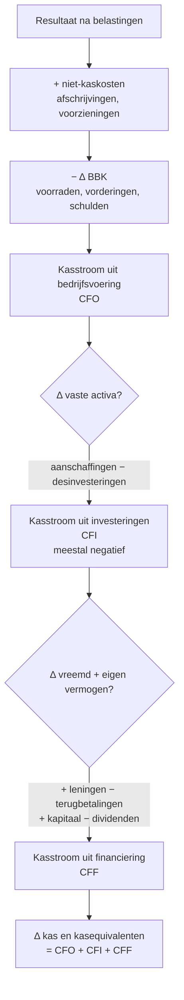
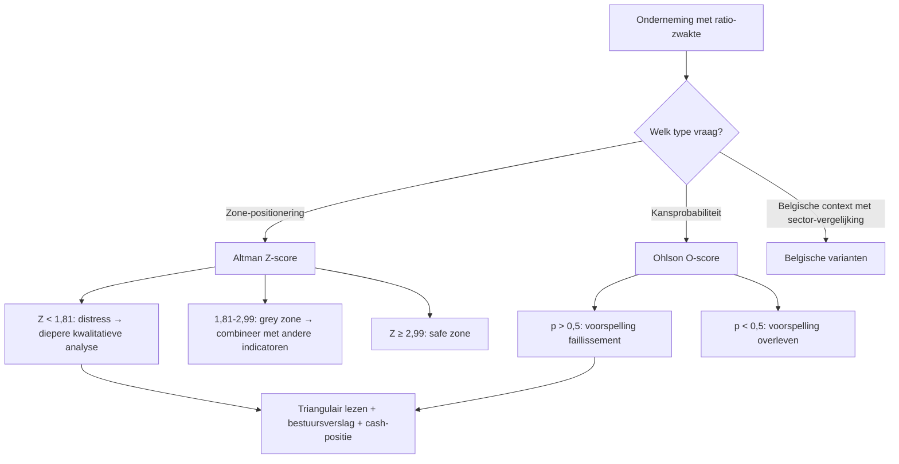

# PO 1.9 — Financiële analyse en fundamentele principes van financieel bedrijfsbeheer

> **Lees mij eerst:** dit document is een gestructureerd bundle van ALLE leermateriaal voor het programmaonderdeel "Financiële analyse en fundamentele principes van financieel bedrijfsbeheer" van het ITAA-bekwaamheidsexamen Gecertificeerd Accountant. Het bevat: (1) een didactische minicursus die je door het hele PO leidt, (2) 6 procedure-fiches die elk een concrete vaardigheid beschrijven ("hoe doe je X?"), en (3) 44 concept-fiches die elk een sleutel-begrip definiëren met bouwstenen, valkuilen en bronnen.
> 
> **Conventies in dit bundle:**
> - ⚖️ = directe wettelijke grondslag (WVV, KB WVV, CBN-advies, ITAA-norm, ISA, IFRS)
> - 🤖 = afgeleid of pedagogisch toegevoegd (geen letterlijke bron-citaat)
> - `[[concept-naam]]` = verwijzing naar een concept-fiche later in dit document
> - `[[competenties/naam]]` = verwijzing naar een competentie-fiche later in dit document
> 
> **Anti-fabricatie-regel voor afgeleide producten** (podcast / mindmap / slides / infographic / quiz): gebruik UITSLUITEND inhoud die in dit document staat. Geen externe bronnen, geen aanvullingen uit andere wetgevingen, geen verzonnen voorbeelden. Bij twijfel: zeg "dit staat niet in het bundle".


---

# Deel I — Minicursus

*De minicursus is de primaire leidraad. Lees ze in de aangeboden volgorde; gebruik de competentie- en concept-fiches in Deel II en III als verdieping wanneer iets onduidelijk blijft.*

### Wat verwacht het examen van jou?

> [!abstract] Dit programmaonderdeel wordt getoetst op niveau *integratie*.
> Je moet meerdere concepten samen kunnen inzetten in complexe casussen — onderdelen herkennen, prioriteren, en tot een coherent oordeel komen.


**Taken** (uit het ITAA-examenprogramma):

> [!abstract]- **Taak 1** — Opstellen van de individuele en geconsolideerde jaarrekening
>
> **Doelstellingen**:
> - Het doel van financiële analyse is het verstrekken van de informatie die de onderneming nodig heeft om beslissingen te nemen om te voldoen aan de behoeften van aandeelhouders, beleggers, schuldeisers, de ondernemingsrechtbank en de werknemers. Het gaat dus om het begrijpen en interpreteren van de jaarrekening, het verzamelen van relevante informatie om een financiële diagnose op te stellen, het verschaffen van de noodzakelijke basis voor financieel beheer, het vaststellen van financiële risico's en financiële soliditeit, en het uitwerken van scenario's en prognoses om te voldoen aan de toekomstige strategieën van het bestudeerde bedrijf.
> - Lezen en begrijpen van relevante jaarrekeningen
> - De consistentie en relevantie van de gegevens waarborgen
> - Contextualiseren van de omgeving van de onderneming
> - Een grondige financiële diagnose van een onderneming stellen
> - De problematiek vaststellen en aanbevelingen formuleren
> - De passende ratio's gebruiken naargelang de problematiek van de onderneming
> - Relevante informatie verzamelen om de financiële analyse uit te voeren en de databanken kunnen gebruiken
> - Gebruiken van tools voor financiële analyse en beheer
> - Financiële prognoses maken voor ondernemingen
> - De onderneming bijstaan in de verschillende fasen van haar ontwikkeling, van haar oprichting tot haar vereffening


### Leesgids

Deze minicursus bouwt op van perspectief naar techniek naar oordeel: je begint bij de gebruiker en de scoping, herwerkt vervolgens balans en resultatenrekening tot analytische schema's, voegt cashflow en mutaties toe, en zet dan de ratio-set in voor liquiditeit, solvabiliteit en rentabiliteit. De laatste blokken kantelen naar diagnose — falen-signalen, kwantitatieve voorspellingsmodellen, en de IT-tools die in de praktijk de berekeningen leveren. De competenties zijn de actie-momenten waar je technieken samen inzet; de synthese aan het einde rijgt alles aan elkaar tot één werkschema.

### Waarom dit programmaonderdeel telt

Een gecertificeerd accountant moet een onderneming kunnen lezen voorbij haar cijfers: detecteren waar continuïteit onder druk staat, of de financieringsstructuur houdbaar blijft, en welke aanbevelingen het management nodig heeft. Financiële analyse is daarom geen rekenkundige oefening maar het scharnier tussen [[jaarrekening-als-studieobject|jaarrekening]] en strategie — wat de [[doelstellingen-financiele-analyse|gebruiker]] wil weten bepaalt welke ratio's je kiest. Op examen-niveau betekent dat: je herkent welke vraag voorligt, welk ratio-cluster antwoord geeft, en hoe je het cijfer kantelt tegen sector, trend en context. De [[risicoparagraaf-bestuursverslag|risicoparagraaf]] en de [[cijferanalyses-controle-norm|cijferanalyse-controlenorm]] tonen dat de wetgever én de beroepsnormen deze diagnostische taak verankerd hebben. Tot slot moet je deze concepten samen kunnen inzetten in een complexe casus — wat de essentie van [[stellen-bekwaamheid-financiele-diagnose|integratie-niveau]] is.

### Van toelating naar bekwaamheid: wat verdiept PO 1.9 boven PO 1.3?

Op toelating leerde je de [[analytische-balans|analytische balans]] mechanisch herwerken en losse ratio's berekenen — input en output. Op bekwaamheidsniveau kantelt de focus naar [[interpretatie-financiele-ratios|interpretatie]]: trend, sector, contextuele weging, en de keuze welke ratio's überhaupt relevant zijn voor de [[doelstellingen-financiele-analyse|analyse-vraag]]. Je leert deze concepten samen inzetten om tot een coherent oordeel te komen, inclusief de [[kwantitatieve-financiele-diagnose|kwantitatieve modellen]] die ratio-analyse aanvullen en de aanbevelingen die uit de [[stellen-bekwaamheid-financiele-diagnose|diagnose]] volgen.

### Wie leest de jaarrekening en met welk doel? — gebruikersperspectief en scoping

> [!info] Hoort bij taak: Opstellen van de individuele en geconsolideerde jaarrekening

Elke analyse begint met de vraag wiens informatiebehoefte je bedient — een [[gebruikers-jaarrekening|kredietverstrekker]] leest met andere ogen dan een aandeelhouder of de ondernemingsrechtbank. Die scoping bepaalt welke ratio's relevant zijn en hoe je de [[intake-financiele-analyse|intake]] structureert. Het [[bestuursverslag|bestuursverslag]] vult de cijfers aan met de kwalitatieve context die de [[getrouw-beeld-jaarrekening|getrouw-beeld]]-norm soms vereist.

- [[doelstellingen-financiele-analyse|Doelstellingen van financiële analyse]] · `begrip`
- [[gebruikers-jaarrekening|Gebruikers van de jaarrekening]] · `begrip`
- [[getrouw-beeld-jaarrekening|Getrouw beeld van de jaarrekening]] · `regel`
- [[jaarrekening-als-studieobject|Jaarrekening als studieobject van financiële analyse]] · `begrip`
- [[intake-financiele-analyse|Intake (scoping) van financiële analyse]] · `procedure`
- [[bestuursverslag|Bestuursverslag (jaarverslag)]] · `procedure`

### Vertrekpunt: balans-herwerking herhaald, nu vanuit bekwaamheidsperspectief

> [!info] Hoort bij taak: Opstellen van de individuele en geconsolideerde jaarrekening

De [[analytische-balans|analytische balans]] is de meetlat: je hergroepeert de wettelijke posten in vlottend en vast, lang en kort, en bedrijfsgebonden versus extern, zodat ratio's ondubbelzinnig leesbaar worden. Op bekwaamheidsniveau is dit geen rekenoefening meer — je weet welke herklasseringen het meeste impact hebben op solvabiliteits- en liquiditeitsmaten, en motiveert je keuzes.

- [[analytische-balans|Analytische balans (herstructureringsschema)]] · `cluster`

### Resultatenrekening herwerken: vier blokken, drie schema's, toegevoegde waarde

> [!info] Hoort bij taak: Opstellen van de individuele en geconsolideerde jaarrekening

De [[herstructurering-resultatenrekening|herstructurering van de resultatenrekening]] zet de wettelijke vier-blokken-indeling om in een functionele groepering die de marges per niveau zichtbaar maakt. Het isoleren van de [[toegevoegde-waarde-financiele-analyse|toegevoegde waarde]] toont wat de onderneming bovenop haar externe aankopen heeft gecreëerd — de basis voor productiviteits- en marge-analyse.

- [[herstructurering-resultatenrekening|Herstructurering van de resultatenrekening]] · `cluster`
- [[toegevoegde-waarde-financiele-analyse|Toegevoegde waarde (economische maatstaf in financiële analyse)]] · `cluster`

### Herstructureren van de resultatenrekening en isoleren van de toegevoegde waarde

> [!info] Hoort bij taak: Opstellen van de individuele en geconsolideerde jaarrekening

Stap voor stap doorloop je de identificatie van het schema (volledig, verkort, micro), de herklassering naar analytische groepen, en het isoleren van de toegevoegde waarde.

[[competenties/herstructureren-resultatenrekening-en-toegevoegde-waarde|→ Volledige procedure]]

### Cashflow, financieringsbronnen en mutaties: de tweede pijler naast de balans

> [!info] Hoort bij taak: Opstellen van de individuele en geconsolideerde jaarrekening

Naast de statische balans heb je een dynamische lezing nodig: de [[cashflow-analyse|cashflow]] benadert wat de exploitatie genereert vóór investeringen, en de [[tabel-waardemutaties|mutatietabel]] traceert welke vaste activa erbij kwamen of werden afgestoten. De vermogensbronnen splitsen in [[financiering-met-eigen-vermogen|eigen vermogen]] en [[financiering-met-derdenkapitaal|derdenkapitaal]] vertelt welk type kapitaal de groei droeg en is daarmee de bouwsteen voor solvabiliteits- en kasstroomanalyse.

- [[cashflow-analyse|Cashflow (bedrijfscashflow)]] · `begrip`
- [[tabel-waardemutaties|Tabel van waardemutaties (mutatietabel vaste activa)]] · `cluster`
- [[financiering-met-eigen-vermogen|Financiering met eigen vermogen]] · `begrip`
- [[financiering-met-derdenkapitaal|Financiering met derdenkapitaal (vreemd vermogen)]] · `begrip`

### Kasstroomoverzicht — operationeel, investerings- en financierings-kasstroom

Het kasstroomoverzicht ontleedt de kasevolutie in drie segmenten: operationele kasstroom (CFO — uit exploitatie), investeringskasstroom (CFI — vaste activa) en financieringskasstroom (CFF — eigen vermogen en schulden). Sluit aan op de balans-evolutie van liquide middelen en is dé synthese die rentabiliteit (resultatenrekening) en vermogen (balans) verbindt met effectieve cash. Niet-verplicht voor verkort/microschema — moet gereconstrueerd worden uit balans, resultatenrekening en toelichtingsstaten.


Hier komen de losse onderdelen samen: de [[cashflow-analyse|cashflow]] uit de exploitatie wordt gecorrigeerd voor de [[behoefte-aan-bedrijfskapitaal|BBK-evolutie]], gekoppeld aan investeringen en gefinancierd via eigen of vreemd vermogen. Het overzicht leert je waar liquiditeitsdruk vandaan komt, ook als de winst er gezond uitziet.

| Segment | Wat zit erin? | Indirecte methode (vertrekpunt) | Wat zegt het over de onderneming? |
|---|---|---|---|
| **Operationeel (CFO)** | Kasstroom uit de eigen activiteit | Resultaat + niet-kaskosten − Δ BBK | Kan het bedrijfsmodel zichzelf bedruipen? |
| **Investerings (CFI)** | In- en uitstroom door aan- en verkoop vaste activa | Aanschaffingen materiële vaste activa min desinvesteringen | Bouwt de onderneming op (negatief = uitbreiding) of leeft ze van afbouw (positief)? |
| **Financierings (CFF)** | In- en uitstroom met kapitaalverschaffers | Nieuwe leningen + kapitaalverhogingen − terugbetalingen − dividenden | Hoe wordt het tekort tussen CFO en CFI overbrugd? |
| **Δ kas en kasequivalenten** | Som van de drie segmenten | CFO + CFI + CFF | Verklaart de Δ liquide middelen op de balans. |



_Bouwt op_: [[cashflow-analyse]] · [[behoefte-aan-bedrijfskapitaal]] · [[financiering-met-eigen-vermogen]] · [[financiering-met-derdenkapitaal]]
### Opstellen van een drie-segmenten-kasstroomoverzicht (CFO, CFI, CFF)

> [!info] Hoort bij taak: Opstellen van de individuele en geconsolideerde jaarrekening

Je werkt een casus uit waarbij je vertrekt vanuit de operationele kasstroom (CFO), via investeringen (CFI) naar financiering (CFF), met de [[tabel-waardemutaties|mutatietabel]] als bron voor de niet-kas-componenten.

[[competenties/opstellen-driesegmenten-kasstroomoverzicht|→ Volledige procedure]]

### Werkkapitaal versus behoefte aan bedrijfskapitaal: de analytische conventie

> [!info] Hoort bij taak: Opstellen van de individuele en geconsolideerde jaarrekening

Let op het verschil tussen [[werkkapitaal|werkkapitaal]] — de absolute buffer uit de balansstructuur — en de [[behoefte-aan-bedrijfskapitaal|behoefte aan bedrijfskapitaal]] die de exploitatiecyclus oplegt. Wanneer de behoefte groter is dan de buffer, ontstaat een nettokas-tekort dat met korte-termijn-financiering of structurele herfinanciering moet worden opgevangen.

- [[werkkapitaal|Werkkapitaal (working capital)]] · `begrip`
- [[behoefte-aan-bedrijfskapitaal|Behoefte aan bedrijfskapitaal (BBK)]] · `begrip`

### Bepalen van de behoefte aan bedrijfskapitaal en de nettokas-positie

> [!info] Hoort bij taak: Opstellen van de individuele en geconsolideerde jaarrekening

Stap voor stap identificeer je de exploitatiecyclus-rubrieken, bereken je de [[behoefte-aan-bedrijfskapitaal|BBK]], vergelijk je met het [[werkkapitaal|werkkapitaal]] en kom je tot de nettokas-positie die de financieringsbehoefte op korte termijn vastlegt.

[[competenties/bepalen-behoefte-aan-bedrijfskapitaal|→ Volledige procedure]]

### Ratio-set in de diepte: de vier doelen en hun ratio's

> [!info] Hoort bij taak: Opstellen van de individuele en geconsolideerde jaarrekening

De [[ratio-vier-doelen-vergelijking|vier analyse-doelen]] — liquiditeit, solvabiliteit, rentabiliteit en activiteit — bepalen welk ratio-cluster je inzet. Voor liquiditeit kies je tussen [[current-ratio|current]] en [[quick-ratio|quick ratio]] via de [[liquiditeitstoets-beslisboom|beslisboom]]; voor solvabiliteit zet je [[solvabiliteitsratio|solvabiliteit]] naast [[debt-equity-ratio|debt-equity]]; voor rentabiliteit splits je [[rentabiliteit-totaal-activa-roa|ROA]] (economisch) van [[rentabiliteit-eigen-vermogen-roe|ROE]] (aandeelhouders).

- [[ratio-vier-doelen-vergelijking|De vier analyse-doelen en hun ratio's — overzicht]] · `synthese`
- [[liquiditeitsratio|Liquiditeitsratio (begrip)]] · `begrip`
- [[current-ratio|Current ratio (liquiditeit in ruime zin)]] · `cluster`
- [[quick-ratio|Quick ratio (liquiditeit in enge zin, zuurtegraad)]] · `cluster`
- [[liquiditeitstoets-beslisboom|Welke liquiditeitstoets gebruik ik? — Beslisboom]] · `synthese`
- [[solvabiliteitsratio|Solvabiliteitsratio]] · `cluster`
- [[debt-equity-ratio|Debt-equity ratio (schuldgraad)]] · `cluster`
- [[rentabiliteit-totaal-activa-roa|Rentabiliteit van het totaal der activa (ROA)]] · `cluster`
- [[rentabiliteit-eigen-vermogen-roe|Rentabiliteit van het eigen vermogen (ROE)]] · `cluster`

### Bekwaamheid-niveau lezen: trend, sector en contextuele interpretatie

> [!info] Hoort bij taak: Opstellen van de individuele en geconsolideerde jaarrekening

Een ratio op één boekjaar zegt weinig — de [[interpretatie-financiele-ratios|interpretatie]] vraagt dat je het cijfer kantelt tegen de [[horizontale-analyse-jaarrekening|evolutie]] over meerdere jaren, de [[verticale-analyse-jaarrekening|interne samenstelling]] en de [[sectorvergelijking-financiele-analyse|sectorbenchmark]]. Wanneer twijfel ontstaat over de richting van het oordeel, triangulair lezen: trend, sector en contextuele weging samen.

- [[interpretatie-financiele-ratios|Interpretatie en evaluatie van financiële ratio's (bekwaamheid)]] · `cluster`
- [[horizontale-analyse-jaarrekening|Horizontale analyse (evolutie-analyse)]] · `cluster`
- [[verticale-analyse-jaarrekening|Verticale analyse (percentageanalyse, common-size)]] · `cluster`
- [[sectorvergelijking-financiele-analyse|Sectorvergelijking (benchmarking)]] · `cluster`
- [[historische-evolutie-financiele-analyse|Historische evolutie in financiële analyse]] · `cluster`

### Falen als fenomeen: signalen, alarmbel, covenanten en juridisch kader

> [!info] Hoort bij taak: Opstellen van de individuele en geconsolideerde jaarrekening

[[falen-van-de-onderneming|Falen]] kondigt zich vrijwel altijd geleidelijk aan in de cijfers — verslechterende rentabiliteit, krimpende liquiditeit, oplopende schuldgraad. De [[risicoparagraaf-bestuursverslag|risicoparagraaf]] in het bestuursverslag, contractuele [[ratio-covenants|ratiocovenants]] en de [[cijferanalyses-controle-norm|cijferanalyse-controlenorm]] zijn de signaalkanalen die het juridisch en professioneel kader installeert om die verslechtering tijdig op te pikken.

- [[falen-van-de-onderneming|Falen van de onderneming (financiële diagnose)]] · `cluster`
- [[risicoparagraaf-bestuursverslag|Risicoparagraaf in het bestuursverslag]] · `regel`
- [[ratio-covenants|Ratiocovenants (financial covenants)]] · `begrip`
- [[cijferanalyses-controle-norm|Cijferanalyses (controlenorm KMO)]] · `regel`

### Kwantitatieve faillissement-predictiemodellen: Altman Z en Ohlson O

> [!info] Hoort bij taak: Opstellen van de individuele en geconsolideerde jaarrekening

Naast klassieke ratio-analyse beschik je over kwantitatieve toetsen die meerdere ratio's tot één indicator combineren: de [[altman-z-score|Altman Z-score]] positioneert je in een zone, de [[ohlson-o-score|Ohlson O-score]] levert een kansprobabiliteit. Beide zijn vakdoctrine — geen wettelijke verplichting — maar geven een tweede, onafhankelijke weging van je signaal.

- [[altman-z-score|Altman Z-score (faillissement-predictiemodel)]] · `cluster`
- [[ohlson-o-score|Ohlson O-score (faillissement-predictiemodel via logit)]] · `cluster`

### Toepassen van kwantitatieve faillissement-predictiemodellen (Altman Z en Ohlson O)

> [!info] Hoort bij taak: Opstellen van de individuele en geconsolideerde jaarrekening

Stap voor stap verzamel je de input-ratio's, bereken je de [[altman-z-score|Z-score]] en de [[ohlson-o-score|O-score]], en weeg je de uitkomsten samen met je kwalitatieve [[interpretatie-financiele-ratios|interpretatie]].

[[competenties/toepassen-faillissement-predictiemodellen|→ Volledige procedure]]

### Kwantitatieve modellen voor financiële diagnose — overzicht

Overzicht-fiche: welke kwantitatieve modellen kan de stagiair inzetten naast klassieke ratio-analyse om falen te voorspellen? Altman Z (discriminantmodel, score-zones, 2-jaarshorizon), Ohlson O (logistische regressie, kansprobabiliteit), aangevuld met sector- en evolutiebenchmarks. Geen vervanging voor inhoudelijk oordeel — wel een tweede toets om signaalsterkte te wegen.


Je vraag bepaalt het model: wil je weten in welke zone de onderneming zich bevindt, of wil je een kans op falen uitdrukken? De keuze blijft een hulpmiddel binnen je bredere [[stellen-bekwaamheid-financiele-diagnose|diagnose]] — geen op zichzelf staand verdict.

| Model | Techniek | Aantal variabelen | Output | Interpretatie hoog | Interpretatie laag |
|---|---|---|---|---|---|
| **Altman Z** | Discriminant-analyse | 5 | Score met 3 zones | Z ≥ 2,99 = gezond | Z < 1,81 = distress |
| **Ohlson O** | Logistische regressie | 9 | Kans 0-1 | Hoog = hoog risico | Laag = laag risico |
| **Belgische varianten** (Score Belfius, Graydon Multiscore) | Eigen propriëtaire modellen op Belgische data | Onbekend | Score 0-100 of letter-rating | Variabel — afhankelijk van bron | Variabel |



_Bouwt op_: [[altman-z-score]] · [[ohlson-o-score]] · [[falen-van-de-onderneming]]
### IT-tools voor financiële analyse: NBB-Online, Bel-First, Graydon, scoringtools

> [!info] Hoort bij taak: Opstellen van de individuele en geconsolideerde jaarrekening

[[financiele-analyse-software|Financiële-analyse-software]] importeert jaarrekening-data, berekent automatisch de ratio-set en levert sector-benchmarks — een efficiëntiehefboom, geen oordeelsvervanger. Op bekwaamheidsniveau moet je weten welke tool welk soort vraag bedient en hoe je de output kritisch valideert tegen je eigen herwerking.

- [[financiele-analyse-software|Financiële-analyse-software (IT-tools)]] · `begrip`

### Gebruiken van financiële-analyse-software voor ratio-set en sectorvergelijking

> [!info] Hoort bij taak: Opstellen van de individuele en geconsolideerde jaarrekening

Je leert een gepaste tool kiezen voor de analyse-vraag, de output kritisch lezen en de [[sectorvergelijking-financiele-analyse|sector-benchmark]] op zijn waarde inschatten.

[[competenties/gebruiken-financiele-analyse-software|→ Volledige procedure]]

### Stellen van een complete bekwaamheid-financiële diagnose met aanbevelingen aan het management

> [!info] Hoort bij taak: Opstellen van de individuele en geconsolideerde jaarrekening

In een complexe casus moet je elke ratio plaatsen in zijn doel-categorie, signalen van [[falen-van-de-onderneming|falen]] wegen, [[kwantitatieve-financiele-diagnose|kwantitatieve modellen]] inzetten als triangulatie, en eindigen met aanbevelingen die het management kan uitvoeren.

[[competenties/stellen-bekwaamheid-financiele-diagnose|→ Volledige procedure]]

### Grenzen van kwantitatieve modellen: wat een diagnose NIET kan zeggen

Ratio's en scoringmodellen meten wat in de cijfers staat — niet wat erbuiten valt. Een [[altman-z-score|Z-score]] in de safe zone garandeert geen continuïteit als de markt instort of een sleutelklant wegvalt, en een hoge [[ohlson-o-score|O-score]] kan misleiden bij sector-atypische ondernemingen. Op bekwaamheidsniveau bouw je je oordeel op uit cijferanalyse én kwalitatieve elementen uit het [[bestuursverslag|bestuursverslag]] en de [[risicoparagraaf-bestuursverslag|risicoparagraaf]] — modellen zijn een hulpmiddel, geen verdict.


### Synthese-stappenplan

Begin altijd bij de [[intake-financiele-analyse|intake]]: wie is de [[gebruikers-jaarrekening|gebruiker]], welke vraag ligt voor, welke boekjaren bekijk je? Herwerk vervolgens balans en resultatenrekening tot een [[analytische-balans|analytisch schema]] en isoleer de [[toegevoegde-waarde-financiele-analyse|toegevoegde waarde]] uit de [[herstructurering-resultatenrekening|herstructurering]]. Bouw dan de dynamische lezing op: bereken de [[cashflow-analyse|cashflow]], stel het [[kasstroomoverzicht-drie-segmenten|drie-segmenten-kasstroomoverzicht]] op en confronteer [[werkkapitaal|werkkapitaal]] met [[behoefte-aan-bedrijfskapitaal|BBK]]. Pas vervolgens de [[ratio-vier-doelen-vergelijking|vier-doelen-ratio-set]] toe — liquiditeit, solvabiliteit, rentabiliteit, activiteit — en kantel elk cijfer tegen [[horizontale-analyse-jaarrekening|trend]] en [[sectorvergelijking-financiele-analyse|sector]]. Toets falensignalen tegen de [[risicoparagraaf-bestuursverslag|risicoparagraaf]], eventuele [[ratio-covenants|ratiocovenants]] en de [[kwantitatieve-financiele-diagnose|kwantitatieve modellen]] (Altman Z, Ohlson O) als triangulatie. Eindig met een [[stellen-bekwaamheid-financiele-diagnose|coherente diagnose]] en concrete aanbevelingen aan het management — niet alleen wat de cijfers zeggen, ook wat ze in de strategische context betekenen.

### Cheatsheet

#### Kritische drempelwaarden

| Concept | Naam | Waarde | Eenheid | Gevolg |
|---|---|---|---|---|
| [[altman-z-score]] | Distress zone | Z < 1,81 | Z-score | Hoog faillissementsrisico binnen 2 jaar — diepere diagnose vereist |
| [[altman-z-score]] | Grey zone | 1,81 ≤ Z < 2,99 | Z-score | Onzekere uitkomst — aanvullende analyse vereist |
| [[altman-z-score]] | Safe zone | Z ≥ 2,99 | Z-score | Financieel gezond op basis van het model |

#### Vergelijkingsparen-matrix

| Concept | Verwarrend met | Trigger |
|---|---|---|
| [[altman-z-score]] | [[ohlson-o-score]] | Examenvraag 'welk model gebruik je?': Altman geeft een score-positie; Ohlson een kans. Bij twijfel beide berekenen en triangulair lezen. |
| [[behoefte-aan-bedrijfskapitaal]] | [[werkkapitaal]] | Bij examenvraag 'continuïteit / liquiditeitsanalyse': controleer of werkkapitaal de BBK dekt. Niet hetzelfde concept verwarren. |
| [[bestuursverslag]] | [[jaarverslag]] | Twee namen, één document. Term-keuze hangt af van regelgevings-context (BE/EU). |
| [[cashflow-analyse]] | [[rentabiliteit-eigen-vermogen-roe]] | Examenvraag 'cijfer of ratio?': cashflow is een €-bedrag; ROE/ROA op cashflow zijn percentages. |
| [[current-ratio]] | [[quick-ratio]] | Examenvraag 'liquiditeit in ruime / enge zin?': ruim = current; eng = quick. |
| [[debt-equity-ratio]] | [[solvabiliteitsratio]] | Beide drukken financieringsstructuur uit; context bepaalt welke courant is — bankcovenants gebruiken D/E, ratingagentschappen vaker solvabiliteit. |
| [[financiering-met-derdenkapitaal]] | [[financiering-met-eigen-vermogen]] | Examenvraag 'optimale financieringsmix': trade-off tussen kostvoordeel (vreemd is goedkoper) en risico-voordeel (eigen geeft buffer). |
| [[financiering-met-eigen-vermogen]] | [[financiering-met-derdenkapitaal]] | Bij examenvraag 'financieringsmix': bepaal eerst de schuldgraad ([[debt-equity-ratio]]); dat onderscheid is fundamenteel voor solvabiliteits-analyse. |
| [[getrouw-beeld-jaarrekening]] | [[voorzichtigheidsbeginsel]] | Bij een examenvraag 'welk beginsel?' — getrouw beeld als algemeen doel; voorzichtigheid als specifieke voorschrift om risico's volledig op te nemen. |
| [[herstructurering-resultatenrekening]] | [[analytische-balans]] | Examenvraag 'herstructurering jaarrekening': beide aspecten benoemen, niet alleen balans. |
| [[horizontale-analyse-jaarrekening]] | [[verticale-analyse-jaarrekening]] | Examenvraag 'evolutie of structuur?': over de tijd = horizontaal; samenstelling op één moment = verticaal. |
| [[liquiditeitsratio]] | [[solvabiliteitsratio]] | Examenvraag 'kortetermijnsbetaalkracht versus structurele veerkracht': KT = liquiditeit; lang = solvabiliteit. |
| [[liquiditeitsratio]] | [[cash-ratio]] | Examenvraag 'strengste liquiditeitstoets?' of 'welke ratio sluit voorraden én vorderingen uit?': altijd cash ratio. |
| [[ohlson-o-score]] | [[altman-z-score]] | Examenvraag 'welk model levert wat?': Ohlson → kans; Altman → zone. |
| [[quick-ratio]] | [[current-ratio]] | Voorraad-intensiteit: in productie/handel altijd allebei berekenen om de spreiding te zien. |
| [[rentabiliteit-eigen-vermogen-roe]] | [[rentabiliteit-totaal-activa-roa]] | Examenvraag 'welke ratio voor welke vraag?': aandeelhoudersrendement = ROE; economische winstgevendheid van de bedrijfsmiddelen = ROA. |
| [[rentabiliteit-totaal-activa-roa]] | [[rentabiliteit-eigen-vermogen-roe]] | Examenvraag 'economisch vs financieel rendement': economisch = ROA; financieel/aandeelhouder = ROE. |
| [[solvabiliteitsratio]] | [[liquiditeitsratio]] | Examenvraag 'structureel vs operationeel risico': structureel = solvabiliteit; KT betalingsrisico = liquiditeit. |
| [[solvabiliteitsratio]] | [[debt-equity-ratio]] | Solvabiliteitsratio bij algemene structuuranalyse; debt-equity-ratio bij specifieke hefboom- of risicobeoordeling (bankcovenants). |
| [[toegevoegde-waarde-financiele-analyse]] | [[rentabiliteit-totaal-activa-roa]] | Examenvraag 'productiviteit vs rendabiliteit': TW/VTE = arbeidsproductiviteit; ROA = totale kapitaalproductiviteit. Mix niet. |
| [[verticale-analyse-jaarrekening]] | [[horizontale-analyse-jaarrekening]] | Examen 'samenstelling of trend?': samenstelling = verticaal; trend = horizontaal. |
| [[werkkapitaal]] | [[current-ratio]] | Examenvraag 'absolute buffer of relatieve dekking?': absoluut = werkkapitaal; relatief = current ratio. |
| [[werkkapitaal]] | [[werkkapitaalbehoefte]] | Examenvraag 'beschikbaar versus benodigd werkkapitaal' of 'wanneer is er liquiditeitstekort?': vergelijk werkkapitaal (beschikbaar uit balans) met werkkapitaalbehoefte (benodigd voor cyclus). |


### Heb je deze taken in de vingers?

Loop deze taken na vóór je verder gaat met examenfocus. Twijfel je bij een taak? Lees de aangegeven secties nog eens.

- ✓ **1.9.taak.1** — Opstellen van de individuele en geconsolideerde jaarrekening _Behandeld in §5, §6, §7, §8, §9, §10, §11, §12, §13, §14, §15, §16, §17, §18, §19, §20, §21, §22._

### Examenfocus

Het examen toetst of je ratio's correct uit de balans en resultatenrekening kan afleiden, of je weet welke ratio de gestelde vraag bedient, en of je een uitkomst in cashflow- of investeringsbeslissingen kan vertalen. Verwacht numerieke casussen waar je [[werkkapitaal|werkkapitaal]], liquiditeit en solvabiliteit naast elkaar moet leggen, en kwalitatieve vragen die de [[behoefte-aan-bedrijfskapitaal|BBK]] of [[cashflow-analyse|cashflow]] interpreteren.

#### C. Algemene beginselen van het financieel beheer 📃

> [!question]- ITAA 2003-bibf vraag C.1 (tier C)
> C.1. Op de balans staan volgende bedragen: … 4 PUNTEN ACTIVA Vaste activa 150.040,00 Vlottende activa Voorraden 41.000,00 Vorderingen op -1 jaar 42.700,00 Geldbeleggingen 10.000,00 Liquide middelen 37.500,00 281.240,00 PASSIVA Kapitaal 100.000,00 Reserves 50.400,00 Overgedragen winst 2.750,00 Schulden op + 1 jaar 51.000,00 Schulden op - 1 jaar 77.090,00 281.240,00 Vraag: Bereken uit deze cijfers
> 
> a. het netto bedrijfskapitaal
> 
> b. de ruime liquiditeitsratio (current ratio)
> 
> c. de beperkte liquiditeitsratio (acid test)
> 
> d. de solvabiliteitsratio.


#### C. Algemene beginselen van het financieel beheer 📃

> [!question]- ITAA 2003-bibf vraag C.2 (tier C)
> C.2. Naast de balans hierboven blijken volgende cijfers uit de resultatenrekening 1 PUNT - winst van het boekjaar 2.750,00 - afschrijvingen 12.100,00 - toevoegingen aan voorzieningen 6.300,00 - bestedingen van voorzieningen 1.650,00 - toevoegingen aan waardeverminderingen 780,00 Vraag: Bereken de operationele cash-flow.


#### C. Algemene beginselen van het financieel beheer 📃

> [!question]- ITAA 2008-bibf vraag C.1 (tier C)
> C.1 Wat verstaat men met “behoefte aan bedrijfskapitaal”? Hoe wordt het berekend? Van uit het oogpunt financieel beheer, wat kan worden ondernomen om de behoefte aan bedrijfskapitaal te verminderen?
>
> > [!success]- Antwoord-motivering
> > De behoefte aan bedrijfskapitaal is het netto verschil tussen de bedrijfsbronnen en bedrijfsaanwendingen. Het wordt berekend als verschil tussen enerzijds de niet financiële beperkte vlottende activa en, anderzijds, de niet financiële schulden op ten hoogste één jaar. (3 + 40/41 + 49 van het actief) – (42 + 44 tot 48 + 49 van het passief) Om behoefte aan bedrijfskapitaal te verminderen, moet de omvang van de voorraden en / of vorderingen verminderen. Betalingstermijnen leverancier uitbreiden.


#### C. Algemene beginselen van het financieel beheer 📃

> [!question]- ITAA 2008-bibf vraag C.2 (tier C)
> C.2 Een vennootschap heeft jaarlijks ongeveer 30.000,00 EUR cashflow. Ze betaalt jaarlijks 12.000,00 EUR kapitaalaflossingen op bestaande leningen. Voor een nieuwe investering van 100.000,00 EUR, wenst ze van de bank een investeringskrediet te bekomen om het volledig bedrag van de aankoop te financieren. De rentevoet bedraagt 5 % per jaar. Ze wenst de nieuwe lening in 5 jaarlijkse gelijke schijven af te lossen. Wat is uw mening?
>
> > [!success]- Antwoord-motivering
> > De nieuwe lening zal het eerste jaar een intrestkost van 5.000,00 EUR veroorzaken. De cashflow vermindert zodoende tot 25.000,00 EUR. Rekening houdend met terugbetalingen van 12.000,00 EUR op de bestaande leningen blijft er slechts een vrije cashflow van 13.000,00 EUR over. Indien de nieuwe lening over 5 jaar wordt terugbetaald moet jaarlijks aan kapitaalaflossingen 20.000,00 EUR worden betaald. De vrije cashflow bedraagt slechts 13.000,00 EUR; bijgevolg moet overwogen worden om de lening over een langere periode af te lossen (8 jaar of meer).


### Competentie-index

<div class="two-column-list">

- [[competenties/bepalen-behoefte-aan-bedrijfskapitaal|Bepalen van de behoefte aan bedrijfskapitaal en de nettokas-positie]]
- [[competenties/gebruiken-financiele-analyse-software|Gebruiken van financiële-analyse-software voor ratio-set en sectorvergelijking]]
- [[competenties/herstructureren-resultatenrekening-en-toegevoegde-waarde|Herstructureren van de resultatenrekening en isoleren van de toegevoegde waarde]]
- [[competenties/opstellen-driesegmenten-kasstroomoverzicht|Opstellen van een drie-segmenten-kasstroomoverzicht (CFO, CFI, CFF)]]
- [[competenties/stellen-bekwaamheid-financiele-diagnose|Stellen van een complete bekwaamheid-financiële diagnose met aanbevelingen aan het management]]
- [[competenties/toepassen-faillissement-predictiemodellen|Toepassen van kwantitatieve faillissement-predictiemodellen (Altman Z en Ohlson O)]]

</div>

### Concept-index

<div class="two-column-list">

- [[altman-z-score|Altman Z-score (faillissement-predictiemodel)]] · `cluster`
- [[analytische-balans|Analytische balans (herstructureringsschema)]] · `cluster`
- [[behoefte-aan-bedrijfskapitaal|Behoefte aan bedrijfskapitaal (BBK)]] · `begrip`
- [[bepalen-behoefte-aan-bedrijfskapitaal|Bepalen van de behoefte aan bedrijfskapitaal en de nettokas-positie]] · `competentie`
- [[bestuursverslag|Bestuursverslag (jaarverslag)]] · `procedure`
- [[cashflow-analyse|Cashflow (bedrijfscashflow)]] · `begrip`
- [[cijferanalyses-controle-norm|Cijferanalyses (controlenorm KMO)]] · `regel`
- [[current-ratio|Current ratio (liquiditeit in ruime zin)]] · `cluster`
- [[ratio-vier-doelen-vergelijking|De vier analyse-doelen en hun ratio's — overzicht]] · `synthese`
- [[debt-equity-ratio|Debt-equity ratio (schuldgraad)]] · `cluster`
- [[doelstellingen-financiele-analyse|Doelstellingen van financiële analyse]] · `begrip`
- [[falen-van-de-onderneming|Falen van de onderneming (financiële diagnose)]] · `cluster`
- [[financiering-met-derdenkapitaal|Financiering met derdenkapitaal (vreemd vermogen)]] · `begrip`
- [[financiering-met-eigen-vermogen|Financiering met eigen vermogen]] · `begrip`
- [[financiele-analyse-software|Financiële-analyse-software (IT-tools)]] · `begrip`
- [[gebruiken-financiele-analyse-software|Gebruiken van financiële-analyse-software voor ratio-set en sectorvergelijking]] · `competentie`
- [[gebruikers-jaarrekening|Gebruikers van de jaarrekening]] · `begrip`
- [[getrouw-beeld-jaarrekening|Getrouw beeld van de jaarrekening]] · `regel`
- [[herstructureren-resultatenrekening-en-toegevoegde-waarde|Herstructureren van de resultatenrekening en isoleren van de toegevoegde waarde]] · `competentie`
- [[herstructurering-resultatenrekening|Herstructurering van de resultatenrekening]] · `cluster`
- [[historische-evolutie-financiele-analyse|Historische evolutie in financiële analyse]] · `cluster`
- [[horizontale-analyse-jaarrekening|Horizontale analyse (evolutie-analyse)]] · `cluster`
- [[intake-financiele-analyse|Intake (scoping) van financiële analyse]] · `procedure`
- [[interpretatie-financiele-ratios|Interpretatie en evaluatie van financiële ratio's (bekwaamheid)]] · `cluster`
- [[jaarrekening-als-studieobject|Jaarrekening als studieobject van financiële analyse]] · `begrip`
- [[kasstroomoverzicht-drie-segmenten|Kasstroomoverzicht — operationeel, investerings- en financierings-kasstroom]] · `synthese`
- [[kwantitatieve-financiele-diagnose|Kwantitatieve modellen voor financiële diagnose — overzicht]] · `synthese`
- [[liquiditeitsratio|Liquiditeitsratio (begrip)]] · `begrip`
- [[ohlson-o-score|Ohlson O-score (faillissement-predictiemodel via logit)]] · `cluster`
- [[opstellen-driesegmenten-kasstroomoverzicht|Opstellen van een drie-segmenten-kasstroomoverzicht (CFO, CFI, CFF)]] · `competentie`
- [[quick-ratio|Quick ratio (liquiditeit in enge zin, zuurtegraad)]] · `cluster`
- [[ratio-covenants|Ratiocovenants (financial covenants)]] · `begrip`
- [[rentabiliteit-eigen-vermogen-roe|Rentabiliteit van het eigen vermogen (ROE)]] · `cluster`
- [[rentabiliteit-totaal-activa-roa|Rentabiliteit van het totaal der activa (ROA)]] · `cluster`
- [[risicoparagraaf-bestuursverslag|Risicoparagraaf in het bestuursverslag]] · `regel`
- [[sectorvergelijking-financiele-analyse|Sectorvergelijking (benchmarking)]] · `cluster`
- [[solvabiliteitsratio|Solvabiliteitsratio]] · `cluster`
- [[stellen-bekwaamheid-financiele-diagnose|Stellen van een complete bekwaamheid-financiële diagnose met aanbevelingen aan het management]] · `competentie`
- [[tabel-waardemutaties|Tabel van waardemutaties (mutatietabel vaste activa)]] · `cluster`
- [[toegevoegde-waarde-financiele-analyse|Toegevoegde waarde (economische maatstaf in financiële analyse)]] · `cluster`
- [[toepassen-faillissement-predictiemodellen|Toepassen van kwantitatieve faillissement-predictiemodellen (Altman Z en Ohlson O)]] · `competentie`
- [[verticale-analyse-jaarrekening|Verticale analyse (percentageanalyse, common-size)]] · `cluster`
- [[liquiditeitstoets-beslisboom|Welke liquiditeitstoets gebruik ik? — Beslisboom]] · `synthese`
- [[werkkapitaal|Werkkapitaal (working capital)]] · `begrip`

</div>


---

# Deel II — Competentie-procedures (hoe doe je X?)

*Per competentie staan hier de aanbevolen werkwijze en stappen. Deze fiches zijn dezelfde als waarnaar de minicursus verwijst via `[[competenties/...]]`.*

## Bepalen van de behoefte aan bedrijfskapitaal en de nettokas-positie

### Bepalen van de behoefte aan bedrijfskapitaal en de nettokas-positie

**⚖️ 15% · 🤖 85%**

> Geen wettelijke definitie van BBK; volledig vakdoctrine (Ooghe-Van Wymeersch, Vereeck). De balansrubrieken die als input dienen (voorraden klasse 3, vorderingen klasse 40, schulden klasse 44) zijn wel KB WVV-verankerd. Vereist mens-review wegens praktijk_pct > 70%.

#### Aanbevolen werkwijze

##### 1. Identificeren van de exploitatiecyclus-rubrieken

Selecteer uit de analytische balans de drie operationele rubrieken die de BBK vormen — voorraden, handelsvorderingen en handelsschulden.

**Waarom?** De BBK meet enkel het cyclus-gerelateerde werkkapitaal. Andere vorderingen en schulden (financieel, fiscaal) horen er niet bij — anders ontstaat verwarring met werkkapitaal in enge zin.

**📥 Input**:
- Analytische balans (volgens [[analytische-balans]]) → **Rubrieken 3 (voorraden), 40 (handelsvorderingen ≤ 1 jaar), 44 (handelsschulden)** _(boekhoudkundig-bedrag)_

**📤 Output**:
- Drie BBK-bouwstenen → **voorraden, handelsvorderingen, handelsschulden — telkens één bedrag** _(boekhoudkundig-bedrag)_

**🛠️ Hoe**:

1. Open de analytische balans (zie [[analytische-balans]] §functioneel-economische-rubrieken).
2. Lees rubriek 3 (voorraden + bestellingen in uitvoering) — opletten dat ontvangen vooruitbetalingen geen voorraad-inkomende-vooruit zijn die geneutraliseerd moeten worden.
3. Lees rubriek 40 (handelsvorderingen ≤ 1 jaar). Exclusief: 41 (overige vorderingen), 50 (geldbeleggingen).
4. Lees rubriek 44 (handelsschulden). Exclusief: financiële schulden (43), fiscale schulden (45-46), salarissen (45).


**Grondslag**: [[behoefte-aan-bedrijfskapitaal]] §formule, [[analytische-balans]] §functioneel-economische-rubrieken

##### 2. Berekenen van de behoefte aan bedrijfskapitaal

Bereken BBK = voorraden + handelsvorderingen − handelsschulden.

**Waarom?** Het verschil toont hoeveel geld de exploitatiecyclus permanent vastzet — voor groeiende ondernemingen groeit dit cijfer mee met de omzet.

**📥 Input**:
- Drie BBK-bouwstenen (stap 1) → **Bedragen voorraden + vorderingen + schulden** _(boekhoudkundig-bedrag)_

**📤 Output**:
- BBK in € → **Eén bedrag op balansdatum + evolutie over 3 boekjaren** _(nieuwe-balanspost)_

**🛠️ Hoe**:

1. Pas de formule toe uit [[behoefte-aan-bedrijfskapitaal]] §formule: BBK = voorraden + handelsvorderingen − handelsschulden.
2. Bereken op datum N, N-1 en N-2 voor evolutie.
3. Plaats de BBK-evolutie naast de omzet-evolutie: BBK/omzet-ratio (vaak 15-30% in industrie, lager in dienstverlening).
4. Bereken Δ BBK = BBK(N) − BBK(N-1) als input voor cashflow-analyse (zie [[kasstroomoverzicht-drie-segmenten]] §operationeel-cfo).


> [!example]- Voorbeeld: Rotex Roeselare NV — BBK berekening 20X3
> Rotex Roeselare NV — BBK berekening 20X3.
>
> 1. **Bouwstenen** 📊
>
>    | Post | Bedrag 20X3 | Bedrag 20X2 |
>    |---|---:|---:|
>    | Voorraden (3) | € 6.000.000 | € 5.500.000 |
>    | Handelsvorderingen (40) | € 8.000.000 | € 7.200.000 |
>    | Handelsschulden (44) | € 4.500.000 | € 4.800.000 |
>    
>
> 2. **Berekening** 🧮
>
>    BBK 20X3 = € 6.000.000 + € 8.000.000 − € 4.500.000 = **€ 9.500.000**
>    BBK 20X2 = € 5.500.000 + € 7.200.000 − € 4.800.000 = € 7.900.000
>    Δ BBK = + € 1.600.000 (BBK groeide)
>    BBK/omzet 20X3 = € 9.500.000 / € 50.000.000 = 19% (consistent met industriegemiddelde)
>    
>

**Grondslag**: [[behoefte-aan-bedrijfskapitaal]] §formule

##### 3. Berekenen van het werkkapitaal als financieringsbron

Bereken werkkapitaal = permanent kapitaal − vaste activa (of equivalent: vlottende activa − kortlopende schulden).

**Waarom?** De BBK moet worden gefinancierd door iets — als werkkapitaal niet volstaat, moet de onderneming bankkrediet op KT aanwenden, met hogere rentekost als gevolg.

**📥 Input**:
- Analytische balans → **Permanent kapitaal (10/14 + 16 + 17), vaste activa (20-28)** _(boekhoudkundig-bedrag)_

**📤 Output**:
- Werkkapitaal in € → **Eén bedrag op balansdatum** _(boekhoudkundig-bedrag)_

**🛠️ Hoe**:

1. Bereken werkkapitaal volgens [[werkkapitaal]] §absolute-tegenhanger op twee manieren:
   - Methode permanent kapitaal: (rubrieken 10/14 + 16 + 17) − rubrieken 20-28.
   - Methode vlottende activa: vlottende activa − kortlopende schulden.
2. Beide methodes moeten identiek zijn (controle op consistente herwerking).
3. Bereken op N, N-1, N-2 voor evolutie-analyse.


> [!example]- Voorbeeld: Rotex Roeselare NV — werkkapitaal 20X3
> Rotex Roeselare NV — werkkapitaal 20X3.
>
> 1. **Methode permanent kapitaal** 🧮
>
>    Permanent kapitaal = € 12.000.000 (EV) + € 9.000.000 (VV > 1 jaar) = € 21.000.000
>    Vaste activa = € 13.000.000
>    Werkkapitaal = € 21.000.000 − € 13.000.000 = **€ 8.000.000**
>    
>

**Grondslag**: [[werkkapitaal]] §absolute-tegenhanger

##### 4. Confronteren van werkkapitaal met BBK — berekenen van de nettokas

Bereken nettokas = werkkapitaal − BBK. Positief = comfortabele kas; negatief = onderneming financiert exploitatiecyclus met kort bankkrediet.

**Waarom?** Dit is de diagnose-stap. Een winstgevende onderneming met groeiende omzet kan structureel in een nettokas-tekort komen — paradoxaal liquiditeitsprobleem ondanks rentabiliteit. Op bekwaamheid-niveau wordt verwacht dat de student deze paradox detecteert.

**📥 Input**:
- BBK (stap 2) + werkkapitaal (stap 3) → **Twee bedragen** _(boekhoudkundig-bedrag)_

**📤 Output**:
- Nettokas in € + diagnose → **Eén bedrag + interpretatie** _(conclusie)_

**🛠️ Hoe**:

1. Pas de formule toe uit [[behoefte-aan-bedrijfskapitaal]] §nettokas: nettokas = werkkapitaal − BBK.
2. Interpretatie:
   - Positieve nettokas + groeiende omzet = onderneming bouwt financiële reserves op.
   - Negatieve nettokas = onderneming gebruikt RC-bankkrediet voor exploitatiecyclus → check kosten en duurzaamheid.
   - Sterk dalende nettokas zonder omzetdaling = efficiëntie-verlies (langere klant-betaaltermijnen, voorraad-opbouw).
3. Combineer met current ratio en quick ratio voor compleet liquiditeitsbeeld (zie [[liquiditeitsratio]]).


> [!example]- Voorbeeld: Rotex Roeselare NV — nettokas 20X3
> Rotex Roeselare NV — nettokas 20X3.
>
> 1. **Berekening** 🧮
>
>    Nettokas = € 8.000.000 − € 9.500.000 = **− € 1.500.000**
>    → Klein kastekort: € 1,5M wordt gedekt met kort bankkrediet (rubriek 43).
>    
>
> 2. **Diagnose** 💬
>
>    Rotex heeft een licht negatieve nettokas in 20X3 — niet alarmerend gezien:
>    - Sterke solvabiliteit 40% (zie [[solvabiliteitsratio]]).
>    - BBK/omzet stabiel op 19% (geen efficiëntie-verlies).
>    - Banklening op LT (rubriek 17) heeft ruimte.
>    Aanbeveling: monitor BBK/omzet bij verdere omzetgroei — bij stijging boven 22% wordt nettokas-tekort structureel.
>    
>

**Grondslag**: [[behoefte-aan-bedrijfskapitaal]] §nettokas, [[werkkapitaal]] §positief-werkkapitaal

> [!warning]- Werkkapitaal en BBK zijn TWEE verschillende concepten — werkkapitaal is de financieringsbron, BBK de behoefte.
>
> _Vaak fout gedaan_: BBK en werkkapitaal als synoniem behandelen, of beide via dezelfde formule berekenen.
>
> _Grondslag_: [[behoefte-aan-bedrijfskapitaal]] §vergelijkingsparen, [[werkkapitaal]] §positief-werkkapitaal

> [!warning]- Groeiende BBK is niet automatisch slecht — pas problematisch als BBK sneller groeit dan omzet (efficiëntie-verlies).
>
> _Vaak fout gedaan_: Elke stijging van BBK als alarm-signaal interpreteren.
>
> _Grondslag_: [[behoefte-aan-bedrijfskapitaal]] §valkuilen


#### Voorbeelden

> [!example]- Meubelzaak Mertens BV: werkkapitaal € 100.000 positief, BBK € 350.000
> **Conclusie**: Sofie Janssens detecteert dat de RC-overschrijding € 250.000 structureel werkkapitaal financiert — dat is duurder (intrestvoet 8-12%) dan een vaste LT-krediet (intrestvoet 3-5%). Voorstel: omzetting in investeringskrediet of factoring van vorderingen (versnelt inning, verlaagt BBK). Het probleem is geen winst-probleem maar een structuur-probleem.
>
> **Grondslag**: [[behoefte-aan-bedrijfskapitaal]] §nettokas, [[werkkapitaal]] §positief-werkkapitaal
>
> **Redenering**: Korte-termijn-overschrijdingen zijn duur en wegen op rentabiliteit. Structureel BBK-tekort hoort gedekt met langere financiering of via cyclus-verkorting (factoring, snellere klant-inning, leveranciers-krediet onderhandelen).

> [!example]- Verffabriek Veurne BV in vereffening: voorraden € 800.000 (niet-verkoopbaar), handelsvorderingen € 1.200.000 (40% > 90 d…
> **Conclusie**: BBK = € 800.000 + € 1.200.000 − € 2.500.000 = − € 500.000. Negatieve BBK betekent dat leveranciers de onderneming financieren — typisch teken van late betaling aan leveranciers, geen efficiëntiewinst. Sofie meldt dit als signaal van manifest falen: BBK ombuigt naar negatief omdat leveranciers niet meer betaald worden.
>
> **Grondslag**: [[behoefte-aan-bedrijfskapitaal]] §nettokas, [[falen-van-de-onderneming]] §drie-stadia
>
> **Redenering**: Een negatieve BBK is uitzonderlijk en wijst meestal op betalingsproblemen aan leveranciers — geen efficiëntie maar distress. Combineer met DSO (dagen vorderingen) en DPO (dagen schulden) voor bevestiging.


#### Gebaseerd op concepten

[[behoefte-aan-bedrijfskapitaal]] · [[werkkapitaal]] · [[analytische-balans]] · [[liquiditeitsratio]]
#### Voortkomend uit

- **Taken**: 1.9.taak.1
- **Kenniselementen**: 1.9.IV, 1.9.IV.D, 1.9.V.D

## Gebruiken van financiële-analyse-software voor ratio-set en sectorvergelijking

### Gebruiken van financiële-analyse-software voor ratio-set en sectorvergelijking

**⚖️ 10% · 🤖 90%**

> Commerciële tools (Bel-First, NBB-Online, Graydon, Belfius Score) zijn marktrealiteit zonder normatieve bron. De NBB-Centrale voor Balansen is wel wettelijk verankerd (Boek III WVV) en levert de standaard-data-bron. Vereist mens-review wegens praktijk_pct > 70%.

#### Aanbevolen werkwijze

##### 1. Kiezen van een gepaste tool voor de analyse-vraag

Selecteer de geschikte financiële-analyse-software op basis van het type analyse — individuele onderneming, sectorvergelijking, kredietrating of going-concern-screening.

**Waarom?** Tools verschillen in scope en abonnementskost. NBB-Online is gratis voor individuele ondernemingen; Bel-First levert sector-databases; Graydon en Belfius Score focussen op kredietratings. Verkeerde keuze leidt tot ofwel onnodige kost ofwel ontbrekende functies.

**📥 Input**:
- Analyse-vraag van de cliënt → **Type opdracht (jaarrekening-analyse, kredietdossier, fusie/overname, going-concern-toets)** _(document)_

**📤 Output**:
- Tool-keuze → **Naam van tool + motivatie** _(conclusie)_

**🛠️ Hoe**:

1. Plaats de analyse-vraag in een van de vier categorieën uit [[financiele-analyse-software]] §belgische-marktspelers:
   - Individuele onderneming, ratio's + visualisatie → NBB-Online (gratis) of Bel-First.
   - Sectorvergelijking via NACE → Bel-First (uitgebreid).
   - Kredietrating + betaalmoraliteit → Graydon.
   - Banksector-screening kredietaanvraag → Belfius Score.
2. Controleer of de cliënt zelf een abonnement heeft of dat het kantoor zijn licentie inzet.
3. Bij twijfel: NBB-Online volstaat voor de meeste examen-relevante analyses.


**Grondslag**: [[financiele-analyse-software]] §belgische-marktspelers

##### 2. Importeren van de jaarrekening

Laad de jaarrekening in de gekozen tool — manueel of via XBRL-import uit de NBB-Centrale voor Balansen.

**Waarom?** Tools steunen op de gestandaardiseerde NBB-rapportering. Manuele input is mogelijk voor niet-neergelegde rapporten (interne tussentijdse balansen) maar invoer-fouten kunnen de hele analyse vervuilen.

**📥 Input**:
- Jaarrekening → **NBB-Centrale URL of XBRL-bestand of manuele invoer-velden** _(document)_

**📤 Output**:
- Geïmporteerde dataset in tool → **Balans + RR + bijlagen, geladen per boekjaar** _(nieuwe-balanspost)_

**🛠️ Hoe**:

1. Open de tool (bv. Bel-First) en zoek de onderneming op via ondernemingsnummer (BCE-nummer).
2. Selecteer minstens 3 opeenvolgende boekjaren — voor evolutie-analyse vereist door [[interpretatie-financiele-ratios]] §evolutie-lezen.
3. Controleer dat het correcte schema (volledig/verkort/micro) wordt herkend.
4. Voor niet-neergelegde data (bv. tussentijdse jaarrekening): gebruik manuele invoer + flag dat dit niet uit NBB komt.
5. Verifieer dat balanstotaal activa = balanstotaal passiva (controle import-integriteit).


**Grondslag**: [[financiele-analyse-software]] §functionaliteit, KB WVV — neerlegging jaarrekening

##### 3. Genereren en lezen van de automatisch berekende ratio-set

Laat de tool de standaard-ratio-set berekenen (liquiditeit, solvabiliteit, rentabiliteit, productiviteit) en controleer de formule-keuze.

**Waarom?** Tools gebruiken vaak licht afwijkende formule-varianten — bv. cashflow-definitie of solvabiliteits-formule. Een ratio uit Bel-First kan licht verschillen van die uit een handboek. Op bekwaamheid-niveau wordt verwacht dat de student dit herkent.

**📥 Input**:
- Geïmporteerde dataset (stap 2) → **Drie boekjaren** _(boekhoudkundig-bedrag)_

**📤 Output**:
- Ratio-tabel → **Ratio's per doel-categorie + bedrijfs- en sectorgemiddelden** _(berekening)_

**🛠️ Hoe**:

1. Vraag de tool om de standaard-ratio-set (bv. in Bel-First: tabblad "Ratios").
2. Vergelijk de berekende ratio's met je eigen handmatige berekening van de hoofdratio's:
   - Current ratio = vlottende activa / kortlopende schulden.
   - Solvabiliteitsratio = eigen vermogen / totaal activa.
   - ROE = nettoresultaat / eigen vermogen.
3. Indien afwijking > 5%: open de tool-documentatie en achterhaal welke formule-variant wordt gebruikt. Documenteer dit in je rapport.
4. Plaats elke ratio in een van de vier doel-categorieën volgens [[ratio-vier-doelen-vergelijking]].


> [!example]- Voorbeeld: Rotex Roeselare NV — Bel-First ratio-output 20X3
> Rotex Roeselare NV — Bel-First ratio-output 20X3.
>
> 1. **Ratio-tabel** 🧮
>
>    | Ratio (Bel-First) | Waarde Rotex | Sector NACE 1623 |
>    |---|---:|---:|
>    | Current ratio | 1,45 | 1,80 |
>    | Quick ratio | 0,75 | 0,85 |
>    | Solvabiliteit (EV/TA) | 40,0% | 32,5% |
>    | ROE | 32,5% | 18,7% |
>    | Altman Z (geautomatiseerd) | 3,15 | n.v.t. |
>    
>

**Grondslag**: [[financiele-analyse-software]] §functionaliteit, [[ratio-vier-doelen-vergelijking]]

##### 4. Sectorvergelijking via NACE-code en interpretatie

Vergelijk de ratio-set van de onderneming met het sector-gemiddelde (NACE-niveau 4 of 5) en interpreteer de afwijkingen.

**Waarom?** Een ratio in absolute zin is moeilijk te interpreteren — pas in vergelijking met de sector wordt zinvol. De tool levert de sector-data; de interpretatie blijft mensenwerk.

**📥 Input**:
- Ratio-tabel + NACE-code → **Eigen ratio's + sector-mediaan + percentiel-positie** _(berekening)_

**📤 Output**:
- Sectorvergelijkings-rapport → **Per ratio: positie in sector + signalering** _(conclusie)_

**🛠️ Hoe**:

1. Bevestig de NACE-code van de onderneming via [[sectorvergelijking-financiele-analyse]] §NACE-classificatie. Voor diversifieerders: gebruik hoofd-activiteit.
2. Vraag in de tool de sector-mediaan en de kwartielen (Q1, Q3) op voor minstens de hoofdratio's.
3. Plaats de onderneming in de sector-distributie (boven mediaan, in Q1, etc.).
4. Onderzoek elke afwijking > 1 standaarddeviatie (of buiten Q1-Q3 interval):
   - Is het signaal van zwakte (slecht beheer)?
   - Of strategische keuze (specialisatie, premium-positionering)?
   - Of cyclus-fase (groei vs volwassen)?
5. Combineer met de interpretatie-methode uit [[interpretatie-financiele-ratios]] §triangulair-lezen.


> [!example]- Voorbeeld: Rotex Roeselare NV — sectorvergelijking 20X3 in NACE 1623 (kuiperij/houtbewerking)
> Rotex Roeselare NV — sectorvergelijking 20X3 in NACE 1623 (kuiperij/houtbewerking).
>
> 1. **Positionering** 🧮
>
>    - Current ratio 1,45 < sector 1,80 → onder sector, in 1ste kwartiel.
>    - Solvabiliteit 40% > sector 32,5% → boven sector, in 3de kwartiel.
>    - ROE 32,5% >> sector 18,7% → ver boven sector, in 4de kwartiel.
>    
>
> 2. **Interpretatie** 💬
>
>    Rotex is conservatief gefinancierd (hoge solvabiliteit) en zeer rentabel (hoge ROE). De lage current ratio is geen alarm — past bij efficiënt werkkapitaal-beheer (kort BBK-cyclus). Strategische keuze, geen zwakte. Aanbeveling: monitor evolutie van de current ratio; daling onder 1,2 zou wel zorgwekkend zijn.
>    
>

**Grondslag**: [[financiele-analyse-software]] §functionaliteit, [[sectorvergelijking-financiele-analyse]]

> [!warning]- Lees de tool-output kritisch — vergelijk met je eigen berekening voor de hoofdratio's.
>
> _Vaak fout gedaan_: De tool-output blind overnemen zonder formule-controle. Verschillende tools gebruiken licht afwijkende cashflow- of solvabiliteits-formules.
>
> _Grondslag_: [[financiele-analyse-software]] §valkuilen

> [!warning]- Combineer sector-benchmark met evolutie over 3+ jaren én met business-context.
>
> _Vaak fout gedaan_: Een afwijking van sector-mediaan automatisch als probleem labelen — vaak is het een strategische keuze.
>
> _Grondslag_: [[interpretatie-financiele-ratios]] §plaats-ratio-in-doel-categorie

> [!warning]- Documenteer welke tool werd gebruikt en welke versie / data-snapshot.
>
> _Vaak fout gedaan_: Tool-output overnemen zonder bronvermelding — bij latere herziening of audit niet meer reproduceerbaar.
>
> _Grondslag_: Beroepsstandaard documentatie


#### Voorbeelden

> [!example]- De cliënt vraagt een kredietrating voor zijn onderneming voor een bankaanvraag van € 500.000
> **Conclusie**: Sofie Janssens kiest Graydon Multiscore — gespecialiseerd in betaalmoraliteit en kredietratings. Bel-First zou ratio's geven maar geen kredietrating-score. Voor banken die intern werken met Belfius Score: aanvragen via dezelfde tool. Belangrijk: de rating wordt geleverd door de tool, maar de eindverantwoordelijke voor het kredietdossier blijft de accountant + de bank — niet de tool.
>
> **Grondslag**: [[financiele-analyse-software]] §belgische-marktspelers
>
> **Redenering**: Verschillende tools dekken verschillende vragen. Voor kredietratings is Graydon de norm; voor sector-vergelijkende analyses Bel-First. Verkeerde tool levert dure én onvolledige output.

> [!example]- Een micro-onderneming heeft verkort schema gepubliceerd
> **Conclusie**: Sofie Janssens documenteert in haar rapport dat het verkorte schema (model 11) beperking oplegt: rubrieken 60 en 61 zijn samengevoegd, waardoor TW-detail ontbreekt. Bel-First detecteert dit en levert geen TW-gebaseerde ratio's. Sofie vraagt aanvullende gegevens op bij het bestuursorgaan (split aankopen / diensten) om alsnog de analyse te kunnen voltooien.
>
> **Grondslag**: [[financiele-analyse-software]] §functionaliteit, [[herstructurering-resultatenrekening]] §verkort-microschema
>
> **Redenering**: De tool past zich aan aan het schema — wat ontbreekt aan input ontbreekt ook aan output. Aanvullende data opvragen is de juiste reactie, geen verzonnen invulling.


#### Gebaseerd op concepten

[[financiele-analyse-software]] · [[sectorvergelijking-financiele-analyse]] · [[ratio-vier-doelen-vergelijking]] · [[interpretatie-financiele-ratios]]
#### Voortkomend uit

- **Taken**: 1.9.taak.1
- **Kenniselementen**: 1.9.VII, 1.9.VII.A, 1.9.VII.B, 1.9.VII.C

## Herstructureren van de resultatenrekening en isoleren van de toegevoegde waarde

### Herstructureren van de resultatenrekening en isoleren van de toegevoegde waarde

**⚖️ 40% · 🤖 60%**

> De vier-blokken-indeling van de resultatenrekening (bedrijf, financieel, uitzonderlijk, belasting) en de schema's volledig/verkort/micro zijn vastgelegd in KB WVV. De herwerking tot analytisch-functionele groepering met toegevoegde waarde-isolatie is vakdoctrine (NBB-balansanalyse, Ooghe-Van Wymeersch).

#### Aanbevolen werkwijze

##### 1. Identificeren van het jaarrekeningschema

Bepaal of de onderneming rapporteert in volledig, verkort of microschema en welke gevolgen dat heeft voor de detail-niveau van de resultatenrekening.

**Waarom?** Het schema bepaalt of aankopen handelsgoederen (60) van diensten en diverse goederen (61) gescheiden zijn — dat detail is nodig om toegevoegde waarde correct te berekenen.

**📥 Input**:
- Neergelegde jaarrekening (eDepot) → **Schema-indicator + rubriekenstructuur RR** _(document)_

**📤 Output**:
- Schema-classificatie → **volledig / verkort / micro** _(conclusie)_

**🛠️ Hoe**:

1. Open de gepubliceerde jaarrekening op de NBB-Centrale voor Balansen.
2. Lees de schema-aanduiding bovenaan (model 11 voor verkort, model 11a voor micro, model 10 voor volledig).
3. Controleer of rubrieken 60 en 61 afzonderlijk zijn of samengevoegd. Volgens [[herstructurering-resultatenrekening]] §verkort-microschema vraagt verkort/micro bijkomende toelichting voor TW-detail.


**Grondslag**: [[herstructurering-resultatenrekening]] §verkort-microschema, KB WVV — schemas 10/11/11a

##### 2. Groeperen van rubrieken in vier blokken

Herorden de resultatenrekening in bedrijfsblok (60-64 + 70-74), financieel blok (65 + 75), uitzonderlijk blok (66 + 76, indien oud schema) en belastingblok (67 + 77).

**Waarom?** Elk blok beantwoordt een andere analyse-vraag: bedrijf = winstgevendheid kernactiviteit, financieel = financieringskost-impact, uitzonderlijk = eenmalige items, belasting = effectieve aanslagvoet.

**📥 Input**:
- RR uit jaarrekening → **Alle 6X- en 7X-rubrieken met bedragen** _(boekhoudkundig-bedrag)_

**📤 Output**:
- Geherstructureerde RR-tabel → **Vier sub-totalen per blok + nettoresultaat** _(nieuwe-balanspost)_

**🛠️ Hoe**:

1. Pas de groepering toe uit [[herstructurering-resultatenrekening]] §vier-blokken.
2. Bereken per blok het sub-totaal (opbrengsten min kosten).
3. Sluit af met nettoresultaat = som van de vier blok-resultaten.
4. Bij nieuw WVV-schema: blok "uitzonderlijk" is meestal leeg — vermeld dit expliciet en herschik eenmalige items naar bedrijfs- of financieel blok zoals het schema voorschrijft.


> [!example]- Voorbeeld: Rotex Roeselare NV — boekjaar 20X3, volledig schema
> Rotex Roeselare NV — boekjaar 20X3, volledig schema.
>
> 1. **Vier-blokken-herstructurering** 🧮
>
>    | Blok | Opbrengsten | Kosten | Sub-totaal |
>    |---|---:|---:|---:|
>    | Bedrijfsresultaat | € 51.000.000 | € 45.000.000 | + € 6.000.000 |
>    | Financieel resultaat | € 100.000 | € 700.000 | − € 600.000 |
>    | Uitzonderlijk resultaat | — | — | € 0 |
>    | Belastingen | — | € 1.500.000 | − € 1.500.000 |
>    | **Nettoresultaat** | | | **+ € 3.900.000** |
>    
>
> 2. **Opmerking nieuw schema** 💬
>
>    In het nieuwe WVV-schema verdwijnt het uitzonderlijk blok grotendeels. Eenmalige items zijn nu in het bedrijfsblok geïntegreerd (rubrieken 76 → 74/64). Vermeld dit in de notitie bij de geherstructureerde RR.
>    
>

**Grondslag**: [[herstructurering-resultatenrekening]] §vier-blokken, KB WVV — schema RR

##### 3. Berekenen van de toegevoegde waarde

Bereken toegevoegde waarde als bedrijfsopbrengsten min aankopen goederen en diensten van derden.

**Waarom?** Toegevoegde waarde toont de welvaart die de onderneming zelf creëert — de basis voor productiviteitsmaten (TW per VTE) en voor de verdeling-analyse over productiefactoren.

**📥 Input**:
- Geherstructureerde RR (stap 2) → **Rubrieken 70 + 71 + 72 + 74 + 60 + 61** _(boekhoudkundig-bedrag)_

**📤 Output**:
- Toegevoegde waarde in € → **Eén bedrag + TW per VTE** _(nieuwe-balanspost)_

**🛠️ Hoe**:

1. Pas de formule toe uit [[toegevoegde-waarde-financiele-analyse]] §formule: TW = bedrijfsopbrengsten − aankopen goederen en diensten van derden.
2. Tel de bedrijfsopbrengsten: omzet (70) + andere bedrijfsopbrengsten (74) + voorraadwijziging gereed product en bestellingen in uitvoering (71) + geactiveerde productie (72).
3. Trek af: aankopen handelsgoederen, grond- en hulpstoffen (60) + diensten en diverse goederen (61).
4. Deel door het gemiddeld aantal voltijdse equivalenten (sociale balans) om TW per VTE te bekomen.


> [!example]- Voorbeeld: Rotex Roeselare NV — TW boekjaar 20X3
> Rotex Roeselare NV — TW boekjaar 20X3.
>
> 1. **Bouwstenen RR** 🧮
>
>    Omzet (70): € 50.000.000
>    Voorraadwijziging (71): + € 200.000
>    Andere bedrijfsopbrengsten (74): € 800.000
>    Aankopen handelsgoederen (60): − € 25.000.000
>    Diensten en diverse goederen (61): − € 8.000.000
>    
>
> 2. **Berekening** 🧮
>
>    TW = € 50.000.000 + € 200.000 + € 800.000 − € 25.000.000 − € 8.000.000 = **€ 18.000.000**
>    Gemiddeld VTE: 120
>    TW per VTE = € 18.000.000 / 120 = **€ 150.000 per VTE**
>    
>

**Grondslag**: [[toegevoegde-waarde-financiele-analyse]] §formule, [[herstructurering-resultatenrekening]] §isoleer-toegevoegde-waarde

##### 4. Verdelen van de toegevoegde waarde over de productiefactoren

Analyseer hoe de TW verdeeld wordt over personeel (lonen + sociale lasten), kapitaalverschaffers (financiële kosten + dividenden), overheid (belastingen) en de onderneming zelf (reserves + afschrijvingen).

**Waarom?** De verdeling toont strategische posities: een onderneming met hoge personeels-share is arbeidsintensief; eentje met hoge zelf-bestemming bouwt zelffinanciering op. Examenvraag op bekwaamheid-niveau verwacht deze interpretatie.

**📥 Input**:
- Geherstructureerde RR + TW (stappen 2-3) → **Personeelskosten (62), afschrijvingen (630), financiële kosten (65), belastingen (67), netto-resultaat** _(boekhoudkundig-bedrag)_

**📤 Output**:
- Verdelingstabel TW → **Per productiefactor: bedrag + percentage van TW** _(conclusie)_

**🛠️ Hoe**:

1. Lijst de vier bestemmingen uit [[toegevoegde-waarde-financiele-analyse]] §verdeling-productiefactoren.
2. Personeel = rubriek 62 (lonen, sociale lasten, pensioenen).
3. Kapitaalverschaffers = financiële kosten (65) + uitgekeerde dividenden uit resultaatverwerking.
4. Overheid = belastingen op resultaat (67).
5. Onderneming zelf = afschrijvingen (630) + dotaties aan reserves + overgedragen resultaat.
6. Bereken per bestemming het percentage van TW. Som = 100% (controle).


> [!example]- Voorbeeld: Rotex Roeselare NV — verdeling TW 20X3
> Rotex Roeselare NV — verdeling TW 20X3.
>
> 1. **Verdelingstabel** 🧮
>
>    | Bestemming | Bedrag | % van TW |
>    |---|---:|---:|
>    | Personeel (62) | € 12.000.000 | 66,7% |
>    | Onderneming (afschr. + reserves) | € 2.700.000 | 15,0% |
>    | Overheid (belastingen) | € 1.500.000 | 8,3% |
>    | Kapitaalverschaffers (financ. + div.) | € 1.800.000 | 10,0% |
>    | **Totaal** | **€ 18.000.000** | **100%** |
>    
>
> 2. **Interpretatie** 💬
>
>    Rotex Roeselare NV is matig arbeidsintensief (67% naar personeel — sector mediaan ligt rond 70%). Zelf-bestemming 15% wijst op gezonde herinvestering. Aandeel kapitaalverschaffers laag = beperkte schuldfinanciering. Combineer met solvabiliteitsratio voor compleet beeld.
>    
>

**Grondslag**: [[toegevoegde-waarde-financiele-analyse]] §verdeling-productiefactoren

> [!warning]- Tel afschrijvingen mee onder "onderneming zelf" — ze zijn de impliciete kapitaal-vergoeding voor in het verleden geïnvesteerde middelen.
>
> _Vaak fout gedaan_: Afschrijvingen vergeten of bij "kapitaalverschaffers" plaatsen. Ze zijn geen cashuitkering aan derden maar interne herallocatie.
>
> _Grondslag_: [[toegevoegde-waarde-financiele-analyse]] §verdeling-productiefactoren


#### Voorbeelden

> [!example]- Meubelzaak Mertens BV publiceert in verkort schema
> **Conclusie**: Sofie Janssens kan de TW niet exact berekenen op basis van het verkort schema alleen. Ze meldt in haar rapport: 'TW geschat op € 350.000 (orde van grootte); exacte split aankopen goederen / diensten ontbreekt — gegevens opgevraagd bij bestuursorgaan voor verfijning.' Volgens vakdoctrine is dit een geaccepteerde beperking.
>
> **Grondslag**: [[herstructurering-resultatenrekening]] §verkort-microschema, [[toegevoegde-waarde-financiele-analyse]]
>
> **Redenering**: Verkort/microschema's verbergen detail dat nodig is voor TW-berekening. Transparant rapporteren over de beperking is de juiste aanpak — schatten als orde-van-grootte, geen vals-precieze cijfers.

> [!example]- Verffabriek Veurne BV vertoont over 3 boekjaren een TW-evolutie van € 4M → € 3,2M → € 2,5M, terwijl personeelskosten sta…
> **Conclusie**: TW zakt onder personeelskosten — de onderneming creëert minder welvaart dan ze aan personeel uitkeert. Dit is een uitgesproken alarmsignaal voor falen-in-ontwikkeling (zie [[falen-van-de-onderneming]]). Aanbeveling: directe doorgifte aan Kamer voor Ondernemingen in Moeilijkheden indien commissaris-mandaat, of dringend overleg met bestuursorgaan.
>
> **Grondslag**: [[toegevoegde-waarde-financiele-analyse]] §verdeling-productiefactoren, [[falen-van-de-onderneming]] §drie-stadia
>
> **Redenering**: Wanneer TW kleiner wordt dan personeelskosten, is de onderneming structureel verliesgevend op operationeel niveau. Het bedrijfsmodel verbrand kapitaal. Dit is geen ratio maar een directe absolute toets — vandaar de zwaarste interventie.


#### Gebaseerd op concepten

[[herstructurering-resultatenrekening]] · [[toegevoegde-waarde-financiele-analyse]] · [[analytische-balans]]
#### Voortkomend uit

- **Taken**: 1.9.taak.1
- **Kenniselementen**: 1.9.III, 1.9.III.B, 1.9.III.C, 1.9.V.A

## Opstellen van een drie-segmenten-kasstroomoverzicht (CFO, CFI, CFF)

### Opstellen van een drie-segmenten-kasstroomoverzicht (CFO, CFI, CFF)

**⚖️ 25% · 🤖 75%**

> Het kasstroomoverzicht is in het Belgisch volledig schema (KB WVV) niet wettelijk verplicht; IFRS-rapporteerders volgen IAS 7. De drie-segmenten-structuur en indirecte methode zijn vakdoctrine (NBB-balansanalyse). De inputbronnen (jaarrekening-rubrieken, tabel waardemutaties) zijn wel wettelijk vastgelegd in KB WVV. Vereist mens-review wegens praktijk_pct > 70%.

#### Aanbevolen werkwijze

##### 1. Berekenen van de operationele kasstroom (CFO)

Bereken CFO via de indirecte methode — vertrek vanuit resultaat na belasting, corrigeer niet-kaskosten en wijziging in behoefte aan bedrijfskapitaal.

**Waarom?** CFO toont of de eigen activiteit voldoende kas genereert. Een negatieve of marginale CFO is het belangrijkste alarmsignaal voor continuïteit, ongeacht winst.

**📥 Input**:
- Resultatenrekening + balans (twee opeenvolgende boekjaren) → **Resultaat na belasting, afschrijvingen, waardeverminderingen, voorzieningen-mutatie, Δ voorraden + vorderingen + handelsschulden** _(boekhoudkundig-bedrag)_

**📤 Output**:
- CFO → **Eén bedrag + opbouw via indirecte methode** _(nieuwe-balanspost)_

**🛠️ Hoe**:

1. Start met resultaat na belasting (uit RR).
2. Tel niet-kaskosten op volgens [[cashflow-analyse]] §resultaat-plus-niet-kaskosten: afschrijvingen + waardeverminderingen + netto-dotatie voorzieningen.
3. Tussenresultaat = "cashflow" in enge zin (winst + niet-kaskosten).
4. Trek de wijziging in behoefte aan bedrijfskapitaal af (zie [[behoefte-aan-bedrijfskapitaal]] §formule): Δ voorraden + Δ handelsvorderingen − Δ handelsschulden.
5. Resultaat = CFO. Negatief CFO bij positieve winst = klassiek alarmsignaal (winst zit vast in werkkapitaal).


> [!example]- Voorbeeld: Rotex Roeselare NV — CFO boekjaar 20X3 via indirecte methode
> Rotex Roeselare NV — CFO boekjaar 20X3 via indirecte methode.
>
> 1. **Niet-kaskosten optellen** 🧮
>
>    Resultaat na belasting: + € 3.900.000
>    Afschrijvingen: + € 1.500.000
>    Waardeverminderingen: + € 100.000
>    Netto-dotatie voorzieningen: + € 300.000
>    Tussenresultaat (cashflow eng): + € 5.800.000
>    
>
> 2. **Δ BBK aftrekken** 🧮
>
>    Δ voorraden (20X3 − 20X2): + € 500.000
>    Δ handelsvorderingen: + € 800.000
>    Δ handelsschulden: + € 300.000
>    Δ BBK = € 500.000 + € 800.000 − € 300.000 = + € 1.000.000 (BBK groeide)
>    CFO = € 5.800.000 − € 1.000.000 = **+ € 4.800.000**
>    
>

**Grondslag**: [[kasstroomoverzicht-drie-segmenten]] §operationeel-cfo, [[cashflow-analyse]] §resultaat-plus-niet-kaskosten, [[behoefte-aan-bedrijfskapitaal]] §formule

##### 2. Berekenen van de investeringskasstroom (CFI)

Bereken CFI via de tabel van waardemutaties — aanschaffingen vaste activa (kasuitstroom) min desinvesteringen (kasinstroom).

**Waarom?** CFI toont of de onderneming groeit (negatief CFI = uitbouw), stagneert (CFI ≈ 0) of leeft van afbouw (positief CFI = verkoop activa).

**📥 Input**:
- Tabel waardemutaties vaste activa (toelichting jaarrekening) → **Aanschaffingen + desinvesteringen per rubriek 20-28** _(boekhoudkundig-bedrag)_

**📤 Output**:
- CFI → **Eén bedrag + uitsplitsing per categorie vaste activa** _(nieuwe-balanspost)_

**🛠️ Hoe**:

1. Open de toelichting bij de jaarrekening, sectie "Tabel van waardemutaties van de vaste activa". Volg [[tabel-waardemutaties]] §vier-bewegingen.
2. Tel aanschaffingen op alle rubrieken vaste activa (immateriële, materiële, financiële). Dit is kasuitstroom (− teken).
3. Tel desinvesteringen op (verkoopsom, niet boekwaarde). Dit is kasinstroom (+ teken).
4. CFI = desinvesteringen − aanschaffingen. Bijna altijd negatief bij gezonde onderneming.
5. Let op financiële vaste activa: aankoop deelnemingen telt als CFI-uitstroom, niet als CFF.


> [!example]- Voorbeeld: Rotex Roeselare NV — CFI boekjaar 20X3
> Rotex Roeselare NV — CFI boekjaar 20X3.
>
> 1. **Bewegingen uit tabel waardemutaties** 🧮
>
>    | Categorie | Aanschaffingen | Desinvesteringen |
>    |---|---:|---:|
>    | Immateriële vaste activa | € 200.000 | € 0 |
>    | Materiële vaste activa | € 1.800.000 | € 100.000 |
>    | Financiële vaste activa | € 0 | € 50.000 |
>    | **Totaal** | **€ 2.000.000** | **€ 150.000** |
>    
>
> 2. **CFI berekening** 🧮
>
>    CFI = € 150.000 − € 2.000.000 = **− € 1.850.000**
>    Interpretatie: Rotex investeert netto € 1,85M — duidelijk groeitraject, geen afbouw.
>    
>

**Grondslag**: [[kasstroomoverzicht-drie-segmenten]] §investerings-cfi, [[tabel-waardemutaties]] §brug-naar-kasstroom

##### 3. Berekenen van de financieringskasstroom (CFF)

Bereken CFF als netto-mutatie eigen vermogen + netto-mutatie vreemd vermogen − dividenden.

**Waarom?** CFF toont hoe het tekort tussen CFO en CFI overbrugd wordt. Een onderneming die structureel CFF > 0 nodig heeft om CFO + CFI dicht te houden, leeft op extern kapitaal.

**📥 Input**:
- Balans (twee boekjaren) + resultaatverwerking → **Δ kapitaal + reserves, Δ schulden > 1 jaar, Δ kortlopende financiële schulden, uitgekeerde dividenden** _(boekhoudkundig-bedrag)_

**📤 Output**:
- CFF → **Eén bedrag + uitsplitsing EV / VV / dividenden** _(nieuwe-balanspost)_

**🛠️ Hoe**:

1. Mutatie eigen vermogen (uit [[financiering-met-eigen-vermogen]] §inbreng-vs-zelffinanciering): kapitaalverhogingen + uitgiftepremies (cash-instroom).
2. Mutatie vreemd vermogen (uit [[financiering-met-derdenkapitaal]] §looptijd-kostprijs): nieuwe leningen − terugbetalingen.
3. Uitgekeerde dividenden (uit resultaatverwerking) — cash-uitstroom.
4. CFF = mutaties EV + mutaties VV − dividenden.
5. Combineer met CFO + CFI om Δ kas te verklaren (controle: CFO + CFI + CFF = Δ kasrubriek 50-58 op balans).


> [!example]- Voorbeeld: Rotex Roeselare NV — CFF boekjaar 20X3
> Rotex Roeselare NV — CFF boekjaar 20X3.
>
> 1. **Mutaties EV en VV** 🧮
>
>    Kapitaalverhogingen: + € 0 (geen)
>    Δ schulden > 1 jaar (rubriek 17): + € 500.000 (nieuwe banklening)
>    Δ schulden ≤ 1 jaar financieel (rubriek 43): − € 200.000 (aflossing)
>    Uitgekeerde dividenden: − € 600.000
>    
>
> 2. **CFF berekening** 🧮
>
>    CFF = € 0 + € 500.000 − € 200.000 − € 600.000 = **− € 300.000**
>    
>
> 3. **Δ kas controle** 🧮
>
>    Δ kas = CFO + CFI + CFF = € 4.800.000 + (− € 1.850.000) + (− € 300.000) = **+ € 2.650.000**
>    Controle: kas balans 20X3 − kas balans 20X2 = € 2.650.000 → klopt.
>    
>

**Grondslag**: [[kasstroomoverzicht-drie-segmenten]] §financierings-cff, [[financiering-met-eigen-vermogen]], [[financiering-met-derdenkapitaal]]

##### 4. Diagnose stellen op basis van het CFO/CFI/CFF-patroon

Lees het teken-patroon van de drie segmenten samen — verschillende combinaties wijzen op verschillende fasen van het bedrijfsleven (groei, volwassen, distress, herstructurering).

**Waarom?** De drie segmenten samen vertellen een verhaal dat één CFO-cijfer of één winst-cijfer niet kan tonen. Op bekwaamheid-niveau wordt verwacht dat de student het patroon interpreteert.

**📥 Input**:
- CFO + CFI + CFF (stappen 1-3) → **Drie bedragen met tekens** _(boekhoudkundig-bedrag)_

**📤 Output**:
- Diagnose-conclusie → **Fase-classificatie + risico-signaal** _(conclusie)_

**🛠️ Hoe**:

1. Schrijf de drie tekens uit: (CFO, CFI, CFF) bv. (+, −, −).
2. Match het patroon met de typische cases uit [[kasstroomoverzicht-drie-segmenten]] §in_praktijk:
   - (+, −, −) = volwassen onderneming, financiert investeringen + dividenden uit operationele kas. Gezond.
   - (+, −, +) = groeiende onderneming, operations dragen deels, externe financiering brengt rest. Acceptabel als CFO+CFF dekken CFI.
   - (−, −, +) = onderneming overleeft op extern kapitaal. Alarmsignaal.
   - (+, +, −) = afbouw, verkoopt activa en betaalt schulden af. Vereffening-traject of strategische desinvestering.
3. Combineer met evolutie over 3 boekjaren — een eenmalig patroon kan strategisch zijn, een herhaling is structureel.


> [!example]- Voorbeeld: Rotex Roeselare NV — diagnose 20X3
> Rotex Roeselare NV — diagnose 20X3.
>
> 1. **Patroon-analyse** 💬
>
>    (CFO, CFI, CFF) = (+ € 4,8M, − € 1,85M, − € 0,3M) = (+, −, −)
>    Patroon: volwassen onderneming die uit eigen kas investeert en schulden afbouwt.
>    Gezond profiel. Vrije kasstroom (CFO − CFI) = + € 2,95M = ruimte voor extra dividend of schuldreductie.
>    
>

**Grondslag**: [[kasstroomoverzicht-drie-segmenten]] §in_praktijk

> [!warning]- Lees de drie segmenten als één verhaal — vermijd cherry-picking van de meest gunstige cijfer.
>
> _Vaak fout gedaan_: Conclusie 'gezond' trekken op basis van + € 4,8M CFO zonder rekening te houden dat investeringen + dividenden dit grotendeels opslokken.
>
> _Grondslag_: [[kasstroomoverzicht-drie-segmenten]] §in_praktijk

> [!warning]- Wijs altijd op het verschil tussen "cashflow" (één bedrag uit RR) en "kasstroomoverzicht" (drie segmenten, ook Δ BBK).
>
> _Vaak fout gedaan_: Cashflow uit stap 1 tussenresultaat (€ 5,8M) verwarren met CFO (€ 4,8M) — Δ BBK vergeten.
>
> _Grondslag_: [[kasstroomoverzicht-drie-segmenten]] §valkuilen


#### Voorbeelden

> [!example]- Zelena Bio NV (IFRS-rapporteerder) publiceert een kasstroomoverzicht conform IAS 7 met CFO = + € 12M, CFI = − € 28M, CFF…
> **Conclusie**: Sofie Janssens leest dit patroon (+, −, +) als 'groeiende onderneming in expansiefase'. CFO is positief maar dekt de massale investeringen niet alleen — vandaar CFF + € 20M uit nieuwe leningen en kapitaalronde. Geen alarm zolang ratio's solvabiliteit boven sector blijven en investeringsplan publiekelijk gemotiveerd is.
>
> **Grondslag**: [[kasstroomoverzicht-drie-segmenten]] §in_praktijk
>
> **Redenering**: Het patroon (+, −, +) is typisch voor scale-ups en groeibedrijven. Het alarmeert pas wanneer CFO niet evolueert mee met CFI — dan ontstaat afhankelijkheid van externe financiering.

> [!example]- Verffabriek Veurne BV vertoont over 3 boekjaren: CFO − € 200.000, CFI + € 1.000.000 (verkoop machines), CFF − € 800.000
> **Conclusie**: Patroon (−, +, −) = vereffenings-/afbouwtraject. Sofie meldt: 'onderneming financiert lopende verliezen door verkoop activa en betaalt schulden af met die opbrengst — typisch eindfase-profiel'. Aanbeveling: dossier doorgeven aan KOM en bestuursorgaan op de hoogte brengen van risico op formele insolventie.
>
> **Grondslag**: [[kasstroomoverzicht-drie-segmenten]] §in_praktijk, [[falen-van-de-onderneming]] §drie-stadia
>
> **Redenering**: Positief CFI bij negatief CFO is altijd een rode vlag — de onderneming "eet" zichzelf op via activa-verkoop. Combinatie met dalende solvabiliteit en gerechtelijke procedures bevestigt diagnose.


#### Gebaseerd op concepten

[[kasstroomoverzicht-drie-segmenten]] · [[cashflow-analyse]] · [[behoefte-aan-bedrijfskapitaal]] · [[tabel-waardemutaties]] · [[financiering-met-eigen-vermogen]] · [[financiering-met-derdenkapitaal]]
#### Voortkomend uit

- **Taken**: 1.9.taak.1
- **Kenniselementen**: 1.9.IV, 1.9.IV.B, 1.9.IV.C, 1.9.IV.G, 1.9.IV.H

## Stellen van een complete bekwaamheid-financiële diagnose met aanbevelingen aan het management

### Stellen van een complete bekwaamheid-financiële diagnose met aanbevelingen aan het management

**⚖️ 30% · 🤖 70%**

> De alarmbel-procedure (WVV art. 7:228 en 2:52) en de signaleringsplicht naar Kamer voor Ondernemingen in Moeilijkheden (Boek XX WER) zijn wettelijk verankerd. De bestuursverslag-risicoparagraaf is KB WVV-verplichting. De synthese-methode en interpretatie zijn vakdoctrine. Vereist mens-review (praktijk_pct = 70%, op de grenslijn).

#### Aanbevolen werkwijze

##### 1. Plaatsen van elke ratio in zijn doel-categorie

Verdeel alle berekende ratio's over de vier doelen — liquiditeit, solvabiliteit, rentabiliteit, productiviteit — en toets per ratio of de teller en noemer correct geclassificeerd zijn.

**Waarom?** Bekwaamheid-niveau eist dat de student niet 'is 1,45 goed of slecht?' beantwoordt maar 'welk doel meet deze ratio en welk benchmark hoort daarbij?'. Verkeerde doel-toewijzing leidt tot verkeerde benchmark en verkeerde conclusie.

**📥 Input**:
- Ratio-set uit tool of handmatige berekening → **Per ratio: naam, teller, noemer, waarde** _(berekening)_

**📤 Output**:
- Gegroepeerde ratio-tabel → **Per doel-categorie: ratio's met waarde** _(nieuwe-balanspost)_

**🛠️ Hoe**:

1. Pas de classificatie toe uit [[ratio-vier-doelen-vergelijking]] §vier-doelen.
2. Liquiditeit: current ratio, quick ratio, werkkapitaal/omzet.
3. Solvabiliteit: solvabiliteitsratio (EV/TA), debt-equity-ratio (VV/EV), interest coverage.
4. Rentabiliteit: ROE, ROA, brutoresultaat-marge.
5. Productiviteit/groei: omzetgroei, TW per VTE, omzet/totaal-activa.
6. Plaats elke ratio in de juiste cel. Bij twijfel: welke beslissingsvraag beantwoordt de ratio?


**Grondslag**: [[ratio-vier-doelen-vergelijking]] §vier-doelen

##### 2. Lezen in evolutie en sectorvergelijking

Voor elke ratio: bereken de evolutie over minstens 3 boekjaren en vergelijk met de sector-mediaan via NACE-code.

**Waarom?** Eén ratio = momentopname. Drie boekjaren = trend. Trend versus sector-evolutie = relatieve positie. Op bekwaamheid-niveau is de combinatie van deze drie lezingen verplicht.

**📥 Input**:
- Ratio-tabel (stap 1) + sector-data (Bel-First/NBB) → **Drie boekjaren + NACE-sector-mediaan + kwartielen** _(boekhoudkundig-bedrag)_

**📤 Output**:
- Tabel met drie-boekjaar-evolutie + sector-positie → **Per ratio: trend (↑/→/↓) + positie in sector (Q1-Q4)** _(nieuwe-balanspost)_

**🛠️ Hoe**:

1. Bereken Δ per ratio over 3 boekjaren volgens [[horizontale-analyse-jaarrekening]] §index-cijfers.
2. Klassificeer evolutie: stijgend, stabiel, dalend.
3. Vergelijk niveau met sector-mediaan volgens [[sectorvergelijking-financiele-analyse]] §NACE-classificatie.
4. Vergelijk EVOLUTIE met sector-evolutie — niet alleen niveau. Een onderneming die sneller daalt dan haar sector is alarmerend, ook al ligt ze nog boven sector-mediaan.
5. Documenteer in tabel met drie kolommen: niveau, eigen evolutie, sector-evolutie.


> [!example]- Voorbeeld: Rotex Roeselare NV — drie-boekjaar-evolutie 20X1-20X3
> Rotex Roeselare NV — drie-boekjaar-evolutie 20X1-20X3.
>
> 1. **Evolutie-tabel** 🧮
>
>    | Ratio | 20X1 | 20X2 | 20X3 | Trend Rotex | Sector 20X3 | Positie |
>    |---|---:|---:|---:|---|---:|---|
>    | Current ratio | 1,80 | 1,60 | 1,45 | ↓ | 1,80 | Onder, in Q1 |
>    | Solvabiliteit | 38% | 39% | 40% | ↑ | 32,5% | Boven, in Q3 |
>    | ROE | 28% | 30% | 32,5% | ↑ | 18,7% | Ver boven, in Q4 |
>    | TW per VTE | € 140K | € 145K | € 150K | ↑ | € 130K | Boven |
>    
>

**Grondslag**: [[interpretatie-financiele-ratios]] §evolutie-lezen, [[horizontale-analyse-jaarrekening]], [[sectorvergelijking-financiele-analyse]]

##### 3. Triangulair lezen — combineren van de vier doelen

Lees rentabiliteit, solvabiliteit, liquiditeit en productiviteit samen — identificeer patronen die alleen zichtbaar zijn in de combinatie.

**Waarom?** Falen ontstaat zelden uit één doel-categorie maar uit interactie. Een winstgevende, solvabele onderneming kan toch in een liquiditeitscrisis komen via groeiende BBK. Op bekwaamheid-niveau wordt deze triangulaire lezing verwacht.

**📥 Input**:
- Evolutie-tabel (stap 2) → **Vier doelen met trends + sector-positie** _(berekening)_

**📤 Output**:
- Patroon-diagnose → **Identificatie van type ondernemings-profiel** _(conclusie)_

**🛠️ Hoe**:

1. Stel per doel-categorie de status vast: boven/onder benchmark, evolutie stijgend/dalend.
2. Match het patroon met typische cases uit [[interpretatie-financiele-ratios]] §triangulair-lezen en [[falen-van-de-onderneming]] §vroege-signalen:
   - Rentabel + solvabel + dalende liquiditeit + groeiende omzet = "groei verbrand werkkapitaal" → niet alarm maar wel monitor.
   - Dalende rentabiliteit + dalende solvabiliteit + stabiele liquiditeit = "geleidelijk falen" → diepere analyse vereist.
   - Hoge ROE + lage solvabiliteit + dalende current ratio = "leverage-piek" → kwetsbaar bij cyclus-omslag.
   - Hoge rentabiliteit + hoge solvabiliteit + alle ratio's boven sector = "premium-positie" → bevestiging gezond.
3. Documenteer het patroon in één zin: 'Onderneming X vertoont profiel Y omdat ratio's A, B en C samen op Z wijzen.'


> [!example]- Voorbeeld: Rotex Roeselare NV — triangulair lezen 20X3
> Rotex Roeselare NV — triangulair lezen 20X3.
>
> 1. **Patroon-identificatie** 💬
>
>    Patroon: hoge rentabiliteit (ROE 32,5%) + hoge solvabiliteit (40%) + dalende current ratio (1,45)
>    + boven-sector-productiviteit (TW/VTE € 150K).
>    Diagnose: 'premium-positie met efficient werkkapitaalbeheer'. De dalende current ratio is geen
>    zwakte maar het resultaat van een verkortte cyclus en groeiende activiteit — bevestigd door
>    de positieve trend in solvabiliteit en rentabiliteit.
>    
>

**Grondslag**: [[interpretatie-financiele-ratios]] §triangulair-lezen, [[falen-van-de-onderneming]] §vroege-signalen

##### 4. Bevestigen via kwantitatieve modellen en kwalitatieve signalen

Bereken Altman Z en/of Ohlson O, lees de risicoparagraaf van het bestuursverslag, en bevestig of weerleg de triangulaire diagnose.

**Waarom?** Modellen + kwalitatieve signalen + ratio-analyse moeten convergeren naar dezelfde diagnose. Divergentie = onderzoek welke component klopt.

**📥 Input**:
- Triangulaire diagnose (stap 3) + bestuursverslag → **Patroon + risicoparagraaf + Altman/Ohlson outputs** _(conclusie)_

**📤 Output**:
- Bevestigde diagnose → **Eensluidende of tegenstrijdige bevindingen** _(conclusie)_

**🛠️ Hoe**:

1. Bereken Altman Z en/of Ohlson O volgens [[kwantitatieve-financiele-diagnose]] §vergelijkingstabel. Voor Belgische KMO's: gebruik Z' of Z'' of vermeld toepassings-beperking.
2. Lees de risicoparagraaf in het bestuursverslag volgens [[risicoparagraaf-bestuursverslag]] §inhoud — welke risico's signaleert het management zelf?
3. Vergelijk:
   - Patroon (stap 3) ↔ Altman/Ohlson zone ↔ risicoparagraaf-bevindingen.
   - Eensluidend gezond: alle drie wijzen op gezond profiel.
   - Eensluidend distress: alle drie wijzen op falen.
   - Tegenstrijdig: onderzoek welke component een eenmalig event of strategische keuze representeert.
4. Formuleer de eindconclusie in één paragraaf met expliciete vermelding van de drie informatiebronnen.


> [!example]- Voorbeeld: Rotex Roeselare NV — bevestiging diagnose 20X3
> Rotex Roeselare NV — bevestiging diagnose 20X3.
>
> 1. **Convergentie-check** 🧮
>
>    | Bron | Output | Verdict |
>    |---|---|---|
>    | Triangulair lezen (stap 3) | Premium-positie | Gezond |
>    | Altman Z | 3,15 (safe zone) | Gezond |
>    | Ohlson p | 0,05 | Gezond |
>    | Bestuursverslag-risicoparagraaf | Vermeldt energieprijs-volatiliteit als enig risico | Beheersbaar |
>    
>
> 2. **Conclusie** 💬
>
>    Eensluidend gezond op vier informatiebronnen. Eindconclusie: 'Rotex Roeselare NV is financieel
>    gezond in 20X3. Ratio's wijzen op premium-positie binnen sector; kwantitatieve modellen plaatsen
>    de onderneming in de safe zone; het bestuursverslag signaleert enkel een beheersbaar
>    energieprijs-risico.'
>    
>

**Grondslag**: [[kwantitatieve-financiele-diagnose]], [[risicoparagraaf-bestuursverslag]], [[falen-van-de-onderneming]]

##### 5. Formuleren van aanbevelingen aan het management

Vertaal de diagnose naar 3-5 concrete aanbevelingen voor het bestuursorgaan — actiegerichte adviezen met meetbare deelpunten.

**Waarom?** Een diagnose zonder aanbevelingen is een onafgewerkt rapport. Bekwaamheid-examen verwacht dat de student het bedrijfsmodel begrijpt en advies kan geven, niet alleen ratio's oplezen.

**📥 Input**:
- Bevestigde diagnose (stap 4) → **Patroon + ondersteunend bewijs** _(conclusie)_

**📤 Output**:
- Lijst aanbevelingen → **3-5 actiegerichte adviezen met onderbouwing per advies** _(document)_

**🛠️ Hoe**:

1. Per zwakte uit de diagnose: formuleer een actiegerichte aanbeveling met meetbaar effect.
2. Voor risico-signalen: stel monitor-indicatoren voor (welke ratio onder welke drempel triggert wat?).
3. Bij wettelijke verplichting (Boek XX WER signaleringsplicht, alarmbel-procedure WVV): documenteer dit expliciet als de drempels overschreden zijn.
4. Volgorde: prioriteit hoog naar laag. Een liquiditeitsrisico komt voor een rentabiliteits-optimalisatie.
5. Sluit af met een review-tijdstip (bv. 'volgende balansanalyse over 12 maanden').


> [!example]- Voorbeeld: Verffabriek Veurne BV (falen-in-ontwikkeling) — aanbevelingen aan bestuursorgaan
> Verffabriek Veurne BV (falen-in-ontwikkeling) — aanbevelingen aan bestuursorgaan.
>
> 1. **Aanbevelingen-lijst** 💬
>
>    1. **DRINGEND** (binnen 30 dagen): Aanmelding bij Kamer voor Ondernemingen in Moeilijkheden
>       (KOM) conform Boek XX WER — alarmbel-criteria bereikt (EV < 50% kapitaal, en negatieve
>       CFO over 2 boekjaren).
>    2. **HOOG** (binnen 3 maanden): Herstructureringsplan opstellen met cash-projectie 12 maanden
>       — externe begeleiding aanbevolen.
>    3. **MIDDEN** (binnen 6 maanden): Verkoop niet-strategische activa overwegen om
>       werkkapitaal vrij te maken.
>    4. **MONITOR**: Maandelijkse cash-projectie + wekelijkse opvolging openstaande
>       handelsvorderingen.
>    5. **REVIEW**: Volgende formele financiële analyse na publicatie tussentijdse cijfers
>       (kwartaal-bemerking).
>    
>

**Grondslag**: [[falen-van-de-onderneming]] §drie-stadia, WVV art. 7:228 + Boek XX WER

> [!warning]- Maak aanbevelingen actiegericht en meetbaar — vermijd algemeenheden zoals 'verbeter de rentabiliteit'.
>
> _Vaak fout gedaan_: Vage aanbevelingen die niet uitvoerbaar zijn op managementsniveau.
>
> _Grondslag_: Beroepspraktijk financiële diagnose

> [!warning]- Vermeld wettelijke signaleringsplicht expliciet bij overschrijding van drempels.
>
> _Vaak fout gedaan_: Alarmbel-procedure (WVV art. 7:228) of KOM-signalering verzwijgen uit voorzichtigheid — dat is geen voorzichtigheid maar nalatigheid.
>
> _Grondslag_: WVV art. 7:228 + Boek XX WER

> [!warning]- Lijst aanbevelingen in prioriteits-volgorde, niet thematisch.
>
> _Vaak fout gedaan_: Aanbevelingen thematisch ordenen (eerst alle liquiditeits-adviezen, dan alle rentabiliteits-adviezen) zonder rekening te houden met dringendheid.
>
> _Grondslag_: Beroepspraktijk diagnose-rapportering


#### Voorbeelden

> [!example]- Meubelzaak Mertens BV: ROE 12% (sector 15%), solvabiliteit 22% (sector 30%), current ratio 1,1 (sector 1,5), groei omzet…
> **Conclusie**: Sofie Janssens identificeert het patroon 'geleidelijke verslechtering in alle vier doelen + onder-sector + onder-trend'. Altman Z' = 1,75 (distress zone bij Z'-cutoff 1,23-2,90 → grey-distress). Diagnose: 'falen in ontwikkeling, stadium 1-2'. Aanbevelingen: (1) jaarbalans-projectie opmaken; (2) overleg bestuursorgaan over strategische heroriëntering; (3) cash-projectie 6 maanden; (4) voorbereiding alarmbel-toets indien EV verder zakt onder 50% kapitaal.
>
> **Grondslag**: [[interpretatie-financiele-ratios]], [[falen-van-de-onderneming]], [[kwantitatieve-financiele-diagnose]]
>
> **Redenering**: De combinatie van vier dalende doelen + sector-onderperformance + falen-modellen in distress-richting is een robuuste basis voor 'falen-in-ontwikkeling'-diagnose. Aanbevelingen zijn proportioneel met stadium 1-2 — nog geen formele signaleringsplicht, maar wel voorbereiden.

> [!example]- Zelena Bio NV (groeibedrijf IFRS): hoge ROE 25%, lage solvabiliteit 18% (sector 25%), current ratio 1,3 (sector 1,5), om…
> **Conclusie**: Patroon: 'high-growth, leverage-piek'. Lage solvabiliteit + hoge ROE = leverage-effect; lage current ratio + sterke omzetgroei = werkkapitaal verbrand door groei. Altman Z = 2,2 (grey zone) — typisch voor groeibedrijven. Diagnose: 'gezond profiel maar leverage-kwetsbaar bij cyclus-omslag'. Aanbevelingen: (1) monitor schulden-aflossings-schema versus CFO; (2) overweeg kapitaalverhoging om solvabiliteit boven 25% te brengen; (3) stress-test 20% omzetkrimp-scenario.
>
> **Grondslag**: [[interpretatie-financiele-ratios]] §triangulair-lezen, [[kwantitatieve-financiele-diagnose]]
>
> **Redenering**: Hoge groei + lage solvabiliteit is geen distress-signaal als CFO meegroeit. Maar de kwetsbaarheid bij cyclus-omslag moet expliciet in de aanbevelingen — bekwaamheid-niveau toetst dit vooruit denken.


#### Gebaseerd op concepten

[[interpretatie-financiele-ratios]] · [[falen-van-de-onderneming]] · [[kwantitatieve-financiele-diagnose]] · [[ratio-vier-doelen-vergelijking]] · [[sectorvergelijking-financiele-analyse]] · [[horizontale-analyse-jaarrekening]] · [[risicoparagraaf-bestuursverslag]]
#### Voortkomend uit

- **Taken**: 1.9.taak.1
- **Kenniselementen**: 1.9.I, 1.9.V, 1.9.V.E, 1.9.VI, 1.9.VI.A

## Toepassen van kwantitatieve faillissement-predictiemodellen (Altman Z en Ohlson O)

### Toepassen van kwantitatieve faillissement-predictiemodellen (Altman Z en Ohlson O)

**⚖️ 5% · 🤖 95%**

> Faillissement-predictiemodellen zijn internationale vakdoctrine (Altman 1968, Ohlson 1980). Belgisch recht (Boek XX WER, alarmbel-procedure WVV) levert wel het juridische kader voor falen, maar de modellen zelf zijn geen onderdeel van Belgisch wetgevend kader. Vereist mens-review wegens praktijk_pct > 70%.

#### Aanbevolen werkwijze

##### 1. Verzamelen van de input-ratio's voor Altman Z

Bereken de vijf ratio's die Altman vereist — NBK/TA, IW/TA, EBIT/TA, MVE/VV en O/TA.

**Waarom?** Het Altman-model is een gewogen lineaire combinatie van vijf ratio's. Eén ratio uit context plaatsen volstaat niet — alle vijf moeten samen worden berekend.

**📥 Input**:
- Balans + RR + (indien beursgenoteerd) beurskoers → **Werkkapitaal, totaal activa, ingehouden winst, EBIT, marktwaarde EV, totaal vreemd vermogen, omzet** _(boekhoudkundig-bedrag)_

**📤 Output**:
- Vijf ratio's → **NBK/TA, IW/TA, EBIT/TA, MVE/VV, O/TA — telkens als ratio** _(berekening)_

**🛠️ Hoe**:

1. Bereken werkkapitaal volgens [[werkkapitaal]] §absolute-tegenhanger. Deel door totaal activa.
2. Lees ingehouden winst (rubriek 14) en deel door totaal activa.
3. Bereken EBIT = bedrijfsresultaat + financiële opbrengsten (vóór financiële kosten en belastingen). Deel door totaal activa.
4. Voor MVE: beursgenoteerd = marktkapitalisatie; niet-beursgenoteerd = boekwaarde EV. Totaal vreemd vermogen = rubrieken 16 + 17 + 42-48. Deel.
5. Omzet uit RR (rubriek 70), deel door totaal activa.
6. Documenteer elke ratio met de bron-rubrieken voor traceerbaarheid.


> [!example]- Voorbeeld: Rotex Roeselare NV (niet-beursgenoteerd) — Altman input 20X3
> Rotex Roeselare NV (niet-beursgenoteerd) — Altman input 20X3.
>
> 1. **Vijf ratio's berekenen** 🧮
>
>    | Variabele | Formule | Waarde |
>    |---|---|---:|
>    | NBK/TA | € 8.000.000 / € 30.000.000 | 0,27 |
>    | IW/TA | € 2.100.000 / € 30.000.000 | 0,07 |
>    | EBIT/TA | € 6.000.000 / € 30.000.000 | 0,20 |
>    | MVE/VV | € 12.000.000 / € 18.000.000 | 0,67 |
>    | O/TA | € 50.000.000 / € 30.000.000 | 1,67 |
>    
>

**Grondslag**: [[altman-z-score]] §berekeningsmethode

##### 2. Berekenen van de Altman Z-score en positioneren in de zones

Bereken Z via de gewogen som en plaats het resultaat in een van de drie zones — distress, grey of safe.

**Waarom?** De zones zijn de pedagogische tools die de student moet kennen — niet alleen het cijfer maar de interpretatie ervan.

**📥 Input**:
- Vijf ratio's (stap 1) → **NBK/TA, IW/TA, EBIT/TA, MVE/VV, O/TA** _(berekening)_

**📤 Output**:
- Z-score + zone-classificatie → **Z (dimensieloos) + label distress/grey/safe** _(conclusie)_

**🛠️ Hoe**:

1. Pas de Altman-formule toe uit [[altman-z-score]] §formules: Z = 1,2×(NBK/TA) + 1,4×(IW/TA) + 3,3×(EBIT/TA) + 0,6×(MVE/VV) + 1,0×(O/TA).
2. Classificeer volgens [[altman-z-score]] §drempelwaarden:
   - Z < 1,81 = distress zone (hoog faillissementsrisico binnen 2 jaar).
   - 1,81 ≤ Z < 2,99 = grey zone (onzeker, aanvullende analyse).
   - Z ≥ 2,99 = safe zone (gezond op basis van model).
3. Documenteer welke variant van het Altman-model je gebruikt: origineel (1968, productiebedrijven beursgenoteerd) of Z' (niet-beursgenoteerd) of Z'' (niet-productie). Voor Belgische KMO's is Z' of Z'' gepaster.


> [!example]- Voorbeeld: Rotex Roeselare NV — Altman Z berekening 20X3
> Rotex Roeselare NV — Altman Z berekening 20X3.
>
> 1. **Gewogen som** 🧮
>
>    Z = 1,2 × 0,27 + 1,4 × 0,07 + 3,3 × 0,20 + 0,6 × 0,67 + 1,0 × 1,67
>    Z = 0,32 + 0,10 + 0,66 + 0,40 + 1,67
>    Z = **3,15**
>    
>
> 2. **Zone-classificatie** 💬
>
>    Z = 3,15 ≥ 2,99 → **safe zone** = financieel gezond op basis van origineel Altman-model.
>    Bij gebruik Altman Z' (niet-beursgenoteerd, cut-offs 1,23 en 2,90): Z' wordt licht anders berekend; voor examen volstaat het origineel model met opmerking over toepassingsbeperking.
>    
>

**Grondslag**: [[altman-z-score]] §drempelwaarden

##### 3. Berekenen van de Ohlson O-score voor probabiliteit

Bereken het Ohlson O-model voor de faillissement-kansprobabiliteit (logit-model, 9 variabelen).

**Waarom?** Ohlson levert een kans (0 tot 1) — een fundamenteel ander type output dan Altman's zone. Op bekwaamheid-niveau wordt verwacht dat de student deze techniek-verschillen begrijpt, niet dat hij de exacte coefficiënten uit het hoofd kent.

**📥 Input**:
- Balans + RR → **9 variabelen Ohlson (zie hoe-instructie)** _(berekening)_

**📤 Output**:
- O-score + kansprobabiliteit → **O (logit) + p (kans tussen 0 en 1)** _(conclusie)_

**🛠️ Hoe**:

1. Volg [[ohlson-o-score]] §formule: O = − 1,32 − 0,407×log(TA) + 6,03×(VV/TA) − 1,43×(NBK/TA) + 0,076×(KT-schulden/Vlottende activa) − 1,72×X1 − 2,37×(NI/TA) − 1,83×(CFO/VV) + 0,285×X2 − 0,521×Δ NI.
   Waar: X1 = 1 als VV > TA, anders 0; X2 = 1 als NI < 0 in zowel laatste 2 jaren, anders 0.
2. Bereken p = e^O / (1 + e^O) — kans tussen 0 en 1.
3. Interpretatie: p > 0,5 = voorspelling faillissement; p < 0,5 = voorspelling overleven. Een onderneming met p = 0,8 heeft volgens het model 80% kans op faillissement binnen 2 jaar — niet dat ze zeker failliet gaat.


> [!example]- Voorbeeld: Verffabriek Veurne BV in vereffening — Ohlson O 20X3
> Verffabriek Veurne BV in vereffening — Ohlson O 20X3.
>
> 1. **Variabelen** 🧮
>
>    TA = € 5.000.000, VV = € 6.000.000 (negatief EV: − € 1M)
>    log(TA) = 6,70
>    VV/TA = 1,20 (> 1 → X1 = 1)
>    NBK/TA = − 0,40 (negatief werkkapitaal)
>    KT-schulden / Vlottende activa = € 2.400.000 / € 2.000.000 = 1,20
>    NI/TA = − 0,15
>    CFO/VV = − 0,20 / 6,0 = − 0,03
>    NI < 0 in 20X2 én 20X3 → X2 = 1
>    Δ NI (genormaliseerd) = − 0,40
>    
>
> 2. **O-score** 🧮
>
>    O = − 1,32 − 0,407 × 6,70 + 6,03 × 1,20 − 1,43 × (− 0,40) + 0,076 × 1,20 − 1,72 × 1 − 2,37 × (− 0,15) − 1,83 × (− 0,03) + 0,285 × 1 − 0,521 × (− 0,40)
>    O ≈ + 4,2
>    p = e^4,2 / (1 + e^4,2) ≈ **0,99 (= 99% faillissement-kans)**
>    
>
> 3. **Interpretatie** 💬
>
>    Verffabriek Veurne BV scoort p ≈ 0,99 — bevestiging van diagnose 'in vereffening / manifest falen'. Vergelijk met Altman Z = 0,8 (distress zone): beide modellen wijzen in dezelfde richting → robuuste diagnose.
>    
>

**Grondslag**: [[ohlson-o-score]] §formule

##### 4. Triangulair lezen — combineren met kwalitatieve signalen

Combineer de output van Altman én Ohlson met kwalitatieve signalen uit het bestuursverslag, risicoparagraaf en sector-context.

**Waarom?** Geen enkel kwantitatief model is op zichzelf voldoende. Een eensluidende slechte score van Altman én Ohlson + kwalitatieve signalen = robuste diagnose. Een tegenstrijdige score = vereist verdere analyse.

**📥 Input**:
- Altman Z + Ohlson p + bestuursverslag → **Drie outputs samen** _(conclusie)_

**📤 Output**:
- Diagnose-conclusie → **Eensluidende of tegenstrijdige bevindingen + aanbeveling** _(conclusie)_

**🛠️ Hoe**:

1. Plaats Altman-zone en Ohlson-probabiliteit naast elkaar volgens [[kwantitatieve-financiele-diagnose]] §in_praktijk.
2. Eensluidend slecht (Z < 1,81 + p > 0,5): bevestig met kwalitatieve signalen uit [[falen-van-de-onderneming]] §vroege-signalen (dalende rentabiliteit, opgevraagde leningen, methode-wijzigingen). Diagnose: 'falen in ontwikkeling' of 'manifest falen'.
3. Eensluidend gezond (Z ≥ 2,99 + p < 0,2): bevestig dat sector-evolutie geen plotse storingen voorspelt.
4. Tegenstrijdig: onderzoek de oorzaak — bv. EBIT/TA hoog (Altman gunstig) maar NI < 0 (Ohlson ongunstig) wijst op hoge afschrijvingen of belastingoptimalisatie. Verdere case-by-case analyse vereist.
5. Voor commissaris-mandaat: bij eensluidend slecht + bevestiging → signaleringsplicht naar bestuursorgaan + (bij verergerd risico) Kamer voor Ondernemingen in Moeilijkheden.


> [!example]- Voorbeeld: Rotex Roeselare NV vs Verffabriek Veurne BV — triangulair lezen
> Rotex Roeselare NV vs Verffabriek Veurne BV — triangulair lezen.
>
> 1. **Vergelijkingstabel** 🧮
>
>    | Onderneming | Altman Z | Ohlson p | Bestuursverslag | Diagnose |
>    |---|---:|---:|---|---|
>    | Rotex Roeselare NV | 3,15 (safe) | 0,05 | Geen distress-signalen | Gezond |
>    | Verffabriek Veurne BV | 0,80 (distress) | 0,99 | Vereffening aangekondigd | Manifest falen (stadium 2-3) |
>    
>
> 2. **Aanbeveling** 💬
>
>    Voor Rotex: geen verdere actie — modellen + kwalitatief eensluidend gezond.
>    Voor Verffabriek Veurne BV: documenteren in commissaris-verslag + signaleren aan KOM indien commissaris-mandaat aanwezig.
>    
>

**Grondslag**: [[kwantitatieve-financiele-diagnose]] §in_praktijk, [[falen-van-de-onderneming]] §vroege-signalen

> [!warning]- Pas het origineel Altman-model niet blind toe op Belgische KMO's — gebruik Z' (niet-beursgenoteerd) of Z'' (niet-productie) of vermeld de toepassingsbeperking.
>
> _Vaak fout gedaan_: Origineel Altman (1968, US productie-beursgenoteerd) gebruiken voor een Belgische dienstverlener-BV zonder kanttekening.
>
> _Grondslag_: [[altman-z-score]] §valkuilen

> [!warning]- Behandel Ohlson p > 0,5 als 'lijkt op gefailleerde bedrijven uit de steekproef' — niet als deterministische voorspelling.
>
> _Vaak fout gedaan_: 'p = 0,8 = onderneming gaat zeker failliet' — verkeerde interpretatie van probabilistische output.
>
> _Grondslag_: [[ohlson-o-score]] §valkuilen

> [!warning]- Combineer altijd met kwalitatieve analyse (bestuursverslag, marktcontext).
>
> _Vaak fout gedaan_: Enkel op modellen vertrouwen — modellen vangen niet alles op (eenmalige events, management-wijzigingen, sector-disrupties).
>
> _Grondslag_: [[kwantitatieve-financiele-diagnose]] §in_praktijk


#### Voorbeelden

> [!example]- Een dienstverlenende KMO (consulting) heeft Altman Z = 2,5 (grey zone, origineel model)
> **Conclusie**: Sofie Janssens legt uit dat het origineel Altman-model geijkt is op productie-bedrijven. Voor consulting/diensten is het Z''-model passender (cut-offs 1,10 en 2,60). De Z van 2,5 in Z''-context ligt binnen de grey zone — niet alarmerend op zich, maar wel signaal voor diepere analyse. Aanbeveling: Ohlson berekenen + kwalitatieve check + 3-jaar evolutie.
>
> **Grondslag**: [[altman-z-score]] §valkuilen, [[kwantitatieve-financiele-diagnose]] §in_praktijk
>
> **Redenering**: De grey zone is per definitie 'onzeker' — de modellen kunnen geen diagnose stellen, alleen aangeven dat de student moet diepgaan. Bekwaamheid-niveau toetst dit redeneerwerk.


#### Gebaseerd op concepten

[[altman-z-score]] · [[ohlson-o-score]] · [[kwantitatieve-financiele-diagnose]] · [[falen-van-de-onderneming]]
#### Voortkomend uit

- **Taken**: 1.9.taak.1
- **Kenniselementen**: 1.9.VI, 1.9.VI.A, 1.9.VI.B


---

# Deel III — Concept-fiches (wat is X?)

*Per concept staan hier definitie, bouwstenen, in-praktijk-aspecten, vergelijkingsparen, valkuilen en bronnen. Volgorde: alfabetisch op slug.*

## Altman Z-score (faillissement-predictiemodel)

### Altman Z-score (faillissement-predictiemodel) 🤖

Het Altman Z-model voorspelt het faillissementsrisico van een onderneming via een gewogen lineaire combinatie van vijf ratio's. Een lage Z-waarde signaleert verhoogd faillissementsrisico binnen 2 jaar; een hoge Z-waarde wijst op financiële gezondheid. Belangrijk: het is een discriminantmodel, geen waarschijnlijkheidsuitspraak.

> [!info] Behoort tot: [[kwantitatieve-financiele-diagnose]]


#### Bouwstenen

##### Vijf ratio's gewogen via discriminant-analyse 🤖

Z combineert vijf ratio's: (1) NBK/TA (werkkapitaal/totaal activa) — liquiditeit; (2) IW/TA (ingehouden winst/totaal activa) — accumulatie; (3) EBIT/TA — operationele rentabiliteit; (4) MVE/VV (marktwaarde EV/totaal vreemd vermogen) — solvabiliteit; (5) O/TA (omzet/totaal activa) — activarotatie.

**Waarom?** Discriminant-analyse op een steekproef van gefailleerde + niet-gefailleerde ondernemingen gaf de optimale gewichten. Elk van de vijf ratio's vangt een ander aspect van financiële gezondheid op.


Rotex Roeselare NV — NBK/TA = 0,27, IW/TA = 0,07, EBIT/TA = 0,20, MVE/VV = 0,67, O/TA = 1,67 → Z = 1,2×0,27 + 1,4×0,07 + 3,3×0,20 + 0,6×0,67 + 1,0×1,67 = 0,32 + 0,10 + 0,66 + 0,40 + 1,67 = **3,15** → gezonde zone (Z > 2,99).

_Grondslag: Altman (1968)_

##### Drie interpretatiezones 🤖

Originele cut-offs (publieke productiebedrijven, VS): Z < 1,81 = distress zone (hoog faillissementsrisico binnen 2 jaar); 1,81 ≤ Z < 2,99 = grey zone (onzeker); Z ≥ 2,99 = safe zone (financieel gezond).

**Waarom?** De cut-offs zijn empirisch: ze maximaliseren het onderscheid tussen de twee steekproef-groepen. De grey zone vraagt om aanvullende analyse — Altman alléén volstaat niet voor een diagnose.


Verffabriek Veurne BV in vereffening — Z = 0,8 (distress zone); Rotex Roeselare NV — Z = 3,15 (safe zone).

_Grondslag: Altman (1968)_


#### Berekening

##### Altman Z-score (origineel model)

**Z-score voor publieke productiebedrijven** 
```
Z = 1,2×(NBK/TA) + 1,4×(IW/TA) + 3,3×(EBIT/TA) + 0,6×(MVE/VV) + 1,0×(O/TA)
```

| Symbool | Betekenis | Eenheid |
|---|---|---|
| `NBK/TA` | Netto bedrijfskapitaal / totaal activa | ratio |
| `IW/TA` | Ingehouden winst / totaal activa | ratio |
| `EBIT/TA` | Operationeel resultaat vóór intrest en belasting / totaal activa | ratio |
| `MVE/VV` | Marktwaarde eigen vermogen / totaal vreemd vermogen (boekwaarde EV indien niet beursgenoteerd) | ratio |
| `O/TA` | Omzet / totaal activa | ratio |

**Voorbeeld-invulling**: Rotex Roeselare NV — NBK/TA = 0,27, IW/TA = 0,07, EBIT/TA = 0,20, MVE/VV = 0,67, O/TA = 1,67

```
1,2×0,27 + 1,4×0,07 + 3,3×0,20 + 0,6×0,67 + 1,0×1,67 = 3,15
```

_Resultaat in Z-score (dimensieloos)_

#### Drempelwaarden

| Naam | Waarde | Eenheid | Gevolg |
|---|---|---|---|
| Distress zone | Z < 1,81 | Z-score | Hoog faillissementsrisico binnen 2 jaar — diepere diagnose vereist |
| Grey zone | 1,81 ≤ Z < 2,99 | Z-score | Onzekere uitkomst — aanvullende analyse vereist |
| Safe zone | Z ≥ 2,99 | Z-score | Financieel gezond op basis van het model |


> [!info]- Niet verwarren met [[ohlson-o-score]]
> Altman = discriminant-analyse (lineair, 5 ratio's, drie zones). Ohlson = logistische regressie (9 variabelen, geeft kansprobabiliteit tussen 0 en 1). Beide ontwikkeld voor faillissementsvoorspelling maar verschillen in techniek én input.
>
> _Trigger_: Examenvraag 'welk model gebruik je?': Altman geeft een score-positie; Ohlson een kans. Bij twijfel beide berekenen en triangulair lezen.


#### Valkuilen

> [!warning]- Het originele Altman-model is geijkt op grote Amerikaanse productiebedrijven uit de jaren '60
> ⚠️ Het originele Altman-model is geijkt op grote Amerikaanse productiebedrijven uit de jaren '60. Voor Belgische KMO's of niet-productiebedrijven gelden andere cut-offs (Altman Z'-model voor niet-beursgenoteerd; Z''-model voor niet-productie). Pas dit niet blind toe. 🤖
>
> _Bron: Altman (1968) + latere herzieningen_


> [!warning]- Z-score is een statistisch signaal, geen voorspelling
> ⚠️ Z-score is een statistisch signaal, geen voorspelling. Een Z onder 1,81 zegt 'lijkt op gefailleerde bedrijven uit de steekproef' — niet 'failliet binnen X dagen'. Gebruik het samen met kwalitatieve elementen (markt, management, bestuursverslag). 🤖
>
> _Bron: Financiële diagnose_


#### Zie ook

- **Vereist kennis van**: [[werkkapitaal]]
- **Vereist kennis van**: [[solvabiliteitsratio]]

#### Bronnen

[^1]: `anchor-1.9.VI.B`

## Analytische balans (herstructureringsschema)

### Analytische balans (herstructureringsschema) 🤖

De wettelijke balans omvormen tot een herwerkt schema dat de analyse vereenvoudigt: activa gerangschikt naar liquiditeit, passiva naar opeisbaarheid; bepaalde posten geherklasseerd zodat economisch verband en risico zichtbaar worden.


#### Bouwstenen

##### Activa naar liquiditeit 🤖

Sorteer activa van minst naar meest liquide: vaste activa eerst, voorraden, vorderingen, geldbeleggingen, liquide middelen. Wettelijk schema volgt deze logica al.

**Waarom?** Zo zie je ineens hoeveel kapitaal vastligt versus hoeveel snel beschikbaar is.


Rotex Roeselare NV: € 18.000.000 vaste activa (vastliggend) — € 2.500.000 voorraden (medium) — € 5.300.000 vorderingen/geld/beleggingen (zeer liquide).

_Grondslag: Vakdoctrine + KB WVV balansschema_

##### Passiva naar opeisbaarheid 🤖

Sorteer passiva van minst naar meest opeisbaar: eigen vermogen (niet opeisbaar), voorzieningen, schulden > 1 jaar, schulden ≤ 1 jaar. Wettelijk schema volgt deze logica.

**Waarom?** Zo zie je hoeveel financiering structureel is (lange termijn) versus hoeveel binnenkort moet worden vergoed.


Rotex Roeselare NV: € 12.000.000 EV — € 1.000.000 voorzieningen — € 13.000.000 lange schulden — € 4.000.000 korte schulden.

_Grondslag: Vakdoctrine + KB WVV balansschema_

##### Herklassificaties voor analyse 🤖

De analist past soms herklassificaties toe: vorderingen > 1 jaar van vaste activa naar 'overig'; uitgestelde belastingen splitsen tussen schuld en EV; onuitkeerbare reserves zichtbaar maken. Doel: economisch realistische klasse.

**Waarom?** De wettelijke balans is verzoenend met meerdere doelen (juridisch, fiscaal). Voor analyse heb je soms behoefte aan een zuiver-economische voorstelling.


Bij Rotex Roeselare NV werd voor analyse de 'Uitgestelde belastingen' van € 500.000 opgesplitst: € 350.000 reëel schuldachtig (binnen 5 jaar), € 150.000 permanent → toegevoegd aan EV.

_Grondslag: Vakdoctrine_


#### In de praktijk

<h3 id="1.3.I.C">Documenteer herklassificaties</h3>

> [!tip]- Documenteer herklassificaties
> Een analyse die afwijkt van de wettelijke balans moet die afwijking documenteren — anders is ze niet reproduceerbaar en niet vergelijkbaar. 🤖


#### Valkuilen

> [!warning]- Twee analisten kunnen tot verschillende analytische balansen komen voor dezelfde wettelijke balans
> ⚠️ Twee analisten kunnen tot verschillende analytische balansen komen voor dezelfde wettelijke balans. Vóór ratio's berekenen → de gehanteerde methodologie expliciet vermelden. Anders zijn ratio's niet vergelijkbaar. 🤖
>
> _Bron: Financial analysis_


#### Zie ook

- **Vereist kennis van**: [[verticale-analyse-jaarrekening]]
- **Vereist kennis van**: [[horizontale-analyse-jaarrekening]]

#### Bronnen

[^1]: `anchor-1.3.I.C`

## Behoefte aan bedrijfskapitaal (BBK)

### Behoefte aan bedrijfskapitaal (BBK) 🤖

De BBK toont de permanente liquiditeitsdruk uit de exploitatiecyclus: voorraden + vorderingen − leveranciersschulden. Combinatie met werkkapitaal levert de nettokas-positie: positief werkkapitaal − BBK = kassaldo. Centraal in liquiditeitsdiagnose voor productie- en handelsondernemingen.

> [!summary] Korte inhoud
> De behoefte aan bedrijfskapitaal (BBK) is het bedrag dat de onderneming permanent moet financieren omdat haar exploitatiecyclus geld vastzet in voorraden en handelsvorderingen voordat zij van haar klanten betaling krijgt — vermindert door wat ze zelf op krediet bij leveranciers k….

> [!info] Behoort tot: [[kasstroomoverzicht-drie-segmenten]]

De behoefte aan bedrijfskapitaal (BBK) is het bedrag dat de onderneming permanent moet financieren omdat haar exploitatiecyclus geld vastzet in voorraden en handelsvorderingen voordat zij van haar klanten betaling krijgt — vermindert door wat ze zelf op krediet bij leveranciers koopt.

_Bron: Financiële analyse — Belgische vakliteratuur (Ooghe-Van Wymeersch, Vereeck e.a.)_


#### Bouwstenen

##### Voorraad + handelsvorderingen − leverancierskrediet 🤖

Som van wat operationeel vastzit (voorraden, handelsvorderingen) min wat van leveranciers nog niet betaald is (handelsschulden). Het positief verschil is geld dat permanent moet voorgefinancierd worden.

**Waarom?** Een groeiende handelsactiviteit vreet vanzelf cash via de exploitatiecyclus — zonder financiering komt het bedrijf in liquiditeitsproblemen ondanks winstgevendheid.


Rotex Roeselare NV heeft voorraden van € 6.000.000, handelsvorderingen € 8.000.000 en handelsschulden € 4.500.000. BBK = € 6.000.000 + € 8.000.000 − € 4.500.000 = € 9.500.000.

_Grondslag: Vakdoctrine_

##### Werkkapitaal moet de BBK dekken 🤖

Het werkkapitaal (permanente middelen − vaste activa) moet de BBK financieren. Werkkapitaal > BBK levert positieve nettokas; werkkapitaal < BBK betekent dat kortlopend bankkrediet de exploitatiecyclus moet dichtdekken.

**Waarom?** Dit verklaart waarom een winstgevend bedrijf toch in liquiditeitsproblemen kan komen: groeiende omzet → groeiende BBK → werkkapitaal niet meer toereikend → kasspanning.


Rotex Roeselare NV: werkkapitaal = € 8.000.000, BBK = € 9.500.000 → nettokas = − € 1.500.000 (kortlopende bankkrediet nodig).

_Grondslag: Vakdoctrine_


#### Berekening

##### Behoefte aan bedrijfskapitaal

**BBK (statisch)** 
```
BBK = voorraden + handelsvorderingen − handelsschulden
```

| Symbool | Betekenis | Eenheid |
|---|---|---|
| `voorraden` | Klasse 3 — voorraden en bestellingen in uitvoering | EUR |
| `handelsvorderingen` | Klasse 40 — vorderingen op ten hoogste 1 jaar | EUR |
| `handelsschulden` | Klasse 44 — handelsschulden | EUR |

**Voorbeeld-invulling**: voorraden = € 6.000.000, vorderingen = € 8.000.000, schulden = € 4.500.000

```
€ 6.000.000 + € 8.000.000 − € 4.500.000 = € 9.500.000
```

_Resultaat in EUR_
**Nettokas (afgeleide)** (volgt op: bbk)
```
nettokas = werkkapitaal − BBK
```

| Symbool | Betekenis | Eenheid |
|---|---|---|
| `werkkapitaal` | Zie [[werkkapitaal]] — permanent geïnvesteerd in exploitatiecyclus | EUR |

**Voorbeeld-invulling**: werkkapitaal = € 8.000.000, BBK = € 9.500.000

```
€ 8.000.000 − € 9.500.000 = − € 1.500.000
```

_Resultaat in EUR_

> [!info]- Niet verwarren met [[werkkapitaal]]
> Werkkapitaal is de financieringsbron (permanente middelen min vaste activa); BBK is de behoefte (voorraden + vorderingen min handelsschulden). Het verschil tussen beide is de nettokas — positief = ruimte, negatief = kasspanning.
>
> _Trigger_: Bij examenvraag 'continuïteit / liquiditeitsanalyse': controleer of werkkapitaal de BBK dekt. Niet hetzelfde concept verwarren.


#### Valkuilen

> [!warning]- Een groeiend BBK is niet noodzakelijk slecht: het kan signaal zijn van een groeiende activiteit
> ⚠️ Een groeiend BBK is niet noodzakelijk slecht: het kan signaal zijn van een groeiende activiteit. Het wordt problematisch wanneer de BBK sneller groeit dan de omzet (verslechtering inning klanten of voorraadrotatie). 🤖
>
> _Bron: Financiële analyse_


#### Zie ook

- **Vereist kennis van**: [[werkkapitaal]]

#### Bronnen

[^1]: `anchor-1.9.IV.D`

## Bepalen van de behoefte aan bedrijfskapitaal en de nettokas-positie

### Bepalen van de behoefte aan bedrijfskapitaal en de nettokas-positie 🤖

Operationele competentie: vanuit het herwerkt balansschema de behoefte aan bedrijfskapitaal (BBK) en het werkkapitaal (WK) berekenen, en uit het verschil de nettokas-positie afleiden. Resultaat is een diagnose van structurele liquiditeitsdruk en eventuele afhankelijkheid van kort krediet.


#### Stappen

##### 1. Identificeren van de exploitatiecyclus-rubrieken

Selecteer uit de analytische balans de drie operationele rubrieken die de BBK vormen — voorraden, handelsvorderingen en handelsschulden.

**Waarom?** De BBK meet enkel het cyclus-gerelateerde werkkapitaal. Andere vorderingen en schulden (financieel, fiscaal) horen er niet bij — anders ontstaat verwarring met werkkapitaal in enge zin.

**📥 Input**:
- Analytische balans (volgens [[analytische-balans]]) → **Rubrieken 3 (voorraden), 40 (handelsvorderingen ≤ 1 jaar), 44 (handelsschulden)** _(boekhoudkundig-bedrag)_

**📤 Output**:
- Drie BBK-bouwstenen → **voorraden, handelsvorderingen, handelsschulden — telkens één bedrag** _(boekhoudkundig-bedrag)_

**🛠️ Hoe**:

1. Open de analytische balans (zie [[analytische-balans]] §functioneel-economische-rubrieken).
2. Lees rubriek 3 (voorraden + bestellingen in uitvoering) — opletten dat ontvangen vooruitbetalingen geen voorraad-inkomende-vooruit zijn die geneutraliseerd moeten worden.
3. Lees rubriek 40 (handelsvorderingen ≤ 1 jaar). Exclusief: 41 (overige vorderingen), 50 (geldbeleggingen).
4. Lees rubriek 44 (handelsschulden). Exclusief: financiële schulden (43), fiscale schulden (45-46), salarissen (45).


**Grondslag**: [[behoefte-aan-bedrijfskapitaal]] §formule, [[analytische-balans]] §functioneel-economische-rubrieken

##### 2. Berekenen van de behoefte aan bedrijfskapitaal

Bereken BBK = voorraden + handelsvorderingen − handelsschulden.

**Waarom?** Het verschil toont hoeveel geld de exploitatiecyclus permanent vastzet — voor groeiende ondernemingen groeit dit cijfer mee met de omzet.

**📥 Input**:
- Drie BBK-bouwstenen (stap 1) → **Bedragen voorraden + vorderingen + schulden** _(boekhoudkundig-bedrag)_

**📤 Output**:
- BBK in € → **Eén bedrag op balansdatum + evolutie over 3 boekjaren** _(nieuwe-balanspost)_

**🛠️ Hoe**:

1. Pas de formule toe uit [[behoefte-aan-bedrijfskapitaal]] §formule: BBK = voorraden + handelsvorderingen − handelsschulden.
2. Bereken op datum N, N-1 en N-2 voor evolutie.
3. Plaats de BBK-evolutie naast de omzet-evolutie: BBK/omzet-ratio (vaak 15-30% in industrie, lager in dienstverlening).
4. Bereken Δ BBK = BBK(N) − BBK(N-1) als input voor cashflow-analyse (zie [[kasstroomoverzicht-drie-segmenten]] §operationeel-cfo).


> [!example]- Voorbeeld: Rotex Roeselare NV — BBK berekening 20X3
> Rotex Roeselare NV — BBK berekening 20X3.
>
> 1. **Bouwstenen** 📊
>
>    | Post | Bedrag 20X3 | Bedrag 20X2 |
>    |---|---:|---:|
>    | Voorraden (3) | € 6.000.000 | € 5.500.000 |
>    | Handelsvorderingen (40) | € 8.000.000 | € 7.200.000 |
>    | Handelsschulden (44) | € 4.500.000 | € 4.800.000 |
>    
>
> 2. **Berekening** 🧮
>
>    BBK 20X3 = € 6.000.000 + € 8.000.000 − € 4.500.000 = **€ 9.500.000**
>    BBK 20X2 = € 5.500.000 + € 7.200.000 − € 4.800.000 = € 7.900.000
>    Δ BBK = + € 1.600.000 (BBK groeide)
>    BBK/omzet 20X3 = € 9.500.000 / € 50.000.000 = 19% (consistent met industriegemiddelde)
>    
>

**Grondslag**: [[behoefte-aan-bedrijfskapitaal]] §formule

##### 3. Berekenen van het werkkapitaal als financieringsbron

Bereken werkkapitaal = permanent kapitaal − vaste activa (of equivalent: vlottende activa − kortlopende schulden).

**Waarom?** De BBK moet worden gefinancierd door iets — als werkkapitaal niet volstaat, moet de onderneming bankkrediet op KT aanwenden, met hogere rentekost als gevolg.

**📥 Input**:
- Analytische balans → **Permanent kapitaal (10/14 + 16 + 17), vaste activa (20-28)** _(boekhoudkundig-bedrag)_

**📤 Output**:
- Werkkapitaal in € → **Eén bedrag op balansdatum** _(boekhoudkundig-bedrag)_

**🛠️ Hoe**:

1. Bereken werkkapitaal volgens [[werkkapitaal]] §absolute-tegenhanger op twee manieren:
   - Methode permanent kapitaal: (rubrieken 10/14 + 16 + 17) − rubrieken 20-28.
   - Methode vlottende activa: vlottende activa − kortlopende schulden.
2. Beide methodes moeten identiek zijn (controle op consistente herwerking).
3. Bereken op N, N-1, N-2 voor evolutie-analyse.


> [!example]- Voorbeeld: Rotex Roeselare NV — werkkapitaal 20X3
> Rotex Roeselare NV — werkkapitaal 20X3.
>
> 1. **Methode permanent kapitaal** 🧮
>
>    Permanent kapitaal = € 12.000.000 (EV) + € 9.000.000 (VV > 1 jaar) = € 21.000.000
>    Vaste activa = € 13.000.000
>    Werkkapitaal = € 21.000.000 − € 13.000.000 = **€ 8.000.000**
>    
>

**Grondslag**: [[werkkapitaal]] §absolute-tegenhanger

##### 4. Confronteren van werkkapitaal met BBK — berekenen van de nettokas

Bereken nettokas = werkkapitaal − BBK. Positief = comfortabele kas; negatief = onderneming financiert exploitatiecyclus met kort bankkrediet.

**Waarom?** Dit is de diagnose-stap. Een winstgevende onderneming met groeiende omzet kan structureel in een nettokas-tekort komen — paradoxaal liquiditeitsprobleem ondanks rentabiliteit. Op bekwaamheid-niveau wordt verwacht dat de student deze paradox detecteert.

**📥 Input**:
- BBK (stap 2) + werkkapitaal (stap 3) → **Twee bedragen** _(boekhoudkundig-bedrag)_

**📤 Output**:
- Nettokas in € + diagnose → **Eén bedrag + interpretatie** _(conclusie)_

**🛠️ Hoe**:

1. Pas de formule toe uit [[behoefte-aan-bedrijfskapitaal]] §nettokas: nettokas = werkkapitaal − BBK.
2. Interpretatie:
   - Positieve nettokas + groeiende omzet = onderneming bouwt financiële reserves op.
   - Negatieve nettokas = onderneming gebruikt RC-bankkrediet voor exploitatiecyclus → check kosten en duurzaamheid.
   - Sterk dalende nettokas zonder omzetdaling = efficiëntie-verlies (langere klant-betaaltermijnen, voorraad-opbouw).
3. Combineer met current ratio en quick ratio voor compleet liquiditeitsbeeld (zie [[liquiditeitsratio]]).


> [!example]- Voorbeeld: Rotex Roeselare NV — nettokas 20X3
> Rotex Roeselare NV — nettokas 20X3.
>
> 1. **Berekening** 🧮
>
>    Nettokas = € 8.000.000 − € 9.500.000 = **− € 1.500.000**
>    → Klein kastekort: € 1,5M wordt gedekt met kort bankkrediet (rubriek 43).
>    
>
> 2. **Diagnose** 💬
>
>    Rotex heeft een licht negatieve nettokas in 20X3 — niet alarmerend gezien:
>    - Sterke solvabiliteit 40% (zie [[solvabiliteitsratio]]).
>    - BBK/omzet stabiel op 19% (geen efficiëntie-verlies).
>    - Banklening op LT (rubriek 17) heeft ruimte.
>    Aanbeveling: monitor BBK/omzet bij verdere omzetgroei — bij stijging boven 22% wordt nettokas-tekort structureel.
>    
>

**Grondslag**: [[behoefte-aan-bedrijfskapitaal]] §nettokas, [[werkkapitaal]] §positief-werkkapitaal

> [!warning]- Werkkapitaal en BBK zijn TWEE verschillende concepten — werkkapitaal is de financieringsbron, BBK de behoefte.
>
> _Vaak fout gedaan_: BBK en werkkapitaal als synoniem behandelen, of beide via dezelfde formule berekenen.
>
> _Grondslag_: [[behoefte-aan-bedrijfskapitaal]] §vergelijkingsparen, [[werkkapitaal]] §positief-werkkapitaal

> [!warning]- Groeiende BBK is niet automatisch slecht — pas problematisch als BBK sneller groeit dan omzet (efficiëntie-verlies).
>
> _Vaak fout gedaan_: Elke stijging van BBK als alarm-signaal interpreteren.
>
> _Grondslag_: [[behoefte-aan-bedrijfskapitaal]] §valkuilen


#### Voorbeelden


#### Bronnen

[^1]: `anchor-1.9.IV.D`

## Bestuursverslag (jaarverslag)

### Bestuursverslag (jaarverslag) ⚖️

Voor grote vennootschappen is het bestuursverslag het document waarin het bestuursorgaan **duiding** geeft bij de cijfers: ontwikkeling, resultaten, positie, risico's, niet-financiële informatie. Het is wat de jaarrekening niet vertelt. Voor de stagiair-GA staat de procedurele kant centraal: wanneer is het verplicht (groot, of klein-met-groep), wat moet erin staan (WVV art. 3:5 e.v.), en hoe verschilt het van het commissarisverslag.

> [!summary] Korte inhoud
> Het bestuursorgaan stelt een bestuursverslag op dat een getrouw overzicht geeft van de ontwikkeling, de resultaten en de positie van de onderneming, alsmede een beschrijving van de voornaamste risico's en onzekerheden.

Het bestuursorgaan stelt een bestuursverslag op dat een getrouw overzicht geeft van de ontwikkeling, de resultaten en de positie van de onderneming, alsmede een beschrijving van de voornaamste risico's en onzekerheden. Het overzicht moet evenwichtig en volledig zijn, in verhouding tot omvang en complexiteit van het bedrijf.

_Bron: Richtlijn 2013/34/EU art. 19, lid 1_


#### In de praktijk

<h3 id="1.3.I.E">Tegenhanger van de cijfers — vaak waar de analist begint</h3>

> [!tip]- Tegenhanger van de cijfers — vaak waar de analist begint
> Een goede analist leest eerst het bestuursverslag voor context, dan pas de cijfers. Het verslag duidt waarom de cijfers zo evolueerden — zonder die duiding zijn de ratio's slechts cijfers. 🤖

<h3 id="1.3.I.E">Vrijstelling voor kleine ondernemingen</h3>

> [!tip]- Vrijstelling voor kleine ondernemingen
> Lidstaten kunnen kleine ondernemingen vrijstellen van de verplichting om een bestuursverslag op te stellen, mits informatie over verwerving van eigen aandelen in de toelichting wordt vermeld. ⚖️

<h3 id="1.3.I.E">Financiële en niet-financiële KPI's</h3>

> [!tip]- Financiële en niet-financiële KPI's
> In de mate noodzakelijk voor begrip van ontwikkeling, resultaat of positie omvat het verslag zowel financiële als niet-financiële essentiële prestatie-indicatoren (KPI's) — bv. omzet, marge, klanttevredenheid, CO2-uitstoot. ⚖️


#### Stappen

##### 1. Beschrijf de ontwikkeling van het boekjaar

Geef een evenwichtige en volledige analyse van de ontwikkeling en de resultaten van de bedrijfsactiviteit en de positie van de onderneming. De analyse moet in overeenstemming zijn met de omvang en complexiteit van het bedrijf.

**Waarom?** De kale cijfers van de jaarrekening missen de uitleg waarom ze er zo uitzien. Het bestuursverslag geeft de narratieve duiding die de gebruiker nodig heeft.

**📥 Input**:
- Jaarrekening (balans, resultatenrekening, toelichting) → **Cijfers boekjaar + vergelijkingsjaar** _(boekhoudkundig-bedrag)_

**📤 Output**:
- Bestuursverslag → **Hoofdstuk 'Ontwikkeling en resultaten'** _(narratief)_

**🛠️ Hoe**:

1. Vergelijk omzet, resultaat en eigen vermogen met vorig boekjaar.
2. Geef duiding bij belangrijke afwijkingen (bv. uitzonderlijke verlieslatende contracten, integratie van overnames).
3. Plaats de cijfers in de marktcontext (sector, conjunctuur).


**Grondslag**: Richtlijn 2013/34/EU art. 19, lid 1

##### 2. Beschrijf de voornaamste risico's en onzekerheden

Som de risico's op waarmee de onderneming geconfronteerd wordt en geef een duiding van hun mogelijke gevolgen.

**Waarom?** Risico's zijn voor de gebruiker (vooral kredietverlener) essentieel — vaak belangrijker dan historische cijfers.

**📥 Input**:
- Risico-inventaris management → **Voornaamste risico's** _(narratief)_

**📤 Output**:
- Bestuursverslag → **Risico-paragraaf** _(narratief)_

**🛠️ Hoe**:

1. Klasseer risico's per type (markt, krediet, liquiditeit, operationeel, juridisch).
2. Beschrijf voor elk: aard + mogelijke impact + beheersmaatregelen.
3. Voor Rotex Roeselare NV bv.: prijsrisico op grondstoffen, kredietrisico op grote afnemers, valuta-risico bij export.


**Grondslag**: Richtlijn 2013/34/EU art. 19, lid 1 + art. 19, lid 2, e)

##### 3. Voeg specifieke verplichte rubrieken toe

Het bestuursverslag bevat verder: verwachte ontwikkeling, onderzoek en ontwikkeling, gegevens over verkrijging van eigen aandelen, bestaan van bijkantoren, doelstellingen en beleid inzake financieel risicomanagement (markt-, krediet-, liquiditeits- en kasstroomrisico).

**Waarom?** De richtlijn somt deze rubrieken op om vergelijkbaarheid en volledigheid over Europese vennootschappen te verzekeren.

**📥 Input**:
- Bedrijfsinformatie → **R&D, bijkantoren, eigen aandelen, hedging** _(narratief)_

**📤 Output**:
- Bestuursverslag → **Specifieke rubrieken** _(narratief)_

**🛠️ Hoe**:

1. Loop de checklist van Richtlijn 2013/34/EU art. 19, lid 2 af.
2. Voor elke rubriek: relevant voor deze onderneming? Zo ja, vul in.
3. Voor Rotex met exportactiviteit: vermeld valuta-hedging-beleid.


**Grondslag**: Richtlijn 2013/34/EU art. 19, lid 2

##### 4. Voeg corporate-governance-verklaring toe (voor specifieke vennootschappen)

Voor genoteerde vennootschappen (en sommige andere): een verklaring inzake corporate governance, met o.a. verwijzing naar code, beschrijving interne controle en risicobeheer, beschrijving werking algemene vergadering en bestuursorgaan, diversiteitsbeleid.

**Waarom?** Externe gebruikers willen weten hoe het toezicht binnen de vennootschap georganiseerd is, los van de cijfers.

**📥 Input**:
- Governance-documentatie → **Code, charter, intern reglement** _(narratief)_

**📤 Output**:
- Bestuursverslag → **Corporate-governance-verklaring (apart deel)** _(narratief)_

**🛠️ Hoe**:

1. Bepaal of de vennootschap onder art. 20 valt (organisaties van openbaar belang).
2. Loop de zeven verplichte rubrieken af (codeverwijzing, comply-or-explain, interne controle, OPA-info, AV-werking, bestuursorgaansamenstelling, diversiteit).
3. Stel een apart deel op in het bestuursverslag.


**Grondslag**: Richtlijn 2013/34/EU art. 20


> [!info]- Niet verwarren met [[jaarverslag]]
> Bestuursverslag en jaarverslag verwijzen naar hetzelfde document. **Bestuursverslag** is de Europese term (Richtlijn 2013/34/EU art. 19) — focus op procedure-stappen om het op te stellen. **Jaarverslag** is de Belgische WVV-term (WVV art. 3:32) — focus op verplicht onderdeel van de jaarrekening. In de praktijk identiek.
>
> _Trigger_: Twee namen, één document. Term-keuze hangt af van regelgevings-context (BE/EU).


#### Valkuilen

> [!warning]- Bestuursverslag dat alleen herhaalt wat in de jaarrekening staat is waardeloos — én niet conform
> ⚠️ Bestuursverslag dat alleen herhaalt wat in de jaarrekening staat is waardeloos — én niet conform. De richtlijn vraagt 'analyse', niet 'beschrijving van cijfers'. Bij audit/review: meld 'inhoudsloos bestuursverslag' als opmerking. 🤖
>
> _Bron: Richtlijn 2013/34/EU art. 19_


> [!warning]- Voor genoteerde vennootschappen moet de corporate-governance-verklaring een specifiek apart deel zijn — niet versmolten in het lopend verhaa…
> ⚠️ Voor genoteerde vennootschappen moet de corporate-governance-verklaring een specifiek apart deel zijn — niet versmolten in het lopend verhaal. Anders niet conform art. 20. ⚖️
>
> _Bron: Richtlijn 2013/34/EU art. 20_


#### Zie ook

- **Vereist kennis van**: [[getrouw-beeld-jaarrekening]]

> [!todo] Voorbeeld ontbreekt voor dit concept
> Een latere ENRICH-pass voegt een synthese-voorbeeld toe.

#### Bronnen

[^1]: `Richtlijn-2013-34-EU__art_19__sub_lid1-lid2`
[^2]: `Richtlijn-2013-34-EU__art_20__sub_lid1-lid4`
[^3]: `aggregate`

## Cash ratio (liquiditeit in strenge zin)

### Cash ratio (liquiditeit in strenge zin) 🤖

Cash ratio = (geldbeleggingen + liquide middelen) / schulden op ten hoogste een jaar. Het is de strengste liquiditeitstoets: ze meet hoeveel van de korte schulden onmiddellijk kunnen worden voldaan zonder beroep te doen op vorderingen of voorraden. In voorraadintensieve sectoren is dit de meest waardevolle van de drie liquiditeitsratio's omdat ze de illusie van liquiditeit door grote voorraden uitsluit.

> [!summary] Korte inhoud
> De cash ratio is de verhouding tussen de meest liquide vlottende activa (geldbeleggingen + liquide middelen) en de schulden op ten hoogste een jaar.

> [!info] Behoort tot: [[liquiditeitsratio]]

De cash ratio is de verhouding tussen de meest liquide vlottende activa (geldbeleggingen + liquide middelen) en de schulden op ten hoogste een jaar. Ze toont in welke mate de onderneming haar korte schulden onmiddellijk en zonder operationele tussenstappen zou kunnen voldoen.

_Bron: Algemene financial-analysis-doctrine_


#### Bouwstenen

##### Enkel cash en cash-equivalenten 🤖

Tel rubriek VIII (geldbeleggingen) + rubriek IX (liquide middelen) op en deel door de schulden op ten hoogste een jaar. Voorraden en handelsvorderingen worden — anders dan bij quick ratio en current ratio — niet meegerekend.

**Waarom?** Geldbeleggingen en liquide middelen zijn binnen de dag beschikbaar. Vorderingen vergen nog inning; voorraad vergt nog verkoop. Bij acute crisis valt enkel echte cash terug.


Rotex Roeselare NV: geldbeleggingen € 500.000 + liquide middelen € 800.000 = € 1.300.000. Korte schulden € 4.000.000. Cash ratio = € 1.300.000 / € 4.000.000 = 0,325.

_Grondslag: Vakdoctrine financial analysis_

##### Strengste van de drie 🤖

Current ratio > quick ratio > cash ratio. Hoe lager je in deze hiërarchie zakt, hoe strenger de toets en hoe minder vlottende-activa-categorieën meetellen.

**Waarom?** Een lage cash ratio is niet meteen alarmerend (bedrijven houden bewust weinig kasreserve), maar samen met andere zwakke signalen (lage solvabiliteit, dalende quick ratio) wordt ze diagnostisch.


_Grondslag: Vakdoctrine_


#### Berekening

##### Berekening cash ratio

**Cash ratio** 
```
cash ratio = (geldbeleggingen + liquide middelen) / schulden op ten hoogste een jaar
```

| Symbool | Betekenis | Eenheid |
|---|---|---|
| `geldbeleggingen` | Balansrubriek VIII (geldbeleggingen, kortlopende effecten) | EUR |
| `liquide middelen` | Balansrubriek IX (kas, bank, postcheque) | EUR |
| `schulden op ten hoogste een jaar` | Passiefrubriek IX (financiële, handels, fiscale, sociale en andere schulden ≤ 1 jaar) + overlopende rekeningen passief | EUR |

**Voorbeeld-invulling**: Rotex: geldbeleggingen € 500.000; liquide middelen € 800.000; korte schulden € 4.000.000

```
(€ 500.000 + € 800.000) / € 4.000.000 = € 1.300.000 / € 4.000.000 = 0,325
```

_Resultaat in verhoudingsgetal_
*De onmiddellijk beschikbare middelen tegenover de schulden die binnen het jaar betaald moeten worden. Strenger dan current of quick omdat enkel cash en cash-equivalenten in de teller staan.*

##### 1. Lees geldbeleggingen en liquide middelen

Open de balans, neem de bedragen uit rubriek VIII (geldbeleggingen) en rubriek IX (liquide middelen) op activazijde.

**Waarom?** Dit zijn de twee balansrubrieken die binnen de dag in cash beschikbaar zijn.

**📥 Input**:
- Balans (actief) → **Rubrieken VIII en IX** _(boekhoudkundig-bedrag)_

**📤 Output**:
- Werkblad → **Totaal cash + equivalenten** _(boekhoudkundig-bedrag)_

**🛠️ Hoe**:

1. Voor Rotex: rubriek VIII = € 500.000, rubriek IX = € 800.000.
2. Som = € 1.300.000.


**Grondslag**: KB WVV balansschema

##### 2. Lees schulden op ten hoogste een jaar

Neem passiefrubriek IX (financiële, handels, fiscale, sociale, andere schulden ≤ 1 jaar) + overlopende rekeningen passief.

**Waarom?** Dit zijn de verplichtingen die binnen 12 maanden moeten worden voldaan.

**📥 Input**:
- Balans (passief) → **Rubriek IX + overlopende rekeningen** _(boekhoudkundig-bedrag)_

**📤 Output**:
- Werkblad → **Totaal korte schulden** _(boekhoudkundig-bedrag)_

**🛠️ Hoe**:

1. Voor Rotex: rubriek IX totaal = € 3.800.000 + overlopende rekeningen passief = € 200.000.
2. Som = € 4.000.000.


**Grondslag**: KB WVV balansschema

##### 3. Bereken de verhouding

Deel cash + equivalenten door de korte schulden.

**Waarom?** Geeft de strengste maatstaf: kan de onderneming morgen zonder hulp van vorderingen of voorraden alle korte schulden voldoen?

**📥 Input**:
- Werkblad → **Teller en noemer** _(boekhoudkundig-bedrag)_

**📤 Output**:
- Ratio-tabel → **Cash ratio** _(verhoudingsgetal)_

**🛠️ Hoe**:

1. € 1.300.000 / € 4.000.000 = 0,325.
2. Plaats in evolutie + samen met current en quick: trio toont volledig liquiditeitsbeeld.


> [!example]- Voorbeeld: Rotex Roeselare NV — boekjaar 20X1
> Rotex Roeselare NV — boekjaar 20X1.
>
> 1. **Inputgegevens balans** 📊
>
>    | Rotex Roeselare NV — extractie balans      | Bedrag (€) |
>    |--------------------------------------------|-----------:|
>    | Geldbeleggingen (VIII)                     |    500.000 |
>    | Liquide middelen (IX)                      |    800.000 |
>    | **Totaal cash + equivalenten**             | **1.300.000** |
>    | Schulden ≤ 1 jaar (incl. overlopende pass) |  4.000.000 |
>
> 2. **Berekening cash ratio** 🧮
>
>    Cash ratio = € 1.300.000 / € 4.000.000 = **0,325**
>

**Grondslag**: Vakdoctrine financial analysis

**Voorbeeld**: Rotex Roeselare NV: geldbeleggingen € 500.000 + liquide middelen € 800.000 = € 1.300.000; korte schulden € 4.000.000.

```
Cash ratio = € 1.300.000 / € 4.000.000 = 0,325.
```

Resultaat: Een cash ratio van 0,325 betekent dat Rotex met onmiddellijk beschikbare cash slechts 32,5 % van haar korte schulden zou kunnen voldoen. Voor een productie-onderneming met current ratio 2,0 en quick ratio 1,375 is dit niet alarmerend — voorraden en vorderingen vullen de rest aan. Bij een dienstverlener zonder voorraden zou diezelfde cash ratio te laag zijn.

#### In de praktijk

<h3 id="1.3.II.C">Strengste liquiditeitstoets</h3>

> [!tip]- Strengste liquiditeitstoets
> Bij examenvragen 'welke ratio test de meest acute betaalkracht?' of 'welke ratio sluit voorraden én vorderingen uit?' is het antwoord altijd cash ratio. Ze meet de pure kassituatie zonder operationele tussenschakels. 🤖

<h3 id="1.3.II.C">Geen vaste norm</h3>

> [!tip]- Geen vaste norm
> Anders dan current ratio (norm rond 1-2) of quick ratio (norm rond 1) heeft cash ratio geen algemeen aanvaarde minimumwaarde. Bedrijven optimaliseren bewust hun kaspositie: te hoge cash = niet productief belegd; te lage cash = liquiditeitsrisico. Interpretatie gebeurt steeds sectorgebonden en samen met de andere twee ratio's. 🤖


> [!info]- Niet verwarren met [[quick-ratio]]
> Quick ratio neemt naast cash ook handelsvorderingen mee (alles behalve voorraden). Cash ratio sluit ook vorderingen uit en houdt alleen geldbeleggingen + liquide middelen. Cash is strenger.
>
> _Trigger_: Examenvraag 'liquiditeit in enge of strengste zin?': enge = quick (zonder voorraden); strengste = cash (zonder voorraden én vorderingen).

> [!info]- Niet verwarren met [[current-ratio]]
> Current ratio neemt alle vlottende activa (inclusief voorraden + vorderingen). Cash ratio kijkt alleen naar onmiddellijk beschikbare middelen. Het verschil is groot voor voorraadintensieve sectoren.
>
> _Trigger_: Examenvraag 'liquiditeit in ruime versus strengste zin?': ruim = current; strengst = cash.


#### Valkuilen

> [!warning]- Een lage cash ratio is niet automatisch alarmerend
> ⚠️ Een lage cash ratio is niet automatisch alarmerend. Bedrijven met sterke handelskrediet-positie en betrouwbare klanten houden bewust weinig cash aan om geen renteverlies te lijden. Bekijk altijd samen met quick ratio, rotatie van vorderingen en bankkredietruimte. 🤖
>
> _Bron: Financial analysis_


> [!warning]- Geldbeleggingen onder rubriek VIII zijn niet altijd echt liquide
> ⚠️ Geldbeleggingen onder rubriek VIII zijn niet altijd echt liquide. Termijndeposito's op meer dan 3 maanden of niet-beursgenoteerde participaties horen er soms in maar zijn niet onmiddellijk te gelde te maken. Controleer de toelichting bij de geldbeleggingen vóór je ze als cash beschouwt. 🤖
>
> _Bron: Financial analysis_


#### Bronnen

[^1]: `anchor-1.3.II.C`

## Cashflow (bedrijfscashflow)

### Cashflow (bedrijfscashflow) ⚖️

De cashflow (resultaat na belasting + afschrijvingen + waardeverminderingen + dotaties voorzieningen) is de meest gebruikte proxy voor cashgenererend vermogen wanneer een Belgisch verkort schema geen volledig kasstroomoverzicht bevat. Het is een approximate — voor een volledig beeld zou ook werkkapitaalmutatie verrekend moeten worden zoals in IFRS-cashflow-statements.

> [!summary] Korte inhoud
> Cashflow is het nettoresultaat na belastingen, verhoogd met de niet-kaskosten (afschrijvingen, waardeverminderingen, voorzieningen).

> [!info] Behoort tot: [[doelstellingen-financiele-analyse]]

Cashflow is het nettoresultaat na belastingen, verhoogd met de niet-kaskosten (afschrijvingen, waardeverminderingen, voorzieningen). Het is een benadering van de cash die de onderneming uit haar eigen werking genereert, vóór investeringen of financieringsbeslissingen.

_Bron: CBN-2011/14 §rentabiliteit eigen vermogen (cashflow-definitie)_


#### Bouwstenen

##### Resultaat + niet-kaskosten ⚖️

Vertrek vanuit het nettoresultaat na belastingen en tel daar alle kosten bij die geen cash hebben gekost: afschrijvingen, waardeverminderingen op activa, dotaties aan voorzieningen.

**Waarom?** Niet-kaskosten verlagen de winst boekhoudkundig maar er ging geen euro de deur uit. Cashflow filtert dat boekhoudkundige effect weg.


Rotex Roeselare NV: nettowinst € 2.500.000 + afschrijvingen € 1.500.000 + waardeverminderingen € 200.000 = cashflow € 4.200.000.

_Grondslag: CBN-2011/14_

##### Cashflow als waarderingsfactor 🤖

Cashflow is een belangrijke factor in waardering: een onderneming met hoge cashflow heeft meer terugbetalingscapaciteit voor leningen en meer dividend-potentieel.

**Waarom?** Schuldeisers en investeerders kijken naar cashflow eerder dan winst — winst kan boekhoudkundig zijn opgepoetst; cashflow is moeilijker te manipuleren.


Een bank evalueert het kredietdossier van Rotex Roeselare NV met een schuld op meer dan een jaar van € 13.000.000 — cashflow van € 4.200.000 betekent een terugbetalingstermijn van ongeveer 3,1 jaar.

_Grondslag: Vakdoctrine + CBN-2011/14 (cashflow als rentabiliteitsmaatstaf)_


#### In de praktijk

<h3 id="1.3.II.B">Niet hetzelfde als kasstroomoverzicht</h3>

> [!tip]- Niet hetzelfde als kasstroomoverzicht
> Cashflow (in de analytische zin: winst + niet-kaskosten) is een approximate. Een volledig kasstroomoverzicht (cash flow statement) corrigeert ook werkkapitaalwijzigingen — toename voorraden vreet cash, afname levert cash. 🤖

<h3 id="1.3.II.B">Belgisch schema heeft geen kasstroomoverzicht verplicht</h3>

> [!tip]- Belgisch schema heeft geen kasstroomoverzicht verplicht
> Het Belgisch volledig schema bevat geen verplicht kasstroomoverzicht (anders dan IFRS). De analist berekent de cashflow zelf uit balans en resultatenrekening, of vertrouwt op de bedrijfscashflow zoals CBN-2011/14 die definieert. 🤖


> [!info]- Niet verwarren met [[rentabiliteit-eigen-vermogen-roe]]
> Cashflow is een tussenresultaat (€-bedrag). Bruto-ROE en bruto-ROA gebruiken cashflow als teller — cashflow is dus een component, geen ratio.
>
> _Trigger_: Examenvraag 'cijfer of ratio?': cashflow is een €-bedrag; ROE/ROA op cashflow zijn percentages.


#### Valkuilen

> [!warning]- Niet alle niet-kaskosten zijn even structureel
> ⚠️ Niet alle niet-kaskosten zijn even structureel. Een uitzonderlijke voorziening of waardevermindering kan de cashflow van één boekjaar fors verhogen zonder dat de onderliggende kasgeneratie wijzigt. Filter eenmalige effecten uit voor trendanalyse. 🤖
>
> _Bron: Financial analysis_


#### Zie ook

- **Vereist kennis van**: [[rentabiliteit-eigen-vermogen-roe]]
- **Vereist kennis van**: [[rentabiliteit-totaal-activa-roa]]

#### Bronnen

[^1]: `CBN-2011-14-herwaarderingsmeerwaarden__sec_rentabiliteit-van-het-eigen-vermogen-voorbeeldmethoden`
[^2]: `anchor-1.3.II.C`
[^3]: `aggregate`

## Cijferanalyses (controlenorm KMO)

### Cijferanalyses (controlenorm KMO) ⚖️

De ITAA-controlenorm legt op dat cijferanalyses verplicht worden uitgevoerd op drie momenten: bij risico-inschatting, tijdens de controle als gegevensgerichte procedure, en bij afsluiting voor de overall consistentie-check. Cijferanalyse is meer dan ratioberekening — ook vergelijking met budget, sector en plausibility-checks horen erbij.

> [!summary] Korte inhoud
> De beroepsbeoefenaar dient cijferanalyses uit te voeren (i) bij het identificeren en inschatten van de risico's van een afwijking van materieel belang, (ii) kan ze inzetten als gegevensgerichte controleprocedure, en (iii) voert ze uit aan het einde van de controle om een algehele….

De beroepsbeoefenaar dient cijferanalyses uit te voeren (i) bij het identificeren en inschatten van de risico's van een afwijking van materieel belang, (ii) kan ze inzetten als gegevensgerichte controleprocedure, en (iii) voert ze uit aan het einde van de controle om een algehele conclusie te trekken over de vraag of de financiële overzichten consistent zijn met zijn inzicht in de KMO of kleine VZW.

_Bron: ITAA-norm KMO-controlenorm §3.2.4 cijferanalyses §111_


#### Bouwstenen

##### Drie momenten ⚖️

(i) Risico-inschatting bij start van de controle (cijferanalyse om afwijkingen op te sporen). (ii) Tijdens de controle als gegevensgerichte procedure (om assurance te verkrijgen). (iii) Bij afsluiting als consistentiecheck (matchen de cijfers met je begrip van de onderneming?).

**Waarom?** Cijferanalyse is geen eenmalige techniek maar een rode draad doorheen de controle. Bij elke fase een ander doel.


Bij audit van Rotex Roeselare NV: (i) initieel zien dat afschrijvingen 60 % lager liggen dan vorig jaar → risico-indicator; (ii) tijdens controle, omzetontwikkeling vergelijken met sectortrend; (iii) afsluiting, de ratio's narekenen tegen het begrip van het bedrijfsmodel.

_Grondslag: ITAA-norm KMO §3.2.4 §111_


#### In de praktijk

<h3 id="1.3.II.C">Niet alleen ratio's</h3>

> [!tip]- Niet alleen ratio's
> Cijferanalyse omvat meer dan ratioberekening: vergelijking met vorige periode, met budget, met sector, plausibility-checks (omzet vs personeelskosten consistent?), trends, statistische technieken. ⚖️


#### Zie ook

- **Vereist kennis van**: [[doelstellingen-financiele-analyse]]
- **Vereist kennis van**: [[materieel-belang-jaarrekening]]

#### Bronnen

[^1]: `ITAA-norm-kmo-controlenorm__sec_3-2-4-cijferanalyses`
[^2]: `aggregate`

## Current ratio (liquiditeit in ruime zin)

### Current ratio (liquiditeit in ruime zin) 🤖

Meten of de vennootschap genoeg vlottende activa heeft tegenover haar schulden op ten hoogste een jaar. De current ratio is de breedst gebruikte liquiditeitsratio in ruime zin.

> [!info] Behoort tot: [[liquiditeitsratio]]


#### Bouwstenen

##### Vlottende activa tegenover korte schulden 🤖

Tel alle vlottende activa op (voorraden, handelsvorderingen, geldbeleggingen, liquide middelen) en deel door de schulden op ten hoogste een jaar.

**Waarom?** Als de vennootschap morgen al haar korte schulden moest betalen, kan ze dan voldoende cash genereren uit haar vlottende activa? Een verhouding van meer dan 1 betekent: theoretisch wel.


Rotex Roeselare NV: vlottende activa € 8.000.000; schulden op ten hoogste een jaar € 4.000.000. Current ratio = € 8.000.000 / € 4.000.000 = 2,0.

_Grondslag: Vakdoctrine financial analysis_


#### Berekening

##### Berekening current ratio

**Current ratio** 
```
current ratio = vlottende activa / schulden op ten hoogste een jaar
```

| Symbool | Betekenis | Eenheid |
|---|---|---|
| `vlottende activa` | Voorraden + vorderingen ≤ 1 jaar + geldbeleggingen + liquide middelen + overlopende rekeningen actief | EUR |
| `schulden op ten hoogste een jaar` | Passief-rubriek IX (financiële, handels, fiscale, sociale en andere schulden ≤ 1 jaar) + overlopende rekeningen passief | EUR |

**Voorbeeld-invulling**: Rotex: vlottende activa € 8.000.000; korte schulden € 4.000.000

```
€ 8.000.000 / € 4.000.000 = 2,0
```

_Resultaat in verhoudingsgetal_
*De vlottende activa zijn middelen die binnen het jaar (typisch) cash worden; de korte schulden moeten binnen het jaar betaald worden. Een veilige verhouding geeft buffer voor onverwachte tegenslagen.*

##### 1. Tel vlottende activa op

Som de balansposten: voorraden + handelsvorderingen + andere vorderingen op ten hoogste een jaar + geldbeleggingen + liquide middelen + overlopende rekeningen actiefzijde.

**Waarom?** Dit is de buffer waarmee de onderneming haar korte verplichtingen kan dekken.

**📥 Input**:
- Balans (actief) → **Voorraden, vorderingen, geldbeleggingen, liquide middelen** _(boekhoudkundig-bedrag)_

**📤 Output**:
- Werkblad → **Totaal vlottende activa** _(boekhoudkundig-bedrag)_

**🛠️ Hoe**:

1. Open de balans van Rotex Roeselare NV.
2. Tel rubriek VI (voorraden + bestellingen) + VII (vorderingen op ten hoogste een jaar) + VIII (geldbeleggingen) + IX (liquide middelen) + X (overlopende rekeningen).
3. Voor Rotex: € 2.500.000 + € 4.000.000 + € 500.000 + € 800.000 + € 200.000 = € 8.000.000.


**Grondslag**: Vakdoctrine + KB WVV balansschema

##### 2. Lees schulden op ten hoogste een jaar

Neem rubriek IX van de passiefzijde 'Schulden op ten hoogste een jaar' (financiële schulden ≤ 1 jaar, handelsschulden, fiscale en sociale schulden, andere) + overlopende rekeningen passiefzijde.

**Waarom?** Dit zijn de verplichtingen die binnen 12 maanden moeten worden voldaan.

**📥 Input**:
- Balans (passief) → **Schulden op ten hoogste een jaar** _(boekhoudkundig-bedrag)_

**📤 Output**:
- Werkblad → **Totaal korte schulden** _(boekhoudkundig-bedrag)_

**🛠️ Hoe**:

1. Open passiefzijde balans Rotex.
2. Lees rubriek IX totaal (€ 3.800.000) + overlopende rekeningen passief (€ 200.000) = € 4.000.000.


**Grondslag**: KB WVV balansschema

##### 3. Bereken de verhouding

Deel de vlottende activa door de korte schulden.

**Waarom?** Geeft één getal — boven 1 = positief, onder 1 = signaal van mogelijk liquiditeitsprobleem.

**📥 Input**:
- Werkblad → **Teller en noemer** _(boekhoudkundig-bedrag)_

**📤 Output**:
- Ratio-tabel → **Current ratio** _(verhoudingsgetal)_

**🛠️ Hoe**:

1. € 8.000.000 / € 4.000.000 = 2,0.
2. Plaats in vergelijking: vorig jaar 1,7; sectormediaan 1,5. Conclusie: liquiditeit verbeterd, sterker dan sector.


> [!example]- Voorbeeld: Rotex Roeselare NV — boekjaar 20X1
> Rotex Roeselare NV — boekjaar 20X1.
>
> 1. **Inputgegevens balans** 📊
>
>    | Rotex Roeselare NV — extractie balans      | Bedrag (€) |
>    |--------------------------------------------|-----------:|
>    | Voorraden                                  |  2.500.000 |
>    | Handelsvorderingen ≤ 1 jaar                |  4.000.000 |
>    | Geldbeleggingen                            |    500.000 |
>    | Liquide middelen                           |    800.000 |
>    | Overlopende rekeningen (actief)            |    200.000 |
>    | **Totaal vlottende activa**                | **8.000.000** |
>    | Schulden ≤ 1 jaar (incl. overlopende pass) |  4.000.000 |
>
> 2. **Berekening current ratio** 🧮
>
>    Current ratio = € 8.000.000 / € 4.000.000 = **2,0**
>

**Grondslag**: Vakdoctrine financial analysis

**Voorbeeld**: Rotex Roeselare NV: vlottende activa € 8.000.000; schulden op ten hoogste een jaar € 4.000.000.

```
Current ratio = € 8.000.000 / € 4.000.000 = 2,0.
```

Resultaat: Een current ratio van 2,0 wordt traditioneel als comfortabel gezien. Lager dan 1 betekent dat de korte schulden de vlottende activa overschrijden — een waarschuwingssignaal.

#### In de praktijk

<h3 id="1.3.II.C">Een waarde van 1 of meer is ondergrens</h3>

> [!tip]- Een waarde van 1 of meer is ondergrens
> Onder 1 = vlottende activa kleiner dan korte schulden = signaal van mogelijk acuut betalingsprobleem. Boven 2 = ruime liquiditeitsbuffer maar kan ook signaleren dat middelen niet productief worden ingezet. 🤖

> [!tip]- Herkennen op het examen
> Examenanalyse: niet alleen 'ratio = 2,0' maar plaats in evolutie + sectorvergelijking + samen met de quick ratio.


> [!info]- Niet verwarren met [[quick-ratio]]
> Current ratio neemt alle vlottende activa, ook voorraden. Quick ratio (zuurtegraad) sluit voorraden uit omdat die niet zo snel cash worden. Bij voorraadintensieve sectoren (groothandel, productie) ligt current ratio veel hoger dan quick ratio.
>
> _Trigger_: Examenvraag 'liquiditeit in ruime / enge zin?': ruim = current; eng = quick.


#### Valkuilen

> [!warning]- Een hoge current ratio is niet automatisch goed
> ⚠️ Een hoge current ratio is niet automatisch goed. Bij overdreven voorraden of trage handelsvorderingen is de liquiditeit cijfermatig sterk maar operationeel zwak. Check altijd de quick ratio en de rotatie van voorraden/vorderingen. 🤖
>
> _Bron: Financial analysis_


> [!warning]- Sommige balansen tonen 'Vorderingen op meer dan een jaar' onder vaste activa
> ⚠️ Sommige balansen tonen 'Vorderingen op meer dan een jaar' onder vaste activa. Zorg dat je enkel vorderingen op ten hoogste een jaar in de teller meeneemt, anders overschat je de liquiditeit. 🤖
>
> _Bron: Financial analysis_


#### Zie ook

- **Vereist kennis van**: [[werkkapitaal]]

#### Bronnen

[^1]: `anchor-1.3.II.C`

## Debt-equity ratio (schuldgraad)

### Debt-equity ratio (schuldgraad) 🤖

Direct meten hoe groot de vreemde-vermogen-financiering is tegenover het eigen vermogen. Toont de hefboom: 1,5 betekent dat er € 1,50 vreemd vermogen tegenover elke € 1 eigen vermogen staat.

> [!info] Behoort tot: [[doelstellingen-financiele-analyse]]


#### Bouwstenen

##### Schulden totaal tegenover eigen vermogen 🤖

Tel alle schulden samen (voorzieningen + uitgestelde belastingen + schulden > 1 jaar + schulden ≤ 1 jaar + overlopende rekeningen passief) en deel door eigen vermogen.

**Waarom?** Schuldgraad maakt de hefboom rechtstreeks zichtbaar: bij stijgend resultaat versterkt schuld het ROE; bij dalend resultaat versterkt schuld ook het verlies voor de aandeelhouder.


Rotex Roeselare NV: schulden totaal € 18.000.000; eigen vermogen € 12.000.000. Debt-equity = € 18.000.000 / € 12.000.000 = 1,5.

_Grondslag: Vakdoctrine financial analysis_


#### Berekening

##### Berekening debt-equity ratio

**Debt-equity ratio** 
```
debt-equity = totaal vreemd vermogen / totaal eigen vermogen
```

| Symbool | Betekenis | Eenheid |
|---|---|---|
| `vreemd vermogen` | Voorzieningen + uitgestelde belastingen + schulden > 1 jaar + schulden ≤ 1 jaar + overlopende rekeningen passief | EUR |
| `eigen vermogen` | Som kapitaal + reserves + overgedragen resultaat (rubrieken I-VI van passief) | EUR |

**Voorbeeld-invulling**: Rotex: schulden € 18.000.000; eigen vermogen € 12.000.000

```
€ 18.000.000 / € 12.000.000 = 1,5
```

_Resultaat in verhoudingsgetal_
*Het is de directe spiegel van de solvabiliteit. Hoge schuldgraad = grote hefboomwerking = meer risico maar potentieel hogere ROE.*

##### 1. Tel alle schulden

Som de schulden op meer dan een jaar + schulden op ten hoogste een jaar + voorzieningen + uitgestelde belastingen + overlopende rekeningen passief.

**Waarom?** Alle schuldcomponenten samen = vreemd vermogen.

**📥 Input**:
- Balans (passief) → **Schuldcomponenten alle rubrieken** _(boekhoudkundig-bedrag)_

**📤 Output**:
- Werkblad → **Teller — totaal schulden** _(boekhoudkundig-bedrag)_

**🛠️ Hoe**:

1. Open passiefzijde balans Rotex.
2. Som rubrieken VII (voorzieningen) + VIII (schulden > 1 jaar) + IX (schulden ≤ 1 jaar) + X (overlopende rekeningen).
3. Voor Rotex: € 1.000.000 + € 13.000.000 + € 3.800.000 + € 200.000 = € 18.000.000.


**Grondslag**: KB WVV balansschema

##### 2. Deel door eigen vermogen

Neem totaal eigen vermogen en deel de schulden erdoor.

**📥 Input**:
- Balans → **Eigen vermogen totaal** _(boekhoudkundig-bedrag)_

**📤 Output**:
- Ratio-tabel → **Debt-equity ratio** _(verhoudingsgetal)_

**🛠️ Hoe**:

1. Eigen vermogen Rotex = € 12.000.000.
2. Debt-equity = € 18.000.000 / € 12.000.000 = 1,5.
3. Plaats in vergelijking en bankcovenants (typisch < 2,5 voor industriebedrijf).


> [!example]- Voorbeeld: Rotex Roeselare NV — boekjaar 20X1
> Rotex Roeselare NV — boekjaar 20X1.
>
> 1. **Inputgegevens balans** 📊
>
>    | Rotex Roeselare NV — passiefzijde         | Bedrag (€) |
>    |-------------------------------------------|-----------:|
>    | Eigen vermogen totaal                     | 12.000.000 |
>    | Voorzieningen + uitgestelde belastingen   |  1.000.000 |
>    | Schulden > 1 jaar                         | 13.000.000 |
>    | Schulden ≤ 1 jaar                         |  3.800.000 |
>    | Overlopende rekeningen (passief)          |    200.000 |
>    | **Totaal schulden**                       | **18.000.000** |
>
> 2. **Berekening** 🧮
>
>    Debt-equity ratio = € 18.000.000 / € 12.000.000 = **1,5**
>

**Grondslag**: Vakdoctrine

**Voorbeeld**: Rotex Roeselare NV: totaal schulden € 18.000.000; eigen vermogen € 12.000.000.

```
€ 18.000.000 / € 12.000.000 = 1,5.
```

Resultaat: Schuldgraad 1,5 = € 1,50 schuld tegenover € 1 eigen vermogen. Voor een industrieel bedrijf nog comfortabel; voor een dienstverlener al stevig.

#### In de praktijk

<h3 id="1.3.I.D">Bankcovenant</h3>

> [!tip]- Bankcovenant
> Banken nemen vaak een maximum-debt-equity op in kredietovereenkomsten. Overschrijding triggert default-clausules. Bij een commerciële analyse altijd de geldende covenants checken vóór conclusies. 🤖


> [!info]- Niet verwarren met [[solvabiliteitsratio]]
> Solvabiliteitsratio = EV / balanstotaal (één deel van de taart). Debt-equity = VV / EV (verhouding twee delen). Wiskundig samenhangend (als solvabiliteit = 40 %, dan EV = 0,4 × totaal en VV = 0,6 × totaal, dus D/E = 0,6/0,4 = 1,5).
>
> _Trigger_: Beide drukken financieringsstructuur uit; context bepaalt welke courant is — bankcovenants gebruiken D/E, ratingagentschappen vaker solvabiliteit.


#### Valkuilen

> [!warning]- Voorzieningen tellen mee als vreemd vermogen — soms vergeten studenten ze
> ⚠️ Voorzieningen tellen mee als vreemd vermogen — soms vergeten studenten ze. Ook overlopende rekeningen passief (vooral 'kosten te betalen') zijn schulden. 🤖
>
> _Bron: Financial analysis_


> [!warning]- Soms zie je 'net debt to equity' — die variant trekt liquide middelen en geldbeleggingen af van het vreemd vermogen
> ⚠️ Soms zie je 'net debt to equity' — die variant trekt liquide middelen en geldbeleggingen af van het vreemd vermogen. Niet gelijkstellen aan klassieke debt-equity zonder dat te vermelden. 🤖
>
> _Bron: Financial analysis_


#### Bronnen

[^1]: `anchor-1.3.II.C`

## Doelstellingen van financiële analyse

### Doelstellingen van financiële analyse 🤖

De analist transformeert de cijfers in een onderbouwd oordeel over de financiële gezondheid en risico's van de onderneming, vanuit het perspectief van een specifieke gebruiker (kredietverlener, aandeelhouder, manager).

> [!summary] Korte inhoud
> De doelstellingen van financiële analyse zijn de specifieke vragen die de analyst over de jaarrekening wil beantwoorden: kan de onderneming haar korte schulden betalen (liquiditeit), is de schuldenstructuur houdbaar (solvabiliteit), levert de onderneming voldoende winst op het in….

> [!info] Behoort tot: [[getrouw-beeld-jaarrekening]]

De doelstellingen van financiële analyse zijn de specifieke vragen die de analyst over de jaarrekening wil beantwoorden: kan de onderneming haar korte schulden betalen (liquiditeit), is de schuldenstructuur houdbaar (solvabiliteit), levert de onderneming voldoende winst op het ingezet kapitaal (rendabiliteit), en groeit ze (activiteit/groei).

_Bron: Financial analysis algemene consensus_


#### Bouwstenen

##### Liquiditeit als doel 🤖

Kan de onderneming de schulden betalen die op korte termijn (binnen het jaar) vervallen? Vlottende activa moeten groot genoeg zijn tegenover de schulden op korte termijn.

**Waarom?** Een winstgevende vennootschap kan toch failliet gaan als ze haar leveranciers niet meer kan betalen. Liquiditeit kijkt naar het tempo waarmee bezittingen in cash worden omgezet.


Rotex Roeselare NV heeft vlottende activa € 8.000.000 en schulden op ten hoogste een jaar € 4.000.000 — liquiditeit op het eerste gezicht in orde (verhouding 2 op 1).

_Grondslag: Vakdoctrine financial analysis_

##### Solvabiliteit als doel 🤖

Hoe groot is het eigen vermogen tegenover het totale balanstotaal of de schulden? Een solvabele onderneming heeft voldoende eigen middelen om tegenslag op te vangen.

**Waarom?** Solvabiliteit meet de structurele schokbestendigheid op middellange en lange termijn — niet het dag-tot-dag betalingsritme.


Rotex Roeselare NV heeft eigen vermogen € 12.000.000 op een balanstotaal van € 30.000.000 — solvabiliteitsratio van 40 %.

_Grondslag: Vakdoctrine financial analysis_

##### Rendabiliteit als doel ⚖️

Levert de onderneming voldoende winst op tegenover wat erin geïnvesteerd is? Vergelijk het resultaat met het ingezet vermogen (eigen vermogen of totaal activa).

**Waarom?** Een goed renderend bedrijf trekt kapitaal aan; een slecht renderend bedrijf verliest aandeelhouders en wordt duurder gefinancierd.


Rotex Roeselare NV: nettowinst € 2.500.000 op eigen vermogen € 12.000.000 = rentabiliteit eigen vermogen 20,8 %.

_Grondslag: CBN-2011/14 §rentabiliteit (voorbeeldmethoden)_

##### Activiteit en groei als doel 🤖

Hoe efficiënt rouleren voorraden en handelsvorderingen? Groeit de omzet, en zo ja, in welk tempo? Het zegt iets over operationele efficiëntie.

**Waarom?** Stilstaande voorraden en trage debiteurenbetaling zuigen kasmiddelen weg — een verborgen oorzaak van liquiditeitsproblemen.


Meubelzaak Mertens BV ziet de omzet stijgen van € 1.800.000 naar € 2.200.000 — een groei van 22 % — maar de voorraad steeg van € 400.000 naar € 700.000; signaal voor verdere analyse.

_Grondslag: Vakdoctrine financial analysis_


#### In de praktijk

<h3 id="1.3.taak.1">Doelstelling kiezen vóór ratio's</h3>

> [!tip]- Doelstelling kiezen vóór ratio's
> Bepaal eerst vanuit welke gebruikersrol je analyseert (krediet, aandelen, intern beheer) — dat bepaalt welke doelen primair zijn en dus welke ratio's relevant. 🤖

> [!tip]- Herkennen op het examen
> Een ratio zonder doel-context is een nummer zonder betekenis.


#### Valkuilen

> [!warning]- De vier doelstellingen overlappen — een hoge solvabiliteit zegt niets als de rendabiliteit nul is (kapitaal staat dood)
> ⚠️ De vier doelstellingen overlappen — een hoge solvabiliteit zegt niets als de rendabiliteit nul is (kapitaal staat dood). Verband leggen tussen de vier is de kern van de analyse, niet ze afzonderlijk afvinken. 🤖
>
> _Bron: Financial analysis_


#### Bronnen

[^1]: `CBN-2011-14-herwaarderingsmeerwaarden__sec_rentabiliteit-van-het-eigen-vermogen-voorbeeldmethoden`
[^2]: `CBN-2011-14-herwaarderingsmeerwaarden__sec_rentabiliteit-van-het-totaal-van-de-activa-voorbeeldmethoden`
[^3]: `anchor-1.3.I.A`

## Falen van de onderneming (financiële diagnose)

### Falen van de onderneming (financiële diagnose) 🤖

Falen wijst op het structurele onvermogen om verbintenissen na te komen. Het manifesteert zich eerst in dalende rentabiliteit, daarna in solvabiliteitserosie en uiteindelijk in acute liquiditeitsproblemen. Identificatie ervan via financiële diagnose (ratio-analyse + kwantitatieve modellen) is een kernopdracht van de gecertificeerd accountant in de rol van vertrouwensadviseur.

> [!summary] Korte inhoud
> Falen van de onderneming is de toestand waarin de onderneming niet meer in staat is haar verbintenissen na te komen — vaak voorafgegaan door een geleidelijke verslechtering van rentabiliteit, solvabiliteit en liquiditeit.

Falen van de onderneming is de toestand waarin de onderneming niet meer in staat is haar verbintenissen na te komen — vaak voorafgegaan door een geleidelijke verslechtering van rentabiliteit, solvabiliteit en liquiditeit. Het juridische sluitstuk is faillissement of gerechtelijke reorganisatie; de analist herkent de signalen vooraf.

_Bron: Financiële diagnose_


#### Bouwstenen

##### Drie stadia: latent, manifest, juridisch 🤖

(1) Latent falen — ratio's verslechteren maar de onderneming functioneert nog; (2) manifest falen — betalingsmoeilijkheden, leveranciers tellen tegoeden, BBK groeit ongecontroleerd; (3) juridisch falen — faillissementsaanvraag of gerechtelijke reorganisatie aangevraagd.

**Waarom?** De analist moet vroege signalen (stadium 1) leren herkennen — niet pas reageren wanneer het juridisch escaleert. Bekwaamheid-niveau-vraag op het examen.


Een vennootschap zoals Verffabriek Veurne BV vertoont in 20X1 een ROE die zakt van 12% naar 4%, in 20X2 een solvabiliteit onder 25%, en in 20X3 een current ratio onder 1 — drie achtereenvolgende boekjaren van glijdend falen.

_Grondslag: Vakdoctrine financiële diagnose_

##### Vroege signalen vanuit jaarrekening 🤖

Klassieke signalen: structureel dalende rentabiliteit (ROE), opbouw van vreemd vermogen op korte termijn (rubriek 42 groeit sneller dan 17), verslechtering inning klanten (handelsvorderingen-DSO stijgt), gebruik van overgedragen verlies, methode-wijzigingen in waardering.

**Waarom?** Geen enkel signaal alleen is voldoende. De analist combineert signalen door alle drie de ratio-doelen (rentabiliteit, solvabiliteit, liquiditeit) tegelijk te lezen — pas dan komt het patroon vrij.


Bij Verffabriek Veurne BV: rentabiliteit zakt 3 jaar op rij + solvabiliteit zakt onder 25% + dochterleningen worden opgevraagd — drie signalen samen = diagnose 'falen in ontwikkeling'.

_Grondslag: Vakdoctrine + bestuursverslag risicoparagraaf (KB WVV)_


#### In de praktijk

<h3 id="1.9.VI.A">Verschil met continuïteitsoordeel (audit)</h3>

> [!tip]- Verschil met continuïteitsoordeel (audit)
> Het 'falen' uit financiële analyse is een breder economisch concept; het 'continuïteitsoordeel' uit audit (going concern) is een formeel oordeel binnen 12 maanden post-balans dat de commissaris in zijn verslag moet vermelden. De ratio-signalen vormen de basis voor beide, maar de implicaties verschillen. 🤖


#### Valkuilen

> [!warning]- Eén slecht jaar is geen falen
> ⚠️ Eén slecht jaar is geen falen. Een geïsoleerde slechte ratio (bv. ROE − 5% door eenmalige waardevermindering) is geen diagnose. Pas een patroon van verslechtering over 3+ jaren in 2+ doel-categorieën rechtvaardigt het oordeel 'falen in ontwikkeling'. 🤖
>
> _Bron: Financiële diagnose_


#### Zie ook

- **Vereist kennis van**: [[kwantitatieve-financiele-diagnose]]
- **Vereist kennis van**: [[horizontale-analyse-jaarrekening]]
- **Getriggerd door**: [[risicoparagraaf-bestuursverslag]]

#### Bronnen

[^1]: `anchor-1.9.VI.A`

## Financiële-analyse-software (IT-tools)

### Financiële-analyse-software (IT-tools) 🤖

IT-tools die jaarrekeninggegevens uit NBB-Centrale voor Balansen of XBRL importeren, ratio-set automatisch berekenen, sectorbenchmarks toevoegen en grafische rapporten genereren. Maken de mechanische berekening snel — de stagiair blijft verantwoordelijk voor selectie, interpretatie en aanbeveling. Voorbeelden: NBB-Online, Belfius Score, Graydon, Roularta Trends.

> [!summary] Korte inhoud
> Financiële-analyse-software is software die jaarrekening-gegevens importeert (uit NBB-Centrale voor Balansen of XBRL-bestanden), automatisch ratio's berekent, sector-benchmarking levert en visuele rapporten genereert.

Financiële-analyse-software is software die jaarrekening-gegevens importeert (uit NBB-Centrale voor Balansen of XBRL-bestanden), automatisch ratio's berekent, sector-benchmarking levert en visuele rapporten genereert. Voorbeelden in de Belgische markt: NBB-Online (gratis), Belfius Score, Graydon, Roularta Bel-First, Ondernemingsdatabank.

_Bron: Belgische beroepspraktijk_


#### Bouwstenen

##### Functionaliteit: import, ratio, sectorvergelijking, rapport 🤖

Vier kernfuncties: (1) import van jaarrekening (XBRL of manuele invoer); (2) automatische ratio-berekening (alle ratio's uit PO 1.9.V); (3) sectorvergelijking via NACE-code op NBB-databank; (4) genereren van een diagnose-rapport (grafische trends + scores).

**Waarom?** De accountant gebruikt deze tools om handmatig rekenwerk te vermijden en om gevalideerde sector-benchmarks te krijgen die alleen via abonnement of NBB-databank beschikbaar zijn.


De accountant van Rotex Roeselare NV upload de jaarrekening 20X3 in Bel-First; krijgt automatisch ratio's voor liquiditeit, solvabiliteit, rentabiliteit + Altman Z-score + sector-rapport op 5 jaar.

_Grondslag: Beroepspraktijk_

##### Interpretatie blijft mensenwerk 🤖

De software produceert cijfers; de interpretatie blijft een accountancytaak. Een tool kan niet beslissen of een afwijking versus sector een signaal is van management-keuze (specialisatie) of van zwakte (slecht beheer).

**Waarom?** Examen-relevant: de tool is een hulpmiddel, geen vervanger. De student moet de output van een tool kunnen lezen én bevragen — niet blind overnemen.


Bel-First signaleert dat Rotex Roeselare NV een current-ratio van 1,45 heeft tegenover sector-gemiddelde 1,80. De accountant onderzoekt: voorraad-strategie? betalingstermijn klanten? Beide kunnen verklaring zijn.

_Grondslag: Beroepspraktijk_


#### In de praktijk

<h3 id="1.9.VII.A">Belgische marktspelers</h3>

> [!tip]- Belgische marktspelers
> Vier veel gebruikte tools in Vlaanderen: (1) NBB-Online (gratis, ratio's op individuele onderneming); (2) Bel-First (Bureau van Dijk/Moody's, sectorvergelijking); (3) Graydon (kredietratings, betaalmoraliteit); (4) Belfius Score (banksector, screening kredietaanvragen). Voor het examen is herkenning van categorieën belangrijker dan productnamen. 🤖


#### Valkuilen

> [!warning]- Een tool gebruikt vaak verkortte definities
> ⚠️ Een tool gebruikt vaak verkortte definities. Een ratio in Bel-First kan licht afwijken van een ratio in een handboek omdat de software één wettelijk eenduidige formule kiest. Bij twijfel altijd de formule-definitie in de tool-documentatie controleren — vooral voor cashflow- en solvabiliteits-ratio's waar definities variëren. 🤖
>
> _Bron: Beroepspraktijk_


#### Zie ook

- **Vereist kennis van**: [[sectorvergelijking-financiele-analyse]]
- **Vereist kennis van**: [[ratio-vier-doelen-vergelijking]]

#### Bronnen

[^1]: `anchor-1.9.VII.A`
[^2]: `anchor-1.9.VII.B`
[^3]: `anchor-1.9.VII.C`
[^4]: `anchor-1.9.VII`

## Financiering met derdenkapitaal (vreemd vermogen)

### Financiering met derdenkapitaal (vreemd vermogen) ⚖️

Vreemd vermogen op de passiefzijde: bankleningen, obligatieleningen, leveranciersschulden, fiscale en sociale schulden (rubrieken 16-19 + 42-48). Maakt deel uit van de structurele financieringsmix samen met eigen vermogen; bepaalt de solvabiliteit en de gevoeligheid voor renteschommelingen en herfinancieringsrisico.

> [!summary] Korte inhoud
> Financiering met derdenkapitaal omvat alle middelen die de onderneming aantrekt van externe schuldeisers: banken (bankleningen), obligatiehouders (obligatieleningen), leveranciers (handelsschulden), de fiscus (uitgestelde belastingen) en het personeel (sociale schulden).

> [!info] Behoort tot: [[kasstroomoverzicht-drie-segmenten]]

Financiering met derdenkapitaal omvat alle middelen die de onderneming aantrekt van externe schuldeisers: banken (bankleningen), obligatiehouders (obligatieleningen), leveranciers (handelsschulden), de fiscus (uitgestelde belastingen) en het personeel (sociale schulden). Op de balans: rubrieken 16-19 (schulden op meer dan 1 jaar) + 42-48 (schulden op ten hoogste 1 jaar).

_Bron: KB WVV jaarrekeningschema rubrieken 16/19 + 42/48_


#### Bouwstenen

##### Twee dimensies: looptijd en kostprijs ⚖️

Vreemd vermogen wordt geclassificeerd op twee assen: (1) looptijd — meer dan 1 jaar (rubriek 17) versus ten hoogste 1 jaar (rubriek 42); (2) intrestdragend (banken, obligaties) versus niet-intrestdragend (handelsschulden, sociale schulden).

**Waarom?** De analist onderscheidt deze omdat ze verschillende risico's signaleren: lange looptijd = lager liquiditeitsrisico; intrestdragend = vaste cashlast die in CFF en RR opduikt.


Rotex Roeselare NV: vreemd vermogen € 18.000.000 = banklening op meer dan 1 jaar € 8.000.000 (rubriek 17) + obligatielening € 5.000.000 + handelsschulden € 4.500.000 + sociale schulden € 500.000.

_Grondslag: KB WVV jaarrekeningschema_

##### Vaste vergoedings- en terugbetalingsplicht 🤖

Vreemd vermogen genereert vaste cashuitstroom: intrest periodiek (gerelateerd aan contract) en kapitaalsaflossing op vervaldag. Niet betaald = wanprestatie → opzegging contract → versnelde opeisbaarheid.

**Waarom?** Dit verklaart waarom hoge schuldgraad gevoelig maakt voor rentabiliteits-schokken: een tijdelijke winstdaling brengt liquiditeitskrisis als de schuldlast disproportioneel is.


Rotex Roeselare NV betaalt op haar banklening van € 8.000.000 jaarlijks intrest aan 3% = € 240.000 + kapitaalsaflossing volgens schema. Bij omzetdaling van 20% blijft dit bedrag onverkort verschuldigd.

_Grondslag: Vakdoctrine + contractrecht_


> [!info]- Niet verwarren met [[financiering-met-eigen-vermogen]]
> Vreemd vermogen heeft vaste contractuele verplichtingen (intrest, terugbetaling); eigen vermogen heeft enkel het discretionaire dividend. Vreemd vermogen is goedkoper (intrest aftrekbaar van belastbare basis); eigen vermogen is veiliger (geen wanprestatie-risico).
>
> _Trigger_: Examenvraag 'optimale financieringsmix': trade-off tussen kostvoordeel (vreemd is goedkoper) en risico-voordeel (eigen geeft buffer).


#### Zie ook

- **Vereist kennis van**: [[debt-equity-ratio]]
- **Vereist kennis van**: [[solvabiliteitsratio]]

#### Bronnen

[^1]: `KB-WVV-schema-balans`
[^2]: `anchor-1.9.IV.E`

## Financiering met eigen vermogen

### Financiering met eigen vermogen 🤖

Middelen ingebracht door aandeelhouders of door de onderneming gereserveerd: kapitaal, uitgiftepremies, herwaarderingsmeerwaarden, reserves, overgedragen resultaat (rubrieken 10/15). Vormt de stabiliteitsbasis van de financieringsstructuur — geen contractuele aflossing, draagt onbeperkt verlies. Solvabiliteit = eigen vermogen / totaal vermogen.

> [!summary] Korte inhoud
> Financiering met eigen vermogen verzamelt alle middelen die door de aandeelhouders zijn ingebracht of in de onderneming gereserveerd.

> [!info] Behoort tot: [[kasstroomoverzicht-drie-segmenten]]

Financiering met eigen vermogen verzamelt alle middelen die door de aandeelhouders zijn ingebracht of in de onderneming gereserveerd. Op de balans: kapitaal, uitgiftepremies, herwaarderingsmeerwaarden, reserves en het overgedragen resultaat (rubrieken 10/15).

_Bron: Financiële analyse — KB WVV jaarrekeningschema rubrieken 10/15_


#### Bouwstenen

##### Twee bronnen: inbreng en zelffinanciering ⚖️

Eigen vermogen groeit langs twee kanalen: (1) inbreng van aandeelhouders bij oprichting of kapitaalverhoging, en (2) zelffinanciering — winsten die in de onderneming gereserveerd worden in plaats van uitgekeerd als dividend.

**Waarom?** De analist onderscheidt deze twee bronnen omdat ze verschillen in flexibiliteit: kapitaalverhoging vraagt aandeelhoudersbeslissing; zelffinanciering hangt af van het dividendbeleid en de winstgevendheid.


Rotex Roeselare NV: eigen vermogen € 12.000.000 = kapitaal € 5.000.000 + uitgiftepremies € 1.000.000 + reserves € 4.000.000 + overgedragen resultaat € 2.000.000. De € 6.000.000 reserves+overgedragen is opgebouwd via zelffinanciering.

_Grondslag: KB WVV jaarrekeningschema rubrieken 10-13-14_

##### Geen vaste vergoedingsplicht 🤖

Eigen vermogen heeft geen vaste vergoedingsverplichting (in tegenstelling tot vreemd vermogen): dividenden zijn discretionair en pas verschuldigd na een beslissing van de algemene vergadering.

**Waarom?** Dit maakt eigen vermogen aantrekkelijk in moeilijke jaren (geen verplichte cash-uitstroom) maar duurder op lange termijn (aandeelhouders verwachten hoger rendement dan banken).


Rotex Roeselare NV slaat een dividend over in een jaar met verlies; haar bankschulden van € 13.000.000 vragen wel onverkort hun jaarlijkse intrest (~3% = € 390.000).

_Grondslag: Vakdoctrine + WVV-bevoegdheidsregel dividenden_


> [!info]- Niet verwarren met [[financiering-met-derdenkapitaal]]
> Eigen vermogen = inbreng aandeelhouders + zelffinanciering, geen vaste vergoeding, blijft permanent. Vreemd vermogen = leningen + obligaties + handelsschulden, vaste intrest, terugbetaalbaar op vervaldag. De verhouding bepaalt de solvabiliteit.
>
> _Trigger_: Bij examenvraag 'financieringsmix': bepaal eerst de schuldgraad ([[debt-equity-ratio]]); dat onderscheid is fundamenteel voor solvabiliteits-analyse.


#### Zie ook

- **Vereist kennis van**: [[solvabiliteitsratio]]
- **Vereist kennis van**: [[rentabiliteit-eigen-vermogen-roe]]

#### Bronnen

[^1]: `anchor-1.9.IV.F`
[^2]: `KB-WVV-schema-balans`

## Gebruiken van financiële-analyse-software voor ratio-set en sectorvergelijking

### Gebruiken van financiële-analyse-software voor ratio-set en sectorvergelijking 🤖

Operationele competentie: een gepaste tool kiezen (NBB-Online, Belfius Score, Graydon, ...), jaarrekeninggegevens importeren, automatisch berekende ratio-set lezen, sectorbenchmarking interpreteren en eindrapportage filteren op wat relevant is voor de specifieke analyse-vraag. Verantwoordelijk blijven voor selectie en interpretatie — software is geen black box.


#### Stappen

##### 1. Kiezen van een gepaste tool voor de analyse-vraag

Selecteer de geschikte financiële-analyse-software op basis van het type analyse — individuele onderneming, sectorvergelijking, kredietrating of going-concern-screening.

**Waarom?** Tools verschillen in scope en abonnementskost. NBB-Online is gratis voor individuele ondernemingen; Bel-First levert sector-databases; Graydon en Belfius Score focussen op kredietratings. Verkeerde keuze leidt tot ofwel onnodige kost ofwel ontbrekende functies.

**📥 Input**:
- Analyse-vraag van de cliënt → **Type opdracht (jaarrekening-analyse, kredietdossier, fusie/overname, going-concern-toets)** _(document)_

**📤 Output**:
- Tool-keuze → **Naam van tool + motivatie** _(conclusie)_

**🛠️ Hoe**:

1. Plaats de analyse-vraag in een van de vier categorieën uit [[financiele-analyse-software]] §belgische-marktspelers:
   - Individuele onderneming, ratio's + visualisatie → NBB-Online (gratis) of Bel-First.
   - Sectorvergelijking via NACE → Bel-First (uitgebreid).
   - Kredietrating + betaalmoraliteit → Graydon.
   - Banksector-screening kredietaanvraag → Belfius Score.
2. Controleer of de cliënt zelf een abonnement heeft of dat het kantoor zijn licentie inzet.
3. Bij twijfel: NBB-Online volstaat voor de meeste examen-relevante analyses.


**Grondslag**: [[financiele-analyse-software]] §belgische-marktspelers

##### 2. Importeren van de jaarrekening

Laad de jaarrekening in de gekozen tool — manueel of via XBRL-import uit de NBB-Centrale voor Balansen.

**Waarom?** Tools steunen op de gestandaardiseerde NBB-rapportering. Manuele input is mogelijk voor niet-neergelegde rapporten (interne tussentijdse balansen) maar invoer-fouten kunnen de hele analyse vervuilen.

**📥 Input**:
- Jaarrekening → **NBB-Centrale URL of XBRL-bestand of manuele invoer-velden** _(document)_

**📤 Output**:
- Geïmporteerde dataset in tool → **Balans + RR + bijlagen, geladen per boekjaar** _(nieuwe-balanspost)_

**🛠️ Hoe**:

1. Open de tool (bv. Bel-First) en zoek de onderneming op via ondernemingsnummer (BCE-nummer).
2. Selecteer minstens 3 opeenvolgende boekjaren — voor evolutie-analyse vereist door [[interpretatie-financiele-ratios]] §evolutie-lezen.
3. Controleer dat het correcte schema (volledig/verkort/micro) wordt herkend.
4. Voor niet-neergelegde data (bv. tussentijdse jaarrekening): gebruik manuele invoer + flag dat dit niet uit NBB komt.
5. Verifieer dat balanstotaal activa = balanstotaal passiva (controle import-integriteit).


**Grondslag**: [[financiele-analyse-software]] §functionaliteit, KB WVV — neerlegging jaarrekening

##### 3. Genereren en lezen van de automatisch berekende ratio-set

Laat de tool de standaard-ratio-set berekenen (liquiditeit, solvabiliteit, rentabiliteit, productiviteit) en controleer de formule-keuze.

**Waarom?** Tools gebruiken vaak licht afwijkende formule-varianten — bv. cashflow-definitie of solvabiliteits-formule. Een ratio uit Bel-First kan licht verschillen van die uit een handboek. Op bekwaamheid-niveau wordt verwacht dat de student dit herkent.

**📥 Input**:
- Geïmporteerde dataset (stap 2) → **Drie boekjaren** _(boekhoudkundig-bedrag)_

**📤 Output**:
- Ratio-tabel → **Ratio's per doel-categorie + bedrijfs- en sectorgemiddelden** _(berekening)_

**🛠️ Hoe**:

1. Vraag de tool om de standaard-ratio-set (bv. in Bel-First: tabblad "Ratios").
2. Vergelijk de berekende ratio's met je eigen handmatige berekening van de hoofdratio's:
   - Current ratio = vlottende activa / kortlopende schulden.
   - Solvabiliteitsratio = eigen vermogen / totaal activa.
   - ROE = nettoresultaat / eigen vermogen.
3. Indien afwijking > 5%: open de tool-documentatie en achterhaal welke formule-variant wordt gebruikt. Documenteer dit in je rapport.
4. Plaats elke ratio in een van de vier doel-categorieën volgens [[ratio-vier-doelen-vergelijking]].


> [!example]- Voorbeeld: Rotex Roeselare NV — Bel-First ratio-output 20X3
> Rotex Roeselare NV — Bel-First ratio-output 20X3.
>
> 1. **Ratio-tabel** 🧮
>
>    | Ratio (Bel-First) | Waarde Rotex | Sector NACE 1623 |
>    |---|---:|---:|
>    | Current ratio | 1,45 | 1,80 |
>    | Quick ratio | 0,75 | 0,85 |
>    | Solvabiliteit (EV/TA) | 40,0% | 32,5% |
>    | ROE | 32,5% | 18,7% |
>    | Altman Z (geautomatiseerd) | 3,15 | n.v.t. |
>    
>

**Grondslag**: [[financiele-analyse-software]] §functionaliteit, [[ratio-vier-doelen-vergelijking]]

##### 4. Sectorvergelijking via NACE-code en interpretatie

Vergelijk de ratio-set van de onderneming met het sector-gemiddelde (NACE-niveau 4 of 5) en interpreteer de afwijkingen.

**Waarom?** Een ratio in absolute zin is moeilijk te interpreteren — pas in vergelijking met de sector wordt zinvol. De tool levert de sector-data; de interpretatie blijft mensenwerk.

**📥 Input**:
- Ratio-tabel + NACE-code → **Eigen ratio's + sector-mediaan + percentiel-positie** _(berekening)_

**📤 Output**:
- Sectorvergelijkings-rapport → **Per ratio: positie in sector + signalering** _(conclusie)_

**🛠️ Hoe**:

1. Bevestig de NACE-code van de onderneming via [[sectorvergelijking-financiele-analyse]] §NACE-classificatie. Voor diversifieerders: gebruik hoofd-activiteit.
2. Vraag in de tool de sector-mediaan en de kwartielen (Q1, Q3) op voor minstens de hoofdratio's.
3. Plaats de onderneming in de sector-distributie (boven mediaan, in Q1, etc.).
4. Onderzoek elke afwijking > 1 standaarddeviatie (of buiten Q1-Q3 interval):
   - Is het signaal van zwakte (slecht beheer)?
   - Of strategische keuze (specialisatie, premium-positionering)?
   - Of cyclus-fase (groei vs volwassen)?
5. Combineer met de interpretatie-methode uit [[interpretatie-financiele-ratios]] §triangulair-lezen.


> [!example]- Voorbeeld: Rotex Roeselare NV — sectorvergelijking 20X3 in NACE 1623 (kuiperij/houtbewerking)
> Rotex Roeselare NV — sectorvergelijking 20X3 in NACE 1623 (kuiperij/houtbewerking).
>
> 1. **Positionering** 🧮
>
>    - Current ratio 1,45 < sector 1,80 → onder sector, in 1ste kwartiel.
>    - Solvabiliteit 40% > sector 32,5% → boven sector, in 3de kwartiel.
>    - ROE 32,5% >> sector 18,7% → ver boven sector, in 4de kwartiel.
>    
>
> 2. **Interpretatie** 💬
>
>    Rotex is conservatief gefinancierd (hoge solvabiliteit) en zeer rentabel (hoge ROE). De lage current ratio is geen alarm — past bij efficiënt werkkapitaal-beheer (kort BBK-cyclus). Strategische keuze, geen zwakte. Aanbeveling: monitor evolutie van de current ratio; daling onder 1,2 zou wel zorgwekkend zijn.
>    
>

**Grondslag**: [[financiele-analyse-software]] §functionaliteit, [[sectorvergelijking-financiele-analyse]]

> [!warning]- Lees de tool-output kritisch — vergelijk met je eigen berekening voor de hoofdratio's.
>
> _Vaak fout gedaan_: De tool-output blind overnemen zonder formule-controle. Verschillende tools gebruiken licht afwijkende cashflow- of solvabiliteits-formules.
>
> _Grondslag_: [[financiele-analyse-software]] §valkuilen

> [!warning]- Combineer sector-benchmark met evolutie over 3+ jaren én met business-context.
>
> _Vaak fout gedaan_: Een afwijking van sector-mediaan automatisch als probleem labelen — vaak is het een strategische keuze.
>
> _Grondslag_: [[interpretatie-financiele-ratios]] §plaats-ratio-in-doel-categorie

> [!warning]- Documenteer welke tool werd gebruikt en welke versie / data-snapshot.
>
> _Vaak fout gedaan_: Tool-output overnemen zonder bronvermelding — bij latere herziening of audit niet meer reproduceerbaar.
>
> _Grondslag_: Beroepsstandaard documentatie


#### Voorbeelden


#### Bronnen

[^1]: `anchor-1.9.VII`

## Gebruikers van de jaarrekening

### Gebruikers van de jaarrekening 🤖

De jaarrekening kent meerdere primaire gebruikers — aandeelhouders, kredietverleners, leveranciers, werknemers, fiscus, overheid — elk met een ander informatie-belang. Geen analyse is goed of slecht in het abstracte: ze is goed of slecht vanuit het perspectief van een specifieke gebruiker.

> [!summary] Korte inhoud
> De jaarrekening wordt opgesteld voor en gebruikt door verschillende belanghebbenden met uiteenlopende informatiebehoeften.

De jaarrekening wordt opgesteld voor en gebruikt door verschillende belanghebbenden met uiteenlopende informatiebehoeften. Elke gebruiker leest dezelfde cijfers met een eigen bril, wat bepaalt welke ratio's en kengetallen voor hem relevant zijn.

_Bron: ITAA-examenprogramma 1.3.I.B_


#### Bouwstenen

##### Aandeelhouders en vennoten 🤖

Bestuderen winstgevendheid, dividend-potentieel en rendement op hun ingezet kapitaal. ROE en groei van het eigen vermogen zijn primair.

**Waarom?** Hun beslissing om kapitaal te laten staan, bij te storten of uit te stappen, hangt af van het rendement dat de onderneming oplevert.


Een aandeelhouder van Rotex Roeselare NV vergelijkt het rendement op zijn aandelen (ROE 20,8 %) met alternatieven zoals aandelen van vergelijkbare beursvennootschappen.

_Grondslag: Vakdoctrine + anker 1.3.I.B_

##### Kredietverleners (banken, leveranciers) 🤖

Beoordelen of de onderneming de afgesproken aflossingen en intresten kan betalen, of het bedrag van de openstaande factuur veilig is.

**Waarom?** Hun risico is asymmetrisch: ze delen niet in de winst maar wel in het verlies bij wanbetaling. Solvabiliteit, liquiditeit en cashflow zijn primair.


Een bank evalueert een kredietaanvraag van Rotex Roeselare NV op basis van debt-equity (1,5) en cashflow (€ 4.200.000) → terugbetalingscapaciteit.

_Grondslag: Vakdoctrine + anker 1.3.I.B_

##### Werknemers en sociale partners 🤖

Geïnteresseerd in continuïteit van de onderneming en evolutie van personeelskosten en winstgevendheid (mogelijke bron voor bonussen of arbeidsvoorwaarden).

**Waarom?** Hun loopbaan en sociale rechten hangen af van de overlevingskansen van de werkgever.


De ondernemingsraad van Rotex Roeselare NV bespreekt jaarlijks de jaarrekening en het bestuursverslag — verplichte sociaal-economische informatie.

_Grondslag: WVV + sociale wetgeving_

##### Fiscale en sociale overheden ⚖️

Gebruiken de jaarrekening voor aanslagen vennootschapsbelasting, BTW-controle, sociale lasten. WIB92 art. 321/1, 13° expliciteert dat geconsolideerde jaarrekening fiscaal gebruikt wordt.

**Waarom?** De jaarrekening is een aanslagbasis en een controle-instrument voor de overheid.


De fiscus baseert haar aanslag vennootschapsbelasting op het belastbaar resultaat dat van de jaarrekening Rotex Roeselare NV vertrekt.

_Grondslag: WIB92 art. 321/1, 13°_

##### Klanten en leveranciers 🤖

Leveranciers checken kredietwaardigheid vóór openstaande betalingstermijnen. Klanten checken continuïteit (vooral bij langlopende contracten).

**Waarom?** Bij faillissement van leverancier of klant verlies je opdrachten, voorraad of openstaande facturen.


Een leverancier overweegt of hij Meubelzaak Mertens BV nog op 60 dagen wil leveren — bekijkt liquiditeit en evolutie van overgedragen resultaat.

_Grondslag: Vakdoctrine_

##### Het brede publiek 🤖

Door neerlegging bij de Nationale Bank van België wordt de jaarrekening voor iedereen toegankelijk. Onderzoekers, journalisten, vakbonden, concurrenten gebruiken haar voor markt- of beleidsstudies.

**Waarom?** Publieke openbaarmaking is de keerzijde van rechtspersoonlijkheid — beperkte aansprakelijkheid vergt transparantie naar derden.


Een onderzoeksjournalist analyseert de jaarrekening van Rotex Roeselare NV om een artikel over de Vlaamse industriebasis te onderbouwen.

_Grondslag: WVV + KB WVV (publicatie)_


#### In de praktijk

<h3 id="1.3.I.B">Gebruikersperspectief bepaalt ratio-keuze</h3>

> [!tip]- Gebruikersperspectief bepaalt ratio-keuze
> Een 'goede analyse' bestaat niet abstract — ze is goed of slecht vanuit een specifiek gebruikersperspectief. Begin elke analyse met de vraag: voor wie analyseer ik? 🤖


#### Valkuilen

> [!warning]- Belangen van gebruikers kunnen tegenstrijdig zijn
> ⚠️ Belangen van gebruikers kunnen tegenstrijdig zijn. Een hoog dividend (aandeelhoudersgunstig) vermindert de buffer voor schuldeisers. De jaarrekening dient ze allemaal, maar de analyse interpreteert vanuit één perspectief tegelijk. 🤖
>
> _Bron: Financial analysis_


#### Zie ook

- **Vereist kennis van**: [[doelstellingen-financiele-analyse]]

#### Bronnen

[^1]: `CBN-2018-15-boekhoudkundige-verwerking-van-onder-meer-de-rendementswaarborg-voor-werkgeversbijdragen__sec_a-algemeen`
[^2]: `CBN-0174-01-beginselen-van-een-regelmatige-boekhouding__sec_de-jaarrekening`
[^3]: `anchor-1.3.I.B`
[^4]: `WIB92__art_321/1__sub_13deg`
[^5]: `aggregate`

## Getrouw beeld van de jaarrekening

### Getrouw beeld van de jaarrekening ⚖️

Externe gebruikers (aandeelhouders, kredietverleners, fiscus, werknemers) moeten op basis van de jaarrekening correcte beslissingen kunnen nemen. Het getrouwe beeld is geen detailregel maar het inhoudelijke richtsnoer waaraan alle waarderings- en presentatieregels worden afgemeten.

> [!summary] Korte inhoud
> De jaarrekening moet een getrouw beeld geven van het vermogen, de financiële positie en het resultaat van de vennootschap.

> [!info] Behoort tot: [[doelstellingen-financiele-analyse]] · Specialisatie van: [[getrouw-beeld]]

De jaarrekening moet een getrouw beeld geven van het vermogen, de financiële positie en het resultaat van de vennootschap. Volstaat de toepassing van de regels in titel 2 en 3 van het uitvoeringsbesluit niet om dat beeld te geven, dan moeten in de toelichting bijkomende inlichtingen worden verstrekt.

_Bron: KB WVV art. 3:1_


#### Bouwstenen

##### Vermogen, financiële positie en resultaat ⚖️

De jaarrekening moet die drie dimensies samen tonen: wat de onderneming bezit en schuldig is (vermogen), hoe gezond ze financieel is (positie), en wat ze dit jaar verdiend of verloren heeft (resultaat).

**Waarom?** Eén dimensie alleen geeft een vertekend beeld. Een hoog resultaat zegt niets als de schuldenpositie kritiek is; een sterk eigen vermogen zegt niets als de winstgevendheid afneemt.


Rotex Roeselare NV publiceert balanstotaal € 30.000.000, eigen vermogen € 12.000.000 en boekjaarwinst € 2.500.000 — pas die drie cijfers samen geven de gebruiker zicht op de financiële gezondheid.

_Grondslag: KB WVV art. 3:1_

##### Toelichting als veiligheidsklep ⚖️

Als de gewone schema's en waarderingsregels niet volstaan om het getrouwe beeld te geven, moeten extra inlichtingen in de toelichting verschijnen. De toelichting is dus geen sluitstuk, maar een actief correctiemiddel.

**Waarom?** Boekhoudregels zijn nooit volledig. Zonder die veiligheidsklep zou een formeel correcte jaarrekening toch een misleidend beeld kunnen geven.


Rotex Roeselare NV heeft een hangend geschil van € 1.500.000 dat niet voldoet aan de voorwaarden voor een voorziening. De toelichting vermeldt het toch — anders zou de gebruiker het risico niet kunnen inschatten.

_Grondslag: KB WVV art. 3:1 lid 2_

##### Aleatoire waardering = melding in toelichting ⚖️

Wanneer een schatting (risico, verlies, ontwaarding) bij gebrek aan objectieve criteria onvermijdelijk gokwerk wordt, en de bedragen zijn materieel belangrijk, dan moet dat in de toelichting staan.

**Waarom?** Het getrouwe beeld zou anders schijnzekerheid geven aan een cijfer dat eigenlijk een schatting is.


Solaris Sint-Truiden BV heeft een aandelenpakket van € 500.000 in een niet-genoteerde vennootschap zonder recente transactieprijs. De waardering is onvermijdelijk aleatoir; toelichting vermeldt dit.

_Grondslag: CBN-2018/15 §6_


#### In de praktijk

<h3 id="1.3.taak.1">Vertrekpunt voor financiële analyse</h3>

> [!tip]- Vertrekpunt voor financiële analyse
> Bij de analyse van de jaarrekening van een cliënt vertrek je altijd vanuit de aanname dat de jaarrekening een getrouw beeld geeft. Twijfels over dat getrouwe beeld (bv. een commissaris met onthoudende verklaring) maken de ratio's onbetrouwbaar. 🤖

> [!tip]- Herkennen op het examen
> Ratio's berekenen zonder eerst de toelichting te lezen is een examenvalkuil — de toelichting kan correcties bevatten die ratio's omkeren.

<h3 id="1.3.I.A">Voorzichtigheid, oprechtheid en goede trouw</h3>

> [!tip]- Voorzichtigheid, oprechtheid en goede trouw
> Het getrouwe beeld wordt onderbouwd door drie attitudes: voorzichtig (geen winsten optimistisch boeken), oprecht (geen camouflage van verliezen), te goeder trouw (geen formele truc om regel te omzeilen). ⚖️

> [!tip]- Herkennen op het examen
> Een vennootschap die voorzieningen 'vergeet' om winst hoger te tonen schendt dit beginsel.


> [!info]- Niet verwarren met [[voorzichtigheidsbeginsel]]
> Het getrouwe beeld is de uitkomst (een correcte jaarrekening). Het voorzichtigheidsbeginsel is één van de gedragsregels die naar dat beeld leiden — er zijn er meer (oprechtheid, te goeder trouw, materialiteit).
>
> _Trigger_: Bij een examenvraag 'welk beginsel?' — getrouw beeld als algemeen doel; voorzichtigheid als specifieke voorschrift om risico's volledig op te nemen.


#### Valkuilen

> [!warning]- Het getrouwe beeld is geen vrijbrief om af te wijken van de waarderingsregels naar believen
> ⚠️ Het getrouwe beeld is geen vrijbrief om af te wijken van de waarderingsregels naar believen. Je past de regels toe; pas wanneer ze niet volstaan, vul je aan in de toelichting. Afwijken van de regel zelf kan alleen in zeldzame uitzonderlijke gevallen. ⚖️
>
> _Bron: KB WVV art. 3:1_


#### Zie ook

- **Vereist kennis van**: [[materieel-belang-jaarrekening]]
- **Getriggerd door**: [[voorzichtigheidsbeginsel]]

#### Bronnen

[^1]: `KB-WVV-2019__art_3`
[^2]: `CBN-2018-15-boekhoudkundige-verwerking-van-onder-meer-de-rendementswaarborg-voor-werkgeversbijdragen__sec_a-algemeen`
[^3]: `CBN-2018-25-voorzieningen__sec_inleiding`
[^4]: `KB-WVV-2019__art_3_142`

## Herstructureren van de resultatenrekening en isoleren van de toegevoegde waarde

### Herstructureren van de resultatenrekening en isoleren van de toegevoegde waarde 🤖

Operationele competentie: de wettelijke resultatenrekening herwerken naar de vier blokken (bedrijfs-, financieel, uitzonderlijk, belastingen) en binnen het bedrijfsblok de toegevoegde waarde isoleren. Vraagt extra werk voor verkort/microschema waar bepaalde rubrieken samengevoegd zijn — accountant moet desaggregatie reconstrueren via toelichtingsstaten.


#### Stappen

##### 1. Identificeren van het jaarrekeningschema

Bepaal of de onderneming rapporteert in volledig, verkort of microschema en welke gevolgen dat heeft voor de detail-niveau van de resultatenrekening.

**Waarom?** Het schema bepaalt of aankopen handelsgoederen (60) van diensten en diverse goederen (61) gescheiden zijn — dat detail is nodig om toegevoegde waarde correct te berekenen.

**📥 Input**:
- Neergelegde jaarrekening (eDepot) → **Schema-indicator + rubriekenstructuur RR** _(document)_

**📤 Output**:
- Schema-classificatie → **volledig / verkort / micro** _(conclusie)_

**🛠️ Hoe**:

1. Open de gepubliceerde jaarrekening op de NBB-Centrale voor Balansen.
2. Lees de schema-aanduiding bovenaan (model 11 voor verkort, model 11a voor micro, model 10 voor volledig).
3. Controleer of rubrieken 60 en 61 afzonderlijk zijn of samengevoegd. Volgens [[herstructurering-resultatenrekening]] §verkort-microschema vraagt verkort/micro bijkomende toelichting voor TW-detail.


**Grondslag**: [[herstructurering-resultatenrekening]] §verkort-microschema, KB WVV — schemas 10/11/11a

##### 2. Groeperen van rubrieken in vier blokken

Herorden de resultatenrekening in bedrijfsblok (60-64 + 70-74), financieel blok (65 + 75), uitzonderlijk blok (66 + 76, indien oud schema) en belastingblok (67 + 77).

**Waarom?** Elk blok beantwoordt een andere analyse-vraag: bedrijf = winstgevendheid kernactiviteit, financieel = financieringskost-impact, uitzonderlijk = eenmalige items, belasting = effectieve aanslagvoet.

**📥 Input**:
- RR uit jaarrekening → **Alle 6X- en 7X-rubrieken met bedragen** _(boekhoudkundig-bedrag)_

**📤 Output**:
- Geherstructureerde RR-tabel → **Vier sub-totalen per blok + nettoresultaat** _(nieuwe-balanspost)_

**🛠️ Hoe**:

1. Pas de groepering toe uit [[herstructurering-resultatenrekening]] §vier-blokken.
2. Bereken per blok het sub-totaal (opbrengsten min kosten).
3. Sluit af met nettoresultaat = som van de vier blok-resultaten.
4. Bij nieuw WVV-schema: blok "uitzonderlijk" is meestal leeg — vermeld dit expliciet en herschik eenmalige items naar bedrijfs- of financieel blok zoals het schema voorschrijft.


> [!example]- Voorbeeld: Rotex Roeselare NV — boekjaar 20X3, volledig schema
> Rotex Roeselare NV — boekjaar 20X3, volledig schema.
>
> 1. **Vier-blokken-herstructurering** 🧮
>
>    | Blok | Opbrengsten | Kosten | Sub-totaal |
>    |---|---:|---:|---:|
>    | Bedrijfsresultaat | € 51.000.000 | € 45.000.000 | + € 6.000.000 |
>    | Financieel resultaat | € 100.000 | € 700.000 | − € 600.000 |
>    | Uitzonderlijk resultaat | — | — | € 0 |
>    | Belastingen | — | € 1.500.000 | − € 1.500.000 |
>    | **Nettoresultaat** | | | **+ € 3.900.000** |
>    
>
> 2. **Opmerking nieuw schema** 💬
>
>    In het nieuwe WVV-schema verdwijnt het uitzonderlijk blok grotendeels. Eenmalige items zijn nu in het bedrijfsblok geïntegreerd (rubrieken 76 → 74/64). Vermeld dit in de notitie bij de geherstructureerde RR.
>    
>

**Grondslag**: [[herstructurering-resultatenrekening]] §vier-blokken, KB WVV — schema RR

##### 3. Berekenen van de toegevoegde waarde

Bereken toegevoegde waarde als bedrijfsopbrengsten min aankopen goederen en diensten van derden.

**Waarom?** Toegevoegde waarde toont de welvaart die de onderneming zelf creëert — de basis voor productiviteitsmaten (TW per VTE) en voor de verdeling-analyse over productiefactoren.

**📥 Input**:
- Geherstructureerde RR (stap 2) → **Rubrieken 70 + 71 + 72 + 74 + 60 + 61** _(boekhoudkundig-bedrag)_

**📤 Output**:
- Toegevoegde waarde in € → **Eén bedrag + TW per VTE** _(nieuwe-balanspost)_

**🛠️ Hoe**:

1. Pas de formule toe uit [[toegevoegde-waarde-financiele-analyse]] §formule: TW = bedrijfsopbrengsten − aankopen goederen en diensten van derden.
2. Tel de bedrijfsopbrengsten: omzet (70) + andere bedrijfsopbrengsten (74) + voorraadwijziging gereed product en bestellingen in uitvoering (71) + geactiveerde productie (72).
3. Trek af: aankopen handelsgoederen, grond- en hulpstoffen (60) + diensten en diverse goederen (61).
4. Deel door het gemiddeld aantal voltijdse equivalenten (sociale balans) om TW per VTE te bekomen.


> [!example]- Voorbeeld: Rotex Roeselare NV — TW boekjaar 20X3
> Rotex Roeselare NV — TW boekjaar 20X3.
>
> 1. **Bouwstenen RR** 🧮
>
>    Omzet (70): € 50.000.000
>    Voorraadwijziging (71): + € 200.000
>    Andere bedrijfsopbrengsten (74): € 800.000
>    Aankopen handelsgoederen (60): − € 25.000.000
>    Diensten en diverse goederen (61): − € 8.000.000
>    
>
> 2. **Berekening** 🧮
>
>    TW = € 50.000.000 + € 200.000 + € 800.000 − € 25.000.000 − € 8.000.000 = **€ 18.000.000**
>    Gemiddeld VTE: 120
>    TW per VTE = € 18.000.000 / 120 = **€ 150.000 per VTE**
>    
>

**Grondslag**: [[toegevoegde-waarde-financiele-analyse]] §formule, [[herstructurering-resultatenrekening]] §isoleer-toegevoegde-waarde

##### 4. Verdelen van de toegevoegde waarde over de productiefactoren

Analyseer hoe de TW verdeeld wordt over personeel (lonen + sociale lasten), kapitaalverschaffers (financiële kosten + dividenden), overheid (belastingen) en de onderneming zelf (reserves + afschrijvingen).

**Waarom?** De verdeling toont strategische posities: een onderneming met hoge personeels-share is arbeidsintensief; eentje met hoge zelf-bestemming bouwt zelffinanciering op. Examenvraag op bekwaamheid-niveau verwacht deze interpretatie.

**📥 Input**:
- Geherstructureerde RR + TW (stappen 2-3) → **Personeelskosten (62), afschrijvingen (630), financiële kosten (65), belastingen (67), netto-resultaat** _(boekhoudkundig-bedrag)_

**📤 Output**:
- Verdelingstabel TW → **Per productiefactor: bedrag + percentage van TW** _(conclusie)_

**🛠️ Hoe**:

1. Lijst de vier bestemmingen uit [[toegevoegde-waarde-financiele-analyse]] §verdeling-productiefactoren.
2. Personeel = rubriek 62 (lonen, sociale lasten, pensioenen).
3. Kapitaalverschaffers = financiële kosten (65) + uitgekeerde dividenden uit resultaatverwerking.
4. Overheid = belastingen op resultaat (67).
5. Onderneming zelf = afschrijvingen (630) + dotaties aan reserves + overgedragen resultaat.
6. Bereken per bestemming het percentage van TW. Som = 100% (controle).


> [!example]- Voorbeeld: Rotex Roeselare NV — verdeling TW 20X3
> Rotex Roeselare NV — verdeling TW 20X3.
>
> 1. **Verdelingstabel** 🧮
>
>    | Bestemming | Bedrag | % van TW |
>    |---|---:|---:|
>    | Personeel (62) | € 12.000.000 | 66,7% |
>    | Onderneming (afschr. + reserves) | € 2.700.000 | 15,0% |
>    | Overheid (belastingen) | € 1.500.000 | 8,3% |
>    | Kapitaalverschaffers (financ. + div.) | € 1.800.000 | 10,0% |
>    | **Totaal** | **€ 18.000.000** | **100%** |
>    
>
> 2. **Interpretatie** 💬
>
>    Rotex Roeselare NV is matig arbeidsintensief (67% naar personeel — sector mediaan ligt rond 70%). Zelf-bestemming 15% wijst op gezonde herinvestering. Aandeel kapitaalverschaffers laag = beperkte schuldfinanciering. Combineer met solvabiliteitsratio voor compleet beeld.
>    
>

**Grondslag**: [[toegevoegde-waarde-financiele-analyse]] §verdeling-productiefactoren

> [!warning]- Tel afschrijvingen mee onder "onderneming zelf" — ze zijn de impliciete kapitaal-vergoeding voor in het verleden geïnvesteerde middelen.
>
> _Vaak fout gedaan_: Afschrijvingen vergeten of bij "kapitaalverschaffers" plaatsen. Ze zijn geen cashuitkering aan derden maar interne herallocatie.
>
> _Grondslag_: [[toegevoegde-waarde-financiele-analyse]] §verdeling-productiefactoren


#### Voorbeelden


#### Bronnen

[^1]: `aggregate`

## Herstructurering van de resultatenrekening

### Herstructurering van de resultatenrekening 🤖

De resultatenrekening wordt herwerkt zodat ze leesbaar wordt vanuit economisch perspectief: opbrengsten en kosten worden gegroepeerd in bedrijfs-, financiële, uitzonderlijke en belastingblokken; binnen het bedrijfsblok wordt de toegevoegde waarde geïsoleerd. Voor verkort/microschema's vraagt dat meer werk omdat sommige rubrieken samengevoegd zijn.


#### Bouwstenen

##### Vier blokken: bedrijf, financieel, uitzonderlijk, belasting ⚖️

Groepeer de RR-rubrieken volgens hun aard: bedrijfsopbrengsten/kosten (60-64 + 70-74), financiële opbrengsten/kosten (65 + 75), uitzonderlijke opbrengsten/kosten (66 + 76 — verdwijnt in NIEUW WVV-schema), belastingen op resultaat (67 + 77).

**Waarom?** Elk blok beantwoordt een ander analyse-onderwerp: bedrijf = winstgevendheid kernactiviteit; financieel = financieringskost-impact; uitzonderlijk = eenmalige items te filteren; belasting = effectieve aanslagvoet.


Rotex Roeselare NV — bedrijfsresultaat € 6.000.000, financieel resultaat − € 600.000, belastingen − € 1.500.000, nettoresultaat € 2.500.000 (geen uitzonderlijk in nieuw schema).

_Grondslag: KB WVV — schema resultatenrekening_

##### Isoleer de toegevoegde waarde 🤖

Binnen het bedrijfsblok wordt eerst de toegevoegde waarde berekend (zie [[toegevoegde-waarde-financiele-analyse]]). Onder de TW staan: personeelskosten, afschrijvingen, andere bedrijfskosten — als verdeling.

**Waarom?** Dit maakt de RR een productiviteits-document: TW per VTE wordt zichtbaar, en de verdeling personeel/kapitaal/overheid is uitleesbaar.


Rotex Roeselare NV — TW € 18.000.000 − personeelskosten € 12.000.000 − afschrijvingen € 1.500.000 − andere bedrijfskosten = bedrijfsresultaat € 6.000.000 (na correctie).

_Grondslag: Vakdoctrine financiële analyse_

##### Verkort/microschema vraagt meer werk ⚖️

In verkort schema (rubrieken 60/61 samengevoegd) of microschema (verdere samenvoegingen) zijn aankopen handelsgoederen en diensten in één post — de TW-berekening vereist een schatting of toelichting.

**Waarom?** Een grondige analyse van een kleine BV (verkort/micro) vraagt om bijkomende informatie buiten de jaarrekening (toelichting, navragen bij bestuursorgaan). Dit is een gekende beperking, geen fout in de analyse.


Meubelzaak Mertens BV (verkort schema): rubriek 60/61 = € 600.000 — onmogelijk om aankopen handelsgoederen van diensten te scheiden zonder toelichting. TW-detail blijft dus geschat.

_Grondslag: KB WVV — verkort en microschema_


#### In de praktijk

<h3 id="1.9.III.B">Examen-relevantie: vier blokken én TW-isolatie</h3>

> [!tip]- Examen-relevantie: vier blokken én TW-isolatie
> Op het examen wordt getoetst of de stagiair een 'platte' resultatenrekening kan ontleden in (1) bedrijfs-, (2) financieel, (3) uitzonderlijk (oud schema) en (4) belastingblok, én daarbinnen de toegevoegde waarde kan isoleren. Vraag-type: 'herstructureer onderstaande RR' of 'bereken de TW uit volgende gegevens'. Antwoord moet beide niveaus tonen: blok-indeling én TW-detail. 🤖

<h3 id="1.9.III.C">Verkort/microschema vraagt expliciete vermelding van beperking</h3>

> [!tip]- Verkort/microschema vraagt expliciete vermelding van beperking
> Bij analyse van een verkort- of microschema (zoals een kleine BV) moet de stagiair in het antwoord uitdrukkelijk aangeven dat de TW-berekening onvolledig blijft zonder toelichtingsinformatie. De examencorrector beoordeelt het zien van de beperking, niet het magisch invullen van ontbrekende cijfers. 🤖

<h3 id="1.9.III.B">Concretisering Rotex Roeselare NV (volledig schema)</h3>

> [!tip]- Concretisering Rotex Roeselare NV (volledig schema)
> Volledig schema RR: omzet € 30.000.000 + andere bedrijfsopbrengsten € 500.000 − aankopen handelsgoederen € 12.500.000 = TW € 18.000.000. Daaronder: personeelskosten − € 12.000.000, afschrijvingen − € 1.500.000, andere bedrijfskosten ≈ − € 1.500.000 → bedrijfsresultaat ≈ € 3.000.000. Financieel resultaat − € 600.000, belastingen − € 1.500.000 → nettoresultaat ≈ € 900.000 (cijfers zijn illustratief). 🤖


> [!info]- Niet verwarren met [[analytische-balans]]
> Analytische balans = herstructurering van de balans (activa/passiva op functioneel-economische rubrieken); herstructurering RR = herstructurering van de resultatenrekening (opbrengsten/kosten in vier blokken + TW-isolatie). Beide samen vormen de basis voor ratio-analyse.
>
> _Trigger_: Examenvraag 'herstructurering jaarrekening': beide aspecten benoemen, niet alleen balans.


#### Zie ook

- **Vereist kennis van**: [[analytische-balans]]
- **Vereist kennis van**: [[toegevoegde-waarde-financiele-analyse]]

#### Bronnen

[^1]: `KB-WVV-schema-RR`
[^2]: `anchor-1.9.III.B`
[^3]: `anchor-1.9.III.C`

## Historische evolutie in financiële analyse

### Historische evolutie in financiële analyse 🤖

Een ratio of kengetal pas interpreteren in het licht van de eigen historiek over meerdere boekjaren (typisch 3 tot 5). Trends zijn vaak informatiever dan momentopnames — een verslechterende solvabiliteit is alarmerender dan een statisch lage solvabiliteit.


#### Bouwstenen

##### 3-5 boekjaren 🤖

Vraag minstens 3, idealiter 5 boekjaren op. Onder 3 jaren zijn trends moeilijk vast te stellen; boven 5 jaren wordt het verband met huidige situatie wankel (markten veranderen).

**Waarom?** Eén of twee jaren tonen geen trend; te veel jaren brengen oude data binnen die de huidige realiteit niet meer weerspiegelen.


Voor Rotex Roeselare NV: vraag boekjaren 20W7 t.e.m. 20X1. Constateer dat solvabiliteit steeg van 28 % naar 40 % — duidelijk positieve trend.

_Grondslag: Vakdoctrine_

##### Onderscheid eenmalig effect van structurele trend 🤖

Identificeer eenmalige gebeurtenissen (overname, herstructurering, uitzonderlijke voorziening) die de cijfers in één boekjaar fors raakten. Filter die uit voor een zuivere trendanalyse.

**Waarom?** Een uitzonderlijke afschrijving van € 2.000.000 in 20X0 zou ROE 20X0 vertekenen — niet representatief voor de structurele rentabiliteit.


Rotex Roeselare NV nam in 20W9 een uitzonderlijke voorziening van € 1.500.000 voor een hangend geschil. Dat boekjaar is een outlier; corrigeer of vermeld in conclusie.

_Grondslag: Vakdoctrine_


#### In de praktijk

<h3 id="1.3.II.A">Combineer met sectorvergelijking</h3>

> [!tip]- Combineer met sectorvergelijking
> Een verslechterende trend in absolute zin kan toch positief zijn als de sector nog sterker verslechtert — relatief gewonnen. Plaats elke conclusie in beide dimensies. 🤖


#### Zie ook

- **Vereist kennis van**: [[sectorvergelijking-financiele-analyse]]
- **Vereist kennis van**: [[horizontale-analyse-jaarrekening]]

#### Bronnen

[^1]: `anchor-1.3.II.A`

## Horizontale analyse (evolutie-analyse)

### Horizontale analyse (evolutie-analyse) 🤖

De evolutie van balans- en resultatenposten over meerdere boekjaren in kaart brengen. Elke post wordt uitgedrukt als verandering tegenover een basisjaar (in absolute euro's of in procenten), zodat trends zichtbaar worden.


#### Bouwstenen

##### Vergelijking met vorig boekjaar of basisjaar 🤖

Voor elke balanspost en resultatenrekening-post: bereken het verschil met het vorige boekjaar (of een vast basisjaar) — absoluut en in procenten.

**Waarom?** Eén boekjaar alleen toont niet of de onderneming groeit, stagneert of krimpt. Trends zijn meestal belangrijker dan momentopnames.


Rotex Roeselare NV: omzet 20X0 = € 45.000.000; omzet 20X1 = € 50.000.000. Evolutie: + € 5.000.000 in absolute zin; + 11,1 % in relatieve zin.

_Grondslag: Vakdoctrine_

##### KB WVV verplicht vergelijkende cijfers 🤖

Het Belgisch jaarrekeningenrecht verplicht het opnemen van de cijfers van het voorgaande boekjaar naast die van het lopende boekjaar — dat is de bouwsteen waarop horizontale analyse rust.

**Waarom?** Zonder vergelijkende cijfers zou elke jaarrekening op zichzelf staan en zou trendanalyse onmogelijk zijn.


Op elke balans en resultatenrekening van Rotex staat naast elke post een 'Boekjaar N-1'-kolom.

_Grondslag: KB WVV (vergelijkende cijfers — algemene regel)_


#### Berekening

##### Horizontale evolutie

**Horizontale evolutie-index** 
```
index_boekjaar = (waarde_boekjaar / waarde_basisjaar) × 100
```

| Symbool | Betekenis | Eenheid |
|---|---|---|
| `waarde_boekjaar` | Waarde van de post in het te analyseren boekjaar | EUR |
| `waarde_basisjaar` | Waarde van dezelfde post in het basisjaar | EUR |

**Voorbeeld-invulling**: Omzet Rotex 20X2 = € 55.000.000; basisjaar 20X0 = € 45.000.000

```
(€ 55.000.000 / € 45.000.000) × 100 = 122,2
```

_Resultaat in index_
*Het basisjaar krijgt index 100. Volgende boekjaren krijgen index = (boekjaar / basisjaar) × 100. Het verschil met 100 is direct het cumulatief groei- of krimppercentage.*

##### 1. Kies basisjaar

Selecteer een basisjaar — meestal het oudste in de analyseperiode.

**🛠️ Hoe**:

1. Voor een 5-jarige trendanalyse van Rotex Roeselare NV: kies boekjaar 20X0 als basis.


**Grondslag**: Vakdoctrine

##### 2. Bereken indexen per post

Voor elke balans- of resultaatpost: index = (waarde boekjaar / waarde basisjaar) × 100.

**🛠️ Hoe**:

1. Voor de omzet: 20X0 = € 45.000.000 → index 100; 20X1 = € 50.000.000 → index 111,1; 20X2 = € 55.000.000 → index 122,2.
2. Doe hetzelfde voor: voorraden, vorderingen, schulden, ...


> [!example]- Voorbeeld: Rotex Roeselare NV — drie opeenvolgende boekjaren, omzetevolutie
> Rotex Roeselare NV — drie opeenvolgende boekjaren, omzetevolutie.
>
> 1. **Indextabel omzet** 🧮
>
>    | Boekjaar | Omzet (€)      | Index (basis 100) |
>    |----------|---------------:|------------------:|
>    | 20X0     |     45.000.000 |              100,0 |
>    | 20X1     |     50.000.000 |              111,1 |
>    | 20X2     |     55.000.000 |              122,2 |
>

**Grondslag**: Vakdoctrine

##### 3. Vergelijk evoluties tussen posten

Plot de evolutie van verschillende posten naast elkaar. Verschillen in groeitempo wijzen op structurele wijzigingen.

**🛠️ Hoe**:

1. Als omzet stijgt met 22 % maar voorraden met 75 %: voorraadrotatie verslechtert → mogelijk verkoopprobleem.
2. Als personeelskosten stijgen met 40 % maar omzet met 22 %: productiviteit daalt.


**Grondslag**: Vakdoctrine

**Voorbeeld**: Rotex Roeselare NV: omzet 20X0=€45M; 20X1=€50M; 20X2=€55M. Voorraden 20X0=€2M; 20X1=€2,5M; 20X2=€3,5M.

```
Omzet-indexen: 100 / 111,1 / 122,2. Voorraad-indexen: 100 / 125,0 / 175,0.
```

Resultaat: Voorraden groeien sneller dan omzet → vraag stelt zich of verkoop dezelfde tempo aanhoudt en of waardeverminderingen nodig zijn.

> [!info]- Niet verwarren met [[verticale-analyse-jaarrekening]]
> Horizontale analyse = evolutie in tijd (boekjaar-op-boekjaar). Verticale analyse = samenstelling binnen één boekjaar (elke post als % van balanstotaal of omzet).
>
> _Trigger_: Examenvraag 'evolutie of structuur?': over de tijd = horizontaal; samenstelling op één moment = verticaal.


#### Valkuilen

> [!warning]- Bij sterk fluctuerende waarden krijgt een laag basisjaar gevolg op alle indexen — een 'goed' basisjaar (gemiddeld of pre-crisis) kiezen is e…
> ⚠️ Bij sterk fluctuerende waarden krijgt een laag basisjaar gevolg op alle indexen — een 'goed' basisjaar (gemiddeld of pre-crisis) kiezen is essentieel. 🤖
>
> _Bron: Financial analysis_


#### Bronnen

[^1]: `anchor-1.3.I.C`

## Intake (scoping) van financiële analyse

### Intake (scoping) van financiële analyse 🤖

Eerste stap in elke financiële analyse-opdracht: scope vastleggen (vanuit welk perspectief? voor welke beslissing?), informatie verzamelen (jaarrekening + bestuursverslag + sectordata), en de analyse-aanpak afstemmen op het doel. Zonder expliciete scope-document is de analyse vatbaar voor verkeerde interpretatie.

> [!summary] Korte inhoud
> Vóór ratio's te berekenen, identificeer de scope: vanuit welke gebruikersperspectief analyseer je, welke onderneming, welke boekjaren, welke specifieke vragen moet de analyse beantwoorden, en welke bijzondere posten (uitzonderlijke voorzieningen, herwaarderingen, geconsolideerde….

Vóór ratio's te berekenen, identificeer de scope: vanuit welke gebruikersperspectief analyseer je, welke onderneming, welke boekjaren, welke specifieke vragen moet de analyse beantwoorden, en welke bijzondere posten (uitzonderlijke voorzieningen, herwaarderingen, geconsolideerde cijfers vs statutair) verdienen extra aandacht.

_Bron: Algemene financial-analysis-doctrine_


#### In de praktijk

<h3 id="1.3.II.A">Scope expliciteren beschermt de analist</h3>

> [!tip]- Scope expliciteren beschermt de analist
> Een analyse zonder scope-document loopt het risico om verkeerd geïnterpreteerd te worden. Een opdrachtbrief met expliciete scope is beste deontologische praktijk. 🤖


#### Stappen

##### 1. Definieer doel en gebruiker

Bepaal expliciet vanuit welk perspectief je analyseert (kredietbeoordeling, koopbeslissing, intern beheer, juridische geschil). Het doel bepaalt welke ratio's primair zijn.

**📥 Input**:
- Opdracht cliënt → **Vraagstelling** _(narratief)_

**📤 Output**:
- Scope-document → **Doel + gebruikersperspectief** _(narratief)_

**🛠️ Hoe**:

1. Stel een opdrachtbrief op: 'Ik analyseer de jaarrekening van Rotex Roeselare NV voor [bv. kredietbeslissing voor lening € 3.000.000].'
2. Verifieer met de cliënt: is dat de juiste scope?


**Grondslag**: Vakdoctrine + ITAA-deontologie (opdrachtdefiniëring)

##### 2. Verzamel achtergrondinfo over de onderneming en sector

Maak kennis met de onderneming: rechtsvorm, omvang, sector, NACE-code, geschiedenis, belangrijke aandeelhouders, recente gebeurtenissen.

**🛠️ Hoe**:

1. Open KBO-uittreksel en NBB-jaarrekeningen Rotex Roeselare NV.
2. Lees website + recente pers.
3. Identificeer NACE-code voor sectorvergelijking.


**Grondslag**: Vakdoctrine

##### 3. Verzamel jaarrekeningen 3-5 boekjaren

Vraag jaarrekeningen op uit Centrale voor Balansen van Nationale Bank van België of bij de cliënt zelf.

**🛠️ Hoe**:

1. NBB-Bel-first of CBSO-publicatie raadplegen.
2. Voor Rotex Roeselare NV: boekjaren 20W7 t.e.m. 20X1.
3. Verifieer: jaarrekening goedgekeurd door AV? Commissarisverslag beschikbaar?


**Grondslag**: Vakdoctrine + WVV (openbaarmaking)

##### 4. Identificeer bijzondere posten en opmerkingen

Lees de toelichting en het bestuursverslag eerst. Identificeer: niet in balans opgenomen verplichtingen, uitzonderlijke voorzieningen, herwaarderingsmeerwaarden, vergelijkingsproblemen (wijziging waarderingsregels, fusies, splitsingen).

**🛠️ Hoe**:

1. Lees toelichting bij Rotex 20X1: hangend geschil € 1.500.000 niet in balans → mee te nemen in risicoanalyse.
2. Bestuursverslag: omzetgroei 11 % — bevestigd.
3. Commissarisverslag: goedkeurende verklaring zonder voorbehoud → cijfers betrouwbaar.


**Grondslag**: Vakdoctrine + KB WVV (toelichting)


#### Zie ook

- **Vereist kennis van**: [[gebruikers-jaarrekening]]
- **Vereist kennis van**: [[doelstellingen-financiele-analyse]]

> [!todo] Voorbeeld ontbreekt voor dit concept
> Een latere ENRICH-pass voegt een synthese-voorbeeld toe.

#### Bronnen

[^1]: `anchor-1.3.II.A`
[^2]: `aggregate`

## Interpretatie en evaluatie van financiële ratio's (bekwaamheid)

### Interpretatie en evaluatie van financiële ratio's (bekwaamheid) 🤖

Een ratio interpreteren betekent: cijfer naast benchmark plaatsen, vergelijken over tijd, vergelijken over sector, en de cijfer-uitkomst vertalen naar een betekenisvolle diagnose voor het bedrijfsmodel. Niet 'is 1,45 goed of slecht?' maar 'wat betekent 1,45 in deze sector, in dit business model, in deze evolutie?'.


#### In de praktijk

<h3 id="1.9.V.E">Verschil met PO 1.3 (toelating)</h3>

> [!tip]- Verschil met PO 1.3 (toelating)
> PO 1.3 leerde de ratio's te berekenen (formule + voorbeeld). PO 1.9.V.E (bekwaamheid) toetst of de student zelfstandig een diagnose kan formuleren uit een set ratio's — niet 'wat is ratio X?' maar 'wat is de financiële gezondheid van deze onderneming?'. 🤖


#### Stappen

##### 1. Plaats de ratio in zijn doel-categorie

Voor je een ratio interpreteert: weet welke vraag ze beantwoordt — liquiditeit, solvabiliteit, rentabiliteit of productiviteit. Verschillende doelen vragen verschillende benchmarks.

**Waarom?** Een liquiditeitsratio van 1,8 vergelijken met een rentabiliteits-doelwaarde van 15% is appels met peren — herkennen welk doel telt voorkomt deze fout.

**🛠️ Hoe**:

1. Identificeer de teller en noemer.
2. Plaats in een van de vier doel-categorieën (zie [[ratio-vier-doelen-vergelijking]]).
3. Selecteer passende benchmark voor dat doel.

**Grondslag**: [[ratio-vier-doelen-vergelijking]]

##### 2. Lees in evolutie (3+ boekjaren)

Eén ratio = momentopname. Drie of meer opeenvolgende boekjaren = trend. De evolutie is vaak informatiever dan het absolute cijfer.

**Waarom?** Een current ratio van 1,2 is acceptabel als ze al jaren stabiel rond 1,2 ligt. Diezelfde 1,2 is alarmsignaal als ze 2 jaar geleden nog op 1,8 stond.

**🛠️ Hoe**:

1. Plot de ratio over minstens 3 boekjaren.
2. Bepaal richting: stijgend / dalend / stabiel.
3. Vergelijk evolutie met sector-evolutie (niet alleen niveau).

> [!example]- Voorbeeld: Rotex Roeselare NV — current ratio 20X1 = 1,80; 20X2 = 1,60; 20X3 = 1,45
> Rotex Roeselare NV — current ratio 20X1 = 1,80; 20X2 = 1,60; 20X3 = 1,45. Sector-gemiddelde 20X3 = 1,80 maar daalde van 1,90 naar 1,80.
>
> 1. **Niveau vergelijken** 🧮
>
>    Rotex 20X3 = 1,45 vs sector 1,80 → niveau onder sector
>
> 2. **Evolutie vergelijken** 🧮
>
>    Rotex daalde 1,80 → 1,45 = − 0,35 (-19%)
>    Sector daalde 1,90 → 1,80 = − 0,10 (-5%)
>    Rotex daalt veel sneller dan sector = ALARM
>

**Grondslag**: [[horizontale-analyse-jaarrekening]]

##### 3. Triangulair lezen — combineer doelen

Lees rentabiliteit, solvabiliteit én liquiditeit samen. Een onderneming kan tegelijk winstgevend zijn (hoge ROE) en illiquide (lage current ratio) — die paradox is een belangrijk signaal.

**Waarom?** Falen ontstaat zelden uit één doel-categorie maar uit interactie: groeiende winstgevende business → groeiend BBK → krap werkkapitaal → liquiditeitskrisis. Zonder triangulair lezen mis je dit patroon.

**🛠️ Hoe**:

1. Lijst de status (boven/onder benchmark) voor elk van de drie hoofd-doelen.
2. Identificeer combinaties: rentabel + illiquide / rentabel + solvabel + dalend / etc.
3. Match het patroon met typische diagnose-cases (zie [[falen-van-de-onderneming]]).

**Grondslag**: [[falen-van-de-onderneming]] + [[ratio-vier-doelen-vergelijking]]

##### 4. Verklaar het cijfer in business-termen

Vertaal het cijfer terug naar het bedrijfsmodel. 'Current ratio 1,45' wordt 'voor elke euro kortlopende schuld heeft de onderneming € 1,45 vlottende activa beschikbaar — daarvan zit een groot deel in voorraad'.

**Waarom?** Op bekwaamheid-niveau verwacht het examen dat de student niet alleen cijfers oplijst maar uitlegt wat ze economisch betekenen voor de continuïteit van de onderneming.

**🛠️ Hoe**:

1. Identificeer de operationele realiteit achter teller en noemer.
2. Stel de vraag: 'wat zou een aandeelhouder/bankier/leverancier hiermee doen?'.
3. Formuleer conclusie als zin (geen tabel).

> [!example]- Voorbeeld: Rotex Roeselare NV — solvabiliteit 40% (EV/TA), boven sector-gemiddelde 32%
> Rotex Roeselare NV — solvabiliteit 40% (EV/TA), boven sector-gemiddelde 32%.
>
> 1. **Cijfer naar betekenis** 💬
>
>    Solvabiliteit 40% = voor elke 100 euro activa is 40 euro met eigen middelen gefinancierd, 60 euro met schulden.
>
> 2. **Boven sector — wat betekent het?** 💬
>
>    Rotex is conservatiever gefinancierd dan sector. Voordelen: minder kwetsbaar voor schuldlast, makkelijker bankfinanciering. Nadelen: mogelijk lager hefboomeffect op ROE (zie debt-equity en ROE-analyse).
>

**Grondslag**: Vakdoctrine


#### Valkuilen

> [!warning]- Geen enkel cijfer is intrinsiek goed of slecht
> ⚠️ Geen enkel cijfer is intrinsiek goed of slecht. Een current-ratio van 5 lijkt gezond maar kan signaleren dat de onderneming te veel cash en voorraad oppot (geen efficiënte kapitaalinzet). Altijd benchmark + evolutie + business-context combineren. 🤖
>
> _Bron: Financiële analyse_


#### Zie ook

- **Vereist kennis van**: [[ratio-vier-doelen-vergelijking]]
- **Vereist kennis van**: [[horizontale-analyse-jaarrekening]]
- **Vereist kennis van**: [[sectorvergelijking-financiele-analyse]]
- **Vereist kennis van**: [[falen-van-de-onderneming]]

#### Bronnen

[^1]: `anchor-1.9.V.E`

## Jaarrekening als studieobject van financiële analyse

### Jaarrekening als studieobject van financiële analyse 🤖

Voor de financiële analist is de jaarrekening (balans + resultatenrekening + toelichting) het **belangrijkste object van studie**: alle structuur-, ratio- en evolutie-analyses bouwen erop voort. Voor PO 1.2 vooral relevant als ankerpunt vanuit boekhoudrecht: welke regels hebben de jaarrekening gevormd zoals ze nu voor de analist op tafel ligt?

> [!summary] Korte inhoud
> Voor de financiële analist is de jaarrekening het samenspel van balans, resultatenrekening en toelichting waarop alle structuur-, ratio- en evolutie-analyses worden gevoerd.

Voor de financiële analist is de jaarrekening het samenspel van balans, resultatenrekening en toelichting waarop alle structuur-, ratio- en evolutie-analyses worden gevoerd. Het is geen kennisbron op zich maar het te onderzoeken object — vergelijkbaar met een patiëntdossier voor een arts.

_Bron: ITAA-examenprogramma 1.3.II.B_


#### Bouwstenen

##### Balans, resultatenrekening, toelichting ⚖️

De drie kerncomponenten samen. Balans = momentopname; resultatenrekening = boekjaarflow; toelichting = duiding bij beide.

**Waarom?** Eén component is onvoldoende — balans toont de cumulatieve toestand, resultatenrekening hoe die toestand evolueerde, toelichting waar de cijfers vandaan komen.


Bij Rotex Roeselare NV: balans toont eigen vermogen € 12.000.000 op 31/12/20X1; resultatenrekening toont hoe winst van € 2.500.000 daar dit jaar bijkwam; toelichting expliciteert dat € 1.500.000 hangend geschil niet in balans zit.

_Grondslag: CBN-0174-1 §jaarrekening_

##### Vloeit uit boekhouding ⚖️

De jaarrekening moet bij ondernemingen met volledige boekhouding rechtstreeks (zonder toevoeging of weglating) voortvloeien uit de proef- en saldibalans, na overeenstemming met de inventarisgegevens.

**Waarom?** Dat principe verzekert dat de jaarrekening niet 'samengesteld' wordt maar het resultaat is van een rigoureus boekhoudingsproces — basis voor betrouwbaarheid.


Bij Rotex: balanstotaal van € 30.000.000 op 31/12 = som van inventaris-bevestigde saldi op alle balansrekeningen.

_Grondslag: CBN-0174-1 §jaarrekening (na inventarisaanpassing)_


#### In de praktijk

<h3 id="1.3.II.B">Lees ALLE drie</h3>

> [!tip]- Lees ALLE drie
> Studenten vergeten vaak de toelichting. Een analyse zonder toelichting is incompleet: niet in balans opgenomen verplichtingen, waarderingsregels, verbonden partijen — allemaal in de toelichting. 🤖


#### Valkuilen

> [!warning]- Statutaire jaarrekening ≠ geconsolideerde jaarrekening
> ⚠️ Statutaire jaarrekening ≠ geconsolideerde jaarrekening. Bij analyse van een groep: gebruik consolidatie (toont totaalbeeld). Bij analyse van één rechtsentiteit (bv. voor leverancierscontract): statutair. 🤖
>
> _Bron: Financial analysis_


#### Zie ook

- **Vereist kennis van**: [[getrouw-beeld-jaarrekening]]

#### Bronnen

[^1]: `CBN-0174-01-beginselen-van-een-regelmatige-boekhouding__sec_de-jaarrekening`
[^2]: `CBN-2018-25-voorzieningen__sec_inleiding`
[^3]: `anchor-1.3.II.B`
[^4]: `aggregate`

## Jaarverslag

### Jaarverslag ⚖️

Het jaarverslag (bestuursverslag) is het toelichtend document **naast** de jaarrekening waarin het bestuursorgaan commentaar geeft op resultaten, ontwikkelingen en risico's. Voor stagiair-GA belangrijk: niet elke vennootschap moet het opstellen (klein en geen groep-context = vrijgesteld), en de inhoud is voorgeschreven (WVV art. 3:5-3:6).

> [!summary] Korte inhoud
> Het jaarverslag (ook 'bestuursverslag') is een toelichtend document dat het bestuursorgaan jaarlijks opstelt naast de jaarrekening.

> [!info] Behoort tot: [[wetboek-vennootschappen-verenigingen]]

Het jaarverslag (ook 'bestuursverslag') is een toelichtend document dat het bestuursorgaan jaarlijks opstelt naast de jaarrekening. Het geeft een commentaar op de bedrijfsresultaten, de financiële positie, de belangrijke risico's en onzekerheden, en bevat niet-financiële informatie zoals milieubeleid en personeelsbeleid. Verplicht voor grote vennootschappen; vrijgesteld voor kleine en microvennootschappen.

_Bron: WVV art. 3:32 (jaarverslag)_


> [!info] Uitzondering op: [[groottecriteria-jaarrekening]]

#### Bouwstenen

##### Inhoud — vijf verplichte elementen ⚖️

(1) Getrouwe analyse van de bedrijfsresultaten en financiële positie. (2) Beschrijving van de belangrijkste risico's en onzekerheden. (3) Belangrijke gebeurtenissen na balansdatum. (4) Vooruitzichten en omstandigheden die de ontwikkeling zouden kunnen beïnvloeden. (5) Werkzaamheden op het gebied van onderzoek en ontwikkeling. Voor grote vennootschappen ook: niet-financiële verklaring (milieu, personeel, mensenrechten, anti-corruptie).

**Waarom?** De jaarrekening toont cijfers; het jaarverslag legt uit waarom de cijfers zijn wat ze zijn en wat het bestuur ervan vindt.


Rotex Roeselare NV's jaarverslag 2024 vermeldt: 'Omzet daalde 8% door grondstoffen-tekort; we verwachten herstel in Q3 2025 dankzij nieuwe leverancier.'

_Grondslag: WVV art. 3:32, § 2-3_

##### Vrijstelling voor kleine en micro ⚖️

Kleine vennootschappen en microvennootschappen zijn vrijgesteld van het opstellen van een jaarverslag (WVV art. 3:6, § 2). Ze moeten wel een vereenvoudigde versie van bepaalde informatie in de toelichting bij de jaarrekening opnemen (bv. eigen aandelen, belangrijke gebeurtenissen na balansdatum).

**Waarom?** Vermindering van administratieve last voor KMO's — proportionaliteitsbeginsel.


Meubelzaak Mertens BV (klein) → geen jaarverslag; vermeldingen die anders in het jaarverslag stonden (bv. 'eigen aandelen') komen in de toelichting.

_Grondslag: WVV art. 3:6, § 2_

##### Niet-financiële verklaring (CSRD-context) 🤖

Sinds 2024 worden grote vennootschappen onder de CSRD (Corporate Sustainability Reporting Directive) verplicht een uitgebreide duurzaamheidsverklaring op te nemen volgens ESRS-standaarden. Dit vervangt de oude 'niet-financiële verklaring' uit Richtlijn 2014/95/EU.

**Waarom?** EU wil grote ondernemingen verplichten transparant te rapporteren over ESG-thema's; investeerders en consumenten krijgen vergelijkbare informatie.


Een Belgische beursgenoteerde onderneming met > 500 werknemers moet vanaf jaarrekening 2024 een CSRD-conforme duurzaamheidsverklaring in haar jaarverslag opnemen.

_Grondslag: Richtlijn 2022/2464/EU (CSRD); omzetting in WVV_


#### In de praktijk

<h3 id="verschil-jaarrekening-jaarverslag">Verschil jaarrekening ↔ jaarverslag</h3>

> [!tip]- Verschil jaarrekening ↔ jaarverslag
> Jaarrekening = cijfers (balans + RR + toelichting). Jaarverslag = commentaar van het bestuur op die cijfers + bijkomende informatie. Beide samen vormen de 'financiële verslaggeving'. Bij de algemene vergadering wordt zowel de jaarrekening (ter goedkeuring) als het jaarverslag (ter kennisname) voorgelegd. ⚖️

> [!tip]- Herkennen op het examen
> Examenvraag 'wat moet een grote vennootschap publiceren?' → jaarrekening + jaarverslag + verslag commissaris.


> [!info]- Niet verwarren met [[geconsolideerd-jaarverslag]]
> Jaarverslag = bij de enkelvoudige jaarrekening (één vennootschap). Geconsolideerd jaarverslag = bij de geconsolideerde jaarrekening (groep). Inhoudelijk vergelijkbaar maar groepsbreed perspectief.
>
> _Trigger_: Vraag over individuele vennootschap → jaarverslag (3:32). Vraag over groep → geconsolideerd jaarverslag (3:34).

> [!info]- Niet verwarren met [[bestuursverslag]]
> Hetzelfde wettelijke document onder twee namen: **jaarverslag** is de Belgische WVV-term (WVV art. 3:32), **bestuursverslag** is de term uit de Boekhoudrichtlijn 2013/34/EU (art. 19). In de praktijk identiek. Het PO 1.3-record `bestuursverslag` benadert het document procedureel (welke stappen om het op te stellen); het PO 1.2-record `jaarverslag` benadert het inhoudelijk (welk verplicht onderdeel van de jaarrekening).
>
> _Trigger_: Beide termen zijn synoniemen — gebruik 'jaarverslag' in WVV-context, 'bestuursverslag' in EU-context.


#### Valkuilen

> [!warning]- Het jaarverslag is geen ad-libitum-document — vijf elementen zijn wettelijk verplicht (WVV art. 3:32)
> ⚠️ Het jaarverslag is geen ad-libitum-document — vijf elementen zijn wettelijk verplicht (WVV art. 3:32). Een jaarverslag met enkel 'we zijn tevreden over de resultaten' is onvolledig en kan leiden tot aansprakelijkheid van het bestuur. ⚖️
>
> _Bron: WVV art. 3:32_


#### Voorbeelden

Rotex Roeselare NV (grote NV) moet samen met haar jaarrekening een jaarverslag opstellen — met o.a. commentaar bij de cijfers, vooruitzichten 2025, risico's (cyberveiligheid, energieprijzen), en informatie over personeelsdiversiteit.

#### Bronnen

[^1]: `KB-WVV-2019__art_3_82`

## Liquiditeitsratio (begrip)

### Liquiditeitsratio (begrip) 🤖

Liquiditeitsratio = verzamelnaam voor de ratio's die meten of een onderneming haar korte-termijn-verplichtingen kan voldoen met haar vlottende activa: current ratio (alle vlottende activa), quick ratio (zonder voorraden) en cash ratio (alleen cash + geldbeleggingen). In de analyse worden current en quick altijd samen gelezen.

> [!summary] Korte inhoud
> Een liquiditeitsratio is een verhoudingsgetal dat de capaciteit van de vennootschap meet om haar schulden op korte termijn (≤ 1 jaar) te betalen met haar vlottende activa of een deel ervan.

> [!info] Behoort tot: [[doelstellingen-financiele-analyse]]

Een liquiditeitsratio is een verhoudingsgetal dat de capaciteit van de vennootschap meet om haar schulden op korte termijn (≤ 1 jaar) te betalen met haar vlottende activa of een deel ervan. Het is een categorie van ratio's, geen één enkel cijfer.

_Bron: Algemene financial-analysis-doctrine_


#### Bouwstenen

##### Drie hoofdvarianten 🤖

De meest gebruikte zijn: current ratio (alle vlottende activa / korte schulden), quick ratio (zonder voorraden) en cash ratio (alleen geldbeleggingen + liquide middelen / korte schulden — strengste variant).

**Waarom?** Elke variant heeft een ander strengheidsniveau. De brede current is een eerste screening; quick en cash testen of de onderneming ook bij snelle marktdruk overeind blijft.


Voor Rotex Roeselare NV: current 2,0; quick 1,375; cash (€ 500.000 + € 800.000) / € 4.000.000 = 0,325. Trio toont volledig beeld.

_Grondslag: Vakdoctrine_


#### In de praktijk

<h3 id="1.3.II.C">Niet één cijfer maar een set</h3>

> [!tip]- Niet één cijfer maar een set
> Liquiditeit analyseren = altijd minstens current ratio + quick ratio samen lezen. Eén ratio geeft een vertekend beeld; samen tonen ze in hoeverre de liquiditeit op voorraden steunt. 🤖


> [!info]- Niet verwarren met [[solvabiliteitsratio]]
> Liquiditeit = kortetermijnvermogen om te betalen (12 maanden). Solvabiliteit = structurele schokbestendigheid op middellange en lange termijn (verhouding eigen vermogen / vreemd vermogen).
>
> _Trigger_: Examenvraag 'kortetermijnsbetaalkracht versus structurele veerkracht': KT = liquiditeit; lang = solvabiliteit.

> [!info]- Niet verwarren met [[cash-ratio]]
> Liquiditeitsratio is de overkoepelende categorie waar cash ratio onder valt als strengste hoofdvariant. Cash ratio neemt alleen de onmiddellijk beschikbare middelen (geldbeleggingen + liquide middelen); de bredere current en quick ratios nemen ook voorraden of vorderingen mee.
>
> _Trigger_: Examenvraag 'strengste liquiditeitstoets?' of 'welke ratio sluit voorraden én vorderingen uit?': altijd cash ratio.


#### Valkuilen

> [!warning]- Een vennootschap met sterke liquiditeit maar lage solvabiliteit overleeft acute schokken niet — ze kan kortetermijnschulden afbetalen, maar…
> ⚠️ Een vennootschap met sterke liquiditeit maar lage solvabiliteit overleeft acute schokken niet — ze kan kortetermijnschulden afbetalen, maar haar onderliggende kapitaalstructuur is te zwak. Liquiditeit zonder solvabiliteit is misleidend. 🤖
>
> _Bron: Financial analysis_


#### Bronnen

[^1]: `anchor-1.3.II.C`
[^2]: `aggregate`

## Ohlson O-score (faillissement-predictiemodel via logit)

### Ohlson O-score (faillissement-predictiemodel via logit) 🤖

Het Ohlson O-model voorspelt de kans op faillissement via logistische regressie op negen variabelen uit de jaarrekening. Anders dan Altman geeft Ohlson een kansprobabiliteit (tussen 0 en 1) — niet een score-zone.

> [!info] Behoort tot: [[kwantitatieve-financiele-diagnose]]


#### Bouwstenen

##### Negen variabelen via logit-regressie 🤖

O combineert negen indicatoren: (1) log(TA/CPI) — ondernemingsgrootte; (2) VV/TA — schuldgraad; (3) NBK/TA — werkkapitaalpositie; (4) VK/VlA — vlottende schulden/vlottende activa; (5) indicator VV>TA (negatief eigen vermogen); (6) Netto resultaat/TA; (7) CF uit bedrijfsvoering/VV; (8) indicator twee opeenvolgende verlies-jaren; (9) procentuele wijziging nettoresultaat.

**Waarom?** Ohlson koos variabelen die zowel niveau (1-7) als evolutie (8-9) en categorische gebeurtenissen (5, 8) vangen. Logistische regressie levert dan een coefficiënt-vector die naar een kans tussen 0 en 1 wordt afgebeeld.


Rotex Roeselare NV met O-score = − 2,5 → kans = 1/(1+e^2,5) ≈ 0,08 (8% kans op faillissement). Verffabriek Veurne BV met O-score = +1,2 → kans ≈ 0,77 (77% kans).

_Grondslag: Ohlson (1980)_

##### Probabiliteit als output 🤖

De logit-functie transformeert de gewogen som naar een kans p = 1/(1+e^(-O)). Cut-off klassiek op p > 0,50 = voorspelling faillissement; p < 0,50 = voorspelling overleven. De cut-off kan strenger gezet worden bij conservatieve diagnose.

**Waarom?** Een kans is interpretatiekrachtiger dan een score-positie — een bankier kan 77% kans op faillissement direct vertalen naar een kredietbeslissing, terwijl een Altman-zone moeilijker te quantitatieveren is.


Voor Verffabriek Veurne BV: O = 1,2 → p ≈ 0,77 → bankier zal kredietaanvraag wellicht afwijzen of zware waarborgen vragen.

_Grondslag: Ohlson (1980) + bankpraktijk_


#### In de praktijk

<h3 id="1.9.VI.B">Examen-positie</h3>

> [!tip]- Examen-positie
> Ohlson wordt op het examen vooral conceptueel bevraagd (kennis van het bestaan, verschil met Altman, type output = kans). De exacte 9-variabelen-formule is niet centraal — wel het inzicht 'logit i.p.v. discriminant' en 'kans i.p.v. zone'. 🤖


> [!info]- Niet verwarren met [[altman-z-score]]
> Output: Ohlson = kans (0-1); Altman = score met drie zones. Techniek: Ohlson = logit; Altman = discriminant-analyse. Aantal variabelen: Ohlson = 9; Altman = 5. Richting: hoge Ohlson = slecht; hoge Altman = goed.
>
> _Trigger_: Examenvraag 'welk model levert wat?': Ohlson → kans; Altman → zone.


#### Valkuilen

> [!warning]- Een hogere O-score betekent een hogere kans op falen (let op het teken in de logit-formule)
> ⚠️ Een hogere O-score betekent een hogere kans op falen (let op het teken in de logit-formule). Onthoud: Altman → hoog = goed; Ohlson → hoog = slecht. Een examenvalkuil bij vergelijking. 🤖
>
> _Bron: Ohlson (1980)_


#### Zie ook

- **Vereist kennis van**: [[werkkapitaal]]
- **Vereist kennis van**: [[solvabiliteitsratio]]
- **Vereist kennis van**: [[current-ratio]]
- **Getriggerd door**: [[falen-van-de-onderneming]]

#### Bronnen

[^1]: `anchor-1.9.VI.B`

## Opstellen van een drie-segmenten-kasstroomoverzicht (CFO, CFI, CFF)

### Opstellen van een drie-segmenten-kasstroomoverzicht (CFO, CFI, CFF) 🤖

Operationele competentie: vanuit de balans, resultatenrekening en toelichtingsstaten (tabel van waardemutaties, mutatietabel eigen vermogen) een kasstroomoverzicht reconstrueren met de drie segmenten CFO, CFI, CFF. Sluitend met de mutatie van liquide middelen in de balans. Verplicht voor de stagiair bij verkort/microschema-jaarrekeningen waar de bedrijfscijfers het kasstroomoverzicht niet rechtstreeks meegeven.


#### Stappen

##### 1. Berekenen van de operationele kasstroom (CFO)

Bereken CFO via de indirecte methode — vertrek vanuit resultaat na belasting, corrigeer niet-kaskosten en wijziging in behoefte aan bedrijfskapitaal.

**Waarom?** CFO toont of de eigen activiteit voldoende kas genereert. Een negatieve of marginale CFO is het belangrijkste alarmsignaal voor continuïteit, ongeacht winst.

**📥 Input**:
- Resultatenrekening + balans (twee opeenvolgende boekjaren) → **Resultaat na belasting, afschrijvingen, waardeverminderingen, voorzieningen-mutatie, Δ voorraden + vorderingen + handelsschulden** _(boekhoudkundig-bedrag)_

**📤 Output**:
- CFO → **Eén bedrag + opbouw via indirecte methode** _(nieuwe-balanspost)_

**🛠️ Hoe**:

1. Start met resultaat na belasting (uit RR).
2. Tel niet-kaskosten op volgens [[cashflow-analyse]] §resultaat-plus-niet-kaskosten: afschrijvingen + waardeverminderingen + netto-dotatie voorzieningen.
3. Tussenresultaat = "cashflow" in enge zin (winst + niet-kaskosten).
4. Trek de wijziging in behoefte aan bedrijfskapitaal af (zie [[behoefte-aan-bedrijfskapitaal]] §formule): Δ voorraden + Δ handelsvorderingen − Δ handelsschulden.
5. Resultaat = CFO. Negatief CFO bij positieve winst = klassiek alarmsignaal (winst zit vast in werkkapitaal).


> [!example]- Voorbeeld: Rotex Roeselare NV — CFO boekjaar 20X3 via indirecte methode
> Rotex Roeselare NV — CFO boekjaar 20X3 via indirecte methode.
>
> 1. **Niet-kaskosten optellen** 🧮
>
>    Resultaat na belasting: + € 3.900.000
>    Afschrijvingen: + € 1.500.000
>    Waardeverminderingen: + € 100.000
>    Netto-dotatie voorzieningen: + € 300.000
>    Tussenresultaat (cashflow eng): + € 5.800.000
>    
>
> 2. **Δ BBK aftrekken** 🧮
>
>    Δ voorraden (20X3 − 20X2): + € 500.000
>    Δ handelsvorderingen: + € 800.000
>    Δ handelsschulden: + € 300.000
>    Δ BBK = € 500.000 + € 800.000 − € 300.000 = + € 1.000.000 (BBK groeide)
>    CFO = € 5.800.000 − € 1.000.000 = **+ € 4.800.000**
>    
>

**Grondslag**: [[kasstroomoverzicht-drie-segmenten]] §operationeel-cfo, [[cashflow-analyse]] §resultaat-plus-niet-kaskosten, [[behoefte-aan-bedrijfskapitaal]] §formule

##### 2. Berekenen van de investeringskasstroom (CFI)

Bereken CFI via de tabel van waardemutaties — aanschaffingen vaste activa (kasuitstroom) min desinvesteringen (kasinstroom).

**Waarom?** CFI toont of de onderneming groeit (negatief CFI = uitbouw), stagneert (CFI ≈ 0) of leeft van afbouw (positief CFI = verkoop activa).

**📥 Input**:
- Tabel waardemutaties vaste activa (toelichting jaarrekening) → **Aanschaffingen + desinvesteringen per rubriek 20-28** _(boekhoudkundig-bedrag)_

**📤 Output**:
- CFI → **Eén bedrag + uitsplitsing per categorie vaste activa** _(nieuwe-balanspost)_

**🛠️ Hoe**:

1. Open de toelichting bij de jaarrekening, sectie "Tabel van waardemutaties van de vaste activa". Volg [[tabel-waardemutaties]] §vier-bewegingen.
2. Tel aanschaffingen op alle rubrieken vaste activa (immateriële, materiële, financiële). Dit is kasuitstroom (− teken).
3. Tel desinvesteringen op (verkoopsom, niet boekwaarde). Dit is kasinstroom (+ teken).
4. CFI = desinvesteringen − aanschaffingen. Bijna altijd negatief bij gezonde onderneming.
5. Let op financiële vaste activa: aankoop deelnemingen telt als CFI-uitstroom, niet als CFF.


> [!example]- Voorbeeld: Rotex Roeselare NV — CFI boekjaar 20X3
> Rotex Roeselare NV — CFI boekjaar 20X3.
>
> 1. **Bewegingen uit tabel waardemutaties** 🧮
>
>    | Categorie | Aanschaffingen | Desinvesteringen |
>    |---|---:|---:|
>    | Immateriële vaste activa | € 200.000 | € 0 |
>    | Materiële vaste activa | € 1.800.000 | € 100.000 |
>    | Financiële vaste activa | € 0 | € 50.000 |
>    | **Totaal** | **€ 2.000.000** | **€ 150.000** |
>    
>
> 2. **CFI berekening** 🧮
>
>    CFI = € 150.000 − € 2.000.000 = **− € 1.850.000**
>    Interpretatie: Rotex investeert netto € 1,85M — duidelijk groeitraject, geen afbouw.
>    
>

**Grondslag**: [[kasstroomoverzicht-drie-segmenten]] §investerings-cfi, [[tabel-waardemutaties]] §brug-naar-kasstroom

##### 3. Berekenen van de financieringskasstroom (CFF)

Bereken CFF als netto-mutatie eigen vermogen + netto-mutatie vreemd vermogen − dividenden.

**Waarom?** CFF toont hoe het tekort tussen CFO en CFI overbrugd wordt. Een onderneming die structureel CFF > 0 nodig heeft om CFO + CFI dicht te houden, leeft op extern kapitaal.

**📥 Input**:
- Balans (twee boekjaren) + resultaatverwerking → **Δ kapitaal + reserves, Δ schulden > 1 jaar, Δ kortlopende financiële schulden, uitgekeerde dividenden** _(boekhoudkundig-bedrag)_

**📤 Output**:
- CFF → **Eén bedrag + uitsplitsing EV / VV / dividenden** _(nieuwe-balanspost)_

**🛠️ Hoe**:

1. Mutatie eigen vermogen (uit [[financiering-met-eigen-vermogen]] §inbreng-vs-zelffinanciering): kapitaalverhogingen + uitgiftepremies (cash-instroom).
2. Mutatie vreemd vermogen (uit [[financiering-met-derdenkapitaal]] §looptijd-kostprijs): nieuwe leningen − terugbetalingen.
3. Uitgekeerde dividenden (uit resultaatverwerking) — cash-uitstroom.
4. CFF = mutaties EV + mutaties VV − dividenden.
5. Combineer met CFO + CFI om Δ kas te verklaren (controle: CFO + CFI + CFF = Δ kasrubriek 50-58 op balans).


> [!example]- Voorbeeld: Rotex Roeselare NV — CFF boekjaar 20X3
> Rotex Roeselare NV — CFF boekjaar 20X3.
>
> 1. **Mutaties EV en VV** 🧮
>
>    Kapitaalverhogingen: + € 0 (geen)
>    Δ schulden > 1 jaar (rubriek 17): + € 500.000 (nieuwe banklening)
>    Δ schulden ≤ 1 jaar financieel (rubriek 43): − € 200.000 (aflossing)
>    Uitgekeerde dividenden: − € 600.000
>    
>
> 2. **CFF berekening** 🧮
>
>    CFF = € 0 + € 500.000 − € 200.000 − € 600.000 = **− € 300.000**
>    
>
> 3. **Δ kas controle** 🧮
>
>    Δ kas = CFO + CFI + CFF = € 4.800.000 + (− € 1.850.000) + (− € 300.000) = **+ € 2.650.000**
>    Controle: kas balans 20X3 − kas balans 20X2 = € 2.650.000 → klopt.
>    
>

**Grondslag**: [[kasstroomoverzicht-drie-segmenten]] §financierings-cff, [[financiering-met-eigen-vermogen]], [[financiering-met-derdenkapitaal]]

##### 4. Diagnose stellen op basis van het CFO/CFI/CFF-patroon

Lees het teken-patroon van de drie segmenten samen — verschillende combinaties wijzen op verschillende fasen van het bedrijfsleven (groei, volwassen, distress, herstructurering).

**Waarom?** De drie segmenten samen vertellen een verhaal dat één CFO-cijfer of één winst-cijfer niet kan tonen. Op bekwaamheid-niveau wordt verwacht dat de student het patroon interpreteert.

**📥 Input**:
- CFO + CFI + CFF (stappen 1-3) → **Drie bedragen met tekens** _(boekhoudkundig-bedrag)_

**📤 Output**:
- Diagnose-conclusie → **Fase-classificatie + risico-signaal** _(conclusie)_

**🛠️ Hoe**:

1. Schrijf de drie tekens uit: (CFO, CFI, CFF) bv. (+, −, −).
2. Match het patroon met de typische cases uit [[kasstroomoverzicht-drie-segmenten]] §in_praktijk:
   - (+, −, −) = volwassen onderneming, financiert investeringen + dividenden uit operationele kas. Gezond.
   - (+, −, +) = groeiende onderneming, operations dragen deels, externe financiering brengt rest. Acceptabel als CFO+CFF dekken CFI.
   - (−, −, +) = onderneming overleeft op extern kapitaal. Alarmsignaal.
   - (+, +, −) = afbouw, verkoopt activa en betaalt schulden af. Vereffening-traject of strategische desinvestering.
3. Combineer met evolutie over 3 boekjaren — een eenmalig patroon kan strategisch zijn, een herhaling is structureel.


> [!example]- Voorbeeld: Rotex Roeselare NV — diagnose 20X3
> Rotex Roeselare NV — diagnose 20X3.
>
> 1. **Patroon-analyse** 💬
>
>    (CFO, CFI, CFF) = (+ € 4,8M, − € 1,85M, − € 0,3M) = (+, −, −)
>    Patroon: volwassen onderneming die uit eigen kas investeert en schulden afbouwt.
>    Gezond profiel. Vrije kasstroom (CFO − CFI) = + € 2,95M = ruimte voor extra dividend of schuldreductie.
>    
>

**Grondslag**: [[kasstroomoverzicht-drie-segmenten]] §in_praktijk

> [!warning]- Lees de drie segmenten als één verhaal — vermijd cherry-picking van de meest gunstige cijfer.
>
> _Vaak fout gedaan_: Conclusie 'gezond' trekken op basis van + € 4,8M CFO zonder rekening te houden dat investeringen + dividenden dit grotendeels opslokken.
>
> _Grondslag_: [[kasstroomoverzicht-drie-segmenten]] §in_praktijk

> [!warning]- Wijs altijd op het verschil tussen "cashflow" (één bedrag uit RR) en "kasstroomoverzicht" (drie segmenten, ook Δ BBK).
>
> _Vaak fout gedaan_: Cashflow uit stap 1 tussenresultaat (€ 5,8M) verwarren met CFO (€ 4,8M) — Δ BBK vergeten.
>
> _Grondslag_: [[kasstroomoverzicht-drie-segmenten]] §valkuilen


#### Voorbeelden


#### Bronnen

[^1]: `aggregate`

## Quick ratio (liquiditeit in enge zin, zuurtegraad)

### Quick ratio (liquiditeit in enge zin, zuurtegraad) 🤖

Strengere liquiditeitstoets: kan de vennootschap haar korte schulden betalen zónder dat ze voorraden moet verkopen? Voorraden zijn vaak niet snel cash te maken, vooral bij specifieke goederen of dalende vraag. Ook bekend als 'acid test' of 'zuurtegraad'.

> [!info] Behoort tot: [[liquiditeitsratio]]


#### Bouwstenen

##### Vlottende activa zonder voorraden 🤖

Schrap de voorraden uit de teller van de current ratio. Hou over: vorderingen, geldbeleggingen, liquide middelen. Deel door schulden op ten hoogste een jaar.

**Waarom?** Voorraden hebben een lange omloopcyclus (productie + verkoop + inning). In een liquiditeitscrisis zijn ze moeilijk snel te gelde te maken; zonder voorraden meet je de 'echte' kortetermijnsolventie.


Rotex Roeselare NV: vlottende activa € 8.000.000 minus voorraden € 2.500.000 = € 5.500.000; korte schulden € 4.000.000. Quick ratio = € 5.500.000 / € 4.000.000 = 1,375.

_Grondslag: Vakdoctrine financial analysis_


#### Berekening

##### Berekening quick ratio

**Quick ratio** 
```
quick ratio = (vlottende activa − voorraden) / schulden op ten hoogste een jaar
```

| Symbool | Betekenis | Eenheid |
|---|---|---|
| `vlottende activa` | Som vorderingen + geldbeleggingen + liquide middelen + overlopende rekeningen actief | EUR |
| `voorraden` | Voorraden en bestellingen in uitvoering | EUR |
| `korte schulden` | Schulden op ten hoogste een jaar + overlopende rekeningen passief | EUR |

**Voorbeeld-invulling**: Rotex: vlottende activa € 8.000.000; voorraden € 2.500.000; korte schulden € 4.000.000

```
(€ 8.000.000 − € 2.500.000) / € 4.000.000 = € 5.500.000 / € 4.000.000 = 1,375
```

_Resultaat in verhoudingsgetal_
*De voorraad is potentieel waarde maar geen onmiddellijke liquiditeit. Door ze uit te sluiten test je hoe snel je echt kan reageren in geval van een acuut betalingsprobleem.*

##### 1. Bereken vlottende activa zonder voorraden

Trek de voorraden af van de totale vlottende activa.

**Waarom?** De voorraden zijn de minst liquide vlottende activa. Door ze uit te sluiten focus je op snel-cashbare componenten.

**📥 Input**:
- Balans → **Vlottende activa totaal** _(boekhoudkundig-bedrag)_
- Balans → **Voorraden + bestellingen in uitvoering** _(boekhoudkundig-bedrag)_

**📤 Output**:
- Werkblad → **Snel-vlottende activa** _(boekhoudkundig-bedrag)_

**🛠️ Hoe**:

1. Rotex: vlottende activa € 8.000.000 − voorraden € 2.500.000 = € 5.500.000.


**Grondslag**: Vakdoctrine

##### 2. Deel door schulden op ten hoogste een jaar

Zelfde noemer als bij current ratio: schulden ≤ 1 jaar + overlopende rekeningen passief.

**Waarom?** Verhouding tussen direct beschikbare middelen en korte verplichtingen.

**📥 Input**:
- Balans → **Schulden op ten hoogste een jaar** _(boekhoudkundig-bedrag)_

**📤 Output**:
- Ratio-tabel → **Quick ratio** _(verhoudingsgetal)_

**🛠️ Hoe**:

1. Korte schulden Rotex = € 4.000.000.
2. Quick ratio = € 5.500.000 / € 4.000.000 = 1,375.
3. Plaats in vergelijking: vorig jaar 1,2; sectormediaan 1,0. Conclusie: ook in enge zin sterk.


> [!example]- Voorbeeld: Rotex Roeselare NV — boekjaar 20X1
> Rotex Roeselare NV — boekjaar 20X1.
>
> 1. **Componenten** 📊
>
>    | Rotex Roeselare NV — extractie balans   | Bedrag (€) |
>    |-----------------------------------------|-----------:|
>    | Vlottende activa (totaal)               |  8.000.000 |
>    | − Voorraden                             | −2.500.000 |
>    | Snel-vlottende activa                   |  5.500.000 |
>    | Schulden ≤ 1 jaar                       |  4.000.000 |
>
> 2. **Berekening** 🧮
>
>    Quick ratio = € 5.500.000 / € 4.000.000 = **1,375**
>

**Grondslag**: Vakdoctrine

**Voorbeeld**: Rotex Roeselare NV: vlottende activa € 8.000.000 met voorraden € 2.500.000; korte schulden € 4.000.000.

```
Snel-vlottende activa = € 8.000.000 − € 2.500.000 = € 5.500.000. Quick ratio = € 5.500.000 / € 4.000.000 = 1,375.
```

Resultaat: Quick ratio van 1,375 = de korte schulden zijn 1,375 keer gedekt door direct cash-baar actief. Boven 1 is comfortabel; onder 1 = signaal van liquiditeitsrisico bij snelle marktverstoring.

#### In de praktijk

<h3 id="1.3.II.C">Sectorgevoeligheid</h3>

> [!tip]- Sectorgevoeligheid
> In voorraad-intensieve sectoren (productie, handel) wijkt de quick ratio sterk af van de current ratio. In dienstensectoren liggen beide cijfers dicht bij elkaar omdat voorraad gering of nul is. 🤖


> [!info]- Niet verwarren met [[current-ratio]]
> Quick = current − voorraden in teller. Quick is strenger; toont kortetermijnsolventie zonder afhankelijkheid van voorraadverkoop.
>
> _Trigger_: Voorraad-intensiteit: in productie/handel altijd allebei berekenen om de spreiding te zien.


#### Valkuilen

> [!warning]- Niet elke vordering ≤ 1 jaar is in de praktijk snel cash
> ⚠️ Niet elke vordering ≤ 1 jaar is in de praktijk snel cash. Twijfelachtige debiteuren (waarvan waardeverminderingen werden geboekt) zijn al gecorrigeerd, maar trage betalers blijven aan boord. Combineer quick ratio met de rotatie van handelsvorderingen. 🤖
>
> _Bron: Financial analysis_


#### Bronnen

[^1]: `anchor-1.3.II.C`

## Ratiocovenants (financial covenants)

### Ratiocovenants (financial covenants) 🤖

Ratiocovenants zijn contractuele clausules in kredietovereenkomsten die de onderneming verbinden tot het respecteren van financiële drempels (max. debt-equity, min. solvabiliteit, min. interest coverage, …). Doorbreking triggert opeisbaarheid of strafrente. Voor de analist: een ratio die op zich sterk lijkt kan toch tegen een covenant-drempel aanleunen — het maakt covenant-clausules raadplegen tot een verplichte stap.

> [!summary] Korte inhoud
> Een ratiocovenant is een contractuele clausule (typisch in een bankkredietovereenkomst of obligatielening) die de kredietnemer verplicht om bepaalde financiële ratio's binnen een afgesproken bandbreedte te houden.

Een ratiocovenant is een contractuele clausule (typisch in een bankkredietovereenkomst of obligatielening) die de kredietnemer verplicht om bepaalde financiële ratio's binnen een afgesproken bandbreedte te houden. Overschrijding triggert een 'event of default' — de bank kan onmiddellijke terugbetaling vragen of nieuwe condities opleggen.

_Bron: Bankpraktijk en financieringsrecht_


#### Bouwstenen

##### Typische ratio-covenants 🤖

Vaak voorkomende covenants: maximum debt-equity (bv. < 2,5), minimum solvabiliteit (bv. > 25 %), minimum interest coverage (EBITDA / financiële kosten > 3), minimum current ratio (> 1,2), maximum net debt / EBITDA (< 3,5).

**Waarom?** Banken willen vroege signalen krijgen vóór de onderneming insolvabel wordt — covenants zijn die signalen.


Rotex Roeselare NV heeft een lening van € 13.000.000 met covenant 'debt-equity max 2,5'. Huidig: 1,5 — comfortabel binnen marge.

_Grondslag: Bankpraktijk_

##### Testdatum en testfrequentie 🤖

De covenants worden getest op specifieke data (typisch elk kwartaal of semester), op basis van geconsolideerde of statutaire cijfers naar gelang afspraak.

**Waarom?** Een covenant zonder testdatum is niet afdwingbaar; expliciete testfrequentie creëert opvolgingsrecht voor bank.


Voor Rotex: covenant getest op 30 juni en 31 december, op basis van geauditeerde geconsolideerde cijfers.

_Grondslag: Bankpraktijk_


#### In de praktijk

<h3 id="1.3.I.D">Belangrijke check vóór analyse-conclusie</h3>

> [!tip]- Belangrijke check vóór analyse-conclusie
> Als de cliënt met de jaarrekening kredieten heeft uitstaan: vraag de covenant-clausules op. Een ratio die door financiële analyse 'sterk' lijkt, kan toch dicht bij een covenant-grens zitten en zo een risico vormen. 🤖


#### Valkuilen

> [!warning]- Covenant-definities verschillen per kredietovereenkomst — 'EBITDA' kan bv. inclusief of exclusief uitzonderlijke posten zijn
> ⚠️ Covenant-definities verschillen per kredietovereenkomst — 'EBITDA' kan bv. inclusief of exclusief uitzonderlijke posten zijn. Lees de definitielijst van de covenant-clausule, niet zomaar je standaard-ratio. 🤖
>
> _Bron: Financieringsrecht_


#### Zie ook

- **Vereist kennis van**: [[debt-equity-ratio]]
- **Vereist kennis van**: [[solvabiliteitsratio]]

#### Bronnen

[^1]: `anchor-1.3.I.D`
[^2]: `anchor-1.3.II.C`
[^3]: `aggregate`

## Rentabiliteit van het eigen vermogen (ROE)

### Rentabiliteit van het eigen vermogen (ROE) 🤖

Meten welk rendement de onderneming behaalt op het eigen vermogen — het kapitaal dat de aandeelhouders hebben ingezet of laten staan. ROE staat voor 'Return On Equity'. Het kerngetal voor aandeelhouders die willen weten of hun ingezet kapitaal voldoende oplevert.

> [!info] Behoort tot: [[doelstellingen-financiele-analyse]]


#### Bouwstenen

##### Nettorentabiliteit van het eigen vermogen ⚖️

Verhouding tussen de winst (of verlies) van het boekjaar na belastingen — vóór resultaatverwerking — en het eigen vermogen op balansdatum.

**Waarom?** Geeft het direct uitkeerbare of beschikbare rendement aan voor de aandeelhouder — wat overblijft nadat de fiscus is bediend.


Rotex Roeselare NV: winst boekjaar € 2.500.000; eigen vermogen € 12.000.000. Nettorentabiliteit EV = € 2.500.000 / € 12.000.000 = 20,8 %.

_Grondslag: CBN-2011/14 §rentabiliteit eigen vermogen_

##### Brutorentabiliteit van het eigen vermogen ⚖️

Verhouding tussen de cashflow (nettoresultaat na belasting + niet-kaskosten zoals afschrijvingen, waardeverminderingen en voorzieningen) en het eigen vermogen.

**Waarom?** Filtert boekhoudkundige niet-kaselementen weg en toont wat de onderneming echt aan middelen genereert tegenover het eigen vermogen.


Rotex Roeselare NV: nettoresultaat € 2.500.000 + afschrijvingen € 1.500.000 + waardeverminderingen € 200.000 = cashflow € 4.200.000. Brutorentabiliteit EV = € 4.200.000 / € 12.000.000 = 35,0 %.

_Grondslag: CBN-2011/14 §rentabiliteit eigen vermogen_


#### Berekening

##### Berekening ROE (netto en bruto)

**Nettorentabiliteit van het eigen vermogen** 
```
netto ROE = winst (verlies) van het boekjaar / eigen vermogen
```

| Symbool | Betekenis | Eenheid |
|---|---|---|
| `winst van het boekjaar` | Resultaat na belastingen, vóór resultaatverwerking, uit de resultatenrekening | EUR |
| `eigen vermogen` | Totaal eigen vermogen op balansdatum (passiefzijde balans) | EUR |

**Voorbeeld-invulling**: winst Rotex Roeselare NV = € 2.500.000; eigen vermogen = € 12.000.000

```
€ 2.500.000 / € 12.000.000 = 0,2083 = 20,8 %
```

_Resultaat in %_
**Brutorentabiliteit van het eigen vermogen (op cashflow)** (volgt op: cashflow)
```
bruto ROE = cashflow / eigen vermogen
```

| Symbool | Betekenis | Eenheid |
|---|---|---|
| `cashflow` | Nettoresultaat na belasting + niet-kaskosten (afschrijvingen, waardeverminderingen, voorzieningen) | EUR |
| `eigen vermogen` | Totaal eigen vermogen op balansdatum | EUR |

**Voorbeeld-invulling**: cashflow Rotex = € 4.200.000; eigen vermogen = € 12.000.000

```
€ 4.200.000 / € 12.000.000 = 0,3500 = 35,0 %
```

_Resultaat in %_
*De aandeelhouder wil weten of zijn geld 'aan het werk' is. Vergelijk de oogst (winst of cashflow) met de zaak die hij liet staan (eigen vermogen).*

##### 1. Lees winst van het boekjaar uit de resultatenrekening

Neem het bedrag 'Winst (verlies) van het boekjaar' (rubriek na belastingen, vóór resultaatverwerking) uit de resultatenrekening van de onderneming.

**Waarom?** Dit cijfer is wat de aandeelhouder potentieel kan toe-eigenen via dividend of reserve.

**📥 Input**:
- Resultatenrekening → **Winst (verlies) van het boekjaar na belastingen** _(boekhoudkundig-bedrag)_

**📤 Output**:
- Werkblad analyse → **Teller netto-ROE** _(boekhoudkundig-bedrag)_

**🛠️ Hoe**:

1. Open de resultatenrekening van Rotex Roeselare NV.
2. Zoek de regel 'Winst van het boekjaar' onderaan, na belastingen op het resultaat.
3. Noteer het bedrag (bv. € 2.500.000).


**Grondslag**: CBN-2011/14 §rentabiliteit eigen vermogen

##### 2. Lees eigen vermogen uit de balans

Neem de totaalrubriek 'Eigen vermogen' uit de passiefzijde van de balans op afsluitingsdatum.

**Waarom?** Dat is het bedrag waaraan we het resultaat zullen relateren — wat de aandeelhouders aan kapitaal en reserves in de zaak hebben staan.

**📥 Input**:
- Balans (passief) → **Eigen vermogen totaal** _(boekhoudkundig-bedrag)_

**📤 Output**:
- Werkblad analyse → **Noemer ROE** _(boekhoudkundig-bedrag)_

**🛠️ Hoe**:

1. Open de balans van Rotex Roeselare NV.
2. Tel kapitaal + uitgiftepremies + herwaarderingsmeerwaarden + reserves + overgedragen resultaat (eventueel + kapitaalsubsidies).
3. Noteer het totaal (bv. € 12.000.000).


**Grondslag**: KB WVV (balansschema)

##### 3. Bereken nettorentabiliteit

Deel de winst door het eigen vermogen. Druk uit als percentage.

**Waarom?** Het percentage maakt vergelijking mogelijk met sector, historiek en alternatieve beleggingen.

**📥 Input**:
- Werkblad → **Winst boekjaar** _(boekhoudkundig-bedrag)_
- Werkblad → **Eigen vermogen** _(boekhoudkundig-bedrag)_

**📤 Output**:
- Ratio-tabel → **Netto-ROE** _(percentage)_

**🛠️ Hoe**:

1. Bereken: € 2.500.000 / € 12.000.000 = 0,208.
2. Vermenigvuldig met 100 = 20,8 %.
3. Plaats in evolutie- en sectorvergelijking (bv. ROE Rotex vorig jaar 18 %; sector-mediaan 12 %).


> [!example]- Voorbeeld: Rotex Roeselare NV — grote NV met volledig schema
> Rotex Roeselare NV — grote NV met volledig schema. Resultatenrekening en balans boekjaar 20X1.
>
> 1. **Inputgegevens uit jaarrekening** 📊
>
>    | Rotex Roeselare NV — uittreksel        | Bedrag (€) |
>    |----------------------------------------|-----------:|
>    | Winst van het boekjaar (na belastingen)|  2.500.000 |
>    | Eigen vermogen (passief totaal)        | 12.000.000 |
>
> 2. **Berekening netto-ROE** 🧮
>
>    Netto-ROE = € 2.500.000 / € 12.000.000 = 0,2083 → **20,8 %**
>

**Grondslag**: CBN-2011/14 §rentabiliteit eigen vermogen

##### 4. Bereken bruto-ROE met cashflow

Tel bij de winst de niet-kaskosten op (afschrijvingen, waardeverminderingen, voorzieningen). Deel die cashflow door het eigen vermogen.

**Waarom?** Bruto-ROE filtert boekhoudkundige niet-kaselementen weg en toont het kasgenererend vermogen.

**📥 Input**:
- Resultatenrekening → **Afschrijvingen, waardeverminderingen, voorzieningen** _(boekhoudkundig-bedrag)_

**📤 Output**:
- Ratio-tabel → **Bruto-ROE** _(percentage)_

**🛠️ Hoe**:

1. Zoek de niet-kaskosten van Rotex (bv. afschrijvingen € 1.500.000, waardeverminderingen € 200.000).
2. Cashflow = winst € 2.500.000 + niet-kaskosten € 1.700.000 = € 4.200.000.
3. Bruto-ROE = € 4.200.000 / € 12.000.000 = 35,0 %.


**Grondslag**: CBN-2011/14 §rentabiliteit eigen vermogen (cashflow-variant)

**Voorbeeld**: Rotex Roeselare NV: winst € 2.500.000; afschrijvingen € 1.500.000; waardeverminderingen € 200.000; eigen vermogen € 12.000.000.

```
Netto-ROE = € 2.500.000 / € 12.000.000 = 20,8 %. Cashflow = € 2.500.000 + € 1.700.000 = € 4.200.000. Bruto-ROE = € 4.200.000 / € 12.000.000 = 35,0 %.
```

Resultaat: Een netto-ROE van 20,8 % is sterk; verschil met bruto-ROE (35 %) signaleert dat de niet-kaskosten een aanzienlijk deel van de bruto-cashgeneratie afromen — relevant voor financieringsbeslissingen.

#### In de praktijk

<h3 id="1.3.II.C">Vergelijken in tijd en sector</h3>

> [!tip]- Vergelijken in tijd en sector
> Eén ROE-cijfer zegt weinig. Vergelijk met de ROE van vorige boekjaren (evolutie) en met de mediaan-ROE in de sector. Een ROE van 8 % kan goed zijn in een kapitaalintensieve sector en zwak in dienstverlening. ⚖️

> [!tip]- Herkennen op het examen
> Examenvalkuil: ROE-conclusie geven zonder context-referentie.

<h3 id="1.3.II.C">Effect van een herwaardering</h3>

> [!tip]- Effect van een herwaardering
> Een herwaardering doet het eigen vermogen stijgen, waardoor de ROE daalt — ook al is de winst dezelfde. CBN-2011/14 wijst op dit effect: een herwaarderingsmeerwaarde mag alleen geboekt worden als de rentabiliteit aanvaardbaar blijft. ⚖️

> [!tip]- Herkennen op het examen
> Bij een onderneming die net herwaardeerde — neem dat mee in je interpretatie.


> [!info]- Niet verwarren met [[rentabiliteit-totaal-activa-roa]]
> ROE meet rendement tegenover het eigen vermogen (perspectief aandeelhouder). ROA meet rendement tegenover het volledige balanstotaal (economisch perspectief, los van financieringswijze). Het verschil tussen beide signaleert het leverage-effect: hoge ROE bij lage ROA betekent dat schulden de winst voor de aandeelhouder versterken.
>
> _Trigger_: Examenvraag 'welke ratio voor welke vraag?': aandeelhoudersrendement = ROE; economische winstgevendheid van de bedrijfsmiddelen = ROA.


#### Valkuilen

> [!warning]- Een hoog ROE kan komen door een laag eigen vermogen (hefboomeffect met veel schuld), niet door sterke winstgevendheid
> ⚠️ Een hoog ROE kan komen door een laag eigen vermogen (hefboomeffect met veel schuld), niet door sterke winstgevendheid. Combineer ROE altijd met solvabiliteit en ROA voor een eerlijk beeld. 🤖
>
> _Bron: Financial analysis_


> [!warning]- Neem het eigen vermogen op afsluitingsdatum — niet op aanvangsdatum
> ⚠️ Neem het eigen vermogen op afsluitingsdatum — niet op aanvangsdatum. Sommige varianten werken met gemiddeld eigen vermogen ((begin + einde) / 2); vermeld in de toelichting welke variant je gebruikt. 🤖
>
> _Bron: Financial analysis_


#### Zie ook

- **Vereist kennis van**: [[cashflow-analyse]]

#### Bronnen

[^1]: `CBN-2011-14-herwaarderingsmeerwaarden__sec_rentabiliteit-van-het-eigen-vermogen-voorbeeldmethoden`
[^2]: `CBN-2011-14-herwaarderingsmeerwaarden__sec_rentabiliteitsvoorwaarden_part1`
[^3]: `CBN-2011-14-herwaarderingsmeerwaarden__sec_rentabiliteitsvoorwaarden_part2`
[^4]: `CBN-2011-14-herwaarderingsmeerwaarden__sec_rentabiliteit-van-het-totaal-van-de-activa-voorbeeldmethoden`

## Rentabiliteit van het totaal der activa (ROA)

### Rentabiliteit van het totaal der activa (ROA) 🤖

Meten welk rendement de onderneming behaalt op het totaal van haar bezittingen — onafhankelijk van hoe ze die bezittingen heeft gefinancierd. ROA staat voor 'Return On Assets' (rentabiliteit totaal der activa). Het toont de economische rentabiliteit zonder vertekening door belasting- of financieringsstructuur.

> [!info] Behoort tot: [[doelstellingen-financiele-analyse]]


#### Bouwstenen

##### Nettorentabiliteit totaal der activa — vóór belasting en kosten van schulden ⚖️

Verhouding tussen 'nettoresultaat vóór belasting + kosten van schulden' en het balanstotaal. De kosten van schulden tellen we erbij omdat we juist het economische rendement willen meten, los van de financieringskeuze.

**Waarom?** Zo krijg je zicht op de winstgevendheid van de bedrijfsmiddelen zelf — losgekoppeld van de vraag of die met eigen vermogen of met schuld zijn gefinancierd.


Rotex Roeselare NV: nettoresultaat vóór belasting € 3.300.000 + financiële kosten van schulden € 600.000 = € 3.900.000; balanstotaal € 30.000.000. Netto-ROA = € 3.900.000 / € 30.000.000 = 13,0 %.

_Grondslag: CBN-2011/14 §rentabiliteit totaal activa_

##### Brutorentabiliteit totaal der activa — vóór belasting en kosten van schulden ⚖️

Idem als netto-ROA maar met cashflow als teller: nettoresultaat vóór belasting + niet-kaskosten + kosten van schulden, gedeeld door het balanstotaal.

**Waarom?** Filtert ook de boekhoudkundige niet-kaselementen weg. Toont het kasrendement op de geïnvesteerde activa.


Rotex Roeselare NV: nettoresultaat vóór belasting € 3.300.000 + niet-kaskosten € 1.700.000 + kosten van schulden € 600.000 = € 5.600.000; balanstotaal € 30.000.000. Bruto-ROA = € 5.600.000 / € 30.000.000 = 18,7 %.

_Grondslag: CBN-2011/14 §rentabiliteit totaal activa_


#### Berekening

##### Berekening ROA (netto en bruto)

**Nettorentabiliteit totaal der activa, vóór belasting en kosten van schulden** 
```
netto ROA = (nettoresultaat boekjaar vóór belasting + kosten van schulden) / totaal van de activa
```

| Symbool | Betekenis | Eenheid |
|---|---|---|
| `nettoresultaat vóór belasting` | Winst (verlies) van het boekjaar vóór belastingen op het resultaat | EUR |
| `kosten van schulden` | Intresten en andere financiële kosten op leningen | EUR |
| `totaal van de activa` | Balanstotaal op afsluitingsdatum | EUR |

**Voorbeeld-invulling**: Rotex: winst vóór belasting € 3.300.000; kosten van schulden € 600.000; balanstotaal € 30.000.000

```
(€ 3.300.000 + € 600.000) / € 30.000.000 = € 3.900.000 / € 30.000.000 = 13,0 %
```

_Resultaat in %_
**Brutorentabiliteit totaal der activa (op cashflow)** 
```
bruto ROA = (nettoresultaat vóór belasting + niet-kaskosten + kosten van schulden) / totaal van de activa
```

| Symbool | Betekenis | Eenheid |
|---|---|---|
| `niet-kaskosten` | Afschrijvingen, waardeverminderingen, voorzieningen | EUR |
| `kosten van schulden` | Intresten op leningen | EUR |
| `totaal van de activa` | Balanstotaal | EUR |

**Voorbeeld-invulling**: Rotex: winst vóór belasting € 3.300.000; niet-kaskosten € 1.700.000; kosten van schulden € 600.000; balanstotaal € 30.000.000

```
(€ 3.300.000 + € 1.700.000 + € 600.000) / € 30.000.000 = € 5.600.000 / € 30.000.000 = 18,7 %
```

_Resultaat in %_
*Het balanstotaal is wat er aan kapitaal en schuld samen in de zaak zit. We willen weten of die middelen samen voldoende opbrengen — onafhankelijk van wie het geld leverde. Daarom tellen we de financiële kosten van schulden bij het resultaat: anders zou een vennootschap met veel schuld onterecht slechter scoren.*

##### 1. Lees nettoresultaat vóór belasting

Neem 'Winst van het boekjaar vóór belastingen' uit de resultatenrekening (de regel net vóór de belastingen op het resultaat).

**Waarom?** Door vóór belasting te werken filter je het belastingtarief weg — twee vennootschappen met dezelfde economische winst maar verschillende belastingstatus krijgen zo vergelijkbare cijfers.

**📥 Input**:
- Resultatenrekening → **Winst vóór belastingen** _(boekhoudkundig-bedrag)_

**📤 Output**:
- Werkblad analyse → **Eerste teller-component** _(boekhoudkundig-bedrag)_

**🛠️ Hoe**:

1. Open de resultatenrekening van Rotex Roeselare NV.
2. Zoek de regel 'Winst van het boekjaar vóór belastingen' (€ 3.300.000).
3. Noteer.


**Grondslag**: CBN-2011/14 §rentabiliteit totaal activa

##### 2. Tel de kosten van schulden erbij

Voeg de financiële kosten van schulden (intresten op leningen, kortingen op betaalde wisselbrieven, enz.) toe aan het resultaat.

**Waarom?** We willen het rendement los van de financieringskeuze. Door intresten terug op te tellen meet je wat de bezittingen 'als geheel' opbrengen — zoals een onderneming-zonder-schuld het zou doen.

**📥 Input**:
- Resultatenrekening → **Financiële kosten van schulden (intresten)** _(boekhoudkundig-bedrag)_

**📤 Output**:
- Werkblad analyse → **Teller ROA** _(boekhoudkundig-bedrag)_

**🛠️ Hoe**:

1. Open in de resultatenrekening de rubriek 'Financiële kosten'.
2. Selecteer de kosten van schulden (intresten op leningen, dotaties op kredietkosten — bv. € 600.000).
3. Teller ROA = € 3.300.000 + € 600.000 = € 3.900.000.


**Grondslag**: CBN-2011/14 §rentabiliteit totaal activa

##### 3. Deel door balanstotaal

Deel de teller (resultaat + kosten van schulden) door het balanstotaal op afsluitingsdatum.

**Waarom?** Het balanstotaal weerspiegelt alle economische middelen die in de onderneming zijn ingezet — eigen vermogen én schulden samen.

**📥 Input**:
- Balans → **Balanstotaal (activa = passiva)** _(boekhoudkundig-bedrag)_

**📤 Output**:
- Ratio-tabel → **Netto-ROA** _(percentage)_

**🛠️ Hoe**:

1. Lees balanstotaal Rotex Roeselare NV (€ 30.000.000).
2. Bereken: € 3.900.000 / € 30.000.000 = 0,13 = 13,0 %.
3. Plaats in vergelijkingsbasis (vorig jaar, sector).


> [!example]- Voorbeeld: Rotex Roeselare NV — boekjaar 20X1
> Rotex Roeselare NV — boekjaar 20X1.
>
> 1. **Inputgegevens** 📊
>
>    | Rotex Roeselare NV — uittreksel             | Bedrag (€) |
>    |---------------------------------------------|-----------:|
>    | Winst boekjaar vóór belastingen             |  3.300.000 |
>    | Financiële kosten van schulden (intresten)  |    600.000 |
>    | Balanstotaal                                | 30.000.000 |
>
> 2. **Berekening netto-ROA** 🧮
>
>    Teller = € 3.300.000 + € 600.000 = **€ 3.900.000**
>    Netto-ROA = € 3.900.000 / € 30.000.000 = **13,0 %**
>

**Grondslag**: CBN-2011/14 §rentabiliteit totaal activa

##### 4. Bereken bruto-ROA met cashflow

Tel ook de niet-kaskosten bij het resultaat, naast de kosten van schulden. Dan krijg je de bruto-cashbasis van het rendement op activa.

**Waarom?** Filtert boekhoudkundige niet-kaselementen uit: bruto-ROA toont het kasrendement op alle geïnvesteerde middelen.

**📥 Input**:
- Resultatenrekening → **Afschrijvingen, waardeverminderingen, voorzieningen** _(boekhoudkundig-bedrag)_

**📤 Output**:
- Ratio-tabel → **Bruto-ROA** _(percentage)_

**🛠️ Hoe**:

1. Som: winst vóór belasting € 3.300.000 + niet-kaskosten € 1.700.000 + kosten van schulden € 600.000 = € 5.600.000.
2. Deel door balanstotaal € 30.000.000.
3. Bruto-ROA = € 5.600.000 / € 30.000.000 = 18,7 %.


**Grondslag**: CBN-2011/14 §rentabiliteit totaal activa (cashflow-variant)

**Voorbeeld**: Rotex Roeselare NV: winst vóór belasting € 3.300.000; financiële kosten van schulden € 600.000; niet-kaskosten € 1.700.000; balanstotaal € 30.000.000.

```
Netto-ROA = (€ 3.300.000 + € 600.000) / € 30.000.000 = € 3.900.000 / € 30.000.000 = 13,0 %. Bruto-ROA = (€ 3.300.000 + € 1.700.000 + € 600.000) / € 30.000.000 = € 5.600.000 / € 30.000.000 = 18,7 %.
```

Resultaat: ROA van 13 % toont een gezonde economische winstgevendheid op de bedrijfsmiddelen, los van financieringsstructuur. Vergelijk met de gemiddelde kapitaalkost (WACC) — als ROA > WACC creëert de onderneming waarde.

#### In de praktijk

<h3 id="1.3.II.C">Waarom de intresten op schulden terug erbij?</h3>

> [!tip]- Waarom de intresten op schulden terug erbij?
> Anders zou een vennootschap met veel schuld onterecht een lagere rentabiliteit lijken te hebben — door de intresten, niet door slechtere activa-prestatie. Door intresten weg te denken meet je de economische prestatie zelf. ⚖️


> [!info]- Niet verwarren met [[rentabiliteit-eigen-vermogen-roe]]
> ROA = rendement op alle middelen (economisch). ROE = rendement op eigen vermogen (aandeelhoudersperspectief). Als ROE > ROA → schulden versterken het aandeelhoudersrendement (hefboomeffect positief); als ROE < ROA → de kosten van schulden vreten meer op dan de schuld bijbrengt.
>
> _Trigger_: Examenvraag 'economisch vs financieel rendement': economisch = ROA; financieel/aandeelhouder = ROE.


#### Valkuilen

> [!warning]- ROA wordt 'vóór belasting' berekend — verwar niet met nettowinst-marges, die vaak ná belasting zijn
> ⚠️ ROA wordt 'vóór belasting' berekend — verwar niet met nettowinst-marges, die vaak ná belasting zijn. Wees consistent: alle vergelijkingsbasis (sectorgemiddelden, vorige boekjaren) moet dezelfde tellerconventie gebruiken. ⚖️
>
> _Bron: CBN-2011/14 §rentabiliteit totaal activa_


> [!warning]- Een herwaardering doet het balanstotaal stijgen, waardoor ROA daalt — zelfs als de winst stabiel blijft
> ⚠️ Een herwaardering doet het balanstotaal stijgen, waardoor ROA daalt — zelfs als de winst stabiel blijft. CBN-2011/14 wijst expliciet op dit effect bij beoordeling van rentabiliteitsvoorwaarde voor een herwaarderingsmeerwaarde. ⚖️
>
> _Bron: CBN-2011/14 §rentabiliteitsvoorwaarden_


#### Bronnen

[^1]: `CBN-2011-14-herwaarderingsmeerwaarden__sec_rentabiliteit-van-het-totaal-van-de-activa-voorbeeldmethoden`
[^2]: `CBN-2011-14-herwaarderingsmeerwaarden__sec_rentabiliteit-van-het-eigen-vermogen-voorbeeldmethoden`
[^3]: `CBN-2011-14-herwaarderingsmeerwaarden__sec_rentabiliteitsvoorwaarden_part2`

## Risicoparagraaf in het bestuursverslag

### Risicoparagraaf in het bestuursverslag ⚖️

WVV-verplichte rubriek in het bestuursverslag waarin het bestuursorgaan de voornaamste risico's en onzekerheden beschrijft: prijsrisico, kredietrisico, liquiditeitsrisico, valutarisico. Voor de analist is dit de plaats waar toekomstgerichte bedreigingen geconcretiseerd worden — vaak doorslaggevend bij kredietbeoordeling.

> [!summary] Korte inhoud
> Het bestuursverslag bevat een beschrijving van de voornaamste risico's en onzekerheden waarmee de onderneming geconfronteerd wordt, met inbegrip van de doelstellingen en het beleid inzake het beheer van financiële risico's (prijsrisico, kredietrisico, liquiditeitsrisico en kasstr….

> [!info] Behoort tot: [[bestuursverslag]]

Het bestuursverslag bevat een beschrijving van de voornaamste risico's en onzekerheden waarmee de onderneming geconfronteerd wordt, met inbegrip van de doelstellingen en het beleid inzake het beheer van financiële risico's (prijsrisico, kredietrisico, liquiditeitsrisico en kasstroomrisico) en het hedge-accountingbeleid.

_Bron: Richtlijn 2013/34/EU art. 19, lid 1 + lid 2, e)_


#### Bouwstenen

##### Vier verplichte financiële risico's ⚖️

Beschrijf doelstellingen en beleid inzake: (i) prijsrisico (op grondstoffen, eindproducten, beleggingen), (ii) kredietrisico (klanten die niet betalen), (iii) liquiditeitsrisico (geen middelen om verplichtingen te voldoen), (iv) kasstroomrisico (rente- of valuta-fluctuaties die kasstromen raken).

**Waarom?** Deze vier risico's zijn de hoofdcategorieën die het financiële profiel van een onderneming bedreigen. Door ze allemaal te bespreken krijgt de gebruiker een volledig risico-overzicht.


Rotex Roeselare NV: prijsrisico = grondstof staal in € afhankelijk van wereldmarkt; kredietrisico = grote afnemer 18 % van omzet; liquiditeitsrisico = aflossingsschema lening 2027; kasstroomrisico = valuta-blootstelling USD-export.

_Grondslag: Richtlijn 2013/34/EU art. 19, lid 2, e)_

##### Hedging-beleid expliciet ⚖️

Vermeld het beleid voor de afdekking (hedging) van alle belangrijke soorten voorgenomen transacties waarvoor hedge accounting wordt toegepast.

**Waarom?** Hedge accounting verandert hoe schommelingen op de resultatenrekening verschijnen. De gebruiker moet weten welke transacties afgedekt zijn en hoe.


Rotex dekt 80 % van haar verwachte USD-omzet in op 12 maanden vooruit via valutatermijncontracten — vermeld in de risicoparagraaf.

_Grondslag: Richtlijn 2013/34/EU art. 19, lid 2, e), i)_


#### In de praktijk

<h3 id="1.3.I.E">Vaak waar de analist het verschil maakt</h3>

> [!tip]- Vaak waar de analist het verschil maakt
> Cijferanalyse alleen mist toekomstgerichte risico's. De risicoparagraaf is de plaats waar de analist vooruitzichten en bedreigingen vindt — vaak doorslaggevend voor een kredietbeslissing of investeringsadvies. 🤖


#### Valkuilen

> [!warning]- Risicoparagraaf die zich beperkt tot 'algemene economische omstandigheden' is onvoldoende
> ⚠️ Risicoparagraaf die zich beperkt tot 'algemene economische omstandigheden' is onvoldoende. De vier specifieke financiële risico's moeten elk afzonderlijk besproken worden, met beleid en doelstellingen — niet alleen vaststelling van bestaan. ⚖️
>
> _Bron: Richtlijn 2013/34/EU art. 19, lid 2, e)_


#### Bronnen

[^1]: `Richtlijn-2013-34-EU__art_19__sub_lid1-lid2`
[^2]: `anchor-1.3.III`

## Sectorvergelijking (benchmarking)

### Sectorvergelijking (benchmarking) 🤖

De ratio's en kengetallen van een onderneming plaatsen tegenover de mediaan of het gemiddelde van haar sector. Een ratio die in absolute zin lijkt zwak (of sterk), kan in sectorcontext normaal zijn. Sectorvergelijking maakt de analyse interpreteerbaar.


#### Bouwstenen

##### Sectorgrenzen bepalen 🤖

Identificeer de sector waarin de onderneming actief is — bij voorkeur via NACE-code, anders door analyse van haar producten en markten. Beperkt tot vergelijkbare bedrijven (geografie, schaal, marktsegment).

**Waarom?** Een te brede definitie verwatert de vergelijking. Een te enge definitie laat te weinig vergelijkbare bedrijven over.


Rotex Roeselare NV (metaalconstructie B2B) wordt vergeleken met andere Vlaamse metaalconstructeurs van vergelijkbare grootte — niet met de bredere 'metallurgie'-sector.

_Grondslag: Vakdoctrine_

##### Mediaan boven gemiddelde 🤖

De mediaan is meestal informatiever dan het gemiddelde, vooral bij sectoren met uitschieters (één zeer groot bedrijf vertekent het gemiddelde).

**Waarom?** De mediaan is robuust tegen extreme waarden; het gemiddelde is dat niet.


In de sector metaalconstructie heeft één multinational ROE 30 %; 9 KMO's hebben ROE rond 10 %. Gemiddelde = 12 %; mediaan = 10 % → de mediaan vertelt het accurater verhaal.

_Grondslag: Vakdoctrine statistiek_


#### In de praktijk

<h3 id="1.3.II.A">Bronnen voor sectorcijfers</h3>

> [!tip]- Bronnen voor sectorcijfers
> Nationale Bank van België publiceert geaggregeerde sectorratios; sectorfederaties publiceren benchmark-rapporten; commerciële databases (Belfirst, Trends Top, ...) leveren peer-cijfers. 🤖


#### Valkuilen

> [!warning]- Sectorgemiddelden kunnen verouderd zijn (publicatie 1-2 jaar na boekjaar)
> ⚠️ Sectorgemiddelden kunnen verouderd zijn (publicatie 1-2 jaar na boekjaar). Houd rekening met die vertraging — vooral in conjunctuurgevoelige sectoren. 🤖
>
> _Bron: Financial analysis_


#### Zie ook

- **Vereist kennis van**: [[historische-evolutie-financiele-analyse]]

#### Bronnen

[^1]: `anchor-1.3.II.A`

## Solvabiliteitsratio

### Solvabiliteitsratio 🤖

Meten welk aandeel van de balans gefinancierd is met eigen vermogen — een maatstaf voor structurele schokbestendigheid op middellange en lange termijn. Een vennootschap met hoge solvabiliteit kan tegenslag (verliezen, waardeverminderingen) opvangen zonder direct in betalingsproblemen te komen.

> [!info] Behoort tot: [[doelstellingen-financiele-analyse]]


#### Bouwstenen

##### Eigen vermogen tegenover balanstotaal 🤖

De klassieke solvabiliteitsratio = eigen vermogen / totaal passiva (balanstotaal). Uitgedrukt als percentage.

**Waarom?** Hoe groter het eigen vermogen tegenover het geheel, hoe meer ruimte voor verliezen zonder dat schuldeisers worden geraakt.


Rotex Roeselare NV: eigen vermogen € 12.000.000; balanstotaal € 30.000.000. Solvabiliteitsratio = € 12.000.000 / € 30.000.000 = 40 %.

_Grondslag: Vakdoctrine_


#### Berekening

##### Berekening solvabiliteitsratio (klassieke vorm)

**Solvabiliteitsratio (klassieke vorm)** 
```
solvabiliteitsratio = eigen vermogen / balanstotaal
```

| Symbool | Betekenis | Eenheid |
|---|---|---|
| `eigen vermogen` | Totaal eigen vermogen op afsluitingsdatum (passief rubrieken I-VI) | EUR |
| `balanstotaal` | Som van alle activa (= som van alle passiva) | EUR |

**Voorbeeld-invulling**: Rotex: eigen vermogen € 12.000.000; balanstotaal € 30.000.000

```
€ 12.000.000 / € 30.000.000 = 0,40 = 40 %
```

_Resultaat in %_
*Hoe groter het deel van het balanstotaal dat met eigen middelen is gefinancierd, hoe minder afhankelijk de onderneming is van schuldeisers. Een dunne kapitaalbasis betekent dat verliezen snel het eigen vermogen wegvreten, met technisch faillissement als gevolg.*

##### 1. Lees eigen vermogen totaal uit balans

Som kapitaal + uitgiftepremies + herwaarderingsmeerwaarden + reserves + overgedragen resultaat (+ kapitaalsubsidies).

**Waarom?** Het eigen vermogen is wat de aandeelhouders structureel in de vennootschap hebben staan.

**📥 Input**:
- Balans (passief) → **Eigen vermogen rubrieken** _(boekhoudkundig-bedrag)_

**📤 Output**:
- Werkblad → **Teller** _(boekhoudkundig-bedrag)_

**🛠️ Hoe**:

1. Open balans Rotex.
2. Tel rubrieken I tot VI van eigen vermogen.
3. Noteer € 12.000.000.


**Grondslag**: KB WVV balansschema

##### 2. Lees balanstotaal

Neem het totaal van activa (gelijk aan totaal passiva).

**📥 Input**:
- Balans → **Balanstotaal** _(boekhoudkundig-bedrag)_

**📤 Output**:
- Werkblad → **Noemer** _(boekhoudkundig-bedrag)_

**🛠️ Hoe**:

1. Balanstotaal Rotex = € 30.000.000.


**Grondslag**: KB WVV balansschema

##### 3. Bereken de verhouding

Deel eigen vermogen door balanstotaal; druk uit als percentage.

**Waarom?** Het percentage geeft direct interpreteerbaar beeld (>30 % = sterk, <15 % = zwak — vuistregels).

**🛠️ Hoe**:

1. € 12.000.000 / € 30.000.000 = 0,40 = 40 %.
2. Plaats in vergelijking: vorig jaar 35 %; sectormediaan 32 %. Conclusie: solvabiliteit sterk en verbeterend.


> [!example]- Voorbeeld: Rotex Roeselare NV — boekjaar 20X1
> Rotex Roeselare NV — boekjaar 20X1.
>
> 1. **Inputgegevens balans** 📊
>
>    | Rotex Roeselare NV — balans-extract | Bedrag (€) |
>    |-------------------------------------|-----------:|
>    | Kapitaal                            |  5.000.000 |
>    | Reserves                            |  4.000.000 |
>    | Overgedragen resultaat              |  3.000.000 |
>    | **Eigen vermogen totaal**           | **12.000.000** |
>    | **Balanstotaal**                    | **30.000.000** |
>
> 2. **Berekening** 🧮
>
>    Solvabiliteitsratio = € 12.000.000 / € 30.000.000 = 0,40 = **40 %**
>

**Grondslag**: Vakdoctrine

**Voorbeeld**: Rotex Roeselare NV: eigen vermogen € 12.000.000; balanstotaal € 30.000.000.

```
€ 12.000.000 / € 30.000.000 = 40 %.
```

Resultaat: Solvabiliteit 40 % geldt als sterk: 4 op 10 euro op de balans is met eigen middelen gefinancierd. Onder 20 % is meestal een waarschuwing — minder dan een vijfde van de balans is dan eigen middelen.

#### In de praktijk

<h3 id="1.3.II.C">Sectorgevoelig</h3>

> [!tip]- Sectorgevoelig
> Vuistregels (>30 % sterk; <15 % zwak) variëren sterk per sector. Banken en verzekeraars hebben eigen wettelijke kapitaalvereisten; productiebedrijven dragen vaak meer eigen vermogen dan dienstverleners. 🤖

<h3 id="1.3.II.C">Herwaardering doet ratio stijgen</h3>

> [!tip]- Herwaardering doet ratio stijgen
> Een herwaarderingsmeerwaarde verhoogt zowel eigen vermogen als balanstotaal — maar het eigen vermogen relatief meer (de meerwaarde gaat 100 % naar EV terwijl het balanstotaal slechts gedeeltelijk stijgt door de meerwaarde). Resultaat: ratio stijgt cijfermatig zonder dat er nieuwe cash binnenkwam. CBN-2011/14 wijst op dit boekhoudkundig effect bij beoordeling. ⚖️


> [!info]- Niet verwarren met [[liquiditeitsratio]]
> Solvabiliteit = structurele kapitaalsamenstelling (lange termijn). Liquiditeit = betalingscapaciteit binnen het jaar (korte termijn). Een bedrijf kan tijdelijk illiquide zijn maar solvabel; omgekeerd kan een liquide bedrijf structureel zwak gefinancierd zijn.
>
> _Trigger_: Examenvraag 'structureel vs operationeel risico': structureel = solvabiliteit; KT betalingsrisico = liquiditeit.

> [!info]- Niet verwarren met [[debt-equity-ratio]]
> Solvabiliteitsratio = EV / balanstotaal. Debt-equity-ratio = vreemd vermogen / eigen vermogen. Beide drukken de financieringsstructuur uit; debt-equity geeft het hefboomeffect rechtstreeks weer.
>
> _Trigger_: Solvabiliteitsratio bij algemene structuuranalyse; debt-equity-ratio bij specifieke hefboom- of risicobeoordeling (bankcovenants).


#### Valkuilen

> [!warning]- Bij ondernemingen met overgedragen verliezen of negatieve reserves daalt het eigen vermogen, soms onder nul
> ⚠️ Bij ondernemingen met overgedragen verliezen of negatieve reserves daalt het eigen vermogen, soms onder nul. Solvabiliteitsratio kan dan negatief worden — duidt op een technisch faillissementsrisico (alarmbel-procedure WVV). 🤖
>
> _Bron: Financial analysis_


#### Bronnen

[^1]: `anchor-1.3.II.C`
[^2]: `CBN-2011-14-herwaarderingsmeerwaarden__sec_rentabiliteitsvoorwaarden_part2`

## Stellen van een complete bekwaamheid-financiële diagnose met aanbevelingen aan het management

### Stellen van een complete bekwaamheid-financiële diagnose met aanbevelingen aan het management 🤖

Top-competentie van PO 1.9: alle deelcomponenten (rentabiliteit, solvabiliteit, liquiditeit, toegevoegde waarde, ratio-evolutie, sectorvergelijking, kwantitatieve faillissementsmodellen) integreren in één gestructureerde diagnose met onderbouwde aanbevelingen aan het management. Triangulair lezen — combinatie van ratio-categorieën — om de blinde vlek van één ratio te vermijden. De accountant tekent als vertrouwensadviseur.


#### Stappen

##### 1. Plaatsen van elke ratio in zijn doel-categorie

Verdeel alle berekende ratio's over de vier doelen — liquiditeit, solvabiliteit, rentabiliteit, productiviteit — en toets per ratio of de teller en noemer correct geclassificeerd zijn.

**Waarom?** Bekwaamheid-niveau eist dat de student niet 'is 1,45 goed of slecht?' beantwoordt maar 'welk doel meet deze ratio en welk benchmark hoort daarbij?'. Verkeerde doel-toewijzing leidt tot verkeerde benchmark en verkeerde conclusie.

**📥 Input**:
- Ratio-set uit tool of handmatige berekening → **Per ratio: naam, teller, noemer, waarde** _(berekening)_

**📤 Output**:
- Gegroepeerde ratio-tabel → **Per doel-categorie: ratio's met waarde** _(nieuwe-balanspost)_

**🛠️ Hoe**:

1. Pas de classificatie toe uit [[ratio-vier-doelen-vergelijking]] §vier-doelen.
2. Liquiditeit: current ratio, quick ratio, werkkapitaal/omzet.
3. Solvabiliteit: solvabiliteitsratio (EV/TA), debt-equity-ratio (VV/EV), interest coverage.
4. Rentabiliteit: ROE, ROA, brutoresultaat-marge.
5. Productiviteit/groei: omzetgroei, TW per VTE, omzet/totaal-activa.
6. Plaats elke ratio in de juiste cel. Bij twijfel: welke beslissingsvraag beantwoordt de ratio?


**Grondslag**: [[ratio-vier-doelen-vergelijking]] §vier-doelen

##### 2. Lezen in evolutie en sectorvergelijking

Voor elke ratio: bereken de evolutie over minstens 3 boekjaren en vergelijk met de sector-mediaan via NACE-code.

**Waarom?** Eén ratio = momentopname. Drie boekjaren = trend. Trend versus sector-evolutie = relatieve positie. Op bekwaamheid-niveau is de combinatie van deze drie lezingen verplicht.

**📥 Input**:
- Ratio-tabel (stap 1) + sector-data (Bel-First/NBB) → **Drie boekjaren + NACE-sector-mediaan + kwartielen** _(boekhoudkundig-bedrag)_

**📤 Output**:
- Tabel met drie-boekjaar-evolutie + sector-positie → **Per ratio: trend (↑/→/↓) + positie in sector (Q1-Q4)** _(nieuwe-balanspost)_

**🛠️ Hoe**:

1. Bereken Δ per ratio over 3 boekjaren volgens [[horizontale-analyse-jaarrekening]] §index-cijfers.
2. Klassificeer evolutie: stijgend, stabiel, dalend.
3. Vergelijk niveau met sector-mediaan volgens [[sectorvergelijking-financiele-analyse]] §NACE-classificatie.
4. Vergelijk EVOLUTIE met sector-evolutie — niet alleen niveau. Een onderneming die sneller daalt dan haar sector is alarmerend, ook al ligt ze nog boven sector-mediaan.
5. Documenteer in tabel met drie kolommen: niveau, eigen evolutie, sector-evolutie.


> [!example]- Voorbeeld: Rotex Roeselare NV — drie-boekjaar-evolutie 20X1-20X3
> Rotex Roeselare NV — drie-boekjaar-evolutie 20X1-20X3.
>
> 1. **Evolutie-tabel** 🧮
>
>    | Ratio | 20X1 | 20X2 | 20X3 | Trend Rotex | Sector 20X3 | Positie |
>    |---|---:|---:|---:|---|---:|---|
>    | Current ratio | 1,80 | 1,60 | 1,45 | ↓ | 1,80 | Onder, in Q1 |
>    | Solvabiliteit | 38% | 39% | 40% | ↑ | 32,5% | Boven, in Q3 |
>    | ROE | 28% | 30% | 32,5% | ↑ | 18,7% | Ver boven, in Q4 |
>    | TW per VTE | € 140K | € 145K | € 150K | ↑ | € 130K | Boven |
>    
>

**Grondslag**: [[interpretatie-financiele-ratios]] §evolutie-lezen, [[horizontale-analyse-jaarrekening]], [[sectorvergelijking-financiele-analyse]]

##### 3. Triangulair lezen — combineren van de vier doelen

Lees rentabiliteit, solvabiliteit, liquiditeit en productiviteit samen — identificeer patronen die alleen zichtbaar zijn in de combinatie.

**Waarom?** Falen ontstaat zelden uit één doel-categorie maar uit interactie. Een winstgevende, solvabele onderneming kan toch in een liquiditeitscrisis komen via groeiende BBK. Op bekwaamheid-niveau wordt deze triangulaire lezing verwacht.

**📥 Input**:
- Evolutie-tabel (stap 2) → **Vier doelen met trends + sector-positie** _(berekening)_

**📤 Output**:
- Patroon-diagnose → **Identificatie van type ondernemings-profiel** _(conclusie)_

**🛠️ Hoe**:

1. Stel per doel-categorie de status vast: boven/onder benchmark, evolutie stijgend/dalend.
2. Match het patroon met typische cases uit [[interpretatie-financiele-ratios]] §triangulair-lezen en [[falen-van-de-onderneming]] §vroege-signalen:
   - Rentabel + solvabel + dalende liquiditeit + groeiende omzet = "groei verbrand werkkapitaal" → niet alarm maar wel monitor.
   - Dalende rentabiliteit + dalende solvabiliteit + stabiele liquiditeit = "geleidelijk falen" → diepere analyse vereist.
   - Hoge ROE + lage solvabiliteit + dalende current ratio = "leverage-piek" → kwetsbaar bij cyclus-omslag.
   - Hoge rentabiliteit + hoge solvabiliteit + alle ratio's boven sector = "premium-positie" → bevestiging gezond.
3. Documenteer het patroon in één zin: 'Onderneming X vertoont profiel Y omdat ratio's A, B en C samen op Z wijzen.'


> [!example]- Voorbeeld: Rotex Roeselare NV — triangulair lezen 20X3
> Rotex Roeselare NV — triangulair lezen 20X3.
>
> 1. **Patroon-identificatie** 💬
>
>    Patroon: hoge rentabiliteit (ROE 32,5%) + hoge solvabiliteit (40%) + dalende current ratio (1,45)
>    + boven-sector-productiviteit (TW/VTE € 150K).
>    Diagnose: 'premium-positie met efficient werkkapitaalbeheer'. De dalende current ratio is geen
>    zwakte maar het resultaat van een verkortte cyclus en groeiende activiteit — bevestigd door
>    de positieve trend in solvabiliteit en rentabiliteit.
>    
>

**Grondslag**: [[interpretatie-financiele-ratios]] §triangulair-lezen, [[falen-van-de-onderneming]] §vroege-signalen

##### 4. Bevestigen via kwantitatieve modellen en kwalitatieve signalen

Bereken Altman Z en/of Ohlson O, lees de risicoparagraaf van het bestuursverslag, en bevestig of weerleg de triangulaire diagnose.

**Waarom?** Modellen + kwalitatieve signalen + ratio-analyse moeten convergeren naar dezelfde diagnose. Divergentie = onderzoek welke component klopt.

**📥 Input**:
- Triangulaire diagnose (stap 3) + bestuursverslag → **Patroon + risicoparagraaf + Altman/Ohlson outputs** _(conclusie)_

**📤 Output**:
- Bevestigde diagnose → **Eensluidende of tegenstrijdige bevindingen** _(conclusie)_

**🛠️ Hoe**:

1. Bereken Altman Z en/of Ohlson O volgens [[kwantitatieve-financiele-diagnose]] §vergelijkingstabel. Voor Belgische KMO's: gebruik Z' of Z'' of vermeld toepassings-beperking.
2. Lees de risicoparagraaf in het bestuursverslag volgens [[risicoparagraaf-bestuursverslag]] §inhoud — welke risico's signaleert het management zelf?
3. Vergelijk:
   - Patroon (stap 3) ↔ Altman/Ohlson zone ↔ risicoparagraaf-bevindingen.
   - Eensluidend gezond: alle drie wijzen op gezond profiel.
   - Eensluidend distress: alle drie wijzen op falen.
   - Tegenstrijdig: onderzoek welke component een eenmalig event of strategische keuze representeert.
4. Formuleer de eindconclusie in één paragraaf met expliciete vermelding van de drie informatiebronnen.


> [!example]- Voorbeeld: Rotex Roeselare NV — bevestiging diagnose 20X3
> Rotex Roeselare NV — bevestiging diagnose 20X3.
>
> 1. **Convergentie-check** 🧮
>
>    | Bron | Output | Verdict |
>    |---|---|---|
>    | Triangulair lezen (stap 3) | Premium-positie | Gezond |
>    | Altman Z | 3,15 (safe zone) | Gezond |
>    | Ohlson p | 0,05 | Gezond |
>    | Bestuursverslag-risicoparagraaf | Vermeldt energieprijs-volatiliteit als enig risico | Beheersbaar |
>    
>
> 2. **Conclusie** 💬
>
>    Eensluidend gezond op vier informatiebronnen. Eindconclusie: 'Rotex Roeselare NV is financieel
>    gezond in 20X3. Ratio's wijzen op premium-positie binnen sector; kwantitatieve modellen plaatsen
>    de onderneming in de safe zone; het bestuursverslag signaleert enkel een beheersbaar
>    energieprijs-risico.'
>    
>

**Grondslag**: [[kwantitatieve-financiele-diagnose]], [[risicoparagraaf-bestuursverslag]], [[falen-van-de-onderneming]]

##### 5. Formuleren van aanbevelingen aan het management

Vertaal de diagnose naar 3-5 concrete aanbevelingen voor het bestuursorgaan — actiegerichte adviezen met meetbare deelpunten.

**Waarom?** Een diagnose zonder aanbevelingen is een onafgewerkt rapport. Bekwaamheid-examen verwacht dat de student het bedrijfsmodel begrijpt en advies kan geven, niet alleen ratio's oplezen.

**📥 Input**:
- Bevestigde diagnose (stap 4) → **Patroon + ondersteunend bewijs** _(conclusie)_

**📤 Output**:
- Lijst aanbevelingen → **3-5 actiegerichte adviezen met onderbouwing per advies** _(document)_

**🛠️ Hoe**:

1. Per zwakte uit de diagnose: formuleer een actiegerichte aanbeveling met meetbaar effect.
2. Voor risico-signalen: stel monitor-indicatoren voor (welke ratio onder welke drempel triggert wat?).
3. Bij wettelijke verplichting (Boek XX WER signaleringsplicht, alarmbel-procedure WVV): documenteer dit expliciet als de drempels overschreden zijn.
4. Volgorde: prioriteit hoog naar laag. Een liquiditeitsrisico komt voor een rentabiliteits-optimalisatie.
5. Sluit af met een review-tijdstip (bv. 'volgende balansanalyse over 12 maanden').


> [!example]- Voorbeeld: Verffabriek Veurne BV (falen-in-ontwikkeling) — aanbevelingen aan bestuursorgaan
> Verffabriek Veurne BV (falen-in-ontwikkeling) — aanbevelingen aan bestuursorgaan.
>
> 1. **Aanbevelingen-lijst** 💬
>
>    1. **DRINGEND** (binnen 30 dagen): Aanmelding bij Kamer voor Ondernemingen in Moeilijkheden
>       (KOM) conform Boek XX WER — alarmbel-criteria bereikt (EV < 50% kapitaal, en negatieve
>       CFO over 2 boekjaren).
>    2. **HOOG** (binnen 3 maanden): Herstructureringsplan opstellen met cash-projectie 12 maanden
>       — externe begeleiding aanbevolen.
>    3. **MIDDEN** (binnen 6 maanden): Verkoop niet-strategische activa overwegen om
>       werkkapitaal vrij te maken.
>    4. **MONITOR**: Maandelijkse cash-projectie + wekelijkse opvolging openstaande
>       handelsvorderingen.
>    5. **REVIEW**: Volgende formele financiële analyse na publicatie tussentijdse cijfers
>       (kwartaal-bemerking).
>    
>

**Grondslag**: [[falen-van-de-onderneming]] §drie-stadia, WVV art. 7:228 + Boek XX WER

> [!warning]- Maak aanbevelingen actiegericht en meetbaar — vermijd algemeenheden zoals 'verbeter de rentabiliteit'.
>
> _Vaak fout gedaan_: Vage aanbevelingen die niet uitvoerbaar zijn op managementsniveau.
>
> _Grondslag_: Beroepspraktijk financiële diagnose

> [!warning]- Vermeld wettelijke signaleringsplicht expliciet bij overschrijding van drempels.
>
> _Vaak fout gedaan_: Alarmbel-procedure (WVV art. 7:228) of KOM-signalering verzwijgen uit voorzichtigheid — dat is geen voorzichtigheid maar nalatigheid.
>
> _Grondslag_: WVV art. 7:228 + Boek XX WER

> [!warning]- Lijst aanbevelingen in prioriteits-volgorde, niet thematisch.
>
> _Vaak fout gedaan_: Aanbevelingen thematisch ordenen (eerst alle liquiditeits-adviezen, dan alle rentabiliteits-adviezen) zonder rekening te houden met dringendheid.
>
> _Grondslag_: Beroepspraktijk diagnose-rapportering


#### Voorbeelden


#### Bronnen

[^1]: `anchor-1.9.taak.1`

## Tabel van waardemutaties (mutatietabel vaste activa)

### Tabel van waardemutaties (mutatietabel vaste activa) 🤖

De tabel van waardemutaties toont voor elke rubriek vaste activa de bewegingen van het boekjaar: aanschaffingen, desinvesteringen, overdrachten, afschrijvingen, waardeverminderingen en hun terugnemingen. Ze verbindt de openingsbalans met de eindbalans en is bron voor de kasstroomanalyse.

> [!info] Behoort tot: [[jaarrekening-als-studieobject]]


#### Bouwstenen

##### Vier soorten bewegingen per rubriek ⚖️

Per vaste-activa-rubriek (immateriële, materiële, financiële) toont de tabel: (1) aanschaffingen + overdrachten, (2) desinvesteringen + buitengebruikstellingen, (3) overdrachten naar andere rubrieken, (4) afschrijvingen + waardeverminderingen en hun terugnemingen.

**Waarom?** Door de bewegingen apart te tonen kan de analist de investerings-kasstroom uit het kasstroomoverzicht reconstrueren — wat balansvergelijking alleen niet toelaat.


Rotex Roeselare NV — materiële vaste activa: openingswaarde € 10.000.000 + aanschaffingen € 2.500.000 − verkopen € 800.000 − afschrijvingen € 1.500.000 = eindwaarde € 10.200.000.

_Grondslag: KB WVV toelichtingsstaten_

##### Brug naar kasstroom uit investeringen 🤖

De aanschaffingen (cash uitstroom) en desinvesteringen (cash instroom) uit de tabel zijn rechtstreekse input voor de investerings-kasstroom van het kasstroomoverzicht.

**Waarom?** Zonder de mutatietabel kan een analist de investerings-kasstroom niet correct schatten — afschrijvingen zijn niet-kas (mogen niet in CFI) maar wijzigen wel de balans-eindwaarde.


Rotex Roeselare NV: investerings-kasstroom = − € 2.500.000 (aanschaffingen) + € 800.000 (verkopen) = − € 1.700.000.

_Grondslag: Vakdoctrine — gebruik van mutatietabel in kasstroomanalyse_


#### In de praktijk

<h3 id="1.9.IV.B">Examen-vraag herkenning</h3>

> [!tip]- Examen-vraag herkenning
> Wanneer een vraag balanseindwaarden vergelijkt met openingswaarden en de afschrijvingen kent: gebruik de mutatietabel-formule (begin + aanschaffingen − afschrijvingen − desinvesteringen = einde) om aanschaffingen of desinvesteringen te isoleren. 🤖


#### Zie ook

- **Vereist kennis van**: [[kasstroomoverzicht-drie-segmenten]]

#### Bronnen

[^1]: `KB-WVV-toelichting-vaste-activa`
[^2]: `anchor-1.9.IV.B`

## Toegevoegde waarde (economische maatstaf in financiële analyse)

### Toegevoegde waarde (economische maatstaf in financiële analyse) 🤖

Toegevoegde waarde meet de welvaart die de onderneming zelf creëert door productie of dienstverlening, los van de waarde die ze inkoopt bij derden. Het is de economische bovenbouw van de resultatenrekening: hoeveel waarde voegt de onderneming toe aan de aangekochte goederen en diensten?

> [!info] Behoort tot: [[ratio-vier-doelen-vergelijking]]


#### Bouwstenen

##### Bedrijfsopbrengsten min externe aankopen 🤖

Tel de bedrijfsopbrengsten (omzet + andere bedrijfsopbrengsten + voorraadwijziging) en trek daar alle goederen en diensten die de onderneming bij derden inkocht van af.

**Waarom?** Het verschil is wat de onderneming binnen haar eigen muren heeft toegevoegd — beschikbaar om personeel, kapitaal en de overheid te vergoeden.


Rotex Roeselare NV: bedrijfsopbrengsten € 50.000.000 − aankopen handelsgoederen en diensten € 32.000.000 = toegevoegde waarde € 18.000.000.

_Grondslag: Vakdoctrine financiële analyse_

##### Verdeling over productiefactoren 🤖

De toegevoegde waarde wordt verdeeld over vier bestemmingen: personeel (lonen + sociale lasten), kapitaalverschaffers (financiële kosten), overheid (belastingen) en de onderneming zelf (zelffinanciering, gereserveerd).

**Waarom?** Wie ontvangt welk deel van de gecreëerde welvaart? Dit is de structurele lezing van de resultatenrekening — verklaart waarom hetzelfde bedrijfsmodel verschillend uitpakt afhankelijk van loonkosten- of intrestbeleid.


Bij Rotex Roeselare NV: van de toegevoegde waarde van € 18.000.000 gaat € 12.000.000 naar personeel (67%), € 600.000 naar financiële kosten (3%), € 1.200.000 naar belastingen (7%) en € 4.200.000 (23%) blijft in de onderneming als brutoresultaat.

_Grondslag: Vakdoctrine financiële analyse_


#### Berekening

##### Toegevoegde waarde

**Toegevoegde waarde (bruto)** 
```
TW = bedrijfsopbrengsten − aankopen goederen en diensten van derden
```

| Symbool | Betekenis | Eenheid |
|---|---|---|
| `TW` | Bruto toegevoegde waarde | EUR |
| `bedrijfsopbrengsten` | Omzet + andere bedrijfsopbrengsten + voorraadwijziging (rubrieken 70-74) | EUR |
| `aankopen goederen en diensten` | Aankopen handelsgoederen + diensten en diverse goederen (rubrieken 60-61) | EUR |

**Voorbeeld-invulling**: bedrijfsopbrengsten = € 50.000.000, aankopen = € 32.000.000

```
€ 50.000.000 − € 32.000.000 = € 18.000.000
```

_Resultaat in EUR_
**Toegevoegde waarde per VTE (productiviteit)** (volgt op: toegevoegde-waarde)
```
TW per VTE = toegevoegde waarde / gemiddeld aantal voltijdse equivalenten
```

| Symbool | Betekenis | Eenheid |
|---|---|---|
| `VTE` | Voltijdse equivalent (gemiddeld over boekjaar) | personen |

**Voorbeeld-invulling**: TW = € 18.000.000, VTE = 250

```
€ 18.000.000 / 250 = € 72.000 per VTE
```

_Resultaat in EUR/VTE_

#### In de praktijk

<h3 id="1.9.V.A">Productiviteits-benchmark</h3>

> [!tip]- Productiviteits-benchmark
> TW per VTE is de standaard productiviteits-vergelijking met de sector. NBB publiceert deze ratio per NACE-code. Een TW per VTE die structureel onder het sectorgemiddelde ligt, signaleert dat de onderneming relatief veel personeel inzet voor relatief weinig waardecreatie — examenvalkuil voor diagnose-vragen. 🤖


> [!info]- Niet verwarren met [[rentabiliteit-totaal-activa-roa]]
> ROA meet rendement op de geïnvesteerde activa (kapitaalproductiviteit); toegevoegde waarde meet welvaartscreatie vóór verdeling (economische productiviteit). Beide kunnen tegelijk goed of slecht zijn.
>
> _Trigger_: Examenvraag 'productiviteit vs rendabiliteit': TW/VTE = arbeidsproductiviteit; ROA = totale kapitaalproductiviteit. Mix niet.


#### Zie ook

- **Vereist kennis van**: [[horizontale-analyse-jaarrekening]]

#### Bronnen

[^1]: `anchor-1.9.V.A`

## Toepassen van kwantitatieve faillissement-predictiemodellen (Altman Z en Ohlson O)

### Toepassen van kwantitatieve faillissement-predictiemodellen (Altman Z en Ohlson O) 🤖

Operationele competentie: input-ratio's berekenen voor Altman Z en Ohlson O, beide scores positioneren tegen hun referentiezone of probabiliteit, en de signalen vergelijken met de klassieke ratio-analyse. Modellen zijn complementair, niet vervangend — de gecertificeerd accountant gebruikt ze om de inschatting "early-warning" te objectiveren tegenover zichzelf en de klant.


#### Stappen

##### 1. Verzamelen van de input-ratio's voor Altman Z

Bereken de vijf ratio's die Altman vereist — NBK/TA, IW/TA, EBIT/TA, MVE/VV en O/TA.

**Waarom?** Het Altman-model is een gewogen lineaire combinatie van vijf ratio's. Eén ratio uit context plaatsen volstaat niet — alle vijf moeten samen worden berekend.

**📥 Input**:
- Balans + RR + (indien beursgenoteerd) beurskoers → **Werkkapitaal, totaal activa, ingehouden winst, EBIT, marktwaarde EV, totaal vreemd vermogen, omzet** _(boekhoudkundig-bedrag)_

**📤 Output**:
- Vijf ratio's → **NBK/TA, IW/TA, EBIT/TA, MVE/VV, O/TA — telkens als ratio** _(berekening)_

**🛠️ Hoe**:

1. Bereken werkkapitaal volgens [[werkkapitaal]] §absolute-tegenhanger. Deel door totaal activa.
2. Lees ingehouden winst (rubriek 14) en deel door totaal activa.
3. Bereken EBIT = bedrijfsresultaat + financiële opbrengsten (vóór financiële kosten en belastingen). Deel door totaal activa.
4. Voor MVE: beursgenoteerd = marktkapitalisatie; niet-beursgenoteerd = boekwaarde EV. Totaal vreemd vermogen = rubrieken 16 + 17 + 42-48. Deel.
5. Omzet uit RR (rubriek 70), deel door totaal activa.
6. Documenteer elke ratio met de bron-rubrieken voor traceerbaarheid.


> [!example]- Voorbeeld: Rotex Roeselare NV (niet-beursgenoteerd) — Altman input 20X3
> Rotex Roeselare NV (niet-beursgenoteerd) — Altman input 20X3.
>
> 1. **Vijf ratio's berekenen** 🧮
>
>    | Variabele | Formule | Waarde |
>    |---|---|---:|
>    | NBK/TA | € 8.000.000 / € 30.000.000 | 0,27 |
>    | IW/TA | € 2.100.000 / € 30.000.000 | 0,07 |
>    | EBIT/TA | € 6.000.000 / € 30.000.000 | 0,20 |
>    | MVE/VV | € 12.000.000 / € 18.000.000 | 0,67 |
>    | O/TA | € 50.000.000 / € 30.000.000 | 1,67 |
>    
>

**Grondslag**: [[altman-z-score]] §berekeningsmethode

##### 2. Berekenen van de Altman Z-score en positioneren in de zones

Bereken Z via de gewogen som en plaats het resultaat in een van de drie zones — distress, grey of safe.

**Waarom?** De zones zijn de pedagogische tools die de student moet kennen — niet alleen het cijfer maar de interpretatie ervan.

**📥 Input**:
- Vijf ratio's (stap 1) → **NBK/TA, IW/TA, EBIT/TA, MVE/VV, O/TA** _(berekening)_

**📤 Output**:
- Z-score + zone-classificatie → **Z (dimensieloos) + label distress/grey/safe** _(conclusie)_

**🛠️ Hoe**:

1. Pas de Altman-formule toe uit [[altman-z-score]] §formules: Z = 1,2×(NBK/TA) + 1,4×(IW/TA) + 3,3×(EBIT/TA) + 0,6×(MVE/VV) + 1,0×(O/TA).
2. Classificeer volgens [[altman-z-score]] §drempelwaarden:
   - Z < 1,81 = distress zone (hoog faillissementsrisico binnen 2 jaar).
   - 1,81 ≤ Z < 2,99 = grey zone (onzeker, aanvullende analyse).
   - Z ≥ 2,99 = safe zone (gezond op basis van model).
3. Documenteer welke variant van het Altman-model je gebruikt: origineel (1968, productiebedrijven beursgenoteerd) of Z' (niet-beursgenoteerd) of Z'' (niet-productie). Voor Belgische KMO's is Z' of Z'' gepaster.


> [!example]- Voorbeeld: Rotex Roeselare NV — Altman Z berekening 20X3
> Rotex Roeselare NV — Altman Z berekening 20X3.
>
> 1. **Gewogen som** 🧮
>
>    Z = 1,2 × 0,27 + 1,4 × 0,07 + 3,3 × 0,20 + 0,6 × 0,67 + 1,0 × 1,67
>    Z = 0,32 + 0,10 + 0,66 + 0,40 + 1,67
>    Z = **3,15**
>    
>
> 2. **Zone-classificatie** 💬
>
>    Z = 3,15 ≥ 2,99 → **safe zone** = financieel gezond op basis van origineel Altman-model.
>    Bij gebruik Altman Z' (niet-beursgenoteerd, cut-offs 1,23 en 2,90): Z' wordt licht anders berekend; voor examen volstaat het origineel model met opmerking over toepassingsbeperking.
>    
>

**Grondslag**: [[altman-z-score]] §drempelwaarden

##### 3. Berekenen van de Ohlson O-score voor probabiliteit

Bereken het Ohlson O-model voor de faillissement-kansprobabiliteit (logit-model, 9 variabelen).

**Waarom?** Ohlson levert een kans (0 tot 1) — een fundamenteel ander type output dan Altman's zone. Op bekwaamheid-niveau wordt verwacht dat de student deze techniek-verschillen begrijpt, niet dat hij de exacte coefficiënten uit het hoofd kent.

**📥 Input**:
- Balans + RR → **9 variabelen Ohlson (zie hoe-instructie)** _(berekening)_

**📤 Output**:
- O-score + kansprobabiliteit → **O (logit) + p (kans tussen 0 en 1)** _(conclusie)_

**🛠️ Hoe**:

1. Volg [[ohlson-o-score]] §formule: O = − 1,32 − 0,407×log(TA) + 6,03×(VV/TA) − 1,43×(NBK/TA) + 0,076×(KT-schulden/Vlottende activa) − 1,72×X1 − 2,37×(NI/TA) − 1,83×(CFO/VV) + 0,285×X2 − 0,521×Δ NI.
   Waar: X1 = 1 als VV > TA, anders 0; X2 = 1 als NI < 0 in zowel laatste 2 jaren, anders 0.
2. Bereken p = e^O / (1 + e^O) — kans tussen 0 en 1.
3. Interpretatie: p > 0,5 = voorspelling faillissement; p < 0,5 = voorspelling overleven. Een onderneming met p = 0,8 heeft volgens het model 80% kans op faillissement binnen 2 jaar — niet dat ze zeker failliet gaat.


> [!example]- Voorbeeld: Verffabriek Veurne BV in vereffening — Ohlson O 20X3
> Verffabriek Veurne BV in vereffening — Ohlson O 20X3.
>
> 1. **Variabelen** 🧮
>
>    TA = € 5.000.000, VV = € 6.000.000 (negatief EV: − € 1M)
>    log(TA) = 6,70
>    VV/TA = 1,20 (> 1 → X1 = 1)
>    NBK/TA = − 0,40 (negatief werkkapitaal)
>    KT-schulden / Vlottende activa = € 2.400.000 / € 2.000.000 = 1,20
>    NI/TA = − 0,15
>    CFO/VV = − 0,20 / 6,0 = − 0,03
>    NI < 0 in 20X2 én 20X3 → X2 = 1
>    Δ NI (genormaliseerd) = − 0,40
>    
>
> 2. **O-score** 🧮
>
>    O = − 1,32 − 0,407 × 6,70 + 6,03 × 1,20 − 1,43 × (− 0,40) + 0,076 × 1,20 − 1,72 × 1 − 2,37 × (− 0,15) − 1,83 × (− 0,03) + 0,285 × 1 − 0,521 × (− 0,40)
>    O ≈ + 4,2
>    p = e^4,2 / (1 + e^4,2) ≈ **0,99 (= 99% faillissement-kans)**
>    
>
> 3. **Interpretatie** 💬
>
>    Verffabriek Veurne BV scoort p ≈ 0,99 — bevestiging van diagnose 'in vereffening / manifest falen'. Vergelijk met Altman Z = 0,8 (distress zone): beide modellen wijzen in dezelfde richting → robuuste diagnose.
>    
>

**Grondslag**: [[ohlson-o-score]] §formule

##### 4. Triangulair lezen — combineren met kwalitatieve signalen

Combineer de output van Altman én Ohlson met kwalitatieve signalen uit het bestuursverslag, risicoparagraaf en sector-context.

**Waarom?** Geen enkel kwantitatief model is op zichzelf voldoende. Een eensluidende slechte score van Altman én Ohlson + kwalitatieve signalen = robuste diagnose. Een tegenstrijdige score = vereist verdere analyse.

**📥 Input**:
- Altman Z + Ohlson p + bestuursverslag → **Drie outputs samen** _(conclusie)_

**📤 Output**:
- Diagnose-conclusie → **Eensluidende of tegenstrijdige bevindingen + aanbeveling** _(conclusie)_

**🛠️ Hoe**:

1. Plaats Altman-zone en Ohlson-probabiliteit naast elkaar volgens [[kwantitatieve-financiele-diagnose]] §in_praktijk.
2. Eensluidend slecht (Z < 1,81 + p > 0,5): bevestig met kwalitatieve signalen uit [[falen-van-de-onderneming]] §vroege-signalen (dalende rentabiliteit, opgevraagde leningen, methode-wijzigingen). Diagnose: 'falen in ontwikkeling' of 'manifest falen'.
3. Eensluidend gezond (Z ≥ 2,99 + p < 0,2): bevestig dat sector-evolutie geen plotse storingen voorspelt.
4. Tegenstrijdig: onderzoek de oorzaak — bv. EBIT/TA hoog (Altman gunstig) maar NI < 0 (Ohlson ongunstig) wijst op hoge afschrijvingen of belastingoptimalisatie. Verdere case-by-case analyse vereist.
5. Voor commissaris-mandaat: bij eensluidend slecht + bevestiging → signaleringsplicht naar bestuursorgaan + (bij verergerd risico) Kamer voor Ondernemingen in Moeilijkheden.


> [!example]- Voorbeeld: Rotex Roeselare NV vs Verffabriek Veurne BV — triangulair lezen
> Rotex Roeselare NV vs Verffabriek Veurne BV — triangulair lezen.
>
> 1. **Vergelijkingstabel** 🧮
>
>    | Onderneming | Altman Z | Ohlson p | Bestuursverslag | Diagnose |
>    |---|---:|---:|---|---|
>    | Rotex Roeselare NV | 3,15 (safe) | 0,05 | Geen distress-signalen | Gezond |
>    | Verffabriek Veurne BV | 0,80 (distress) | 0,99 | Vereffening aangekondigd | Manifest falen (stadium 2-3) |
>    
>
> 2. **Aanbeveling** 💬
>
>    Voor Rotex: geen verdere actie — modellen + kwalitatief eensluidend gezond.
>    Voor Verffabriek Veurne BV: documenteren in commissaris-verslag + signaleren aan KOM indien commissaris-mandaat aanwezig.
>    
>

**Grondslag**: [[kwantitatieve-financiele-diagnose]] §in_praktijk, [[falen-van-de-onderneming]] §vroege-signalen

> [!warning]- Pas het origineel Altman-model niet blind toe op Belgische KMO's — gebruik Z' (niet-beursgenoteerd) of Z'' (niet-productie) of vermeld de toepassingsbeperking.
>
> _Vaak fout gedaan_: Origineel Altman (1968, US productie-beursgenoteerd) gebruiken voor een Belgische dienstverlener-BV zonder kanttekening.
>
> _Grondslag_: [[altman-z-score]] §valkuilen

> [!warning]- Behandel Ohlson p > 0,5 als 'lijkt op gefailleerde bedrijven uit de steekproef' — niet als deterministische voorspelling.
>
> _Vaak fout gedaan_: 'p = 0,8 = onderneming gaat zeker failliet' — verkeerde interpretatie van probabilistische output.
>
> _Grondslag_: [[ohlson-o-score]] §valkuilen

> [!warning]- Combineer altijd met kwalitatieve analyse (bestuursverslag, marktcontext).
>
> _Vaak fout gedaan_: Enkel op modellen vertrouwen — modellen vangen niet alles op (eenmalige events, management-wijzigingen, sector-disrupties).
>
> _Grondslag_: [[kwantitatieve-financiele-diagnose]] §in_praktijk


#### Voorbeelden


#### Bronnen

[^1]: `anchor-1.9.VI`

## Verticale analyse (percentageanalyse, common-size)

### Verticale analyse (percentageanalyse, common-size) 🤖

De samenstelling van balans en resultatenrekening uitdrukken in procenten van een gemeenschappelijke noemer (balanstotaal voor de balans, omzet voor de resultatenrekening). Zo wordt vergelijking tussen ondernemingen van verschillende grootte mogelijk.


#### Bouwstenen

##### Balanspost als % van balanstotaal 🤖

Voor elke balanspost: deel door het balanstotaal en druk uit als percentage. Het totaal van de actief-zijde is 100 %; idem passiefzijde.

**Waarom?** Zo zie je de structuur: hoeveel vaste activa, vlottende activa, eigen vermogen, lange schulden, korte schulden — zonder dat schaal de blik verstoort.


Rotex Roeselare NV (balanstotaal € 30.000.000): vaste activa € 18.000.000 = 60 %; vlottende activa € 12.000.000 = 40 %. Eigen vermogen 40 %; lange schulden 43 %; korte schulden 17 %.

_Grondslag: Vakdoctrine_

##### Resultatenpost als % van omzet 🤖

Voor elke kost en opbrengst: deel door de omzet. Omzet is 100 %; alle andere posten een percentage daarvan.

**Waarom?** Toont kostenstructuur en marges. Geeft direct zicht op brutomarge, bedrijfsresultaatmarge, nettomarge.


Rotex Roeselare NV (omzet € 50.000.000): handelsgoederen € 30.000.000 = 60 %; personeelskosten € 8.000.000 = 16 %; afschrijvingen € 1.500.000 = 3 %; nettowinst € 2.500.000 = 5 %.

_Grondslag: Vakdoctrine_


#### Berekening

##### Common-size balans en resultatenrekening

**Verticale-analyse-percentage** 
```
aandeel_post = (post / noemer) × 100
```

| Symbool | Betekenis | Eenheid |
|---|---|---|
| `post` | Te analyseren balans- of resultatenpost | EUR |
| `noemer` | Balanstotaal (voor balans) of omzet (voor resultatenrekening) | EUR |

**Voorbeeld-invulling**: Personeelskosten Rotex 20X1 = € 8.000.000; omzet = € 50.000.000

```
(€ 8.000.000 / € 50.000.000) × 100 = 16,0 %
```

_Resultaat in %_
*Door alles als percentage van eenzelfde noemer uit te drukken, zijn balansen of resultatenrekeningen van zeer verschillende grootte rechtstreeks vergelijkbaar — zowel met andere ondernemingen als met sectorgemiddelden.*

##### 1. Kies noemer per overzicht

Balans → balanstotaal; resultatenrekening → omzet (of bedrijfsopbrengsten als omzet niet bruikbaar is).

**🛠️ Hoe**:

1. Voor Rotex Roeselare NV: balans-noemer € 30.000.000; resultatenrekening-noemer omzet € 50.000.000.


**Grondslag**: Vakdoctrine

##### 2. Bereken percentages per post

Voor elke post: (post / noemer) × 100.

**🛠️ Hoe**:

1. Bv. eigen vermogen Rotex: € 12.000.000 / € 30.000.000 × 100 = 40 %.
2. Bv. personeelskosten Rotex: € 8.000.000 / € 50.000.000 × 100 = 16 %.


> [!example]- Voorbeeld: Rotex Roeselare NV — common-size balans (kant passief, boekjaar 20X1)
> Rotex Roeselare NV — common-size balans (kant passief, boekjaar 20X1).
>
> 1. **Common-size passief** 📊
>
>    | Rubriek                          | Bedrag (€)     | Aandeel |
>    |----------------------------------|---------------:|--------:|
>    | Eigen vermogen                   |     12.000.000 |   40 %  |
>    | Voorzieningen + uitgest. bel.    |      1.000.000 |    3 %  |
>    | Schulden > 1 jaar                |     13.000.000 |   43 %  |
>    | Schulden ≤ 1 jaar                |      3.800.000 |   13 %  |
>    | Overlopende rekeningen passief   |        200.000 |    1 %  |
>    | **Balanstotaal**                 | **30.000.000** | **100 %** |
>

**Grondslag**: Vakdoctrine

##### 3. Vergelijk met sector of vorig boekjaar

De common-size cijfers laten zich direct vergelijken met sectormediaan of met vorig boekjaar — schaalverschillen verdwijnen.

**🛠️ Hoe**:

1. Vergelijk Rotex passief-mix (40 % EV) met sectormediaan (32 % EV) → conclusie: Rotex is robuuster gefinancierd dan sector.
2. Bv. de personeelskosten-marge stijgt van 14 % naar 16 % over 2 jaar → productiviteit onder druk.


**Grondslag**: Vakdoctrine

**Voorbeeld**: Rotex Roeselare NV — common-size resultatenrekening boekjaar 20X1; omzet € 50.000.000.

```
Handelsgoederen € 30M / € 50M = 60 %; personeelskosten € 8M / € 50M = 16 %; afschrijvingen € 1,5M / € 50M = 3 %; bedrijfsresultaat € 4,2M / € 50M = 8,4 %; nettowinst € 2,5M / € 50M = 5 %.
```

Resultaat: Brutomarge 40 % (na handelsgoederen); bedrijfsmarge 8,4 %; nettomarge 5 %. In één tabel zichtbaar; vergelijkbaar met sectorgemiddelden en met vorig boekjaar.

> [!info]- Niet verwarren met [[horizontale-analyse-jaarrekening]]
> Verticaal = samenstelling op één moment (alle posten als % van zelfde noemer). Horizontaal = evolutie over tijd (elke post vs. basisjaar). Verticaal toont structuur, horizontaal toont trend.
>
> _Trigger_: Examen 'samenstelling of trend?': samenstelling = verticaal; trend = horizontaal.


#### Valkuilen

> [!warning]- Bij vennootschappen zonder echte 'omzet' (financieel actief, holding) is omzet als noemer onbruikbaar
> ⚠️ Bij vennootschappen zonder echte 'omzet' (financieel actief, holding) is omzet als noemer onbruikbaar. Gebruik dan 'bedrijfsopbrengsten' of een totaal-noemer. 🤖
>
> _Bron: Financial analysis_


#### Bronnen

[^1]: `anchor-1.3.I.C`

## Voorzichtigheidsbeginsel

### Voorzichtigheidsbeginsel ⚖️

Bij waardering werkt de onderneming **oprecht, voorzichtig en te goeder trouw**: opbrengsten pas erkennen als ze zeker zijn (realisatie), kosten en risico's al boeken als ze waarschijnlijk zijn (matching/voorzichtigheid). Voor de stagiair-GA het beginsel dat bijna alle waarderingsvragen stuurt (voorraad → laagste van kostprijs of marktwaarde; debiteur dubieus → waardevermindering).

> [!summary] Korte inhoud
> Bij waardering moet de onderneming **oprecht, voorzichtig en te goeder trouw** te werk gaan.

> [!info] Behoort tot: [[boekhoudbeginselen-overzicht]]

Bij waardering moet de onderneming **oprecht, voorzichtig en te goeder trouw** te werk gaan. Concreet: opbrengsten boek je pas als ze **zeker** zijn (realisatie); kosten en risico's boek je al wanneer ze **waarschijnlijk of zelfs alleen mogelijk** zijn (voorzichtigheid). Verliezen die op balansdatum bekend zijn, worden meegenomen, ook als ze pas na balansdatum maar vóór goedkeuring zichtbaar worden. Stille meerwaarden (latente winsten) worden NIET geboekt.

_Bron: CBN 2010/12 + CBN 2020/05_


#### Bouwstenen

##### Opbrengsten pas bij zekerheid (realisatie) ⚖️

Een opbrengst boek je als ze zeker is — dat wil zeggen: feitelijk gerealiseerd door verkoop, levering of dienstverlening met een vaststaande tegenprestatie. Verwachte winsten op nog niet uitgevoerde contracten worden NIET als opbrengst geboekt.

**Waarom?** Anders zou de onderneming winst kunnen tonen die nooit komt (bv. de klant zegt het contract af). Het realisatiebeginsel beschermt tegen overschatting van het resultaat.


Naaiatelier Ninove BV heeft een orderbevestiging van € 85.000 voor levering in maart 20X2. In 20X1 wordt deze winst NIET geboekt — pas in 20X2 bij effectieve levering en factuur.

_Grondslag: KB 21/10/2018 art. 3:6, lid 2, c)_

##### Kosten en risico's al bij waarschijnlijkheid ⚖️

Een waarschijnlijk verlies of risico boek je al wanneer het op balansdatum bekend is, ook als het bedrag nog niet zeker is. Hiervoor dienen waardeverminderingen op activa en voorzieningen voor risico's en kosten.

**Waarom?** Een gebruiker mag niet verrast worden door verliezen die voorzienbaar waren. Voorzichtigheid plaatst risico's expliciet op tafel.


Uitgeverij Ukkel NV heeft een lopend rechtsgeding waar een schadevergoeding van € 75.000 dreigt; juridisch advies wijst op verlies-waarschijnlijkheid > 50 %. Voorziening voor risico's en kosten van € 75.000 wordt geboekt, ook al is er nog geen vonnis.

_Grondslag: KB 21/10/2018 art. 3:6 + 3:11 (voorzieningen)_

##### Geen stille meerwaarden boeken ⚖️

Latente meerwaarden (waarde-stijgingen die nog niet verkocht zijn) komen NIET in resultaat. Activa blijven op aanschaffingswaarde min afschrijvingen; herwaardering boven aanschaffingswaarde alleen in uitzonderlijke gevallen (herwaarderingsmeerwaarden op vaste activa onder strikte voorwaarden).

**Waarom?** Verkoop heeft nog niet plaatsgevonden, dus de winst is niet zeker. Boeken zou later corrigeren als de markt keert.


Solaris Sint-Truiden BV heeft een aandelenportefeuille met aanschaffingswaarde € 450.000 en marktwaarde € 620.000. De latente meerwaarde van € 170.000 wordt NIET als opbrengst geboekt; pas bij verkoop ontstaat een gerealiseerde meerwaarde.

_Grondslag: KB 21/10/2018 art. 3:6 + 3:32 (financiële vaste activa)_

##### Gebeurtenissen na balansdatum ⚖️

Verliezen die tussen balansdatum en goedkeuringsdatum bekend worden maar betrekking hebben op situaties die op balansdatum al bestonden, worden meegenomen in de af te sluiten jaarrekening.

**Waarom?** Het gaat om informatie die meer licht werpt op de toestand op balansdatum, niet om nieuwe feiten. Negeren zou een onvolledig beeld geven.


Op 31/12 had Meubelzaak Mertens BV een vordering van € 22.000 op klant X (die toen al financieel zwak was); op 20/2 (vóór goedkeuring jaarrekening) faillissement van X met 0% dividend → waardevermindering van € 22.000 wordt in 20X1 geboekt, niet in 20X2.

_Grondslag: KB 21/10/2018 art. 3:7_


#### In de praktijk

<h3 id="asymmetrie-tussen-kosten-en-opbrengsten">Asymmetrie tussen kosten en opbrengsten</h3>

> [!tip]- Asymmetrie tussen kosten en opbrengsten
> Het voorzichtigheidsbeginsel hanteert bewust een asymmetrie: kosten/risico's vroeg (al bij waarschijnlijkheid), opbrengsten laat (pas bij zekerheid). Dat is geen 'fout' maar een **kernkeuze** van het Belgisch boekhoudrecht. 🤖

> [!tip]- Herkennen op het examen
> Examenvraag: 'Mag een verwachte winst worden geboekt?' Nee — alleen verwachte verliezen.

<h3 id="voorrang-van-realisatiebeginsel-op-overeenstemmingsprincipe">Voorrang van realisatiebeginsel op overeenstemmingsprincipe</h3>

> [!tip]- Voorrang van realisatiebeginsel op overeenstemmingsprincipe
> Bij conflict met het matching-beginsel ('opbrengsten en bijbehorende kosten samen boeken') wint het realisatiebeginsel. Als een opbrengst nog niet gerealiseerd is, wordt ze niet geboekt — zelfs als de bijbehorende kosten al wel zeker zijn. ⚖️


#### Valkuilen

> [!warning]- Voorzichtigheid is niet pessimisme
> ⚠️ Voorzichtigheid is niet pessimisme. Het beginsel verbiedt overdreven opbrengstboeking, maar evenmin onnodige onderwaardering. Stille reserves vrijwillig opbouwen door activa te laag te waarderen, is óók een schending van het getrouw beeld. 🤖
>
> _Bron: KB 21/10/2018 art. 3:1 (getrouw beeld)_


#### Zie ook

- **Vereist kennis van**: [[waarderingsregels-jaarrekening]]

#### Voorbeelden

Meubelzaak Mertens BV heeft op 31/12 een vordering van € 18.000 op een klant in betalingsmoeilijkheden. Curator stelt dividend van 30 % in vooruitzicht: vordering wordt afgewaardeerd tot € 5.400 (waardevermindering € 12.600 als kost geboekt). Tegelijk staat een vastgoed van Mertens met boekwaarde € 240.000 op de markt voor € 320.000 — die stille meerwaarde wordt NIET als opbrengst geboekt zolang ze niet gerealiseerd is.

#### Bronnen

[^1]: `CBN-2010-12-de-toepassing-van-de-algemene-boekhoudprincipes-op-afgeleide-financiele-instrumenten__sec_hi-rarchische-rangschikking-van-de-waarderingsprincipes`
[^2]: `CBN-2020-05-verenigingen-en-stichtingen-vereenvoudigde-boekhouding-waarderingsregels__sec_waarderingsregels-algemene-beginselen`
[^3]: `Richtlijn-2013-34-EU__art_6`

## Werkkapitaal (working capital)

### Werkkapitaal (working capital) 🤖

Werkkapitaal = vlottende activa − schulden op ten hoogste een jaar (absolute tegenhanger van de current ratio als verhouding). Het meet hoeveel cash er overblijft als alle korte schulden zouden moeten betaald worden uit vlottende activa. De werkkapitaalbehoefte (vorderingen + voorraden − leveranciers) toont hoeveel er nodig is — verschil tussen werkkapitaal en behoefte = netto-kaspositie.

> [!summary] Korte inhoud
> Werkkapitaal is het verschil tussen vlottende activa en schulden op ten hoogste een jaar.

> [!info] Behoort tot: [[liquiditeitsratio]]

Werkkapitaal is het verschil tussen vlottende activa en schulden op ten hoogste een jaar. Het toont de absolute buffer waarmee de onderneming haar lopende activiteiten kan financieren zonder beroep te doen op nieuwe schulden.

_Bron: Algemene financial-analysis-doctrine_


#### Bouwstenen

##### Absolute tegenhanger van current ratio 🤖

Current ratio drukt de liquiditeit uit als verhouding (€ 8.000.000 / € 4.000.000 = 2,0). Werkkapitaal drukt diezelfde liquiditeit uit als absoluut bedrag (€ 8.000.000 − € 4.000.000 = € 4.000.000).

**Waarom?** Verhoudingen verbergen de schaal. Twee bedrijven met dezelfde current ratio van 2 kunnen € 100.000 of € 100.000.000 werkkapitaal hebben — een schaalverschil dat belangrijk is voor financieringscapaciteit.


Rotex Roeselare NV: werkkapitaal = € 8.000.000 − € 4.000.000 = € 4.000.000 positief. Meubelzaak Mertens BV: € 800.000 − € 600.000 = € 200.000 positief. Beide hebben current ratio rond 1,3 maar zeer verschillende absolute buffers.

_Grondslag: Vakdoctrine_

##### Positief werkkapitaal = comfortzone 🤖

Werkkapitaal positief betekent dat de vlottende activa de korte schulden overschrijden. De vennootschap heeft een buffer om operationele schokken op te vangen.

**Waarom?** Negatief werkkapitaal betekent dat korte schulden langetermijnactiva financieren — een structureel risico (mismatch in looptijd).


Solaris Sint-Truiden BV met vlottende activa € 1.200.000 en korte schulden € 1.500.000 heeft een negatief werkkapitaal van € 300.000 — waarschuwingssignaal.

_Grondslag: Vakdoctrine_


#### In de praktijk

<h3 id="1.3.II.C">Werkkapitaalbehoefte vs werkkapitaal</h3>

> [!tip]- Werkkapitaalbehoefte vs werkkapitaal
> Het werkkapitaal (zoals hierboven berekend) is wat er is. De werkkapitaalbehoefte is wat er nodig is om de operationele cyclus (voorraad + handelsvorderingen − handelsschulden) te financieren. Als werkkapitaal < werkkapitaalbehoefte → liquiditeitstekort. 🤖

<h3 id="1.3.II.C">Evolutie volgen</h3>

> [!tip]- Evolutie volgen
> Een stijgend werkkapitaal kan komen door winstaccumulatie (goed) of door oplopende voorraden / trage debiteuren (slecht). Decomponeer altijd waar de stijging vandaan komt. 🤖


> [!info]- Niet verwarren met [[current-ratio]]
> Werkkapitaal = absoluut verschil (€); current ratio = verhouding (geen eenheid). Werkkapitaal toont schaal, current ratio is vergelijkbaar tussen bedrijven van verschillende grootte.
>
> _Trigger_: Examenvraag 'absolute buffer of relatieve dekking?': absoluut = werkkapitaal; relatief = current ratio.

> [!info]- Niet verwarren met [[werkkapitaalbehoefte]]
> Werkkapitaal = wat er is uit de balans (vlottende activa − schulden op ten hoogste een jaar). Werkkapitaalbehoefte = wat de operationele cyclus nodig heeft (voorraden + handelsvorderingen − handelsschulden). Het verschil tussen beide = nettokaspositie. Negatieve nettokas = structureel liquiditeitstekort.
>
> _Trigger_: Examenvraag 'beschikbaar versus benodigd werkkapitaal' of 'wanneer is er liquiditeitstekort?': vergelijk werkkapitaal (beschikbaar uit balans) met werkkapitaalbehoefte (benodigd voor cyclus).


#### Valkuilen

> [!warning]- Een positief werkkapitaal kan misleiden als de samenstelling slecht is (vooral voorraden + dubieuze vorderingen)
> ⚠️ Een positief werkkapitaal kan misleiden als de samenstelling slecht is (vooral voorraden + dubieuze vorderingen). Combineer altijd met quick ratio en de rotatie van voorraden/vorderingen. 🤖
>
> _Bron: Financial analysis_


#### Bronnen

[^1]: `anchor-1.3.II.C`
[^2]: `aggregate`

## Werkkapitaalbehoefte (besoin en fonds de roulement, BFR)

### Werkkapitaalbehoefte (besoin en fonds de roulement, BFR) 🤖

Werkkapitaalbehoefte = (voorraden + handelsvorderingen) − handelsschulden. Het meet hoeveel cash de operationele cyclus zelf vraagt om de tijd tussen aankoop, verkoop en betaling te overbruggen. Samen met werkkapitaal (de absolute buffer uit de balans) bepaalt het de netto-kaspositie: werkkapitaal − werkkapitaalbehoefte = nettokas. Wanneer werkkapitaalbehoefte groter is dan werkkapitaal, ontstaat een structureel liquiditeitstekort dat moet worden opgevangen met bankkrediet of leveranciersuitstel.

> [!summary] Korte inhoud
> De werkkapitaalbehoefte is het bedrag aan financiering dat de operationele cyclus van de onderneming nodig heeft: de som van voorraden en handelsvorderingen, verminderd met de handelsschulden.

> [!info] Behoort tot: [[liquiditeitsratio]]

De werkkapitaalbehoefte is het bedrag aan financiering dat de operationele cyclus van de onderneming nodig heeft: de som van voorraden en handelsvorderingen, verminderd met de handelsschulden. Het toont hoeveel cash er vastzit in de cyclus tussen aankoop, productie, verkoop en inning.

_Bron: Algemene financial-analysis-doctrine_


#### Bouwstenen

##### Drie operationele componenten 🤖

Voorraden + handelsvorderingen − handelsschulden. De eerste twee binden cash (geld dat in voorraad of nog niet geïnd is); de handelsschulden vrijgeven cash (leveranciers financieren de cyclus mee).

**Waarom?** Hoe langer de productie- en inningscyclus, hoe meer middelen er nodig zijn om die te financieren tot het verkochte product effectief wordt betaald.


Rotex Roeselare NV: voorraden € 2.500.000 + handelsvorderingen € 4.000.000 − handelsschulden € 1.800.000 = werkkapitaalbehoefte € 4.700.000.

_Grondslag: Vakdoctrine financial analysis_

##### Sectorgebonden 🤖

Een groothandel of producent met lange productiecyclus heeft een hoge werkkapitaalbehoefte; een supermarkt (kort houdbare voorraad, cash-verkoop) of dienstverlener heeft een lage of zelfs negatieve werkkapitaalbehoefte.

**Waarom?** Bedrijven die snel innen (cash bij verkoop) en traag betalen aan leveranciers, laten in feite de leverancier hun cyclus financieren — werkkapitaalbehoefte negatief.


Supermarkt Mertens BV: voorraad € 200.000 + handelsvorderingen € 50.000 − handelsschulden € 600.000 = werkkapitaalbehoefte € −350.000. De leveranciers financieren de cyclus.

_Grondslag: Vakdoctrine_


#### Berekening

##### Berekening werkkapitaalbehoefte

**Werkkapitaalbehoefte** 
```
werkkapitaalbehoefte = voorraden + handelsvorderingen − handelsschulden
```

| Symbool | Betekenis | Eenheid |
|---|---|---|
| `voorraden` | Balanspost VI (voorraden en bestellingen in uitvoering) | EUR |
| `handelsvorderingen` | Vorderingen op ten hoogste een jaar uit hoofde van handelstransacties (rubriek VII.A.4 handelsvorderingen) | EUR |
| `handelsschulden` | Schulden op ten hoogste een jaar tegenover leveranciers (rubriek IX.C.1 handelsschulden) | EUR |

**Voorbeeld-invulling**: Rotex: voorraden € 2.500.000; handelsvorderingen € 4.000.000; handelsschulden € 1.800.000

```
€ 2.500.000 + € 4.000.000 − € 1.800.000 = € 4.700.000
```

_Resultaat in EUR_
**Nettokaspositie** (volgt op: werkkapitaalbehoefte-formule)
```
nettokas = werkkapitaal − werkkapitaalbehoefte
```

| Symbool | Betekenis | Eenheid |
|---|---|---|
| `werkkapitaal` | Vlottende activa − schulden op ten hoogste een jaar (zie record [[werkkapitaal]]) | EUR |
| `werkkapitaalbehoefte` | Resultaat van de eerste formule | EUR |

**Voorbeeld-invulling**: Rotex: werkkapitaal € 4.000.000; werkkapitaalbehoefte € 4.700.000

```
€ 4.000.000 − € 4.700.000 = € −700.000
```

_Resultaat in EUR (negatief = liquiditeitstekort, op te vangen met bankkrediet)_
*De operationele cyclus (van aankoop tot inning) heeft permanent een hoeveelheid cash nodig. Voorraad en vorderingen binden cash; handelsschulden vrijgeven cash.*


#### In de praktijk

<h3 id="1.3.II.C">Liquiditeitstekort detecteren</h3>

> [!tip]- Liquiditeitstekort detecteren
> De vergelijking werkkapitaal versus werkkapitaalbehoefte is de standaard-redenering voor liquiditeitsdiagnose. Werkkapitaal < werkkapitaalbehoefte = structureel liquiditeitstekort: de balans-buffer dekt de operationele behoefte niet en de onderneming moet noodzakelijk extern krediet aantrekken (kaskrediet, factoring, leveranciersuitstel). 🤖

<h3 id="1.3.II.C">Decompositie via rotatieratio's</h3>

> [!tip]- Decompositie via rotatieratio's
> Een stijgende werkkapitaalbehoefte komt meestal uit (a) tragere voorraadrotatie (voorraad blijft langer liggen), (b) langere klantkrediet-termijn (vorderingen stijgen sneller dan omzet), of (c) kortere leverancierskrediet-termijn. Combineer altijd met de rotatie-ratio's om te zien welk element verklarend is. 🤖


> [!info]- Niet verwarren met [[werkkapitaal]]
> Werkkapitaal = wat er is (balans-buffer: vlottende activa − korte schulden). Werkkapitaalbehoefte = wat er nodig is (operationele cyclus: voorraden + handelsvorderingen − handelsschulden). Verschil = nettokaspositie.
>
> _Trigger_: Examenvraag 'beschikbaar versus benodigd werkkapitaal': beschikbaar = werkkapitaal; benodigd = werkkapitaalbehoefte.


#### Valkuilen

> [!warning]- Niet alle vorderingen en schulden horen in de berekening
> ⚠️ Niet alle vorderingen en schulden horen in de berekening. Werkkapitaalbehoefte bevat alleen de operationele cyclus-componenten: handelsvorderingen en handelsschulden, niet bv. fiscale schulden, dividenduitkeringen of financiële schulden ≤ 1 jaar. 🤖
>
> _Bron: Financial analysis_


> [!warning]- Een negatieve werkkapitaalbehoefte is niet automatisch goed: ze betekent dat de onderneming sterk afhankelijk is van leverancierskrediet
> ⚠️ Een negatieve werkkapitaalbehoefte is niet automatisch goed: ze betekent dat de onderneming sterk afhankelijk is van leverancierskrediet. Bij verstrenging (leveranciers eisen contante betaling) klapt de operationele cyclus in elkaar. 🤖
>
> _Bron: Financial analysis_


#### Bronnen

[^1]: `aggregate`
[^2]: `anchor-1.3.II.C`
